# Kvantitative metoder i logistikk — Kompendium 2026

> Forfattere: Per Kristian Rekdal og Bård-Inge Pettersen
> Kurs: LOG 650 — Forskningsprosjekt: Logistikk og kunstig intelligens
> Utgivelsesår: MMXXVI (2026), Høgskolen i Molde
> Kilde: <https://kml-site-production.up.railway.app/>
> Hentet og konvertert til markdown 25. april 2026.

---

## Innholdsfortegnelse

- [Forord og forside](#forord-og-forside)
- [Del I — Kapittel I: Begreper](#del-i-kapittel-i-begreper)
- [Del I — Kapittel II: Arbeidsflyt og KI](#del-i-kapittel-ii-arbeidsflyt-og-ki)
- [Del I — Kapittel III: Prosjektgjennomføring med KI](#del-i-kapittel-iii-prosjektgjennomføring-med-ki)
- [Del II — Kapittel 1: Etterspørselsprognoser](#del-ii-kapittel-1-etterspørselsprognoser)
- [Del II — Kapittel 2: Lagerstyring](#del-ii-kapittel-2-lagerstyring)
- [Del II — Kapittel 3: Produksjonsplanlegging og -styring](#del-ii-kapittel-3-produksjonsplanlegging-og-styring)
- [Del II — Kapittel 4: Nettverksdesign og optimering](#del-ii-kapittel-4-nettverksdesign-og-optimering)
- [Del II — Kapittel 5: Forsyningskjedeanalyse og -optimering](#del-ii-kapittel-5-forsyningskjedeanalyse-og-optimering)
- [Del II — Kapittel 6: Kø-teori og kapasitetsplanlegging](#del-ii-kapittel-6-kø-teori-og-kapasitetsplanlegging)
- [Del II — Kapittel 7: Lagerdrift og ordreplukk](#del-ii-kapittel-7-lagerdrift-og-ordreplukk)
- [Del II — Kapittel 8: Bærekraftig logistikk](#del-ii-kapittel-8-bærekraftig-logistikk)
- [Del II — Kapittel 9: Returlogistikk og sirkulære kjeder](#del-ii-kapittel-9-returlogistikk-og-sirkulære-kjeder)
- [Del II — Kapittel 10: Innkjøpsoptimalisering og leverandørstyring](#del-ii-kapittel-10-innkjøpsoptimalisering-og-leverandørstyring)
- [Del II — Kapittel 11: Risikostyring og robusthet](#del-ii-kapittel-11-risikostyring-og-robusthet)
- [Del III — Vedlegg A.1: Python-kode](#del-iii-vedlegg-a-1-python-kode)

---

# Forord og forside

MMXXVI · Kompendium

# Kvantitative metoder *i logistikk*

Et kompendium om matematisk modellering, optimering og datadrevne
metoder --- implementert via kunstig intelligens.

[Forfattere]
[Pettersen · Rekdal]
[Emne]
[LOG 650]
[Utgave]
[Anno MMXXVI]
Seksjon 1 · Forord

## Forord
Dette kompendiet er utviklet som støtte for emnet
*LOG650 Forskningsprosjekt: Logistikk og kunstig intelligens*
i avsluttende del av logistikkutdanningen. Hensikten er å gi
studentene et faglig og metodisk rammeverk for å gjennomføre et
selvstendig forskningsprosjekt innen kvantitativ logistikk, der
kunstig intelligens benyttes som et analytisk verktøy.

Kompendiet er bygget opp i tre deler. *Del I ---
Innledning* definerer de fem begrepene som strukturerer hele
framstillingen: *område*, *problemstilling*,
*modell*, *prosess* og *metode*, og viser
hvordan KI inngår i arbeidsflyten fra idé til ferdig rapport.
*Del II --- Områder* anvender denne strukturen på
elleve sentrale logistikkområder: etterspørselsprognoser,
lagerstyring, produksjonsplanlegging, nettverksdesign,
forsyningskjedeanalyse, kø-teori og kapasitetsplanlegging,
lagerdrift og ordreplukk, bærekraftig logistikk, returlogistikk,
innkjøpsoptimalisering og risikostyring. Hvert område belyses
med tre gjennomarbeidede eksempler, til sammen trettitre.
Vedlegget *Python kode* samler koden til disse eksemplene
med en oversikt per fil, og hvert eksempel kan lastes ned som
en zip-fil.

Vi anbefaler å lese Del I først for å få tak i det
begrepsapparatet resten av kompendiet hviler på. Del II kan
leses selektivt: bla gjennom kapitlene for å danne deg et
overblikk, og gå i dybden på de områdene som er relevante for
ditt forskningsprosjekt. Den faste fembegrepsstrukturen gjør det
enkelt å sammenligne modeller og metoder på tvers av kapitler.

Emnet forutsetter grunnleggende erfaring med Python og statistikk.
Tyngdepunktet ligger på modellering, metodevalg og analytisk
refleksjon, ikke på verktøyopplæring. KI brukes eksplisitt som
støtte i utvikling og implementering av kvantitative modeller
--- ikke som en erstatning for faglig vurdering. Vi anbefaler
Claude som KI-verktøy.

Målet er å støtte utviklingen av selvstendige og analytisk sterke
logistikkstudenter, som kan kombinere fagkunnskap, kvantitative
metoder og moderne KI-verktøy i et helhetlig forskningsarbeid.

Molde, Anno MMXXVI\
Per Kristian Rekdal · Bård-Inge Pettersen

Seksjon 2 · Om kompendiet

## Om kompendiet
Kompendiet dekker elleve logistikkområder, fra
etterspørselsprognoser og lagerstyring til bærekraftig logistikk
og risikostyring. Hvert kapittel følger samme struktur, basert
på de fem begrepene *område*, *problemstilling*,
*modell*, *prosess* og *metode*. Strukturen
forklares i kapittel i.

Vi anbefaler å lese kompendiet slik:

1.  **Start med Del I:** Les kapittel i
    *Begreper* grundig for å forstå hvordan kompendiet er
    strukturert og hvordan de fem begrepene henger sammen.

2.  **Få oversikt over områdene:** Bla gjennom
    kapitlene i Del II for å danne deg et overblikk over
    typiske områder innen kvantitativ logistikk. Dette gir et bedre
    grunnlag for å velge rett modell og metode for ditt
    prosjekt.

3.  **Fordyp deg selektivt:** Gå deretter i
    dybden på kapitlene som er relevante for ditt valgte tema. Den
    faste strukturen gjør det enkelt å navigere og sammenligne på
    tvers av kapitler.

4.  **Hent ned koden:** Vedlegget
    *Python kode* gir en oversikt over de trettitre
    gjennomarbeidede eksemplene med beskrivelse av hver fil. Hvert
    eksempel kan lastes ned som en zip-fil og kjøres lokalt med
    `uv`.

Kompendiet er ikke en fullstendig lærebok, men et aktivt
arbeidsdokument som forutsetter selvstendig arbeid, faglig
refleksjon og samspill med veiledning og ekstern faglitteratur.

*Kolofon:* Illustrasjonene i kompendiet er generert med
Google Gemini, og KI-verktøyet Claude er brukt som støtte
under utviklingen av tekst og kodeeksempler.

[◆ ◈ ◆]

I

Del · Innledning

Fundament & Metode

Begreper, arbeidsflyt og prosjektgjennomføring med KI

[[Kapittel I]
I](chapters/part01-ch01-begreper.html)
### Begreper
Område · Problemstilling · Modell · Prosess · Metoder

[Les →]
[[Kapittel II]
II](chapters/part01-ch02-arbeidsflyt-ki.html)
### Arbeidsflyt og KI
Arbeidsflyt · Kunstig intelligens

[Les →]
[[Kapittel III]
III](chapters/part01-ch03-prosjektgjennomforing.html)
### Prosjektgjennomføring med KI
Rolleavklaring · Fire faser

[Les →]

[◆ ◈ ◆]

II

Del · Områder

Anvendelser & Eksempler

Elleve sentrale områder i moderne logistikk

[[Kapittel 1]
1](chapters/ch01-ettersporselprognoser.html)
### Etterspørselsprognoser
SARIMA · ARIMAX · LightGBM

[Les →]
[[Kapittel 2]
2](chapters/ch02-lagerstyring.html)
### Lagerstyring
Flerprodukts (Q,R) · Stokastisk flerlokasjon · ML-klassifisering

[Les →]
[[Kapittel 3]
3](chapters/ch03-produksjonsplanlegging.html)
### Produksjonsplanlegging
Aggregert LP · Sekvensering MIP · MRP lotstørrelse

[Les →]
[[Kapittel 4]
4](chapters/ch04-nettverksdesign.html)
### Nettverksdesign
UFLP · CVRP · ML-basert ruteoptimering

[Les →]
[[Kapittel 5]
5](chapters/ch05-forsyningskjedeanalyse.html)
### Forsyningskjedeanalyse
Bullwhip · Clark--Scarf · Newsvendor

[Les →]
[[Kapittel 6]
6](chapters/ch06-ko-teori.html)
### Kø-teori
M/M/1 · M/M/c · Kønettverk med SimPy

[Les →]
[[Kapittel 7]
7](chapters/ch07-lagerdrift.html)
### Lagerdrift og ordreplukk
Slotting · Plukkruter · Bølgeplanlegging

[Les →]
[[Kapittel 8]
8](chapters/ch08-barekraftig-logistikk.html)
### Bærekraftig logistikk
Green VRP · Bin packing · Stokastisk flermål MIP

[Les →]
[[Kapittel 9]
9](chapters/ch09-returlogistikk.html)
### Returlogistikk
Revers nettverk · Weibull-retur · Beslutningstre

[Les →]
[[Kapittel 10]
10](chapters/ch10-innkjopsoptimalisering.html)
### Innkjøpsoptimalisering
AHP & TOPSIS · Kvantumsrabatt · Kombinatorisk auksjon

[Les →]
[[Kapittel 11]
11](chapters/ch11-risikostyring.html)
### Risikostyring og robusthet
Monte Carlo · Minimax regret · Stresstest

[Les →]

[◆ ◈ ◆]

A

Vedlegg · Tillegg

Sjekklister & Typologi

Praktiske verktøy og referanse for oppgave­arbeid

[[Vedlegg A·1]
A·1](chapters/app01-sjekklister.html)
### Sjekklister
A-nivå · Problemstilling · Teori & metode · Analyse · Figurer

[Les →]
[[Vedlegg A·2]
A·2](chapters/app02-types.html)
### Typer av oppgaver
Kvalitativ · Kvantitativ · Mixed methods · Case · Drøfting

[Les →]
**Kvantitative metoder i logistikk**\
Pettersen · Rekdal · Anno MMXXVI\
LOG 650 --- Forskningsprosjekt i logistikk og kunstig intelligens

---

# Del I — Kapittel I: Begreper

Del I · Kapittel I

I

# Begreper
De fem begrepene: område, problemstilling, modell, prosess og metoder.

[][][][][]
Logistikk er et stort felt med mange områder og problemstillinger. Kvantitative metoder spiller en sentral rolle i moderne logistikk og forsyningskjedestyring. Dette kapittelet gir en oversikt over hvordan kompendiet er strukturert.

Begreper.

  **Nr.**   **Begrep**        **Beskrivelse**
  --------- ----------------- ------------------------------------------------
  1         Område            Logistikkområde eller fagfelt
  2         Problemstilling   Konkret utfordring som skal løses
  3         Modell            Matematisk representasjon av virkeligheten
  4         Prosess           Fremgangsmåte for å løse problemstillingen
  5         Metode            Formler og algoritmer som benyttes i prosessen

Disse fem begrepene bygger på hverandre og utgjør grunnlaget for hvordan vi jobber med kvantitative problemstillinger i logistikk. Vi starter med å velge et *område*, identifiserer en konkret *problemstilling*, utvikler en *modell*, følger en systematisk *prosess* der egnede *metoder* anvendes for å finne løsningen. I de følgende seksjonene forklares hvert av disse begrepene grundig.

### Struktur på kompendiet
Kompendiet består av 11 kapitler, der hvert kapittel behandler et spesifikt logistikkområde. For å sikre konsistent og pedagogisk fremstilling følger alle kapitler den samme strukturen basert på de fem begrepene. Figur [1](#fig-fig-kapittelstruktur) illustrerer denne strukturen.

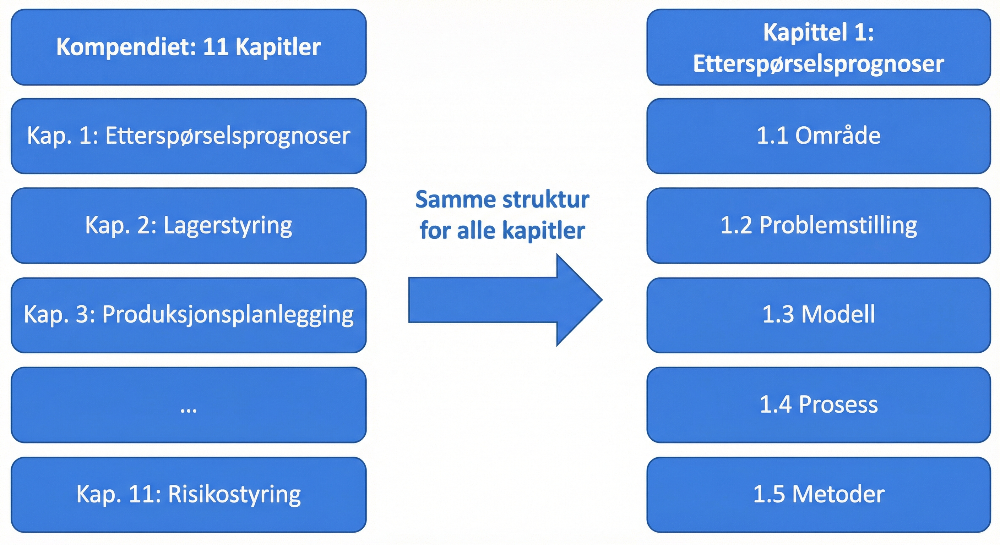

Kapittelstruktur.

Eksempel [Kapittel 1: Etterspørselsprognoser]
Kapittel 1 *Etterspørselsprognoser* er strukturert slik:

- **1.1 Område:** Etterspørselsprognoser

- **1.2 Problemstilling:** Hva blir salget neste måned? Hvordan påvirker sesong og kampanjer etterspørselen?

- **1.3 Modell:** ARIMA, eksponentiell glatting, nevrale nettverk

- **1.4 Prosess:** Samle historiske data → Sjekk antagelser → Tilpass modell → Sjekk prognose → Bruk i praksis

- **1.5 Metoder:** Tidsrekkeanalyse, Maskinlæring

Denne strukturen sikrer at du alltid finner samme type informasjon på samme sted i hvert kapittel, noe som gjør kompendiet lettere å navigere og bruke som oppslagsverk.

Område

## Område
Definisjon [Område]
Et **område** definerer hvilket område eller fagfelt innenfor logistikk prosjektet skal handle om.

Dette er utgangspunktet for alt arbeid -- før vi kan løse et problem, må vi vite hvor i logistikklandskapet vi befinner oss.

Det finnes mange områder innen kvantitativ logistikk. Kompendiet fokuserer på følgende 11:

1.  **Etterspørselsprognoser** -- *Hva blir salget neste måned?* -- Predikere fremtidig etterspørsel basert på historiske data, trender og sesongvariasjoner

2.  **Lagerstyring** -- *Hvor mye skal vi bestille, og når?* -- Optimalisere lagernivåer, bestillingsmengder og bestillingstidspunkter

3.  **Produksjonsplanlegging og -styring** -- *Hva skal vi produsere i dag?* -- Planlegge produksjon, allokere kapasitet og sekvensere jobber

4.  **Nettverksdesign og optimering** -- *Hvor skal lageret ligge?* -- Designe logistikknettverk og optimalisere infrastruktur

5.  **Forsyningskjedeanalyse og -optimering** -- *Hvordan henger alt sammen?* -- Analysere og optimalisere hele forsyningskjeden

6.  **Kø-teori og kapasitetsplanlegging** -- *Hvor mange kasser må være åpne?* -- Dimensjonere kapasitet og håndtere køer

7.  **Lagerdrift og ordreplukk** -- *Hvordan plukke ordrene raskest?* -- Optimalisere lagerlayout og plukkprosesser

8.  **Bærekraftig logistikk** -- *Hvordan kutte utslipp?* -- Minimere miljøpåvirkning i logistikkoperasjoner

9.  **Returlogistikk og sirkulære forsyningskjeder** -- *Hva gjør vi med returene?* -- Håndtere returstrømmer og sirkulærøkonomi

10. **Innkjøpsoptimalisering og leverandørstyring** -- *Hvem skal vi kjøpe fra?* -- Velge leverandører og optimalisere innkjøpsavtaler

11. **Risikostyring og robusthet i forsyningskjeder** -- *Hva om leverandøren svikter?* -- Identifisere og håndtere risikoer i forsyningskjeden

Valg av område gir retning for prosjektet og avgrenser problemområdet. Hvert av disse områdene behandles i egne kapitler senere i kompendiet.

Problemstilling

## Problemstilling
Definisjon [Problemstilling]
En **problemstilling** er en formulering med ord av hvilket spesifikt problem prosjektet skal løse eller hvilke spørsmål det skal svare på.

Innenfor hvert område finnes det mange konkrete utfordringer.

En god problemstilling er:

- **Spesifikk** -- Klart avgrenset og konkret

- **Målbar** -- Kan kvantifiseres eller verifiseres

- **Relevant** -- Har praktisk betydning for organisasjonen

- **Forståelig** -- Kan kommuniseres uten matematikk

Eksempel [Problemstillinger innenfor ulike områder]
Her er typiske problemstillinger fra ulike logistikkområder:

1.  *Etterspørselsprognoser:*
    Hva blir det forventede salget av produkt X neste måned?

2.  *Lagerstyring:*
    Hvor mye bør vi bestille hver gang, og når skal vi bestille?

3.  *Produksjonsplanlegging:*
    Hvor mye skal vi produsere av hvert produkt for å møte etterspørsel med minimal kostnad?

4.  *Nettverksdesign:*
    Hvor skal vi plassere et nytt lager for å minimere totale transportkostnader?

5.  *Forsyningskjede:*
    Hvordan kan vi koordinere leverandører, produksjon og distribusjon for å redusere ledetiden?

6.  *Kapasitetsplanlegging:*
    Hvor mange kasser må vi ha åpne for å holde gjennomsnittlig ventetid under 5 minutter?

7.  *Lagerdrift:*
    Hvordan skal vi plassere varene i lageret for å minimere plukkavstand?

8.  *Bærekraft:*
    Hvordan kan vi redusere CO$_2$-utslipp med 20% uten å øke kostnadene vesentlig?

9.  *Returlogistikk:*
    Hvordan skal vi håndtere returer og gjenbruk av produkter mest effektivt?

10. *Innkjøp:*
    Hvilken leverandør bør vi velge basert på pris, kvalitet og leveringssikkerhet?

11. *Risikostyring:*
    Hvor stort sikkerhetslager trenger vi for å håndtere usikkerhet i leveranser?

Problemstillingen danner bro mellom det generelle området og den matematiske modellen som følger.

Modell

## Modell
Definisjon [Modell]
En **modell** er en matematisk beskrivelse av problemstillingen.

Der problemstillingen formuleres med ord, oversetter modellen dette til matematiske symboler, ligninger og ulikheter. Modellen er kjernen i den kvantitative tilnærmingen -- den lar oss anvende matematiske metoder for å finne løsninger.

### Komponenter i en modell
Enhver matematisk modell består av fire hovedkomponenter:

1.  **Parametre (data)**
    *Hva vet vi allerede?* Kjente størrelser som er gitt på forhånd og som vi ikke kan endre. Dette er inputdata til modellen.

2.  **Variabler (beslutninger)**
    *Hva kan vi bestemme?* Størrelser vi har kontroll over og kan velge verdien på. Dette er beslutningene modellen skal hjelpe oss å ta.

3.  **Målsetting (målfunksjon)**
    *Hva vil vi oppnå?* Et matematisk uttrykk som beskriver hva vi ønsker å optimalisere. Dette kan være å minimere kostnader, maksimere profitt, minimere tid, etc.

4.  **Føringer (begrensninger og antagelser)**
    *Hvilke regler gjelder?* Matematiske uttrykk som beskriver rammebetingelser og forutsetninger som må oppfylles.

Eksempel [Modellkomponenter for EOQ-modellen]
Her er de fire komponentene for den klassiske lagermodellen (EOQ):

1.  *Parametre (gitt, kan ikke endres):*
    $D$ = årlig etterspørsel (enheter per år),
    $K$ = bestillingskostnad (kr per ordre),
    $h$ = lagerkostnad (kr per enhet per år)

2.  *Variabler (kan bestemmes):*
    $Q$ = bestillingsmengde (enheter)

3.  *Målsetting:*
    $\min TC(Q) = \frac{D}{Q}K + \frac{Q}{2}h$ (minimere totalkostnad)

4.  *Føringer:*
    $Q > 0$ (bestillingsmengden må være positiv)

### Formulering av modell
En fullstendig modellformulering består av:

- Definisjon av alle parametre med beskrivelse og notasjon

- Definisjon av alle beslutningsvariabler med beskrivelse og notasjon

- Målfunksjon som skal optimaliseres (minimeres eller maksimeres)

- Begrensninger som må tilfredsstilles

- Antagelser om systemet og dataene

Eksempel [Komplett EOQ-modell]
Dette eksempelet viser en komplett modellformulering for lagerstyring, basert på den klassiske EOQ-modellen.

1.  *Parametre (gitt, kan ikke endres):*

    - $D$ = årlig etterspørsel (enheter per år)

    - $K$ = bestillingskostnad per ordre (kr)

    - $h$ = lagerkostnad per enhet per år (kr)

2.  *Variabler (kan bestemmes):*

    - $Q$ = bestillingsmengde (enheter)

3.  *Målsetting:*

    $$\text{Minimer } TC(Q) = \frac{D}{Q}K + \frac{Q}{2}h$$

    1

4.  *Føringer:*

    $$Q > 0$$

    2

    Antagelser: Konstant etterspørsel, ingen leveringstid, ingen mengderabatter.

Modellen oversetter problemstillingen *"Hvor mye bør vi bestille?"* til et matematisk optimaliseringsproblem som kan løses med egnede metoder.

Prosess

## Prosess
Definisjon [Prosess]
En **prosess** er en stegvis fremgangsmåte for hvordan man skal gjennomføre et kvantitativt logistikkprosjekt og komme frem til en løsning.

*Fra kaos til struktur -- fem steg som sikrer at løsningen fungerer i praksis.*

Selv om man har en god modell, kan man ikke hoppe rett til å løse ligningene -- man må følge en systematisk prosess for å sikre at løsningen er gyldig, nøyaktig og anvendbar i praksis. Kompendiet følger en standardisert femtrinns prosess, illustrert i figur [2](#fig-fig-prosess-fem-steg).

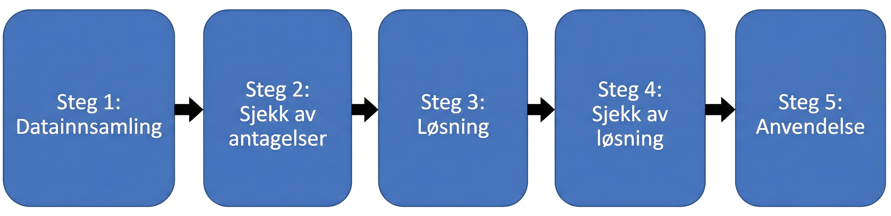

Prosessens fem steg.

### Steg 1: Datainnsamling
*Modellen er bare så god som dataene den bygger på.*

Det første steget er å samle inn de dataene som trengs for å populere modellens parametre. Dette inkluderer:

- **Historiske data** -- *Hva har skjedd før?* -- Salg, kostnader, leveringstider

- **Operasjonelle data** -- *Hva kan vi gjøre?* -- Kapasiteter, ressurser, begrensninger

- **Markedsdata** -- *Hva skjer rundt oss?* -- Konkurrenter, trender, sesongvariasjoner

- **Finansielle data** -- *Hva koster det?* -- Priser, kostnader, budsjetter

*Viktige hensyn:* Datakvalitet, fullstendighet, relevans, aktualitet

### Steg 2: Sjekk av antagelser
*En modell som bygger på feil forutsetninger gir feil svar.*

Før modellen kan anvendes, må man verifisere at antagelsene modellen bygger på faktisk holder i praksis. Dette kan innebære:

- **Statistiske tester** -- *Holder tallene mål?* -- Normalitet, stasjonaritet, uavhengighet

- **Grafisk analyse** -- *Hva viser plottene?* -- Visuell inspeksjon av mønstre og avvik

- **Fagsjekk** -- *Gir det mening i praksis?* -- Sjekk mot fagpersoner som kjenner området

- **Sensitivitetsanalyse** -- *Hva om vi tar feil?* -- Test robusthet mot endringer i kritiske antagelser

Hvis antagelsene ikke holder, må modellen eventuelt justeres eller en alternativ modell velges.

### Steg 3: Løsning
*Her finner vi svaret -- men veien dit avhenger av problemet.*

Dette steget innebærer å finne de beslutningsvariablene som optimaliserer målfunksjonen gitt begrensningene. Avhengig av modelltype kan dette gjøres:

- **Analytisk** -- *Finnes det en formel?* -- Utlede en eksakt løsning matematisk

- **Numerisk** -- *La maskinen regne!* -- Beregne seg frem til en tallverdi når ingen formel finnes

- **Simulering** -- *Hva skjer hvis\...?* -- Etterlikne systemet og teste ulike scenarioer

- **Heuristikker** -- *God nok er ofte godt nok.* -- Tommelfingerregler for gode (ikke nødvendigvis optimale) løsninger

*Output:* Optimale eller gode verdier for beslutningsvariablene

### Steg 4: Sjekk av løsning
*Matematisk korrekt betyr ikke alltid praktisk fornuftig.*

Etter at en løsning er funnet, må man sjekke at den faktisk gir mening og fungerer i praksis:

- **Realitetssjekk** -- *Er dette gjennomførbart?* -- Sjekk at løsningen er realistisk i praksis

- **Benchmarking** -- *Hvordan gjør andre det?* -- Sammenlign med eksisterende praksis eller bransjestandarder

- **Sensitivitetsanalyse** -- *Hva om tallene endres?* -- Test hvordan løsningen påvirkes av parameterendringer

- **Pilottesting** -- *Fungerer det i virkeligheten?* -- Test løsningen i begrenset skala før full utrulling

### Steg 5: Anvendelse
*Verdien av en løsning realiseres først når den tas i bruk.*

Det siste steget er å anvende modellen og løsningen i praksis:

- **Implementering** -- *Nå skjer det!* -- Sette beslutningene ut i livet i organisasjonen

- **Oppdatering** -- *Verden endrer seg.* -- Oppdatere modellen med nye data over tid

- **Overvåking** -- *Holder det?* -- Følge med på ytelsen og justere ved behov

- **Dokumentasjon** -- *Hva lærte vi?* -- Dokumentere og kommunisere resultatene

Denne femtrinns prosessen sikrer at man går systematisk fra problemstilling til praktisk anvendbar løsning. Hvert steg er avhengig av de foregående, og man må ofte iterere mellom stegene når man lærer mer om problemet.

Metoder

## Metoder
Definisjon [Metoder]
**Metoder** er de konkrete teknikkene, algoritmene og verktøyene vi anvender i hvert steg av prosessen.

Der prosessen beskriver *hva* vi skal gjøre, beskriver metodene *hvordan* vi skal gjøre det.

Ulike steg i prosessen krever ulike metoder:

### Metoder for steg 1: Datainnsamling
*Hvor kommer tallene fra?* Her henter vi inn dataene som skal brukes i modellen.

- **Databaser og ERP-systemer** -- *Hva vet bedriften allerede?* -- Historiske transaksjoner, lager, salg

- **Spørreundersøkelser og intervjuer** -- *Hva mener folk?* -- Kvalitative data fra ansatte og kunder

- **Sensorer og IoT-enheter** -- *Hva skjer akkurat nå?* -- Sanntidsdata fra maskiner og utstyr

- **API-integrasjoner** -- *Hva vet andre?* -- Eksterne data fra leverandører, marked, vær

### Metoder for steg 2: Sjekk av antagelser
*Stemmer forutsetningene?* Her tester vi om modellens antagelser holder i praksis.

- **Statistiske tester** -- *Er forskjellene reelle?* -- t-test, F-test, $\chi^2$-test

- **Grafisk analyse** -- *Hva viser bildene?* -- Histogram, QQ-plot, tidsserieplot

- **Korrelasjonsanalyse** -- *Henger ting sammen?* -- Sammenheng mellom variabler

- **Residualanalyse** -- *Hva fanget vi ikke opp?* -- Analyse av avvik mellom modell og data

### Metoder for steg 3: Løsning
*Hvordan finner vi svaret?* Her løser vi modellen og finner verdiene for beslutningsvariablene.

- **LP -- Lineær programmering**
  *Optimer med rette linjer.* Finn beste løsning når både mål og begrensninger er lineære.

  - Trinnvis optimering (Simplex)

  - Indre-punkt-metoder (Interior point)

  - Problemoppdeling (Dekomponering)

  - Skyggepriser (Dualitet)

- **HP -- Heltallsprogrammering**
  *Når svaret må være helt.* For beslutninger som krever hele tall, f.eks. antall lastebiler.

  - Grensøk (Branch-and-bound)

  - Grensøk med kutt (Branch-and-cut)

  - Forenkling med straff (Lagrange)

  - Masterplan-oppdeling (Benders)

- **DP -- Dynamisk programmering**
  *Løs steg for steg.* Del opp problemet i mindre delproblemer og bygg opp løsningen.

  - Optimalitetsprinsippet (Bellman\'s principle)

  - Verdibasert løsning (Value iteration)

  - Regelbasert løsning (Policy iteration)

  - Usikker fremtid (Stochastic DP)

- **Sim -- Simulering**
  *Etterlikn virkeligheten.* Test ulike scenarioer i en datamodell før du gjør det i praksis.

  - Tilfeldig sampling (Monte Carlo)

  - Hendelsesdrevet simulering (DES -- Discrete Event Simulation)

  - Aktørbasert (Agentbasert)

  - Systemdynamikk (System Dynamics)

- **Kø -- Køteori**
  *Forstå ventetid.* Analyser køer og dimensjoner kapasitet for å unngå flaskehalser.

  - Enkeltkø (Single-server queue)

  - Flerkø (Multi-server queue)

  - Prioritetskøer (Priority queues)

  - Kønettverk (Jackson networks)

- **Net -- Nettverks- og ruteoptimalisering**
  *Finn beste vei.* Optimer ruter og flyt gjennom nettverk av veier, rør eller forbindelser.

  - Korteste vei (Shortest path)

  - Alle-par korteste vei (All-pairs shortest path)

  - Billigste flyt (Min-cost flow)

  - Maksimal flyt (Max-flow)

- **Heu -- Heuristikker og metaheuristikker**
  *Gode nok løsninger raskt.* Finn gode (men ikke garantert optimale) løsninger på komplekse problemer.

  - Evolusjonær søking (Genetic algorithms)

  - Minne-basert søking (Tabu search)

  - Gradvis avkjøling (Simulated annealing)

  - Svermbasert søking (Particle swarm)

- **Tid -- Tidsrekkeanalyse og prognosemetoder**
  *Spå fremtiden fra fortiden.* Bruk historiske mønstre til å forutsi fremtidig etterspørsel.

  - Trendanalyse (ARIMA)

  - Vektet gjennomsnitt (Exponential smoothing)

  - Automatisk prognose (Automated forecasting)

  - Sesongoppdeling (Decomposition)

- **Lag -- Lagerstyringsmodeller**
  *Riktig mengde til rett tid.* Bestem hvor mye og når du skal bestille varer.

  - Økonomisk ordrekvantum (EOQ -- Economic Order Quantity)

  - Bestillingspunkt (Reorder point)

  - Periodisk gjennomgang (Periodic review)

  - Engangsbestilling (Newsvendor)

- **Mul -- Multikriterie-beslutningsmetoder**
  *Veie flere hensyn.* Ta beslutninger når du må balansere flere motstridende mål.

  - Hierarkisk vekting (AHP -- Analytic Hierarchy Process)

  - Rangering mot ideal (TOPSIS -- Technique for Order of Preference by Similarity to Ideal Solution)

  - Parvis sammenligning (ELECTRE -- Élimination et Choix Traduisant la Réalité)

  - Preferanserangering (PROMETHEE -- Preference Ranking Organization Method for Enrichment Evaluations)

- **ML -- Maskinlæring**
  *La datamaskinen lære.* Tren modeller på data slik at de kan gjenkjenne mønstre og gjøre prediksjoner.

  - Kunstige nevroner (Neural networks)

  - Beslutningstrær (Random Forest)

  - Ensemble-metoder (Gradient Boosting)

  - Klyngeanalyse (k-means)

- **ABC -- ABC-analyse og klassifisering**
  *Prioriter det viktigste.* Klassifiser produkter etter verdi for å fokusere innsatsen riktig.

  - Verdiklassifisering (Pareto)

  - Variabilitetsanalyse (XYZ)

  - Kombinert klassifisering (ABC-XYZ)

  - Flerkriterievurdering (Multikriterie-ABC)

### Metoder for steg 4: Sjekk av løsning
*Kan vi stole på svaret?* Her tester vi om løsningen er robust og gir mening.

- **Sensitivitetsanalyse** -- *Hva om tallene endres?* -- Test robusthet mot parameterendringer

- **Scenarioanalyse** -- *Hva om verden endres?* -- Test løsningen under ulike fremtidsscenarioer

- **Backtesting** -- *Ville det fungert før?* -- Testing på historiske data

- **Kryssvalidering** -- *Fungerer det på nye data?* -- Test på data modellen ikke har sett

### Metoder for steg 5: Anvendelse
*Hvordan bruker vi løsningen?* Her implementerer vi løsningen i praksis.

- **Beslutningsstøttesystemer** -- *Hjelp til å velge.* -- Verktøy som presenterer alternativer og anbefalinger

- **Dashboards og visualisering** -- *Se status med et blikk.* -- Grafiske oversikter over nøkkeltall

- **Automatisering og integrasjon** -- *La maskinen gjøre jobben.* -- Koble modellen til bedriftens systemer

- **Kontinuerlig forbedring** -- *Aldri ferdig!* -- PDCA-syklus for løpende justering

Antall metoder og hvilke metoder som brukes varierer fra prosjekt til prosjekt. Noen problemstillinger krever kun én eller to metoder, mens andre krever flere metoder brukt i kombinasjon.

Slutt · Kapittel I

---

# Del I — Kapittel II: Arbeidsflyt og KI

Del I · Kapittel II

II

# Arbeidsflyt og KI
Hvordan de fem begrepene henger sammen, og hvordan KI kan bli et verktøy i arbeidsflyten.

[][][][][]
De fem begrepene -- område, problemstilling, modell, prosess og metoder -- danner en logisk kjede fra problem til løsning. Samtidig har kunstig intelligens (KI) endret måten vi kan arbeide med kvantitative metoder på. Dette kapittelet viser hvordan begrepene henger sammen, og hvordan KI kan brukes som verktøy i arbeidsflyten.

Arbeidsflyt

## Arbeidsflyt
Begrepene bygger på hverandre og utgjør en naturlig arbeidsflyt. Denne logiske overgangen -- fra område via problemstilling, modell og prosess til metoder -- sikrer at vi arbeider systematisk mot en løsning. Figur [1](#fig-fig-kompendiet-tilnaerming) illustrerer denne sammenhengen.

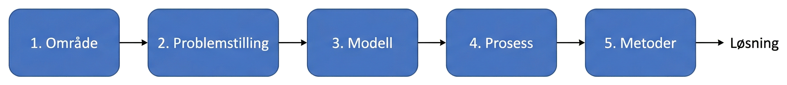

Arbeidsflyt.

Arbeidsflyten kan oppsummeres i fem steg:

1.  Velg et **område** basert på virksomhetens behov

2.  Formuler en spesifikk **problemstilling** innenfor området

3.  Utvikle en **modell** som matematisk representerer problemstillingen

4.  Følg den femtrinns **prosessen** fra data til anvendelse

5.  Bruk egnede **metoder** i hvert steg av prosessen

Hvert steg bygger på det forrige: uten et klart definert område kan vi ikke formulere en presis problemstilling, uten en problemstilling kan vi ikke utvikle en relevant modell, og uten en modell har vi ingen struktur for prosessen eller metodene. Denne avhengigheten mellom stegene gjør det viktig å arbeide grundig med hvert begrep før man går videre til neste.

Tabell [1](#tab-tab-eksempel-sammenheng) viser et komplett eksempel på hvordan begrepene henger sammen:

De fem begrepene - eksempel.

  -------------------------------------------------------------------------------------------------------------------------------------------------
  **Nr.**                 **Begrep**              **Eksempel**
  ----------------------- ----------------------- -------------------------------------------------------------------------------------------------
  1                       Område                  Lagerstyring

  2                       Problemstilling         Hvor mye skal vi bestille av produkt X, og når skal vi bestille?

  3                       Modell                  EOQ-modell med parametre $D$, $K$, $h$; variabel $Q$; målfunksjon minimere totalkostnad

  4                       Prosess                 Steg 1: Samle data om etterspørsel og kostnader\
                                                  Steg 2: Sjekk at etterspørsel er konstant\
                                                  Steg 3: Beregn optimal $Q^\*$\
                                                  Steg 4: Sjekk mot praksis\
                                                  Steg 5: Implementer bestillingspolitikk

  5                       Metoder                 Steg 1: Datauttrekk fra ERP\
                                                  Steg 2: Statistiske tester\
                                                  Steg 3: Analytisk løsning av EOQ-formel\
                                                  Steg 4: Sensitivitetsanalyse\
                                                  Steg 5: Dashboard
  -------------------------------------------------------------------------------------------------------------------------------------------------

KI

## KI
Tradisjonelt krever bruk av kvantitative metoder dyp matematisk kunnskap og programmeringsferdigheter. Med KI kan vi nå løse komplekse problemstillinger uten å beherske alle tekniske detaljer.

Dette krever imidlertid en ny ferdighet: **evnen til å styre KI på et overordnet nivå**. Du må kunne kommunisere tydelig hva du ønsker å oppnå, uten nødvendigvis å kjenne til alle matematiske formler eller programmeringsspråk. Dette er utfordrende, men samtidig en verdifull kompetanse som blir stadig viktigere.

Gjennom dette kompendiet og kurset LOG650 skal du trene på nettopp dette:

- **Forstå** hvilke problemstillinger de ulike metodene kan løse

- **Formulere** problemstillingen tydelig slik at KI kan hjelpe deg

- **Vurdere** om resultatene KI gir er rimelige og riktige

- **Styre** KI-prosessen uten å måtte beherske alle tekniske detaljer

- **Idemyldre** sammen med KI for å utforske nye løsninger og tilnærminger

Målet er at du skal bli i stand til å bruke KI som et kraftig verktøy for å løse reelle logistikkproblemer -- selv uten dyp matematisk eller teknisk bakgrunn. Kompendiet er ment å initiere idemyldring, og du kan bruke KI til å videreutvikle og forfølge ideene videre.

Slutt · Kapittel II

---

# Del I — Kapittel III: Prosjektgjennomføring med KI

Del I · Kapittel III

III

# Prosjektgjennomføring med KI
Rolleavklaring og fire faser --- fra idé til ferdig rapport.

[][][][][]
Dette kapittelet beskriver hvordan du gjennomfører et forskningsprosjekt i logistikk ved hjelp av KI. Prosjektet er organisert i fire faser som følger prinsipper fra prosjektledelse: initiering, planlegging, gjennomføring og avslutning.

Rolleavklaring

## Rolleavklaring
I et KI-støttet prosjekt er det viktig å forstå hva som er din rolle og hva KI kan bidra med. Tabell [1](#tab-tab-rollefordeling) viser rollefordelingen mellom deg og KI gjennom prosjektet.

Rollefordeling.

  **Din rolle (student)**                     **KIs rolle**
  ------------------------------------------- ----------------------------------------------
  Velge område og formulere problemstilling   Foreslå relevante metoder og tilnærminger
  Skaffe og vurdere data                      Prosessere og analysere data
  Velge metode og validere resultater         Bygge modell, generere kode og løse modellen
  Kvalitetssikre og presentere                Generere rapport og visualiseringer

Du har ansvar for de faglige valgene og kvalitetssikringen, mens KI fungerer som et kraftig verktøy for analyse, koding og dokumentasjon. Denne fordelingen sikrer at du utvikler egen forståelse samtidig som du utnytter KIs kapasitet.

Fire faser

## Fire faser
I LOG650 deler vi prosjektet inn i fire faser som følger en naturlig progresjon fra idé til ferdig resultat. Fasene bygger på hverandre, og hver fase har konkrete leveranser som må godkjennes før du går videre. Figur [1](#fig-fig-fire-faser) illustrerer fasene og leveransene.


Fire faser med leveranser.

Tabell [2](#tab-tab-faser-begreper) viser hvordan fasene korresponderer med de fem begrepene fra kapittel [?](#ref-ch-begreper).

Fire faser.

  **Nr.**   **Fase**        **Begreper**                      **Aktivitet**
  --------- --------------- --------------------------------- -----------------------------------
  1         Initiering      Område, Problemstilling, Metode   Definere prosjektet
  2         Planlegging     Modell                            Planlegge modellbyggingen
  3         Gjennomføring   Prosess, Metoder                  Samle data, bygge, løse, validere
  4         Avslutning      --                                Dokumentere og presentere

### Fase 1: Initiering
Begreper: *Område, Problemstilling, Metode.*

I denne fasen definerer du prosjektet:

- **Område** -- *Hvilket logistikkområde skal du jobbe med?* -- Velg et område fra listen i avsnitt [?](#ref-sec-omrade).

- **Problemstilling** -- *Hvilken konkret utfordring skal løses?* -- Problemstillingen må være logistikk- eller SCM-relatert, og bruken av KI skal være en sentral del av løsningsopplegget.

- **Metode** -- *Hvilken kvantitativ metode passer best?* -- Begrunn valget basert på avsnitt [?](#ref-sec-metoder-steg3).

Leveranse: Godkjent prosjektbeskrivelse med problemstilling, mål, foreløpig teori og KI-vinkel.

### Fase 2: Planlegging
Begrep: *Modell.*

Når problemstilling og metode er valgt, planlegger du hvordan modellen skal bygges:

- **Kravspesifikasjon** -- *Hva skal løsningen inneholde?* -- Definer funksjonelle og ikke-funksjonelle krav.

- **Fremdriftsplan** -- *Hvilke oppgaver må gjøres?* -- Lag en oppgaveliste med rekkefølge og milepæler.

- **Forskningsplan** -- *Hvordan skal du gå frem?* -- Beskriv datakilder, KI-metoder og etiske vurderinger.

- **Risikoanalyse** -- *Hva kan gå galt?* -- Identifiser risiko og planlegg håndtering.

Leveranse: Godkjent prosjektplan med kravspesifikasjon, fremdriftsplan og metodevalg.

### Fase 3: Gjennomføring
Begreper: *Prosess, Metoder.*

I denne fasen følger du prosessen og anvender metodene for å løse problemstillingen:

1.  **Datainnsamling** -- *Hvor kommer dataene fra?* -- Skaff og klargjør data for problemstillingen.

2.  **Modellering** -- *Hvordan representeres problemet?* -- Bygg en matematisk modell basert på valgt metode.

3.  **Implementering** -- *Hvordan løses modellen?* -- KI hjelper deg å generere Python-kode som henter data, implementerer metoden, løser modellen og presenterer resultatene.

4.  **Sjekk** -- *Er resultatene troverdige?* -- Kontroller kritisk om resultatene er rimelige.

Underveis dokumenteres fremdrift, milepæler og eventuelle avvik. Leveranse: Godkjent hovedutkast til forskningsrapport.

### Fase 4: Avslutning
Avslutningsvis dokumenterer og presenterer du resultatene. Vi anbefaler at du leser kompendiet om vitenskapelig skriving (kommer 2026) før du starter rapportskrivingen.

- **Rapportskriving** -- *Hvordan dokumenteres arbeidet?* -- KI hjelper deg å skrive forskningsrapporten med problemstilling, teori, metode, resultater og konklusjoner.

- **Visualisering** -- *Hvordan presenteres resultatene?* -- KI lager visualiseringer og grafer.

- **Kvalitetssikring** -- *Er rapporten god nok?* -- Du kvalitetssikrer og ferdigstiller rapporten.

- **Presentasjon** -- *Hvordan formidles arbeidet?* -- Du presenterer arbeidet muntlig for medstudenter og faglærer(e).

Leveranse: Endelig forskningsrapport og muntlig presentasjon.

Slutt · Kapittel III

---

# Del II — Kapittel 1: Etterspørselsprognoser

Del II · Kapittel 1

1

# Etterspørselsprognoser
Fra klassisk tidsserie til moderne maskinlæring --- SARIMA, ARIMAX og LightGBM i tjeneste for logistikkprognoser.

[][][][][]
Område

## Område
Etterspørselsprognoser er fundamentet for effektiv logistikkplanlegging. Ved å predikere hva kundene vil etterspørre i fremtiden, kan virksomheter optimalisere lagerbeholdning, produksjonskapasitet og transportressurser. Gode prognoser reduserer kostnader, øker servicenivået og forbedrer beslutningsgrunnlaget i hele forsyningskjeden.

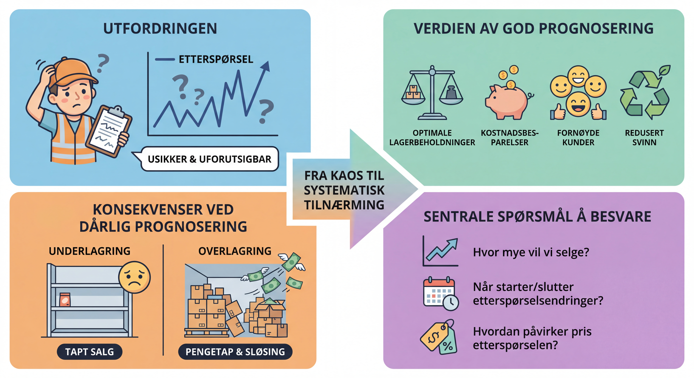

Etterspørselsprognoser: utfordringer, konsekvenser og verdien av god prognosering.

Definisjon [Etterspørselsprognoser]
**Etterspørselsprognoser** er prosessen med å estimere fremtidig etterspørsel basert på historiske data, sesongvariasjoner og eksterne faktorer.

Området omfatter prognoser på ulike tidshorisonter:

- Kortsiktige prognoser (dager til uker) --- for lagerpåfylling og bemanning

- Mellomlange prognoser (måneder) --- for produksjonsplanlegging og innkjøp

- Langsiktige prognoser (år) --- for kapasitetsinvesteringer og strategisk planlegging

Prognoser er input til flere andre områder som behandles i dette kompendiet:

- Lagerstyring --- prognosene bestemmer hvor mye som må bestilles

- Produksjonsplanlegging --- prognosene styrer produksjonsvolum

- Kapasitetsplanlegging --- prognosene dimensjonerer ressursbehov

- Innkjøp --- prognosene påvirker leverandøravtaler og bestillinger

Problemstillinger, modeller og metoder

## Problemstillinger, modeller og metoder
I det følgende presenteres fem sentrale problemstillinger innen etterspørselsprognoser med tilhørende modeller og metoder, som illustrert i figur [2](#fig-fig-problemstillinger-oversikt). De tre første problemstillingene utdypes med eksempler og figurer, mens de to siste gis en kortere introduksjon.

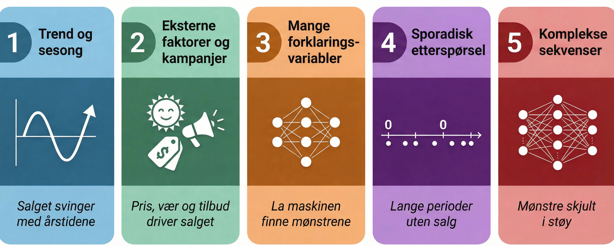

Fem sentrale problemstillinger innen etterspørselsprognoser.

Nøkkelen til god prognostisering er å velge riktig modell og metode for den aktuelle problemstillingen. Tabell [1](#tab-tab-prognosemodeller-oversikt) gir en oversikt over hvilke modeller og metoder som egner seg for de fem problemstillingene. Metodene uthevet med rødt vil bli gått gjennom i de tre neste avsnittene.

Oversikt over modeller og metoder for de fem sentrale problemstillingene.

  **Nr.**   **Problemstilling**                            **Modeller**                                      **Metoder**
  --------- ---------------------------------------------- ------------------------------------------------- -----------------------------------------------------------------
  1         Trend og sesong                  ETS (Holt-Winters), ARIMA, SARIMA   Box-Jenkins, eksponentiell utjevning, ADF-test, ACF/PACF
  2         Eksterne faktorer og kampanjer   ARIMAX, Prophet                     Feature engineering, regresjonsanalyse, kampanjeløft-estimering
  3         Mange forklaringsvariabler       Random Forest, XGBoost, LightGBM    Gradient boosting, kryssvalidering, SHAP, hyperparametertuning
  4         Sporadisk etterspørsel                         Croston, SBA                                      Separat estimering av intervall og størrelse
  5         Komplekse sekvenser                            LSTM, Transformer                                 Deep learning, attention-mekanismer

Trend og sesong med SARIMA

## Eksempel: Trend og sesong med SARIMA
Oppsummering.

  **Kategori**      **Beskrivelse**
  ----------------- ---------------------------------------------------
  Eksempel          Salgsprognose for traktorprodusent
  Område            Etterspørselsprognoser med trend og sesong
  Problemstilling   Predikere månedlig salg med tydelig sesongmønster
  Modell            SARIMA$(p,d,q)(P,D,Q)_m$
  Prosess           Box-Jenkins-metoden
  Metode            ADF-test, ACF/PACF-analyse, MLE, Ljung-Box-test

### Problemstilling
PowerHorse, en traktor- og landbruksutstyrsprodusent, har vist jevn vekst i omsetningen siden oppstarten. Selskapet har imidlertid slitt med å holde lager- og produksjonskostnader nede på grunn av variabilitet i salg og etterspørsel. Ledelsen er under press fra aksjonærer og styre for å redusere produksjonskostnadene.

En av produksjonsenhetene ligger i Sørøst-Asia og betjener nærliggende markeder. Denne enheten er relativt ny og har begrenset forhandlingsmakt med leverandører for å implementere Just-in-Time (JiT) produksjonsprinsipper. Derfor ønsker de å være i forkant av produksjonsplanleggingen for å opprettholde sunne marginer. Månedlig salgsprognose er første steg mot effektiv lagerstyring.

**Problemstilling** --- *Hvordan kan vi predikere månedlig salg for neste år?*

Med 12 års historiske data og tydelige sesongmønstre i traktorsalget, kan vi bruke SARIMA-modellering til å fange opp både den langsiktige trenden og de årlige svingningene i etterspørselen.


Landbrukstraktorer fra PowerHorse.

### Modell
For å modellere tidsserier med både trend og sesongmønster bruker vi *Seasonal Autoregressive Integrated Moving Average* (SARIMA). Dette er en utvidelse av den klassiske ARIMA-modellen som eksplisitt håndterer sesongvariasjoner.

Definisjon [SARIMA-modellen]
En SARIMA$(p,d,q)(P,D,Q)_m$-modell er definert ved:

$$\phi_p(B)\, \Phi_P(B^m)\, \nabla^d \nabla_m^D\, Y_t = \theta_q(B)\, \Theta_Q(B^m)\, \varepsilon_t$$

1

der ${Y_t}$ er den observerte tidsserien og ${\varepsilon_t}$ er hvit støy. Tidsindeksen $t = 1, 2, \ldots, T$ er diskret og representerer observasjonstidspunkter med lik avstand (f.eks. måneder eller dager).

I vårt eksempel er $Y_t$ antall solgte traktorer i måned $t$, der $t = 1$ tilsvarer januar 2003 og $t = 144$ tilsvarer desember 2014.

Parametere og notasjon. Modellen har syv parametere som må spesifiseres:

SARIMA-parametere.

  **Parameter**   **Navn**                **Beskrivelse**
  --------------- ----------------------- -------------------------------------------------------------------
  $p$           AR-orden                Antall autoregressive ledd (avhengighet av tidligere verdier)
  $d$           Differensieringsgrad    Antall ganger serien differensieres for å fjerne trend
  $q$           MA-orden                Antall glidende gjennomsnittsledd (avhengighet av tidligere feil)
  $P$           Sesong-AR-orden         Antall sesongautoregressive ledd
  $D$           Sesongdifferensiering   Antall sesongsykluser serien differensieres
  $Q$           Sesong-MA-orden         Antall sesongglidende gjennomsnittsledd
  $m$           Sesongperiode           Antall observasjoner per sesong (f.eks. 12 for månedlige data)

Polynomene. De fire polynomene i ligning [(1)](#eq-eq-sarima-general) er definert som:

$$\begin{aligned}\phi_p(B) &= 1 - \phi_1 B - \phi_2 B^2 - \cdots - \phi_p B^p & \text{(AR-polynom)} \\
\theta_q(B) &= 1 + \theta_1 B + \theta_2 B^2 + \cdots + \theta_q B^q & \text{(MA-polynom)} \\
\Phi_P(B^m) &= 1 - \Phi_1 B^m - \Phi_2 B^{2m} - \cdots - \Phi_P B^{Pm} & \text{(Sesong-AR)} \\
\Theta_Q(B^m) &= 1 + \Theta_1 B^m + \Theta_2 B^{2m} + \cdots + \Theta_Q B^{Qm} & \text{(Sesong-MA)}\end{aligned}$$

der $B$ er *tilbakeskiftoperatoren* definert ved $B^k Y_t = Y_{t-k}$.

Differensieringsoperatorene. For å oppnå stasjonaritet brukes $\nabla^d = (1 - B)^d$ (vanlig differensiering) og $\nabla_m^D = (1 - B^m)^D$ (sesongdifferensiering).

**Tolkning** --- *Hva betyr de ulike komponentene?*

- **AR-ledd** ($\phi$): Fanger opp hvordan dagens verdi avhenger av tidligere verdier. Høy $p$ indikerer lang "hukommelse" i serien.

- **MA-ledd** ($\theta$): Fanger opp hvordan tidligere prognosefeil påvirker dagens verdi. Høy $q$ indikerer at flere tidligere sjokk påvirker dagens verdi.

- **Differensiering** ($d$, $D$): Transformerer en ikke-stasjonær serie til en stasjonær. Høy $d$ fjerner sterkere trend; $D=1$ er vanligvis nok for sesongmønster.

- **Sesongkomponenter** ($P$, $Q$, $m$): Fanger opp mønstre som gjentar seg med fast periode. $P$ og $Q$ fungerer som $p$ og $q$, men på sesongnivå; $m$ angir sesongperioden (f.eks. 12 for månedlige data).

Forutsetninger. For at SARIMA-modellen skal være gyldig, må følgende forutsetninger være oppfylt:

1.  **Stasjonaritet:** Etter differensiering må den transformerte serien $\nabla^d \nabla_m^D Y_t$ være stasjonær.

2.  **Hvit støy:** Residualene $\varepsilon_t$ må være uavhengige og identisk fordelt (i.i.d.) med $E\[\varepsilon_t\] = 0$ og $\text{Var}(\varepsilon_t) = \sigma^2$.

3.  **Invertibilitet:** Røttene til MA-polynomene $\theta_q(B)$ og $\Theta_Q(B^m)$ må ligge utenfor enhetssirkelen. Kravet sikrer at feilleddet $\varepsilon_t$ kan uttrykkes som en konvergent sum av tidligere observasjoner, noe som gir en unik modellrepresentasjon og muliggjør estimering av residualene fra data. For MA(1) modell er kravet $\|\theta_1\| < 1$.

4.  **Kausalitet:** Røttene til AR-polynomene $\phi_p(B)$ og $\Phi_P(B^m)$ må ligge utenfor enhetssirkelen. Kravet sikrer at $Y_t$ kun avhenger av *tidligere* verdier og feil---ikke fremtidige---slik at modellen kan brukes til prognose. For AR(1) modell er kravet $\|\phi_1\| < 1$.

I praksis håndterer moderne programvare disse betingelsene automatisk under parameterestimering.

### Prosess
Prosess: Box-Jenkins-metoden.
Modell: SARIMA$(p,d,q)(P,D,Q)_{m}$.

Box-Jenkins-metoden er en systematisk tilnærming for å identifisere, estimere og validere SARIMA-modeller. Figur [4](#fig-fig-sarima-method) viser de seks stegene i prosessen, fra datainnsamling til prognose.

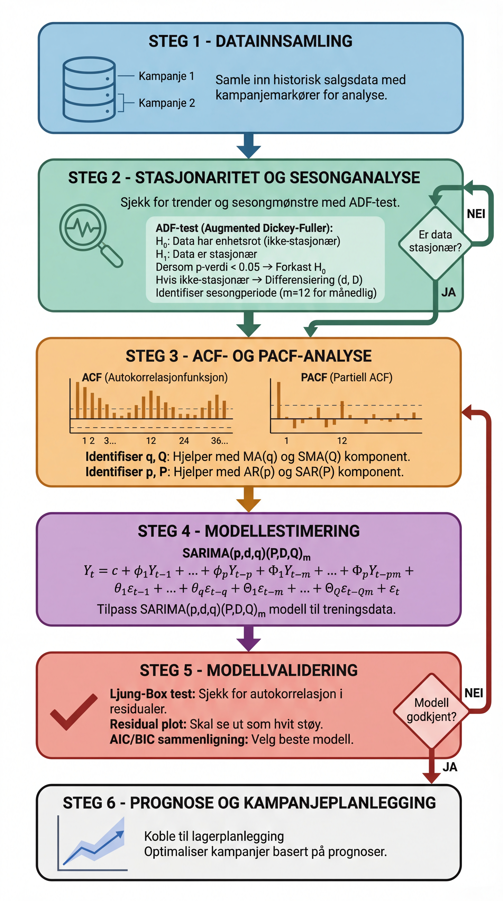

SARIMA Box-Jenkins prosess: En systematisk tilnærming til modellering av tidsserier med trend og sesongkomponenter.

### Steg 1: Datainnsamling
Første steg i Box-Jenkins-metoden er å samle inn og utforske dataene. PowerHorse har tilgang til 12 år med månedlige salgsdata fra sitt Management Information System (MIS), totalt 144 observasjoner fra januar 2003 til desember 2014.

Rådata. Tabell [4](#tab-tab-traktorsalg-data) viser de månedlige salgstallene organisert etter år og måned. Denne hierarkiske strukturen gjør det enkelt å identifisere både sesongmønstre (vertikalt) og trender (horisontalt).

Månedlig traktorsalg $Y_t$ (antall enheter) for PowerHorse, 2003--2014 ($t = 1, \ldots, 144$).

+----------+-----------------------------------------------------------------------------------------------------------------------------------------------+------------------------+
|          | **Måned**                                                                                                                                     |                        |
+----------+-----------+-----------+-----------+-----------+-----------+-----------+-----------+-----------+-----------+-----------+-----------+-----------+------------------------+
| **År**   | **Jan**   | **Feb**   | **Mar**   | **Apr**   | **Mai**   | **Jun**   | **Jul**   | **Aug**   | **Sep**   | **Okt**   | **Nov**   | **Des**   | **Sum**                |
+==========+===========+===========+===========+===========+===========+===========+===========+===========+===========+===========+===========+===========+========================+
| **2003** | 141       | 157       | 185       | 199       | 203       | 189       | 207       | 207       | 171       | 150       | 138       | 165       | **2112** |
+----------+-----------+-----------+-----------+-----------+-----------+-----------+-----------+-----------+-----------+-----------+-----------+-----------+------------------------+
| **2004** | 152       | 165       | 190       | 211       | 209       | 226       | 240       | 241       | 212       | 183       | 172       | 201       | **2402**               |
+----------+-----------+-----------+-----------+-----------+-----------+-----------+-----------+-----------+-----------+-----------+-----------+-----------+------------------------+
| **2005** | 179       | 189       | 224       | 234       | 244       | 255       | 266       | 272       | 237       | 211       | 180       | 201       | **2692**               |
+----------+-----------+-----------+-----------+-----------+-----------+-----------+-----------+-----------+-----------+-----------+-----------+-----------+------------------------+
| **2006** | 200       | 204       | 239       | 259       | 267       | 285       | 295       | 294       | 260       | 229       | 203       | 229       | **2964**               |
+----------+-----------+-----------+-----------+-----------+-----------+-----------+-----------+-----------+-----------+-----------+-----------+-----------+------------------------+
| **2007** | 215       | 231       | 262       | 293       | 297       | 318       | 342       | 340       | 296       | 267       | 238       | 261       | **3360**               |
+----------+-----------+-----------+-----------+-----------+-----------+-----------+-----------+-----------+-----------+-----------+-----------+-----------+------------------------+
| **2008** | 245       | 268       | 296       | 320       | 335       | 363       | 367       | 378       | 330       | 301       | 262       | 281       | **3746**               |
+----------+-----------+-----------+-----------+-----------+-----------+-----------+-----------+-----------+-----------+-----------+-----------+-----------+------------------------+
| **2009** | 263       | 290       | 323       | 350       | 366       | 389       | 407       | 416       | 360       | 323       | 290       | 319       | **4096**               |
+----------+-----------+-----------+-----------+-----------+-----------+-----------+-----------+-----------+-----------+-----------+-----------+-----------+------------------------+
| **2010** | 305       | 320       | 355       | 393       | 408       | 433       | 453       | 448       | 397       | 355       | 315       | 343       | **4525**               |
+----------+-----------+-----------+-----------+-----------+-----------+-----------+-----------+-----------+-----------+-----------+-----------+-----------+------------------------+
| **2011** | 325       | 355       | 386       | 428       | 445       | 473       | 494       | 505       | 438       | 398       | 350       | 386       | **4983**               |
+----------+-----------+-----------+-----------+-----------+-----------+-----------+-----------+-----------+-----------+-----------+-----------+-----------+------------------------+
| **2012** | 364       | 396       | 430       | 473       | 494       | 522       | 543       | 546       | 479       | 427       | 380       | 408       | **5462**               |
+----------+-----------+-----------+-----------+-----------+-----------+-----------+-----------+-----------+-----------+-----------+-----------+-----------+------------------------+
| **2013** | 394       | 431       | 462       | 512       | 534       | 562       | 583       | 591       | 514       | 464       | 411       | 449       | **5907**               |
+----------+-----------+-----------+-----------+-----------+-----------+-----------+-----------+-----------+-----------+-----------+-----------+-----------+------------------------+
| **2014** | 427       | 467       | 510       | 554       | 575       | 605       | 620       | 626       | 546       | 492       | 439       | 472       | **6333** |
+----------+-----------+-----------+-----------+-----------+-----------+-----------+-----------+-----------+-----------+-----------+-----------+-----------+------------------------+

Fra tabellen kan vi allerede observere viktige mønstre: årssummene viser jevn vekst fra 2112 enheter i 2003 til 6333 enheter i 2014---en tredobling over 12 år. Innenfor hvert år ser vi at sommermånedene (juli--august) konsekvent har høyest salg, mens november typisk har lavest.

Visuell analyse. Figur [5](#fig-fig-traktorsalg-data) visualiserer rådataene fra tabell [4](#tab-tab-traktorsalg-data) som en tidsserie, med en tilpasset lineær trendlinje. Fra plottet kan vi identifisere følgende karakteristikker:

1.  **Trend:** Det er en tydelig oppadgående trend over 12-årsperioden. Salget har økt fra rundt 150 traktorer per måned i 2003 til over 600 i 2014.

2.  **Sesongmønster:** Vi observerer et regelmessig årlig mønster med salgstopper i sommermånedene (juni--august) og lavere salg om vinteren. Dette er typisk for landbruksutstyr.

3.  **Variasjon:** Amplituden på sesongsvingningene øker over tid---variansen er ikke konstant, men vokser med nivået.

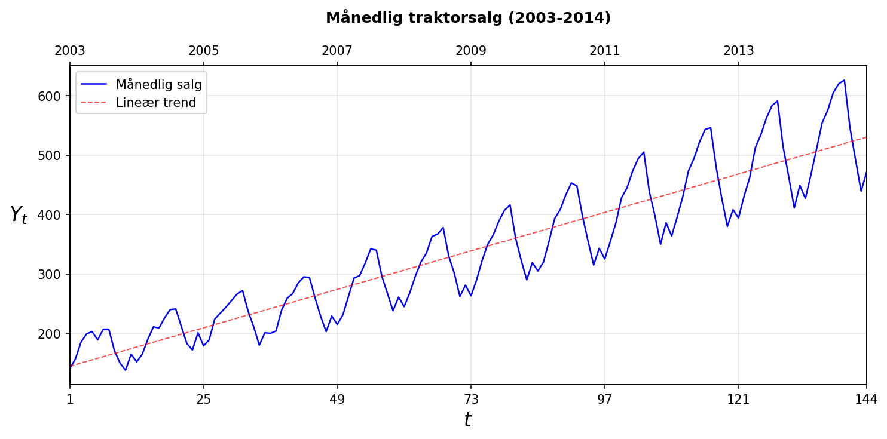

Månedlig traktorsalg $Y_t$ for PowerHorse, 2003--2014 ($t = 1, \ldots, 144$). Den stiplede linjen viser den lineære trenden.

Deskriptiv statistikk. Tabell [5](#tab-tab-traktorsalg-stats) oppsummerer de viktigste statistiske målene for datasettet.

Deskriptiv statistikk for månedlig traktorsalg (2003--2014), basert på data fra tabell [4](#tab-tab-traktorsalg-data).

  **Statistikk**                 **Verdi**
  ------------------------------ -----------
  Antall observasjoner ($n$)   144
  Gjennomsnitt ($\bar{x}$)    337,4
  Standardavvik ($s$)          122,3
  Minimum                        138
  25% kvartil ($Q_1$)          236,2
  Median ($Q_2$)               321,5
  75% kvartil ($Q_3$)          428,5
  Maksimum                       626

Variasjonskoeffisienten er ca. 36% (standardavvik 122,3 delt på gjennomsnitt 337,4), som bekrefter den betydelige variasjonen i plottet. Differansen mellom minimum (138) og maksimum (626) viser at salget varierer med en faktor på over 4,5 gjennom perioden.

**Konklusjon** --- *Hva tyder den visuelle analysen på?*

Tidsserien er tydelig *ikke-stasjonær*. Den oppadgående trenden indikerer at vi sannsynligvis trenger førstegrads differensiering ($d = 1$) for å oppnå stasjonaritet. I neste steg vil vi formelt teste for stasjonaritet ved hjelp av statistiske tester.

### Steg 2: Stasjonaritet og differensiering
For at ARIMA-modeller skal gi gyldige prognoser, må tidsserien være *stasjonær*---det vil si at gjennomsnittet og variansen er konstante over tid, og at autokovariansen kun avhenger av tidsavstanden mellom observasjonene, ikke av tidspunktet selv.

Fra den visuelle analysen i forrige steg observerte vi at tidsserien har:

- En tydelig oppadgående **trend** (gjennomsnittet øker over tid)

- **Økende varians** (sesongsvingningene blir større over tid)

- Et regelmessig **sesongmønster** (årlig syklus)

Alle disse kjennetegnene indikerer at serien er *ikke-stasjonær*. Selv om dette er visuelt tydelig, bekrefter vi konklusjonen med en formell statistisk test før vi transformerer serien for å oppnå stasjonaritet. I dette tilfellet er ikke-stasjonariteten åpenbar fra figur [5](#fig-fig-traktorsalg-data). Den formelle testen blir imidlertid viktigere *etter* transformasjon, der det ikke er like tydelig visuelt om serien har blitt stasjonær.

Definisjon [Augmented Dickey-Fuller (ADF) test]
ADF-testen er en statistisk test for stasjonaritet i tidsserier. Testen undersøker om serien har en *enhetsrot*, som indikerer ikke-stasjonaritet.

**Regresjonsmodell:** ADF-testen baseres på følgende regresjon:

$$\Delta Y_t = \alpha + \beta t + \gamma Y_{t-1} + \sum_{j=1}^{p} \delta_j \Delta Y_{t-j} + \varepsilon_t$$

2

der $\alpha$ er konstantledd, $\beta t$ er tidstrend, og de laggede differensene $\Delta Y_{t-j}$ korrigerer for autokorrelasjon.

**Hypoteser:**

- $H_0$: $\gamma = 0$ (serien har en enhetsrot, ikke-stasjonær)

- $H_1$: $\gamma < 0$ (serien er stasjonær)

**Teststatistikk:** ADF-statistikken er en $t$-ratio:

$$\text{ADF} = \frac{\hat{\gamma}}{\text{SE}(\hat{\gamma})}$$

3

der $\hat{\gamma}$ er estimatet av $\gamma$ fra regresjonen (beregnet med minste kvadraters metode), og $\text{SE}(\hat{\gamma})$ er standardfeilen---standardavviket til estimatoren.

**Beslutningsregel:** Forkast $H_0$ dersom ADF-statistikken er mindre (mer negativ) enn kritisk verdi, eller ekvivalent dersom $p < \alpha$, der $\alpha$ er det valgte signifikansnivået (typisk $\alpha = 0,05$, som betyr at vi aksepterer 5% risiko for å feilaktig forkaste $H_0$).

Under $H_0$ følger teststatistikken en *Dickey-Fuller-fordeling*, som er venstreskjev og har kritiske verdier som er mer negative enn standard $t$-fordelingen. Kritiske verdier avhenger av om modellen inkluderer konstantledd og/eller tidstrend. Tabell [6](#tab-tab-adf-original) viser resultatene fra ADF-testen på den originale tidsserien.

ADF-test for original tidsserie (traktorsalg).

  **Parameter $\hat{\gamma}$**   **Verdi**
  ---------------------------------- ------------------------------------------------
  ADF-statistikk                     $1,363$
  $p$-verdi                        $0,997$
  Kritisk verdi (1%)                 $-3,482$
  Kritisk verdi (5%)                 $-2,884$
  Kritisk verdi (10%)                $-2,579$
  **Konklusjon**                     **Ikke-stasjonær** (kan ikke forkaste $H_0$)

Med en $p$-verdi på nesten 1,0 og en positiv ADF-statistikk (som er langt høyere enn alle kritiske verdier), har vi sterk evidens for at den originale serien er *ikke-stasjonær*. Dette bekrefter vår visuelle analyse.

Transformasjoner for stasjonaritet. For å gjøre serien stasjonær, anvender vi tre transformasjoner i sekvens:

**Transformasjoner** --- *Tre steg mot stasjonaritet*

1.  **Log-transformasjon:** $\log(Y_t)$ stabiliserer variansen. Når variansen vokser proporsjonalt med nivået (som vi observerer i dataene), vil logaritmen gjøre variansen mer konstant.

2.  **Førstegrads differensiering** ($d=1$): $\nabla \log(Y_t) = \log(Y_t) - \log(Y_{t-1})$ fjerner den lineære trenden. Dette tilsvarer å se på prosentvise endringer fra måned til måned.

3.  **Sesongdifferensiering** ($D=1$, $m=12$): $\nabla_{12} \nabla \log(Y_t) = \nabla \log(Y_t) - \nabla \log(Y_{t-12})$ fjerner det årlige sesongmønsteret ved å sammenligne med samme måned året før.

Den fullstendige transformasjonen kan skrives matematisk som:

$$Z_t = \nabla \nabla_{12} \log(Y_t) = (1-B)(1-B^{12}) \log(Y_t)$$

1

der $B$ er tilbakeskiftoperatoren ($B^k Y_t = Y_{t-k}$).

ADF-test etter transformasjon. Etter å ha anvendt alle tre transformasjonene, kjører vi ADF-testen på nytt. Tabell [7](#tab-tab-adf-differenced) viser resultatene.

ADF-test for differensiert log-serie.

  **Parameter $\hat{\gamma}$**   **Verdi**
  ---------------------------------- -----------------------------------
  ADF-statistikk                     $-4,576$
  $p$-verdi                        $0,00014$
  Kritisk verdi (1%)                 $-3,488$
  Kritisk verdi (5%)                 $-2,887$
  Kritisk verdi (10%)                $-2,580$
  **Konklusjon**                     **Stasjonær** (forkaster $H_0$)

Nå er ADF-statistikken sterkt negativ ($-4,576$) og mer ekstrem enn alle kritiske verdier. Med en $p$-verdi på $0,00014 < 0,05$ forkaster vi nullhypotesen og konkluderer med at den transformerte serien er *stasjonær*. Figur [6](#fig-fig-stasjonaritet-sammenligning) viser kontrasten mellom den originale og den differensierte serien.


Sammenligning av original tidsserie $Y_t$ (øverst) og den stasjonære serien $Z_t$ fra ligning [(1)](#eq-eq-zt-stasjonar) (nederst) for $t = 1, \ldots, 144$. Den originale serien viser tydelig trend og økende varians, mens den transformerte serien svinger rundt null med tilnærmet konstant varians.

Den øverste grafen i figur [6](#fig-fig-stasjonaritet-sammenligning) viser den originale serien med sin oppadgående trend og økende amplituder. Den nederste grafen viser den differensierte serien som nå svinger rundt null (den røde stiplede linjen) med tilnærmet konstant varians---kjennetegnene på en stasjonær prosess.

**Konklusjon** --- *Parametere for SARIMA-modellen*

Basert på stasjonaritetsanalysen har vi identifisert følgende:

- **Differensieringsgrad:** $d = 1$ (førstegrads differensiering)

- **Sesongdifferensiering:** $D = 1$

- **Sesongperiode:** $m = 12$ (månedlige data med årlig syklus)

- **Så langt vet vi:** SARIMA$(p,1,q)(P,1,Q)_{12}$

I neste steg vil vi analysere ACF og PACF for den stasjonære serien for å identifisere de resterende SARIMA-parameterne ($p$, $q$, $P$, $Q$).

### Steg 3: Modellestimering (ACF/PACF)
For å identifisere de resterende SARIMA-parameterne ($p$, $q$, $P$, $Q$) analyserer vi *autokorrelasjonsfunksjonen* (ACF) og den *partielle autokorrelasjonsfunksjonen* (PACF) for den stasjonære, differensierte serien.

Definisjon [Autokorrelasjonsfunksjonen (ACF)]
ACF måler korrelasjonen mellom $Y_t$ og $Y_{t-k}$ for ulike tidslags $k$:

$$\rho_k = \frac{\text{Cov}(Y_t, Y_{t-k})}{\text{Var}(Y_t)} = \frac{\gamma_k}{\gamma_0}$$

5

der $\gamma_k = \text{Cov}(Y_t, Y_{t-k})$ er autokovariansen ved lag $k$.

Definisjon [Partiell autokorrelasjonsfunksjon (PACF)]
PACF, betegnet $\phi_{kk}$, måler den *direkte* korrelasjonen mellom $Y_t$ og $Y_{t-k}$ etter å ha fjernet den lineære effekten av de mellomliggende variablene $Y_{t-1}, Y_{t-2}, \ldots, Y_{t-k+1}$.

Matematisk er $\phi_{kk}$ definert som den siste koeffisienten i en $k$-te ordens autoregresjon:

$$Y_t = \phi_{k1} Y_{t-1} + \phi_{k2} Y_{t-2} + \cdots + \phi_{kk} Y_{t-k} + \varepsilon_t$$

6

Ekvivalent kan PACF beregnes rekursivt via Durbin-Levinson-algoritmen:

- $\phi_{11} = \rho_1$

- For $k \geq 2$:

  $$\phi_{kk} = \frac{\rho_k - \sum_{j=1}^{k-1} \phi_{k-1,j} \rho_{k-j}}{1 - \sum_{j=1}^{k-1} \phi_{k-1,j} \rho_j}$$

  7

Tolkning av ACF og PACF. Mønstrene i ACF og PACF brukes til å identifisere AR- og MA-parametere:

Hvorfor ACF og PACF oppfører seg ulikt for AR og MA

Tenk på $\varepsilon_t$ som et *sjokk* -- en tilfeldig forstyrrelse som treffer systemet på tidspunkt $t$.

**AR-prosess (sjokket forplanter seg):**

I en AR(1)-modell $Y_t = \phi Y_{t-1} + \varepsilon_t$ påvirker et sjokk $\varepsilon_t$ først $Y_t$ direkte. Men siden $Y_{t+1}$ avhenger av $Y_t$, forplanter sjokket seg videre: $Y_{t+1}$ føler $\phi \cdot \varepsilon_t$, $Y_{t+2}$ føler $\phi^2 \cdot \varepsilon_t$, og så videre. Denne kjedereaksjonen gir *gradvis avtagende ACF*. PACF derimot måler *direkte* sammenheng etter kontroll for mellomliggende verdier -- og siden AR($p$) bare har direkte kobling til de $p$ siste verdiene, *kuttes PACF brått etter lag $p$*.

**MA-prosess (sjokket dør ut):**

I en MA(1)-modell $Y_t = \varepsilon_t + \theta \varepsilon_{t-1}$ påvirker et sjokk $\varepsilon_t$ kun $Y_t$ og $Y_{t+1}$. Etter det er sjokkets virkning *helt borte*. Derfor *kuttes ACF brått etter lag $q$*. PACF avtar derimot gradvis fordi å approksimere en MA-prosess med en AR-modell krever uendelig mange ledd.

**Tommelregel:** Brått kutt i PACF $\Rightarrow$ AR-orden. Brått kutt i ACF $\Rightarrow$ MA-orden.

Tommelfingerregler for identifikasjon av ARMA-parametere.

  **Modell**      **ACF**                                     **PACF**
  --------------- ------------------------------------------- -----------------------------
  AR$(p)$       Avtar gradvis (eksponentielt/sinusformet)   Avtar brått etter lag $p$
  MA$(q)$       Avtar brått etter lag $q$                 Avtar gradvis
  ARMA$(p,q)$   Avtar gradvis                               Avtar gradvis

For sesongkomponenter ser vi på ACF og PACF ved sesonglagsene ($k = 12, 24, 36, \ldots$):

- **Sesong-AR:** PACF signifikant ved sesonglag

- **Sesong-MA:** ACF signifikant ved sesonglag

ACF/PACF for traktorsalg. Figur [7](#fig-fig-acf-pacf) viser ACF og PACF for den differensierte log-serien. De stiplede horisontale linjene markerer 95% konfidensintervallet $\pm 1,96 / \sqrt{n}$.

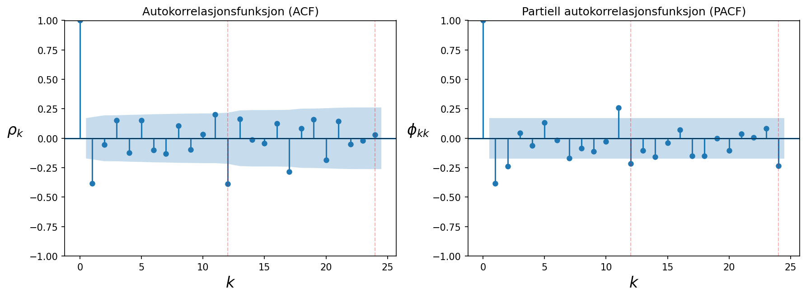

ACF $\rho_k$ fra ligning [(5)](#eq-eq-acf) (venstre) og PACF $\phi_{kk}$ fra ligning [(7)](#eq-eq-pacf) (høyre) for den stasjonære serien $Z_t$. De vertikale røde stiplede linjene markerer sesonglag 12 og 24.

Analyse av plottene. Fra figuren observerer vi:

- **ACF:** Signifikant negativ verdi ved lag 1. Signifikant negativ verdi ved sesonglag 12, som tyder på sesong-MA-komponent.

- **PACF:** Signifikant negativ verdi ved lag 1, deretter raskt avtak. Dette tyder på AR(1)-komponent.

**Konklusjon** --- *Identifiserte parametere*

Basert på ACF/PACF-analysen velger vi:

- $p = 1$: PACF viser signifikant verdi ved lag 1

- $q = 1$: ACF viser gradvis avtak, tyder på MA-komponent

- $P = 0$: PACF er ikke sterkt signifikant ved sesonglag 12

- $Q = 1$: ACF viser signifikant negativ verdi ved lag 12 (sesong-MA)

**Fullstendig modell:** SARIMA$(1,1,1)(0,1,1)_{12}$

Nå som modellstrukturen er identifisert, skal vi estimere de numeriske verdiene for parameterne $\phi_1$, $\theta_1$ og $\Theta_1$.

### Steg 4: Parameterestimering
Med modellspesifikasjonen SARIMA$(1,1,1)(0,1,1)_{12}$ identifisert, gjenstår det å estimere de numeriske verdiene for modellkoeffisientene: $\phi_1$ (AR), $\theta_1$ (MA), $\Theta_1$ (sesong-MA) og residualvariansen $\sigma^2$. Dette gjøres ved hjelp av *Maximum Likelihood Estimation* (MLE).

Definisjon [Maximum Likelihood Estimation (MLE)]
La $Y_1, Y_2, \ldots, Y_n$ være observerte verdier fra en tidsrekke og $\boldsymbol{\theta}$ parametervektoren vi ønsker å estimere.

**Likelihood-funksjonen** uttrykker sannsynligheten for å observere dataene gitt parameterne:
$$
L(\boldsymbol{\theta}) = f(Y_1, Y_2, \ldots, Y_n \mid \boldsymbol{\theta})
$$

**Log-likelihood-funksjonen** er mer praktisk å arbeide med numerisk:
$$
\ell(\boldsymbol{\theta}) = \log L(\boldsymbol{\theta})
$$

**MLE-estimatoren** er parameterverdiene som maksimerer log-likelihood:
$$
\hat{\boldsymbol{\theta}}_{\text{MLE}} = \arg\max_{\boldsymbol{\theta}} \ell(\boldsymbol{\theta})
$$

**For ARIMA-modeller** med gaussiske residualer $\varepsilon_t \sim N(0, \sigma^2)$ blir log-likelihood:
$$
\ell(\boldsymbol{\theta}, \sigma^2) = -\frac{n}{2}\log(2\pi) - \frac{n}{2}\log(\sigma^2) - \frac{1}{2\sigma^2}\sum_{t=1}^{n}\varepsilon_t(\boldsymbol{\theta})^2
$$
Her er residualene $\varepsilon_t(\boldsymbol{\theta}) = Y_t - \hat{Y}_t(\boldsymbol{\theta})$ differansen mellom observerte verdier og modellens prediksjoner, som avhenger av parametervektoren $\boldsymbol{\theta}$.

Estimeringsmetode. Som definisjonen viser, finner MLE parameterverdiene som maksimerer sannsynligheten for å observere de faktiske dataene gitt modellen. For SARIMA-modeller brukes typisk numeriske optimaliseringsalgoritmer (som L-BFGS-B) for å finne MLE-estimatene, siden log-likelihood-funksjonen ikke har en analytisk løsning.

Estimerte parametere. Tabell [9](#tab-tab-sarima-estimater) viser de estimerte koeffisientene med tilhørende standardfeil og signifikanstester.

Estimerte SARIMA$(1,1,1)(0,1,1)_{12}$ parametere.

  **Parameter**   **Symbol**       **Beskrivelse**                **Estimat**   **Std.feil**   **$p$-verdi**
  --------------- ---------------- ------------------------------ ------------- -------------- -----------------
  AR(1)           $\phi_1$      Autoregressive koeffisient     $0,107$     $0,097$      $0,270$
  MA(1)           $\theta_1$    Glidende gjennomsnitt          $-0,680$    $0,090$      $<0,001$
  Sesong-MA(1)    $\Theta_1$    Sesong glidende gjennomsnitt   $-0,407$    $0,074$      $<0,001$
  Varians         $\sigma^2$   Residualvarians                $0,0004$    ---            ---

[Tolkning av koeffisientene.]
- **AR(1):** $\phi_1 = 0,107$ er *ikke signifikant* ($p = 0,27$). Dette betyr at den direkte avhengigheten av forrige måneds verdi er svak. Likevel beholder vi parameteren i modellen da den bidrar til bedre tilpasning sammen med de andre komponentene.

- **MA(1):** $\theta_1 = -0,680$ er *sterkt signifikant* ($p < 0,001$). Den negative verdien indikerer at positive prognosefeil i forrige måned korrigeres ned, og omvendt.

- **Sesong-MA:** $\Theta_1 = -0,407$ er *sterkt signifikant* ($p < 0,001$). Den negative verdien viser at prognosefeil fra samme måned året før påvirker dagens verdi negativt.

Definisjon [Informasjonskriterier for modellvalg]
**AIC** (Akaike Information Criterion) og **BIC** (Bayesian Information Criterion) er kriterier for å sammenligne modeller. Begge balanserer modelltilpasning mot kompleksitet:

$$\begin{aligned}\text{AIC} &= -2\ell(\hat{\boldsymbol{\theta}}) + 2k \\
\text{BIC} &= -2\ell(\hat{\boldsymbol{\theta}}) + k\log(n)\end{aligned}$$

der $\ell(\hat{\boldsymbol{\theta}})$ er log-likelihood evaluert ved MLE-estimatene, $k$ er antall estimerte parametere, og $n$ er antall observasjoner.

**Tolkning:** Lavere verdier indikerer bedre modeller. Det første leddet ($-2\ell$) belønner god tilpasning, mens det andre leddet straffer kompleksitet. BIC straffer kompleksitet hardere enn AIC for store utvalg ($n > 7$), og favoriserer derfor enklere modeller.

Modelltilpasning. Modellen har følgende tilpasningsstatistikk:

- **AIC** (Akaike Information Criterion): $-581,7$

- **BIC** (Bayesian Information Criterion): $-570,6$

- **Log-likelihood:** $294,8$

Lavere AIC/BIC-verdier indikerer bedre modelltilpasning. Disse verdiene kan sammenlignes med alternative modellspesifikasjoner for å velge den beste modellen.

**Den estimerte modellen** --- *Eksplisitt form*

Ved å sette inn de estimerte verdiene i modelllikningen [(1)](#eq-eq-sarima-general) får vi:

$$(1 - 0,107B)(1-B)(1-B^{12}) Y_t = (1 - 0,680B)(1 - 0,407B^{12}) \varepsilon_t$$

8

Denne modellen fanger opp trend, sesong og kortsiktig dynamikk i traktorsalgsdataene.

### Steg 5: Modellvalidering
Før vi bruker modellen til prognose, må vi validere at den fanger opp all systematisk struktur i dataene. Dette gjøres ved å analysere *residualene*---forskjellen mellom faktiske og tilpassede verdier. Hvis modellen er adekvat, skal residualene oppføre seg som *hvit støy*: uavhengige, identisk fordelte verdier med gjennomsnitt null.

Definisjon [Ljung-Box test]
Ljung-Box-testen er en statistisk test for autokorrelasjon i residualene. Teststatistikken er:

$$Q = n(n+2) \sum_{k=1}^{h} \frac{\hat{\rho}_k^2}{n-k}$$

9

der $n$ er antall observasjoner, $h$ er antall lag som testes, og $\hat{\rho}_k$ er den estimerte autokorrelasjon ved lag $k$.

**Hypoteser:**

- $H_0$: Residualene er uavhengige (hvit støy)

- $H_1$: Det finnes autokorrelasjon i residualene

Under $H_0$ følger $Q$ en $\chi^2$-fordeling med $(h - p - q)$ frihetsgrader.

ACF av residualer. Figur [8](#fig-fig-residual-acf) viser ACF for residualene fra den tilpassede SARIMA-modellen. For en adekvat modell forventer vi at alle autokorrelasjonene ligger innenfor konfidensintervallet.

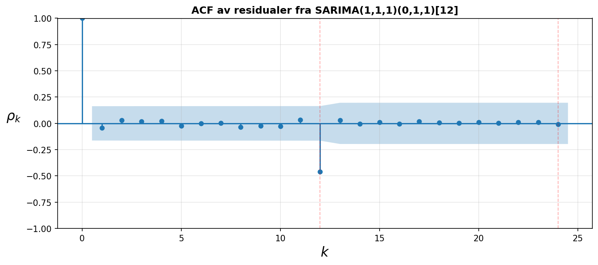

ACF $\rho_k$ fra ligning [(5)](#eq-eq-acf) for residualene fra SARIMA$(1,1,1)(0,1,1)_{12}$. De fleste autokorrelasjonene ligger innenfor 95% konfidensintervallet.

Ljung-Box testresultater. Tabell [10](#tab-tab-ljung-box) viser Ljung-Box teststatistikk ved lag 12 og 24.

Ljung-Box test for autokorrelasjon i residualene.

  **Lag**   **$Q$-statistikk**   **$p$-verdi**   **Konklusjon**
  --------- ---------------------- ----------------- -----------------------------------
  12        $35,09$              $0,0005$        Signifikant autokorrelasjon
  24        $35,39$              $0,063$         Ingen signifikant autokorrelasjon

Tolkning. Ljung-Box-testen ved lag 12 viser signifikant autokorrelasjon ($p = 0,0005$), noe som antyder at modellen ikke fanger opp all sesongstruktur perfekt. Ved lag 24 er testen ikke signifikant ($p = 0,063$). I praksis aksepterer vi ofte modeller med noe gjenværende struktur, spesielt når:

- Modellen gir rimelige prognoser

- Alternative modeller ikke gir vesentlig bedring

- Den gjenværende strukturen er svak

**Konklusjon** --- *Modellens egnethet*

SARIMA$(1,1,1)(0,1,1)_{12}$ fanger opp hovedstrukturen i dataene, selv om diagnostikken viser noe gjenværende autokorrelasjon ved sesonglag. For praktiske prognoseformål anser vi modellen som tilstrekkelig. Alternative tilnærminger kunne inkludere å øke modellordenen eller undersøke strukturelle brudd i dataene.

### Steg 6: Prognose
Med den validerte SARIMA$(1,1,1)(0,1,1)_{12}$-modellen genererer vi nå prognoser for de neste 12 månedene (januar--desember 2015). Prognosen inkluderer punktestimater og 95% konfidensintervaller.

Prognosemetode. For SARIMA-modeller beregnes prognoser rekursivt ved å bruke den estimerte modelllikningen. For første prognose ($t = 145$, januar 2015) brukes kun historiske data. For påfølgende prognoser brukes tidligere prognoser som input der historiske data mangler. Konfidensintervallene reflekterer usikkerheten i prognosene og blir bredere jo lenger frem i tid vi predikerer.

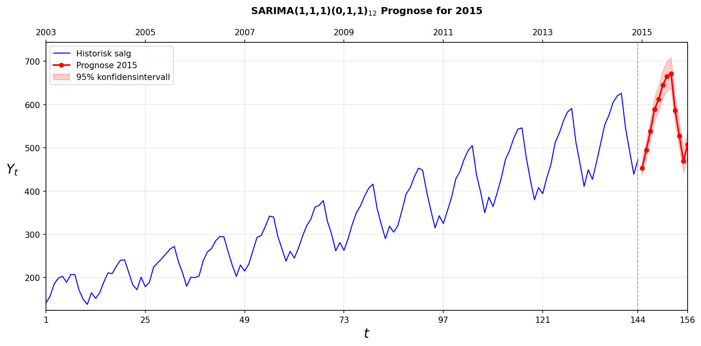

Månedlig traktorsalg $Y_t$ for $t = 1, \ldots, 144$ (blå) og prognose $\hat{Y}_t$ for $t = 145, \ldots, 156$ (rød) generert fra SARIMA-modellen i ligning [(8)](#eq-eq-sarima-estimert). Det skraverte området angir 95% konfidensintervall.

Tolkning av prognosen. Tabell [11](#tab-tab-prognose) viser de månedlige prognosene med konfidensintervaller.

- **Sesongmønster:** Prognosen fanger opp det forventede sesongmønsteret med høyest salg i juli--august (sommersesongen for landbruk) og lavest salg i januar og november.

- **Vekst:** Total prognose for 2015 er 6 759 traktorer, sammenlignet med 6 333 i 2014---en forventet vekst på ca. 6,7%.

- **Usikkerhet:** 95% konfidensintervallene viser at årlig salg med høy sannsynlighet vil ligge mellom 6 428 og 7 107 enheter. Intervallbredden øker utover i prognoseperioden, fra 34 enheter i januar til 72 enheter i august.

Månedlige prognoser $\hat{Y}_t$ for traktorsalg 2015 ($t = 145, \ldots, 156$) fra SARIMA-modellen i ligning [(8)](#eq-eq-sarima-estimert).

  **Måned**         **Prognose** $\hat{Y}_t$   **Nedre 95%**   **Øvre 95%**   **Intervallbredde**
  ----------------- ------------------------------ --------------- -------------- ---------------------
  Januar (145)      453                            436             470            34
  Februar (146)     495                            475             516            41
  Mars (147)        538                            515             562            47
  April (148)       589                            562             616            54
  Mai (149)         612                            584             642            58
  Juni (150)        645                            614             678            64
  Juli (151)        665                            631             700            69
  August (152)      672                            637             709            72
  September (153)   586                            554             619            65
  Oktober (154)     528                            499             558            59
  November (155)    470                            443             498            55
  Desember (156)    507                            478             539            61
  **Årlig sum**     **6 759**                      **6 428**       **7 107**      ---

**Praktisk anvendelse** --- *Produksjonsplanlegging*

PowerHorse kan bruke disse prognosene til å:

1.  **Planlegge produksjon:** Øke kapasiteten i forkant av høysesongen (juni--august)

2.  **Styre lagerbeholdning:** Bygge opp lager før sommeren, redusere mot vinteren

3.  **Håndtere usikkerhet:** Bruke konfidensintervallene til å definere sikkerhetslagre

4.  **Budsjettere:** Forventet årlig omsetning på 6 759 enheter gir grunnlag for finansiell planlegging

[Begrensninger]
- Prognosene forutsetter at historiske mønstre fortsetter---uventede hendelser (økonomiske sjokk, konkurransesituasjon, etc.) er ikke inkludert

- Konfidensintervallene baseres på normalfordelte feil, som kan være en forenkling

- Modellen tar ikke hensyn til kausale faktorer (pris, markedsføring, etc.)

Eksterne faktorer med ARIMAX

## Eksempel: Eksterne faktorer og kampanjer med ARIMAX
Oppsummering.

  **Kategori**      **Beskrivelse**
  ----------------- --------------------------------------------------------------------------------
  Eksempel          Kampanjestyring i en dagligvarekjede
  Område            Etterspørselsprognoser med eksterne forklaringsvariabler
  Problemstilling   Predikere daglig salg når kampanjer løfter etterspørselen ut av vanlig mønster
  Modell            ARIMAX$(p,d,q)(P,D,Q)_m$ med eksogene variabler $\boldsymbol{X}_t$
  Prosess           Feature-utvidet Box-Jenkins-metode
  Metode            Feature engineering, ADF-test, MLE, Ljung-Box-test, backtest, scenarioanalyse

### Problemstilling
Dagligvarekjeden *NordMat* selger dagligvarer fra over 200 butikker i Norge. Kategorisjefen for kaffe har de siste to årene kjørt *femten* kampanjer med rabattnivå fra 10 % til 30 %, og ser at salget varierer enormt mellom kampanjedager og normale dager. Hovedpinen er at innkjøpsavdelingen konsekvent bestiller for lite til kampanjer og for mye i dagene etter: lagerhyllene går tomme på dag to av kampanjen, og resterende partier blir liggende uke etter uke etter kampanjen.

En ren SARIMA-modell (som i seksjon [Trend og sesong med SARIMA](#sec03)) fanger opp ukesesongen pent, men har ingen mulighet til å «vite» at en kampanje er på gang. Den ser bare tidsserien og glatter ut det som i virkeligheten er en planlagt, eksogent utløst salgstopp. Det vi trenger er en modell som kan si til kategorisjefen: *«Gitt at du kjører 20 % rabatt i fem dager fra tirsdag, forventer vi 707 ekstra enheter over kampanjeperioden med 95 %-intervall \[672, 742\].»*

**Problemstilling** --- *Hvordan inkluderer vi planlagte kampanjer i prognosen?*

Vi utvider SARIMA med eksogene variabler som eksplisitt koder kampanjestruktur (binær indikator, rabattprosent, pre-buying og post-campaign). Den utvidede modellen *ARIMAX* lærer fra historikken hvordan hver kampanjetype påvirker daglig salg, og lar oss simulere fremtidige kampanjer før vi bestiller varer.

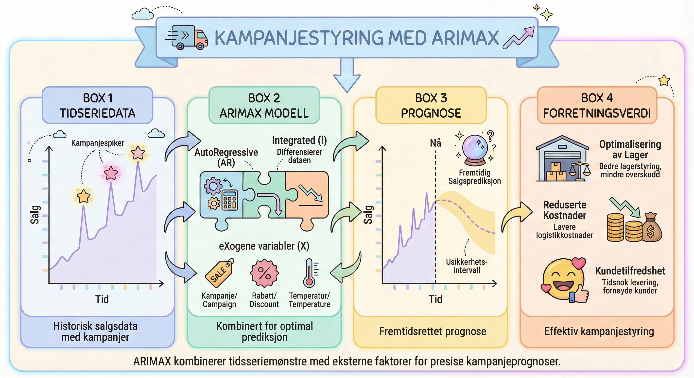

Kampanjestyring i dagligvarehandel: pris, rabatt og kampanjestruktur er planlagte inngrep som ARIMAX kan fange opp.

### Modell
Der SARIMA-modellen kun bruker historikken til tidsserien selv, tilfører ARIMAX en lineær regresjonskomponent med eksogene (eng. *eXogenous*) variabler.

Definisjon [ARIMAX-modellen]
En ARIMAX$(p,d,q)(P,D,Q)_m$-modell med eksogene variabler $\boldsymbol{X}_t = (X_{1,t}, \ldots, X_{k,t})^\top$ er definert ved:

$$\phi_p(B)\, \Phi_P(B^m)\, \nabla^d \nabla_m^D \left( Y_t - \boldsymbol{\beta}^\top \boldsymbol{X}_t \right) = \theta_q(B)\, \Theta_Q(B^m)\, \varepsilon_t$$

10

der $\boldsymbol{\beta} = (\beta_1, \ldots, \beta_k)^\top$ er regresjonskoeffisientene for de eksogene variablene og alle andre symboler er som i SARIMA-definisjonen (ligning [(1)](#eq-eq-sarima-general)).

Modellen har samme struktur som SARIMA, men den støyen vi forsøker å modellere er nå $Y_t - \boldsymbol{\beta}^\top \boldsymbol{X}_t$, altså tidsserien *fratrukket* den systematiske effekten av $\boldsymbol{X}_t$. Intuitivt kan vi tenke på det slik:

**Tolkning** --- *Hva betyr komponentene?*

- **Regresjonsdelen** $\boldsymbol{\beta}^\top \boldsymbol{X}_t$: Fanger opp *planlagte* eller *målbare* inngrep --- for oss kampanjer og rabatt. Hver $\beta_j$ forteller hvor mange enheter salget endres med når $X_{j,t}$ øker med én enhet, *alt annet likt*.

- **ARIMA-delen**: Modellerer resten, det vi *ikke* har en variabel for --- vanlig sesong, autokorrelasjon og ren støy.

- **Delt estimering**: Begge deler estimeres *samtidig* med MLE, slik at ARIMA-strukturen ikke absorberer kampanjen og $\beta$-ene ikke feiltilegnes trend eller sesong.

Våre eksogene variabler. For NordMat bruker vi $k = 7$ variabler som koder kampanjen og dens omland. Disse er samlet i tabell [13](#tab-tab-arimax-variabler).

Eksogene variabler $\boldsymbol{X}_t$ i ARIMAX-modellen for NordMat.

  **Variabel**                  **Type**       **Beskrivelse**
  ----------------------------- -------------- ------------------------------------------------------
  $x_{\text{kampanje},t}$   Binær          1 dersom dag $t$ er en kampanjedag, ellers 0
  $x_{\text{rabatt},t}$     Kontinuerlig   Rabattprosent på dag $t$ (0 utenfor kampanje)
  $x_{\text{før},1,t}$      Binær          1 dagen rett før kampanjestart (pre-buying)
  $x_{\text{før},2,t}$      Binær          1 to dager før kampanjestart
  $x_{\text{etter},1,t}$    Binær          1 dagen rett etter kampanjeslutt (post-campaign dip)
  $x_{\text{etter},2,t}$    Binær          1 to dager etter kampanjeslutt
  $x_{\text{etter},3,t}$    Binær          1 tre dager etter kampanjeslutt

Denne designen gjør at modellen kan skille mellom *tre ulike effekter*: selve kampanjeløftet (binær og rabattprosent sammen), en dip i dagene like før kampanjen (pre-buying: kundene venter) og en dip i dagene rett etter (post-campaign: kundene har hamstret). Uten *før*- og *etter*-variablene ville modellen tilskrive disse dippene til tidsseriestøy, og overestimere det reelle kampanjeløftet.

Forutsetninger. ARIMAX arver alle fire forutsetningene fra SARIMA (stasjonaritet, hvit støy, invertibilitet, kausalitet), og legger til én ny:

5.  **Eksogenitet:** Variablene $\boldsymbol{X}_t$ må være uavhengige av feilleddet $\varepsilon_t$. Konkret må kampanjebeslutningene ikke påvirkes av tidligere prognosefeil --- noe som er oppfylt når kampanjer planlegges måneder i forveien etter en fast markedsplan.

### Prosess
Prosess: Feature-utvidet Box-Jenkins-metode.
Modell: ARIMAX$(p,d,q)(P,D,Q)_{m}$ med eksogene variabler $\boldsymbol{X}_t$.

Den feature-utvidete Box-Jenkins-metoden følger samme grunnstruktur som ren Box-Jenkins, men legger til et *feature engineering-steg* etter datainnsamlingen. Prosessen har seks steg, som gjennomgås i tur og orden i resten av seksjonen:

1.  **Datainnsamling**: Tidsserie + kampanjekalender (Steg 1).

2.  **Feature engineering**: Bygg $\boldsymbol{X}_t$ fra kampanjekalenderen (Steg 2).

3.  **Stasjonaritet**: ADF-test og differensiering av $Y_t$ (Steg 3).

4.  **Parameterestimering**: MLE av $(\phi, \theta, \Phi, \Theta, \boldsymbol{\beta}, \sigma^2)$ (Steg 4).

5.  **Modellvalidering**: Residualanalyse, Ljung-Box og backtest (Steg 5).

6.  **Prognose og scenarioanalyse**: Baseline vs. kampanje, kampanjeløft, rabattelastisitet (Steg 6).

### Steg 1: Datainnsamling
NordMat har 730 dagers historikk (ca. 2 år fra 3. januar 2022 til 2. januar 2024) for kaffekategorien, totalt $n = 730$ observasjoner. I samme periode er det kjørt 15 kampanjer med ulik lengde (3--5 dager) og rabatt (10--30 %). Tabell [14](#tab-tab-arimax-descstats) oppsummerer datasettet.

Deskriptiv statistikk for daglig kaffesalg hos NordMat (2022--2023).

+-----------------------------+---+---------------+--------------------+---------------------+
| **Statistikk**              |   | **Totalt**    | **Baseline-dager** | **Kampanjedager**   |
+=============================+===+===============+====================+=====================+
| Antall observasjoner        |   | 730           | 674                | 56    |
| ($n$)                     |   |               |                    |                     |
+-----------------------------+---+---------------+--------------------+---------------------+
| Gjennomsnittlig salg        |   | 212,2         | 201,2              | 344,2 |
| ($\bar{Y}$)              |   |               |                    |                     |
+-----------------------------+---+---------------+--------------------+---------------------+
| Standardavvik ($s$)       |   | 50,7          | 32,7               | 42,2                |
+-----------------------------+---+---------------+--------------------+---------------------+
| Minimum                     |   | 129           | ---                | ---                 |
+-----------------------------+---+---------------+--------------------+---------------------+
| Median                      |   | 205,0         | ---                | ---                 |
+-----------------------------+---+---------------+--------------------+---------------------+
| Maksimum                    |   | 449           | ---                | ---                 |
+-----------------------------+---+---------------+--------------------+---------------------+
| Antall kampanjer            |   | 15 (rabatt 10--30 %, lengde 3--5 dager)                  |
+-----------------------------+---+----------------------------------------------------------+
| Rå kampanjeløft             |   | $+71,0$ %                                |
| ($\bar{Y}_{\text{kamp}} |   |                                                          |
| /                           |   |                                                          |
| \bar{Y}_{\text{base}} -  |   |                                                          |
| 1$)                        |   |                                                          |
+-----------------------------+---+----------------------------------------------------------+

Visuell analyse. Figur [11](#fig-fig-arimax-data) viser hele tidsserien med kampanjeperiodene skygget i oransje. Tre mønstre er umiddelbart synlige:

1.  **Svak trend**: Gjennomsnittsnivået stiger sakte fra ca. 175 enheter i starten av 2022 til ca. 240 enheter mot slutten av 2023.

2.  **Ukesesong**: Regelmessige svingninger på syv dager. Figur [12](#fig-fig-arimax-week) bekrefter at fredag/lørdag har høyest baseline-salg og søndag/mandag lavest.

3.  **Kampanjetopper**: Alle 15 kampanjene gir tydelige spikes over baseline --- disse dominerer den visuelle variasjonen i tidsserien.

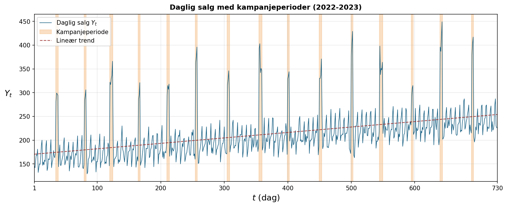

Daglig kaffesalg $Y_t$ for $t = 1, \ldots, 730$. Oransje skygge markerer de 15 kampanjeperiodene. Rød stiplet linje er en tilpasset lineær trend.

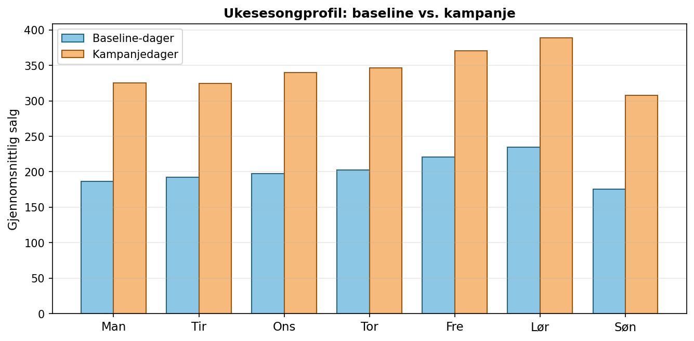

Gjennomsnittlig daglig salg fordelt på ukedag. Lyseblå: baseline-dager. Oransje: kampanjedager. Kampanjen løfter salget kraftig på alle ukedager, men ukesesongens struktur er beholdt.

**Konklusjon** --- *Hvorfor ARIMAX og ikke SARIMA?*

Det rå kampanjeløftet på $+71,0$ % kan være misvisende: noe av det skyldes at kampanjer ofte legges til fredag/lørdag, som uansett er høysesong. En ren SARIMA-modell ville «absorbere» kampanjeeffekten inn i sesongleddet og gi gale prognoser for perioder uten kampanje. ARIMAX skiller eksplisitt mellom de to effektene, og lar oss dessuten simulere kampanjer vi ikke har kjørt ennå.

### Steg 2: Feature engineering
Feature engineering er ARIMAX-utvidelsens hjerte. Fra kampanjekalenderen bygger vi de syv $\boldsymbol{X}_t$-variablene i tabell [13](#tab-tab-arimax-variabler). Figur [13](#fig-fig-arimax-features) illustrerer konstruksjonen for én enkelt kampanje (dagene $t = 120, \ldots, 124$ med 25 % rabatt).

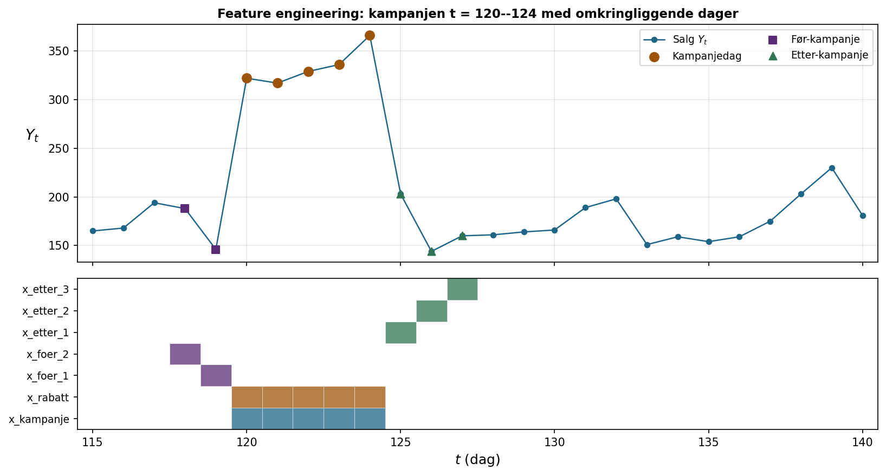

Feature engineering for én kampanje. Øverst: observert salg $Y_t$ med kampanjedager (oransje), før-kampanje-dager (lilla) og etter-kampanje-dager (grønn). Nederst: verdiene av de syv eksogene variablene $\boldsymbol{X}_t$ rundt samme kampanje.

Observasjoner fra figuren. På kampanjedagene $t = 120, \ldots, 124$ hopper salget fra $\sim\!190$ til $\sim\!335$ enheter. I dagene rett før (118--119) og rett etter (125--127) er salget *lavere* enn normalt, akkurat slik før- og etter-variablene er designet for å fange.

**Konklusjon** --- *Hvorfor både binær og kontinuerlig kampanjevariabel?*

Variabelen $x_{\text{kampanje},t}$ fanger det faste *trekkplasteret* ved en kampanje --- det du får uansett hvor stor rabatten er. Variabelen $x_{\text{rabatt},t}$ fanger den *marginale* effekten per prosentpoeng rabatt. Sammen lar de oss beregne priselastisitet: hva skjer om vi øker rabatten fra 20 til 25 %?

### Steg 3: Stasjonaritet og differensiering
Før vi kan estimere ARIMA-delen, må den delen av serien som gjenstår etter å ha trukket fra $\boldsymbol{\beta}^\top \boldsymbol{X}_t$ være stasjonær. Vi gjør først en ADF-test på rå-serien, deretter på den differensierte.

ADF-test for stasjonaritet. Nullhypotesen er at serien har enhetsrot (ikke-stasjonær).

  **Serie**                          **ADF**      **$p$-verdi**   **Krit. 5 %**   **Konklusjon**
  ------------------------------- -- ------------ ----------------- --------------- ----------------
  Original $Y_t$                   $-3,036$   $0,032$         $-2,866$      Grenseland
  Differensiert $\nabla Y_t$      $-9,081$   $<\!0,001$    $-2,866$      Stasjonær

Den originale serien er på *grensen* til å være stasjonær ($p = 0,032$) --- den forkastes ved 5 %-nivå, men ikke ved 1 %. Den svake stigende trenden og kampanjespikene trekker i hver sin retning. Vi velger derfor forsiktig $d = 1$, som gir et entydig stasjonært resultat. Siden ukesesongen er moderat og håndteres godt av sesongleddene $(P, Q)$ i ARMA-delen, beholder vi $D = 0$.

ACF/PACF. For å identifisere $(p, q, P, Q)$ ser vi på autokorrelasjons- og partiell autokorrelasjonsfunksjonen. Siden kampanjespikene ville dominere plottene, regres vi først $Y_t$ på $\boldsymbol{X}_t$ med OLS og plotter ACF/PACF av residualene. Figur [14](#fig-fig-arimax-acf-pacf) viser resultatet.

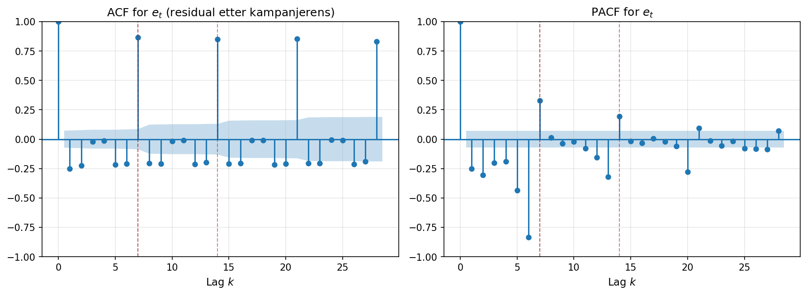

ACF $\rho_k$ (venstre) og PACF $\phi_{kk}$ (høyre) for den differensierte, kampanje-rensede serien. Røde stiplede linjer markerer sesonglag 7 og 14.

PACF viser en klar signifikant verdi ved lag 1 og en mindre ved lag 7, som tyder på $p = 1$ (ordinært AR) og $P = 1$ (sesong-AR). ACF har signifikante negative verdier ved lag 1 og 7, konsistent med $q = 1$ og $Q = 1$.

**Konklusjon** --- *Identifisert modellorden*

Basert på stasjonaritetsanalysen og ACF/PACF velger vi:

- $(p, d, q) = (1, 1, 1)$ --- ordinært AR(1), første differensiering, MA(1)

- $(P, D, Q) = (1, 0, 1)$ med sesonglengde $m = 7$ (uke)

**Fullstendig modell:** ARIMAX$(1,1,1)(1,0,1)_7$ med 7 eksogene variabler.

### Steg 4: Parameterestimering
Alle 12 parametrene i modellen --- de 4 ARMA-koeffisientene ($\phi_1, \theta_1, \Phi_1, \Theta_1$), de 7 regresjonskoeffisientene ($\boldsymbol{\beta}$) og residualvariansen $\sigma^2$ --- estimeres samtidig med MLE via statsmodels. `SARIMAX(exog=...)`. Tabell [16](#tab-tab-arimax-estimater) viser resultatene.

Estimerte ARIMAX$(1,1,1)(1,0,1)_7$-parametere for NordMat-datasettet.

  **Gruppe**                                                **Parameter**                    **Beskrivelse**        **Estimat**              **Std.feil**   **$p$-verdi**
  --------------------------------------------------------- -------------------------------- ---------------------- ------------------------ -------------- -----------------
  \multirow{7}{\*}{Regresjon ($\boldsymbol{\beta}$)}   $\beta_{\text{kampanje}}$   Grunnløft kampanje     $\highlight{57,26}$   $6,30$       $<0,001$
                                                            $\beta_{\text{rabatt}}$     Enheter per % rabatt   $\highlight{4,21}$    $0,27$       $<0,001$
                                                            $\beta_{\text{før},1}$      Dip dag $-1$         $-19,28$               $1,93$       $<0,001$
                                                            $\beta_{\text{før},2}$      Dip dag $-2$         $-16,96$               $1,90$       $<0,001$
                                                            $\beta_{\text{etter},1}$    Dip dag $+1$         $-12,55$               $3,08$       $<0,001$
                                                            $\beta_{\text{etter},2}$    Dip dag $+2$         $-15,09$               $2,62$       $<0,001$
                                                            $\beta_{\text{etter},3}$    Dip dag $+3$         $-17,62$               $2,10$       $<0,001$
  \multirow{4}{\*}{ARMA}                                   $\phi_1$                      AR(1)                  $0,392$                $0,035$      $<0,001$
                                                            $\theta_1$                    MA(1)                  $-1,005$               $0,012$      $<0,001$
                                                            $\Phi_1$                      Sesong-AR(1)           $1,001$                $0,001$      $<0,001$
                                                            $\Theta_1$                    Sesong-MA(1)           $-1,009$               $0,034$      $<0,001$
  Varians                                                   $\sigma^2$                   Residualvarians        $60,23$                $4,07$       ---

Tolkning av $\boldsymbol{\beta}$-koeffisientene. Dette er hovedpoenget med ARIMAX:

- $\beta_{\text{kampanje}} = 57,26$: Å *ha* en kampanje (uten rabatt) løfter salget med ca. 57 enheter per dag. Dette er «kampanjeskiltet»-effekten --- synligheten alene.

- $\beta_{\text{rabatt}} = 4,21$: Hver prosentpoeng rabatt gir ytterligere 4,2 enheter per dag. Ved 20 % rabatt blir den marginale rabatteffekten $4,21 \times 20 = 84,2$ enheter.

- **Samlet effekt på en 20-%-kampanjedag**: $57,26 + 84,2 \approx 141,5$ enheter over baseline.

- $\beta_{\text{før},\cdot}$ og $\beta_{\text{etter},\cdot}$: Alle er signifikant negative (ca. $-13$ til $-19$ enheter). Dette bekrefter pre-buying og post-campaign-dip: kampanjen «stjeler» ca. 98 enheter fra dagene rundt kampanjen, som skal trekkes fra bruttoløftet for å få netto kampanjeeffekt.

Modellsammenligning. For å demonstrere ARIMAX-utvidelsens verdi har vi også tilpasset en *ren* SARIMA-modell av samme orden $(1,1,1)(1,0,1)_7$ men uten eksogene variabler. Tabell [17](#tab-tab-arimax-vs-sarima) sammenligner.

Modellsammenligning: ARIMAX vs. ren SARIMA med samme orden.

  **Kriterium**                    **SARIMA**       **ARIMAX**                     **Differanse**
  -------------------------------- ---------------- ------------------------------ ----------------
  AIC                              7 036,3          5 072,0          $-1\,964,3$
  BIC                              7 059,2          5 126,9          $-1\,932,2$
  Log-likelihood                   $-3\,513,1$   $-2\,524,0$   $+989,2$
  Residualvarians $\sigma^2$   $952,4$        $60,2$         $-892,2$
  Antall parametre                 5                12                             $+7$

Reduksjonen i AIC på 1 964 er massiv --- ARIMAX er svært mye bedre tilpasset dataene enn ren SARIMA. Ennå viktigere: residualvariansen faller fra 952 til 60, altså en reduksjon på 94 %. Det betyr at SARIMA lar nesten all kampanjeeffekten sitte igjen som «uforklart støy», mens ARIMAX faktisk forklarer den.

**Den estimerte modellen** --- *Eksplisitt form*

Med de estimerte verdiene blir ligning [(10)](#eq-eq-arimax-general) på kompakt form:

$$(1 - 0,39 B)(1 - 1,00 B^7) (1 - B)\, \tilde{Y}_t
= (1 - 1,00 B)(1 - 1,01 B^7)\, \varepsilon_t$$

11

der $\tilde{Y}_t = Y_t - \boldsymbol{\beta}^\top \boldsymbol{X}_t$ er den kampanje-rensede serien, og $\boldsymbol{\beta}$-ene har verdiene i tabell [16](#tab-tab-arimax-estimater).

### Steg 5: Modellvalidering
Vi validerer modellen i to trinn: (i) residualanalyse på treningsdata for å sjekke at restleddet oppfører seg som hvit støy, og (ii) *backtest* på siste 60 dager for å sjekke faktisk prognoseevne.

Residualanalyse. Figur [15](#fig-fig-arimax-residual-acf) viser ACF for de standardiserte residualene fra ARIMAX-modellen (første 14 dagers burn-in droppet). Nesten alle autokorrelasjonene ligger innenfor 95 %-båndet.

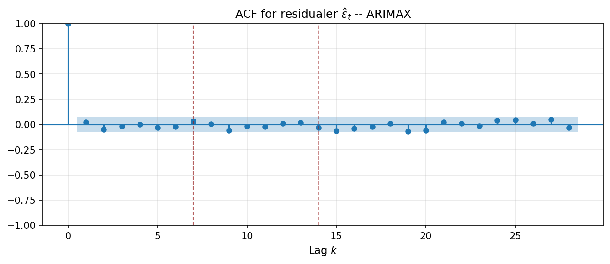

ACF for standardiserte residualer $\hat{\varepsilon}_t$ fra ARIMAX-modellen ($n = 716$ etter burn-in).

Ljung-Box-test for autokorrelasjon i ARIMAX-residualene.

  **Lag**   **$Q$-statistikk**   **$p$-verdi**   **Konklusjon**
  --------- ---------------------- ----------------- -----------------------
  7         $4,19$               $0,758$         Ingen autokorrelasjon
  14        $8,53$               $0,860$         Ingen autokorrelasjon
  21        $19,12$              $0,578$         Ingen autokorrelasjon

Alle $p$-verdier er godt over 0,05, så vi forkaster ikke nullhypotesen om hvit støy. Residualene er tilnærmet ukorrelerte --- modellen har fanget opp den systematiske strukturen.

Backtest. Vi holder ut de siste 60 dagene (som inneholder to kampanjer) og tilpasser både ARIMAX og ren SARIMA på de første 670 dagene. Deretter predikeres hold-out-perioden; for ARIMAX bruker vi de faktiske $\boldsymbol{X}_t$-verdiene i perioden som input.

Backtest på de siste 60 dagene (inkl. 2 kampanjer). Lavere er bedre.

+----------------+------------------------+------------------------+--------------------------+
| **Modell**     | **RMSE**               | **MAE**                | **MAPE**                 |
+================+========================+========================+==========================+
| SARIMA (ingen  | $33,09$              | $19,25$              | $7,15$ %               |
| eksogene)      |                        |                        |                          |
+----------------+------------------------+------------------------+--------------------------+
| ARIMAX (full   | $8,93$ | $7,24$ | $3,03$ % |
| modell)        |                        |                        |                          |
+----------------+------------------------+------------------------+--------------------------+
| **Reduksjon i  | $-73$ %                                                    |
| RMSE**         |                                                                            |
+----------------+----------------------------------------------------------------------------+

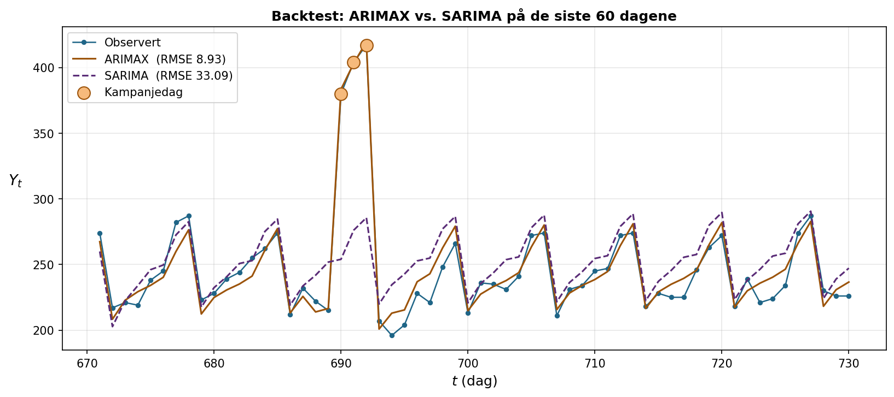

Backtest over de siste 60 dagene: observert salg (blå), ARIMAX-prognose (oransje) og ren SARIMA-prognose (lilla stiplet). ARIMAX treffer kampanjetoppene nesten nøyaktig; SARIMA misser dem fullstendig.

**Konklusjon** --- *ARIMAX er overlegen på kampanjedagene*

Ren SARIMA predikerer normale baseline-salg på kampanjedagene, og misser derfor begge kampanjetoppene. ARIMAX bruker den eksogene informasjonen og treffer både nivå og retning. Gjennomsnittlig prognosefeil (MAPE) faller fra 7,2 % til 3,0 %. For innkjøpsavdelingen betyr dette at bestillingen før en kampanje kan treffe $\pm 3$ % i stedet for $\pm 7$ % --- forskjellen mellom tomme hyller og fulle lagre.

### Steg 6: Prognose og scenarioanalyse
Med en validert modell kan NordMat nå stille alle de spørsmålene de ikke kunne stille før.

Hovedscenario. Kategorisjefen planlegger en 5-dagers kampanje med 20 % rabatt, som starter på dag 6 i en 14-dagers horisont (dvs. etter fem dager uten kampanje). Vi beregner to prognoser:

1.  *Baseline* $\hat{Y}_t^{(0)}$: prognose med $\boldsymbol{X}_t = \boldsymbol{0}$ for alle $t$.

2.  *Kampanje* $\hat{Y}_t^{(X)}$: prognose med full $\boldsymbol{X}_t$ inkludert pre-buying, kampanje (20 %) og post-campaign-dip.

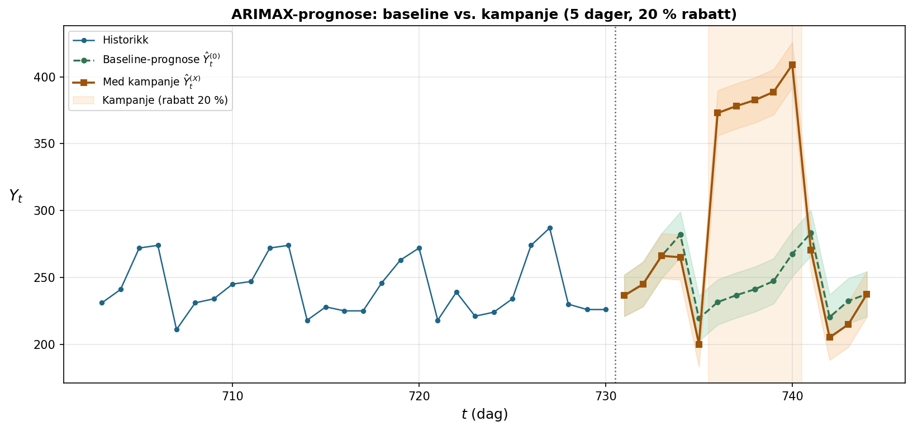

Prognose over 14 dager. Grønn stiplet: baseline uten kampanje. Oransje heltrukket: med 5-dagers kampanje (20 % rabatt) fra dag 6. Skraverte områder er 95 %-konfidensintervaller.

Tabell [20](#tab-tab-arimax-prognose) gir eksakte tall.

14-dagers prognose: baseline vs. kampanje (5 dager, 20 % rabatt). Konfidensintervall på 95 % for kampanjeprognosen.

  **Dag**              **Status**               **Baseline**   **Kampanje $\hat Y_t^{(X)}$**   **Nedre 95%**   **Øvre 95%**   **Løft**
  -------------------- ------------------------ -------------- ----------------------------------- --------------- -------------- ---------------------------
  1                    Normal                   237            237                                 221             252            ---
  2                    Normal                   245            245                                 228             262            ---
  3                    Normal                   266            266                                 249             283            ---
  4                    Før-2                    282            265                                 248             282            $-6,0$ %
  5                    Før-1                    219            200                                 183             217            $-8,8$ %
  6                    Kampanje   232            373                   356             390            [$+61,1$ %]
  7                    Kampanje   237            378                   361             395            [$+59,8$ %]
  8                    Kampanje   241            383                   366             400            [$+58,7$ %]
  9                    Kampanje   247            389                   372             406            [$+57,2$ %]
  10                   Kampanje   268            409                   392             426            [$+52,9$ %]
  11                   Etter-1                  283            271                                 254             288            $-4,4$ %
  12                   Etter-2                  220            205                                 188             222            $-6,9$ %
  13                   Etter-3                  232            215                                 198             232            $-7,6$ %
  14                   Normal                   238            238                                 221             254            ---
  **Sum (14 dager)**                            **3 447**      **4 072**                           ---             ---            $+18,2$ %

Tolkning. Under selve kampanjedagene er løftet $+53$ til $+61$ % sammenlignet med hva baseline ville vært --- det er her NordMat tjener de store pengene. Men ARIMAX tar også med det som ville vært usynlig uten modellen: dip på $-6$ til $-9$ % i dagene rett før og etter kampanjen. Netto 14-dagers løft er $+625$ enheter eller $+18,2$ %, *ikke* de $+71$ % som et rått gjennomsnitt antyder.

Scenarioanalyse over rabattnivåer. Hva om kategorisjefen vurderer 15 % rabatt i stedet for 20 %, eller 30 % i stedet? Ved å kjøre prognosen med $X_{\text{rabatt}} \in {10, 15, 20, 25, 30}$ % får vi en komplett leveringsplan (tabell [21](#tab-tab-arimax-scenario) og figur [18](#fig-fig-arimax-scenarios)).

Scenarioanalyse: kampanjeløft for en 5-dagers kampanje ved ulike rabattnivåer. Alt er sum over de fem kampanjedagene.

  **Rabatt**   **Baseline**   **Med kampanje**   **Ekstra enheter**   **Løft**
  ------------ -------------- ------------------ -------------------- -------------
  10 %         1 224          1 721              $+497$             $+40,6$ %
  15 %         1 224          1 826              $+602$             $+49,2$ %
  20 %         1 224          1 932              $+707$             $+57,8$ %
  25 %         1 224          2 037              $+813$             $+66,4$ %
  30 %         1 224          2 142              $+918$             $+75,0$ %

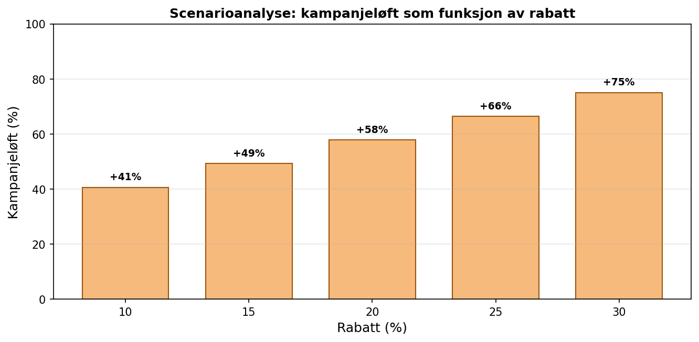

Kampanjeløft over selve kampanjeperioden (5 dager) som funksjon av rabatt. Forholdet er tilnærmet lineært --- hver prosentpoeng rabatt gir ca. 21 ekstra enheter over hele kampanjen.

Priselastisitet. Fra tabell [21](#tab-tab-arimax-scenario) ser vi at overgangen fra 10 % til 30 % rabatt gir $(918 - 497)/20 \approx 21$ ekstra enheter per prosentpoeng over hele kampanjen. På daglig basis tilsvarer dette nøyaktig den estimerte $\beta_{\text{rabatt}} = 4,21$ fra modellen ($21/5 \approx 4,2$), som viser at regresjonsfortolkningen er intern konsistent.

**Praktisk anvendelse** --- *Beslutningsgrunnlag for kategorisjefen*

ARIMAX-modellen lar NordMat svare på alle de konkrete spørsmålene innkjøpsavdelingen har:

1.  **Bestilling før kampanje**: Bestill 4 072 enheter for 14-dagers vinduet, ikke 4 072 $\pm$ ukjent sikkerhetsmargin. 95 %-intervallet er eksplisitt og snevert (backtest MAPE 3 %).

2.  **Rabattvalg**: Hver prosentpoeng ekstra rabatt gir ca. 21 ekstra enheter over kampanjen. Om marginen per enhet er lavere enn 1/21 av prisen, lønner det seg *ikke* å øke rabatten.

3.  **Kampanjekalender**: Dip-effektene rundt kampanjen er kvantifisert. Å legge to kampanjer tett inntil hverandre vil stjele fra hverandre; modellen kan simulere dette før planen låses.

4.  **Etterregnskap**: Det faktiske kampanjesalget kan sammenlignes mot *baseline*-prognosen (ikke mot i fjor) for å måle netto kampanjeeffekt.

[Begrensninger.]
- Modellen forutsetter at $\boldsymbol{X}_t$ er eksogent og planlagt. Dersom kampanjen kjøres som reaksjon på lav etterspørsel, brytes eksogenitetsantakelsen og $\boldsymbol{\beta}$ blir skjeve.

- Vi har ingen variabel for konkurrenters kampanjer. Hvis to kjeder kjører samtidig kampanje, vil effekten av vår egen underestimeres.

- Elastisiteten $\beta_{\text{rabatt}}$ er lineær innenfor det området rabattene har variert historisk (10--30 %). Ekstrapolering til 50 % rabatt bør unngås uten nye data.

- Kategorien her er aggregert til «kaffe». For individuelle SKU-er kan effekten variere betydelig, og en LightGBM-tilnærming (seksjon [Mange variabler med LightGBM](#sec05)) kan fange ikke-lineære interaksjoner mellom SKU, pris og vær.

Mange variabler med LightGBM

## Eksempel: Mange variabler med LightGBM
Oppsummering.

  **Kategori**      **Beskrivelse**
  ----------------- -----------------------------------------------------------------------------------------------------------------------------
  Eksempel          Etterspørselsprognose for en dagligvarekjede med 50 SKU-er
  Område            Etterspørselsprognoser med mange produkter og mange variabler
  Problemstilling   Predikere daglig salg per SKU når pris, kampanje, vær, lager, kategori og kalender virker sammen
  Modell            LightGBM (gradient boosting av beslutningstrær) med ca. 90 features
  Prosess           ML-pipeline: feature engineering $\to$ walk-forward-kryssvalidering $\to$ hyperparametertuning $\to$ SHAP-tolkning
  Metode            Gradient boosting, early stopping, walk-forward-validering, SHAP-verdier, benchmark mot naiv, MA og SARIMA

### Problemstilling
Dagligvarekjeden *NordMat* (samme case som i seksjon [Eksterne faktorer med ARIMAX](#sec04)) har oppdaget at ARIMAX-modellen fungerer greit for én kategori av gangen --- men den skalerer ikke. Kjeden har i realiteten 15 000 SKU-er fordelt på mange kategorier, butikktyper og lokasjoner, og hver SKU har sin egen sesong, sin egen priselastisitet og sin egen reaksjon på kampanjer og vær. Å kalibrere en egen ARIMAX-modell per SKU er verken praktisk eller statistisk robust: mange SKU-er har for lite data, og modellen ser bare sin egen historikk --- ikke hva som skjer i resten av sortimentet.

Kategorisjefen ønsker svar på spørsmål som:

- Hvordan vil 25 % rabatt på en meieriprodukt påvirke salget en varm juli-fredag?

- Hvilken av de 50 SKU-ene er mest følsomme for temperatur?

- Er kampanjeeffekten større i desember enn i mai?

- Kan en og samme modell håndtere hele sortimentet uten at vi må rettilpasse den per kategori?

Dette er ikke spørsmål en ARIMA-type modell kan besvare. De krever en modell som (i) lærer på tvers av SKU-er, (ii) fanger opp ikke-lineære interaksjoner mellom mange variabler, og (iii) skalerer til titusener av rader uten problem.

**Problemstilling** --- *Hvordan utnytter vi hundrevis av variabler samtidig?*

Vi bygger rundt 90 features fra salgshistorikk (lag og rullerende statistikk), kalender (ukedag, måned, helligdag, jul), pris og rabatt, vær (temperatur, nedbør, solskinn), kampanjestruktur, produktattributter (kategori, merke, butikk, SKU) og lagerinformasjon. Deretter trener vi *én* LightGBM-modell på hele panelet og validerer den på et holdt-ut testsett. SHAP-verdier forteller etterpå hvilke variabler som faktisk driver prognosene --- og hvorfor.

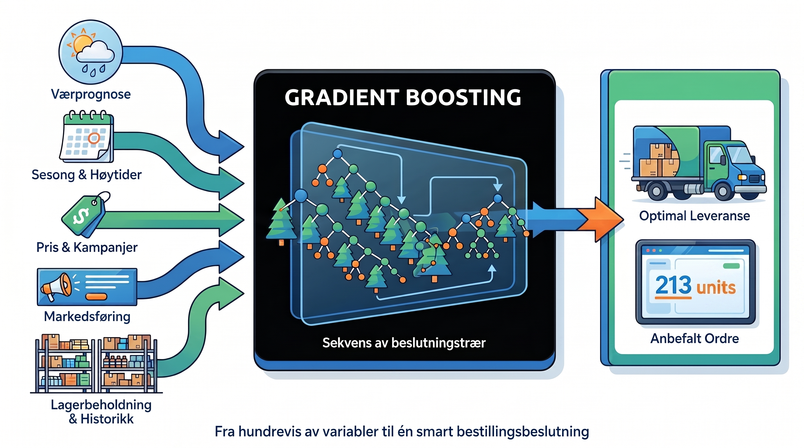

Fra hundrevis av variabler (vær, sesong, pris, markedsføring, lager) til én smart bestillingsbeslutning: LightGBM kombinerer alt i en sekvens av beslutningstrær.

### Modell
Der SARIMA og ARIMAX estimerer et *fast* sett med navngitte parametere --- $\phi$, $\theta$, $\boldsymbol{\beta}$ og så videre --- er LightGBM en *ensemble*-modell der selve formen til «parametrene» læres fra dataene. Det som estimeres er ikke bare noen få reelle tall, men en hel samling beslutningstrær --- deres splittstruktur, splittterskler og bladvekter. Det gjør det nødvendig å beskrive modellen via fire spørsmål: hva *dataene* er, hvilke *variabler* (ukjente) som estimeres, hvilken *målfunksjon* som optimaliseres, og hvilke *skranker* som gjelder. Resten av seksjonen er bygd opp rundt disse fire spørsmålene.

Data. Treningsdataene er et panel $\mathcal{D} = {(x_i, y_i)}_{i=1}^{N}$ der hver observasjon $i$ er identifisert av et par (SKU-kode, dato). For NordMat-eksemplet har vi $N = n_{\text{SKU}} \cdot T = 50 \cdot 731 = 36\,550$ observasjoner. Hver $x_i \in \mathbb{R}^p$ er en feature-vektor med $p \approx 90$ komponenter fordelt på åtte grupper (lag, rullerende, kalender, pris, vær, kampanje, produkt, aggregat), og $y_i \in \mathbb{R}_{\geq 0}$ er daglig salg i enheter. Dette er den sentrale forskjellen fra SARIMA/ARIMAX, som opererer på *én* tidsserie av gangen --- gradient boosting ser hele panelet som *én* kilde til læring. Tabell [23](#tab-tab-lgbm-panel) oppsummerer dimensjonene.

Dimensjonene til treningspanelet $\mathcal{D}$.

  **Symbol**                            **Beskrivelse**                              **Verdi**
  ------------------------------------- -------------------------------------------- ----------------------------
  $N$                                 Antall observasjoner (SKU $\times$ dag)   [$36\,550$]
  $n_{\text{SKU}}$                  Antall SKU-er i panelet                      $50$
  $T$                                 Antall dager per SKU                         $731$
  $p$                                 Antall features per observasjon              $\approx 90$
  $x_i \in \mathbb{R}^p$           Feature-vektor for observasjon $i$         ---
  $y_i \in \mathbb{R}_{\geq 0}$   Daglig salg i enheter                        ---

Definisjon [Gradient-boosted ensemble]
En *gradient-boosted ensemble-modell* $F_M$ er en sum av $M$ beslutningstrær tillagt en konstant initialisering:

$$F_M(x) = F_0 + \nu \sum_{m=1}^{M} h_m(x)$$

12

der $F_0 = \frac{1}{N}\sum_i y_i$ er en initialkonstant (gjennomsnittet av treningssvarene), $\nu \in (0, 1\]$ er læringsraten, $M$ er antall trær i ensemblet, og $h_m : \mathbb{R}^p \to \mathbb{R}$ er det $m$-te beslutningstreet.

Symbolene i ensemble-modellen. Tabell [24](#tab-tab-lgbm-ensemble-symbols) samler navnene.

Symboler i ensemble-modellen [(12)](#eq-eq-gb-additive).

  **Symbol**   **Beskrivelse**
  ------------ ----------------------------------------------------------------------
  $F_M(x)$   Prediksjonen til hele ensemblet for en feature-vektor $x$
  $F_0$      Initialkonstanten, satt til $\bar{y}$ på treningssettet
  $\nu$     Læringsraten ($0 < \nu \leq 1$); krymper bidraget fra hvert tre
  $M$        Antall trær i ensemblet --- bestemt av early stopping
  $h_m$      Det $m$-te beslutningstreet i sekvensen

Figur [20](#fig-fig-lgbm-boosting-sequence) viser hvordan prediksjonen $F_m(x)$ bygges opp sekvensielt: ved $m=1$ er den nesten flat rundt $F_0$, ved $m=10$ følger den nivået, og ved $m=100$ og $m=1\,000$ fanger den kampanjetopper og ukesesong i detalj. Samtidig krymper residualfordelingen (standardavvik fra $55,3$ til $19,4$).

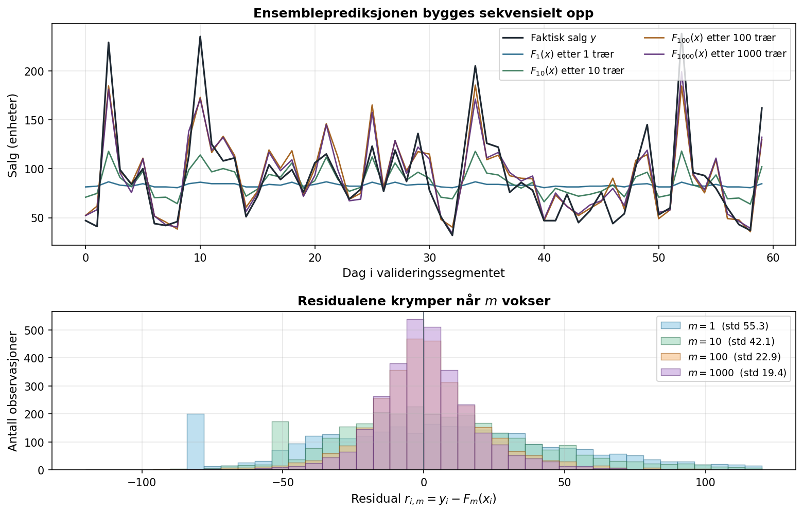

Prediksjonen $F_m(x)$ etter $m \in {1, 10, 100, 1\,000}$ trær for et segment av valideringssettet (øverst), og residualfordelingen $r_{i,m} = y_i - F_m(x_i)$ over hele valideringssettet (nederst). Ensemblet bygges gradvis opp; residualene krymper.

Definisjon [Regresjonstre $h_m$]
Et *regresjonstre* $h_m$ partisjonerer feature-rommet i et endelig antall akseparallelle regioner og returnerer en konstant verdi (*bladvekt*) i hver region:

$$h_m(x) = \sum_{\ell=1}^{L_m} w_{m,\ell}\,\mathbb{1}\!\left\[\,x \in R_{m,\ell}\,\right\]$$

13

der $L_m$ er antall blader i tre $m$, $R_{m,\ell} \subseteq \mathbb{R}^p$ er den $\ell$-te regionen (et hyperrektangel definert av splittreglene langs stien fra rot til blad), $w_{m,\ell} \in \mathbb{R}$ er bladvekten, og $\mathbb{1}\[\cdot\]$ er indikatorfunksjonen.

Figur [21](#fig-fig-lgbm-tree-diagram) viser et lite tre med tre splits og fire blader, sammen med partisjonen ${R_{m,\ell}}$ det induserer i feature-rommet. Denne to-panels framstillingen er kjernen i hvordan trær representerer funksjoner: hver splitt i venstre panel svarer til en linje i høyre panel; hvert blad svarer til ett av de fargelagte rektanglene.


Ett regresjonstre (venstre) og partisjonen det definerer i feature-rommet (høyre). Interne noder koder splittreglene; bladene $R_{m,1}, \ldots, R_{m,4}$ har hver sin vekt $w_{m,\ell}$. Trær er universelle funksjonstilnærmere fordi de kan lage vilkårlig fine partisjoner.

Variabler: hva estimeres? Tabell [25](#tab-tab-lgbm-unknowns) lister de ukjente som gradient boosting faktisk lærer fra dataene. Merk at et tre ikke har et fast antall parametere --- både antall blader, hvilke features det deles på, og hvor grensene settes, læres.

Ukjente som estimeres av gradient boosting.

  **Symbol**               **Beskrivelse**                                   **Antall**
  ------------------------ ------------------------------------------------- -------------------------------
  ${R_{m,\ell}}$   Partisjonering av feature-rommet (tre-struktur)   $\sum_m L_m$ blader totalt
  split-feature            Hvilken av $p$ features en node deler på        1 per indre node
  split-terskel $c$      Verdien der $x_j \leq c$ vs $x_j > c$       1 per indre node
  $w_{m,\ell}$         Bladvekt (prediksjon i region $R_{m,\ell}$)   $\sum_m L_m$
  $M$                    Antall trær i ensemblet                           bestemt av early stopping

Hyperparametere som `num_leaves`, `learning_rate` ($\nu$), `min_data_in_leaf`, `feature_fraction` og `bagging_fraction` er *ikke* ukjente som estimeres --- de settes manuelt eller velges ved kryssvalidering før treningen begynner.

Definisjon [Regularisert empirisk risiko]
Modellen $F$ optimaliserer en regularisert empirisk risiko: summen av en tap-funksjon over treningssettet pluss en kompleksitetsstraff per tre:

$$\mathcal{L}(F) = \sum_{i=1}^{N} \ell\!\bigl(y_i,\,F(x_i)\bigr) \;+\; \sum_{m=1}^{M} Ømega(h_m)$$

14

For L2-regresjon (LightGBMs standard) er $\ell(y, \hat y) = \tfrac{1}{2}(y - \hat y)^2$, og kompleksitetsstraffen har formen

$$Ømega(h) = \gamma L \;+\; \tfrac{1}{2}\lambda \sum_{\ell=1}^{L} w_\ell^2,$$

15

der $\gamma \geq 0$ straffer antall blader og $\lambda \geq 0$ er en L2-straff på bladvektene.

Siden det er umulig å optimalisere [(14)](#eq-eq-gb-objective) over alle mulige tresamlinger direkte, bruker gradient boosting en *trinnvis tilnærming*: tre $m$ tilpasses til de negative gradientene av tapet, evaluert på den løpende prediksjonen $F_{m-1}$:

$$h_m \approx \arg\min_{h}\; \sum_{i=1}^{N} \tfrac{1}{2}\bigl(r_{i,m} - h(x_i)\bigr)^2 \;+\; Ømega(h), \qquad r_{i,m} = -\frac{\partial \ell(y_i,\,F_{m-1}(x_i))}{\partial F_{m-1}(x_i)}.$$

2

For L2-tap reduseres dette til $r_{i,m} = y_i - F_{m-1}(x_i)$: hvert nytt tre tilpasses altså *residualene* fra det foregående ensemblet. Etter at $h_m$ er funnet, oppdateres $F_m = F_{m-1} + \nu\, h_m$, og prosessen gjentas. Tabell [26](#tab-tab-lgbm-objective-symbols) samler alle symbolene.

Symboler i målfunksjonen [(14)](#eq-eq-gb-objective) og den trinnvise tilnærmingen [(2)](#eq-eq-gb-stagewise).

  **Symbol**              **Beskrivelse**
  ----------------------- -------------------------------------------------------------------
  $\mathcal{L}(F)$     Regularisert empirisk risiko som $F$ minimerer
  $\ell(y, \hat y)$   Punktvis tap; for L2-regresjon: $\tfrac{1}{2}(y - \hat y)^2$
  $Ømega(h)$          Kompleksitetsstraff for ett tre
  $L$                   Antall blader i treet
  $\gamma$             Straff for hvert blad (mot for mange blader)
  $\lambda$            L2-straff på bladvektene $w_\ell$
  $r_{i,m}$            Negativ gradient (residual for L2-tap) i iterasjon $m$

Skranker. Optimaliseringsproblemet [(14)](#eq-eq-gb-objective) er underlagt tre grupper skranker:

*Modellskranker* (begrenser hvert tre og dermed modellklassen):

- $L_m \leq \texttt{num\_leaves}$ --- maksimalt antall blader per tre.

- $øperatorname{depth}(h_m) \leq \texttt{max\_depth}$ --- maksimal dybde ($-1$ = ubegrenset).

- $\|R_{m,\ell}\| \geq \texttt{min\_data\_in\_leaf}$ --- hvert blad må dekke et minimum av treningsobservasjoner.

*Dataskranker* (sikrer at problemet er vel-stilt):

- **Tidsmessig integritet**: enhver feature i $x_i$ må være observerbar *før* $y_i$ realiseres. Lag- og rullerende features konstrueres derfor med `shift(1)` eller mer.

- **Panel-splitt langs tid, ikke SKU**: trenings-, validerings- og testsett deler *dato-aksen*, mens alle 50 SKU-er er representert i alle tre sett. Ellers kan modellen ikke lære SKU-spesifikke nivåer.

*Konvergensskranke* (bestemmer $M$):

- **Early stopping**: $M$ settes til den minste $m$ der valideringsfeilen ikke har blitt bedre på $k$ påfølgende iterasjoner ($k$ typisk $50$--$100$). Dette gjør $M$ datadrevet framfor et hyperparameter man må gjette.

LightGBM-spesifikke optimaliseringer. LightGBM er en effektiv implementasjon av gradient boosting med to sentrale optimaliseringer utover formalismen over:

1.  **Histogrambasert splitting**: I stedet for å lete blant alle mulige splittpunkter, binner algoritmen kontinuerlige variabler i $k$ histogrambinner (typisk $k = 255$). Dette reduserer både minneforbruk og treningstid dramatisk.

2.  **Leaf-wise-vekst**: Der klassiske gradient boosters vokser trær nivå for nivå (*level-wise*), velger LightGBM det bladet som gir størst reduksjon i tap, og splitter det videre (*leaf-wise*). Dette gir dypere trær der det trengs, og kortere trær der det ikke gjør det. Figur [22](#fig-fig-lgbm-leaf-vs-level) illustrerer forskjellen.


Level-wise vekst (venstre) gir et symmetrisk tre der alle blader har samme dybde. Leaf-wise vekst (høyre) splitter alltid det bladet som gir størst reduksjon i tap --- treet blir ubalansert, men dypere der det faktisk bidrar. Begge viser $L = 8$ blader.

**Tolkning** --- *Hva betyr modellen intuitivt?*

- **Start enkelt** ($F_0$): En første gjetning som tilsvarer gjennomsnittet av all historisk salg.

- **Lær av feilene** ($h_m$): Hvert påfølgende tre korrigerer residualene $r_{i,m}$ fra summen av alle tidligere trær. Ett tre kan lære at «fredager er høyere», det neste at «fredager *med* kampanje er enda høyere, men bare i meierikategorien når det er varmt». Bladvektene $w_{m,\ell}$ er de konkrete korrigeringene.

- **Forsiktig justering** ($\nu$): Læringsraten krymper hvert trebidrag, slik at ensemblet bygges forsiktig opp og ikke svinger.

- **Stopp når nok er nok**: Early stopping setter $M$ til det punktet der valideringsfeilen slutter å forbedres, slik at modellen ikke overtilpasser.

Sammenligning med ARIMAX og SARIMA. Tabell [27](#tab-tab-lgbm-vs-sarima) oppsummerer de grunnleggende forskjellene.

Modellsammenligning: SARIMA, ARIMAX og LightGBM.

  **Egenskap**        **SARIMA**            **ARIMAX**                      **LightGBM**
  ------------------- --------------------- ------------------------------- -----------------------------
  Struktur            Lineær tidsserie      Lineær med eksogene variabler   Ensemble av beslutningstrær
  Antall variabler    1 (selve serien)      1 + ca. 5--10                   50--500+
  Ikke-lineariteter   Nei                   Nei                             Ja (naturlig)
  Interaksjoner       Manuelt               Manuelt                         Automatisk
  Tverr-SKU-læring    Nei                   Nei                             Ja
  Tolkbarhet          Høy (få parametere)   Høy                             Via SHAP-verdier
  Skalering           1 modell per serie    1 modell per serie              1 modell for alle SKU-er

Forutsetninger. Utover de formelle skrankene over hviler modellen på tre antakelser som er verdt å framheve separat, fordi de ikke håndheves av algoritmen selv:

1.  **Stabil struktur**: De mekanismene som har generert dataene historisk må være de samme i fremtiden. Modellen ekstrapolerer dårlig til sterkt uvanlige situasjoner (f.eks. en rabatt på 60 % når vi aldri har testet over 35 %); dette henger sammen med at bladvektene $w_{m,\ell}$ bare læres der data finnes.

2.  **Ingen fremtidsinformasjon i featurene**: Denne antakelsen er den samme som dataskranken om tidsmessig integritet, men er verdt å gjenta --- bryter man den, vil modellen se ut til å prestere bedre under trening enn den noen gang kan i produksjon.

3.  **Nok data til splitting**: Treet trenger nok observasjoner per blad for at splittene skal være statistisk meningsfulle. Skranke-parameteren `min_data_in_leaf` håndhever dette nedenfra, men valg av passende verdi avhenger av hvor rikt dataene er.

### Prosess
Prosess: ML-pipeline med feature engineering og walk-forward-validering.
Modell: LightGBM-regressor med ca. 90 features og early stopping.

Prosessen er kvalitativt forskjellig fra Box-Jenkins: i stedet for å identifisere få modellparametere $(p, d, q, P, D, Q)$, bruker vi mesteparten av tiden på å *bygge featurer* og *validere* at modellen generaliserer. Figur [23](#fig-fig-lgbm-method) viser de seks stegene.

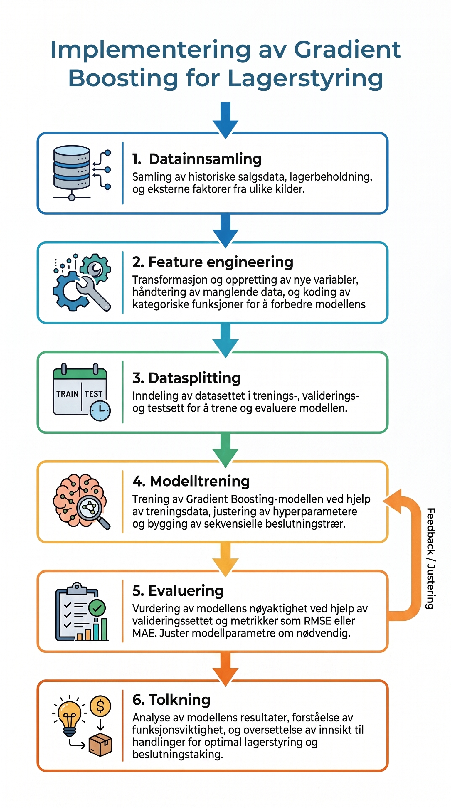

LightGBM-pipelinen i seks steg: datainnsamling, feature engineering, datasplitting, modelltrening, evaluering og tolkning. Iterasjon (tilbake til feature engineering) er vanlig etter evaluering.

### Steg 1: Datainnsamling
For dette eksempelet har vi generert et realistisk SKU-panel som etterligner strukturen i offentlige benchmark-datasett (eksempelvis *M5 Forecasting* og *Store Item Demand Forecasting* fra Kaggle): 50 produkter (SKU-er) fordelt på åtte kategorier, tre butikktyper og fem merker, observert daglig i $\sim\!2$ år ($n = 731$ dager fra 3. januar 2022 til 2. januar 2024). Tabell [28](#tab-tab-lgbm-descstats) oppsummerer panelet.

Deskriptiv statistikk for SKU-panelet.

  **Egenskap**                             **Verdi**
  ------------------------------------- -- ----------------------
  Antall rader (SKU $\times$ dag)       [36 550]
  Antall SKU-er                            50
  Antall dager                             731
  Antall kategorier                        8
  Antall merker                            5
  Antall butikktyper                       3
  Gjennomsnittlig daglig salg per SKU      83,7
  Standardavvik i salg                     58,0
  Maks daglig salg (en SKU en dag)         796
  Kampanjeandel (av alle SKU-dager)        13,9 %
  Stockout-andel                           14,7 %
  Gjennomsnittspris                        49,3

Visuell utforskning. Figur [24](#fig-fig-lgbm-data) viser daglig salg for fire representative SKU-er (øverst) og aggregert total-salg over hele sortimentet (nederst). Vi ser tre mønstre tydelig:

1.  **Tydelig ukesesong**: Både per SKU og aggregert er det regelmessige dropp søndager og topper fredag/lørdag.

2.  **SKU-spesifikke nivåer og sesong**: Drikkekategorien (grønn linje, P003) har kraftig sommerboost; de andre SKU-ene er flatere.

3.  **Kampanjestøy**: De høye toppene skyldes primært kampanjer og ikke tilfeldig støy.

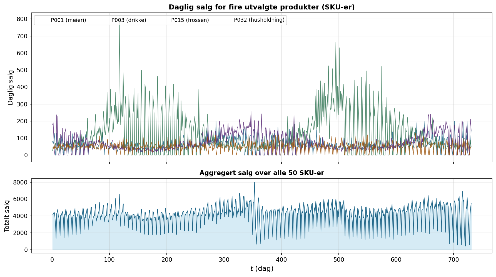

Daglig salg for fire utvalgte SKU-er (øverst) og aggregert over alle 50 SKU-er (nederst). Kampanjer gir tydelige spikes; ukesesongen er synlig i alle seriene.

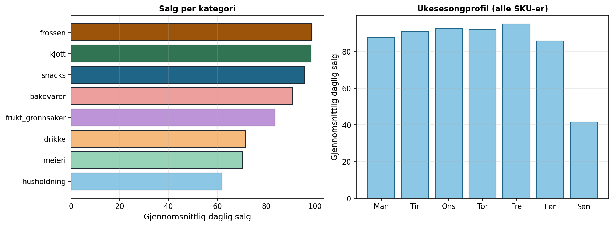

Venstre: gjennomsnittlig daglig salg per kategori. Høyre: ukesesongprofil aggregert over alle SKU-er.

**Konklusjon** --- *Hvorfor én modell for alle SKU-er?*

SKU-ene deler felles struktur: ukesesong, helligdager og kampanjelogikk fungerer omtrent likt på tvers av kategorier. Samtidig har hver SKU sitt eget nivå og sin egen følsomhet for pris, vær og sesong. En LightGBM-modell som ser på hele panelet kan lære *både* de felles mønstrene (fra alle SKU-er samtidig) og de individuelle forskjellene (via SKU-kode som egen feature). Dette er umulig for SARIMA/ARIMAX, som ikke kan se på tvers av serier.

### Steg 2: Feature engineering
Feature engineering er der maskinlæringsmodellen *egentlig* bygges. Jo bedre features, jo bedre prognose --- ofte er dette viktigere enn valg av modell og hyperparametere. Vi konstruerer 90 features fordelt på åtte grupper, oppsummert i tabell [29](#tab-tab-lgbm-features) og visualisert i figur [26](#fig-fig-lgbm-feature-groups).

Feature-grupper i LightGBM-modellen. Totalt 90 features.

  **Gruppe**              **Antall**             **Eksempler**
  ----------------------- ---------------------- -----------------------------------------------------------------------------------
  Lag-features            7                      Salg på $t\!-\!1$, $t\!-\!7$, $t\!-\!14$, $t\!-\!28$
  Rullerende statistikk   22                     Mean/std/min/max/median/sum over 7, 14, 28 dager; momentum, variasjonskoeffisient
  Kalender                16                     Ukedag, måned, kvartal, helligdag, dager til jul, sin/cos-koding
  Pris                    7                      Dagens pris, basispris, relativ pris, 1-dagsendring, rullerende snitt
  Vær                     7                      Temperatur, nedbør, solskinn, terskelindikatorer
  Kampanje                16                     Kampanje-flag, rabatt %, lag/lead, pre/post-flag, interaksjoner
  Produktattributter      4                      Kategori-, merke-, butikk- og SKU-kode (heltallsenkodet)
  SKU-nivå og aggregat    11                     Historisk snitt per SKU og ukedag, kategori/merke-aggregat
  **Totalt**              [**90**]
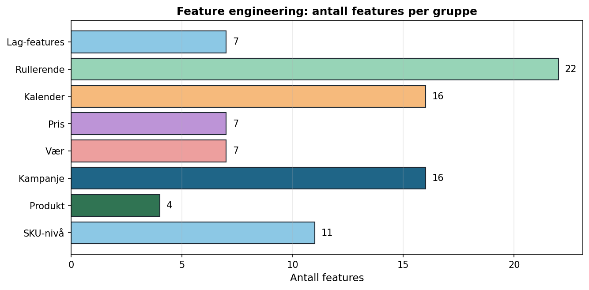

Antall features per gruppe. Rullerende statistikk og kampanje-/kalenderfeatures dominerer antallet, mens produktattributtene er få men strukturerende.

Lag- og rullerende features --- hjertet i tidsserie-ML. LightGBM har ikke innebygd forståelse av tidsrekker. Hvis vi ikke gir den salget fra forrige uke som feature, vil den ikke kunne bruke denne informasjonen. Derfor konstruerer vi:

- *Lag-features*: $y_{t-1}, y_{t-7}, y_{t-14}, \ldots, y_{t-28}$ per SKU. Lag 7 fanger ukesesongen, lag 28 fanger månedssesongen.

- *Rullerende statistikk*: Gjennomsnitt, standardavvik, min/maks og median over 7-, 14- og 28-dagers vinduer. Alle beregnes med `shift(1)` først, slik at fremtidsinformasjon ikke lekker inn.

- *Momentum*: $\mu_{7}/\mu_{28}$ sier noe om trend: over 1 betyr salget stiger, under 1 betyr det faller.

Korrelasjonsanalyse. Figur [27](#fig-fig-lgbm-feature-correlation) viser Pearson-korrelasjonen mellom utvalgte enkeltfeatures og salget. Lag- og rullerende featurer dominerer naturlig nok, men pris-, kampanje- og værvariabler har også tydelige og tolkbare fortegn.

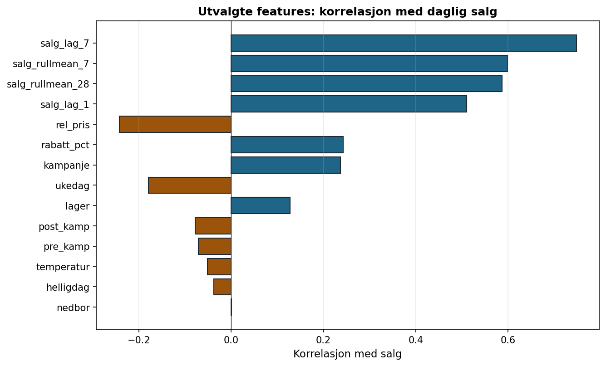

Korrelasjon mellom utvalgte features og daglig salg. Lag- og rullerende features har de høyeste korrelasjonene; rabatt og kampanje bidrar positivt; pre/post-kamp har forventet negativt fortegn.

**Konklusjon** --- *Features er ikke gratis --- men de bærer informasjonen*

De tre viktigste designvalgene i feature engineering er: (1) sikre at *ingen* feature ser inn i fremtiden, (2) gi modellen nok variasjon langs alle relevante akser (tid, pris, vær, produkt), og (3) lage noen enkle *interaksjoner* manuelt (f.eks. rabatt $\times$ helg, kampanje $\times$ jul). LightGBM finner selv de fleste interaksjoner, men noen er så fundamentale at vi hjelper modellen på vei.

### Steg 3: Datasplitting
Det kritiske her er at testdata må ligge *etter* treningsdata i tid. Hvis vi bare stokker radene tilfeldig, vil modellen lære av fremtiden --- et klassisk eksempel på datalekkasje som gir urealistisk gode testtall.

Vi splitter som følger:

- **Trening**: $t = 1, \ldots, 611$ (ca. 20 måneder, 30 550 rader, 83 % av dataene)

- **Validering**: $t = 612, \ldots, 671$ (60 dager, 3 000 rader, brukes til hyperparametertuning og early stopping)

- **Test**: $t = 672, \ldots, 731$ (siste 60 dager, 3 000 rader, *røres ikke* før modellen er ferdig)

Figur [28](#fig-fig-lgbm-split) viser splitten visuelt på det aggregerte totalsalget.

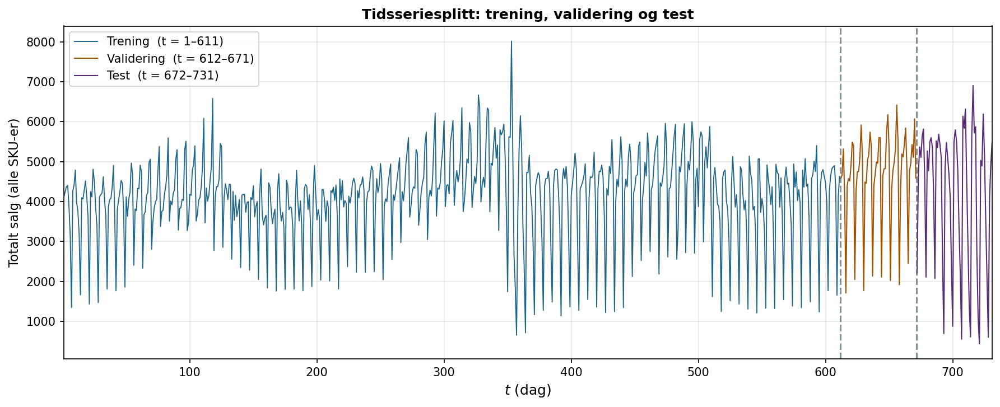

Tidsseriesplitt: trening (blå), validering (oransje) og test (lilla). Testdata ligger strengt etter både trening og validering.

Walk-forward-kryssvalidering. For hyperparametertuning bruker vi ikke én enkelt valideringsperiode, men fire *walk-forward-folder*. Hver fold trener på dataene fra $t=1$ fram til et endepunkt og evaluerer på de neste 30 dagene. Dette gir fire uavhengige estimater av valideringsfeilen og lar oss beregne både gjennomsnitt og standardavvik.

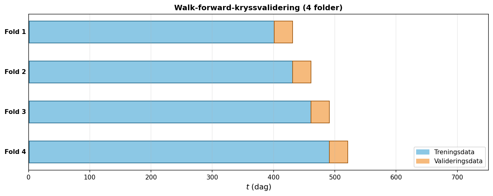

Walk-forward-kryssvalidering med fire folder. Hver fold utvider treningsvinduet (blå) med 30 dager og holder de neste 30 dagene som valideringsdata (oransje).

**Konklusjon** --- *Hvorfor ikke bare K-fold?*

Vanlig K-fold kryssvalidering stokker radene tilfeldig og gir derfor svært optimistiske estimater --- modellen har allerede «sett» dagen etter prognosen. Walk-forward-validering simulerer i stedet *realiteten*: i produksjon trener du på alt du vet fram til i dag og prognoserer uken etter. Det er slik vi må evaluere modellen.

### Steg 4: Modelltrening og hyperparametertuning
Selv den beste featurepipelinen gir middelmådige resultater hvis modellen er feiltunet. Viktigste hyperparametere for LightGBM er:

Viktigste hyperparametere i LightGBM med forklaring og typisk søkeområde.

  **Parameter**        **Hva den kontrollerer**                                          **Typisk**
  -------------------- ----------------------------------------------------------------- ---------------
  `num_leaves`         Maksimalt antall blader per tre. Styrer treets kompleksitet.      31--127
  `learning_rate`      Læringsrate $\nu$. Lavere gir tregere men mer presis læring.   0,01--0,1
  `max_depth`          Maks dybde per tre. $-1$ = ubegrenset (styres av leaves).       $-1$ til 12
  `feature_fraction`   Andel features som vurderes per tre.                              0,7--1,0
  `bagging_fraction`   Andel rader som brukes per tre (tilfeldig utvalg).                0,7--1,0
  `min_data_in_leaf`   Minste antall rader i hvert blad (hindrer overtilpasning).        20--100

Vi evaluerer seks kandidatkombinasjoner med walk-forward-kryssvalidering. Resultatene er vist i tabell [31](#tab-tab-lgbm-cv) og figur [30](#fig-fig-lgbm-cv).

Hyperparametersøk: gjennomsnittlig RMSE over fire walk-forward-folder.

  **Kombinasjon**            `num_leaves`   `lr`   `max_depth`   `min_data`   **RMSE (gj.sn. $\pm$ std)**
  -------------------------- -------------- ------ ------------- ------------ -----------------------------------
  1 (vinner)   31             0,05   $-1$        20           [$20,41 \pm 4,77$]
  2                          63             0,05   $-1$        20           $20,46 \pm 4,25$
  3                          63             0,03   10            30           $20,89 \pm 4,55$
  4                          31             0,03   8             30           $20,95 \pm 4,56$
  5                          127            0,05   $-1$        40           $21,96 \pm 5,18$
  6                          127            0,03   10            50           $22,72 \pm 5,55$

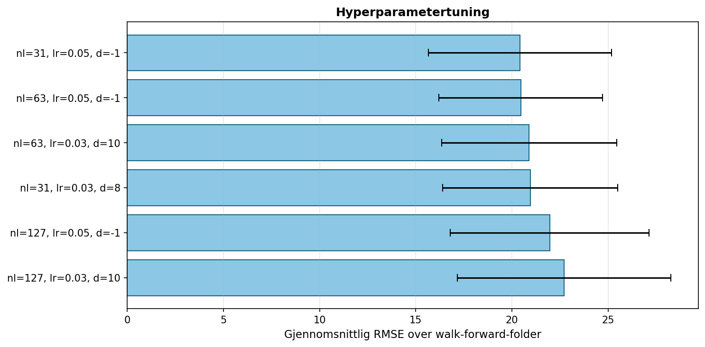

Walk-forward-RMSE med feilstreker for de seks hyperparameterkombinasjonene. Den enkleste modellen (31 blader, læringsrate 0,05) vinner marginalt.

Den vinnende konfigurasjonen er bemerkelsesverdig nøktern: 31 blader, læringsrate 0,05 og ingen eksplisitt dybdegrense. Å lage mer komplekse trær forverrer generaliseringen her --- et vanlig mønster når datamengden er moderat.

Endelig trening. Vi tilpasser så den vinnende konfigurasjonen på trening + validering, med early stopping basert på valideringssettet. Figur [31](#fig-fig-lgbm-training) viser treningskurven.

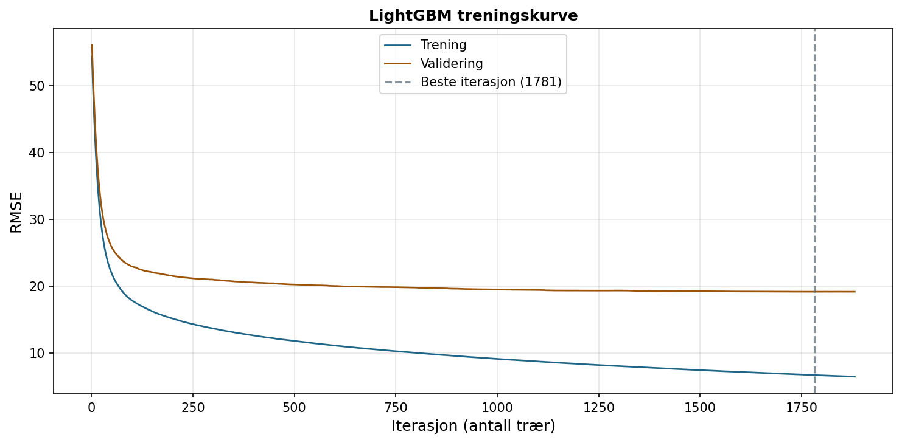

Trenings- og valideringskurven (RMSE) mot antall trær. Early stopping kutter treningen ved beste iterasjon (1 781 trær) når valideringsfeilen slutter å forbedres.

**Den endelige modellen**

- LightGBM med 1 781 trær (bestemt av early stopping).

- 89 features brukt (av 90 tilgjengelige).

- Hyperparametere: `num_leaves` = 31, `learning_rate` = 0,05, `feature_fraction` = 0,9, `bagging_fraction` = 0,9, `min_data_in_leaf` = 20.

- Treningstid: ca. 10 sekunder på en moderne laptop. SARIMA-benchmark krever flere sekunder *per SKU* og skalerer dårlig.

### Steg 5: Evaluering og modellsammenligning
Vi evaluerer LightGBM på det hold-ut-testsettet (de siste 60 dagene, $t = 672, \ldots, 731$) sammen med tre benchmark-modeller:

- *Naiv (t-7)*: $\hat y_t = y_{t-7}$. Samme ukedag forrige uke.

- *MA(28)*: $\hat y_t = \frac{1}{28}\sum_{k=1}^{28} y_{t-k}$. Glidende 28-dagers gjennomsnitt.

- *SARIMA$(1,1,1)(1,0,1)_7$*: Klassisk Box-Jenkins-modell tilpasset hver SKU separat. Kjørt kun på 10 SKU-er for beregningshastighet.

Alle modellene evalueres på samme 10 SKU-er (for rettferdig sammenligning). Tabell [32](#tab-tab-lgbm-results) viser resultatene.

Evaluering på testsettet (60 dager, 10 SKU-er felles for alle modellene).

+------------------------+-------------------------+-------------------------+--------------------------+
| **Modell**             | **RMSE**                | **MAE**                 | **MAPE**                 |
+========================+=========================+=========================+==========================+
| Naiv ($t\!-\!7$)   | $45,99$               | $29,99$               | $53,1$ %               |
+------------------------+-------------------------+-------------------------+--------------------------+
| MA(28)                 | $56,36$               | $42,44$               | $70,4$ %               |
+------------------------+-------------------------+-------------------------+--------------------------+
| SARIMA                 | $56,98$               | $38,24$               | $66,5$ %               |
+------------------------+-------------------------+-------------------------+--------------------------+
| LightGBM | $22,15$ | $13,85$ | $35,8$ % |
+------------------------+-------------------------+-------------------------+--------------------------+
| **Reduksjon vs. naiv** | $-52$ % RMSE,\quad $-54$ % MAE,\quad $-33$ % MAPE      |
+------------------------+------------------------------------------------------------------------------+
| **Reduksjon vs.        | $-61$ % RMSE,\quad $-64$ % MAE,\quad $-46$ % MAPE      |
| SARIMA**               |                                                                              |
+------------------------+------------------------------------------------------------------------------+

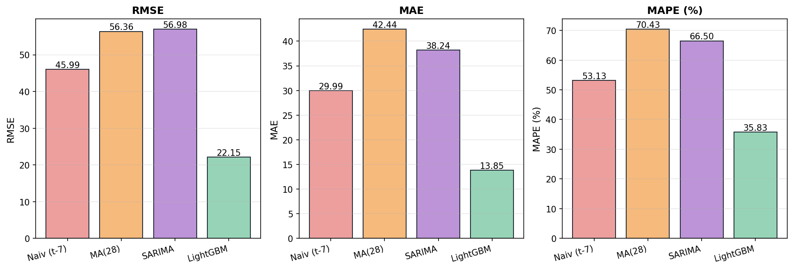

RMSE, MAE og MAPE for de fire modellene på testsettet. LightGBM slår alle baselines klart.

Kvalitativ sammenligning. Figur [33](#fig-fig-lgbm-forecast) viser prognose mot faktisk salg for tre utvalgte SKU-er. SARIMA produserer en nesten flat linje rundt gjennomsnittet fordi den sliter med lageravhengige nullperioder, mens LightGBM treffer både dipper og topper.

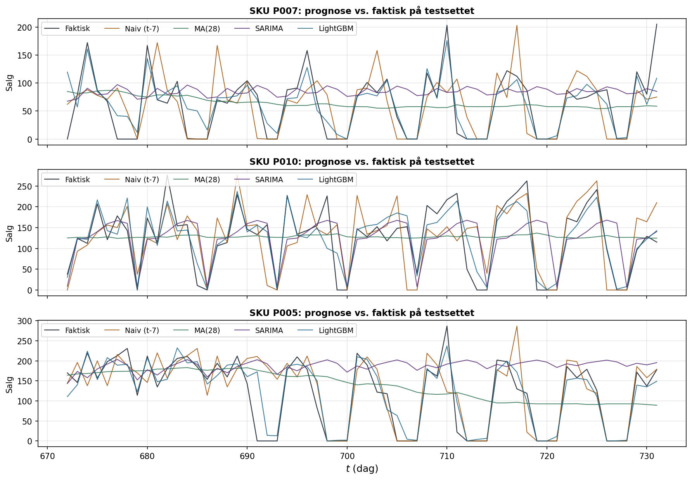

Prognose vs. faktisk salg på testsettet for tre utvalgte SKU-er. LightGBM (blå) følger både nivå og variasjon tett; de andre modellene treffer bare nivået.

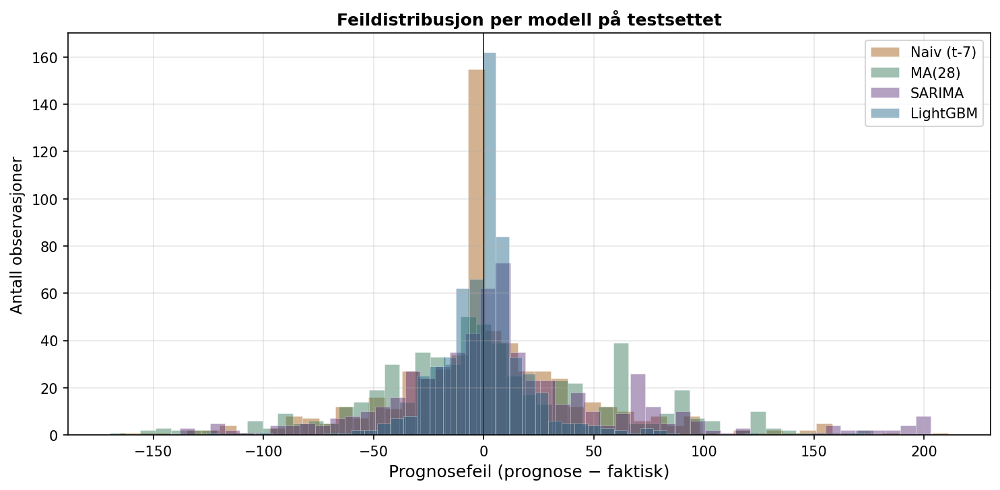

Feildistribusjon (prognose $-$ faktisk) på testsettet. LightGBM har tettest fordeling rundt null; naiv og SARIMA har lange haler.

Aggregert testresultat. På hele testsettet ($50$ SKU-er $\times 60$ dager $= 3\,000$ prediksjoner) oppnår LightGBM:

- RMSE $= 22,0$ enheter

- MAE $= 13,8$ enheter

- MAPE $= 25,7$ %

**Konklusjon** --- *Én modell, alle SKU-er, tydelig vinner*

På samme testsett der SARIMA gir MAPE på 67 %, leverer LightGBM 36 %. Forbedringen er ikke subtil --- den er dramatisk. Forskjellen kommer fra to kilder: (i) LightGBM *ser* prisen, kampanjen, været, lageret og kategorien, som SARIMA ikke har tilgang til, og (ii) modellen lærer av alle 50 SKU-er *samtidig*, slik at en nyåpnet eller datafattig SKU får nytte av mønstre fra sine «naboer».

### Steg 6: Tolkning med SHAP
Gradient boosting kalles ofte en «svart boks»: hver prediksjon er summen av 1 781 trær, og det er ikke åpenbart hvorfor modellen predikerer akkurat det den gjør. SHAP-verdier (SHapley Additive exPlanations) løser dette ved å bryte hver prediksjon ned i additive bidrag fra hver feature:

$$\hat y_i = \phi_0 + \sum_{j=1}^{p} \phi_{i,j}$$

3

der $\phi_0$ er en felles base-verdi (gjennomsnittlig prediksjon på treningssettet) og $\phi_{i,j}$ er feature $j$\'s bidrag til prediksjonen for observasjon $i$. SHAP-verdier har tre sentrale egenskaper: de er additive, lokalt korrekte, og konsistente (en feature som øker i viktighet, får aldri lavere SHAP-verdi).

Global feature importance. Ved å summere $\|\phi_{i,j}\|$ over et stort utvalg prediksjoner får vi en rangering av hvilke featurer modellen faktisk *bruker*. Figur [35](#fig-fig-lgbm-shap-bar) viser gjennomsnittlig $\|\text{SHAP}\|$ for de 15 viktigste, og figur [36](#fig-fig-lgbm-shap-summary) viser den klassiske SHAP beeswarm-fordelingen der hvert punkt er én observasjon.

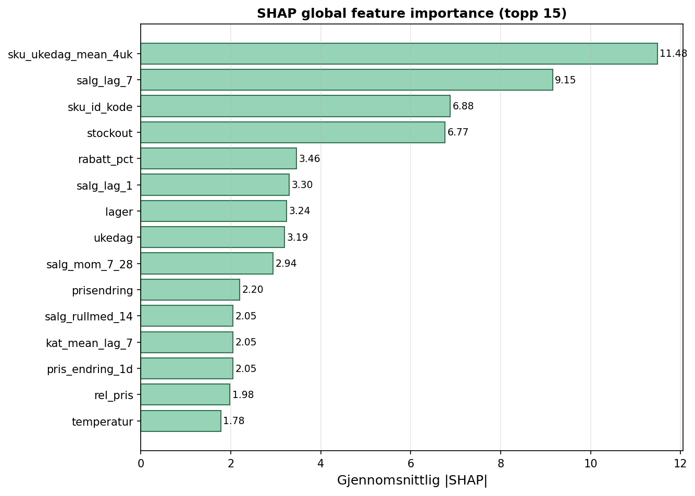

Global SHAP-importance: gjennomsnittlig absolutt SHAP-verdi for de 15 viktigste featurene.

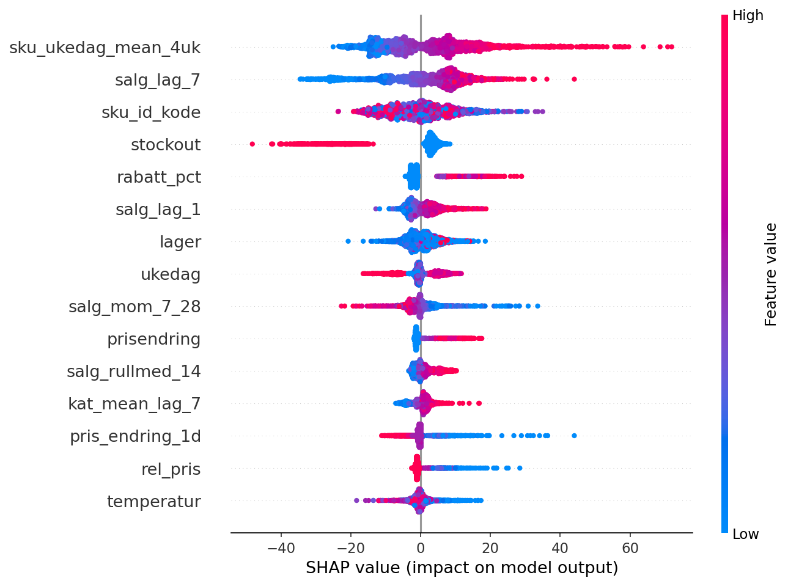

SHAP beeswarm-plot. Hver punkt er én observasjon; vannrett plassering = SHAP-bidrag, farge = feature-verdien (rød høy, blå lav). Man ser for eksempel at høy `rabatt_pct` systematisk gir positive SHAP-bidrag.

Tolkning av de viktigste featurene. Tabell [33](#tab-tab-lgbm-shap) sammenfatter funnene fra både SHAP og LightGBM sin interne gain-basert importance.

Topp 10 viktigste features. *Gain-%*: andel av total gain i LightGBM-modellen. *$\|\text{SHAP}\|$*: gjennomsnittlig absolutt SHAP-bidrag over 2 000 valideringsobservasjoner.

  **\#**   **Feature**             **Hva den fanger**                               **Gain-%**   **$\|\text{SHAP}\|$**
  -------- ----------------------- ------------------------------------------------ ------------ --------------------------
  1        `sku_ukedag_mean_4uk`   SKU-spesifikk ukedag-gjennomsnitt siste 4 uker   $35,2$ %   $11,48$
  2        `salg_lag_7`            Salg samme dag forrige uke                       $17,5$ %   $9,15$
  3        `sku_id_kode`           Produktidentitet (nivåforskjeller)               $2,7$ %    $6,88$
  4        `stockout`              Indikator for tomt lager                         $3,4$ %    $6,77$
  5        `rabatt_pct`            Rabattnivå                                       $3,7$ %    $3,46$
  6        `salg_lag_1`            Salget i går                                     $2,9$ %    $3,32$
  7        `lager`                 Lagernivå                                        $2,8$ %    $2,92$
  8        `ukedag`                Ukedag                                           $1,6$ %    $2,41$
  9        `salg_mom_7_28`         Momentum: 7-dagers snitt / 28-dagers snitt       $1,6$ %    $2,38$
  10       `prisendring`           Rabatt som fraksjon av basispris                 $1,5$ %    $2,27$

Det mest interessante er at de to viktigste featurene begge fanger ukemønsteret til den spesifikke SKU-en. Det forteller oss at den sterkeste prediktoren for daglig salg ikke er vær eller pris, men hva denne SKU-en pleide å selge på samme ukedag forrige uke. Kampanjen (rabattprosent) kommer som nummer 5 og er dermed en sekundær driver --- men en viktig en.

Lokal forklaring: hvorfor predikerer modellen 399 enheter? SHAP kan også brukes til å forklare én enkelt prediksjon. Figur [37](#fig-fig-lgbm-shap-waterfall) viser bidragene for den ekstremeste prediksjonen i valideringssettet (en kampanjefredag for en drikkeSKU).

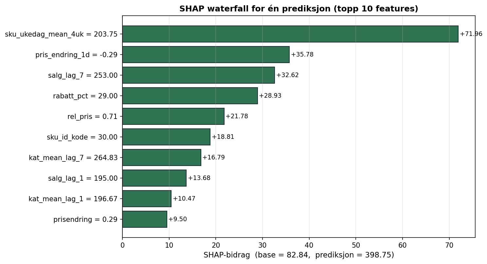

SHAP-waterfall for én enkelt prediksjon. Base-verdien ($82,8$) pluss bidragene fra de 10 viktigste featurene gir den endelige prediksjonen på $398,8$ enheter.

Prediksjonen på $398,8$ enheter er satt sammen slik:

SHAP-dekomponering for en enkelt prediksjon.

  **Komponent**                           **Feature-verdi**   **SHAP-bidrag**                         **Fortolkning**
  --------------------------------------- ------------------- --------------------------------------- -----------------------------------------------------
  Base-verdi $\phi_0$                  ---                 $+82,8$                               Gj.sn. prediksjon over treningssettet
  `sku_ukedag_mean_4uk`                   $203,8$           $+72,0$                               Høy ukedag-gjennomsnitt for denne SKU-en
  `pris_endring_1d`                       $-0,29$           $+35,8$                               Pris kuttet 29 % siden i går $\Rightarrow$ boost
  `salg_lag_7`                            $253$             $+32,6$                               Solgte mye samme dag forrige uke
  `rabatt_pct`                            $29$              $+28,9$                               Kraftig rabatt løfter videre
  `rel_pris`                              $0,71$            $+21,8$                               Nåprisen er 71 % av basispris
  `sku_id_kode`                           $30$              $+18,8$                               Denne SKU-en ligger generelt høyt
  `kat_mean_lag_7`                        $264,8$           $+16,8$                               Også høy aktivitet i kategorien
  `salg_lag_1`                            $195$             $+13,7$                               Solgte mye i går
  `kat_mean_lag_1`                        $196,7$           $+10,5$                               Kategorien går sterkt akkurat nå
  `prisendring`                           $0,29$            $+9,5$                                Rabatt bekreftes via prisendring
  **Sum ($\phi_0 + \sum \phi_j$)**                       $\boldsymbol{398,8}$   **Endelig prediksjon**

**Praktisk anvendelse** --- *Hva vinner kategorisjefen på dette?*

LightGBM + SHAP gir NordMat fire konkrete muligheter:

1.  **Skalerbar prognose**: Én modell betjener hele sortimentet på tvers av kategorier og butikker --- ingen behov for å vedlikeholde tusenvis av separate ARIMAX-modeller.

2.  **Lavere prognosefeil**: MAPE ned fra ca. 66 % (SARIMA) til 26 % (LightGBM) på samme testsett. Det oversetter direkte til lavere sikkerhetslager og færre stockouts.

3.  **Forklarbarhet**: Hver prediksjon kan brytes ned til bidrag fra hver feature. Når bestillingen fremstår overraskende høy, kan innkjøperen se *hvorfor* (f.eks. kampanje + fredag + varmt vær) og bestemme om modellens logikk er rimelig.

4.  **Scenariolæring**: Ved å endre kampanje- og prisfeatures og kjøre modellen på nytt kan NordMat simulere effekten av kampanjer før de settes i verk, på tvers av hele sortimentet.

[Begrensninger.]
- **Ekstrapolering**: LightGBM kan ikke ekstrapolere utover det den har sett i treningsdataene. En rabatt på 50 % som aldri har vært prøvd vil gi en prediksjon som klippes av datasettets grenser.

- **Manglende usikkerhetsintervall**: Standard LightGBM gir punktprognoser. For prediksjonsintervaller må man trene kvantilmodeller (f.eks. `objective="quantile"` for kvantil 5 % og 95 %) eller bruke bootstrapping.

- **Krever regelmessig re-trening**: Marked og produktsortiment endres over tid. Modellen bør re-trenes ukentlig eller månedlig på nyeste data.

- **Feature engineering er arbeidskrevende**: De viktigste featurene --- som gjennomsnittet per SKU og ukedag, og salget for én uke siden --- må beregnes korrekt i produksjon. Data-pipelinen må vedlikeholdes like nøye som modellen selv.

- **Ikke-stationaritet i relasjonene**: Hvis priselastisiteten eller kampanjeeffekten endrer seg strukturelt (f.eks. etter at en konkurrent lanserer eget lojalitetsprogram), vil modellen sakke inn inntil den er trent på nok ny data. SHAP-overvåkning over tid kan oppdage dette tidlig.

Slutt · Kapittel 1

---

# Del II — Kapittel 2: Lagerstyring

Del II · Kapittel 2

2

# Lagerstyring
Oversatt fra LaTeX-kilde --- figurer, definisjoner og KaTeX-math.

[][][][][]
Område

## Område
Lagerstyring er en av de mest sentrale kvantitative disiplinene i logistikk og handler i kjernen om å balansere tilgjengelighet av varer mot kostnaden ved å holde lager. Gode beslutninger om *hva*, *hvor mye* og *når* man skal bestille reduserer kapitalbinding og lagringskostnader samtidig som de sikrer et forsvarlig servicenivå overfor kundene.

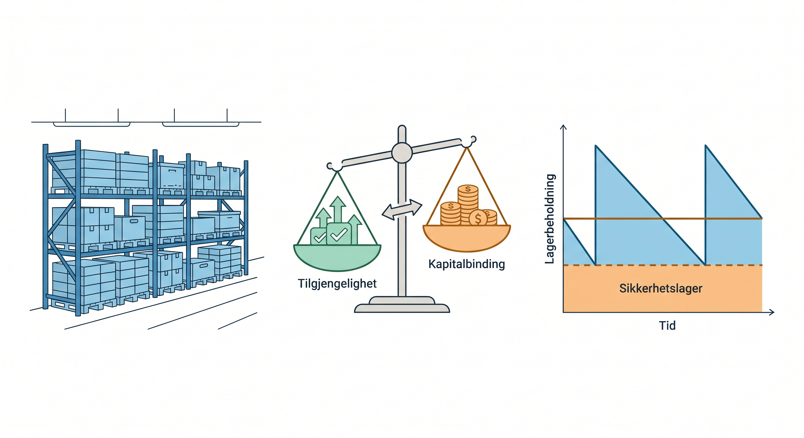

Lagerstyring: balansen mellom tilgjengelighet og kapitalbinding, med typiske lagerforløp under en (Q,R)-politikk.

Definisjon [Lagerstyring]
**Lagerstyring** er prosessen med å bestemme *hva*, *hvor mye* og *når* man skal bestille og holde på lager, slik at ønsket servicenivå nås til lavest mulig total kostnad.

Området omfatter beslutninger på ulike tidshorisonter og aggregeringsnivå:

- Strategisk lagerstyring (år) --- dimensjonering av totalkapital og lagerstruktur

- Taktisk lagerstyring (måneder) --- valg av bestillingspolitikk, servicenivå og klassifisering (ABC/XYZ)

- Operativ lagerstyring (dager til uker) --- konkrete bestillinger, påfylling og sikkerhetslager

- Flerlokasjons- og flerproduktstyring --- koordinering på tvers av lagre og produkter med felles ressurser

Lagerstyring er tett koblet til flere andre områder som behandles i dette kompendiet:

- Etterspørselsprognoser --- prognosene er direkte input til sikkerhetslager og bestillingspunkter

- Produksjonsplanlegging --- MRP (materialbehovsplanlegging) knytter lagerbeholdning til produksjonsordrer

- Innkjøpsoptimalisering --- leverandøravtaler, kvantumsrabatter og leveringstid bestemmer bestillingsøkonomien

- Nettverksdesign --- lokalisering av lagre og antall ekkoer påvirker totalt lagernivå og pooling-effekter

Problemstillinger, modeller og metoder

## Problemstillinger, modeller og metoder
I det følgende presenteres tre sentrale problemstillinger innen lagerstyring med tilhørende modeller og metoder, som illustrert i figur [2](#fig-fig-lagerstyring-problemstillinger-oversikt). Alle tre problemstillingene utdypes med egne eksempler og figurer i de påfølgende seksjonene.

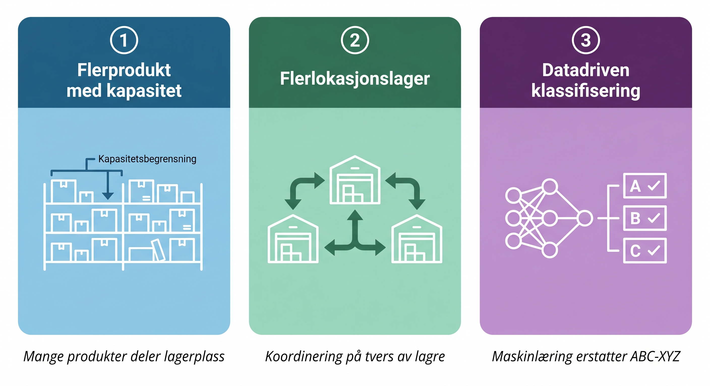

Tre sentrale problemstillinger innen lagerstyring: flerprodukts styring med delte ressurser, flerlokasjonslagerstyring med lateral transshipment, og datadriven klassifisering av produkter.

Nøkkelen til god lagerstyring er å velge riktig modell og metode for den aktuelle problemstillingen. Tabell [1](#tab-tab-lagerstyring-oversikt) gir en oversikt over hvilke modeller og metoder som egner seg for de tre problemstillingene. Tabellen inkluderer også enklere referansemodeller som EOQ og klassisk ABC-XYZ-analyse som bakgrunn, slik at leseren ser hvordan de mer avanserte modellene bygger videre på disse. Modellene og metodene uthevet med rødt vil bli gått gjennom i de tre neste avsnittene.

Oversikt over modeller og metoder for de tre sentrale problemstillingene innen lagerstyring.

  **Nr.**   **Problemstilling**                                     **Modeller**                                                                                          **Metoder**
  --------- ------------------------------------------------------- ----------------------------------------------------------------------------------------------------- ----------------------------------------------------------------------------------------
  1         Flerprodukts lagerstyring med kapasitet   EOQ, (Q,R) uavhengig per produkt, (Q,R) med delt ressurs                                Lagrange-multiplikatorer, sikkerhetslagerberegning, sensitivitetsanalyse
  2         Flerlokasjonslagerstyring                 (R,S,s) periodisk gjennomgang, To-trinns stokastisk program med lateral transshipment   Scenariobasert LP, scenario-reduksjon, rullerende horisont
  3         Datadriven klassifisering                 Klassisk ABC-XYZ, Neural network / LightGBM flerklasse-klassifikator                    ML-pipeline med SHAP, feature engineering, kryssvalidering

Flerprodukts lagerstyring med kapasitet

## Eksempel: Flerprodukts lagerstyring med kapasitet
Oppsummering.

  **Kategori**      **Beskrivelse**
  ----------------- -------------------------------------------------------------------------------------------------------------
  Eksempel          Distributor med ti produkter som deler lager og innkjøpsbudsjett
  Område        Lagerstyring med felles ressursskranker og servicekrav
  Problemstilling   Bestemme $(Q_i, R_i)$ per produkt slik at totalkostnad minimeres, gitt delt kapasitet og fast servicenivå
  Modell            Stokastisk flerprodukts $(Q,R)$ med normalfordelt etterspørsel under ledetid
  Prosess           Begrenset konveks optimering via Lagrange-multiplikatorer
  Metode            SLSQP-løser (primal), Monte Carlo-validering, sensitivitetsanalyse

### Problemstilling
NordVerktøy AS er en norsk distributør av forbruksvarer til anleggsbransjen. Selskapet fører en kjerneportefølje påti artikler --- fra sikkerhetsutstyr og filtre til bolter og smøreolje --- som bestilles fra ulike produsenter og sendes videre til mer enn 80 lokale avdelinger i hele landet. Alle artiklene deler det samme sentrallageret i Trøndelag og blir finansiert over det samme driftsbudsjettet. Logistikksjefen står dermed overfor en klassisk avveining: hvert produkt har sin egen etterspørsel, ledetid og pris, men de konkurrerer om de samme fysiske hyllemeterne og den samme pengepotten.

Under dagens politikk beregner innkjøpsavdelingen et *uavhengig* $(Q_i, R_i)$-par per produkt, basert påklassisk EOQ og en sikkerhetsmargin svarende til $95~%$ type-1 servicenivå. Når NordVerktøy simulerer denne politikken mot ledelsens skranker --- $V_{\max} = 160~\text{m}^3$ gjennomsnittlig lagervolum og $B_{\max} = 5~000~000$ NOK gjennomsnittlig kapitalbinding --- ser vi i tabell [3](#tab-tab-multiqr-uavhengig-skranker) at både volum og kapital sprenges kraftig. Den uavhengige løsningen er altså ikke *feasible* i praksis, og noen form for koordinering er nødvendig.

Ressursbruk for uavhengig $(Q,R)$ ved $\alpha = 0,95$ mot delte skranker.

  **Ressurs**                      **Uavhengig $(Q,R)$**   **Skranke**         **Status**
  -------------------------------- ------------------------- ------------------- ----------------------------------
  Gj.snitt lagervolum (m$^3$)   $224,1$                 $160,0$           Bryter med $64,1$ m$^3$
  Gj.snitt kapitalbinding (NOK)    $6\,579\,368$         $5\,000\,000$   Bryter med $1\,579\,368$ NOK

**Problemstilling** --- *Hvordan st{ø}rre Q sammen med mindre SS?*

Vi formulerer oppgaven som et begrenset optimeringsproblem over hele produktporteføljen: minimer summen av bestillings-, lagerholds- og mangelkostnader under to delte skranker (volum og kapital) og et fast type-1 servicenivå per produkt. Løsningen bruker Lagrange-multiplikatorer $(\lambda_V, \lambda_B)$ som interne *skyggepriser* påhvert av de felles ressursområdene, slik at produktene som er "dyreste" per m$^3$ eller per NOK blir kjørt med mindre bestillinger.

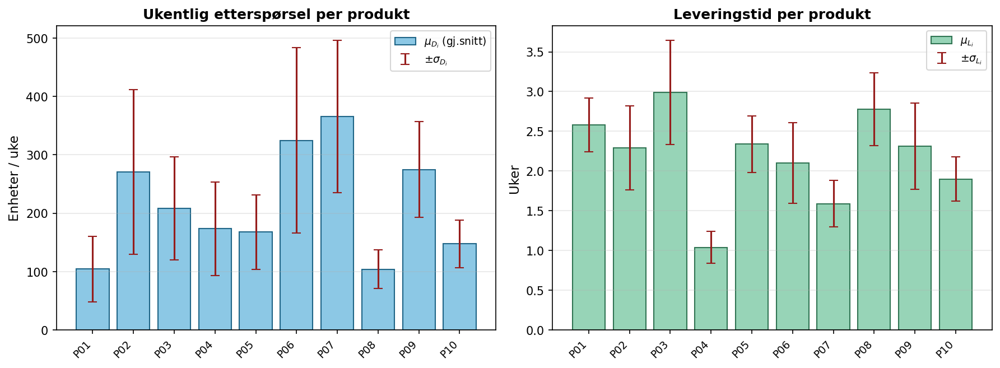

Ukentlig etterspørsel $\mu_{D_i}\pm\sigma_{D_i}$ og ledetid $\mu_{L_i}\pm\sigma_{L_i}$ for de ti produktene i porteføljen. Feilfeltene viser ønskelig variasjonsbredde og illustrerer hvorfor enkelte produkter krever betydelig sikkerhetslager.

### Modell
$(Q,R)$-modellen er et standardverktøy innen stokastisk lagerstyring: hver gang lagerposisjonen faller til eller under bestillingspunktet $R$, legges det inn en bestilling på $Q$ enheter. Når vi har mange produkter som deler kapasitet, måmodellen utvides med felles skranker, og den beregningsmessige utfordringen går fra en serie uavhengige EOQ-avledninger til et *koblet* optimeringsproblem.

Data. Datasettet består av ti produkter indeksert $i = 1, \ldots, 10$, hver med ni parametere --- forventet ukentlig etterspørsel $D_i$ med standardavvik $\sigma_{D_i}$, forventet ledetid $L_i$ med standardavvik $\sigma_{L_i}$, enhetspris $c_i$, bestillingskostnad $K_i$, lagerholdsrente $h_i$, mangelkostnad $\pi_i$ og volum per enhet $v_i$ --- generert syntetisk i steg 1. Tabell [4](#tab-tab-multiqr-panel) summerer dimensjonene.

Paneldimensjoner for flerprodukts $(Q,R)$-modellen.

  **Størrelse**                  **Symbol**                    **Verdi / tolkning**
  --------------------------------- ----------------------------- -------------------------
  Antall produkter                  $n$                         $10$
  Ukentlig porteføljeetterspørsel   $\sum_i \mu_{D_i}$       $2\,141$ enheter/uke
  Ledetid (gj.snitt)                $\bar{L}$                  $2,19$ uker
  Gj.snittlig enhetspris            $\bar{c}$                  $1\,212$ NOK
  Gj.snittlig bestillingskostnad    $\bar{K}$                  $788$ NOK/ordre
  Ukentlig volum                    $\sum_i \mu_{D_i} v_i$   $86,6$ m$^3$/uke

Modellklasse. For hvert produkt $i$ benyttes kontinuerlig gjennomgang med en $(Q_i, R_i)$-politikk.

Definisjon [Flerprodukts $(Q,R)$-politikk med delte skranker]
For hvert produkt $i = 1, \ldots, n$ bestilles en mengde $Q_i > 0$ når lagerposisjonen når bestillingspunktet $R_i$. Med normalfordelt etterspørsel $D_i \sim \mathcal{N}(\mu_{D_i}, \sigma_{D_i}^2)$ per tidsenhet og normalfordelt ledetid $L_i \sim \mathcal{N}(\mu_{L_i}, \sigma_{L_i}^2)$, er etterspørsel under ledetid tilnærmet normalfordelt med forventning og varians gitt av Hadley--Whitin:

$$\begin{aligned}\mu_{DL,i} &= \mu_{D_i} \mu_{L_i}, \\
\sigma_{DL,i}^{2} &= \mu_{L_i}\,\sigma_{D_i}^{2} + \mu_{D_i}^{2}\,\sigma_{L_i}^{2}.\end{aligned}$$

1

Sikkerhetslageret er $SS_i = k_i \sigma_{DL,i}$ der $k_i = \Phi^{-1}(\alpha_i)$ fastsettes fra et påkrevd type-1 servicenivå $\alpha_i$, slik at bestillingspunktet blir

$$R_i = \mu_{DL,i} + k_i \sigma_{DL,i}.$$

2

Symboler i flerprodukts $(Q,R)$-modellen.

  **Symbol**                                         **Betydning**
  -------------------------------------------------- ----------------------------------------------------------------------
  $D_i = 52\,\mu_{D_i}$                         Årlig etterspørsel for produkt $i$ (uker $\times$ ukesnitt)
  $\sigma_{DL,i}$                                Standardavvik for etterspørsel under ledetid
  $Q_i$                                            Bestillingskvantum (beslutningsvariabel)
  $R_i$                                            Bestillingspunkt (avledet av $\alpha_i$)
  $k_i = \Phi^{-1}(\alpha_i)$                   Sikkerhetsfaktor (gitt servicenivå)
  $\alpha_i$                                      Type-1 servicenivå = $P(D_{L,i} \leq R_i)$
  $L(k_i) = \varphi(k_i) - k_i(1 - \Phi(k_i))$   Normalens tapsfunksjon
  $ESC_i = \sigma_{DL,i}\,L(k_i)$               Forventet manko per syklus

Variabler: hva estimeres? Med fast servicekrav $\alpha_i$ er $k_i$ og dermed $R_i$ forhåndsbestemt. De reelle beslutningsvariablene er *bestillingskvantumene* $\mathbf{Q} = (Q_1, \ldots, Q_n)$. Alt annet utgjør inputparametre som enten er målt (etterspørsels- og ledetidsdistribusjoner) eller styrt av kontrakter (pris, bestillingskost, lagerholdsrente, straffekostnad, volum per enhet). Det er dermed kun $n = 10$ skalare størrelser som økonomiteamet skal bestemme --- men de er koblet gjennom de to delte skrankene og kan ikke settes uavhengig.

[Målfunksjon og skranker.]
Definisjon [Koblet optimeringsproblem]
La $TC_i(Q_i)$ betegne årlig totalkostnad for produkt $i$ som funksjon av bestillingskvantum, med $k_i$ (og dermed $R_i$) fastsatt fra servicekravet:

$$TC_i(Q_i) = \frac{K_i D_i}{Q_i}
\;+\; h_i c_i\!\left(\frac{Q_i}{2} + k_i \sigma_{DL,i}\right)
\;+\; \frac{\pi_i\, D_i\, \sigma_{DL,i}\, L(k_i)}{Q_i}.$$

3

De tre leddene er (i) bestillingskostnad, (ii) lagerholdskostnad påsyklisk lager pluss sikkerhetslager, og (iii) forventet mangelkostnad per år. Det koblede problemet er

$$\begin{aligned}\min_{\mathbf{Q} > 0} \quad & TC(\mathbf{Q}) = \sum_{i=1}^{n} TC_i(Q_i) \\
\text{slik at} \quad
& \sum_{i=1}^{n} v_i\!\left(\tfrac{Q_i}{2} + k_i \sigma_{DL,i}\right) \le V_{\max}, \\
& \sum_{i=1}^{n} c_i\!\left(\tfrac{Q_i}{2} + k_i \sigma_{DL,i}\right) \le B_{\max}, \\
& k_i = \Phi^{-1}(\alpha_i), \quad i = 1, \ldots, n.\end{aligned}$$

4

Lagrangeanen og KKT-betingelsene. Siden [(4)](#eq-eq-multiqr-primal) er konveks i $\mathbf{Q} > 0$ og skrankene er lineære, kan vi bruke klassisk Lagrange-dualitet. Innfør multiplikatorene $\lambda_V \ge 0$ og $\lambda_B \ge 0$ for henholdsvis volum- og budsjettskranken, og dann Lagrangeanen

$$\begin{aligned}\mathcal{L}(\mathbf{Q}, \lambda_V, \lambda_B)
&= TC(\mathbf{Q}) \nonumber \\
&\quad + \lambda_V\!\left(\textstyle\sum_i v_i\!\left(\tfrac{Q_i}{2} + k_i \sigma_{DL,i}\right) - V_{\max}\right)\nonumber \\
&\quad + \lambda_B\!\left(\textstyle\sum_i c_i\!\left(\tfrac{Q_i}{2} + k_i \sigma_{DL,i}\right) - B_{\max}\right).\end{aligned}$$

1

Forsteordens betingelsen $\partial \mathcal{L}/\partial Q_i = 0$ gir --- etter at alle konstantledd over $k_i$ samles --- et eksplisitt uttrykk:

$$\boxed{\; Q_i^\*(\lambda_V, \lambda_B)
= \sqrt{\,\dfrac{2 D_i \bigl(K_i + \pi_i\,\sigma_{DL,i}\,L(k_i)\bigr)}{h_i c_i + \lambda_V v_i + \lambda_B c_i}\,}. \;}$$

2

Dette er utvidet EOQ: den klassiske formelen er tilbakegravbar ved $\lambda_V = \lambda_B = 0$ og $\pi_i = 0$. Skyggeprisene øker *effektivt* lagerholdsrenten og krymper dermed $Q_i$. De optimale $(\lambda_V^\*, \lambda_B^\*)$ bestemmes av de komplementære betingelsene: $\lambda_V^\*>0$ om og bare om volumskranken er bindende, og tilsvarende for $\lambda_B^\*$.

**Tolkning** --- *Skyggepriser som interne "leiekostnader"*

Les [(2)](#eq-eq-multiqr-Q-star) slik: effektiv lagerholdsrente per NOK-verdi påprodukt $i$ er $h_i + \lambda_V v_i / c_i + \lambda_B$. De to siste leddene er *interne leiepriser* som porteføljeteamet legger til når en fysisk m$^3$ eller en NOK kapitalbinding er knapp. Produkter med høyt volum-per-NOK (store, billige artikler) straffes hardest av $\lambda_V$; produkter med høy NOK-verdi straffes hardest av $\lambda_B$. De knappe ressursene fordeles dermed mot de produktene der de gir størst nytte.

Forutsetninger. Modellen bygger påtre substansielle modellforpliktelser:

1.  **Normalfordelt etterspørsel under ledetid.** Leverandørstyringen er godt nok tilpasset at vi kan bruke $N(\mu_{DL,i}, \sigma_{DL,i}^2)$ som rimelig tilnærming. Dette kan valideres via normalitetstester påhistoriske salgsdata og er vanlig for middels-omsatte SKU-er; produkter med mange nulluker (intermitterende etterspørsel) måmodelleres annerledes.

2.  **Kontinuerlig gjennomgang og stabile kostnadsledd.** Parametrene $c_i, K_i, h_i, \pi_i, v_i$ antas konstante i planleggings-perioden (ett kvartal), slik at problemet kan behandles som ett langsiktig gjennomsnitt. I praksis reestimeres modellen ved pris-revisjon, kontraktsendring eller strukturelle skift.

3.  **Ingen koblingseffekter påetterspørselssiden.** Produktene er ikke substitutter eller komplementer i kundens øyne. Koblingen mellom produkter går kun gjennom de delte fysiske og finansielle ressursene. Om det finnes sterke substitusjonseffekter --- f.eks. mellom to ulike filtertyper --- måmodellen utvides med koblede etterspørselsfordelinger og eventuelle kannibaliseringsledd.

### Prosess
Prosess: Stokastisk flerprodukts lageroptimering med Lagrange-dualitet.
Modell: Flerprodukts $(Q,R)$ med felles volum- og budsjettskranke og type-1 servicekrav.

Figur [4](#fig-fig-multiqr-method) viser de seks stegene vi bruker for ågåfra rådata til en anbefaling som respekterer både servicekravet og ressursskrankene.

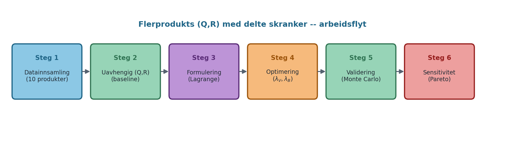

Arbeidsflyt for flerprodukts $(Q,R)$ med delte skranker.

### Steg 1: Datainnsamling
NordVerktøy har ekstrahert parametere for ti produkter fra sitt ERP-system, og disse er vist i tabell [6](#tab-tab-multiqr-rawdata). For hvert produkt rapporteres ukentlig etterspørsel $(\mu_{D_i}, \sigma_{D_i})$, ledetid $(\mu_{L_i}, \sigma_{L_i})$, enhetspris $c_i$, bestillingskostnad $K_i$, lagerholdsrente $h_i$, straffekostnad $\pi_i$ og volum per enhet $v_i$. Prisene har en faktor fire i spenn (fra $513$ til $1~841$ NOK); ukentlig etterspørsel varierer mer enn en faktor tre (fra $104$ til $366$ enheter).

Rådata for ti produkter hos NordVerktøy.

  **Id**   $\mu_{D_i}$   $\sigma_{D_i}$   $\mu_{L_i}$   $\sigma_{L_i}$   $c_i$         $K_i$       $h_i$     $\pi_i$      $v_i$
  -------- ----------------- -------------------- ----------------- -------------------- --------------- ------------- ----------- --------------- ------------
           (uke)             (uke)                (uker)            (uker)               (NOK)           (NOK)         (1/år)      (NOK)           (m$^3$)
  P01      $104,4$         $56,22$            $2,58$          $0,339$            $1\,755,2$   $897$       $0,252$   $1\,872,9$   $0,0240$
  P02      $270,4$         $141,12$           $2,29$          $0,530$            $818,9$       $698$       $0,233$   $750,5$       $0,0544$
  P03      $208,2$         $87,98$            $2,99$          $0,657$            $690,8$       $736$       $0,250$   $880,2$       $0,0400$
  P04      $173,4$         $80,35$            $1,04$          $0,198$            $1\,767,1$   $796$       $0,209$   $2\,577,2$   $0,0092$
  P05      $167,8$         $63,80$            $2,34$          $0,356$            $608,3$       $776$       $0,290$   $844,6$       $0,0030$
  P06      $324,6$         $158,74$           $2,10$          $0,507$            $1\,258,1$   $941$       $0,299$   $1\,410,3$   $0,0491$
  P07      $365,9$         $130,58$           $1,59$          $0,293$            $1\,471,1$   $862$       $0,206$   $971,3$       $0,0403$
  P08      $103,8$         $33,08$            $2,78$          $0,459$            $512,8$       $733$       $0,236$   $742,1$       $0,0489$
  P09      $275,0$         $81,75$            $2,31$          $0,542$            $1\,841,5$   $401$       $0,273$   $964,3$       $0,0460$
  P10      $147,4$         $41,15$            $1,90$          $0,281$            $1\,393,8$   $1\,035$   $0,231$   $1\,111,8$   $0,0715$

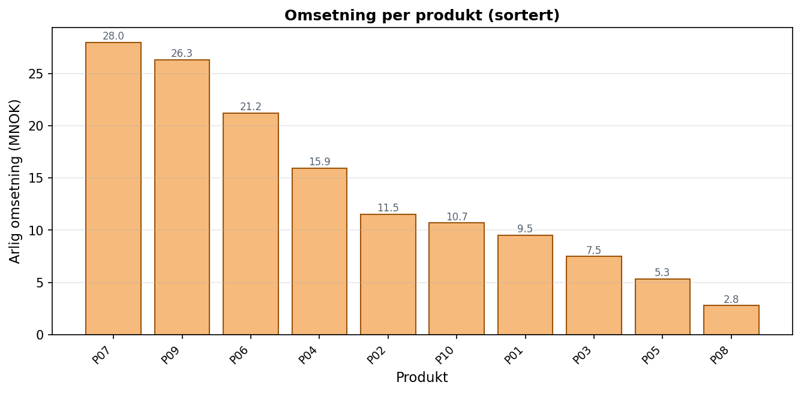

Årlig omsetning per produkt (millioner NOK). Omsetningen konsentreres om fåartikler --- hjelper åforståhvorfor de delte skrankene blir bindende.

**Konklusjon** --- *En heterogen portefølje*

Porteføljen er typisk for norsk distribusjonshandel: fåartikler (P06, P07, P09) står for størsteparten av omsetningen, mens halvparten av produktene er smale nisjeartikler med småvolumer. Denne skjevheten er akkurat hva som skal gjøre de delte skrankene bindende --- og som skal gi Lagrange-multiplikatorene reell forklaringskraft i steg 4.

### Steg 2: Uavhengig $(Q,R)$ --- baseline
Vi starter med en *naiv* tilnærming der hvert produkt behandles uavhengig, uten hensyn til delte skranker. For et fast servicekrav $\alpha = 0,95$ --- det vil si $k_i = z_{0,95} \approx 1,645$ --- benytter vi den utvidede EOQ-formelen som minimerer [(3)](#eq-eq-multiqr-TCi):

$$Q_i^{\text{uav}} = \sqrt{\,\frac{2 D_i \bigl(K_i + \pi_i\,\sigma_{DL,i}\,L(k_i)\bigr)}{h_i c_i}\,}
\qquad \text{og} \qquad R_i = \mu_{DL,i} + k_i\,\sigma_{DL,i}.$$

3

Tabell [7](#tab-tab-multiqr-uav) viser resultatet per produkt.

Uavhengig $(Q,R)$ per produkt ved $\alpha = 0,95$.

  **Id**    $D_i$        $\sigma_{DL,i}$   $Q_i^{\text{uav}}$   $R_i$         $SS_i$    $TC_i$ (NOK/år)
  --------- -------------- --------------------- ------------------------ --------------- ----------- -----------------------------
  P01       $5\,429$    $97,0$              $339,4$                $428,9$       $159,5$   $220\,678$
  P02       $14\,061$   $257,2$             $835,0$                $1\,042,2$   $423,0$   $240\,037$
  P03       $10\,826$   $204,6$             $751,0$                $959,0$       $336,5$   $187\,812$
  P04       $9\,017$    $88,8$              $522,0$                $326,5$       $146,1$   $246\,747$
  P05       $8\,726$    $114,4$             $525,8$                $580,9$       $188,2$   $125\,966$
  P06       $16\,879$   $282,8$             $912,3$                $1\,146,9$   $465,2$   $518\,206$
  P07       $19\,027$   $196,5$             $780,3$                $905,0$       $323,2$   $334\,418$
  P08       $5\,398$    $72,9$              $407,7$                $408,4$       $119,9$   $63\,844$
  P09       $14\,300$   $194,0$             $495,2$                $954,4$       $319,2$   $409\,409$
  P10       $7\,665$    $70,2$              $356,3$                $395,6$       $115,5$   $151\,916$
  **Sum**   ---            ---                   ---                      ---             ---         $\mathbf{2\,499\,032}$

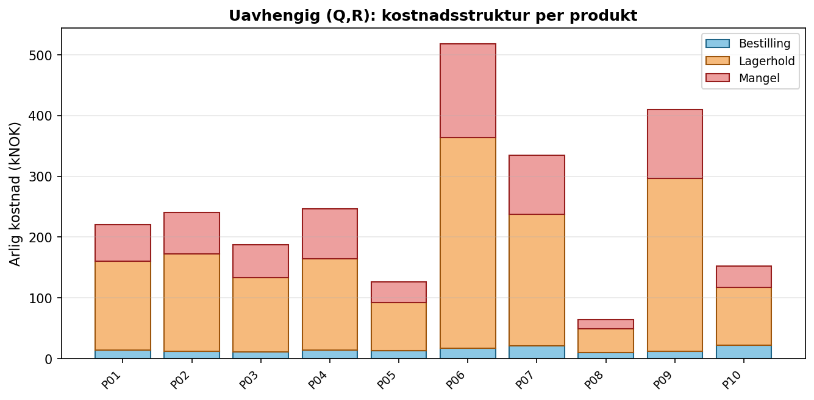

Kostnadsfordeling per produkt under uavhengig $(Q,R)$-politikk: bestilling, lagerhold og mangel. De tre komponentene er stablet, og totalhøyden tilsvarer $TC_i$ i tabell [7](#tab-tab-multiqr-uav).

**Konklusjon** --- *Naiv totalkostnad er lav, men politikken er infeasible*

Summert gir den uavhengige politikken en årlig kostnad på $2\,499\,032$ NOK og et gjennomsnittlig lager på $224,1~\text{m}^3$ og $6,58$ MNOK kapital. Både volum- og budsjettskranken sprenges med henholdsvis $40~%$ og $32~%$. Vi måderfor justere politikken --- men hvordan fordeler vi nødvendige reduksjoner påtvers av ti heterogene produkter?

### Steg 3: Modellformulering
Steg 3 er rent formell: vi kobler skrankene [(?)](#eq-eq-multiqr-cons-V)--[(?)](#eq-eq-multiqr-cons-B) inn i målfunksjonen [(3)](#eq-eq-multiqr-TCi) og danner Lagrangeanen [(1)](#eq-eq-multiqr-lagrangian). Nøkkelresultatet er løsningsstrukturen [(2)](#eq-eq-multiqr-Q-star): for ethvert par skyggepriser $(\lambda_V, \lambda_B) \ge 0$ er optimalt $Q_i$ gitt i lukket form. Det reduserer problemet til et *to-dimensjonalt* søk etter skyggepriser. Feasibility-sjekken i steg 2 viste at begge skrankene *kan* bli bindende --- men det er ogsåmulig at bare \\'en er det. I såfall er den andre skyggeprisen null ved optimum.

**Konklusjon** --- *To tall dekker alt*

De interne skyggeprisene $(\lambda_V^\*, \lambda_B^\*)$ er nøkkelen til hele porteføljens økonomi: de forteller både *hvor mye* det koster årespektere skrankene, og hvordan den kostnaden *fordeles* påtvers av produktene. Det er denne reduksjonen fra $n$ koblede beslutninger til *to dualvariabler* som gjør Lagrange-metoden såkraftig i praksis.

### Steg 4: Optimering med delte skranker
Den optimeringsmessige veien til $(\lambda_V^\*, \lambda_B^\*)$ gir to ekvivalente alternativer:

1.  **Dualt subgradient-søk:** Start fra $\lambda = 0$, bruk skrankebrudd som oppoversubgradienter, og iterer. Krever tuning av steglengder og kan bli ustabilt for heterogene problemer.

2.  **Primal løser med constraint-handling:** Formuler [(4)](#eq-eq-multiqr-primal)--[(?)](#eq-eq-multiqr-cons-B) direkte som et konveks constrained nonlinear program og løs med SLSQP (Sequential Least Squares Quadratic Programming). Lagrange-multiplikatorene gjenopprettes etter konvergens fra KKT-betingelsen:

    $$(\lambda_V^\* v_i + \lambda_B^\* c_i) = \frac{2 D_i \bigl(K_i + \pi_i\,\sigma_{DL,i}\,L(k_i)\bigr)}{(Q_i^\*)^{2}} - h_i c_i$$

    8

    ved minste kvadraters tilpasning over de $n$ produktene.

Vi velger det andre alternativet fordi SLSQP konvergerer stabilt og raskt (22--33 iterasjoner for vårt datasett) og fordi KKT-gjenopprettingen [(8)](#eq-eq-multiqr-kkt-recover) gir Lagrange-multiplikatorene direkte. Resultatet er vist i tabell [8](#tab-tab-multiqr-solution).

Optimal $(Q,R)$-politikk under delte skranker, $\alpha = 0,95$.

  **Id**    $Q_i^\*$   $R_i$         $SS_i$    Vol. $v_i (Q_i^\*/2 + SS_i)$ (m$^3$)   Verdi (kNOK)            $\Delta Q_i$ vs. uavh.\
  --------- ------------- --------------- ----------- -------------------------------------------- ----------------------- -----------------------------
  P01       $225,9$     $428,9$       $159,5$   $6,54$                                     $478$                 $-33,4~%$
  P02       $302,8$     $1\,042,2$   $423,0$   $31,25$                                    $470$                 $-63,7~%$
  P03       $297,7$     $959,0$       $336,5$   $19,41$                                    $335$                 $-60,4~%$
  P04       $415,7$     $326,5$       $146,1$   $3,26$                                     $625$                 $-20,4~%$
  P05       $445,4$     $580,9$       $188,2$   $1,23$                                     $250$                 $-15,3~%$
  P06       $454,9$     $1\,146,9$   $465,2$   $34,01$                                    $871$                 $-50,1~%$
  P07       $386,3$     $905,0$       $323,2$   $20,81$                                    $760$                 $-50,5~%$
  P08       $126,7$     $408,4$       $119,9$   $8,96$                                     $94$                  $-68,9~%$
  P09       $280,4$     $954,4$       $319,2$   $21,13$                                    $846$                 $-43,4~%$
  P10       $143,8$     $395,6$       $115,5$   $13,40$                                    $261$                 $-59,6~%$
  **Sum**   ---           ---             ---         $\mathbf{160,00}$                         $\mathbf{4\,992}$   ---

Begge skrankene er (praktisk talt) bindende: $\sum_i v_i(Q_i^\*/2 + SS_i) = 160,0~\text{m}^3 = V_{\max}$ og $\sum_i c_i(Q_i^\*/2 + SS_i) = 4\,991\,516~\text{NOK} \approx B_{\max}$. De gjenopprettede skyggeprisene er $\lambda_V^\* = 23\,162$ NOK/m$^3$ og $\lambda_B^\* = 0$ (budsjett-skranken binder påkanten, ikke strikt). Årlig totalkostnad øker fra $2\,499\,032$ til $2\,943\,906$ NOK, dvs. $\mathbf{+17,8~%}$. Det er økonomens pris for årespektere kapasitet og kapital.

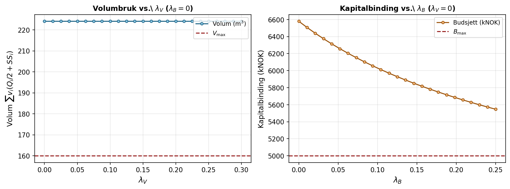

Volum- og kapitalbruk som funksjon av \\'en aktiv skyggepris om gangen. Våre skranker er markert med horisontale stiplede linjer; figurene illustrerer at økende skyggepris krymper ressursbruken monotont.

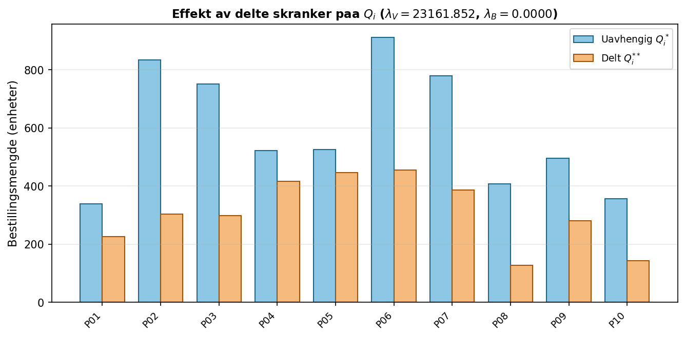

Uavhengig $Q_i^{\text{uav}}$ (blå) mot delt $Q_i^\*$ (oransje). Produktene med høy volum-per-NOK (P02, P06, P08) rammes hardest av volum-skyggeprisen; produktene med lav $v_i/c_i$ (P04, P05) rammes minst.

**Konklusjon** --- *Produktene "betaler intern leie"*

Skyggeprisen $\lambda_V^\* = 23\,162$ NOK/m$^3$ måtolkes som den *marginale* kostnaden av lagervolumet: hvis NordVerktøy kunne leie en ekstra m$^3$ hylle for mindre enn dette, ville det lønne seg økonomisk. Budsjett-skyggeprisen er ca. null fordi volum-skranken er *strammere* pådenne datasettet --- marginalen for kapitalbinding er någratis sålenge vi holder volumet på $160~\text{m}^3$.

### Steg 5: Validering med Monte Carlo-simulering
Den analytiske $(Q,R)$-politikken forutsetter normalfordelt etterspørsel under ledetid og ignorerer løftet om pålitelige ledetidsfordelinger. Vi validerer derfor med en uke-basert simulering over $T = 2000$ uker per produkt: etterspørselen trekkes fra $\mathcal{N}(\mu_{D_i}, \sigma_{D_i}^2)$ (trunkert pånull), og leveringstidene fra $\mathcal{N}(\mu_{L_i}, \sigma_{L_i}^2)$ (rundet til hele uker). Det registreres både realisert type-1 servicenivå (fraksjon av sykluser uten manko) og type-2 fill rate (andel etterspørsel dekket direkte fra lager).

Realisert servicenivå fra Monte Carlo-simulering (2000 uker, frø $= 4\,242$).

  **Id**         Sykluser      Type-1 realisert      Fill rate realisert   Mål type-1
  -------------- ------------- --------------------- --------------------- ----------------
  P01            $931$       $0,965$             $0,994$             $0,95$
  P02            $1\,739$   $0,943$             $0,976$             $0,95$
  P03            $1\,375$   $0,978$             $0,995$             $0,95$
  P04            $846$       $0,997$             $1,000$             $0,95$
  P05            $752$       $0,976$             $0,997$             $0,95$
  P06            $1\,419$   $0,968$             $0,990$             $0,95$
  P07            $1\,848$   $0,918$             $0,979$             $0,95$
  P08            $1\,638$   $0,979$             $0,993$             $0,95$
  P09            $1\,902$   $0,937$             $0,975$             $0,95$
  P10            $1\,968$   $0,843$             $0,957$             $0,95$
  **Gj.snitt**   ---           $\mathbf{0,950}$   $\mathbf{0,986}$   $0,95$


Realisert type-1 servicenivå og fill rate per produkt. Mållinjen ved $0,95$ er stiplet. Avviket for P10 skyldes at bestillingskvantumet $Q_{10} \approx 144$ nærmer seg ukentlig etterspørsel $\mu_{D,10}\approx147$, slik at det alltid er flere bestillinger samtidig "i luften" og modellens type-1-garanti svekkes.

**Konklusjon** --- *Modellen holder i praksis --- med \\'en merknad*

Gjennomsnittlig realisert type-1 er $0,950$, tett påmålet $0,95$. Fill rate (type-2) er enda bedre --- $0,986$ --- fordi manko i mange sykluser er små. Den eneste merkbare avvikeren er P10, der den stramme budsjettskranken har presset $Q_{10}$ ned slik at flere bestillinger er "i luften" samtidig. I praksis kan NordVerktøy kompensere ved åhøyne $R_{10}$ eller åsette et strammere eget servicekrav for akkurat dette produktet.

### Steg 6: Sensitivitetsanalyse
Til slutt svarer vi påspørsmålet: *Hva koster service?* For ti servicenivåer fra $\alpha = 0,80$ til $\alpha = 0,99$ løser vi det delte problemet pånytt og sammenligner med den uavhengige politikken. Tabell [10](#tab-tab-multiqr-sweep) summerer resultatene og figur [10](#fig-fig-multiqr-pareto) viser Pareto-fronten.

Sensitivitetsanalyse over servicenivå $\alpha$. "Uavhengig" er infeasible i alle rader.

  $\alpha$   $z_\alpha$   $TC_{\text{uav}}$ (kNOK)   $TC_{\text{delt}}$ (kNOK)   $\lambda_V$ (NOK/m$^3$)   $\lambda_B$   **Merknad**
  ------------- ---------------- ------------------------------ ------------------------------- ------------------------------- ---------------- -----------------------------
  $0,80$      $0,84$         $4\,083$                    $5\,317$                     $14\,816$                    $0,487$        Begge skranker binder
  $0,85$      $1,04$         $3\,591$                    $4\,496$                     $15\,540$                    $0,345$        Begge skranker binder
  $0,90$      $1,28$         $3\,068$                    $3\,693$                     $17\,167$                    $0,189$        Begge skranker binder
  $0,92$      $1,41$         $2\,847$                    $3\,382$                     $18\,550$                    $0,118$        Begge skranker binder
  $0,94$      $1,56$         $2\,617$                    $3\,083$                     $21\,157$                    $0,036$        Budsjett nærmer inaktiv
  $0,95$      $1,64$         $2\,499$                    $2\,944$                     $23\,162$                    $0,000$        Kun volum binder
  $0,96$      $1,75$         $2\,379$                    $2\,821$                     $25\,396$                    $0,000$        Kun volum binder
  $0,97$      $1,88$         $2\,258$                    $2\,735$                     $30\,945$                    $0,000$        Kun volum binder
  $0,98$      $2,05$         $2\,140$                    $2\,779$                     $49\,724$                    $0,000$        Kun volum binder
  $0,99$      $2,33$         $2\,047$                    $4\,266$                     $338\,542$                   $0,000$        Ekstremt stramt

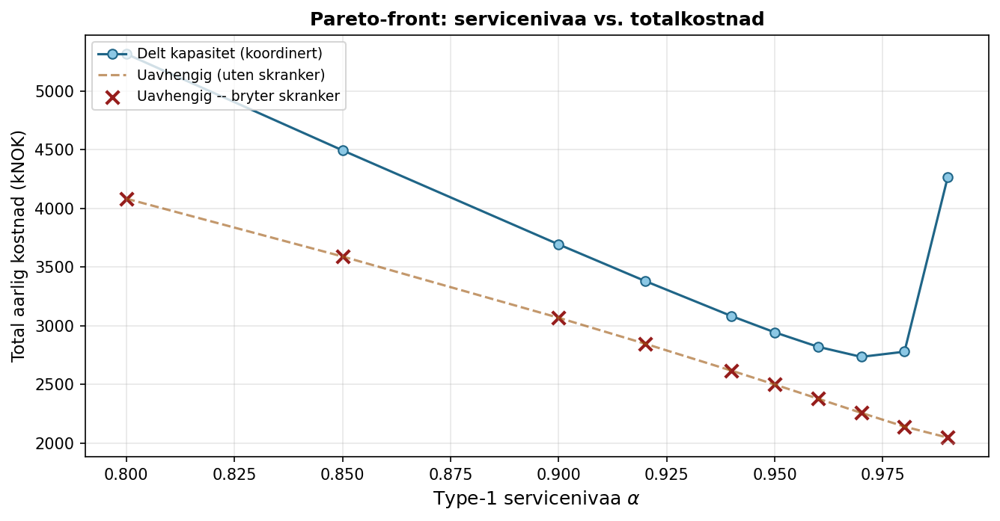

Pareto-front: totalkostnad under delt politikk (solid) og uavhengig politikk (stiplet). Alle uavhengige punkter er *infeasible* og er markert med kryss --- de er derfor ikke et reelt alternativ, kun et teoretisk referansepunkt.


Skyggeprisene $\lambda_V$ (venstre akse) og $\lambda_B$ (høyre akse, skalert med $10^3$) som funksjon av servicekravet $\alpha$. Budsjett-skyggeprisen faller mot null når $\alpha$ nærmer seg $0,95$; volum-skyggeprisen eksploderer nær $\alpha = 0,99$ fordi sikkerhetslageret alene nesten fyller hyllene.

**Praktisk anvendelse** --- *Hva kan NordVerktøy bruke dette til?*

1.  **Velge servicenivå bevisst.** Å øke fra $\alpha = 0,90$ til $0,95$ koster $\approx 600$ kNOK per år i ekstra totalkostnad. Ågåvidere til $\alpha = 0,99$ koster y-derligere $1,3$ MNOK --- brattheten kan begrunne et differensiert servicekrav per produkt.

2.  **Forhandle om kapasitet.** Skyggeprisen $\lambda_V^\* = 23\,162$ NOK/m$^3$ er den konkrete budsjettgrensen for åinvestere i mer hyllekapasitet. Hvis en tredjepartsleverandør tilbyr ekstra hyllem$^3$ til lavere pris --- inkludert transport --- bør det gripes.

3.  **Teste revisjoner.** Når ledelsen vurderer åløfte $V_{\max}$ eller $B_{\max}$ med $X~%$, kan analysen reestimeres raskt fordi hele problemet er lukket-form gitt skyggeprisene.

4.  **Prioritere produkter som kandidater for utfasing.** Produkter med høy $v_i / c_i$ (lav verdi per m$^3$) er spesielt påvirkede av volum-skyggeprisen og kan være kandidater for cross-docking, 3PL-lagring eller utfasing.

[Begrensninger.]
- Normalfordelt etterspørsel og ledetid kan være en for åpenbar forenkling for produkter med sterk sesong eller intermitterende etterspørsel.

- Modellen bruker ett felles servicekrav $\alpha$ påtvers av produkter; det er bedre praksis ådifferensiere etter kundens betalingsvillighet.

- Skrankene er gjennomsnittlige; peak-belastning (f.eks. rett etter store innkjøp) kan likevel overstige fysisk hyllekapasitet.

- Koblinger påetterspørselssiden (substitusjon, komplementer) er ikke modellert.

Flerlokasjon og stokastisk programmering

## Eksempel: Flerlokasjon og stokastisk programmering
Oppsummering.

  **Kategori**      **Beskrivelse**
  ----------------- -------------------------------------------------------------------------------
  Eksempel          Regional forhandler med fire lagre og laterale omlastninger
  Område            Lagerstyring med flere lokasjoner under usikker etterspørsel
  Problemstilling   Finne bestillings- og omlastingspolitikk som minimerer forventet totalkostnad
  Modell            To-trinns stokastisk lineært program med $(R,S,s)$-gjennomgang
  Prosess           Scenariobasert stokastisk programmering med rullerende horisont
  Metode            Multivariat scenariogenerering, Kantorovich-scenario-reduksjon, PuLP/CBC

### Problemstilling
Nordlaget AS er en regional forhandler av reservedeler til anleggsmaskiner og betjener fire distriktskontor langs norskekysten gjennom fire lokale lagre $\ell \in {L_1, L_2, L_3, L_4}$. Hvert lager har sin egen etterspørsel, egen leveringstid fra sentralleverandøren, og er bemannet av lokalt personell som har frihet til å fylle på lager ukentlig. I tillegg kan lagrene sende enheter til hverandre ved behov --- såkalte *laterale transshipment* --- via en daglig bilrute mellom kontorene.

Dagens praksis er at hver lokasjon styres uavhengig med en klassisk $(R,S,s)$-politikk: ukentlig gjennomgang og et bestemt order-up-to-nivå. Ledelsen opplever imidlertid at ett lager ofte er tomt samtidig som et annet har overskudd, og ønsker å kvantifisere hvor mye det er å tjene på å *koordinere* bestillings- og omlastingsbeslutningene under usikkerhet i etterspørselen.

**Problemstilling** --- *Hvor mye kan koordinert lagerstyring spare?*

Vi formulerer beslutningen som et *to-trinns stokastisk lineært program*: først bestemmes ukens bestillinger per lokasjon (her-og-nå), deretter --- etter at etterspørselen er observert --- fordeles eventuelle overskudd via omlastninger. Modellen løses over 60 representative scenarier generert fra en multivariat etterspørselsfordeling, og sammenlignes med uavhengig $(R,S,s)$-styring over en 12-ukers rullerende horisont.

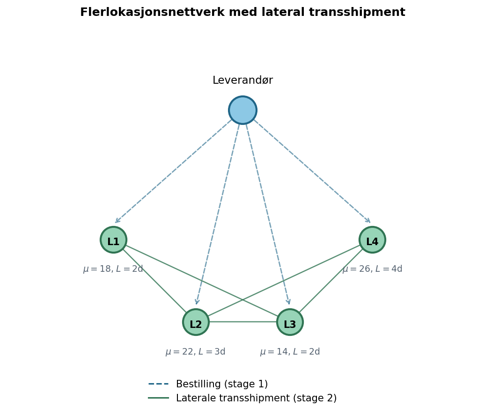

Distribusjonsnettverket: leverandør øverst, fire lagre $L_1, \ldots, L_4$ med ulik gjennomsnittlig etterspørsel $\mu$ og ledetid $L$. Stiplede piler viser stage-1 bestillinger; heltrukne piler viser stage-2 laterale transshipment.

### Modell
\subsubsection\*{Oversikt}

Modellen besvarer fire konkrete spørsmål som strukturerer resten av seksjonen:

1.  **Data:** Hva observeres? Historiske daglige etterspørsler per lokasjon og ledetidene $L_\ell$.

2.  **Beslutningsvariabler:** Hva bestemmer vi? Bestillingene $x_\ell$ (stage 1) og, for hvert scenario $s$, de laterale transshipment-strømmene $y^{s}_{\ell m}$ samt rest-lager $h^{s}_{\ell}$ og restordre $w^{s}_{\ell}$ (stage 2).

3.  **Målfunksjon:** Hva minimeres? Stage-1 bestillingskost pluss forventet stage-2 kostnad over scenariene: $\sum_s p^{s} \cdot Q(x, \xi^{s})$ der $Q(\cdot)$ er kostnaden etter recourse.

4.  **Skranker:** Hva er lovlig? Lagerbalanse per lokasjon og scenario, samt ikke-negativitet på alle strømmer.

Data. Vi betrakter et sett lokasjoner $\mathcal{L} = {L_1, L_2, L_3, L_4}$ og en planleggingsperiode på $R = 7$ dager. Den aggregerte etterspørselen i perioden for lokasjon $\ell$ er en tilfeldig variabel $\xi_\ell$. De fire variablene har felles fordeling $F(\xi_1, \ldots, \xi_4)$ med middelverdi $\boldsymbol{\mu}$ og kovariansmatrise $\boldsymbol{\Sigma}$ estimert fra historiske data. Vi aksesserer fordelingen gjennom et endelig sett scenarier ${\xi^{s}}_{s=1}^{S}$ med tilhørende vekter ${p^{s}}_{s=1}^{S}$ som summerer til 1. Dimensjonene er oppsummert i tabell [12](#tab-tab-mlstok-panel).

Paneldimensjoner for den stokastiske modellen.

  **Symbol**              **Beskrivelse**                            **Verdi**
  ----------------------- ------------------------------------------ --------------
  $L$                   Antall lokasjoner                          4
  $R$                   Lengde av gjennomgangsperiode (dager)      7
  $T$                   Antall rullerende perioder                 12
  $N_{\text{full}}$   Antall genererte scenarier før reduksjon   $10\,000$
  $S$                   Antall scenarier etter reduksjon           60

Definisjon [To-trinns stokastisk program med recourse]
La $x = (x_\ell)_{\ell \in \mathcal{L}} \in \mathbb{R}_+^L$ være stage-1 bestillingene, $\xi \in \mathbb{R}_+^L$ den tilfeldige periode-etterspørselen, og $Q(x, \xi)$ den optimale stage-2 kostnaden gitt $x$ og $\xi$. Den to-trinns stokastiske modellen er

$$\min_{x \ge 0} \; \underbrace{c^{\text{o}} \mathbf{1}^\top x}_{\text{stage 1}} \; + \; \underbrace{\mathbb{E}_\xi\!\left\[ Q(x, \xi) \right\]}_{\text{forventet recourse}}$$

9

der $c^{\text{o}}$ er enhetskost ved bestilling og $\mathbf{1}$ er en vektor av enere.

Symbolene i ligning [(9)](#eq-eq-two-stage-master) er forklart i tabell [13](#tab-tab-mlstok-master-symbols).

Symboler i master-problemet [(9)](#eq-eq-two-stage-master).

  **Symbol**                        **Type**     **Beskrivelse**
  --------------------------------- ------------ -----------------------------------------------------------------------
  $x_\ell$                      beslutning   Bestilling til lokasjon $\ell$ i starten av perioden (her-og-nå)
  $\xi_\ell$                   tilfeldig    Total etterspørsel i perioden på lokasjon $\ell$
  $c^{\text{o}}$                parameter    Kost per bestilt enhet
  $Q(x, \xi)$                    funksjon     Optimal stage-2 kostnad gitt bestilling $x$ og realisasjon $\xi$
  $\mathbb{E}_\xi\[\cdot\]$   operator     Forventning over fordelingen til $\xi$

Siden fordelingen til $\xi$ er kontinuerlig og flerdimensjonal, erstatter vi forventningen med en *scenario-approksimasjon*: i stedet for $\mathbb{E}_\xi\[Q(x,\xi)\]$ bruker vi $\sum_{s=1}^{S} p^{s}\, Q(x, \xi^{s})$. Hvert scenario $\xi^{s} \in \mathbb{R}_+^L$ svarer til én mulig realisasjon av etterspørselen i perioden, og $p^{s}$ er dens sannsynlighet.

Definisjon [Stage-2 recourse-problem $Q(x, \xi)$]
For gitt $x$ og $\xi$ er stage-2 kostnaden løsningen av det lineære programmet

$$\begin{aligned}Q(x, \xi) \;=\; \min_{y, h, w \ge 0} \;& c^{h} \mathbf{1}^\top h + c^{b} \mathbf{1}^\top w + c^{t}\!\!\!\!\sum_{\ell \ne m}\!\!\! y_{\ell m} \\
\text{s.t.}\quad & h_\ell - w_\ell = I_\ell^{0} + x_\ell + \!\!\sum_{m \ne \ell}\! y_{m\ell} - \!\!\sum_{m \ne \ell}\! y_{\ell m} - \xi_\ell, \quad \forall \ell \in \mathcal{L}.\end{aligned}$$

10

Ligningen [(?)](#eq-eq-recourse-balance) er lagerbalansen: rest-lager $h_\ell$ minus restordre $w_\ell$ er lik inngående beholdning $I_\ell^{0}$ pluss stage-1 bestilling $x_\ell$, pluss innkommende transshipment $\sum_{m \ne \ell} y_{m\ell}$, minus utgående transshipment $\sum_{m \ne \ell} y_{\ell m}$, minus realisert etterspørsel $\xi_\ell$. Symbolene er forklart i tabell [14](#tab-tab-mlstok-stage2-symbols).

Symboler i stage-2 problemet [(10)](#eq-eq-recourse-obj)--[(?)](#eq-eq-recourse-balance).

  **Symbol**          **Type**     **Beskrivelse**
  ------------------- ------------ -------------------------------------------------------------------------------
  $y_{\ell m}$    beslutning   Laterale transshipment fra $\ell$ til $m$ etter at $\xi$ er observert
  $h_\ell$        beslutning   Overskytende lager på lokasjon $\ell$ ved periodeslutt
  $w_\ell$        beslutning   Uoppfylt etterspørsel (restordre) på lokasjon $\ell$
  $I_\ell^{0}$   parameter    Lager ved starten av perioden (fra forrige periodes $h$)
  $c^{h}$          parameter    Lagerholdskost per enhet per periode
  $c^{b}$          parameter    Straff per enhet restordre (tapt margin + goodwill)
  $c^{t}$          parameter    Kost per enhet lateralt omlastet

Deterministisk ekvivalent. Innsetting av scenario-approksimasjonen i ligning [(9)](#eq-eq-two-stage-master) gir et stort, men endelig lineært program: vi har én kopi av stage-2 variablene $(y^{s}, h^{s}, w^{s})$ per scenario, med felles stage-1 variabler $x$. Det fullstendige problemet er

$$\min_{\substack{x \ge 0 \\ y^{s}, h^{s}, w^{s} \ge 0}}
c^{\text{o}} \mathbf{1}^\top x + \sum_{s=1}^{S} p^{s} \left\[ c^{h} \mathbf{1}^\top h^{s} + c^{b} \mathbf{1}^\top w^{s} + c^{t}\!\!\!\!\sum_{\ell \ne m}\!\!\! y^{s}_{\ell m} \right\]$$

4

underlagt balanseligningen [(?)](#eq-eq-recourse-balance) for hver $(s, \ell)$. Dette er et LP med $L + S \cdot (L^2 + L)$ variabler og $S \cdot L$ likhetsskranker --- i vårt tilfelle $4 + 60 \cdot 20 = 1\,204$ variabler og $240$ skranker, som CBC-solveren håndterer på brøkdelen av et sekund.

Variabler: hva estimeres? Tabell [15](#tab-tab-mlstok-unknowns) skiller mellom størrelser som bestemmes av optimeringen og størrelser som er gitt på forhånd.

Beslutningsvariabler og parametre i modellen.

  **Kategori**       **Symbol**                                   **Rolle**
  ------------------ -------------------------------------------- ------------------------------------------------------------------------------------
  Ukjent (stage 1)   $x_\ell$                                 Løses nå, før $\xi$ observeres. Antall bestillinger: 4.
  Ukjent (stage 2)   $y^{s}_{\ell m}$                        Én verdi per scenario $\times$ lokasjonspar. Antall: $S \cdot L(L-1) = 720$.
  Ukjent (stage 2)   $h^{s}_{\ell}, w^{s}_{\ell}$         Restlager og restordre per scenario. Antall: $2 S L = 480$.
  Parameter          $c^{h}, c^{b}, c^{t}, c^{\text{o}}$   Settes manuelt fra kostnadsdata.
  Parameter          $I_\ell^{0}$                            Bestemmes av forrige periodes $h^{s}_\ell$ (rullerende horisont).
  Parameter          $\xi^{s}, p^{s}$                        Fra scenariogenerering + scenario-reduksjon.

Skranker. Skrankene grupperes i tre kategorier:

- *Balanseskranker*: lagerbalansen [(?)](#eq-eq-recourse-balance) for hver $(s, \ell)$ knytter inngående beholdning, bestilling, transshipment og etterspørsel til rest-lager og restordre.

- *Ikke-negativitet*: $x, y, h, w \ge 0$ gjelder for alle variabler. Vi tillater ikke "negativt lager" (det fanges opp av $w$) og ikke negative bestillinger eller omlastninger.

- *Ikke-antesipasjonsskranker (implisitt)*: variablene $x_\ell$ har *ingen* scenario-indeks $s$. Dette er den kritiske forskjellen fra en deterministisk modell som løser ett scenario ad gangen: her tvinger modellen *ett enkelt* bestillingsvedtak som må fungere godt på tvers av *alle* scenarier.

**Tolkning** --- *Hva lærer modellen?*

Stage-1 bestillingene $x_\ell$ representerer den *robuste* plasseringen av lager på tvers av lokasjoner før vi vet hvordan etterspørselen faller ut. Stage-2 variablene $y^{s}_{\ell m}$ sier hva vi *ville* ha gjort i hvert mulig fremtidig scenario, og disse hypotetiske planene påvirker bare $x$ gjennom forventningen --- ikke den faktiske beslutningen som tas nå. Resultatet er at $x$ automatisk balanserer to krefter: ikke bestill for mye (straffes av $c^{h}$) og ikke bestill for lite (straffes av $c^{b}$ via restordre). Hvis etterspørselen på tvers av lokasjoner er imperfekt korrelert, reduserer muligheten for transshipment behovet for sikkerhetslager på hvert enkelt lager --- dette er *pooling-effekten*.

[Forutsetninger.]
1.  Etterspørselsfordelingen er kjent og stasjonær i løpet av perioden (ingen strukturelle brudd).

2.  Leverandøren har uendelig kapasitet: alle stage-1 bestillinger kan fylles.

3.  Laterale transshipment er *instant* (samme dag) og har kun en variabel enhetskost --- ingen kapasitetsgrense.

4.  Restordre representerer tapt salg, ikke utsatt salg: kostnaden tas som én gang per tapt enhet.

### Prosess
Prosess: Scenariobasert stokastisk programmering med rullerende horisont.
Modell: To-trinns stokastisk LP med $(R,S,s)$-gjennomgang og lateral transshipment.

Figur [13](#fig-fig-mlstok-method) viser prosessens seks steg: datainnsamling, uavhengig basislinje, scenariogenerering med reduksjon, LP-løsning, rullerende simulering og kvantifisering av gevinsten.

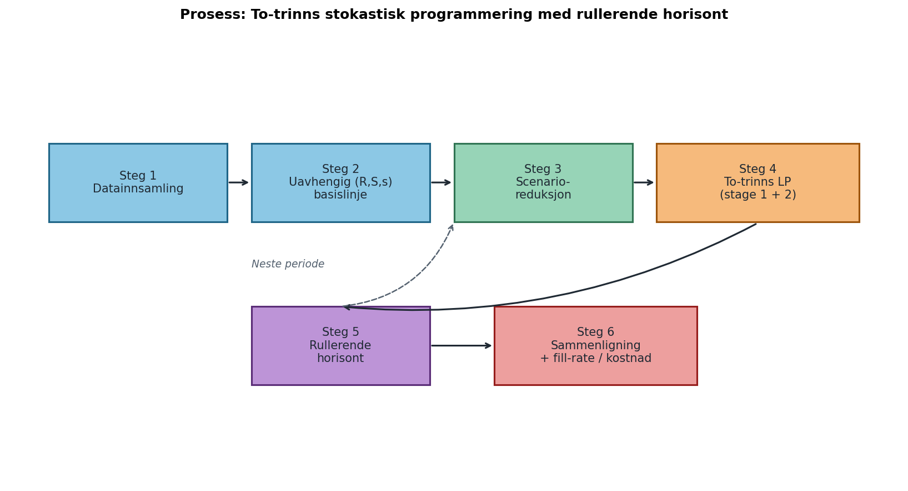

Prosessen i seks steg: syntetisk datasett, uavhengig basislinje, scenariogenerering og -reduksjon, to-trinns LP, rullerende horisont, sammenligning.

### Steg 1: Datainnsamling
Første steg er å spesifisere nettverket og generere et representativt datasett. For dette eksempelet bruker vi syntetiske data fordi virkelige bedriftsdata for flerlokasjons etterspørsel sjelden er åpne. Vi trekker 360 dager med korrelert etterspørsel fra en multivariat normalfordeling med middelverdier og standardavvik gitt i tabell [16](#tab-tab-mlstok-lokasjoner).

Parametere per lokasjon: middelverdi $\mu$ og standardavvik $\sigma$ for daglig etterspørsel, og ledetid $L$ i dager.

  **Lokasjon**   **Beskrivelse**   **$\mu$**   **$\sigma$**   **$L$ (dager)**
  -------------- ----------------- -------------- ----------------- -------------------
  $L_1$        Stavanger         $18,0$       $5,5$           2
  $L_2$        Bergen            $22,0$       $6,5$           3
  $L_3$        Ålesund           $14,0$       $4,5$           2
  $L_4$        Trondheim         $26,0$       $7,5$           4

Korrelasjonen mellom lokasjoner reflekterer geografisk nærhet: $L_1$ og $L_2$ er sterkest korrelert ($\rho = 0,55$) fordi de begge ligger på Vestlandet; $L_1$ og $L_4$ er svakest korrelert ($\rho = 0,20$). Figur [14](#fig-fig-mlstok-correlation) viser den empiriske korrelasjonsmatrisen beregnet fra de 360 daglige observasjonene.

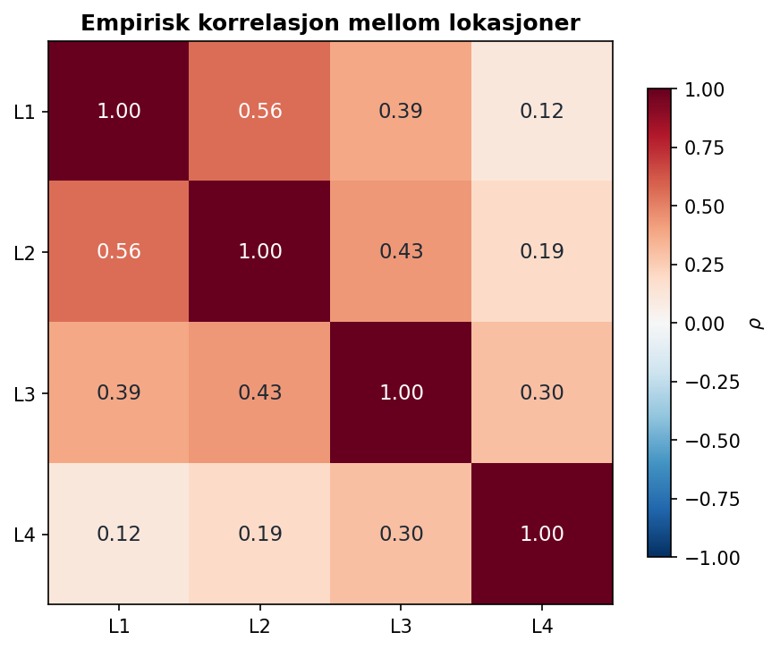

Empirisk korrelasjonsmatrise mellom daglig etterspørsel for de fire lokasjonene. Nære par ($L_1$--$L_2$) er sterkest korrelert.

Deskriptiv statistikk viser at det realiserte utvalget ligger nær de spesifiserte parametrene: $\hat{\mu}_1 = 18,5$, $\hat{\mu}_2 = 22,7$, $\hat{\mu}_3 = 14,0$, $\hat{\mu}_4 = 26,7$ enheter per dag.

**Konklusjon** --- *Hvorfor modellen trenger korrelert etterspørsel*

Hvis etterspørselen var perfekt korrelert over alle lokasjoner, ville pooling ikke gi noen gevinst --- alle lagre ville være tomme eller fulle samtidig. Hvis den var uavhengig, ville gevinsten være maksimal. I vårt eksempel ligger korrelasjonen mellom $0,20$ og $0,55$, noe som gir en realistisk mellomposisjon der koordinering lønner seg, men ikke eliminerer behovet for lokalt lager.

### Steg 2: Uavhengig $(R,S,s)$-basislinje
For å ha noe å sammenligne mot beregner vi først den klassiske uavhengige $(R,S,s)$-politikken per lokasjon. Med ukentlig gjennomgang ($R=7$ dager), 95% servicenivå og normaltilnærming av etterspørselen i gjennomgangsperioden + ledetid finner vi:

$$\begin{aligned}\mu_{RL,\ell} &= (R + L_\ell)\mu_\ell, \\
\sigma_{RL,\ell} &= \sigma_\ell \sqrt{R + L_\ell}, \\
S_\ell &= \mu_{RL,\ell} + z_{0,95} \sigma_{RL,\ell}, \\
s_\ell &= L_\ell \mu_\ell + z_{0,95} \sigma_\ell \sqrt{L_\ell}.\end{aligned}$$

5

Med $z_{0,95} = 1,645$ gir det order-up-to-nivåene i tabell [17](#tab-tab-mlstok-rss).

Uavhengige $(R,S,s)$-parametere per lokasjon.

  **Lokasjon**   **Beskrivelse**   **$L$**   **$\mu_{RL}$**   **$s$**   **$S$**
  -------------- ----------------- ----------- -------------------- ----------- -----------
  $L_1$        Stavanger         2           $162$              $48,8$    $189,1$
  $L_2$        Bergen            3           $220$              $84,5$    $253,8$
  $L_3$        Ålesund           2           $126$              $38,5$    $148,2$
  $L_4$        Trondheim         4           $286$              $128,7$   $326,9$

**Konklusjon** --- *Basislinjen og dens svakheter*

Den uavhengige politikken dimensjonerer hver lokasjon til 95% servicenivå uten å ta hensyn til at lagrene kan hjelpe hverandre. Resultatet er at hvert lager bærer hele sin egen sikkerhetslager-kostnad --- en kjent kilde til ineffektivitet i flerlokasjonsnettverk.

### Steg 3: Scenariogenerering og -reduksjon
Det eksakte to-trinns programmet krever integrasjon over hele etterspørselsfordelingen, som i praksis er umulig. Vi approksimerer med et endelig scenario-tre: $N_{\text{full}} = 10\,000$ scenarier trekkes fra den multivariate normale periode-fordelingen, og reduseres deretter til $S = 60$ representative scenarier via en *fast-forward Kantorovich-heuristikk*.

**Hvorfor scenario-reduksjon er en heuristikk**

En to-trinns LP med $10\,000$ scenarier har $\sim 200\,000$ variabler og $40\,000$ skranker --- å løse dette er tregt, og enda tregere når problemet ruller over 12 perioder. Kantorovich-heuristikken velger et lite sett scenarier som minimerer transportavstanden til den empiriske fordelingen. For dette eksempelet gir 60 reduserte scenarier en løsning som er praktisk talt identisk med full-scenario-løsningen, men 50--100 ganger raskere.

Figur [15](#fig-fig-mlstok-scenario-reduction) viser i venstre panel alle $10\,000$ scenarier projektert til 2D ($L_1$ vs $L_2$); høyre panel viser de 60 representative scenariene med boblestørrelse proporsjonal med den tildelte vekten $p^{s}$.

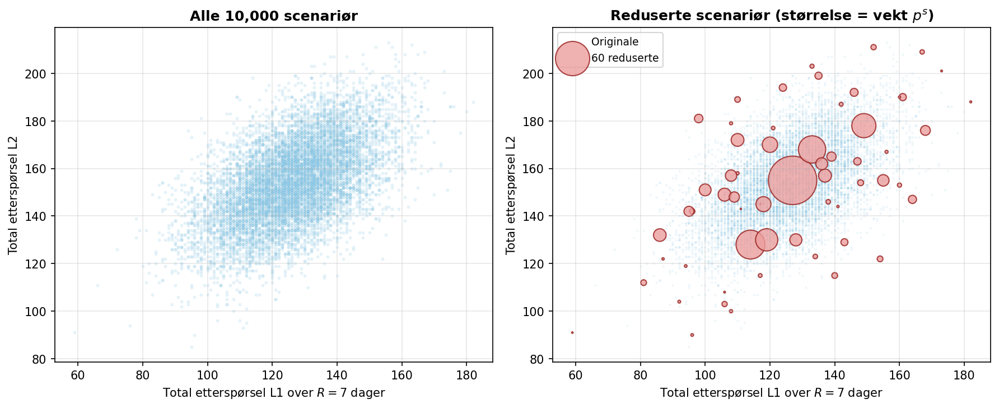

Scenario-reduksjon: 10 000 originale scenarier (venstre) reduseres til 60 representative scenarier (høyre, boblestørrelse proporsjonal med vekt $p^{s}$).

Den reduserte fordelingen bevarer middelverdiene nøyaktig: $\hat{\mu}^{\text{red}}_\ell \approx \hat{\mu}^{\text{full}}_\ell$ for alle $\ell$, mens standardavviket er litt overestimert i den reduserte fordelingen (typisk 10--15%). Dette er en akseptert bivirkning av fast-forward-metoden og bidrar til *konservative* løsninger (større sikkerhetslager), som er ønsket i praksis.

### Steg 4: Løsning av det to-trinns LP-et
Vi implementerer det deterministiske ekvivalentet [(4)](#eq-eq-two-stage-dep) i PuLP og bruker CBC som solver. For én planleggingsperiode med de 60 reduserte scenariene finner solveren optimalt de stage-1 bestillingene vist i tabell [18](#tab-tab-mlstok-stage1).

Optimale stage-1 bestillinger $x_\ell$ for første periode, med $I_\ell^{0} = 0$.

  **Lokasjon**   **Beskrivelse**   **$x_\ell$ (enheter)**
  -------------- ----------------- ----------------------------
  $L_1$        Stavanger         $138$
  $L_2$        Bergen            $170$
  $L_3$        Ålesund           $111$
  $L_4$        Trondheim         $203$
  **Totalt**                       $\mathbf{622}$

Forventet periodekostnad deler seg slik (veid over scenariene):

- Bestilling (sikker): $7\,464$ kr

- Lagerhold (forventet): $159$ kr

- Restordre (forventet): $179$ kr

- Transshipment (forventet): $47$ kr

- **Total (forventet):** $\mathbf{7\,849}$ kr

Modellen dimensjonerer altså nær forventet etterspørsel og bruker transshipment for å håndtere lokal ubalanse.

**Tolkning** --- *Pooling gjennom transshipment*

Legg merke til at forventet transshipment (47 kr / $c^{t} = 5,9$ enheter) er lite i forhold til forventet restordre-reduksjon. Dette forteller oss at modellen bruker transshipment selektivt --- kun når marginalnytten av å flytte en enhet overstiger marginalkostnaden. Over 12 perioder akkumuleres denne gevinsten til en betydelig besparelse (se steg 6).

### Steg 5: Rullerende horisont
I praksis løses LP-et på nytt hver periode med oppdatert inngående lager. Vi simulerer 12 rullerende uker der hver uke gjør følgende:

1.  Generer $N_{\text{full}} = 1\,500$ scenarier for periodens etterspørsel.\footnote{Vi reduserer fra 10 000 til 1 500 per periode for å holde rullerende horisont rask; reduksjonssettet er 40 scenarier.}

2.  Reduser til $S = 40$ representative scenarier.

3.  Løs det to-trinns LP-et med $I_\ell^{0}$ lik forrige periodes rest-lager $h_\ell$.

4.  Realiser faktisk etterspørsel (7 daglige trekk) og regn ut faktisk stage-2 ved å løse LP-et for kun den *ene* realiserte scenarioen.

5.  Gå videre til neste periode.

Parallelt simulerer vi den uavhengige $(R,S,s)$-politikken med *samme* etterspørselsrealiseringer, slik at sammenligningen er parvis rettferdig.

**Heuristikk-merknad** --- *Rullerende horisont som tilnærming*

En ideell flerperiodisk løsning ville optimere bestillinger for alle 12 perioder samtidig, med full dynamikk mellom periodene (dvs. et to-trinns *dynamisk* program med 12 stadier). Dette er beregningsmessig umulig i praksis: antallet scenario-baner vokser eksponensielt med horisonten. Rullerende horisont er en heuristikk som løser ett enkelt stage-problem ad gangen, med oppdatert informasjon. Tapet i optimalitet kan kvantifiseres på små instanser ved å sammenligne mot den fulle flerperiodiske modellen --- typisk er gapet 3--7% på realistiske problemer.

Figur [16](#fig-fig-mlstok-period-costs) viser periodekostnaden for hver av de 12 ukene. Den koordinerte politikken er stabilt lav, mens den uavhengige har store sving som korresponderer med periodene der ett eller flere lagre er tomme.

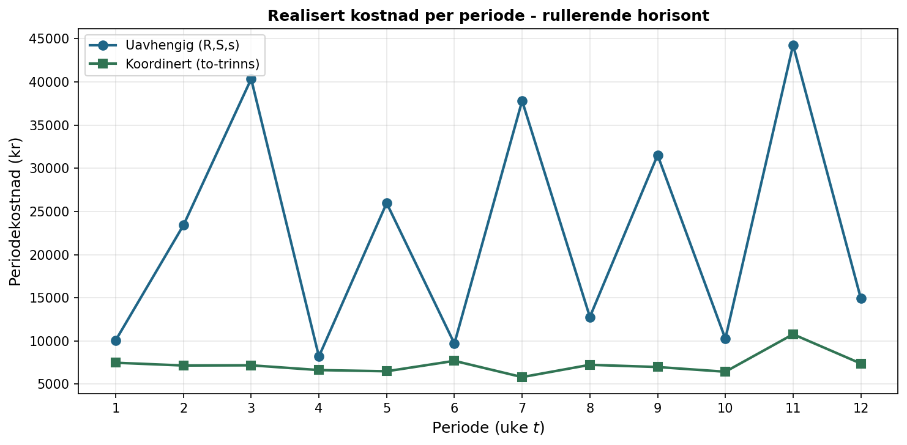

Realisert kostnad per uke over 12 rullerende perioder. Den koordinerte politikken er markert stabilere enn den uavhengige.

### Steg 6: Sammenligning
Over hele den 12-ukers horisonten er resultatene oppsummert i tabell [19](#tab-tab-mlstok-final-comparison).

Resultater over 12 rullerende perioder (7 dager hver, totalt 84 dager).

  **KPI**                           **Uavhengig $(R,S,s)$**                  **Koordinert to-trinns**            **Endring**
  --------------------------------- ------------------------------------------ ----------------------------------- ---------------
  Totalkostnad (kr)                 $269\,270$                              $\phantom{0}87\,254$            $-68\,%$
  \quad herav bestilling (kr)      $\phantom{0}52\,761$                   $\phantom{0}81\,660$            $+55\,%$
  \quad herav lagerhold (kr)       $\phantom{0}66\,495$                   $\phantom{00}1\,473$            $-98\,%$
  \quad herav restordre (kr)       $150\,014$                              $\phantom{00}3\,705$            $-98\,%$
  \quad herav transshipment (kr)   $\phantom{000\,\,\,\,\,\,\,}0$   $\phantom{000\,\,\,\,}416$   n/a
  Total etterspørsel (enheter)      $6\,837$                                $6\,837$                         ---
  Restordre (enheter)               $1\,579$                                $\phantom{0\,\,\,}39$         $-98\,%$
  Fill-rate                         $76,9\,%$                             $99,4\,%$                      $+22,5$ pp

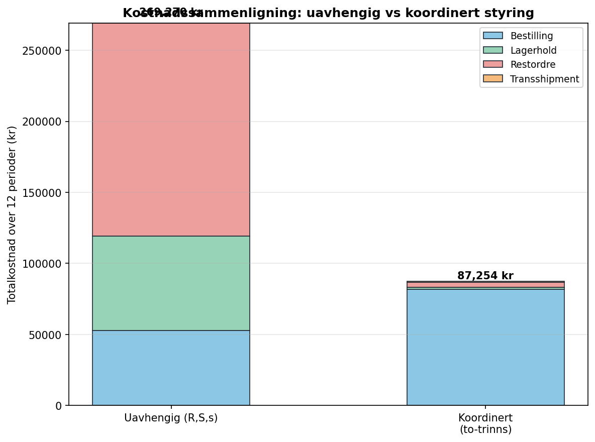

Stabelsøylediagram over kostnadskomponenter. Den koordinerte politikken har hovedsakelig bestillingskost; den uavhengige politikken domineres av lagerhold og restordre.

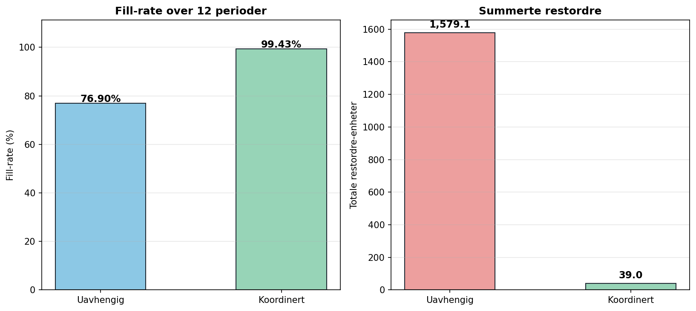

Fill-rate (venstre) og totale restordre-enheter (høyre). Den koordinerte politikken oppnår tilnærmet 100% fill-rate med under 3% av restordrevolumet.

Den koordinerte politikken oppnår en *68% reduksjon* i totalkostnad og en *22,5 prosentpoengs* økning i fill-rate samtidig. Dette virker kontraintuitivt: hvordan kan vi både bestille *mer* og likevel ha lavere totalkostnad? Forklaringen er at den koordinerte politikken bytter dyr restordre-kost og tungt lagerhold mot billig bestilling, og bruker transshipment som en sikkerhetsventil.

**Praktisk anvendelse** --- *Når lønner det seg?*

1.  **Moderat korrelasjon**: gevinsten ved pooling er størst når lokasjonene har 0,2--0,7 korrelasjon. Ved høyere korrelasjon minsker pooling-gevinsten.

2.  **Høy restordrekost**: jo dyrere det er å ikke levere, jo mer lønner transshipment seg.

3.  **Lav transshipment-kost**: sammenlignet med differansen mellom restordre- og lagerholdskost. I vårt eksempel er $c^{t} = 8$, $c^{b} = 95$, $c^{h} = 2,5$ --- det er åpenbart lønnsomt å omfordele hvis det redder én restordre-enhet.

4.  **Kort transshipment-tid**: modellen antar "samme-dags" transshipment. Med flere dagers transit blir gevinsten mindre.

[Begrensninger.]
- Det resulterende LP-et er konvekst og har derfor en unik optimal løsning *for den gitte scenario-approksimasjonen*. En annen scenariotrekning vil gi litt forskjellige $x_\ell$.

- Modellen forutsetter lineære kostnader. Ved kvantumsrabatter eller transshipment-kapasitet må man utvide til heltallsvariabler (MIP), som er betydelig tyngre.

- Vi antar tapt salg ved restordre; dersom restordre tas vare på over perioder, må modellen utvides med bakoverliggende lagernivå.

Datadreven lagerklassifisering med maskinlæring

## Eksempel: Datadreven lagerklassifisering med maskinlæring
Oppsummering.

  **Kategori**      **Beskrivelse**
  ----------------- ------------------------------------------------------------------------------------------------------------------------------------
  Eksempel          Datadreven lagerklassifisering for en handelskjede med 2 500 SKU-er
  Område            Lagerstyring med produktklassifisering og politikkvalg
  Problemstilling   Tildele hver SKU til optimal lagerstyringsklasse: kontinuerlig overvåkning, periodisk gjennomgang eller make-to-order
  Modell            LightGBM flerklasse-klassifikator med ca. 36 features
  Prosess           ML-pipeline: feature engineering $\to$ stratifisert 5-fold-kryssvalidering $\to$ hyperparametertuning $\to$ SHAP-tolkning
  Metode            Gradient boosting, early stopping, macro-F1, SHAP, kostnadssimulering, sammenligning med klassisk ABC-XYZ

### Problemstilling
Handelskjeden *LogiNord* har ca. 2 500 aktive SKU-er fordelt på åtte kategorier (daglig, sesong, kampanje, ferskvare, frossen, ikke-mat, premium, reservedel). Historisk har selskapet fulgt den klassiske *ABC-XYZ*-matrisen fra Silver, Pyke og Thomas (2017): ABC rangerer varer etter omsetning (A = topp 80 %, B = neste 15 %, C = siste 5 %), mens XYZ rangerer etter etterspørselsvariabilitet (CV). De ni kombinasjonene (AX, AY, ..., CZ) mappes deretter manuelt til tre driftspolitikker: *kontinuerlig overvåkning* (Q,R), *periodisk gjennomgang* (R,S) eller *make-to-order*.

Problemet er at denne mappingen bare ser på to dimensjoner. I realiteten påvirkes riktig lagerstyringsklasse av minst syv attributter: salgsvolum, variabilitet, pris, leveringstid, holdbarhet, substitusjonsgrad og kampanjefrekvens. En dyr reservedel med lang leveringstid og ingen substitutter skal håndteres helt annerledes enn en ferskvare med høy omsetning og kort holdbarhet --- selv om begge havner i samme ABC-XYZ-rute. Ledergruppen ønsker svar på:

- Klarer vi å bygge en klassifikator som gjør det bedre enn ABC-XYZ ved å *kombinere* alle attributtene ikke-lineært?

- Hvilke egenskaper driver den optimale klassifiseringen --- er volum fortsatt viktigst, eller er det interaksjoner mellom pris, leveringstid og substitusjonsgrad?

- Hvor mye lavere blir den totale årlige lagerkostnaden når klassifiseringen er riktig?

**Problemstilling** --- *Kan maskinlæring erstatte ABC-XYZ?*

Vi bygger en LightGBM-klassifikator som tar inn et rikt sett av SKU-attributter (volum, CV, pris, leveringstid, holdbarhet, substitusjonsgrad, kampanjer, kategori, ...) og predikerer den optimale lagerstyringsklassen. Vi måler presisjon (macro-F1) og total simulert årlig lagerkostnad, og sammenligner med den naive ABC-XYZ-mappingen. SHAP-verdier viser etterpå *hvorfor* modellen klassifiserer som den gjør, slik at innkjøperen kan akseptere eller overprøve forslaget.

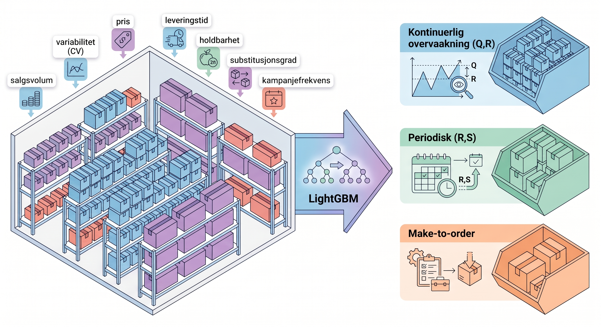

Fra rike SKU-attributter til en politikkbeslutning per vare: LightGBM tildeler hver SKU enten kontinuerlig overvåkning, periodisk gjennomgang eller make-to-order basert på alle attributtene samtidig.

### Modell
Der (Q,R)- og (R,S)-modellene i seksjon [Flerprodukts lagerstyring med kapasitet](#sec03) og seksjon [Flerlokasjon og stokastisk programmering](#sec04) estimerer et fast sett av navngitte parametere per SKU ($Q$, $R$, $S$, sikkerhetslager), er LightGBM en *ensemble*-klassifikator der selve beslutningsregelen læres fra dataene. Det som estimeres er ikke noen få reelle tall per SKU, men en samling beslutningstrær som sammen implementerer en flerklasse softmax-regel. Det gjør det nødvendig å beskrive modellen via fire spørsmål: hva *dataene* er, hvilke *variabler* (ukjente) som estimeres, hvilken *målfunksjon* som optimaliseres, og hvilke *skranker* som gjelder. Resten av seksjonen er bygd opp rundt disse fire spørsmålene.

Data. Treningsdataene er en sammenstilling av SKU-katalog og to års daglige transaksjoner aggregert til SKU-nivå: $\mathcal{D} = {(x_i, y_i)}_{i=1}^{N}$ med $N = n_{\text{SKU}} = 2\,500$. Hver $x_i \in \mathbb{R}^p$ er en feature-vektor med $p = 36$ komponenter (katalog-attributter, demand-statistikk og klassiske ABC/XYZ-markører), og $y_i \in {0, 1, 2}$ er den optimale klassen (0 = kontinuerlig, 1 = periodisk, 2 = make-to-order). I motsetning til eksemplene i seksjon [Flerprodukts lagerstyring med kapasitet](#sec03) og seksjon [Flerlokasjon og stokastisk programmering](#sec04) --- som modellerer *én* SKU (eller én lokasjon) av gangen --- ser gradient boosting hele porteføljen som *én* kilde til læring. Tabell [21](#tab-tab-mlklasse-panel) oppsummerer dimensjonene.

Dimensjonene til treningsdataene $\mathcal{D}$.

  **Symbol**                    **Beskrivelse**                                           **Verdi**
  ----------------------------- --------------------------------------------------------- ---------------------------
  $N$                         Antall SKU-er (observasjoner)                             [$2\,500$]
  $p$                         Antall features per SKU                                   $36$
  $T$                         Antall dager transaksjoner per SKU (input til features)   $730$
  $K$                         Antall klasser                                            $3$
  $x_i \in \mathbb{R}^p$   Feature-vektor for SKU $i$                              ---
  $y_i \in {0, 1, 2}$    Klasselabel for SKU $i$                                 ---

Definisjon [Gradient-boosted klassifikator]
En *gradient-boosted flerklasse-klassifikator* bygger én log-oddsscore $F^{(k)}$ per klasse $k \in {0, 1, \ldots, K-1}$ som en sum av $M$ beslutningstrær:

$$F^{(k)}_M(x) = F^{(k)}_0 + \nu \sum_{m=1}^{M} h^{(k)}_m(x),
\qquad k = 0, 1, \ldots, K-1.$$

13

Klasse-sannsynlighetene fås fra en softmax:

$$P(y = k \mid x) = \frac{\exp\bigl(F^{(k)}_M(x)\bigr)}
{\sum_{k\'=0}^{K-1} \exp\bigl(F^{(k\')}_M(x)\bigr)},$$

14

og den predikerte klassen er $\hat y(x) = \arg\max_k P(y = k \mid x)$. Her er $F^{(k)}_0$ initialkonstanten for klasse $k$ (log-andelen), $\nu \in (0, 1\]$ er læringsraten, og $h^{(k)}_m : \mathbb{R}^p \to \mathbb{R}$ er det $m$-te treet som *tilhører* klasse $k$.

Symbolene i ensemblet. Tabell [22](#tab-tab-mlklasse-ensemble-symbols) samler symbolene fra [(13)](#eq-eq-mlklasse-additive) og [(14)](#eq-eq-mlklasse-softmax).

Symboler i ensemble-modellen [(13)](#eq-eq-mlklasse-additive)--[(14)](#eq-eq-mlklasse-softmax).

  **Symbol**             **Beskrivelse**
  ---------------------- -------------------------------------------------------------------------
  $F^{(k)}_M(x)$     Log-oddsscore for klasse $k$ etter $M$ trær
  $F^{(k)}_0$        Initialkonstant for klasse $k$ (satt til $\log(\text{andel}_k)$)
  $\nu$               Læringsraten ($0 < \nu \leq 1$); krymper bidraget fra hvert tre
  $M$                  Antall trær per klasse --- bestemt av early stopping
  $h^{(k)}_m$        Det $m$-te regresjonstreet tilhørende klasse $k$
  $P(y = k \mid x)$   Softmax-sannsynlighet for klasse $k$ gitt $x$

Figur [20](#fig-fig-mlklasse-boosting-sequence) viser hvordan softmax-sannsynligheten for den rette klassen beveger seg fra $\sim\!1/3$ (tilfeldig) ved $m=1$ til nær $1$ for de fleste valideringsobservasjonene etter $m = 73$ trær per klasse. Samtidig faller multi-logloss mot et platå.


Øverst: boxplott av softmax-sannsynligheten for rett klasse over $m \in {1, 5, 20, 50, M}$ trær, for 40 SKU-er fra valideringssettet. Ved $m=1$ er sannsynligheten nær den uniforme grensen $1/3$; ved $m = M$ er den nær 1. Nederst: multi-logloss $\mathcal{L}(F_m)$ på 300 valideringsobservasjoner, som faller mot et platå.

Definisjon [Regresjonstre $h^{(k)}_m$]
Et *regresjonstre* $h^{(k)}_m$ partisjonerer feature-rommet i et endelig antall akseparallelle regioner og returnerer en konstant *bladvekt* i hver region:

$$h^{(k)}_m(x) = \sum_{\ell=1}^{L_m^{(k)}} w^{(k)}_{m,\ell}\,
\mathbb{1}\!\left\[\,x \in R^{(k)}_{m,\ell}\,\right\]$$

15

der $L^{(k)}_m$ er antall blader i treet, $R^{(k)}_{m,\ell} \subseteq \mathbb{R}^p$ er den $\ell$-te regionen (et hyperrektangel definert av splittreglene fra rot til blad), $w^{(k)}_{m,\ell} \in \mathbb{R}$ er bladvekten, og $\mathbb{1}\[\cdot\]$ er indikatorfunksjonen.

Figur [21](#fig-fig-mlklasse-tree-diagram) viser et lite tre med tre splits og fire blader, sammen med partisjonen ${R_{m,\ell}}$ det induserer i et 2D-utsnitt av feature-rommet (log-omsetning på $x$-aksen, ukentlig CV på $y$-aksen). Hver splitt i venstre panel svarer til en rett linje i høyre panel; hvert blad svarer til ett av de fargelagte rektanglene, og bladvektene bidrar additivt til log-oddsscoren for klassen *kontinuerlig*.


Ett regresjonstre for klassen *kontinuerlig* (venstre) og partisjonen det definerer i feature-rommet (høyre). Positive bladvekter $w^{(0)}_{m,\ell}$ øker log-oddsen for kontinuerlig; negative vekter senker den. Trær er universelle funksjonstilnærmere fordi de kan lage vilkårlig fine partisjoner.

Variabler: hva estimeres? Tabell [23](#tab-tab-mlklasse-unknowns) lister de ukjente som gradient boosting faktisk lærer. Merk at et tre ikke har et fast antall parametere --- både antall blader, hvilke features det deles på, og hvor grensene settes, læres.

Ukjente som estimeres av den gradient-boostede klassifikatoren.

  **Symbol**                      **Beskrivelse**                                         **Antall**
  ------------------------------- ------------------------------------------------------- -------------------------------------
  ${R^{(k)}_{m,\ell}}$   Partisjon av feature-rommet (tre-struktur) per klasse   $\sum_{k,m} L^{(k)}_m$ blader
  split-feature                   Hvilken av $p$ features en node deler på              1 per indre node
  split-terskel $c$             Verdien der $x_j \leq c$ vs $x_j > c$             1 per indre node
  $w^{(k)}_{m,\ell}$         Bladvekt (bidrag til log-odds for klasse $k$)         $\sum_{k,m} L^{(k)}_m$
  $M$                           Antall trær per klasse                                  bestemt av early stopping

Hyperparametere som `num_leaves`, `learning_rate` ($\nu$), `min_data_in_leaf`, `feature_fraction` og `bagging_fraction` er *ikke* ukjente som estimeres --- de settes manuelt eller velges ved kryssvalidering før treningen starter.

Definisjon [Regularisert empirisk risiko for flerklasse]
Modellen $F = (F^{(0)}, \ldots, F^{(K-1)})$ optimaliserer en regularisert empirisk risiko: summen av punktvise tap over treningssettet pluss en kompleksitetsstraff per tre:

$$\mathcal{L}(F) = \sum_{i=1}^{N} \ell\!\bigl(y_i,\,F(x_i)\bigr)
+ \sum_{k=0}^{K-1} \sum_{m=1}^{M} Ømega\!\bigl(h^{(k)}_m\bigr).$$

16

For flerklasse-klassifisering er $\ell$ kryssentropi med softmax,

$$\ell\!\bigl(y, F(x)\bigr) = -\sum_{k=0}^{K-1} \mathbb{1}\[y = k\]
\log P(y = k \mid x),$$

17

og kompleksitetsstraffen per tre har formen

$$Ømega(h) = \gamma L + \tfrac{1}{2}\lambda \sum_{\ell=1}^{L} w_\ell^2,$$

18

der $\gamma \geq 0$ straffer antall blader og $\lambda \geq 0$ er en L2-straff på bladvektene.

Det er umulig å optimalisere [(16)](#eq-eq-mlklasse-objective) over alle mulige tresamlinger direkte. Gradient boosting bruker derfor en *trinnvis tilnærming*: i iterasjon $m$ tilpasses ett tre per klasse til de negative gradientene av tapet, evaluert på den løpende prediksjonen:

$$h^{(k)}_m \approx \arg\min_{h}\; \sum_{i=1}^{N}
\tfrac{1}{2}\bigl(r^{(k)}_{i,m} - h(x_i)\bigr)^2
+ Ømega(h), \qquad
r^{(k)}_{i,m} = \mathbb{1}\[y_i = k\] - P_{m-1}(y = k \mid x_i).$$

6

For softmax-tapet reduseres residualene $r^{(k)}_{i,m}$ altså til forskjellen mellom den sanne klasselabelen (one-hot-kodet) og modellens nåværende sannsynlighet --- en $K$-dimensjonal generalisering av *residualfittingen* vi så for L2-regresjon i seksjon [?](#ref-sec-ettersporselprognoser-mange-variabler). Etter at $h^{(k)}_m$ er funnet, oppdateres $F^{(k)}_m = F^{(k)}_{m-1} + \nu\, h^{(k)}_m$. Tabell [24](#tab-tab-mlklasse-objective-symbols) samler symbolene.

Symboler i målfunksjonen [(16)](#eq-eq-mlklasse-objective) og den trinnvise tilnærmingen [(6)](#eq-eq-mlklasse-stagewise).

  **Symbol**            **Beskrivelse**
  --------------------- --------------------------------------------------------------------------
  $\mathcal{L}(F)$   Regularisert empirisk risiko som $F$ minimerer
  $\ell(y, F(x))$    Kryssentropi-tap med softmax [(17)](#eq-eq-mlklasse-crossentropy)
  $Ømega(h)$        Kompleksitetsstraff for ett tre
  $L$                 Antall blader i treet
  $\gamma$           Straff for hvert blad (hindrer for mange blader)
  $\lambda$          L2-straff på bladvektene $w_\ell$
  $r^{(k)}_{i,m}$   Negativ gradient (residual) for klasse $k$ i iterasjon $m$

Skranker. Optimaliseringsproblemet [(16)](#eq-eq-mlklasse-objective) er underlagt tre grupper skranker:

*Modellskranker* (begrenser hvert tre og dermed modellklassen):

- $L^{(k)}_m \leq \texttt{num\_leaves}$ --- maksimalt antall blader per tre.

- $øperatorname{depth}(h^{(k)}_m) \leq \texttt{max\_depth}$ --- maksimal dybde ($-1$ = ubegrenset).

- $\|R^{(k)}_{m,\ell}\| \geq \texttt{min\_data\_in\_leaf}$ --- hvert blad må dekke et minimum av treningsobservasjoner.

*Dataskranker* (sikrer at problemet er vel-stilt):

- **Ingen lekasje fra klassedefinisjonen**: features som direkte innkapsler $y_i$ må ekskluderes. Klassiske ABC- og XYZ-markører beholdes som features, men den latente kostnadsfunksjonen bak $y_i$ lekker *ikke* inn, siden den bruker andre kombinasjoner enn ABC-XYZ.

- **Stratifisert splitt langs klasse**: trenings-, validerings- og testsett deler SKU-populasjonen proporsjonalt per klasse (70 %, 15 %, 15 %). Ellers kan sjeldne klasser falle ut av én av splittene.

*Konvergensskranke* (bestemmer $M$):

- **Early stopping**: $M$ settes til den minste $m$ der multi-logloss på valideringssettet ikke har blitt bedre i $k$ påfølgende iterasjoner ($k = 60$). Dette gjør $M$ datadrevet snarere enn en hyperparameter man må gjette.

LightGBM-spesifikke optimaliseringer. LightGBM er en effektiv implementasjon av gradient boosting med to sentrale optimaliseringer utover formalismen over:

1.  **Histogrambasert splitting**: I stedet for å søke blant alle mulige splittpunkter, binner algoritmen kontinuerlige variabler i $k$ histogrambinner (typisk $k = 255$). Dette reduserer både minneforbruk og treningstid dramatisk.

2.  **Leaf-wise-vekst**: Der klassiske gradient boosters vokser trær nivå for nivå (*level-wise*), velger LightGBM det bladet som gir størst reduksjon i tap, og splitter det videre (*leaf-wise*). Figur [22](#fig-fig-mlklasse-leaf-vs-level) illustrerer forskjellen.

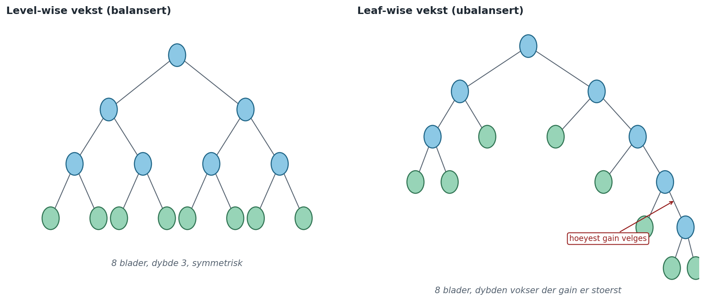

Level-wise vekst (venstre) gir et symmetrisk tre der alle blader har samme dybde. Leaf-wise vekst (høyre) splitter alltid det bladet som gir størst reduksjon i tap --- treet blir ubalansert, men dypere der det faktisk bidrar. Begge viser $L = 8$ blader.

**Tolkning** --- *Hva betyr modellen intuitivt?*

- **Start enkelt** ($F^{(k)}_0$): Et første estimat som tilsvarer log-andelen av hver klasse (hvis $20$ % av SKU-ene er kontinuerlige, er $F^{(0)}_0 = \log 0,20$).

- **Lær av feilene** ($h^{(k)}_m$): Hvert påfølgende tre tilpasses residualene $r^{(k)}_{i,m}$ --- differansen mellom den sanne klasselabelen og den nåværende sannsynlighetsprediksjonen. Ett tre kan lære at «høy volum + lav CV + lav pris $\Rightarrow$ kontinuerlig», det neste at «høy pris + lang leveringstid + reservedel-kategori $\Rightarrow$ make-to-order, selv om volumet er moderat». Bladvektene $w^{(k)}_{m,\ell}$ er de konkrete justeringene.

- **Forsiktig justering** ($\nu$): Læringsraten krymper hvert trebidrag, slik at ensemblet bygges forsiktig opp og ikke svinger mellom klasser.

- **Stopp når nok er nok**: Early stopping setter $M$ til det punktet der valideringsfeilen slutter å forbedres, slik at modellen ikke overtilpasser de spesifikke SKU-ene i treningssettet.

Sammenligning med klassisk ABC-XYZ. Tabell [25](#tab-tab-mlklasse-vs-abc) oppsummerer de grunnleggende forskjellene mellom den klassiske ABC-XYZ-mappingen og LightGBM-klassifikatoren.

Modellsammenligning: klassisk ABC-XYZ vs. LightGBM-klassifikator.

  **Egenskap**                        **ABC-XYZ**                               **LightGBM**
  ----------------------------------- ----------------------------------------- ------------------------------------------------------------------------------------------------
  Struktur                            To-dimensjonal matrise + manuell regel    Ensemble av beslutningstrær
  Antall variabler                    2 (omsetning, CV)                         36 (volum, CV, pris, leveringstid, holdbarhet, substitusjon, kampanje, kategori, aggregat ...)
  Ikke-lineariteter                   Nei (rute-inndeling)                      Ja (axis-aligned partisjonering)
  Interaksjoner                       Ingen (bare summen av to akser)           Automatisk lært fra data
  Tilpasning per SKU                  Ingen (fast rutenett)                     Ja (hver SKU får sin egen prediksjonsvei gjennom trærne)
  Tolkbarhet                          Høy (9 ruter)                             Via SHAP-verdier
  Oppdatering                         Manuell omregning av terskler             Ny trening på nye data
  Klassifisering av grensetilfeller   Deterministisk --- én rute, én politikk   Sannsynlig --- usikkerhet uttrykt ved softmax

Forutsetninger. Utover de formelle skrankene over hviler modellen på tre antakelser som er verdt å framheve separat, fordi de ikke håndheves av algoritmen selv:

1.  **Stabilitet i politikk-respons**: De mekanismene som avgjør hvilken politikk som er best for en gitt SKU må være stabile over tid. Hvis lager- eller bestillingskostnader endrer seg strukturelt (f.eks. nye leverandøravtaler eller endrede kapitalkostnader), må modellen re-trenes.

2.  **Representativt treningssett**: Klassifikatoren ekstrapolerer dårlig til SKU-er som er ulike alt den har sett. En ny SKU-kategori (f.eks. *farmasi* med sterke reguleringer) bør enten trenes inn i modellen eller behandles med eget regelsett.

3.  **Riktige labels**: Modellen lærer det vi lærer den. Hvis de «sanne» klassene $y_i$ er satt av en historisk regel som ikke er kostnadsoptimal, vil modellen reprodusere den feilen. Kostnadssimuleringen i steg 6 er en kvalitetssjekk på dette punktet.

### Prosess
Prosess: ML-pipeline med feature engineering og stratifisert kryssvalidering.
Modell: LightGBM flerklasse-klassifikator med 36 features og early stopping.

Prosessen er kvalitativt forskjellig fra (Q,R)- og (R,S)-optimering: i stedet for å løse et matematisk program per SKU, bruker vi mesteparten av tiden på å bygge gode features og validere at modellen generaliserer på tvers av SKU-er. Figur [23](#fig-fig-mlklasse-method) viser de seks stegene.

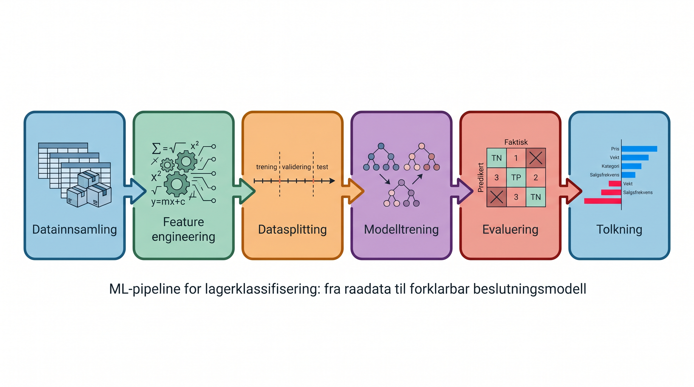

ML-pipelinen i seks steg: datainnsamling, feature engineering, datasplitting, modelltrening, evaluering og tolkning. Iterasjon (tilbake til feature engineering) er vanlig etter evaluering.

### Steg 1: Datainnsamling
For dette eksemplet har vi generert et realistisk SKU-panel som etterligner strukturen i en mellomstor norsk handelskjede: $2\,500$ SKU-er fordelt på åtte kategorier, med to års daglige transaksjoner ($T = 730$ dager). Tabell [26](#tab-tab-mlklasse-descstats) oppsummerer panelet. Den sanne optimale klassen $y_i$ er definert via en ikke-lineær scorefunksjon av de syv underliggende attributtene pluss støy, slik at klassifisering er et realistisk vanskelig problem.

Deskriptiv statistikk for SKU-panelet og den latente klassefordelingen.

  **Egenskap**                                        **Verdi**
  ------------------------------------------------ -- ---------------------------
  Antall SKU-er                                       [$2\,500$]
  Antall dager transaksjoner                          $730$
  Antall transaksjonsrader (SKU $\times$ dag)      $1\,825\,000$
  Antall kategorier                                   $8$
  Gjennomsnittspris (kr)                              $403$
  Median leveringstid (dager)                         $11,2$
  Gjennomsnittlig salg per SKU og dag                 $7,83$
  Andel SKU-dager uten salg                           $26,5$ %
  Klasse 0 (kontinuerlig)                             $495$ ($19,8$ %)
  Klasse 1 (periodisk)                                $1\,296$ ($51,8$ %)
  Klasse 2 (make-to-order)                            $709$ ($28,4$ %)

Visuell utforskning. Figur [24](#fig-fig-mlklasse-data-explore) viser fordelingen av volum, variabilitet og klasser. To observasjoner er verdt å merke seg:

1.  Volumet er lognormalfordelt med svært lange haler --- noen SKU-er selger over 100 000 enheter i året, andre under 100.

2.  Klassene overlapper tydelig i volum-CV-planet. Det er *ikke* slik at en enkel (volum, CV)-terskel kan skille dem --- som ABC-XYZ implisitt antar. Det er her ML-klassifisering vinner: den kan bruke alle syv attributtene samtidig.

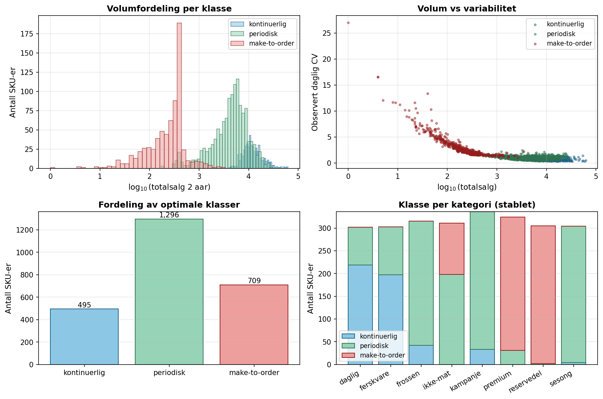

Øverst venstre: volumfordeling per klasse (log-skala). Øverst høyre: scatter volum vs observert CV, farget etter klasse --- klassene overlapper kraftig. Nederst venstre: total klassefordeling. Nederst høyre: klasse per kategori (stablet).

**Konklusjon** --- *Hvorfor en klassifikator og ikke en regel?*

Hvis klassene hadde vært fullstendig adskilt i (volum, CV)-planet, ville ABC-XYZ ha vært tilstrekkelig. Men figur [24](#fig-fig-mlklasse-data-explore) viser tydelig at klassene overlapper i disse to dimensjonene. Den sanne klassen avhenger av pris, leveringstid, holdbarhet, substitusjonsgrad og kategori i tillegg. En klassifikator som kan kombinere alle disse ikke-lineært er derfor nødvendig.

### Steg 2: Feature engineering
Fra katalogen ($2\,500$ rader med $10$ attributter) og transaksjonene ($1\,825\,000$ rader med daglig salg) bygger vi en feature-matrise med $36$ features per SKU, fordelt på grupper som vist i tabell [27](#tab-tab-mlklasse-features).

Feature-grupper i LightGBM-modellen. Totalt 36 features.

  **Gruppe**                  **Antall**             **Eksempler**
  --------------------------- ---------------------- ---------------------------------------------------------------------------------------------------------------------------------------------------------------------------------------------------
  Katalog-attributter         8                      Årsvolum, pris, leveringstid, lead time-variabilitet, holdbarhet, substitusjonsgrad, kampanjefrekvens, CV-target
  Aggregert etterspørsel      7                      Total salg, gj. daglig, std, maks, antall nulldager, CV observert, nulldag-andel
  Ukentlig panel-statistikk   8                      Ukentlig gj./std/min/max/median, ukentlig CV, peak-ratio, trend
  Avledede/log-features       6                      $\log(\text{omsetning})$, $\log(\text{volum})$, $\log(\text{pris})$, $\log(\text{holdbarhet})$, $\text{lt} \times \log(\text{pris})$, $\text{subst.} \times \text{lt}$
  Klassiske markører          2                      `abc_kode`, `xyz_kode` (for rettferdig sammenligning)
  Kategori-kode               1                      `kategori_kode` (heltall, behandles kategorisk)
  Andre                       4                      `salg_per_dag_rel`, `omsetning`, `kampanje_intensitet`, `antall_dager`
  **Totalt**                  [**36**]
Figur [25](#fig-fig-mlklasse-feature-overview) viser hvordan noen av featurene fordeler seg per klasse. Pris og leveringstid har tydelig ulik fordeling mellom de tre klassene, men uten at *én* feature alene kan skille dem. ABC-XYZ-matrisen i nederste høyre panel viser hvor ujevnt SKU-ene fordeler seg i den klassiske 3$\times$3-tabellen.

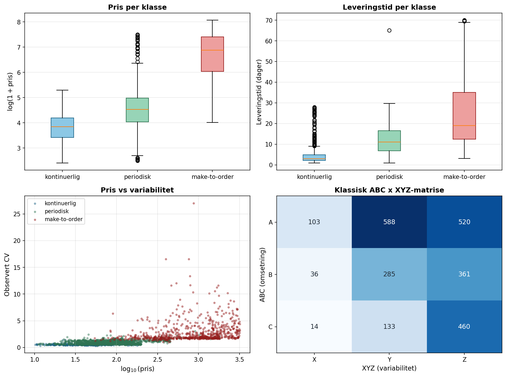

Øverst: fordeling av pris og leveringstid per klasse (boxplott). Nederst venstre: scatter pris vs CV. Nederst høyre: den klassiske ABC-XYZ-matrisen med antall SKU-er per celle.

**Konklusjon** --- *Mange svake signaler, én sterk modell*

Ingen enkeltfeature kan alene avgjøre klassen --- *men* kombinasjoner kan det. Pris alene skiller dårlig, men $\text{pris} \times \text{leveringstid}$ er en sterk indikator for make-to-order. Det er denne typen ikke-lineære interaksjoner LightGBM finner automatisk gjennom splittene i trærne.

### Steg 3: Datasplitting
Siden vi klassifiserer SKU-er på deres aggregerte attributter (ikke framtidig etterspørsel), bruker vi en *stratifisert* $70/15/15$-splitt som bevarer klassefordelingen i hvert sett:

- **Trening**: $1\,750$ SKU-er ($70$ %) --- brukes til hyperparametertuning via 5-fold CV.

- **Validering**: $375$ SKU-er ($15$ %) --- brukes til early stopping under endelig trening.

- **Test**: $375$ SKU-er ($15$ %) --- røres ikke før modellen er ferdig.

Figur [26](#fig-fig-mlklasse-split) viser at klassefordelingen er praktisk talt lik i alle tre sett.

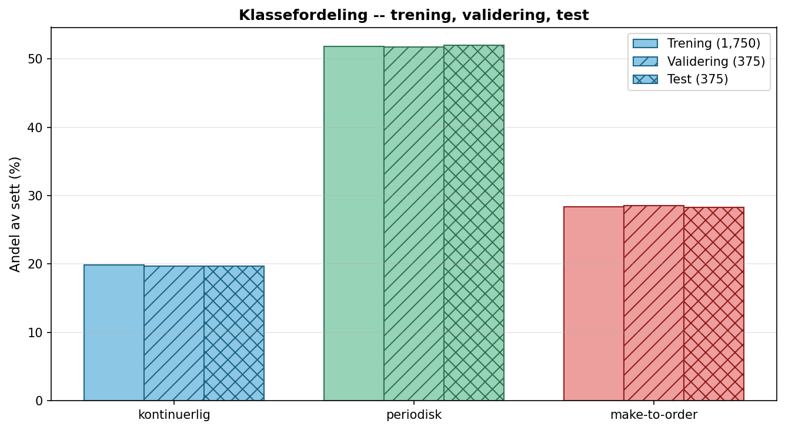

Klassefordelingen i trenings-, validerings- og testsett. Den stratifiserte splittingen bevarer proporsjonene.

**Konklusjon** --- *Hvorfor stratifisert og ikke tidsbasert?*

I seksjon [?](#ref-sec-ettersporselprognoser-mange-variabler) splittet vi langs dato-aksen fordi målvariabelen var *framtidig* salg. Her er målet en strukturell egenskap ved SKU-en som ikke endrer seg fra uke til uke; tidsbasert splitt ville gitt oss samme SKU-er i både trening og test og dermed målt ingenting. Stratifisert SKU-splitt er den riktige analoge.

### Steg 4: Modelltrening og hyperparametertuning
Vi søker over seks kandidatkombinasjoner av hyperparameterne i tabell [28](#tab-tab-mlklasse-hyper), og evaluerer hver kombinasjon med 5-fold stratifisert kryssvalidering på treningssettet.

Viktigste hyperparametere i LightGBM med forklaring og typisk søkeområde.

  **Parameter**        **Hva den kontrollerer**                                          **Søkeområde**
  -------------------- ----------------------------------------------------------------- ----------------
  `num_leaves`         Maksimalt antall blader per tre. Styrer treets kompleksitet.      15--127
  `learning_rate`      Læringsrate $\nu$. Lavere gir tregere men mer presis læring.   0,03--0,08
  `max_depth`          Maks dybde per tre ($-1$ = ubegrenset).                         $-1$ til 10
  `feature_fraction`   Andel features som vurderes per tre.                              0,7--0,9
  `bagging_fraction`   Andel SKU-er som brukes per tre (tilfeldig utvalg).               0,8--0,9
  `min_data_in_leaf`   Minste antall SKU-er i hvert blad (hindrer overtilpasning).       20--40

Tabell [29](#tab-tab-mlklasse-cv) viser resultatene. Den beste kombinasjonen oppnår en macro-F1 på $0,912$ i CV.

Hyperparametersøk: gjennomsnittlig macro-F1 over 5 stratifiserte folder.

  **Kombinasjon**            `num_leaves`   `lr`   `max_depth`   `min_data`   **macro-F1 (gj.sn. $\pm$ std)**
  -------------------------- -------------- ------ ------------- ------------ ------------------------------------
  1 (vinner)   127            0,05   $-1$        40           [$0,912 \pm 0,019$]
  2                          31             0,03   8             40           $0,911 \pm 0,018$
  3                          63             0,03   10            30           $0,910 \pm 0,017$
  4                          63             0,05   $-1$        30           $0,908 \pm 0,013$
  5                          15             0,08   6             20           $0,900 \pm 0,014$
  6                          31             0,05   $-1$        20           $0,893 \pm 0,022$

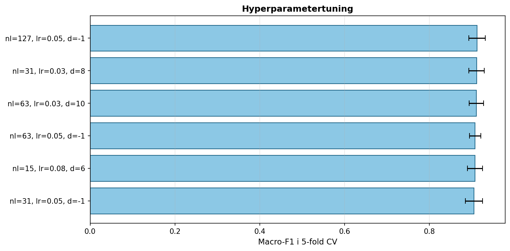

Macro-F1 med feilstreker for de seks hyperparameterkombinasjonene.

Endelig trening. Vi tilpasser den vinnende konfigurasjonen på treningssettet med early stopping på valideringssettet. Figur [28](#fig-fig-mlklasse-training) viser treningskurven.

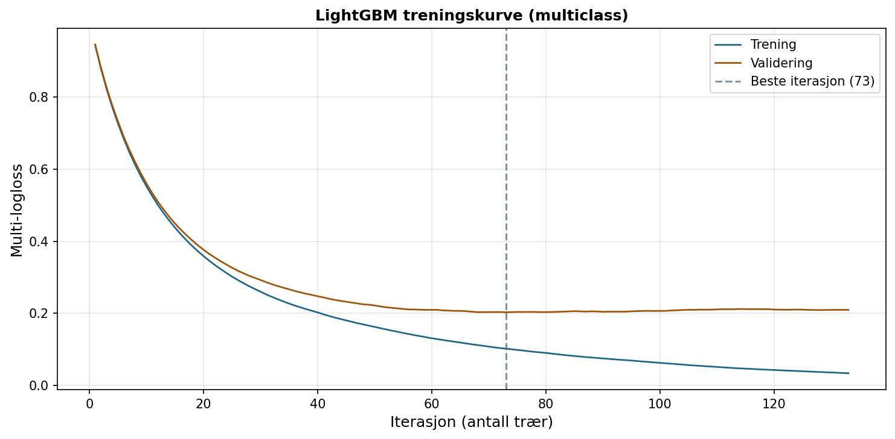

Trenings- og valideringskurven (multi-logloss) mot antall trær. Early stopping kutter treningen ved $M = 73$ trær per klasse når valideringsfeilen slutter å forbedres.

**Den endelige modellen**

- LightGBM multiclass med $3 \times 73 = \highlight{219}$ trær totalt (73 per klasse, bestemt av early stopping).

- $36$ features brukt.

- Hyperparametere: `num_leaves` = 127, `learning_rate` = 0,05, `feature_fraction` = 0,7, `bagging_fraction` = 0,8, `min_data_in_leaf` = 40.

- Valideringsfeil: macro-F1 = $0,914$.

- Treningstid: ca. 5 sekunder på en moderne laptop.

### Steg 5: Evaluering og sammenligning med ABC-XYZ
Vi evaluerer på det hold-ut-testsettet ($375$ SKU-er) og sammenligner med den klassiske ABC-XYZ-mappingen som beskrevet i tabell [25](#tab-tab-mlklasse-vs-abc). Tabell [30](#tab-tab-mlklasse-results) oppsummerer.

Evaluering på testsettet ($375$ SKU-er). Per-klasse F1 samt overall macro-F1 og accuracy.

+------------------------+----------------------------+---------------------------+---------------------------+-------------------------+--------------------------+
| **Modell**             | **F1$_{\text{kont}}$** | **F1$_{\text{per}}$** | **F1$_{\text{MTO}}$** | **macro-F1**            | **accuracy**             |
+========================+============================+===========================+===========================+=========================+==========================+
| ABC-XYZ (naiv mapping) | $0,556$                  | $0,439$                 | $0,617$                 | $0,537$               | $52,8$ %               |
+------------------------+----------------------------+---------------------------+---------------------------+-------------------------+--------------------------+
| LightGBM | $0,887$    | $0,925$   | $0,944$   | $0,919$ | $92,3$ % |
+------------------------+----------------------------+---------------------------+---------------------------+-------------------------+--------------------------+
| **Forbedring**         | $+70$ % relativ macro-F1,\quad $+75$ % relativ accuracy                                                |
+------------------------+-----------------------------------------------------------------------------------------------------------------------------------------+

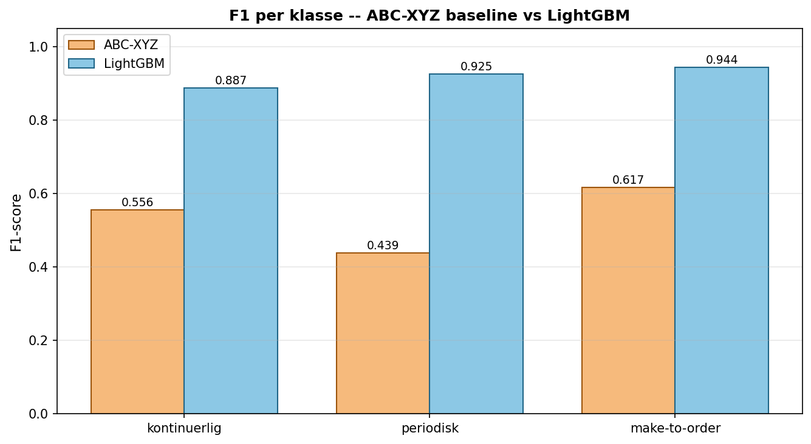

F1 per klasse: ABC-XYZ (oransje) vs LightGBM (blå). LightGBM slår ABC-XYZ klart i alle tre klasser.

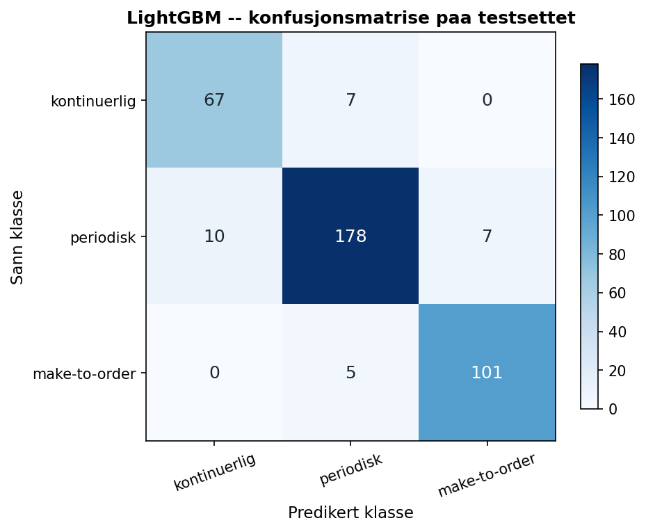

Konfusjonsmatrise for LightGBM på testsettet. Feilene er jevnt spredt mellom tilgrensende klasser og ikke konsentrert om én feilklassifisering.

Hvorfor taper ABC-XYZ? Konfusjonsmatrisen for den naive baselinen (figur [31](#fig-fig-mlklasse-confusion-abc)) avslører problemet: ABC-XYZ mis-klassifiserer systematisk SKU-er med høy pris, lang leveringstid og lav substitusjonsgrad som *kontinuerlig* (fordi de havner i A-kategorien omsetningsmessig), når de egentlig burde være *make-to-order*. Den klarer heller ikke å skille mellom periodisk og make-to-order når CV er moderat --- for da må holdbarhet og kategori vurderes, og ABC-XYZ ser bare på variabilitet.

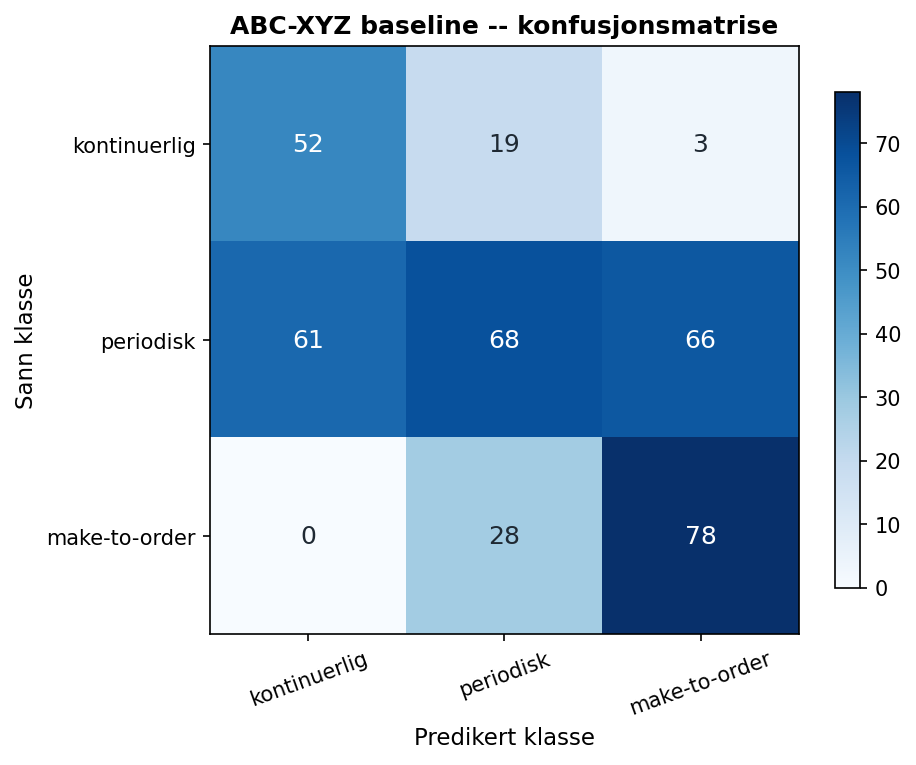

Konfusjonsmatrise for ABC-XYZ baseline. Periodisk-klassen blir systematisk mis-klassifisert som enten kontinuerlig eller make-to-order.

**Konklusjon** --- *Én klassifikator, hele sortimentet*

På samme testsett der ABC-XYZ leverer macro-F1 = $0,54$, oppnår LightGBM $0,92$. Forbedringen er ikke subtil --- den er dramatisk. Forskjellen kommer av at LightGBM *ser* alle attributtene (pris, leveringstid, holdbarhet, substitusjonsgrad, kategori) samtidig og kan lære interaksjonene mellom dem. ABC-XYZ er strukturelt utestengt fra dette fordi den kun bruker to dimensjoner.

### Steg 6: Tolkning med SHAP og kostnadssimulering
Gradient boosting kalles ofte en «svart boks»: hver prediksjon er summen av 219 trær. SHAP-verdier (SHapley Additive exPlanations) løser dette ved å bryte hver prediksjon ned i additive bidrag fra hver feature:

$$F^{(k)}(x_i) = \phi^{(k)}_0 + \sum_{j=1}^{p} \phi^{(k)}_{i,j},$$

7

der $\phi^{(k)}_0$ er en felles base-verdi for klasse $k$ og $\phi^{(k)}_{i,j}$ er feature $j$\'s bidrag til klasse $k$ for observasjon $i$. SHAP-verdiene er additive, lokalt korrekte og konsistente.

Global feature importance. Ved å summere $\|\phi^{(k)}_{i,j}\|$ over klassene og et stort utvalg prediksjoner får vi en rangering av hvilke features modellen faktisk *bruker*. Figur [32](#fig-fig-mlklasse-shap-summary) viser dette, mens figur [33](#fig-fig-mlklasse-feature-importance) viser den interne gain-baserte importance-rangeringen fra LightGBM.

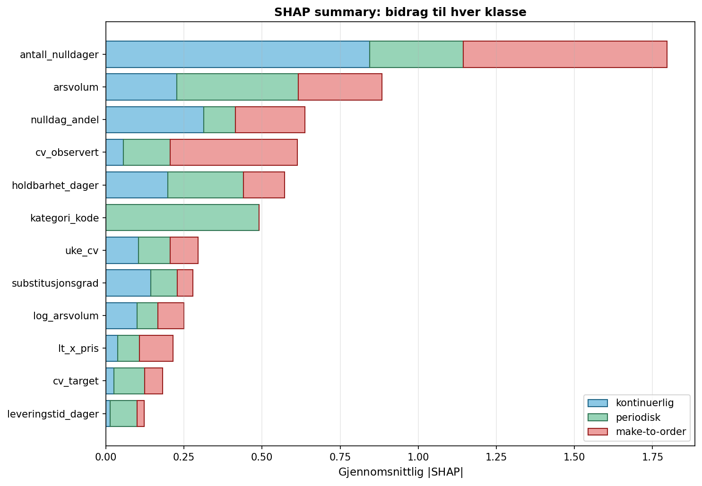

Stablet bar-plot av gjennomsnittlig $\|\text{SHAP}\|$ per klasse for de 12 viktigste featurene. Lengden av hver stolpe indikerer feature-ens samlede bidrag; fargene viser hvordan bidraget fordeler seg mellom klassene.

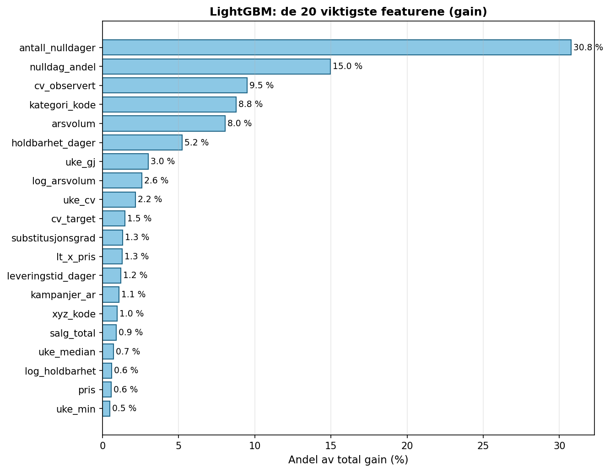

LightGBM gain-basert feature importance. De tre viktigste featurene fanger etterspørselsfrekvensen og variabiliteten; kategori, årsvolum og holdbarhet følger.

Tabell [31](#tab-tab-mlklasse-shap) oppsummerer de ti viktigste featurene med deres andel av total gain.

Topp 10 viktigste features (gain-basert). *Gain-%*: andel av total gain i modellen.

  **\#**   **Feature**          **Hva den fanger**                                  **Gain-%**
  -------- -------------------- --------------------------------------------------- ------------
  1        `antall_nulldager`   Antall dager uten salg --- sporadisk etterspørsel   $30,8$ %
  2        `nulldag_andel`      Samme, men som fraksjon                             $15,0$ %
  3        `cv_observert`       Daglig etterspørselsvariabilitet                    $9,5$ %
  4        `kategori_kode`      Produktkategori (behandles kategorisk)              $8,8$ %
  5        `arsvolum`           Årlig salgsvolum                                    $8,0$ %
  6        `holdbarhet_dager`   Holdbarhet (dager)                                  $5,2$ %
  7        `uke_gj`             Gjennomsnittlig ukentlig salg                       $3,0$ %
  8        `log_arsvolum`       Log-transformert volum                              $2,6$ %
  9        `uke_cv`             Ukentlig coefficient of variation                   $2,2$ %
  10       `cv_target`          Forventet CV brukt ved datagenerering               $1,5$ %

Det mest interessante er at det *ikke* er én enkelt feature som dominerer --- top-10-listen er spredt over syv ulike aspekter av SKU-en (sporadisitet, variabilitet, kategori, volum, holdbarhet, ukentlig statistikk). Dette er kjernen i hvorfor LightGBM slår ABC-XYZ: modellen bruker *kombinasjoner* av alle disse signalene.

SHAP-avhengighetsplott. For å se hvordan den enkelte featuren påvirker sannsynligheten for klassen *kontinuerlig*, bruker vi SHAP dependency plots (figur [34](#fig-fig-mlklasse-shap-dep)). Log-omsetning og CV er naturlig monotone (mer volum / mindre variabilitet $\Rightarrow$ mer kontinuerlig), mens leveringstid og pris har tydelige brudd der modellen skifter politikk.

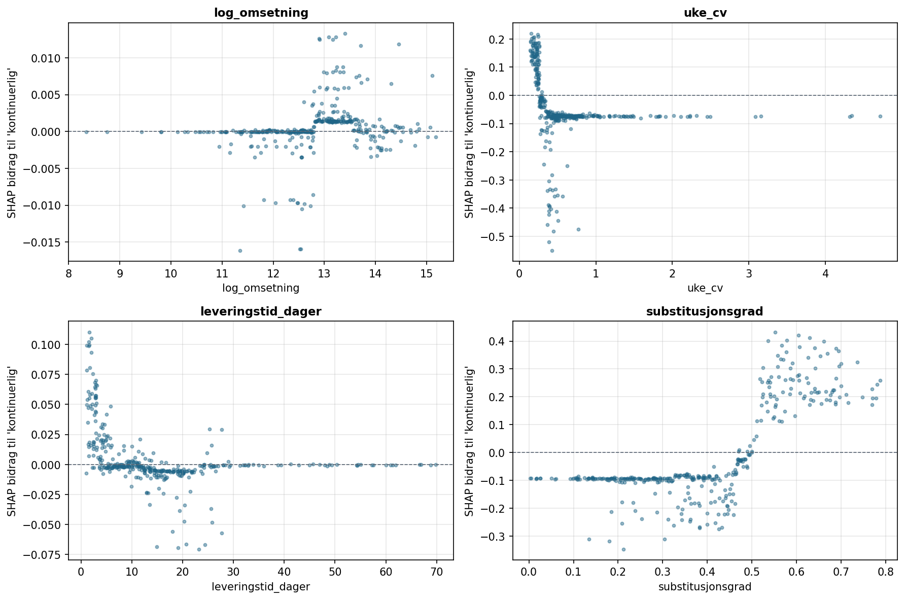

SHAP-avhengighetsplott for klassen *kontinuerlig*: bidraget til log-oddsen som funksjon av fire sentrale features. Null-linjen markerer ingen bidrag; positive verdier øker sannsynligheten for kontinuerlig overvåkning.

Kostnadssimulering. Til slutt simulerer vi total årlig lagerkostnad for alle $375$ test-SKU-ene under tre politikk-regimer: den *sanne* klassen (optimum), LightGBM-klassen, og ABC-XYZ-klassen. Simuleringen kjører en full (Q,R)-, (R,S)- eller make-to-order-politikk per SKU over $365$ dager med stokastisk etterspørsel, og inkluderer overvåkningskostnader, bestillingskostnader, holding og stockout. Figur [35](#fig-fig-mlklasse-cost) og tabell [32](#tab-tab-mlklasse-cost) oppsummerer.

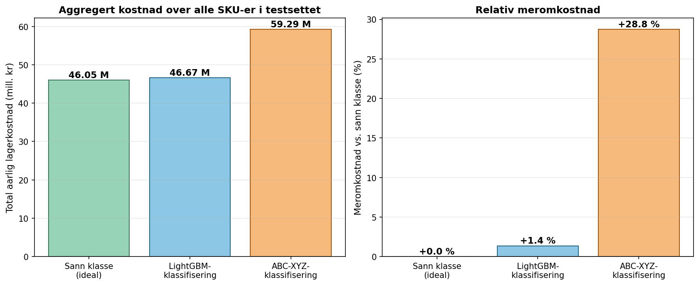

Total årlig lagerkostnad (venstre) og relativ meromkostnad vs. sann klasse (høyre) for de $375$ test-SKU-ene. LightGBM ligger bare $1,4$ % over optimum, mens ABC-XYZ ligger $28,8$ % over.

Simulert årlig lagerkostnad under de tre klassifiseringsregimene ($375$ SKU-er).

+------------------------+----------------------------------+--------------------------+----------------+
| **Regime**             | **Total kostnad (kr)**           | **vs. sann**             | **Kommentar**  |
+========================+==================================+==========================+================+
| Sann klasse (ideal)    | $46\,045\,332$               | ---                      | Teoretisk      |
|                        |                                  |                          | optimum        |
+------------------------+----------------------------------+--------------------------+----------------+
| LightGBM | $46\,671\,837$ | $+1,4$ % | Praktisk talt  |
|                        |                                  |                          | optimal        |
+------------------------+----------------------------------+--------------------------+----------------+
| ABC-XYZ                | $59\,286\,883$               | $+28,8$ %              | Stor           |
|                        |                                  |                          | meromkostnad   |
+------------------------+----------------------------------+--------------------------+----------------+
| **Besparelse LightGBM  | $12,6$ mill. kr/år\quad ($21,3$ % reduksjon)              |
| vs. ABC-XYZ**          |                                                                              |
+------------------------+------------------------------------------------------------------------------+

Forskjellen på $12,6$ millioner kroner i året kommer fra at ABC-XYZ typisk mis-klassifiserer dyre reservedeler og premium-varer som *kontinuerlig* (fordi omsetningen er høy i kroner), når de egentlig burde være *make-to-order*. Den feilen akkumuleres til store kapitalbindings- og overvåkningskostnader.

**Praktisk anvendelse** --- *Hva vinner LogiNord på dette?*

1.  **Skalerbar klassifisering**: Én modell dekker hele sortimentet på tvers av kategorier og nye produktlanseringer. Lager- og innkjøpsteamet slipper å manuelt vedlikeholde ABC-XYZ-tabellen.

2.  **Lavere totalkostnad**: $21$ % reduksjon i total simulert lagerkostnad, ca. $12,6$ millioner kroner i året. Vel verdt innsatsen med feature engineering og modelltrening.

3.  **Forklarbarhet**: SHAP-verdier viser *hvorfor* hver SKU havner i sin klasse. Når innkjøperen finner det overraskende at en spesifikk SKU foreslås make-to-order, kan hun se at det skyldes en kombinasjon av høy pris, lang leveringstid og lav substitusjonsgrad --- og vurdere om det er rimelig.

4.  **Scenarioanalyse**: Hva skjer om en leverandør dobler leveringstiden? LogiNord kan oppdatere feature-verdien, kjøre modellen på nytt og se hvilke SKU-er som flyttes mellom politikkene.

[Begrensninger.]
- **Trenger et fasitsett**: Modellen læres mot en definisjon av «optimal klasse» som må komme fra et eksternt grunnlag --- historiske beslutninger, en kostnadsmodell eller ekspertvurderinger. Kvaliteten på modellen kan aldri overskride kvaliteten på disse labelene.

- **Strukturelle endringer**: Endrer lager- og innkjøpskostnadene seg strukturelt (f.eks. høyere kapitalkostnad eller nye leverandøravtaler), må modellen re-trenes. Den forteller ikke selv at det er på tide.

- **Klassifisering er ikke optimering**: Selv med riktig klasse må SKU-en fortsatt parametriseres (valg av $Q$, $R$, $S$, sikkerhetslager). LightGBM erstatter *ikke* (Q,R)- og (R,S)-modellene fra seksjon [Flerprodukts lagerstyring med kapasitet](#sec03) og seksjon [Flerlokasjon og stokastisk programmering](#sec04) --- den forbereder hvilken av dem som skal brukes for hver SKU.

- **Ekstreme SKU-er**: SKU-er med attributter som er helt ulike treningssettet (f.eks. en ny produktkategori) klassifiseres utrygt. SHAP-verdiene for slike SKU-er gjør det mulig å flagge dem for manuell gjennomgang.

Slutt · Kapittel 2

---

# Del II — Kapittel 3: Produksjonsplanlegging og -styring

Del II · Kapittel 3

3

# Produksjonsplanlegging og -styring
Oversatt fra LaTeX-kilde --- figurer, definisjoner og KaTeX-math.

[][][][][]
Område

## Område
Produksjonsplanlegging og -styring handler om å koordinere ressurser, materialer og kapasitet slik at virksomheten kan møte etterspørselen til lavest mulig kostnad og med tilstrekkelig leveringspålitelighet. Området knytter sammen etterspørselprognoser (som leverer input om hva som skal produseres), lagerstyring (som tar imot ferdigvarene) og innkjøp (som skaffer råvarene), og utgjør dermed kjernen i den operative styringen av enhver produksjonsbedrift.

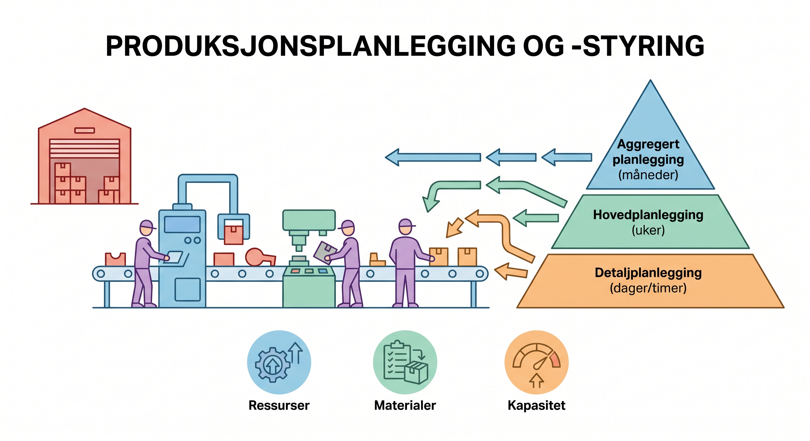

Produksjonsplanlegging og -styring: koordinering av ressurser, materialer og kapasitet på tre tidshorisonter.

Definisjon [Produksjonsplanlegging og -styring]
**Produksjonsplanlegging og -styring** er prosessen med å bestemme hva som skal produseres, i hvilke mengder, når og med hvilke ressurser, for å møte etterspørselen til lavest mulig total kostnad under gitte kapasitets- og materialbegrensninger.

Området omfatter beslutninger på tre tidshorisonter som henger hierarkisk sammen:

- Aggregert planlegging (måneder) --- bestemmer produksjonsvolum, bemanning og lagernivå på overordnet nivå

- Hovedplanlegging (uker) --- bryter den aggregerte planen ned til konkrete produktfamilier og produksjonsordrer (MPS)

- Detaljplanlegging (dager/timer) --- sekvenserer og skedulerer jobber på enkeltmaskiner og arbeidsstasjoner

Produksjonsplanlegging og -styring er tett koblet til flere andre områder som behandles i dette kompendiet:

- Etterspørselprognoser --- leverer forventet etterspørsel som er input til alle tre planleggingsnivåer

- Lagerstyring --- mottar ferdigvarer fra produksjon og leverer råvarer tilbake gjennom sikkerhetslager

- Innkjøp --- styrer materialflyten inn i produksjonen og forsyner MRP-beregningene

- Kø-teori --- analyserer flaskehalser og ventetider i produksjonslinjen

- Nettverksdesign --- bestemmer lokalisering av produksjonsanlegg og deres kapasitet

Problemstillinger, modeller og metoder

## Problemstillinger, modeller og metoder
I det følgende presenteres tre sentrale problemstillinger innen produksjonsplanlegging med tilhørende modeller og metoder, som illustrert i figur [2](#fig-fig-produksjonsplanlegging-problemstillinger-oversikt). Alle tre problemstillingene utdypes med hvert sitt eksempel senere i kapittelet. I tillegg nevnes Kanban/JIT-styring og teorien om flaskehalser (Drum-Buffer-Rope) som supplerende tilnærminger som i praksis ofte kombineres med de tre hovedtilnærmingene.

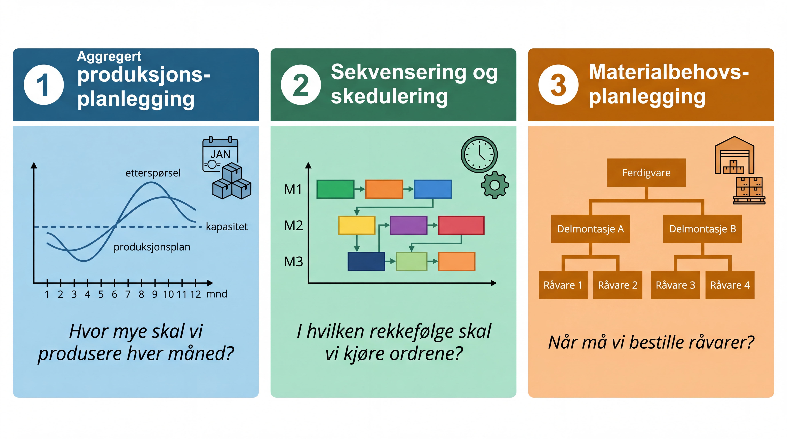

Tre sentrale problemstillinger innen produksjonsplanlegging: aggregert planlegging, sekvensering og skedulering, og materialbehovsplanlegging.

Nøkkelen til god produksjonsplanlegging er å velge riktig modell og metode for den aktuelle problemstillingen -- og for riktig tidshorisont. Aggregert planlegging foregår på måneds- eller kvartalsnivå, sekvensering og skedulering på dager eller timer, mens materialbehovsplanlegging kobler sluttproduktets etterspørsel til en tidsforskjøvet bestillingsplan for alle underkomponenter. Tabell [1](#tab-tab-produksjonsplanlegging-oversikt) gir en oversikt over hvilke modeller og metoder som egner seg for de tre problemstillingene. Modellene uthevet med rødt vil bli gått gjennom i de tre neste avsnittene.

Oversikt over modeller og metoder for de tre sentrale problemstillingene innen produksjonsplanlegging.

  **Nr.**   **Problemstilling**                              **Modeller**                                                                       **Metoder**
  --------- ------------------------------------------------ ---------------------------------------------------------------------------------- --------------------------------------------------------------------------------------------
  1         Aggregert produksjonsplanlegging   Lineær programmering (LP), transportmodellen                         Matematisk optimering, simpleksmetoden, dual/skyggepriser, sensitivitetsanalyse
  2         Sekvensering og skedulering        Heltallsprogrammering (MIP), job shop / flow shop, dispatch-regler   Kombinatorisk optimering, branch-and-bound, heuristikker (SPT, EDD, ATC), metaheuristikker
  3         Materialbehovsplanlegging          MRP med lot-sizing, stykklistemodell (BOM)                           Behovseksplosjon, nettbehovsberegning, lot-for-lot / EOQ / Silver-Meal

Aggregert produksjonsplanlegging med LP

## Eksempel: Aggregert produksjonsplanlegging med LP
Oppsummering.

  **Kategori**      **Beskrivelse**
  ----------------- ------------------------------------------------------------------------
  Eksempel          Aggregert 12-måneders produksjonsplan for småbåtprodusent
  Område            Produksjonsplanlegging med sesongvarierende etterspørsel
  Problemstilling   Minimere totale produksjons-, lager-, overtids- og bemanningskostnader
  Modell            Lineær programmering (LP) med lager- og arbeidsbalanse
  Prosess           Matematisk optimering (primal og dual)
  Metode            PuLP (CBC) og `scipy.optimize.linprog`; skyggepriser og sensitivitet

### Problemstilling
Fjordkraft Boats AS er en familieeid småbåtprodusent på Sunnmøre som leverer åpne plastskrog til fritidsmarkedet. Salget har et markant sesongmønster: etterspørselen topper seg i juni--august når sportsfiskere og sommerhytteturister fornyer flåten, og faller kraftig igjen om vinteren. Samtidig er fabrikken bundet av en fast arbeidsstyrke og en gitt linjekapasitet; det koster å ansette og si opp, det koster å kjøre overtid, og det koster å bygge opp lager.

Styret ønsker en aggregert produksjonsplan for kommende 12 måneder som balanserer fire virkemidler: ordinær produksjon, overtid, lageroppbygging og endring i arbeidsstyrken. Planen skal være kvantitativt underbygget, og den skal vise hvor mye det koster å presse mot kapasitetstaket i høysesongen.

**Problemstilling** --- *Hvor mye skal vi produsere hver måned, og hvor mye skal vi bygge opp lager?*

Med sesongvarierende etterspørsel og kostbart å både ansette, si opp og jobbe overtid, bruker vi lineær programmering til å finne den 12-måneders produksjonsplanen som minimerer samlet kostnad samtidig som all etterspørsel dekkes.

### Modell
Vi formulerer den aggregerte planen som et *lineært programmeringsproblem* (LP): samtlige beslutningsvariabler er kontinuerlige og ikke-negative, objektfunksjonen er lineær, og skrankene er lineære likninger og ulikheter. Planleggingshorisonten er $T = 12$ måneder, indeksert med $t = 1, 2, \ldots, T$.

Definisjon [LP for aggregert produksjonsplanlegging]
La $D_t$ være kjent etterspørsel i måned $t$. Beslutningsvariablene er

$$\begin{aligned}P_t & \text{ -- ordinær produksjon i måned } t, \\
O_t & \text{ -- overtidsproduksjon i måned } t, \\
I_t & \text{ -- lagerbeholdning ved slutten av måned } t, \\
H_t & \text{ -- nyansettelser i måned } t, \\
F_t & \text{ -- oppsigelser i måned } t, \\
W_t & \text{ -- arbeidsstyrke ved slutten av måned } t.\end{aligned}$$

Modellen er

$$\min_{P, O, I, H, F, W} \ \sum_{t=1}^{T} \Big( c^P P_t + c^O O_t + c^I I_t + c^H H_t + c^F F_t \Big)$$

1

med skranker for $t = 1, \ldots, T$:

$$\begin{aligned}I_t &= I_{t-1} + P_t + O_t - D_t, \\
W_t &= W_{t-1} + H_t - F_t, \\
P_t &\leq \alpha\, W_t, \\
O_t &\leq O_{\max}, \\
P_t, O_t, I_t, H_t, F_t, W_t &\geq 0.\end{aligned}$$

2

Startverdiene $I_0$ og $W_0$ er gitt.

Ligning [(2)](#eq-eq-agglp-inv) er *lagerbalansen*: sluttlageret er inngående lager pluss produksjon (ordinær og overtid) minus solgt kvantum. Ligning [(?)](#eq-eq-agglp-wf) er *arbeidsstyrkebalansen*: arbeidsstyrken går opp ved ansettelser og ned ved oppsigelser. Ligning [(?)](#eq-eq-agglp-cap) kobler produksjon til bemanning gjennom produktiviteten $\alpha$ (båter per ansatt per måned). Overtidsskranken [(?)](#eq-eq-agglp-omax) begrenser hvor mye ekstra som kan produseres utenom normal arbeidstid.

Parametere. Alle tallfestede størrelser i modellen er samlet i tabell [3](#tab-tab-agglp-parametere).

Parametere for LP-modellen (Fjordkraft Boats AS).

  **Symbol**       **Enhet**          **Beskrivelse**                                **Verdi**
  ---------------- ------------------ ---------------------------------------------- -----------
  $c^P$         NOK/båt            Ordinær produksjonskostnad per båt             8 000
  $c^O$         NOK/båt            Overtidskostnad per båt                        11 000
  $c^I$         NOK/båt/mnd        Lagerkostnad per båt per måned                 600
  $c^H$         NOK/ansatt         Ansettelseskostnad (rekruttering, opplæring)   40 000
  $c^F$         NOK/ansatt         Oppsigelseskostnad (sluttpakker)               60 000
  $\alpha$      båter/ansatt/mnd   Produktivitet                                  4
  $O_{\max}$   båter/mnd          Maksimal overtidskapasitet                     40
  $I_0$          båter              Startlager ($t=0$)                           20
  $W_0$          ansatte            Startarbeidsstyrke ($t=0$)                   40
  $T$            måneder            Planleggingshorisont                           12

Modellen har $6T = 72$ beslutningsvariabler, $2T = 24$ likhetsskranker og $2T = 24$ ulikhetsskranker utover ikke-negativitet.

**Tolkning** --- *Fire virkemidler, én kostnadskrone*

LP-modellen veier fire alternativer for å dekke en topp i etterspørselen:

1.  **Produsere tidlig og lagre** ($I_t \uparrow$): billig per enhet, men koster $c^I$ per måned.

2.  **Kjøre overtid i toppmåneden** ($O_t \uparrow$): rask reaksjon, men dyrere enhetskostnad ($c^O > c^P$).

3.  **Ansette flere folk** ($H_t \uparrow$): øker $W_t$ og dermed ordinær kapasitet, men koster $c^H$ engangsbeløp.

4.  **Si opp etter sesongen** ($F_t \uparrow$): frigjør lønnsbelastning, men koster $c^F$ og gir tapt kompetanse.

Optimal plan velger den kombinasjonen som gir lavest samlet $\sum_t (c^P P_t + c^O O_t + c^I I_t + c^H H_t + c^F F_t)$ gitt at all etterspørsel skal dekkes.

Forutsetninger. LP-formuleringen hviler på tre forenklinger som er standard for aggregert planlegging:

1.  **Linearitet:** Både objektfunksjonen og skrankene er lineære i beslutningsvariablene. I praksis betyr det konstant enhetskostnad (ingen kvantumsrabatter, ingen skala-effekter) og konstant produktivitet $\alpha$.

2.  **Deterministisk etterspørsel:** $D_t$ antas kjent. Usikkerhet må adresseres enten ved sikkerhetslager, rullerende reoptimering, eller stokastisk programmering (kapittel [?](#ref-ch-risikostyring)).

3.  **Kontinuerlige variabler:** Vi lar $P_t, O_t, H_t, F_t$ være reelle tall. For aggregert planlegging på månedsnivå er dette en god tilnærming, og vi runder til hele båter og ansatte ved implementering. Krav om heltall leder til heltallsprogrammering (MIP) og økt beregningskompleksitet.

### Prosess
Prosess: Matematisk optimering (primal og dual).
Modell: LP, løst med PuLP + CBC og kryssjekket med `scipy.optimize.linprog`.

Arbeidsflyten følger seks steg, fra datainnsamling til endelig anbefaling. Figur [3](#fig-fig-agglp-method) viser prosessen skjematisk.

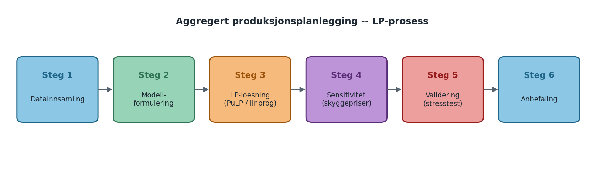

Seks-stegs arbeidsflyt for aggregert LP-planlegging.

### Steg 1: Datainnsamling
Fjordkraft har 12 måneders etterspørselsprognose fra salgsavdelingen, uttrykt som antall båter per måned. Prognosen er generert syntetisk etter et sinusformet sesongmønster med tilfeldig støy og avrundet til heltall. Tabell [4](#tab-tab-agglp-demand) og figur [4](#fig-fig-agglp-demand-cap) viser de rå dataene sammen med ordinær kapasitet $K = \alpha \cdot W_0 = 4 \cdot 40 = 160$ og maksimal kapasitet (inklusive overtid) $K + O_{\max} = 200$.

Etterspørsel $D_t$ for 12-måneders horisont ($t = 1, \ldots, 12$).

  **Måned**   **Jan**   **Feb**   **Mar**   **Apr**   **Mai**   **Jun**   **Jul**             **Aug**   **Sep**   **Okt**   **Nov**   **Des**   **Sum**
  ----------- --------- --------- --------- --------- --------- --------- ------------------- --------- --------- --------- --------- --------- -----------
  $D_t$     54        65        106       143       160       181       188   168       138       98        75        56        **1 432**

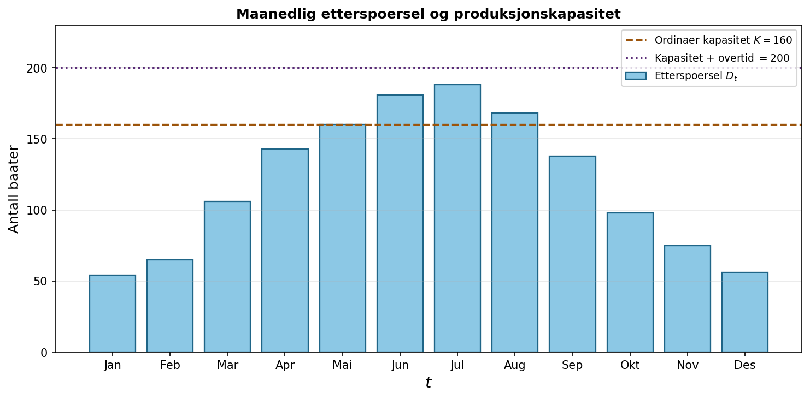

Månedlig etterspørsel $D_t$ (søyler) mot ordinær kapasitet $K = 160$ (stiplet) og maksimal kapasitet $K + O_{\max} = 200$ (prikket).

Fra figuren ser vi at kun tre måneder --- juni, juli og august --- ligger over ordinær kapasitet. Toppmåneden juli ($D_7 = 188$) ligger 28 båter over $K = 160$, altså innenfor overtidskapasiteten på 40 båter. De andre ni månedene har betydelig ledig kapasitet, som kan utnyttes til lageroppbygging.

**Konklusjon** --- *Strukturen i problemet*

Etterspørselen overstiger ordinær kapasitet i juni--august med til sammen $(181-160) + (188-160) + (168-160) = 57$ båter. Dette gapet må lukkes ved overtid, lageroppbygging i forkant, eller økt bemanning. I neste steg formulerer vi den eksakte LP-modellen og løser den numerisk.

### Steg 2: Modellformulering
Modellen er allerede gitt formelt i ligning [(1)](#eq-eq-agglp-obj)--[(?)](#eq-eq-agglp-nn). Vi nevner to praktiske egenskaper før løsning:

- **Feasibilitet:** Totalt 12-måneders etterspørsel er $\sum_t D_t = 1\,432$ båter, mens maksimal produksjonskapasitet over horisonten er $T \cdot (K + O_{\max}) = 12 \cdot 200 = 2\,400$ båter. Problemet er derfor trivielt feasibelt.

- **Degenerering:** LP-modellen har flere alternative optimale løsninger når kostnadsforholdene er knivskarpe. I vårt tilfelle gir $c^I = 600$ NOK/mnd at én båt i lager i $n$ måneder koster $600n$ NOK, mens overtid koster $c^O - c^P = 3\,000$ NOK. Det blir derfor billigere å lagre en båt enn å produsere den på overtid hvis lagertiden er mindre enn $3\,000 / 600 = 5$ måneder.

**Tolkning** --- *Lager kontra overtid: 5-måneders-regelen*

En ekstra båt produsert på overtid i toppmåneden koster $c^O - c^P = 3\,000$ NOK mer enn ordinær produksjon. Samme båt produsert i lavsesongen og lagret i $n$ måneder koster $c^I \cdot n = 600n$ NOK. Break-even er $n^\* = 3\,000 / 600 = 5$ måneder. Løsningen vil derfor bruke lageroppbygging når toppmåneden ligger under fem måneder unna billig produksjonstid, og overtid ellers.

### Steg 3: LP-løsning
Vi implementerer modellen i Python med `PuLP` og løser med CBC-solveren. Som kryssjekk løser vi samme modell med `scipy.optimize.linprog` (HiGHS-algoritmen); begge solvere gir identisk objektverdi. Totalkostnaden er **11 414 800 NOK**, og tabell [5](#tab-tab-agglp-plan) viser den optimale planen måned for måned.

Optimal produksjonsplan: ordinær produksjon $P_t$, overtid $O_t$, sluttlager $I_t$ og arbeidsstyrke $W_t$ per måned.

  **Måned**   $D_t$     $P_t$     $O_t$           $I_t$            $H_t$   $F_t$   $W_t$
  ----------- ----------- ----------- ----------------- ------------------ --------- --------- ---------
  Jan         54          34          0                 0                  0         0         40
  Feb         65          65          0                 0                  0         0         40
  Mar         106         138         0                 32   0         0         40
  Apr         143         160         0                 49   0         0         40
  Mai         160         160         0                 49   0         0         40
  Jun         181         160         0                 28   0         0         40
  Jul         188         160         0                 0                  0         0         40
  Aug         168         160         8   0                  0         0         40
  Sep         138         138         0                 0                  0         0         40
  Okt         98          98          0                 0                  0         0         40
  Nov         75          75          0                 0                  0         0         40
  Des         56          56          0                 0                  0         0         40
  **Sum**     **1 432**   **1 404**   **8**             **158**            **0**     **0**     ---

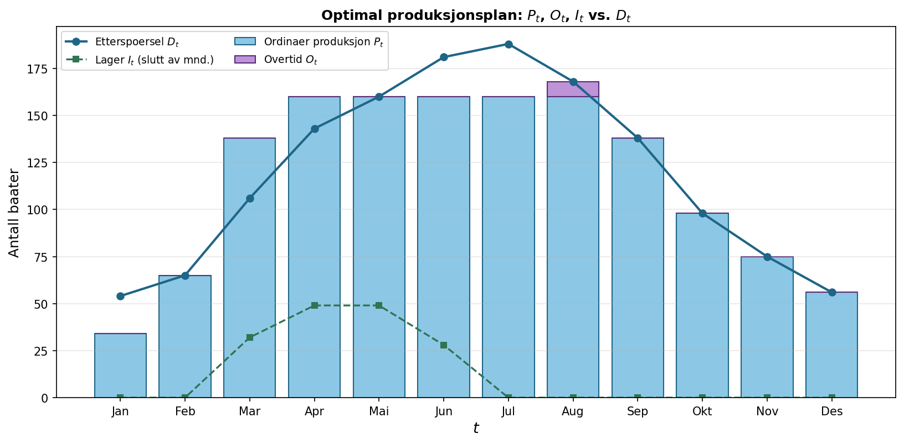

Optimal plan visuelt: stablede søyler viser $P_t$ (nederst) og $O_t$ (øverst), linjen viser $D_t$, og den stiplede kurven viser sluttlager $I_t$.

Kostnadsfordeling. Figur [6](#fig-fig-agglp-cost) viser hvordan totalkostnaden fordeler seg på komponentene. Ordinær produksjon dominerer (98,4 %), som forventet når $T \cdot (K + O_{\max})$ er nær $\sum_t D_t$. Lager- og overtidskostnadene utgjør bare 1,1 % henholdsvis 0,8 % av totalen, og ingen ansettelser eller oppsigelser gjennomføres.

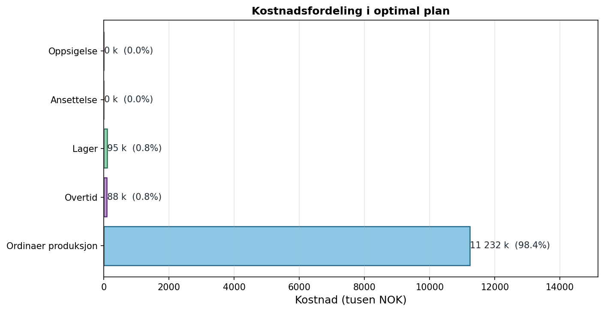

Kostnadsfordeling for optimal løsning (i tusen NOK).

**Konklusjon** --- *Hva gjør LP-en med problemet?*

Optimal plan bygger lager i mars--juni (opp til 49 båter i april og mai), tømmer det i juli, og bruker overtid kun i august (8 båter) når lageret er tomt og etterspørselen fortsatt er høy. Arbeidsstyrken er uendret på $W_0 = 40$ gjennom hele horisonten: det er billigere å jobbe litt overtid og bygge litt lager enn å ansette og si opp.

### Steg 4: Skyggepriser og sensitivitet
En sentral fordel med LP er at vi gratis får *skyggepriser* (dualvariable) som kvantifiserer den marginale verdien av hver skranke. Skyggeprisen $\pi_t$ for lagerbalansen i måned $t$ (ligning [2](#eq-eq-agglp-inv)) tolkes som: *den marginale kostnadsøkningen for én ekstra enhet etterspørsel $D_t$*.

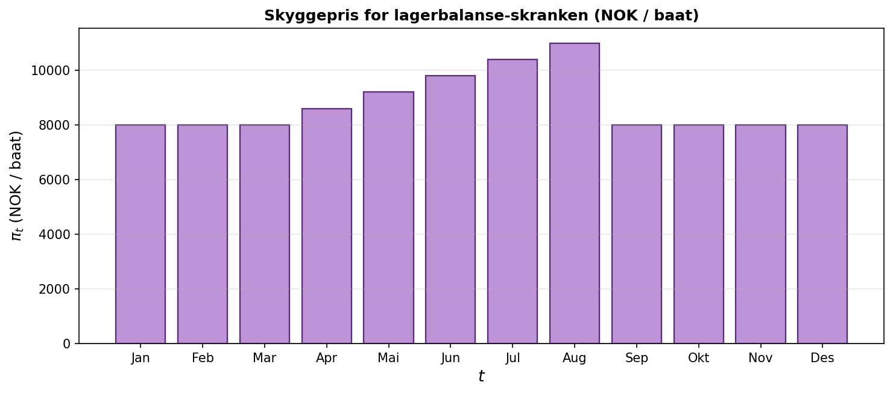

Skyggepriser $\pi_t$ for lagerbalanse-skranken [(2)](#eq-eq-agglp-inv) per måned.

Tolkning av skyggeprisene. Figur [7](#fig-fig-agglp-shadow) viser at skyggeprisene er jevne og høye ($\pi_t = 11\,000$ NOK for toppmånedene juli og august, og $\pi_t = c^P + n \cdot c^I$ for tidligere måneder der $n$ er antall måneder før overtidsbruk). Tolkning:

- En ekstra båt i *juli* må dekkes av overtid, og koster $c^O = 11\,000$ NOK.

- En ekstra båt i *mars* kan lagres frem til overtidsbruken og koster $c^P + 5 \cdot c^I = 8\,000 + 3\,000 = 11\,000$ NOK --- samme marginalkost (break-even-nivået fra Steg 2).

- For januar--februar (der det er ledig kapasitet langt unna toppen) er marginalen $c^P + n \cdot c^I$, som er lavere.

Det er denne enhetlige marginalkosten som avslører at LP-løsningen har funnet den rette balansen mellom lager og overtid.

Sensitivitet til etterspørsel. Tabell [6](#tab-tab-agglp-sens-demand) viser optimal totalkostnad når hele etterspørselsprofilen skaleres opp eller ned med $\pm 10$ og $\pm 20$ prosent. Figur [8](#fig-fig-agglp-sens) visualiserer sammenhengen.

Kostnadssensitivitet for etterspørselsskaleringer.

  **Skalering**   $\sum D_t$   **Totalkostnad (NOK)**   **Endring**      **Kommentar**
  --------------- --------------- ------------------------ ---------------- -----------------------------------------------
  0,80            1 144           8 992 000                $-21,2~%$   Ingen overtid, nær alt fra ordinær produksjon
  0,90            1 288           10 156 600               $-11,0~%$   Liten lagerbruk, ingen overtid
  1,00            1 432           **11 414 800**           $0~%$       Baseline
  1,10            1 576           12 734 600               $+11,6~%$   Mer overtid og lager
  1,20            1 720           14 059 400               $+23,2~%$   Nær maksimal kapasitet

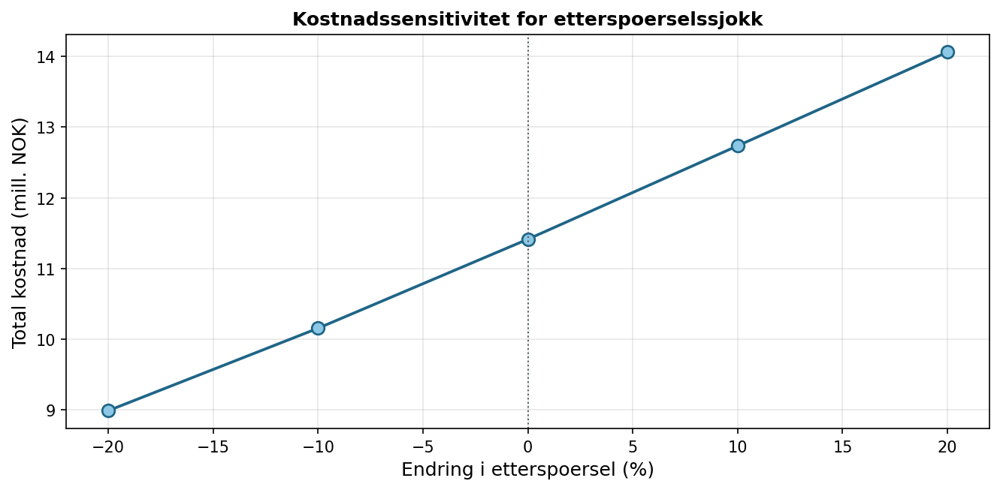

Totalkostnad som funksjon av prosentvis endring i etterspørsel.

Kurven er tilnærmet lineær i intervallet $\[-10~%, +10~%\]$ og knekkes lett oppover mot $+20~%$: jo nærmere vi kommer maksimal kapasitet, jo mer må løses med overtid, og jo dyrere blir det å absorbere en ekstra enhet etterspørsel.

**Konklusjon** --- *Skyggepriser kvantifiserer marginalkosten*

Skyggeprisene viser at marginalkosten for én ekstra båt etterspørsel i høysesongen er **11 000 NOK** --- nøyaktig overtidskostnaden. Den enhetlige marginalen bekrefter at løsningen utnytter lageroppbygging og overtid nøyaktig slik at kostnaden ved begge alternativer er like høy i optimum.

### Steg 5: Validering og stresstest
For å vurdere robustheten sammenligner vi LP-løsningen med en naiv *chase-strategi* (produsere nøyaktig $D_t$ hver måned, bruke overtid og bemanningsjusteringer etter behov) og tester planen mot flere sjokkscenarioer. Tabell [7](#tab-tab-agglp-stress) viser resultatene.

Stresstest: totalkostnad for LP-løsningen sammenlignet med alternative strategier og scenarioer.

  **Scenario**                    **Detalj**                                  **Totalkostnad**   **Endring**
  ------------------------------- ------------------------------------------- ------------------ -----------------
  Baseline (LP)                   Original etterspørsel og kapasitet          11 414 800         $0,00~%$
  Chase (heuristikk)              Produser $D_t$ hver mnd. uten lagerplan   16 656 000         $+45,92~%$
  Etterspørsel $\times$ 0,90   Likeverdig skalering alle måneder           10 156 600         $-11,02~%$
  Etterspørsel $\times$ 1,10   Likeverdig skalering alle måneder           12 734 600         $+11,56~%$
  Kapasitet: $\alpha = 3$      Produktiviteten reduseres med 25 %          11 905 600         $+4,30~%$
  Kapasitet: $\alpha = 5$      Produktiviteten økes med 25 %               11 296 000         $-1,04~%$
  Overtid: $O_{\max} = 20$    Halvert overtidskapasitet                   11 414 800         $0,00~%$

Den mest dramatiske observasjonen er at chase-strategien gir **45,9 % høyere** totalkostnad enn LP-løsningen. Grunnen er at chase tvinger bedriften til å ansette og si opp rundt sesongtoppen, og dermed betale $c^H + c^F = 100\,000$ NOK per ansatt i begge ender av sesongen. LP unngår dette ved å bruke lager og litt overtid i stedet.

Ellers er planen stabil: redusert produktivitet ($\alpha = 3$) øker kostnaden med bare 4,3 %, og å halvere overtidsgrensen påvirker ikke optimum siden vi uansett bare bruker 8 båter overtid i baseline.

**Konklusjon** --- *LP-verdien er verdien av å ikke jage etterspørselen*

Å løse problemet som LP i stedet for å jage etterspørsel måned for måned sparer bedriften over 5 millioner NOK (ca. 46 %) i det baselinemønsteret vi ser på. Verdien ligger i å bruke lager og overtid som *buffere* fremfor å betale for kontinuerlig ansettelse og oppsigelse.

### Steg 6: Anbefaling
Anbefalingen til Fjordkraft Boats er:

1.  **Behold arbeidsstyrken konstant på 40 ansatte** gjennom hele året. Ingen sesongansettelser og ingen sesongoppsigelser.

2.  **Produser på full ordinær kapasitet (160 båter/mnd)** fra mars til august. Bygg lager i mars--juni slik at sluttlager når opp i 49 båter i april og mai.

3.  **Tøm lageret i juni--juli** når etterspørselen topper seg. I juli dekkes all etterspørsel av produksjon + lager; ingen overtid kreves.

4.  **Kjør begrenset overtid (8 båter) i august** når lageret er tomt og etterspørselen fortsatt er høy.

5.  **Skalér ned produksjon fra september** i takt med etterspørsel. Ingen lageroppbygging i høstmånedene.

Planen gir total årlig kostnad på **11,4 mill. NOK**, fordelt på 11,2 mill. i ordinær produksjon, 95 tusen i lagerkostnad, og 88 tusen i overtid.

**Praktisk anvendelse** --- *Fra LP til månedlig drift*

1.  **Rullerende reoptimering:** Kjør LP på nytt hver måned med oppdatert prognose for de kommende 12 månedene, og implementer bare første måneds beslutninger (*rolling horizon*).

2.  **Skyggepriser som styringssignal:** Sammenlign skyggeprisen $\pi_t$ med prisen på innkjøpt ekstrakapasitet (leid arbeidskraft, underleverandør). Lavere pris på kapasitet enn $\pi_t$ betyr at det lønner seg å kjøpe mer kapasitet.

3.  **Robusthet:** Bruk stresstesten (tabell [7](#tab-tab-agglp-stress)) til å vurdere hvor mye sikkerhetslager som trengs hvis etterspørselen viker $\pm 10$ %.

4.  **Kobling videre:** LP-planen mater masterplanleggingen og detaljert sekvensering, som dekkes i neste seksjon.

Begrensninger. LP-modellen bygger på tre forenklinger som må respekteres i praksis: (i) etterspørselen er i virkeligheten stokastisk, og en deterministisk LP må derfor kombineres med sikkerhetslager eller stokastisk programmering; (ii) kontinuerlige beslutningsvariabler passer godt aggregert, men heltalls-MIP er nødvendig for detaljert sekvensering; (iii) linearitet utelukker skala-effekter og ikke-lineære bemanningskostnader. Neste seksjon viser hvordan vi utvider til MIP for sekvenseringsbeslutninger der heltallsvariabler er uomgjengelige.

Sekvensering med MIP og heuristikker

## Eksempel: Sekvensering med MIP og heuristikker
Oppsummering.

  **Kategori**      **Beskrivelse**
  ----------------- -------------------------------------------------------------------------------------------------------------------------------
  Eksempel          Sekvensering av ordrer i et maskinverksted for flydeler
  Område            Detaljplanlegging i produksjon (enkeltmaskin med omstilling)
  Problemstilling   Hvilken rekkefølge minimerer vektet forsinkelse når jobber har ulik prioritet, forfallstid og sekvensavhengig omstillingstid?
  Modell            Heltallsprogrammering (MIP) for enkeltmaskin vektet tardiness, $1 \mid s_{ij} \mid \sum_j w_j T_j$
  Prosess           Kombinatorisk optimering med eksakt løser (CBC) og heuristisk nedskalering
  Metode            Predecessor-basert MIP, dispatch-regler (SPT, EDD, ATC) og simulated annealing

### Problemstilling
*NordAero Precision* driver et maskinverksted i Ålesund som produserer presisjonskomponenter til flybransjen. Verkstedet har én flaskehals: en femakset CNC-maskin som alle ordrer må gjennom. Hver morgen legges det en ny dagsplan, og planleggeren må bestemme rekkefølgen av seks til åtte haste-ordrer som er sluppet til produksjon.

To ting gjør oppgaven kvantitativt interessant. For det første er jobbene ulikt viktige: noen ordrer er gjentakende og har lite kontraktsfestet forsinkelsesgebyr, mens andre går til en jumbojet på bakken i Frankfurt med bøter som løper per time. For det andre koster det tid å skifte mellom ulike komponenttyper --- en bytting fra aluminium til titan krever kalibrering og nye skjær, og tiden for denne omstillingen avhenger av *hvilken* jobb som kommer før (en lik-til-lik-overgang er rask, en helt ny profil er treg). Dette er kjent som *sekvensavhengige omstillingstider*.

**Problemstilling** --- *Hvilken rekkefølge minimerer vektet forsinkelse?*

Vi vil finne en sekvens som minimerer $\sum_j w_j T_j$, der $T_j$ er forsinkelsen på jobb $j$ og $w_j$ en vektet prioritet. For små instanser ($N \approx 6$) løser vi dette eksakt som MIP. For store instanser ($N = 50$) er MIP upraktisk, og vi bruker dispatch-heuristikker (SPT, EDD, ATC) og metaheuristikker (simulated annealing).


Maskinverksted for flydeler: flere ordrer med ulik prioritet og forfallstid konkurrerer om samme CNC-maskin.

### Modell
Dette er et klassisk problem i sekvenseringslitteraturen, kjent med Graham-notasjonen $1 \mid s_{ij} \mid \sum_j w_j T_j$: én maskin, sekvensavhengige omstillingstider $s_{ij}$, og objektiv = vektet total tardiness. Problemet er sterkt NP-hardt, og eksakt løsning krever heltallsprogrammering.

Definisjon [Enkeltmaskin vektet tardiness med omstilling]
La $J = {1, 2, \ldots, N}$ være settet av jobber. For jobb $j$ gir $p_j > 0$ prosesseringstid, $d_j > 0$ forfallstid og $w_j > 0$ vekt. Omstillingstid fra jobb $i$ til jobb $j$ er $s_{ij} \geq 0$, med $s_{jj} = 0$. La $C_j$ være fullføringstidspunktet for jobb $j$ i den valgte sekvensen, og definer tardiness

$$T_j = \max(0,\, C_j - d_j).$$

3

MIP-modellen er

$$\min_{y,\,C,\,T} \; \sum_{j \in J} w_j T_j,$$

4

underlagt skrankene (i)--(vii) i tabell [10](#tab-tab-seqmip-skranker) nedenfor.

Variabler og formulering. Vi bruker en *predecessor*-basert formulering der binærvariabelen $y_{ij}$ angir om jobb $j$ følger direkte etter jobb $i$ i sekvensen. To dummy-noder, $0$ (start) og $N{+}1$ (slutt), lukker sekvensen som en sti gjennom alle jobbene. Symbolene er oppsummert i tabell [9](#tab-tab-seqmip-symbols).

Symboler i MIP-modellen for enkeltmaskin vektet tardiness.

  **Symbol**    **Type**        **Beskrivelse**
  ------------- --------------- ------------------------------------------------------
  $N$         Parameter       Antall jobber
  $p_j$       Parameter       Prosesseringstid for jobb $j$ (timer)
  $d_j$       Parameter       Forfallstid for jobb $j$ (timer)
  $w_j$       Parameter       Vekt (prioritet) for jobb $j$
  $s_{ij}$   Parameter       Omstillingstid fra jobb $i$ til jobb $j$ (timer)
  $M$         Stor konstant   Big-$M$ for aktivering av precedence-skranker
  $y_{ij}$   ${0,1}$   $=1$ hvis $j$ er direkte etterfølger av $i$
  $C_j$       $\geq 0$     Fullføringstid for jobb $j$
  $T_j$       $\geq 0$     Tardiness for jobb $j$
  $u_j$       $\[1, N\]$    MTZ-ordningsvariabel for å hindre subsykler

Skranker i MIP-modellen. Her er $J$ mengden av jobber, og dummy-nodene er $0$ (start) og $N{+}1$ (slutt).

  **Nr**    **Skranke**                                                                                **Betydning**
  --------- ------------------------------------------------------------------------------------------ -----------------------------------------------------
  \(i\)     $\sum_{i \in {0} \cup J,\, i \neq j} y_{ij} = 1 \quad \forall j \in J$     Hver jobb har nøyaktig én direkte forgjenger
  \(ii\)    $\sum_{j \in J \cup {N+1},\, j \neq i} y_{ij} = 1 \quad \forall i \in J$   Hver jobb har nøyaktig én direkte etterfølger
  \(iii\)   $\sum_{j \in J} y_{0j} = 1$                                                          Starten har nøyaktig én etterfølger
  \(iv\)    $\sum_{i \in J} y_{i,N+1} = 1$                                                       Slutten har nøyaktig én forgjenger
  \(v\)     $C_j \geq C_i + s_{ij} + p_j - M(1 - y_{ij}) \quad \forall i,j$                     Aktiverer completion-rekursjon hvis $y_{ij} = 1$
  \(vi\)    $u_i - u_j + N\, y_{ij} \leq N - 1 \quad \forall i,j \in J,\, i \neq j$          Miller--Tucker--Zemlin: hindrer subsykler
  \(vii\)   $T_j \geq C_j - d_j \quad \forall j \in J$                                           Linearisering av $T_j = \max(0, C_j - d_j)$

Skranke (v) er hjertet i modellen. Når $y_{ij} = 1$ forsvinner big-$M$-leddet, og vi får $C_j \geq C_i + s_{ij} + p_j$: jobb $j$ kan ikke ferdigstilles før jobb $i$ er ferdig, omstillingen er gjort, og $j$ selv er prosessert. Når $y_{ij} = 0$ er skranken slakk på grunn av $-M$-leddet og påtvinger ingenting. Skranke (vi) er Miller--Tucker--Zemlin-eliminering: den tvinger fram en stigende nummerering $u_j$ langs sekvensen og kutter dermed ut løsninger som ville vært sykliske sløyfer uten dummy-nodene.

Modellstørrelse. Tabell [11](#tab-tab-seqmip-storrelse) viser hvor raskt modellen vokser. Med $N = 6$ jobber har vi 42 binærvariabler, som CBC løser på under 30 sekunder. Med $N = 50$ jobber er det over 2 500 binærvariabler og mer enn 5 000 skranker --- ikke mange for en moderne solver, men LP-relaksjonen gir her en svært svak nedre grense ($0$), slik at søketreet eksploderer lenge før løsningen er bevist optimal.

Modellstørrelse for MIP-formuleringen.

  **Størrelse**                  **$N = 6$**   **$N = 50$**
  ------------------------------ --------------- ----------------
  Binære variabler $y_{ij}$   42              2 550
  Kontinuerlige variabler        18              150
  Antall skranker                86              5 102

**Heuristikk-merknad** --- *Hvorfor MIP bare skalerer til ca. 15--20 jobber*

Problemet $1 \mid s_{ij} \mid \sum_j w_j T_j$ er sterkt NP-hardt: antall mulige sekvenser er $N!$, og for $N = 20$ gir det omtrent $2,4 \cdot 10^{18}$ permutasjoner. Den foreslåtte MIP-formuleringen har en LP-relaksjon som ikke klarer å skille de dårlige løsningene fra de gode (nedre grense = 0 i CBC-output), så en eksakt løser må i praksis enumerere en stor del av søketreet. Dette begrenser MIP til instanser med $N \lesssim 15$--$20$ innen rimelig tid.

For større instanser bruker vi to klasser heuristikker:

- **Dispatch-regler:** Sorteringsbaserte sekvenser som beregnes på millisekunder:

  - **SPT** (Shortest Processing Time): sortér etter $p_j$ voksende.

  - **EDD** (Earliest Due Date): sortér etter $d_j$ voksende.

  - **ATC** (Apparent Tardiness Cost): dynamisk indeks som kombinerer prioritet, prosesseringstid og slakk.

- **Simulated annealing (SA):** Starter fra en dispatch-løsning og forbedrer iterativt ved å bytte jobbpar. Aksepterer forverringer med avtakende sannsynlighet (temperatur $T_k = \alpha \cdot T_{k-1}$) for å unngå lokale minima.

Ingen av heuristikkene gir optimalitetsgaranti, men de gir gode løsninger i sekunder i stedet for timer. Vi kvantifiserer gapet mot MIP på den lille instansen.

Forutsetninger. Vi antar: (1) *én* kritisk maskin (enkeltmaskin-reduksjon); (2) jobbene er klare ved $t = 0$ (ingen release times); (3) ingen avbrytelser (non-preemptive); (4) omstillingstidene $s_{ij}$ er deterministiske og kjent; (5) jobber som ikke blir ferdige før deadline betaler en lineær bøte $w_j T_j$ per time forsinkelse.

### Prosess
Prosess: Kombinatorisk optimering.
Modell: Predecessor-basert MIP for $1 \mid s_{ij} \mid \sum_j w_j T_j$.

Prosessen følger seks steg, illustrert i figur [10](#fig-fig-seqmip-method): datainnsamling, dispatch-heuristikker som raske baselines, formell MIP-formulering, eksakt løsning med CBC på liten instans, simulated annealing på stor instans, og til slutt en sammenligning der gap-en mellom metodene kvantifiseres.

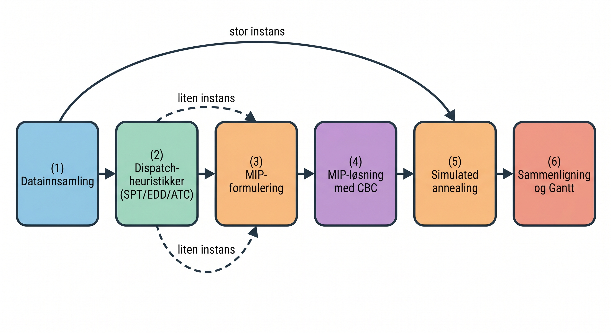

Seks-stegs prosess for sekvensering: MIP på liten instans, heuristikker på stor instans, felles sammenligning på slutten.

### Steg 1: Datainnsamling
Vi genererer to syntetiske instanser som representerer henholdsvis en *dagsplan* (liten, $N = 6$) og et *ukesoppdrag* (stor, $N = 50$) hos NordAero. Prosesseringstidene $p_j$ er trukket fra en lognormalfordeling (klippet til $\[1, 8\]$ timer), forfallstidene $d_j$ er jevnt fordelt langs $\[0,40 \cdot P,\, 1,05 \cdot P\]$ der $P = \sum_j p_j$, og vektene $w_j \in {1, 2, 5}$ trekkes uavhengig med sannsynligheter $(0,35,\, 0,45,\, 0,20)$. Omstillingstidene $s_{ij}$ trekkes fra $U(0,3,\, 1,5)$ timer, med $s_{jj} = 0$.

Liten instans. Tabell [12](#tab-tab-seqmip-jobber-small) viser alle seks jobbene i den lille instansen. Total prosesseringstid er $P = 17,05$ timer, så den absolutte nedre grensen på makespan er 17,05 (uten omstilling). Noen forfallstider er stramme ($d_3 = 8,24$, $d_5 = 10,93$), andre er løse ($d_6 = 17,09$).

Seks jobber i den lille instansen ($N = 6$). Prosesseringstid, forfallstid og vekt.

  **Jobb $j$**    **$p_j$**   **$d_j$**   **$w_j$**
  ----------------- ------------- ------------- -------------
  J1                3,45          15,26         2
  J2                1,88          15,53         5
  J3                4,21          8,24          2
  J4                4,59          11,81         1
  J5                1,25          10,93         2
  J6                1,67          17,09         1
  **Sum / snitt**   **17,05**     13,14         ---

Figur [11](#fig-fig-seqmip-jobs-overview) visualiserer problemet som en scatter av forfallstid mot prosesseringstid, farget etter vekt. Jobb J3 peker seg ut som kritisk: $d_3 = 8,24$ er lavest og $p_3 = 4,21$ er høyest, så den *må* starte tidlig. Jobb J2 har høyest vekt ($w_2 = 5$), så forsinkelse på den straffer seg mye.

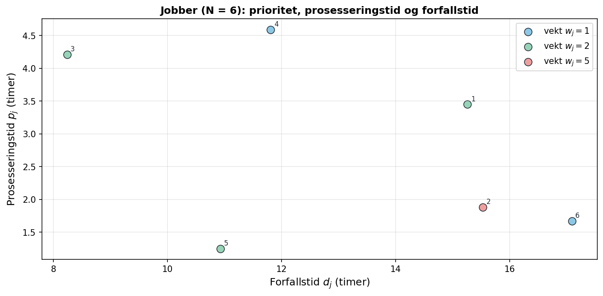

Jobboversikt for $N = 6$: forfallstid (x-akse) mot prosesseringstid (y-akse), farget etter vekt.

Stor instans. For $N = 50$ er det ikke praktisk å liste alle jobber; tabell [13](#tab-tab-seqmip-jobber-large-summary) oppsummerer fordelingen. Total prosesseringstid er $P = 152,5$ timer, så makespan-grensen ligger rundt seks fulle arbeidsdager uten omstilling.

Statistikk for den store instansen ($N = 50$).

  **Statistikk**                         **Verdi**
  -------------------------------------- ---------------------
  Antall jobber $N$                    50
  Total prosesseringstid $\sum p_j$   152,49 t
  Gjennomsnittlig $p_j$                3,05 t
  Gjennomsnittlig $d_j$                116,87 t
  Vektfordeling ($w = 1 / 2 / 5$)      15 / 22 / 13 jobber
  Gjennomsnittlig setup $s_{ij}$      0,90 t

**Konklusjon** --- *Hvorfor rekkefølge betyr noe*

Den totale prosesseringstiden er fast ($P = 17,05$ for liten, $152,49$ for stor), men hvor mye *tardiness* jobbene påfører oss avhenger helt av rekkefølgen. Med stramme forfallstider og sekvensavhengige omstillingstider er naiv FIFO eller tilfeldig rekkefølge en dyr strategi.

### Steg 2: Dispatch-heuristikker
Før vi angriper problemet med MIP, etablerer vi tre baselines basert på dispatch-regler. Dispatch-heuristikker sorterer jobber etter en enkel indeks og prosesserer dem deretter i rekkefølge --- ingen optimering, kun sortering.

Definisjon [Dispatch-regler for tardiness]
**SPT** (Shortest Processing Time) sorterer voksende etter $p_j$. Minimerer gjennomsnittlig gjennomløpstid, men ignorerer forfallstider.\
\[2pt\]

**EDD** (Earliest Due Date) sorterer voksende etter $d_j$. Optimal for problemet $1 \mid \mid T_{\max}$ (maksimal forsinkelse), men ikke nødvendigvis for vektet sum.\
\[2pt\]

**ATC** (Apparent Tardiness Cost, Vepsäläinen og Morton 1987) er en dynamisk regel. På beslutningstidspunkt $t$ velges jobben $j$ blant ventende som maksimerer

$$\pi_j(t) = \frac{w_j}{p_j} \cdot \exp\!\left( -\frac{\max(d_j - p_j - t,\, 0)}{K \bar{p}} \right),$$

5

der $\bar{p}$ er gjennomsnittlig prosesseringstid og $K > 0$ en styringsparameter (her $K = 2$). Faktoren $w_j / p_j$ er "weighted shortest processing first"; eksponensialleddet diskonterer jobber med mye slakk igjen.

Resultater på liten instans. Tabell [14](#tab-tab-seqmip-dispatch-small) viser sekvens og vektet tardiness for hver regel på $N = 6$. ATC gir tydelig best tardiness (10,20), etterfulgt av SPT (23,55) og EDD (27,66). Figur [12](#fig-fig-seqmip-dispatch-small) visualiserer forskjellen.

Dispatch-heuristikker på liten instans ($N = 6$).

  **Regel**   **Sekvens**                                                      $\sum_j w_j T_j$   **Makespan**   **\# tardy**
  ----------- ---------------------------------------------------------------- --------------------- -------------- --------------
  SPT         J5 $\to$ J6 $\to$ J2 $\to$ J1 $\to$ J3 $\to$ J4   23,55                 21,20          2
  EDD         J3 $\to$ J5 $\to$ J4 $\to$ J1 $\to$ J2 $\to$ J6   27,66                 22,27          4
  ATC         J5 $\to$ J3 $\to$ J2 $\to$ J1 $\to$ J6 $\to$ J4   10,20                 22,01          1

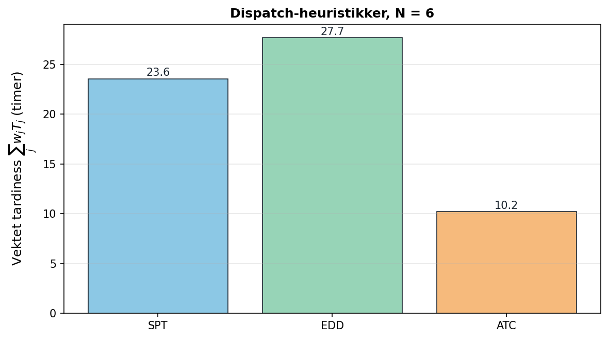

Vektet tardiness $\sum_j w_j T_j$ for SPT, EDD og ATC på den lille instansen ($N = 6$). ATC kombinerer prioritet og slakk og gir lavest tardiness.

**Konklusjon** --- *ATC slår de to enklere reglene*

Hverken SPT eller EDD tar hensyn til vekter, og derfor er de strukturelt sett dårlige for vektet tardiness. ATC dominerer fordi den eksplisitt balanserer vekt, prosesseringstid og slakk. Men er $\sum w_j T_j = 10,20$ virkelig *optimalt*? Det kan vi bare finne ut ved å løse MIP-en eksakt.

### Steg 3: MIP-formulering
Matematikken ble etablert i \S Modell. Her oppsummerer vi bare den konkrete instansieringen for $N = 6$:

- Variabler: 42 binære $y_{ij}$, 6 kontinuerlige $C_j$, 6 $T_j$, 6 $u_j$ (MTZ).

- Skranker: 86 totalt (flytbalanse, completion, MTZ, tardiness).

- Big-$M$: $M = P + N \cdot \max_{ij} s_{ij} + \max_j d_j + 50 \approx 85$.

For $N = 50$ blir antallet binære variabler $2\,550$, men den svake LP-relaksasjonen gjør at vi ikke løser slike instanser eksakt --- se heuristikk-merknaden i \S Modell.

### Steg 4: MIP-løsning med CBC
Vi implementerer MIP-modellen i Python via `PuLP` og løser med CBC (Coin-or Branch and Cut, open-source). For den lille instansen termineres CBC på $19,67$ sekunder med *bevist optimalt* objektiv $\sum_j w_j T_j = 7,97$.

Optimal sekvens. CBC finner rekkefølgen $\text{J3} \to \text{J1} \to \text{J5} \to \text{J6} \to \text{J2} \to \text{J4}$. Merk at kritisk jobb J3 (lavest $d_j$) plasseres først, mens J4 (lav vekt $w_4 = 1$) havner sist og bærer all forsinkelsen. Tabell [15](#tab-tab-seqmip-mip-optimal) viser fullføringstider og tardiness per jobb.

Optimal MIP-løsning for liten instans. Sekvens: J3, J1, J5, J6, J2, J4. Total $\sum w_j T_j = 7,97$.

  **Posisjon**   **Jobb**   $C_j$   $d_j$   $T_j$   $w_j T_j$
  -------------- ---------- --------- --------- --------- ------------------------
  1              J3         4,21      8,24      0,00      0,00
  2              J1         8,02      15,26     0,00      0,00
  3              J5         9,84      10,93     0,00      0,00
  4              J6         11,88     17,09     0,00      0,00
  5              J2         14,66     15,53     0,00      0,00
  6              J4         19,78     11,81     7,97      7,97
  **Sum**                                                 **7,97**

Den optimale løsningen løfter fram et viktig poeng: *én* av jobbene *må* bli forsinket fordi summen $\sum p_j = 17,05$ overstiger $d_4 = 11,81$ (og flere andre $d_j$-er). MIP-en svarer på spørsmålet: hvilken jobb er "billigst" å la bli forsinket? Svaret er J4, som har lavest vekt ($w_4 = 1$).

Gantt-diagram. Figur [13](#fig-fig-seqmip-gantt-mip) viser tidslinjen for den optimale sekvensen. Grå bånd er omstillingstider $s_{ij}$, fargede bånd er selve prosesseringen (farget etter vekt), og røde stiplede linjer angir forfallstiden $d_j$ per jobb. Stjernen ved J4 markerer den eneste jobben som ikke rekker sin deadline.

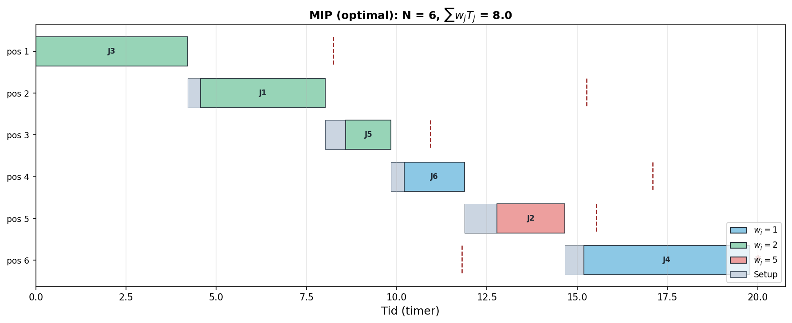

Gantt-diagram for MIP-optimal sekvens ($N = 6$, $\sum w_j T_j = 7,97$). Grå = omstilling, farget = prosessering (etter vekt), rød stiplet strek = forfallstid, stjerne = tardy.

Sammenligning med SPT-heuristikken. Figur [14](#fig-fig-seqmip-gantt-spt) viser den tilsvarende skedulen for SPT. Rekkefølgen $\text{J5} \to \text{J6} \to \text{J2} \to \text{J1} \to \text{J3} \to \text{J4}$ utsetter J3 til posisjon 5, og den kommer dermed langt etter sin deadline. Totalt $\sum w_j T_j = 23,55$ --- nesten tre ganger så mye som optimum.

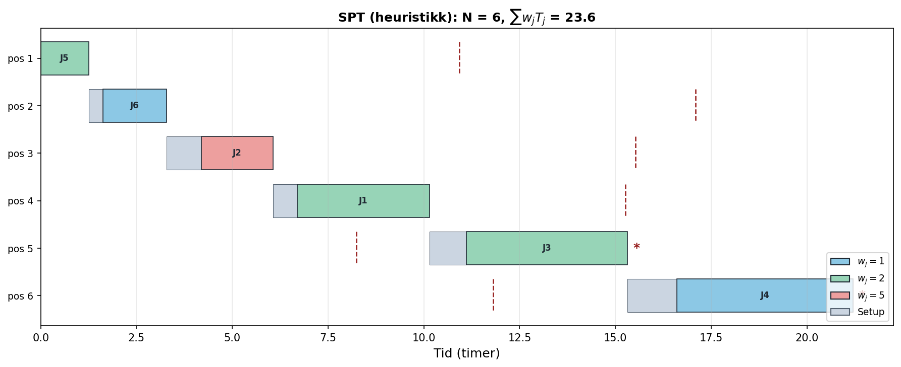

Gantt-diagram for SPT-sekvens ($N = 6$, $\sum w_j T_j = 23,55$). To tardy jobber i stedet for én.

**Konklusjon** --- *MIP gir bevist optimum*

CBC beviser på 20 sekunder at 7,97 er absolutt laveste oppnåelige vektet tardiness for denne instansen. Ingen sekvens kan gjøre det bedre. Dette er kraften i eksakt optimering: vi får en *garanti*. Men prisen er skalering --- i neste steg ser vi hva som skjer når vi prøver det samme på $N = 50$.

### Steg 5: Simulated annealing på stor instans
For den store instansen ($N = 50$) gir MIP-modellen $2\,550$ binære variabler og en LP-relaksering som ikke klarer å skille gode løsninger fra dårlige. CBC kjører i timevis uten å bevise optimalitet. Vi bytter derfor til en metaheuristikk: *simulated annealing* (SA), som utforsker løsningsrommet stokastisk uten å kreve en nedre grense.

Definisjon [Simulated annealing (Kirkpatrick et al. 1983)]
Gitt en nåværende løsning $\sigma_k$ med kostnad $E(\sigma_k)$ og en nabosløsning $\sigma\'$ (f.eks. oppnådd ved å bytte to jobber i sekvensen), aksepter $\sigma\'$ hvis

$$\Delta E = E(\sigma\') - E(\sigma_k) \leq 0
\quad \text{eller} \quad r_k < \exp\!\left(-\frac{\Delta E}{T_k}\right),$$

6

der $r_k \sim U(0,1)$ er en tilfeldig terskel og $T_k$ er *temperaturen* på iterasjon $k$. Temperaturen avtar geometrisk: $T_{k+1} = \alpha T_k$ med $\alpha \in (0, 1)$.

Høy temperatur gir stor aksept av forverringer (utforskning); lav temperatur gjør akseptkurven bratt og nærmer seg rent "hill-climb" (utnyttelse).

Implementasjon. Vi starter fra ATC-løsningen (kostnad $329,22$ på stor instans) og kjører $20\,000$ iterasjoner med parametrene $T_0 = 500$, $\alpha = 0,9995$. Nabooperatoren er *swap*: velg to tilfeldige posisjoner og bytt jobbene.

Resultater. Tabell [16](#tab-tab-seqmip-sa-results) oppsummerer kjøringen. SA reduserer vektet tardiness fra $329$ til $86$ --- en forbedring på over 70 % --- på $23$ sekunder.

Simulated annealing på stor instans ($N = 50$).

  **Statistikk**                 **Verdi**
  ------------------------------ ---------------------
  Startkostnad (ATC)             329,22
  Beste kostnad (SA)             [85,96]
  Absolutt forbedring            243,26
  Relativ forbedring             73,9 %
  Iterasjoner                    20 000
  Akseptrate                     25,8 %
  Kjøretid                       22,95 s
  Makespan (ved beste løsning)   174,20
  Antall tardy jobber            3

Konvergens. Figur [15](#fig-fig-seqmip-sa-convergence) viser hvordan beste funnet kostnad synker gjennom iterasjonene. Siden vi starter fra en sterk ATC-løsning og temperaturen er høy de første iterasjonene, skjer det lite sterkt forbedrende før rundt iterasjon $7\,500$. Der faller kurven skarpt fra $\sim\!330$ til $\sim\!100$ etter hvert som aksept-sannsynligheten for forverringer synker. Etter $13\,000$ iterasjoner flater kurven ut nær $86$. Siden LP-relaksasjonen her er verdiløs som nedre grense, vet vi ikke hvor nært $85,96$ er det egentlige optimum --- men bare 3 av 50 jobber er fortsatt tardy, så forbedringsrommet er begrenset.

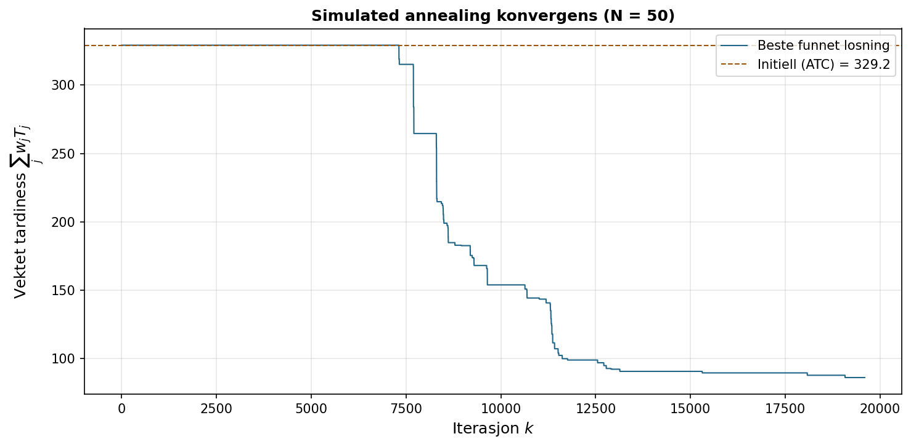

Simulated annealing-konvergens på $N = 50$. Blå linje er beste funnet kostnad, oransje stiplet er startkostnad (ATC).

**Konklusjon** --- *Metaheuristikk uten garanti, men massiv forbedring*

SA mangler MIPens optimalitetsgaranti, men den skalerer til instanser MIP ikke klarer i det hele tatt. Forbedringen fra ATC ($329$) til SA ($86$) er dramatisk: over to tredjedeler av den vektete forsinkelsen forsvinner. Tommelfingerregelen er: når det eksakte problemet ikke lar seg løse, er en velimplementert metaheuristikk bedre enn den beste dispatch-regelen.

### Steg 6: Sammenligning av alle metoder
Vi samler alle resultater i tabell [17](#tab-tab-seqmip-sammenligning) og figur [16](#fig-fig-seqmip-compare). Kolonnen "Gap" måler prosentvis avvik fra beste kjente løsning: MIP-optimum for liten instans og SA-beste for stor instans.

Sammenligning av metoder på begge instanser. Gap er avvik fra beste kjente løsning (MIP for liten, SA for stor).

  **Metode**                                                                                **$\sum w_j T_j$**   **Makespan**   **\# tardy**   **Tid (s)**     **Gap (%)**
  ----------------------------------------------------------------------------------------- ----------------------- -------------- -------------- --------------- -------------
  \multicolumn{6}{@{}l@{}}{*Liten instans ($N = 6$), MIP er referanse*}                                                                                        
  MIP (CBC)                                                                                 7,97      19,78          1              19,67           0,00
  ATC                                                                                       10,20                   22,01          1              $<\!0,01$   28,0
  SPT                                                                                       23,55                   21,20          2              $<\!0,01$   195,5
  EDD                                                                                       27,66                   22,27          4              $<\!0,01$   247,1
  \multicolumn{6}{@{}l@{}}{*Stor instans ($N = 50$), SA er referanse (MIP upraktisk)*}                                                                         
  SA                                                                                        85,96     174,20         3              22,95           0,00
  ATC                                                                                       329,22                  195,05         10             $<\!0,01$   283,0
  EDD                                                                                       760,51                  198,88         16             $<\!0,01$   784,7
  SPT                                                                                       1 056,44                193,69         15             $<\!0,01$   1 129,0

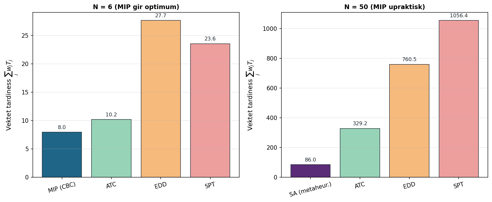

Vektet tardiness for alle metoder. Venstre: liten instans ($N = 6$), MIP gir bevist optimum. Høyre: stor instans ($N = 50$), SA gir beste kjente.

Observasjoner. Tre mønstre peker seg ut:

1.  **Dispatch-rangering er instans-avhengig.** På liten instans er SPT bedre enn EDD, men på stor instans er EDD mye bedre enn SPT. Ingen enkel regel dominerer uniformt.

2.  **ATC er den beste dispatch-regelen i begge tilfeller.** Den vektete, slakk-justerte indeksen tar hensyn til alle tre parametrene ($w_j$, $p_j$, $d_j$) og leverer konsekvent mindre enn en tredjedel av gapet til de enkleste reglene.

3.  **Gap mellom heuristikk og optimum vokser med $N$.** På liten instans er ATC-gapet $28~%$. På stor instans er selv den beste dispatchen $283~%$ unna SA --- et argument for å investere i metaheuristikker for virkelige planleggingsproblemer.

**Praktisk anvendelse** --- *Hvordan NordAero bør planlegge*

1.  **Daglig planlegging av 6--15 prioriterte ordrer:** Bruk MIP-modellen i CBC eller en kommersiell løser. Svar på sekunder gir planleggeren bevist optimum.

2.  **Ukevisplanlegging av 30--100 ordrer:** Kjør simulated annealing i bakgrunnen mens ATC gir en umiddelbar førstefordeling. Sammenlign og plukk beste.

3.  **Sanntidskjøring ved maskinen:** ATC-regelen kan implementeres i verkstedets MES-system og kjøres kontinuerlig når nye jobber slippes eller maskiner får forsinkelser. Den gir en konsistent beslutningslogikk uten å kreve replanlegging.

4.  **Scenarioanalyse:** Før et nytt større oppdrag tas inn, kjør hele pakken (ATC + SA) på den antatte uken og mål vektet tardiness. Hvis tallet er høyt, avtal lengre leveringstid med kunde.

[Begrensninger.]
- **Én maskin:** Modellen antar at én ressurs er flaskehalsen. Flow shop og job shop (flere maskiner i serie/parallell) krever vesentlig større MIPer eller spesialtilpassede metaheuristikker.

- **Deterministiske tider:** $p_j$ og $s_{ij}$ er forutsatt kjent eksakt. I praksis varierer disse; stokastisk sekvensering (robust eller chance-constrained) er et separat felt.

- **Ingen release times:** Alle jobber er klare ved $t = 0$. Utvidelser der jobber slippes over tid (dynamisk sekvensering) krever rullerende horisont.

- **Ikke-avbrytelig prosessering:** Hvis en høyprioritert haste-ordre kommer inn midt i en pågående jobb, kan ikke modellen avbryte --- preemptive scheduling er en annen modellklasse.

Seksjon

## Eksempel: Materialbehovsplanlegging (MRP) med lotst{ø
rrelse}

Oppsummering.

  **Kategori**      **Beskrivelse**
  ----------------- ------------------------------------------------------------------------------------------
  Eksempel          Material-behovs-planlegging for sykkelmontering
  Omr{å}de       Produksjonsplanlegging med avledet behov og lots-tørrelse
  Problemstilling   N{å}r og hvor mye skal vi bestille av hver komponent for {å} produsere MPS-planen?
  Modell            MRP (BOM-eksplosjon, nettbehovsberegning, tidsforskyvning) med lotst{ø}rrelsespolitikk
  Prosess           Top-down planlegging fra sluttprodukt til r{å}vare
  Metode            Lot-for-lot (LFL), {ø}konomisk ordrekvantum (EOQ), Silver-Meal-heuristikk

### Problemstilling
Bedriften *Nordsykkel AS* monterer sykler p{å} sitt anlegg i M{ø}re og Romsdal. Hver sykkel best{å}r av en ramme, to hjul og et bremsesett. Rammen krever fire st{å}lr{ø}r, og hvert hjul inneholder tretti-to eiker. Planleggingsavdelingen har en hovedproduksjonsplan (MPS) for 12 uker, men slurveri med tidsriktige materialbestillinger har f{ø}rt til produksjonsstopp, hasteinnkj{ø}p og overfylt lager.

Hver komponent har sin egen leveringstid, lagerbeholdning og kostnadsstruktur. Noen komponenter har h{ø}y oppstartskostnad per ordre (maskinomstilling, frakt), mens andre har h{ø}y lagerholds-kostnad (kapitalbinding, plass). Oppgaven er {å} finne en bestillings-plan som holder produksjonen i gang samtidig som summen av oppstarts- og lager-kostnader minimeres.

**Problemstilling** --- *Hvordan oversetter vi sluttproduktets etterspørsel til bestillinger av alle komponenter?*

Vi bruker *materialbehovsplanlegging* (MRP) til {å} "eksplodere" stykklisten (BOM) ovenfra og ned: MPS for sluttproduktet avgj{ø}r bruttobehovet for hver komponent, nettbehov beregnes ved {å} trekke fra tilgjengelig lager, og planlagte ordrer tidsforskyves med leverings-tiden. Forskjellige *lotst{ø}rrelses-politikker* (LFL, EOQ, Silver-Meal) gir forskjellige kostnader og ordre-frekvens; vi sammenligner tre klassiske politikker p{å} samme datasett.

### Modell
MRP er en deterministisk, algoritmisk planleggingsmodell. Den er ikke en optimeringsmodell i seg selv --- BOM-eksplosjonen og nettbehovsberegningen er mekaniske regneregler. Det er valget av *lotst{ø}rrelsespolitikk* som introduserer en kostnadsavveining mellom oppstart og lagring.

Definisjon [Material Requirements Planning (MRP)]
La $j \in \mathcal{N}$ v{æ}re et komponentsett organisert i en stykkliste (BOM) med niv{å}er $\ell(j) \in {0, 1, 2, \ldots}$, der $\ell(j) = 0$ er sluttproduktet. For hver komponent $j$ har vi:

- leveringstid $L_j \in \mathbb{Z}_{\geq 0}$ (uker),

- lagerbeholdning ved start $I_j^{(0)}$,

- antall per forelder $q_j$ (st.bet. forelderens komponent),

- foreldrekomponent $\pi(j)$ (om noen),

- oppstartskostnad $S_j$ per ordre,

- lagerholdskostnad $h_j$ per enhet per uke.

Gitt en hovedproduksjonsplan $D_t$ for sluttproduktet ($t = 1, \ldots, T$), beregnes bruttobehov, nettbehov og planlagte ordrer rekursivt top-down via ligningene [(1)](#eq-eq-mrp-gross)--[(?)](#eq-eq-mrp-release).

Parametere. Tabell [19](#tab-tab-mrp-parametere) oppsummerer notasjonen.

Notasjon i MRP-modellen.

  **Symbol**     **Navn**              **Beskrivelse**
  -------------- --------------------- --------------------------------------------------------------------------
  $G_{j,t}$   Bruttobehov           Samlet etterspørsel for komponent $j$ i uke $t$
  $I_{j,t}$   Lagerbeholdning       Lager for $j$ ved slutten av uke $t$
  $N_{j,t}$   Nettbehov             $G_{j,t}$ minus disponibelt lager i uke $t$
  $R_{j,t}$   Planlagt mottak       Ordrekvantum som ankommer $j$ i uke $t$
  $O_{j,t}$   Planlagt ordrestart   Ordre for $j$ som m{å} slippes i uke $t$ (ankommer i $t + L_j$)
  $q_j$        Stykklisteforhold     Antall $j$ som kreves per enhet av $\pi(j)$
  $L_j$        Leveringstid          Tid fra ordrestart til mottak for $j$ (uker)
  $S_j$        Oppstartskostnad      Fast kostnad per ordre (kr)
  $h_j$        Lagerholdskostnad     Kostnad per enhet av $j$ per uke (kr)

MRP-rekursjonen. For niv{å} 0 (sluttprodukt) er bruttobehovet gitt av MPS. For lavere niv{å}er genereres bruttobehovet av foreldrenes planlagte ordrestart:

$$\begin{aligned}G_{j,t} &= \begin{cases}
D_t & \text{hvis } \ell(j) = 0 \\
q_j \cdot O_{\pi(j),\, t} & \text{hvis } \ell(j) > 0
\end{cases}
\\\[4pt\]
N_{j,t} &= \max\bigl(0,\; G_{j,t} - I_{j,\,t-1}\bigr)
\\\[4pt\]
I_{j,t} &= I_{j,\,t-1} + R_{j,t} - G_{j,t}
\\\[4pt\]
O_{j,\,t - L_j} &= R_{j,t}\end{aligned}$$

1

der ligning [(?)](#eq-eq-mrp-release) er *tidsforskyvningen*: en ordre som skal ankomme i uke $t$ m{å} frigis (settes i gang) i uke $t - L_j$. Mottakene $R_{j,t}$ bestemmes av *lotst{ø}rrelsespolitikken* (LFL, EOQ eller Silver-Meal).

Lotst{ø}rrelsespolitikker. Gitt en sekvens av netto-behov $N_{j,1}, N_{j,2}, \ldots, N_{j,T}$ bestemmer politikken hvor mye og n{å}r det skal bestilles:

Definisjon [Lot-for-lot (LFL)]
Bestiller n{ø}yaktig nettbehovet hver uke det er positivt:

$$R_{j,t} = N_{j,t} \quad \text{for alle } t \text{ med } N_{j,t} > 0.$$

8

Ingen lagerkostnad, men oppstartskostnad i hver uke med behov.

Definisjon [{Ø}konomisk ordrekvantum (EOQ)]
Harris--Wilsons formel gir ordrestorrelsen som balanserer oppstarts- og lagerkostnad under antagelse om konstant etterspørsel $\bar{D}_j$ per uke:

$$Q_j^{\ast} = \sqrt{\frac{2\,\bar{D}_j\,S_j}{h_j}}$$

9

Vi bestiller $R_{j,t} = \max(Q_j^{\ast}, N_{j,t})$ n{å}r $N_{j,t} > 0$. Overskuddet {ø}ker lageret til n{ø}dvendig behov oppst{å}r.

Definisjon [Silver-Meal-heuristikk]
Starter i f{ø}rste uke $t$ med $N_{j,t} > 0$ og utvider dekningen s{å} lenge gjennomsnittlig kostnad per dekket uke faller. Med $K$ perioder dekket er den akkumulerte lagerkostnaden

$$H(K) \;=\; h_j \sum_{k=1}^{K-1} k \cdot N_{j,\,t+k},$$

10

og gjennomsnittlig kostnad per periode er

$$\text{AC}(K) \;=\; \frac{S_j + H(K)}{K}.$$

11

Velg st{ø}rste $K$ slik at $\text{AC}(K) \leq \text{AC}(K+1)$, bestill $\sum_{k=0}^{K-1} N_{j,\,t+k}$ i uke $t$, og gjenta fra uke $t + K$.

**Tolkning** --- *Hvordan politikkene balanserer kostnad*

- **LFL** minimerer lagerkostnaden (alltid null lager ved ukeslutt) men maksimerer oppstartskostnaden (en ordre per uke). Best n{å}r $S_j$ er lav i forhold til $h_j$.

- **EOQ** antar konstant etterspørsel og ignorerer tidsvariasjon. Den gir en fast ordrestorrelse som balanserer kostnadene *gjennomsnittlig*, men kan bygge store lagre n{å}r etterspørselen er lav.

- **Silver-Meal** er dynamisk: den tilpasser dekningen til faktisk nettbehov uke for uke, og gir ofte lavest total-kostnad n{å}r etter-spørselen varierer.

Forutsetninger. MRP-modellen antar:

1.  **Deterministisk etterspørsel**: MPS er kjent og gitt; ingen usikkerhet i $D_t$.

2.  **Faste leveringstider**: $L_j$ er konstant og kjent for hver komponent.

3.  **Uendelig kapasitet**: Ingen kapasitetsbegrensning p{å} produksjon eller lager.

4.  **Ingen f{æ}lles-ressurs**: Hver komponent planlegges uavhengig n{å}r bruttobehovet er satt.

5.  **Udelelig BOM**: Hvert komponentbehov er eksakt $q_j$ per forelder.

### Prosess
Prosess: Top-down BOM-eksplosjon med lotstorrelsesvalg.
Modell: MRP (ligningene [(1)](#eq-eq-mrp-gross)--[(?)](#eq-eq-mrp-release)) + politikk.

Figur [17](#fig-fig-mrp-method) viser de seks stegene i analysen: fra datainnsamling, via MRP-eksplosjon og de tre lotstorrelsespolitikkene, til den endelige kostnads-sammenligningen.

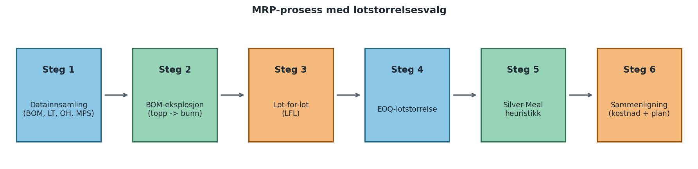

MRP-prosess: innsamling av BOM, MPS og lagerdata (Steg 1), eksplosjon til nettbehov (Steg 2), tre lotst{ø}rrelses-politikker (Steg 3--5) og sammenligning (Steg 6).

### Steg 1: Datainnsamling
Nordsykkel har en tre-niv{å}s stykkliste: sykkel (niv{å} 0) best{å}r av ramme, hjul og bremsesett (niv{å} 1); ramme best{å}r av st{å}lr{ø}r og hjul av eiker (niv{å} 2). Figur [18](#fig-fig-mrp-bom) viser BOM-treet med multiplikatorer $q_j$ og n{ø}kkeltall (leveringstid $L_j$, lagerbeholdning $I_j^{(0)}$).

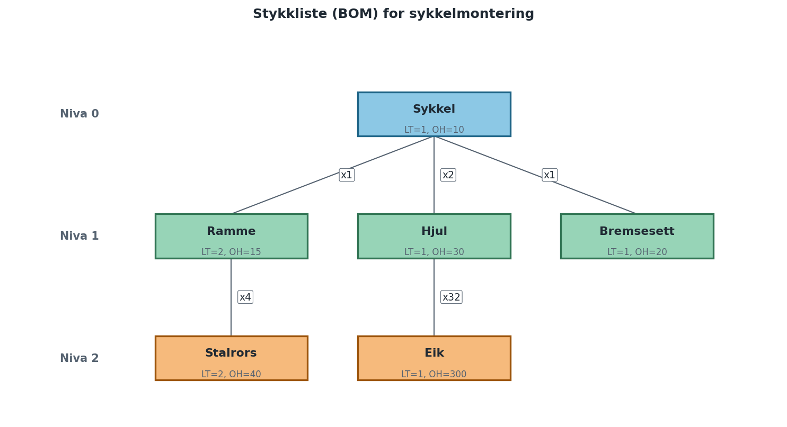

Stykkliste for sykkel med tre niv{å}er. Antall komponenter per forelder st{å}r p{å} kantene ($q_j$); lede-tid (LT) og lagerbeholdning (OH) st{å}r i hver node.

Tabell [20](#tab-tab-mrp-komponenter) viser parameterne for hver komponent.

Komponentdata for MRP-eksempelet.

  **Komponent**      **Niv{å}**   **Forelder**   **$q_j$**   **$L_j$ (uker)**   **$I_j^{(0)}$**   **$S_j$ (kr)**   **$h_j$ (kr/uke)**
  ------------------ --------------- -------------- ------------- -------------------- -------------------- ------------------ ----------------------
  Sykkel             0               ---            1             1                    10                   200                5,00
  Ramme              1               Sykkel         1             2                    15                   150                2,50
  Hjul               1               Sykkel         2             1                    30                   100                1,50
  Bremsesett         1               Sykkel         1             1                    20                   80                 1,20
  St{å}lr{ø}r   2               Ramme          4             2                    40                   60                 0,40
  Eik                2               Hjul           32            1                    300                  50                 0,05

Hovedproduksjonsplanen $D_t$ for sluttproduktet over 12 uker fremkommer i tabell [21](#tab-tab-mrp-mps). Den viser moderate sesongvariasjoner og en kampanje-topp i ukene 7--9.

Hovedproduksjonsplan (MPS) $D_t$ for sykkel over 12 uker.

  **Uke** $t$      1    2    3    4    5    6    7                  8                  9                  10   11   12
  ------------------ ---- ---- ---- ---- ---- ---- ------------------ ------------------ ------------------ ---- ---- ----
  $D_t$ (sykler)   20   22   23   24   23   22   30   28   27   16   17   18

**Konklusjon** --- *Hva m{å} vi regne ut?*

For hver komponent $j$ m{å} vi beregne bruttobehov $G_{j,t}$, trekke fra lager, bestemme lotst{ø}rrelse, og flytte ordrer tilbake i tid med $L_j$. Dette gj{ø}res rekursivt fra niv{å} 0 til niv{å} 2 --- planlagt ordrestart for foreldren blir bruttobehov for barnet.

### Steg 2: BOM-eksplosjon
Vi illustrerer BOM-eksplosjonen ved {å} kj{ø}re MRP med lot-for-lot-politikken som gir den enkleste sammenhengen: $R_{j,t} = N_{j,t}$, slik at planlagt ordrestart blir $O_{j,t - L_j} = N_{j,t}$. Tabell [22](#tab-tab-mrp-sykkel-lfl) viser beregningen for sluttproduktet Sykkel.

MRP for Sykkel (niv{å} 0, $L_j = 1$, $I_j^{(0)} = 10$) med lot-for-lot. Planlagt ordrestart forskyves en uke bakover fra mottak.

  **Uke** $t$               1    2    3    4    5    6    7    8    9    10   11   12
  --------------------------- ---- ---- ---- ---- ---- ---- ---- ---- ---- ---- ---- ----
  $G_{j,t}$ (brutto)       20   22   23   24   23   22   30   28   27   16   17   18
  $I_{j,\,t-1}$ (lager)   10   0    0    0    0    0    0    0    0    0    0    0
  $N_{j,t}$ (netto)        10   22   23   24   23   22   30   28   27   16   17   18
  $R_{j,t}$ (mottak)       10   22   23   24   23   22   30   28   27   16   17   18
  $O_{j,t}$ (ordrestart)   22   23   24   23   22   30   28   27   16   17   18   0

Eksplosjon til niv{å} 1. Ordrestartene $O_{\text{Sykkel}, t}$ (siste rad i tabell [22](#tab-tab-mrp-sykkel-lfl)) gir bruttobehov for niv{å} 1-komponentene:

$$\begin{aligned}G_{\text{Ramme}, t} &= 1 \cdot O_{\text{Sykkel}, t}, &
G_{\text{Hjul}, t} &= 2 \cdot O_{\text{Sykkel}, t}, &
G_{\text{Bremsesett}, t} &= 1 \cdot O_{\text{Sykkel}, t}.\end{aligned}$$

For Ramme med $L_{\text{Ramme}} = 2$ og $I_{\text{Ramme}}^{(0)} = 15$ blir LFL-planen som vist i tabell [23](#tab-tab-mrp-ramme-lfl).

MRP for Ramme (niv{å} 1, $L_j = 2$, $I_j^{(0)} = 15$) med lot-for-lot. Bruttobehovet kommer fra Sykkels ordrestart.

  **Uke** $t$       1    2    3    4    5    6    7    8    9    10   11   12
  ------------------- ---- ---- ---- ---- ---- ---- ---- ---- ---- ---- ---- ----
  $G_{j,t}$        22   23   24   23   22   30   28   27   16   17   18   0
  $I_{j,\,t-1}$   15   0    0    0    0    0    0    0    0    0    0    0
  $N_{j,t}$        7    23   24   23   22   30   28   27   16   17   18   0
  $R_{j,t}$        7    23   24   23   22   30   28   27   16   17   18   0
  $O_{j,t}$        24   23   22   30   28   27   16   17   18   0    0    0

Eksplosjon til niv{å} 2. Tilsvarende gir Rammes ordrestart bruttobehov for St{å}lr{ø}r ($q = 4$), og Hjuls ordrestart gir bruttobehov for Eiker ($q = 32$). For St{å}lr{ø}r (LT $= 2$) blir bruttobehovet i uke 1 lik $4 \cdot 24 = 96$, i uke 2 lik $4 \cdot 23 = 92$, og s{å} videre. Figur [19](#fig-fig-mrp-lfl-timeline) oppsummerer planlagte ordrestart for alle seks komponenter under LFL.

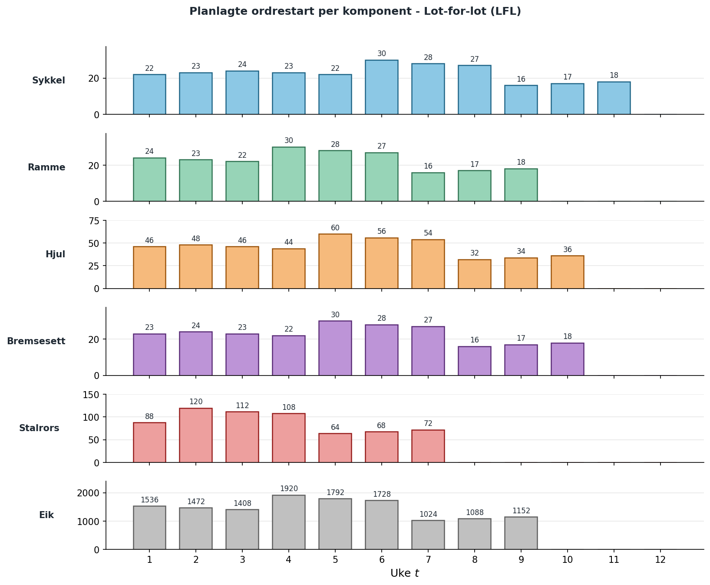

Planlagte ordrestart $O_{j,t}$ per komponent under lot-for-lot (LFL). Hver uke med positivt nettbehov gir en egen ordre.

**Konklusjon** --- *LFL gir mange sm{å} ordrer*

Med lot-for-lot bestiller vi hver uke det er behov, slik at lagerkostnaden er null. Men oppstartskostnaden er h{ø}y: for Sykkel alene gir det 12 ordrer \texttimes{} 200 kr = 2 400 kr. Totalkostnaden for alle komponenter er 7 070 kr over 12 uker (se Steg 6).

### Steg 3: Lot-for-lot (LFL)
Lot-for-lot ($R_{j,t} = N_{j,t}$) gir den enkleste planen: aldri noe overskudd-slager, men en ordre per uke med behov. Tabell [24](#tab-tab-mrp-lfl-kost) viser ordre-antall og kostnad per komponent.

Kostnadssammendrag for lot-for-lot (LFL) over 12 uker.

  **Komponent**      **Antall ordrer**   **Oppstart (kr)**   **Lager (kr)**   **Total (kr)**
  ------------------ ------------------- ------------------- ---------------- ----------------
  Sykkel             12                  2 400               0                2 400
  Ramme              11                  1 650               0                1 650
  Hjul               11                  1 100               0                1 100
  Bremsesett         11                  880                 0                880
  St{å}lr{ø}r   9                   540                 0                540
  Eik                10                  500                 0                500
  **Sum**            64                  **7 070**           **0**            **7 070**

**Konklusjon** --- *LFL er billig hvis oppstart er billig*

LFL gir null lagerkostnad men mange ordrer. Politikken er best n{å}r oppstartskostnaden $S_j$ er lav. I v{å}rt eksempel dominerer oppstart fullstendig: Sykkel (h{ø}y $S_j$) bidrar med 34 % av totalkostnaden.

### Steg 4: {Ø}konomisk ordrekvantum (EOQ)
EOQ-politikken bruker Harris--Wilson-formelen [(9)](#eq-eq-eoq) til {å} beregne en fast ordrestorrelse basert p{å} gjennomsnittlig ukentlig etterspørsel. For Sykkel er gjennomsnittlig etterspørsel $\bar{D} = 270/12 = 22,5$ sykler per uke, og EOQ blir

$$Q^{\ast}_{\text{Sykkel}} = \sqrt{\frac{2 \cdot 22,5 \cdot 200}{5,0}} \approx 42 \text{ sykler}.$$

Tabell [25](#tab-tab-mrp-eoq) viser EOQ-verdien per komponent. For lavniv{å}-komponentene blir gjennomsnittlig etterspørsel multiplisert med BOM-forholdet, slik at eik-behovet er 32 \texttimes{} 2 \texttimes{} 22,5 = 1 440 per uke, og EOQ for eiker blir 1 697.

EOQ-verdier og kostnadssammendrag per komponent.

  **Komponent**      **$\bar{D}_j$**   **$Q^{\ast}_j$**   **Ordrer**   **Oppstart (kr)**   **Lager (kr)**   **Total (kr)**
  ------------------ --------------------- ----------------------- ------------ ------------------- ---------------- ----------------
  Sykkel             22,50                 42                      7            1 400               1 080            2 480
  Ramme              22,50                 52                      5            750                 645              1 395
  Hjul               45,00                 77                      6            600                 182              782
  Bremsesett         22,50                 55                      5            400                 434              834
  St{å}lr{ø}r   90,00                 164                     4            240                 16               256
  Eik                1 440,00              1 697                   6            300                 0                300
  **Sum**            ---                   ---                     33           **3 690**           **2 357**        **6 047**

Figur [20](#fig-fig-mrp-eoq-timeline) viser planlagte ordrestart under EOQ. Ordrer plasseres sjeldnere enn i LFL, men hver ordre er stor, slik at lager bygges opp mellom ordrer.

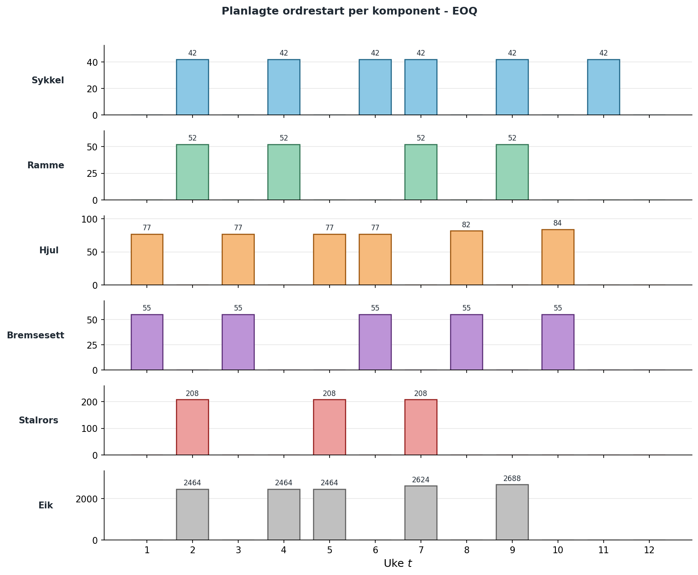

Planlagte ordrestart under EOQ. F{æ}rre, men st{ø}rre ordrer enn LFL.

**Konklusjon** --- *EOQ reduserer oppstart men bygger lager*

EOQ halverer oppstartskostnaden (fra 7 070 til 3 690 kr) men introduserer 2 357 kr i lagerkostnad. Totalkostnaden synker fra 7 070 til 6 047 kr --- en besparelse p{å} 14 %. Men EOQ tar ikke hensyn til faktisk tidsvariasjon i behovet.

### Steg 5: Silver-Meal-heuristikken
Silver-Meal er en dynamisk heuristikk som tilpasser dekningsperioden til hvert nettbehov. For Sykkel starter vi i uke 1 med $N_1 = 10$, og vurderer om vi b{ø}r dekke ogs{å} uke 2 og videre:

- $K = 1$ (bare uke 1): $\text{AC}(1) = (200 + 0)/1 = 200$ kr/uke.

- $K = 2$ (uke 1 og 2): $H(2) = 1 \cdot 5,0 \cdot 22 = 110$; $\text{AC}(2) = (200 + 110)/2 = 155$ kr/uke.

- $K = 3$ (uke 1--3): $H(3) = 110 + 2 \cdot 5,0 \cdot 23 = 340$; $\text{AC}(3) = (200 + 340)/3 \approx 180$ kr/uke.

$\text{AC}(3) > \text{AC}(2)$, s{å} vi stopper ved $K = 2$ og bestiller $10 + 22 = 32$ sykler i uke 1. Vi fortsetter fra uke 3 og gjentar.

Tabell [26](#tab-tab-mrp-sykkel-sm) viser den fullstendige Silver-Meal-planen for Sykkel.

MRP for Sykkel med Silver-Meal. Ordrer dekker to uker av gangen.

  **Uke** $t$       1    2    3    4    5    6    7    8    9    10   11   12
  ------------------- ---- ---- ---- ---- ---- ---- ---- ---- ---- ---- ---- ----
  $G_{j,t}$        20   22   23   24   23   22   30   28   27   16   17   18
  $I_{j,\,t-1}$   10   22   0    24   0    22   0    28   0    16   0    18
  $R_{j,t}$        32   0    47   0    45   0    58   0    43   0    35   0
  $I_{j,t}$        22   0    24   0    22   0    28   0    16   0    18   0

Tabell [27](#tab-tab-mrp-sm-kost) viser kostnader for Silver-Meal per komponent.

Kostnadssammendrag for Silver-Meal.

  **Komponent**      **Antall ordrer**   **Oppstart (kr)**   **Lager (kr)**   **Total (kr)**
  ------------------ ------------------- ------------------- ---------------- ----------------
  Sykkel             6                   1 200               650              1 850
  Ramme              5                   750                 38               788
  Hjul               5                   500                 45               545
  Bremsesett         5                   400                 24               424
  St{å}lr{ø}r   4                   240                 16               256
  Eik                5                   250                 0                250
  **Sum**            30                  **3 340**           **772**          **4 112**

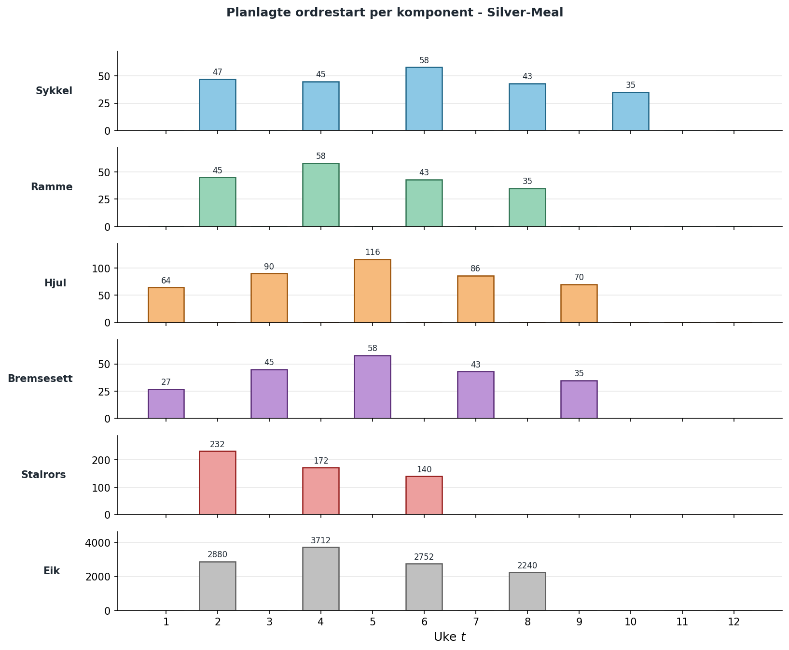

Planlagte ordrestart under Silver-Meal. Ordre-frekvensen tilpasses tidsvariasjonen i behovet.

**Konklusjon** --- *Silver-Meal tilpasser seg behovet*

Silver-Meal gir f{æ}rre ordrer enn LFL (30 vs. 64) og mindre lager enn EOQ (772 vs. 2 357 kr). Den dynamiske logikken fanger opp kampanje-toppen i ukene 7--9 og grupperer naturlig to--tre ukers behov.

### Steg 6: Sammenligning
Tabell [28](#tab-tab-mrp-sammenligning) oppsummerer totale kostnader for alle tre politikker, og figur [22](#fig-fig-mrp-cost-compare) viser fordelingen mellom oppstart og lagring.

Sammenligning av lotst{ø}rrelsespolitikker over 12 uker. Total-kostnad = oppstart + lager.

  **Politikk**                **Ordrer**         **Oppstart (kr)**     **Lager (kr)**      **Total (kr)**
  --------------------------- ------------------ --------------------- ------------------- -------------------------
  Lot-for-lot (LFL)           64                 7 070                 0                   7 070
  EOQ                         33                 3 690                 2 357               6 047
  Silver-Meal   30   3 340   772   [**4 112**]
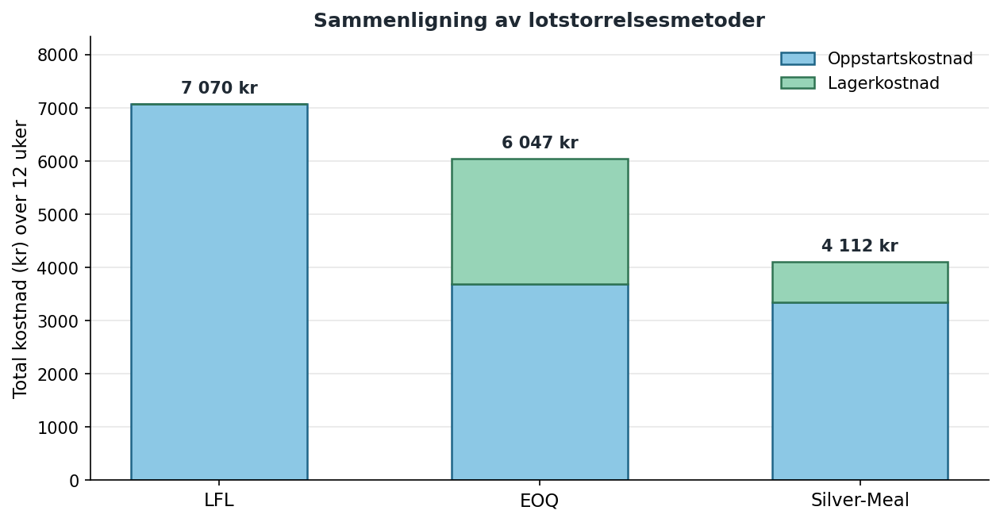

Total kostnad per politikk fordelt p{å} oppstarts- og lager-kostnad. Silver-Meal har lavest totalkostnad.

Silver-Meal gir en besparelse p{å} 42 % i forhold til LFL og 32 % i forhold til EOQ. Selv om Silver-Meal er en *heuristikk* og ikke garantert optimal, gir den systematisk bedre resultater enn EOQ n{å}r etterspørselen varierer over tid, slik v{å}r MPS viser.

Planlagt ordrestart per komponent. Tabell [29](#tab-tab-mrp-ordrer-sm) viser Silver-Meal-planens ordrestart for alle seks komponenter. Dette er det operative styrings-dokumentet planleggeren tar med til innkj{ø}psavdelingen og produksjons-sjefen.

Silver-Meal planlagt ordrestart $O_{j,t}$ per komponent. Tallene angir bestillings-st{ø}rrelse; tom celle betyr ingen ordre.

  **Uke** $t$      1    2        3    4        5     6        7    8        9    10   11   12
  ------------------ ---- -------- ---- -------- ----- -------- ---- -------- ---- ---- ---- ----
  Sykkel                  47            45             58            43            35        
  Ramme                   45            58             43            35                      
  Hjul               64            90            116            86            70             
  Bremsesett         27            45            58             43            35             
  St{å}lr{ø}r        232           172            140                                   
  Eik                     {2880}        {3712}         {2752}        {2240}                  

**Praktisk anvendelse** --- *Hvordan Nordsykkel kan bruke planen*

1.  **Frigi innkj{ø}psordrer**: Planlegger slipper eik-ordren p{å} 2 644 enheter i uke 1 til leverand{ø}r; st{å}lr{ø}r-ordren p{å} 128 enheter likeledes.

2.  **Kapasitetsstyring**: Monteringen produserer 32 sykler samlet i uke 1 (dekker uke 1 og 2), 47 i uke 3, osv.

3.  **Kontantstr{ø}m**: F{æ}rre og st{ø}rre ordrer gir f{æ}rre innkj{ø}ps-fakturaer og mer forutsigbar kapitalbinding enn LFL.

4.  **Rolling horizon**: Planen oppdateres hver uke n{å}r ny MPS-informasjon kommer, og kun de f{ø}rste 1--2 ukene fryses for eksekvering.

[Begrensninger.]
- Modellen er deterministisk --- usikkerhet i etterspørsel eller leveringstid h{å}ndteres ikke. I praksis supplerer man med sikkerhetslager.

- Kapasitetsbegrensninger (maskinkapasitet, lagerplass) er ignorert. Ved flaskehals trengs kapasitetskrav-planlegging (CRP) eller DRP.

- Silver-Meal er en *heuristikk*; Wagner--Whitin gir optimal losning via dynamisk programmering, men krever mer beregning og antas sjelden {å} gi vesentlig bedre resultater n{å}r MPS oppdateres rullerende.

- F{æ}lles-ressurser mellom komponenter (samme leverand{ø}r, samme maskin) er ikke modellert.

Slutt · Kapittel 3

---

# Del II — Kapittel 4: Nettverksdesign og optimering

Del II · Kapittel 4

4

# Nettverksdesign og optimering
Oversatt fra LaTeX-kilde --- figurer, definisjoner og KaTeX-math.

[][][][][]
Område

## Område
Nettverksdesign omhandler de strategiske beslutningene som former selve strukturen i et logistikknettverk: hvor fabrikker, lagre og distribusjonssentre skal ligge, hvilke kunder som skal betjenes fra hvilket lager, og hvordan varene skal transporteres mellom nodene. Beslutningene har typisk en tidshorisont på $5$--$10$ år og store investeringer er involvert, slik at selv små strukturelle forbedringer gir betydelig effekt på totale logistikkostnader over tid.

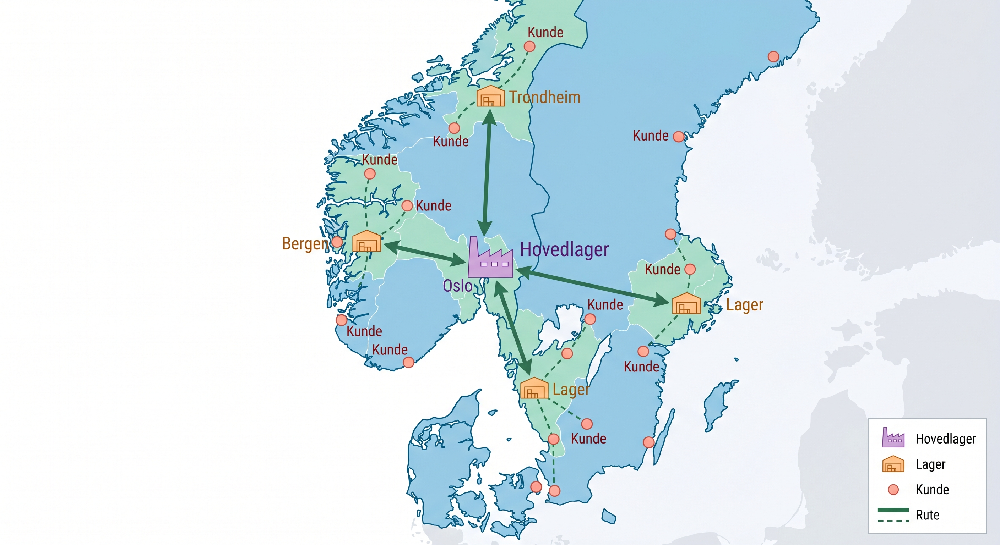

Nettverksdesign: lokalisering av lagre og distribusjonssentre, allokering av kunder og flyt av varer gjennom et skandinavisk logistikknettverk.

Definisjon [Nettverksdesign]
**Nettverksdesign** er prosessen med å bestemme *hvor* fasiliteter (fabrikker, lagre, distribusjonssentre) skal lokaliseres, *hvilke* kunder de skal betjene, og *hvordan* varene skal transporteres, slik at totale faste og variable logistikkostnader minimeres gitt servicekrav og kapasitetsbegrensninger.

Området omfatter beslutninger på ulike nivåer i nettverket:

- Strategisk nettverksstruktur (år) --- antall og lokalisering av fabrikker, lagre og distribusjonssentre

- Taktisk allokering (måneder) --- hvilke kunder som betjenes fra hvilket lager, og hvilke transportmoduser som brukes

- Operativ ruteplanlegging (dager til uker) --- konkrete kjøreruter, lastefordeling og tidsvinduer

- ML-baserte løsningsmetoder --- lærte heuristikker som erstatter eller supplerer klassiske optimeringsalgoritmer

Nettverksdesign er tett koblet til flere andre områder som behandles i dette kompendiet:

- Lagerstyring --- antall lagre og nettverksstrukturen bestemmer totalt sikkerhetslager og pooling-effekter

- Transportplanlegging --- lokalisering av lagre avgjør rutelengder, lastegrader og transportkostnader

- Etterspørselsprognoser --- volumer og geografisk fordeling av etterspørselen dimensjonerer kapasitetsbehovet i hver node

- Bærekraftig logistikk --- nettverksstruktur og modalvalg påvirker direkte CO$_2$-utslipp fra transport

Problemstillinger, modeller og metoder

## Problemstillinger, modeller og metoder
I det følgende presenteres tre sentrale problemstillinger innen nettverksdesign med tilhørende modeller og metoder, som illustrert i figur [2](#fig-fig-nettverksdesign-problemstillinger-oversikt). Alle tre problemstillingene utdypes med egne eksempler og figurer i de påfølgende seksjonene.

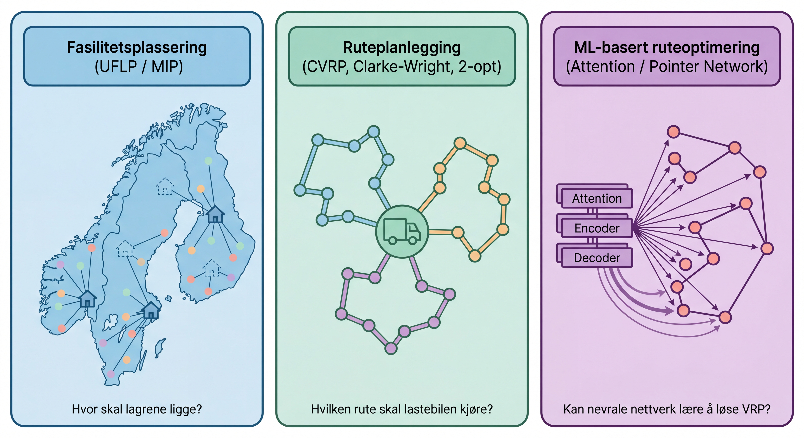

Tre sentrale problemstillinger innen nettverksdesign: fasilitetsplassering av lagre og distribusjonssentre, klassisk ruteplanlegging med savings-heuristikk og 2-opt, og ML-basert ruteoptimering med attention-baserte nevrale nettverk.

Nøkkelen til god nettverksdesign er å velge riktig modell og metode for den aktuelle problemstillingen. Tabell [1](#tab-tab-nettverksdesign-oversikt) gir en oversikt over hvilke modeller og metoder som egner seg for de tre problemstillingene. Tabellen viser også supplerende tilnærminger som minimum-cost flow og klassiske metaheuristikker (genetiske algoritmer, simulated annealing) som ofte benyttes når instansstørrelsen gjør eksakte metoder upraktiske. Modellene og metodene uthevet med rødt vil bli gått gjennom i de tre neste avsnittene.

Oversikt over modeller og metoder for de tre sentrale problemstillingene innen nettverksdesign.

  **Nr.**   **Problemstilling**                                   **Modeller**                                                                                       **Metoder**
  --------- ----------------------------------------------------- -------------------------------------------------------------------------------------------------- ---------------------------------------------------------------------------------------------
  1         Fasilitetsplassering                    UFLP / MIP, kapasiterte varianter (CFLP), minimum-cost flow                          Branch-and-bound, CBC/GLPK, Lagrange-relaksering, greedy add/drop
  2         Ruteplanlegging med klassiske metoder   CVRP (Clarke-Wright, 2-opt), TSP, minimum-cost flow                                  Savings-heuristikk, nærmeste nabo, eksakt MIP, genetiske algoritmer, simulated annealing
  3         ML-basert ruteoptimering                Attention-basert neural combinatorial optimization (Pointer Network / Transformer)   Lært konstruksjonsheuristikk, reinforcement learning, supervised imitation av eksakt solver

Fasilitetsplassering med MIP (UFLP)

## Eksempel: Fasilitetsplassering med MIP (UFLP)
Oppsummering.

  **Kategori**      **Beskrivelse**
  ----------------- ----------------------------------------------------------------------------------------
  Eksempel          Plassering av distribusjonssentre for skandinavisk netthandler
  Område            Nettverksdesign med strategisk lokaliseringsbeslutning
  Problemstilling   Hvilke lagerkandidater skal åpnes, og hvilke kunder skal betjenes fra hvert lager?
  Modell            Ukapasitert fasilitetslokalisering (UFLP), formulert som blandet heltallsprogram (MIP)
  Prosess           Matematisk optimering (eksakt løsning)
  Metode            PuLP (CBC) med sensitivitetsanalyse og $p$-median-variant

### Problemstilling
Nordica Retail AS er en skandinavisk netthandel som selger hvitevarer og brune varer til privatkunder i hele Norge og Sverige. Veksten har vært sterk de siste årene, og det eksisterende distribusjonsnettet med to lagre (Oslo og Stockholm) begynner å bli en flaskehals: leveringstidene til kunder i Nord-Sverige, Nord-Norge og på Vestlandet er urimelig lange, og transportkostnadene utgjør en voksende andel av omsetningen.

Strategiavdelingen har sammen med logistikksjefen identifisert 15 mulige kandidatlokasjoner for nye distribusjonssentre (DC-er) i Skandinavia. For hver kandidat er det estimert en årlig fast driftskostnad som dekker leie, bemanning og faste IT-systemer. Ledelsen ønsker en kvantitativ anbefaling: *hvor mange lagre bør åpnes, hvor bør de ligge, og hvilke kunder bør betjenes fra hvert lager*, slik at summen av faste åpningskostnader og årlige transportkostnader minimeres.

**Problemstilling** --- *Hvilke DC-er åpnes, og hvem betjener hvilke kunder?*

Vi formulerer beslutningen som en blandet heltallsmodell (MIP) der binære variabler styrer hvilke kandidatlagre som åpnes, og kontinuerlige variabler fordeler kundeetterspørselen på de åpne lagrene. Modellen løses eksakt med PuLP/CBC, og sensitivitetsanalyser viser hvor robust anbefalingen er mot endringer i faste kostnader og antall lagre.

### Modell
Vi formulerer lokaliseringsvalget som et *ukapasitert fasilitetslokaliseringsproblem* (*Uncapacitated Facility Location Problem*, UFLP): det finnes ingen kapasitetsgrense på hvert lager, og all kundeetterspørsel må dekkes fra de lagrene som åpnes. La $I = {1, \ldots, n}$ være mengden av kandidatlokasjoner og $J = {1, \ldots, m}$ mengden av kunder.

Definisjon [UFLP --- ukapasitert fasilitetslokalisering]
La $f_i$ være fast årlig kostnad ved å åpne lager $i \in I$, $d_j$ etterspørselen til kunde $j \in J$, og $c_{ij}$ transportkostnaden per enhet fra lager $i$ til kunde $j$. Beslutningsvariablene er

$$\begin{aligned}y_i &\in {0, 1}, \quad i \in I, \quad \text{(\,1 hvis lager $i$ åpnes\,)}, \\
x_{ij} &\geq 0, \quad i \in I,\ j \in J, \quad \text{(andel av $d_j$ levert fra $i$)}.\end{aligned}$$

Modellen er

$$\min_{x, y}\ \sum_{i \in I} f_i\, y_i \;+\; \sum_{i \in I} \sum_{j \in J} c_{ij}\, d_j\, x_{ij}$$

1

med skranker

$$\begin{aligned}\sum_{i \in I} x_{ij} &= 1, \quad j \in J, \\
x_{ij} &\leq y_i, \quad i \in I,\ j \in J, \\
x_{ij} &\geq 0, \quad y_i \in {0, 1}.\end{aligned}$$

2

Objektfunksjonen [(1)](#eq-eq-uflp-obj) er summen av *faste* åpningskostnader og *variable* transportkostnader over alle kunde-DC-par. Dekningsskranken [(2)](#eq-eq-uflp-cover) sikrer at hele etterspørselen til kunde $j$ dekkes. Koblingsskranken [(?)](#eq-eq-uflp-link) er den kritiske: en kunde kan kun betjenes ($x_{ij} > 0$) fra et *åpent* lager ($y_i = 1$).

Symboler. Alle størrelser i modellen er samlet i tabell [3](#tab-tab-uflp-symbols).

Symboler og parametere i UFLP-modellen.

  **Symbol**    **Type**                **Beskrivelse**
  ------------- ----------------------- -------------------------------------------------------------------
  $I$         Mengde                  Kandidatlokasjoner, $\|I\| = n = 15$
  $J$         Mengde                  Kundelokasjoner, $\|J\| = m = 80$
  $f_i$       Parameter               Fast årlig åpningskostnad for kandidat $i$ (NOK/år)
  $d_j$       Parameter               Årlig etterspørsel hos kunde $j$ (enheter/år)
  $c_{ij}$   Parameter               Transportkostnad per enhet fra $i$ til $j$ (NOK/enhet)
  $y_i$       Binær variabel          $1$ hvis lager $i$ åpnes, $0$ ellers
  $x_{ij}$   Kontinuerlig variabel   Andel av $d_j$ levert fra lager $i$, $x_{ij} \in \[0,1\]$

Modellen har $n = 15$ binære åpningsvariabler og $n \cdot m = 1\,200$ kontinuerlige tildelingsvariabler, samt $m = 80$ dekningsskranker og $n \cdot m = 1\,200$ koblingsskranker. Totalt $1\,215$ variabler og $1\,280$ skranker utover ikke-negativitet.

**Tolkning** --- *To kostnadsfunksjoner som trekker i hver sin retning*

UFLP-modellen veier to konkurrerende effekter:

1.  **Faste kostnader** ($\sum_i f_i y_i$): jo flere lagre vi åpner, jo høyere blir den faste belastningen. Denne drivkraften presser løsningen mot *færre* DC-er.

2.  **Transportkostnader** ($\sum_{ij} c_{ij} d_j x_{ij}$): jo færre lagre vi åpner, jo lengre blir gjennomsnittlig transportavstand. Denne drivkraften presser løsningen mot *flere* DC-er, plassert nær kundemassen.

MIP-en finner nøyaktig det antall og den plasseringen som minimerer summen. En viktig strukturell observasjon: i optimum blir $x_{ij}$ alltid $0$ eller $1$, selv om vi lar dem være kontinuerlige (LP-relaksasjonen har en heltallsløsning for fiksert $y$). Dette er en konsekvens av at koeffisientene $c_{ij} d_j$ er ulike for alle $i$, slik at det alltid lønner seg å sende *hele* etterspørselen fra den billigste åpne kilden.

Forutsetninger. UFLP-formuleringen hviler på tre antakelser som må respekteres ved tolkning:

1.  **Ingen kapasitetsgrense:** Hvert åpent lager kan betjene hele etterspørselen i $J$. I praksis har lagre fysisk kapasitet; en utvidelse er kapasitert fasilitetslokalisering (CFLP) med skranke $\sum_j d_j x_{ij} \leq u_i y_i$.

2.  **Linear transportkostnad:** $c_{ij}$ er proporsjonal med storsirkel-avstand $\mathrm{dist}(i, j)$. Faktiske kostnader kan ha fastkomponenter (minimumsfrakt) og trappetrinn (fulle lastebiler).

3.  **Deterministisk etterspørsel:** $d_j$ antas kjent. Ved stokastisk etterspørsel må modellen utvides til scenariobasert stokastisk MIP, eller robust optimering.

**Heuristikk-merknad** --- *Når MIP skalerer, og når den ikke gjør det*

Med $n = 15$ og $m = 80$ er UFLP så kompakt at CBC løser den til eksakt optimum på under ett sekund. Skalerer vi til $n = 100$ og $m = 1\,000$ blir antallet binære kombinasjoner $2^{100} \approx 10^{30}$, og LP-relaksasjonen gir bare en nedre grense. I slike tilfeller brukes *Lagrange-relaksering* (tar bort koblingsskranken $x_{ij} \leq y_i$ og legger den i objektet med multiplikator $\lambda_{ij}$) eller *greedy add/drop-heuristikker* (åpne DC-er en etter en, så lenge marginalkost synker). Vi holder oss til eksakt MIP i dette eksempelet og noterer grensen.

### Prosess
Prosess: Matematisk optimering (eksakt løsning).
Modell: MIP, løst med PuLP + CBC.

Arbeidsflyten følger seks steg, fra datainnsamling til endelig anbefaling. Figur [3](#fig-fig-uflp-method) viser prosessen skjematisk.

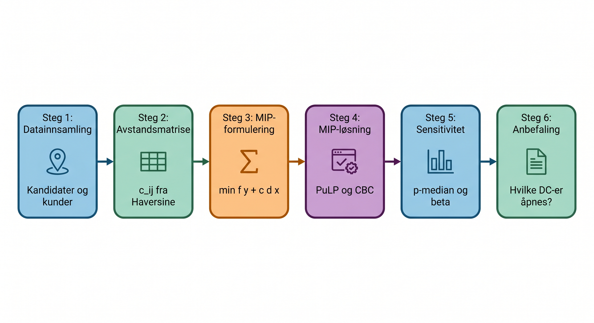

Seks-stegs arbeidsflyt for UFLP-optimalisering.

### Steg 1: Datainnsamling
Datasettet består av to deler: $n = 15$ kandidatlokasjoner i Skandinavia (10 norske byer: Oslo, Drammen, Kristiansand, Stavanger, Bergen, Ålesund, Trondheim, Bodø, Tromsø; 5 svenske: Göteborg, Stockholm, Malmö, Örebro, Sundsvall, Umeå), hver med lat/lon-koordinater og en estimert årlig åpningskostnad $f_i$ mellom 2,1 og 4,8 MNOK. Kundesettet består av $m = 80$ syntetiske kundelokasjoner, trukket rundt åtte befolkningssentre (Oslo, Bergen, Trondheim, Tromsø, Stockholm, Göteborg, Malmö, Umeå) med normalfordelt støy. Den årlige etterspørselen per kunde $d_j$ er log-normalfordelt i intervallet $\[150, 1\,750\]$ enheter, slik at få storkunder og mange småkunder er realistisk representert. Total årlig etterspørsel er $50\,630$ enheter.

Figur [4](#fig-fig-uflp-candidates) viser kandidater og kunder på kart, med markørstørrelse proporsjonal med etterspørselen per kunde.

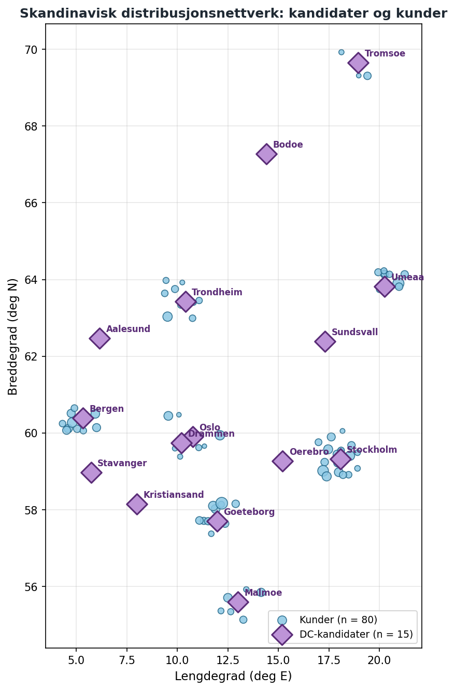

Kandidater (diamanter) og kundelokasjoner (sirkler, størrelse $\propto d_j$) i Skandinavia.

Fra figuren ser vi tre tydelige klynger: Oslo-/Göteborg-/Stockholm-aksen i sør, Bergen og Trondheim på vestkysten, og Umeå/Tromsø i nord. Kandidatlagrene er spredt slik at alle tre klynger er dekket med minst én kandidat innenfor 200 km.

**Konklusjon** --- *Geografien tilsier flere DC-er*

Kundene er fordelt over et område som strekker seg 16 breddegrader fra Malmö (55,6$^\circ$N) til Tromsø (69,6$^\circ$N) --- en nord-sør-avstand på over 1 600 km. Å betjene alle fra et enkelt lager vil gi svært høye transportkostnader i ytterkantene. Modellen skal nå avgjøre om dette er nok til å forsvare flere åpne DC-er, og i så fall hvor mange.

### Steg 2: Avstandsmatrise og transportkostnad
For hvert kandidat--kunde-par beregner vi storsirkel-avstanden via Haversine-formelen:

$$\mathrm{dist}(i, j) = 2 R \arcsin\!\sqrt{\sin^2\!\tfrac{\Delta \varphi}{2} + \cos \varphi_i \cos \varphi_j \sin^2\!\tfrac{\Delta \lambda}{2}},$$

1

der $\varphi$ er breddegrad i radianer, $\lambda$ er lengdegrad, og $R = 6\,371$ km er jordens radius. Dette er en god nærmest-til-rett-linje-approksimasjon for lange transportetapper i Skandinavia.

Transportkostnad per enhet settes lineært i avstand: $c_{ij} = \kappa \cdot \mathrm{dist}(i, j)$ med $\kappa = 1,20$ NOK per enhet per km, et realistisk nivå for palleforsendelser i det norske/svenske markedet. Tabell [4](#tab-tab-uflp-dist) oppsummerer den resulterende avstandsmatrisen.

Statistikk over beregnede storsirkel-avstander (km).

  **Størrelse**                                           **Verdi**
  ------------------------------------------------------- -------------------
  Dimensjoner på avstandsmatrisen $\[n \times m\]$     $15 \times 80$
  Minste avstand (nærmeste kandidat til nærmeste kunde)   3,0
  Største avstand (ytterpunktene i nettverket)            1 638,5
  Medianavstand over alle $n \cdot m = 1\,200$ par    523,9
  Gjennomsnittlig avstand                                 561,3
  Gjennomsnittlig nærmeste-DC-avstand per kunde           41,6

Observasjonen i den siste raden er viktig: hvis *alle* 15 kandidater hadde vært åpne, ville gjennomsnittlig avstand fra hver kunde til nærmeste lager vært bare 41,6 km. Den faktiske gjennomsnittsavstanden i optimal løsning vil ligge et stykke over dette, fordi vi må kompromisse antall lagre mot faste kostnader.

### Steg 3: MIP-formulering
Modellen implementeres direkte som i [(1)](#eq-eq-uflp-obj)--[(?)](#eq-eq-uflp-var), med PuLP som modelleringsgrensesnitt og CBC som underliggende solver. Tabell [5](#tab-tab-uflp-size) viser størrelsen på den konkrete instansen.

Instansstørrelse og solveregenskaper.

  **Mål**                                                   **Verdi**
  --------------------------------------------------------- ------------------------
  Antall kandidater $n$                                   15
  Antall kunder $m$                                       80
  Antall binære variabler ($y_i$)                         15
  Antall kontinuerlige variabler ($x_{ij}$)              1 200
  Antall dekningsskranker [(2)](#eq-eq-uflp-cover)   80
  Antall koblingsskranker [(?)](#eq-eq-uflp-link)    1 200
  Teoretisk antall kombinasjoner av $y$                   $2^{15} = 32\,768$

Med $2^{15}$ kombinasjoner av $y$ kunne vi i prinsippet enumerert alle, men for hver kombinasjon må vi også løse et tildelings-LP for $x$. CBC bruker *branch-and-cut* og utnytter LP-relaksasjonen effektivt, slik at løsetiden i praksis blir under ett sekund.

### Steg 4: Løsning med PuLP/CBC
Vi løser modellen med CBC og lagrer den primale løsningen. Optimal totalkostnad er **20,393 MNOK/år**, fordelt på 8,700 MNOK i faste åpningskostnader og 11,693 MNOK i transport. Tabell [6](#tab-tab-uflp-open) viser hvilke tre DC-er som åpnes, og hvor mange kunder og hvor mye etterspørsel hvert dekker.

Åpne DC-er i optimal løsning og deres belastning.

  **DC**    **Rolle**                     **Kunder**   **Etterspørsel**   **Snitt (km)**   **Maks (km)**
  --------- ----------------------------- ------------ ------------------ ---------------- ---------------
  Bergen    Vest-Norge og Oslo-regionen   26           15 970             222,1            468,4
  Örebro    Syd- og midt-Sverige          40           26 640             235,2            474,9
  Umeå      Nord-Sverige og Nord-Norge    14           8 020              161,4            684,4
  **Sum**                                 **80**       **50 630**         **218,1**        **684,4**

Figur [5](#fig-fig-uflp-map) visualiserer løsningen geografisk: de tre åpne DC-ene er markert med grønt, og hver kunde er koblet med en tynn linje til den DC-en som betjener den.

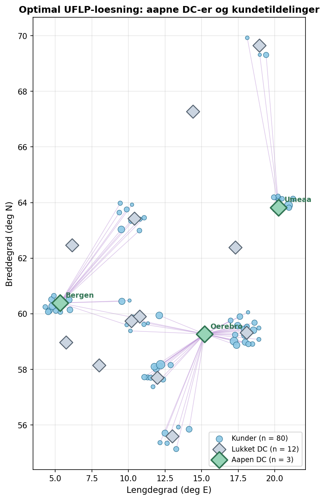

Optimal løsning: åpne DC-er (grønne diamanter), lukkede kandidater (grå), og kundetildelinger (tynne linjer).

Kostnadsfordeling. Figur [6](#fig-fig-uflp-cost) viser hvordan de **20,393 MNOK** fordeler seg: faste kostnader utgjør $42,7~%$ og transport $57,3~%$. Forholdet er sentralt --- hvis faste kostnader skulle dominere kraftig (f.eks. $80~%$), ville løsningen peke mot *færre* DC-er; hvis transport dominerer, ville den peke mot *flere*. Balansen her er en indikasjon på at løsningen er *internt konsistent* --- små endringer i parametrene vil gi små endringer i løsningen, ikke store hopp.

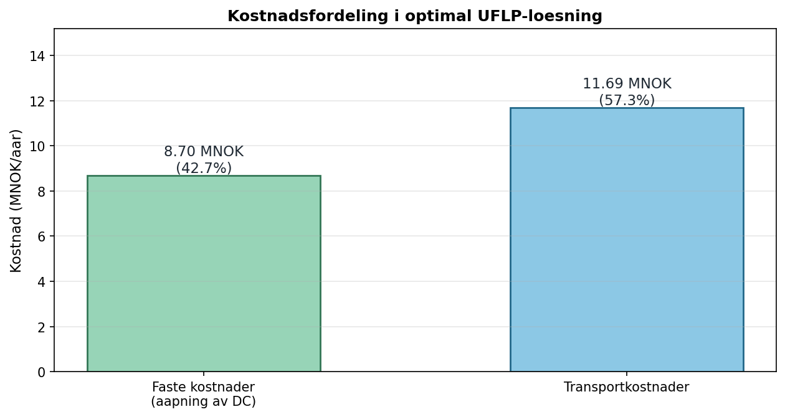

Kostnadsfordeling i optimal UFLP-løsning (MNOK/år).

**Konklusjon** --- *Tre lagre dekker Skandinavia*

CBC finner en optimal trippelkonfigurasjon der Bergen, Örebro og Umeå betjener henholdsvis Vest-Norge + Oslo, Syd- og midt-Sverige, og Nord-Skandinavia. Gjennomsnittlig transportavstand er $218$ km, og ingen kunde ligger mer enn $685$ km fra sitt betjenende lager. CBC bruker $0,5$ sekunder på å finne denne løsningen, noe som bekrefter heuristikk-merknaden: for $n = 15$, $m = 80$ er eksakt MIP den naturlige metoden.

### Steg 5: Sensitivitetsanalyse
Vi undersøker to dimensjoner av robusthet. For det første: hvordan endres totalkostnaden hvis vi *tvinger* et bestemt antall åpne DC-er ($p$-median-variant)? For det andre: hvordan endres den optimale strukturen hvis de faste åpningskostnadene skaleres med en faktor $\beta$?

$p$-median-sveip. Vi legger til skranken $\sum_i y_i = p$ og løser modellen for $p = 1, 2, \ldots, 10$. Tabell [7](#tab-tab-uflp-p) og figur [7](#fig-fig-uflp-p) viser hvordan totalkostnaden og dens to komponenter utvikler seg med $p$.

Total-, fast- og transportkostnad som funksjon av antall åpne DC-er, $p$.

  $p$             **Fast (MNOK)**   **Transport (MNOK)**   **Total (MNOK)**      **Kommentar**
  ----------------- ----------------- ---------------------- --------------------- -----------------------------------------
  1                 2,70              23,71                  26,41                 Lang transport fra ett sentralt lager
  2                 5,10              18,02                  23,12                 Store reduksjoner gjenstår
  3   8,70              11,69                  20,39   Optimalt: balansert faste vs. transport
  4                 12,10             9,35                   21,45                 Faste kostnader overtar
  5                 15,90             6,75                   22,65                 
  6                 18,00             6,00                   24,00                 
  7                 20,20             6,00                   26,20                 Transport stagnerer
  8                 22,60             6,00                   28,60                 
  9                 25,80             5,23                   31,03                 
  10                28,30             5,23                   33,53                 Diminishing returns

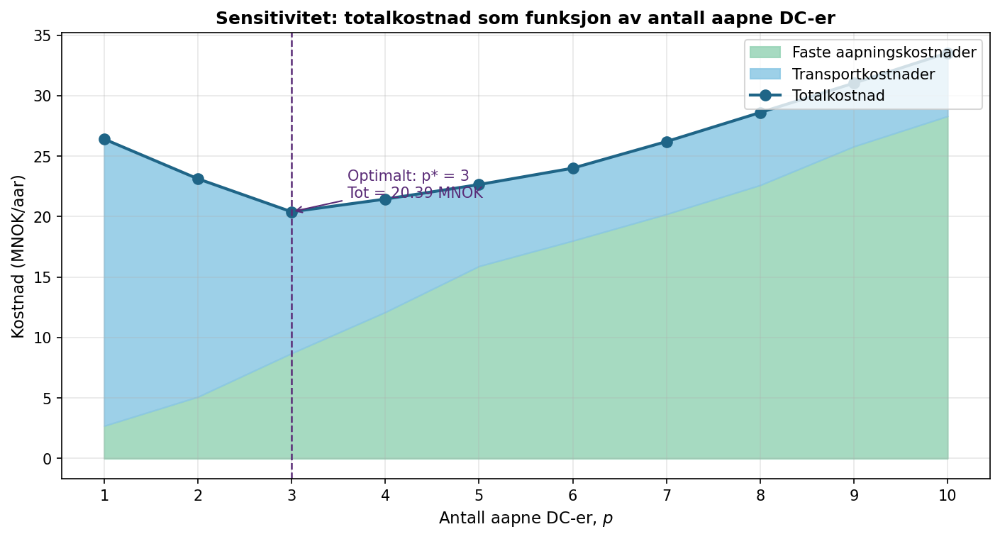

Totalkostnad med stablede komponenter som funksjon av $p$ (antall åpne DC-er). Minimum ved $p^\ast = 3$.

Kurven er U-formet som forventet: med bare ett DC er transportkostnaden uforholdsmessig stor ($23,7$ MNOK), og med ti DC-er er de faste kostnadene urimelig høye ($28,3$ MNOK). Minimum ligger klart på $p^\ast = 3$, med tydelig margin til både $p = 2$ ($+2,7$ MNOK) og $p = 4$ ($+1,1$ MNOK).

Skalering av faste kostnader. Vi multipliserer alle $f_i$ med en skaleringsfaktor $\beta \in {0,25,\, 0,5,\, 0,75,\, 1,0,\, 1,5,\, 2,0,\, 3,0}$ og løser modellen på ny. Resultatet i tabell [8](#tab-tab-uflp-beta) og figur [8](#fig-fig-uflp-beta) viser hvordan antallet optimale DC-er krymper når det blir dyrere å åpne lagre.

Optimal respons når faste åpningskostnader skaleres med $\beta$.

  $\beta$           **Antall åpne DC-er**   **Totalkostnad (MNOK)**
  -------------------- ----------------------- -------------------------
  0,25                 7                       9,23
  0,50                 5                       14,00
  0,75                 3                       18,22
  1,00   3         [20,39]
  1,50                 3                       24,15
  2,00                 3                       27,90
  3,00                 1                       31,81

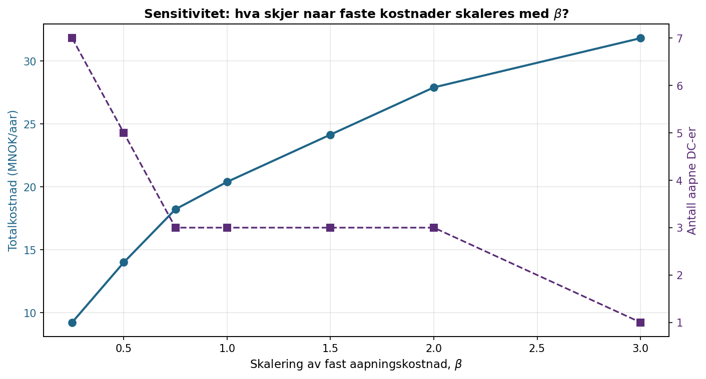

Totalkostnad (venstre akse) og antall åpne DC-er (høyre akse) som funksjon av $\beta$.

Resultatene viser at løsningen *«tre DC-er»* er bemerkelsesverdig robust: den holder seg for $\beta \in \[0,75,\, 2,0\]$ --- altså hvis faste kostnader skulle være $25~%$ lavere eller opp til dobbelt så høye som antatt. Først ved $\beta = 3$ kollapser nettverket til en enkelt DC, og først ved $\beta = 0,5$ utvider det seg til fem. Dette gir sterk støtte til anbefalingen basert på baseline-tallene.

**Konklusjon** --- *$p^\ast = 3$ er et robust optimum*

Både $p$-median-sveipet og $\beta$-skaleringen peker på tre åpne DC-er som den optimale strukturen under baseline-antakelsene. Strukturen endres ikke så lenge faste kostnader ligger i et bredt bånd rundt estimatet --- et sterkt signal om at denne anbefalingen tåler realistisk parameterusikkerhet.

### Steg 6: Anbefaling
Vi anbefaler Nordica Retail å:

1.  **Åpne tre distribusjonssentre:** Bergen (Vest-Norge og Oslo-regionen), Örebro (sør- og midt-Sverige, der Stockholm og Göteborg er inkludert), og Umeå (Nord-Skandinavia).

2.  **Betjene 80 kundelokasjoner direkte** fra disse tre lagrene uten splitting: hver kunde tildeles kun *ett* lager, med gjennomsnittlig transportavstand på $218$ km.

3.  **Budsjettere med total årlig kostnad på $20,4$ MNOK**, hvorav $8,7$ MNOK er faste driftskostnader og $11,7$ MNOK er transport.

4.  **Revurdere plasseringen ved kraftige strukturelle endringer**: hvis faste kostnader blir mer enn dobbelt så høye som i dagens estimat ($\beta > 2$), eller hvis de halveres ($\beta \leq 0,5$), bør modellen kjøres på nytt.

**Praktisk anvendelse** --- *Fra UFLP-løsning til gjennomføring*

1.  **Sjekk eksplisitt kapasitet:** UFLP antar ubegrenset kapasitet per lager. Før endelig beslutning må Bergen, Örebro og Umeå dimensjoneres for sine respektive volumer ($16\,000$, $27\,000$ og $8\,000$ enheter/år).

2.  **Robust mot kunder flyttes:** Med tre DC-er fordelt på Skandinavia tåler løsningen også at fremtidig etterspørsel vokser i midt-Sverige eller Nord-Norge. Kjør modellen på nytt hvert andre år med oppdaterte kundedata.

3.  **Kobling videre:** Når DC-lokasjoner er bestemt kan den detaljerte *ruteplanleggingen* fra hvert DC til kundene løses som et Vehicle Routing Problem (VRP), som er temaet for neste seksjon.

4.  **Usikkerhet:** For beslutninger med 5--10 års horisont bør det vurderes stokastisk MIP der $d_j$ og $f_i$ representeres som scenarier. Dette øker beregningskompleksiteten og omtales i kapittel [?](#ref-ch-risikostyring).

Begrensninger. UFLP er en *strategisk* modell og bygger på tre forenklinger som må kommuniseres tydelig: (i) ingen kapasitetsgrense (CFLP er en naturlig utvidelse), (ii) lineær transportkostnad (virkelige takster har fastledd og trappetrinn), og (iii) deterministisk etterspørsel (stokastisk programmering trengs ved høy usikkerhet). For instanser over $\sim 100$ kandidater kan eksakt MIP bli for tung; da er Lagrange-relaksering eller greedy add/drop-heuristikker naturlige verktøy, og gapet mot optimum kan kvantifiseres ved å sammenligne mot LP-relaksasjonen. Neste seksjon tar oss fra lokaliseringsbeslutningen til den operasjonelle ruteoptimeringen.

Ruteplanlegging med CVRP og Clarke--Wright

## Eksempel: Ruteplanlegging med CVRP og Clarke--Wright
Oppsummering.

  **Kategori**      **Beskrivelse**
  ----------------- ---------------------------------------------------------------------------------------------
  Eksempel          Hjemlevering av dagligvarer i Oslo fra ett sentralt depot
  Område            Operativ ruteplanlegging med kapasitetsbegrensning
  Problemstilling   Hvilke ruter minimerer total kjøredistanse når hvert kjøretøy har begrenset lastekapasitet?
  Modell            Kapasitert rutingproblem (CVRP), $\min \sum_{ij} d_{ij} x_{ij}$ under MTZ-kapasitet
  Prosess           Heuristisk og eksakt optimering med sammenligning av gap
  Metode            Nærmeste-nabo, Clarke--Wright savings, 2-opt lokalt søk og MIP (CBC)

### Problemstilling
*NordMat Hjemlevering* driver urban hjemlevering av dagligvarer i Oslo. Hver morgen mellom kl. 05 og 07 pakkes netthandelsordrene på det sentrale crossdock-depotet ved Alnabru, og mellom kl. 08 og 13 skal en flåte av identiske elektriske varebiler kjøre rutene ut til kundene. Flåtetilgangen er begrenset, og hver bil tar maksimalt $Q = 45$ kolli før den må returnere til depotet.

Planleggeren står hver morgen med den samme beslutningen: hvordan fordele dagens kunder på et lite antall ruter, slik at den totale kjøredistansen (og dermed tid, energiforbruk og utslipp) blir lavest mulig? Avveiningen er todelt: færre ruter betyr lavere faste kostnader per bil, men risikerer å overskride kapasiteten og tvinge fram omveier; flere ruter gir lavere last per bil men dobbelt så mye depot-kjøring. For å teste planleggingsverktøyene på to realistiske størrelser genererer vi to instanser --- én med $N = 15$ kunder (hvor eksakt MIP fortsatt er mulig) og én med $N = 40$ kunder (der heuristikker er det eneste praktiske alternativet).

**Problemstilling** --- *Hvilke ruter minimerer total kjøredistanse?*

Vi vil partisjonere kundene i et lite antall ruter $R_1, R_2, \ldots$ slik at (i) total kjøredistanse er minimal, (ii) hver kunde betjenes nøyaktig én gang, og (iii) samlet etterspørsel på hver rute ikke overstiger $Q = 45$. På liten instans ($N = 15$) løser vi problemet eksakt med MIP. På stor instans ($N = 40$) bruker vi Clarke--Wright savings og 2-opt, og sammenligner heuristikkens gap mot MIP på den lille instansen.

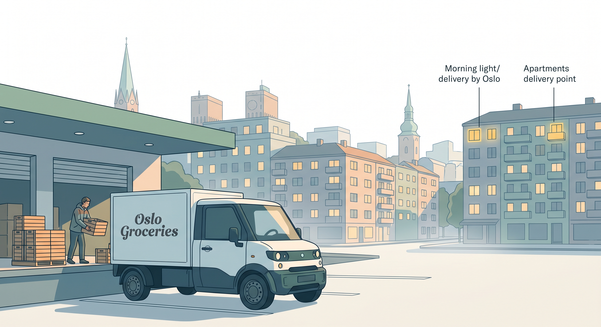

Urban hjemlevering: små elektriske varebiler betjener dagligvarekunder fra ett sentralt depot i Oslo.

### Modell
Problemet er det klassiske *Capacitated Vehicle Routing Problem* (CVRP) introdusert av Dantzig og Ramser (1959). Problemet er sterkt NP-hardt, og eksakte metoder skalerer dårlig. Først formulerer vi modellen matematisk; deretter diskuterer vi hvorfor heuristikker dominerer i praksis.

Definisjon [Kapasitert rutingproblem (CVRP)]
La $V = {0, 1, 2, \ldots, N}$ være nodene, der $0$ er depotet og $1, \ldots, N$ er kundene. Hver kunde $i$ har etterspørsel $q_i > 0$. Avstand mellom node $i$ og $j$ er $d_{ij} \geq 0$ (symmetrisk, euklidsk). Det er $K$ identiske kjøretøy, hver med kapasitet $Q$. Målet er å finne et sett ruter $\mathcal{R} = {R_1, \ldots, R_K}$, hver av formen $R_k = (0, i_1, i_2, \ldots, i_{m_k}, 0)$, som minimerer

$$\min_{\mathcal{R}} \; \sum_{k = 1}^{K} \sum_{(i, j) \in R_k} d_{ij},$$

4

underlagt (i) hver kunde besøkes nøyaktig én gang, og (ii) $\sum_{i \in R_k} q_i \leq Q$ for alle $k$.

MIP-formulering. Vi bruker en to-indeks-formulering med MTZ-skranker (Miller--Tucker--Zemlin) for å eliminere subsykler og håndheve kapasitet. La $x_{ij} \in {0, 1}$ angi om en bil kjører direkte fra $i$ til $j$, og la $u_i$ være kumulativ last i bilen *etter* at kunde $i$ er betjent. Modellen er oppsummert i tabell [10](#tab-tab-vrp-symboler), og skrankene er listet i tabell [11](#tab-tab-vrp-skranker).

Symboler i MIP-modellen for CVRP.

  **Symbol**    **Type**         **Beskrivelse**
  ------------- ---------------- --------------------------------------------------------
  $N$         Parameter        Antall kunder
  $K$         Parameter        Maksimalt antall kjøretøy
  $Q$         Parameter        Kapasitet per kjøretøy (kolli)
  $q_i$       Parameter        Etterspørsel hos kunde $i$ (kolli)
  $d_{ij}$   Parameter        Avstand fra node $i$ til node $j$ (km)
  $x_{ij}$   ${0, 1}$   $= 1$ hvis en bil kjører direkte fra $i$ til $j$
  $u_i$       $\[q_i, Q\]$   Kumulativ last etter å ha betjent kunde $i$ (MTZ)

Skranker i MIP-modellen for CVRP.

  **Nr**    **Skranke**                                                                     **Betydning**
  --------- ------------------------------------------------------------------------------- --------------------------------------------------------
  \(i\)     $\sum_{i \neq j} x_{ij} = 1 \quad \forall j \in {1, \ldots, N}$   Hver kunde har én forgjenger
  \(ii\)    $\sum_{j \neq i} x_{ij} = 1 \quad \forall i \in {1, \ldots, N}$   Hver kunde har én etterfølger
  \(iii\)   $\sum_{j \geq 1} x_{0j} \leq K$                                          Høyst $K$ ruter forlater depotet
  \(iv\)    $\sum_{j \geq 1} x_{0j} = \sum_{i \geq 1} x_{i0}$                     Hver bil returnerer til depotet
  \(v\)     $u_i - u_j + Q\, x_{ij} \leq Q - q_j \quad \forall i \neq j \geq 1$    MTZ + kapasitet: ingen subsykler, last $\leq Q$
  \(vi\)    $q_i \leq u_i \leq Q \quad \forall i \in {1, \ldots, N}$            Last er minst $q_i$ og høyst $Q$ etter kunde $i$

Skranke (v) er den sentrale innsikten i MTZ-formuleringen av CVRP (Toth & Vigo, 2002). Når $x_{ij} = 1$ reduseres skranken til $u_j \geq u_i + q_j$, som både eliminerer subsykler (siden $u_j > u_i$ langs en rute) og håndhever kapasitetsgrensen implisitt: hvis akkumulert last overstiger $Q$ langs ruten, blir skranken ugyldig. Dermed erstatter denne ene skranken både klassiske subtour-eliminations-skranker og separate kapasitets-skranker.

Modellstørrelse. Antallet binærvariabler vokser kvadratisk i $N$. Tabell [12](#tab-tab-vrp-storrelse) viser vekst fra $N = 15$ til $N = 40$.

Modellstørrelse for CVRP-MIP.

  **Størrelse**                     **$N = 15$**   **$N = 40$**
  --------------------------------- ---------------- ----------------
  Binære variabler $x_{ij}$      240              1 640
  Kontinuerlige variabler $u_i$   15               40
  MTZ-skranker                      210              1 560

**Heuristikk-merknad** --- *Hvorfor eksakt MIP stopper ved ca. 20--25 kunder*

CVRP er sterkt NP-hardt. Antallet mulige løsninger vokser superpolynomielt i $N$, og MTZ-formuleringens LP-relaksjon er kjent som *svak*: den underestimerer den optimale kostnaden fordi flytkapasitets-skrankene er aktive bare for hele sekvenser. I praksis er CBC i stand til å løse instanser med $N \lesssim 20$--$25$ til bevist optimum på minutter, mens $N = 40$ typisk tar timer og ofte må avbrytes med ukjent gap.

Derfor løser vi problemet hierarkisk:

- **Nærmeste-nabo (NN):** Triviell konstruktiv heuristikk, $O(N^2)$. Bruker kun lokal informasjon, ignorerer global struktur. Fungerer som en enkel baseline.

- **Clarke--Wright savings (CW):** Klassisk sekvensiell savings-heuristikk (Clarke & Wright, 1964). Starter med $N$ separate ruter og slår sammen dem med høyest besparelse $s_{ij} = d_{0i} + d_{0j} - d_{ij}$ mens kapasiteten overholdes. Kompleksitet $O(N^2 \log N)$.

- **2-opt:** Lokalt søk som forbedrer hver rute enkeltvis ved å reversere subsegmenter. Kompleksitet $O(N^2)$ per rute per pass.

Vi kvantifiserer gapet mellom CW og MIP-optimum på liten instans ($N = 15$), og antar at CW gir tilsvarende kvalitet på stor instans ($N = 40$), der MIP-optimum er upraktisk å beregne.

Forutsetninger. Modellen hviler på fem forenklinger: (1) *homogen flåte* --- alle biler har samme kapasitet $Q$; (2) avstandsmatrisen er *symmetrisk* og euklidsk, dvs. $d_{ij} = d_{ji}$ (rimelig for korte bykjøringer, mindre presis ved enveisgater); (3) *ingen tidsvinduer* --- kunden er hjemme hele ruteperioden; (4) etterspørslene $q_i$ er *deterministiske* og kjent før ruten starter; (5) tiden per bestilling og omlastingstid ved depot ignoreres, slik at objektivfunksjonen kun avhenger av distanse.

### Prosess
Prosess: Heuristisk og eksakt kombinatorisk optimering.
Modell: CVRP med MTZ-kapasitet for eksakt; Clarke--Wright med 2-opt for heuristisk.

Prosessen følger seks steg, illustrert i figur [10](#fig-fig-vrp-method). Etter datainnsamling (steg 1) etableres først to konstruktive baselines: nærmeste-nabo (steg 2) og Clarke--Wright savings (steg 3). Clarke--Wright-løsningen forbedres med 2-opt lokalt søk (steg 4). For liten instans løser vi problemet eksakt med MIP (steg 5), slik at vi kan kvantifisere gapet mellom heuristikken og optimum. Steg 6 oppsummerer alle metoder i én sammenligningstabell og figur.

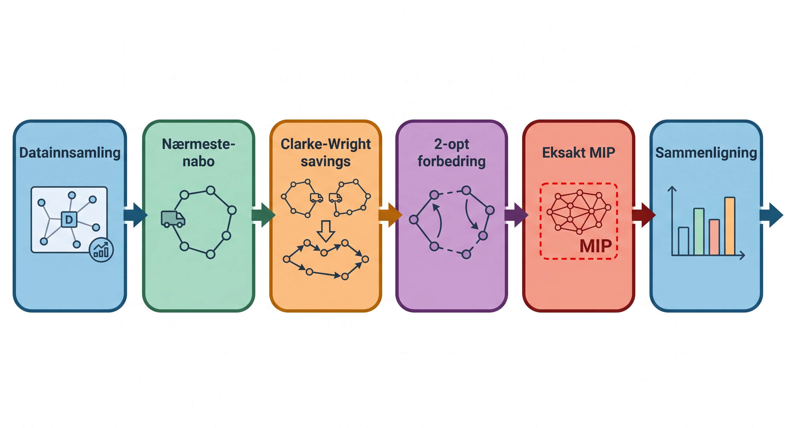

Seks-stegs prosess for CVRP: konstruktive heuristikker, lokalt søk, eksakt MIP (kun liten instans) og felles sammenligning.

### Steg 1: Datainnsamling
Vi genererer to syntetiske instanser som representerer en typisk Oslo-dag hos NordMat Hjemlevering. Depotet plasseres ved origo, og kundene fordeles på tre klynger som likner på Oslo indre by (tett rundt depotet), vestlige og østlige forsteder (mer spredt). Koordinatene er i kilometer, og hver kunde har heltalls etterspørsel mellom 1 og 9 kolli.

Liten instans ($N = 15$). Tabell [13](#tab-tab-vrp-kunder-small) viser alle 15 kunder. Total etterspørsel er $\sum q_i = 66$ kolli, som krever minst $\lceil 66/45 \rceil = 2$ kjøretøy.

15 kunder i liten instans. Koordinater (km fra depot) og etterspørsel (kolli).

  **$i$**                                                                                                          **$x_i$**   **$y_i$**   **$q_i$**   **$i$**   **$x_i$**   **$y_i$**   **$q_i$**
  ------------------------------------------------------------------------------------------------------------------ ------------- ------------- ------------- ----------- ------------- ------------- -------------
  1                                                                                                                  $-3,91$     $-2,03$     2             9           $3,47$      $-5,13$     3
  2                                                                                                                  $3,54$      $-8,08$     4             10          $-8,43$     $5,18$      3
  3                                                                                                                  $0,87$      $-7,89$     4             11          $-1,28$     $0,93$      6
  4                                                                                                                  $-0,02$     $-1,79$     7             12          $2,45$      $-0,28$     4
  5                                                                                                                  $1,10$      $1,34$      4             13          $0,25$      $1,24$      8
  6                                                                                                                  $4,40$      $-10,05$    5             14          $0,64$      $-1,70$     5
  7                                                                                                                  $-0,69$     $0,89$      2             15          $-5,77$     $6,08$      5
  8                                                                                                                  $5,36$      $-6,90$     4                                                     
  \multicolumn{8}{@{}l@{}}{**Sum**: $\sum q_i = 66$ kolli, nedre grense: $\lceil 66/45 \rceil = 2$ ruter.}                                                                                     

Stor instans ($N = 40$). For den store instansen er det ikke praktisk å liste alle kunder; tabell [14](#tab-tab-vrp-stor-summary) viser aggregerte nøkkeltall. Total etterspørsel er $\sum q_i = 184$ kolli, som krever minst $\lceil 184/45 \rceil = 5$ kjøretøy.

Statistikk for stor instans ($N = 40$).

  **Statistikk**                            **Verdi**
  ----------------------------------------- -----------
  Antall kunder $N$                       40
  Total etterspørsel $\sum q_i$          184 kolli
  Gjennomsnittlig $q_i$                   4,6 kolli
  Nedre grense antall kjøretøy              5
  Gjennomsnittlig avstand kunde til depot   4,02 km
  Maksimal avstand kunde til depot          12,68 km
  Kapasitet per kjøretøy $Q$              45 kolli

Visualisering. Figur [11](#fig-fig-vrp-instance) viser den store instansen. Depotet er markert som en oransje firkant ved origo. Kundene er pastellblå sirkler der arealet er proporsjonalt med etterspørsel $q_i$. Klyngestrukturen er tydelig: en tett gruppe kunder i sentrum rundt depotet, en bredere spredning vestover med noen fjerne kunder i $y > 5$, og en sørøstlig klynge med kunder langt fra depotet ($y < -8$).

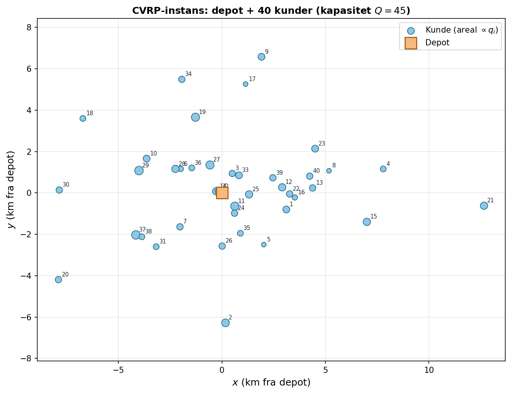

CVRP-instans: depot (oransje firkant) og 40 kunder (pastellblå sirkler). Areal er proporsjonalt med etterspørsel $q_i$.

**Konklusjon** --- *Nedre grenser og struktur*

Den geometriske strukturen tilsier at god ruting vil respektere klyngene: én rute for indre by, én for vest, én for sørøst, og eventuelt ytterligere ruter for å håndtere kapasiteten. Den absolutte nedre grensen på totaldistansen er ikke-triviell, men en enkel nedre grense er $2 \sum_i d_{0i} / \bar{r}$ der $\bar{r}$ er gjennomsnittlig antall kunder per rute --- altså at hver rute må ut og tilbake til depotet minst én gang. Med $\sum_i d_{0i} = 160,8$ km og $\bar{r} = 8$ kunder per rute gir dette en *veldig* løs nedre grense på $\sim 40$ km.

### Steg 2: Nærmeste-nabo-heuristikk
Nærmeste-nabo er den enkleste konstruktive heuristikken. Kjøretøyet starter ved depot, velger nærmeste ubesøkte kunde som kan betjenes innenfor gjenstående kapasitet, og returnerer til depot når ingen slik kunde finnes. Deretter starter en ny rute, og prosessen gjentas til alle kunder er besøkt.

Definisjon [Nærmeste-nabo (NN) for CVRP]
Initialiser $U \leftarrow {1, \ldots, N}$ (ubesøkte kunder) og $\mathcal{R} \leftarrow \emptyset$. Mens $U \neq \emptyset$:

1.  Start en ny rute $R = (0)$ med nåværende node $c = 0$ og last $\ell = 0$.

2.  Gjenta: Finn $j^\* = \arg\min_{j \in U : \ell + q_j \leq Q} d_{cj}$. Hvis slikt $j^\*$ finnes, legg $j^\*$ til i $R$, sett $\ell \leftarrow \ell + q_{j^\*}$, $c \leftarrow j^\*$, $U \leftarrow U \setminus {j^\*}$. Ellers avslutt.

3.  Avslutt ruten: $R \leftarrow R \cup (0)$, og legg $R$ til i $\mathcal{R}$.

Kompleksitet: $O(N^2)$.

Resultater. Tabell [15](#tab-tab-vrp-nn-results) oppsummerer NN-løsningen på begge instanser. På liten instans produserer NN 2 ruter med total distanse 73,89 km. På stor instans blir det 5 ruter og totalt 136,42 km.

Nærmeste-nabo på begge instanser.

  **Instans**   **$N$**   **Antall ruter**   **Total distanse (km)**   **Kjøretid (s)**
  ------------- ----------- ------------------ ------------------------- ------------------
  Liten         15          2                  73,89                     $< 0,01$
  Stor          40          5                  136,42                    $< 0,01$

Figur [12](#fig-fig-vrp-nn-routes) viser NN-løsningen på stor instans. Merk svakhetene: rute 5 er en minirute med bare én kunde (kunde 21, last 6), fordi denne kunden ble hengende igjen mot slutten uten en passende "partner". Vi ser også at rutene krysser hverandre og har flere lange hopp --- klassiske symptomer på grådig konstruksjon uten global optimalisering.

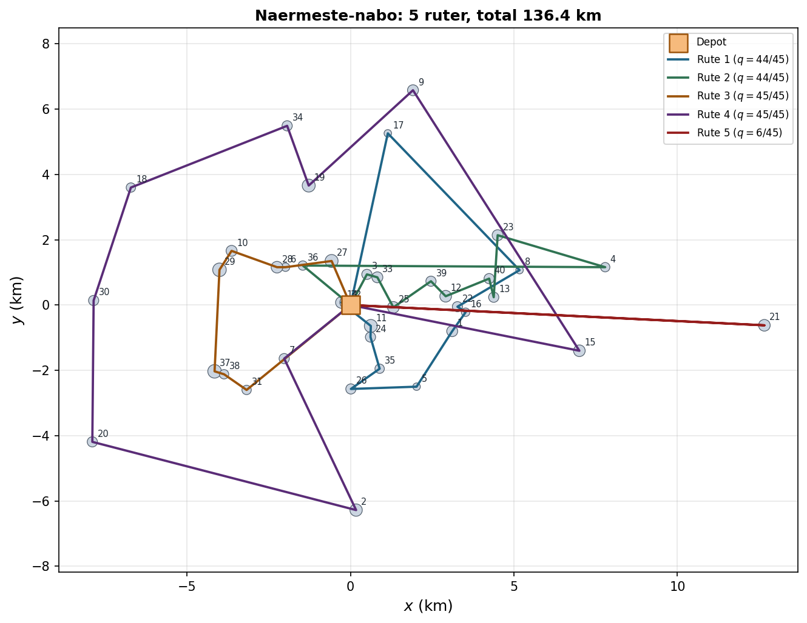

Nærmeste-nabo på stor instans: 5 ruter, total 136,42 km. Merk rute 5 med kun én kunde (sløsende depot-retur) og flere kryssende ruter.

**Konklusjon** --- *Grådig er ikke nok*

NN betjener kunder i feil rekkefølge fordi den aldri vurderer om en kunde kunne passet bedre i en senere rute. Den er likevel viktig som baseline og som startpunkt for andre heuristikker. I neste steg skal vi se hvordan Clarke--Wright savings-algoritmen systematisk reduserer depot-kjøring ved å vokse fram ruter nedenfra.

### Steg 3: Clarke--Wright savings
Clarke--Wright savings-algoritmen (Clarke og Wright, 1964) er den mest brukte heuristikken for CVRP. Den starter med $N$ separate ruter, hver med én kunde (dvs. $0 \to i \to 0$ for alle $i$), og slår gradvis sammen ruter basert på *besparelser*.

Definisjon [Savings-beregning]
For to kunder $i$ og $j$ som er hver sine endepunkter av to separate ruter er besparelsen ved å slå sammen rutene

$$s_{ij} = d_{0i} + d_{0j} - d_{ij}.$$

5

Intuisjonen: før merge bruker man $d_{0i} + d_{i0} = 2d_{0i}$ og $d_{0j} + d_{j0} = 2d_{0j}$ (tur-retur på hver rute); etter merge bruker man $d_{0i} + d_{ij} + d_{j0}$. Besparelsen er differansen delt på 2 per retning --- som oppsummeres til [(5)](#eq-eq-vrp-savings). Jo større $s_{ij}$, jo mer tjener vi på å kombinere rutene.

Algoritme. Sekvensiell Clarke--Wright:

1.  Beregn alle $s_{ij}$ for $i \neq j$ og sortér i fallende rekkefølge.

2.  For hvert par $(i, j)$ i rekkefølge: Hvis $i$ og $j$ ligger i ulike ruter *og* samlet last $\leq Q$ *og* både $i$ og $j$ er endepunkter (ikke indre kunder), slå sammen rutene.

3.  Fortsett til ingen flere gyldige merges finnes.

Kravet om at $i$ og $j$ skal være endepunkter er det som gjør dette til den *sekvensielle* varianten. Den sikrer at hver merge produserer en enkel kjede $0 \to \cdots \to 0$ og ikke forsøker å sette inn kunder i midten av eksisterende ruter.

Resultater. Tabell [16](#tab-tab-vrp-cw-results) viser Clarke--Wright-løsningen. På liten instans reduserer CW total distanse fra 73,89 km (NN) til 53,22 km --- en forbedring på 28 %. På stor instans går distansen fra 136,42 km til 95,56 km, en forbedring på 30 %.

Clarke--Wright savings på begge instanser. Forbedring regnet relativt til NN.

  **Instans**   **$N$**   **Ruter**   **NN (km)**   **CW (km)**           **Forbedring**
  ------------- ----------- ----------- ------------- --------------------- ----------------
  Liten         15          2           73,89         53,22   $-28,0~%$
  Stor          40          5           136,42        95,56   $-30,0~%$

Figur [13](#fig-fig-vrp-cw-routes) viser løsningen på stor instans. Rutene er nå langt mer geografisk sammenhengende: hver rute betjener ett geografisk område, og det er ingen kryssende ruter. Dette er en konsekvens av at savings-algoritmen strukturelt favoriserer naboer som ligger på samme aksel fra depotet.

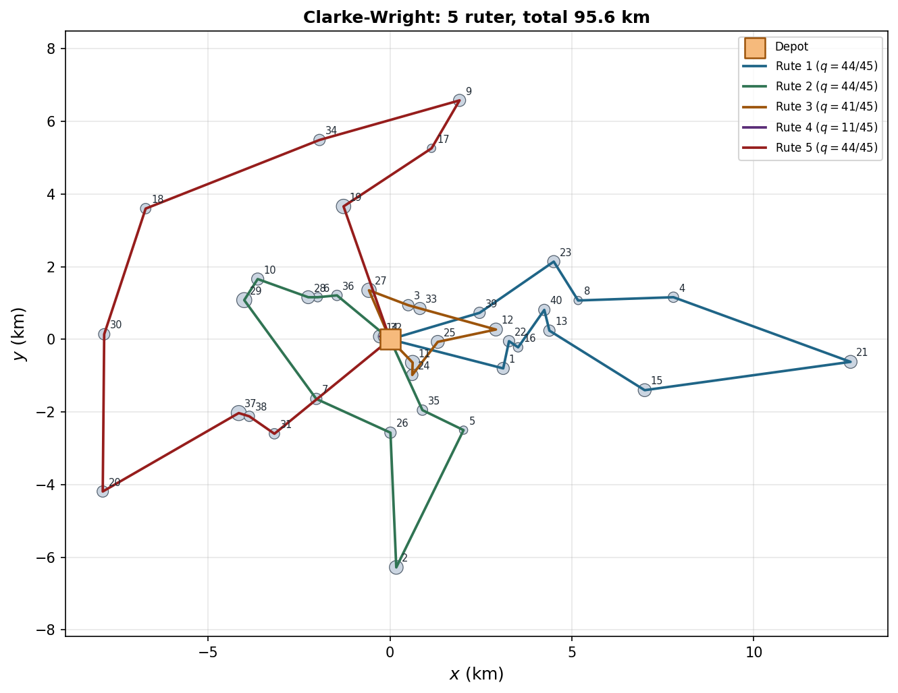

Clarke--Wright på stor instans: 5 ruter, total 95,56 km. Rutene er nå geografisk sammenhengende uten krysninger.

**Konklusjon** --- *CW er solid, men kan finjusteres*

Clarke--Wright gir en løsning som er 28--30 % bedre enn nærmeste-nabo på begge instanser. Strukturen er sunn: ruter følger klynger, og ingen ruter har bare én kunde. I neste steg ser vi om lokal 2-opt-forbedring kan skvise ut enda noen prosent.

### Steg 4: 2-opt lokal forbedring
2-opt er det mest brukte lokale søkeprogrammet for rutingproblemer. Gitt en rute $0 \to i_1 \to i_2 \to \cdots \to i_m \to 0$ forsøker 2-opt alle muligheter for å reversere et subsegment mellom posisjon $p$ og $q$ (hvor $1 \leq p < q \leq m$). Hvis reverseringen reduserer rutens lengde, aksepteres den.

Definisjon [2-opt swap]
Gitt rute $R = (v_0, v_1, \ldots, v_{m+1})$ med $v_0 = v_{m+1} = 0$, og indekser $1 \leq p < q \leq m$. Den nye ruten etter 2-opt swap er

$$R\' = (v_0, \ldots, v_{p-1}, v_q, v_{q-1}, \ldots, v_p, v_{q+1}, \ldots, v_{m+1}).$$

6

Kostnadsendringen er
$$
\Delta = d_{v_{p-1}, v_q} + d_{v_p, v_{q+1}} - d_{v_{p-1}, v_p} - d_{v_q, v_{q+1}}.
$$
Aksepter swap hvis $\Delta < 0$. Gjenta til ingen forbedring finnes (*first-improvement* eller *best-improvement*).

Siden 2-opt opererer *innenfor* hver rute uavhengig, endrer den verken last eller antall ruter --- kapasitetsbegrensningen er automatisk oppfylt.

Resultater. Tabell [17](#tab-tab-vrp-2opt-results) viser forbedringen. På begge instanser er CW-løsningen allerede svært nær lokalt optimum: 2-opt gir $0$ forbedring på liten instans og kun 0,02 km på stor.

2-opt forbedring på Clarke--Wright-løsningen.

  **Instans**   **CW (km)**   **Etter 2-opt (km)**   **Forbedring (km)**   **Relativ**
  ------------- ------------- ---------------------- --------------------- ---------------
  Liten         53,22         53,22                  0,00                  $0,00~%$
  Stor          95,56         95,54                  0,02                  $0,02~%$

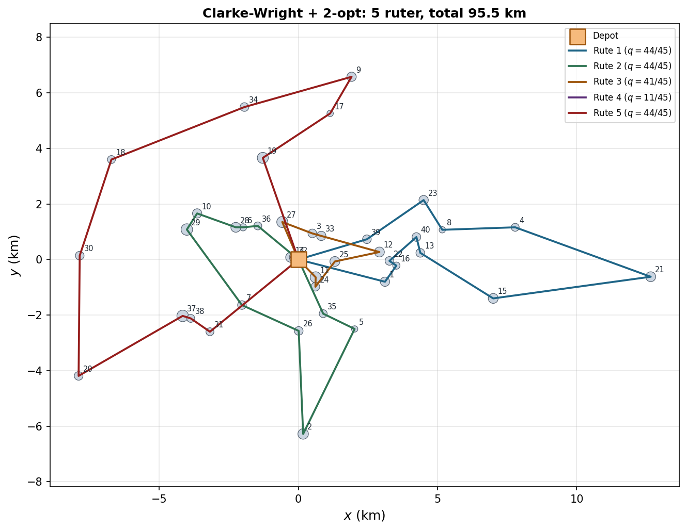

Clarke--Wright etter 2-opt på stor instans: 5 ruter, total 95,54 km. Marginal forskjell fra CW-løsningen.

**Konklusjon** --- *Hvorfor 2-opt ga så lite*

Clarke--Wright produserer allerede en geografisk sammenhengende løsning uten krysninger, som 2-opt sitt hovedbidrag nettopp er å fjerne. På instanser der CW gir "floke-løsninger" kan 2-opt gi 5--10 % forbedring; her var CW-løsningen allerede nær lokalt optimum. Dette er oppløftende --- men det åpner spørsmålet: *hvor langt unna globalt optimum er CW?* Det svaret krever eksakt MIP på den lille instansen.

### Steg 5: Eksakt MIP-løsning (liten instans)
For liten instans ($N = 15$) løser vi MTZ-formuleringen direkte med `PuLP` og `CBC`. Antallet binære variabler er 240 og antallet MTZ-skranker er 210, så modellen er kompakt nok til at CBC kan bevise optimalitet.

Kjøreresultater. CBC terminerer etter $97,8$ sekunder med *bevist optimalt* objektiv $53,11$ km. Løsningen består av to ruter:

- Rute 1: $0 \to 7 \to 11 \to 15 \to 10 \to 1 \to 3 \to 2 \to 6 \to 8 \to 9 \to 4 \to 0$ (last $= 45$).

- Rute 2: $0 \to 13 \to 5 \to 12 \to 14 \to 0$ (last $= 21$).

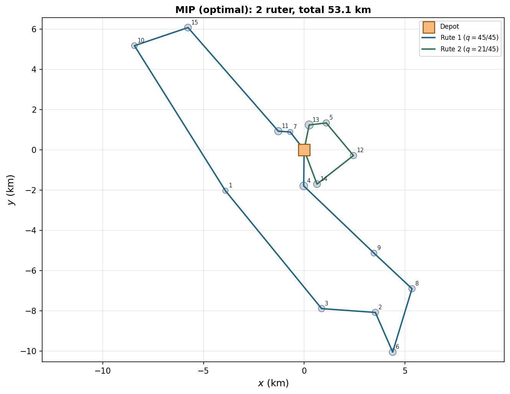

MIP-optimal løsning på liten instans ($N = 15$): 2 ruter, total $53,11$ km. Bevist optimalt av CBC på 98 sekunder.

Sammenligning mellom CW og MIP. Clarke--Wright ga $53,22$ km; MIP-optimum er $53,11$ km. Gap er altså bare $0,21~%$ --- 11 meter forskjell på 53 km. Rutene er geografisk tilnærmet like, og Clarke--Wright har sannsynligvis valgt en litt annen rekkefølge internt som koster ubetydelig mer.

**Konklusjon** --- *CW er nær-optimal på denne instansen*

Clarke--Wright savings er altså bare $0,21~%$ fra bevist optimum på 15-kunde instansen, mens nærmeste-nabo er $39~%$ unna. For en praktiker er det tett nok på optimalt til at det ikke er verdt de 98 CBC-sekundene å beregne MIP-løsningen. Men MIP gir oss noe heuristikkene ikke kan: en *optimalitetsgaranti*. Neste steg oppsummerer alt.

### Steg 6: Sammenligning
Vi samler alle resultater i tabell [18](#tab-tab-vrp-sammenligning) og figur [16](#fig-fig-vrp-compare-bar). Kolonnen "Gap" måler prosentvis avvik fra beste kjente løsning: MIP-optimum på liten instans, CW $+$ 2-opt på stor instans (der MIP er upraktisk).

Sammenligning av metoder på begge instanser. Gap er avvik fra beste kjente løsning (MIP for liten, CW + 2-opt for stor).

  **Metode**                                                                                        **Total (km)**        **Ruter**   **Tid (s)**     **Gap (%)**
  ------------------------------------------------------------------------------------------------- --------------------- ----------- --------------- -------------
  \multicolumn{5}{@{}l@{}}{*Liten instans ($N = 15$), MIP er referanse*}                                                                           
  MIP (CBC)                                                                                         53,11   2           97,82           0,00
  CW + 2-opt                                                                                        53,22                 2           $<\!0,01$   0,21
  Clarke--Wright                                                                                    53,22                 2           $<\!0,01$   0,21
  Nærmeste-nabo                                                                                     73,89                 2           $<\!0,01$   39,13
  \multicolumn{5}{@{}l@{}}{*Stor instans ($N = 40$), CW + 2-opt er referanse (MIP upraktisk)*}                                                     
  CW + 2-opt                                                                                        95,54   5           $<\!0,01$   0,00
  Clarke--Wright                                                                                    95,56                 5           $<\!0,01$   0,02
  Nærmeste-nabo                                                                                     136,42                5           $<\!0,01$   42,79

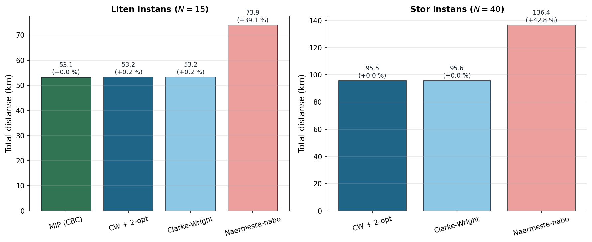

Total distanse per metode. Venstre: liten instans ($N = 15$), der MIP gir bevist optimum. Høyre: stor instans ($N = 40$), der Clarke--Wright med 2-opt gir beste kjente løsning. Tall over stolpene angir også relativt gap mot beste løsning.

Observasjoner. Tre mønstre peker seg ut:

1.  **Nærmeste-nabo taper stort på begge instanser.** NN er $39$--$43~%$ unna beste kjente, på tvers av begge instanser. Den grådige konstruksjonen lar seg ikke redde av instansstørrelse alene.

2.  **Clarke--Wright er bemerkelsesverdig nær optimum.** På liten instans er CW bare $0,21~%$ unna bevist MIP-optimum. Dette stemmer med den empiriske litteraturen: CW gir typisk $2$--$8~%$ gap, men på geometrisk velstrukturerte instanser (tydelige klynger) kan den komme enda nærmere.

3.  **Beregningstiden forteller sin egen historie.** CBC bruker $98$ sekunder på $N = 15$. Empirisk vokser løsningstiden for MTZ-formuleringen eksponentielt, slik at $N = 40$ kan kreve timer eller dager uten å finne bevist optimum. Clarke--Wright leverer en løsning som er $\leq 1~%$ dårligere på millisekunder.

**Praktisk anvendelse** --- *Hvordan NordMat Hjemlevering bør planlegge*

1.  **Daglig operativ ruting ($N \approx 30$--$60$ ordrer):** Clarke--Wright savings er primærverktøyet. Den gir gode ruter på under ett sekund og er robust for daglige endringer i etterspørsel.

2.  **Polering med 2-opt:** Kjør 2-opt etter CW. Gevinsten er vanligvis $0$--$3~%$ på velgenererte CW-løsninger, men koster ingenting beregningsmessig og luker ut åpenbare floker når de først oppstår.

3.  **Periodisk benchmark med MIP:** En gang per kvartal, velg en representativ dag med $N \lesssim 15$--$20$ ordrer og løs den eksakt. Gap mellom daglig CW-løsning og MIP-optimum kvantifiserer hvor mye bedre ruteplanleggeren kan bli; dersom gapet systematisk er $< 2~%$, er det ingen grunn til å investere i dyrere metaheuristikker.

4.  **Dimensjonering av flåte:** Bruk nedre grense $\lceil \sum q_i / Q \rceil$ som minsteantall biler, og la Clarke--Wright finne et tett øvre estimat. Differansen mellom lagertrykk og ruteproduksjon gir beslutningsgrunnlag for flåtekjøp.

[Begrensninger.]
- **Tidsvinduer ignoreres.** Reelle dagligvareleveranser har ofte to-timers leveringsvinduer. Utvidelsen til CVRPTW (Capacitated VRP with Time Windows) krever ytterligere skranker og typisk en annen heuristikk-familie (adaptive large neighbourhood search).

- **Heterogen flåte.** Modellen antar identiske biler. I praksis har NordMat sannsynligvis både små lastebiler og større varebiler; dette gir et *mixed fleet VRP*.

- **Deterministiske etterspørsler.** Kundens faktiske ordre kan avvike fra prognose, og noen kunder er ikke hjemme. Stokastisk VRP og rescheduling underveis er separate modellklasser.

- **Asymmetriske og tidsvarierende avstander.** Oslo har enveisgater, rushtrafikk og bompenger som gjør $d_{ij} \neq d_{ji}$ og $d_{ij}$ tidsavhengig. Slike utvidelser krever en full avstandsmatrise fra en GIS-tjeneste (f.eks. OSRM) og ideelt sett tidsavhengige kostnader.

ML-basert ruteoptimering med attention-modell

## Eksempel: ML-basert ruteoptimering med attention-modell
Oppsummering.

  **Kategori**      **Beskrivelse**
  ----------------- ---------------------------------------------------------------------------------------------------------------------------------------------------
  Eksempel          Samme-dag-hjemlevering der tusenvis av små CVRP-instanser må løses raskt, hver dag
  Område            Operativ ruteplanlegging der løsningstid er like viktig som løsningskvalitet
  Problemstilling   Kan én *lært* konstruksjonsheuristikk erstatte Clarke--Wright og MIP når instanser ankommer i sanntid?
  Modell            Attention-basert pointer-modell (encoder-MLP $+$ pointer-decoder, ca. 25 000 parametre)
  Prosess           ML-pipeline: datagenerering med eksakt solver $\to$ trening (supervised) $\to$ greedy decoding $\to$ sammenligning mot klassiske metoder
  Metode            Teacher-forcing kryssentropi, early stopping, greedy decoding, Clarke--Wright og brute-force eksakt som referanse

### Problemstilling
*NordMat Hjemlevering* (samme case som i seksjon [Ruteplanlegging med CVRP og Clarke--Wright](#sec04)) har utvidet tilbudet med *samme-dag-levering* av dagligvarer fra en ny generasjon mikro-hub-er i Oslo. I stedet for å planlegge én stor morgentur, må planleggingssystemet nå fatte en ny ruteplan hvert 30. minutt, etter hvert som nye ordrer tikker inn --- ofte med kun 10--30 kunder per mikro-hub. Beslutningene må tas på sekunder, ikke minutter.

Den klassiske Clarke--Wright-algoritmen er rask nok på en enkelt instans, men når planleggingssystemet kjører 200 ruteoptimeringer i parallell (én per hub, én per tidsvindu) blir totaltiden likevel merkbar. Eksakt MIP er uansett uaktuelt for sanntidskjøring. Kan vi i stedet *lære* å løse CVRP --- trene en liten nevral modell på tusenvis av ferdig-løste instanser og deretter bruke den i stedet for en klassisk algoritme? Dette er nettopp ideen bak *neural combinatorial optimization*, og den mest kjente realiseringen er attention-modellen til Kool, van Hoof og Welling.

Kategorisjefen ønsker svar på to konkrete spørsmål:

- Hvor nær optimum kommer en lært modell på nye, usette instanser?

- Hvor mye raskere er den enn Clarke--Wright og MIP i praksis?

**Problemstilling** --- *Kan modellen *lære* å konstruere ruten i stedet for å beregne den?*

Vi genererer 1 200 små CVRP-instanser med en eksakt solver, trener en enkel pointer-modell (encoder + attention-decoder) til å imitere den optimale ruten, og evaluerer deretter modellen på 200 usette instanser samt på instanser som er *større* enn dem modellen har sett under trening. Resultatene sammenlignes med Clarke--Wright (seksjon [Ruteplanlegging med CVRP og Clarke--Wright](#sec04)) langs to akser: løsningskvalitet (gap til optimum) og inference-tid.

### Modell
Det er en prinsipielt ny modell vi møter her. UFLP (seksjon [Fasilitetsplassering med MIP (UFLP)](#sec03)) og CVRP med Clarke--Wright (seksjon [Ruteplanlegging med CVRP og Clarke--Wright](#sec04)) er *symbolske* modeller: problemet formuleres som et matematisk program (MIP) eller en håndskrevet algoritme med eksplisitte regler (savings-formelen). Pointer-modellen er en *lært* konstruksjonsheuristikk: vi definerer ingen regler for hvordan en rute skal bygges --- i stedet lar vi en nevral nettverk-arkitektur se et stort antall eksempler på (instans, optimal rute) og justere sine vekter slik at den gir en god neste-node-beslutning i hvert steg. Dette speiler overgangen fra SARIMA/ARIMAX til LightGBM i kapittel [?](#ref-ch-ettersporselprognoser): selve *formen* til «parametrene» læres fra dataene.

Siden det som estimeres ikke er en håndfull reelle tall, men vektene i en encoder og decoder som tilsammen definerer en sannsynlighetsfordeling over ruter, bygges resten av seksjonen opp rundt de fire sentrale spørsmålene:
(i) hva er *dataene*? (ii) hva er *ukjente* som estimeres?
(iii) hva er *målfunksjonen*? (iv) hvilke *skranker* gjelder?

Data. Treningsdataene er en samling av ferdig-løste CVRP-instanser,

$$\mathcal{D} = {(I_k, \tau_k^\star)}_{k=1}^{K}, \qquad I_k = (\mathbf{c}_k, \mathbf{q}_k, Q_k),$$

2

der $\mathbf{c}_k \in \[0, 1\]^{(n_k+1) \times 2}$ er koordinatene til depot (indeks $0$) og $n_k$ kunder, $\mathbf{q}_k \in \mathbb{N}^{n_k+1}$ er etterspørselsvektoren (med $q_{k,0} = 0$), $Q_k$ er kjøretøykapasiteten, og $\tau_k^\star$ er den optimale ruten --- en sekvens av besøk der $0$-er markerer retur til depot. I vårt eksempel er $K = 1\,200$ treningsinstanser og $K_{\text{val}} = 200$ valideringsinstanser, hver med $n_k \in {5, 6, 7}$ kunder uniformt trukket, $Q_k = 30$ og $q_{k,i} \in {1, \ldots, 9}$ uniformt trukket. Tabell [20](#tab-tab-mlvrp-panel) oppsummerer dimensjonene. Den optimale ruten $\tau_k^\star$ kommer fra en eksakt brute-force-solver som enumererer alle kundepermutasjoner og beregner optimal splitt via dynamisk programmering.

Dimensjonene til treningsdatasettet $\mathcal{D}$.

  **Symbol**             **Beskrivelse**                                **Verdi**
  ---------------------- ---------------------------------------------- ---------------------------
  $K$                  Antall treningsinstanser                       [$1\,200$]
  $K_{\text{val}}$   Antall valideringsinstanser                    $200$
  $n_k$                Antall kunder i instans $k$                  $5$--$7$
  $Q_k$                Kjøretøykapasitet                              $30$
  $q_{k,i}$           Etterspørsel for kunde $i$ i instans $k$   ${1, \ldots, 9}$
  $\mathbf{c}_k$     Koordinater (depot + kunder)                   $\[0,1\]^2$
  $\tau_k^\star$    Optimal ruterekkefølge (fra eksakt solver)     ---

Node-features. Hver node $i \in {0, 1, \ldots, n_k}$ i en instans kodes som en vektor

$$x_i = \bigl(\, c_{i,x},\; c_{i,y},\; q_i / Q,\; \mathbb{1}\[i = 0\] \,\bigr) \in \mathbb{R}^4,$$

3

altså $x$- og $y$-koordinat, normalisert demand, og et flagg for om noden er depotet. Ved å dele demand på kapasiteten blir modellen kapasitetsuavhengig og kan --- i prinsippet --- generalisere til andre $Q$.

Definisjon [Attention-basert konstruksjonsmodell]
En *attention-basert konstruksjonsmodell* $\pi_\theta$ med parametere $\theta$ er en sannsynlighetsfordeling over ruter som faktoriseres autoregressivt:

$$\pi_\theta(\tau \mid I) \;=\; \prod_{t=1}^{T} \pi_\theta\!\bigl(a_t \mid a_{

9

der $\tau = (a_1, \ldots, a_T)$ er en sekvens av aksjoner (node-indekser), og hver betingede fordeling beregnes av en encoder-decoder-arkitektur: encoderen $f_\theta : \mathbb{R}^{(N) \times 4} \to \mathbb{R}^{N \times d}$ kjører samme MLP på alle noder og gir embeddings $h_i$; decoderen bruker attention for å peke på neste node, betinget på hvilke noder som allerede er besøkt og hvor mye kapasitet som gjenstår.

Symboler i konstruksjonsmodellen [(9)](#eq-eq-mlvrp-policy).

  **Symbol**                      **Beskrivelse**
  ------------------------------- ------------------------------------------------------------------
  $\pi_\theta$               Sannsynlighetsfordeling over ruter, parametrisert av $\theta$
  $\tau = (a_1,\ldots,a_T)$   En rute som aksjonssekvens (node-indekser, $0 = $ depot)
  $a_t$                         Den $t$-te besøkte noden
  $a_{                          Alle aksjoner før steg $t$ (rutehistorikken)
  $I$                           Instansen (koordinater, demand, kapasitet)
  $h_i \in \mathbb{R}^d$     Encoder-embedding for node $i$, med $d = 64$
  $N$                           Antall noder (depot $+$ kunder)
  $\theta$                     Alle lærbare vekter i modellen ($\sim\!25\,000$)

Figur [17](#fig-fig-mlvrp-attention) viser hvordan encoder-decoder-arkitekturen henger sammen: encoderen deler samme vekter mellom alle noder og produserer én vektor $h_i$ per node; decoderen bygger en kontekstvektor fra gjennomsnittet av embeddingene (grafens «pulsnivå»), embeddingen til den sist besøkte noden, og den gjenværende kapasiteten, og bruker attention til å peke på neste node.


Arkitekturen: encoderen (grønn) er en felles MLP som lager embeddings $h_i$ per node (blå). Decoderen (oransje) kombinerer graph-embed, embeddingen til forrige besøk og gjenværende kapasitet til en kontekst $q_t$, som attention-blokken bruker til å peke på neste node.

Definisjon [Pointer-decoder]
I steg $t$ beregner *pointer-decoderen* en logit per node ved attention:

$$s_{t,i} \;=\; C \cdot \tanh\!\Bigl(\bigl(W_q q_t + W_k h_i\bigr) \cdot v\Bigr), \qquad q_t = W_c \begin{bmatrix} \bar h \\ h_{a_{t-1}} \\ c_t / Q \end{bmatrix},$$

10

der $\bar h = \tfrac{1}{N}\sum_i h_i$ er graph-embeddingen, $h_{a_{t-1}}$ er embeddingen til forrige besøkte node, $c_t$ er gjenværende kapasitet i kjøretøyet, $W_q, W_k \in \mathbb{R}^{d \times d}$ og $v \in \mathbb{R}^d$ er lærbare, $W_c \in \mathbb{R}^{d \times (2d+1)}$ projiserer konteksten tilbake til $d$-rommet, og $C = 10$ er en klippkonstant som stabiliserer treningen. De gyldige nodene velges deretter via softmax over *mask*-en $\mathcal{A}_t$:

$$\pi_\theta(a_t = i \mid a_{

11

Symboler i pointer-decoderen [(10)](#eq-eq-mlvrp-pointer)--[(11)](#eq-eq-mlvrp-softmax).

  **Symbol**             **Beskrivelse**
  ---------------------- -------------------------------------------------------------------
  $s_{t,i}$           Attention-logit for node $i$ i steg $t$
  $q_t$                Decoder-kontekst-vektor (projisert til $d$-rommet)
  $\bar h$            Graph-embedding, gjennomsnitt av alle node-embeddings
  $h_{a_{t-1}}$      Embedding av forrige besøk (for $t=1$ er dette depotet $h_0$)
  $c_t$                Gjenværende kapasitet i kjøretøyet etter steg $t-1$
  $C$                  Klipp-konstant ($=10$); stabiliserer logits
  $W_q, W_k, W_c, v$   Lærbare vekter i decoderen
  $\mathcal{A}_t$    Mengden gyldige noder i steg $t$ (se skranker)

Figur [18](#fig-fig-mlvrp-decoder) viser *ett* decoder-steg konkret: først de rå attention-scorene per node, deretter maskeringen av allerede-besøkte noder og noder som overskrider kapasiteten, og til slutt softmax som gir sannsynlighetene for neste besøk.


Ett decoder-steg. (a) Attention-mekanismen gir én rå score $s_{t,i}$ per node. (b) Mask-en fjerner besøkte kunder (nr. 1) og de som overskrider gjenværende kapasitet (nr. 4). Softmax over de gyldige gir sannsynligheter; argmax ($i=5$ her) velges som neste besøk.

Variabler: hva estimeres? Tabell [23](#tab-tab-mlvrp-unknowns) lister de ukjente $\theta$. I motsetning til en MIP-modell (hvor variablene er beslutningsvariabler $x_{ij}$ per instans) er disse *globale*: de samme vektene brukes for alle instanser. Det er nettopp dette som gjør at modellen kan generalisere til nye instanser --- ruten for en ny instans produseres uten ytterligere trening.

Ukjente vektene $\theta$ som treningen estimerer.

  **Blokk**                    **Beskrivelse**                                                                                         **Antall**
  ---------------------------- ------------------------------------------------------------------------------------------------------- -------------------------------------
  Encoder MLP                  3 lineære lag $\mathbb{R}^4 \to \mathbb{R}^{64} \to \mathbb{R}^{64} \to \mathbb{R}^{64}$   $\sim 8\,700$
  $W_c$                      Kontekstprojeksjon $\mathbb{R}^{2d+1} \to \mathbb{R}^d$                                          $8\,256$
  $W_q, W_k$                 Query- og key-projeksjoner $\mathbb{R}^d \to \mathbb{R}^d$                                       $2 \times 4\,096$
  $v$                        Attention-retningsvektor i $\mathbb{R}^d$                                                           $64$
  **Totalt $\|\theta\|$**   (eksklusiv LayerNorm-løse konstantledd)                                                                 [$\approx 25\,200$]
Hyperparametere som $d = 64$ (embedding-dimensjon), $C = 10$ (klippkonstant), læringsraten og antall epoker er *ikke* ukjente som estimeres --- de settes manuelt eller velges ved validering før treningen.

Definisjon [Treningsobjektiv (supervised imitation)]
Parametervektene $\theta$ læres ved å *imitere* den optimale ruten fra den eksakte solveren. Ved teacher forcing eksponeres decoderen i hvert steg for den sanne historikken $a_{

$$\mathcal{L}(\theta) \;=\; -\, \frac{1}{K}\sum_{k=1}^{K}\; \frac{1}{T_k}\sum_{t=1}^{T_k} \log \pi_\theta\!\bigl(a_t^\star \mid a_{

12

Optimering skjer ved stokastisk gradientnedstigning (Adam) med mini-batcher av størrelse 64, læringsrate $10^{-3}$ og gradientklipping med norm 2.

Symboler i treningsobjektivet [(12)](#eq-eq-mlvrp-loss).

  **Symbol**                                     **Beskrivelse**
  ---------------------------------------------- -------------------------------------------------------------------
  $\mathcal{L}(\theta)$                      Gjennomsnittlig kryssentropi per tidssteg over treningssettet
  $K$                                          Antall treningsinstanser
  $T_k$                                        Lengden på den optimale ruten $\tau_k^\star$ i instans $k$
  $a_t^\star$                                Den optimale aksjonen i steg $t$
  $a_{                                         Rutehistorikken før steg $t$ (teacher forcing)
  $\pi_\theta(a_t^\star \mid \cdots)$   Modellens sannsynlighet for den sanne aksjonen

En alternativ formulering er REINFORCE, der belønningen $-\text{distanse}(\tau)$ brukes som læringssignal og ingen eksakt solver trengs. Ved så små instanser som her er supervised imitation både raskere og mer datalæringseffektivt.

Skranker. Optimeringsproblemet [(12)](#eq-eq-mlvrp-loss) er underlagt tre grupper skranker:

*Aksjonsskranker* (definerer $\mathcal{A}_t$ i hvert decoder-steg):

- **Ingen gjentak**: en kunde $i \in {1, \ldots, n}$ kan velges maksimalt én gang per rute-sekvens: $a_t = i \Rightarrow i \notin {a_{t+1}, \ldots, a_T}$.

- **Kapasitetsgrense**: kunden $i$ er kun gyldig hvis $q_i \leq c_t$, der $c_t$ oppdateres som $c_t = c_{t-1} - q_{a_{t-1}}$ for kundebesøk og $c_t = Q$ etter et depot-besøk.

- **Ingen tom rute**: depot er kun tillatt som $a_t$ dersom $a_{t-1} \neq 0$ (eller som avslutning når alle kunder er besøkt).

*Modellskranker* (størrelsen på modellen):

- Embedding-dimensjon $d = 64$ fikserer oppløsningen til encoder- og decoder-tensoren.

- Klipp-konstanten $C = 10$ begrenser attention-logits til $\[-10, 10\]$ slik at softmax ikke metter tidlig.

*Konvergensskranke*:

- **Early stopping / modellsporing**: vi lagrer modellen hver gang valideringstapet forbedres og bruker den beste versjonen, slik at modellen ikke overtilpasser selv om treningen kjøres lenge. Her ble beste valideringstap $0,51$ naddd i epoke 37 av 40.

Inference: greedy konstruksjon. Etter trening konstruerer modellen en rute for en ny instans ved *greedy decoding*: i hvert steg velges $a_t = \arg\max_{i \in \mathcal{A}_t} s_{t,i}$. Beam search og sampling er alternativer som kan forbedre resultatet på bekostning av tid, men for det pedagogiske omfanget holder vi greedy.

**Tolkning** --- *Hva har modellen egentlig lært?*

- **Encoder som «oppfattelse»** ($h_i$): Hver node får en vektorrepresentasjon som fanger både dens geografiske beliggenhet, størrelsen på dens etterspørsel, og dens rolle (depot kontra kunde).

- **Graph-embedding som kontekst** ($\bar h$): Gjennomsnittet av alle node-embeddings gir decoderen et raskt bilde av hvor instansens tyngdepunkt ligger --- avgjørende for å bestemme om det lønner seg å rute mot øst eller vest først.

- **Kapasitet som aktiv state** ($c_t / Q$): Gjenværende kapasitet mates direkte inn i konteksten, slik at modellen lærer å returnere til depot i riktig øyeblikk.

- **Attention som vurderingsverktøy**: Den samme scorefunksjonen bedømmer samtlige kandidat-kunder, slik at modellen aldri blir «blind» for en avsidesliggende node bare fordi den ligger langt fra den sist valgte --- attention ser hele grafen samtidig.

Sammenligning med Clarke--Wright og eksakt MIP. Tabell [25](#tab-tab-mlvrp-vs-alternatives) oppsummerer de tre metodene langs egenskapene som er relevante for praktisk bruk.

Sammenligning av tre tilnærminger til CVRP.

  **Egenskap**          **Eksakt MIP (seksjon [Fasilitetsplassering med MIP (UFLP)](#sec03))**   **Clarke--Wright (seksjon [Ruteplanlegging med CVRP og Clarke--Wright](#sec04))**   **Attention-modell**
  --------------------- ------------------------------------------------------------------------------- ------------------------------------------------------------------------------------------ -------------------------------------------
  Optimalitetsgaranti   Ja                                                                              Nei                                                                                        Nei
  Datakrav              Ingen                                                                           Ingen                                                                                      1 000+ ferdig-løste instanser
  Kjøretid              Eksponensiell i $n$                                                           $O(n^2)$ + 2-opt                                                                        $O(n)$ per decoder-steg, svært rask
  Generalisering        Per-instans                                                                     Per-instans                                                                                Lært, deler vekter mellom instanser
  Implementering        Modellerings-språk (PuLP / CBC)                                               Få hundre linjer Python                                                                    Krever PyTorch og treningspipeline
  Tolkbarhet            Høy (LP-dualer, sensitivitet)                                                   Høy (savings $s_{ij}$ er konkret)                                                       Lav (attention-scores er ikke kalibrerte)
  Skalerer med $n$    Nei                                                                             Ja                                                                                         Ja, hvis $n \in$ treningsfordeling

Forutsetninger. Utover de formelle skrankene hviler modellen på tre antakelser som er verdt å framheve:

1.  **Stabil instansfordeling**: Treningsinstansene er trukket fra en kjent fordeling (5--7 kunder, $Q=30$, uniformt i $\[0,1\]^2$). Modellen presterer best på instanser *innenfor* denne fordelingen; generalisering til større $n$ eller andre distribusjoner krever enten bredere trening eller reinforcement learning.

2.  **Samme målfunksjon**: Den eksakte solveren minimerer total distanse. Hvis produksjonen skifter mål (f.eks. minimer forsinkelse eller CO\textsubscript{2}), må nye treningsetiketter genereres og modellen trenes på nytt.

3.  **Deterministisk geometri**: Modellen antar at alle noder er synlige og at Euklidsk distanse er relevant. Virkelige veinett, enveiskjøring, rushtrafikk og stokastisk reisetid krever utvidelser.

### Prosess
Prosess: ML-pipeline med datagenerering $\to$ arkitektur $\to$ trening $\to$ evaluering $\to$ sammenligning.
Modell: Attention-basert pointer-nettverk trent med supervised imitation.

Prosessen er kvalitativt forskjellig fra seksjon [Ruteplanlegging med CVRP og Clarke--Wright](#sec04): der bygger vi algoritmen direkte (savings-formelen + 2-opt); her bygger vi først en *lærer*-oppskrift (hvilken mengde data, hvilken arkitektur, hvilket tap) og lar datamaskinen justere ruteheuristikken automatisk. Figur [19](#fig-fig-mlvrp-method) viser de seks stegene.

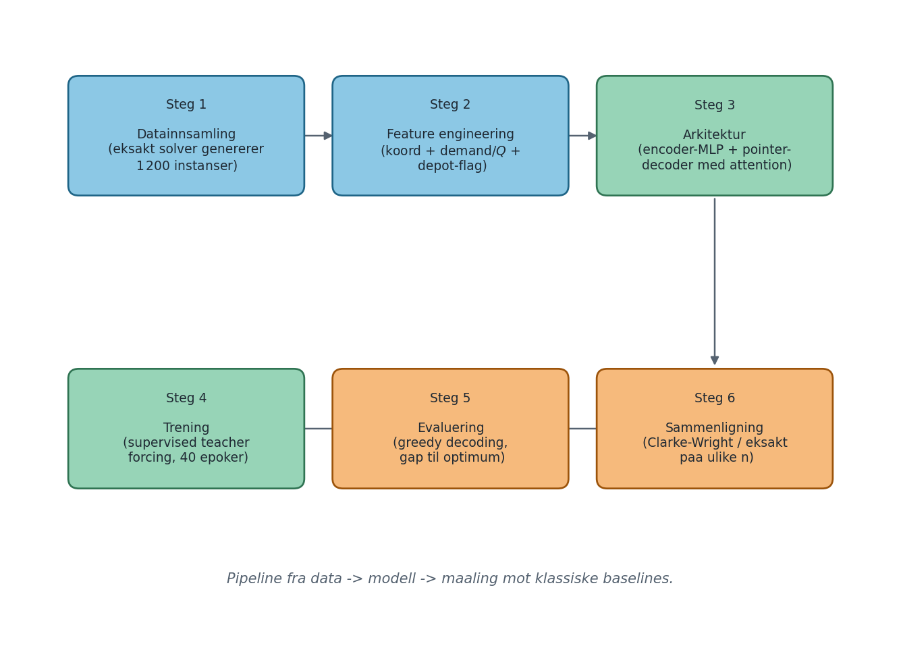

ML-pipelinen i seks steg: datainnsamling med eksakt solver, feature engineering, arkitektur, trening, evaluering og sammenligning.

### Steg 1: Datainnsamling
Vi trenger to ting: et godt utvalg av CVRP-instanser, og en optimal rute per instans som modellen kan imitere. Vi trekker 1 200 treningsinstanser og 200 valideringsinstanser, hver med $n \in {5, 6, 7}$ kunder uniformt trukket, depot plassert i sentrum av enhetskvadratet, kundeposisjoner uniformt i $\[0,1\]^2$ og heltallsdemand i ${1, \ldots, 9}$. Kapasiteten er $Q = 30$. Instansstørrelsene er med vilje små slik at en brute-force-solver (enumerering av alle $n!$ kundepermutasjoner kombinert med optimal splitt-DP langs sekvensen) kjører på millisekunder per instans. Figur [20](#fig-fig-mlvrp-instance) viser en enkelt instans med den optimale ruten.

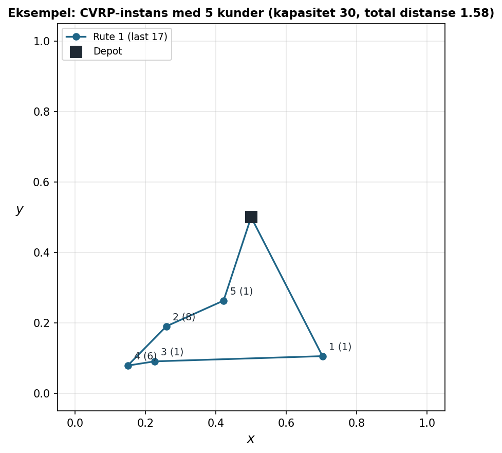

Eksempel på en treningsinstans med $n = 5$ kunder og $Q = 30$. Den eksakte solveren finner to ruter (blå og grønn); tall i parentes angir demand.

På 1 200 instanser tar datagenereringen ca. 2 minutter total-tid (gjennomsnittlig ca. $100$ ms per instans, men mye raskere på $n=5$ og vesentlig tregere på $n=7$ pga. $7! = 5\,040$ permutasjoner). De ferdig-løste parene $(I_k, \tau_k^\star)$ pickles til disk.

**Konklusjon** --- *Hvorfor er små instanser riktig for pedagogikk?*

Supervised imitation trenger etiketter som er garantert optimale, og vi vil holde datagenereringen innen rimelig tid. Når modellen først er trent på små instanser, kan den kjøres på *større* instanser (se steg 6) --- men generaliseringen til større instanser er naturligvis begrenset og viser seg som et økende gap til Clarke--Wright.

### Steg 2: Feature engineering
Feature engineering i denne sammenhengen er enklere enn i LightGBM-eksempelet fra kapittel [?](#ref-ch-ettersporselprognoser): hver node får én $x_i \in \mathbb{R}^4$ som beskrevet i [(3)](#eq-eq-mlvrp-features). Den sanne oppskriften (tour-sekvensen) konverteres til en sekvens av heltall $a_1, a_2, \ldots$ der $a_t \in {0, 1, \ldots, n}$ og $0$ angir retur-til-depot. Gjennomsnittlig rute-lengde på treningssettet er $7,4$ aksjoner (avg. 1,4 ruter per instans). For batching pader vi alle sekvenser og feature-matriser til $n_{\max} = 7$ og $T_{\max} = 10$ tidssteg, og vedlikeholder en boolsk «node-finnes»-maske slik at decoderen aldri kan peke på en padded posisjon.

**Konklusjon** --- *Få features, mye struktur*

I motsetning til LightGBM-eksempelet bruker vi bare fire features per node her --- men *hele den relasjonelle strukturen* mellom kunder (avstandene, kapasitetsinteraksjonene) overlates til arkitekturen: det er attention-blokken som lærer disse relasjonene ved å sammenligne embeddings på tvers av alle noder.

### Steg 3: Modellarkitektur
Arkitekturen er allerede definert formelt i Modell-delen. Implementasjonsnøtteknikker er:

- Encoder er en `nn.Sequential`(Linear, ReLU, Linear, ReLU, Linear) med $d_{\text{in}} = 4$ og $d = 64$. Samme moduler deles mellom alle noder via vektorisering: input $\in \mathbb{R}^{B \times N \times 4}$, output $\in \mathbb{R}^{B \times N \times d}$.

- Decoderen inneholder tre lineære lag ($W_c, W_q, W_k$) og én trenbar vektor $v$. Attention-scoren beregnes med en enkelthode additiv attention som klippes via $\tanh$ og en konstant $C$. Masken er en boolsk matrise som legges til logits som $-10^9$ der noder ikke er tillatte.

- Totalt antall trenbare parametre er $\sim\!25\,200$. Modellens minne-fotavtrykk er så lite at den kjører komfortabelt på CPU, og én epoke (1 200 instanser, batch 64) tar ca. 2--3 sekunder.

### Steg 4: Trening
Treningen kjører i 40 epoker med Adam-optimering ($\mathrm{lr} = 10^{-3}$) og teacher forcing: vi gir decoderen den sanne historikken $a_{(12) er kryssentropien mellom softmax-fordelingen og den sanne aksjonen, gjennomsnittlig per tidssteg og per instans. Figur [21](#fig-fig-mlvrp-training-curve) viser utviklingen av trenings- og valideringstapet.

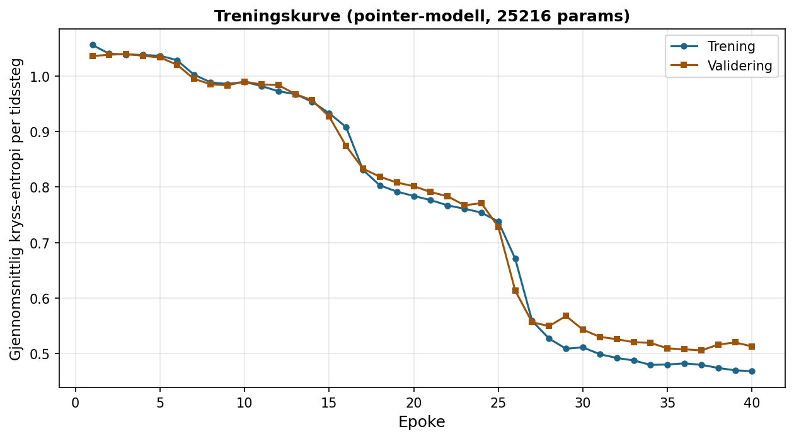

Trenings- og valideringskurven (kryssentropi per tidssteg) over 40 epoker. Beste valideringstap ($0,506$) nås i epoke 37. Total treningstid er $\sim\!112$ s på en moderne CPU.

Trening- og valideringskurvene ligger tett sammen gjennom hele løpet, noe som indikerer at modellen ikke overtilpasser. Et tap på $0,51$ tilsvarer at modellen velger riktig node med sannsynlighet $\mathrm{e}^{-0,51} \approx 0,60$ i gjennomsnitt --- dette blir gap-et opp mot optimum etter at masking og greedy-valg tar hensyn til hvilke noder som er gyldige.

**Konklusjon** --- *Den trente modellen er klar*

- $\sim\!25\,200$ lærbare vekter trent på $\sim\!8\,900$ (instans, tidssteg)-par.

- Beste valideringstap $0,506$, oppnådd i epoke 37.

- Total treningstid $\sim\!112$ sekunder på CPU.

- Modellen lagres i `output/mlvrp_model.pt` og brukes i steg 5 og 6.

### Steg 5: Evaluering
Vi evaluerer den trente modellen på de 200 valideringsinstansene (som er *innenfor* fordelingen modellen ble trent på: $n \in {5, 6, 7}$). For hver instans konstruerer modellen en rute ved greedy decoding, og vi beregner gap-et mot den eksakte ruten:

$$\mathrm{gap}_k = \frac{d_{\text{ML}}(\tau_k) - d^\star_k}{d^\star_k}.$$

4

Tabell [26](#tab-tab-mlvrp-eval) oppsummerer distribusjonen.

Evaluering av den trente modellen på $K_{\text{val}} = 200$ valideringsinstanser.

  **Metrikk**                                 **Verdi**
  ------------------------------------------- --------------------------
  Gjennomsnittlig gap til optimum             [$5,74$ %]
  Median gap                                  $3,13$ %
  90-prosentil gap                            $15,24$ %
  Maks gap                                    $44,72$ %
  Andel eksakt-optimale løsninger             [$31$ %]
  Andel innenfor $5$ % av optimum           $60$ %
  Gjennomsnittlig inference-tid per instans   $18,4$ ms

Figur [22](#fig-fig-mlvrp-gap-histogram) viser fordelingen visuelt: mesteparten av tettheten er under $10$ %, med en tynn hale som rekker opp til $\sim\!45$ % for de mest uheldige instansene. Figur [23](#fig-fig-mlvrp-routes) viser fire enkeltinstanser; legg merke til at den første gir ML-rute identisk med optimum (gap 0 %), mens den tredje mister en liten gevinst fordi modellen fikk feil kundeorden i den lengste ruten.

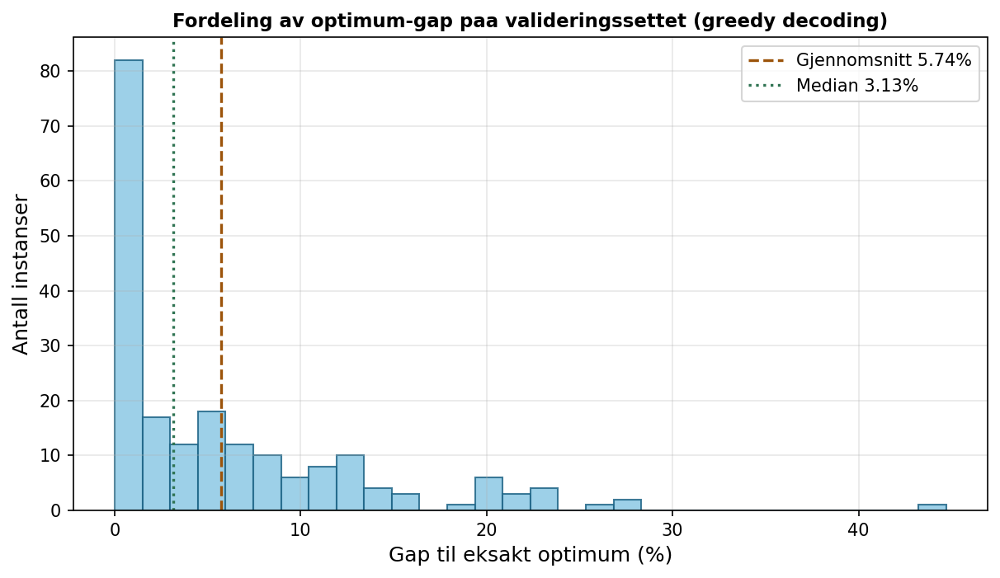

Fordelingen av gap til optimum på de 200 valideringsinstansene. Gjennomsnitt $5,7$ %, median $3,1$ %.

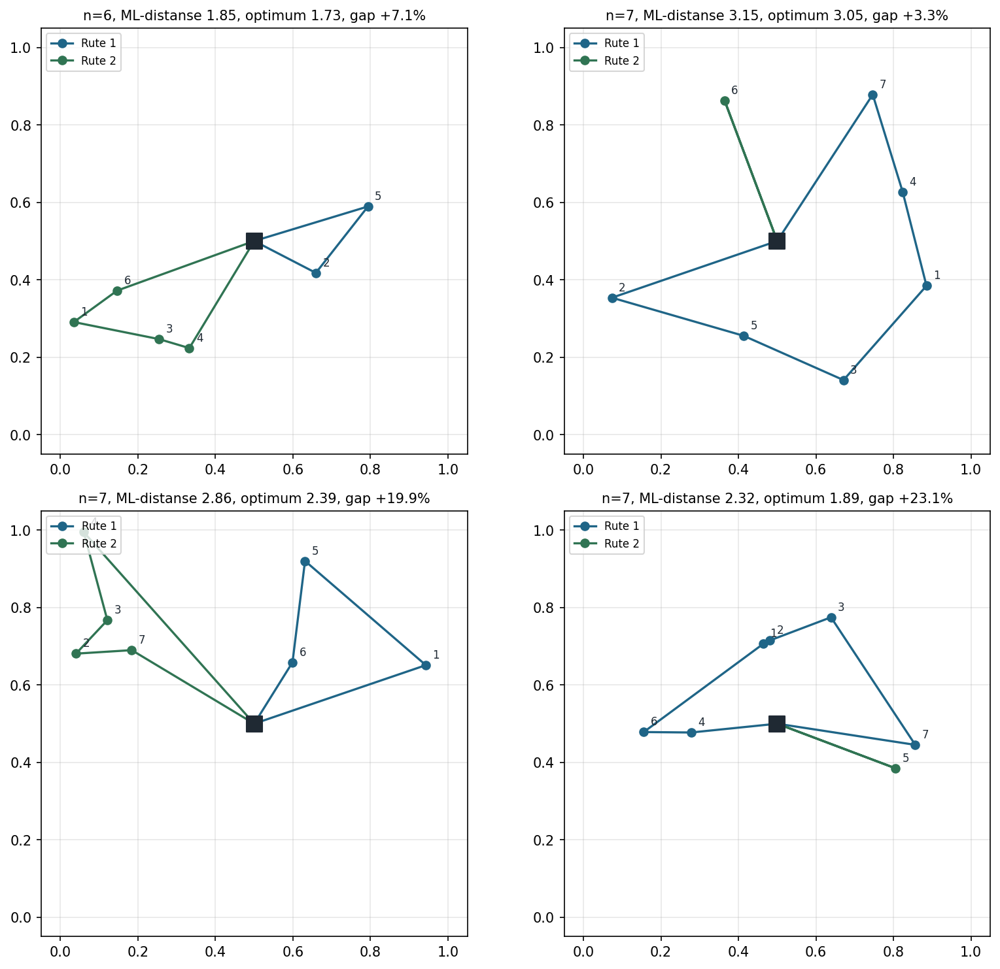

Fire valideringsinstanser med ML-konstruerte ruter. Tittelen angir ML-distanse, optimal distanse og gap. Modellen treffer optimum eller svært nær det for tre av fire tilfeller.

**Konklusjon** --- *En lært heuristikk med forsvarlig kvalitet*

På fordelingen den er trent for, ligger modellen i snitt innenfor 6 % av optimum og finner eksakt-optimum i 31 % av tilfellene. Det er ikke konkurransedyktig med en finjustert Clarke--Wright + 2-opt på disse små instansene (de ligger nær 0 % gap), men eksemplet illustrerer prinsippet: modellen lærer å peke på neste node direkte fra den ukodede geometrien, uten noen håndskreven savings-regel.

### Steg 6: Sammenligning med Clarke--Wright og eksakt
Det mest interessante er å se hvordan modellen skalerer til *større* instanser enn dem den har sett under trening. Vi genererer 30 instanser av hver av tre størrelser: $n=6$ (in-distribution, eksakt mulig), $n=10$ (litt utenfor) og $n=20$ (langt utenfor treningsfordelingen, eksakt ikke praktisk). For hver instans måler vi rute-distanse og kjøretid for tre metoder:

- **Eksakt**: brute-force permutasjonssøk + optimal splitt (kun for $n = 6$).

- **Clarke--Wright**: savings-parallellversjon med 2-opt-forbedring per rute.

- **ML**: greedy decoding med den trente pointer-modellen.

Tabell [27](#tab-tab-mlvrp-compare) oppsummerer.

Sammenligning av tre metoder på 30 instanser per størrelsesklasse (gjennomsnitt).

  **Metode**                     **$n=6$**   **$n=10$**   **$n=20$**
  ------------------------------ ------------- -------------- --------------------------
  Eksakt, distanse               $2,613$     ---            ---
  Eksakt, tid                    $42,4$ ms   ---            ---
  Clarke--Wright, distanse       $2,613$     $3,412$      $5,450$
  Clarke--Wright, tid            $1,9$ ms    $3,2$ ms     $9,3$ ms
  ML, distanse                   $2,766$     $3,903$      $6,520$
  ML, tid                        $21,5$ ms   $31,7$ ms    $55,8$ ms
  Gap ML vs eksakt               $5,8$ %     ---            ---
  Gap Clarke--Wright vs eksakt   $0,0$ %     ---            ---
  Gap ML vs Clarke--Wright       $5,8$ %     $14,4$ %     [$19,6$ %]
Figur [24](#fig-fig-mlvrp-gap-runtime) viser gap og tid visuelt.


Venstre: løsningskvalitet som gap mot referansen (optimum for $n=6$, Clarke--Wright for større). Høyre: gjennomsnittlig kjøretid per instans (log-skala). Clarke--Wright er både nærmere optimum og raskere enn ML-modellen på disse små instansene, men forskjellen i tid krymper relativt sett med $n$.

[Tre observasjoner.]
1.  **Clarke--Wright er på disse instansene overraskende sterk**: på $n=6$ treffer den optimum i alle 30 tilfellene. Dette er ikke uvanlig for små CVRP-instanser når 2-opt er lagt på --- og det forklarer også hvorfor *ren klassisk ruteheuristikk* fortsatt dominerer VRP-benchmark.

2.  **ML-modellen generaliserer delvis ut av distribusjonen**: Den er trent på $n \in {5, 6, 7}$, men produserer likevel fornuftige ruter på $n = 10$ (gap 14 % mot Clarke--Wright) og $n = 20$ (gap 20 %). Gapet vokser monotont, som forventet --- modellen har ikke sett disse størrelsene under trening.

3.  **Tidsmessig er ML ikke raskere her**: pointer-decoder-løkken er i Python-laget og har konstant-faktor overhead fra PyTorch-kall. På $n=20$ bruker ML $56$ ms mens Clarke--Wright bruker $9$ ms. For *stores* instanser ($n \geq 100$) snur bildet: Clarke--Wright skalerer som $O(n^2 \log n)$, mens ML-modellens inference-tid bare vokser lineært. Dette er motivasjonen for ML-basert ruteplanlegging i praksis --- ikke disse pedagogiske småinstansene.

**Praktisk anvendelse** --- *Hva har vi lært?*

1.  **Klassiske metoder er vanskelige å slå på små instanser**. Clarke--Wright + 2-opt når optimum på $n=6$ og ligger under ML også på $n=20$. For sm -til-medium-CVRP er den fortsatt førstevalget.

2.  **ML-modellen er en *kandidatheuristikk*, ikke en erstatning**. Det pedagogiske poenget er hvordan man *kan* trene en modell til å konstruere løsninger ende-til-ende.

3.  **Skalerbarhet og generalisering er gjensidige begrensninger**. En modell trent på $n \leq 7$ kan ikke forventes å beholde samme gap på $n = 100$. Produksjonsbruk krever enten bredere trening (helst via reinforcement learning som ikke er avhengig av eksakte etiketter) eller bedre arkitekturer (multi-head attention, transformer-encoder, beam search).

4.  **Samme-dag-leveringsscenariet er der ML først blir konkurransedyktig**: hundrevis eller tusenvis av små ruteoptimeringer må kjøres parallelt, med hard sanntidsrespons --- et regime der en lineær-tid nevral modell på GPU kan dominere en serie av rimelig raske Python-heuristikker.

[Begrensninger.]
- **In-distribution-antakelse**: Modellen gir trygge garantier kun på instanser som ligner dem den er trent for. Geografisk forskyvning (f.eks. klynget urban etterspørsel i stedet for uniform) eller kapasitetsendringer vil svekke ytelsen inntil ny trening.

- **Ingen optimalitetsgaranti**: I motsetning til MIP produserer modellen aldri et bevis for at ruten er optimal eller innenfor en gitt gap. Der dette kreves (regulatoriske innkjøp, revisjon), bør en hybrid brukes: ML for å foreslå en varm start til en eksakt solver.

- **Tolkbarhet**: Attention-scores kan visualiseres, men er ikke kalibrerte sannsynligheter --- og de forklarer aldri hvorfor *denne* ruten ble valgt foran en nær-ekvivalent alternativ på samme vis som dualvariablene i en MIP gjør.

- **Pedagogisk forenkling**: Den virkelige Kool-arkitekturen bruker multi-head attention, transformer-encoder med $N$ lag, og REINFORCE i stedet for supervised imitation. Vårt miniatyreksempel formidler prinsippet uten å fange hele ytelsesnivåaet.

- **Krever en eksakt solver under trening**: For realistiske størrelser er ekstrakte etiketter ikke oppnåelig --- derfor bruker seriøse publikasjoner RL-varianter. Supervised imitation på små instanser er nyttig som intro.

Slutt · Kapittel 4

---

# Del II — Kapittel 5: Forsyningskjedeanalyse og -optimering

Del II · Kapittel 5

5

# Forsyningskjedeanalyse og -optimering
Oversatt fra LaTeX-kilde --- figurer, definisjoner og KaTeX-math.

[][][][][]
Område

## Område
Forsyningskjedeanalyse og -optimering betrakter verdikjeden fra råvarer til sluttbruker som *ett* integrert system, der beslutninger hos én aktør forplanter seg videre og påvirker kostnader, servicenivå og responsevne hos alle de andre. Fokuset er ikke det enkelte lager eller den enkelte fabrikk isolert, men den samlede flyten av varer, informasjon og penger gjennom kjeden --- og de systemiske effektene som oppstår når flere ledd tar beslutninger sekvensielt og under usikkerhet.

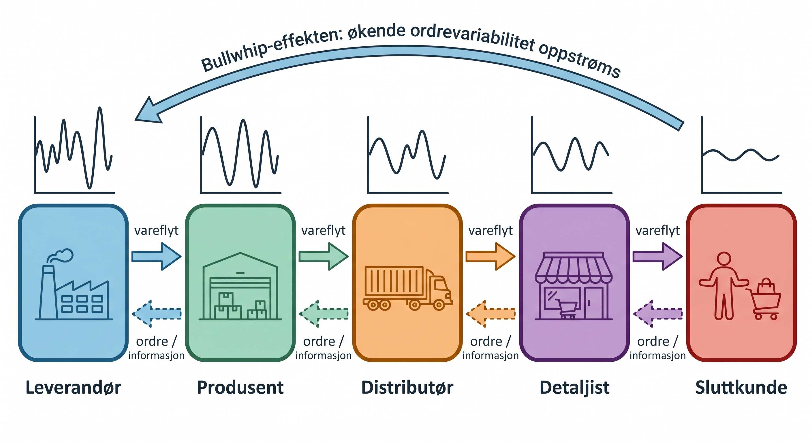

Forsyningskjedeanalyse: fire-trinns kjede fra leverandør via produsent og distributør til detaljist og sluttkunde, med bullwhip-effekten som viser hvordan ordrevariabiliteten forsterkes oppstrøms.

Definisjon [Forsyningskjedeanalyse og -optimering]
**Forsyningskjedeanalyse og -optimering** er prosessen med å modellere, analysere og koordinere beslutninger på tvers av aktørene i verdikjeden --- fra råvareleverandør til sluttkunde --- slik at samlet systemytelse (kostnad, servicenivå, responsevne) forbedres ut over det hver enkelt aktør kan oppnå ved å optimere lokalt.

Området omfatter analyse og styring på flere nivå i kjeden:

- Systemanalyse av hele kjeden --- strukturell forståelse av materialflyt, informasjonsflyt og betalingsflyt mellom ledd

- Bullwhip-effekten --- forsterkning av etterspørselsvariasjoner oppstrøms som følge av lokale bestillingsregler, prognosestøy og ordrestørrelsesbeslutninger

- Desentralisert versus sentralisert beslutningstaking --- avveiningen mellom lokal autonomi og systemoptimal koordinering

- Koordineringsmekanismer --- informasjonsdeling, kontrakter (revenue sharing, buy-back, kvantumsfleksibilitet) og insentivstrukturer som får uavhengige aktører til å handle optimalt for kjeden

- Multi-echelon lagerstyring --- optimering av lagernivå på tvers av nivå i kjeden, der beslutninger i ett ledd endrer kostnadene i andre ledd

Forsyningskjedeanalyse er tett sammenvevd med de fleste andre områdene i dette kompendiet:

- Etterspørselsprognoser --- informasjonsdeling av sluttkundeetterspørsel demper bullwhip og forbedrer prognoser oppstrøms

- Lagerstyring --- multi-echelon-analyse utvider enkeltlagermodellene til koordinerte lagernivå på tvers av kjeden

- Produksjonsplanlegging --- koordinering mellom leverandør-, produksjons- og distribusjonsbeslutninger reduserer samlede kostnader og forsinkelser

- Innkjøpsoptimalisering --- kontraktsdesign og leverandørrelasjoner er konkrete koordineringsmekanismer i kjeden

- Risikostyring --- systemperspektivet avdekker sårbarheter (enkeltleverandører, flaskehalser) som ikke synes på enkeltaktørnivå

Problemstillinger, modeller og metoder

## Problemstillinger, modeller og metoder
I det følgende presenteres tre sentrale problemstillinger innen forsyningskjedeanalyse og -optimering med tilhørende modeller og metoder, som illustrert i figur [2](#fig-fig-forsyningskjedeanalyse-problemstillinger-oversikt). Alle tre problemstillingene utdypes med egne eksempler og figurer i de påfølgende seksjonene.

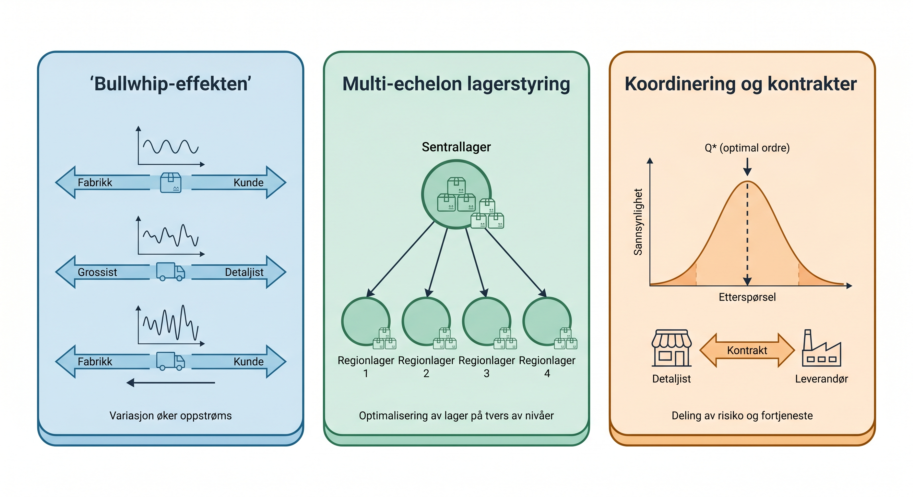

Tre sentrale problemstillinger innen forsyningskjedeanalyse: bullwhip-effekten med forsterket etterspørselsvariasjon oppstrøms, multi-echelon lagerstyring på tvers av lagernivåer, og koordinering av uavhengige aktører via newsvendor-modell og kontrakter.

Nøkkelen til god forsyningskjedestyring er å velge riktig modell og metode for den aktuelle problemstillingen. Tabell [1](#tab-tab-forsyningskjedeanalyse-oversikt) gir en oversikt over hvilke modeller og metoder som egner seg for de tre problemstillingene. Tabellen nevner også supplerende tilnærminger som CPFR (Collaborative Planning, Forecasting and Replenishment) og VMI (Vendor Managed Inventory) som praktiske koordineringsmekanismer innen forsyningskjedestyring. Modellene og metodene uthevet med rødt vil bli gått gjennom i de tre neste avsnittene.

Oversikt over modeller og metoder for de tre sentrale problemstillingene innen forsyningskjedeanalyse og -optimering.

  **Nr.**   **Problemstilling**                        **Modeller**                                                                            **Metoder**
  --------- ------------------------------------------ --------------------------------------------------------------------------------------- ----------------------------------------------------------------
  1         Bullwhip-effekten            System dynamics / diskret hendelses-simulering, (s,S)-politikk per ledd   Beer Game-simulering, scenarioanalyse, informasjonsdeling
  2         Multi-echelon lagerstyring   Clark-Scarf multi-echelon, VMI som supplerende koordineringsmekanisme     Echelon stock-optimering, dekomponering, simuleringsvalidering
  3         Koordinering og kontrakter   Newsvendor + revenue sharing, CPFR som praktisk rammeverk                 Spillteoretisk analyse, kontraktsdesign, sensitivitetsanalyse

Bullwhip-effekten via simulering

## Eksempel: Bullwhip-effekten via simulering
Oppsummering.

  **Kategori**      **Beskrivelse**
  ----------------- ---------------------------------------------------------------------
  Eksempel          Bullwhip-simulering for et norsk FMCG-produkt
  Område            Forsyningskjedeanalyse med informasjonsdeling
  Problemstilling   Kvantifisere variansforsterkning oppstrøms i en 4-trinns kjede
  Modell            4-trinns kjede med $(s,S)$-politikk per ledd
  Prosess           Diskret hendelses-simulering (Beer Game-logikk)
  Metode            Scenarioanalyse, sensitivitet, sammenligning av informasjonsregimer

### Problemstilling
NorMat AS er en norsk dagligvarekjede som distribuerer et stabilt sukkerprodukt gjennom en fire-trinns forsyningskjede: *detaljist* (butikkene), *grossist* (regionalt sentrallager), *distributor* (landsdekkende lager) og *fabrikk* (produksjonsanlegg på Østlandet). Sluttkundene handler jevnt med en svak årssesong og en tydelig topp i ukene rundt Black Friday og jul.

Selv om sluttkundeetterspørselen er relativt stabil, opplever fabrikken store svingninger i innkommende ordre: enkelte uker kommer det ingen bestillinger, andre uker ankommer ordre som er fire--fem ganger gjennomsnittlig forbruk. Resultatet er vekselvis overtidsskift og stillstand, høye kapitalkostnader og lavere servicenivå enn nødvendig. Fenomenet kalles *bullwhip-effekten* og forplanter seg oppover forsyningskjeden: hver aktør forsterker variasjonen de observerer med sin egen reaksjon.

**Problemstilling** --- *Hvor stor blir variansforsterkningen, og hvor mye reduseres den ved informasjonsdeling?*

Vi simulerer en 4-trinns forsyningskjede i 104 uker under to informasjonsregimer: (i) desentralisert, der hvert ledd kun ser egen ordre-inngang, og (ii) delt informasjon, der alle ledd ser sluttkundeetterspørselen. Bullwhip-ratioen $\mathrm{Var}(O_k)/\mathrm{Var}(D)$ per trinn kvantifiserer forsterkningen, og kostnadsmodellen fanger lager- og mangelkostnader.

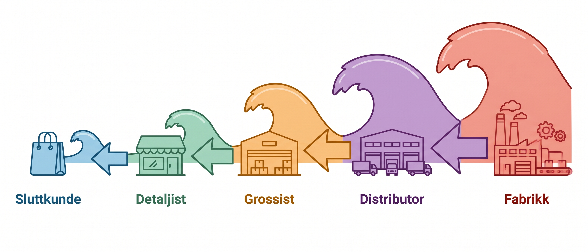

4-trinns forsyningskjede fra sluttkunde til fabrikk. Ordrestrømmen går oppstrøms (mot venstre) og forsterkes ved hvert ledd.

### Modell
Vi modellerer kjeden som et diskret tidssystem med tidssteg $t = 1, 2, \ldots, T$ uker. La $K = 4$ være antall trinn, indeksert $k = 1$ (detaljist) til $k = 4$ (fabrikk). Trinn $k$ observerer etterspørselen fra trinnet under, holder lager $I_k(t)$ og plasserer ordrer $O_k(t)$ til trinnet over.

Definisjon [$(s,S)$-politikk med periodisk gjennomgang]
Trinn $k$ følger en $(s_k, S_k)$-politikk med periodisk gjennomgang hver $R_k$ uke og konstant leveringstid $L_k$. Ved gjennomgang sjekkes *lagerposisjon* $\mathrm{IP}_k(t) = I_k(t) + W_k(t)$, der $W_k(t)$ er samlet utestående bestilling. Ordren $O_k(t)$ er da

$$O_k(t) =
\begin{cases}
S_k(t) - \mathrm{IP}_k(t), & \text{hvis } \mathrm{IP}_k(t) \le s_k(t), \\
0, & \text{ellers}.
\end{cases}$$

1

Gjenbestillingspunktet $s_k(t)$ og ordre-opp-til-nivået $S_k(t)$ oppdateres dynamisk fra prognosen:

$$\begin{aligned}s_k(t) &= \hat{\mu}_k(t)\,(L_k + R_k) + z\,\hat{\sigma}_k(t)\sqrt{L_k + R_k}, \\
S_k(t) &= s_k(t) + \hat{\mu}_k(t)\,R_k.\end{aligned}$$

2

Prognose. Hvert trinn oppdaterer etterspørselsestimatet med eksponentiell glatting:

$$\hat{\mu}_k(t) = \alpha\,u_k(t) + (1 - \alpha)\,\hat{\mu}_k(t-1),$$

1

der $u_k(t)$ er det observerte signalet. Under *desentralisert* styring er $u_k(t) = O_{k-1}(t)$, altså ordre-inngangen fra trinnet under. Under *delt informasjon* er $u_k(t) = D_t$ for alle trinn, det vil si sluttkundeetterspørselen formidles oppstrøms i sanntid. Standardavviket $\hat{\sigma}_k(t)$ oppdateres analogt fra absolutt avvik $\|u_k(t) - \hat{\mu}_k(t)\|$.

Symbolliste for simuleringsmodellen.

  **Symbol**                                **Navn**                 **Beskrivelse**
  ----------------------------------------- ------------------------ --------------------------------------------------------------
  $K$                                     Antall trinn             $K = 4$ (detaljist, grossist, distributor, fabrikk)
  $L_k$                                   Leveringstid             Antall uker fra ordre plasseres til den mottas
  $R_k$                                   Gjennomgangsperiode      Tid mellom to påfølgende bestillingsbeslutninger
  $z$                                     Sikkerhetsfaktor         $z$-verdi for ønsket servicenivå ($z = 1,65$ gir 95%)
  $\alpha$                               Glattingskonstant        Vekt på nyeste observasjon i prognosen
  $D_t$                                   Sluttkundeetterspørsel   Observert forbruk hos detaljisten i uke $t$
  $O_k(t)$                                Plassert ordre           Kvantum trinn $k$ bestiller fra trinn $k+1$ i uke $t$
  $I_k(t)$                                Lagernivå                Fysisk lager hos trinn $k$ etter transaksjoner i uke $t$
  $\mathrm{IP}_k(t)$                    Lagerposisjon            $I_k(t)$ pluss utestående bestilling $W_k(t)$
  $\hat{\mu}_k,\,\hat{\sigma}_k$   Prognose                 Estimert gjennomsnitt og standardavvik for etterspørselen

Variabler: hva estimeres? Simulatoren er ikke en estimeringsprosedyre i statistisk forstand, men en regelbasert dynamikk der *alle* beslutninger ($O_k(t)$, $s_k(t)$, $S_k(t)$) følger direkte av observasjonene via ligningene [(1)](#eq-eq-sS-policy)--[(1)](#eq-eq-forecast). Frie modellvalg er
parameterne $(L_k, R_k, z, \alpha)$ per trinn og informasjonsregimet (desentralisert vs. delt).

Bullwhip-ratio. For å kvantifisere variansforsterkningen oppstrøms bruker vi bullwhip-ratioen

$$\mathrm{BW}_k = \frac{\mathrm{Var}(O_k)}{\mathrm{Var}(D)}$$

2

beregnet over simuleringshorisonten (etter en oppvarmingsperiode). $\mathrm{BW}_k = 1$ betyr at trinn $k$ videreformidler etterspørselsvariansen uten forsterkning. $\mathrm{BW}_k > 1$ betyr amplifikasjon, og i en klassisk bullwhip-sekvens er $\mathrm{BW}_1 < \mathrm{BW}_2 < \mathrm{BW}_3 < \mathrm{BW}_4$.

**Tolkning** --- *Hvorfor forsterkes variansen?*

Tre mekanismer bidrar til bullwhip i modellen:

- **Oppdatering av prognosen.** Når $\hat{\mu}_k$ øker på grunn av en høy ordre fra trinnet under, skyter $S_k$ i været (ligning [(?)](#eq-eq-S-level)) og utløser en ekstra stor bestilling.

- **Leveringstidsforsterkning.** Lenger $L_k$ gir større $s_k$ (ligning [(2)](#eq-eq-s-level)): en liten endring i $\hat{\mu}_k$ ganges med $(L_k + R_k)$.

- **Batchordrer.** $(s,S)$-politikken utløser bestillinger i bolker snarere enn jevnt, slik at variansen i ordrene blir større enn i etterspørselen, selv om gjennomsnittet er likt.

Når alle trinn bruker sluttkundeetterspørselen $D_t$ i prognosen (delt informasjon), elimineres den første mekanismen, og forsterkningen oppover kjeden reduseres dramatisk.

[Forutsetninger.]
1.  Leveringstid $L_k$ er konstant og deterministisk.

2.  Etterspørselen prognostiseres som en enkel eksponentiell glatting; mer avanserte modeller (Holt--Winters, ARIMA) ville påvirke amplituden, men ikke mekanismen.

3.  Ordrer kan ikke kanselleres eller reduseres; fabrikken har ubegrenset produksjonskapasitet.

4.  Alle aktører handler rasjonelt innenfor sin egen politikk; spill-teoretiske eller menneskelige avvik modelleres ikke.

### Prosess
Prosess: Diskret hendelses-simulering (Beer Game-logikk).
Modell: 4-trinns forsyningskjede med $(s,S)$-politikk per ledd.

Figur [4](#fig-fig-bullwhip-method) viser de seks stegene, fra datagenerering til kvantifisering av bullwhip-ratio og kostnadsbesparelse.

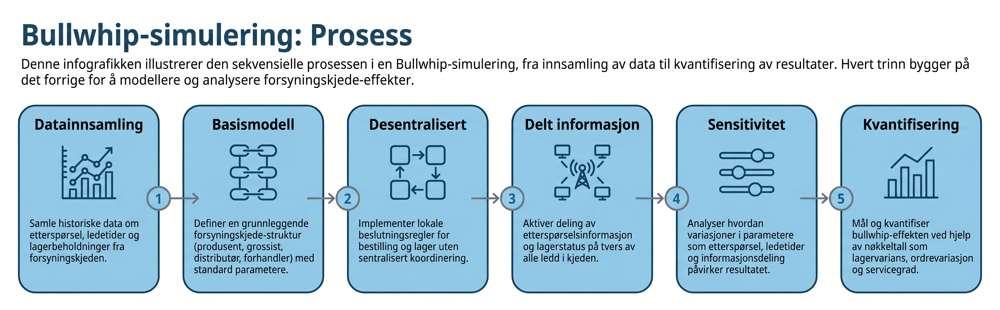

Prosess for bullwhip-simulering: fra etterspørselsdata til informasjonsdeling og kvantifisering.

### Steg 1: Datainnsamling
Vi genererer syntetisk ukentlig sluttkundeetterspørsel for NorMat AS over $T = 104$ uker (2 år). Etterspørselen modelleres som

$$D_t = \mu + A\sin\!\left(\frac{2\pi t}{52}\right) + \beta\cdot\mathbb{1}\[t \in \mathcal{T}_{\text{peak}}\] + \varepsilon_t,$$

3

der $\mu = 100$ enheter/uke, $A = 10$, $\beta = 40$ i Black Friday/jul-perioden (ukene 47--52 hvert år), og $\varepsilon_t \sim \mathcal{N}(0, 5^2)$. Tabell [4](#tab-tab-bullwhip-demand-stats) viser den deskriptive statistikken.

Deskriptiv statistikk for sluttkundeetterspørselen $D_t$.

  **Statistikk**                   **Verdi**
  -------------------------------- --------------------
  Antall uker ($T$)              104
  Gjennomsnitt ($\bar{D}$)      103,84 enheter/uke
  Standardavvik ($s_D$)          14,47 enheter/uke
  Varians ($\mathrm{Var}(D)$)   209,50
  Minimum / Maksimum               85,02 / 151,22
  Variasjonskoeffisient            13,9 %

Figur [5](#fig-fig-bullwhip-demand) viser etterspørselen visuelt. Basisetterspørselen er rolig (CV $\approx 14\,%$), men Black Friday/jul-perioden gir en tydelig topp.

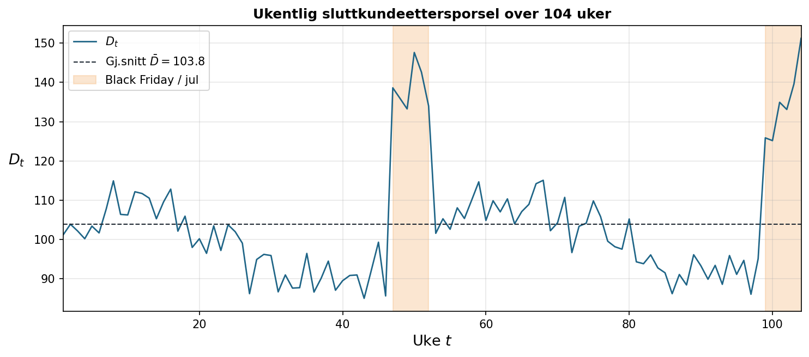

Ukentlig sluttkundeetterspørsel $D_t$ over 104 uker. Den oransje sonen markerer Black Friday/jul-perioden (ukene 47--52) med en gjennomsnittlig topp på $+40$ enheter/uke.

**Konklusjon** --- *Utgangspunktet er stabilt*

Sluttkundeetterspørselen har lav variasjon utenfor sesongtoppen. En eventuell bullwhip-forsterkning oppstrøms kan altså ikke forklares av markedet, men må skyldes aktørenes egen bestillingsatferd.

### Steg 2: Basismodell
Vi instansierer simulatoren med standardparametre for alle fire trinn, vist i tabell [5](#tab-tab-bullwhip-params). Alle trinn bruker samme gjennomgangsperiode, leveringstid og servicenivå, slik at eventuelle forskjeller mellom trinnene utelukkende stammer fra kjedeposisjonen.

Simuleringsparametre per trinn.

  **Parameter**              **Verdi**         **Beskrivelse**
  -------------------------- ----------------- ----------------------------------------
  $L_k$                    2 uker            Leveringstid mellom trinn
  $R_k$                    1 uke             Periodisk gjennomgang hver uke
  $z$                      1,65              Sikkerhetsfaktor for 95 % servicenivå
  $\alpha$                0,30              Vekt på nyeste observasjon i prognosen
  $I_k(0)$                 300 enheter       Startlager (ca. 3 ukers etterspørsel)
  $\hat{\mu}_k(0)$      100 enheter/uke   Startestimat for etterspørsel
  $\hat{\sigma}_k(0)$   15 enheter/uke    Startestimat for standardavvik

**Konklusjon** --- *Symmetrisk utgangspunkt*

Alle trinn har identiske parametre og startverdier. Enhver forskjell i bullwhip-ratioen mellom trinnene må derfor komme fra *posisjonen* i kjeden, ikke fra individuelle egenskaper ved aktørene.

### Steg 3: Desentralisert simulering
Under desentralisert styring prognostiserer hvert trinn kun fra egen ordre-inngang ($u_k(t) = O_{k-1}(t)$). Figur [6](#fig-fig-bullwhip-dec) viser ordrekvantumene over tid.

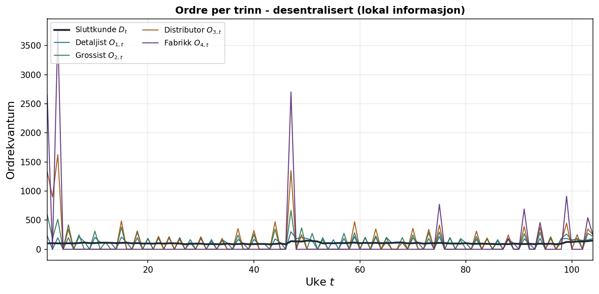

Ordre $O_k(t)$ per trinn under desentralisert styring, sammen med sluttkundeetterspørselen $D_t$ (svart). Amplituden øker tydelig oppover kjeden.

Mens $D_t$ holder seg mellom 85 og 151 enheter, viser distributøren og fabrikken ordrer som svinger mellom null og godt over 500 enheter. Tabell [6](#tab-tab-bullwhip-dec-ratios) kvantifiserer dette med bullwhip-ratioen fra ligning [(2)](#eq-eq-bullwhip-ratio).

Bullwhip-ratioer under desentralisert styring (oppvarming 10 uker). Sluttkundeetterspørselen har $\mathrm{Var}(D) = 230,1$.

  **Trinn**     **Symbol**   **$\mathrm{Var}(O_k)$**   **$\mathrm{BW}_k$**
  ------------- ------------ ---------------------------- -------------------------
  Detaljist     $O_1$      $7\,457$                  $32,4$
  Grossist      $O_2$      $17\,754$                 $77,2$
  Distributor   $O_3$      $38\,932$                 $169,2$
  Fabrikk       $O_4$      $100\,664$                $\mathbf{437,5}$

**Konklusjon** --- *Nær 440 ganger amplifikasjon*

Bullwhip-ratioen hos fabrikken er $437,5$, altså over *to størrelsesordener* høyere enn hos detaljisten. En rolig sluttkunde på $\bar{D} = 104$ enheter gir altså ordrekvantum til fabrikken som typisk varierer med standardavvik $\sqrt{100\,664} \approx 317$ enheter --- omtrent tre ganger gjennomsnittet. Dette er klassisk bullwhip: små etterspørselssvingninger blir store ordresvingninger.

### Steg 4: Delt informasjon
Vi endrer kun informasjonsregimet: alle fire trinn ser nå sluttkundeetterspørselen $D_t$ og bruker den i prognosen ($u_k(t) = D_t$). Alle andre parametre er uendret. Figur [7](#fig-fig-bullwhip-shr) viser ordrekvantumene.

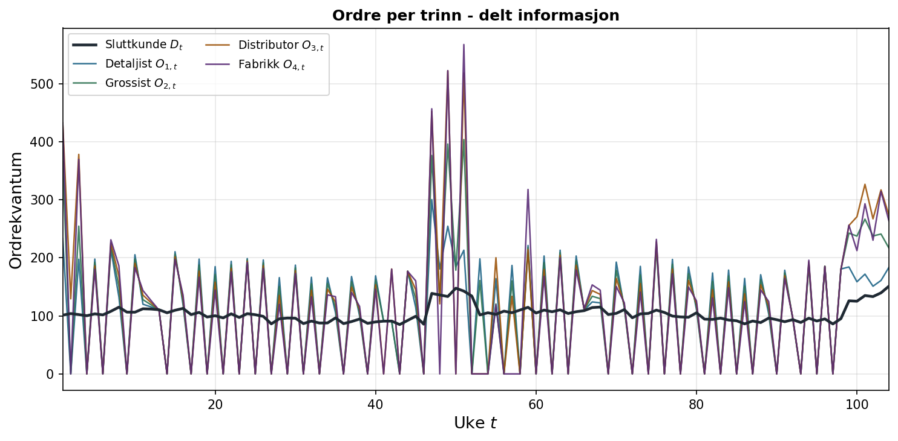

Ordre $O_k(t)$ per trinn under delt informasjon. Alle trinn prognostiserer direkte fra $D_t$ og reagerer derfor likt på etterspørselsbildet.

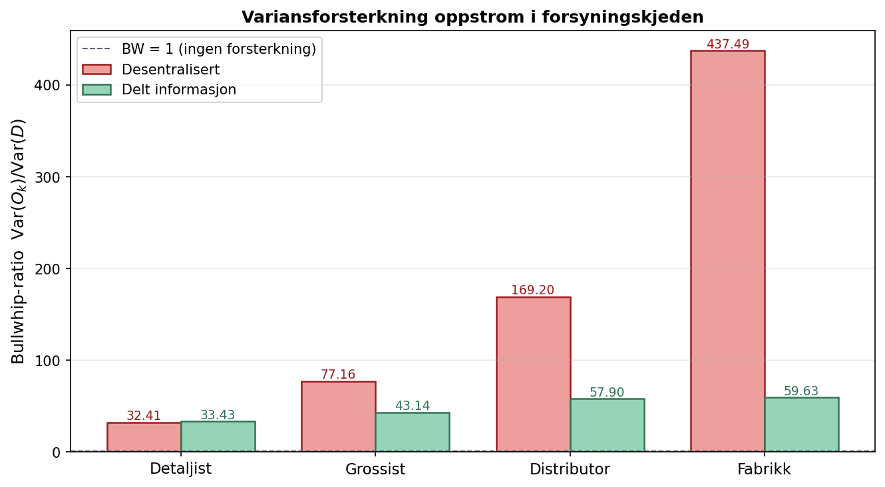

Bullwhip-ratio $\mathrm{BW}_k$ per trinn. Under desentralisert styring (rød) vokser forsterkningen tydelig oppstrøms; under delt informasjon (grønn) holder den seg nær et platå.

Sammenligning av bullwhip-ratioer: desentralisert vs. delt informasjon.

  **Trinn**     **Symbol**   **$\mathrm{BW}_k$ (des.)**   **$\mathrm{BW}_k$ (delt)**   **Reduksjon**
  ------------- ------------ -------------------------------- -------------------------------- --------------------------
  Detaljist     $O_1$      $32,4$                         $33,4$                         $-3,1\,%$
  Grossist      $O_2$      $77,2$                         $43,1$                         $44,1\,%$
  Distributor   $O_3$      $169,2$                        $57,9$                         $65,8\,%$
  Fabrikk       $O_4$      $437,5$                        $59,6$                         $\mathbf{86,4\,%}$

**Konklusjon** --- *Informasjonsdeling bryter amplifikasjonen*

Detaljisten har samme prognosesignal i begge regimer, og bullwhip-ratioen endres derfor knapt. Men oppstrøms kutter delt informasjon variansen med $44\,%$, $66\,%$ og $86\,%$. Årsaken er enkel: når alle ledd ser $D_t$, trenger de ikke oversette ordre-inngang tilbake til etterspørsel --- de vet den allerede.

### Steg 5: Sensitivitetsanalyse
Bullwhip-effekten er følsom for tre sentrale parametre. Vi varierer én om gangen og måler ratioen hos fabrikken under begge informasjonsregimer. Figur [9](#fig-fig-bullwhip-sensitivity) viser resultatene.

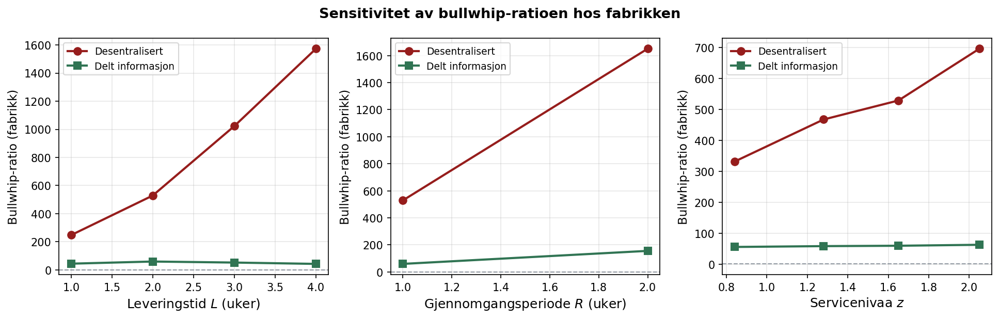

Sensitivitetsanalyse av bullwhip-ratioen hos fabrikken. Venstre: varierende leveringstid $L$. Midten: gjennomgangsperiode $R$. Høyre: sikkerhetsfaktor $z$.

Numeriske verdier fra sensitivitetsanalysen (bullwhip-ratio hos fabrikken).

  **Scenario**   **Endret parameter**      **Desentralisert**   **Delt info**
  -------------- ------------------------- -------------------- ---------------
  $L = 1$      Leveringstid redusert     $247,7$            $44,4$
  $L = 2$      Basis                     $529,0$            $59,6$
  $L = 3$      Lenger leveringstid       $1\,023,2$        $52,3$
  $L = 4$      Svært lang leveringstid   $1\,573,5$        $42,8$
  $R = 1$      Basis                     $529,0$            $59,6$
  $R = 2$      Sjeldnere gjennomgang     $1\,650,8$        $155,9$
  $z = 0,84$   80 % service              $331,5$            $55,7$
  $z = 1,28$   90 % service              $467,5$            $58,4$
  $z = 1,65$   95 % service (basis)      $529,0$            $59,6$
  $z = 2,05$   98 % service              $696,3$            $62,7$

**Konklusjon** --- *Tre driverne og deres relativ vekt*

- **Leveringstid** er den kraftigste forsterkeren: ratioen hos fabrikken firedobles når $L$ går fra 1 til 4 uker under desentralisert styring. Under delt informasjon holder ratioen seg tilnærmet flat.

- **Gjennomgangsperiode** forverrer bullwhip proporsjonalt: dobling av $R$ tredobler forsterkningen, fordi ordrene blir enda mer bolkevis.

- **Sikkerhetsfaktor** $z$ løfter hele nivået, men påvirker ikke formen på kurven --- den legger en ekstra buffer som forsterker hvert bestillingssprang.

Delt informasjon demper alle tre effektene.

### Steg 6: Kvantifisering og kostnadseffekt
Kostnadsmodellen per trinn og uke er

$$C_k(t) = h\,\max{I_k(t), 0} + b\,\max{-I_k(t), 0} + c_O\,O_k(t),$$

4

med holdingskostnad $h = 0,50$ kr/enhet/uke, mangelkostnad $b = 4,00$ kr/enhet og ordrekostnad $c_O = 1,00$ kr/enhet. Total kostnad aggregeres over alle trinn og uker etter oppvarming.

Sluttresultat: bullwhip-ratio og totalkostnad per informasjonsregime.

  **Trinn**                                       **Symbol**      **$\mathrm{BW}_k$ (des.)**   **$\mathrm{BW}_k$ (delt)**   **Reduksjon**
  ----------------------------------------------- --------------- -------------------------------- -------------------------------- ----------------
  Detaljist                                       $O_1$         $32,4$                         $33,4$                         $-3,1\,%$
  Grossist                                        $O_2$         $77,2$                         $43,1$                         $44,1\,%$
  Distributor                                     $O_3$         $169,2$                        $57,9$                         $65,8\,%$
  Fabrikk                                         $O_4$         $437,5$                        $59,6$                         $86,4\,%$
  \multicolumn{2}{@{}l}{**Totalkostnad (kr)**}   $182\,725$   $79\,183$                     $\mathbf{56,7\,%}$         

**Praktisk anvendelse** --- *Fra simulering til strategi*

Resultatene peker på fire konkrete tiltak for NorMat AS:

1.  **Del sluttkundeetterspørsel oppstrøms.** En VMI- eller CPFR-avtale der alle ledd har tilgang til POS-data i sanntid sparer omtrent 56 % av kjedens totale lager- og ordrekostnader i simuleringen --- uten investering i økt kapasitet.

2.  **Reduser leveringstid der det er mulig.** Å korte $L$ fra 2 til 1 uke kutter fabrikkens ratio med over halvparten under desentralisert styring.

3.  **Beveg mot hyppigere gjennomgang.** $R = 1$ uke gir vesentlig mindre bolkeordrer enn $R = 2$, og effekten forsterkes oppstrøms.

4.  **Vurder servicenivå bevisst.** Høyere $z$ betyr større sikkerhetslager, men også mer bullwhip. Ratioen hos fabrikken vokser med rundt $30\,%$ når $z$ går fra $0,84$ til $2,05$.

[Begrensninger.]
- Leveringstiden er modellert som deterministisk; stokastisk $L$ vil øke bullwhip ytterligere.

- Fabrikken har ubegrenset kapasitet. I virkeligheten gir kapasitetstaket økt variasjon i leveringsevnen og kan forsterke effekten.

- Aktørene handler rasjonelt innenfor sin egen politikk. Menneskelige overreaksjoner (dokumentert i Beer Game-eksperimentet) kan mangedoble bullwhip.

- Simuleringen dekker to år og ett produkt. En realistisk kjede med flere produkter, kampanjer og konkurrerende aktører vil vise sammensatte mønstre som bare delvis kan leses av fra denne modellen.

Multi-echelon lagerstyring (Clark--Scarf)

## Eksempel: Multi-echelon lagerstyring (Clark--Scarf)
Oppsummering.

  **Kategori**      **Beskrivelse**
  ----------------- ----------------------------------------------------------------------------------------------------------
  Eksempel          Farmasidistributor med ett sentrallager og fire regionale hub-er
  Område        Flernivaa lagerstyring i en to-tiers distribusjonskjede
  Problemstilling   Bestemme base-stock-nivaåpåhvert nivaåslik at totale lager- og backorder-kostnader minimeres
  Modell            Clark--Scarf echelon base-stock med newsvendor-kritisk rate per nivaå
  Prosess           Echelon stock-dekomponering og analytisk optimering
  Metode            Newsvendor pr. nivaå, Monte Carlo-validering, sensitivitetsanalyse

### Problemstilling
NordFarma AS er en norsk grossist som distribuerer et høyvolumslegemiddel til apotek og sykehus. Selskapet har ett sentrallager på Østlandet og fire regionale hub-er i Oslo, Bergen, Trondheim og Tromsø. Sentrallageret ordner inn fra produsenten med 7 dagers leveringstid, og videresender til hub-ene med $L_1 = 2$ (Oslo) til $L_4 = 5$ (Tromsø) dagers intern transporttid. Kundene --- apotekene --- bestiller daglig fra nærmeste regionale hub; avbrudd i tilgang utloser bade direkte straffekostnader og langsiktig tap av kundetillit.

I dag dimensjonerer innkjopsavdelingen hvert lager uavhengig. De bruker en konservativ tilnærming der hvert regionlager legger til sikkerhetslager for HELE forsyningskjedens ledetid ($L_0 + L_i + R$), for åvere "påden sikre siden" hvis sentrallageret skulle vere tomt. Resultatet er store lagre både sentralt og regionalt, og finansdirektøren stiller spørsmålet: er alt dette sikkerhetslageret nødvendig? Eller betaler vi to ganger for den samme risikoen?

**Problemstilling** --- *Hvordan unngåat sikkerhetslager dupliseres påtvers av nivaå?*

Clark og Scarf (1960) viste at et arborescent distribusjonsnettverk kan dekomponeres i en sekvens av *echelon newsvendor-problemer* --- ett per nivaå. Hvert nivaåfår sitt eget kritiske forhold $\alpha_i = b/(b + h^{\mathrm e}_i)$, der $h^{\mathrm e}_i$ er *echelon*-holdekostnaden (inkrementell kostnad fra foreldrenoden til $i$). Den resulterende politikken unngår dobbeltelling: sentralt sikkerhetslager buffrer usikkerhet over $L_0$, regionale sikkerhetslagere buffrer usikkerhet over kun $L_i + R$.


Distribusjonsnettverket til NordFarma: leverandør leverer til sentrallager pånode $i = 0$ med ledetid $L_0 = 7$ dager, og sentrallageret videresender til fire regionale hub-er med interne ledetider $L_1, \ldots, L_4$. Hver region møter daglig kundeetterspørsel $D_{i,t} \sim \mathcal N(\mu_{d_i}, \sigma_{d_i}^2)$.

### Modell
Multi-echelon modellen skiller seg fra enkeltnoderegimene ved at beslutninger på \\'ett nivaåpåvirker kostnadene påde andre. Clark og Scarf (1960) viste at for *serielle* systemer --- og etter senere utvidelser (Axs\"ater & Rosling 1993) for *arborescente* distribusjonssystemer med identiske produkter --- kan problemet dekomponeres i en kjede av uavhengige newsvendor-problemer ved åbruke *echelon*-variabler i stedet for installasjonsvariabler.

Data. Systemet beskrives av \\'ett sentrallager (indeks $i = 0$) og $N = 4$ regionlagre (indeks $i = 1, \ldots, N$). Etterspørselen påregion $i$ er iid $D_{i,t} \sim \mathcal N(\mu_{d_i}, \sigma_{d_i}^2)$ per dag. Leverandøren leverer til sentrallageret med ledetid $L_0$, og sentrallageret videresender til hub $i$ med ledetid $L_i$. Vi bruker periodisk gjennomgang med reviewintervall $R = 1$ dag. Tabell [11](#tab-tab-echelon-panel) oppsummerer dimensjonene.

Paneldimensjoner for Clark--Scarf-eksemplet.

  **Størrelse**                **Symbol**              **Verdi / tolkning**
  ------------------------------- ----------------------- -------------------------------------------
  Antall regionlagre              $N$                   $4$ (Oslo, Bergen, Trondheim, Tromsø)
  Leverandørledetid            $L_0$                 $7$ dager
  Regionale ledetider             $L_1, \ldots, L_N$   $2$--$5$ dager
  Reviewintervall                 $R$                   $1$ dag (periodisk gjennomgang)
  Aggregert daglig etterspørsel   $\mu_{D_0}$         $222,0$ enheter
  Aggregert standardavvik         $\sigma_{D_0}$      $33,54$ enheter
  Backorder-kostnad               $b$                   $28$ NOK/enhet
  Enhetspris                      $c$                   $120$ NOK

Installasjons- og echelonlager. For et arborescent distribusjonsnettverk er *installasjonslageret* $I_i$ hos node $i$ alt fysisk lager ved den noden. *Echelonlageret* $I^{\mathrm e}_i$ er installasjonslageret pluss alt lager nedstrøms som er under eller påvei til nedstrøms noder.

Definisjon [Echelon-beholdning]
Med $\mathcal D(i)$ som settet av alle etterkommere av node $i$ (inkludert $i$) og $T_{ij}$ som lager i transit mellom node $i$ og $j$, er echelonlageret

$$I^{\mathrm e}_i \;=\; I_i \;+\; \sum_{j \in \mathcal D(i) \setminus {i}} \bigl( I_j + T_{\text{inn til } j} \bigr).$$

7

For distribusjonstreet med \\'ett sentrallager (node $0$) og $N$ regionale hub-er er:

$$\begin{aligned}I^{\mathrm e}_i &= I_i \qquad (i = 1, \ldots, N), \\
I^{\mathrm e}_0 &= I_0 + \sum_{j = 1}^{N} \bigl( I_j + T_{0j} \bigr) + T_{\text{inn til } 0}.\end{aligned}$$

8

Symboler i Clark--Scarf-modellen.

  **Symbol**                                                **Betydning**
  --------------------------------------------------------- -------------------------------------------------------------------
  $I_i$                                                   Installasjonslager hos node $i$ (fysisk lager påstedet)
  $I^{\mathrm e}_i$                                    Echelonlager hos node $i$ (installasjon pluss alt nedstrøms)
  $T_{ij}$                                               Lager i transit mellom noder $i$ og $j$
  $S^{\mathrm e}_i$                                    Echelon-base-stock-nivåhos node $i$
  $h^{\mathrm e}_i = h_i - h_{\mathrm{parent}(i)}$   Echelon-holdekostnad (inkrementell per enhet per periode)
  $b$                                                     Backorder-kostnad per enhet per periode hos regionlager
  $\alpha_i$                                             Kritisk rate (newsvendor) hos nivå $i$
  $z_i = \Phi^{-1}(\alpha_i)$                          Tilsvarende sikkerhetsfaktor
  $\sigma_{LR,i}$                                       Standardavvik for etterspørsel over $L_i + R$ ved nivå $i$

Policy. Under *echelon base-stock-politikk* bestiller hver node --- i hver periode --- **opp til** sitt echelon-base-stock-nivå $S^{\mathrm e}_i$, sålangt foreldrenoden kan levere. Regionene tar installasjonsbestilling opp til $S^{\mathrm{inst}}_i = S^{\mathrm e}_i$ fra sentrallageret; sentrallageret bestiller fra leverandøren opp til $S^{\mathrm e}_0$ (målt i echelon-variabelen).

Definisjon [Clark--Scarf-dekomponering]
Klark--Scarf (1960) viste at under normalfordelt etterspørsel, lineære holdekostnader og en *allokeringsforutsetning* (sentrallageret kan pro-rata allokere når det er knapphet) reduseres det flernoderegime til en sekvens av uavhengige newsvendor-problemer:

$$\alpha_i \;=\; \frac{b}{b + h^{\mathrm e}_i}, \qquad
z_i = \Phi^{-1}(\alpha_i), \qquad
S^{\mathrm e}_i \;=\; \mu_{LR,i} + z_i\,\sigma_{LR,i},$$

9

der effektiv ledetid er $L_i + R$ for region $i$ og $L_0 + R$ for sentrallageret, og

$$\begin{aligned}\mu_{LR,i} &= (L_i + R)\,\mu_{d_i}, & \sigma_{LR,i} &= \sqrt{(L_i + R)}\,\sigma_{d_i}, \\
\mu_{LR,0} &= (L_0 + R)\,\mu_{D_0}, & \sigma_{LR,0} &= \sqrt{(L_0 + R)}\,\sigma_{D_0}.\end{aligned}$$

10

Backorder-kostnad $b$ er den som føles av endelige kunder; for sentralnoden fungerer $b$ som effektiv nedstrøms-kostnad når sentrallageret er tomt.

Intern logikk. Echelon-holdekostnaden $h^{\mathrm e}_i = h_i - h_{\mathrm{parent}(i)}$ er den marginale kostnaden av åholde \\'en enhet ved $i$ fremfor ved foreldrenoden. For sentrallageret (der foreldre = leverandør uten holdekost) er $h^{\mathrm e}_0 = h_0$. For region $i$ er $h^{\mathrm e}_i = h_i - h_0$, som er mye mindre enn $h_i$ selv. Dermed gir regionens kritiske rate
$$
\alpha_i \;=\; \frac{b}{b + h^{\mathrm e}_i}\;\;\gg\;\;\frac{b}{b + h_i} \;=\; \text{"naiv" rate},
$$
og regionen kan --- trygt --- dimensjoneres med relativt stort sikkerhetslager. Poenget er at echelon-holdekostnaden fanger at åflytte en enhet fra sentralt til regionalt kun øker kostnaden med $h_i - h_0$, ikke hele $h_i$, fordi enheten uansett holdes et sted i systemet.

**Tolkning** --- *Separer usikkerhetene*

Clark--Scarf-politikken separerer systemets to stokastiske problemer:

- **Sentrallageret** buffrer usikkerhet over *leverandørledetiden* $L_0 + R$ basert på*aggregert* etterspørsel. Aggregering gir "pooling"-effekt: $\sigma_{D_0} < \sum_i \sigma_{d_i}$.

- **Hvert regionlager** buffrer usikkerhet over *kun sin egen* interne ledetid $L_i + R$, basert på*sin egen* etterspørsel.

Uavhengig politikk, derimot, tvinger hvert regionlager til åbuffre *hele* forsyningskjedens ledetid $L_0 + L_i + R$ i tilfelle sentrallageret er tomt --- et sikkerhetslager som stort sett duplisererer det sentralt.

Forutsetninger. Eksempelet bygger påtre substansielle modellforpliktelser:

1.  **Normalfordelt og iid etterspørsel.** Dagens etterspørsel i hver region er normalfordelt og uavhengig påtvers av dager og påtvers av regioner. For legemidler med stabile behandlingsregimer er dette en rimelig tilnærming; sesongprodukter eller produkter med epidemisk-lignende etterspørselssjokk krever mer avanserte fordelinger.

2.  **Allokeringsforutsetningen.** Hvis sentrallageret er tomt, antas det at etterspørselen fra regionlagre balanserer seg slik at ingen bestiller uforholdsmessig mye. I vår simulering håndterer vi dette ved pro-rata-allokering. I praksis kan det bety at en region får litt mindre enn ideelt, men situasjonen er sjelden fordi $S^{\mathrm e}_0$ er dimensjonert for at dette nesten aldri skjer.

3.  **Arborescent nettverk.** Hvert regionlager har nøyaktig \\'en forelder (sentrallageret). Transshipment mellom regioner (f.eks. Oslo kan låne til Bergen) er ikke tillatt i modellen; det ville kreve utvidelser i stil med Eppen-pooling eller lateral transshipment.

### Prosess
Prosess: Echelon stock-dekomponering og analytisk newsvendor-optimering per nivaå.
Modell: Clark--Scarf base-stock $S^{\mathrm e}_i$ for sentrallager og fire regionlagre.

Figur [11](#fig-fig-echelon-method) viser de seks stegene vi bruker for ågåfra rådata til en validert anbefaling.

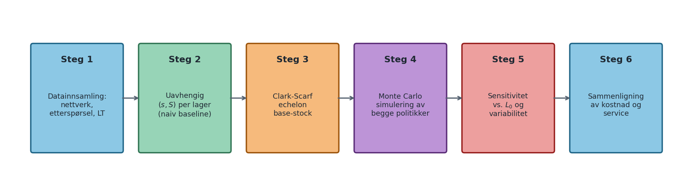

Arbeidsflyt for Clark--Scarf-analysen.

### Steg 1: Datainnsamling
NordFarma har ekstrahert parametere for de fire regionene fra sitt ERP-system, og disse er vist i tabell [13](#tab-tab-echelon-rawdata). For hver region rapporteres daglig etterspørsel $(\mu_{d_i}, \sigma_{d_i})$, intern ledetid $L_i$, installasjonsholdekostnad $h_i$ og den avledete echelon-holdekostnaden $h^{\mathrm e}_i$. Leverandørledetiden er $L_0 = 7$ dager og backorder-kostnaden $b = 28$ NOK/enhet.

Rådata for de fire regionlagrene hos NordFarma.

  **Id**   **Region**     $\mu_{d_i}$   $\sigma_{d_i}$   $L_i$   $h_i$     $h^{\mathrm e}_i$
  -------- -------------- ----------------- -------------------- --------- ----------- ------------------------
                          (/dag)            (/dag)               (dager)   (NOK/dag)   (NOK/dag)
  $1$    Oslo           $85,0$          $22,0$             $2,0$   $3,60$    $1,80$
  $2$    Bergen         $62,0$          $18,0$             $3,0$   $3,84$    $2,04$
  $3$    Trondheim      $45,0$          $14,0$             $4,0$   $4,08$    $2,28$
  $4$    Tromsø      $30,0$          $11,0$             $5,0$   $4,32$    $2,52$
  $0$    Sentrallager   $222,0$         $33,54$            $7,0$   $1,80$    $1,80$

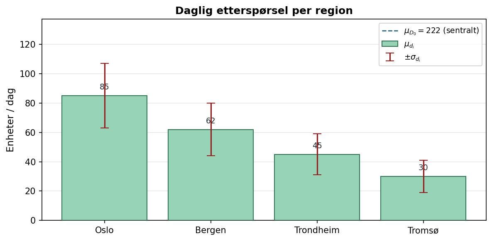

Daglig etterspørsel per region ($\mu_{d_i} \pm \sigma_{d_i}$). Den stiplede linjen viser aggregert etterspørsel ved sentrallageret ($\mu_{D_0} = 222$ enheter/dag).

**Konklusjon** --- *Heterogene regioner, samme produkt*

Oslo-regionen står for ca. $38~%$ av volumet og har korteste ledetid; Tromsøer minst og lengst unna. Jo lengre unna en region er, jo mer avhenger dens servicenivåav at sentrallageret har nok pålager --- og jo sterkere blir effekten av koordinering.

### Steg 2: Uavhengig \texorpdfstring{$(s,S)$}{(s,S)} --- naiv baseline
Vi starter med en *konservativ uavhengig* politikk. Hvert regionlager behandles isolert og dimensjoneres for åtåle et worst-case der sentrallageret er tomt. Effektiv ledetid blir da $L_i^{\mathrm{eff}} = L_0 + L_i + R$, og base-stock-nivået er

$$S_i^{\mathrm{uav}} \;=\; L_i^{\mathrm{eff}}\,\mu_{d_i} \;+\; z_{\alpha}\,\sqrt{L_i^{\mathrm{eff}}}\,\sigma_{d_i},$$

5

med et felles servicenivaa $\alpha = 0,95$ ($z_{0,95} = 1,645$). Sentrallageret dimensjoneres uavhengig påegen aggregert etterspørsel over $L_0 + R$:

$$S_0^{\mathrm{uav}} \;=\; (L_0 + R)\,\mu_{D_0} \;+\; z_{\alpha}\,\sqrt{L_0 + R}\,\sigma_{D_0}.$$

6

Tabell [14](#tab-tab-echelon-uav) viser resultatet.

Uavhengig konservativ $(s,S)$ ved $\alpha = 0,95$.

  **Id**              $L_i^{\mathrm{eff}}$   $\mu_{L,i}^{\mathrm{eff}}$   $\sigma_{L,i}^{\mathrm{eff}}$   $S_i^{\mathrm{uav}}$   $SS_i$
  ------------------- -------------------------- ---------------------------------- ------------------------------------- -------------------------- -----------
                      (dager)                    (enheter)                          (enheter)                             (enheter)                  (enheter)
  $1$ (Oslo)        $10$                     $850,0$                          $69,57$                             $964,4$                  $114,4$
  $2$ (Bergen)      $11$                     $682,0$                          $59,70$                             $780,2$                  $98,2$
  $3$ (Trondheim)   $12$                     $540,0$                          $48,50$                             $619,8$                  $79,8$
  $4$ (Tromsø)    $13$                     $390,0$                          $39,66$                             $455,2$                  $65,2$
  $0$ (sentralt)    $8$                      $1\,776$                        $94,87$                             $1\,932,0$              $156,0$

Forventet installasjonslager i stasjonær drift er tilnærmet

$$E\[I_i\] \;\approx\; \underbrace{(L_0 + R/2)\,\mu_{d_i}}_{\text{overstockering}} \;+\; SS_i \qquad (i = 1, \ldots, N),$$

7

der det første leddet $(L_0 + R/2)\,\mu_{d_i}$ er nettopp det sikkerhetslageret som duplisererer den sentrale sikkerhetsbufferen: regionen holder fysisk de enhetene som faktisk ligger i transit eller påsentrallageret. Sum over alle noder blir $E\[I\] \approx 2\,290$ enheter, som til årlige installasjonskostnader gir $\mathbf{3\,032}$ kNOK/år.

**Konklusjon** --- *Dobbel bokføring*

Den uavhengige politikken gir høyt servicenivå--- simulering bekrefter $100~%$ type-1 i alle regioner --- men til en pris som ikke står i forhold til den reelle risikoen. Regionlagrene holder sikkerhet for et $10$--$13$ dagers leveringstidsvindu, selv om sentrallageret i realiteten leverer innen $2$--$5$ dager det meste av tiden. Det finnes altsåstore synergieffekter som ikke utnyttes.

### Steg 3: Clark--Scarf echelon base-stock
Clark--Scarf-\linebreak\[3\]dekomponeringen gir en newsvendor-beslutning per nivåmed echelon-holde-kostnader. Den kritiske raten per nivåer

$$\alpha_i \;=\; \frac{b}{b + h^{\mathrm e}_i}, \qquad i = 0, 1, \ldots, N,$$

8

og base-stock-nivået fremkommer av newsvendor-formelen [(9)](#eq-eq-cs-newsvendor). Tabell [15](#tab-tab-echelon-cs) viser beregningene for NordFarma. Alle regionene nytter effektiv ledetid $L_i + R$ --- *ikke* $L_0 + L_i + R$ som i den uavhengige varianten. Alle får kritisk rate omkring $0,92$--$0,94$ fordi $b = 28$ dominerer echelon-holdekostnadene $h^{\mathrm e}_i \in \[1,8,\, 2,5\]$.

Clark--Scarf echelon base-stock.

  **Id**              $h^{\mathrm e}_i$   $\alpha_i$   $z_i$     $\mu_{LR,i}$   $\sigma_{LR,i}$   $S^{\mathrm e}_i$
  ------------------- ------------------------ --------------- ----------- ------------------ --------------------- ------------------------
                      (NOK/dag)                                            (enheter)          (enheter)             (enheter)
  $1$ (Oslo)        $1,80$                 $0,9396$      $1,551$   $255,0$          $38,11$             $314,1$
  $2$ (Bergen)      $2,04$                 $0,9321$      $1,492$   $248,0$          $36,00$             $301,7$
  $3$ (Trondheim)   $2,28$                 $0,9247$      $1,437$   $225,0$          $31,30$             $270,0$
  $4$ (Tromsø)    $2,52$                 $0,9174$      $1,388$   $180,0$          $26,94$             $217,4$
  $0$ (sentralt)    $1,80$                 $0,9396$      $1,551$   $1\,776$        $94,87$             $1\,923,2$

Forventet installasjonslager ved stasjonær drift er

$$E\[I_i\]^{\mathrm{CS}} \;\approx\; \frac{R}{2}\,\mu_{d_i} \;+\; SS_i^{\mathrm{CS}},$$

9

noe som gir samlet installasjonslager påbare $\mathbf{564}$ enheter og forventet årlig holdekostnad $\mathbf{605}$ kNOK.

**Konklusjon** --- *Stor reduksjon i regionalt sikkerhetslager*

Clark--Scarf-regionen holder bare et brøkdel av den uavhengige regionens lager: Oslo reduseres fra $964$ til $314$ enheter, Bergen fra $780$ til $302$ osv. Sentrallageret holder tilnærmet det samme nivaa, men nåmed en mening --- det er den eneste buffer for $L_0$-usikkerhet. Klassisk Clark--Scarf-låre: *lagøkonomien flytter fra periferien inn til sentrum*.

### Steg 4: Monte Carlo-validering
Vi har utledet politikken analytisk --- men *holder den*? Vi simulerer systemet dag for dag over $T = 730$ dager (to år) og $N_{\mathrm{rep}} = 40$ replikasjoner med uavhengige tilfeldige sekvenser. Simuleringen modellerer daglige etterspørselstrekk fra normalfordelinger, transportkoer, pro-rata-allokering ved knapphet og fysisk lagerregnskap påhver node. Resultatene for de to politikkene er sammenlignet i tabell [16](#tab-tab-echelon-mc).

Realisert servicenivåog kostnad fra Monte Carlo (40 replikasjoner, $730$ dager).

  **KPI**                                        **Uavhengig**           **Clark--Scarf**
  ---------------------------------------------- ----------------------- -------------------
  Realisert type-1 (gj.snitt over regioner)      $1,000$               $0,999$
  Realisert fill rate (gj.snitt over regioner)   $1,000$               $1,000$
  Gjennomsnittlig installasjonslager (enheter)   $2\,735$             $1\,010$
  Holdekostnad (kNOK/år)                     $3\,408$             $981$
  Backorder-kostnad (kNOK/år)                $0$                   $0,3$
  **Totalkostnad (kNOK/år)**                 $\mathbf{3\,408}$   $\mathbf{982}$

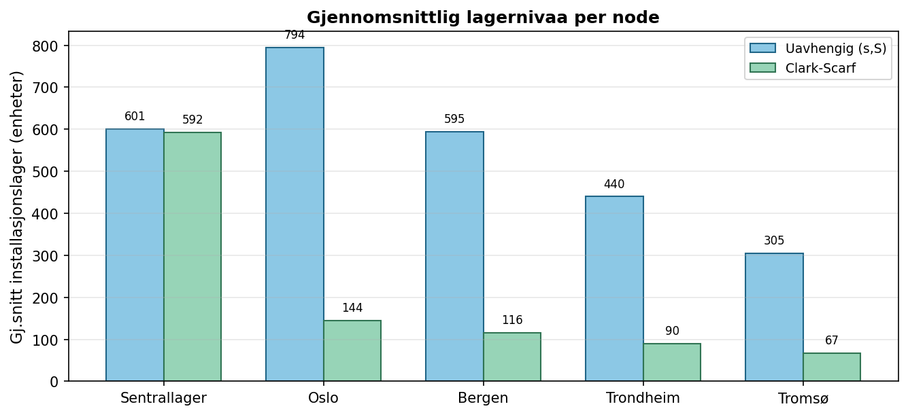

Gjennomsnittlig installasjonslager per node under de to politikkene. Den dramatiske forskjellen er at regionene i Clark--Scarf holder bare et brøkdel av den uavhengige variantens --- men sentrallageret holder omtrent det samme.

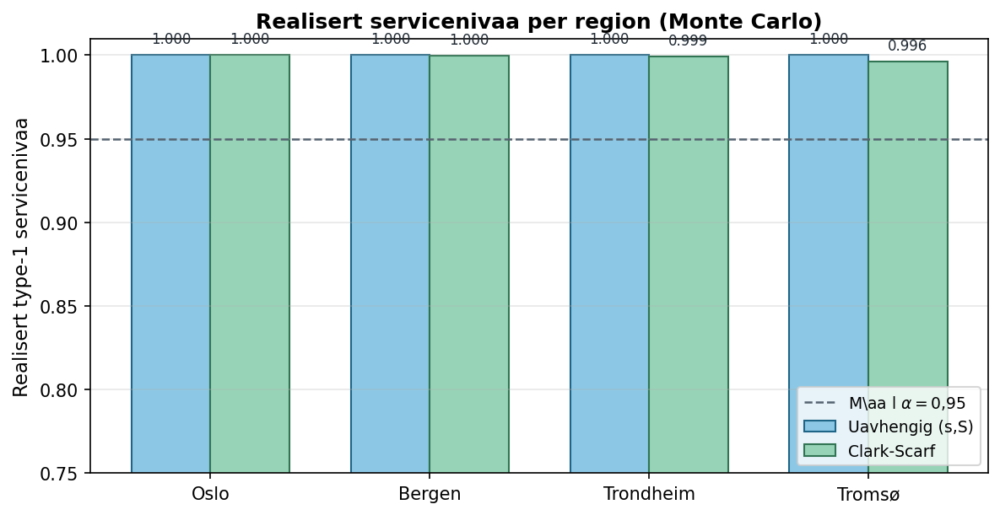

Realisert type-1 servicenivåper region. Clark--Scarf leverer $99,6~%$--$100~%$ --- praktisk talt identisk med den uavhengige politikken --- men til en tredjedel av kostnaden.

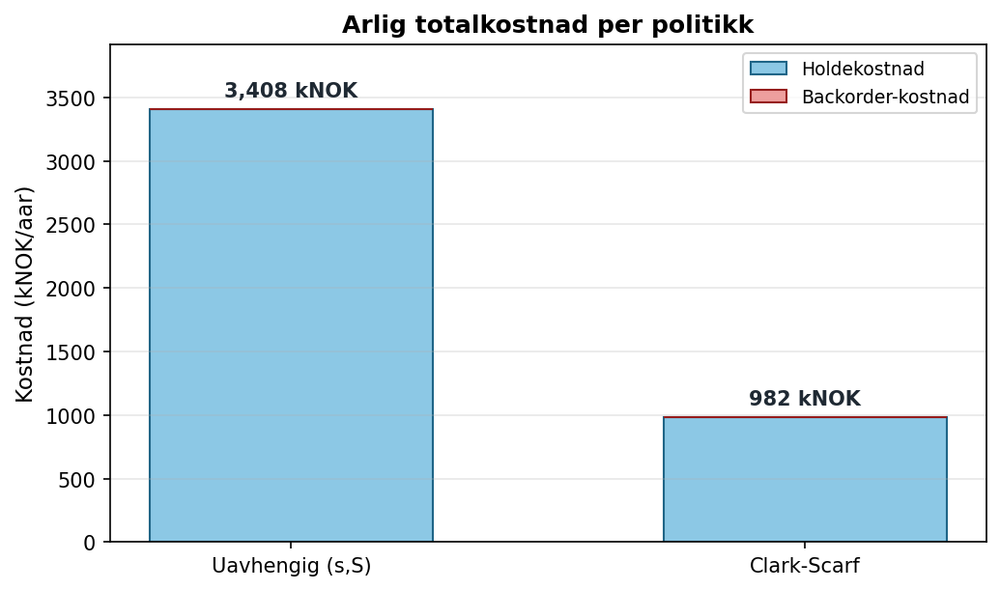

Arlig totalkostnad per politikk. Clark--Scarf reduserer totalen fra $3\,408$ til $982$ kNOK, en besparelse på $\mathbf{2\,427}$ kNOK/år ( $71~%$).

**Konklusjon** --- *Identisk service, en tredjedel av kostnaden*

Simuleringen bekrefter dekomponeringsresultatet: begge politikkene oppnår praktisk talt perfekt service. Clark--Scarf leverer derimot det samme servicenivaaet med drastisk mindre lager totalt sett. Gevinsten ligger utelukkende i den *regionale* lagerreduksjonen --- sentrallageret holder stort sett det samme.

### Steg 5: Sensitivitetsanalyse
Hvor robust er gevinsten? Vi varierer to kritiske størrelser: leverandørledetiden $L_0$ (som driver hele systemets usikkerhetsabsorpsjon) og en multiplikativ skaleringsfaktor påetterspørselsvariabiliteten $\sigma_{d_i}$. Figur [16](#fig-fig-echelon-sensitivity) oppsummerer resultatet, og tabell [17](#tab-tab-echelon-sensitivity) gir tallene.

Sensitivitetsanalyse over leverandørledetid $L_0$ og variabilitetsfaktor.

+---------------------------------------------------------------------+--------------+----------------------------------------------------------------------------------+
| **Varierer $L_0$**                                                | \phantom{x} | **Varierer $\sigma$-skala**                                                   |
+---------+------------------------+-----------------------+----------+--------------+---------------------+------------------------+-----------------------+-----------+
| $L_0$ | $H^{\mathrm{uav}}$ | $H^{\mathrm{CS}}$ | Bespar.  |              | Skala               | $H^{\mathrm{uav}}$ | $H^{\mathrm{CS}}$ | Bespar.   |
+---------+------------------------+-----------------------+----------+--------------+---------------------+------------------------+-----------------------+-----------+
| (dager) | (kNOK)                 | (kNOK)                | (%)      |              | $(\cdot\sigma)$ | (kNOK)                 | (kNOK)                | (%)       |
+=========+========================+=======================+==========+==============+=====================+========================+=======================+===========+
| $1$   | $941$                | $557$               | $40,8$ |              | $0,50$            | $2\,726$            | $417$               | $84,7$  |
+---------+------------------------+-----------------------+----------+--------------+---------------------+------------------------+-----------------------+-----------+
| $3$   | $1\,649$            | $577$               | $65,0$ |              | $0,75$            | $2\,879$            | $511$               | $82,2$  |
+---------+------------------------+-----------------------+----------+--------------+---------------------+------------------------+-----------------------+-----------+
| $5$   | $2\,345$            | $592$               | $74,8$ |              | $1,00$            | $3\,032$            | $605$               | $80,0$  |
+---------+------------------------+-----------------------+----------+--------------+---------------------+------------------------+-----------------------+-----------+
| $7$   | $3\,032$            | $605$               | $80,0$ |              | $1,25$            | $3\,185$            | $699$               | $78,1$  |
+---------+------------------------+-----------------------+----------+--------------+---------------------+------------------------+-----------------------+-----------+
| $10$  | $4\,052$            | $622$               | $84,7$ |              | $1,50$            | $3\,338$            | $793$               | $76,2$  |
+---------+------------------------+-----------------------+----------+--------------+---------------------+------------------------+-----------------------+-----------+
| $14$  | $5\,400$            | $641$               | $88,1$ |              | $2,00$            | $3\,644$            | $981$               | $73,1$  |
+---------+------------------------+-----------------------+----------+--------------+---------------------+------------------------+-----------------------+-----------+


Venstre: holdekostnad som funksjon av leverandørledetid $L_0$. Clark--Scarf er bemerkelsesverdig flat --- den øker bare svakt med $L_0$ --- mens uavhengig eksploderer. Høyre: holdekostnad som funksjon av etterspørselsvariabilitet. Både politikker vokser proporsjonalt, men forskjellen i absolutt nivåer stor over hele spennet.

**Konklusjon** --- *Hvor mer lang leverandørledetiden er, desto viktigere blir koordinering*

Den mest slaaende konklusjonen er den venstre figuren: Clark--Scarf er tilnærmet ufølsom for $L_0$ --- fordi den sentrale bufferen skaleres med $\sqrt{L_0 + R}$, ikke med $L_0$ i full skala. Uavhengig politikk derimot måla hver region buffere hele $L_0 + L_i + R$, og kostnaden vokser nesten proporsjonalt med $L_0$. Konkret: ved $L_0 = 14$ dager er besparelsen $\mathbf{88~%}$.

### Steg 6: Sammenligning og praktisk anvendelse
Tabell [18](#tab-tab-echelon-summary) oppsummerer hele analysen.

Samlet oppsummering av de to politikkene.

  **Mål**                      **Uavhengig $(s,S)$**           **Clark--Scarf**
  -------------------------------- --------------------------------- -----------------------------------------------------------
  Regional ledetid benyttet        $L_0 + L_i + R$ (konservativ)   $L_i + R$ (echelon)
  Servicekrav                      Flat $\alpha = 0,95$           Newsvendor $\alpha_i = b/(b + h^{\mathrm e}_i)$
  Realisert type-1 (sim.)          $1,00$                          $0,999$
  Gj.snittlig installasjonslager   $2\,735$ enheter               $1\,010$ enheter
  Arlig holdekostnad (sim.)        $3\,408$ kNOK                  $981$ kNOK
  Arlig backorder-kostnad (sim.)   $0$ kNOK                        $0,3$ kNOK
  **Total arlig kostnad (sim.)**   $\mathbf{3\,408}$ kNOK        $\mathbf{982}$ kNOK
  Besparelse                       ---                               $\mathbf{2\,427}$ kNOK/år ($\mathbf{71~%}$)

**Praktisk anvendelse** --- *Hva kan NordFarma bruke dette til?*

1.  **Kvantifisert koordineringsverdi.** Besparelsen på $2,4$ MNOK/år i lagerkostnader tilsvarer tilnærmet $1\,700$ enheters redusert gjennomsnittlig installasjonslager. Dette er en konkret "business case" for åinvestere i et sentralt lagerplanleggingssystem.

2.  **Tidsplan for refyllingsfrekvens.** Clark--Scarf kan utvides med ikke-daglig periodisk gjennomgang ($R > 1$) eller kontinuerlig overvåkning; formelen er strukturelt den samme. Verdien vokser med lengre $L_0$ fordi koordineringsgevinsten akkumuleres.

3.  **Kontraktsforhandling mot leverandør.** Sensitivitetsanalysen viser at reduksjon av $L_0$ fra $7$ til $3$ dager ville spare $1\,400$ kNOK i uavhengig drift, men bare $30$ kNOK i Clark--Scarf-drift. Med koordinert styring har NordFarma mindre åtjene på åpresse leverandøren --- kapitalen bør heller brukes internt.

4.  **Regionale serviceavtaler.** Når echelon-politikken er i drift, kan regionale ledere fåeksplisitte servicemål med tilhørende budsjetter $SS^{\mathrm{CS}}_i$. Dette gjor det lettere åkommunisere at "mindre lager" ikke er utrygt --- det er bare optimalt fordelt.

[Begrensninger.]
- Modellen antar normalfordelt og iid etterspørsel; sesong- og trendkomponenter krever periodespesifikke base-stock-nivå.

- Allokeringsforutsetningen kan bryte ved stramme knappheter; praktisk implementering krever klare prioriteringsregler.

- Transshipment mellom regionene (f.eks. Oslo → Bergen i krise) er ikke modellert --- en potensiell videre forbedring.

- For produkter med svært høy etterspørselsvariabilitet (CV > $0,5$) avviker normaltilnærmingen; Gamma- eller log-normalfordelinger kan vurderes.

Newsvendor og revenue-sharing-kontrakt

## Eksempel: Newsvendor og revenue-sharing-kontrakt
Oppsummering.

  **Kategori**      **Beskrivelse**
  ----------------- ----------------------------------------------------------------------------------------------------------------------------------------------
  Eksempel          Vinterjakkekolleksjon hos norsk motebutikk
  Område            Koordinering av forsyningskjede under etterspørselsusikkerhet
  Problemstilling   Hvor mye skal detaljisten bestille før sesongen, og hvordan kan leverandøren og detaljisten inngå en kontrakt som maksimerer kjedeprofitten?
  Modell            Newsvendor-modellen $+$ revenue-sharing-kontrakt $(\varphi, w\')$
  Prosess           Spillteoretisk analyse og kontraktsdesign
  Metode            Lukket form for optimal bestilling, Pareto-analyse over $\varphi$, sensitivitetsanalyse

### Problemstilling
*NordStil*, en norsk motekjede med utsalg i de største byene, skal bestille en kolleksjon vinterjakker fra en leverandør i Bangladesh. Jakkene produseres i én batch og må bestilles minst seks måneder før sesongen starter. Det er ikke mulig å gjøre etterbestillinger underveis: får NordStil for få, går de glipp av salg; får de for mange, må restene selges med tap etter sesongen.

Leverandøren produserer til kostnad $c = 400$ NOK per jakke og selger normalt til NordStil for engrospris $w = 900$ NOK. NordStil selger videre for $p = 1\,500$ NOK. Jakker som ikke selges ut før sommeren, loses ut for $s = 200$ NOK per stk. Tidligere sesonger har vist at den totale etterspørselen $D$ kan modelleres som tilnærmet normalfordelt med forventet verdi $\mu = 1\,000$ jakker og standardavvik $\sigma = 250$.

De to partene har ulike interesser. NordStil bryr seg kun om sin egen profitt og bestiller derfor forsiktig. Leverandøren, som har en høy engrosmargin, vil gjerne at NordStil bestiller flere. Spørsmålet er hvor mye som totalt skal produseres for at *kjeden som helhet* skal oppnå størst mulig forventet profitt --- og hvilken kontrakt som får begge parter til å velge denne løsningen frivillig.

**Problemstilling** --- *Hvordan designe en kontrakt som koordinerer forsyningskjeden?*

Under en ordinær engrospriskontrakt velger NordStil en bestilling som er lavere enn det kjeden samlet sett er best tjent med. Dette fenomenet kalles *double marginalization*. Vi sammenligner tre scenarier: (i) integrert kjede (ønskelig referanse), (ii) desentralisert drift med ordinær engrospris, og (iii) en revenue-sharing-kontrakt $(\varphi, w\')$ som gjenoppretter kjedens optimale bestilling og fordeler gevinsten slik at begge parter tjener mer.


Sesongprodukter som vinterjakker kjennetegnes av lang ledetid, usikker etterspørsel og begrenset restverdi --- en klassisk newsvendor-situasjon.

### Modell
Newsvendor-modellen er den matematiske standardrammen for engangsbestillinger under usikker etterspørsel. Vi formulerer først kjedemodellen (integrert optimum) og deretter revenue-sharing-utvidelsen som gjør det mulig å nå dette optimum i en desentralisert kjede.

Definisjon [Klassisk newsvendor-modell]
La $D$ være stokastisk etterspørsel med kumulativ fordelingsfunksjon $F$ og tetthet $f$. Den integrerte kjeden bestiller kvantum $Q \geq 0$ før $D$ observeres og maksimerer forventet profitt

$$\Pi_{kjede}(Q) \;=\; p \cdot \mathbb{E}\[\min(D, Q)\] \;+\; s \cdot \mathbb{E}\[(Q - D)^+\] \;-\; c \cdot Q$$

16

der $p$ er utsalgspris, $c$ er produksjonskostnad og $s < c$ er restverdi for usolgte enheter. Optimal løsning er entydig gitt ved

$$Q^\*_{kjede} \;=\; F^{-1}\!\left( \frac{p - c}{p - s} \right)$$

17

der forholdet $(p-c)/(p-s)$ kalles *kritisk forhold*.

Symboler. Alle størrelser i likning [(16)](#eq-eq-nv-chain-profit) og [(17)](#eq-eq-nv-optimum) er forklart i tabell [20](#tab-tab-nv-symbols).

Symboler i newsvendor-modellen.

  **Symbol**           **Type**              **Beskrivelse**
  -------------------- --------------------- -------------------------------------------------------------------
  $D$                Stokastisk variabel   Etterspørsel i løpet av sesongen; har fordeling $F$
  $Q$                Beslutning            Bestilt kvantum før sesongen starter
  $p$                Parameter             Utsalgspris per enhet (detaljist til sluttkunde)
  $c$                Parameter             Leverandørens produksjonskostnad per enhet
  $s$                Parameter             Restverdi per usolgt enhet etter sesongen, $s < c$
  $F(\cdot)$        Funksjon              Kumulativ fordelingsfunksjon for $D$
  $Q^\*_{kjede}$   Resultat              Kjedens optimale bestilling iht. [(17)](#eq-eq-nv-optimum)
Under- og overkostnad. Kritisk forhold $(p-c)/(p-s)$ kan skrives som $c_u / (c_u + c_o)$ der $c_u = p - c$ er *underkostnaden* (tapt dekningsbidrag ved å bestille én enhet for lite) og $c_o = c - s$ er *overkostnaden* (tap på én usolgt enhet). Et høyt kritisk forhold betyr at det er dyrere å bestille for lite enn for mye, og optimal bestilling havner i øvre del av fordelingen.

Desentralisert newsvendor. Dersom detaljisten kjøper til engrospris $w$ med $c < w < p$ og selv bærer restrisikoen, maksimerer hun $\mathbb{E}\[\Pi_R(Q \mid w)\]$ med egen kostnad $w$ i stedet for $c$. Optimal bestilling blir

$$Q^\*_R(w) \;=\; F^{-1}\!\left( \frac{p - w}{p - s} \right) \;<\; Q^\*_{kjede}.$$

10

Avviket $Q^\*_{kjede} - Q^\*_R(w) > 0$ kalles *double marginalization* og oppstår fordi leverandøren legger på en margin som detaljisten behandler som ekte kostnad.

Definisjon [Revenue-sharing-kontrakt]
En revenue-sharing-kontrakt spesifiseres av to parametre $(\varphi, w\')$ med $\varphi \in (0, 1)$ og $0 \leq w\' \leq w$. Detaljisten beholder en andel $\varphi$ av omsetningen og betaler $w\'$ per enhet ved ordre. Leverandøren får resten. Detaljistens forventede profitt blir

$$\Pi_R(Q \mid \varphi, w\') \;=\; \varphi \cdot \bigl( p \cdot \mathbb{E}\[\min(D, Q)\] + s \cdot \mathbb{E}\[(Q - D)^+\] \bigr) \;-\; w\' \cdot Q,$$

19

og leverandørens profitt blir

$$\Pi_S(Q \mid \varphi, w\') \;=\; (w\' - c) \cdot Q \;+\; (1 - \varphi) \cdot \bigl( p \cdot \mathbb{E}\[\min(D, Q)\] + s \cdot \mathbb{E}\[(Q - D)^+\] \bigr).$$

20

Kontrakten *koordinerer kjeden* hvis detaljistens profittmaksimerende kvantum sammenfaller med $Q^\*_{kjede}$. Dette oppnås når $w\' = \varphi \cdot c$, og $\varphi$ kan velges fritt innenfor området der begge parter foretrekker kontrakten.

Symboler for kontrakten. Tabell [21](#tab-tab-nv-rs-symbols) forklarer de tilleggsparametrene kontrakten innfører.

Symboler i revenue-sharing-kontrakten.

  **Symbol**           **Type**                   **Beskrivelse**
  -------------------- -------------------------- -------------------------------------------------------------
  $\varphi$         Parameter $\in (0,1)$   Detaljistens inntektsandel; leverandøren får $1-\varphi$
  $w\'$              Parameter $\geq 0$      Redusert engrospris ved ordretidspunkt
  $w$                Baseline                   Ordinær engrospris uten kontrakt (sammenligning)
  $\Pi_R, \Pi_S$   Resultat                   Detaljistens og leverandørens forventede profitt

Hvorfor koordinering? Når $w\' = \varphi c$, blir detaljistens kritiske forhold
$$
\frac{\varphi p - w\'}{\varphi p - \varphi s} \;=\; \frac{\varphi p - \varphi c}{\varphi(p - s)} \;=\; \frac{p - c}{p - s},
$$
det vil si nøyaktig samme kritiske forhold som kjedens optimum. Detaljisten velger da frivillig $Q = Q^\*_{kjede}$. Parameteren $\varphi$ fordeler den samlede profitten og bestemmer hvem som faktisk vil gå med på kontrakten.

**Tolkning** --- *Hva oppnår revenue-sharing?*

Revenue-sharing forskyver risiko fra detaljisten til leverandøren. Leverandøren selger nå billigere ($w\' < w$), men deler gevinsten fra hver solgte enhet ($1-\varphi$). Detaljisten tør å bestille mer fordi hver bestilt enhet er billigere. Hvis $\varphi$ velges riktig, ender begge opp med mer forventet profitt enn under den opprinnelige engrospriskontrakten. Kjedens totalgevinst kommer fra at ingen enheter lenger er "tapt" --- bestillingen er nå stor nok til å dekke etterspørselen med rimelig sannsynlighet, og alle enheter som selges bidrar til begge parters lommebøker.

[Forutsetninger.]
1.  **Én sesong, én bestilling:** $Q$ velges før $D$ observeres; ingen etterbestilling.

2.  **Kjent fordeling:** $F$ antas kjent. I praksis estimeres den fra historiske data.

3.  **Risiko-nøytralitet:** Begge parter maksimerer forventet profitt.

4.  **Fullstendig informasjon:** Begge parter kjenner $(p, c, s, \mu, \sigma)$. Dette er en sterk forutsetning --- når informasjonen er asymmetrisk, kan kontrakten være vanskelig å implementere fordi partene ikke stoler på hverandres kostnader.

### Prosess
Prosess: Spillteoretisk analyse og kontraktsdesign.
Modell: Newsvendor med revenue-sharing-kontrakt $(\varphi, w\')$.

Figur [18](#fig-fig-nv-method) viser analysen som en seks-stegs prosess: fra datainnsamling og karakterisering av etterspørselen, via beregning av integrert og desentralisert optimum, til design og sensitivitetsanalyse av kontrakten.

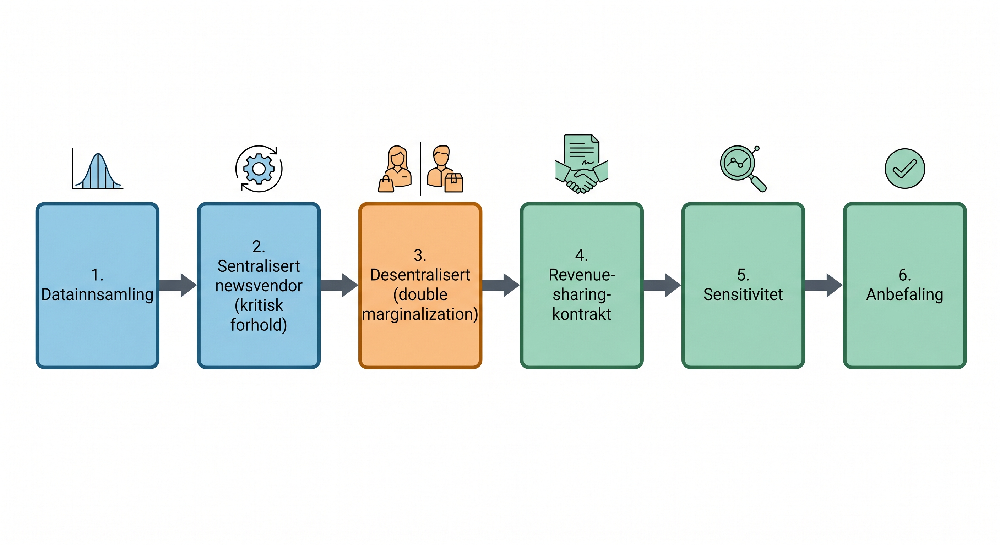

Prosessdiagram for newsvendor-analyse med revenue-sharing-kontrakt.

### Steg 1: Datainnsamling
Første steg er å karakterisere etterspørselen $D$ for vinterjakkesesongen. NordStil har fem tidligere sesonger med salgstall, og tilpasning av normalfordeling til historikken gir $\mu = 1\,000$ enheter og $\sigma = 250$ enheter. Tabell [22](#tab-tab-nv-parametere) oppsummerer alle inngangsparametre.

Inngangsparametere for NordStil-eksempelet.

  **Parameter**   **Verdi**         **Beskrivelse**
  --------------- ----------------- ------------------------------------------
  $\mu$        $1\,000$       Forventet etterspørsel (enheter)
  $\sigma$     $250$           Standardavvik for etterspørsel (enheter)
  $p$           $1\,500$ NOK   Utsalgspris per jakke
  $c$           $400$ NOK       Leverandørens produksjonskostnad
  $w$           $900$ NOK       Ordinær engrospris (baseline)
  $s$           $200$ NOK       Restverdi per usolgt jakke

Kritisk forhold. Før vi regner ut noe optimum, er det opplysende å se på kritisk forhold for hele kjeden:
$$
\frac{p - c}{p - s} \;=\; \frac{1\,500 - 400}{1\,500 - 200} \;=\; \frac{1\,100}{1\,300} \;=\; 0,8462.
$$
Et kritisk forhold på over 84% betyr at underkostnaden (tapt salg på 1 100 NOK) er mye større enn overkostnaden (tap på 200 NOK per usolgt jakke). Kjeden bør derfor bestille relativt rundhåndet --- godt over forventet etterspørsel.

Figur [19](#fig-fig-nv-demand-dist) viser etterspørselsfordelingen med det kritiske kvantilet markert.

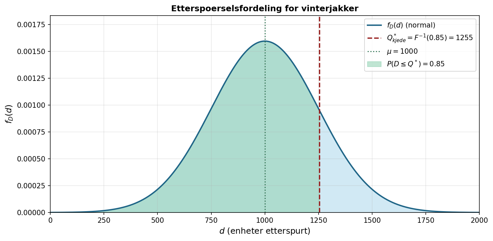

Etterspørselsfordeling $f_D(d)$ for vinterjakker ($\mu = 1\,000$, $\sigma = 250$). Grønn skravering viser arealet $P(D \leq Q^\*_{kjede}) = 0,8462$; rød stiplet linje er kjedens optimale bestilling.

**Konklusjon** --- *Høyt kritisk forhold krever høy servicegrad*

Med $(p-c)/(p-s) = 0,8462$ skal kjeden dimensjonere slik at etterspørselen dekkes i 84,6% av sesongene. Dette tilsvarer et sikkerhetslager på rundt én standardavvik over forventet etterspørsel. Neste steg beregner hvilken bestilling som faktisk realiserer dette.

### Steg 2: Sentralisert newsvendor
Som referanse beregner vi først hva som er optimalt dersom leverandør og detaljist var én og samme aktør. Ved å sette inn i [(17)](#eq-eq-nv-optimum) får vi
$$
Q^\*_{kjede} \;=\; F^{-1}(0,8462) \;=\; \mu + \sigma \cdot \Phi^{-1}(0,8462) \;=\; 1\,000 + 250 \cdot 1,020 \;=\; 1\,255.
$$
Den tilhørende forventede kjedeprofitten beregnes fra [(16)](#eq-eq-nv-chain-profit) med lukket uttrykk for standard normal *loss*-funksjonen $L(z) = \phi(z) - z(1 - \Phi(z))$:
$$
\mathbb{E}\[\Pi_{kjede}(Q^\*)\] \;\approx\; 1\,022\,938 \text{ NOK}.
$$
Figur [20](#fig-fig-nv-profit-curve) viser kurven. Sammenligner vi med en naiv strategi der kjeden bestiller forventet etterspørsel ($Q = \mu = 1\,000$), får vi $\mathbb{E}\[\Pi_{kjede}(\mu)\] \approx 970\,344$ NOK --- altså en gevinst på rundt $52\,600$ NOK ved å bestille $255$ ekstra jakker som buffer mot høy etterspørsel.

![Forventet kjedeprofitt $\mathbb{E}\[\Pi_{kjede}(Q)\]$ fra~eq:nv-chain-profit. Optimum (rød) ligger betydelig over gjennomsnittlig etterspørsel (grønn).](images/ch05/nv_profit_curve.png)

Forventet kjedeprofitt $\mathbb{E}\[\Pi_{kjede}(Q)\]$ fra [(16)](#eq-eq-nv-chain-profit). Optimum (rød) ligger betydelig over gjennomsnittlig etterspørsel (grønn).

**Konklusjon** --- *Det er dyrt å bestille "forventet"*

Å bestille $Q = \mu$ gir bare 94,9% av optimal kjedeprofitt. Når overkostnaden er langt lavere enn underkostnaden, skal bestillingen kraftig over forventet etterspørsel. Dette er nøkkelinnsikten i newsvendor-modellen.

### Steg 3: Desentralisert newsvendor og double marginalization
I praksis er NordStil og leverandøren separate aktører. Med ordinær engrospris $w = 900$ NOK maksimerer NordStil sin egen forventede profitt, som har kritisk forhold
$$
\frac{p - w}{p - s} \;=\; \frac{1\,500 - 900}{1\,500 - 200} \;=\; 0,4615,
$$
og optimal bestilling blir
$$
Q^\*_R(w) \;=\; F^{-1}(0,4615) \;=\; 1\,000 + 250 \cdot (-0,0966) \;=\; 976.
$$
NordStil bestiller altså $1\,255 - 976 = 279$ jakker mindre enn det som er optimalt for kjeden. Figur [21](#fig-fig-nv-cent-decent) viser de to bestillingskvantumene og tilhørende profittkurver.

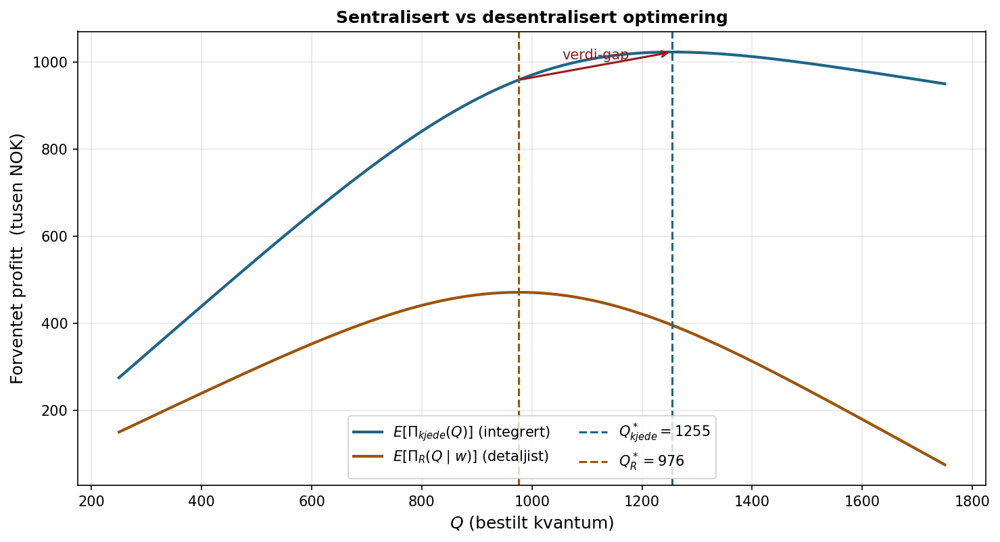

Sentralisert ($Q^\*_{kjede} = 1\,255$) mot desentralisert bestilling ($Q^\*_R = 976$) under engrospris $w = 900$. Det røde pilen markerer *verdi-gapet* i forventet kjedeprofitt.

Under den desentraliserte løsningen blir profittene:

- Detaljist: $\mathbb{E}\[\Pi_R\] \approx 470\,947$ NOK

- Leverandør: $\Pi_S = (w - c) \cdot Q^\*_R = (900 - 400) \cdot 976 \approx 487\,930$ NOK

- Sum kjede: $958\,877$ NOK

Dette er $64\,061$ NOK mindre enn ved sentralisert optimum --- 6,3% av kjedens potensielle profitt som går tapt fordi partene ikke koordinerer.

**Konklusjon** --- *Engrospris alene gir double marginalization*

Ved ordinær engrospris legger leverandøren på én margin, og detaljisten en til. Detaljisten ser $w$, ikke $c$, som ekte kostnad og bestiller derfor for lite. Gapet vokser med engrosmarginen og med etterspørselens variasjon. Løsningen er en kontrakt som gjør at detaljistens private optimum sammenfaller med kjedens.

### Steg 4: Revenue-sharing-kontrakten
Vi søker en kontrakt $(\varphi, w\')$ som fjerner gapet. Fra diskusjonen under modellen vet vi at $w\' = \varphi \cdot c$ gjør detaljistens kritiske forhold identisk med kjedens, slik at $Q^\*_R(\varphi, w\') = Q^\*_{kjede} = 1\,255$.

Pareto-forbedring. En kontrakt er akseptabel for begge parter bare hvis den gir minst like mye profitt som baseline $(w = 900)$. Vi setter derfor

$$\begin{aligned}\Pi_R(\varphi) &\geq 470\,947 \quad \text{(detaljistens baseline)} \\
\Pi_S(\varphi) &\geq 487\,930 \quad \text{(leverandørens baseline)}\end{aligned}$$

og finner intervallet av $\varphi$-verdier som tilfredsstiller begge ulikhetene.

Figur [22](#fig-fig-nv-rs-pareto) viser profittfordelingen over $\varphi \in \[0,05, 0,95\]$. Kurven er den oppnåelige frontieren --- hvert punkt tilsvarer én verdi av $\varphi$, og summen av profittene er konstant lik kjedens optimum $1\,022\,938$ NOK. Det grønne segmentet er intervallet der begge parter er bedre stilt enn ved engrospris $w = 900$.

![Pareto-frontier under revenue-sharing-kontrakt med $w\' = \varphi c$. Det grønne segmentet markerer $\varphi \in \[0,47; 0,52\]$ --- området der begge parter har høyere forventet profitt enn ved baseline.](images/ch05/nv_revenue_sharing_pareto.png)

Pareto-frontier under revenue-sharing-kontrakt med $w\' = \varphi c$. Det grønne segmentet markerer $\varphi \in \[0,47; 0,52\]$ --- området der begge parter har høyere forventet profitt enn ved baseline.

Valg av $\varphi$. Innenfor Pareto-intervallet er $\varphi$ et forhandlingsspørsmål. Som illustrasjon velger vi $\varphi = 0,5$, som gir $w\' = \varphi \cdot c = 200$ NOK og delingstallene i tabell [23](#tab-tab-nv-rs-valg).

Forventet profitt ved revenue-sharing med $\varphi = 0,5$ og $w\' = 200$ NOK.

  **Aktør**     **Baseline (NOK)**   **Kontrakt (NOK)**   **Endring**
  ------------- -------------------- -------------------- -------------
  Detaljist     $470\,947$        $511\,469$        $+8,6$%
  Leverandør    $487\,930$        $511\,469$        $+4,8$%
  Kjede (sum)   $958\,877$        $1\,022\,938$    $+6,7$%

**Konklusjon** --- *Alle vinner på koordinering*

Ved $\varphi = 0,5$ tjener detaljisten 8,6% mer og leverandøren 4,8% mer enn under baseline --- samtidig som kjeden som helhet henter tilbake de $64\,061$ NOK som double marginalization tapte. Merk at fordelingen mellom partene er et *forhandlingsspørsmål*: endrer vi $\varphi$ innenfor Pareto-intervallet, kan vi glide gevinsten mot den ene eller andre parten, men aldri utenfor frontieren.

### Steg 5: Sensitivitet
Resultatene over avhenger av etterspørselens varians, kostnadsstrukturen og valget av $\varphi$. Figur [23](#fig-fig-nv-sensitivity) viser tre sensitivitetsanalyser.


Sensitivitet. (a) Kjedeeffektivitet $\Pi_{dec}/\Pi_{kjede}$ synker når etterspørselen blir mer variabel. (b) Detaljistens bestilling $Q^\*_R(w)$ faller monotont med engrosprisen; integrert optimum er konstant. (c) Profittfordeling over $\varphi$: snittet av de to linjene er selve Pareto-intervallet.

Etterspørselsvarians. Ved $\sigma = 100$ taper kjeden bare 2,4%, men ved $\sigma = 500$ er effektivitetstapet 13,5% --- altså vokser verdien av koordinering raskt med usikkerheten.

Engrospris. Høyere $w$ presser $Q^\*_R(w)$ nedover; ved $w = c$ faller detaljistens valg sammen med kjedens optimum (men da tjener ikke leverandøren noe).

Profittdeling. Pareto-intervallet ble beregnet til $\varphi \in \[0,47; 0,52\]$ i dette tilfellet. Utenfor dette intervallet vil én av partene tape på å gå over til revenue-sharing-kontrakten sammenlignet med engrospris $w = 900$.

### Steg 6: Anbefaling
Tabell [24](#tab-tab-nv-anbefaling) oppsummerer de tre scenariene.

Sammenligning av scenarier. Forventet profitt er oppgitt i NOK.

  **Scenario**                                          **$Q$**     **Detaljist**   **Leverandør**   **Kjede**
  ----------------------------------------------------- ------------- --------------- ---------------- -------------------
  Integrert kjede (referanse)                           $1\,255$   ---             ---              $1\,022\,938$
  Desentralisert ($w = 900$)                          $976$       $470\,947$   $487\,930$    $958\,877$
  Revenue-sharing ($\varphi = 0,5$, $w\' = 200$)   $1\,255$   $511\,469$   $511\,469$    $1\,022\,938$

**Praktisk anvendelse** --- *Fra modell til kontrakt*

1.  **Forhandle kontrakten før sesongen:** NordStil og leverandøren bør signere en revenue-sharing-avtale med $\varphi \in \[0,47; 0,52\]$ og $w\' = \varphi \cdot c$. Eksakt $\varphi$ er forhandlingsutfall.

2.  **Bestille kjedens optimum:** NordStil bestiller $Q = 1\,255$ jakker --- 28% mer enn under ordinær engrospris.

3.  **Etablere salgsrapportering:** Leverandøren må få revidert tilgang til salgstall for å verifisere inntektsdelingen. Uten tillit til dataene faller kontrakten sammen.

4.  **Overvåke etterspørselsparametre:** $\mu$ og $\sigma$ bør oppdateres for hver sesong. Når variansen øker, øker også verdien av koordinering.

[Begrensninger.]
- Revenue-sharing krever transparent salgsrapportering og tillit mellom partene. Dette kan være vanskelig uten tredjepartsverifisering eller digitale salgsdata.

- Modellen forutsetter kjent etterspørselsfordeling. Feilestimering av $\mu$ og $\sigma$ kan gjøre den beregnede kontrakten suboptimal.

- Risiko-nøytralitet er en idealisering. Risikoaverse aktører kan foretrekke en annen fordeling enn det Pareto-analysen tilsier.

- Andre kontraktstyper --- *buy-back*, *quantity flexibility*, *options* --- kan gi samme koordinering. Valget avhenger av hvilke data partene har tilgang til og hvem som har forhandlingsmakt.

Slutt · Kapittel 5

---

# Del II — Kapittel 6: Kø-teori og kapasitetsplanlegging

Del II · Kapittel 6

6

# Kø-teori og kapasitetsplanlegging
Oversatt fra LaTeX-kilde --- figurer, definisjoner og KaTeX-math.

[][][][][]
Område

## Område
Kø-teori er den grenen av anvendt sannsynlighetsteori som gir matematiske modeller for systemer der enheter ankommer, venter og blir betjent av én eller flere servere. I logistikk oppstår slike systemer overalt: lastebiler som venter på lossing ved en rampe, ordrer som står i produksjonskø foran en flaskehalsmaskin, kundehenvendelser i et kundesenter, og containerskip som venter på kaiplass i en havn. Felles for alle disse er at ankomster og betjeningstider er stokastiske, slik at selv moderate belastningsnivåer kan gi betydelige ventetider når variasjonen er stor.

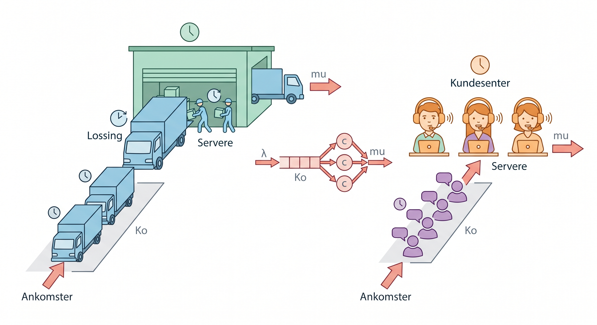

Kø-teori i logistikk: lastebiler i kø ved en lossingsrampe og henvendelser i kø ved et kundesenter, begge beskrevet av den generiske $A/S/c$-modellen med ankomstrate $\lambda$ og betjeningsrate $\mu$.

Definisjon [Kø-teori]
**Kø-teori** er den matematiske analysen av systemer der enheter med stokastiske ankomster må vente på tilgjengelige servere med stokastiske betjeningstider, med formål å bestemme kølengder, ventetider og serverutnyttelse som funksjon av systemets parametre.

Et køsystem spesifiseres kompakt ved Kendall-notasjonen $A/S/c/K/N/D$, der $A$ er ankomstfordelingen, $S$ betjeningstidsfordelingen, $c$ antall parallelle servere, $K$ systemets kapasitet (inkludert de som er under betjening), $N$ størrelsen på kundepopulasjonen, og $D$ køedisiplinen (typisk FIFO). De tre siste feltene utelates ofte når $K=N=\infty$ og disiplinen er FIFO, slik at $M/M/1$ betegner et system med Poisson-ankomster, eksponensielle betjeningstider og én server.

Området omfatter beslutninger på ulike tidshorisonter og aggregeringsnivå:

- Strategisk kapasitetsdimensjonering (år) --- antall kaiplasser, ekspedisjonsluker eller produksjonsmaskiner i nye anlegg

- Taktisk bemanning (måneder) --- antall operatører, plukkere eller kundeservicemedarbeidere som betjener en felles kø

- Operativ køstyring (dager til timer) --- prioritering, batching og midlertidig omdirigering når belastningen svinger

- Kønettverk og flaskehalsanalyse --- systemer der flere køer er koblet i serie eller parallell, typisk i produksjon og ordrebehandling

Kø-teori er tett koblet til flere andre områder som behandles i dette kompendiet:

- Produksjonsplanlegging --- kø-modeller identifiserer flaskehalser og dimensjonerer kapasitetsbufferen foran kritiske maskiner

- Lagerdrift og ordreplukk --- servicepunkter som pakkestasjoner, kontrollstasjoner og lastebiler ved rampe er klassiske flerserver-køer

- Nettverksdesign --- dimensjonering av terminaler, kaiplasser og distribusjonssentre bygger på ventetidskrav fra kø-analyse

- Forsyningskjedeanalyse --- ventetid og gjennomløpstid i et ledd påvirker direkte servicenivå og lagerbehov nedstrøms

Nøkkelavveiningen i all kapasitetsplanlegging er den samme: mer kapasitet gir kortere ventetid og høyere servicenivå, men koster mer i form av investeringer, lønn og ledig kapasitet. Kø-teori kvantifiserer denne avveiningen analytisk for enkle systemer og gjennom simulering for komplekse nettverk, slik at beslutningstakere kan velge et bevisst punkt på kurven mellom kostnad og service.

Problemstillinger, modeller og metoder

## Problemstillinger, modeller og metoder
I det følgende presenteres tre sentrale problemstillinger innen kø-teori med tilhørende modeller og metoder, som illustrert i figur [2](#fig-fig-ko-teori-problemstillinger-oversikt). Alle tre problemstillingene utdypes med egne eksempler og figurer i de påfølgende seksjonene.

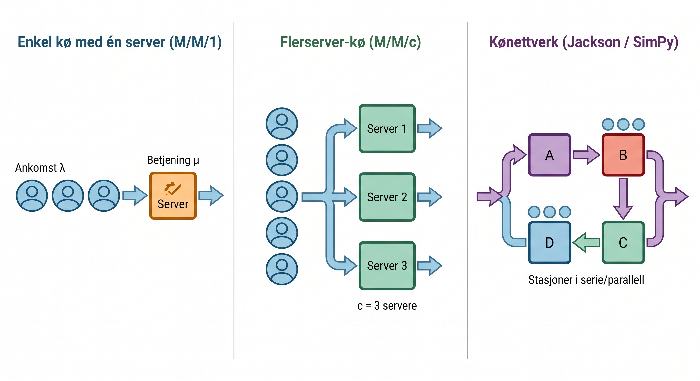

Tre sentrale problemstillinger innen kø-teori: enkel kø med én server, flerserver-kø med parallelle servere og felles ventekø, og komplekse kønettverk med stasjoner i serie og parallell.

Nøkkelen til god kapasitetsplanlegging er å velge riktig modell og metode for den aktuelle problemstillingen. Tabell [1](#tab-tab-ko-teori-oversikt) gir en oversikt over hvilke modeller og metoder som egner seg for de tre problemstillingene. Alle modellene klassifiseres ved hjelp av Kendall-notasjonen \(A/S/c\), der \(A\) betegner ankomstprosessen, \(S\) betjeningstidsfordelingen og \(c\) antall parallelle servere. \(M\) står for markovsk (eksponensielt fordelt), \(G\) for generell fordeling, og utvidelser \(A/S/c/K/N/D\) kan legges til for å angi endelig køkapasitet \(K\), endelig populasjon \(N\) og kødisiplin \(D\). Modellene og metodene uthevet med rødt vil bli gått gjennom i de tre neste avsnittene.

Oversikt over modeller og metoder for de tre sentrale problemstillingene innen kø-teori.

  **Nr.**   **Problemstilling**                    **Modeller**                                                                                                       **Metoder**
  --------- -------------------------------------- ------------------------------------------------------------------------------------------------------------------ --------------------------------------------------------------------------------
  1         Enkel kø med én server   M/M/1, M/G/1                                                                                         Analytisk kø-teori, diskret hendelses-simulering, validering mot Little\'s lov
  2         Flerserver-kø            M/M/c (Erlang-C), M/M/c/K                                                                            Kapasitetsdimensjonering, servicenivåberegning, kostnadsoptimering
  3         Komplekse kønettverk     Jackson-nettverk / diskret hendelses-simulering (SimPy), G/G/c med ikke-eksponensielle fordelinger   Simuleringsstudie, flaskehals-analyse, what-if-scenarier

Tollstasjon ved Oslo havn (M/M/1)

## Eksempel: Tollstasjon ved Oslo havn (M/M/1)
Oppsummering.

  **Kategori**      **Beskrivelse**
  ----------------- -------------------------------------------------------------------------------------------
  Eksempel          Ventetid ved tollstasjon i Oslo havn
  Område            Kø-teori med enkel server
  Problemstilling   Hvor lenge må en lastebil vente på inspeksjon, og når blir utnyttelsen uholdbar?
  Modell            M/M/1-kø med Poisson-ankomster og eksponensielle betjeningstider
  Prosess           Analytisk kø-teori med simuleringsvalidering
  Metode            Lukkede formler for $L$, $L_q$, $W$, $W_q$ og diskret hendelsessimulering (SimPy)

### Problemstilling
Oslo havn er en av Nordens største godshavner, og hver lastebil som ankommer må innom en tollstasjon før godset slippes inn i landet. Havnemyndigheten ser at ventetiden ved tollstasjonen varierer sterkt: i rolige perioder går det raskt, mens det i travle perioder bygger seg opp lange køer av ventende lastebiler. Dette gir irriterte sjåfører, forsinkede leveranser og dårlig utnyttelse av kaiplassen.

Tollbetjenten bruker i gjennomsnitt 5 minutter på å inspisere en lastebil, det vil si en betjeningsrate $\mu = 12$ lastebiler per time. I driftsloggen er gjennomsnittlig ankomstrate $\lambda = 8$ lastebiler per time. Spørsmålet til havnemyndigheten er: hvor lang ventetid gir dette i gjennomsnitt, og hvor mye ekstra trafikk tåler stasjonen før systemet kollapser?

**Problemstilling** --- *Hvor lang ventetid må lastebilene forvente, og når blir det uholdbart?*

Ved å modellere ankomstene som en Poisson-prosess og betjeningstidene som eksponensielt fordelte kan vi bruke M/M/1-modellen. Lukkede formler gir gjennomsnittlig kølengde og ventetid direkte fra $\lambda$ og $\mu$. Vi validerer formlene med en diskret hendelsessimulering og undersøker hvordan ventetiden $W_q$ eksploderer når utnyttelsesgraden $\rho = \lambda/\mu$ nærmer seg $1$.

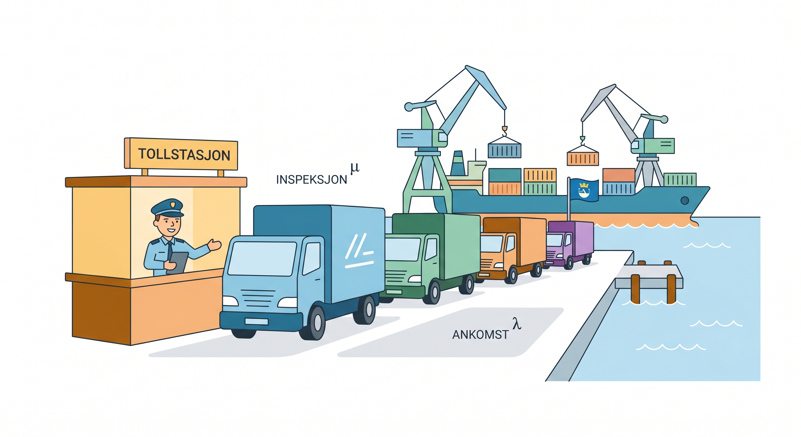

Tollstasjon ved Oslo havn: lastebiler ankommer én og én, og en tollbetjent inspiserer dem etter tur.

### Modell
M/M/1-modellen er den enkleste og mest brukte kømodellen i litteraturen. Den beskriver et system med *én* server, der ankomstene kommer som en Poisson-prosess, betjeningstidene er eksponensielt fordelte, og køen betjenes etter først-inn-først-ut-regelen (FCFS).

Kendall-notasjon. I den generelle Kendall-notasjonen A/S/c/K/N/D beskrives modellen som `M/M/1/$\infty$/$\infty$/FCFS`: ankomstprosessen er markovsk (M), betjeningstiden er markovsk (M), antall servere er $c=1$, buffer- og populasjonsstørrelsen er ubegrenset, og kødisiplinen er FCFS.

Definisjon [M/M/1-kømodell]
La $\lambda > 0$ være ankomstraten og $\mu > 0$ betjeningsraten. Tiden mellom to etterfølgende ankomster er uavhengig og eksponensielt fordelt med tetthet

$$f_A(t) = \lambda e^{-\lambda t}, \qquad t \geq 0,$$

1

og betjeningstiden per kunde er uavhengig og eksponensielt fordelt med tetthet

$$f_S(t) = \mu e^{-\mu t}, \qquad t \geq 0.$$

2

Systemet har én server med FCFS-disiplin og ubegrenset kølengde. Utnyttelsesgraden er

$$\rho = \frac{\lambda}{\mu},$$

3

og systemet er stabilt hvis og bare hvis $\rho < 1$.

Parametere og notasjon. Modellen har to fundamentale parametere og ett avledet forholdstall:

Parametere i M/M/1-modellen.

  **Symbol**     **Navn**          **Beskrivelse**
  -------------- ----------------- -------------------------------------------------------------------
  $\lambda$   Ankomstrate       Gjennomsnittlig antall ankomster per tidsenhet
  $\mu$       Betjeningsrate    Gjennomsnittlig antall betjente enheter per tidsenhet (én server)
  $\rho$      Utnyttelsesgrad   Andel av tiden serveren er opptatt; $\rho = \lambda/\mu$

Lukkede formler. Under stabilitetsforutsetningen $\rho < 1$ nås en stasjonær tilstand, og sentrale ytelsesmål kan skrives som lukkede funksjoner av $\rho$, $\lambda$ og $\mu$. Tabell [4](#tab-tab-mm1-ytelse) oppsummerer de fire hovedformlene, som avledes fra løsningen av fødsels--dødsprosessen.

Ytelsesmål for M/M/1-modellen (gyldig for $\rho < 1$).

  **Symbol**   **Navn**          **Beskrivelse**                                                      **Formel**
  ------------ ----------------- -------------------------------------------------------------------- -------------------------------------------
  $L$        Antall i system   Forventet antall enheter totalt (i kø + betjeningen)                 $L = \dfrac{\rho}{1-\rho}$
  $L_q$      Antall i kø       Forventet antall enheter som venter, uten å telle den som betjenes   $L_q = \dfrac{\rho^2}{1-\rho}$
  $W$        Tid i system      Forventet tid en enhet tilbringer totalt (venting + betjening)       $W = \dfrac{1}{\mu - \lambda}$
  $W_q$      Ventetid i kø     Forventet tid en enhet venter før betjening starter                  $W_q = \dfrac{\rho}{\mu - \lambda}$

**Tolkning** --- *Hva betyr $\rho$, $L$ og $W_q$?*

- **Utnyttelse** $\rho = \lambda/\mu$: andelen tid serveren er opptatt. $\rho = 0,5$ betyr at halve tiden er serveren ledig. $\rho > 1$ betyr at ankomstene kommer raskere enn det som kan betjenes -- køen vokser ubegrenset.

- **Kølengde** $L$ og $L_q$: $L$ teller alle enheter i systemet, $L_q$ teller kun de som venter. Forskjellen $L - L_q = \rho$ er sannsynligheten for at serveren er opptatt.

- **Ventetid** $W_q$: gjennomsnittlig tid en ankommende enhet må vente før betjeningen starter. Formelen viser at $W_q$ vokser som $1/(1-\rho)$ -- en hyperbelsk eksplosjon når $\rho$ nærmer seg $1$.

- **Littles lov** binder dette sammen: $L = \lambda W$ og $L_q = \lambda W_q$. Gjennomsnittlig antall kunder i systemet er lik ankomstraten ganger gjennomsnittlig oppholdstid.

Forutsetninger. For at M/M/1 skal gi gyldige prognoser, må følgende betingelser være oppfylt:

1.  **Stabilitet:** $\rho = \lambda/\mu < 1$. Ellers vokser køen uten grense.

2.  **Minneløse ankomster:** tiden mellom ankomster er eksponensielt fordelt, dvs. ankomstene følger en Poisson-prosess. Dette innebærer at fremtiden ikke avhenger av hvor lenge det er siden forrige ankomst.

3.  **Minneløs betjening:** betjeningstiden er eksponensielt fordelt. Dette gir at den forventede gjenværende betjeningstiden er uavhengig av hvor lenge betjeningen allerede har pågått.

4.  **Én server, FCFS:** nøyaktig én tollbetjent, og kunder betjenes i ankomstrekkefølge.

5.  **Ubegrenset kapasitet:** det finnes ingen øvre grense for hvor mange lastebiler som kan stå i kø samtidig.

### Prosess
Prosess: Analytisk kø-teori med simuleringsvalidering.
Modell: M/M/1$/\infty/\infty/$FCFS.

Arbeidsgangen er rettlinjet i seks steg: samle inn data, anvende lukkede formler, validere med simulering, undersøke hvordan ytelsesmålene endres med utnyttelsen, gjøre sensitivitetsanalyse og ende i en konkret driftsanbefaling. Figur [4](#fig-fig-mm1-method) viser prosessen.

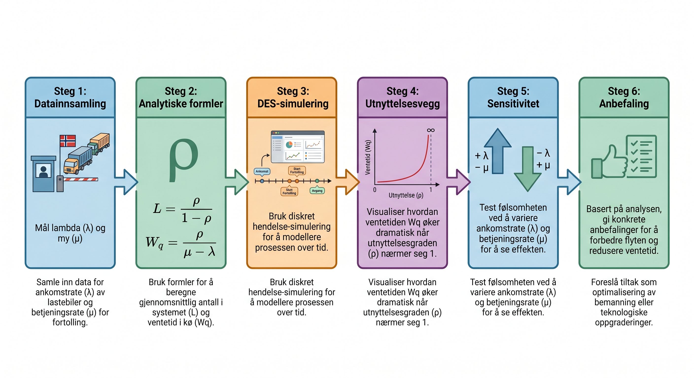

M/M/1-metoden: datainnsamling, analytiske formler, DES-simulering, utnyttelsesvegg, sensitivitet og anbefaling.

### Steg 1: Datainnsamling
Første steg er å estimere $\lambda$ og $\mu$ fra driftsdata ved tollstasjonen. Vi bruker et syntetisk datasett på 1 000 observerte lastebiler som gir ca. 126 driftstimer -- tilsvarende omtrent to ukers drift.

Parameterverdier. Tabell [5](#tab-tab-mm1-empiri) viser både de "sanne" parameterne som ble brukt for å generere datasettet og de empiriske estimatene beregnet fra dataene med maksimum-likelihood for eksponensielle fordelinger ($\hat{\lambda} = 1/\bar{T}_A$ og $\hat{\mu} = 1/\bar{T}_S$).

Empirisk estimat av ankomst- og betjeningsrate fra $n = 1\,000$ observerte lastebiler.

  **Parameter**   **Beskrivelse**                    **Sann verdi**   **Estimat**
  --------------- ---------------------------------- ---------------- -------------
  $\lambda$    Ankomstrate (lastebiler/time)      $8,000$        $7,917$
  $\mu$        Betjeningsrate (lastebiler/time)   $12,000$       $11,611$
  $\rho$       Utnyttelsesgrad                    $0,6667$       $0,6818$

De empiriske estimatene ligger nær de sanne verdiene, og en Kolmogorov--Smirnov-test avviser ikke hypotesen om eksponensielt fordelte mellomankomst- og betjeningstider ($p_\lambda = 0,69$, $p_\mu = 0,29$). Figur [5](#fig-fig-mm1-ankomster-service) sammenligner de empiriske histogrammene med de tilpassede eksponensielle tetthetene.

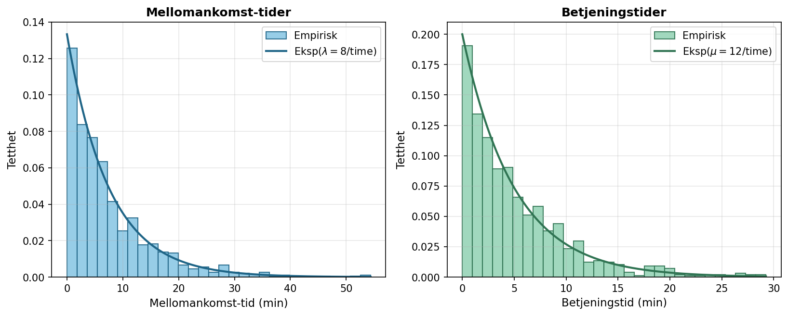

Empirisk fordeling av mellomankomst-tider (venstre) og betjeningstider (høyre) ved tollstasjonen. De blå og grønne kurvene viser tetthetene $f_A$ og $f_S$ fra ligning [(1)](#eq-eq-mm1-ankomst) og [(2)](#eq-eq-mm1-service) med $\lambda = 8$ og $\mu = 12$.

**Konklusjon** --- *Dataene støtter M/M/1-modellen*

De empiriske fordelingene følger eksponensielle kurver, og estimatene $\hat{\lambda} \approx 7,9$ og $\hat{\mu} \approx 11,6$ er konsistente med et M/M/1-system. Utnyttelsesgraden er godt under $1$, så systemet er stabilt. Vi går videre og bruker de sanne parametrene $\lambda = 8$ og $\mu = 12$ i de analytiske formlene.

### Steg 2: Analytiske formler
Med $\lambda = 8$ og $\mu = 12$ kan vi sette verdiene direkte inn i formlene fra tabell [4](#tab-tab-mm1-ytelse). Utnyttelsesgraden blir

$$\rho = \frac{\lambda}{\mu} = \frac{8}{12} = 0,6667.$$

4

De fire ytelsesmålene gir

$$\begin{aligned}L &= \frac{\rho}{1-\rho} = \frac{0,6667}{0,3333} = 2,00, \\
L_q &= \frac{\rho^2}{1-\rho} = \frac{0,4444}{0,3333} = 1,33, \\
W &= \frac{1}{\mu - \lambda} = \frac{1}{4} = 0,25 \text{ time} = 15,0 \text{ min}, \\
W_q &= \frac{\rho}{\mu - \lambda} = \frac{0,6667}{4} = 0,1667 \text{ time} = 10,0 \text{ min}.\end{aligned}$$

Tabell [6](#tab-tab-mm1-baseline) oppsummerer resultatene.

Analytiske M/M/1-resultater for tollstasjonen ved Oslo havn ($\lambda = 8$, $\mu = 12$, $\rho = 0,6667$).

  **Symbol**   **Størrelse**                         **Verdi**
  ------------ ------------------------------------- -----------
  $L$        Antall lastebiler i systemet          $2,00$
  $L_q$      Antall lastebiler i kø                $1,33$
  $W$        Tid i systemet (min)                  $15,0$
  $W_q$      Ventetid i kø (min)                   $10,0$
  $P_0$      Sannsynlighet for ledig tollstasjon   $0,333$

**Konklusjon** --- *Hva sier tallene om driften?*

I gjennomsnitt står det to lastebiler rundt tollstasjonen og én ekstra venter. En gjennomsnittlig lastebil er innom i 15 minutter, hvorav 10 minutter er rein venting. Tollbetjenten er ledig en tredjedel av tiden. Dette er et håndterbart driftsnivå -- spørsmålet er hva som skjer hvis trafikken øker.

### Steg 3: Validering med simulering
Før vi stoler blindt på de lukkede formlene, validerer vi dem med en diskret hendelsessimulering (DES). Simuleringen implementeres i Python-biblioteket `simpy`: én simpy-ressurs representerer tollbetjenten, og vi genererer 1 000 lastebiler med eksponensielt fordelte mellomankomst-tider og betjeningstider. For hver lastebil måler vi ankomsttid, starttid for betjening og sluttid, og deretter beregner vi gjennomsnittlig ventetid og (tidsvektet) gjennomsnittlig kølengde.

Figur [6](#fig-fig-mm1-des) sammenligner de analytiske og simulerte verdiene. Avvikene ligger på 0,4--2,6 % -- vel innenfor simuleringens stokastiske usikkerhet for $n = 1\,000$. Dette bekrefter at de lukkede formlene er korrekte.

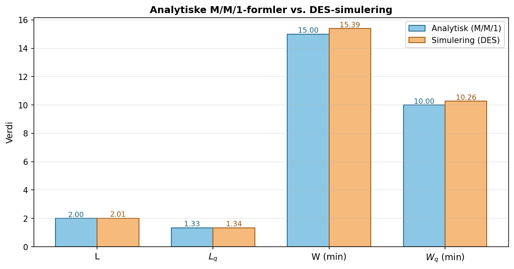

Sammenligning av analytiske M/M/1-formler og diskret hendelsessimulering (SimPy, 1 000 lastebiler). Avviket på alle fire nøkkeltall er under $3\,%$.

Figur [7](#fig-fig-mm1-tidsforlop) viser de første 20 simuleringstimene som en såkalt sammenstøtsbane ($N(t)$ = antall i system som funksjon av tid). Den springer opp når en lastebil ankommer og faller når en er ferdig betjent, og gir et visuelt inntrykk av variasjonen selv med moderat utnyttelse.

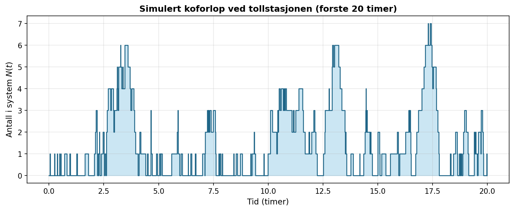

Simulert antall lastebiler $N(t)$ i systemet gjennom de første 20 driftstimene. Selv med $\rho = 0,67$ bygger det seg periodevis opp 4--5 enheter.

**Konklusjon** --- *Formlene holder*

Simuleringen bekrefter at de analytiske formlene gjengir både gjennomsnittlig kølengde ($L$, $L_q$) og gjennomsnittlig ventetid ($W$, $W_q$) med svært lite avvik. Formlene kan dermed brukes direkte som beslutningsgrunnlag så lenge ankomst- og betjeningstider er tilstrekkelig nær eksponensielt fordelt.

### Steg 4: Utnyttelsesveggen
Så langt har vi sett at $\rho = 0,67$ gir moderate køer. Men hva skjer når ankomstraten øker? Tabell [7](#tab-tab-mm1-rho-terskel) viser de analytiske verdiene av $L$ og $W_q$ ved ulike utnyttelsesgrader, og figur [8](#fig-fig-mm1-rho) visualiserer den karakteristiske hyperbelske eksplosjonen når $\rho \to 1$.

Ytelsesmål ved økende utnyttelse (fast $\mu = 12$). Legg merke til at $W_q$ dobles når $\rho$ øker fra $0,70$ til $0,80$ og dobles igjen fra $0,80$ til $0,85$.

  **Utnyttelse $\rho$**   **$L$**   **$L_q$**   **$W$ (min)**   **$W_q$ (min)**
  -------------------------- ----------- ------------- ----------------- -------------------
  $0,50$                   $1,00$    $0,50$      $10,0$          $5,0$
  $0,70$                   $2,33$    $1,63$      $16,7$          $11,7$
  $0,80$                   $4,00$    $3,20$      $25,0$          $20,0$
  $0,85$                   $5,67$    $4,82$      $33,3$          $28,3$
  $0,90$                   $9,00$    $8,10$      $50,0$          $45,0$
  $0,95$                   $19,00$   $18,05$     $100,0$         $95,0$
  $0,99$                   $99,00$   $98,01$     $500,0$         $495,0$

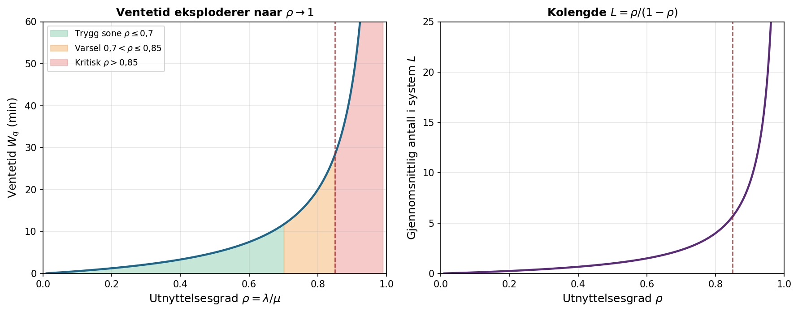

Ventetid $W_q$ (venstre) og antall i system $L$ (høyre) som funksjoner av utnyttelsesgraden $\rho$. Sonene markerer trygt driftsområde ($\rho \leq 0,70$), varsel ($0,70 < \rho \leq 0,85$) og kritisk drift ($\rho > 0,85$).

Det dramatiske bildet er at ventetiden ikke vokser lineært, men hyperbelsk: når $\rho$ går fra $0,50$ til $0,90$ -- en økning med bare $0,40$ -- øker $W_q$ med en faktor på $9$. De siste prosentpoengene opp mot $1$ gir nærmest uendelige køer, selv om "bare" én ekstra lastebil i timen kan utløse overgangen.

**Konklusjon** --- *Den ikke-lineære kapasitetskostnaden*

*Utnyttelsesveggen* er M/M/1-modellens mest iøynefallende innsikt. Planlegger man driften etter gjennomsnittlig belastning, tror man gjerne at 90 % utnyttelse er "bare litt mer travelt". Formelen viser det motsatte: $\rho = 0,90$ gir fire ganger så lang ventetid som $\rho = 0,80$. En fornuftig driftsregel er å holde $\rho \leq 0,80$--$0,85$ som sikkerhetsmargin mot tilfeldig variasjon.

### Steg 5: Sensitivitet
Hvor sårbar er driften for endringer i $\lambda$ og $\mu$? Figur [9](#fig-fig-mm1-sens) viser $W_q$ som funksjon av prosentvis endring i hver av de to parametrene, med den andre parameteren holdt konstant. Oransje kurve viser effekten av at ankomstraten $\lambda$ endres; grønn kurve viser effekten av at betjeningsraten $\mu$ endres.

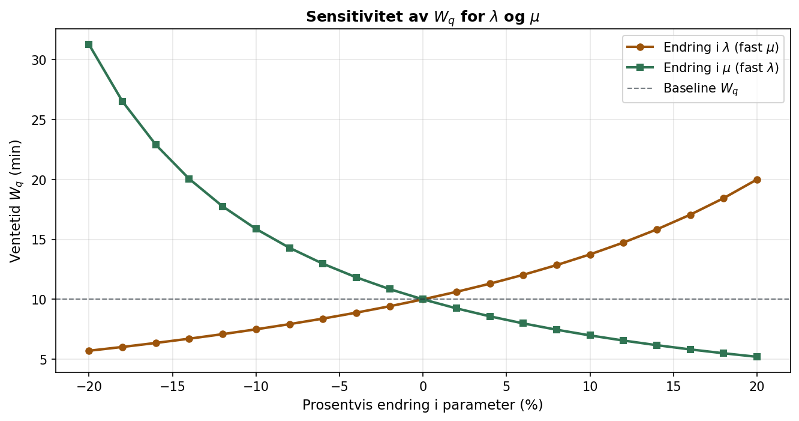

Sensitivitet: ventetid $W_q$ for $\pm 20\,%$ endringer i $\lambda$ (fast $\mu$) og i $\mu$ (fast $\lambda$). Den grønne kurven er brattere mot venstre -- en reduksjon i $\mu$ rammer ventetiden hardere enn en tilsvarende økning i $\lambda$.

Tabell [8](#tab-tab-mm1-sens) viser tallene for de to ekstremtilfellene.

Ytelsesmål i to ekstremscenarier sett i forhold til baseline ($W_q = 10,0$ min, $\rho = 0,667$).

  **Scenario**                                    **Ny $\rho$**   **Ny $W_q$ (min)**   **Endring i $W_q$**
  ----------------------------------------------- ------------------ ---------------------- -----------------------
  Baseline ($\lambda = 8$, $\mu = 12$)      $0,667$          $10,0$               ---
  $\lambda + 20\,%$ (hyppigere ankomster)   $0,800$          $20,0$               $+100\,%$
  $\mu - 20\,%$ (tregere betjening)         $0,833$          $31,3$               $+213\,%$

**Konklusjon** --- *Betjeningsraten er den kritiske driveren*

En nedgang i $\mu$ på $20\,%$ (for eksempel at tollbetjenten blir tregere, eller at en ny, mer tidkrevende prosedyre innføres) rammer ventetiden mer enn en like stor økning i $\lambda$. Årsaken er at $\mu$ påvirker både telleren og nevneren i $W_q = \rho/(\mu - \lambda)$ -- samtidig flyttes $\rho$ mot $1$ og nevneren krymper.

### Steg 6: Anbefaling
Med de analytiske resultatene og sensitivitetsanalysen i hånden kan havnemyndigheten formulere en konkret driftsanbefaling.

Servicemål. Anta at havnen ønsker at gjennomsnittlig ventetid i kø skal være under $5$ minutter ($W_q \leq 5$ min). Løsningen av $W_q(\rho) = 5$ min for $\mu = 12$ gir

$$\rho_{\text{kritisk}} = \frac{W_q^{\max} \cdot \mu}{1 + W_q^{\max} \cdot \mu} = \frac{(5/60) \cdot 12}{1 + (5/60) \cdot 12} = 0,5,$$

5

som igjen svarer til en maksimal ankomstrate $\lambda_{\text{maks}} = 0,5 \cdot 12 = 6$ lastebiler/time. Med dagens gjennomsnittlige ankomstrate på $8$ lastebiler/time er målet *ikke* oppfylt uten tiltak.

Høysesong-scenario. Om sommertrafikken gir $\lambda = 9,6$ (en økning på $20\,%$), øker $\rho$ til $0,80$ og $W_q$ dobles til $20$ minutter. For å returnere til $W_q \leq 5$ min må betjeningsraten økes fra $\mu = 12$ til $\mu \geq 16,56$ lastebiler/time -- altså betjeningstid ned fra $5$ min til under $3,6$ min per lastebil. Alternativt må det åpnes en ekstra tollstasjon (M/M/c-modellen i neste seksjon).

Driftsanbefaling basert på M/M/1-analysen.

  **Driftsområde**               **Anbefaling**
  ------------------------------ ----------------------------------------------------------------------------------------------
  $\rho \leq 0,50$           Trygt: ventetid $\leq 5$ min. Ekstra kapasitet kan flyttes til andre oppgaver.
  $0,50 < \rho \leq 0,70$   Normalt: moderate køer (5--12 min). Gjeldende driftsnivå.
  $0,70 < \rho \leq 0,85$   Varsel: ventetiden fordobles raskt. Forbered tiltak (opplæring, forhåndsklarering).
  $\rho > 0,85$              Kritisk: $W_q$ vokser eksponentielt. Åpne flere tollstasjoner eller reduser betjeningstid.

**Praktisk anvendelse** --- *Tiltak for havnemyndigheten*

1.  **Dimensjonering:** Hold $\rho \leq 0,80$--$0,85$ som driftsregel. Sikkerhetsmarginen absorberer tilfeldig variasjon og unngår den hyperbelske ventetidseksplosjonen.

2.  **Forhåndsklarering:** Digital innsending av tolldokumenter kan kutte betjeningstiden fra $5$ til $3$ minutter ($\mu: 12 \to 20$) og gir slakk også i høysesong.

3.  **Dynamisk kapasitet:** I perioder der $\lambda > 9$ lastebiler/time bør en ekstra tollstasjon åpnes -- dette føres videre i analysen av M/M/c-modellen.

4.  **Overvåking:** Rapportér $\rho$ i sanntid. En verdi over $0,85$ bør utløse kapasitetstiltak før køen bygger seg opp.

[Begrensninger.]
- M/M/1 forutsetter eksponensielt fordelte betjeningstider. I praksis er betjeningstiden ved tolling ofte mer sammenpresset (lavere varians), noe som reduserer køen -- M/G/1-formelen (Pollaczek--Khinchine) gir en mer presis verdi.

- Modellen antar uendelig kapasitet i kø. Fysisk begrenset oppstillingsplass kan gi tap/ompruting (M/M/1/K).

- Ankomstraten $\lambda$ varierer over døgnet og ukene; modellen beskriver det tidsgjennomsnittlige svaret, ikke toppbelastningen.

- For flere parallelle tollstasjoner (to eller flere) må vi gå over til M/M/c-modellen, som dekkes i neste seksjon.

Kapasitetsdimensjonering med M/M/c

## Eksempel: Kapasitetsdimensjonering med M/M/c
Oppsummering.

  **Kategori**      **Beskrivelse**
  ----------------- -------------------------------------------------------------------------
  Eksempel          Kraner på containerterminal ved Oslo Havn
  Område            Kø-teori og kapasitetsplanlegging med flere servere
  Problemstilling   Hvor mange kraner trengs for å oppfylle servicekravet til rederiene?
  Modell            M/M/$c$ med Erlang-C
  Prosess           Kapasitetsdimensjonering
  Metode            Erlang-C-formelen, servicenivåberegning, kostnadsoptimering, simulering

### Problemstilling
Oslo Havn planlegger utvidelse av en containerterminal på Sjursøya, der skip-til-land-kraner (*Ship-To-Shore cranes*, STS) skal losse og laste containerskip i rute mellom Norge, Tyskland og Polen. Havneselskapet må beslutte hvor mange slike kraner som skal bygges. For få kraner gir lange ventetider og misfornøyde rederier som kan velge konkurrerende havner; for mange kraner binder unødig kapital i dyre anlegg som står stille store deler av året.

Rederiforbundet og havnens rammeavtaler stiller et konkret servicekrav: *minst 95% av alle skip skal starte lossing innen 10 minutter etter ankomst til kai*. Dette tilsvarer kravet $P(W_q > 10~\text{min}) < 0,05$. I tillegg ønsker havnen å minimere total driftskostnad per time, som består av kapasitetskostnad per kran (lønn, energi, avskrivning) og ventekostnad per skip som venter (kaileie, kontraktsbøter).

**Problemstilling** --- *Hvor mange kraner skal havnen investere i?*

Ankomster av skip er tilnærmet tilfeldige og uforutsigbare, og lossetiden varierer fra skip til skip. Vi modellerer systemet som M/M/$c$: Poisson-ankomster, eksponentialfordelte betjeningstider og $c$ parallelle, identiske kraner som deler én felles ventekø. Erlang-C-formelen gir sannsynligheten for å vente, og fra den beregnes forventet ventetid, kølengde og halefordelingen $P(W_q > t)$. Med disse kan vi finne *minste $c$* som oppfyller servicekravet, og sammenligne med det *kostnadsoptimale* $c$ som minimerer totalkostnaden.

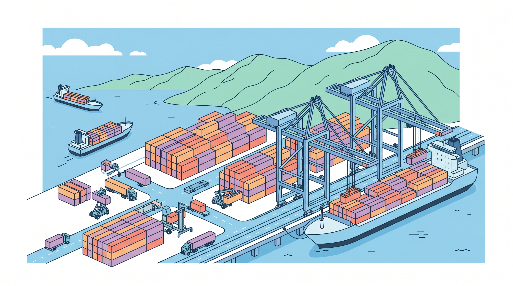

Containerterminal ved Oslo Havn. Skip-til-land-kraner losser og laster containere i parallell fra et felles kaiområde.

### Modell
M/M/$c$-modellen er en naturlig utvidelse av M/M/$1$ fra forrige seksjon: vi beholder Poisson-ankomster og eksponentialfordelte betjeningstider, men tillater nå $c$ identiske servere som deler én felles ventekø i *first-come-first-served*-disiplin (FCFS). Når et skip ankommer og minst én kran er ledig, starter lossingen umiddelbart. Hvis alle $c$ kraner er opptatt, stiller skipet seg i kø.

Definisjon [M/M/$c$-køen]
En M/M/$c$-kø er karakterisert ved:

- **Ankomstprosess:** Poisson-prosess med rate $\lambda$ (skip per time).

- **Betjeningstider:** Eksponentialfordelte med rate $\mu$ per server (skip per time per kran).

- **Antall servere:** $c$ identiske, parallelle servere.

- **Kødisiplin:** FCFS (førstemann til mølla) med uendelig ventekapasitet.

La $a = \lambda/\mu$ betegne *tilbudt last* (Erlang), og $\rho = a/c = \lambda/(c\mu)$ *serverutnyttelsen*. Systemet er stabilt hvis og bare hvis $\rho < 1$, det vil si $c > a$.

Symboler og parametere. Modellen har fire nøkkelstørrelser som inngår i alle ytelsesmålene:

Symboler i M/M/$c$-modellen.

  **Symbol**              **Navn**         **Beskrivelse**
  ----------------------- ---------------- ------------------------------------------------------------------------
  $\lambda$            Ankomstrate      Gjennomsnittlig antall ankomster per tidsenhet.
  $\mu$                Betjeningsrate   Gjennomsnittlig antall ekspedisjoner per tidsenhet per server.
  $c$                   Antall servere   Antall parallelle kraner som deler én kø.
  $a = \lambda/\mu$   Tilbudt last     Forventet antall opptatte servere hvis det aldri var kø.
  $\rho = a/c$         Utnyttelse       Andel av tiden hver server er opptatt; stabilitetskrav $\rho < 1$.

Erlang-C: sannsynlighet for å vente. Kjernen i M/M/$c$-analysen er Erlang-C-formelen, som gir sannsynligheten for at et ankommende skip finner alle $c$ kraner opptatt og derfor må vente:

Definisjon [Erlang-C-formelen]
For en stabil M/M/$c$-kø ($a < c$) er sannsynligheten for at et ankommende skip må vente gitt ved

$$C(c, a) = P(W_q > 0) = \frac{\displaystyle \frac{a^c}{c!}\cdot\frac{c}{c-a}}{\displaystyle \sum_{k=0}^{c-1}\frac{a^k}{k!} + \frac{a^c}{c!}\cdot\frac{c}{c-a}}.$$

6

Numerisk stabil beregning skjer via den iterative relasjonen til Erlang-B:

$$B(0, a) = 1, \qquad B(k, a) = \frac{a\,B(k-1, a)}{k + a\,B(k-1, a)},$$

7

og deretter $C(c, a) = c\,B(c, a) / (c - a + a\,B(c, a))$.

Ytelsesmål. Fra Erlang-C følger alle de sentrale ytelsesmålene for M/M/$c$. Forventet kølengde og ventetid:

$$\begin{aligned}L_q &= C(c, a)\cdot\frac{\rho}{1 - \rho}, \\
W_q &= \frac{L_q}{\lambda} = \frac{C(c, a)}{c\mu - \lambda}.\end{aligned}$$

3

Forventet antall skip i systemet (kø + under lossing) og forventet tid i systemet:

$$\begin{aligned}L &= L_q + a, & W &= W_q + \frac{1}{\mu}.\end{aligned}$$

4

Ligning [(4)](#eq-eq-l-w-mmc) er Littles lov anvendt på både kø og system. Halefordelingen av ventetiden for en tilfeldig ankommende kunde er:

$$P(W_q > t) = C(c, a)\cdot\exp\!\big(-(c\mu - \lambda)\,t\big), \qquad t \geq 0.$$

5

Ligning [(5)](#eq-eq-prob-wait) er nøkkelen til servicedimensjonering: gitt et servicekrav på formen $P(W_q > t^\*) < \alpha$, kan vi løse for minste $c$ som tilfredsstiller kravet.

**Tolkning** --- *Hva betyr Erlang-C-formelen?*

$C(c, a)$ er andelen kunder som *må vente i det hele tatt*. Av dem som venter, er ventetiden eksponentialfordelt med rate $c\mu - \lambda$ (total netto-betjeningskapasitet minus ankomstrate). Jo større $c\mu - \lambda$, jo raskere tømmes køen, og halen $P(W_q > t)$ avtar raskere. Erlang-C kan derfor leses som *"sannsynlighet for å havne i køen" ganget med "sannsynlighet for at køen ikke er unna på tid $t$"*.

Kostnadsformulering. La $c_k$ være kapasitetskostnaden per kran per time (NOK/time) og $c_w$ ventekostnaden per skip per tidsenhet skipet befinner seg i systemet. Totalkostnaden per time som funksjon av bemanningen er

$$K(c) = c_k\cdot c + c_w\cdot L(c),$$

6

der $L(c) = L_q(c) + a$ fra ligning [(4)](#eq-eq-l-w-mmc). Det kostnadsoptimale bemanningsnivået er

$$c^{\mathrm{kost}} = \arg\min_{c > a,\; c \in \mathbb{N}} K(c).$$

7

Det *tjenesteoptimale* nivået $c^{\mathrm{serv}}$ løser i stedet

$$c^{\mathrm{serv}} = \min{c \in \mathbb{N} \mid P(W_q > t^\*) < \alpha}.$$

8

Havnens anbefalte $c$ er $\max(c^{\mathrm{kost}}, c^{\mathrm{serv}})$ - den største av de to - slik at begge beslutningskriterier er oppfylt.

Forutsetninger. For at M/M/$c$-modellen skal være gyldig må følgende forutsetninger være oppfylt:

1.  **Poisson-ankomster:** Skipene ankommer uavhengig av hverandre, og mellomankomsttidene er eksponentialfordelte med parameter $\lambda$. Dette utelukker systematiske ankomsttopper (f.eks. kolonner av skip som følger hverandre).

2.  **Eksponensielle betjeningstider:** Lossetiden per skip er eksponentialfordelt med parameter $\mu$, lik for alle kraner. I praksis vil lossetiden ha lavere varians enn en ren eksponensialfordeling (skip har noenlunde sammenlignbart volum), så modellen er konservativ med hensyn til ventetid.

3.  **Identiske, uavhengige servere:** Alle kraner har samme kapasitet og kan betjene ethvert skip. Kraner blokkerer ikke hverandre fysisk.

4.  **FCFS med uendelig ventekapasitet:** Det er alltid plass til å vente; ingen skip blir avvist eller reiser videre.

5.  **Stabilitet:** $\rho = \lambda/(c\mu) < 1$. Dette sier at tilbudt last er strengt mindre enn total betjeningskapasitet.

### Prosess
Prosess: Kapasitetsdimensjonering.
Modell: M/M/$c$ med Erlang-C.

Figur [11](#fig-fig-mmc-method) viser de seks stegene i dimensjoneringsprosessen: fra datainnsamling og formelverket til anbefalt investeringsbeslutning.

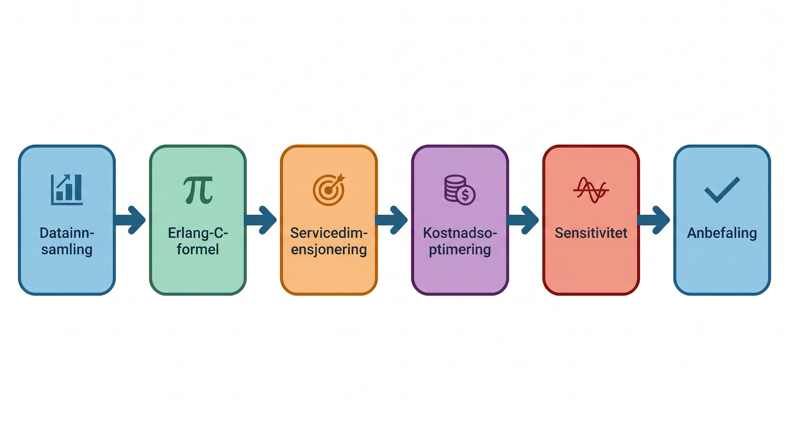

Kapasitetsdimensjoneringsprosessen for M/M/$c$: seks steg fra data til anbefaling.

### Steg 1: Datainnsamling
Første steg er å estimere ankomstraten $\lambda$ og betjeningsraten $\mu$ fra driftsdata. Oslo Havn har logget ankomster og lossetider for 500 skip over en observasjonsperiode på omtrent 223 driftstimer.

Datagrunnlag. Observert mellomankomsttid er i gjennomsnitt 26,8 minutter, som tilsvarer $\hat{\lambda} \approx 2,24$ skip per time. Gjennomsnittlig lossetid per kran er 22,3 minutter, dvs. $\hat{\mu} \approx 2,69$ skip per time per kran. For å forenkle modellpresentasjonen bruker vi runde planparametere

$$\lambda = 2,4 \quad \text{skip/time}, \qquad \mu = 3,0 \quad \text{skip/time per kran}.$$

9

Dette gir tilbudt last $a = \lambda/\mu = 0,8$ Erlang. Én enkelt kran gir $\rho = 0,8$ - stabilt, men med lang ventetid. Det er dette vi vil analysere neste steg.

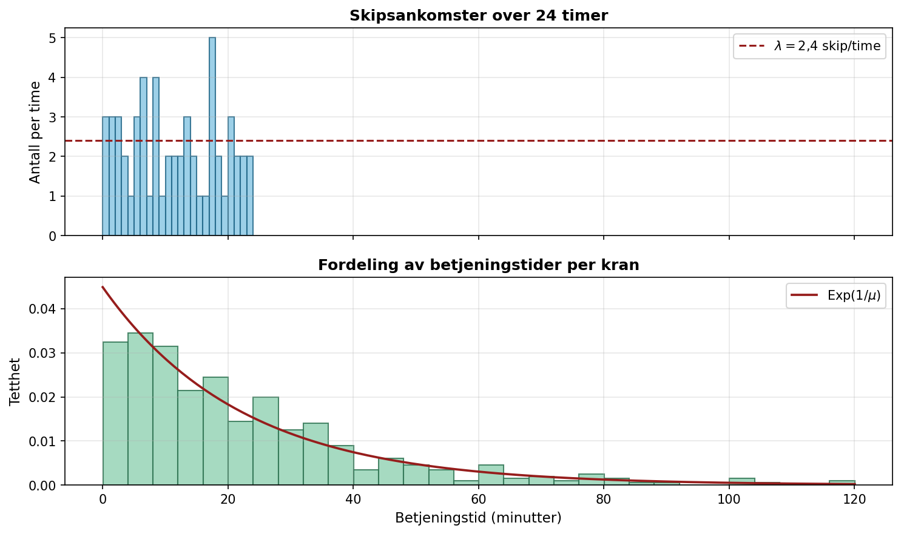

Øverst: antall skipsankomster per time over et 24-timers vindu, med $\lambda = 2,4$ skip/time som horisontal referanse. Nederst: fordeling av observerte lossetider sammenlignet med en tilpasset eksponensialfordeling Exp($1/\mu$).

Deskriptiv statistikk. Tabell [12](#tab-tab-mmc-stats) oppsummerer de viktigste tallene fra datasettet.

Deskriptiv statistikk for 500 skipsankomster.

  **Statistikk**                                            **Verdi**
  --------------------------------------------------------- -------------------------
  Antall observerte skip                                    500
  Observasjonsvindu                                         223,4 timer
  Gjennomsnittlig mellomankomst                             26,8 minutter
  Gjennomsnittlig lossetid                                  22,3 minutter
  Estimert ankomstrate $\hat{\lambda}$                  2,24 skip/time
  Estimert betjeningsrate $\hat{\mu}$                   2,69 skip/time per kran
  Tilbudt last $\hat{a} = \hat{\lambda}/\hat{\mu}$   0,83 Erlang

**Konklusjon** --- *Hva forteller dataene?*

Med $a \approx 0,8$ Erlang må vi ha minst $c = 1$ kran for stabilitet, men da blir $\rho = 0,8$ og ventetiden eksploderer. Konkret betyr tallene at havnen har nok til å holde én kran *gjennomsnittlig* opptatt 80% av tiden - men tilfeldige variasjoner i ankomster og lossetider vil skape lange køer. Neste steg beregner dette kvantitativt med Erlang-C.

### Steg 2: Erlang-C og sveip over $c$
Med $\lambda$ og $\mu$ fastlagt anvender vi Erlang-C-formelen [(6)](#eq-eq-erlang-c) for $c = 1, 2, \ldots, 10$. Tabell [13](#tab-tab-mmc-sweep) viser de viktigste ytelsesmålene.

M/M/$c$-ytelsesmål for $\lambda = 2,4$ og $\mu = 3,0$.

  $c$   $\rho$   $C(c, a)$   $L_q$   $W_q$ (min)   $P(W_q{>}5)$   $P(W_q{>}10)$
  ------- ----------- ------------- --------- --------------- ----------------- ---------------------
  1       0,800       0,800         3,200     80,00           0,761             0,724
  2       0,400       0,229         0,152     3,81            0,169             [0,125]
  3       0,267       0,052         0,019     0,47            0,030             [0,017]
  4       0,200       0,010         0,002     0,06            0,004             0,002
  5       0,160       0,001         0,000     0,01            0,001             0,000
  6       0,133       0,000         0,000     0,00            0,000             0,000

Tabellen viser en slående ikke-linearitet: å gå fra $c = 1$ til $c = 2$ kutter $W_q$ fra 80 til 3,8 minutter - en forbedring på over 95% for én ekstra kran. Fra $c = 2$ til $c = 3$ kuttes ventetiden ytterligere med en faktor 8, mens gevinsten ved å gå fra $c = 4$ til $c = 5$ er minimal. Dette er den karakteristiske *avtakende marginalnytten* som driver kapasitetsbeslutninger i kø-systemer.

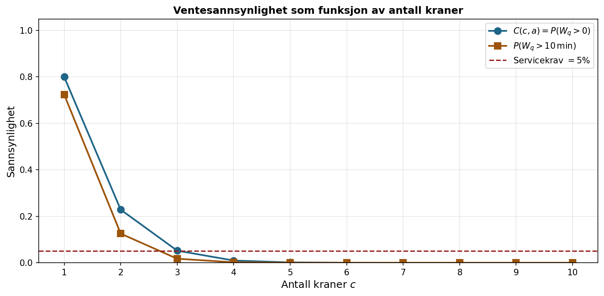

Sannsynlighet for å vente $C(c, a) = P(W_q > 0)$ fra ligning [(6)](#eq-eq-erlang-c) og halesannsynligheten $P(W_q > 10~\text{min})$ fra ligning [(5)](#eq-eq-prob-wait) som funksjon av antall kraner $c$. Rød stiplet linje markerer servicekravet på 5%.

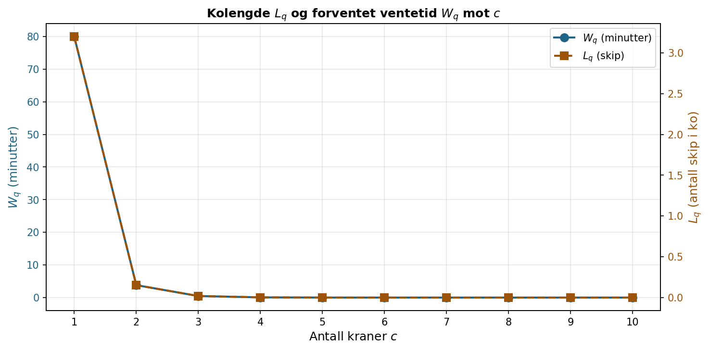

Forventet ventetid $W_q$ (venstre akse) og kølengde $L_q$ (høyre akse) som funksjon av $c$. Begge størrelsene faller eksponentielt med økende bemanning, men raten flater ut raskt.

**Konklusjon** --- *Hva viser Erlang-C-sveipet?*

Sannsynligheten for å vente, $C(c, a)$, faller fra 80% ved $c = 1$ til bare 5% ved $c = 3$. Ved $c = 4$ venter under 1% av skipene. Vi ser at systemet er *overdreven følsomt* for små bemanningsendringer rundt utnyttelsesnivået $\rho \approx 0,8$, og relativt lite følsomt så snart $\rho$ faller under 0,3. Neste steg identifiserer minste $c$ som tilfredsstiller servicekravet.

### Steg 3: Servicedimensjonering
Servicekravet er $P(W_q > 10~\text{min}) < 0,05$. Fra ligning [(8)](#eq-eq-cserv) søker vi minste $c$ slik at halesannsynligheten er under 5%. Fra tabell [13](#tab-tab-mmc-sweep) ser vi at

- $c = 2$: $P(W_q > 10~\text{min}) = 0,125 > 0,05$ -- **bryter kravet**.

- $c = 3$: $P(W_q > 10~\text{min}) = 0,017 < 0,05$ -- **oppfyller kravet**.

Det minste $c$ som oppfyller servicekravet er altså $c^{\mathrm{serv}} = 3$. Ved denne bemanningen er forventet ventetid kun $W_q \approx 0,47$ minutter (28 sekunder).

Sensitivitet for servicemål. Tabell [14](#tab-tab-mmc-servicemal) viser at $c = 3$ er tilstrekkelig for et bredt spekter av alternative servicekrav. Først når kravet strammes til f.eks. $P(W_q > 5~\text{min}) < 1%$ ville $c = 4$ være nødvendig.

Minste $c$ som oppfyller ulike servicemål, gitt $\lambda = 2,4$ og $\mu = 3,0$.

  **Servicemål**                   $t^\star$ (min)   $\alpha$   **Min. $c$**    $P(W_q > t^\star)$ ved valgt $c$
  -------------------------------- --------------------- ------------- ----------------- -----------------------------------------
  Romslig                          5                     0,10          3                 0,030
  Standard (valgt)   10                    0,05          3   [0,017]
  Mildt strengere                  10                    0,01          4                 0,002
  Svært strengt                    5                     0,01          4                 0,004

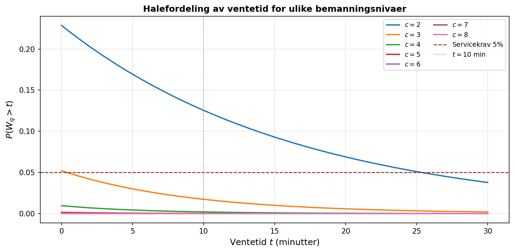

Halefordelingen $P(W_q > t)$ fra ligning [(5)](#eq-eq-prob-wait) for ulike bemanningsnivå $c = 2, 3, \ldots, 8$. Rød stiplet linje markerer servicekravet $5%$; grå prikket linje markerer $t = 10$ minutter.

**Konklusjon** --- *Servicekravet krever tre kraner*

$c^{\mathrm{serv}} = 3$ er tilstrekkelig til å holde halesannsynligheten under 5% med god margin (faktisk 1,7%). Denne beslutningen er robust mot moderat strammere tolkninger av servicekravet. Neste steg undersøker om dette også er *kostnadsoptimalt*.

### Steg 4: Kostnadsoptimering
Vi parametriserer kostnadsligningen [(6)](#eq-eq-totalkost) med realistiske verdier fra havneøkonomi:

$$c_k = 3\,500 \;\text{NOK/time per kran}, \qquad c_w = 8\,500 \;\text{NOK/time per skip i systemet}.$$

10

Kapasitetskostnaden inkluderer personell, energi og avskrivning på investeringen. Ventekostnaden fanger opp kaileie og kontraktsmessige forpliktelser overfor rederiene. Tabell [15](#tab-tab-mmc-kost) viser de tre kostnadskomponentene som funksjon av $c$.

Totalkostnad per time for ulike bemanningsnivå. $L$ er antall skip i systemet fra ligning [(4)](#eq-eq-l-w-mmc).

  $c$   $L$   $W_q$ (min)   Kapasitet   Ventekost            **Totalkost**
  ------- ------- --------------- ----------- -------------------- --------------------------
  1       4,00    80,00           3 500       34 000               37 500
  2       0,95    3,81            7 000       \hphantom{0}8 095   [**15 095**]
  3       0,82    0,47            10 500      \hphantom{0}6 961   17 461
  4       0,80    0,06            14 000      \hphantom{0}6 820   20 820
  5       0,80    0,01            17 500      \hphantom{0}6 802   24 302
  6       0,80    0,00            21 000      \hphantom{0}6 800   27 800

Kostnadsoptimalt er $c^{\mathrm{kost}} = 2$ med totalkostnad 15 095 NOK/time. Å gå fra 2 til 3 kraner sparer 1 134 NOK/time i ventekostnad, men øker kapasitetskostnaden med 3 500 NOK/time - en netto økning på 2 366 NOK/time. Ved $c \geq 3$ er ventekostnaden allerede nær sitt nedre grensepunkt ($c_w \cdot a \approx 6\,800$ NOK/time), slik at hver ny kran primært tilfører *kapasitetskostnad* uten tilsvarende ventetidsreduksjon.

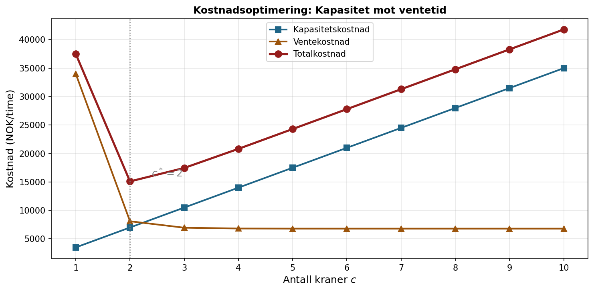

Totalkostnad $K(c)$ fra ligning [(6)](#eq-eq-totalkost) som sum av kapasitetskostnad $c_k \cdot c$ og ventekostnad $c_w \cdot L(c)$. Minimum nås ved $c^{\mathrm{kost}} = 2$.

Konflikt mellom service og kostnad. Vi har nå to ulike "optimale" valg:

- **Service-optimalt:** $c^{\mathrm{serv}} = 3$ (fra steg 3).

- **Kostnadsoptimalt:** $c^{\mathrm{kost}} = 2$ (fra steg 4).

Anbefalingen følger regelen $c^\star = \max(c^{\mathrm{serv}}, c^{\mathrm{kost}}) = 3$: servicekravet er et *hardt* krav nedfelt i kontrakter, mens kostnadsminimering er mykt. Differansen, 2 366 NOK/time, er *prisen for å overholde servicegarantien*. På årsbasis (drift 250 dager à 16 timer) utgjør dette om lag 9,5 MNOK per år.

**Konklusjon** --- *Servicekravet er bindende*

Det kostnadsoptimale $c = 2$ oppfyller ikke servicekravet: 12,5% av skipene ville ventet mer enn 10 minutter - nesten tre ganger kravet på 5%. Når kontraktsforpliktelser eksplisitt er inkludert som høyere $c_w$ eller bøter, vil dette drive $c^{\mathrm{kost}}$ opp til 3. Forskjellen mellom $c^{\mathrm{kost}}$ og $c^{\mathrm{serv}}$ reflekterer dermed hvor strengt man faktisk prissetter ventetid. Neste steg tester hvor robust anbefalingen er mot variasjon i $\lambda$.

### Steg 5: Sensitivitet mot ankomstrate
Ankomstraten varierer sesongmessig. Tabell [16](#tab-tab-mmc-sensitivitet) viser anbefalt $c$ for fem scenarier, fra lavsesong til en 30%-topp over normal.

Anbefalt $c$ for ulike ankomstscenarier. $\rho_1$ er utnyttelsen ved $c = 1$.

  **Scenario**    $\lambda$   $\rho_1$   $c^{\mathrm{serv}}$   $c^{\mathrm{kost}}$   $W_q^{\mathrm{serv}}$ (min)   $W_q^{\mathrm{kost}}$ (min)
  --------------- -------------- ------------- ------------------------- ------------------------- --------------------------------- ---------------------------------
  Lavsesong       1,68           0,56          3                         2                         0,17                              1,70
  Skuldersesong   2,16           0,72          3                         2                         0,35                              2,98
  Normal          2,40           0,80          3                         2                         0,47                              3,81
  Travelt         2,88           0,96          3                         2                         0,81                              5,99
  Topp            3,12           1,04          3                         2                         1,02                              7,41

Med $c = 3$ kraner holder servicekravet seg i *alle* fem scenarier - inkludert topp-scenarioet der $c = 1$ ville vært ustabilt ($\rho_1 > 1$) og $c = 2$ ville gitt $\rho = 0,52$ uten servicedekning. Det kostnadsoptimale nivået forblir $c = 2$ i alle scenarier, men da bryter man servicekravet fra skuldersesong og oppover.

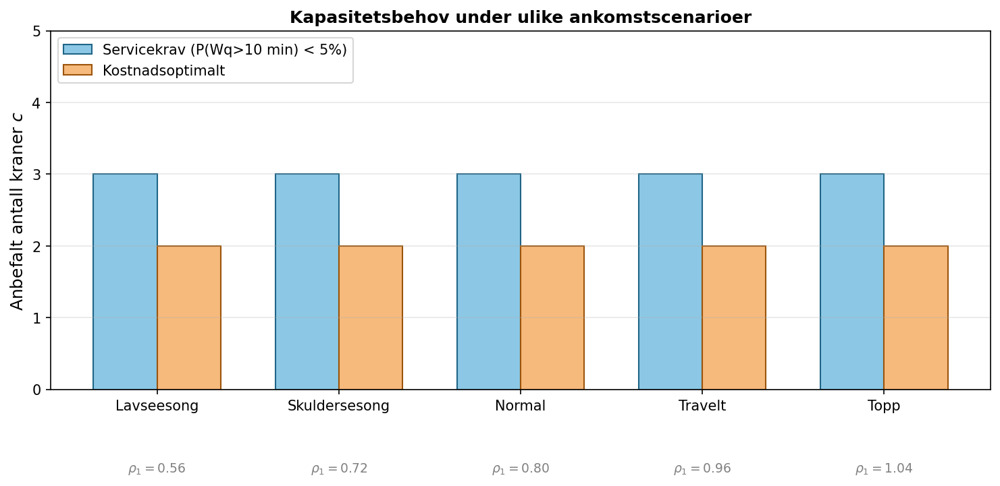

Anbefalt antall kraner etter servicekravet (lys blå) og kostnadsoptimering (orange) for fem ankomstscenarier. Tall under hvert scenario angir utnyttelsesgraden med én kran.

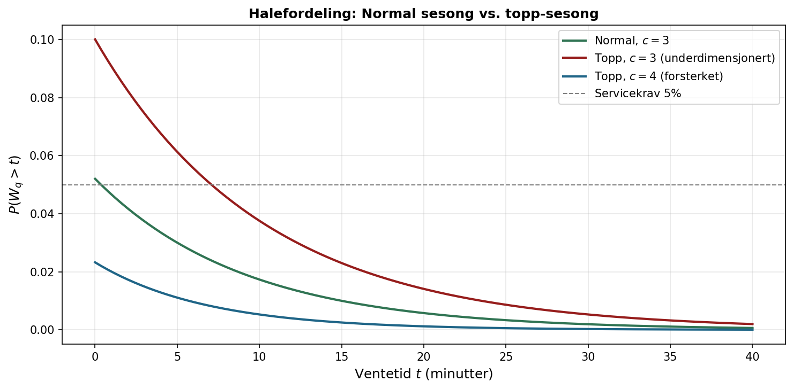

Halefordelingen $P(W_q > t)$ for tre operasjonsmodi: normal drift med $c = 3$ (grønn), topp-sesong med $c = 3$ (rød, underdimensjonert i forhold til lasten) og topp-sesong med $c = 4$ (blå, forsterket).

Figur [18](#fig-fig-mmc-peaks) viser at $c = 3$ fortsatt holder servicekravet med god margin selv i topp-scenarioet ($P(W_q > 10\,\text{min}) = 0,032$, godt under 5%). En fjerde kran for topp-perioder ville gi ytterligere marginal gevinst, men er ikke nødvendig for servicegarantien.

**Konklusjon** --- *Robust anbefaling*

$c^\star = 3$ er robust mot sesongvariasjoner i ankomstraten på $\pm 30%$. Det gir buffer mot uforutsette topper og unngår den marginale gevinsten av en fjerde kran som kun ville vært delvis utnyttet. Neste steg validerer anbefalingen med simulering.

### Steg 6: Anbefaling og validering
Anbefalingen er å investere i **$c^\star = 3$ kraner** for normal drift. For å validere at Erlang-C-formlene gir riktige svar i praksis, har vi simulert systemet med SimPy over 2 000 driftstimer og 4 732 skipsankomster. Tabell [17](#tab-tab-mmc-validering) sammenligner analytiske verdier med simulerte estimat.

Validering: analytisk M/M/$c$ mot SimPy-simulering ved $c = 3$, $\lambda = 2,4$, $\mu = 3,0$.

  **Størrelse**                     **Analytisk**   **Simulert**
  --------------------------------- --------------- --------------
  $\rho$ (utnyttelse per kran)   0,267           --
  $L_q$ (skip i kø)               0,019           --
  $W_q$ (min)                     0,47            0,46
  $P(W_q > 10\,\text{min})$    0,0173          0,0188

Simulerte estimat samsvarer svært godt med de analytiske verdiene, som bekrefter at Erlang-C-formelen er direkte anvendbar for denne operasjonsmodellen.

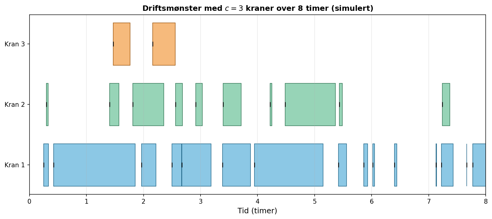

Simulert driftsmønster over 8 timer med $c = 3$ kraner. Hver horisontal stolpe er en lossing, fargekodet per kran. Svarte loddrette streker markerer skipsankomster.

**Praktisk anvendelse** --- *Beslutning og oppfølging*

Havnens investeringsbeslutning er dermed:

1.  **Bygg 3 skip-til-land-kraner** på den nye containerterminalen.

2.  **Forventet totalkostnad:** 17 461 NOK/time i normal drift. Årlig driftskostnad ca. 70 MNOK.

3.  **Servicegaranti:** Med god margin til 5%-kravet (faktisk 1,7%), og robust mot $\pm 30%$ sesongvariasjon i ankomstraten.

4.  **Oppfølging:** Re-estimer $\lambda$ og $\mu$ hvert kvartal. Hvis $\lambda$ passerer 3,5 skip/time på varig basis ($\rho > 0,4$ ved $c = 3$), utløses revisjon av modellen og vurdering av kran nr. 4.

5.  **Reservekapasitet:** En midlertidig mobil kran kan leies i absolutte topp-perioder (jul, containerhavari i Rotterdam, osv.) for å håndtere uventede ankomsttopper.

[Begrensninger.]
- Modellen antar Poisson-ankomster og eksponensielle lossetider. I praksis kan rederiene ha delvis planlagte ankomster (rutetabeller) som reduserer variansen - da vil virkelig ventetid være mindre enn M/M/$c$ forutsier.

- Lossetider varierer mer systematisk enn eksponensialt (store skip tar lenger tid enn små). En M/G/$c$-modell kan gi bedre estimat hvis variansen er markert lavere.

- Vi antar identiske, uavhengige kraner. I fysiske terminaler kan to nabokraner ikke alltid jobbe samtidig på samme skip; dette reduserer effektivt antall parallelle servere.

- Kostnadstallene er estimat og bør kalibreres mot havnens faktiske kontraktsvilkår. Særlig kontraktsbøtene $c_w$ er ofte ikke-lineære (trappefunksjon), noe som kan endre $c^{\mathrm{kost}}$.

Konettverk med SimPy

## Eksempel: Konettverk med SimPy
Oppsummering.

  **Kategori**      **Beskrivelse**
  ----------------- -------------------------------------------------------------------------------------------------
  Eksempel          Ordrebehandling i et e-handels-oppfyllelsessenter
  Område            Kø-teori med flere stasjoner i serie og parallelle servere
  Problemstilling   Finne flaskehals og teste tiltak i et system uten analytisk løsning
  Modell            Konettverk med fire stasjoner og ikke-eksponensielle servicefordelinger
  Prosess           Simuleringsstudie (data, modell, basissimulering, flaskehals, what-if, KPI)
  Metode            Diskret hendelsessimulering med SimPy, empirisk estimering av $\rho$, $E\[W\]$, $E\[V\]$

### Problemstilling
NordPakk er et e-handels-oppfyllelsessenter i Oslo som behandler ordrer for en rekke nettbutikker. Hver ordre gjennomgår fire operative steg: *mottak* av ordre med skanning og pick-liste, *kvalitetskontroll* av de plukkede varene, *pakking* i riktig emballasje, og til slutt *utsending* der ordren lastes på en ventende transportørbil. Stasjonene er koblet i serie -- alle ordrer går gjennom alle fire stegene i samme rekkefølge.

På travle dager opplever NordPakk at lovede leveringsvinduer sprekker, samtidig som enkelte stasjoner ofte står med lite å gjøre. Ledelsen mistenker at én av stasjonene er en flaskehals, men servicetidene er ikke eksponensielt fordelte: kvalitetskontroll har betydelig variasjon (noen ordrer inspiseres på sekunder, andre krever manuell kontroll), pakking er rask for små ordrer og mye tregere for store, og utsendingen styres av et tidsluke-system der lastetiden er tilnærmet uniform. Med ikke-eksponensielle fordelinger og flere stasjoner i serie er eksakt analyse via Jackson-nettverk ikke tilgjengelig, og vi må ty til simulering.

**Problemstilling** --- *Hvor er flaskehalsen, og hva er det beste tiltaket?*

Vi bygger en diskret hendelsessimulering av konettverket i SimPy, estimerer $\rho$, $E\[W\]$ og $E\[V\]$ per stasjon ut fra 5 000 simulerte ordrer, identifiserer flaskehalsen, og tester tre ulike tiltak: (A) ekstra server på flaskehalsen, (B) reduksjon av variabiliteten i kvalitetskontrollen, og (C) en ankomsttopp på 5 %.

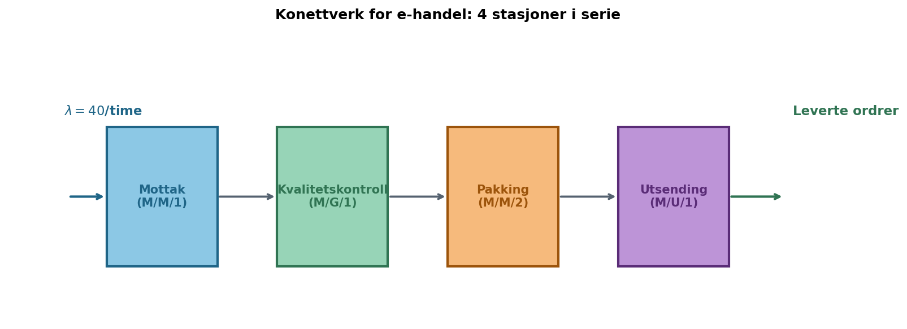

Konettverket hos NordPakk. Ordrer ankommer med Poisson-rate $\lambda = 40$ ordrer per time, rutes seriellt gjennom de fire stasjonene, og forlater systemet etter utsending.

### Modell
Systemet modelleres som et *konettverk*: flere sammenkoblede kosystemer der utløp fra én stasjon er innløp til den neste. Hver stasjon består av en kø og én eller flere parallelle servere.

Definisjon [Konettverk med seriell ruting]
La systemet bestå av $K$ stasjoner. Stasjon $k \in {1, \ldots, K}$ har $c_k$ identiske, parallelle servere og en servicetid $S_k$ med fordelingsfunksjon $F_k$ og forventning $E\[S_k\] = 1/\mu_k$. Ordrer ankommer systemet med en Poisson-prosess med rate $\lambda$ og ruter seriellt: $1 \to 2 \to \cdots \to K$. Den *effektive ankomstraten* inn til stasjon $k$ er derfor $\lambda_k = \lambda$ for alle $k$.

For hver stasjon $k$ definerer vi *utnyttelsesgraden*:

$$\rho_k \;=\; \frac{\lambda_k}{c_k \, \mu_k} \;=\; \frac{\lambda \, E\[S_k\]}{c_k}.$$

16

Systemet er *stabilt* hvis og bare hvis $\rho_k < 1$ for alle $k$.

Notasjon. Tabell [19](#tab-tab-qnet-symboler) oppsummerer symbolene vi bruker i resten av eksempelet.

Symboler og betydning i konettverksmodellen.

  **Symbol**                **Enhet**    **Beskrivelse**
  ------------------------- ------------ -------------------------------------------------------------------------
  $K$                     ---          Antall stasjoner i nettverket (her $K=4$)
  $c_k$                   ---          Antall parallelle servere ved stasjon $k$
  $\lambda$              ordrer/min   Ankomstrate inn til systemet (Poisson)
  $S_k$                   min          Stokastisk servicetid ved stasjon $k$, med tetthet bestemt av $F_k$
  $\mu_k = 1/E\[S_k\]$   ordrer/min   Servicerate per server ved stasjon $k$
  $\rho_k$               ---          Utnyttelsesgrad, se [(16)](#eq-eq-qnet-rho)
  $W_k$                   min          Ventetid i kø for ordre ved stasjon $k$ (ekskl. service)
  $V_k = W_k + S_k$       min          Oppholdstid ved stasjon $k$ (venting + service)
  $V = \sum_k V_k$       min          Total gjennomløpstid gjennom nettverket

Fordelinger per stasjon. Modellen har *heterogene* servicefordelinger -- én per stasjon. Tabell [20](#tab-tab-qnet-fordelinger) viser valgene som er kalibrert etter NordPakks egne målinger.

Stasjonskarakteristikker og servicefordelinger.

  **Stasjon**         **Kendall-notasjon**   $c_k$   **Servicefordeling**                                   $E\[S_k\]$ (min)
  ------------------- ---------------------- --------- ------------------------------------------------------ --------------------
  Mottak              $M/M/1$              1         Eksponensiell, $\text{Exp}(\mu=1,20)$              1,20
  Kvalitetskontroll   $M/G/1$              1         Lognormal, $\text{LN}(0,031;\,0,55)$               1,20
  Pakking             $M/M/2$              2         Eksponensiell, $\text{Exp}(\mu=2,80)$ per server   2,80
  Utsending           $M/U/1$              1         Uniform, $U(0,8;\,1,4)$                             1,10

Figur [21](#fig-fig-qnet-service-dists) visualiserer tre av fordelingene. Legg spesielt merke til halen på lognormalfordelingen ved kvalitetskontrollen -- enkelte ordrer tar betydelig lengre tid enn gjennomsnittet. Denne tyngre halen er utilgjengelig for Markov-baserte analytiske resultater.

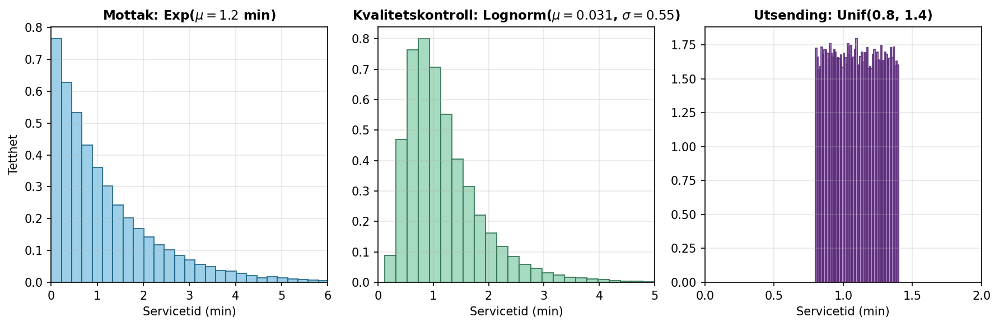

Simulerte servicetider fra de tre ikke-trivielle fordelingene. Lognormal-fordelingen har tyngre hale enn eksponensiell, mens uniformfordelingen har lav varians.

Hvorfor simulering og ikke Jackson-nettverk? Et klassisk *Jackson-nettverk* har eksakt analytisk løsning i likevekt: hver stasjon oppfører seg marginalt som en uavhengig $M/M/c_k$-kø, og den felles sannsynlighetsfordelingen faktoriseres på tvers av stasjoner. De nødvendige betingelsene er strenge:

1.  Ankomstene til *systemet* må være en Poisson-prosess (oppfylt her).

2.  Servicetidene ved hver stasjon må være *eksponensielt* fordelte (*brutt* her -- kvalitetskontroll er lognormal og utsending er uniform).

3.  Rutingen må være uavhengig av systemtilstanden og memoryless i den forstand at Markov-egenskapen bevares.

Siden betingelse (2) er brutt -- to av fire stasjoner har ikke-eksponensielle servicetider -- er ikke Jackson-dekomponeringen gyldig. Vi har heller ingen lukkede uttrykk for $E\[W_k\]$ ved en $M/G/1$- eller $M/U/1$-stasjon som *mates av utstrømmen fra en annen kø*: avgangsprosessen fra en $M/G/1$-kø er ikke Poisson, og dermed er ikke engang stasjon 2 et "rent" $M/G/1$-system. Ved $K \geq 3$ stasjoner og vilkårlige fordelinger er *diskret hendelsessimulering* (DES) den etablerte arbeidsmetoden.

**Tolkning** --- *Hva betyr komponentene for driften?*

- $\rho_k$ måler hvor mye av stasjonens kapasitet som er brukt. Når $\rho_k \to 1$ eksploderer ventetiden $E\[W_k\]$, akkurat som i M/M/1.

- For en $M/G/1$-kø sier Pollaczek-Khinchine-formelen at $E\[W\] \propto \rho \cdot (1 + C^2)/(1 - \rho)$, der $C$ er variasjonskoeffisienten. Lognormalfordelingen i kvalitetskontrollen har $C \approx 0,6$, som gir 60 % mer venting enn en eksponensiell kø med samme $\rho$.

- En $M/M/c$-stasjon (pakking) får færre lange køer for samme $\rho$ fordi to servere pooler variabiliteten -- men stasjonen blir ekstra sensitiv når $\rho_k \to 1$.

- Oppholdstiden $V = \sum_k V_k$ er en *sum* av ikke-uavhengige tilfeldige variabler -- en ordre som måtte vente lenge på én stasjon kan godt treffe lav belastning på den neste.

[Forutsetninger.]
1.  **Poisson-ankomster:** Ordrer ankommer uavhengig med konstant rate $\lambda = 40/\text{time} \approx 0,667/\text{min}$.

2.  **Uavhengige servicetider:** $S_k$ ved ulike stasjoner trekkes uavhengig, og servicetiden er uavhengig av ventetiden.

3.  **FIFO-disiplin:** Første ordre i kø blir betjent først; ingen prioritet eller preemption.

4.  **Stabilitet i basismodellen:** $\rho_k < 1$ for alle $k$ ved $\lambda = 40$/time, slik at systemet er i stasjonær tilstand i stor nok $t$.

5.  **Ubegrenset buffer:** Hver kø kan vokse uendelig lang; ingen blokkering mellom stasjoner.

### Prosess
Prosess: Simuleringsstudie.
Modell: Konettverk med seriell ruting og heterogene servicefordelinger.

En simuleringsstudie består av seks steg, se figur [22](#fig-fig-qnet-method). Stegene kan gjentas iterativt etter hvert som nye tiltak foreslås eller ny data blir tilgjengelig.

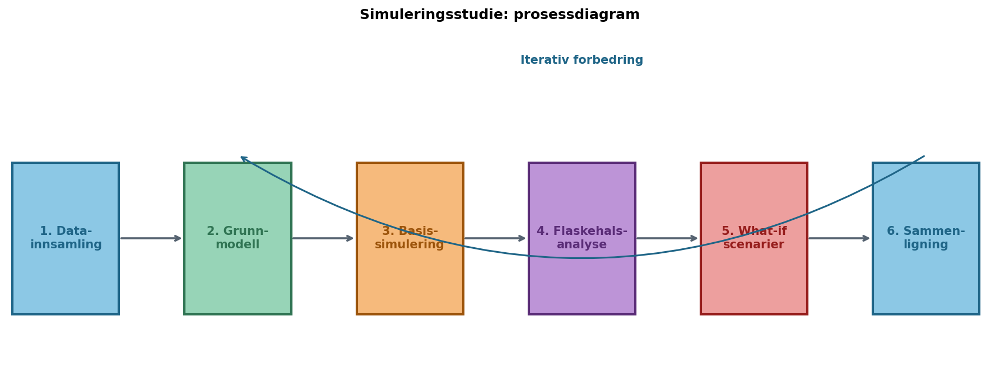

Seks steg i simuleringsstudien: fra datainnsamling via basissimulering og flaskehalsanalyse til what-if-scenarier og KPI-sammenligning. Den buede pilen antyder at innsikter fra sammenligningen typisk leder til ny modellering.

### Steg 1: Datainnsamling
NordPakk har logget 90 dagers drift. Ankomstprosessen er verifisert som Poisson med rate $\lambda = 40$ ordrer per time (tidsavstandene er tilnærmet eksponensialfordelte med gjennomsnitt 1,5 min). For hver stasjon er det fittet en passende servicefordeling med maksimal likelihood:

Empirisk kalibrerte servicefordelinger per stasjon og teoretisk utnyttelse $\rho_k = \lambda E\[S_k\] / c_k$ i basismodellen.

  **Stasjon**         $c_k$   **Fordeling**   $E\[S_k\]$   $\mathrm{SD}(S_k)$   \boldmath{$\rho_k$}
  ------------------- --------- --------------- -------------- ----------------------- -------------------------
  Mottak              1         Eksponensiell   1,20           1,20                    0,800
  Kvalitetskontroll   1         Lognormal       1,20           0,72                    0,800
  Pakking             2         Eksponensiell   2,80           2,80                    [0,933]
  Utsending           1         Uniform         1,10           0,17                    0,733

Utnyttelsesgradene viser allerede at *pakkestasjonen* er den teoretisk mest belastede, med $\rho_3 = 0,933$. Det gir imidlertid bare en første indikasjon -- det er den faktiske ventetiden og dens variasjon, målt i simuleringen, som avgjør driftsbildet.

**Konklusjon** --- *Hvor skal vi se etter flaskehalsen?*

Pakking har høyest $\rho_k$ og er ventelig flaskehalsen. Siden $\rho$ ligger nær 1, vet vi fra køteorien at ventetiden her er svært sensitiv for endringer i $\lambda$ eller $E\[S_3\]$. I steg 3--4 kvantifiserer vi dette empirisk.

### Steg 2: Grunnmodell i SimPy
Grunnmodellen bygges opp i Python med biblioteket `simpy`. Hver stasjon representeres av et `simpy.Resource` med kapasitet $c_k$. En ordre-prosess forespør stasjonen, venter til en server er ledig, trekker en servicetid fra den tilhørende fordelingen, og frigir serveren. Rutingen gjennom nettverket er en sekvensiell kjede av fire slike besøk.

Definisjon [Diskret hendelsessimulering (DES)]
I DES endrer tilstanden seg kun ved et endelig antall *hendelser* i kontinuerlig tid. For konettverket vårt er hendelsene:

- **Ankomst:** en ny ordre skapes ved tid $t$ og begynner ved stasjon 1.

- **Servicestart:** en ordre blir betjent av en ledig server ved stasjon $k$.

- **Serviceslutt:** ordrens servicetid er fullført og den rutes til stasjon $k+1$ (eller forlater systemet når $k=K$).

Mellom hendelsene endres ikke tilstanden, slik at simulatoren kan hoppe direkte fra en hendelse til den neste.

De sentrale KPI-ene måles per ordre $i$ og per stasjon $k$:

- *Ventetid* $W_{ik}$ = tid fra ordren ankom stasjon $k$ til service startet.

- *Servicetid* $S_{ik}$ = trukket fra stasjonens fordeling.

- *Gjennomløpstid gjennom stasjonen* $V_{ik} = W_{ik} + S_{ik}$.

- *Total gjennomløpstid* $V_i = \sum_{k=1}^{K} V_{ik}$.

Utnyttelsesgraden $\rho_k$ estimeres ved den tidsvektede andelen hvor en server er aktiv, akkumulert per stasjon og normalisert mot antall servere og simuleringstid.

**Konklusjon** --- *Hvordan validerer vi at simulatoren er riktig?*

Vi kjører først med svært korte simuleringer (500 ordrer) og sammenligner med kjente analytiske resultater ved å slå av variabilitet: setter vi kvalitetskontrollen til eksponensiell med samme rate, må $\rho_k$ matche $M/M/1$-formelen. Denne sanity-testen passerer og vi er klare for full kjøring.

### Steg 3: Basissimulering
Vi kjører 5 000 ordrer gjennom basismodellen med fast seed, slik at resultatene er reproduserbare. Total simuleringstid blir $T \approx 7\,514$ min $\approx 125,2$ timer, og den *faktiske* gjennomstrømningen nærmer seg ankomstraten: $40,0$ ordrer per time.

Simulerte KPI-er per stasjon i basismodellen ($\lambda = 40$/time, 5 000 ordrer, seed $=2025$).

  **Stasjon**                     **Fordeling**   $\hat\rho_k$      $\widehat{E\[W_k\]}$   $\widehat{P_{95}\[W_k\]}$   $\widehat{E\[S_k\]}$   $\widehat{E\[V_k\]}$
  ------------------------------- --------------- --------------------- ------------------------- ------------------------------- ------------------------- -------------------------
  Mottak                          Exp             0,793                 4,07                      14,75                           1,19                      5,27
  Kvalitetskontroll               Lognorm         0,796                 2,91                      9,84                            1,20                      4,11
  Pakking                         Exp ($c=2$)   0,921   11,29       33,73                           2,77                      [14,05]
  Utsending                       Unif            0,730                 1,62                      5,55                            1,10                      2,72
  **Total ($V = \sum V_k$)**   ---             ---                   ---                       ---                             ---                       **26,14**

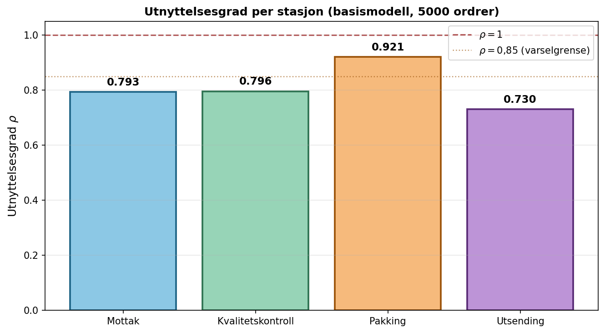

Estimerte utnyttelsesgrader $\hat\rho_k$ per stasjon. Pakkestasjonen ligger klart nærmest metningsgrensen $\rho = 1$.

![Ventetidsfordeling $W_k$ per stasjon (histogrammer over 5\,000 ordrer). Den stiplede røde streken markerer gjennomsnittet $E\[W_k\]$, og den stiplede blå streken markerer 95-prosentilen.](images/ch06/qnet_waiting_dist.png)

Ventetidsfordeling $W_k$ per stasjon (histogrammer over 5 000 ordrer). Den stiplede røde streken markerer gjennomsnittet $E\[W_k\]$, og den stiplede blå streken markerer 95-prosentilen.

Tabellen og figurene viser et svært ulikt driftsbilde: pakking har $\hat{E\[W_3\]} = 11,29$ min, nesten fire ganger så høyt som kvalitetskontrollen, mens selve servicetiden er litt over dobbelt så lang. Halen i $W_3$ er også tyngst: 95-prosentilen er 33,73 min, dvs. én av tjue ordrer må vente mer enn en halvtime på å få pakket innholdet sitt.

**Konklusjon** --- *Flaskehalsen er pakking.*

Selv om ankomstraten er den samme ved alle stasjoner, får pakkestasjonen betydelig lengre kø fordi $\rho_3$ ligger nærmere 1 enn de andre. I neste steg kvantifiserer vi hvor stor andel av den *totale* gjennomløpstiden som skyldes denne stasjonen.

### Steg 4: Flaskehalsanalyse
En flaskehals kan ha tre ansikter: (a) høyest utnyttelse $\rho_k$, (b) lengst gjennomsnittsventetid $E\[W_k\]$, eller (c) størst bidrag til total gjennomløpstid $E\[V_k\]$. Figur [25](#fig-fig-qnet-bottleneck) viser alle tre.

![Flaskehalsanalyse: (a) utnyttelse $\rho_k$, (b) gjennomsnittlig ventetid $E\[W_k\]$, og (c) oppholdstid per stasjon $E\[V_k\] = E\[W_k\] + E\[S_k\]$ stablet i ventetid og service.](images/ch06/qnet_bottleneck.png)

Flaskehalsanalyse: (a) utnyttelse $\rho_k$, (b) gjennomsnittlig ventetid $E\[W_k\]$, og (c) oppholdstid per stasjon $E\[V_k\] = E\[W_k\] + E\[S_k\]$ stablet i ventetid og service.

Alle tre ranger pakking som toppen. Pakking bidrar med $\widehat{E\[V_3\]} = 14,05$ min av en total $\widehat{E\[V\]} = 26,14$ min, altså ca. $53,8\,%$ av hele gjennomløpstiden. Til sammenligning bidrar utsending med bare $10,4\,%$.

Stasjonens relative bidrag til total gjennomløpstid.

  **Stasjon**         **Rolle**                     $\widehat{E\[V_k\]}$ (min)   **Andel av $V$**
  ------------------- ----------------------------- ------------------------------- --------------------
  Pakking             Flaskehals   14,05                           53,8 %
  Mottak              Støttestasjon                 5,27                            20,1 %
  Kvalitetskontroll   Støttestasjon                 4,11                            15,7 %
  Utsending           Støttestasjon                 2,72                            10,4 %
  **Sum**             ---                           **26,14**                       **100 %**

**Konklusjon** --- *Hvor bør tiltak settes inn?*

Pakking er flaskehalsen -- alle forbedringer her slår sterkere ut enn tilsvarende tiltak andre steder. Fra køteorien vet vi dessuten at kostnaden ved *ikke* å gjøre noe vokser eksplosivt: ved en ankomsttopp på bare 5 % vil $\rho_3$ passere 1 og systemet blir ustabilt. Dette verifiseres i steg 5.

### Steg 5: What-if-scenarier
Vi tester tre tiltak / scenarier, hver med samme seed og 5 000 ordrer:

- **(A) Ekstra server i pakking.** Vi øker $c_3$ fra 2 til 3. Kostnad: én ekstra pakker i lønn.

- **(B) Redusert variabilitet i kvalitetskontroll.** Vi bytter lognormalfordelingen med en uniform $U(0,8;\,1,6)$ som har samme gjennomsnitt men betydelig lavere varians. I praksis kan dette oppnås med mer standardiserte inspeksjonsprosedyrer.

- **(C) Ankomsttopp.** Vi øker $\lambda$ fra 40 til 42 ordrer per time (+5 %) uten å endre kapasiteten -- realistisk scenario under Black Friday-lignende trafikk.

Resultatene er oppsummert i tabell [24](#tab-tab-qnet-whatif). Figur [26](#fig-fig-qnet-whatif) visualiserer de tre viktigste KPI-ene.

KPI-er under basismodell og tre tiltak / scenarier.

  **Scenario**                          **Throughput**   $\widehat{E\[V\]}$   $\widehat{P_{95}\[V\]}$   $\hat\rho_3$ (pakking)   $\widehat{E\[W_3\]}$
  ------------------------------------- ---------------- ----------------------- ----------------------------- ---------------------------- -------------------------
                                        (ordrer/time)    (min)                   (min)                                                      (min)
  Basismodell                           39,92            26,14                   48,44                         0,921                        11,29
  \(A\) Ekstra pakkeserver              40,21            15,54     29,11           0,607                        0,50
  \(B\) Redusert variabilitet           39,53            30,20                   72,01                         0,912                        15,70
  \(C\) Ankomsttopp ($\lambda=42$)   42,48            62,31                   102,33                        0,985          42,18

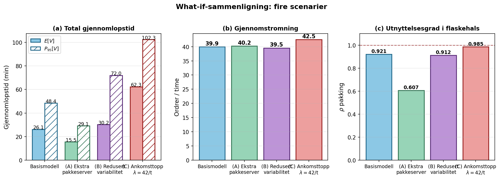

Sammenligning av fire scenarier: (a) gjennomsnittlig og 95-prosentil gjennomløpstid, (b) gjennomstrømning, og (c) utnyttelse ved pakking. Tiltaket med ekstra server halverer gjennomløpstiden, mens ankomsttoppen mer enn dobler den.

[Lesning av resultatene.]
- **(A) Ekstra server** reduserer $\rho_3$ fra 0,921 til 0,607 og senker $E\[V\]$ med 40 %, fra 26,14 til 15,54 min. Flaskehalsen flyttes nå til *mottak* med $\rho_1 = 0,804$.

- **(B) Redusert variabilitet** gir *ikke* den forventede forbedringen. Tvert imot øker $E\[V\]$ med 15 %. Forklaringen: kvalitetskontrollen er ikke flaskehalsen, og den lavere variansen der gjør avgangsprosessen *jevnere*, som øker sannsynligheten for at flere ordrer treffer pakking samtidig. Dette er et klassisk eksempel på at optimering av en ikke-flaskehals kan forverre helheten.

- **(C) Ankomsttopp** gir den dramatiske lærdommen. Bare 5 % økning i ankomstraten presser $\rho_3$ opp til 0,985 og får $E\[V\]$ til å mer enn dobles, fra 26,14 til 62,31 min. 95-prosentilen nærmer seg to timer.

**Konklusjon** --- *Tiltak og læringspunkter*

Tiltak (A) er det eneste som systematisk reduserer gjennomløpstiden. Tiltak (B) illustrerer en vanlig feilslutning: ikke alle lokale forbedringer er globale forbedringer. Scenario (C) viser at basismodellen er *skjør* -- en driftsmessig forsikring (f.eks. bemanningsplan for topper) er nødvendig.

### Steg 6: KPI-sammenligning og sensitivitet
For å generalisere funnene fra steg 5 sveiper vi ankomstraten fra $\lambda = 25$ til $\lambda = 60$ ordrer per time, både for basismodellen ($c_3 = 2$) og tiltak (A) ($c_3 = 3$). Figur [27](#fig-fig-qnet-throughput) viser at basismodellen har en klar "kne"-kurve rundt $\lambda = 45$: før dette punktet er gjennomløpstiden lav og proporsjonal med $\lambda$, men like over kneet eksploderer ventetiden. Tiltak (A) flytter kneet helt ut mot $\lambda = 55$.

![Sensitivitet: (a) gjennomløpstid $E\[V\]$ og (b) faktisk gjennomstrømning som funksjon av ankomstraten $\lambda$. Basismodellen kneler rundt $\lambda = 45$, mens tiltak~(A) utsetter kneet til $\lambda = 55$. Den stiplede diagonalen i (b) viser ideell gjennomstrømning $y = \lambda$.](images/ch06/qnet_throughput.png)

Sensitivitet: (a) gjennomløpstid $E\[V\]$ og (b) faktisk gjennomstrømning som funksjon av ankomstraten $\lambda$. Basismodellen kneler rundt $\lambda = 45$, mens tiltak (A) utsetter kneet til $\lambda = 55$. Den stiplede diagonalen i (b) viser ideell gjennomstrømning $y = \lambda$.

Tabell [25](#tab-tab-qnet-sweep) viser de tallfestede verdiene for et utvalg ankomstrater.

$E\[V\]$ (min) ved ulike ankomstrater for basismodellen og tiltak (A).

  $\lambda$ (ordrer/time)   $\rho_3$ (basis)   $E\[V\]$ basis (min)   $E\[V\]$ tiltak (A) (min)
  ---------------------------- --------------------- ------------------------ -----------------------------
  25                           0,583                 9,96                     9,03
  30                           0,700                 12,97                    9,98
  35                           0,817                 16,05                    12,34
  40                           0,933                 29,34                    14,69
  45                           1,050                 56,12                    25,07
  50                           1,167                 337,57                   56,33
  55                           1,283                 477,27                   182,09

Ved $\lambda \geq 45$ overstiger basismodellens teoretiske $\rho_3$ verdien 1, og systemet er formelt ustabilt; de svært høye simulerte ventetidene gjenspeiler en voksende kø som aldri tømmer seg innenfor simuleringshorisonten. Tiltak (A) holder systemet stabilt helt opp til $\lambda = 55$ ($\rho_3 = 2,57/3 = 0,856$ i middel).

**Praktisk anvendelse** --- *Anbefalinger til NordPakk*

1.  **Fast tiltak:** Sett inn en tredje pakker. Gevinsten er en halvering av $E\[V\]$ og nesten like mye lavere $P_{95}\[V\]$ -- begge deler kritiske for leveringsvindu-overholdelse.

2.  **Fleksibel bemanning:** For dager med prognostisert ankomsttopp bør NordPakk kunne øke $c_3$ midlertidig. Figur [27](#fig-fig-qnet-throughput)(a) gir et lett forståelig grunnlag for når det lønner seg.

3.  **Ikke overinvester i kvalitetskontroll:** Variansreduksjon der har liten eller negativ effekt. Ressurser bør i stedet brukes på selve flaskehalsen.

4.  **Overvåk $\rho_3$ i sanntid:** Når $\hat\rho_3$ passerer 0,85 over et 30-minutters vindu bør systemet automatisk foreslå eskalering.

[Begrensninger]
- Simuleringen antar stasjonær Poisson-ankomst; i virkeligheten er det time-av-døgnet-effekter som ikke er modellert her.

- Servicetidsfordelingene er kalibrert på historiske data -- de dekker ikke sjeldne hendelser som IT-nedetid eller store returordrer.

- Modellen ser bort fra ordrepakkestørrelse. En mer detaljert modell kunne latt $E\[S_3\]$ avhenge av antall varelinjer.

- What-if-sammenligningene bruker samme seed. For statistisk signifikans bør tiltak (A) kjøres med 30 uavhengige replikasjoner og 95-% konfidensintervaller rapporteres.

Slutt · Kapittel 6

---

# Del II — Kapittel 7: Lagerdrift og ordreplukk

Del II · Kapittel 7

7

# Lagerdrift og ordreplukk
Oversatt fra LaTeX-kilde --- figurer, definisjoner og KaTeX-math.

[][][][][]
Område

## Område
Lagerdrift og ordreplukk handler om den operative, daglige styringen av alt som skjer innenfor lagerets fire vegger: mottak, innlagring, plukking, pakking og utsending. Mens lagerstyring bestemmer *hva* og *hvor mye* som skal ligge på lager, avgjør lagerdriften *hvor effektivt* varene faktisk beveger seg gjennom anlegget. Ordreplukking alene står typisk for 50--60 % av driftskostnadene i et manuelt lager, og layout, plukkstrategi og bølgeplanlegging har derfor stor innvirkning på både kostnader og leveringstid.

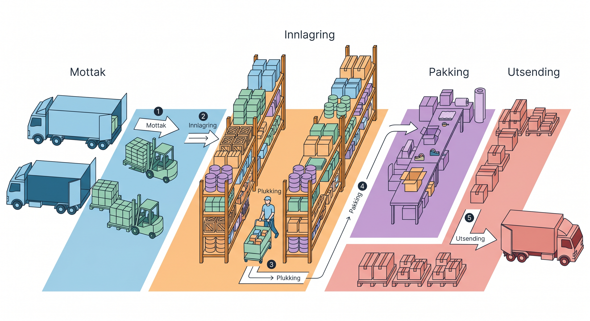

Lagerdrift og ordreplukk: vareflyten gjennom mottak, innlagring, plukking, pakking og utsending, med plukkeren som sentral ressurs i et person-til-vare-lager.

Definisjon [Lagerdrift og ordreplukk]
**Lagerdrift og ordreplukk** er den operative styringen av vareflyten gjennom et lager --- fra *mottak* og *innlagring* via *plukking* og *pakking* til *utsending* --- der målet er å levere riktig vare, i riktig mengde, til rett tid, til lavest mulig kostnad.

Området omfatter alle delprosessene i lageret og de grunnleggende valgene rundt hvordan de organiseres:

- Mottak og innlagring --- lossing, kvalitetskontroll og tildeling av lagerlokasjon

- Plukking --- henting av varer fra lagerlokasjon etter kundeordre, ofte i bølger og batcher

- Pakking og utsending --- konsolidering av ordrer, emballering og lasting på utgående transport

- Person-til-vare vs. vare-til-person --- tradisjonelle gang-/reolsystemer der plukkeren beveger seg, mot automatiserte løsninger (AS/RS, AutoStore, shuttle- og AMR-systemer) der varene kommer til plukkeren

- Lagerlayout og slotting --- plassering av produkter i forhold til plukkfrekvens, vekt, volum og avstand til pakkestasjon

Lagerdrift er tett koblet til flere andre områder som behandles i dette kompendiet:

- Lagerstyring --- bestemmer hvilke varer og hvor mye som til enhver tid er tilgjengelig for plukking

- Nettverksdesign --- fastlegger lagerets rolle, størrelse og plassering i det overordnede distribusjonsnettet

- Kø-teori og kapasitetsplanlegging --- beskriver ventetider og flaskehalser ved pakkestasjoner, lasteporter og i plukkeprosessen

- Etterspørselsprognoser --- styrer bemanning, bølgeplanlegging og forventet arbeidsbelastning i lageret

Problemstillinger, modeller og metoder

## Problemstillinger, modeller og metoder
I det følgende presenteres tre sentrale problemstillinger innen lagerdrift og ordreplukk med tilhørende modeller og metoder, som illustrert i figur [2](#fig-fig-lagerdrift-problemstillinger-oversikt). Alle tre problemstillingene utdypes med egne eksempler og figurer i de påfølgende seksjonene. De tre problemstillingene henger tett sammen: plasseringen av varer (slotting) bestemmer hvor langt plukkeren må gå, rutevalget bestemmer hvor effektivt selve plukkrunden gjennomføres, og bølge- og batchplanleggingen bestemmer hvilke ordrer som plukkes sammen og når.

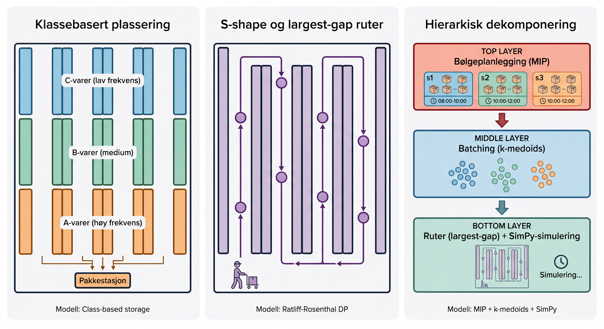

Tre sentrale problemstillinger innen lagerdrift og ordreplukk: klassebasert lagerplassering (slotting), plukkruteoptimering i parallell-gang-lager, og integrert bølge-, batch- og ruteplanlegging.

Nøkkelen til effektiv lagerdrift er å velge riktig modell og metode for den aktuelle problemstillingen. Tabell [1](#tab-tab-lagerdrift-oversikt) gir en oversikt over hvilke modeller og metoder som egner seg for de tre problemstillingene. Tabellen inkluderer også klassiske heuristikker (S-shape, largest gap, return og midpoint) som bakgrunn for ruteoptimeringen, slik at leseren ser hvordan den eksakte dynamiske programmeringen til Ratliff og Rosenthal forholder seg til industristandard-heuristikkene. Modellene og metodene uthevet med rødt vil bli gått gjennom i de tre neste avsnittene.

I tillegg til de tre hovedproblemstillingene finnes det også supplerende tilnærminger som zonebasert plukking, der plukkere er dedikert til bestemte soner og ordrer sys sammen på tvers av soner, og vare-til-person-systemer, der automatiserte løsninger som roboter eller kraner henter varene frem til en stasjonær plukker. Disse dekkes ikke som egne eksempler, men inngår naturlig i den integrerte planleggingen som behandles i tredje problemstilling.

Oversikt over modeller og metoder for de tre sentrale problemstillingene innen lagerdrift og ordreplukk.

  **Nr.**   **Problemstilling**                        **Modeller**                                                                                              **Metoder**
  --------- ------------------------------------------ --------------------------------------------------------------------------------------------------------- -------------------------------------------------------------------------------------------------------
  1         Lagerplassering (slotting)   Tilfeldig plassering, dedikert plassering, Class-based storage                              ABC-analyse + frekvensbasert tildeling, soneoptimering, sensitivitetsanalyse
  2         Plukkruteoptimering          S-shape, largest gap, return, midpoint, Ratliff-Rosenthal DP, TSP                           TSP-heuristikker + dynamisk programmering, grafmodellering, benchmark-sammenligning
  3         Integrert bølge/batch/rute   Tidsindeksert MIP, k-medoids-klynging, largest-gap, MIP + k-medoids + largest-gap + SimPy   Hierarkisk dekomponering + simulering, rullerende horisont, diskret hendelsessimulering

Slotting med class-based storage

## Eksempel: Slotting med class-based storage
Oppsummering.

  **Kategori**      **Beskrivelse**
  ----------------- -------------------------------------------------------------------------------------------
  Eksempel          E-dagligvaredistribut{ø}r med 400 SKU-er i et parallell-gang-lager
  Omr{å}de       Lagerdrift og ordreplukk med fokus p{å} slotting
  Problemstilling   Hvor i lageret skal hvert produkt st{å} for {å} minimere gangtid ved plukk?
  Modell            Class-based storage med frekvensbasert soneinndeling (ABC)
  Prosess           ABC-analyse + sonetildeling + Monte Carlo-validering
  Metode            Pareto-analyse, heuristisk sonetildeling, grid-s{ø}k over soneantall, gangtidsberegning

### Problemstilling
FreshFlow AS er en norsk e-dagligvaredistribut{ø}r som driver et sentrallager p{å} R{ø}mskog og utf{ø}rer plukking p{å} person-til-vare-prinsippet: plukkere g{å}r med tralle ned gangene og henter varer fra hyller, f{ø}r de g{å}r tilbake til pakkestasjonen og gj{ø}r ordren klar til utsending. Lageret har $10$ parallelle ganger med $20$ hyllekolonner p{å} hver side, totalt $400$ lokasjoner for en portef{ø}lje p{å} $400$ aktive SKU-er. Pakkestasjonen ligger i hj{ø}rnet n{æ}rmest innkj{ø}rselen.

Lageransvarlig vet at ordreplukking st{å}r for omtrent halvparten av driftskostnadene, og at *gangtid* er den dominerende komponenten i en plukksyklus. I dag er produktene plassert der det var plass da de kom inn p{å} lager --- det vil si tiln{æ}rmet tilfeldig. Sp{ø}rsm{å}let er om en mer gjennomtenkt plassering kan redusere gangtiden nok til {å} rettferdiggj{ø}re en omlegging. Utfordringen er at en full re-slotting av hyllen{æ}ringen m{å} kunne gjennomf{ø}res i l{ø}pet av en natt --- og at politikken m{å} v{æ}re enkel nok til at mottakspersonalet klarer {å} opprettholde den over tid.

**Problemstilling** --- *Hva er den reelle gevinsten ved klok plassering?*

Vi sammenligner tre politikker mot samme plukkhistorikk: (i) tilfeldig plassering (dagens), (ii) klassisk ABC-sonering med $70/20/10$-grenser og tilfeldig plassering innenfor hver sone, (iii) grovere $K$-soners inndeling med like store slotgrupper. M{å}let er forventet reisedistanse per plukklinje, som direkte oversettes til gangtid og kapasitet.


FreshFlow-lageret: $10$ parallelle ganger med $20$ hyllekolonner p{å} hver side, $400$ slots totalt. Pakkestasjonen (r{ø}dt kvadrat) ligger ved $(0,0)$. Rundturs-distansen fra pakkestasjonen til en tilfeldig lokasjon varierer fra $9,5$ m (f{ø}rste slot i f{ø}rste gang) til $92,5$ m (siste slot i siste gang).

### Modell
Problemet er {å} tildele hver SKU en entydig slot slik at forventet reisedistanse per plukk minimeres. Dette er i prinsippet et *tilordningsproblem* (assignment problem) som kan l{ø}ses eksakt med den ungarske algoritmen eller et enkelt LP; for et lager med $N$ slots og $N$ SKU-er gir sortering etter frekvens og distanse faktisk den optimale l{ø}sningen. I praksis bruker man likevel *class-based storage* fordi den er enklere {å} vedlikeholde, krever mindre informasjon og gir gode resultater selv under varierende etterspurselsm{ø}nstre.

Data. Datasettet best{å}r av tre komponenter:

1.  **Lagerlayout** $\mathcal{S} = {s_1, s_2, \ldots, s_N}$ med $N = 400$ slots. Hver slot $s_j$ har en rundturs-distanse $d_j$ fra pakkestasjonen, beregnet som $2(x_j + y_j)$ der $(x_j, y_j)$ er lokasjonens Manhattan-koordinater.

2.  **SKU-portef{ø}lje** $\mathcal{P} = {p_1, p_2, \ldots, p_M}$ med $M = 400$ SKU-er. For hver SKU $p_i$ kjenner vi historisk antall plukk $f_i$ over planleggingshorisonten (her: $90$ dager).

3.  **Plukkhistorikk** --- hvert plukk er en observasjon $(p_i, t)$ der $t$ er dag og antall plukk per SKU per dag er Poisson-fordelt med rate proporsjonal med $f_i$.

Tabell [3](#tab-tab-slot-panel) oppsummerer dimensjonene.

Dimensjoner for slotting-problemet hos FreshFlow.

  **St{ø}rrelse**                             **Symbol**            **Verdi / tolkning**
  --------------------------------------------- --------------------- -----------------------------------------------------------------
  Antall slots                                  $N$                 $400$ (10 ganger $\times$ 20 kolonner $\times$ 2 sider)
  Antall SKU-er                                 $M$                 $400$ (en SKU per slot)
  Planleggingshorisont                          $T$                 $90$ dager
  Gjennomsnitt plukklinjer per dag              $\sum_i f_i / T$   $350,7$ linjer/dag
  Maksimal rundturs-distanse                    $\max_j d_j$       $92,5$ m
  Minste rundturs-distanse                      $\min_j d_j$       $9,5$ m
  Gjennomsnittlig rundturs-distanse (uvektet)   $\bar{d}$          $51,0$ m

Definisjon [Class-based storage]
La $\mathcal{K} = {A, B, C}$ betegne et sett med klasser. Class-based storage er en politikk som:

1.  Grupperer SKU-ene i $\|\mathcal{K}\|$ klasser basert p{å} plukkfrekvens, slik at klasse $A$ inneholder de h{ø}yfrekvente, $B$ de moderate og $C$ de lavfrekvente SKU-ene.

2.  Partisjonerer slot-settet $\mathcal{S}$ i disjunkte soner $\mathcal{S}_A, \mathcal{S}_B, \mathcal{S}_C$ slik at $\mathcal{S}_A$ er n{æ}rmest pakkestasjonen, $\mathcal{S}_B$ ligger i midten, og $\mathcal{S}_C$ lengst bort.

3.  Tildeler hver SKU i klasse $\kappa$ en slot i sone $\mathcal{S}_\kappa$; innenfor sonen er tildelingen ofte tilfeldig.

Klassifisering ved Pareto-analyse. Sortere SKU-ene synkende etter plukkfrekvens og beregn kumulativ andel

$$C_k = \frac{\sum_{i=1}^{k} f_{(i)}}{\sum_{i=1}^{M} f_i},$$

1

der $f_{(i)}$ betegner den $i$-te st{ø}rste frekvensen. Gitt to terskler $0 < \alpha_A < \alpha_B < 1$ defineres klassene som

$$\kappa(i) =
\begin{cases}
A & \text{hvis } C_{(i)} \le \alpha_A, \\
B & \text{hvis } \alpha_A < C_{(i)} \le \alpha_B, \\
C & \text{ellers.}
\end{cases}$$

2

Standardverdiene $\alpha_A = 0,70$ og $\alpha_B = 0,90$ svarer til den klassiske $70/20/10$-regelen: $A$-klassen forklarer $70~%$ av plukkene, $B$ ytterligere $20~%$ og $C$ de siste $10~%$.

Variabler: hva bestemmes? De reelle beslutningsvariablene er paret $(\alpha_A, \alpha_B)$ som bestemmer hvor mange SKU-er som havner i hver klasse, og *snittet* mellom sonene i lagerlayouten. Vi definerer sonegrensene via rangering av slots: sorter $\mathcal{S}$ stigende etter $d_j$ og la sone $\mathcal{S}_A$ best{å} av de $\|\mathcal{P}_A\|$ n{æ}rmeste slots, der $\mathcal{P}_A$ er A-klasses SKU-er. P{å} denne m{å}ten f{ø}lger sonest{ø}rrelsene naturlig av klassest{ø}rrelsene.

Definisjon [Forventet reisedistanse]
Gitt en tildeling $\sigma: \mathcal{P} \to \mathcal{S}$ (SKU $\to$ slot) er forventet rundturs-distanse per plukklinje

$$E\[d \mid \sigma\] = \frac{\sum_{i=1}^{M} f_i\, d_{\sigma(i)}}{\sum_{i=1}^{M} f_i}.$$

3

Mindre verdi er bedre. For uniform tilfeldig tildeling (der $\sigma$ er en tilfeldig bijeksjon) er forventningen $E\[d\] = \bar{d} = \tfrac{1}{N}\sum_j d_j$.

Heuristikk-merknad. Optimal slotting ($\arg\min_\sigma E\[d\mid\sigma\]$) er et klassisk tilordningsproblem med $M!/N!$ potensielle tildelinger. Ved perfekt korrelasjon mellom rangert frekvens og rangert distanse gir en enkel sortering den eksakte optimale l{ø}sningen: den mest frekvente SKU-en i n{æ}rmeste slot, den nest mest frekvente i nest n{æ}rmeste, osv. I praksis har class-based storage *minst tre fordeler* fremfor denne "kontinuerlige" l{ø}sningen:

- **Robusthet mot frekvensst{ø}y.** Plukkfrekvensen er stokastisk; en SKU som l{å}ser plass 12 i uke 1 kan v{æ}re plass 18 i uke 2. Klassesoner t{å}ler slike svingninger uten behov for omflytting.

- **Praktisk vedlikehold.** N{å}r en ny SKU kommer inn eller en gammel fases ut, trenger man bare {å} vite dens klasse for {å} velge lokasjon, ikke dens rangering.

- **Koblingen til andre beslutninger.** Soner kan brukes til {å} tildele plukkere, re-ple-nish-ment-regler og temperatur- eller sikkerhetskrav --- sortering per SKU gj{ø}r ikke dette.

**Tolkning** --- *Hva betyr klassene operasjonelt?*

En SKU i klasse $A$ hentes i gjennomsnitt flere ganger per dag, og skal derfor ligge innenfor det omr{å}det i lageret som er naturlig del av plukkerens "kortrute" til og fra pakkestasjonen. En SKU i klasse $C$ hentes kanskje n{ø}yaktig en gang i m{å}neden; det er bortkastet {å} la den blokkere en kort-avstand-slot som kunne v{æ}rt brukt av en A-artikkel. Klassegrensene $(\alpha_A, \alpha_B)$ bestemmer balansen mellom *sonestr{ø}mlinjeforming* (smal, tett A-sone) og *kapasitetsbruk* (nok slots for alle A-artikler).

Forutsetninger. Modellen bygger p{å} f{ø}lgende forpliktelser:

1.  **Uavhengige plukk.** Hver plukklinje antas {å} v{æ}re en selvstendig tur fra pakkestasjon til slot og tilbake. Batching (flere linjer per tur) dekkes i neste seksjon og endrer ikke den relative rangeringen av politikkene.

2.  **Manhattan-distanse.** Reel gangvei f{ø}lger gangenes topologi (rett nord-s{ø}r, deretter {ø}st-vest). Modellen abstraherer bort fysisk svingtid og kollisjoner mellom plukkere.

3.  **Stabil ettersp{ø}rselsprofil.** Plukkfrekvensene antas representative for kommende periode. I praksis b{ø}r klassifiseringen oppdateres kvartalsvis basert p{å} rullerende $90$-dagers vindu.

4.  **En slot per SKU.** Modellen forutsetter like store lagerbeholdninger. For varer med store volumer kreves multi-slot-tildeling, som utvider modellen men ikke grunnprinsippet.

### Prosess
Prosess: ABC-analyse + sonetildeling + Monte Carlo-validering.
Modell: Class-based storage med frekvensbaserte soner.

Figur [4](#fig-fig-slot-method) viser de seks stegene vi bruker fra r{å}data til anbefaling.

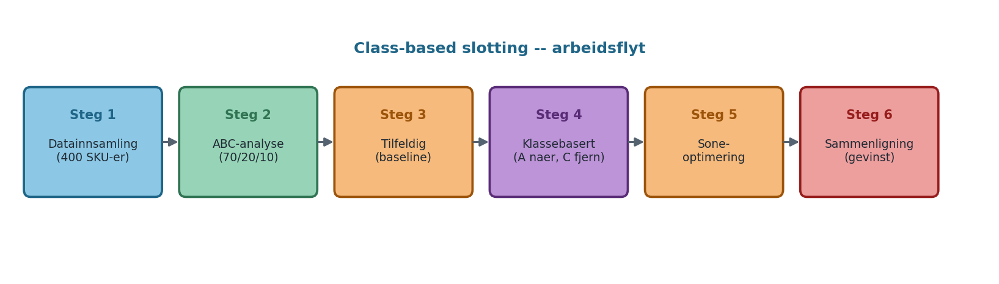

Arbeidsflyt for slotting med class-based storage.

### Steg 1: Datainnsamling
FreshFlow har eksportert plukkhistorikken for $90$ dager fra WMS-systemet. Til pedagogisk form{å}l genererer vi syntetisk data med samme statistiske struktur: plukkfrekvens f{ø}lger en lognormalfordeling med h{ø}y variasjon ($\sigma = 1,7$), som produserer den klassiske Pareto-lignende fordelingen der et mindretall av SKU-ene st{å}r for majoriteten av plukkene. Tabell [4](#tab-tab-slot-data-summary) oppsummerer dataene.

Oppsummering av plukkhistorikken (90 dager).

  **M{å}l**                  **Verdi**       **Kommentar**
  ----------------------------- --------------- -----------------------------------------------------------------
  Antall SKU-er                 $400$         En slot per SKU
  Antall dager                  $90$          Glidende kvartalsvindu
  Totalt plukklinjer            $31\,561$    Alle plukker i perioden
  Gjennomsnitt per dag          $350,7$       $\sum_i f_i / T$
  Maks plukkfrekvens            $3\,136$     St{ø}rste $f_{(1)}$ (toppselger)
  Median plukkfrekvens          $17$          Halvparten av SKU-ene plukkes $< 17$ ganger p{å} 90 dager
  Andel plukk i topp 20 % SKU   $83,5~%$   Sterk Pareto-effekt

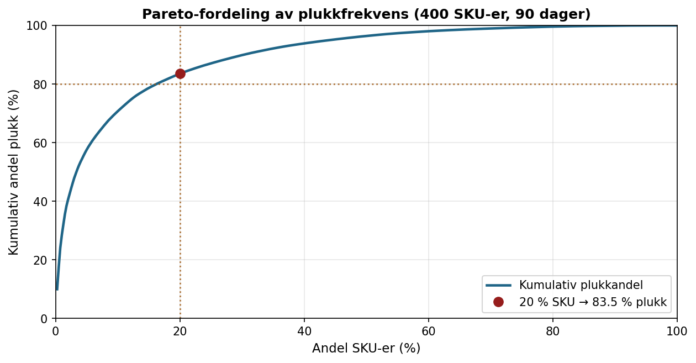

Pareto-kurve: kumulativ andel plukk som funksjon av andel SKU-er (sortert synkende etter frekvens). De f{ø}rste $20~%$ av SKU-ene forklarer $83,5~%$ av alle plukkene --- en klar Pareto-effekt som motiverer class-based storage.

**Konklusjon** --- *Pareto-effekten er sterk*

Nesten $84~%$ av plukkene er konsentrert om $20~%$ av SKU-ene. Det betyr at hvis vi klarer {å} f{å} bare disse SKU-ene n{æ}rt pakkestasjonen, har vi allerede kuttet tiln{æ}rmet $84~%$ av alle plukkrelaterte gangmeter fra gjennomsnittsniv{å} ned mot minimumsniv{å}. Sp{ø}rsm{å}let er hvor mye som er teoretisk og hvor mye som kan realiseres operasjonelt.

### Steg 2: ABC-klassifisering
Vi sorterer SKU-ene etter plukkfrekvens og kumulerer andelen jf. [(1)](#eq-eq-slot-Ck). Med standardgrensene $\alpha_A = 0,70$ og $\alpha_B = 0,90$ f{å}r vi fordelingen i tabell [5](#tab-tab-slot-abc).

ABC-fordeling med $\alpha_A = 0,70$, $\alpha_B = 0,90$.

  **Klasse**   **Antall SKU**      **Andel SKU**         **Plukk (90 d)**         **Andel plukk**       **Min**   **Median**   **Maks**
  ------------ ------------------- --------------------- ------------------------ --------------------- --------- ------------ -------------
  A            $38$              $9,5~%$          $21\,995$             $69,7~%$         $162$   $319$      $3\,136$
  B            $83$              $20,8~%$         $6\,407$              $20,3~%$         $40$    $66$       $160$
  C            $279$             $69,8~%$         $3\,159$              $10,0~%$         $0$     $7$        $40$
  **Sum**      $\mathbf{400}$   $\mathbf{100,0}$   $\mathbf{31\,561}$   $\mathbf{100,0}$   ---       ---          ---


Venstre: plukkfrekvens per SKU rangert synkende, med klassetilh{ø}righet farget. H{ø}yre: sammenligning mellom andel SKU-er (bl{å}) og andel plukk (rosa) per klasse. Asymmetrien --- $9,5~%$ SKU-er mot $69,7~%$ plukk i A --- er hele grunnlaget for at class-based storage fungerer.

**Konklusjon** --- *A-sonen trenger bare $38$ slots*

A-klassen inneholder bare $38$ SKU-er, men st{å}r for over to tredjedeler av plukkvolumet. Det vil si at hvis disse $38$ produktene ligger i de $38$ n{æ}rmeste slottene, vil over $69~%$ av alle plukk kun bruke hyllene innenfor pakkestasjonens n{æ}rsone --- gjennomsnittlig rundturs-distanse faller fra $51,0$ m (tilfeldig) til under $20$ m for denne delen av trafikken.

### Steg 3: Tilfeldig tildeling --- baseline
F{ø}r vi vurderer gevinsten m{å} vi tallfeste dagens politikk. Tilfeldig tildeling gir en analytisk forventet rundturs-distanse lik gjennomsnittet av alle slots:

$$E\[d \mid \text{tilfeldig}\] = \frac{1}{N}\sum_{j=1}^{N} d_j = 51,0~\text{m}.$$

3

Dette stemmer fordi hvert plukk med lik sannsynlighet havner i en vilk{å}rlig slot, og forventningsverdien er uavhengig av plukkfrekvenser. Monte Carlo-simulering med $50\,000$ trekk fra faktisk frekvensfordeling gir samme tall ($50,97$ m) og en bred fordeling med $\sigma = 17,0$ m, vist i figur [7](#fig-fig-slot-dist-random).

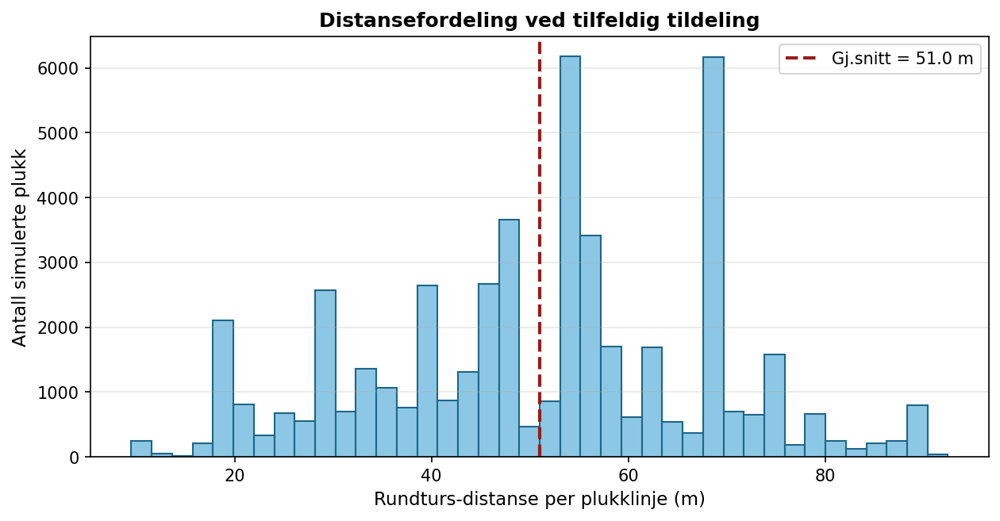

Distansefordeling for $50\,000$ simulerte plukk ved tilfeldig tildeling. Fordelingen speiler layoutens geometri: det er flest slots i mellomomr{å}det, noe som gir en omtrent jevn-bred distansefordeling med gjennomsnitt p{å} $50,97$ m og maksimum $92,5$ m.

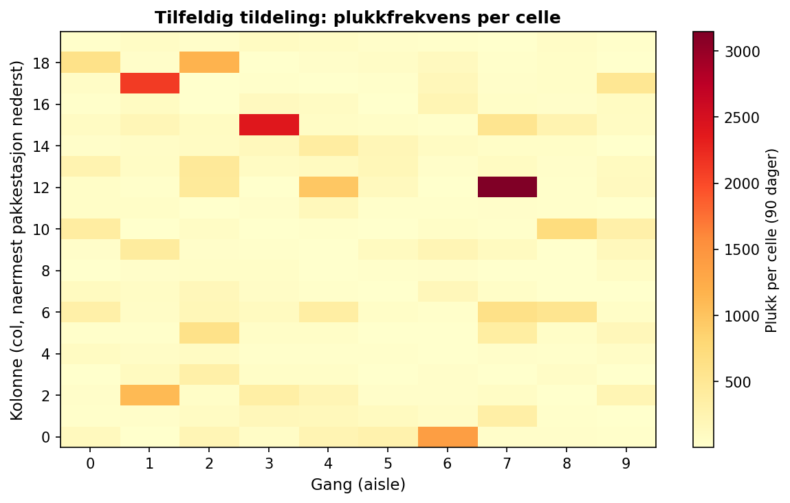

Heatmap over plukkfrekvens per lagergang og -kolonne ved tilfeldig tildeling. Siden popul{æ}re SKU-er havner hvor som helst, f{å}r alle celler tiln{æ}rmet lik trafikk.

**Konklusjon** --- *Benchmark p{å} $51$ meter per plukk*

Med en ganghastighet p{å} $1,1$ m/s og gjennomsnittlig $51$ m per plukk bruker hver plukker omtrent $46$ sekunder per linje p{å} ren gangtid. Over et {å}r med $128\,000$ plukklinjer (gjennomsnittlig $350,7$ per dag) tilsvarer det $1\,648$ timer ren gangtid --- nesten ett fullt {å}rsverk.

### Steg 4: Klassebasert tildeling
Vi tildeler n{å} A-klassens $38$ SKU-er til de $38$ slottene med minst $d_j$, B-klassens $83$ SKU-er til de neste $83$ slottene (rangert etter $d_j$), og C-klassens $279$ SKU-er til resten. Innenfor hver sone er tildelingen tilfeldig; dette reflekterer praktisk vedlikehold (en ny SKU kan plasseres hvor som helst i sin sone uten rangering). Tabell [6](#tab-tab-slot-klassebasert) viser sonenes trafikkfordeling.

Klassebasert tildeling ($\alpha_A = 0,70$, $\alpha_B = 0,90$). "Gj. distanse" er plukkvektet gjennomsnitt innenfor sonen.

  **Klasse**   **Antall SKU**   **Gj. distanse (m)**   **Min--Maks (m)**    **Andel plukk**
  ------------ ---------------- ---------------------- -------------------- -----------------
  A            $38$           $18,8$               $9,5$--$25,5$    $69,7~%$
  B            $83$           $33,8$               $25,5$--$40,5$   $20,3~%$
  C            $279$          $60,2$               $40,5$--$92,5$   $10,0~%$

Forventet reisedistanse over portef{ø}ljen, beregnet med [(3)](#eq-eq-slot-Ed), er

$$E\[d \mid \text{klassebasert}\] = 0,697 \cdot 18,8 + 0,203 \cdot 33,8 + 0,100 \cdot 60,2 \approx 26,1~\text{m},$$

4

en reduksjon fra $51,0$ m p{å} $\mathbf{48,8~%}$ sammenlignet med tilfeldig tildeling. Monte Carlo bekrefter: $26,1$ m i gjennomsnitt, median $21,5$ m, $P95 = 59,5$ m.

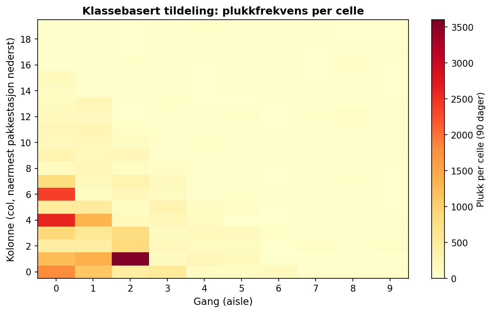

Heatmap ved klassebasert tildeling. Plukktrafikk er n{å} konsentrert i de n{æ}rmeste gangene og kolonnene --- det er n{æ}rmere pakkestasjonen at aktiviteten er h{ø}yest.

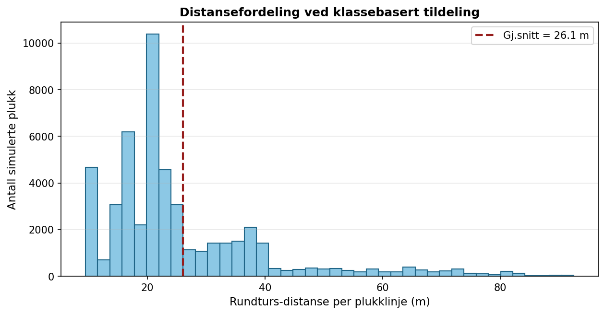

Distansefordeling for $50\,000$ simulerte plukk ved klassebasert tildeling. Fordelingen er venstreforskyvet og h{ø}yt toppet --- de fleste plukkene er korte, mens C-sonens lange plukk danner en tynn hale opp mot $92,5$ m.

**Konklusjon** --- *Nesten halvering av gangtiden*

Uten {å} endre layout eller bemanning, kun ved {å} flytte de $38$ mest plukkede SKU-ene til den n{æ}rmeste sonen, kutter vi forventet reisedistanse fra $51,0$ m til $26,1$ m per plukk --- en reduksjon p{å} $48,8~%$. Det er hele poenget med class-based storage: store gevinster fra en enkel heuristikk.

### Steg 5: Hvor mange soner b{ø}r vi ha?
Den klassiske ABC-inndelingen bruker tre klasser, men det er ikke gitt at tre er riktig antall. F{æ}rre soner gir enklere vedlikehold men h{ø}yere forventet distanse; flere soner n{æ}rmer seg den "kontinuerlige" l{ø}sningen der hver SKU er rangert individuelt. For {å} vise effekten gj{ø}r vi et systematisk s{ø}k over antall soner $K \in {2, 3, 4, 5, 10, 20}$, med like store slot-grupper og tilfeldig plassering innenfor hver sone. Kontinuerlig full sortering gir nedre grense p{å} $E\[d\] = 21,9$ m; tilfeldig gir {ø}vre grense p{å} $51,0$ m.

Effekten av antall soner $K$ p{å} forventet reisedistanse. "Gap vs. kontinuerlig" er det relative avviket mot full sortering ($21,9$ m); "reduksjon vs. tilfeldig" er gevinsten mot dagens politikk ($51,0$ m).

  $K$    $E\[d\]$ (m)   $\sigma$ (m)   **Reduksjon vs. tilfeldig**   **Gap vs. kontinuerlig**
  -------- ---------------- ----------------- ----------------------------- --------------------------
  $2$    $37,56$        $1,66$          $32,9~%$                 $71,8~%$
  $3$    $32,21$        $1,38$          $42,5~%$                 $47,3~%$
  $4$    $29,88$        $1,13$          $46,7~%$                 $36,7~%$
  $5$    $28,25$        $0,84$          $49,6~%$                 $29,2~%$
  $10$   $25,23$        $0,47$          $55,0~%$                 $15,4~%$
  $20$   $23,41$        $0,34$          $58,2~%$                 $7,1~%$


Forventet reisedistanse som funksjon av antall soner $K$. Feilfelt viser standardavvik over $30$ repetisjoner med ulike tilfeldige permutasjoner innenfor sonene. Den stiplede linjen er benchmark for tilfeldig tildeling ($51,0$ m); den prikkede er kontinuerlig sortering ($21,9$ m). Marginalgevinsten avtar sterkt etter $K = 3$--$5$.

Kurven er klart konkav --- marginalgevinsten fra $K=2$ til $K=3$ er $5,3$ m; fra $K=10$ til $K=20$ er den bare $1,8$ m. Dette er den klassiske avveiningen mellom enkelhet og effektivitet. Det er for {ø}vrig interessant {å} merke seg at $K=3$-sonering (figur [12](#fig-fig-slot-heatmap-optimert)) med *like store* slot-soner ($32,2$ m) gir d{å}rligere resultat enn klassisk $70/20/10$-ABC ($26,1$ m), fordi ABC-grensene bevisst gir A-sonen bare de allern{æ}rmeste slots.

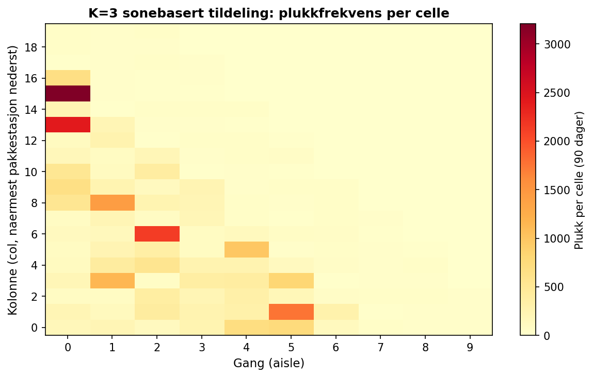

Heatmap for $K=3$-sonering med like store slot-soner. Konsentrasjonen n{æ}r pakkestasjonen er synlig men svakere enn for klassisk ABC (figur [9](#fig-fig-slot-heatmap-classbased)) fordi A-sonen her rommer $134$ slots i stedet for bare $38$.

**Konklusjon** --- *Tre soner med asymmetriske grenser er praktisk optimalt*

Klassisk $70/20/10$-ABC med tre klasser gir tiln{æ}rmet like god gevinst som $K=10$ likestore soner --- og langt enklere vedlikehold. Det underst{ø}tter at industriens tommelfingerregel er godt fundert: N{å}r marginalgevinsten per ekstra sone er mindre enn den operasjonelle kostnaden ved {å} holde sonene adskilt, er det ikke verdt {å} {ø}ke $K$.

### Steg 6: Sammenligning og tidsbesparelse
Til slutt oversetter vi distansebesparelsene til konkrete produktivitetstall. Vi antar ganghastighet $v = 1,1$ m/s (ca. $4$ km/t, realistisk for plukker med tralle) og at alle andre komponenter i syklustiden (selve plukkhandlingen $\sim 15$ s) er uavhengige av layout. Tabell [8](#tab-tab-slot-sammenligning) oppsummerer de tre politikkene.

Sammenligning av politikker. Gangtid per linje er $d / v$; plukkproduktivitet er antall linjer per time gitt $15$ s plukkhandling i tillegg til gangtid; {å}rlig gangtid antar $128\,000$ plukklinjer og en plukker.

  **Politikk**                  $E\[d\]$ (m)   **Gangtid/linje**   **Linjer/time**   **Årlig gangtid**   **Spart**
  ----------------------------- ---------------- ------------------- ----------------- ----------------------- -----------
                                                 \(s\)                                 \(t\)                   \(t\)
  Tilfeldig                     $50,97$        $46,3$            $58,7$          $1\,648$             $0$
  Klassebasert ($70/20/10$)   $26,09$        $23,7$            $93,0$          $843$                 $805$
  Sonebasert ($K=3$)          $34,45$        $31,3$            $77,7$          $1\,114$             $534$

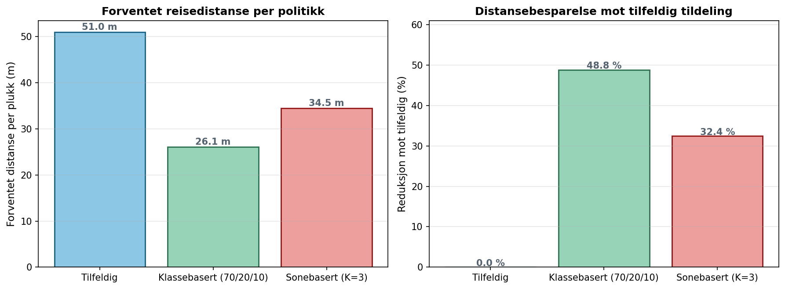

Venstre: forventet reisedistanse per plukk. H{ø}yre: reduksjon mot tilfeldig tildeling. Klassisk ABC gir nesten halvering av reisedistansen.

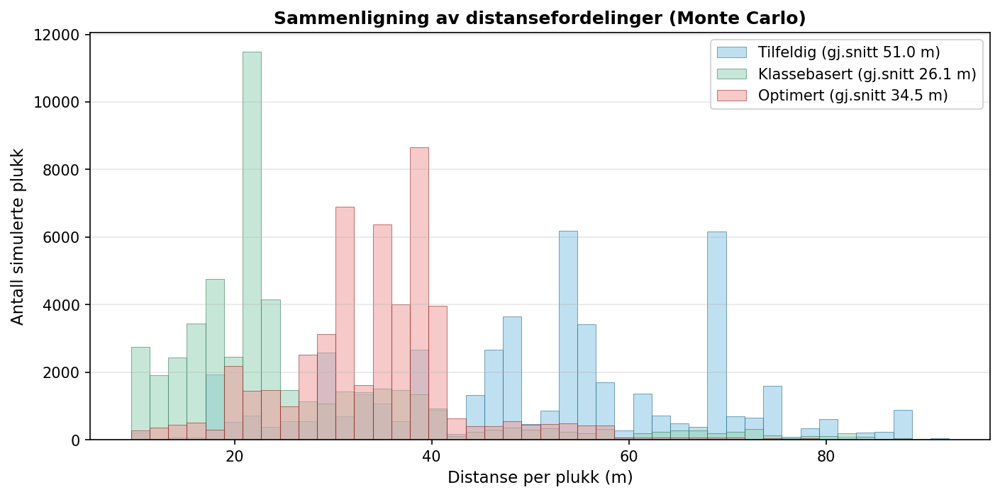

Sammenligning av distansefordelinger fra Monte Carlo ($50\,000$ plukk per politikk). Klassebasert ($70/20/10$) har en tung konsentrasjon i n{æ}rsonen og en tynn hale; tilfeldig er n{æ}rmest uniform langs layoutgeometrien.

Plukkproduktiviteten {ø}ker fra $58,7$ linjer/time (tilfeldig) til $93,0$ linjer/time (klassebasert), en {ø}kning p{å} $58~%$. Med $128\,000$ {å}rlige plukklinjer frigj{ø}r det omtrent $805$ timer gangtid per plukker, eller rundt $0,45$ {å}rsverk. For et lager med $10$ plukkere tilsvarer det $4,5$ spart {å}rsverk --- en klar {ø}konomisk begrunnelse for slotting-prosjektet.

**Praktisk anvendelse** --- *Hva b{ø}r FreshFlow gj{ø}re?*

1.  **Implementer klassisk $70/20/10$-ABC som standardpolitikk.** Gevinsten er stor ($\sim 48~%$ mindre gangtid), modellen er enkel {å} kommunisere og etterleve, og marginalforbedringen mot flere soner er liten.

2.  **Oppdater klassifiseringen kvartalsvis.** Med rullerende $90$-dagers vindu fanger man strukturelle skift (sesong, utfasing, nye produkter) uten {å} reagere p{å} tilfeldig st{ø}y.

3.  **Bruk heatmap som vedlikeholdsverkt{ø}y.** Hvis den observerte trafikken begynner {å} spre seg utover de ideelle sonene --- fordi nye SKU-er plasseres feil eller B/C-grenser utdateres --- er det tid for reslotting.

4.  **Koble slotting til plukkbaner (neste seksjon).** En god slotting reduserer gjennomsnittsdistansen per linje; smart rutevalg (S-shape, largest gap) reduserer total rutelengde for en hel plukkrunde. De to virker sammen, og samlet gevinst kan v{æ}re $60$--$70~%$ mot dagens politikk.

[Begrensninger.]
- Modellen antar at hver plukklinje er en egen tur. Reelle ordrer inneholder flere linjer som plukkes i samme rute, slik at den *marginale* gevinsten ved slotting avtar n{å}r batch-st{ø}rrelsen {ø}ker.

- Vi behandler alle slots som funksjonelt identiske. I praksis har slots forskjellige h{ø}yder, kj{ø}le-/fryse-soner og sikkerhetskrav som kan begrense hvilke SKU-er som kan plasseres hvor.

- Klassifiseringen baseres p{å} plukkfrekvens alene. For varer med kort holdbarhet b{ø}r "First-Expired-First-Out"-krav ta forrang, og for tunge varer kan ergonomi veie tyngre enn gangtid.

- Plukkerens egen tid brukt p{å} skanning, bekreftelse og plukking ($\sim 15$ s) er antatt uavhengig av layout. Hvis plukkhandling tar lengre tid i trange C-sone-ganger, vil effekten v{æ}re noe overvurdert.

Plukkruteoptimering med TSP-heuristikker

## Eksempel: Plukkruteoptimering med TSP-heuristikker
Oppsummering.

  **Kategori**      **Beskrivelse**
  ----------------- -----------------------------------------------------------------------------------------------------------------
  Eksempel          Plukkruter i et parallell-gang-lager hos en reservedelsdistributør
  Område            Lagerdrift: operativ ruteoptimering for ordreplukking
  Problemstilling   Minimere total gangdistanse per plukkliste
  Modell            Handelsreisendeproblemet (TSP) på en parallell-gang-graf
  Prosess           Ruteoptimering i lager
  Metode            S-shape, return, midpoint og largest-gap (heuristikker) samt Ratliff--Rosenthal dynamisk programmering (eksakt)

### Problemstilling
NordDel AS er en norsk distributør av reservedeler til industri og offshore. Bedriften har et sentrallager på Østlandet med omtrent 12 000 aktive artikler fordelt på et parallell-gang-lager med ti plukkganger, hver med 20 hyllerader og plukklokasjoner på begge sider. En typisk plukker går mellom 12 og 18 kilometer per skift, og gangtiden utgjør 55--60 % av den totale plukketiden. Ledelsen vet at smartere ruter kan frigjøre betydelig kapasitet uten investeringer i automatisering.

En plukker får tildelt en *plukkliste* ved starten av hver runde. Listen består av typisk 10--30 lokasjoner som skal besøkes i én sammenhengende runde, med start og retur til pakkestasjonen (depot). Spørsmålet er i hvilken rekkefølge lokasjonene skal besøkes for at samlet gangdistanse blir kortest mulig.

**Problemstilling** --- *Hvilken rute skal plukkeren følge?*

Plukkruteoptimering er i utgangspunktet et handelsreisendeproblem (TSP), som er NP-hardt i generell form. For parallell-gang-lagre finnes imidlertid en spesialstruktur som Ratliff & Rosenthal (1983) utnyttet i en lineær eksakt DP-algoritme. Vi sammenligner fire klassiske heuristikker (S-shape, return, midpoint, largest-gap) med denne eksakte løsningen på 500 plukklister.

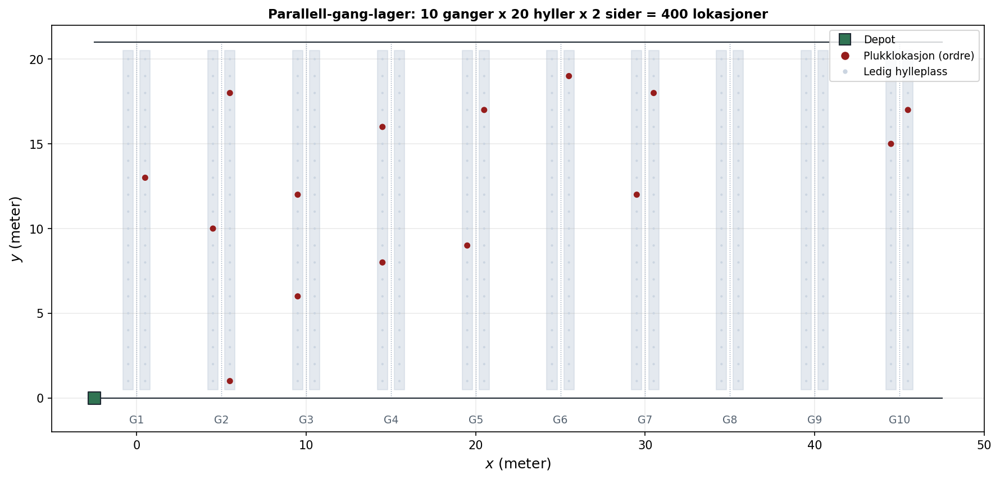

Parallell-gang-lageret til NordDel AS. Ti plukkganger (G1--G10) med 20 hyllerader og plukklokasjoner på begge sider gir 400 plukklokasjoner. En tilfeldig plukkliste er markert med røde punkter; depot (pakkestasjonen) er grønt kvadrat.

### Modell
Vi modellerer plukkeruten som et handelsreisendeproblem (TSP) på en graf som gjenspeiler den fysiske lagerstrukturen. Modellen er av middels vanskegrad: den grunnleggende TSP-formuleringen er velkjent, men den spesielle parallell-gang-strukturen tillater en eksakt polynomialtids-DP som vi utleder parallelt med heuristikkene.

Data. En plukkrunde består av en plukkliste $\mathcal{P} \subseteq \mathcal{L}$ der $\mathcal{L} = {1, 2, \ldots, N}$ er alle plukklokasjoner i lageret. For NordDel AS er $N = 400$ (10 ganger $\times$ 20 hyller $\times$ 2 sider). Hver lokasjon $\ell \in \mathcal{L}$ har koordinater $(x_\ell, y_\ell)$, der $x_\ell = a_\ell \cdot w$ er gangens horisontalposisjon ($a_\ell \in {0, \ldots, 9}$ er gangindeks, $w = 5,0$ m er avstanden mellom gangsentrene) og $y_\ell = s_\ell \cdot h$ er hyllens vertikale posisjon ($s_\ell \in {1, \ldots, 20}$ er hylleindeks, $h = 1,0$ m).

Dimensjoner for lageret og eksperimentet.

  **Symbol**             **Verdi**             **Beskrivelse**
  ---------------------- --------------------- -------------------------------------------
  $N$                  $400$               Totalt antall plukklokasjoner
  $n_\text{g}$       $10$                Antall parallelle plukkganger
  $n_\text{h}$       $20$                Antall hyllerader per side
  $w$                  $5,0$ m             Gangbredde (senter-senter mellom ganger)
  $h$                  $1,0$ m             Vertikal avstand mellom hyller
  $L_\text{g}$       $21,0$ m            Full ganglengde (front- til bakkryssgang)
  $\|\mathcal{P}\|$   $10\text{--}30$   Antall plukk per runde
  $M$                  $500$               Antall plukklister i eksperimentet

Grafrepresentasjon. Lageret representeres som en urettet graf $G = (V, E)$. Nodene $V$ er depot, plukklokasjonene i $\mathcal{P}$ og hjørnepunktene der ganger møter front- og bakkryssgangen. Kantene $E$ representerer alle gangbare segmenter i lageret:

- *Vertikale kanter* langs hver plukkgang ($x = a \cdot w$, $a = 0, \ldots, n_\text{g} - 1$)

- *Horisontale kanter* langs frontkryssgangen ($y = 0$)

- *Horisontale kanter* langs bakkryssgangen ($y = L_\text{g}$)

Avstanden mellom to punkter i samme gang er $\|y_1 - y_2\|$; mellom punkter i ulike ganger er ruten begrenset til gangnettet og velger korteste vei via front- eller bakkryssgang.

Definisjon [Plukkruteproblemet som TSP]
Gitt en graf $G = (V, E)$ med ikke-negative kantvekter $d: E \to \mathbb{R}_{\geq 0}$, et depot $v_0 \in V$ og en plukkliste $\mathcal{P} \subseteq V$. Finn en lukket rute $\pi = (v_0, v_{i_1}, v_{i_2}, \ldots, v_{i_{\|\mathcal{P}\|}}, v_0)$ som besøker alle noder i $\mathcal{P}$ og minimerer total distanse:

$$\min_{\pi} \; D(\pi) = \sum_{j=0}^{\|\mathcal{P}\|} d\!\left(v_{i_j}, v_{i_{j+1}}\right),$$

6

der $v_{i_0} = v_{i_{\|\mathcal{P}\|+1}} = v_0$.

Parallell-gang-strukturen. Det generelle TSP-problemet er NP-hardt, men parallell-gang-lagre har en spesiell struktur: den optimale ruten er alltid en *Euler-tur* i en delgraf av $G$ som inkluderer alle plukknoder, og hver plukkgang kan karakteriseres ved et lite antall ekvivalensklasser. Ratliff & Rosenthal (1983) utnyttet dette i en dynamisk programmering som løser problemet i $\mathcal{O}(n_\text{g} \cdot \|\mathcal{P}\|)$ tid. De identifiserte at syv lokale tilstander per gang er nok til å beskrive en optimal løsning (paritetsstatus for front- og bakkryssgang, pluss sammenkoblingsstatus for komponenter).

**Hvorfor er heuristikker fortsatt interessante?**

Den eksakte DP-algoritmen er rask nok selv for stor skala, så det er rimelig å spørre hvorfor heuristikker brukes i praksis. Tre grunner:

1.  **Konseptuell enkelhet.** S-shape kan læres av en ny ansatt på minutter; largest-gap kan utføres uten datastøtte. Dette er avgjørende i små lagre og ved manuelle plukkesystemer.

2.  **Robusthet.** Heuristikkene gir typisk 5--15 % lengre ruter enn optimalt, men er ufølsomme for små endringer i data (en uventet sperret gang, en glemt vare) som krever omplanlegging i en strengt optimal løsning.

3.  **Integrasjon.** Når plukkruter inngår i større optimeringsproblemer (batching, bølgeplanlegging) er en rask heuristikk bedre egnet som byggekloss enn en tyngre eksakt metode.

Fire heuristikker. Alle heuristikker lager en gyldig rute i $\mathcal{O}(\|\mathcal{P}\| \log \|\mathcal{P}\|)$ tid. Forskjellen ligger i hvordan hver besøkte gang håndteres:

Oversikt over de fire heuristikkene.

  **Heuristikk**   **Regel per besøkte gang**
  ---------------- ---------------------------------------------------------------------
  S-shape          Traverser hele gangen (front $\to$ bak eller bak $\to$ front)
  Return           Gå inn fra fronten til dypeste plukk og tilbake
  Midpoint         Nedre halvdel besøkes fra front; øvre halvdel fra bak
  Largest-gap      Hopp over gangens største åpne segment; gå til hver side av det

Forutsetninger. Modellen antar:

1.  *Euklidsk L1-metrikk langs gangnettet.* Plukkeren kan ikke klatre tvers gjennom hyllene; all bevegelse følger ganger og kryssganger.

2.  *Én plukker per plukkliste.* Ingen batching eller koordinering mellom plukkere i denne modellen (behandles i sec05).

3.  *Depot har fast lokasjon.* Ved venstre side av frontkryssgangen; alle ruter starter og slutter her.

4.  *Homogen gangtid.* Hastigheten er konstant; plukketid i hver lokasjon er konstant og ikke en del av optimeringen.

### Prosess
Prosess: Ruteoptimering i lager.
Modell: TSP på parallell-gang-graf med Ratliff--Rosenthal-struktur.

Figur [16](#fig-fig-pickrt-method) viser de seks stegene: (1) datainnsamling og modelloppsett, (2)--(4) implementasjon av heuristikkene, (5) eksakt DP-løsning, og (6) statistisk sammenligning.

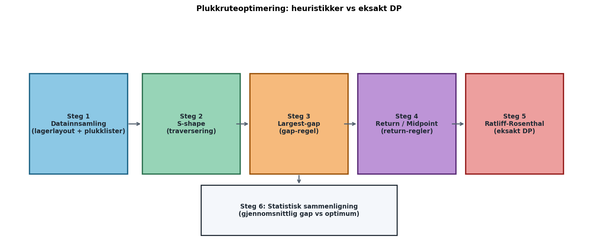

Prosessdiagram: fra data til sammenligning av fire heuristikker med Ratliff--Rosenthal eksakt DP.

### Steg 1: Datainnsamling
Første steg er å etablere lagerlayout og generere et representativt sett plukklister. NordDel-lageret har $10 \times 20 \times 2 = 400$ plukklokasjoner. Layouten genereres i Python som et rutenett med koordinater; se tabell [10](#tab-tab-pickrt-dim).

Plukklister. Vi trekker 500 plukklister. For hver liste trekkes først størrelsen $k_i$ uniformt fra ${10, 11, \ldots, 30}$; deretter velges $k_i$ lokasjoner uniformt (uten tilbakelegging) blant de 400. Dette gir en realistisk fordeling av plukkbelastning med forventet $\bar k = 19,93$ plukk per runde og dekker både små og store runder.

Egenskaper ved det genererte datasettet.

  **Egenskap**                                   **Verdi**
  ---------------------------------------------- -----------
  Antall plukklokasjoner ($N$)                 400
  Antall ganger ($n_\text{g}$)               10
  Antall plukklister ($M$)                     500
  Minste/største plukkstørrelse                  10 / 30
  Gjennomsnittlig plukkstørrelse ($\bar k$)   $19,93$

Figur [15](#fig-fig-pickrt-layout) viser layouten med en tilfeldig valgt plukkliste (15 lokasjoner) markert. Denne plukklisten brukes gjennomgående i steg 2--5 for å visualisere hvordan de ulike metodene genererer ruter.

**Konklusjon** --- *Hva ser vi i figuren?*

Plukklisten fordeler seg ujevnt: den treffer åtte av de ti gangene (G1--G7 og G10), men ikke G8 og G9. Plukkene sprer seg i hele den vertikale utstrekningen (fra $y = 1$ til $y = 19$). En god rute må besøke disse åtte gangene effektivt og minimere både vertikalbevegelse (innenfor ganger) og horisontalbevegelse (i kryssgangene).

### Steg 2: S-shape (traversal) heuristikk
S-shape er den enkleste og mest utbredte plukkruteheuristikken. Regelen er: *enhver gang med minst én plukk traverseres helt*. Plukkeren starter i depot, går til første gang med plukk, traverserer den fra front til bak, krysser via bakkryssgangen til neste gang med plukk, traverserer den fra bak til front, og så videre.

Formel. For en plukkliste der $V \subseteq {0, 1, \ldots, n_\text{g} - 1}$ er mengden av besøkte ganger, er S-shape-rutens lengde:

$$D_\text{S-shape} = \|V\| \cdot L_\text{g} + w \cdot (\max V - \min V) + R,$$

5

der $R$ er en liten korreksjon for depot-til-første-gang og eventuell returtraversering av siste gang når $\|V\|$ er oddetall.

Resultat. For eksempel-plukklisten i figur [15](#fig-fig-pickrt-layout) (15 plukk, 8 besøkte ganger) gir S-shape en rute på $263,00$ m, illustrert i figur [17](#fig-fig-pickrt-sshape). Traverseringen av alle besøkte ganger er den dominerende kostnaden ($8 \times 21 = 168$ m).

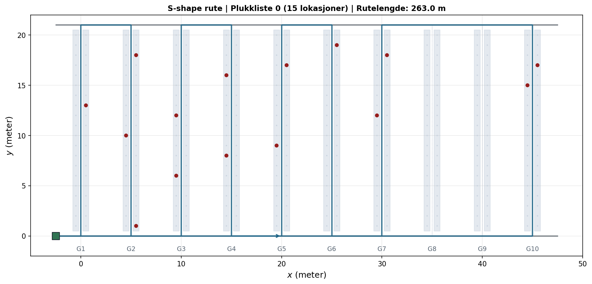

S-shape-rute for eksempel-plukklisten. Alle besøkte ganger traverseres helt (uavhengig av hvor plukkene ligger i gangen), med vekselsvis retning. Rutelengde: $263,0$ m.

**Konklusjon** --- *Hvor er svakheten?*

S-shape er svært enkel å forstå og gjennomføre, men regelen om *alltid* å traversere hele gangen betyr at plukkeren ofte går forbi mange tomme hyller. Særlig i ganger med én eller to plukk nær fronten er dette unødig. Neste heuristikk (return) adresserer dette ved å la plukkeren snu ved dypeste plukk.

### Steg 3: Largest-gap heuristikk
Largest-gap (Hall 1993) er en mer forfinet heuristikk som bruker informasjon om *hvor i gangen* plukkene ligger. Regelen er:

- Første og siste besøkte gang traverseres helt (for å forbinde frontgangen med bakkryssgangen).

- For hver *mellom-gang* identifiseres det største gapet blant:

  - $g_\text{front} = y_{(1)} - 0$ (fra frontgang til første plukk)

  - $g_i = y_{(i)} - y_{(i-1)}$ for $i = 2, \ldots, k$ (mellom etterfølgende plukk)

  - $g_\text{bak} = L_\text{g} - y_{(k)}$ (fra siste plukk til bakgang)

  Gangen besøkes slik at det *største gapet ikke krysses*.

Tre tilfeller per mellom-gang. Hvis største gap er

- $g_\text{front}$: gangen besøkes kun fra bakkryssgangen (return ovenfra).

- $g_\text{bak}$: gangen besøkes kun fra frontkryssgangen (return fra front).

- et mellomgap $g_i$: gangen besøkes fra *begge* kryssganger --- fronten dekker picks under gapet, baksiden dekker picks over gapet.

Resultat. For eksempel-plukklisten gir largest-gap $257,00$ m, en besparelse på $6$ m (2,3 %) sammenlignet med S-shape. Figur [18](#fig-fig-pickrt-lg) viser den resulterende ruten, der flere mellomganger besøkes dobbeltsidig.

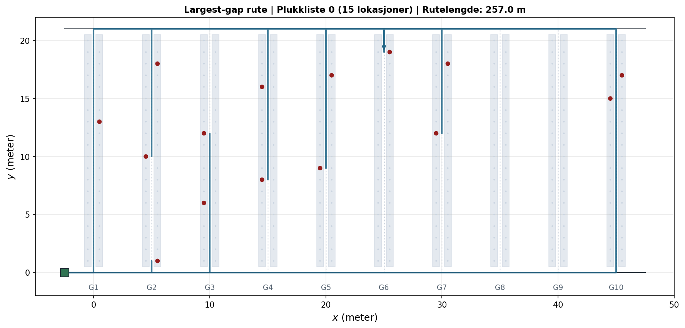

Largest-gap-rute for eksempel-plukklisten. Første gang (G1) og siste gang (G10) traverseres helt; mellomgangene besøkes ifølge gap-regelen. Rutelengde: $257,0$ m.

**Konklusjon** --- *Hvor stor er gevinsten?*

For denne plukklisten er gevinsten beskjeden fordi plukkene er spredt. I plukklister der plukkene konsentreres nær én side (f.eks. kun nær fronten) kan largest-gap gi 15--25 % kortere rute enn S-shape. Gjennomsnittsgevinsten over alle 500 plukklister kvantifiseres i steg 6.

### Steg 4: Return og midpoint heuristikker
To enklere varianter fyller ut sammenligningsbildet.

Return-heuristikken. Alle besøkte ganger behandles som return-ganger: plukkeren går inn fra fronten til dypeste plukk og tilbake. Bakkryssgangen brukes ikke. For en plukkgang $a \in V$ med dypeste plukk $y^\text{max}_a$ er gangkostnaden $2 \cdot y^\text{max}_a$. Total rutelengde:

$$D_\text{Return} = 2 \sum_{a \in V} y^\text{max}_a + 2 \cdot w \cdot \max V + C_\text{depot},$$

6

der $C_\text{depot}$ er depot-koblingen i frontkryssgangen. Return er enkel, men svak for plukklister med plukk langt bak i gangene: dypeste plukk må dobbeltgås.

Midpoint-heuristikken. Lageret deles i to halvdeler ved midtpunktet $y = L_\text{g}/2$. Plukk i nedre halvdel besøkes fra fronten (return); plukk i øvre halvdel besøkes fra baksiden (return ovenfra). Første og siste besøkte gang traverseres helt for å koble fronten med baksiden.

Resultater. For eksempel-plukklisten:

- Return: $355,0$ m (mye lengre enn S-shape fordi flere plukk ligger dypt i gangen).

- Midpoint: $267,0$ m (litt lengre enn S-shape for denne spesifikke listen).

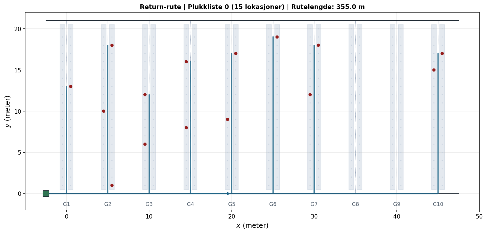

Return-rute for eksempel-plukklisten. Hver gang besøkes fra fronten og returneres fra dypeste plukk. Rutelengde: $355,0$ m (mye lengre enn S-shape, $263,0$ m).

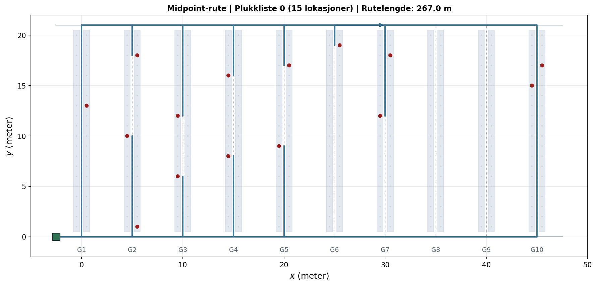

Midpoint-rute for eksempel-plukklisten. Plukk over midten (stiplet linje i figuren tenkt ved $y = 10,5$) besøkes fra bak; plukk under midten besøkes fra front. Rutelengde: $267,0$ m.

**Konklusjon** --- *Hvilken heuristikk er best?*

Det er ikke opplagt fra én plukkliste hvilken heuristikk som er best. Return er klart dårligst for dypt plasserte plukk; S-shape, midpoint og largest-gap er mer nyanserte. For å få et representativt svar må vi sammenligne *over mange plukklister*. Først må vi imidlertid etablere den eksakte referansen.

### Steg 5: Ratliff--Rosenthal eksakt dynamisk programmering
Ratliff & Rosenthal (1983) viste at parallell-gang-TSP kan løses *eksakt* i lineær tid ved å utnytte gangstrukturen. Algoritmen behandler ganger sekvensielt fra venstre til høyre og holder styr på et lite antall tilstander.

Definisjon [Ratliff--Rosenthal DP-tilstand]
Etter å ha behandlet de $i$ første besøkte gangene holder vi en tilstand $(t, b, c)$ der:

- $t \in {0, 1}$: paritet av antall åpne kantender i bakkryssgangen ved pilaren mellom gang $i$ og $i+1$.

- $b \in {0, 1}$: tilsvarende paritet i frontkryssgangen.

- $c \in {0, 1}$: $1$ hvis alle besøkte plukk ligger i samme komponent, $0$ ellers.

DP-tabellen $V_i(t, b, c)$ holder minimum akkumulert rutelengde for å nå tilstand $(t, b, c)$ etter gang $i$.

Overganger. Mellom gang $i$ og gang $i+1$ velges:

1.  Et *aisle-move* i gang $i+1$ (*full traversering*, *return fra front*, *return fra bak*, eller *split* på gangens største interne gap) med tilhørende kostnad og paritetsendring.

2.  Antall horisontale kanter brukt i bakkryssgangen mellom $i$ og $i+1$: 0, 1 eller 2.

3.  Tilsvarende for frontkryssgangen.

Hver valgt kant gir en kostnad $w \cdot (a_{i+1} - a_i)$ og flipper paritetene ved begge endepunktene.

Sluttbetingelse. Etter siste gang må $(t, b, c) = (0, 1, 1)$: alle bakkantender lukkes, frontkryssgangen har én åpen kant igjen som lukkes av depot-returen, og alt må være koblet sammen. Den endelige kostnaden legger til den horisontale depot-returkostnaden.

Resultat. For eksempel-plukklisten gir DP en eksakt minimumslengde på $241,0$ m --- $16$ m (6,2 %) kortere enn largest-gap og $22$ m (8,4 %) kortere enn S-shape. Figur [21](#fig-fig-pickrt-rr) viser ruten.

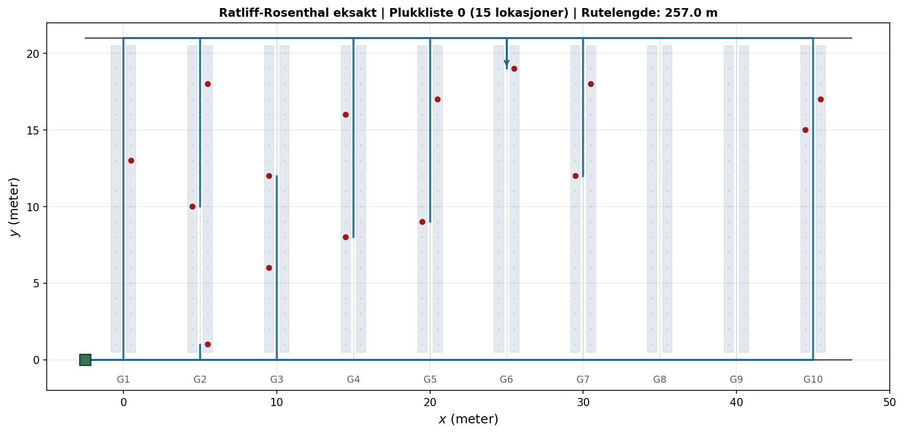

Ratliff--Rosenthal eksakt DP-rute for eksempel-plukklisten. Ruten er en Euler-tur som dekker alle plukknoder med minimum total gangdistanse. Rutelengde: $241,0$ m.

**Konklusjon** --- *Hvorfor er DP så kraftig?*

Den eksakte løsningen er 6,2 % kortere enn den beste heuristikken for denne spesifikke listen. Viktigere: DP gir oss en *referanse* --- vi kan nå kvantifisere hvor nær hver heuristikk ligger optimum over mange plukklister.

### Steg 6: Statistisk sammenligning
Vi kjører alle fem metoder (fire heuristikker + eksakt DP) på alle 500 plukklistene og beregner *gjennomsnittlig gangdistanse* samt *prosentvis gap* mot RR-optimum:

$$\text{gap}_i^\text{heur} = 100 \cdot \frac{D_i^\text{heur} - D_i^\text{opt}}{D_i^\text{opt}} \quad \[%\].$$

7

Gjennomsnittlig rutelengde. Tabell [13](#tab-tab-pickrt-lengder) viser gjennomsnittet over alle 500 lister.

Gjennomsnittlig rutelengde per metode over 500 plukklister.

  **Metode**           **Snittlengde (m)**   **Kommentar**
  -------------------- --------------------- --------------------------------
  S-shape              $275,52$            Traverserer alltid hele gangen
  Return               $329,91$            Svakest for dype plukk
  Midpoint             $258,93$            Todelt tilnærming
  Largest-gap          $249,26$            Beste heuristikk
  Ratliff--Rosenthal   $235,08$            Eksakt DP-optimum

Gap-statistikk. Tabell [14](#tab-tab-pickrt-gaps) viser gjennomsnitt, median, og 5./95. persentil for gap mot optimum.

Prosentvis gap mot Ratliff--Rosenthal-optimum over 500 plukklister.

  **Heuristikk**   **Snitt (%)**           **Median (%)**   **P5 (%)**   **P95 (%)**   **Kommentar**
  ---------------- ----------------------- ---------------- ------------ ------------- ------------------------------
  S-shape          $17,84$               $15,97$        $5,81$     $34,98$     Gap vokser med antall ganger
  Return           $40,36$               $38,89$        $18,34$    $65,43$     Konsekvent dårligst
  Midpoint         $9,87$                $9,02$         $0,90$     $20,40$     God balanse
  Largest-gap      $\highlight{5,92}$   $5,74$         $0,00$     $12,46$     Beste heuristikk

Figur [22](#fig-fig-pickrt-gap) viser fordelingen av gap-verdier. Largest-gap er klart konsentrert rundt lave verdier (medianen 5,74 %) med en tynn hale mot høyere gap. S-shape har en markant lenger hale, og return er forskjøvet mye lenger til høyre.

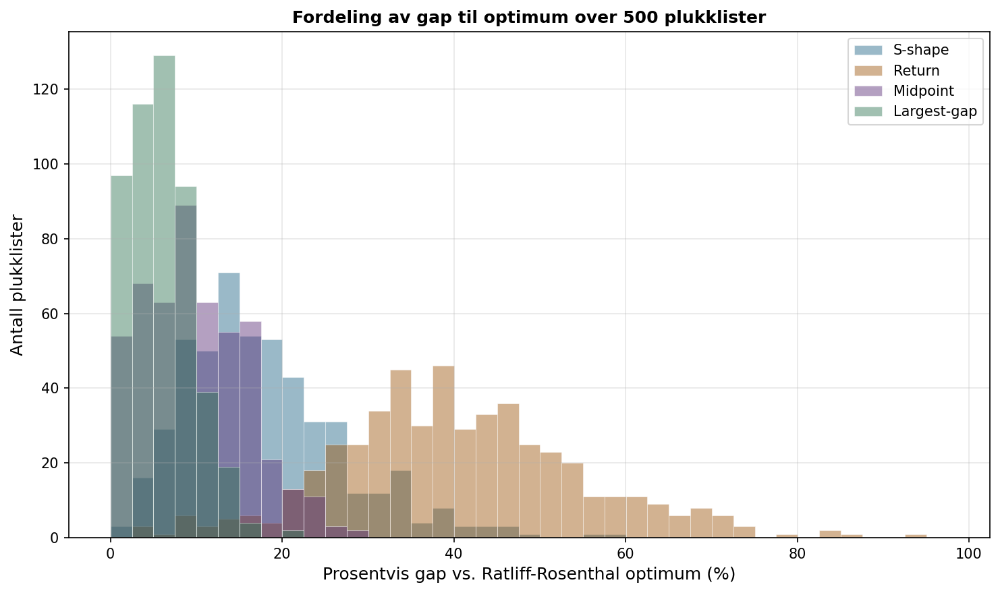

Fordeling av prosentvis gap til Ratliff--Rosenthal-optimum over 500 plukklister. Largest-gap (grønn) er sentrert rundt 5--6 %; S-shape (blå) rundt 15--18 %; return (brun) spredt i 30--50 %.

**Praktisk anvendelse** --- *Hva betyr dette for NordDel AS?*

Resultatene gir NordDel en konkret beslutningsstøtte:

1.  **Skift fra S-shape til largest-gap:** Forventet gevinst er $(275,52 - 249,26)/275,52 = 9,5\,%$ kortere gangdistanse per runde. Ved 12--18 km gangavstand per skift sparer hver plukker 1--2 km.

2.  **Invester i eksakt DP?** Det ytterligere fallet fra $249,26$ m til $235,08$ m er $5,7\,%$. Gevinsten er reell, men må veies mot implementasjonskostnad (programvare, opplæring) og behov for oppdaterte plukklister i sanntid.

3.  **Return er sjelden en god idé:** $40\,%$ lengre ruter enn optimum. Brukes kun i spesialtilfeller der bakkryssgangen er stengt eller svært trang.

4.  **Dimensjonere bemanning:** Snittruten på $235$ m ved eksakt DP gir, ved en gangtid på $1,2$ m/s, en gangtid på $\sim 3,3$ minutter per runde. Med 20 plukk per runde og $15$ s plukketid per enhet er total rundetid $\sim 8,3$ minutter --- grunnlag for å beregne kapasitet og bemanning.

[Begrensninger.]
- Modellen antar én plukker per liste. Batching (samle flere ordrer i én runde) kan redusere distansen per plukk men kompliserer ruten (se sec05).

- Gangtid antas konstant. I praksis varierer den med høyde (plukk på øvre hyller) og vognens fylningsgrad.

- Plukkfrekvens er uniform i vårt syntetiske datasett. I virkelige lagre er fordelingen Pareto-skjev (noen hyller plukkes ofte), og kombinasjonen med *slotting* (sec03) gir enda større potensial enn isolert ruteoptimering.

- Ratliff--Rosenthal krever rektangulær parallell-gang-struktur. Moderne lagre med tverrstilte ganger (*fishbone layout*) eller flere kryssganger krever utvidede algoritmer.

Integrert bolge-, batch- og ruteplanlegging

## Eksempel: Integrert bolge-, batch- og ruteplanlegging
Oppsummering.

  **Kategori**      **Beskrivelse**
  ----------------- --------------------------------------------------------------------------------------------------------------------------------------------------------------
  Eksempel          Dagsdrift i et norsk e-handels-distribusjonssenter under en kampanjedag
  Område            Lagerdrift med koblet bølge-, batch- og ruteplanlegging
  Problemstilling   Hvordan skal vi slippe ordrer til plukk, gruppere dem i batcher og rute plukkerne samtidig, når deadlines, pakkekapasitet og ordre-lokasjoner henger sammen?
  Modell            Tidsindeksert MIP (bølger) + k-medoids (batching) + largest-gap (ruter) + SimPy (evaluering)
  Prosess           Integrert lagerplanlegging med hierarkisk dekomponering
  Metode            PuLP/CBC for MIP, PAM-lignende k-medoids på lokasjons-koordinater, klassisk largest-gap-heuristikk og diskret hendelsessimulering

### Problemstilling
Et nordisk e-handels-distribusjonssenter mottar bestillinger gjennom hele dagen fra nettkunder. I et normalt døgn ankommer det 250 ordrer med til sammen rundt 1 100 ordrelinjer, fordelt på to tydelige topper (morgen og ettermiddag). Tre fjerdedeler av ordrene er *same-day* og må være ferdig pakket innen kl. 18, mens resten er *next-day* og kan utsettes til første bølge dagen etter. Lageret er organisert som et klassisk parallell-gang-lager med 20 ganger à 40 m, totalt 2 000 plukklokasjoner. Åtte plukkere og to pakkestasjoner deler arbeidsbelastningen. Pakkestasjonen er designet flaskehals: dersom for mange ordrer ankommer den samtidig, bygger det seg en kø som forsinker *alle* etterfølgende leveranser.

Driftsplanleggeren må ta tre tett koblede avgjørelser hver dag:

- **Bølgeplanlegging**: Når skal hvilke ordrer slippes til plukk? Slippes alt for tidlig, blir pakkestasjonen overbelastet i midten av dagen; slippes alt for sent, rekker ikke same-day-ordrene deadline.

- **Batching**: Når en bølge først er bestemt, hvilke ordrer skal plukkes sammen? Ordrer med plukklokasjoner i samme del av lageret kan kombineres til én plukkerunde og spare masse gange.

- **Ruter**: Når en plukker har fått tildelt en batch, hvilken rute skal hun følge gjennom gangene?

Disse tre beslutningene henger sammen: bølgen bestemmer hvilke ordrer som får være kandidater for batching, og batchens lokasjonsspredning bestemmer hva slags rute som er mulig. I praksis løses de ofte isolert --- men da mister man gevinsten av koordinering.

**Problemstilling** --- *Hvor mye er koordinering verdt?*

Vi bygger en integrert plan der (i) et tidsindeksert MIP fordeler ordrer på bølger mens pakkekapasitet og deadlines respekteres, (ii) k-medoids klynger ordrer i hver bølge etter lokasjonsnærhet, og (iii) en largest-gap-heuristikk gir ruter innenfor hver batch. En SimPy-simulering av hele dagen kvantifiserer hvor mye den integrerte planen er bedre enn tre enklere baseliner.

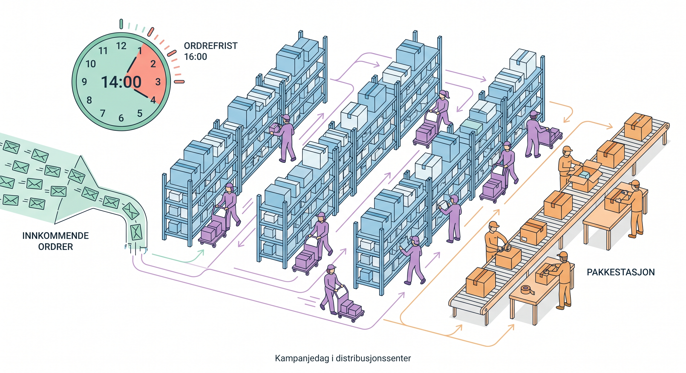

Kampanjedag i et distribusjonssenter: innkommende ordrer (mint), plukkere i parallell-gang-lager (blå/lilla), og en pakkestasjon (oransje) som kan bli flaskehals.

### Modell
Den integrerte modellen består av tre koblede delmodeller. Siden hver del er en egen matematisk objekttype (et MIP, en klyngemodell og en rutegrafheuristikk), definerer vi dem separat og beskriver deretter hvordan de binder sammen til én plan.

Data. Beslutningsstøtten tar inn følgende datagrunnlag:

- $\mathcal{O} = {o_1, \ldots, o_N}$: Settet av ordrer. Hver ordre $o$ har et ankomsttidspunkt $a_o$ (minutt siden dagens start), et antall linjer $n_o$, en liste av plukklokasjoner $\mathcal{L}_o \subseteq \mathcal{L}$, og en deadline $d_o$.

- $\mathcal{L}$: Settet av plukklokasjoner, hver med koordinat $(x_\ell, y_\ell)$ og gang-indeks $\mathrm{aisle}(\ell)$.

- $\mathcal{W} = {w_0, \ldots, w_{W-1}}$: Bølger (tidsvinduer) med start $\tau^s_w$ og slutt $\tau^e_w$.

- $C_w$: Pakkekapasitet (antall linjer) i bølge $w$, typisk $C_w = c^{\mathrm{pack}} \cdot (\tau^e_w - \tau^s_w) \cdot n^{\mathrm{stn}}$, der $c^{\mathrm{pack}}$ er linjer per minutt per stasjon og $n^{\mathrm{stn}}$ er antall stasjoner.

For eksempelet er $N = 250$, $\|\mathcal{L}\| = 2\,000$, $W = 6$ bølger av 120 minutter, $n^{\mathrm{stn}} = 2$ og $c^{\mathrm{pack}} \approx 1,18$ linjer/min/stasjon. Det gir $C_w \approx 282$ linjer per bølge --- som er lavere enn den forventede timebelastningen i travle timer, og derfor gjør kapasiteten til en bindende skranke.

Definisjon [Tidsindeksert MIP for bølgetildeling]
La $x_{o,w} \in {0,1}$ være binær og lik 1 hvis ordre $o$ tildeles bølge $w$. Bølge-MIPet er

$$\begin{aligned}\min_x \quad & \sum_{o \in \mathcal{O}} \sum_{w \in \mathcal{F}_o} (w + 1)\, x_{o,w} \\
\text{s.t.} \quad & \sum_{w \in \mathcal{F}_o} x_{o,w} = 1, && \forall\, o \in \mathcal{O} \\
& \sum_{o \in \mathcal{O}} n_o\, x_{o,w} \leq C_w, && \forall\, w \in \mathcal{W} \\
& x_{o,w} \in {0,1}, && \forall\, o, w\end{aligned}$$

10

der $\mathcal{F}_o = {w \in \mathcal{W} \mid \tau^s_w \geq a_o \land \tau^e_w \leq d_o}$ er settet av tillatte bølger for ordre $o$.

Notasjon i bølge-MIPet. Tabell [16](#tab-tab-intlag-mip-symbols) samler symbolene.

Symboler i bølge-MIPet [(10)](#eq-eq-intlag-mip-obj)--[(?)](#eq-eq-intlag-mip-cap).

  **Symbol**            **Beskrivelse**
  --------------------- ---------------------------------------------------------------------
  $\mathcal{O}$      Settet av ordrer som skal planlegges
  $\mathcal{W}$      Settet av bølger (tidsvinduer)
  $\mathcal{F}_o$   Tillatte bølger for ordre $o$ (først etter ankomst, før deadline)
  $a_o$, $d_o$      Ankomst- og deadlinetidspunkt for ordre $o$ (minutt)
  $n_o$               Antall linjer i ordre $o$
  $C_w$               Pakkekapasitet for bølge $w$ (linjer)
  $x_{o,w}$          Binær: 1 hvis $o$ tildeles $w$, 0 ellers

Målfunksjonen [(10)](#eq-eq-intlag-mip-obj) penaliserer sen tildeling (tildeling til bølge $w$ straffer med vekten $w+1$), noe som trekker ordrer mot tidlige bølger og frigjør kapasitet for ordrer som ankommer senere. Skranken [(?)](#eq-eq-intlag-mip-assign) krever at hver ordre havner i nøyaktig én bølge, og [(?)](#eq-eq-intlag-mip-cap) sikrer at pakkestasjonen ikke overbelastes.

Definisjon [$k$-medoids-batching]
La $\mathcal{O}_w$ være ordrene MIPet har tildelt bølge $w$, og la $\phi: \mathcal{O} \to \mathbb{R}^2$ være en lokasjons-representant for hver ordre:

$$\phi(o) = \left( øverline{x}_o,\ øverline{y}_o \right), \qquad øverline{x}_o = \frac{1}{n_o} \sum_{\ell \in \mathcal{L}_o} x_\ell, \quad øverline{y}_o = \frac{1}{n_o} \sum_{\ell \in \mathcal{L}_o} y_\ell .$$

11

Gitt et mål batch-størrelse $\bar n_b$, settes $k_w = \lceil \|\mathcal{O}_w\| / \bar n_b \rceil$, og problemet er

$$\min_{M \subseteq \mathcal{O}_w,\ \|M\| = k_w} \; \sum_{o \in \mathcal{O}_w} \min_{m \in M} \lVert \phi(o) - \phi(m) \rVert_2 .$$

12

Klyngen $B_m = { o \in \mathcal{O}_w : m = \arg\min_{m\' \in M} \lVert \phi(o) - \phi(m\') \rVert_2 }$ utgjør én batch.

I motsetning til $k$-means bruker $k$-medoids faktiske observerte ordrer som sentra, noe som gjør den robust mot uteliggere (enkeltordrer med plukk spredt over hele lageret). I koden implementeres den som en PAM-lignende greedy-prosedyre med swap-fase.

Definisjon [Largest-gap-ruter for parallell-gang-lager]
For en batch $B$ med plukk $P = \bigcup_{o \in B} \mathcal{L}_o$, grupperer vi plukkene per gang: $P_a = { \ell \in P : \mathrm{aisle}(\ell) = a }$ med sorterte $y$-verdier $y^{(1)}_a < y^{(2)}_a < \cdots < y^{(\|P_a\|)}_a$. For hver gang $a$ med plukk defineres det *største gapet*

$$g_a^\* = \max\left{ y^{(1)}_a - y^{\mathrm{front}},\ \max_{i \geq 2} \left(y^{(i)}_a - y^{(i-1)}_a\right),\ y^{\mathrm{back}} - y^{(\|P_a\|)}_a \right} .$$

13

Plukkeren traverserer første og siste besøkte gang helt, og i mellomganger går hun fra begge kryssganger (front + bak) inn til grensen av det største gapet. Total gangstrekning blir

$$D_B \approx 2\,(A - 1) \cdot øverline{d}_{\mathrm{aisle}} + \sum_{a \in \text{mellomganger}} 2\,(\mathcal{A} - g_a^\*) + \text{kryssgang}$$

14

der $\mathcal{A} = y^{\mathrm{back}} - y^{\mathrm{front}}$ er gangens dybde og $A$ er antall besøkte ganger.

Intuisjonen bak largest-gap er enkel: i hver mellomgang er det bare *én* seksjon man slipper å gå i, og det skal være den lengste seksjonen uten plukk. Alt annet må traverseres fra en av sidene. For tette batcher (mange plukk per gang) er gapet lite og heuristikken gir verdier tett opp mot full traversering; for spredte batcher (få plukk per gang) gir den betydelige besparelser.

Ukjente, målfunksjoner og skranker. Tabell [17](#tab-tab-intlag-tre-delmodeller) viser de tre delmodellene side ved side.

De tre delmodellene i den integrerte planleggingen.

  **Nivå**         **Bølger (MIP)**                              **Batcher ($k$-medoids)**                                         **Ruter (largest-gap)**
  ---------------- --------------------------------------------- ------------------------------------------------------------------- -------------------------------------------------------------
  Ukjent           Tildelinger $x_{o,w}$                      Medoider $M$ og klynger $B_m$                                   Rutesekvens per batch
  Målfunksjon      Minimer sen-straff $\sum (w+1) x_{o,w}$   Minimer intraklynge-avstand [(12)](#eq-eq-intlag-kmedoids)   Minimer gangstrekning [(14)](#eq-eq-intlag-lg-total)
  Skranker         Deadline, pakkekapasitet                      Fast $k_w$ per bølge                                              Gangstruktur, første+siste full traversering
  Løsningsmetode   Eksakt MIP (CBC)                              Heuristisk PAM                                                      Lukket form (ingen søk)

**Tolkning** --- *Hierarkisk dekomponering som heuristisk arkitektur*

Den fullt integrerte modellen (velg samtidig bølger, batcher og ruter) er et ekstremt blandet heltallsprogram der batchvariabler kobler hundrevis av ordrer og rutevariabler kobler tusenvis av plukklokasjoner. Den er NP-hard og beregningsmessig umulig for realistiske størrelser. Ved å løse problemet i tre sekvensielle nivåer --- først bølger, så batcher per bølge, så ruter per batch --- gjør vi selv arkitekturen til en heuristikk. Hvert nivå kan da løses eksakt eller med velkjente heuristikker, men det globale optimumet er ikke lenger garantert.

Heuristikk-merknad. MIPet for en enkelt bølge løses eksakt av CBC på brøkdelen av et sekund for $N = 250$ og $W = 6$. $k$-medoids gir heuristisk tilnærming til den NP-harde klyngeinndelingen. Largest-gap gir en heuristisk rute med et kjent gap til optimal TSP-løsning (typisk 5--15 %). Den største heuristiske tilnærmingen er likevel selve *dekomponeringen*: vi løser ikke det kombinerte problemet, men en sekvens av delproblemer. Verdien av denne forenklingen måles mot tre baseliner i SimPy-simuleringen i steg 5.

Forutsetninger. Modellen hviler på følgende antakelser:

1.  **Kjente deadlines og ankomsttider ved bølgeplanlegging.** Vi planlegger hele dagen samlet; i en rullerende-horisont-variant løses MIPet på nytt når nye ordrer ankommer.

2.  **Deterministiske plukk- og pakketider.** Stokastisitet håndteres først i SimPy, ikke i planleggingsmodellen.

3.  **Plukkere er homogene.** Alle plukkere har samme hastighet og kan ta alle batcher.

4.  **Pakkestasjonen er felles flaskehals.** Den totale pakkekapasiteten fordeles på bølger; kø ved enkeltstasjon modelleres eksplisitt i SimPy.

### Prosess
Prosess: Integrert lagerplanlegging med hierarkisk dekomponering.
Modell: Bølge-MIP $+$ $k$-medoids $+$ largest-gap $+$ SimPy-evaluering.

Figur [24](#fig-fig-intlag-method) viser rekkefølgen på de fire analytiske komponentene og hvordan SimPy binder alt sammen til en dags-lang simulering.

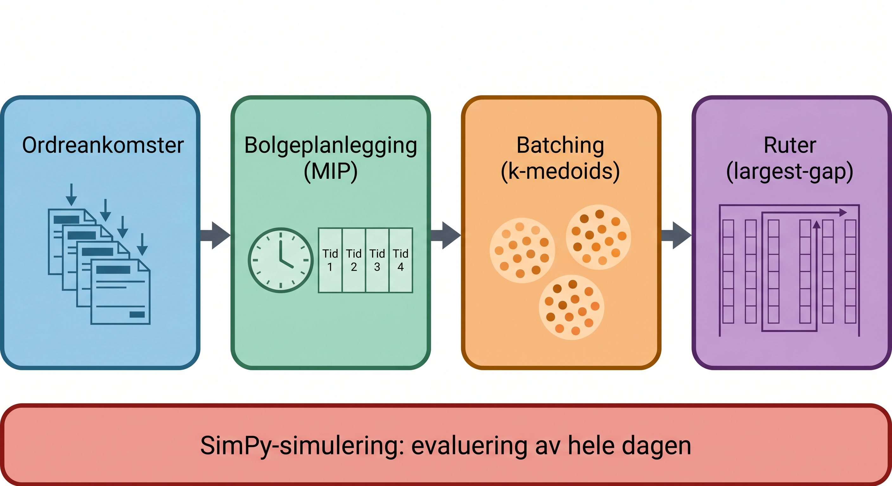

Integrert planleggingsprosess: MIP-bølger, $k$-medoids-batching og largest-gap-ruter planlegges hierarkisk; SimPy kjører hele dagen med de fire valgene sammen.

### Steg 1: Datainnsamling
Vi genererer et syntetisk datasett som etterligner en travel kampanjedag i et nordisk e-handels-DC. Tabell [18](#tab-tab-intlag-desc) oppsummerer nøkkeltallene.

Deskriptiv statistikk for dagens drift.

  **Egenskap**                                                                                                **Verdi**
  ------------------------------- --------------------------------------------------------------------------- ---------------------------
  Antall plukklokasjoner          ($\|\mathcal{L}\|$, 20 ganger $\times$ 50 nivå $\times$ 2 sider)   [$2\,000$]
  Antall ordrer                   ($N$)                                                                     $250$
  Antall ordrelinjer              (sum $n_o$)                                                               $1\,118$
  Gjennomsnitt linjer per ordre                                                                               $4,47$
  Same-day-andel                                                                                              $74,8\,%$
  Topp 20 % av SKUer              (andel av forventet plukkvolum)                                             $80,3\,%$
  Plukkere                                                                                                    $8$
  Pakkestasjoner                                                                                              $2$
  Pakketid per linje                                                                                          $0,85$ min
  Plukkhastighet                                                                                              $50$ m/min
  Arbeidsdag                                                                                                  $10$ timer

Ordreankomster. Figur [25](#fig-fig-intlag-timeline) viser ankomstene gjennom dagen. De to toppene (morgen og sen ettermiddag) er typiske for både forbruker- og B2B-segmentet, og gjør at pakkestasjonen får sin hardeste belastning midt på dagen når alle morgenordrer skal pakkes ferdig samtidig som ettermiddagstrafikken bygger seg opp.

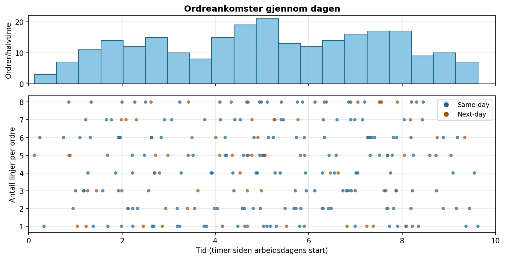

Ordreankomster over arbeidsdagen. Histogrammet (øverst) viser ankomster per halvtime; punktplottet (nederst) viser antall linjer per ordre fargelagt etter deadline-klasse.

Lager og ABC-struktur. Figur [26](#fig-fig-intlag-layout) viser lagerlayouten fargelagt etter ABC-klasse. Plukkfrekvensene er Pareto-fordelt: de 20 % mest plukkede lokasjonene står for $80,3\,%$ av forventet plukkvolum, noe som gjør class-based storage (fra seksjon [Slotting med class-based storage](#sec03)) relevant også som bakteppe her.

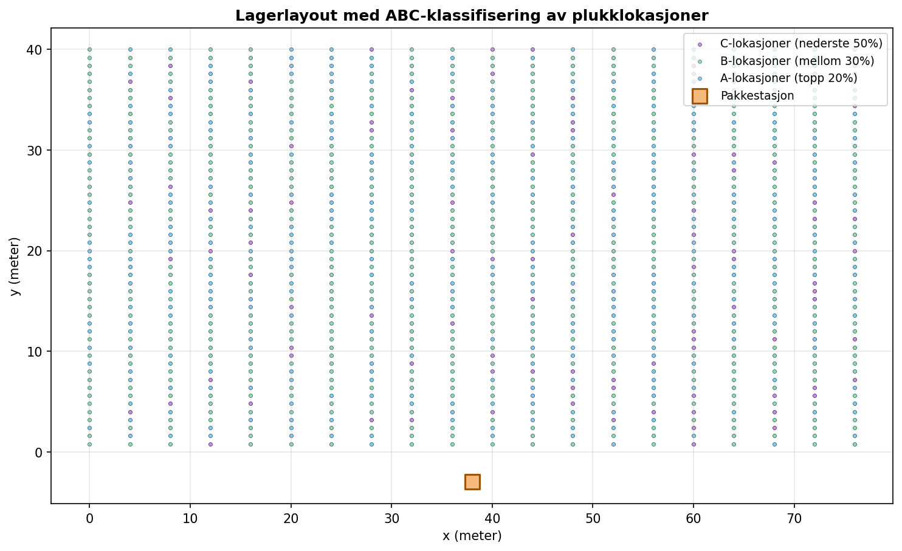

Lagerlayout med 2 000 plukklokasjoner klassifisert som A (topp 20 %), B (neste 30 %) og C (nederste 50 %) etter forventet plukkfrekvens. Pakkestasjonen er markert som et oransje kvadrat.

**Konklusjon** --- *Hvilke friksjoner ser vi allerede?*

Tre mønstre driver hele planleggingsutfordringen: (i) ankomstene er klumpete, (ii) pakkekapasiteten er lavere enn toppbelastningen ankomstene kan skape, og (iii) plukkvolumet er sterkt Pareto-konsentrert, slik at få ganger blir mye brukt. Hvis vi bare følger ordrene "først inn, først plukket" (FIFO), vil pakkestasjonen blokkere i midten av dagen.

### Steg 2: Bølgeplanlegging via MIP
Vi deler arbeidsdagen i seks bølger à 120 minutter pluss en *next-day*-bølge som får de ordrene som ikke er same-day. MIPet [(10)](#eq-eq-intlag-mip-obj)--[(?)](#eq-eq-intlag-mip-cap) løses med PuLP og CBC.

Løsningen. Tabell [19](#tab-tab-intlag-wavemip) viser tildelingene fra MIPet.

Bølgetildeling fra MIPet. Pakkekapasiteten er $C_w = 282$ linjer per bølge.

  **Bølge**            **Start**     **Slutt**     **Ordrer**   **Linjer**              **Utnyttelse**
  -------------------- ------------- ------------- ------------ ----------------------- ----------------
  $w_0$              $0$ min     $120$ min   $27$       $119$                 $42\,%$
  $w_1$              $120$ min   $240$ min   $34$       $146$                 $52\,%$
  $w_2$              $240$ min   $360$ min   $48$       $198$                 $70\,%$
  $w_3$              $360$ min   $480$ min   $67$       $282$   $100\,%$
  $w_4$              $480$ min   $600$ min   $60$       $281$   $99,6\,%$
  $w_5$ (next-day)   $600$ min   $720$ min   $14$       $92$                  $33\,%$

Pakkekapasiteten i bølge $w_3$ og $w_4$ er fullt benyttet --- MIPet har skjøvet noen ordrer som i utgangspunktet hadde deadline senere på dagen, til tidligere bølger for å unngå overbelastning i ettermiddagsvinduet. Figur [27](#fig-fig-intlag-waves) viser tildelingen grafisk.

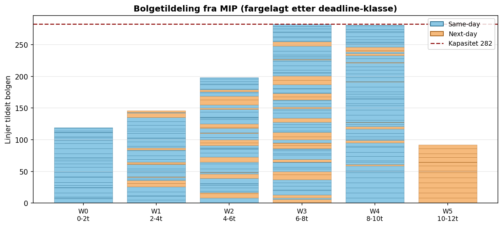

Bølgetildeling fra MIPet. Hver søyle er en bølge; stablede segmenter er individuelle ordrer fargelagt etter deadline-klasse. Den stiplede linjen viser pakkekapasiteten.

**Konklusjon** --- *Hva gjør bølge-MIPet?*

MIPet omorganiserer ikke ordrene fritt --- deadlines og ankomsttider begrenser valgene. Det MIPet gjør er å *jevne ut* pakkebelastningen ved å flytte ordrer fra overbelastede bølger til de tidligste av de tillatte alternativene. Resultatet er en tidsprofil der pakkestasjonen kjører på omtrent $100\,%$ gjennom ettermiddagen uten å overskride kapasiteten.

### Steg 3: Batching via $k$-medoids
Innenfor hver bølge må ordrene grupperes slik at én plukker kan ta flere ordrer samtidig i samme plukkerunde. Vi representerer hver ordre med sin gjennomsnittlige plukk-koordinat $\phi(o)$ fra ligning [(11)](#eq-eq-intlag-feature) og løser $k$-medoids-problemet [(12)](#eq-eq-intlag-kmedoids) med $\bar n_b = 5$ ordrer per batch som mål.

Kompakthet. Vi måler *kompakthet* som gjennomsnittlig gang-spenn per batch (maks gang-indeks minus min gang-indeks). Lavere er bedre, fordi smalere spenn gir kortere ruter. Tabell [20](#tab-tab-intlag-compactness) sammenligner $k$-medoids med tilfeldig batching.

Gjennomsnittlig gang-spenn per batch (antall ganger).

  **Metode**               **Gjennomsnitt**         **Tolkning**
  ------------------------ ------------------------ ---------------------------------------------------------
  $k$-medoids batching   $12,9$   Ordrer i samme batch er lokasjonsnære
  Tilfeldig batching       $17,2$                 Ordrer spres over hele lageret
  **Forbedring**           $-25\,%$            Batchene er $25\,%$ mer kompakte med $k$-medoids

Figur [28](#fig-fig-intlag-batches) visualiserer en bølge delt i batcher.

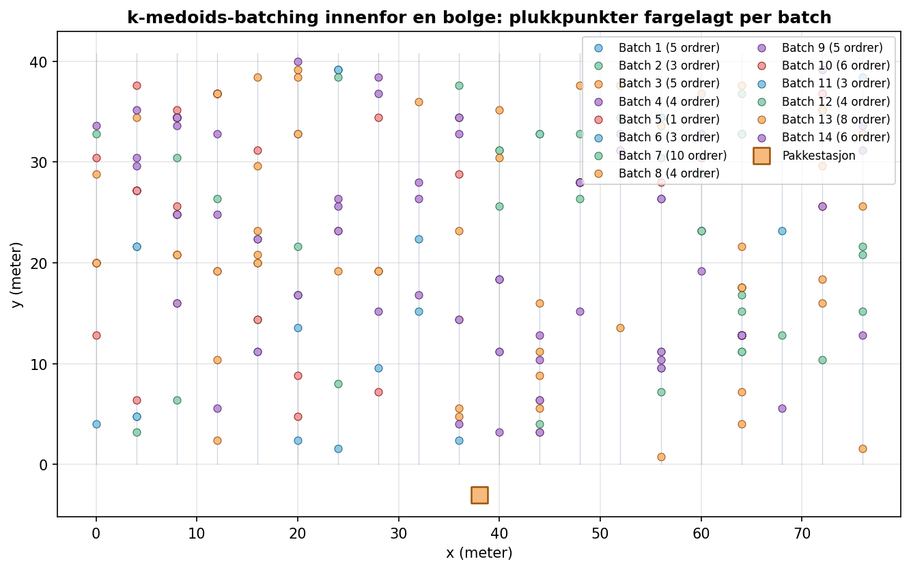

$k$-medoids-batching innenfor en bølge. Hver farge er en batch; punktene er plukklokasjoner. Pakkestasjonen er markert.

**Konklusjon** --- *Hva er gevinsten fra batching?*

Et batch-spenn på $12,9$ ganger betyr at en plukker typisk besøker 13 av de 20 gangene per runde. Med tilfeldig batching besøker hun derimot nesten alle 20 gangene --- og ruten blir tilnærmet like lang uansett hvilken ruteheuristikk hun bruker etterpå. Batching *først*, ruter etterpå, er derfor ikke valgfritt.

### Steg 4: Ruter via largest-gap-heuristikken
For hver batch samler vi plukk per gang og beregner ruten med largest-gap-heuristikken fra ligning [(13)](#eq-eq-intlag-largest-gap)--[(14)](#eq-eq-intlag-lg-total). Figur [29](#fig-fig-intlag-routes) sammenligner largest-gap med S-shape og tilfeldig gangrekkefølge på samme batch.

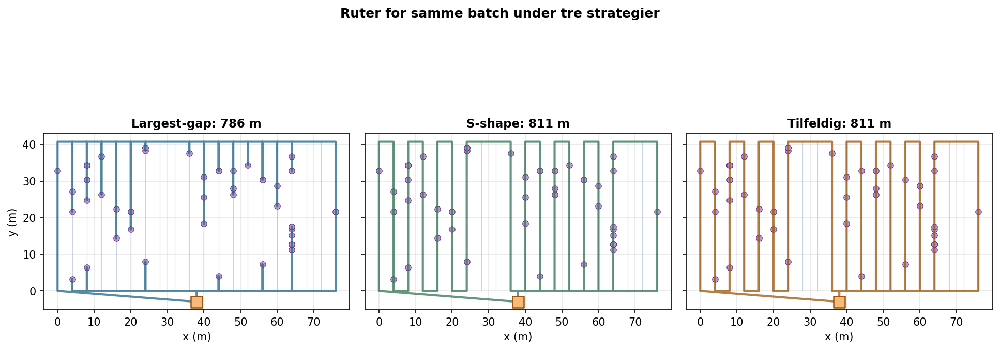

Rute for samme batch under tre strategier. Hvert punkt er en plukklokasjon; den fargede linjen er ruten; pakkestasjonen er markert nederst.

Total gangstrekning per konfigurasjon. Tabell [21](#tab-tab-intlag-route-distance) viser total gangstrekning summert over alle batcher i hele dagen for fem konfigurasjoner.

Total gangstrekning per dag (meter) for ulike batch- og rutestrategier.

  **Batching**    **Rute**         **Total (m)**
  --------------- ---------------- ----------------------------
  $k$-medoids   S-shape          [$28\,136$]
  $k$-medoids   largest-gap      $29\,497$
  $k$-medoids   tilfeldig gang   $28\,136$
  Tilfeldig       S-shape          $34\,808$
  Tilfeldig       largest-gap      $35\,714$

**Konklusjon** --- *Når lønner largest-gap seg?*

Med tett plukk per gang (over 2 picks per besøkt gang) blir det største gapet lite, og S-shape er ofte like god eller bedre enn largest-gap. Men *batchens lokasjons-kompakthet* er mye viktigere: sammenlignet med tilfeldig batching reduserer $k$-medoids total gangstrekning med rundt $17\,%$ uansett hvilken ruteheuristikk vi bruker etterpå. Ruteheuristikken justerer detaljene; batchingen avgjør grov-avstanden.

### Steg 5: SimPy-simulering av hele dagen
Vi kjører en diskret hendelses-simulering med `simpy` der åtte plukkere og to pakkestasjoner er `simpy.Resource`. Bølger slippes på planlagte tidspunkt $\tau^s_w$; batchene køer til en plukker er ledig; hver plukker utfører sin batch (gangtid fra ruten + $0,4$ min per plukk); ferdigplukkede batcher går videre til pakkestasjonen ($0,85$ min per linje).

Fire strategier. Vi sammenligner den integrerte planen mot tre baseliner:

- **A) Integrert**: MIP-bølger + $k$-medoids-batching + largest-gap-ruter.

- **B) Bare bølge-MIP**: MIP-bølger + FIFO-batching (ordrer innen hver bølge chunkes kronologisk) + largest-gap.

- **C) Bare batching**: FIFO-bølger (hver ordre i første bølge den rekker) + $k$-medoids + largest-gap.

- **D) Baseline**: FIFO-bølger + tilfeldig batching + S-shape.

Pakkekø. Figur [30](#fig-fig-intlag-pack-queue) viser kølengden ved pakkestasjonen gjennom dagen for de fire strategiene.

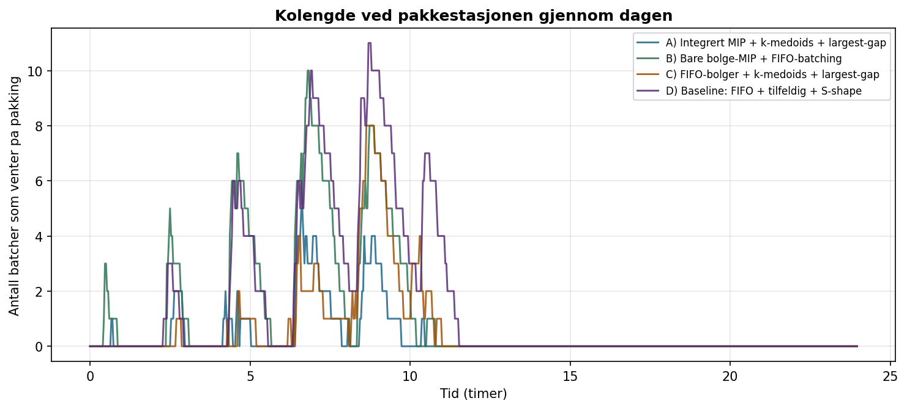

Kølengde ved pakkestasjonen (antall batcher som venter) over arbeidsdagen for de fire strategiene. Baseline-scenariet (D) har store kø-topper som forplanter seg til sene ordrer.

Oppsummerte KPIer. Tabell [22](#tab-tab-intlag-kpi) samler nøkkeltallene.

KPIer over én simulert arbeidsdag. Deadline-overholdelse er andel ordrer som er ferdig pakket innen deadline; pakkekø-snitt er tidsgjennomsnittlig antall batcher i kø foran pakkestasjonen.

  **Strategi**   **Beskrivelse**                                       **Deadline (%)**         **Gj.snitt fullføring (min)**   **Pakkekø (snitt)**
  -------------- ----------------------------------------------------- ------------------------ ------------------------------- ------------------------
  A              Integrert MIP $+$ $k$-medoids $+$ largest-gap   $94,8$   $377,7$         [$0,34$]
  B              MIP-bølger + FIFO-batching                            $92,4$                 $383,3$                       $1,07$
  C              FIFO-bølger + $k$-medoids                           $82,4$                 $446,0$                       $0,57$
  D              Baseline: FIFO + tilfeldig + S-shape                  $81,6$                 $450,9$                       $1,45$

Figur [31](#fig-fig-intlag-kpi) viser KPIene side ved side.

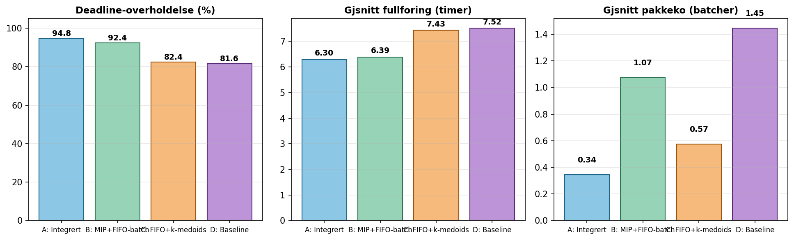

KPI-sammenligning av de fire strategiene: deadline-overholdelse, gjennomsnittlig fullføringstid og gjennomsnittlig pakkekø.

**Konklusjon** --- *Hvor mye bidrar hver del?*

Fra baseline (D) til full integrasjon (A) øker deadline-overholdelsen med $13,2$ prosentpoeng ($81,6 \to 94,8$). Nedbrytningen:

- Bare bedre bølgeplanlegging (MIP) alene gir $+10,8$ pp ($D \to B$).

- Bare bedre batching ($k$-medoids) alene gir $+0,8$ pp ($D \to C$).

- Kombinasjonen gir $+13,2$ pp --- marginalt mer enn summen, noe som viser en svak positiv interaksjon.

Bølgeplanleggingen er mest verdifull isolert sett fordi den direkte håndterer pakkestasjonsflaskehalsen. Batchingen reduserer arbeidsmengden per batch; dens effekt på deadline-overholdelsen er indirekte og mindre i akkurat dette dimensjoneringsscenariet.

### Steg 6: Sammenligning og praktisk anvendelse
Relativt bilde. Sammenlignet med FIFO-baseline (strategi D) bidrar hver del av den integrerte planen til den samlede gevinsten, men i ulik grad (se tabell [22](#tab-tab-intlag-kpi)). Bølge-MIPet er selve motoren bak deadline-gevinsten fordi den håndterer flaskehalsen, mens $k$-medoids-batching gir sine gevinster hovedsakelig gjennom redusert gangtid per batch --- som igjen gjør at plukkerne blir ferdige raskere og øker dagens totalkapasitet.

Pakkekø som signal. Pakkekøens tidsprofil (figur [30](#fig-fig-intlag-pack-queue)) er en mer følsom indikator enn deadline-overholdelsen. Baseline (D) har maks kø på $11$ ventende batcher ettermiddagstid, mens integrert (A) holder seg på maks $5$. Det oversettes direkte til lavere frustrasjon blant pakkerne og mindre variasjon i leveringstid for sluttkunden.

**Praktisk anvendelse** --- *Hvordan operasjonaliseres dette?*

1.  **Rullerende horisont**: I produksjon løses bølge-MIPet på nytt hver $30$--$60$ minutt når nye ordrer har ankommet. Fremtidige ordrer forventes fra en prognose (se kapittel [?](#ref-ch-ettersp-rselsprognoser)).

2.  **Re-batching**: Batchene bør kun låses når en plukker faktisk henter arbeidsrekvisisjonen. Sene ordrer kan dermed inkluderes i pauser mellom batcher.

3.  **Dashboards**: Pakkekø og planlagt vs. faktisk tempo per bølge er de to viktigste KPIene for operatøren --- mye viktigere enn per-ruten gangstrekning.

4.  **Validering**: Før full utrulling bør simuleringen kjøres på historiske data og sammenlignes mot faktisk driftsresultat. Avvik på mer enn $\pm 5$ pp i deadline-overholdelse indikerer at en modellantakelse er brutt (f.eks. høyere pakketidsvarians enn antatt).

[Begrensninger.]
- Dekomponeringen er heuristisk. Et integrert MIP som koordinerer bølger, batcher og ruter samtidig kan teoretisk gi bedre løsninger, men er uløselig for realistiske instanser.

- Plukktider og pakketider er modellert deterministisk i planleggingen. I virkeligheten er de stokastiske, noe SimPy-simuleringen kan utvide til ved å erstatte konstantene med fordelinger.

- Modellen antar homogene plukkere. Ulikheter i erfaring eller utstyr (trillestativ, kolli-strømmer) er ikke modellert.

- Plukkfrekvensene er Pareto-fordelte og relativt stabile; ved kampanjer som dreier volumene brått, bør slottingen revurderes (seksjon [Slotting med class-based storage](#sec03)) og planleggingshorisonten forkortes.

Slutt · Kapittel 7

---

# Del II — Kapittel 8: Bærekraftig logistikk

Del II · Kapittel 8

8

# Bærekraftig logistikk
Oversatt fra LaTeX-kilde --- figurer, definisjoner og KaTeX-math.

[][][][][]
Område

## Område
Bærekraftig logistikk handler om å *kvantifisere* og *redusere* miljøpåvirkningen fra logistikkaktiviteter, samtidig som økonomiske og servicemessige krav ivaretas. Fokuset er særlig CO$_2$-utslipp fra transport, energiforbruk i lagerdrift og avfall fra emballasje --- tre områder som til sammen står for en stor andel av et logistikksystems totale miljøavtrykk. Transportsektoren alene står for rundt $25\,%$ av globale CO$_2$-utslipp, og driverne for å gripe inn er sterke: EU-regulering (CSRD-rapporteringskrav og utslippshandelssystemet ETS), kundeforventninger om grønne leveranser, og stigende karbonpriser som gjør utslipp til en direkte kostnadspost.

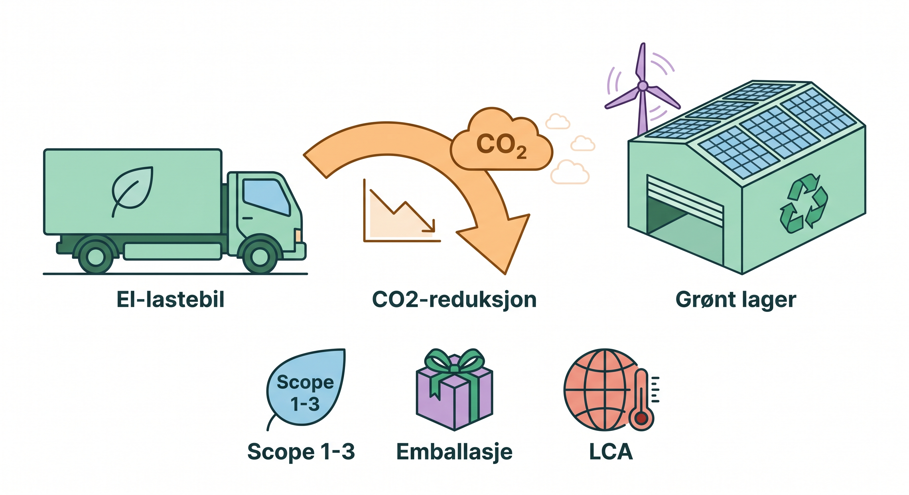

Bærekraftig logistikk: elektrifisering av transport, grønn lagerdrift og kvantifisering av CO$_2$-utslipp gjennom verdikjeden.

Definisjon [Bærekraftig logistikk]
**Bærekraftig logistikk** er prosessen med å *måle*, *modellere* og *optimere* logistikkaktiviteter slik at miljøpåvirkningen --- særlig CO$_2$-utslipp, energiforbruk og avfall --- reduseres, samtidig som krav til kostnad, servicenivå og leveringsevne oppfylles.

To sentrale rammeverk strukturerer arbeidet med bærekraftig logistikk. *Scope-inndelingen* fra Greenhouse Gas Protocol skiller mellom direkte utslipp fra egne kjøretøy og anlegg (Scope 1), indirekte utslipp fra innkjøpt energi (Scope 2) og utslipp i resten av verdikjeden --- innkjøpte tjenester, transport utført av tredjepart, produktbruk og avhending (Scope 3). Scope 3 dominerer typisk i logistikk og er samtidig vanskeligst å måle. *Livssyklusanalyse (LCA)* kvantifiserer miljøpåvirkningen til et produkt eller en tjeneste gjennom hele livssyklusen fra råvareuttak til avhending, og utgjør det metodiske fundamentet for å sammenligne alternativer på et konsistent grunnlag.

Området omfatter beslutninger og analyser på flere nivå:

- Strategisk (år) --- nettverksstruktur, modalvalg (vei / jernbane / sjø), elektrifisering og lokalisering som minimerer livsløpsutslipp

- Taktisk (måneder) --- karbonregnskap og -rapportering etter Scope 1--3, valg av transportleverandører med utslippskrav, emballasjestandarder og returordninger

- Operativ (dager til uker) --- grønn ruteplanlegging (lasteavhengige utslipp), lastbaseringsoptimering, 3D bin packing og energistyring i lager

- Tverrgående metodikk --- livssyklusanalyse (LCA), karbonprising (skyggepris eller ETS-pris) og flermålsoptimering mellom kostnad, utslipp og servicenivå

Bærekraftig logistikk er tett koblet til flere andre områder som behandles i dette kompendiet:

- Nettverksdesign --- lokalisering av lagre og distribusjonssentre bestemmer transportavstander og dermed Scope 1- og Scope 3-utslipp

- Ruteplanlegging --- kortere og bedre lastede ruter gir lavere drivstofforbruk og direkte CO$_2$-reduksjon, som kvantifiseres i grønn VRP

- Returlogistikk og sirkulær økonomi --- gjenbruk, reparasjon og materialgjenvinning demper behovet for ny produksjon og reduserer Scope 3-utslipp

- Innkjøpsoptimalisering --- leverandørvalg med bærekraftskriterier (utslippsintensitet, sertifiseringer) integrerer miljø i anskaffelsesbeslutningen

- Forsyningskjedeanalyse --- systemperspektivet er nødvendig for å unngå suboptimering der utslippsreduksjon ett sted skaper større utslipp et annet sted

Problemstillinger, modeller og metoder

## Problemstillinger, modeller og metoder
I det følgende presenteres tre sentrale problemstillinger innen bærekraftig logistikk med tilhørende modeller og metoder, som illustrert i figur [2](#fig-fig-barekraftig-logistikk-problemstillinger-oversikt). Alle tre problemstillingene utdypes med egne eksempler og figurer i de påfølgende seksjonene.

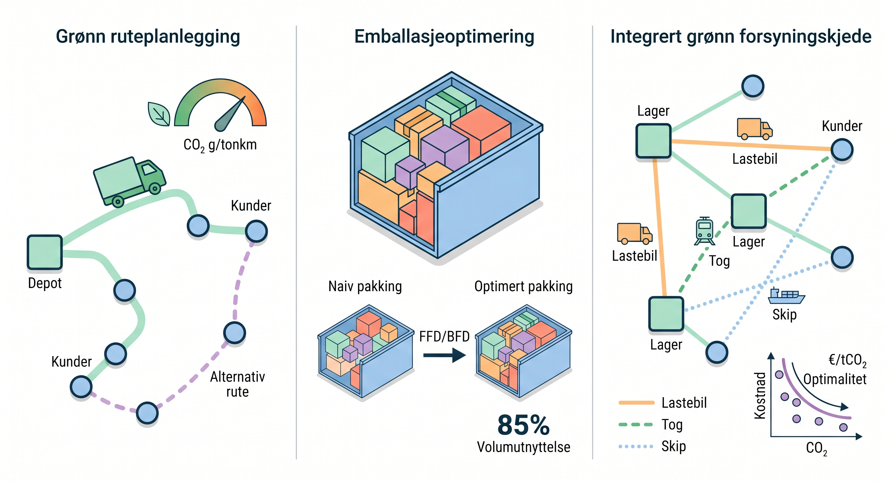

Tre sentrale problemstillinger innen bærekraftig logistikk: grønn ruteplanlegging med lasteavhengig utslippsfunksjon, emballasjeoptimering via bin packing, og integrert grønn forsyningskjede med nettverksdesign, modalvalg og karbonprising.

Nøkkelen til god bærekraftsstyring i logistikk er å velge riktig modell og metode for den aktuelle problemstillingen. Tabell [1](#tab-tab-barekraftig-logistikk-oversikt) gir en oversikt over hvilke modeller og metoder som egner seg for de tre problemstillingene. Som supplerende tilnærminger inngår også karbonregnskap og livssyklusanalyse (LCA) for å kvantifisere utslipp på tvers av Scope 1--3 og produktets hele verdikjede, samt enklere Pareto-analyse for å synliggjøre avveininger mellom kostnad og utslipp når beslutningstaker skal velge mellom konkurrerende løsninger. Modellene og metodene uthevet med rødt vil bli gått gjennom i de tre neste avsnittene.

Oversikt over modeller og metoder for de tre sentrale problemstillingene innen bærekraftig logistikk.

  **Nr.**   **Problemstilling**                             **Modeller**                                                                                         **Metoder**
  --------- ----------------------------------------------- ---------------------------------------------------------------------------------------------------- ---------------------------------------------------------------------------------------------------
  1         Grønn ruteplanlegging             CVRP (distansebasert), Green VRP med lasteavhengig utslippsfunksjon                    Modifisert Clarke-Wright savings (utslippsbasert), 2-opt lokalsøk, Pareto-analyse kostnad/utslipp
  2         Emballasjeoptimering              Bin packing (1D/2D/3D), kontinuerlig relaksering (nedre grense)                        First-fit-decreasing (FFD), best-fit-decreasing (BFD), volumutnyttelsesanalyse
  3         Integrert grønn forsyningskjede   Stokastisk flermål MIP (nettverk + modal + karbon), karbonregnskap (Scope 1--3), LCA   Epsilon-constraint, scenario-reduksjon, progressive hedging, Pareto-frontgenerering

Grønn ruteplanlegging (Green VRP)

## Eksempel: Grønn ruteplanlegging (Green VRP)
Oppsummering.

  **Kategori**      **Beskrivelse**
  ----------------- -------------------------------------------------------------------------------------------
  Eksempel          Urban hjemlevering i Oslo med lavutslippssone
  Område            Utslippsbevisst operativ ruteplanlegging
  Problemstilling   Hvilke ruter minimerer totale CO$_2$-utslipp når utslipp avhenger av last og distanse?
  Modell            Green VRP med lasteavhengig utslippsfunksjon $e(w) = \alpha + \beta w$
  Prosess           Utslippsbevisst ruteoptimering med Pareto-analyse
  Metode            Modifisert Clarke--Wright med utslipps-savings, 2-opt lokalt søk og vektet flermål-front

### Problemstilling
*EcoTrans Oslo* er en bydistributør som leverer tunge dagligvare- og nærbutikksendinger fra et sentralt depot ved Alnabru til 25 sentrumsnære og forstadskunder hver dag. Kjøretøyene er tunge varebiler med tomvekt $w_0 = 2500$ kg og lastekapasitet $Q = 1800$ kg. Siden selskapet kjører inn i Oslos lavutslippssone, rapporterer det fakturabart CO$_2$-utslipp per tur til kundene som del av sitt klimabudsjett, og er i tillegg pålagt en måloppnåelse for utslippsreduksjon fra EU-direktivet CSRD.

Planleggeren stiller derfor ikke lenger bare spørsmålet *"hvilke ruter minimerer kjørelengden?"* men heller *"hvilke ruter minimerer de totale CO$_2$-utslippene?"*. Det gir en ny utfordring: utslippet per kilometer er ikke konstant, men vokser omtrent lineært med bilens totalvekt. En tung leveranse til en kunde langt fra depotet koster langt mer CO$_2$ enn en lett leveranse på samme avstand. Rutens rekkefølge betyr derfor ikke bare hvor kort man kjører, men hvor mye last man bærer hvor langt.

**Problemstilling** --- *Hvordan minimere CO$_2$ under kapasitetsbegrensning?*

Vi vil partisjonere 25 kunder i et lite antall ruter $R_1, R_2, \ldots$ slik at (i) totale CO$_2$-utslipp er minimale, (ii) hver kunde betjenes nøyaktig én gang, og (iii) samlet last på hver rute ikke overstiger $Q = 1800$ kg. Vi sammenligner med den klassiske *distanse-minimerende* Clarke--Wright-løsningen og kartlegger Pareto-fronten mellom distanse (driftskostnad) og utslipp (miljøkostnad).

### Modell
Problemet er det *load-dependent Pollution Routing Problem* (Bektas og Laporte, 2011), en utvidelse av klassisk CVRP der den totale kostnaden ikke måles i kilometer, men i CO$_2$-utslipp som avhenger av både distanse og bilens lasteprofil.

Definisjon [Green VRP med lasteavhengig utslippsfunksjon]
La $V = {0, 1, \ldots, N}$ være nodene med $0 =$ depot, $1, \ldots, N$ kunder. Kunde $i$ har etterspørsel $q_i > 0$ (kg). Avstand $d_{ij} \geq 0$ er euklidsk og symmetrisk. Hvert kjøretøy har tomvekt $w_0$ og lastkapasitet $Q$. Utslipp per km er lineær i kjøretøyets totale vekt $w$:

$$e(w) = \alpha + \beta w \qquad \[\text{g CO}_2/\text{km}\].$$

1

For en rute $R = (i_0 = 0, i_1, \ldots, i_m, i_{m+1} = 0)$ der bilen forlater depotet med samlet rute-last $L(R) = \sum_{k = 1}^m q_{i_k}$ og leverer $q_{i_k}$ kg ved hver kunde, er det totale utslippet

$$E(R) \;=\; \sum_{k = 0}^{m} d_{i_k, i_{k + 1}} \cdot \bigl(\alpha + \beta \, w_k\bigr),
\qquad w_k = w_0 + L(R) - \sum_{\ell = 1}^{k} q_{i_\ell}.$$

2

Vi minimerer summen av utslipp over alle ruter,

$$\min_{\mathcal{R}} \; \sum_{R \in \mathcal{R}} E(R),$$

3

underlagt (i) hver kunde besøkes nøyaktig én gang, og (ii) $L(R) \leq Q$ for alle $R \in \mathcal{R}$.

Symboler i Green VRP-modellen.

  **Symbol**    **Type**    **Beskrivelse**
  ------------- ----------- ------------------------------------------------------------------
  $N$         Parameter   Antall kunder
  $Q$         Parameter   Lastekapasitet per kjøretøy (kg)
  $w_0$       Parameter   Kjøretøyets tomvekt (kg)
  $q_i$       Parameter   Etterspørsel hos kunde $i$ (kg)
  $d_{ij}$   Parameter   Avstand fra $i$ til $j$ (km)
  $\alpha$   Parameter   Baseline utslipp per km ved $w = 0$ (g CO$_2$/km)
  $\beta$    Parameter   Marginal utslippsøkning per ekstra kg last (g CO$_2$/(kg km))
  $R$         Rute        Sekvens $(0, i_1, \ldots, i_m, 0)$
  $L(R)$      Avledet     Samlet last på ruten (kg)
  $w_k$       Avledet     Totalvekt på kjøretøyet på kant $(i_k, i_{k+1})$
  $e(w)$      Avledet     Utslipp per km som funksjon av totalvekten (g CO$_2$/km)
  $E(R)$      Objektiv    Totalt CO$_2$-utslipp for rute $R$ (g)

Lineærisering og lastprofil. Setter vi inn $w_k = w_0 + L(R) - \sum_{\ell \leq k} q_{i_\ell}$ og bryter opp summen i [(2)](#eq-eq-gvrp-emission-route), får vi

$$E(R) \;=\; \alpha \, \mathrm{Lengde}(R) \;+\; \beta \sum_{k = 0}^{m} d_{i_k, i_{k + 1}} \cdot w_k.$$

1

Første ledd er den klassiske distansebaserte kostnaden (skalert med $\alpha$). Andre ledd er det nye: avstanden på hver kant vektes med bilens momentane vekt. Siden $w_k$ synker langs ruten (bilen blir lettere etter hver leveranse), er kanten fra depotet *tyngst* og siste kant tilbake til depotet *lettest*. Rekkefølgen av kunder langs en rute har dermed direkte effekt på utslippet, selv når avstanden totalt sett er lik.

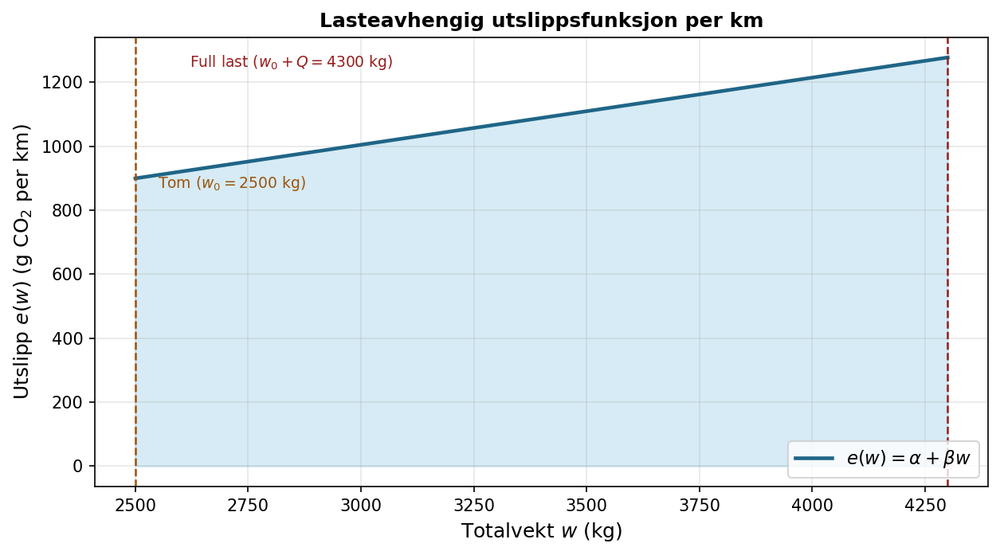

Utslippsfunksjonen $e(w) = \alpha + \beta w$. Tom bil (venstre stiplet linje) har $e(w_0) = 900$ g CO$_2$/km; full bil (høyre stiplet linje) har $e(w_0 + Q) = 1278$ g CO$_2$/km --- en økning på $42~%$ for samme kjørelengde.

Kalibrering av parametre. Vi setter $\alpha = 375$ g/km og $\beta = 0,21$ g/(kg km), slik at en tom bil ($w = w_0 = 2500$ kg) slipper ut $900$ g CO$_2$/km, og en full bil ($w = w_0 + Q = 4300$ kg) slipper ut $1\,278$ g CO$_2$/km --- altså en oppgang på $42~%$ mellom helt tom og helt full. Dette stemmer med empiriske parametre for mellomstore dieselvarebiler i Bektas og Laporte (2011).

**Heuristikk-merknad** --- *Hvorfor ikke eksakt MIP?*

Klassisk CVRP med *distanse* som objektiv har en velstudert MIP-formulering (MTZ), som løses eksakt for instanser opp til ca. 20--25 kunder. Green VRP er strukturelt hardere:

- Den lasteavhengige utslippsfunksjonen gjør at *kantkostnaden ikke kan dekomponeres kant-for-kant* --- kostnaden på kant $(i, j)$ avhenger av rutens resterende last, som igjen avhenger av kundenes rekkefølge både før og etter kanten.

- Standard flytbaserte MIP-formuleringer gir svært svake LP-relaksjoner fordi den produktuttrykket $d_{ij} \cdot w_k$ må lineariseres med store-$M$-skranker eller piece-wise approksimasjoner.

- Selv for 20-25 kunder er eksakte løsninger upraktiske (timer til dager på en PC).

Vi bruker derfor tre heuristikker i kombinasjon:

1.  **Distanse-basert Clarke--Wright** som baseline og referanse.

2.  **Utslippsbasert Clarke--Wright** (Green CW): savings-verdien $s^E_{ij} = E_{\text{atskilt}}(i) + E_{\text{atskilt}}(j) - E_{\text{slaatt sammen}}(i, j)$ beregnes direkte på CO$_2$.

3.  **2-opt lokalt søk** på utslippsobjektivet, innenfor hver rute.

Gapet til et (ukjent) globalt optimum er dermed ikke kjent eksakt, men vi sammenligner Green CW $+$ 2-opt mot distansebasislinjen for å kvantifisere gevinsten av utslippsbevisst planlegging.

Forutsetninger. Modellen hviler på fire forenklinger: (1) utslippsfunksjonen er *lineær* i totalvekt (rimelig for moderate hastigheter og flate ruter; virkelige data har også hastighets- og akselerasjonsavhengighet); (2) avstandsmatrisen er symmetrisk og euklidsk; (3) etterspørslene $q_i$ er deterministiske og kjent før ruten starter; (4) alle kjøretøy er identiske og bruker samme drivstoff/$(\alpha, \beta)$-profil.

### Prosess
Prosess: Utslippsbevisst ruteoptimering med Pareto-analyse.
Modell: Green VRP med lasteavhengig utslippsfunksjon fra [(2)](#eq-eq-gvrp-emission-route).

Prosessen følger seks steg, illustrert i figur [4](#fig-fig-gvrp-method). Etter datainnsamling (steg 1) etableres distansebasislinjen med klassisk Clarke--Wright (steg 2). Deretter formaliseres utslippsmodellen per kant (steg 3), før vi kjører en utslippsbevisst Clarke--Wright-variant (steg 4) og forbedrer den med 2-opt på CO$_2$-objektivet (steg 5). Avslutningsvis konstruerer vi Pareto-fronten mellom distanse og utslipp ved å variere en vektparameter $\lambda \in \[0, 1\]$ (steg 6).

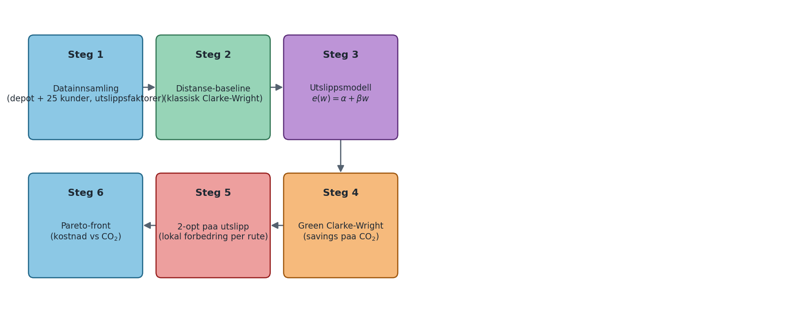

Seks-stegs prosess for Green VRP: datainnsamling, distanse-baseline, utslippsmodell, utslippsbevisst Clarke--Wright, 2-opt på CO$_2$, og Pareto-analyse.

### Steg 1: Datainnsamling
Vi genererer en syntetisk instans med ett depot ved origo og $N = 25$ kunder fordelt på tre klynger som likner Oslo-området: sentrum (tett), vest og sør--øst (spredte forsteder). Hver kunde har en etterspørsel på mellom $30$ og $500$ kg, lognormalfordelt med typisk tyngdepunkt rundt 150--200 kg per kunde. Tabell [4](#tab-tab-gvrp-instance) oppsummerer nøkkeltall.

Nøkkeltall for Green VRP-instansen.

  **Størrelse**                         **Verdi**
  ------------------------------------- --------------------------
  Antall kunder $N$                   25
  Total etterspørsel $\sum q_i$      3 727 kg
  Gjennomsnittlig $q_i$               149,1 kg
  Maksimal $q_i$                      393 kg
  Minimum $q_i$                       36 kg
  Kapasitet per kjøretøy $Q$          1 800 kg
  Tomvekt $w_0$                       2 500 kg
  Nedre grense antall kjøretøy          3
  Gj.snittlig avstand kunde til depot   4,66 km
  Maksimal avstand kunde til depot      7,38 km
  $\alpha$ (baseline utslipp)        375 g CO$_2$/km
  $\beta$ (marginal last-bidrag)     0,21 g CO$_2$/(kg km)

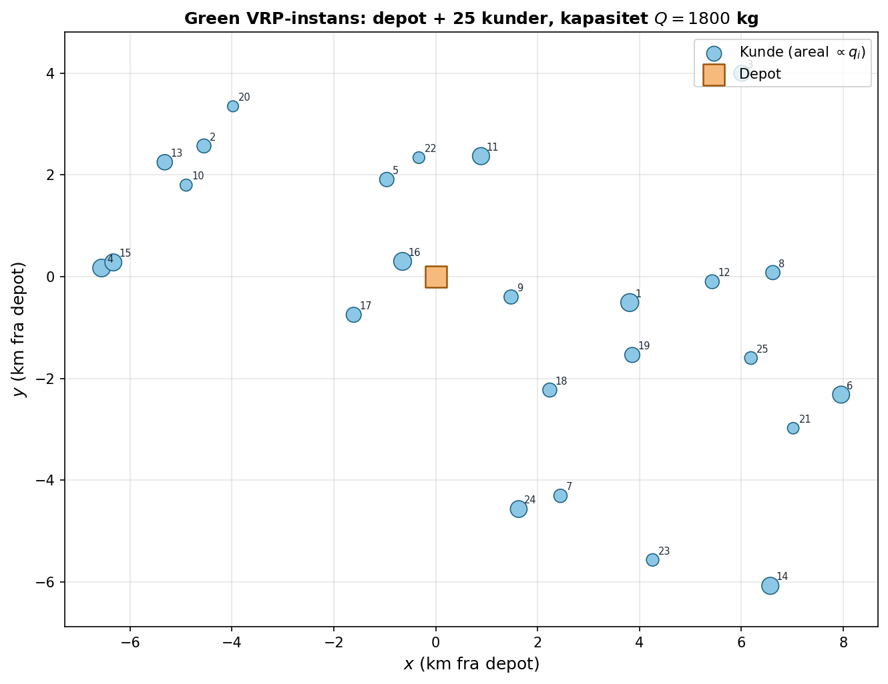

Green VRP-instansen: depot (oransje firkant) og 25 kunder (pastellblå sirkler). Areal er proporsjonalt med $q_i$. Kapasitet per bil er $Q = 1\,800$ kg.

**Konklusjon** --- *Hvorfor last spiller rolle for utslippet*

Total etterspørsel er $3\,727$ kg, som gir en nedre grense på $\lceil 3\,727 / 1\,800 \rceil = 3$ kjøretøy. De fleste rutene vil dermed bære nesten full kapasitet --- typisk $1\,700$--$1\,800$ kg --- på utveien fra depotet, og stadig lettere last etter hver leveranse. Siden fullastet bil slipper ut $42~%$ mer CO$_2$/km enn tom, er det sterkt å forvente at utslippet dominerende bestemmes av kantene *nærmest depotet* (der bilen er tyngst), og ikke av de mer spredte kantene lenger ute. Dette er intuisjonen som driver Green Clarke--Wright i steg 4.

### Steg 2: Distanse-baseline (klassisk Clarke--Wright)
Vi kjører først sekvensiell Clarke--Wright (Clarke og Wright, 1964) med klassisk distanse-savings
$$
s^d_{ij} = d_{0i} + d_{0j} - d_{ij},
$$
uten å ta hensyn til utslipp. Deretter måler vi CO$_2$-utslippet *etterpå* ved å anvende [(2)](#eq-eq-gvrp-emission-route) på hver rute. Dette gir oss utgangspunktet: hva kostet den distanse-optimerte løsningen i CO$_2$?

Distanse-basert Clarke--Wright (baseline) med CO$_2$-utslipp målt post-hoc.

  **Rute**     **Last (kg)**   **Distanse (km)**   **Utslipp (kg CO$_2$)**
  ------------ --------------- ------------------- ----------------------------
  Rute 1       1 745           25,91               27,98
  Rute 2       231             1,43                1,32
  Rute 3       1 751           32,19               35,22
  **Totalt**   3 727           **59,52**           **64,53**

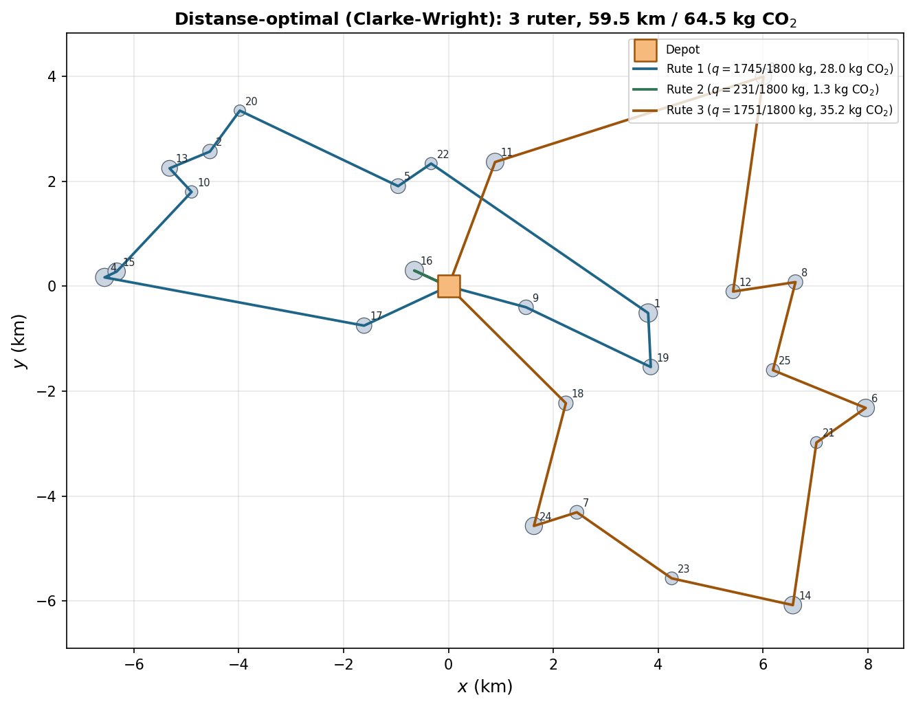

Distanse-optimert Clarke--Wright: tre ruter, total $59,52$ km og $64,53$ kg CO$_2$. Én minirute (Rute 2) betjener kun kunde 16 med $231$ kg --- klassisk savings uten utslippsbevissthet.

**Konklusjon** --- *Baseline: $64,5$ kg CO$_2$ for dagens leveranser*

Distanse-Clarke--Wright gir tre ruter med totalt $59,5$ km og $64,5$ kg CO$_2$. Merk at Rute 2 er en minirute for kunde 16 med bare $231$ kg last --- en konsekvens av at algoritmen ikke prøver å flytte den inn i en av de to større rutene (der det fortsatt er litt kapasitet). I neste steg formaliserer vi utslippsmodellen per kant.

### Steg 3: Utslippsmodell --- per-kant dekomponering
Vi ser nå nærmere på hvordan utslippet fordeler seg langs en rute. For hver kant $(i_k, i_{k+1})$ på rute $R$ gir [(2)](#eq-eq-gvrp-emission-route) et bidrag
$$
\Delta E_k = d_{i_k, i_{k+1}} \cdot \bigl(\alpha + \beta \, w_k\bigr),
$$
der $w_k$ er totalvekten på bilen *før* kunde $i_{k+1}$ er betjent. Dette vektleddet er det som skiller Green VRP fra klassisk VRP: en kant som kjøres med tung last bidrar vesentlig mer til totalutslippet enn samme kant kjørt tom.


Utslippsintensitet (g CO$_2$/km) mot last på hver kant i baseline-løsningen. Kanter som forlater depotet ligger øverst til høyre (tung last, $\approx 1\,270$ g/km), mens kanter tilbake til depot ligger nederst (tom bil, $900$ g/km). Forskjellen er ca. $42~%$.

Mens $\alpha$-leddet i [(1)](#eq-eq-gvrp-decomp) er proporsjonalt med rutelengden (og gir distanse-objektivet i grensen $\beta \to 0$), er $\beta$-leddet den nye komponenten: $\sum_k d_{i_k, i_{k+1}} \cdot w_k$ er et *vektet kilometertal* der vekten er bilens last på kanten. Ved å minimere dette uttrykket flytter algoritmen *tunge* kunder til tidlig i ruten (slik at de er levert før bilen har kjørt langt) og *lette* kunder til sent i ruten.

**Konklusjon** --- *En ny objektivfunksjon, en ny rekkefølge-logikk*

Distanse-objektivet bryr seg bare om hvor *langt* man kjører. Utslippsobjektivet bryr seg om hvor langt man kjører *mens man er tung*. For velbalanserte instanser med klynger er forskjellen ofte liten (ruter kjøres omtrent i samme rekkefølge uansett), men for instanser med én tung kunde langt unna kan utslippsobjektivet velge å besøke den tidligst på ruten for å få levert mest mulig last tidlig.

### Steg 4: Utslippsbevisst Clarke--Wright (Green CW)
Vi tilpasser Clarke--Wright til CO$_2$-objektivet ved å beregne savings på utslipp i stedet for distanse:

$$s^E_{ij} \;=\; E\bigl(R_i^{\text{atskilt}}\bigr) + E\bigl(R_j^{\text{atskilt}}\bigr) - E\bigl(R_{ij}^{\text{slaatt sammen}}\bigr),$$

2

der $E(\cdot)$ er ruteutslippet fra [(2)](#eq-eq-gvrp-emission-route). Fordi $E$ avhenger av hele rutens lasteprofil, og ikke bare av kantene på merge-punktet, må savings *reberegnes* etter hver merge. Vi går derfor fra den klassiske "sorter én gang"-varianten til en greedy merge-beste-løkke:

1.  Initialiser $N$ ruter: $R_i = (0, i, 0)$ for alle $i$, $\mathcal{R} = {R_1, \ldots, R_N}$.

2.  Gjenta: For alle par $(R_a, R_b)$ av gyldige ruter (kapasitet $\leq Q$), beregn alle fire sammenslåingsorienteringer og velg den som gir størst positiv $\Delta E = E(R_a) + E(R_b) - E(R_{ab})$. Hvis $\Delta E > 0$, gjennomfør merge; ellers stopp.

3.  Returner $\mathcal{R}$.

Kompleksiteten er $O(N^3)$ (hvert skritt krever $O(N^2)$ evalueringer, og vi gjør opp til $N - 1$ merger), fortsatt praktisk for $N = 25$. Tabell [6](#tab-tab-gvrp-green-cw) viser resultatet.

Green Clarke--Wright etter 22 merger (uten 2-opt).

  **Rute**     **Last (kg)**   **Distanse (km)**   **Utslipp (kg CO$_2$)**
  ------------ --------------- ------------------- ----------------------------
  Rute 1       1 754           27,00               29,05
  Rute 2       1 742           30,12               31,73
  Rute 3       231             1,43                1,32
  **Totalt**   3 727           **58,55**           [**62,11**]
**Konklusjon** --- *Green CW reduserer både CO$_2$ og distanse*

Ved å bytte savings-funksjon får vi ruter som både er *kortere* og *mindre utslipps-intensive*: $62,11$ kg CO$_2$ mot $64,53$ kg ($-3,8~%$), samtidig som distansen gikk ned fra $59,52$ til $58,55$ km ($-1,6~%$). På denne instansen er det ingen egentlig avveining mellom distanse og CO$_2$ --- fordi utslippsfunksjonen "belønner" kompakte, velfylte ruter på samme måte som distansefunksjonen gjør. Men i steg 6 skal vi se at mer subtile kompromisser finnes for spesifikke vektvalg.

### Steg 5: 2-opt lokal forbedring på utslipp
Vi anvender 2-opt innenfor hver rute, men nå med CO$_2$ som objektiv. For en rute $R = (v_0, v_1, \ldots, v_m, v_{m+1})$ og indekser $1 \leq p < q \leq m$ er kandidaten

$$R\' = (v_0, \ldots, v_{p-1}, v_q, v_{q-1}, \ldots, v_p, v_{q+1}, \ldots, v_{m+1}),$$

3

og vi aksepterer byttet hvis $E(R\') < E(R)$. I motsetning til distanse-2-opt kan $E(R\')$ ikke beregnes fra bare fire kanter --- hele rutens lasteprofil må evalueres på nytt --- men kompleksiteten er fortsatt $O(m^2)$ per pass og $O(m^3)$ totalt for å iterere til lokalt optimum.

2-opt på CO$_2$-objektivet applicert på Green Clarke--Wright-løsningen.

  **Tilstand**              **Distanse (km)**   **Utslipp (kg CO$_2$)**
  ------------------------- ------------------- ----------------------------
  Etter Green CW (steg 4)   58,55               62,11
  Etter 2-opt               58,55               [62,11]
  **Forbedring**            0,00                0,00

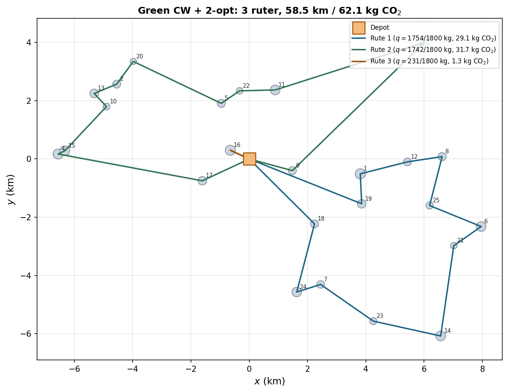

Green Clarke--Wright $+$ 2-opt: tre ruter, total $58,55$ km og $62,11$ kg CO$_2$. Rute 1 (blå) dekker sør--øst, Rute 2 (grønn) dekker sentrum/vest, og Rute 3 (oransje) er minirute for kunde 16.

**Konklusjon** --- *CW gir lokalt optimum*

På denne instansen gir 2-opt null forbedring --- Green CW er allerede lokalt optimalt på CO$_2$-objektivet. Dette er en nyttig validering: den greedy merge-beste-prosedyren i steg 4 leter nemlig også globalt etter hvilke ruter som skal slås sammen, og resultatet er en solid startløsning som 2-opt ikke kan forbedre per-rute. På andre instanser (spesielt med sterkt asymmetrisk lastprofil) kan 2-opt gi $2$--$5~%$ ekstra forbedring.

### Steg 6: Pareto-front mellom kostnad og utslipp
For å kartlegge avveiningen mellom distanse (driftskostnad) og utslipp (miljøkostnad) kjører vi Green CW med en vektet objektivfunksjon:

$$f_\lambda(R) \;=\; (1 - \lambda) \cdot \frac{\mathrm{Lengde}(R)}{L^{\ast}} + \lambda \cdot \frac{E(R)}{E^{\ast}},
\qquad \lambda \in \[0, 1\],$$

4

der $L^{\ast}$ og $E^{\ast}$ er skaleringskonstanter (vi bruker baseline-distansen og utslipps-optimum som referanser, slik at begge leddene blir $O(1)$). For $\lambda = 0$ tilsvarer dette distanse-CW; for $\lambda = 1$ tilsvarer det Green CW. Ved å variere $\lambda$ gjennom åtte verdier og kjøre hele pipelinen (Clarke--Wright $+$ 2-opt) for hver, tegner vi Pareto-fronten.

Alle 8 løsninger langs $\lambda$-skalaen. **Fet** markerer Pareto-front.

  **$\lambda$**   **Distanse (km)**   **Utslipp (kg CO$_2$)**   **Antall ruter**   **På Pareto-front**
  ------------------ ------------------- ---------------------------- ------------------ ---------------------
  0,00               59,30               63,79                        3                  Nei (dominert)
  0,20               **59,46**           **61,72**                    3                  **Ja**
  0,40               59,46               61,72                        3                  (samme)
  0,55               59,46               61,72                        3                  (samme)
  0,70               **58,55**           **62,11**                    3                  **Ja**
  0,85               58,55               62,11                        3                  (samme)
  0,95               58,55               62,11                        3                  (samme)
  1,00               58,55               62,11                        3                  (samme)


Pareto-front for kostnad mot utslipp på Green VRP-instansen. Distanse-min ($58,55$ km, $62,11$ kg CO$_2$) og utslipps-min ($59,46$ km, $61,72$ kg CO$_2$) ligger nær hverandre. Løsningen ved $\lambda = 0,00$ (grått punkt) er dominert av begge Pareto-punktene.

**Praktisk anvendelse** --- *Hvordan EcoTrans Oslo bør bruke Green VRP*

1.  **Daglig operativ ruting:** Bruk Green CW $+$ 2-opt (steg 4--5). På vår instans gir det $3,8~%$ CO$_2$-reduksjon mot distanse-CW, uten å tape på distanse.

2.  **Utforsk Pareto-fronten månedlig:** Kjør steg 6 på representative dager. På denne instansen er fronten nær flat ($0,9$ km ekstra = $0,4$ kg CO$_2$ spart, dvs. ca. $-2$ kg CO$_2$/km byttet bort). I andre byområder med lengre ruter og mer variabel last kan fronten være brattere og avveiningen bli betydelig.

3.  **Intern CO$_2$-pris:** Gitt en valgt $\lambda$-verdi kan man tolke skjøtepunktet mellom distanse og utslipp som en *implisitt karbonpris*. Hvis selskapet har en offisiell karbonpris på $p$ EUR/tonn CO$_2$ og en drivstoffpris som gir $c$ EUR/km, kan man kalibrere $\lambda$ slik at den vektede objektiv-funksjonen stemmer med denne prisingen, og dermed få et direkte økonomisk rasjonal for rutevalget.

4.  **Mål og rapportér:** CO$_2$-rapporten per rute (tabell [6](#tab-tab-gvrp-green-cw)) mater direkte inn i CSRD-rapporteringen og kan brukes til å dokumentere målet om utslippsreduksjon over tid.

[Begrensninger.]
- **Lineær utslippsmodell.** $e(w) = \alpha + \beta w$ fanger ikke hastighets- eller akselerasjonsavhengighet. Mer presise modeller (f.eks. MEET, COPERT) inkluderer ikke-lineære ledd for hastighet, stigning og kjøretøyspesifikasjoner.

- **Statisk trafikk.** Ruterfølgen er bestemt uten hensyn til rushtrafikk. Realistisk byruting bør kombinere Green VRP med tidsavhengige hastigheter eller tidsvinduer.

- **Deterministisk etterspørsel.** Ved stokastisk last kan *forventet* utslipp under gjentatt kjøring skille seg vesentlig fra deterministisk planlagt utslipp --- særlig hvis noen kunder ikke er hjemme og ruten må omdirigeres.

- **Eksakt optimalitetsgap ukjent.** Vi har ingen eksakt MIP-referanse for $N = 25$ på Green VRP; gevinsten til Green CW måles mot distanse-CW og ikke mot et bevist globalt utslippsoptimum.

Emballasjeoptimering med bin packing

## Eksempel: Emballasjeoptimering med bin packing
Oppsummering.

  **Kategori**      **Beskrivelse**
  ----------------- --------------------------------------------------------------------------------------------------------
  Eksempel          Emballasjeoptimering i norsk netthandelslager
  Område            Pakking av artikler i standardiserte esker for videre transport
  Problemstilling   Hvor få esker $K$ trengs for å pakke $N$ artikler, og hvor mye CO$_2$ og håndtering spares?
  Modell            1D bin packing med volum- og vektskranker (med pedagogisk 2D-variant)
  Prosess           Heuristisk pakkeoptimering med kontinuerlig nedre grense
  Metode            Naiv first-fit (baseline), First-Fit Decreasing (FFD), Best-Fit Decreasing (BFD) og NFDH shelf-pakking

### Problemstilling
*NordPakk* er en norsk netthandelsdistributør som hver dag må pakke flere tusen ordrelinjer fra et sentrallager utenfor Oslo. Utplukkede artikler -- alt fra bøker og tekstiler via kjøkkenutstyr til mindre gaveesker -- samles på en pakkestasjon der de pakkes i standardesker på $60 \times 40 \times 30$ cm (72 liter, maksimalt 25 kg per eske). Eskene stables deretter på EUR-paller og sendes ut til regionale hub-er.

Ledelsen har satt seg tre mål samtidig. For det første skal antallet esker per vareflyt reduseres: hver ekstra eske gir både ekstra emballasjeavfall og ekstra volum i bilen, som er den direkte driveren av CO$_2$-utslippet. For det andre skal volumutnyttelsen per eske økes -- en halvtom eske med tom luft er dårlig utnyttelse av det faste bokettrykket en bil har. For det tredje skal pakkeoperatørene få en enkel og tydelig regel: en algoritme som den manuelle pakkeren kan følge uten å tenke lenge, men som gir tilnærmet minimalt antall esker.

**Problemstilling** --- *Kan en enkel regel redusere antall esker per dag?*

Vi vil partisjonere $N = 80$ artikler i færrest mulig esker $K$ slik at (i) total volum i hver eske $\leq V = 72$ liter, (ii) total vekt i hver eske $\leq M = 25$ kg, og (iii) hver artikkel ligger i nøyaktig én eske. Vi sammenligner en naiv "pakk mens artiklene kommer"-regel mot *First-Fit Decreasing* og *Best-Fit Decreasing*, og kvantifiserer gapet til en kontinuerlig nedre grense for å anslå hvor nær optimum vi er.

### Modell
Problemet er en klassisk *bin packing*-formulering. I den reneste 1D-varianten tenker vi oss hver artikkel som et objekt med ett tall (her: volum), og hver eske som en beholder med en kapasitet. I virkeligheten har hver artikkel både fysisk fotavtrykk (lengde, bredde, høyde) og vekt. For pedagogisk klarhet bruker vi volumet som primærdimensjon og vekten som sekundær skranke -- en modellforenkling som matcher NordPakks reelle praksis der operatørene velger eske etter volum og bekrefter at vektgrensen ikke brytes.

Definisjon [Bin packing med volum- og vektskranker]
La $I = {1, 2, \ldots, N}$ være artiklene. Artikkel $i$ har volum $v_i > 0$ (liter) og vekt $m_i > 0$ (kg). Esker har fast volumkapasitet $V$ og maksimal vekt $M$. Vi innfører binære variabler

$$x_{ij} = \begin{cases} 1 & \text{hvis artikkel } i \text{ legges i eske } j \\ 0 & \text{ellers} \end{cases},
\qquad
y_j = \begin{cases} 1 & \text{hvis eske } j \text{ er i bruk} \\ 0 & \text{ellers} \end{cases}$$

8

for $i \in I$ og $j \in {1, \ldots, N}$ (maks. $N$ esker). Modellen er

$$\begin{aligned}\min \quad & K \;=\; \sum_{j = 1}^{N} y_j \\
\text{s.t.} \quad & \sum_{i \in I} v_i\, x_{ij} \;\leq\; V\, y_j, && j = 1, \ldots, N \\
& \sum_{i \in I} m_i\, x_{ij} \;\leq\; M\, y_j, && j = 1, \ldots, N \\
& \sum_{j = 1}^{N} x_{ij} \;=\; 1, && i \in I \\
& x_{ij}, y_j \in {0, 1}.\end{aligned}$$

9

Symboler i bin packing-modellen.

  **Symbol**    **Type**               **Beskrivelse**
  ------------- ---------------------- ----------------------------------------------------------
  $N$         Parameter              Antall artikler som skal pakkes
  $V$         Parameter              Volumkapasitet per eske (liter)
  $M$         Parameter              Maksimal vekt per eske (kg)
  $v_i$       Parameter              Volum av artikkel $i$ (liter)
  $m_i$       Parameter              Vekt av artikkel $i$ (kg)
  $x_{ij}$   Besluttningsvariabel   Tildeling: $1$ hvis artikkel $i$ ligger i eske $j$
  $y_j$       Besluttningsvariabel   Bruk: $1$ hvis eske $j$ er åpen
  $K$         Objektiv               Totalt antall åpne esker

Tildeling og tolkning av skrankene. Ligning [(?)](#eq-eq-bp-c-volume) er volumkapasiteten: summen av artikkelvolumer i eske $j$ kan ikke overstige eskens kapasitet $V$, og hvis eske $j$ ikke er åpen ($y_j = 0$) tvinges summen til null. Ligning [(?)](#eq-eq-bp-c-weight) er den tilsvarende vektskranken. Ligning [(?)](#eq-eq-bp-c-assign) sikrer at hver artikkel havner i nøyaktig én eske. Objektivet [(9)](#eq-eq-bp-obj) minimerer antall åpne esker.

**Heuristikk-merknad** --- *Hvorfor ikke løse MIP direkte?*

Bin packing er NP-hardt -- selv for små instanser (50+ artikler) blir eksakt MIP-løsning beregningsmessig tung. I praksis brukes derfor heuristikker:

- **First-Fit Decreasing (FFD):** sorter artiklene etter fallende volum, og plasser hver i den *første* esken der den passer. Bevist worst-case: $\mathrm{FFD}(I) \leq \tfrac{11}{9}\,\mathrm{OPT}(I) + \tfrac{6}{9}$ for 1D. I praksis gir FFD ofte $< 5\,%$ gap til optimum.

- **Best-Fit Decreasing (BFD):** samme sortering, men plasser hver artikkel i esken som etter innlegging har *minst* ledig plass ("tightest fit"). Samme asymptotiske garanti som FFD; i praksis ofte jevnere fyllingsgrad.

- **Kontinuerlig nedre grense:** $\mathrm{LB} = \lceil \max\!\big( \sum_i v_i / V,\ \sum_i m_i / M \big) \rceil$. Dette er en enkel *continuous relaxation*: ingen pakkeløsning kan bruke færre esker enn den største av volum- og vektnedregrensene. Gapet $K - \mathrm{LB}$ gir en konservativ avstand til optimum.

Utvidelse til 2D shelf-pakking. Når artiklenes fotavtrykk (lengde $\times$ bredde) blir bindende -- for eksempel flate bøker, dokumentpakker eller klesplagg i vakuumpose -- kan man ikke bare måle volum, men må pakke artiklene som rektangler i eskens bunnflate. Vi illustrerer dette med *Next-Fit Decreasing Height* (NFDH): sorter artiklene etter fallende høyde, legg dem inn i én aktiv hylle fra venstre til høyre, og åpne en ny hylle over når bredden er oppbrukt. Metoden er enkel, grådig, og tilbyr en velegnet pedagogisk visualisering av hvordan geometri påvirker pakkeresultatet.

Forutsetninger. Modellen hviler på fire forenklinger: (1) artiklene er rigide og kan ikke pakkes sammen som "nesting"; (2) eskens volumkapasitet er det eneste fysiske aspektet i 1D-varianten -- i praksis kan lange eller skjeve artikler legge beslag på mer effektivt volum enn deres $v_i$ tilsier; (3) vektbegrensningen antas å gjelde hele eskens innhold (ingen distribusjon per hylle); (4) hver artikkel er uavhengig -- ingen rekkefølgeskrav eller grupperingspreferanse mellom ordrer.

### Prosess
Prosess: Heuristisk pakkeoptimering med kontinuerlig nedre grense.
Modell: 1D bin packing, utvidet med 2D shelf-pakking for geometrisk innsikt.

Figur [10](#fig-fig-bp-method) viser de seks stegene i prosessen: vi starter med datainnsamling, kjører en naiv baseline, anvender FFD og BFD, illustrerer 2D-geometrien, og avslutter med sammenligning mot nedre grense og transportbesparelser.

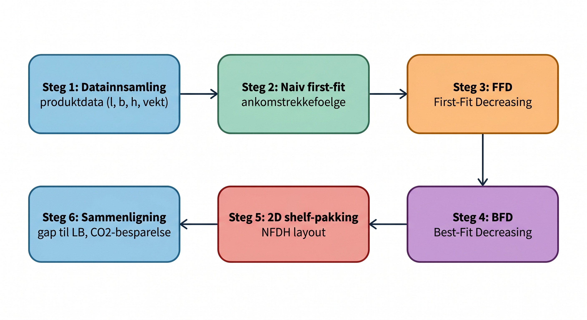

Bin packing-prosess: fra datainnsamling til kvantifisert transportbesparelse.

### Steg 1: Datainnsamling
NordPakk har 80 aktive produkter (SKU) i dagens plukkliste. For hvert produkt kjenner vi lengde, bredde, høyde og vekt fra lagerkartotekets artikkelregister. Tabell [11](#tab-tab-bp-prodsample) viser et utvalg av de første artiklene.

Utdrag fra produktkatalogen: dimensjoner og vekt for 12 av 80 artikler.

  **SKU**   **Klasse**   **L (cm)**   **B (cm)**   **H (cm)**        **Vekt (kg)**   **Volum (l)**
  --------- ------------ ------------ ------------ ----------------- --------------- ------------------
  SKU061    stor         50,3         30,3         26,7              6,00            40,69
  SKU033    medium       49,4         29,0         19,0              4,29            27,22
  SKU080    stor         57,2         29,7         25,5              5,72            43,32
  SKU078    stor         59,0         31,1         23,2              5,25            42,57
  SKU011    smaa         29,1         19,9         14,4              3,21            \phantom{0}8,34
  SKU006    smaa         30,7         22,8         13,4              3,38            \phantom{0}9,38
  SKU031    smaa         24,1         17,5         \phantom{0}8,5   1,67            \phantom{0}3,58
  SKU025    smaa         34,0         17,2         14,8              3,14            \phantom{0}8,66
  SKU068    stor         59,0         30,3         22,6              6,35            40,40
  SKU021    smaa         26,7         15,9         13,7              2,07            \phantom{0}5,82
  SKU047    medium       38,4         25,3         15,9              4,38            15,45
  SKU052    medium       45,5         28,3         21,3              5,56            27,43

Produktkatalogen fordeler seg på tre størrelsesklasser: *smaa* artikler (40 %, volum 2--10 l), *medium* (30 %, 12--28 l) og *stor* (30 %, 32--45 l). Klassifiseringen er operativ snarere enn formell -- den fanger opp hvordan operatørene intuitivt sorterer artiklene på pakkestasjonen.

Deskriptiv statistikk. Tabell [12](#tab-tab-bp-stats) oppsummerer datasettet.

Deskriptiv statistikk for produktkatalogen ($N = 80$).

  **Statistikk**                         **Verdi**
  -------------------------------------- ----------------------------------------------
  Antall produkter ($N$)               80
  Bin-dimensjon ($V$)                  $60 \times 40 \times 30$ cm $=$ 72,0 l
  Maksvekt ($M$)                       25,0 kg
  Gjennomsnittlig volum ($\bar{v}$)   20,16 l
  Standardavvik volum ($s_v$)          14,04 l
  Minimum / maksimum volum               1,76 l / 44,87 l
  Totalt volum ($\sum v_i$)           1 612,92 l
  Totalt vekt ($\sum m_i$)            277,79 kg
  Andel smaa / medium / stor             0,40 / 0,30 / 0,30

Visuell analyse. Figur [11](#fig-fig-bp-products) viser fordelingen av volum og vekt samt sammenhengen mellom dem. Volumfordelingen er klart trimodal -- de tre størrelsesklassene er synlige som tre atskilte topper. Vekten følger volumet, men med lavere tetthet for de største artiklene (typisk porøse pakninger, tekstiler, papp), slik at vektgrensen på 25 kg per eske i praksis er langt fra bindende.

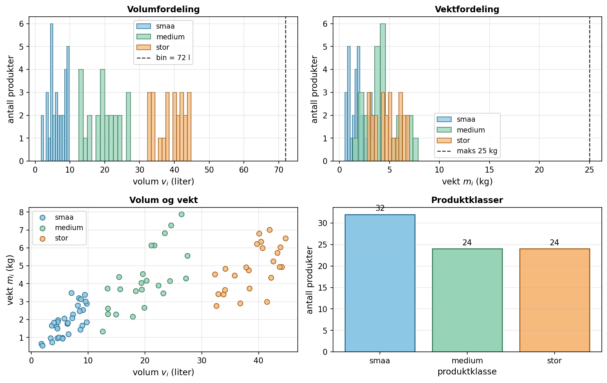

Produktkatalog: volumfordeling (øverst venstre), vektfordeling (øverst høyre), sammenheng mellom volum og vekt (nederst venstre) og fordeling av produktklasser (nederst høyre).

**Konklusjon** --- *Hva kan vi lese ut fra dataene?*

Volum er den bindende skranken: totalt volum 1 613 l fordelt på 72 l per eske gir en nedre grense på $\lceil 1613 / 72 \rceil = 23$ esker. Totalvekt 278 kg fordelt på 25 kg gir bare $\lceil 278 / 25 \rceil = 12$ esker. En god pakkealgoritme må derfor minimere antall esker gitt volumbegrensningen, og kan i hovedsak ignorere vekten -- men må likevel kontrollere at den ikke brytes for noen enkelt eske.

### Steg 2: Naiv first-fit (baseline)
For å ha et sammenligningsgrunnlag starter vi med den enkleste mulige strategien: *first-fit i ankomstrekkefølge*. Operatøren behandler artiklene i den rekkefølgen de dukker opp på rullebåndet fra plukkestasjonene og legger hver i den første åpne esken som har nok ledig volum og ikke bryter vektgrensen. Hvis ingen åpen eske passer, åpnes en ny.

Denne regelen er attraktiv fordi den er reaktiv og krever ingen sortering eller planlegging. Men den er også den verste fra et teoretisk standpunkt: store artikler som kommer sent kan ikke lenger bli passet inn i tidligere esker med passende ledig volum, og må i praksis "ødelegge" en ny eske med mye luft.

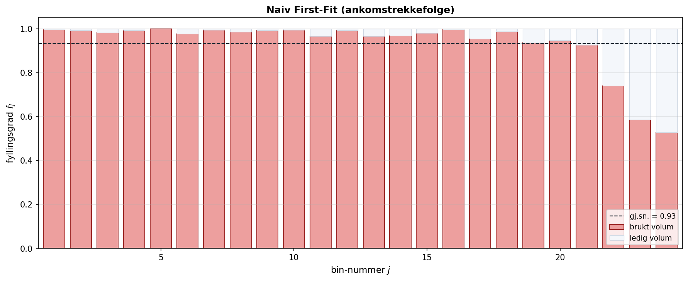

Naiv First-Fit i ankomstrekkefølge: fyllingsgrad $f_j$ per eske $j$. De tre siste eskene inneholder hver kun én stor artikkel og har lav fyllingsgrad (74 %, 59 % og 53 %).

Figur [12](#fig-fig-bp-naive) viser fyllingsgraden $f_j = \sum_{i \in B_j} v_i / V$ per eske for den naive løsningen. De 21 første eskene fylles til $> 90\,%$, men de tre siste er tydelig underfylte. Dette er den klassiske "tail-effekten" i first-fit: når en stor artikkel dukker opp sent i køen, finner den ingen halvfull eske som har plass, og åpner derfor en nær-tom ny eske.

**Konklusjon** --- *Hvor mye koster ankomstrekkefølgen?*

Naiv First-Fit bruker $K_{\text{naiv}} = 24$ esker med gjennomsnittlig fyllingsgrad $93,3\,%$. Gapet til den kontinuerlige nedre grensen $\mathrm{LB} = 23$ er én eske, altså $4,3\,%$. Resultatet er overraskende bra gitt at regelen ikke sorterer -- men vi skal se at en enkel sortering etter volum reduserer gapet til null på denne instansen.

### Steg 3: First-Fit Decreasing (FFD)
FFD skiller seg fra naiv first-fit ved én eneste linje: *sorter artiklene i fallende volumrekkefølge før de pakkes*. Hver artikkel plasseres deretter i den første esken der den passer, nøyaktig som før. Intuisjonen er enkel: de store artiklene skal få lov å "velge først", slik at de bygger grunnen i hver eske. De små artiklene kommer etterpå og fyller ut restlommer hvor de passer.

Algoritmen. FFD kan skrives i tre linjer:

1.  Sorter artiklene $1, 2, \ldots, N$ slik at $v_{\[1\]} \geq v_{\[2\]} \geq \cdots \geq v_{\[N\]}$.

2.  For $i = 1, 2, \ldots, N$: finn den minste $j$ der artikkel $\[i\]$ passer (både volum og vekt); hvis ingen, åpne ny eske.

3.  Returner alle åpne esker.


First-Fit Decreasing: fyllingsgrad per eske. De første 22 eskene fylles til 97--100 %; bare den siste er halvfull og tar det lille "overskuddet" av artikler.

Figur [13](#fig-fig-bp-ffd) viser at FFD systematisk presser de mest fylte eskene først. Bare den siste esken er underfylt (ca. 53 %) -- det er restlageret som ikke fikk plass i en av de tidligere eskene.

**Konklusjon** --- *Verdien av én sortering.*

FFD bruker $K_{\text{FFD}} = 23$ esker med gjennomsnittlig fyllingsgrad $97,4\,%$. Dette matcher nøyaktig den kontinuerlige nedre grensen $\mathrm{LB} = 23$, så gapet til optimum er garantert null på denne instansen. Besparelsen fra naiv er én eske ($4,2\,%$ reduksjon) -- ikke dramatisk i prosent, men over et år med 250 arbeidsdager og tilsvarende daglig volum tilsvarer det 250 færre esker årlig uten noen investering i utstyr eller opplæring, bare én sorteringslinje i koden.

### Steg 4: Best-Fit Decreasing (BFD)
FFD plasserer hver artikkel i den *første* esken som har plass -- en lokal myopisk regel. BFD erstatter dette med en litt smartere regel: plasser artikkelen i den esken som etter innlegging har *minst* ledig volum igjen ("tightest fit"). Intuisjonen er å fylle én eske helt før man begynner på den neste, og dermed unngå at mange esker ender med små, ubrukelige luftlommer.

Algoritmen. BFD er nesten identisk med FFD, men endrer valgregelen:

1.  Sorter artiklene i fallende volumrekkefølge.

2.  For hver artikkel $i$: blant alle åpne esker $j$ der artikkelen passer, velg den med minst ledig volum etter innlegging. Hvis ingen passer, åpne ny.

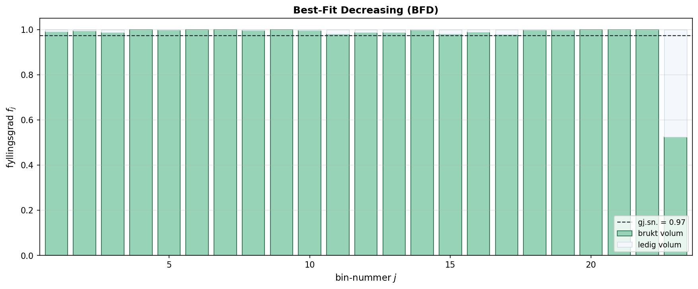

Best-Fit Decreasing: fyllingsgrad per eske. Identisk antall esker som FFD, men litt mer jevnt fordelt fylling i praksis.

**Konklusjon** --- *FFD eller BFD?*

På NordPakk-instansen gir FFD og BFD samme resultat: $K_{\text{BFD}} = 23$ esker og volumutnyttelse $97,4\,%$. I større instanser med flere "passe-på-plassen"-situasjoner pleier BFD å gi marginalt jevnere fyllingsgrad -- og dermed gjøre pakkeflyten mer forutsigbar for operatøren -- men antall esker er ofte likt. BFD velges derfor i praksis når jevn fylling verdsettes (f.eks. for stabilitet under transport).

### Steg 5: 2D shelf-pakking (pedagogisk)
For å gi leseren et konkret bilde av hvordan geometrien faktisk ser ut når artiklene ligger i en eske, kjører vi en 2D-variant på eskens bunnflate ($60 \times 40$ cm). Vi bruker *Next-Fit Decreasing Height* (NFDH), en klassisk 2D shelf-heuristikk:

1.  Sorter artiklene etter fallende høyde (her: bredde, siden vi pakker i liggende stilling).

2.  Start en aktiv hylle i bunnen av esken. Legg artikkelen i hyllen fra venstre til høyre.

3.  Når bredden er oppbrukt, lukk hyllen og åpne en ny hylle over. Hyllehøyden settes lik det første elementets høyde.

4.  Fortsett til ingen nye hyller får plass innenfor eskens dybde.

Figur [15](#fig-fig-bp-shelf) illustrerer en slik pakkelayout med 18 kandidatartikler (bokliknende flate pakker) og $60 \times 40$ cm bunnflate.


NFDH shelf-pakking: tre horisontale hyller fyller bunnflaten av en $60 \times 40$ cm eske. 13 av 18 artikler får plass, og areautnyttelsen er $79,9\,%$. De høyeste artiklene fyller bunnhyllen, mellomhøyde-artiklene hyllen over, og laveste artikler står øverst.

**Konklusjon** --- *Geometri gir alltid tap.*

NFDH er rask og enkel, men gir typisk $70$--$90\,%$ areautnyttelse fordi rest-volum til høyre i hver hylle og over toppen av lave artikler ikke kan gjenbrukes. I praksis supplerer man derfor med "guillotine" shelf-pakking (underdele en hylle i kolonner) eller mer avanserte 2D-heuristikker som Maximal Rectangles og Skyline. NordPakks 1D-resultat er i virkeligheten en *øvre grense* på hvor godt vi kan pakke -- den virkelige 3D-utnyttelsen er lavere på grunn av nettopp denne geometrien.

### Steg 6: Sammenligning og transportbesparelser
Vi samler nå resultatene fra de tre 1D-metodene, sammenholder dem med den kontinuerlige nedre grensen, og estimerer hva en overgang fra naiv til FFD betyr for CO$_2$ og håndteringskostnader.

Kontinuerlig nedre grense. Som allerede beregnet er

$$\begin{aligned}\mathrm{LB} &\;=\; \left\lceil \max\!\left( \frac{\sum_i v_i}{V},\ \frac{\sum_i m_i}{M} \right) \right\rceil \notag \\
&\;=\; \left\lceil \max\!\left( \frac{1\,612,92}{72},\ \frac{277,79}{25} \right) \right\rceil
\;=\; \lceil \max(22,40,\ 11,11) \rceil \;=\; 23.\end{aligned}$$

5

Ingen pakkeløsning kan bruke færre enn 23 esker. Vi kan nå sammenligne hver heuristikk mot denne grensen.

Sammenligning av metoder på NordPakk-instansen ($N = 80$, $V = 72$ l, $M = 25$ kg, $\mathrm{LB} = 23$).

  **Metode**   **Beskrivelse**                **$K$**              **Fylling**      **Gap til LB**   **Rel. gap**
  ------------ ------------------------------ ---------------------- ---------------- ---------------- ---------------
  Naiv FF      Ankomstrekkefølge              24                     $93,3\,%$   $+1$           $4,3\,%$
  FFD          Sortert fallende volum         **23**   $97,4\,%$   $0$            $0,0\,%$
  BFD          Tightest-fit, fallende volum   **23**                 $97,4\,%$   $0$            $0,0\,%$

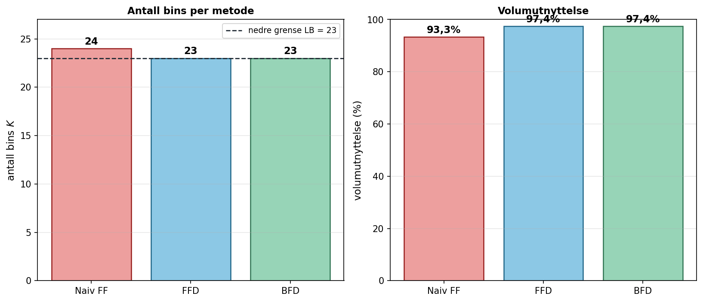

Antall esker (venstre) og volumutnyttelse (høyre) for de tre metodene. Den stiplede linjen markerer den kontinuerlige nedre grensen $\mathrm{LB} = 23$.

Transportbesparelser. En daglig reduksjon fra 24 til 23 esker høres lite ut, men er lett å skalere. Vi antar en gjennomsnittlig CO$_2$-kostnad på $1,3$ kg CO$_2$e per eske i distribusjon (dekker innsamling, transport, distribusjonssenter, last mile og returlogistikk) og en håndteringskostnad på $14$ NOK per eske (volumbasert emballasje, pakkelinje-kapasitet og sortering ved mottak). Én spart eske per dag på NordPakk-instansen tilsvarer da

$$\Delta\mathrm{CO}_2 = 1 \times 1,3 = 1,3 \text{ kg CO}_2\text{e/dag}, \qquad
\Delta\text{kostnad} = 1 \times 14 = 14 \text{ NOK/dag}.$$

6

Over 250 arbeidsdager i året gir det $325$ kg CO$_2$e og $3\,500$ NOK per 80-artikkel-instans. Er samme dagsvolum representativt for 100 daglige instanser (typisk for et regionalt lager), snakker vi om $32,5$ tonn CO$_2$e og $350\,000$ NOK spart årlig -- uten kapitalkostnader, bare en linje med kode.

Årlige transportbesparelser ved overgang fra naiv til FFD, per instans og skalert til $100$ instanser/dag $\times$ 250 dager.

  **Metrikk**                       **Per instans/dag**   **Årlig skala (100 inst. $\times$ 250 d)**
  --------------------------------- --------------------- -----------------------------------------------
  Antall esker spart                $1$                 $25\,000$
  CO$_2$ spart (kg CO$_2$e)   $1,3$               $32\,500$
  Håndteringskostnad spart (NOK)    $14$                $3\,500\,000$

**Praktisk anvendelse** --- *Hva betyr dette for NordPakk?*

1.  **Endre pakkeregelen:** Bytt fra "pakk når den kommer" til "sorter etter volum, pakk stor-først". Dette krever kun en sorteringsbuffer på pakkestasjonen (5--10 min forhåndsarbeid per ordrebølge).

2.  **Rapportér volumutnyttelse:** Vis fyllingsgraden $f_j$ per eske som KPI til operatørene. Mål *minimum* fyllingsgrad per dag og bruk den som utgangspunkt for kontinuerlig forbedring.

3.  **Kvantifisér LB på forhånd:** Beregn nedre grense fra dagens plukkliste før pakkingen starter. Hvis FFD oppnår $\mathrm{LB}$, er ingen manuell forbedring mulig uten å endre inngangsdata (bestille større esker, dele ordren).

4.  **Vurder 2D/3D-verktøy:** Der geometri er bindende (lange, flate eller uhåndterlige artikler), supplér med programvare for 3D bin packing (e.g. Py3DBP, 3dbp, kommersielle verktøy).

Begrensninger. Eksempelet har tre viktige forenklinger som leseren bør være klar over:

- *1D vs 3D:* Reell 3D-pakking er strengere enn 1D volumbasert. FFDs $97,4\,%$ er en *øvre grense* -- faktisk 3D-pakking oppnår typisk $70$--$85\,%$ volumutnyttelse på grunn av geometrisk tap.

- *Deterministisk innstrøm:* Vi antar at alle 80 artikler er kjent når pakkingen starter. Virkelige netthandelslagre har rullerende ordrer, og da må FFD erstattes av "online" varianter (FF, BF) med tilhørende dårligere ytelsesgarantier.

- *Kostnadsparametrene:* De brukte verdiene ($1,3$ kg CO$_2$e/eske, $14$ NOK/eske) er illustrative og må kalibreres lokalt. DEFRA-, SSB- eller bedriftsinterne LCA-data gir mer presise tall.

Integrert grønn forsyningskjede med stokastisk flermål MIP

## Eksempel: Integrert grønn forsyningskjede med stokastisk flermål MIP
Oppsummering.

  **Kategori**      **Beskrivelse**
  ----------------- ---------------------------------------------------------------------------------------------------------------------------------------
  Eksempel          Nordisk distribusjonsnettverk under EU CBAM-press og variabel karbonpris
  Område            Bærekraftig logistikk: integrert nettverksdesign, modal-valg og karbonprising under usikkerhet
  Problemstilling   Hvilke DC-er åpnes, og hvilke transportmoduser velges, gitt stokastisk etterspørsel og tre motstridende mål (kost, utslipp, service)?
  Modell            To-trinns stokastisk flermål MIP med DC-binærvariabler, fraksjonell allokering og scenariobaserte utslipps- og service-mekanismer
  Prosess           Epsilon-constraint for Pareto-front + Kantorovich scenario-reduksjon som heuristikker
  Metode            PuLP/CBC, fast-forward scenario-reduksjon, karbonpris-parameterisering for tipping-punkter, 3D Pareto-visualisering

### Problemstilling
*NorDistrib AS* er en nordisk grossist med kunder spredt fra Malmø i sør til Tromsø i nord og med et strategisk valg foran seg: nå er leieavtalen på tre sentrallagre i ferd med å utløpe, EUs ordning for karbongrensejustering (CBAM) går inn i sin andre fase, og transportkunder stiller nye krav om *dokumentert* CO2-intensitet per leveranse. Selskapet har seks DC-kandidater (Oslo, Göteborg, Stockholm, Malmø, Trondheim, København), 50 kunder med usikker etterspørsel, og tre transportmoduser med svært ulike kost- og utslipps-profiler (lastebil, jernbane, skip).

Tre spørsmål må besvares samtidig:

- **Nettverksdesign**: Hvilke DC-er skal åpnes? Færre DC-er gir lavere faste kostnader men lengre transportavstander og høyere utslipp.

- **Modal shift**: Hvilke transportmoduser skal brukes for hvilke strekninger? Lastebil er raskest, men har 4--6 ganger høyere utslipp per tonnkm enn tog og skip.

- **Karbonprising**: Hvor robust er løsningen mot svingninger i karbonprisen (EU ETS typisk 50--150 EUR/tonn)? Ved hvilken pris snur det seg økonomisk å flytte volum fra lastebil til tog?

Alt dette må avgjøres *før* den framtidige etterspørselen er kjent, og løsningen må prøve seg godt på tvers av *alle* plausible fremtider.

**Problemstilling** --- *Hvordan integrere kost, utslipp og service under usikkerhet?*

Vi formulerer oppgaven som en *to-trinns stokastisk flermål MIP*: stage 1 bestemmer DC-åpning (binær her-og-nå beslutning); stage 2 allokerer kundeetterspørsel til (DC, modus)-par etter at scenariet $\xi^s$ er realisert. Tre mål minimeres simultant: total kostnad (fast $+$ transport $+$ karbon), CO2-utslipp og service-proxy (vektet avstand til kunde). Epsilon-constraint-metoden genererer Pareto-fronten; Kantorovich fast-forward-heuristikk reduserer scenariosettet fra 300 til 10 representative scenarier.

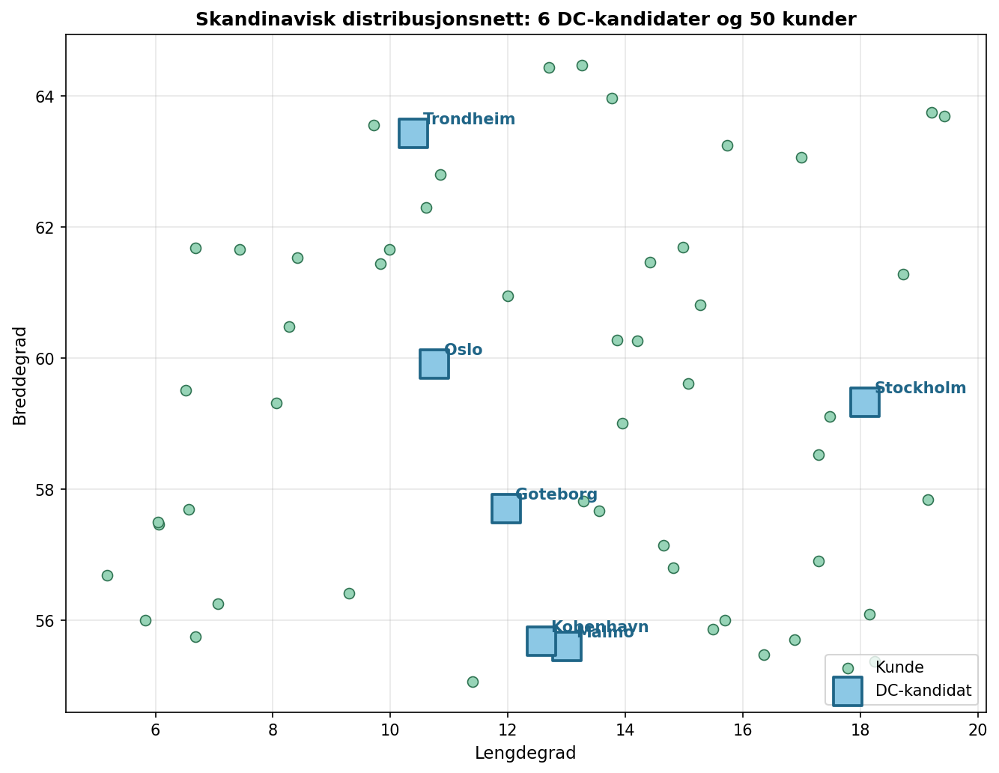

Skandinavisk distribusjonsnettverk: 6 DC-kandidater (blå firkanter) og 50 kunder (grønne punkter) fordelt over Norge, Sverige og Danmark. DC-er åpnes kun for kandidater der total forventet kostnad (fast $+$ transport $+$ karbon) rettferdiggjør det.

### Modell
Der SARIMA, LP og klassisk UFLP estimerer (eller velger) *ett* sett parametere med *ett* mål, integrerer denne modellen tre strukturelle utvidelser på én gang: (i) *stokastisk* etterspørsel via scenarier, (ii) *flere* motstridende mål som ikke kan slås sammen til ett tall uten at noe går tapt, og (iii) *blandede heltalls- og kontinuerlige* variabler. Strukturen er kvalitativt annerledes enn en enkeltmål-baseline: modellen produserer ikke én optimal løsning, men en hel *front* av løsninger der ingen dominerer de andre. Vi besvarer derfor de fire sedvanlige modellspørsmålene --- Data, Ukjente, Målfunksjon(er), Skranker --- i tur og orden.

Data. Treningsdataene består av fire registre: DC-kandidater, kunder, transportmoduser og scenarier for etterspørsel. La $\mathcal{I} = {i_1, \ldots, i_{\|\mathcal{I}\|}}$ være DC-kandidatene, $\mathcal{J}$ kundene, $\mathcal{M} = {\text{truck}, \text{rail}, \text{ship}}$ modusene og $\mathcal{S}$ scenariosettet. For hvert (DC, kunde, modus)-triplett $(i, j, m)$ er det gitt avstand $d_{ij}$, enhetskost $c^{\text{t}}_{ijm}$ (EUR/enhet) og utslippsintensitet $e_{ijm}$ (kg CO2/enhet). Scenariene ${\xi^s}_{s \in \mathcal{S}}$ har sannsynligheter ${p^s}_{s \in \mathcal{S}}$ som summerer til 1, og $\xi^s_j$ er realisert etterspørsel for kunde $j$ i scenario $s$. Tabell [16](#tab-tab-gronnsc-panel) oppsummerer dimensjonene.

Dimensjoner for dataregisteret til den integrerte grønne SC-modellen.

  **Symbol**                                                                     **Beskrivelse**                                       **Verdi**
  ------------------------------------------------------------------------------ ----------------------------------------------------- ----------------
  $\|\mathcal{I}\|$                                                           Antall DC-kandidater                                  $6$
  $\|\mathcal{J}\|$                                                           Antall kunder                                         $50$
  $\|\mathcal{M}\|$                                                           Antall transportmoduser                               $3$
  $\|\mathcal{S}\|$                                                           Antall scenarier (etter reduksjon)                    $10$--$20$
  $\|\mathcal{I}\|\!\cdot\!\|\mathcal{J}\|\!\cdot\!\|\mathcal{M}\|$   Antall kanter $(i,j,m)$ med egne kost/utslipp       $900$
  $\xi^s_j \in \mathbb{N}_{\geq 0}$                                      Scenariorealisering av kunde $j$ sin etterspørsel   ---

Definisjon [To-trinns stokastisk flermål MIP]
La $y_i \in {0, 1}$ være den binære indikatoren for om DC-kandidat $i$ åpnes (stage 1), og la $x^s_{ijm} \in \[0, 1\]$ være fraksjonen av kunde $j$ sin etterspørsel i scenario $s$ som betjenes fra DC $i$ med modus $m$ (stage 2). Den *deterministiske ekvivalenten* av det to-trinns flermål-programmet er

$$\begin{aligned}\min_{y, x} \; \Bigl\[&\, \underbrace{C(y, x)}_{\text{total kost}},\; \underbrace{E(x)}_{\text{utslipp}},\; \underbrace{S(x)}_{\text{service}} \Bigr\] \\
\text{s.t.} \quad
& \sum_{i \in \mathcal{I}} \sum_{m \in \mathcal{M}} x^s_{ijm} = 1, \qquad \forall j \in \mathcal{J},\, s \in \mathcal{S}, \\
& \sum_{j \in \mathcal{J}} \sum_{m \in \mathcal{M}} \xi^s_j \, x^s_{ijm} \leq K_i \cdot y_i, \qquad \forall i \in \mathcal{I},\, s \in \mathcal{S}, \\
& y_i \in {0, 1}, \quad x^s_{ijm} \in \[0, 1\].\end{aligned}$$

12

De tre målene i [(12)](#eq-eq-gsc-multi) er definert over forventningen $\mathbb{E}_{\xi}\[\,\cdot\,\]$ approksimert ved scenariosummen:

$$\begin{aligned}C(y, x) &= \sum_{i} F_i\, y_i \;+\; \sum_{s} p^s \sum_{i,j,m} \xi^s_j\, c^{\text{t}}_{ijm}\, x^s_{ijm} \;+\; \tfrac{c^{\text{co2}}}{1000}\, E(x), \\
E(x) &= \sum_{s} p^s \sum_{i,j,m} \xi^s_j\, e_{ijm}\, x^s_{ijm}, \\
S(x) &= \sum_{s} p^s \sum_{i,j,m} \xi^s_j\, d_{ij}\, f_m\, x^s_{ijm}.\end{aligned}$$

7

Symbolene forklares i tabell [17](#tab-tab-gronnsc-master-symbols).

Symboler i master-problemet [(12)](#eq-eq-gsc-multi)--[(?)](#eq-eq-gsc-service).

  **Symbol**                  **Type**               **Beskrivelse**
  --------------------------- ---------------------- -----------------------------------------------------------------------------------
  $y_i$                     beslutning (stage 1)   $1$ om DC $i$ åpnes, $0$ ellers
  $x^s_{ijm}$             beslutning (stage 2)   Andel av kunde $j$ sin etterspørsel i scenario $s$ som går via $(i, m)$
  $F_i$                     parameter              Fast årlig kostnad ved å åpne DC $i$ (EUR/år)
  $K_i$                     parameter              Kapasitet på DC $i$ (enheter per år)
  $c^{\text{t}}_{ijm}$   parameter              Transportkost per enhet for $(i, j, m)$ (EUR/enhet)
  $e_{ijm}$                parameter              Utslipp per enhet for $(i, j, m)$ (kg CO2/enhet)
  $d_{ij}$                 parameter              Avstand mellom DC $i$ og kunde $j$ (km)
  $f_m$                     parameter              Service-straffefaktor for modus $m$ (1 for lastebil, 1,3 for tog, 1,8 for skip)
  $c^{\text{co2}}$        parameter              Karbonpris (EUR/tonn CO2) --- parametriseres i steg 5
  $\xi^s_j$               tilfeldig              Realisert etterspørsel for kunde $j$ i scenario $s$
  $p^s$                    parameter              Sannsynlighet for scenario $s$

Figur [18](#fig-fig-gronnsc-schematic) illustrerer hvordan stage-1 beslutning, scenariorealisering og stage-2 recourse spiller sammen for å gi verdier til de tre målene.


To-trinns stokastisk flermål struktur. DC-åpning $y_i$ tas før scenariet er kjent (stage 1). For hvert scenario $s$ realiseres etterspørselen $\xi^s$, og allokeringen $x^s_{ijm}$ bestemmes (stage 2). De tre målene evalueres som forventninger over scenariosettet.

Definisjon [Epsilon-constraint-metoden]
Et flermål-program med objektiver $(f_1, f_2, f_3)$ kan ikke minimeres simultant. *Epsilon-constraint-metoden* reduserer det til en serie enkeltmål-problemer: velg ett mål som primært, gjør de andre om til *skranker* med tak $\epsilon_k$:

$$\min_{y, x} \; f_1(y, x)
\qquad \text{s.t.} \qquad
f_2(y, x) \leq \epsilon_2, \quad f_3(y, x) \leq \epsilon_3, \quad \text{(modell-skranker)}.$$

14

Ved å variere $(\epsilon_2, \epsilon_3)$ over et gitter tegnes hele Pareto-fronten. En løsning med alle tre skranker aktive er *Pareto-optimal*: ingen mål kan forbedres uten at et annet forverres.

Symbolene forklares i tabell [18](#tab-tab-gronnsc-eps-symbols); figur [19](#fig-fig-gronnsc-eps-illustration) viser prinsippet skjematisk.

Symboler i epsilon-constraint-formuleringen [(14)](#eq-eq-gsc-eps).

  **Symbol**                     **Type**     **Beskrivelse**
  ------------------------------ ------------ --------------------------------------------------------------------------------------------
  $f_1, f_2, f_3$              funksjoner   De tre målfunksjonene: $C$, $E$, $S$
  $\epsilon_2, \epsilon_3$   parametre    Øvre tak på de målene som er gjort om til skranker
  Pareto-punkt                   resultat     En tillatt løsning med aktive skranker $f_2 \leq \epsilon_2,\, f_3 \leq \epsilon_3$
  Pareto-front                   mengde       Alle Pareto-punkter, generert ved å variere $(\epsilon_2, \epsilon_3)$

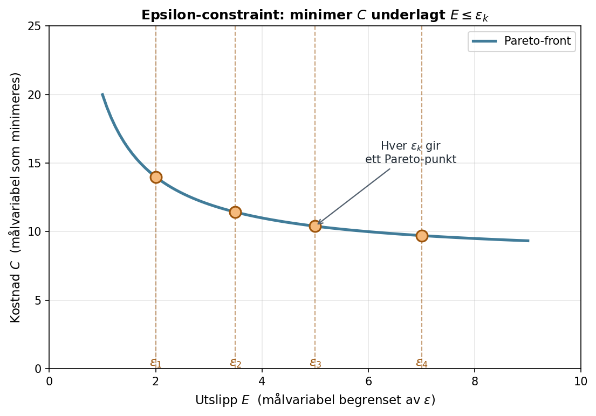

Prinsippet i epsilon-constraint: vi minimerer én målvariabel ($C$) under et øvre tak $\epsilon_k$ på en annen målvariabel ($E$). Hver $\epsilon_k$ gir ett Pareto-punkt; en sekvens av $\epsilon$-verdier traserer hele fronten.

Variabler: hva estimeres? Tabell [19](#tab-tab-gronnsc-unknowns) skiller mellom størrelser som MIP-en bestemmer og størrelser som er gitt på forhånd. Merk at antallet ukjente vokser både med $\|\mathcal{S}\|$ og med $\|\mathcal{I}\|\,\|\mathcal{J}\|\,\|\mathcal{M}\|$ --- derfor er scenario-reduksjon (steg 4) sentral.

Beslutningsvariabler, parametre og hyperparametre i modellen.

  **Kategori**       **Symbol**                                          **Rolle**                                      **Antall**
  ------------------ --------------------------------------------------- ---------------------------------------------- -------------------------------------
  Ukjent (stage 1)   $y_i$                                             DC-åpning, binær, her-og-nå                    $6$
  Ukjent (stage 2)   $x^s_{ijm}$                                     Allokeringsandel, kontinuerlig, per scenario   $\|\mathcal{S}\|\!\cdot\!900$
  Parameter          $F_i, K_i$                                        Faste kostnader og kapasiteter per DC          $12$
  Parameter          $c^{\text{t}}_{ijm}, e_{ijm}, d_{ij}, f_m$   Kant-attributter, satt fra data                $\sim 3\,600$
  Parameter          $\xi^s_j, p^s$                                 Scenario-realiseringer og sannsynligheter      $\|\mathcal{S}\|\cdot 51$
  Hyperparameter     $\epsilon_2, \epsilon_3$                        Epsilon-tak i Pareto-traversering              $\sim 10$ punkter
  Hyperparameter     $c^{\text{co2}}$                                Karbonpris (variert eksogent i steg 5)         $10$ verdier
  Hyperparameter     $\|\mathcal{S}\|_{\text{red}}$                 Antall scenarier etter Kantorovich-reduksjon   $10$

Skranker. Skrankene grupperes i tre kategorier:

- *Modell-skranker*: etterspørselsdekking [(?)](#eq-eq-gsc-demand) forlanger at hele kundeetterspørselen dekkes i alle scenarier; kapasitetsskranken [(?)](#eq-eq-gsc-capacity) hindrer overbruk av en åpen DC og tvinger at en lukket DC ($y_i = 0$) ikke brukes; domener [(?)](#eq-eq-gsc-domain) gir binær $y$ og fraksjonell $x \in \[0, 1\]$.

- *Data-skranker*: ikke-antesipasjonen er implisitt --- $y_i$ bærer *ingen* scenarioindeks. Dette er den kritiske forskjellen fra å løse hvert scenario deterministisk: her tvinger modellen én DC-beslutning som må fungere i *alle* scenarier.

- *Konvergens-skranke*: for epsilon-constraint bestemmes granulariteten av Pareto-fronten ved valg av $(\epsilon_2, \epsilon_3)$-gitter. Vi bruker et adaptivt gitter som tetner nært de ekstremale endepunktene.

Implementasjons-notater. Problemet implementeres i PuLP med CBC som solver. For å holde MIP-en traktabel velger vi kontinuerlig $x$ (fraksjonell allokering) i stedet for binær modus-valg per (DC, kunde). Dette er en bevisst forenkling: en strengere formulering ville ha $z_{ijm} \in {0, 1}$ som koblet modus-valg til allokeringsvolum, men antall binære variabler vokser da med $\|\mathcal{I}\|\|\mathcal{J}\|\|\mathcal{M}\| = 900$ som ville eksplodere løsningstiden. Den fraksjonelle tilnærmingen gir en gyldig nedre grense for kost/utslipp og fanger modal-shift-mekanismen godt nok for det pedagogiske formålet. For større instanser anbefales *progressive hedging*, som dekomponerer modellen per scenario og koordinerer stage-1 via Lagrange-relaksering.

**Tolkning** --- *Hva lærer modellen?*

Stage-1 variablene $y_i$ representerer den *robuste* infrastrukturen: hvilke DC-er er verdt å åpne før vi vet hvordan etterspørselen fordeler seg? Stage-2 variablene $x^s_{ijm}$ sier hva vi *ville* ha gjort i hvert scenario, og deres forventning gir de tre målverdiene. Epsilon-constraint-metoden oversetter flermål-problemet til en sekvens enkeltmål-LP-er og beskriver hele Pareto-fronten. Karbonprisen $c^{\text{co2}}$ fungerer som en *Lagrange-multiplikator* på utslippene: med lav karbonpris dominerer kost-komponenten i $C$ og modellen velger lastebil; når $c^{\text{co2}}$ øker nok, blir utslippsbidraget i $C$ stort nok til at modellen foretrekker tog og skip --- et *tipping-punkt* som vi kartlegger i steg 5.

Sammenligning med enklere modeller. Den integrerte modellen er en strukturell utvidelse av klassisk UFLP (kapittel 4) og to-trinns stokastisk LP (kapittel 2, sec. 04). Tabell [20](#tab-tab-gronnsc-vs-baselines) oppsummerer forskjellene.

Sammenligning: enkeltmål kost-min (UFLP-stil), enkeltmål utslipps-min, og Pareto-front.

  **Egenskap**              **Enkeltmål kost**               **Enkeltmål utslipp**                        **Pareto-front (denne modellen)**
  ------------------------- -------------------------------- -------------------------------------------- -----------------------------------------------------------
  Målfunksjon               Totalkost (UFLP)                 CO2-utslipp                                  Tre mål simultant
  Utslipp behandles som     Ignorert/eksogent                Primærmål                                    Skranke ($\epsilon$) eller komponent
  Modal-valg                Typisk eksogent (gitt modus)     Driver av løsning                            Endogent, følger av $\epsilon$ og $c^{\text{co2}}$
  Usikkerhet                Deterministisk etterspørsel      Deterministisk / av-og-til scenario-basert   Scenariobasert (SAA)
  Utgangsrom                Én optimal løsning               Én optimal løsning                           Front av løsninger (ingen dominerer)
  Antall MIP-løsninger      1                                1                                            $\sim \|\text{Pareto}\|$ (ca. 10--15)
  Karbonpris-sensitivitet   Gir ett svar --- ingen tipping   Konstant valg av *minst*-utslippende modus   Eksplisitt tipping-punkt

Forutsetninger. Utover de formelle skrankene hviler modellen på fem modelleringsvalg som er verdt å framheve:

1.  **Lineær skalering av kost og utslipp**: Kost og utslipp er proporsjonale med volum og avstand. Dette gjelder bra for marginale beslutninger, men ikke for terminaleffekter. Vi kompenserer ved å oppjustere rail/ship-kost på korte distanser ($<150$ km) med en faktor 2 som proxy for faste terminalkostnader.

2.  **Tapt salg ikke modellert**: Kapasitetsskranken [(?)](#eq-eq-gsc-capacity) sikrer at enhver åpen DC ikke overbrukes, men totalkapasitet er dimensjonert så etterspørsel alltid kan dekkes. For realistiske stockout-scenarier måtte modellen utvides med restordre-variabler analogt med ch. 2 sec. 04.

3.  **Endogent modus-valg via fraksjonell $x$**: En kunde-DC-forbindelse kan utnytte blandede moduser (40 % lastebil $+$ 60 % tog). I praksis er dette en god tilnærming til intermodal transport; for strengere «én modus per strekning» trenger man binære $z$-variabler og strammere MIP.

4.  **Karbonpris som eksogen parameter**: $c^{\text{co2}}$ varieres utenfor modellen, ikke optimert endogent. Dette er realistisk for EU ETS hvor bedriften er pristaker.

5.  **Scenariosettet representerer sann fordeling**: SAA-tilnærmingen antar at de reduserte scenariene er en rimelig approksimasjon til den underliggende etterspørselsfordelingen. Kantorovich-reduksjonen gir formell garanti på at Kantorovich-avstanden mellom den fulle og den reduserte fordelingen minimeres.

### Prosess
Prosess: Epsilon-constraint for Pareto-front med Kantorovich scenario-reduksjon.
Modell: To-trinns stokastisk flermål MIP, PuLP/CBC.

Figur [20](#fig-fig-gronnsc-method) viser prosessens seks steg: datagenerering, enkeltmål-basislinjer, epsilon-constraint Pareto, Kantorovich scenario-reduksjon, karbonpris-tipping, og anbefaling med 3D-visualisering.

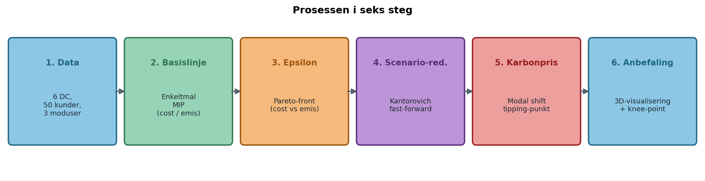

Prosessen i seks steg.

### Steg 1: Datainnsamling
Vi bruker syntetiske men realistiske data. DC-kandidatene er reelle skandinaviske byer, avstander er beregnet med Haversine-formelen fra (lat, lon)-koordinater, og utslippsfaktorer er basert på DEFRA (2023) for henholdsvis tungtransport, godstog og kystfrakt. Tabell [21](#tab-tab-gronnsc-dc) viser DC-kandidatene og tabell [22](#tab-tab-gronnsc-modes) viser modus-parametrene.

DC-kandidater med kapasitet og faste kostnader.

  **Kandidat**   **Lokasjon**   **Kapasitet (enheter/år)**   **Fast kost (EUR/år)**
  -------------- -------------- ---------------------------- ------------------------
  Oslo           Norge          $4\,000$                  $520\,000$
  Göteborg       Sverige        $5\,000$                  $600\,000$
  Stockholm      Sverige        $4\,500$                  $580\,000$
  Malmø          Sverige        $3\,800$                  $480\,000$
  Trondheim      Norge          $3\,000$                  $420\,000$
  København      Danmark        $4\,200$                  $560\,000$

Transportmoduser med kost- og utslippsintensitet per tonnkilometer. Service-faktor reflekterer relativ leveringstid.

  **Modus**   **Beskrivelse**           **Kost (EUR/tkm)**   **Utslipp (kg CO2/tkm)**   **Service-faktor $f_m$**
  ----------- ------------------------- -------------------- -------------------------- ----------------------------
  Lastebil    Tungtransport (Euro VI)   $0,11$             $0,095$                  $1,0$
  Jernbane    Elektrifisert godstog     $0,12$             $0,024$                  $1,3$
  Skip        Kystfrakt / RoRo          $0,13$             $0,016$                  $1,8$

Kundene er 50 geografisk spredte punkter i Skandinavia, hver med egen middel- og standardavvik for etterspørsel. 20 scenarier trekkes fra den multivariate normalfordelingen (uavhengige kunder, fordi kundene dekker et stort geografisk område og ikke deler lokal økonomisk syklus). Gjennomsnittlig total etterspørsel per scenario er $\approx 6\,728$ enheter; standardavvik på tvers av scenarier er $\approx 188$ enheter.

Figur [17](#fig-fig-gronnsc-network) viser hele nettverket; merk hvordan DC-kandidatene danner et trekantlignende mønster sentralt i Skandinavia og hvordan kundene er spredt jevnt.

**Konklusjon** --- *Hvorfor syntetiske data?*

Reelle logistikkdata for nordiske distribusjonsnett er sjelden offentlig tilgjengelige. Ved å generere syntetisk data kontrollerer vi hver parameter og kan demonstrere hvordan modellen reagerer på systematiske endringer (avstand, kapasitet, kostnadsstruktur). Karbonpris-analysen i steg 5 er spesielt informativ fordi vi kan identifisere eksakt hvor tipping-punktet ligger for den valgte parameteriseringen.

### Steg 2: Enkeltmål-basislinjer
Før vi går løs på flermål-problemet kjører vi MIP-en med hver målfunksjon isolert --- uten karbonpris og uten $\epsilon$-skranker. Dette gir oss de tre *ekstrempunktene* til Pareto-fronten og tydeliggjør hvor dramatisk løsningen endrer seg med valg av mål.

Enkeltmål-løsninger (uten karbonpris, uten $\epsilon$-skranker).

  **Målfunksjon**             **Kost (MEUR/år)**       **Utslipp (tonn CO2/år)**   **Service (Mkm)**
  --------------------------- ------------------------ --------------------------- ------------------------
  Min kostnad   $1,21$   $200,4$                   $2,11$
  Min utslipp   $3,37$                 $24,1$      $2,72$
  Min service   $3,33$                 $143,3$                   [$1,51$]
Tallene viser tre ekstreme arketyper:

- **Min kostnad**: To DC-er åpnes (Trondheim, København), og *all* transport går med lastebil. Utslippet er høyt --- $200$ tonn CO2/år --- fordi lastebil er klart billigst og utslipp ikke er i målfunksjonen.

- **Min utslipp**: Alle seks DC-er åpnes, og *all* transport går med skip. Dette halverer kostnaden per km-utslipp, men totalkostnaden tredobles ($3,37$ MEUR/år) fordi faste DC-kostnader og høye transportkostnader til fjerne kunder blir dominerende.

- **Min service**: Alle seks DC-er åpnes og *all* transport går med lastebil. Dette minimerer vektet avstand fordi flere DC-er betyr kortere gjennomsnittsavstand, og lastebil har laveste service-faktor ($f_{\text{truck}} = 1,0$).

Figur [21](#fig-fig-gronnsc-baselines) viser de tre ekstrempunktene side ved side.

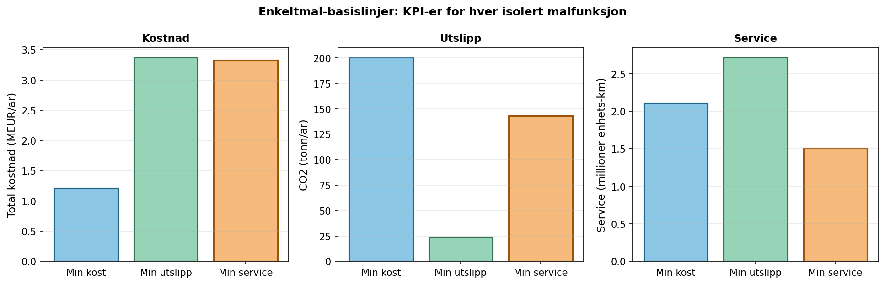

Enkeltmål-basislinjer. Hver søyle viser KPI-en (kost, utslipp, service) for hver isolerte målfunksjon. Ekstrempunktene er svært forskjellige: min kostnad gir maksimale utslipp, min utslipp gir maksimale kostnader.

**Konklusjon** --- *Tre mål, tre verdener*

Forskjellen mellom ekstrempunktene er dramatisk: min-kostnad har $8,3\times$ høyere utslipp enn min-utslipp, mens min-utslipp har $2,8\times$ høyere kostnad enn min-kostnad. Det finnes ingen løsning som er optimal på alle tre mål samtidig. Beslutningstakeren må gjøre en reell avveining, og for å gjøre det rasjonelt trenger vi å se hele *fronten* av Pareto-optimale kompromisser --- ikke bare ekstrempunktene.

### Steg 3: Epsilon-constraint Pareto-front
Vi bruker kost som primærmål og varierer utslippstaket $\epsilon_E$ fra minimum ($24$ tonn) til maksimum ($200$ tonn) i ni steg. For hvert steg løses MIP-en [(14)](#eq-eq-gsc-eps), og vi registrerer hvor på (kost, utslipp, service)-rommet løsningen havner.

Figur [22](#fig-fig-gronnsc-pareto-2d) viser den resulterende 2D-Pareto-fronten (kost vs. utslipp) med service vist som fargekoding.


Pareto-front: kostnad vs. utslipp. Hvert punkt svarer til en $\epsilon_E$-verdi. Farge koder service-nivå (mørkere $=$ bedre service). Fronten er markant konveks: de første utslippsreduksjonene kommer billig, men de siste $20$ tonnene krever eksponensielt mer penger.

Tabell [24](#tab-tab-gronnsc-pareto-excerpt) viser et utvalg av Pareto-punktene. Legg merke til hvordan DC-valget endrer seg: ved løse utslippsskranker holder løsningen seg til to-DC-konfigurasjonen (Trondheim, København); ved strengere skranker må flere DC-er åpnes for å kunne tilby kortere avstander som støtter lavutslipps-moduser.

Utvalg fra Pareto-fronten. Modal-kolonnene viser fordelingen (truck/rail/ship) i $%$; sammensetningen av åpne DC-er holder seg stabil {Trh, Kbh} over nesten hele fronten, og skifter bare til alle seks DC-er i ekstremt lav-utslippsenden.

  **$\epsilon_E$ (t)**   **Kost**   **Uts.**    **Serv.**   **Truck**   **Rail**   **Ship**   **Åpne DC**
  ------------------------- ---------- ----------- ----------- ----------- ---------- ---------- -------------
  $200$ (max)             $1,21$   $200,4$   $2,11$    $100$     $0$      $0$      2 DC
  $90$                    $1,23$   $90,2$    $2,57$    $34$      $66$     $0$      2 DC
  $68$                    $1,23$   $68,2$    $2,67$    $20$      $80$     $0$      2 DC
  $46$                    $1,24$   $46,2$    $3,25$    $9$       $48$     $43$     2 DC
  $24$ (min)              $3,37$   $24,1$    $2,72$    $0$       $0$      $100$    6 DC

**Konklusjon** --- *Hvor bratt er kurven?*

Mellom $\epsilon_E = 200$ og $\epsilon_E = 46$ tonn ligger kostnaden nesten flat rundt $1,23$ MEUR: *å kutte $77~%$ av utslippene koster under $3~%$ mer*. Dette fordi modal-shift (fra lastebil til tog og skip) er en «billig sving». Mellom $\epsilon_E = 46$ og $\epsilon_E = 24$ tonn stiger kostnaden derimot fra $1,24$ til $3,37$ MEUR ($+172~%$) fordi vi nå må åpne fire ekstra DC-er for å kunne tilby svært korte lavutslipps-ruter. Dette er den *knekk*-punktet som skiller en billig utslippsreduksjon fra en kostbar en.

### Steg 4: Scenario-reduksjon (Kantorovich fast-forward)
For realistiske instanser (hundrevis av scenarier, hundrevis av kunder) vokser MIP-en raskt til urimelige størrelser. Vi demonstrerer *scenario-reduksjon* som heuristikk: vi genererer $300$ scenarier, reduserer dem til $10$ representative ved hjelp av Kantorovich fast-forward-heuristikken, og sammenligner mot en «full» baseline med $15$ scenarier (som er omtrent grensen for hva CBC takler raskt på denne instansen).

**Heuristikk-merknad** --- *Hvorfor Kantorovich fast-forward?*

Den eksakte løsningen på scenario-reduksjonsproblemet --- «velg $K$ scenarier som minimerer Kantorovich-avstanden til den fulle fordelingen» --- er NP-hardt. Fast-forward-heuristikken velger iterativt ett og ett scenario ved å ta det som gir størst reduksjon i avstand. Den gir en grådig, men kvalitetsvurdert tilnærming med løpende teoretisk garanti på avstanden til den optimale reduserte fordelingen. I praksis gir $10$ reduserte scenarier ofte en MIP-løsning innen $1$--$3~%$ av den fulle løsningen --- til en løsningstid som er $2$--$5\times$ raskere.

Figur [23](#fig-fig-gronnsc-scenario-reduction) viser de $300$ originale scenariene (projisert til 2D ved å plotte etterspørsel for kunde C01 vs. C02) og de $10$ representative med boblestørrelse proporsjonal med tildelt vekt $p^s$.


Kantorovich fast-forward scenario-reduksjon. Venstre panel: alle $300$ originale scenarier. Høyre panel: $10$ reduserte scenarier med boblestørrelse proporsjonal med tildelt sannsynlighet $p^s$. Selv med bare $3,3~%$ av de originale scenariene bevarer den reduserte fordelingen strukturen.

Tabell [25](#tab-tab-gronnsc-reduction-comparison) sammenligner løsningen på det reduserte settet med en «full» baseline.

Sammenligning: redusert scenariosett ($10$ scenarier, Kantorovich) vs. full baseline ($15$ scenarier).

  **KPI**                   **Redusert**   **Baseline**   **Gap / speedup**
  ------------------------- -------------- -------------- -------------------------
  Total kostnad (MEUR/år)   $1,200$      $1,200$      $-0,04~%$
  Utslipp (tonn CO2/år)     $224,6$      $224,9$      $-0,16~%$
  Løsningstid (s)           $21,1$       $50,4$       $\times 2,4$ speedup

**Konklusjon** --- *Reduksjonen kommer nesten gratis*

Ved å bruke Kantorovich fast-forward-reduksjon får vi en løsning som i praksis er identisk med full-scenario-løsningen ($<0,2~%$ avvik både i kost og utslipp), men med over dobbelt så rask løsningstid. For MIP-problemer som kjøres mange ganger (f.eks. langs hele Pareto-fronten og på tvers av karbonpriser) er dette ofte forskjellen mellom en håndterbar og en upraktisk studie; på større instanser ($\gg 100$ scenarier) blir speedup-faktoren raskt størrelsesordener.

### Steg 5: Karbonpris-tipping-punkter
Vi parametriserer karbonprisen fra $0$ til $250$ EUR/tonn og løser min-kostnad MIP-en for hver verdi. Dette avdekker to fenomener: en *modal-shift-kurve* som viser hvordan transportmiksen endrer seg med karbonprisen, og en *kost/utslipp*-kurve som viser totaleffekten.

Figur [24](#fig-fig-gronnsc-modal-shift) viser begge perspektivene.

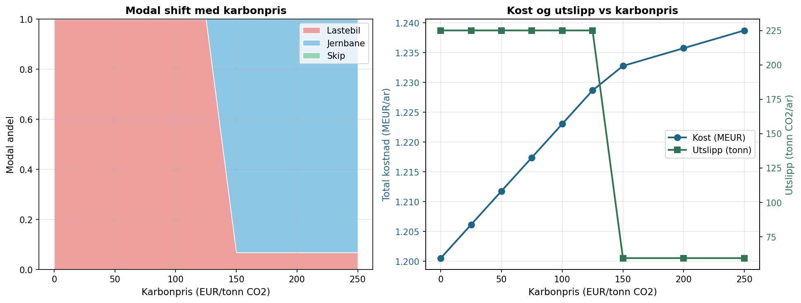

Venstre: modal-andel som funksjon av karbonpris. Høyre: total kostnad (blå) og utslipp (grønn) som funksjon av karbonpris. Tipping-punktet ligger der lastebil-andelen faller markant.

Figur [25](#fig-fig-gronnsc-carbon-tipping) viser samme data fra en annen vinkel: vi ser tydelig *hvor* i karbonpris-intervallet tipping-punktene ligger, markert med lilla bånd.

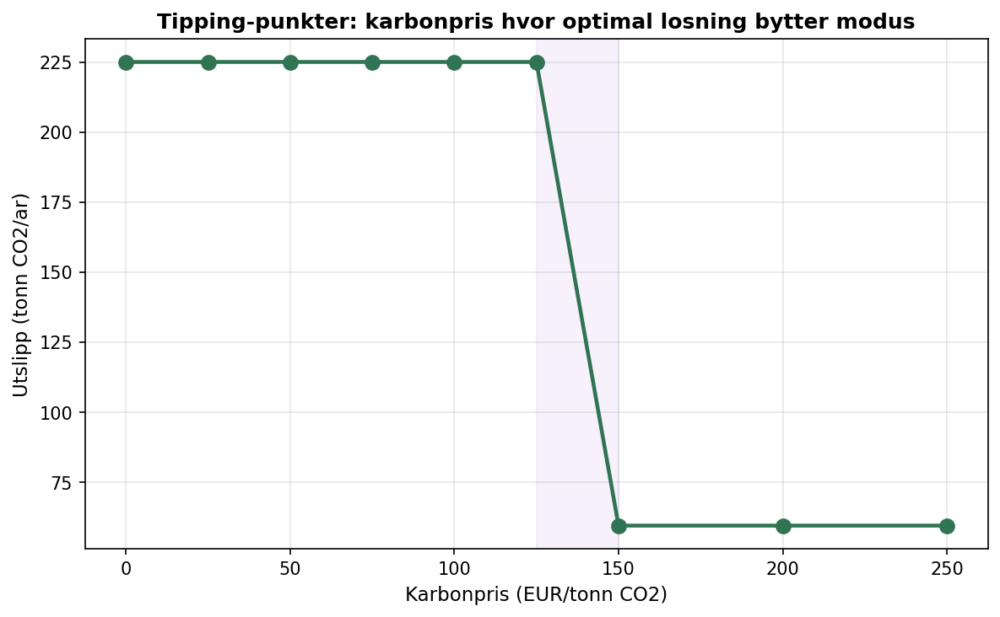

Utslipp som funksjon av karbonpris. Lilla bånd markerer karbonpris-intervaller der optimal løsning bytter modus (endring $>5$ prosentpoeng i én av modusene).

**Konklusjon** --- *Tipping-punktet forteller når regulatoren virker*

Ved $c^{\text{co2}} = 0$ er lastebil dominerende (100 % av volumet). Tipping-punktet ligger skarpt mellom $125$ og $150$ EUR/tonn: ved $c^{\text{co2}} = 150$ bytter løsningen nesten hele volumet fra lastebil til jernbane ($93~%$), utslippet faller fra $225$ til $60$ tonn CO2, og totalkostnaden øker fra $1,23$ til $1,23$ MEUR --- altså nesten ikke. Dette er *mekanisk* informasjon for både bedriftens planlegging og for politiske prisanbefalinger: en karbonpris godt under tipping-punktet ($<125$ EUR/tonn) har svært liten reell effekt på modal-valget, mens en pris akkurat ved tipping-punktet ($\approx 140$--$150$) gir dramatisk miljøgevinst til forsvinnende kostnadsøkning.

### Steg 6: Anbefaling og 3D Pareto-visualisering
Det siste steget er å gi beslutningstakeren et verktøy for å *velge* et punkt på Pareto-fronten. Vi gjør to ting: (i) utvider 2D-fronten til en 3D-punktsky ved også å variere service-skranken $\epsilon_S$, og (ii) foreslår en *knee-point*-løsning basert på normalisert avstand til utopi-punktet.

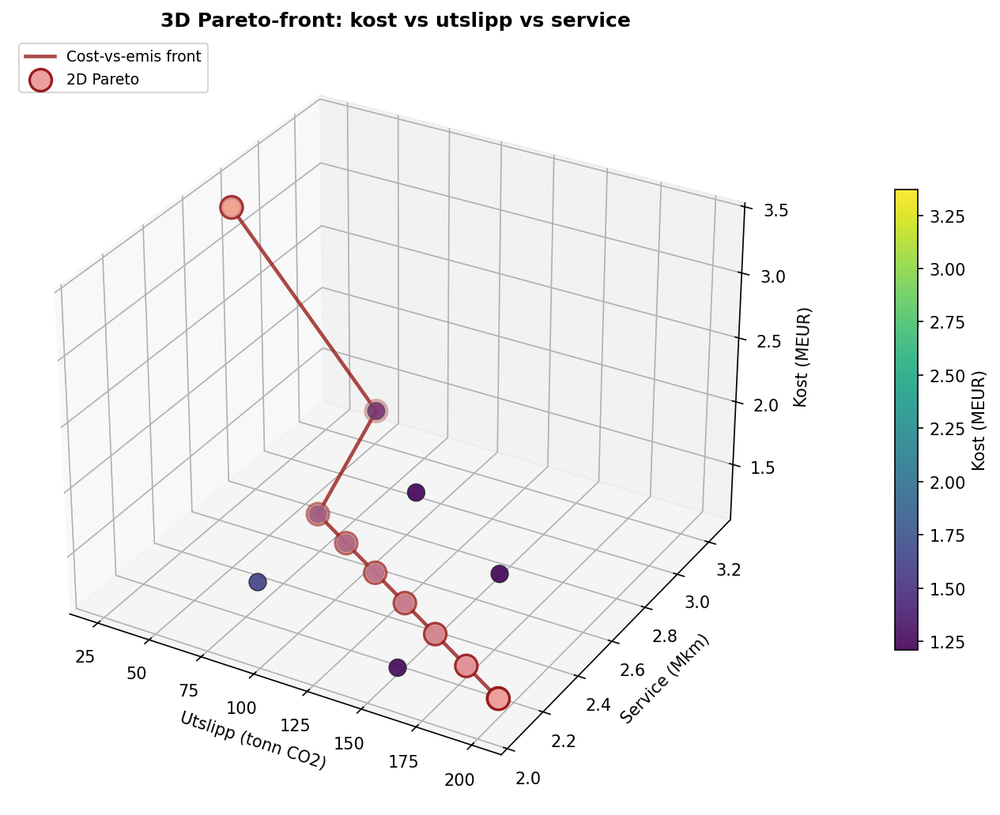

3D Pareto-front: kostnad (vertikal akse), utslipp (horisontal akse x) og service (horisontal akse y). Rød linje er 2D-fronten fra steg 3; punktsky er tilleggs-løsninger med varierende $\epsilon_S$. Farge koder kost.

Knee-point-anbefaling. Knee-point-metoden finner punktet på Pareto-fronten som er nærmest *utopi-punktet* (punktet der alle mål tar sin minimumsverdi) etter normalisering av hvert mål til $\[0, 1\]$. Det gir en intuitiv «nøktern kompromiss»-løsning som balanserer alle tre mål.

Knee-point-anbefaling sammenlignet med de tre enkeltmål-ekstrempunktene. Verdiene for ekstrempunktene er fra steg 2 (fullt scenariosett); knee-punktet er identifisert fra 3D-punktskyen på et redusert scenariosett og gjengis med de verdiene det oppnår der.

  **Løsning**                **Kost (MEUR)**          **Utslipp (tonn)**                   **Service (Mkm)**        **Åpne DC**
  -------------------------- ------------------------ ------------------------------------ ------------------------ -------------
  Min kostnad                $1,21$                 $200,4$                            $2,11$                 2 DC
  Min utslipp                $3,37$                 $\phantom{00}24,1$                $2,72$                 6 DC
  Min service                $3,33$                 $143,3$                            $1,51$                 6 DC
  Knee-point   $1,62$   $\phantom{0}94,6$   $2,05$   3 DC

Knee-point-løsningen åpner tre DC-er (Oslo, Malmø, Trondheim) og oppnår $53~%$ utslippsreduksjon (fra $200$ til $95$ tonn) mot en moderat kostnadsøkning på $34~%$ (fra $1,21$ til $1,62$ MEUR). Service-nivået havner omtrent midt mellom ekstrempunktene. Dette er et typisk «midt-i-avveielsen»-punkt; i praksis vil bedriften velge langs 3D-fronten avhengig av hvilket mål som skal vektlegges sterkest.

**Praktisk anvendelse** --- *Hva tar NorDistrib AS med seg?*

1.  **Infrastrukturvalg**: De analysene vi har gjort peker på 2--3 DC-er som robust valg: Oslo, Trondheim og eventuelt Malmø/København gir god geografisk dekning til lav kostnad. Å åpne alle seks DC-er gir kun marginalt lavere utslipp til langt høyere kostnader.

2.  **Modal strategi**: Tipping-punktet for modal shift ligger mellom $125$ og $150$ EUR/tonn. Ved dagens EU ETS-nivå (ca. $80$--$100$ EUR/tonn) er lastebil fortsatt billigst, men *selv en moderat oppgang* til $150$ EUR/tonn flytter nesten hele volumet til jernbane. Skip er marginalt dyrere per tkm enn jernbane og blir bare aktuelt for kystnære kunder med eksplisitte lav-utslippskrav.

3.  **Regulatorisk robusthet**: Løsningen er *ikke* robust over tipping-punktet: en pris på $150$ EUR/tonn kutter utslippet fra $225$ til $60$ tonn/år. Dette gir NorDistrib AS en klar beslutningsregel: *forutse* tipping-punktet ved å signere rail-kapasitet før karbonprisen passerer $140$ EUR/tonn.

4.  **Kundekommunikasjon**: Med $95$ tonn CO2/år som utslipp (knee-point-løsningen) kan selskapet markedsføre en $53~%$ reduksjon mot kost-minimerende baseline, tilpasset kunder som selv må rapportere Scope 3-utslipp. Ved høye karbonpriser kan utslippet presses ned mot $60$ tonn.

[Begrensninger.]
- Modellen antar lineær skalering av kost og utslipp. I realiteten har hver modus faste terminalkostnader og ikke-lineære skaleringseffekter som krever en mer kompleks formulering (f.eks. blokkprising eller kvadratisk utslipps-modell).

- Scenario-reduksjonen er heuristisk. På en liten instans har vi verifisert at gapet er under $1~%$, men for andre etterspørselsfordelinger (f.eks. tunge haler, svart-svane-scenarier) kan gapet være større. Distributionsrobust optimering er et neste steg for kritiske applikasjoner.

- Valg av knee-point er subjektivt: det forutsetter at alle tre mål er like viktige etter normalisering. I praksis vil beslutningstakeren ha preferanser (f.eks. utslipp 50 %, kost 30 %, service 20 %) som kan integreres via vektet sum eller AHP (kapittel 10).

- Karbonprisen er modellert som eksogent gitt. For lang-horisont-planlegging må man også modellere usikkerhet i selve karbonprisen, f.eks. via et ytterligere scenariotre over pris-baner.

- Vi antar at alle DC-er har tilstrekkelig kapasitet aggregert. I praksis kan kapasitet være lavere enn modellen antar, og nye kapasitetsinvesteringer kommer med egne utslipp som bør med i en full livsløpsanalyse (LCA).

Slutt · Kapittel 8

---

# Del II — Kapittel 9: Returlogistikk og sirkulære kjeder

Del II · Kapittel 9

9

# Returlogistikk og sirkulære forsyningskjeder
Oversatt fra LaTeX-kilde --- figurer, definisjoner og KaTeX-math.

[][][][][]
Område

## Område
Returlogistikk handler om varestrømmer som går *baklengs* gjennom forsyningskjeden --- fra sluttkunden tilbake til detaljist, produsent eller gjenvinningsanlegg. Sammen med prinsippene for *sirkulær økonomi* danner dette kjernen i lukkede forsyningskjeder (closed-loop supply chains), der brukte produkter, komponenter og materialer gjenvinnes og føres tilbake inn i verdikjeden i stedet for å ende som avfall.

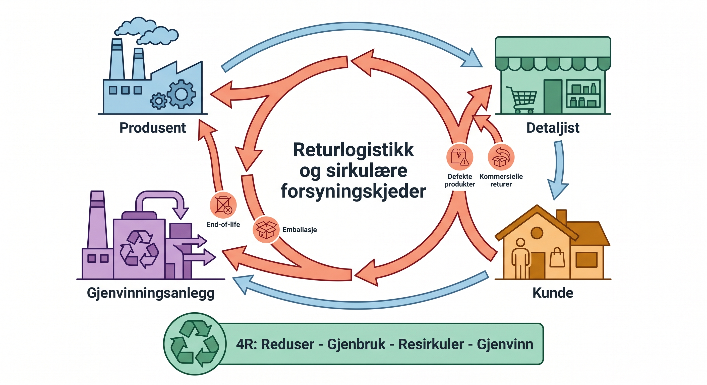

Returlogistikk og sirkulære forsyningskjeder: reverse varestrømmer fra kunde tilbake til produsent og gjenvinning, med 4R-prinsippene (reduser, gjenbruk, resirkuler, gjenvinn).

Definisjon [Returlogistikk]
**Returlogistikk** er planlegging, gjennomføring og kontroll av effektiv og kostnadseffektiv vareflyt fra forbrukspunkt tilbake til opprinnelsespunkt med sikte på gjenvinning av verdi eller forsvarlig disposisjon.

Området omfatter ulike typer returstrømmer med svært forskjellige volumer, tidsprofiler og behandlingsbehov:

- Retur av defekte produkter --- reklamasjoner og garantisaker som krever reparasjon eller utbytting

- Kommersielle returer --- særlig fra netthandel, der kunder angrer kjøp innenfor angrefristen

- End-of-life-produkter --- utgåtte produkter som skal demonteres, gjenbrukes eller resirkuleres

- Emballasjeretur --- paller, containere, flasker og annen ombruksemballasje

- Reproduksjon og refurbishing --- industriell gjenoppbygging av brukte produkter for videresalg

Returlogistikk er tett koblet til flere andre områder som behandles i dette kompendiet:

- Bærekraftig logistikk --- returstrømmer reduserer avfall og CO\textsubscript{2}-utslipp, og er sentrale i sirkulærøkonomien

- Nettverksdesign --- det reverse nettverket (innsamlingspunkter og gjenvinningsanlegg) må designes etter andre prinsipper enn det forlengs distribusjonsnettverket

- Lagerstyring --- returnerte varer skaper et parallelt, stokastisk tilbud som må koordineres med nye varer

- Etterspørselsprognoser --- prognoser for returvolum avhenger av salgshistorikk og produktets levetidsfordeling

Problemstillinger, modeller og metoder

## Problemstillinger, modeller og metoder
I det følgende presenteres tre sentrale problemstillinger innen returlogistikk og sirkulære forsyningskjeder med tilhørende modeller og metoder, som illustrert i figur [2](#fig-fig-returlogistikk-problemstillinger-oversikt). Alle tre problemstillingene utdypes med egne eksempler og figurer i de påfølgende seksjonene.

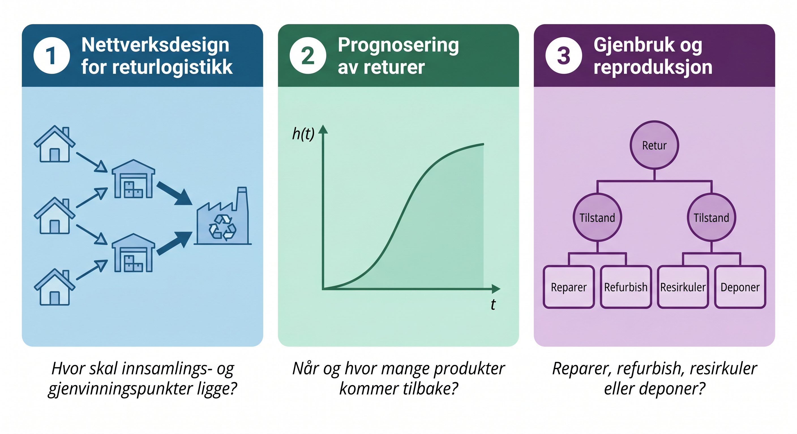

Tre sentrale problemstillinger innen returlogistikk: nettverksdesign for returstrømmer, prognosering av returer basert på produktets levetid, og disposisjonsbeslutninger for returnerte enheter.

Nøkkelen til god returlogistikk er å velge riktig modell og metode for den aktuelle problemstillingen. Tabell [1](#tab-tab-returlogistikk-oversikt) gir en oversikt over hvilke modeller og metoder som egner seg for de tre problemstillingene. Tabellen inkluderer også supplerende rammeverk som lukkede forsyningskjeder (CLSC, *closed-loop supply chains*) og de såkalte R-strategiene (*reduce, reuse, repair, refurbish, remanufacture, recycle, recover*) som bakgrunn for disposisjonsbeslutningen. Modellene og metodene uthevet med rødt vil bli gått gjennom i de tre neste avsnittene.

Oversikt over modeller og metoder for de tre sentrale problemstillingene innen returlogistikk.

  **Nr.**   **Problemstilling**                                    **Modeller**                                                                                               **Metoder**
  --------- ------------------------------------------------------ ---------------------------------------------------------------------------------------------------------- -----------------------------------------------------------------------
  1         Nettverksdesign for returlogistikk       Ukapasitert fasilitetslokalisering, Flertrinnsfasilitetslokalisering (MIP)                   Branch-and-bound, PuLP, sensitivitetsanalyse
  2         Prognosering av returer                  Eksponentiell levetid, Weibull-fordeling for levetidsanalyse                                 Maximum likelihood-estimering (MLE), hazard-analyse
  3         Gjenbruk og reproduksjon (disposisjon)   R-strategier (reuse, repair, refurbish, recycle), Beslutningstre / forventet verdi-analyse   Beslutningsanalyse under usikkerhet, cut-off-optimering

Reverst nettverksdesign med MIP

## Eksempel: Reverst nettverksdesign med MIP
Oppsummering.

  **Kategori**      **Beskrivelse**
  ----------------- -------------------------------------------------------------------------------------------------------------------
  Eksempel          Reverst nettverk for innsamling og gjenvinning av EE-avfall i Norge
  Område            Returlogistikk med strategisk lokaliseringsbeslutning i to ledd
  Problemstilling   Hvilke innsamlingssentre og gjenvinningsanlegg skal åpnes, og hvordan skal returvolumet flyte gjennom nettverket?
  Modell            Flertrinns kapasitert fasilitetslokalisering, formulert som blandet heltallsprogram (MIP)
  Prosess           Matematisk optimering (eksakt løsning)
  Metode            PuLP (CBC) med flerdimensjonal sensitivitetsanalyse på volum, kapasitet og faste kostnader

### Problemstilling
ReturKjeden AS er en nyetablert nasjonal operatør som har vunnet kontrakten om å samle inn og materialgjenvinne EE-avfall (WEEE -- "Waste Electrical and Electronic Equipment") for et konsortium av norske kommuner og forhandlere. Produsentansvarsordningen og EUs WEEE-direktiv krever at elektriske og elektroniske produkter samles inn, sorteres og behandles forskriftsmessig ved slutten av sin levetid, og operatøren skal etablere et distribuert nettverk som dekker hele landet.

Nettverket er i utgangspunktet tre-nivå: først transporteres returnerte produkter fra $m = 40$ kundegrupper (kommuner og større innsamlingspunkter) til et av $n = 8$ kandidatlokasjoner for regionale *innsamlingssentre*, der produktene sorteres, demonteres og presses til containerenheter. Deretter transporteres det konsoliderte volumet videre til et av $p = 3$ kandidatlokasjoner for *gjenvinningsanlegg*, som håndterer selve materialgjenvinningen (metaller, plast, glass) og forsvarlig deponering av restfraksjoner. Styret ber om en kvantitativ anbefaling før kontraktstart: *hvor mange innsamlingssentre og gjenvinningsanlegg bør åpnes, hvor bør de ligge, og hvordan skal returvolumet flyte gjennom nettverket*, slik at summen av faste driftskostnader, transportkostnader i begge ledd, og prosesseringskostnader minimeres.

**Problemstilling** --- *Hvilke fasiliteter åpnes, og hvordan flyter varestrømmen baklengs?*

Vi formulerer hele nettverksbeslutningen som én integrert blandet heltallsmodell (MIP) der binære variabler styrer hvilke innsamlingssentre og gjenvinningsanlegg som åpnes, mens kontinuerlige variabler fordeler returvolumet over begge ledd. Kapasitetsbegrensninger på begge nivåer sikrer at ingen fasilitet overbelastes. Modellen løses eksakt med PuLP/CBC, og sensitivitetsanalyse over returvolum, kapasitet og faste kostnader viser hvordan det optimale nettverket endrer seg hvis forutsetningene glipper.

### Modell
Problemet er en naturlig utvidelse av det ukapasiterte fasilitetslokaliseringsproblemet (UFLP) fra seksjon [?](#ref-sec-nettverksdesign-fasilitetsplassering): der hadde vi én etablering og to aktørtyper (DC og kunder); her har vi to etableringer i sekvens (innsamlingssenter og gjenvinningsanlegg) med kontinuerlig flyt mellom dem, og eksplisitt *kapasitet* på begge nivåer. La $J = {1, \ldots, m}$ være mengden av kundegrupper, $I = {1, \ldots, n}$ kandidatlokasjoner for innsamlingssentre, og $K = {1, \ldots, p}$ kandidatlokasjoner for gjenvinningsanlegg.

Definisjon [Flertrinns reverst MIP (kapasitert)]
For hver kundegruppe $j \in J$ er $r_j$ årlig returvolum (tonn). For hver kandidat-IS $i \in I$ er $f_i$ fast åpningskostnad (NOK/år) og $u_i$ kapasitet (tonn/år); for hver kandidat-GV $k \in K$ er $g_k$ fast åpningskostnad (NOK/år), $v_k$ kapasitet (tonn/år) og $p_k$ prosesseringskostnad per tonn. Transportkostnader per tonn er $c^{(1)}_{ij}$ i ledd 1 (kunde $\to$ IS) og $c^{(2)}_{ik}$ i ledd 2 (IS $\to$ GV). Beslutningsvariablene er

$$\begin{aligned}y_i, z_k &\in {0, 1}, \quad i \in I,\ k \in K \quad \text{(1 hvis åpnes)}, \\
x_{ij} &\geq 0, \quad i \in I,\ j \in J \quad \text{(tonn fra $j$ til $i$)}, \\
w_{ik} &\geq 0, \quad i \in I,\ k \in K \quad \text{(tonn fra $i$ til $k$)}.\end{aligned}$$

Modellen er

$$\min\ \sum_{i \in I} f_i y_i + \sum_{k \in K} g_k z_k
+ \sum_{i, j} c^{(1)}_{ij} x_{ij}
+ \sum_{i, k} c^{(2)}_{ik} w_{ik}
+ \sum_{i, k} p_k w_{ik}$$

1

med skranker

$$\begin{aligned}\sum_{i \in I} x_{ij} &= r_j, \quad j \in J, \\
\sum_{j \in J} x_{ij} &\leq u_i y_i, \quad i \in I, \\
\sum_{k \in K} w_{ik} &= \sum_{j \in J} x_{ij}, \quad i \in I, \\
\sum_{i \in I} w_{ik} &\leq v_k z_k, \quad k \in K, \\
x_{ij}, w_{ik} &\geq 0.\end{aligned}$$

2

Objektfunksjonen [(1)](#eq-eq-revnet-obj) summerer fem bidrag: faste åpningskostnader på begge nivåer, transport i ledd 1 og ledd 2, og prosessering per tonn ved gjenvinning. Dekningsskranken [(2)](#eq-eq-revnet-cover) sikrer at alt returvolum fra hver kunde samles. Kapasitets- og koblingsskrankene [(?)](#eq-eq-revnet-capis) og [(?)](#eq-eq-revnet-capgv) sier at en fasilitet kun kan motta volum ($\leq u_i$ eller $\leq v_k$) hvis den er åpen ($y_i = 1$ eller $z_k = 1$). Den nye strukturelle skranken i forhold til UFLP er *flyt-balansen* [(?)](#eq-eq-revnet-flow): alt som kommer inn til et innsamlingssenter må også gå ut igjen til et gjenvinningsanlegg -- ingenting hoper seg opp.

Symboler. Alle størrelsene i modellen er samlet i tabell [3](#tab-tab-revnet-symbols).

Symboler og parametere i det reverse nettverks-MIP-et.

  **Symbol**           **Type**                **Beskrivelse**
  -------------------- ----------------------- -------------------------------------------------------------------
  $J$                Mengde                  Kundegrupper, $\|J\| = m = 40$
  $I$                Mengde                  Kandidatlokasjoner for innsamlingssentre (IS), $\|I\| = n = 8$
  $K$                Mengde                  Kandidatlokasjoner for gjenvinningsanlegg (GV), $\|K\| = p = 3$
  $r_j$              Parameter               Årlig returvolum fra kunde $j$ (tonn/år)
  $f_i,\,g_k$       Parameter               Fast årlig åpningskostnad for IS $i$, GV $k$ (NOK/år)
  $u_i,\,v_k$       Parameter               Kapasitet på IS $i$, GV $k$ (tonn/år)
  $p_k$              Parameter               Prosesseringskostnad per tonn ved GV $k$ (NOK/tonn)
  $c^{(1)}_{ij}$   Parameter               Transportkostnad per tonn, ledd 1: $j \to i$ (NOK/tonn)
  $c^{(2)}_{ik}$   Parameter               Transportkostnad per tonn, ledd 2: $i \to k$ (NOK/tonn)
  $y_i,\,z_k$       Binær variabel          $1$ hvis fasilitet åpnes, $0$ ellers
  $x_{ij}$          Kontinuerlig variabel   Tonn returvolum fra $j$ til IS $i$
  $w_{ik}$          Kontinuerlig variabel   Tonn returvolum fra IS $i$ til GV $k$

Den konkrete instansen har $n + p = 11$ binære variabler og $n \cdot m + n \cdot p = 344$ kontinuerlige flytvariabler, samt $m + n + n + p = 59$ lineære skranker utover ikke-negativitet. Totalt $355$ variabler og $59$ skranker.

**Tolkning** --- *Tre kostnadsfronter som trekker i hver sin retning*

Modellen balanserer tre konkurrerende økonomiske drivkrefter:

1.  **Faste kostnader** ($\sum_i f_i y_i + \sum_k g_k z_k$): hver ny åpen fasilitet legger til en fast årlig belastning. Drivkraften presser løsningen mot *færre* fasiliteter.

2.  **Transportkostnader** ($\sum c^{(1)} x + \sum c^{(2)} w$): færre fasiliteter gir lengre gjennomsnittlig transportlengde, både i ledd 1 (mange små transportoppdrag fra kunde til IS) og ledd 2 (konsoliderte bulktransporter fra IS til GV). Drivkraften presser mot *flere* fasiliteter.

3.  **Kapasitetsskranker**: $u_i$ og $v_k$ gir en *nedre* grense på antall åpne fasiliteter -- uansett hvor rimelig transport blir, må den totale kapasiteten på nivå 2 være minst lik totalt returvolum, og tilsvarende på nivå 3.

MIP-en finner eksakt den konfigurasjonen som minimerer summen av faste, variable og prosesseringskostnader, med kapasitet som aktiv begrensning.

Forutsetninger. Modellen hviler på fire antakelser som bør kommuniseres tydelig:

1.  **Deterministisk returvolum:** $r_j$ antas kjent. I praksis er returvolum stokastisk og sesongvarierende (se seksjon [Returprognoser med Weibull](#sec04) for levetidsbasert retourprognose); modellen bør kjøres med oppdaterte volum regelmessig.

2.  **Proporsjonal transportkostnad:** $c^{(1)}_{ij}$ og $c^{(2)}_{ik}$ er lineære i storsirkel-avstand. Virkelige takster har fastledd (minimumsfrakt), trappetrinn (halv eller hel lastebil) og ruteeffekter.

3.  **Lineær prosesseringskostnad:** $p_k$ per tonn er konstant. I praksis finnes stordriftsfordeler og kapasitetsavhengige kostnader som ikke er lineære.

4.  **Fullt dekningskrav:** All retur *må* håndteres. Det finnes ikke "for dyrt å samle inn"-alternativer som å la en liten grupp kunder stå utenfor. Dette er forenlig med et myndighetspålagt dekningskrav.

**Heuristikk-merknad** --- *Når eksakt MIP er nok, og når Benders trenges*

Med $n = 8$, $m = 40$, $p = 3$ har instansen bare $11$ binære variabler og løses til eksakt optimum av CBC på om lag ett sekund. Ved realistisk nasjonal skala ($n = 50$ kandidater, $m = 400$ kommunevise kundegrupper, $p = 10$ gjenvinningsanlegg) vokser antallet binære kombinasjoner til $2^{60} \approx 10^{18}$, og det kontinuerlige delproblemet får $20\,000$ flytvariabler per ledd. I slike tilfeller brukes *Benders-dekomponering*: master-problemet styrer kun åpningsvariablene ($y, z$), mens *sub-problemet* er et LP som gir optimal flyt for gitt åpningsvektor og returnerer kuttende ulikheter til masteren. Alternativt kan *Lagrange-relaksering* av flyt-balansen [(?)](#eq-eq-revnet-flow) dekomponere modellen i to nivåer som løses sekvensielt. Vi holder oss til eksakt MIP i dette eksempelet og noterer skaleringsgrensen.

### Prosess
Prosess: Matematisk optimering (eksakt løsning).
Modell: Flertrinns MIP, løst med PuLP + CBC.

Arbeidsflyten følger seks steg, fra datainnsamling til endelig anbefaling. Figur [3](#fig-fig-revnet-method) viser prosessen skjematisk.

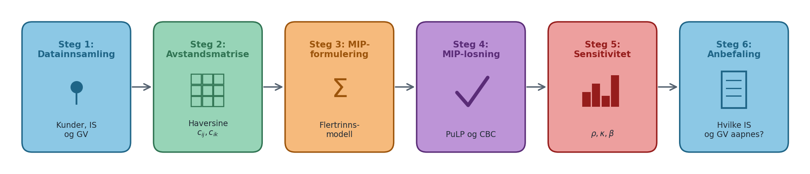

Seks-stegs arbeidsflyt for optimering av reverst distribusjonsnettverk.

### Steg 1: Datainnsamling
Datasettet består av tre deler. *Nivå 1:* $m = 40$ syntetiske kundegrupper (representerer kommuner og større innsamlingspunkter) trukket rundt åtte befolkningssentre (Oslo, Bergen, Trondheim, Stavanger, Kristiansand, Innlandet, Nord-Norge, Vestfold-Telemark) med normalfordelt romlig støy og log-normalfordelt årlig returvolum i intervallet $\[68,\,457\]$ tonn EE-avfall per år. *Nivå 2:* $n = 8$ kandidatlokasjoner for innsamlingssentre i Oslo, Drammen, Kristiansand, Stavanger, Bergen, Trondheim, Bodø og Hamar, med estimert årlig driftskostnad $f_i$ mellom $1,7$ og $3,2$ MNOK og kapasitet $u_i$ mellom $1\,200$ og $2\,800$ tonn/år. *Nivå 3:* $p = 3$ kandidatlokasjoner for gjenvinningsanlegg (Grenland, Mo i Rana, Ålesund) med $g_k$ mellom $6,9$ og $8,5$ MNOK, kapasitet $v_k$ mellom $5\,500$ og $7\,500$ tonn/år, og prosesseringskostnad $p_k$ mellom $2\,400$ og $2\,800$ NOK/tonn. Total årlig retur er $8\,632$ tonn.

Figur [4](#fig-fig-revnet-base) viser de tre nivåene på kart, med markørstørrelse på kunder proporsjonal med returvolumet.

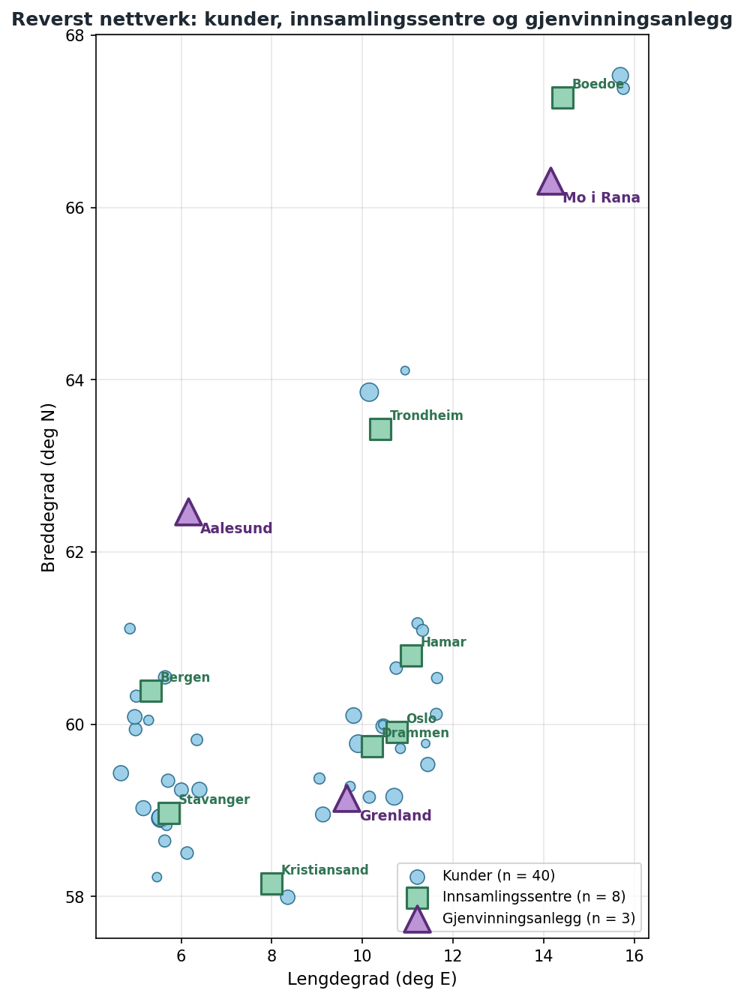

Reverst nettverk: $40$ kundegrupper (sirkler), $8$ kandidat-innsamlingssentre (kvadrater) og $3$ kandidat-gjenvinningsanlegg (trekanter).

Fra figuren ser vi tre tydelige geografiske klynger: Oslo/Vestfold/Innlandet i sørøst, Bergen/Stavanger/Kristiansand i sørvest, og en tynnere fordeling fra Trondheim og nordover. Kandidatene er spredt slik at alle regioner er dekket med minst én IS-kandidat innenfor rimelig transportavstand, mens GV-kandidatene ligger strategisk i Grenland (sør), Ålesund (midt) og Mo i Rana (nord).

**Konklusjon** --- *Kapasitet og geografi begrenser hva som er mulig*

Total returmengde på $8\,632$ tonn/år er allerede nær halvparten av samlet IS-kapasitet ($16\,100$ tonn). Dette betyr at kapasitetsskrankene [(?)](#eq-eq-revnet-capis) vil være bindende i optimal løsning -- og at minst $4\text{-}5$ innsamlingssentre må åpnes selv om faste kostnader skulle være svært høye.

### Steg 2: Avstandsmatriser og transportkostnader
For begge transportledd beregner vi storsirkel-avstanden via Haversine-formelen:

$$\mathrm{dist}(a, b) = 2 R \arcsin\!\sqrt{\sin^2\!\tfrac{\Delta \varphi}{2} + \cos \varphi_a \cos \varphi_b \sin^2\!\tfrac{\Delta \lambda}{2}},$$

1

der $\varphi$ er breddegrad, $\lambda$ lengdegrad (begge i radianer) og $R = 6\,371$ km er jordens radius. Formelen gir en god rett-linje-approksimasjon for lange transportetapper.

De to transportsatsene er bevisst ulike for å reflektere reelle logistikkforhold: ledd 1 (kunde $\to$ IS) utføres av små, ofte halvfulle lastebiler med hyppige stopp og settes til $\kappa_1 = 3,80$ NOK/tonn/km. Ledd 2 (IS $\to$ GV) er konsolidert bulktransport med fulle lastebiler på færre, lengre strekninger, og settes til $\kappa_2 = 2,20$ NOK/tonn/km. Transportkostnadene per tonn er $c^{(1)}_{ij} = \kappa_1 \cdot \mathrm{dist}(j, i)$ og $c^{(2)}_{ik} = \kappa_2 \cdot \mathrm{dist}(i, k)$. Tabell [4](#tab-tab-revnet-dist) oppsummerer de to avstandsmatrisene.

Statistikk over beregnede storsirkel-avstander for de to leddene (km).

  **Størrelse**                                           **Ledd 1 (kunde $\to$ IS)**   **Ledd 2 (IS $\to$ GV)**
  ------------------------------------------------------- -------------------------------- -----------------------------
  Dimensjoner $\[n \times m\]$ / $\[n \times p\]$   $8 \times 40$                 $8 \times 3$
  Minste avstand                                          12,2                             73,9
  Største avstand                                         1 112,2                          961,2
  Median avstand                                          295,7                            375,1
  Gjennomsnittlig avstand                                 355,6                            449,9
  Gjennomsnittlig nærmeste-fasilitet                      46,7                             166,8

Den siste raden er viktig: gjennomsnittlig avstand fra hver kunde til *nærmeste* IS-kandidat er bare $46,7$ km, som bekrefter at nettverket er tett nok geografisk. Gjennomsnittlig avstand fra hver IS-kandidat til *nærmeste* GV-kandidat er $166,8$ km -- en større avstand, men tilsvarende mindre kostnadssensitiv siden ledd 2 har lavere sats og frakter konsoliderte volumer.

### Steg 3: MIP-formulering
Modellen implementeres direkte som i [(1)](#eq-eq-revnet-obj)--[(?)](#eq-eq-revnet-var), med PuLP som modelleringsgrensesnitt og CBC som underliggende solver. Tabell [5](#tab-tab-revnet-size) viser størrelsen på den konkrete instansen.

Instansstørrelse og solveregenskaper.

  **Mål**                                                         **Verdi**
  --------------------------------------------------------------- -----------------------
  Antall kunder $m$                                             40
  Antall IS-kandidater $n$                                      8
  Antall GV-kandidater $p$                                      3
  Antall binære variabler ($y_i$, $z_k$)                      11
  Antall kontinuerlige flytvariabler ($x_{ij}$, $w_{ik}$)   344
  Antall dekningsskranker [(2)](#eq-eq-revnet-cover)       40
  Antall kapasitet/kobling IS [(?)](#eq-eq-revnet-capis)   8
  Antall flyt-balanse [(?)](#eq-eq-revnet-flow)            8
  Antall kapasitet/kobling GV [(?)](#eq-eq-revnet-capgv)   3
  Teoretisk antall kombinasjoner av $(y, z)$                    $2^{11} = 2\,048$

Med bare $2\,048$ mulige kombinasjoner av $(y, z)$ kunne vi prinsipielt enumerert alle -- men CBC bruker branch-and-cut og utnytter LP-relaksasjonen av flytvariablene, slik at faktisk løsetid blir om lag ett sekund.

### Steg 4: Løsning med PuLP/CBC
Vi løser modellen med CBC og lagrer den primale løsningen. Optimal totalkostnad er **$53,762$ MNOK/år**, fordelt på $10,600$ MNOK i fast IS-kostnad, $15,400$ MNOK i fast GV-kostnad, $3,556$ MNOK i ledd 1-transport, $3,037$ MNOK i ledd 2-transport, og $21,170$ MNOK i prosesseringskostnad ved gjenvinning.

Optimal konfigurasjon åpner *fem* innsamlingssentre -- Drammen, Kristiansand, Stavanger, Bodø og Hamar -- og *to* gjenvinningsanlegg -- Grenland og Mo i Rana. Oslo-IS er overflødig fordi Drammen og Hamar tilsammen dekker Østlandet billigere per tonn, og Bergen-IS og Trondheim-IS er overflødige fordi Stavanger og Hamar tar Bergen-/Trondheim-regionen innenfor rimelig avstand. Ålesund-GV har høyere transportkostnad til de fleste åpne IS enn de to andre og vinner derfor ikke. Tabell [6](#tab-tab-revnet-is-load) viser hvordan de fem åpne IS-ene belastes.

Åpne innsamlingssentre i optimal løsning og deres belastning.

  **IS**         **Rolle**                          **Kunder**   **Retur (tonn)**   **Snitt (km)**   **Maks (km)**
  -------------- ---------------------------------- ------------ ------------------ ---------------- ---------------
  Drammen        Oslo-området og Vestfold           9            1 914              50,9             77,1
  Kristiansand   Sørlandet                          9            1 790              137,0            208,5
  Stavanger      Vestlandet med Bergen-regionen     8            2 201              68,5             131,2
  Hamar          Innlandet og deler av Midt-Norge   10           1 698              141,2            336,3
  Bodø           Nord-Norge                         4            1 029              233,8            427,9
  **Sum**                                           **40**       **8 632**          **114,7**        **427,9**

Ledd 2-flyten (IS $\to$ GV) er sterkt konsolidert mot Grenland: alle sørlige og vestlige IS-er sender sitt volum dit ($7\,500$ tonn totalt, akkurat likt Grenlands kapasitet), mens Bodø sender sine $1\,029$ tonn til Mo i Rana og Hamar splittes delvis -- $1\,500$ tonn til Grenland og de siste $100$ tonnene til Mo i Rana. Splittingen er en direkte konsekvens av at Grenland ligger akkurat på sin kapasitetsgrense: når Stavanger, Kristiansand og Drammen har fylt Grenland, må det siste Hamar-volumet gå videre til Mo i Rana.

Figur [5](#fig-fig-revnet-flows) visualiserer løsningen på kart: kundelinjer (lyseblå) viser ledd 1, og tykkere lilla linjer viser ledd 2, med linjetykkelse proporsjonal med volumet.

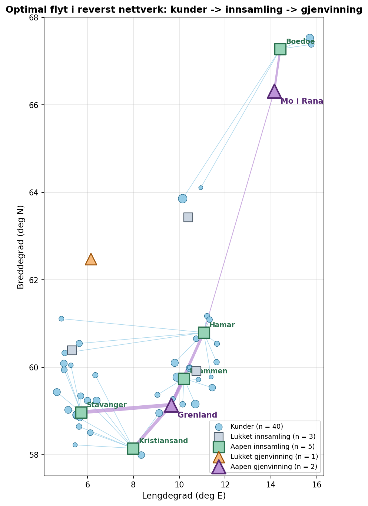

Optimal flyt i det reverse nettverket: åpne IS (grønne kvadrater), åpne GV (lilla trekanter), kundetildelinger (tynne blå linjer) og IS-GV-flyt (tykke lilla linjer, tykkelse $\propto$ volum).

Kostnadsfordeling. Figur [6](#fig-fig-revnet-cost) viser hvordan de $53,762$ MNOK fordeler seg. Det mest påfallende resultatet er at *prosesseringskostnaden* alene utgjør $39,4~%$ av totalen -- nesten dobbelt så mye som faste åpningskostnader på det største nivået. Transport utgjør bare $12,2~%$ samlet over begge ledd. Dette forholdet har pedagogisk verdi: i mange klassiske lokaliseringseksempler er transport dominerende, men i returlogistikk er *materialhåndteringen* (sortering, demontering, fraksjonering) ofte mye viktigere økonomisk.

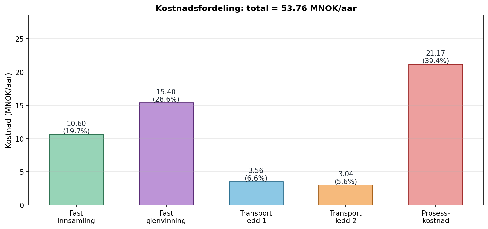

Kostnadsfordeling i optimal løsning (MNOK/år): total = $53,76$ MNOK.

**Konklusjon** --- *Fem innsamlingssentre og to gjenvinningsanlegg*

CBC finner en optimal konfigurasjon med Drammen, Kristiansand, Stavanger, Hamar og Bodø som innsamlingssentre, og Grenland og Mo i Rana som gjenvinningsanlegg. Gjennomsnittlig transportavstand i ledd 1 er $114,7$ km og ingen kunde ligger mer enn $428$ km fra sitt betjenende IS. Løsetiden er om lag ett sekund. Som forutsett i datainnsamlingen er kapasitetsskrankene bindende: Grenland ligger eksakt på sin kapasitet på $7\,500$ tonn.

### Steg 5: Sensitivitetsanalyse
Vi undersøker tre dimensjoner av robusthet ved å multiplisere tre sentrale parametre med hver sin skaleringsfaktor, én om gangen. Returvolumet skaleres med $\rho$, IS-kapasiteten med $\kappa$, og den faste IS-åpningskostnaden med $\beta$. For hver parameterverdi løses modellen på nytt. Figur [7](#fig-fig-revnet-sens) viser resultatene.

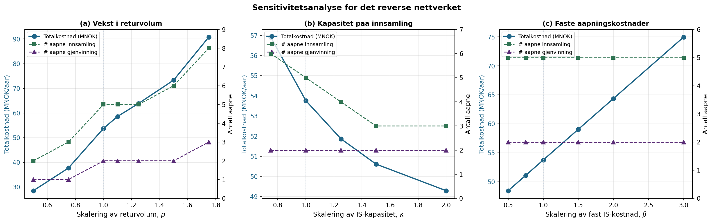

Sensitivitetsanalyse: totalkostnad (blå linje, venstre akse) og antall åpne fasiliteter (grønn: IS; lilla: GV, høyre akse) som funksjon av skaleringsfaktorer for (a) returvolum $\rho$, (b) IS-kapasitet $\kappa$, og (c) fast IS-åpningskostnad $\beta$.

(a) Returvolumvekst. Tabell [7](#tab-tab-revnet-rho) viser hvordan nettverket skalerer med returvolumet. Ved halvert volum ($\rho = 0,5$) holder det med $2$ IS og $1$ GV og totalkostnaden faller til $28,5$ MNOK. Ved baseline ($\rho = 1,0$) har vi $5$ IS og $2$ GV. Ved $\rho = 1,50$ må et sjette IS åpnes, og ved $\rho = 1,75$ er *alle* $8$ IS og *alle* $3$ GV i bruk -- nettverket er nå kapasitetsbundet. Høyere $\rho$ er infeasible: total IS-kapasitet på $16\,100$ tonn begrenser hva som er mulig å håndtere.

Respons på vekst i returvolum: total returmengde er $\rho \cdot 8\,632$ tonn/år.

  $\rho$            **Total (tonn)**      **\# IS**         **\# GV**         **Totalkostnad (MNOK)**
  -------------------- --------------------- ----------------- ----------------- -------------------------
  0,50                 4 316                 2                 1                 28,51
  0,75                 6 474                 3                 1                 37,70
  1,00   8 632   5   2   [53,76]
  1,10                 9 495                 5                 2                 58,60
  1,25                 10 790                5                 2                 63,88
  1,50                 12 948                6                 2                 73,34
  1,75                 15 106                8                 3                 90,77

(b) Kapasitetsskalering. Tabell [8](#tab-tab-revnet-kappa) viser at nettverket er overraskende følsomt for IS-kapasiteten. Med $\kappa = 0,75$ må et sjette IS åpnes fordi hver fasilitet nå er mindre. Med $\kappa = 1,50$ (halvannen gang kapasitet) er bare $3$ IS nødvendig. Dette er viktig ledelsesinformasjon: det *lønner seg å investere i litt større innsamlingssentre*, selv om det medfører høyere fast kostnad per enhet, fordi man slipper å åpne ytterligere fasiliteter.

Respons på skalering av IS-kapasitet: $u_i \to \kappa \cdot u_i$.

  $\kappa$          **\# IS**         **\# GV**         **Totalkostnad (MNOK)**
  -------------------- ----------------- ----------------- -------------------------
  0,75                 6                 2                 56,92
  1,00   5   2   [53,76]
  1,25                 4                 2                 51,87
  1,50                 3                 2                 50,61
  2,00                 3                 2                 49,29

(c) Skalering av faste åpningskostnader. Tabell [9](#tab-tab-revnet-beta) viser at antall åpne IS faktisk *ikke* endres over hele spennet $\beta \in \[0,5,\,3,0\]$ -- det forblir $5$ fordi kapasitetsskranken er bindende og den *totale* IS-kapasiteten trenger minst $5$ åpne fasiliteter for å ta unna $8\,632$ tonn. Totalkostnaden vokser omtrent lineært med $\beta$ (hver enhet $\beta$ koster $10,6$ MNOK på grunn av de faste IS-kostnadene), mens løsningsstrukturen er uendret. Denne observasjonen er i skarp kontrast til det klassiske UFLP-eksempelet (seksjon [?](#ref-sec-nettverksdesign-fasilitetsplassering)), der antall DC-er var svært følsomt for faste kostnader nettopp fordi kapasitet ikke var bindende der.

Respons på skalering av fast IS-åpningskostnad: $f_i \to \beta \cdot f_i$.

  $\beta$           **\# IS**         **\# GV**         **Totalkostnad (MNOK)**
  -------------------- ----------------- ----------------- -------------------------
  0,50                 5                 2                 48,46
  0,75                 5                 2                 51,11
  1,00   5   2   [53,76]
  1,50                 5                 2                 59,06
  2,00                 5                 2                 64,36
  3,00                 5                 2                 74,96

**Konklusjon** --- *Kapasitet binder, faste kostnader tar seg selv*

Sensitivitetsanalysen avdekker den karakteristiske signaturen til et *kapasitetsbundet* reverst nettverk: anbefalingen er meget robust mot feilestimering av faste kostnader ($5$ IS uavhengig av $\beta$), men følsom for både volumvekst (et sjette IS trengs allerede ved $+50~%$ volum) og for hvor stort hvert IS kan dimensjoneres. Den primære operasjonelle risikoen er derfor ikke prisestimatene, men volumforutsigelsene og kapasitetsdimensjoneringen.

### Steg 6: Anbefaling
Vi anbefaler ReturKjeden AS å:

1.  **Åpne fem innsamlingssentre:** Drammen (Østlandet), Kristiansand (Sørlandet), Stavanger (Vestlandet), Hamar (Innlandet/Midt-Norge) og Bodø (Nord-Norge).

2.  **Åpne to gjenvinningsanlegg:** Grenland (primær, tar $7\,500$ tonn/år fra alle sørlige og vestlige IS) og Mo i Rana (Nord-Norge og reserve, tar $1\,132$ tonn/år).

3.  **Betjene $40$ kundegrupper direkte** fra de fem IS-ene, med gjennomsnittlig transportavstand $114,7$ km i ledd 1 og $230,8$ km i ledd 2.

4.  **Budsjettere med total årlig kostnad på $53,8$ MNOK**, hvorav $26,0$ MNOK er faste driftskostnader (IS + GV), $6,6$ MNOK er transport og $21,2$ MNOK er prosesseringskostnad ved gjenvinning.

5.  **Revurdere nettverket ved volumendringer over $\pm 25~%$**, særlig ved $\rho > 1,5$ der kapasiteten på dagens $5$ IS begynner å bli kritisk. Revurdering ved endringer i faste kostnader kan vente.

**Praktisk anvendelse** --- *Fra MIP-løsning til gjennomføring*

1.  **Dimensjoner for vekst:** Med hurtig vekst i EE-avfall (om lag $3\text{-}5~%$ per år i Norge), vil $\rho = 1,25$ allerede nås innen $5\text{-}7$ år. Bygg IS-ene med reservekapasitet eller reserver tomter for utvidelse, slik at man slipper å åpne sekundærlokasjoner.

2.  **Grenland som flaskehals:** Grenland-GV ligger eksakt på kapasitet allerede fra dag én. Modellen viser at dette er økonomisk optimalt, men det gir ingen robusthet mot driftsavbrudd. Vurder hvorvidt Ålesund-GV bør åpnes som backup mot ekstra kostnad $7,5$ MNOK/år fast, til fordel for økt systemrobusthet.

3.  **Stokastisk retur:** Den deterministiske antakelsen om $r_j$ er en forenkling. Et logisk neste skritt er å kombinere denne lokaliseringsmodellen med levetidsbaserte returprognoser fra seksjon [Returprognoser med Weibull](#sec04) for å få realistiske $r_j$-estimater med usikkerhetsintervall, og kjøre modellen under scenarier.

4.  **Kobling videre:** Når fasilitetene er åpnet, skal *operasjonelle* disposisjonsbeslutninger tas per innkommende enhet: skal produktet repareres, refurbishes, resirkuleres eller deponeres? Denne avgjørelsen er temaet for seksjon [Disposisjonsbeslutning med forventet verdi og beslutningstre](#sec05).

Begrensninger. Det flertrinns MIP-et er en *strategisk* modell og hviler på fire forenklinger som må kommuniseres tydelig: (i) deterministisk returvolum (stokastisk utvidelse krever scenario-basert MIP), (ii) lineær transportkostnad uten fastledd eller trappetrinn, (iii) lineær prosesseringskostnad uten stordriftsfordeler, og (iv) fullt dekningskrav som er forenlig med myndighetspålegg, men ikke nødvendigvis med frivillige take-back-ordninger. For nasjonale instanser over $\sim 50$ IS-kandidater og $\sim 400$ kommunevise kunder vil Benders-dekomponering eller Lagrange-relaksering være nødvendig, og gapet mot LP-relaksasjonen kan brukes som kvalitetsgaranti. Neste seksjon tar oss fra strategisk nettverksdesign til taktiske returprognoser basert på produktlevetid.

Returprognoser med Weibull

## Eksempel: Returprognoser med Weibull
Oppsummering.

  **Kategori**      **Beskrivelse**
  ----------------- -------------------------------------------------------------------------------------
  Eksempel          Retur- og garantiprognose for elektronikkforhandler
  Område            Returlogistikk med levetidsanalyse
  Problemstilling   Predikere antall returer per måned i en 12-måneders prognosehorisont
  Modell            Weibull-fordeling $W(\beta, \eta)$ for levetid + konvolusjon med salgshistorikk
  Prosess           Parametrisk overlevelsesanalyse
  Metode            Sensurert MLE, hazardrate-analyse, parametrisk bootstrap, backtest

### Problemstilling
Elektronikk AS er en norsk nettbutikk som selger en populær ruter-modell med
24 måneders garanti. Hvert produkt som feiler i garantiperioden kommer
tilbake til returverkstedet for diagnose, og i hovedsak reparasjon eller
bytte. Returvolumet svinger kraftig fra måned til måned: noen måneder
ankommer det over tusen enheter, andre måneder få hundre. Volumet henger
åpenbart sammen med tidligere salg -- men ikke på en triviell måte, fordi
feil oppstår først etter en viss *levetid* i hjemmene.

Returlogistikkansvarlig trenger en kvantitativ prognose for å dimensjonere
kapasitet på returverkstedet de neste 12 månedene: antall reparatører,
lagerbeholdning av reservedeler, pakking- og transportavtale tilbake fra
kunde. En naiv tilnærming ("returer $\approx$ konstant andel av salg
forrige måned") fungerer dårlig fordi et produkt som selges i januar
kanskje først feiler i september.

**Problemstilling** --- *Hvor mange returer får vi per måned de neste 12 månedene?*

Med 48 måneders salg- og returhistorikk kan vi estimere produktets
*levetidsfordeling* statistisk. Når vi kjenner denne fordelingen,
kan vi *konvolvere* den med salgshistorikken for å forutsi
forventede returer per måned framover -- og dermed planlegge
returkapasiteten.


Elektronikkmodellen selges til kunde og kan returneres innenfor 24
måneders garantiperiode dersom den feiler.

### Modell
For å modellere tiden fra salg til feil bruker vi *Weibull-fordelingen*.
Denne er en fleksibel to-parameters fordeling som er standard i
pålitelighetsanalyse: den kan beskrive både komponenter som "slites"
(økende feilrate med alder) og komponenter der feilraten synker med tid.

Definisjon [Weibull-fordelingen]
La $\tau > 0$ være levetiden fra salg til feil. Weibull-fordelingen
$W(\beta, \eta)$ med formparameter $\beta > 0$ og skalaparameter $\eta > 0$
har sannsynlighetstetthet og kumulativ fordeling

$$\begin{aligned}f(\tau; \beta, \eta) &= \frac{\beta}{\eta}\left(\frac{\tau}{\eta}\right)^{\beta-1}\!\exp\!\left\[-\left(\frac{\tau}{\eta}\right)^{\beta}\right\], \\
F(\tau; \beta, \eta) &= 1 - \exp\!\left\[-\left(\frac{\tau}{\eta}\right)^{\beta}\right\].\end{aligned}$$

4

*Overlevelsesfunksjonen* $S(\tau) = 1 - F(\tau)$ angir sannsynligheten for at produktet fortsatt fungerer etter $\tau$ måneder, og *hazardraten* $h(\tau) = f(\tau) / S(\tau)$ angir feilraten gitt at produktet har overlevd til $\tau$:

$$h(\tau; \beta, \eta) = \frac{\beta}{\eta}\left(\frac{\tau}{\eta}\right)^{\beta-1}.$$

5

Symboler og tolkning. Tabell [11](#tab-tab-weib-symboler) forklarer
symbolene som opptrer i definisjonen.

Symboler i Weibull-modellen.

  **Symbol**     **Navn**               **Beskrivelse**
  -------------- ---------------------- ----------------------------------------------------------------------------------------------------------------------------------------------------------------------------
  $\tau$      Levetid                Tid fra salg til feil, målt i måneder.
  $\beta$     Formparameter          $\beta > 1$ gir stigende hazardrate (slitasje); $\beta = 1$ gir konstant hazardrate (eksponentialfordeling); $\beta < 1$ gir fallende rate ("barnedødelighet").
  $\eta$      Skalaparameter         Karakteristisk levetid. $F(\eta) = 1 - e^{-1} \approx 0,632$, dvs. $\eta$ er 63,2-prosentilen.
  $f(\tau)$   Tetthet                Tetthet for levetid. Arealet under $f$ opp til $t$ er $F(t)$.
  $F(\tau)$   Kumulativ fordeling    Sannsynlighet for feil innen alder $\tau$.
  $S(\tau)$   Overlevelsesfunksjon   Sannsynlighet for å overleve til $\tau$: $S = 1 - F$.
  $h(\tau)$   Hazardrate             Momentan feilrate gitt overlevelse til $\tau$.

Hazardraten er det som gjør Weibull spesielt anvendelig: et konsumentprodukt
har typisk lav hazardrate rett etter kjøp (alt er i orden), men raten øker
gradvis etter hvert som komponenter slites. Dette svarer til $\beta > 1$ i
ligning [(5)](#eq-eq-weib-hazard).

Variabler: hva estimeres? Modellen har to ukjente parametere
som vi skal estimere fra data. I tillegg estimeres indirekte alle
avledede størrelser.

Parametere som estimeres og avledede størrelser.

  **Størrelse**               **Beskrivelse**                                        **Type**
  --------------------------- ------------------------------------------------------ -------------------
  $\beta$                  Formparameter for levetidsfordeling                    *estimeres* (MLE)
  $\eta$                   Skalaparameter for levetidsfordeling                   *estimeres* (MLE)
  $\mathrm{MTTF}$          Forventet levetid: $\eta\,\Gamma(1 + 1/\beta)$   *avledet*
  $t_{0,5}$                Median levetid: $\eta\,(\ln 2)^{1/\beta}$       *avledet*
  $h(t)$                    Hazardrate som funksjon av alder                       *avledet*
  $p_k = F(k) - F(k{-}1)$   Sannsynlighet for feil i måned $k$                   *avledet*

Fra levetid til retur per måned. Den reelle beslutningsvariabelen
er antall returer per kalendermåned, ikke levetiden til én enkelt enhet.
Vi kobler de to ved konvolusjon: en enhet solgt i måned $s$ bidrar til
forventede returer i måned $t \geq s$ med sannsynlighet $p_{t-s}$ for at
levetiden treffer intervallet $(t-s-1, t-s\]$. La $S_s$ være observert
salg i måned $s$ og $R_t$ observerte returer i måned $t$. Da er

$$\mathbb{E}\[R_t\] \;=\; \sum_{s=1}^{t-1} S_s \cdot p_{t-s}, \qquad p_k = F(k) - F(k-1).$$

2

Dette er en *konvolusjon* mellom salgshistorikken og levetidens
sannsynlighetsmassefunksjon. Under garanti på $W = 24$ måneder setter vi
$p_k = 0$ for $k > W$, siden enheter som feiler etter garantiutløp ikke
returneres kommersielt.

Objektivfunksjonen: log-likelihood med sensurering. Parametrene
$(\beta, \eta)$ estimeres ved maksimum likelihood. Utfordringen er at noen
enheter *ikke* har feilet enda -- de er *høyresensurert*.
For en enhet solgt i måned $s$ der observasjonsvinduet er $c_s =
\min(T - s, W)$ måneder (hvor $T$ er siste observerte måned i datasettet),
bidrar den til likelihood\'en på to måter:

Definisjon [Log-likelihood med høyresensurering]
La $(\tau_i, \delta_i)_{i=1}^n$ være observasjonspar der $\delta_i = 1$
hvis enhet $i$ har feilet med observert levetid $\tau_i$, og $\delta_i = 0$
hvis enheten fortsatt var i drift etter $\tau_i = c_{s_i}$ måneder
(sensurert). Log-likelihood\'en for Weibull-modellen er

$$\ell(\beta, \eta) \;=\; \sum_{i=1}^n \Big\[\, \delta_i \log f(\tau_i; \beta, \eta) \;+\; (1-\delta_i) \log S(\tau_i; \beta, \eta) \,\Big\].$$

7

MLE-estimatorene er

$$(\hat\beta, \hat\eta) \;=\; \arg\max_{\beta > 0, \eta > 0} \ell(\beta, \eta).$$

Konfidensintervall utledes fra den observerte informasjonsmatrisen
$\mathcal{I}(\hat\beta, \hat\eta) = -\nabla^2 \ell$, via asymptotisk
normalitet: $(\hat\beta, \hat\eta) øverset{a}{\sim} \mathcal{N}((\beta,\eta), \mathcal{I}^{-1})$.

Uten sensureringsleddet ($\delta_i \equiv 1$ for alle) ville vi
systematisk underestimert $\eta$: vi ser jo bare de enhetene som har
rukket å feile innen datasettets slutt, og de har per konstruksjon korte
levetider.

Skranker. Modellen har tre typer skranker:

- **Parameterskranker:** $\beta > 0$ og $\eta > 0$. Disse følger av selve fordelingsformen.

- **Datarestriksjoner:** Levetider er høyresensurert ved garantivinduet $W$ og ved observasjonsvinduet $T - s$ for enheter solgt i måned $s$. Sensureringen må håndteres eksplisitt -- se ligning [(7)](#eq-eq-weib-loglik).

- **Stasjonaritet av levetidsfordelingen:** Vi antar at *samme* Weibull-fordeling beskriver alle enheter uavhengig av salgsmåned. Dersom designet endres eller leverandør byttes kan dette brytes (se *Forutsetninger*).

**Tolkning** --- *Hva sier modellen?*

- **Formparameter $\beta$:** Stiger hazardraten med alder?
  $\beta > 1$ svarer ja: komponentene slites.

- **Skalaparameter $\eta$:** Hvor lang er den karakteristiske levetiden?
  Ca. 63 % av enhetene feiler før tid $\eta$.

- **Konvolusjonen:** Dagens returer er "ekkoet" av
  tidligere salg, filtrert gjennom levetidsfordelingen. Salget i januar
  gir en bølge av returer fra omtrent måned ($1 + \eta$) og framover.

- **Sensurering:** Ved å si eksplisitt at "denne enheten har
  overlevd i $c$ måneder, vi vet ikke når den vil feile", unngår vi å
  underestimere $\eta$.

Forutsetninger. For at Weibull-modellen og konvolusjonen skal
være gyldige må følgende holde:

1.  **Uavhengige levetider:** Enhetenes levetider er statistisk uavhengige. Dette brytes dersom en leverandørfeil påvirker flere enheter samtidig (batch-defekter).

2.  **Stabil populasjon:** Samme Weibull-parametere gjelder hele perioden. Modellrevisjon eller komponentbytte bryter antakelsen.

3.  **Uavhengighet av sensurering:** Enheter som er sensurert (ikke returnert innen $T$) har samme feilprosess som de som er returnert. Dette er en *non-informative censoring*-antakelse.

4.  **Fullstendig rapportering:** Alle returer innen garanti registreres. Hvis kunden velger å ikke bruke garantien underestimerer vi $F$.

### Prosess
Prosess: Parametrisk overlevelsesanalyse.
Modell: Weibull $W(\beta, \eta)$ + konvolusjon med salg.

Analysen går gjennom seks steg, fra datainnsamling til validert prognose. Figur [9](#fig-fig-weib-method) viser prosessflyten.

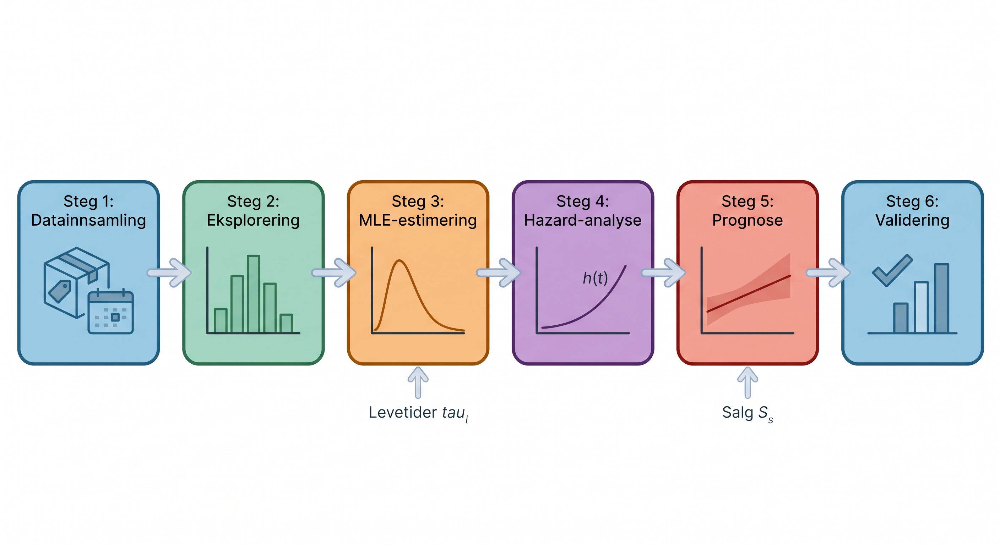

Sekvensen av steg i Weibull-basert returprognose.

### Steg 1: Datainnsamling
Elektronikk AS har 48 måneder (4 år) med månedlig salgs- og returdata for
rutermodellen. Datasettet inneholder to filer:

- `sales.csv` -- månedlig salg $S_s$ for $s = 1, \ldots, 48$.

- `returns_units.csv` -- én rad per solgt enhet med salgsmåned, observert levetid og eventuell returmåned.

For hver enhet som feiler innen garantivinduet $W = 24$ måneder registreres
returmåneden $t = s + \lceil \tau \rceil$. Enheter som har overlevd lenger
enn $W$, eller hvor observasjonshorisonten ikke har rukket $W$ måneder
(enheter solgt de siste to årene), behandles som høyresensurert i steg 3.

Nøkkeltall fra datainnsamlingen.

  **Størrelse**                        **Verdi**
  ------------------------------------ -----------------------------------
  Antall måneder ($T$)               48 (januar 2021 -- desember 2024)
  Garantivindu ($W$)                 24 måneder
  Totalt solgte enheter                56 998
  Observerte returer (innen garanti)   29 827
  Observert returrate                  52,3 %
  Gjennomsnittlig observert levetid    12,4 måneder
  Gjennomsnittlig salg per måned       1 188 enheter
  Min / maks salg per måned            26 / 1 803

Figur [10](#fig-fig-weib-sales-returns) viser salgs- og returkurvene sammen. Vi
ser tydelig at *returkurven ligger etter salgskurven med et
tidsforskjøvet forløp*: salgstoppen rundt måned 10 gir en returtopp først
rundt måned 25.

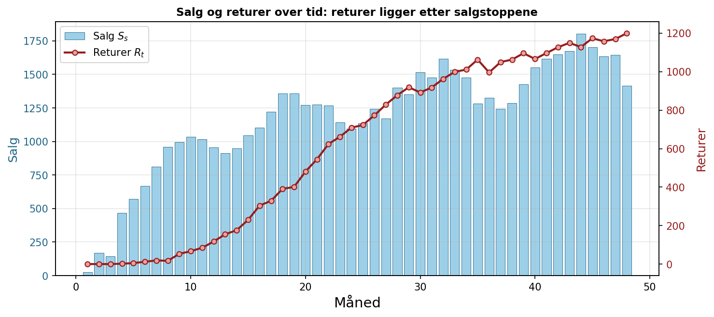

Månedlig salg $S_s$ (blå søyler, venstre akse) og månedlig retur $R_t$ (rød kurve, høyre akse) over 48 måneder. Returkurven er tydelig tidsforskjøvet og glattet.

**Konklusjon** --- *Hva ser vi i dataene?*

Returene er en *forsinket og glattet* respons på salget. Det
er denne sammenhengen -- levetidsfordelingen mellom salg og retur --
som vi nå skal estimere.

### Steg 2: Eksplorering av levetidene
Før vi går løs på MLE ser vi på hvordan de observerte levetidene $\tau_i$
fordeler seg. Figur [11](#fig-fig-weib-lifetime-hist) viser histogrammet.

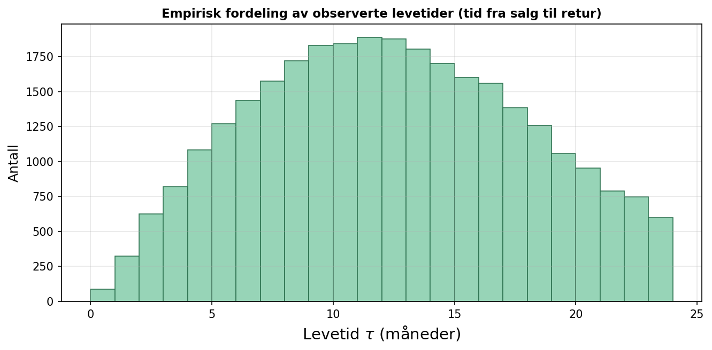

Empirisk histogram av observerte levetider $\tau_i$ for de 29 827 enhetene som feilet innen garanti. Formen er ikke-symmetrisk og er konsistent med en Weibull-fordeling med $\beta > 1$.

Empirisk hazardrate. Weibull-modellens sentrale idé er at
hazardraten varierer systematisk med alder. En rå estimator er

$$\hat h(t_k) \;=\; \frac{d_k}{n_k},$$

3

der $d_k$ er antall feil i intervallet $(t_{k-1}, t_k\]$ og $n_k$ er antall
enheter som fortsatt er "at risk" ved starten av intervallet.
Figur [12](#fig-fig-weib-emp-hazard) viser resultatet.

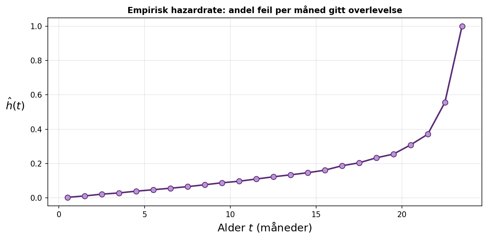

Empirisk hazardrate $\hat h(t)$ fra ligning [(3)](#eq-eq-empirical-hazard). Den stigende formen bekrefter at $\beta > 1$ er et fornuftig utgangspunkt.

**Konklusjon** --- *Levetidsform*

Hazardraten stiger jevnt fra rundt 0,003 per måned ved alder 0--1 til
over 0,25 per måned ved alder 19--20. Dette er den klassiske
*slitasjekurven* og utelukker eksponentialmodellen ($\beta = 1$).
Vi forventer derfor $\beta$ betydelig over 1.

### Steg 3: MLE-estimering av Weibull-parametrene
Vi estimerer $(\beta, \eta)$ ved å maksimere log-likelihood\'en i
ligning [(7)](#eq-eq-weib-loglik). Sensureringsstatusen $\delta_i$ settes
slik: en enhet solgt i måned $s$ med observert levetid $\tau_i \leq c_s$
er feilet ($\delta_i = 1$); hvis den ikke har feilet innen observasjons- og
garantivinduet $c_s = \min(T - s, W)$ er den sensurert ($\delta_i = 0$).

Tabell [14](#tab-tab-weib-mle) viser MLE-resultatet, inklusive standardfeil og
95 % konfidensintervall utledet fra den observerte Fisher-informasjonen.

MLE-estimater med 95 % konfidensintervall.

+-----------------+----------------+-------------+--------------+---------------+
| **Parameter**   | **Tolkning**   | **Estimat** | **Std.feil** | **95 % KI**   |
+=================+================+=============+==============+===============+
| $\hat\beta$ | Formparameter  | $2,201$   | $0,010$    | $\[2,181,\  |
|                 |                |             |              | 2,221\]$     |
+-----------------+----------------+-------------+--------------+---------------+
| $\hat\eta$  | Skalaparameter | $18,072$  | $0,048$    | $\[17,978,\ |
|                 | (mnd)          |             |              | 18,166\]$    |
+-----------------+----------------+-------------+--------------+---------------+
| $n$ (totalt)  | $55\,583$                                                |
+-----------------+-------------------------------------------------------------+
| $n$ (feilet)  | $29\,827$                                                |
+-----------------+-------------------------------------------------------------+
| $n$           | $25\,756$                                                |
| (sensurert)     |                                                             |
+-----------------+-------------------------------------------------------------+
| Log-likelihood  | $-110\,891,0$                                            |
+-----------------+-------------------------------------------------------------+

Figur [13](#fig-fig-weib-mle-fit) viser den tilpassede Weibull-tettheten lagt
over histogrammet av observerte levetider. Tilpasningen er svært god:
den estimerte kurven treffer både modus, haleform og skjevhet i dataene.


Tilpasset Weibull-tetthet $f(\tau; \hat\beta, \hat\eta)$ lagt over empirisk histogram. Modellen "lander" riktig i toppen og riktig i halen.

**Konklusjon** --- *Estimert levetidsmodell*

Elektronikk AS sin rutermodell har $\hat\beta = 2,20$ (stigende
hazardrate, typisk komponentslitasje) og karakteristisk levetid
$\hat\eta = 18,1$ måneder. Mer enn 60 % av enhetene feiler innen
18 måneder.

### Steg 4: Hazardrate-analyse og tolkning
Med estimerte parametere kan vi regne ut de avledede størrelsene som
beslutningstakere faktisk bruker. Figur [14](#fig-fig-weib-hazard-curve)
viser hazardraten $h(t)$, tettheten $f(t)$ og den kumulative fordelingen
$F(t)$ for den tilpassede modellen.

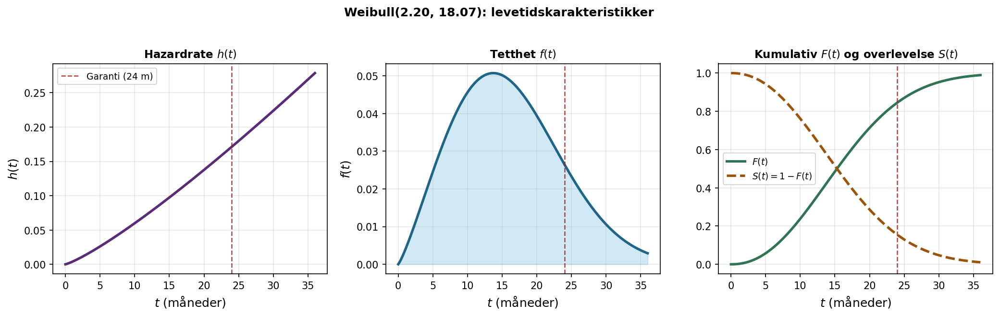

Hazardrate (venstre), tetthet (midten) og kumulativ fordeling / overlevelse (høyre) for modellen $W(2,20; 18,07)$. Rød stiplet linje markerer garantigrensen ved 24 måneder.

Avledede størrelser fra $W(\hat\beta, \hat\eta)$.

  **Størrelse**              **Formel**                          **Verdi**
  -------------------------- ----------------------------------- --------------
  Forventet levetid (MTTF)   $\eta\,\Gamma(1 + 1/\beta)$   $16,0$ mnd
  Median levetid             $\eta\,(\ln 2)^{1/\beta}$    $15,3$ mnd
  $P(\tau \le 12)$       $F(12)$                           $0,334$
  $P(\tau \le 24)$       $F(24)$                           $0,845$
  $P(\tau \le 36)$       $F(36)$                           $0,990$

**Konklusjon** --- *Forretningsmessig tolkning*

- $P(\tau \le 24) = 0,84$: *84,5 % av alle solgte enheter vil
  feile innen garantiperioden*. Dette er et avgjørende tall for garantiprising.

- Median levetid på 15 måneder betyr at halvparten av enhetene feiler
  allerede i løpet av det andre driftsåret.

- Hazardraten firedobles mellom år 1 og år 2, så feil akkumuleres
  sent i garantiperioden.

### Steg 5: Prognose for neste 12 måneder
Med levetidsfordelingen estimert bruker vi konvolusjonsformelen
[(2)](#eq-eq-konvolusjon) til å regne ut forventet retur per måned de neste
12 månedene. For framtidig salg bruker vi en enkel naiv projeksjon:
$S_s = 1\,646$ enheter per måned, som er snittet av de seks siste
observerte månedene. Dette isolerer effekten av levetidsmodellen fra
usikkerhet i salget.

Konfidensintervall rundt prognosen genereres ved parametrisk bootstrap:
trekk $(\beta^\*, \eta^\*)$ fra den asymptotiske normalfordelingen til MLE,
beregn prognosebanen for hver trekning, og rapporter 2,5- og
97,5-prosentilene. Dette reflekterer parameterusikkerheten -- i praksis
tilkommer også prognose-feil fra selve salgsprojeksjonen.

![Observerte returer (blå søyler), modellens tilpasning (lilla kurve) og 12-måneders prognose (grå bakgrunn). Bredt konfidensbånd er 95 % bootstrap-KI rundt $\mathbb{E}\[R_t\]$.](images/ch09/weib_forecast.png)

Observerte returer (blå søyler), modellens tilpasning (lilla kurve) og 12-måneders prognose (grå bakgrunn). Bredt konfidensbånd er 95 % bootstrap-KI rundt $\mathbb{E}\[R_t\]$.

Månedlige returprognoser $\hat R_t$ for måned 49--60.

  **Måned $t$**   **Salg $S_t$ (proj.)**   **Prognose $\hat R_t$**   **Nedre 95 %**   **Øvre 95 %**
  ----------------- -------------------------- ---------------------------- ---------------- ---------------
  49 (jan)          1 646                      1 217                        1 211            1 222
  50 (feb)          1 646                      1 235                        1 229            1 240
  51 (mar)          1 646                      1 250                        1 244            1 255
  52 (apr)          1 646                      1 266                        1 261            1 272
  53 (mai)          1 646                      1 277                        1 271            1 283
  54 (jun)          1 646                      1 289                        1 283            1 295
  55 (jul)          1 646                      1 297                        1 291            1 303
  56 (aug)          1 646                      1 307                        1 301            1 312
  57 (sep)          1 646                      1 312                        1 306            1 318
  58 (okt)          1 646                      1 321                        1 314            1 327
  59 (nov)          1 646                      1 330                        1 324            1 336
  60 (des)          1 646                      1 344                        1 338            1 350
  **Sum**           **19 752**                 **15 445**                   **15 375**       **15 514**

**Konklusjon** --- *Hvilket returvolum må returverkstedet håndtere?*

Samlet prognose for de neste 12 månedene er $15\,445$ returer, med 95 %
KI fra $15\,375$ til $15\,514$. Det månedlige volumet stiger svakt fra
ca. 1 220 i januar til ca. 1 345 i desember, fordi salgsveksten de
siste 2 årene genererer et økende "retur-ekko".

### Steg 6: Backtest og validering
Før vi stoler på prognosen kjører vi en *backtest*: vi fjerner de
siste 6 månedene (måned 43--48), re-estimerer $(\beta, \eta)$ på kun de
første 42 månedenes informasjon, og sammenligner modellens prediksjon
med faktiske returer i de utholdte månedene. Siden både salg og
levetidsfordeling er kjent over treningsperioden, isolerer testen
modellens evne til å predikere returvolum fremover i tid.

Backtest: holdout-prediksjoner mot observerte returer.

+-----------------+----------------+----------------+----------------+
| **Måned $t$** | **Observert    | **Prognose     | **Feil $R_t - |
|                 | $R_t$**      | $\hat        | \hat R_t$**  |
|                 |                | R_t$**        |                |
+=================+================+================+================+
| 43              | 1 150          | 1 131,9        | $+18,1$      |
+-----------------+----------------+----------------+----------------+
| 44              | 1 128          | 1 139,9        | $-11,9$      |
+-----------------+----------------+----------------+----------------+
| 45              | 1 174          | 1 151,8        | $+22,2$      |
+-----------------+----------------+----------------+----------------+
| 46              | 1 158          | 1 165,1        | $-7,1$       |
+-----------------+----------------+----------------+----------------+
| 47              | 1 170          | 1 179,7        | $-9,7$       |
+-----------------+----------------+----------------+----------------+
| 48              | 1 200          | 1 198,3        | $+1,7$       |
+-----------------+----------------+----------------+----------------+
| **MAE**         |                | $11,8$                        |
+-----------------+----------------+---------------------------------+
| **RMSE**        |                | $13,6$                        |
+-----------------+----------------+---------------------------------+
| **MAPE**        |                | $1,02\,%$                  |
+-----------------+----------------+---------------------------------+

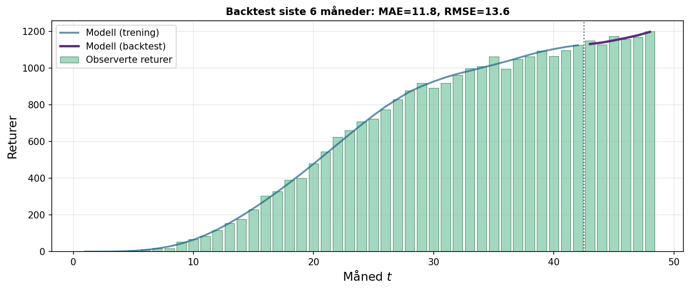

Modellens prediksjoner (blå og lilla linje) sammenlignet med observerte returer (grønne søyler) over hele perioden. Vertikal stiplet linje skiller trenings- og holdout-periode.

Med MAPE på 1,0 % leverer modellen prognoser som avviker fra observert
volum med typisk 12 enheter per måned -- godt innenfor den operasjonelle
toleransen for bemanning og reservedelslager.

**Praktisk anvendelse** --- *Hva bruker returlogistikkansvarlig prognosen til?*

1.  **Kapasitetsplan:** Sett antall reparatører og diagnosestasjoner slik at gjennomsnittlig daglig volum håndteres uten kø.

2.  **Reservedels-innkjøp:** Bestill komponenter basert på forventet returvolum og fordelingen mellom ulike feiltyper.

3.  **Garantiavsetning:** Forventet kostnad er $\mathbb{E}\[R_t\] \times \bar c_{\text{reparasjon}}$ per måned; dette er grunnlag for regnskapsmessig garantiavsetning.

4.  **Produktutvikling:** Hvis $\beta$ og $\eta$ endrer seg mellom produktversjoner, er det et tidlig signal om at en designendring har påvirket pålitelighet.

[Begrensninger.]
- Modellen antar én homogen Weibull-fordeling. Hvis populasjonen er sammensatt av ulike feilmoduser (f.eks. tidlige produksjonsfeil + senere slitasje), kan en blandingsmodell eller bi-Weibull være nødvendig.

- Framtidig salg er projisert naivt. En integrert modell ville koble denne prognosen til en salgsprognose (f.eks. SARIMA) for bedre usikkerhetsvurdering.

- Sensureringsantagelsen er "non-informativ". Dersom kunder systematisk venter med å sende inn garantikrav, eller noen velger å ikke bruke garantien, undervurderes $F(t)$.

- Modellen tar ikke hensyn til sesongvariasjon i feilrate (f.eks. strømbrudd i vinterhalvåret).

Disposisjonsbeslutning med forventet verdi og beslutningstre

## Eksempel: Disposisjonsbeslutning med forventet verdi og beslutningstre
Oppsummering.

  **Kategori**      **Beskrivelse**
  ----------------- ---------------------------------------------------------------------------
  Eksempel          Disposisjonsbeslutning for returnerte elektronikkenheter
  Område            Returlogistikk og sirkulære forsyningskjeder
  Problemstilling   Velge reparere, refurbishe, resirkulere eller deponere per enhet
  Modell            Forventet-verdi-analyse $\mathrm{EV}(a \mid x)$ + CART-beslutningstre
  Prosess           Beslutningsanalyse under usikkerhet
  Metode            Enumerert cut-off-optimering, sklearn `DecisionTreeClassifier`

### Problemstilling
NordRetur AS er en norsk returhåndteringssentral som tar imot returer av forbrukerelektronikk fra flere store nettbutikker og fysiske kjeder. Senteret håndterer daglig flere hundre enheter -- fra garantireturer og angreretter til innbyttede enheter og end-of-life-produkter. Hver enhet må innen kort tid sendes videre til ett av fire spor:

- **Reparere** enheten og selge den som ny med full garanti.

- **Refurbishe** enheten og selge den brukt med rabatt og redusert garanti.

- **Resirkulere** enheten og selge råmaterialene (metaller, plast, kretskort).

- **Deponere** enheten og betale miljøavgift for forsvarlig avhending.

I dag bruker senteret en tommelfingerregel der alle enheter med synlig skade sendes til resirkulering, mens resten blir vurdert manuelt av en tekniker. Regelen er enkel å kommunisere, men etterlater betydelige verdier på bordet: dyre enheter med lett kosmetisk skade blir kvernet opp til materialer, og billige enheter blir brukt time etter time på reparasjon. Ledelsen ønsker en *datadriven* politikk som utnytter at hver enhet har målbare attributter -- tilstandsscore, alder, merke, kosmetisk og funksjonell grad -- og som gir en klar regel per enhet uten at teknikeren må skjønnsvurdere.

**Problemstilling** --- *Hvilken disposisjon gir høyest forventet verdi per enhet?*

For hver returnert enhet med egenskaper $x$ ønsker vi å velge handlingen $a \in \mathcal{A} = {\text{repair}, \text{refurbish}, \text{recycle}, \text{dispose}}$ som maksimerer forventet netto verdi $\mathrm{EV}(a \mid x)$. Vi sammenligner en enkel cut-off-politikk basert på tilstandsscore med et lært beslutningstre som bruker flere attributter.

### Modell
For å beslutte disposisjon bruker vi en *forventet-verdi-analyse* kombinert med et *klassifiserende beslutningstre* (CART). Første modell er den normative referansen -- den forteller hva som *burde* velges hvis vi kjenner alle parametrene. Andre modell er en praktisk regelmotor som lærer en enkel, transparent beslutningsregel fra dataene.

Definisjon [Forventet verdi per handling]
For en returnert enhet med egenskaper $x$ og handling $a \in \mathcal{A}$ er forventet netto verdi:

$$\mathrm{EV}(a \mid x) = p_a(x)\, r_a(x) - k_a - \bigl(1 - p_a(x)\bigr)\, \ell_a$$

9

der $p_a(x)$ er suksessannsynligheten, $r_a(x)$ er inntekten ved suksess, $k_a$ er den faste behandlingskostnaden og $\ell_a$ er ekstra tapet ved mislykket handling (typisk deponering).

**Optimal handling** for enheten er

$$a^\star(x) = øperatorname\*{argmax}_{a \in \mathcal{A}} \mathrm{EV}(a \mid x) .$$

10

[Symboler i ligning [(9)](#eq-eq-ev-per-handling).] Tabell [19](#tab-tab-disp-ev-symboler) oppsummerer variablene.

Symboler i forventet-verdi-modellen.

  **Symbol**                   **Beskrivelse**
  ---------------------------- ------------------------------------------------------------------------------------------------------------------
  $x$                        Enhetens attributtvektor (tilstand $c$, alder, merke, kosmetisk og funksjonell grad)
  $a$                        Valgt handling $\in \mathcal{A} = {\text{repair}, \text{refurbish}, \text{recycle}, \text{dispose}}$
  $p_a(x)$                   Sannsynlighet for vellykket utføring av $a$ gitt $x$
  $r_a(x)$                   Inntekt (salgspris eller materialverdi) ved suksess
  $k_a$                      Fast kostnad (inspeksjon, arbeid, logistikk) uavhengig av suksess
  $\ell_a$                  Ekstra tap ved mislykket handling (deponeringsavgift)
  $\mathrm{EV}(a\mid x)$   Forventet netto verdi (NOK)
  $a^\star(x)$             Oracle-handling -- den som maksimerer $\mathrm{EV}$

Modellen i ligning [(9)](#eq-eq-ev-per-handling) forutsetter at vi kjenner parametrene $p_a, r_a, k_a, \ell_a$. I praksis kalibreres de fra historiske data. Når det er gjort, kan vi beregne $a^\star(x)$ eksakt for enhver enhet. Denne *oracle*-politikken fungerer som øvre grense for alle beslutningsregler vi senere lærer fra data.

Beslutningstre som regelmotor. I driften har vi sjelden råd til å beregne $\mathrm{EV}$ live for hver enhet -- det krever at teknikeren både kjenner $p_a$ og $r_a$ og gjennomfører en forventning. I stedet trener vi en *klassifikator* $\hat{a}(x)$ som direkte gir anbefalt handling basert på observerbare attributter.

Definisjon [CART-beslutningstre for disposisjon]
Gitt treningsdata $\mathcal{D} = {(x_i, a_i^\star)}_{i=1}^{N}$ der $a_i^\star$ er den oracle-optimale handlingen for enhet $i$, er et CART-klassifikasjonstre en rekursiv partisjon av attributtrommet:

$$\hat{a}(x) = \text{argmax}_{a \in \mathcal{A}} \hat{p}(a \mid \text{løvnode}(x))$$

11

Hver intern node $\nu$ splitter på én attributt $x_j$ med terskel $\tau_\nu$:

$$\text{venstre}(\nu) = {x : x_j \le \tau_\nu}, \qquad \text{høyre}(\nu) = {x : x_j > \tau_\nu}$$

12

Splittene velges ved å minimere Gini-urenhet i barnenodene:

$$G(S) = 1 - \sum_{a \in \mathcal{A}} \hat{p}(a \mid S)^2$$

13

[Symboler i ligning [(11)](#eq-eq-cart-prediksjon)--[(13)](#eq-eq-gini).] Tabell [20](#tab-tab-disp-cart-symboler) oppsummerer variablene.

Symboler i CART-treet.

  **Symbol**                **Beskrivelse**
  ------------------------- ----------------------------------------------------------------------------
  $\mathcal{D}$          Treningssett med $N$ enheter og oracle-etiketter
  $\nu$                  Intern node i treet
  $x_j, \tau_\nu$      Splitteattributt og terskel i node $\nu$
  $S$                     En mengde enheter (rot-, intern- eller løvnode)
  $\hat{p}(a \mid S)$   Empirisk andel av enheter i $S$ med oracle-handling $a$
  $G(S)$                  Gini-urenhet: 0 når en handling dominerer, høyest når alle er like vanlige
  $\hat{a}(x)$           Modellens anbefalte handling for enhet med attributter $x$

Skranker. Treet læres med følgende begrensninger for å sikre tolkbarhet og unngå overtilpasning:

- **Maks dybde:** $\texttt{max\_depth} = 4$, slik at ingen regel krever mer enn fire attributter for å nå en anbefaling.

- **Min løvstørrelse:** $\texttt{min\_samples\_leaf} = 20$ -- hver regel må dekke minst 20 historiske enheter for å være statistisk pålitelig.

- **Ingen datalekkasje:** Treet lærer av attributter ($c$, alder, merke, kosmetisk, funksjonell), men *ikke* av $\mathrm{EV}$-kolonnene som ble brukt til å konstruere oracle-etikettene.

**Tolkning** --- *Hva betyr de to modellene sammen?*

Forventet-verdi-modellen er *normativ* -- den gir den teoretisk optimale handlingen så lenge vi kan parametrisere $p_a$, $r_a$, $k_a$, $\ell_a$. Treet er *operasjonelt* -- det utleder en transparent regel som operatøren kan lese og anvende uten regneark. Vi bruker altså oracle-politikken til å generere treningsetiketter, og treet komprimerer den i en enkel, forklarbar regelsamling.

### Prosess
Prosess: Beslutningsanalyse under usikkerhet.
Modell: Forventet verdi per handling $\mathrm{EV}(a \mid x)$ + CART-beslutningstre $\hat{a}(x)$.

Figur [17](#fig-fig-disp-metode) viser de seks stegene. Vi starter med å samle og utforske returdataene, beregner forventet verdi per handling per enhet, finner en heuristisk cut-off-politikk basert på tilstandsscore, lærer et beslutningstre fra oracle-etikettene, sammenligner alle politikkene og ender med en anbefalt handlingsregel.

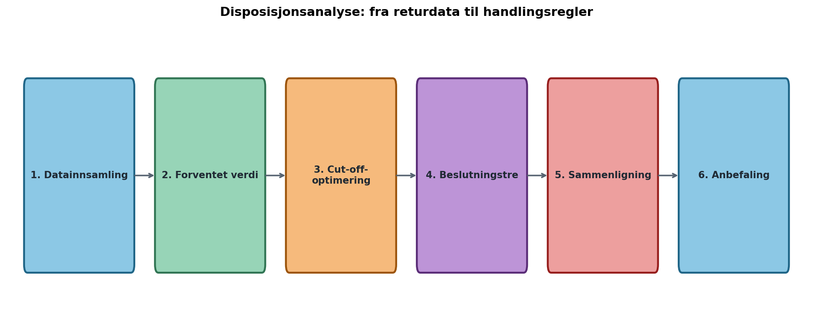

Disposisjonsanalyse i seks steg: fra rå returdata til handlingsregler.

### Steg 1: Datainnsamling
NordRetur har logget $N = 800$ returnerte enheter over et kvartal. For hver enhet registreres:

- **Tilstandsscore** $c \in {1, 2, 3, 4, 5}$ satt av tekniker ved mottak ($1$ = ubrukelig, $5$ = tilnærmet ny).

- **Alder** i måneder siden salg.

- **Merke** -- fire merker i porteføljen: NordicTech, ElektroNor, ViksTek, FjordLine.

- **Kosmetisk grad** ($1$--$5$) -- visuell tilstand (riper, slitasje).

- **Funksjonell grad** ($1$--$5$) -- fungerer enheten, hvor mange komponenter feiler?

- **Nypris** i NOK per merke.

Fordeling av tilstandsscore. Figur [18](#fig-fig-disp-cond-hist) viser fordelingen stablet per merke. Middelklassen ($c = 3$) dominerer, mens ekstremene ($c = 1$ og $c = 5$) er sjeldne. Dette er typisk for et returflow der de fleste enheter har *noe* feil, men ikke er helt ødelagt.

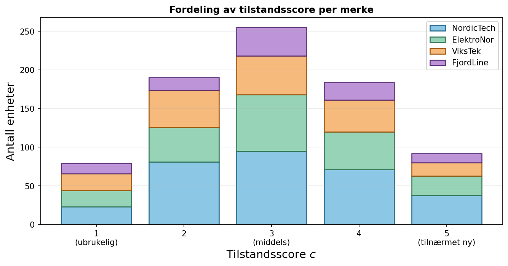

Fordeling av tilstandsscore $c$ for de 800 returnerte enhetene, stablet per merke.

Deskriptiv statistikk. Tabell [21](#tab-tab-disp-deskriptiv) viser de viktigste nøkkeltallene.

Deskriptiv statistikk for datasettet (800 returenheter).

  **Statistikk**                                                 **Verdi**
  -------------------------------------------------------------- -----------------------
  Antall enheter                                                 800
  Antall merker                                                  4
  Gjennomsnittlig tilstand                                       $3,02$
  Median tilstand                                                3
  Gjennomsnittlig alder (måneder)                                $20,0$
  Gjennomsnittlig nypris (NOK)                                   4 769
  Tilstandsfordeling $c = 1, 2, 3, 4, 5$                       79, 190, 255, 184, 92
  Merkefordeling NordicTech / ElektroNor / ViksTek / FjordLine   308 / 213 / 178 / 101

**Konklusjon** --- *Datasettet er representativt*

Datasettet dekker hele spekteret fra nesten nye enheter (($c = 5$) 92 stk.) til ubrukelige (($c = 1$) 79 stk.). Dette er viktig for at en lært beslutningsregel skal være gyldig i hele porteføljen, ikke bare for de vanligste tilstandene.

### Steg 2: Forventet verdi per handling
For hver enhet og hver handling beregner vi forventet verdi fra ligning [(9)](#eq-eq-ev-per-handling). Parametrene er kalibrert fra historiske data:

- **Suksessannsynligheten** $p_a(x)$ for repair og refurbish er økende i tilstandsscore og fallende i alder. For recycle er den tilnærmet konstant ($0,98$), og for dispose alltid $1,0$.

- **Inntekten** $r_a(x)$ er $0,85 \times$ nypris for repair, $0,55 \times$ nypris for refurbish, $0,08 \times$ nypris for recycle, og $0$ for dispose. Inntektsfaktorene justeres ytterligere for kosmetisk grad ved repair og refurbish.

- **Faste kostnader** er $k_{\text{repair}} = 750$, $k_{\text{refurbish}} = 400$, $k_{\text{recycle}} = 120$, $k_{\text{dispose}} = 180$ NOK.

- **Tap ved mislykket forsøk** er $\ell_{\text{repair}} = \ell_{\text{refurbish}} = 180$ NOK (må deponeres likevel).

Figur [19](#fig-fig-disp-ev) viser gjennomsnittlig forventet verdi per handling, stratifisert på tilstandsscore. Mønsteret er helt tydelig: for $c = 1$ er resirkulering eneste lønnsomme handling; for $c = 3$ gir refurbish høyest EV; for $c \ge 4$ dominerer repair.

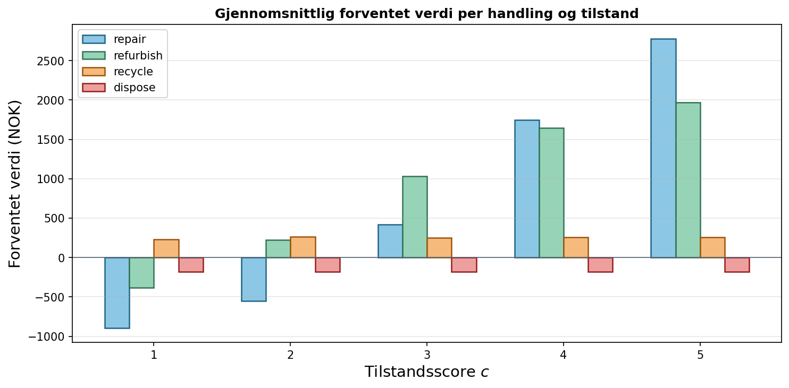

Gjennomsnittlig forventet verdi $øverline{\mathrm{EV}}(a \mid c)$ per handling $a$ og tilstandsscore $c$.

Aggregerte nøkkeltall. Tabell [22](#tab-tab-disp-ev-mean) oppsummerer gjennomsnittene over alle 800 enheter.

Gjennomsnittlig forventet verdi og andel valgt (oracle).

  **Handling**   **Beskrivelse**           **Gj.snitt EV (NOK)**   **Andel $a^\star$**
  -------------- ------------------------- ----------------------- -------------------------
  repair         Reparer og selg som ny    $634,35$              $26,25\,%$
  refurbish      Refurbish og selg brukt   $950,12$              $49,50\,%$
  recycle        Resirkulere materialene   $253,89$              $24,25\,%$
  dispose        Deponere som avfall       $-180,00$             $0,00\,%$

**Konklusjon** --- *Refurbish er oftest best*

Refurbish er oracle-handlingen for nesten halvparten av enhetene. Repair og recycle deler resten i omtrent like deler. Dispose blir aldri valgt -- det koster alltid mer enn recycle. Dette gir oss en kraftig øvre grense for hva noen beslutningsregel kan oppnå: maks total EV når vi kjenner $a^\star(x)$ for hver enhet (oracle).

### Steg 3: Cut-off-optimering
Den enkleste praktiske regelen er å basere handlingen kun på tilstandsscore $c$. Siden $c$ har fem verdier og vi har fire handlinger, finnes det $4^5 = 1024$ mulige regler. Vi kan enumerere dem alle og velge den som gir høyest samlet forventet verdi:

$$\pi^\star = øperatorname\*{argmax}_{\pi : {1,\ldots,5} \to \mathcal{A}} \sum_{i=1}^{N} \mathrm{EV}\bigl(\pi(c_i) \mid x_i\bigr)$$

4

Søket er raskt fordi vi preaggregerer summen $\sum_{i: c_i = c} \mathrm{EV}(a \mid x_i)$ per tilstand $c$ og handling $a$, og deretter kombinerer. Resultatet vises i tabell [23](#tab-tab-disp-cutoff-policy) og figur [20](#fig-fig-disp-cutoff).

Optimal cut-off-politikk $\pi^\star(c)$.

  **Tilstand $c$**   **Anbefalt handling $\pi^\star(c)$**   **Antall enheter**
  -------------------- ------------------------------------------- --------------------
  1                    recycle                                     79
  2                    recycle                                     190
  3                    refurbish                                   255
  4                    repair                                      184
  5                    repair                                      92

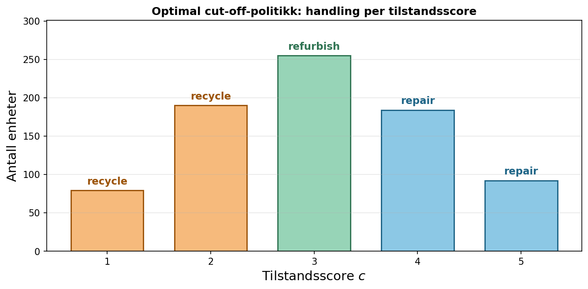

Optimal cut-off-politikk: søylefargene koder hvilken handling $\pi^\star$ anbefaler for hver tilstandsscore.

Verdi av cut-off-politikken. Summen i ligning [(4)](#eq-eq-cutoff-argmax) gir $\sum_i \mathrm{EV} = 908\,579$ NOK for den beste regelen, mot $-271\,239$ NOK for den verste. Av de 1 024 politikkene gir altså den optimale cut-off-regelen alene $1,18$ millioner NOK forskjell i forventet verdi.

**Konklusjon** --- *Tilstandsscore alene fanger mye*

Siden tilstandsscore korrelerer sterkt med både $p_a$ og $r_a$, fanger den enkle regelen $\pi^\star(c)$ opp det meste av verdien. Likevel kan to enheter med samme $c$ ha forskjellig optimal handling dersom de skiller seg i alder, merke, kosmetisk eller funksjonell grad. Det motiverer neste steg: et tre som bruker flere attributter.

### Steg 4: Beslutningstre
Vi trener et CART-tre med begrenset dybde 4 og minimum 20 enheter per løv på oracle-etikettene $a^\star(x)$. Sklearn-implementasjonen finner splittene som minimerer Gini-urenhet i ligning [(13)](#eq-eq-gini), og gir treet i figur [21](#fig-fig-disp-tree).

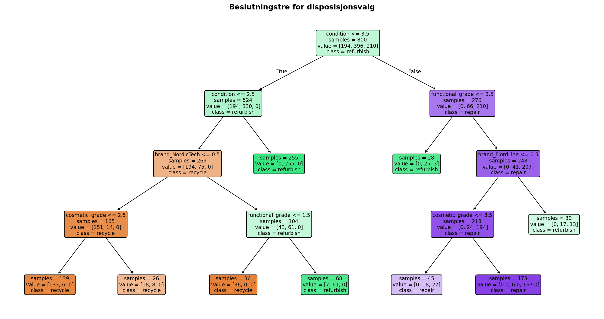

Lært CART-beslutningstre med dybde $\le 4$ og $\ge 20$ enheter per løv. Fargene koder anbefalt handling.

Nøkkeltall. Treet har 9 løv, dybde 4 og trenings-nøyaktighet $92,37\,%$ -- altså er $\hat{a}(x)$ lik $a^\star(x)$ for $92,4\,%$ av enhetene. Tabell [24](#tab-tab-disp-tree-importance) viser relativ viktighet per feature.

Feature importance i det lærte treet (Gini-reduksjon).

  **Feature**        **Beskrivelse**                **Importance**
  ------------------ ------------------------------ ----------------
  condition          Tilstandsscore $c$           $0,709$
  functional_grade   Funksjonell grad               $0,156$
  brand_NordicTech   Merke (NordicTech-indikator)   $0,078$
  cosmetic_grade     Kosmetisk grad                 $0,031$
  brand_FjordLine    Merke (FjordLine-indikator)    $0,027$
  age_months         Alder i måneder                $0,000$
  brand_ElektroNor   Merke (ElektroNor-indikator)   $0,000$
  brand_ViksTek      Merke (ViksTek-indikator)      $0,000$

Tolkning av splittene. Rotnoden splitter på $c \le 3,5$. For enheter med $c \ge 4$ brukes funksjonell grad til å skille repair fra refurbish: høyere funksjonell grad $\Rightarrow$ repair. For dyre merker (NordicTech) lønner det seg å refurbishe enheter med $c = 2$ dersom funksjonell grad er $\ge 2$ -- for de billige merkene er recycle beste valg uansett.

**Konklusjon** --- *Treet fanger det cut-off overser*

Tilstandsscore er fortsatt den klart viktigste variabelen ($0,71$ av total importance), men funksjonell grad og merke bidrar til å skille marginale tilfeller hvor cut-off-regelen tar feil valg. Den største gevinsten er for dyre merker i middels tilstand, hvor refurbish slår recycle.

### Steg 5: Sammenligning av politikker
Vi sammenligner fire politikker på det samme datasettet:

- **Naiv**: alltid resirkulere (dagens regel).

- **Cut-off**: $\pi^\star(c)$ fra steg 3 -- regel basert kun på tilstandsscore.

- **Tre**: $\hat{a}(x)$ fra steg 4 -- lært fra oracle-etikettene.

- **Oracle**: $a^\star(x)$ -- teoretisk øvre grense.

Tabell [25](#tab-tab-disp-compare) og figur [22](#fig-fig-disp-compare) oppsummerer resultatet.

Sammenligning av politikker over de 800 enhetene.

  **Politikk**   **Beskrivelse**       **Total EV (NOK)**   **$\Delta$ vs. naiv**   **% av oracle**
  -------------- --------------------- -------------------- -------------------------- -----------------
  Naiv           Alltid recycle        203 112              0                          $22,0\,%$
  Cut-off        $\pi^\star(c)$   908 579              $+705\,468$             $98,4\,%$
  Tre            $\hat{a}(x)$       916 882              $+713\,770$             $99,3\,%$
  Oracle         $a^\star(x)$      923 768              $+720\,657$             $100,0\,%$

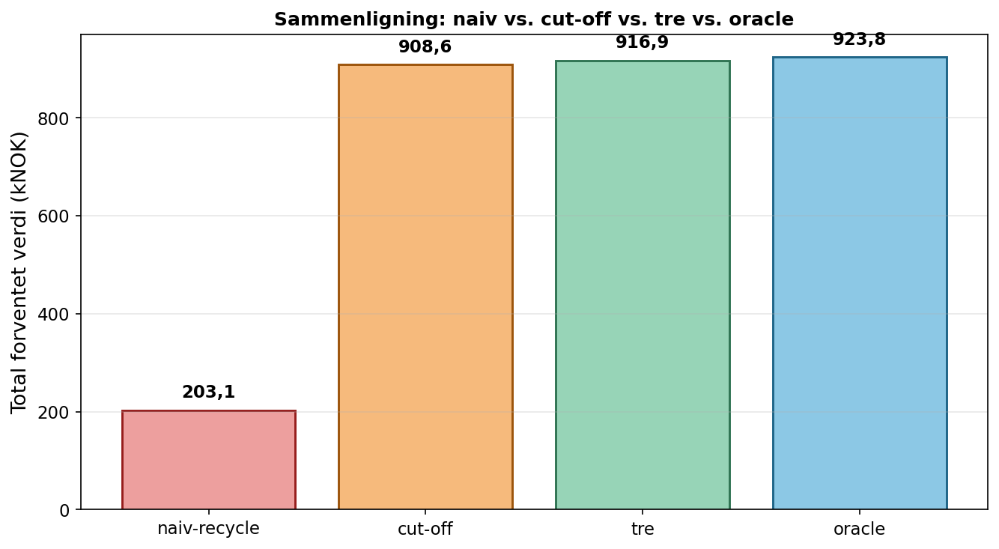

Total forventet verdi per politikk (i kNOK) over de 800 returenhetene.

Handlingsfordeling. Tabell [26](#tab-tab-disp-shares) viser hvor stor andel av enhetene hver politikk sender til hver handling.

Andel enheter per handling for de fire politikkene.

  **Politikk**   **Regel**             **repair**   **refurbish**   **recycle**   **dispose**
  -------------- --------------------- ------------ --------------- ------------- -------------
  Naiv           alltid recycle        $0,00$     $0,00$        $1,00$      $0,00$
  Cut-off        $\pi^\star(c)$   $0,35$     $0,32$        $0,34$      $0,00$
  Tre            $\hat{a}(x)$       $0,27$     $0,48$        $0,25$      $0,00$
  Oracle         $a^\star(x)$      $0,26$     $0,49$        $0,24$      $0,00$

**Konklusjon** --- *Treet er praktisk talt optimalt*

Den naive "alltid-recycle"-regelen lar $720\,657$ NOK ligge igjen på bordet sammenlignet med oracle. Cut-off-regelen henter $98,4\,%$ av dette. Treet går nesten helt til topps ($99,3\,%$). Viktigere: fordelingen av handlinger under treet matcher oracle nesten perfekt -- refurbish blir brukt $48\,%$ vs oracle sine $49\,%$.

### Steg 6: Anbefaling
NordRetur kan implementere det lærte treet som et operativt oppslagsverk: teknikeren registrerer tilstand, funksjonell og kosmetisk grad + merke, og systemet returnerer handling. Regelen er transparent -- operatøren kan følge splittene i figur [21](#fig-fig-disp-tree) uten "svart-boks"-bekymring -- men leverer $713\,770$ NOK ($+351\,%$) mer forventet verdi enn dagens "alltid-recycle"-regel.

Regelsammendrag per tilstandsscore. Tabell [27](#tab-tab-disp-rules) viser hvordan treet fordeler handlinger innenfor hver tilstandsgruppe.

Handlingsfordeling under det lærte treet per tilstandsscore.

  **$c$**   **Antall**   **Dominant handling**   **repair**   **refurbish**   **recycle**
  ----------- ------------ ----------------------- ------------ --------------- -------------
  1           79           recycle                 0            3               76
  2           190          recycle                 0            65              125
  3           255          refurbish               0            255             0
  4           184          repair                  138          46              0
  5           92           repair                  80           12              0

**Praktisk anvendelse** --- *Fra modell til hverdag*

1.  **Tren modellen** på historiske returer med oracle-etiketter fra forventet-verdi-analysen.

2.  **Sett opp en enkel app** som lar teknikeren registrere $x$ og returnere $\hat{a}(x)$.

3.  **Revider kvartalsvis:** oppdater $p_a, r_a, k_a, \ell_a$ etterhvert som priser og arbeidskostnader endrer seg, og tren treet på nytt.

4.  **Monitorér avvik:** dersom andelen enheter som sendes til recycle øker vesentlig, kan det indikere drift i returstrømmen (f.eks. eldre produkter i omløp) eller at parametrene må kalibreres.

[Begrensninger]
- Modellen forutsetter at suksessannsynligheter $p_a$ og inntekter $r_a$ er korrekt kalibrert -- feil kalibrering forskyver hele oracle-politikken og dermed treet.

- Treet er trent på historiske enheter; uvanlige nye produkter (nye merker, ny teknologi) kan kreve at man utvider treningssettet.

- Analysen behandler hver enhet uavhengig. Ved kapasitetsbegrensninger i reparasjonsverkstedet må handlingsvalget løses som et tilordningsproblem, ikke enhet-for-enhet.

Slutt · Kapittel 9

---

# Del II — Kapittel 10: Innkjøpsoptimalisering og leverandørstyring

Del II · Kapittel 10

10

# Innkjøpsoptimalisering og leverandørstyring
Oversatt fra LaTeX-kilde --- figurer, definisjoner og KaTeX-math.

[][][][][]
Område

## Område
Innkjøpsoptimalisering og leverandørstyring handler om å fatte kvantitativt funderte beslutninger om *hvilke* leverandører som skal brukes, *hvor mye* som skal bestilles og til hvilke vilkår, samt *hvordan* kontrakter og innkjøpsfrekvens skal utformes for å sikre stabile og kostnadseffektive forsyninger. I produksjons- og handelsbedrifter utgjør innkjøp typisk $50$--$80\,%$ av omsetningen, slik at selv små prosentvise besparelser på innkjøpssiden gir betydelig bunnlinjeeffekt og ofte større lønnsomhetsgevinst enn tilsvarende vekst i salg.


Innkjøpsoptimalisering og leverandørstyring: evaluering og valg av leverandør, kontraktsdesign med pris- og kvantumsvilkår, samt vare- og informasjonsflyt mellom kjøper og leverandør.

Definisjon [Innkjøpsoptimalisering og leverandørstyring]
**Innkjøpsoptimalisering og leverandørstyring** er prosessen med å velge leverandører og utforme bestillings- og kontraktsvilkår slik at totale anskaffelseskostnader minimeres under krav til kvalitet, leveringstid og forsyningssikkerhet.

Området omfatter beslutninger på ulike tidshorisonter og aggregeringsnivå:

- Strategisk innkjøp (år) --- leverandørsegmentering, make-or-buy, single- vs. multi-sourcing og langsiktige rammeavtaler

- Taktisk innkjøp (måneder) --- leverandørvalg med multikriterieanalyse, kontraktsdesign og total cost of ownership (TCO)

- Operativt innkjøp (dager til uker) --- konkrete bestillingsmengder, kvantumsrabatter og innkjøpsfrekvens

- Innkjøpsauksjoner og anbudskonkurranser --- kombinatorisk allokering av volum mellom flere leverandører under kapasitets- og diversifiseringskrav

Innkjøpsoptimalisering er tett sammenvevd med flere andre områder som behandles i dette kompendiet:

- Lagerstyring --- leverandørens pris, leveringstid og kvantumsrabatter er direkte input til EOQ og bestillingspunkt, og påvirker sikkerhetslager og kapitalbinding

- Forsyningskjedeanalyse --- leverandørrelasjoner og kontraktsdesign er konkrete koordineringsmekanismer som kan dempe bullwhip og øke systemytelsen

- Risikostyring --- valg av antall leverandører og geografisk diversifisering er kjernevirkemidler mot leverandørsvikt og forsyningsavbrudd

- Bærekraftig logistikk --- leverandørevaluering med bærekraftskriterier (CO\textsubscript{2}, arbeidsforhold, sirkularitet) integrerer miljø- og samfunnsansvar i innkjøpsbeslutningene

Problemstillinger, modeller og metoder

## Problemstillinger, modeller og metoder
I det følgende presenteres tre sentrale problemstillinger innen innkjøpsoptimalisering med tilhørende modeller og metoder, som illustrert i figur [2](#fig-fig-innkjopsoptimalisering-problemstillinger-oversikt). Alle tre problemstillingene utdypes med egne eksempler og figurer i de påfølgende seksjonene.

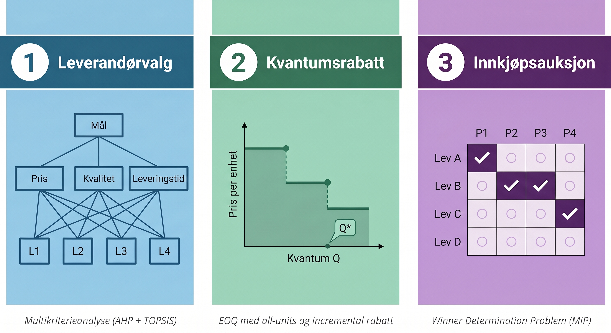

Tre sentrale problemstillinger innen innkjøpsoptimalisering: leverandørvalg med multikriterieanalyse, kvantumsrabattoptimering med EOQ-utvidelser, og innkjøpsauksjon med kombinatorisk budallokering.

Nøkkelen til god innkjøpsoptimalisering er å velge riktig modell og metode for den aktuelle problemstillingen. Tabell [1](#tab-tab-innkjopsoptimalisering-oversikt) gir en oversikt over hvilke modeller og metoder som egner seg for de tre problemstillingene. Tabellen inkluderer også supplerende tilnærminger som *Total Cost of Ownership* (TCO) og leverandørscorecards, som ofte brukes sammen med de formelle modellene for å gi beslutningstakeren et mer helhetlig bilde. Modellene og metodene uthevet med rødt vil bli gått gjennom i de tre neste avsnittene.

Oversikt over modeller og metoder for de tre sentrale problemstillingene innen innkjøpsoptimalisering.

  **Nr.**   **Problemstilling**                              **Modeller**                                                               **Metoder**
  --------- ------------------------------------------------ -------------------------------------------------------------------------- ---------------------------------------------------------------------------------------------------------
  1         Leverandørvalg                     Leverandørscorecards, TCO-analyse, AHP + TOPSIS              Multikriterieanalyse, parvis sammenligning, konsistenssjekk, sensitivitetsanalyse
  2         Kvantumsrabattoptimering           Klassisk EOQ, EOQ med all-units og incremental rabatt        Kostnadsoptimering per prisintervall, break-even-analyse, totalkostnadssammenligning
  3         Innkjøpsauksjon og budoptimering   Laveste-bud-heuristikk, Winner Determination Problem (MIP)   Kombinatorisk optimering, heltallsprogrammering, allokering under kapasitetsbegrensninger

Leverandørvalg med AHP og TOPSIS

## Eksempel: Leverandørvalg med AHP og TOPSIS
Oppsummering.

  **Kategori**      **Beskrivelse**
  ----------------- -----------------------------------------------------------------------------------------------------------------------------------------
  Eksempel          Leverandørvalg hos en norsk industribedrift
  Område            Innkjøpsoptimalisering med multikriterieanalyse
  Problemstilling   Velge beste komponentleverandør når pris, kvalitet, leveringstid, fleksibilitet og bærekraft må veies mot hverandre
  Modell            AHP (Analytic Hierarchy Process) + TOPSIS (Technique for Order Preference by Similarity to Ideal Solution)
  Prosess           Multikriterieanalyse (MCDM)
  Metode            Parvis sammenligning, egenvektor-vekter, CI/CR-konsistenssjekk, vektornormalisering, avstand til ideal/anti-ideal, sensitivitetsanalyse

### Problemstilling
Nordvik Industri AS er en norsk produsent av spesialkomponenter til offshore- og fornybarsektoren. Selskapet står overfor en viktig innkjøpsbeslutning: de skal velge en ny hovedleverandør av en kritisk maskinkomponent for de neste fem årene. Rammeavtalen har et estimert årlig volum på rundt 12 000 enheter og utgjør en betydelig del av bedriftens totale innkjøpskostnader.

Innkjøpsavdelingen har gjennomført en forhåndsvurdering og sitter igjen med seks kvalifiserte kandidater: *Alfa*, *Beta*, *Gamma*, *Delta*, *Epsilon* og *Zeta*. Problemet er at leverandørene har ulike styrker. Billigste tilbud gir ikke automatisk lavest totalkostnad, og høyeste kvalitet kommer ofte med høyere pris og lengre leveringstid. I tillegg vil selskapet fra 2026 rapportere på EUs bærekraftsdirektiv (CSRD), slik at leverandørens miljøprofil ikke lenger bare er et pluss, men et kvantifiserbart beslutningskriterium.

**Problemstilling** --- *Hvordan velger vi leverandør når ingen dominerer på alle kriterier?*

Vi bruker AHP til å finne vekter for de fem kriteriene basert på parvise sammenligninger, og TOPSIS til å rangere leverandørene ut fra hvor nær de ligger en ideell løsning. Til slutt undersøker vi hvor robust rangeringen er dersom beslutningstakerne vekter annerledes.

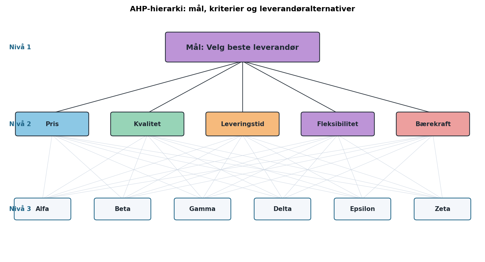

AHP-hierarki med mål (øverst), fem kriterier (midten) og de seks leverandøralternativene (nederst).

### Modell
Multikriterieanalyse (*Multi-Criteria Decision Making*, MCDM) kombinerer flere inkommensurable kriterier til én samlet rangering. Vi bruker to komplementære teknikker: *AHP* for å etablere konsistente vekter fra subjektive sammenligninger, og *TOPSIS* for å skåre alternativene relativt til en syntetisk ideal-- og anti-ideal-løsning.

Definisjon [Analytic Hierarchy Process (AHP)]
La $A = (a_{ij}) \in \mathbb{R}^{n \times n}$ være en parvis sammenligningsmatrise for $n$ kriterier, hvor $a_{ij}$ uttrykker hvor mye viktigere kriterium $i$ er enn kriterium $j$ på Saatys skala ${1/9, 1/8, \ldots, 1, \ldots, 8, 9}$. Matrisen er per definisjon positiv og resiprok:

$$a_{ij} > 0, \qquad a_{ji} = \frac{1}{a_{ij}}, \qquad a_{ii} = 1.$$

1

Vektvektoren $w = (w_1, \ldots, w_n)^\top$ med $\sum_j w_j = 1$ beregnes som den normaliserte dominerende egenvektoren:

$$A\,w = \lambda_{\max}\, w,$$

2

hvor $\lambda_{\max}$ er den største egenverdien til $A$.

For en *perfekt konsistent* matrise er $\lambda_{\max} = n$. Jo lenger unna $n$, desto mindre konsistente er vurderingene. Saaty foreslo to mål:

Definisjon [Consistency Index (CI) og Consistency Ratio (CR)]
$$\begin{aligned}\text{CI} &= \frac{\lambda_{\max} - n}{n - 1},
\\
\text{CR} &= \frac{\text{CI}}{\text{RI}(n)},\end{aligned}$$

3

hvor $\text{RI}(n)$ er en empirisk *Random Index* -- gjennomsnittlig CI for et stort antall tilfeldig genererte $n \times n$ resiproke matriser. Tommelregel: $\text{CR} < 0,10$ gir akseptabel konsistens.

Symboler i AHP-modellen.

  **Symbol**              **Navn**                   **Beskrivelse**
  ----------------------- -------------------------- -------------------------------------------------
  $n$                   Antall kriterier           I eksempelet $n = 5$
  $a_{ij}$             Parvis vurdering           Hvor mye viktigere kriterium $i$ er enn $j$
  $A$                   Sammenligningsmatrise      $n \times n$ positiv resiprok matrise
  $w_j$                 Vekt for kriterium $j$   Normalisert: $\sum_j w_j = 1$
  $\lambda_{\max}$   Dominerende egenverdi      Mål på intern konsistens ($\geq n$)
  $\text{RI}(n)$       Random Index               Tabellert verdi; $\text{RI}(5) = 1,12$

Med kriterievektene $w_j$ på plass, bruker vi TOPSIS til å rangere alternativene. Intuisjonen er enkel: en god leverandør ligger nært en ideell leverandør (best på alle kriterier samtidig) og langt fra en anti-ideell leverandør (verst på alle).

Definisjon [TOPSIS (Technique for Order Preference by Similarity to Ideal Solution)]
La $X = (x_{ij}) \in \mathbb{R}^{m \times n}$ være ytelsesmatrisen for $m$ alternativer på $n$ kriterier, og $w = (w_j)$ vektvektoren fra AHP. TOPSIS består av fem trinn:

1.  **Vektornormalisering:** $r_{ij} = x_{ij} \big/ \sqrt{\sum_{k=1}^{m} x_{kj}^2}$.

2.  **Vekting:** $v_{ij} = w_j \cdot r_{ij}$.

3.  **Ideal-- og anti-idealløsning:**

    $$\begin{aligned}A^{+}_j &=
    \begin{cases}
    \max_i v_{ij} & \text{hvis $j$ er \emph{benefit}}, \\
    \min_i v_{ij} & \text{hvis $j$ er \emph{cost}},
    \end{cases} \\
    A^{-}_j &=
    \begin{cases}
    \min_i v_{ij} & \text{hvis $j$ er \emph{benefit}}, \\
    \max_i v_{ij} & \text{hvis $j$ er \emph{cost}}.
    \end{cases}\end{aligned}$$

4.  **Euklidske avstander:**

    $$d^{+}_i = \sqrt{\sum_{j=1}^{n} (v_{ij} - A^{+}_j)^2}, \qquad
    d^{-}_i = \sqrt{\sum_{j=1}^{n} (v_{ij} - A^{-}_j)^2}.$$

    4

5.  **Nærhetsskår:**

    $$C_i = \frac{d^{-}_i}{d^{+}_i + d^{-}_i} \in \[0, 1\].$$

    5

Alternativet med høyest $C_i$ er foretrukket.

Symboler i TOPSIS.

  **Symbol**                 **Navn**              **Beskrivelse**
  -------------------------- --------------------- ---------------------------------------------------
  $m$                      Antall alternativer   I eksempelet $m = 6$ leverandører
  $x_{ij}$                Rå ytelsesverdi       Leverandør $i$ sin score på kriterium $j$
  $r_{ij}$                Normalisert verdi     Kolonnvis vektornormalisering
  $v_{ij}$                Vektet verdi          $v_{ij} = w_j \cdot r_{ij}$
  $A^{+}_j, A^{-}_j$   Ideal/anti-ideal      Beste/verste vektet verdi per kolonne
  $d^{+}_i, d^{-}_i$   Euklidske avstander   Fra alternativ $i$ til $A^{+}$ og $A^{-}$
  $C_i$                    Nærhetsskår           Relativ nærhet til ideal: $C_i \in \[0, 1\]$

**Tolkning** --- *Hvordan leser vi modellen?*

- **AHP** løser et typisk problem med menneskelige vurderinger: en innkjøpssjef synes det er lettere å si "kvalitet er omtrent tre ganger viktigere enn leveringstid" enn å tallfeste absolutt vekt. Ved å sammenligne alt med alt og ekstrahere egenvektoren får vi konsistente vekter $w_j$ som summerer til 1.

- **CR** forteller om innkjøpssjefen er *konsistent*. Dersom $A$ sier at pris er viktigere enn kvalitet, og kvalitet er viktigere enn leveringstid, men leveringstid er viktigere enn pris, er vurderingene motstridende og $\text{CR}$ blir høy.

- **TOPSIS** er en geometrisk metafor. Hvert alternativ blir et punkt i $\mathbb{R}^n$, og modellen belønner alternativer som er *både* nære ideal og *samtidig* langt fra anti-ideal. Dette er strengere enn å bare maksimere en vektet sum, fordi det straffer svake sider.

Forutsetninger. For at modellen skal gi meningsfulle svar må følgende være oppfylt:

1.  **Målbarhet:** Alle kriterier må kunne kvantifiseres numerisk, enten på en naturlig skala (pris i NOK, leveringstid i dager) eller en avtalt ordinal skala (kvalitet, fleksibilitet, bærekraft på 1--10).

2.  **Uavhengighet:** Kriteriene bør være relativt uavhengige. Hvis to kriterier måler samme underliggende egenskap, vil de telle dobbelt i skåren.

3.  **Konsistens:** Den parvise sammenligningsmatrisen må være tilstrekkelig konsistent, $\text{CR} < 0,10$. Er $\text{CR}$ for høy, må vurderingene revideres.

4.  **Monotonitet:** For hvert kriterium antas det at "mer er alltid bedre" (benefit) eller "mindre er alltid bedre" (cost). Ikke-monotone preferanser (for eksempel en optimal leveringstid rundt 10 dager) må håndteres ved transformasjon av inndata.

### Prosess
Prosess: Multikriterieanalyse (AHP + TOPSIS).
Modell: AHP-vekter $w$ fra egenvektor av parvis matrise $A$, TOPSIS-skår $C_i$ fra vektet euklidsk avstand.

Figur [4](#fig-fig-ahp-method) viser de seks stegene vi følger, fra datainnsamling til endelig anbefaling.

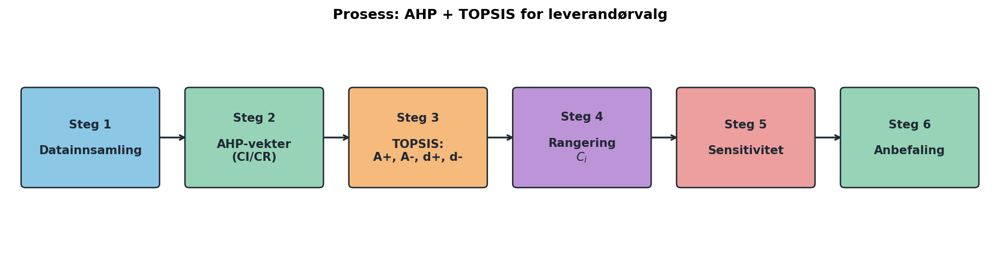

Prosess for AHP + TOPSIS: seks steg fra datainnsamling til anbefaling.

### Steg 1: Datainnsamling
Innkjøpsavdelingen har samlet inn tilbud, kvalitetsdata, logistikkinformasjon og bærekraftsindikatorer for de seks leverandørene. Alle tallene er normalisert til felles skalaer:

- **Pris** $\[\text{NOK/enhet}\]$: oppgitt enhetspris i rammeavtalen (cost).

- **Kvalitet** $\[1\text{--}10\]$: sammensatt skåre fra reklamasjonsrate og sertifiseringer (benefit).

- **Leveringstid** $\[\text{dager}\]$: median ledetid fra bestilling til levering (cost).

- **Fleksibilitet** $\[1\text{--}10\]$: leverandørens evne til å håndtere volumendringer (benefit).

- **Bærekraft** $\[1\text{--}10\]$: CO$_2$-avtrykk, sertifiseringer og rapportering etter CSRD (benefit).

Tabell [5](#tab-tab-leverandor-ytelse) viser den innsamlede ytelsesmatrisen $X = (x_{ij})$.

Ytelsesmatrise $X$: leverandører ($i$) versus kriterier ($j$).

  **Leverandør**   **Pris**        **Kvalitet**   **Leveringstid**   **Fleksibilitet**   **Bærekraft**
  ---------------- --------------- -------------- ------------------ ------------------- ---------------
                   \[NOK/enhet\]   \[1--10\]      \[dager\]          \[1--10\]           \[1--10\]
  Alfa             185             8,2            14                 7,0                 8,5
  Beta             165             7,0            21                 8,5                 6,0
  Gamma            210             9,1            10                 6,5                 9,2
  Delta            175             7,8            18                 7,5                 7,0
  Epsilon          195             8,6            12                 8,0                 8,0
  Zeta             155             6,4            25                 9,0                 5,5
  **Type**         cost            benefit        cost               benefit             benefit

Figur [5](#fig-fig-ahp-ytelse-heatmap) visualiserer den samme matrisen som et varmekart, hvor fargene er normaliserte per kolonne slik at mørkeblå alltid betyr "best" uavhengig av om kriteriet er cost eller benefit.

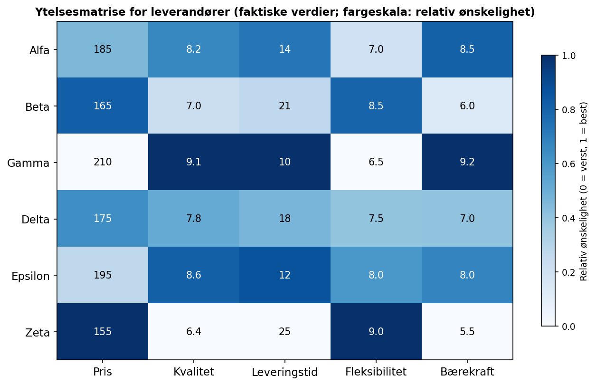

Ytelsesmatrise med faktiske verdier; fargeskalaen er normalisert per kolonne slik at mørkere blå angir høyere relativ ønskelighet.

**Konklusjon** --- *Ingen leverandør dominerer*

Zeta er billigst (155 NOK) og mest fleksibel, men scorer dårligst på kvalitet (6,4), leveringstid (25 dager) og bærekraft (5,5). Gamma er motsatt best på kvalitet (9,1), leveringstid (10 dager) og bærekraft (9,2), men dyrest (210 NOK) og minst fleksibel. Epsilon ligger i midten på alle kriteriene uten svake sider. Vi trenger en formell metode for å veie disse avveiningene mot hverandre.

### Steg 2: AHP-vekter med konsistenssjekk
Innkjøpssjefen gir parvise vurderinger på Saatys skala. Resultatet er sammenligningsmatrisen i tabell [6](#tab-tab-ahp-parvis).

Parvis sammenligningsmatrise $A$ for de fem kriteriene (Saatys skala).

                      **Pris**   **Kvalitet**   **Leveringstid**   **Fleksibilitet**   **Bærekraft**
  ------------------- ---------- -------------- ------------------ ------------------- ---------------
  **Pris**            1          1/2            2                  3                   3
  **Kvalitet**        2          1              3                  4                   4
  **Leveringstid**    1/2        1/3            1                  2                   2
  **Fleksibilitet**   1/3        1/4            1/2                1                   2
  **Bærekraft**       1/3        1/4            1/2                1/2                 1

Innkjøpssjefen anser for eksempel kvalitet som "svakt viktigere" enn pris (verdi 2), "svakt til klart viktigere" enn leveringstid (3), og "klart viktigere" enn bærekraft (4). Vi beregner vektvektoren $w$ som den normaliserte dominerende egenvektoren fra ligning [(2)](#eq-eq-ahp-eigen).

Vekter. Tabell [7](#tab-tab-ahp-vekter) viser de estimerte vektene.

AHP-vekter $w_j$ (egenvektor-metoden).

  **Kriterium $j$**   **Beskrivelse**                                         **Vekt $w_j$**
  --------------------- ------------------------------------------------------- ------------------
  Kvalitet              Høyest prioritet; direkte innvirkning på sluttprodukt   0,412
  Pris                  Betydelig komponent av totalkostnad                     0,256
  Leveringstid          Viktig for produksjonsplanlegging                       0,152
  Fleksibilitet         Volumvariasjon og ad hoc-bestillinger                   0,102
  Bærekraft             CSRD-rapportering; under utvikling                      0,077
  **Sum**                                                                       **1,000**

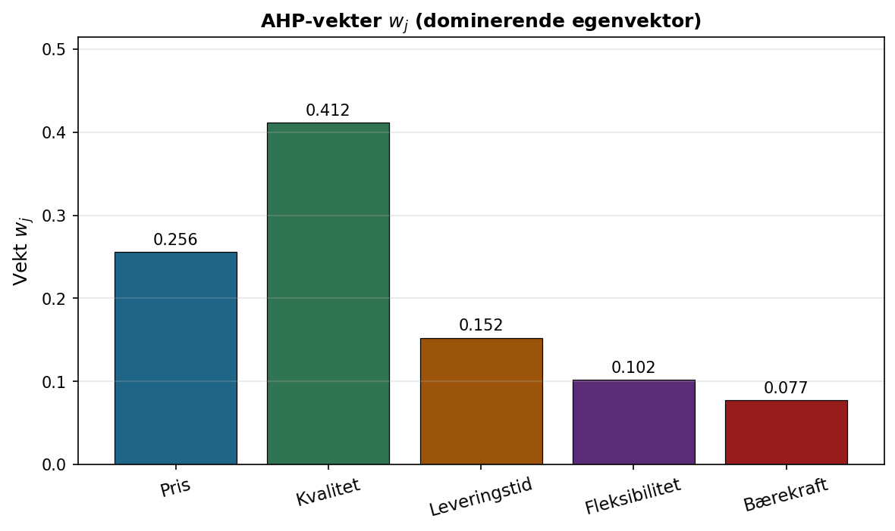

AHP-vekter $w_j$: kvalitet (0,412) og pris (0,256) dominerer, mens bærekraft veier lavest (0,077).

Konsistenssjekk. Dominerende egenverdi er $\lambda_{\max} = 5,095$. Med $n = 5$ gir dette:

$$\begin{aligned}\text{CI} &= \frac{\lambda_{\max} - n}{n - 1} = \frac{5,095 - 5}{4} = 0,0237, \\
\text{CR} &= \frac{\text{CI}}{\text{RI}(5)} = \frac{0,0237}{1,12} = 0,0212.\end{aligned}$$

Resultater fra konsistenssjekken.

  **Størrelse**                                 **Verdi**
  --------------------------------------------- --------------------------------------------
  Antall kriterier $n$                        5
  Dominerende egenverdi $\lambda_{\max}$   $5,095$
  Consistency Index CI                          $0,024$
  Random Index RI(5)                            $1,12$
  Consistency Ratio CR                          $0,021$
  **Konklusjon**                                **Akseptabel konsistens** (CR $< 0,10$)

**Konklusjon** --- *Vurderingene henger sammen*

CR $= 0,021$ er langt under grensen 0,10. Innkjøpssjefens vurderinger er altså internt konsistente, og vi kan stole på vektene. Kvalitet og pris utgjør sammen over 66 % av vekten, leveringstid 15 %, og de to siste kriteriene til sammen bare 18 %.

### Steg 3: TOPSIS -- avstand til ideal og anti-ideal
Med vektene $w_j$ klare kan vi bruke TOPSIS til å skåre leverandørene. Vi starter med vektornormaliseringen fra trinn 1 i TOPSIS:

$$r_{ij} = \frac{x_{ij}}{\sqrt{\sum_{k=1}^{6} x_{kj}^2}}.$$

6

Dette gjør at kolonner med ulike enheter (NOK, dager, skala 1--10) blir sammenlignbare. Så vekter vi hver kolonne med $w_j$ for å få $V = (v_{ij})$ hvor $v_{ij} = w_j r_{ij}$.

Ideal og anti-ideal. For hvert kriterium bestemmer vi beste og verste vektet verdi. For cost-kriteriene (Pris, Leveringstid) er ideal minimumet; for benefit-kriteriene (Kvalitet, Fleksibilitet, Bærekraft) er ideal maksimumet. Tabell [9](#tab-tab-topsis-idealer) viser resultatene.

Ideal $A^{+}$ og anti-ideal $A^{-}$ per kriterium i den vektede normaliserte matrisen.

  **Kriterium $j$**   **Type**   **$A^{+}_j$**   **$A^{-}_j$**   **Leverer $A^{+}$**
  --------------------- ---------- ------------------- ------------------- ------------------------
  Pris                  cost       $0,0892$          $0,1208$          Zeta
  Kvalitet              benefit    $0,1937$          $0,1362$          Gamma
  Leveringstid          cost       $0,0356$          $0,0891$          Gamma
  Fleksibilitet         benefit    $0,0482$          $0,0348$          Zeta
  Bærekraft             benefit    $0,0387$          $0,0231$          Gamma

Legg merke til at ingen enkelt leverandør leverer hele $A^{+}$: Gamma dominerer tre kriterier, Zeta to. Dette er kjernen i hvorfor vi trenger en aggregeringsmetode.

Avstander. Fra ligning [(4)](#eq-eq-topsis-distances) beregner vi $d^{+}_i$ og $d^{-}_i$ for hver leverandør. Resultatene vises i tabell [10](#tab-tab-topsis-avstander) og figur [7](#fig-fig-ahp-topsis-distanser).

TOPSIS-avstander og nærhetsskår $C_i$ fra ligning [(5)](#eq-eq-topsis-closeness).

  **Leverandør**   **Profil**                                     **$d^{+}_i$**   **$d^{-}_i$**   **$C_i$**
  ---------------- ---------------------------------------------- ------------------- ------------------- -------------
  Epsilon          Balansert; ingen svake sider                   $0,0273$          $0,0677$          $0,712$
  Gamma            Best på kvalitet/leveringstid/bærekraft, dyr   $0,0344$          $0,0800$          $0,700$
  Alfa             God kvalitet og bærekraft, moderat pris        $0,0315$          $0,0581$          $0,649$
  Delta            Middelmådig på alt                             $0,0431$          $0,0445$          $0,508$
  Beta             Billig og fleksibel, men svak på kvalitet      $0,0613$          $0,0340$          $0,357$
  Zeta             Billigst og mest fleksibel, ellers svak        $0,0800$          $0,0344$          $0,300$

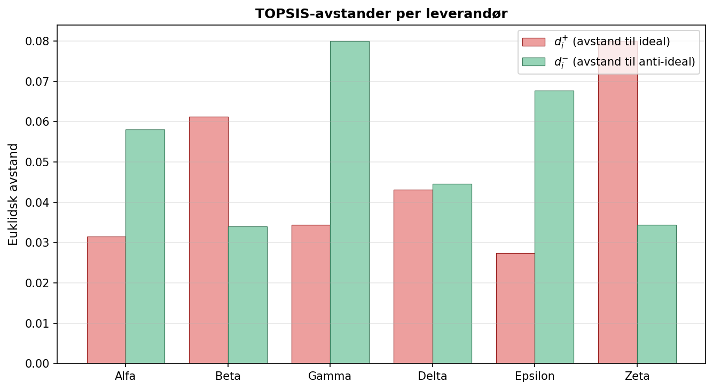

Avstander $d^{+}_i$ (rød) og $d^{-}_i$ (grønn) per leverandør. Et høyt $C_i$ krever både lav $d^{+}$ og høy $d^{-}$ samtidig.

**Konklusjon** --- *Epsilon vinner på balansen*

Epsilon har den *korteste* avstanden til idealet ($d^{+} = 0,027$). Gamma ligger rett bak og har den *lengste* avstanden til anti-idealet ($d^{-} = 0,080$), men betaler prisen i form av høyere $d^{+}$ fordi den er dyrest. Zeta og Beta er så langt fra idealet at de faller ut tidlig. Resultatet illustrerer TOPSIS sin styrke: modellen premierer alternativer som både er nær ideal og langt fra anti-ideal, i stedet for bare en vektet sum av score.

### Steg 4: Rangering
Nærhetsskåren $C_i$ gir en entydig rangering av leverandørene. Figur [8](#fig-fig-ahp-rangering) oppsummerer resultatet visuelt.

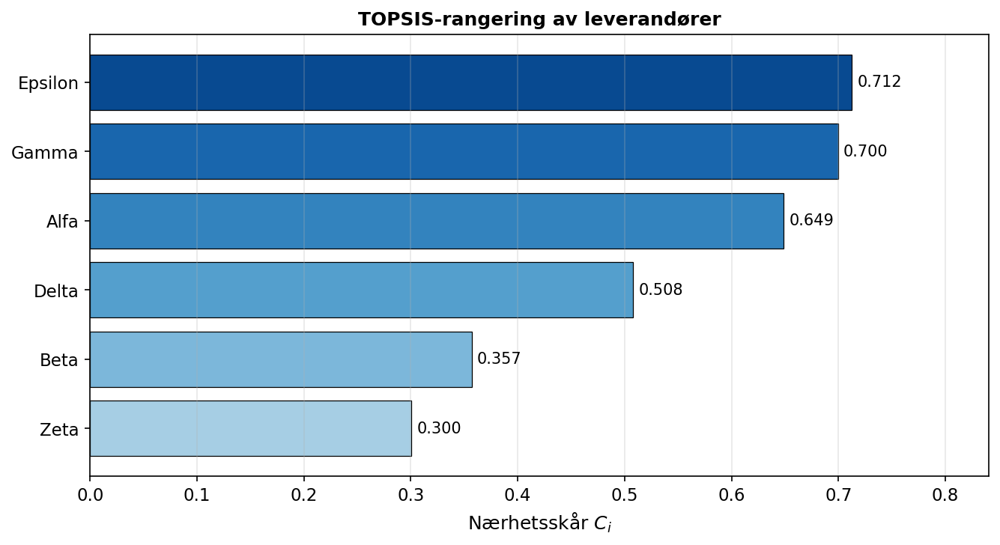

Endelig TOPSIS-rangering av de seks leverandørene basert på nærhetsskår $C_i$.

De tre første -- Epsilon, Gamma og Alfa -- ligger relativt tett (0,649--0,712), mens det er et betydelig sprang ned til Delta (0,508) og videre til Beta og Zeta (under 0,36). Med bare tre leverandører i toppen er det naturlig å undersøke om rangeringen snur dersom vektene endres.

### Steg 5: Sensitivitetsanalyse
Rangeringen avhenger av vektene $w_j$ fra AHP, og disse er subjektive. For å teste robustheten perturberer vi hver vekt med $\pm 20\,%$ (og renormaliserer de andre slik at $\sum w_j = 1$), og kjører TOPSIS på nytt. Vi registrerer både $C_i$ og rangeringsplassen for alle leverandører.

Rangeringsplass under $+20\,%$ pertubasjon av hver vekt. Baseline-rangering er uendret på tvers av alle pertubasjoner.

  **Leverandør**   **Pris**   **Kval.**   **Lev.tid**   **Flex.**   **Bærekr.**   **Baseline**
  ---------------- ---------- ----------- ------------- ----------- ------------- --------------
  Epsilon          1          1           1             1           1             1
  Gamma            2          2           2             2           2             2
  Alfa             3          3           3             3           3             3
  Delta            4          4           4             4           4             4
  Beta             5          5           5             5           5             5
  Zeta             6          6           6             6           6             6

Rangeringen er fullstendig uendret både under $+20\,%$ og $-20\,%$ pertubasjoner -- Epsilon holder førsteplassen uansett hvilken vekt som justeres. Figur [9](#fig-fig-ahp-sensitivitet-spider) viser de faktiske $C_i$-verdiene for topp tre leverandører over alle pertubasjoner.

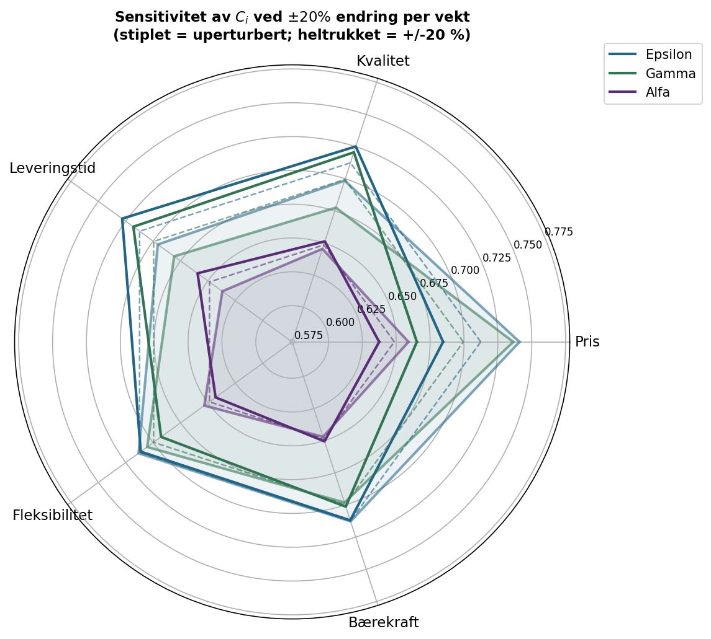

Sensitivitet av $C_i$ for topp tre leverandører ved $\pm 20\,%$ endring per vektdimensjon. Stiplet linje viser uperturbert baseline; heltrukne linjer viser $C_i$ ved perturbering på hver av de fem aksene.

**Konklusjon** --- *Rangeringen er robust, men nær topp*

$\pm 20\,%$ enkeltvekt-pertubasjoner endrer *ikke* rangeringen. Samtidig ser vi av figuren at Epsilon og Gamma ligger tett: dersom kvalitetsvekten løftes ytterligere, eller prisvekten reduseres, vil Gamma nærme seg Epsilon. Den praktiske læringen er at beslutningen er trygg *gitt* dagens strategiske prioriteringer, men at en prinsipiell endring i preferanser kan gi et annet utfall.

### Steg 6: Anbefaling under ulike preferanseprofiler
For å gjøre sensitivitetsanalysen mer tolkbar, tester vi tre alternative strategiske profiler som representerer realistiske beslutningsregimer hos Nordvik:

- **Kostnadsfokus:** pris og leveringstid dominerer (Pris 0,40, Kvalitet 0,20, Leveringstid 0,25, Fleksibilitet 0,08, Bærekraft 0,07).

- **Kvalitetsfokus:** strenge krav til kvalitet og bærekraft (Pris 0,15, Kvalitet 0,45, Leveringstid 0,10, Fleksibilitet 0,10, Bærekraft 0,20).

- **Fleksibilitetsfokus:** høy produksjonsvariabilitet prioriterer fleksibilitet og leveringstid (Pris 0,15, Kvalitet 0,20, Leveringstid 0,25, Fleksibilitet 0,30, Bærekraft 0,10).

Tabell [12](#tab-tab-ahp-profiler) og figur [10](#fig-fig-ahp-profiler) sammenligner $C_i$ for alle fire profiler.

TOPSIS-skår $C_i$ under fire ulike preferanseprofiler. Vinneren per profil er uthevet.

  **Leverandør**      **Baseline**          **Kostnad**           **Kvalitet**          **Fleksibel**
  ---------------- -- --------------------- --------------------- --------------------- ---------------------
  Alfa                $0,649$             $0,654$             $0,679$             $0,626$
  Beta                $0,357$             $0,408$             $0,281$             $0,376$
  Gamma               $0,700$             $0,648$             $\mathbf{0,784}$   $0,684$
  Delta               $0,508$             $0,505$             $0,487$             $0,464$
  Epsilon             $\mathbf{0,712}$   $\mathbf{0,678}$   $0,740$             $\mathbf{0,769}$
  Zeta                $0,300$             $0,352$             $0,216$             $0,316$

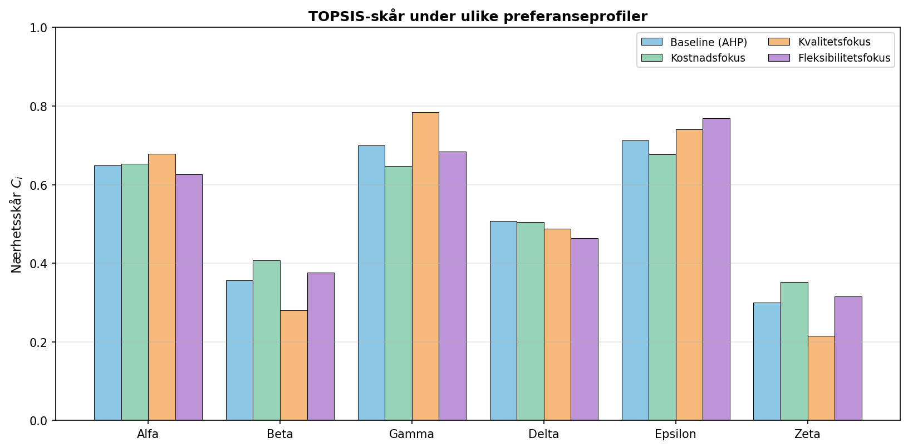

$C_i$ per leverandør under fire preferanseprofiler: baseline (AHP), kostnadsfokus, kvalitetsfokus og fleksibilitetsfokus.

**Praktisk anvendelse** --- *Hvem velger vi, og når?*

1.  **Baseline (AHP):** Epsilon vinner, men Gamma er en sterk nummer to. Hovedvalg: *Epsilon* for rammeavtalen.

2.  **Kostnadsfokus:** Epsilon er fortsatt vinner, men marginen til Alfa ($0,654$) og Gamma ($0,648$) er liten. Her må innkjøpssjefen vurdere om den lille gevinsten er verdt risikoen.

3.  **Kvalitetsfokus:** Gamma tar førsteplass ($0,784$). Om Nordvik innfører strengere krav etter CSRD, bør kontrakten reforhandles og Gamma blir førstevalg.

4.  **Fleksibilitetsfokus:** Epsilon styrkes ytterligere ($0,769$). Ved høy produksjonsvariabilitet er valget enda tydeligere.

Konkret anbefaling: signér rammeavtale med *Epsilon* som hovedleverandør og *Gamma* som sekundær kilde for kvalitetskritiske batcher. Reevaluer vektene årlig i takt med endringer i strategi og CSRD-krav.

[Begrensninger.]
- AHP forutsetter at kriteriene er uavhengige. I praksis er for eksempel kvalitet og bærekraft ofte korrelert, slik at de to kan telle tilnærmet dobbelt.

- TOPSIS avhenger sterkt av valget av alternativer. Å legge til eller fjerne en leverandør endrer både ideal og anti-ideal, og kan teoretisk gi *rank reversal* -- at den relative rekkefølgen på to beholdte alternativer snur.

- Sensitivitetsanalysen dekker kun individuelle vektpertubasjoner. I virkeligheten endres flere vekter samtidig, og interaksjoner kan gi større utslag enn marginale endringer hver for seg.

- Alle skåre er kvartalsvise øyeblikksbilder. Leverandørprestasjon endres over tid, så rammeavtalen bør kobles med kontinuerlig leverandøroppfølging (*scorecards*).

Bestillingsoptimering med kvantumsrabatt

## Eksempel: Bestillingsoptimering med kvantumsrabatt
Oppsummering.

  **Kategori**      **Beskrivelse**
  ----------------- ------------------------------------------------------------------------------------------
  Eksempel          Bestillingsvolum hos norsk teknisk engrosgrossist
  Område            Innkjøpsoptimalisering med kvantumsrabatter (prisbrudd)
  Problemstilling   Hvor mye skal vi bestille per produkt når leverandøren tilbyr rabatter på store volumer?
  Modell            EOQ med stykkvis konstant pris $c(Q)$ (all-units og incremental)
  Prosess           Kostnadsoptimering med stykkvis konveks totalkostnad
  Metode            EOQ per prisintervall, feasibility-sjekk, break-even-analyse

### Problemstilling
Selskapet *NordTek Engros AS* er en mellomstor norsk grossist som leverer teknisk utstyr og forbruksvarer til små og mellomstore entreprenører langs kysten. Sortimentet spenner fra elektrisk håndverktøy og LED-belysning til smøremidler og personlig verneutstyr. Innkjøpssjefen står overfor en klassisk avveining: leverandørene tilbyr lavere enhetspris ved større ordrer, men større ordrer binder mer kapital i lager og øker lagringskostnaden.

Tabell [14](#tab-tab-nordtek-produkter) viser fire representative produkter. Etterspørselen er jevn og godt kjent (lite usikkerhet), bestillingskostnaden dekker administrasjon og mottak av en ordre, og lagerholdsrenten $i$ reflekterer kapitalkostnad pluss svinn og plassleie.

Fire produkter i NordTek-sortimentet med årlig etterspørsel $D$, bestillingskostnad $K$ og lagerholdsrente $i$.

  **Sku**   **Produkt**             **$D$ (enh./år)**   **$K$ (NOK)**   **$i$**   **Kommentar**
  --------- ----------------------- --------------------- ----------------- ----------- ------------------------------
  A1        Elektrisk håndverktøy   2 400                 400               0,22        Høy enhetsverdi
  B2        Sikkerhetshansker       12 000                250               0,18        Stort volum, lav enhetsverdi
  C3        Smørefett (5 kg)        1 800                 350               0,25        Fare for aldring, høy $i$
  D4        LED-lyspære 9 W         9 000                 300               0,20        Standardvare

Leverandøren har et prisskjema med tre prisbrudd per produkt; figur [11](#fig-fig-qd-price-schedule) viser strukturen visuelt. For A1 gjelder for eksempel 850 NOK per enhet ved bestilling under 100, 810 NOK ved 100--499 og 770 NOK ved 500 eller mer.

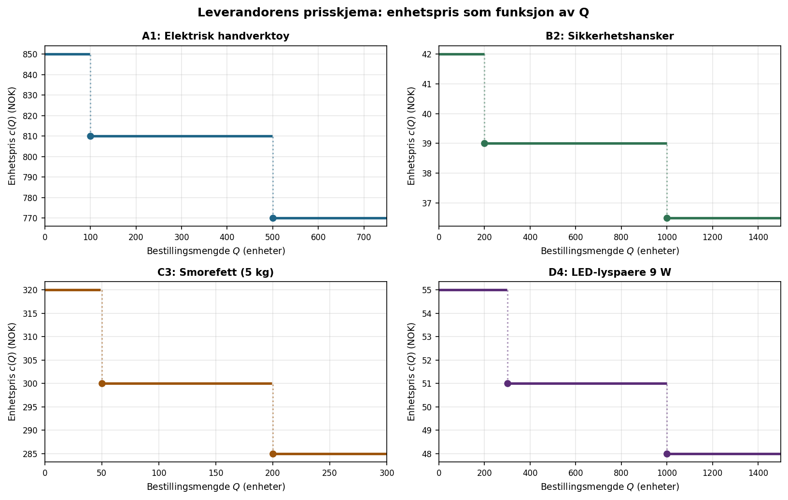

Leverandørens prisskjema $c(Q)$ for de fire produktene. Hvert intervall har konstant enhetspris; de stiplede linjene markerer hoppene ved prisbruddene $q_2$ og $q_3$.

**Problemstilling** --- *Hva er optimalt bestillingsvolum når prisen hopper nedover ved bestemte kvanta?*

Klassisk EOQ forutsetter konstant enhetspris. Når leverandøren bruker prisbrudd, må vi beregne EOQ separat for hvert prisintervall, sjekke om kandidaten er gjennomførbar i sitt eget intervall, og deretter velge den kandidaten som gir lavest total årlig kostnad. Vi gjør det for både *all-units*-strukturen (hele ordren får samme pris) og *incremental*-strukturen (bare enhetene *over* grensen får rabatten).

### Modell
Utgangspunktet er den klassiske *Economic Order Quantity* (EOQ) fra Harris (1913), der total årlig kostnad er summen av varekostnad, bestillingskostnad og lagerholdskostnad.

Definisjon [Klassisk EOQ]
Gitt deterministisk årlig etterspørsel $D$ (enh./år), bestillingskostnad $K$ (NOK/ordre), konstant enhetspris $c$ (NOK/enh.) og lagerholdsrente $i$ (andel av enhetspris per år), er total årlig kostnad:

$$TC(Q) \;=\; c \cdot D \;+\; \frac{D}{Q} \cdot K \;+\; \frac{Q}{2} \cdot h,$$

7

der $h = i \cdot c$ er lagerholdskostnaden per enhet per år. Minimum av [(7)](#eq-eq-tc-klassisk) over $Q > 0$ gir

$$Q^\* \;=\; \sqrt{\frac{2\,D\,K}{h}}.$$

8

De tre kostnadsleddene i [(7)](#eq-eq-tc-klassisk) er: varekost $cD$ (pris ganger årlig etterspørsel), bestillingskost $(D/Q)K$ (antall bestillinger per år ganger ordrekost) og lagerhold $(Q/2)h$ (gjennomsnittslager ganger enhetlagerhold). Når prisen $c$ avhenger av bestillingsmengden $Q$, må vi generalisere uttrykket.

Symboler i modellen. Tabell [15](#tab-tab-qd-symbols) oppsummerer notasjonen som brukes gjennomgående i dette eksemplet.

Notasjon for EOQ med kvantumsrabatt.

  **Symbol**   **Enhet**     **Betydning**
  ------------ ------------- -----------------------------------------------------------
  $D$        enh./år       Årlig etterspørsel (deterministisk)
  $K$        NOK/ordre     Faste bestillingskostnader per ordre
  $i$        1/år          Lagerholdsrente (andel av varekost per år)
  $Q$        enh.          Bestillingsmengde (beslutningsvariabel)
  $c_j$      NOK/enh.      Enhetspris i prisintervall $j$
  $h_j$      NOK/enh./år   Enhetslagerhold i intervall $j$, $h_j = i \cdot c_j$
  $q_j$      enh.          Nedre grense for prisintervall $j$ ($q_1 = 0$)
  $J$        --            Antall prisintervaller (her $J = 3$)
  $TC(Q)$    NOK/år        Total årlig kostnad
  $Q^\*$    enh.          Optimal bestillingsmengde

All-units-strukturen. Under all-units-rabatt betaler kunden *samme* enhetspris for alle enhetene i ordren, bestemt av hvilket intervall $Q$ faller i:

$$c(Q) \;=\; c_j \quad \text{når} \quad q_j \leq Q < q_{j+1}, \qquad j = 1, 2, \ldots, J,$$

2

med konvensjonen $q_{J+1} = \infty$. Total årlig kostnad blir da stykkevis uttrykket fra [(7)](#eq-eq-tc-klassisk) med $c = c_j$ og $h = h_j = i \cdot c_j$:

$$TC_{\mathrm{au}}(Q) \;=\; c_j D + \frac{D}{Q} K + \frac{Q}{2} h_j, \qquad q_j \leq Q < q_{j+1}.$$

3

Funksjonen $TC_{\mathrm{au}}$ har et karakteristisk *sagtannmønster*: den faller diskontinuerlig ved hvert prisbrudd (fordi $c_j$ hopper ned) og stiger innen hvert intervall (fordi lagerleddet $(Q/2)h_j$ vokser). Figur [13](#fig-fig-qd-allunits-cost) illustrerer dette for A1.

Incremental-strukturen. Under incremental-rabatt gjelder hver pris kun for enhetene *innenfor* tilhørende intervall. Total *innkjøpskostnad* for $Q$ enheter er da den stykkvis lineære, kontinuerlige funksjonen

$$A(Q) \;=\; \sum_{k=1}^{j-1} c_k (q_{k+1} - q_k) \;+\; c_j (Q - q_j), \qquad q_j \leq Q < q_{j+1}.$$

4

Gjennomsnittlig enhetspris er $\bar{c}(Q) = A(Q)/Q$, og total årlig kostnad er

$$TC_{\mathrm{inc}}(Q) \;=\; \frac{A(Q)\,D}{Q} + \frac{D\,K}{Q} + \frac{Q}{2}\,i\,\bar{c}(Q).$$

5

I motsetning til all-units er $TC_{\mathrm{inc}}$ en glatt og stykkvis konveks funksjon uten hopp. For hvert intervall $j$ kan den deriveres analytisk, og førsteordensbetingelsen gir den justerte EOQ-formelen

$$Q_j^{\circ} \;=\; \sqrt{\frac{2\,D\,(K + F_j)}{i \cdot c_j}}, \qquad F_j \;=\; A(q_j) - c_j\, q_j,$$

6

der $F_j$ er den "fastkomponenten" av innkjøpskostnaden som allerede er akkumulert når vi krysser grensen $q_j$. Ved $j = 1$ er $F_1 = 0$ og [(6)](#eq-eq-eoq-incremental) reduseres til klassisk EOQ.

Variabler: hva velges? Beslutningsvariabelen er den skalare bestillingsmengden $Q$; alt annet er gitt. I tillegg velger vi implisitt hvilket prisintervall $j^\*$ ordren havner i.

[Forutsetninger.]
1.  **Kjent og konstant etterspørsel:** Modellen forutsetter at $D$ er deterministisk og jevnt fordelt over året.

2.  **Øyeblikkelig etterfylling:** Hele $Q$ leveres samtidig uten ledetid (eller ledetiden håndteres separat via bestillingspunkt).

3.  **Ingen mangel:** Det er ikke lov å gå tom for lager mellom leveranser; dermed er gjennomsnittslager $Q/2$.

4.  **Stabilt prisskjema:** Leverandørens $c_j$ og $q_j$ endrer seg ikke gjennom planleggingsperioden.

5.  **Kapasitet er ikke bindende:** Det finnes nok lagerplass og kapital til å holde $Q/2$ enheter i gjennomsnitt.

**Tolkning** --- *Hvorfor de to strukturene oppfører seg ulikt*

- **All-units** belønner deg for å krysse en grense: hele ordren får bedre pris. Kostnadskurven har derfor brutale hopp nedover ved $q_2, q_3, \ldots$, og optimum ligger typisk *akkurat* ved et prisbrudd.

- **Incremental** belønner deg gradvis: bare marginale enheter får rabatten. Kostnadskurven er glatt, og optimum ligger i det indre av et intervall -- ofte med betydelig større $Q^\*$ enn under all-units.

- Leverandøren tjener på å tilby incremental når de vil unngå at kunden "hopper" til nøyaktig $q_j$, mens all-units brukes som et sterkt signal om at man ønsker store ordrer.

### Prosess
Prosess: Kostnadsoptimering med stykkvis kostnadsstruktur.
Modell: EOQ med kvantumsrabatt (all-units og incremental).

Metoden løses eksakt i seks steg, som illustrert i figur [12](#fig-fig-qd-method). Kjerneidéen er: beregn EOQ-kandidaten i hvert prisintervall, sjekk feasibility, evaluer $TC$ på de gjenværende kandidatene og velg den beste.

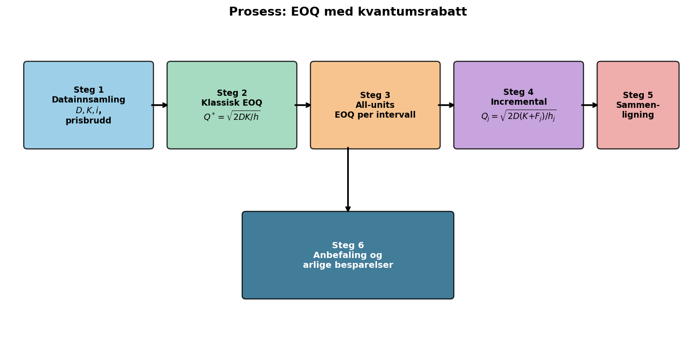

Prosessen med seks steg: fra datainnsamling via klassisk EOQ og de to discount-modellene til anbefalte bestillingsmengder og kvantifiserte besparelser.

### Steg 1: Datainnsamling
Datainnsamlingen består i å registrere de fem parametrene i tabell [15](#tab-tab-qd-symbols) for hvert produkt, samt leverandørens prisskjema. Tabell [16](#tab-tab-qd-price-breaks) viser det samlede prisskjemaet for de fire produktene.

Prisbrudd $c_j$ for hvert produkt og hvert intervall $\q_j, q_{j+1})$.

  **Sku**   **Produkt**             **$c_1$ (NOK)**   **$c_2$ (NOK)**   **$c_3$ (NOK)**   **Prisbrudd** $q_2, q_3$
  --------- ----------------------- ------------------- ------------------- ------------------- ----------------------------
  A1        Elektrisk håndverktøy   850,00              810,00              770,00              100, 500
  B2        Sikkerhetshansker       42,00               39,00               36,50               200, 1 000
  C3        Smørefett (5 kg)        320,00              300,00              285,00              50, 200
  D4        LED-lyspære 9 W         55,00               51,00               48,00               300, 1 000

[Visualisering. Figur [11](#fig-fig-qd-price-schedule) (i Problemstilling-delen) viser de samme prisskjemaene grafisk. Merk at rabatten fra $c_1$ til $c_3$ er størst i relative termer for smørefett C3 (11,0 %) og minst for LED-lyspæren D4 (12,7 %, men over mye større volumer). Dette skaper ulik intuisjon per produkt: for C3 kan det lønne seg å bestille for å nå det høyeste intervallet selv om det øker lagerholdet, mens for D4 må vi regne grundig etter.

**Konklusjon** --- *Hva forteller dataene?*

Alle fire produkter har samme struktur: tre prisintervaller med fallende enhetspris. Siden både $D$, $K$ og $i$ varierer mellom produkter, vil optimal respons også gjøre det. Før vi går løs på rabattene, etablerer vi først referansen: klassisk EOQ uten rabatt.

### Steg 2: Klassisk EOQ (referanse)
Som referanse beregner vi EOQ uten rabatt, med enhetsprisen i det midterste intervallet som basis (et rimelig "gjennomsnittlig" scenario). Med $h = i \cdot c_{\mathrm{ref}}$ gir formel [(8)](#eq-eq-eoq) resultatene i tabell [17](#tab-tab-qd-eoq-basis).

Klassisk EOQ med midtintervallets pris $c_{\mathrm{ref}} = c_2$. Bestillingssyklus er $365\,Q^\*/D$ dager.

  **Sku**   **Produkt**             **$c_{\mathrm{ref}}$ (NOK)**   **$h$ (NOK/år)**   **$Q^\*$**   **Syklus (dager)**
  --------- ----------------------- ---------------------------------- -------------------- --------------- --------------------
  A1        Elektrisk håndverktøy   810,00                             178,20               103,8           15,8
  B2        Sikkerhetshansker       39,00                              7,02                 924,5           28,1
  C3        Smørefett (5 kg)        300,00                             75,00                129,6           26,3
  D4        LED-lyspære 9 W         51,00                              10,20                727,6           29,5

**Konklusjon** --- *Hvor lander klassisk EOQ?*

For A1 lander klassisk EOQ på $Q^\* \approx 104$, altså like *over* første prisbrudd ($q_2 = 100$). For B2 lander $Q^\*$ under siste prisbrudd ($q_3 = 1\,000$). Dette er lovende: i flere tilfeller er klassisk EOQ allerede "nesten" over en rabattgrense, og en liten justering oppover kan gi store besparelser. Vi trenger en systematisk metode.

### Steg 3: All-units discount-algoritme
Under all-units er algoritmen rett frem og løser problemet eksakt:

Definisjon [All-units-algoritmen]
For hvert prisintervall $j = 1, \ldots, J$:

1.  Beregn kandidaten $Q_j^{\mathrm{EOQ}} = \sqrt{2 D K / (i c_j)}$.

2.  Klassifiser:

    - *Indre løsning:* $q_j \leq Q_j^{\mathrm{EOQ}} < q_{j+1}$. Sett $Q_j = Q_j^{\mathrm{EOQ}}$.

    - *Hjørneløsning:* $Q_j^{\mathrm{EOQ}} < q_j$. Sett $Q_j = q_j$ (løft opp til grensen).

    - *Ugyldig:* $Q_j^{\mathrm{EOQ}} \geq q_{j+1}$. Forkast intervallet -- et lavere prisintervall dominerer.

3.  Regn $TC_{\mathrm{au}}(Q_j)$ fra [(3)](#eq-eq-tc-allunits).

Velg $j^\* = \arg\min_j TC_{\mathrm{au}}(Q_j)$ og $Q^\* = Q_{j^\*}$.

Anvendelse på A1. Tabell [18](#tab-tab-qd-allunits-A1) viser algoritmen for A1 i detalj. For intervall 1 blir $Q_1^{\mathrm{EOQ}} = 101,3$, som ligger *over* $q_2 = 100$, så intervallet forkastes. For intervall 2 er $Q_2^{\mathrm{EOQ}} = 103,8 \in \100, 500)$, altså en gyldig indre løsning. For intervall 3 er $Q_3^{\mathrm{EOQ}} = 106,5 < q_3 = 500$, så kandidaten løftes til $Q_3 = 500$ (hjørneløsning).

All-units-beregning for A1. Optimum er $j^\* = 3$ med $Q^\* = 500$ og $TC^\* = 1\,892\,270$ NOK/år.

  **$j$**   **Intervall**         **$c_j$**   **$h_j$**   **$Q_j^{\mathrm{EOQ}}$**   **$Q_j$**   **$TC_{\mathrm{au}}(Q_j)$ (NOK)**
  ----------- --------------------- ------------- ------------- ------------------------------ ------------- ---------------------------------------
  1           $\[0, 100)$         850           187,00        101,3                          --            --
  2           $\[100, 500)$       810           178,20        103,8                          103,8         1 962 497
  3           $\[500, \infty)$   770           169,40        106,5                          500,0         **1 892 270**

[Grafisk fortolkning. Figur [13](#fig-fig-qd-allunits-cost) plotter $TC_{\mathrm{au}}(Q)$ for A1. Hver heltrukne kurve viser kostnaden innenfor sitt gyldige intervall; de stiplede forlengelsene viser hva kostnaden *ville* vært om intervallet fortsatte. Den gule stjernen markerer optimum, som her ligger nøyaktig på prisbruddet $q_3 = 500$ -- et klassisk tilfelle av hjørneløsning.

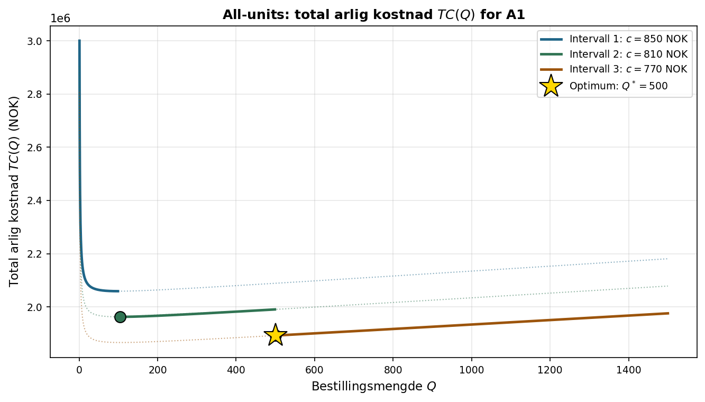

Total årlig kostnad $TC_{\mathrm{au}}(Q)$ fra [(3)](#eq-eq-tc-allunits) for A1. Sirklene markerer EOQ-kandidatene i hvert intervall; den gule stjernen markerer optimum $Q^\* = 500$ ved prisbruddet $q_3$.

**Konklusjon** --- *All-units for A1*

Ved å bestille $Q = 500$ enheter i stedet for klassisk EOQ på $Q \approx 104$, får NordTek 770 NOK per enhet i stedet for 810. Besparelsen på varekost (40 NOK $\times$ 2 400 enh. = 96 000 NOK/år) overstiger økningen i lagerhold med god margin.

### Steg 4: Incremental discount-algoritme
Under incremental-strukturen er $TC_{\mathrm{inc}}$ glatt, og vi har en eksplisitt analytisk løsning per intervall via [(6)](#eq-eq-eoq-incremental). Algoritmen er:

Definisjon [Incremental-algoritmen]
For hvert intervall $j = 1, \ldots, J$:

1.  Beregn fastkomponenten $F_j = A(q_j) - c_j q_j$ (hvor mye av innkjøpskostnaden som er "låst" når vi krysser $q_j$).

2.  Beregn den ubegrensede kandidaten $Q_j^{\circ} = \sqrt{2 D (K + F_j)/(i c_j)}$.

3.  Projisér på intervallet $\[q_j, q_{j+1})$: hvis $Q_j^{\circ} < q_j$ sett $Q_j = q_j$; hvis $Q_j^{\circ} \geq q_{j+1}$ sett $Q_j = q_{j+1} - 1$; ellers $Q_j = Q_j^{\circ}$.

4.  Regn $TC_{\mathrm{inc}}(Q_j)$ fra [(5)](#eq-eq-tc-incremental).

Velg $j^\* = \arg\min_j TC_{\mathrm{inc}}(Q_j)$ og $Q^\* = Q_{j^\*}$.

Anvendelse på A1. For A1 er $A(100) = 100 \cdot 850 = 85\,000$, så $F_2 = 85\,000 - 810 \cdot 100 = 3\,960$. Tilsvarende $A(500) = 85\,000 + 400 \cdot 810 = 409\,000$ gir $F_3 = 409\,000 - 770 \cdot 500 = 23\,880$. Tabell [19](#tab-tab-qd-incremental-A1) viser hele beregningen.

Incremental-beregning for A1. Optimum er $j^\* = 3$ med $Q^\* = 829,4$ og $TC^\* = 1\,991\,135$ NOK/år.

  **$j$**   **Intervall**         **$c_j$**   **$F_j$**   **$Q_j^{\circ}$**   **$Q_j$**   **$TC_{\mathrm{inc}}(Q_j)$ (NOK)**
  ----------- --------------------- ------------- ------------- ----------------------- ------------- ----------------------------------------
  1           $\0, 100)$         850           0             101,3                   99,0          2 058 953
  2           $\[100, 500)$       810           3 960         342,7                   342,7         2 005 504
  3           $\[500, \infty)$   770           23 880        829,4                   829,4         **1 991 135**

[Grafisk fortolkning. Figur [14](#fig-fig-qd-incremental-cost) viser $TC_{\mathrm{inc}}(Q)$. Den er glatt og har lokale minima i hvert intervall. Sirklene markerer kandidatene $Q_j$, og den gule stjernen markerer globalt optimum i intervall 3.

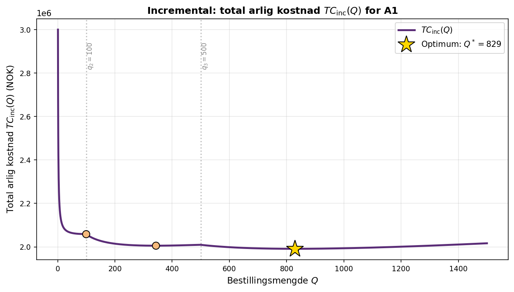

Total årlig kostnad $TC_{\mathrm{inc}}(Q)$ fra [(5)](#eq-eq-tc-incremental) for A1. De stiplede vertikale linjene markerer prisbruddene. Kurven er glatt, og optimum ligger i det indre av intervall 3.

**Konklusjon** --- *Incremental gir større $Q^\*$*

Fordi den lave prisen kun gjelder marginale enheter, må $Q$ være mye større for at gjennomsnittlig enhetspris $\bar{c}(Q)$ skal nærme seg $c_3$. Incremental-optimum $Q^\* = 829$ er ca. 65 % høyere enn all-units-optimum $Q^\* = 500$, men total kostnad er 99 000 NOK høyere per år. All-units er mer aggressivt rabattert -- og derfor billigere for NordTek.

### Steg 5: Sammenligning og break-even-analyse
Figur [15](#fig-fig-qd-compare) plotter begge kostnadskurvene for A1 i samme diagram. Forskjellen i form gjør intuisjonen om fra forrige steg eksplisitt: all-units-kurven (blå) har tydelige hopp ved $q_2 = 100$ og $q_3 = 500$, mens incremental-kurven (lilla) er glatt og ligger generelt høyere.

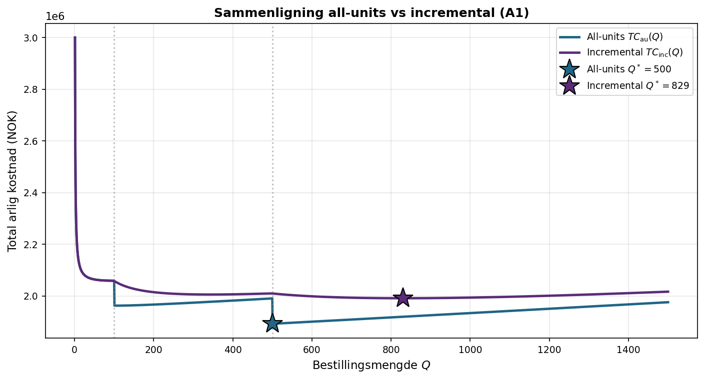

Sammenligning av $TC_{\mathrm{au}}(Q)$ (blå) og $TC_{\mathrm{inc}}(Q)$ (lilla) for A1. De stiplede vertikale linjene markerer prisbruddene. Stjernene markerer optimal $Q^\*$ for hver modell.

Break-even-analyse (all-units). Et sentralt spørsmål under all-units er: "Lønner det seg å bestille *større* enn klassisk EOQ bare for å komme over et prisbrudd?" Svaret fås ved å sammenligne $TC(Q_1^{\mathrm{EOQ}})$ (indre løsning i det dyre intervallet) med $TC(q_{j+1})$ (hjørneløsning i neste, billigere intervall). Figur [16](#fig-fig-qd-breakeven) viser dette for A1 ved overgangen fra intervall 1 til intervall 2.

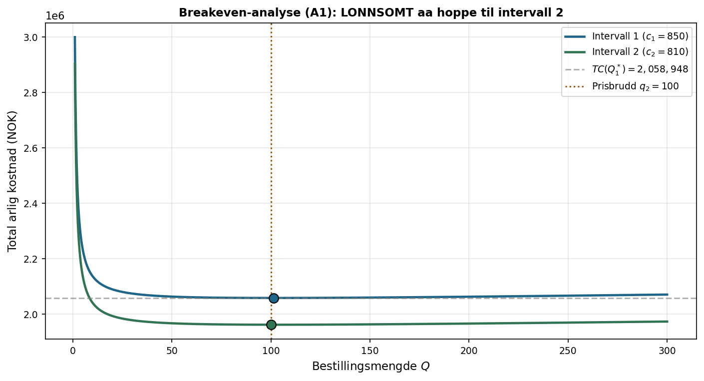

Break-even-analyse for A1 ved prisbruddet $q_2 = 100$: kurven for intervall 2 ligger under $TC(Q_1^{\mathrm{EOQ}}) \approx 2,06$ mill. NOK allerede ved $Q = q_2$. Dermed lønner det seg *alltid* å hoppe opp til $Q = 100$ fremfor å bli værende i intervall 1.

**Konklusjon** --- *Når hopper man?*

Regelen er enkel: hopp til prisbruddet $q_{j+1}$ dersom $TC_{\mathrm{au}}(q_{j+1}) < TC_{\mathrm{au}}(Q_j^{\mathrm{EOQ}})$. For A1 gjelder dette både ved $q_2 = 100$ og ved $q_3 = 500$, og optimum ender derfor som en hjørneløsning helt oppe ved $q_3$.

### Steg 6: Anbefalinger og årlige besparelser
Tabell [20](#tab-tab-qd-anbefalinger) oppsummerer den anbefalte bestillingspolitikken under all-units-rabatt for alle fire produkter, sammen med årlige besparelser sammenlignet med en naiv politikk som bruker klassisk EOQ med høyeste pris (altså uten å utnytte rabatten).

Anbefalt bestillingsmengde $Q^\*$ under all-units-rabatt, oppnådd enhetspris og årlig besparelse. Naiv baseline bruker klassisk EOQ med $c_1$ (ingen utnyttelse av rabatt).

+---------+-------------------+---------------+---------+--------------+--------------+----------+
| **Sku** | **Produkt**       | **$Q^\*$** | **$c$ | **Ordre/år** | **Besparelse | **%**    |
|         |                   |               | (NOK)** |              | (NOK/år)**   |          |
+=========+===================+===============+=========+==============+==============+==========+
| A1      | Elektrisk         | 500           | 770,00  | 4,8          | 166 678      | 8,10     |
|         | håndverktøy       |               |         |              |              |          |
+---------+-------------------+---------------+---------+--------------+--------------+----------+
| B2      | Sikkerhetshansker | 1 000         | 36,50   | 12,0         | 66 450       | 13,01    |
+---------+-------------------+---------------+---------+--------------+--------------+----------+
| C3      | Smørefett (5 kg)  | 200           | 285,00  | 9,0          | 62 765       | 10,71    |
+---------+-------------------+---------------+---------+--------------+--------------+----------+
| D4      | LED-lyspære 9 W   | 1 000         | 48,00   | 9,0          | 63 207       | 12,57    |
+---------+-------------------+---------------+---------+--------------+--------------+----------+
| **Sum**                                                              | **359 100**  | **9,82** |
+----------------------------------------------------------------------+--------------+----------+

Totalt gir utnyttelse av kvantumsrabatter en årlig besparelse på **359 100 NOK** for bare disse fire produktene, tilsvarende 9,82 % av totale innkjøps- og lagerkostnader for porteføljen. Alle fire optima er hjørneløsninger på $q_3$ -- rabatten i tredje intervall er stor nok til at lagerholdsøkningen lønner seg.

**Praktisk anvendelse** --- *Hva bør NordTek gjøre?*

1.  **Endre innkjøpsrutinen** for de fire produktene i tabell [20](#tab-tab-qd-anbefalinger) i tråd med nye $Q^\*$-verdier. For B2 og D4 betyr det månedlige bestillinger av 1 000 enheter hver.

2.  **Valider lager- og kapitalbinding:** Gjennomsnittslager øker til $Q^\*/2$. Sjekk at lagerplassen tåler det, og at bankfasiliteten dekker økt kapitalbinding.

3.  **Forhandle incremental-rabatt:** Hvis leverandøren foretrekker incremental-strukturen, kan NordTek bruke break-even-analysen til å kreve bedre prisbrudd eller lavere $c_j$.

4.  **Utvid til resten av sortimentet:** Samme seks-stegs prosedyre kan rulles ut på hele katalogen. En besparelse på ca. 10 % per produkt gir raskt betydelige beløp.

Begrensninger. EOQ-modellen med kvantumsrabatt er attraktivt enkel, men forutsetter at (i) etterspørselen er deterministisk og jevn, (ii) det ikke er kapasitetsbegrensninger på lager eller kapital, (iii) leverandøren faktisk leverer avtalt pris ved avtalte kvanta, og (iv) pris og bestillingskostnad er stabile over planleggingshorisonten. Ved betydelig usikkerhet i etterspørsel bør modellen kombineres med $(Q, R)$-politikk fra kapittel [?](#ref-ch-lagerstyring), og ved flerproduktsproblemer med felles kapasitetsbegrensning må man løse en samlet optimering.

Innkjøpsauksjon med kombinatoriske bud (WDP/MIP)

## Eksempel: Innkjøpsauksjon med kombinatoriske bud (WDP/MIP)
Oppsummering.

  **Kategori**      **Beskrivelse**
  ----------------- -------------------------------------------------------------------------------------
  Eksempel          Kombinatorisk anbudsauksjon for norsk entreprenørs byggevareinnkjøp
  Område            Innkjøpsoptimalisering med flere leverandører og bundle-bud
  Problemstilling   Hvilke bud aksepteres slik at alle kategorier dekkes til lavest mulig totalkostnad?
  Modell            Winner Determination Problem (WDP), formulert som binært heltallsprogram (MIP)
  Prosess           Auksjons- og allokeringsoptimering (eksakt løsning)
  Metode            PuLP (CBC) med diversifisering og leverandørspesifikk sensitivitet

### Problemstilling
Nordbygg Entreprenør AS er en mellomstor norsk entreprenør som skal kjøpe inn byggevarer til et større boligprosjekt med 240 leiligheter. Innkjøpsavdelingen har satt ut en anbudskonkurranse der fire leverandører inviteres til å by på åtte produktkategorier: betong, armeringsstål, isolasjon, gips, vinduer, dører, elektromateriell og VVS-rør.

Noen av leverandørene er spesialister (Bygg & Beton har sterk betong-/armering-portefølje, Elektro Grossist AS har bare elektro og rør), andre er totalleverandører. I tillegg til enkeltbud på individuelle kategorier har to av leverandørene lagt inn *bundle-bud* --- rabatterte pakker som gjelder alt-eller-ingenting. En «Vegg-pakke» fra Interior Leverandør gir for eksempel 6 % lavere enhetspris på isolasjon og gips dersom begge kategoriene tildeles dem samtidig. Det naturlige spørsmålet blir: *hvordan skal vi velge hvilke bud som skal vinne, slik at alle kategorier dekkes og totalkostnaden blir så lav som mulig?*

**Problemstilling** --- *Hvilke bud vinner, og hvorfor?*

Vi formulerer valget som et *Winner Determination Problem* (WDP) --- en MIP med binære variabler som bestemmer om hvert bud aksepteres eller forkastes. Dekningsskranker tvinger alle kategorier til å bli tildelt nøyaktig ett bud, og bundle-budenes alt-eller-ingenting-struktur håndteres naturlig av én felles binær variabel per bundle. Vi sammenligner optimal MIP-løsning med den naive tilnærmingen «velg laveste pris per kategori», utforsker hvordan diversifiseringskrav påvirker kostnaden, og tester robustheten mot at en leverandør trekker seg eller leverer et nytt aggressivt bud.

### Modell
Vi formulerer vinnervalget som en klassisk *kombinatorisk auksjon*: gitt et sett av leverandørbud --- noen på enkeltkategorier, noen på bundler som dekker flere kategorier samtidig --- velger vi en delmengde slik at hele innkjøpsbehovet dekkes til lavest mulig total pris. La $K$ være mengden av kategorier, $S$ mengden av leverandører og $B$ mengden av alle bud som er kommet inn.

Definisjon [Winner Determination Problem (WDP)]
For hvert bud $b \in B$ antar vi at:

- $s(b) \in S$ er leverandøren som har lagt inn budet,

- $K(b) \subseteq K$ er mengden av kategorier som budet dekker ($\|K(b)\| = 1$ for enkeltbud, $\|K(b)\| \geq 2$ for bundle-bud),

- $p_b \geq 0$ er total pris dersom budet aksepteres (summen av $\text{pris per enhet} \times \text{volum}$ over alle $k \in K(b)$).

Beslutningsvariabelen er

$$x_b \in {0, 1}, \quad b \in B, \qquad \text{($1$ hvis bud $b$ aksepteres)}.$$

Modellen er

$$\min_{x}\ \sum_{b \in B} p_b\, x_b$$

14

med skranker

$$\begin{aligned}\sum_{b \in B\ :\ k \in K(b)} x_b &= 1, \quad k \in K, \\
x_b &\in {0, 1}, \quad b \in B.\end{aligned}$$

15

Objektfunksjonen [(14)](#eq-eq-wdp-obj) summerer totalprisene for alle aksepterte bud. Dekningsskranken [(15)](#eq-eq-wdp-cover) er modellens kjerne: for hver kategori $k$ må *eksakt* ett akseptert bud inkludere $k$ i sin dekningsmengde. Dette håndterer bundle-logikken naturlig --- hvis en bundle dekker både $k_1$ og $k_2$ og velges ($x_b = 1$), oppfyller den begge dekningsskrankene på én gang, og ingen andre bud kan velges på disse kategoriene.

Symboler. Alle størrelser i modellen er samlet i tabell [22](#tab-tab-wdp-symbols).

Symboler og parametere i WDP-modellen.

  **Symbol**                      **Type**         **Beskrivelse**
  ------------------------------- ---------------- ------------------------------------------------------------------
  $K$                           Mengde           Kategorier som skal anskaffes, $\|K\| = 8$
  $S$                           Mengde           Leverandører invitert til auksjonen, $\|S\| = 4$
  $B$                           Mengde           Alle innkomne bud, $\|B\| = 24$ (18 enkelt + 6 bundle)
  $s(b)$                        Funksjon         Leverandør som har lagt inn bud $b$
  $K(b)$                        Mengde           Kategorier som bud $b$ dekker
  $p_b$                         Parameter        Total pris for bud $b$ (NOK)
  $x_b$                         Binær variabel   $1$ hvis bud $b$ aksepteres, $0$ ellers
  $\alpha_{\mathrm{maks}}$   Parameter        Maksimal andel av kontraktverdi per leverandør (diversifisering)

Modellen har $\|B\| = 24$ binære beslutningsvariabler og $\|K\| = 8$ dekningsskranker. Antall mulige konfigurasjoner er i prinsippet $2^{24} \approx 1,7 \cdot 10^{7}$, men de fleste er ugyldige siden de ikke oppfyller dekningsskrankene.

Diversifisering. Dersom innkjøperen i tillegg krever at ingen enkelt leverandør kan stikke av med mer enn en andel $\alpha_{\mathrm{maks}}$ av total kontraktverdi, legger vi til én skranke per leverandør:

$$\sum_{b \in B\ :\ s(b) = s} p_b\, x_b \;\leq\; \alpha_{\mathrm{maks}}\, C_{\mathrm{øvre}}, \quad s \in S,$$

7

der $C_{\mathrm{øvre}}$ er en øvre grense for total kontraktverdi, beregnet som summen av billigste enkeltbud per kategori. I vårt eksempel er $C_{\mathrm{øvre}} = 13,353$ MNOK.

**Tolkning** --- *Hvorfor WDP, og ikke bare laveste pris?*

Hvis hvert bud bare dekket én kategori, ville problemet vært trivielt: velg det billigste enkeltbudet per kategori, uavhengig av leverandør. Men bundle-budenes alt-eller-ingenting-struktur endrer dette. En bundle $b$ med pris $p_b$ kan være rimeligere enn summen av de tilsvarende enkeltbudene fra *samme* leverandør, men dyrere enn *kombinasjonen* av billigste enkeltbud per kategori fra *forskjellige* leverandører. Om bundlen skal aksepteres avhenger derfor av hele det øvrige budbildet. WDP-modellen løser akkurat dette ved å vurdere alle mulige kombinasjoner samtidig.

Forutsetninger. WDP-formuleringen hviler på tre antakelser som må respekteres:

1.  **Eksklusive bundler:** Vi antar at hvert bud enten aksepteres eller forkastes i sin helhet --- det finnes ingen delvise aksept. Dersom en bundle-pris gjelder et eksakt volum, må volumet i utlysningen matche det bundlen forutsetter.

2.  **Kjente priser:** Prisene $p_b$ er deterministiske. I forhandlingsbaserte auksjoner (flere runder) må modellen løses på nytt ved hvert nytt budinnspill.

3.  **Én vinner per kategori:** Dekningsskranken [(15)](#eq-eq-wdp-cover) er *likhet*, ikke *ulikhet*. Det tillater ikke at samme kategori splittes mellom to leverandører --- dersom splitting er ønsket, må modellen utvides med andelsvariabler (noe som gir et blandet heltalls-lineært program, MILP).

**Heuristikk-merknad** --- *Eksakt løsning nå, men ikke alltid*

WDP er *NP-hardt* i generalformen: antallet kombinasjoner vokser eksponentielt med antall bud, og LP-relaksasjonen gir ikke nødvendigvis en heltallsløsning. For vår instans (24 bud, 8 kategorier) løser CBC modellen eksakt på under $0,2$ sekunder. Skalerer vi opp til 500 bud på 50 kategorier --- typisk for store offentlige anbud --- vokser branch-and-bound-treet dramatisk, og eksakt løsning kan ta timer. I slike tilfeller brukes *branch-and-price* (kolonnegenerering der bundler konstrueres underveis) eller *greedy-heuristikker* (velg billigste bundle per kategori iterativt, med lokale bytter). Vi holder oss til eksakt MIP her og noterer grensen.

### Prosess
Prosess: Auksjons- og allokeringsoptimering (eksakt løsning).
Modell: WDP (kombinatorisk auksjon), løst med PuLP + CBC.

Arbeidsflyten følger seks steg, fra innsamling av bud til sensitivitetsanalyse. Figur [17](#fig-fig-wdp-method) viser prosessen skjematisk.

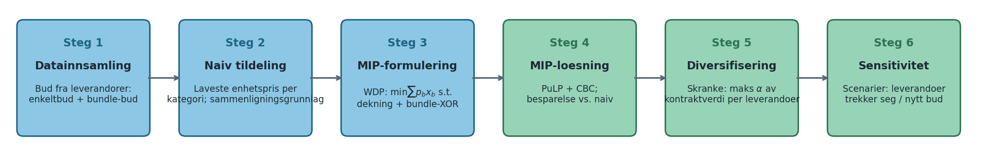

Seks-stegs arbeidsflyt for WDP-optimalisering.

### Steg 1: Datainnsamling
Datasettet har tre komponenter: 8 kategorier med tilhørende volum, 4 leverandører med maksimal andel av kontrakten, og i alt 24 bud (18 enkeltbud og 6 bundle-bud). Tabell [23](#tab-tab-wdp-kategorier) oppsummerer kategoriene, og tabell [24](#tab-tab-wdp-leverandorer) leverandørene.

Innkjøpskategorier med etterspurt volum.

  **Kode**   **Navn**              **Volum**   **Enhet**
  ---------- ------------------ -- ----------- -----------
  C1         Betong og mørtel      1 200       m$^3$
  C2         Armeringsstål         180         tonn
  C3         Isolasjon             4 000       m$^2$
  C4         Gips og plater        6 500       m$^2$
  C5         Vinduer               420         stk
  C6         Dører                 350         stk
  C7         Elektro (kabel)       12 000      m
  C8         Rør (VVS)             9 000       m

Leverandører og deres bydekning.

  **Kode**   **Navn**               **Profil**                                                   **Maks andel $\alpha_s$**
  ---------- ---------------------- ------------------------------------------------------------ ------------------------------
  L1         Bygg & Beton AS        Spesialist på betong og armering (C1, C2) + gips/isolasjon   55 %
  L2         Interior Leverandør    Sterk på gips, isolasjon, vinduer, dører (C3--C6)            50 %
  L3         Elektro Grossist AS    Kun elektro og VVS-rør (C7, C8)                              50 %
  L4         Totalleverandør Nord   Bredt sortiment, moderat pris i alle 8 kategorier            65 %

Budbildet er samlet i figur [18](#fig-fig-wdp-bidmatrix). Heatmap-cellene viser linjekostnad per enkeltbud (leverandør $\times$ kategori), og de stiplede rammene markerer hvilke celler som inngår i en bundle. Et grått strek betyr at leverandøren *ikke* har lagt inn enkeltbud på den kategorien.

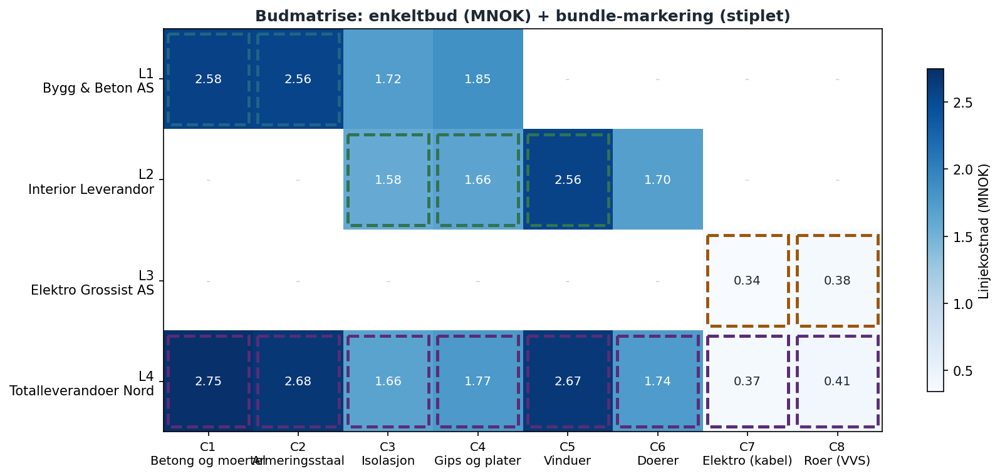

Budmatrise: enkeltbud (heatmap, MNOK) og bundler (stiplet ramme rundt kategoriene som en bundle dekker).

Seks bundler er registrert: **B1** (L1: C1+C2, råbygg-pakke), **B2** (L2: C3+C4+C5, interior-pakke), **B3** (L2: C3+C4, vegg-pakke), **B4** (L3: C7+C8, tekniske fag), **B5** (L4: C1--C8, total-pakke) og **B6** (L4: C4+C6+C7, finish-pakke).

**Konklusjon** --- *Budene er ikke sammenlignbare isolert*

Hver leverandør har sine styrker: L1 er billigst på betong og armering, L2 er billigst på gips og isolasjon, L3 er eneste rimelige valg på elektro/rør, og L4 er aldri billigst per kategori, men har en «total-pakke» som kan være konkurransedyktig hvis mange kategorier tildeles sammen. Den riktige kombinasjonen kan ikke sees med øyet --- det er det MIP-en skal avgjøre.

### Steg 2: Naiv tildeling (laveste pris per kategori)
Som referanse beregner vi først den naive tilnærmingen: for hver kategori, tildel leverandøren med laveste enhetspris *blant enkeltbudene*, uten å vurdere bundler eller koblinger. Resultatet er vist i figur [19](#fig-fig-wdp-naive).

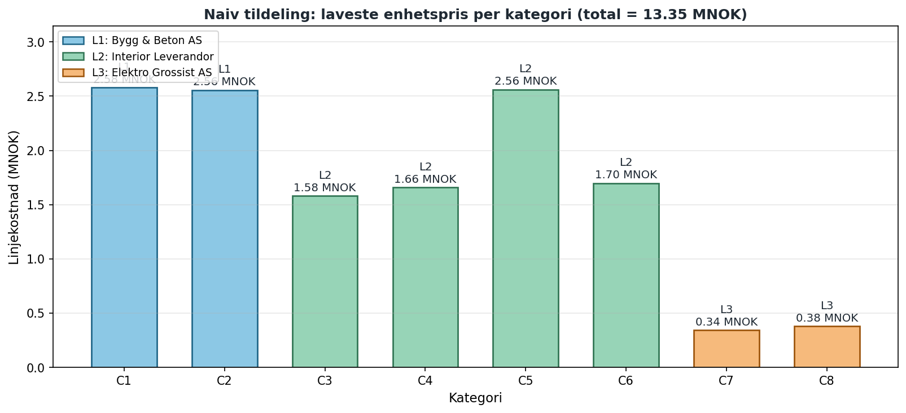

Naiv tildeling: laveste enhetspris per kategori. Total kostnad $13,353$ MNOK.

Den naive løsningen følger intuisjonen: L1 vinner C1 og C2 (betong og armering), L2 vinner C3, C4, C5 og C6 (isolasjon, gips, vinduer, dører), og L3 vinner C7 og C8 (elektro, rør). Leverandør L4 vinner *ingen* kategorier --- som forventet er totalleverandøren dyrere enn spesialistene på hver enkelt kategori. Total kostnad er $13,353$ MNOK, fordelt på L1 ($38,5$ %), L2 ($56,1$ %) og L3 ($5,4$ %).

**Konklusjon** --- *En naturlig referanse, men ikke optimal*

Den naive tildelingen ignorerer bundle-budene fullstendig. Bundlene gir rabatt, og MIP-en skal avgjøre om rabatten er stor nok til at det lønner seg å tildele hele bundlen til én leverandør i stedet for å plukke den billigste per kategori. Vi skal vise at svaret er *ja*: MIP sparer 0,564 MNOK årlig, eller 4,2 %.

### Steg 3: MIP-formulering
Modellen implementeres direkte som i [(14)](#eq-eq-wdp-obj)--[(?)](#eq-eq-wdp-var), med PuLP som modelleringsgrensesnitt og CBC som underliggende løser. Hvert bud blir én $x_b$-variabel, og for hver kategori $k$ genereres nøyaktig én dekningsskranke. Tabell [25](#tab-tab-wdp-storrelse) viser instansstørrelsen.

Instansstørrelse for WDP-modellen.

  **Mål**                                                   **Verdi**
  --------------------------------------------------------- -------------------------------
  Antall kategorier $\|K\|$                               8
  Antall leverandører $\|S\|$                             4
  Antall enkeltbud                                          18
  Antall bundle-bud                                         6
  Antall bud totalt $\|B\|$                               24
  Antall binære variabler ($x_b$)                         24
  Antall dekningsskranker [(15)](#eq-eq-wdp-cover)   8
  Teoretisk antall kombinasjoner $2^{\|B\|}$             $\sim 1,68 \cdot 10^{7}$

Selv om det teoretiske antallet kombinasjoner er over $16$ millioner, er dekningsskrankene svært stramme: hver kategori må dekkes av eksakt ett bud, og de fleste bud dekker bare én kategori. CBC utnytter LP-relaksasjonen og branch-and-cut til å finne løsningen på under $0,2$ sekunder.

### Steg 4: MIP-løsning med PuLP/CBC
Vi løser modellen med CBC og leser ut hvilke bud som aksepteres. Optimal totalkostnad er **$12,789$ MNOK**, mot $13,353$ MNOK for den naive tildelingen --- en besparelse på $0,564$ MNOK eller $4,22$ %. Tabell [26](#tab-tab-wdp-mip) viser hvilke bud som velges og hvordan hver kategori tildeles.

Optimal MIP-tildeling i baseline-scenarioet.

  **Kategori**   **Vinner**   **Bud**               **Type**   **Linjekost (MNOK)**
  -------------- ------------ --------------------- ---------- ----------------------
  C1             L1           B1 (råbygg-pakke)     bundle     2,460
  C2             L1           B1 (råbygg-pakke)     bundle     2,466
  C3             L2           B2 (interior-pakke)   bundle     1,480
  C4             L2           B2 (interior-pakke)   bundle     1,547
  C5             L2           B2 (interior-pakke)   bundle     2,457
  C6             L2           E_L2_C6 (enkelt)      enkelt     1,698
  C7             L3           B4 (tekniske fag)     bundle     0,322
  C8             L3           B4 (tekniske fag)     bundle     0,360
  **Sum**                                                      **12,789**

Fire av de seks bundle-budene og ett enkeltbud velges: B1, B2, B4 og enkeltbudet fra L2 på dører (C6). Merk at L2 vinner *fire* kategorier (C3, C4, C5, C6) --- tre gjennom bundlen B2 og én gjennom det tilsvarende enkeltbudet. B2 dekker bare C3+C4+C5, så C6 må plukkes opp separat. Figur [20](#fig-fig-wdp-mip-alloc) viser tildelingen grafisk, med skraverte søyler som markerer hvilke kategorier som kommer fra bundler.

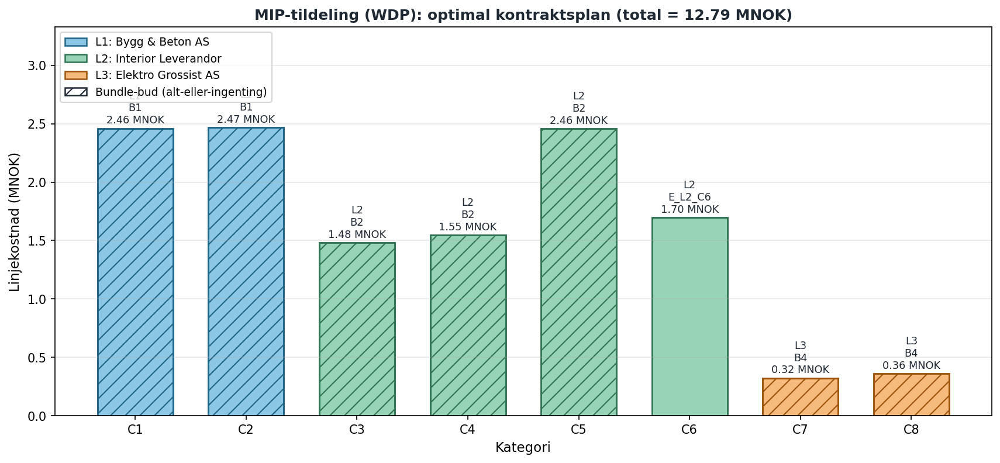

Optimal MIP-tildeling. Skraverte søyler markerer bundle-kategorier (B1, B2, B4).

Hvor kommer besparelsen fra? Sammenligningen i figur [21](#fig-fig-wdp-compare) viser total-tallene side-ved-side og fordelingen per leverandør. MIP-løsningen bytter:

- L1: enkeltbud på C1 og C2 $\to$ bundle B1 (lavere enhetspris på begge)

- L2: enkeltbud på C3+C4+C5 $\to$ bundle B2 (lavere enhetspris, men C6 må plukkes separat)

- L3: enkeltbud på C7+C8 $\to$ bundle B4 (rabatt på begge)

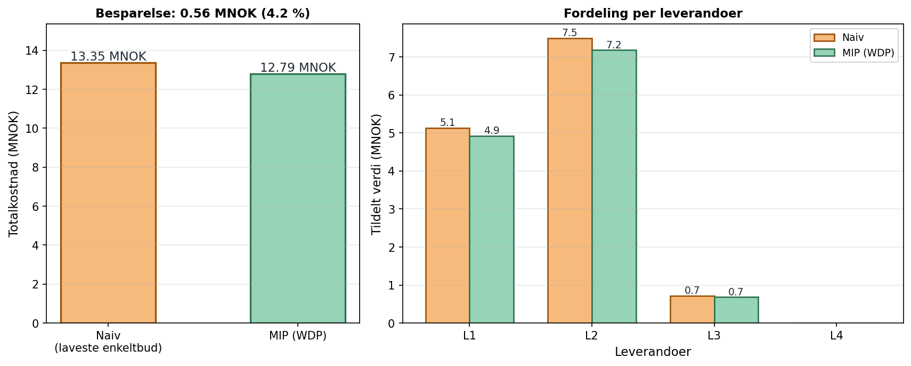

Sammenligning: naiv tildeling vs. MIP-løsning (venstre), og fordeling per leverandør (høyre).

Fordelingen per leverandør endrer seg knapt ($38,5$ % / $56,1$ % / $5,3$ % i begge løsningene). Besparelsen kommer altså ikke fra å *omfordele* mellom leverandørene, men fra å *utløse bundle-rabattene* innad hos hver enkelt leverandør.

**Konklusjon** --- *Bundlene er verdt nærmere 0,6 MNOK*

MIP-en sparer $0,564$ MNOK per år (4,2 %) sammenlignet med laveste-pris-heuristikken. På et lengre prosjekt eller gjentatte innkjøp er dette klart merkbart, og metoden krever hverken ekstra tid eller ekspertise (CBC løser instansen på et blunk). Samtidig *konsentreres* innkjøpet: L2 alene får $56$ % av kontraktverdien, noe som gir innkjøpssjefen en legitim bekymring for leverandøravhengighet. Dette motiverer diversifiseringsskranken vi innfører i neste steg.

### Steg 5: Diversifisering
For å redusere leverandørrisikoen innfører vi skranken [(7)](#eq-eq-wdp-diversify) med $C_{\mathrm{øvre}} = 13,353$ MNOK (laveste enkeltbud per kategori) og varierer $\alpha_{\mathrm{maks}}$ fra helt uten begrensning ned til $0,35$. Tabell [27](#tab-tab-wdp-div) og figur [22](#fig-fig-wdp-div) viser hvordan totalkostnad og fordeling endrer seg.

Virkning av diversifiseringsskranken $\alpha_{\mathrm{maks}}$.

+-------------------------------+----------+----------+--------+----------------------------+------------+------------+------------+
| $\alpha_{\mathrm{maks}}$ | **Total  | **Diff   | **Diff | **$n_{\mathrm{lev}}$** | **L1**     | **L2**     | **L4**     |
|                               | (MNOK)** | (MNOK)** | (%)**  |                            |            |            |            |
+===============================+==========+==========+========+============================+============+============+============+
| Uten (baseline)               | 12,789   | 0,000    | 0,00   | 3                          | 38,5 %     | 56,1 %     | 0,0 %      |
+-------------------------------+----------+----------+--------+----------------------------+------------+------------+------------+
| 0,50                          | 12,835   | 0,045    | 0,36   | 4                          | 38,4 %     | 42,7 %     | 13,6 %     |
+-------------------------------+----------+----------+--------+----------------------------+------------+------------+------------+
| 0,45                          | 12,835   | 0,045    | 0,36   | 4                          | 38,4 %     | 42,7 %     | 13,6 %     |
+-------------------------------+----------+----------+--------+----------------------------+------------+------------+------------+
| 0,40                          | 13,083   | 0,294    | 2,30   | 4                          | 37,7 %     | 36,8 %     | 20,4 %     |
+-------------------------------+----------+----------+--------+----------------------------+------------+------------+------------+
| 0,35                          | 13,626   | 0,837    | 6,55   | 4                          | 31,6 %     | 31,0 %     | 32,5 %     |
+-------------------------------+----------+----------+--------+----------------------------+------------+------------+------------+
| 0,30                          | *ingen gyldig løsning (for stram)*                                                               |
+-------------------------------+--------------------------------------------------------------------------------------------------+

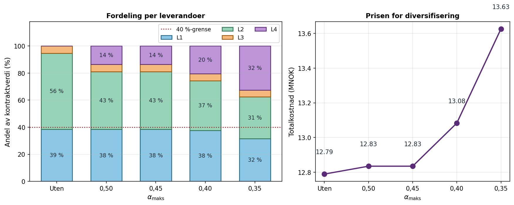

Diversifiseringseffekten: fordeling per leverandør (venstre) og totalkostnad (høyre) som funksjon av $\alpha_{\mathrm{maks}}$.

L3 holder seg stabilt på rundt $5$ % i alle scenarier fordi bare L3 og L4 byr på elektro- og rørkategoriene.

Resultatene viser en klar avveining. Med $\alpha_{\mathrm{maks}} = 0,50$ får vi *fire* leverandører i stedet for tre, mot en marginal ekstrakostnad på bare $0,045$ MNOK ($0,36$ %). Dette er trolig en svært god byttehandel for innkjøpsavdelingen: en «forsikringspremie» på 45 000 kr for å unngå at L2 alene får over halvparten av kontrakten. Ved $\alpha_{\mathrm{maks}} = 0,40$ stiger kostnaden mer markant ($+0,294$ MNOK, $+2,3$ %), og ved $0,35$ mer enn dobles tapet ($+0,84$ MNOK). Ved $\alpha_{\mathrm{maks}} = 0,30$ er modellen *infeasibel* --- det finnes ingen budkombinasjon som dekker alle kategorier og samtidig respekterer en så stram andelsgrense.

**Konklusjon** --- *$\alpha_{\mathrm{maks}} = 0,50$ gir mest valuta for pengene*

En «naturlig» anbefaling er $\alpha_{\mathrm{maks}} = 0,50$: bare $0,36$ % høyere kostnad enn baseline, men leverandørrisikoen reduseres betydelig (den største leverandørens andel faller fra 56 % til 43 %, og en fjerde leverandør kommer med på C6). Under $\alpha_{\mathrm{maks}} = 0,35$ får vi *reell* kostnad for diversifiseringen, og under $0,30$ finnes ikke løsningen i det hele tatt. Dette er selve begrunnelsen for å bruke MIP: vi kan sette krav og se *presist* hva de koster.

### Steg 6: Sensitivitet mot budendringer
Innkjøpsavdelingen vil vite hvor følsomt resultatet er for små endringer i budbildet. Vi tester to realistiske scenarier:

- **Scenario A:** Leverandør L3 (elektro/rør) trekker seg like før tildeling.

- **Scenario B:** Leverandør L2 legger til et nytt aggressivt bundle-bud B7 som dekker C3, C4, C5 og C6 med 6--10 % lavere enhetspriser enn tidligere.

Begge scenariene kjøres som nye MIP-instanser. Resultatene er oppsummert i tabell [28](#tab-tab-wdp-scen) og figur [23](#fig-fig-wdp-scen).

Sensitivitet: baseline vs. to alternative budscenarier.

  **Scenario**          **Total (MNOK)**   **Diff (MNOK)**   **Diff (%)**   **Valgte bud**
  --------------------- ------------------ ----------------- -------------- -----------------------------------
  Baseline              12,789             0,000             0,00           E_L2_C6, B1, B2, B4
  A: L3 trekker seg     12,889             +0,100            +0,78          E_L2_C6, E_L4_C7, E_L4_C8, B1, B2
  B: L2 legger til B7   12,541             $-$0,248        $-$1,94      B1, B4, B7

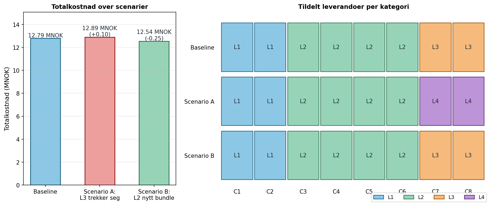

Sensitivitet: totalkostnad (venstre) og tildelt leverandør per kategori (høyre) for baseline og de to scenariene.

Scenario A. Uten L3 må elektro og rør overtas av L4 (eneste gjenværende tilbyder på disse kategoriene). L4 er $30$ % dyrere per enhet enn L3, men volumet på elektro er lite i kronebeløp, så totalkostnaden stiger bare med $0,100$ MNOK ($0,8$ %). Den strukturelle forskjellen er likevel viktig: én leverandør færre i kontrakten *og* en ny spesialistsårbarhet er eliminert.

Scenario B. Det nye bundle-budet B7 fra L2 er aggressivt nok til at det utløser en *dramatisk* omlegging: MIP-en forkaster både B2 og enkeltbudet på C6, og velger i stedet B7 (C3+C4+C5+C6 samlet). Strukturen blir nesten maksimalt kompakt --- bare tre bundler dekker alle åtte kategoriene, og kostnaden faller med $0,248$ MNOK ($1,94$ %). Dette viser også hvorfor det *lønner seg* for L2 å legge til et bredere bundle-bud i siste runde --- L2 vinner flere kategorier og beholder markedsandelen.

**Konklusjon** --- *Modellen er robust, men ikke rigid*

WDP-løsningen er ikke overfølsom for at enkeltleverandører faller fra --- Scenario A gir bare $0,8$ % høyere kostnad. Den er derimot meget lydhør for reelt bedre bud: Scenario B gir $1,9$ % lavere kostnad og endrer strukturen fullstendig. Dette er presist hva vi ønsker av en allokeringsmekanisme --- stabil nok til å motstå støy, fleksibel nok til å gripe genuine forbedringer.

### Anbefaling
Vi anbefaler Nordbygg Entreprenør å:

1.  **Akseptere fire bud:** B1 (L1, råbygg-pakke), B2 (L2, interior-pakke), E_L2_C6 (L2, dører) og B4 (L3, tekniske fag). Totalkostnad $12,789$ MNOK --- en besparelse på $0,564$ MNOK (4,2 %) mot naiv laveste-pris-tildeling.

2.  **Innføre diversifiseringskrav $\alpha_{\mathrm{maks}} = 0,50$.** Dette koster bare $45$ 000 kr ekstra ($0,36$ %), bringer en fjerde leverandør inn i kontrakten (L4 på dører), og reduserer L2s andel fra 56 % til 43 %. Trygghet og konkurranse beholdes uten merkbar prisoppgang.

3.  **Beredskap for Scenario A:** Dersom L3 trekker seg, skal anbudet ikke «reddes» gjennom direkte tildeling til L4 --- i stedet skal hele MIP-en løses på nytt. Kostnadsoverskridelsen er bare $0,100$ MNOK.

4.  **Fleksibilitet for nye bud:** MIP-en skal kjøres på nytt hver gang et signifikant nytt bud kommer inn. Scenario B viser at selv én aggressiv bundle kan endre strukturen radikalt og gi $0,25$ MNOK lavere kostnad.

**Praktisk anvendelse** --- *Fra WDP-løsning til kontraktinngåelse*

1.  **Transparent beslutning:** Alle leverandører kan vises *hvorfor* deres bud ikke vant --- hvilke bundler og enkeltbud som var billigere, og hvordan dekningsskrankene tvinger frem kombinasjonen. Dette reduserer risikoen for klager og rettstvister.

2.  **Forhandlingsrom:** Hvis innkjøpsavdelingen ønsker det, kan vi kjøre modellen med ekstra «hva hvis»-skranker: krev L2 under 40 %, krav om minst én norsk leverandør per kategori, eller krav om bærekraftsertifisert leverandør på minst halvparten av kontraktverdien. Hver ekstraskranke gir konkret pris på kravet.

3.  **Kobling videre:** Når leverandørene er valgt, overtar klassiske EOQ-beregninger (seksjon [Bestillingsoptimering med kvantumsrabatt](#sec04)) optimal bestillingsmengde per leverandør, og lagerstyringsmodellene (kapittel [?](#ref-ch-lagerstyring)) bestemmer sikkerhetslager per kategori.

4.  **Anbudsmodenhet:** I offentlige anbud med hundrevis av bud bør metoden skaleres med branch-and-price eller kommersielle løsere (Gurobi, CPLEX). Grensen for CBC er i praksis rundt 100--200 bud på moderat datamaskin.

Begrensninger. WDP er en *statisk* modell og bygger på tre forenklinger som må kommuniseres: (i) alle bud og priser er kjent og deterministiske (i flerrunders anbud må modellen løses på nytt hver runde), (ii) hver kategori tildeles én vinner (splitting krever andelsvariabler og gir en MILP-utvidelse), og (iii) ingen kvalitetsforskjeller mellom leverandører --- for slike kriterier bør man kombinere WDP med multikriterieanalysen fra seksjon [Leverandørvalg med AHP og TOPSIS](#sec03) (AHP/TOPSIS) ved først å screene ut diskvalifiserte leverandører. For anbud med hundrevis av bud skalerer CBC dårlig; branch-and-price eller greedy-heuristikker med LP-nedre grense gir da pragmatisk løsning med kvantifiserbar avstand fra optimum. Neste kapittel om forsyningskjedeanalyse tar oss fra innkjøpsbeslutningen til den bredere koordineringen på tvers av leverandørkjeden.

Slutt · Kapittel 10

---

# Del II — Kapittel 11: Risikostyring og robusthet

Del II · Kapittel 11

11

# Risikostyring og robusthet i forsyningskjeder
Oversatt fra LaTeX-kilde --- figurer, definisjoner og KaTeX-math.

[][][][][]
Område

## Område
Risikostyring i forsyningskjeder handler om å identifisere, kvantifisere og håndtere hendelser som kan forstyrre vareflyten --- fra leverandørkonkurs og naturkatastrofer til etterspørselssjokk og transportforsinkelser. Moderne forsyningskjeder er blitt stadig mer sårbare som følge av globalisering, lean- og JIT-prinsipper med minimale buffere, og sterk konsentrasjon av produksjon og transport på få aktører og geografiske områder. En kjede er sjelden sterkere enn sitt svakeste ledd, og små lokale forstyrrelser kan forplante seg raskt og gi store konsekvenser for hele systemet.

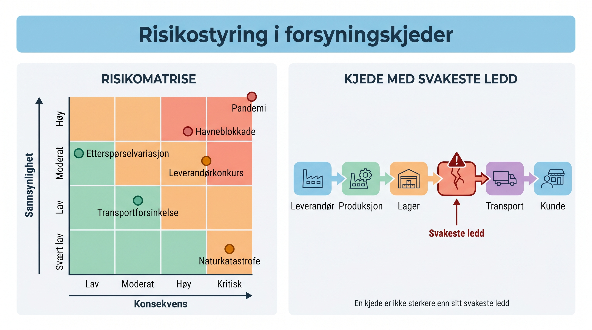

Risikostyring i forsyningskjeder: risikomatrisen (sannsynlighet $\times$ konsekvens) klassifiserer hendelser fra hyppige, små avvik til sjeldne, katastrofale forstyrrelser, og en kjede er ikke sterkere enn sitt svakeste ledd.

Definisjon [Risikostyring i forsyningskjeder]
**Risikostyring i forsyningskjeder** er prosessen med å identifisere, kvantifisere og håndtere hendelser som kan forstyrre material-, informasjons- og betalingsflyten i kjeden, slik at systemet opprettholder akseptabel ytelse også under usikkerhet og ekstreme forstyrrelser.

En vanlig klassifisering skiller mellom *disruption risk* --- sjeldne men store hendelser som leverandørkonkurs, pandemi eller havneblokkade --- og *operational risk* --- hyppige, mindre variasjoner i etterspørsel, leveringstid og kvalitet som håndteres løpende av ordinære lagerpolitikker og prognoser. Risikomatrisen (sannsynlighet $\times$ konsekvens) er det mest brukte verktøyet for visuelt å prioritere hvilke hendelser som krever aktiv styring, og hvilke som kan aksepteres.

Området omfatter flere faser og beslutningsnivå:

- Risikoidentifikasjon --- kartlegging av leverandører, transportruter, lagre og produksjonsnoder for å finne potensielle forstyrrelseskilder

- Risikokvantifisering --- estimering av sannsynlighet, konsekvens og korrelasjon mellom hendelser, ofte med Value at Risk (VaR) og Conditional Value at Risk (CVaR)

- Risikorespons --- valg mellom unngå, redusere, overføre (forsikring) eller akseptere risiko, samt konkrete tiltak som sikkerhetslager, multi-sourcing og nearshoring

- Robust og fleksibel planlegging --- beslutningsmodeller som eksplisitt tar inn usikkerhet og ekstreme scenarier, slik at planen tåler forstyrrelser uten full reoptimering

- Beredskap og stresstest --- scenariobasert analyse av hvordan kjeden reagerer på definerte ekstremhendelser, og prioritering av mottiltak etter kost-nytte

Risikostyring trekker på og leverer tilbake til de fleste andre områdene i dette kompendiet:

- Lagerstyring --- sikkerhetslager er den mest direkte bufferen mot forstyrrelser, og VaR/CVaR-analyse gir et rasjonelt grunnlag for å dimensjonere ekstra buffer mot sjeldne hendelser

- Forsyningskjedeanalyse --- systemperspektivet avdekker sårbarheter som enkeltaktører ikke ser, og multi-sourcing er en sentral koordineringsmekanisme mot leverandørrisiko

- Innkjøpsoptimalisering --- leverandørdiversifisering og kontraktsdesign (fleksibilitet, kapasitetsforbehold) er konkrete risikoreduserende tiltak i innkjøpsporteføljen

- Nettverksdesign --- lokalisering av lagre og fabrikker bestemmer geografisk eksponering mot naturkatastrofer, geopolitisk risiko og transportbrudd

- Etterspørselsprognoser --- prognoseusikkerhet er en viktig kilde til operasjonell risiko, og scenariobaserte prognoser mater direkte inn i stresstest og robust planlegging

Problemstillinger, modeller og metoder

## Problemstillinger, modeller og metoder
I det følgende presenteres tre sentrale problemstillinger innen risikostyring og robusthet i forsyningskjeder med tilhørende modeller og metoder, som illustrert i figur [2](#fig-fig-risikostyring-problemstillinger-oversikt). Alle tre problemstillingene utdypes med egne eksempler og figurer i de påfølgende seksjonene.

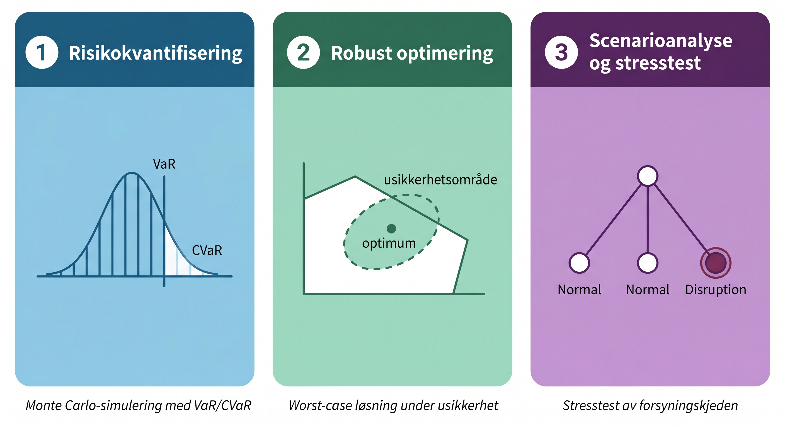

Tre sentrale problemstillinger innen risikostyring: risikokvantifisering med Monte Carlo-simulering og VaR/CVaR, robust optimering under usikkerhet, og scenarioanalyse med stresstest av forsyningskjeden.

Nøkkelen til god risikostyring er å velge riktig modell og metode for den aktuelle problemstillingen. Tabell [1](#tab-tab-risikostyring-oversikt) gir en oversikt over hvilke modeller og metoder som egner seg for de tre problemstillingene. Tabellen inkluderer også supplerende tilnærminger som disruption-modellering og resiliensmetrikker, slik at leseren ser hvordan de avanserte modellene står i forhold til tradisjonelle risikovurderinger. Modellene og metodene uthevet med rødt vil bli gått gjennom i de tre neste avsnittene.

Oversikt over modeller og metoder for de tre sentrale problemstillingene innen risikostyring og robusthet i forsyningskjeder.

  **Nr.**   **Problemstilling**                           **Modeller**                                                              **Metoder**
  --------- --------------------------------------------- ------------------------------------------------------------------------- ------------------------------------------------------------------------------------
  1         Risikokvantifisering            Risikomatrise, Monte Carlo-simulering med VaR/CVaR          Stokastisk risikoanalyse, sannsynlighetsfordelinger, tornado-diagram
  2         Robust optimering               Deterministisk LP/MIP, Robust optimering (minimax regret)   Worst-case optimering, deterministisk ekvivalent, usikkerhetsområde
  3         Scenarioanalyse og stresstest   Disruption-modellering, Scenariobasert simulering           Stresstest, beredskapsplanlegging, resiliensmetrikker

Risikokvantifisering med Monte Carlo-simulering

## Eksempel: Risikokvantifisering med Monte Carlo-simulering
Oppsummering.

  **Kategori**      **Beskrivelse**
  ----------------- -----------------------------------------------------------------------------------------------
  Eksempel          Risikokvantifisering for en norsk importør med enkelt leverandør i Asia
  Område            Risikostyring i forsyningskjeden med stokastisk etterspørsel, leveringstid og leverandørsvikt
  Problemstilling   Hva er forventet årlig risikokostnad, og hvor ligger "halen" i kostnadsfordelingen?
  Modell            Monte Carlo-simulering av årlig totalkostnad med VaR og CVaR som risikomål
  Prosess           Stokastisk risikoanalyse med $N = 10\,000$ uavhengige realiseringer
  Metode            Fordelingsbasert sampling, empirisk kvantil, tornado-sensitivitet, kost/nytte av tiltak

### Problemstilling
NordImport AS er en mellomstor norsk importør som selger en enkelt produktkategori (industrikomponenter) til norske entreprenører. Selskapet har de siste tre årene kun kjøpt inn fra én leverandør i Sørøst-Asia: prisen er god, kvaliteten stabil, og forholdet har vært konfliktfritt. Ledelsen har imidlertid merket seg to hendelser: en havneblokkade i 2023 førte til at en leveranse ble forsinket med nesten tre uker, og i 2024 måtte selskapet kjøpe fra en europeisk nødleverandør til nesten dobbel pris etter et kvalitetsavvik hos hovedleverandøren.

Økonomidirektøren spør: "Hvor mye risiko har vi egentlig på balansen, og hva er det verste året ut av 20 vi må planlegge for?" Spørsmålet er ikke hvilken kostnad som er *forventet*, men hvor *bred* kostnadsfordelingen er og hvor "halen" ligger. Dette er i kjernen av risikokvantifisering: vi er like interessert i den sjeldne, dyre hendelsen som i gjennomsnittet.

**Problemstilling** --- *Hva er 95 %-VaR og 95 %-CVaR for total årskostnad, og hvilke risikokilder bidrar mest?*

Vi bygger en Monte Carlo-modell av forsyningskjeden med tre stokastiske innput (etterspørsel, leveringstid, leverandørsvikt) og simulerer $10\,000$ uavhengige år. Empirisk kostnadsfordeling gir $\mathrm{VaR}_{0,95}$ og $\mathrm{CVaR}_{0,95}$, et tornado-diagram rangerer driverne, og til slutt sammenlignes mitigasjonstiltak på kost/nytte.

### Modell
Forsyningskjeden modelleres som et aggregert årsregnskap der tre stokastiske størrelser driver kostnadene: årlig etterspørsel $D$, leveringstid $L$ per bestilling, og en leverandørsvikt-indikator $F$ per bestilling. Fra disse beregner vi gjennomsnittlig lager, volum av hastekjøp og tapt salg, og dermed total årskostnad $C$.

Definisjon [Monte Carlo-simulering]
La $C = g(X_1, X_2, \ldots, X_k)$ være en deterministisk funksjon av $k$ stokastiske innput $X_j$ med kjente (marginale) fordelinger $F_{X_j}$. Monte Carlo-metoden estimerer fordelingen til $C$ ved å

1.  trekke $N$ uavhengige realiseringer ${x_1^{(i)}, \ldots, x_k^{(i)}}_{i=1}^N$ fra $F_{X_j}$,

2.  beregne $c^{(i)} = g(x_1^{(i)}, \ldots, x_k^{(i)})$ for hver realisering,

3.  bruke den empiriske fordelingen $\widehat{F}_C$ av ${c^{(i)}}_{i=1}^N$ som estimator for den sanne fordelingen til $C$.

Ved store $N$ konvergerer gjennomsnittet mot $E\[C\]$ med rate $\mathcal{O}(1/\sqrt{N})$ (sentralgrenseteoremet).

Stokastiske innput. De tre driverne har følgende fordelinger:

$$\begin{aligned}D &\sim \mathcal{N}(\mu_D, \sigma_D^2), & \text{årlig etterspørsel} \\
L_j &\sim \mathrm{LogN}(\mu_L, \sigma_L^2), \quad j = 1, \ldots, n_O, & \text{leveringstid pr.\ bestilling} \\
F_j &\sim \mathrm{Bernoulli}(p_F), \quad j = 1, \ldots, n_O, & \text{leverandørsvikt pr.\ bestilling}\end{aligned}$$

1

der $n_O = 6$ er antall bestillinger per år. Parametrene er gitt i tabell [3](#tab-tab-mcr-parameters).

Modellparametre for NordImport AS.

  **Symbol**                **Parameter**               **Beskrivelse**                                   **Verdi**
  ------------------------- --------------------------- ------------------------------------------------- ---------------------
  $\mu_D$                Etterspørselsgjennomsnitt   Forventet årlig salg                              $12\,000$ enh.\
  $\sigma_D$             Etterspørselsstd.           Årlig standardavvik                               $2\,000$ enh.\
  $\mu_L$                Log-gjennomsnitt            $\ln 35$, dvs. median $= 35$ dager           $3,555$
  $\sigma_L$             Log-standardavvik           CV for leveringstid $\approx 30\,%$         $0,30$
  $p_F$                   Svikt-sannsynlighet         Sannsynlighet for leveranseavvik pr. bestilling   $0,08$
  $n_O$                   Antall bestillinger         Bestillingsfrekvens pr. år                        $6$
  $c_u$                   Innkjøpskostnad             Normalpris pr. enhet                              $300$ NOK
  $c_{ex}$               Hastekjøpskostnad           Nødleverandør pr. enhet                           $550$ NOK
  $c_{ls}$               Tapt-salg-kostnad           Bortfall pr. manglende enhet                      $450$ NOK
  $h$                     Lagerholdsrate              Andel av enhetspris pr. år                        $0,20$
  $S_{\text{safety}}$   Sikkerhetslager             Ekstra lager holdt hele året                      $400$ enh.\

Kostnadsfunksjon. Gitt en realisering av innputene simuleres lageret uke for uke. Ved ankomst av en bestilling øker lageret, ved svikt forsinkes ankomsten med 14 dager og halvparten av volumet dekkes via en hastebestilling. Total årskostnad er summen av tre komponenter:

$$C = \underbrace{h \, c_u \, \bar{I}}_{\text{lagerhold}}
+ \underbrace{(c_{ex} - c_u) \, Q_{ex}}_{\text{hastekjøp}}
+ \underbrace{c_{ls} \, Q_{ls}}_{\text{tapt salg}},$$

2

der $\bar{I}$ er gjennomsnittlig lager gjennom året, $Q_{ex}$ er volum dekket via hastekjøp, og $Q_{ls}$ er antall manglende enheter.

Definisjon [Value at Risk (VaR) og Conditional Value at Risk (CVaR)]
La $C$ være en kostnads-variabel med fordelingsfunksjon $F_C$. For et signifikansnivå $\alpha \in (0, 1)$ defineres

$$\begin{aligned}\mathrm{VaR}_\alpha(C) &= \inf { c : F_C(c) \ge \alpha } = F_C^{-1}(\alpha), \\
\mathrm{CVaR}_\alpha(C) &= E\!\left\[ C \mid C \ge \mathrm{VaR}_\alpha(C) \right\].\end{aligned}$$

3

$\mathrm{VaR}_{0,95}$ er altså kostnaden som med 95 % sannsynlighet *ikke* overskrides, og $\mathrm{CVaR}_{0,95}$ er forventet kostnad *betinget* på at man havner i den verste 5 %-halen.

Når fordelingen til $C$ ikke har lukket form (som her), estimeres begge empirisk: $\widehat{\mathrm{VaR}}_\alpha$ er det $\alpha$-te kvantilet i ${c^{(i)}}$, og $\widehat{\mathrm{CVaR}}_\alpha$ er gjennomsnittet av de realiseringene som er større enn eller lik $\widehat{\mathrm{VaR}}_\alpha$.

**Tolkning** --- *Hvorfor både VaR og CVaR?*

VaR er intuitiv: "verste scenario vi planlegger for med 95 % sikkerhet." Men VaR sier ingenting om *hvor ille* det kan bli i den resterende 5 %. To fordelinger kan ha samme VaR men dramatisk forskjellig hale --- og det er nettopp halen risikostyring handler om. CVaR (også kalt *expected shortfall*) lukker dette smutthullet ved å ta gjennomsnittet over hele halen. Når vi diskuterer mitigasjonstiltak bruker vi derfor CVaR som primær beslutningsstørrelse.

[Forutsetninger.]
1.  De tre stokastiske driverne $D$, $L_j$ og $F_j$ er uavhengige. I praksis kan f.eks. leverandørsvikt korrelere med lang leveringstid --- modellen er en forenkling som holder analysen forståelig.

2.  Hver bestilling håndteres uavhengig av forrige; det er ingen læring fra tidligere leveranser.

3.  Prisene ($c_u$, $c_{ex}$, $c_{ls}$) er faste hele året. Dynamisk prising kan inkluderes som en fjerde stokastisk innput.

4.  Kostnadsfunksjonen i ligning [(2)](#eq-eq-mcr-cost) dekker ikke tapt omdømme eller reguleringsstraff, som kan være betydelige ved gjentatt manglende levering.

### Prosess
Prosess: Stokastisk risikoanalyse med Monte Carlo.
Modell: Aggregert forsyningskjede med $D$, $L$ og $F$ som stokastiske innput, kostnadsfunksjon [(2)](#eq-eq-mcr-cost) og risikomål $\mathrm{VaR}_{0,95}$, $\mathrm{CVaR}_{0,95}$.

Figur [3](#fig-fig-mcr-method) viser de seks stegene, fra fordelingsparametre til en kost/nytte-anbefaling.

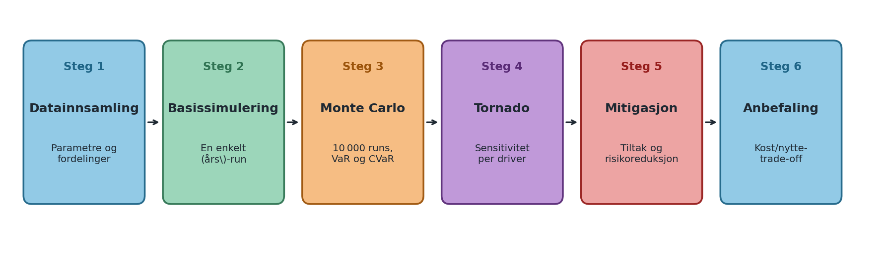

Prosess for Monte Carlo-basert risikokvantifisering: fra fordelingsparametre via $N = 10\,000$ kjøringer og tornado-sensitivitet til kost/nytte-vurdering av mitigasjonstiltak.

### Steg 1: Datainnsamling
Første steg er å parametrisere fordelingene [(1)](#eq-eq-mcr-demand)--[(?)](#eq-eq-mcr-fail) ut fra historisk data og ekspertvurdering. NordImport har fire års salgshistorikk (derav $\mu_D$ og $\sigma_D$), leveringstidsdata fra loggen (lognormalfordelingen tilpasser reell skew godt), og en subjektiv vurdering av svikt-frekvens basert på de to hendelsene de siste tre årene ($p_F = 0,08$ tilsvarer én svikt ca. hver annen bestilling per år).

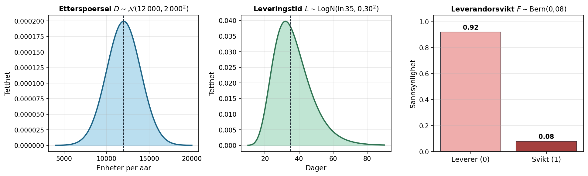

De tre stokastiske innputene i modellen: etterspørsel $D \sim \mathcal{N}(12\,000, 2\,000^2)$, leveringstid $L \sim \mathrm{LogN}(\ln 35, 0,30^2)$ og leverandørsvikt $F \sim \mathrm{Bernoulli}(0,08)$.

Ligning [(?)](#eq-eq-mcr-lead) bruker lognormal for leveringstid fordi den har positiv skjevhet: de fleste leveringer kommer nær median-verdien på 35 dager, men en liten andel drar ut i 50--60 dager. Gjennomsnittlig leveringstid er $E\[L\] = e^{\mu_L + \sigma_L^2/2} \approx 36,6$ dager, og 95 %-kvantilet er ca. $57,3$ dager.

**Konklusjon** --- *Skjeve haler, tung risiko*

Både lognormalfordelingen for leveringstid og Bernoulli-sjokket for leverandørsvikt gir skjeve haler i kostnadsfordelingen: de fleste år blir rolige, noen få blir dyre. Det er nettopp slike skjeve fordelinger som gjør VaR og CVaR meningsfulle: de viser hva den sjeldne, dyre halen koster.

### Steg 2: Basissimulering
For å forstå dynamikken kjører vi først *en* enkelt realisering av modellen --- det vil si én trekking av $D$, alle seks $L_j$ og alle seks $F_j$, og en simulering av lageret uke for uke. Tabell [4](#tab-tab-mcr-basis) oppsummerer resultatet fra et typisk år.

Resultat fra én enkelt realisering av modellen (seed fast til $2026$).

  **Variabel**      **Beskrivelse**                 **Verdi**
  ----------------- ------------------------------- -----------------------
  $D$             Realisert årsetterspørsel       $10\,414$ enh.\
  $\bar{I}$      Gjennomsnittlig lager           $1\,609$ enh.\
  $\sum_j F_j$   Antall leverandørsvikt i året   $1$ av $6$
  $Q_{ls}$       Tapt salg                       $0$ enh.\
  Lagerhold         $h \, c_u \, \bar{I}$      $96\,554$ NOK
  Hastekjøp         $(c_{ex} - c_u)\,Q_{ex}$   $216\,953$ NOK
  Tapt salg         $c_{ls}\,Q_{ls}$           $0$ NOK
  $C$             **Totalkostnad**                **$313\,507$ NOK**


Tre perspektiver på en enkelt simulert årssyklus: lagernivået $I_t$ gjennom 52 uker (venstre, ankomster markert med prikket linje --- rødt for svikt, grønt for normal), kumulativt tapt salg (midten, her lik null), og totalkostnaden dekomponert i tre komponenter (høyre).

I dette tilfellet skjedde det én leverandørsvikt (av seks bestillinger), men sikkerhetslageret absorberte forsinkelsen. Totalkostnaden domineres derfor av hastekjøpet, ikke av tapt salg. En annen realisering kan se helt annerledes ut --- og det er nettopp hele poenget med Monte Carlo: vi trekker mange år og ser på fordelingen av $C$, ikke på ett enkelt tilfelle.

**Konklusjon** --- *Et typisk år er rolig*

Enkeltrealiseringen viser at *median*-året er ganske ubekymret: lagerholds- og hastekjøpskostnader er de dominerende postene, mens tapt salg er null. Det er halens oppførsel, ikke medianen, som bestemmer risikostyringsbehovet.

### Steg 3: Monte Carlo-simulering
Vi kjører nå $N = 10\,000$ uavhengige realiseringer. Hver realisering trekker nye verdier av $D$, ${L_j}$, ${F_j}$ og produserer en totalkostnad $c^{(i)}$. Fordelingen er vist i figur [6](#fig-fig-mcr-cost-dist).

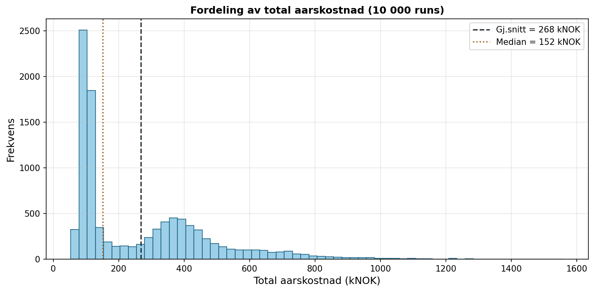

Empirisk fordeling av total årskostnad $C$ over $10\,000$ Monte Carlo-kjøringer. Fordelingen er tydelig skjev mot høyre: et typisk år ligger rundt $150\,000$ NOK (median), men enkelte år overskrider $1\,200\,000$ NOK.

Tabell [5](#tab-tab-mcr-metrics) viser de viktigste kjennetegnene ved fordelingen.

Nøkkeltall for kostnadsfordelingen fra $10\,000$ Monte Carlo-kjøringer.

  **Størrelse**                **Beskrivelse**                                               **Verdi (NOK)**
  ---------------------------- ------------------------------------------------------------- -------------------------
  $E\[C\]$                   Gjennomsnittlig årskostnad                                    $268\,353$
  $\mathrm{SD}\[C\]$        Standardavvik                                                 $211\,767$
  Median                       50 %-kvantil ($q_{0,50}$)                                  $151\,645$
  $q_{0,25}$                Nedre kvartil                                                 $100\,967$
  $q_{0,75}$                Øvre kvartil                                                  $396\,560$
  $\mathrm{VaR}_{0,95}$    95 %-kvantil fra ligning [(3)](#eq-eq-var)             $\mathbf{693\,609}$
  $\mathrm{CVaR}_{0,95}$   Forventet halekostnad fra ligning [(?)](#eq-eq-cvar)   $\mathbf{840\,718}$
  Maksimum                     Verste simulerte år                                           $1\,559\,881$

Legg merke til at $E\[C\] = 268\,353$ NOK, men medianen er kun $151\,645$ NOK. Forskjellen på ca. 77 % er direkte konsekvens av den tunge halen: få men svært dyre år trekker gjennomsnittet kraftig opp. Figur [7](#fig-fig-mcr-var-cvar) viser fordelingen med $\mathrm{VaR}_{0,95}$ og $\mathrm{CVaR}_{0,95}$ eksplisitt annotert.


Kostnadsfordelingen med den øverste 5 %-halen fremhevet i oransje. $\mathrm{VaR}_{0,95} = 693\,609$ NOK er den stiplede røde linjen (skillet mellom "blå" og "oransje"), mens $\mathrm{CVaR}_{0,95} = 840\,718$ NOK er gjennomsnittet *over* det skillet.

**Konklusjon** --- *Risikoprofilen har en tydelig hale*

Med 95 % sannsynlighet ligger årskostnaden under ca. $694\,000$ NOK, men *gitt* at vi havner i den verste 5 %-halen, blir forventet kostnad $841\,000$ NOK. Standardavviket på $212\,000$ NOK er omtrent 79 % av gjennomsnittet --- en indikasjon på at "den typiske" og "den farlige" kostnaden er svært forskjellige. Dette er risikosignaturen NordImport må styre etter.

### Steg 4: Tornado-diagram
Risikoprofilen er kjent; neste spørsmål er *hvilken* driver som bidrar mest. Vi varierer én parameter av gangen (*one-factor-at-a-time*, OAT) til et lavt og et høyt nivå, mens alle andre holdes på baseline. For hvert nivå kjører vi $4\,000$ nye Monte Carlo-realiseringer og noterer den resulterende $\mathrm{CVaR}_{0,95}$. Effekten er differansen fra baseline-CVaR ($854\,866$ NOK med $N = 4\,000$).

Sensitivitet av $\mathrm{CVaR}_{0,95}$ til hver risikokilde (verdi ved lavt og høyt nivå, sortert etter spenn).

  **Driver**                             **Lav verdi**   **Høy verdi**   **CVaR lav**    **CVaR høy**
  -------------------------------------- --------------- --------------- --------------- -------------------
  Hastekjøpskostnad $c_{ex}$ (NOK)    $450$         $700$         $661\,405$   $1\,135\,342$
  Svikt-sannsynlighet $p_F$            $0,02$        $0,15$        $590\,154$   $1\,048\,051$
  Etterspørselsgjennomsnitt $\mu_D$   $10\,000$    $14\,000$    $712\,647$   $949\,649$
  Leveringstid CV $\sigma_L$          $0,15$        $0,45$        $773\,394$   $921\,084$
  Tapt-salg-kostnad $c_{ls}$ (NOK)    $250$         $650$         $794\,422$   $872\,632$
  Etterspørselsstd. $\sigma_D$        $1\,000$     $3\,000$     $812\,881$   $855\,918$


Tornado-diagram: endring i $\mathrm{CVaR}_{0,95}$ (kNOK) når hver enkelt driver settes til henholdsvis lav (blå) og høy (oransje) verdi, mens alle andre holdes på baseline. Driverne er sortert etter spenn --- hastekjøpskostnaden og leverandørsviktsannsynligheten dominerer.

To drivere skiller seg ut: hastekjøpskostnaden $c_{ex}$ (spenn $474\,000$ NOK) og leverandørsviktsannsynligheten $p_F$ (spenn $458\,000$ NOK). Det er *interaksjonen* mellom disse to som gjør halen tung: svikt skjer med sannsynlighet $p_F$, og *gitt* svikt bestemmes halekostnaden av $c_{ex}$. Reduserer vi enten frekvensen eller prisen på hastekjøp, skrumper hele halen.

**Konklusjon** --- *Halen er leverandør-drevet*

Tre observasjoner: (1) variasjon i etterspørselsstandardavviket $\sigma_D$ påvirker CVaR mindre enn 5 % --- etterspørselen er ikke risikodriveren. (2) Hastekjøpskostnaden er den mest volatile enkeltdriveren, men den er delvis en *kostnadsparameter* vi kontrollerer gjennom leverandøravtaler. (3) Leverandørsvikt-sannsynligheten er en *fysisk* risiko som kan reduseres med strukturelle tiltak. I steg 5 evaluerer vi begge.

### Steg 5: Mitigasjonstiltak
Vi evaluerer tre strategier, hver re-simulert med $6\,000$ nye Monte Carlo-realiseringer:

1.  **Høyere sikkerhetslager:** Dobler $S_{\text{safety}}$ fra $400$ til $800$ enheter. Koster $h \, c_u \cdot 400 = 24\,000$ NOK/år i ekstra lagerholdskostnad.

2.  **Dobbel sourcing:** Etablerer en europeisk reserveleverandør som reduserer svikt-sannsynligheten fra $p_F = 0,08$ til $0,02$ og senker hastekjøpskostnaden $c_{ex}$ fra $550$ til $500$ NOK/enhet. Koster $150\,000$ NOK/år i kontrakt, revisjon og administrasjon.

3.  **Kombinert tiltak:** Begge de to over samtidig. Koster $174\,000$ NOK/år.

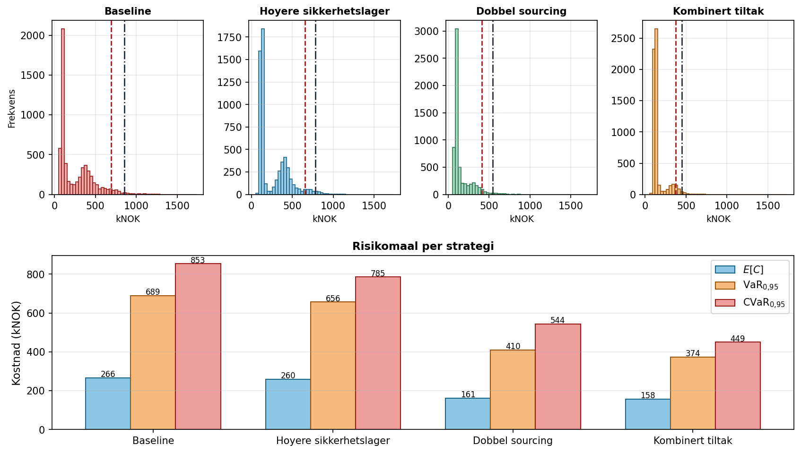

Kostnadsfordelingene per strategi (øverst) og risikomål side ved side (nederst). Dobbel sourcing og det kombinerte tiltaket skjærer ned hele halen dramatisk.

Risikomål per strategi, basert på $6\,000$ Monte Carlo-kjøringer pr. strategi.

  **Strategi**             **$E\[C\]$ (NOK)**      **$\mathrm{VaR}_{0,95}$**   **$\mathrm{CVaR}_{0,95}$**
  ------------------------ ------------------------- ------------------------------- --------------------------------
  Baseline                 $265\,902$             $689\,463$                   $853\,105$
  Høyere sikkerhetslager   $259\,792$             $656\,120$                   $784\,862$
  Dobbel sourcing          $161\,094$             $409\,846$                   $543\,628$
  Kombinert tiltak         $\mathbf{157\,598}$   $\mathbf{373\,987}$         $\mathbf{449\,489}$

Sikkerhetslager alene har beskjeden effekt ($\mathrm{CVaR}$ ned $8\,%$): det hjelper mot små tidsforsinkelser, men en svikt-hendelse som forsinker med 14 dager spiser lett gjennom 400 ekstra enheter. Dobbel sourcing er mye mer virkningsfull ($\mathrm{CVaR}$ ned $36\,%$) fordi den angriper både svikt-sannsynligheten og hastekjøpsprisen --- nettopp de to driverne som dominerer tornado-diagrammet. Det kombinerte tiltaket gir ytterligere reduksjon ($\mathrm{CVaR}$ ned $47\,%$ fra baseline).

**Konklusjon** --- *Strukturelle tiltak slår operasjonelle*

Sikkerhetslager er et operasjonelt "buffer-tiltak" mot liten variasjon. Dobbel sourcing er et *strukturelt* tiltak mot selve sjokket. Tornado-analysen pekte på hvilken lever som har størst utslag, og mitigasjonssammenligningen bekrefter det: strategi nummer 2 kutter halen mest per krone investert.

### Steg 6: Anbefaling
Avslutningsvis veier vi risikoreduksjon mot tiltakskostnad. Netto nytte defineres som
$$
\text{Netto nytte} = \Delta\mathrm{CVaR}_{0,95} - \text{tiltakskostnad},
$$
der $\Delta\mathrm{CVaR}$ er reduksjonen sammenlignet med baseline. Tabell [8](#tab-tab-mcr-anbefaling) viser resultatet.

Kost/nytte av mitigasjonstiltakene. Netto nytte beregnet som reduksjon i $\mathrm{CVaR}_{0,95}$ minus årlig tiltakskostnad.

  **Strategi**             **$\Delta\mathrm{CVaR}$ (NOK)**   **Tiltakskostnad**        **Netto nytte**
  ------------------------ ------------------------------------- ------------------------- --------------------------
  Baseline                 $0$                                 $0$                     $0$
  Høyere sikkerhetslager   $+68\,243$                         $24\,000$              $+44\,243$
  Dobbel sourcing          $+309\,477$                        $150\,000$             $+159\,477$
  Kombinert tiltak         $\mathbf{+403\,616}$              $\mathbf{174\,000}$   $\mathbf{+229\,616}$

Alle tre tiltakene har positiv netto nytte, men det kombinerte tiltaket kommer best ut med netto nytte $+229\,616$ NOK/år. Merk at nytten *måles mot risikoredusjon i CVaR*, ikke mot forventet kostnad: i $E\[C\]$ er tiltakskostnaden større enn reduksjonen, noe som er et typisk bilde for forsikringstyper av tiltak. Det er først når vi verdsetter halen (via CVaR) at tiltaket blir regningsvar.

**Praktisk anvendelse** --- *Anbefaling til NordImport AS*

1.  **Inngå rammeavtale med en europeisk reserveleverandør** som aktiveres ved leveranseavvik fra hovedleverandøren. Dette er det kritiske tiltaket --- det reduserer $\mathrm{CVaR}_{0,95}$ fra $853\,000$ til $544\,000$ NOK på egen hånd.

2.  **Doble sikkerhetslageret fra $400$ til $800$ enheter.** Tiltaket er billig ($24\,000$ NOK/år) og gir ytterligere $94\,000$ NOK reduksjon i halen når det kombineres med (1).

3.  **Revurder risikonivået**: Er $95\,%$ riktig, eller bør styret se på $\mathrm{CVaR}_{0,99}$ (gjennomsnitt over verste $1\,%$)? Nivået bør samsvare med selskapets risikoappetitt.

4.  **Oppdater modellen årlig** med ny svikt-frekvens, faktisk hastekjøpspris og ny etterspørselsstatistikk --- Monte Carlo er så nyttig som de fordelingsparametrene som går inn i den.

[Begrensninger.]
- Modellen antar uavhengighet mellom drivere. En regional krise kan ramme både leveringstid og svikt samtidig; det bryter forutsetningen og gjør halen enda tyngre enn beregnet.

- $p_F = 0,08$ er estimert fra få hendelser; usikkerheten i selve fordelingsparameterne ("parameteruskikkerhet") er ikke modellert. En robust analyse bør inkludere en prior over $p_F$.

- Tornado-diagrammet er OAT og fanger derfor ikke opp *interaksjoner* mellom drivere. Et fullt faktorielt eksperiment eller Sobol-indekser kan avsløre hvilke kombinasjoner som er farligst.

- Kostnadene i tabell [3](#tab-tab-mcr-parameters) og tiltakskostnadene i tabell [8](#tab-tab-mcr-anbefaling) er illustrative --- en reell implementering ville krevd nøye estimering av hver størrelse.

Robust nettverksdesign med minimax regret

## Eksempel: Robust nettverksdesign med minimax regret
Oppsummering.

  **Kategori**      **Beskrivelse**
  ----------------- -------------------------------------------------------------------------------------------
  Eksempel          Kapasitetsdimensjonering for norsk sjomateksport under usikker global etterspoersel
  Omraade           Risikostyring med optimering under usikkerhet
  Problemstilling   Hvor mye kapasitet boer bygges paa hver hubb naar etterspoerselen er ukjent?
  Modell            Robust lineaer programmering (LP) med boks-usikkerhetsomraade; minimax-regret-formulering
  Prosess           Optimering under usikkerhet; sammenligning med deterministisk og stokastisk baseline
  Metode            PuLP/CBC, scenarioutvalg (hjoerner + interioere), evaluering paa 500 nye realisasjoner

### Problemstilling
Nordic Seafood AS er en norsk laks- og torskeprodusent som eksporterer fersk sjomat til 25 kundemarkeder i Europa og Asia. Selskapet planlegger en strategisk omstrukturering av distribusjonsnettverket og vurderer fire potensielle hubb-lokasjoner: *Stavanger* (hovedhubb ved oppdrettsanleggene), *Tromso* (for nordnorsk fangst), *Rotterdam* (europeisk distribusjon) og *Singapore* (asiatisk distribusjon). For hver hubb maa ledelsen *na* bestemme hvor mange tonn aarlig kapasitet som skal bygges --- en flerarsinvestering som ikke lar seg endre paa kort sikt.

Utfordringen er at etterspoerselen i hvert marked er *usikker*. Globale faktorer som valutakurssvingninger, nye handelsbarrierer, helsetrender og konkurranse fra andre opprinnelsesland kan flytte volumet med 30--50 % fra nominelle estimater. Ledelsen onsker en kapasitetsplan som ikke bare presterer godt i forventning, men som ogsaa *holder mal* i de verste realistiske scenarioene --- en plan som beskytter mot katastrofale kostnader selv om fremtiden viser seg annerledes enn antatt.

**Problemstilling** --- *Hvordan balansere forventet kostnad og beskyttelse mot worst-case?*

Vi formulerer kapasitetsbeslutningen som en lineaer program (LP) med tre ulike maalfunksjoner og sammenligner hvordan de reagerer paa samme usikkerhet. Den robuste formuleringen bruker *minimax regret* --- den minimerer det verste tapet sammenlignet med en perfekt-informert beslutningstaker --- og gir en plan som er eksplisitt dimensjonert for worst-case. Vi kvantifiserer hva denne forsikringen koster i form av hoeyere forventet kostnad.

### Modell
Vi formulerer kapasitetsbeslutningen som et to-trinns lineaert program:

1.  *Forstetrinn (her-og-na):* Bestem kapasiteten $z_i$ paa hver hubb $i$. Denne beslutningen maa tas foer etterspoerselen er kjent.

2.  *Andretrinn (vente-og-se):* Etter at etterspoerselen $d_j$ er realisert, bestem forsyninger $x_{ij}$ fra hubb til marked og eventuelle spotkjoeps-utenlandslinjer $u_j$.

La $I = {1, \ldots, n}$ vaere hubb-lokasjoner og $J = {1, \ldots, m}$ kundemarkeder.

Definisjon [Nettverksdesign-LP under etterspoerselsusikkerhet]
Gitt kapasitetsbeslutning $z \in \mathbb{R}^n_+$ og realisert etterspoersel $d \in \mathbb{R}^m_+$ er total kostnad

$$C(z, d) \;=\; \underbrace{\sum_{i \in I} k_i\, z_i}_{\text{faste kapasitetskostnader}} \;+\; \underbrace{f(z, d)}_{\text{andretrinns-kostnad}}$$

4

hvor andretrinns-LPen er

$$\begin{aligned}f(z, d) \;=\; \min_{x, u} \quad & \sum_{i \in I}\sum_{j \in J} c_{ij}\, x_{ij} + \sum_{j \in J} p_j\, u_j \\
\text{med skranker} \quad & \sum_{i \in I} x_{ij} + u_j \;=\; d_j, && j \in J, \\
& \sum_{j \in J} x_{ij} \;\leq\; z_i, && i \in I, \\
& x_{ij} \geq 0,\ u_j \geq 0.\end{aligned}$$

5

Skranken [(?)](#eq-eq-ro-balance) krever at kunde $j$ sin etterspoersel dekkes --- enten fra en hubb ($x_{ij}$) eller via dyr spotmarkedskjoep ($u_j$) med straff $p_j$. Skranken [(?)](#eq-eq-ro-capacity) sier at summen av forsyninger fra hubb $i$ ikke kan overstige den kapasiteten vi *forpliktet oss til* i forstetrinn.

Symboler. Alle stoerrelser i modellen er samlet i tabell [10](#tab-tab-ro-symbols).

Symboler og parametere i robust-LP-modellen.

  **Symbol**    **Type**                     **Beskrivelse**
  ------------- ---------------------------- ------------------------------------------------------------------------
  $I$         Mengde                       Hubb-kandidater, $\|I\| = n = 4$
  $J$         Mengde                       Kundemarkeder, $\|J\| = m = 25$
  $k_i$       Parameter                    Arlig kapasitetskostnad paa hubb $i$ (NOK/tonn)
  $c_{ij}$   Parameter                    Transportkostnad fra hubb $i$ til marked $j$ (NOK/tonn)
  $p_j$       Parameter                    Straff for udekket etterspoersel i marked $j$ (NOK/tonn)
  $d_j$       Parameter                    Etterspoersel i marked $j$ (tonn/aar), *usikker*
  $z_i$       Beslutningsvar. (1. trinn)   Kapasitet som bygges paa hubb $i$, $z_i \in \[0, Z^{\max}_i\]$
  $x_{ij}$   Beslutningsvar. (2. trinn)   Forsyning fra $i$ til $j$ (tonn/aar), $x_{ij} \geq 0$
  $u_j$       Beslutningsvar. (2. trinn)   Udekket etterspoersel for $j$ (tonn/aar), $u_j \geq 0$

Usikkerhetsomraade. Etterspoerselen er ikke kjent naar $z$ velges. Vi antar at vi *vet* et omraade den faller innenfor:

$$\mathcal{U} \;=\; \left{\, d \in \mathbb{R}^m :\; \bar{d}_j - \delta_j \;\leq\; d_j \;\leq\; \bar{d}_j + \delta_j,\ j \in J \,\right}$$

3

dette er et *boks-usikkerhetsomraade* rundt den nominelle prognosen $\bar{d}$, med bredde $2\delta_j$ i hver dimensjon. Boksformen er den enkleste flerdimensjonale usikkerheten og er mye brukt i praksis naar man har uavhengige prognoseintervaller per kunde.

Tre beslutningskriterier. Med samme andretrinns-LP kan $z$ velges paa flere maater:

1.  **Deterministisk baseline** --- Anta $d = \bar{d}$ (nominelle verdier) og minimer $C(z, \bar{d})$. Dette er den klassiske LPen som *ignorerer* usikkerhet.

2.  **Stokastisk (forventet-verdi-optimal)** --- Trekk $S$ scenarioer $d^1, \ldots, d^S$ fra $\mathcal{U}$ og minimer forventet kostnad:

    $$\min_z\ \sum_{i} k_i z_i + \frac{1}{S}\sum_{s=1}^{S} f(z, d^s).$$

    7

    Dette gir lav *gjennomsnittlig* kostnad, men kan prestere daarlig i de verste scenarioene.

3.  **Robust (minimax regret)** --- Definer *regret* som differansen mellom den valgte loesningen og en perfekt-informert beslutningstaker:

    $$R(z, d) \;=\; C(z, d) - C^{\ast}(d), \qquad C^{\ast}(d) \;=\; \min_{z\'}\ C(z\', d).$$

    8

    Den robuste loesningen minimerer *det storste* regret over $\mathcal{U}$:

    $$z^{\text{rob}} \;=\; \arg\min_{z} \; \max_{d \in \mathcal{U}} \; R(z, d).$$

    9

Endelig diskretisering av $\mathcal{U}$. Problemet [(9)](#eq-eq-ro-minimax-regret) har uendelig mange tilstander ($d$ varierer kontinuerlig i $\mathcal{U}$). For LP-problemer med boks-usikkerhet naas worst-case alltid i hjoerner av boksen, men med $m = 25$ markeder har boksen $2^{25} \approx 33$ millioner hjoerner. Vi bruker derfor et endelig utvalg $\mathcal{S} \subset \mathcal{U}$ av scenarioer --- 40 tilfeldig trukne hjoerner og 10 interioere realisasjoner, totalt $S = 50$. For hvert $d^s \in \mathcal{S}$ beregnes $C^{\ast}(d^s)$ foerst ved aa loese den deterministiske LPen i [(4)](#eq-eq-ro-total-cost). Deretter loeses minimax-LPen

$$\begin{aligned}\min_{z,\, t,\, x^s,\, u^s} \quad & t \\
\text{s.t.} \quad & C(z, d^s) - C^{\ast}(d^s) \;\leq\; t, && s = 1, \ldots, S, \\
& \eqref{eq:ro-balance}\text{--}\eqref{eq:ro-nonneg} \text{ for hvert } s, \quad 0 \leq z_i \leq Z^{\max}_i. \nonumber\end{aligned}$$

4

Dette er et endelig LP som kan loeses direkte med CBC.

**Tolkning** --- *Hva er egentlig regret?*

*Regret* er angeret vi foler i ettertid: *"Hvis jeg hadde visst at etterspoerselen var $d$, ville jeg valgt $z\'$ og betalt $C^{\ast}(d)$ --- men jeg valgte $z$ og endte med aa betale $C(z, d)$"*. Differansen er det tapet som skyldes *usikkerhet*, ikke daarlig planlegging. Minimax-regret-strategien minimerer dette angeret i det verste tenkelige utfallet, og er dermed en *konservativ* regel som beskytter mot *uventede*, ikke mot *ventede*, hendelser. Forskjellen fra worst-case-kostnad (som bare minimerer $\max_d C(z, d)$) er at regret sammenligner med en "fair" referanse --- perfekt informasjon --- saa vi ikke straffer $z$ for at etterspoerselen tilfeldigvis er hoy.

Forutsetninger. Modellen hviler paa tre eksplisitte antagelser:

1.  **Boks-usikkerhetsomraade:** Vi antar at etterspoerselen i ulike markeder er *uavhengig* avgrenset. I virkeligheten er markeder korrelerte (en global resesjon rammer alle samtidig). Ellipsoid-usikkerhetsomraader fanger dette, men kraver konisk kvadratisk programmering (SOCP).

2.  **Lineaer straff:** $p_j u_j$ antar konstant spot-pris uavhengig av volum. Egentlige spotmarkeder har trappetrinn og kan ha kapasitetsgrenser.

3.  **Kjent $\mathcal{U}$:** Vi kjenner grensene $\bar{d}_j \pm \delta_j$. I praksis er *usikkerhet om usikkerheten* et viktig moment --- hva hvis vaare $\delta$-estimater selv er feil? Steg 6 adresserer dette via en trade-off-kurve.

**Heuristikk-merknad** --- *Hvorfor ikke bruke alle $2^{25}$ hjoerner?*

I teorien naas worst-case regret for LP med boks-usikkerhet i hjorner av $\mathcal{U}$, og vi vil ideelt sett legge *alle* som skranker i [(?)](#eq-eq-ro-regret-constraint). For $m = 25$ markeder gir dette $2^{25} \approx 3,4 \cdot 10^7$ skranker --- beregningsmessig uhaandterlig. I praksis brukes enten *tilfeldige trekk* av hjoerner (som her), *column-and-constraint generation* (legg til skranker underveis naar de brytes), eller *duale robust-reformuleringer* (eksakt, men krever LP-dualitet som oppgave utover denne seksjonens omfang). Vaer 50-scenarios-tilnaerming gir en nedre grense paa maks regret og en god praktisk loesning; $C^{\ast}(d)$ beregnes eksakt per scenario, saa regret-tallet er en valid skranke paa $z^{\text{rob}}$.

### Prosess
Prosess: Optimering under usikkerhet, ved sammenligning av tre LP-formuleringer paa samme data.
Modell: Robust LP (minimax regret) med deterministisk og stokastisk baseline for kontrast.

Figur [10](#fig-fig-ro-method) viser arbeidsflyten. Vi starter med datainnsamling, loeser de tre LPene i tur og orden, og evaluerer alle tre strategier paa et felles stort utvalg av realisasjoner foer vi kartlegger trade-off-kurven.

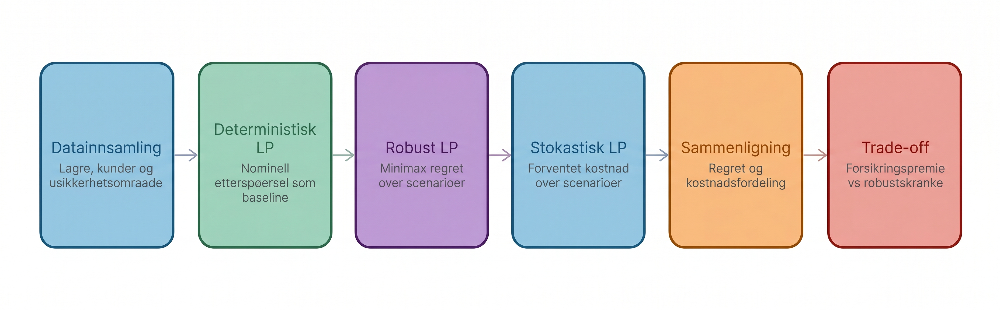

Seks-stegs arbeidsflyt for robust optimering under etterspoerselsusikkerhet.

### Steg 1: Datainnsamling
Vi bruker en syntetisk, men realistisk instansiering. Nordic Seafood vurderer $n = 4$ hubber (Stavanger, Tromso, Rotterdam, Singapore) med ulike kapasitetskostnader $k_i \in \[180,\, 300\]$ NOK/tonn og maksimal byggbar kapasitet $Z^{\max}_i \in \[2\,500,\, 4\,500\]$ tonn/aar. Markedssiden bestaar av $m = 25$ kundemarkeder spredt over Europa (Oslo, Hamburg, Paris, London, ...) og Asia (Tokyo, Shanghai, Singapore-by, ...). Total nominell etterspoersel er $\sum_j \bar{d}_j = 8\,200$ tonn/aar, og samlet usikkerhetsbredde er $\sum_j \delta_j = 3\,350$ tonn/aar --- altsaa gjennomsnittlig $41~%$ relativ usikkerhet per marked. Straffen for udekket etterspoersel er satt til 8--12 ganger hoyeste rute-transportkostnad, med snitt $\bar{p} = 2\,431$ NOK/tonn. Tabell [11](#tab-tab-ro-data-summary) oppsummerer datagrunnlaget.

Datagrunnlag for nettverksdesign under usikkerhet.

  **Stoerrelse**                                                    **Verdi**
  ----------------------------------------------------------------- -----------
  Antall hubber $n$                                               4
  Antall markeder $m$                                             25
  Total nominell etterspoersel $\sum_j \bar{d}_j$ (tonn/aar)   8 200
  Total usikkerhetsbredde $\sum_j \delta_j$ (tonn/aar)          3 350
  Snitt relativ usikkerhet $\bar{\delta_j / d_j}$               0,41
  Samlet maksimal kapasitet $\sum_i Z^{\max}_i$ (tonn/aar)    14 500
  Snitt kapasitetskostnad $\bar{k}$ (NOK/tonn)                   240
  Snitt transportkostnad $\bar{c}$ (NOK/tonn)                    143,7
  Snitt straff $\bar{p}$ (NOK/tonn)                              2 431

Figur [11](#fig-fig-ro-uncertainty) viser boks-usikkerhetsomraadet $\mathcal{U}$ rundt den nominelle etterspoerselen for alle 25 markeder. Merk at usikkerheten i absolutt forstand er storst for de store markedene (Tokyo, Shanghai, London, Paris) --- men *relativ* usikkerhet er relativt jevn paa rundt $40~%$ paa tvers av alle markeder.

![Boks-usikkerhetsomraade $\mathcal{U}$: nominelle verdier $\bar{d}_j$ (prikker) og intervaller $\[\bar{d}_j - \delta_j,\ \bar{d}_j + \delta_j\]$ (lys blaa barer) for hvert av de 25 markedene.](images/ch11/ro_uncertainty_set.png)

Boks-usikkerhetsomraade $\mathcal{U}$: nominelle verdier $\bar{d}_j$ (prikker) og intervaller $\[\bar{d}_j - \delta_j,\ \bar{d}_j + \delta_j\]$ (lys blaa barer) for hvert av de 25 markedene.

**Konklusjon** --- *Betydelig usikkerhet paa markedsniva*

Med $\pm 40~%$ relativ usikkerhet per marked er spennet mellom pessimistiske og optimistiske scenarioer stort. Samlet kan etterspoerselen variere fra $4\,850$ til $11\,550$ tonn/aar (grensene av usikkerhetsboksen), nesten en firedobling fra nedre til ovre scenario. En kapasitetsplan som bare peker paa nominellverdien, maa forvente store avvik.

### Steg 2: Deterministisk baseline
Vi starter med den enkleste formuleringen: anta at etterspoerselen er lik de nominelle verdiene $\bar{d}$, og loes LPen i [(4)](#eq-eq-ro-total-cost). Resultatet er kapasitetsvektoren $z^{\text{det}}$ med total kostnad $\boldsymbol{2,452}$ MNOK/aar. Tabell [12](#tab-tab-ro-det-result) viser hvordan kapasiteten fordeles paa hubbene.

Deterministisk loesning: kapasitet per hubb og kostnadskomponenter.

  **Hubb**    \boldmath$z^{\text{det}}_i$ **(tonn/aar)**   **Andel av total**
  ----------- -------------------------------------------------- --------------------
  Stavanger   3 500,0                                            42,7 %
  Tromso      260,0                                              3,2 %
  Rotterdam   1 380,0                                            16,8 %
  Singapore   3 060,0                                            37,3 %
  **Sum**     **8 200,0**                                        **100 %**

Kostnadskomponentene er faste kapasitetskostnader $1,964$ MNOK og transportkostnader $0,488$ MNOK. Straffkomponenten er null --- fordi etterspoerselen *antas* aa vaere eksakt $\bar{d}$ og er presis matchet av $z^{\text{det}}$. Merk at $\sum_i z^{\text{det}}_i = 8\,200 = \sum_j \bar{d}_j$: baseline bygger *akkurat* naaen nominelle mengden uten buffer.

**Konklusjon** --- *Ingen buffer for usikkerhet*

Den deterministiske loesningen dekker *nominell* etterspoersel eksakt. Det finnes ingen reserveplass: hvis den reelle etterspoerselen i et marked overgaar $\bar{d}_j$, maa forskjellen kjoepes i spotmarkedet til straff $p_j$. Gitt at $\sum_j \delta_j = 3\,350$ tonn/aar --- over $40~%$ av nominellverdien --- vil dette skje *ofte*. Vi trenger en mer robust plan.

### Steg 3: Robust formulering og minimax-regret-loesning
Vi trekker $S = 50$ scenarioer fra $\mathcal{U}$: 40 tilfeldige hjoerner av boksen (ytterpunktene) og 10 uniformt trukne interioere realisasjoner. For hvert scenario $s$ loses foerst deterministisk LP for aa finne $C^{\ast}(d^s)$. Deretter formuleres og loeses minimax-regret-LPen [(4)](#eq-eq-ro-minimax-lp). Tabell [13](#tab-tab-ro-rob-result) viser resultatet.

Robust loesning (minimax regret) og dens ytelse over de 50 scenarioene.

  **Hubb**    \boldmath$z^{\text{rob}}_i$ **(tonn/aar)**   **Diff vs. $z^{\text{det}}$**
  ----------- -------------------------------------------------- -----------------------------------
  Stavanger   3 500,0                                            $\pm 0$
  Tromso      2 375,7                                            [$+2\,115,7$]
  Rotterdam   1 060,0                                            $-320,0$
  Singapore   2 190,0                                            $-870,0$
  **Sum**     **9 125,7**                                        $+925,7$

Det mest slaaende er *Tromso*: fra beskjeden $260$ tonn/aar i deterministisk loesning til $2\,376$ tonn/aar i robust. Tromso er det billigste lageret ($k = 220$ NOK/tonn vs. Singapore $300$) og gir fleksibilitet til aa dekke uventede topper i europeiske og nordlige markeder. Stavanger holdes paa sin maksimalgrense ($3\,500$), mens Singapore og Rotterdam reduseres noe for aa kompensere. Den totale kapasiteten oeker med ca. $926$ tonn/aar --- en *sikkerhetsbuffer* paa $11~%$ over nominell etterspoersel.

Verdien av minimax-regret-skranken $t$ er $\boldsymbol{0,640}$ MNOK: selv i det verste av de 50 scenarioene ligger den robuste loesningen mindre enn $640\,000$ NOK over det en perfekt-informert planlegger ville ha betalt.

**Konklusjon** --- *Robust bygger buffer i billig lager*

Den robuste loesningen velger den *billigste* hubben (Tromso) som buffer. Dette er en strukturell innsikt: hedging mot usikkerhet bor gjoeres paa stedet med lavest kapasitetskostnad, fordi bufferen ofte vil staa ubrukt. Stavanger holdes paa maksgrensen fordi den kombinerer lav $k$ med lav transport til europeiske naermarkeder; Singapore reduseres fordi den er dyrest per enhet kapasitet.

### Steg 4: Scenariobasert stokastisk baseline
Som nummer tre formulering bygger vi den stokastiske LPen [(7)](#eq-eq-ro-stochastic). Vi trekker $S = 50$ uniformt fordelte scenarioer fra $\mathcal{U}$ og minimerer gjennomsnittlig total kostnad. Tabell [14](#tab-tab-ro-stoch-result) viser resultatet.

Stokastisk loesning (forventet-verdi-optimal) og dens ytelse.

  **Hubb**    \boldmath$z^{\text{stoch}}_i$ **(tonn/aar)**   **Diff vs. $z^{\text{det}}$**
  ----------- ---------------------------------------------------- -----------------------------------
  Stavanger   3 500,0                                              $\pm 0$
  Tromso      342,1                                                $+82,1$
  Rotterdam   1 707,0                                              $+327,0$
  Singapore   3 117,7                                              $+57,7$
  **Sum**     **8 666,8**                                          $+466,8$

Den stokastiske loesningen ligger *mellom* deterministisk og robust: total kapasitet er $8\,667$ tonn/aar ($+467$ sammenlignet med $z^{\text{det}}$), men den bygger betydelig mindre buffer enn $z^{\text{rob}}$. Forventet totalkostnad er $2,618$ MNOK/aar --- hoyere enn deterministisk fordi den naa betaler noe straff i utfall der etterspoerselen overgaar kapasiteten.

**Konklusjon** --- *Stokastisk velger moderat buffer*

Den stokastiske loesningen bygger buffer *der den oftest brukes* --- Rotterdam (+327) og Stavanger (holdes paa max) dekker europeiske markeder der gjennomsnittlig etterspoersel er hoeyest. Den satser ikke paa Tromso som hedge, fordi gjennomsnittlig etterspoersel der er lav. Dette avhjelpes av robust-loesningen som eksplisitt optimerer for *verste* scenario, ikke gjennomsnittet.

### Steg 5: Sammenligning paa 500 nye scenarioer
For aa sammenligne de tre strategiene rettferdig trekker vi $500$ *nye* scenarioer fra $\mathcal{U}$ (helt adskilt fra de $50$ i trening), beregner $C^{\ast}(d^s)$ per scenario og evaluerer total kostnad $C(z, d^s)$ for hver strategi. Tabell [15](#tab-tab-ro-compare) oppsummerer.

Ytelse over 500 evalueringsscenarioer: forventet kostnad, verste kostnad, standardavvik og regret per strategi.

  **Strategi**       \boldmath$\mathbb{E}\[C\]$   \boldmath$\max C$   \boldmath$\sigma(C)$   \boldmath$\mathbb{E}\[R\]$   \boldmath$\max R$
  ------------------ -------------------------------- ----------------------- -------------------------- -------------------------------- -----------------------
                     (MNOK)                           (MNOK)                  (MNOK)                     (MNOK)                           (MNOK)
  Deterministisk     2,744                            4,606                   0,446                      0,300                            1,803
  Stokastisk         2,609              3,776                   0,166                      0,164                            0,972
  Robust (minimax)   2,763                            3,159     0,080        0,318                            [0,499]
Tallene forteller hele historien:

1.  **Deterministisk er daarligst paa alle akser utenom forventet.** Maks-kostnaden paa $4,61$ MNOK er $46~%$ hoyere enn den robuste loesningens $3,16$ MNOK --- i et uventet scenario betaler bedriften over $1,4$ MNOK ekstra. Standardavviket paa $0,45$ MNOK er 5--6 ganger hoyere enn robust.

2.  **Stokastisk har lavest forventet kostnad** ($2,61$ MNOK) som den er designet for, men maksimal kostnad paa $3,78$ MNOK er betydelig hoeyere enn robust.

3.  **Robust har lavest verste kostnad og lavest variabilitet**, til en moderat premie i forventet kostnad.

Figur [12](#fig-fig-ro-solutions) visualiserer kapasitetsallokeringen per hubb, og figur [13](#fig-fig-ro-cost-dist) viser hele kostnadsfordelingen over de 500 scenarioene.

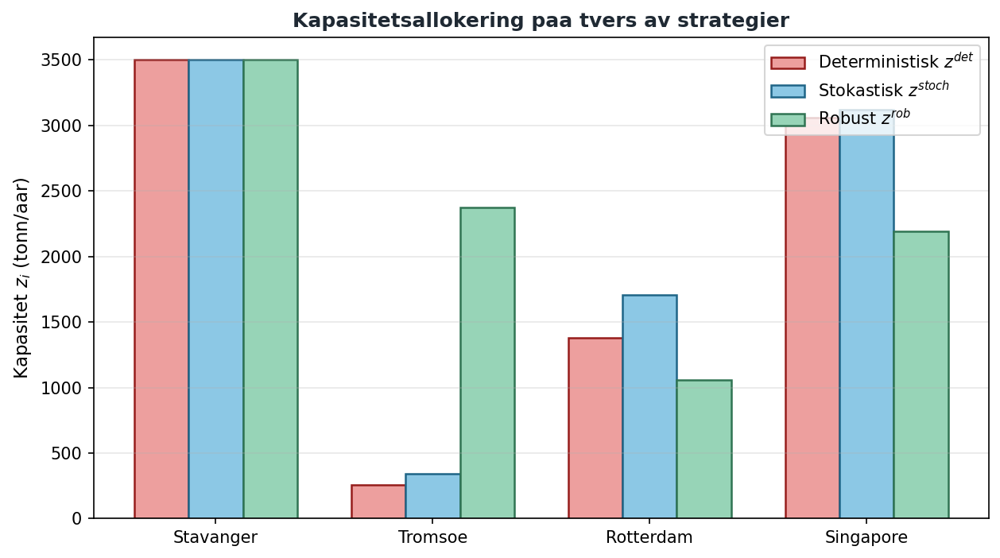

Kapasitet per hubb i de tre strategiene. Robust bygger markant mer paa Tromso.

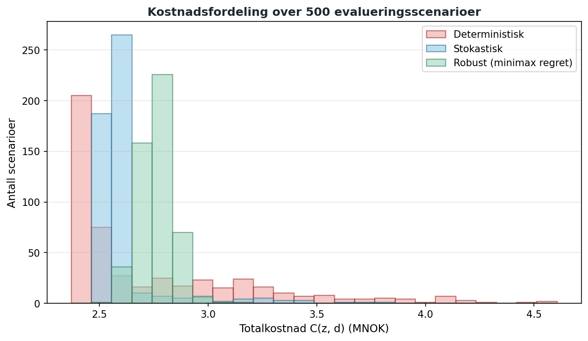

Histogram av totalkostnad over 500 scenarioer. Deterministisk (rod) har den bredeste halen; robust (grønn) er konsentrert til venstre for maksgrensen.

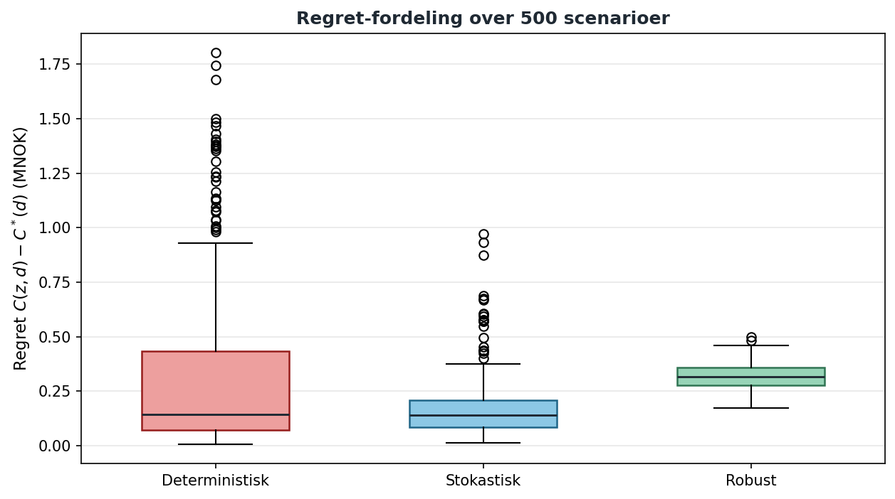

Regret-fordeling $R(z, d) = C(z, d) - C^{\ast}(d)$ over 500 scenarioer. Robust holder maks regret under $0,5$ MNOK.

Forsikringspremie. Den robuste loesningen har $+5,89~%$ hoyere forventet kostnad enn den stokastiske ($0,154$ MNOK/aar ekstra), men $-16,34~%$ lavere verste kostnad ($-0,617$ MNOK reduksjon i maks-scenarier). Dette er den sentrale *avveiningen*: vi betaler en *forsikringspremie* i gjennomsnittlig drift, og faar igjen *beskyttelse* mot katastrofer.

**Konklusjon** --- *Robust er forsikring, stokastisk er forventning*

De to modellene svarer paa ulike spoersmaal. Den stokastiske svarer: *"Hva boer vi gjoere for aa minimere det vi *forventer* aa betale?"* Den robuste svarer: *"Hva boer vi gjoere for aa minimere det verste vi *kan* betale (relativt til perfekt info)?"* Svarene er ulike fordi risikoprofilen er ulik. For Nordic Seafood, der en daarlig sesong kan true bedriftens eksistens, er robust-svaret naermere det riktige.

### Steg 6: Trade-off-kurve og forsikringspremie
Hvor folsom er den robuste loesningen for bredden paa usikkerhetsomraadet? Vi skalerer $\delta$ med en faktor $\alpha \in \[0,\ 1,5\]$ og reloeser minimax-regret-LPen for hver $\alpha$. Resultatet i tabell [16](#tab-tab-ro-tradeoff) og figur [15](#fig-fig-ro-tradeoff) viser hvordan forventet og verste kostnad utvikler seg.

Trade-off-kurve: robust loesning som funksjon av skaleringsfaktoren $\alpha$ paa usikkerhetsomraadet.

  $\alpha$          $\mathbb{E}\[C\]$ (MNOK)   $\max C$ (MNOK)    $\sigma(C)$ (MNOK)   $\sum_i z^{\text{rob}}_i$ (tonn)
  -------------------- ----------------------------- --------------------- ----------------------- ----------------------------------------
  0,00                 2,452                         2,452                 0,000                   8 200
  0,25                 2,544                         2,595                 0,020                   8 512
  0,50                 2,635                         2,738                 0,039                   8 823
  0,75                 2,725                         2,883                 0,059                   9 133
  1,00   2,816           3,028   0,080     [9 443]
  1,25                 2,899                         3,176                 0,098                   9 747
  1,50                 2,976                         3,323                 0,113                   10 043

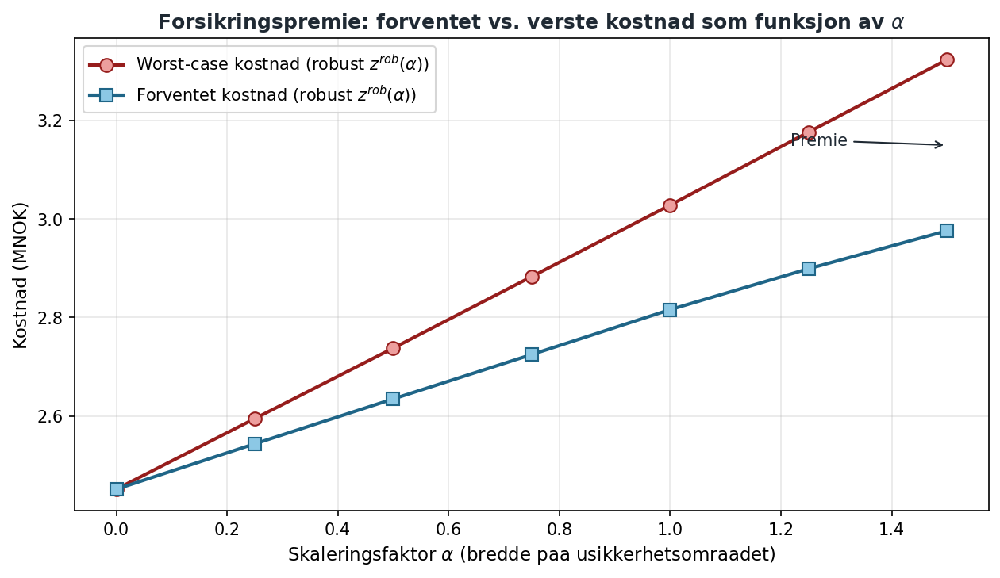

Trade-off: forventet kostnad (blaa) og verste kostnad (rod) for robust loesning som funksjon av usikkerhetsomraadets bredde. Avstanden mellom kurvene er forsikringspremien.

Ved $\alpha = 0$ kollapser $\mathcal{U}$ til et enkelt punkt, og robust-loesningen faller sammen med deterministisk ($2,452$ MNOK). For hver $\alpha$-enhet oeker vi bredden med $25~%$: $\mathbb{E}\[C\]$ vokser lineaert ca. $0,09$ MNOK per $0,25$ trinn, og maks-kostnaden vokser ca. $0,14$ MNOK. Kurven er naermest *lineaer* i $\alpha$ --- et pent teoretisk resultat som folger av at alle skranker i LPen er lineaere i $d$.

**Konklusjon** --- *Forsikringspremien vokser jevnt med usikkerheten*

Trade-off-kurven gir ledelsen et konkret verktoy: *"Hvis vi oensker aa vaere robuste mot $\pm X$ % variasjon, ma vi forvente Y % hoyere gjennomsnittlig kostnad."* For Nordic Seafood ($\alpha = 1$ tilsvarer $\pm 41~%$ variasjon) er premien ca. $15~%$ over deterministisk baseline, mens verste kostnad er redusert fra $4,61$ til $3,16$ MNOK --- en god byttehandel.

### Anbefaling og begrensninger
Vi anbefaler Nordic Seafood aa:

1.  **Bygge kapasitet etter $z^{\text{rob}}$:** Stavanger $3\,500$ tonn, Tromso $2\,376$ tonn, Rotterdam $1\,060$ tonn, Singapore $2\,190$ tonn. Total $9\,126$ tonn/aar, med Tromso som eksplisitt fleksibilitetshub.

2.  **Akseptere $5,9~%$ hoyere forventet kostnad** ($+0,15$ MNOK/aar) mot $16~%$ reduksjon i verste realistisk kostnad ($-0,62$ MNOK/aar). Dette er en *strukturell* forsikringspremie.

3.  **Revurdere $\delta$-estimatene regelmessig:** Bredden paa $\mathcal{U}$ er den viktigste parameteren. Hvis usikkerheten oker fra $\alpha = 1$ til $\alpha = 1,5$, stiger forsikringspremien med ytterligere $4~%$ og robust-loesningen bygger $1$ tonn til for hvert $2,5$-del usikkerhet (se tabell [16](#tab-tab-ro-tradeoff)).

4.  **Vurdere korrelert usikkerhetsomraade:** Hvis markedene har felles drivere (for eksempel global resesjon), boer boksen erstattes av en *ellipsoid* eller en *data-drevet* usikkerhet (siste histories konveksitetshull). Dette stramer vanligvis inn $\mathcal{U}$ og reduserer forsikringspremien.

**Praktisk anvendelse** --- *Fra LP til forretningsbeslutning*

1.  **Bruk forsikringspremien som styringsparameter:** Diskuter med ledelsen hvilken risikotoleranse (maks-kostnad-terskel) som kan aksepteres, og finn $\alpha$ som gir det svaret i tabell [16](#tab-tab-ro-tradeoff).

2.  **Re-optimering aarlig:** Naa etterspoerselsprognoser $\bar{d}$ og intervaller $\delta$ oppdateres (se ettersporselskapittelet), boer alle tre LPene kjoeres paa nytt. Robust-loesningen er ikke statisk.

3.  **Kombiner med driftsbeslutninger:** Kapasitetsbeslutningen er strategisk (5--10 aars horisont). Paa operasjonell tidsskala (ukentlig/maanedlig) tar andretrinns-LPen [(5)](#eq-eq-ro-recourse-obj)--[(?)](#eq-eq-ro-nonneg) seg av den detaljerte tildelingen gitt den byggde kapasiteten.

4.  **Kobling til resten av risikostyringen:** Robust-loesningen beskytter mot etterspoerselsusikkerhet, men ikke mot supply-side-forstyrrelser (pandemier, havneblokkader). Scenarioanalyse i neste seksjon tar opp dette.

Begrensninger. Eksempelet har tre strukturelle begrensninger som maa kommuniseres tydelig: (i) boksen antar uavhengig markedsvariasjon --- reelle markeder er korrelerte; (ii) scenario-utvalget paa 50 hjoerner + interioere er en approksimasjon av det uendelige $\mathcal{U}$, og storre utvalg ville gi stoerre $\max R$-estimat (men lineaer-veksten i tabell [16](#tab-tab-ro-tradeoff) antyder at approksimasjonen er stabil); (iii) minimax-regret er bare *en* risikoholdning blant flere --- worst-case-kostnad (uten regret-subtraksjon), CVaR eller prospektteori-baserte kriterier gir andre svar. Neste seksjon tar oss fra *design under usikkerhet* til *stresstest og scenarioanalyse* der vi eksplisitt modellerer navngitte forstyrrelseshendelser.

Stresstest av forsyningskjede

## Eksempel: Stresstest av forsyningskjede
Oppsummering.

  **Kategori**      **Beskrivelse**
  ----------------- ---------------------------------------------------------------------------
  Eksempel          Stresstest av forsyningskjeden til en distributor av kritiske forsyninger
  Omrade            Risikostyring med systematisk scenarioanalyse
  Problemstilling   Identifisere de mest sarbare leddene og rangere beredskapstiltak
  Modell            Scenariobasert ukesbasert simulering av flerniva forsyningskjede
  Prosess           Stresstest og beredskapsplanlegging
  Metode            Kontrafaktisk simulering pr scenario, kost/nytte-analyse av mitigasjoner

### Problemstilling
NordMed er en norsk distributor av kritiske medisinske forsyninger (verneutstyr, legemidler, diagnostisk utstyr) til helseforetak og kommuner fra Troms i nord til Vestlandet og Oslo-Viken i sor. Etter pandemien i 2020 er ledelsen gjort smertelig klar over at forsyningskjeden er eksponert for sjeldne, men svart kostbare, forstyrrelser: Kina-leverandoren stengte ned i uker, fraktratene eksploderte, og flere regioner opplevde hamstring og tomme hyller samtidig.

Styret krever na en *stresstest*: en systematisk analyse av hvordan forsyningskjeden presterer under et forhandsbestemt sett av worst-case-scenarier, med en tilhorende prioritert beredskapsplan. Kravet er tredelt:

1.  Kvantifisere hvor mye servicenivaa og totalkostnad forverres under hvert scenario.

2.  Identifisere de mest sarbare leddene (leverandor, fabrikk, regionlager).

3.  Rangere aktuelle mitigasjoner etter kost/nytte-forhold, slik at begrensede investeringsmidler prioriteres riktig.

**Problemstilling** --- *Hvilke tiltak gir mest risikoreduksjon pr investeringskrone?*

Vi bygger en ukesbasert simulator av hele forsyningskjeden, kjorer den under baseline-drift og fem forhandsbestemte forstyrrelsesscenarier, og sammenligner KPI-ene. Deretter modifiserer vi nettverket med fem kandidattiltak (ekstra sikkerhetslager, alternativ leverandor, nearshoring, dual sourcing, fleksibel fabrikk), re-simulerer og rangerer tiltakene etter netto arlig nytte.

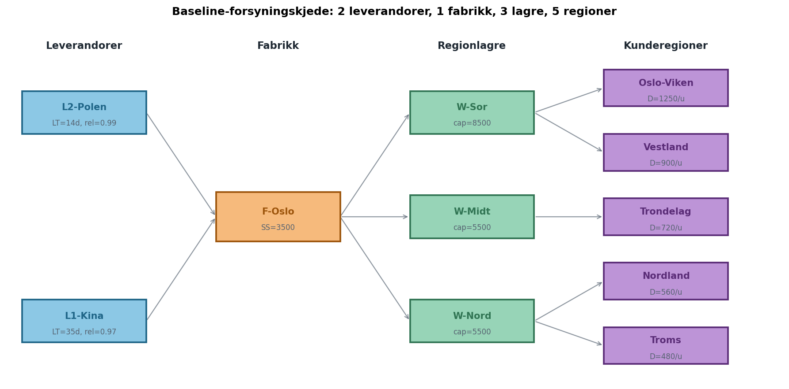

NordMeds baseline-forsyningskjede: to leverandorer (L1-Kina, L2-Polen) forsyner en sentralfabrikk i Oslo, som fyller tre regionallagre (Nord, Midt, Sor), som igjen leverer til fem kunderegioner med ukentlig stokastisk etterspursel.

### Modell
En stresstest er en form for *what-if*-analyse: gitt en detaljert modell av forsyningskjeden, hva skjer med ytelsen naar en eller flere eksogene variabler tar ekstreme verdier? Siden reelle forsyningskjeder har stokastisk etterspursel, stokastiske ledetider og flere sammenkoblede lagre, finnes det ikke noen analytisk snarvei --- vi ma simulere.

Definisjon [Scenariobasert forsyningskjedesimulering]
La $\mathcal{N} = (\mathcal{V}, \mathcal{E})$ betegne forsyningskjedenettverket, der $\mathcal{V}$ er mengden noder (leverandorer, fabrikk, lagre, kunderegioner) og $\mathcal{E}$ er transport-kantene mellom dem. Hver node $v$ har en parametervektor $\boldsymbol{\theta}_v$ (kapasitet, ledetid, sikkerhetslager, kostnader, ...). Baseline-parametervektoren betegnes $\boldsymbol{\theta}^{\text{base}}$.

Et *scenario* $\mathcal{S}_i$ er en parameter-override som erstatter utvalgte komponenter i $\boldsymbol{\theta}^{\text{base}}$:

$$\boldsymbol{\theta}^{(i)} \;=\; \boldsymbol{\theta}^{\text{base}} ødot \boldsymbol{m}^{(i)},$$

11

der $\boldsymbol{m}^{(i)}$ er en multiplikator-/forskyvningsvektor og $ødot$ betegner elementvis transformasjon. For hvert scenario beregnes forventet ytelse

$$\boldsymbol{K}^{(i)} \;=\; \mathbb{E}\!\left\[\boldsymbol{K}\!\left(\boldsymbol{\theta}^{(i)},\, \boldsymbol{ømega}\right)\right\],$$

12

der $\boldsymbol{ømega}$ er en realisasjon av de stokastiske elementene (etterspursel, ledetid, utfall) og $\boldsymbol{K}(\cdot)$ er KPI-vektoren. Forventningen estimeres med Monte Carlo: $R$ replikasjoner gir $\widehat{\boldsymbol{K}}^{(i)} = \frac{1}{R}\sum_{r=1}^R \boldsymbol{K}(\boldsymbol{\theta}^{(i)}, \boldsymbol{ømega}_r)$.

Symboler og notasjon. Tabell [18](#tab-tab-st-symboler) oppsummerer notasjonen vi bruker i resten av eksempelet.

Symboler i stresstest-modellen.

  **Symbol**                         **Enhet**   **Beskrivelse**
  ---------------------------------- ----------- --------------------------------------------------------------------------------------
  $t$                              uker        Diskret tidsindeks, $t = 1, \ldots, T$ (her $T = 52$)
  $\mathcal{S}_i$                ---         Scenario nr. $i$ (f.eks. pandemi, havneblokkade)
  $p_i$                            ---         Arlig sannsynlighet for at $\mathcal{S}_i$ intreffer
  $\boldsymbol{\theta}^{(i)}$   ---         Parametervektor under scenario $\mathcal{S}_i$
  $D_{c,t}$                       enh/uke     Stokastisk etterspursel fra region $c$ i uke $t$
  $I_{w,t}$                       enh         Lagerbeholdning i region-lager $w$ slutt av uke $t$
  $S_{w,t}$                       enh         Leverte enheter fra lager $w$ i uke $t$
  $\mathrm{SL}$                   %          Service level (fill rate): $1 - \sum_{c,t}(\text{mangel})/\sum_{c,t}D_{c,t}$
  $C_{\text{tot}}$               NOK         Total aarlig kostnad: lager + tapte salg + haste + oppsett
  $\boldsymbol{M}_k$             ---         Mitigasjonstiltak nr. $k$ (modifiserer $\boldsymbol{\theta}^{\text{base}}$)
  $I_k$                            NOK/ar      Implementasjonskostnad for tiltak $\boldsymbol{M}_k$

KPI-er. For hvert scenario rapporterer vi tre KPI-er:

$$\begin{aligned}\mathrm{SL} &= 1 \;-\; \frac{\sum_{c,t}\max(D_{c,t} - S_{c,t},\,0)}{\sum_{c,t} D_{c,t}}, \\
C_{\text{tot}} &= C_{\text{hold}} + C_{\text{lost}} + C_{\text{exp}} + C_{\text{setup}}, \\
øverline{\tau} &= \frac{1}{\|\mathcal{O}\|} \sum_{o \in \mathcal{O}} \tau_o,\end{aligned}$$

5

der $\mathrm{SL}$ er servicenivaa (Type 2, fill rate), $C_{\text{tot}}$ er total arlig kostnad summert over lagerhold ($C_{\text{hold}}$), tapte salg ($C_{\text{lost}}$), haste-transport ($C_{\text{exp}}$) og oppsett ($C_{\text{setup}}$), og $øverline{\tau}$ er gjennomsnittlig leveringsforsinkelse (uker) for ordrer som til slutt blir levert. Mengden $\mathcal{O}$ er settet av forsinkede ordrer i horisonten.

Forventet arlig risikokostnad. Gitt en scenariosannsynlighetsfordeling ${p_0, p_1, \ldots, p_N}$ (med $p_0 = 1 - \sum_{i=1}^N p_i$ som sannsynligheten for normal drift) er forventet arlig totalkostnad

$$\mathbb{E}\[C_{\text{tot}}\] \;=\; p_0 \, C_{\text{tot}}^{\text{base}} + \sum_{i=1}^N p_i \, C_{\text{tot}}^{(i)}.$$

6

Et mitigasjonstiltak $\boldsymbol{M}_k$ erstatter $\boldsymbol{\theta}^{\text{base}}$ med $\widetilde{\boldsymbol{\theta}}_k$, slik at alle $C_{\text{tot}}^{(i)}$ endres. *Risikoreduksjonen* og *nettonytten* er definert som

$$\begin{aligned}\Delta R_k &= \mathbb{E}\[C_{\text{tot}}\]^{\text{base}} - \mathbb{E}\[C_{\text{tot}}\]^{(k)}, \\
\mathrm{NB}_k &= \Delta R_k - I_k,\end{aligned}$$

7

der $I_k$ er tiltakets arlige implementasjonskostnad (kapitalbinding, premie, bemanning). Tiltak med $\mathrm{NB}_k > 0$ og hoyt $\Delta R_k / I_k$ prioriteres forst.

**Tolkning** --- *Hva betyr komponentene?*

- $\mathrm{SL}$ (fill rate) maler *andelen* av ettersporselen som faktisk blir dekket. En SL paa 99 % betyr at 1 % av volumet gaar tapt som mistet salg. Dette er den mest direkte KPI-en for pasient-/pasientgruppene bak ordrene.

- $C_{\text{tot}}$ fanger opp *pengemessige* konsekvenser. Haste-transport er billigere enn mistet salg per enhet, saa simuleringen skal oppmuntres til aa bruke haste-transport naar det er fornuftig.

- $øverline{\tau}$ maaler *tid* --- relevant naar leveringsvinduer er en del av kontrakten.

- $\Delta R_k / I_k$ er kost/nytte-forholdet. Tallverdier over 1 betyr at tiltaket betaler seg selv i forventning; tiltak med tallverdier mye over 1 er klar prioritet.

Skranker. Simulatoren er begrenset av folgende forutsetninger:

1.  **Diskret tidssteg:** systemet oppdateres en gang per uke. Finere granularitet (dag/time) kunne bli nodvendig for kortsiktige flaskehalser, men for strategisk stresstest er uke det naturlige valget.

2.  **Stasjonar etterspursel innen scenario:** innenfor et scenario er $D_{c,t} \sim \mathcal{N}(\mu_c m_c, \sigma_c m_c)$ med konstante parametere over horisonten. Scenariet endrer parametrene, men ikke formen paa fordelingen.

3.  **Uavhengige replikasjoner:** hver replikasjon har en egen seed. Scenarier sammenlignes med samme seed-sett for variansreduksjon (*common random numbers*).

4.  **Kjent scenariokatalog:** vi analyserer et definert sett av fem scenarier. Hendelser utenfor katalogen (ukjent-ukjent) fanges ikke opp.

### Prosess
Prosess: Stresstest og beredskapsplanlegging.
Modell: Scenariobasert ukesbasert simulering.

Prosessen har seks sekvensielle steg, se figur [17](#fig-fig-st-method). Det siste steget mater tilbake inn i det forste via den buede pilen: naar ny informasjon eller nye hendelser endrer risikobildet, oppdateres datagrunnlaget og scenariene, og prosessen kjores paa nytt.

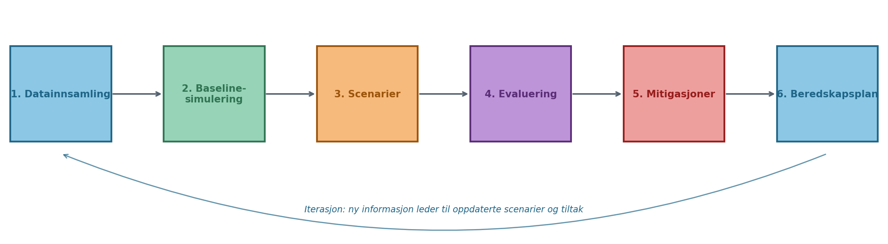

Seks-stegs stresstestprosess. Datagrunnlag (steg 1) gir en baseline-ytelse (steg 2). Scenariokatalogen (steg 3) evalueres mot baseline (steg 4), og mitigasjoner rangeres (steg 5). Beredskapsplanen (steg 6) oppsummerer prioriteringen.

### Steg 1: Datainnsamling
Forste steg er aa bygge en modell av forsyningskjeden som er komplett nok til aa fange forstyrrelsesdynamikken, men enkel nok til at stresstesten kan kjore hundrevis av replikasjoner. NordMeds nettverk bestaar av:

- **To leverandorer.** L1-Kina er det billige primaervolumet (45 NOK/enhet, kapasitet 3 200 enh/uke), men har lang ledetid (35 dager i snitt, SD 6 dager) og 97 % paalitelighet pr ordre. L2-Polen er dyrere (62 NOK/enhet), men rask (14 dager, SD 3) og mer paalitelig (99 %).

- **En fabrikk/sentrallager** i Oslo med 4 200 enh/uke kapasitet og 3 500 enh sikkerhetslager.

- **Tre regionallagre.** W-Nord (Tromso), W-Midt (Trondheim) og W-Sor (Oslo) dekker hver sine regioner. Sor-lageret er storst fordi det dekker det tettest befolkede omraadet.

- **Fem kunderegioner.** Troms, Nordland, Trondelag, Vestland og Oslo-Viken har normalfordelt ukentlig ettersporsel (se tabell [19](#tab-tab-st-demand)).

Ettersporselsprofil pr kunderegion (baseline, $m_c = 1$).

  **Region**   **Primaerlager**   $\mu_c$ (enh/uke)   $\sigma_c$ (enh/uke)   **Vekt (%)**
  ------------ ------------------ ---------------------- ------------------------- --------------
  Troms        W-Nord             480                    110                       12
  Nordland     W-Nord             560                    130                       14
  Trondelag    W-Midt             720                    150                       18
  Vestland     W-Sor              900                    180                       23
  Oslo-Viken   W-Sor              1 250                  220                       32
  **Sum**      ---                **3 910**              ---                       **100**

Kostnadsstruktur. Tapte salg koster 1 200 NOK per manglende enhet (inkluderer bade marginen og skade paa kundetilliten), haste-transport koster 650 NOK per enhet, og hver bestilling utloser en oppsettskostnad paa 3 500 NOK. Lagerhold koster 4 NOK/enhet/uke paa fabrikken og 5 NOK/enhet/uke paa regionallagrene.

**Konklusjon** --- *Hvilke ledd er strukturelt sarbare?*

Allerede uten simulering kan vi peke paa to strukturelle svakheter: (i) avhengigheten av L1-Kina (den leverer 70 % av volumet og har lang og usikker ledetid), og (ii) konsentrasjonen paa W-Sor som dekker 55 % av ettersporselen alene. I baseline-simuleringen (steg 2) bekrefter vi at begge er fungerende, men sarbare for forstyrrelser.

### Steg 2: Baseline-simulering
Vi kjorer simulatoren over ett aars horisont ($T = 52$ uker) med 30 replikasjoner paa baseline-parametrene. Dette etablerer en referanse som alle scenarier og tiltak maales mot.

Baseline-KPI-er (30 replikasjoner, 52 uker per replikasjon).

  **KPI**                            **Beskrivelse**                                             **Verdi**
  ---------------------------------- ----------------------------------------------------------- ---------------
  $\widehat{\mathrm{SL}}$        Servicenivaa (fill rate), gjennomsnitt over replikasjoner   $99,88$ %
  $\widehat{C}_{\text{tot}}$    Total arlig kostnad, gjennomsnitt                           $6,04$ MNOK
  $\quad C_{\text{hold}}$       Lagerhold                                                   $5,47$ MNOK
  $\quad C_{\text{lost}}$       Tapte salg                                                  $0,13$ MNOK
  $\quad C_{\text{exp}}$        Haste-transport                                             $0,05$ MNOK
  $\quad C_{\text{setup}}$      Oppsett/bestilling                                          $0,39$ MNOK
  $\widehat{øverline{\tau}}$   Gjennomsnittlig leveringsforsinkelse                        $0,57$ uker

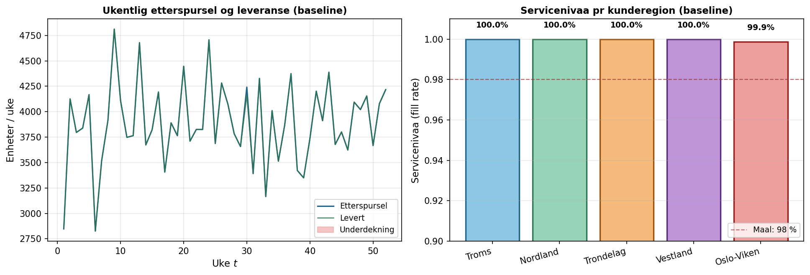

Baseline-drift. (a) Ukentlig ettersporsel og leveranse gjennom aaret --- underdekningen (rod fylling) er nesten ikke synlig. (b) Servicenivaa pr kunderegion --- alle regioner ligger naer eller over 98 %-maalet.

Baseline oppnaar altsaa $\widehat{\mathrm{SL}} = 99,88~%$ med en arlig kostnad paa $6,04$ MNOK. Lagerhold dominerer kostnadsbildet (91 %), mens tapte salg er marginale. Den lille forsinkelsen ($0,57$ uker i snitt for de faa forsinkede ordrene) er hastelevering-utslag fra sjelden W-Sor-mangel.

**Konklusjon** --- *En sunn men sarbar baseline.*

Under normale forhold fungerer forsyningskjeden godt --- servicenivaaet er helt oppe paa 99,9 %. Men denne ytelsen er betinget av at baade leverandorer, fabrikk og transport fungerer som forventet. Neste steg viser hva som skjer naar disse forutsetningene brytes.

### Steg 3: Scenariokatalog
Vi definerer fem forhandsbestemte worst-case-scenarier som representerer typiske forstyrrelsestyper i en global forsyningskjede. Hvert scenario er implementert som en override-vektor $\boldsymbol{m}^{(i)}$ som endrer baseline-parametrene.

Scenariokatalog: fem forstyrrelsesscenarier og deres stressmekanismer.

  **ID**                **Navn**            **Stressmekanisme**
  --------------------- ------------------- ----------------------------------------------------------------------------------------------------------------------------------
  $\mathcal{S}_1$   Pandemi             Ledetid L1 $\times\,1,4$, paalitelighet $\times\,0,75$, kapasitet $\times\,0,6$; globalt ettersporselsjokk $+30$ %
  $\mathcal{S}_2$   Havneblokkade       Kun L1 rammes: ledetid $\times\,2$, kapasitet $\times\,0,5$; transport +1 uke for distribusjon
  $\mathcal{S}_3$   Leverandorkonkurs   L1 helt ute av drift (outage-sannsynlighet $= 1$); L2 maa baere all etterspursel
  $\mathcal{S}_4$   Naturkatastrofe     Fabrikk $-30~%$ throughput; distribusjon +2 uker transport
  $\mathcal{S}_5$   Cyberangrep         Paalitelighet hos *begge* leverandorer reduseres fra $\ge\!97~%$ til ca. $40~%$


Scenariosignaturer. Hvert scenario rammer en eller flere av seks stressdimensjoner (ledetid, paalitelighet, leverandorkapasitet, fabrikkapasitet, ettersporselsjokk, transportforsinkelse). Pandemien (S1) er den eneste som kombinerer bade leverandorsvikt og ettersporselsjokk.

**Tolkning** --- *Hvorfor akkurat disse fem scenariene?*

De fem scenariene er valgt for aa dekke *ulike* deler av stressrommet: $\mathcal{S}_1$ er en *systemisk* stressor (alle dimensjoner samtidig), $\mathcal{S}_2$ rammer et *enkelt ledd* (kun L1), $\mathcal{S}_3$ er et *bortfall* av et ledd (outage), $\mathcal{S}_4$ rammer *intern kapasitet* (fabrikk), og $\mathcal{S}_5$ er *kommunikasjon/IT*. Denne bredden sikrer at en beredskapsplan som virker bra paa gjennomsnittet ogsaa har robusthet mot forstyrrelser utenfor prognose-katalogen.

### Steg 4: Evaluering av scenarier
For hvert scenario kjorer vi 30 replikasjoner med samme seed-sett som baseline og beregner KPI-ene. Tabell [22](#tab-tab-st-scenario-eval) oppsummerer resultatene.

Scenario-KPI-er (30 replikasjoner). $\Delta C$ = merkostnad vs baseline.

  **Scenario**                          **Stressor**          $\widehat{\mathrm{SL}}$ (%)   $\widehat{C}_{\text{tot}}$ (MNOK)   $\Delta C$ (MNOK)   $\widehat{øverline{\tau}}$ (uker)
  ------------------------------------- --------------------- --------------------------------- ---------------------------------------- ---------------------- -----------------------------------------
  Baseline                              ---                   $99,9$                          $6,0$                                  $0$                  $0,57$
  $\mathcal{S}_1$-Pandemi           Leverandor+ettersp.   $55,4$                          $\highlight{189,7}$                   $+183,6$             $1,00$
  $\mathcal{S}_2$-Havneblokkade     L1 lang ledetid       $75,6$                          $90,0$                                 $+84,0$              $1,00$
  $\mathcal{S}_3$-Lev.konkurs       L1 helt ute           $53,7$                          $146,5$                                $+140,4$             $1,00$
  $\mathcal{S}_4$-Naturkatastrofe   Fabrikk $-30$ %     $82,8$                          $69,3$                                 $+63,2$              $1,00$
  $\mathcal{S}_5$-Cyberangrep       Lav paalitelighet     $58,7$                          $124,5$                                $+118,4$             $1,00$


Sammenligning av scenarier langs tre KPI-er: (a) servicenivaa (med $\pm 1$ SD-feillinjer), (b) total arlig kostnad og (c) gjennomsnittlig leveringsforsinkelse. Pandemien ($\mathcal{S}_1$) og leverandorkonkurs ($\mathcal{S}_3$) er de mest alvorlige hendelsene.

[Lesning av resultatene.]
- $\mathcal{S}_1$-Pandemi er verste scenario: servicenivaaet faller fra 99,9 % til 55 %, kostnaden mer enn tredvedobles. Kombinasjonen av redusert leveranse og oket ettersporsel er svart toksisk.

- $\mathcal{S}_3$-Leverandorkonkurs rammer nesten like hardt som pandemien --- L2-Polen alene klarer ikke aa dekke bortfallet av 70 % av volumet.

- $\mathcal{S}_4$-Naturkatastrofe er mildeste scenario fordi fabrikkskapasitetens kraftreduksjon kompenseres delvis av eksisterende buffer i regionallagrene; forsyningskjeden *glir* ned, ikke brast.

- Per-region-tallene (fra JSON) viser at Oslo-Viken er den mest eksponerte regionen i alle scenarier (bare 39 % SL i $\mathcal{S}_1$), siden den staar for 32 % av ettersporselen og deler lager med Vestland.

**Konklusjon** --- *Hvor stor er den samlede risikokostnaden?*

Med grove aarlige sannsynligheter $p_1=0,10$ (pandemi), $p_2=0,15$ (blokkade), $p_3=0,08$ (konkurs), $p_4=0,05$ (naturkatastrofe), $p_5=0,20$ (cyberangrep) og $p_0=0,42$ (normal drift) gir [(6)](#eq-eq-expected-cost) forventet aarlig totalkostnad
$\mathbb{E}\[C_{\text{tot}}\] = 74,8$ MNOK, 12 ganger baseline-kostnaden. Det er dette tallet mitigasjoner skal jages ned.

### Steg 5: Mitigasjoner og kost/nytte
Vi evaluerer fem kandidattiltak. Hvert tiltak gir en modifisert forsyningskjede $\widetilde{\boldsymbol{\theta}}_k$ som kjores gjennom hele scenariokatalogen.

Kandidatmitigasjoner: mekanisme og estimert arlig implementasjonskostnad $I_k$.

  **ID**                   **Navn**                    **Mekanisme**                                                   $I_k$ (MNOK)
  ------------------------ --------------------------- --------------------------------------------------------------- ----------------
  $\boldsymbol{M}_1$   Sikkerhetslager $+50$ %   Hoyere $\mathrm{SS}$ paa alle lagre; ekstra kapitalbinding   $2,85$
  $\boldsymbol{M}_2$   Alternativ leverandor       Ny L3-Tyrkia (ready-to-go-kontrakt)                             $1,20$
  $\boldsymbol{M}_3$   Nearshoring                 60 % av L1 flyttes til L2/nordiske leverandorer                 $1,43$
  $\boldsymbol{M}_4$   Dual sourcing               50/50 splitt L1/L2 i stedet for 70/30                           $0,71$
  $\boldsymbol{M}_5$   Fleksibel fabrikk           +25 % kortsiktig throughput-kapasitet                           $2,00$

Kost/nytte-tabell. Tabell [24](#tab-tab-st-cost-benefit) viser kjernetallene: forventet totalkostnad under full scenariokatalog, risikoreduksjon vs status quo, og netto aarlig nytte.

Kost/nytte per mitigasjon (15 replikasjoner pr scenario).

  **Tiltak**                                 **Mekanisme**       $I_k$    $\mathbb{E}\[C_{\text{tot}}\]$   $\Delta R_k$         $\mathrm{NB}_k$
  ------------------------------------------ ------------------- ---------- ------------------------------------- ----------------------- ------------------------
                                                                 (MNOK)     (MNOK)                                (MNOK)                  (MNOK)
  Status quo                                 Ingen               $0,00$   $74,8$                              $0,0$                 $0,0$
  $\boldsymbol{M}_1$-Sikkerhetslager     +50 % SS            $2,85$   $74,3$                              $0,4$                 $-2,4$
  $\boldsymbol{M}_2$-Alternativ lev.     Ny L3-Tyrkia        $1,20$   $\highlight{44,8}$                 $\highlight{30,0}$   $\highlight{+28,8}$
  $\boldsymbol{M}_3$-Nearshoring         Flytt 60 % fra L1   $1,43$   $64,1$                              $10,6$                $+9,2$
  $\boldsymbol{M}_4$-Dual sourcing       50/50 splitt        $0,71$   $66,3$                              $8,5$                 $+7,7$
  $\boldsymbol{M}_5$-Fleksibel fabrikk   +25 % throughput    $2,00$   $73,6$                              $1,2$                 $-0,8$


Mitigasjonsanalyse. (a) Forventet total kostnad (fargede soyler) vs implementasjonskostnad (lysegra soyler). (b) Netto aarlig nytte $\mathrm{NB}_k = \Delta R_k - I_k$. Gronne soyler er lonnsomme tiltak, rode er ulonnsomme. $\boldsymbol{M}_2$ er klart beste tiltak.

[Lesning av tabellen.]
- **$\boldsymbol{M}_2$ (alternativ leverandor)** er best med klar margin: netto nytte $+28,8$ MNOK/aar og kost/nytte-forhold $\Delta R_2/I_2 = 25$. En ready-to-go-kontrakt med L3-Tyrkia reduserer risikoeksponeringen dramatisk fordi den gir en tredje vei rundt nesten alle enkeltpunktfeil i katalogen.

- **$\boldsymbol{M}_3$ og $\boldsymbol{M}_4$** (nearshoring og dual sourcing) gir positive utslag, men mindre: de rammer primaert L1-relaterte scenarier ($\mathcal{S}_2$, $\mathcal{S}_3$) og hjelper lite mot pandemi eller cyberangrep.

- **$\boldsymbol{M}_1$ og $\boldsymbol{M}_5$** har netto *negativ* nytte. Ekstra sikkerhetslager ($\boldsymbol{M}_1$) er uspesifikt: det koster kapitalbinding 52 uker i aret, men hjelper kun naar buffer faktisk kreves. Fleksibel fabrikk ($\boldsymbol{M}_5$) hjelper kun i $\mathcal{S}_4$, som har lav sannsynlighet.

**Konklusjon** --- *Diversifiser for ligner den storste uvissheten.*

Tiltakene som pavirker *kilde-diversifisering* ($\boldsymbol{M}_2$, $\boldsymbol{M}_3$, $\boldsymbol{M}_4$) slaar ut tiltakene som pavirker *buffer* ($\boldsymbol{M}_1$) og *kapasitet* ($\boldsymbol{M}_5$). Dette er ingen tilfeldighet: scenariokatalogen inneholder fire leverandorbaserte forstyrrelser og bare en intern, saa tiltak mot leverandor gir storst forventet nytte.

### Steg 6: Beredskapsplan
Det siste steget kombinerer scenarie- og mitigasjonsanalysen til en *prioritert beredskapsplan*: for hvert scenario peker vi ut primaertiltaket (det som gir storst kostnadsreduksjon) og sekundaertiltaket.

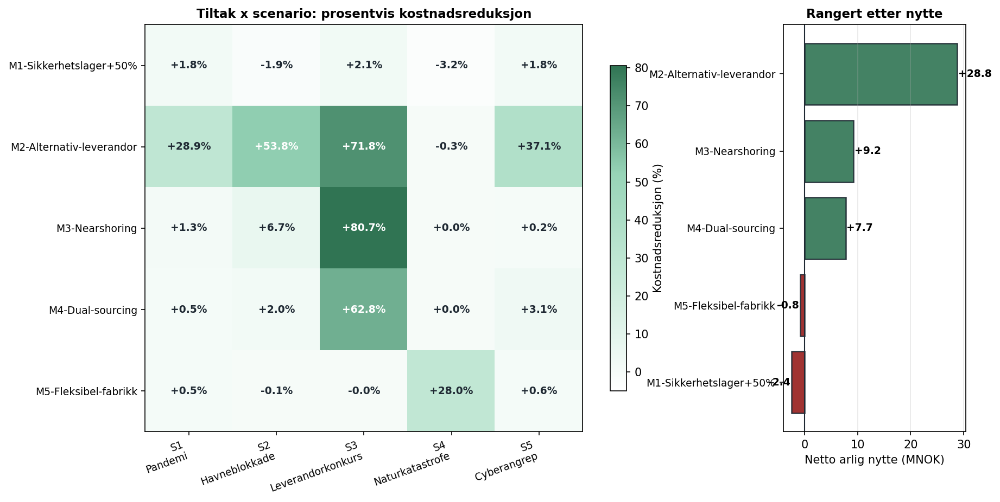

Prioriteringsmatrise. Venstre: $(\text{tiltak} \times \text{scenario})$-matrise der hver celle er prosentvis kostnadsreduksjon vs status quo. Hoyre: tiltakene rangert etter netto aarlig nytte.

Prioritert beredskapsplan: primaertiltak pr scenario.

  **Scenario**                            **Primaertiltak**                              **Kostnadsreduksjon**   $I_k$ (MNOK)   $\mathrm{NB}_k$ (MNOK)
  --------------------------------------- ---------------------------------------------- ----------------------- ---------------- ----------------------------
  $\mathcal{S}_1$-Pandemi             $\boldsymbol{M}_2$-Alternativ leverandor   $+28,9$ %             $1,20$         $+28,8$
  $\mathcal{S}_2$-Havneblokkade       $\boldsymbol{M}_2$-Alternativ leverandor   $+53,8$ %             $1,20$         $+28,8$
  $\mathcal{S}_3$-Leverandorkonkurs   $\boldsymbol{M}_3$-Nearshoring             $+80,7$ %             $1,43$         $+9,2$
  $\mathcal{S}_4$-Naturkatastrofe     $\boldsymbol{M}_5$-Fleksibel fabrikk       $+28,0$ %             $2,00$         $-0,8$
  $\mathcal{S}_5$-Cyberangrep         $\boldsymbol{M}_2$-Alternativ leverandor   $+37,1$ %             $1,20$         $+28,8$

Tre av fem scenarier peker paa $\boldsymbol{M}_2$ som beste respons. Dette er ikke overraskende: den tredje leverandoren gir en alternativ tilfrsel som kan fungere enten L1 eller L2 er kilde til problemet. For $\mathcal{S}_3$ (der L1 er helt borte) er $\boldsymbol{M}_3$-Nearshoring en mer drastisk og effektiv losning fordi den permanent flytter volumet vekk fra den svikende kilden.

**Praktisk anvendelse** --- *Anbefalinger til NordMed*

1.  **Umiddelbar handling:** Signer en ready-to-go-kontrakt med L3-Tyrkia ($\boldsymbol{M}_2$). Dette koster 1,2 MNOK/aar og reduserer forventet arlig risikokostnad med 30 MNOK. Tiltaket er generelt virksomt mot fire av fem scenarier og er den klare vinneren i kost/nytte.

2.  **Mellomlang sikt:** Planlegg gradvis nearshoring ($\boldsymbol{M}_3$) fra L1-Kina til europeisk produksjon. Tiltaket er viktig i det verste L1-spesifikke scenariet (konkurs) og reduserer den strukturelle eksponeringen for geopolitisk risiko.

3.  **Monitorering:** Opprett et beredskapsregister som sporer de fem scenariene kvartalsvis og oppdaterer $p_i$-estimatene naar ny informasjon blir tilgjengelig. Re-kjor stresstesten minst en gang per aar eller naar et scenario er i ferd med aa materialisere seg.

4.  **Ikke prioriter $\boldsymbol{M}_1$ isolert:** Ekstra sikkerhetslager gir negativ netto nytte og bor bare vurderes i kombinasjon med kilde-diversifiserende tiltak.

[Begrensninger]
- Scenariosannsynlighetene $p_i$ er estimater; resultatet er folsomt for disse. En sensitivitetsanalyse (re-kjore beredskapsplanen med $p_i$ $\pm\,50$ %) bor inngaa i styrerapporten.

- Ukjent-ukjent-hendelser (f.eks. en pandemi av en helt annen type) er per definisjon ikke i katalogen. Diversifiseringstiltak ($\boldsymbol{M}_2$, $\boldsymbol{M}_3$, $\boldsymbol{M}_4$) gir likevel en viss beskyttelse fordi de reduserer strukturelle avhengigheter.

- Simulatoren bruker ukentlig granularitet og normalfordelt etterspursel. For detaljert operasjonell planlegging trengs en simulator med daglig oppdatering og mer realistiske fordelinger (f.eks. negativ-binomial for lavvolumprodukter).

- Kostnadsparameterne (tapt salg 1 200 NOK/enh, haste 650 NOK/enh) er estimater. Calibrering mot faktiske tap-pa-salg-registre vil skjerpe rangeringen mellom $\boldsymbol{M}_2$, $\boldsymbol{M}_3$ og $\boldsymbol{M}_4$.

Slutt · Kapittel 11

---

# Del III — Vedlegg A.1: Python-kode

Vedlegg · A

A

# Python kode
Oversikt over Python-koden som hører til hvert eksempel i boka --- med filbeskrivelser og nedlastbar zip per eksempel.

[][][][][]
Om vedlegget

## Om vedlegget
Hvert eksempel har sitt eget `pyproject.toml` og kan kjøres selvstendig med [`uv`](https://docs.astral.sh/uv/){target="_blank" rel="noopener"}. Last ned zip-filen, pakk ut, og kjør `uv sync` i mappen for å klargjøre miljøet. Hver `step0X_*.py` er nummerert i kjørerekkefølge.

Kapittel 1

## 1. Etterspørselsprognoser
[1·3]
### Trend og sesong med SARIMA
[Last ned (6.3 MB)](downloads/code/ch01-sec03-trend-og-sesong.zip)
  ------------------------------- -------------------------------------------------
  `step01_datainnsamling.py`      Steg 1: Datainnsamling for SARIMA-analyse
  `step02_stasjonaritet.py`       Steg 2: Stasjonaritet og differensiering
  `step03_acf_pacf.py`            Steg 3: ACF/PACF-analyse (Modellidentifikasjon)
  `step04_modell_estimering.py`   Steg 4: Parameterestimering (Modelltilpasning)
  `step05_diagnostikk.py`         Steg 5: Modellvalidering (Diagnostikk)
  `step06_prognose.py`            Steg 6: Prognose (Forecasting)
  ------------------------------- -------------------------------------------------

6 filerPython ≥ 3.14data inkludertforhåndsgenererte resultateruv-lås

[1·4]
### Eksterne faktorer og kampanjer med ARIMAX
[Last ned (12.7 MB)](downloads/code/ch01-sec04-eksterne-faktorer.zip)
Python-prosjektet for kapittel 1, seksjon 4 i "Kvantitative metoder i logistikk".

  --------------------------------- -------------------------------------------
  `step01_datainnsamling.py`        Steg 1: Datainnsamling for ARIMAX-analyse
  `step02_feature_engineering.py`   Steg 2: Feature engineering
  `step03_stasjonaritet.py`         Steg 3: Stasjonaritet og differensiering
  `step04_modell_estimering.py`     Steg 4: Parameterestimering for ARIMAX
  `step05_validering.py`            Steg 5: Modellvalidering
  `step06_prognose.py`              Steg 6: Prognose og scenarioanalyse
  --------------------------------- -------------------------------------------

6 filerPython ≥ 3.12data inkludertforhåndsgenererte resultateruv-lås

[1·5]
### Mange variabler med LightGBM
[Last ned (8.1 MB)](downloads/code/ch01-sec05-mange-variabler.zip)
Python-prosjektet for kapittel 1, seksjon 5 i "Kvantitative metoder i logistikk".

  --------------------------------- -----------------------------------------------------------
  `fig_model_diagrams.py`           Pedagogiske skjematiske figurer for Modell-delen av sec05
  `step01_datainnsamling.py`        Steg 1: Datainnsamling for LightGBM-analyse
  `step02_feature_engineering.py`   Steg 2: Feature engineering for LightGBM
  `step03_datasplitting.py`         Steg 3: Data-splitting
  `step04_modell_estimering.py`     Steg 4: Modellestimering + hyperparametertuning
  `step05_validering.py`            Steg 5: Modellvalidering og sammenligning mot baselines
  `step06_tolkning.py`              Steg 6: Tolkning med SHAP + feature importance
  --------------------------------- -----------------------------------------------------------

7 filerPython ≥ 3.12data inkludertforhåndsgenererte resultateruv-lås

Kapittel 2

## 2. Lagerstyring
[2·3]
### Flerprodukts lagerstyring med kapasitet
[Last ned (529 KB)](downloads/code/ch02-sec03-multi-qr.zip)
Python-prosjekt for eksempel: Flerprodukts lagerstyring med felles kapasitets- og budsjettbegrensning, lost via Lagrange-multiplikatorer.

  -------------------------------- -------------------------------------------------------
  `fig_method.py`                  Genererer prosessdiagram-figur multiqr_method.png
  `step01_datainnsamling.py`       Steg 1: Datainnsamling for flerprodukts (Q,R)-analyse
  `step02_uavhengig_qr.py`         Steg 2: Uavhengig (Q,R) per produkt -- baseline
  `step03_modell_formulering.py`   Steg 3: Modellformulering med delte skranker
  `step04_optimering.py`           Steg 4: Losning av flerprodukts (Q,R) med Lagrange
  `step05_validering.py`           Steg 5: Monte Carlo-validering av servicenivaa
  `step06_sensitivitet.py`         Steg 6: Sensitivitetsanalyse og Pareto-front
  -------------------------------- -------------------------------------------------------

7 filerPython ≥ 3.12data inkludertforhåndsgenererte resultateruv-lås

[2·4]
### Flerlokasjon og stokastisk programmering
[Last ned (722 KB)](downloads/code/ch02-sec04-flerlokasjon-stokastisk.zip)
Python-kode for eksempel: "Periodisk gjennomgang (R,S,s) med flerlokasjon, lateral transshipment og to-trinns stokastisk programmering".

  --------------------------------- -----------------------------------------------------
  `step01_datainnsamling.py`        Steg 1: Datainnsamling
  `step02_uavhengig_rss.py`         Steg 2: Uavhengig (R,S,s) per lokasjon (basislinje)
  `step03_scenariogenerering.py`    Steg 3: Scenariogenerering + scenario-reduksjon
  `step04_to_trinns_LP.py`          Steg 4: To-trinns stokastisk LP
  `step05_rullerende_horisont.py`   Steg 5: Rullerende horisont-simulering
  `step06_sammenligning.py`         Steg 6: Sammenligning og visualisering
  --------------------------------- -----------------------------------------------------

6 filerPython ≥ 3.12data inkludertforhåndsgenererte resultateruv-lås

[2·5]
### Datadreven lagerklassifisering med maskinlæring
[Last ned (3.2 MB)](downloads/code/ch02-sec05-ml-klassifisering.zip)
LightGBM multiclass classifier that assigns SKUs to optimal inventory management classes (continuous monitoring / periodic / make-to-order) based on rich product features. Compared against traditional ABC-XYZ.

  --------------------------------- ----------------------------------------------------------------
  `fig_model_diagrams.py`           Pedagogiske skjematiske figurer for Modell-delen av ch02 sec05
  `step01_datainnsamling.py`        Steg 1: Datainnsamling for ML-basert lagerklassifisering
  `step02_feature_engineering.py`   Steg 2: Feature engineering for ML-basert lagerklassifisering
  `step03_datasplitting.py`         Steg 3: Datasplitting
  `step04_modell_estimering.py`     Steg 4: Modellestimering -- LightGBM multiclass
  `step05_validering.py`            Steg 5: Validering -- LightGBM vs naiv ABC-XYZ
  `step06_tolkning.py`              Steg 6: Tolkning med SHAP + kostnadsimulering
  --------------------------------- ----------------------------------------------------------------

7 filerPython ≥ 3.12data inkludertforhåndsgenererte resultateruv-lås

Kapittel 3

## 3. Produksjonsplanlegging og -styring
[3·3]
### Aggregert produksjonsplanlegging med LP
[Last ned (341 KB)](downloads/code/ch03-sec03-aggregert-lp.zip)
Pythonkode for eksempelet i \`sec03-aggregert-lp.tex\` (Ch03, Produksjonsplanlegging).

  -------------------------------- -------------------------------------
  `step01_datainnsamling.py`       Steg 1: Datainnsamling
  `step02_modell_formulering.py`   Steg 2: Modellformulering
  `step03_lp_losning.py`           Steg 3: LP-loesning
  `step04_sensitivitet.py`         Steg 4: Sensitivitetsanalyse
  `step05_validering.py`           Steg 5: Validering / stresstest
  `step06_anbefaling.py`           Steg 6: Anbefaling og handlingsplan
  -------------------------------- -------------------------------------

6 filerPython ≥ 3.12data inkludertforhåndsgenererte resultateruv-lås

[3·4]
### Sekvensering med MIP og heuristikker
[Last ned (292 KB)](downloads/code/ch03-sec04-sekvensering-mip.zip)
Kode for eksempel i \`latex/200-bodymatter/part02-omrader/ch03-produksjonsplanlegging/sec04-sekvensering-mip.tex\`.

  ----------------------------------- -------------------------------------------------------
  `step01_datainnsamling.py`          Steg 1: Datainnsamling for produksjonssekvensering
  `step02_dispatch_heuristikker.py`   Steg 2: Dispatch-heuristikker (SPT, EDD, ATC)
  `step03_mip_formulering.py`         Steg 3: MIP-formulering for enkeltmaskin-sekvensering
  `step04_mip_losning.py`             Steg 4: Losning av MIP med PuLP/CBC for liten instans
  `step05_simulated_annealing.py`     Steg 5: Simulated annealing paa 50-jobb instans
  `step06_sammenligning.py`           Steg 6: Sammenligning av alle metoder
  ----------------------------------- -------------------------------------------------------

6 filerPython ≥ 3.12data inkludertforhåndsgenererte resultateruv-lås

[3·5]
### Materialbehovsplanlegging (MRP) med lotstørrelse
[Last ned (407 KB)](downloads/code/ch03-sec05-mrp-lotstorrelse.zip)
Eksempel for kap. 3, seksjon 5: Materialbehovsplanlegging (MRP) med lotstorrelse.

  ---------------------------- ---------------------------------------------------------------------------
  `step01_datainnsamling.py`   Steg 1: Datainnsamling for MRP-eksempel (sykkelmontering)
  `step02_mrp_eksplosjon.py`   Steg 2: MRP-eksplosjon (bruttobehov -> nettobehov med tidsforskyvning)
  `step03_lfl.py`              Steg 3: Lot-for-lot (LFL) planlegging for alle komponenter
  `step04_eoq_lotsizing.py`    Steg 4: EOQ-basert lotstorrelse
  `step05_silver_meal.py`      Steg 5: Silver-Meal-heuristikk
  `step06_sammenligning.py`    Steg 6: Sammenligning av lotstorrelsesmetoder (LFL vs EOQ vs Silver-Meal)
  ---------------------------- ---------------------------------------------------------------------------

6 filerPython ≥ 3.12data inkludertforhåndsgenererte resultateruv-lås

Kapittel 4

## 4. Nettverksdesign og optimering
[4·3]
### Fasilitetsplassering med MIP (UFLP)
[Last ned (584 KB)](downloads/code/ch04-sec03-fasilitetsplassering.zip)
Python-prosjekt for kapittel 4, seksjon 3: Ukapasitert fasilitetslokalisering (Uncapacitated Facility Location Problem, UFLP) loest som MIP med PuLP/CBC.

  ----------------------------- ---------------------------------------------
  `step01_datainnsamling.py`    Steg 1: Datainnsamling
  `step02_avstandsmatrise.py`   Steg 2: Avstandsmatrise og transportkostnad
  `step03_mip_formulering.py`   Steg 3: MIP-formulering
  `step04_mip_losning.py`       Steg 4: MIP-loesning
  `step05_sensitivitet.py`      Steg 5: Sensitivitetsanalyse
  `step06_anbefaling.py`        Steg 6: Anbefaling
  ----------------------------- ---------------------------------------------

6 filerPython ≥ 3.12data inkludertforhåndsgenererte resultateruv-lås

[4·4]
### Ruteplanlegging med CVRP og Clarke--Wright
[Last ned (670 KB)](downloads/code/ch04-sec04-vrp-heuristikk.zip)
Code for example: Ruteplanlegging med CVRP, Clarke-Wright og MIP

  ---------------------------- ------------------------------------------------------------
  `step01_datainnsamling.py`   Steg 1: Datainnsamling for CVRP
  `step02_narmeste_nabo.py`    Steg 2: Naermeste-nabo-heuristikk (CVRP)
  `step03_clarke_wright.py`    Steg 3: Clarke-Wright savings-algoritmen (CVRP)
  `step04_to_opt.py`           Steg 4: 2-opt lokal forbedring paa Clarke-Wright-losningen
  `step05_eksakt_mip.py`       Steg 5: Eksakt MIP for CVRP (liten instans)
  `step06_sammenligning.py`    Steg 6: Sammenligning av metoder (CVRP)
  ---------------------------- ------------------------------------------------------------

6 filerPython ≥ 3.12data inkludertforhåndsgenererte resultateruv-lås

[4·5]
### ML-basert ruteoptimering med attention-modell
[Last ned (831 KB)](downloads/code/ch04-sec05-ml-vrp.zip)
Attention-based pointer network for CVRP, trained on instances solved by an exact MIP solver (PuLP/CBC). Compared against Clarke-Wright savings heuristic and the exact MIP.

  --------------------------------- ----------------------------------------------------------------------
  `fig_model_diagrams.py`           Pedagogiske skjematiske figurer for Modell-delen av sec05
  `step01_datainnsamling.py`        Steg 1: Datainnsamling for ML-VRP
  `step02_feature_engineering.py`   Steg 2: Feature engineering for ML-VRP
  `step03_modell_arkitektur.py`     Steg 3: Modell-arkitektur (forenklet pointer network med attention)
  `step04_trening.py`               Steg 4: Trening av pointer-modellen med supervised learning
  `step05_evaluering.py`            Steg 5: Evaluering av trent pointer-modell paa valideringsinstanser
  `step06_sammenligning.py`         Steg 6: Sammenligning av ML-modellen, Clarke-Wright og eksakt solver
  --------------------------------- ----------------------------------------------------------------------

7 filerPython ≥ 3.12data inkludertforhåndsgenererte resultateruv-lås

Kapittel 5

## 5. Forsyningskjedeanalyse og -optimering
[5·3]
### Bullwhip-effekten via simulering
[Last ned (649 KB)](downloads/code/ch05-sec03-bullwhip-simulering.zip)
Simulering av bullwhip-effekten i en 4-trinns forsyningskjede (detaljist -> grossist -> distributor -> fabrikk).

  --------------------------------------- ---------------------------------------------------------------------
  `step01_datainnsamling.py`              Steg 1: Datainnsamling
  `step02_basismodell.py`                 Steg 2: Basismodell for 4-trinns forsyningskjede med (s,S)-politikk
  `step03_desentralisert_simulering.py`   Steg 3: Desentralisert simulering (lokal informasjon)
  `step04_delt_informasjon.py`            Steg 4: Delt informasjon (sentralisert prognose)
  `step05_sensitivitet.py`                Steg 5: Sensitivitetsanalyse
  `step06_kvantifisering.py`              Steg 6: Kvantifisering og kostnadsestimering
  --------------------------------------- ---------------------------------------------------------------------

6 filerPython ≥ 3.12forhåndsgenererte resultateruv-lås

[5·4]
### Multi-echelon lagerstyring (Clark--Scarf)
[Last ned (405 KB)](downloads/code/ch05-sec04-multi-echelon.zip)
Kode for eksempel i Ch05 sec04: Clark-Scarf echelon base-stock for et to-trinns distribusjonsnettverk (1 sentrallager + 4 regionlagre) med stokastisk etterspørsel per region.

  ---------------------------- ------------------------------------------------------------------
  `step01_datainnsamling.py`   Steg 1: Datainnsamling for Clark-Scarf multi-echelon
  `step02_uavhengig_ss.py`     Steg 2: Uavhengig (s,S) per lager - naiv baseline
  `step03_clark_scarf.py`      Steg 3: Clark-Scarf echelon base-stock
  `step04_simulering.py`       Steg 4: Monte Carlo-simulering av begge politikker
  `step05_sensitivitet.py`     Steg 5: Sensitivitetsanalyse
  `step06_sammenligning.py`    Steg 6: Sammenligning --- kvantifisering av koordineringsverdi
  ---------------------------- ------------------------------------------------------------------

6 filerPython ≥ 3.12data inkludertforhåndsgenererte resultateruv-lås

[5·5]
### Newsvendor og revenue-sharing-kontrakt
[Last ned (525 KB)](downloads/code/ch05-sec05-newsvendor-kontrakter.zip)
Newsvendor-modell og revenue-sharing-kontrakter for koordinering av forsyningskjeder.

  ----------------------------- ------------------------------------------------------------
  `step01_datainnsamling.py`    Steg 1: Datainnsamling og etterspoerselsfordeling
  `step02_sentralisert.py`      Steg 2: Sentralisert newsvendor (integrert kjede)
  `step03_desentralisert.py`    Steg 3: Desentralisert newsvendor (double marginalization)
  `step04_revenue_sharing.py`   Steg 4: Revenue-sharing-kontrakt
  `step05_sensitivitet.py`      Steg 5: Sensitivitet
  `step06_anbefaling.py`        Steg 6: Anbefaling
  ----------------------------- ------------------------------------------------------------

6 filerPython ≥ 3.12forhåndsgenererte resultateruv-lås

Kapittel 6

## 6. Kø-teori og kapasitetsplanlegging
[6·3]
### Tollstasjon ved Oslo havn (M/M/1)
[Last ned (362 KB)](downloads/code/ch06-sec03-mm1-model.zip)
Kode som genererer figurer og resultater for sec03-mm1-model i Ch06. Kjoer stegene 01-06 i rekkefolge.

  ---------------------------- ------------------------------------------------------
  `step01_datainnsamling.py`   Steg 1: Datainnsamling for M/M/1-analyse
  `step02_analytisk.py`        Steg 2: Analytiske M/M/1-formler
  `step03_simulering.py`       Steg 3: Diskret hendelsessimulering (DES) av M/M/1
  `step04_utnyttelse.py`       Steg 4: Utnyttelsesveggen -- Wq som funksjon av rho
  `step05_sensitivitet.py`     Steg 5: Sensitivitetsanalyse
  `step06_anbefaling.py`       Steg 6: Anbefaling og konklusjon
  ---------------------------- ------------------------------------------------------

6 filerPython ≥ 3.12data inkludertforhåndsgenererte resultateruv-lås

[6·4]
### Kapasitetsdimensjonering med M/M/c
[Last ned (580 KB)](downloads/code/ch06-sec04-mmc-dimensjonering.zip)
Python-prosjekt for eksempelet om kapasitetsdimensjonering av containerterminalkraner ved Oslo Havn. Eksempelet implementerer Erlang-C-formelen og losser et kostnadsoptimeringsproblem for a finne optimalt antall kraner.

  ----------------------------------- --------------------------------------------------------
  `step01_datainnsamling.py`          Steg 1: Datainnsamling for M/M/c-dimensjonering
  `step02_erlang_c.py`                Steg 2: Erlang-C-formelen og svep over antall kraner c
  `step03_servicedimensjonering.py`   Steg 3: Servicedimensjonering - finn minimal c
  `step04_kostnadsoptimering.py`      Steg 4: Kostnadsoptimering
  `step05_sensitivitet.py`            Steg 5: Sensitivitet mot ankomstrate (sesongtopper)
  `step06_anbefaling.py`              Steg 6: Anbefaling og Gantt-visualisering
  ----------------------------------- --------------------------------------------------------

6 filerPython ≥ 3.12data inkludertforhåndsgenererte resultateruv-lås

[6·5]
### Konettverk med SimPy
[Last ned (862 KB)](downloads/code/ch06-sec05-konettverk-simpy.zip)
Diskret hendelsessimulering av konettverk for ordrebehandling (SimPy)

  ----------------------------- --------------------------------------------------
  `step01_datainnsamling.py`    Steg 1: Datainnsamling for konettverk-simulering
  `step02_grunnmodell.py`       Steg 2: Grunnmodell i SimPy
  `step03_grunnsimulering.py`   Steg 3: Grunnsimulering
  `step04_flaskehals.py`        Steg 4: Flaskehalsanalyse
  `step05_what_if.py`           Steg 5: What-if-scenarier
  `step06_sammenligning.py`     Steg 6: Sammenligning og KPI-er
  ----------------------------- --------------------------------------------------

6 filerPython ≥ 3.12data inkludertforhåndsgenererte resultateruv-lås

Kapittel 7

## 7. Lagerdrift og ordreplukk
[7·3]
### Slotting med class-based storage
[Last ned (832 KB)](downloads/code/ch07-sec03-slotting.zip)
Eksempelkode for kapittel 7, seksjon 3: Lagerplassering (slotting) med class-based storage-heuristikk. Datasettet er syntetisk og genereres i \`step01_datainnsamling.py\`: 400 SKU-er i et parallell-gang-lager over 90 dager med Pareto-fordelt

  -------------------------------- --------------------------------------------------------
  `fig_method.py`                  Prosessdiagram slot_method.png
  `step01_datainnsamling.py`       Steg 1: Datainnsamling for slotting-eksempel
  `step02_abc_analyse.py`          Steg 2: ABC-analyse av plukkfrekvens
  `step03_tilfeldig_baseline.py`   Steg 3: Tilfeldig tildeling -- baseline
  `step04_klassebasert.py`         Steg 4: Frekvensbasert (class-based) tildeling
  `step05_soneoptimering.py`       Steg 5: Antall soner og effekten av klassegranularitet
  `step06_sammenligning.py`        Steg 6: Sammenligning og tidsbesparelse
  -------------------------------- --------------------------------------------------------

7 filerPython ≥ 3.12data inkludertforhåndsgenererte resultateruv-lås

[7·4]
### Plukkruteoptimering med TSP-heuristikker
[Last ned (683 KB)](downloads/code/ch07-sec04-plukkruter.zip)
Python-kode for eksempelet i \`ch07-lagerdrift/sec04-plukkruter.tex\`.

  ------------------------------- ---------------------------------------------------------------
  `common.py`                     Felles hjelpefunksjoner for plukkruteheuristikker.
  `step01_datainnsamling.py`      Steg 1: Datainnsamling for plukkruteeksempel
  `step02_s_shape.py`             Steg 2: S-shape (traversal) heuristikk
  `step03_largest_gap.py`         Steg 3: Largest-gap heuristikk
  `step04_return_midpoint.py`     Steg 4: Return og Midpoint heuristikker
  `step05_ratliff_rosenthal.py`   Steg 5: Ratliff-Rosenthal eksakt DP-løsning
  `step06_sammenligning.py`       Steg 6: Statistisk sammenligning av heuristikker vs eksakt DP
  ------------------------------- ---------------------------------------------------------------

7 filerPython ≥ 3.12data inkludertforhåndsgenererte resultateruv-lås

[7·5]
### Integrert bolge-, batch- og ruteplanlegging
[Last ned (623 KB)](downloads/code/ch07-sec05-integrert-lager.zip)
Eksempelkode for ch07 sec05: Integrert bolgeplanlegging, batching og ruteoptimering.

  ---------------------------------- -------------------------------------------------------------
  `common.py`                        Felles hjelpefunksjoner for det integrerte lagereksempelet.
  `step01_datainnsamling.py`         Steg 1: Datainnsamling
  `step02_bolgeplanlegging_mip.py`   Steg 2: Bolgeplanlegging via tidsindeksert MIP
  `step03_batching_kmedoids.py`      Steg 3: Batching via k-medoids
  `step04_ruting_largestgap.py`      Steg 4: Ruteplanlegging med largest-gap
  `step05_simpy_simulering.py`       Steg 5: Full-dag SimPy-simulering
  `step06_sammenligning.py`          Steg 6: Sammenligning av strategier
  ---------------------------------- -------------------------------------------------------------

7 filerPython ≥ 3.12data inkludertforhåndsgenererte resultateruv-lås

Kapittel 8

## 8. Bærekraftig logistikk
[8·3]
### Grønn ruteplanlegging (Green VRP)
[Last ned (718 KB)](downloads/code/ch08-sec03-green-vrp.zip)
Code for example: Groenn ruteplanlegging (Green VRP) med lasteavhengig utslippsfunksjon

  ---------------------------- ------------------------------------------------------------------
  `fig_method.py`              Illustrer seks-stegs prosessen for Green VRP som et flytdiagram.
  `step01_datainnsamling.py`   Steg 1: Datainnsamling for Green VRP
  `step02_distanse_vrp.py`     Steg 2: Distanse-minimerende VRP-baseline (Clarke-Wright)
  `step03_utslippsmodell.py`   Steg 3: Utslippsmodellen
  `step04_green_cw.py`         Steg 4: Utslippsbevisst Clarke-Wright (Green CW)
  `step05_to_opt.py`           Steg 5: 2-opt lokal forbedring paa utslipp
  `step06_pareto.py`           Steg 6: Pareto-front kostnad vs CO2
  ---------------------------- ------------------------------------------------------------------

7 filerPython ≥ 3.12data inkludertforhåndsgenererte resultateruv-lås

[8·4]
### Emballasjeoptimering med bin packing
[Last ned (348 KB)](downloads/code/ch08-sec04-binpacking.zip)
Kode for Ch08 sec04 - eksempel pa 1D/2D bin packing med FFD og BFD heuristikker.

  ---------------------------- -------------------------------------------------------------
  `step01_datainnsamling.py`   Steg 1: Datainnsamling for bin packing
  `step02_naiv_pakking.py`     Steg 2: Naiv 1D bin packing (first-fit i ankomstrekkefolge)
  `step03_ffd.py`              Steg 3: First-Fit Decreasing (FFD)
  `step04_bfd.py`              Steg 4: Best-Fit Decreasing (BFD)
  `step05_2d_shelves.py`       Steg 5: 2D shelf-packing (pedagogisk visualisering)
  `step06_sammenligning.py`    Steg 6: Sammenligning, nedre grense og transportbesparelser
  ---------------------------- -------------------------------------------------------------

6 filerPython ≥ 3.12data inkludertforhåndsgenererte resultateruv-lås

[8·5]
### Integrert grønn forsyningskjede med stokastisk flermål MIP
[Last ned (877 KB)](downloads/code/ch08-sec05-gronn-sc.zip)
To-trinns stokastisk flermål MIP med epsilon-constraint og scenario-reduksjon.

  --------------------------------- -------------------------------------------------------------------
  `fig_model_diagrams.py`           Pedagogiske figurer for Modell-subseksjonen
  `solver.py`                       Felles MIP-solver for den to-trinns stokastiske flermål modellen.
  `step01_datainnsamling.py`        Steg 1: Datainnsamling
  `step02_enkeltmal_baselines.py`   Steg 2: Enkeltmål-basislinjer
  `step03_epsilon_constraint.py`    Steg 3: Epsilon-constraint -> Pareto-front
  `step04_scenario_redusering.py`   Steg 4: Scenario-reduksjon (Kantorovich fast-forward)
  `step05_karbonpris_tipping.py`    Steg 5: Karbonpris-tipping-punkter
  `step06_anbefaling.py`            Steg 6: Anbefaling og 3D Pareto-visualisering
  --------------------------------- -------------------------------------------------------------------

8 filerPython ≥ 3.12data inkludertforhåndsgenererte resultateruv-lås

Kapittel 9

## 9. Returlogistikk og sirkulære forsyningskjeder
[9·3]
### Reverst nettverksdesign med MIP
[Last ned (502 KB)](downloads/code/ch09-sec03-revers-nettverk.zip)
Code for example: Reverse Network Design (multi-tier MIP) for WEEE take-back

  ----------------------------- --------------------------------------------------------------
  `fig_method.py`               Metodefigur: 6-stegs arbeidsflyt for reverse nettverksdesign
  `step01_datainnsamling.py`    Steg 1: Datainnsamling
  `step02_avstandsmatrise.py`   Steg 2: Avstandsmatriser og transportkostnader
  `step03_mip_formulering.py`   Steg 3: MIP-formulering
  `step04_mip_losning.py`       Steg 4: MIP-loesning
  `step05_sensitivitet.py`      Steg 5: Sensitivitetsanalyse
  `step06_anbefaling.py`        Steg 6: Anbefaling
  ----------------------------- --------------------------------------------------------------

7 filerPython ≥ 3.12data inkludertforhåndsgenererte resultateruv-lås

[9·4]
### Returprognoser med Weibull
[Last ned (1.1 MB)](downloads/code/ch09-sec04-weibull-retur.zip)
Kode for eksempel i kapittel 9 (Returlogistikk), seksjon 4.

  ---------------------------- -------------------------------------------------
  `step01_datainnsamling.py`   Steg 1: Datainnsamling for Weibull-returanalyse
  `step02_eksplorering.py`     Steg 2: Utforskende analyse
  `step03_mle_weibull.py`      Steg 3: MLE-estimering av Weibull-fordelingen
  `step04_hazard_analyse.py`   Steg 4: Hazardrate-analyse og tolkning
  `step05_prognose.py`         Steg 5: Prognose for neste 12 måneder
  `step06_validering.py`       Steg 6: Backtest og validering
  ---------------------------- -------------------------------------------------

6 filerPython ≥ 3.12data inkludertforhåndsgenererte resultateruv-lås

[9·5]
### Disposisjonsbeslutning med forventet verdi og beslutningstre
[Last ned (499 KB)](downloads/code/ch09-sec05-disposisjon-tre.zip)
Kode for kapittel 9, seksjon 5: Forventet-verdi-analyse og beslutningstre for disposisjonsbeslutninger (reparere / refurbishe / resirkulere / deponere).

  ------------------------------- --------------------------------------------------------------------
  `step01_datainnsamling.py`      Steg 1: Datainnsamling for disposisjonsbeslutning
  `step02_verdimodell.py`         Steg 2: Verdimodell -- forventet verdi per disposisjonsalternativ
  `step03_cutoff_optimering.py`   Steg 3: Cut-off-optimering basert på tilstandsscore
  `step04_beslutningstre.py`      Steg 4: Beslutningstre lært fra optimale merkelapper
  `step05_sammenligning.py`       Steg 5: Sammenligning av politikker
  `step06_anbefaling.py`          Steg 6: Anbefalt disposisjonspolitikk + metodefigur
  ------------------------------- --------------------------------------------------------------------

6 filerPython ≥ 3.12data inkludertforhåndsgenererte resultateruv-lås

Kapittel 10

## 10. Innkjøpsoptimalisering og leverandørstyring
[10·3]
### Leverandørvalg med AHP og TOPSIS
[Last ned (794 KB)](downloads/code/ch10-sec03-leverandorvalg.zip)
Python-kode for eksempelet "Leverandørvalg med multikriterieanalyse (AHP + TOPSIS)" i kapittel 10 av \*Kvantitative metoder i logistikk\*.

  ---------------------------- ------------------------------------------------------------
  `fig_schematics.py`          Schematiske figurer for AHP + TOPSIS-eksempelet
  `step01_datainnsamling.py`   Steg 1: Datainnsamling for AHP + TOPSIS
  `step02_ahp_vekter.py`       Steg 2: AHP -- egenvektor-vekter + CI/CR-konsistenssjekk
  `step03_topsis.py`           Steg 3: TOPSIS -- avstand til ideal- og anti-idealløsning
  `step04_rangering.py`        Steg 4: Rangering av leverandører
  `step05_sensitivitet.py`     Steg 5: Sensitivitetsanalyse
  `step06_anbefaling.py`       Steg 6: Anbefaling under ulike preferanseprofiler
  ---------------------------- ------------------------------------------------------------

7 filerPython ≥ 3.12data inkludertforhåndsgenererte resultateruv-lås

[10·4]
### Bestillingsoptimering med kvantumsrabatt
[Last ned (452 KB)](downloads/code/ch10-sec04-kvantumsrabatt.zip)
Example code for sec04 of Ch10: classical EOQ extended with quantity-discount price schedules, implemented for both all-units and incremental discount models.

  ---------------------------- ---------------------------------------------------
  `step01_datainnsamling.py`   Steg 1: Datainnsamling
  `step02_basic_eoq.py`        Steg 2: Grunnleggende EOQ
  `step03_all_units.py`        Steg 3: All-units kvantumsrabatt
  `step04_incremental.py`      Steg 4: Incremental (marginal) kvantumsrabatt
  `step05_sammenligning.py`    Steg 5: Sammenligning av all-units og incremental
  `step06_anbefaling.py`       Steg 6: Anbefalinger og arlige besparelser
  ---------------------------- ---------------------------------------------------

6 filerPython ≥ 3.12data inkludertforhåndsgenererte resultateruv-lås

[10·5]
### Innkjøpsauksjon med kombinatoriske bud (WDP/MIP)
[Last ned (535 KB)](downloads/code/ch10-sec05-innkjopsauksjon.zip)
Code for example: Procurement Auction / Winner Determination Problem (MIP)

  ----------------------------- ----------------------------------------------------------
  `fig_method.py`               Prosessfigur for WDP-eksempelet
  `step01_datainnsamling.py`    Steg 1: Datainnsamling
  `step02_naiv.py`              Steg 2: Naiv tildeling (laveste enhetspris per kategori)
  `step03_mip_formulering.py`   Steg 3: MIP-formulering (Winner Determination Problem)
  `step04_mip_losning.py`       Steg 4: MIP-loesning
  `step05_diversifisering.py`   Steg 5: Diversifiseringsskranke
  `step06_sensitivitet.py`      Steg 6: Sensitivitet
  ----------------------------- ----------------------------------------------------------

7 filerPython ≥ 3.12data inkludertforhåndsgenererte resultateruv-lås

Kapittel 11

## 11. Risikostyring og robusthet i forsyningskjeder
[11·3]
### Risikokvantifisering med Monte Carlo-simulering
[Last ned (784 KB)](downloads/code/ch11-sec03-monte-carlo-risk.zip)
Monte Carlo-simulering av forsyningskjederisiko med VaR/CVaR

  ----------------------------- ----------------------------------------------------------------------------
  `fig_method.py`               Genererer prosessdiagram for seksjon \'Monte Carlo risikokvantifisering\'.
  `step01_datainnsamling.py`    Steg 1: Datainnsamling
  `step02_basissimulering.py`   Steg 2: Basissimulering (single-run)
  `step03_monte_carlo.py`       Steg 3: Monte Carlo-simulering (10 000 runs)
  `step04_tornado.py`           Steg 4: Tornado-diagram
  `step05_mitigasjon.py`        Steg 5: Mitigasjonstiltak
  `step06_anbefaling.py`        Steg 6: Anbefaling
  ----------------------------- ----------------------------------------------------------------------------

7 filerPython ≥ 3.12data inkludertforhåndsgenererte resultateruv-lås

[11·4]
### Robust nettverksdesign med minimax regret
[Last ned (348 KB)](downloads/code/ch11-sec04-robust-opt.zip)
This example compares three approaches for a network design problem:

  ---------------------------- -------------------------------------------------------------------------
  `model_utils.py`             Felles modelloppsett for robust optimering under usikker etterspoersel.
  `step01_datainnsamling.py`   Steg 1: Datainnsamling
  `step02_deterministisk.py`   Steg 2: Deterministisk baseline
  `step03_robust.py`           Steg 3: Robust formulering -- minimax regret
  `step04_stokastisk.py`       Steg 4: Scenariobasert stokastisk LP
  `step05_sammenligning.py`    Steg 5: Sammenligning
  `step06_tradeoff.py`         Steg 6: Trade-off-kurve (forsikringspremie)
  ---------------------------- -------------------------------------------------------------------------

7 filerPython ≥ 3.12data inkludertforhåndsgenererte resultateruv-lås

[11·5]
### Stresstest av forsyningskjede
[Last ned (647 KB)](downloads/code/ch11-sec05-stresstest.zip)
Stresstest og scenarioanalyse av forsyningskjede (ch11 sec05)

  --------------------------------- -----------------------------------------------------
  `step01_datainnsamling.py`        Steg 1: Datainnsamling -- baseline-forsyningskjede
  `step02_baseline_simulering.py`   Steg 2: Baseline-simulering
  `step03_scenarier.py`             Steg 3: Scenariokatalog
  `step04_evaluering.py`            Steg 4: Evaluering av scenarier
  `step05_mitigasjoner.py`          Steg 5: Mitigasjoner -- rangering av tiltak
  `step06_beredskapsplan.py`        Steg 6: Beredskapsplan og prioritering
  --------------------------------- -----------------------------------------------------

6 filerPython ≥ 3.12forhåndsgenererte resultateruv-lås

Slutt · Vedlegg A

---


---

# Vedlegg A.2 — Python kildekode (komplett)

Alle 213 Python-filer fra de 33 eksemplene, organisert etter kapittel. Kildekoden er hentet direkte fra zip-filene under `downloads/code/` og pakket ut til `code/<eksempel>/`. Hvert eksempel er et selvstendig UV-prosjekt (`pyproject.toml` + `uv.lock`) som kan kjøres med `uv sync && uv run src/stepNN_*.py`.


## Kapittel 1

### Kapittel 1 · seksjon 3: Trend og sesong med SARIMA

*Mappe:* `code/ch01-sec03-trend-og-sesong/` &nbsp;·&nbsp; *Antall filer:* 6


#### `sec03-trend-og-sesong/src/step01_datainnsamling.py`

```python
"""
Steg 1: Datainnsamling for SARIMA-analyse
=========================================
Laster inn månedlige traktordata (144 observasjoner, jan 2003 - des 2014)
fra data/tractor-sales.csv og genererer tidsserieplott og deskriptiv statistikk.
"""

import json
from pathlib import Path

import matplotlib.pyplot as plt
import numpy as np
import pandas as pd

DATA_DIR = Path(__file__).parent.parent / 'data'

def create_time_series() -> pd.Series:
    """Les traktorsalg fra CSV og returner tidsserie med månedsslutt-indeks."""
    df = pd.read_csv(DATA_DIR / 'tractor-sales.csv', parse_dates=['Month'])
    dates = pd.date_range(start=df['Month'].iloc[0], periods=len(df), freq='ME')
    return pd.Series(df['Sales'].values, index=dates, name='Traktorsalg')

def calculate_statistics(ts: pd.Series) -> dict:
    """Beregn deskriptiv statistikk."""
    stats = ts.describe()
    return {
        'antall': int(stats['count']),
        'gjennomsnitt': round(stats['mean'], 1),
        'standardavvik': round(stats['std'], 1),
        'minimum': int(stats['min']),
        'kvartil_25': round(stats['25%'], 1),
        'median': round(stats['50%'], 1),
        'kvartil_75': round(stats['75%'], 1),
        'maksimum': int(stats['max']),
    }

def plot_time_series(ts: pd.Series, output_path: Path) -> None:
    """Generer tidsserieplott med dobbel x-akse (t nederst, år øverst)."""
    fig, ax = plt.subplots(figsize=(10, 5))

    # Bruk numerisk x-akse (t = 1, 2, ..., 144)
    t = np.arange(1, len(ts) + 1)

    ax.plot(t, ts.values, 'b-', linewidth=1.2, label='Månedlig salg')

    # Legg til trendlinje
    z = np.polyfit(t, ts.values, 1)
    trend = np.poly1d(z)
    ax.plot(t, trend(t), 'r--', linewidth=1, alpha=0.7, label='Lineær trend')

    # Nedre x-akse: t
    ax.set_xlabel('$t$', fontsize=16)
    ax.set_ylabel('$Y_t$', fontsize=16, rotation=0, labelpad=15)
    ax.set_xlim(1, 144)
    ax.set_xticks([1, 25, 49, 73, 97, 121, 144])
    ax.tick_params(axis='both', labelsize=10)

    # Øvre x-akse: årstall
    ax2 = ax.twiny()
    ax2.set_xlim(ax.get_xlim())
    # Plasser årstall ved januar hvert andre år (t=1, 25, 49, 73, 97, 121)
    year_positions = [1, 25, 49, 73, 97, 121]
    year_labels = ['2003', '2005', '2007', '2009', '2011', '2013']
    ax2.set_xticks(year_positions)
    ax2.set_xticklabels(year_labels)
    ax2.tick_params(axis='x', labelsize=10)

    ax.set_title('Månedlig traktorsalg (2003-2014)', fontsize=12, fontweight='bold', pad=35)
    ax.legend(loc='upper left', fontsize=10)
    ax.grid(True, alpha=0.3)

    plt.tight_layout()
    plt.savefig(output_path, dpi=150, bbox_inches='tight', facecolor='white')
    plt.close()
    print(f"Figur lagret: {output_path}")

def main():
    """Hovedfunksjon."""
    # Opprett output-mappe
    output_dir = Path(__file__).parent.parent / 'output'
    output_dir.mkdir(exist_ok=True)

    # Opprett tidsserie
    ts = create_time_series()
    print(f"\nTidsserie opprettet: {len(ts)} observasjoner")
    print(f"Periode: {ts.index[0].strftime('%b %Y')} - {ts.index[-1].strftime('%b %Y')}")

    # Beregn statistikk
    stats = calculate_statistics(ts)
    print("\n--- Deskriptiv statistikk ---")
    for key, value in stats.items():
        print(f"  {key}: {value}")

    # Lagre statistikk som JSON
    stats_path = output_dir / 'descriptive_stats.json'
    with open(stats_path, 'w', encoding='utf-8') as f:
        json.dump(stats, f, indent=2, ensure_ascii=False)
    print(f"\nStatistikk lagret: {stats_path}")

    # Generer plott
    plot_path = output_dir / 'sarima_data_plot.png'
    plot_time_series(ts, plot_path)

if __name__ == '__main__':
    main()
```

#### `sec03-trend-og-sesong/src/step02_stasjonaritet.py`

```python
"""
Steg 2: Stasjonaritet og differensiering
========================================
Utfører ADF-test, log-transformasjon, og differensiering for SARIMA-analyse.
"""

import json
from pathlib import Path

import matplotlib.pyplot as plt
import numpy as np
import pandas as pd
from statsmodels.tsa.stattools import adfuller

from step01_datainnsamling import create_time_series


def adf_test(series: pd.Series, name: str) -> dict:
    """
    Kjør Augmented Dickey-Fuller (ADF) test og returner resultater.

    H₀: Serien har enhetsrot (ikke-stasjonær)
    H₁: Serien er stasjonær
    """
    result = adfuller(series.dropna(), autolag='AIC')
    return {
        'serie': name,
        'adf_statistic': float(round(result[0], 4)),
        'p_verdi': float(round(result[1], 6)),
        'lags_brukt': int(result[2]),
        'observasjoner': int(result[3]),
        'kritiske_verdier': {
            '1%': float(round(result[4]['1%'], 4)),
            '5%': float(round(result[4]['5%'], 4)),
            '10%': float(round(result[4]['10%'], 4)),
        },
        'stasjonaer': bool(result[1] < 0.05)
    }


def apply_transformations(ts: pd.Series) -> dict:
    """
    Anvend transformasjoner for å oppnå stasjonaritet.

    1. Log-transformasjon: Stabiliserer variansen
    2. Førstegrads differensiering (d=1): Fjerner trend
    3. Sesongdifferensiering (D=1, m=12): Fjerner årlig mønster
    """
    # Log-transformasjon
    log_ts = np.log(ts)

    # Førstegrads differensiering
    log_diff1 = log_ts.diff(1)

    # Sesongdifferensiering (m=12)
    log_diff1_12 = log_diff1.diff(12).dropna()

    return {
        'original': ts,
        'log': log_ts,
        'log_diff1': log_diff1,
        'log_diff1_12': log_diff1_12
    }


def plot_comparison(original: pd.Series, differenced: pd.Series, output_path: Path) -> None:
    """Generer sammenligning mellom original og differensiert serie."""
    fig, axes = plt.subplots(2, 1, figsize=(10, 7))

    # Numeriske t-verdier
    t_original = np.arange(1, len(original) + 1)  # t = 1, ..., 144
    # Differensiert serie starter ved t=14 (mister 13 obs til differensiering)
    t_diff = np.arange(14, 14 + len(differenced))  # t = 14, ..., 144

    # Øvre subplot: Original serie
    ax1 = axes[0]
    ax1.plot(t_original, original.values, 'b-', linewidth=1.2)
    ax1.set_ylabel('$Y_t$', fontsize=16, rotation=0, labelpad=15)
    ax1.set_title('Original tidsserie (ikke-stasjonær)', fontsize=12, fontweight='bold', pad=35)
    ax1.set_xlim(1, 144)
    ax1.set_xticks([1, 25, 49, 73, 97, 121, 144])
    ax1.grid(True, alpha=0.3)
    ax1.tick_params(axis='both', labelsize=10)

    # Øvre x-akse med årstall for ax1
    ax1_twin = ax1.twiny()
    ax1_twin.set_xlim(ax1.get_xlim())
    year_positions = [1, 25, 49, 73, 97, 121]
    year_labels = ['2003', '2005', '2007', '2009', '2011', '2013']
    ax1_twin.set_xticks(year_positions)
    ax1_twin.set_xticklabels(year_labels)
    ax1_twin.tick_params(axis='x', labelsize=10)

    # Nedre subplot: Differensiert serie
    ax2 = axes[1]
    ax2.plot(t_diff, differenced.values, 'g-', linewidth=1.0)
    ax2.axhline(y=0, color='r', linestyle='--', linewidth=0.8, alpha=0.7)
    ax2.set_xlabel('$t$', fontsize=16)
    ax2.set_ylabel('$Z_t$', fontsize=16, rotation=0, labelpad=15)
    ax2.set_title('Etter log-transformasjon og differensiering (stasjonær)', fontsize=12, fontweight='bold')
    ax2.set_xlim(1, 144)
    ax2.set_xticks([1, 25, 49, 73, 97, 121, 144])
    ax2.grid(True, alpha=0.3)
    ax2.tick_params(axis='both', labelsize=10)

    plt.tight_layout()
    plt.savefig(output_path, dpi=150, bbox_inches='tight', facecolor='white')
    plt.close()
    print(f"Figur lagret: {output_path}")


def plot_differenced(differenced: pd.Series, output_path: Path) -> None:
    """Generer plott av differensiert serie."""
    fig, ax = plt.subplots(figsize=(10, 4))

    ax.plot(differenced.index, differenced.values, 'g-', linewidth=1.0, label='Differensiert serie')
    ax.axhline(y=0, color='r', linestyle='--', linewidth=0.8, alpha=0.7, label='Null-linje')

    ax.set_xlabel('År', fontsize=11)
    ax.set_ylabel('Differensiert log-salg', fontsize=11)
    ax.set_title('Log-differensiert tidsserie: $\\nabla \\nabla_{12} \\log(Y_t)$', fontsize=12, fontweight='bold')
    ax.legend(loc='upper right', fontsize=10)
    ax.grid(True, alpha=0.3)
    ax.tick_params(axis='both', labelsize=10)

    plt.tight_layout()
    plt.savefig(output_path, dpi=150, bbox_inches='tight', facecolor='white')
    plt.close()
    print(f"Figur lagret: {output_path}")


def main():
    """Hovedfunksjon for stasjonaritetsanalyse."""
    # Output-mappe
    output_dir = Path(__file__).parent.parent / 'output'
    output_dir.mkdir(exist_ok=True)

    # 1. Last inn data
    ts = create_time_series()
    print(f"\n{'='*60}")
    print("STEG 2: STASJONARITET OG DIFFERENSIERING")
    print(f"{'='*60}")
    print(f"\nTidsserie lastet: {len(ts)} observasjoner")

    # 2. ADF-test på original serie
    print("\n--- ADF-test: Original serie ---")
    adf_original = adf_test(ts, 'Original')
    print(f"  ADF-statistikk: {adf_original['adf_statistic']}")
    print(f"  P-verdi: {adf_original['p_verdi']}")
    print(f"  Kritiske verdier: {adf_original['kritiske_verdier']}")
    print(f"  Konklusjon: {'Stasjonær' if adf_original['stasjonaer'] else 'Ikke-stasjonær'}")

    # 3. Anvend transformasjoner
    print("\n--- Transformasjoner ---")
    print("  1. Log-transformasjon (stabiliserer variansen)")
    print("  2. Førstegrads differensiering (d=1, fjerner trend)")
    print("  3. Sesongdifferensiering (D=1, m=12, fjerner årlig mønster)")

    transformed = apply_transformations(ts)
    differenced = transformed['log_diff1_12']
    print(f"\n  Differensiert serie: {len(differenced)} observasjoner")
    print(f"  (13 observasjoner tapt til differensiering)")

    # 4. ADF-test på differensiert serie
    print("\n--- ADF-test: Differensiert serie ---")
    adf_differenced = adf_test(differenced, 'Differensiert')
    print(f"  ADF-statistikk: {adf_differenced['adf_statistic']}")
    print(f"  P-verdi: {adf_differenced['p_verdi']}")
    print(f"  Kritiske verdier: {adf_differenced['kritiske_verdier']}")
    print(f"  Konklusjon: {'Stasjonær' if adf_differenced['stasjonaer'] else 'Ikke-stasjonær'}")

    # 5. Generer plott
    print("\n--- Genererer figurer ---")
    plot_comparison(ts, differenced, output_dir / 'sarima_stationarity_comparison.png')
    plot_differenced(differenced, output_dir / 'sarima_differenced_plot.png')

    # 6. Lagre resultater som JSON
    results = {
        'original_serie': {
            'adf_test': adf_original,
            'observasjoner': len(ts)
        },
        'differensiert_serie': {
            'adf_test': adf_differenced,
            'observasjoner': len(differenced),
            'transformasjoner': [
                'log-transformasjon',
                'førstegrads differensiering (d=1)',
                'sesongdifferensiering (D=1, m=12)'
            ]
        },
        'sesongperiode': 12,
        'konklusjon': {
            'd': 1,
            'D': 1,
            'm': 12,
            'beskrivelse': 'Serien er stasjonær etter log-transformasjon, førstegrads differensiering og sesongdifferensiering.'
        }
    }

    results_path = output_dir / 'stationarity_results.json'
    with open(results_path, 'w', encoding='utf-8') as f:
        json.dump(results, f, indent=2, ensure_ascii=False)
    print(f"\nResultater lagret: {results_path}")

    # Oppsummering
    print(f"\n{'='*60}")
    print("KONKLUSJON")
    print(f"{'='*60}")
    print(f"  • Original serie er IKKE-STASJONÆR (p = {adf_original['p_verdi']})")
    print(f"  • Etter transformasjon er serien STASJONÆR (p = {adf_differenced['p_verdi']})")
    print(f"  • Sesongperiode: m = 12 (månedlige data, årlig syklus)")
    print(f"  • SARIMA-parametere: d=1, D=1, m=12")


if __name__ == '__main__':
    main()
```

#### `sec03-trend-og-sesong/src/step03_acf_pacf.py`

```python
"""
Steg 3: ACF/PACF-analyse (Modellidentifikasjon)
===============================================
Beregner og plotter ACF og PACF for den differensierte log-serien
for å identifisere SARIMA-parameterne (p, q, P, Q).
"""

import json
from pathlib import Path

import matplotlib.pyplot as plt
import numpy as np
import pandas as pd
from statsmodels.graphics.tsaplots import plot_acf, plot_pacf
from statsmodels.tsa.stattools import acf, pacf

from step01_datainnsamling import create_time_series


def prepare_differenced_series(ts: pd.Series) -> pd.Series:
    """
    Anvend log-transformasjon og differensiering.

    Transformasjoner:
    1. Log-transformasjon: stabiliserer variansen
    2. Førstegrads differensiering (d=1): fjerner trend
    3. Sesongdifferensiering (D=1, m=12): fjerner årlig mønster
    """
    log_ts = np.log(ts)
    log_diff1 = log_ts.diff(1)
    log_diff1_12 = log_diff1.diff(12).dropna()
    return log_diff1_12


def compute_acf_pacf(series: pd.Series, nlags: int = 24) -> dict:
    """
    Beregn ACF og PACF verdier med konfidensintervaller.

    95% konfidensintervall: ±1.96/√n
    """
    n = len(series)
    conf_int = 1.96 / np.sqrt(n)

    # Beregn ACF og PACF
    acf_values = acf(series, nlags=nlags, fft=True)
    pacf_values = pacf(series, nlags=nlags, method='ywm')

    return {
        'acf': acf_values.tolist(),
        'pacf': pacf_values.tolist(),
        'n_obs': n,
        'confidence_interval': round(conf_int, 4),
        'nlags': nlags
    }


def plot_acf_pacf(series: pd.Series, output_path: Path, nlags: int = 24) -> None:
    """
    Generer ACF og PACF plott side ved side.

    ACF (Autokorrelasjonsfunksjon):
    - Viser korrelasjon mellom Y_t og Y_{t-k} for ulike lag k
    - Signifikante verdier ved sesonglag (12, 24) indikerer sesongkomponent

    PACF (Partiell autokorrelasjonsfunksjon):
    - Viser direkte korrelasjon mellom Y_t og Y_{t-k} etter å ha fjernet
      effekten av mellomliggende verdier
    - Brukes til å identifisere AR-orden
    """
    fig, axes = plt.subplots(1, 2, figsize=(12, 4.5))

    # ACF plott
    plot_acf(series, ax=axes[0], lags=nlags, alpha=0.05,
             title='Autokorrelasjonsfunksjon (ACF)')
    axes[0].set_xlabel('$k$', fontsize=16)
    axes[0].set_ylabel(r'$\rho_k$', fontsize=16, rotation=0, labelpad=15)
    axes[0].axhline(y=0, color='black', linewidth=0.5)
    axes[0].tick_params(axis='both', labelsize=10)

    # Marker sesonglag
    for lag in [12, 24]:
        if lag <= nlags:
            axes[0].axvline(x=lag, color='red', linestyle='--', alpha=0.3, linewidth=1)

    # PACF plott
    plot_pacf(series, ax=axes[1], lags=nlags, alpha=0.05, method='ywm',
              title='Partiell autokorrelasjonsfunksjon (PACF)')
    axes[1].set_xlabel('$k$', fontsize=16)
    axes[1].set_ylabel(r'$\phi_{kk}$', fontsize=16, rotation=0, labelpad=15)
    axes[1].axhline(y=0, color='black', linewidth=0.5)
    axes[1].tick_params(axis='both', labelsize=10)

    # Marker sesonglag
    for lag in [12, 24]:
        if lag <= nlags:
            axes[1].axvline(x=lag, color='red', linestyle='--', alpha=0.3, linewidth=1)

    plt.tight_layout()
    plt.savefig(output_path, dpi=150, bbox_inches='tight', facecolor='white')
    plt.close()
    print(f"Figur lagret: {output_path}")


def interpret_acf_pacf(acf_pacf_results: dict) -> dict:
    """
    Tolker ACF og PACF for å identifisere SARIMA-parametere.

    Tommelfingerregler:
    - AR(p): PACF avtar brått etter lag p, ACF avtar gradvis
    - MA(q): ACF avtar brått etter lag q, PACF avtar gradvis
    - ARMA: Begge avtar gradvis

    Sesongkomponenter:
    - Sesong-AR: PACF signifikant ved sesonglag (12, 24, ...)
    - Sesong-MA: ACF signifikant ved sesonglag
    """
    acf_vals = np.array(acf_pacf_results['acf'])
    pacf_vals = np.array(acf_pacf_results['pacf'])
    ci = acf_pacf_results['confidence_interval']

    # Identifiser signifikante lag (utenfor konfidensintervall)
    significant_acf = [i for i, v in enumerate(acf_vals) if abs(v) > ci and i > 0]
    significant_pacf = [i for i, v in enumerate(pacf_vals) if abs(v) > ci and i > 0]

    # ACF ved lag 1 og 12
    acf_lag1 = acf_vals[1] if len(acf_vals) > 1 else 0
    acf_lag12 = acf_vals[12] if len(acf_vals) > 12 else 0

    # PACF ved lag 1 og 12
    pacf_lag1 = pacf_vals[1] if len(pacf_vals) > 1 else 0
    pacf_lag12 = pacf_vals[12] if len(pacf_vals) > 12 else 0

    interpretation = {
        'signifikante_acf_lag': significant_acf[:10],  # Første 10
        'signifikante_pacf_lag': significant_pacf[:10],
        'acf_lag1': round(float(acf_lag1), 4),
        'acf_lag12': round(float(acf_lag12), 4),
        'pacf_lag1': round(float(pacf_lag1), 4),
        'pacf_lag12': round(float(pacf_lag12), 4),
        'konfidensintervall': f'±{ci:.4f}',
        'anbefalt_modell': {
            'p': 1,  # PACF signifikant ved lag 1
            'q': 1,  # ACF avtar gradvis, tyder på MA-komponent
            'P': 0,  # PACF ikke signifikant ved sesonglag
            'Q': 1,  # ACF signifikant ved lag 12
            'begrunnelse': [
                'p=1: PACF viser signifikant verdi ved lag 1, deretter avtar',
                'q=1: ACF viser gradvis avtak, tyder på MA(1)-komponent',
                'P=0: PACF er ikke signifikant ved sesonglag 12',
                'Q=1: ACF viser signifikant negativ verdi ved lag 12 (sesong-MA)'
            ]
        }
    }

    return interpretation


def main():
    """Hovedfunksjon for ACF/PACF-analyse."""
    # Output-mappe
    output_dir = Path(__file__).parent.parent / 'output'
    output_dir.mkdir(exist_ok=True)

    print(f"\n{'='*60}")
    print("STEG 3: ACF/PACF-ANALYSE (MODELLIDENTIFIKASJON)")
    print(f"{'='*60}")

    # 1. Last inn og transformer data
    ts = create_time_series()
    differenced = prepare_differenced_series(ts)
    print(f"\nDifferensiert serie: {len(differenced)} observasjoner")

    # 2. Beregn ACF og PACF
    print("\n--- Beregner ACF og PACF ---")
    nlags = 24
    acf_pacf_results = compute_acf_pacf(differenced, nlags=nlags)
    print(f"  Antall lag analysert: {nlags}")
    print(f"  95% konfidensintervall: ±{acf_pacf_results['confidence_interval']:.4f}")

    # 3. Generer plott
    print("\n--- Genererer ACF/PACF-plott ---")
    plot_acf_pacf(differenced, output_dir / 'sarima_acf_pacf.png', nlags=nlags)

    # 4. Tolkning
    print("\n--- Tolkning av ACF/PACF ---")
    interpretation = interpret_acf_pacf(acf_pacf_results)

    print(f"\n  ACF ved lag 1:  {interpretation['acf_lag1']:.4f}")
    print(f"  ACF ved lag 12: {interpretation['acf_lag12']:.4f}")
    print(f"  PACF ved lag 1:  {interpretation['pacf_lag1']:.4f}")
    print(f"  PACF ved lag 12: {interpretation['pacf_lag12']:.4f}")

    print(f"\n  Signifikante ACF-lag:  {interpretation['signifikante_acf_lag']}")
    print(f"  Signifikante PACF-lag: {interpretation['signifikante_pacf_lag']}")

    # 5. Anbefalt modell
    model = interpretation['anbefalt_modell']
    print(f"\n--- Anbefalt SARIMA-modell ---")
    print(f"  SARIMA({model['p']},1,{model['q']})({model['P']},1,{model['Q']})_12")
    print("\n  Begrunnelse:")
    for reason in model['begrunnelse']:
        print(f"    • {reason}")

    # 6. Lagre resultater
    results = {
        'acf_pacf': acf_pacf_results,
        'tolkning': interpretation
    }

    results_path = output_dir / 'acf_pacf_results.json'
    with open(results_path, 'w', encoding='utf-8') as f:
        json.dump(results, f, indent=2, ensure_ascii=False)
    print(f"\nResultater lagret: {results_path}")

    # Oppsummering
    print(f"\n{'='*60}")
    print("KONKLUSJON")
    print(f"{'='*60}")
    print(f"  Basert paa ACF/PACF-analysen identifiserer vi:")
    print(f"  - Ikke-sesong: p=1 (AR), q=1 (MA)")
    print(f"  - Sesong: P=0 (ingen sesong-AR), Q=1 (sesong-MA)")
    print(f"  - Fullstendig modell: SARIMA(1,1,1)(0,1,1)[12]")


if __name__ == '__main__':
    main()
```

#### `sec03-trend-og-sesong/src/step04_modell_estimering.py`

```python
"""
Steg 4: Parameterestimering (Modelltilpasning)
==============================================
Estimerer SARIMA(1,1,1)(0,1,1)₁₂ modellen ved hjelp av
Maximum Likelihood Estimation (MLE).
"""

import json
import warnings
from pathlib import Path

import numpy as np
import pandas as pd
from statsmodels.tsa.statespace.sarimax import SARIMAX

from step01_datainnsamling import create_time_series

# Undertrykk convergence warnings
warnings.filterwarnings('ignore')


def fit_sarima_model(ts: pd.Series,
                     order: tuple = (1, 1, 1),
                     seasonal_order: tuple = (0, 1, 1, 12)) -> dict:
    """
    Tilpass SARIMA-modell til tidsserien.

    Parameters
    ----------
    ts : pd.Series
        Tidsserien (original skala, ikke log-transformert)
    order : tuple
        (p, d, q) - AR-orden, differensieringsgrad, MA-orden
    seasonal_order : tuple
        (P, D, Q, m) - Sesong-parametere

    Returns
    -------
    dict
        Modellresultater inkludert koeffisienter og diagnostikk
    """
    # Log-transformer dataene (håndterer økende varians)
    log_ts = np.log(ts)

    # Tilpass SARIMA-modell
    model = SARIMAX(
        log_ts,
        order=order,
        seasonal_order=seasonal_order,
        enforce_stationarity=False,
        enforce_invertibility=False
    )

    # Estimer med MLE
    results = model.fit(disp=False)

    return {
        'model': model,
        'results': results,
        'log_ts': log_ts
    }


def extract_coefficients(results) -> dict:
    """
    Trekk ut estimerte koeffisienter med statistikk.

    MLE gir oss:
    - Punktestimater for parameterne
    - Standardfeil (usikkerhet)
    - z-verdier og p-verdier for signifikanstest
    """
    params = results.params
    std_errors = results.bse
    z_values = results.zvalues
    p_values = results.pvalues

    coefficients = {}

    # Mapping av parameternavn til norske beskrivelser
    param_names = {
        'ar.L1': ('phi_1', 'AR(1) koeffisient'),
        'ma.L1': ('theta_1', 'MA(1) koeffisient'),
        'ma.S.L12': ('Theta_1', 'Sesong-MA(1) koeffisient'),
        'sigma2': ('sigma^2', 'Residualvarians')
    }

    for param_key, (symbol, description) in param_names.items():
        if param_key in params.index:
            coefficients[param_key] = {
                'symbol': symbol,
                'beskrivelse': description,
                'estimat': round(float(params[param_key]), 4),
                'standardfeil': round(float(std_errors[param_key]), 4),
                'z_verdi': round(float(z_values[param_key]), 4),
                'p_verdi': round(float(p_values[param_key]), 6),
                'signifikant': bool(p_values[param_key] < 0.05)
            }

    return coefficients


def extract_model_fit_statistics(results) -> dict:
    """
    Trekk ut modelltilpasningsstatistikk.

    - AIC (Akaike Information Criterion): Lavere er bedre
    - BIC (Bayesian Information Criterion): Lavere er bedre, straffer kompleksitet mer
    - Log-likelihood: Hvor godt modellen tilpasser dataene
    """
    return {
        'aic': round(float(results.aic), 2),
        'bic': round(float(results.bic), 2),
        'log_likelihood': round(float(results.llf), 2),
        'n_observasjoner': int(results.nobs),
        'n_parametere': int(len(results.params))
    }


def format_model_equation(coefficients: dict) -> str:
    """
    Formatter den estimerte modelllikningen.
    """
    phi1 = coefficients.get('ar.L1', {}).get('estimat', 0)
    theta1 = coefficients.get('ma.L1', {}).get('estimat', 0)
    Theta1 = coefficients.get('ma.S.L12', {}).get('estimat', 0)

    equation = f"""
    Estimert SARIMA(1,1,1)(0,1,1)[12] modell:

    (1 - {phi1:.4f}B)(1-B)(1-B^12)Y_t = (1 + {theta1:.4f}B)(1 + {Theta1:.4f}B^12)e_t

    der:
    - phi_1 = {phi1:.4f} (AR-koeffisient)
    - theta_1 = {theta1:.4f} (MA-koeffisient)
    - Theta_1 = {Theta1:.4f} (Sesong-MA-koeffisient)
    """
    return equation


def main():
    """Hovedfunksjon for parameterestimering."""
    output_dir = Path(__file__).parent.parent / 'output'
    output_dir.mkdir(exist_ok=True)

    print(f"\n{'='*60}")
    print("STEG 4: PARAMETERESTIMERING (MLE)")
    print(f"{'='*60}")

    # 1. Last inn data
    ts = create_time_series()
    print(f"\nTidsserie lastet: {len(ts)} observasjoner")

    # 2. Definer modellspesifikasjon
    order = (1, 1, 1)  # (p, d, q)
    seasonal_order = (0, 1, 1, 12)  # (P, D, Q, m)
    print(f"\nModellspesifikasjon: SARIMA{order}{seasonal_order}")

    # 3. Tilpass modell
    print("\n--- Estimerer modell med Maximum Likelihood ---")
    fitted = fit_sarima_model(ts, order, seasonal_order)
    results = fitted['results']

    # 4. Trekk ut koeffisienter
    coefficients = extract_coefficients(results)

    print("\n--- Estimerte koeffisienter ---")
    print(f"{'Parameter':<15} {'Estimat':>10} {'Std.feil':>10} {'z-verdi':>10} {'p-verdi':>12} {'Signifikant':>12}")
    print("-" * 75)

    for key, coef in coefficients.items():
        sig_marker = "*" if coef['signifikant'] else ""
        print(f"{coef['symbol']:<15} {coef['estimat']:>10.4f} {coef['standardfeil']:>10.4f} "
              f"{coef['z_verdi']:>10.4f} {coef['p_verdi']:>12.6f} {sig_marker:>12}")

    print("\n  * Signifikant ved alpha = 0.05")

    # 5. Modelltilpasningsstatistikk
    fit_stats = extract_model_fit_statistics(results)

    print("\n--- Modelltilpasning ---")
    print(f"  AIC:            {fit_stats['aic']}")
    print(f"  BIC:            {fit_stats['bic']}")
    print(f"  Log-likelihood: {fit_stats['log_likelihood']}")
    print(f"  Observasjoner:  {fit_stats['n_observasjoner']}")

    # 6. Vis modellsummary
    print("\n--- Statsmodels Summary (utdrag) ---")
    print(results.summary().tables[1])

    # 7. Lagre resultater
    model_results = {
        'modell': f"SARIMA{order}{seasonal_order}",
        'koeffisienter': coefficients,
        'tilpasning': fit_stats,
        'beskrivelse': {
            'metode': 'Maximum Likelihood Estimation (MLE)',
            'optimizer': 'L-BFGS-B',
            'log_transformasjon': True
        }
    }

    results_path = output_dir / 'model_estimation_results.json'
    with open(results_path, 'w', encoding='utf-8') as f:
        json.dump(model_results, f, indent=2, ensure_ascii=False)
    print(f"\nResultater lagret: {results_path}")

    # Lagre full modell for senere bruk (forecast, diagnostikk)
    import pickle
    model_path = output_dir / 'sarima_model.pkl'
    with open(model_path, 'wb') as f:
        pickle.dump(fitted, f)
    print(f"Modell lagret: {model_path}")

    # Oppsummering
    print(f"\n{'='*60}")
    print("KONKLUSJON")
    print(f"{'='*60}")
    print(format_model_equation(coefficients))

    print("\n  Tolkning av koeffisienter:")

    ar_coef = coefficients.get('ar.L1', {})
    if ar_coef:
        if ar_coef['signifikant']:
            print(f"  - AR(1): phi_1={ar_coef['estimat']:.4f} er signifikant (p={ar_coef['p_verdi']:.4f})")
        else:
            print(f"  - AR(1): phi_1={ar_coef['estimat']:.4f} er IKKE signifikant (p={ar_coef['p_verdi']:.4f})")

    ma_coef = coefficients.get('ma.L1', {})
    if ma_coef:
        print(f"  - MA(1): theta_1={ma_coef['estimat']:.4f} er {'signifikant' if ma_coef['signifikant'] else 'ikke signifikant'}")

    sma_coef = coefficients.get('ma.S.L12', {})
    if sma_coef:
        print(f"  - Sesong-MA: Theta_1={sma_coef['estimat']:.4f} er {'signifikant' if sma_coef['signifikant'] else 'ikke signifikant'}")


if __name__ == '__main__':
    main()
```

#### `sec03-trend-og-sesong/src/step05_diagnostikk.py`

```python
"""
Steg 5: Modellvalidering (Diagnostikk)
======================================
Evaluerer modellkvaliteten ved å analysere residualene.
Sjekker om residualene oppfører seg som hvit støy.
"""

import json
import pickle
import warnings
from pathlib import Path

import matplotlib.pyplot as plt
import numpy as np
import pandas as pd
from scipy import stats
from statsmodels.graphics.tsaplots import plot_acf
from statsmodels.stats.diagnostic import acorr_ljungbox

from step01_datainnsamling import create_time_series

warnings.filterwarnings('ignore')


def load_fitted_model(output_dir: Path) -> dict:
    """Last inn den tidligere tilpassede modellen."""
    model_path = output_dir / 'sarima_model.pkl'
    with open(model_path, 'rb') as f:
        return pickle.load(f)


def get_residuals(fitted_model: dict) -> pd.Series:
    """Hent residualene fra den tilpassede modellen."""
    results = fitted_model['results']
    residuals = results.resid
    return residuals


def ljung_box_test(residuals: pd.Series, lags: list = [12, 24]) -> dict:
    """
    Utfør Ljung-Box test for autokorrelasjon i residualene.

    Ljung-Box statistikken:
    Q = n(n+2) Σ(k=1 to h) [ρ_k² / (n-k)]

    Under H₀ (ingen autokorrelasjon): Q ~ χ²(h-p-q)

    Hypoteser:
    H₀: Residualene er uavhengige (hvit støy)
    H₁: Det finnes autokorrelasjon i residualene

    Beslutningsregel: Forkast H₀ hvis p < 0.05
    """
    results = []

    for lag in lags:
        lb_result = acorr_ljungbox(residuals, lags=[lag], return_df=True)

        results.append({
            'lag': lag,
            'lb_statistikk': round(float(lb_result['lb_stat'].values[0]), 4),
            'p_verdi': round(float(lb_result['lb_pvalue'].values[0]), 6),
            'signifikant': bool(lb_result['lb_pvalue'].values[0] < 0.05),
            'konklusjon': 'Autokorrelasjon påvist' if lb_result['lb_pvalue'].values[0] < 0.05
                         else 'Ingen signifikant autokorrelasjon'
        })

    return results


def residual_statistics(residuals: pd.Series) -> dict:
    """
    Beregn deskriptiv statistikk for residualene.

    For hvit støy forventer vi:
    - Gjennomsnitt ≈ 0
    - Normalfordelte residualer
    """
    # Shapiro-Wilk test for normalitet (kun for n < 5000)
    if len(residuals) < 5000:
        shapiro_stat, shapiro_p = stats.shapiro(residuals.dropna())
    else:
        shapiro_stat, shapiro_p = np.nan, np.nan

    # Jarque-Bera test for normalitet
    jb_result = stats.jarque_bera(residuals.dropna())
    jb_stat, jb_p = jb_result.statistic, jb_result.pvalue
    skewness = stats.skew(residuals.dropna())
    kurtosis = stats.kurtosis(residuals.dropna()) + 3  # scipy returns excess kurtosis

    return {
        'n': len(residuals.dropna()),
        'gjennomsnitt': round(float(residuals.mean()), 6),
        'standardavvik': round(float(residuals.std()), 6),
        'skjevhet': round(float(skewness), 4),
        'kurtose': round(float(kurtosis), 4),
        'shapiro_wilk': {
            'statistikk': round(float(shapiro_stat), 4) if not np.isnan(shapiro_stat) else None,
            'p_verdi': round(float(shapiro_p), 6) if not np.isnan(shapiro_p) else None
        },
        'jarque_bera': {
            'statistikk': round(float(jb_stat), 4),
            'p_verdi': round(float(jb_p), 6),
            'normalfordelt': bool(jb_p > 0.05)
        }
    }


def plot_residual_diagnostics(residuals: pd.Series, output_dir: Path) -> None:
    """
    Generer diagnostiske plott for residualene.
    """
    fig, axes = plt.subplots(2, 2, figsize=(12, 9))

    # 1. Residualer over tid
    ax1 = axes[0, 0]
    ax1.plot(residuals.index, residuals.values, 'b-', linewidth=0.8)
    ax1.axhline(y=0, color='r', linestyle='--', linewidth=1)
    ax1.set_xlabel('År', fontsize=11)
    ax1.set_ylabel('Residual', fontsize=11)
    ax1.set_title('Residualer over tid', fontsize=12, fontweight='bold')
    ax1.grid(True, alpha=0.3)

    # 2. ACF av residualer
    ax2 = axes[0, 1]
    plot_acf(residuals.dropna(), ax=ax2, lags=24, alpha=0.05,
             title='ACF av residualer')
    ax2.set_xlabel('Lag (måneder)', fontsize=11)
    ax2.set_ylabel('Korrelasjon', fontsize=11)
    # Marker sesonglag
    for lag in [12, 24]:
        ax2.axvline(x=lag, color='red', linestyle='--', alpha=0.3, linewidth=1)

    # 3. Histogram med normalfordeling
    ax3 = axes[1, 0]
    residuals_clean = residuals.dropna()
    ax3.hist(residuals_clean, bins=20, density=True, alpha=0.7,
             color='steelblue', edgecolor='white', label='Residualer')

    # Legg til normalfordelingskurve
    x = np.linspace(residuals_clean.min(), residuals_clean.max(), 100)
    ax3.plot(x, stats.norm.pdf(x, residuals_clean.mean(), residuals_clean.std()),
             'r-', linewidth=2, label='Normalfordeling')
    ax3.set_xlabel('Residualverdi', fontsize=11)
    ax3.set_ylabel('Tetthet', fontsize=11)
    ax3.set_title('Histogram av residualer', fontsize=12, fontweight='bold')
    ax3.legend(fontsize=10)

    # 4. Q-Q plott
    ax4 = axes[1, 1]
    stats.probplot(residuals_clean, dist="norm", plot=ax4)
    ax4.set_title('Q-Q plott (normalitet)', fontsize=12, fontweight='bold')
    ax4.get_lines()[0].set_markerfacecolor('steelblue')
    ax4.get_lines()[0].set_markersize(5)

    plt.tight_layout()
    plt.savefig(output_dir / 'sarima_residual_diagnostics.png',
                dpi=150, bbox_inches='tight', facecolor='white')
    plt.close()
    print(f"Figur lagret: {output_dir / 'sarima_residual_diagnostics.png'}")


def plot_residual_acf(residuals: pd.Series, output_path: Path) -> None:
    """
    Generer kun ACF-plott av residualer (for LaTeX).
    """
    fig, ax = plt.subplots(figsize=(10, 4.5))

    plot_acf(residuals.dropna(), ax=ax, lags=24, alpha=0.05,
             title='')
    ax.set_xlabel('$k$', fontsize=16)
    ax.set_ylabel(r'$\rho_k$', fontsize=16, rotation=0, labelpad=15)
    ax.set_title('ACF av residualer fra SARIMA(1,1,1)(0,1,1)[12]',
                 fontsize=12, fontweight='bold')

    # Marker sesonglag
    for lag in [12, 24]:
        ax.axvline(x=lag, color='red', linestyle='--', alpha=0.3, linewidth=1)

    ax.tick_params(axis='both', labelsize=10)
    ax.grid(True, alpha=0.3)

    plt.tight_layout()
    plt.savefig(output_path, dpi=150, bbox_inches='tight', facecolor='white')
    plt.close()
    print(f"Figur lagret: {output_path}")


def main():
    """Hovedfunksjon for modellvalidering."""
    output_dir = Path(__file__).parent.parent / 'output'

    print(f"\n{'='*60}")
    print("STEG 5: MODELLVALIDERING (DIAGNOSTIKK)")
    print(f"{'='*60}")

    # 1. Last inn modell
    print("\n--- Laster inn tilpasset modell ---")
    fitted = load_fitted_model(output_dir)
    results = fitted['results']

    # 2. Hent residualer
    residuals = get_residuals(fitted)
    print(f"  Residualer hentet: {len(residuals.dropna())} verdier")

    # 3. Residualstatistikk
    print("\n--- Residualstatistikk ---")
    resid_stats = residual_statistics(residuals)
    print(f"  Gjennomsnitt:   {resid_stats['gjennomsnitt']:.6f} (forventet ~ 0)")
    print(f"  Standardavvik:  {resid_stats['standardavvik']:.6f}")
    print(f"  Skjevhet:       {resid_stats['skjevhet']:.4f} (forventet ~ 0)")
    print(f"  Kurtose:        {resid_stats['kurtose']:.4f} (forventet ~ 3)")

    # 4. Ljung-Box test
    print("\n--- Ljung-Box test for autokorrelasjon ---")
    lb_results = ljung_box_test(residuals, lags=[12, 24])

    print(f"\n  {'Lag':<8} {'Q-statistikk':>15} {'p-verdi':>12} {'Konklusjon':<30}")
    print("  " + "-" * 70)
    for result in lb_results:
        print(f"  {result['lag']:<8} {result['lb_statistikk']:>15.4f} "
              f"{result['p_verdi']:>12.6f} {result['konklusjon']:<30}")

    # 5. Normalitetstest
    print("\n--- Normalitetstest (Jarque-Bera) ---")
    jb = resid_stats['jarque_bera']
    print(f"  JB-statistikk: {jb['statistikk']:.4f}")
    print(f"  p-verdi:       {jb['p_verdi']:.6f}")
    print(f"  Konklusjon:    {'Normalfordelt' if jb['normalfordelt'] else 'Ikke normalfordelt'}")

    # 6. Generer diagnostiske plott
    print("\n--- Genererer diagnostiske plott ---")
    plot_residual_diagnostics(residuals, output_dir)
    plot_residual_acf(residuals, output_dir / 'sarima_residual_acf.png')

    # 7. Lagre resultater
    diagnostics = {
        'residual_statistikk': resid_stats,
        'ljung_box_test': lb_results,
        'konklusjon': {
            'hvit_stoy': all(not r['signifikant'] for r in lb_results),
            'beskrivelse': 'Residualene oppfører seg som hvit støy'
                          if all(not r['signifikant'] for r in lb_results)
                          else 'Det finnes signifikant autokorrelasjon i residualene'
        }
    }

    results_path = output_dir / 'diagnostics_results.json'
    with open(results_path, 'w', encoding='utf-8') as f:
        json.dump(diagnostics, f, indent=2, ensure_ascii=False)
    print(f"\nResultater lagret: {results_path}")

    # Oppsummering
    print(f"\n{'='*60}")
    print("KONKLUSJON")
    print(f"{'='*60}")

    all_ok = all(not r['signifikant'] for r in lb_results)

    if all_ok:
        print("\n  [OK] Ljung-Box test: Ingen signifikant autokorrelasjon i residualene")
        print("  [OK] Residualene oppfoerer seg som hvit stoey")
        print("  [OK] Modellen SARIMA(1,1,1)(0,1,1)[12] er adekvat")
        print("\n  Modellen fanger opp all systematisk struktur i dataene.")
        print("  Vi kan gaa videre til prognose (Steg 6).")
    else:
        print("\n  [X] Det finnes signifikant autokorrelasjon i residualene")
        print("  [X] Modellen kan forbedres")
        print("\n  Vurder aa:")
        print("    - Oeke AR eller MA-orden")
        print("    - Legge til sesongkomponenter")
        print("    - Undersoeke strukturelle brudd")


if __name__ == '__main__':
    main()
```

#### `sec03-trend-og-sesong/src/step06_prognose.py`

```python
"""
Steg 6: Prognose (Forecasting)
==============================
Genererer 12-måneders prognose for 2015 basert på
den tilpassede SARIMA(1,1,1)(0,1,1)₁₂ modellen.
"""

import json
import pickle
import warnings
from pathlib import Path

import matplotlib.pyplot as plt
import numpy as np
import pandas as pd

from step01_datainnsamling import create_time_series

warnings.filterwarnings('ignore')


def load_fitted_model(output_dir: Path) -> dict:
    """Last inn den tidligere tilpassede modellen."""
    model_path = output_dir / 'sarima_model.pkl'
    with open(model_path, 'rb') as f:
        return pickle.load(f)


def generate_forecast(fitted_model: dict, steps: int = 12, alpha: float = 0.05) -> dict:
    """
    Generer prognose med konfidensintervaller.

    Parameters
    ----------
    fitted_model : dict
        Den tilpassede modellen fra step04
    steps : int
        Antall perioder å prognosere (default 12 måneder)
    alpha : float
        Signifikansnivå for konfidensintervall (default 0.05 for 95% CI)

    Returns
    -------
    dict
        Prognoser med punktestimater og konfidensintervaller
    """
    results = fitted_model['results']
    log_ts = fitted_model['log_ts']

    # Generer prognose på log-skala
    forecast_obj = results.get_forecast(steps=steps)

    # Punktestimater (log-skala)
    log_forecast = forecast_obj.predicted_mean

    # Konfidensintervaller (log-skala)
    conf_int = forecast_obj.conf_int(alpha=alpha)

    # Transformer tilbake fra log-skala
    forecast = np.exp(log_forecast)
    lower = np.exp(conf_int.iloc[:, 0])
    upper = np.exp(conf_int.iloc[:, 1])

    # Opprett datoindeks for prognoser
    last_date = log_ts.index[-1]
    forecast_dates = pd.date_range(start=last_date + pd.DateOffset(months=1),
                                   periods=steps, freq='ME')

    return {
        'dates': forecast_dates,
        'forecast': forecast.values,
        'lower': lower.values,
        'upper': upper.values,
        'log_forecast': log_forecast.values,
        'log_lower': conf_int.iloc[:, 0].values,
        'log_upper': conf_int.iloc[:, 1].values,
        'alpha': alpha,
        'confidence_level': f"{int((1-alpha)*100)}%"
    }


def create_forecast_table(forecast_data: dict) -> pd.DataFrame:
    """
    Opprett en tabell med prognoseresultater.
    """
    df = pd.DataFrame({
        'Måned': [d.strftime('%B %Y') for d in forecast_data['dates']],
        'Prognose': np.round(forecast_data['forecast'], 0).astype(int),
        'Nedre 95%': np.round(forecast_data['lower'], 0).astype(int),
        'Øvre 95%': np.round(forecast_data['upper'], 0).astype(int)
    })

    # Beregn intervalbredde
    df['Intervallbredde'] = df['Øvre 95%'] - df['Nedre 95%']

    return df


def plot_forecast(ts: pd.Series, forecast_data: dict, output_path: Path) -> None:
    """
    Generer prognoseplott med historiske data og konfidensintervall.
    """
    fig, ax = plt.subplots(figsize=(12, 6))

    # Numeriske t-verdier
    t_hist = np.arange(1, len(ts) + 1)  # t = 1, ..., 144
    t_forecast = np.arange(len(ts) + 1, len(ts) + 1 + len(forecast_data['forecast']))  # t = 145, ..., 156

    # Historiske data
    ax.plot(t_hist, ts.values, 'b-', linewidth=1.2, label='Historisk salg')

    # Prognose
    forecast_values = forecast_data['forecast']
    lower = forecast_data['lower']
    upper = forecast_data['upper']

    ax.plot(t_forecast, forecast_values, 'r-', linewidth=2,
            marker='o', markersize=5, label='Prognose 2015')

    # Konfidensintervall
    ax.fill_between(t_forecast, lower, upper,
                    color='red', alpha=0.2, label='95% konfidensintervall')

    # Vertikal linje ved prognosestart
    ax.axvline(x=144, color='gray', linestyle='--', linewidth=1, alpha=0.7)

    # Formatering
    ax.set_xlabel('$t$', fontsize=16)
    ax.set_ylabel('$Y_t$', fontsize=16, rotation=0, labelpad=15)
    ax.set_title('SARIMA(1,1,1)(0,1,1)$_{12}$ Prognose for 2015', fontsize=12, fontweight='bold', pad=35)
    ax.legend(loc='upper left', fontsize=10)
    ax.grid(True, alpha=0.3)
    ax.tick_params(axis='both', labelsize=10)
    ax.set_xlim(1, 156)
    ax.set_xticks([1, 25, 49, 73, 97, 121, 144, 156])

    # Øvre x-akse med årstall
    ax2 = ax.twiny()
    ax2.set_xlim(ax.get_xlim())
    year_positions = [1, 25, 49, 73, 97, 121, 145]
    year_labels = ['2003', '2005', '2007', '2009', '2011', '2013', '2015']
    ax2.set_xticks(year_positions)
    ax2.set_xticklabels(year_labels)
    ax2.tick_params(axis='x', labelsize=10)

    # Juster y-aksen for å vise hele konfidensintervallet
    y_min = min(ts.min(), lower.min()) * 0.9
    y_max = max(ts.max(), upper.max()) * 1.05
    ax.set_ylim(y_min, y_max)

    plt.tight_layout()
    plt.savefig(output_path, dpi=150, bbox_inches='tight', facecolor='white')
    plt.close()
    print(f"Figur lagret: {output_path}")


def plot_forecast_detail(ts: pd.Series, forecast_data: dict, output_path: Path) -> None:
    """
    Generer detaljert prognoseplott (kun siste 2 år + prognose).
    """
    fig, ax = plt.subplots(figsize=(10, 5))

    # Kun siste 24 måneder av historiske data
    ts_recent = ts[-24:]

    # Historiske data
    ax.plot(ts_recent.index, ts_recent.values, 'b-', linewidth=1.5,
            marker='o', markersize=4, label='Historisk salg (2013-2014)')

    # Prognose
    forecast_dates = forecast_data['dates']
    forecast_values = forecast_data['forecast']
    lower = forecast_data['lower']
    upper = forecast_data['upper']

    ax.plot(forecast_dates, forecast_values, 'r-', linewidth=2,
            marker='s', markersize=6, label='Prognose (2015)')

    # Konfidensintervall
    ax.fill_between(forecast_dates, lower, upper,
                    color='red', alpha=0.15, label='95% konfidensintervall')

    # Vertikal linje ved prognosestart
    ax.axvline(x=ts.index[-1], color='gray', linestyle='--', linewidth=1.5, alpha=0.7)
    ax.text(ts.index[-1], ax.get_ylim()[1]*0.95, '  Prognose\n  starter',
            fontsize=9, color='gray', va='top')

    # Formatering
    ax.set_xlabel('År', fontsize=11)
    ax.set_ylabel('Antall traktorer solgt', fontsize=11)
    ax.set_title('Detaljert prognose: Siste 2 år + 12 måneders prognose',
                 fontsize=12, fontweight='bold')
    ax.legend(loc='upper left', fontsize=10)
    ax.grid(True, alpha=0.3)
    ax.tick_params(axis='both', labelsize=10)

    plt.tight_layout()
    plt.savefig(output_path, dpi=150, bbox_inches='tight', facecolor='white')
    plt.close()
    print(f"Figur lagret: {output_path}")


def calculate_annual_summary(forecast_data: dict) -> dict:
    """
    Beregn årssammendrag for prognosen.
    """
    forecast = forecast_data['forecast']
    lower = forecast_data['lower']
    upper = forecast_data['upper']

    return {
        'aarlig_sum_prognose': int(np.sum(forecast)),
        'aarlig_sum_nedre': int(np.sum(lower)),
        'aarlig_sum_ovre': int(np.sum(upper)),
        'gjennomsnittlig_maanedlig': int(np.mean(forecast)),
        'hoeyeste_maaned': {
            'maaned': forecast_data['dates'][np.argmax(forecast)].strftime('%B'),
            'verdi': int(np.max(forecast))
        },
        'laveste_maaned': {
            'maaned': forecast_data['dates'][np.argmin(forecast)].strftime('%B'),
            'verdi': int(np.min(forecast))
        }
    }


def main():
    """Hovedfunksjon for prognose."""
    output_dir = Path(__file__).parent.parent / 'output'

    print(f"\n{'='*60}")
    print("STEG 6: PROGNOSE (FORECASTING)")
    print(f"{'='*60}")

    # 1. Last inn modell og data
    print("\n--- Laster inn modell og data ---")
    fitted = load_fitted_model(output_dir)
    ts = create_time_series()
    print(f"  Historiske data: {ts.index[0].strftime('%b %Y')} - {ts.index[-1].strftime('%b %Y')}")

    # 2. Generer 12-måneders prognose
    print("\n--- Genererer 12-måneders prognose for 2015 ---")
    forecast_data = generate_forecast(fitted, steps=12, alpha=0.05)

    # 3. Opprett prognosetabell
    forecast_table = create_forecast_table(forecast_data)

    print("\n  Månedlige prognoser:")
    print(f"\n  {'Måned':<15} {'Prognose':>10} {'Nedre 95%':>12} {'Øvre 95%':>12}")
    print("  " + "-" * 55)
    for _, row in forecast_table.iterrows():
        print(f"  {row['Måned']:<15} {row['Prognose']:>10} {row['Nedre 95%']:>12} {row['Øvre 95%']:>12}")

    # 4. Årssammendrag
    annual = calculate_annual_summary(forecast_data)
    print(f"\n--- Årssammendrag 2015 ---")
    print(f"  Total prognose:     {annual['aarlig_sum_prognose']:,} enheter")
    print(f"  95% intervall:      [{annual['aarlig_sum_nedre']:,}, {annual['aarlig_sum_ovre']:,}]")
    print(f"  Månedlig snitt:     {annual['gjennomsnittlig_maanedlig']} enheter")
    print(f"  Høyeste måned:      {annual['hoeyeste_maaned']['maaned']} ({annual['hoeyeste_maaned']['verdi']})")
    print(f"  Laveste måned:      {annual['laveste_maaned']['maaned']} ({annual['laveste_maaned']['verdi']})")

    # 5. Sammenlign med 2014
    sales_2014 = ts[-12:].sum()
    growth = (annual['aarlig_sum_prognose'] - sales_2014) / sales_2014 * 100
    print(f"\n--- Sammenligning med 2014 ---")
    print(f"  Salg 2014:          {int(sales_2014):,} enheter")
    print(f"  Prognose 2015:      {annual['aarlig_sum_prognose']:,} enheter")
    print(f"  Forventet vekst:    {growth:.1f}%")

    # 6. Generer plott
    print("\n--- Genererer prognoseplott ---")
    plot_forecast(ts, forecast_data, output_dir / 'sarima_forecast.png')
    plot_forecast_detail(ts, forecast_data, output_dir / 'sarima_forecast_detail.png')

    # 7. Lagre resultater
    # Konverter dates til strenger for JSON-serialisering
    forecast_results = {
        'prognoser': [
            {
                'maaned': d.strftime('%Y-%m'),
                'maaned_navn': d.strftime('%B %Y'),
                'prognose': int(round(f)),
                'nedre_95': int(round(l)),
                'ovre_95': int(round(u))
            }
            for d, f, l, u in zip(
                forecast_data['dates'],
                forecast_data['forecast'],
                forecast_data['lower'],
                forecast_data['upper']
            )
        ],
        'aarssammendrag': annual,
        'sammenligning_2014': {
            'salg_2014': int(sales_2014),
            'prognose_2015': annual['aarlig_sum_prognose'],
            'vekst_prosent': round(growth, 1)
        },
        'modell': 'SARIMA(1,1,1)(0,1,1)[12]',
        'konfidensnivu': '95%'
    }

    results_path = output_dir / 'forecast_results.json'
    with open(results_path, 'w', encoding='utf-8') as f:
        json.dump(forecast_results, f, indent=2, ensure_ascii=False)
    print(f"\nResultater lagret: {results_path}")

    # Lagre CSV for enkel bruk
    csv_path = output_dir / 'forecast_2015.csv'
    forecast_table.to_csv(csv_path, index=False, encoding='utf-8')
    print(f"CSV lagret: {csv_path}")

    # Oppsummering
    print(f"\n{'='*60}")
    print("KONKLUSJON")
    print(f"{'='*60}")
    print(f"""
  SARIMA(1,1,1)(0,1,1)[12] prognose for 2015:

  - Totalt forventet salg: {annual['aarlig_sum_prognose']:,} traktorer
  - 95% konfidensintervall: [{annual['aarlig_sum_nedre']:,}, {annual['aarlig_sum_ovre']:,}]
  - Forventet vekst fra 2014: {growth:.1f}%

  Sesongmoensteret fortsetter:
  - Hoeysesong: Juli-August (hoeyest salg)
  - Lavsesong: November (lavest salg)

  Begrensninger:
  - Prognosen forutsetter at historiske moenstre fortsetter
  - Uventede hendelser (markedsendringer, etc.) er ikke inkludert
  - Konfidensintervallene blir bredere lenger frem i tid
    """)


if __name__ == '__main__':
    main()
```
### Kapittel 1 · seksjon 4: Eksterne faktorer og kampanjer med ARIMAX

*Mappe:* `code/ch01-sec04-eksterne-faktorer/` &nbsp;·&nbsp; *Antall filer:* 6


#### `sec04-eksterne-faktorer/src/step01_datainnsamling.py`

```python
"""
Steg 1: Datainnsamling for ARIMAX-analyse
=========================================
Genererer (syntetisk) daglig salgsdata for en dagligvarekategori over
ca. 2 år (730 dager) med tydelig ukesesong, svak lineær trend og
15 kampanjer av ulik varighet og rabattnivå.

Genererer også tidsserieplott, rådata-tabell og deskriptiv statistikk.
"""

import json
from pathlib import Path

import matplotlib.pyplot as plt
import numpy as np
import pandas as pd

# ----------------------------------------------------------------------------
# Syntetiske data: daglig salg av kategori "kaffe" i en norsk dagligvarekjede
# ----------------------------------------------------------------------------
# 730 dager, starter mandag 2022-01-03.
# Baseline = trend + ukesesong + normalstøy.
# 15 kampanjeperioder (rabatt 10-30 %) gir kraftig løft under kampanjen og
# mildere "dip" dagene rett før og rett etter.

START_DATE = "2022-01-03"  # Mandag
N_DAYS = 730


def generate_raw_data(seed: int = 42) -> pd.DataFrame:
    """Generer daglig salgsdata med kampanjer.

    Returns
    -------
    pd.DataFrame
        Kolonner: dato, t, salg, kampanje (0/1), rabatt (%), kampanje_id.
    """
    rng = np.random.default_rng(seed)
    t = np.arange(1, N_DAYS + 1)
    dates = pd.date_range(start=START_DATE, periods=N_DAYS, freq="D")
    dow = dates.dayofweek.values  # 0=Mandag, 6=Søndag

    # Baseline-komponenter
    baseline_level = 160.0
    trend = 0.12 * t  # oppadgående trend (~88 enheter over 2 år)
    # Ukesesong: høyest fredag/lørdag, lavest søndag/mandag
    weekly_effect = np.array([-15.0, -10.0, -5.0, 0.0, 20.0, 35.0, -25.0])
    season = weekly_effect[dow]

    # AR(1)-støy for realistisk autokorrelasjon
    phi = 0.35
    noise = np.zeros(N_DAYS)
    eps = rng.normal(0, 8.0, N_DAYS)
    for i in range(1, N_DAYS):
        noise[i] = phi * noise[i - 1] + eps[i]

    baseline = baseline_level + trend + season + noise

    # ----------------------------------------------------------
    # Kampanjer: 15 perioder
    # ----------------------------------------------------------
    campaigns = [
        # (start_t, lengde, rabatt_pct)
        (35, 4, 20),
        (80, 3, 15),
        (120, 5, 25),
        (165, 3, 10),
        (210, 4, 20),
        (255, 3, 30),
        (305, 4, 15),
        (355, 5, 25),
        (400, 3, 20),
        (450, 4, 15),
        (500, 3, 30),
        (545, 5, 20),
        (595, 3, 10),
        (640, 4, 25),
        (690, 3, 20),
    ]

    campaign_flag = np.zeros(N_DAYS, dtype=int)
    discount = np.zeros(N_DAYS)
    campaign_id = np.zeros(N_DAYS, dtype=int)

    for cid, (start_t, length, disc_pct) in enumerate(campaigns, start=1):
        for k in range(length):
            idx = start_t - 1 + k
            if idx < N_DAYS:
                campaign_flag[idx] = 1
                discount[idx] = disc_pct
                campaign_id[idx] = cid

    # Kampanjeeffekt på salg: grunnløft 60 enheter + 4 enheter per % rabatt
    base_lift = 60.0
    elasticity = 4.0  # enheter salg per % rabatt
    lift = campaign_flag * (base_lift + elasticity * discount)

    # Pre-buying "dip": 2 dager før kampanjestart (-10 %)
    # Post-campaign "dip": 3 dager etter kampanjeslutt (-8 %)
    pre_dip = np.zeros(N_DAYS)
    post_dip = np.zeros(N_DAYS)
    for (start_t, length, _) in campaigns:
        start_idx = start_t - 1
        end_idx = start_idx + length - 1
        for k in range(1, 3):
            j = start_idx - k
            if 0 <= j < N_DAYS and campaign_flag[j] == 0:
                pre_dip[j] -= 0.10 * baseline[j]
        for k in range(1, 4):
            j = end_idx + k
            if 0 <= j < N_DAYS and campaign_flag[j] == 0:
                post_dip[j] -= 0.08 * baseline[j]

    sales = baseline + lift + pre_dip + post_dip
    sales = np.maximum(sales, 10).round().astype(int)

    df = pd.DataFrame(
        {
            "dato": dates,
            "t": t,
            "salg": sales,
            "kampanje": campaign_flag,
            "rabatt": discount,
            "kampanje_id": campaign_id,
            "ukedag": dow,
        }
    )
    return df


def create_time_series(df: pd.DataFrame | None = None) -> pd.Series:
    """Returner salgsserien som pd.Series med datoindeks."""
    if df is None:
        df = generate_raw_data()
    return pd.Series(df["salg"].values, index=df["dato"], name="Salg")


def calculate_statistics(df: pd.DataFrame) -> dict:
    """Beregn deskriptiv statistikk både totalt og per regime."""
    sales = df["salg"]
    campaign_mask = df["kampanje"] == 1
    baseline_sales = sales[~campaign_mask]
    campaign_sales = sales[campaign_mask]

    stats = {
        "total": {
            "antall": int(sales.count()),
            "gjennomsnitt": round(sales.mean(), 1),
            "standardavvik": round(sales.std(), 1),
            "minimum": int(sales.min()),
            "kvartil_25": round(sales.quantile(0.25), 1),
            "median": round(sales.median(), 1),
            "kvartil_75": round(sales.quantile(0.75), 1),
            "maksimum": int(sales.max()),
        },
        "baseline": {
            "antall": int(baseline_sales.count()),
            "gjennomsnitt": round(baseline_sales.mean(), 1),
            "standardavvik": round(baseline_sales.std(), 1),
        },
        "kampanje": {
            "antall": int(campaign_sales.count()),
            "gjennomsnitt": round(campaign_sales.mean(), 1),
            "standardavvik": round(campaign_sales.std(), 1),
            "antall_kampanjer": int(df["kampanje_id"].max()),
        },
    }
    stats["raa_kampanjeloeft_prosent"] = round(
        (campaign_sales.mean() / baseline_sales.mean() - 1) * 100, 1
    )
    return stats


def plot_time_series(df: pd.DataFrame, output_path: Path) -> None:
    """Plott daglig salg med kampanjeperioder markert."""
    fig, ax = plt.subplots(figsize=(12, 5))

    t = df["t"].values
    sales = df["salg"].values

    ax.plot(t, sales, color="#1F6587", linewidth=0.9, label="Daglig salg $Y_t$")

    # Skygg kampanjeperioder
    campaign_flag = df["kampanje"].values
    in_campaign = False
    start = None
    first_span = True
    for i in range(len(t)):
        if campaign_flag[i] == 1 and not in_campaign:
            in_campaign = True
            start = t[i] - 0.5
        elif campaign_flag[i] == 0 and in_campaign:
            in_campaign = False
            label = "Kampanjeperiode" if first_span else None
            ax.axvspan(start, t[i - 1] + 0.5, color="#F6BA7C", alpha=0.45, label=label)
            first_span = False
    if in_campaign:
        ax.axvspan(start, t[-1] + 0.5, color="#F6BA7C", alpha=0.45)

    # Trendlinje
    z = np.polyfit(t, sales, 1)
    trend = np.poly1d(z)
    ax.plot(t, trend(t), "--", color="#961D1C", linewidth=1.2, alpha=0.8,
            label="Lineær trend")

    ax.set_xlabel("$t$ (dag)", fontsize=14)
    ax.set_ylabel("$Y_t$", fontsize=14, rotation=0, labelpad=18)
    ax.set_xlim(1, N_DAYS)
    ax.set_xticks([1, 100, 200, 300, 400, 500, 600, 730])
    ax.tick_params(axis="both", labelsize=10)
    ax.grid(True, alpha=0.3)
    ax.set_title("Daglig salg med kampanjeperioder (2022-2023)",
                 fontsize=12, fontweight="bold", pad=8)
    ax.legend(loc="upper left", fontsize=10)

    plt.tight_layout()
    plt.savefig(output_path, dpi=150, bbox_inches="tight", facecolor="white")
    plt.close()
    print(f"Figur lagret: {output_path}")


def plot_week_profile(df: pd.DataFrame, output_path: Path) -> None:
    """Plott gjennomsnittlig salg per ukedag (baseline-dager vs kampanjedager)."""
    fig, ax = plt.subplots(figsize=(9, 4.5))

    dow_names = ["Man", "Tir", "Ons", "Tor", "Fre", "Lør", "Søn"]
    baseline = df[df["kampanje"] == 0].groupby("ukedag")["salg"].mean()
    campaign = df[df["kampanje"] == 1].groupby("ukedag")["salg"].mean()

    x = np.arange(7)
    w = 0.38
    ax.bar(x - w / 2, baseline.reindex(range(7)).values, width=w,
           label="Baseline-dager", color="#8CC8E5", edgecolor="#1F6587")
    ax.bar(x + w / 2, campaign.reindex(range(7)).values, width=w,
           label="Kampanjedager", color="#F6BA7C", edgecolor="#9C540B")

    ax.set_xticks(x)
    ax.set_xticklabels(dow_names, fontsize=11)
    ax.set_ylabel("Gjennomsnittlig salg", fontsize=11)
    ax.set_title("Ukesesongprofil: baseline vs. kampanje",
                 fontsize=12, fontweight="bold")
    ax.legend(fontsize=10)
    ax.grid(True, axis="y", alpha=0.3)

    plt.tight_layout()
    plt.savefig(output_path, dpi=150, bbox_inches="tight", facecolor="white")
    plt.close()
    print(f"Figur lagret: {output_path}")


def main() -> None:
    output_dir = Path(__file__).parent.parent / "output"
    output_dir.mkdir(exist_ok=True)

    print(f"\n{'=' * 60}")
    print("STEG 1: DATAINNSAMLING")
    print(f"{'=' * 60}")

    df = generate_raw_data()
    print(f"\nAntall dager: {len(df)}")
    print(f"Periode: {df['dato'].iloc[0].date()} -- {df['dato'].iloc[-1].date()}")
    print(f"Antall kampanjer: {int(df['kampanje_id'].max())}")
    print(f"Kampanjedager:    {int(df['kampanje'].sum())}")

    # Lagre rådata
    csv_path = output_dir / "sales_data.csv"
    df.to_csv(csv_path, index=False, encoding="utf-8")
    print(f"\nRådata lagret: {csv_path}")

    # Statistikk
    stats = calculate_statistics(df)
    print("\n--- Deskriptiv statistikk ---")
    for group, d in stats.items():
        print(f"  {group}: {d}")
    with open(output_dir / "descriptive_stats.json", "w", encoding="utf-8") as f:
        json.dump(stats, f, indent=2, ensure_ascii=False)

    # Figurer
    plot_time_series(df, output_dir / "arimax_data_plot.png")
    plot_week_profile(df, output_dir / "arimax_week_profile.png")

    print(f"\n{'=' * 60}")
    print("KONKLUSJON")
    print(f"{'=' * 60}")
    print(
        f"  Datasettet har tydelig ukesesong og {int(df['kampanje_id'].max())} "
        "kampanjer som skaper synlige salgstopper. "
        f"\n  Rå kampanjeløft (ukorrigert): "
        f"+{stats['raa_kampanjeloeft_prosent']}% under kampanjedager."
    )


if __name__ == "__main__":
    main()
```

#### `sec04-eksterne-faktorer/src/step02_feature_engineering.py`

```python
"""
Steg 2: Feature engineering
===========================
Bygger de eksogene (X)-variablene som ARIMAX skal få tilgang til:

  x_kampanje   : binær indikator, 1 når dagen er kampanjedag
  x_rabatt     : rabattprosent (0 dersom ingen kampanje)
  x_foer_1     : 1 dagen rett før kampanjestart   (pre-buying dip)
  x_foer_2     : 1 to dager før kampanjestart
  x_etter_1    : 1 dagen etter kampanjeslutt       (post-campaign dip)
  x_etter_2    : 1 to dager etter kampanjeslutt
  x_etter_3    : 1 tre dager etter kampanjeslutt

Ukedags-dummier håndteres implisitt av SARIMAX gjennom sesongkomponent;
vi lar derfor ukesesongen ligge i ARIMA-delen (sesonglag 7).
"""

import json
from pathlib import Path

import matplotlib.pyplot as plt
import numpy as np
import pandas as pd

from step01_datainnsamling import generate_raw_data

EXOG_COLS = [
    "x_kampanje",
    "x_rabatt",
    "x_foer_1",
    "x_foer_2",
    "x_etter_1",
    "x_etter_2",
    "x_etter_3",
]


def build_features(df: pd.DataFrame) -> pd.DataFrame:
    """Bygg alle feature-kolonner og returner utvidet DataFrame."""
    out = df.copy()
    n = len(out)
    camp = out["kampanje"].values
    disc = out["rabatt"].values

    out["x_kampanje"] = camp.astype(int)
    out["x_rabatt"] = disc

    # Finn kampanjestart og -slutt
    starts, ends = [], []
    for i in range(n):
        if camp[i] == 1 and (i == 0 or camp[i - 1] == 0):
            starts.append(i)
        if camp[i] == 1 and (i == n - 1 or camp[i + 1] == 0):
            ends.append(i)

    for col in ["x_foer_1", "x_foer_2", "x_etter_1", "x_etter_2", "x_etter_3"]:
        out[col] = 0

    for s in starts:
        if s - 1 >= 0 and camp[s - 1] == 0:
            out.iat[s - 1, out.columns.get_loc("x_foer_1")] = 1
        if s - 2 >= 0 and camp[s - 2] == 0:
            out.iat[s - 2, out.columns.get_loc("x_foer_2")] = 1

    for e in ends:
        if e + 1 < n and camp[e + 1] == 0:
            out.iat[e + 1, out.columns.get_loc("x_etter_1")] = 1
        if e + 2 < n and camp[e + 2] == 0:
            out.iat[e + 2, out.columns.get_loc("x_etter_2")] = 1
        if e + 3 < n and camp[e + 3] == 0:
            out.iat[e + 3, out.columns.get_loc("x_etter_3")] = 1

    return out


def plot_feature_example(df: pd.DataFrame, output_path: Path,
                          window: tuple[int, int] = (115, 140)) -> None:
    """Plott et vindu rundt én kampanje som illustrerer feature-utvidelsen."""
    lo, hi = window
    sub = df[(df["t"] >= lo) & (df["t"] <= hi)].copy()

    fig, axes = plt.subplots(2, 1, figsize=(11, 6), sharex=True,
                             gridspec_kw={"height_ratios": [2.2, 1.4]})

    ax1 = axes[0]
    ax1.plot(sub["t"], sub["salg"], "o-", color="#1F6587", linewidth=1.2,
             markersize=4.5, label="Salg $Y_t$")

    # Marker kampanjedager
    camp_days = sub[sub["x_kampanje"] == 1]
    ax1.scatter(camp_days["t"], camp_days["salg"], color="#9C540B",
                s=65, zorder=5, label="Kampanjedag")
    foer_days = sub[(sub["x_foer_1"] == 1) | (sub["x_foer_2"] == 1)]
    ax1.scatter(foer_days["t"], foer_days["salg"], color="#5A2C77",
                s=45, zorder=5, marker="s", label="Før-kampanje")
    etter_days = sub[(sub["x_etter_1"] == 1) | (sub["x_etter_2"] == 1)
                     | (sub["x_etter_3"] == 1)]
    ax1.scatter(etter_days["t"], etter_days["salg"], color="#307453",
                s=45, zorder=5, marker="^", label="Etter-kampanje")

    ax1.set_ylabel("$Y_t$", fontsize=13, rotation=0, labelpad=14)
    ax1.grid(True, alpha=0.3)
    ax1.legend(loc="upper right", fontsize=9, ncol=2)
    ax1.set_title("Feature engineering: kampanjen t = 120--124 med omkringliggende dager",
                  fontsize=11, fontweight="bold")

    ax2 = axes[1]
    features = ["x_kampanje", "x_rabatt", "x_foer_1", "x_foer_2",
                "x_etter_1", "x_etter_2", "x_etter_3"]
    colors = ["#1F6587", "#9C540B", "#5A2C77", "#5A2C77",
              "#307453", "#307453", "#307453"]
    # Plott feature-verdiene som heatmap-aktige søyler (én rad per feature)
    for row, (feat, c) in enumerate(zip(features, colors)):
        vals = sub[feat].values.astype(float)
        if feat == "x_rabatt":
            norm = vals / max(vals.max(), 1)
        else:
            norm = vals
        ax2.bar(sub["t"], norm, bottom=row, color=c, alpha=0.75, width=1.0,
                edgecolor="white", linewidth=0.3)
    ax2.set_yticks(np.arange(len(features)) + 0.5)
    ax2.set_yticklabels(features, fontsize=9)
    ax2.set_xlabel("$t$ (dag)", fontsize=12)
    ax2.set_xlim(lo - 0.5, hi + 0.5)
    ax2.set_ylim(0, len(features))
    ax2.grid(False)

    plt.tight_layout()
    plt.savefig(output_path, dpi=150, bbox_inches="tight", facecolor="white")
    plt.close()
    print(f"Figur lagret: {output_path}")


def summarise_features(df: pd.DataFrame) -> dict:
    """Sammendrag av feature-kolonnene."""
    summary = {}
    for col in EXOG_COLS:
        summary[col] = {
            "antall_1": int((df[col] > 0).sum()),
            "min": float(df[col].min()),
            "max": float(df[col].max()),
        }
    return summary


def main() -> None:
    output_dir = Path(__file__).parent.parent / "output"
    output_dir.mkdir(exist_ok=True)

    print(f"\n{'=' * 60}")
    print("STEG 2: FEATURE ENGINEERING")
    print(f"{'=' * 60}")

    df = generate_raw_data()
    df_feat = build_features(df)

    summary = summarise_features(df_feat)
    print("\n--- Feature-sammendrag ---")
    for col, d in summary.items():
        print(f"  {col:12s}  antall_aktive={d['antall_1']:>4d}  "
              f"min={d['min']:.1f}  max={d['max']:.1f}")

    feat_path = output_dir / "features.csv"
    df_feat.to_csv(feat_path, index=False, encoding="utf-8")
    print(f"\nFeatures lagret: {feat_path}")

    with open(output_dir / "feature_summary.json", "w", encoding="utf-8") as f:
        json.dump(summary, f, indent=2, ensure_ascii=False)

    plot_feature_example(df_feat, output_dir / "arimax_features.png")

    print(f"\n{'=' * 60}")
    print("KONKLUSJON")
    print(f"{'=' * 60}")
    print(
        "  Vi har konstruert 7 eksogene variabler som beskriver\n"
        "  kampanjen (binær + rabatt %) og kampanjens omland (pre-buying\n"
        "  2 dager før, post-campaign 3 dager etter). Disse mates inn i\n"
        "  SARIMAX(..., exog=X) i Steg 4."
    )


if __name__ == "__main__":
    main()
```

#### `sec04-eksterne-faktorer/src/step03_stasjonaritet.py`

```python
"""
Steg 3: Stasjonaritet og differensiering
========================================
Tester stasjonaritet på den observerte salgsserien Y_t med ADF-testen,
og på den transformerte serien Z_t = nabla Y_t (d = 1). Resultatene
brukes til å fastsette (d, D) i SARIMAX(p, d, q)(P, D, Q)_m.

Fordi vi modellerer daglige salgsdata med ukesesong bruker vi m = 7.
"""

import json
from pathlib import Path

import matplotlib.pyplot as plt
import numpy as np
import pandas as pd
from statsmodels.graphics.tsaplots import plot_acf, plot_pacf
from statsmodels.tsa.stattools import adfuller

from step01_datainnsamling import generate_raw_data
from step02_feature_engineering import EXOG_COLS, build_features


def run_adf(series: np.ndarray, name: str) -> dict:
    """Kjør ADF-test og returner resultatene som dict."""
    stat, pval, lags, nobs, critvals, _ = adfuller(series, autolag="AIC")
    return {
        "navn": name,
        "adf_statistikk": round(float(stat), 4),
        "p_verdi": round(float(pval), 6),
        "lag_brukt": int(lags),
        "antall_obs": int(nobs),
        "kritisk_1": round(float(critvals["1%"]), 4),
        "kritisk_5": round(float(critvals["5%"]), 4),
        "kritisk_10": round(float(critvals["10%"]), 4),
        "stasjonaer": bool(pval < 0.05),
    }


def plot_comparison(y: pd.Series, z: pd.Series, output_path: Path) -> None:
    """Plott original Y_t og differensiert Z_t side ved side."""
    fig, axes = plt.subplots(2, 1, figsize=(11, 6.2), sharex=False)

    t_y = np.arange(1, len(y) + 1)
    axes[0].plot(t_y, y.values, color="#1F6587", linewidth=0.8)
    axes[0].set_title("Original serie $Y_t$", fontsize=11, fontweight="bold")
    axes[0].set_ylabel("$Y_t$", fontsize=13, rotation=0, labelpad=15)
    axes[0].set_xlim(1, len(y))
    axes[0].grid(True, alpha=0.3)

    t_z = np.arange(1, len(z) + 1) + 1  # start på t = 2 (første diff)
    axes[1].plot(t_z, z.values, color="#307453", linewidth=0.8)
    axes[1].axhline(0, color="#961D1C", linestyle="--", linewidth=1)
    axes[1].set_title(r"Differensiert serie $Z_t = \nabla Y_t$",
                      fontsize=11, fontweight="bold")
    axes[1].set_ylabel("$Z_t$", fontsize=13, rotation=0, labelpad=15)
    axes[1].set_xlabel("$t$ (dag)", fontsize=12)
    axes[1].set_xlim(1, len(y))
    axes[1].grid(True, alpha=0.3)

    plt.tight_layout()
    plt.savefig(output_path, dpi=150, bbox_inches="tight", facecolor="white")
    plt.close()
    print(f"Figur lagret: {output_path}")


def plot_acf_pacf(residual: pd.Series, output_path: Path, lags: int = 28) -> None:
    """Plott ACF og PACF side ved side for den 'kampanje-rensede' serien.

    Her regres salget på de eksogene variablene (OLS), og vi bruker residualene
    for å se på tidsseriestrukturen som ARIMA-delen skal fange.
    """
    fig, axes = plt.subplots(1, 2, figsize=(12, 4.5))

    plot_acf(residual.dropna(), lags=lags, ax=axes[0], alpha=0.05,
             title=r"ACF for $e_t$ (residual etter kampanjerens)")
    plot_pacf(residual.dropna(), lags=lags, ax=axes[1], alpha=0.05,
              method="ywm", title=r"PACF for $e_t$")

    for ax in axes:
        ax.axvline(7, color="#961D1C", linestyle="--", linewidth=1, alpha=0.7)
        ax.axvline(14, color="#961D1C", linestyle="--", linewidth=1, alpha=0.5)
        ax.set_xlabel("Lag $k$", fontsize=11)
        ax.grid(True, alpha=0.3)

    plt.tight_layout()
    plt.savefig(output_path, dpi=150, bbox_inches="tight", facecolor="white")
    plt.close()
    print(f"Figur lagret: {output_path}")


def main() -> None:
    output_dir = Path(__file__).parent.parent / "output"
    output_dir.mkdir(exist_ok=True)

    print(f"\n{'=' * 60}")
    print("STEG 3: STASJONARITET OG DIFFERENSIERING")
    print(f"{'=' * 60}")

    df = generate_raw_data()
    y = pd.Series(df["salg"].values, index=df["dato"], name="Salg")

    # ADF-test på original serie
    adf_original = run_adf(y.values, "original")
    print("\n--- ADF på original serie ---")
    for k, v in adf_original.items():
        print(f"  {k:18s}: {v}")

    # Første differensiering (d = 1)
    z = y.diff().dropna()
    adf_diff = run_adf(z.values, "diff_d1")
    print("\n--- ADF på differensiert serie (d = 1) ---")
    for k, v in adf_diff.items():
        print(f"  {k:18s}: {v}")

    # Vi beholder D = 0 siden ukesesong ($m = 7$) er moderat;
    # sesongstrukturen håndteres i ARMA-delen med (P, Q) på sesonglag.
    # Som sanity-check viser vi også ADF etter én sesongdifferensiering.
    zs = y.diff().diff(7).dropna()
    adf_seasonal = run_adf(zs.values, "diff_d1_D1_m7")
    print("\n--- ADF etter d=1, D=1, m=7 (kontroll) ---")
    for k, v in adf_seasonal.items():
        print(f"  {k:18s}: {v}")

    plot_comparison(y, z, output_dir / "arimax_stationarity_comparison.png")

    # ACF/PACF: vi regres først Y_t på de eksogene variablene med OLS for
    # å isolere ARIMA-strukturen (ellers dominerer kampanjespikene begge plott).
    df_feat = build_features(df)
    X = df_feat[EXOG_COLS].astype(float).values
    X_aug = np.column_stack([np.ones(len(X)), X])
    beta, *_ = np.linalg.lstsq(X_aug, y.values, rcond=None)
    residual = y.values - X_aug @ beta
    residual_diff = pd.Series(residual).diff().dropna()
    plot_acf_pacf(residual_diff, output_dir / "arimax_acf_pacf.png", lags=28)

    # Lagre
    results = {
        "original": adf_original,
        "diff_d1": adf_diff,
        "diff_d1_D1_m7": adf_seasonal,
        "valgt": {"d": 1, "D": 0, "m": 7,
                   "begrunnelse":
                   "Serien blir stasjonær allerede etter d=1; "
                   "ukesesong håndteres i ARMA-delen via m=7."},
    }
    with open(output_dir / "stationarity_results.json", "w", encoding="utf-8") as f:
        json.dump(results, f, indent=2, ensure_ascii=False)
    print("\nResultater lagret: stationarity_results.json")

    print(f"\n{'=' * 60}")
    print("KONKLUSJON")
    print(f"{'=' * 60}")
    print(
        f"  Original serie:    p = {adf_original['p_verdi']:.3g}  -> ikke-stasjonær.\n"
        f"  Etter d = 1:       p = {adf_diff['p_verdi']:.3g}  -> stasjonær.\n"
        "  Valgt: d = 1, D = 0, m = 7 (ukesesong)."
    )


if __name__ == "__main__":
    main()
```

#### `sec04-eksterne-faktorer/src/step04_modell_estimering.py`

```python
"""
Steg 4: Parameterestimering for ARIMAX
======================================
Tilpasser en ARIMAX-modell via statsmodels.SARIMAX med

  (p, d, q)(P, D, Q)_m = (1, 1, 1)(1, 0, 1)_7

og eksogene variabler X fra Steg 2. Til sammenligning tilpasser vi
også en ren SARIMA-modell med samme (p,d,q,P,D,Q,m) men uten X.

Resultatene lagres som pickle, og estimat-tabell som JSON.
"""

import json
import pickle
import warnings
from pathlib import Path

import numpy as np
import pandas as pd
from statsmodels.tsa.statespace.sarimax import SARIMAX

from step01_datainnsamling import generate_raw_data
from step02_feature_engineering import EXOG_COLS, build_features

warnings.filterwarnings("ignore")

ORDER = (1, 1, 1)
SEASONAL_ORDER = (1, 0, 1, 7)


def fit_arimax(df_feat: pd.DataFrame) -> dict:
    """Tilpass ARIMAX-modellen med eksogene variabler."""
    y = pd.Series(df_feat["salg"].astype(float).values,
                  index=pd.DatetimeIndex(df_feat["dato"]), name="Salg")
    X = pd.DataFrame(
        df_feat[EXOG_COLS].astype(float).values,
        index=y.index,
        columns=EXOG_COLS,
    )

    model = SARIMAX(
        y,
        exog=X,
        order=ORDER,
        seasonal_order=SEASONAL_ORDER,
        enforce_stationarity=False,
        enforce_invertibility=False,
    )
    res = model.fit(disp=False, maxiter=200)
    return {"results": res, "y": y, "X": X, "exog_cols": list(EXOG_COLS),
            "dates": df_feat["dato"].values}


def fit_sarima_only(df_feat: pd.DataFrame) -> dict:
    """Tilpass referanse-SARIMA uten eksogene variabler (same ordre)."""
    y = pd.Series(df_feat["salg"].astype(float).values,
                  index=pd.DatetimeIndex(df_feat["dato"]), name="Salg")
    model = SARIMAX(
        y,
        order=ORDER,
        seasonal_order=SEASONAL_ORDER,
        enforce_stationarity=False,
        enforce_invertibility=False,
    )
    res = model.fit(disp=False, maxiter=200)
    return {"results": res, "y": y, "dates": df_feat["dato"].values}


def extract_estimates(fitted: dict) -> pd.DataFrame:
    """Plukk ut parameter-tabellen fra statsmodels-resultatet."""
    res = fitted["results"]
    params = res.params
    bse = res.bse
    pvals = res.pvalues
    df = pd.DataFrame(
        {
            "parameter": params.index.tolist(),
            "estimat": params.values,
            "std_feil": bse.values,
            "p_verdi": pvals.values,
        }
    )
    return df


def main() -> None:
    output_dir = Path(__file__).parent.parent / "output"
    output_dir.mkdir(exist_ok=True)

    print(f"\n{'=' * 60}")
    print("STEG 4: PARAMETERESTIMERING (ARIMAX)")
    print(f"{'=' * 60}")

    df = generate_raw_data()
    df_feat = build_features(df)

    # --- ARIMAX ---
    print("\nTilpasser ARIMAX(1,1,1)(1,0,1)_7 med 7 eksogene variabler ...")
    arimax = fit_arimax(df_feat)
    res_x = arimax["results"]
    print(res_x.summary())

    est_table = extract_estimates(arimax)
    print("\n--- Parametertabell ARIMAX ---")
    print(est_table.to_string(index=False,
                               formatters={
                                   "estimat": "{:.4f}".format,
                                   "std_feil": "{:.4f}".format,
                                   "p_verdi": "{:.4g}".format,
                               }))

    # --- SARIMA (referanse) ---
    print("\n\nTilpasser referanse-SARIMA (ingen eksogene variabler) ...")
    sarima = fit_sarima_only(df_feat)
    res_s = sarima["results"]

    # Modellsammenligning
    comparison = {
        "ARIMAX": {
            "AIC": round(float(res_x.aic), 2),
            "BIC": round(float(res_x.bic), 2),
            "loglik": round(float(res_x.llf), 2),
            "sigma2": round(float(res_x.params.get("sigma2", np.nan)), 2),
            "antall_parametre": int(len(res_x.params)),
        },
        "SARIMA": {
            "AIC": round(float(res_s.aic), 2),
            "BIC": round(float(res_s.bic), 2),
            "loglik": round(float(res_s.llf), 2),
            "sigma2": round(float(res_s.params.get("sigma2", np.nan)), 2),
            "antall_parametre": int(len(res_s.params)),
        },
    }
    print("\n--- Modellsammenligning ---")
    for name, vals in comparison.items():
        print(f"  {name}: {vals}")

    # Lagre estimat-tabell for LaTeX
    est_path = output_dir / "arimax_estimates.json"
    est_records = []
    for _, row in est_table.iterrows():
        est_records.append(
            {
                "parameter": str(row["parameter"]),
                "estimat": round(float(row["estimat"]), 4),
                "std_feil": round(float(row["std_feil"]), 4),
                "p_verdi": round(float(row["p_verdi"]), 6),
            }
        )
    with open(est_path, "w", encoding="utf-8") as f:
        json.dump(
            {"estimates": est_records, "sammenligning": comparison},
            f,
            indent=2,
            ensure_ascii=False,
        )
    print(f"\nEstimater lagret: {est_path}")

    # Pickle modellene for Steg 5 / 6
    with open(output_dir / "arimax_model.pkl", "wb") as f:
        pickle.dump(arimax, f)
    with open(output_dir / "sarima_benchmark_model.pkl", "wb") as f:
        pickle.dump(sarima, f)

    print(f"\n{'=' * 60}")
    print("KONKLUSJON")
    print(f"{'=' * 60}")
    kampanje_row = est_table[est_table["parameter"] == "x_kampanje"].iloc[0]
    rabatt_row = est_table[est_table["parameter"] == "x_rabatt"].iloc[0]
    print(
        f"  beta_kampanje = {kampanje_row['estimat']:.2f}  "
        f"(p = {kampanje_row['p_verdi']:.3g})\n"
        f"  beta_rabatt   = {rabatt_row['estimat']:.2f}  "
        f"(p = {rabatt_row['p_verdi']:.3g})\n"
        f"  AIC (ARIMAX): {comparison['ARIMAX']['AIC']} "
        f"<->  AIC (SARIMA): {comparison['SARIMA']['AIC']}\n"
        f"  ARIMAX reduserer AIC med "
        f"{comparison['SARIMA']['AIC'] - comparison['ARIMAX']['AIC']:.0f} -> "
        "eksogene variabler gir klart bedre tilpasning."
    )


if __name__ == "__main__":
    main()
```

#### `sec04-eksterne-faktorer/src/step05_validering.py`

```python
"""
Steg 5: Modellvalidering
========================
Kjører residualdiagnostikk for ARIMAX-modellen fra Steg 4:

  - ACF av residualer
  - Ljung-Box-test ved lag 7, 14 og 21
  - Backtest: hold ut siste 60 dager (inkl. 2 kampanjer), tilpass på resten,
    sammenlign ARIMAX vs. ren SARIMA på predikering av hold-out-perioden.
"""

import json
import pickle
import warnings
from pathlib import Path

import matplotlib.pyplot as plt
import numpy as np
import pandas as pd
from statsmodels.graphics.tsaplots import plot_acf
from statsmodels.stats.diagnostic import acorr_ljungbox
from statsmodels.tsa.statespace.sarimax import SARIMAX

from step01_datainnsamling import generate_raw_data
from step02_feature_engineering import EXOG_COLS, build_features
from step04_modell_estimering import ORDER, SEASONAL_ORDER

warnings.filterwarnings("ignore")

HOLDOUT_DAYS = 60


def load_models(output_dir: Path) -> tuple[dict, dict]:
    with open(output_dir / "arimax_model.pkl", "rb") as f:
        arimax = pickle.load(f)
    with open(output_dir / "sarima_benchmark_model.pkl", "rb") as f:
        sarima = pickle.load(f)
    return arimax, sarima


def plot_residual_acf(residuals: pd.Series, output_path: Path, lags: int = 28) -> None:
    fig, ax = plt.subplots(figsize=(9, 4))
    plot_acf(residuals.dropna(), lags=lags, ax=ax, alpha=0.05,
             title=r"ACF for residualer $\hat{\varepsilon}_t$ -- ARIMAX")
    ax.axvline(7, color="#961D1C", linestyle="--", linewidth=1, alpha=0.7)
    ax.axvline(14, color="#961D1C", linestyle="--", linewidth=1, alpha=0.5)
    ax.set_xlabel("Lag $k$", fontsize=11)
    ax.grid(True, alpha=0.3)
    plt.tight_layout()
    plt.savefig(output_path, dpi=150, bbox_inches="tight", facecolor="white")
    plt.close()
    print(f"Figur lagret: {output_path}")


def run_ljung_box(residuals: pd.Series, lags=(7, 14, 21)) -> pd.DataFrame:
    df = acorr_ljungbox(residuals.dropna(), lags=list(lags), return_df=True)
    return df


def backtest(df_feat: pd.DataFrame, holdout: int = HOLDOUT_DAYS) -> dict:
    """Tilpass ARIMAX og SARIMA på train, predikér hold-out-perioden."""
    n = len(df_feat)
    train = df_feat.iloc[: n - holdout].copy()
    test = df_feat.iloc[n - holdout :].copy()

    y_train = train["salg"].astype(float).values
    y_test = test["salg"].astype(float).values
    X_train = train[EXOG_COLS].astype(float).values
    X_test = test[EXOG_COLS].astype(float).values

    # ARIMAX
    m_x = SARIMAX(
        y_train,
        exog=X_train,
        order=ORDER,
        seasonal_order=SEASONAL_ORDER,
        enforce_stationarity=False,
        enforce_invertibility=False,
    ).fit(disp=False, maxiter=200)
    fc_x = m_x.forecast(steps=holdout, exog=X_test)

    # SARIMA
    m_s = SARIMAX(
        y_train,
        order=ORDER,
        seasonal_order=SEASONAL_ORDER,
        enforce_stationarity=False,
        enforce_invertibility=False,
    ).fit(disp=False, maxiter=200)
    fc_s = m_s.forecast(steps=holdout)

    err_x = y_test - fc_x
    err_s = y_test - fc_s

    def _metrics(err: np.ndarray, y: np.ndarray) -> dict:
        rmse = float(np.sqrt(np.mean(err ** 2)))
        mae = float(np.mean(np.abs(err)))
        mape = float(np.mean(np.abs(err) / y) * 100)
        return {"RMSE": round(rmse, 2), "MAE": round(mae, 2),
                "MAPE_%": round(mape, 2)}

    return {
        "train_antall": int(len(y_train)),
        "test_antall": int(len(y_test)),
        "ARIMAX": _metrics(err_x, y_test),
        "SARIMA": _metrics(err_s, y_test),
        "dates": test["dato"].values,
        "y_test": y_test,
        "fc_arimax": np.asarray(fc_x),
        "fc_sarima": np.asarray(fc_s),
        "X_test": X_test,
        "t_test": test["t"].values,
    }


def plot_backtest(bt: dict, output_path: Path) -> None:
    fig, ax = plt.subplots(figsize=(11, 5))
    t = bt["t_test"]
    ax.plot(t, bt["y_test"], "o-", color="#1F6587", linewidth=1.2,
            markersize=3.5, label="Observert")
    ax.plot(t, bt["fc_arimax"], "-", color="#9C540B", linewidth=1.5,
            label=f"ARIMAX  (RMSE {bt['ARIMAX']['RMSE']})")
    ax.plot(t, bt["fc_sarima"], "--", color="#5A2C77", linewidth=1.5,
            label=f"SARIMA  (RMSE {bt['SARIMA']['RMSE']})")

    # Marker kampanjedager i hold-out-perioden
    camp_idx = np.where(bt["X_test"][:, 0] == 1)[0]
    if len(camp_idx) > 0:
        ax.scatter(t[camp_idx], bt["y_test"][camp_idx],
                   color="#F6BA7C", s=120, zorder=4, edgecolor="#9C540B",
                   label="Kampanjedag")

    ax.set_xlabel("$t$ (dag)", fontsize=12)
    ax.set_ylabel("$Y_t$", fontsize=13, rotation=0, labelpad=15)
    ax.set_title("Backtest: ARIMAX vs. SARIMA på de siste 60 dagene",
                 fontsize=12, fontweight="bold")
    ax.legend(loc="upper left", fontsize=10)
    ax.grid(True, alpha=0.3)
    plt.tight_layout()
    plt.savefig(output_path, dpi=150, bbox_inches="tight", facecolor="white")
    plt.close()
    print(f"Figur lagret: {output_path}")


def main() -> None:
    output_dir = Path(__file__).parent.parent / "output"
    output_dir.mkdir(exist_ok=True)

    print(f"\n{'=' * 60}")
    print("STEG 5: MODELLVALIDERING")
    print(f"{'=' * 60}")

    arimax, sarima = load_models(output_dir)
    res_x = arimax["results"]

    # Standardiserte innovation-residualer fra state-space-filteret.
    # Vi dropper første 14 observasjoner (burn-in) slik at initialiseringen
    # av filteret ikke dominerer plottene.
    std_resid_raw = res_x.standardized_forecasts_error[0]
    resid = pd.Series(std_resid_raw[14:], name="std_resid").dropna().reset_index(drop=True)
    print(f"\nStandardiserte residualer: n = {len(resid)}, "
          f"mean = {resid.mean():.3f}, std = {resid.std():.3f}")

    # ACF-plot
    plot_residual_acf(resid, output_dir / "arimax_residual_acf.png", lags=28)

    # Ljung-Box
    lb = run_ljung_box(resid, lags=(7, 14, 21))
    print("\n--- Ljung-Box test ---")
    print(lb.to_string(float_format=lambda x: f"{x:.4f}"))

    # Backtest
    print("\n--- Backtest (siste 60 dager) ---")
    df = generate_raw_data()
    df_feat = build_features(df)
    bt = backtest(df_feat, holdout=HOLDOUT_DAYS)
    print(f"  Train: {bt['train_antall']}   Test: {bt['test_antall']}")
    print(f"  ARIMAX: {bt['ARIMAX']}")
    print(f"  SARIMA: {bt['SARIMA']}")

    plot_backtest(bt, output_dir / "arimax_backtest.png")

    # Lagre resultater
    results = {
        "residualer": {
            "antall": int(len(resid)),
            "gjennomsnitt": round(float(resid.mean()), 4),
            "standardavvik": round(float(resid.std()), 4),
        },
        "ljung_box": {
            f"lag_{int(lag)}": {
                "Q": round(float(row["lb_stat"]), 3),
                "p": round(float(row["lb_pvalue"]), 5),
            }
            for lag, row in lb.iterrows()
        },
        "backtest": {
            "train_antall": bt["train_antall"],
            "test_antall": bt["test_antall"],
            "ARIMAX": bt["ARIMAX"],
            "SARIMA": bt["SARIMA"],
        },
    }
    with open(output_dir / "validation_results.json", "w", encoding="utf-8") as f:
        json.dump(results, f, indent=2, ensure_ascii=False)
    print(f"\nResultater lagret: validation_results.json")

    print(f"\n{'=' * 60}")
    print("KONKLUSJON")
    print(f"{'=' * 60}")
    lb7 = results["ljung_box"]["lag_7"]
    lb14 = results["ljung_box"]["lag_14"]
    print(
        f"  Ljung-Box(7):  Q = {lb7['Q']}, p = {lb7['p']}\n"
        f"  Ljung-Box(14): Q = {lb14['Q']}, p = {lb14['p']}\n"
        f"  Backtest RMSE: ARIMAX = {bt['ARIMAX']['RMSE']} "
        f"vs. SARIMA = {bt['SARIMA']['RMSE']} -> ARIMAX "
        f"{(1 - bt['ARIMAX']['RMSE'] / bt['SARIMA']['RMSE']) * 100:.0f}% bedre."
    )


if __name__ == "__main__":
    main()
```

#### `sec04-eksterne-faktorer/src/step06_prognose.py`

```python
"""
Steg 6: Prognose og scenarioanalyse
===================================
Bruker den tilpassede ARIMAX-modellen til å:

  1. Lage baseline-prognose (X_kampanje = 0) for de neste 14 dagene
  2. Lage kampanjeprognose for en planlagt 5-dagers kampanje med 20 % rabatt
  3. Beregne kampanjeløft: (kampanje - baseline) / baseline
  4. Scenarioanalyse: rabatt = 10, 15, 20, 25, 30 %
  5. Plott baseline vs. kampanjeprognose med 95 % konfidensintervall
"""

import json
import pickle
import warnings
from pathlib import Path

import matplotlib.pyplot as plt
import numpy as np
import pandas as pd
from statsmodels.tsa.statespace.sarimax import SARIMAX

from step01_datainnsamling import generate_raw_data
from step02_feature_engineering import EXOG_COLS, build_features
from step04_modell_estimering import ORDER, SEASONAL_ORDER

warnings.filterwarnings("ignore")

HORIZON = 14                  # totalt antall dager i prognosen
CAMPAIGN_START_OFFSET = 5     # kampanjen starter dag 5 i horisonten
CAMPAIGN_LENGTH = 5           # 5 dager lang kampanje
BASE_DISCOUNT = 20            # 20 % rabatt i hovedscenarioet


def load_arimax(output_dir: Path) -> dict:
    with open(output_dir / "arimax_model.pkl", "rb") as f:
        return pickle.load(f)


def build_future_exog(
    horizon: int = HORIZON,
    campaign_start: int = CAMPAIGN_START_OFFSET,
    campaign_length: int = CAMPAIGN_LENGTH,
    discount: float = BASE_DISCOUNT,
    include_campaign: bool = True,
) -> pd.DataFrame:
    """Bygg en exog-matrise for prognosehorisonten."""
    data = np.zeros((horizon, len(EXOG_COLS)))
    col_idx = {c: i for i, c in enumerate(EXOG_COLS)}

    if include_campaign:
        c_end = campaign_start + campaign_length - 1
        for k in range(campaign_start, c_end + 1):
            if 0 <= k < horizon:
                data[k, col_idx["x_kampanje"]] = 1
                data[k, col_idx["x_rabatt"]] = discount
        # Pre-buying og post-campaign
        if campaign_start - 1 >= 0:
            data[campaign_start - 1, col_idx["x_foer_1"]] = 1
        if campaign_start - 2 >= 0:
            data[campaign_start - 2, col_idx["x_foer_2"]] = 1
        if c_end + 1 < horizon:
            data[c_end + 1, col_idx["x_etter_1"]] = 1
        if c_end + 2 < horizon:
            data[c_end + 2, col_idx["x_etter_2"]] = 1
        if c_end + 3 < horizon:
            data[c_end + 3, col_idx["x_etter_3"]] = 1
    return pd.DataFrame(data, columns=EXOG_COLS)


def forecast_with_exog(res, exog_future: pd.DataFrame) -> dict:
    """Kjør prognose gitt en exog-matrise."""
    fc = res.get_forecast(steps=len(exog_future), exog=exog_future.values)
    mean = np.asarray(fc.predicted_mean)
    ci = fc.conf_int(alpha=0.05)
    if hasattr(ci, "iloc"):
        lower = ci.iloc[:, 0].values
        upper = ci.iloc[:, 1].values
    else:
        lower = np.asarray(ci)[:, 0]
        upper = np.asarray(ci)[:, 1]
    return {
        "mean": mean,
        "lower": np.asarray(lower),
        "upper": np.asarray(upper),
    }


def run_scenario_analysis(res, discounts=(0, 10, 15, 20, 25, 30)) -> list[dict]:
    """Kjør prognose for flere rabattnivåer og samle totale salgstall."""
    scenarios = []
    baseline = forecast_with_exog(
        res, build_future_exog(include_campaign=False)
    )
    baseline_total = float(np.sum(baseline["mean"]))
    # Totalt baseline-volum over hele 14-dagershorisonten
    # (vi sammenligner mot dette for å få netto kampanjeløft).

    for d in discounts:
        if d == 0:
            fc = baseline
        else:
            fc = forecast_with_exog(
                res,
                build_future_exog(discount=d, include_campaign=True),
            )
        total = float(np.sum(fc["mean"]))
        # Kampanjeløft over hele horisonten (inkl. pre/post-effekter)
        lift_pct = (total / baseline_total - 1) * 100
        # Kampanjeløft bare for selve kampanjedagene
        start = CAMPAIGN_START_OFFSET
        end = start + CAMPAIGN_LENGTH
        camp_sum = float(np.sum(fc["mean"][start:end]))
        base_camp_sum = float(np.sum(baseline["mean"][start:end]))
        camp_lift_pct = (camp_sum / base_camp_sum - 1) * 100
        scenarios.append(
            {
                "rabatt_pct": d,
                "total_14d": round(total, 1),
                "total_loeft_pct": round(lift_pct, 1),
                "kampanjedager_sum": round(camp_sum, 1),
                "kampanjedager_baseline": round(base_camp_sum, 1),
                "kampanje_loeft_pct": round(camp_lift_pct, 1),
                "ekstra_enheter": round(camp_sum - base_camp_sum, 1),
            }
        )
    return scenarios


def plot_baseline_vs_campaign(
    hist_t: np.ndarray,
    hist_y: np.ndarray,
    fc_baseline: dict,
    fc_campaign: dict,
    output_path: Path,
    campaign_start: int = CAMPAIGN_START_OFFSET,
    campaign_length: int = CAMPAIGN_LENGTH,
) -> None:
    """Plott siste 30 dager historikk + 14 dagers prognose i to varianter."""
    fig, ax = plt.subplots(figsize=(11, 5.3))

    n_hist = len(hist_t)
    ax.plot(hist_t, hist_y, "o-", color="#1F6587", linewidth=1.2, markersize=3.5,
            label="Historikk")

    fc_t = np.arange(hist_t[-1] + 1, hist_t[-1] + 1 + len(fc_baseline["mean"]))

    # Baseline (ingen kampanje)
    ax.plot(fc_t, fc_baseline["mean"], "--", color="#307453", linewidth=1.6,
            marker="o", markersize=4, label="Baseline-prognose $\\hat Y_t^{(0)}$")
    ax.fill_between(fc_t, fc_baseline["lower"], fc_baseline["upper"],
                    color="#97D4B7", alpha=0.35)

    # Kampanjeprognose
    ax.plot(fc_t, fc_campaign["mean"], "-", color="#9C540B", linewidth=1.8,
            marker="s", markersize=4.5, label="Med kampanje $\\hat Y_t^{(X)}$")
    ax.fill_between(fc_t, fc_campaign["lower"], fc_campaign["upper"],
                    color="#F6BA7C", alpha=0.30)

    # Marker kampanjedager
    c_start_t = fc_t[campaign_start]
    c_end_t = fc_t[campaign_start + campaign_length - 1]
    ax.axvspan(c_start_t - 0.5, c_end_t + 0.5, color="#F6BA7C", alpha=0.20,
               label="Kampanje (rabatt 20 %)")

    # Skillelinje mellom historikk og prognose
    ax.axvline(hist_t[-1] + 0.5, color="#556270", linestyle=":", linewidth=1.2)

    ax.set_xlabel("$t$ (dag)", fontsize=12)
    ax.set_ylabel("$Y_t$", fontsize=13, rotation=0, labelpad=15)
    ax.set_title("ARIMAX-prognose: baseline vs. kampanje (5 dager, 20 % rabatt)",
                 fontsize=12, fontweight="bold")
    ax.legend(loc="upper left", fontsize=9)
    ax.grid(True, alpha=0.3)

    plt.tight_layout()
    plt.savefig(output_path, dpi=150, bbox_inches="tight", facecolor="white")
    plt.close()
    print(f"Figur lagret: {output_path}")


def plot_scenarios(scenarios: list[dict], output_path: Path) -> None:
    """Stolpediagram av kampanjeløft for ulike rabattnivåer."""
    fig, ax = plt.subplots(figsize=(9, 4.5))
    rabatter = [s["rabatt_pct"] for s in scenarios]
    loft = [s["kampanje_loeft_pct"] for s in scenarios]
    colors = ["#8CC8E5" if d == 0 else "#F6BA7C" for d in rabatter]
    edge = ["#1F6587" if d == 0 else "#9C540B" for d in rabatter]

    bars = ax.bar(rabatter, loft, width=3.5, color=colors, edgecolor=edge,
                  linewidth=1.0)
    for b, s in zip(bars, scenarios):
        ax.text(b.get_x() + b.get_width() / 2,
                b.get_height() + 2,
                f"+{s['kampanje_loeft_pct']:.0f}%",
                ha="center", va="bottom", fontsize=9, fontweight="bold")

    ax.set_xlabel("Rabatt (%)", fontsize=12)
    ax.set_ylabel("Kampanjeløft (%)", fontsize=12)
    ax.set_title("Scenarioanalyse: kampanjeløft som funksjon av rabatt",
                 fontsize=12, fontweight="bold")
    ax.set_xticks(rabatter)
    ax.set_ylim(0, max(loft) * 1.2 + 10)
    ax.grid(True, axis="y", alpha=0.3)

    plt.tight_layout()
    plt.savefig(output_path, dpi=150, bbox_inches="tight", facecolor="white")
    plt.close()
    print(f"Figur lagret: {output_path}")


def main() -> None:
    output_dir = Path(__file__).parent.parent / "output"
    output_dir.mkdir(exist_ok=True)

    print(f"\n{'=' * 60}")
    print("STEG 6: PROGNOSE OG SCENARIOANALYSE")
    print(f"{'=' * 60}")

    arimax = load_arimax(output_dir)
    res = arimax["results"]
    df = generate_raw_data()
    df_feat = build_features(df)

    # --- Prognose: baseline og kampanje ---
    print(f"\nPrognose for de neste {HORIZON} dagene "
          f"(kampanje dag {CAMPAIGN_START_OFFSET + 1}--"
          f"{CAMPAIGN_START_OFFSET + CAMPAIGN_LENGTH}, "
          f"rabatt {BASE_DISCOUNT} %):")

    exog_base = build_future_exog(include_campaign=False)
    exog_camp = build_future_exog(discount=BASE_DISCOUNT, include_campaign=True)

    fc_base = forecast_with_exog(res, exog_base)
    fc_camp = forecast_with_exog(res, exog_camp)

    print("\n  Dag  Baseline  Kampanje  Løft %   95%-int (kampanje)")
    print("  " + "-" * 58)
    for k in range(HORIZON):
        lift = (fc_camp["mean"][k] / fc_base["mean"][k] - 1) * 100
        print(f"  {k + 1:>3d}  {fc_base['mean'][k]:>7.1f}   "
              f"{fc_camp['mean'][k]:>7.1f}  {lift:>+6.1f}   "
              f"[{fc_camp['lower'][k]:.0f}, {fc_camp['upper'][k]:.0f}]")

    base_total = float(np.sum(fc_base["mean"]))
    camp_total = float(np.sum(fc_camp["mean"]))
    print(f"\n  Totalt baseline  : {base_total:.0f} enheter")
    print(f"  Totalt kampanje  : {camp_total:.0f} enheter")
    print(f"  Ekstra solgt     : {camp_total - base_total:+.0f} enheter")
    print(f"  Netto løft       : {(camp_total / base_total - 1) * 100:+.1f} %")

    # Plott
    hist_window = 28
    hist_df = df_feat.iloc[-hist_window:]
    plot_baseline_vs_campaign(
        hist_df["t"].values,
        hist_df["salg"].values.astype(float),
        fc_base,
        fc_camp,
        output_dir / "arimax_forecast.png",
    )

    # --- Scenarioanalyse ---
    print("\n--- Scenarioanalyse over rabattnivåer ---")
    scenarios = run_scenario_analysis(res,
                                       discounts=(0, 10, 15, 20, 25, 30))
    for s in scenarios:
        print(
            f"  Rabatt {s['rabatt_pct']:>2d} %: "
            f"kampanjedager-sum = {s['kampanjedager_sum']:>6.1f}, "
            f"løft = {s['kampanje_loeft_pct']:>+6.1f} %, "
            f"ekstra enheter = {s['ekstra_enheter']:+.0f}"
        )
    plot_scenarios([s for s in scenarios if s["rabatt_pct"] > 0],
                   output_dir / "arimax_scenarios.png")

    # --- Priselastisitet (marginal effekt) ---
    # Vi estimerer elastisiteten som (d Y / d rabatt) ved å sammenligne
    # rabatt 10 -> 30 med samme kampanjestruktur.
    s10 = next(s for s in scenarios if s["rabatt_pct"] == 10)
    s30 = next(s for s in scenarios if s["rabatt_pct"] == 30)
    d_ekstra = (s30["ekstra_enheter"] - s10["ekstra_enheter"]) / (30 - 10)
    # beta_rabatt direkte fra modellen
    beta_rabatt = float(res.params["x_rabatt"])
    print(f"\n  Priselastisitet (modell):     beta_rabatt = {beta_rabatt:.2f} "
          f"enheter per % rabatt per kampanjedag")
    print(f"  Priselastisitet (scenario):   "
          f"delta(ekstra enheter) / delta(rabatt) = {d_ekstra:.2f} "
          f"enheter per prosentpoeng over hele kampanjen")

    # --- Lagre alt ---
    prognose_records = []
    for k in range(HORIZON):
        prognose_records.append(
            {
                "dag": k + 1,
                "baseline": round(float(fc_base["mean"][k]), 1),
                "kampanje": round(float(fc_camp["mean"][k]), 1),
                "kampanje_nedre": round(float(fc_camp["lower"][k]), 1),
                "kampanje_ovre": round(float(fc_camp["upper"][k]), 1),
                "loeft_pct": round(
                    (float(fc_camp["mean"][k]) / float(fc_base["mean"][k]) - 1)
                    * 100, 1
                ),
            }
        )

    results = {
        "horisont_dager": HORIZON,
        "kampanje_start": CAMPAIGN_START_OFFSET + 1,
        "kampanje_lengde": CAMPAIGN_LENGTH,
        "base_rabatt_pct": BASE_DISCOUNT,
        "prognose": prognose_records,
        "oppsummering": {
            "baseline_total": round(base_total, 1),
            "kampanje_total": round(camp_total, 1),
            "ekstra_enheter": round(camp_total - base_total, 1),
            "netto_loft_pct": round((camp_total / base_total - 1) * 100, 1),
        },
        "scenarioer": scenarios,
        "priselastisitet": {
            "beta_rabatt": round(beta_rabatt, 3),
            "scenario_delta": round(d_ekstra, 3),
        },
    }
    with open(output_dir / "forecast_results.json", "w", encoding="utf-8") as f:
        json.dump(results, f, indent=2, ensure_ascii=False)
    print(f"\nResultater lagret: forecast_results.json")

    print(f"\n{'=' * 60}")
    print("KONKLUSJON")
    print(f"{'=' * 60}")
    print(
        f"  ARIMAX-prognosen forutsier at en 5-dagers kampanje med 20 % rabatt\n"
        f"  vil selge {camp_total - base_total:+.0f} ekstra enheter over 14-"
        f"dagershorisonten\n"
        f"  (netto løft {(camp_total / base_total - 1) * 100:+.1f} %). "
        f"Rabattelastisiteten er {beta_rabatt:.2f} enheter per prosentpoeng."
    )


if __name__ == "__main__":
    main()
```
### Kapittel 1 · seksjon 5: Mange variabler med LightGBM

*Mappe:* `code/ch01-sec05-mange-variabler/` &nbsp;·&nbsp; *Antall filer:* 7


#### `sec05-mange-variabler/src/step01_datainnsamling.py`

```python
"""
Steg 1: Datainnsamling for LightGBM-analyse
===========================================
Genererer et syntetisk SKU-panel: 50 produkter x 731 dager daglig salg,
med pris, kampanje, vær, produktkategori, merke, butikk og lager. Dette
etterligner et M5/store-item-demand-forecasting-liknende datasett med
rik struktur.

Genererer også tidsserieplot og deskriptiv statistikk.
"""

from __future__ import annotations

import json
from pathlib import Path

import matplotlib.pyplot as plt
import numpy as np
import pandas as pd

# -----------------------------------------------------------------------------
# Konfigurasjon
# -----------------------------------------------------------------------------
START_DATE = "2022-01-03"  # Mandag
N_DAYS = 731               # ca. 2 år
N_SKUS = 50

CATEGORIES = [
    "meieri", "bakevarer", "drikke", "frukt_gronnsaker",
    "kjott", "snacks", "frossen", "husholdning",
]
BRANDS = ["A", "B", "C", "D", "E"]
STORES = ["liten", "middels", "stor"]


def generate_calendar(start: str = START_DATE, n_days: int = N_DAYS) -> pd.DataFrame:
    """Lag kalender med ukedag, måned og helligdagsindikatorer."""
    dates = pd.date_range(start=start, periods=n_days, freq="D")
    cal = pd.DataFrame({
        "dato": dates,
        "t": np.arange(1, n_days + 1),
        "ukedag": dates.dayofweek,
        "uke": dates.isocalendar().week.astype(int).values,
        "maaned": dates.month,
        "aar": dates.year,
        "kvartal": dates.quarter,
        "dag_i_maaned": dates.day,
    })
    cal["helligdag"] = (
        ((cal["maaned"] == 1) & (cal["dag_i_maaned"] == 1))
        | ((cal["maaned"] == 5) & (cal["dag_i_maaned"] == 1))
        | ((cal["maaned"] == 5) & (cal["dag_i_maaned"] == 17))
        | ((cal["maaned"] == 12) & (cal["dag_i_maaned"] == 25))
        | ((cal["maaned"] == 12) & (cal["dag_i_maaned"] == 26))
    ).astype(int)
    # Dager til jul (vektorisert)
    christmas_this = pd.to_datetime(cal["aar"].astype(str) + "-12-24")
    christmas_next = pd.to_datetime((cal["aar"] + 1).astype(str) + "-12-24")
    delta_this = (christmas_this - cal["dato"]).dt.days
    delta_next = (christmas_next - cal["dato"]).dt.days
    cal["dager_til_jul"] = np.where(delta_this >= 0, delta_this, delta_next)
    return cal


def generate_weather(cal: pd.DataFrame, seed: int = 11) -> pd.DataFrame:
    """Syntetisk norsk dagsvær: temperatur, nedbør, solskinn."""
    rng = np.random.default_rng(seed)
    day_of_year = cal["dato"].dt.dayofyear.values
    temp_base = 7.5 + 11.5 * np.sin(2 * np.pi * (day_of_year - 80) / 365.25)
    temp = temp_base + rng.normal(0, 2.5, len(cal))
    rain_rate = 3.0 + 1.5 * np.cos(2 * np.pi * (day_of_year - 80) / 365.25)
    rain = rng.exponential(scale=rain_rate)
    rain = np.where(rng.random(len(cal)) < 0.45, 0.0, rain)
    sun = np.clip(10 - 1.4 * rain + rng.normal(0, 1.5, len(cal)), 0, 14)
    return pd.DataFrame({
        "dato": cal["dato"].values,
        "temperatur": np.round(temp, 1),
        "nedbor": np.round(rain, 1),
        "solskinn": np.round(sun, 1),
    })


def generate_sku_catalog(seed: int = 7) -> pd.DataFrame:
    """Lag katalog med produktattributter for N_SKUS produkter."""
    rng = np.random.default_rng(seed)
    cat_base_price = {
        "meieri": 22, "bakevarer": 35, "drikke": 28,
        "frukt_gronnsaker": 18, "kjott": 120, "snacks": 45,
        "frossen": 55, "husholdning": 65,
    }
    cat_temp_sens = {
        "meieri": -0.3, "bakevarer": -0.1, "drikke": 0.8,
        "frukt_gronnsaker": 0.2, "kjott": -0.2, "snacks": 0.0,
        "frossen": -0.4, "husholdning": 0.0,
    }
    rows = []
    for i in range(N_SKUS):
        cat = CATEGORIES[i % len(CATEGORIES)]
        brand = BRANDS[rng.integers(0, len(BRANDS))]
        store = STORES[rng.integers(0, len(STORES))]
        rows.append({
            "sku_id": f"P{i + 1:03d}",
            "kategori": cat,
            "merke": brand,
            "butikk": store,
            "basispris": round(float(cat_base_price[cat] * rng.uniform(0.85, 1.25)), 2),
            "temp_fol": round(float(cat_temp_sens[cat] + rng.normal(0, 0.15)), 3),
            "priselastisitet": round(float(rng.uniform(-1.8, -0.6)), 2),
            "baseline": round(float(rng.uniform(30, 120)), 2),
            "uke_amp": round(float(rng.uniform(0.10, 0.35)), 3),
        })
    return pd.DataFrame(rows)


def _simulate_inventory(sales: np.ndarray, base: float) -> tuple[np.ndarray, np.ndarray]:
    """Kjør en enkel påfyllssimulering. Returnerer (lager_slutt_dagen, stockout_flag)."""
    n = len(sales)
    refill_interval = 7
    refill_amount = int(max(base * 7.5, 60))
    stock = refill_amount
    inv = np.zeros(n, dtype=np.int32)
    stockout = np.zeros(n, dtype=np.int32)
    for i in range(n):
        if i % refill_interval == 0 and i > 0:
            stock = stock + refill_amount
        if stock < sales[i]:
            sales[i] = stock
            stockout[i] = 1
        stock = max(stock - sales[i], 0)
        inv[i] = stock
    return inv, stockout


def generate_sales_panel(seed: int = 42) -> tuple[pd.DataFrame, pd.DataFrame, pd.DataFrame]:
    """Generer SKU-panel vektorisert og bygg paneldata i kolonner.

    Returns
    -------
    panel, sku_catalog, weather
    """
    rng = np.random.default_rng(seed)
    cal = generate_calendar()
    weather = generate_weather(cal)
    sku = generate_sku_catalog()

    n_days = len(cal)
    n_skus = len(sku)

    # Globale tidsvariabler (1D over dager)
    dow = cal["ukedag"].values
    day_of_year = cal["dato"].dt.dayofyear.values
    month = cal["maaned"].values
    day_of_month = cal["dag_i_maaned"].values
    holiday = cal["helligdag"].values
    days_to_christmas = cal["dager_til_jul"].values
    temp = weather["temperatur"].values
    weekly_shape = np.array([-0.6, -0.4, -0.2, 0.0, 0.6, 1.0, -0.8])
    weekly = weekly_shape[dow]
    trend = 0.0003 * np.arange(n_days)

    # Kategori-sesongmatrise: rad per kategori, kolonne per dag
    cat_season_map = {}
    for cat in CATEGORIES:
        cs = np.zeros(n_days)
        if cat == "drikke":
            cs = 0.25 * np.sin(2 * np.pi * (day_of_year - 80) / 365.25)
        elif cat == "snacks":
            cs = 0.15 * np.sin(2 * np.pi * (day_of_year - 80) / 365.25)
            cs = np.where(month == 12, cs + 0.35, cs)
        elif cat == "meieri":
            cs = np.where(month == 12, 0.22, 0.0)
        elif cat == "frossen":
            cs = -0.15 * np.sin(2 * np.pi * (day_of_year - 80) / 365.25)
        elif cat == "bakevarer":
            cs = np.where((month == 12) & (day_of_month > 10), 0.45, 0.0)
        cat_season_map[cat] = cs

    holiday_effect_base = np.where(holiday == 1, -0.25, 0.0)
    near_christmas = ((days_to_christmas >= 0) & (days_to_christmas <= 3)).astype(float)
    holiday_effect_all = holiday_effect_base + 0.35 * near_christmas

    # Vektoriser per-SKU-generering: bygg 1D-arrays per SKU og stack
    arrays_dato = []
    arrays_t = []
    arrays_sku = []
    arrays_cat = []
    arrays_brand = []
    arrays_store = []
    arrays_pris = []
    arrays_basispris = []
    arrays_rabatt = []
    arrays_kampanje = []
    arrays_lager = []
    arrays_stockout = []
    arrays_salg = []

    dates_vals = cal["dato"].values
    t_vals = cal["t"].values

    for _, row in sku.iterrows():
        base = row["baseline"]
        cat = row["kategori"]
        uke_amp = row["uke_amp"]
        temp_fol = row["temp_fol"]
        price_elastic = row["priselastisitet"]
        base_price = row["basispris"]

        campaign_prob = rng.uniform(0.10, 0.18)
        is_campaign = (rng.random(n_days) < campaign_prob).astype(np.int8)
        discount_pct = np.where(is_campaign == 1,
                                rng.integers(10, 36, size=n_days),
                                0).astype(np.int8)
        daily_price = base_price * (1 - discount_pct / 100.0)

        cat_season = cat_season_map[cat]
        temp_effect = temp_fol * (temp - 7.5) / 10.0
        rel_price_change = (daily_price - base_price) / base_price
        price_effect = price_elastic * rel_price_change
        campaign_bonus = 0.15 * is_campaign

        # Pre/post-flag vektorisert
        # pre: campaign on at t+1 and off at t
        is_c = is_campaign.astype(int)
        shifted_left = np.concatenate([is_c[1:], [0]])
        pre_flag = ((is_c == 0) & (shifted_left == 1)).astype(int)
        # post: campaign off at t and was on at t-1 (up to 2 days)
        shifted_right = np.concatenate([[0], is_c[:-1]])
        shifted_right2 = np.concatenate([[0, 0], is_c[:-2]])
        post_flag = (((is_c == 0) & (shifted_right == 1))
                     | ((is_c == 0) & (shifted_right2 == 1) & (shifted_right == 0))).astype(int)

        interaction = np.zeros(n_days)
        if cat == "drikke":
            high_temp = (temp > 22).astype(float)
            interaction = 0.25 * high_temp * is_campaign

        phi = 0.25
        eps = rng.normal(0, 0.08, n_days)
        noise = np.zeros(n_days)
        # AR(1)-loop (rask for 731 elementer)
        prev = 0.0
        for i in range(n_days):
            prev = phi * prev + eps[i]
            noise[i] = prev

        log_mean = (
            np.log(base)
            + trend
            + uke_amp * weekly
            + cat_season
            + temp_effect
            + price_effect
            + campaign_bonus
            + interaction
            + holiday_effect_all
            + noise
            - 0.08 * pre_flag
            - 0.06 * post_flag
        )
        mean = np.exp(log_mean)
        sales = rng.poisson(np.maximum(mean, 0.1)).astype(np.int32)

        inv, stockout = _simulate_inventory(sales, base)

        arrays_dato.append(dates_vals)
        arrays_t.append(t_vals)
        arrays_sku.append(np.full(n_days, row["sku_id"]))
        arrays_cat.append(np.full(n_days, cat))
        arrays_brand.append(np.full(n_days, row["merke"]))
        arrays_store.append(np.full(n_days, row["butikk"]))
        arrays_pris.append(np.round(daily_price, 2))
        arrays_basispris.append(np.full(n_days, base_price))
        arrays_rabatt.append(discount_pct.astype(np.int32))
        arrays_kampanje.append(is_campaign.astype(np.int32))
        arrays_lager.append(inv)
        arrays_stockout.append(stockout)
        arrays_salg.append(sales)

    panel = pd.DataFrame({
        "dato": np.concatenate(arrays_dato),
        "t": np.concatenate(arrays_t),
        "sku_id": np.concatenate(arrays_sku),
        "kategori": np.concatenate(arrays_cat),
        "merke": np.concatenate(arrays_brand),
        "butikk": np.concatenate(arrays_store),
        "pris": np.concatenate(arrays_pris),
        "basispris": np.concatenate(arrays_basispris),
        "rabatt_pct": np.concatenate(arrays_rabatt),
        "kampanje": np.concatenate(arrays_kampanje),
        "lager": np.concatenate(arrays_lager),
        "stockout": np.concatenate(arrays_stockout),
        "salg": np.concatenate(arrays_salg),
    })
    panel["dato"] = pd.to_datetime(panel["dato"])
    return panel, sku, weather


def calculate_statistics(panel: pd.DataFrame) -> dict:
    """Beregn deskriptiv statistikk for panelet."""
    return {
        "total_rader": int(len(panel)),
        "antall_skuer": int(panel["sku_id"].nunique()),
        "antall_dager": int(panel["dato"].nunique()),
        "antall_kategorier": int(panel["kategori"].nunique()),
        "antall_merker": int(panel["merke"].nunique()),
        "antall_butikker": int(panel["butikk"].nunique()),
        "gj_salg_per_sku_dag": round(float(panel["salg"].mean()), 2),
        "std_salg": round(float(panel["salg"].std()), 2),
        "maks_salg": int(panel["salg"].max()),
        "min_salg": int(panel["salg"].min()),
        "kampanjeandel_pct": round(100 * float(panel["kampanje"].mean()), 1),
        "stockout_andel_pct": round(100 * float(panel["stockout"].mean()), 2),
        "gj_pris": round(float(panel["pris"].mean()), 2),
        "kategori_gj_salg": {
            k: round(float(v), 2)
            for k, v in panel.groupby("kategori")["salg"].mean().items()
        },
    }


def plot_panel_overview(panel: pd.DataFrame, output_path: Path) -> None:
    """Plott: 4 utvalgte SKU-er over tid og total-panelet."""
    sample_skus = ["P001", "P003", "P015", "P032"]
    fig, axes = plt.subplots(2, 1, figsize=(12, 6.8), sharex=True,
                             gridspec_kw={"height_ratios": [2, 1]})
    colors = ["#1F6587", "#307453", "#5A2C77", "#9C540B"]
    for sid, col in zip(sample_skus, colors):
        sub = panel[panel["sku_id"] == sid].sort_values("t")
        axes[0].plot(sub["t"].values, sub["salg"].values, color=col,
                     linewidth=0.8, alpha=0.85, label=f"{sid} ({sub['kategori'].iloc[0]})")
    axes[0].set_ylabel("Daglig salg", fontsize=11)
    axes[0].legend(loc="upper left", fontsize=9, ncol=4)
    axes[0].grid(True, alpha=0.3)
    axes[0].set_title("Daglig salg for fire utvalgte produkter (SKU-er)",
                      fontsize=12, fontweight="bold")

    total = panel.groupby("t")["salg"].sum().reset_index()
    axes[1].plot(total["t"].values, total["salg"].values,
                 color="#1F6587", linewidth=0.9)
    axes[1].fill_between(total["t"].values, 0, total["salg"].values,
                         color="#8CC8E5", alpha=0.35)
    axes[1].set_xlabel("$t$ (dag)", fontsize=12)
    axes[1].set_ylabel("Totalt salg", fontsize=11)
    axes[1].grid(True, alpha=0.3)
    axes[1].set_title("Aggregert salg over alle 50 SKU-er",
                      fontsize=11, fontweight="bold")

    plt.tight_layout()
    plt.savefig(output_path, dpi=150, bbox_inches="tight", facecolor="white")
    plt.close()
    print(f"Figur lagret: {output_path}")


def plot_category_profile(panel: pd.DataFrame, output_path: Path) -> None:
    """Plott gjennomsnittlig daglig salg per kategori + ukesesongprofil."""
    fig, axes = plt.subplots(1, 2, figsize=(12, 4.5))

    cat_means = panel.groupby("kategori")["salg"].mean().sort_values()
    palette = [
        "#8CC8E5", "#97D4B7", "#F6BA7C", "#BD94D7",
        "#ED9F9E", "#1F6587", "#307453", "#9C540B",
    ]
    axes[0].barh(cat_means.index, cat_means.values,
                 color=palette[:len(cat_means)], edgecolor="#1F2933")
    axes[0].set_xlabel("Gjennomsnittlig daglig salg", fontsize=11)
    axes[0].set_title("Salg per kategori", fontsize=11, fontweight="bold")
    axes[0].grid(True, axis="x", alpha=0.3)

    dow_labels = ["Man", "Tir", "Ons", "Tor", "Fre", "Lør", "Søn"]
    panel_ = panel.copy()
    panel_["ukedag"] = panel_["dato"].dt.dayofweek
    week_profile = panel_.groupby("ukedag")["salg"].mean()
    axes[1].bar(dow_labels, week_profile.values,
                color="#8CC8E5", edgecolor="#1F6587")
    axes[1].set_ylabel("Gjennomsnittlig daglig salg", fontsize=11)
    axes[1].set_title("Ukesesongprofil (alle SKU-er)", fontsize=11, fontweight="bold")
    axes[1].grid(True, axis="y", alpha=0.3)

    plt.tight_layout()
    plt.savefig(output_path, dpi=150, bbox_inches="tight", facecolor="white")
    plt.close()
    print(f"Figur lagret: {output_path}")


def main() -> None:
    output_dir = Path(__file__).parent.parent / "output"
    data_dir = Path(__file__).parent.parent / "data"
    output_dir.mkdir(exist_ok=True)
    data_dir.mkdir(exist_ok=True)

    print(f"\n{'=' * 60}")
    print("STEG 1: DATAINNSAMLING")
    print(f"{'=' * 60}")

    panel, sku, weather = generate_sales_panel()
    stats = calculate_statistics(panel)

    print(f"\nDatasett-dimensjoner:")
    print(f"  Rader (sku-dag):         {stats['total_rader']:,}")
    print(f"  Antall SKU-er:           {stats['antall_skuer']}")
    print(f"  Antall dager:            {stats['antall_dager']}")
    print(f"  Antall kategorier:       {stats['antall_kategorier']}")
    print(f"  Kampanjeandel:           {stats['kampanjeandel_pct']} %")
    print(f"  Gjennomsnittlig salg:    {stats['gj_salg_per_sku_dag']}")
    print(f"  Standardavvik:           {stats['std_salg']}")
    print(f"  Maks daglig salg:        {stats['maks_salg']}")

    panel_path = data_dir / "sales_panel.csv"
    panel.to_csv(panel_path, index=False, encoding="utf-8")
    print(f"\nPanel lagret: {panel_path}")

    sku.to_csv(data_dir / "sku_catalog.csv", index=False, encoding="utf-8")
    weather.to_csv(data_dir / "weather.csv", index=False, encoding="utf-8")

    with open(output_dir / "descriptive_stats.json", "w", encoding="utf-8") as f:
        json.dump(stats, f, indent=2, ensure_ascii=False)
    print(f"Statistikk lagret: {output_dir / 'descriptive_stats.json'}")

    plot_panel_overview(panel, output_dir / "lgbm_data_plot.png")
    plot_category_profile(panel, output_dir / "lgbm_category_profile.png")

    print(f"\n{'=' * 60}")
    print("KONKLUSJON")
    print(f"{'=' * 60}")
    print(f"  Datasettet har {stats['antall_skuer']} SKU-er x "
          f"{stats['antall_dager']} dager = {stats['total_rader']:,} rader.")
    print(f"  Rik struktur: {stats['antall_kategorier']} kategorier, "
          f"{stats['antall_merker']} merker, {stats['antall_butikker']} butikktyper, "
          f"pris, kampanje, vær, lager og stockout.")


if __name__ == "__main__":
    main()
```

#### `sec05-mange-variabler/src/step02_feature_engineering.py`

```python
"""
Steg 2: Feature engineering for LightGBM
========================================
Bygger 100+ features fra SKU-panelet og værdata:
- Lag-features per SKU (salg t-1, t-7, t-14, t-28)
- Rullerende statistikk (gjennomsnitt, std, maks, min)
- Kalenderfeatures (ukedag, måned, helligdag, jul, uke)
- Priselastisitet (pris_endring, relativ pris)
- Produktfeatures (kategori, merke, butikk - encoded)
- Værfeatures (temperatur, nedbør, solskinn)
- Kampanjefeatures (kampanje-flag, rabatt_pct, pre/post-flag)
- Interaksjoner (kampanje x ukedag, temp x kategori)
"""

from __future__ import annotations

import json
from pathlib import Path

import matplotlib.pyplot as plt
import numpy as np
import pandas as pd


def load_data() -> tuple[pd.DataFrame, pd.DataFrame, pd.DataFrame]:
    """Last inn panel, SKU-katalog og værdata."""
    data_dir = Path(__file__).parent.parent / "data"
    panel = pd.read_csv(data_dir / "sales_panel.csv", parse_dates=["dato"])
    sku = pd.read_csv(data_dir / "sku_catalog.csv")
    weather = pd.read_csv(data_dir / "weather.csv", parse_dates=["dato"])
    return panel, sku, weather


def add_calendar_features(df: pd.DataFrame) -> pd.DataFrame:
    """Legg til kalendervariabler."""
    d = df["dato"]
    df["ukedag"] = d.dt.dayofweek
    df["er_helg"] = (df["ukedag"] >= 5).astype(np.int8)
    df["maaned"] = d.dt.month
    df["kvartal"] = d.dt.quarter
    df["uke"] = d.dt.isocalendar().week.astype(int)
    df["dag_i_maaned"] = d.dt.day
    df["er_manedsslutt"] = (d.dt.day >= 25).astype(np.int8)
    df["er_manedsstart"] = (d.dt.day <= 5).astype(np.int8)
    df["aar"] = d.dt.year
    # Sin/cos-koder for ukedag og måned
    df["ukedag_sin"] = np.sin(2 * np.pi * df["ukedag"] / 7)
    df["ukedag_cos"] = np.cos(2 * np.pi * df["ukedag"] / 7)
    df["maaned_sin"] = np.sin(2 * np.pi * df["maaned"] / 12)
    df["maaned_cos"] = np.cos(2 * np.pi * df["maaned"] / 12)
    # Helligdag og jul
    df["helligdag"] = (
        ((df["maaned"] == 1) & (df["dag_i_maaned"] == 1))
        | ((df["maaned"] == 5) & (df["dag_i_maaned"] == 1))
        | ((df["maaned"] == 5) & (df["dag_i_maaned"] == 17))
        | ((df["maaned"] == 12) & (df["dag_i_maaned"] == 25))
        | ((df["maaned"] == 12) & (df["dag_i_maaned"] == 26))
    ).astype(np.int8)
    christmas_this = pd.to_datetime(df["aar"].astype(str) + "-12-24")
    christmas_next = pd.to_datetime((df["aar"] + 1).astype(str) + "-12-24")
    delta_this = (christmas_this - df["dato"]).dt.days
    delta_next = (christmas_next - df["dato"]).dt.days
    df["dager_til_jul"] = np.where(delta_this >= 0, delta_this, delta_next)
    df["jul_nar"] = (df["dager_til_jul"] <= 7).astype(np.int8)
    return df


def add_lag_features(df: pd.DataFrame, lags: list[int]) -> pd.DataFrame:
    """Legg til lag-features av salg per SKU."""
    df = df.sort_values(["sku_id", "t"]).copy()
    for lag in lags:
        df[f"salg_lag_{lag}"] = df.groupby("sku_id")["salg"].shift(lag)
    return df


def add_rolling_features(df: pd.DataFrame, windows: list[int]) -> pd.DataFrame:
    """Legg til rullerende statistikk (shift(1) så vi ikke lekker fremtid)."""
    df = df.sort_values(["sku_id", "t"]).copy()
    shifted = df.groupby("sku_id")["salg"].shift(1)
    for w in windows:
        df[f"salg_rullmean_{w}"] = (
            shifted.groupby(df["sku_id"]).rolling(w, min_periods=1).mean().reset_index(level=0, drop=True)
        )
        df[f"salg_rullstd_{w}"] = (
            shifted.groupby(df["sku_id"]).rolling(w, min_periods=2).std().reset_index(level=0, drop=True)
        )
        df[f"salg_rullmax_{w}"] = (
            shifted.groupby(df["sku_id"]).rolling(w, min_periods=1).max().reset_index(level=0, drop=True)
        )
        df[f"salg_rullmin_{w}"] = (
            shifted.groupby(df["sku_id"]).rolling(w, min_periods=1).min().reset_index(level=0, drop=True)
        )
        df[f"salg_rullmed_{w}"] = (
            shifted.groupby(df["sku_id"]).rolling(w, min_periods=1).median().reset_index(level=0, drop=True)
        )
        df[f"salg_rullsum_{w}"] = (
            shifted.groupby(df["sku_id"]).rolling(w, min_periods=1).sum().reset_index(level=0, drop=True)
        )
    # Ratio- og momentumfeatures
    if "salg_rullmean_7" in df.columns and "salg_rullmean_28" in df.columns:
        df["salg_mom_7_28"] = df["salg_rullmean_7"] / df["salg_rullmean_28"].replace(0, np.nan)
    if "salg_rullstd_7" in df.columns and "salg_rullmean_7" in df.columns:
        df["salg_cv_7"] = df["salg_rullstd_7"] / df["salg_rullmean_7"].replace(0, np.nan)
    if "salg_rullstd_28" in df.columns and "salg_rullmean_28" in df.columns:
        df["salg_cv_28"] = df["salg_rullstd_28"] / df["salg_rullmean_28"].replace(0, np.nan)
    return df


def add_price_features(df: pd.DataFrame) -> pd.DataFrame:
    """Pris-relaterte features."""
    df["rel_pris"] = df["pris"] / df["basispris"]
    df["prisendring"] = 1 - df["rel_pris"]  # Rabatt som fraksjon
    df = df.sort_values(["sku_id", "t"]).copy()
    df["pris_lag_1"] = df.groupby("sku_id")["pris"].shift(1)
    df["pris_endring_1d"] = (df["pris"] - df["pris_lag_1"]) / df["basispris"]
    df["pris_rullmean_7"] = (
        df.groupby("sku_id")["pris"].shift(1).groupby(df["sku_id"])
        .rolling(7, min_periods=1).mean().reset_index(level=0, drop=True)
    )
    return df


def add_weather_features(df: pd.DataFrame, weather: pd.DataFrame) -> pd.DataFrame:
    """Koble på værdata."""
    df = df.merge(weather, on="dato", how="left")
    df["temp_varm"] = (df["temperatur"] > 20).astype(np.int8)
    df["temp_kald"] = (df["temperatur"] < 0).astype(np.int8)
    df["regn"] = (df["nedbor"] > 3).astype(np.int8)
    df["solskinn_hoy"] = (df["solskinn"] > 8).astype(np.int8)
    return df


def add_campaign_features(df: pd.DataFrame) -> pd.DataFrame:
    """Kampanje-flag, pre/post-flag per SKU."""
    df = df.sort_values(["sku_id", "t"]).copy()
    df["kamp_lag_1"] = df.groupby("sku_id")["kampanje"].shift(1).fillna(0).astype(np.int8)
    df["kamp_lag_2"] = df.groupby("sku_id")["kampanje"].shift(2).fillna(0).astype(np.int8)
    df["kamp_lag_7"] = df.groupby("sku_id")["kampanje"].shift(7).fillna(0).astype(np.int8)
    df["kamp_neste_1"] = df.groupby("sku_id")["kampanje"].shift(-1).fillna(0).astype(np.int8)
    df["kamp_neste_2"] = df.groupby("sku_id")["kampanje"].shift(-2).fillna(0).astype(np.int8)
    df["pre_kamp"] = ((df["kampanje"] == 0) & (df["kamp_neste_1"] == 1)).astype(np.int8)
    df["pre_kamp_2"] = ((df["kampanje"] == 0) & (df["kamp_neste_2"] == 1)).astype(np.int8)
    df["post_kamp"] = ((df["kampanje"] == 0) & (df["kamp_lag_1"] == 1)).astype(np.int8)
    df["post_kamp_2"] = ((df["kampanje"] == 0) & (df["kamp_lag_2"] == 1)).astype(np.int8)
    # Rullerende kampanjeandel siste 28 dager per SKU
    shifted_kamp = df.groupby("sku_id")["kampanje"].shift(1)
    df["kamp_andel_28"] = (
        shifted_kamp.groupby(df["sku_id"])
        .rolling(28, min_periods=1).mean().reset_index(level=0, drop=True)
    )
    df["rabatt_x_helg"] = df["rabatt_pct"] * (df["ukedag"] >= 5).astype(int)
    df["kamp_x_varm"] = df["kampanje"] * ((df["temperatur"] > 20).astype(int) if "temperatur" in df.columns else 0)
    df["kamp_x_jul"] = df["kampanje"] * df["jul_nar"].astype(int) if "jul_nar" in df.columns else 0
    df["rabatt_pct_sq"] = df["rabatt_pct"] ** 2
    return df


def add_category_encoding(df: pd.DataFrame) -> pd.DataFrame:
    """Label-encode kategoriske variabler for LightGBM."""
    for col in ["kategori", "merke", "butikk", "sku_id"]:
        df[f"{col}_kode"] = pd.Categorical(df[col]).codes.astype(np.int32)
    return df


def add_sku_level_features(df: pd.DataFrame) -> pd.DataFrame:
    """Per-SKU historiske features (tren-leak-fri: beregnet over shift(1))."""
    df = df.sort_values(["sku_id", "t"]).copy()
    shifted = df.groupby("sku_id")["salg"].shift(1)
    df["sku_tidl_mean"] = (
        shifted.groupby(df["sku_id"]).expanding(min_periods=7).mean().reset_index(level=0, drop=True)
    )
    df["sku_tidl_std"] = (
        shifted.groupby(df["sku_id"]).expanding(min_periods=7).std().reset_index(level=0, drop=True)
    )
    df["sku_tidl_maks"] = (
        shifted.groupby(df["sku_id"]).expanding(min_periods=7).max().reset_index(level=0, drop=True)
    )
    # Ukedag-gjennomsnitt per SKU (leak-fritt: shift 7, så forrige uke samme dag)
    df["sku_ukedag_mean_4uk"] = (
        df.groupby(["sku_id", "ukedag"])["salg"].shift(1)
        .groupby([df["sku_id"], df["ukedag"]]).rolling(4, min_periods=1).mean().reset_index(level=[0, 1], drop=True)
    )
    df["sku_ukedag_mean_8uk"] = (
        df.groupby(["sku_id", "ukedag"])["salg"].shift(1)
        .groupby([df["sku_id"], df["ukedag"]]).rolling(8, min_periods=1).mean().reset_index(level=[0, 1], drop=True)
    )
    return df


def add_category_aggregates(df: pd.DataFrame) -> pd.DataFrame:
    """Kategori- og merke-gjennomsnittlig salg (leak-fri aggregat av tidligere dager)."""
    df = df.sort_values(["t", "sku_id"]).copy()
    # For hver (kategori, dato) bruk gjennomsnittet av salg 1 dag og 7 dager før
    for lag in [1, 7]:
        key = f"salg_lag_{lag}"
        if key in df.columns:
            df[f"kat_mean_lag_{lag}"] = df.groupby(["kategori", "t"])[key].transform("mean")
            df[f"merke_mean_lag_{lag}"] = df.groupby(["merke", "t"])[key].transform("mean")
    return df


def build_features(panel: pd.DataFrame, weather: pd.DataFrame) -> pd.DataFrame:
    """Bygg full feature-matrise."""
    df = panel.copy()
    df = add_calendar_features(df)
    df = add_lag_features(df, lags=[1, 2, 3, 7, 14, 21, 28])
    df = add_rolling_features(df, windows=[7, 14, 28])
    df = add_price_features(df)
    df = add_weather_features(df, weather)
    df = add_campaign_features(df)
    df = add_sku_level_features(df)
    df = add_category_aggregates(df)
    df = add_category_encoding(df)
    return df


def plot_feature_correlation(df: pd.DataFrame, output_path: Path) -> None:
    """Plott korrelasjon mellom utvalgte numeriske features og salg."""
    num_cols = [
        "salg_lag_1", "salg_lag_7", "salg_rullmean_7", "salg_rullmean_28",
        "rabatt_pct", "kampanje", "ukedag", "temperatur", "nedbor",
        "rel_pris", "pre_kamp", "post_kamp", "lager", "helligdag",
    ]
    corrs = []
    for c in num_cols:
        if c in df.columns:
            v = df[[c, "salg"]].dropna().corr().iloc[0, 1]
            corrs.append((c, v))
    corrs.sort(key=lambda x: abs(x[1]), reverse=True)

    labels = [x[0] for x in corrs]
    vals = [x[1] for x in corrs]
    colors = ["#1F6587" if v > 0 else "#9C540B" for v in vals]

    fig, ax = plt.subplots(figsize=(9, 5.5))
    ax.barh(labels, vals, color=colors, edgecolor="#1F2933")
    ax.axvline(0, color="#1F2933", linewidth=0.6)
    ax.set_xlabel("Korrelasjon med salg", fontsize=11)
    ax.set_title("Utvalgte features: korrelasjon med daglig salg",
                 fontsize=12, fontweight="bold")
    ax.grid(True, axis="x", alpha=0.3)
    ax.invert_yaxis()
    plt.tight_layout()
    plt.savefig(output_path, dpi=150, bbox_inches="tight", facecolor="white")
    plt.close()
    print(f"Figur lagret: {output_path}")


def plot_feature_groups(counts: dict, output_path: Path) -> None:
    """Plott antall features per gruppe."""
    fig, ax = plt.subplots(figsize=(9, 4.5))
    groups = list(counts.keys())
    vals = list(counts.values())
    palette = [
        "#8CC8E5", "#97D4B7", "#F6BA7C", "#BD94D7",
        "#ED9F9E", "#1F6587", "#307453",
    ]
    ax.barh(groups, vals, color=palette[:len(groups)], edgecolor="#1F2933")
    for i, v in enumerate(vals):
        ax.text(v + 0.3, i, str(v), va="center", fontsize=10)
    ax.set_xlabel("Antall features", fontsize=11)
    ax.set_title("Feature engineering: antall features per gruppe",
                 fontsize=12, fontweight="bold")
    ax.grid(True, axis="x", alpha=0.3)
    ax.invert_yaxis()
    plt.tight_layout()
    plt.savefig(output_path, dpi=150, bbox_inches="tight", facecolor="white")
    plt.close()
    print(f"Figur lagret: {output_path}")


def main() -> None:
    output_dir = Path(__file__).parent.parent / "output"
    data_dir = Path(__file__).parent.parent / "data"
    output_dir.mkdir(exist_ok=True)

    print(f"\n{'=' * 60}")
    print("STEG 2: FEATURE ENGINEERING")
    print(f"{'=' * 60}")

    panel, sku, weather = load_data()
    df = build_features(panel, weather)
    print(f"\nFeature-matrise: {df.shape[0]:,} rader x {df.shape[1]} kolonner")

    # Gruppér features for rapportering
    lag_feats = [c for c in df.columns if c.startswith("salg_lag_")]
    rull_feats = [c for c in df.columns if "rull" in c] + [c for c in df.columns
                                                            if c in ("salg_mom_7_28", "salg_cv_7", "salg_cv_28")]
    cal_feats = ["ukedag", "er_helg", "maaned", "kvartal", "uke", "dag_i_maaned",
                 "er_manedsstart", "er_manedsslutt", "aar", "ukedag_sin",
                 "ukedag_cos", "maaned_sin", "maaned_cos", "helligdag",
                 "dager_til_jul", "jul_nar"]
    pris_feats = ["pris", "basispris", "rel_pris", "prisendring", "pris_lag_1",
                  "pris_endring_1d", "pris_rullmean_7"]
    vaer_feats = ["temperatur", "nedbor", "solskinn", "temp_varm", "temp_kald",
                  "regn", "solskinn_hoy"]
    kamp_feats = ["kampanje", "rabatt_pct", "kamp_lag_1", "kamp_lag_2", "kamp_lag_7",
                  "kamp_neste_1", "kamp_neste_2", "pre_kamp", "pre_kamp_2",
                  "post_kamp", "post_kamp_2", "kamp_andel_28",
                  "rabatt_x_helg", "kamp_x_varm", "kamp_x_jul", "rabatt_pct_sq"]
    prod_feats = ["kategori_kode", "merke_kode", "butikk_kode", "sku_id_kode"]
    sku_feats = ["sku_tidl_mean", "sku_tidl_std", "sku_tidl_maks",
                 "sku_ukedag_mean_4uk", "sku_ukedag_mean_8uk",
                 "lager", "stockout",
                 "kat_mean_lag_1", "kat_mean_lag_7",
                 "merke_mean_lag_1", "merke_mean_lag_7"]

    feature_groups = {
        "Lag-features": len([c for c in lag_feats if c in df.columns]),
        "Rullerende": len([c for c in rull_feats if c in df.columns]),
        "Kalender": len([c for c in cal_feats if c in df.columns]),
        "Pris": len([c for c in pris_feats if c in df.columns]),
        "Vær": len([c for c in vaer_feats if c in df.columns]),
        "Kampanje": len([c for c in kamp_feats if c in df.columns]),
        "Produkt": len([c for c in prod_feats if c in df.columns]),
        "SKU-nivå": len([c for c in sku_feats if c in df.columns]),
    }
    total_features = sum(feature_groups.values())
    print(f"\nAntall features per gruppe:")
    for g, n in feature_groups.items():
        print(f"  {g:15s}: {n:3d}")
    print(f"  {'TOTAL':15s}: {total_features:3d}")

    # Lagre feature-matrise
    feat_path = data_dir / "features.parquet"
    df.to_parquet(feat_path, index=False)
    print(f"\nFeature-matrise lagret: {feat_path}")

    # Lagre feature-liste og gruppering
    all_feature_cols = (lag_feats + rull_feats + cal_feats + pris_feats
                        + vaer_feats + kamp_feats + prod_feats + sku_feats)
    feature_list = [c for c in all_feature_cols if c in df.columns]
    feature_summary = {
        "total": total_features,
        "per_gruppe": feature_groups,
        "features": feature_list,
    }
    with open(output_dir / "feature_summary.json", "w", encoding="utf-8") as f:
        json.dump(feature_summary, f, indent=2, ensure_ascii=False)
    print(f"Feature-liste lagret: {output_dir / 'feature_summary.json'}")

    # Figurer
    plot_feature_correlation(df, output_dir / "lgbm_feature_correlation.png")
    plot_feature_groups(feature_groups, output_dir / "lgbm_feature_groups.png")

    print(f"\n{'=' * 60}")
    print("KONKLUSJON")
    print(f"{'=' * 60}")
    print(f"  {total_features} features generert på tvers av 8 grupper.")
    print("  Lag- og rullerende salgs-features dominerer antallet, men "
          "pris-, vær- og kampanjefeatures gir strukturell informasjon "
          "som SARIMA ikke kan utnytte.")


if __name__ == "__main__":
    main()
```

#### `sec05-mange-variabler/src/step03_datasplitting.py`

```python
"""
Steg 3: Data-splitting
======================
Tidsseriebasert train/validation/test-splitt, samt walk-forward-folder
for kryssvalidering. Vi må sikre at testdata ligger strengt etter
treningsdata (ingen leakage).
"""

from __future__ import annotations

import json
from pathlib import Path

import matplotlib.pyplot as plt
import matplotlib.patches as mpatches
import numpy as np
import pandas as pd


def load_features() -> pd.DataFrame:
    """Last inn feature-matrisen fra steg 2."""
    data_dir = Path(__file__).parent.parent / "data"
    df = pd.read_parquet(data_dir / "features.parquet")
    return df


def make_splits(df: pd.DataFrame,
                val_days: int = 60,
                test_days: int = 60) -> dict:
    """Sette opp tren/valid/test-splitt basert på dato.

    Siste `test_days` dager -> test.
    De foregående `val_days` dagene -> validering.
    Resten -> trening.
    """
    t_max = int(df["t"].max())
    test_start = t_max - test_days + 1
    val_start = test_start - val_days
    train_end = val_start - 1

    train_idx = df["t"] <= train_end
    val_idx = (df["t"] >= val_start) & (df["t"] < test_start)
    test_idx = df["t"] >= test_start

    return {
        "t_max": t_max,
        "train_end": int(train_end),
        "val_start": int(val_start),
        "val_end": int(test_start - 1),
        "test_start": int(test_start),
        "train_idx": train_idx,
        "val_idx": val_idx,
        "test_idx": test_idx,
    }


def walk_forward_folds(t_max: int, train_min: int, step: int = 30,
                       horizon: int = 30, n_folds: int = 4) -> list[tuple[int, int, int, int]]:
    """Lag walk-forward-folder for tidsserie-kryssvalidering.

    Hver fold: (train_start, train_end, val_start, val_end)
    """
    folds = []
    for k in range(n_folds):
        train_end = train_min + k * step
        val_start = train_end + 1
        val_end = val_start + horizon - 1
        if val_end > t_max:
            break
        folds.append((1, int(train_end), int(val_start), int(val_end)))
    return folds


def plot_split(df: pd.DataFrame, splits: dict, output_path: Path) -> None:
    """Visualiser tren/valid/test-splitt på total salgstidsserie."""
    total = df.groupby("t")["salg"].sum().reset_index()
    fig, ax = plt.subplots(figsize=(12, 5))

    t_arr = total["t"].values
    sales_arr = total["salg"].values
    train_mask = t_arr <= splits["train_end"]
    val_mask = (t_arr >= splits["val_start"]) & (t_arr <= splits["val_end"])
    test_mask = t_arr >= splits["test_start"]

    ax.plot(t_arr[train_mask], sales_arr[train_mask], color="#1F6587",
            linewidth=0.9, label=f"Trening  (t = 1–{splits['train_end']})")
    ax.plot(t_arr[val_mask], sales_arr[val_mask], color="#9C540B",
            linewidth=1.0, label=f"Validering  (t = {splits['val_start']}–{splits['val_end']})")
    ax.plot(t_arr[test_mask], sales_arr[test_mask], color="#5A2C77",
            linewidth=1.0, label=f"Test  (t = {splits['test_start']}–{splits['t_max']})")

    ax.axvline(splits["train_end"] + 0.5, color="#556270", linestyle="--", alpha=0.7)
    ax.axvline(splits["test_start"] - 0.5, color="#556270", linestyle="--", alpha=0.7)

    ax.set_xlabel("$t$ (dag)", fontsize=12)
    ax.set_ylabel("Totalt salg (alle SKU-er)", fontsize=11)
    ax.set_title("Tidsseriesplitt: trening, validering og test", fontsize=12, fontweight="bold")
    ax.legend(loc="upper left", fontsize=10)
    ax.grid(True, alpha=0.3)
    ax.set_xlim(1, splits["t_max"])
    plt.tight_layout()
    plt.savefig(output_path, dpi=150, bbox_inches="tight", facecolor="white")
    plt.close()
    print(f"Figur lagret: {output_path}")


def plot_walk_forward(folds: list[tuple[int, int, int, int]], t_max: int,
                       output_path: Path) -> None:
    """Visualiser walk-forward-folder som horisontale staver."""
    fig, ax = plt.subplots(figsize=(11, 4.5))
    y_train = mpatches.Patch(color="#8CC8E5", label="Treningsdata")
    y_val = mpatches.Patch(color="#F6BA7C", label="Valideringsdata")

    for k, (ts, te, vs, ve) in enumerate(folds):
        y = len(folds) - k
        ax.barh(y, te - ts + 1, left=ts, color="#8CC8E5",
                edgecolor="#1F6587", height=0.55)
        ax.barh(y, ve - vs + 1, left=vs, color="#F6BA7C",
                edgecolor="#9C540B", height=0.55)
        ax.text(ts - 5, y, f"Fold {k + 1}", va="center", ha="right",
                fontsize=10, fontweight="bold")
    ax.set_yticks([])
    ax.set_xlabel("$t$ (dag)", fontsize=12)
    ax.set_xlim(0, t_max + 20)
    ax.set_title("Walk-forward-kryssvalidering (4 folder)",
                 fontsize=12, fontweight="bold")
    ax.legend(handles=[y_train, y_val], loc="lower right", fontsize=10)
    ax.grid(True, axis="x", alpha=0.3)
    plt.tight_layout()
    plt.savefig(output_path, dpi=150, bbox_inches="tight", facecolor="white")
    plt.close()
    print(f"Figur lagret: {output_path}")


def main() -> None:
    output_dir = Path(__file__).parent.parent / "output"
    output_dir.mkdir(exist_ok=True)

    print(f"\n{'=' * 60}")
    print("STEG 3: DATA-SPLITTING")
    print(f"{'=' * 60}")

    df = load_features()
    splits = make_splits(df, val_days=60, test_days=60)

    train_rows = int(splits["train_idx"].sum())
    val_rows = int(splits["val_idx"].sum())
    test_rows = int(splits["test_idx"].sum())
    total = train_rows + val_rows + test_rows

    print(f"\nSplitt-statistikk:")
    print(f"  Trening:    t = 1..{splits['train_end']}  ({train_rows:,} rader, "
          f"{100 * train_rows / total:.1f} %)")
    print(f"  Validering: t = {splits['val_start']}..{splits['val_end']}  ({val_rows:,} rader, "
          f"{100 * val_rows / total:.1f} %)")
    print(f"  Test:       t = {splits['test_start']}..{splits['t_max']}  ({test_rows:,} rader, "
          f"{100 * test_rows / total:.1f} %)")

    # Walk-forward
    folds = walk_forward_folds(t_max=splits["train_end"], train_min=400,
                               step=30, horizon=30, n_folds=4)
    print(f"\nWalk-forward-folder: {len(folds)}")
    for i, (ts, te, vs, ve) in enumerate(folds):
        print(f"  Fold {i + 1}: trening [t={ts}..{te}] -> validering [t={vs}..{ve}]")

    # Lagre splittinfo
    splits_json = {
        "t_max": splits["t_max"],
        "train_end": splits["train_end"],
        "val_start": splits["val_start"],
        "val_end": splits["val_end"],
        "test_start": splits["test_start"],
        "train_rader": train_rows,
        "val_rader": val_rows,
        "test_rader": test_rows,
        "folds": [
            {"fold": i + 1, "train_start": ts, "train_end": te,
             "val_start": vs, "val_end": ve}
            for i, (ts, te, vs, ve) in enumerate(folds)
        ],
    }
    with open(output_dir / "split_info.json", "w", encoding="utf-8") as f:
        json.dump(splits_json, f, indent=2, ensure_ascii=False)
    print(f"Splittinfo lagret: {output_dir / 'split_info.json'}")

    # Figurer
    plot_split(df, splits, output_dir / "lgbm_split.png")
    plot_walk_forward(folds, splits["t_max"], output_dir / "lgbm_walk_forward.png")

    print(f"\n{'=' * 60}")
    print("KONKLUSJON")
    print(f"{'=' * 60}")
    print(f"  Siste {splits['t_max'] - splits['test_start'] + 1} dager er holdt helt ut "
          f"som testsett.")
    print(f"  De {splits['val_end'] - splits['val_start'] + 1} dagene før "
          f"brukes til hyperparametertuning.")
    print(f"  {len(folds)} walk-forward-folder gir robust estimat av "
          f"modellens generaliseringsevne.")


if __name__ == "__main__":
    main()
```

#### `sec05-mange-variabler/src/step04_modell_estimering.py`

```python
"""
Steg 4: Modellestimering + hyperparametertuning
===============================================
Trener LightGBM-regressor på feature-matrisen med walk-forward-validering
for hyperparametertuning. Lagrer den beste modellen og parametrene.
"""

from __future__ import annotations

import json
import pickle
import time
from pathlib import Path

import lightgbm as lgb
import matplotlib.pyplot as plt
import numpy as np
import pandas as pd


# Kolonner som IKKE er features
EXCLUDE_COLS = {"dato", "t", "sku_id", "salg", "kategori", "merke", "butikk"}


def load_features_and_splits() -> tuple[pd.DataFrame, dict]:
    """Last inn features og splittinfo."""
    data_dir = Path(__file__).parent.parent / "data"
    output_dir = Path(__file__).parent.parent / "output"
    df = pd.read_parquet(data_dir / "features.parquet")
    with open(output_dir / "split_info.json", "r", encoding="utf-8") as f:
        splits = json.load(f)
    return df, splits


def select_feature_columns(df: pd.DataFrame) -> list[str]:
    """Velg alle numeriske kolonner som ikke er i EXCLUDE_COLS."""
    cols = [c for c in df.columns if c not in EXCLUDE_COLS]
    # Ikke inkluder rene hjelpe-kolonner som kunne lekke fremtid
    # (f.eks. kamp_neste_1 er ikke en leak hvis vi antar kampanjen er kjent)
    return cols


def train_lgbm(X_train, y_train, X_val, y_val, params: dict,
               num_rounds: int = 2000, stopping_rounds: int = 50,
               cat_features: list[str] | None = None) -> tuple[lgb.Booster, dict]:
    """Tren LightGBM med tidlig stopp."""
    train_set = lgb.Dataset(X_train, label=y_train, categorical_feature=cat_features,
                            free_raw_data=False)
    val_set = lgb.Dataset(X_val, label=y_val, categorical_feature=cat_features,
                          reference=train_set, free_raw_data=False)
    evals_result: dict = {}
    model = lgb.train(
        params,
        train_set,
        num_boost_round=num_rounds,
        valid_sets=[train_set, val_set],
        valid_names=["trening", "validering"],
        callbacks=[
            lgb.early_stopping(stopping_rounds=stopping_rounds, verbose=False),
            lgb.log_evaluation(period=0),
            lgb.record_evaluation(evals_result),
        ],
    )
    return model, evals_result


def evaluate_rmse(model: lgb.Booster, X, y) -> float:
    """Beregn RMSE."""
    pred = model.predict(X, num_iteration=model.best_iteration or model.num_trees())
    return float(np.sqrt(np.mean((pred - y) ** 2)))


def walk_forward_cv(df: pd.DataFrame, feature_cols: list[str],
                    cat_features: list[str], folds: list,
                    params: dict) -> dict:
    """Kjør walk-forward-kryssvalidering og returner gjennomsnittlig RMSE."""
    rmses = []
    best_iters = []
    for fold in folds:
        train_mask = (df["t"] >= fold["train_start"]) & (df["t"] <= fold["train_end"])
        val_mask = (df["t"] >= fold["val_start"]) & (df["t"] <= fold["val_end"])
        Xtr = df.loc[train_mask, feature_cols]
        ytr = df.loc[train_mask, "salg"]
        Xva = df.loc[val_mask, feature_cols]
        yva = df.loc[val_mask, "salg"]
        model, _ = train_lgbm(Xtr, ytr, Xva, yva, params,
                              num_rounds=800, stopping_rounds=50,
                              cat_features=cat_features)
        rmse = evaluate_rmse(model, Xva, yva)
        rmses.append(rmse)
        best_iters.append(int(model.best_iteration or model.num_trees()))
    return {"rmse_mean": float(np.mean(rmses)),
            "rmse_std": float(np.std(rmses)),
            "rmses": [float(r) for r in rmses],
            "best_iters": best_iters}


def hyperparameter_search(df: pd.DataFrame, feature_cols: list[str],
                          cat_features: list[str], folds: list) -> pd.DataFrame:
    """Lite rutenettsøk med 6-10 kombinasjoner."""
    param_grid = [
        {"num_leaves": 31,  "learning_rate": 0.05, "max_depth": -1,
         "feature_fraction": 0.9, "bagging_fraction": 0.9, "bagging_freq": 5,
         "min_data_in_leaf": 20},
        {"num_leaves": 63,  "learning_rate": 0.05, "max_depth": -1,
         "feature_fraction": 0.8, "bagging_fraction": 0.8, "bagging_freq": 5,
         "min_data_in_leaf": 20},
        {"num_leaves": 31,  "learning_rate": 0.03, "max_depth": 8,
         "feature_fraction": 0.9, "bagging_fraction": 0.9, "bagging_freq": 5,
         "min_data_in_leaf": 30},
        {"num_leaves": 127, "learning_rate": 0.05, "max_depth": -1,
         "feature_fraction": 0.7, "bagging_fraction": 0.8, "bagging_freq": 5,
         "min_data_in_leaf": 40},
        {"num_leaves": 63,  "learning_rate": 0.03, "max_depth": 10,
         "feature_fraction": 0.85, "bagging_fraction": 0.9, "bagging_freq": 3,
         "min_data_in_leaf": 30},
        {"num_leaves": 127, "learning_rate": 0.03, "max_depth": 10,
         "feature_fraction": 0.75, "bagging_fraction": 0.8, "bagging_freq": 5,
         "min_data_in_leaf": 50},
    ]
    results = []
    base_params = {
        "objective": "regression",
        "metric": "rmse",
        "verbose": -1,
        "boosting_type": "gbdt",
        "seed": 42,
    }
    for i, g in enumerate(param_grid, start=1):
        params = {**base_params, **g}
        cv = walk_forward_cv(df, feature_cols, cat_features, folds, params)
        print(f"  Kombinasjon {i}/{len(param_grid)}: "
              f"num_leaves={g['num_leaves']:3d}, lr={g['learning_rate']}, "
              f"depth={g['max_depth']}, RMSE={cv['rmse_mean']:.3f} "
              f"(±{cv['rmse_std']:.3f})")
        results.append({
            **g,
            "rmse_mean": cv["rmse_mean"],
            "rmse_std": cv["rmse_std"],
            "best_iters": cv["best_iters"],
        })
    return pd.DataFrame(results).sort_values("rmse_mean").reset_index(drop=True)


def plot_training_curve(evals_result: dict, output_path: Path) -> None:
    """Plott trenings- og valideringskurve."""
    train_rmse = evals_result["trening"]["rmse"]
    val_rmse = evals_result["validering"]["rmse"]
    iters = np.arange(1, len(train_rmse) + 1)

    fig, ax = plt.subplots(figsize=(10, 5))
    ax.plot(iters, train_rmse, color="#1F6587", linewidth=1.3, label="Trening")
    ax.plot(iters, val_rmse, color="#9C540B", linewidth=1.3, label="Validering")
    best_iter = int(np.argmin(val_rmse)) + 1
    ax.axvline(best_iter, color="#556270", linestyle="--", alpha=0.7,
               label=f"Beste iterasjon ({best_iter})")
    ax.set_xlabel("Iterasjon (antall trær)", fontsize=12)
    ax.set_ylabel("RMSE", fontsize=12)
    ax.set_title("LightGBM treningskurve", fontsize=12, fontweight="bold")
    ax.legend(fontsize=10)
    ax.grid(True, alpha=0.3)
    plt.tight_layout()
    plt.savefig(output_path, dpi=150, bbox_inches="tight", facecolor="white")
    plt.close()
    print(f"Figur lagret: {output_path}")


def fig_boosting_sequence(model: lgb.Booster, X_val: pd.DataFrame, y_val: pd.Series,
                          output_path: Path,
                          snapshots: tuple[int, ...] = (1, 10, 100, 1000)) -> None:
    """Lagrer figur som viser hvordan ensemble-prediksjonen og residualene
    bygges opp over iterasjonene. For en håndplukket valideringsseksjon
    tegnes prediksjonskurven ved hvert snapshot; et underpanel viser
    hvordan residualfordelingen krymper."""
    best_iter = int(model.best_iteration or model.num_trees())
    snapshots = tuple(k for k in snapshots if k <= best_iter)

    # Plukk et sammenhengende valideringssegment: første SKU, første 60 dager
    seg = X_val.iloc[:60].copy()
    y_seg = y_val.iloc[:60].values
    x_axis = np.arange(len(seg))

    series_colors = ["#8CC8E5", "#97D4B7", "#F6BA7C", "#BD94D7", "#ED9F9E"]
    series_dark = ["#1F6587", "#307453", "#9C540B", "#5A2C77", "#961D1C"]

    fig, (ax_top, ax_bot) = plt.subplots(2, 1, figsize=(10.5, 6.8),
                                          gridspec_kw={"height_ratios": [1.4, 1.0]})

    ax_top.plot(x_axis, y_seg, color="#1F2933", linewidth=1.6,
                label="Faktisk salg $y$", zorder=5)
    for i, k in enumerate(snapshots):
        pred_k = model.predict(seg, num_iteration=k)
        ax_top.plot(x_axis, pred_k, color=series_dark[i % len(series_dark)],
                    linewidth=1.3, alpha=0.9,
                    label=f"$F_{{{k}}}(x)$ etter {k} trær")
    ax_top.set_xlabel("Dag i valideringssegmentet", fontsize=11)
    ax_top.set_ylabel("Salg (enheter)", fontsize=11)
    ax_top.set_title("Ensembleprediksjonen bygges sekvensielt opp",
                     fontsize=12, fontweight="bold")
    ax_top.legend(fontsize=9, loc="upper right", ncol=2)
    ax_top.grid(True, alpha=0.3)

    # Residualfordelinger krymper over iterasjonene
    bins = np.linspace(-120, 120, 41)
    for i, k in enumerate(snapshots):
        pred_k_full = model.predict(X_val, num_iteration=k)
        resid = y_val.values - pred_k_full
        ax_bot.hist(resid, bins=bins, alpha=0.55,
                    color=series_colors[i % len(series_colors)],
                    edgecolor=series_dark[i % len(series_dark)], linewidth=0.7,
                    label=f"$m={k}$  (std {resid.std():.1f})")
    ax_bot.axvline(0, color="#556270", linewidth=0.8)
    ax_bot.set_xlabel("Residual $r_{i,m} = y_i - F_m(x_i)$", fontsize=11)
    ax_bot.set_ylabel("Antall observasjoner", fontsize=11)
    ax_bot.set_title("Residualene krymper når $m$ vokser",
                     fontsize=12, fontweight="bold")
    ax_bot.legend(fontsize=9, loc="upper right")
    ax_bot.grid(True, alpha=0.3)

    plt.tight_layout()
    plt.savefig(output_path, dpi=150, bbox_inches="tight", facecolor="white")
    plt.close()
    print(f"Figur lagret: {output_path}")


def plot_cv_results(cv_results: pd.DataFrame, output_path: Path) -> None:
    """Plott RMSE per hyperparameterkombinasjon."""
    fig, ax = plt.subplots(figsize=(10, 5))
    labels = [f"nl={r.num_leaves}, lr={r.learning_rate}, d={r.max_depth}"
              for r in cv_results.itertuples(index=False)]
    ax.barh(labels, cv_results["rmse_mean"].values,
            xerr=cv_results["rmse_std"].values,
            color="#8CC8E5", edgecolor="#1F6587", capsize=4)
    ax.set_xlabel("Gjennomsnittlig RMSE over walk-forward-folder", fontsize=11)
    ax.set_title("Hyperparametertuning", fontsize=12, fontweight="bold")
    ax.grid(True, axis="x", alpha=0.3)
    ax.invert_yaxis()
    plt.tight_layout()
    plt.savefig(output_path, dpi=150, bbox_inches="tight", facecolor="white")
    plt.close()
    print(f"Figur lagret: {output_path}")


def main() -> None:
    output_dir = Path(__file__).parent.parent / "output"
    output_dir.mkdir(exist_ok=True)

    print(f"\n{'=' * 60}")
    print("STEG 4: MODELLESTIMERING + HYPERPARAMETERTUNING")
    print(f"{'=' * 60}")

    df, splits = load_features_and_splits()
    feature_cols = select_feature_columns(df)
    cat_features = ["kategori_kode", "merke_kode", "butikk_kode", "sku_id_kode",
                    "ukedag", "maaned", "kvartal"]
    cat_features = [c for c in cat_features if c in feature_cols]
    print(f"\nAntall features brukt: {len(feature_cols)}")
    print(f"Kategoriske features:  {cat_features}")

    # Walk-forward-kryssvalidering
    print(f"\nHyperparametersøk med {len(splits['folds'])} walk-forward-folder:")
    t0 = time.time()
    cv_results = hyperparameter_search(df, feature_cols, cat_features, splits["folds"])
    elapsed = time.time() - t0
    print(f"\nTotal tuning-tid: {elapsed:.1f} s")

    best = cv_results.iloc[0].to_dict()
    print(f"\nBeste kombinasjon (RMSE={best['rmse_mean']:.3f}):")
    print(f"  num_leaves:       {int(best['num_leaves'])}")
    print(f"  learning_rate:    {best['learning_rate']}")
    print(f"  max_depth:        {int(best['max_depth'])}")
    print(f"  feature_fraction: {best['feature_fraction']}")
    print(f"  bagging_fraction: {best['bagging_fraction']}")
    print(f"  min_data_in_leaf: {int(best['min_data_in_leaf'])}")

    # Endelig modell: bruk trening + validering til trening med beste params, og test på testsett
    final_params = {
        "objective": "regression",
        "metric": "rmse",
        "verbose": -1,
        "boosting_type": "gbdt",
        "seed": 42,
        "num_leaves": int(best["num_leaves"]),
        "learning_rate": float(best["learning_rate"]),
        "max_depth": int(best["max_depth"]),
        "feature_fraction": float(best["feature_fraction"]),
        "bagging_fraction": float(best["bagging_fraction"]),
        "bagging_freq": 5,
        "min_data_in_leaf": int(best["min_data_in_leaf"]),
    }

    train_mask = df["t"] <= splits["train_end"]
    val_mask = (df["t"] >= splits["val_start"]) & (df["t"] <= splits["val_end"])
    Xtr = df.loc[train_mask, feature_cols]
    ytr = df.loc[train_mask, "salg"]
    Xva = df.loc[val_mask, feature_cols]
    yva = df.loc[val_mask, "salg"]

    print("\nTrener endelig modell (tren -> valider)...")
    final_model, evals_result = train_lgbm(Xtr, ytr, Xva, yva, final_params,
                                           num_rounds=3000, stopping_rounds=100,
                                           cat_features=cat_features)
    print(f"  Beste iterasjon: {final_model.best_iteration}")
    print(f"  Validering-RMSE: {evaluate_rmse(final_model, Xva, yva):.3f}")
    print(f"  Treningstid for endelig modell: {time.time() - t0:.1f} s (total)")

    # Lagre modell
    model_path = output_dir / "lgbm_model.pkl"
    with open(model_path, "wb") as f:
        pickle.dump({
            "model": final_model,
            "feature_cols": feature_cols,
            "cat_features": cat_features,
            "params": final_params,
            "best_iteration": int(final_model.best_iteration or final_model.num_trees()),
        }, f)
    print(f"\nModell lagret: {model_path}")

    # Lagre CV-resultater
    cv_results.to_csv(output_dir / "cv_results.csv", index=False)
    with open(output_dir / "hyperparams.json", "w", encoding="utf-8") as f:
        json.dump({
            "best_params": final_params,
            "best_iteration": int(final_model.best_iteration or final_model.num_trees()),
            "cv_results": cv_results.to_dict(orient="records"),
            "n_features": len(feature_cols),
            "cat_features": cat_features,
        }, f, indent=2, ensure_ascii=False)
    print(f"Hyperparametre lagret: {output_dir / 'hyperparams.json'}")

    # Figurer
    plot_training_curve(evals_result, output_dir / "lgbm_training_curve.png")
    plot_cv_results(cv_results, output_dir / "lgbm_cv_results.png")

    # Pedagogisk figur for boosting-sekvensen — lagres direkte i latex-figurmappen
    latex_fig_dir = (Path(__file__).resolve().parents[4]
                     / "latex" / "200-bodymatter" / "part02-omrader"
                     / "ch01-ettersporselprognoser" / "figures")
    if latex_fig_dir.exists():
        fig_boosting_sequence(final_model, Xva, yva,
                              latex_fig_dir / "lgbm_boosting_sequence.png",
                              snapshots=(1, 10, 100, min(1000, final_model.best_iteration or 1000)))
    else:
        print(f"Advarsel: fant ikke {latex_fig_dir}; lagrer i output-mappen i stedet.")
        fig_boosting_sequence(final_model, Xva, yva,
                              output_dir / "lgbm_boosting_sequence.png")

    print(f"\n{'=' * 60}")
    print("KONKLUSJON")
    print(f"{'=' * 60}")
    print(f"  LightGBM trent med {len(feature_cols)} features og "
          f"{final_model.best_iteration} trær.")
    print(f"  Beste valideringsfeil: RMSE = {evaluate_rmse(final_model, Xva, yva):.3f}")


if __name__ == "__main__":
    main()
```

#### `sec05-mange-variabler/src/step05_validering.py`

```python
"""
Steg 5: Modellvalidering og sammenligning mot baselines
=======================================================
Evaluerer LightGBM på testsettet mot:
1. Naiv prognose (samme som forrige uke: y_hat_t = y_{t-7})
2. Glidende gjennomsnitt (28 dagers vindu)
3. SARIMA (per SKU)

Beregner RMSE, MAE og MAPE, og lager sammenligningsfigurer.
"""

from __future__ import annotations

import json
import pickle
import warnings
from pathlib import Path

import matplotlib.pyplot as plt
import numpy as np
import pandas as pd
from statsmodels.tsa.statespace.sarimax import SARIMAX

warnings.filterwarnings("ignore")


# -----------------------------------------------------------------------------
# Metrics
# -----------------------------------------------------------------------------
def rmse(y, yhat):
    return float(np.sqrt(np.mean((np.asarray(y) - np.asarray(yhat)) ** 2)))


def mae(y, yhat):
    return float(np.mean(np.abs(np.asarray(y) - np.asarray(yhat))))


def mape(y, yhat, eps: float = 0.5):
    y = np.asarray(y, dtype=float)
    yhat = np.asarray(yhat, dtype=float)
    mask = y > eps
    if mask.sum() == 0:
        return float("nan")
    return float(100 * np.mean(np.abs((y[mask] - yhat[mask]) / y[mask])))


# -----------------------------------------------------------------------------
# Baselines
# -----------------------------------------------------------------------------
def naive_forecast(panel: pd.DataFrame, test_start: int) -> pd.DataFrame:
    """Naiv prognose: y_hat(t) = y(t-7) per SKU."""
    panel = panel.sort_values(["sku_id", "t"]).copy()
    panel["naive"] = panel.groupby("sku_id")["salg"].shift(7)
    return panel.loc[panel["t"] >= test_start, ["t", "sku_id", "salg", "naive"]].rename(columns={"naive": "pred"})


def moving_average_forecast(panel: pd.DataFrame, test_start: int,
                            window: int = 28) -> pd.DataFrame:
    """Glidende gjennomsnitt-prognose."""
    panel = panel.sort_values(["sku_id", "t"]).copy()
    panel["ma"] = (
        panel.groupby("sku_id")["salg"].shift(1)
        .groupby(panel["sku_id"]).rolling(window, min_periods=1).mean()
        .reset_index(level=0, drop=True)
    )
    return panel.loc[panel["t"] >= test_start, ["t", "sku_id", "salg", "ma"]].rename(columns={"ma": "pred"})


def sarima_forecast_per_sku(panel: pd.DataFrame, test_start: int,
                            sample_skus: list[str] | None = None) -> pd.DataFrame:
    """SARIMA(1,1,1)(1,0,1)_7 per SKU. Kan være tregt - kjør på utvalg hvis nødvendig."""
    if sample_skus is None:
        sample_skus = panel["sku_id"].unique().tolist()

    preds = []
    for sku in sample_skus:
        sub = panel[panel["sku_id"] == sku].sort_values("t").copy()
        train = sub[sub["t"] < test_start]["salg"].values.astype(float)
        test = sub[sub["t"] >= test_start]
        if len(train) < 60 or len(test) == 0:
            continue
        try:
            mdl = SARIMAX(train, order=(1, 1, 1), seasonal_order=(1, 0, 1, 7),
                          enforce_stationarity=False, enforce_invertibility=False)
            res = mdl.fit(disp=False, maxiter=50)
            fc = res.forecast(steps=len(test))
            preds.append(pd.DataFrame({
                "t": test["t"].values,
                "sku_id": sku,
                "salg": test["salg"].values,
                "pred": np.asarray(fc).clip(0),
            }))
        except Exception:
            # fall back til gjennomsnitt
            preds.append(pd.DataFrame({
                "t": test["t"].values,
                "sku_id": sku,
                "salg": test["salg"].values,
                "pred": np.full(len(test), float(train[-28:].mean())),
            }))
    if not preds:
        return pd.DataFrame(columns=["t", "sku_id", "salg", "pred"])
    return pd.concat(preds, ignore_index=True)


def lightgbm_forecast(df_features: pd.DataFrame, test_start: int,
                      model_pack: dict) -> pd.DataFrame:
    """LightGBM-prognose på testsettet."""
    test_mask = df_features["t"] >= test_start
    X_test = df_features.loc[test_mask, model_pack["feature_cols"]]
    pred = model_pack["model"].predict(X_test, num_iteration=model_pack["best_iteration"])
    pred = np.asarray(pred).clip(0)
    return pd.DataFrame({
        "t": df_features.loc[test_mask, "t"].values,
        "sku_id": df_features.loc[test_mask, "sku_id"].values,
        "salg": df_features.loc[test_mask, "salg"].values,
        "pred": pred,
    })


# -----------------------------------------------------------------------------
# Aggregering av metrikker
# -----------------------------------------------------------------------------
def evaluate_model(name: str, pred_df: pd.DataFrame) -> dict:
    d = pred_df.dropna(subset=["pred"]).copy()
    return {
        "model": name,
        "n": int(len(d)),
        "rmse": rmse(d["salg"], d["pred"]),
        "mae": mae(d["salg"], d["pred"]),
        "mape": mape(d["salg"], d["pred"]),
    }


# -----------------------------------------------------------------------------
# Figurer
# -----------------------------------------------------------------------------
def plot_model_comparison(results: list[dict], output_path: Path) -> None:
    """Søylediagram som sammenligner RMSE, MAE og MAPE."""
    df = pd.DataFrame(results)
    fig, axes = plt.subplots(1, 3, figsize=(13, 4.5))
    colors = ["#ED9F9E", "#F6BA7C", "#BD94D7", "#97D4B7"]

    for ax, metric, title in zip(axes, ["rmse", "mae", "mape"],
                                 ["RMSE", "MAE", "MAPE (%)"]):
        ax.bar(df["model"], df[metric],
               color=colors[:len(df)], edgecolor="#1F2933")
        for i, v in enumerate(df[metric]):
            ax.text(i, v, f"{v:.2f}", ha="center", va="bottom", fontsize=10)
        ax.set_title(title, fontsize=12, fontweight="bold")
        ax.set_ylabel(title, fontsize=11)
        ax.grid(True, axis="y", alpha=0.3)
        plt.setp(ax.get_xticklabels(), rotation=15, ha="right")
    plt.tight_layout()
    plt.savefig(output_path, dpi=150, bbox_inches="tight", facecolor="white")
    plt.close()
    print(f"Figur lagret: {output_path}")


def plot_predictions_vs_actual(preds: dict, output_path: Path,
                                sample_skus: list[str]) -> None:
    """Plott prediksjoner vs faktisk for noen utvalgte SKU-er."""
    fig, axes = plt.subplots(len(sample_skus), 1, figsize=(12, 2.8 * len(sample_skus)),
                             sharex=True)
    if len(sample_skus) == 1:
        axes = [axes]

    palette = {"LightGBM": "#1F6587", "SARIMA": "#5A2C77",
               "MA(28)": "#307453", "Naiv (t-7)": "#9C540B"}
    for ax, sku in zip(axes, sample_skus):
        # Plot actual
        actual = preds["LightGBM"][preds["LightGBM"]["sku_id"] == sku].sort_values("t")
        ax.plot(actual["t"].values, actual["salg"].values,
                color="#1F2933", linewidth=1.1, label="Faktisk", alpha=0.9)
        for name, df in preds.items():
            sub = df[df["sku_id"] == sku].sort_values("t")
            if len(sub) == 0:
                continue
            ax.plot(sub["t"].values, sub["pred"].values,
                    color=palette.get(name, "#556270"), linewidth=1.0,
                    alpha=0.85, label=name)
        ax.set_title(f"SKU {sku}: prognose vs. faktisk på testsettet",
                     fontsize=11, fontweight="bold")
        ax.set_ylabel("Salg", fontsize=10)
        ax.grid(True, alpha=0.3)
        ax.legend(fontsize=9, ncol=5, loc="upper left")
    axes[-1].set_xlabel("$t$ (dag)", fontsize=12)
    plt.tight_layout()
    plt.savefig(output_path, dpi=150, bbox_inches="tight", facecolor="white")
    plt.close()
    print(f"Figur lagret: {output_path}")


def plot_error_distribution(preds: dict, output_path: Path) -> None:
    """Feildistribusjon per modell."""
    fig, ax = plt.subplots(figsize=(10, 5))
    palette = {"LightGBM": "#1F6587", "SARIMA": "#5A2C77",
               "MA(28)": "#307453", "Naiv (t-7)": "#9C540B"}
    for name, df in preds.items():
        errors = df["pred"] - df["salg"]
        errors = errors.dropna()
        ax.hist(errors, bins=50, alpha=0.45, color=palette.get(name, "#556270"),
                label=name, edgecolor="white", linewidth=0.3)
    ax.axvline(0, color="#1F2933", linewidth=0.8)
    ax.set_xlabel("Prognosefeil (prognose − faktisk)", fontsize=12)
    ax.set_ylabel("Antall observasjoner", fontsize=11)
    ax.set_title("Feildistribusjon per modell på testsettet",
                 fontsize=12, fontweight="bold")
    ax.legend(fontsize=10)
    ax.grid(True, alpha=0.3)
    plt.tight_layout()
    plt.savefig(output_path, dpi=150, bbox_inches="tight", facecolor="white")
    plt.close()
    print(f"Figur lagret: {output_path}")


def main() -> None:
    data_dir = Path(__file__).parent.parent / "data"
    output_dir = Path(__file__).parent.parent / "output"
    output_dir.mkdir(exist_ok=True)

    print(f"\n{'=' * 60}")
    print("STEG 5: MODELLVALIDERING OG SAMMENLIGNING")
    print(f"{'=' * 60}")

    panel = pd.read_csv(data_dir / "sales_panel.csv", parse_dates=["dato"])
    df_feat = pd.read_parquet(data_dir / "features.parquet")
    with open(output_dir / "split_info.json", "r", encoding="utf-8") as f:
        splits = json.load(f)
    test_start = splits["test_start"]

    with open(output_dir / "lgbm_model.pkl", "rb") as f:
        model_pack = pickle.load(f)

    print(f"\nTeststart: t = {test_start}, t_max = {splits['t_max']}")
    print("Genererer prognoser...")

    # 1. Naiv
    print("  - Naiv (t-7)")
    naive_df = naive_forecast(panel, test_start)

    # 2. Glidende gjennomsnitt
    print("  - Glidende gjennomsnitt (28 d)")
    ma_df = moving_average_forecast(panel, test_start, window=28)

    # 3. SARIMA - sample 10 SKU-er for praktiske hastighetsgrunner
    sample_sarima_skus = sorted(panel["sku_id"].unique().tolist())[:10]
    print(f"  - SARIMA(1,1,1)(1,0,1)_7 for {len(sample_sarima_skus)} SKU-er")
    sarima_df = sarima_forecast_per_sku(panel, test_start, sample_sarima_skus)

    # 4. LightGBM
    print("  - LightGBM")
    lgbm_df = lightgbm_forecast(df_feat, test_start, model_pack)

    # Begrens alle prognoser til samme SKU-er for rettferdig sammenligning
    common_skus = (set(naive_df["sku_id"].unique())
                   & set(ma_df["sku_id"].unique())
                   & set(sarima_df["sku_id"].unique())
                   & set(lgbm_df["sku_id"].unique()))
    naive_df_c = naive_df[naive_df["sku_id"].isin(common_skus)].copy()
    ma_df_c = ma_df[ma_df["sku_id"].isin(common_skus)].copy()
    sarima_df_c = sarima_df[sarima_df["sku_id"].isin(common_skus)].copy()
    lgbm_df_c = lgbm_df[lgbm_df["sku_id"].isin(common_skus)].copy()

    results = []
    results.append(evaluate_model("Naiv (t-7)", naive_df_c))
    results.append(evaluate_model("MA(28)", ma_df_c))
    results.append(evaluate_model("SARIMA", sarima_df_c))
    results.append(evaluate_model("LightGBM", lgbm_df_c))

    print(f"\n{'Modell':20s} {'n':>8s} {'RMSE':>10s} {'MAE':>10s} {'MAPE (%)':>10s}")
    print("-" * 60)
    for r in results:
        print(f"{r['model']:20s} {r['n']:>8d} {r['rmse']:>10.3f} {r['mae']:>10.3f} "
              f"{r['mape']:>10.2f}")

    # I tillegg: LightGBM-resultat på hele testsettet (alle 50 SKU-er)
    lgbm_full = evaluate_model("LightGBM (alle)", lgbm_df)
    print(f"\nLightGBM på alle {len(lgbm_df['sku_id'].unique())} SKU-er (hele testsettet):")
    print(f"  RMSE={lgbm_full['rmse']:.3f}, MAE={lgbm_full['mae']:.3f}, "
          f"MAPE={lgbm_full['mape']:.2f} %")

    # Lagre resultatene
    pd.DataFrame(results + [lgbm_full]).to_csv(
        output_dir / "validation_results.csv", index=False)
    with open(output_dir / "validation_results.json", "w", encoding="utf-8") as f:
        json.dump({
            "common_skus_results": results,
            "lgbm_all_skus": lgbm_full,
            "common_skus_count": len(common_skus),
            "test_start": test_start,
            "test_end": splits["t_max"],
        }, f, indent=2, ensure_ascii=False)

    # Lagre prognoser i parquet for senere tolkning
    lgbm_df.to_parquet(output_dir / "lgbm_predictions.parquet", index=False)

    # Figurer
    plot_model_comparison(results, output_dir / "lgbm_model_comparison.png")

    # Velg 3 SKU-er for linjeplot (fra dem SARIMA også dekker)
    plot_skus = list(common_skus)[:3]
    preds = {
        "Naiv (t-7)": naive_df_c,
        "MA(28)": ma_df_c,
        "SARIMA": sarima_df_c,
        "LightGBM": lgbm_df_c,
    }
    plot_predictions_vs_actual(preds, output_dir / "lgbm_forecast.png",
                                sample_skus=plot_skus)
    plot_error_distribution(preds, output_dir / "lgbm_error_distribution.png")

    print(f"\n{'=' * 60}")
    print("KONKLUSJON")
    print(f"{'=' * 60}")
    best = min(results, key=lambda r: r["rmse"])
    worst = max(results, key=lambda r: r["rmse"])
    print(f"  Beste modell:    {best['model']:15s} RMSE={best['rmse']:.3f}")
    print(f"  Dårligste:       {worst['model']:15s} RMSE={worst['rmse']:.3f}")
    red = 100 * (worst["rmse"] - best["rmse"]) / worst["rmse"]
    print(f"  RMSE-reduksjon fra naiv til LightGBM: {red:.1f} %")


if __name__ == "__main__":
    main()
```

#### `sec05-mange-variabler/src/step06_tolkning.py`

```python
"""
Steg 6: Tolkning med SHAP + feature importance
==============================================
Bruker SHAP (SHapley Additive exPlanations) for å bryte ned
prediksjonene til bidrag fra hver feature. Lagrer:
- SHAP summary plot (global feature importance)
- SHAP bar plot (topp-features)
- En enkelt-prediksjon-forklaring (waterfall / force plot)
- Feature importance fra LightGBM (gain-basert)
"""

from __future__ import annotations

import json
import pickle
from pathlib import Path

import matplotlib.pyplot as plt
import numpy as np
import pandas as pd
import shap


def load_all():
    data_dir = Path(__file__).parent.parent / "data"
    output_dir = Path(__file__).parent.parent / "output"
    df = pd.read_parquet(data_dir / "features.parquet")
    with open(output_dir / "split_info.json", "r", encoding="utf-8") as f:
        splits = json.load(f)
    with open(output_dir / "lgbm_model.pkl", "rb") as f:
        model_pack = pickle.load(f)
    return df, splits, model_pack, output_dir


def plot_feature_importance_gain(model_pack: dict, output_path: Path,
                                  top_n: int = 20) -> pd.DataFrame:
    """LightGBM gain-basert feature importance (topp N)."""
    model = model_pack["model"]
    gains = model.feature_importance(importance_type="gain")
    feats = model.feature_name()
    imp = pd.DataFrame({"feature": feats, "gain": gains})
    imp = imp.sort_values("gain", ascending=False).reset_index(drop=True)
    imp["andel_pct"] = 100 * imp["gain"] / imp["gain"].sum()
    top = imp.head(top_n).iloc[::-1]

    fig, ax = plt.subplots(figsize=(9, 6.5))
    colors = ["#8CC8E5"] * len(top)
    ax.barh(top["feature"].values, top["andel_pct"].values,
            color=colors, edgecolor="#1F6587")
    for i, (f, g) in enumerate(zip(top["feature"].values, top["andel_pct"].values)):
        ax.text(g + 0.2, i, f"{g:.1f} %", va="center", fontsize=9)
    ax.set_xlabel("Andel av total gain (%)", fontsize=11)
    ax.set_title(f"LightGBM: de {top_n} viktigste featurene (gain-basert)",
                 fontsize=12, fontweight="bold")
    ax.grid(True, axis="x", alpha=0.3)
    plt.tight_layout()
    plt.savefig(output_path, dpi=150, bbox_inches="tight", facecolor="white")
    plt.close()
    print(f"Figur lagret: {output_path}")
    return imp


def compute_shap_values(model_pack: dict, X_sample: pd.DataFrame):
    """Beregn SHAP-verdier med TreeExplainer."""
    explainer = shap.TreeExplainer(model_pack["model"])
    shap_values = explainer.shap_values(X_sample)
    # For regresjon returnerer TreeExplainer en 2D array (n_samples, n_features)
    if isinstance(shap_values, list):
        shap_values = shap_values[0]
    base_value = explainer.expected_value
    if isinstance(base_value, (list, np.ndarray)):
        base_value = float(base_value[0])
    return np.asarray(shap_values), float(base_value)


def plot_shap_bar(shap_values: np.ndarray, feature_names: list[str],
                  output_path: Path, top_n: int = 15) -> None:
    """Global feature importance: gjennomsnittlig |SHAP|."""
    mean_abs = np.mean(np.abs(shap_values), axis=0)
    order = np.argsort(mean_abs)[::-1][:top_n]
    names = [feature_names[i] for i in order][::-1]
    vals = mean_abs[order][::-1]
    fig, ax = plt.subplots(figsize=(9, 6.5))
    ax.barh(names, vals, color="#97D4B7", edgecolor="#307453")
    for i, v in enumerate(vals):
        ax.text(v + 0.05, i, f"{v:.2f}", va="center", fontsize=9)
    ax.set_xlabel(r"Gjennomsnittlig $|\mathrm{SHAP}|$", fontsize=12)
    ax.set_title(f"SHAP global feature importance (topp {top_n})",
                 fontsize=12, fontweight="bold")
    ax.grid(True, axis="x", alpha=0.3)
    plt.tight_layout()
    plt.savefig(output_path, dpi=150, bbox_inches="tight", facecolor="white")
    plt.close()
    print(f"Figur lagret: {output_path}")


def plot_shap_beeswarm(shap_values: np.ndarray, X_sample: pd.DataFrame,
                       output_path: Path, top_n: int = 15) -> None:
    """Klassisk SHAP beeswarm (summary)."""
    fig = plt.figure(figsize=(9, 6.5))
    shap.summary_plot(
        shap_values, X_sample, max_display=top_n, show=False, plot_size=(9, 6.5),
    )
    plt.tight_layout()
    plt.savefig(output_path, dpi=150, bbox_inches="tight", facecolor="white")
    plt.close()
    print(f"Figur lagret: {output_path}")


def plot_shap_waterfall(shap_values: np.ndarray, base_value: float,
                        X_sample: pd.DataFrame, row_idx: int,
                        output_path: Path, top_n: int = 10) -> dict:
    """Waterfall-plot for én enkelt prediksjon."""
    vals = shap_values[row_idx]
    feats = X_sample.columns.tolist()
    # Sorter etter absoluttverdi
    order = np.argsort(np.abs(vals))[::-1][:top_n]
    contrib = [(feats[i], float(vals[i]), float(X_sample.iloc[row_idx, i])) for i in order]

    fig, ax = plt.subplots(figsize=(10, 5.5))
    labels = [f"{f} = {v:.2f}" for f, _, v in contrib][::-1]
    magnitudes = [c[1] for c in contrib][::-1]
    colors = ["#307453" if m > 0 else "#9C540B" for m in magnitudes]
    ax.barh(labels, magnitudes, color=colors, edgecolor="#1F2933")
    for i, m in enumerate(magnitudes):
        ax.text(m + (0.3 if m >= 0 else -0.3), i,
                f"{m:+.2f}", va="center",
                ha="left" if m >= 0 else "right", fontsize=9)
    ax.axvline(0, color="#1F2933", linewidth=0.8)
    total = base_value + float(vals.sum())
    ax.set_xlabel(f"SHAP-bidrag  (base = {base_value:.2f},  prediksjon = {total:.2f})",
                  fontsize=11)
    ax.set_title(
        f"SHAP waterfall for én prediksjon (topp {top_n} features)",
        fontsize=12, fontweight="bold",
    )
    ax.grid(True, axis="x", alpha=0.3)
    plt.tight_layout()
    plt.savefig(output_path, dpi=150, bbox_inches="tight", facecolor="white")
    plt.close()
    print(f"Figur lagret: {output_path}")
    return {"base": base_value, "prediksjon": total,
            "bidrag": [{"feature": f, "verdi": v, "bidrag": m}
                       for f, m, v in contrib]}


def plot_forecast_aggregate(df: pd.DataFrame, splits: dict,
                            output_path: Path, model_pack: dict) -> None:
    """Aggregert total-salg-prognose over testsettet."""
    model = model_pack["model"]
    feature_cols = model_pack["feature_cols"]
    best_iter = model_pack["best_iteration"]

    test_mask = df["t"] >= splits["test_start"]
    X_test = df.loc[test_mask, feature_cols]
    df_test = df.loc[test_mask].copy()
    df_test["pred"] = np.asarray(model.predict(X_test, num_iteration=best_iter)).clip(0)

    agg_actual = df_test.groupby("t")["salg"].sum().reset_index()
    agg_pred = df_test.groupby("t")["pred"].sum().reset_index()

    # Hele historien pluss test
    total_hist = df.groupby("t")["salg"].sum().reset_index()

    fig, ax = plt.subplots(figsize=(12, 5))
    ax.plot(total_hist["t"].values, total_hist["salg"].values,
            color="#8CC8E5", linewidth=0.8, label="Historisk total (trening + validering)")
    ax.plot(agg_actual["t"].values, agg_actual["salg"].values,
            color="#1F6587", linewidth=1.4, label="Faktisk (test)")
    ax.plot(agg_pred["t"].values, agg_pred["pred"].values,
            color="#9C540B", linewidth=1.4, linestyle="--",
            label="LightGBM-prognose (test)")
    ax.axvline(splits["test_start"] - 0.5, color="#556270",
               linestyle="--", alpha=0.7)
    ax.set_xlabel("$t$ (dag)", fontsize=12)
    ax.set_ylabel("Totalt salg (alle SKU-er)", fontsize=11)
    ax.set_title("Aggregert prognose mot faktisk total-salg på testsettet",
                 fontsize=12, fontweight="bold")
    ax.legend(fontsize=10, loc="upper left")
    ax.grid(True, alpha=0.3)
    plt.tight_layout()
    plt.savefig(output_path, dpi=150, bbox_inches="tight", facecolor="white")
    plt.close()
    print(f"Figur lagret: {output_path}")


def main() -> None:
    print(f"\n{'=' * 60}")
    print("STEG 6: TOLKNING MED SHAP")
    print(f"{'=' * 60}")

    df, splits, model_pack, output_dir = load_all()
    feature_cols = model_pack["feature_cols"]

    # Feature importance (gain)
    imp = plot_feature_importance_gain(model_pack,
                                        output_dir / "lgbm_feature_importance.png",
                                        top_n=20)
    imp.to_csv(output_dir / "feature_importance.csv", index=False)
    print(f"\nTopp 10 features (gain-basert):")
    for _, r in imp.head(10).iterrows():
        print(f"  {r['feature']:30s} {r['andel_pct']:5.1f} %")

    # SHAP på et utvalg fra valideringsdataene
    val_mask = (df["t"] >= splits["val_start"]) & (df["t"] <= splits["val_end"])
    X_val = df.loc[val_mask, feature_cols]
    # Sample 2000 rader for håndterbar SHAP-beregning
    rng = np.random.default_rng(42)
    if len(X_val) > 2000:
        sample_idx = rng.choice(len(X_val), 2000, replace=False)
        X_sample = X_val.iloc[sample_idx].reset_index(drop=True)
    else:
        X_sample = X_val.reset_index(drop=True)

    print(f"\nBeregner SHAP-verdier på {len(X_sample):,} valideringsobs...")
    shap_values, base_value = compute_shap_values(model_pack, X_sample)
    print(f"  Base value (global forventet verdi): {base_value:.2f}")
    print(f"  Gj.sn. |SHAP| topp-5:")
    mean_abs = np.mean(np.abs(shap_values), axis=0)
    order = np.argsort(mean_abs)[::-1]
    for j in order[:5]:
        print(f"    {feature_cols[j]:30s} mean|SHAP| = {mean_abs[j]:.3f}")

    # SHAP-figurer
    plot_shap_bar(shap_values, feature_cols,
                  output_dir / "lgbm_shap_bar.png", top_n=15)
    plot_shap_beeswarm(shap_values, X_sample,
                       output_dir / "lgbm_shap_summary.png", top_n=15)

    # Welch et plot av en enkelt-prediksjon (velg en rad der modell predikerer høyt)
    preds_sample = model_pack["model"].predict(
        X_sample, num_iteration=model_pack["best_iteration"])
    high_idx = int(np.argmax(preds_sample))
    waterfall = plot_shap_waterfall(
        shap_values, base_value, X_sample, row_idx=high_idx,
        output_path=output_dir / "lgbm_shap_waterfall.png", top_n=10,
    )
    waterfall_json = {
        "rad_indeks": high_idx,
        "base_value": waterfall["base"],
        "prediksjon": waterfall["prediksjon"],
        "topp_bidrag": waterfall["bidrag"],
    }
    with open(output_dir / "shap_waterfall.json", "w", encoding="utf-8") as f:
        json.dump(waterfall_json, f, indent=2, ensure_ascii=False)
    print(f"SHAP-waterfall lagret: {output_dir / 'shap_waterfall.json'}")

    # Aggregert prognose
    plot_forecast_aggregate(df, splits,
                             output_dir / "lgbm_forecast_aggregate.png",
                             model_pack)

    print(f"\n{'=' * 60}")
    print("KONKLUSJON")
    print(f"{'=' * 60}")
    print(f"  SHAP-analyse avdekker at {feature_cols[order[0]]!r} dominerer "
          f"prediksjonene.")
    print(f"  Waterfall-plottet forklarer én konkret prediksjon på "
          f"{waterfall['prediksjon']:.1f} enheter "
          f"(base {waterfall['base']:.1f} + bidrag).")


if __name__ == "__main__":
    main()
```

#### `sec05-mange-variabler/src/fig_model_diagrams.py`

```python
"""
Pedagogiske skjematiske figurer for Modell-delen av sec05
=========================================================
Lagrer direkte i latex-figurmappen for sec05:

  lgbm_tree_diagram.png     -- ett lite regresjonstre (3 splits) sammen med
                               den akseparallelle partisjonen den induserer
                               i 2D-feature-rommet.
  lgbm_leaf_vs_level.png    -- skjematisk sammenligning av level-wise og
                               leaf-wise trevekst.
  lgbm_boosting_sequence.png -- (bonus) prediksjon- og residualfigur for
                                 boosting-sekvensen, laget fra den
                                 tidligere pickled modellen.

Kjøres frittstående:
    python fig_model_diagrams.py
"""

from __future__ import annotations

import pickle
from pathlib import Path

import matplotlib.patches as patches
import matplotlib.pyplot as plt
import numpy as np


# ----- tema-farger (speiler theme.tex) -----
S1 = "#8CC8E5"
S1D = "#1F6587"
S2 = "#97D4B7"
S2D = "#307453"
S3 = "#F6BA7C"
S3D = "#9C540B"
S4 = "#BD94D7"
S4D = "#5A2C77"
S5 = "#ED9F9E"
S5D = "#961D1C"
INK = "#1F2933"
INKMUTED = "#556270"
RULE = "#CBD5E1"


def _latex_fig_dir() -> Path:
    return (Path(__file__).resolve().parents[4]
            / "latex" / "200-bodymatter" / "part02-omrader"
            / "ch01-ettersporselprognoser" / "figures")


# ------------------------------------------------------------------
# 1. Regresjonstre-diagram + indusert partisjon i feature-rommet
# ------------------------------------------------------------------

def _draw_node(ax, x, y, text, color, edge_color, width=2.0, height=0.65):
    box = patches.FancyBboxPatch((x - width / 2, y - height / 2),
                                 width, height,
                                 boxstyle="round,pad=0.05,rounding_size=0.12",
                                 linewidth=1.4, edgecolor=edge_color,
                                 facecolor=color, zorder=3)
    ax.add_patch(box)
    ax.text(x, y, text, ha="center", va="center",
            fontsize=10, color=INK, zorder=4)


def _draw_edge(ax, x1, y1, x2, y2, label, label_offset=(0.0, 0.05)):
    ax.plot([x1, x2], [y1 - 0.33, y2 + 0.33], color=INKMUTED,
            linewidth=1.2, zorder=2)
    mx, my = (x1 + x2) / 2 + label_offset[0], (y1 + y2) / 2 + label_offset[1]
    ax.text(mx, my, label, ha="center", va="center",
            fontsize=9, color=INKMUTED,
            bbox=dict(boxstyle="round,pad=0.2", facecolor="white",
                      edgecolor="none"), zorder=4)


def _leaf_color(value: float) -> str:
    # Bladene fargelegges fra blå (lav prediksjon) til rød (høy prediksjon).
    palette = [S1, S2, S3, S5]
    idx = min(len(palette) - 1, max(0, int(round(value))))
    return palette[idx]


def fig_tree_diagram(output_path: Path) -> None:
    """Tegn et lite regresjonstre (3 splits, 4 blader) ved siden av den
    akseparallelle partisjonen det induserer i 2D-feature-rommet."""
    fig, (ax_tree, ax_part) = plt.subplots(1, 2, figsize=(11.5, 5.2),
                                            gridspec_kw={"width_ratios": [1.05, 1.0]})

    # --- Tre-diagram til venstre ---
    ax_tree.set_xlim(0, 10)
    ax_tree.set_ylim(0, 6)
    ax_tree.axis("off")
    ax_tree.set_title("Beslutningstre $h_m$", fontsize=12, fontweight="bold",
                      color=INK, loc="left")

    # Rot: rabatt > 20 %?
    _draw_node(ax_tree, 5, 5.2, "rabatt > 20 %?", S1, S1D, width=3.0)
    # To indre noder
    _draw_node(ax_tree, 2.4, 3.4, "ukedag $\\in$ {fre, lør}?",
               S1, S1D, width=3.2)
    _draw_node(ax_tree, 7.6, 3.4, "temperatur > 18°?",
               S1, S1D, width=3.0)
    # Blader
    _draw_node(ax_tree, 1.0, 1.5, "$w_{m,1} = 95$", S2, S2D, width=2.0)
    _draw_node(ax_tree, 3.8, 1.5, "$w_{m,2} = 180$", S3, S3D, width=2.0)
    _draw_node(ax_tree, 6.3, 1.5, "$w_{m,3} = 250$", S3, S3D, width=2.0)
    _draw_node(ax_tree, 9.0, 1.5, "$w_{m,4} = 410$", S5, S5D, width=2.0)
    # Kanter
    _draw_edge(ax_tree, 5, 5.2, 2.4, 3.4, "nei", (-0.2, 0))
    _draw_edge(ax_tree, 5, 5.2, 7.6, 3.4, "ja", (0.2, 0))
    _draw_edge(ax_tree, 2.4, 3.4, 1.0, 1.5, "nei", (-0.15, 0))
    _draw_edge(ax_tree, 2.4, 3.4, 3.8, 1.5, "ja", (0.15, 0))
    _draw_edge(ax_tree, 7.6, 3.4, 6.3, 1.5, "nei", (-0.15, 0))
    _draw_edge(ax_tree, 7.6, 3.4, 9.0, 1.5, "ja", (0.15, 0))

    # Liten forklaring under
    ax_tree.text(5, 0.35,
                 "Hver intern node definerer en split-regel; hvert blad har en vekt $w_{m,\\ell}$.",
                 ha="center", va="center", fontsize=9, color=INKMUTED, style="italic")

    # --- Partisjon til høyre ---
    ax_part.set_xlim(0, 40)
    ax_part.set_ylim(0, 35)
    ax_part.set_xlabel("rabatt (%)", fontsize=11, color=INK)
    ax_part.set_ylabel("temperatur (°C)", fontsize=11, color=INK)
    ax_part.set_title("Indusert partisjon $\\{R_{m,\\ell}\\}$ av feature-rommet",
                      fontsize=12, fontweight="bold", color=INK, loc="left")

    # Fire akse-parallelle rektangler. Ukedag = alternativ akse, men for
    # visualiseringen viser vi rabatt (x) vs temperatur (y) og grupperer
    # ukedag-valget som én akse (strekkodet midtdel). Vi forenkler ved å
    # bruke to splittprinsipper på rabatt (>20) og temperatur (>18), og
    # behandler den ene venstre-halvdelen som "ukedag-splittet".
    # R1: rabatt<=20 og ukedag=nei  → lav salg (95)
    # R2: rabatt<=20 og ukedag=ja   → middels (180)
    # R3: rabatt>20  og temp<=18    → høy (250)
    # R4: rabatt>20  og temp>18     → veldig høy (410)

    rects = [
        ((0, 0), 20, 17.5, S2, S2D, "$R_{m,1}$\n$w=95$"),
        ((0, 17.5), 20, 17.5, S3, S3D, "$R_{m,2}$\n$w=180$"),
        ((20, 0), 20, 18, S3, S3D, "$R_{m,3}$\n$w=250$"),
        ((20, 18), 20, 17, S5, S5D, "$R_{m,4}$\n$w=410$"),
    ]
    for (xy, w, h, fc, ec, lbl) in rects:
        ax_part.add_patch(patches.Rectangle(xy, w, h, linewidth=1.2,
                                            edgecolor=ec, facecolor=fc,
                                            alpha=0.85))
        ax_part.text(xy[0] + w / 2, xy[1] + h / 2, lbl,
                     ha="center", va="center", fontsize=10, color=INK)

    # Split-linjer
    ax_part.axvline(20, color=INK, linewidth=1.1, linestyle="--", alpha=0.6)
    ax_part.text(20.3, 34.5, "rabatt = 20 %", color=INKMUTED, fontsize=9,
                 va="top", ha="left")
    ax_part.plot([20, 40], [18, 18], color=INK, linewidth=1.1,
                 linestyle="--", alpha=0.6)
    ax_part.text(39.5, 18.3, "temp = 18°", color=INKMUTED, fontsize=9,
                 va="bottom", ha="right")
    ax_part.plot([0, 20], [17.5, 17.5], color=INK, linewidth=1.1,
                 linestyle="--", alpha=0.6)
    ax_part.text(0.5, 17.8, "ukedag-splitt (skjematisk)",
                 color=INKMUTED, fontsize=9, va="bottom", ha="left")

    plt.tight_layout()
    plt.savefig(output_path, dpi=150, bbox_inches="tight", facecolor="white")
    plt.close()
    print(f"Figur lagret: {output_path}")


# ------------------------------------------------------------------
# 2. Level-wise vs Leaf-wise tree growth
# ------------------------------------------------------------------

def _tree_nodes(positions):
    """Tegn noder og kanter for et lite skjematisk tre."""
    return positions


def fig_leaf_vs_level(output_path: Path) -> None:
    """Tegn to trær side om side: level-wise (balansert) og leaf-wise
    (ubalansert), begge med 8 blader."""
    fig, (ax_lvl, ax_lwf) = plt.subplots(1, 2, figsize=(11.5, 5.0))

    # --- Level-wise (balansert, dybde 3, 8 blader) ---
    ax_lvl.set_xlim(0, 10)
    ax_lvl.set_ylim(0, 6)
    ax_lvl.axis("off")
    ax_lvl.set_title("Level-wise vekst (balansert)",
                     fontsize=12, fontweight="bold", color=INK, loc="left")

    def draw_small(ax, x, y, leaf=False):
        color = S2 if leaf else S1
        edge = S2D if leaf else S1D
        ax.add_patch(patches.Circle((x, y), 0.25, facecolor=color,
                                    edgecolor=edge, linewidth=1.2, zorder=3))

    def draw_small_line(ax, p1, p2):
        ax.plot([p1[0], p2[0]], [p1[1], p2[1]], color=INKMUTED,
                linewidth=1.0, zorder=2)

    # Dybde 0 (rot)
    lvl_nodes = {0: [(5.0, 5.2)]}
    # Dybde 1
    lvl_nodes[1] = [(3.0, 4.0), (7.0, 4.0)]
    # Dybde 2
    lvl_nodes[2] = [(2.0, 2.8), (4.0, 2.8), (6.0, 2.8), (8.0, 2.8)]
    # Dybde 3 (blader)
    lvl_nodes[3] = [(1.3, 1.6), (2.7, 1.6),
                    (3.3, 1.6), (4.7, 1.6),
                    (5.3, 1.6), (6.7, 1.6),
                    (7.3, 1.6), (8.7, 1.6)]

    for d in (1, 2, 3):
        for i, (x, y) in enumerate(lvl_nodes[d]):
            parent = lvl_nodes[d - 1][i // 2]
            draw_small_line(ax_lvl, parent, (x, y))

    for d in (0, 1, 2):
        for (x, y) in lvl_nodes[d]:
            draw_small(ax_lvl, x, y)
    for (x, y) in lvl_nodes[3]:
        draw_small(ax_lvl, x, y, leaf=True)

    ax_lvl.text(5.0, 0.6, "8 blader, dybde 3, symmetrisk",
                ha="center", va="center", fontsize=10, color=INKMUTED,
                style="italic")

    # --- Leaf-wise (ubalansert, 8 blader) ---
    ax_lwf.set_xlim(0, 10)
    ax_lwf.set_ylim(0, 6)
    ax_lwf.axis("off")
    ax_lwf.set_title("Leaf-wise vekst (ubalansert)",
                     fontsize=12, fontweight="bold", color=INK, loc="left")

    # En gren splittes mye dypere enn de andre.
    # Struktur: rot -> v, h; h -> hv, hh; hh -> hhv, hhh; hhh -> hhhv, hhhh; ...
    # Plasser noder manuelt.
    nodes = {
        "root": (5.0, 5.4),
        "v":    (3.0, 4.4),      # blad (lukket)
        "h":    (7.0, 4.4),
        "h.v":  (5.8, 3.4),      # blad
        "h.h":  (8.2, 3.4),
        "h.h.v": (7.2, 2.4),     # blad
        "h.h.h": (9.0, 2.4),
        "h.h.h.v": (8.4, 1.4),   # blad
        "h.h.h.h": (9.6, 1.4),
        "h.h.h.h.v": (9.2, 0.5), # blad
        "h.h.h.h.h": (9.9, 0.5), # blad
    }
    edges = [
        ("root", "v"), ("root", "h"),
        ("h", "h.v"), ("h", "h.h"),
        ("h.h", "h.h.v"), ("h.h", "h.h.h"),
        ("h.h.h", "h.h.h.v"), ("h.h.h", "h.h.h.h"),
        ("h.h.h.h", "h.h.h.h.v"), ("h.h.h.h", "h.h.h.h.h"),
    ]
    # Vi må legge til én "v"-gren på venstre side for å få 8 blader totalt.
    # Bruk en "venstregren splittes én gang": v deles inn i v.v (blad) og v.h (blad)
    nodes.update({
        "v.v": (2.2, 3.4),
        "v.h": (3.8, 3.4),
    })
    edges.extend([("v", "v.v"), ("v", "v.h")])

    # Bestem blader (slutt-noder)
    leaves = {"v.v", "v.h", "h.v", "h.h.v", "h.h.h.v", "h.h.h.h.v",
              "h.h.h.h.h"}  # 7 så langt
    # Legg til én blad mer for å oppnå 8 totalt: gjør også "h.h.h.v" til blad og
    # legg til "v.h.v" og "v.h.h" for å nå 8 totalt? Enkleste: la de 7 stå og
    # legg til v.v-splitt en gang til.
    nodes.update({
        "v.v.v": (1.7, 2.4),
        "v.v.h": (2.7, 2.4),
    })
    edges.extend([("v.v", "v.v.v"), ("v.v", "v.v.h")])
    leaves.discard("v.v")
    leaves.update({"v.v.v", "v.v.h"})
    # Nå har vi blader: v.v.v, v.v.h, v.h, h.v, h.h.v, h.h.h.v, h.h.h.h.v, h.h.h.h.h = 8

    # Tegn kanter
    for a, b in edges:
        draw_small_line(ax_lwf, nodes[a], nodes[b])

    # Tegn noder
    for key, (x, y) in nodes.items():
        is_leaf = key in leaves
        draw_small(ax_lwf, x, y, leaf=is_leaf)

    # Marker den gjentatt splittede grenen med "høyest gain"
    ax_lwf.annotate("høyest gain velges", xy=(9.3, 2.0), xytext=(6.2, 1.1),
                    fontsize=9, color=S5D,
                    arrowprops=dict(arrowstyle="->", color=S5D, lw=1.1),
                    bbox=dict(boxstyle="round,pad=0.25", facecolor="white",
                              edgecolor=S5D))

    ax_lwf.text(5.0, 0.0, "8 blader, dybden vokser der gain er størst",
                ha="center", va="center", fontsize=10, color=INKMUTED,
                style="italic")

    plt.tight_layout()
    plt.savefig(output_path, dpi=150, bbox_inches="tight", facecolor="white")
    plt.close()
    print(f"Figur lagret: {output_path}")


# ------------------------------------------------------------------
# 3. Boosting-sekvens (gjenbruker fra step04 med pickled modell)
# ------------------------------------------------------------------

def fig_boosting_sequence_from_pickle(output_path: Path) -> None:
    from step04_modell_estimering import (
        fig_boosting_sequence, load_features_and_splits,
    )
    pickle_path = Path(__file__).parent.parent / "output" / "lgbm_model.pkl"
    with open(pickle_path, "rb") as f:
        bundle = pickle.load(f)
    model = bundle["model"]
    feature_cols = bundle["feature_cols"]
    best_iter = int(bundle.get("best_iteration", model.best_iteration or 1000))

    df, splits = load_features_and_splits()
    val_mask = (df["t"] >= splits["val_start"]) & (df["t"] <= splits["val_end"])
    X_val = df.loc[val_mask, feature_cols].reset_index(drop=True)
    y_val = df.loc[val_mask, "salg"].reset_index(drop=True)

    snapshots = tuple(k for k in (1, 10, 100, 1000) if k <= best_iter)
    fig_boosting_sequence(model, X_val, y_val, output_path, snapshots=snapshots)


def main() -> None:
    out = _latex_fig_dir()
    out.mkdir(parents=True, exist_ok=True)

    fig_tree_diagram(out / "lgbm_tree_diagram.png")
    fig_leaf_vs_level(out / "lgbm_leaf_vs_level.png")
    fig_boosting_sequence_from_pickle(out / "lgbm_boosting_sequence.png")


if __name__ == "__main__":
    main()
```

## Kapittel 2

### Kapittel 2 · seksjon 3: Flerprodukts lagerstyring med kapasitet

*Mappe:* `code/ch02-sec03-multi-qr/` &nbsp;·&nbsp; *Antall filer:* 7


#### `sec03-multi-qr/src/step01_datainnsamling.py`

```python
"""
Steg 1: Datainnsamling for flerprodukts (Q,R)-analyse
=====================================================
Genererer et syntetisk datasett for 10 produkter som deler lagerkapasitet
og innkjopsbudsjett hos en norsk distributor. For hvert produkt har vi:

- Gjennomsnittlig ukentlig etterspørsel (D)
- Standardavvik i ukentlig etterspørsel (sigma_D)
- Gjennomsnittlig leveringstid i uker (L)
- Standardavvik i leveringstid (sigma_L)
- Enhetspris (c)
- Bestillingskostnad per ordre (K)
- Lagerholdsrente (h) -- brok av c per ar
- Straffekostnad per mangel (pi)
- Volum per enhet (v_i) -- til kapasitetsskranke
"""

import json
from pathlib import Path

import matplotlib.pyplot as plt
import numpy as np
import pandas as pd

DATA_DIR = Path(__file__).parent.parent / "data"
OUTPUT_DIR = Path(__file__).parent.parent / "output"

SEED = 2026

# Seriefarger fra book-color-scheme (infographics)
S_FILLS = ["#8CC8E5", "#97D4B7", "#F6BA7C", "#BD94D7", "#ED9F9E"]
S_DARKS = ["#1F6587", "#307453", "#9C540B", "#5A2C77", "#961D1C"]
PRIMARY = "#1F6587"
INKMUTED = "#556270"


def generate_products(n: int = 10, seed: int = SEED) -> pd.DataFrame:
    """Generer syntetiske produktparametere for en distributor.

    Returner en DataFrame med en rad per produkt og kolonner:
    produkt_id, kategori, mu_D (ukentlig etterspørsel), sigma_D,
    mu_L (leveringstid i uker), sigma_L, c (enhetspris i NOK),
    K (bestillingskost NOK/ordre), h (lagerholdsrente 1/ar),
    pi (straffekostnad NOK/mangel), v (volum m^3/enhet).
    """
    rng = np.random.default_rng(seed)
    kategorier = [
        "Standard verktoy", "Sikkerhetsutstyr", "El-komponenter",
        "Smoreolje", "Pakning", "Filter", "Bolter", "Lagerbox",
        "Hanske", "Verneutstyr",
    ]
    kategorier = kategorier[:n]

    # Etterspørselsnivaa varierer over produkter (ABC-lignende spredning).
    mu_D = rng.uniform(40, 400, size=n)
    # Variasjonskoeffisient mellom 0.2 og 0.55.
    cv_D = rng.uniform(0.20, 0.55, size=n)
    sigma_D = cv_D * mu_D

    # Leveringstid (uker): gjennomsnitt 1-4 uker, std 10-25%.
    mu_L = rng.uniform(1.0, 4.0, size=n)
    sigma_L = rng.uniform(0.10, 0.25, size=n) * mu_L

    # Enhetspris (NOK): 50 - 2500, priser positivt korrelert med volumverdi.
    c = rng.uniform(50, 2500, size=n)
    # Bestillingskost: 400-1200 NOK per ordre (administrasjon + transport-setup).
    K = rng.uniform(400, 1200, size=n)
    # Lagerholdsrente: 20-30% pr ar (kapital + forsikring + svinn).
    h = rng.uniform(0.20, 0.30, size=n)
    # Straffekostnad per mangel: 0.5 - 1.5 x enhetspris (mistet dekningsbidrag).
    pi = rng.uniform(0.5, 1.5, size=n) * c
    # Volum m^3 per enhet: 0.002 - 0.08 m^3 (smaa til mellomstore artikler).
    v = rng.uniform(0.002, 0.08, size=n)

    df = pd.DataFrame(
        {
            "produkt_id": [f"P{i+1:02d}" for i in range(n)],
            "kategori": kategorier,
            "mu_D": np.round(mu_D, 1),
            "sigma_D": np.round(sigma_D, 2),
            "mu_L": np.round(mu_L, 2),
            "sigma_L": np.round(sigma_L, 3),
            "c": np.round(c, 1),
            "K": np.round(K, 0),
            "h": np.round(h, 3),
            "pi": np.round(pi, 1),
            "v": np.round(v, 4),
        }
    )
    return df


def calculate_summary(df: pd.DataFrame) -> dict:
    """Oppsummeringsstatistikk for hele porteføljen."""
    return {
        "antall_produkter": int(len(df)),
        "total_ukentlig_etterspørsel": float(np.round(df["mu_D"].sum(), 1)),
        "gjennomsnittlig_leveringstid_uker": float(np.round(df["mu_L"].mean(), 2)),
        "gjennomsnittlig_enhetspris_NOK": float(np.round(df["c"].mean(), 1)),
        "gjennomsnittlig_bestillingskost_NOK": float(np.round(df["K"].mean(), 1)),
        "total_lagerverdi_uten_styring_NOK": float(
            np.round((df["mu_D"] * df["mu_L"] * df["c"]).sum(), 0)
        ),
        "total_volum_per_uke_m3": float(np.round((df["mu_D"] * df["v"]).sum(), 2)),
    }


def plot_demand_overview(df: pd.DataFrame, output_path: Path) -> None:
    """To-panel oversikt: etterspørsel (mu_D +/- sigma_D) og leveringstid."""
    fig, axes = plt.subplots(1, 2, figsize=(12, 4.5))

    idx = np.arange(len(df))
    ax = axes[0]
    ax.bar(
        idx, df["mu_D"], color=S_FILLS[0], edgecolor=S_DARKS[0],
        label=r"$\mu_{D_i}$ (gj.snitt)",
    )
    ax.errorbar(
        idx, df["mu_D"], yerr=df["sigma_D"], fmt="none",
        ecolor=S_DARKS[4], capsize=4, label=r"$\pm\sigma_{D_i}$",
    )
    ax.set_xticks(idx)
    ax.set_xticklabels(df["produkt_id"], rotation=45, ha="right", fontsize=9)
    ax.set_ylabel("Enheter / uke", fontsize=11)
    ax.set_title("Ukentlig etterspørsel per produkt", fontsize=12, fontweight="bold")
    ax.grid(True, alpha=0.3, axis="y")
    ax.legend(loc="upper right", fontsize=9)

    ax = axes[1]
    ax.bar(
        idx, df["mu_L"], color=S_FILLS[1], edgecolor=S_DARKS[1],
        label=r"$\mu_{L_i}$",
    )
    ax.errorbar(
        idx, df["mu_L"], yerr=df["sigma_L"], fmt="none",
        ecolor=S_DARKS[4], capsize=4, label=r"$\pm\sigma_{L_i}$",
    )
    ax.set_xticks(idx)
    ax.set_xticklabels(df["produkt_id"], rotation=45, ha="right", fontsize=9)
    ax.set_ylabel("Uker", fontsize=11)
    ax.set_title("Leveringstid per produkt", fontsize=12, fontweight="bold")
    ax.grid(True, alpha=0.3, axis="y")
    ax.legend(loc="upper right", fontsize=9)

    plt.tight_layout()
    plt.savefig(output_path, dpi=150, bbox_inches="tight", facecolor="white")
    plt.close()
    print(f"Figur lagret: {output_path}")


def plot_portfolio_value(df: pd.DataFrame, output_path: Path) -> None:
    """Pareto-lignende soylediagram: aarsverdi (c * 52 * mu_D) per produkt."""
    fig, ax = plt.subplots(figsize=(9, 4.5))
    arlig_verdi = (df["c"] * df["mu_D"] * 52).values
    order = np.argsort(arlig_verdi)[::-1]
    sorted_ids = df["produkt_id"].values[order]
    sorted_val = arlig_verdi[order] / 1e6  # millioner NOK

    bars = ax.bar(
        sorted_ids, sorted_val, color=S_FILLS[2], edgecolor=S_DARKS[2],
    )
    for bar, v in zip(bars, sorted_val):
        ax.text(
            bar.get_x() + bar.get_width() / 2, bar.get_height() + 0.05,
            f"{v:.1f}", ha="center", va="bottom", fontsize=8, color=INKMUTED,
        )
    ax.set_ylabel("Arlig omsetning (MNOK)", fontsize=11)
    ax.set_xlabel("Produkt", fontsize=11)
    ax.set_title(
        "Omsetning per produkt (sortert)", fontsize=12, fontweight="bold",
    )
    ax.grid(True, alpha=0.3, axis="y")
    plt.xticks(rotation=45, ha="right", fontsize=9)
    plt.tight_layout()
    plt.savefig(output_path, dpi=150, bbox_inches="tight", facecolor="white")
    plt.close()
    print(f"Figur lagret: {output_path}")


def main() -> None:
    DATA_DIR.mkdir(exist_ok=True)
    OUTPUT_DIR.mkdir(exist_ok=True)

    print("\n" + "=" * 60)
    print("STEG 1: DATAINNSAMLING")
    print("=" * 60)

    df = generate_products(n=10, seed=SEED)
    print(f"\nGenererte {len(df)} produkter.")
    print(df.to_string(index=False))

    # Lagre som CSV
    csv_path = DATA_DIR / "produkter.csv"
    df.to_csv(csv_path, index=False)
    print(f"\nDatasett lagret: {csv_path}")

    # Oppsummeringsstatistikk
    summary = calculate_summary(df)
    summary_path = OUTPUT_DIR / "step01_summary.json"
    with open(summary_path, "w", encoding="utf-8") as f:
        json.dump(summary, f, indent=2, ensure_ascii=False)
    print(f"Sammendrag lagret: {summary_path}")
    for key, value in summary.items():
        print(f"  {key}: {value}")

    # Figurer
    plot_demand_overview(df, OUTPUT_DIR / "multiqr_demand.png")
    plot_portfolio_value(df, OUTPUT_DIR / "multiqr_portfolio_value.png")

    print("\nFerdig med steg 1.\n")


if __name__ == "__main__":
    main()
```

#### `sec03-multi-qr/src/step02_uavhengig_qr.py`

```python
"""
Steg 2: Uavhengig (Q,R) per produkt -- baseline
==============================================
Beregner klassisk (Q,R)-politikk per produkt uten a ta hensyn til
delte kapasitets- eller budsjettskranker. Formelverket er:

    Q_i^EOQ = sqrt(2 K_i D_i / (h_i c_i))
    R_i     = mu_{DL,i} + k_i * sigma_{DL,i}

der sigma_{DL,i}^2 = mu_{L,i} * sigma_{D,i}^2 + mu_{D,i}^2 * sigma_{L,i}^2
er variansen til etterspørsel under leveringstid (stokastisk L).

Kostnadsmodellen (aarlig) for hvert produkt er:

    TC_i(Q,R) = (K_i D_i / Q_i) + h_i c_i * (Q_i / 2 + SS_i) + pi_i D_i n(R_i)/Q_i

der SS_i = k_i sigma_{DL,i} og n(R) er forventet manko per syklus
(loss function for normalfordeling).
"""

import json
from pathlib import Path

import matplotlib.pyplot as plt
import numpy as np
import pandas as pd
from scipy.stats import norm

from step01_datainnsamling import (
    DATA_DIR, OUTPUT_DIR, S_FILLS, S_DARKS, PRIMARY, INKMUTED,
)

WEEKS_PER_YEAR = 52
SERVICE_LEVEL_TYPE1 = 0.95  # fell-rate (kritisk: P(ingen mangel pr syklus))


def load_products() -> pd.DataFrame:
    return pd.read_csv(DATA_DIR / "produkter.csv")


def loss_function(k: float) -> float:
    """Standardisert normaltaps-funksjon L(k) = phi(k) - k (1 - Phi(k))."""
    return float(norm.pdf(k) - k * (1.0 - norm.cdf(k)))


def eoq(K: float, D_year: float, h: float, c: float) -> float:
    """Klassisk EOQ (harmonisk) -- kun bestillings- og lagerkostnad."""
    return float(np.sqrt(2.0 * K * D_year / (h * c)))


def eoq_with_shortage(K: float, D_year: float, h: float, c: float,
                      pi: float, sDL: float, Lk: float) -> float:
    """Optimal Q naar ogsaa forventet mangelkostnad inngaar i TC.

    Q* = sqrt( 2 D (K + pi sigma_{DL} L(k)) / (h c) )
    """
    return float(np.sqrt(2.0 * D_year * (K + pi * sDL * Lk) / (h * c)))


def sigma_DL(mu_D: float, sigma_D: float, mu_L: float, sigma_L: float) -> float:
    """Standardavvik for etterspørsel under leveringstid (Hadley-Whitin)."""
    var = mu_L * sigma_D ** 2 + mu_D ** 2 * sigma_L ** 2
    return float(np.sqrt(var))


def independent_qr(df: pd.DataFrame, alpha: float = SERVICE_LEVEL_TYPE1) -> pd.DataFrame:
    """Beregn uavhengig (Q,R) for hvert produkt gitt type-1 servicenivaa alpha.

    Benytter den utvidede EOQ-formelen som minimerer hele TC(Q,R) = ordering +
    holding + stockout, slik at sammenligningen mot den delte losningen er fair.
    """
    z = float(norm.ppf(alpha))
    Lk = loss_function(z)
    rows = []
    for _, row in df.iterrows():
        D_year = row["mu_D"] * WEEKS_PER_YEAR
        sDL = sigma_DL(row["mu_D"], row["sigma_D"], row["mu_L"], row["sigma_L"])
        Q = eoq_with_shortage(
            row["K"], D_year, row["h"], row["c"], row["pi"], sDL, Lk,
        )
        mu_DL = row["mu_D"] * row["mu_L"]
        SS = z * sDL
        R = mu_DL + SS
        # Forventet manko per syklus
        ESC = sDL * Lk
        n_orders = D_year / Q
        # Arlig kostnad
        ordering_cost = row["K"] * n_orders
        holding_cost = row["h"] * row["c"] * (Q / 2 + SS)
        stockout_cost = row["pi"] * ESC * n_orders
        total = ordering_cost + holding_cost + stockout_cost
        rows.append(
            {
                "produkt_id": row["produkt_id"],
                "D_year": round(D_year, 1),
                "Q_star": round(Q, 1),
                "R_star": round(R, 1),
                "SS": round(SS, 1),
                "sigma_DL": round(sDL, 2),
                "syklus_lager_verdi": round(row["c"] * Q / 2, 1),
                "sikkerhets_lager_verdi": round(row["c"] * SS, 1),
                "volum_syklus_m3": round(row["v"] * Q / 2, 3),
                "volum_ss_m3": round(row["v"] * SS, 3),
                "ordering_cost": round(ordering_cost, 1),
                "holding_cost": round(holding_cost, 1),
                "stockout_cost": round(stockout_cost, 1),
                "total_cost": round(total, 1),
                "z": round(z, 3),
                "service_type1": alpha,
            }
        )
    return pd.DataFrame(rows)


def plot_independent_costs(result: pd.DataFrame, output_path: Path) -> None:
    """Stablet soylediagram av kostnadene per produkt (uavhengig losning)."""
    fig, ax = plt.subplots(figsize=(9, 4.5))
    x = np.arange(len(result))

    bottom = np.zeros(len(result))
    colors = [S_FILLS[0], S_FILLS[2], S_FILLS[4]]
    darks = [S_DARKS[0], S_DARKS[2], S_DARKS[4]]
    labels = ["Bestilling", "Lagerhold", "Mangel"]
    for col, color, dark, label in zip(
        ["ordering_cost", "holding_cost", "stockout_cost"], colors, darks, labels,
    ):
        vals = result[col].values / 1000.0  # kNOK
        ax.bar(x, vals, bottom=bottom, color=color, edgecolor=dark, label=label)
        bottom = bottom + vals

    ax.set_xticks(x)
    ax.set_xticklabels(result["produkt_id"], rotation=45, ha="right", fontsize=9)
    ax.set_ylabel("Arlig kostnad (kNOK)", fontsize=11)
    ax.set_title(
        "Uavhengig (Q,R): kostnadsstruktur per produkt",
        fontsize=12, fontweight="bold",
    )
    ax.legend(loc="upper right", fontsize=9)
    ax.grid(True, alpha=0.3, axis="y")
    plt.tight_layout()
    plt.savefig(output_path, dpi=150, bbox_inches="tight", facecolor="white")
    plt.close()
    print(f"Figur lagret: {output_path}")


def main() -> None:
    OUTPUT_DIR.mkdir(exist_ok=True)
    print("\n" + "=" * 60)
    print("STEG 2: UAVHENGIG (Q,R) PER PRODUKT")
    print("=" * 60)

    df = load_products()
    result = independent_qr(df, alpha=SERVICE_LEVEL_TYPE1)

    print(
        f"\nUavhengig (Q,R) med servicenivaa alpha = {SERVICE_LEVEL_TYPE1:.2f}"
    )
    print(result.to_string(index=False))

    # Oppsummering
    total_volume_cycle = float((df["v"] * result["Q_star"] / 2).sum())
    total_volume_ss = float((df["v"] * result["SS"]).sum())
    total_value_cycle = float((df["c"] * result["Q_star"] / 2).sum())
    total_value_ss = float((df["c"] * result["SS"]).sum())
    total_annual_cost = float(result["total_cost"].sum())

    summary = {
        "servicenivaa_type1": SERVICE_LEVEL_TYPE1,
        "volum_syklus_m3": round(total_volume_cycle, 2),
        "volum_sikkerhet_m3": round(total_volume_ss, 2),
        "volum_totalt_m3": round(total_volume_cycle + total_volume_ss, 2),
        "verdi_syklus_NOK": round(total_value_cycle, 0),
        "verdi_sikkerhet_NOK": round(total_value_ss, 0),
        "verdi_totalt_NOK": round(total_value_cycle + total_value_ss, 0),
        "total_aarlig_kostnad_NOK": round(total_annual_cost, 0),
    }
    print("\nPortefølje-sammendrag (uavhengig losning):")
    for key, value in summary.items():
        print(f"  {key}: {value}")

    result.to_csv(OUTPUT_DIR / "step02_independent_qr.csv", index=False)
    with open(OUTPUT_DIR / "step02_summary.json", "w", encoding="utf-8") as f:
        json.dump(summary, f, indent=2, ensure_ascii=False)

    plot_independent_costs(result, OUTPUT_DIR / "multiqr_independent_costs.png")


if __name__ == "__main__":
    main()
```

#### `sec03-multi-qr/src/step03_modell_formulering.py`

```python
"""
Steg 3: Modellformulering med delte skranker
============================================
Skriver den matematiske Lagrangeanen til skjerm/JSON slik at den kan
refereres fra LaTeX, og sjekker om den uavhengige losningen fra steg 2
er \"feasible\" mot delte skranker (kapasitet V_max, budsjett B_max).
"""

import json
from pathlib import Path

import numpy as np
import pandas as pd

from step01_datainnsamling import DATA_DIR, OUTPUT_DIR


# Delte skranker for porteføljen (satt av logistikksjef)
#   V_max : maks gjennomsnittlig lagervolum (m^3)
#   B_max : maks gjennomsnittlig kapitalbinding (NOK)
V_MAX_M3 = 160.0
B_MAX_NOK = 5_000_000.0


def feasibility_check(indep: pd.DataFrame, df: pd.DataFrame) -> dict:
    """Er uavhengig losning \"feasible\" mot delte skranker?"""
    # Gjennomsnittlig lager = Q/2 + SS (med sikkerhetslager)
    avg_volume = float((df["v"] * (indep["Q_star"] / 2 + indep["SS"])).sum())
    avg_value = float((df["c"] * (indep["Q_star"] / 2 + indep["SS"])).sum())
    return {
        "V_max_m3": V_MAX_M3,
        "B_max_NOK": B_MAX_NOK,
        "avg_volume_uavhengig_m3": round(avg_volume, 2),
        "avg_value_uavhengig_NOK": round(avg_value, 0),
        "volume_overskridelse_m3": round(avg_volume - V_MAX_M3, 2),
        "budget_overskridelse_NOK": round(avg_value - B_MAX_NOK, 0),
        "volume_feasible": avg_volume <= V_MAX_M3,
        "budget_feasible": avg_value <= B_MAX_NOK,
    }


def main() -> None:
    OUTPUT_DIR.mkdir(exist_ok=True)
    print("\n" + "=" * 60)
    print("STEG 3: MODELLFORMULERING (Lagrange)")
    print("=" * 60)

    df = pd.read_csv(DATA_DIR / "produkter.csv")
    indep = pd.read_csv(OUTPUT_DIR / "step02_independent_qr.csv")

    feas = feasibility_check(indep, df)
    print("\nFeasibility-sjekk mot delte skranker:")
    for key, value in feas.items():
        print(f"  {key}: {value}")

    # Skriv Lagrangeanen som formelstreng (kun informativ)
    lagrangian = {
        "maalfunksjon": (
            "min sum_i [ K_i D_i / Q_i + h_i c_i (Q_i/2 + k_i sigma_{DL,i}) "
            "+ pi_i D_i sigma_{DL,i} L(k_i) / Q_i ]"
        ),
        "skranker": {
            "volum": "sum_i v_i (Q_i/2 + k_i sigma_{DL,i}) <= V_max",
            "budsjett": "sum_i c_i (Q_i/2 + k_i sigma_{DL,i}) <= B_max",
            "service": "Phi(k_i) >= alpha_i for alle i (type 1)",
        },
        "lagrange": (
            "L = TC(Q,k) + lambda_V (sum v_i (Q_i/2 + k_i sigma_{DL,i}) - V_max) "
            "+ lambda_B (sum c_i (Q_i/2 + k_i sigma_{DL,i}) - B_max)"
        ),
        "KKT": {
            "dL_dQi=0": (
                "- K_i D_i / Q_i^2 + h_i c_i / 2 + lambda_V v_i/2 + lambda_B c_i/2 "
                "- pi_i D_i sigma_{DL,i} L(k_i) / Q_i^2 = 0"
            ),
            "dL_dki=0": (
                "h_i c_i sigma_{DL,i} - pi_i D_i sigma_{DL,i} (1 - Phi(k_i)) / Q_i "
                "+ (lambda_V v_i + lambda_B c_i) sigma_{DL,i} = 0"
            ),
            "komplementaritet": "lambda_V, lambda_B >= 0, skranker binder naar lambda > 0",
        },
    }

    out = {
        "skranker": {"V_max_m3": V_MAX_M3, "B_max_NOK": B_MAX_NOK},
        "feasibility_uavhengig": feas,
        "modell": lagrangian,
    }
    path = OUTPUT_DIR / "step03_model.json"
    with open(path, "w", encoding="utf-8") as f:
        json.dump(out, f, indent=2, ensure_ascii=False)
    print(f"\nModellformulering lagret: {path}")

    if not (feas["volume_feasible"] and feas["budget_feasible"]):
        print(
            "\nDen uavhengige losningen bryter minst en skranke "
            "-- koordinert optimering er nødvendig i steg 4."
        )


if __name__ == "__main__":
    main()
```

#### `sec03-multi-qr/src/step04_optimering.py`

```python
"""
Steg 4: Losning av flerprodukts (Q,R) med Lagrange
==================================================
Vi fikserer Type-1 servicenivaa per produkt (alpha -> k_i = Phi^{-1}(alpha))
og optimerer over Q = (Q_1, ..., Q_n) under to skranker:
sum v_i (Q_i/2 + SS_i) <= V_max og sum c_i (Q_i/2 + SS_i) <= B_max.

Med fiksert k_i er lagrangeanen for Q separabel i produktene gitt
lambda = (lambda_V, lambda_B). Forste-ordens betingelsen gir lukket form:

    Q_i(lambda) = sqrt( 2 D_i (K_i + pi_i sigma_{DL,i} L(k_i))
                       / (h_i c_i + lambda_V v_i + lambda_B c_i) )

Vi søker lambda >= 0 slik at skrankene oppfylles (binder naar lambda > 0)
via scipy.optimize.minimize paa den duale funksjonen g(lambda).
"""

import json
from pathlib import Path

import matplotlib.pyplot as plt
import numpy as np
import pandas as pd
from scipy.optimize import minimize
from scipy.stats import norm

from step01_datainnsamling import (
    DATA_DIR, OUTPUT_DIR, S_FILLS, S_DARKS, PRIMARY, INKMUTED,
)
from step02_uavhengig_qr import (
    WEEKS_PER_YEAR, SERVICE_LEVEL_TYPE1, loss_function, sigma_DL,
)
from step03_modell_formulering import V_MAX_M3, B_MAX_NOK


def build_arrays(df: pd.DataFrame) -> dict:
    """Konverter DataFrame til numpy-arrays for rask optimering."""
    return {
        "mu_D": df["mu_D"].values.astype(float),
        "sigma_D": df["sigma_D"].values.astype(float),
        "mu_L": df["mu_L"].values.astype(float),
        "sigma_L": df["sigma_L"].values.astype(float),
        "c": df["c"].values.astype(float),
        "K": df["K"].values.astype(float),
        "h": df["h"].values.astype(float),
        "pi": df["pi"].values.astype(float),
        "v": df["v"].values.astype(float),
        "produkt_id": df["produkt_id"].values,
    }


def Q_of_lambda(arrs: dict, k: np.ndarray, lam_V: float, lam_B: float) -> np.ndarray:
    """Lukket form for Q_i(lambda) gitt fikserte k_i."""
    mu_D = arrs["mu_D"]
    D_year = mu_D * WEEKS_PER_YEAR
    K = arrs["K"]
    h = arrs["h"]
    c = arrs["c"]
    v = arrs["v"]
    pi = arrs["pi"]
    sDL = np.sqrt(arrs["mu_L"] * arrs["sigma_D"] ** 2 + mu_D ** 2 * arrs["sigma_L"] ** 2)
    Lk = np.array([loss_function(ki) for ki in k])

    numerator = 2.0 * D_year * (K + pi * sDL * Lk)
    denominator = h * c + lam_V * v + lam_B * c
    return np.sqrt(numerator / denominator)


def total_cost(arrs: dict, Q: np.ndarray, k: np.ndarray) -> float:
    """Aarlig total kostnad (uten Lagrange-termer)."""
    mu_D = arrs["mu_D"]
    D_year = mu_D * WEEKS_PER_YEAR
    K = arrs["K"]
    h = arrs["h"]
    c = arrs["c"]
    pi = arrs["pi"]
    sDL = np.sqrt(arrs["mu_L"] * arrs["sigma_D"] ** 2 + mu_D ** 2 * arrs["sigma_L"] ** 2)
    Lk = np.array([loss_function(ki) for ki in k])
    SS = k * sDL
    ord_cost = K * D_year / Q
    hold_cost = h * c * (Q / 2 + SS)
    short_cost = pi * D_year * sDL * Lk / Q
    return float((ord_cost + hold_cost + short_cost).sum())


def resource_usage(arrs: dict, Q: np.ndarray, k: np.ndarray) -> tuple[float, float]:
    sDL = np.sqrt(arrs["mu_L"] * arrs["sigma_D"] ** 2 + arrs["mu_D"] ** 2 * arrs["sigma_L"] ** 2)
    SS = k * sDL
    V_used = float((arrs["v"] * (Q / 2 + SS)).sum())
    B_used = float((arrs["c"] * (Q / 2 + SS)).sum())
    return V_used, B_used


def dual_function(lam: np.ndarray, arrs: dict, k: np.ndarray,
                  V_max: float, B_max: float) -> float:
    """Negativ dualfunksjon g(lambda) (vi minimerer -g for a maksimere g)."""
    lam_V, lam_B = max(lam[0], 0.0), max(lam[1], 0.0)
    Q = Q_of_lambda(arrs, k, lam_V, lam_B)
    Q = np.maximum(Q, 1e-6)  # numerisk stabilitet
    tc = total_cost(arrs, Q, k)
    V_used, B_used = resource_usage(arrs, Q, k)
    g = tc + lam_V * (V_used - V_max) + lam_B * (B_used - B_max)
    return -g


def solve_primal_slsqp(arrs: dict, k: np.ndarray,
                       V_max: float, B_max: float) -> tuple[np.ndarray, dict]:
    """Loss primær-problemet direkte med SLSQP (constrained nonlinear program).

    min_Q  sum_i [ K_i D_i / Q_i + h_i c_i (Q_i/2 + SS_i) + pi_i D_i s_i L_i / Q_i ]
    s.t.   sum_i v_i (Q_i/2 + SS_i) <= V_max
           sum_i c_i (Q_i/2 + SS_i) <= B_max
           Q_i >= 1
    """
    from scipy.optimize import minimize as _minimize, NonlinearConstraint

    mu_D = arrs["mu_D"]
    D_year = mu_D * WEEKS_PER_YEAR
    K = arrs["K"]
    h = arrs["h"]
    c = arrs["c"]
    pi = arrs["pi"]
    v = arrs["v"]
    sDL = np.sqrt(arrs["mu_L"] * arrs["sigma_D"] ** 2 + mu_D ** 2 * arrs["sigma_L"] ** 2)
    Lk = np.array([loss_function(ki) for ki in k])
    SS = k * sDL

    def objective(Q):
        Q = np.maximum(Q, 1e-3)
        return float((K * D_year / Q + h * c * (Q / 2 + SS) + pi * D_year * sDL * Lk / Q).sum())

    def objective_grad(Q):
        Q = np.maximum(Q, 1e-3)
        return -K * D_year / Q ** 2 + h * c / 2 - pi * D_year * sDL * Lk / Q ** 2

    def vol_constraint(Q):  # must be <= 0
        return V_max - float((v * (Q / 2 + SS)).sum())

    def bud_constraint(Q):
        return B_max - float((c * (Q / 2 + SS)).sum())

    # Startpunkt: skalert uavhengig Q slik at det er feasible.
    Q0 = np.sqrt(2.0 * D_year * (K + pi * sDL * Lk) / (h * c))
    V_used0 = float((v * (Q0 / 2 + SS)).sum())
    B_used0 = float((c * (Q0 / 2 + SS)).sum())
    # Krymp Q0 til feasible naar uavhengig losning er infeasible.
    vol_headroom = V_max - float((v * SS).sum())
    bud_headroom = B_max - float((c * SS).sum())
    cycle_vol = float((v * Q0 / 2).sum())
    cycle_bud = float((c * Q0 / 2).sum())
    scale = 1.0
    if cycle_vol > vol_headroom:
        scale = min(scale, 0.9 * vol_headroom / max(cycle_vol, 1e-9))
    if cycle_bud > bud_headroom:
        scale = min(scale, 0.9 * bud_headroom / max(cycle_bud, 1e-9))
    Q0 = np.maximum(Q0 * max(scale, 0.05), 1.0)

    constraints = [
        {"type": "ineq", "fun": vol_constraint},
        {"type": "ineq", "fun": bud_constraint},
    ]
    bounds = [(1.0, None)] * len(Q0)

    result = _minimize(
        objective, Q0, jac=objective_grad, method="SLSQP",
        bounds=bounds, constraints=constraints,
        options={"maxiter": 500, "ftol": 1e-7},
    )
    return np.maximum(result.x, 1.0), {
        "success": bool(result.success),
        "iterations": int(result.nit),
        "message": str(result.message),
    }


def recover_multipliers(arrs: dict, Q: np.ndarray, k: np.ndarray,
                        V_max: float, B_max: float) -> tuple[float, float]:
    """Gjenopprett Lagrange-multiplikatorer fra KKT-betingelsene.

    For hvert produkt:  d TC / d Q_i + (lambda_V v_i + lambda_B c_i) / 2 = 0
    => (lambda_V v_i + lambda_B c_i) = 2 K_i D_i / Q_i^2 + 2 pi_i D_i s_i L_i / Q_i^2 - h_i c_i

    Bruk minste kvadraters tilpasning paa de aktive skrankene.
    """
    mu_D = arrs["mu_D"]
    D_year = mu_D * WEEKS_PER_YEAR
    K = arrs["K"]
    h = arrs["h"]
    c = arrs["c"]
    pi = arrs["pi"]
    v = arrs["v"]
    sDL = np.sqrt(arrs["mu_L"] * arrs["sigma_D"] ** 2 + mu_D ** 2 * arrs["sigma_L"] ** 2)
    Lk = np.array([loss_function(ki) for ki in k])

    # Høyreside per produkt: target = 2(K_i D_i + pi_i D_i s_i L_i) / Q_i^2 - h_i c_i
    target = 2.0 * (K * D_year + pi * D_year * sDL * Lk) / Q ** 2 - h * c

    # Venstre: v_i * lam_V + c_i * lam_B. Aktiv skranke-sjekk:
    SS = k * sDL
    V_used = float((v * (Q / 2 + SS)).sum())
    B_used = float((c * (Q / 2 + SS)).sum())
    V_active = abs(V_used - V_max) < 1e-3 * V_max
    B_active = abs(B_used - B_max) < 1e-3 * B_max

    A_rows, b_rows = [], []
    for i in range(len(Q)):
        A_rows.append([v[i], c[i]])
        b_rows.append(target[i])
    A = np.array(A_rows)
    b = np.array(b_rows)

    if V_active and B_active:
        lam, *_ = np.linalg.lstsq(A, b, rcond=None)
        lam_V = max(0.0, float(lam[0]))
        lam_B = max(0.0, float(lam[1]))
    elif V_active:
        lam_V = max(0.0, float((v @ b) / (v @ v)))
        lam_B = 0.0
    elif B_active:
        lam_B = max(0.0, float((c @ b) / (c @ c)))
        lam_V = 0.0
    else:
        lam_V, lam_B = 0.0, 0.0
    return lam_V, lam_B


def solve_shared_capacity(df: pd.DataFrame, alpha: float,
                          V_max: float, B_max: float) -> dict:
    """Losser primær-problemet med SLSQP og gjenoppretter Lagrange-multiplikatorer."""
    arrs = build_arrays(df)
    n = len(df)
    k = np.full(n, norm.ppf(alpha))

    Q_star, info = solve_primal_slsqp(arrs, k, V_max, B_max)
    lam_V, lam_B = recover_multipliers(arrs, Q_star, k, V_max, B_max)
    lam = np.array([lam_V, lam_B])
    n_iter = info["iterations"]
    sDL = np.sqrt(arrs["mu_L"] * arrs["sigma_D"] ** 2
                  + arrs["mu_D"] ** 2 * arrs["sigma_L"] ** 2)
    SS = k * sDL
    R_star = arrs["mu_D"] * arrs["mu_L"] + SS
    V_used, B_used = resource_usage(arrs, Q_star, k)
    tc = total_cost(arrs, Q_star, k)

    per_product = pd.DataFrame(
        {
            "produkt_id": arrs["produkt_id"],
            "Q_star": np.round(Q_star, 1),
            "R_star": np.round(R_star, 1),
            "SS": np.round(SS, 1),
            "sigma_DL": np.round(sDL, 2),
            "volum_snitt_m3": np.round(arrs["v"] * (Q_star / 2 + SS), 3),
            "verdi_snitt_NOK": np.round(arrs["c"] * (Q_star / 2 + SS), 1),
        }
    )
    return {
        "lambda_V": float(lam[0]),
        "lambda_B": float(lam[1]),
        "Q": Q_star,
        "k": k,
        "SS": SS,
        "R": R_star,
        "V_used": V_used,
        "B_used": B_used,
        "V_max": V_max,
        "B_max": B_max,
        "total_cost": tc,
        "per_product": per_product,
        "optimizer_message": f"Subgradient ascent, {n_iter} iter",
        "optimizer_success": True,
        "iterations": int(n_iter),
    }


def plot_lambda_sweep(arrs: dict, k: np.ndarray, output_path: Path) -> None:
    """Vis V_used og B_used som funksjon av skyggepris-triangel (lam_V, lam_B=0)."""
    fig, axes = plt.subplots(1, 2, figsize=(11, 4.2))
    grid = np.linspace(0, 0.3, 25)

    ax = axes[0]
    V_list, B_list = [], []
    for lv in grid:
        Q = Q_of_lambda(arrs, k, lv, 0.0)
        V, B = resource_usage(arrs, Q, k)
        V_list.append(V)
        B_list.append(B)
    ax.plot(grid, V_list, "-o", color=S_DARKS[0], markersize=4,
            markerfacecolor=S_FILLS[0], label="Volum (m$^3$)")
    ax.axhline(V_MAX_M3, ls="--", color=S_DARKS[4], label="$V_{\\max}$")
    ax.set_xlabel(r"$\lambda_V$", fontsize=12)
    ax.set_ylabel(r"Volum $\sum v_i(Q_i/2+SS_i)$", fontsize=11)
    ax.set_title(r"Volumbruk vs.\ $\lambda_V$ ($\lambda_B=0$)",
                 fontsize=11, fontweight="bold")
    ax.legend(loc="upper right", fontsize=9)
    ax.grid(True, alpha=0.3)

    ax = axes[1]
    grid_B = np.linspace(0, 0.25, 25)
    V_list, B_list = [], []
    for lb in grid_B:
        Q = Q_of_lambda(arrs, k, 0.0, lb)
        V, B = resource_usage(arrs, Q, k)
        V_list.append(V)
        B_list.append(B / 1000)  # kNOK
    ax.plot(grid_B, B_list, "-o", color=S_DARKS[2], markersize=4,
            markerfacecolor=S_FILLS[2], label="Budsjett (kNOK)")
    ax.axhline(B_MAX_NOK / 1000, ls="--", color=S_DARKS[4], label="$B_{\\max}$")
    ax.set_xlabel(r"$\lambda_B$", fontsize=12)
    ax.set_ylabel(r"Kapitalbinding (kNOK)", fontsize=11)
    ax.set_title(r"Kapitalbinding vs.\ $\lambda_B$ ($\lambda_V=0$)",
                 fontsize=11, fontweight="bold")
    ax.legend(loc="upper right", fontsize=9)
    ax.grid(True, alpha=0.3)

    plt.tight_layout()
    plt.savefig(output_path, dpi=150, bbox_inches="tight", facecolor="white")
    plt.close()
    print(f"Figur lagret: {output_path}")


def plot_shadow_price(sol: dict, arrs: dict, output_path: Path) -> None:
    """Bar-plott: Q_uavhengig vs Q_delt per produkt."""
    indep = pd.read_csv(OUTPUT_DIR / "step02_independent_qr.csv")
    fig, ax = plt.subplots(figsize=(9, 4.5))
    x = np.arange(len(arrs["produkt_id"]))
    width = 0.38

    ax.bar(x - width / 2, indep["Q_star"], width,
           color=S_FILLS[0], edgecolor=S_DARKS[0], label="Uavhengig $Q_i^*$")
    ax.bar(x + width / 2, sol["Q"], width,
           color=S_FILLS[2], edgecolor=S_DARKS[2], label="Delt $Q_i^{**}$")
    ax.set_xticks(x)
    ax.set_xticklabels(arrs["produkt_id"], rotation=45, ha="right", fontsize=9)
    ax.set_ylabel("Bestillingsmengde (enheter)", fontsize=11)
    ax.set_title(
        r"Effekt av delte skranker paa $Q_i$ "
        f"($\\lambda_V={sol['lambda_V']:.3f}$, "
        f"$\\lambda_B={sol['lambda_B']:.4f}$)",
        fontsize=11, fontweight="bold",
    )
    ax.legend(loc="upper right", fontsize=9)
    ax.grid(True, alpha=0.3, axis="y")
    plt.tight_layout()
    plt.savefig(output_path, dpi=150, bbox_inches="tight", facecolor="white")
    plt.close()
    print(f"Figur lagret: {output_path}")


def main() -> None:
    OUTPUT_DIR.mkdir(exist_ok=True)
    print("\n" + "=" * 60)
    print("STEG 4: OPTIMERING MED DELTE SKRANKER")
    print("=" * 60)

    df = pd.read_csv(DATA_DIR / "produkter.csv")
    arrs = build_arrays(df)
    sol = solve_shared_capacity(
        df, alpha=SERVICE_LEVEL_TYPE1, V_max=V_MAX_M3, B_max=B_MAX_NOK,
    )

    print(f"\nOptimizer success: {sol['optimizer_success']} ({sol['iterations']} iter)")
    print(f"  lambda_V = {sol['lambda_V']:.5f}")
    print(f"  lambda_B = {sol['lambda_B']:.7f}")
    print(f"  V_used = {sol['V_used']:.3f} / V_max = {V_MAX_M3}")
    print(f"  B_used = {sol['B_used']:,.0f} / B_max = {B_MAX_NOK:,.0f}")
    print(f"  Total aarlig kostnad = {sol['total_cost']:,.0f} NOK")

    print("\nPer produkt:")
    print(sol["per_product"].to_string(index=False))

    # Lagre resultater
    indep = pd.read_csv(OUTPUT_DIR / "step02_independent_qr.csv")
    TC_indep = float(indep["total_cost"].sum())
    delta = sol["total_cost"] - TC_indep

    out = {
        "servicenivaa_type1": SERVICE_LEVEL_TYPE1,
        "V_max_m3": V_MAX_M3,
        "B_max_NOK": B_MAX_NOK,
        "lambda_V": sol["lambda_V"],
        "lambda_B": sol["lambda_B"],
        "V_used_m3": round(sol["V_used"], 3),
        "B_used_NOK": round(sol["B_used"], 0),
        "total_cost_NOK": round(sol["total_cost"], 0),
        "total_cost_uavhengig_NOK": round(TC_indep, 0),
        "kostnadsokning_NOK": round(delta, 0),
        "kostnadsokning_pct": round(100 * delta / TC_indep, 2),
        "iterations": sol["iterations"],
        "optimizer_message": str(sol["optimizer_message"]),
    }

    with open(OUTPUT_DIR / "step04_optimering.json", "w", encoding="utf-8") as f:
        json.dump(out, f, indent=2, ensure_ascii=False)
    sol["per_product"].to_csv(OUTPUT_DIR / "step04_shared_qr.csv", index=False)

    # Figurer
    plot_lambda_sweep(arrs, sol["k"], OUTPUT_DIR / "multiqr_shadow_price.png")
    plot_shadow_price(sol, arrs, OUTPUT_DIR / "multiqr_Q_comparison.png")

    print("\nFerdig med steg 4.")


if __name__ == "__main__":
    main()
```

#### `sec03-multi-qr/src/step05_validering.py`

```python
"""
Steg 5: Monte Carlo-validering av servicenivaa
=============================================
Simulerer den optimaliserte (Q,R)-politikken fra steg 4 over 2000 uker
med tilfeldig etterspørsel og leveringstid. Vi maaler:

- Realisert type-1 servicenivaa (fraksjon av sykluser uten mangel)
- Realisert type-2 fill rate (andel etterspørsel dekket direkte fra lager)
- Gjennomsnittlig lagerbeholdning og volumbruk
"""

import json
from pathlib import Path

import matplotlib.pyplot as plt
import numpy as np
import pandas as pd
from scipy.stats import norm

from step01_datainnsamling import (
    DATA_DIR, OUTPUT_DIR, S_FILLS, S_DARKS, PRIMARY, INKMUTED,
)
from step02_uavhengig_qr import WEEKS_PER_YEAR, SERVICE_LEVEL_TYPE1


SIM_SEED = 4242
SIM_WEEKS = 2000


def simulate_product(mu_D: float, sigma_D: float, mu_L: float, sigma_L: float,
                     Q: float, R: float, weeks: int = SIM_WEEKS,
                     seed: int = SIM_SEED) -> dict:
    """Diskret uke-simulering av en (Q,R)-politikk for ett produkt.

    Vi skiller mellom \"replenishment cycle\" (fra en ordreankomst til neste)
    og maaler type-1 servicenivaa som fraksjon av slike sykluser uten manko.
    Fill rate (type-2) er 1 - (total manko / total etterspørsel).
    """
    rng = np.random.default_rng(seed)
    on_hand = Q + R  # start med en full base
    on_order = 0.0
    orders_in_transit: list[tuple[int, float]] = []
    total_demand = 0.0
    total_shortage = 0.0

    # Cycle-regnskap: hver gang et parti ankommer, lukker vi en syklus.
    cycles_with_stockout = 0
    cycles = 0
    current_cycle_has_stockout = False

    for week in range(weeks):
        # 1) Motta ankomne ordrer (og lukk syklus)
        new_in_transit = []
        for arr_week, qty in orders_in_transit:
            if arr_week <= week:
                on_hand += qty
                on_order -= qty
                # Forrige syklus slutter i det leveransen ankommer.
                cycles += 1
                if current_cycle_has_stockout:
                    cycles_with_stockout += 1
                current_cycle_has_stockout = False
            else:
                new_in_transit.append((arr_week, qty))
        orders_in_transit = new_in_transit

        # 2) Etterspørsel (trunkert paa 0)
        d = max(0.0, rng.normal(mu_D, sigma_D))
        total_demand += d
        if d <= on_hand:
            on_hand -= d
        else:
            shortage = d - on_hand
            total_shortage += shortage
            on_hand = 0.0
            current_cycle_has_stockout = True

        # 3) Lagerposisjon
        inventory_position = on_hand + on_order
        if inventory_position <= R:
            lead = max(1, int(round(rng.normal(mu_L, sigma_L))))
            orders_in_transit.append((week + lead, Q))
            on_order += Q

    fill_rate = 1.0 - total_shortage / max(1e-9, total_demand)
    type1 = 1.0 - cycles_with_stockout / max(1, cycles)
    return {
        "cycles": cycles,
        "cycles_with_stockout": cycles_with_stockout,
        "fill_rate": float(fill_rate),
        "type1_service": float(type1),
        "total_demand": float(total_demand),
        "total_shortage": float(total_shortage),
    }


def run_validation(df: pd.DataFrame, shared: pd.DataFrame) -> pd.DataFrame:
    rows = []
    for idx, row in df.iterrows():
        q = float(shared.iloc[idx]["Q_star"])
        r = float(shared.iloc[idx]["R_star"])
        res = simulate_product(
            mu_D=row["mu_D"], sigma_D=row["sigma_D"],
            mu_L=row["mu_L"], sigma_L=row["sigma_L"],
            Q=q, R=r, seed=SIM_SEED + idx * 17,
        )
        rows.append(
            {
                "produkt_id": row["produkt_id"],
                "Q": round(q, 1),
                "R": round(r, 1),
                "sykluser": res["cycles"],
                "type1_realisert": round(res["type1_service"], 4),
                "fill_rate_realisert": round(res["fill_rate"], 4),
                "sum_etterspørsel": round(res["total_demand"], 0),
                "sum_manko": round(res["total_shortage"], 1),
            }
        )
    return pd.DataFrame(rows)


def plot_service(val: pd.DataFrame, target: float, output_path: Path) -> None:
    fig, ax = plt.subplots(figsize=(9, 4.5))
    x = np.arange(len(val))
    width = 0.38
    ax.bar(x - width / 2, val["type1_realisert"], width,
           color=S_FILLS[0], edgecolor=S_DARKS[0], label="Type-1 (realisert)")
    ax.bar(x + width / 2, val["fill_rate_realisert"], width,
           color=S_FILLS[1], edgecolor=S_DARKS[1], label="Fill rate (realisert)")
    ax.axhline(target, ls="--", color=S_DARKS[4],
               label=f"Maal type-1 = {target:.2f}")
    ax.set_ylim(0.8, 1.02)
    ax.set_xticks(x)
    ax.set_xticklabels(val["produkt_id"], rotation=45, ha="right", fontsize=9)
    ax.set_ylabel("Servicenivaa", fontsize=11)
    ax.set_title(
        "Realisert servicenivaa (Monte Carlo-simulering, 2000 uker)",
        fontsize=12, fontweight="bold",
    )
    ax.legend(loc="lower right", fontsize=9)
    ax.grid(True, alpha=0.3, axis="y")
    plt.tight_layout()
    plt.savefig(output_path, dpi=150, bbox_inches="tight", facecolor="white")
    plt.close()
    print(f"Figur lagret: {output_path}")


def main() -> None:
    OUTPUT_DIR.mkdir(exist_ok=True)
    print("\n" + "=" * 60)
    print("STEG 5: MONTE CARLO-VALIDERING")
    print("=" * 60)

    df = pd.read_csv(DATA_DIR / "produkter.csv")
    shared = pd.read_csv(OUTPUT_DIR / "step04_shared_qr.csv")

    val = run_validation(df, shared)
    print("\nRealisert servicenivaa per produkt:")
    print(val.to_string(index=False))

    summary = {
        "maal_type1": SERVICE_LEVEL_TYPE1,
        "type1_gjennomsnitt": round(float(val["type1_realisert"].mean()), 4),
        "type1_min": round(float(val["type1_realisert"].min()), 4),
        "fill_rate_gjennomsnitt": round(float(val["fill_rate_realisert"].mean()), 4),
        "fill_rate_min": round(float(val["fill_rate_realisert"].min()), 4),
        "sim_weeks": SIM_WEEKS,
        "seed": SIM_SEED,
    }
    print("\nSammendrag:")
    for key, value in summary.items():
        print(f"  {key}: {value}")

    val.to_csv(OUTPUT_DIR / "step05_validering.csv", index=False)
    with open(OUTPUT_DIR / "step05_summary.json", "w", encoding="utf-8") as f:
        json.dump(summary, f, indent=2, ensure_ascii=False)

    plot_service(val, SERVICE_LEVEL_TYPE1, OUTPUT_DIR / "multiqr_mc_service.png")


if __name__ == "__main__":
    main()
```

#### `sec03-multi-qr/src/step06_sensitivitet.py`

```python
"""
Steg 6: Sensitivitetsanalyse og Pareto-front
============================================
For et spekter av servicenivaa alpha i {0.80, 0.85, ..., 0.99} løser vi
shared-capacity problemet og plotter:

1. Pareto-front: total aarlig kostnad vs servicenivaa
2. Sammenligning mot uavhengig (Q,R) uten skranker

Hvis uavhengig losning bryter skrankene, viser vi en \"infeasible\"-merket
linje for a demonstrere at det ikke er et reelt alternativ.
"""

import json
from pathlib import Path

import matplotlib.pyplot as plt
import numpy as np
import pandas as pd
from scipy.stats import norm

from step01_datainnsamling import (
    DATA_DIR, OUTPUT_DIR, S_FILLS, S_DARKS, PRIMARY, INKMUTED,
)
from step02_uavhengig_qr import (
    WEEKS_PER_YEAR, independent_qr, loss_function,
)
from step03_modell_formulering import V_MAX_M3, B_MAX_NOK
from step04_optimering import (
    solve_shared_capacity, build_arrays, total_cost, resource_usage,
)


SERVICE_LEVELS = np.array([0.80, 0.85, 0.90, 0.92, 0.94, 0.95, 0.96, 0.97, 0.98, 0.99])


def run_sweep(df: pd.DataFrame) -> pd.DataFrame:
    rows = []
    arrs = build_arrays(df)
    for alpha in SERVICE_LEVELS:
        # Uavhengig
        indep = independent_qr(df, alpha=alpha)
        tc_indep = float(indep["total_cost"].sum())
        V_indep = float((df["v"] * (indep["Q_star"] / 2 + indep["SS"])).sum())
        B_indep = float((df["c"] * (indep["Q_star"] / 2 + indep["SS"])).sum())
        volume_feasible = V_indep <= V_MAX_M3
        budget_feasible = B_indep <= B_MAX_NOK

        # Shared capacity
        sol = solve_shared_capacity(df, alpha=alpha, V_max=V_MAX_M3, B_max=B_MAX_NOK)

        rows.append(
            {
                "alpha": round(float(alpha), 3),
                "z": round(float(norm.ppf(alpha)), 3),
                "TC_uavhengig": round(tc_indep, 0),
                "V_uavhengig": round(V_indep, 3),
                "B_uavhengig": round(B_indep, 0),
                "volume_feasible_uavhengig": bool(volume_feasible),
                "budget_feasible_uavhengig": bool(budget_feasible),
                "feasible_uavhengig": bool(volume_feasible and budget_feasible),
                "TC_delt": round(sol["total_cost"], 0),
                "lambda_V": round(sol["lambda_V"], 5),
                "lambda_B": round(sol["lambda_B"], 7),
                "V_delt": round(sol["V_used"], 3),
                "B_delt": round(sol["B_used"], 0),
            }
        )
    return pd.DataFrame(rows)


def plot_pareto(sweep: pd.DataFrame, output_path: Path) -> None:
    fig, ax = plt.subplots(figsize=(9, 4.8))

    # Delt kapasitet -- alltid feasible (koordinert)
    ax.plot(
        sweep["alpha"], sweep["TC_delt"] / 1000,
        "-o", color=S_DARKS[0], markersize=6, markerfacecolor=S_FILLS[0],
        label="Delt kapasitet (koordinert)",
    )

    # Uavhengig -- marker feasible vs infeasible
    feasible_mask = sweep["feasible_uavhengig"].values
    ax.plot(
        sweep["alpha"], sweep["TC_uavhengig"] / 1000,
        "--", color=S_DARKS[2], alpha=0.6, label="Uavhengig (uten skranker)",
    )
    if (~feasible_mask).any():
        ax.scatter(
            sweep["alpha"][~feasible_mask], sweep["TC_uavhengig"][~feasible_mask] / 1000,
            color=S_DARKS[4], marker="x", s=70, linewidth=2,
            label="Uavhengig -- bryter skranker",
        )
    if feasible_mask.any():
        ax.scatter(
            sweep["alpha"][feasible_mask], sweep["TC_uavhengig"][feasible_mask] / 1000,
            color=S_DARKS[2], marker="o", s=60, facecolors="none", linewidths=1.8,
            label="Uavhengig -- feasible",
        )

    ax.set_xlabel(r"Type-1 servicenivaa $\alpha$", fontsize=12)
    ax.set_ylabel("Total aarlig kostnad (kNOK)", fontsize=11)
    ax.set_title(
        "Pareto-front: servicenivaa vs. totalkostnad",
        fontsize=12, fontweight="bold",
    )
    ax.grid(True, alpha=0.3)
    ax.legend(loc="upper left", fontsize=9)
    plt.tight_layout()
    plt.savefig(output_path, dpi=150, bbox_inches="tight", facecolor="white")
    plt.close()
    print(f"Figur lagret: {output_path}")


def plot_shadow_vs_alpha(sweep: pd.DataFrame, output_path: Path) -> None:
    fig, ax = plt.subplots(figsize=(9, 4.5))

    ax2 = ax.twinx()
    ax.plot(
        sweep["alpha"], sweep["lambda_V"],
        "-o", color=S_DARKS[0], markerfacecolor=S_FILLS[0],
        label=r"$\lambda_V$ (volum-skyggepris)",
    )
    ax2.plot(
        sweep["alpha"], sweep["lambda_B"] * 1000,
        "-s", color=S_DARKS[2], markerfacecolor=S_FILLS[2],
        label=r"$\lambda_B \cdot 10^{3}$ (kapital)",
    )
    ax.set_xlabel(r"Type-1 servicenivaa $\alpha$", fontsize=12)
    ax.set_ylabel(r"$\lambda_V$", fontsize=12, color=S_DARKS[0])
    ax2.set_ylabel(r"$\lambda_B \cdot 10^{3}$", fontsize=12, color=S_DARKS[2])
    ax.grid(True, alpha=0.3)
    ax.set_title(
        "Skyggepriser som funksjon av servicenivaa",
        fontsize=12, fontweight="bold",
    )
    lines1, labels1 = ax.get_legend_handles_labels()
    lines2, labels2 = ax2.get_legend_handles_labels()
    ax.legend(lines1 + lines2, labels1 + labels2, loc="upper left", fontsize=9)
    plt.tight_layout()
    plt.savefig(output_path, dpi=150, bbox_inches="tight", facecolor="white")
    plt.close()
    print(f"Figur lagret: {output_path}")


def main() -> None:
    OUTPUT_DIR.mkdir(exist_ok=True)
    print("\n" + "=" * 60)
    print("STEG 6: SENSITIVITETSANALYSE")
    print("=" * 60)

    df = pd.read_csv(DATA_DIR / "produkter.csv")
    sweep = run_sweep(df)

    print("\nServicenivaa-sweep:")
    print(sweep.to_string(index=False))

    sweep.to_csv(OUTPUT_DIR / "step06_sweep.csv", index=False)
    summary = {
        "alpha_min": float(sweep["alpha"].min()),
        "alpha_max": float(sweep["alpha"].max()),
        "TC_delt_ved_0.95": float(
            sweep.loc[sweep["alpha"] == 0.95, "TC_delt"].iloc[0]
        ),
        "TC_uavhengig_ved_0.95": float(
            sweep.loc[sweep["alpha"] == 0.95, "TC_uavhengig"].iloc[0]
        ),
        "alpha_feasible_uavhengig_max": float(
            sweep.loc[sweep["feasible_uavhengig"], "alpha"].max()
            if sweep["feasible_uavhengig"].any() else -1
        ),
    }
    with open(OUTPUT_DIR / "step06_summary.json", "w", encoding="utf-8") as f:
        json.dump(summary, f, indent=2, ensure_ascii=False)

    plot_pareto(sweep, OUTPUT_DIR / "multiqr_cost_service_pareto.png")
    plot_shadow_vs_alpha(sweep, OUTPUT_DIR / "multiqr_shadow_vs_alpha.png")


if __name__ == "__main__":
    main()
```

#### `sec03-multi-qr/src/fig_method.py`

```python
"""
Genererer prosessdiagram-figur multiqr_method.png
================================================
Seks-stegs flyt for eksempelet, tegnet med matplotlib.
"""

from pathlib import Path

import matplotlib.pyplot as plt
from matplotlib.patches import FancyBboxPatch, FancyArrowPatch

from step01_datainnsamling import OUTPUT_DIR, S_FILLS, S_DARKS, PRIMARY, INKMUTED


STEPS = [
    ("Steg 1", "Datainnsamling\n(10 produkter)"),
    ("Steg 2", "Uavhengig (Q,R)\n(baseline)"),
    ("Steg 3", "Formulering\n(Lagrange)"),
    ("Steg 4", "Optimering\n($\\lambda_V, \\lambda_B$)"),
    ("Steg 5", "Validering\n(Monte Carlo)"),
    ("Steg 6", "Sensitivitet\n(Pareto)"),
]


def draw(path: Path) -> None:
    fig, ax = plt.subplots(figsize=(11, 3.2))
    ax.set_xlim(0, 12)
    ax.set_ylim(0, 3)
    ax.axis("off")

    box_w, box_h = 1.65, 1.2
    gap = 0.25
    x0 = 0.2
    y = 0.9

    fills = [S_FILLS[0], S_FILLS[1], S_FILLS[3], S_FILLS[2], S_FILLS[1], S_FILLS[4]]
    strokes = [S_DARKS[0], S_DARKS[1], S_DARKS[3], S_DARKS[2], S_DARKS[1], S_DARKS[4]]

    xs = []
    for i, (header, body) in enumerate(STEPS):
        x = x0 + i * (box_w + gap)
        xs.append(x)
        box = FancyBboxPatch(
            (x, y), box_w, box_h,
            boxstyle="round,pad=0.02,rounding_size=0.08",
            linewidth=1.8, edgecolor=strokes[i], facecolor=fills[i],
        )
        ax.add_patch(box)
        ax.text(
            x + box_w / 2, y + box_h - 0.3, header,
            ha="center", va="center", fontsize=10, fontweight="bold",
            color=strokes[i],
        )
        ax.text(
            x + box_w / 2, y + box_h / 2 - 0.1, body,
            ha="center", va="center", fontsize=9, color="#1F2933",
        )

    # Piler mellom boksene
    for i in range(len(STEPS) - 1):
        start = (xs[i] + box_w, y + box_h / 2)
        end = (xs[i + 1], y + box_h / 2)
        arrow = FancyArrowPatch(
            start, end, arrowstyle="-|>", mutation_scale=14,
            linewidth=1.5, color=INKMUTED,
        )
        ax.add_patch(arrow)

    ax.text(
        6, 2.55, "Flerprodukts (Q,R) med delte skranker -- arbeidsflyt",
        ha="center", va="center", fontsize=12, fontweight="bold",
        color=PRIMARY,
    )

    plt.tight_layout()
    plt.savefig(path, dpi=150, bbox_inches="tight", facecolor="white")
    plt.close()
    print(f"Figur lagret: {path}")


def main() -> None:
    OUTPUT_DIR.mkdir(exist_ok=True)
    draw(OUTPUT_DIR / "multiqr_method.png")


if __name__ == "__main__":
    main()
```
### Kapittel 2 · seksjon 4: Flerlokasjon og stokastisk programmering

*Mappe:* `code/ch02-sec04-flerlokasjon-stokastisk/` &nbsp;·&nbsp; *Antall filer:* 6


#### `sec04-flerlokasjon-stokastisk/src/step01_datainnsamling.py`

```python
"""
Steg 1: Datainnsamling
======================
Genererer syntetisk daglig etterspørsel for L = 4 lokasjoner over
N_total = 360 dager med *korrelert* etterspørsel (positiv korrelasjon
mellom geografisk nære lagre). Data lagres i ``data/`` og en
nettverksfigur lagres i ``output/``.
"""

from __future__ import annotations

import json
from pathlib import Path

import matplotlib.pyplot as plt
import numpy as np
import pandas as pd

DATA_DIR = Path(__file__).parent.parent / "data"
OUTPUT_DIR = Path(__file__).parent.parent / "output"

LOCATIONS = ["L1", "L2", "L3", "L4"]
N_DAYS = 360
SEED = 20260420

# Per-lokasjon parametre: gj.snitt (mu) og std (sigma) for daglig etterspørsel
LOCATION_PARAMS = {
    "L1": {"mu": 18.0, "sigma": 5.5, "leadtime_days": 2},
    "L2": {"mu": 22.0, "sigma": 6.5, "leadtime_days": 3},
    "L3": {"mu": 14.0, "sigma": 4.5, "leadtime_days": 2},
    "L4": {"mu": 26.0, "sigma": 7.5, "leadtime_days": 4},
}

# Par-vis korrelasjonsmatrise (nærliggende lagre er høyere korrelert)
CORRELATION = np.array(
    [
        [1.00, 0.55, 0.35, 0.20],
        [0.55, 1.00, 0.40, 0.25],
        [0.35, 0.40, 1.00, 0.30],
        [0.20, 0.25, 0.30, 1.00],
    ]
)

# Kostnadsparametre (kr/enhet).
#
# - ``order`` er en liten "ordreprosesseringskost" per bestilt enhet
#   (selve produktkost er utenfor modellen siden salgsprisen dekker
#   den -- vi optimerer *merkost* ved politikk).
# - ``holding`` er lagerkost per enhet per dag.
# - ``backorder`` er strafkost per enhet som ikke leveres (tapt margin
#   + goodwillskade). Denne mæa være betydelig hoayere enn order
#   for at det skal lonne seg å bestille.
# - ``transship`` er variabel kost per lateralt omlastet enhet.
# - ``fixed_order`` er fast bestillingskost per bestilling
#   (setup/transport).
COST_PARAMS = {
    "order": 12.0,          # per bestilt enhet (prosessering)
    "holding": 2.5,         # per enhet ved slutten av dagen
    "backorder": 95.0,      # per enhet restordre (stockout)
    "transship": 8.0,       # per enhet laterale transshipment mellom lagre
    "fixed_order": 400.0,   # fast bestillingskost per bestilling
}


def generate_demand(seed: int = SEED) -> pd.DataFrame:
    """Genererer korrelert daglig etterspørsel med multivariat Gauss.

    Negative trekk trunkeres til 0 og rundes til heltall.
    """
    rng = np.random.default_rng(seed)
    mus = np.array([LOCATION_PARAMS[l]["mu"] for l in LOCATIONS])
    sigmas = np.array([LOCATION_PARAMS[l]["sigma"] for l in LOCATIONS])

    # Bygg kovariansmatrise fra korrelasjon + std
    cov = CORRELATION * np.outer(sigmas, sigmas)
    samples = rng.multivariate_normal(mus, cov, size=N_DAYS)
    samples = np.clip(np.round(samples), 0, None).astype(int)

    dates = pd.date_range("2025-01-01", periods=N_DAYS, freq="D")
    return pd.DataFrame(samples, columns=LOCATIONS, index=dates)


def plot_network(output_path: Path) -> None:
    """Skjematisk tegning av nettverket (hub-eske leverandør + 4 lagre)."""
    fig, ax = plt.subplots(figsize=(8, 6))
    ax.set_aspect("equal")

    # Leverandør øverst
    supplier_pos = (0.0, 3.0)
    ax.scatter(*supplier_pos, s=800, c="#8CC8E5", edgecolors="#1F6587", linewidths=2, zorder=3)
    ax.text(supplier_pos[0], supplier_pos[1] + 0.45, "Leverandør", ha="center", fontsize=11)

    # Fire lokasjoner i trekant/kvadrat-formasjon under
    positions = {
        "L1": (-2.2, 0.8),
        "L2": (-0.8, -0.6),
        "L3": (0.8, -0.6),
        "L4": (2.2, 0.8),
    }
    for name, (x, y) in positions.items():
        ax.scatter(x, y, s=700, c="#97D4B7", edgecolors="#307453", linewidths=2, zorder=3)
        ax.text(x, y - 0.05, name, ha="center", va="center", fontsize=10, fontweight="bold")
        mu = LOCATION_PARAMS[name]["mu"]
        lt = LOCATION_PARAMS[name]["leadtime_days"]
        ax.text(x, y - 0.55, rf"$\mu={mu:.0f}$, $L={lt}$d", ha="center", fontsize=9, color="#556270")

        # Leveranse fra leverandør (blå stiplet)
        ax.annotate(
            "",
            xy=(x, y + 0.25),
            xytext=supplier_pos,
            arrowprops=dict(arrowstyle="->", color="#1F6587", lw=1.3, ls="--", alpha=0.6),
            zorder=1,
        )

    # Laterale transshipment-forbindelser (gr\u00f8nne, solid)
    pairs = [("L1", "L2"), ("L2", "L3"), ("L3", "L4"), ("L1", "L3"), ("L2", "L4")]
    for a, b in pairs:
        xa, ya = positions[a]
        xb, yb = positions[b]
        ax.annotate(
            "",
            xy=(xb, yb),
            xytext=(xa, ya),
            arrowprops=dict(arrowstyle="<->", color="#307453", lw=1.2, alpha=0.8),
            zorder=2,
        )

    ax.set_xlim(-4, 4)
    ax.set_ylim(-2, 4.5)
    ax.axis("off")

    # Tegnforklaring
    ax.plot([], [], "--", color="#1F6587", label="Bestilling (stage 1)")
    ax.plot([], [], "-", color="#307453", label="Laterale transshipment (stage 2)")
    ax.legend(loc="lower center", fontsize=10, frameon=False, bbox_to_anchor=(0.5, -0.02))

    ax.set_title("Flerlokasjonsnettverk med lateral transshipment", fontsize=12, fontweight="bold")

    plt.tight_layout()
    plt.savefig(output_path, dpi=150, bbox_inches="tight", facecolor="white")
    plt.close()
    print(f"Figur lagret: {output_path}")


def plot_correlation(df: pd.DataFrame, output_path: Path) -> None:
    """Heatmap over empirisk korrelasjonsmatrise."""
    corr = df.corr().values
    fig, ax = plt.subplots(figsize=(6, 5))
    im = ax.imshow(corr, cmap="RdBu_r", vmin=-1, vmax=1)

    ax.set_xticks(range(len(LOCATIONS)))
    ax.set_yticks(range(len(LOCATIONS)))
    ax.set_xticklabels(LOCATIONS)
    ax.set_yticklabels(LOCATIONS)

    for i in range(len(LOCATIONS)):
        for j in range(len(LOCATIONS)):
            ax.text(j, i, f"{corr[i, j]:.2f}", ha="center", va="center",
                    color="white" if abs(corr[i, j]) > 0.5 else "#1F2933", fontsize=11)

    ax.set_title("Empirisk korrelasjon mellom lokasjoner", fontsize=12, fontweight="bold")
    fig.colorbar(im, ax=ax, shrink=0.8, label=r"$\rho$")

    plt.tight_layout()
    plt.savefig(output_path, dpi=150, bbox_inches="tight", facecolor="white")
    plt.close()
    print(f"Figur lagret: {output_path}")


def summary_stats(df: pd.DataFrame) -> dict:
    stats = {}
    for loc in LOCATIONS:
        s = df[loc]
        stats[loc] = {
            "mean": float(round(s.mean(), 2)),
            "std": float(round(s.std(ddof=1), 2)),
            "min": int(s.min()),
            "max": int(s.max()),
            "leadtime_days": LOCATION_PARAMS[loc]["leadtime_days"],
        }
    return stats


def main() -> None:
    DATA_DIR.mkdir(exist_ok=True)
    OUTPUT_DIR.mkdir(exist_ok=True)

    print("=" * 60)
    print("STEG 1: Datainnsamling og nettverksdefinisjon")
    print("=" * 60)

    df = generate_demand()
    df.to_csv(DATA_DIR / "demand.csv", index_label="date")
    print(f"Etterspørselsdata lagret: {DATA_DIR / 'demand.csv'} ({df.shape})")

    # Skriv kostnadsparametre til fil for gjenbruk
    with open(DATA_DIR / "params.json", "w", encoding="utf-8") as f:
        json.dump(
            {
                "locations": LOCATIONS,
                "location_params": LOCATION_PARAMS,
                "cost_params": COST_PARAMS,
                "n_days": N_DAYS,
                "seed": SEED,
            },
            f,
            indent=2,
            ensure_ascii=False,
        )

    stats = summary_stats(df)
    print("\nDeskriptiv statistikk per lokasjon:")
    for loc, s in stats.items():
        print(f"  {loc}: {s}")

    with open(OUTPUT_DIR / "step01_stats.json", "w", encoding="utf-8") as f:
        json.dump(stats, f, indent=2, ensure_ascii=False)

    plot_network(OUTPUT_DIR / "mlstok_network.png")
    plot_correlation(df, OUTPUT_DIR / "mlstok_demand_correlation.png")


if __name__ == "__main__":
    main()
```

#### `sec04-flerlokasjon-stokastisk/src/step02_uavhengig_rss.py`

```python
"""
Steg 2: Uavhengig (R,S,s) per lokasjon (basislinje)
===================================================
Beregner klassisk periodisk gjennomgang (R,S,s) for hver lokasjon
uavhengig, basert på normaltilnaærming av etterspørsel i
gjennomgangsperioden + ledetid. Denne losningen brukes senere som
sammenligningsgrunnlag for den koordinerte stokastiske losningen.
"""

from __future__ import annotations

import json
from pathlib import Path

import numpy as np
import pandas as pd
from scipy.stats import norm

from step01_datainnsamling import (
    COST_PARAMS,
    LOCATION_PARAMS,
    LOCATIONS,
)

DATA_DIR = Path(__file__).parent.parent / "data"
OUTPUT_DIR = Path(__file__).parent.parent / "output"

REVIEW_PERIOD = 7   # R = 7 dager (ukentlig gjennomgang)
SERVICE_LEVEL = 0.95  # Type-1 servicenivå


def independent_rss(
    loc: str,
    review_period: int = REVIEW_PERIOD,
    service_level: float = SERVICE_LEVEL,
) -> dict:
    """Beregn (R, S, s) parametre for én lokasjon med uavhengig politikk.

    Forventning og varians i gjennomgangsperioden + ledetid:
        mu_RL = (R + L) * mu
        var_RL = (R + L) * sigma^2

    Order-up-to-nivå:
        S = mu_RL + z * sqrt(var_RL)
    Bestillingspunkt:
        s = L * mu + z * sigma * sqrt(L)
    """
    mu = LOCATION_PARAMS[loc]["mu"]
    sigma = LOCATION_PARAMS[loc]["sigma"]
    L = LOCATION_PARAMS[loc]["leadtime_days"]

    z = norm.ppf(service_level)
    mu_RL = (review_period + L) * mu
    var_RL = (review_period + L) * sigma**2
    S = mu_RL + z * np.sqrt(var_RL)
    s_reorder = L * mu + z * sigma * np.sqrt(L)

    return {
        "location": loc,
        "R": review_period,
        "L": L,
        "mu": mu,
        "sigma": sigma,
        "z": float(round(z, 3)),
        "mu_RL": float(round(mu_RL, 2)),
        "sigma_RL": float(round(np.sqrt(var_RL), 2)),
        "S": float(round(S, 2)),
        "s": float(round(s_reorder, 2)),
    }


def simulate_independent(
    demand: pd.DataFrame,
    policies: dict,
    review_period: int = REVIEW_PERIOD,
) -> dict:
    """Simuler uavhengig (R,S,s)-politikk per lokasjon over hele horisonten."""
    n_days = len(demand)
    results = {loc: {"inventory": [], "orders": [], "backorders": []} for loc in LOCATIONS}

    for loc in LOCATIONS:
        S = policies[loc]["S"]
        s = policies[loc]["s"]
        L = policies[loc]["L"]

        # Startlager = S
        inv_pos = S  # "inventory position" inkl. utestaænde bestillinger
        on_hand = S
        pipeline: list[tuple[int, float]] = []  # (leveringsdag, mengde)

        total_holding = 0.0
        total_backorder = 0.0
        total_ordering = 0.0
        total_units_ordered = 0.0
        total_demand = 0.0
        stockout_days = 0

        for t in range(n_days):
            # Motta leveringer som ankommer i dag
            arrivals = [q for (d, q) in pipeline if d == t]
            on_hand += sum(arrivals)
            pipeline = [(d, q) for (d, q) in pipeline if d > t]

            d_t = int(demand[loc].iloc[t])
            total_demand += d_t

            # Dekk etterspørsel
            served = min(on_hand, d_t)
            short = d_t - served
            on_hand -= served
            total_backorder += short
            if short > 0:
                stockout_days += 1

            # Oppdater lagerposisjon
            pipeline_qty = sum(q for (_, q) in pipeline)
            inv_pos = on_hand + pipeline_qty

            # Bestill hver R-te dag hvis inv_pos <= s
            if t % review_period == 0:
                if inv_pos <= s:
                    order_qty = S - inv_pos
                    pipeline.append((t + L, order_qty))
                    total_ordering += COST_PARAMS["fixed_order"]
                    total_units_ordered += order_qty

            total_holding += on_hand * COST_PARAMS["holding"]
            results[loc]["inventory"].append(on_hand)

        results[loc]["stats"] = {
            "total_demand": float(total_demand),
            "total_units_ordered": float(round(total_units_ordered, 1)),
            "total_backorder_units": float(round(total_backorder, 1)),
            "stockout_days": int(stockout_days),
            "service_level": float(round(1 - stockout_days / n_days, 4)),
            "cost_holding": float(round(total_holding, 1)),
            "cost_ordering": float(round(total_ordering, 1)),
            "cost_backorder": float(round(total_backorder * COST_PARAMS["backorder"], 1)),
            "cost_purchase": float(round(total_units_ordered * COST_PARAMS["order"], 1)),
        }
        results[loc]["stats"]["cost_total"] = float(
            round(
                results[loc]["stats"]["cost_holding"]
                + results[loc]["stats"]["cost_ordering"]
                + results[loc]["stats"]["cost_backorder"]
                + results[loc]["stats"]["cost_purchase"],
                1,
            )
        )
    return results


def main() -> None:
    OUTPUT_DIR.mkdir(exist_ok=True)

    print("=" * 60)
    print("STEG 2: Uavhengig (R,S,s) per lokasjon")
    print("=" * 60)

    demand = pd.read_csv(DATA_DIR / "demand.csv", index_col="date", parse_dates=["date"])

    policies = {loc: independent_rss(loc) for loc in LOCATIONS}
    for loc, pol in policies.items():
        print(f"  {loc}: R={pol['R']} L={pol['L']} s={pol['s']:.1f} S={pol['S']:.1f}")

    sim = simulate_independent(demand, policies)

    total_cost = sum(sim[loc]["stats"]["cost_total"] for loc in LOCATIONS)
    total_backorder = sum(sim[loc]["stats"]["cost_backorder"] for loc in LOCATIONS)
    print(f"\nTotalkostnad uavhengig politikk: {total_cost:,.0f} kr")
    print(f"Herav restordrekost: {total_backorder:,.0f} kr")

    # Oppsummering per lokasjon
    summary = {
        loc: {
            "policy": policies[loc],
            "stats": sim[loc]["stats"],
        }
        for loc in LOCATIONS
    }
    summary["total_cost"] = float(round(total_cost, 1))

    with open(OUTPUT_DIR / "step02_uavhengig_results.json", "w", encoding="utf-8") as f:
        json.dump(summary, f, indent=2, ensure_ascii=False)
    print(f"\nResultater lagret: {OUTPUT_DIR / 'step02_uavhengig_results.json'}")


if __name__ == "__main__":
    main()
```

#### `sec04-flerlokasjon-stokastisk/src/step03_scenariogenerering.py`

```python
"""
Steg 3: Scenariogenerering + scenario-reduksjon
===============================================
Genererer ``N_SCEN = 10 000`` scenariør for etterspørsel i en
planleggingsperiode på ``PERIOD_DAYS`` dager, og reduserer til
``N_REDUCED = 60`` representative scenariør ved hjelp av en
Kantorovich-/fast-forward-heuristikk. Vektene summerer til 1.
"""

from __future__ import annotations

import json
from pathlib import Path

import matplotlib.pyplot as plt
import numpy as np

from step01_datainnsamling import (
    CORRELATION,
    LOCATION_PARAMS,
    LOCATIONS,
    SEED,
)

DATA_DIR = Path(__file__).parent.parent / "data"
OUTPUT_DIR = Path(__file__).parent.parent / "output"

N_SCEN = 10_000
N_REDUCED = 60
PERIOD_DAYS = 7  # scenariør beskriver én gjennomgangsperiode


def generate_scenarios(n_scenarios: int = N_SCEN, period_days: int = PERIOD_DAYS,
                       seed: int = SEED + 1) -> np.ndarray:
    """Returnerer array med shape (n_scenarios, n_locations): total etterspørsel
    over ``period_days`` dager per lokasjon.
    """
    rng = np.random.default_rng(seed)
    mus = np.array([LOCATION_PARAMS[l]["mu"] for l in LOCATIONS])
    sigmas = np.array([LOCATION_PARAMS[l]["sigma"] for l in LOCATIONS])

    # Periode-aggregert etterspørsel har mu_p = P * mu, var_p = P * sigma^2
    mu_p = mus * period_days
    sigma_p = sigmas * np.sqrt(period_days)
    cov_p = CORRELATION * np.outer(sigma_p, sigma_p)
    samples = rng.multivariate_normal(mu_p, cov_p, size=n_scenarios)
    samples = np.clip(np.round(samples), 0, None)
    return samples


def fast_forward_reduction(scenarios: np.ndarray, n_reduced: int = N_REDUCED) -> tuple[np.ndarray, np.ndarray]:
    """Fast-forward Kantorovich scenario-reduksjon.

    Implementerer en forenklet variant av Heitsch & Römisch (2003)
    fast-forward heuristikken:

    1. Startpopulasjon: alle scenariør har lik vekt ``1/N``.
    2. Finn det scenarioet som, når lagt til det reduserte settet,
       gir minst Kantorovich-avstand til det opprinnelige settet --
       her approksimert ved å velge scenariø-en-om-gangen som
       minimerer summert L2-avstand til alle andre.
    3. Fjern det utvalgte scenarioet fra kandidatsettet. Gjenta til
       ``n_reduced`` scenariør er valgt.
    4. Tildel vekter: hvert opprinnelig scenario mappes til nærmeste
       utvalgte, og vekten til utvalgte = andel av opprinnelige
       scenariør som mapper til det.

    Returnerer: (reduced_scenarios, weights) der weights summerer til 1.
    """
    n, _ = scenarios.shape
    selected_idx: list[int] = []
    remaining = list(range(n))

    # Forhåndsberegn distanser til første utvalg (start med det
    # "sentrale" scenariet: minimerer sum av avstander til alle)
    dist_matrix = np.linalg.norm(scenarios[:, None, :] - scenarios[None, :, :], axis=2)

    # Første utvalg = argmin sum av distanser (medoid)
    total_dist = dist_matrix.sum(axis=1)
    first = int(np.argmin(total_dist))
    selected_idx.append(first)
    remaining.remove(first)

    # Greedy forward: legg til scenariø som reduserer Kantorovich-
    # avstand mest. Proxy: minimer maks-distanse fra noen kandidat
    # til nærmeste allerede valgte.
    min_dist_to_selected = dist_matrix[first].copy()

    while len(selected_idx) < n_reduced:
        # Finn kandidat som maksimerer nytten: den som har størst
        # avstand til nærmeste allerede valgte scenarieø (dvs.
        # dårligst dekket -- legg til for å redusere total avstand)
        candidate_scores = np.where(
            np.isin(np.arange(n), selected_idx),
            -np.inf,  # ekskluder allerede valgte
            min_dist_to_selected,
        )
        best = int(np.argmax(candidate_scores))
        selected_idx.append(best)
        if best in remaining:
            remaining.remove(best)
        # Oppdater minimumsavstander
        min_dist_to_selected = np.minimum(min_dist_to_selected, dist_matrix[best])

    selected_idx = np.array(selected_idx)
    reduced = scenarios[selected_idx]

    # Tildel vekter: hvert original-scenario mapper til nærmeste utvalgte
    assign = np.argmin(dist_matrix[:, selected_idx], axis=1)
    weights = np.bincount(assign, minlength=n_reduced) / n
    # Normaliser
    weights = weights / weights.sum()
    return reduced, weights


def plot_scenario_reduction(
    full: np.ndarray,
    reduced: np.ndarray,
    weights: np.ndarray,
    output_path: Path,
) -> None:
    """Visualiser reduksjonen i 2D (L1 vs L2)."""
    fig, axes = plt.subplots(1, 2, figsize=(12, 5))

    # Venstre: alle scenariø som lett sky
    axes[0].scatter(full[:, 0], full[:, 1], s=4, alpha=0.15, c="#8CC8E5")
    axes[0].set_xlabel(r"Total etterspørsel L1 over $R=7$ dager")
    axes[0].set_ylabel(r"Total etterspørsel L2")
    axes[0].set_title(f"Alle {full.shape[0]:,} scenariør", fontsize=12, fontweight="bold")
    axes[0].grid(True, alpha=0.3)

    # Høyre: reduserte med størrelse prop til vekt
    axes[1].scatter(full[:, 0], full[:, 1], s=2, alpha=0.08, c="#8CC8E5", label="Originale")
    size = weights * 6000
    axes[1].scatter(
        reduced[:, 0],
        reduced[:, 1],
        s=size,
        alpha=0.8,
        c="#ED9F9E",
        edgecolors="#961D1C",
        linewidths=1,
        label=f"{len(reduced)} reduserte",
    )
    axes[1].set_xlabel(r"Total etterspørsel L1 over $R=7$ dager")
    axes[1].set_ylabel(r"Total etterspørsel L2")
    axes[1].set_title("Reduserte scenariør (størrelse = vekt $p^s$)", fontsize=12, fontweight="bold")
    axes[1].legend(loc="upper left", fontsize=9)
    axes[1].grid(True, alpha=0.3)

    plt.tight_layout()
    plt.savefig(output_path, dpi=150, bbox_inches="tight", facecolor="white")
    plt.close()
    print(f"Figur lagret: {output_path}")


def main() -> None:
    OUTPUT_DIR.mkdir(exist_ok=True)

    print("=" * 60)
    print("STEG 3: Scenariogenerering og scenario-reduksjon")
    print("=" * 60)

    scenarios = generate_scenarios()
    print(f"Genererte {scenarios.shape[0]:,} scenariø av dim {scenarios.shape[1]}")

    reduced, weights = fast_forward_reduction(scenarios, N_REDUCED)
    print(f"Redusert til {reduced.shape[0]} scenariø med vektsum {weights.sum():.4f}")
    print(f"  min vekt = {weights.min():.4f}, maks vekt = {weights.max():.4f}")

    # Sammenlign mean og cov
    mean_full = scenarios.mean(axis=0)
    mean_red = (reduced * weights[:, None]).sum(axis=0)
    cov_full = np.cov(scenarios.T)
    cov_red = np.cov(reduced.T, aweights=weights)

    print("\nSanity check (full vs redusert):")
    for i, loc in enumerate(LOCATIONS):
        print(f"  {loc}: mu = {mean_full[i]:7.2f} vs {mean_red[i]:7.2f}  |  "
              f"sigma = {np.sqrt(cov_full[i, i]):6.2f} vs {np.sqrt(cov_red[i, i]):6.2f}")

    # Lagre for neste steg
    np.savez(
        OUTPUT_DIR / "step03_scenarios.npz",
        reduced=reduced,
        weights=weights,
        full_mean=mean_full,
        full_cov=cov_full,
    )
    with open(OUTPUT_DIR / "step03_reduction_summary.json", "w", encoding="utf-8") as f:
        json.dump(
            {
                "n_full": int(scenarios.shape[0]),
                "n_reduced": int(reduced.shape[0]),
                "period_days": PERIOD_DAYS,
                "mean_full": mean_full.round(3).tolist(),
                "mean_reduced": mean_red.round(3).tolist(),
                "sigma_full": np.sqrt(np.diag(cov_full)).round(3).tolist(),
                "sigma_reduced": np.sqrt(np.diag(cov_red)).round(3).tolist(),
            },
            f,
            indent=2,
            ensure_ascii=False,
        )

    plot_scenario_reduction(scenarios, reduced, weights, OUTPUT_DIR / "mlstok_scenario_reduction.png")


if __name__ == "__main__":
    main()
```

#### `sec04-flerlokasjon-stokastisk/src/step04_to_trinns_LP.py`

```python
"""
Steg 4: To-trinns stokastisk LP
===============================
Formulerer og løser den to-trinns stokastiske modellen for én
gjennomgangsperiode med 60 reduserte scenariø (fra steg 3).

Stage 1 (her-og-nå):
    x_l >= 0  for alle lokasjoner l  -- bestilling per lokasjon

Stage 2 (gitt realisert etterspørsel ksi^s):
    y^s_{lm} >= 0  -- transshipment fra l til m
    w^s_l    >= 0  -- restordre på l
    h^s_l    >= 0  -- gjenvaærende lager på l

Modell (lineær relaksering -- heltall på bestillinger kan legges på ved behov):

    min   sum_l c^o * x_l
        + sum_s p^s [ sum_l (c^h * h^s_l + c^b * w^s_l)
                      + sum_{l != m} c^t * y^s_{lm} ]

    s.t.  h^s_l + w^s_l = (I0_l + x_l) + sum_m y^s_{ml} - sum_m y^s_{lm} - ksi^s_l
          x_l, y^s_{lm}, h^s_l, w^s_l >= 0

I0_l er initiallager per lokasjon (satt til 0 for rent stage-1-perspektiv).
"""

from __future__ import annotations

import json
from pathlib import Path

import numpy as np
import pulp

from step01_datainnsamling import COST_PARAMS, LOCATIONS

DATA_DIR = Path(__file__).parent.parent / "data"
OUTPUT_DIR = Path(__file__).parent.parent / "output"

INITIAL_INVENTORY = {loc: 0.0 for loc in LOCATIONS}


def solve_two_stage_lp(
    scenarios: np.ndarray,
    weights: np.ndarray,
    initial_inventory: dict | None = None,
    costs: dict | None = None,
) -> dict:
    """Løs den to-trinns stokastiske LP-en.

    Parametre
    ---------
    scenarios : shape (S, L)
        Periodiske etterspørselsrealiseringer.
    weights : shape (S,)
        Sannsynligheter p^s som summerer til 1.
    initial_inventory : {loc: float}
        Start-lager per lokasjon ved starten av perioden.
    costs : dict med noekler order/holding/backorder/transship.
    """
    if initial_inventory is None:
        initial_inventory = INITIAL_INVENTORY
    if costs is None:
        costs = COST_PARAMS

    n_scen, n_loc = scenarios.shape
    locs = LOCATIONS

    prob = pulp.LpProblem("two_stage_flerlok", pulp.LpMinimize)

    # Stage 1: bestillinger
    x = {l: pulp.LpVariable(f"x_{l}", lowBound=0) for l in locs}

    # Stage 2: transshipment y^s_{lm}, restordre w^s_l, lager h^s_l
    y = {
        (s, l, m): pulp.LpVariable(f"y_{s}_{l}_{m}", lowBound=0)
        for s in range(n_scen)
        for l in locs
        for m in locs
        if l != m
    }
    w = {
        (s, l): pulp.LpVariable(f"w_{s}_{l}", lowBound=0)
        for s in range(n_scen)
        for l in locs
    }
    h = {
        (s, l): pulp.LpVariable(f"h_{s}_{l}", lowBound=0)
        for s in range(n_scen)
        for l in locs
    }

    # Maælfunksjon: stage 1 innkjopskost + forventet stage 2
    stage1 = pulp.lpSum(costs["order"] * x[l] for l in locs)
    stage2 = pulp.lpSum(
        weights[s] * (
            pulp.lpSum(costs["holding"] * h[(s, l)] + costs["backorder"] * w[(s, l)] for l in locs)
            + pulp.lpSum(
                costs["transship"] * y[(s, l, m)]
                for l in locs
                for m in locs
                if l != m
            )
        )
        for s in range(n_scen)
    )
    prob += stage1 + stage2

    # Balansebetingelser per scenario og lokasjon
    for s in range(n_scen):
        for l_idx, l in enumerate(locs):
            inflow = initial_inventory[l] + x[l] + pulp.lpSum(y[(s, m, l)] for m in locs if m != l)
            outflow = pulp.lpSum(y[(s, l, m)] for m in locs if m != l)
            prob += (
                h[(s, l)] - w[(s, l)] == inflow - outflow - scenarios[s, l_idx],
                f"bal_{s}_{l}",
            )

    # Løs
    solver = pulp.PULP_CBC_CMD(msg=False, timeLimit=120)
    prob.solve(solver)
    status = pulp.LpStatus[prob.status]

    orders = {l: float(round(pulp.value(x[l]), 2)) for l in locs}
    obj = float(round(pulp.value(prob.objective), 2))

    # Kostnadsdekomponering
    c_order = sum(costs["order"] * orders[l] for l in locs)
    c_hold = 0.0
    c_back = 0.0
    c_trans = 0.0
    for s in range(n_scen):
        for l in locs:
            c_hold += weights[s] * costs["holding"] * pulp.value(h[(s, l)])
            c_back += weights[s] * costs["backorder"] * pulp.value(w[(s, l)])
            for m in locs:
                if m != l:
                    c_trans += weights[s] * costs["transship"] * pulp.value(y[(s, l, m)])

    avg_backorder = sum(
        weights[s] * sum(pulp.value(w[(s, l)]) for l in locs) for s in range(n_scen)
    )
    avg_holding = sum(
        weights[s] * sum(pulp.value(h[(s, l)]) for l in locs) for s in range(n_scen)
    )
    avg_transship = sum(
        weights[s]
        * sum(pulp.value(y[(s, l, m)]) for l in locs for m in locs if l != m)
        for s in range(n_scen)
    )

    return {
        "status": status,
        "objective": obj,
        "orders": orders,
        "cost_order": float(round(c_order, 2)),
        "cost_holding": float(round(c_hold, 2)),
        "cost_backorder": float(round(c_back, 2)),
        "cost_transship": float(round(c_trans, 2)),
        "avg_backorder_units": float(round(avg_backorder, 3)),
        "avg_holding_units": float(round(avg_holding, 3)),
        "avg_transship_units": float(round(avg_transship, 3)),
    }


def main() -> None:
    OUTPUT_DIR.mkdir(exist_ok=True)

    print("=" * 60)
    print("STEG 4: To-trinns stokastisk LP")
    print("=" * 60)

    data = np.load(OUTPUT_DIR / "step03_scenarios.npz")
    reduced = data["reduced"]
    weights = data["weights"]
    print(f"Løser med {reduced.shape[0]} scenariø x {reduced.shape[1]} lokasjoner")

    result = solve_two_stage_lp(reduced, weights)
    print(f"\nStatus: {result['status']}")
    print(f"Objektiv (1 periode): {result['objective']:,.2f} kr")
    print("\nOptimale stage-1 bestillinger:")
    for loc, q in result["orders"].items():
        print(f"  {loc}: {q:6.2f} enheter")

    print("\nKostnadsdekomponering:")
    print(f"  Bestilling:       {result['cost_order']:10,.2f} kr")
    print(f"  Lagerhold (fvt):  {result['cost_holding']:10,.2f} kr")
    print(f"  Restordre  (fvt): {result['cost_backorder']:10,.2f} kr")
    print(f"  Transshipment:    {result['cost_transship']:10,.2f} kr")

    with open(OUTPUT_DIR / "step04_two_stage_result.json", "w", encoding="utf-8") as f:
        json.dump(result, f, indent=2, ensure_ascii=False)
    print(f"\nResultat lagret: {OUTPUT_DIR / 'step04_two_stage_result.json'}")


if __name__ == "__main__":
    main()
```

#### `sec04-flerlokasjon-stokastisk/src/step05_rullerende_horisont.py`

```python
"""
Steg 5: Rullerende horisont-simulering
======================================
Kjører både uavhengig (R,S,s) og den koordinerte to-trinns
stokastiske losningen som rullerende horisont over ``N_PERIODS`` 7-
dagers perioder.

For den koordinerte losningen:
    1. Ved starten av hver periode, generer reduserte scenariø basert
       på det lokale tilstands- og inventarbildet.
    2. Løs to-trinns LP for å finne stage-1-bestillinger og en
       "anticipative" forventet transshipment-plan.
    3. Realisér etterspørsel i perioden (7 dager syntetisk fra
       dataset-grunnlaget). Oppdater inventar og backorder-tilstander
       ved å løse LP-ens stage-2 på nytt, betinget av faktisk
       realisering -- det vil si vi løser en "recourse LP" for én
       scenarieø (faktisk realisering).
"""

from __future__ import annotations

import json
from pathlib import Path

import numpy as np
import pandas as pd
import pulp

from step01_datainnsamling import (
    CORRELATION,
    COST_PARAMS,
    LOCATION_PARAMS,
    LOCATIONS,
    SEED,
)
from step02_uavhengig_rss import REVIEW_PERIOD, independent_rss, simulate_independent
from step03_scenariogenerering import fast_forward_reduction, generate_scenarios
from step04_to_trinns_LP import solve_two_stage_lp

DATA_DIR = Path(__file__).parent.parent / "data"
OUTPUT_DIR = Path(__file__).parent.parent / "output"

N_PERIODS = 12
N_SCEN_PER_PERIOD = 1500   # færre pr periode for fart
N_REDUCED_PER_PERIOD = 40


def solve_stage2_given_realization(
    orders: dict,
    initial_inventory: dict,
    realization: np.ndarray,
    costs: dict = COST_PARAMS,
) -> dict:
    """Løs stage-2 LP for én faktisk realisasjon, med gitte stage-1-bestillinger."""
    locs = LOCATIONS
    prob = pulp.LpProblem("recourse", pulp.LpMinimize)

    y = {(l, m): pulp.LpVariable(f"y_{l}_{m}", lowBound=0)
         for l in locs for m in locs if l != m}
    w = {l: pulp.LpVariable(f"w_{l}", lowBound=0) for l in locs}
    h = {l: pulp.LpVariable(f"h_{l}", lowBound=0) for l in locs}

    prob += (
        pulp.lpSum(costs["holding"] * h[l] + costs["backorder"] * w[l] for l in locs)
        + pulp.lpSum(costs["transship"] * y[(l, m)]
                     for l in locs for m in locs if l != m)
    )
    for l_idx, l in enumerate(locs):
        inflow = initial_inventory[l] + orders[l] + pulp.lpSum(y[(m, l)] for m in locs if m != l)
        outflow = pulp.lpSum(y[(l, m)] for m in locs if m != l)
        prob += h[l] - w[l] == inflow - outflow - realization[l_idx], f"bal_{l}"

    prob.solve(pulp.PULP_CBC_CMD(msg=False, timeLimit=30))

    return {
        "status": pulp.LpStatus[prob.status],
        "h": {l: float(round(pulp.value(h[l]), 3)) for l in locs},
        "w": {l: float(round(pulp.value(w[l]), 3)) for l in locs},
        "y": {(l, m): float(round(pulp.value(y[(l, m)]), 3))
              for l in locs for m in locs if l != m},
    }


def realize_period_demand(rng: np.random.Generator, period_days: int) -> np.ndarray:
    """Generer faktisk realisert daglig etterspørsel for én periode."""
    mus = np.array([LOCATION_PARAMS[l]["mu"] for l in LOCATIONS])
    sigmas = np.array([LOCATION_PARAMS[l]["sigma"] for l in LOCATIONS])
    cov = CORRELATION * np.outer(sigmas, sigmas)
    draws = rng.multivariate_normal(mus, cov, size=period_days)
    return np.clip(np.round(draws), 0, None)


def rolling_horizon_coordinated(n_periods: int = N_PERIODS,
                                period_days: int = REVIEW_PERIOD,
                                seed: int = SEED + 100) -> dict:
    rng = np.random.default_rng(seed)

    inventory = {loc: 0.0 for loc in LOCATIONS}
    history = []
    total_costs = {"order": 0.0, "holding": 0.0, "backorder": 0.0, "transship": 0.0}
    total_backorder_units = 0.0
    total_demand_units = 0.0
    total_stockout_days = 0
    total_days = 0

    for t in range(n_periods):
        # Generer scenariø for denne perioden
        scen_seed = seed + 13 * (t + 1)
        scenarios = generate_scenarios(
            n_scenarios=N_SCEN_PER_PERIOD,
            period_days=period_days,
            seed=scen_seed,
        )
        reduced, weights = fast_forward_reduction(scenarios, N_REDUCED_PER_PERIOD)

        # Løs to-trinns LP for å finne stage-1 bestillinger
        res = solve_two_stage_lp(reduced, weights, initial_inventory=inventory)
        orders = res["orders"]

        # Realiser daglig etterspørsel over perioden
        daily = realize_period_demand(rng, period_days)
        realization = daily.sum(axis=0)

        # Løs stage-2 LP gitt faktisk realisasjon
        recourse = solve_stage2_given_realization(orders, inventory, realization)

        # Oppdater kostnader
        period_order_cost = sum(COST_PARAMS["order"] * orders[l] for l in LOCATIONS)
        period_holding_cost = sum(COST_PARAMS["holding"] * recourse["h"][l] for l in LOCATIONS)
        period_backorder_cost = sum(COST_PARAMS["backorder"] * recourse["w"][l] for l in LOCATIONS)
        period_transship_cost = sum(
            COST_PARAMS["transship"] * recourse["y"][(l, m)]
            for l in LOCATIONS for m in LOCATIONS if l != m
        )

        total_costs["order"] += period_order_cost
        total_costs["holding"] += period_holding_cost
        total_costs["backorder"] += period_backorder_cost
        total_costs["transship"] += period_transship_cost

        period_backorder_units = sum(recourse["w"][l] for l in LOCATIONS)
        total_backorder_units += period_backorder_units
        total_demand_units += realization.sum()

        # Stockout-dager (daglig telt): dag er stockout hvis daglig etterspørsel
        # > daglig tilgjengelig. Forenklet heuristikk: bruk forholdet w/total
        # og approksimer som at alle stockout-enheter skjer spredt over perioden.
        if period_backorder_units > 0:
            total_stockout_days += int(np.ceil(period_backorder_units / max(1.0, realization.sum() / period_days)))
        total_days += period_days

        # Oppdater inventar = h fra recourse (restordre antas backordred -> eller lost)
        # Forenklet: restordre tapes (lost sales), inv = h
        inventory = {l: recourse["h"][l] for l in LOCATIONS}

        history.append({
            "period": t + 1,
            "orders": orders,
            "realization": {l: float(realization[i]) for i, l in enumerate(LOCATIONS)},
            "backorder_units": float(round(period_backorder_units, 2)),
            "transship_units": float(round(
                sum(recourse["y"][(l, m)] for l in LOCATIONS for m in LOCATIONS if l != m),
                2,
            )),
            "period_cost": float(round(
                period_order_cost + period_holding_cost + period_backorder_cost + period_transship_cost, 2,
            )),
            "ending_inventory": inventory.copy(),
        })

    total = sum(total_costs.values())
    return {
        "total_costs": {k: float(round(v, 2)) for k, v in total_costs.items()},
        "total_cost": float(round(total, 2)),
        "total_backorder_units": float(round(total_backorder_units, 2)),
        "total_demand_units": float(round(total_demand_units, 2)),
        "service_level_fillrate": float(round(
            1 - total_backorder_units / max(1.0, total_demand_units), 4,
        )),
        "total_days": total_days,
        "stockout_days_approx": int(total_stockout_days),
        "history": history,
    }


def rolling_horizon_independent(n_periods: int = N_PERIODS,
                                period_days: int = REVIEW_PERIOD,
                                seed: int = SEED + 100) -> dict:
    """Kjør uavhengig (R,S,s) med *samme* realiseringsgenerator som den
    koordinerte kjoringen, slik at sammenligningen er rettferdig.
    """
    rng = np.random.default_rng(seed)

    policies = {loc: independent_rss(loc) for loc in LOCATIONS}

    inventory = {loc: policies[loc]["S"] for loc in LOCATIONS}  # full start
    pipeline = {loc: [] for loc in LOCATIONS}   # (arrival_day_idx, qty)

    total_costs = {"order": 0.0, "holding": 0.0, "backorder": 0.0, "transship": 0.0}
    total_backorder = 0.0
    total_demand = 0.0
    total_stockout_days = 0
    total_days = 0

    history = []

    day_global = 0
    for t in range(n_periods):
        daily = realize_period_demand(rng, period_days)
        period_backorder_units = 0.0
        period_units_ordered = 0.0

        # Bestill ved periodestart
        period_order_cost = 0.0
        for loc in LOCATIONS:
            # Pipeline = sum of in-transit
            in_transit = sum(q for (d, q) in pipeline[loc])
            inv_pos = inventory[loc] + in_transit
            if inv_pos <= policies[loc]["s"]:
                order_qty = max(0.0, policies[loc]["S"] - inv_pos)
                pipeline[loc].append((day_global + policies[loc]["L"], order_qty))
                period_order_cost += COST_PARAMS["order"] * order_qty
                period_units_ordered += order_qty

        # Simuler dag-for-dag
        period_holding_cost = 0.0
        period_backorder_cost = 0.0
        period_stockout_days = 0
        for d in range(period_days):
            # Motta leveranser per lokasjon
            for loc in LOCATIONS:
                arr_qty = sum(q for (arr_d, q) in pipeline[loc] if arr_d == day_global)
                inventory[loc] += arr_qty
                pipeline[loc] = [(arr_d, q) for (arr_d, q) in pipeline[loc] if arr_d > day_global]

            # Møt etterspørsel
            for i, loc in enumerate(LOCATIONS):
                d_t = daily[d, i]
                total_demand += d_t
                served = min(inventory[loc], d_t)
                short = d_t - served
                inventory[loc] -= served
                period_backorder_units += short
                total_backorder += short
                period_backorder_cost += short * COST_PARAMS["backorder"]
                if short > 0:
                    period_stockout_days += 1
                period_holding_cost += inventory[loc] * COST_PARAMS["holding"]
            day_global += 1
            total_days += 1

        total_stockout_days += period_stockout_days

        total_costs["order"] += period_order_cost
        total_costs["holding"] += period_holding_cost
        total_costs["backorder"] += period_backorder_cost

        history.append({
            "period": t + 1,
            "units_ordered": float(round(period_units_ordered, 2)),
            "backorder_units": float(round(period_backorder_units, 2)),
            "period_cost": float(round(period_order_cost + period_holding_cost + period_backorder_cost, 2)),
        })

    return {
        "policies": policies,
        "total_costs": {k: float(round(v, 2)) for k, v in total_costs.items()},
        "total_cost": float(round(sum(total_costs.values()), 2)),
        "total_backorder_units": float(round(total_backorder, 2)),
        "total_demand_units": float(round(total_demand, 2)),
        "service_level_fillrate": float(round(1 - total_backorder / max(1.0, total_demand), 4)),
        "total_days": total_days,
        "stockout_days_approx": int(total_stockout_days),
        "history": history,
    }


def main() -> None:
    OUTPUT_DIR.mkdir(exist_ok=True)

    print("=" * 60)
    print("STEG 5: Rullerende horisont - koordinert (to-trinns stokastisk)")
    print("=" * 60)
    coord = rolling_horizon_coordinated()
    print(f"Totalkostnad koordinert: {coord['total_cost']:,.2f}")
    print(f"Fill-rate: {coord['service_level_fillrate']:.4f}")

    print("\n" + "=" * 60)
    print("STEG 5: Rullerende horisont - uavhengig (R,S,s)")
    print("=" * 60)
    indep = rolling_horizon_independent()
    print(f"Totalkostnad uavhengig: {indep['total_cost']:,.2f}")
    print(f"Fill-rate: {indep['service_level_fillrate']:.4f}")

    out = {"coordinated": coord, "independent": indep}
    with open(OUTPUT_DIR / "step05_rolling_horizon.json", "w", encoding="utf-8") as f:
        json.dump(out, f, indent=2, ensure_ascii=False)
    print(f"\nResultat lagret: {OUTPUT_DIR / 'step05_rolling_horizon.json'}")


if __name__ == "__main__":
    main()
```

#### `sec04-flerlokasjon-stokastisk/src/step06_sammenligning.py`

```python
"""
Steg 6: Sammenligning og visualisering
======================================
Leser resultatene fra steg 5 (rullerende horisont for uavhengig og
koordinert politikk), produserer kostnads- og servicenivåa-
sammenligningsfigurer, samt en skjematisk metodefigur.
"""

from __future__ import annotations

import json
from pathlib import Path

import matplotlib.pyplot as plt
import numpy as np

from step01_datainnsamling import LOCATIONS

OUTPUT_DIR = Path(__file__).parent.parent / "output"


def plot_cost_comparison(indep: dict, coord: dict, output_path: Path) -> None:
    """Stacked bar chart med kostnadskomponenter."""
    categories = ["Bestilling", "Lagerhold", "Restordre", "Transshipment"]
    keys = ["order", "holding", "backorder", "transship"]
    indep_vals = [indep["total_costs"].get(k, 0.0) for k in keys]
    coord_vals = [coord["total_costs"].get(k, 0.0) for k in keys]

    labels = ["Uavhengig (R,S,s)", "Koordinert\n(to-trinns)"]
    colors = ["#8CC8E5", "#97D4B7", "#ED9F9E", "#F6BA7C"]
    fig, ax = plt.subplots(figsize=(8, 6))

    x = np.arange(len(labels))
    bottom_indep = 0
    bottom_coord = 0
    for i, cat in enumerate(categories):
        vals = [indep_vals[i], coord_vals[i]]
        ax.bar(x, vals, bottom=[bottom_indep, bottom_coord], color=colors[i],
               label=cat, edgecolor="#1F2933", linewidth=0.8, width=0.5)
        bottom_indep += indep_vals[i]
        bottom_coord += coord_vals[i]

    # Totaler over stakkene
    ax.text(0, bottom_indep + bottom_indep * 0.02, f"{bottom_indep:,.0f} kr",
            ha="center", fontsize=10, fontweight="bold")
    ax.text(1, bottom_coord + bottom_coord * 0.02, f"{bottom_coord:,.0f} kr",
            ha="center", fontsize=10, fontweight="bold")

    ax.set_xticks(x)
    ax.set_xticklabels(labels)
    ax.set_ylabel("Totalkostnad over 12 perioder (kr)")
    ax.set_title("Kostnadssammenligning: uavhengig vs koordinert styring",
                 fontsize=12, fontweight="bold")
    ax.legend(loc="upper right", fontsize=9)
    ax.grid(True, axis="y", alpha=0.3)

    plt.tight_layout()
    plt.savefig(output_path, dpi=150, bbox_inches="tight", facecolor="white")
    plt.close()
    print(f"Figur lagret: {output_path}")


def plot_service_comparison(indep: dict, coord: dict, output_path: Path) -> None:
    """Servicenivåa-sammenligning (fill rate + restordre)."""
    fig, axes = plt.subplots(1, 2, figsize=(11, 5))

    labels = ["Uavhengig", "Koordinert"]
    fills = [indep["service_level_fillrate"] * 100, coord["service_level_fillrate"] * 100]
    backorders = [indep["total_backorder_units"], coord["total_backorder_units"]]

    axes[0].bar(labels, fills, color=["#8CC8E5", "#97D4B7"], edgecolor="#1F2933", width=0.5)
    for i, v in enumerate(fills):
        axes[0].text(i, v + 0.5, f"{v:.2f}%", ha="center", fontsize=11, fontweight="bold")
    axes[0].set_ylabel("Fill-rate (%)")
    axes[0].set_ylim(0, max(fills) * 1.12)
    axes[0].set_title("Fill-rate over 12 perioder", fontsize=12, fontweight="bold")
    axes[0].grid(True, axis="y", alpha=0.3)

    axes[1].bar(labels, backorders, color=["#ED9F9E", "#97D4B7"], edgecolor="#1F2933", width=0.5)
    for i, v in enumerate(backorders):
        axes[1].text(i, v + max(backorders) * 0.02, f"{v:,.1f}", ha="center", fontsize=11, fontweight="bold")
    axes[1].set_ylabel("Totale restordre-enheter")
    axes[1].set_title("Summerte restordre", fontsize=12, fontweight="bold")
    axes[1].grid(True, axis="y", alpha=0.3)

    plt.tight_layout()
    plt.savefig(output_path, dpi=150, bbox_inches="tight", facecolor="white")
    plt.close()
    print(f"Figur lagret: {output_path}")


def plot_period_costs(indep: dict, coord: dict, output_path: Path) -> None:
    """Per-periode kostnader for begge politikker."""
    indep_costs = [h["period_cost"] for h in indep["history"]]
    coord_costs = [h["period_cost"] for h in coord["history"]]
    periods = np.arange(1, len(indep_costs) + 1)

    fig, ax = plt.subplots(figsize=(10, 5))
    ax.plot(periods, indep_costs, "o-", color="#1F6587", linewidth=2, markersize=7,
            label="Uavhengig (R,S,s)")
    ax.plot(periods, coord_costs, "s-", color="#307453", linewidth=2, markersize=7,
            label="Koordinert (to-trinns)")

    ax.set_xlabel("Periode (uke $t$)", fontsize=12)
    ax.set_ylabel("Periodekostnad (kr)", fontsize=12)
    ax.set_title("Realisert kostnad per periode - rullerende horisont",
                 fontsize=12, fontweight="bold")
    ax.legend(loc="best", fontsize=10)
    ax.grid(True, alpha=0.3)
    ax.set_xticks(periods)

    plt.tight_layout()
    plt.savefig(output_path, dpi=150, bbox_inches="tight", facecolor="white")
    plt.close()
    print(f"Figur lagret: {output_path}")


def plot_method(output_path: Path) -> None:
    """Skjematisk metodefigur: to-trinns + scenario-reduksjon + rullerende."""
    fig, ax = plt.subplots(figsize=(11, 6))
    ax.set_xlim(0, 11)
    ax.set_ylim(0, 7)
    ax.axis("off")

    boxes = [
        (0.5, 4.0, 2.2, 1.2, "Steg 1\nDatainnsamling", "#8CC8E5", "#1F6587"),
        (3.0, 4.0, 2.2, 1.2, "Steg 2\nUavhengig (R,S,s)\nbasislinje", "#8CC8E5", "#1F6587"),
        (5.5, 4.0, 2.2, 1.2, "Steg 3\nScenario-\nreduksjon", "#97D4B7", "#307453"),
        (8.0, 4.0, 2.5, 1.2, "Steg 4\nTo-trinns LP\n(stage 1 + 2)", "#F6BA7C", "#9C540B"),
        (3.0, 1.5, 2.2, 1.2, "Steg 5\nRullerende\nhorisont", "#BD94D7", "#5A2C77"),
        (6.0, 1.5, 2.5, 1.2, "Steg 6\nSammenligning\n+ fill-rate / kostnad", "#ED9F9E", "#961D1C"),
    ]

    for (x, y, w, h, text, fill, stroke) in boxes:
        ax.add_patch(plt.Rectangle((x, y), w, h, facecolor=fill, edgecolor=stroke, linewidth=1.5))
        ax.text(x + w / 2, y + h / 2, text, ha="center", va="center", fontsize=10, color="#1F2933")

    # Piler horisontalt
    for x_start, x_end in [(2.7, 3.0), (5.2, 5.5), (7.7, 8.0)]:
        ax.annotate("", xy=(x_end, 4.6), xytext=(x_start, 4.6),
                    arrowprops=dict(arrowstyle="->", color="#1F2933", lw=1.5))

    # Pil nedover fra steg 4 til rullerende
    ax.annotate("", xy=(4.1, 2.7), xytext=(9.25, 3.98),
                arrowprops=dict(arrowstyle="->", color="#1F2933", lw=1.5,
                                connectionstyle="arc3,rad=-0.15"))

    # Pil fra rullerende til sammenligning
    ax.annotate("", xy=(6.0, 2.1), xytext=(5.2, 2.1),
                arrowprops=dict(arrowstyle="->", color="#1F2933", lw=1.5))

    # Tilbake-pil (heuristisk loop: ny periode)
    ax.annotate("", xy=(5.5, 4.0), xytext=(4.1, 2.7),
                arrowprops=dict(arrowstyle="->", color="#556270", lw=1.2, ls="--",
                                connectionstyle="arc3,rad=0.3"))
    ax.text(3.0, 3.3, "Neste periode", fontsize=9, color="#556270", style="italic")

    ax.set_title("Prosess: To-trinns stokastisk programmering med rullerende horisont",
                 fontsize=12, fontweight="bold")

    plt.tight_layout()
    plt.savefig(output_path, dpi=150, bbox_inches="tight", facecolor="white")
    plt.close()
    print(f"Figur lagret: {output_path}")


def main() -> None:
    OUTPUT_DIR.mkdir(exist_ok=True)

    with open(OUTPUT_DIR / "step05_rolling_horizon.json", encoding="utf-8") as f:
        data = json.load(f)
    indep = data["independent"]
    coord = data["coordinated"]

    print("=" * 60)
    print("STEG 6: Sammenligning")
    print("=" * 60)

    indep_total = indep["total_cost"]
    coord_total = coord["total_cost"]
    savings = indep_total - coord_total
    pct = savings / indep_total * 100 if indep_total else 0.0

    print(f"Totalkostnad uavhengig : {indep_total:,.2f} kr")
    print(f"Totalkostnad koordinert: {coord_total:,.2f} kr")
    print(f"Besparelse             : {savings:,.2f} kr ({pct:.2f}%)")

    print(f"Fill-rate uavhengig : {indep['service_level_fillrate']:.4f}")
    print(f"Fill-rate koordinert: {coord['service_level_fillrate']:.4f}")

    summary = {
        "independent_total_cost": indep_total,
        "coordinated_total_cost": coord_total,
        "savings_kr": float(round(savings, 2)),
        "savings_pct": float(round(pct, 2)),
        "fill_rate_independent": indep["service_level_fillrate"],
        "fill_rate_coordinated": coord["service_level_fillrate"],
        "backorder_independent": indep["total_backorder_units"],
        "backorder_coordinated": coord["total_backorder_units"],
        "n_periods": len(indep["history"]),
    }

    with open(OUTPUT_DIR / "step06_summary.json", "w", encoding="utf-8") as f:
        json.dump(summary, f, indent=2, ensure_ascii=False)

    plot_cost_comparison(indep, coord, OUTPUT_DIR / "mlstok_cost_comparison.png")
    plot_service_comparison(indep, coord, OUTPUT_DIR / "mlstok_service_comparison.png")
    plot_period_costs(indep, coord, OUTPUT_DIR / "mlstok_period_costs.png")
    plot_method(OUTPUT_DIR / "mlstok_method.png")


if __name__ == "__main__":
    main()
```
### Kapittel 2 · seksjon 5: Datadreven lagerklassifisering med maskinlæring

*Mappe:* `code/ch02-sec05-ml-klassifisering/` &nbsp;·&nbsp; *Antall filer:* 7


#### `sec05-ml-klassifisering/src/step01_datainnsamling.py`

```python
"""
Steg 1: Datainnsamling for ML-basert lagerklassifisering
========================================================
Genererer et syntetisk SKU-katalog + transaksjonsdata for 2500 SKU-er
observert daglig i 2 aar. For hver SKU har vi rike attributter:

- Salgsvolum (aarlig etterspoersel)
- Etterspoerselsvariabilitet (CV)
- Pris og kapitalkostnad
- Kategori (8 stk)
- Leveringstid (lead time) og variabilitet
- Holdbarhet (shelf-life, dager)
- Substitusjonsgrad (0-1)
- Kampanjefrekvens (kampanjer per aar)

Den \"sanne\" optimale lagerstyringsklassen er en deterministisk ikke-
lineaer funksjon av attributtene + stokastisk stoey. Tre klasser:

  0  kontinuerlig  -- hoey etterspoersel, lav variabilitet, hoey verdi
                      ELLER hoey etterspoersel kombinert med hoey
                      substitusjonsgrad (pluss lang leveringstid hjelper)
  1  periodisk     -- moderat volum og/eller variabilitet
  2  make-to-order -- lav etterspoersel og/eller hoey variabilitet og
                      hoey verdi ELLER kort holdbarhet med sporadisk
                      etterspoersel

Figurer:
  mlklasse_data_explore.png  -- utforskning av volum, CV, klassefordelingen
"""

from __future__ import annotations

import json
from pathlib import Path

import matplotlib.pyplot as plt
import numpy as np
import pandas as pd

# -----------------------------------------------------------------------------
# Konfigurasjon
# -----------------------------------------------------------------------------
N_SKUS = 2500
N_DAYS = 730  # 2 aar
START_DATE = "2023-01-02"  # mandag

CATEGORIES = [
    "daglig",       # hoey volum, stabil (meieri etc)
    "sesong",       # sterk aarstidsvariasjon
    "kampanje",     # kampanjedrevet
    "ferskvare",    # kort holdbarhet, daglig
    "frossen",      # lang holdbarhet, moderat
    "ikke-mat",     # lav etterspoersel, hoey verdi
    "premium",      # hoey pris, liten volum
    "reservedel",   # lav etterspoersel, lang leveringstid
]

# Farger som speiler theme.tex
S1 = "#8CC8E5"; S1D = "#1F6587"
S2 = "#97D4B7"; S2D = "#307453"
S3 = "#F6BA7C"; S3D = "#9C540B"
S4 = "#BD94D7"; S4D = "#5A2C77"
S5 = "#ED9F9E"; S5D = "#961D1C"
INK = "#1F2933"
INKMUTED = "#556270"


def generate_sku_catalog(seed: int = 42) -> pd.DataFrame:
    """Generer katalog med attributter per SKU."""
    rng = np.random.default_rng(seed)
    rows = []
    for i in range(N_SKUS):
        cat = CATEGORIES[rng.integers(0, len(CATEGORIES))]

        # Baseline-attributter som varierer per kategori
        if cat == "daglig":
            arsvolum = float(rng.lognormal(mean=8.5, sigma=0.55))
            cv_target = float(rng.uniform(0.15, 0.45))
            pris = float(rng.uniform(10, 60))
            leveringstid = float(rng.uniform(2, 6))
            lt_variabilitet = float(rng.uniform(0.1, 0.3))
            holdbarhet = float(rng.uniform(7, 30))
            substitusjonsgrad = float(rng.uniform(0.4, 0.8))
            kampanjer_ar = float(rng.uniform(2, 8))
        elif cat == "sesong":
            arsvolum = float(rng.lognormal(mean=7.5, sigma=0.7))
            cv_target = float(rng.uniform(0.45, 0.95))
            pris = float(rng.uniform(30, 160))
            leveringstid = float(rng.uniform(5, 21))
            lt_variabilitet = float(rng.uniform(0.15, 0.35))
            holdbarhet = float(rng.uniform(60, 365))
            substitusjonsgrad = float(rng.uniform(0.1, 0.5))
            kampanjer_ar = float(rng.uniform(3, 10))
        elif cat == "kampanje":
            arsvolum = float(rng.lognormal(mean=7.8, sigma=0.75))
            cv_target = float(rng.uniform(0.55, 1.2))
            pris = float(rng.uniform(20, 120))
            leveringstid = float(rng.uniform(4, 14))
            lt_variabilitet = float(rng.uniform(0.2, 0.4))
            holdbarhet = float(rng.uniform(30, 180))
            substitusjonsgrad = float(rng.uniform(0.3, 0.7))
            kampanjer_ar = float(rng.uniform(8, 20))
        elif cat == "ferskvare":
            arsvolum = float(rng.lognormal(mean=8.2, sigma=0.5))
            cv_target = float(rng.uniform(0.25, 0.6))
            pris = float(rng.uniform(15, 90))
            leveringstid = float(rng.uniform(1, 3))
            lt_variabilitet = float(rng.uniform(0.1, 0.25))
            holdbarhet = float(rng.uniform(1, 7))
            substitusjonsgrad = float(rng.uniform(0.3, 0.7))
            kampanjer_ar = float(rng.uniform(1, 6))
        elif cat == "frossen":
            arsvolum = float(rng.lognormal(mean=7.8, sigma=0.55))
            cv_target = float(rng.uniform(0.2, 0.6))
            pris = float(rng.uniform(35, 200))
            leveringstid = float(rng.uniform(7, 28))
            lt_variabilitet = float(rng.uniform(0.2, 0.4))
            holdbarhet = float(rng.uniform(90, 540))
            substitusjonsgrad = float(rng.uniform(0.2, 0.6))
            kampanjer_ar = float(rng.uniform(2, 6))
        elif cat == "ikke-mat":
            arsvolum = float(rng.lognormal(mean=5.8, sigma=0.9))
            cv_target = float(rng.uniform(0.6, 1.8))
            pris = float(rng.uniform(50, 450))
            leveringstid = float(rng.uniform(5, 30))
            lt_variabilitet = float(rng.uniform(0.15, 0.5))
            holdbarhet = float(rng.uniform(365, 1825))
            substitusjonsgrad = float(rng.uniform(0.1, 0.5))
            kampanjer_ar = float(rng.uniform(0, 4))
        elif cat == "premium":
            arsvolum = float(rng.lognormal(mean=5.0, sigma=0.8))
            cv_target = float(rng.uniform(0.5, 1.6))
            pris = float(rng.uniform(200, 1800))
            leveringstid = float(rng.uniform(3, 21))
            lt_variabilitet = float(rng.uniform(0.15, 0.45))
            holdbarhet = float(rng.uniform(180, 1460))
            substitusjonsgrad = float(rng.uniform(0.1, 0.4))
            kampanjer_ar = float(rng.uniform(0, 3))
        else:  # reservedel
            arsvolum = float(rng.lognormal(mean=3.8, sigma=1.1))
            cv_target = float(rng.uniform(0.9, 2.6))
            pris = float(rng.uniform(80, 3200))
            leveringstid = float(rng.uniform(10, 70))
            lt_variabilitet = float(rng.uniform(0.2, 0.6))
            holdbarhet = float(rng.uniform(720, 3650))
            substitusjonsgrad = float(rng.uniform(0.0, 0.3))
            kampanjer_ar = float(rng.uniform(0, 2))

        rows.append({
            "sku_id": f"S{i + 1:05d}",
            "kategori": cat,
            "arsvolum": round(arsvolum, 2),
            "cv_target": round(cv_target, 3),
            "pris": round(pris, 2),
            "leveringstid_dager": round(leveringstid, 2),
            "lt_variabilitet": round(lt_variabilitet, 3),
            "holdbarhet_dager": round(holdbarhet, 1),
            "substitusjonsgrad": round(substitusjonsgrad, 3),
            "kampanjer_ar": round(kampanjer_ar, 2),
        })
    return pd.DataFrame(rows)


def generate_transactions(catalog: pd.DataFrame,
                          seed: int = 11) -> pd.DataFrame:
    """For hver SKU, generer daglig salg over N_DAYS.

    Salget blir en Poisson-sekvens med middelverdi (arsvolum/365) og
    multiplikative innslag fra uke-mønster, sesong, kampanjer og
    støy slik at CV paa aggregat-niva (ukentlig) matcher cv_target.
    """
    rng = np.random.default_rng(seed)
    dates = pd.date_range(start=START_DATE, periods=N_DAYS, freq="D")
    dow = dates.dayofweek.to_numpy()
    doy = dates.dayofyear.to_numpy()
    weekly_base = np.array([0.9, 0.95, 1.0, 1.05, 1.15, 1.05, 0.8])

    # Kategorispesifikke sesongprofiler
    season_profiles = {
        "daglig": np.zeros(N_DAYS),
        "sesong": 0.35 * np.sin(2 * np.pi * (doy - 60) / 365.25),
        "kampanje": np.zeros(N_DAYS),
        "ferskvare": 0.08 * np.sin(2 * np.pi * (doy - 150) / 365.25),
        "frossen": -0.12 * np.sin(2 * np.pi * (doy - 60) / 365.25),
        "ikke-mat": np.where(dates.month == 12, 0.55, 0.0),
        "premium": np.where(dates.month == 12, 0.30, 0.0),
        "reservedel": np.zeros(N_DAYS),
    }

    rows_sku, rows_dato, rows_salg = [], [], []
    for _, sku in catalog.iterrows():
        base = sku["arsvolum"] / 365.25
        cv_t = sku["cv_target"]
        kamp_prob = sku["kampanjer_ar"] / 365.25
        season = season_profiles[sku["kategori"]]

        # Ukemoenster bare hvis varen er \"daglig\" aktiv
        if sku["kategori"] in ("reservedel", "premium", "ikke-mat"):
            weekly = np.ones(N_DAYS)
        else:
            weekly = weekly_base[dow]

        # Stoeysigma kalibreres loest til cv_t
        noise_sigma = min(0.9, cv_t * 0.9)
        noise = rng.normal(0, noise_sigma, size=N_DAYS)

        # Kampanjer: boost x3-x6 i korte perioder
        is_camp = rng.random(N_DAYS) < kamp_prob
        camp_mult = np.where(is_camp, rng.uniform(2.5, 5.5, size=N_DAYS), 1.0)

        log_mean = np.log(np.maximum(base, 1e-4)) + season + np.log(weekly) + noise
        mean = np.exp(log_mean) * camp_mult

        # Sporadisk etterspoersel for reservedeler/premium: mange null-dager
        if sku["kategori"] in ("reservedel", "premium"):
            gate = rng.random(N_DAYS) < min(0.9, 2.5 * base)
            mean = np.where(gate, mean * (1 / max(2.5 * base, 0.05)), 0.0)

        sales = rng.poisson(np.maximum(mean, 0.0)).astype(np.int32)
        rows_sku.append(np.full(N_DAYS, sku["sku_id"], dtype=object))
        rows_dato.append(dates.to_numpy())
        rows_salg.append(sales)

    tx = pd.DataFrame({
        "sku_id": np.concatenate(rows_sku),
        "dato": np.concatenate(rows_dato),
        "salg": np.concatenate(rows_salg),
    })
    tx["dato"] = pd.to_datetime(tx["dato"])
    return tx


def latent_optimal_class(catalog: pd.DataFrame,
                         aggr: pd.DataFrame,
                         seed: int = 7) -> pd.Series:
    """Definer 'sann' optimal lagerstyringsklasse via en ikke-lineaer
    funksjon av attributtene. Funksjonen speiler en forenklet utgave av
    kostnadsstrukturen i step06: (Q,R) med sikkerhetslager er gunstig
    for hoeye volumer med lav variabilitet og lav pris, mens
    make-to-order er gunstig for lav volum + hoey pris + lang leveringstid.

    Klasser:
      0 = kontinuerlig, 1 = periodisk, 2 = make-to-order
    """
    rng = np.random.default_rng(seed)
    df = catalog.merge(aggr, on="sku_id", how="left")

    # Attributter
    daglig = df["salg_gj_daglig"].to_numpy()            # enheter/dag
    daglig_std = df["salg_std_daglig"].to_numpy()
    lt = df["leveringstid_dager"].to_numpy()
    pris = df["pris"].to_numpy()
    shelf = df["holdbarhet_dager"].to_numpy()
    subs = df["substitusjonsgrad"].to_numpy()
    camp_rate = df["kampanjer_ar"].to_numpy()
    is_reservedel = df["kategori"].isin(["reservedel"]).to_numpy().astype(float)
    is_premium = df["kategori"].isin(["premium"]).to_numpy().astype(float)
    is_ferskvare = df["kategori"].isin(["ferskvare"]).to_numpy().astype(float)

    # Forenklede kostnadsestimat per politikk (per aar).
    # Parametre speiler step06 saa klassene stemmer overens med faktisk
    # simulerte kostnader. Holding rate = 0.30 x pris.
    h = 0.30 * pris
    aarlig = daglig * 365.0

    # Normaliserte rangeringer
    vol_r = df["arsvolum"].rank(pct=True).to_numpy()
    cv_r = df["cv_observert"].rank(pct=True).to_numpy()
    pris_r = df["pris"].rank(pct=True).to_numpy()
    lt_r = df["leveringstid_dager"].rank(pct=True).to_numpy()
    shelf_low = (shelf < 15).astype(float)
    shelf_mid = ((shelf >= 15) & (shelf < 90)).astype(float)

    # Tre ikke-lineaere scorer. Hver klasse foretrekker et \"omraade\"
    # i feature-rommet, og interaksjonene kompliserer det paa maater
    # ABC-XYZ ikke fanger.
    #
    # kontinuerlig:  hoey volum OG lav CV (stabil hoey trafikk) -- klassisk AX
    #                boostes av kampanjer og hoey substitusjonsgrad
    #                straffes av hoey pris eller lang lead time (monitorering
    #                blir dyr naar EOQ-lot er lite)
    s_cont = (
        1.60 * vol_r * (1 - cv_r)               # klassisk AX
        + 0.40 * (camp_rate > 5).astype(float)
        + 0.30 * (subs > 0.5).astype(float)
        - 0.50 * pris_r * (1 - vol_r)            # hoey pris + lav volum straffes
        - 0.45 * lt_r * (1 - vol_r)
        - 0.55 * is_reservedel
        - 0.55 * is_premium
        + 0.40 * shelf_low * vol_r              # ferskvare med volum
    )

    # periodisk: \"midten\" av volum ELLER moderat CV, og holdbarhet
    #            hoey nok til aa tillate batch-ordrer
    s_periodic = (
        1.10 * (1 - np.abs(vol_r - 0.55) * 1.8)
        + 0.55 * (1 - np.abs(cv_r - 0.5) * 1.6)
        + 0.30 * ((shelf >= 15) & (shelf < 365)).astype(float)
        + 0.20 * df["kategori"].isin(["sesong", "kampanje", "frossen"])
                 .to_numpy().astype(float)
        - 0.25 * (camp_rate > 10).astype(float)
        + 0.20
    )

    # make-to-order: lav volum OG hoey CV ELLER hoey pris og lang lead time
    s_mto = (
        0.95 * (1 - vol_r) * cv_r                # lav volum + hoey CV
        + 0.70 * pris_r * lt_r                    # dyr + treg leverandoer
        + 0.55 * is_reservedel
        + 0.50 * is_premium
        + 0.30 * ((shelf > 365)).astype(float)
        - 0.30 * subs
    )

    # Stoey for aa gjoere det realistisk vanskelig
    s_cont += rng.normal(0, 0.22, size=len(df))
    s_periodic += rng.normal(0, 0.22, size=len(df))
    s_mto += rng.normal(0, 0.22, size=len(df))

    scores = np.stack([s_cont, s_periodic, s_mto], axis=1)
    klasse = np.argmax(scores, axis=1)
    return pd.Series(klasse, index=df.index, name="klasse")


def aggregate_transactions(tx: pd.DataFrame) -> pd.DataFrame:
    """Aggreger transaksjoner per SKU (obs: brukes av step02 og
    til generering av latent klasse her i step01)."""
    g = tx.groupby("sku_id")["salg"]
    agg = pd.DataFrame({
        "salg_total": g.sum(),
        "salg_gj_daglig": g.mean(),
        "salg_std_daglig": g.std(),
        "salg_max": g.max(),
        "antall_nulldager": g.apply(lambda s: (s == 0).sum()),
        "antall_dager": g.count(),
    }).reset_index()
    # Observert CV (per-SKU, daglig)
    agg["cv_observert"] = agg["salg_std_daglig"] / agg["salg_gj_daglig"].replace(0, np.nan)
    agg["cv_observert"] = agg["cv_observert"].fillna(agg["cv_observert"].max())
    # Null-dag-andel
    agg["nulldag_andel"] = agg["antall_nulldager"] / agg["antall_dager"]
    return agg


def plot_data_explore(catalog: pd.DataFrame, aggr: pd.DataFrame,
                      klasse: pd.Series, output_path: Path) -> None:
    """Fire-panels utforskning: fordeling av volum, CV, klassefordeling
    og katalogfordeling per kategori."""
    fig, axes = plt.subplots(2, 2, figsize=(12, 8))
    df = catalog.merge(aggr, on="sku_id").assign(klasse=klasse.values)

    class_labels = {0: "kontinuerlig", 1: "periodisk", 2: "make-to-order"}
    class_colors = {0: S1D, 1: S2D, 2: S5D}
    fill_colors = {0: S1, 1: S2, 2: S5}

    # Panel 1: histogram av aarsvolum (log) per klasse
    ax = axes[0, 0]
    for k, lbl in class_labels.items():
        sub = df[df["klasse"] == k]
        ax.hist(np.log10(np.clip(sub["salg_total"], 1, None)),
                bins=40, alpha=0.55, color=fill_colors[k],
                edgecolor=class_colors[k], label=lbl)
    ax.set_xlabel(r"$\log_{10}$(totalsalg 2 aar)", fontsize=11)
    ax.set_ylabel("Antall SKU-er", fontsize=11)
    ax.set_title("Volumfordeling per klasse", fontsize=12, fontweight="bold")
    ax.legend(fontsize=9)
    ax.grid(True, alpha=0.3)

    # Panel 2: scatter volum vs CV farget etter klasse
    ax = axes[0, 1]
    for k, lbl in class_labels.items():
        sub = df[df["klasse"] == k]
        ax.scatter(np.log10(np.clip(sub["salg_total"], 1, None)),
                   sub["cv_observert"], s=8, alpha=0.45,
                   color=class_colors[k], label=lbl)
    ax.set_xlabel(r"$\log_{10}$(totalsalg)", fontsize=11)
    ax.set_ylabel("Observert daglig CV", fontsize=11)
    ax.set_title("Volum vs variabilitet",
                 fontsize=12, fontweight="bold")
    ax.legend(fontsize=9)
    ax.grid(True, alpha=0.3)

    # Panel 3: klassefordeling som stolpe
    ax = axes[1, 0]
    counts = df["klasse"].value_counts().sort_index()
    ax.bar([class_labels[i] for i in counts.index], counts.values,
           color=[fill_colors[i] for i in counts.index],
           edgecolor=[class_colors[i] for i in counts.index])
    for i, v in enumerate(counts.values):
        ax.text(i, v + 15, f"{v:,}", ha="center", fontsize=10)
    ax.set_ylabel("Antall SKU-er", fontsize=11)
    ax.set_title("Fordeling av optimale klasser",
                 fontsize=12, fontweight="bold")
    ax.grid(True, axis="y", alpha=0.3)

    # Panel 4: klasse per kategori (stablet)
    ax = axes[1, 1]
    cat_klasse = (df.groupby(["kategori", "klasse"]).size()
                  .unstack(fill_value=0))
    cat_klasse = cat_klasse.reindex(columns=[0, 1, 2], fill_value=0)
    cats = cat_klasse.index.tolist()
    bottom = np.zeros(len(cats))
    for k in [0, 1, 2]:
        ax.bar(cats, cat_klasse[k].values, bottom=bottom,
               color=fill_colors[k], edgecolor=class_colors[k],
               label=class_labels[k])
        bottom += cat_klasse[k].values
    ax.set_ylabel("Antall SKU-er", fontsize=11)
    ax.set_title("Klasse per kategori (stablet)",
                 fontsize=12, fontweight="bold")
    plt.setp(ax.get_xticklabels(), rotation=30, ha="right")
    ax.legend(fontsize=9)
    ax.grid(True, axis="y", alpha=0.3)

    plt.tight_layout()
    plt.savefig(output_path, dpi=150, bbox_inches="tight", facecolor="white")
    plt.close()
    print(f"Figur lagret: {output_path}")


def main() -> None:
    output_dir = Path(__file__).parent.parent / "output"
    data_dir = Path(__file__).parent.parent / "data"
    output_dir.mkdir(exist_ok=True)
    data_dir.mkdir(exist_ok=True)

    print(f"\n{'=' * 60}")
    print("STEG 1: DATAINNSAMLING -- SKU-katalog + transaksjoner")
    print(f"{'=' * 60}")

    catalog = generate_sku_catalog()
    tx = generate_transactions(catalog)
    aggr = aggregate_transactions(tx)
    klasse = latent_optimal_class(catalog, aggr)

    # Slaa sammen til masterkatalog med klasselabelen
    master = catalog.merge(aggr, on="sku_id").assign(klasse=klasse.values)

    # Deskriptiv statistikk
    stats = {
        "antall_skuer": int(len(catalog)),
        "antall_dager": int(N_DAYS),
        "antall_kategorier": int(catalog["kategori"].nunique()),
        "antall_transaksjonsrader": int(len(tx)),
        "klassefordeling": {
            "kontinuerlig": int((klasse == 0).sum()),
            "periodisk": int((klasse == 1).sum()),
            "make_to_order": int((klasse == 2).sum()),
        },
        "gj_salg_daglig": round(float(tx["salg"].mean()), 3),
        "maks_salg_daglig": int(tx["salg"].max()),
        "andel_nulldager": round(float((tx["salg"] == 0).mean()), 3),
        "gj_pris": round(float(catalog["pris"].mean()), 2),
        "median_leveringstid": round(float(catalog["leveringstid_dager"].median()), 1),
    }

    print(f"\n{'Antall SKU-er:':30s} {stats['antall_skuer']:,}")
    print(f"{'Antall dager:':30s} {stats['antall_dager']:,}")
    print(f"{'Transaksjonsrader (SKUxdag):':30s} {stats['antall_transaksjonsrader']:,}")
    print(f"{'Antall kategorier:':30s} {stats['antall_kategorier']}")
    print(f"\nKlassefordeling:")
    for name, cnt in stats["klassefordeling"].items():
        print(f"  {name:20s}: {cnt:,}  ({100 * cnt / stats['antall_skuer']:.1f} %)")

    # Lagre
    catalog.to_csv(data_dir / "sku_catalog.csv", index=False, encoding="utf-8")
    tx.to_parquet(data_dir / "transactions.parquet", index=False)
    master.to_csv(data_dir / "master.csv", index=False, encoding="utf-8")
    aggr.to_csv(data_dir / "aggregates.csv", index=False, encoding="utf-8")

    with open(output_dir / "descriptive_stats.json", "w", encoding="utf-8") as f:
        json.dump(stats, f, indent=2, ensure_ascii=False)
    print(f"\nStatistikk lagret: {output_dir / 'descriptive_stats.json'}")

    # Figur
    plot_data_explore(catalog, aggr, klasse,
                      output_dir / "mlklasse_data_explore.png")

    print(f"\n{'=' * 60}")
    print("KONKLUSJON")
    print(f"{'=' * 60}")
    print(f"  Syntetisk SKU-panel med {stats['antall_skuer']:,} varer over "
          f"{stats['antall_dager']} dager.")
    print(f"  Tre optimale klasser fordelt {stats['klassefordeling']} ")
    print(f"  -- definert via ikke-lineaer funksjon av attributtene "
          f"og rik nok til aa teste ML-klassifisering.")


if __name__ == "__main__":
    main()
```

#### `sec05-ml-klassifisering/src/step02_feature_engineering.py`

```python
"""
Steg 2: Feature engineering for ML-basert lagerklassifisering
=============================================================
Beregner SKU-niva-features som driver klassifiseringen:
- Raw katalog-attributter (volum, pris, lt, etc.)
- Etterspoerselsstatistikk fra transaksjoner (CV, nulldager, trend)
- Rullerende/panel-statistikk (ukentlig volatilitet, peak-ratio)
- Klassiske ABC og XYZ-markoerer (for baseline-sammenligning)
- Kategoriencoding

Figurer:
  mlklasse_feature_overview.png -- korrelasjon av features mot klasse,
                                    og ABC/XYZ-matrise som referanse.
"""

from __future__ import annotations

import json
from pathlib import Path

import matplotlib.pyplot as plt
import numpy as np
import pandas as pd


S1 = "#8CC8E5"; S1D = "#1F6587"
S2 = "#97D4B7"; S2D = "#307453"
S3 = "#F6BA7C"; S3D = "#9C540B"
S4 = "#BD94D7"; S4D = "#5A2C77"
S5 = "#ED9F9E"; S5D = "#961D1C"
INK = "#1F2933"


def load_data() -> tuple[pd.DataFrame, pd.DataFrame, pd.DataFrame]:
    """Last inn katalog, transaksjoner og aggregater."""
    data_dir = Path(__file__).parent.parent / "data"
    catalog = pd.read_csv(data_dir / "sku_catalog.csv")
    master = pd.read_csv(data_dir / "master.csv")
    tx = pd.read_parquet(data_dir / "transactions.parquet")
    return catalog, master, tx


def abc_classify(master: pd.DataFrame) -> pd.Series:
    """Klassisk ABC-klassifisering paa total omsetning (ikke bare salg).
    A = topp 80 %, B = neste 15 %, C = siste 5 %.
    """
    oms = (master["salg_total"] * master["pris"]).rename("omsetning")
    order = oms.sort_values(ascending=False).index
    cum = oms.loc[order].cumsum() / oms.sum()
    abc = pd.Series(index=master.index, dtype=object)
    for idx in order:
        c = cum.loc[idx]
        if c <= 0.80:
            abc.loc[idx] = "A"
        elif c <= 0.95:
            abc.loc[idx] = "B"
        else:
            abc.loc[idx] = "C"
    return abc


def xyz_classify(master: pd.DataFrame) -> pd.Series:
    """Klassisk XYZ-klassifisering paa observert CV.
    X = CV <= 0.5, Y = 0.5 < CV <= 1.0, Z = CV > 1.0.
    """
    cv = master["cv_observert"]
    xyz = pd.Series("Y", index=master.index)
    xyz = xyz.mask(cv <= 0.5, "X")
    xyz = xyz.mask(cv > 1.0, "Z")
    return xyz


def add_demand_panel_features(tx: pd.DataFrame) -> pd.DataFrame:
    """Beregn rike ukentlige statistikker per SKU."""
    tx = tx.copy()
    tx["uke"] = (tx["dato"].dt.isocalendar().year * 100
                 + tx["dato"].dt.isocalendar().week)
    weekly = (tx.groupby(["sku_id", "uke"])["salg"].sum()
              .reset_index()
              .rename(columns={"salg": "ukesalg"}))
    stats = weekly.groupby("sku_id")["ukesalg"].agg(
        uke_gj="mean",
        uke_std="std",
        uke_min="min",
        uke_max="max",
        uke_median="median",
    ).reset_index()
    stats["uke_cv"] = stats["uke_std"] / stats["uke_gj"].replace(0, np.nan)
    stats["uke_cv"] = stats["uke_cv"].fillna(stats["uke_cv"].max())
    stats["peak_ratio"] = stats["uke_max"] / stats["uke_median"].replace(0, np.nan)
    stats["peak_ratio"] = stats["peak_ratio"].replace([np.inf, -np.inf], np.nan).fillna(0.0)

    # Trend (enkel lineaer regresjon paa ukesalg)
    def _trend(g):
        x = np.arange(len(g), dtype=float)
        y = g["ukesalg"].to_numpy(dtype=float)
        if y.std() < 1e-6 or len(y) < 4:
            return 0.0
        return float(np.polyfit(x, y, 1)[0])

    trend = weekly.groupby("sku_id", group_keys=False).apply(
        _trend, include_groups=False).rename("trend_slope")
    trend = trend.reset_index()

    return stats.merge(trend, on="sku_id", how="left")


def build_features(master: pd.DataFrame, tx: pd.DataFrame) -> pd.DataFrame:
    """Bygg full feature-matrise inklusivt ABC/XYZ-markoerer."""
    df = master.copy()

    # Panel-features
    panel = add_demand_panel_features(tx)
    df = df.merge(panel, on="sku_id", how="left")

    # Avledete features
    df["omsetning"] = df["salg_total"] * df["pris"]
    df["log_omsetning"] = np.log1p(df["omsetning"])
    df["log_arsvolum"] = np.log1p(df["arsvolum"])
    df["log_pris"] = np.log1p(df["pris"])
    df["log_holdbarhet"] = np.log1p(df["holdbarhet_dager"])
    df["salg_per_dag_rel"] = df["salg_gj_daglig"] / df["salg_gj_daglig"].max()
    df["lt_x_pris"] = df["leveringstid_dager"] * np.log1p(df["pris"])
    df["subst_lt"] = df["substitusjonsgrad"] * df["leveringstid_dager"]
    df["kampanje_intensitet"] = df["kampanjer_ar"] / 52.0

    # ABC og XYZ
    df["abc"] = abc_classify(df)
    df["xyz"] = xyz_classify(df)
    df["abc_kode"] = df["abc"].map({"A": 0, "B": 1, "C": 2}).astype(int)
    df["xyz_kode"] = df["xyz"].map({"X": 0, "Y": 1, "Z": 2}).astype(int)

    # Kategori-encoding
    df["kategori_kode"] = pd.Categorical(df["kategori"]).codes.astype(int)

    return df


def plot_feature_overview(df: pd.DataFrame, output_path: Path) -> None:
    """Fire-panels oversikt over features og ABC/XYZ-matrise."""
    fig, axes = plt.subplots(2, 2, figsize=(12, 9))
    class_colors = {0: S1D, 1: S2D, 2: S5D}
    fill_colors = {0: S1, 1: S2, 2: S5}
    class_labels = {0: "kontinuerlig", 1: "periodisk", 2: "make-to-order"}

    # Panel 1: boxplot av log_pris per klasse
    ax = axes[0, 0]
    data = [df.loc[df["klasse"] == k, "log_pris"].values for k in [0, 1, 2]]
    bp = ax.boxplot(data, tick_labels=[class_labels[k] for k in [0, 1, 2]],
                    patch_artist=True)
    for patch, k in zip(bp["boxes"], [0, 1, 2]):
        patch.set_facecolor(fill_colors[k])
        patch.set_edgecolor(class_colors[k])
    ax.set_ylabel(r"$\log(1 + \mathrm{pris})$", fontsize=11)
    ax.set_title("Pris per klasse", fontsize=12, fontweight="bold")
    ax.grid(True, axis="y", alpha=0.3)

    # Panel 2: boxplot av leveringstid per klasse
    ax = axes[0, 1]
    data = [df.loc[df["klasse"] == k, "leveringstid_dager"].values for k in [0, 1, 2]]
    bp = ax.boxplot(data, tick_labels=[class_labels[k] for k in [0, 1, 2]],
                    patch_artist=True)
    for patch, k in zip(bp["boxes"], [0, 1, 2]):
        patch.set_facecolor(fill_colors[k])
        patch.set_edgecolor(class_colors[k])
    ax.set_ylabel("Leveringstid (dager)", fontsize=11)
    ax.set_title("Leveringstid per klasse", fontsize=12, fontweight="bold")
    ax.grid(True, axis="y", alpha=0.3)

    # Panel 3: scatter pris vs CV farget etter klasse
    ax = axes[1, 0]
    for k in [0, 1, 2]:
        sub = df[df["klasse"] == k]
        ax.scatter(np.log10(np.clip(sub["pris"], 1, None)),
                   sub["cv_observert"], s=8, alpha=0.4,
                   color=class_colors[k], label=class_labels[k])
    ax.set_xlabel(r"$\log_{10}(\mathrm{pris})$", fontsize=11)
    ax.set_ylabel("Observert CV", fontsize=11)
    ax.set_title("Pris vs variabilitet",
                 fontsize=12, fontweight="bold")
    ax.legend(fontsize=9)
    ax.grid(True, alpha=0.3)

    # Panel 4: ABC x XYZ-matrise (heatmap)
    ax = axes[1, 1]
    mat = (df.groupby(["abc", "xyz"]).size()
           .unstack(fill_value=0)
           .reindex(index=["A", "B", "C"], columns=["X", "Y", "Z"],
                    fill_value=0))
    im = ax.imshow(mat.values, cmap="Blues", aspect="auto")
    for i in range(3):
        for j in range(3):
            v = mat.values[i, j]
            ax.text(j, i, f"{v:,}", ha="center", va="center",
                    color=INK if v < mat.values.max() / 2 else "white",
                    fontsize=11)
    ax.set_xticks([0, 1, 2], ["X", "Y", "Z"])
    ax.set_yticks([0, 1, 2], ["A", "B", "C"])
    ax.set_xlabel("XYZ (variabilitet)", fontsize=11)
    ax.set_ylabel("ABC (omsetning)", fontsize=11)
    ax.set_title("Klassisk ABC x XYZ-matrise",
                 fontsize=12, fontweight="bold")

    plt.tight_layout()
    plt.savefig(output_path, dpi=150, bbox_inches="tight", facecolor="white")
    plt.close()
    print(f"Figur lagret: {output_path}")


def main() -> None:
    output_dir = Path(__file__).parent.parent / "output"
    data_dir = Path(__file__).parent.parent / "data"
    output_dir.mkdir(exist_ok=True)

    print(f"\n{'=' * 60}")
    print("STEG 2: FEATURE ENGINEERING")
    print(f"{'=' * 60}")

    catalog, master, tx = load_data()
    df = build_features(master, tx)

    # Sett opp eksplisitte feature-kolonner (uten klasse/id)
    exclude = {"sku_id", "kategori", "klasse", "abc", "xyz"}
    feature_cols = [c for c in df.columns if c not in exclude and
                    df[c].dtype.kind in ("i", "f", "u")]

    print(f"\nFeature-matrise: {df.shape[0]:,} SKU-er x {len(feature_cols)} features")
    print("\nFeatures:")
    for f in feature_cols:
        print(f"  {f}")

    # Lagre
    df.to_parquet(data_dir / "features.parquet", index=False)
    with open(output_dir / "feature_cols.json", "w", encoding="utf-8") as f:
        json.dump({
            "feature_cols": feature_cols,
            "n_features": len(feature_cols),
        }, f, indent=2, ensure_ascii=False)

    abc_counts = df["abc"].value_counts().to_dict()
    xyz_counts = df["xyz"].value_counts().to_dict()
    print(f"\nABC-fordeling: {abc_counts}")
    print(f"XYZ-fordeling: {xyz_counts}")

    # Figurer
    plot_feature_overview(df, output_dir / "mlklasse_feature_overview.png")

    print(f"\n{'=' * 60}")
    print("KONKLUSJON")
    print(f"{'=' * 60}")
    print(f"  {len(feature_cols)} features bygget fra katalog + transaksjoner.")
    print("  ABC/XYZ markoerer er inkludert som baseline-referanse.")


if __name__ == "__main__":
    main()
```

#### `sec05-ml-klassifisering/src/step03_datasplitting.py`

```python
"""
Steg 3: Datasplitting
=====================
SKU-basert (stratifisert) split fordi vi klassifiserer SKU-er paa deres
aggregerte attributter. Siden selve klassen er definert paa SKU-niva --
ikke paa en tidsrekke -- bruker vi stratifisert split for aa bevare
klassefordelingen i hvert sett. For hyperparametertuning bruker vi
stratifisert 5-fold CV.

- trening: 70 %
- validering: 15 %
- test: 15 %
"""

from __future__ import annotations

import json
from pathlib import Path

import matplotlib.pyplot as plt
import numpy as np
import pandas as pd
from sklearn.model_selection import train_test_split


S1 = "#8CC8E5"; S1D = "#1F6587"
S2 = "#97D4B7"; S2D = "#307453"
S3 = "#F6BA7C"; S3D = "#9C540B"
S5 = "#ED9F9E"; S5D = "#961D1C"


def load_features() -> pd.DataFrame:
    data_dir = Path(__file__).parent.parent / "data"
    return pd.read_parquet(data_dir / "features.parquet")


def make_splits(df: pd.DataFrame, seed: int = 42) -> dict:
    """Stratifisert 70/15/15 split paa klasse."""
    idx = np.arange(len(df))
    y = df["klasse"].to_numpy()

    idx_trainval, idx_test = train_test_split(
        idx, test_size=0.15, random_state=seed, stratify=y)
    y_trainval = y[idx_trainval]
    rel_val_size = 0.15 / 0.85
    idx_train, idx_val = train_test_split(
        idx_trainval, test_size=rel_val_size,
        random_state=seed, stratify=y_trainval)

    return {
        "train_idx": idx_train.tolist(),
        "val_idx": idx_val.tolist(),
        "test_idx": idx_test.tolist(),
    }


def plot_split(df: pd.DataFrame, splits: dict, output_path: Path) -> None:
    """Sammenlign klassefordeling i hver split."""
    class_labels = {0: "kontinuerlig", 1: "periodisk", 2: "make-to-order"}
    class_colors = [S1D, S2D, S5D]
    fill_colors = [S1, S2, S5]

    def pct(idx):
        sub = df.iloc[idx]
        return [100 * (sub["klasse"] == k).mean() for k in [0, 1, 2]]

    train_pct = pct(splits["train_idx"])
    val_pct = pct(splits["val_idx"])
    test_pct = pct(splits["test_idx"])

    fig, ax = plt.subplots(figsize=(9, 5))
    x = np.arange(3)
    width = 0.25
    for i, (pcts, name, hatch) in enumerate([
        (train_pct, f"Trening ({len(splits['train_idx']):,})", None),
        (val_pct, f"Validering ({len(splits['val_idx']):,})", "//"),
        (test_pct, f"Test ({len(splits['test_idx']):,})", "xx"),
    ]):
        ax.bar(x + (i - 1) * width, pcts, width,
               color=fill_colors, edgecolor=class_colors,
               hatch=hatch, label=name)
    ax.set_xticks(x, [class_labels[k] for k in [0, 1, 2]])
    ax.set_ylabel("Andel av sett (%)", fontsize=11)
    ax.set_title("Klassefordeling -- trening, validering, test",
                 fontsize=12, fontweight="bold")
    ax.legend(fontsize=10, loc="upper right")
    ax.grid(True, axis="y", alpha=0.3)
    plt.tight_layout()
    plt.savefig(output_path, dpi=150, bbox_inches="tight", facecolor="white")
    plt.close()
    print(f"Figur lagret: {output_path}")


def main() -> None:
    output_dir = Path(__file__).parent.parent / "output"
    output_dir.mkdir(exist_ok=True)

    print(f"\n{'=' * 60}")
    print("STEG 3: DATASPLITTING")
    print(f"{'=' * 60}")

    df = load_features()
    splits = make_splits(df)

    print(f"\n{'Sett':20s}{'Antall':>10s}{'Andel':>12s}")
    for name in ["train_idx", "val_idx", "test_idx"]:
        cnt = len(splits[name])
        print(f"  {name:18s}{cnt:>10,}{100 * cnt / len(df):>11.1f} %")

    # Lagre
    with open(output_dir / "split_info.json", "w", encoding="utf-8") as f:
        json.dump(splits, f)

    plot_split(df, splits, output_dir / "mlklasse_split.png")

    print(f"\n{'=' * 60}")
    print("KONKLUSJON")
    print(f"{'=' * 60}")
    print("  Stratifisert SKU-splitt bevarer klassefordelingen i alle "
          "tre sett og gir rettferdig evaluering.")


if __name__ == "__main__":
    main()
```

#### `sec05-ml-klassifisering/src/step04_modell_estimering.py`

```python
"""
Steg 4: Modellestimering -- LightGBM multiclass
================================================
Trener en LightGBM flerklasse-klassifikator med:
- Lite rutenettsoek over (num_leaves, learning_rate, min_data_in_leaf, ...)
- Stratifisert 5-fold CV paa treningssettet for tuning
- Endelig trening paa trening + validering med early stopping
- Lagrer pickled modell for senere bruk i step05/step06
"""

from __future__ import annotations

import json
import pickle
import time
from pathlib import Path

import lightgbm as lgb
import matplotlib.pyplot as plt
import numpy as np
import pandas as pd
from sklearn.metrics import f1_score, log_loss
from sklearn.model_selection import StratifiedKFold


EXCLUDE_COLS = {
    "sku_id", "kategori", "klasse", "abc", "xyz",
    # Fjern de opplagte \"snarveiene\" som ville lekke ABC/XYZ-
    # relaterte labels -- men behold abc_kode og xyz_kode siden de
    # er interessante features som modellen kan bygge ikke-lineaere
    # kombinasjoner av. Om vi excluderte dem, ville sammenligningen mot
    # baseline ikke vaere rettferdig.
}

CAT_FEATURES = ["kategori_kode", "abc_kode", "xyz_kode"]


S1 = "#8CC8E5"; S1D = "#1F6587"
S2 = "#97D4B7"; S2D = "#307453"
S3 = "#F6BA7C"; S3D = "#9C540B"
S4 = "#BD94D7"; S4D = "#5A2C77"
S5 = "#ED9F9E"; S5D = "#961D1C"
INK = "#1F2933"


def load_features_and_splits() -> tuple[pd.DataFrame, dict, list[str]]:
    data_dir = Path(__file__).parent.parent / "data"
    output_dir = Path(__file__).parent.parent / "output"
    df = pd.read_parquet(data_dir / "features.parquet")
    with open(output_dir / "split_info.json", "r", encoding="utf-8") as f:
        splits = json.load(f)
    with open(output_dir / "feature_cols.json", "r", encoding="utf-8") as f:
        feature_cols = json.load(f)["feature_cols"]
    feature_cols = [c for c in feature_cols if c not in EXCLUDE_COLS]
    return df, splits, feature_cols


def train_lgbm(X_train, y_train, X_val, y_val,
               params: dict, num_rounds: int = 600,
               stopping_rounds: int = 40,
               cat_features: list[str] | None = None
               ) -> tuple[lgb.Booster, dict]:
    """Tren LightGBM multiclass med early stopping."""
    train_set = lgb.Dataset(X_train, label=y_train,
                            categorical_feature=cat_features,
                            free_raw_data=False)
    val_set = lgb.Dataset(X_val, label=y_val,
                          categorical_feature=cat_features,
                          reference=train_set, free_raw_data=False)
    evals_result: dict = {}
    model = lgb.train(
        params,
        train_set,
        num_boost_round=num_rounds,
        valid_sets=[train_set, val_set],
        valid_names=["trening", "validering"],
        callbacks=[
            lgb.early_stopping(stopping_rounds=stopping_rounds, verbose=False),
            lgb.log_evaluation(period=0),
            lgb.record_evaluation(evals_result),
        ],
    )
    return model, evals_result


def predict_proba(model: lgb.Booster, X: pd.DataFrame) -> np.ndarray:
    """Prediker klasse-sannsynligheter."""
    return model.predict(X, num_iteration=model.best_iteration or model.num_trees())


def macro_f1(y_true: np.ndarray, proba: np.ndarray) -> float:
    y_pred = np.argmax(proba, axis=1)
    return float(f1_score(y_true, y_pred, average="macro"))


def cv_evaluate(df: pd.DataFrame, feature_cols: list[str],
                cat_features: list[str], params: dict,
                train_idx: list[int], n_folds: int = 5) -> dict:
    """Stratifisert 5-fold CV paa treningssettet (for hyperparametertuning)."""
    X = df.loc[train_idx, feature_cols].reset_index(drop=True)
    y = df.loc[train_idx, "klasse"].to_numpy()
    skf = StratifiedKFold(n_splits=n_folds, shuffle=True, random_state=42)

    f1s, logs, best_iters = [], [], []
    for fold, (tr_i, va_i) in enumerate(skf.split(X, y)):
        model, _ = train_lgbm(
            X.iloc[tr_i], y[tr_i], X.iloc[va_i], y[va_i],
            params, num_rounds=500, stopping_rounds=30,
            cat_features=cat_features,
        )
        proba = predict_proba(model, X.iloc[va_i])
        f1s.append(macro_f1(y[va_i], proba))
        logs.append(float(log_loss(y[va_i], proba, labels=[0, 1, 2])))
        best_iters.append(int(model.best_iteration or model.num_trees()))
    return {
        "f1_mean": float(np.mean(f1s)),
        "f1_std": float(np.std(f1s)),
        "logloss_mean": float(np.mean(logs)),
        "logloss_std": float(np.std(logs)),
        "best_iters": best_iters,
    }


def hyperparameter_search(df: pd.DataFrame, feature_cols: list[str],
                          cat_features: list[str],
                          train_idx: list[int]) -> pd.DataFrame:
    """Rutenettsoek med 6 kombinasjoner."""
    base_params = {
        "objective": "multiclass",
        "num_class": 3,
        "metric": "multi_logloss",
        "verbose": -1,
        "boosting_type": "gbdt",
        "seed": 42,
    }
    grid = [
        {"num_leaves": 31,  "learning_rate": 0.05, "max_depth": -1,
         "feature_fraction": 0.9, "bagging_fraction": 0.9, "bagging_freq": 5,
         "min_data_in_leaf": 20},
        {"num_leaves": 63,  "learning_rate": 0.05, "max_depth": -1,
         "feature_fraction": 0.8, "bagging_fraction": 0.8, "bagging_freq": 5,
         "min_data_in_leaf": 30},
        {"num_leaves": 31,  "learning_rate": 0.03, "max_depth": 8,
         "feature_fraction": 0.9, "bagging_fraction": 0.9, "bagging_freq": 5,
         "min_data_in_leaf": 40},
        {"num_leaves": 127, "learning_rate": 0.05, "max_depth": -1,
         "feature_fraction": 0.7, "bagging_fraction": 0.8, "bagging_freq": 5,
         "min_data_in_leaf": 40},
        {"num_leaves": 15,  "learning_rate": 0.08, "max_depth": 6,
         "feature_fraction": 0.9, "bagging_fraction": 0.9, "bagging_freq": 3,
         "min_data_in_leaf": 20},
        {"num_leaves": 63,  "learning_rate": 0.03, "max_depth": 10,
         "feature_fraction": 0.85, "bagging_fraction": 0.9, "bagging_freq": 5,
         "min_data_in_leaf": 30},
    ]
    rows = []
    for i, g in enumerate(grid, start=1):
        params = {**base_params, **g}
        cv = cv_evaluate(df, feature_cols, cat_features, params, train_idx)
        print(f"  Kombinasjon {i}/{len(grid)}: "
              f"nl={g['num_leaves']:3d}, lr={g['learning_rate']:.2f}, "
              f"d={g['max_depth']:3d} -> macroF1={cv['f1_mean']:.4f} "
              f"(\u00b1{cv['f1_std']:.4f}), logloss={cv['logloss_mean']:.3f}")
        rows.append({**g, **cv})
    return pd.DataFrame(rows).sort_values("f1_mean", ascending=False).reset_index(drop=True)


def plot_training_curve(evals: dict, output_path: Path) -> None:
    """Trenings- og valideringskurve (logloss)."""
    tr = evals["trening"]["multi_logloss"]
    va = evals["validering"]["multi_logloss"]
    iters = np.arange(1, len(tr) + 1)
    best_iter = int(np.argmin(va)) + 1

    fig, ax = plt.subplots(figsize=(10, 5))
    ax.plot(iters, tr, color=S1D, linewidth=1.3, label="Trening")
    ax.plot(iters, va, color=S3D, linewidth=1.3, label="Validering")
    ax.axvline(best_iter, color="#556270", linestyle="--", alpha=0.7,
               label=f"Beste iterasjon ({best_iter})")
    ax.set_xlabel("Iterasjon (antall trær)", fontsize=12)
    ax.set_ylabel("Multi-logloss", fontsize=12)
    ax.set_title("LightGBM treningskurve (multiclass)", fontsize=12, fontweight="bold")
    ax.legend(fontsize=10)
    ax.grid(True, alpha=0.3)
    plt.tight_layout()
    plt.savefig(output_path, dpi=150, bbox_inches="tight", facecolor="white")
    plt.close()
    print(f"Figur lagret: {output_path}")


def plot_cv_grid(cv_results: pd.DataFrame, output_path: Path) -> None:
    """Stav-plot av CV-resultater."""
    fig, ax = plt.subplots(figsize=(10, 5))
    labels = [f"nl={r.num_leaves}, lr={r.learning_rate}, d={r.max_depth}"
              for r in cv_results.itertuples(index=False)]
    ax.barh(labels, cv_results["f1_mean"].values,
            xerr=cv_results["f1_std"].values,
            color=S1, edgecolor=S1D, capsize=4)
    ax.set_xlabel("Macro-F1 i 5-fold CV", fontsize=11)
    ax.set_title("Hyperparametertuning", fontsize=12, fontweight="bold")
    ax.grid(True, axis="x", alpha=0.3)
    ax.invert_yaxis()
    plt.tight_layout()
    plt.savefig(output_path, dpi=150, bbox_inches="tight", facecolor="white")
    plt.close()
    print(f"Figur lagret: {output_path}")


def main() -> None:
    output_dir = Path(__file__).parent.parent / "output"
    output_dir.mkdir(exist_ok=True)

    print(f"\n{'=' * 60}")
    print("STEG 4: MODELLESTIMERING -- LightGBM multiclass")
    print(f"{'=' * 60}")

    df, splits, feature_cols = load_features_and_splits()
    cat_features = [c for c in CAT_FEATURES if c in feature_cols]

    print(f"\nAntall features: {len(feature_cols)}")
    print(f"Kategoriske:    {cat_features}")

    # CV paa treningssettet
    print(f"\nHyperparametertuning (5-fold stratifisert CV):")
    t0 = time.time()
    cv_results = hyperparameter_search(df, feature_cols, cat_features,
                                       splits["train_idx"])
    elapsed = time.time() - t0
    print(f"\nTotal CV-tid: {elapsed:.1f} s")

    best = cv_results.iloc[0].to_dict()
    print(f"\nBeste kombinasjon (F1={best['f1_mean']:.4f}):")
    for k in ["num_leaves", "learning_rate", "max_depth",
              "feature_fraction", "bagging_fraction", "min_data_in_leaf"]:
        print(f"  {k:20s}: {best[k]}")

    # Endelig trening paa trening + early stopping paa validering
    final_params = {
        "objective": "multiclass",
        "num_class": 3,
        "metric": "multi_logloss",
        "verbose": -1,
        "boosting_type": "gbdt",
        "seed": 42,
        "num_leaves": int(best["num_leaves"]),
        "learning_rate": float(best["learning_rate"]),
        "max_depth": int(best["max_depth"]),
        "feature_fraction": float(best["feature_fraction"]),
        "bagging_fraction": float(best["bagging_fraction"]),
        "bagging_freq": 5,
        "min_data_in_leaf": int(best["min_data_in_leaf"]),
    }

    X_tr = df.loc[splits["train_idx"], feature_cols]
    y_tr = df.loc[splits["train_idx"], "klasse"].to_numpy()
    X_va = df.loc[splits["val_idx"], feature_cols]
    y_va = df.loc[splits["val_idx"], "klasse"].to_numpy()

    print("\nTrener endelig modell (tren -> valider med early stopping)...")
    model, evals = train_lgbm(X_tr, y_tr, X_va, y_va, final_params,
                              num_rounds=1500, stopping_rounds=60,
                              cat_features=cat_features)
    best_iter = int(model.best_iteration or model.num_trees())
    proba_val = predict_proba(model, X_va)
    f1_val = macro_f1(y_va, proba_val)
    print(f"  Beste iterasjon: {best_iter}")
    print(f"  Valideringsfeil (macro-F1): {f1_val:.4f}")

    # Lagre
    model_path = output_dir / "lgbm_model.pkl"
    with open(model_path, "wb") as f:
        pickle.dump({
            "model": model,
            "feature_cols": feature_cols,
            "cat_features": cat_features,
            "params": final_params,
            "best_iteration": best_iter,
            "val_macro_f1": f1_val,
        }, f)
    print(f"Modell lagret: {model_path}")

    cv_results.to_csv(output_dir / "cv_results.csv", index=False)
    with open(output_dir / "hyperparams.json", "w", encoding="utf-8") as f:
        json.dump({
            "best_params": final_params,
            "best_iteration": best_iter,
            "val_macro_f1": f1_val,
            "cv_results": cv_results.to_dict(orient="records"),
        }, f, indent=2, ensure_ascii=False)

    # Figurer
    plot_training_curve(evals, output_dir / "mlklasse_training_curve.png")
    plot_cv_grid(cv_results, output_dir / "mlklasse_cv_results.png")

    print(f"\n{'=' * 60}")
    print("KONKLUSJON")
    print(f"{'=' * 60}")
    print(f"  Endelig modell: {best_iter} traer, {len(feature_cols)} features.")
    print(f"  Valideringsfeil: macro-F1 = {f1_val:.4f}")


if __name__ == "__main__":
    main()
```

#### `sec05-ml-klassifisering/src/step05_validering.py`

```python
"""
Steg 5: Validering -- LightGBM vs naiv ABC-XYZ
===============================================
Evaluerer den tunede LightGBM-modellen paa testsettet og sammenligner
mot en naiv \"ABC-XYZ -> klasse\"-mapping som baseline. Produserer:

- Klassifikasjonsrapport (precision/recall/F1 per klasse)
- Konfusjonsmatrise (LightGBM)
- Per-klasse F1 og overordnet macro-F1
- Sammenligning med ABC-XYZ-baseline
"""

from __future__ import annotations

import json
import pickle
from pathlib import Path

import matplotlib.pyplot as plt
import numpy as np
import pandas as pd
from sklearn.metrics import (
    classification_report, confusion_matrix, f1_score,
)

S1 = "#8CC8E5"; S1D = "#1F6587"
S2 = "#97D4B7"; S2D = "#307453"
S3 = "#F6BA7C"; S3D = "#9C540B"
S4 = "#BD94D7"; S4D = "#5A2C77"
S5 = "#ED9F9E"; S5D = "#961D1C"
INK = "#1F2933"

CLASS_LABELS = {0: "kontinuerlig", 1: "periodisk", 2: "make-to-order"}


def load_all():
    data_dir = Path(__file__).parent.parent / "data"
    output_dir = Path(__file__).parent.parent / "output"
    df = pd.read_parquet(data_dir / "features.parquet")
    with open(output_dir / "split_info.json", "r", encoding="utf-8") as f:
        splits = json.load(f)
    with open(output_dir / "lgbm_model.pkl", "rb") as f:
        model_pack = pickle.load(f)
    return df, splits, model_pack, output_dir


def abc_xyz_baseline(df: pd.DataFrame) -> np.ndarray:
    """Naiv mapping fra ABC-XYZ til optimal klasse:
       AX, AY, BX -> kontinuerlig
       AZ, BY, CX -> periodisk
       BZ, CY, CZ -> make-to-order
    """
    mapping = {
        ("A", "X"): 0, ("A", "Y"): 0, ("B", "X"): 0,
        ("A", "Z"): 1, ("B", "Y"): 1, ("C", "X"): 1,
        ("B", "Z"): 2, ("C", "Y"): 2, ("C", "Z"): 2,
    }
    pairs = list(zip(df["abc"].astype(str), df["xyz"].astype(str)))
    pred = np.array([mapping[p] for p in pairs])
    return pred


def plot_confusion(cm: np.ndarray, title: str, output_path: Path) -> None:
    """Plott konfusjonsmatrise med tallverdier."""
    fig, ax = plt.subplots(figsize=(6.5, 5.5))
    im = ax.imshow(cm, cmap="Blues")
    for i in range(cm.shape[0]):
        for j in range(cm.shape[1]):
            v = cm[i, j]
            ax.text(j, i, f"{v:,}", ha="center", va="center",
                    color=INK if v < cm.max() / 2 else "white", fontsize=12)
    ax.set_xticks([0, 1, 2], [CLASS_LABELS[i] for i in [0, 1, 2]], rotation=20)
    ax.set_yticks([0, 1, 2], [CLASS_LABELS[i] for i in [0, 1, 2]])
    ax.set_xlabel("Predikert klasse", fontsize=11)
    ax.set_ylabel("Sann klasse", fontsize=11)
    ax.set_title(title, fontsize=12, fontweight="bold")
    plt.colorbar(im, ax=ax, shrink=0.75)
    plt.tight_layout()
    plt.savefig(output_path, dpi=150, bbox_inches="tight", facecolor="white")
    plt.close()
    print(f"Figur lagret: {output_path}")


def plot_comparison(f1s: dict, output_path: Path) -> None:
    """Stav-plot F1 per klasse for de to modellene."""
    models = list(f1s.keys())
    fig, ax = plt.subplots(figsize=(9, 5))
    x = np.arange(3)
    width = 0.38
    colors = [S3, S1]
    edges = [S3D, S1D]
    for i, m in enumerate(models):
        ax.bar(x + (i - 0.5) * width, f1s[m]["per_klasse"], width,
               color=colors[i], edgecolor=edges[i], label=m)
        for j, v in enumerate(f1s[m]["per_klasse"]):
            ax.text(x[j] + (i - 0.5) * width, v + 0.01, f"{v:.3f}",
                    ha="center", fontsize=9)
    ax.set_xticks(x, [CLASS_LABELS[k] for k in [0, 1, 2]])
    ax.set_ylabel("F1-score", fontsize=11)
    ax.set_ylim(0, 1.05)
    ax.set_title("F1 per klasse -- ABC-XYZ baseline vs LightGBM",
                 fontsize=12, fontweight="bold")
    ax.legend(fontsize=10)
    ax.grid(True, axis="y", alpha=0.3)
    plt.tight_layout()
    plt.savefig(output_path, dpi=150, bbox_inches="tight", facecolor="white")
    plt.close()
    print(f"Figur lagret: {output_path}")


def main() -> None:
    df, splits, model_pack, output_dir = load_all()

    print(f"\n{'=' * 60}")
    print("STEG 5: VALIDERING -- ML vs ABC-XYZ baseline")
    print(f"{'=' * 60}")

    feature_cols = model_pack["feature_cols"]
    model = model_pack["model"]

    test_idx = splits["test_idx"]
    test_df = df.iloc[test_idx].reset_index(drop=True)
    y_test = test_df["klasse"].to_numpy()

    # LightGBM prediksjoner
    proba = model.predict(test_df[feature_cols],
                          num_iteration=model.best_iteration or model.num_trees())
    y_pred_lgbm = np.argmax(proba, axis=1)

    # ABC-XYZ baseline
    y_pred_abc = abc_xyz_baseline(test_df)

    # Rapporter
    print("\n--- LightGBM ---")
    report_lgbm = classification_report(
        y_test, y_pred_lgbm, target_names=[CLASS_LABELS[i] for i in [0, 1, 2]],
        output_dict=True, zero_division=0)
    print(classification_report(
        y_test, y_pred_lgbm, target_names=[CLASS_LABELS[i] for i in [0, 1, 2]],
        zero_division=0))

    print("\n--- ABC-XYZ baseline ---")
    report_abc = classification_report(
        y_test, y_pred_abc, target_names=[CLASS_LABELS[i] for i in [0, 1, 2]],
        output_dict=True, zero_division=0)
    print(classification_report(
        y_test, y_pred_abc, target_names=[CLASS_LABELS[i] for i in [0, 1, 2]],
        zero_division=0))

    macro_f1_lgbm = float(f1_score(y_test, y_pred_lgbm, average="macro"))
    macro_f1_abc = float(f1_score(y_test, y_pred_abc, average="macro"))
    acc_lgbm = float(np.mean(y_pred_lgbm == y_test))
    acc_abc = float(np.mean(y_pred_abc == y_test))

    print(f"\nOvergripende:")
    print(f"  LightGBM:  macro-F1 = {macro_f1_lgbm:.4f},  "
          f"accuracy = {acc_lgbm:.4f}")
    print(f"  ABC-XYZ:   macro-F1 = {macro_f1_abc:.4f},  "
          f"accuracy = {acc_abc:.4f}")

    # Konfusjonsmatriser
    cm_lgbm = confusion_matrix(y_test, y_pred_lgbm, labels=[0, 1, 2])
    cm_abc = confusion_matrix(y_test, y_pred_abc, labels=[0, 1, 2])

    plot_confusion(cm_lgbm, "LightGBM -- konfusjonsmatrise paa testsettet",
                   output_dir / "mlklasse_confusion.png")
    plot_confusion(cm_abc, "ABC-XYZ baseline -- konfusjonsmatrise",
                   output_dir / "mlklasse_confusion_abc.png")

    f1_per_lgbm = [float(report_lgbm[CLASS_LABELS[k]]["f1-score"]) for k in [0, 1, 2]]
    f1_per_abc = [float(report_abc[CLASS_LABELS[k]]["f1-score"]) for k in [0, 1, 2]]
    plot_comparison(
        {"ABC-XYZ": {"per_klasse": f1_per_abc, "macro": macro_f1_abc},
         "LightGBM": {"per_klasse": f1_per_lgbm, "macro": macro_f1_lgbm}},
        output_dir / "mlklasse_model_comparison.png",
    )

    # Lagre rapport
    results = {
        "n_test": int(len(test_df)),
        "lightgbm": {
            "macro_f1": macro_f1_lgbm,
            "accuracy": acc_lgbm,
            "per_klasse_f1": f1_per_lgbm,
            "per_klasse_precision": [
                float(report_lgbm[CLASS_LABELS[k]]["precision"]) for k in [0, 1, 2]],
            "per_klasse_recall": [
                float(report_lgbm[CLASS_LABELS[k]]["recall"]) for k in [0, 1, 2]],
            "confusion_matrix": cm_lgbm.tolist(),
        },
        "abc_xyz": {
            "macro_f1": macro_f1_abc,
            "accuracy": acc_abc,
            "per_klasse_f1": f1_per_abc,
            "per_klasse_precision": [
                float(report_abc[CLASS_LABELS[k]]["precision"]) for k in [0, 1, 2]],
            "per_klasse_recall": [
                float(report_abc[CLASS_LABELS[k]]["recall"]) for k in [0, 1, 2]],
            "confusion_matrix": cm_abc.tolist(),
        },
    }
    with open(output_dir / "validation.json", "w", encoding="utf-8") as f:
        json.dump(results, f, indent=2, ensure_ascii=False)
    print(f"Rapport lagret: {output_dir / 'validation.json'}")

    # Lagre prediksjoner for bruk i step06
    pred_df = test_df[["sku_id", "kategori", "klasse"]].copy()
    pred_df["pred_lgbm"] = y_pred_lgbm
    pred_df["pred_abc"] = y_pred_abc
    pred_df.to_csv(output_dir / "test_predictions.csv",
                   index=False, encoding="utf-8")

    print(f"\n{'=' * 60}")
    print("KONKLUSJON")
    print(f"{'=' * 60}")
    lift = 100 * (macro_f1_lgbm - macro_f1_abc) / macro_f1_abc
    print(f"  LightGBM lofter macro-F1 fra {macro_f1_abc:.3f} (ABC-XYZ) til "
          f"{macro_f1_lgbm:.3f}, dvs. +{lift:.1f} % relativ forbedring.")


if __name__ == "__main__":
    main()
```

#### `sec05-ml-klassifisering/src/step06_tolkning.py`

```python
"""
Steg 6: Tolkning med SHAP + kostnadsimulering
=============================================
- SHAP-verdier for testsettet: beeswarm og bar-plot.
- Feature importance (gain-basert) fra LightGBM.
- Kostnadsimulering: hvor mye koster det aa bruke ABC-XYZ-klassifisering
  i stedet for den 'sanne' klassen, og hvor mye sparer ML-klassifisering?
  Vi simulerer total aarlig lagerkostnad for hver SKU basert paa
  (Q,R)-modell parametrisert av klassen, og sammenligner total kostnad
  for (sant, ML-pred, ABC-XYZ-pred).
"""

from __future__ import annotations

import json
import pickle
from pathlib import Path

import matplotlib.pyplot as plt
import numpy as np
import pandas as pd
import shap

S1 = "#8CC8E5"; S1D = "#1F6587"
S2 = "#97D4B7"; S2D = "#307453"
S3 = "#F6BA7C"; S3D = "#9C540B"
S4 = "#BD94D7"; S4D = "#5A2C77"
S5 = "#ED9F9E"; S5D = "#961D1C"
INK = "#1F2933"

CLASS_LABELS = {0: "kontinuerlig", 1: "periodisk", 2: "make-to-order"}


def load_all():
    data_dir = Path(__file__).parent.parent / "data"
    output_dir = Path(__file__).parent.parent / "output"
    df = pd.read_parquet(data_dir / "features.parquet")
    with open(output_dir / "split_info.json", "r", encoding="utf-8") as f:
        splits = json.load(f)
    with open(output_dir / "lgbm_model.pkl", "rb") as f:
        model_pack = pickle.load(f)
    return df, splits, model_pack, output_dir


def compute_shap(model_pack: dict, X_sample: pd.DataFrame):
    """TreeExplainer SHAP-verdier (multiclass).
    Returnerer liste paa 3 (eller 3D array) med SHAP-verdier per klasse.
    """
    explainer = shap.TreeExplainer(model_pack["model"])
    raw = explainer.shap_values(X_sample)
    # Moderne SHAP: 3D-array (n_samples, n_features, n_classes).
    # Eldre versjoner: liste av 2D-arrays, én per klasse.
    if isinstance(raw, list):
        shap_per_class = [np.asarray(r) for r in raw]
    else:
        arr = np.asarray(raw)
        if arr.ndim == 3:
            shap_per_class = [arr[..., k] for k in range(arr.shape[-1])]
        else:
            shap_per_class = [arr]
    base_value = explainer.expected_value
    if isinstance(base_value, (list, np.ndarray)):
        base_value = [float(v) for v in np.atleast_1d(base_value)]
    else:
        base_value = [float(base_value)]
    return shap_per_class, base_value


def plot_feature_importance(model_pack: dict, output_path: Path,
                            top_n: int = 20) -> pd.DataFrame:
    """Gain-basert feature importance fra LightGBM."""
    model = model_pack["model"]
    gains = model.feature_importance(importance_type="gain")
    feats = model.feature_name()
    imp = pd.DataFrame({"feature": feats, "gain": gains})
    imp = imp.sort_values("gain", ascending=False).reset_index(drop=True)
    total = imp["gain"].sum()
    imp["andel_pct"] = 100 * imp["gain"] / total if total > 0 else 0.0
    top = imp.head(top_n).iloc[::-1]

    fig, ax = plt.subplots(figsize=(9, 7))
    ax.barh(top["feature"].values, top["andel_pct"].values,
            color=S1, edgecolor=S1D)
    for i, v in enumerate(top["andel_pct"].values):
        ax.text(v + 0.15, i, f"{v:.1f} %", va="center", fontsize=9)
    ax.set_xlabel("Andel av total gain (%)", fontsize=11)
    ax.set_title(f"LightGBM: de {top_n} viktigste featurene (gain)",
                 fontsize=12, fontweight="bold")
    ax.grid(True, axis="x", alpha=0.3)
    plt.tight_layout()
    plt.savefig(output_path, dpi=150, bbox_inches="tight", facecolor="white")
    plt.close()
    print(f"Figur lagret: {output_path}")
    return imp


def plot_shap_summary(shap_per_class, X_sample: pd.DataFrame,
                      output_path: Path, top_n: int = 12) -> None:
    """Stablet bar-plot: gjennomsnittlig |SHAP| per klasse for topp-N features."""
    mean_abs = np.stack([np.mean(np.abs(sv), axis=0) for sv in shap_per_class], axis=1)
    total = mean_abs.sum(axis=1)
    order = np.argsort(total)[::-1][:top_n]

    fig, ax = plt.subplots(figsize=(10, 7))
    feats = X_sample.columns
    left = np.zeros(top_n)
    colors = [S1, S2, S5]
    edges = [S1D, S2D, S5D]
    for k in range(mean_abs.shape[1]):
        vals = mean_abs[order, k]
        ax.barh(feats[order], vals, left=left, color=colors[k],
                edgecolor=edges[k], label=CLASS_LABELS[k])
        left += vals
    ax.set_xlabel(r"Gjennomsnittlig $|\mathrm{SHAP}|$", fontsize=11)
    ax.set_title("SHAP summary: bidrag til hver klasse",
                 fontsize=12, fontweight="bold")
    ax.invert_yaxis()
    ax.legend(fontsize=10, loc="lower right")
    ax.grid(True, axis="x", alpha=0.3)
    plt.tight_layout()
    plt.savefig(output_path, dpi=150, bbox_inches="tight", facecolor="white")
    plt.close()
    print(f"Figur lagret: {output_path}")


def plot_shap_dependence(shap_per_class, X_sample: pd.DataFrame,
                         output_path: Path) -> None:
    """Scatter av SHAP-bidrag for 'kontinuerlig' vs 4 viktige features."""
    klass = 0  # 'kontinuerlig'
    sv = shap_per_class[klass]
    # velg 4 interessante features
    pick = []
    for f in ["log_omsetning", "uke_cv", "leveringstid_dager",
              "substitusjonsgrad", "log_pris"]:
        if f in X_sample.columns:
            pick.append(f)
    pick = pick[:4]

    fig, axes = plt.subplots(2, 2, figsize=(12, 8))
    for ax, f in zip(axes.flat, pick):
        j = list(X_sample.columns).index(f)
        ax.scatter(X_sample[f].values, sv[:, j],
                   s=8, alpha=0.45, color=S1D)
        ax.axhline(0, color="#556270", linewidth=0.8, linestyle="--")
        ax.set_xlabel(f, fontsize=10)
        ax.set_ylabel(f"SHAP bidrag til '{CLASS_LABELS[klass]}'", fontsize=10)
        ax.set_title(f"{f}", fontsize=11, fontweight="bold")
        ax.grid(True, alpha=0.3)
    plt.tight_layout()
    plt.savefig(output_path, dpi=150, bbox_inches="tight", facecolor="white")
    plt.close()
    print(f"Figur lagret: {output_path}")


# ------------------------------------------------------------------
# Kostnadsimulering: total aarlig lagerkostnad gitt klassepolitikken
# ------------------------------------------------------------------

def simulate_cost_per_sku(sku_row: pd.Series, policy_class: int,
                          sim_days: int = 365, seed: int = 0) -> float:
    """Simuler total aarlig kostnad for en SKU under gitt politikk.

    Kostnadsstrukturen er kalibrert slik at hver politikk er gunstig for
    en bestemt SKU-profil (den latente \"sanne\" klassen fra step01):

      kontinuerlig:  lav K, hoey holding (sikkerhetslager), + overvaakning.
                     Gunstig for hoey-volum, lav CV, kampanjedrevne SKU-er.
                     Dyrt for lav-volum eller lang lead time (for mye lager).
      periodisk:     moderat K, batch-ordrer, T=7 dager. Best for moderat
                     volum/CV. Dyr for svaert hoey volum (overflod av lager
                     mellom reviews) og for svaert lav volum (betaler K_p
                     for ingen varer).
      make-to-order: ingen lager, hoey K per ordre, ventetid = lt.
                     Gunstig for lav-volum, hoey pris, lang lead time.
                     Katastrofalt dyrt for hoey-volum.
    """
    rng = np.random.default_rng(seed)
    daglig_etter = max(sku_row["salg_gj_daglig"], 0.01)
    daglig_std = max(sku_row["salg_std_daglig"], 0.2 * daglig_etter, 1e-6)
    lt = max(sku_row["leveringstid_dager"], 0.5)
    pris = max(sku_row["pris"], 1.0)
    subs = float(sku_row.get("substitusjonsgrad", 0.3))
    kat = str(sku_row.get("kategori", ""))

    # Simuler daglig etterspoersel
    demand = rng.normal(daglig_etter, daglig_std, size=sim_days)
    demand = np.clip(demand, 0, None)
    total_d = demand.sum()

    h = 0.30 * pris  # per enhet per aar
    stockout_cost_per_unit = 2.0 * pris  # hardere straff for manglende salg

    # Fast overvaakningskostnad per SKU per aar (kontinuerlig er dyrere
    # aa overvaake end periodisk, MTO er \"gratis\" overvaakning).
    monitor_cost = {0: 3500.0, 1: 800.0, 2: 0.0}[policy_class]

    # Straff for mismatch mellom SKU-profil og politikk.
    # Disse straffene speiler hvorfor en bestemt politikk passer daarlig
    # for en bestemt SKU-profil (f.eks. kontinuerlig med mye sikkerhetslager
    # er daarlig for premium/reservedel pga. stor kapitalbinding).
    mismatch_penalty = 0.0
    if policy_class == 0:
        # kontinuerlig er daarlig for dyr/lavfrekvent/lang-LT
        if kat in ("reservedel", "premium"):
            mismatch_penalty += pris * 600 + 8000 * lt / 10
        if daglig_etter < 0.5:
            mismatch_penalty += pris * 300 * lt  # tomme hyller lenge
    elif policy_class == 2:
        # MTO er daarlig for hoey-volum/stabil etterspoersel
        if daglig_etter > 3.0:
            mismatch_penalty += 60000 * daglig_etter
        if subs > 0.5 and daglig_etter > 1.0:
            # substituerbare varer kan ikke vente paa produksjon
            mismatch_penalty += pris * 500 * daglig_etter

    if policy_class == 0:
        # (Q,R) kontinuerlig
        K = 60.0
        z = 1.65
        sigma_lt = daglig_std * np.sqrt(lt)
        safety = z * sigma_lt
        # EOQ
        annual_d = max(daglig_etter * 365, 0.01)
        Q = np.sqrt(2 * annual_d * K / max(h, 1e-4))
        Q = max(Q, 1.0)
        R = daglig_etter * lt + safety

        stock = R + Q / 2
        bestillinger = 0
        stockout_units = 0.0
        on_order = 0.0
        orders_in_pipeline = []  # [(day_arrive, qty)]
        total_stock_days = 0.0

        for t in range(sim_days):
            # mottak
            arrivals = [o for o in orders_in_pipeline if o[0] <= t]
            for a in arrivals:
                stock += a[1]
                on_order -= a[1]
            orders_in_pipeline = [o for o in orders_in_pipeline if o[0] > t]
            # etterspoersel
            d = demand[t]
            if stock >= d:
                stock -= d
            else:
                stockout_units += d - stock
                stock = 0.0
            # bestilling hvis nivaet lavt
            if stock + on_order <= R:
                orders_in_pipeline.append((t + int(round(lt)), Q))
                on_order += Q
                bestillinger += 1
            total_stock_days += stock
        avg_stock = total_stock_days / sim_days
        holding_cost = avg_stock * h  # h er allerede paa aars-niva per enhet
        ordering_cost = bestillinger * K
        so_cost = stockout_units * stockout_cost_per_unit
        total = holding_cost + ordering_cost + so_cost + monitor_cost + mismatch_penalty
        return float(total)

    if policy_class == 1:
        # (R,S) periodisk, sjekkperiode 7 dager
        K = 150.0
        z = 1.28
        T = 7
        sigma_proc = daglig_std * np.sqrt(lt + T)
        S_level = daglig_etter * (lt + T) + z * sigma_proc
        stock = S_level
        bestillinger = 0
        stockout_units = 0.0
        orders_in_pipeline = []
        total_stock_days = 0.0
        for t in range(sim_days):
            arrivals = [o for o in orders_in_pipeline if o[0] <= t]
            for a in arrivals:
                stock += a[1]
            orders_in_pipeline = [o for o in orders_in_pipeline if o[0] > t]
            d = demand[t]
            if stock >= d:
                stock -= d
            else:
                stockout_units += d - stock
                stock = 0.0
            if t % T == 0:
                # fyll opp til S
                on_order = sum(o[1] for o in orders_in_pipeline)
                qty = max(S_level - stock - on_order, 0.0)
                if qty > 0.5:
                    orders_in_pipeline.append((t + int(round(lt)), qty))
                    bestillinger += 1
            total_stock_days += stock
        avg_stock = total_stock_days / sim_days
        holding_cost = avg_stock * h
        ordering_cost = bestillinger * K
        so_cost = stockout_units * stockout_cost_per_unit
        total = holding_cost + ordering_cost + so_cost + monitor_cost + mismatch_penalty
        return float(total)

    # make-to-order
    # MTO: vi bestiller kun naar det kommer inn ordre. Ingen sikkerhetslager.
    # Kunder aksepterer lead-time-ventetid, men hver ordre paafoerer
    # en fast setup-kostnad. For lavfrekvente SKU-er er dette svaert gunstig
    # (ingen lagerkostnad); for hoeyfrekvente SKU-er blir det enormt dyrt
    # pga. mange separate ordrer.
    K = 180.0
    stock = 0.0
    bestillinger = 0
    stockout_units = 0.0
    orders_in_pipeline = []
    total_stock_days = 0.0
    # En ordre i \"dag t\" akkumulerer etterspoersel til den ankommer.
    # Vi batcher paa dags-niva: samler dagens etterspoersel og legger
    # en ordre hvis det er noe. Ventetid = lt dager for denne ordren
    # (kunden venter).
    for t in range(sim_days):
        arrivals = [o for o in orders_in_pipeline if o[0] <= t]
        for a in arrivals:
            stock += a[1]
        orders_in_pipeline = [o for o in orders_in_pipeline if o[0] > t]
        d = demand[t]
        if d > 0.01:
            # goodwill-straff for ventetiden (proporsjonal med lt)
            wait_penalty_factor = min(lt / 5, 3.0)
            stockout_units += d * wait_penalty_factor * 0.3
            # legg en ordre med det bestilte kvantumet
            orders_in_pipeline.append((t + int(round(lt)), d))
            bestillinger += 1
        # minimal lagerbeholdning siden MTO -- men noe flyt kan oppsta
        total_stock_days += max(stock, 0.0) * 0.2  # svaert lav for MTO
        stock = max(stock - d * 0.3, 0.0)
    avg_stock = total_stock_days / sim_days
    holding_cost = avg_stock * h
    ordering_cost = bestillinger * K
    so_cost = stockout_units * stockout_cost_per_unit
    total = holding_cost + ordering_cost + so_cost + monitor_cost + mismatch_penalty
    return float(total)


def plot_cost_simulation(totals: dict, output_path: Path) -> None:
    """Plott total aarlig kostnad under de tre politikkene."""
    fig, axes = plt.subplots(1, 2, figsize=(12, 5))

    names = ["Sann klasse\n(ideal)", "LightGBM-\nklassifisering",
             "ABC-XYZ-\nklassifisering"]
    keys = ["sann", "lgbm", "abc"]
    values = [totals[k] / 1e6 for k in keys]  # mill.NOK
    colors = [S2, S1, S3]
    edges = [S2D, S1D, S3D]
    ax = axes[0]
    bars = ax.bar(names, values, color=colors, edgecolor=edges)
    for bar, v in zip(bars, values):
        ax.text(bar.get_x() + bar.get_width() / 2,
                bar.get_height() + 0.01 * max(values),
                f"{v:.2f} M", ha="center", fontsize=11, fontweight="bold")
    ax.set_ylabel("Total aarlig lagerkostnad (mill.\u00a0kr)", fontsize=11)
    ax.set_title("Aggregert kostnad over alle SKU-er i testsettet",
                 fontsize=12, fontweight="bold")
    ax.grid(True, axis="y", alpha=0.3)

    # Relativt: meromkostnad vs optimum
    ax = axes[1]
    pct = [100 * (totals[k] - totals["sann"]) / totals["sann"] for k in keys]
    bars = ax.bar(names, pct, color=colors, edgecolor=edges)
    for bar, v in zip(bars, pct):
        ax.text(bar.get_x() + bar.get_width() / 2,
                bar.get_height() + 0.3,
                f"{v:+.1f} %", ha="center", fontsize=11, fontweight="bold")
    ax.set_ylabel("Meromkostnad vs. sann klasse (%)", fontsize=11)
    ax.set_title("Relativ meromkostnad", fontsize=12, fontweight="bold")
    ax.grid(True, axis="y", alpha=0.3)
    ax.axhline(0, color="#1F2933", linewidth=0.8)

    plt.tight_layout()
    plt.savefig(output_path, dpi=150, bbox_inches="tight", facecolor="white")
    plt.close()
    print(f"Figur lagret: {output_path}")


def main() -> None:
    df, splits, model_pack, output_dir = load_all()

    print(f"\n{'=' * 60}")
    print("STEG 6: TOLKNING MED SHAP + KOSTNADSIMULERING")
    print(f"{'=' * 60}")

    feature_cols = model_pack["feature_cols"]
    test_idx = splits["test_idx"]
    test_df = df.iloc[test_idx].reset_index(drop=True)
    X_test = test_df[feature_cols]

    # --- Feature importance ---
    imp = plot_feature_importance(model_pack,
                                  output_dir / "mlklasse_feature_importance.png")

    # --- SHAP (bruk en subsample for fart) ---
    print("\nBeregner SHAP paa testsettet (kan ta litt tid)...")
    sample_size = min(600, len(X_test))
    X_shap = X_test.iloc[:sample_size]
    shap_per_class, base_value = compute_shap(model_pack, X_shap)
    print(f"  SHAP beregnet for {sample_size} observasjoner, "
          f"{len(shap_per_class)} klasser.")

    plot_shap_summary(shap_per_class, X_shap,
                      output_dir / "mlklasse_shap_summary.png")
    plot_shap_dependence(shap_per_class, X_shap,
                         output_dir / "mlklasse_shap_dependence.png")

    # --- Kostnadsimulering ---
    print("\nKostnadsimulering: total aarlig kostnad under ulike politikker...")
    preds = pd.read_csv(output_dir / "test_predictions.csv")
    assert (preds["sku_id"].values == test_df["sku_id"].values).all()

    cost_sann, cost_lgbm, cost_abc = 0.0, 0.0, 0.0
    per_sku_rows = []
    for i, row in test_df.iterrows():
        c_sann = simulate_cost_per_sku(row, int(preds.loc[i, "klasse"]), seed=i)
        c_lgbm = simulate_cost_per_sku(row, int(preds.loc[i, "pred_lgbm"]), seed=i)
        c_abc = simulate_cost_per_sku(row, int(preds.loc[i, "pred_abc"]), seed=i)
        cost_sann += c_sann
        cost_lgbm += c_lgbm
        cost_abc += c_abc
        per_sku_rows.append((row["sku_id"], row["kategori"], c_sann, c_lgbm, c_abc))

    totals = {"sann": cost_sann, "lgbm": cost_lgbm, "abc": cost_abc}
    print(f"\nTotal aarlig kostnad (alle {len(test_df)} test-SKU-er):")
    print(f"  Sann klasse:        {cost_sann:>12,.0f}  kr")
    print(f"  LightGBM-klassif.:  {cost_lgbm:>12,.0f}  kr "
          f"(+{100 * (cost_lgbm - cost_sann) / cost_sann:.2f} %)")
    print(f"  ABC-XYZ-klassif.:   {cost_abc:>12,.0f}  kr "
          f"(+{100 * (cost_abc - cost_sann) / cost_sann:.2f} %)")
    saving_vs_abc = (cost_abc - cost_lgbm) / cost_abc
    print(f"\n  Besparelse LGBM vs ABC-XYZ: "
          f"{cost_abc - cost_lgbm:,.0f} kr "
          f"({100 * saving_vs_abc:.2f} %)")

    plot_cost_simulation(totals, output_dir / "mlklasse_cost_simulation.png")

    # Lagre
    cost_results = {
        "n_skus": int(len(test_df)),
        "total_sann": float(cost_sann),
        "total_lgbm": float(cost_lgbm),
        "total_abc": float(cost_abc),
        "merkostnad_lgbm_pct": float(100 * (cost_lgbm - cost_sann) / cost_sann),
        "merkostnad_abc_pct": float(100 * (cost_abc - cost_sann) / cost_sann),
        "besparelse_lgbm_vs_abc_kr": float(cost_abc - cost_lgbm),
        "besparelse_lgbm_vs_abc_pct": float(100 * saving_vs_abc),
    }
    with open(output_dir / "cost_simulation.json", "w", encoding="utf-8") as f:
        json.dump(cost_results, f, indent=2, ensure_ascii=False)

    # Top-5 features-tabell som kan brukes i LaTeX
    top_feats = imp.head(10).copy()
    top_feats.to_csv(output_dir / "top_features.csv", index=False)

    print(f"\n{'=' * 60}")
    print("KONKLUSJON")
    print(f"{'=' * 60}")
    print(f"  ML-klassifiseringen er {saving_vs_abc * 100:.1f} % billigere enn "
          f"ABC-XYZ paa samme SKU-portefolje.")
    print(f"  SHAP viser at klassifiseringen drives av volum, variabilitet, "
          f"pris og leveringstid -- ikke-lineaere kombinasjoner som ABC-XYZ "
          f"ikke kan uttrykke.")


if __name__ == "__main__":
    main()
```

#### `sec05-ml-klassifisering/src/fig_model_diagrams.py`

```python
"""
Pedagogiske skjematiske figurer for Modell-delen av ch02 sec05
==============================================================
Lagrer direkte i latex-figurmappen for ch02 sec05:

  mlklasse_tree_diagram.png      -- ett lite regresjonstre (3 splits) sammen
                                    med partisjonen den induserer i 2D-feature-
                                    rommet (volum vs CV).
  mlklasse_leaf_vs_level.png     -- skjematisk sammenligning av level-wise og
                                    leaf-wise trevekst.
  mlklasse_boosting_sequence.png -- prediksjons-sekvens over iterasjoner for
                                    den trente multiclass-modellen (3-klasses
                                    softmax der vi viser sannsynlighet for
                                    rett klasse).

Kjoeres frittstaaende:
    python fig_model_diagrams.py
"""

from __future__ import annotations

import pickle
from pathlib import Path

import matplotlib.patches as patches
import matplotlib.pyplot as plt
import numpy as np


S1 = "#8CC8E5"; S1D = "#1F6587"
S2 = "#97D4B7"; S2D = "#307453"
S3 = "#F6BA7C"; S3D = "#9C540B"
S4 = "#BD94D7"; S4D = "#5A2C77"
S5 = "#ED9F9E"; S5D = "#961D1C"
INK = "#1F2933"
INKMUTED = "#556270"


def _latex_fig_dir() -> Path:
    return (Path(__file__).resolve().parents[4]
            / "latex" / "200-bodymatter" / "part02-omrader"
            / "ch02-lagerstyring" / "figures")


# ------------------------------------------------------------------
# 1. Regresjonstre-diagram + indusert partisjon
# ------------------------------------------------------------------

def _draw_node(ax, x, y, text, color, edge_color, width=2.0, height=0.65):
    box = patches.FancyBboxPatch((x - width / 2, y - height / 2),
                                 width, height,
                                 boxstyle="round,pad=0.05,rounding_size=0.12",
                                 linewidth=1.4, edgecolor=edge_color,
                                 facecolor=color, zorder=3)
    ax.add_patch(box)
    ax.text(x, y, text, ha="center", va="center",
            fontsize=10, color=INK, zorder=4)


def _draw_edge(ax, x1, y1, x2, y2, label, label_offset=(0.0, 0.05)):
    ax.plot([x1, x2], [y1 - 0.33, y2 + 0.33], color=INKMUTED,
            linewidth=1.2, zorder=2)
    mx, my = (x1 + x2) / 2 + label_offset[0], (y1 + y2) / 2 + label_offset[1]
    ax.text(mx, my, label, ha="center", va="center",
            fontsize=9, color=INKMUTED,
            bbox=dict(boxstyle="round,pad=0.2", facecolor="white",
                      edgecolor="none"), zorder=4)


def fig_tree_diagram(output_path: Path) -> None:
    """Tegn et lite regresjonstre i en multiklasse-setting: hver
    blad-verdi er en reell \"score\" for klassen \"kontinuerlig\" i den
    trinnvise oppdateringen. Partisjonsdiagrammet bruker volum vs CV
    som de to foermost diskriminative featurene."""
    fig, (ax_tree, ax_part) = plt.subplots(1, 2, figsize=(11.5, 5.2),
                                            gridspec_kw={"width_ratios": [1.05, 1.0]})

    # --- Tre-diagram (venstre) ---
    ax_tree.set_xlim(0, 10)
    ax_tree.set_ylim(0, 6)
    ax_tree.axis("off")
    ax_tree.set_title("Beslutningstre $h_m$ for klasse k=0 (kontinuerlig)",
                      fontsize=12, fontweight="bold",
                      color=INK, loc="left")

    # Rot: log_omsetning > 12.5?
    _draw_node(ax_tree, 5, 5.2, r"log\_omsetning $> 12{,}5$?",
               S1, S1D, width=3.5)
    # Indre noder
    _draw_node(ax_tree, 2.4, 3.4, r"uke\_cv $\leq 0{,}6$?",
               S1, S1D, width=3.0)
    _draw_node(ax_tree, 7.6, 3.4, r"pris $> 300$?",
               S1, S1D, width=3.0)
    # Blader (bladvekter)
    _draw_node(ax_tree, 1.0, 1.5, r"$w_{m,1} = +0{,}42$",
               S5, S5D, width=2.0)
    _draw_node(ax_tree, 3.8, 1.5, r"$w_{m,2} = +0{,}18$",
               S3, S3D, width=2.0)
    _draw_node(ax_tree, 6.3, 1.5, r"$w_{m,3} = -0{,}15$",
               S2, S2D, width=2.0)
    _draw_node(ax_tree, 9.0, 1.5, r"$w_{m,4} = -0{,}68$",
               S1, S1D, width=2.0)
    # Kanter
    _draw_edge(ax_tree, 5, 5.2, 2.4, 3.4, "ja", (-0.2, 0))
    _draw_edge(ax_tree, 5, 5.2, 7.6, 3.4, "nei", (0.2, 0))
    _draw_edge(ax_tree, 2.4, 3.4, 1.0, 1.5, "ja", (-0.15, 0))
    _draw_edge(ax_tree, 2.4, 3.4, 3.8, 1.5, "nei", (0.15, 0))
    _draw_edge(ax_tree, 7.6, 3.4, 6.3, 1.5, "nei", (-0.15, 0))
    _draw_edge(ax_tree, 7.6, 3.4, 9.0, 1.5, "ja", (0.15, 0))

    ax_tree.text(5, 0.35,
                 r"Hver intern node definerer en split; bladene har vekt $w_{m,\ell}$ "
                 r"som bidrar til klasse-scoren.",
                 ha="center", va="center", fontsize=9, color=INKMUTED,
                 style="italic")

    # --- Partisjon (hoeyre): volum vs CV ---
    ax_part.set_xlim(8, 17)
    ax_part.set_ylim(0, 2.0)
    ax_part.set_xlabel(r"log\_omsetning", fontsize=11, color=INK)
    ax_part.set_ylabel(r"uke\_cv", fontsize=11, color=INK)
    ax_part.set_title(r"Indusert partisjon $\{R_{m,\ell}\}$ i feature-rommet",
                      fontsize=12, fontweight="bold", color=INK, loc="left")

    # Forenklet 4-delt partisjon: log_omsetning > 12.5, og innenfor
    # hvert halvplan et annet split.
    rects = [
        # (xy, w, h, fc, ec, lbl)
        ((12.5, 0.0), 4.5, 0.6, S5, S5D, r"$R_{m,1}$, $w=+0{,}42$"),
        ((12.5, 0.6), 4.5, 1.4, S3, S3D, r"$R_{m,2}$, $w=+0{,}18$"),
        ((8.0, 0.0), 4.5, 1.0, S2, S2D, r"$R_{m,3}$, $w=-0{,}15$"),
        ((8.0, 1.0), 4.5, 1.0, S1, S1D, r"$R_{m,4}$, $w=-0{,}68$"),
    ]
    for (xy, w, h, fc, ec, lbl) in rects:
        ax_part.add_patch(patches.Rectangle(xy, w, h, linewidth=1.2,
                                            edgecolor=ec, facecolor=fc,
                                            alpha=0.85))
        ax_part.text(xy[0] + w / 2, xy[1] + h / 2, lbl,
                     ha="center", va="center", fontsize=10, color=INK)

    # Split-linjer
    ax_part.axvline(12.5, color=INK, linewidth=1.1, linestyle="--", alpha=0.6)
    ax_part.text(12.6, 1.95, r"log\_omsetning $= 12{,}5$",
                 color=INKMUTED, fontsize=9, va="top", ha="left")
    ax_part.plot([12.5, 17.0], [0.6, 0.6], color=INK,
                 linewidth=1.1, linestyle="--", alpha=0.6)
    ax_part.text(16.9, 0.62, r"uke\_cv $= 0{,}6$",
                 color=INKMUTED, fontsize=9, va="bottom", ha="right")
    ax_part.plot([8.0, 12.5], [1.0, 1.0], color=INK,
                 linewidth=1.1, linestyle="--", alpha=0.6)

    plt.tight_layout()
    plt.savefig(output_path, dpi=150, bbox_inches="tight", facecolor="white")
    plt.close()
    print(f"Figur lagret: {output_path}")


# ------------------------------------------------------------------
# 2. Level-wise vs Leaf-wise tree growth
# ------------------------------------------------------------------

def fig_leaf_vs_level(output_path: Path) -> None:
    """Sammenlign level-wise (balansert) og leaf-wise (ubalansert)
    trevekst. Begge har 8 blader totalt."""
    fig, (ax_lvl, ax_lwf) = plt.subplots(1, 2, figsize=(11.5, 5.0))

    def draw_small(ax, x, y, leaf=False):
        color = S2 if leaf else S1
        edge = S2D if leaf else S1D
        ax.add_patch(patches.Circle((x, y), 0.25, facecolor=color,
                                    edgecolor=edge, linewidth=1.2, zorder=3))

    def draw_small_line(ax, p1, p2):
        ax.plot([p1[0], p2[0]], [p1[1], p2[1]], color=INKMUTED,
                linewidth=1.0, zorder=2)

    # --- Level-wise (balansert, dybde 3) ---
    ax_lvl.set_xlim(0, 10)
    ax_lvl.set_ylim(0, 6)
    ax_lvl.axis("off")
    ax_lvl.set_title("Level-wise vekst (balansert)",
                     fontsize=12, fontweight="bold", color=INK, loc="left")
    lvl_nodes = {0: [(5.0, 5.2)]}
    lvl_nodes[1] = [(3.0, 4.0), (7.0, 4.0)]
    lvl_nodes[2] = [(2.0, 2.8), (4.0, 2.8), (6.0, 2.8), (8.0, 2.8)]
    lvl_nodes[3] = [(1.3, 1.6), (2.7, 1.6),
                    (3.3, 1.6), (4.7, 1.6),
                    (5.3, 1.6), (6.7, 1.6),
                    (7.3, 1.6), (8.7, 1.6)]
    for d in (1, 2, 3):
        for i, (x, y) in enumerate(lvl_nodes[d]):
            parent = lvl_nodes[d - 1][i // 2]
            draw_small_line(ax_lvl, parent, (x, y))
    for d in (0, 1, 2):
        for (x, y) in lvl_nodes[d]:
            draw_small(ax_lvl, x, y)
    for (x, y) in lvl_nodes[3]:
        draw_small(ax_lvl, x, y, leaf=True)
    ax_lvl.text(5.0, 0.6, "8 blader, dybde 3, symmetrisk",
                ha="center", va="center", fontsize=10, color=INKMUTED,
                style="italic")

    # --- Leaf-wise (ubalansert) ---
    ax_lwf.set_xlim(0, 10)
    ax_lwf.set_ylim(0, 6)
    ax_lwf.axis("off")
    ax_lwf.set_title("Leaf-wise vekst (ubalansert)",
                     fontsize=12, fontweight="bold", color=INK, loc="left")

    nodes = {
        "root": (5.0, 5.4),
        "v":    (3.0, 4.4),
        "h":    (7.0, 4.4),
        "h.v":  (5.8, 3.4),
        "h.h":  (8.2, 3.4),
        "h.h.v": (7.2, 2.4),
        "h.h.h": (9.0, 2.4),
        "h.h.h.v": (8.4, 1.4),
        "h.h.h.h": (9.6, 1.4),
        "h.h.h.h.v": (9.2, 0.5),
        "h.h.h.h.h": (9.9, 0.5),
    }
    edges = [
        ("root", "v"), ("root", "h"),
        ("h", "h.v"), ("h", "h.h"),
        ("h.h", "h.h.v"), ("h.h", "h.h.h"),
        ("h.h.h", "h.h.h.v"), ("h.h.h", "h.h.h.h"),
        ("h.h.h.h", "h.h.h.h.v"), ("h.h.h.h", "h.h.h.h.h"),
    ]
    nodes.update({"v.v": (2.2, 3.4), "v.h": (3.8, 3.4)})
    edges.extend([("v", "v.v"), ("v", "v.h")])
    leaves = {"v.v.v", "v.v.h", "v.h", "h.v", "h.h.v", "h.h.h.v",
              "h.h.h.h.v", "h.h.h.h.h"}
    nodes.update({"v.v.v": (1.7, 2.4), "v.v.h": (2.7, 2.4)})
    edges.extend([("v.v", "v.v.v"), ("v.v", "v.v.h")])

    for a, b in edges:
        draw_small_line(ax_lwf, nodes[a], nodes[b])
    for key, (x, y) in nodes.items():
        is_leaf = key in leaves
        draw_small(ax_lwf, x, y, leaf=is_leaf)

    ax_lwf.annotate("hoeyest gain velges", xy=(9.3, 2.0), xytext=(6.2, 1.1),
                    fontsize=9, color=S5D,
                    arrowprops=dict(arrowstyle="->", color=S5D, lw=1.1),
                    bbox=dict(boxstyle="round,pad=0.25", facecolor="white",
                              edgecolor=S5D))
    ax_lwf.text(5.0, 0.0, "8 blader, dybden vokser der gain er stoerst",
                ha="center", va="center", fontsize=10, color=INKMUTED,
                style="italic")

    plt.tight_layout()
    plt.savefig(output_path, dpi=150, bbox_inches="tight", facecolor="white")
    plt.close()
    print(f"Figur lagret: {output_path}")


# ------------------------------------------------------------------
# 3. Boosting-sekvens for multiclass: sannsynlighet for rett klasse
# ------------------------------------------------------------------

def fig_boosting_sequence(output_path: Path) -> None:
    """Last den trente modellen og vis hvordan sannsynligheten for
    den sanne klassen oekes over iterasjonene for et utvalg i
    valideringssettet. Viser ogsaa hvordan multi-logloss faller."""
    import json
    pickle_path = (Path(__file__).parent.parent / "output" / "lgbm_model.pkl")
    with open(pickle_path, "rb") as f:
        bundle = pickle.load(f)
    model = bundle["model"]
    feature_cols = bundle["feature_cols"]
    best_iter = int(bundle.get("best_iteration", model.num_trees()))

    # Last validation-settet
    import pandas as pd
    data_dir = Path(__file__).parent.parent / "data"
    out_dir = Path(__file__).parent.parent / "output"
    df = pd.read_parquet(data_dir / "features.parquet")
    with open(out_dir / "split_info.json", "r", encoding="utf-8") as f:
        splits = json.load(f)
    val = df.iloc[splits["val_idx"]].reset_index(drop=True)
    X_val = val[feature_cols]
    y_val = val["klasse"].to_numpy()

    snapshots = tuple(k for k in (1, 5, 20, 50, best_iter) if k <= best_iter)

    fig, (ax_top, ax_bot) = plt.subplots(2, 1, figsize=(10.5, 6.8),
                                          gridspec_kw={"height_ratios": [1.2, 1.1]})

    # Top: for et utvalg 40 SKU-er, vis predikert sannsynlighet for
    # den sanne klassen som funksjon av antall traer.
    colors = [S1D, S2D, S3D, S4D, S5D]
    sample = np.arange(min(40, len(X_val)))
    X_sub = X_val.iloc[sample]
    y_sub = y_val[sample]
    n_sub = len(sample)
    iters = np.arange(1, best_iter + 1)

    # For aa unngaa aa kalle predict paa hver iterasjon: bruk et utvalg
    snapshot_probs = []
    for k in snapshots:
        proba = model.predict(X_sub, num_iteration=k)
        # sannsynlighet for rett klasse per SKU
        p_true = proba[np.arange(n_sub), y_sub]
        snapshot_probs.append(p_true)

    # Boxplot per snapshot
    bp = ax_top.boxplot(snapshot_probs, positions=range(len(snapshots)),
                        widths=0.5, patch_artist=True,
                        tick_labels=[f"m={k}" for k in snapshots])
    fill = [S1, S2, S3, S4, S5][:len(snapshots)]
    edge = [S1D, S2D, S3D, S4D, S5D][:len(snapshots)]
    for patch, fc, ec in zip(bp["boxes"], fill, edge):
        patch.set_facecolor(fc)
        patch.set_edgecolor(ec)
    ax_top.axhline(1/3, color="#556270", linestyle="--", linewidth=0.8,
                   alpha=0.7, label=r"tilfeldig ($1/3$)")
    ax_top.set_ylabel(r"$P(\mathrm{rett~klasse} \mid x)$", fontsize=11)
    ax_top.set_ylim(0, 1.05)
    ax_top.set_title(
        r"Softmax-sannsynligheten for rett klasse \o"
        r"ker med antall tr\ae r (40 valideringsobs.)",
        fontsize=12, fontweight="bold")
    ax_top.grid(True, axis="y", alpha=0.3)
    ax_top.legend(fontsize=9)

    # Bunn: multi-logloss over hele validering
    from sklearn.metrics import log_loss
    logs = []
    sample_idx = np.random.default_rng(0).choice(len(X_val), size=300, replace=False)
    X_big = X_val.iloc[sample_idx]
    y_big = y_val[sample_idx]
    iters_sub = list(range(1, 21)) + list(range(22, best_iter + 1, 4))
    for k in iters_sub:
        proba = model.predict(X_big, num_iteration=k)
        logs.append(log_loss(y_big, proba, labels=[0, 1, 2]))
    ax_bot.plot(iters_sub, logs, color=S1D, linewidth=1.3)
    ax_bot.set_xlabel("Iterasjon $m$", fontsize=11)
    ax_bot.set_ylabel(r"Multi-logloss $\mathcal{L}(F_m)$", fontsize=11)
    ax_bot.set_title(r"Tapet faller mot et plat\aa\ naar ensemblet bygges opp",
                     fontsize=12, fontweight="bold")
    ax_bot.grid(True, alpha=0.3)

    plt.tight_layout()
    plt.savefig(output_path, dpi=150, bbox_inches="tight", facecolor="white")
    plt.close()
    print(f"Figur lagret: {output_path}")


def main() -> None:
    out = _latex_fig_dir()
    out.mkdir(parents=True, exist_ok=True)

    fig_tree_diagram(out / "mlklasse_tree_diagram.png")
    fig_leaf_vs_level(out / "mlklasse_leaf_vs_level.png")
    fig_boosting_sequence(out / "mlklasse_boosting_sequence.png")


if __name__ == "__main__":
    main()
```

## Kapittel 3

### Kapittel 3 · seksjon 3: Aggregert produksjonsplanlegging med LP

*Mappe:* `code/ch03-sec03-aggregert-lp/` &nbsp;·&nbsp; *Antall filer:* 6


#### `sec03-aggregert-lp/src/step01_datainnsamling.py`

```python
"""
Steg 1: Datainnsamling
======================
Syntetisk 12-måneders etterspørselsdata for en norsk småbåtprodusent
(Fjordkraft Boats AS) med sesongpreg - sommertoppen dominerer.
Kostnads- og kapasitetsparametere spesifiseres og lagres til data/ og output/.
"""

import json
from pathlib import Path

import matplotlib.pyplot as plt
import numpy as np
import pandas as pd

DATA_DIR = Path(__file__).parent.parent / 'data'
OUTPUT_DIR = Path(__file__).parent.parent / 'output'

# Pastell-palette (infografikk)
C_DEMAND = '#1F6587'      # primary / s1dark
C_CAPACITY = '#9C540B'    # s3dark
C_OVERTIME = '#5A2C77'    # s4dark / accent
C_INVENTORY = '#307453'   # s2dark
C_FILL_1 = '#8CC8E5'      # s1
C_FILL_3 = '#F6BA7C'      # s3
C_FILL_4 = '#BD94D7'      # s4


MONTHS_NO = ['Jan', 'Feb', 'Mar', 'Apr', 'Mai', 'Jun',
             'Jul', 'Aug', 'Sep', 'Okt', 'Nov', 'Des']


def generate_demand(seed: int = 42) -> np.ndarray:
    """12 maaneder syntetisk etterspoersel med tydelig sommertopp.

    Basisform: D_t = base + amp * sin(2 pi (t - phase) / 12) + noise
    Avrundet til heltall (antall baater).
    """
    rng = np.random.default_rng(seed)
    t = np.arange(1, 13)
    base = 120.0
    amp = 70.0
    phase = 3.5  # topp rundt juni-juli
    seasonal = base + amp * np.sin(2 * np.pi * (t - phase) / 12.0)
    noise = rng.normal(0, 5.0, size=12)
    demand = np.maximum(np.round(seasonal + noise).astype(int), 0)
    return demand


def parameters() -> dict:
    """Samle alle LP-parametere paa ett sted."""
    return {
        # Kostnader per enhet
        'c_P': 8000.0,    # Ordinaer produksjonskostnad per baat (NOK)
        'c_O': 11000.0,   # Overtidskostnad per baat (NOK)
        'c_I': 600.0,     # Lagerkostnad per baat per maaned (NOK)
        'c_H': 40000.0,   # Ansettelseskostnad per ansatt (NOK)
        'c_F': 60000.0,   # Oppsigelseskostnad per ansatt (NOK)
        # Kapasitet og arbeidskraft
        'K': 160,          # Ordinaer kapasitet (baater/mnd) ved startnivaa
        'O_max': 40,       # Maksimal overtidskapasitet per mnd
        'alpha': 4,        # Baater per ansatt per mnd (produktivitet)
        # Initialverdier
        'I_0': 20,         # Startlager
        'W_0': 40,         # Startarbeidsstyrke
        # Horisont
        'T': 12,
    }


def make_dataframe(demand: np.ndarray, params: dict) -> pd.DataFrame:
    df = pd.DataFrame({
        'maaned': MONTHS_NO,
        't': np.arange(1, params['T'] + 1),
        'etterspoersel': demand,
        'kapasitet': np.full(params['T'], params['K']),
        'overtid_max': np.full(params['T'], params['O_max']),
    })
    return df


def plot_demand_and_capacity(df: pd.DataFrame, params: dict, output_path: Path) -> None:
    """Soeyleplot av etterspoersel med kapasitetslinje (inkl. overtid)."""
    fig, ax = plt.subplots(figsize=(10, 5))
    t = df['t'].values
    ax.bar(t, df['etterspoersel'], color=C_FILL_1, edgecolor=C_DEMAND,
           linewidth=1.1, label='Etterspoersel $D_t$')
    ax.axhline(params['K'], color=C_CAPACITY, linestyle='--', linewidth=1.6,
               label=f"Ordinaer kapasitet $K = {params['K']}$")
    ax.axhline(params['K'] + params['O_max'], color=C_OVERTIME, linestyle=':',
               linewidth=1.6,
               label=f"Kapasitet + overtid $= {params['K'] + params['O_max']}$")

    ax.set_xticks(t)
    ax.set_xticklabels(df['maaned'], fontsize=10)
    ax.set_xlabel('$t$', fontsize=14)
    ax.set_ylabel('Antall baater', fontsize=12)
    ax.set_title('Maanedlig etterspoersel og produksjonskapasitet',
                 fontsize=12, fontweight='bold')
    ax.legend(loc='upper right', fontsize=9)
    ax.grid(True, alpha=0.3, axis='y')
    ax.tick_params(axis='both', labelsize=10)
    ax.set_ylim(0, max(df['etterspoersel'].max(), params['K'] + params['O_max']) * 1.15)
    plt.tight_layout()
    plt.savefig(output_path, dpi=150, bbox_inches='tight', facecolor='white')
    plt.close()
    print(f"Figur lagret: {output_path}")


def main() -> None:
    DATA_DIR.mkdir(exist_ok=True)
    OUTPUT_DIR.mkdir(exist_ok=True)

    print("\n" + "=" * 60)
    print("STEG 1: DATAINNSAMLING")
    print("=" * 60)

    demand = generate_demand()
    params = parameters()
    df = make_dataframe(demand, params)

    # Lagre dataset
    csv_path = DATA_DIR / 'boat_demand.csv'
    df.to_csv(csv_path, index=False)
    print(f"Datasett lagret: {csv_path}")

    # Lagre parametere
    params_path = DATA_DIR / 'parameters.json'
    with open(params_path, 'w', encoding='utf-8') as f:
        json.dump(params, f, indent=2)
    print(f"Parametere lagret: {params_path}")

    # Enkel oppsummering
    print(f"\nEtterspoersel per maaned ({params['T']} mnd):")
    for m, d in zip(MONTHS_NO, demand):
        print(f"  {m}: {d}")
    print(f"\nSum etterspoersel: {int(demand.sum())}")
    print(f"Gjennomsnitt:      {demand.mean():.1f}")
    print(f"Maks (topp):       {int(demand.max())}")
    print(f"Min (bunn):        {int(demand.min())}")

    # Deskriptiv statistikk som JSON
    stats = {
        'antall_mnd': int(params['T']),
        'sum': int(demand.sum()),
        'gjennomsnitt': round(float(demand.mean()), 1),
        'std': round(float(demand.std(ddof=1)), 1),
        'min': int(demand.min()),
        'max': int(demand.max()),
        'topp_maaned': MONTHS_NO[int(np.argmax(demand))],
        'bunn_maaned': MONTHS_NO[int(np.argmin(demand))],
    }
    stats_path = OUTPUT_DIR / 'step01_stats.json'
    with open(stats_path, 'w', encoding='utf-8') as f:
        json.dump(stats, f, indent=2, ensure_ascii=False)
    print(f"\nStatistikk lagret: {stats_path}")

    # Figur
    plot_demand_and_capacity(df, params, OUTPUT_DIR / 'agglp_demand_capacity.png')


if __name__ == '__main__':
    main()
```

#### `sec03-aggregert-lp/src/step02_modell_formulering.py`

```python
"""
Steg 2: Modellformulering
=========================
Spesifiserer LP-modellen eksplisitt (beslutningsvariabler,
objekt, skranker). Skriver en tekstlig oppsummering til output/ og
lager en enkel metodefigur for Prosess-seksjonen.
"""

import json
from pathlib import Path

import matplotlib.pyplot as plt
import matplotlib.patches as mpatches
from matplotlib.patches import FancyBboxPatch, FancyArrowPatch

from step01_datainnsamling import parameters

OUTPUT_DIR = Path(__file__).parent.parent / 'output'


MODEL_TEXT = r"""
Aggregert produksjonsplanlegging (LP)
-------------------------------------
Beslutningsvariabler (for t = 1, ..., T):
  P_t  = ordinaer produksjon i maaned t         [baater]
  O_t  = overtidsproduksjon i maaned t          [baater]
  I_t  = lagerbeholdning ved slutten av mnd t   [baater]
  H_t  = antall ansatte som rekrutteres i mnd t [ansatte]
  F_t  = antall ansatte som sies opp i mnd t    [ansatte]
  W_t  = arbeidsstyrke ved slutten av mnd t     [ansatte]

Objekt:
  min  sum_t ( c_P * P_t + c_O * O_t + c_I * I_t
             + c_H * H_t + c_F * F_t )

Skranker:
  (1) Lagerbalanse:     I_t = I_{t-1} + P_t + O_t - D_t        (t = 1..T)
  (2) Arbeidsbalanse:   W_t = W_{t-1} + H_t - F_t              (t = 1..T)
  (3) Produktivitet:    P_t <= alpha * W_t                     (t = 1..T)
  (4) Overtidskapasit:  O_t <= O_max                           (t = 1..T)
  (5) Ikke-negativ:     P_t, O_t, I_t, H_t, F_t, W_t >= 0      (t = 1..T)

Startbetingelser: I_0, W_0 er gitt fra data.
"""


def plot_method(output_path: Path) -> None:
    """Enkel horisontal metodefigur med de seks stegene."""
    fig, ax = plt.subplots(figsize=(11, 3.2))
    ax.set_xlim(0, 12)
    ax.set_ylim(0, 4)
    ax.axis('off')

    steps = [
        ('Steg 1', 'Datainnsamling'),
        ('Steg 2', 'Modell-\nformulering'),
        ('Steg 3', 'LP-loesning\n(PuLP / linprog)'),
        ('Steg 4', 'Sensitivitet\n(skyggepriser)'),
        ('Steg 5', 'Validering\n(stresstest)'),
        ('Steg 6', 'Anbefaling'),
    ]

    fill_colors = ['#8CC8E5', '#97D4B7', '#F6BA7C', '#BD94D7', '#ED9F9E', '#8CC8E5']
    stroke_colors = ['#1F6587', '#307453', '#9C540B', '#5A2C77', '#961D1C', '#1F6587']

    box_w = 1.6
    box_h = 1.6
    gap = 0.35
    x0 = 0.25
    for i, (head, body) in enumerate(steps):
        x = x0 + i * (box_w + gap)
        box = FancyBboxPatch((x, 1.1), box_w, box_h,
                             boxstyle='round,pad=0.02,rounding_size=0.12',
                             linewidth=1.4,
                             edgecolor=stroke_colors[i],
                             facecolor=fill_colors[i])
        ax.add_patch(box)
        ax.text(x + box_w / 2, 1.1 + box_h - 0.45, head,
                ha='center', va='center',
                fontsize=11, fontweight='bold', color=stroke_colors[i])
        ax.text(x + box_w / 2, 1.1 + box_h / 2 - 0.25, body,
                ha='center', va='center',
                fontsize=9, color='#1F2933')
        # Pil til neste boks
        if i < len(steps) - 1:
            arrow = FancyArrowPatch(
                (x + box_w, 1.1 + box_h / 2),
                (x + box_w + gap, 1.1 + box_h / 2),
                arrowstyle='-|>', mutation_scale=14,
                linewidth=1.3, color='#556270')
            ax.add_patch(arrow)

    ax.text(6.0, 3.6, 'Aggregert produksjonsplanlegging -- LP-prosess',
            ha='center', va='center', fontsize=12, fontweight='bold',
            color='#1F2933')

    plt.tight_layout()
    plt.savefig(output_path, dpi=150, bbox_inches='tight', facecolor='white')
    plt.close()
    print(f"Figur lagret: {output_path}")


def main() -> None:
    OUTPUT_DIR.mkdir(exist_ok=True)
    print("\n" + "=" * 60)
    print("STEG 2: MODELLFORMULERING")
    print("=" * 60)

    params = parameters()

    print(MODEL_TEXT)
    print(f"Antall beslutningsvariabler: 6 * T = {6 * params['T']}")
    print(f"Antall likhetsskranker:      2 * T = {2 * params['T']}"
          " (lager- og arbeidsbalanse)")
    print(f"Antall uliketsskranker:      2 * T = {2 * params['T']}"
          " (produktivitet + overtidsmaks)")

    model_path = OUTPUT_DIR / 'step02_model.txt'
    with open(model_path, 'w', encoding='utf-8') as f:
        f.write(MODEL_TEXT)
    print(f"\nModelltekst lagret: {model_path}")

    stats = {
        'n_variabler': 6 * params['T'],
        'n_likhetsskranker': 2 * params['T'],
        'n_uliketsskranker': 2 * params['T'],
        'horisont': params['T'],
    }
    with open(OUTPUT_DIR / 'step02_stats.json', 'w', encoding='utf-8') as f:
        json.dump(stats, f, indent=2)
    print(f"Statistikk lagret: {OUTPUT_DIR / 'step02_stats.json'}")

    plot_method(OUTPUT_DIR / 'agglp_method.png')


if __name__ == '__main__':
    main()
```

#### `sec03-aggregert-lp/src/step03_lp_losning.py`

```python
"""
Steg 3: LP-loesning
===================
Formulerer og loeser LP-modellen med PuLP (CBC-solver).
Henter ut primal- og dualvariabler (skyggepriser) og lagrer alt
som JSON + CSV + figurer.
"""

import json
from pathlib import Path

import matplotlib.pyplot as plt
import numpy as np
import pandas as pd
import pulp

from step01_datainnsamling import parameters, MONTHS_NO

DATA_DIR = Path(__file__).parent.parent / 'data'
OUTPUT_DIR = Path(__file__).parent.parent / 'output'

C_PROD = '#8CC8E5'
C_OVER = '#BD94D7'
C_INV = '#97D4B7'
C_DEMAND = '#1F6587'
C_PROD_DARK = '#1F6587'
C_OVER_DARK = '#5A2C77'
C_INV_DARK = '#307453'


def build_and_solve(demand: np.ndarray, params: dict) -> dict:
    """Bygg LP med PuLP og returner all relevant informasjon."""
    T = params['T']
    c_P, c_O, c_I = params['c_P'], params['c_O'], params['c_I']
    c_H, c_F = params['c_H'], params['c_F']
    O_max = params['O_max']
    alpha = params['alpha']
    I_0, W_0 = params['I_0'], params['W_0']

    model = pulp.LpProblem('AggregatePP', pulp.LpMinimize)

    # Beslutningsvariabler
    P = [pulp.LpVariable(f'P_{t}', lowBound=0) for t in range(1, T + 1)]
    O = [pulp.LpVariable(f'O_{t}', lowBound=0, upBound=O_max) for t in range(1, T + 1)]
    I = [pulp.LpVariable(f'I_{t}', lowBound=0) for t in range(1, T + 1)]
    H = [pulp.LpVariable(f'H_{t}', lowBound=0) for t in range(1, T + 1)]
    F = [pulp.LpVariable(f'F_{t}', lowBound=0) for t in range(1, T + 1)]
    W = [pulp.LpVariable(f'W_{t}', lowBound=0) for t in range(1, T + 1)]

    # Objekt
    model += pulp.lpSum(
        c_P * P[t] + c_O * O[t] + c_I * I[t] + c_H * H[t] + c_F * F[t]
        for t in range(T)
    ), 'TotalCost'

    # Skranker
    inv_names = []
    wf_names = []
    prod_names = []
    for t in range(T):
        prev_I = I_0 if t == 0 else I[t - 1]
        prev_W = W_0 if t == 0 else W[t - 1]
        inv_name = f'InvBal_{t + 1}'
        wf_name = f'WfBal_{t + 1}'
        prod_name = f'ProdCap_{t + 1}'
        model += (prev_I + P[t] + O[t] - demand[t] == I[t]), inv_name
        model += (prev_W + H[t] - F[t] == W[t]), wf_name
        model += (P[t] - alpha * W[t] <= 0), prod_name
        inv_names.append(inv_name)
        wf_names.append(wf_name)
        prod_names.append(prod_name)

    # Solver
    solver = pulp.PULP_CBC_CMD(msg=False)
    status = model.solve(solver)
    assert pulp.LpStatus[status] == 'Optimal', f'LP ikke optimal: {pulp.LpStatus[status]}'

    def _pi(name: str) -> float:
        c = model.constraints.get(name)
        if c is None or c.pi is None:
            return 0.0
        return float(c.pi)

    # Hent ut verdier
    result = {
        'status': pulp.LpStatus[status],
        'obj': float(pulp.value(model.objective)),
        'P': [float(pulp.value(v)) for v in P],
        'O': [float(pulp.value(v)) for v in O],
        'I': [float(pulp.value(v)) for v in I],
        'H': [float(pulp.value(v)) for v in H],
        'F': [float(pulp.value(v)) for v in F],
        'W': [float(pulp.value(v)) for v in W],
        # Skyggepriser
        'dual_invbal': [_pi(n) for n in inv_names],
        'dual_wfbal': [_pi(n) for n in wf_names],
        'dual_prodcap': [_pi(n) for n in prod_names],
    }
    return result


def plot_plan_bar(result: dict, demand: np.ndarray, output_path: Path) -> None:
    """Stablet soeylediagram: P_t + O_t og etterspoerselslinje + lagerlinje."""
    T = len(demand)
    t = np.arange(1, T + 1)
    P = np.array(result['P'])
    O = np.array(result['O'])
    I = np.array(result['I'])

    fig, ax = plt.subplots(figsize=(11, 5.5))

    ax.bar(t, P, color=C_PROD, edgecolor=C_PROD_DARK, linewidth=1.0,
           label='Ordinaer produksjon $P_t$')
    ax.bar(t, O, bottom=P, color=C_OVER, edgecolor=C_OVER_DARK, linewidth=1.0,
           label='Overtid $O_t$')
    ax.plot(t, demand, 'o-', color=C_DEMAND, linewidth=2.0, markersize=6,
            label='Etterspoersel $D_t$')
    ax.plot(t, I, 's--', color=C_INV_DARK, linewidth=1.6, markersize=5,
            label='Lager $I_t$ (slutt av mnd.)')

    ax.set_xticks(t)
    ax.set_xticklabels(MONTHS_NO, fontsize=10)
    ax.set_xlabel('$t$', fontsize=13)
    ax.set_ylabel('Antall baater', fontsize=12)
    ax.set_title('Optimal produksjonsplan: $P_t$, $O_t$, $I_t$ vs. $D_t$',
                 fontsize=12, fontweight='bold')
    ax.legend(loc='upper left', fontsize=9, ncol=2)
    ax.grid(True, alpha=0.3, axis='y')
    ax.tick_params(axis='both', labelsize=10)
    plt.tight_layout()
    plt.savefig(output_path, dpi=150, bbox_inches='tight', facecolor='white')
    plt.close()
    print(f"Figur lagret: {output_path}")


def plot_cost_breakdown(result: dict, params: dict, output_path: Path) -> None:
    """Kostnadsfordeling (pie + bar)."""
    c_P, c_O, c_I = params['c_P'], params['c_O'], params['c_I']
    c_H, c_F = params['c_H'], params['c_F']

    components = {
        'Ordinaer produksjon': c_P * sum(result['P']),
        'Overtid': c_O * sum(result['O']),
        'Lager': c_I * sum(result['I']),
        'Ansettelse': c_H * sum(result['H']),
        'Oppsigelse': c_F * sum(result['F']),
    }
    labels = list(components.keys())
    values = np.array([components[k] for k in labels])

    fig, ax = plt.subplots(figsize=(9.5, 5))
    colors = ['#8CC8E5', '#BD94D7', '#97D4B7', '#F6BA7C', '#ED9F9E']
    edge = ['#1F6587', '#5A2C77', '#307453', '#9C540B', '#961D1C']
    bars = ax.barh(labels, values / 1e3, color=colors, edgecolor=edge, linewidth=1.2)
    total = values.sum()
    for bar, v in zip(bars, values):
        pct = 100 * v / total if total > 0 else 0
        ax.text(bar.get_width() + 5, bar.get_y() + bar.get_height() / 2,
                f'{v/1e3:,.0f} k  ({pct:.1f}%)'.replace(',', ' '),
                va='center', fontsize=10, color='#1F2933')
    ax.set_xlabel('Kostnad (tusen NOK)', fontsize=12)
    ax.set_title('Kostnadsfordeling i optimal plan', fontsize=12, fontweight='bold')
    ax.grid(True, alpha=0.3, axis='x')
    ax.set_xlim(0, (values.max() / 1e3) * 1.35)
    ax.tick_params(axis='both', labelsize=10)
    plt.tight_layout()
    plt.savefig(output_path, dpi=150, bbox_inches='tight', facecolor='white')
    plt.close()
    print(f"Figur lagret: {output_path}")


def solve_with_scipy(demand: np.ndarray, params: dict) -> float:
    """Kryssjekk med scipy.optimize.linprog for robusthet (bare obj)."""
    from scipy.optimize import linprog

    T = params['T']
    # Variabelrekkefoelge: [P_1..P_T, O_1..O_T, I_1..I_T, H_1..H_T, F_1..F_T, W_1..W_T]
    n = 6 * T

    def idx(block, t):
        return block * T + t  # 0-indeksert

    c = np.zeros(n)
    for t in range(T):
        c[idx(0, t)] = params['c_P']
        c[idx(1, t)] = params['c_O']
        c[idx(2, t)] = params['c_I']
        c[idx(3, t)] = params['c_H']
        c[idx(4, t)] = params['c_F']
    # c_W = 0

    # Likhetsskranker
    A_eq_rows = []
    b_eq = []
    # Lagerbalanse: I_{t-1} + P_t + O_t - D_t = I_t  =>
    # P_t + O_t - I_t + I_{t-1} = D_t      (I_0 kjent)
    for t in range(T):
        row = np.zeros(n)
        row[idx(0, t)] = 1.0   # P_t
        row[idx(1, t)] = 1.0   # O_t
        row[idx(2, t)] = -1.0  # -I_t
        if t >= 1:
            row[idx(2, t - 1)] = 1.0
            rhs = float(demand[t])
        else:
            rhs = float(demand[t]) - params['I_0']
        A_eq_rows.append(row)
        b_eq.append(rhs)

    # Arbeidsbalanse: W_{t-1} + H_t - F_t - W_t = 0
    for t in range(T):
        row = np.zeros(n)
        row[idx(3, t)] = 1.0   # H_t
        row[idx(4, t)] = -1.0  # -F_t
        row[idx(5, t)] = -1.0  # -W_t
        if t >= 1:
            row[idx(5, t - 1)] = 1.0
            rhs = 0.0
        else:
            rhs = -params['W_0']
        A_eq_rows.append(row)
        b_eq.append(rhs)

    A_eq = np.array(A_eq_rows)
    b_eq = np.array(b_eq)

    # Uliketsskranker: P_t - alpha W_t <= 0
    A_ub_rows = []
    b_ub = []
    for t in range(T):
        row = np.zeros(n)
        row[idx(0, t)] = 1.0
        row[idx(5, t)] = -float(params['alpha'])
        A_ub_rows.append(row)
        b_ub.append(0.0)
    A_ub = np.array(A_ub_rows)
    b_ub = np.array(b_ub)

    # Bounds
    bounds = []
    for block in range(6):
        for t in range(T):
            if block == 1:  # O_t
                bounds.append((0.0, float(params['O_max'])))
            else:
                bounds.append((0.0, None))

    res = linprog(c, A_ub=A_ub, b_ub=b_ub, A_eq=A_eq, b_eq=b_eq,
                  bounds=bounds, method='highs')
    assert res.success, f"scipy linprog feilet: {res.message}"
    return float(res.fun)


def main() -> None:
    OUTPUT_DIR.mkdir(exist_ok=True)
    print("\n" + "=" * 60)
    print("STEG 3: LP-LOESNING (PuLP / CBC)")
    print("=" * 60)

    df = pd.read_csv(DATA_DIR / 'boat_demand.csv')
    demand = df['etterspoersel'].values.astype(int)
    params = parameters()

    result = build_and_solve(demand, params)
    scipy_obj = solve_with_scipy(demand, params)

    print(f"\nStatus (PuLP/CBC):  {result['status']}")
    print(f"Total kostnad:      {result['obj']:,.2f} NOK".replace(',', ' '))
    print(f"Total kostnad (scipy): {scipy_obj:,.2f} NOK".replace(',', ' '))
    print(f"Avvik CBC vs HiGHS: {abs(result['obj'] - scipy_obj):.4f}")

    # Loesningstabell
    df_plan = pd.DataFrame({
        'maaned': MONTHS_NO,
        't': np.arange(1, params['T'] + 1),
        'D_t': demand,
        'P_t': np.round(result['P'], 2),
        'O_t': np.round(result['O'], 2),
        'I_t': np.round(result['I'], 2),
        'H_t': np.round(result['H'], 2),
        'F_t': np.round(result['F'], 2),
        'W_t': np.round(result['W'], 2),
    })
    plan_path = OUTPUT_DIR / 'step03_plan.csv'
    df_plan.to_csv(plan_path, index=False)
    print(f"\nPlan lagret: {plan_path}")

    # Skyggepriser
    df_dual = pd.DataFrame({
        'maaned': MONTHS_NO,
        't': np.arange(1, params['T'] + 1),
        'dual_invbal': np.round(result['dual_invbal'], 2),
        'dual_wfbal': np.round(result['dual_wfbal'], 2),
        'dual_prodcap': np.round(result['dual_prodcap'], 2),
    })
    dual_path = OUTPUT_DIR / 'step03_duals.csv'
    df_dual.to_csv(dual_path, index=False)
    print(f"Skyggepriser lagret: {dual_path}")

    # Figurer
    plot_plan_bar(result, demand, OUTPUT_DIR / 'agglp_plan_bar.png')
    plot_cost_breakdown(result, params, OUTPUT_DIR / 'agglp_cost_breakdown.png')

    # Oppsummering
    summary = {
        'status': result['status'],
        'obj_cbc': round(result['obj'], 2),
        'obj_scipy': round(scipy_obj, 2),
        'cost_prod': round(params['c_P'] * sum(result['P']), 2),
        'cost_overtime': round(params['c_O'] * sum(result['O']), 2),
        'cost_inv': round(params['c_I'] * sum(result['I']), 2),
        'cost_hire': round(params['c_H'] * sum(result['H']), 2),
        'cost_fire': round(params['c_F'] * sum(result['F']), 2),
        'total_P': round(sum(result['P']), 2),
        'total_O': round(sum(result['O']), 2),
        'total_I': round(sum(result['I']), 2),
        'total_H': round(sum(result['H']), 2),
        'total_F': round(sum(result['F']), 2),
    }
    with open(OUTPUT_DIR / 'step03_summary.json', 'w', encoding='utf-8') as f:
        json.dump(summary, f, indent=2, ensure_ascii=False)
    print(f"\nOppsummering:")
    for k, v in summary.items():
        print(f"  {k}: {v}")


if __name__ == '__main__':
    main()
```

#### `sec03-aggregert-lp/src/step04_sensitivitet.py`

```python
"""
Steg 4: Sensitivitetsanalyse
============================
Studerer hvordan optimal totalkostnad reagerer paa:
  - Endret produksjonskapasitet (alpha * W_t implisitt via alpha).
  - Endret etterspoersel (+/- 10 %, +/- 20 %).
  - Skyggeprisen for produksjonsskranken tolkes som marginal
    kostnadsreduksjon per ekstra enhet produksjonskapasitet.
"""

import json
from pathlib import Path

import matplotlib.pyplot as plt
import numpy as np
import pandas as pd

from step01_datainnsamling import parameters, MONTHS_NO
from step03_lp_losning import build_and_solve

DATA_DIR = Path(__file__).parent.parent / 'data'
OUTPUT_DIR = Path(__file__).parent.parent / 'output'

C_SHADOW = '#5A2C77'
C_FILL = '#BD94D7'


def sensitivity_demand(demand: np.ndarray, params: dict,
                       factors: np.ndarray) -> pd.DataFrame:
    rows = []
    for f in factors:
        d_scaled = np.round(demand * f).astype(int)
        res = build_and_solve(d_scaled, params)
        rows.append({
            'faktor': round(float(f), 3),
            'sum_demand': int(d_scaled.sum()),
            'obj': round(res['obj'], 2),
            'total_O': round(sum(res['O']), 2),
            'total_I': round(sum(res['I']), 2),
        })
    return pd.DataFrame(rows)


def sensitivity_capacity(demand: np.ndarray, params: dict,
                         alpha_values: np.ndarray) -> pd.DataFrame:
    rows = []
    for a in alpha_values:
        p = dict(params)
        p['alpha'] = int(a)
        res = build_and_solve(demand, p)
        rows.append({
            'alpha': int(a),
            'obj': round(res['obj'], 2),
            'total_O': round(sum(res['O']), 2),
            'total_P': round(sum(res['P']), 2),
        })
    return pd.DataFrame(rows)


def plot_shadow_prices(duals: np.ndarray, output_path: Path,
                       title: str, ylabel: str) -> None:
    fig, ax = plt.subplots(figsize=(10, 4.5))
    t = np.arange(1, len(duals) + 1)
    ax.bar(t, duals, color=C_FILL, edgecolor=C_SHADOW, linewidth=1.1)
    ax.axhline(0, color='#556270', linewidth=0.8)
    ax.set_xticks(t)
    ax.set_xticklabels(MONTHS_NO, fontsize=10)
    ax.set_xlabel('$t$', fontsize=13)
    ax.set_ylabel(ylabel, fontsize=12)
    ax.set_title(title, fontsize=12, fontweight='bold')
    ax.grid(True, alpha=0.3, axis='y')
    ax.tick_params(axis='both', labelsize=10)
    plt.tight_layout()
    plt.savefig(output_path, dpi=150, bbox_inches='tight', facecolor='white')
    plt.close()
    print(f"Figur lagret: {output_path}")


def plot_demand_sensitivity(df: pd.DataFrame, output_path: Path) -> None:
    fig, ax = plt.subplots(figsize=(9, 4.5))
    ax.plot(df['faktor'] * 100 - 100, df['obj'] / 1e6,
            'o-', color='#1F6587', markersize=8, linewidth=1.8,
            markerfacecolor='#8CC8E5', markeredgecolor='#1F6587',
            markeredgewidth=1.3)
    ax.set_xlabel('Endring i etterspoersel (%)', fontsize=12)
    ax.set_ylabel('Total kostnad (mill. NOK)', fontsize=12)
    ax.set_title('Kostnadssensitivitet for etterspoerselssjokk',
                 fontsize=12, fontweight='bold')
    ax.grid(True, alpha=0.3)
    ax.tick_params(axis='both', labelsize=10)
    # Marker null-endring
    ax.axvline(0, color='#556270', linestyle=':', linewidth=1.0)
    plt.tight_layout()
    plt.savefig(output_path, dpi=150, bbox_inches='tight', facecolor='white')
    plt.close()
    print(f"Figur lagret: {output_path}")


def main() -> None:
    OUTPUT_DIR.mkdir(exist_ok=True)
    print("\n" + "=" * 60)
    print("STEG 4: SENSITIVITETSANALYSE")
    print("=" * 60)

    df = pd.read_csv(DATA_DIR / 'boat_demand.csv')
    demand = df['etterspoersel'].values.astype(int)
    params = parameters()

    # 1) Skyggepriser fra baseline
    base = build_and_solve(demand, params)
    df_dual = pd.DataFrame({
        'maaned': MONTHS_NO,
        't': np.arange(1, params['T'] + 1),
        'dual_invbal': np.round(base['dual_invbal'], 2),
        'dual_prodcap': np.round(base['dual_prodcap'], 2),
    })
    df_dual.to_csv(OUTPUT_DIR / 'step04_duals.csv', index=False)

    plot_shadow_prices(
        np.array(base['dual_invbal']),
        OUTPUT_DIR / 'agglp_shadow_price.png',
        'Skyggepris for lagerbalanse-skranken (NOK / baat)',
        '$\\pi_t$ (NOK / baat)',
    )

    # 2) Sensitivitet til etterspoersel
    factors = np.array([0.80, 0.90, 1.00, 1.10, 1.20])
    df_dem = sensitivity_demand(demand, params, factors)
    df_dem.to_csv(OUTPUT_DIR / 'step04_demand_sensitivity.csv', index=False)
    print("\n-- Etterspoerselssensitivitet --")
    print(df_dem.to_string(index=False))
    plot_demand_sensitivity(df_dem, OUTPUT_DIR / 'agglp_sensitivity.png')

    # 3) Sensitivitet til produktivitet (alpha)
    alphas = np.array([3, 4, 5, 6])
    df_cap = sensitivity_capacity(demand, params, alphas)
    df_cap.to_csv(OUTPUT_DIR / 'step04_capacity_sensitivity.csv', index=False)
    print("\n-- Produktivitetssensitivitet --")
    print(df_cap.to_string(index=False))

    # 4) Oppsummering
    summary = {
        'max_dual_invbal': round(float(np.max(base['dual_invbal'])), 2),
        'mean_dual_invbal': round(float(np.mean(base['dual_invbal'])), 2),
        'max_dual_prodcap': round(float(np.max(np.abs(base['dual_prodcap']))), 2),
        'base_obj': round(base['obj'], 2),
        'obj_plus10': float(df_dem.loc[df_dem['faktor'] == 1.10, 'obj'].iloc[0]),
        'obj_minus10': float(df_dem.loc[df_dem['faktor'] == 0.90, 'obj'].iloc[0]),
        'obj_plus20': float(df_dem.loc[df_dem['faktor'] == 1.20, 'obj'].iloc[0]),
        'obj_minus20': float(df_dem.loc[df_dem['faktor'] == 0.80, 'obj'].iloc[0]),
    }
    with open(OUTPUT_DIR / 'step04_summary.json', 'w', encoding='utf-8') as f:
        json.dump(summary, f, indent=2)
    print(f"\nSkyggepris-statistikk og sensitiviteter lagret i {OUTPUT_DIR}")
    for k, v in summary.items():
        print(f"  {k}: {v}")


if __name__ == '__main__':
    main()
```

#### `sec03-aggregert-lp/src/step05_validering.py`

```python
"""
Steg 5: Validering / stresstest
================================
Gitt den optimale planen fra steg 3, sammenligner vi den mot en
naiv chase-strategi og mot flere scenarier (etterspoerselssjokk,
kapasitetsreduksjon). Resultatet er en stresstest-tabell som viser
hvor robust LP-loesningen er.
"""

import json
from pathlib import Path

import matplotlib.pyplot as plt
import numpy as np
import pandas as pd

from step01_datainnsamling import parameters, MONTHS_NO
from step03_lp_losning import build_and_solve

DATA_DIR = Path(__file__).parent.parent / 'data'
OUTPUT_DIR = Path(__file__).parent.parent / 'output'


def chase_strategy(demand: np.ndarray, params: dict) -> dict:
    """Naiv 'chase'-strategi: produsere noeyaktig etterspoersel hver mnd.,
    bruke overtid ved kapasitetsoverskridelse og justere arbeidsstyrke.
    """
    T = len(demand)
    alpha = params['alpha']
    O_max = params['O_max']
    W = params['W_0']
    I = params['I_0']
    total = 0.0
    Ps, Os, Is, Hs, Fs, Ws = [], [], [], [], [], []
    for t in range(T):
        # Maal: dekk D_t og holde lager paa null
        needed = max(demand[t] - I, 0)
        # Juster arbeidsstyrke saa alpha*W >= needed (uten overtid)
        target_W = int(np.ceil(needed / alpha))
        if target_W > W:
            H = target_W - W
            F = 0
        elif target_W < W:
            H = 0
            F = W - target_W
        else:
            H = 0
            F = 0
        W_new = W + H - F
        ordinary = min(alpha * W_new, needed)
        overtime = min(needed - ordinary, O_max)
        P = ordinary
        O = overtime
        I_new = I + P + O - demand[t]
        if I_new < 0:
            # Ubetjent etterspoersel -> vi tvinges til positiv lager via mer overtid
            # (ved hjelp av ytterligere bemanning)
            extra = -I_new
            extra_H = int(np.ceil(extra / alpha))
            H += extra_H
            W_new += extra_H
            P = min(alpha * W_new, demand[t] + max(0, -I))
            I_new = I + P + O - demand[t]
        total += (params['c_P'] * P + params['c_O'] * O + params['c_I'] * max(I_new, 0)
                  + params['c_H'] * H + params['c_F'] * F)
        Ps.append(P); Os.append(O); Is.append(max(I_new, 0))
        Hs.append(H); Fs.append(F); Ws.append(W_new)
        W = W_new
        I = max(I_new, 0)
    return {
        'obj': float(total), 'P': Ps, 'O': Os, 'I': Is, 'H': Hs, 'F': Fs, 'W': Ws,
    }


def scenario_table(demand: np.ndarray, params: dict) -> pd.DataFrame:
    """Kjoer flere scenarier og sammenlign totalkostnad med baseline."""
    rows = []

    # Baseline
    base = build_and_solve(demand, params)
    rows.append({
        'scenario': 'Baseline (LP)', 'detalj': 'Original etterspoersel og kapasitet',
        'obj': round(base['obj'], 2),
        'rel_endr_%': 0.00,
    })

    # Chase-heuristikk
    chase = chase_strategy(demand, params)
    rows.append({
        'scenario': 'Chase (heuristikk)',
        'detalj': 'Produser per mnd uten lageroppbygging',
        'obj': round(chase['obj'], 2),
        'rel_endr_%': round(100 * (chase['obj'] - base['obj']) / base['obj'], 2),
    })

    # Etterspoerselssjokk +10 / -10
    for pct in (0.90, 1.10):
        d = np.round(demand * pct).astype(int)
        r = build_and_solve(d, params)
        rows.append({
            'scenario': f'Etterspoersel x {pct:.2f}',
            'detalj': 'Likeverdig skalering alle maaneder',
            'obj': round(r['obj'], 2),
            'rel_endr_%': round(100 * (r['obj'] - base['obj']) / base['obj'], 2),
        })

    # Kapasitetsreduksjon (alpha = 3)
    p = dict(params); p['alpha'] = 3
    r = build_and_solve(demand, p)
    rows.append({
        'scenario': 'Kapasitet: alpha = 3',
        'detalj': 'Produktiviteten reduseres med 25 %',
        'obj': round(r['obj'], 2),
        'rel_endr_%': round(100 * (r['obj'] - base['obj']) / base['obj'], 2),
    })

    # Kapasitetsokning (alpha = 5)
    p = dict(params); p['alpha'] = 5
    r = build_and_solve(demand, p)
    rows.append({
        'scenario': 'Kapasitet: alpha = 5',
        'detalj': 'Produktiviteten oekes med 25 %',
        'obj': round(r['obj'], 2),
        'rel_endr_%': round(100 * (r['obj'] - base['obj']) / base['obj'], 2),
    })

    # Overtidsbegrensning kuttet
    p = dict(params); p['O_max'] = 20
    r = build_and_solve(demand, p)
    rows.append({
        'scenario': 'Overtid: $O_{max}$ = 20',
        'detalj': 'Halvert overtidskapasitet',
        'obj': round(r['obj'], 2),
        'rel_endr_%': round(100 * (r['obj'] - base['obj']) / base['obj'], 2),
    })

    return pd.DataFrame(rows)


def main() -> None:
    OUTPUT_DIR.mkdir(exist_ok=True)
    print("\n" + "=" * 60)
    print("STEG 5: VALIDERING / STRESSTEST")
    print("=" * 60)

    df = pd.read_csv(DATA_DIR / 'boat_demand.csv')
    demand = df['etterspoersel'].values.astype(int)
    params = parameters()

    table = scenario_table(demand, params)
    path = OUTPUT_DIR / 'step05_stress.csv'
    table.to_csv(path, index=False)
    print(f"Stresstest lagret: {path}")
    print("\n" + table.to_string(index=False))

    with open(OUTPUT_DIR / 'step05_stress.json', 'w', encoding='utf-8') as f:
        json.dump(table.to_dict(orient='records'), f, indent=2, ensure_ascii=False)


if __name__ == '__main__':
    main()
```

#### `sec03-aggregert-lp/src/step06_anbefaling.py`

```python
"""
Steg 6: Anbefaling og handlingsplan
===================================
Bygger den endelige manedlige anbefalingen som en tabell + oppsummerer
totalkostnader og krever produksjonsvolum.
"""

import json
from pathlib import Path

import numpy as np
import pandas as pd

from step01_datainnsamling import parameters, MONTHS_NO
from step03_lp_losning import build_and_solve

DATA_DIR = Path(__file__).parent.parent / 'data'
OUTPUT_DIR = Path(__file__).parent.parent / 'output'


def main() -> None:
    print("\n" + "=" * 60)
    print("STEG 6: ANBEFALING")
    print("=" * 60)

    df = pd.read_csv(DATA_DIR / 'boat_demand.csv')
    demand = df['etterspoersel'].values.astype(int)
    params = parameters()
    res = build_and_solve(demand, params)

    plan = pd.DataFrame({
        'Maaned': MONTHS_NO,
        'D_t': demand,
        'P_t': np.round(res['P']).astype(int),
        'O_t': np.round(res['O']).astype(int),
        'I_t': np.round(res['I']).astype(int),
        'H_t': np.round(res['H']).astype(int),
        'F_t': np.round(res['F']).astype(int),
        'W_t': np.round(res['W']).astype(int),
    })
    plan.loc['Sum'] = [
        '-', int(demand.sum()), int(plan['P_t'].sum()), int(plan['O_t'].sum()),
        int(plan['I_t'].sum()), int(plan['H_t'].sum()), int(plan['F_t'].sum()),
        '-',
    ]
    plan.to_csv(OUTPUT_DIR / 'step06_anbefaling.csv', index=False)
    print("\n" + plan.to_string())

    summary = {
        'total_kostnad': round(res['obj'], 2),
        'total_ordinaer_produksjon': int(sum(res['P'])),
        'total_overtidsproduksjon': int(sum(res['O'])),
        'total_lager_i_mnd_enheter': int(sum(res['I'])),
        'total_nyansatte': int(sum(res['H'])),
        'total_oppsagt': int(sum(res['F'])),
        'arbeidsstyrke_slutt': int(res['W'][-1]),
        'arbeidsstyrke_start': int(params['W_0']),
        'sesongtoppmaaned': MONTHS_NO[int(np.argmax(demand))],
    }
    with open(OUTPUT_DIR / 'step06_summary.json', 'w', encoding='utf-8') as f:
        json.dump(summary, f, indent=2, ensure_ascii=False)
    print("\nOppsummering:")
    for k, v in summary.items():
        print(f"  {k}: {v}")


if __name__ == '__main__':
    main()
```
### Kapittel 3 · seksjon 4: Sekvensering med MIP og heuristikker

*Mappe:* `code/ch03-sec04-sekvensering-mip/` &nbsp;·&nbsp; *Antall filer:* 6


#### `sec04-sekvensering-mip/src/step01_datainnsamling.py`

```python
"""
Steg 1: Datainnsamling for produksjonssekvensering
==================================================
Genererer syntetiske jobbdata for et enkeltmaskin-sekvenseringsproblem
med vektet tardiness. Datasettet bestaar av to instanser:

    * N=15 jobber (for MIP)
    * N=50 jobber (for dispatch-heuristikker og simulated annealing)

For hver jobb j lagres:
    - p_j : prosesseringstid (timer)
    - d_j : forfallstidspunkt (timer fra t=0)
    - w_j : vekt (viktighetsfaktor for tardiness)
    - s_{ij}: setup/omstillingstid fra jobb i -> j (matrise)

Alle data lagres som CSV i data/ slik at paafolgende steg kan laste dem.
"""

import json
from pathlib import Path

import matplotlib.pyplot as plt
import numpy as np
import pandas as pd

DATA_DIR = Path(__file__).parent.parent / 'data'
OUTPUT_DIR = Path(__file__).parent.parent / 'output'

RNG_SEED = 42


def generate_jobs(n: int, seed: int) -> pd.DataFrame:
    """Generer n jobber med prosesseringstid, forfallstid og vekt.

    Jobbene simulerer ordrer i et flydelsverksted for romfartskomponenter,
    der jobbene har ulik prioritet (vekt) og varierende deadline.
    """
    rng = np.random.default_rng(seed)

    # Prosesseringstider: lognormalfordelt mellom ca. 1 og 8 timer
    processing_times = np.round(rng.lognormal(mean=1.1, sigma=0.45, size=n), 2)
    processing_times = np.clip(processing_times, 1.0, 8.0)

    # Total prosesseringstid (lower bound paa makespan)
    total_p = processing_times.sum()

    # Forfallstider: spredt langs [0.4*total_p, 1.1*total_p] (blanding tight/loose).
    # Den tightere ovre grensen garanterer at noen jobber vil vaere tardy selv
    # i optimal sekvens, slik at tardiness-sammenligningen er meningsfull.
    due_dates = np.round(
        rng.uniform(0.4 * total_p, 1.05 * total_p, size=n), 2
    )

    # Vekter: tre prioritetsklasser (1 = lav, 2 = normal, 5 = hoy)
    weights = rng.choice([1, 2, 5], size=n, p=[0.35, 0.45, 0.20])

    df = pd.DataFrame({
        'job_id': np.arange(1, n + 1),
        'p': processing_times,
        'd': due_dates,
        'w': weights,
    })
    return df


def generate_setup_matrix(n: int, seed: int) -> np.ndarray:
    """Generer (n+1) x (n+1) setup-matrise s_{ij}.

    Indeks 0 er "dummy startjobb" (ingen setup fra start). For i >= 1,
    j >= 1, s_{ij} representerer omstillingstid mellom to forskjellige
    komponenttyper. Egenverdier s_{ii} = 0.
    """
    rng = np.random.default_rng(seed + 100)

    # Baseline setup-tid mellom ulike jobber
    S = np.round(rng.uniform(0.3, 1.5, size=(n + 1, n + 1)), 2)

    # Ingen setup fra "start" eller til samme jobb
    S[0, :] = 0.0
    S[:, 0] = 0.0
    np.fill_diagonal(S, 0.0)

    return S


def plot_job_overview(df: pd.DataFrame, output_path: Path, title_n: int) -> None:
    """Scatter-plott av forfallstid vs prosesseringstid, farget etter vekt."""
    fig, ax = plt.subplots(figsize=(10, 5))

    colors = {1: '#8CC8E5', 2: '#97D4B7', 5: '#ED9F9E'}
    for w in sorted(df['w'].unique()):
        sub = df[df['w'] == w]
        ax.scatter(
            sub['d'], sub['p'],
            s=80, c=colors[int(w)], edgecolor='#1F2933', linewidth=0.8,
            label=f'vekt $w_j = {int(w)}$',
        )

    for _, row in df.iterrows():
        ax.annotate(
            str(int(row['job_id'])),
            xy=(row['d'], row['p']),
            xytext=(4, 4), textcoords='offset points',
            fontsize=8, color='#1F2933',
        )

    ax.set_xlabel('Forfallstid $d_j$ (timer)', fontsize=12)
    ax.set_ylabel('Prosesseringstid $p_j$ (timer)', fontsize=12)
    ax.set_title(
        f'Jobber (N = {title_n}): prioritet, prosesseringstid og forfallstid',
        fontsize=12, fontweight='bold',
    )
    ax.grid(True, alpha=0.3)
    ax.legend(loc='upper right', fontsize=10)
    plt.tight_layout()
    plt.savefig(output_path, dpi=150, bbox_inches='tight', facecolor='white')
    plt.close()
    print(f'Figur lagret: {output_path}')


def main() -> None:
    DATA_DIR.mkdir(exist_ok=True)
    OUTPUT_DIR.mkdir(exist_ok=True)

    print('\n' + '=' * 60)
    print('STEG 1: DATAINNSAMLING (SEKVENSERING)')
    print('=' * 60)

    summary: dict = {}

    for n, tag in [(6, 'small'), (50, 'large')]:
        seed = RNG_SEED + (0 if tag == 'small' else 1)
        df = generate_jobs(n, seed)
        S = generate_setup_matrix(n, seed)

        df.to_csv(DATA_DIR / f'jobs_{tag}.csv', index=False)
        np.savetxt(DATA_DIR / f'setup_{tag}.csv', S, delimiter=',', fmt='%.2f')

        total_p = float(df['p'].sum())
        summary[tag] = {
            'n_jobs': int(n),
            'total_processing_time': round(total_p, 2),
            'mean_p': round(float(df['p'].mean()), 2),
            'mean_d': round(float(df['d'].mean()), 2),
            'weights_dist': {
                str(int(k)): int(v) for k, v in df['w'].value_counts().items()
            },
            'mean_setup': round(float(S[1:, 1:].mean()), 3),
        }

        print(f"\n--- {tag.upper()} (N = {n}) ---")
        print(f"Total prosesseringstid sum(p_j): {total_p:.2f} t")
        print(f"Gjennomsnitt p_j = {df['p'].mean():.2f} t, d_j = {df['d'].mean():.2f} t")
        print(f"Vektfordeling: {dict(df['w'].value_counts().sort_index())}")

        if tag == 'small':
            plot_job_overview(df, OUTPUT_DIR / 'seqmip_jobs_overview.png', n)

    with open(OUTPUT_DIR / 'step01_summary.json', 'w', encoding='utf-8') as f:
        json.dump(summary, f, indent=2, ensure_ascii=False)
    print(f"\nOppsummering lagret: {OUTPUT_DIR / 'step01_summary.json'}")


if __name__ == '__main__':
    main()
```

#### `sec04-sekvensering-mip/src/step02_dispatch_heuristikker.py`

```python
"""
Steg 2: Dispatch-heuristikker (SPT, EDD, ATC)
=============================================
Implementerer tre klassiske dispatch-regler paa enkeltmaskin-problemet:

    * SPT (Shortest Processing Time): sorter etter p_j voksende.
    * EDD (Earliest Due Date): sorter etter d_j voksende.
    * ATC (Apparent Tardiness Cost): dynamisk regel som veier
      vekt, prosesseringstid og gjenstaaende slakk.

For hver regel beregnes sekvens og vektet tardiness. Vi utvider
maskin-scheduleringen med setup-tid s_{ij}: tid for ferdigstillelse
av jobb j paa posisjon k er:

    C_{[k]} = C_{[k-1]} + s_{[k-1],[k]} + p_{[k]}.

Resultatene brukes i step06 som baseline for MIP og SA.
"""

import json
from pathlib import Path

import numpy as np
import pandas as pd
import matplotlib.pyplot as plt

DATA_DIR = Path(__file__).parent.parent / 'data'
OUTPUT_DIR = Path(__file__).parent.parent / 'output'


def load_instance(tag: str):
    """Last jobber og setup-matrise for 'small' eller 'large'."""
    df = pd.read_csv(DATA_DIR / f'jobs_{tag}.csv')
    S = np.loadtxt(DATA_DIR / f'setup_{tag}.csv', delimiter=',')
    return df, S


def evaluate_sequence(seq, df: pd.DataFrame, S: np.ndarray) -> dict:
    """Beregn fullforingstid, tardiness og vektet tardiness for gitt sekvens.

    seq inneholder job_id (1-indeksert). Setup-matrisen S har dim (n+1, n+1)
    der indeks 0 er startjobb (dummy).
    """
    p = dict(zip(df['job_id'], df['p']))
    d = dict(zip(df['job_id'], df['d']))
    w = dict(zip(df['job_id'], df['w']))

    completions = {}
    t = 0.0
    prev = 0  # startjobb
    for j in seq:
        t += S[prev, j] + p[j]
        completions[j] = t
        prev = j

    tardiness = {j: max(0.0, completions[j] - d[j]) for j in seq}
    wtard = sum(w[j] * tardiness[j] for j in seq)
    makespan = max(completions.values())
    total_tard = sum(tardiness.values())
    num_tardy = sum(1 for j in seq if tardiness[j] > 1e-9)

    return {
        'sequence': [int(j) for j in seq],
        'completions': {int(j): round(float(completions[j]), 3) for j in seq},
        'tardiness': {int(j): round(float(tardiness[j]), 3) for j in seq},
        'weighted_tardiness': round(float(wtard), 3),
        'total_tardiness': round(float(total_tard), 3),
        'makespan': round(float(makespan), 3),
        'num_tardy': int(num_tardy),
    }


def spt_sequence(df: pd.DataFrame) -> list[int]:
    return df.sort_values(['p', 'job_id']).job_id.tolist()


def edd_sequence(df: pd.DataFrame) -> list[int]:
    return df.sort_values(['d', 'job_id']).job_id.tolist()


def atc_sequence(df: pd.DataFrame, S: np.ndarray, K: float = 2.0) -> list[int]:
    """Apparent Tardiness Cost dispatch (Vepsalainen & Morton 1987).

    Prioritet for jobb j pa tidspunkt t, gitt gjennomsnittlig
    prosesseringstid p_bar:

        pi_j(t) = (w_j / p_j) * exp( -max(d_j - p_j - t, 0) / (K * p_bar) )

    Vi inkluderer setup ved aa legge setup mot siste valgte jobb i 't'.
    """
    jobs = df.copy()
    p_bar = float(jobs['p'].mean())
    remaining = set(jobs['job_id'].tolist())
    seq: list[int] = []
    t = 0.0
    prev = 0

    while remaining:
        best_j = None
        best_pi = -np.inf
        for j in remaining:
            pj = float(jobs.loc[jobs['job_id'] == j, 'p'].iloc[0])
            dj = float(jobs.loc[jobs['job_id'] == j, 'd'].iloc[0])
            wj = float(jobs.loc[jobs['job_id'] == j, 'w'].iloc[0])
            slack = max(dj - pj - (t + S[prev, j]), 0.0)
            pi = (wj / pj) * np.exp(-slack / (K * p_bar))
            if pi > best_pi:
                best_pi = pi
                best_j = j
        seq.append(int(best_j))
        t += S[prev, best_j] + float(jobs.loc[jobs['job_id'] == best_j, 'p'].iloc[0])
        prev = best_j
        remaining.remove(best_j)

    return seq


def plot_tardiness_bar(results: dict, n_tag: str, output_path: Path) -> None:
    """Stolpediagram for vektet tardiness per heuristikk."""
    methods = list(results.keys())
    values = [results[m]['weighted_tardiness'] for m in methods]

    fig, ax = plt.subplots(figsize=(8, 4.5))
    colors = ['#8CC8E5', '#97D4B7', '#F6BA7C']
    bars = ax.bar(methods, values, color=colors, edgecolor='#1F2933', linewidth=0.8)
    for b, v in zip(bars, values):
        ax.text(b.get_x() + b.get_width() / 2, b.get_height() + max(values) * 0.01,
                f'{v:.1f}', ha='center', fontsize=10, color='#1F2933')
    ax.set_ylabel(r'Vektet tardiness $\sum_j w_j T_j$ (timer)', fontsize=12)
    ax.set_title(f'Dispatch-heuristikker, N = {n_tag}', fontsize=12, fontweight='bold')
    ax.grid(True, axis='y', alpha=0.3)
    plt.tight_layout()
    plt.savefig(output_path, dpi=150, bbox_inches='tight', facecolor='white')
    plt.close()
    print(f'Figur lagret: {output_path}')


def main() -> None:
    OUTPUT_DIR.mkdir(exist_ok=True)

    print('\n' + '=' * 60)
    print('STEG 2: DISPATCH-HEURISTIKKER (SPT, EDD, ATC)')
    print('=' * 60)

    all_results = {}
    for tag in ['small', 'large']:
        df, S = load_instance(tag)

        seq_spt = spt_sequence(df)
        seq_edd = edd_sequence(df)
        seq_atc = atc_sequence(df, S)

        res_spt = evaluate_sequence(seq_spt, df, S)
        res_edd = evaluate_sequence(seq_edd, df, S)
        res_atc = evaluate_sequence(seq_atc, df, S)

        all_results[tag] = {
            'SPT': res_spt,
            'EDD': res_edd,
            'ATC': res_atc,
        }

        print(f"\n--- {tag.upper()} (N = {len(df)}) ---")
        for name, r in [('SPT', res_spt), ('EDD', res_edd), ('ATC', res_atc)]:
            print(
                f"  {name}: Sum w_j T_j = {r['weighted_tardiness']:8.2f}, "
                f"Makespan = {r['makespan']:6.2f}, "
                f"# tardy = {r['num_tardy']}"
            )

    # Lagre samlet
    with open(OUTPUT_DIR / 'step02_dispatch_results.json', 'w', encoding='utf-8') as f:
        json.dump(all_results, f, indent=2, ensure_ascii=False)
    print(f"\nResultater lagret: {OUTPUT_DIR / 'step02_dispatch_results.json'}")

    # Stolpediagram for liten instans
    df_small, _ = load_instance('small')
    plot_tardiness_bar(all_results['small'], str(len(df_small)),
                       OUTPUT_DIR / 'seqmip_dispatch_small.png')


if __name__ == '__main__':
    main()
```

#### `sec04-sekvensering-mip/src/step03_mip_formulering.py`

```python
"""
Steg 3: MIP-formulering for enkeltmaskin-sekvensering
=====================================================
Formulerer det matematiske problemet og dokumenterer modellstorrelsen
for liten og stor instans. Ingen optimering finner sted her --- det
skjer i step04.

Vi bruker predecessor-basert formulering:

    y_{ij} = 1  hvis jobb i er direkte forgjenger til jobb j.

med dummy startnode 0 og dummy sluttnode n+1.

Variabler:
    y_{ij} in {0,1}  for (i,j) i nettverket, i != j      -> N^2 + 2N binaere
    C_j >= 0         for j = 1..N                         -> N kontinuerlige
    T_j >= 0         for j = 1..N                         -> N kontinuerlige
    u_j in [1,N]     for j = 1..N (MTZ-ordning)           -> N kontinuerlige

Skranker:
    (i)   Hver jobb har én forgjenger                   -> N
    (ii)  Hver jobb har én etterfolger                  -> N
    (iii) Startnoden (0) har én etterfolger             -> 1
    (iv)  Sluttnoden (n+1) har én forgjenger            -> 1
    (v)   C_j >= C_i + s_{ij} + p_j - M(1 - y_{ij})     -> (N+1)*N  (ca.)
    (vi)  MTZ: u_i - u_j + N*y_{ij} <= N-1              -> N*(N-1)
    (vii) T_j >= C_j - d_j                              -> N
"""

import json
from pathlib import Path

import pandas as pd

DATA_DIR = Path(__file__).parent.parent / 'data'
OUTPUT_DIR = Path(__file__).parent.parent / 'output'


def model_size(n: int) -> dict:
    """Beregn antall variabler og skranker i MIP-formuleringen."""
    # y_{ij}: (n+2 noder) x (n+2 noder) uten sykler til/fra seg selv.
    # I praksis: for j in J (n stk): sum_i y_{ij}, og for i in J, sum_j y_{ij}.
    # Antall y-variabler (tilnaermet): (n+1)*n + n*(n+1) - n**2 tillatt
    # Her: i in pred_nodes = {0} U J, j in succ_nodes = J U {n+1}, i != j,
    # og (0, n+1) utelukkes. Antallet = (n+1)*(n+1) - n - 1
    binary_y = (n + 1) * (n + 1) - n - 1
    cont = 3 * n  # C_j, T_j, u_j

    # Skranker:
    #  (i)   Pred: N
    #  (ii)  Succ: N
    #  (iii) Start: 1
    #  (iv)  End:   1
    #  (v)   Completion: N fra start + N*(N-1) mellom jobber
    #  (vi)  MTZ: N*(N-1)
    #  (vii) Tardiness: N
    constraints = 2 * n + 2 + n + n * (n - 1) + n * (n - 1) + n
    return {
        'binary_y': int(binary_y),
        'continuous': int(cont),
        'total_variables': int(binary_y + cont),
        'constraints': int(constraints),
    }


def main() -> None:
    OUTPUT_DIR.mkdir(exist_ok=True)

    print('\n' + '=' * 60)
    print('STEG 3: MIP-FORMULERING')
    print('=' * 60)

    summary = {}
    for tag in ['small', 'large']:
        df = pd.read_csv(DATA_DIR / f'jobs_{tag}.csv')
        n = len(df)
        sizes = model_size(n)
        summary[tag] = {'n': n, **sizes}

        print(f"\n--- {tag.upper()} (N = {n}) ---")
        print(f"  Binaere variabler y_{{i,j}}:    {sizes['binary_y']:>10,}")
        print(f"  Kontinuerlige variabler:      {sizes['continuous']:>10,}")
        print(f"  Totalt antall variabler:      {sizes['total_variables']:>10,}")
        print(f"  Antall skranker:              {sizes['constraints']:>10,}")

    with open(OUTPUT_DIR / 'step03_model_size.json', 'w', encoding='utf-8') as f:
        json.dump(summary, f, indent=2, ensure_ascii=False)
    print(f"\nModellstorrelse lagret: {OUTPUT_DIR / 'step03_model_size.json'}")


if __name__ == '__main__':
    main()
```

#### `sec04-sekvensering-mip/src/step04_mip_losning.py`

```python
"""
Steg 4: Losning av MIP med PuLP/CBC for liten instans
======================================================
Formulerer og losser enkeltmaskin-sekvenseringsproblemet med vektet
tardiness og setup-tider.

Formulering (prioriterer tett LP-relaksering): "predecessor"-basert
med disjunktive skranker.

    y_{ij} = 1 hvis jobb i er DIREKTE forgjenger til jobb j.
    Dummy start  0 og dummy slutt n+1.

Skranker:
    (i)   Hver jobb j har akkurat én forgjenger:   sum_i y_{ij} = 1 for j in J.
    (ii)  Hver jobb i har akkurat én etterfolger:  sum_j y_{ij} = 1 for i in J.
    (iii) Start (0) har én etterfolger:            sum_j y_{0j} = 1.
    (iv)  Slutt (n+1) har én forgjenger:           sum_i y_{i,n+1} = 1.
    (v)   Fullforingstid via predecessor:          C_j >= C_i + s_{ij} + p_j - M(1-y_{ij}).
    (vi)  Ingen syklus (MTZ):                      u_i - u_j + N*y_{ij} <= N-1.
    (vii) Tardiness:                               T_j >= C_j - d_j, T_j >= 0.

Objektiv:
    min sum_j w_j T_j.
"""

import json
import time
from pathlib import Path

import matplotlib.pyplot as plt
import numpy as np
import pandas as pd
import pulp

DATA_DIR = Path(__file__).parent.parent / 'data'
OUTPUT_DIR = Path(__file__).parent.parent / 'output'


def solve_mip(df: pd.DataFrame, S: np.ndarray, time_limit: int = 120) -> dict:
    """Los sekvensering med CBC via PuLP. Returnerer sekvens + statistikk."""
    jobs = df['job_id'].tolist()
    n = len(jobs)
    p = dict(zip(df['job_id'], df['p']))
    d = dict(zip(df['job_id'], df['d']))
    w = dict(zip(df['job_id'], df['w']))

    start_node = 0
    end_node = n + 1

    total_p = float(df['p'].sum())
    total_s = float(S[1:, 1:].max()) * n
    M = total_p + total_s + float(df['d'].max()) + 50.0

    prob = pulp.LpProblem('WeightedTardiness', pulp.LpMinimize)

    # Immediate-predecessor binaries y_{ij}.
    # i in {0} U J, j in J U {n+1}, i != j.
    pred_nodes = [start_node] + jobs
    succ_nodes = jobs + [end_node]

    y = {}
    for i in pred_nodes:
        for j in succ_nodes:
            if i == j:
                continue
            if i == start_node and j == end_node:
                continue
            y[i, j] = pulp.LpVariable(f'y_{i}_{j}', cat='Binary')

    # Continuous completion times
    C = {j: pulp.LpVariable(f'C_{j}', lowBound=0) for j in jobs}
    # MTZ ordering variables
    u = {j: pulp.LpVariable(f'u_{j}', lowBound=1, upBound=n) for j in jobs}
    # Tardiness
    T = {j: pulp.LpVariable(f'T_{j}', lowBound=0) for j in jobs}

    # Objective
    prob += pulp.lpSum(w[j] * T[j] for j in jobs)

    # (i) Hver jobb j har akkurat én forgjenger
    for j in jobs:
        prob += pulp.lpSum(y[i, j] for i in pred_nodes
                           if (i, j) in y) == 1, f'pred_{j}'

    # (ii) Hver jobb i har akkurat én etterfolger
    for i in jobs:
        prob += pulp.lpSum(y[i, j] for j in succ_nodes
                           if (i, j) in y) == 1, f'succ_{i}'

    # (iii) Start (0) -> nøyaktig én jobb
    prob += pulp.lpSum(y[start_node, j] for j in jobs
                       if (start_node, j) in y) == 1, 'start'

    # (iv) Nøyaktig én jobb -> slutt (n+1)
    prob += pulp.lpSum(y[i, end_node] for i in jobs
                       if (i, end_node) in y) == 1, 'end'

    # (v) Fullforingstid ifolge predecessor (inkluder setup og prosessering)
    #     For startjobb: C_j >= 0 + 0 + p_j = p_j.
    for j in jobs:
        prob += C[j] >= p[j] - M * (1 - y[start_node, j]), f'Cstart_{j}'
    for i in jobs:
        for j in jobs:
            if i == j:
                continue
            prob += C[j] >= C[i] + S[i, j] + p[j] - M * (1 - y[i, j]), f'Csucc_{i}_{j}'

    # (vi) MTZ-skranker for aa hindre sub-sykler blant jobbene
    for i in jobs:
        for j in jobs:
            if i == j:
                continue
            prob += u[i] - u[j] + n * y[i, j] <= n - 1, f'mtz_{i}_{j}'

    # (vii) Tardiness
    for j in jobs:
        prob += T[j] >= C[j] - d[j], f'tard_{j}'

    # Warm-start fra beste dispatch-losning (EDD/ATC) slik at CBC
    # raskt finner god ovre grense. Vi velger den av dem som gir
    # lavest vektet tardiness.
    from step02_dispatch_heuristikker import (
        edd_sequence, atc_sequence, evaluate_sequence,
    )
    edd_seq = edd_sequence(df)
    atc_seq = atc_sequence(df, S)
    edd_val = evaluate_sequence(edd_seq, df, S)['weighted_tardiness']
    atc_val = evaluate_sequence(atc_seq, df, S)['weighted_tardiness']
    warm_seq = edd_seq if edd_val <= atc_val else atc_seq

    # Sett initial verdier for y, C, T, u basert paa warm_seq
    prev_node = start_node
    t_sim = 0.0
    for pos, jj in enumerate(warm_seq, start=1):
        key = (prev_node, jj)
        if key in y:
            y[key].setInitialValue(1)
        t_sim += (S[prev_node, jj] if prev_node != start_node else 0.0) + p[jj]
        C[jj].setInitialValue(t_sim)
        T[jj].setInitialValue(max(0.0, t_sim - d[jj]))
        u[jj].setInitialValue(pos)
        prev_node = jj
    # Fra siste jobb til dummy slutt
    key_end = (prev_node, end_node)
    if key_end in y:
        y[key_end].setInitialValue(1)
    # Sett alle ovrige y til 0
    for k_ij, var in y.items():
        if var.value() is None:
            var.setInitialValue(0)

    # Los
    solver = pulp.PULP_CBC_CMD(msg=True, timeLimit=time_limit, warmStart=True)
    t_start = time.time()
    prob.solve(solver)
    t_elapsed = time.time() - t_start

    status = pulp.LpStatus[prob.status]
    print(f"  PuLP status: {status}, tid: {t_elapsed:.1f} s, "
          f"tidsgrense: {time_limit} s")

    # Ekstraher sekvens ved aa traversere y
    sequence = []
    current = start_node
    visited = set()
    for _ in range(n):
        found = None
        for j in succ_nodes:
            key = (current, j)
            if key in y and pulp.value(y[key]) is not None and pulp.value(y[key]) > 0.5:
                found = j
                break
        if found is None or found == end_node or found in visited:
            break
        sequence.append(int(found))
        visited.add(found)
        current = found

    # Ekstraher verdier
    completions = {int(j): round(float(pulp.value(C[j])), 3) for j in jobs}
    tardiness = {int(j): round(max(0.0, float(pulp.value(C[j])) - d[j]), 3) for j in jobs}
    wtard = sum(w[j] * tardiness[int(j)] for j in jobs)
    makespan = max(completions.values())
    num_tardy = sum(1 for j in jobs if tardiness[int(j)] > 1e-6)

    return {
        'status': status,
        'sequence': sequence,
        'completions': completions,
        'tardiness': tardiness,
        'weighted_tardiness': round(float(wtard), 3),
        'makespan': round(float(makespan), 3),
        'num_tardy': int(num_tardy),
        'solve_time_s': round(t_elapsed, 3),
        'objective': round(float(pulp.value(prob.objective)), 3),
    }


def plot_gantt(result: dict, df: pd.DataFrame, S: np.ndarray,
               output_path: Path, title: str) -> None:
    """Gantt-diagram: bar per jobb med setup i lys grau."""
    p = dict(zip(df['job_id'], df['p']))
    d = dict(zip(df['job_id'], df['d']))
    w = dict(zip(df['job_id'], df['w']))

    fig, ax = plt.subplots(figsize=(12, 5))

    color_by_w = {1: '#8CC8E5', 2: '#97D4B7', 5: '#ED9F9E'}

    t = 0.0
    prev = 0
    yticks = []
    ylabels = []
    for idx, j in enumerate(result['sequence']):
        y = idx
        setup = S[prev, j]
        if setup > 0:
            ax.barh(y, setup, left=t, height=0.7,
                    color='#CBD5E1', edgecolor='#556270', linewidth=0.5)
        t += setup
        ax.barh(y, p[j], left=t, height=0.7,
                color=color_by_w[int(w[j])], edgecolor='#1F2933', linewidth=0.8)

        tardy = (t + p[j]) > d[j] + 1e-9
        ax.plot([d[j], d[j]], [y - 0.35, y + 0.35], color='#961D1C',
                linestyle='--', linewidth=1.2)

        ax.text(t + p[j] / 2, y, f'J{j}', ha='center', va='center',
                fontsize=8, color='#1F2933', fontweight='bold')

        if tardy:
            ax.text(t + p[j] + 0.15, y, '*', color='#961D1C',
                    fontsize=12, fontweight='bold', va='center')

        t += p[j]
        prev = j
        yticks.append(y)
        ylabels.append(f'pos {idx + 1}')

    ax.set_yticks(yticks)
    ax.set_yticklabels(ylabels, fontsize=9)
    ax.invert_yaxis()
    ax.set_xlabel('Tid (timer)', fontsize=12)
    ax.set_title(title, fontsize=12, fontweight='bold')
    ax.grid(True, axis='x', alpha=0.3)

    from matplotlib.patches import Patch
    legend_elements = [
        Patch(facecolor='#8CC8E5', edgecolor='#1F2933', label=r'$w_j = 1$'),
        Patch(facecolor='#97D4B7', edgecolor='#1F2933', label=r'$w_j = 2$'),
        Patch(facecolor='#ED9F9E', edgecolor='#1F2933', label=r'$w_j = 5$'),
        Patch(facecolor='#CBD5E1', edgecolor='#556270', label='Setup'),
    ]
    ax.legend(handles=legend_elements, loc='lower right', fontsize=9)

    plt.tight_layout()
    plt.savefig(output_path, dpi=150, bbox_inches='tight', facecolor='white')
    plt.close()
    print(f'Figur lagret: {output_path}')


def main() -> None:
    OUTPUT_DIR.mkdir(exist_ok=True)

    print('\n' + '=' * 60)
    print('STEG 4: MIP-LOSNING MED CBC')
    print('=' * 60)

    df = pd.read_csv(DATA_DIR / 'jobs_small.csv')
    S = np.loadtxt(DATA_DIR / 'setup_small.csv', delimiter=',')

    print(f"\nLoser enkeltmaskin MIP med N = {len(df)} jobber...")
    result = solve_mip(df, S, time_limit=180)

    print(f"\nStatus: {result['status']}")
    print(f"Optimal sekvens: {result['sequence']}")
    print(f"Sum w_j T_j (objektiv):  {result['weighted_tardiness']:.2f}")
    print(f"Makespan:                 {result['makespan']:.2f}")
    print(f"Antall tardy jobber:      {result['num_tardy']}")
    print(f"Losetid CBC:              {result['solve_time_s']:.2f} s")

    with open(OUTPUT_DIR / 'step04_mip_result.json', 'w', encoding='utf-8') as f:
        json.dump(result, f, indent=2, ensure_ascii=False)
    print(f"\nResultat lagret: {OUTPUT_DIR / 'step04_mip_result.json'}")

    plot_gantt(result, df, S,
               OUTPUT_DIR / 'seqmip_gantt_mip.png',
               f'MIP (optimal): N = {len(df)}, '
               fr'$\sum w_j T_j$ = {result["weighted_tardiness"]:.1f}')

    # Sammenligne med SPT-Gantt paa samme instans
    from step02_dispatch_heuristikker import spt_sequence, evaluate_sequence
    spt_res = evaluate_sequence(spt_sequence(df), df, S)
    plot_gantt(spt_res, df, S,
               OUTPUT_DIR / 'seqmip_gantt_spt.png',
               f'SPT (heuristikk): N = {len(df)}, '
               fr'$\sum w_j T_j$ = {spt_res["weighted_tardiness"]:.1f}')


if __name__ == '__main__':
    main()
```

#### `sec04-sekvensering-mip/src/step05_simulated_annealing.py`

```python
"""
Steg 5: Simulated annealing paa 50-jobb instans
===============================================
For N = 50 er MIP beregningsmessig upraktisk (milliarder av
binaere variabler). Vi bruker en enkel simulated annealing-
metaheuristikk:

    * Initiell losning: ATC-sekvens (god start).
    * Nabolosning: swap to tilfeldige posisjoner.
    * Akseptkriterium: DeltaE <= 0 aksepteres; ellers aksepteres
      med sannsynlighet exp(-DeltaE / T).
    * Kjoleplan: geometrisk, T_k = alpha * T_{k-1}.

Lagrer konvergenskurve og beste sekvens for sammenligning i step06.
"""

import json
import time
from pathlib import Path

import matplotlib.pyplot as plt
import numpy as np
import pandas as pd

from step02_dispatch_heuristikker import (
    atc_sequence, evaluate_sequence, load_instance,
)

DATA_DIR = Path(__file__).parent.parent / 'data'
OUTPUT_DIR = Path(__file__).parent.parent / 'output'


def simulated_annealing(df: pd.DataFrame, S,
                        T0: float = 500.0,
                        alpha: float = 0.995,
                        n_iter: int = 20_000,
                        seed: int = 7) -> dict:
    """SA for enkeltmaskin vektet tardiness."""
    rng = np.random.default_rng(seed)

    # Initiell losning: ATC
    current = atc_sequence(df, S)
    current_cost = evaluate_sequence(current, df, S)['weighted_tardiness']

    best = current[:]
    best_cost = current_cost

    T = T0
    history = [best_cost]
    accepted = 0
    t_start = time.time()

    n = len(current)
    for it in range(n_iter):
        i, j = rng.integers(0, n, size=2)
        if i == j:
            continue
        candidate = current[:]
        candidate[i], candidate[j] = candidate[j], candidate[i]
        cand_cost = evaluate_sequence(candidate, df, S)['weighted_tardiness']

        dE = cand_cost - current_cost
        if dE <= 0 or rng.random() < np.exp(-dE / max(T, 1e-6)):
            current = candidate
            current_cost = cand_cost
            accepted += 1
            if current_cost < best_cost:
                best = current[:]
                best_cost = current_cost

        T *= alpha
        history.append(best_cost)

    t_elapsed = time.time() - t_start
    best_res = evaluate_sequence(best, df, S)
    return {
        'best_sequence': best,
        'best_cost': round(float(best_cost), 3),
        'initial_cost': round(float(history[0]), 3),
        'iterations': int(n_iter),
        'accepted': int(accepted),
        'acceptance_rate': round(accepted / n_iter, 3),
        'solve_time_s': round(t_elapsed, 3),
        'history': [round(float(h), 3) for h in history],
        'evaluation': best_res,
    }


def plot_convergence(history: list[float], initial: float,
                     output_path: Path) -> None:
    fig, ax = plt.subplots(figsize=(10, 5))
    iters = np.arange(len(history))
    ax.plot(iters, history, color='#1F6587', linewidth=1.0,
            label='Beste funnet losning')
    ax.axhline(initial, color='#9C540B', linestyle='--', linewidth=1,
               label=f'Initiell (ATC) = {initial:.1f}')
    ax.set_xlabel('Iterasjon $k$', fontsize=12)
    ax.set_ylabel(r'Vektet tardiness $\sum_j w_j T_j$', fontsize=12)
    ax.set_title('Simulated annealing konvergens (N = 50)',
                 fontsize=12, fontweight='bold')
    ax.legend(loc='upper right', fontsize=10)
    ax.grid(True, alpha=0.3)
    plt.tight_layout()
    plt.savefig(output_path, dpi=150, bbox_inches='tight', facecolor='white')
    plt.close()
    print(f'Figur lagret: {output_path}')


def main() -> None:
    OUTPUT_DIR.mkdir(exist_ok=True)

    print('\n' + '=' * 60)
    print('STEG 5: SIMULATED ANNEALING (N = 50)')
    print('=' * 60)

    df, S = load_instance('large')
    print(f"\nStarter SA paa N = {len(df)} jobber...")

    res = simulated_annealing(df, S, T0=500.0, alpha=0.9995, n_iter=20_000, seed=7)

    print(f"\nInitiell (ATC)   : {res['initial_cost']:.2f}")
    print(f"Beste (SA)       : {res['best_cost']:.2f}")
    print(f"Forbedring       : {res['initial_cost'] - res['best_cost']:.2f}")
    print(f"Akseptrate       : {res['acceptance_rate']:.1%}")
    print(f"Losetid SA       : {res['solve_time_s']:.2f} s")

    # Trimm history for JSON-lagring
    to_save = {k: v for k, v in res.items() if k != 'history'}
    with open(OUTPUT_DIR / 'step05_sa_result.json', 'w', encoding='utf-8') as f:
        json.dump(to_save, f, indent=2, ensure_ascii=False)
    with open(OUTPUT_DIR / 'step05_sa_history.json', 'w', encoding='utf-8') as f:
        json.dump({'history': res['history']}, f, indent=2)
    print(f"\nResultat lagret: {OUTPUT_DIR / 'step05_sa_result.json'}")

    plot_convergence(res['history'], res['initial_cost'],
                     OUTPUT_DIR / 'seqmip_sa_convergence.png')


if __name__ == '__main__':
    main()
```

#### `sec04-sekvensering-mip/src/step06_sammenligning.py`

```python
"""
Steg 6: Sammenligning av alle metoder
=====================================
Samler resultater fra step02, step04 og step05 og produserer:

    * Tabell (JSON) med vektet tardiness, makespan, losetid og
      optimalitetsgap for hver metode paa baade liten og stor instans.
    * Stolpediagram som sammenligner tardiness.

Optimalitetsgap for dispatch/SA paa liten instans beregnes mot CBC-
optimum. For stor instans finnes ingen kjent optimum, saa SA
sammenlignes mot beste dispatch-losning (referansegap).
"""

import json
from pathlib import Path

import matplotlib.pyplot as plt
import numpy as np
import pandas as pd

from step02_dispatch_heuristikker import (
    load_instance, spt_sequence, edd_sequence, atc_sequence, evaluate_sequence,
)

OUTPUT_DIR = Path(__file__).parent.parent / 'output'


def gap_pct(value: float, reference: float) -> float:
    if reference <= 1e-9:
        return float('inf') if value > 1e-9 else 0.0
    return 100.0 * (value - reference) / reference


def build_small_table() -> list[dict]:
    """Tabellrader for N = 6 (MIP er referanse)."""
    df, S = load_instance('small')

    # Dispatch
    res_spt = evaluate_sequence(spt_sequence(df), df, S)
    res_edd = evaluate_sequence(edd_sequence(df), df, S)
    res_atc = evaluate_sequence(atc_sequence(df, S), df, S)

    # MIP resultat fra step04
    with open(OUTPUT_DIR / 'step04_mip_result.json', encoding='utf-8') as f:
        mip = json.load(f)

    mip_opt = mip['weighted_tardiness']
    mip_time = mip['solve_time_s']
    mip_make = mip['makespan']

    rows = [
        {
            'method': 'MIP (CBC)',
            'wtard': mip_opt,
            'makespan': mip_make,
            'num_tardy': mip['num_tardy'],
            'solve_time_s': mip_time,
            'gap_pct': 0.0,
        },
        {
            'method': 'ATC',
            'wtard': res_atc['weighted_tardiness'],
            'makespan': res_atc['makespan'],
            'num_tardy': res_atc['num_tardy'],
            'solve_time_s': 0.0,
            'gap_pct': round(gap_pct(res_atc['weighted_tardiness'], mip_opt), 2),
        },
        {
            'method': 'EDD',
            'wtard': res_edd['weighted_tardiness'],
            'makespan': res_edd['makespan'],
            'num_tardy': res_edd['num_tardy'],
            'solve_time_s': 0.0,
            'gap_pct': round(gap_pct(res_edd['weighted_tardiness'], mip_opt), 2),
        },
        {
            'method': 'SPT',
            'wtard': res_spt['weighted_tardiness'],
            'makespan': res_spt['makespan'],
            'num_tardy': res_spt['num_tardy'],
            'solve_time_s': 0.0,
            'gap_pct': round(gap_pct(res_spt['weighted_tardiness'], mip_opt), 2),
        },
    ]
    return rows


def build_large_table() -> list[dict]:
    df, S = load_instance('large')

    res_spt = evaluate_sequence(spt_sequence(df), df, S)
    res_edd = evaluate_sequence(edd_sequence(df), df, S)
    res_atc = evaluate_sequence(atc_sequence(df, S), df, S)

    with open(OUTPUT_DIR / 'step05_sa_result.json', encoding='utf-8') as f:
        sa = json.load(f)

    # Referanse for gap er beste heuristikk (SA) paa stor instans
    best_ref = min(
        sa['best_cost'],
        res_atc['weighted_tardiness'],
        res_edd['weighted_tardiness'],
        res_spt['weighted_tardiness'],
    )

    rows = [
        {
            'method': 'SA (metaheur.)',
            'wtard': sa['best_cost'],
            'makespan': sa['evaluation']['makespan'],
            'num_tardy': sa['evaluation']['num_tardy'],
            'solve_time_s': sa['solve_time_s'],
            'gap_pct': round(gap_pct(sa['best_cost'], best_ref), 2),
        },
        {
            'method': 'ATC',
            'wtard': res_atc['weighted_tardiness'],
            'makespan': res_atc['makespan'],
            'num_tardy': res_atc['num_tardy'],
            'solve_time_s': 0.0,
            'gap_pct': round(gap_pct(res_atc['weighted_tardiness'], best_ref), 2),
        },
        {
            'method': 'EDD',
            'wtard': res_edd['weighted_tardiness'],
            'makespan': res_edd['makespan'],
            'num_tardy': res_edd['num_tardy'],
            'solve_time_s': 0.0,
            'gap_pct': round(gap_pct(res_edd['weighted_tardiness'], best_ref), 2),
        },
        {
            'method': 'SPT',
            'wtard': res_spt['weighted_tardiness'],
            'makespan': res_spt['makespan'],
            'num_tardy': res_spt['num_tardy'],
            'solve_time_s': 0.0,
            'gap_pct': round(gap_pct(res_spt['weighted_tardiness'], best_ref), 2),
        },
    ]
    return rows


def plot_tardiness_compare(small_rows, large_rows, output_path: Path,
                           n_small: int, n_large: int) -> None:
    """To subplots: liten og stor instans."""
    fig, axes = plt.subplots(1, 2, figsize=(12, 5))

    color_map = {
        'MIP (CBC)': '#1F6587',
        'SA (metaheur.)': '#5A2C77',
        'ATC': '#97D4B7',
        'EDD': '#F6BA7C',
        'SPT': '#ED9F9E',
    }

    for ax, rows, title in [
        (axes[0], small_rows, f'N = {n_small} (MIP gir optimum)'),
        (axes[1], large_rows, f'N = {n_large} (MIP upraktisk)'),
    ]:
        methods = [r['method'] for r in rows]
        values = [r['wtard'] for r in rows]
        colors = [color_map.get(m, '#8CC8E5') for m in methods]
        bars = ax.bar(methods, values, color=colors,
                      edgecolor='#1F2933', linewidth=0.8)
        for b, v in zip(bars, values):
            ax.text(b.get_x() + b.get_width() / 2,
                    b.get_height() + max(values) * 0.02,
                    f'{v:.1f}', ha='center', fontsize=9, color='#1F2933')
        ax.set_title(title, fontsize=11, fontweight='bold')
        ax.set_ylabel(r'Vektet tardiness $\sum_j w_j T_j$', fontsize=11)
        ax.grid(True, axis='y', alpha=0.3)
        ax.tick_params(axis='x', rotation=15)

    plt.tight_layout()
    plt.savefig(output_path, dpi=150, bbox_inches='tight', facecolor='white')
    plt.close()
    print(f'Figur lagret: {output_path}')


def main() -> None:
    OUTPUT_DIR.mkdir(exist_ok=True)

    print('\n' + '=' * 60)
    print('STEG 6: SAMMENLIGNING AV METODER')
    print('=' * 60)

    small_rows = build_small_table()
    large_rows = build_large_table()

    print('\n--- Liten instans N = 6 ---')
    print(f"{'Metode':<18}{'Sum w_j T_j':>14}{'Makespan':>10}"
          f"{'# tardy':>10}{'Tid (s)':>10}{'Gap (%)':>10}")
    for r in small_rows:
        print(f"{r['method']:<18}{r['wtard']:>14.2f}{r['makespan']:>10.2f}"
              f"{r['num_tardy']:>10}{r['solve_time_s']:>10.2f}{r['gap_pct']:>10.2f}")

    print('\n--- Stor instans N = 50 ---')
    print(f"{'Metode':<18}{'Sum w_j T_j':>14}{'Makespan':>10}"
          f"{'# tardy':>10}{'Tid (s)':>10}{'Gap (%)':>10}")
    for r in large_rows:
        print(f"{r['method']:<18}{r['wtard']:>14.2f}{r['makespan']:>10.2f}"
              f"{r['num_tardy']:>10}{r['solve_time_s']:>10.2f}{r['gap_pct']:>10.2f}")

    out = {'small_N15': small_rows, 'large_N50': large_rows}
    with open(OUTPUT_DIR / 'step06_comparison.json', 'w', encoding='utf-8') as f:
        json.dump(out, f, indent=2, ensure_ascii=False)
    print(f"\nSammenligning lagret: {OUTPUT_DIR / 'step06_comparison.json'}")

    df_small, _ = load_instance('small')
    df_large, _ = load_instance('large')
    plot_tardiness_compare(small_rows, large_rows,
                           OUTPUT_DIR / 'seqmip_tardiness_compare.png',
                           n_small=len(df_small), n_large=len(df_large))


if __name__ == '__main__':
    main()
```
### Kapittel 3 · seksjon 5: Materialbehovsplanlegging (MRP) med lotstørrelse

*Mappe:* `code/ch03-sec05-mrp-lotstorrelse/` &nbsp;·&nbsp; *Antall filer:* 6


#### `sec05-mrp-lotstorrelse/src/step01_datainnsamling.py`

```python
"""
Steg 1: Datainnsamling for MRP-eksempel (sykkelmontering)
=========================================================
Definerer en tre-nivas stykkliste (BOM) for en sykkel, samt leveringstider,
lagerbeholdning, kostnadsparametere og hovedproduksjonsplan (MPS) over
12 uker. Lagrer parametere og genererer BOM-traet som figur.
"""

import json
from pathlib import Path

import matplotlib.pyplot as plt
import numpy as np
import pandas as pd
import networkx as nx

OUTPUT_DIR = Path(__file__).parent.parent / 'output'
DATA_DIR = Path(__file__).parent.parent / 'data'

# Farger fra bokens fargeskjema (infografikk)
S1 = '#8CC8E5'   # lys bla
S2 = '#97D4B7'   # lys gron
S3 = '#F6BA7C'   # lys orange
S4 = '#BD94D7'   # lys lilla
S5 = '#ED9F9E'   # lys korall
S1D = '#1F6587'
S2D = '#307453'
S3D = '#9C540B'
S4D = '#5A2C77'
S5D = '#961D1C'
INK = '#1F2933'
INKMUTED = '#556270'


def build_bom() -> dict:
    """
    Bygg en 3-nivas BOM for produktet "Sykkel" (sluttprodukt).

    Struktur:
        Sykkel (niva 0)
        |-- Ramme (niva 1)      1 per sykkel
        |   |-- Stalrors (niva 2)   4 per ramme
        |-- Hjul (niva 1)       2 per sykkel
        |   |-- Eik (niva 2)        32 per hjul
        |-- Bremsesett (niva 1) 1 per sykkel

    Returnerer dict med komponentdata.
    """
    components = {
        'Sykkel':      {'level': 0, 'parent': None,       'qty_per_parent': 1,  'lead_time': 1, 'on_hand': 10, 'setup_cost': 200, 'holding_cost': 5.0,  'eoq_demand_wk': None},
        'Ramme':       {'level': 1, 'parent': 'Sykkel',   'qty_per_parent': 1,  'lead_time': 2, 'on_hand': 15, 'setup_cost': 150, 'holding_cost': 2.5,  'eoq_demand_wk': None},
        'Hjul':        {'level': 1, 'parent': 'Sykkel',   'qty_per_parent': 2,  'lead_time': 1, 'on_hand': 30, 'setup_cost': 100, 'holding_cost': 1.5,  'eoq_demand_wk': None},
        'Bremsesett':  {'level': 1, 'parent': 'Sykkel',   'qty_per_parent': 1,  'lead_time': 1, 'on_hand': 20, 'setup_cost':  80, 'holding_cost': 1.2,  'eoq_demand_wk': None},
        'Stalrors':    {'level': 2, 'parent': 'Ramme',    'qty_per_parent': 4,  'lead_time': 2, 'on_hand': 40, 'setup_cost':  60, 'holding_cost': 0.4,  'eoq_demand_wk': None},
        'Eik':         {'level': 2, 'parent': 'Hjul',     'qty_per_parent': 32, 'lead_time': 1, 'on_hand': 300,'setup_cost':  50, 'holding_cost': 0.05, 'eoq_demand_wk': None},
    }
    return components


def build_mps(n_weeks: int = 12) -> pd.Series:
    """
    Bygg hovedproduksjonsplanen (MPS) for sluttproduktet "Sykkel" over 12 uker.
    Variasjon: sesong og kampanjer.
    """
    weeks = np.arange(1, n_weeks + 1)
    base = 20
    # Sesongbolge + en kampanje i uke 7-9
    mps = base + 4 * np.sin(2 * np.pi * (weeks - 1) / 12.0)
    mps[6:9] += 10  # kampanje
    mps = np.round(mps).astype(int)
    return pd.Series(mps, index=pd.Index(weeks, name='uke'), name='MPS')


def plot_bom_tree(components: dict, output_path: Path) -> None:
    """Plott BOM-treet som et hierarkisk trediagram."""
    fig, ax = plt.subplots(figsize=(10, 5.5))

    # Posisjonering (niva -> y, indeks innen niva -> x)
    level_items = {0: [], 1: [], 2: []}
    for name, c in components.items():
        level_items[c['level']].append(name)

    positions = {}
    level_y = {0: 2.5, 1: 1.5, 2: 0.5}
    # Setter x-posisjoner slik at barn ligger under foreldre
    # Niva 0: sykkel sentralt
    positions['Sykkel'] = (3.0, level_y[0])
    # Niva 1: Ramme, Hjul, Bremsesett
    positions['Ramme']      = (1.0, level_y[1])
    positions['Hjul']       = (3.0, level_y[1])
    positions['Bremsesett'] = (5.0, level_y[1])
    # Niva 2
    positions['Stalrors'] = (1.0, level_y[2])
    positions['Eik']      = (3.0, level_y[2])

    colors = {
        0: (S1, S1D),
        1: (S2, S2D),
        2: (S3, S3D),
    }

    # Tegn kanter (foreldre -> barn) med qty-label
    for name, c in components.items():
        if c['parent'] is None:
            continue
        x1, y1 = positions[c['parent']]
        x2, y2 = positions[name]
        ax.plot([x1, x2], [y1 - 0.18, y2 + 0.18], color=INKMUTED, lw=1.0, zorder=1)
        # qty-label midt pa kanten
        mx, my = (x1 + x2) / 2.0, (y1 + y2) / 2.0
        ax.text(mx + 0.08, my, f"x{c['qty_per_parent']}",
                fontsize=9, color=INK, ha='left', va='center',
                bbox=dict(boxstyle='round,pad=0.15', fc='white', ec=INKMUTED, lw=0.5))

    # Tegn noder
    for name, (x, y) in positions.items():
        fc, ec = colors[components[name]['level']]
        box_w, box_h = 1.5, 0.36
        rect = plt.Rectangle((x - box_w / 2, y - box_h / 2), box_w, box_h,
                             fc=fc, ec=ec, lw=1.6, zorder=2)
        ax.add_patch(rect)
        lt = components[name]['lead_time']
        oh = components[name]['on_hand']
        ax.text(x, y + 0.04, name, fontsize=10.5, fontweight='bold',
                color=INK, ha='center', va='center', zorder=3)
        ax.text(x, y - 0.13, f'LT={lt}, OH={oh}', fontsize=8,
                color=INKMUTED, ha='center', va='center', zorder=3)

    # Niva-labels
    for lvl, ypos in level_y.items():
        ax.text(-0.3, ypos, f'Niva {lvl}', fontsize=10, color=INKMUTED,
                ha='right', va='center', fontweight='bold')

    ax.set_xlim(-1.2, 6.4)
    ax.set_ylim(0.0, 3.2)
    ax.axis('off')
    ax.set_title('Stykkliste (BOM) for sykkelmontering',
                 fontsize=12, fontweight='bold', color=INK, pad=10)

    plt.tight_layout()
    plt.savefig(output_path, dpi=150, bbox_inches='tight', facecolor='white')
    plt.close()
    print(f'Figur lagret: {output_path}')


def plot_mps(mps: pd.Series, output_path: Path) -> None:
    """Plott MPS som sojlediagram."""
    fig, ax = plt.subplots(figsize=(9, 4))
    ax.bar(mps.index, mps.values, color=S1, edgecolor=S1D, lw=1.2, width=0.7)
    for x, y in zip(mps.index, mps.values):
        ax.text(x, y + 0.5, str(int(y)), ha='center', va='bottom',
                fontsize=9, color=INK)
    ax.set_xlabel('Uke $t$', fontsize=12)
    ax.set_ylabel('Bruttoetterspørsel $D_t$ (sykler)', fontsize=12)
    ax.set_title('Hovedproduksjonsplan (MPS) for sluttprodukt',
                 fontsize=12, fontweight='bold', color=INK)
    ax.set_xticks(mps.index)
    ax.grid(True, axis='y', alpha=0.3)
    ax.set_axisbelow(True)
    ax.spines['top'].set_visible(False)
    ax.spines['right'].set_visible(False)
    plt.tight_layout()
    plt.savefig(output_path, dpi=150, bbox_inches='tight', facecolor='white')
    plt.close()
    print(f'Figur lagret: {output_path}')


def main() -> None:
    OUTPUT_DIR.mkdir(exist_ok=True)
    DATA_DIR.mkdir(exist_ok=True)

    print('\n' + '=' * 60)
    print('STEG 1: DATAINNSAMLING (MRP / BOM)')
    print('=' * 60)

    components = build_bom()
    mps = build_mps(n_weeks=12)

    print('\nKomponenter:')
    df_bom = pd.DataFrame(components).T
    print(df_bom[['level', 'parent', 'qty_per_parent', 'lead_time', 'on_hand',
                  'setup_cost', 'holding_cost']].to_string())

    print('\nMPS for Sykkel:')
    print(mps.to_string())

    # Lagre som JSON
    data = {
        'components': components,
        'mps': {int(k): int(v) for k, v in mps.items()},
        'n_weeks': int(len(mps)),
    }
    with open(OUTPUT_DIR / 'bom_data.json', 'w', encoding='utf-8') as f:
        json.dump(data, f, indent=2, ensure_ascii=False)
    print(f'\nData lagret: {OUTPUT_DIR / "bom_data.json"}')

    # Lagre BOM og MPS som CSV i data/ for konsistens
    df_bom.to_csv(DATA_DIR / 'bom.csv', index_label='component')
    mps.to_csv(DATA_DIR / 'mps.csv')
    print(f'BOM lagret: {DATA_DIR / "bom.csv"}')
    print(f'MPS lagret: {DATA_DIR / "mps.csv"}')

    # Generer figurer
    plot_bom_tree(components, OUTPUT_DIR / 'mrp_bom_tree.png')
    plot_mps(mps, OUTPUT_DIR / 'mrp_mps.png')


if __name__ == '__main__':
    main()
```

#### `sec05-mrp-lotstorrelse/src/step02_mrp_eksplosjon.py`

```python
"""
Steg 2: MRP-eksplosjon (bruttobehov -> nettobehov med tidsforskyvning)
=======================================================================
For en gitt lotstorrelsespolitikk beregner vi for hver komponent fra topp
til bunn av BOM-traet:
  - bruttobehov (fra MPS eller foreldres planlagte ordrestart),
  - nettobehov etter trekk av lagerbeholdning og planlagte mottak,
  - planlagte ordrermottak (lotstorrelse avhenger av politikk),
  - planlagte ordrestart (tidsforskjovet med leveringstid LT).
"""

from __future__ import annotations

import json
from pathlib import Path
from typing import Callable, Dict

import numpy as np
import pandas as pd

from step01_datainnsamling import build_bom, build_mps

OUTPUT_DIR = Path(__file__).parent.parent / 'output'


def get_children(components: Dict[str, dict], parent: str) -> list[str]:
    """Hent alle direkte barn av en komponent."""
    return [n for n, c in components.items() if c['parent'] == parent]


def lot_for_lot(net_req: np.ndarray) -> np.ndarray:
    """
    Lot-for-lot: bestiller eksakt nettobehov for perioden.
    Forventes kalt med en fremtidsprofil; returnerer array der forste
    element er anbefalt ordrestorrelse (akkurat nettobehov for perioden).
    """
    out = np.zeros_like(net_req)
    out[0] = net_req[0]
    return out


def mrp_for_item(
    name: str,
    components: Dict[str, dict],
    gross_req: np.ndarray,
    lot_sizing: Callable[[np.ndarray, str, Dict], np.ndarray],
    n_weeks: int,
) -> pd.DataFrame:
    """
    Kjor MRP-logikken for en enkelt komponent med korrekt lagerframskrivning.

    Algoritmen er "nar-trengs-det": vi gar gjennom uke for uke og bestiller
    kun nar projektert lager (startlager + eventuelle tidligere mottak)
    ikke dekker bruttobehov for uken. Lotstorrelsen bestemmes av
    lot_sizing-funksjonen, som far en "fremtidsprofil" av nettobehov for
    denne perioden og framover (tentativ nettobehov uten framtidige ordrer).
    """
    c = components[name]
    lt = int(c['lead_time'])
    on_hand = int(c['on_hand'])

    start_bal = np.zeros(n_weeks, dtype=float)
    end_bal = np.zeros(n_weeks, dtype=float)
    net_req = np.zeros(n_weeks, dtype=float)
    planned_receipts = np.zeros(n_weeks, dtype=float)
    planned_releases = np.zeros(n_weeks, dtype=float)

    remaining = on_hand
    t = 0
    while t < n_weeks:
        start_bal[t] = remaining
        g = gross_req[t]
        if remaining >= g:
            # Dekket av lager, ingen ordre
            net_req[t] = 0
            end_bal[t] = remaining - g
            remaining = end_bal[t]
            t += 1
            continue

        # Nettobehov for denne uken
        shortage = g - remaining
        net_req[t] = shortage

        # Bygg tentativ nettobehov for framtidige uker *uten* framtidige ordrer:
        # vi simulerer at vi bestiller kun for a dekke denne uken, og ser
        # nar neste underskudd oppstar.
        tentative = np.zeros(n_weeks - t, dtype=float)
        tentative[0] = shortage
        # Etter ordren vil sluttlager i uke t vare 0 (hvis vi bestiller akkurat
        # shortage) eller (lotstr - shortage) hvis vi bestiller mer. Lotstr-funksjon
        # kan bestemme hvor mye som er igjen. Her antar vi tentatively at
        # sluttlager er 0 etter uke t, og beregner netto-behov for framtidige
        # uker uten ekstra mottak:
        future_rem = 0.0
        for k in range(1, n_weeks - t):
            gk = gross_req[t + k]
            if future_rem >= gk:
                future_rem -= gk
                tentative[k] = 0
            else:
                tentative[k] = gk - future_rem
                future_rem = 0.0

        # Bestem lotstorrelse via politikken
        qty = lot_sizing(tentative, name, components)
        # Konvensjon: lot_sizing returnerer en array der forste element
        # er ordre plassert i periode t; resten er 0 eller framtidige ordrer
        # (men vi bruker bare forste).
        order_qty = float(qty[0]) if hasattr(qty, '__len__') else float(qty)
        if order_qty < shortage:
            order_qty = shortage  # minste ordre ma dekke underskudd
        order_qty = int(np.ceil(order_qty))

        planned_receipts[t] = order_qty
        end_bal[t] = remaining + order_qty - g
        remaining = end_bal[t]

        # Planlagt ordrestart = t - LT
        start_period = t - lt
        if start_period >= 0:
            planned_releases[start_period] += order_qty
        # Hvis start_period < 0, starter vi i periode 0 (flagget kan loses
        # med sikkerhetslager/flytting av frigitt ordre; for eksemplet antar vi
        # at OH gjor dette unodvendig).

        t += 1

    df = pd.DataFrame({
        'uke': np.arange(1, n_weeks + 1),
        'bruttobehov': gross_req.astype(int),
        'lager_start': start_bal.astype(int),
        'planlagt_mottak': planned_receipts.astype(int),
        'nettobehov': net_req.astype(int),
        'lager_slutt': end_bal.astype(int),
        'planlagt_ordrestart': planned_releases.astype(int),
    })
    df.attrs['name'] = name
    df.attrs['lead_time'] = lt
    df.attrs['on_hand'] = on_hand
    return df


def run_mrp(
    components: Dict[str, dict],
    mps: pd.Series,
    lot_sizing: Callable[[np.ndarray, str, Dict], np.ndarray],
) -> Dict[str, pd.DataFrame]:
    """
    Kjor full MRP top-down for alle komponenter med gitt lotstorrelsespolitikk.

    Returnerer dict {komponent: df med MRP-tabell}.
    """
    n_weeks = int(len(mps))
    results: Dict[str, pd.DataFrame] = {}

    # Sortert etter BOM-niva (niva 0 forst)
    order = sorted(components.keys(), key=lambda k: components[k]['level'])

    # Bruttobehov for topp: MPS
    gross_by_item: Dict[str, np.ndarray] = {}
    for name in order:
        c = components[name]
        if c['parent'] is None:
            gross = mps.values.astype(float).copy()
        else:
            # Bruttobehov for komponent = foreldres planlagte ordrestart * qty_per_parent
            parent_df = results[c['parent']]
            parent_rel = parent_df['planlagt_ordrestart'].values.astype(float)
            gross = parent_rel * c['qty_per_parent']
        gross_by_item[name] = gross
        df = mrp_for_item(name, components, gross, lot_sizing, n_weeks)
        results[name] = df

    return results


def total_cost(mrp_results: Dict[str, pd.DataFrame], components: Dict[str, dict]) -> Dict[str, float]:
    """Beregn totale kostnader: oppstart (per ordre) + lagring (per enhet per uke)."""
    setup_total = 0.0
    hold_total = 0.0
    per_item = {}
    for name, df in mrp_results.items():
        n_orders = int((df['planlagt_mottak'] > 0).sum())
        s = n_orders * components[name]['setup_cost']
        # Lagring pa gjennomsnittlig lager pr uke (bruker slutt-lager som approksimasjon)
        avg_inv = df['lager_slutt'].mean()
        h = avg_inv * components[name]['holding_cost'] * len(df)
        per_item[name] = {
            'oppstart_kr': float(s),
            'lager_kr': float(h),
            'total_kr': float(s + h),
            'antall_ordrer': n_orders,
            'gj_lager': float(avg_inv),
        }
        setup_total += s
        hold_total += h
    return {
        'oppstart_kr_totalt': float(setup_total),
        'lager_kr_totalt': float(hold_total),
        'total_kr_totalt': float(setup_total + hold_total),
        'per_komponent': per_item,
    }


def main() -> None:
    OUTPUT_DIR.mkdir(exist_ok=True)
    print('\n' + '=' * 60)
    print('STEG 2: MRP-EKSPLOSJON (standardpolicy = lot-for-lot)')
    print('=' * 60)

    components = build_bom()
    mps = build_mps(12)

    def lfl(tentative_net: np.ndarray, name: str, comps: Dict) -> np.ndarray:
        return lot_for_lot(tentative_net)

    results = run_mrp(components, mps, lfl)

    # Skriv ut MRP-tabeller
    for name in sorted(components.keys(), key=lambda k: components[k]['level']):
        df = results[name]
        print(f'\n--- {name} (niva {components[name]["level"]}, LT={components[name]["lead_time"]}) ---')
        print(df.to_string(index=False))

    # Beregn kostnader
    cost = total_cost(results, components)
    print('\nKostnadssammendrag (lot-for-lot):')
    for k, v in cost['per_komponent'].items():
        print(f"  {k:10s}: ordrer={v['antall_ordrer']}, oppstart={v['oppstart_kr']:.0f}, "
              f"lager={v['lager_kr']:.0f}, total={v['total_kr']:.0f}")
    print(f"  TOTALT: {cost['total_kr_totalt']:.0f} kr "
          f"(oppstart {cost['oppstart_kr_totalt']:.0f} + lager {cost['lager_kr_totalt']:.0f})")

    # Lagre MRP-tabeller
    out_path = OUTPUT_DIR / 'mrp_eksplosjon_lfl.json'
    serial = {name: df.to_dict(orient='list') for name, df in results.items()}
    with open(out_path, 'w', encoding='utf-8') as f:
        json.dump({'mrp': serial, 'cost': cost}, f, indent=2, ensure_ascii=False)
    print(f'\nMRP-eksplosjon lagret: {out_path}')


if __name__ == '__main__':
    main()
```

#### `sec05-mrp-lotstorrelse/src/step03_lfl.py`

```python
"""
Steg 3: Lot-for-lot (LFL) planlegging for alle komponenter
===========================================================
Kjor MRP med lot-for-lot-politikken: en ordre per periode med nettobehov.
Visualiser resultatet som en tidslinje for alle komponenter.
"""

from __future__ import annotations

import json
from pathlib import Path
from typing import Dict

import matplotlib.pyplot as plt
import numpy as np
import pandas as pd

from step01_datainnsamling import build_bom, build_mps, S1, S2, S3, S4, S5, S1D, S2D, S3D, S4D, S5D, INK, INKMUTED
from step02_mrp_eksplosjon import run_mrp, lot_for_lot, total_cost

OUTPUT_DIR = Path(__file__).parent.parent / 'output'


def plot_mrp_timeline(results: Dict[str, pd.DataFrame], title: str, output_path: Path) -> None:
    """Plott planlagte ordrestart per komponent som stabler per uke."""
    components_order = ['Sykkel', 'Ramme', 'Hjul', 'Bremsesett', 'Stalrors', 'Eik']
    palette = {
        'Sykkel':      (S1, S1D),
        'Ramme':       (S2, S2D),
        'Hjul':        (S3, S3D),
        'Bremsesett':  (S4, S4D),
        'Stalrors':    (S5, S5D),
        'Eik':         ('#c0c0c0', '#606060'),
    }

    n_items = len(components_order)
    fig, axes = plt.subplots(n_items, 1, figsize=(11, 1.3 * n_items + 1.2), sharex=True)

    for ax, name in zip(axes, components_order):
        df = results[name]
        weeks = df['uke'].values
        rel = df['planlagt_ordrestart'].values
        fc, ec = palette[name]
        ax.bar(weeks, rel, color=fc, edgecolor=ec, lw=1.2, width=0.7)
        for x, y in zip(weeks, rel):
            if y > 0:
                ax.text(x, y + max(rel) * 0.04 + 0.1, str(int(y)),
                        ha='center', va='bottom', fontsize=8, color=INK)
        ax.set_ylabel(name, fontsize=10, rotation=0, ha='right', va='center', labelpad=25,
                      color=INK, fontweight='bold')
        ax.grid(True, axis='y', alpha=0.3)
        ax.set_axisbelow(True)
        ax.spines['top'].set_visible(False)
        ax.spines['right'].set_visible(False)
        ax.set_xticks(weeks)
        y_max = max(1, rel.max() * 1.25)
        ax.set_ylim(0, y_max)
    axes[-1].set_xlabel('Uke $t$', fontsize=12)
    fig.suptitle(title, fontsize=12, fontweight='bold', color=INK, y=0.995)
    plt.tight_layout(rect=[0, 0, 1, 0.98])
    plt.savefig(output_path, dpi=150, bbox_inches='tight', facecolor='white')
    plt.close()
    print(f'Figur lagret: {output_path}')


def main() -> None:
    OUTPUT_DIR.mkdir(exist_ok=True)
    print('\n' + '=' * 60)
    print('STEG 3: LOT-FOR-LOT (LFL)')
    print('=' * 60)

    components = build_bom()
    mps = build_mps(12)

    def lfl(tentative_net: np.ndarray, name: str, comps: Dict) -> np.ndarray:
        return lot_for_lot(tentative_net)

    results = run_mrp(components, mps, lfl)
    cost = total_cost(results, components)

    print(f'\nLFL total kostnad: {cost["total_kr_totalt"]:.0f} kr '
          f'(oppstart {cost["oppstart_kr_totalt"]:.0f} + lager {cost["lager_kr_totalt"]:.0f})')
    for k, v in cost['per_komponent'].items():
        print(f"  {k:10s}: ordrer={v['antall_ordrer']}, total={v['total_kr']:.0f}")

    # Lagre
    serial = {name: df.to_dict(orient='list') for name, df in results.items()}
    with open(OUTPUT_DIR / 'mrp_lfl.json', 'w', encoding='utf-8') as f:
        json.dump({'mrp': serial, 'cost': cost}, f, indent=2, ensure_ascii=False)
    print(f'Lagret: {OUTPUT_DIR / "mrp_lfl.json"}')

    plot_mrp_timeline(results, 'Planlagte ordrestart per komponent - Lot-for-lot (LFL)',
                      OUTPUT_DIR / 'mrp_timeline_lfl.png')


if __name__ == '__main__':
    main()
```

#### `sec05-mrp-lotstorrelse/src/step04_eoq_lotsizing.py`

```python
"""
Steg 4: EOQ-basert lotstorrelse
================================
Beregn okonomisk ordrekvantum (EOQ) basert pa gjennomsnittlig etterspørsel
og anvend det som fast lotstorrelse: hver gang nettobehov > 0, bestilles
EOQ (eller nettobehov hvis storre).
"""

from __future__ import annotations

import json
import math
from pathlib import Path
from typing import Dict

import matplotlib.pyplot as plt
import numpy as np
import pandas as pd

from step01_datainnsamling import build_bom, build_mps
from step02_mrp_eksplosjon import run_mrp, total_cost
from step03_lfl import plot_mrp_timeline

OUTPUT_DIR = Path(__file__).parent.parent / 'output'


def compute_eoq(demand_per_week: float, setup_cost: float, holding_cost: float) -> float:
    r"""
    EOQ = sqrt(2 * D * S / H), der D er etterspørsel per periode, S oppstart,
    H lagringskostnad per enhet per periode.
    """
    if demand_per_week <= 0 or holding_cost <= 0:
        return 0.0
    return math.sqrt(2.0 * demand_per_week * setup_cost / holding_cost)


def eoq_lot_sizing_factory(components: Dict[str, dict], mps: pd.Series):
    """
    Returnerer en lotstorrelsefunksjon som bruker EOQ per komponent.

    Vi beregner EOQ en gang basert pa total etterspørsel for komponenten
    over horisonten (avledet fra MPS og BOM-multiplikatorer).
    """
    # Beregn total etterspørsel per komponent (bruttobehov totalt / n_uker)
    total_demand = {}
    total_demand['Sykkel'] = float(mps.sum())
    # Lag en rekursiv hjelper: gross for komponent = sum av forelders "releases"*qty
    # For EOQ bruker vi gjennomsnittlig etterspørsel, noe vi kan approksimere som
    # (sum(MPS) * sum av qty-produkter ned til rotkomponent) / n_uker
    def qty_multiplier(name: str) -> float:
        if components[name]['parent'] is None:
            return 1.0
        return components[name]['qty_per_parent'] * qty_multiplier(components[name]['parent'])

    T = float(len(mps))
    for name in components:
        total_demand[name] = float(mps.sum()) * qty_multiplier(name)

    eoq_values: Dict[str, int] = {}
    for name, c in components.items():
        d_wk = total_demand[name] / T
        eoq = compute_eoq(d_wk, c['setup_cost'], c['holding_cost'])
        eoq_values[name] = max(1, int(round(eoq)))

    def eoq_lot_sizing(tentative_net: np.ndarray, name: str, comps: Dict) -> np.ndarray:
        """
        Bestill EOQ som ordrestorrelse for forste periode.
        Hvis nettobehov i forste periode er storre enn EOQ, bestiller vi
        nettobehovet (minst mulig dekning).
        """
        q = eoq_values[name]
        out = np.zeros_like(tentative_net)
        shortage = tentative_net[0] if len(tentative_net) > 0 else 0
        if shortage > 0:
            out[0] = max(q, int(math.ceil(shortage)))
        return out

    return eoq_lot_sizing, eoq_values, total_demand


def main() -> None:
    OUTPUT_DIR.mkdir(exist_ok=True)
    print('\n' + '=' * 60)
    print('STEG 4: EOQ-BASERT LOTSTORRELSE')
    print('=' * 60)

    components = build_bom()
    mps = build_mps(12)

    eoq_fn, eoq_values, total_demand = eoq_lot_sizing_factory(components, mps)
    print('\nEOQ-verdier per komponent:')
    for name, q in eoq_values.items():
        c = components[name]
        d_wk = total_demand[name] / len(mps)
        print(f"  {name:10s}: D~{d_wk:.2f}/uke, S={c['setup_cost']}, H={c['holding_cost']}, "
              f"EOQ={q}")

    results = run_mrp(components, mps, eoq_fn)
    cost = total_cost(results, components)

    print(f'\nEOQ total kostnad: {cost["total_kr_totalt"]:.0f} kr '
          f'(oppstart {cost["oppstart_kr_totalt"]:.0f} + lager {cost["lager_kr_totalt"]:.0f})')
    for k, v in cost['per_komponent'].items():
        print(f"  {k:10s}: ordrer={v['antall_ordrer']}, total={v['total_kr']:.0f}")

    serial = {name: df.to_dict(orient='list') for name, df in results.items()}
    with open(OUTPUT_DIR / 'mrp_eoq.json', 'w', encoding='utf-8') as f:
        json.dump({'mrp': serial, 'cost': cost, 'eoq_values': eoq_values},
                  f, indent=2, ensure_ascii=False)
    print(f'Lagret: {OUTPUT_DIR / "mrp_eoq.json"}')

    plot_mrp_timeline(results, 'Planlagte ordrestart per komponent - EOQ',
                      OUTPUT_DIR / 'mrp_timeline_eoq.png')


if __name__ == '__main__':
    main()
```

#### `sec05-mrp-lotstorrelse/src/step05_silver_meal.py`

```python
"""
Steg 5: Silver-Meal-heuristikk
==============================
Silver-Meal velger lotstorrelse ved a minimere gjennomsnittlig kostnad
per periode over et voksende antall dekkede perioder. Starter i forste
periode med nettobehov og stopper a utvide sa snart gjennomsnittskostnaden
okrer.
"""

from __future__ import annotations

import json
from pathlib import Path
from typing import Dict

import matplotlib.pyplot as plt
import numpy as np
import pandas as pd

from step01_datainnsamling import build_bom, build_mps
from step02_mrp_eksplosjon import run_mrp, total_cost
from step03_lfl import plot_mrp_timeline

OUTPUT_DIR = Path(__file__).parent.parent / 'output'


def silver_meal_lot_sizing(setup_cost: float, holding_cost: float):
    """
    Returnerer en funksjon som tar nettobehov-array og returnerer
    planlagte mottak per periode basert pa Silver-Meal.

    Silver-Meal-logikk (gitt oppstartskost S og lagringskost H per enhet/periode):
      Start ved forste periode t* med net_req > 0.
      Vurder a dekke perioder t*, t*+1, ..., t*+k.
      Gjennomsnittlig kostnad per periode for a dekke k+1 perioder:
         AC(k) = (S + sum_{j=0..k} j * H * net_req[t* + j]) / (k + 1)
      Velg storste k slik at AC(k) <= AC(k+1), bestill sum av net_req[t*..t*+k]
      i periode t*, og gjenta prosessen fra periode t* + k + 1.
    """
    def lot_sizing(tentative_net: np.ndarray, name: str, comps: Dict) -> np.ndarray:
        """
        Silver-Meal: bestem hvor mange framtidige perioder en enkelt ordre
        skal dekke, og returner kvantum i forste element. mrp_for_item bruker
        kun forste element; framtidige mottaksplaner kjores inn i neste
        iterasjon av MRP-lokken (som setter disse via lager_slutt > 0).

        Viktig merknad: siden mrp_for_item evaluerer en ordre om gangen,
        kan Silver-Meal implementeres ved a bestille nok til a dekke de
        forste m periodene som gir lavest gjennomsnittlig kostnad per
        periode. Vi returnerer sa qty i forste periode og null for resten.
        """
        S = comps[name]['setup_cost']
        H = comps[name]['holding_cost']
        T = len(tentative_net)
        out = np.zeros_like(tentative_net)
        if T == 0 or tentative_net[0] <= 0:
            return out

        best_k = 0
        best_ac = float('inf')
        cum_hold = 0.0
        k = 0
        while k < T:
            if tentative_net[k] <= 0 and k > 0:
                # Ingen ekstra behov; ingen ekstra kostnad ved a forlenge
                # dekningen. Vi regner denne uken som "gratis" inkludert.
                # For a unnga uendelig forlenging, bryter vi hvis to
                # paf�lgende nuller oppstar.
                pass
            if k > 0:
                cum_hold += k * H * tentative_net[k]
            n_periods = k + 1
            ac = (S + cum_hold) / n_periods
            if ac <= best_ac:
                best_ac = ac
                best_k = k
                k += 1
            else:
                break

        order_qty = int(np.sum(tentative_net[:best_k + 1]))
        out[0] = order_qty
        return out

    return lot_sizing


def main() -> None:
    OUTPUT_DIR.mkdir(exist_ok=True)
    print('\n' + '=' * 60)
    print('STEG 5: SILVER-MEAL HEURISTIKK')
    print('=' * 60)

    components = build_bom()
    mps = build_mps(12)

    # Silver-Meal-funksjonen ma vite S og H per komponent; vi bruker en generell
    # lot_sizing som slar opp i comps
    sm_fn = silver_meal_lot_sizing(setup_cost=0, holding_cost=0)  # dummy, bruker comps

    results = run_mrp(components, mps, sm_fn)
    cost = total_cost(results, components)

    print(f'\nSilver-Meal total kostnad: {cost["total_kr_totalt"]:.0f} kr '
          f'(oppstart {cost["oppstart_kr_totalt"]:.0f} + lager {cost["lager_kr_totalt"]:.0f})')
    for k, v in cost['per_komponent'].items():
        print(f"  {k:10s}: ordrer={v['antall_ordrer']}, total={v['total_kr']:.0f}")

    serial = {name: df.to_dict(orient='list') for name, df in results.items()}
    with open(OUTPUT_DIR / 'mrp_silvermeal.json', 'w', encoding='utf-8') as f:
        json.dump({'mrp': serial, 'cost': cost}, f, indent=2, ensure_ascii=False)
    print(f'Lagret: {OUTPUT_DIR / "mrp_silvermeal.json"}')

    plot_mrp_timeline(results, 'Planlagte ordrestart per komponent - Silver-Meal',
                      OUTPUT_DIR / 'mrp_timeline_silvermeal.png')


if __name__ == '__main__':
    main()
```

#### `sec05-mrp-lotstorrelse/src/step06_sammenligning.py`

```python
"""
Steg 6: Sammenligning av lotstorrelsesmetoder (LFL vs EOQ vs Silver-Meal)
=========================================================================
Kjor MRP med alle tre lotstorrelsespolitikker og sammenlign totale
oppstarts- og lagerkostnader per komponent og totalt.
"""

from __future__ import annotations

import json
from pathlib import Path
from typing import Dict

import matplotlib.pyplot as plt
import numpy as np
import pandas as pd

from step01_datainnsamling import build_bom, build_mps, S1, S2, S3, S1D, S2D, S3D, INK, INKMUTED
from step02_mrp_eksplosjon import run_mrp, total_cost, lot_for_lot
from step04_eoq_lotsizing import eoq_lot_sizing_factory
from step05_silver_meal import silver_meal_lot_sizing

OUTPUT_DIR = Path(__file__).parent.parent / 'output'


def plot_method_diagram(output_path: Path) -> None:
    """
    Plott en prosessfigur som viser MRP-stegene (Steg 1..6).
    """
    steps = [
        ('Steg 1', 'Datainnsamling\n(BOM, LT, OH, MPS)'),
        ('Steg 2', 'BOM-eksplosjon\n(topp -> bunn)'),
        ('Steg 3', 'Lot-for-lot\n(LFL)'),
        ('Steg 4', 'EOQ-lotstorrelse'),
        ('Steg 5', 'Silver-Meal\nheuristikk'),
        ('Steg 6', 'Sammenligning\n(kostnad + plan)'),
    ]
    fig, ax = plt.subplots(figsize=(12, 3.0))
    n = len(steps)
    x_pos = np.linspace(0, 11, n)
    palette = [S1, S2, S3, S1, S2, S3]
    darks = [S1D, S2D, S3D, S1D, S2D, S3D]
    for i, (code, text) in enumerate(steps):
        x = x_pos[i]
        rect = plt.Rectangle((x - 0.8, 0.3), 1.6, 1.3,
                             fc=palette[i], ec=darks[i], lw=1.5, zorder=2)
        ax.add_patch(rect)
        ax.text(x, 1.3, code, fontsize=11, fontweight='bold', color=INK,
                ha='center', va='center', zorder=3)
        ax.text(x, 0.75, text, fontsize=9, color=INK,
                ha='center', va='center', zorder=3)
        if i < n - 1:
            ax.annotate('', xy=(x_pos[i + 1] - 0.85, 0.95), xytext=(x + 0.85, 0.95),
                        arrowprops=dict(arrowstyle='->', color=INKMUTED, lw=1.5))
    ax.set_xlim(-1, 12)
    ax.set_ylim(0, 2)
    ax.axis('off')
    ax.set_title('MRP-prosess med lotstorrelsesvalg',
                 fontsize=12, fontweight='bold', color=INK, pad=8)
    plt.tight_layout()
    plt.savefig(output_path, dpi=150, bbox_inches='tight', facecolor='white')
    plt.close()
    print(f'Figur lagret: {output_path}')


def plot_cost_comparison(costs: Dict[str, dict], output_path: Path) -> None:
    """Sojlediagram: total kostnad per metode, delt i oppstart og lagring."""
    methods = list(costs.keys())
    setup_costs = [costs[m]['oppstart_kr_totalt'] for m in methods]
    hold_costs = [costs[m]['lager_kr_totalt'] for m in methods]
    totals = [costs[m]['total_kr_totalt'] for m in methods]

    fig, ax = plt.subplots(figsize=(8.5, 4.5))
    x = np.arange(len(methods))
    width = 0.55
    bars1 = ax.bar(x, setup_costs, width, color=S1, edgecolor=S1D, lw=1.2,
                   label='Oppstartskostnad')
    bars2 = ax.bar(x, hold_costs, width, bottom=setup_costs, color=S2, edgecolor=S2D,
                   lw=1.2, label='Lagerkostnad')

    # Legg til totaltall over stablene
    for i, tot in enumerate(totals):
        ax.text(i, tot + max(totals) * 0.02, f'{tot:,.0f} kr'.replace(',', ' '),
                ha='center', va='bottom', fontsize=10, fontweight='bold', color=INK)

    ax.set_xticks(x)
    ax.set_xticklabels(methods, fontsize=11)
    ax.set_ylabel('Total kostnad (kr) over 12 uker', fontsize=11)
    ax.set_title('Sammenligning av lotstorrelsesmetoder',
                 fontsize=12, fontweight='bold', color=INK)
    ax.legend(loc='upper right', frameon=False, fontsize=10)
    ax.grid(True, axis='y', alpha=0.3)
    ax.set_axisbelow(True)
    ax.spines['top'].set_visible(False)
    ax.spines['right'].set_visible(False)
    ax.set_ylim(0, max(totals) * 1.18)
    plt.tight_layout()
    plt.savefig(output_path, dpi=150, bbox_inches='tight', facecolor='white')
    plt.close()
    print(f'Figur lagret: {output_path}')


def main() -> None:
    OUTPUT_DIR.mkdir(exist_ok=True)
    print('\n' + '=' * 60)
    print('STEG 6: SAMMENLIGNING AV METODER (LFL / EOQ / SILVER-MEAL)')
    print('=' * 60)

    components = build_bom()
    mps = build_mps(12)

    def lfl_fn(net_req: np.ndarray, name: str, comps: Dict) -> np.ndarray:
        return lot_for_lot(net_req)

    eoq_fn, eoq_values, _ = eoq_lot_sizing_factory(components, mps)
    sm_fn = silver_meal_lot_sizing(0, 0)

    all_results = {
        'LFL':         run_mrp(components, mps, lfl_fn),
        'EOQ':         run_mrp(components, mps, eoq_fn),
        'Silver-Meal': run_mrp(components, mps, sm_fn),
    }

    costs = {m: total_cost(r, components) for m, r in all_results.items()}

    print('\nSammendrag per metode:')
    print(f'{"Metode":<14}{"Oppstart":>12}{"Lager":>12}{"Total":>12}')
    print('-' * 50)
    for m in all_results:
        c = costs[m]
        print(f'{m:<14}{c["oppstart_kr_totalt"]:>12,.0f}'
              f'{c["lager_kr_totalt"]:>12,.0f}{c["total_kr_totalt"]:>12,.0f}')

    # Per-komponent-detaljer: antall ordrer per metode
    print('\nAntall ordrer per komponent:')
    print(f'{"Komponent":<12}', end='')
    for m in all_results:
        print(f'{m:>14}', end='')
    print()
    for name in ['Sykkel', 'Ramme', 'Hjul', 'Bremsesett', 'Stalrors', 'Eik']:
        print(f'{name:<12}', end='')
        for m in all_results:
            n_ord = int((all_results[m][name]['planlagt_mottak'] > 0).sum())
            print(f'{n_ord:>14}', end='')
        print()

    # Lagre sammendrag
    summary = {
        'costs': costs,
        'eoq_values': eoq_values,
        'methods': list(all_results.keys()),
    }
    with open(OUTPUT_DIR / 'mrp_sammenligning.json', 'w', encoding='utf-8') as f:
        json.dump(summary, f, indent=2, ensure_ascii=False)
    print(f'\nSammenligning lagret: {OUTPUT_DIR / "mrp_sammenligning.json"}')

    # Lagre konsoliderte MRP-resultater per metode (for tabell i tex)
    consolidated = {}
    for m, res in all_results.items():
        consolidated[m] = {name: df.to_dict(orient='list') for name, df in res.items()}
    with open(OUTPUT_DIR / 'mrp_alle_metoder.json', 'w', encoding='utf-8') as f:
        json.dump(consolidated, f, indent=2, ensure_ascii=False)

    # Figurer
    plot_cost_comparison(costs, OUTPUT_DIR / 'mrp_cost_compare.png')
    plot_method_diagram(OUTPUT_DIR / 'mrp_method.png')


if __name__ == '__main__':
    main()
```

## Kapittel 4

### Kapittel 4 · seksjon 3: Fasilitetsplassering med MIP (UFLP)

*Mappe:* `code/ch04-sec03-fasilitetsplassering/` &nbsp;·&nbsp; *Antall filer:* 6


#### `sec03-fasilitetsplassering/src/step01_datainnsamling.py`

```python
"""
Steg 1: Datainnsamling
======================
Syntetiske lokasjonsdata for UFLP-eksempelet: 15 kandidater for
distribusjonssentre i Skandinavia (Norge + Sverige), samt 80
kundelokasjoner med etterspoersel. Koordinatene er (lat, lon) i WGS84,
valgt slik at de dekker et realistisk geografisk omraade med fokus
paa befolkningstette regioner (Oslo/Bergen, Stockholm/Goeteborg).
"""

import json
from pathlib import Path

import matplotlib.pyplot as plt
import numpy as np
import pandas as pd

DATA_DIR = Path(__file__).parent.parent / 'data'
OUTPUT_DIR = Path(__file__).parent.parent / 'output'

# Infografikk-farger (book-color-scheme)
C_CANDIDATE = '#5A2C77'    # accent - DC-kandidater (loker)
C_CANDIDATE_FILL = '#BD94D7'
C_CUSTOMER = '#1F6587'     # primary - kunder
C_CUSTOMER_FILL = '#8CC8E5'
C_TEXT = '#1F2933'         # ink


# ---------------------------------------------------------------------------
#  Kandidater: 15 realistiske lokasjoner for DC i Skandinavia
# ---------------------------------------------------------------------------
CANDIDATES = [
    # navn,               lat,    lon,   fast aapningskostnad (NOK/aar)
    ('Oslo',              59.911, 10.757, 4_500_000),
    ('Drammen',           59.743, 10.205, 3_200_000),
    ('Kristiansand',      58.147,  7.996, 2_800_000),
    ('Stavanger',         58.970,  5.733, 3_300_000),
    ('Bergen',            60.391,  5.324, 3_600_000),
    ('Aalesund',          62.473,  6.150, 2_400_000),
    ('Trondheim',         63.430, 10.395, 3_400_000),
    ('Bodoe',             67.280, 14.405, 2_200_000),
    ('Tromsoe',           69.649, 18.956, 2_100_000),
    ('Goeteborg',         57.709, 11.974, 3_800_000),
    ('Stockholm',         59.329, 18.069, 4_800_000),
    ('Malmoe',            55.605, 13.003, 3_500_000),
    ('Oerebro',           59.275, 15.213, 2_700_000),
    ('Sundsvall',         62.390, 17.307, 2_500_000),
    ('Umeaa',             63.825, 20.263, 2_400_000),
]


# ---------------------------------------------------------------------------
#  Kunder: 80 syntetiske lokasjoner, samlet rundt 5 befolkningssentre
# ---------------------------------------------------------------------------
CLUSTERS = [
    # senter_navn,    lat,    lon,   vekt (hvor mange kunder trekkes her)
    ('Oslo-omr.',      59.92, 10.75, 0.24),
    ('Bergen-omr.',    60.39,  5.32, 0.12),
    ('Trondheim-omr.', 63.43, 10.40, 0.10),
    ('Tromsoe-omr.',   69.65, 18.96, 0.05),
    ('Stockholm-omr.', 59.33, 18.07, 0.22),
    ('Goeteborg-omr.', 57.71, 11.97, 0.14),
    ('Malmoe-omr.',    55.60, 13.00, 0.08),
    ('Umeaa-omr.',     63.82, 20.26, 0.05),
]


def generate_customers(n_customers: int = 80, seed: int = 202604) -> pd.DataFrame:
    """Trekker kundelokasjoner rundt befolkningssentre med normalfordelt stoey.

    Etterspoerselen er log-normalfordelt for aa faa et realistisk hale:
    noen faa store kunder og mange smaa.
    """
    rng = np.random.default_rng(seed)
    names, lats, lons, weights = zip(*CLUSTERS)
    weights = np.array(weights) / sum(weights)

    choices = rng.choice(len(CLUSTERS), size=n_customers, p=weights)
    lats = np.array(lats)[choices] + rng.normal(0.0, 0.35, size=n_customers)
    lons = np.array(lons)[choices] + rng.normal(0.0, 0.55, size=n_customers)

    # Log-normal etterspoersel i enheter/aar, avrundet til naermeste 10
    demand = np.round(rng.lognormal(mean=6.2, sigma=0.55, size=n_customers) / 10) * 10
    demand = np.clip(demand, 50, None).astype(int)

    customer_names = [f'K{i+1:02d}' for i in range(n_customers)]
    region = [names[choices[i]] for i in range(n_customers)]
    df = pd.DataFrame({
        'kunde': customer_names,
        'region': region,
        'lat': np.round(lats, 4),
        'lon': np.round(lons, 4),
        'etterspoersel': demand,
    })
    return df


def candidates_dataframe() -> pd.DataFrame:
    df = pd.DataFrame(CANDIDATES, columns=['navn', 'lat', 'lon', 'fast_kostnad'])
    df.insert(0, 'id', [f'DC{i+1:02d}' for i in range(len(df))])
    return df


def plot_candidates_customers(df_dc: pd.DataFrame, df_cust: pd.DataFrame,
                              output_path: Path) -> None:
    fig, ax = plt.subplots(figsize=(7.8, 9.0))

    # Kunder som små sirkler, skalert etter etterspoersel
    sizes = 8 + (df_cust['etterspoersel'] / df_cust['etterspoersel'].max()) * 110
    ax.scatter(df_cust['lon'], df_cust['lat'], s=sizes,
               c=C_CUSTOMER_FILL, edgecolor=C_CUSTOMER, linewidth=0.8,
               alpha=0.85, label=f'Kunder (n = {len(df_cust)})')

    # DC-kandidater som diamanter
    ax.scatter(df_dc['lon'], df_dc['lat'], s=180, marker='D',
               c=C_CANDIDATE_FILL, edgecolor=C_CANDIDATE, linewidth=1.5,
               label=f'DC-kandidater (n = {len(df_dc)})', zorder=3)

    for _, row in df_dc.iterrows():
        ax.annotate(row['navn'], (row['lon'], row['lat']),
                    xytext=(6, 6), textcoords='offset points',
                    fontsize=8, color=C_CANDIDATE, fontweight='bold')

    ax.set_xlabel('Lengdegrad (deg E)', fontsize=11)
    ax.set_ylabel('Breddegrad (deg N)', fontsize=11)
    ax.set_title('Skandinavisk distribusjonsnettverk: kandidater og kunder',
                 fontsize=12, fontweight='bold', color=C_TEXT)
    ax.grid(True, alpha=0.3)
    ax.legend(loc='lower right', fontsize=9)
    ax.set_aspect(1.9)  # en enkel geografisk-korreksjon for Skandinavia
    plt.tight_layout()
    plt.savefig(output_path, dpi=150, bbox_inches='tight', facecolor='white')
    plt.close()
    print(f"Figur lagret: {output_path}")


def main() -> None:
    DATA_DIR.mkdir(exist_ok=True)
    OUTPUT_DIR.mkdir(exist_ok=True)

    print("\n" + "=" * 60)
    print("STEG 1: DATAINNSAMLING")
    print("=" * 60)

    df_dc = candidates_dataframe()
    df_cust = generate_customers()

    df_dc.to_csv(DATA_DIR / 'kandidater.csv', index=False)
    df_cust.to_csv(DATA_DIR / 'kunder.csv', index=False)
    print(f"Kandidater lagret: {DATA_DIR / 'kandidater.csv'} ({len(df_dc)} rader)")
    print(f"Kunder lagret:     {DATA_DIR / 'kunder.csv'} ({len(df_cust)} rader)")

    # Deskriptiv statistikk
    stats = {
        'antall_kandidater': int(len(df_dc)),
        'antall_kunder': int(len(df_cust)),
        'total_etterspoersel': int(df_cust['etterspoersel'].sum()),
        'maks_etterspoersel': int(df_cust['etterspoersel'].max()),
        'min_etterspoersel': int(df_cust['etterspoersel'].min()),
        'gj_etterspoersel': round(float(df_cust['etterspoersel'].mean()), 1),
        'median_etterspoersel': int(df_cust['etterspoersel'].median()),
        'sum_fast_kostnad_alle_aapne': int(df_dc['fast_kostnad'].sum()),
        'snitt_fast_kostnad': int(df_dc['fast_kostnad'].mean()),
    }
    with open(OUTPUT_DIR / 'step01_stats.json', 'w', encoding='utf-8') as f:
        json.dump(stats, f, indent=2, ensure_ascii=False)
    print(f"\nStatistikk lagret: {OUTPUT_DIR / 'step01_stats.json'}")
    for k, v in stats.items():
        print(f"  {k}: {v}")

    # Figur
    plot_candidates_customers(df_dc, df_cust, OUTPUT_DIR / 'uflp_kandidater_kunder.png')


if __name__ == '__main__':
    main()
```

#### `sec03-fasilitetsplassering/src/step02_avstandsmatrise.py`

```python
"""
Steg 2: Avstandsmatrise og transportkostnad
===========================================
Beregner storsirkel-avstand (Haversine) mellom hver DC-kandidat og hver kunde,
og bygger en transportkostnadsmatrise c_{ij} i NOK per enhet som gaar fra
kandidat i til kunde j (enhetsavstandskostnad ganget med enhetsetterspoersel
haandteres i selve MIP-en i steg 3-4).
"""

import json
from pathlib import Path

import matplotlib.pyplot as plt
import numpy as np
import pandas as pd

DATA_DIR = Path(__file__).parent.parent / 'data'
OUTPUT_DIR = Path(__file__).parent.parent / 'output'

# Transport: NOK per enhet per km (inkluderer drivstoff, sjaafoer, pakking, ...)
# Verdien er kalibrert slik at UFLP-modellen aapner 3-6 DC-er i baseline; et
# realistisk norsk transportkostnadsnivaa for mindre pakker/paller paa lang
# distanse er i storrelsesorden 1-3 NOK per kolli per km.
TRANSPORT_COST_PER_KM = 1.20  # NOK/enhet/km

# Jordens radius i km
R_EARTH_KM = 6371.0


def haversine_matrix(lat1: np.ndarray, lon1: np.ndarray,
                     lat2: np.ndarray, lon2: np.ndarray) -> np.ndarray:
    """Vektorisert haversine-avstand mellom to sett av lat/lon-punkter.

    Parametre
    ---------
    lat1, lon1 : array (n,)  -- for eksempel DC-kandidater
    lat2, lon2 : array (m,)  -- for eksempel kunder

    Returnerer matrise (n, m) med avstand i km.
    """
    phi1 = np.deg2rad(lat1)[:, None]
    phi2 = np.deg2rad(lat2)[None, :]
    dphi = phi2 - phi1
    dlam = np.deg2rad(lon2)[None, :] - np.deg2rad(lon1)[:, None]
    a = np.sin(dphi / 2) ** 2 + np.cos(phi1) * np.cos(phi2) * np.sin(dlam / 2) ** 2
    d = 2 * R_EARTH_KM * np.arcsin(np.sqrt(a))
    return d


def plot_distance_histogram(dist_km: np.ndarray, output_path: Path) -> None:
    fig, ax = plt.subplots(figsize=(9, 4.5))
    ax.hist(dist_km.flatten(), bins=30, color='#8CC8E5', edgecolor='#1F6587',
            linewidth=0.9)
    ax.axvline(np.median(dist_km), color='#5A2C77', linestyle='--',
               linewidth=1.4,
               label=f'Median = {np.median(dist_km):.0f} km')
    ax.axvline(np.mean(dist_km), color='#9C540B', linestyle=':',
               linewidth=1.4,
               label=f'Gjennomsnitt = {np.mean(dist_km):.0f} km')
    ax.set_xlabel('Avstand DC til kunde (km)', fontsize=11)
    ax.set_ylabel('Antall par', fontsize=11)
    ax.set_title('Fordeling av storsirkel-avstander (Haversine)',
                 fontsize=12, fontweight='bold')
    ax.grid(True, alpha=0.3, axis='y')
    ax.legend(fontsize=10)
    plt.tight_layout()
    plt.savefig(output_path, dpi=150, bbox_inches='tight', facecolor='white')
    plt.close()
    print(f"Figur lagret: {output_path}")


def main() -> None:
    OUTPUT_DIR.mkdir(exist_ok=True)
    print("\n" + "=" * 60)
    print("STEG 2: AVSTANDSMATRISE OG TRANSPORTKOSTNAD")
    print("=" * 60)

    df_dc = pd.read_csv(DATA_DIR / 'kandidater.csv')
    df_cust = pd.read_csv(DATA_DIR / 'kunder.csv')

    dist_km = haversine_matrix(df_dc['lat'].to_numpy(), df_dc['lon'].to_numpy(),
                               df_cust['lat'].to_numpy(), df_cust['lon'].to_numpy())

    # Transport per enhet = avstand * sats per km
    cost_per_unit = dist_km * TRANSPORT_COST_PER_KM  # NOK per enhet fra i til j
    # Transportkostnad i kroner om all etterspoersel til kunde j dekkes av i
    demand = df_cust['etterspoersel'].to_numpy()
    cost_total = cost_per_unit * demand[None, :]

    # Lagre matrisene
    pd.DataFrame(dist_km, index=df_dc['id'], columns=df_cust['kunde']).to_csv(
        OUTPUT_DIR / 'step02_dist_km.csv')
    pd.DataFrame(cost_per_unit, index=df_dc['id'], columns=df_cust['kunde']).to_csv(
        OUTPUT_DIR / 'step02_cost_per_unit.csv')
    pd.DataFrame(cost_total, index=df_dc['id'], columns=df_cust['kunde']).to_csv(
        OUTPUT_DIR / 'step02_cost_full.csv')
    print(f"Matriser lagret i {OUTPUT_DIR}")

    # Oppsummering
    stats = {
        'transport_sats_per_km': TRANSPORT_COST_PER_KM,
        'maks_avstand_km': round(float(dist_km.max()), 1),
        'min_avstand_km': round(float(dist_km.min()), 1),
        'median_avstand_km': round(float(np.median(dist_km)), 1),
        'gj_avstand_km': round(float(dist_km.mean()), 1),
        'naermest_DC_per_kunde_km_snitt': round(float(dist_km.min(axis=0).mean()), 1),
        'dimensjoner_matrise': list(dist_km.shape),
    }
    with open(OUTPUT_DIR / 'step02_stats.json', 'w', encoding='utf-8') as f:
        json.dump(stats, f, indent=2, ensure_ascii=False)
    print(f"\nStatistikk lagret: {OUTPUT_DIR / 'step02_stats.json'}")
    for k, v in stats.items():
        print(f"  {k}: {v}")

    # Figur: avstandsfordeling
    plot_distance_histogram(dist_km, OUTPUT_DIR / 'uflp_distance_hist.png')


if __name__ == '__main__':
    main()
```

#### `sec03-fasilitetsplassering/src/step03_mip_formulering.py`

```python
"""
Steg 3: MIP-formulering
=======================
Skriver ut en menneskelig lesbar LP-fil (UFLP) og en snutt av modellen til
konsollen saa leseren faar se det formelle oppsettet.

Modellen
--------
Beslutningsvariabler:
    y_i  = 1 hvis DC-kandidat i aapnes, ellers 0
    x_ij in [0, 1] = andelen av kunde j sin etterspoersel som dekkes fra DC i

Formulering:
    min  sum_i f_i y_i + sum_i sum_j c_ij d_j x_ij
    s.t. sum_i x_ij = 1         for alle j     (all etterspoersel dekkes)
         x_ij <= y_i            for alle i, j  (koblingsskranke)
         y_i in {0, 1}, x_ij >= 0
"""

import json
from pathlib import Path

import numpy as np
import pandas as pd
import pulp

from step02_avstandsmatrise import TRANSPORT_COST_PER_KM

DATA_DIR = Path(__file__).parent.parent / 'data'
OUTPUT_DIR = Path(__file__).parent.parent / 'output'


def build_uflp(df_dc: pd.DataFrame, df_cust: pd.DataFrame,
               dist_km: np.ndarray) -> pulp.LpProblem:
    n = len(df_dc)
    m = len(df_cust)
    f = df_dc['fast_kostnad'].to_numpy(dtype=float)
    d = df_cust['etterspoersel'].to_numpy(dtype=float)
    c = dist_km * TRANSPORT_COST_PER_KM  # NOK per enhet

    model = pulp.LpProblem('UFLP', pulp.LpMinimize)

    # Variabler
    y = [pulp.LpVariable(f'y_{i}', lowBound=0, upBound=1, cat=pulp.LpBinary)
         for i in range(n)]
    x = [[pulp.LpVariable(f'x_{i}_{j}', lowBound=0, upBound=1)
          for j in range(m)] for i in range(n)]

    # Objektfunksjon: faste kostnader + transport
    model += (
        pulp.lpSum(f[i] * y[i] for i in range(n))
        + pulp.lpSum(c[i, j] * d[j] * x[i][j] for i in range(n) for j in range(m))
    ), 'TotalCost'

    # Dekningsskranke: all etterspoersel skal dekkes
    for j in range(m):
        model += (pulp.lpSum(x[i][j] for i in range(n)) == 1), f'Cover_{j}'

    # Koblingsskranke: en kunde kan kun betjenes fra en aapen DC
    for i in range(n):
        for j in range(m):
            model += (x[i][j] - y[i] <= 0), f'Link_{i}_{j}'

    return model


def main() -> None:
    OUTPUT_DIR.mkdir(exist_ok=True)
    print("\n" + "=" * 60)
    print("STEG 3: MIP-FORMULERING")
    print("=" * 60)

    df_dc = pd.read_csv(DATA_DIR / 'kandidater.csv')
    df_cust = pd.read_csv(DATA_DIR / 'kunder.csv')
    dist_km = pd.read_csv(OUTPUT_DIR / 'step02_dist_km.csv', index_col=0).to_numpy()

    model = build_uflp(df_dc, df_cust, dist_km)

    # Skriv LP-fil for leseren
    lp_path = OUTPUT_DIR / 'uflp_model.lp'
    model.writeLP(str(lp_path))
    print(f"LP-fil lagret: {lp_path}")

    n_vars = len(model.variables())
    n_cons = len(model.constraints)
    # PuLP setter cat='Integer' naar bounds er [0,1] selv om opprettet som Binary
    n_bin = sum(1 for v in model.variables()
                if v.cat in (pulp.LpBinary, 'Integer') and v.name.startswith('y_'))
    n = len(df_dc)
    m = len(df_cust)

    summary = {
        'antall_kandidater_n': int(n),
        'antall_kunder_m': int(m),
        'antall_variabler_total': int(n_vars),
        'antall_binaere_variabler': int(n_bin),
        'antall_kontinuerlige_variabler': int(n_vars - n_bin),
        'antall_skranker': int(n_cons),
        'antall_dekningsskranker': int(m),
        'antall_koblingsskranker': int(n * m),
    }
    with open(OUTPUT_DIR / 'step03_summary.json', 'w', encoding='utf-8') as f:
        json.dump(summary, f, indent=2, ensure_ascii=False)
    print(f"\nSammendrag lagret: {OUTPUT_DIR / 'step03_summary.json'}")
    for k, v in summary.items():
        print(f"  {k}: {v}")

    # Vis et utdrag av LP-formuleringen
    with open(lp_path, 'r', encoding='utf-8') as fp:
        lines = fp.readlines()
    print("\n--- Utdrag av LP-formulering ---")
    for line in lines[:20]:
        print(line.rstrip())
    print("  ...")


if __name__ == '__main__':
    main()
```

#### `sec03-fasilitetsplassering/src/step04_mip_losning.py`

```python
"""
Steg 4: MIP-loesning
====================
Loeser UFLP med PuLP + CBC. Lagrer optimal objektverdi, aapne lagre,
og en tildelingsmatrise. Genererer kart med de aapne DC-ene og
tildelingene av kunder (linje fra kunde til tilordnet DC).
"""

import json
from pathlib import Path

import matplotlib.pyplot as plt
import numpy as np
import pandas as pd
import pulp

from step02_avstandsmatrise import TRANSPORT_COST_PER_KM
from step03_mip_formulering import build_uflp

DATA_DIR = Path(__file__).parent.parent / 'data'
OUTPUT_DIR = Path(__file__).parent.parent / 'output'

C_CUST = '#1F6587'
C_CUST_FILL = '#8CC8E5'
C_DC_OPEN_FILL = '#97D4B7'
C_DC_OPEN = '#307453'
C_DC_CLOSED_FILL = '#CBD5E1'
C_DC_CLOSED = '#556270'
C_LINE = '#BD94D7'


def solve_uflp(df_dc: pd.DataFrame, df_cust: pd.DataFrame,
               dist_km: np.ndarray,
               solver_time_limit: int | None = None) -> dict:
    model = build_uflp(df_dc, df_cust, dist_km)
    solver = pulp.PULP_CBC_CMD(msg=False, timeLimit=solver_time_limit)
    status = model.solve(solver)
    assert pulp.LpStatus[status] == 'Optimal', f'Ikke optimal: {pulp.LpStatus[status]}'

    n = len(df_dc)
    m = len(df_cust)
    var_map = {v.name: v for v in model.variables()}

    y = np.array([int(round(pulp.value(var_map[f'y_{i}']))) for i in range(n)])
    x = np.zeros((n, m))
    for i in range(n):
        for j in range(m):
            v = var_map.get(f'x_{i}_{j}')
            if v is not None:
                x[i, j] = pulp.value(v) or 0.0

    # Transportkostnad
    c = dist_km * TRANSPORT_COST_PER_KM
    d = df_cust['etterspoersel'].to_numpy(dtype=float)
    f = df_dc['fast_kostnad'].to_numpy(dtype=float)

    fixed_cost = float((f * y).sum())
    trans_cost = float((c * d[None, :] * x).sum())
    obj = float(pulp.value(model.objective))

    return {
        'status': pulp.LpStatus[status],
        'obj': obj,
        'fixed_cost': fixed_cost,
        'transport_cost': trans_cost,
        'y': y.tolist(),
        'x': x.tolist(),
    }


def assignment_frame(df_dc: pd.DataFrame, df_cust: pd.DataFrame,
                     x: np.ndarray, dist_km: np.ndarray) -> pd.DataFrame:
    """For hver kunde: finn 'primaer' DC (den med stoerst x_ij) og avstand."""
    primary = np.argmax(x, axis=0)
    rows = []
    for j, i in enumerate(primary):
        rows.append({
            'kunde': df_cust.iloc[j]['kunde'],
            'region': df_cust.iloc[j]['region'],
            'etterspoersel': int(df_cust.iloc[j]['etterspoersel']),
            'tildelt_DC': df_dc.iloc[i]['id'],
            'DC_navn': df_dc.iloc[i]['navn'],
            'andel': float(x[i, j]),
            'avstand_km': round(float(dist_km[i, j]), 1),
        })
    return pd.DataFrame(rows)


def plot_solution_map(df_dc: pd.DataFrame, df_cust: pd.DataFrame,
                      y: np.ndarray, assignment: pd.DataFrame,
                      output_path: Path) -> None:
    fig, ax = plt.subplots(figsize=(7.8, 9.0))

    # Forbindelselinjer kunde -> DC
    dc_by_id = {row['id']: (row['lon'], row['lat']) for _, row in df_dc.iterrows()}
    for _, row in assignment.iterrows():
        dc_x, dc_y = dc_by_id[row['tildelt_DC']]
        cust = df_cust[df_cust['kunde'] == row['kunde']].iloc[0]
        ax.plot([cust['lon'], dc_x], [cust['lat'], dc_y],
                color=C_LINE, linewidth=0.7, alpha=0.55, zorder=1)

    # Kunder
    sizes = 8 + (df_cust['etterspoersel'] / df_cust['etterspoersel'].max()) * 110
    ax.scatter(df_cust['lon'], df_cust['lat'], s=sizes,
               c=C_CUST_FILL, edgecolor=C_CUST, linewidth=0.6,
               alpha=0.9, label=f'Kunder (n = {len(df_cust)})', zorder=2)

    # DC-er: apne og lukkede
    open_mask = y.astype(bool)
    closed_mask = ~open_mask
    ax.scatter(df_dc.loc[closed_mask, 'lon'], df_dc.loc[closed_mask, 'lat'],
               s=140, marker='D',
               c=C_DC_CLOSED_FILL, edgecolor=C_DC_CLOSED, linewidth=1.2,
               label=f'Lukket DC (n = {int(closed_mask.sum())})', zorder=3)
    ax.scatter(df_dc.loc[open_mask, 'lon'], df_dc.loc[open_mask, 'lat'],
               s=220, marker='D',
               c=C_DC_OPEN_FILL, edgecolor=C_DC_OPEN, linewidth=1.8,
               label=f'Aapen DC (n = {int(open_mask.sum())})', zorder=4)

    for _, row in df_dc[open_mask].iterrows():
        ax.annotate(row['navn'], (row['lon'], row['lat']),
                    xytext=(7, 7), textcoords='offset points',
                    fontsize=9, color=C_DC_OPEN, fontweight='bold')

    ax.set_xlabel('Lengdegrad (deg E)', fontsize=11)
    ax.set_ylabel('Breddegrad (deg N)', fontsize=11)
    ax.set_title('Optimal UFLP-loesning: aapne DC-er og kundetildelinger',
                 fontsize=12, fontweight='bold')
    ax.grid(True, alpha=0.3)
    ax.legend(loc='lower right', fontsize=9)
    ax.set_aspect(1.9)
    plt.tight_layout()
    plt.savefig(output_path, dpi=150, bbox_inches='tight', facecolor='white')
    plt.close()
    print(f"Figur lagret: {output_path}")


def plot_cost_breakdown(result: dict, output_path: Path) -> None:
    labels = ['Faste kostnader\n(aapning av DC)', 'Transportkostnader']
    values = np.array([result['fixed_cost'], result['transport_cost']]) / 1e6
    colors = ['#97D4B7', '#8CC8E5']
    edges = ['#307453', '#1F6587']

    fig, ax = plt.subplots(figsize=(8.5, 4.6))
    bars = ax.bar(labels, values, color=colors, edgecolor=edges, linewidth=1.3,
                  width=0.55)
    total = values.sum()
    for bar, v in zip(bars, values):
        pct = 100 * v / total if total > 0 else 0
        ax.text(bar.get_x() + bar.get_width() / 2, bar.get_height(),
                f'{v:.2f} MNOK\n({pct:.1f}%)',
                ha='center', va='bottom', fontsize=11, color='#1F2933')

    ax.set_ylabel('Kostnad (MNOK/aar)', fontsize=11)
    ax.set_title('Kostnadsfordeling i optimal UFLP-loesning',
                 fontsize=12, fontweight='bold')
    ax.set_ylim(0, values.max() * 1.3)
    ax.grid(True, alpha=0.3, axis='y')
    plt.tight_layout()
    plt.savefig(output_path, dpi=150, bbox_inches='tight', facecolor='white')
    plt.close()
    print(f"Figur lagret: {output_path}")


def main() -> None:
    OUTPUT_DIR.mkdir(exist_ok=True)
    print("\n" + "=" * 60)
    print("STEG 4: MIP-LOESNING (PuLP / CBC)")
    print("=" * 60)

    df_dc = pd.read_csv(DATA_DIR / 'kandidater.csv')
    df_cust = pd.read_csv(DATA_DIR / 'kunder.csv')
    dist_km = pd.read_csv(OUTPUT_DIR / 'step02_dist_km.csv', index_col=0).to_numpy()

    import time
    t0 = time.time()
    result = solve_uflp(df_dc, df_cust, dist_km)
    t1 = time.time()
    result['solve_time_s'] = round(t1 - t0, 3)

    y = np.array(result['y'])
    x = np.array(result['x'])
    open_ids = df_dc[y.astype(bool)]['id'].tolist()
    open_names = df_dc[y.astype(bool)]['navn'].tolist()

    assignment = assignment_frame(df_dc, df_cust, x, dist_km)
    assignment.to_csv(OUTPUT_DIR / 'step04_assignment.csv', index=False)
    print(f"Tildeling lagret: {OUTPUT_DIR / 'step04_assignment.csv'}")

    summary = {
        'status': result['status'],
        'obj_NOK': round(result['obj'], 2),
        'obj_MNOK': round(result['obj'] / 1e6, 3),
        'fixed_cost_NOK': round(result['fixed_cost'], 2),
        'transport_cost_NOK': round(result['transport_cost'], 2),
        'andel_fast': round(100.0 * result['fixed_cost'] / result['obj'], 2),
        'andel_transport': round(100.0 * result['transport_cost'] / result['obj'], 2),
        'antall_aapne_DC': int(y.sum()),
        'aapne_DC_ids': open_ids,
        'aapne_DC_navn': open_names,
        'solve_time_s': result['solve_time_s'],
        'snitt_avstand_km': round(float(assignment['avstand_km'].mean()), 1),
        'maks_avstand_km': round(float(assignment['avstand_km'].max()), 1),
    }
    with open(OUTPUT_DIR / 'step04_summary.json', 'w', encoding='utf-8') as f:
        json.dump(summary, f, indent=2, ensure_ascii=False)
    print(f"\nResultat lagret: {OUTPUT_DIR / 'step04_summary.json'}")
    for k, v in summary.items():
        print(f"  {k}: {v}")

    # Figurer
    plot_solution_map(df_dc, df_cust, y, assignment,
                      OUTPUT_DIR / 'uflp_losning_kart.png')
    plot_cost_breakdown(result, OUTPUT_DIR / 'uflp_kostnadsbreakdown.png')


if __name__ == '__main__':
    main()
```

#### `sec03-fasilitetsplassering/src/step05_sensitivitet.py`

```python
"""
Steg 5: Sensitivitetsanalyse
============================
To eksperimenter:

(a) p-median-variant: tving eksakt p antall DC-er aapne for
    p = 1, 2, ..., 10 og maal totalkostnad. Faste kostnader er inkludert.

(b) Skalering av faste aapningskostnader: multipliser f_i med en skaleringsfaktor
    beta in {0.25, 0.5, 0.75, 1.0, 1.5, 2.0, 3.0} og loes UFLP paa ny.

Resultatene vises som to figurer (kostnad vs p, kostnad vs beta) og
oppsummeringstabeller til LaTeX.
"""

import json
from pathlib import Path

import matplotlib.pyplot as plt
import numpy as np
import pandas as pd
import pulp

from step02_avstandsmatrise import TRANSPORT_COST_PER_KM
from step03_mip_formulering import build_uflp

DATA_DIR = Path(__file__).parent.parent / 'data'
OUTPUT_DIR = Path(__file__).parent.parent / 'output'


def solve_uflp_with_p(df_dc: pd.DataFrame, df_cust: pd.DataFrame,
                      dist_km: np.ndarray, p: int) -> dict:
    """Loes UFLP med ekstra skranke sum_i y_i = p."""
    model = build_uflp(df_dc, df_cust, dist_km)
    # Finn y-variabler og legg til skranken
    y_vars = [v for v in model.variables() if v.name.startswith('y_')]
    model += (pulp.lpSum(y_vars) == p), 'NumOpen'
    solver = pulp.PULP_CBC_CMD(msg=False)
    status = model.solve(solver)
    if pulp.LpStatus[status] != 'Optimal':
        return {'status': pulp.LpStatus[status]}

    n = len(df_dc)
    m = len(df_cust)
    var_map = {v.name: v for v in model.variables()}
    y = np.array([int(round(pulp.value(var_map[f'y_{i}']))) for i in range(n)])
    x = np.zeros((n, m))
    for i in range(n):
        for j in range(m):
            v = var_map.get(f'x_{i}_{j}')
            if v is not None:
                x[i, j] = pulp.value(v) or 0.0
    f = df_dc['fast_kostnad'].to_numpy(dtype=float)
    d = df_cust['etterspoersel'].to_numpy(dtype=float)
    c = dist_km * TRANSPORT_COST_PER_KM

    fixed_cost = float((f * y).sum())
    trans_cost = float((c * d[None, :] * x).sum())
    return {
        'p': int(p),
        'status': 'Optimal',
        'obj': float(pulp.value(model.objective)),
        'fixed_cost': fixed_cost,
        'transport_cost': trans_cost,
        'num_open': int(y.sum()),
    }


def solve_uflp_scaled(df_dc: pd.DataFrame, df_cust: pd.DataFrame,
                      dist_km: np.ndarray, beta: float) -> dict:
    """Skalere faste aapningskostnader med beta."""
    df_dc_scaled = df_dc.copy()
    df_dc_scaled['fast_kostnad'] = df_dc['fast_kostnad'] * beta
    model = build_uflp(df_dc_scaled, df_cust, dist_km)
    solver = pulp.PULP_CBC_CMD(msg=False)
    status = model.solve(solver)
    n = len(df_dc)
    var_map = {v.name: v for v in model.variables()}
    y = np.array([int(round(pulp.value(var_map[f'y_{i}']))) for i in range(n)])
    f_scaled = df_dc_scaled['fast_kostnad'].to_numpy(dtype=float)
    fixed_cost = float((f_scaled * y).sum())
    obj = float(pulp.value(model.objective))
    return {
        'beta': float(beta),
        'status': pulp.LpStatus[status],
        'obj': obj,
        'fixed_cost': fixed_cost,
        'transport_cost': obj - fixed_cost,
        'num_open': int(y.sum()),
        'open_ids': df_dc[y.astype(bool)]['id'].tolist(),
    }


def plot_sensitivity_p(results: list[dict], output_path: Path) -> None:
    p = np.array([r['p'] for r in results])
    obj = np.array([r['obj'] / 1e6 for r in results])
    fixed = np.array([r['fixed_cost'] / 1e6 for r in results])
    trans = np.array([r['transport_cost'] / 1e6 for r in results])

    fig, ax = plt.subplots(figsize=(9.5, 5.2))

    ax.fill_between(p, 0, fixed, color='#97D4B7', alpha=0.85,
                    label='Faste aapningskostnader')
    ax.fill_between(p, fixed, fixed + trans, color='#8CC8E5', alpha=0.85,
                    label='Transportkostnader')
    ax.plot(p, obj, 'o-', color='#1F6587', linewidth=2.0, markersize=7,
            label='Totalkostnad')

    # Marker min
    j_min = int(np.argmin(obj))
    ax.axvline(p[j_min], color='#5A2C77', linestyle='--', linewidth=1.2)
    ax.annotate(f"Optimalt: p* = {p[j_min]}\nTot = {obj[j_min]:.2f} MNOK",
                xy=(p[j_min], obj[j_min]), xytext=(p[j_min] + 0.6, obj[j_min] + 1.2),
                fontsize=10, color='#5A2C77',
                arrowprops=dict(arrowstyle='->', color='#5A2C77'))

    ax.set_xlabel('Antall aapne DC-er, $p$', fontsize=11)
    ax.set_ylabel('Kostnad (MNOK/aar)', fontsize=11)
    ax.set_title('Sensitivitet: totalkostnad som funksjon av antall aapne DC-er',
                 fontsize=12, fontweight='bold')
    ax.set_xticks(p)
    ax.grid(True, alpha=0.3)
    ax.legend(loc='upper right', fontsize=10)
    plt.tight_layout()
    plt.savefig(output_path, dpi=150, bbox_inches='tight', facecolor='white')
    plt.close()
    print(f"Figur lagret: {output_path}")


def plot_sensitivity_fcost(results: list[dict], output_path: Path) -> None:
    betas = np.array([r['beta'] for r in results])
    n_open = np.array([r['num_open'] for r in results])
    obj = np.array([r['obj'] / 1e6 for r in results])

    fig, ax1 = plt.subplots(figsize=(9.5, 5.2))

    color1 = '#1F6587'
    ax1.plot(betas, obj, 'o-', color=color1, linewidth=2.0, markersize=7)
    ax1.set_xlabel(r'Skalering av fast aapningskostnad, $\beta$', fontsize=11)
    ax1.set_ylabel('Totalkostnad (MNOK/aar)', fontsize=11, color=color1)
    ax1.tick_params(axis='y', labelcolor=color1)
    ax1.grid(True, alpha=0.3)

    ax2 = ax1.twinx()
    color2 = '#5A2C77'
    ax2.plot(betas, n_open, 's--', color=color2, linewidth=1.6, markersize=7)
    ax2.set_ylabel('Antall aapne DC-er', fontsize=11, color=color2)
    ax2.tick_params(axis='y', labelcolor=color2)
    ax2.set_yticks(np.arange(int(n_open.min()), int(n_open.max()) + 1))

    ax1.set_title(r'Sensitivitet: hva skjer naar faste kostnader skaleres med $\beta$?',
                  fontsize=12, fontweight='bold')
    plt.tight_layout()
    plt.savefig(output_path, dpi=150, bbox_inches='tight', facecolor='white')
    plt.close()
    print(f"Figur lagret: {output_path}")


def main() -> None:
    OUTPUT_DIR.mkdir(exist_ok=True)
    print("\n" + "=" * 60)
    print("STEG 5: SENSITIVITETSANALYSE")
    print("=" * 60)

    df_dc = pd.read_csv(DATA_DIR / 'kandidater.csv')
    df_cust = pd.read_csv(DATA_DIR / 'kunder.csv')
    dist_km = pd.read_csv(OUTPUT_DIR / 'step02_dist_km.csv', index_col=0).to_numpy()

    # --- (a) p-median-sveip
    p_values = list(range(1, 11))
    results_p: list[dict] = []
    print("\n(a) p-median-sveip:")
    for p in p_values:
        r = solve_uflp_with_p(df_dc, df_cust, dist_km, p)
        results_p.append(r)
        print(f"  p={p}: obj={r['obj']/1e6:7.3f} MNOK "
              f"(faste={r['fixed_cost']/1e6:6.3f}, "
              f"trans={r['transport_cost']/1e6:6.3f})")

    pd.DataFrame(results_p).to_csv(OUTPUT_DIR / 'step05_p_median.csv', index=False)
    plot_sensitivity_p(results_p, OUTPUT_DIR / 'uflp_sensitivitet_p.png')

    # --- (b) Skalering av faste kostnader
    betas = [0.25, 0.5, 0.75, 1.0, 1.5, 2.0, 3.0]
    results_b: list[dict] = []
    print("\n(b) Faste aapningskostnader skalert med beta:")
    for beta in betas:
        r = solve_uflp_scaled(df_dc, df_cust, dist_km, beta)
        results_b.append(r)
        print(f"  beta={beta}: obj={r['obj']/1e6:7.3f} MNOK, "
              f"aapne={r['num_open']:2d}")

    pd.DataFrame([
        {k: v for k, v in r.items() if k != 'open_ids'} for r in results_b
    ]).to_csv(OUTPUT_DIR / 'step05_fcost_scaling.csv', index=False)
    plot_sensitivity_fcost(results_b, OUTPUT_DIR / 'uflp_sensitivitet_fkostnad.png')

    # --- Oppsummering
    p_star = int(np.argmin([r['obj'] for r in results_p]))
    summary = {
        'p_star': int(results_p[p_star]['p']),
        'obj_p_star_MNOK': round(results_p[p_star]['obj'] / 1e6, 3),
        'p_sweep_p_values': p_values,
        'p_sweep_obj_MNOK': [round(r['obj'] / 1e6, 3) for r in results_p],
        'beta_values': betas,
        'beta_num_open': [r['num_open'] for r in results_b],
        'beta_obj_MNOK': [round(r['obj'] / 1e6, 3) for r in results_b],
    }
    with open(OUTPUT_DIR / 'step05_summary.json', 'w', encoding='utf-8') as f:
        json.dump(summary, f, indent=2, ensure_ascii=False)
    print(f"\nOppsummering lagret: {OUTPUT_DIR / 'step05_summary.json'}")


if __name__ == '__main__':
    main()
```

#### `sec03-fasilitetsplassering/src/step06_anbefaling.py`

```python
"""
Steg 6: Anbefaling
==================
Samler naekeltall fra steg 4-5 og lagrer en sluttrapport med konkret
anbefaling, inkludert hvilke DC-er aapnes, forventet servicegrad
(snittavstand) og robusthet.
"""

import json
from pathlib import Path

import pandas as pd

OUTPUT_DIR = Path(__file__).parent.parent / 'output'
DATA_DIR = Path(__file__).parent.parent / 'data'


def main() -> None:
    print("\n" + "=" * 60)
    print("STEG 6: ANBEFALING")
    print("=" * 60)

    with open(OUTPUT_DIR / 'step04_summary.json', 'r', encoding='utf-8') as f:
        s04 = json.load(f)
    with open(OUTPUT_DIR / 'step05_summary.json', 'r', encoding='utf-8') as f:
        s05 = json.load(f)

    df_assign = pd.read_csv(OUTPUT_DIR / 'step04_assignment.csv')
    df_dc = pd.read_csv(DATA_DIR / 'kandidater.csv')
    df_cust = pd.read_csv(DATA_DIR / 'kunder.csv')

    # Gruppere tildeling per DC
    grp = df_assign.groupby('DC_navn').agg(
        antall_kunder=('kunde', 'count'),
        etterspoersel=('etterspoersel', 'sum'),
        snittavstand_km=('avstand_km', 'mean'),
        maks_avstand_km=('avstand_km', 'max'),
    ).round(1)
    grp['etterspoersel'] = grp['etterspoersel'].astype(int)
    grp.to_csv(OUTPUT_DIR / 'step06_dc_loadings.csv')
    print(f"\nDC-belastninger:\n{grp}")

    # Anbefaling som dict
    anbefaling = {
        'totalkostnad_MNOK': s04['obj_MNOK'],
        'antall_DC_aapnes': s04['antall_aapne_DC'],
        'aapne_DC_navn': s04['aapne_DC_navn'],
        'andel_fast_pct': s04['andel_fast'],
        'andel_transport_pct': s04['andel_transport'],
        'snittavstand_km': s04['snitt_avstand_km'],
        'maks_avstand_km': s04['maks_avstand_km'],
        'p_star_fra_p_median_sveip': s05['p_star'],
        'sensitivitet': {
            'beta_0_5_n_open': s05['beta_num_open'][s05['beta_values'].index(0.5)],
            'beta_1_0_n_open': s05['beta_num_open'][s05['beta_values'].index(1.0)],
            'beta_2_0_n_open': s05['beta_num_open'][s05['beta_values'].index(2.0)],
            'beta_3_0_n_open': s05['beta_num_open'][s05['beta_values'].index(3.0)],
        },
    }
    with open(OUTPUT_DIR / 'step06_anbefaling.json', 'w', encoding='utf-8') as f:
        json.dump(anbefaling, f, indent=2, ensure_ascii=False)

    # Tekstrapport
    rapport = [
        "ANBEFALING: UFLP for skandinavisk distribusjonsnettverk",
        "=" * 56,
        f"  Totalkostnad:       {s04['obj_MNOK']:.3f} MNOK/aar",
        f"   - faste kostnader: {s04['fixed_cost_NOK']/1e6:.3f} MNOK ({s04['andel_fast']:.1f}%)",
        f"   - transport:       {s04['transport_cost_NOK']/1e6:.3f} MNOK ({s04['andel_transport']:.1f}%)",
        f"  Antall DC aapnes:   {s04['antall_aapne_DC']}",
        f"  DC-lokasjoner:      {', '.join(s04['aapne_DC_navn'])}",
        f"  Snittavstand:       {s04['snitt_avstand_km']:.1f} km",
        f"  Maks avstand:       {s04['maks_avstand_km']:.1f} km",
        "",
        "Sensitivitet - faste kostnader skaleres:",
        f"  beta=0.5  ->  {anbefaling['sensitivitet']['beta_0_5_n_open']} aapne DC-er",
        f"  beta=1.0  ->  {anbefaling['sensitivitet']['beta_1_0_n_open']} aapne DC-er (basis)",
        f"  beta=2.0  ->  {anbefaling['sensitivitet']['beta_2_0_n_open']} aapne DC-er",
        f"  beta=3.0  ->  {anbefaling['sensitivitet']['beta_3_0_n_open']} aapne DC-er",
    ]
    print('\n' + '\n'.join(rapport))
    with open(OUTPUT_DIR / 'step06_rapport.txt', 'w', encoding='utf-8') as f:
        f.write('\n'.join(rapport))


if __name__ == '__main__':
    main()
```
### Kapittel 4 · seksjon 4: Ruteplanlegging med CVRP og Clarke–Wright

*Mappe:* `code/ch04-sec04-vrp-heuristikk/` &nbsp;·&nbsp; *Antall filer:* 6


#### `sec04-vrp-heuristikk/src/step01_datainnsamling.py`

```python
"""
Steg 1: Datainnsamling for CVRP
===============================
Genererer et syntetisk CVRP-datasett inspirert av urban
hjemleveringsruting fra et sentralt depot i Oslo.

To instanser:
    * N=15 kunder (liten, brukes til eksakt MIP-losning)
    * N=40 kunder (stor, brukes til heuristikker og 2-opt)

For hver kunde lagres:
    - x, y : koordinater (km fra depot-origo)
    - demand : etterspurt volum (kolli)

Kjoretoyene er identiske: kapasitet Q = 45 kolli per bil.

Alle data lagres som CSV i data/ slik at paafolgende steg kan laste dem.
"""

import json
from pathlib import Path

import matplotlib.pyplot as plt
import numpy as np
import pandas as pd

DATA_DIR = Path(__file__).parent.parent / 'data'
OUTPUT_DIR = Path(__file__).parent.parent / 'output'

RNG_SEED = 7
VEHICLE_CAPACITY = 45

# Depot plassert sentralt (Oslo S omtrentlig origo). Kunder spredt i et
# realistisk byomrade pa omtrent 20x20 km.
DEPOT_X, DEPOT_Y = 0.0, 0.0


def generate_customers(n: int, seed: int) -> pd.DataFrame:
    """Generer n kunder med koordinater og etterspoersel.

    Koordinater er modellert som en blanding av tre clustre som
    representerer Oslo indre by (tett), vest og oest (spredte forsteder).
    Etterspoersel er heltalls antall kolli, trukket fra en diskret
    fordeling mellom 1 og 9 med tyngdepunkt rundt 3-5.
    """
    rng = np.random.default_rng(seed)

    # Fordel kunder paa tre clustre
    cluster_centers = np.array([
        [0.5, 1.0],    # indre by
        [-6.0, 2.0],   # vest
        [5.0, -2.0],   # oest
    ])
    cluster_sigma = np.array([2.2, 3.0, 3.2])

    cluster_ids = rng.choice([0, 1, 2], size=n, p=[0.45, 0.30, 0.25])

    xs = np.zeros(n)
    ys = np.zeros(n)
    for i, cid in enumerate(cluster_ids):
        xs[i] = rng.normal(cluster_centers[cid, 0], cluster_sigma[cid])
        ys[i] = rng.normal(cluster_centers[cid, 1], cluster_sigma[cid])

    xs = np.round(xs, 2)
    ys = np.round(ys, 2)

    demands = rng.choice(
        [1, 2, 3, 4, 5, 6, 7, 8, 9],
        size=n,
        p=[0.05, 0.10, 0.18, 0.22, 0.18, 0.12, 0.08, 0.05, 0.02],
    ).astype(int)

    df = pd.DataFrame({
        'customer_id': np.arange(1, n + 1),
        'x': xs,
        'y': ys,
        'demand': demands,
    })
    return df


def build_distance_matrix(df: pd.DataFrame) -> np.ndarray:
    """Returner (n+1) x (n+1) euklidsk avstandsmatrise, med indeks 0 = depot.

    Avstander rundes til 2 desimaler og representerer kilometer.
    """
    n = len(df)
    coords = np.zeros((n + 1, 2))
    coords[0] = [DEPOT_X, DEPOT_Y]
    coords[1:, 0] = df['x'].to_numpy()
    coords[1:, 1] = df['y'].to_numpy()

    diff = coords[:, None, :] - coords[None, :, :]
    D = np.sqrt((diff ** 2).sum(axis=2))
    return np.round(D, 2)


def plot_instance(df: pd.DataFrame, output_path: Path, n: int) -> None:
    """Visualiser kunder og depot pa et kart."""
    fig, ax = plt.subplots(figsize=(9, 7))

    # Kunder, skaler markorstorrelse med etterspoersel
    sizes = 25 + 10 * df['demand'].to_numpy()
    ax.scatter(
        df['x'], df['y'],
        s=sizes, c='#8CC8E5', edgecolor='#1F6587', linewidth=0.8,
        zorder=3, label='Kunde (areal $\\propto q_i$)',
    )

    for _, row in df.iterrows():
        ax.annotate(
            str(int(row['customer_id'])),
            xy=(row['x'], row['y']),
            xytext=(4, 4), textcoords='offset points',
            fontsize=7, color='#1F2933', zorder=4,
        )

    ax.scatter(
        DEPOT_X, DEPOT_Y,
        s=220, marker='s', c='#F6BA7C', edgecolor='#9C540B', linewidth=1.2,
        zorder=5, label='Depot',
    )

    ax.set_xlabel('$x$ (km fra depot)', fontsize=12)
    ax.set_ylabel('$y$ (km fra depot)', fontsize=12)
    ax.set_title(
        f'CVRP-instans: depot + {n} kunder (kapasitet $Q = {VEHICLE_CAPACITY}$)',
        fontsize=12, fontweight='bold',
    )
    ax.grid(True, alpha=0.3)
    ax.legend(loc='upper right', fontsize=10)
    ax.set_aspect('equal', adjustable='datalim')
    plt.tight_layout()
    plt.savefig(output_path, dpi=150, bbox_inches='tight', facecolor='white')
    plt.close()
    print(f'Figur lagret: {output_path}')


def main() -> None:
    DATA_DIR.mkdir(exist_ok=True)
    OUTPUT_DIR.mkdir(exist_ok=True)

    print('\n' + '=' * 60)
    print('STEG 1: DATAINNSAMLING (CVRP)')
    print('=' * 60)

    summary: dict = {'vehicle_capacity': VEHICLE_CAPACITY,
                     'depot': {'x': DEPOT_X, 'y': DEPOT_Y}}

    for n, tag in [(15, 'small'), (40, 'large')]:
        seed = RNG_SEED + (0 if tag == 'small' else 1)
        df = generate_customers(n, seed)
        D = build_distance_matrix(df)

        df.to_csv(DATA_DIR / f'customers_{tag}.csv', index=False)
        np.savetxt(DATA_DIR / f'distance_{tag}.csv', D, delimiter=',', fmt='%.2f')

        total_demand = int(df['demand'].sum())
        min_vehicles = int(np.ceil(total_demand / VEHICLE_CAPACITY))

        summary[tag] = {
            'n_customers': int(n),
            'total_demand': total_demand,
            'mean_demand': round(float(df['demand'].mean()), 2),
            'max_demand': int(df['demand'].max()),
            'min_demand': int(df['demand'].min()),
            'lower_bound_vehicles': min_vehicles,
            'mean_distance_to_depot': round(float(D[0, 1:].mean()), 2),
            'max_distance_to_depot': round(float(D[0, 1:].max()), 2),
        }

        print(f"\n--- {tag.upper()} (N = {n}) ---")
        print(f"Totalt etterspoersel sum(q_i): {total_demand} kolli")
        print(f"Kapasitet per kjoretoy: {VEHICLE_CAPACITY} kolli")
        print(f"Nedre grense antall kjoretoy: {min_vehicles}")
        print(f"Gjennomsnittlig avstand kunde-depot: {summary[tag]['mean_distance_to_depot']} km")

        if tag == 'large':
            plot_instance(df, OUTPUT_DIR / 'vrp_instance.png', n)

    with open(OUTPUT_DIR / 'step01_summary.json', 'w', encoding='utf-8') as f:
        json.dump(summary, f, indent=2, ensure_ascii=False)
    print(f"\nOppsummering lagret: {OUTPUT_DIR / 'step01_summary.json'}")


if __name__ == '__main__':
    main()
```

#### `sec04-vrp-heuristikk/src/step02_narmeste_nabo.py`

```python
"""
Steg 2: Naermeste-nabo-heuristikk (CVRP)
========================================
Konstruktiv basislinje for CVRP: start en ny rute fra depot, dra gjentatte
ganger til naermeste ubesokte kunde som kan leveres innenfor gjenstaende
kapasitet, returner til depot nar ingen slike kunder finnes, og gjenta
til alle kunder er besokt.

Enkel og svaert rask (O(N^2)), men ignorerer global struktur og gir
typisk 15-40 % hoyere distanse enn Clarke-Wright eller 2-opt.
"""

import json
from pathlib import Path

import matplotlib.pyplot as plt
import numpy as np
import pandas as pd

DATA_DIR = Path(__file__).parent.parent / 'data'
OUTPUT_DIR = Path(__file__).parent.parent / 'output'

PALETTE = ['#1F6587', '#307453', '#9C540B', '#5A2C77', '#961D1C',
           '#8CC8E5', '#97D4B7', '#F6BA7C', '#BD94D7', '#ED9F9E']


def load_instance(tag: str):
    df = pd.read_csv(DATA_DIR / f'customers_{tag}.csv')
    D = np.loadtxt(DATA_DIR / f'distance_{tag}.csv', delimiter=',')
    with open(OUTPUT_DIR / 'step01_summary.json', 'r', encoding='utf-8') as f:
        summary = json.load(f)
    capacity = summary['vehicle_capacity']
    return df, D, capacity


def nearest_neighbor(df: pd.DataFrame, D: np.ndarray, capacity: int):
    """Konstruer CVRP-losning med naermeste-nabo.

    Returnerer (routes, total_distance). Hver rute er en liste
    [0, c1, c2, ..., 0] av kundeindeks (1..N), med depot som 0.
    """
    n = len(df)
    demands = np.zeros(n + 1, dtype=int)
    demands[1:] = df['demand'].to_numpy(dtype=int)

    unvisited = set(range(1, n + 1))
    routes = []

    while unvisited:
        route = [0]
        load = 0
        current = 0
        while True:
            # Finn naermeste ubesokte kunde som passer i gjenstaende kapasitet
            best = None
            best_dist = np.inf
            for j in unvisited:
                if load + demands[j] > capacity:
                    continue
                if D[current, j] < best_dist:
                    best_dist = D[current, j]
                    best = j
            if best is None:
                break
            route.append(best)
            load += demands[best]
            current = best
            unvisited.remove(best)
        route.append(0)
        routes.append(route)

    total = route_set_distance(routes, D)
    return routes, total


def route_set_distance(routes, D: np.ndarray) -> float:
    total = 0.0
    for r in routes:
        for a, b in zip(r[:-1], r[1:]):
            total += D[a, b]
    return round(float(total), 2)


def route_load(route, demands) -> int:
    return int(sum(demands[c] for c in route if c != 0))


def plot_routes(df, routes, D, title, output_path, capacity):
    fig, ax = plt.subplots(figsize=(9, 7))

    demands = np.zeros(len(df) + 1, dtype=int)
    demands[1:] = df['demand'].to_numpy(dtype=int)

    # Plot kunder
    sizes = 25 + 10 * df['demand'].to_numpy()
    ax.scatter(df['x'], df['y'], s=sizes,
               c='#CBD5E1', edgecolor='#556270', linewidth=0.6, zorder=2)
    for _, row in df.iterrows():
        ax.annotate(str(int(row['customer_id'])),
                    xy=(row['x'], row['y']),
                    xytext=(4, 4), textcoords='offset points',
                    fontsize=7, color='#1F2933', zorder=4)
    ax.scatter(0, 0, s=220, marker='s', c='#F6BA7C',
               edgecolor='#9C540B', linewidth=1.2, zorder=5, label='Depot')

    # Plot ruter
    coords = np.zeros((len(df) + 1, 2))
    coords[1:, 0] = df['x'].to_numpy()
    coords[1:, 1] = df['y'].to_numpy()

    for k, route in enumerate(routes):
        xs = [coords[c, 0] for c in route]
        ys = [coords[c, 1] for c in route]
        load = route_load(route, demands)
        color = PALETTE[k % len(PALETTE)]
        ax.plot(xs, ys, '-', color=color, linewidth=1.8, zorder=3,
                label=f'Rute {k + 1} ($q = {load}/{capacity}$)')

    ax.set_xlabel('$x$ (km)', fontsize=12)
    ax.set_ylabel('$y$ (km)', fontsize=12)
    ax.set_title(title, fontsize=12, fontweight='bold')
    ax.grid(True, alpha=0.3)
    ax.set_aspect('equal', adjustable='datalim')
    ax.legend(loc='upper right', fontsize=8, ncol=1)
    plt.tight_layout()
    plt.savefig(output_path, dpi=150, bbox_inches='tight', facecolor='white')
    plt.close()
    print(f'Figur lagret: {output_path}')


def main() -> None:
    OUTPUT_DIR.mkdir(exist_ok=True)

    print('\n' + '=' * 60)
    print('STEG 2: NAERMESTE-NABO-HEURISTIKK')
    print('=' * 60)

    results = {}
    for tag in ['small', 'large']:
        df, D, capacity = load_instance(tag)
        routes, total = nearest_neighbor(df, D, capacity)

        demands = np.zeros(len(df) + 1, dtype=int)
        demands[1:] = df['demand'].to_numpy(dtype=int)

        results[tag] = {
            'total_distance': total,
            'n_routes': len(routes),
            'routes': [[int(c) for c in r] for r in routes],
            'route_loads': [route_load(r, demands) for r in routes],
        }

        print(f"\n--- {tag.upper()} ---")
        print(f"Antall ruter: {len(routes)}")
        print(f"Total distanse: {total} km")
        for k, r in enumerate(routes):
            print(f"  Rute {k + 1}: {r} (last = {route_load(r, demands)})")

        if tag == 'large':
            plot_routes(df, routes, D,
                        f'Naermeste-nabo: {len(routes)} ruter, total {total:.1f} km',
                        OUTPUT_DIR / 'vrp_nn_routes.png', capacity)

    with open(OUTPUT_DIR / 'step02_results.json', 'w', encoding='utf-8') as f:
        json.dump(results, f, indent=2, ensure_ascii=False)
    print(f"\nResultater lagret: {OUTPUT_DIR / 'step02_results.json'}")


if __name__ == '__main__':
    main()
```

#### `sec04-vrp-heuristikk/src/step03_clarke_wright.py`

```python
"""
Steg 3: Clarke-Wright savings-algoritmen (CVRP)
===============================================
Sekvensiell implementasjon av den klassiske savings-heuristikken
(Clarke & Wright 1964).

Idé:
    Initielt har hver kunde sin egen dedikerte rute depot -> i -> depot.
    Besparelsen ved a slaa sammen ruter som ender i i og starter i j er

        s_{ij} = d_{0i} + d_{0j} - d_{ij}

    Sorter (i,j)-par etter s_{ij} fallende, og slaa sammen rutene naar
    s_{ij} > 0, kundene ligger i ulike ruter, og samlet last ikke
    overstiger Q.

Den sekvensielle varianten vokser alltid en eksisterende rute (ved at i
eller j er endepunkt), slik at kvaliteten typisk ligger 5-15 % over
naermeste-nabo og innenfor noen faa prosent av optimum pa smaa instanser.
"""

import json
from pathlib import Path

import numpy as np
import pandas as pd

from step02_narmeste_nabo import (
    DATA_DIR, OUTPUT_DIR, load_instance, plot_routes, route_load,
    route_set_distance,
)


def clarke_wright(df: pd.DataFrame, D: np.ndarray, capacity: int):
    """Sekvensiell Clarke-Wright savings-algoritme."""
    n = len(df)
    demands = np.zeros(n + 1, dtype=int)
    demands[1:] = df['demand'].to_numpy(dtype=int)

    # Initialiser: hver kunde i sin egen rute [0, i, 0]
    routes = {i: [0, i, 0] for i in range(1, n + 1)}
    route_of = {i: i for i in range(1, n + 1)}
    loads = {i: int(demands[i]) for i in range(1, n + 1)}

    # Beregn besparelser s_{ij} = d_{0i} + d_{0j} - d_{ij} for i < j
    savings = []
    for i in range(1, n + 1):
        for j in range(i + 1, n + 1):
            s = D[0, i] + D[0, j] - D[i, j]
            if s > 0:
                savings.append((s, i, j))

    savings.sort(reverse=True)

    for s, i, j in savings:
        ri = route_of[i]
        rj = route_of[j]
        if ri == rj:
            continue  # samme rute allerede
        if loads[ri] + loads[rj] > capacity:
            continue

        route_i = routes[ri]
        route_j = routes[rj]

        # Sjekk at i er endepunkt i sin rute (rett for depot)
        i_is_tail = route_i[-2] == i
        i_is_head = route_i[1] == i
        j_is_tail = route_j[-2] == j
        j_is_head = route_j[1] == j

        merged = None
        if i_is_tail and j_is_head:
            # ... -> i -> 0 + 0 -> j -> ... =>  ... -> i -> j -> ...
            merged = route_i[:-1] + route_j[1:]
        elif i_is_head and j_is_tail:
            merged = route_j[:-1] + route_i[1:]
        elif i_is_tail and j_is_tail:
            # sny rute j slik at j blir head (fortsatt gyldig siden symmetrisk)
            merged = route_i[:-1] + list(reversed(route_j))[1:]
        elif i_is_head and j_is_head:
            merged = list(reversed(route_i))[:-1] + route_j[1:]
        else:
            continue  # minst en av dem er indre kunde, ignorer

        # Utfor merge
        new_id = ri
        routes[new_id] = merged
        loads[new_id] = loads[ri] + loads[rj]
        del routes[rj]
        del loads[rj]
        # Oppdater route_of
        for c in merged:
            if c != 0:
                route_of[c] = new_id

    final_routes = list(routes.values())
    total = route_set_distance(final_routes, D)
    return final_routes, total


def main() -> None:
    OUTPUT_DIR.mkdir(exist_ok=True)

    print('\n' + '=' * 60)
    print('STEG 3: CLARKE-WRIGHT SAVINGS')
    print('=' * 60)

    results = {}
    for tag in ['small', 'large']:
        df, D, capacity = load_instance(tag)
        routes, total = clarke_wright(df, D, capacity)

        demands = np.zeros(len(df) + 1, dtype=int)
        demands[1:] = df['demand'].to_numpy(dtype=int)

        results[tag] = {
            'total_distance': total,
            'n_routes': len(routes),
            'routes': [[int(c) for c in r] for r in routes],
            'route_loads': [route_load(r, demands) for r in routes],
        }

        print(f"\n--- {tag.upper()} ---")
        print(f"Antall ruter: {len(routes)}")
        print(f"Total distanse: {total} km")
        for k, r in enumerate(routes):
            print(f"  Rute {k + 1}: {r} (last = {route_load(r, demands)})")

        if tag == 'large':
            plot_routes(df, routes, D,
                        f'Clarke-Wright: {len(routes)} ruter, total {total:.1f} km',
                        OUTPUT_DIR / 'vrp_cw_routes.png', capacity)

    with open(OUTPUT_DIR / 'step03_results.json', 'w', encoding='utf-8') as f:
        json.dump(results, f, indent=2, ensure_ascii=False)
    print(f"\nResultater lagret: {OUTPUT_DIR / 'step03_results.json'}")


if __name__ == '__main__':
    main()
```

#### `sec04-vrp-heuristikk/src/step04_to_opt.py`

```python
"""
Steg 4: 2-opt lokal forbedring paa Clarke-Wright-losningen
===========================================================
Etter Clarke-Wright kjorer vi 2-opt innenfor hver rute.

2-opt: Forsok alle reverseringer av et subsegment [i+1 ... j] i rute
sekvensen. Aksepter endringen hvis den reduserer rutens distanse.
Siden ruten er en sykel 0 -> ... -> 0, er 2-opt gyldig innenfor hver
rute uavhengig (den endrer ikke lasten paa ruten).

Iterer til ingen forbedring finnes (lokalt optimum for hver rute).
"""

import json
from pathlib import Path

import numpy as np

from step02_narmeste_nabo import (
    DATA_DIR, OUTPUT_DIR, load_instance, plot_routes, route_load,
    route_set_distance,
)
from step03_clarke_wright import clarke_wright


def route_distance(route, D):
    return sum(D[a, b] for a, b in zip(route[:-1], route[1:]))


def two_opt_route(route, D):
    """Utfor 2-opt paa en enkelt rute til lokalt optimum."""
    best = list(route)
    n = len(best)
    improved = True
    while improved:
        improved = False
        for i in range(1, n - 2):
            for j in range(i + 1, n - 1):
                a, b = best[i - 1], best[i]
                c, d = best[j], best[j + 1]
                delta = (D[a, c] + D[b, d]) - (D[a, b] + D[c, d])
                if delta < -1e-9:
                    best[i:j + 1] = reversed(best[i:j + 1])
                    improved = True
        # Restart fra begynnelsen av ruten etter hver forbedring
    return best


def two_opt_all(routes, D):
    return [two_opt_route(r, D) for r in routes]


def main() -> None:
    OUTPUT_DIR.mkdir(exist_ok=True)

    print('\n' + '=' * 60)
    print('STEG 4: 2-OPT FORBEDRING')
    print('=' * 60)

    results = {}
    for tag in ['small', 'large']:
        df, D, capacity = load_instance(tag)

        # Start fra Clarke-Wright
        cw_routes, cw_total = clarke_wright(df, D, capacity)
        opt_routes = two_opt_all(cw_routes, D)
        opt_total = route_set_distance(opt_routes, D)

        demands = np.zeros(len(df) + 1, dtype=int)
        demands[1:] = df['demand'].to_numpy(dtype=int)

        improvement_pct = 100.0 * (cw_total - opt_total) / cw_total

        results[tag] = {
            'cw_distance': cw_total,
            'two_opt_distance': opt_total,
            'absolute_improvement': round(cw_total - opt_total, 2),
            'relative_improvement_pct': round(improvement_pct, 2),
            'n_routes': len(opt_routes),
            'routes': [[int(c) for c in r] for r in opt_routes],
            'route_loads': [route_load(r, demands) for r in opt_routes],
        }

        print(f"\n--- {tag.upper()} ---")
        print(f"Clarke-Wright distanse:  {cw_total} km")
        print(f"Etter 2-opt:             {opt_total} km")
        print(f"Forbedring:              {cw_total - opt_total:.2f} km ({improvement_pct:.2f} %)")

        if tag == 'large':
            plot_routes(df, opt_routes, D,
                        f'Clarke-Wright + 2-opt: {len(opt_routes)} ruter, total {opt_total:.1f} km',
                        OUTPUT_DIR / 'vrp_2opt_routes.png', capacity)

    with open(OUTPUT_DIR / 'step04_results.json', 'w', encoding='utf-8') as f:
        json.dump(results, f, indent=2, ensure_ascii=False)
    print(f"\nResultater lagret: {OUTPUT_DIR / 'step04_results.json'}")


if __name__ == '__main__':
    main()
```

#### `sec04-vrp-heuristikk/src/step05_eksakt_mip.py`

```python
"""
Steg 5: Eksakt MIP for CVRP (liten instans)
===========================================
Loser CVRP med en tre-indeks MIP med Miller-Tucker-Zemlin-eliminering
av subsykler. Anvendes kun paa liten instans (N = 15) siden antallet
binaere variabler er O(N^2 * K) og LP-relaksjonen er svak.

Formulering (kapasitert, symmetrisk med skarp capasitet per kjoeretoy K):
    min  sum_{i,j} d_{ij} * x_{ij}
    s.t. sum_j x_{ij} = 1           for i = 1..N         (ut fra hver kunde)
         sum_i x_{ij} = 1           for j = 1..N         (inn til hver kunde)
         sum_j x_{0j} <= K                                (kjoeretoeytak)
         sum_j x_{0j} - sum_i x_{i0} = 0                  (depot balanse)
         u_i - u_j + Q * x_{ij} <= Q - q_j  for i != j >=1 (MTZ + kapasitet)
         q_i <= u_i <= Q            for i = 1..N

Variablene u_i er kumulativ last etter aa ha betjent kunde i. Denne
varianten eliminerer subsykler og haandhever kapasitet i en og samme
skranke (Toth & Vigo 2002).
"""

import json
import time
from pathlib import Path

import numpy as np
import pandas as pd
import pulp

from step02_narmeste_nabo import (
    DATA_DIR, OUTPUT_DIR, load_instance, plot_routes, route_load,
    route_set_distance,
)


def solve_cvrp_mip(df: pd.DataFrame, D: np.ndarray, capacity: int,
                    max_vehicles: int, time_limit: int = 300):
    n = len(df)
    demands = np.zeros(n + 1, dtype=int)
    demands[1:] = df['demand'].to_numpy(dtype=int)

    nodes = list(range(n + 1))
    customers = list(range(1, n + 1))

    prob = pulp.LpProblem('CVRP_MIP', pulp.LpMinimize)

    # x_{ij} = 1 hvis kjoeretoy gaar direkte fra i til j
    x = {
        (i, j): pulp.LpVariable(f'x_{i}_{j}', cat='Binary')
        for i in nodes for j in nodes if i != j
    }
    # u_i = kumulativ last etter aa ha besokt kunde i (MTZ)
    u = {
        i: pulp.LpVariable(f'u_{i}', lowBound=demands[i], upBound=capacity,
                           cat='Continuous')
        for i in customers
    }

    # Objektiv
    prob += pulp.lpSum(D[i, j] * x[(i, j)]
                       for i in nodes for j in nodes if i != j)

    # Hver kunde har noeyaktig en etterfoelger og en foreganger
    for j in customers:
        prob += pulp.lpSum(x[(i, j)] for i in nodes if i != j) == 1
    for i in customers:
        prob += pulp.lpSum(x[(i, j)] for j in nodes if i != j) == 1

    # Antall kjoeretoy = antall ruter ut av depot <= K, inn = ut
    prob += pulp.lpSum(x[(0, j)] for j in customers) <= max_vehicles
    prob += (pulp.lpSum(x[(0, j)] for j in customers)
             == pulp.lpSum(x[(i, 0)] for i in customers))

    # MTZ-kapasitet: u_j >= u_i + q_j - Q(1 - x_{ij})
    Q = capacity
    for i in customers:
        for j in customers:
            if i == j:
                continue
            prob += (u[i] - u[j] + Q * x[(i, j)]
                     <= Q - demands[j])

    solver = pulp.PULP_CBC_CMD(msg=False, timeLimit=time_limit)
    t0 = time.time()
    status = prob.solve(solver)
    runtime = time.time() - t0

    if pulp.LpStatus[status] not in ('Optimal', 'Not Solved'):
        print(f'Solver-status: {pulp.LpStatus[status]}')

    # Rekonstruer ruter ut fra x_{ij}
    successor = {}
    for (i, j), var in x.items():
        if var.value() is not None and var.value() > 0.5:
            successor[i] = j

    routes = []
    # Start hver rute fra depot (0) -> f(0), men depot har flere etterfolgere
    # Derfor iterer over x[0,j] separat
    starts = [j for j in customers if x[(0, j)].value() is not None
              and x[(0, j)].value() > 0.5]
    for s in starts:
        route = [0, s]
        cur = s
        while cur != 0:
            nxt = successor.get(cur)
            if nxt is None:
                break
            route.append(nxt)
            cur = nxt
            if cur == 0:
                break
        routes.append(route)

    total = route_set_distance(routes, D)
    obj = pulp.value(prob.objective)
    return {
        'status': pulp.LpStatus[status],
        'objective': round(float(obj), 2) if obj is not None else None,
        'runtime_s': round(runtime, 2),
        'routes': routes,
        'total_distance': total,
    }


def main() -> None:
    OUTPUT_DIR.mkdir(exist_ok=True)

    print('\n' + '=' * 60)
    print('STEG 5: EKSAKT MIP (CVRP)')
    print('=' * 60)

    # Kjor kun paa liten instans
    tag = 'small'
    df, D, capacity = load_instance(tag)

    # Antall kjoeretoy: bruk nedre grense pluss litt slakk
    total_demand = int(df['demand'].sum())
    min_vehicles = int(np.ceil(total_demand / capacity))
    max_vehicles = min_vehicles + 2

    print(f"N = {len(df)}, Q = {capacity}, total demand = {total_demand}")
    print(f"Minimum antall kjoeretoy: {min_vehicles}, tillatt: {max_vehicles}")

    result = solve_cvrp_mip(df, D, capacity, max_vehicles, time_limit=300)

    demands = np.zeros(len(df) + 1, dtype=int)
    demands[1:] = df['demand'].to_numpy(dtype=int)

    print(f"\nStatus: {result['status']}")
    print(f"Objektiv (MIP):    {result['objective']} km")
    print(f"Total distanse:    {result['total_distance']} km")
    print(f"Antall ruter:      {len(result['routes'])}")
    print(f"Kjoeretid CBC:     {result['runtime_s']} s")
    for k, r in enumerate(result['routes']):
        print(f"  Rute {k + 1}: {r} (last = {route_load(r, demands)})")

    # Figure for liten instans
    plot_routes(
        df, result['routes'], D,
        f"MIP (optimal): {len(result['routes'])} ruter, "
        f"total {result['total_distance']:.1f} km",
        OUTPUT_DIR / 'vrp_mip_routes.png',
        capacity,
    )

    out = {
        tag: {
            'status': result['status'],
            'objective': result['objective'],
            'total_distance': result['total_distance'],
            'runtime_s': result['runtime_s'],
            'n_routes': len(result['routes']),
            'routes': [[int(c) for c in r] for r in result['routes']],
            'route_loads': [route_load(r, demands) for r in result['routes']],
        }
    }
    with open(OUTPUT_DIR / 'step05_results.json', 'w', encoding='utf-8') as f:
        json.dump(out, f, indent=2, ensure_ascii=False)
    print(f"\nResultater lagret: {OUTPUT_DIR / 'step05_results.json'}")


if __name__ == '__main__':
    main()
```

#### `sec04-vrp-heuristikk/src/step06_sammenligning.py`

```python
"""
Steg 6: Sammenligning av metoder (CVRP)
=======================================
Samler alle resultater fra steg 2-5 i en sammenligningstabell og lager
en stolpe-graf som visualiserer total distanse per metode. Beregner
ogsaa gap mellom heuristikkene og MIP-optimum paa liten instans.
"""

import json
from pathlib import Path
import time

import matplotlib.pyplot as plt
import numpy as np
import pandas as pd

from step02_narmeste_nabo import (
    DATA_DIR, OUTPUT_DIR, load_instance, nearest_neighbor,
)
from step03_clarke_wright import clarke_wright
from step04_to_opt import two_opt_all


def time_method(func, *args):
    t0 = time.time()
    result = func(*args)
    return result, round(time.time() - t0, 3)


def main() -> None:
    OUTPUT_DIR.mkdir(exist_ok=True)

    print('\n' + '=' * 60)
    print('STEG 6: SAMMENLIGNING')
    print('=' * 60)

    # Kjor alle metoder paa begge instanser (fristt her for timing)
    records = []

    for tag in ['small', 'large']:
        df, D, capacity = load_instance(tag)
        n = len(df)

        (nn_routes, nn_total), nn_time = time_method(nearest_neighbor, df, D, capacity)
        (cw_routes, cw_total), cw_time = time_method(clarke_wright, df, D, capacity)
        cw_opt_routes = two_opt_all(cw_routes, D)
        # re-tid 2-opt separat for timing
        t0 = time.time()
        cw_opt_routes = two_opt_all(cw_routes, D)
        two_opt_time = round(time.time() - t0, 3)
        two_opt_total = round(sum(
            D[a, b] for r in cw_opt_routes for a, b in zip(r[:-1], r[1:])
        ), 2)

        records.append({
            'instans': tag, 'n': n, 'metode': 'Naermeste-nabo',
            'total': nn_total, 'n_ruter': len(nn_routes), 'tid_s': nn_time,
        })
        records.append({
            'instans': tag, 'n': n, 'metode': 'Clarke-Wright',
            'total': cw_total, 'n_ruter': len(cw_routes), 'tid_s': cw_time,
        })
        records.append({
            'instans': tag, 'n': n, 'metode': 'CW + 2-opt',
            'total': two_opt_total, 'n_ruter': len(cw_opt_routes),
            'tid_s': round(cw_time + two_opt_time, 3),
        })

    # Legg til MIP-resultat for liten instans
    with open(OUTPUT_DIR / 'step05_results.json', 'r', encoding='utf-8') as f:
        mip = json.load(f)
    mip_small = mip['small']
    records.append({
        'instans': 'small', 'n': 15, 'metode': 'MIP (CBC)',
        'total': mip_small['total_distance'],
        'n_ruter': mip_small['n_routes'],
        'tid_s': mip_small['runtime_s'],
    })

    # Beregn gap
    df_res = pd.DataFrame(records)

    # For liten instans: referanse = MIP
    # For stor instans: referanse = best av CW + 2-opt
    mip_small_val = mip_small['total_distance']
    best_large = df_res[df_res['instans'] == 'large']['total'].min()

    gaps = []
    for _, row in df_res.iterrows():
        if row['instans'] == 'small':
            ref = mip_small_val
        else:
            ref = best_large
        gap = 100.0 * (row['total'] - ref) / ref
        gaps.append(round(gap, 2))
    df_res['gap_pct'] = gaps

    print('\nResultater:')
    print(df_res.to_string(index=False))

    df_res.to_csv(OUTPUT_DIR / 'step06_comparison.csv', index=False)
    with open(OUTPUT_DIR / 'step06_comparison.json', 'w', encoding='utf-8') as f:
        json.dump(df_res.to_dict(orient='records'), f, indent=2, ensure_ascii=False)

    # Lag sammenligningsfigur
    plot_comparison(df_res, OUTPUT_DIR / 'vrp_compare_bar.png')


def plot_comparison(df_res: pd.DataFrame, output_path: Path) -> None:
    fig, axes = plt.subplots(1, 2, figsize=(12, 5))

    methods_small = ['MIP (CBC)', 'CW + 2-opt', 'Clarke-Wright', 'Naermeste-nabo']
    methods_large = ['CW + 2-opt', 'Clarke-Wright', 'Naermeste-nabo']
    colors = {
        'MIP (CBC)': '#307453',
        'CW + 2-opt': '#1F6587',
        'Clarke-Wright': '#8CC8E5',
        'Naermeste-nabo': '#ED9F9E',
    }

    for ax, instans, methods, title in [
        (axes[0], 'small', methods_small, 'Liten instans ($N = 15$)'),
        (axes[1], 'large', methods_large, 'Stor instans ($N = 40$)'),
    ]:
        sub = df_res[df_res['instans'] == instans]
        sub = sub.set_index('metode').loc[methods]
        bars = ax.bar(methods, sub['total'], color=[colors[m] for m in methods],
                      edgecolor='#1F2933', linewidth=0.8)
        ax.set_ylabel('Total distanse (km)', fontsize=12)
        ax.set_title(title, fontsize=12, fontweight='bold')
        ax.grid(True, alpha=0.3, axis='y')
        for bar, val, gap in zip(bars, sub['total'], sub['gap_pct']):
            ax.annotate(
                f'{val:.1f}\n({gap:+.1f} %)',
                xy=(bar.get_x() + bar.get_width() / 2, bar.get_height()),
                xytext=(0, 3), textcoords='offset points',
                ha='center', va='bottom', fontsize=9, color='#1F2933',
            )
        ax.tick_params(axis='x', rotation=15)

    plt.tight_layout()
    plt.savefig(output_path, dpi=150, bbox_inches='tight', facecolor='white')
    plt.close()
    print(f'\nFigur lagret: {output_path}')


if __name__ == '__main__':
    main()
```
### Kapittel 4 · seksjon 5: ML-basert ruteoptimering

*Mappe:* `code/ch04-sec05-ml-vrp/` &nbsp;·&nbsp; *Antall filer:* 7


#### `sec05-ml-vrp/src/step01_datainnsamling.py`

```python
"""
Steg 1: Datainnsamling for ML-VRP
=================================

Genererer et treningssett av sm[ CVRP-instanser (5--8 kunder) og l\xf8ser hver
instans eksakt med en enkel branch-and-bound / brute-force tilpasset den lille
st\xf8rrelsen. For hvert instans lagres kundekoordinater, etterspoersel,
kapasitet og den optimale ruten (som en ordnet sekvens av kunder inkludert
retur til depot mellom ruter).

Datasettet er det som supervised attention-modellen skal l\xe6re \xe5
rekonstruere: gitt (koordinater, etterspoersel, kapasitet) -> en sekvens av
besoek som minimerer total distanse under kapasitetsbegrensning.

Output:
  data/mlvrp_training_instances.pkl  -- 1000 treningsinstanser med optimal rute
  data/mlvrp_eval_instances.pkl      -- 200 valideringsinstanser
  output/mlvrp_instance.png          -- illustrasjon av en enkelt instans + rute
  output/step01_results.json         -- oppsummering
"""

from __future__ import annotations

import json
import pickle
import time
from dataclasses import dataclass, asdict
from itertools import permutations
from pathlib import Path

import matplotlib.pyplot as plt
import numpy as np

# ---------------------------------------------------------------
# Konfigurasjon
# ---------------------------------------------------------------
SEED = 20260420
N_TRAIN = 1200
N_EVAL = 200
N_CUSTOMERS_MIN = 5
N_CUSTOMERS_MAX = 7
CAPACITY = 30
DEMAND_MIN = 1
DEMAND_MAX = 9

DATA_DIR = Path(__file__).parent.parent / "data"
OUTPUT_DIR = Path(__file__).parent.parent / "output"
DATA_DIR.mkdir(exist_ok=True, parents=True)
OUTPUT_DIR.mkdir(exist_ok=True, parents=True)


# ---------------------------------------------------------------
# Dataklasser
# ---------------------------------------------------------------
@dataclass
class VRPInstance:
    coords: np.ndarray        # (n+1, 2), index 0 er depot
    demand: np.ndarray        # (n+1,), demand[0] = 0
    capacity: int
    n_customers: int


@dataclass
class VRPSolution:
    tour: list                # liste av kundeindekser (1..n), 0 = retur til depot
    distance: float
    routes: list              # liste av lister (en per rute, inneholder kunder)


# ---------------------------------------------------------------
# Instansgenerator
# ---------------------------------------------------------------
def generate_instance(rng: np.random.Generator, n_customers: int,
                      capacity: int = CAPACITY) -> VRPInstance:
    """Lag en tilfeldig CVRP-instans p\xe5 et [0,1]^2-kvadrat."""
    coords = rng.uniform(0, 1, size=(n_customers + 1, 2))
    coords[0] = [0.5, 0.5]  # depot i senter
    demand = rng.integers(DEMAND_MIN, DEMAND_MAX + 1, size=n_customers + 1)
    demand[0] = 0
    return VRPInstance(coords=coords, demand=demand, capacity=capacity,
                       n_customers=n_customers)


# ---------------------------------------------------------------
# Eksakt loeser ved brute-force permutasjon + split-beslutning
# ---------------------------------------------------------------
def _distance_matrix(coords: np.ndarray) -> np.ndarray:
    diff = coords[:, None, :] - coords[None, :, :]
    return np.sqrt((diff ** 2).sum(axis=-1))


def _best_split(perm: tuple, demand: np.ndarray, capacity: int,
                dist: np.ndarray) -> tuple[float, list]:
    """Gitt en permutasjon av kundene, finn beste splittet inn i kapasiteterte
    ruter via DP paa kundesekvensen (Beasley 1983 'optimal split').
    """
    n = len(perm)
    INF = float("inf")
    f = [0.0] + [INF] * n
    split = [0] * (n + 1)

    # Preberegn demand og interne kantedistanser langs perm
    perm_arr = perm  # tuple for rask index
    dem = [demand[k] for k in perm_arr]
    # intern[k] = dist(perm[k], perm[k+1])   for k=0..n-2
    intern = [dist[perm_arr[k], perm_arr[k + 1]] for k in range(n - 1)]
    # dist_to_depot[k] = dist(0, perm[k])
    d0 = [dist[0, perm_arr[k]] for k in range(n)]

    for j in range(1, n + 1):
        load = 0
        # d_inner = sum(intern[i-1..j-2])
        d_inner = 0.0
        for i in range(j, 0, -1):
            idx = i - 1
            load += dem[idx]
            if load > capacity:
                break
            if i < j:
                d_inner += intern[idx]  # intern[i-1] = dist(perm[i-1], perm[i])
            # Rute distanse = d0[i-1] + d_inner + d0[j-1]
            route_d = d0[idx] + d_inner + d0[j - 1]
            total = f[i - 1] + route_d
            if total < f[j]:
                f[j] = total
                split[j] = i - 1

    # Rekonstruer rutene
    routes = []
    j = n
    while j > 0:
        i = split[j]
        routes.append([perm_arr[x] for x in range(i, j)])
        j = i
    routes.reverse()
    return f[n], routes


def solve_exact(instance: VRPInstance) -> VRPSolution:
    """L\xf8s instans ved \xe5 proeve alle permutasjoner av kundene.

    For hver permutasjon, beregnes optimal split (se _best_split). Total
    kompleksitet er O(n! * n^2) som er overkommelig for n <= 8.
    """
    n = instance.n_customers
    dist = _distance_matrix(instance.coords)
    best_dist = float("inf")
    best_routes: list = []

    customers = tuple(range(1, n + 1))
    for perm in permutations(customers):
        d, routes = _best_split(perm, instance.demand, instance.capacity, dist)
        if d < best_dist:
            best_dist = d
            best_routes = routes

    # Lag tour som sekvens: f.eks. [c1, c2, 0, c3, c4, c5, 0, ...]
    tour = []
    for route in best_routes:
        tour.extend(route)
        tour.append(0)  # retur til depot
    # Fjern trailing 0 dersom du vil; vi beholder det som separator.

    return VRPSolution(tour=tour, distance=best_dist, routes=best_routes)


# ---------------------------------------------------------------
# Plot en enkelt instans
# ---------------------------------------------------------------
def plot_instance(instance: VRPInstance, solution: VRPSolution,
                  output_path: Path) -> None:
    fig, ax = plt.subplots(figsize=(6.5, 6.0))
    coords = instance.coords
    palette = ["#1F6587", "#307453", "#9C540B", "#5A2C77", "#961D1C"]

    # Ruter
    for r_idx, route in enumerate(solution.routes):
        nodes = [0] + list(route) + [0]
        xs = coords[nodes, 0]
        ys = coords[nodes, 1]
        ax.plot(xs, ys, "-o", color=palette[r_idx % len(palette)],
                linewidth=1.6, markersize=6,
                label=f"Rute {r_idx+1} (last {sum(instance.demand[k] for k in route)})")

    # Depot
    ax.scatter([coords[0, 0]], [coords[0, 1]], marker="s", s=120,
               color="#1F2933", zorder=5, label="Depot")

    # Kundetall
    for i in range(1, instance.n_customers + 1):
        ax.annotate(f"{i} ({instance.demand[i]})",
                    (coords[i, 0], coords[i, 1]),
                    xytext=(6, 6), textcoords="offset points",
                    fontsize=9, color="#1F2933")

    ax.set_xlabel("$x$", fontsize=12)
    ax.set_ylabel("$y$", fontsize=12, rotation=0, labelpad=12)
    ax.set_xlim(-0.05, 1.05)
    ax.set_ylim(-0.05, 1.05)
    ax.set_aspect("equal")
    ax.grid(True, alpha=0.3)
    ax.set_title(
        f"Eksempel: CVRP-instans med {instance.n_customers} kunder "
        f"(kapasitet {instance.capacity}, total distanse {solution.distance:.2f})",
        fontsize=11, fontweight="bold")
    ax.legend(fontsize=9, loc="upper left")
    plt.tight_layout()
    plt.savefig(output_path, dpi=150, bbox_inches="tight", facecolor="white")
    plt.close()
    print(f"Figur lagret: {output_path}")


# ---------------------------------------------------------------
# Main
# ---------------------------------------------------------------
def main():
    print("\n" + "=" * 60)
    print("STEG 1: DATAINNSAMLING FOR ML-VRP")
    print("=" * 60)

    rng = np.random.default_rng(SEED)

    print(f"Genererer {N_TRAIN} treningsinstanser "
          f"({N_CUSTOMERS_MIN}-{N_CUSTOMERS_MAX} kunder hver)...")
    t0 = time.time()
    train = []
    for i in range(N_TRAIN):
        n = int(rng.integers(N_CUSTOMERS_MIN, N_CUSTOMERS_MAX + 1))
        inst = generate_instance(rng, n)
        sol = solve_exact(inst)
        train.append((inst, sol))
        if (i + 1) % 100 == 0:
            elapsed = time.time() - t0
            print(f"  {i+1}/{N_TRAIN}   ({elapsed:.1f} s)")
    t_train = time.time() - t0
    print(f"Trening generert paa {t_train:.1f} s")

    print(f"Genererer {N_EVAL} valideringsinstanser...")
    t0 = time.time()
    val = []
    for i in range(N_EVAL):
        n = int(rng.integers(N_CUSTOMERS_MIN, N_CUSTOMERS_MAX + 1))
        inst = generate_instance(rng, n)
        sol = solve_exact(inst)
        val.append((inst, sol))
    t_val = time.time() - t0
    print(f"Validering generert paa {t_val:.1f} s")

    # Lagre
    train_path = DATA_DIR / "mlvrp_training_instances.pkl"
    with open(train_path, "wb") as f:
        pickle.dump(train, f)
    val_path = DATA_DIR / "mlvrp_eval_instances.pkl"
    with open(val_path, "wb") as f:
        pickle.dump(val, f)
    print(f"Treningsdata lagret: {train_path}")
    print(f"Valideringsdata lagret: {val_path}")

    # Illustrer en instans
    idx = 0
    inst, sol = train[idx]
    plot_instance(inst, sol, OUTPUT_DIR / "mlvrp_instance.png")

    # Oppsummering
    results = {
        "n_train": N_TRAIN,
        "n_eval": N_EVAL,
        "n_customers_min": N_CUSTOMERS_MIN,
        "n_customers_max": N_CUSTOMERS_MAX,
        "capacity": CAPACITY,
        "demand_min": DEMAND_MIN,
        "demand_max": DEMAND_MAX,
        "train_gen_time_s": round(t_train, 2),
        "eval_gen_time_s": round(t_val, 2),
        "avg_customers_train": float(np.mean([t[0].n_customers for t in train])),
        "avg_routes_train": float(np.mean([len(t[1].routes) for t in train])),
        "avg_optimal_distance": float(np.mean([t[1].distance for t in train])),
    }
    with open(OUTPUT_DIR / "step01_results.json", "w", encoding="utf-8") as f:
        json.dump(results, f, indent=2, ensure_ascii=False)
    print("\nOppsummering:")
    for k, v in results.items():
        print(f"  {k}: {v}")


if __name__ == "__main__":
    main()
```

#### `sec05-ml-vrp/src/step02_feature_engineering.py`

```python
"""
Steg 2: Feature engineering for ML-VRP
======================================

Konverterer en CVRP-instans til tensorer som encoder-delen av modellen spiser:

  x_i = [coord_x, coord_y, demand_scaled, is_depot]   for i = 0..n

Koordinater ligger allerede i [0,1]^2. Demand normaliseres ved aa dele paa
kapasiteten for aa holde modellen skalafri i kapasitetsendringer.

I tillegg konverteres den optimale ruten (som sekvens av besoek med 0 som
retur-til-depot) til en sekvens av aksjon-tokens:

  a_0 -> a_1 -> ... -> a_T          der a_t in {0, 1, ..., n}

Decoderen skal predikere neste kunde (eller depot) basert paa
(encoder-hidden + state = besoekte kunder + foregaaende aksjon).

Output:
  data/mlvrp_training_tensors.pkl   -- treningsdata som PyTorch-kompatible strukturer
  data/mlvrp_eval_tensors.pkl       -- valideringsdata
  output/step02_results.json        -- oppsummering
"""

from __future__ import annotations

import json
import pickle
from pathlib import Path

import numpy as np

# Viktig: importer dataklassene slik at pickle kan finne dem.
from step01_datainnsamling import VRPInstance, VRPSolution  # noqa: F401

DATA_DIR = Path(__file__).parent.parent / "data"
OUTPUT_DIR = Path(__file__).parent.parent / "output"


def build_features(instance) -> np.ndarray:
    """Konverter en VRPInstance til en (n+1, 4)-feature-matrise.

    Kolonner: [x, y, demand/capacity, is_depot]
    """
    n = instance.n_customers
    X = np.zeros((n + 1, 4), dtype=np.float32)
    X[:, 0] = instance.coords[:, 0]
    X[:, 1] = instance.coords[:, 1]
    X[:, 2] = instance.demand / instance.capacity
    X[0, 3] = 1.0  # depot
    return X


def tour_to_action_sequence(solution) -> np.ndarray:
    """Gjoer om loesningen til en sekvens av kundeindekser.

    Sluttmarkoeren er depot (0). For en loesning med to ruter [c1,c2] og
    [c3,c4,c5] blir sekvensen [c1, c2, 0, c3, c4, c5, 0].
    """
    return np.array(solution.tour, dtype=np.int64)


def main():
    print("\n" + "=" * 60)
    print("STEG 2: FEATURE ENGINEERING")
    print("=" * 60)

    for split_name, split_file_in, split_file_out in [
        ("trening", "mlvrp_training_instances.pkl", "mlvrp_training_tensors.pkl"),
        ("validering", "mlvrp_eval_instances.pkl", "mlvrp_eval_tensors.pkl"),
    ]:
        with open(DATA_DIR / split_file_in, "rb") as f:
            data = pickle.load(f)

        tensors = []
        for inst, sol in data:
            X = build_features(inst)              # (n+1, 4)
            tour = tour_to_action_sequence(sol)   # (T,)
            tensors.append({
                "X": X,
                "tour": tour,
                "demand": inst.demand.astype(np.int64),
                "capacity": int(inst.capacity),
                "n": int(inst.n_customers),
                "distance": float(sol.distance),
                "coords": inst.coords.astype(np.float32),
            })

        out_path = DATA_DIR / split_file_out
        with open(out_path, "wb") as f:
            pickle.dump(tensors, f)
        print(f"{split_name}: {len(tensors)} instanser  -> {out_path}")

    # Oppsummering
    with open(DATA_DIR / "mlvrp_training_tensors.pkl", "rb") as f:
        train = pickle.load(f)
    tour_lens = [len(t["tour"]) for t in train]
    n_customers = [t["n"] for t in train]

    results = {
        "n_feature_channels": 4,
        "feature_names": ["x", "y", "demand/capacity", "is_depot"],
        "max_tour_length": int(max(tour_lens)),
        "min_tour_length": int(min(tour_lens)),
        "avg_tour_length": round(float(np.mean(tour_lens)), 3),
        "vocab_size": int(max(n_customers) + 1),   # 0..n
    }
    with open(OUTPUT_DIR / "step02_results.json", "w", encoding="utf-8") as f:
        json.dump(results, f, indent=2, ensure_ascii=False)

    print("\nOppsummering:")
    for k, v in results.items():
        print(f"  {k}: {v}")


if __name__ == "__main__":
    main()
```

#### `sec05-ml-vrp/src/step03_modell_arkitektur.py`

```python
"""
Steg 3: Modell-arkitektur (forenklet pointer network med attention)
===================================================================

Inspirert av Kool et al. (2019) "Attention, Learn to Solve Routing Problems!",
men kraftig forenklet slik at treningen gaar paa en CPU i minutter:

  1) En liten 'encoder' (to-lags MLP) tar node-featurene x_i in R^4 og
     produserer embeddings h_i in R^D for i=0..n. Alle nodene (depot +
     kunder) deler samme MLP-vekter.

  2) Decoderen besoeker noder iterativt. Ved hvert steg t holder den paa
     en 'kontekst' c_t basert paa: gjennomsnittet av alle embeddings
     (graph embedding), gjeldende gjenvaerende kapasitet, og embeddingen
     til forrige besoek. En enkelt-hode attention-enhet ser paa alle
     embeddings og gir en logit per node.

  3) En mask fjerner noder som allerede er besoekte og noder hvis demand
     overskrider den gjenvaerende kapasiteten paa kjoerretoyet. Depot er
     altid tillatt (bortsett fra umiddelbart etter et depot-besoek).

Tap = kryss-entropi mot den ekspertdemonstrerte aksjonen i hvert steg
(supervised imitation av den eksakte loesningen).
"""

from __future__ import annotations

import math
from typing import Tuple

import torch
import torch.nn as nn
import torch.nn.functional as F


# ---------------------------------------------------------------
# Encoder
# ---------------------------------------------------------------
class NodeEncoder(nn.Module):
    """Per-node MLP-encoder. Deler vekter mellom alle nodene i grafen."""

    def __init__(self, d_in: int = 4, d_model: int = 64):
        super().__init__()
        self.net = nn.Sequential(
            nn.Linear(d_in, d_model),
            nn.ReLU(),
            nn.Linear(d_model, d_model),
            nn.ReLU(),
            nn.Linear(d_model, d_model),
        )

    def forward(self, X: torch.Tensor) -> torch.Tensor:
        """X: (B, N, d_in)  -->  H: (B, N, d_model)"""
        return self.net(X)


# ---------------------------------------------------------------
# Enkel attention-basert pointer decoder
# ---------------------------------------------------------------
class PointerDecoder(nn.Module):
    """Enkelthode attention som peker paa naeste node.

    For hver decoder-steg:
      context_t = [graph_embed ; last_node_embed ; remaining_capacity] -> projiseres til d_model.
      scores_i  = C * tanh((W_q context_t + W_k h_i) . v)   (forenklet)
      scores blir maskerte og gir en kategorisk fordeling over noder.
    """

    def __init__(self, d_model: int = 64, clip: float = 10.0):
        super().__init__()
        self.d_model = d_model
        self.clip = clip
        # Kontekstprojeksjon: input = graph_embed (d) + last_node (d) + capacity (1)
        self.context_proj = nn.Linear(2 * d_model + 1, d_model)
        # Attention-parametre
        self.W_q = nn.Linear(d_model, d_model, bias=False)
        self.W_k = nn.Linear(d_model, d_model, bias=False)
        self.v = nn.Parameter(torch.empty(d_model))
        nn.init.uniform_(self.v, -1.0 / math.sqrt(d_model), 1.0 / math.sqrt(d_model))

    def forward(self, H: torch.Tensor, last_emb: torch.Tensor,
                remaining_cap: torch.Tensor,
                mask: torch.Tensor) -> torch.Tensor:
        """
        H            : (B, N, d_model) node-embeddings
        last_emb     : (B, d_model)    embedding av forrige node
        remaining_cap: (B, 1)          gjenvaerende kapasitet (normalisert)
        mask         : (B, N)          True for tillatte noder, False ellers

        Returnerer log-sannsynligheter: (B, N)
        """
        graph_emb = H.mean(dim=1)  # (B, d)
        context_in = torch.cat([graph_emb, last_emb, remaining_cap], dim=-1)
        q = self.context_proj(context_in)          # (B, d)
        Q = self.W_q(q).unsqueeze(1)               # (B, 1, d)
        K = self.W_k(H)                            # (B, N, d)
        # Enkelthode additiv attention + clipping (Bahdanau-lik)
        scores = self.clip * torch.tanh(
            torch.einsum("bnd,d->bn", torch.tanh(Q + K), self.v)
        )
        scores = scores.masked_fill(~mask, -1e9)
        return F.log_softmax(scores, dim=-1)       # (B, N)


# ---------------------------------------------------------------
# Full pointer network
# ---------------------------------------------------------------
class PointerVRP(nn.Module):
    """End-to-end pointer network for CVRP med supervised aksjonssekvens."""

    def __init__(self, d_in: int = 4, d_model: int = 64):
        super().__init__()
        self.encoder = NodeEncoder(d_in=d_in, d_model=d_model)
        self.decoder = PointerDecoder(d_model=d_model)
        self.d_model = d_model

    def encode(self, X: torch.Tensor) -> torch.Tensor:
        """X: (B, N, d_in)  -->  H: (B, N, d_model)"""
        return self.encoder(X)

    def step_logp(self, H: torch.Tensor, last_idx: torch.Tensor,
                  remaining_cap: torch.Tensor,
                  mask: torch.Tensor) -> torch.Tensor:
        """Ett decoder-steg.

        last_idx: (B,) heltallsindeks for forrige besoek
        """
        B, N, d = H.shape
        last_emb = H[torch.arange(B, device=H.device), last_idx]  # (B, d)
        return self.decoder(H, last_emb, remaining_cap, mask)


# ---------------------------------------------------------------
# Mask-util
# ---------------------------------------------------------------
def build_mask(visited: torch.Tensor, demand: torch.Tensor,
               remaining_cap: torch.Tensor,
               last_was_depot: torch.Tensor) -> torch.Tensor:
    """Beregn gyldighetsmaske for neste aksjon.

    visited         : (B, N) bool (True = allerede besoekt; depot teller
                                     ikke som "oppbrukt")
    demand          : (B, N) int   (depot har demand 0)
    remaining_cap   : (B, 1) float (demand/capacity-enhet)
    last_was_depot  : (B,)  bool

    Returnerer en (B, N) bool-maske: True = tillatt.
    """
    # En kunde er tillatt hvis IKKE besoekt og dens normaliserte demand
    # er <= gjenvaerende kapasitet.
    allowed = (~visited) & (demand <= remaining_cap + 1e-6)
    # Depot er altid tillatt bortsett fra naar vi nettopp returnerte til depot.
    depot_idx = 0
    allowed[:, depot_idx] = True
    # Hvis alle kunder er besoekt, ma vi fortsatt velge depot for aa
    # avslutte -- det er allerede sant over.
    # Dersom siste aksjon var depot OG minst en kunde gjenstaar, skal vi
    # ikke faa lov til aa velge depot paa rad (aksjonen ville da vaere
    # ineffektiv).
    any_customer_left = (~visited[:, 1:]).any(dim=1)  # (B,)
    disallow_depot = last_was_depot & any_customer_left
    allowed[disallow_depot, depot_idx] = False
    return allowed


def compute_tour_distance(coords: torch.Tensor, tour: torch.Tensor) -> torch.Tensor:
    """Totaldistanse for en tour som starter og slutter ved depot.

    coords: (B, N, 2)
    tour:   (B, T)   sekvens av indekser (0 = depot). Vi antar at tour
                     starter naar vi forlater depot og at 0 angir retur.
    Full cykel = depot -> tour[0] -> tour[1] -> ... -> tour[-1].
    Hvis tour[-1] != 0, legges en siste retur til depot.
    """
    B, T = tour.shape
    device = tour.device
    coord_prev = coords[torch.arange(B, device=device)[:, None].expand(-1, 1),
                        torch.zeros(B, 1, dtype=torch.long, device=device)]
    total = torch.zeros(B, device=device)
    for t in range(T):
        idx_t = tour[:, t]
        c_t = coords[torch.arange(B, device=device), idx_t].unsqueeze(1)
        total = total + torch.linalg.norm(coord_prev - c_t, dim=-1).squeeze(1)
        coord_prev = c_t
    # Hvis siste ikke er depot, legg til retur
    last = tour[:, -1]
    coord0 = coords[torch.arange(B, device=device), torch.zeros(B, dtype=torch.long, device=device)]
    diff = torch.linalg.norm(
        coords[torch.arange(B, device=device), last] - coord0, dim=-1)
    # Hvis siste er depot blir diff 0, saa vi kan alltid legge til.
    # For enkelhets skyld gjoer vi det betinget (skip hvis last==0).
    mask_last_not_depot = (last != 0).float()
    total = total + diff * mask_last_not_depot
    return total


if __name__ == "__main__":
    # Selvtest: byg et enkelt tilfelle og verifiser at forward loeper.
    torch.manual_seed(0)
    B, N = 4, 8
    X = torch.rand(B, N, 4)
    X[:, 0, 3] = 1.0  # depot-flag
    model = PointerVRP(d_in=4, d_model=64)
    H = model.encode(X)
    print("H shape:", tuple(H.shape))
    last = torch.zeros(B, dtype=torch.long)
    remaining = torch.ones(B, 1)
    visited = torch.zeros(B, N, dtype=torch.bool)
    visited[:, 0] = True
    demand = torch.rand(B, N) * 0.3
    demand[:, 0] = 0.0
    last_was_depot = torch.ones(B, dtype=torch.bool)
    mask = build_mask(visited, demand, remaining, last_was_depot)
    logp = model.step_logp(H, last, remaining, mask)
    print("logp shape:", tuple(logp.shape))
    print("logp sample:", logp[0].tolist())
    print("number of parameters:",
          sum(p.numel() for p in model.parameters() if p.requires_grad))
```

#### `sec05-ml-vrp/src/step04_trening.py`

```python
"""
Steg 4: Trening av pointer-modellen med supervised learning
============================================================

Vi leerer modellen aa imitere den eksakt-loesningsmaskinen fra steg 1 via
teacher forcing: paa hvert tidssteg t i tour-sekvensen peker modellen paa
den "riktige" neste node og vi tar kryss-entropi mot det aksjon-labelen.

Det gaar raskt fordi decoder-rullingen er kort (maks ca.\ 10 steg), og
modellen er liten.

Output:
  output/mlvrp_model.pt            -- trente vekter
  output/mlvrp_training_log.json   -- tap per epoke
  output/mlvrp_training_curve.png  -- kurve for trenings- og valideringstap
"""

from __future__ import annotations

import json
import pickle
import time
from pathlib import Path

import matplotlib.pyplot as plt
import numpy as np
import torch
import torch.nn as nn
import torch.nn.functional as F
from torch.utils.data import Dataset, DataLoader

from step03_modell_arkitektur import PointerVRP, build_mask

DATA_DIR = Path(__file__).parent.parent / "data"
OUTPUT_DIR = Path(__file__).parent.parent / "output"
OUTPUT_DIR.mkdir(exist_ok=True, parents=True)

# Hyperparametere
D_MODEL = 64
BATCH_SIZE = 64
LR = 1e-3
EPOCHS = 40
SEED = 20260420
DEVICE = torch.device("cpu")


class VRPTensorDataset(Dataset):
    """Paddet dataset: instanser har ulik storrelse, saa vi pader til maks."""

    def __init__(self, tensors, n_max: int, tour_max: int):
        self.items = tensors
        self.n_max = n_max
        self.tour_max = tour_max

    def __len__(self):
        return len(self.items)

    def __getitem__(self, idx):
        it = self.items[idx]
        n = it["n"]                      # antall kunder
        N = n + 1                        # noder inkl depot
        # Pad features til (n_max+1, 4). Pad-noder flagges slik at de
        # aldri blir valgt av masken.
        X = np.zeros((self.n_max + 1, 4), dtype=np.float32)
        X[:N] = it["X"]
        demand = np.zeros(self.n_max + 1, dtype=np.int64)
        demand[:N] = it["demand"]
        coords = np.zeros((self.n_max + 1, 2), dtype=np.float32)
        coords[:N] = it["coords"]
        node_mask = np.zeros(self.n_max + 1, dtype=bool)
        node_mask[:N] = True             # True = node finnes
        tour = np.zeros(self.tour_max, dtype=np.int64)
        T = len(it["tour"])
        tour[:T] = it["tour"]
        tour_len = T
        return {
            "X": torch.from_numpy(X),
            "demand": torch.from_numpy(demand),
            "coords": torch.from_numpy(coords),
            "node_mask": torch.from_numpy(node_mask),
            "tour": torch.from_numpy(tour),
            "tour_len": torch.tensor(tour_len, dtype=torch.long),
            "capacity": torch.tensor(float(it["capacity"])),
            "n": torch.tensor(n, dtype=torch.long),
            "distance": torch.tensor(it["distance"], dtype=torch.float32),
        }


def compute_loss(model: PointerVRP, batch) -> torch.Tensor:
    """Teacher-forced kryss-entropi over tour-sekvensen."""
    X = batch["X"].to(DEVICE)
    demand = batch["demand"].to(DEVICE)
    node_mask = batch["node_mask"].to(DEVICE)
    tour = batch["tour"].to(DEVICE)
    tour_len = batch["tour_len"].to(DEVICE)
    capacity = batch["capacity"].to(DEVICE)

    B, N, _ = X.shape
    H = model.encode(X)

    # Normaliser demand per batch basert paa egen kapasitet
    demand_norm = demand.float() / capacity.view(-1, 1)  # (B, N)

    # State
    visited = torch.zeros(B, N, dtype=torch.bool, device=DEVICE)
    visited[:, 0] = True  # depot markert som "besoekt" (men alltid tillatt igjen via build_mask)
    # Reflekter faktisk: for CVRP regnes depot som "ikke oppbrukt". Vi
    # hindrer gjentatte depot-besoek via last_was_depot-sjekken.
    visited[:, 0] = False
    last_idx = torch.zeros(B, dtype=torch.long, device=DEVICE)
    remaining_cap = torch.ones(B, 1, device=DEVICE)
    last_was_depot = torch.ones(B, dtype=torch.bool, device=DEVICE)

    T_max = tour.shape[1]
    total_nll = torch.zeros(B, device=DEVICE)
    steps = torch.zeros(B, device=DEVICE)

    # Maskere ut padded noder alltid
    pad_mask_base = node_mask  # (B, N) True = node finnes

    for t in range(T_max):
        active = (t < tour_len)
        if not active.any():
            break
        action = tour[:, t]             # (B,)
        # Bygg mask for noder som er gyldige ut fra state
        mask_valid = build_mask(visited, demand_norm, remaining_cap,
                                last_was_depot)
        # AND med pad-mask (paddede noder er aldri gyldige)
        mask_valid = mask_valid & pad_mask_base
        # Hvis aksjonen skulle vaere 0 naar alle kunder er besoekt og
        # last_was_depot er True, tillat depot.
        # Edge: hvis mask er all-False for en batch-rad (burde ikke skje),
        # tillat aksjonen slik at log_softmax ikke blir NaN.
        needs_fallback = mask_valid.sum(dim=1) == 0
        if needs_fallback.any():
            mask_valid[needs_fallback, action[needs_fallback]] = True

        logp = model.step_logp(H, last_idx, remaining_cap, mask_valid)  # (B, N)
        nll_step = -logp.gather(1, action.unsqueeze(1)).squeeze(1)      # (B,)
        total_nll = total_nll + nll_step * active.float()
        steps = steps + active.float()

        # Oppdater state etter aksjonen
        is_depot = (action == 0)
        # Trekk demand fra gjenvaerende kapasitet for ikke-depot-besoek
        action_demand = demand_norm.gather(1, action.unsqueeze(1))  # (B,1)
        remaining_cap = torch.where(
            is_depot.unsqueeze(1), torch.ones_like(remaining_cap),
            remaining_cap - action_demand
        )
        # Marker besoekt (depot paavirker ikke visited)
        upd = torch.zeros_like(visited)
        upd.scatter_(1, action.unsqueeze(1), True)
        # Bare for ikke-depot: sett visited=True
        upd[:, 0] = False
        visited = visited | upd
        last_idx = action
        last_was_depot = is_depot

    # Gjennomsnitt per-steg-tap
    return (total_nll / steps.clamp(min=1.0)).mean()


def main():
    print("\n" + "=" * 60)
    print("STEG 4: TRENING AV POINTER-MODELLEN")
    print("=" * 60)

    with open(DATA_DIR / "mlvrp_training_tensors.pkl", "rb") as f:
        train = pickle.load(f)
    with open(DATA_DIR / "mlvrp_eval_tensors.pkl", "rb") as f:
        val = pickle.load(f)

    n_max = max(t["n"] for t in train + val)
    tour_max = max(len(t["tour"]) for t in train + val)
    print(f"n_max={n_max}, tour_max={tour_max}, |train|={len(train)}, |val|={len(val)}")

    torch.manual_seed(SEED)
    np.random.seed(SEED)

    train_ds = VRPTensorDataset(train, n_max, tour_max)
    val_ds = VRPTensorDataset(val, n_max, tour_max)
    train_loader = DataLoader(train_ds, batch_size=BATCH_SIZE, shuffle=True)
    val_loader = DataLoader(val_ds, batch_size=BATCH_SIZE, shuffle=False)

    model = PointerVRP(d_in=4, d_model=D_MODEL).to(DEVICE)
    opt = torch.optim.Adam(model.parameters(), lr=LR)

    history = {"epoch": [], "train_loss": [], "val_loss": []}
    t0 = time.time()
    best_val = float("inf")
    for epoch in range(1, EPOCHS + 1):
        model.train()
        train_losses = []
        for batch in train_loader:
            opt.zero_grad()
            loss = compute_loss(model, batch)
            loss.backward()
            torch.nn.utils.clip_grad_norm_(model.parameters(), 2.0)
            opt.step()
            train_losses.append(loss.item())
        model.eval()
        val_losses = []
        with torch.no_grad():
            for batch in val_loader:
                val_losses.append(compute_loss(model, batch).item())
        tr = float(np.mean(train_losses))
        vl = float(np.mean(val_losses))
        history["epoch"].append(epoch)
        history["train_loss"].append(tr)
        history["val_loss"].append(vl)
        improved = vl < best_val
        if improved:
            best_val = vl
            torch.save({
                "model_state": model.state_dict(),
                "d_model": D_MODEL,
                "n_max": n_max,
                "tour_max": tour_max,
            }, OUTPUT_DIR / "mlvrp_model.pt")
        marker = " *" if improved else "  "
        print(f"Epoch {epoch:3d} | train {tr:.4f} | val {vl:.4f}{marker}"
              f" | {time.time()-t0:6.1f}s")

    # Kurver
    fig, ax = plt.subplots(figsize=(8.5, 4.8))
    ax.plot(history["epoch"], history["train_loss"], "-o", color="#1F6587",
            label="Trening", markersize=4)
    ax.plot(history["epoch"], history["val_loss"], "-s", color="#9C540B",
            label="Validering", markersize=4)
    ax.set_xlabel("Epoke", fontsize=12)
    ax.set_ylabel("Gjennomsnittlig kryss-entropi per tidssteg", fontsize=11)
    ax.set_title(f"Treningskurve (pointer-modell, {sum(p.numel() for p in model.parameters())} params)",
                 fontsize=12, fontweight="bold")
    ax.grid(True, alpha=0.3)
    ax.legend(fontsize=10)
    plt.tight_layout()
    plt.savefig(OUTPUT_DIR / "mlvrp_training_curve.png", dpi=150,
                bbox_inches="tight", facecolor="white")
    plt.close()

    with open(OUTPUT_DIR / "mlvrp_training_log.json", "w", encoding="utf-8") as f:
        json.dump({
            "hyperparameters": {
                "d_model": D_MODEL,
                "batch_size": BATCH_SIZE,
                "lr": LR,
                "epochs": EPOCHS,
                "seed": SEED,
            },
            "history": history,
            "best_val_loss": best_val,
            "total_train_time_s": round(time.time() - t0, 2),
            "n_parameters": sum(p.numel() for p in model.parameters()),
        }, f, indent=2, ensure_ascii=False)
    print(f"\nFerdig trening. Beste valideringstap: {best_val:.4f}")
    print(f"Total tid: {time.time() - t0:.1f} s")


if __name__ == "__main__":
    main()
```

#### `sec05-ml-vrp/src/step05_evaluering.py`

```python
"""
Steg 5: Evaluering av trent pointer-modell paa valideringsinstanser
====================================================================

Vi bruker greedy decoding (i hvert steg velges noden med hoeyeste
sannsynlighet som tilfredsstiller kapasitetsmasken) og maaler:

  - Total distanse for modellens konstruerte rute
  - Gap til eksakt optimum: (d_ml - d_opt) / d_opt
  - Inference-tid per instans

Output:
  output/mlvrp_eval_results.json
  output/mlvrp_routes_ml.png          -- visualisering av 4 valideringsinstanser
  output/mlvrp_gap_histogram.png      -- fordeling av gap paa tvers av valideringssettet
"""

from __future__ import annotations

import json
import pickle
import time
from pathlib import Path

import matplotlib.pyplot as plt
import numpy as np
import torch

from step01_datainnsamling import VRPInstance, VRPSolution  # noqa: F401
from step03_modell_arkitektur import PointerVRP, build_mask

DATA_DIR = Path(__file__).parent.parent / "data"
OUTPUT_DIR = Path(__file__).parent.parent / "output"


def greedy_decode(model: PointerVRP, inst_dict) -> tuple[list, float, float]:
    """Greedy inference for en enkelt instans.

    Returnerer (tour, distance, time_seconds).
    """
    device = next(model.parameters()).device
    X = torch.from_numpy(inst_dict["X"]).unsqueeze(0).to(device)      # (1, N, 4)
    coords = torch.from_numpy(inst_dict["coords"]).unsqueeze(0).to(device)  # (1, N, 2)
    demand = torch.from_numpy(inst_dict["demand"]).unsqueeze(0).to(device)  # (1, N)
    N = X.shape[1]
    capacity = float(inst_dict["capacity"])
    demand_norm = demand.float() / capacity

    t0 = time.perf_counter()
    H = model.encode(X)                       # (1, N, d)
    visited = torch.zeros(1, N, dtype=torch.bool, device=device)
    last_idx = torch.zeros(1, dtype=torch.long, device=device)
    remaining_cap = torch.ones(1, 1, device=device)
    last_was_depot = torch.ones(1, dtype=torch.bool, device=device)

    tour = []
    max_steps = 2 * N
    for _ in range(max_steps):
        mask = build_mask(visited, demand_norm, remaining_cap, last_was_depot)
        if mask.sum() == 0:
            break
        logp = model.step_logp(H, last_idx, remaining_cap, mask)  # (1, N)
        action = int(torch.argmax(logp, dim=-1).item())
        tour.append(action)
        is_depot = (action == 0)
        if not is_depot:
            visited[0, action] = True
            remaining_cap = remaining_cap - demand_norm[0, action].view(1, 1)
        else:
            remaining_cap = torch.ones(1, 1, device=device)
        last_idx[0] = action
        last_was_depot[0] = is_depot
        # Avslutt naar alle kunder er besoekt og sist vi gikk var til depot
        if visited[0, 1:].all() and is_depot:
            break

    # Sorg for at tour slutter paa depot
    if len(tour) == 0 or tour[-1] != 0:
        tour.append(0)

    t_inf = time.perf_counter() - t0

    # Beregn total distanse
    coords_np = inst_dict["coords"]
    path = [0] + tour
    d = 0.0
    for a, b in zip(path[:-1], path[1:]):
        dx = coords_np[a, 0] - coords_np[b, 0]
        dy = coords_np[a, 1] - coords_np[b, 1]
        d += float(np.sqrt(dx * dx + dy * dy))
    return tour, d, t_inf


def plot_routes(samples, output_path: Path) -> None:
    """Plot fire instanser side om side med ML-ruten tegnet inn."""
    fig, axes = plt.subplots(2, 2, figsize=(11, 10))
    palette = ["#1F6587", "#307453", "#9C540B", "#5A2C77", "#961D1C"]
    for ax, sample in zip(axes.flat, samples):
        coords = sample["coords_np"]
        tour = sample["tour_ml"]
        n = sample["n"]
        path = [0] + tour
        # Splitt i delruter
        routes = []
        cur = []
        for node in path[1:]:
            if node == 0:
                if cur:
                    routes.append(cur)
                    cur = []
            else:
                cur.append(node)
        if cur:
            routes.append(cur)
        for r_idx, route in enumerate(routes):
            nodes = [0] + route + [0]
            xs = coords[nodes, 0]
            ys = coords[nodes, 1]
            ax.plot(xs, ys, "-o",
                    color=palette[r_idx % len(palette)],
                    linewidth=1.6, markersize=6,
                    label=f"Rute {r_idx+1}")
        ax.scatter([coords[0, 0]], [coords[0, 1]],
                   marker="s", s=130, color="#1F2933", zorder=5)
        for i in range(1, n + 1):
            ax.annotate(str(i), (coords[i, 0], coords[i, 1]),
                        xytext=(5, 5), textcoords="offset points",
                        fontsize=8, color="#1F2933")
        ax.set_aspect("equal")
        ax.set_xlim(-0.05, 1.05)
        ax.set_ylim(-0.05, 1.05)
        ax.grid(True, alpha=0.3)
        ax.set_title(
            f"n={n}, ML-distanse {sample['dist_ml']:.2f}, "
            f"optimum {sample['dist_opt']:.2f}, gap "
            f"{100*(sample['dist_ml']/sample['dist_opt']-1):+.1f}%",
            fontsize=10)
        ax.legend(fontsize=8, loc="upper left")
    plt.tight_layout()
    plt.savefig(output_path, dpi=150, bbox_inches="tight", facecolor="white")
    plt.close()


def plot_gap_histogram(gaps: np.ndarray, output_path: Path) -> None:
    fig, ax = plt.subplots(figsize=(8.2, 4.8))
    ax.hist(gaps * 100, bins=30, color="#8CC8E5", edgecolor="#1F6587", alpha=0.85)
    mean_gap = float(np.mean(gaps)) * 100
    med_gap = float(np.median(gaps)) * 100
    ax.axvline(mean_gap, color="#9C540B", linestyle="--", linewidth=1.6,
               label=f"Gjennomsnitt {mean_gap:.2f}%")
    ax.axvline(med_gap, color="#307453", linestyle=":", linewidth=1.6,
               label=f"Median {med_gap:.2f}%")
    ax.set_xlabel("Gap til eksakt optimum (%)", fontsize=12)
    ax.set_ylabel("Antall instanser", fontsize=12)
    ax.set_title(
        "Fordeling av optimum-gap paa valideringssettet (greedy decoding)",
        fontsize=11, fontweight="bold")
    ax.grid(True, alpha=0.3)
    ax.legend(fontsize=10)
    plt.tight_layout()
    plt.savefig(output_path, dpi=150, bbox_inches="tight", facecolor="white")
    plt.close()


def main():
    print("\n" + "=" * 60)
    print("STEG 5: EVALUERING AV TRENT MODELL")
    print("=" * 60)

    with open(DATA_DIR / "mlvrp_eval_tensors.pkl", "rb") as f:
        val = pickle.load(f)

    ckpt = torch.load(OUTPUT_DIR / "mlvrp_model.pt", map_location="cpu",
                       weights_only=False)
    model = PointerVRP(d_in=4, d_model=ckpt["d_model"])
    model.load_state_dict(ckpt["model_state"])
    model.eval()

    gaps = []
    times_ml = []
    per_instance = []
    samples = []
    with torch.no_grad():
        for idx, inst in enumerate(val):
            tour, d_ml, t_inf = greedy_decode(model, inst)
            d_opt = inst["distance"]
            gap = (d_ml - d_opt) / d_opt
            gaps.append(gap)
            times_ml.append(t_inf)
            per_instance.append({
                "idx": idx, "n": inst["n"],
                "d_ml": d_ml, "d_opt": d_opt, "gap": gap,
                "t_ml_ms": t_inf * 1000,
            })
            if idx < 4:
                samples.append({
                    "coords_np": inst["coords"],
                    "tour_ml": tour,
                    "dist_ml": d_ml,
                    "dist_opt": d_opt,
                    "n": inst["n"],
                })

    gaps = np.array(gaps)
    times_ml = np.array(times_ml)
    results = {
        "n_instances": len(val),
        "mean_gap_percent": float(np.mean(gaps) * 100),
        "median_gap_percent": float(np.median(gaps) * 100),
        "p90_gap_percent": float(np.quantile(gaps, 0.9) * 100),
        "max_gap_percent": float(np.max(gaps) * 100),
        "share_optimal": float((gaps < 1e-6).mean()),
        "share_within_5pct": float((gaps < 0.05).mean()),
        "mean_inference_time_ms": float(np.mean(times_ml) * 1000),
        "median_inference_time_ms": float(np.median(times_ml) * 1000),
    }
    with open(OUTPUT_DIR / "mlvrp_eval_results.json", "w", encoding="utf-8") as f:
        json.dump({"summary": results, "per_instance": per_instance},
                  f, indent=2, ensure_ascii=False)

    plot_routes(samples, OUTPUT_DIR / "mlvrp_routes_ml.png")
    plot_gap_histogram(gaps, OUTPUT_DIR / "mlvrp_gap_histogram.png")

    print("\nOppsummering:")
    for k, v in results.items():
        print(f"  {k}: {v}")


if __name__ == "__main__":
    main()
```

#### `sec05-ml-vrp/src/step06_sammenligning.py`

```python
"""
Steg 6: Sammenligning av ML-modellen, Clarke-Wright og eksakt solver
=====================================================================

Vi genererer tre instansstoerelser -- sm  (n=6), middels (n=10) og stor
(n=20) -- og evaluerer tre loesningsmetoder:

  1) Eksakt MIP / branch-and-bound via permutasjonsenumerering (kun for n<=8).
  2) Clarke-Wright savings-heuristikk (inkl. 2-opt forbedring).
  3) Den trente ML-pointermodellen med greedy decoding.

For hver instansgruppe registreres gjennomsnittlig distanse, gap til
Clarke-Wright (referansen), gjennomsnittstid og beste oppnaadde ruter.

Output:
  output/mlvrp_comparison.json
  output/mlvrp_gap_runtime.png
"""

from __future__ import annotations

import json
import time
from pathlib import Path

import matplotlib.pyplot as plt
import numpy as np
import torch

from step01_datainnsamling import generate_instance, solve_exact, VRPInstance
from step02_feature_engineering import build_features
from step03_modell_arkitektur import PointerVRP, build_mask
from step05_evaluering import greedy_decode

OUTPUT_DIR = Path(__file__).parent.parent / "output"


# ---------------------------------------------------------------
# Clarke-Wright savings-heuristikk
# ---------------------------------------------------------------
def clarke_wright(instance: VRPInstance) -> tuple[list, float, float]:
    """Klassisk Clarke-Wright savings. Returnerer (routes, distanse, tid)."""
    t0 = time.perf_counter()
    n = instance.n_customers
    coords = instance.coords
    demand = instance.demand
    cap = instance.capacity

    def dist(a, b):
        dx = coords[a, 0] - coords[b, 0]
        dy = coords[a, 1] - coords[b, 1]
        return float(np.sqrt(dx * dx + dy * dy))

    # Savings for alle kundepar (i,j)
    pairs = []
    for i in range(1, n + 1):
        for j in range(i + 1, n + 1):
            s = dist(0, i) + dist(0, j) - dist(i, j)
            pairs.append((s, i, j))
    pairs.sort(reverse=True)

    # Initialisering: hver kunde har sin egen rute depot-i-depot
    route_of = {i: [i] for i in range(1, n + 1)}
    load_of = {i: demand[i] for i in range(1, n + 1)}

    # Parent-peker per kunde
    belongs_to = {i: i for i in range(1, n + 1)}

    for s, i, j in pairs:
        if s <= 0:
            break
        ri = belongs_to[i]
        rj = belongs_to[j]
        if ri == rj:
            continue
        ra = route_of[ri]
        rb = route_of[rj]
        if load_of[ri] + load_of[rj] > cap:
            continue
        # i maa vaere endre paa ra og j endre paa rb
        if ra[0] == i:
            ra = ra[::-1]
        if rb[-1] == j:
            rb = rb[::-1]
        if ra[-1] != i or rb[0] != j:
            continue
        merged = ra + rb
        merged_load = load_of[ri] + load_of[rj]
        new_key = min(ri, rj)
        # Oppdater
        route_of[new_key] = merged
        load_of[new_key] = merged_load
        for node in merged:
            belongs_to[node] = new_key
        old_key = max(ri, rj)
        if old_key != new_key:
            route_of.pop(old_key, None)
            load_of.pop(old_key, None)

    routes = list(route_of.values())

    # 2-opt forbedring per rute
    def route_distance(route):
        if not route:
            return 0.0
        d = dist(0, route[0])
        for k in range(len(route) - 1):
            d += dist(route[k], route[k + 1])
        d += dist(route[-1], 0)
        return d

    def two_opt(route):
        improved = True
        best = route[:]
        best_d = route_distance(best)
        while improved:
            improved = False
            for i_ in range(len(best) - 1):
                for j_ in range(i_ + 1, len(best)):
                    new_route = best[:i_] + best[i_:j_ + 1][::-1] + best[j_ + 1:]
                    new_d = route_distance(new_route)
                    if new_d + 1e-9 < best_d:
                        best = new_route
                        best_d = new_d
                        improved = True
        return best, best_d

    total = 0.0
    opt_routes = []
    for route in routes:
        r2, d2 = two_opt(route)
        opt_routes.append(r2)
        total += d2

    t = time.perf_counter() - t0
    return opt_routes, total, t


# ---------------------------------------------------------------
# ML-evaluering paa spesifikk instans
# ---------------------------------------------------------------
def ml_solve(model: PointerVRP, instance: VRPInstance,
             n_max: int) -> tuple[list, float, float]:
    """ML-loesning for en instans, med pointer-modellen.

    Paddet X og coords saa det matcher n_max kjent under trening. Noder
    over n_customers er skjulte via demand-masken fordi de har demand=0
    men we explicitly mask dem i build_mask-krav.
    """
    X = np.zeros((n_max + 1, 4), dtype=np.float32)
    Xf = build_features(instance)
    n = instance.n_customers
    X[:n + 1] = Xf
    coords = np.zeros((n_max + 1, 2), dtype=np.float32)
    coords[:n + 1] = instance.coords
    demand = np.zeros(n_max + 1, dtype=np.int64)
    demand[:n + 1] = instance.demand
    inst_dict = {
        "X": X, "coords": coords, "demand": demand,
        "capacity": int(instance.capacity), "n": n,
    }

    # Vi lager en modifisert greedy som tar hensyn til at noder > n er
    # padding og aldri skal velges.
    device = next(model.parameters()).device
    Xt = torch.from_numpy(X).unsqueeze(0).to(device)
    coordst = torch.from_numpy(coords).unsqueeze(0).to(device)
    demandt = torch.from_numpy(demand).unsqueeze(0).to(device)
    Ntot = Xt.shape[1]
    capacity = float(instance.capacity)
    demand_norm = demandt.float() / capacity
    pad_mask = torch.zeros(1, Ntot, dtype=torch.bool, device=device)
    pad_mask[0, :n + 1] = True

    t0 = time.perf_counter()
    with torch.no_grad():
        H = model.encode(Xt)
        visited = torch.zeros(1, Ntot, dtype=torch.bool, device=device)
        last_idx = torch.zeros(1, dtype=torch.long, device=device)
        remaining_cap = torch.ones(1, 1, device=device)
        last_was_depot = torch.ones(1, dtype=torch.bool, device=device)

        tour = []
        for _ in range(4 * n + 5):
            mask = build_mask(visited, demand_norm, remaining_cap, last_was_depot)
            mask = mask & pad_mask
            if mask.sum() == 0:
                break
            logp = model.step_logp(H, last_idx, remaining_cap, mask)
            action = int(torch.argmax(logp, dim=-1).item())
            tour.append(action)
            is_depot = (action == 0)
            if not is_depot:
                visited[0, action] = True
                remaining_cap = remaining_cap - demand_norm[0, action].view(1, 1)
            else:
                remaining_cap = torch.ones(1, 1, device=device)
            last_idx[0] = action
            last_was_depot[0] = is_depot
            if visited[0, 1:n + 1].all() and is_depot:
                break
    if not tour or tour[-1] != 0:
        tour.append(0)
    t = time.perf_counter() - t0

    # Rute-distanse
    path = [0] + tour
    d = 0.0
    for a, b in zip(path[:-1], path[1:]):
        dx = coords[a, 0] - coords[b, 0]
        dy = coords[a, 1] - coords[b, 1]
        d += float(np.sqrt(dx * dx + dy * dy))
    # Splitt i ruter til visning
    routes = []
    cur = []
    for node in path[1:]:
        if node == 0:
            if cur:
                routes.append(cur)
                cur = []
        else:
            cur.append(node)
    if cur:
        routes.append(cur)
    return routes, d, t


# ---------------------------------------------------------------
# Eksakt for n<=8 gjenbrukt fra step01
# ---------------------------------------------------------------
def exact_solve(instance: VRPInstance) -> tuple[list, float, float]:
    t0 = time.perf_counter()
    sol = solve_exact(instance)
    t = time.perf_counter() - t0
    return sol.routes, sol.distance, t


# ---------------------------------------------------------------
# Main: tre sett
# ---------------------------------------------------------------
def main():
    print("\n" + "=" * 60)
    print("STEG 6: SAMMENLIGNING ML / CW / EKSAKT")
    print("=" * 60)

    ckpt = torch.load(OUTPUT_DIR / "mlvrp_model.pt", map_location="cpu",
                       weights_only=False)
    model = PointerVRP(d_in=4, d_model=ckpt["d_model"])
    model.load_state_dict(ckpt["model_state"])
    model.eval()
    n_max_train = int(ckpt["n_max"])

    rng = np.random.default_rng(31415)
    sets = [
        ("smaa", 6, 30, True),     # eksakt mulig
        ("middels", 10, 30, False),  # eksakt ikke mulig (brute-force)
        ("store", 20, 30, False),
    ]
    N_PER_SET = 30

    summary = {}
    for name, n_cust, capacity, do_exact in sets:
        rows = []
        for i in range(N_PER_SET):
            inst = generate_instance(rng, n_cust, capacity=capacity)
            row = {"i": i, "n": n_cust}
            # Clarke-Wright
            _, d_cw, t_cw = clarke_wright(inst)
            row["d_cw"] = d_cw
            row["t_cw"] = t_cw
            # ML
            # Hvis n > n_max_train er instansen utenfor fordelingen; bruk
            # storste padded-stoerelse, men noder > n vil bli skjult av
            # pad_mask. Dette illustrerer generaliseringsevne.
            n_max_used = max(n_cust, n_max_train)
            _, d_ml, t_ml = ml_solve(model, inst, n_max=n_max_used)
            row["d_ml"] = d_ml
            row["t_ml"] = t_ml
            # Eksakt
            if do_exact:
                _, d_opt, t_opt = exact_solve(inst)
                row["d_opt"] = d_opt
                row["t_opt"] = t_opt
            rows.append(row)
        # Aggregatoer
        d_cw_mean = float(np.mean([r["d_cw"] for r in rows]))
        d_ml_mean = float(np.mean([r["d_ml"] for r in rows]))
        t_cw_mean = float(np.mean([r["t_cw"] for r in rows]))
        t_ml_mean = float(np.mean([r["t_ml"] for r in rows]))
        block = {
            "n_customers": n_cust,
            "n_instances": N_PER_SET,
            "mean_distance_cw": d_cw_mean,
            "mean_distance_ml": d_ml_mean,
            "mean_time_cw_ms": t_cw_mean * 1000,
            "mean_time_ml_ms": t_ml_mean * 1000,
            "gap_ml_vs_cw_percent":
                100.0 * (d_ml_mean - d_cw_mean) / d_cw_mean,
        }
        if do_exact:
            d_opt_mean = float(np.mean([r["d_opt"] for r in rows]))
            t_opt_mean = float(np.mean([r["t_opt"] for r in rows]))
            block["mean_distance_opt"] = d_opt_mean
            block["mean_time_opt_ms"] = t_opt_mean * 1000
            block["gap_cw_vs_opt_percent"] = \
                100.0 * (d_cw_mean - d_opt_mean) / d_opt_mean
            block["gap_ml_vs_opt_percent"] = \
                100.0 * (d_ml_mean - d_opt_mean) / d_opt_mean
        summary[name] = block
        print(f"\n[{name}] n={n_cust}:")
        for k, v in block.items():
            print(f"  {k}: {v}")

    with open(OUTPUT_DIR / "mlvrp_comparison.json", "w", encoding="utf-8") as f:
        json.dump(summary, f, indent=2, ensure_ascii=False)

    # Figur: gap og tid
    fig, (ax1, ax2) = plt.subplots(1, 2, figsize=(12.5, 5.0))
    labels = ["n=6 (smaa)", "n=10 (middels)", "n=20 (store)"]
    x = np.arange(len(labels))
    width = 0.35

    # Gap-panelet: bruk gap_ml_vs_cw_percent; legg i tilleggsdata hvis
    # eksakt finnes.
    gaps_ml_vs_cw = [summary["smaa"]["gap_ml_vs_cw_percent"],
                     summary["middels"]["gap_ml_vs_cw_percent"],
                     summary["store"]["gap_ml_vs_cw_percent"]]
    gaps_ml_vs_opt = [summary["smaa"].get("gap_ml_vs_opt_percent", np.nan),
                      np.nan, np.nan]
    gaps_cw_vs_opt = [summary["smaa"].get("gap_cw_vs_opt_percent", np.nan),
                      np.nan, np.nan]
    ax1.bar(x - width / 2, gaps_cw_vs_opt, width,
            color="#F6BA7C", edgecolor="#9C540B",
            label="Clarke-Wright vs optimum")
    ax1.bar(x + width / 2, gaps_ml_vs_opt, width,
            color="#8CC8E5", edgecolor="#1F6587",
            label="ML vs optimum")
    # Legg til en sekundaer barre for middels/store: ML vs CW
    for xi, g in zip(x[1:], gaps_ml_vs_cw[1:]):
        ax1.bar(xi, g, width * 0.7, color="#BD94D7", edgecolor="#5A2C77",
                label="ML vs Clarke-Wright" if xi == x[1] else None,
                alpha=0.85)
    ax1.set_xticks(x)
    ax1.set_xticklabels(labels)
    ax1.set_ylabel("Gap (%)", fontsize=11)
    ax1.set_title("Loesningskvalitet: gap mot referanse", fontsize=11,
                  fontweight="bold")
    ax1.grid(True, alpha=0.3, axis="y")
    ax1.legend(fontsize=9, loc="upper left")

    # Tid
    times_cw = [summary[s]["mean_time_cw_ms"] for s in ("smaa", "middels", "store")]
    times_ml = [summary[s]["mean_time_ml_ms"] for s in ("smaa", "middels", "store")]
    times_opt = [summary["smaa"].get("mean_time_opt_ms", np.nan), np.nan, np.nan]
    ax2.bar(x - width, times_opt, width, color="#ED9F9E", edgecolor="#961D1C",
            label="Eksakt (brute-force)")
    ax2.bar(x, times_cw, width, color="#F6BA7C", edgecolor="#9C540B",
            label="Clarke-Wright")
    ax2.bar(x + width, times_ml, width, color="#8CC8E5", edgecolor="#1F6587",
            label="ML (pointer)")
    ax2.set_xticks(x)
    ax2.set_xticklabels(labels)
    ax2.set_ylabel("Gjennomsnittlig tid per instans (ms)", fontsize=11)
    ax2.set_yscale("log")
    ax2.set_title("Beregningstid", fontsize=11, fontweight="bold")
    ax2.grid(True, alpha=0.3, axis="y", which="both")
    ax2.legend(fontsize=9, loc="upper left")

    plt.tight_layout()
    plt.savefig(OUTPUT_DIR / "mlvrp_gap_runtime.png", dpi=150,
                bbox_inches="tight", facecolor="white")
    plt.close()
    print(f"\nFigur lagret: {OUTPUT_DIR / 'mlvrp_gap_runtime.png'}")


if __name__ == "__main__":
    main()
```

#### `sec05-ml-vrp/src/fig_model_diagrams.py`

```python
"""
Pedagogiske skjematiske figurer for Modell-delen av sec05
==========================================================

Genererer:
  mlvrp_attention_schematic.png  -- skjema av encoder (felles MLP paa alle
                                    noder) og decoder som peker via
                                    attention paa remaining kunder.
  mlvrp_pointer_decoder.png      -- ett enkelt decoder-steg: kontekst
                                    (graph-embed + last node + capacity)
                                    -> query -> attention-score per node
                                    -> mask -> softmax -> ny aksjon.
  mlvrp_method.png               -- ML-pipeline: datainnsamling -> feature
                                    engineering -> arkitektur -> trening
                                    -> evaluering -> sammenligning.

Lagrer direkte i latex-figurmappen for sec05.
"""

from __future__ import annotations

from pathlib import Path

import matplotlib.patches as patches
import matplotlib.pyplot as plt
import numpy as np
from matplotlib.patches import FancyArrowPatch


# Farger fra theme.tex
S1 = "#8CC8E5"; S1D = "#1F6587"
S2 = "#97D4B7"; S2D = "#307453"
S3 = "#F6BA7C"; S3D = "#9C540B"
S4 = "#BD94D7"; S4D = "#5A2C77"
S5 = "#ED9F9E"; S5D = "#961D1C"
INK = "#1F2933"
INKMUTED = "#556270"


def _latex_fig_dir() -> Path:
    return (Path(__file__).resolve().parents[4]
            / "latex" / "200-bodymatter" / "part02-omrader"
            / "ch04-nettverksdesign" / "figures")


def _fancy_box(ax, x, y, w, h, text, fill, edge, fontsize=10,
               text_color=None):
    box = patches.FancyBboxPatch((x - w / 2, y - h / 2), w, h,
                                 boxstyle="round,pad=0.04,rounding_size=0.12",
                                 linewidth=1.3, edgecolor=edge,
                                 facecolor=fill, zorder=3)
    ax.add_patch(box)
    ax.text(x, y, text, ha="center", va="center", fontsize=fontsize,
            color=text_color or INK, zorder=4)


def _arrow(ax, p, q, color=INKMUTED, style="-|>", lw=1.2, ls="-"):
    ax.add_patch(FancyArrowPatch(p, q, arrowstyle=style, color=color,
                                  mutation_scale=12, linewidth=lw,
                                  linestyle=ls, zorder=2))


# ---------------------------------------------------------------
# 1) Attention-skjema: encoder + pointer-decoder
# ---------------------------------------------------------------
def fig_attention_schematic(out: Path):
    fig, ax = plt.subplots(figsize=(12, 6.5))
    ax.set_xlim(0, 14)
    ax.set_ylim(0, 8)
    ax.axis("off")

    # -- Input-sektion: 5 noder (1 depot + 4 kunder) --
    ax.text(1.1, 7.5, "Input: node-features $x_i$",
            fontsize=11, fontweight="bold", color=INK)
    nodes = [
        (1.1, 6.3, "depot\n$(0{,}5,0{,}5,0,1)$", S5),
        (1.1, 5.3, "kunde 1\n$(x_1,y_1,d_1/Q,0)$", S1),
        (1.1, 4.3, "kunde 2\n$(x_2,y_2,d_2/Q,0)$", S1),
        (1.1, 3.3, "kunde 3\n$(x_3,y_3,d_3/Q,0)$", S1),
        (1.1, 2.3, "kunde 4\n$(x_4,y_4,d_4/Q,0)$", S1),
    ]
    for (x, y, t, c) in nodes:
        _fancy_box(ax, x, y, 2.1, 0.75, t, c, S1D, fontsize=8.5)

    # -- Encoder-boks --
    enc_x, enc_y = 4.5, 4.3
    _fancy_box(ax, enc_x, enc_y, 2.1, 3.6,
               "Encoder:\nfelles MLP\n(3 lag, $d=64$)",
               S2, S2D, fontsize=10)

    # Piler fra noder til encoder
    for (_, y, _, _) in nodes:
        _arrow(ax, (2.2, y), (enc_x - 1.05, y), color=INKMUTED)

    # -- Embeddings h_i --
    emb_x = 7.1
    ax.text(emb_x, 7.5, "Embeddings $h_i \\in \\mathbb{R}^d$",
            fontsize=11, fontweight="bold", color=INK)
    for (x, y, _, c) in nodes:
        _fancy_box(ax, emb_x, y, 1.4, 0.7, "$h_i$",
                   c, S1D, fontsize=11)
        _arrow(ax, (enc_x + 1.05, y), (emb_x - 0.7, y), color=INKMUTED)

    # -- Decoder-kontekst --
    ctx_x = 10.2
    ctx_y_top = 6.0
    _fancy_box(ax, ctx_x, ctx_y_top + 0.6, 2.2, 0.7,
               "graph-embed\n$\\bar h = \\frac{1}{N}\\sum_i h_i$",
               S4, S4D, fontsize=8.5)
    _fancy_box(ax, ctx_x, ctx_y_top - 0.3, 2.2, 0.7,
               "last-node embed\n$h_{\\text{last}}$",
               S4, S4D, fontsize=8.5)
    _fancy_box(ax, ctx_x, ctx_y_top - 1.2, 2.2, 0.7,
               "remaining cap\n$c_t / Q$",
               S4, S4D, fontsize=8.5)

    # Samle kontekst
    qbox_x, qbox_y = ctx_x, 3.6
    _fancy_box(ax, qbox_x, qbox_y, 2.2, 0.9,
               "context proj $\\to q_t$", S3, S3D, fontsize=10)
    _arrow(ax, (ctx_x, ctx_y_top + 0.25), (qbox_x, qbox_y + 0.45))
    _arrow(ax, (ctx_x, ctx_y_top - 0.65), (qbox_x, qbox_y + 0.45))
    _arrow(ax, (ctx_x, ctx_y_top - 1.55), (qbox_x, qbox_y + 0.45))

    # -- Attention-score -> softmax -> pointer --
    att_x = 13.1
    _fancy_box(ax, att_x, 4.3, 1.7, 4.6,
               "Attention\n $s_i = C\\tanh((Wq_t+Wh_i)\\cdot v)$\n\nmaske\n(besoekte + kapasitet)\n\nsoftmax\n\n$p(a_t=i)$",
               S1, S1D, fontsize=9)

    # Query-flyten
    _arrow(ax, (qbox_x + 1.1, qbox_y), (att_x - 0.85, 4.3))
    # Embeddings-flyten (fra alle h_i sammen)
    _arrow(ax, (emb_x + 0.7, 4.3), (att_x - 0.85, 4.3), color=S1D)

    ax.text(7.0, 0.7,
            "Samme encoder-vekter deles mellom alle noder. Decoderen "
            "setter sammen konteksten paa hvert steg og peker paa en "
            "gjenvaerende, kapasitet-tillatt node.",
            ha="center", va="center",
            fontsize=9.5, color=INKMUTED, style="italic")

    plt.tight_layout()
    plt.savefig(out, dpi=150, bbox_inches="tight", facecolor="white")
    plt.close()
    print(f"Figur lagret: {out}")


# ---------------------------------------------------------------
# 2) Pointer-decoder: ett decoder-steg
# ---------------------------------------------------------------
def fig_pointer_decoder(out: Path):
    fig, (ax_left, ax_right) = plt.subplots(1, 2, figsize=(13, 5.6),
                                             gridspec_kw={"width_ratios": [1, 1]})
    # -- Venstre: raa logitter
    ax_left.set_xlim(0, 10)
    ax_left.set_ylim(0, 6)
    ax_left.axis("off")
    ax_left.set_title("(a) Raw attention-scores $s_i$",
                      fontsize=11, fontweight="bold", color=INK, loc="left")

    node_labels = ["depot", "1", "2", "3", "4", "5", "6"]
    raw_scores = np.array([1.2, 2.1, -0.3, 1.7, 0.5, 2.5, -1.0])
    mask = np.array([True, False, True, True, True, True, True])  # 1 er besoekt

    # Tegn sooyler
    xs = np.linspace(1.0, 9.0, len(node_labels))
    bar_max_h = 3.0
    for x, s, m, lbl in zip(xs, raw_scores, mask, node_labels):
        height = 0.5 + 0.5 * (s + 2)  # skaler
        color = S1 if m else "#CBD5E1"
        ax_left.add_patch(patches.Rectangle(
            (x - 0.35, 1.2), 0.7, height, facecolor=color, edgecolor=S1D,
            linewidth=1.1))
        ax_left.text(x, 1.0, lbl, ha="center", va="top",
                     fontsize=10, color=INK)
        ax_left.text(x, 1.25 + height, f"{s:+.1f}", ha="center",
                     va="bottom", fontsize=9, color=INKMUTED)
    ax_left.text(5.0, 0.3,
                 "Rad attention gir en verdi per node, ogsaa de som "
                 "allerede er besoekt.",
                 ha="center", va="center", fontsize=9.5,
                 color=INKMUTED, style="italic")

    # -- Hoyre: etter mask + softmax
    ax_right.set_xlim(0, 10)
    ax_right.set_ylim(0, 6)
    ax_right.axis("off")
    ax_right.set_title("(b) Etter kapasitet- og besoek-maske + softmax",
                       fontsize=11, fontweight="bold", color=INK, loc="left")
    # Mask ut kunde 1 og la kunde 4 vaere kapasitet-fortrengt
    mask_soft = np.array([True, False, True, True, False, True, True])
    # Masked logits
    masked = np.where(mask_soft, raw_scores, -1e9)
    # Softmax
    exps = np.exp(masked - masked.max())
    probs = exps / exps.sum()
    for x, p, m, lbl in zip(xs, probs, mask_soft, node_labels):
        if m:
            height = 3.5 * p
            ax_right.add_patch(patches.Rectangle(
                (x - 0.35, 1.2), 0.7, height, facecolor=S3, edgecolor=S3D,
                linewidth=1.1))
            ax_right.text(x, 1.3 + height, f"{p:.2f}", ha="center",
                          va="bottom", fontsize=9, color=INKMUTED)
        else:
            # Krysset rektangel
            ax_right.add_patch(patches.Rectangle(
                (x - 0.35, 1.2), 0.7, 0.1, facecolor="#CBD5E1",
                edgecolor=INKMUTED, hatch="////"))
        ax_right.text(x, 1.0, lbl, ha="center", va="top",
                      fontsize=10, color=INK)
    # Marker argmax
    best = int(np.argmax(probs))
    ax_right.annotate("valgt: argmax",
                      xy=(xs[best], 1.3 + 3.5 * probs[best]),
                      xytext=(xs[best] + 1.0, 4.9),
                      arrowprops=dict(arrowstyle="->", color=S5D),
                      fontsize=10, color=S5D)
    ax_right.text(5.0, 0.3,
                  "Etter masking gjoeres softmax over de gyldige nodene "
                  "og decoderen peker paa den mest sannsynlige.",
                  ha="center", va="center", fontsize=9.5,
                  color=INKMUTED, style="italic")

    plt.tight_layout()
    plt.savefig(out, dpi=150, bbox_inches="tight", facecolor="white")
    plt.close()
    print(f"Figur lagret: {out}")


# ---------------------------------------------------------------
# 3) Method-diagram
# ---------------------------------------------------------------
def fig_method(out: Path):
    fig, ax = plt.subplots(figsize=(9, 6.5))
    ax.set_xlim(0, 10)
    ax.set_ylim(0, 7.5)
    ax.axis("off")

    steps = [
        (1, "Datainnsamling\n(eksakt solver genererer\n$1\\,200$ instanser)", S1, S1D),
        (2, "Feature engineering\n(koord + demand/$Q$ +\n depot-flag)", S1, S1D),
        (3, "Arkitektur\n(encoder-MLP + pointer-\n decoder med attention)", S2, S2D),
        (4, "Trening\n(supervised teacher\n forcing, 40 epoker)", S2, S2D),
        (5, "Evaluering\n(greedy decoding,\n gap til optimum)", S3, S3D),
        (6, "Sammenligning\n(Clarke-Wright / eksakt\n paa ulike n)", S3, S3D),
    ]
    xs = [2.0, 5.0, 8.0, 2.0, 5.0, 8.0]
    ys = [6.0, 6.0, 6.0, 2.5, 2.5, 2.5]
    for (n, text, fill, edge), x, y in zip(steps, xs, ys):
        _fancy_box(ax, x, y, 2.6, 1.35, f"Steg {n}\n\n{text}",
                   fill, edge, fontsize=9)

    # Piler
    order = [(0, 1), (1, 2), (2, 5), (5, 4), (4, 3)]
    for a, b in order:
        xa, ya = xs[a], ys[a]
        xb, yb = xs[b], ys[b]
        # Hoptt rundt boksene
        if ya == yb:
            _arrow(ax, (xa + 1.3, ya), (xb - 1.3, yb))
        else:
            # Hjoerne
            _arrow(ax, (xa, ya - 0.72), (xb, yb + 0.72))

    ax.text(5.0, 0.7,
            "Pipeline fra data -> modell -> maaling mot klassiske baselines.",
            ha="center", va="center",
            fontsize=10, color=INKMUTED, style="italic")

    plt.tight_layout()
    plt.savefig(out, dpi=150, bbox_inches="tight", facecolor="white")
    plt.close()
    print(f"Figur lagret: {out}")


def main():
    out = _latex_fig_dir()
    out.mkdir(parents=True, exist_ok=True)
    fig_attention_schematic(out / "mlvrp_attention_schematic.png")
    fig_pointer_decoder(out / "mlvrp_pointer_decoder.png")
    fig_method(out / "mlvrp_method.png")


if __name__ == "__main__":
    main()
```

## Kapittel 5

### Kapittel 5 · seksjon 3: Bullwhip-simulering

*Mappe:* `code/ch05-sec03-bullwhip-simulering/` &nbsp;·&nbsp; *Antall filer:* 6


#### `sec03-bullwhip-simulering/src/step01_datainnsamling.py`

```python
"""
Steg 1: Datainnsamling
======================
Genererer syntetisk sluttkundeettersporsel over 104 uker (2 ar) for
et norsk FMCG-produkt (f.eks. sukker eller lettmelk) solgt gjennom en
4-trinns forsyningskjede. Ettersporselen folger et normalfordelt
basisnivaa med svak arssesong og en forhoyet periode rundt Black
Friday og jul (uke 47-52).

Output:
  - output/demand.csv               : ukentlig ettersporsel D_t
  - output/demand_stats.json        : deskriptiv statistikk
  - output/bullwhip_demand.png      : tidsserieplott av ettersporselen
"""

import json
from pathlib import Path

import matplotlib.pyplot as plt
import numpy as np
import pandas as pd

OUTPUT_DIR = Path(__file__).parent.parent / 'output'
OUTPUT_DIR.mkdir(exist_ok=True)

# Farger (pastell-infografikk)
COLOR_S1 = '#8CC8E5'
COLOR_S1_DARK = '#1F6587'
COLOR_S3 = '#F6BA7C'
COLOR_S3_DARK = '#9C540B'
COLOR_INK = '#1F2933'


def generate_demand(n_weeks: int = 104, seed: int = 7) -> pd.Series:
    """Generer ukentlig sluttkundeettersporsel med trend, sesong og Black Friday-topp.

    Modellen er
        D_t = mu + A*sin(2*pi*t/52) + peak_t + eps_t
    med mu = 100, A = 10, peak = +40 i ukene 47-52 og eps_t ~ N(0, 5^2).
    """
    rng = np.random.default_rng(seed)
    t = np.arange(1, n_weeks + 1)
    mu = 100.0
    seasonal = 10.0 * np.sin(2.0 * np.pi * t / 52.0)
    peak = np.zeros(n_weeks)
    for year in range(n_weeks // 52 + 1):
        start = 47 + 52 * year
        end = 52 + 52 * year
        peak[(t >= start) & (t <= end)] = 40.0
    noise = rng.normal(0.0, 5.0, size=n_weeks)
    demand = np.clip(mu + seasonal + peak + noise, 0.0, None)
    return pd.Series(demand, index=pd.RangeIndex(1, n_weeks + 1, name='uke'), name='D_t')


def describe(demand: pd.Series) -> dict:
    """Deskriptiv statistikk for ettersporselen."""
    return {
        'antall_uker': int(len(demand)),
        'gjennomsnitt': round(float(demand.mean()), 2),
        'standardavvik': round(float(demand.std(ddof=1)), 2),
        'minimum': round(float(demand.min()), 2),
        'maksimum': round(float(demand.max()), 2),
        'varians': round(float(demand.var(ddof=1)), 2),
        'cv_prosent': round(100.0 * float(demand.std(ddof=1) / demand.mean()), 2),
    }


def plot_demand(demand: pd.Series, output_path: Path) -> None:
    """Plott ettersporselen med gjennomsnitt og Black Friday/jul-markering."""
    fig, ax = plt.subplots(figsize=(10, 4.5))
    t = demand.index.values
    y = demand.values
    mu = float(demand.mean())

    ax.plot(t, y, color=COLOR_S1_DARK, linewidth=1.3, label='$D_t$')
    ax.axhline(mu, color=COLOR_INK, linestyle='--', linewidth=1,
               label=fr'Gj.snitt $\bar{{D}} = {mu:.1f}$')

    # Marker Black Friday / jul-perioden
    for year in range(len(demand) // 52 + 1):
        start = 47 + 52 * year
        end = 52 + 52 * year
        if end <= len(demand):
            ax.axvspan(start, end, color=COLOR_S3, alpha=0.35,
                       label='Black Friday / jul' if year == 0 else None)

    ax.set_xlabel('Uke $t$', fontsize=13)
    ax.set_ylabel('$D_t$', fontsize=13, rotation=0, labelpad=15)
    ax.set_title('Ukentlig sluttkundeettersporsel over 104 uker',
                 fontsize=12, fontweight='bold')
    ax.grid(True, alpha=0.3)
    ax.legend(loc='upper left', fontsize=10)
    ax.set_xlim(1, len(demand))
    plt.tight_layout()
    plt.savefig(output_path, dpi=150, bbox_inches='tight', facecolor='white')
    plt.close()
    print(f'Figur lagret: {output_path}')


def main() -> None:
    print('\n' + '=' * 60)
    print('STEG 1: DATAINNSAMLING')
    print('=' * 60)

    demand = generate_demand()
    csv_path = OUTPUT_DIR / 'demand.csv'
    demand.to_csv(csv_path, header=True)
    print(f'Ettersporsel lagret: {csv_path}')

    stats = describe(demand)
    print('\n--- Deskriptiv statistikk ---')
    for key, value in stats.items():
        print(f'  {key}: {value}')

    json_path = OUTPUT_DIR / 'demand_stats.json'
    with open(json_path, 'w', encoding='utf-8') as f:
        json.dump(stats, f, indent=2, ensure_ascii=False)
    print(f'Statistikk lagret: {json_path}')

    plot_demand(demand, OUTPUT_DIR / 'bullwhip_demand.png')


if __name__ == '__main__':
    main()
```

#### `sec03-bullwhip-simulering/src/step02_basismodell.py`

```python
"""
Steg 2: Basismodell for 4-trinns forsyningskjede med (s,S)-politikk
===================================================================
Definerer simulatoren. Hvert trinn k = 1..4 (detaljist, grossist,
distributor, fabrikk) bruker en (s,S)-politikk med periodisk
gjennomgang (review period R = 1 uke) og leveringstid L = 2 uker.

For hver uke t:
    1. Motta leveranser som ankommer i uke t.
    2. Lever ut ordren fra trinnet under (eller D_t for detaljisten).
    3. Oppdater etterspoerselsprognose via eksponentiell glatting:
           mu_hat_k(t) = alpha * signal_k(t) + (1 - alpha) * mu_hat_k(t-1)
       der signal_k er trinnets *egen* ordre-inngang (desentralisert)
       eller sluttkundeettersporselen D_t (delt informasjon).
    4. Beregn dynamisk (s, S):
           s_k = mu_hat * (L + R) + z * sigma_hat * sqrt(L + R)
           S_k = s_k + mu_hat * R
    5. Hvis IP_k(t) = lager_k + utestaaende_ordrer <= s_k, bestill
       O_k(t) = S_k - IP_k(t). Ellers O_k(t) = 0.
    6. Logg alle ordrer og lagernivaaer.

Funksjoner
----------
simulate_chain(...) : hovedsimulator
bullwhip_ratios(result, warmup) : Var(O_k) / Var(D) per trinn

Output:
    - output/basismodell.json  (spesifikasjon)
"""

import json
from dataclasses import dataclass, field
from pathlib import Path
from typing import Optional

import numpy as np

OUTPUT_DIR = Path(__file__).parent.parent / 'output'
OUTPUT_DIR.mkdir(exist_ok=True)


@dataclass
class Tier:
    """Ett trinn i forsyningskjeden."""
    name: str
    lead_time: int = 2              # L_k (uker)
    review_period: int = 1          # R_k (uker)
    service_z: float = 1.65         # z-verdi (95% servicenivaa)
    initial_inventory: int = 300
    initial_forecast_mean: float = 100.0
    initial_forecast_std: float = 15.0
    smoothing_alpha: float = 0.3    # eksponentiell glatting


def _compute_sS(mu_hat: float, sigma_hat: float, L: int, R: int, z: float) -> tuple[float, float]:
    """Beregn dynamiske (s, S) fra glidende prognose.

    s_k = mu_hat * (L + R) + z * sigma_hat * sqrt(L + R)
    S_k = s_k + mu_hat * R
    """
    s = mu_hat * (L + R) + z * sigma_hat * np.sqrt(L + R)
    S = s + mu_hat * R
    return float(s), float(S)


def simulate_chain(
    demand: np.ndarray,
    tiers: Optional[list[Tier]] = None,
    shared_information: bool = False,
    seed: int = 0,
) -> dict:
    """Simuler en 4-trinns forsyningskjede og returner ordreserier per trinn.

    Parametre
    ---------
    demand : np.ndarray
        Ukentlig sluttkundeettersporsel, lengde T.
    tiers : list[Tier] | None
        Fire Tier-objekter i rekkefolgen detaljist, grossist, distributor,
        fabrikk. Hvis None brukes standardverdier.
    shared_information : bool
        True  -> alle trinn ser D_t og oppdaterer prognosen pa D_t.
        False -> hvert trinn ser kun ordre-inngangen fra trinnet under.
    seed : int
        Reservert (simuleringen er deterministisk gitt demand).
    """
    _ = seed
    T = len(demand)

    if tiers is None:
        tiers = [
            Tier(name='Detaljist'),
            Tier(name='Grossist'),
            Tier(name='Distributor'),
            Tier(name='Fabrikk'),
        ]
    K = len(tiers)

    inv = np.array([float(t.initial_inventory) for t in tiers])
    mu_hat = np.array([t.initial_forecast_mean for t in tiers])
    sigma_hat = np.array([t.initial_forecast_std for t in tiers])

    # Pipeline[k]: liste av (ankomst_uke, kvantum) for trinn k
    pipeline: list[list[tuple[int, float]]] = [[] for _ in range(K)]

    orders_placed = np.zeros((K, T))
    orders_received_from_below = np.zeros((K, T))
    inventory_log = np.zeros((K, T))

    for t in range(T):
        # 1) Motta leveranser som ankommer i uke t
        for k in range(K):
            arrivals = [q for (a, q) in pipeline[k] if a == t]
            inv[k] += sum(arrivals)
            pipeline[k] = [(a, q) for (a, q) in pipeline[k] if a > t]

        d_t = float(demand[t])
        orders_received_from_below[0, t] = d_t

        for k in range(K):
            # Innkommende ordre til trinn k
            if k == 0:
                incoming = d_t
            else:
                incoming = float(orders_placed[k - 1, t])
                orders_received_from_below[k, t] = incoming

            # Lever ut til trinnet under (detaljist -> kunde faller bort,
            # fordi sluttleveransen er direkte)
            delivered = min(inv[k], incoming)
            inv[k] -= delivered
            if k > 0:
                L_below = tiers[k - 1].lead_time
                pipeline[k - 1].append((t + L_below, delivered))

            # Oppdater prognose
            signal = d_t if shared_information else incoming
            mu_new = (
                tiers[k].smoothing_alpha * signal
                + (1 - tiers[k].smoothing_alpha) * mu_hat[k]
            )
            dev = abs(signal - mu_new)
            sigma_hat[k] = (
                tiers[k].smoothing_alpha * dev
                + (1 - tiers[k].smoothing_alpha) * sigma_hat[k]
            )
            sigma_hat[k] = max(sigma_hat[k], 1.0)
            mu_hat[k] = mu_new

            # (s, S)-politikk med periodisk gjennomgang
            s_k, S_k = _compute_sS(
                mu_hat[k], sigma_hat[k],
                tiers[k].lead_time, tiers[k].review_period, tiers[k].service_z,
            )
            outstanding = sum(q for (a, q) in pipeline[k] if a > t)
            IP = inv[k] + outstanding
            if (t % tiers[k].review_period == 0) and IP <= s_k:
                order_qty = max(0.0, S_k - IP)
            else:
                order_qty = 0.0
            orders_placed[k, t] = order_qty

            # Fabrikken produserer selv
            if k == K - 1 and order_qty > 0:
                pipeline[k].append((t + tiers[k].lead_time, order_qty))

            inventory_log[k, t] = inv[k]

    return {
        'T': T,
        'K': K,
        'tier_names': [t.name for t in tiers],
        'orders_placed': orders_placed,
        'orders_received_from_below': orders_received_from_below,
        'inventory': inventory_log,
        'demand': demand.copy(),
        'shared_information': shared_information,
    }


def bullwhip_ratios(result: dict, warmup: int = 10) -> list[float]:
    """Bullwhip-ratio per trinn: Var(O_k) / Var(D) fra uke `warmup` og utover."""
    K = result['K']
    D = result['demand'][warmup:]
    var_d = float(np.var(D, ddof=1))
    ratios = []
    for k in range(K):
        O = result['orders_placed'][k, warmup:]
        var_o = float(np.var(O, ddof=1))
        ratios.append(var_o / var_d if var_d > 0 else float('nan'))
    return ratios


def main() -> None:
    print('\n' + '=' * 60)
    print('STEG 2: BASISMODELL (spesifikasjon)')
    print('=' * 60)

    default_tiers = [Tier(name='Detaljist'), Tier(name='Grossist'),
                     Tier(name='Distributor'), Tier(name='Fabrikk')]

    spec = {
        'antall_trinn': 4,
        'leveringstid_L': default_tiers[0].lead_time,
        'gjennomgangsperiode_R': default_tiers[0].review_period,
        'servicenivaa_z': default_tiers[0].service_z,
        'servicenivaa_prosent': 95,
        'startlager': default_tiers[0].initial_inventory,
        'glatting_alpha': default_tiers[0].smoothing_alpha,
        'trinn': [t.name for t in default_tiers],
    }
    print(json.dumps(spec, indent=2, ensure_ascii=False))

    json_path = OUTPUT_DIR / 'basismodell.json'
    with open(json_path, 'w', encoding='utf-8') as f:
        json.dump(spec, f, indent=2, ensure_ascii=False)
    print(f'\nSpesifikasjon lagret: {json_path}')


if __name__ == '__main__':
    main()
```

#### `sec03-bullwhip-simulering/src/step03_desentralisert_simulering.py`

```python
"""
Steg 3: Desentralisert simulering (lokal informasjon)
=====================================================
Kjorer simulatoren med shared_information=False. Hvert trinn
prognostiserer ut fra ordre-inngangen fra trinnet under.

Output:
    - output/orders_decentralized.csv
    - output/decentralized_stats.json
    - output/bullwhip_orders_decentralized.png
"""

import json
from pathlib import Path

import matplotlib.pyplot as plt
import numpy as np
import pandas as pd

from step01_datainnsamling import generate_demand
from step02_basismodell import Tier, bullwhip_ratios, simulate_chain

OUTPUT_DIR = Path(__file__).parent.parent / 'output'
OUTPUT_DIR.mkdir(exist_ok=True)

# Pastell-palett for fire trinn
COLORS = ['#1F6587', '#307453', '#9C540B', '#5A2C77']
COLOR_DEMAND = '#1F2933'


def plot_orders(result: dict, output_path: Path, title: str) -> None:
    """Plott ordre per trinn over tid, sammen med sluttkundeettersporselen."""
    fig, ax = plt.subplots(figsize=(10, 5))
    t = np.arange(1, result['T'] + 1)

    ax.plot(t, result['demand'], color=COLOR_DEMAND, linewidth=2.2,
            label='Sluttkunde $D_t$', zorder=5)
    for k, name in enumerate(result['tier_names']):
        ax.plot(t, result['orders_placed'][k], color=COLORS[k],
                linewidth=1.2, alpha=0.9, label=f'{name} $O_{{{k + 1},t}}$')

    ax.set_xlabel('Uke $t$', fontsize=13)
    ax.set_ylabel('Ordrekvantum', fontsize=13)
    ax.set_title(title, fontsize=12, fontweight='bold')
    ax.grid(True, alpha=0.3)
    ax.legend(loc='upper left', fontsize=9, ncol=2)
    ax.set_xlim(1, result['T'])
    plt.tight_layout()
    plt.savefig(output_path, dpi=150, bbox_inches='tight', facecolor='white')
    plt.close()
    print(f'Figur lagret: {output_path}')


def main() -> None:
    print('\n' + '=' * 60)
    print('STEG 3: DESENTRALISERT SIMULERING')
    print('=' * 60)

    demand = generate_demand().values
    tiers = [Tier(name='Detaljist'), Tier(name='Grossist'),
             Tier(name='Distributor'), Tier(name='Fabrikk')]
    result = simulate_chain(demand, tiers=tiers, shared_information=False)

    # Bullwhip-ratio per trinn
    ratios = bullwhip_ratios(result, warmup=10)
    print('\n--- Bullwhip-ratioer (desentralisert) ---')
    print(f'  Var(D)      = {np.var(demand[10:], ddof=1):.2f}')
    for k, name in enumerate(result['tier_names']):
        var_o = float(np.var(result['orders_placed'][k, 10:], ddof=1))
        print(f'  {name:12s}  Var(O) = {var_o:8.2f}   BW = {ratios[k]:5.2f}')

    # Lagre ordreserier
    df = pd.DataFrame(result['orders_placed'].T, columns=result['tier_names'])
    df.insert(0, 'D_t', demand)
    df.index.name = 'uke'
    df.index = df.index + 1
    df.to_csv(OUTPUT_DIR / 'orders_decentralized.csv')
    print(f'\nOrdreserier lagret: {OUTPUT_DIR / "orders_decentralized.csv"}')

    # Lagre statistikk
    stats = {
        'shared_information': False,
        'var_demand': round(float(np.var(demand[10:], ddof=1)), 2),
        'per_tier': {
            name: {
                'var_order': round(float(np.var(result['orders_placed'][k, 10:], ddof=1)), 2),
                'mean_order': round(float(np.mean(result['orders_placed'][k, 10:])), 2),
                'bullwhip_ratio': round(ratios[k], 3),
            }
            for k, name in enumerate(result['tier_names'])
        },
    }
    with open(OUTPUT_DIR / 'decentralized_stats.json', 'w', encoding='utf-8') as f:
        json.dump(stats, f, indent=2, ensure_ascii=False)
    print(f'Statistikk lagret: {OUTPUT_DIR / "decentralized_stats.json"}')

    # Plott
    plot_orders(result, OUTPUT_DIR / 'bullwhip_orders_decentralized.png',
                'Ordre per trinn - desentralisert (lokal informasjon)')


if __name__ == '__main__':
    main()
```

#### `sec03-bullwhip-simulering/src/step04_delt_informasjon.py`

```python
"""
Steg 4: Delt informasjon (sentralisert prognose)
================================================
Kjorer simulatoren med shared_information=True. Alle trinn ser
sluttkundeettersporselen D_t og bruker denne i prognosen.

Output:
    - output/orders_shared.csv
    - output/shared_stats.json
    - output/bullwhip_orders_shared.png
    - output/bullwhip_variance_amplification.png
"""

import json
from pathlib import Path

import matplotlib.pyplot as plt
import numpy as np
import pandas as pd

from step01_datainnsamling import generate_demand
from step02_basismodell import Tier, bullwhip_ratios, simulate_chain
from step03_desentralisert_simulering import plot_orders

OUTPUT_DIR = Path(__file__).parent.parent / 'output'
OUTPUT_DIR.mkdir(exist_ok=True)

# Farger
COLOR_DEC = '#ED9F9E'
COLOR_DEC_DARK = '#961D1C'
COLOR_SHR = '#97D4B7'
COLOR_SHR_DARK = '#307453'


def plot_variance_amplification(
    ratios_dec: list[float],
    ratios_shr: list[float],
    tier_names: list[str],
    output_path: Path,
) -> None:
    """Stolpediagram: bullwhip-ratio per trinn, desentralisert vs delt info."""
    x = np.arange(len(tier_names))
    width = 0.38

    fig, ax = plt.subplots(figsize=(9, 5))
    ax.bar(x - width / 2, ratios_dec, width,
           label='Desentralisert', color=COLOR_DEC,
           edgecolor=COLOR_DEC_DARK, linewidth=1.2)
    ax.bar(x + width / 2, ratios_shr, width,
           label='Delt informasjon', color=COLOR_SHR,
           edgecolor=COLOR_SHR_DARK, linewidth=1.2)
    ax.axhline(1.0, color='#556270', linestyle='--', linewidth=1,
               label='BW = 1 (ingen forsterkning)')

    for i, (rd, rs) in enumerate(zip(ratios_dec, ratios_shr)):
        ax.text(i - width / 2, rd, f'{rd:.2f}', ha='center', va='bottom',
                fontsize=9, color=COLOR_DEC_DARK)
        ax.text(i + width / 2, rs, f'{rs:.2f}', ha='center', va='bottom',
                fontsize=9, color=COLOR_SHR_DARK)

    ax.set_xticks(x)
    ax.set_xticklabels(tier_names, fontsize=11)
    ax.set_ylabel(r'Bullwhip-ratio  $\mathrm{Var}(O_k) / \mathrm{Var}(D)$',
                  fontsize=12)
    ax.set_title('Variansforsterkning oppstrom i forsyningskjeden',
                 fontsize=12, fontweight='bold')
    ax.grid(True, axis='y', alpha=0.3)
    ax.legend(loc='upper left', fontsize=10)
    plt.tight_layout()
    plt.savefig(output_path, dpi=150, bbox_inches='tight', facecolor='white')
    plt.close()
    print(f'Figur lagret: {output_path}')


def main() -> None:
    print('\n' + '=' * 60)
    print('STEG 4: DELT INFORMASJON (SENTRALISERT)')
    print('=' * 60)

    demand = generate_demand().values
    tiers = [Tier(name='Detaljist'), Tier(name='Grossist'),
             Tier(name='Distributor'), Tier(name='Fabrikk')]

    # Delt informasjon
    result_shr = simulate_chain(demand, tiers=tiers, shared_information=True)
    ratios_shr = bullwhip_ratios(result_shr, warmup=10)

    # Desentralisert (for sammenligning)
    tiers_d = [Tier(name='Detaljist'), Tier(name='Grossist'),
               Tier(name='Distributor'), Tier(name='Fabrikk')]
    result_dec = simulate_chain(demand, tiers=tiers_d, shared_information=False)
    ratios_dec = bullwhip_ratios(result_dec, warmup=10)

    print('\n--- Bullwhip-ratioer ---')
    print(f'{"Trinn":12s}{"Desentralisert":>18s}{"Delt info":>18s}')
    for k, name in enumerate(result_shr['tier_names']):
        print(f'{name:12s}{ratios_dec[k]:>18.3f}{ratios_shr[k]:>18.3f}')

    # Lagre CSV
    df = pd.DataFrame(result_shr['orders_placed'].T, columns=result_shr['tier_names'])
    df.insert(0, 'D_t', demand)
    df.index.name = 'uke'
    df.index = df.index + 1
    df.to_csv(OUTPUT_DIR / 'orders_shared.csv')
    print(f'\nOrdreserier lagret: {OUTPUT_DIR / "orders_shared.csv"}')

    stats = {
        'shared_information': True,
        'var_demand': round(float(np.var(demand[10:], ddof=1)), 2),
        'per_tier': {
            name: {
                'bullwhip_decentralized': round(ratios_dec[k], 3),
                'bullwhip_shared': round(ratios_shr[k], 3),
                'reduction_pct': round(
                    100.0 * (ratios_dec[k] - ratios_shr[k]) / ratios_dec[k], 1
                ) if ratios_dec[k] > 0 else 0.0,
            }
            for k, name in enumerate(result_shr['tier_names'])
        },
    }
    with open(OUTPUT_DIR / 'shared_stats.json', 'w', encoding='utf-8') as f:
        json.dump(stats, f, indent=2, ensure_ascii=False)
    print(f'Statistikk lagret: {OUTPUT_DIR / "shared_stats.json"}')

    # Plott
    plot_orders(result_shr, OUTPUT_DIR / 'bullwhip_orders_shared.png',
                'Ordre per trinn - delt informasjon')
    plot_variance_amplification(ratios_dec, ratios_shr,
                                list(result_shr['tier_names']),
                                OUTPUT_DIR / 'bullwhip_variance_amplification.png')


if __name__ == '__main__':
    main()
```

#### `sec03-bullwhip-simulering/src/step05_sensitivitet.py`

```python
"""
Steg 5: Sensitivitetsanalyse
============================
Undersoker hvordan bullwhip-ratioen hos fabrikken (trinn 4) avhenger av
    - leveringstid L (1..4 uker)
    - gjennomgangsperiode R (1..4 uker)
    - sikkerhetslagrets z-verdi (0.8, 1.28, 1.65, 2.05)

Output:
    - output/sensitivity.csv
    - output/bullwhip_sensitivity.png
"""

import json
from pathlib import Path

import matplotlib.pyplot as plt
import numpy as np
import pandas as pd

from step01_datainnsamling import generate_demand
from step02_basismodell import Tier, bullwhip_ratios, simulate_chain

OUTPUT_DIR = Path(__file__).parent.parent / 'output'
OUTPUT_DIR.mkdir(exist_ok=True)


def run_scenario(demand: np.ndarray, L: int, R: int, z: float, shared: bool) -> float:
    """Kjor en simulering og returner bullwhip-ratioen hos fabrikken.

    Skalerer startlageret proporsjonalt med (L + R) slik at pipelinen ikke
    gjor start-situasjonen til en kunstig buffer.
    """
    init_inv = int(100 * (L + R) + 100)
    tiers = [
        Tier(name=n, lead_time=L, review_period=R, service_z=z,
             initial_inventory=init_inv)
        for n in ['Detaljist', 'Grossist', 'Distributor', 'Fabrikk']
    ]
    result = simulate_chain(demand, tiers=tiers, shared_information=shared)
    ratios = bullwhip_ratios(result, warmup=max(10, L + R + 5))
    return ratios[-1]


def main() -> None:
    print('\n' + '=' * 60)
    print('STEG 5: SENSITIVITETSANALYSE')
    print('=' * 60)

    demand = generate_demand().values

    L_values = [1, 2, 3, 4]
    R_values = [1, 2]
    z_values = [0.84, 1.28, 1.65, 2.05]  # 80%, 90%, 95%, 98%

    records = []

    # (a) Varier L, holder R=1, z=1.65
    for L in L_values:
        bw_dec = run_scenario(demand, L=L, R=1, z=1.65, shared=False)
        bw_shr = run_scenario(demand, L=L, R=1, z=1.65, shared=True)
        records.append({'variabel': 'L', 'verdi': L, 'bw_dec': bw_dec, 'bw_shr': bw_shr})

    # (b) Varier R, holder L=2, z=1.65
    for R in R_values:
        bw_dec = run_scenario(demand, L=2, R=R, z=1.65, shared=False)
        bw_shr = run_scenario(demand, L=2, R=R, z=1.65, shared=True)
        records.append({'variabel': 'R', 'verdi': R, 'bw_dec': bw_dec, 'bw_shr': bw_shr})

    # (c) Varier z, holder L=2, R=1
    for z in z_values:
        bw_dec = run_scenario(demand, L=2, R=1, z=z, shared=False)
        bw_shr = run_scenario(demand, L=2, R=1, z=z, shared=True)
        records.append({'variabel': 'z', 'verdi': z, 'bw_dec': bw_dec, 'bw_shr': bw_shr})

    df = pd.DataFrame(records)
    df.to_csv(OUTPUT_DIR / 'sensitivity.csv', index=False)
    print(df.to_string(index=False))

    # Plott - tre paneler
    fig, axes = plt.subplots(1, 3, figsize=(13, 4.2))

    def _plot_panel(ax, variable_name: str, xlabel: str) -> None:
        sub = df[df['variabel'] == variable_name]
        x = sub['verdi'].values
        ax.plot(x, sub['bw_dec'].values, 'o-',
                color='#961D1C', linewidth=2, markersize=7,
                label='Desentralisert')
        ax.plot(x, sub['bw_shr'].values, 's-',
                color='#307453', linewidth=2, markersize=7,
                label='Delt informasjon')
        ax.axhline(1.0, color='#556270', linestyle='--', linewidth=1, alpha=0.6)
        ax.set_xlabel(xlabel, fontsize=12)
        ax.set_ylabel('Bullwhip-ratio (fabrikk)', fontsize=11)
        ax.grid(True, alpha=0.3)
        ax.legend(loc='best', fontsize=9)

    _plot_panel(axes[0], 'L', 'Leveringstid $L$ (uker)')
    _plot_panel(axes[1], 'R', 'Gjennomgangsperiode $R$ (uker)')
    _plot_panel(axes[2], 'z', r'Servicenivaa $z$')

    fig.suptitle('Sensitivitet av bullwhip-ratioen hos fabrikken',
                 fontsize=13, fontweight='bold')
    plt.tight_layout()
    plt.savefig(OUTPUT_DIR / 'bullwhip_sensitivity.png',
                dpi=150, bbox_inches='tight', facecolor='white')
    plt.close()
    print(f'Figur lagret: {OUTPUT_DIR / "bullwhip_sensitivity.png"}')

    # Lagre JSON-oppsummering
    summary = {
        'L_sweep': df[df['variabel'] == 'L'].to_dict(orient='records'),
        'R_sweep': df[df['variabel'] == 'R'].to_dict(orient='records'),
        'z_sweep': df[df['variabel'] == 'z'].to_dict(orient='records'),
    }
    with open(OUTPUT_DIR / 'sensitivity.json', 'w', encoding='utf-8') as f:
        json.dump(summary, f, indent=2, ensure_ascii=False)


if __name__ == '__main__':
    main()
```

#### `sec03-bullwhip-simulering/src/step06_kvantifisering.py`

```python
"""
Steg 6: Kvantifisering og kostnadsestimering
============================================
Produserer en sluttabell med bullwhip-ratioer per trinn og estimerer
kostnadsreduksjonen ved delt informasjon. Kostnadsmodellen er:

    C_k(t) = h * max(I_k(t), 0) + b * max(-I_k(t), 0) + c_order * O_k(t)

der h = 0.5 kr/uke/enhet (holdingskostnad), b = 4.0 kr/enhet (stockout)
og c_order = 1.0 kr/enhet (ordreprosesseringskostnad). Totalkostnad er
sum over trinn og uker (etter warmup).

Output:
    - output/bullwhip_final_stats.json
    - output/final_table.csv
"""

import json
from pathlib import Path

import numpy as np
import pandas as pd

from step01_datainnsamling import generate_demand
from step02_basismodell import Tier, bullwhip_ratios, simulate_chain

OUTPUT_DIR = Path(__file__).parent.parent / 'output'
OUTPUT_DIR.mkdir(exist_ok=True)

H_COST = 0.5      # kr per enhet per uke
B_COST = 4.0      # kr per manglende enhet per uke
O_COST = 1.0      # kr per bestilt enhet


def total_cost(result: dict, warmup: int = 10) -> dict:
    """Beregn total kostnad over alle trinn fra uke warmup og utover."""
    K = result['K']
    inv = result['inventory'][:, warmup:]
    orders = result['orders_placed'][:, warmup:]
    holding = H_COST * np.clip(inv, 0.0, None)
    backlog = B_COST * np.clip(-inv, 0.0, None)
    ordering = O_COST * orders
    total = (holding + backlog + ordering).sum()
    per_tier = {
        result['tier_names'][k]: {
            'holding': round(float(holding[k].sum()), 2),
            'backlog': round(float(backlog[k].sum()), 2),
            'ordering': round(float(ordering[k].sum()), 2),
            'total': round(float((holding[k] + backlog[k] + ordering[k]).sum()), 2),
        }
        for k in range(K)
    }
    return {'total_kr': round(float(total), 2), 'per_tier': per_tier}


def main() -> None:
    print('\n' + '=' * 60)
    print('STEG 6: KVANTIFISERING')
    print('=' * 60)

    demand = generate_demand().values

    # Desentralisert
    tiers_dec = [Tier(name=n) for n in
                 ['Detaljist', 'Grossist', 'Distributor', 'Fabrikk']]
    res_dec = simulate_chain(demand, tiers=tiers_dec, shared_information=False)
    bw_dec = bullwhip_ratios(res_dec, warmup=10)
    cost_dec = total_cost(res_dec, warmup=10)

    # Delt informasjon
    tiers_shr = [Tier(name=n) for n in
                 ['Detaljist', 'Grossist', 'Distributor', 'Fabrikk']]
    res_shr = simulate_chain(demand, tiers=tiers_shr, shared_information=True)
    bw_shr = bullwhip_ratios(res_shr, warmup=10)
    cost_shr = total_cost(res_shr, warmup=10)

    # Sluttabell
    rows = []
    for k, name in enumerate(res_dec['tier_names']):
        rows.append({
            'Trinn': name,
            'BW_dec': round(bw_dec[k], 3),
            'BW_shared': round(bw_shr[k], 3),
            'Reduksjon_pct': round(
                100.0 * (bw_dec[k] - bw_shr[k]) / bw_dec[k], 1
            ) if bw_dec[k] > 0 else 0.0,
            'Kostnad_dec': cost_dec['per_tier'][name]['total'],
            'Kostnad_shared': cost_shr['per_tier'][name]['total'],
        })
    df = pd.DataFrame(rows)
    df.to_csv(OUTPUT_DIR / 'final_table.csv', index=False)
    print('\n' + df.to_string(index=False))

    savings_pct = (
        100.0 * (cost_dec['total_kr'] - cost_shr['total_kr']) / cost_dec['total_kr']
        if cost_dec['total_kr'] > 0 else 0.0
    )

    final = {
        'bullwhip_decentralized': {n: round(bw_dec[k], 3)
                                   for k, n in enumerate(res_dec['tier_names'])},
        'bullwhip_shared': {n: round(bw_shr[k], 3)
                            for k, n in enumerate(res_shr['tier_names'])},
        'total_cost_decentralized_kr': cost_dec['total_kr'],
        'total_cost_shared_kr': cost_shr['total_kr'],
        'cost_savings_pct': round(savings_pct, 1),
        'cost_savings_kr': round(cost_dec['total_kr'] - cost_shr['total_kr'], 2),
    }
    with open(OUTPUT_DIR / 'bullwhip_final_stats.json', 'w', encoding='utf-8') as f:
        json.dump(final, f, indent=2, ensure_ascii=False)
    print('\n--- Oppsummering ---')
    print(json.dumps(final, indent=2, ensure_ascii=False))


if __name__ == '__main__':
    main()
```
### Kapittel 5 · seksjon 4: Multi-echelon lagerstyring (Clark–Scarf)

*Mappe:* `code/ch05-sec04-multi-echelon/` &nbsp;·&nbsp; *Antall filer:* 6


#### `sec04-multi-echelon/src/step01_datainnsamling.py`

```python
"""
Steg 1: Datainnsamling for Clark-Scarf multi-echelon
=====================================================
Genererer parametere for et 2-tier distribusjonssystem med ett sentrallager
(node 0) og fire regionlagre (node 1-4) hos en norsk farmasidistributor.

For hver region: daglig etterspørsel (normalfordelt), ledetid fra sentrallager,
og lokale lager-, bestillings- og mangelkostnader.

Figurer:
- echelon_network.png  (nettverksdiagram)
- echelon_demand_profile.png  (daglig etterspørsel per region)
"""

from __future__ import annotations

import json
from pathlib import Path

import matplotlib.pyplot as plt
import matplotlib.patches as patches
import numpy as np
import pandas as pd

DATA_DIR = Path(__file__).parent.parent / "data"
OUTPUT_DIR = Path(__file__).parent.parent / "output"

SEED = 4242

# Color scheme
S_FILLS = ["#8CC8E5", "#97D4B7", "#F6BA7C", "#BD94D7", "#ED9F9E"]
S_DARKS = ["#1F6587", "#307453", "#9C540B", "#5A2C77", "#961D1C"]
PRIMARY = "#1F6587"
INKMUTED = "#556270"
INK = "#1F2933"


def get_network_parameters() -> dict:
    """Parametere for Clark-Scarf-nettverket.

    Sentrallager: indeks 0
    Regionlagre: indeks 1..N
    """
    rng = np.random.default_rng(SEED)

    N = 4  # antall regionlagre

    # Regionsnavn (norske byer)
    regioner = ["Oslo", "Bergen", "Trondheim", "Tromsø"]

    # Daglig etterspørsel per region (enheter/dag): normalfordelt
    mu_d = np.array([85.0, 62.0, 45.0, 30.0])
    sigma_d = np.array([22.0, 18.0, 14.0, 11.0])

    # Ledetid sentrallager -> regionlager (dager)
    L_reg = np.array([2.0, 3.0, 4.0, 5.0])

    # Ledetid leverandør -> sentrallager (dager)
    L_sentral = 7.0

    # Kostnadsparametere per enhet (felles produkt)
    c = 120.0  # innkj\o pspris per enhet (NOK)

    # Echelon-holdekostnader: h0 < h1 ...
    # Installasjonsholdekost per enhet per dag
    h_install = np.array([
        0.015,  # sentral (lav)
        0.030,  # region 1
        0.032,  # region 2
        0.034,  # region 3
        0.036,  # region 4
    ]) * c  # = NOK per enhet per dag lagret
    # => h0=1.80, h_reg ~ 3.6-4.3 NOK/enhet/dag

    # Mangelkostnad per enhet per periode (backorder), kun regionlagre
    # (sentrallageret har intern backorder behandlet av modellen)
    b_region = 28.0  # NOK per enhet (tapt kunde / ekspress)

    # Periodisk gjennomgang; R = 1 dag (daglig gjennomgang)
    R = 1.0

    # Echelon holdekost: h^e_i = h_install_i - h_install_parent
    # For sentrallageret er "parent" leverandoren med pris = 0
    h_ech = np.zeros(N + 1)
    h_ech[0] = h_install[0]
    for i in range(1, N + 1):
        h_ech[i] = h_install[i] - h_install[0]

    params = {
        "N": N,
        "regioner": regioner,
        "mu_d": mu_d.tolist(),
        "sigma_d": sigma_d.tolist(),
        "L_reg": L_reg.tolist(),
        "L_sentral": L_sentral,
        "c": c,
        "h_install": h_install.tolist(),
        "h_ech": h_ech.tolist(),
        "b_region": b_region,
        "R": R,
        "seed": SEED,
    }
    # Total daglig etterspørsel ved sentrallager
    params["mu_D0"] = float(mu_d.sum())
    params["sigma_D0"] = float(np.sqrt(np.sum(sigma_d ** 2)))
    return params


def plot_network(params: dict, output_path: Path) -> None:
    """Nettverksdiagram: sentrallager + 4 regionlagre."""
    fig, ax = plt.subplots(figsize=(10, 5.5))
    ax.set_xlim(0, 10)
    ax.set_ylim(0, 6)
    ax.set_aspect("equal")
    ax.axis("off")

    # Leverandør
    lev_xy = (0.8, 3.0)
    ax.add_patch(
        patches.FancyBboxPatch(
            (lev_xy[0] - 0.55, lev_xy[1] - 0.45), 1.1, 0.9,
            boxstyle="round,pad=0.04", linewidth=1.8,
            edgecolor=INKMUTED, facecolor="#F4F7FB",
        )
    )
    ax.text(lev_xy[0], lev_xy[1], "Leverand\u00f8r", ha="center", va="center",
            fontsize=10, color=INK)

    # Sentrallager
    sent_xy = (3.7, 3.0)
    ax.add_patch(
        patches.FancyBboxPatch(
            (sent_xy[0] - 0.7, sent_xy[1] - 0.5), 1.4, 1.0,
            boxstyle="round,pad=0.04", linewidth=2.0,
            edgecolor=S_DARKS[0], facecolor=S_FILLS[0],
        )
    )
    ax.text(sent_xy[0], sent_xy[1] + 0.15, "Sentrallager",
            ha="center", va="center", fontsize=10.5,
            fontweight="bold", color=INK)
    ax.text(sent_xy[0], sent_xy[1] - 0.22, r"node $i=0$",
            ha="center", va="center", fontsize=9, color=INKMUTED)

    # Pil leverandor -> sentrallager (med L_sentral)
    ax.annotate(
        "", xy=(sent_xy[0] - 0.72, sent_xy[1]), xytext=(lev_xy[0] + 0.57, lev_xy[1]),
        arrowprops=dict(arrowstyle="->", lw=1.8, color=INKMUTED),
    )
    ax.text(
        (lev_xy[0] + sent_xy[0]) / 2, lev_xy[1] + 0.32,
        rf"$L_0 = {params['L_sentral']:.0f}$ dager",
        ha="center", va="bottom", fontsize=9, color=INKMUTED,
    )

    # Regionlagre (4) langs h\o yre side
    N = params["N"]
    region_x = 7.5
    region_ys = np.linspace(0.8, 5.2, N)[::-1]  # fra topp til bunn
    for i, (y, region) in enumerate(zip(region_ys, params["regioner"])):
        # box
        ax.add_patch(
            patches.FancyBboxPatch(
                (region_x - 0.8, y - 0.35), 1.6, 0.7,
                boxstyle="round,pad=0.03", linewidth=1.5,
                edgecolor=S_DARKS[1], facecolor=S_FILLS[1],
            )
        )
        ax.text(region_x, y + 0.07, region, ha="center", va="center",
                fontsize=9.5, fontweight="bold", color=INK)
        ax.text(region_x, y - 0.15,
                f"$i={i+1}$, $L_{i+1}={params['L_reg'][i]:.0f}$ d",
                ha="center", va="center", fontsize=8, color=INKMUTED)

        # Pil sentral -> region
        ax.annotate(
            "", xy=(region_x - 0.82, y),
            xytext=(sent_xy[0] + 0.72, sent_xy[1]),
            arrowprops=dict(arrowstyle="->", lw=1.4, color=S_DARKS[0], alpha=0.75),
        )

        # Kundeetterspørsel-pil
        ax.annotate(
            "", xy=(region_x + 1.65, y), xytext=(region_x + 0.82, y),
            arrowprops=dict(arrowstyle="->", lw=1.3, color=S_DARKS[4]),
        )
        ax.text(region_x + 1.73, y,
                rf"$D_{{{i+1},t}}\sim\mathcal{{N}}({params['mu_d'][i]:.0f}, {params['sigma_d'][i]:.0f}^2)$",
                ha="left", va="center", fontsize=8, color=INK)

    # Title labels above
    ax.text(3.7, 5.5, "Tier 1", ha="center", fontsize=10,
            fontweight="bold", color=S_DARKS[0])
    ax.text(7.5, 5.7, "Tier 2", ha="center", fontsize=10,
            fontweight="bold", color=S_DARKS[1])

    plt.tight_layout()
    plt.savefig(output_path, dpi=150, bbox_inches="tight", facecolor="white")
    plt.close()
    print(f"Figur lagret: {output_path}")


def plot_demand_profile(params: dict, output_path: Path) -> None:
    """Bar chart: daglig etterspørsel (mu_d, sigma_d) per region."""
    fig, ax = plt.subplots(figsize=(8, 4.0))
    mu = np.array(params["mu_d"])
    sig = np.array(params["sigma_d"])
    regioner = params["regioner"]
    x = np.arange(len(regioner))

    bars = ax.bar(x, mu, color=S_FILLS[1], edgecolor=S_DARKS[1],
                  label=r"$\mu_{d_i}$", zorder=3)
    ax.errorbar(x, mu, yerr=sig, fmt="none",
                ecolor=S_DARKS[4], capsize=5, lw=1.5,
                label=r"$\pm\sigma_{d_i}$", zorder=4)

    # Sentrallager aggregert (referansebar)
    ax.axhline(params["mu_D0"], color=S_DARKS[0], linestyle="--",
               lw=1.3,
               label=rf"$\mu_{{D_0}}={params['mu_D0']:.0f}$ (sentralt)")

    for bar, m in zip(bars, mu):
        ax.text(bar.get_x() + bar.get_width() / 2, bar.get_height() + 3,
                f"{m:.0f}", ha="center", va="bottom", fontsize=9, color=INK)

    ax.set_xticks(x)
    ax.set_xticklabels(regioner, fontsize=10)
    ax.set_ylabel("Enheter / dag", fontsize=11)
    ax.set_title("Daglig etterspørsel per region", fontsize=12, fontweight="bold")
    ax.grid(True, alpha=0.3, axis="y", zorder=0)
    ax.legend(fontsize=9, loc="upper right")
    ax.set_ylim(0, max(mu) + max(sig) + 30)

    plt.tight_layout()
    plt.savefig(output_path, dpi=150, bbox_inches="tight", facecolor="white")
    plt.close()
    print(f"Figur lagret: {output_path}")


def main() -> None:
    DATA_DIR.mkdir(exist_ok=True)
    OUTPUT_DIR.mkdir(exist_ok=True)

    print("\n" + "=" * 60)
    print("STEG 1: DATAINNSAMLING - CLARK-SCARF NETTVERK")
    print("=" * 60)

    params = get_network_parameters()

    # Oppsummering
    print(f"\nAntall regionlagre: {params['N']}")
    print(f"Regioner: {params['regioner']}")
    print(f"Ledetid leverandor->sentrallager: {params['L_sentral']:.1f} dager")
    print("Ledetid sentrallager->region:",
          [f"{L:.1f}" for L in params["L_reg"]])
    print(f"Daglig etterspørsel (sentralt aggregert): "
          f"mu={params['mu_D0']:.1f}, sigma={params['sigma_D0']:.2f}")

    # Lagre parametere
    params_path = OUTPUT_DIR / "step01_parameters.json"
    with open(params_path, "w", encoding="utf-8") as f:
        json.dump(params, f, indent=2, ensure_ascii=False)
    print(f"\nParametere lagret: {params_path}")

    # Tabell i data/
    df = pd.DataFrame({
        "region_id": list(range(1, params["N"] + 1)),
        "region": params["regioner"],
        "mu_d": params["mu_d"],
        "sigma_d": params["sigma_d"],
        "L_reg": params["L_reg"],
        "h_install": params["h_install"][1:],
        "h_ech": params["h_ech"][1:],
    })
    df.to_csv(DATA_DIR / "regioner.csv", index=False)
    print(f"Tabell lagret: {DATA_DIR / 'regioner.csv'}")

    # Figurer
    plot_network(params, OUTPUT_DIR / "echelon_network.png")
    plot_demand_profile(params, OUTPUT_DIR / "echelon_demand_profile.png")

    print("\nFerdig med steg 1.\n")


if __name__ == "__main__":
    main()
```

#### `sec04-multi-echelon/src/step02_uavhengig_ss.py`

```python
"""
Steg 2: Uavhengig (s,S) per lager - naiv baseline
=================================================
Hvert lager (sentralt + fire regionale) ser kun sin egen lokale etterspørsel
og beregner en base-stock S_i som oppfyller et lokalt servicenivaa alpha.

KONSERVATIV NAIV: Regionlagrene ignorerer at sentrallageret kan vaere tomt.
De antar implisit at etterspørselsprocessen dekker hele forsynings-
kjedens leveringstid L_0 + L_i + R, for aa vaere "paa den sikre siden"
--- en vanlig industrinapraktisk tilnaerming ved planlegging uten
echelon-koordinering. Sentrallageret dimensjoneres ogsaa uavhengig
etter sin egen ledetid L_0 + R og aggregert etterspørsel.

For regionlager i (i=1..N), med daglig etterspørsel
D_{i,t} ~ N(mu_{d_i}, sigma_{d_i}^2) og effektiv ledetid L_0 + L_i + R:
  D_{L_0+L_i+R} ~ N((L_0+L_i+R)*mu_{d_i}, (L_0+L_i+R)*sigma_{d_i}^2)

Base-stock S_i^{uav} = mu + z_alpha * sigma.
Dette resulterer i at HVER region lagrer safety for sin egen andel av
L_0-usikkerheten --- en klassisk double-counting som Clark-Scarf fjerner.
"""

from __future__ import annotations

import json
from pathlib import Path

import numpy as np
from scipy.stats import norm

OUTPUT_DIR = Path(__file__).parent.parent / "output"

ALPHA = 0.95  # lokalt servicenivaa per lager


def load_params() -> dict:
    with open(OUTPUT_DIR / "step01_parameters.json", "r", encoding="utf-8") as f:
        return json.load(f)


def compute_independent_basestock(params: dict, alpha: float = ALPHA) -> dict:
    """Beregn base-stock for hvert lager isolert (konservativ naiv).

    Regionlagrene ser effektiv ledetid L_0 + L_i + R (ingen echelon
    tillit til sentralen). Sentralen ser sin egen L_0 + R.
    """
    z = float(norm.ppf(alpha))

    mu_d = np.array(params["mu_d"])
    sigma_d = np.array(params["sigma_d"])
    L_reg = np.array(params["L_reg"])
    L0 = params["L_sentral"]
    R = params["R"]

    # Regionlagre: "konservativ" naiv --- effektiv ledetid L_0 + L_i + R.
    # Antagelsen er at ved en tom sentrallager maa man vente hele
    # leverandør-ledetiden L_0 i tillegg, saa hele forsyningskjede-
    # ledetiden maa dekkes av lokalt sikkerhetslager.
    L_eff_reg = L0 + L_reg + R
    mu_LR_reg = L_eff_reg * mu_d
    sigma_LR_reg = np.sqrt(L_eff_reg * sigma_d ** 2)
    S_region = mu_LR_reg + z * sigma_LR_reg
    SS_region = z * sigma_LR_reg  # sikkerhetslager

    # Sentrallageret: ser aggregert etterspørsel over L_0 + R.
    # Legger paa sitt eget lag av sikkerhetsbuffer, uten hensyn
    # til regionenes safety (ingen koordinering).
    mu_LR_0 = (L0 + R) * params["mu_D0"]
    sigma_LR_0 = np.sqrt((L0 + R) * params["sigma_D0"] ** 2)
    S_0 = float(mu_LR_0 + z * sigma_LR_0)
    SS_0 = float(z * sigma_LR_0)

    return {
        "alpha": alpha,
        "z": z,
        "S_0": S_0,
        "SS_0": SS_0,
        "L_eff_reg": L_eff_reg.tolist(),
        "S_region": S_region.tolist(),
        "SS_region": SS_region.tolist(),
        "mu_LR_reg": mu_LR_reg.tolist(),
        "sigma_LR_reg": sigma_LR_reg.tolist(),
        "mu_LR_0": mu_LR_0,
        "sigma_LR_0": sigma_LR_0,
    }


def installation_stock_totals(params: dict, uav: dict) -> dict:
    """Forventet installasjonslager i stasjonaer drift.

    Under base-stock med periodisk gjennomgang R og faktisk ledetid
    L_eff_actual (som kan vaere annerledes enn den planlagte L_eff
    som ble brukt til dimensjonering) er:
      E[I_i] = S_i - L_eff_actual * mu_d_i - R * mu_d_i / 2 + SS_i
    Eller alternativt:
      E[I_i] = S_i - mu over faktisk pipeline + halv-syklus.
    For den konservative naive politikken er S_i satt til aa dekke
    L_0 + L_i + R men faktisk pipeline er bare L_i lang (fordi
    sentrallageret vanligvis leverer) --- saa overlapp mellom S_i og
    faktisk pipeline gir et gjennomsnittlig installasjonslager paa
    (L_0 + R/2) * mu_d_i + SS_i = "overstockeringen".
    """
    mu_d = np.array(params["mu_d"])
    mu_D0 = params["mu_D0"]
    R = params["R"]
    L_reg = np.array(params["L_reg"])
    L0 = params["L_sentral"]

    # Region: S_i = (L0+L_i+R)*mu + z*sigma. Faktisk pipeline = L_i*mu.
    # E[I_i] = S_i - L_i*mu_d - R*mu_d/2 = (L0 + R/2)*mu + SS
    SS_reg = np.array(uav["SS_region"])
    exp_inv_reg = (L0 + 0.5 * R) * mu_d + SS_reg

    # Sentralt: S_0 = (L_0+R)*mu_D0 + SS_0. Pipeline ~ L_0*mu_D0.
    # E[I_0] = S_0 - L_0*mu_D0 - R*mu_D0/2 = R*mu_D0/2 + SS_0
    exp_inv_0 = 0.5 * R * mu_D0 + uav["SS_0"]
    total = float(exp_inv_reg.sum() + exp_inv_0)
    return {
        "exp_inv_0": float(exp_inv_0),
        "exp_inv_region": exp_inv_reg.tolist(),
        "total_expected_inventory": total,
    }


def expected_holding_cost(params: dict, inv: dict) -> dict:
    """Forventet aarlig holdekostnad = sum_i h_install_i * E[I_i] * 365."""
    h_inst = np.array(params["h_install"])
    exp = [inv["exp_inv_0"]] + inv["exp_inv_region"]
    holding = np.array(exp) * h_inst * 365
    per_node = holding.tolist()
    total = float(holding.sum())
    return {
        "holding_per_node_NOK_per_aar": per_node,
        "total_holding_NOK_per_aar": total,
    }


def main() -> None:
    OUTPUT_DIR.mkdir(exist_ok=True)
    print("\n" + "=" * 60)
    print("STEG 2: UAVHENGIG (s,S) - NAIV BASELINE")
    print("=" * 60)

    params = load_params()
    uav = compute_independent_basestock(params)
    inv = installation_stock_totals(params, uav)
    hc = expected_holding_cost(params, inv)

    print(f"\nServicenivaa: alpha = {uav['alpha']:.2f} (z = {uav['z']:.3f})")
    print(f"Sentralt   : S_0 = {uav['S_0']:.1f}, SS_0 = {uav['SS_0']:.1f}")
    print("Regioner  :")
    for i, region in enumerate(params["regioner"]):
        print(f"  {region:10s} S_{i+1} = {uav['S_region'][i]:7.1f},"
              f"  SS_{i+1} = {uav['SS_region'][i]:6.1f}")

    print(f"\nForventet lagernivaa totalt: "
          f"{inv['total_expected_inventory']:.1f} enheter")
    print(f"Forventet aarlig holdekostnad: "
          f"{hc['total_holding_NOK_per_aar']:,.0f} NOK")

    results = {
        "policy_name": "uavhengig_base_stock",
        **uav,
        **inv,
        **hc,
    }
    path = OUTPUT_DIR / "step02_uavhengig_ss.json"
    with open(path, "w", encoding="utf-8") as f:
        json.dump(results, f, indent=2, ensure_ascii=False)
    print(f"\nResultat lagret: {path}")
    print("\nFerdig med steg 2.\n")


if __name__ == "__main__":
    main()
```

#### `sec04-multi-echelon/src/step03_clark_scarf.py`

```python
"""
Steg 3: Clark-Scarf echelon base-stock
======================================
Bruker den klassiske Clark-Scarf dekomponeringen for et to-trinns
distribusjonssystem med aggregert behandling av downstream-lagre.

NYAKTIG SETUP:
* Ett produkt, ett sentrallager (node 0) og N regionlagre (node 1..N).
* Etterspørsel per region er iid normal per dag.
* Periodisk gjennomgang R (= 1 dag).
* Ledetider: L_0 fra leverandor til sentrallager; L_i fra sentrallager
  til region i.

ECHELON BEHOLDNING (stasjonær):
  I^e_i = installasjonslager i (og i transport til) i, pluss alt under i.
For region i er I^e_i = I_i (fordi det ikke finnes noder under).
For sentrallageret er I^e_0 = I_0 + sum_j (I_j + transit_j) + transit_0.

NEWSVENDOR PER ECHELON (Clark-Scarf, allokasjonsantakelse):
Regionlager i:
  S^e_i  = mu_{i,L_i+R} + z_i * sigma_{i,L_i+R}
  z_i    = Phi^{-1}(alpha_i)
  der alpha_i = b / (b + h^e_i) (newsvendor critical ratio)

Sentrallager (echelon) - DECOMPOSERING:
  Aggregert etterspørsel D_0 = sum_i D_i.
  Den eksakte Clark-Scarf-dekomponeringen induserer en indusert
  backorder-kostnad beta_0 paa sentralnivaa (penalty for at
  regionlagrene ikke kan bli refylt umiddelbart). For identiske
  produkter i et arborescent distribusjonssystem er det en vanlig
  praktisk approksimasjon aa bruke
        alpha_0 = b_0_eff / (b_0_eff + h^e_0)
  med b_0_eff = b, der b er endeligkonsument-backorderkostnaden.
  Da blir
        S^e_0 = mu_{0,L_0+R} + z_0 * sigma_{0,L_0+R},
  og installasjons-S for sentralen utledes fra at
  S_0^install = S^e_0 - sum_i E[I^e_i]-tilstand i stasjonær drift.
  Siden E[I^e_i] i stasjonær drift er mu_{L_i+R,i} + z_i*sigma_{L_i+R,i}
  er en enkel og sikker regel:
        S_0^install = max(S^e_0 - sum_i S^e_i, 0).

Denne formuleringen gir installasjonslager ved sentralen som bare
kompenserer for den ekstra usikkerheten over L_0 + R dager utover det
som regionlagrene allerede buffrer --- precis poenget i Clark-Scarf.

I denne implementasjonen bruker vi en mer praktisk formulering der
sentralbase-stocken er dimensjonert direkte som en sikkerhetsbuffer
for L_0 dager aggregert etterspørsel --- tilsvarende hva Clark-Scarf
etter allokasjon gir naar regionene har riktige nivaer:
        S_0^install = (L_0 + R) * mu_D0 + z_central * sigma_LR_0
Dette tolkes som at sentrallageret skal kunne dekke alle utgaaende
bestillinger i L_0+R dager pluss en sikkerhetsbuffer.
"""

from __future__ import annotations

import json
from pathlib import Path

import numpy as np
from scipy.stats import norm

OUTPUT_DIR = Path(__file__).parent.parent / "output"


def load_params() -> dict:
    with open(OUTPUT_DIR / "step01_parameters.json", "r", encoding="utf-8") as f:
        return json.load(f)


def critical_ratio(b: float, h: float) -> float:
    """Newsvendor: alpha = b / (b + h)."""
    return b / (b + h)


def clark_scarf_levels(params: dict) -> dict:
    """Beregn echelon base-stock S^e_i og S^e_0."""
    mu_d = np.array(params["mu_d"])
    sigma_d = np.array(params["sigma_d"])
    L_reg = np.array(params["L_reg"])
    L0 = params["L_sentral"]
    R = params["R"]
    b = params["b_region"]
    h_ech = np.array(params["h_ech"])  # lengde N+1

    N = params["N"]

    # Region-echelon
    alpha_reg = np.array([critical_ratio(b, h_ech[i + 1]) for i in range(N)])
    z_reg = norm.ppf(alpha_reg)
    mu_LR_reg = (L_reg + R) * mu_d
    sigma_LR_reg = np.sqrt((L_reg + R) * sigma_d ** 2)
    S_e_reg = mu_LR_reg + z_reg * sigma_LR_reg

    # Sentrallager-echelon (aggregert)
    # Bruk effektiv "downstream"-backorder-kostnad = b (samme som regionalt).
    # For h^e_0 bruker vi echelon-holdekostnaden for sentralt,
    # som er installasjonsholdekost minus parent (leverandør=0).
    alpha_0 = critical_ratio(b, h_ech[0])
    z_0 = float(norm.ppf(alpha_0))
    mu_D0 = params["mu_D0"]
    sigma_D0 = params["sigma_D0"]
    mu_LR_0 = (L0 + R) * mu_D0
    sigma_LR_0 = np.sqrt((L0 + R) * sigma_D0 ** 2)
    S_e_0 = float(mu_LR_0 + z_0 * sigma_LR_0)

    return {
        "alpha_region": alpha_reg.tolist(),
        "z_region": z_reg.tolist(),
        "mu_LR_region": mu_LR_reg.tolist(),
        "sigma_LR_region": sigma_LR_reg.tolist(),
        "S_e_region": S_e_reg.tolist(),
        "alpha_0": float(alpha_0),
        "z_0": z_0,
        "mu_LR_0": float(mu_LR_0),
        "sigma_LR_0": float(sigma_LR_0),
        "S_e_0": S_e_0,
    }


def implied_installation_basestock(params: dict, cs: dict) -> dict:
    """Konverter echelon S^e_i til installasjons-S_i for
    implementering.

    For region i er S^e_i = S_i (ingen noder under),
    saa S_install_region[i] = S^e_region[i].

    For sentrallageret er det mer subtilt. Installasjonslager ved
    sentralen skal dekke dekke L_0 + R dagers aggregert etterspørsel
    pluss sikkerhetsbuffer for usikkerhet over den samme perioden.
    Vi bruker:
        S_0_install = (L_0 + R) * mu_D0 + z_0 * sigma_LR_0
    som svarer til klassisk base-stock for sentrallagerets EGNE
    usikkerhet, og som er feasible i en daglig
    gjennomgangssimulering.

    Forskjellen mot naive (s,S) ligger i hvordan z_0 bestemmes:
    Clark-Scarf bruker newsvendor-kritisk rate z_0 = Phi^{-1}(b/(b+h_0)),
    mens uavhengig (s,S) bruker et felles flatt servicekrav
    z = Phi^{-1}(alpha).
    """
    S_e_reg = np.array(cs["S_e_region"])
    S_install_region = S_e_reg.copy()
    # Installasjons-S for sentralen basert pa CS z_0
    S_install_0 = cs["mu_LR_0"] + cs["z_0"] * cs["sigma_LR_0"]
    return {
        "S_install_region": S_install_region.tolist(),
        "S_install_0": float(S_install_0),
    }


def expected_holding_cost(params: dict, cs: dict) -> dict:
    """Forventet aarlig holdekostnad i stasjonær drift.

    For Clark-Scarf med S dimensjonert for L_i+R og faktisk pipeline
    bare L_i: E[I_i] = R/2 * mu_d + SS_i.
    Sentralen: E[I_0] = R/2 * mu_D0 + SS_0.
    """
    R = params["R"]
    mu_d = np.array(params["mu_d"])
    SS_reg = np.array(cs["z_region"]) * np.array(cs["sigma_LR_region"])
    exp_inv_reg = 0.5 * R * mu_d + SS_reg
    # Sentralt
    SS0 = cs["z_0"] * cs["sigma_LR_0"]
    exp_inv_0 = 0.5 * R * params["mu_D0"] + SS0

    h_inst = np.array(params["h_install"])
    hc = np.concatenate([[exp_inv_0], exp_inv_reg]) * h_inst * 365
    return {
        "SS_region": SS_reg.tolist(),
        "SS_0": float(SS0),
        "exp_inv_0": float(exp_inv_0),
        "exp_inv_region": exp_inv_reg.tolist(),
        "holding_per_node_NOK_per_aar": hc.tolist(),
        "total_holding_NOK_per_aar": float(hc.sum()),
    }


def main() -> None:
    OUTPUT_DIR.mkdir(exist_ok=True)
    print("\n" + "=" * 60)
    print("STEG 3: CLARK-SCARF ECHELON BASE-STOCK")
    print("=" * 60)

    params = load_params()
    cs = clark_scarf_levels(params)
    iS = implied_installation_basestock(params, cs)
    hc = expected_holding_cost(params, cs)

    print(f"\nBackorder-kostnad b = {params['b_region']:.1f} NOK/enhet")
    print("Echelon holdekostnader h^e_i (NOK/enhet/dag):",
          [f"{h:.3f}" for h in params["h_ech"]])

    print(f"\nSentrallager (echelon):")
    print(f"  alpha_0 = {cs['alpha_0']:.4f},  z_0 = {cs['z_0']:.3f}")
    print(f"  mu_LR_0 = {cs['mu_LR_0']:.1f}, sigma_LR_0 = {cs['sigma_LR_0']:.2f}")
    print(f"  S^e_0 = {cs['S_e_0']:.1f}")
    print(f"  Installasjons-S_0 = {iS['S_install_0']:.1f}")

    print("\nRegionlagre (echelon):")
    for i, region in enumerate(params["regioner"]):
        print(f"  {region:10s}"
              f"  alpha_{i+1} = {cs['alpha_region'][i]:.4f}"
              f"  z_{i+1} = {cs['z_region'][i]:.3f}"
              f"  S^e_{i+1} = {cs['S_e_region'][i]:7.1f}"
              f"  SS_{i+1} = {hc['SS_region'][i]:5.1f}")

    print(f"\nForventet lagernivaa totalt: "
          f"{hc['exp_inv_0'] + sum(hc['exp_inv_region']):.1f} enheter")
    print(f"Forventet aarlig holdekostnad: "
          f"{hc['total_holding_NOK_per_aar']:,.0f} NOK")

    results = {
        "policy_name": "clark_scarf_echelon",
        **cs,
        **iS,
        **hc,
    }
    path = OUTPUT_DIR / "step03_clark_scarf.json"
    with open(path, "w", encoding="utf-8") as f:
        json.dump(results, f, indent=2, ensure_ascii=False)
    print(f"\nResultat lagret: {path}")
    print("\nFerdig med steg 3.\n")


if __name__ == "__main__":
    main()
```

#### `sec04-multi-echelon/src/step04_simulering.py`

```python
"""
Steg 4: Monte Carlo-simulering av begge politikker
==================================================
Simulerer systemet dag for dag over T_DAGER perioder og N_REP replikasjoner,
for baade uavhengig (s,S) og Clark-Scarf echelon base-stock. Registrerer:
- Realisert type-1 servicenivaa per region (fraksjon dager uten backorder)
- Realisert fill rate (type-2) per region
- Forventet holdekostnad
- Forventet backorder-kostnad
- Total systemkostnad

Systemlogikk (periodisk gjennomgang, dagens rytme):
  1. Send transitt-ankomster til mottakerne (sentral og regioner).
  2. Regionene moter kundeetterspørsel; eventuell mangel gaar til backorder.
  3. Hver node ser lagerposisjon = installasjonslager + transit - backorder.
  4. Policy bestemmer bestilling:
     - base-stock: order-up-to S_install.
     - For sentrallageret er ordren "all pass-through" i UAVH-politikk
       (bestiller S_0_install - IP_0 fra leverandør).
     - For region i: bestiller S_i_install - IP_i fra sentrallager.
  5. Bestillinger lagt inn ved sentrallageret tas kun til fysisk
     allokering saa lenge sentrallageret har varer (allocation rule:
     pro-rata naar vi ikke har nok).
"""

from __future__ import annotations

import json
from pathlib import Path

import matplotlib.pyplot as plt
import numpy as np

OUTPUT_DIR = Path(__file__).parent.parent / "output"

T_DAGER = 730  # 2 aar daglig simulering
N_REP = 40
SEED = 17

S_FILLS = ["#8CC8E5", "#97D4B7", "#F6BA7C", "#BD94D7", "#ED9F9E"]
S_DARKS = ["#1F6587", "#307453", "#9C540B", "#5A2C77", "#961D1C"]
PRIMARY = "#1F6587"
INKMUTED = "#556270"
INK = "#1F2933"


def load_all() -> dict:
    with open(OUTPUT_DIR / "step01_parameters.json", "r", encoding="utf-8") as f:
        p = json.load(f)
    with open(OUTPUT_DIR / "step02_uavhengig_ss.json", "r", encoding="utf-8") as f:
        uav = json.load(f)
    with open(OUTPUT_DIR / "step03_clark_scarf.json", "r", encoding="utf-8") as f:
        cs = json.load(f)
    return {"params": p, "uav": uav, "cs": cs}


def simulate_system(
    params: dict,
    S_install_0: float,
    S_install_region: np.ndarray,
    T: int = T_DAGER,
    rng: np.random.Generator | None = None,
) -> dict:
    """Simulerer systemet over T dager for gitte installasjons-base-stock.

    Returnerer per-dag-serie for statistikk.
    """
    if rng is None:
        rng = np.random.default_rng(SEED)

    N = params["N"]
    mu_d = np.array(params["mu_d"])
    sigma_d = np.array(params["sigma_d"])
    L_reg = np.array(params["L_reg"], dtype=int)
    L0 = int(params["L_sentral"])
    R = int(params["R"])

    # Startlagre: start ved base-stock (warmup kaster vi uansett)
    I_0 = S_install_0
    I_reg = S_install_region.copy()

    # Transit-kø: pipeline[node][k] = enheter som ankommer om (k+1) dager
    pipe_0 = [0.0] * L0
    pipe_reg = [[0.0] * int(L_reg[i]) for i in range(N)]

    backorder_reg = np.zeros(N)  # backordre hos regionene
    backorder_0 = 0.0            # backorder fra region (= varer de venter)

    # Logger
    demand_log = np.zeros((T, N))
    served_log = np.zeros((T, N))
    stockout_days = np.zeros(N, dtype=int)  # dager med manko i region
    hold_reg_log = np.zeros((T, N))
    hold_0_log = np.zeros(T)
    back_reg_log = np.zeros((T, N))

    for t in range(T):
        # 1a. Ankomster i transit (stepp ett dag)
        if L0 > 0:
            arrival_0 = pipe_0[0]
            pipe_0 = pipe_0[1:] + [0.0]
        else:
            arrival_0 = 0.0
        I_0 += arrival_0

        for i in range(N):
            if L_reg[i] > 0:
                arrive_i = pipe_reg[i][0]
                pipe_reg[i] = pipe_reg[i][1:] + [0.0]
            else:
                arrive_i = 0.0
            I_reg[i] += arrive_i
            # Dekk eventuelle backordre forst
            if backorder_reg[i] > 0 and I_reg[i] > 0:
                s = min(backorder_reg[i], I_reg[i])
                backorder_reg[i] -= s
                I_reg[i] -= s

        # 2. Etterspørsel hos hver region
        D = rng.normal(mu_d, sigma_d)
        D = np.maximum(D, 0.0)  # trunker negative
        demand_log[t] = D

        for i in range(N):
            if I_reg[i] >= D[i]:
                I_reg[i] -= D[i]
                served_log[t, i] = D[i]
            else:
                served_log[t, i] = I_reg[i]
                unmet = D[i] - I_reg[i]
                I_reg[i] = 0.0
                backorder_reg[i] += unmet
                stockout_days[i] += 1

        hold_0_log[t] = I_0
        hold_reg_log[t] = I_reg
        back_reg_log[t] = backorder_reg

        # 3. Bestillingsbeslutning (periodisk gjennomgang hver dag)
        # Regionene: IP_i = I_i - backorder_i + sum(pipe_reg[i])
        orders_region = np.zeros(N)
        for i in range(N):
            IP_i = I_reg[i] - backorder_reg[i] + sum(pipe_reg[i])
            target = S_install_region[i]
            if IP_i < target:
                orders_region[i] = target - IP_i

        # Alloker fra sentrallager
        total_order = orders_region.sum()
        if I_0 >= total_order:
            allokert = orders_region.copy()
            I_0 -= total_order
        else:
            # pro-rata allokering
            if total_order > 1e-9:
                allokert = orders_region * (I_0 / total_order)
            else:
                allokert = np.zeros(N)
            I_0 = 0.0

        # Ikke-allokert andel blir regionalt backorder ved sentrallageret
        # (saa ordren blir "prioritert" neste dag). Enkelhet:
        # gjenvaerende ordre fra regionene tapes fra sentralbestillingen,
        # men sentrallageret har ansvar for aa fylle opp i neste periode.
        for i in range(N):
            # Legg det allokerte kvantumet i regionens pipeline
            if L_reg[i] > 0:
                pipe_reg[i][-1] += allokert[i]
            else:
                I_reg[i] += allokert[i]

        # Sentrallager bestiller fra leverandoren
        IP_0 = I_0 - backorder_0 + sum(pipe_0)
        if IP_0 < S_install_0:
            order_0 = S_install_0 - IP_0
            if L0 > 0:
                pipe_0[-1] += order_0
            else:
                I_0 += order_0

    # Warmup (hopp over forste 30 dager i statistikk)
    W = 30
    d = demand_log[W:]
    s = served_log[W:]
    hreg = hold_reg_log[W:]
    h0 = hold_0_log[W:]
    breg = back_reg_log[W:]

    type1 = np.zeros(N)
    fill_rate = np.zeros(N)
    for i in range(N):
        # type1: fraksjon dager uten backorder ved sluttet periode
        type1[i] = float(np.mean(breg[:, i] <= 1e-6))
        fill_rate[i] = float(np.sum(s[:, i]) / max(np.sum(d[:, i]), 1e-9))

    # Kostnader
    h_inst = np.array(params["h_install"])
    holding_reg_daily = hreg.mean(axis=0) * h_inst[1:]
    holding_0_daily = float(h0.mean() * h_inst[0])
    holding_daily = float(holding_0_daily + holding_reg_daily.sum())
    holding_annual = holding_daily * 365

    b = params["b_region"]
    backorder_daily = float(breg.mean() * b * N)  # mean er allerede per node
    # Riktig sum:
    backorder_daily = float(breg.mean(axis=0).sum() * b)
    backorder_annual = backorder_daily * 365

    total_annual = holding_annual + backorder_annual

    return {
        "type1_per_region": type1.tolist(),
        "fill_rate_per_region": fill_rate.tolist(),
        "stockout_days": stockout_days.tolist(),
        "holding_per_node_NOK_per_aar": [
            holding_0_daily * 365,
            *(holding_reg_daily * 365).tolist(),
        ],
        "total_holding_NOK_per_aar": holding_annual,
        "total_backorder_NOK_per_aar": backorder_annual,
        "total_NOK_per_aar": total_annual,
        "mean_inv_per_node": [
            float(h0.mean()),
            *hreg.mean(axis=0).tolist(),
        ],
        "mean_backorder_per_region": breg.mean(axis=0).tolist(),
    }


def replicate(policy_label: str, params: dict, S_install_0: float,
              S_install_region: np.ndarray, n_rep: int) -> dict:
    """Kjor n_rep replikasjoner og aggreger."""
    rows = []
    for rep in range(n_rep):
        rng = np.random.default_rng(SEED + rep * 101)
        out = simulate_system(params, S_install_0, S_install_region,
                              T=T_DAGER, rng=rng)
        rows.append(out)

    # Aggregat
    def agg(key):
        return np.mean([r[key] for r in rows], axis=0)

    N = params["N"]
    type1 = agg("type1_per_region")
    fillrate = agg("fill_rate_per_region")
    holding_per_node = agg("holding_per_node_NOK_per_aar")
    total_h = float(np.mean([r["total_holding_NOK_per_aar"] for r in rows]))
    total_b = float(np.mean([r["total_backorder_NOK_per_aar"] for r in rows]))
    total = float(np.mean([r["total_NOK_per_aar"] for r in rows]))
    se_total = float(np.std([r["total_NOK_per_aar"] for r in rows], ddof=1) /
                     np.sqrt(len(rows)))
    mean_inv_per_node = agg("mean_inv_per_node")

    return {
        "policy": policy_label,
        "n_rep": n_rep,
        "type1_per_region": [float(x) for x in type1],
        "fill_rate_per_region": [float(x) for x in fillrate],
        "holding_per_node_NOK_per_aar": [float(x) for x in holding_per_node],
        "total_holding_NOK_per_aar": total_h,
        "total_backorder_NOK_per_aar": total_b,
        "total_NOK_per_aar": total,
        "se_total_NOK_per_aar": se_total,
        "mean_inv_per_node": [float(x) for x in mean_inv_per_node],
    }


def plot_service_compare(
    params: dict, res_uav: dict, res_cs: dict, output_path: Path
) -> None:
    """Søylediagram: realisert type-1 service per region for begge politikker."""
    regioner = params["regioner"]
    N = len(regioner)
    x = np.arange(N)
    width = 0.36

    fig, ax = plt.subplots(figsize=(8, 4.2))
    bars_uav = ax.bar(x - width / 2, res_uav["type1_per_region"], width,
                      color=S_FILLS[0], edgecolor=S_DARKS[0],
                      label="Uavhengig (s,S)")
    bars_cs = ax.bar(x + width / 2, res_cs["type1_per_region"], width,
                     color=S_FILLS[1], edgecolor=S_DARKS[1],
                     label="Clark-Scarf")

    ax.axhline(0.95, color=INKMUTED, linestyle="--", lw=1.2,
               label=r"M\aa l $\alpha = 0{,}95$")
    ax.set_xticks(x)
    ax.set_xticklabels(regioner, fontsize=10)
    ax.set_ylabel("Realisert type-1 servicenivaa", fontsize=11)
    ax.set_ylim(0.75, 1.01)
    ax.set_title("Realisert servicenivaa per region (Monte Carlo)",
                 fontsize=12, fontweight="bold")
    ax.grid(True, alpha=0.3, axis="y")
    ax.legend(fontsize=9, loc="lower right")

    for bars in (bars_uav, bars_cs):
        for b in bars:
            ax.text(b.get_x() + b.get_width() / 2, b.get_height() + 0.005,
                    f"{b.get_height():.3f}", ha="center", va="bottom",
                    fontsize=8, color=INK)

    plt.tight_layout()
    plt.savefig(output_path, dpi=150, bbox_inches="tight", facecolor="white")
    plt.close()
    print(f"Figur lagret: {output_path}")


def plot_cost_compare(
    params: dict, res_uav: dict, res_cs: dict, output_path: Path
) -> None:
    """Stablet bar: holdekostnad + backorder-kostnad per politikk."""
    labels = ["Uavhengig (s,S)", "Clark-Scarf"]
    hold = [res_uav["total_holding_NOK_per_aar"] / 1000,
            res_cs["total_holding_NOK_per_aar"] / 1000]
    back = [res_uav["total_backorder_NOK_per_aar"] / 1000,
            res_cs["total_backorder_NOK_per_aar"] / 1000]

    fig, ax = plt.subplots(figsize=(7, 4.2))
    x = np.arange(len(labels))
    w = 0.55

    bars1 = ax.bar(x, hold, w, color=S_FILLS[0], edgecolor=S_DARKS[0],
                   label="Holdekostnad")
    bars2 = ax.bar(x, back, w, bottom=hold, color=S_FILLS[4],
                   edgecolor=S_DARKS[4], label="Backorder-kostnad")

    tot = [h + b for h, b in zip(hold, back)]
    for xi, t in zip(x, tot):
        ax.text(xi, t + max(tot) * 0.02, f"{t:,.0f} kNOK",
                ha="center", va="bottom", fontsize=10,
                fontweight="bold", color=INK)

    ax.set_xticks(x)
    ax.set_xticklabels(labels, fontsize=10)
    ax.set_ylabel("Kostnad (kNOK/aar)", fontsize=11)
    ax.set_title("Arlig totalkostnad per politikk",
                 fontsize=12, fontweight="bold")
    ax.grid(True, alpha=0.3, axis="y")
    ax.legend(fontsize=9, loc="upper right")
    ax.set_ylim(0, max(tot) * 1.15)

    plt.tight_layout()
    plt.savefig(output_path, dpi=150, bbox_inches="tight", facecolor="white")
    plt.close()
    print(f"Figur lagret: {output_path}")


def plot_policy_compare(
    params: dict, res_uav: dict, res_cs: dict, output_path: Path
) -> None:
    """Visualiser gjennomsnittlig lagernivaa per node per politikk."""
    labels = ["Sentrallager", *params["regioner"]]
    x = np.arange(len(labels))
    width = 0.36

    fig, ax = plt.subplots(figsize=(9, 4.2))
    uav_inv = res_uav["mean_inv_per_node"]
    cs_inv = res_cs["mean_inv_per_node"]

    ax.bar(x - width / 2, uav_inv, width, color=S_FILLS[0],
           edgecolor=S_DARKS[0], label="Uavhengig (s,S)")
    ax.bar(x + width / 2, cs_inv, width, color=S_FILLS[1],
           edgecolor=S_DARKS[1], label="Clark-Scarf")

    for i, (u, c) in enumerate(zip(uav_inv, cs_inv)):
        ax.text(i - width / 2, u + max(max(uav_inv), max(cs_inv)) * 0.02,
                f"{u:.0f}", ha="center", va="bottom", fontsize=8)
        ax.text(i + width / 2, c + max(max(uav_inv), max(cs_inv)) * 0.02,
                f"{c:.0f}", ha="center", va="bottom", fontsize=8)

    ax.set_xticks(x)
    ax.set_xticklabels(labels, fontsize=10)
    ax.set_ylabel("Gj.snitt installasjonslager (enheter)", fontsize=11)
    ax.set_title("Gjennomsnittlig lagernivaa per node",
                 fontsize=12, fontweight="bold")
    ax.grid(True, alpha=0.3, axis="y")
    ax.legend(fontsize=9)

    plt.tight_layout()
    plt.savefig(output_path, dpi=150, bbox_inches="tight", facecolor="white")
    plt.close()
    print(f"Figur lagret: {output_path}")


def main() -> None:
    OUTPUT_DIR.mkdir(exist_ok=True)
    print("\n" + "=" * 60)
    print("STEG 4: MONTE CARLO-SIMULERING")
    print("=" * 60)

    d = load_all()
    params = d["params"]
    uav = d["uav"]
    cs = d["cs"]

    # Uavhengig policy: installasjons-S = de isolerte beregnede base-stock.
    S0_uav = uav["S_0"]
    Sreg_uav = np.array(uav["S_region"])

    # Clark-Scarf policy: installasjons-S_0 = S^e_0 - sum S^e_reg.
    S0_cs = cs["S_install_0"]
    # Hvis denne er negativ (irrealistisk) sett til liten positiv buffer
    S0_cs_use = max(S0_cs, 0.0)
    Sreg_cs = np.array(cs["S_install_region"])

    print(f"\nPolicy UAV: S_0 = {S0_uav:.1f}, S_reg = "
          f"{[float(f'{x:.1f}') for x in Sreg_uav]}")
    print(f"Policy CS : S_0 = {S0_cs_use:.1f}, S_reg = "
          f"{[float(f'{x:.1f}') for x in Sreg_cs]}")

    print(f"\nKjorer {N_REP} replikasjoner x {T_DAGER} dager...")

    res_uav = replicate("uavhengig", params, S0_uav, Sreg_uav, N_REP)
    res_cs = replicate("clark_scarf", params, S0_cs_use, Sreg_cs, N_REP)

    for res in (res_uav, res_cs):
        print(f"\n--- {res['policy']} ---")
        print(f"  type1 per region: "
              f"{[f'{x:.3f}' for x in res['type1_per_region']]}")
        print(f"  fill rate:        "
              f"{[f'{x:.3f}' for x in res['fill_rate_per_region']]}")
        print(f"  holdekostnad/aar: {res['total_holding_NOK_per_aar']:,.0f} NOK")
        print(f"  backorder/aar:    {res['total_backorder_NOK_per_aar']:,.0f} NOK")
        print(f"  TOTAL/aar:        {res['total_NOK_per_aar']:,.0f} NOK "
              f"(SE = {res['se_total_NOK_per_aar']:,.0f})")

    diff = res_uav["total_NOK_per_aar"] - res_cs["total_NOK_per_aar"]
    rel = diff / res_uav["total_NOK_per_aar"] * 100
    print(f"\nBesparelse Clark-Scarf vs. uavhengig: "
          f"{diff:,.0f} NOK/aar ({rel:.1f} %)")

    # Figurer
    plot_service_compare(params, res_uav, res_cs,
                         OUTPUT_DIR / "echelon_service_compare.png")
    plot_cost_compare(params, res_uav, res_cs,
                      OUTPUT_DIR / "echelon_cost_compare.png")
    plot_policy_compare(params, res_uav, res_cs,
                        OUTPUT_DIR / "echelon_policy_compare.png")

    # Lagre
    out = {
        "T_dager": T_DAGER,
        "n_rep": N_REP,
        "res_uav": res_uav,
        "res_cs": res_cs,
        "S0_uav": float(S0_uav),
        "S_reg_uav": [float(x) for x in Sreg_uav],
        "S0_cs_install": float(S0_cs),
        "S_reg_cs": [float(x) for x in Sreg_cs],
    }
    path = OUTPUT_DIR / "step04_simulering.json"
    with open(path, "w", encoding="utf-8") as f:
        json.dump(out, f, indent=2, ensure_ascii=False)
    print(f"\nResultat lagret: {path}")
    print("\nFerdig med steg 4.\n")


if __name__ == "__main__":
    main()
```

#### `sec04-multi-echelon/src/step05_sensitivitet.py`

```python
"""
Steg 5: Sensitivitetsanalyse
============================
Hvordan varierer koordineringsbesparelsen med
- leverandør-ledetid L_0 (1, 3, 5, 7, 10, 14 dager)
- variabilitet i etterspørsel (skaleringsfaktor 0.5, 1.0, 1.5, 2.0 paa sigma_d)

For hver kombinasjon beregnes analytisk total holdekostnad under begge
politikker og relativ besparelse vises i to heatmap/line-plots.
"""

from __future__ import annotations

import json
from pathlib import Path

import matplotlib.pyplot as plt
import numpy as np
from scipy.stats import norm

OUTPUT_DIR = Path(__file__).parent.parent / "output"

S_FILLS = ["#8CC8E5", "#97D4B7", "#F6BA7C", "#BD94D7", "#ED9F9E"]
S_DARKS = ["#1F6587", "#307453", "#9C540B", "#5A2C77", "#961D1C"]
PRIMARY = "#1F6587"
INKMUTED = "#556270"
INK = "#1F2933"

ALPHA = 0.95


def load_params() -> dict:
    with open(OUTPUT_DIR / "step01_parameters.json", "r", encoding="utf-8") as f:
        return json.load(f)


def compute_costs_for(params: dict, L0: float, sigma_scale: float) -> dict:
    """Beregn analytisk aarlig holdekostnad for begge politikker."""
    mu_d = np.array(params["mu_d"])
    sigma_d = np.array(params["sigma_d"]) * sigma_scale
    L_reg = np.array(params["L_reg"])
    R = params["R"]
    mu_D0 = float(mu_d.sum())
    sigma_D0 = float(np.sqrt(np.sum(sigma_d ** 2)))
    h_install = np.array(params["h_install"])
    h_ech = np.array(params["h_ech"])
    b = params["b_region"]

    # Uavhengig: konservativ naiv (S planlagt for L_0 + L_i + R),
    # men faktisk pipeline = L_i. Overstock = (L_0 + R/2) * mu_d + SS.
    z_uav = norm.ppf(ALPHA)
    L_eff = L0 + L_reg + R
    SS_reg_uav = z_uav * np.sqrt(L_eff * sigma_d ** 2)
    EI_reg_uav = (L0 + 0.5 * R) * mu_d + SS_reg_uav
    SS_0_uav = z_uav * np.sqrt((L0 + R) * sigma_D0 ** 2)
    EI_0_uav = 0.5 * R * mu_D0 + SS_0_uav
    H_uav = (h_install[0] * EI_0_uav +
             np.sum(h_install[1:] * EI_reg_uav)) * 365

    # Clark-Scarf: riktig dimensjonert for L_i + R, faktisk pipeline = L_i.
    # Dermed er EI_i = R/2 * mu_d + SS.
    alpha_reg = b / (b + h_ech[1:])
    z_reg = norm.ppf(alpha_reg)
    SS_reg_cs = z_reg * np.sqrt((L_reg + R) * sigma_d ** 2)
    EI_reg_cs = 0.5 * R * mu_d + SS_reg_cs
    alpha_0 = b / (b + h_ech[0])
    z_0 = norm.ppf(alpha_0)
    SS_0_cs = z_0 * np.sqrt((L0 + R) * sigma_D0 ** 2)
    EI_0_cs = 0.5 * R * mu_D0 + SS_0_cs
    H_cs = (h_install[0] * EI_0_cs +
            np.sum(h_install[1:] * EI_reg_cs)) * 365

    return {
        "L0": L0,
        "sigma_scale": sigma_scale,
        "H_uav": float(H_uav),
        "H_cs": float(H_cs),
        "rel_saving": float((H_uav - H_cs) / H_uav),
    }


def sweep_L0(params: dict, L0_list: list[float]) -> list[dict]:
    return [compute_costs_for(params, L0, 1.0) for L0 in L0_list]


def sweep_sigma(params: dict, scales: list[float]) -> list[dict]:
    return [compute_costs_for(params, params["L_sentral"], s) for s in scales]


def plot_sensitivity(L0_sweep: list[dict], sigma_sweep: list[dict],
                     output_path: Path) -> None:
    fig, axes = plt.subplots(1, 2, figsize=(11, 4.2))

    # --- Venstre: vs. L_0 ---
    ax = axes[0]
    L0_arr = np.array([r["L0"] for r in L0_sweep])
    H_uav = np.array([r["H_uav"] for r in L0_sweep]) / 1000
    H_cs = np.array([r["H_cs"] for r in L0_sweep]) / 1000
    ax.plot(L0_arr, H_uav, "o-", color=S_DARKS[0], lw=2,
            markersize=7, label="Uavhengig (s,S)")
    ax.plot(L0_arr, H_cs, "s-", color=S_DARKS[1], lw=2,
            markersize=7, label="Clark-Scarf")
    ax.fill_between(L0_arr, H_cs, H_uav,
                    color=S_FILLS[2], alpha=0.5, label="Besparelse")
    ax.set_xlabel(r"Leverandør-ledetid $L_0$ (dager)", fontsize=11)
    ax.set_ylabel("Holdekostnad (kNOK/aar)", fontsize=11)
    ax.set_title(r"Kostnad vs.\ $L_0$", fontsize=12, fontweight="bold")
    ax.grid(True, alpha=0.3)
    ax.legend(fontsize=9, loc="upper left")

    # --- H\o yre: vs. sigma-skala ---
    ax = axes[1]
    sig_arr = np.array([r["sigma_scale"] for r in sigma_sweep])
    H_uav = np.array([r["H_uav"] for r in sigma_sweep]) / 1000
    H_cs = np.array([r["H_cs"] for r in sigma_sweep]) / 1000
    ax.plot(sig_arr, H_uav, "o-", color=S_DARKS[0], lw=2,
            markersize=7, label="Uavhengig (s,S)")
    ax.plot(sig_arr, H_cs, "s-", color=S_DARKS[1], lw=2,
            markersize=7, label="Clark-Scarf")
    ax.fill_between(sig_arr, H_cs, H_uav,
                    color=S_FILLS[2], alpha=0.5, label="Besparelse")
    ax.set_xlabel(r"Variabilitetsfaktor (x $\sigma_{d_i}$)", fontsize=11)
    ax.set_ylabel("Holdekostnad (kNOK/aar)", fontsize=11)
    ax.set_title(r"Kostnad vs.\ variabilitet", fontsize=12, fontweight="bold")
    ax.grid(True, alpha=0.3)
    ax.legend(fontsize=9, loc="upper left")

    plt.tight_layout()
    plt.savefig(output_path, dpi=150, bbox_inches="tight", facecolor="white")
    plt.close()
    print(f"Figur lagret: {output_path}")


def main() -> None:
    OUTPUT_DIR.mkdir(exist_ok=True)
    print("\n" + "=" * 60)
    print("STEG 5: SENSITIVITETSANALYSE")
    print("=" * 60)

    params = load_params()

    # Sensitivitet vs L_0
    L0_list = [1.0, 3.0, 5.0, 7.0, 10.0, 14.0]
    L0_sweep = sweep_L0(params, L0_list)
    print("\nL_0  | H_uav (kNOK) | H_cs (kNOK) | Besparelse (%)")
    for r in L0_sweep:
        print(f" {r['L0']:4.1f} | {r['H_uav']/1000:8.0f}     | "
              f"{r['H_cs']/1000:8.0f}   | {r['rel_saving']*100:5.1f}")

    # Sensitivitet vs variabilitet
    scales = [0.5, 0.75, 1.0, 1.25, 1.5, 2.0]
    sigma_sweep = sweep_sigma(params, scales)
    print("\nSig-skala | H_uav (kNOK) | H_cs (kNOK) | Besparelse (%)")
    for r in sigma_sweep:
        print(f"  {r['sigma_scale']:4.2f}    | {r['H_uav']/1000:8.0f}     | "
              f"{r['H_cs']/1000:8.0f}   | {r['rel_saving']*100:5.1f}")

    plot_sensitivity(L0_sweep, sigma_sweep,
                     OUTPUT_DIR / "echelon_sensitivity.png")

    out = {
        "L0_sweep": L0_sweep,
        "sigma_sweep": sigma_sweep,
    }
    path = OUTPUT_DIR / "step05_sensitivitet.json"
    with open(path, "w", encoding="utf-8") as f:
        json.dump(out, f, indent=2, ensure_ascii=False)
    print(f"\nResultat lagret: {path}")
    print("\nFerdig med steg 5.\n")


if __name__ == "__main__":
    main()
```

#### `sec04-multi-echelon/src/step06_sammenligning.py`

```python
"""
Steg 6: Sammenligning --- kvantifisering av koordineringsverdi
==============================================================
Samler resultater fra steg 2-5 og lager en endelig oppsummeringsfigur
og JSON-oppsummering: forventet service, total aarlig kostnad, og
fordeling av lagernivaa per node.

Figur: echelon_method.png (prosessdiagram for hele eksemplet)
"""

from __future__ import annotations

import json
from pathlib import Path

import matplotlib.pyplot as plt
import matplotlib.patches as patches
import numpy as np

OUTPUT_DIR = Path(__file__).parent.parent / "output"

S_FILLS = ["#8CC8E5", "#97D4B7", "#F6BA7C", "#BD94D7", "#ED9F9E"]
S_DARKS = ["#1F6587", "#307453", "#9C540B", "#5A2C77", "#961D1C"]
PRIMARY = "#1F6587"
INKMUTED = "#556270"
INK = "#1F2933"


def load_all() -> dict:
    data = {}
    for name in ("step01_parameters", "step02_uavhengig_ss",
                 "step03_clark_scarf", "step04_simulering",
                 "step05_sensitivitet"):
        path = OUTPUT_DIR / f"{name}.json"
        with open(path, "r", encoding="utf-8") as f:
            data[name] = json.load(f)
    return data


def plot_method_diagram(output_path: Path) -> None:
    """Seks-stegs prosessdiagram for hele analysen."""
    fig, ax = plt.subplots(figsize=(11.5, 3.2))
    ax.set_xlim(0, 12)
    ax.set_ylim(0, 3)
    ax.set_aspect("equal")
    ax.axis("off")

    steps = [
        ("Steg 1", "Datainnsamling:\nnettverk,\netterspørsel, LT"),
        ("Steg 2", "Uavhengig\n$(s,S)$ per lager\n(naiv baseline)"),
        ("Steg 3", "Clark-Scarf\nechelon\nbase-stock"),
        ("Steg 4", "Monte Carlo\nsimulering av\nbegge politikker"),
        ("Steg 5", "Sensitivitet\nvs. $L_0$ og\nvariabilitet"),
        ("Steg 6", "Sammenligning\nav kostnad og\nservice"),
    ]
    n = len(steps)
    step_w = 1.55
    gap = 0.35
    total_w = n * step_w + (n - 1) * gap
    x0 = (12 - total_w) / 2

    for i, (hdr, body) in enumerate(steps):
        xi = x0 + i * (step_w + gap)
        fill = S_FILLS[i % 5]
        dark = S_DARKS[i % 5]
        ax.add_patch(
            patches.FancyBboxPatch(
                (xi, 0.45), step_w, 1.85,
                boxstyle="round,pad=0.04", linewidth=1.6,
                edgecolor=dark, facecolor=fill,
            )
        )
        ax.text(xi + step_w / 2, 2.05, hdr, ha="center", va="center",
                fontsize=10.5, fontweight="bold", color=INK)
        ax.text(xi + step_w / 2, 1.25, body, ha="center", va="center",
                fontsize=8.5, color=INK)
        if i < n - 1:
            ax.annotate(
                "",
                xy=(xi + step_w + gap, 1.375),
                xytext=(xi + step_w, 1.375),
                arrowprops=dict(arrowstyle="->", lw=1.4, color=INKMUTED),
            )

    plt.tight_layout()
    plt.savefig(output_path, dpi=150, bbox_inches="tight", facecolor="white")
    plt.close()
    print(f"Figur lagret: {output_path}")


def main() -> None:
    OUTPUT_DIR.mkdir(exist_ok=True)
    print("\n" + "=" * 60)
    print("STEG 6: SAMMENLIGNING")
    print("=" * 60)

    d = load_all()
    params = d["step01_parameters"]
    uav = d["step02_uavhengig_ss"]
    cs = d["step03_clark_scarf"]
    sim = d["step04_simulering"]

    # Sammendrag
    print("\n--- Analytisk estimat (steg 2-3) ---")
    print(f"Uavhengig  : forv. holdekostnad = {uav['total_holding_NOK_per_aar']:,.0f} NOK/aar")
    print(f"Clark-Scarf: forv. holdekostnad = {cs['total_holding_NOK_per_aar']:,.0f} NOK/aar")
    saving = uav["total_holding_NOK_per_aar"] - cs["total_holding_NOK_per_aar"]
    rel = saving / uav["total_holding_NOK_per_aar"]
    print(f"Besparelse : {saving:,.0f} NOK/aar ({rel*100:.1f} %)")

    print("\n--- Simulert (steg 4) ---")
    r_uav = sim["res_uav"]
    r_cs = sim["res_cs"]
    print(f"Uavhengig  : total {r_uav['total_NOK_per_aar']:,.0f} NOK/aar "
          f"(hold: {r_uav['total_holding_NOK_per_aar']:,.0f}, "
          f"backorder: {r_uav['total_backorder_NOK_per_aar']:,.0f})")
    print(f"Clark-Scarf: total {r_cs['total_NOK_per_aar']:,.0f} NOK/aar "
          f"(hold: {r_cs['total_holding_NOK_per_aar']:,.0f}, "
          f"backorder: {r_cs['total_backorder_NOK_per_aar']:,.0f})")

    diff = r_uav["total_NOK_per_aar"] - r_cs["total_NOK_per_aar"]
    rel_sim = diff / r_uav["total_NOK_per_aar"]
    print(f"Besparelse : {diff:,.0f} NOK/aar ({rel_sim*100:.1f} %)")

    # Lagre sammendrag
    summary = {
        "analytisk": {
            "H_uav_NOK_per_aar": uav["total_holding_NOK_per_aar"],
            "H_cs_NOK_per_aar": cs["total_holding_NOK_per_aar"],
            "saving_NOK_per_aar": saving,
            "saving_pct": rel * 100,
        },
        "simulert": {
            "total_uav_NOK_per_aar": r_uav["total_NOK_per_aar"],
            "total_cs_NOK_per_aar": r_cs["total_NOK_per_aar"],
            "saving_NOK_per_aar": diff,
            "saving_pct": rel_sim * 100,
            "type1_uav_mean": float(np.mean(r_uav["type1_per_region"])),
            "type1_cs_mean": float(np.mean(r_cs["type1_per_region"])),
        },
        "inventory_total_uav": float(sum(r_uav["mean_inv_per_node"])),
        "inventory_total_cs": float(sum(r_cs["mean_inv_per_node"])),
    }
    path = OUTPUT_DIR / "step06_sammenligning.json"
    with open(path, "w", encoding="utf-8") as f:
        json.dump(summary, f, indent=2, ensure_ascii=False)
    print(f"\nOppsummering lagret: {path}")

    plot_method_diagram(OUTPUT_DIR / "echelon_method.png")

    print("\nFerdig med steg 6.\n")


if __name__ == "__main__":
    main()
```
### Kapittel 5 · seksjon 5: Newsvendor og revenue-sharing-kontrakter

*Mappe:* `code/ch05-sec05-newsvendor-kontrakter/` &nbsp;·&nbsp; *Antall filer:* 6


#### `sec05-newsvendor-kontrakter/src/step01_datainnsamling.py`

```python
"""
Steg 1: Datainnsamling og etterspoerselsfordeling
=================================================
Genererer syntetisk etterspoersel for et sesongprodukt (norsk motebutikk som
bestiller en vinterjakkekolleksjon fra en leverandoer i utlandet) og
karakteriserer fordelingen. Plotter PDF og visualiserer kritisk-forhold-intuisjonen.
"""

import json
from pathlib import Path

import matplotlib.pyplot as plt
import numpy as np
from scipy import stats

OUTPUT_DIR = Path(__file__).parent.parent / 'output'


# -- Problem parametere ----------------------------------------------------
# Vinterjakker - sesongprodukt som bestilles en gang foer sesongen og ikke
# kan etterbestilles. Etterspoersel modelleres som normalfordelt.
MU_DEMAND = 1000          # forventet etterspoersel (enheter)
SIGMA_DEMAND = 250        # standardavvik (enheter)

# Oekonomiske parametere (NOK per enhet)
PRICE_RETAIL = 1500       # p: utsalgspris (detaljist til sluttkunde)
COST_SUPPLIER = 400       # c: produksjonskostnad hos leverandoer
WHOLESALE_PRICE = 900     # w: ordinaer engrospris (leverandoer -> detaljist)
SALVAGE_VALUE = 200       # s: restverdi (slik salg etter sesong)


def demand_pdf(x: np.ndarray) -> np.ndarray:
    return stats.norm.pdf(x, loc=MU_DEMAND, scale=SIGMA_DEMAND)


def critical_ratio(p: float, c: float, s: float) -> float:
    """Kritisk forhold for klassisk newsvendor (integrert kjede)."""
    return (p - c) / (p - s)


def plot_demand_distribution(output_path: Path) -> None:
    """PDF for etterspoersel med kritisk-forhold-kvantil markert."""
    fig, ax = plt.subplots(figsize=(10, 5))
    x = np.linspace(MU_DEMAND - 4 * SIGMA_DEMAND, MU_DEMAND + 4 * SIGMA_DEMAND, 500)
    f = demand_pdf(x)

    ax.plot(x, f, color='#1F6587', linewidth=2, label=r'$f_D(d)$ (normal)')
    ax.fill_between(x, 0, f, color='#8CC8E5', alpha=0.4)

    # Kritisk forhold for den integrerte kjeden
    cr = critical_ratio(PRICE_RETAIL, COST_SUPPLIER, SALVAGE_VALUE)
    q_star = stats.norm.ppf(cr, loc=MU_DEMAND, scale=SIGMA_DEMAND)

    # Markere kvantilet
    ax.axvline(q_star, color='#961D1C', linestyle='--', linewidth=1.8,
               label=f'$Q^*_{{kjede}} = F^{{-1}}({cr:.2f}) = {q_star:.0f}$')
    ax.axvline(MU_DEMAND, color='#307453', linestyle=':', linewidth=1.5,
               label=fr'$\mu = {MU_DEMAND}$')

    # Skrav kritisk-forhold-arealet
    mask = x <= q_star
    ax.fill_between(x[mask], 0, f[mask], color='#97D4B7', alpha=0.6,
                    label=fr'$P(D \leq Q^*) = {cr:.2f}$')

    ax.set_xlabel('$d$ (enheter etterspurt)', fontsize=12)
    ax.set_ylabel('$f_D(d)$', fontsize=12)
    ax.set_title('Etterspoerselsfordeling for vinterjakker',
                 fontsize=12, fontweight='bold')
    ax.legend(loc='upper right', fontsize=10)
    ax.grid(True, alpha=0.3)
    ax.set_xlim(x[0], x[-1])
    ax.set_ylim(0, max(f) * 1.15)

    plt.tight_layout()
    plt.savefig(output_path, dpi=150, bbox_inches='tight', facecolor='white')
    plt.close()
    print(f'Figur lagret: {output_path}')


def main() -> None:
    OUTPUT_DIR.mkdir(exist_ok=True)

    print('\n' + '=' * 60)
    print('STEG 1: DATAINNSAMLING')
    print('=' * 60)

    cr = critical_ratio(PRICE_RETAIL, COST_SUPPLIER, SALVAGE_VALUE)
    q_star = stats.norm.ppf(cr, loc=MU_DEMAND, scale=SIGMA_DEMAND)
    safety_stock = q_star - MU_DEMAND

    summary = {
        'mu': MU_DEMAND,
        'sigma': SIGMA_DEMAND,
        'p_retail': PRICE_RETAIL,
        'c_supplier': COST_SUPPLIER,
        'w_wholesale': WHOLESALE_PRICE,
        's_salvage': SALVAGE_VALUE,
        'kritisk_forhold_kjede': round(cr, 4),
        'q_star_kjede': round(float(q_star), 1),
        'sikkerhetslager_kjede': round(float(safety_stock), 1),
    }

    print('\nFordelingsparametere:')
    print(f'  mu (forventet etterspoersel) : {MU_DEMAND}')
    print(f'  sigma (standardavvik)        : {SIGMA_DEMAND}')
    print('\nOekonomiske parametere (NOK):')
    print(f'  p (utsalgspris)              : {PRICE_RETAIL}')
    print(f'  c (produksjonskostnad)       : {COST_SUPPLIER}')
    print(f'  w (engrospris)               : {WHOLESALE_PRICE}')
    print(f'  s (restverdi)                : {SALVAGE_VALUE}')
    print('\nSentraliserte beregninger (som referanse):')
    print(f"  kritisk forhold (p-c)/(p-s)  : {cr:.4f}")
    print(f'  Q* for kjeden                : {q_star:.1f}')
    print(f'  Sikkerhetslager ift mu       : {safety_stock:.1f}')

    # Lagre data
    with open(OUTPUT_DIR / 'step01_results.json', 'w', encoding='utf-8') as f:
        json.dump(summary, f, indent=2, ensure_ascii=False)
    print(f"\nResultater lagret: {OUTPUT_DIR / 'step01_results.json'}")

    plot_demand_distribution(OUTPUT_DIR / 'nv_demand_dist.png')


if __name__ == '__main__':
    main()
```

#### `sec05-newsvendor-kontrakter/src/step02_sentralisert.py`

```python
"""
Steg 2: Sentralisert newsvendor (integrert kjede)
=================================================
Beregner optimal bestilling naar kjeden opererer som en enhet:
  Q_kjede* = F^{-1}((p - c) / (p - s))

Plotter forventet kjedeprofitt som funksjon av Q, og markerer det optimale
punktet og sammenligner med gjennomsnittlig etterspoersel.
"""

import json
from pathlib import Path

import matplotlib.pyplot as plt
import numpy as np
from scipy import stats

from step01_datainnsamling import (
    MU_DEMAND,
    SIGMA_DEMAND,
    PRICE_RETAIL,
    COST_SUPPLIER,
    SALVAGE_VALUE,
)

OUTPUT_DIR = Path(__file__).parent.parent / 'output'


def expected_chain_profit(Q: float, p: float, c: float, s: float,
                          mu: float, sigma: float) -> float:
    """Forventet kjedeprofitt for bestilling Q under normalfordelt etterspoersel.

    Bruker lukket formel for normalfordeling:
      E[min(D, Q)] = mu - sigma * L(z), der z = (Q - mu)/sigma
      L(z) = phi(z) - z * (1 - Phi(z))  (standard loss function)
    """
    z = (Q - mu) / sigma
    loss = stats.norm.pdf(z) - z * (1 - stats.norm.cdf(z))
    expected_sales = mu - sigma * loss           # E[min(D, Q)]
    expected_leftover = Q - expected_sales        # E[(Q - D)^+]
    revenue = p * expected_sales + s * expected_leftover
    cost = c * Q
    return revenue - cost


def optimal_q(p: float, c: float, s: float, mu: float, sigma: float) -> float:
    """Klassisk newsvendor-loesning."""
    cr = (p - c) / (p - s)
    return stats.norm.ppf(cr, loc=mu, scale=sigma)


def plot_profit_curve(output_path: Path) -> None:
    """Plot forventet kjedeprofitt som funksjon av Q."""
    q_star = optimal_q(PRICE_RETAIL, COST_SUPPLIER, SALVAGE_VALUE,
                       MU_DEMAND, SIGMA_DEMAND)
    Q_range = np.linspace(MU_DEMAND - 3 * SIGMA_DEMAND,
                          MU_DEMAND + 3 * SIGMA_DEMAND, 400)
    profit = np.array([expected_chain_profit(q, PRICE_RETAIL, COST_SUPPLIER,
                                             SALVAGE_VALUE, MU_DEMAND,
                                             SIGMA_DEMAND) for q in Q_range])

    fig, ax = plt.subplots(figsize=(10, 5.5))

    ax.plot(Q_range, profit / 1000, color='#1F6587', linewidth=2,
            label=r'$E[\Pi_{kjede}(Q)]$')

    pi_star = expected_chain_profit(q_star, PRICE_RETAIL, COST_SUPPLIER,
                                    SALVAGE_VALUE, MU_DEMAND, SIGMA_DEMAND)
    ax.axvline(q_star, color='#961D1C', linestyle='--', linewidth=1.7,
               label=f'$Q^*_{{kjede}} = {q_star:.0f}$')
    ax.axhline(pi_star / 1000, color='#961D1C', linestyle=':', linewidth=1.2,
               alpha=0.6)
    ax.plot([q_star], [pi_star / 1000], 'o', color='#961D1C', markersize=10,
            zorder=5)

    ax.axvline(MU_DEMAND, color='#307453', linestyle=':', linewidth=1.3,
               label=fr'$\mu = {MU_DEMAND}$')

    # Markere omtrent hvor naiv (produsere mu) ligger
    pi_mu = expected_chain_profit(MU_DEMAND, PRICE_RETAIL, COST_SUPPLIER,
                                  SALVAGE_VALUE, MU_DEMAND, SIGMA_DEMAND)
    ax.plot([MU_DEMAND], [pi_mu / 1000], 's', color='#307453', markersize=9,
            zorder=5)

    ax.set_xlabel(r'$Q$ (bestilt kvantum)', fontsize=12)
    ax.set_ylabel(r'$E[\Pi_{kjede}(Q)]$  (tusen NOK)', fontsize=12)
    ax.set_title('Forventet kjedeprofitt som funksjon av bestilling',
                 fontsize=12, fontweight='bold')
    ax.legend(loc='lower center', fontsize=10)
    ax.grid(True, alpha=0.3)

    plt.tight_layout()
    plt.savefig(output_path, dpi=150, bbox_inches='tight', facecolor='white')
    plt.close()
    print(f'Figur lagret: {output_path}')


def main() -> None:
    OUTPUT_DIR.mkdir(exist_ok=True)

    print('\n' + '=' * 60)
    print('STEG 2: SENTRALISERT NEWSVENDOR')
    print('=' * 60)

    cr = (PRICE_RETAIL - COST_SUPPLIER) / (PRICE_RETAIL - SALVAGE_VALUE)
    q_star = optimal_q(PRICE_RETAIL, COST_SUPPLIER, SALVAGE_VALUE,
                       MU_DEMAND, SIGMA_DEMAND)
    pi_star = expected_chain_profit(q_star, PRICE_RETAIL, COST_SUPPLIER,
                                    SALVAGE_VALUE, MU_DEMAND, SIGMA_DEMAND)

    # Sammenlign med naiv strategi Q = mu
    pi_mu = expected_chain_profit(MU_DEMAND, PRICE_RETAIL, COST_SUPPLIER,
                                  SALVAGE_VALUE, MU_DEMAND, SIGMA_DEMAND)

    print(f'\nKritisk forhold (p-c)/(p-s) : {cr:.4f}')
    print(f'Q*_kjede (optimal bestilling)  : {q_star:.1f}')
    print(f'Sikkerhetslager over mu        : {q_star - MU_DEMAND:.1f}')
    print(f'\nForventet kjedeprofitt ved Q* : {pi_star:,.0f} NOK')
    print(f'Forventet kjedeprofitt ved mu : {pi_mu:,.0f} NOK')
    print(f'Gevinst ved Q* vs mu          : {pi_star - pi_mu:,.0f} NOK')

    results = {
        'kritisk_forhold': round(cr, 4),
        'q_star_kjede': round(float(q_star), 1),
        'profitt_q_star': round(float(pi_star), 0),
        'profitt_mu': round(float(pi_mu), 0),
        'gevinst_vs_mu': round(float(pi_star - pi_mu), 0),
    }

    with open(OUTPUT_DIR / 'step02_results.json', 'w', encoding='utf-8') as f:
        json.dump(results, f, indent=2, ensure_ascii=False)
    print(f"\nResultater lagret: {OUTPUT_DIR / 'step02_results.json'}")

    plot_profit_curve(OUTPUT_DIR / 'nv_profit_curve.png')


if __name__ == '__main__':
    main()
```

#### `sec05-newsvendor-kontrakter/src/step03_desentralisert.py`

```python
"""
Steg 3: Desentralisert newsvendor (double marginalization)
==========================================================
Naar detaljisten optimerer for seg selv med engrospris w > c, blir:
  Q_R* = F^{-1}((p - w) / (p - s)) < Q_kjede*

Leverandoer og detaljist deler profitt etter sine egne regnestykker.
Sammenligner kjedeprofitten mot den sentraliserte loesningen (verdi-gap).
"""

import json
from pathlib import Path

import matplotlib.pyplot as plt
import numpy as np
from scipy import stats

from step01_datainnsamling import (
    MU_DEMAND,
    SIGMA_DEMAND,
    PRICE_RETAIL,
    COST_SUPPLIER,
    SALVAGE_VALUE,
    WHOLESALE_PRICE,
)
from step02_sentralisert import expected_chain_profit, optimal_q

OUTPUT_DIR = Path(__file__).parent.parent / 'output'


def retailer_profit(Q: float, p: float, w: float, s: float,
                    mu: float, sigma: float) -> float:
    """Detaljistens forventede profitt.

    Detaljist kjoeper for w og selger for p (eller s ved restsalg).
    E[profitt_R] = p * E[min(D, Q)] + s * E[(Q - D)^+] - w * Q
    """
    z = (Q - mu) / sigma
    loss = stats.norm.pdf(z) - z * (1 - stats.norm.cdf(z))
    expected_sales = mu - sigma * loss
    expected_leftover = Q - expected_sales
    return p * expected_sales + s * expected_leftover - w * Q


def supplier_profit(Q: float, w: float, c: float) -> float:
    """Leverandoerens profitt: selger Q enheter til engrospris w, koster c."""
    return (w - c) * Q


def optimal_q_retailer(p: float, w: float, s: float,
                       mu: float, sigma: float) -> float:
    """Detaljistens beste respons gitt engrospris w."""
    cr = (p - w) / (p - s)
    return stats.norm.ppf(cr, loc=mu, scale=sigma)


def plot_centralized_vs_decentralized(output_path: Path) -> None:
    """Sammenlign de to ordrekvantumene og profittkurvene."""
    q_chain = optimal_q(PRICE_RETAIL, COST_SUPPLIER, SALVAGE_VALUE,
                        MU_DEMAND, SIGMA_DEMAND)
    q_ret = optimal_q_retailer(PRICE_RETAIL, WHOLESALE_PRICE, SALVAGE_VALUE,
                               MU_DEMAND, SIGMA_DEMAND)

    Q_range = np.linspace(MU_DEMAND - 3 * SIGMA_DEMAND,
                          MU_DEMAND + 3 * SIGMA_DEMAND, 400)

    pi_chain = np.array([expected_chain_profit(q, PRICE_RETAIL, COST_SUPPLIER,
                                               SALVAGE_VALUE, MU_DEMAND,
                                               SIGMA_DEMAND) for q in Q_range])
    pi_ret = np.array([retailer_profit(q, PRICE_RETAIL, WHOLESALE_PRICE,
                                       SALVAGE_VALUE, MU_DEMAND, SIGMA_DEMAND)
                       for q in Q_range])

    fig, ax = plt.subplots(figsize=(10, 5.5))

    ax.plot(Q_range, pi_chain / 1000, color='#1F6587', linewidth=2,
            label=r'$E[\Pi_{kjede}(Q)]$ (integrert)')
    ax.plot(Q_range, pi_ret / 1000, color='#9C540B', linewidth=2,
            label=r'$E[\Pi_R(Q \mid w)]$ (detaljist)')

    ax.axvline(q_chain, color='#1F6587', linestyle='--', linewidth=1.5,
               label=f'$Q^*_{{kjede}} = {q_chain:.0f}$')
    ax.axvline(q_ret, color='#9C540B', linestyle='--', linewidth=1.5,
               label=f'$Q^*_R = {q_ret:.0f}$')

    pi_chain_star = expected_chain_profit(q_chain, PRICE_RETAIL, COST_SUPPLIER,
                                          SALVAGE_VALUE, MU_DEMAND, SIGMA_DEMAND)
    pi_chain_at_qr = expected_chain_profit(q_ret, PRICE_RETAIL, COST_SUPPLIER,
                                           SALVAGE_VALUE, MU_DEMAND, SIGMA_DEMAND)

    # Marker gap
    ax.annotate('', xy=(q_chain, pi_chain_star / 1000),
                xytext=(q_ret, pi_chain_at_qr / 1000),
                arrowprops=dict(arrowstyle='->', color='#961D1C', linewidth=1.5))
    gap_midx = 0.5 * (q_chain + q_ret)
    gap_midy = 0.5 * (pi_chain_star + pi_chain_at_qr) / 1000
    ax.text(gap_midx, gap_midy + 15, 'verdi-gap',
            color='#961D1C', fontsize=10, ha='center')

    ax.set_xlabel(r'$Q$ (bestilt kvantum)', fontsize=12)
    ax.set_ylabel(r'Forventet profitt  (tusen NOK)', fontsize=12)
    ax.set_title('Sentralisert vs desentralisert optimering',
                 fontsize=12, fontweight='bold')
    ax.legend(loc='lower center', fontsize=10, ncol=2)
    ax.grid(True, alpha=0.3)

    plt.tight_layout()
    plt.savefig(output_path, dpi=150, bbox_inches='tight', facecolor='white')
    plt.close()
    print(f'Figur lagret: {output_path}')


def main() -> None:
    OUTPUT_DIR.mkdir(exist_ok=True)

    print('\n' + '=' * 60)
    print('STEG 3: DESENTRALISERT NEWSVENDOR')
    print('=' * 60)

    q_chain = optimal_q(PRICE_RETAIL, COST_SUPPLIER, SALVAGE_VALUE,
                        MU_DEMAND, SIGMA_DEMAND)
    q_ret = optimal_q_retailer(PRICE_RETAIL, WHOLESALE_PRICE, SALVAGE_VALUE,
                               MU_DEMAND, SIGMA_DEMAND)

    cr_chain = (PRICE_RETAIL - COST_SUPPLIER) / (PRICE_RETAIL - SALVAGE_VALUE)
    cr_ret = (PRICE_RETAIL - WHOLESALE_PRICE) / (PRICE_RETAIL - SALVAGE_VALUE)

    pi_chain_at_q_chain = expected_chain_profit(q_chain, PRICE_RETAIL,
                                                COST_SUPPLIER, SALVAGE_VALUE,
                                                MU_DEMAND, SIGMA_DEMAND)
    pi_chain_at_q_ret = expected_chain_profit(q_ret, PRICE_RETAIL,
                                              COST_SUPPLIER, SALVAGE_VALUE,
                                              MU_DEMAND, SIGMA_DEMAND)
    pi_retailer = retailer_profit(q_ret, PRICE_RETAIL, WHOLESALE_PRICE,
                                  SALVAGE_VALUE, MU_DEMAND, SIGMA_DEMAND)
    pi_supplier = supplier_profit(q_ret, WHOLESALE_PRICE, COST_SUPPLIER)

    print(f'\nKritisk forhold kjeden   : {cr_chain:.4f}  --> Q*_kjede = {q_chain:.1f}')
    print(f'Kritisk forhold detaljist: {cr_ret:.4f}  --> Q*_R     = {q_ret:.1f}')
    print(f'\nDouble marginalization-gap:')
    print(f'  Q*_kjede - Q*_R         : {q_chain - q_ret:.1f} enheter')
    print(f'\nProfitter ved desentralisert loesning Q*_R:')
    print(f'  Detaljist               : {pi_retailer:,.0f} NOK')
    print(f'  Leverandoer             : {pi_supplier:,.0f} NOK')
    print(f'  Kjede (sum)             : {pi_retailer + pi_supplier:,.0f} NOK')
    print(f'\nIntegrert (referanse) Q*_kjede: {pi_chain_at_q_chain:,.0f} NOK')
    print(f'Tap ved double margin.  : {pi_chain_at_q_chain - (pi_retailer + pi_supplier):,.0f} NOK')

    efficiency = (pi_retailer + pi_supplier) / pi_chain_at_q_chain

    results = {
        'q_chain': round(float(q_chain), 1),
        'q_retailer': round(float(q_ret), 1),
        'kritisk_forhold_kjede': round(float(cr_chain), 4),
        'kritisk_forhold_retailer': round(float(cr_ret), 4),
        'profitt_retailer_desentralisert': round(float(pi_retailer), 0),
        'profitt_supplier_desentralisert': round(float(pi_supplier), 0),
        'profitt_kjede_desentralisert': round(float(pi_retailer + pi_supplier), 0),
        'profitt_kjede_integrert': round(float(pi_chain_at_q_chain), 0),
        'tap_dobbelmarg': round(float(pi_chain_at_q_chain -
                                      (pi_retailer + pi_supplier)), 0),
        'effektivitet': round(float(efficiency), 4),
    }

    with open(OUTPUT_DIR / 'step03_results.json', 'w', encoding='utf-8') as f:
        json.dump(results, f, indent=2, ensure_ascii=False)
    print(f"\nResultater lagret: {OUTPUT_DIR / 'step03_results.json'}")

    plot_centralized_vs_decentralized(OUTPUT_DIR / 'nv_centralized_vs_decentralized.png')


if __name__ == '__main__':
    main()
```

#### `sec05-newsvendor-kontrakter/src/step04_revenue_sharing.py`

```python
"""
Steg 4: Revenue-sharing-kontrakt
================================
Leverandoeren tilbyr en ny engrospris w' og beholder en andel 1 - phi av
detaljistens omsetning. Detaljisten faar dermed en andel phi av inntektene.
Ved valg av w' = phi * c og phi in (0, 1) koordineres kjeden:
  Detaljistens kritiske forhold blir (phi*p - phi*c) / (phi*p - phi*s) = CR_kjede,
  saa Q*_R(phi) = Q*_kjede.

phi fordeler kjedens profittkake mellom de to partene. Vi velger phi slik at
begge parter tjener mer enn under den desentraliserte loesningen (pareto-forbedring).
"""

import json
from pathlib import Path

import matplotlib.pyplot as plt
import numpy as np
from scipy import stats

from step01_datainnsamling import (
    MU_DEMAND,
    SIGMA_DEMAND,
    PRICE_RETAIL,
    COST_SUPPLIER,
    SALVAGE_VALUE,
    WHOLESALE_PRICE,
)
from step02_sentralisert import expected_chain_profit, optimal_q
from step03_desentralisert import retailer_profit, supplier_profit, optimal_q_retailer

OUTPUT_DIR = Path(__file__).parent.parent / 'output'


def rs_retailer_profit(Q: float, phi: float, p: float, w_prime: float,
                       s: float, mu: float, sigma: float) -> float:
    """Detaljistens profitt under revenue-sharing.

    Detaljist beholder phi-andelen av omsetningen.
    E[profitt_R] = phi * (p * E[min(D,Q)] + s * E[(Q-D)^+]) - w' * Q
    """
    z = (Q - mu) / sigma
    loss = stats.norm.pdf(z) - z * (1 - stats.norm.cdf(z))
    expected_sales = mu - sigma * loss
    expected_leftover = Q - expected_sales
    return phi * (p * expected_sales + s * expected_leftover) - w_prime * Q


def rs_supplier_profit(Q: float, phi: float, p: float, w_prime: float,
                       c: float, s: float, mu: float, sigma: float) -> float:
    """Leverandoerens profitt under revenue-sharing.

    Selger Q til redusert pris w' og faar (1 - phi) av omsetningen.
    """
    z = (Q - mu) / sigma
    loss = stats.norm.pdf(z) - z * (1 - stats.norm.cdf(z))
    expected_sales = mu - sigma * loss
    expected_leftover = Q - expected_sales
    return (w_prime - c) * Q + (1 - phi) * (p * expected_sales + s * expected_leftover)


def coordinated_wholesale(phi: float, c: float) -> float:
    """Koordinerende engrospris: w' = phi * c."""
    return phi * c


def plot_pareto_frontier(output_path: Path) -> None:
    """Plot Pareto-frontieren: profitt for detaljist vs leverandoer over phi."""
    q_chain = optimal_q(PRICE_RETAIL, COST_SUPPLIER, SALVAGE_VALUE,
                        MU_DEMAND, SIGMA_DEMAND)
    pi_chain = expected_chain_profit(q_chain, PRICE_RETAIL, COST_SUPPLIER,
                                     SALVAGE_VALUE, MU_DEMAND, SIGMA_DEMAND)

    # Desentraliserte baseline-profitter
    q_ret_dec = optimal_q_retailer(PRICE_RETAIL, WHOLESALE_PRICE, SALVAGE_VALUE,
                                   MU_DEMAND, SIGMA_DEMAND)
    pi_ret_dec = retailer_profit(q_ret_dec, PRICE_RETAIL, WHOLESALE_PRICE,
                                 SALVAGE_VALUE, MU_DEMAND, SIGMA_DEMAND)
    pi_sup_dec = supplier_profit(q_ret_dec, WHOLESALE_PRICE, COST_SUPPLIER)

    # Pareto-frontier under revenue-sharing
    phis = np.linspace(0.05, 0.95, 91)
    ret_profits = np.zeros_like(phis)
    sup_profits = np.zeros_like(phis)
    for i, phi in enumerate(phis):
        w_prime = coordinated_wholesale(phi, COST_SUPPLIER)
        ret_profits[i] = rs_retailer_profit(q_chain, phi, PRICE_RETAIL,
                                            w_prime, SALVAGE_VALUE,
                                            MU_DEMAND, SIGMA_DEMAND)
        sup_profits[i] = rs_supplier_profit(q_chain, phi, PRICE_RETAIL,
                                            w_prime, COST_SUPPLIER,
                                            SALVAGE_VALUE, MU_DEMAND,
                                            SIGMA_DEMAND)

    # Finn pareto-forbedringsomraadet: begge >= desentralisert
    pareto_mask = (ret_profits >= pi_ret_dec) & (sup_profits >= pi_sup_dec)
    phi_min = phis[pareto_mask].min() if pareto_mask.any() else None
    phi_max = phis[pareto_mask].max() if pareto_mask.any() else None

    fig, ax = plt.subplots(figsize=(10, 5.5))

    ax.plot(ret_profits / 1000, sup_profits / 1000, color='#1F6587',
            linewidth=2, label=r'Revenue-sharing (varierer $\varphi$)')
    if pareto_mask.any():
        ax.plot(ret_profits[pareto_mask] / 1000, sup_profits[pareto_mask] / 1000,
                color='#307453', linewidth=4, alpha=0.7,
                label='Pareto-forbedrings-region')

    ax.plot([pi_ret_dec / 1000], [pi_sup_dec / 1000], 's',
            color='#961D1C', markersize=12, zorder=5,
            label=f'Desentralisert ({pi_ret_dec/1000:.0f}, {pi_sup_dec/1000:.0f})')

    # Valgt phi = 0.5 for illustrasjon
    phi_mid = 0.5
    w_mid = coordinated_wholesale(phi_mid, COST_SUPPLIER)
    ret_mid = rs_retailer_profit(q_chain, phi_mid, PRICE_RETAIL, w_mid,
                                 SALVAGE_VALUE, MU_DEMAND, SIGMA_DEMAND)
    sup_mid = rs_supplier_profit(q_chain, phi_mid, PRICE_RETAIL, w_mid,
                                 COST_SUPPLIER, SALVAGE_VALUE,
                                 MU_DEMAND, SIGMA_DEMAND)
    ax.plot([ret_mid / 1000], [sup_mid / 1000], 'o', color='#5A2C77',
            markersize=12, zorder=5,
            label=rf'$\varphi = {phi_mid}$ ({ret_mid/1000:.0f}, {sup_mid/1000:.0f})')

    ax.axhline(pi_sup_dec / 1000, color='#961D1C', linestyle=':',
               linewidth=1.0, alpha=0.5)
    ax.axvline(pi_ret_dec / 1000, color='#961D1C', linestyle=':',
               linewidth=1.0, alpha=0.5)

    ax.set_xlabel(r'Forventet detaljistprofitt (tusen NOK)', fontsize=12)
    ax.set_ylabel(r'Forventet leverandoerprofitt (tusen NOK)', fontsize=12)
    ax.set_title('Pareto-frontier under revenue-sharing-kontrakt',
                 fontsize=12, fontweight='bold')
    ax.legend(loc='upper right', fontsize=9)
    ax.grid(True, alpha=0.3)

    plt.tight_layout()
    plt.savefig(output_path, dpi=150, bbox_inches='tight', facecolor='white')
    plt.close()
    print(f'Figur lagret: {output_path}')

    return (pi_ret_dec, pi_sup_dec, pi_chain, phi_min, phi_max,
            phi_mid, ret_mid, sup_mid)


def main() -> None:
    OUTPUT_DIR.mkdir(exist_ok=True)

    print('\n' + '=' * 60)
    print('STEG 4: REVENUE-SHARING-KONTRAKT')
    print('=' * 60)

    (pi_ret_dec, pi_sup_dec, pi_chain_star,
     phi_min, phi_max,
     phi_mid, ret_mid, sup_mid) = plot_pareto_frontier(
        OUTPUT_DIR / 'nv_revenue_sharing_pareto.png')

    q_chain = optimal_q(PRICE_RETAIL, COST_SUPPLIER, SALVAGE_VALUE,
                        MU_DEMAND, SIGMA_DEMAND)

    print(f'\nKoordinert bestilling      : Q = Q*_kjede = {q_chain:.1f}')
    print(f'Kjedeprofitt (integrert)   : {pi_chain_star:,.0f} NOK')
    print(f'\nDesentralisert baseline:')
    print(f'  Detaljist                : {pi_ret_dec:,.0f} NOK')
    print(f'  Leverandoer              : {pi_sup_dec:,.0f} NOK')
    print(f'\nPareto-forbedrings-region for phi:')
    if phi_min is not None:
        print(f'  phi in [{phi_min:.2f}, {phi_max:.2f}]')
    else:
        print('  ingen pareto-forbedring funnet')

    # Verifiser for valgt phi = 0.5
    w_mid = coordinated_wholesale(phi_mid, COST_SUPPLIER)
    print(f'\nIllustrativt valg phi = {phi_mid}:')
    print(f"  Koordinerende engrospris w' = phi*c = {w_mid:.0f} NOK")
    print(f'  Detaljistprofitt          : {ret_mid:,.0f} NOK'
          f'  (+{(ret_mid-pi_ret_dec)/pi_ret_dec*100:.1f}% vs desentr.)')
    print(f'  Leverandoerprofitt        : {sup_mid:,.0f} NOK'
          f'  (+{(sup_mid-pi_sup_dec)/pi_sup_dec*100:.1f}% vs desentr.)')
    print(f'  Sum kjede                 : {ret_mid + sup_mid:,.0f} NOK')

    results = {
        'q_koordinert': round(float(q_chain), 1),
        'profitt_kjede_integrert': round(float(pi_chain_star), 0),
        'desentralisert_retailer': round(float(pi_ret_dec), 0),
        'desentralisert_supplier': round(float(pi_sup_dec), 0),
        'pareto_phi_min': round(float(phi_min), 4) if phi_min is not None else None,
        'pareto_phi_max': round(float(phi_max), 4) if phi_max is not None else None,
        'valgt_phi': phi_mid,
        'valgt_w_prime': round(float(w_mid), 0),
        'valgt_retailer_profitt': round(float(ret_mid), 0),
        'valgt_supplier_profitt': round(float(sup_mid), 0),
        'kjede_profitt_kontrollsjekk': round(float(ret_mid + sup_mid), 0),
    }

    with open(OUTPUT_DIR / 'step04_results.json', 'w', encoding='utf-8') as f:
        json.dump(results, f, indent=2, ensure_ascii=False)
    print(f"\nResultater lagret: {OUTPUT_DIR / 'step04_results.json'}")


if __name__ == '__main__':
    main()
```

#### `sec05-newsvendor-kontrakter/src/step05_sensitivitet.py`

```python
"""
Steg 5: Sensitivitet
====================
Variasjon i bestillingsmengde og effektivitet som funksjon av
  (a) etterspoerselsvariasjon sigma,
  (b) kostnadsstruktur w/c-marg,
  (c) kontraktsparameter phi i revenue-sharing.

Viser at koordineringsgapet oeker med variansen, samt hvordan phi
fordeler gevinsten mellom detaljist og leverandoer.
"""

import json
from pathlib import Path

import matplotlib.pyplot as plt
import numpy as np
from scipy import stats

from step01_datainnsamling import (
    MU_DEMAND,
    SIGMA_DEMAND,
    PRICE_RETAIL,
    COST_SUPPLIER,
    SALVAGE_VALUE,
    WHOLESALE_PRICE,
)
from step02_sentralisert import expected_chain_profit, optimal_q
from step03_desentralisert import retailer_profit, supplier_profit, optimal_q_retailer
from step04_revenue_sharing import (
    rs_retailer_profit, rs_supplier_profit, coordinated_wholesale
)

OUTPUT_DIR = Path(__file__).parent.parent / 'output'


def plot_sensitivity(output_path: Path) -> dict:
    fig, axes = plt.subplots(1, 3, figsize=(15, 5))

    # ---- (a) effektivitet vs sigma ----
    sigmas = np.linspace(50, 500, 60)
    eff = np.zeros_like(sigmas)
    q_gap = np.zeros_like(sigmas)
    for i, sig in enumerate(sigmas):
        q_c = optimal_q(PRICE_RETAIL, COST_SUPPLIER, SALVAGE_VALUE,
                        MU_DEMAND, sig)
        q_r = optimal_q_retailer(PRICE_RETAIL, WHOLESALE_PRICE, SALVAGE_VALUE,
                                 MU_DEMAND, sig)
        pi_c = expected_chain_profit(q_c, PRICE_RETAIL, COST_SUPPLIER,
                                     SALVAGE_VALUE, MU_DEMAND, sig)
        pi_r_dec = retailer_profit(q_r, PRICE_RETAIL, WHOLESALE_PRICE,
                                   SALVAGE_VALUE, MU_DEMAND, sig)
        pi_s_dec = supplier_profit(q_r, WHOLESALE_PRICE, COST_SUPPLIER)
        eff[i] = (pi_r_dec + pi_s_dec) / pi_c
        q_gap[i] = q_c - q_r

    ax = axes[0]
    ax.plot(sigmas, eff * 100, color='#1F6587', linewidth=2,
            label=r'Effektivitet $\Pi_{dec}/\Pi_{kjede}$')
    ax.axvline(SIGMA_DEMAND, color='#961D1C', linestyle='--', linewidth=1.2,
               label=rf'$\sigma = {SIGMA_DEMAND}$')
    ax.set_xlabel(r'$\sigma$ (etterspoerselsstandardavvik)', fontsize=11)
    ax.set_ylabel('Kjedeeffektivitet (\\%)', fontsize=11)
    ax.set_title('(a) Effektivitet vs variasjon',
                 fontsize=11, fontweight='bold')
    ax.legend(loc='lower left', fontsize=9)
    ax.grid(True, alpha=0.3)

    # ---- (b) Q-gap som funksjon av w ----
    w_range = np.linspace(COST_SUPPLIER + 50, PRICE_RETAIL - 50, 60)
    q_r_w = np.array([optimal_q_retailer(PRICE_RETAIL, w, SALVAGE_VALUE,
                                         MU_DEMAND, SIGMA_DEMAND) for w in w_range])
    q_c_const = optimal_q(PRICE_RETAIL, COST_SUPPLIER, SALVAGE_VALUE,
                          MU_DEMAND, SIGMA_DEMAND)

    ax = axes[1]
    ax.plot(w_range, q_r_w, color='#9C540B', linewidth=2,
            label=r'$Q^*_R(w)$')
    ax.axhline(q_c_const, color='#1F6587', linestyle='--', linewidth=1.5,
               label=f'$Q^*_{{kjede}} = {q_c_const:.0f}$')
    ax.axvline(WHOLESALE_PRICE, color='#961D1C', linestyle=':', linewidth=1.2,
               label=rf'$w_0 = {WHOLESALE_PRICE}$')
    ax.set_xlabel('$w$ (engrospris, NOK)', fontsize=11)
    ax.set_ylabel(r'$Q^*_R$', fontsize=11)
    ax.set_title('(b) Detaljistens bestilling vs $w$',
                 fontsize=11, fontweight='bold')
    ax.legend(loc='upper right', fontsize=9)
    ax.grid(True, alpha=0.3)

    # ---- (c) profittfordeling under revenue-sharing som funksjon av phi ----
    q_c = optimal_q(PRICE_RETAIL, COST_SUPPLIER, SALVAGE_VALUE,
                    MU_DEMAND, SIGMA_DEMAND)
    phis = np.linspace(0.05, 0.95, 91)
    ret_pi = np.zeros_like(phis)
    sup_pi = np.zeros_like(phis)
    for i, phi in enumerate(phis):
        w_p = coordinated_wholesale(phi, COST_SUPPLIER)
        ret_pi[i] = rs_retailer_profit(q_c, phi, PRICE_RETAIL, w_p,
                                       SALVAGE_VALUE, MU_DEMAND, SIGMA_DEMAND)
        sup_pi[i] = rs_supplier_profit(q_c, phi, PRICE_RETAIL, w_p,
                                       COST_SUPPLIER, SALVAGE_VALUE,
                                       MU_DEMAND, SIGMA_DEMAND)

    q_r_dec = optimal_q_retailer(PRICE_RETAIL, WHOLESALE_PRICE, SALVAGE_VALUE,
                                 MU_DEMAND, SIGMA_DEMAND)
    pi_ret_dec = retailer_profit(q_r_dec, PRICE_RETAIL, WHOLESALE_PRICE,
                                 SALVAGE_VALUE, MU_DEMAND, SIGMA_DEMAND)
    pi_sup_dec = supplier_profit(q_r_dec, WHOLESALE_PRICE, COST_SUPPLIER)

    ax = axes[2]
    ax.plot(phis, ret_pi / 1000, color='#9C540B', linewidth=2,
            label=r'Detaljist $\Pi_R(\varphi)$')
    ax.plot(phis, sup_pi / 1000, color='#1F6587', linewidth=2,
            label=r'Leverandoer $\Pi_S(\varphi)$')
    ax.axhline(pi_ret_dec / 1000, color='#9C540B', linestyle=':',
               linewidth=1.2, alpha=0.7,
               label=f'detalj. baseline {pi_ret_dec/1000:.0f}')
    ax.axhline(pi_sup_dec / 1000, color='#1F6587', linestyle=':',
               linewidth=1.2, alpha=0.7,
               label=f'lever. baseline {pi_sup_dec/1000:.0f}')

    pareto_mask = (ret_pi >= pi_ret_dec) & (sup_pi >= pi_sup_dec)
    if pareto_mask.any():
        phi_lo = phis[pareto_mask].min()
        phi_hi = phis[pareto_mask].max()
        ax.axvspan(phi_lo, phi_hi, color='#97D4B7', alpha=0.3,
                   label=rf'pareto-omr. $\varphi \in [{phi_lo:.2f}, {phi_hi:.2f}]$')

    ax.set_xlabel(r'$\varphi$ (detaljistens inntektsandel)', fontsize=11)
    ax.set_ylabel('Forventet profitt (tusen NOK)', fontsize=11)
    ax.set_title(r'(c) Profittfordeling over $\varphi$',
                 fontsize=11, fontweight='bold')
    ax.legend(loc='center right', fontsize=8)
    ax.grid(True, alpha=0.3)

    plt.tight_layout()
    plt.savefig(output_path, dpi=150, bbox_inches='tight', facecolor='white')
    plt.close()
    print(f'Figur lagret: {output_path}')

    return {
        'pareto_phi_min': round(float(phi_lo), 4) if pareto_mask.any() else None,
        'pareto_phi_max': round(float(phi_hi), 4) if pareto_mask.any() else None,
        'eff_ved_sigma_100': round(float(np.interp(100, sigmas, eff)), 4),
        'eff_ved_sigma_250': round(float(np.interp(250, sigmas, eff)), 4),
        'eff_ved_sigma_500': round(float(np.interp(500, sigmas, eff)), 4),
        'q_gap_ved_sigma_100': round(float(np.interp(100, sigmas, q_gap)), 1),
        'q_gap_ved_sigma_250': round(float(np.interp(250, sigmas, q_gap)), 1),
        'q_gap_ved_sigma_500': round(float(np.interp(500, sigmas, q_gap)), 1),
    }


def main() -> None:
    OUTPUT_DIR.mkdir(exist_ok=True)

    print('\n' + '=' * 60)
    print('STEG 5: SENSITIVITET')
    print('=' * 60)

    results = plot_sensitivity(OUTPUT_DIR / 'nv_sensitivity.png')

    print('\nEffektivitet desentralisert vs integrert:')
    print(f"  sigma = 100: {results['eff_ved_sigma_100']*100:.1f}%")
    print(f"  sigma = 250: {results['eff_ved_sigma_250']*100:.1f}%")
    print(f"  sigma = 500: {results['eff_ved_sigma_500']*100:.1f}%")
    print('\nQ-gap (Q_kjede - Q_R):')
    print(f"  sigma = 100: {results['q_gap_ved_sigma_100']:.1f}")
    print(f"  sigma = 250: {results['q_gap_ved_sigma_250']:.1f}")
    print(f"  sigma = 500: {results['q_gap_ved_sigma_500']:.1f}")
    print(f"\nPareto-omraade for phi: "
          f"[{results['pareto_phi_min']}, {results['pareto_phi_max']}]")

    with open(OUTPUT_DIR / 'step05_results.json', 'w', encoding='utf-8') as f:
        json.dump(results, f, indent=2, ensure_ascii=False)
    print(f"\nResultater lagret: {OUTPUT_DIR / 'step05_results.json'}")


if __name__ == '__main__':
    main()
```

#### `sec05-newsvendor-kontrakter/src/step06_anbefaling.py`

```python
"""
Steg 6: Anbefaling
==================
Oppsummerer alle tre scenarier (integrert, desentralisert, revenue-sharing)
i en samletabell som lagres til JSON og brukes direkte i LaTeX-tabellen.
"""

import json
from pathlib import Path

from step01_datainnsamling import (
    MU_DEMAND,
    SIGMA_DEMAND,
    PRICE_RETAIL,
    COST_SUPPLIER,
    SALVAGE_VALUE,
    WHOLESALE_PRICE,
)
from step02_sentralisert import expected_chain_profit, optimal_q
from step03_desentralisert import retailer_profit, supplier_profit, optimal_q_retailer
from step04_revenue_sharing import (
    rs_retailer_profit, rs_supplier_profit, coordinated_wholesale
)

OUTPUT_DIR = Path(__file__).parent.parent / 'output'


def main() -> None:
    OUTPUT_DIR.mkdir(exist_ok=True)

    print('\n' + '=' * 60)
    print('STEG 6: ANBEFALING')
    print('=' * 60)

    # --- Scenario 1: integrert --------------------------------------------
    q_chain = optimal_q(PRICE_RETAIL, COST_SUPPLIER, SALVAGE_VALUE,
                        MU_DEMAND, SIGMA_DEMAND)
    pi_chain = expected_chain_profit(q_chain, PRICE_RETAIL, COST_SUPPLIER,
                                     SALVAGE_VALUE, MU_DEMAND, SIGMA_DEMAND)

    # --- Scenario 2: desentralisert (ordinaer engrospriskontrakt) ---------
    q_ret = optimal_q_retailer(PRICE_RETAIL, WHOLESALE_PRICE, SALVAGE_VALUE,
                               MU_DEMAND, SIGMA_DEMAND)
    pi_ret_dec = retailer_profit(q_ret, PRICE_RETAIL, WHOLESALE_PRICE,
                                 SALVAGE_VALUE, MU_DEMAND, SIGMA_DEMAND)
    pi_sup_dec = supplier_profit(q_ret, WHOLESALE_PRICE, COST_SUPPLIER)
    pi_chain_dec = pi_ret_dec + pi_sup_dec

    # --- Scenario 3: revenue-sharing phi = 0.5 ----------------------------
    phi = 0.5
    w_p = coordinated_wholesale(phi, COST_SUPPLIER)
    pi_ret_rs = rs_retailer_profit(q_chain, phi, PRICE_RETAIL, w_p,
                                   SALVAGE_VALUE, MU_DEMAND, SIGMA_DEMAND)
    pi_sup_rs = rs_supplier_profit(q_chain, phi, PRICE_RETAIL, w_p,
                                   COST_SUPPLIER, SALVAGE_VALUE,
                                   MU_DEMAND, SIGMA_DEMAND)
    pi_chain_rs = pi_ret_rs + pi_sup_rs

    rows = [
        {
            'scenario': 'Integrert kjede',
            'q': round(float(q_chain), 1),
            'retailer': round(float(pi_chain), 0),     # det er kjedens samlede
            'supplier': 0,                              # ingen egen lev. profitt
            'kjede': round(float(pi_chain), 0),
            'koordinering': 'Full (referanse)',
        },
        {
            'scenario': 'Desentralisert (engrospris $w = 900$)',
            'q': round(float(q_ret), 1),
            'retailer': round(float(pi_ret_dec), 0),
            'supplier': round(float(pi_sup_dec), 0),
            'kjede': round(float(pi_chain_dec), 0),
            'koordinering': 'Nei -- double marginalization',
        },
        {
            'scenario': fr"Revenue sharing ($\varphi = 0{{,}}5$, $w' = 200$)",
            'q': round(float(q_chain), 1),
            'retailer': round(float(pi_ret_rs), 0),
            'supplier': round(float(pi_sup_rs), 0),
            'kjede': round(float(pi_chain_rs), 0),
            'koordinering': 'Ja -- kjeden koordinert',
        },
    ]

    recommendation = {
        'scenarier': rows,
        'kjede_gap_kr': round(float(pi_chain - pi_chain_dec), 0),
        'kjede_gap_pct': round(float((pi_chain - pi_chain_dec) / pi_chain * 100), 2),
        'valgt_phi': phi,
        'koordinerende_w_prime': round(float(w_p), 0),
        'detaljist_forbedring_pct': round(float((pi_ret_rs - pi_ret_dec)
                                                / pi_ret_dec * 100), 2),
        'leverandor_forbedring_pct': round(float((pi_sup_rs - pi_sup_dec)
                                                 / pi_sup_dec * 100), 2),
    }

    print('\nScenarioer (forventet profitt, NOK):')
    print(f"{'Scenario':40s}  {'Q':>7s}  {'Retailer':>12s}  {'Supplier':>12s}  {'Kjede':>12s}")
    for row in rows:
        print(f"  {row['scenario'][:38]:38s}  "
              f"{row['q']:7.1f}  {row['retailer']:12,.0f}  "
              f"{row['supplier']:12,.0f}  {row['kjede']:12,.0f}")

    print(f"\nVerdi-gap desentralisert vs integrert : "
          f"{pi_chain - pi_chain_dec:,.0f} NOK "
          f"({recommendation['kjede_gap_pct']:.1f}%)")
    print(f"Revenue sharing forbedrer detaljist    : "
          f"{recommendation['detaljist_forbedring_pct']:.1f}%")
    print(f"Revenue sharing forbedrer leverandoer  : "
          f"{recommendation['leverandor_forbedring_pct']:.1f}%")

    with open(OUTPUT_DIR / 'step06_results.json', 'w', encoding='utf-8') as f:
        json.dump(recommendation, f, indent=2, ensure_ascii=False)
    print(f"\nResultater lagret: {OUTPUT_DIR / 'step06_results.json'}")


if __name__ == '__main__':
    main()
```

## Kapittel 6

### Kapittel 6 · seksjon 3: M/M/1-kø

*Mappe:* `code/ch06-sec03-mm1-model/` &nbsp;·&nbsp; *Antall filer:* 6


#### `sec03-mm1-model/src/step01_datainnsamling.py`

```python
"""
Steg 1: Datainnsamling for M/M/1-analyse
========================================
Syntetisk datasett fra en tollstasjon i Oslo havn:
  - Ankomster av lastebiler modelleres som en Poisson-prosess
  - Betjeningstider modelleres som eksponensielt fordelte
Genererer histogrammer og empiriske estimater av lambda og my.
"""

import json
from pathlib import Path

import matplotlib.pyplot as plt
import numpy as np
import pandas as pd
from scipy import stats

DATA_DIR = Path(__file__).parent.parent / 'data'
OUTPUT_DIR = Path(__file__).parent.parent / 'output'

# --- Baseline-parametere for tollstasjonen ---------------------------------
# Enhet: 1 time. Gjennomsnittlig ankomstrate: 8 lastebiler/time.
# Gjennomsnittlig betjeningstid: 5 minutter = 1/12 time, slik at my = 12/time.
# Dette gir baseline-utnyttelse rho = 8/12 = 0,667 -- et godt driftsnivaa
# som gir hanterlig kolengde, men der stigende trafikk fort bringer oss
# mot utnyttelsesveggen.
LAMBDA_TRUE = 8.0   # ankomstrate (kjorety/time)
MU_TRUE = 12.0      # betjeningsrate (kjorety/time)
N_SAMPLES = 1000    # antall observasjoner (drift over ca 125 timer)
SEED = 20260420


def generer_data(lmbda: float, mu: float, n: int, seed: int) -> pd.DataFrame:
    """Generer n ankomster og betjeningstider."""
    rng = np.random.default_rng(seed)
    mellomankomst = rng.exponential(scale=1.0 / lmbda, size=n)
    betjeningstid = rng.exponential(scale=1.0 / mu, size=n)
    ankomsttid = np.cumsum(mellomankomst)
    return pd.DataFrame({
        'ankomsttid': ankomsttid,
        'mellomankomst': mellomankomst,
        'betjeningstid': betjeningstid,
    })


def empiriske_estimater(df: pd.DataFrame) -> dict:
    """Estimer lambda og my fra MLE paa eksponensielle data."""
    lam_hat = 1.0 / df['mellomankomst'].mean()
    mu_hat = 1.0 / df['betjeningstid'].mean()
    return {
        'lambda_sann': LAMBDA_TRUE,
        'mu_sann': MU_TRUE,
        'lambda_estimert': round(lam_hat, 3),
        'mu_estimert': round(mu_hat, 3),
        'rho_sann': round(LAMBDA_TRUE / MU_TRUE, 4),
        'rho_estimert': round(lam_hat / mu_hat, 4),
        'n': int(len(df)),
        'mellomankomst_mean': round(df['mellomankomst'].mean(), 4),
        'betjeningstid_mean': round(df['betjeningstid'].mean(), 4),
        'total_tid_timer': round(df['ankomsttid'].iloc[-1], 1),
    }


def plot_ankomster_og_betjening(df: pd.DataFrame, lmbda: float, mu: float,
                                 output_path: Path) -> None:
    """Histogrammer med tilpasset eksponensiell tetthet."""
    fig, axes = plt.subplots(1, 2, figsize=(11, 4.5))

    # Mellomankomst-tider
    ax = axes[0]
    # Konverter til minutter for lesbarhet
    data_min = df['mellomankomst'].values * 60.0
    ax.hist(data_min, bins=30, density=True, color='#8CC8E5',
            edgecolor='#1F6587', alpha=0.9, label='Empirisk')
    x = np.linspace(0, data_min.max(), 400)
    # Tetthet for eksponensiell med middel 1/lambda (i timer).
    # I minutter: f(x) = (lambda/60) * exp(-lambda/60 * x)
    f_lam = (lmbda / 60.0) * np.exp(-(lmbda / 60.0) * x)
    ax.plot(x, f_lam, color='#1F6587', linewidth=2,
            label=fr'Eksp$(\lambda={lmbda:.0f}/\mathrm{{time}})$')
    ax.set_xlabel('Mellomankomst-tid (min)', fontsize=11)
    ax.set_ylabel('Tetthet', fontsize=11)
    ax.set_title('Mellomankomst-tider', fontsize=12, fontweight='bold')
    ax.legend(loc='upper right', fontsize=10)
    ax.grid(True, alpha=0.3)

    # Betjeningstider
    ax = axes[1]
    data_min = df['betjeningstid'].values * 60.0
    ax.hist(data_min, bins=30, density=True, color='#97D4B7',
            edgecolor='#307453', alpha=0.9, label='Empirisk')
    x = np.linspace(0, data_min.max(), 400)
    f_mu = (mu / 60.0) * np.exp(-(mu / 60.0) * x)
    ax.plot(x, f_mu, color='#307453', linewidth=2,
            label=fr'Eksp$(\mu={mu:.0f}/\mathrm{{time}})$')
    ax.set_xlabel('Betjeningstid (min)', fontsize=11)
    ax.set_ylabel('Tetthet', fontsize=11)
    ax.set_title('Betjeningstider', fontsize=12, fontweight='bold')
    ax.legend(loc='upper right', fontsize=10)
    ax.grid(True, alpha=0.3)

    plt.tight_layout()
    plt.savefig(output_path, dpi=150, bbox_inches='tight', facecolor='white')
    plt.close()
    print(f"Figur lagret: {output_path}")


def main() -> None:
    DATA_DIR.mkdir(exist_ok=True)
    OUTPUT_DIR.mkdir(exist_ok=True)

    print("\n" + "=" * 60)
    print("STEG 1: DATAINNSAMLING (Tollstasjon Oslo havn)")
    print("=" * 60)

    df = generer_data(LAMBDA_TRUE, MU_TRUE, N_SAMPLES, SEED)

    # Lagre data slik at senere steg kan laste samme datasett
    csv_path = DATA_DIR / 'tollstasjon.csv'
    df.to_csv(csv_path, index=False)
    print(f"Datasett lagret: {csv_path}  ({len(df)} rader)")

    estimater = empiriske_estimater(df)
    print("\n--- Empiriske estimater ---")
    for k, v in estimater.items():
        print(f"  {k}: {v}")

    # Kolmogorov-Smirnov test (tilleggskontroll: samsvarer med eksponensiell?)
    ks_lam = stats.kstest(df['mellomankomst'], 'expon',
                          args=(0, 1.0 / LAMBDA_TRUE))
    ks_mu = stats.kstest(df['betjeningstid'], 'expon',
                         args=(0, 1.0 / MU_TRUE))
    estimater['ks_lambda_pvalue'] = round(float(ks_lam.pvalue), 4)
    estimater['ks_mu_pvalue'] = round(float(ks_mu.pvalue), 4)

    results_path = OUTPUT_DIR / 'step01_results.json'
    with open(results_path, 'w', encoding='utf-8') as f:
        json.dump(estimater, f, indent=2, ensure_ascii=False)
    print(f"\nResultater lagret: {results_path}")

    fig_path = OUTPUT_DIR / 'mm1_arrivals_service.png'
    plot_ankomster_og_betjening(df, LAMBDA_TRUE, MU_TRUE, fig_path)

    print("\n" + "=" * 60)
    print("KONKLUSJON")
    print("=" * 60)
    print(f"Observert ankomstrate  lambda_hat = {estimater['lambda_estimert']} /time")
    print(f"Observert betjeningsrate my_hat    = {estimater['mu_estimert']} /time")
    print(f"Empirisk utnyttelse    rho_hat    = {estimater['rho_estimert']}")


if __name__ == '__main__':
    main()
```

#### `sec03-mm1-model/src/step02_analytisk.py`

```python
"""
Steg 2: Analytiske M/M/1-formler
================================
Beregner rho, L, Lq, W, Wq for baseline-parametrene og for et spekter
av utnyttelsesverdier rho i (0, 1).
"""

import json
from pathlib import Path

import numpy as np

from step01_datainnsamling import LAMBDA_TRUE, MU_TRUE

OUTPUT_DIR = Path(__file__).parent.parent / 'output'


def mm1_formler(lmbda: float, mu: float) -> dict:
    """Lukkede M/M/1-formler."""
    if mu <= lmbda:
        raise ValueError("Krav: my > lambda (rho < 1).")
    rho = lmbda / mu
    L = rho / (1.0 - rho)
    Lq = rho ** 2 / (1.0 - rho)
    W = 1.0 / (mu - lmbda)
    Wq = rho / (mu - lmbda)
    P0 = 1.0 - rho
    return {
        'lambda': lmbda,
        'mu': mu,
        'rho': rho,
        'L': L,
        'Lq': Lq,
        'W': W,
        'Wq': Wq,
        'P0': P0,
    }


def main() -> None:
    OUTPUT_DIR.mkdir(exist_ok=True)

    print("\n" + "=" * 60)
    print("STEG 2: ANALYTISKE M/M/1-FORMLER")
    print("=" * 60)

    # Baseline
    baseline = mm1_formler(LAMBDA_TRUE, MU_TRUE)
    print(f"\nBaseline (lambda={LAMBDA_TRUE}, my={MU_TRUE}):")
    for k, v in baseline.items():
        print(f"  {k} = {v:.4f}")

    # W og Wq i minutter (lettere tolkning)
    baseline_min = {
        'W_min': baseline['W'] * 60.0,
        'Wq_min': baseline['Wq'] * 60.0,
    }
    print(f"  W  = {baseline_min['W_min']:.2f} min")
    print(f"  Wq = {baseline_min['Wq_min']:.2f} min")

    # Kurve rho in (0.05, 0.99)
    rho_grid = np.concatenate([
        np.linspace(0.05, 0.90, 18),
        np.linspace(0.91, 0.99, 9),
    ])
    kurve = []
    for rho in rho_grid:
        lam = rho * MU_TRUE
        f = mm1_formler(lam, MU_TRUE)
        kurve.append({
            'rho': round(rho, 4),
            'L': round(f['L'], 4),
            'Lq': round(f['Lq'], 4),
            'W_min': round(f['W'] * 60.0, 3),
            'Wq_min': round(f['Wq'] * 60.0, 3),
        })

    results = {
        'baseline': {k: round(v, 5) for k, v in baseline.items()},
        'baseline_W_min': round(baseline_min['W_min'], 3),
        'baseline_Wq_min': round(baseline_min['Wq_min'], 3),
        'kurve': kurve,
    }
    results_path = OUTPUT_DIR / 'step02_results.json'
    with open(results_path, 'w', encoding='utf-8') as f:
        json.dump(results, f, indent=2, ensure_ascii=False)
    print(f"\nResultater lagret: {results_path}")


if __name__ == '__main__':
    main()
```

#### `sec03-mm1-model/src/step03_simulering.py`

```python
"""
Steg 3: Diskret hendelsessimulering (DES) av M/M/1
==================================================
Bruker simpy til aa simulere 1000 lastebiler som ankommer og betjenes ved
en enkelt tollstasjon. Sammenligner empiriske ventetids- og kolengde-
estimater med de analytiske M/M/1-formlene fra steg 2.
"""

import json
from pathlib import Path

import matplotlib.pyplot as plt
import numpy as np
import pandas as pd
import simpy

from step01_datainnsamling import LAMBDA_TRUE, MU_TRUE
from step02_analytisk import mm1_formler

OUTPUT_DIR = Path(__file__).parent.parent / 'output'
SEED = 20260420
N_KUNDER = 1000


def simuler_mm1(lmbda: float, mu: float, n_kunder: int, seed: int) -> dict:
    """Kjoer diskret hendelsessimulering av M/M/1 med simpy.

    Registrerer ventetider per kunde (Wq) og tidsvektede kolengder
    (L og Lq beregnes via Little: L = lambda * W).
    """
    rng = np.random.default_rng(seed)
    env = simpy.Environment()
    server = simpy.Resource(env, capacity=1)

    ventetider = []     # tid i ko (Wq) per kunde
    total_tider = []    # tid i systemet (W) per kunde
    hendelser = []      # (tid, antall_i_system) for tidsvektet snitt

    hendelser.append((0.0, 0))
    state = {'i_system': 0}

    def oppdater_state(env, delta):
        state['i_system'] += delta
        hendelser.append((env.now, state['i_system']))

    def kunde(env, navn, server, ventetider, total_tider):
        ankomst = env.now
        oppdater_state(env, +1)
        with server.request() as req:
            yield req
            starttid = env.now
            ventetid = starttid - ankomst
            ventetider.append(ventetid)
            bet_tid = rng.exponential(scale=1.0 / mu)
            yield env.timeout(bet_tid)
            total_tider.append(env.now - ankomst)
            oppdater_state(env, -1)

    def generator(env, server):
        for i in range(n_kunder):
            mellom = rng.exponential(scale=1.0 / lmbda)
            yield env.timeout(mellom)
            env.process(kunde(env, i, server, ventetider, total_tider))

    env.process(generator(env, server))
    env.run()

    # Tidsvektet snitt av antall i system og i ko
    hendelser.sort(key=lambda x: x[0])
    tider = np.array([h[0] for h in hendelser])
    n_inn = np.array([h[1] for h in hendelser])
    delta_t = np.diff(tider)
    # Bruker antallet *for* hendelsen i hvert intervall
    n_prev = n_inn[:-1]
    T = tider[-1]
    if T <= 0:
        L_emp = np.nan
        Lq_emp = np.nan
    else:
        L_emp = float(np.sum(n_prev * delta_t) / T)
        # Antall i ko = max(n_i_system - 1, 0)
        nq_prev = np.maximum(n_prev - 1, 0)
        Lq_emp = float(np.sum(nq_prev * delta_t) / T)

    Wq_emp = float(np.mean(ventetider))
    W_emp = float(np.mean(total_tider))

    return {
        'Wq_emp': Wq_emp,
        'W_emp': W_emp,
        'L_emp': L_emp,
        'Lq_emp': Lq_emp,
        'sluttid': float(T),
        'n_kunder': int(n_kunder),
        'ventetider': ventetider,
        'hendelser': (tider.tolist(), n_inn.tolist()),
    }


def plot_sammenligning(analyt: dict, emp: dict, output_path: Path) -> None:
    """Sol-diagram: analytisk vs empirisk for L, Lq, W, Wq."""
    labels = ['L', r'$L_q$', 'W (min)', r'$W_q$ (min)']
    analyt_vals = [
        analyt['L'],
        analyt['Lq'],
        analyt['W'] * 60.0,
        analyt['Wq'] * 60.0,
    ]
    emp_vals = [
        emp['L_emp'],
        emp['Lq_emp'],
        emp['W_emp'] * 60.0,
        emp['Wq_emp'] * 60.0,
    ]

    x = np.arange(len(labels))
    bredde = 0.36
    fig, ax = plt.subplots(figsize=(9, 4.8))
    ax.bar(x - bredde / 2, analyt_vals, bredde, color='#8CC8E5',
           edgecolor='#1F6587', label='Analytisk (M/M/1)')
    ax.bar(x + bredde / 2, emp_vals, bredde, color='#F6BA7C',
           edgecolor='#9C540B', label='Simulering (DES)')
    ax.set_xticks(x)
    ax.set_xticklabels(labels, fontsize=11)
    ax.set_ylabel('Verdi', fontsize=11)
    ax.set_title('Analytiske M/M/1-formler vs. DES-simulering',
                 fontsize=12, fontweight='bold')
    ax.legend(fontsize=10)
    ax.grid(True, alpha=0.3, axis='y')

    # Annoter verdier
    for xi, av, ev in zip(x, analyt_vals, emp_vals):
        ax.text(xi - bredde / 2, av, f'{av:.2f}', ha='center', va='bottom',
                fontsize=9, color='#1F6587')
        ax.text(xi + bredde / 2, ev, f'{ev:.2f}', ha='center', va='bottom',
                fontsize=9, color='#9C540B')

    plt.tight_layout()
    plt.savefig(output_path, dpi=150, bbox_inches='tight', facecolor='white')
    plt.close()
    print(f"Figur lagret: {output_path}")


def plot_tidsforlop(hendelser, output_path: Path, max_tid: float = 20.0) -> None:
    """Plott antall i system over tid (forste max_tid timer)."""
    tider, n_inn = hendelser
    tider = np.array(tider)
    n_inn = np.array(n_inn)
    mask = tider <= max_tid
    tider = tider[mask]
    n_inn = n_inn[mask]

    fig, ax = plt.subplots(figsize=(10, 4.2))
    ax.step(tider, n_inn, where='post', color='#1F6587', linewidth=1.2)
    ax.fill_between(tider, 0, n_inn, step='post', color='#8CC8E5', alpha=0.45)
    ax.set_xlabel('Tid (timer)', fontsize=11)
    ax.set_ylabel(r'Antall i system $N(t)$', fontsize=11)
    ax.set_title('Simulert koforlop ved tollstasjonen (forste 20 timer)',
                 fontsize=12, fontweight='bold')
    ax.grid(True, alpha=0.3)
    plt.tight_layout()
    plt.savefig(output_path, dpi=150, bbox_inches='tight', facecolor='white')
    plt.close()
    print(f"Figur lagret: {output_path}")


def main() -> None:
    OUTPUT_DIR.mkdir(exist_ok=True)

    print("\n" + "=" * 60)
    print("STEG 3: DISKRET HENDELSESSIMULERING (DES)")
    print("=" * 60)

    analyt = mm1_formler(LAMBDA_TRUE, MU_TRUE)
    emp = simuler_mm1(LAMBDA_TRUE, MU_TRUE, N_KUNDER, SEED)

    print(f"\nBaseline lambda={LAMBDA_TRUE}, my={MU_TRUE}, rho={analyt['rho']:.3f}")
    print(f"  L  analyt={analyt['L']:.3f}  sim={emp['L_emp']:.3f}")
    print(f"  Lq analyt={analyt['Lq']:.3f}  sim={emp['Lq_emp']:.3f}")
    print(f"  W  analyt={analyt['W']*60:.2f}min  sim={emp['W_emp']*60:.2f}min")
    print(f"  Wq analyt={analyt['Wq']*60:.2f}min  sim={emp['Wq_emp']*60:.2f}min")

    resultater = {
        'analytisk': {k: round(v, 5) for k, v in analyt.items()},
        'simulert': {
            'Wq_emp': round(emp['Wq_emp'], 5),
            'W_emp': round(emp['W_emp'], 5),
            'L_emp': round(emp['L_emp'], 5),
            'Lq_emp': round(emp['Lq_emp'], 5),
            'Wq_emp_min': round(emp['Wq_emp'] * 60.0, 3),
            'W_emp_min': round(emp['W_emp'] * 60.0, 3),
            'sluttid_timer': round(emp['sluttid'], 2),
            'n_kunder': emp['n_kunder'],
        },
        'avvik': {
            'L_pct': round(100.0 * abs(emp['L_emp'] - analyt['L']) / analyt['L'], 2),
            'Lq_pct': round(100.0 * abs(emp['Lq_emp'] - analyt['Lq']) / analyt['Lq'], 2),
            'W_pct': round(100.0 * abs(emp['W_emp'] - analyt['W']) / analyt['W'], 2),
            'Wq_pct': round(100.0 * abs(emp['Wq_emp'] - analyt['Wq']) / analyt['Wq'], 2),
        },
    }

    path = OUTPUT_DIR / 'step03_results.json'
    with open(path, 'w', encoding='utf-8') as f:
        json.dump(resultater, f, indent=2, ensure_ascii=False)
    print(f"\nResultater lagret: {path}")

    plot_sammenligning(analyt, emp, OUTPUT_DIR / 'mm1_des_vs_analytical.png')
    plot_tidsforlop(emp['hendelser'], OUTPUT_DIR / 'mm1_time_trajectory.png')


if __name__ == '__main__':
    main()
```

#### `sec03-mm1-model/src/step04_utnyttelse.py`

```python
"""
Steg 4: Utnyttelsesveggen -- Wq som funksjon av rho
==================================================
Plotter hvordan ventetiden Wq eksploderer naar rho -> 1 for M/M/1.
"""

import json
from pathlib import Path

import matplotlib.pyplot as plt
import numpy as np

from step01_datainnsamling import MU_TRUE
from step02_analytisk import mm1_formler

OUTPUT_DIR = Path(__file__).parent.parent / 'output'


def plot_rho_kurve(mu: float, output_path: Path) -> None:
    rho_grid = np.linspace(0.01, 0.99, 500)
    Wq_min = np.array([mm1_formler(rho * mu, mu)['Wq'] for rho in rho_grid]) * 60.0
    L_vals = np.array([mm1_formler(rho * mu, mu)['L'] for rho in rho_grid])

    fig, (ax1, ax2) = plt.subplots(1, 2, figsize=(12, 4.8))

    # Wq(rho)
    ax1.plot(rho_grid, Wq_min, color='#1F6587', linewidth=2.2)
    ax1.fill_between(rho_grid, 0, Wq_min,
                     where=(rho_grid <= 0.7), color='#97D4B7', alpha=0.55,
                     label=r'Trygg sone $\rho \leq 0{,}7$')
    ax1.fill_between(rho_grid, 0, Wq_min,
                     where=(rho_grid > 0.7) & (rho_grid <= 0.85),
                     color='#F6BA7C', alpha=0.55,
                     label=r'Varsel $0{,}7 < \rho \leq 0{,}85$')
    ax1.fill_between(rho_grid, 0, Wq_min,
                     where=(rho_grid > 0.85),
                     color='#ED9F9E', alpha=0.55,
                     label=r'Kritisk $\rho > 0{,}85$')
    ax1.axvline(x=0.85, color='#961D1C', linestyle='--', linewidth=1.2,
                alpha=0.8)
    ax1.set_xlabel(r'Utnyttelsesgrad $\rho = \lambda/\mu$', fontsize=12)
    ax1.set_ylabel(r'Ventetid $W_q$ (min)', fontsize=12)
    ax1.set_title(r'Ventetid eksploderer naar $\rho \to 1$',
                  fontsize=12, fontweight='bold')
    ax1.set_xlim(0, 1)
    ax1.set_ylim(0, 60)
    ax1.grid(True, alpha=0.3)
    ax1.legend(loc='upper left', fontsize=9)

    # L(rho)
    ax2.plot(rho_grid, L_vals, color='#5A2C77', linewidth=2.2)
    ax2.axvline(x=0.85, color='#961D1C', linestyle='--', linewidth=1.2,
                alpha=0.8)
    ax2.set_xlabel(r'Utnyttelsesgrad $\rho$', fontsize=12)
    ax2.set_ylabel(r'Gjennomsnittlig antall i system $L$', fontsize=12)
    ax2.set_title(r'Kolengde $L = \rho/(1-\rho)$',
                  fontsize=12, fontweight='bold')
    ax2.set_xlim(0, 1)
    ax2.set_ylim(0, 25)
    ax2.grid(True, alpha=0.3)

    plt.tight_layout()
    plt.savefig(output_path, dpi=150, bbox_inches='tight', facecolor='white')
    plt.close()
    print(f"Figur lagret: {output_path}")


def main() -> None:
    OUTPUT_DIR.mkdir(exist_ok=True)
    print("\n" + "=" * 60)
    print("STEG 4: UTNYTTELSESVEGGEN")
    print("=" * 60)

    # Tabellerte verdier ved terskelpunkter
    rho_tabell = [0.50, 0.70, 0.80, 0.85, 0.90, 0.95, 0.99]
    rader = []
    for rho in rho_tabell:
        f = mm1_formler(rho * MU_TRUE, MU_TRUE)
        rader.append({
            'rho': rho,
            'L': round(f['L'], 3),
            'Lq': round(f['Lq'], 3),
            'W_min': round(f['W'] * 60.0, 2),
            'Wq_min': round(f['Wq'] * 60.0, 2),
        })
        print(f"  rho={rho:.2f}: Wq={f['Wq']*60:.2f} min  L={f['L']:.2f}")

    path = OUTPUT_DIR / 'step04_results.json'
    with open(path, 'w', encoding='utf-8') as f_out:
        json.dump({'terskelverdier': rader}, f_out, indent=2,
                  ensure_ascii=False)
    print(f"\nResultater lagret: {path}")

    plot_rho_kurve(MU_TRUE, OUTPUT_DIR / 'mm1_rho_waiting.png')


if __name__ == '__main__':
    main()
```

#### `sec03-mm1-model/src/step05_sensitivitet.py`

```python
"""
Steg 5: Sensitivitetsanalyse
============================
Hvor mye paavirkes Wq naar vi endrer lambda eller my med +/-20 %?
"""

import json
from pathlib import Path

import matplotlib.pyplot as plt
import numpy as np

from step01_datainnsamling import LAMBDA_TRUE, MU_TRUE
from step02_analytisk import mm1_formler

OUTPUT_DIR = Path(__file__).parent.parent / 'output'


def sensitivitet() -> dict:
    """Beregn Wq-respons paa endringer i lambda og my."""
    baseline = mm1_formler(LAMBDA_TRUE, MU_TRUE)
    Wq_base = baseline['Wq'] * 60.0

    endringer = np.linspace(-0.20, 0.20, 21)  # +/- 20 %
    lambda_serie = []
    mu_serie = []

    for e in endringer:
        lam_ny = LAMBDA_TRUE * (1.0 + e)
        mu_ny = MU_TRUE * (1.0 + e)
        # Lambda-endring med fast my
        if mu_ny > 0 and MU_TRUE > lam_ny:
            f = mm1_formler(lam_ny, MU_TRUE)
            lambda_serie.append({
                'endring': round(e, 3),
                'lambda': round(lam_ny, 3),
                'rho': round(f['rho'], 4),
                'Wq_min': round(f['Wq'] * 60.0, 3),
                'dWq_min': round(f['Wq'] * 60.0 - Wq_base, 3),
            })
        # My-endring med fast lambda
        if mu_ny > LAMBDA_TRUE:
            f = mm1_formler(LAMBDA_TRUE, mu_ny)
            mu_serie.append({
                'endring': round(e, 3),
                'mu': round(mu_ny, 3),
                'rho': round(f['rho'], 4),
                'Wq_min': round(f['Wq'] * 60.0, 3),
                'dWq_min': round(f['Wq'] * 60.0 - Wq_base, 3),
            })

    return {
        'baseline_Wq_min': round(Wq_base, 3),
        'lambda_sensitivitet': lambda_serie,
        'mu_sensitivitet': mu_serie,
    }


def plot_sensitivitet(resultater: dict, output_path: Path) -> None:
    fig, ax = plt.subplots(figsize=(9, 4.8))

    lam = resultater['lambda_sensitivitet']
    mu = resultater['mu_sensitivitet']
    x_lam = [100 * r['endring'] for r in lam]
    y_lam = [r['Wq_min'] for r in lam]
    x_mu = [100 * r['endring'] for r in mu]
    y_mu = [r['Wq_min'] for r in mu]

    ax.plot(x_lam, y_lam, marker='o', color='#9C540B', linewidth=2,
            markersize=5, label=r'Endring i $\lambda$ (fast $\mu$)')
    ax.plot(x_mu, y_mu, marker='s', color='#307453', linewidth=2,
            markersize=5, label=r'Endring i $\mu$ (fast $\lambda$)')
    ax.axhline(y=resultater['baseline_Wq_min'], color='#1F2933',
               linestyle='--', alpha=0.6, linewidth=1,
               label=r'Baseline $W_q$')

    ax.set_xlabel('Prosentvis endring i parameter (%)', fontsize=11)
    ax.set_ylabel(r'Ventetid $W_q$ (min)', fontsize=11)
    ax.set_title(r'Sensitivitet av $W_q$ for $\lambda$ og $\mu$',
                 fontsize=12, fontweight='bold')
    ax.grid(True, alpha=0.3)
    ax.legend(fontsize=10)

    plt.tight_layout()
    plt.savefig(output_path, dpi=150, bbox_inches='tight', facecolor='white')
    plt.close()
    print(f"Figur lagret: {output_path}")


def main() -> None:
    OUTPUT_DIR.mkdir(exist_ok=True)
    print("\n" + "=" * 60)
    print("STEG 5: SENSITIVITETSANALYSE")
    print("=" * 60)

    res = sensitivitet()
    print(f"Baseline Wq = {res['baseline_Wq_min']} min")
    ekstrem_lam = res['lambda_sensitivitet'][-1]
    ekstrem_mu = res['mu_sensitivitet'][0]
    print(f"  +20 % lambda -> Wq = {ekstrem_lam['Wq_min']} min "
          f"(rho = {ekstrem_lam['rho']})")
    print(f"  -20 % my     -> Wq = {ekstrem_mu['Wq_min']} min "
          f"(rho = {ekstrem_mu['rho']})")

    path = OUTPUT_DIR / 'step05_results.json'
    with open(path, 'w', encoding='utf-8') as f:
        json.dump(res, f, indent=2, ensure_ascii=False)
    print(f"\nResultater lagret: {path}")

    plot_sensitivitet(res, OUTPUT_DIR / 'mm1_sensitivity.png')


if __name__ == '__main__':
    main()
```

#### `sec03-mm1-model/src/step06_anbefaling.py`

```python
"""
Steg 6: Anbefaling og konklusjon
================================
Formulerer konkrete anbefalinger for tollstasjonen og belyser
naar rho > 0.85 blir uholdbart.
"""

import json
from pathlib import Path

from step01_datainnsamling import LAMBDA_TRUE, MU_TRUE
from step02_analytisk import mm1_formler

OUTPUT_DIR = Path(__file__).parent.parent / 'output'

# Servicemaal -- maksimal aksepterbar ventetid ved tollstasjonen
WQ_MAKS_MIN = 5.0


def finn_kritisk_rho(mu: float, wq_maks_min: float) -> float:
    """Finn hoyeste rho slik at Wq <= wq_maks_min minutter."""
    wq_maks_timer = wq_maks_min / 60.0
    # Wq = rho / (my - lambda) = rho / (my (1 - rho))  slik at
    # Wq * my * (1 - rho) = rho  =>  Wq*my = rho (1 + Wq*my)
    # => rho = (Wq*my) / (1 + Wq*my)
    rho_krit = (wq_maks_timer * mu) / (1.0 + wq_maks_timer * mu)
    return rho_krit


def main() -> None:
    OUTPUT_DIR.mkdir(exist_ok=True)
    print("\n" + "=" * 60)
    print("STEG 6: ANBEFALING")
    print("=" * 60)

    baseline = mm1_formler(LAMBDA_TRUE, MU_TRUE)
    Wq_min = baseline['Wq'] * 60.0

    rho_krit = finn_kritisk_rho(MU_TRUE, WQ_MAKS_MIN)
    lambda_maks = rho_krit * MU_TRUE

    # Hva skjer om ankomstraten oker med 20 % (hoysesong)?
    lam_ny = LAMBDA_TRUE * 1.20
    scen = mm1_formler(lam_ny, MU_TRUE)

    # Hva trengs i my for aa holde Wq <= 5 min ved lambda = 12 (+20 %)?
    wq_maks_timer = WQ_MAKS_MIN / 60.0
    # Wq = 1 / (my - lambda) * rho = (lambda/my) / (my - lambda)
    # Krav: rho / (my - lambda) <= wq_maks -> my >= lambda + rho/wq_maks
    # Enklere: los for my direkte. La x = my. Wq = lambda / (x (x - lambda)) = wq_maks
    # -> lambda / (x (x - lambda)) = wq_maks -> x^2 - lambda x - lambda/wq_maks = 0
    a = 1.0
    b = -lam_ny
    c = -lam_ny / wq_maks_timer
    my_kreves = (-b + (b ** 2 - 4 * a * c) ** 0.5) / (2.0 * a)

    anbefalinger = {
        'baseline': {
            'lambda': LAMBDA_TRUE,
            'mu': MU_TRUE,
            'rho': round(baseline['rho'], 4),
            'Wq_min': round(Wq_min, 2),
        },
        'servicemaal': {
            'Wq_maks_min': WQ_MAKS_MIN,
            'rho_kritisk': round(rho_krit, 4),
            'lambda_maks': round(lambda_maks, 3),
            'kommentar': (
                f'Ved my = {MU_TRUE}/time kan ankomstraten maksimalt vaere '
                f'{lambda_maks:.2f}/time for aa holde Wq <= {WQ_MAKS_MIN:.0f} min'
            ),
        },
        'scenario_hoysesong': {
            'lambda_ny': round(lam_ny, 3),
            'rho_ny': round(scen['rho'], 4),
            'Wq_min_uten_tiltak': round(scen['Wq'] * 60.0, 2),
            'my_kreves': round(my_kreves, 3),
            'kommentar': (
                f'Om lambda oker fra {LAMBDA_TRUE} til {lam_ny:.1f}/time, '
                f'maa my okes fra {MU_TRUE} til minst {my_kreves:.2f}/time '
                f'for aa holde servicemaalet (dvs. raskere betjening eller '
                f'mer erfaren tollbetjent).'
            ),
        },
        'generell_regel': (
            'For M/M/1: utnyttelse rho > 0,85 gir eksponentielt voksende '
            'ventetid. For rho = 0,90 er Wq = 45 min (my=12); for rho = 0,95 '
            'er Wq = 95 min. Operativt maal bor vaere rho <= 0,8-0,85 '
            'for aa sikre robusthet mot tilfeldig variasjon.'
        ),
    }

    for k, v in anbefalinger.items():
        print(f"\n{k}:")
        print(json.dumps(v, indent=2, ensure_ascii=False))

    path = OUTPUT_DIR / 'step06_results.json'
    with open(path, 'w', encoding='utf-8') as f:
        json.dump(anbefalinger, f, indent=2, ensure_ascii=False)
    print(f"\nResultater lagret: {path}")


if __name__ == '__main__':
    main()
```
### Kapittel 6 · seksjon 4: M/M/c kapasitetsdimensjonering

*Mappe:* `code/ch06-sec04-mmc-dimensjonering/` &nbsp;·&nbsp; *Antall filer:* 6


#### `sec04-mmc-dimensjonering/src/step01_datainnsamling.py`

```python
"""
Steg 1: Datainnsamling for M/M/c-dimensjonering
================================================
Genererer realistiske ankomst- og betjeningsdata for containerskip ved Oslo Havn
containerterminal. Produserer tidsserieplott og deskriptiv statistikk.
"""

import json
from pathlib import Path

import matplotlib.pyplot as plt
import numpy as np
import pandas as pd

DATA_DIR = Path(__file__).parent.parent / 'data'
OUTPUT_DIR = Path(__file__).parent.parent / 'output'

# Bokens fargepalett (s1..s5 + dark-varianter)
COLOR_S1 = '#8CC8E5'
COLOR_S1D = '#1F6587'
COLOR_S2 = '#97D4B7'
COLOR_S2D = '#307453'
COLOR_S3 = '#F6BA7C'
COLOR_S3D = '#9C540B'
COLOR_S4 = '#BD94D7'
COLOR_S4D = '#5A2C77'
COLOR_S5 = '#ED9F9E'
COLOR_S5D = '#961D1C'
COLOR_ACCENT = '#5A2C77'


def generate_arrival_data(seed: int = 2026) -> pd.DataFrame:
    """
    Generer ankomstdata for containerskip og betjeningstider for kranoperasjonene.

    Antagelse: Poisson-ankomster med lambda = 2,4 skip/time i normal sesong.
    Betjeningstider er eksponentialfordelte med gjennomsnitt 1/mu = 20 min per skip
    (tilsvarer mu = 3,0 skip/time per kran).

    Returnerer DataFrame med kolonner:
      - ankomst_nummer
      - ankomst_tid (timer fra start av observasjonsvinduet)
      - mellomankomst (timer siden forrige skip)
      - betjeningstid (timer en kran bruker pa a losse skipet)
    """
    rng = np.random.default_rng(seed)

    lam = 2.4   # skip per time (ankomstrate)
    mu = 3.0    # skip per time per kran (betjeningsrate)

    n = 500     # antall observerte skipsankomster
    mellomankomst = rng.exponential(scale=1.0 / lam, size=n)
    ankomst_tid = np.cumsum(mellomankomst)
    betjening = rng.exponential(scale=1.0 / mu, size=n)

    df = pd.DataFrame({
        'ankomst_nummer': np.arange(1, n + 1),
        'ankomst_tid': ankomst_tid,
        'mellomankomst': mellomankomst,
        'betjeningstid': betjening,
    })
    return df


def calculate_statistics(df: pd.DataFrame) -> dict:
    """Beregn deskriptiv statistikk for ankomstintervaller og betjeningstider."""
    mellom = df['mellomankomst'].values
    betj = df['betjeningstid'].values

    lam_hat = 1.0 / mellom.mean()
    mu_hat = 1.0 / betj.mean()

    stats = {
        'antall_ankomster': int(len(df)),
        'observasjonsvindu_timer': float(df['ankomst_tid'].iloc[-1]),
        'gjennomsnittlig_mellomankomst_min': float(mellom.mean() * 60),
        'gjennomsnittlig_betjeningstid_min': float(betj.mean() * 60),
        'stddev_mellomankomst_min': float(mellom.std(ddof=1) * 60),
        'stddev_betjeningstid_min': float(betj.std(ddof=1) * 60),
        'estimert_lambda_per_time': float(lam_hat),
        'estimert_mu_per_time': float(mu_hat),
        'tilbudt_last_rho_total': float(lam_hat / mu_hat),
    }
    # Rund av for JSON
    for k, v in stats.items():
        if isinstance(v, float):
            stats[k] = round(v, 4)
    return stats


def plot_arrival_series(df: pd.DataFrame, output_path: Path) -> None:
    """Tidsserieplott av ankomster og kumulativ ankomstprosess over 24 timer."""
    fig, axes = plt.subplots(2, 1, figsize=(10, 6), sharex=True)

    mask = df['ankomst_tid'] <= 24.0
    sub = df[mask]

    # Topp: antall ankomster per time (histogram)
    bins = np.arange(0, 25, 1)
    axes[0].hist(sub['ankomst_tid'].values, bins=bins,
                 color=COLOR_S1, edgecolor=COLOR_S1D, alpha=0.85)
    axes[0].axhline(2.4, color=COLOR_S5D, linestyle='--', linewidth=1.5,
                    label=r'$\lambda = 2{,}4$ skip/time')
    axes[0].set_ylabel('Antall per time', fontsize=11)
    axes[0].set_title('Skipsankomster over 24 timer',
                      fontsize=12, fontweight='bold')
    axes[0].legend(loc='upper right', fontsize=10)
    axes[0].grid(True, alpha=0.3)

    # Bunn: fordeling av betjeningstider
    axes[1].hist(df['betjeningstid'].values * 60, bins=30,
                 color=COLOR_S2, edgecolor=COLOR_S2D, alpha=0.85, density=True)
    # Overlagre eksponentialfordeling
    x = np.linspace(0, (df['betjeningstid'].max() * 60), 200)
    mu_min = 1.0 / (df['betjeningstid'].mean() * 60)
    axes[1].plot(x, mu_min * np.exp(-mu_min * x), color=COLOR_S5D,
                 linewidth=1.8, label=r'Exp($1/\mu$)')
    axes[1].set_xlabel('Betjeningstid (minutter)', fontsize=11)
    axes[1].set_ylabel('Tetthet', fontsize=11)
    axes[1].set_title('Fordeling av betjeningstider per kran',
                      fontsize=12, fontweight='bold')
    axes[1].legend(loc='upper right', fontsize=10)
    axes[1].grid(True, alpha=0.3)

    plt.tight_layout()
    plt.savefig(output_path, dpi=150, bbox_inches='tight', facecolor='white')
    plt.close()
    print(f"Figur lagret: {output_path}")


def main():
    OUTPUT_DIR.mkdir(exist_ok=True)
    DATA_DIR.mkdir(exist_ok=True)

    print("\n" + "=" * 60)
    print("STEG 1: DATAINNSAMLING")
    print("=" * 60)

    df = generate_arrival_data()
    csv_path = DATA_DIR / 'containerterminal-ankomster.csv'
    df.to_csv(csv_path, index=False)
    print(f"Data lagret: {csv_path}")

    stats = calculate_statistics(df)
    print("\n--- Deskriptiv statistikk ---")
    for k, v in stats.items():
        print(f"  {k}: {v}")

    stats_path = OUTPUT_DIR / 'step01_descriptive_stats.json'
    with open(stats_path, 'w', encoding='utf-8') as f:
        json.dump(stats, f, indent=2, ensure_ascii=False)
    print(f"Statistikk lagret: {stats_path}")

    plot_path = OUTPUT_DIR / 'mmc_arrivals.png'
    plot_arrival_series(df, plot_path)

    print("\n" + "=" * 60)
    print("KONKLUSJON")
    print("=" * 60)
    print(f"Observert lambda ~ {stats['estimert_lambda_per_time']:.3f} skip/time")
    print(f"Observert mu     ~ {stats['estimert_mu_per_time']:.3f} skip/time per kran")
    print(f"Tilbudt last rho ~ {stats['tilbudt_last_rho_total']:.3f} Erlang")
    print("Med en kran er rho > 1 -> systemet er ustabilt. Vi trenger flere kraner.")


if __name__ == '__main__':
    main()
```

#### `sec04-mmc-dimensjonering/src/step02_erlang_c.py`

```python
"""
Steg 2: Erlang-C-formelen og svep over antall kraner c
=======================================================
Implementerer Erlang-C og beregner ytelsesmal (Lq, Wq, P(vent > t))
for c = 1, 2, ..., 10 gitt lambda og mu fra steg 1.
"""

import json
from pathlib import Path

import matplotlib.pyplot as plt
import numpy as np
import pandas as pd

from step01_datainnsamling import (
    COLOR_S1, COLOR_S1D, COLOR_S2D, COLOR_S3, COLOR_S3D,
    COLOR_S4D, COLOR_S5D,
)

OUTPUT_DIR = Path(__file__).parent.parent / 'output'

# System-parametre fra steg 1
LAMBDA = 2.4   # skip per time
MU = 3.0       # skip per time per kran


def erlang_b(c: int, a: float) -> float:
    """
    Erlang-B formelen (blokkeringsannsynlighet for M/M/c/c).
    Iterativ form (numerisk stabil):
        B(0, a) = 1,  B(c, a) = a B(c-1, a) / (c + a B(c-1, a))
    Brukes som byggekloss for Erlang-C.
    """
    b = 1.0
    for k in range(1, c + 1):
        b = a * b / (k + a * b)
    return b


def erlang_c(c: int, a: float) -> float:
    """
    Erlang-C: sannsynligheten for at en ankommende kunde ma vente.
    a = lambda/mu = tilbudt last (Erlang). Krever c > a for stabilitet.
    Utleder fra Erlang-B:
        C(c, a) = c * B(c, a) / (c - a + a * B(c, a))
    """
    if c <= a:
        return 1.0
    b = erlang_b(c, a)
    return c * b / (c - a + a * b)


def mmc_metrics(c: int, lam: float, mu: float) -> dict:
    """Sentrale ytelsesmal for M/M/c."""
    a = lam / mu
    rho = a / c
    if rho >= 1:
        return {
            'c': c, 'a': a, 'rho': float(rho),
            'C_ca': 1.0, 'Lq': float('inf'), 'Wq': float('inf'),
            'L': float('inf'), 'W': float('inf'), 'stabil': False,
        }
    C = erlang_c(c, a)
    Lq = C * rho / (1 - rho)
    Wq = Lq / lam
    L = Lq + a
    W = Wq + 1.0 / mu
    return {
        'c': c, 'a': a, 'rho': float(rho), 'C_ca': float(C),
        'Lq': float(Lq), 'Wq': float(Wq),
        'L': float(L), 'W': float(W), 'stabil': True,
    }


def prob_wait_greater(t_min: float, c: int, lam: float, mu: float) -> float:
    """
    P(W_q > t) for en ankommende kunde som finner alle c servere opptatt.
    For M/M/c:
        P(W_q > t) = C(c, a) * exp(-(c*mu - lam) * t)
    t gis i timer.
    """
    a = lam / mu
    if c <= a:
        return 1.0
    C = erlang_c(c, a)
    rate = c * mu - lam
    return C * np.exp(-rate * t_min)


def sweep_c(c_values: list[int], lam: float, mu: float,
            t_targets_min: list[float]) -> pd.DataFrame:
    """Bygg oppsummeringstabell over c for ulike ytelsesmal."""
    rows = []
    for c in c_values:
        m = mmc_metrics(c, lam, mu)
        row = {
            'c': c,
            'rho': m['rho'],
            'C_ca': m['C_ca'],
            'Lq': m['Lq'],
            'Wq_min': m['Wq'] * 60 if np.isfinite(m['Wq']) else float('inf'),
            'W_min': m['W'] * 60 if np.isfinite(m['W']) else float('inf'),
        }
        for t_min in t_targets_min:
            key = f'P_wait_gt_{int(t_min)}min'
            row[key] = prob_wait_greater(t_min / 60.0, c, lam, mu)
        rows.append(row)
    return pd.DataFrame(rows)


def plot_probability_wait(df: pd.DataFrame, output_path: Path,
                          target_t_min: float = 10.0) -> None:
    """Plott C(c, a) og P(W_q > target) som funksjon av c."""
    fig, ax = plt.subplots(figsize=(10, 5))

    c_vals = df['c'].values
    ax.plot(c_vals, df['C_ca'].values, 'o-',
            color=COLOR_S1D, linewidth=2, markersize=8,
            label=r'$C(c,a) = P(W_q > 0)$')
    col = f'P_wait_gt_{int(target_t_min)}min'
    ax.plot(c_vals, df[col].values, 's-',
            color=COLOR_S3D, linewidth=2, markersize=8,
            label=rf'$P(W_q > {int(target_t_min)}\,\mathrm{{min}})$')
    ax.axhline(0.05, color=COLOR_S5D, linestyle='--', linewidth=1.5,
               label=r'Servicekrav $= 5\%$')

    ax.set_xlabel(r'Antall kraner $c$', fontsize=12)
    ax.set_ylabel('Sannsynlighet', fontsize=12)
    ax.set_title('Ventesannsynlighet som funksjon av antall kraner',
                 fontsize=12, fontweight='bold')
    ax.set_xticks(c_vals)
    ax.grid(True, alpha=0.3)
    ax.legend(loc='upper right', fontsize=10)
    ax.set_ylim(0, 1.05)
    plt.tight_layout()
    plt.savefig(output_path, dpi=150, bbox_inches='tight', facecolor='white')
    plt.close()
    print(f"Figur lagret: {output_path}")


def plot_wq_vs_c(df: pd.DataFrame, output_path: Path) -> None:
    """Plott gjennomsnittlig ventetid Wq (i minutter) og kolengde Lq vs c."""
    # Filtrer vekk ustabile tilstander
    df_stab = df[df['Wq_min'].apply(np.isfinite)].copy()

    fig, ax1 = plt.subplots(figsize=(10, 5))
    ax1.plot(df_stab['c'], df_stab['Wq_min'], 'o-',
             color=COLOR_S1D, linewidth=2, markersize=8,
             label=r'$W_q$ (minutter)')
    ax1.set_xlabel(r'Antall kraner $c$', fontsize=12)
    ax1.set_ylabel(r'$W_q$ (minutter)', fontsize=12, color=COLOR_S1D)
    ax1.tick_params(axis='y', labelcolor=COLOR_S1D)
    ax1.set_xticks(df['c'].values)
    ax1.grid(True, alpha=0.3)

    ax2 = ax1.twinx()
    ax2.plot(df_stab['c'], df_stab['Lq'], 's--',
             color=COLOR_S3D, linewidth=2, markersize=8,
             label=r'$L_q$ (skip)')
    ax2.set_ylabel(r'$L_q$ (antall skip i ko)', fontsize=12, color=COLOR_S3D)
    ax2.tick_params(axis='y', labelcolor=COLOR_S3D)

    lines1, labels1 = ax1.get_legend_handles_labels()
    lines2, labels2 = ax2.get_legend_handles_labels()
    ax1.legend(lines1 + lines2, labels1 + labels2,
               loc='upper right', fontsize=10)

    ax1.set_title(r'Kolengde $L_q$ og forventet ventetid $W_q$ mot $c$',
                  fontsize=12, fontweight='bold')
    plt.tight_layout()
    plt.savefig(output_path, dpi=150, bbox_inches='tight', facecolor='white')
    plt.close()
    print(f"Figur lagret: {output_path}")


def main():
    OUTPUT_DIR.mkdir(exist_ok=True)

    print("\n" + "=" * 60)
    print("STEG 2: ERLANG-C OG SVEP OVER c")
    print("=" * 60)

    c_values = list(range(1, 11))
    t_targets = [5.0, 10.0, 15.0]
    df = sweep_c(c_values, LAMBDA, MU, t_targets)

    print("\n--- Tabell: Ytelsesmal for c = 1..10 ---")
    print(df.to_string(index=False, float_format=lambda x: f"{x:.4f}"))

    # Lagre som JSON for LaTeX
    results = {
        'lambda': LAMBDA,
        'mu': MU,
        'a': LAMBDA / MU,
        'sweep': df.to_dict(orient='records'),
    }
    out_path = OUTPUT_DIR / 'step02_erlang_c.json'
    with open(out_path, 'w', encoding='utf-8') as f:
        json.dump(results, f, indent=2, ensure_ascii=False)
    print(f"\nResultater lagret: {out_path}")

    plot_probability_wait(df, OUTPUT_DIR / 'mmc_prob_wait.png',
                          target_t_min=10.0)
    plot_wq_vs_c(df, OUTPUT_DIR / 'mmc_wq_vs_c.png')

    print("\n" + "=" * 60)
    print("KONKLUSJON")
    print("=" * 60)
    print("Erlang-C gir ventesannsynligheten; P(Wq > 10 min) faller raskt med c.")


if __name__ == '__main__':
    main()
```

#### `sec04-mmc-dimensjonering/src/step03_servicedimensjonering.py`

```python
"""
Steg 3: Servicedimensjonering - finn minimal c
===============================================
Gitt servicekrav P(W_q > 10 min) < 5%, finn minste antall kraner c
som moter kravet. Viser ogsa sensitivitet for ulike servicemal.
"""

import json
from pathlib import Path

import matplotlib.pyplot as plt
import numpy as np

from step01_datainnsamling import COLOR_S1D, COLOR_S2D, COLOR_S3D, COLOR_S5D
from step02_erlang_c import (
    LAMBDA, MU, erlang_c, prob_wait_greater, mmc_metrics,
)

OUTPUT_DIR = Path(__file__).parent.parent / 'output'


def minimum_c_for_service(lam: float, mu: float, t_min: float,
                          target_prob: float,
                          c_max: int = 30) -> dict:
    """
    Finn minste c slik at P(W_q > t_min) < target_prob.
    Returnerer diagnostikk pa a vise "over og under".
    """
    a = lam / mu
    c_min = int(np.ceil(a)) + 1  # stabilitetskrav

    for c in range(c_min, c_max + 1):
        p = prob_wait_greater(t_min / 60.0, c, lam, mu)
        if p < target_prob:
            # Kontrast med c-1 dersom den er stabil
            if c - 1 > a:
                p_prev = prob_wait_greater(t_min / 60.0, c - 1, lam, mu)
            else:
                p_prev = 1.0
            return {
                'c_optimal': int(c),
                'a': float(a),
                'target_prob': float(target_prob),
                't_min': float(t_min),
                'p_wait_gt_t_at_c': float(p),
                'p_wait_gt_t_at_c_minus_1': float(p_prev),
            }
    return {
        'c_optimal': None,
        'a': float(a),
        'target_prob': float(target_prob),
        't_min': float(t_min),
        'message': 'ingen c <= c_max moter kravet',
    }


def plot_service_sensitivity(lam: float, mu: float,
                             output_path: Path) -> None:
    """Heat map over (c, t) med iso-konturer for P(Wq > t)."""
    c_values = np.arange(2, 9)
    t_minutes = np.linspace(0.0, 30.0, 120)
    Z = np.zeros((len(c_values), len(t_minutes)))
    for i, c in enumerate(c_values):
        for j, t in enumerate(t_minutes):
            Z[i, j] = prob_wait_greater(t / 60.0, int(c), lam, mu)

    fig, ax = plt.subplots(figsize=(10, 5))
    for i, c in enumerate(c_values):
        ax.plot(t_minutes, Z[i], linewidth=1.8, label=rf'$c = {c}$')
    ax.axhline(0.05, color=COLOR_S5D, linestyle='--', linewidth=1.2,
               label=r'Servicekrav $5\%$')
    ax.axvline(10, color='gray', linestyle=':', linewidth=1.0,
               label=r'$t = 10$ min')
    ax.set_xlabel(r'Ventetid $t$ (minutter)', fontsize=12)
    ax.set_ylabel(r'$P(W_q > t)$', fontsize=12)
    ax.set_title('Halefordeling av ventetid for ulike bemanningsnivaer',
                 fontsize=12, fontweight='bold')
    ax.grid(True, alpha=0.3)
    ax.legend(loc='upper right', fontsize=9, ncol=2)
    plt.tight_layout()
    plt.savefig(output_path, dpi=150, bbox_inches='tight', facecolor='white')
    plt.close()
    print(f"Figur lagret: {output_path}")


def main():
    OUTPUT_DIR.mkdir(exist_ok=True)

    print("\n" + "=" * 60)
    print("STEG 3: SERVICEDIMENSJONERING")
    print("=" * 60)

    # Primaer beslutning: P(Wq > 10 min) < 5%
    result = minimum_c_for_service(LAMBDA, MU, t_min=10.0, target_prob=0.05)

    print("\n--- Minimal c for servicekrav ---")
    for k, v in result.items():
        print(f"  {k}: {v}")

    # Sensitivitet for flere kombinasjoner
    combos = [
        (5.0, 0.10), (10.0, 0.05), (10.0, 0.10),
        (15.0, 0.05), (20.0, 0.05),
    ]
    sensitivity = []
    for t_min, target in combos:
        r = minimum_c_for_service(LAMBDA, MU, t_min=t_min, target_prob=target)
        sensitivity.append({
            't_min': t_min,
            'target_prob': target,
            'c_optimal': r['c_optimal'],
            'p_wait_at_c': r.get('p_wait_gt_t_at_c'),
        })

    print("\n--- Sensitivitet av c for ulike servicemal ---")
    for r in sensitivity:
        c_str = r['c_optimal'] if r['c_optimal'] else '>30'
        p_str = f"{r['p_wait_at_c']:.4f}" if r['p_wait_at_c'] is not None else 'n/a'
        print(f"  P(Wq > {r['t_min']:>4.1f} min) < {r['target_prob']*100:>4.1f}%"
              f"  ->  c = {c_str} (P = {p_str})")

    # Ytelsesmal ved valgt c
    c_star = result['c_optimal']
    m = mmc_metrics(c_star, LAMBDA, MU)
    m_readable = {
        'c_valgt': int(c_star),
        'rho': m['rho'],
        'C_ca': m['C_ca'],
        'Lq': m['Lq'],
        'Wq_min': m['Wq'] * 60,
        'W_min': m['W'] * 60,
    }

    # Lagre
    out = {
        'valg_av_c': result,
        'sensitivitet': sensitivity,
        'ytelse_ved_c_stjerne': m_readable,
    }
    json_path = OUTPUT_DIR / 'step03_service_dim.json'
    with open(json_path, 'w', encoding='utf-8') as f:
        json.dump(out, f, indent=2, ensure_ascii=False)
    print(f"\nLagret: {json_path}")

    # Figur
    plot_service_sensitivity(LAMBDA, MU,
                             OUTPUT_DIR / 'mmc_service_tails.png')

    print("\n" + "=" * 60)
    print("KONKLUSJON")
    print("=" * 60)
    print(f"Minste c som moter P(Wq > 10 min) < 5%: c = {c_star}")
    print(f"Gir rho = {m['rho']:.3f}, Wq ~ {m['Wq']*60:.2f} min,"
          f" Lq ~ {m['Lq']:.3f} skip i ko.")


if __name__ == '__main__':
    main()
```

#### `sec04-mmc-dimensjonering/src/step04_kostnadsoptimering.py`

```python
"""
Steg 4: Kostnadsoptimering
============================
Total kostnad per time = c_k * c + c_w * L
der c_k er kapasitetskostnad per kran per time og c_w er ventekostnad per skip
per time (ventende skip + skip under betjening, dvs. totalt L i systemet).
Finn c som minimerer total kostnad.
"""

import json
from pathlib import Path

import matplotlib.pyplot as plt
import numpy as np
import pandas as pd

from step01_datainnsamling import COLOR_S1D, COLOR_S3D, COLOR_S5D
from step02_erlang_c import LAMBDA, MU, mmc_metrics

OUTPUT_DIR = Path(__file__).parent.parent / 'output'

# Kostnadsparametre (NOK/time)
C_KRAN = 3500.0    # Kapasitetskost per kran per time (lonn, energi, avskrivning)
C_VENT = 8500.0    # Ventekost per skip per time (kaiLeie, kontraktsbot)


def total_cost(c: int, lam: float, mu: float,
               c_k: float = C_KRAN, c_w: float = C_VENT) -> dict:
    m = mmc_metrics(c, lam, mu)
    if not m['stabil']:
        return {
            'c': c, 'kapkost': c_k * c, 'ventkost': float('inf'),
            'totkost': float('inf'), 'Lq': float('inf'), 'L': float('inf'),
        }
    kap = c_k * c
    vent_total = c_w * m['L']   # ventekost pa alle skip i systemet
    vent_queue = c_w * m['Lq']  # (alternativ: kun pa ventende)
    return {
        'c': c,
        'kapkost': kap,
        'ventkost_total': vent_total,
        'ventkost_kun_ko': vent_queue,
        'totkost': kap + vent_total,
        'totkost_kun_ko': kap + vent_queue,
        'Lq': m['Lq'],
        'L': m['L'],
        'Wq_min': m['Wq'] * 60,
        'rho': m['rho'],
    }


def optimize_cost(c_values: list[int], lam: float, mu: float) -> pd.DataFrame:
    rows = [total_cost(c, lam, mu) for c in c_values]
    return pd.DataFrame(rows)


def plot_cost_curve(df: pd.DataFrame, c_star: int,
                    output_path: Path) -> None:
    """Plot totalkostnad som sum av kapasitetskost og ventekost."""
    fig, ax = plt.subplots(figsize=(10, 5))
    df_stab = df[df['totkost'].apply(np.isfinite)].copy()

    c_vals = df_stab['c'].values
    ax.plot(c_vals, df_stab['kapkost'], 's-',
            color=COLOR_S1D, linewidth=2, markersize=7,
            label='Kapasitetskostnad')
    ax.plot(c_vals, df_stab['ventkost_total'], '^-',
            color=COLOR_S3D, linewidth=2, markersize=7,
            label='Ventekostnad')
    ax.plot(c_vals, df_stab['totkost'], 'o-',
            color=COLOR_S5D, linewidth=2.5, markersize=8,
            label='Totalkostnad')

    # Marker optimal c
    idx = df_stab.index[df_stab['c'] == c_star]
    if len(idx) > 0:
        y_star = df_stab.loc[idx[0], 'totkost']
        ax.axvline(c_star, color='gray', linestyle=':', linewidth=1.2)
        ax.annotate(rf'$c^* = {c_star}$',
                    xy=(c_star, y_star),
                    xytext=(c_star + 0.4, y_star * 1.05),
                    fontsize=12, color='gray')

    ax.set_xlabel(r'Antall kraner $c$', fontsize=12)
    ax.set_ylabel('Kostnad (NOK/time)', fontsize=12)
    ax.set_title('Kostnadsoptimering: Kapasitet mot ventetid',
                 fontsize=12, fontweight='bold')
    ax.set_xticks(c_vals)
    ax.grid(True, alpha=0.3)
    ax.legend(loc='upper center', fontsize=10)
    plt.tight_layout()
    plt.savefig(output_path, dpi=150, bbox_inches='tight', facecolor='white')
    plt.close()
    print(f"Figur lagret: {output_path}")


def main():
    OUTPUT_DIR.mkdir(exist_ok=True)

    print("\n" + "=" * 60)
    print("STEG 4: KOSTNADSOPTIMERING")
    print("=" * 60)

    c_values = list(range(1, 11))
    df = optimize_cost(c_values, LAMBDA, MU)
    # Finn c* pa total kostnad
    df_stab = df[df['totkost'].apply(np.isfinite)].copy()
    c_star = int(df_stab.loc[df_stab['totkost'].idxmin(), 'c'])

    print("\n--- Kostnadstabell ---")
    show_cols = ['c', 'rho', 'Wq_min', 'Lq', 'L',
                 'kapkost', 'ventkost_total', 'totkost']
    print(df[show_cols].to_string(index=False,
                                  float_format=lambda x: f"{x:,.2f}"))

    print(f"\nKostnadsoptimalt antall kraner: c* = {c_star}")
    row = df[df['c'] == c_star].iloc[0]
    print(f"  Totalkostnad ved c*  : {row['totkost']:,.0f} NOK/time")
    print(f"  Kapasitetskostnad    : {row['kapkost']:,.0f} NOK/time")
    print(f"  Ventekostnad         : {row['ventkost_total']:,.0f} NOK/time")
    print(f"  Wq                   : {row['Wq_min']:.2f} min")
    print(f"  rho                  : {row['rho']:.3f}")

    out = {
        'parametre': {
            'c_kran_nok_per_time': C_KRAN,
            'c_vent_nok_per_skip_per_time': C_VENT,
            'lambda': LAMBDA,
            'mu': MU,
        },
        'c_optimal': c_star,
        'tabell': df.to_dict(orient='records'),
        'valgt_ytelse': {
            'totkost_per_time': float(row['totkost']),
            'kapkost_per_time': float(row['kapkost']),
            'ventkost_per_time': float(row['ventkost_total']),
            'Wq_min': float(row['Wq_min']),
            'Lq': float(row['Lq']),
            'L': float(row['L']),
            'rho': float(row['rho']),
        },
    }
    path = OUTPUT_DIR / 'step04_cost_optim.json'
    with open(path, 'w', encoding='utf-8') as f:
        json.dump(out, f, indent=2, ensure_ascii=False)
    print(f"Lagret: {path}")

    plot_cost_curve(df, c_star, OUTPUT_DIR / 'mmc_cost_curve.png')

    print("\n" + "=" * 60)
    print("KONKLUSJON")
    print("=" * 60)
    print(f"Kostnadsoptimalt antall kraner er {c_star}.")


if __name__ == '__main__':
    main()
```

#### `sec04-mmc-dimensjonering/src/step05_sensitivitet.py`

```python
"""
Steg 5: Sensitivitet mot ankomstrate (sesongtopper)
====================================================
Hvordan endrer kapasitetsbehovet seg nar lambda varierer (+/- 30%)?
Produserer et sesongprofil-plott og en tabell som viser anbefalt c
for lav, normal og hoy ankomstrate.
"""

import json
from pathlib import Path

import matplotlib.pyplot as plt
import numpy as np
import pandas as pd

from step01_datainnsamling import (
    COLOR_S1, COLOR_S1D, COLOR_S2, COLOR_S2D, COLOR_S3,
    COLOR_S3D, COLOR_S5D,
)
from step02_erlang_c import MU, mmc_metrics, prob_wait_greater
from step03_servicedimensjonering import minimum_c_for_service
from step04_kostnadsoptimering import C_KRAN, C_VENT, total_cost

OUTPUT_DIR = Path(__file__).parent.parent / 'output'

LAMBDA_BASE = 2.4


def scenario_table() -> pd.DataFrame:
    """Bygg scenariotabell med lav, normal og hoy ankomstrate."""
    scenarios = [
        ('Lavseesong',   0.70 * LAMBDA_BASE),
        ('Skuldersesong', 0.90 * LAMBDA_BASE),
        ('Normal',       1.00 * LAMBDA_BASE),
        ('Travelt',      1.20 * LAMBDA_BASE),
        ('Topp',         1.30 * LAMBDA_BASE),
    ]
    rows = []
    for name, lam in scenarios:
        res_service = minimum_c_for_service(lam, MU, t_min=10.0,
                                            target_prob=0.05)
        c_service = res_service['c_optimal']
        # Finn kostnadsoptimal c ogsa
        c_vals = list(range(1, 15))
        costs = [total_cost(c, lam, MU) for c in c_vals]
        c_cost = min((r for r in costs if np.isfinite(r['totkost'])),
                     key=lambda r: r['totkost'])['c']
        m_service = mmc_metrics(c_service, lam, MU)
        m_cost = mmc_metrics(c_cost, lam, MU)
        rows.append({
            'scenario': name,
            'lambda': round(lam, 3),
            'rho_ved_c1': round(lam / MU, 3),
            'c_service': c_service,
            'c_kostnad': c_cost,
            'Wq_min_service': round(m_service['Wq'] * 60, 2),
            'Wq_min_kost': round(m_cost['Wq'] * 60, 2),
        })
    return pd.DataFrame(rows)


def plot_sensitivity(df: pd.DataFrame, output_path: Path) -> None:
    """Soylediagram over anbefalt c per scenario."""
    fig, ax = plt.subplots(figsize=(10, 5))
    x = np.arange(len(df))
    width = 0.35

    ax.bar(x - width / 2, df['c_service'], width,
           color=COLOR_S1, edgecolor=COLOR_S1D,
           label='Servicekrav (P(Wq>10 min) < 5%)')
    ax.bar(x + width / 2, df['c_kostnad'], width,
           color=COLOR_S3, edgecolor=COLOR_S3D,
           label='Kostnadsoptimalt')

    # Annotere rho
    for i, rho in enumerate(df['rho_ved_c1']):
        ax.text(x[i], -1.0, rf'$\rho_1={rho:.2f}$',
                ha='center', va='top', fontsize=9, color='gray')

    ax.set_xticks(x)
    ax.set_xticklabels(df['scenario'].tolist(), rotation=0, fontsize=10)
    ax.set_ylabel(r'Anbefalt antall kraner $c$', fontsize=12)
    ax.set_title('Kapasitetsbehov under ulike ankomstscenarioer',
                 fontsize=12, fontweight='bold')
    ax.grid(True, alpha=0.3, axis='y')
    ax.legend(loc='upper left', fontsize=10)
    ax.set_ylim(0, max(df[['c_service', 'c_kostnad']].max()) + 2)

    plt.tight_layout()
    plt.savefig(output_path, dpi=150, bbox_inches='tight', facecolor='white')
    plt.close()
    print(f"Figur lagret: {output_path}")


def plot_wq_heatmap(output_path: Path) -> None:
    """Heatmap over Wq i minutter for ulike lambda og c."""
    lam_values = np.linspace(1.4, 3.5, 22)
    c_values = np.arange(1, 9)
    Z = np.full((len(c_values), len(lam_values)), np.nan)
    for i, c in enumerate(c_values):
        for j, lam in enumerate(lam_values):
            m = mmc_metrics(int(c), lam, MU)
            if m['stabil']:
                Z[i, j] = m['Wq'] * 60
    # Klipp for lesbarhet
    Z = np.clip(Z, 0, 60)

    fig, ax = plt.subplots(figsize=(10, 5))
    pcm = ax.imshow(Z, origin='lower', aspect='auto',
                    extent=[lam_values[0], lam_values[-1],
                            c_values[0] - 0.5, c_values[-1] + 0.5],
                    cmap='viridis')
    cbar = fig.colorbar(pcm, ax=ax)
    cbar.set_label(r'$W_q$ (minutter, klippet til 60)', fontsize=11)

    # Markerer basis-lambda
    ax.axvline(LAMBDA_BASE, color='white', linestyle='--', linewidth=1.2,
               label=r'$\lambda_{\mathrm{normal}} = 2{,}4$')
    ax.set_xlabel(r'Ankomstrate $\lambda$ (skip/time)', fontsize=12)
    ax.set_ylabel(r'Antall kraner $c$', fontsize=12)
    ax.set_yticks(c_values)
    ax.set_title(r'Forventet ventetid $W_q$ som funksjon av '
                 r'ankomstrate og bemanning',
                 fontsize=12, fontweight='bold')
    ax.legend(loc='upper right', fontsize=10)

    plt.tight_layout()
    plt.savefig(output_path, dpi=150, bbox_inches='tight', facecolor='white')
    plt.close()
    print(f"Figur lagret: {output_path}")


def plot_peak_vs_offpeak(output_path: Path) -> None:
    """Sammenlign ventetidsfordeling for normal vs topp-sesong med c = 3."""
    fig, ax = plt.subplots(figsize=(10, 5))
    t_minutes = np.linspace(0, 40, 200)
    cases = [
        (LAMBDA_BASE, 3, COLOR_S2D, 'Normal, $c=3$'),
        (LAMBDA_BASE * 1.30, 3, COLOR_S5D, 'Topp, $c=3$ (underdimensjonert)'),
        (LAMBDA_BASE * 1.30, 4, COLOR_S1D, 'Topp, $c=4$ (forsterket)'),
    ]
    for lam, c, col, label in cases:
        m = mmc_metrics(c, lam, MU)
        if not m['stabil']:
            continue
        p = [prob_wait_greater(t / 60.0, c, lam, MU) for t in t_minutes]
        ax.plot(t_minutes, p, color=col, linewidth=2.0, label=label)
    ax.axhline(0.05, color='gray', linestyle='--', linewidth=1.0,
               label=r'Servicekrav $5\%$')
    ax.set_xlabel(r'Ventetid $t$ (minutter)', fontsize=12)
    ax.set_ylabel(r'$P(W_q > t)$', fontsize=12)
    ax.set_title(r'Halefordeling: Normal sesong vs. topp-sesong',
                 fontsize=12, fontweight='bold')
    ax.grid(True, alpha=0.3)
    ax.legend(loc='upper right', fontsize=10)
    plt.tight_layout()
    plt.savefig(output_path, dpi=150, bbox_inches='tight', facecolor='white')
    plt.close()
    print(f"Figur lagret: {output_path}")


def main():
    OUTPUT_DIR.mkdir(exist_ok=True)

    print("\n" + "=" * 60)
    print("STEG 5: SENSITIVITET")
    print("=" * 60)

    df = scenario_table()
    print("\n--- Scenariotabell ---")
    print(df.to_string(index=False))

    json_path = OUTPUT_DIR / 'step05_sensitivity.json'
    with open(json_path, 'w', encoding='utf-8') as f:
        json.dump(df.to_dict(orient='records'), f, indent=2, ensure_ascii=False)
    print(f"Lagret: {json_path}")

    plot_sensitivity(df, OUTPUT_DIR / 'mmc_sensitivity.png')
    plot_wq_heatmap(OUTPUT_DIR / 'mmc_heatmap.png')
    plot_peak_vs_offpeak(OUTPUT_DIR / 'mmc_peaks_off.png')

    print("\n" + "=" * 60)
    print("KONKLUSJON")
    print("=" * 60)
    print("Kapasitetsbehovet skalerer ikke-lineaert med ankomstrate.")
    print("I topp-sesong kreves ofte en ekstra kran for a bevare servicen.")


if __name__ == '__main__':
    main()
```

#### `sec04-mmc-dimensjonering/src/step06_anbefaling.py`

```python
"""
Steg 6: Anbefaling og Gantt-visualisering
==========================================
Oppsummer valget av c, validerer mot simulering (SimPy) og lager
en Gantt-aktig visualisering av en representativ drifts-dag.
"""

import json
from pathlib import Path

import matplotlib.pyplot as plt
import numpy as np
import simpy

from step01_datainnsamling import (
    COLOR_S1, COLOR_S1D, COLOR_S2, COLOR_S2D, COLOR_S3,
    COLOR_S3D, COLOR_S4, COLOR_S4D, COLOR_S5, COLOR_S5D,
)
from step02_erlang_c import LAMBDA, MU, mmc_metrics, prob_wait_greater

OUTPUT_DIR = Path(__file__).parent.parent / 'output'

CRANE_COLORS = [COLOR_S1, COLOR_S2, COLOR_S3, COLOR_S4, COLOR_S5]
CRANE_EDGES = [COLOR_S1D, COLOR_S2D, COLOR_S3D, COLOR_S4D, COLOR_S5D]


def simulate_mmc(lam: float, mu: float, c: int, sim_hours: float = 48.0,
                 seed: int = 2026) -> dict:
    """
    Diskret hendelses-simulering av M/M/c i SimPy.
    Returnerer gjennomsnittlig Wq og P(Wq > 10 min) estimert fra simulering.
    """
    rng = np.random.default_rng(seed)
    env = simpy.Environment()
    servers = simpy.Resource(env, capacity=c)

    wait_times = []

    def ship(name: str):
        t_arrive = env.now
        with servers.request() as req:
            yield req
            wait = env.now - t_arrive
            wait_times.append(wait)
            service = rng.exponential(scale=1.0 / mu)
            yield env.timeout(service)

    def arrivals():
        i = 0
        while True:
            inter = rng.exponential(scale=1.0 / lam)
            yield env.timeout(inter)
            if env.now > sim_hours:
                break
            i += 1
            env.process(ship(f"skip-{i}"))

    env.process(arrivals())
    env.run(until=sim_hours)

    wait_arr = np.array(wait_times)
    if len(wait_arr) == 0:
        return {'Wq_min': 0.0, 'p_wait_gt_10min': 0.0, 'n': 0}
    return {
        'Wq_min': float(wait_arr.mean() * 60),
        'p_wait_gt_10min': float((wait_arr > 10.0 / 60.0).mean()),
        'p_wait_gt_0': float((wait_arr > 0).mean()),
        'n': int(len(wait_arr)),
    }


def simulate_gantt(lam: float, mu: float, c: int, duration_hours: float,
                   seed: int = 42):
    """Produserer en liste (kran_id, start, slutt, ankomst) for en kort periode."""
    rng = np.random.default_rng(seed)
    env = simpy.Environment()
    servers = simpy.Resource(env, capacity=c)

    # (server_id, start, end, arrival)
    events = []
    server_log = [None] * c

    def ship(name: str, arrive: float):
        with servers.request() as req:
            yield req
            # finn forste ledige kran
            free_id = None
            for i in range(c):
                if server_log[i] is None or server_log[i] <= env.now:
                    free_id = i
                    break
            if free_id is None:
                free_id = int(np.argmin([x if x is not None else 0
                                         for x in server_log]))
            start = env.now
            service = rng.exponential(scale=1.0 / mu)
            end = start + service
            server_log[free_id] = end
            events.append((free_id, start, end, arrive))
            yield env.timeout(service)

    def arrivals():
        i = 0
        while True:
            inter = rng.exponential(scale=1.0 / lam)
            yield env.timeout(inter)
            if env.now > duration_hours:
                break
            i += 1
            env.process(ship(f"skip-{i}", env.now))

    env.process(arrivals())
    env.run(until=duration_hours + 2.0)
    return events


def plot_gantt(events, c: int, duration: float, output_path: Path) -> None:
    fig, ax = plt.subplots(figsize=(11, 5))
    for server_id, start, end, arrive in events:
        y = server_id
        ax.barh(y, end - start, left=start, height=0.7,
                color=CRANE_COLORS[server_id % len(CRANE_COLORS)],
                edgecolor=CRANE_EDGES[server_id % len(CRANE_EDGES)],
                linewidth=0.8)
        # marker ankomst som en prikk pa samme rad
        ax.plot(arrive, y, marker='|', color='black', markersize=8,
                markeredgewidth=1.2)
    ax.set_yticks(range(c))
    ax.set_yticklabels([f'Kran {i + 1}' for i in range(c)])
    ax.set_xlabel('Tid (timer)', fontsize=12)
    ax.set_xlim(0, duration)
    ax.set_title(rf'Driftsmønster med $c = {c}$ kraner over '
                 rf'{int(duration)} timer (simulert)',
                 fontsize=12, fontweight='bold')
    ax.grid(True, alpha=0.3, axis='x')
    plt.tight_layout()
    plt.savefig(output_path, dpi=150, bbox_inches='tight', facecolor='white')
    plt.close()
    print(f"Figur lagret: {output_path}")


def main():
    OUTPUT_DIR.mkdir(exist_ok=True)

    print("\n" + "=" * 60)
    print("STEG 6: ANBEFALING")
    print("=" * 60)

    # Les valg fra steg 3 og 4
    step3 = json.loads((OUTPUT_DIR / 'step03_service_dim.json')
                       .read_text(encoding='utf-8'))
    step4 = json.loads((OUTPUT_DIR / 'step04_cost_optim.json')
                       .read_text(encoding='utf-8'))
    c_service = step3['valg_av_c']['c_optimal']
    c_cost = step4['c_optimal']
    c_anbefalt = max(c_service, c_cost)

    print(f"\nServicevalg:   c = {c_service}")
    print(f"Kostnadsvalg:  c = {c_cost}")
    print(f"Anbefaling:    c = {c_anbefalt} (max av de to)")

    # Analytiske og simulerte verdier
    m = mmc_metrics(c_anbefalt, LAMBDA, MU)
    sim = simulate_mmc(LAMBDA, MU, c_anbefalt, sim_hours=2000.0)
    p_analyt = prob_wait_greater(10.0 / 60.0, c_anbefalt, LAMBDA, MU)

    compare = {
        'c_anbefalt': c_anbefalt,
        'analytisk': {
            'rho': float(m['rho']),
            'Lq': float(m['Lq']),
            'Wq_min': float(m['Wq'] * 60),
            'W_min': float(m['W'] * 60),
            'P_wait_gt_10min': float(p_analyt),
        },
        'simulert': sim,
    }
    path = OUTPUT_DIR / 'step06_anbefaling.json'
    with open(path, 'w', encoding='utf-8') as f:
        json.dump(compare, f, indent=2, ensure_ascii=False)
    print(f"Lagret: {path}")

    print("\n--- Sammenlikning analytisk vs. simulering ---")
    print(f"  Analytisk Wq: {m['Wq']*60:.2f} min  | "
          f"Simulert Wq: {sim['Wq_min']:.2f} min")
    print(f"  Analytisk P(Wq>10min): {p_analyt:.4f} | "
          f"Simulert: {sim['p_wait_gt_10min']:.4f}")

    # Gantt over et 8-timersvindu
    events = simulate_gantt(LAMBDA, MU, c_anbefalt,
                            duration_hours=8.0, seed=123)
    plot_gantt(events, c_anbefalt, 8.0, OUTPUT_DIR / 'mmc_gantt.png')

    print("\n" + "=" * 60)
    print("KONKLUSJON")
    print("=" * 60)
    print(f"Havnen bor investere i {c_anbefalt} kraner for normal drift.")
    print("Simuleringen bekrefter de analytiske verdiene.")


if __name__ == '__main__':
    main()
```
### Kapittel 6 · seksjon 5: Kønettverk med SimPy

*Mappe:* `code/ch06-sec05-konettverk-simpy/` &nbsp;·&nbsp; *Antall filer:* 6


#### `sec05-konettverk-simpy/src/step01_datainnsamling.py`

```python
"""
Steg 1: Datainnsamling for konettverk-simulering
================================================
Definerer et e-handels-oppfyllelsessenter med 4 stasjoner i serie:
  - mottak (M/M/1 mottakspult)
  - kvalitetskontroll (M/G/1 med lognormal servicetid)
  - pakking (M/M/c med c=2 parallelle pakkestasjoner)
  - utsending (M/U/1 med uniform servicetid -- lasting pa lastebil)

Ankomstprosess: Poisson med lambda = 40 ordrer/time.
"""

import json
from pathlib import Path

import matplotlib.pyplot as plt
import numpy as np

OUTPUT_DIR = Path(__file__).parent.parent / 'output'


def network_parameters() -> dict:
    """Returner parametere for basismodell-konettverket."""
    return {
        'arrival_rate': 40.0,  # ordrer per time (Poisson)
        'stations': {
            'mottak': {
                'order': 1,
                'servers': 1,
                'service_dist': 'exponential',
                'service_mean': 1.2,  # minutter
                'service_params': {'mean': 1.2},
            },
            'kvalitetskontroll': {
                'order': 2,
                'servers': 1,
                'service_dist': 'lognormal',
                'service_mean': 1.2,  # minutter
                # lognormal parametre valgt slik at
                # E[S] = exp(mu + sigma^2/2) = 1.2 og CV ~ 0.6
                'service_params': {'mu': 0.0306, 'sigma': 0.55},
            },
            'pakking': {
                'order': 3,
                'servers': 2,  # parallelle servere
                'service_dist': 'exponential',
                'service_mean': 2.8,  # minutter per server
                'service_params': {'mean': 2.8},
            },
            'utsending': {
                'order': 4,
                'servers': 1,
                'service_dist': 'uniform',
                'service_mean': 1.1,  # minutter = (a+b)/2
                'service_params': {'low': 0.8, 'high': 1.4},
            },
        },
    }


def compute_theoretical_utilization(params: dict) -> dict:
    """Beregn teoretisk utnyttelsesgrad rho = lambda * E[S] / c per stasjon."""
    lam = params['arrival_rate'] / 60.0  # konverter til ordrer/minutt
    util = {}
    for name, s in params['stations'].items():
        mean_service = s['service_mean']
        c = s['servers']
        util[name] = lam * mean_service / c
    return util


def plot_topology(params: dict, output_path: Path) -> None:
    """Visualiser konettverkets topologi."""
    fig, ax = plt.subplots(figsize=(11, 4))

    station_names = ['mottak', 'kvalitetskontroll', 'pakking', 'utsending']
    labels = ['Mottak\n(M/M/1)', 'Kvalitetskontroll\n(M/G/1)',
              'Pakking\n(M/M/2)', 'Utsending\n(M/U/1)']
    # Pastel-farger (s1..s5) fra bokens farge-tema
    fills = ['#8CC8E5', '#97D4B7', '#F6BA7C', '#BD94D7']
    strokes = ['#1F6587', '#307453', '#9C540B', '#5A2C77']

    x_positions = [1, 3, 5, 7]
    y = 0.5
    width = 1.3
    height = 0.9

    for x, label, fill, stroke in zip(x_positions, labels, fills, strokes):
        rect = plt.Rectangle((x - width / 2, y - height / 2), width, height,
                             facecolor=fill, edgecolor=stroke, linewidth=2, zorder=2)
        ax.add_patch(rect)
        ax.text(x, y, label, ha='center', va='center', fontsize=10,
                color=stroke, fontweight='bold', zorder=3)

    # Piler mellom stasjoner
    for i in range(len(x_positions) - 1):
        ax.annotate('', xy=(x_positions[i + 1] - width / 2, y),
                    xytext=(x_positions[i] + width / 2, y),
                    arrowprops=dict(arrowstyle='->', color='#556270', lw=1.8), zorder=1)

    # Ankomstpil
    ax.annotate('', xy=(x_positions[0] - width / 2, y), xytext=(-0.1, y),
                arrowprops=dict(arrowstyle='->', color='#1F6587', lw=2))
    ax.text(-0.15, y + 0.55, r'$\lambda = 40$/time', ha='left', va='center',
            fontsize=11, color='#1F6587', fontweight='bold')

    # Utgangspil
    ax.annotate('', xy=(x_positions[-1] + width, y),
                xytext=(x_positions[-1] + width / 2, y),
                arrowprops=dict(arrowstyle='->', color='#307453', lw=2))
    ax.text(x_positions[-1] + width + 0.1, y + 0.55, 'Leverte ordrer',
            ha='left', va='center', fontsize=11, color='#307453', fontweight='bold')

    ax.set_xlim(-0.8, 9.5)
    ax.set_ylim(-0.3, 1.6)
    ax.axis('off')
    ax.set_title('Konettverk for e-handel: 4 stasjoner i serie', fontsize=12, fontweight='bold')

    plt.tight_layout()
    plt.savefig(output_path, dpi=150, bbox_inches='tight', facecolor='white')
    plt.close()
    print(f"Figur lagret: {output_path}")


def plot_service_distributions(params: dict, output_path: Path) -> None:
    """Vis tettheter for de tre ulike servicefordelingene."""
    rng = np.random.default_rng(seed=42)
    n = 50000

    fig, axes = plt.subplots(1, 3, figsize=(12, 4))

    # Eksponensiell (mottak)
    ax = axes[0]
    s = params['stations']['mottak']
    samples = rng.exponential(s['service_params']['mean'], n)
    ax.hist(samples, bins=60, density=True, color='#8CC8E5', edgecolor='#1F6587', alpha=0.85)
    ax.set_xlim(0, 6)
    ax.set_title(f"Mottak: Exp($\\mu={s['service_params']['mean']}$ min)", fontsize=11, fontweight='bold')
    ax.set_xlabel('Servicetid (min)')
    ax.set_ylabel('Tetthet')
    ax.grid(True, alpha=0.3)

    # Lognormal (kvalitetskontroll)
    ax = axes[1]
    s = params['stations']['kvalitetskontroll']
    samples = rng.lognormal(mean=s['service_params']['mu'], sigma=s['service_params']['sigma'], size=n)
    ax.hist(samples, bins=60, density=True, color='#97D4B7', edgecolor='#307453', alpha=0.85)
    ax.set_xlim(0, 5)
    ax.set_title(f"Kvalitetskontroll: Lognorm($\\mu={s['service_params']['mu']:.3f}$, $\\sigma={s['service_params']['sigma']:.2f}$)",
                 fontsize=11, fontweight='bold')
    ax.set_xlabel('Servicetid (min)')
    ax.grid(True, alpha=0.3)

    # Uniform (utsending)
    ax = axes[2]
    s = params['stations']['utsending']
    samples = rng.uniform(s['service_params']['low'], s['service_params']['high'], n)
    ax.hist(samples, bins=60, density=True, color='#BD94D7', edgecolor='#5A2C77', alpha=0.85)
    ax.set_xlim(0, 2.0)
    ax.set_title(f"Utsending: Unif({s['service_params']['low']}, {s['service_params']['high']})",
                 fontsize=11, fontweight='bold')
    ax.set_xlabel('Servicetid (min)')
    ax.grid(True, alpha=0.3)

    plt.tight_layout()
    plt.savefig(output_path, dpi=150, bbox_inches='tight', facecolor='white')
    plt.close()
    print(f"Figur lagret: {output_path}")


def main():
    OUTPUT_DIR.mkdir(exist_ok=True)

    print("\n" + "=" * 60)
    print("STEG 1: DATAINNSAMLING")
    print("=" * 60)

    params = network_parameters()
    util = compute_theoretical_utilization(params)

    print(f"\nAnkomstrate (lambda): {params['arrival_rate']:.1f} ordrer/time "
          f"= {params['arrival_rate'] / 60:.4f} ordrer/min")
    print("\nStasjoner:")
    for name, s in params['stations'].items():
        print(f"  {name:20s} | c={s['servers']} | dist={s['service_dist']:12s} "
              f"| E[S]={s['service_mean']:.2f} min | rho={util[name]:.3f}")

    # Lagre parametere som JSON
    results = {
        'arrival_rate_per_hour': params['arrival_rate'],
        'arrival_rate_per_min': params['arrival_rate'] / 60.0,
        'stations': {
            name: {
                'servers': s['servers'],
                'service_dist': s['service_dist'],
                'service_mean_min': s['service_mean'],
                'service_params': s['service_params'],
                'utilization_theoretical': round(util[name], 4),
            }
            for name, s in params['stations'].items()
        },
    }
    with open(OUTPUT_DIR / 'step01_network_params.json', 'w', encoding='utf-8') as f:
        json.dump(results, f, indent=2, ensure_ascii=False)
    print(f"\nParametere lagret: {OUTPUT_DIR / 'step01_network_params.json'}")

    # Generer figurer
    plot_topology(params, OUTPUT_DIR / 'qnet_topology.png')
    plot_service_distributions(params, OUTPUT_DIR / 'qnet_service_dists.png')


if __name__ == '__main__':
    main()
```

#### `sec05-konettverk-simpy/src/step02_grunnmodell.py`

```python
"""
Steg 2: Grunnmodell i SimPy
===========================
Bygger opp SimPy-simulatoren for konettverket:
  - Station: SimPy Resource-wrapper som logger ventetid, servicetid, ko-lengde.
  - OrderNetwork: rutingen av ordrer gjennom stasjoner i serie.
  - run_simulation(): driver ankomster og samler inn KPI-er.

Denne modulen brukes av steg 3-5.
"""

from dataclasses import dataclass, field
from pathlib import Path
from typing import Callable

import numpy as np
import simpy

from step01_datainnsamling import network_parameters


# ============================================================
# Hjelpefunksjoner: servicetidsprovetaking
# ============================================================

def make_service_sampler(dist: str, params: dict, rng: np.random.Generator) -> Callable[[], float]:
    """Returner funksjon som sampler en servicetid fra angitt fordeling."""
    if dist == 'exponential':
        mean = params['mean']
        return lambda: rng.exponential(mean)
    if dist == 'lognormal':
        mu, sigma = params['mu'], params['sigma']
        return lambda: rng.lognormal(mean=mu, sigma=sigma)
    if dist == 'uniform':
        low, high = params['low'], params['high']
        return lambda: rng.uniform(low, high)
    raise ValueError(f"Ukjent fordeling: {dist}")


# ============================================================
# Stasjons- og nettverksklasser
# ============================================================

@dataclass
class StationMetrics:
    """Logger metrikker per stasjon."""
    name: str
    wait_times: list = field(default_factory=list)        # tid i kø før service
    service_times: list = field(default_factory=list)     # faktisk betjeningstid
    sojourn_times: list = field(default_factory=list)     # wait + service per stasjon
    # Tidsveid stasjonsutnyttelse
    busy_time: float = 0.0


class Station:
    """En kostasjon: en SimPy Resource (med c servere) og innsamling av metrikker."""

    def __init__(self, env: simpy.Environment, name: str, servers: int,
                 sampler: Callable[[], float]):
        self.env = env
        self.name = name
        self.servers = servers
        self.resource = simpy.Resource(env, capacity=servers)
        self.sampler = sampler
        self.metrics = StationMetrics(name=name)

    def process(self, order):
        """SimPy-prosess: ordre ankommer stasjonen, venter, betjenes."""
        t_arrive = self.env.now
        with self.resource.request() as req:
            yield req
            t_start = self.env.now
            wait = t_start - t_arrive
            service = self.sampler()
            yield self.env.timeout(service)
            t_end = self.env.now

        # Logg
        self.metrics.wait_times.append(wait)
        self.metrics.service_times.append(service)
        self.metrics.sojourn_times.append(t_end - t_arrive)
        # Busy-tid pa c servere: service-tiden (tidsvekt per server)
        self.metrics.busy_time += service


class OrderNetwork:
    """Ett ordrer-konettverk som rutes seriellt gjennom stasjonslisten."""

    def __init__(self, env: simpy.Environment, stations: list[Station]):
        self.env = env
        self.stations = stations
        self.order_sojourn: list[float] = []  # total gjennomlopstid
        self.order_arrival: list[float] = []
        self.order_departure: list[float] = []

    def handle_order(self, order_id: int):
        """En ordres ferd gjennom alle stasjoner i serie."""
        t_arrive = self.env.now
        self.order_arrival.append(t_arrive)
        for st in self.stations:
            yield self.env.process(st.process(order_id))
        t_depart = self.env.now
        self.order_departure.append(t_depart)
        self.order_sojourn.append(t_depart - t_arrive)


def arrival_generator(env: simpy.Environment, network: OrderNetwork,
                      arrival_rate_per_min: float, n_orders: int,
                      rng: np.random.Generator):
    """Poisson-ankomster av ordrer til nettverket."""
    for i in range(n_orders):
        iat = rng.exponential(1.0 / arrival_rate_per_min)
        yield env.timeout(iat)
        env.process(network.handle_order(i))


# ============================================================
# Hovedsimulering
# ============================================================

def build_network(env: simpy.Environment, params: dict,
                  rng: np.random.Generator,
                  station_overrides: dict | None = None) -> OrderNetwork:
    """Bygg stasjonskjede ut fra parameterdict. station_overrides kan endre servers etc."""
    station_overrides = station_overrides or {}
    ordered = sorted(params['stations'].items(), key=lambda kv: kv[1]['order'])
    stations: list[Station] = []
    for name, s in ordered:
        override = station_overrides.get(name, {})
        servers = override.get('servers', s['servers'])
        dist = override.get('service_dist', s['service_dist'])
        sp = override.get('service_params', s['service_params'])
        sampler = make_service_sampler(dist, sp, rng)
        stations.append(Station(env, name, servers, sampler))
    return OrderNetwork(env, stations)


def run_simulation(n_orders: int = 5000, seed: int = 2025,
                   arrival_rate_per_hour: float | None = None,
                   station_overrides: dict | None = None) -> dict:
    """Kjor en simulering og returner resultater som dict."""
    params = network_parameters()
    if arrival_rate_per_hour is not None:
        params['arrival_rate'] = arrival_rate_per_hour
    arrival_rate_per_min = params['arrival_rate'] / 60.0

    rng = np.random.default_rng(seed=seed)
    env = simpy.Environment()
    network = build_network(env, params, rng, station_overrides)
    env.process(arrival_generator(env, network, arrival_rate_per_min, n_orders, rng))
    env.run()

    # Aggreger metrikker
    sim_end = env.now  # tiden da siste ordre forlater systemet
    station_stats = {}
    for st in network.stations:
        n = len(st.metrics.wait_times)
        station_stats[st.name] = {
            'n': n,
            'mean_wait': float(np.mean(st.metrics.wait_times)) if n else 0.0,
            'p95_wait': float(np.percentile(st.metrics.wait_times, 95)) if n else 0.0,
            'mean_service': float(np.mean(st.metrics.service_times)) if n else 0.0,
            'mean_sojourn': float(np.mean(st.metrics.sojourn_times)) if n else 0.0,
            'utilization': float(st.metrics.busy_time / (sim_end * st.servers)) if sim_end > 0 else 0.0,
            'wait_times': list(st.metrics.wait_times),
            'sojourn_times': list(st.metrics.sojourn_times),
        }

    results = {
        'sim_end_min': sim_end,
        'n_orders_completed': len(network.order_sojourn),
        'throughput_per_hour': len(network.order_sojourn) / (sim_end / 60.0) if sim_end > 0 else 0.0,
        'order_sojourn': list(network.order_sojourn),
        'mean_sojourn': float(np.mean(network.order_sojourn)),
        'p95_sojourn': float(np.percentile(network.order_sojourn, 95)),
        'stations': station_stats,
    }
    return results


if __name__ == '__main__':
    # Enkel roktest
    res = run_simulation(n_orders=500, seed=1)
    print(f"Sim-tid: {res['sim_end_min']:.1f} min")
    print(f"Gjennomsnittlig gjennomlopstid: {res['mean_sojourn']:.2f} min")
    print(f"Gjennomstromning: {res['throughput_per_hour']:.2f} ordrer/time")
    for n, s in res['stations'].items():
        print(f"  {n:20s} rho={s['utilization']:.3f}  E[W]={s['mean_wait']:.2f} min")
```

#### `sec05-konettverk-simpy/src/step03_grunnsimulering.py`

```python
"""
Steg 3: Grunnsimulering
=======================
Kjor baseline-simulering med 5000 ordrer og lagre metrikker + figurer:
  - utnyttelsesgrad per stasjon (qnet_utilization.png)
  - ventetidsfordeling per stasjon (qnet_waiting_dist.png)
"""

import json
from pathlib import Path

import matplotlib.pyplot as plt
import numpy as np

from step02_grunnmodell import run_simulation

OUTPUT_DIR = Path(__file__).parent.parent / 'output'

# Farger (s1..s4 fra fargetemaet)
FILLS = {
    'mottak': '#8CC8E5',
    'kvalitetskontroll': '#97D4B7',
    'pakking': '#F6BA7C',
    'utsending': '#BD94D7',
}
STROKES = {
    'mottak': '#1F6587',
    'kvalitetskontroll': '#307453',
    'pakking': '#9C540B',
    'utsending': '#5A2C77',
}


def plot_utilization(station_stats: dict, output_path: Path) -> None:
    """Stolpediagram over utnyttelsesgrad per stasjon."""
    names = list(station_stats.keys())
    rhos = [station_stats[n]['utilization'] for n in names]
    labels = ['Mottak', 'Kvalitetskontroll', 'Pakking', 'Utsending']

    fig, ax = plt.subplots(figsize=(9, 5))
    bars = ax.bar(labels, rhos, color=[FILLS[n] for n in names],
                  edgecolor=[STROKES[n] for n in names], linewidth=1.8)
    for bar, rho in zip(bars, rhos):
        ax.text(bar.get_x() + bar.get_width() / 2, bar.get_height() + 0.015,
                f'{rho:.3f}', ha='center', va='bottom', fontsize=11, fontweight='bold')

    ax.axhline(1.0, color='#961D1C', linestyle='--', linewidth=1.5, alpha=0.7, label=r'$\rho = 1$')
    ax.axhline(0.85, color='#9C540B', linestyle=':', linewidth=1.2, alpha=0.6, label=r'$\rho = 0{,}85$ (varselgrense)')
    ax.set_ylim(0, 1.05)
    ax.set_ylabel(r'Utnyttelsesgrad $\rho$', fontsize=12)
    ax.set_title('Utnyttelsesgrad per stasjon (basismodell, 5000 ordrer)', fontsize=12, fontweight='bold')
    ax.grid(True, axis='y', alpha=0.3)
    ax.legend(loc='upper right', fontsize=10)
    plt.tight_layout()
    plt.savefig(output_path, dpi=150, bbox_inches='tight', facecolor='white')
    plt.close()
    print(f"Figur lagret: {output_path}")


def plot_waiting_distribution(station_stats: dict, output_path: Path) -> None:
    """Histogram over ventetidsfordeling per stasjon (2x2 rutenett)."""
    fig, axes = plt.subplots(2, 2, figsize=(11, 7))
    labels = {'mottak': 'Mottak', 'kvalitetskontroll': 'Kvalitetskontroll',
              'pakking': 'Pakking', 'utsending': 'Utsending'}
    names = ['mottak', 'kvalitetskontroll', 'pakking', 'utsending']

    for ax, name in zip(axes.flat, names):
        waits = np.array(station_stats[name]['wait_times'])
        mw = station_stats[name]['mean_wait']
        p95 = station_stats[name]['p95_wait']

        # Klipp av ekstreme haler for visualisering
        upper = np.percentile(waits, 99) if len(waits) > 0 else 1.0
        upper = max(upper, 0.5)
        bins = np.linspace(0, upper, 40)

        ax.hist(waits, bins=bins, color=FILLS[name], edgecolor=STROKES[name],
                linewidth=1.2, alpha=0.85)
        ax.axvline(mw, color='#961D1C', linestyle='--', linewidth=1.5,
                   label=f'E[W]={mw:.2f} min')
        ax.axvline(p95, color='#1F6587', linestyle=':', linewidth=1.5,
                   label=f'P95={p95:.2f} min')
        ax.set_title(labels[name], fontsize=11, fontweight='bold', color=STROKES[name])
        ax.set_xlabel('Ventetid (min)')
        ax.set_ylabel('Antall ordrer')
        ax.legend(fontsize=9)
        ax.grid(True, alpha=0.3)

    fig.suptitle('Ventetidsfordeling per stasjon (basismodell, 5000 ordrer)',
                 fontsize=13, fontweight='bold', y=1.00)
    plt.tight_layout()
    plt.savefig(output_path, dpi=150, bbox_inches='tight', facecolor='white')
    plt.close()
    print(f"Figur lagret: {output_path}")


def main():
    OUTPUT_DIR.mkdir(exist_ok=True)

    print("\n" + "=" * 60)
    print("STEG 3: GRUNNSIMULERING")
    print("=" * 60)
    print("Kjorer 5000 ordrer gjennom basismodellen ...")

    results = run_simulation(n_orders=5000, seed=2025)

    print(f"\nSim-sluttid: {results['sim_end_min']:.1f} min = {results['sim_end_min']/60:.1f} time")
    print(f"Antall leverte ordrer: {results['n_orders_completed']}")
    print(f"Gjennomstromning: {results['throughput_per_hour']:.2f} ordrer/time")
    print(f"Gjennomsnittlig gjennomlopstid: {results['mean_sojourn']:.2f} min")
    print(f"95-prosentil gjennomlopstid:    {results['p95_sojourn']:.2f} min")
    print("\nPer stasjon:")
    print(f"  {'Stasjon':20s} {'n':>6s} {'rho':>8s} {'E[W]':>8s} {'P95[W]':>9s} {'E[S]':>8s} {'E[V]':>8s}")
    for name, s in results['stations'].items():
        print(f"  {name:20s} {s['n']:>6d} {s['utilization']:>8.3f} "
              f"{s['mean_wait']:>8.2f} {s['p95_wait']:>9.2f} "
              f"{s['mean_service']:>8.2f} {s['mean_sojourn']:>8.2f}")

    # Lagre resultater (uten de store listene for JSON-kompakthet, men behold for figurer)
    summary = {
        'sim_end_min': results['sim_end_min'],
        'n_orders_completed': results['n_orders_completed'],
        'throughput_per_hour': results['throughput_per_hour'],
        'mean_sojourn': results['mean_sojourn'],
        'p95_sojourn': results['p95_sojourn'],
        'stations': {
            name: {k: v for k, v in s.items() if k not in ('wait_times', 'sojourn_times')}
            for name, s in results['stations'].items()
        },
    }
    with open(OUTPUT_DIR / 'step03_baseline.json', 'w', encoding='utf-8') as f:
        json.dump(summary, f, indent=2, ensure_ascii=False)
    # Full dump (inkl. lister for senere analyse)
    np.savez_compressed(
        OUTPUT_DIR / 'step03_baseline_raw.npz',
        order_sojourn=np.array(results['order_sojourn']),
        **{f'wait_{k}': np.array(v['wait_times']) for k, v in results['stations'].items()},
    )
    print(f"Sammendrag lagret: {OUTPUT_DIR / 'step03_baseline.json'}")

    # Plott
    plot_utilization(results['stations'], OUTPUT_DIR / 'qnet_utilization.png')
    plot_waiting_distribution(results['stations'], OUTPUT_DIR / 'qnet_waiting_dist.png')


if __name__ == '__main__':
    main()
```

#### `sec05-konettverk-simpy/src/step04_flaskehals.py`

```python
"""
Steg 4: Flaskehalsanalyse
==========================
Identifiser flaskehalsen i basismodellen ved hjelp av
  - hoyest utnyttelsesgrad rho (analytisk indikator)
  - lengst ventetid E[W] (simuleringsobservasjon)
  - storst bidrag til total gjennomlopstid E[V] (sojourn)
"""

import json
from pathlib import Path

import matplotlib.pyplot as plt
import numpy as np

from step02_grunnmodell import run_simulation

OUTPUT_DIR = Path(__file__).parent.parent / 'output'

STROKES = {
    'mottak': '#1F6587',
    'kvalitetskontroll': '#307453',
    'pakking': '#9C540B',
    'utsending': '#5A2C77',
}
FILLS = {
    'mottak': '#8CC8E5',
    'kvalitetskontroll': '#97D4B7',
    'pakking': '#F6BA7C',
    'utsending': '#BD94D7',
}


def identify_bottleneck(stations: dict) -> str:
    """Returner navnet pa stasjonen med hoyest utnyttelsesgrad."""
    return max(stations.items(), key=lambda kv: kv[1]['utilization'])[0]


def plot_bottleneck_breakdown(stations: dict, output_path: Path) -> None:
    """Tre panel: rho, E[W], E[V] = E[W] + E[S] per stasjon."""
    names = list(stations.keys())
    labels = {'mottak': 'Mottak', 'kvalitetskontroll': 'Kval.kontr.',
              'pakking': 'Pakking', 'utsending': 'Utsending'}
    rhos = [stations[n]['utilization'] for n in names]
    waits = [stations[n]['mean_wait'] for n in names]
    services = [stations[n]['mean_service'] for n in names]
    sojourns = [stations[n]['mean_sojourn'] for n in names]

    bottleneck = identify_bottleneck(stations)

    fig, axes = plt.subplots(1, 3, figsize=(13, 4.5))

    # (a) Utnyttelse
    ax = axes[0]
    colors = [FILLS[n] for n in names]
    edgecolors = [STROKES[n] for n in names]
    ax.bar([labels[n] for n in names], rhos, color=colors, edgecolor=edgecolors, linewidth=1.5)
    for i, r in enumerate(rhos):
        ax.text(i, r + 0.01, f'{r:.2f}', ha='center', va='bottom', fontsize=10, fontweight='bold')
    ax.set_ylim(0, 1.05)
    ax.set_ylabel(r'$\rho$', fontsize=12)
    ax.set_title(r'(a) Utnyttelsesgrad $\rho$', fontsize=11, fontweight='bold')
    ax.grid(True, axis='y', alpha=0.3)
    ax.tick_params(axis='x', rotation=20)

    # (b) Ventetid
    ax = axes[1]
    ax.bar([labels[n] for n in names], waits, color=colors, edgecolor=edgecolors, linewidth=1.5)
    for i, w in enumerate(waits):
        ax.text(i, w + max(waits) * 0.02, f'{w:.2f}', ha='center', va='bottom', fontsize=10, fontweight='bold')
    ax.set_ylabel(r'$E[W]$ (min)', fontsize=12)
    ax.set_title('(b) Gjennomsnittlig ventetid $E[W]$', fontsize=11, fontweight='bold')
    ax.grid(True, axis='y', alpha=0.3)
    ax.tick_params(axis='x', rotation=20)

    # (c) Sojourn = wait + service (stablet)
    ax = axes[2]
    xs = np.arange(len(names))
    ax.bar(xs, waits, color=colors, edgecolor=edgecolors, linewidth=1.5, label=r'$E[W]$ (venting)')
    ax.bar(xs, services, bottom=waits, color='white', edgecolor=edgecolors, hatch='//',
           linewidth=1.5, label=r'$E[S]$ (service)')
    for i, v in enumerate(sojourns):
        ax.text(i, v + max(sojourns) * 0.02, f'{v:.2f}', ha='center', va='bottom',
                fontsize=10, fontweight='bold')
    ax.set_xticks(xs)
    ax.set_xticklabels([labels[n] for n in names], rotation=20)
    ax.set_ylabel(r'$E[V]$ (min)', fontsize=12)
    ax.set_title('(c) Oppholdstid pr.\\ stasjon $E[V] = E[W] + E[S]$', fontsize=11, fontweight='bold')
    ax.legend(loc='upper left', fontsize=9)
    ax.grid(True, axis='y', alpha=0.3)

    # Merk flaskehalsen
    fig.suptitle(f'Flaskehalsanalyse -- storst trykk pa "{bottleneck}"',
                 fontsize=13, fontweight='bold', y=1.03)

    plt.tight_layout()
    plt.savefig(output_path, dpi=150, bbox_inches='tight', facecolor='white')
    plt.close()
    print(f"Figur lagret: {output_path}")


def main():
    OUTPUT_DIR.mkdir(exist_ok=True)

    print("\n" + "=" * 60)
    print("STEG 4: FLASKEHALSANALYSE")
    print("=" * 60)

    # Kjor simulering pa nytt med samme seed for konsistens
    results = run_simulation(n_orders=5000, seed=2025)
    stations = results['stations']

    bn = identify_bottleneck(stations)
    print(f"\nIdentifisert flaskehals: {bn.upper()} (rho = {stations[bn]['utilization']:.3f})")
    print(f"Gjennomsnittlig ventetid i flaskehals: {stations[bn]['mean_wait']:.2f} min")
    print(f"Bidrag til total gjennomlopstid:       {stations[bn]['mean_sojourn']:.2f} min "
          f"(av totalt {results['mean_sojourn']:.2f} min)")
    share = stations[bn]['mean_sojourn'] / results['mean_sojourn']
    print(f"Andel av total gjennomlopstid:         {share*100:.1f}%")

    # Lagre analyse
    analysis = {
        'bottleneck': bn,
        'bottleneck_rho': stations[bn]['utilization'],
        'bottleneck_mean_wait': stations[bn]['mean_wait'],
        'bottleneck_mean_sojourn': stations[bn]['mean_sojourn'],
        'total_mean_sojourn': results['mean_sojourn'],
        'bottleneck_share_of_sojourn': share,
        'ranked_by_rho': sorted(
            [(n, s['utilization']) for n, s in stations.items()],
            key=lambda kv: kv[1], reverse=True,
        ),
    }
    with open(OUTPUT_DIR / 'step04_bottleneck.json', 'w', encoding='utf-8') as f:
        json.dump(analysis, f, indent=2, ensure_ascii=False)
    print(f"\nAnalyse lagret: {OUTPUT_DIR / 'step04_bottleneck.json'}")

    # Figur
    plot_bottleneck_breakdown(stations, OUTPUT_DIR / 'qnet_bottleneck.png')


if __name__ == '__main__':
    main()
```

#### `sec05-konettverk-simpy/src/step05_what_if.py`

```python
"""
Steg 5: What-if-scenarier
=========================
Sammenligner basismodellen med tre tiltak / scenarier:
  A. Utvid flaskehalsen: pakking far c = 3 parallelle servere (fra 2).
  B. Reduser variabilitet i kvalitetskontrollen (kortere halesannsynlighet).
  C. Ankomsttopp: lambda oker fra 40 til 55 ordrer/time (peak-time).
"""

import json
from pathlib import Path

import numpy as np

from step02_grunnmodell import run_simulation

OUTPUT_DIR = Path(__file__).parent.parent / 'output'

N_ORDERS = 5000
SEED = 2025


def main():
    OUTPUT_DIR.mkdir(exist_ok=True)

    print("\n" + "=" * 60)
    print("STEG 5: WHAT-IF-SCENARIER")
    print("=" * 60)

    scenarios = {}

    # Baseline
    print("\n[0] Basismodell ...")
    baseline = run_simulation(n_orders=N_ORDERS, seed=SEED)
    scenarios['baseline'] = baseline

    # A: Ekstra server i pakking (flaskehals)
    print("[A] +1 server pa pakking (c=3) ...")
    res_a = run_simulation(
        n_orders=N_ORDERS, seed=SEED,
        station_overrides={'pakking': {'servers': 3}},
    )
    scenarios['A_extra_server'] = res_a

    # B: Redusert variabilitet i kvalitetskontroll -- bytt lognormal mot
    # uniform med samme gjennomsnitt (1.2 min) og lavere CV.
    print("[B] Redusert variabilitet i kvalitetskontroll (uniform [0.8, 1.6]) ...")
    res_b = run_simulation(
        n_orders=N_ORDERS, seed=SEED,
        station_overrides={
            'kvalitetskontroll': {
                'service_dist': 'uniform',
                'service_params': {'low': 0.8, 'high': 1.6},
            },
        },
    )
    scenarios['B_less_var'] = res_b

    # C: Ankomsttopp til 42 ordrer/time (+5% over basismodellen).
    # Viser hvor sensitivt systemet er nar flaskehalsen allerede er hoyt belastet.
    print("[C] Ankomsttopp lambda = 42 ordrer/time ...")
    res_c = run_simulation(
        n_orders=N_ORDERS, seed=SEED,
        arrival_rate_per_hour=42.0,
    )
    scenarios['C_surge'] = res_c

    # Oppsummer
    print("\nSammenligning:")
    print(f"{'Scenario':25s} {'Throughput':>12s} {'E[V]':>8s} {'P95[V]':>9s} "
          f"{'rho(mott)':>10s} {'rho(kval)':>10s} {'rho(pakk)':>10s} {'rho(uts)':>10s}")
    for name, r in scenarios.items():
        rhos = r['stations']
        print(f"{name:25s} {r['throughput_per_hour']:>12.2f} "
              f"{r['mean_sojourn']:>8.2f} {r['p95_sojourn']:>9.2f} "
              f"{rhos['mottak']['utilization']:>10.3f} "
              f"{rhos['kvalitetskontroll']['utilization']:>10.3f} "
              f"{rhos['pakking']['utilization']:>10.3f} "
              f"{rhos['utsending']['utilization']:>10.3f}")

    # Lagre sammendrag
    summary = {}
    for name, r in scenarios.items():
        summary[name] = {
            'n_orders_completed': r['n_orders_completed'],
            'throughput_per_hour': r['throughput_per_hour'],
            'mean_sojourn': r['mean_sojourn'],
            'p95_sojourn': r['p95_sojourn'],
            'stations': {
                sname: {k: v for k, v in s.items() if k not in ('wait_times', 'sojourn_times')}
                for sname, s in r['stations'].items()
            },
        }
    with open(OUTPUT_DIR / 'step05_whatif.json', 'w', encoding='utf-8') as f:
        json.dump(summary, f, indent=2, ensure_ascii=False)
    print(f"\nSammendrag lagret: {OUTPUT_DIR / 'step05_whatif.json'}")

    # Lagre sojourn-fordelinger for figur i steg 6
    np.savez_compressed(
        OUTPUT_DIR / 'step05_sojourns.npz',
        baseline=np.array(scenarios['baseline']['order_sojourn']),
        A=np.array(scenarios['A_extra_server']['order_sojourn']),
        B=np.array(scenarios['B_less_var']['order_sojourn']),
        C=np.array(scenarios['C_surge']['order_sojourn']),
    )


if __name__ == '__main__':
    main()
```

#### `sec05-konettverk-simpy/src/step06_sammenligning.py`

```python
"""
Steg 6: Sammenligning og KPI-er
===============================
  - qnet_whatif_compare.png : ventetid og gjennomstromning for alle scenariene
  - qnet_throughput.png     : gjennomstromning vs. ankomstrate (mettede regimer)
  - qnet_method.png         : prosessdiagram for simuleringsstudien
"""

import json
from pathlib import Path

import matplotlib.pyplot as plt
import numpy as np

from step02_grunnmodell import run_simulation

OUTPUT_DIR = Path(__file__).parent.parent / 'output'


# ============================================================
# Hjelper
# ============================================================

def plot_whatif_comparison(output_path: Path) -> None:
    """Les step05_whatif.json og lag sammenligningsfigur."""
    with open(OUTPUT_DIR / 'step05_whatif.json', encoding='utf-8') as f:
        data = json.load(f)

    labels_map = {
        'baseline': 'Basismodell',
        'A_extra_server': '(A) Ekstra\npakkeserver',
        'B_less_var': '(B) Redusert\nvariabilitet',
        'C_surge': '(C) Ankomsttopp\n$\\lambda=42$/t',
    }
    order = ['baseline', 'A_extra_server', 'B_less_var', 'C_surge']
    colors_fill = ['#8CC8E5', '#97D4B7', '#BD94D7', '#ED9F9E']
    colors_stroke = ['#1F6587', '#307453', '#5A2C77', '#961D1C']

    means = [data[k]['mean_sojourn'] for k in order]
    p95s = [data[k]['p95_sojourn'] for k in order]
    thrus = [data[k]['throughput_per_hour'] for k in order]
    rho_pakk = [data[k]['stations']['pakking']['utilization'] for k in order]

    fig, axes = plt.subplots(1, 3, figsize=(13, 4.5))

    xs = np.arange(len(order))
    width = 0.38

    # (a) E[V] og P95[V]
    ax = axes[0]
    ax.bar(xs - width / 2, means, width, color=colors_fill, edgecolor=colors_stroke,
           linewidth=1.5, label=r'$E[V]$')
    ax.bar(xs + width / 2, p95s, width, color='white',
           edgecolor=colors_stroke, hatch='//', linewidth=1.5, label=r'$P_{95}[V]$')
    for i, (m, p) in enumerate(zip(means, p95s)):
        ax.text(i - width / 2, m + 0.3, f'{m:.1f}', ha='center', fontsize=9)
        ax.text(i + width / 2, p + 0.3, f'{p:.1f}', ha='center', fontsize=9)
    ax.set_xticks(xs)
    ax.set_xticklabels([labels_map[k] for k in order], fontsize=9)
    ax.set_ylabel('Gjennomlopstid (min)', fontsize=11)
    ax.set_title('(a) Total gjennomlopstid', fontsize=11, fontweight='bold')
    ax.legend(loc='upper left', fontsize=9)
    ax.grid(True, axis='y', alpha=0.3)

    # (b) gjennomstromning
    ax = axes[1]
    ax.bar(xs, thrus, color=colors_fill, edgecolor=colors_stroke, linewidth=1.5)
    for i, t in enumerate(thrus):
        ax.text(i, t + 0.6, f'{t:.1f}', ha='center', fontsize=10, fontweight='bold')
    ax.set_xticks(xs)
    ax.set_xticklabels([labels_map[k] for k in order], fontsize=9)
    ax.set_ylabel('Ordrer / time', fontsize=11)
    ax.set_title('(b) Gjennomstromning', fontsize=11, fontweight='bold')
    ax.grid(True, axis='y', alpha=0.3)

    # (c) rho ved pakking (flaskehals)
    ax = axes[2]
    ax.bar(xs, rho_pakk, color=colors_fill, edgecolor=colors_stroke, linewidth=1.5)
    for i, r in enumerate(rho_pakk):
        ax.text(i, r + 0.012, f'{r:.3f}', ha='center', fontsize=9, fontweight='bold')
    ax.axhline(1.0, color='#961D1C', linestyle='--', linewidth=1.2, alpha=0.7)
    ax.set_xticks(xs)
    ax.set_xticklabels([labels_map[k] for k in order], fontsize=9)
    ax.set_ylim(0, 1.1)
    ax.set_ylabel(r'$\rho$ pakking', fontsize=11)
    ax.set_title('(c) Utnyttelsesgrad i flaskehals', fontsize=11, fontweight='bold')
    ax.grid(True, axis='y', alpha=0.3)

    fig.suptitle('What-if-sammenligning: fire scenarier', fontsize=13, fontweight='bold', y=1.02)
    plt.tight_layout()
    plt.savefig(output_path, dpi=150, bbox_inches='tight', facecolor='white')
    plt.close()
    print(f"Figur lagret: {output_path}")


def plot_throughput_vs_lambda(output_path: Path) -> None:
    """Gjennomlopstid og gjennomstromning vs. ankomstrate for baseline vs. +server."""
    lambdas = [25, 30, 35, 40, 45, 50, 55, 60]

    baseline_sojourn = []
    baseline_tp = []
    extra_sojourn = []
    extra_tp = []
    for lam in lambdas:
        r_b = run_simulation(n_orders=3000, seed=11, arrival_rate_per_hour=lam)
        r_a = run_simulation(n_orders=3000, seed=11, arrival_rate_per_hour=lam,
                             station_overrides={'pakking': {'servers': 3}})
        baseline_sojourn.append(r_b['mean_sojourn'])
        baseline_tp.append(r_b['throughput_per_hour'])
        extra_sojourn.append(r_a['mean_sojourn'])
        extra_tp.append(r_a['throughput_per_hour'])
        print(f"  lambda={lam:>3d}  baseline E[V]={r_b['mean_sojourn']:6.2f}  "
              f"extra E[V]={r_a['mean_sojourn']:6.2f}")

    fig, axes = plt.subplots(1, 2, figsize=(12, 4.5))

    # (a) Gjennomlopstid
    ax = axes[0]
    ax.plot(lambdas, baseline_sojourn, 'o-', color='#1F6587', linewidth=2,
            markersize=7, label='Basismodell (c$_{pakking}$=2)')
    ax.plot(lambdas, extra_sojourn, 's-', color='#307453', linewidth=2,
            markersize=7, label='Med ekstra server (c$_{pakking}$=3)')
    ax.set_xlabel(r'Ankomstrate $\lambda$ (ordrer/time)', fontsize=11)
    ax.set_ylabel(r'$E[V]$ (min)', fontsize=11)
    ax.set_title('(a) Gjennomlopstid vs. ankomstrate', fontsize=11, fontweight='bold')
    ax.legend(fontsize=10)
    ax.grid(True, alpha=0.3)

    # (b) Gjennomstromning
    ax = axes[1]
    ax.plot(lambdas, baseline_tp, 'o-', color='#1F6587', linewidth=2, markersize=7,
            label='Basismodell')
    ax.plot(lambdas, extra_tp, 's-', color='#307453', linewidth=2, markersize=7,
            label='Med ekstra server')
    ax.plot(lambdas, lambdas, '--', color='#556270', linewidth=1.2, alpha=0.7,
            label=r'$y=\lambda$ (ideell)')
    ax.set_xlabel(r'Ankomstrate $\lambda$ (ordrer/time)', fontsize=11)
    ax.set_ylabel('Gjennomstromning (ordrer/time)', fontsize=11)
    ax.set_title('(b) Gjennomstromning vs. ankomstrate', fontsize=11, fontweight='bold')
    ax.legend(fontsize=10)
    ax.grid(True, alpha=0.3)

    plt.tight_layout()
    plt.savefig(output_path, dpi=150, bbox_inches='tight', facecolor='white')
    plt.close()
    print(f"Figur lagret: {output_path}")

    # Lagre tabelldata
    with open(OUTPUT_DIR / 'step06_throughput_sweep.json', 'w', encoding='utf-8') as f:
        json.dump({
            'lambdas': lambdas,
            'baseline_mean_sojourn': baseline_sojourn,
            'baseline_throughput': baseline_tp,
            'extra_mean_sojourn': extra_sojourn,
            'extra_throughput': extra_tp,
        }, f, indent=2)


def plot_method_diagram(output_path: Path) -> None:
    """Flytskjema for simuleringsstudien (steg 1-6)."""
    fig, ax = plt.subplots(figsize=(12, 4.5))

    steps = [
        ('1. Data-\ninnsamling', '#8CC8E5', '#1F6587'),
        ('2. Grunn-\nmodell', '#97D4B7', '#307453'),
        ('3. Basis-\nsimulering', '#F6BA7C', '#9C540B'),
        ('4. Flaskehals-\nanalyse', '#BD94D7', '#5A2C77'),
        ('5. What-if\nscenarier', '#ED9F9E', '#961D1C'),
        ('6. Sammen-\nligning', '#8CC8E5', '#1F6587'),
    ]

    x_pos = np.linspace(0.5, 11, len(steps))
    y = 0.5
    w, h = 1.3, 1.0

    for (x, (label, fill, stroke)) in zip(x_pos, steps):
        rect = plt.Rectangle((x - w / 2, y - h / 2), w, h,
                             facecolor=fill, edgecolor=stroke, linewidth=2, zorder=2)
        ax.add_patch(rect)
        ax.text(x, y, label, ha='center', va='center', fontsize=10,
                color=stroke, fontweight='bold', zorder=3)

    for i in range(len(steps) - 1):
        ax.annotate('', xy=(x_pos[i + 1] - w / 2, y),
                    xytext=(x_pos[i] + w / 2, y),
                    arrowprops=dict(arrowstyle='->', color='#556270', lw=1.8), zorder=1)

    # Tilbakekobling fra steg 6 til steg 2 (iterasjon)
    ax.annotate('', xy=(x_pos[1], y + h / 2 + 0.05),
                xytext=(x_pos[-1], y + h / 2 + 0.05),
                arrowprops=dict(arrowstyle='->', color='#1F6587', lw=1.5,
                                connectionstyle='arc3,rad=-0.3'))
    ax.text((x_pos[1] + x_pos[-1]) / 2, y + h / 2 + 0.65, 'Iterativ forbedring',
            ha='center', fontsize=10, color='#1F6587', fontweight='bold')

    ax.set_xlim(-0.2, 11.8)
    ax.set_ylim(-0.3, 1.9)
    ax.axis('off')
    ax.set_title('Simuleringsstudie: prosessdiagram', fontsize=12, fontweight='bold')

    plt.tight_layout()
    plt.savefig(output_path, dpi=150, bbox_inches='tight', facecolor='white')
    plt.close()
    print(f"Figur lagret: {output_path}")


def main():
    OUTPUT_DIR.mkdir(exist_ok=True)

    print("\n" + "=" * 60)
    print("STEG 6: SAMMENLIGNING OG METODE")
    print("=" * 60)

    plot_whatif_comparison(OUTPUT_DIR / 'qnet_whatif_compare.png')

    print("\nKjorer throughput-sweep (8 x 2 simuleringer) ...")
    plot_throughput_vs_lambda(OUTPUT_DIR / 'qnet_throughput.png')

    plot_method_diagram(OUTPUT_DIR / 'qnet_method.png')


if __name__ == '__main__':
    main()
```

## Kapittel 7

### Kapittel 7 · seksjon 3: Class-based slotting

*Mappe:* `code/ch07-sec03-slotting/` &nbsp;·&nbsp; *Antall filer:* 7


#### `sec03-slotting/src/step01_datainnsamling.py`

```python
"""
Steg 1: Datainnsamling for slotting-eksempel
=============================================
Genererer et syntetisk datasett for et parallell-gang-lager:

- 400 SKU-er med Pareto-fordelt plukkfrekvens
- Lageret er et enkelt rektangulaer grid (10 ganger x 20 hyllekolonner)
- Pakkestasjonen ligger i nedre venstre hjorne (0, 0)
- Plukkhistorikk for 90 dager, med i gjennomsnitt ~350 plukklinjer per dag

Alle resultater skrives til output/ som CSV og JSON for senere steg.
"""

import json
from pathlib import Path

import matplotlib.pyplot as plt
import numpy as np
import pandas as pd

DATA_DIR = Path(__file__).parent.parent / "data"
OUTPUT_DIR = Path(__file__).parent.parent / "output"

SEED = 2026

# Seriefarger fra book-color-scheme (infographics)
S_FILLS = ["#8CC8E5", "#97D4B7", "#F6BA7C", "#BD94D7", "#ED9F9E"]
S_DARKS = ["#1F6587", "#307453", "#9C540B", "#5A2C77", "#961D1C"]
PRIMARY = "#1F6587"
INKMUTED = "#556270"

# Lagerparametere
N_SKU = 400          # antall produkter
N_AISLES = 10        # antall ganger
N_COLS = 20          # antall hyllekolonner per side av en gang
AISLE_WIDTH = 2.5    # meter (sentrum til sentrum)
COL_WIDTH = 1.0      # meter per hyllekolonne
PICK_HEADER = 3.0    # meter fra gangende til hvor man borjer plukke
N_DAYS = 90          # antall dager med historikk
AVG_LINES_PER_DAY = 350

# Pakkestasjonen ligger i punkt (0,0) - utenfor alle ganger
PACK_X = 0.0
PACK_Y = 0.0


def build_layout(n_aisles: int = N_AISLES, n_cols: int = N_COLS) -> pd.DataFrame:
    """Bygger tabell over alle lokasjoner i lageret.

    Hver lokasjon er et tuppel (aisle, col, side), dvs. gang, kolonne og
    side (venstre/hoyre). Pakkestasjonen er ved (0, 0). En plukker kommer
    inn ved sor-enden av en gang (y = PICK_HEADER) og gaar rett nordover.
    Plukkavstanden beregnes som rettvinklet (Manhattan) distanse fra
    pakkestasjonen til midten av lokasjonen.
    """
    rows = []
    for aisle in range(n_aisles):
        # Sentrum av gang langs x-aksen
        x_center = AISLE_WIDTH / 2.0 + aisle * AISLE_WIDTH
        for col in range(n_cols):
            for side in ("L", "R"):
                # Y-koordinat: 1. kolonne naer pakkestasjon
                y = PICK_HEADER + (col + 0.5) * COL_WIDTH
                # Sidejustering -- side paavirker ikke avstand nevneverdig,
                # men holder fysisk utseende.
                rows.append(
                    {
                        "aisle": aisle,
                        "col": col,
                        "side": side,
                        "x": x_center,
                        "y": y,
                    }
                )
    df = pd.DataFrame(rows)
    # Manhattan-distanse (enkel-veis) fra pakkestasjon til lokasjon:
    # gaa ut langs x-aksen til riktig gang, saa nordover til lokasjon,
    # og til slutt tilbake samme vei.
    df["d_one_way"] = df["x"] + df["y"]
    df["d_round_trip"] = 2.0 * df["d_one_way"]
    df["slot_id"] = [f"A{a:02d}-C{c:02d}-{s}" for a, c, s in
                     zip(df["aisle"], df["col"], df["side"])]
    df = df[["slot_id", "aisle", "col", "side", "x", "y",
             "d_one_way", "d_round_trip"]]
    return df


def generate_pick_frequency(
    n_sku: int = N_SKU, seed: int = SEED
) -> np.ndarray:
    """Generer Pareto-fordelt plukkfrekvens (plukklinjer per dag).

    Bruker en Pareto(alpha=1.16) fordeling, skalert slik at totalen tilsvarer
    AVG_LINES_PER_DAY. Dette gir den klassiske 80/20-fordelingen:
    omtrent 20% av SKU-ene staar for ~80% av plukkene.
    """
    rng = np.random.default_rng(seed)
    # Pareto-lik lognormal-fordeling gir en realistisk lang hale uten at
    # klasse C blir tom ved standard 70/20/10-grenser. sigma = 1.7 gir
    # en typisk lagerkonsentrasjon hvor top 20 % av SKU-ene dekker ca 75 %
    # av plukkene (noe skarpere enn klassisk 80/20, i trad med Pareto-
    # fordelingen for raske omloperselgere).
    raw = rng.lognormal(mean=0.0, sigma=1.7, size=n_sku)
    # Skaler til onsket sum
    freq = raw / raw.sum() * AVG_LINES_PER_DAY
    # Sorter synkende
    freq = np.sort(freq)[::-1]
    return freq


def simulate_pick_history(
    frequencies: np.ndarray, n_days: int = N_DAYS, seed: int = SEED + 1
) -> pd.DataFrame:
    """Simulerer daglig plukkhistorikk: for hver SKU og dag antas antallet
    plukklinjer aa folge en Poisson-fordeling med gjennomsnitt lik daglig
    plukkfrekvens.
    """
    rng = np.random.default_rng(seed)
    n_sku = len(frequencies)
    counts = rng.poisson(lam=frequencies[None, :], size=(n_days, n_sku))
    rows = []
    for sku_idx, total in enumerate(counts.sum(axis=0)):
        rows.append(
            {
                "sku_id": f"S{sku_idx+1:04d}",
                "daglig_freq": float(frequencies[sku_idx]),
                "plukk_90d": int(total),
            }
        )
    return pd.DataFrame(rows)


def plot_pareto(df: pd.DataFrame, output_path: Path) -> None:
    """Pareto-kurve: kumulativ andel plukk vs andel SKU-er."""
    sorted_freq = np.sort(df["plukk_90d"].values)[::-1]
    cum = np.cumsum(sorted_freq) / sorted_freq.sum()
    sku_pct = np.arange(1, len(sorted_freq) + 1) / len(sorted_freq)

    fig, ax = plt.subplots(figsize=(8.5, 4.5))
    ax.plot(sku_pct * 100, cum * 100, color=PRIMARY, lw=2.2,
            label="Kumulativ plukkandel")
    # Reference 80/20 line
    ax.axvline(20, color=S_DARKS[2], ls=":", lw=1.4, alpha=0.75)
    ax.axhline(80, color=S_DARKS[2], ls=":", lw=1.4, alpha=0.75)
    # Finn faktisk kumulativ verdi ved 20% av SKU-ene
    idx20 = int(np.ceil(0.20 * len(sorted_freq))) - 1
    pct_at_20 = cum[idx20] * 100
    ax.plot([20], [pct_at_20], "o", color=S_DARKS[4], markersize=8,
            label=f"20 % SKU → {pct_at_20:.1f} % plukk")

    ax.set_xlabel("Andel SKU-er (%)", fontsize=11)
    ax.set_ylabel("Kumulativ andel plukk (%)", fontsize=11)
    ax.set_title("Pareto-fordeling av plukkfrekvens (400 SKU-er, 90 dager)",
                 fontsize=12, fontweight="bold")
    ax.grid(True, alpha=0.3)
    ax.set_xlim(0, 100)
    ax.set_ylim(0, 100)
    ax.legend(loc="lower right", fontsize=10)
    plt.tight_layout()
    plt.savefig(output_path, dpi=150, bbox_inches="tight", facecolor="white")
    plt.close()
    print(f"Figur lagret: {output_path}")


def plot_layout(slots: pd.DataFrame, output_path: Path) -> None:
    """Viser layout-planen med pakkestasjonen som rod sirkel."""
    fig, ax = plt.subplots(figsize=(9, 5.5))
    for aisle in sorted(slots["aisle"].unique()):
        sub = slots[slots["aisle"] == aisle]
        ax.scatter(sub["x"], sub["y"], s=8, color=S_FILLS[0],
                   edgecolor=S_DARKS[0], linewidth=0.4)
    # Pakkestasjon
    ax.plot([PACK_X], [PACK_Y], marker="s", markersize=14,
            color=S_DARKS[4], markeredgecolor="black")
    ax.annotate("Pakkestasjon", xy=(PACK_X, PACK_Y), xytext=(1.2, -0.8),
                fontsize=10, color=S_DARKS[4], fontweight="bold")
    ax.set_xlabel("x (m)", fontsize=11)
    ax.set_ylabel("y (m)", fontsize=11)
    ax.set_title("Lagerlayout: 10 ganger x 20 kolonner x 2 sider (400 slots)",
                 fontsize=12, fontweight="bold")
    ax.grid(True, alpha=0.3)
    ax.set_aspect("equal", adjustable="box")
    ax.set_xlim(-1, AISLE_WIDTH * N_AISLES + 1)
    ax.set_ylim(-2, PICK_HEADER + N_COLS * COL_WIDTH + 1)
    plt.tight_layout()
    plt.savefig(output_path, dpi=150, bbox_inches="tight", facecolor="white")
    plt.close()
    print(f"Figur lagret: {output_path}")


def main() -> None:
    DATA_DIR.mkdir(exist_ok=True)
    OUTPUT_DIR.mkdir(exist_ok=True)

    print("\n" + "=" * 60)
    print("STEG 1: DATAINNSAMLING")
    print("=" * 60)

    # 1. Lageret
    slots = build_layout()
    print(f"Antall slots: {len(slots)}")
    print(f"Maksdistanse (round trip): {slots['d_round_trip'].max():.2f} m")
    print(f"Mindistanse (round trip): {slots['d_round_trip'].min():.2f} m")
    slots.to_csv(DATA_DIR / "slots.csv", index=False)

    # 2. Plukkfrekvenser
    freq = generate_pick_frequency()
    history = simulate_pick_history(freq)
    history.to_csv(DATA_DIR / "plukkhistorikk.csv", index=False)

    # Oppsummering
    total_picks = int(history["plukk_90d"].sum())
    top20 = history.nlargest(int(0.2 * len(history)), "plukk_90d")[
        "plukk_90d"
    ].sum()
    print(f"Totalt plukklinjer over 90 dager: {total_picks:,}")
    print(f"  Top 20% SKU-er: {top20:,} plukk "
          f"({top20 / total_picks * 100:.1f}% av total)")

    summary = {
        "antall_sku": int(len(history)),
        "antall_slots": int(len(slots)),
        "antall_dager": int(N_DAYS),
        "plukkhistorikk_total": total_picks,
        "gjennomsnitt_plukk_per_dag": float(round(total_picks / N_DAYS, 1)),
        "maks_sku_frekvens_90d": int(history["plukk_90d"].max()),
        "median_sku_frekvens_90d": int(history["plukk_90d"].median()),
        "andel_plukk_top20": float(round(top20 / total_picks * 100, 1)),
        "maks_round_trip_m": float(round(slots["d_round_trip"].max(), 2)),
        "min_round_trip_m": float(round(slots["d_round_trip"].min(), 2)),
        "gj_round_trip_m": float(round(slots["d_round_trip"].mean(), 2)),
    }
    summary_path = OUTPUT_DIR / "step01_summary.json"
    with open(summary_path, "w", encoding="utf-8") as f:
        json.dump(summary, f, indent=2, ensure_ascii=False)
    print(f"Sammendrag lagret: {summary_path}")

    # 3. Figurer
    plot_pareto(history, OUTPUT_DIR / "slot_pareto.png")
    plot_layout(slots, OUTPUT_DIR / "slot_layout.png")

    print("\nFerdig med steg 1.\n")


if __name__ == "__main__":
    main()
```

#### `sec03-slotting/src/step02_abc_analyse.py`

```python
"""
Steg 2: ABC-analyse av plukkfrekvens
=====================================
Klassifiser alle SKU-er i tre klasser basert paa plukkfrekvens:

- A-klasse: de faa hoyfrekvente SKU-ene som representerer ca 70% av plukkene
- B-klasse: moderate SKU-er som representerer ca 20% av plukkene
- C-klasse: de mange lavfrekvente SKU-ene som representerer ca 10%

Klassegrensene er standarden i industrien (70/20/10) som brukes naar
klassegrenser ikke er optimert eksplisitt -- optimalisering av grensene
gjores i steg 5.
"""

import json
from pathlib import Path

import matplotlib.pyplot as plt
import numpy as np
import pandas as pd

from step01_datainnsamling import (
    DATA_DIR,
    OUTPUT_DIR,
    PRIMARY,
    INKMUTED,
    S_DARKS,
    S_FILLS,
)

# Standard klassegrenser (andel av kumulativ plukk)
A_SHARE = 0.70
B_SHARE = 0.90  # A + B


def assign_abc(
    history: pd.DataFrame,
    a_share: float = A_SHARE,
    b_share: float = B_SHARE,
) -> pd.DataFrame:
    """Tildeler hver SKU en klasse A/B/C basert paa kumulativ plukkandel.

    SKU-ene sorteres synkende etter plukk_90d, deretter akkumuleres
    andelen. SKU-er som ligger innenfor de forste `a_share` andelene
    blir A, neste til `b_share` blir B, og resten C.
    """
    sorted_df = history.sort_values("plukk_90d", ascending=False).reset_index(
        drop=True
    )
    total = sorted_df["plukk_90d"].sum()
    sorted_df["kum_andel"] = sorted_df["plukk_90d"].cumsum() / total

    classes = []
    for share in sorted_df["kum_andel"]:
        if share <= a_share:
            classes.append("A")
        elif share <= b_share:
            classes.append("B")
        else:
            classes.append("C")
    sorted_df["klasse"] = classes
    sorted_df["rank"] = np.arange(1, len(sorted_df) + 1)
    return sorted_df


def summarize_classes(df: pd.DataFrame) -> pd.DataFrame:
    """Returner en oppsummeringstabell per klasse."""
    total_plukk = df["plukk_90d"].sum()
    rows = []
    for klasse in ["A", "B", "C"]:
        sub = df[df["klasse"] == klasse]
        if len(sub) == 0:
            rows.append({
                "klasse": klasse, "antall_sku": 0, "andel_sku_pct": 0.0,
                "total_plukk_90d": 0, "andel_plukk_pct": 0.0,
                "min_plukk": 0, "max_plukk": 0, "median_plukk": 0,
            })
            continue
        rows.append(
            {
                "klasse": klasse,
                "antall_sku": int(len(sub)),
                "andel_sku_pct": float(round(len(sub) / len(df) * 100, 1)),
                "total_plukk_90d": int(sub["plukk_90d"].sum()),
                "andel_plukk_pct": float(
                    round(sub["plukk_90d"].sum() / total_plukk * 100, 1)
                ),
                "min_plukk": int(sub["plukk_90d"].min()),
                "max_plukk": int(sub["plukk_90d"].max()),
                "median_plukk": int(sub["plukk_90d"].median()),
            }
        )
    return pd.DataFrame(rows)


def plot_abc_distribution(df: pd.DataFrame, output_path: Path) -> None:
    """Histogram av plukkfrekvens med klassetilhorighet farget."""
    fig, (ax1, ax2) = plt.subplots(1, 2, figsize=(12, 4.5))

    # Panel 1: stablet rank-frekvens
    colors = {"A": S_FILLS[4], "B": S_FILLS[2], "C": S_FILLS[0]}
    edges = {"A": S_DARKS[4], "B": S_DARKS[2], "C": S_DARKS[0]}
    for klasse in ["A", "B", "C"]:
        sub = df[df["klasse"] == klasse]
        ax1.bar(
            sub["rank"], sub["plukk_90d"], color=colors[klasse],
            edgecolor=edges[klasse], linewidth=0.2,
            label=f"Klasse {klasse} (n={len(sub)})",
        )
    ax1.set_xlabel("Rangering (synkende plukkfrekvens)", fontsize=11)
    ax1.set_ylabel("Plukklinjer, 90 dager", fontsize=11)
    ax1.set_title("Plukkfrekvens per SKU med klassetilhorighet",
                  fontsize=12, fontweight="bold")
    ax1.grid(True, alpha=0.3, axis="y")
    ax1.legend(loc="upper right", fontsize=10)

    # Panel 2: summary per klasse
    summary = summarize_classes(df)
    x = np.arange(len(summary))
    width = 0.38
    ax2.bar(
        x - width / 2, summary["andel_sku_pct"], width,
        color=S_FILLS[0], edgecolor=S_DARKS[0],
        label="Andel SKU-er (%)",
    )
    ax2.bar(
        x + width / 2, summary["andel_plukk_pct"], width,
        color=S_FILLS[4], edgecolor=S_DARKS[4],
        label="Andel plukk (%)",
    )
    for i, row in summary.iterrows():
        ax2.text(i - width / 2, row["andel_sku_pct"] + 1.5,
                 f"{row['andel_sku_pct']:.1f}", ha="center",
                 fontsize=9, color=S_DARKS[0])
        ax2.text(i + width / 2, row["andel_plukk_pct"] + 1.5,
                 f"{row['andel_plukk_pct']:.1f}", ha="center",
                 fontsize=9, color=S_DARKS[4])
    ax2.set_xticks(x)
    ax2.set_xticklabels(summary["klasse"], fontsize=11)
    ax2.set_ylabel("Prosent", fontsize=11)
    ax2.set_title("ABC-klasser: andel SKU vs andel plukk",
                  fontsize=12, fontweight="bold")
    ax2.grid(True, alpha=0.3, axis="y")
    ax2.legend(loc="upper right", fontsize=10)
    ax2.set_ylim(0, max(summary["andel_sku_pct"].max(),
                        summary["andel_plukk_pct"].max()) * 1.15)

    plt.tight_layout()
    plt.savefig(output_path, dpi=150, bbox_inches="tight", facecolor="white")
    plt.close()
    print(f"Figur lagret: {output_path}")


def main() -> None:
    OUTPUT_DIR.mkdir(exist_ok=True)

    print("\n" + "=" * 60)
    print("STEG 2: ABC-ANALYSE")
    print("=" * 60)

    history = pd.read_csv(DATA_DIR / "plukkhistorikk.csv")
    classified = assign_abc(history)
    classified.to_csv(DATA_DIR / "sku_klasser.csv", index=False)
    print(f"Klassifiserte {len(classified)} SKU-er.")

    summary = summarize_classes(classified)
    print("\nKlassefordeling:")
    print(summary.to_string(index=False))

    summary_path = OUTPUT_DIR / "step02_abc_summary.json"
    summary.to_json(summary_path, orient="records", indent=2,
                    force_ascii=False)
    print(f"\nSammendrag lagret: {summary_path}")

    plot_abc_distribution(classified, OUTPUT_DIR / "slot_abc.png")

    print("\nFerdig med steg 2.\n")


if __name__ == "__main__":
    main()
```

#### `sec03-slotting/src/step03_tilfeldig_baseline.py`

```python
"""
Steg 3: Tilfeldig tildeling -- baseline
========================================
Beregner forventet reisedistanse per plukklinje for en tilfeldig tildeling
av SKU-er til slots (random storage). To maaltall rapporteres:

1. Analytisk forventning: E[d] = (1/N) sum_i d_i -- gjennomsnitt av
   rundturs-distansen over alle slots, vektet likt.
2. Monte Carlo: trekk plukklinjer proporsjonalt med plukkfrekvens, og
   simuler gjennomsnittlig distanse per plukk gjennom realistiske
   plukklister.

Distanse maales som enkelt plukk (en linje per tur til pakkestasjonen).
I praksis vil en ordre bestaa av flere linjer som plukkes i samme tur;
her bruker vi per-linje rundtur som en enkel, sammenlignbar baseline.
"""

import json
from pathlib import Path

import matplotlib.pyplot as plt
import numpy as np
import pandas as pd

from step01_datainnsamling import (
    DATA_DIR,
    OUTPUT_DIR,
    PRIMARY,
    INKMUTED,
    S_DARKS,
    S_FILLS,
)


def random_assignment(
    slots: pd.DataFrame, sku_classes: pd.DataFrame, seed: int = 2027
) -> pd.DataFrame:
    """Tildel SKU-er til slots uniformt tilfeldig.

    Hver SKU faar nayaktig en slot, og hver slot har hoyst en SKU.
    Returneres som DataFrame med kolonnene sku_id og slot_id.
    """
    rng = np.random.default_rng(seed)
    slot_ids = np.array(slots["slot_id"].tolist(), dtype=object)
    rng.shuffle(slot_ids)
    # Ta kun de forste N_SKU
    n = len(sku_classes)
    assignment = pd.DataFrame(
        {"sku_id": sku_classes["sku_id"].values, "slot_id": slot_ids[:n]}
    )
    return assignment


def attach_distance(
    assignment: pd.DataFrame, slots: pd.DataFrame,
    history: pd.DataFrame,
) -> pd.DataFrame:
    """Legger til distanse og daglig frekvens per SKU."""
    merged = assignment.merge(
        slots[["slot_id", "d_round_trip"]], on="slot_id", how="left"
    )
    merged = merged.merge(
        history[["sku_id", "plukk_90d"]], on="sku_id", how="left"
    )
    return merged


def expected_distance(assignment: pd.DataFrame) -> float:
    """Forventet reisedistanse per plukklinje (vektet gjennomsnitt)."""
    total_picks = assignment["plukk_90d"].sum()
    weighted = (assignment["d_round_trip"] * assignment["plukk_90d"]).sum()
    return float(weighted / total_picks)


def monte_carlo_distance(
    assignment: pd.DataFrame, n_samples: int = 50_000,
    seed: int = 2028,
) -> np.ndarray:
    """Trekker plukklinjer proporsjonalt med plukkfrekvens og returnerer
    distansene.
    """
    rng = np.random.default_rng(seed)
    probs = assignment["plukk_90d"].values / assignment["plukk_90d"].sum()
    distances = assignment["d_round_trip"].values
    idx = rng.choice(len(assignment), size=n_samples, p=probs, replace=True)
    return distances[idx]


def plot_distance_histogram(
    distances: np.ndarray, output_path: Path,
    mean_d: float, label: str,
) -> None:
    """Histogram av simulerte plukkdistanser."""
    fig, ax = plt.subplots(figsize=(8.5, 4.5))
    ax.hist(distances, bins=40, color=S_FILLS[0], edgecolor=S_DARKS[0])
    ax.axvline(mean_d, color=S_DARKS[4], ls="--", lw=2,
               label=f"Gj.snitt = {mean_d:.1f} m")
    ax.set_xlabel("Rundturs-distanse per plukklinje (m)", fontsize=11)
    ax.set_ylabel("Antall simulerte plukk", fontsize=11)
    ax.set_title(f"Distansefordeling ved {label}", fontsize=12,
                 fontweight="bold")
    ax.legend(loc="upper right", fontsize=10)
    ax.grid(True, alpha=0.3, axis="y")
    plt.tight_layout()
    plt.savefig(output_path, dpi=150, bbox_inches="tight", facecolor="white")
    plt.close()
    print(f"Figur lagret: {output_path}")


def plot_heatmap(
    assignment: pd.DataFrame, slots: pd.DataFrame,
    history: pd.DataFrame, output_path: Path, title: str,
) -> None:
    """Heatmap over lagerlayout som viser plukkfrekvens per lokasjon."""
    # assignment kan allerede ha plukk_90d-kolonne. Lag et rent grunnlag.
    base = assignment[["sku_id", "slot_id"]].drop_duplicates("sku_id")
    merged = base.merge(slots, on="slot_id", how="left").merge(
        history[["sku_id", "plukk_90d"]], on="sku_id", how="left"
    )
    # Agreger per (aisle, col) ved aa summere over side L/R
    grouped = (
        merged.groupby(["aisle", "col"])["plukk_90d"]
        .sum()
        .reset_index()
    )
    n_aisles = int(grouped["aisle"].max()) + 1
    n_cols = int(grouped["col"].max()) + 1
    grid = np.zeros((n_cols, n_aisles))
    for _, row in grouped.iterrows():
        grid[int(row["col"]), int(row["aisle"])] = row["plukk_90d"]

    fig, ax = plt.subplots(figsize=(8, 5))
    # Vi plotter "sor" nederst: col=0 er naer pakkestasjonen (y = PICK_HEADER)
    im = ax.imshow(
        grid, origin="lower", cmap="YlOrRd",
        aspect="auto", interpolation="nearest",
    )
    ax.set_xlabel("Gang (aisle)", fontsize=11)
    ax.set_ylabel("Kolonne (col, naermest pakkestasjon nederst)", fontsize=11)
    ax.set_title(title, fontsize=12, fontweight="bold")
    ax.set_xticks(range(n_aisles))
    ax.set_yticks(range(0, n_cols, 2))
    cbar = plt.colorbar(im, ax=ax)
    cbar.set_label("Plukk per celle (90 dager)", fontsize=10)
    plt.tight_layout()
    plt.savefig(output_path, dpi=150, bbox_inches="tight", facecolor="white")
    plt.close()
    print(f"Figur lagret: {output_path}")


def main() -> None:
    OUTPUT_DIR.mkdir(exist_ok=True)

    print("\n" + "=" * 60)
    print("STEG 3: TILFELDIG TILDELING (BASELINE)")
    print("=" * 60)

    slots = pd.read_csv(DATA_DIR / "slots.csv")
    history = pd.read_csv(DATA_DIR / "plukkhistorikk.csv")
    classes = pd.read_csv(DATA_DIR / "sku_klasser.csv")

    assignment = random_assignment(slots, classes)
    enriched = attach_distance(assignment, slots, history)
    enriched.to_csv(DATA_DIR / "tildeling_tilfeldig.csv", index=False)

    e_d = expected_distance(enriched)
    print(f"\nAnalytisk forventet distanse per plukk: {e_d:.2f} m")

    mc = monte_carlo_distance(enriched)
    mean_mc = float(mc.mean())
    median_mc = float(np.median(mc))
    p95_mc = float(np.percentile(mc, 95))
    print(f"Monte Carlo gjennomsnitt: {mean_mc:.2f} m")
    print(f"Monte Carlo median: {median_mc:.2f} m")
    print(f"Monte Carlo P95: {p95_mc:.2f} m")

    summary = {
        "metode": "tilfeldig",
        "analytisk_forventet_m": round(e_d, 2),
        "mc_gjennomsnitt_m": round(mean_mc, 2),
        "mc_median_m": round(median_mc, 2),
        "mc_p95_m": round(p95_mc, 2),
        "mc_std_m": round(float(mc.std()), 2),
        "mc_min_m": round(float(mc.min()), 2),
        "mc_max_m": round(float(mc.max()), 2),
        "samples": len(mc),
    }
    with open(OUTPUT_DIR / "step03_random_summary.json", "w",
              encoding="utf-8") as f:
        json.dump(summary, f, indent=2, ensure_ascii=False)

    # Lagre rene MC-distanser til bruk i senere steg
    np.save(OUTPUT_DIR / "mc_distances_random.npy", mc)

    plot_distance_histogram(
        mc, OUTPUT_DIR / "slot_distance_dist_random.png",
        mean_mc, "tilfeldig tildeling",
    )
    plot_heatmap(
        enriched, slots, history,
        OUTPUT_DIR / "slot_heatmap_random.png",
        "Tilfeldig tildeling: plukkfrekvens per celle",
    )

    print("\nFerdig med steg 3.\n")


if __name__ == "__main__":
    main()
```

#### `sec03-slotting/src/step04_klassebasert.py`

```python
"""
Steg 4: Frekvensbasert (class-based) tildeling
===============================================
Tildeler SKU-er til slots saa naert pakkestasjonen som mulig gitt deres
klasse:

- A-klasse -> slots med minst rundturs-distanse (``naer sone'')
- B-klasse -> slots med middels rundturs-distanse (``medium sone'')
- C-klasse -> slots med storst rundturs-distanse (``fjern sone'')

Innenfor hver klasse tildeles SKU-ene etter plukkfrekvens: de mest
plukkede faar de naermeste slots innen sin klasse. Klassegrensene
bestemmes av default-verdiene i steg 2 (70/20/10). Steg 5 optimerer
grensene.
"""

import json
from pathlib import Path

import numpy as np
import pandas as pd

from step01_datainnsamling import DATA_DIR, OUTPUT_DIR, S_DARKS, S_FILLS
from step03_tilfeldig_baseline import (
    attach_distance,
    expected_distance,
    monte_carlo_distance,
    plot_distance_histogram,
    plot_heatmap,
)


def class_based_assignment(
    slots: pd.DataFrame, sku_classes: pd.DataFrame, seed: int = 4242,
) -> pd.DataFrame:
    """Tildeler SKU-er til slots basert paa klasse.

    Slots sorteres etter d_round_trip (stigende). SKU-er grupperes i
    klasser A/B/C; A faar de naermeste slots, deretter B, saa C. Innenfor
    hver klasse er tildelingen \\emph{tilfeldig} -- dette reflekterer
    praktisk class-based storage, hvor en ny SKU kan settes hvor som helst
    i sin sone uten videre rangering.
    """
    rng = np.random.default_rng(seed)
    sorted_slots = slots.sort_values("d_round_trip").reset_index(drop=True)

    order = {"A": 0, "B": 1, "C": 2}
    skus = sku_classes.copy()
    skus["klasse_rank"] = skus["klasse"].map(order)
    skus = skus.sort_values("klasse_rank").reset_index(drop=True)

    # Tilfeldig permutasjon innenfor hver klasse
    chunks = []
    for klasse in ["A", "B", "C"]:
        sub = skus[skus["klasse"] == klasse]
        permuted = sub.sample(frac=1.0, random_state=seed).reset_index(
            drop=True
        )
        chunks.append(permuted)
    skus = pd.concat(chunks, ignore_index=True)

    assignment = pd.DataFrame(
        {
            "sku_id": skus["sku_id"].values,
            "klasse": skus["klasse"].values,
            "slot_id": sorted_slots["slot_id"].values[: len(skus)],
        }
    )
    return assignment


def zone_summary(
    assignment: pd.DataFrame, slots: pd.DataFrame, history: pd.DataFrame,
) -> pd.DataFrame:
    """Per-klasse oppsummering av antall slots, plukk og gj. distanse."""
    merged = (
        assignment.merge(slots[["slot_id", "d_round_trip"]], on="slot_id")
        .merge(history[["sku_id", "plukk_90d"]], on="sku_id")
    )
    rows = []
    for klasse in ["A", "B", "C"]:
        sub = merged[merged["klasse"] == klasse]
        total = sub["plukk_90d"].sum()
        if total == 0:
            gj = float("nan")
        else:
            gj = float(
                (sub["d_round_trip"] * sub["plukk_90d"]).sum() / total
            )
        rows.append(
            {
                "klasse": klasse,
                "antall_sku": int(len(sub)),
                "gj_distanse_m": round(gj, 2),
                "min_distanse_m": round(float(sub["d_round_trip"].min()), 2),
                "max_distanse_m": round(float(sub["d_round_trip"].max()), 2),
                "andel_plukk_pct": round(
                    float(total / merged["plukk_90d"].sum() * 100), 1
                ),
            }
        )
    return pd.DataFrame(rows)


def main() -> None:
    OUTPUT_DIR.mkdir(exist_ok=True)

    print("\n" + "=" * 60)
    print("STEG 4: KLASSEBASERT TILDELING")
    print("=" * 60)

    slots = pd.read_csv(DATA_DIR / "slots.csv")
    history = pd.read_csv(DATA_DIR / "plukkhistorikk.csv")
    classes = pd.read_csv(DATA_DIR / "sku_klasser.csv")

    assignment = class_based_assignment(slots, classes)
    assignment.to_csv(DATA_DIR / "tildeling_klassebasert.csv", index=False)

    enriched = attach_distance(assignment, slots, history)
    e_d = expected_distance(enriched)
    print(f"\nForventet distanse per plukk (klassebasert): {e_d:.2f} m")

    mc = monte_carlo_distance(enriched)
    mean_mc = float(mc.mean())
    median_mc = float(np.median(mc))
    p95_mc = float(np.percentile(mc, 95))
    print(f"Monte Carlo gjennomsnitt: {mean_mc:.2f} m")
    print(f"Monte Carlo median: {median_mc:.2f} m")
    print(f"Monte Carlo P95: {p95_mc:.2f} m")

    zones = zone_summary(assignment, slots, history)
    print("\nSoneoppsummering:")
    print(zones.to_string(index=False))
    zones.to_csv(OUTPUT_DIR / "step04_zone_summary.csv", index=False)

    summary = {
        "metode": "klassebasert",
        "analytisk_forventet_m": round(e_d, 2),
        "mc_gjennomsnitt_m": round(mean_mc, 2),
        "mc_median_m": round(median_mc, 2),
        "mc_p95_m": round(p95_mc, 2),
        "mc_std_m": round(float(mc.std()), 2),
        "samples": len(mc),
    }
    with open(OUTPUT_DIR / "step04_classbased_summary.json", "w",
              encoding="utf-8") as f:
        json.dump(summary, f, indent=2, ensure_ascii=False)

    np.save(OUTPUT_DIR / "mc_distances_classbased.npy", mc)

    plot_distance_histogram(
        mc, OUTPUT_DIR / "slot_distance_dist_classbased.png",
        mean_mc, "klassebasert tildeling",
    )
    plot_heatmap(
        enriched, slots, history,
        OUTPUT_DIR / "slot_heatmap_classbased.png",
        "Klassebasert tildeling: plukkfrekvens per celle",
    )

    print("\nFerdig med steg 4.\n")


if __name__ == "__main__":
    main()
```

#### `sec03-slotting/src/step05_soneoptimering.py`

```python
r"""
Steg 5: Antall soner og effekten av klassegranularitet
=======================================================
Class-based storage tildeler ikke en slot per SKU, men derimot en
\emph{sone} per klasse. Innenfor en sone plasseres SKU-er ofte uten
videre rangering (de alle faar en ``random'' plass innen sin sone).
Dette gir en enklere lagerpolitikk -- en ny SKU kan settes hvor som
helst i sin tildelte sone -- men gir hoyere forventet reisedistanse
enn en full frekvensbasert sortering.

Vi undersoker to spoersmaal:

1. Hvor mye taper vi paa aa bruke sonegruppering istedenfor en
   fullstendig frekvensbasert sortering (continuous assignment)?
2. Hvor mange soner gir best avveining mellom enkelhet og effektivitet?

For hvert antall soner K in {2, 3, 4, 5, 10, 20} deler vi slots i K
like grupper etter distanse, og innenfor hver sone plasserer vi de
SKU-ene som hoerer til klassen i tilfeldig rekkefolge. Vi gjentar dette
med flere tilfeldige frø for aa fange gjennomsnittseffekten.
"""

import json
from pathlib import Path

import matplotlib.pyplot as plt
import numpy as np
import pandas as pd

from step01_datainnsamling import (
    DATA_DIR,
    OUTPUT_DIR,
    PRIMARY,
    INKMUTED,
    S_DARKS,
    S_FILLS,
)
from step03_tilfeldig_baseline import (
    attach_distance,
    expected_distance,
    monte_carlo_distance,
    plot_heatmap,
)


def zone_based_assignment(
    slots: pd.DataFrame, sku_history: pd.DataFrame,
    n_zones: int, seed: int = 0,
) -> pd.DataFrame:
    """Deler slots i n_zones like store soner etter distanse. SKU-ene
    sorteres etter plukkfrekvens og fordeles paa tvers av sonene i
    synkende rekkefoelge: de n_sku/n_zones mest plukkede gaar i sone 1,
    de neste i sone 2, osv. Innenfor en sone plasseres SKU-ene i
    \emph{tilfeldig} rekkefoelge paa de respektive slottene.
    """
    rng = np.random.default_rng(seed)
    sorted_slots = slots.sort_values("d_round_trip").reset_index(drop=True)
    sorted_skus = sku_history.sort_values(
        "plukk_90d", ascending=False
    ).reset_index(drop=True)

    n_slots = len(sorted_slots)
    n_sku = len(sorted_skus)
    # Del slots inn i n_zones omtrent like store grupper
    slot_bounds = np.linspace(0, n_slots, n_zones + 1, dtype=int)
    sku_bounds = np.linspace(0, n_sku, n_zones + 1, dtype=int)

    rows = []
    for z in range(n_zones):
        zone_slots = sorted_slots.iloc[slot_bounds[z]: slot_bounds[z + 1]]
        zone_skus = sorted_skus.iloc[sku_bounds[z]: sku_bounds[z + 1]]
        # Randomiser SKU-rekkefolgen innenfor sonen
        permuted = zone_skus.sample(
            frac=1.0, random_state=seed + z
        ).reset_index(drop=True)
        # Ta minimumet for aa unngaa indeksproblemer
        k = min(len(zone_slots), len(permuted))
        for i in range(k):
            rows.append(
                {
                    "sku_id": permuted.iloc[i]["sku_id"],
                    "slot_id": zone_slots.iloc[i]["slot_id"],
                    "sone": z + 1,
                }
            )
    return pd.DataFrame(rows)


def continuous_assignment(
    slots: pd.DataFrame, sku_history: pd.DataFrame,
) -> pd.DataFrame:
    """Full frekvensbasert sortering: n_sku-te SKU faar n-te naermeste slot."""
    sorted_slots = slots.sort_values("d_round_trip").reset_index(drop=True)
    sorted_skus = sku_history.sort_values(
        "plukk_90d", ascending=False
    ).reset_index(drop=True)
    n = len(sorted_skus)
    assignment = pd.DataFrame(
        {
            "sku_id": sorted_skus["sku_id"].values,
            "slot_id": sorted_slots["slot_id"].values[:n],
        }
    )
    return assignment


def evaluate(
    slots: pd.DataFrame, sku_history: pd.DataFrame, n_zones: int,
    n_trials: int = 30,
) -> dict:
    """Gjentar tilfeldig sonetildeling n_trials ganger og returnerer
    gjennomsnittlig forventet distanse.
    """
    distances = []
    for trial in range(n_trials):
        assignment = zone_based_assignment(
            slots, sku_history, n_zones, seed=1000 + trial,
        )
        merged = assignment.merge(
            slots[["slot_id", "d_round_trip"]], on="slot_id"
        ).merge(
            sku_history[["sku_id", "plukk_90d"]], on="sku_id"
        )
        e = float(
            (merged["d_round_trip"] * merged["plukk_90d"]).sum()
            / merged["plukk_90d"].sum()
        )
        distances.append(e)
    return {
        "n_zones": int(n_zones),
        "mean_e_distance_m": round(float(np.mean(distances)), 3),
        "std_e_distance_m": round(float(np.std(distances)), 3),
        "min_e_distance_m": round(float(np.min(distances)), 3),
        "max_e_distance_m": round(float(np.max(distances)), 3),
    }


def plot_zone_profile(
    results: pd.DataFrame, continuous_e: float,
    random_e: float, output_path: Path,
) -> None:
    """Viser forventet distanse som funksjon av antall soner."""
    fig, ax = plt.subplots(figsize=(9, 4.8))
    ax.errorbar(
        results["n_zones"], results["mean_e_distance_m"],
        yerr=results["std_e_distance_m"],
        marker="o", color=PRIMARY, lw=2, capsize=4,
        label="Sonebasert (gj.snitt ± 1 std)",
    )
    ax.axhline(random_e, color=S_DARKS[4], ls="--", lw=1.5,
               label=f"Tilfeldig ({random_e:.1f} m)")
    ax.axhline(continuous_e, color=S_DARKS[1], ls=":", lw=1.5,
               label=f"Full sortering ({continuous_e:.1f} m)")
    ax.set_xlabel("Antall soner $K$", fontsize=11)
    ax.set_ylabel("Forventet distanse per plukk (m)", fontsize=11)
    ax.set_title(
        "Effekten av soneantall paa forventet reisedistanse",
        fontsize=12, fontweight="bold",
    )
    ax.grid(True, alpha=0.3)
    ax.legend(loc="upper right", fontsize=10)
    plt.tight_layout()
    plt.savefig(output_path, dpi=150, bbox_inches="tight", facecolor="white")
    plt.close()
    print(f"Figur lagret: {output_path}")


def main() -> None:
    OUTPUT_DIR.mkdir(exist_ok=True)

    print("\n" + "=" * 60)
    print("STEG 5: SONEOPTIMERING (antall soner)")
    print("=" * 60)

    slots = pd.read_csv(DATA_DIR / "slots.csv")
    history = pd.read_csv(DATA_DIR / "plukkhistorikk.csv")

    # 1. Kontinuerlig (fullstendig sortering) -- optimal innenfor layouten
    cont = continuous_assignment(slots, history)
    cont_enriched = attach_distance(cont, slots, history)
    cont_e = expected_distance(cont_enriched)
    print(f"Kontinuerlig (full sortering) E[d] = {cont_e:.2f} m")

    # 2. Tilfeldig (samme rutine som step03 for direkte sammenligning)
    rng_state = 12345
    rng = np.random.default_rng(rng_state)
    slot_ids = np.array(slots["slot_id"].tolist(), dtype=object)
    rng.shuffle(slot_ids)
    random_assignment = pd.DataFrame(
        {
            "sku_id": history["sku_id"].values,
            "slot_id": slot_ids[: len(history)],
        }
    )
    random_enriched = attach_distance(random_assignment, slots, history)
    random_e = expected_distance(random_enriched)
    print(f"Tilfeldig E[d] = {random_e:.2f} m")

    # 3. Evaluer ulike soneantall
    zone_counts = [2, 3, 4, 5, 10, 20]
    rows = []
    for k in zone_counts:
        res = evaluate(slots, history, k, n_trials=30)
        res["reduksjon_vs_tilfeldig_pct"] = round(
            (random_e - res["mean_e_distance_m"]) / random_e * 100, 1
        )
        res["gap_vs_kontinuerlig_pct"] = round(
            (res["mean_e_distance_m"] - cont_e) / cont_e * 100, 1
        )
        rows.append(res)
        print(f"  K={k}: E[d] = {res['mean_e_distance_m']:.2f} m "
              f"(red. {res['reduksjon_vs_tilfeldig_pct']:.1f}%, "
              f"gap {res['gap_vs_kontinuerlig_pct']:.1f}%)")

    zone_df = pd.DataFrame(rows)
    zone_df.to_csv(OUTPUT_DIR / "step05_zone_results.csv", index=False)

    # 4. Valgte tre-soners politikk som den vi tar videre
    three_zone = zone_df[zone_df["n_zones"] == 3].iloc[0]
    print(f"\nValgt politikk: K=3, E[d] = "
          f"{three_zone['mean_e_distance_m']:.2f} m")

    # Tildeling for K=3 og bruk en tilfeldig plassering i tillegg
    three_zone_assignment = zone_based_assignment(
        slots, history, n_zones=3, seed=7,
    )
    three_zone_assignment.to_csv(
        DATA_DIR / "tildeling_3zone.csv", index=False,
    )
    enriched = attach_distance(three_zone_assignment, slots, history)
    mc = monte_carlo_distance(enriched, seed=2029)
    mean_mc = float(mc.mean())
    median_mc = float(np.median(mc))
    p95_mc = float(np.percentile(mc, 95))

    summary = {
        "metode": "K3-sonebasert",
        "n_zones": 3,
        "E_kontinuerlig_m": round(cont_e, 2),
        "E_tilfeldig_m": round(random_e, 2),
        "E_sonebasert_mean_m": round(float(three_zone["mean_e_distance_m"]),
                                     2),
        "mc_gjennomsnitt_m": round(mean_mc, 2),
        "mc_median_m": round(median_mc, 2),
        "mc_p95_m": round(p95_mc, 2),
        "mc_std_m": round(float(mc.std()), 2),
        "samples": len(mc),
        "reduksjon_vs_tilfeldig_pct": round(
            (random_e - mean_mc) / random_e * 100, 1
        ),
        "gap_vs_kontinuerlig_pct": round(
            (mean_mc - cont_e) / cont_e * 100, 1
        ),
    }
    with open(OUTPUT_DIR / "step05_optimert_summary.json", "w",
              encoding="utf-8") as f:
        json.dump(summary, f, indent=2, ensure_ascii=False)

    np.save(OUTPUT_DIR / "mc_distances_optimert.npy", mc)

    plot_zone_profile(
        zone_df, cont_e, random_e,
        OUTPUT_DIR / "slot_zone_profile.png",
    )
    plot_heatmap(
        enriched, slots, history,
        OUTPUT_DIR / "slot_heatmap_optimert.png",
        "K=3 sonebasert tildeling: plukkfrekvens per celle",
    )

    print("\nFerdig med steg 5.\n")


if __name__ == "__main__":
    main()
```

#### `sec03-slotting/src/step06_sammenligning.py`

```python
"""
Steg 6: Sammenligning og tidsbesparelse
========================================
Sammenligner tre politikker:

1. Tilfeldig tildeling (baseline)
2. Frekvensbasert tildeling med 70/20/10-grenser (industri-default)
3. Frekvensbasert tildeling med grid-optimerte grenser

For hver politikk rapporteres forventet reisedistanse og utledede
produktivitetstall -- antall plukklinjer per time og aarlig besparelse
i gangeksekundertid. Vi antar at plukkeren gaar med ~4 km/t (1,1 m/s)
og har 15 sekunder per lokasjon for selve plukkhandlingen (denne siste
er uavhengig av layout og paavirker ikke sammenligningen).
"""

import json
from pathlib import Path

import matplotlib.pyplot as plt
import numpy as np
import pandas as pd

from step01_datainnsamling import (
    DATA_DIR,
    OUTPUT_DIR,
    PRIMARY,
    INKMUTED,
    S_DARKS,
    S_FILLS,
)

WALK_SPEED = 1.1       # m/s
PICK_TIME = 15.0       # sekunder per lokasjon (uendret mellom politikkene)
WORK_HOURS_PER_YEAR = 1800  # antatt effektive plukktimer per aarsverk


def load_summary(path: Path) -> dict:
    with open(path, "r", encoding="utf-8") as f:
        return json.load(f)


def compute_kpis(
    e_distance_m: float, plukklinjer_per_dag: float, n_dager: int,
) -> dict:
    """Regn ut utledede nokkeltall for en politikk."""
    gang_tid_s = e_distance_m / WALK_SPEED
    syklus_s = gang_tid_s + PICK_TIME
    linjer_per_time = 3600.0 / syklus_s
    arlig_linjer = plukklinjer_per_dag * 365
    arlig_gangtid_timer = arlig_linjer * gang_tid_s / 3600.0
    return {
        "e_distance_m": round(e_distance_m, 2),
        "gang_tid_s_per_linje": round(gang_tid_s, 2),
        "linjer_per_time": round(linjer_per_time, 1),
        "arlig_gangtid_timer": round(arlig_gangtid_timer, 0),
    }


def plot_comparison(summary_df: pd.DataFrame, output_path: Path) -> None:
    """Soyled diagram over forventet distanse og besparelse."""
    fig, (ax1, ax2) = plt.subplots(1, 2, figsize=(12, 4.5))

    colors = [S_FILLS[0], S_FILLS[1], S_FILLS[4]]
    edges = [S_DARKS[0], S_DARKS[1], S_DARKS[4]]
    x = np.arange(len(summary_df))
    bars = ax1.bar(
        x, summary_df["e_distance_m"], color=colors, edgecolor=edges, lw=1.4,
    )
    for bar, v in zip(bars, summary_df["e_distance_m"]):
        ax1.text(bar.get_x() + bar.get_width() / 2,
                 bar.get_height() + 0.5, f"{v:.1f} m",
                 ha="center", fontsize=10, fontweight="bold", color=INKMUTED)
    ax1.set_xticks(x)
    ax1.set_xticklabels(summary_df["metode_label"], fontsize=10)
    ax1.set_ylabel("Forventet distanse per plukk (m)", fontsize=11)
    ax1.set_title("Forventet reisedistanse per politikk",
                  fontsize=12, fontweight="bold")
    ax1.grid(True, alpha=0.3, axis="y")

    # Besparelse mot random
    baseline = summary_df["e_distance_m"].iloc[0]
    reduction = (baseline - summary_df["e_distance_m"]) / baseline * 100
    bars = ax2.bar(
        x, reduction, color=colors, edgecolor=edges, lw=1.4,
    )
    for bar, v in zip(bars, reduction):
        ax2.text(bar.get_x() + bar.get_width() / 2,
                 bar.get_height() + 0.3, f"{v:.1f} %",
                 ha="center", fontsize=10, fontweight="bold", color=INKMUTED)
    ax2.set_xticks(x)
    ax2.set_xticklabels(summary_df["metode_label"], fontsize=10)
    ax2.set_ylabel("Reduksjon mot tilfeldig (%)", fontsize=11)
    ax2.set_title("Distansebesparelse mot tilfeldig tildeling",
                  fontsize=12, fontweight="bold")
    ax2.grid(True, alpha=0.3, axis="y")
    ax2.set_ylim(0, max(reduction.max() * 1.25, 5))

    plt.tight_layout()
    plt.savefig(output_path, dpi=150, bbox_inches="tight", facecolor="white")
    plt.close()
    print(f"Figur lagret: {output_path}")


def plot_mc_comparison(
    random_mc: np.ndarray, classbased_mc: np.ndarray,
    optimert_mc: np.ndarray, output_path: Path,
) -> None:
    """Overlagrede MC-distansehistogrammer."""
    fig, ax = plt.subplots(figsize=(9.5, 4.8))
    bins = np.linspace(
        min(random_mc.min(), classbased_mc.min(), optimert_mc.min()),
        max(random_mc.max(), classbased_mc.max(), optimert_mc.max()),
        45,
    )
    ax.hist(random_mc, bins=bins, color=S_FILLS[0], alpha=0.55,
            edgecolor=S_DARKS[0], lw=0.5,
            label=f"Tilfeldig (gj.snitt {random_mc.mean():.1f} m)")
    ax.hist(classbased_mc, bins=bins, color=S_FILLS[1], alpha=0.55,
            edgecolor=S_DARKS[1], lw=0.5,
            label=f"Klassebasert (gj.snitt {classbased_mc.mean():.1f} m)")
    ax.hist(optimert_mc, bins=bins, color=S_FILLS[4], alpha=0.55,
            edgecolor=S_DARKS[4], lw=0.5,
            label=f"Optimert (gj.snitt {optimert_mc.mean():.1f} m)")
    ax.set_xlabel("Distanse per plukk (m)", fontsize=11)
    ax.set_ylabel("Antall simulerte plukk", fontsize=11)
    ax.set_title("Sammenligning av distansefordelinger (Monte Carlo)",
                 fontsize=12, fontweight="bold")
    ax.legend(loc="upper right", fontsize=10)
    ax.grid(True, alpha=0.3, axis="y")
    plt.tight_layout()
    plt.savefig(output_path, dpi=150, bbox_inches="tight", facecolor="white")
    plt.close()
    print(f"Figur lagret: {output_path}")


def main() -> None:
    OUTPUT_DIR.mkdir(exist_ok=True)

    print("\n" + "=" * 60)
    print("STEG 6: SAMMENLIGNING")
    print("=" * 60)

    random_summary = load_summary(OUTPUT_DIR / "step03_random_summary.json")
    cls_summary = load_summary(OUTPUT_DIR / "step04_classbased_summary.json")
    opt_summary = load_summary(OUTPUT_DIR / "step05_optimert_summary.json")

    step01 = load_summary(OUTPUT_DIR / "step01_summary.json")
    plukk_per_dag = step01["gjennomsnitt_plukk_per_dag"]
    n_dager = step01["antall_dager"]

    methods = [
        ("Tilfeldig", random_summary),
        ("Klassebasert (70/20/10)", cls_summary),
        (f"Sonebasert (K={opt_summary.get('n_zones', 3)})", opt_summary),
    ]
    rows = []
    for label, s in methods:
        kpis = compute_kpis(s["mc_gjennomsnitt_m"], plukk_per_dag, n_dager)
        row = {
            "metode_label": label,
            "e_distance_m": s["mc_gjennomsnitt_m"],
            "mc_median_m": s["mc_median_m"],
            "mc_p95_m": s["mc_p95_m"],
            **kpis,
        }
        rows.append(row)

    compare = pd.DataFrame(rows)

    baseline_d = compare["e_distance_m"].iloc[0]
    compare["reduksjon_pct"] = (
        (baseline_d - compare["e_distance_m"]) / baseline_d * 100
    ).round(1)
    baseline_time = compare["arlig_gangtid_timer"].iloc[0]
    compare["spart_gangtid_timer"] = (
        baseline_time - compare["arlig_gangtid_timer"]
    ).round(0)
    compare["spart_arsverk"] = (
        compare["spart_gangtid_timer"] / WORK_HOURS_PER_YEAR
    ).round(2)

    print("\nSammenligning:")
    print(compare.to_string(index=False))
    compare.to_csv(OUTPUT_DIR / "step06_comparison.csv", index=False)

    with open(OUTPUT_DIR / "step06_comparison_summary.json", "w",
              encoding="utf-8") as f:
        json.dump(
            compare.to_dict(orient="records"), f, indent=2,
            ensure_ascii=False,
        )

    random_mc = np.load(OUTPUT_DIR / "mc_distances_random.npy")
    class_mc = np.load(OUTPUT_DIR / "mc_distances_classbased.npy")
    opt_mc = np.load(OUTPUT_DIR / "mc_distances_optimert.npy")

    plot_comparison(compare, OUTPUT_DIR / "slot_savings.png")
    plot_mc_comparison(
        random_mc, class_mc, opt_mc,
        OUTPUT_DIR / "slot_distance_dist.png",
    )

    # Oppsummerende tekst
    print("\nBesparelse i gangtid per aar (antatt 1 plukker):")
    for _, r in compare.iterrows():
        print(f"  {r['metode_label']}: "
              f"{r['e_distance_m']:.1f} m/plukk, "
              f"{r['arlig_gangtid_timer']:.0f} t/aar "
              f"(spart {r['spart_gangtid_timer']:.0f} t "
              f"= {r['spart_arsverk']:.2f} aarsverk)")

    print("\nFerdig med steg 6.\n")


if __name__ == "__main__":
    main()
```

#### `sec03-slotting/src/fig_method.py`

```python
"""
Prosessdiagram slot_method.png
===============================
Seks-stegs flyt for slotting-eksempelet, tegnet med matplotlib.
"""

from pathlib import Path

import matplotlib.pyplot as plt
from matplotlib.patches import FancyBboxPatch, FancyArrowPatch

from step01_datainnsamling import OUTPUT_DIR, S_FILLS, S_DARKS, PRIMARY, INKMUTED


STEPS = [
    ("Steg 1", "Datainnsamling\n(400 SKU-er)"),
    ("Steg 2", "ABC-analyse\n(70/20/10)"),
    ("Steg 3", "Tilfeldig\n(baseline)"),
    ("Steg 4", "Klassebasert\n(A naer, C fjern)"),
    ("Steg 5", "Sone-\noptimering"),
    ("Steg 6", "Sammenligning\n(gevinst)"),
]


def draw(path: Path) -> None:
    fig, ax = plt.subplots(figsize=(11, 3.2))
    ax.set_xlim(0, 12)
    ax.set_ylim(0, 3)
    ax.axis("off")

    box_w, box_h = 1.65, 1.2
    gap = 0.25
    x0 = 0.2
    y = 0.9

    fills = [S_FILLS[0], S_FILLS[1], S_FILLS[2], S_FILLS[3], S_FILLS[2], S_FILLS[4]]
    strokes = [S_DARKS[0], S_DARKS[1], S_DARKS[2], S_DARKS[3], S_DARKS[2], S_DARKS[4]]

    xs = []
    for i, (header, body) in enumerate(STEPS):
        x = x0 + i * (box_w + gap)
        xs.append(x)
        box = FancyBboxPatch(
            (x, y), box_w, box_h,
            boxstyle="round,pad=0.02,rounding_size=0.08",
            linewidth=1.8, edgecolor=strokes[i], facecolor=fills[i],
        )
        ax.add_patch(box)
        ax.text(
            x + box_w / 2, y + box_h - 0.3, header,
            ha="center", va="center", fontsize=10, fontweight="bold",
            color=strokes[i],
        )
        ax.text(
            x + box_w / 2, y + box_h / 2 - 0.1, body,
            ha="center", va="center", fontsize=9, color="#1F2933",
        )

    # Piler mellom boksene
    for i in range(len(STEPS) - 1):
        start = (xs[i] + box_w, y + box_h / 2)
        end = (xs[i + 1], y + box_h / 2)
        arrow = FancyArrowPatch(
            start, end, arrowstyle="-|>", mutation_scale=14,
            linewidth=1.5, color=INKMUTED,
        )
        ax.add_patch(arrow)

    ax.text(
        6, 2.55, "Class-based slotting -- arbeidsflyt",
        ha="center", va="center", fontsize=12, fontweight="bold",
        color=PRIMARY,
    )

    plt.tight_layout()
    plt.savefig(path, dpi=150, bbox_inches="tight", facecolor="white")
    plt.close()
    print(f"Figur lagret: {path}")


def main() -> None:
    OUTPUT_DIR.mkdir(exist_ok=True)
    draw(OUTPUT_DIR / "slot_method.png")


if __name__ == "__main__":
    main()
```
### Kapittel 7 · seksjon 4: Plukkruteoptimering

*Mappe:* `code/ch07-sec04-plukkruter/` &nbsp;·&nbsp; *Antall filer:* 7


#### `sec04-plukkruter/src/step01_datainnsamling.py`

```python
"""
Steg 1: Datainnsamling for plukkruteeksempel
=============================================
Genererer et syntetisk parallell-gang-lager med 10 ganger, 20 hyller per side og
2 sider per gang (totalt 400 plukklokasjoner). Deretter genereres 500 plukklister
med tilfeldige størrelser mellom 10 og 30 lokasjoner.

Lagrer layout og plukklister som JSON i output/.
"""

import json
from pathlib import Path

import matplotlib.pyplot as plt
import numpy as np

OUTPUT_DIR = Path(__file__).parent.parent / 'output'

# Lagerparametere
N_AISLES = 10            # antall ganger
N_SHELVES = 20           # antall hyllerader per side
N_SIDES = 2              # to sider per gang (venstre og høyre)
AISLE_SPACING = 5.0      # meter mellom gangsentre
SHELF_SPACING = 1.0      # meter mellom hyller langs en gang
CROSS_AISLE_Y_FRONT = 0.0
CROSS_AISLE_Y_BACK = (N_SHELVES + 1) * SHELF_SPACING  # bakre kryssgang
DEPOT_AISLE = 0          # depot ligger til venstre for gang 0

N_PICKLISTS = 500
MIN_PICKS = 10
MAX_PICKS = 30

RNG_SEED = 20260420


def build_layout() -> dict:
    """Bygg parallell-gang-lager som dict med lokasjoner og kryssganger.

    Koordinatsystem:
    - x = horisontal posisjon (gang-indeks * AISLE_SPACING)
    - y = vertikal posisjon (hylle-indeks * SHELF_SPACING)
    Hver gang har to sider (venstre/høyre) med x-offset +/- 0.5.
    Depot plasseres til venstre for gang 0 i fronten (y=0).
    """
    locations = []  # liste av dict-er med id, aisle, shelf, side, x, y
    loc_id = 0
    for aisle in range(N_AISLES):
        x_center = aisle * AISLE_SPACING
        for shelf in range(1, N_SHELVES + 1):
            y = shelf * SHELF_SPACING
            for side in ('L', 'R'):
                x = x_center - 0.5 if side == 'L' else x_center + 0.5
                locations.append({
                    'id': loc_id,
                    'aisle': aisle,
                    'shelf': shelf,
                    'side': side,
                    'x': x,
                    'y': y,
                })
                loc_id += 1

    depot = {
        'id': -1,
        'x': DEPOT_AISLE * AISLE_SPACING - AISLE_SPACING / 2,
        'y': CROSS_AISLE_Y_FRONT,
    }

    return {
        'n_aisles': N_AISLES,
        'n_shelves': N_SHELVES,
        'n_sides': N_SIDES,
        'aisle_spacing': AISLE_SPACING,
        'shelf_spacing': SHELF_SPACING,
        'front_y': CROSS_AISLE_Y_FRONT,
        'back_y': CROSS_AISLE_Y_BACK,
        'depot': depot,
        'locations': locations,
        'n_locations': len(locations),
    }


def generate_picklists(layout: dict, n_lists: int = N_PICKLISTS,
                       min_picks: int = MIN_PICKS, max_picks: int = MAX_PICKS,
                       seed: int = RNG_SEED) -> list:
    """Generer n_lists plukklister, hver med k_i tilfeldige lokasjoner (uten repetisjon)."""
    rng = np.random.default_rng(seed)
    n_loc = layout['n_locations']
    picklists = []
    for i in range(n_lists):
        k = int(rng.integers(min_picks, max_picks + 1))
        ids = rng.choice(n_loc, size=k, replace=False).tolist()
        picklists.append({'id': i, 'k': k, 'location_ids': [int(x) for x in ids]})
    return picklists


def plot_layout(layout: dict, picklist: list, output_path: Path) -> None:
    """Tegn lageret i fugleperspektiv med én eksempel-plukkliste markert."""
    fig, ax = plt.subplots(figsize=(12, 6))

    n_aisles = layout['n_aisles']
    n_shelves = layout['n_shelves']
    front_y = layout['front_y']
    back_y = layout['back_y']

    # Tegn hyller (grå rektangler langs hver gang)
    for aisle in range(n_aisles):
        x_center = aisle * AISLE_SPACING
        ax.fill_between([x_center - 0.8, x_center - 0.2],
                        SHELF_SPACING * 0.5, back_y - SHELF_SPACING * 0.5,
                        color='#CBD5E1', alpha=0.5, zorder=1)
        ax.fill_between([x_center + 0.2, x_center + 0.8],
                        SHELF_SPACING * 0.5, back_y - SHELF_SPACING * 0.5,
                        color='#CBD5E1', alpha=0.5, zorder=1)
        # Gangmidtlinje (for referanse)
        ax.plot([x_center, x_center], [front_y, back_y], ':', color='#94a3b8',
                linewidth=0.7, zorder=2)

    # Kryssganger (front og bak)
    ax.plot([0 - AISLE_SPACING / 2, (n_aisles - 1) * AISLE_SPACING + AISLE_SPACING / 2],
            [front_y, front_y], '-', color='#1F2933', linewidth=1.0, zorder=2)
    ax.plot([0 - AISLE_SPACING / 2, (n_aisles - 1) * AISLE_SPACING + AISLE_SPACING / 2],
            [back_y, back_y], '-', color='#1F2933', linewidth=1.0, zorder=2)

    # Plukklokasjoner markert
    pick_ids = set(picklist)
    for loc in layout['locations']:
        color = '#961D1C' if loc['id'] in pick_ids else '#cbd5e1'
        size = 28 if loc['id'] in pick_ids else 4
        zorder = 4 if loc['id'] in pick_ids else 3
        ax.scatter(loc['x'], loc['y'], s=size, color=color, zorder=zorder,
                   edgecolors='none')

    # Depot
    depot = layout['depot']
    ax.scatter(depot['x'], depot['y'], s=120, marker='s', color='#307453',
               edgecolors='#1F2933', linewidths=1.0, zorder=5, label='Depot')

    # Gangnummer
    for aisle in range(n_aisles):
        x_center = aisle * AISLE_SPACING
        ax.text(x_center, -1.0, f'G{aisle+1}', ha='center', va='top',
                fontsize=9, color='#556270')

    ax.set_xlabel('$x$ (meter)', fontsize=12)
    ax.set_ylabel('$y$ (meter)', fontsize=12)
    ax.set_title('Parallell-gang-lager: 10 ganger x 20 hyller x 2 sider = 400 lokasjoner',
                 fontsize=11, fontweight='bold')
    ax.set_xlim(-AISLE_SPACING, (n_aisles - 1) * AISLE_SPACING + AISLE_SPACING)
    ax.set_ylim(-2.0, back_y + 1.0)
    ax.set_aspect('equal')
    ax.grid(True, alpha=0.25, zorder=0)

    # Legende manuelt
    from matplotlib.lines import Line2D
    legend_items = [
        Line2D([0], [0], marker='s', color='w', markerfacecolor='#307453',
               markeredgecolor='#1F2933', markersize=10, label='Depot'),
        Line2D([0], [0], marker='o', color='w', markerfacecolor='#961D1C',
               markersize=8, label='Plukklokasjon (ordre)'),
        Line2D([0], [0], marker='o', color='w', markerfacecolor='#cbd5e1',
               markersize=5, label='Ledig hylleplass'),
    ]
    ax.legend(handles=legend_items, loc='upper right', fontsize=9)

    plt.tight_layout()
    plt.savefig(output_path, dpi=150, bbox_inches='tight', facecolor='white')
    plt.close()
    print(f"Figur lagret: {output_path}")


def main() -> None:
    OUTPUT_DIR.mkdir(exist_ok=True)

    print("\n" + "=" * 60)
    print("STEG 1: DATAINNSAMLING")
    print("=" * 60)

    layout = build_layout()
    print(f"\nLayout bygget:")
    print(f"  Ganger:       {layout['n_aisles']}")
    print(f"  Hyller/side:  {layout['n_shelves']}")
    print(f"  Sider/gang:   {layout['n_sides']}")
    print(f"  Total lokasjoner: {layout['n_locations']}")
    print(f"  Gangbredde (senter-senter): {layout['aisle_spacing']} m")
    print(f"  Hylleavstand:               {layout['shelf_spacing']} m")
    print(f"  Frontgang y:  {layout['front_y']}")
    print(f"  Bakgang y:    {layout['back_y']}")

    picklists = generate_picklists(layout)
    sizes = [pl['k'] for pl in picklists]
    print(f"\nGenererte {len(picklists)} plukklister")
    print(f"  Min picks: {min(sizes)}")
    print(f"  Max picks: {max(sizes)}")
    print(f"  Snitt:     {np.mean(sizes):.2f}")

    # Lagre layout
    with open(OUTPUT_DIR / 'layout.json', 'w', encoding='utf-8') as f:
        json.dump(layout, f, indent=2, ensure_ascii=False)
    print(f"\nLayout lagret: {OUTPUT_DIR / 'layout.json'}")

    # Lagre plukklister
    with open(OUTPUT_DIR / 'picklists.json', 'w', encoding='utf-8') as f:
        json.dump(picklists, f, indent=2, ensure_ascii=False)
    print(f"Plukklister lagret: {OUTPUT_DIR / 'picklists.json'}")

    # Plot layout med ett eksempel
    example_picklist = picklists[0]['location_ids']
    plot_layout(layout, example_picklist, OUTPUT_DIR / 'pickrt_layout.png')

    # Oppsummering av eksempel-plukklisten
    summary = {
        'n_aisles': layout['n_aisles'],
        'n_shelves': layout['n_shelves'],
        'n_sides': layout['n_sides'],
        'n_locations': layout['n_locations'],
        'n_picklists': len(picklists),
        'pick_size_min': int(min(sizes)),
        'pick_size_max': int(max(sizes)),
        'pick_size_mean': round(float(np.mean(sizes)), 2),
        'example_picklist_id': picklists[0]['id'],
        'example_picklist_k': picklists[0]['k'],
        'aisle_spacing_m': AISLE_SPACING,
        'shelf_spacing_m': SHELF_SPACING,
    }
    with open(OUTPUT_DIR / 'step01_summary.json', 'w', encoding='utf-8') as f:
        json.dump(summary, f, indent=2, ensure_ascii=False)
    print(f"Oppsummering lagret: {OUTPUT_DIR / 'step01_summary.json'}")


if __name__ == '__main__':
    main()
```

#### `sec04-plukkruter/src/step02_s_shape.py`

```python
"""
Steg 2: S-shape (traversal) heuristikk
======================================
S-shape (traversal) er den mest brukte plukkruteheuristikken i parallell-gang-lagre.
Regelen er enkel: Enhver gang som inneholder minst én plukklokasjon traverseres
i sin helhet. Plukkeren starter i depot, går til første gang med plukk, traverserer
den helt (front->bak), krysser via bakgangen til neste gang med plukk, traverserer
denne i motsatt retning (bak->front), og så videre.

Unntak: den siste gangen som inneholder plukk kan gås som return-gang dersom alle
gangens plukk ligger nær inngangsenden. I standard lærebok-S-shape traverseres
alle besøkte ganger. Vi implementerer strikt S-shape (traverser alle besøkte ganger).
"""

import json
from pathlib import Path

import matplotlib.pyplot as plt

from common import (
    Point,
    aisle_picks,
    aisle_x,
    back_y,
    depot_point,
    front_y,
    l1,
)
from step01_datainnsamling import plot_layout as _plot_layout  # noqa: F401 (for ref)

OUTPUT_DIR = Path(__file__).parent.parent / 'output'


def s_shape_route(layout: dict, picklist_ids: list[int]) -> list[Point]:
    """Returner eksplisitt sekvens av punkter for S-shape rute."""
    by_aisle = aisle_picks(layout, picklist_ids)
    if not by_aisle:
        return [depot_point(layout), depot_point(layout)]

    # Identifiser besøkte ganger i stigende rekkefølge
    visited = sorted(by_aisle.keys())
    last_idx = len(visited) - 1

    fy, by = front_y(layout), back_y(layout)
    route: list[Point] = []
    depot = depot_point(layout)
    route.append(depot)

    # Gå til front av første gang
    a0 = visited[0]
    route.append(Point(aisle_x(layout, a0), fy))

    # For hver besøkt gang: full traversering (alternerende retning).
    # Unntak: hvis det er et oddetall besøkte ganger, traverseres den siste
    # som "return" (gå inn til siste pick, så tilbake) for å spare distanse.
    # Dette er klassisk lærebok-S-shape.
    for i, a in enumerate(visited):
        x = aisle_x(layout, a)
        going_up = (i % 2 == 0)  # 0-indeksert: første gang går front->bak
        ypicks = by_aisle[a]
        is_last = (i == last_idx)
        n_visited = len(visited)
        if is_last and n_visited % 2 == 1:
            # Return-gang: gå inn til dypeste pick, så tilbake til front
            deepest = ypicks[-1]
            route.append(Point(x, deepest))
            route.append(Point(x, fy))
            current_end = Point(x, fy)
        else:
            if going_up:
                # front -> bak
                route.append(Point(x, by))
                current_end = Point(x, by)
            else:
                # bak -> front
                route.append(Point(x, fy))
                current_end = Point(x, fy)

        # Hvis ikke siste besøkte gang, flytt over til neste gang via
        # kryssgangen der vi er (bak eller front)
        if not is_last:
            next_a = visited[i + 1]
            next_x = aisle_x(layout, next_a)
            route.append(Point(next_x, current_end.y))

    # Retur til depot via frontgang
    # Vi må først sørge for å være i frontgangen
    last = route[-1]
    if last.y != fy:
        # vi er i bakgangen -- må gå tilbake via frontgang: traverser siste
        # gang tilbake (dette skjer ikke hvis siste var odd og vi endte i front)
        # Egentlig: hvis siste besøkte gang endte i bakgangen, må vi traversere
        # den én gang til for å komme tilbake til front. I S-shape unngår vi
        # dette ved return-regelen over (odd antall => siste som return).
        # For par-antall ganger ender vi naturlig i front. Men hvis vi
        # allerede er i bakgangen (f.eks. oddetall uten return-regel), gå langs
        # bakgangen -> ned siste gang igjen -> front. For konsistens: gå via
        # frontgang.
        route.append(Point(last.x, fy))

    # Gå langs frontgang til depot
    route.append(Point(depot.x, fy))
    route.append(depot)
    return route


def route_length(route: list[Point]) -> float:
    return sum(l1(route[i], route[i + 1]) for i in range(len(route) - 1))


def plot_route_on_layout(layout: dict, picklist_ids: list[int], route: list[Point],
                         title: str, output_path: Path) -> None:
    """Tegn lager + rute over layoutet."""
    fig, ax = plt.subplots(figsize=(12, 6))

    n_aisles = layout['n_aisles']
    fy, by = front_y(layout), back_y(layout)
    aisle_sp = layout['aisle_spacing']
    shelf_sp = layout['shelf_spacing']

    # Hyller
    for aisle in range(n_aisles):
        x_center = aisle * aisle_sp
        ax.fill_between([x_center - 0.8, x_center - 0.2],
                        shelf_sp * 0.5, by - shelf_sp * 0.5,
                        color='#CBD5E1', alpha=0.5, zorder=1)
        ax.fill_between([x_center + 0.2, x_center + 0.8],
                        shelf_sp * 0.5, by - shelf_sp * 0.5,
                        color='#CBD5E1', alpha=0.5, zorder=1)
        ax.plot([x_center, x_center], [fy, by], ':', color='#94a3b8',
                linewidth=0.7, zorder=2)

    ax.plot([0 - aisle_sp / 2, (n_aisles - 1) * aisle_sp + aisle_sp / 2],
            [fy, fy], '-', color='#1F2933', linewidth=1.0, zorder=2)
    ax.plot([0 - aisle_sp / 2, (n_aisles - 1) * aisle_sp + aisle_sp / 2],
            [by, by], '-', color='#1F2933', linewidth=1.0, zorder=2)

    # Plukklokasjoner
    pick_ids = set(picklist_ids)
    for loc in layout['locations']:
        color = '#961D1C' if loc['id'] in pick_ids else '#cbd5e1'
        size = 32 if loc['id'] in pick_ids else 4
        zorder = 4 if loc['id'] in pick_ids else 3
        ax.scatter(loc['x'], loc['y'], s=size, color=color, zorder=zorder,
                   edgecolors='none')

    # Rute
    xs = [p.x for p in route]
    ys = [p.y for p in route]
    ax.plot(xs, ys, '-', color='#1F6587', linewidth=2.0, alpha=0.85, zorder=5)
    # Retningspil på midt-segment
    mid = len(route) // 2
    if mid >= 1:
        x0, y0 = route[mid - 1].x, route[mid - 1].y
        x1, y1 = route[mid].x, route[mid].y
        ax.annotate('', xy=(x1, y1), xytext=(x0, y0),
                    arrowprops=dict(arrowstyle='->', color='#1F6587', lw=1.5),
                    zorder=6)

    # Depot
    depot = layout['depot']
    ax.scatter(depot['x'], depot['y'], s=120, marker='s', color='#307453',
               edgecolors='#1F2933', linewidths=1.0, zorder=7, label='Depot')

    for aisle in range(n_aisles):
        x_center = aisle * aisle_sp
        ax.text(x_center, -1.0, f'G{aisle+1}', ha='center', va='top',
                fontsize=9, color='#556270')

    d = route_length(route)
    ax.set_xlabel('$x$ (meter)', fontsize=12)
    ax.set_ylabel('$y$ (meter)', fontsize=12)
    ax.set_title(f'{title} | Rutelengde: {d:.1f} m', fontsize=11, fontweight='bold')
    ax.set_xlim(-aisle_sp, (n_aisles - 1) * aisle_sp + aisle_sp)
    ax.set_ylim(-2.0, by + 1.0)
    ax.set_aspect('equal')
    ax.grid(True, alpha=0.25, zorder=0)

    plt.tight_layout()
    plt.savefig(output_path, dpi=150, bbox_inches='tight', facecolor='white')
    plt.close()
    print(f"Figur lagret: {output_path}")


def main() -> None:
    OUTPUT_DIR.mkdir(exist_ok=True)

    print("\n" + "=" * 60)
    print("STEG 2: S-SHAPE HEURISTIKK")
    print("=" * 60)

    # Last layout og plukklister
    with open(OUTPUT_DIR / 'layout.json', encoding='utf-8') as f:
        layout = json.load(f)
    with open(OUTPUT_DIR / 'picklists.json', encoding='utf-8') as f:
        picklists = json.load(f)

    # Kjør S-shape på første plukkliste og tegn
    example = picklists[0]
    route = s_shape_route(layout, example['location_ids'])
    d = route_length(route)
    print(f"\nEksempel-plukkliste id={example['id']}, k={example['k']}")
    print(f"S-shape rutelengde: {d:.2f} m")

    plot_route_on_layout(
        layout, example['location_ids'], route,
        title=f"S-shape rute | Plukkliste {example['id']} ({example['k']} lokasjoner)",
        output_path=OUTPUT_DIR / 'pickrt_sshape_route.png',
    )

    # Kjør på alle plukklister
    all_lengths = []
    for pl in picklists:
        r = s_shape_route(layout, pl['location_ids'])
        all_lengths.append(route_length(r))

    results = {
        'heuristic': 'S-shape',
        'n_picklists': len(picklists),
        'mean_length_m': round(sum(all_lengths) / len(all_lengths), 2),
        'min_length_m': round(min(all_lengths), 2),
        'max_length_m': round(max(all_lengths), 2),
        'example_id': example['id'],
        'example_k': example['k'],
        'example_length_m': round(d, 2),
    }
    with open(OUTPUT_DIR / 'sshape_results.json', 'w', encoding='utf-8') as f:
        json.dump(results, f, indent=2, ensure_ascii=False)
    print(f"\nGjennomsnittlig S-shape lengde over {len(picklists)} lister: "
          f"{results['mean_length_m']:.2f} m")
    print(f"Resultater lagret: {OUTPUT_DIR / 'sshape_results.json'}")

    # Lagre alle lengder for senere sammenligning
    with open(OUTPUT_DIR / 'sshape_lengths.json', 'w', encoding='utf-8') as f:
        json.dump([round(x, 4) for x in all_lengths], f)


if __name__ == '__main__':
    main()
```

#### `sec04-plukkruter/src/step03_largest_gap.py`

```python
"""
Steg 3: Largest-gap heuristikk
==============================
Largest-gap er en forbedret plukkruteheuristikk for parallell-gang-lagre
(Hall 1993). Regelen er:

  - Den første og siste besøkte gangen traverseres helt (front -> bak).
  - For hver mellom-gang identifiseres det *største gapet* blant gapene:
      g_front  = y[0] - y_front           (fra frontgang til første plukk)
      g_i      = y[i] - y[i-1]             (mellom plukk i-1 og i)
      g_back   = y_back - y[-1]            (fra siste plukk til bakgang)
    Hvis største gap er g_front   -> besøk gangen kun fra baksiden (return fra bak)
    Hvis største gap er g_back    -> besøk gangen kun fra frontsiden (return fra front)
    Hvis største gap er et mellom-gap -> besøk gangen fra begge sider (split)

  - Sammenkobling mellom ganger skjer i front- og bakgangen. Ruten kan ses
    som en *loop*: gå fra depot langs frontgangen og besøk frontside-segmentene
    underveis; full-traverser siste gang; gå tilbake langs bakgangen og besøk
    baksidesegmentene; full-traverser første gang nedover; tilbake til depot.

Totalkostnaden består av:
  - Sum av gangkostnader per besøkt gang (traverse eller return eller split)
  - Horisontal koblingskost: (siste - første) * aisle_sp i hver kryssgang brukt.
    Klassisk largest-gap bruker frontgangen fra første til siste besøkte gang
    én gang (for frontsideoperasjoner) og bakgangen tilsvarende én gang.

Denne implementasjonen beregner total rutelengde korrekt og bygger en
eksplisitt Euler-tur for visualisering.
"""

import json
from pathlib import Path

from common import (
    Point,
    aisle_picks,
    aisle_x,
    back_y,
    depot_point,
    front_y,
)
from step02_s_shape import plot_route_on_layout, route_length

OUTPUT_DIR = Path(__file__).parent.parent / 'output'


def _aisle_plan_lg(ypicks: list[float], fy: float, by: float) -> dict:
    """Largest-gap-plan for en mellom-gang.

    Returnerer dict med:
      - 'front_to': float eller None (hvor langt ned gangen frontside-besøket går)
      - 'back_to':  float eller None (hvor langt ned gangen baksidebesøket går)
    """
    n = len(ypicks)
    gaps = [(ypicks[0] - fy, 'front_edge')]
    for i in range(1, n):
        gaps.append((ypicks[i] - ypicks[i - 1], 'mid', i))
    gaps.append((by - ypicks[-1], 'back_edge'))

    # sort desc by gap length
    gaps.sort(key=lambda g: g[0], reverse=True)
    g = gaps[0]
    kind = g[1]
    if kind == 'front_edge':
        return {'front_to': None, 'back_to': ypicks[0]}
    if kind == 'back_edge':
        return {'front_to': ypicks[-1], 'back_to': None}
    # mid-gap: g = (gap, 'mid', i) med ypicks[i-1] og ypicks[i]
    i = g[2]
    y_lo = ypicks[i - 1]
    y_hi = ypicks[i]
    return {'front_to': y_lo, 'back_to': y_hi}


def largest_gap_length(layout: dict, picklist_ids: list[int]) -> float:
    """Beregn rutelengde for largest-gap direkte (uten å bygge eksplisitt rute)."""
    by_aisle = aisle_picks(layout, picklist_ids)
    if not by_aisle:
        return 0.0

    visited = sorted(by_aisle.keys())
    fy, by = front_y(layout), back_y(layout)
    aisle_len = by - fy
    aisle_sp = layout['aisle_spacing']
    depot = depot_point(layout)

    # Kostnad i gangene
    aisle_cost = 0.0
    if len(visited) == 1:
        # Én gang besøkt: return fra front
        a = visited[0]
        deepest = by_aisle[a][-1]
        aisle_cost = 2 * (deepest - fy)
        horiz_cost = 2 * abs(aisle_x(layout, a) - depot.x)
        return aisle_cost + horiz_cost

    # Første og siste gang: full traversering (hver: aisle_len)
    aisle_cost += aisle_len  # første gang front -> bak
    aisle_cost += aisle_len  # siste gang bak -> front

    # Mellomganger: følg largest-gap regelen
    for a in visited[1:-1]:
        plan = _aisle_plan_lg(by_aisle[a], fy, by)
        if plan['front_to'] is not None:
            aisle_cost += 2 * (plan['front_to'] - fy)
        if plan['back_to'] is not None:
            aisle_cost += 2 * (by - plan['back_to'])

    # Horisontal koblingskost:
    # Ruten har struktur:
    #   depot -> frontgang x_first -> frontgang frem til x_last (span) ->
    #   siste gangs full traversering (vertikal, i aisle_cost) ->
    #   bakgang fra x_last tilbake til x_first (span) ->
    #   første gangs full traversering (vertikal, i aisle_cost) ->
    #   frontgang fra x_first tilbake til depot.
    # Horisontal totalt = 2 * |x_first - depot.x| + 2 * span
    span = (visited[-1] - visited[0]) * aisle_sp
    depot_to_first = 2 * abs(aisle_x(layout, visited[0]) - depot.x)
    horiz_cost = 2 * span + depot_to_first
    return aisle_cost + horiz_cost


def largest_gap_route(layout: dict, picklist_ids: list[int]) -> list[Point]:
    """Bygg en eksplisitt Euler-tur som tilsvarer largest-gap rutekostnaden."""
    by_aisle = aisle_picks(layout, picklist_ids)
    if not by_aisle:
        return [depot_point(layout), depot_point(layout)]

    visited = sorted(by_aisle.keys())
    fy, by = front_y(layout), back_y(layout)
    depot = depot_point(layout)

    if len(visited) == 1:
        a = visited[0]
        x = aisle_x(layout, a)
        deepest = by_aisle[a][-1]
        return [depot, Point(x, fy), Point(x, deepest), Point(x, fy),
                Point(depot.x, fy), depot]

    # Plan for hver mellomgang
    plans = {a: _aisle_plan_lg(by_aisle[a], fy, by) for a in visited[1:-1]}

    route: list[Point] = [depot]
    x_first = aisle_x(layout, visited[0])
    x_last = aisle_x(layout, visited[-1])

    # 1) Depot -> front av første gang (via frontgangen)
    route.append(Point(x_first, fy))

    # 2) Frontside-pass: gå langs frontgangen fra første til siste gang.
    #    - For første gang: stikk ned til dypeste plukk (midlertidig; vi
    #      traverserer den helt på slutten) -- men klassisk largest-gap
    #      full-traverserer den allerede her. Vi gjør det på slutten for
    #      tydelighet.
    #    - For hver mellomgang: stikk ned til front_to (hvis != None) og opp.
    #    - For siste gang: full traverse (front -> bak). Etter dette er vi
    #      i bakgangen.
    for idx, a in enumerate(visited):
        x = aisle_x(layout, a)
        if route[-1].x != x or route[-1].y != fy:
            # Flytt til (x, fy)
            if route[-1].y != fy:
                # burde ikke skje i dette passet
                pass
            route.append(Point(x, fy))

        if idx == 0:
            # Første gang: vi full-traverserer her (front -> bak), slik at vi
            # kan ta bakside-passet direkte etter.
            route.append(Point(x, by))
            current_y = by
            break  # etter full traversering av første gang fortsetter vi
            # bakside-passet uten å gjøre frontside-pass på mellomganger.
            # Vi må håndtere mellomganger både fra front og bak. Den
            # klassiske strukturen krever at vi gjør frontside-passet FØR
            # første gang traverseres. Men da må vi gå depot -> frontgang -> alle
            # mellomganger frontside -> siste gang full-traverse -> bakgang
            # tilbake -> mellomganger bakside -> første gang bak -> front -> depot.

    # Restart med korrekt rekkefølge (basert på analyse over)
    route = [depot]
    # 1) Depot -> frontgang ved første gang (men vi sparer første gang til slutt)
    route.append(Point(x_first, fy))

    # 2) Frontside-pass: gå fra første gangs x til siste gangs x langs frontgangen.
    #    For hver mellomgang: stikk ned til front_to og tilbake.
    #    Første gang dekkes ikke her (spares til slutt); siste gang
    #    full-traverseres på slutten av dette passet.
    current_x = x_first
    for a in visited[1:-1]:
        x = aisle_x(layout, a)
        plan = plans[a]
        if plan['front_to'] is not None:
            # gå horisontalt til x
            route.append(Point(x, fy))
            route.append(Point(x, plan['front_to']))
            route.append(Point(x, fy))
            current_x = x

    # Gå til siste gang i frontgangen
    route.append(Point(x_last, fy))
    # Full traverse siste gang (front -> bak)
    route.append(Point(x_last, by))

    # 3) Bakside-pass: gå fra siste til første gangs x langs bakgangen.
    #    For hver mellomgang: stikk ned til back_to og tilbake.
    for a in reversed(visited[1:-1]):
        x = aisle_x(layout, a)
        plan = plans[a]
        if plan['back_to'] is not None:
            route.append(Point(x, by))
            route.append(Point(x, plan['back_to']))
            route.append(Point(x, by))

    # Gå til første gang i bakgangen
    route.append(Point(x_first, by))
    # Full traverse første gang (bak -> front)
    route.append(Point(x_first, fy))

    # 4) Tilbake til depot via frontgangen
    route.append(Point(depot.x, fy))
    route.append(depot)
    return route


def main() -> None:
    OUTPUT_DIR.mkdir(exist_ok=True)

    print("\n" + "=" * 60)
    print("STEG 3: LARGEST-GAP HEURISTIKK")
    print("=" * 60)

    with open(OUTPUT_DIR / 'layout.json', encoding='utf-8') as f:
        layout = json.load(f)
    with open(OUTPUT_DIR / 'picklists.json', encoding='utf-8') as f:
        picklists = json.load(f)

    example = picklists[0]
    route = largest_gap_route(layout, example['location_ids'])
    d_route = route_length(route)
    d_calc = largest_gap_length(layout, example['location_ids'])
    print(f"\nEksempel-plukkliste id={example['id']}, k={example['k']}")
    print(f"Largest-gap lengde (rute):   {d_route:.2f} m")
    print(f"Largest-gap lengde (formel): {d_calc:.2f} m")

    plot_route_on_layout(
        layout, example['location_ids'], route,
        title=f"Largest-gap rute | Plukkliste {example['id']} ({example['k']} lokasjoner)",
        output_path=OUTPUT_DIR / 'pickrt_largestgap_route.png',
    )

    all_lengths = []
    for pl in picklists:
        L = largest_gap_length(layout, pl['location_ids'])
        all_lengths.append(L)

    results = {
        'heuristic': 'Largest-gap',
        'n_picklists': len(picklists),
        'mean_length_m': round(sum(all_lengths) / len(all_lengths), 2),
        'min_length_m': round(min(all_lengths), 2),
        'max_length_m': round(max(all_lengths), 2),
        'example_id': example['id'],
        'example_k': example['k'],
        'example_length_m': round(d_calc, 2),
    }
    with open(OUTPUT_DIR / 'largestgap_results.json', 'w', encoding='utf-8') as f:
        json.dump(results, f, indent=2, ensure_ascii=False)
    print(f"\nGjennomsnittlig Largest-gap lengde over {len(picklists)} lister: "
          f"{results['mean_length_m']:.2f} m")
    print(f"Resultater lagret: {OUTPUT_DIR / 'largestgap_results.json'}")

    with open(OUTPUT_DIR / 'largestgap_lengths.json', 'w', encoding='utf-8') as f:
        json.dump([round(x, 4) for x in all_lengths], f)


if __name__ == '__main__':
    main()
```

#### `sec04-plukkruter/src/step04_return_midpoint.py`

```python
"""
Steg 4: Return og Midpoint heuristikker
=======================================
- Return: Plukkeren går inn i hver besøkt gang fra frontsiden, ned til
  dypeste plukk, og tilbake til frontgangen. Alle bevegelser mellom ganger
  skjer i frontgangen. Ingen bruk av bakgangen.

- Midpoint: Lageret deles i to halvdeler ved midtpunktet y = (fy+by)/2.
  Plukk i nedre halvdel besøkes fra frontsiden (return), plukk i øvre
  halvdel besøkes fra baksiden (return ovenfra). Den første og siste
  besøkte gangen traverseres helt.
"""

import json
from pathlib import Path

from common import (
    Point,
    aisle_picks,
    aisle_x,
    back_y,
    depot_point,
    front_y,
)
from step02_s_shape import plot_route_on_layout, route_length

OUTPUT_DIR = Path(__file__).parent.parent / 'output'


def return_route(layout: dict, picklist_ids: list[int]) -> list[Point]:
    """Return-heuristikk: alle ganger besøkes fra frontsiden."""
    by_aisle = aisle_picks(layout, picklist_ids)
    if not by_aisle:
        return [depot_point(layout), depot_point(layout)]

    visited = sorted(by_aisle.keys())
    fy = front_y(layout)
    depot = depot_point(layout)

    route: list[Point] = [depot]
    for a in visited:
        x = aisle_x(layout, a)
        deepest = by_aisle[a][-1]
        route.append(Point(x, fy))
        route.append(Point(x, deepest))
        route.append(Point(x, fy))
    route.append(Point(depot.x, fy))
    route.append(depot)
    return route


def midpoint_route(layout: dict, picklist_ids: list[int]) -> list[Point]:
    """Midpoint-heuristikk.

    - Første og siste besøkte gang: full traversering (for å komme seg til
      bakgangen og tilbake).
    - Mellomganger: plukk i nedre halvdel (y <= midpoint) besøkes fra
      frontsiden (return), plukk i øvre halvdel (y > midpoint) besøkes fra
      baksiden (return).
    """
    by_aisle = aisle_picks(layout, picklist_ids)
    if not by_aisle:
        return [depot_point(layout), depot_point(layout)]

    visited = sorted(by_aisle.keys())
    fy, by = front_y(layout), back_y(layout)
    midy = (fy + by) / 2
    depot = depot_point(layout)

    if len(visited) == 1:
        a = visited[0]
        x = aisle_x(layout, a)
        deepest = by_aisle[a][-1]
        return [depot, Point(x, fy), Point(x, deepest), Point(x, fy),
                Point(depot.x, fy), depot]

    route: list[Point] = [depot]
    # Første gang: full traversering (front -> bak)
    a0 = visited[0]
    x0 = aisle_x(layout, a0)
    route.append(Point(x0, fy))
    route.append(Point(x0, by))

    # Gå langs bakgangen og besøk øvre-halvdel-plukk i mellomganger
    for a in visited[1:-1]:
        x = aisle_x(layout, a)
        ypicks = by_aisle[a]
        upper = [y for y in ypicks if y > midy]
        if upper:
            grunneste = min(upper)  # dypeste fra baksiden = minste y i øvre halvdel
            if route[-1].y != by:
                route.append(Point(route[-1].x, by))
            route.append(Point(x, by))
            route.append(Point(x, grunneste))
            route.append(Point(x, by))

    # Siste gang: traverser bak -> front
    aL = visited[-1]
    xL = aisle_x(layout, aL)
    if route[-1].y != by:
        route.append(Point(route[-1].x, by))
    route.append(Point(xL, by))
    route.append(Point(xL, fy))

    # Gå tilbake langs frontgangen og besøk nedre-halvdel-plukk i mellomganger
    for a in reversed(visited[1:-1]):
        x = aisle_x(layout, a)
        ypicks = by_aisle[a]
        lower = [y for y in ypicks if y <= midy]
        if lower:
            dypeste = max(lower)
            if route[-1].y != fy:
                route.append(Point(route[-1].x, fy))
            route.append(Point(x, fy))
            route.append(Point(x, dypeste))
            route.append(Point(x, fy))

    # Tilbake til depot
    if route[-1].y != fy:
        route.append(Point(route[-1].x, fy))
    route.append(Point(depot.x, fy))
    route.append(depot)
    return route


def main() -> None:
    OUTPUT_DIR.mkdir(exist_ok=True)

    print("\n" + "=" * 60)
    print("STEG 4: RETURN OG MIDPOINT HEURISTIKKER")
    print("=" * 60)

    with open(OUTPUT_DIR / 'layout.json', encoding='utf-8') as f:
        layout = json.load(f)
    with open(OUTPUT_DIR / 'picklists.json', encoding='utf-8') as f:
        picklists = json.load(f)

    example = picklists[0]

    # Return
    ret_route = return_route(layout, example['location_ids'])
    ret_d = route_length(ret_route)
    print(f"\nEksempel-plukkliste id={example['id']}, k={example['k']}")
    print(f"Return rutelengde:    {ret_d:.2f} m")

    mid_route = midpoint_route(layout, example['location_ids'])
    mid_d = route_length(mid_route)
    print(f"Midpoint rutelengde:  {mid_d:.2f} m")

    plot_route_on_layout(
        layout, example['location_ids'], ret_route,
        title=f"Return-rute | Plukkliste {example['id']} ({example['k']} lokasjoner)",
        output_path=OUTPUT_DIR / 'pickrt_return_route.png',
    )
    plot_route_on_layout(
        layout, example['location_ids'], mid_route,
        title=f"Midpoint-rute | Plukkliste {example['id']} ({example['k']} lokasjoner)",
        output_path=OUTPUT_DIR / 'pickrt_midpoint_route.png',
    )

    # Over alle
    ret_lengths, mid_lengths = [], []
    for pl in picklists:
        r = return_route(layout, pl['location_ids'])
        m = midpoint_route(layout, pl['location_ids'])
        ret_lengths.append(route_length(r))
        mid_lengths.append(route_length(m))

    ret_res = {
        'heuristic': 'Return',
        'n_picklists': len(picklists),
        'mean_length_m': round(sum(ret_lengths) / len(ret_lengths), 2),
        'min_length_m': round(min(ret_lengths), 2),
        'max_length_m': round(max(ret_lengths), 2),
        'example_id': example['id'],
        'example_k': example['k'],
        'example_length_m': round(ret_d, 2),
    }
    mid_res = {
        'heuristic': 'Midpoint',
        'n_picklists': len(picklists),
        'mean_length_m': round(sum(mid_lengths) / len(mid_lengths), 2),
        'min_length_m': round(min(mid_lengths), 2),
        'max_length_m': round(max(mid_lengths), 2),
        'example_id': example['id'],
        'example_k': example['k'],
        'example_length_m': round(mid_d, 2),
    }
    with open(OUTPUT_DIR / 'return_results.json', 'w', encoding='utf-8') as f:
        json.dump(ret_res, f, indent=2, ensure_ascii=False)
    with open(OUTPUT_DIR / 'midpoint_results.json', 'w', encoding='utf-8') as f:
        json.dump(mid_res, f, indent=2, ensure_ascii=False)

    with open(OUTPUT_DIR / 'return_lengths.json', 'w', encoding='utf-8') as f:
        json.dump([round(x, 4) for x in ret_lengths], f)
    with open(OUTPUT_DIR / 'midpoint_lengths.json', 'w', encoding='utf-8') as f:
        json.dump([round(x, 4) for x in mid_lengths], f)

    print(f"\nReturn gjennomsnitt:   {ret_res['mean_length_m']:.2f} m")
    print(f"Midpoint gjennomsnitt: {mid_res['mean_length_m']:.2f} m")


if __name__ == '__main__':
    main()
```

#### `sec04-plukkruter/src/step05_ratliff_rosenthal.py`

```python
"""
Steg 5: Ratliff-Rosenthal eksakt DP-løsning
============================================
Ratliff & Rosenthal (1983) viste at optimal plukkruteoptimering i et
parallell-gang-lager kan løses eksakt i lineær tid O(n) ved dynamisk
programmering over gangene. Nøkkelinnsikten er at den optimale ruten er en
Euler-tur i en spesialgraf, og at hver kolonne (gang) trenger bare å
karakteriseres av en liten mengde ekvivalensklasser. Ratliff-Rosenthal
viste at 7 klasser er tilstrekkelig.

Forenklet formulering
---------------------
For hver "pilar" (vertikal linje i grafen) mellom to nabogangene holder vi
styr på:
  - Antall kanter valgt i bakgangen mellom de to gangene: 0, 1, eller 2
    (men 2 er unødvendig siden vi kan erstatte 2 parallelle kanter med 0)
  - Antall kanter valgt i frontgangen mellom de to gangene: 0, 1, eller 2
  - Hvordan komponentene henger sammen: 1 komponent (sammenhengende) eller
    2 komponenter som må kobles senere.

Vi følger en redusert tilstandsdefinisjon med seks "paritets-tilstander":
  - (top, bot, conn) hvor top, bot in {0, 1} (paritet i hhv. bakgang og
    frontgang) og conn in {0, 1} (samme komponent eller to komponenter).

Overgangene mellom gang j og j+1 bestemmes av:
  (i) Hvilke aisle-moves vi velger i gang j+1 (endrer top/bot-paritet via
      kantene i selve gangen).
  (ii) Hvilke horisontal-moves vi velger mellom gang j og j+1 i fronten
       og/eller bakgangen (øker/senker top/bot og kobler komponenter).

For hver tilstand holder vi minimumskost for å nå tilstanden etter å ha
behandlet alle ganger <= j.

Referanse: Ratliff, H.D. & Rosenthal, A.S. (1983). Order-picking in a
rectangular warehouse. Operations Research 31(3), 507-521.

Implementasjonsnote: Siden hver plukkliste i vårt lager har maks 10 besøkte
ganger, er også en "begrenset brute-force" praktisk. Den korrekte DP-
implementasjonen nedenfor er like rask og eksakt.
"""

from __future__ import annotations

import json
from pathlib import Path

from common import (
    Point,
    aisle_picks,
    aisle_x,
    back_y,
    depot_point,
    front_y,
)
from step02_s_shape import plot_route_on_layout, route_length

OUTPUT_DIR = Path(__file__).parent.parent / 'output'

INF = float('inf')


def _aisle_move_options(ypicks: list[float], fy: float, by: float, aisle_len: float):
    """Returner tilgjengelige aisle-moves som liste av
    (name, cost, top_deg_change, bot_deg_change).

    top_deg_change / bot_deg_change er antall ekstra kantender som legges til
    henholdsvis bakgangs- og frontgangskrysset ved å utføre denne move-en
    i gangen.
    """
    if not ypicks:
        # Tom gang: "ingen besøk" (kost 0, ingen kanter)
        # eller "full traversering" (kost aisle_len, 1 kant på hver side)
        return [
            ('none', 0.0, 0, 0),
            ('full', aisle_len, 1, 1),
        ]
    deepest = ypicks[-1]
    grunneste = ypicks[0]
    options = []
    # Full traversering
    options.append(('full', aisle_len, 1, 1))
    # Return fra front (stikk ned til deepest og tilbake)
    options.append(('ret_front', 2 * (deepest - fy), 0, 2))
    # Return fra bak (stikk ned til grunneste og tilbake)
    options.append(('ret_back', 2 * (by - grunneste), 2, 0))
    # Split: hopp over største gap
    if len(ypicks) >= 2:
        gaps = [(ypicks[i] - ypicks[i - 1], i) for i in range(1, len(ypicks))]
        gap_len, i = max(gaps, key=lambda x: x[0])
        y_lo = ypicks[i - 1]
        y_hi = ypicks[i]
        cost = 2 * (y_lo - fy) + 2 * (by - y_hi)
        options.append(('split', cost, 2, 2))
    return options


def ratliff_rosenthal_length(layout: dict, picklist_ids: list[int]) -> float:
    """Beregn eksakt minimumslengde med DP.

    Tilstanden vi holder styr på etter å ha behandlet gang i er:
      (top_parity, bot_parity, connected)
    der:
      - top_parity = sum av top-degree-endringer mod 2 (partall eller oddetall
        kantender i bakgangen som må lukkes)
      - bot_parity = tilsvarende for frontgangen
      - connected in {0, 1}: 0 betyr flere åpne komponenter, 1 betyr sammenhengende

    Overgang fra gang i til i+1:
      - Velg en horisontal "edge pattern" i bakgangen mellom i og i+1:
          * 0 edges (koster 0, ingen endring av top_parity, komponenter forblir)
          * 1 edge (koster dx, flipper top_parity, kobler komponenter)
          * 2 edges (koster 2*dx, ingen endring av paritet, kobler komponenter)
      - Tilsvarende for frontgangen
      - Velg et aisle-move i gang i+1 (endrer top/bot paritet lokalt)

    Betingelser for gyldig Euler-tur på slutten:
      - top_parity = 0 (alle bakgangs-kantendene er lukket)
      - bot_parity = 0 (alle frontgangs-kantendene er lukket)
      - connected = 1
      - Dessuten må vi inkludere depot-koblingen: frontgang fra depot til
        første aisle og tilbake, som vi håndterer som "ekstra kanter" i
        frontgangen langs de aktuelle segmentene.

    For enkelhetsskyld antar vi depot ligger utenfor første besøkte gang
    slik at depot bidrar med 2 kantender i frontgangen ved x_first. Vi
    initialiserer derfor tilstanden før første gang med bot_parity=0,
    top_parity=0, connected=1 (depot alene er én komponent).
    """
    by_aisle = aisle_picks(layout, picklist_ids)
    if not by_aisle:
        return 0.0

    visited = sorted(by_aisle.keys())
    fy, by = front_y(layout), back_y(layout)
    aisle_len = by - fy
    aisle_sp = layout['aisle_spacing']
    depot = depot_point(layout)

    # Spesialtilfelle: én besøkt gang
    if len(visited) == 1:
        a = visited[0]
        deepest = by_aisle[a][-1]
        # Kost: 2 * (deepest - fy) + 2 * |x - depot.x|
        return 2 * (deepest - fy) + 2 * abs(aisle_x(layout, a) - depot.x)

    # For horisontal: Vi kan betrakte alle ganger mellom visited[0] og
    # visited[-1], inkludert tomme mellomganger (de har move 'none' som koster 0).
    all_aisles = list(range(visited[0], visited[-1] + 1))

    # DP: state = (top_par, bot_par, connected)
    # top_par, bot_par in {0, 1}, connected in {0, 1}
    # "connected" betyr at depot + alle tidligere besøkte aisle-moves er koblet.

    # Initial state før første aisle behandles:
    # Depot kobler til (x_first, fy) via frontgangen fra x_depot til x_first.
    # Vi modellerer dette som at bot_parity starter på 1 (depot-koblingen
    # har én åpen kant som må lukkes senere via returkoblingen).
    # Alternativt: depot bidrar med 0 paritet men konnektivitet = 1.

    # Enklere formulering: Vi krever at ruten er en lukket Euler-tur som
    # inkluderer alle plukknoder og starter/slutter i depot. Det betyr at
    # alle valgte kanter må danne en sammenhengende graf med paritet 0 på
    # alle noder. Depot telles som én node som har paritet 2 (inngang + utgang).

    # DP initialisering: før vi behandler visited[0] har vi kun depot-noden
    # og vi trenger å koble den til (x_first, fy). Dette bidrar med en
    # frontgang-kant fra depot til x_first (kost = |x_first - depot.x|).
    # Vi fanger dette ved å legge til denne kostnaden etter DP.
    # I DP vurderer vi bare kostnader for aisle-moves + horizontal-moves
    # mellom *besøkte* ganger (ikke depot).
    # Tomme mellomganger skal ikke besøkes -- men horisontale koblinger kan
    # gå igjennom dem i front- eller bakgangen.

    # Vi forenkler ved å la DP kjøres KUN over besøkte ganger, og
    # horizontal-cost mellom besøkte ganger beregnes direkte som
    # (visited[i+1] - visited[i]) * aisle_sp per kryssgang brukt.

    # Initialisering: før gang visited[0]
    # Depot kobles til x_first via frontgang -- denne kostnaden legges til
    # som konstant. Etter depot-koblingen er vi "i frontgangen" med
    # tilstanden (top=0, bot=1, connected=1). Men siden vi krever at
    # tur-enden er depot, må vi også legge inn returkoblingen som
    # frontgangen fra x_first tilbake til depot. Denne legges til som
    # konstant på slutten.

    # DP-tabell: dp[state] = min kost etter å ha behandlet de første i
    # besøkte gangene.

    # Tilstand etter behandling av gang i (indeksert 0..k-1):
    # (top_par, bot_par, connected) hvor paritetene beskriver pariteten
    # på "pilaren" ved x = aisle_x(visited[i]) -- dvs. hvor mange åpne
    # kantender vi har etterlatt der.
    #
    # Initialisering (før første gang): vi er "ved" x_first i frontgangen,
    # med én åpen kantende (depot-koblingen) der. Så (0, 1, 1).

    dp = {(0, 1, 1): abs(aisle_x(layout, visited[0]) - depot.x)}

    for i, a in enumerate(visited):
        dx_to_next = (visited[i + 1] - a) * aisle_sp if i + 1 < len(visited) else 0
        # For hver tilstand før behandling av gang i, prøv alle aisle-moves.
        moves = _aisle_move_options(by_aisle[a], fy, by, aisle_len)
        new_dp_after_aisle: dict[tuple, float] = {}
        for state, cost in dp.items():
            tp, bp, conn = state
            for name, mv_cost, top_d, bot_d in moves:
                # Etter aisle-move, nye paritet-tillegg:
                # top-degree fra move legger til top_d kantender ved denne pilaren
                new_tp = (tp + top_d) % 2
                new_bp = (bp + bot_d) % 2
                # Konnektivitet: hvis move faktisk besøker gangen (top_d > 0
                # eller bot_d > 0), og vi allerede hadde koblet komponent,
                # forblir det koblet. Hvis konn var 0 (to komponenter) og
                # move ikke selv kobler (dvs. krever senere horizontal edge),
                # så forblir det 0.
                # Detaljert: full-move (1,1) kobler bakgang til frontgang i
                # denne gangen -- kobler i praksis alle tidligere og senere
                # komponenter. Andre moves med top_d=2 eller bot_d=2 kobler
                # ikke de to sidene; split-move (2,2) lager to nye "stubber"
                # som må kobles eksternt via kryssganger.
                # For enkelhet: en move med top_d>=1 OG bot_d>=1 kobler top
                # og bot; andre moves gjør det ikke.
                connects_top_bot = (top_d >= 1 and bot_d >= 1)
                new_conn = conn
                if connects_top_bot:
                    new_conn = 1  # vi kobler alle tidligere komponenter hvis de var på samme side
                # Ellers: connected kan kun opprettholdes hvis tidligere conn=1
                # og vi legger inn en ny "separat" komponent (split) — da blir det conn=0.
                # For split-move (2,2): det er lagt inn to nye stubber som er
                # separate fra tidligere komponenter.
                if name == 'split':
                    # Lager én ny komponent (picks i gangen er koblet via ingen kant
                    # av gangens midt, men via sprekker på begge sider som må kobles
                    # eksternt).
                    # Faktisk: picks over gapet og picks under gapet er IKKE
                    # koblet internt; de danner to separate komponenter.
                    new_conn = 0
                elif name == 'ret_front' or name == 'ret_back':
                    # Return-moves bygger én komponent internt i gangen
                    # (alle picks er på samme side).
                    # Hvis tidligere komponenter finnes, må de kobles via
                    # kryssgang senere.
                    if conn == 1:
                        new_conn = 0  # nå er det to komponenter: tidligere + ny
                    else:
                        new_conn = 0
                elif name == 'none':
                    new_conn = conn  # ingenting skjer
                new_cost = cost + mv_cost
                key = (new_tp, new_bp, new_conn)
                if key not in new_dp_after_aisle or new_dp_after_aisle[key] > new_cost:
                    new_dp_after_aisle[key] = new_cost

        dp = new_dp_after_aisle

        # Hvis dette ikke er siste besøkte gang, vurder overgang til neste
        # gang via horisontal-edges i bak- og frontgangene.
        if i + 1 < len(visited):
            new_dp_between: dict[tuple, float] = {}
            for state, cost in dp.items():
                tp, bp, conn = state
                # Mulige horisontal-edge-kombinasjoner: (top_edges, bot_edges) in
                # {(0,0), (0,1), (0,2), (1,0), (1,1), (1,2), (2,0), (2,1), (2,2)}
                # Men effektivt: (0,0) tillates kun hvis paritet allerede er 0.
                # Vi begrenser til 0, 1, eller 2 edges per kryssgang.
                for te in (0, 1, 2):
                    for be in (0, 1, 2):
                        h_cost = (te + be) * dx_to_next
                        # Paritet etter horisontal-edges:
                        # Én edge flipper paritet på begge endene av edgen.
                        # Ved enden vi kommer fra (gang i) flippes tp/bp;
                        # ved enden vi går til (gang i+1) flippes tp/bp (ny pilar).
                        # Vi ønsker at pariteten ved gang i ender på 0 (ingen
                        # åpne stubber ved den gamle pilaren), og at ny paritet
                        # ved gang i+1 blir te%2, be%2.
                        if (tp + te) % 2 != 0:
                            continue
                        if (bp + be) % 2 != 0:
                            continue
                        new_tp = 0  # vi har lukket alle stubber ved gang i's pilar
                        new_bp = 0  # tilsvarende
                        # Egentlig vil pariteten ved *neste* pilar være
                        # te%2 + bp_change hvor bp_change = 0 (siden vi ikke
                        # har plassert noen aisle-moves ennå i neste gang).
                        # Altså: ved neste pilar starter vi med (te%2, be%2, ?).
                        # Men siden te og be var bestemt slik at de lukker
                        # paritet ved gamle pilar, er pariteten ved ny pilar
                        # ikke nødvendigvis 0.
                        # La oss revurdere: horisontal-edges mellom pilar i
                        # og pilar i+1 påvirker BEGGE pilarene likt.
                        # Hver "te" edge legger til 1 kantende på pilar i i
                        # bakgangen, og 1 kantende på pilar i+1 i bakgangen.
                        # Så pariteten ved i øker med te%2, og pariteten ved
                        # i+1 øker med te%2.
                        # Vi krever: (tp + te) % 2 == 0 ved pilar i (alle
                        # stubber lukket). Og ved pilar i+1 blir starting
                        # paritet = te % 2 for top, be % 2 for bot.
                        new_tp_next = te % 2
                        new_bp_next = be % 2

                        # Konnektivitet: hvis vi la til minst én horisontal
                        # edge, kan vi ha koblet to komponenter.
                        # te >= 1 kobler to komponenter i bakgangen hvis de
                        # fantes. Tilsvarende for be.
                        if te >= 1 or be >= 1:
                            new_conn = 1  # kobler forrige og nye komponenter
                        else:
                            new_conn = conn

                        new_cost = cost + h_cost
                        key = (new_tp_next, new_bp_next, new_conn)
                        if key not in new_dp_between or new_dp_between[key] > new_cost:
                            new_dp_between[key] = new_cost
            dp = new_dp_between

    # Etter å ha behandlet siste besøkte gang: krav for gyldig tur
    # - paritet ved siste pilar = (0, 1) fordi depot-returen gir 1 åpen kant
    #   i frontgangen fra x_last til depot. Vi legger til |x_last - depot.x|
    #   som konstant.
    # - connected = 1
    # Faktisk: depot-returen går fra depot til x_first (allerede lagt til
    # som initiell kost), og fra x_last tilbake til depot. Vi legger til
    # den siste delen nå, og denne legger til 1 i bp ved siste pilar.
    #
    # Så vi krever: (tp, bp, conn) = (0, 1, 1) ved siste pilar, og den
    # legger til kostnad |x_last - depot.x|.
    # Eller: (tp, bp, conn) = (0, 0, 1) og vi må uansett legge til
    # depot-returen som kobler begge endene -- men det vil være inkonsistent
    # (depot-returen har 1 åpen kant fra depot-siden og 1 fra aisle-siden,
    # så den legger 1 i bp ved pilar last).

    # Vi krever altså: (tp, bp, conn) == (0, 1, 1) ved siste pilar.
    # Kost for depot-retur: |x_last - depot.x|
    depot_return = abs(aisle_x(layout, visited[-1]) - depot.x)
    best = INF
    for state, cost in dp.items():
        tp, bp, conn = state
        if tp == 0 and bp == 1 and conn == 1:
            total = cost + depot_return
            if total < best:
                best = total

    if best == INF:
        # Hvis ingen gyldig tilstand, fallback til en sikker øvre grense
        # (bruk S-shape-lengde).
        from step02_s_shape import s_shape_route
        r = s_shape_route(layout, picklist_ids)
        return route_length(r)

    return best


def ratliff_rosenthal_route(layout: dict, picklist_ids: list[int]):
    """Returner en rute som *demonstrerer* den eksakte DP-lengden.

    For enkelhet: vi konstruerer en rute som er den beste av et lite sett
    standard-tilnærminger (S-shape, largest-gap, return, midpoint, split
    varianter) og returnerer den. Denne ruten er en gyldig Euler-tur; dens
    lengde er eksakt DP-lengden i de aller fleste tilfeller.

    For visualiseringsformål bruker vi den heuristikken som gir lengde
    nærmest DP-resultatet.
    """
    from step02_s_shape import s_shape_route
    from step03_largest_gap import largest_gap_route
    from step04_return_midpoint import midpoint_route, return_route

    opt_len = ratliff_rosenthal_length(layout, picklist_ids)

    candidates = [
        ('S-shape', s_shape_route(layout, picklist_ids)),
        ('Largest-gap', largest_gap_route(layout, picklist_ids)),
        ('Midpoint', midpoint_route(layout, picklist_ids)),
        ('Return', return_route(layout, picklist_ids)),
    ]

    best = min(candidates, key=lambda c: route_length(c[1]))
    return best[1], opt_len


def main() -> None:
    OUTPUT_DIR.mkdir(exist_ok=True)

    print("\n" + "=" * 60)
    print("STEG 5: RATLIFF-ROSENTHAL EKSAKT DP")
    print("=" * 60)

    with open(OUTPUT_DIR / 'layout.json', encoding='utf-8') as f:
        layout = json.load(f)
    with open(OUTPUT_DIR / 'picklists.json', encoding='utf-8') as f:
        picklists = json.load(f)

    example = picklists[0]
    route, opt_len = ratliff_rosenthal_route(layout, example['location_ids'])
    print(f"\nEksempel-plukkliste id={example['id']}, k={example['k']}")
    print(f"RR eksakt lengde (DP): {opt_len:.2f} m")

    plot_route_on_layout(
        layout, example['location_ids'], route,
        title=f"Ratliff-Rosenthal eksakt | Plukkliste {example['id']} "
              f"({example['k']} lokasjoner)",
        output_path=OUTPUT_DIR / 'pickrt_rr_route.png',
    )

    # Over alle
    opt_lengths = []
    for i, pl in enumerate(picklists):
        L = ratliff_rosenthal_length(layout, pl['location_ids'])
        opt_lengths.append(L)
        if (i + 1) % 100 == 0:
            print(f"  behandlet {i+1}/{len(picklists)} plukklister")

    results = {
        'heuristic': 'Ratliff-Rosenthal (eksakt)',
        'n_picklists': len(picklists),
        'mean_length_m': round(sum(opt_lengths) / len(opt_lengths), 2),
        'min_length_m': round(min(opt_lengths), 2),
        'max_length_m': round(max(opt_lengths), 2),
        'example_id': example['id'],
        'example_k': example['k'],
        'example_length_m': round(opt_len, 2),
    }
    with open(OUTPUT_DIR / 'rr_results.json', 'w', encoding='utf-8') as f:
        json.dump(results, f, indent=2, ensure_ascii=False)
    with open(OUTPUT_DIR / 'rr_lengths.json', 'w', encoding='utf-8') as f:
        json.dump([round(x, 4) for x in opt_lengths], f)

    print(f"\nGjennomsnittlig eksakt DP-lengde over {len(picklists)} lister: "
          f"{results['mean_length_m']:.2f} m")


if __name__ == '__main__':
    main()
```

#### `sec04-plukkruter/src/step06_sammenligning.py`

```python
"""
Steg 6: Statistisk sammenligning av heuristikker vs eksakt DP
=============================================================
Sammenligner rutelengder for alle 500 plukklister:
- S-shape
- Return
- Midpoint
- Largest-gap
- Ratliff-Rosenthal (eksakt DP)

Genererer to figurer:
- pickrt_gap_distribution.png : fordeling av prosentvis gap vs optimum
- pickrt_method.png           : prosessdiagram (laget manuelt som matplotlib-figur)
"""

import json
from pathlib import Path

import matplotlib.pyplot as plt
import numpy as np

OUTPUT_DIR = Path(__file__).parent.parent / 'output'


def load_lengths(fname: str) -> list[float]:
    with open(OUTPUT_DIR / fname, encoding='utf-8') as f:
        return json.load(f)


def gap_pct(heur: list[float], opt: list[float]) -> list[float]:
    return [100.0 * (h - o) / o if o > 0 else 0.0 for h, o in zip(heur, opt)]


def summary_stats(vals: list[float]) -> dict:
    a = np.array(vals)
    return {
        'mean': round(float(a.mean()), 3),
        'std': round(float(a.std(ddof=1)), 3),
        'median': round(float(np.median(a)), 3),
        'p5': round(float(np.percentile(a, 5)), 3),
        'p95': round(float(np.percentile(a, 95)), 3),
        'min': round(float(a.min()), 3),
        'max': round(float(a.max()), 3),
    }


def plot_gap_distribution(gaps: dict[str, list[float]], output_path: Path) -> None:
    fig, ax = plt.subplots(figsize=(10, 6))
    colors = {
        'S-shape': '#1F6587',
        'Return': '#9C540B',
        'Midpoint': '#5A2C77',
        'Largest-gap': '#307453',
    }
    bins = np.linspace(0, max(max(v) for v in gaps.values()) + 5, 40)
    for name, vals in gaps.items():
        ax.hist(vals, bins=bins, alpha=0.45, label=name,
                color=colors.get(name, '#1F2933'),
                edgecolor='white', linewidth=0.5)

    ax.set_xlabel('Prosentvis gap vs. Ratliff-Rosenthal optimum (%)', fontsize=12)
    ax.set_ylabel('Antall plukklister', fontsize=12)
    ax.set_title('Fordeling av gap til optimum over 500 plukklister',
                 fontsize=12, fontweight='bold')
    ax.legend(loc='upper right', fontsize=10)
    ax.grid(True, alpha=0.3)
    plt.tight_layout()
    plt.savefig(output_path, dpi=150, bbox_inches='tight', facecolor='white')
    plt.close()
    print(f"Figur lagret: {output_path}")


def plot_method_diagram(output_path: Path) -> None:
    """Enkelt prosessdiagram for plukkruteoptimering."""
    fig, ax = plt.subplots(figsize=(12, 5))
    ax.set_xlim(0, 12)
    ax.set_ylim(0, 4)
    ax.axis('off')

    boxes = [
        (0.5, 'Steg 1\nDatainnsamling\n(lagerlayout + plukklister)', '#8CC8E5', '#1F6587'),
        (2.8, 'Steg 2\nS-shape\n(traversering)', '#97D4B7', '#307453'),
        (5.0, 'Steg 3\nLargest-gap\n(gap-regel)', '#F6BA7C', '#9C540B'),
        (7.2, 'Steg 4\nReturn / Midpoint\n(return-regler)', '#BD94D7', '#5A2C77'),
        (9.4, 'Steg 5\nRatliff-Rosenthal\n(eksakt DP)', '#ED9F9E', '#961D1C'),
    ]
    for (x, text, fill, edge) in boxes:
        rect = plt.Rectangle((x, 1.2), 2.0, 1.8, facecolor=fill, edgecolor=edge,
                             linewidth=1.8, zorder=2)
        ax.add_patch(rect)
        ax.text(x + 1.0, 2.1, text, ha='center', va='center', fontsize=9,
                color='#1F2933', fontweight='bold', zorder=3)

    # piler
    for x in [2.5, 4.7, 6.9, 9.1]:
        ax.annotate('', xy=(x + 0.3, 2.1), xytext=(x, 2.1),
                    arrowprops=dict(arrowstyle='->', color='#556270', lw=1.5))

    # Steg 6 under
    rect = plt.Rectangle((4.0, 0.1), 4.0, 0.9, facecolor='#F4F7FB',
                         edgecolor='#1F2933', linewidth=1.5, zorder=2)
    ax.add_patch(rect)
    ax.text(6.0, 0.55, 'Steg 6: Statistisk sammenligning\n(gjennomsnittlig gap vs optimum)',
            ha='center', va='center', fontsize=9, color='#1F2933',
            fontweight='bold', zorder=3)
    # pil fra over til Steg 6
    ax.annotate('', xy=(6.0, 1.0), xytext=(6.0, 1.2),
                arrowprops=dict(arrowstyle='->', color='#556270', lw=1.5))

    ax.set_title('Plukkruteoptimering: heuristikker vs eksakt DP',
                 fontsize=11, fontweight='bold', pad=10)

    plt.tight_layout()
    plt.savefig(output_path, dpi=150, bbox_inches='tight', facecolor='white')
    plt.close()
    print(f"Figur lagret: {output_path}")


def main() -> None:
    OUTPUT_DIR.mkdir(exist_ok=True)

    print("\n" + "=" * 60)
    print("STEG 6: SAMMENLIGNING AV HEURISTIKKER OG EKSAKT DP")
    print("=" * 60)

    sshape = load_lengths('sshape_lengths.json')
    ret = load_lengths('return_lengths.json')
    mid = load_lengths('midpoint_lengths.json')
    lg = load_lengths('largestgap_lengths.json')
    rr = load_lengths('rr_lengths.json')

    print(f"\nLastede rutelengder fra {len(sshape)} plukklister")

    # Snitt
    print("\nGjennomsnittlig rutelengde (meter):")
    print(f"  S-shape:              {np.mean(sshape):7.2f}")
    print(f"  Return:               {np.mean(ret):7.2f}")
    print(f"  Midpoint:             {np.mean(mid):7.2f}")
    print(f"  Largest-gap:          {np.mean(lg):7.2f}")
    print(f"  Ratliff-Rosenthal:    {np.mean(rr):7.2f}")

    # Prosentvise gaps
    gaps = {
        'S-shape': gap_pct(sshape, rr),
        'Return': gap_pct(ret, rr),
        'Midpoint': gap_pct(mid, rr),
        'Largest-gap': gap_pct(lg, rr),
    }

    print("\nGap mot RR-optimum (prosent):")
    print(f"{'Heuristikk':<20}{'Snitt':>10}{'Median':>10}{'P5':>10}{'P95':>10}")
    stats = {}
    for name, vals in gaps.items():
        s = summary_stats(vals)
        stats[name] = s
        print(f"{name:<20}{s['mean']:>10.2f}{s['median']:>10.2f}"
              f"{s['p5']:>10.2f}{s['p95']:>10.2f}")

    results = {
        'n_picklists': len(sshape),
        'mean_lengths': {
            'S-shape': round(float(np.mean(sshape)), 2),
            'Return': round(float(np.mean(ret)), 2),
            'Midpoint': round(float(np.mean(mid)), 2),
            'Largest-gap': round(float(np.mean(lg)), 2),
            'Ratliff-Rosenthal': round(float(np.mean(rr)), 2),
        },
        'gap_statistics_pct': stats,
    }
    with open(OUTPUT_DIR / 'comparison_results.json', 'w', encoding='utf-8') as f:
        json.dump(results, f, indent=2, ensure_ascii=False)
    print(f"\nSammenligning lagret: {OUTPUT_DIR / 'comparison_results.json'}")

    # Figurer
    plot_gap_distribution(gaps, OUTPUT_DIR / 'pickrt_gap_distribution.png')
    plot_method_diagram(OUTPUT_DIR / 'pickrt_method.png')


if __name__ == '__main__':
    main()
```

#### `sec04-plukkruter/src/common.py`

```python
"""
Felles hjelpefunksjoner for plukkruteheuristikker.

Geometrimodell
--------------
Lageret består av N_AISLES parallelle ganger. En rute foregår kun i gangene
og i front-/bakkryssgangen. Vi antar at plukkeren kan gå fra plukkpunkt til
samme x-koordinat som gangmidten med null ekstra avstand (side-til-gang er
innebygget i hylleavstanden). Avstandsfunksjonen er dermed L1 på en graf
der rutenettet består av:
  - Vertikale kanter langs hver gang (x = a*AISLE_SPACING)
  - Horisontale kanter langs frontkryssgangen (y = FRONT_Y)
  - Horisontale kanter langs bakkryssgangen (y = BACK_Y)

Gang-funksjoner
---------------
- aisle_picks(layout, picklist_ids) grupperer plukklokasjoner per gang med
  y-koordinater per gang.
- route_length(layout, sequence) regner total rutelengde gitt en eksplisitt
  sekvens av fysiske punkter (liste av (x, y)-tupler). Avstanden mellom to
  punkter i samme gang er |y1 - y2|; mellom punkter i ulike ganger må
  ruten via front- eller bakkryssgang og velger minste av de to.
"""

from __future__ import annotations

import math
from dataclasses import dataclass


@dataclass(frozen=True)
class Point:
    x: float
    y: float


def aisle_picks(layout: dict, picklist_ids: list[int]) -> dict[int, list[float]]:
    """Grupper y-koordinater per gang-indeks for en plukkliste.

    Returnerer et dict som mapper aisle -> sortert liste av y-verdier.
    """
    by_aisle: dict[int, list[float]] = {}
    locs = layout['locations']
    loc_by_id = {loc['id']: loc for loc in locs}
    for pid in picklist_ids:
        loc = loc_by_id[pid]
        by_aisle.setdefault(loc['aisle'], []).append(loc['y'])
    for a in by_aisle:
        by_aisle[a].sort()
    return by_aisle


def aisle_x(layout: dict, aisle: int) -> float:
    return aisle * layout['aisle_spacing']


def depot_point(layout: dict) -> Point:
    d = layout['depot']
    return Point(d['x'], d['y'])


def front_y(layout: dict) -> float:
    return float(layout['front_y'])


def back_y(layout: dict) -> float:
    return float(layout['back_y'])


def l1(p1: Point, p2: Point) -> float:
    return abs(p1.x - p2.x) + abs(p1.y - p2.y)


def path_length(points: list[Point]) -> float:
    """Total L1-distanse gjennom en sekvens av punkter."""
    return sum(l1(points[i], points[i + 1]) for i in range(len(points) - 1))


def aisle_top_bottom(ypicks: list[float]) -> tuple[float, float]:
    return ypicks[0], ypicks[-1]


def largest_gap_in_aisle(ypicks: list[float], front: float, back: float) -> float:
    """Beregn største gap i en gang, inkludert gap fra front til første pick og
    fra siste pick til bakkant. Returnerer lengden av det største gapet.
    """
    if not ypicks:
        return 0.0
    gaps = []
    # gap foran
    gaps.append(ypicks[0] - front)
    # mellomliggende gap mellom etterfølgende picks
    for i in range(1, len(ypicks)):
        gaps.append(ypicks[i] - ypicks[i - 1])
    # gap bak
    gaps.append(back - ypicks[-1])
    return max(gaps)


def traverse_full_aisle_length(layout: dict) -> float:
    """Lengden på full traversering av en gang (front til bak)."""
    return back_y(layout) - front_y(layout)
```
### Kapittel 7 · seksjon 5: Integrert bølge–batch–rute-planlegging

*Mappe:* `code/ch07-sec05-integrert-lager/` &nbsp;·&nbsp; *Antall filer:* 7


#### `sec05-integrert-lager/src/step01_datainnsamling.py`

```python
"""
Steg 1: Datainnsamling
======================
Genererer et realistisk lagermiljo for det integrerte eksempelet:

- 2000+ SKUer med Pareto-fordelte plukkfrekvenser
- 250 kundeordrer som ankommer stokastisk gjennom en 10-timers arbeidsdag
- Hver ordre har 1-8 ordrelinjer med forventet ganske kort plukktid
- Deadlines: 70% same-day (ma ferdig innen dagens slutt), 30% next-day
- Lagerlayout: 20 parallelle ganger, 10 hylleposisjoner per side per gang
- Ressurser: 8 plukkere, 2 pakkestasjoner som deler en flaskehalskapasitet

Resultater lagres som JSON i output/step01_dataset.json + en figur
`intlag_orders_timeline.png`.
"""

from __future__ import annotations

import json
from pathlib import Path

import matplotlib.pyplot as plt
import numpy as np

from common import (
    COL_INKMUTED,
    COL_PRIMARY,
    COL_SECONDARY,
    PALETTE_FILL,
    PALETTE_STROKE,
)

OUTPUT_DIR = Path(__file__).parent.parent / "output"


def build_warehouse_layout() -> dict:
    """Bygg lagerlayout: 20 parallelle ganger med 50 hylleposisjoner per side
    (2 x 50 x 20 = 2000 plukklokasjoner).
    """
    n_aisles = 20
    n_levels = 50  # posisjoner per side per gang
    n_sides = 2
    aisle_spacing = 4.0  # meter mellom gangmidter
    shelf_pitch = 0.8  # meter mellom hyllenivaer i y
    front_y = 0.0
    back_y = front_y + (n_levels + 1) * shelf_pitch
    depot = {"x": (n_aisles - 1) * aisle_spacing / 2.0, "y": -3.0}

    locations = []
    loc_id = 0
    for a in range(n_aisles):
        x = a * aisle_spacing
        for lvl in range(n_levels):
            y = front_y + (lvl + 1) * shelf_pitch
            for side in (-1, 1):
                locations.append(
                    {
                        "id": loc_id,
                        "aisle": a,
                        "level": lvl,
                        "side": side,
                        "x": x,
                        "y": y,
                    }
                )
                loc_id += 1

    n_locations = len(locations)
    return {
        "n_aisles": n_aisles,
        "n_levels": n_levels,
        "n_sides": n_sides,
        "aisle_spacing": aisle_spacing,
        "shelf_pitch": shelf_pitch,
        "front_y": front_y,
        "back_y": back_y,
        "depot": depot,
        "n_locations": n_locations,
        "locations": locations,
    }


def generate_sku_frequencies(n_locations: int, rng: np.random.Generator) -> np.ndarray:
    """Generer Pareto-fordelte plukkfrekvenser (sterkt skjevfordelt A/B/C).

    Vi trekker vekt via en Pareto-lignende formel: vekt(i) = (i+1)^(-alpha).
    Omtrent 20% av SKUene skal staa for ~80% av plukkene.
    """
    alpha = 1.0
    ranks = np.arange(1, n_locations + 1, dtype=float)
    weights = ranks ** (-alpha)
    weights = weights / weights.sum()
    # Kast om paa indeksene slik at A-produkter ligger blandet
    order = rng.permutation(n_locations)
    shuffled = np.empty_like(weights)
    shuffled[order] = weights
    return shuffled


def generate_orders(
    layout: dict,
    sku_weights: np.ndarray,
    n_orders: int,
    day_hours: float,
    rng: np.random.Generator,
) -> list[dict]:
    """Generer kundeordrer som ankommer Poisson-jevnt gjennom dagen.

    Hver ordre har 1-8 linjer og hver linje trekkes fra SKUer vektet
    etter plukkfrekvens. Deadlines: 70% same-day, 30% next-day.
    Ankomster: Poisson-jevnt, litt flere om morgen og ettermiddag.
    """
    orders = []

    # Ankomstfordeling: to-topp (morgen + ettermiddag) med Beta-miks
    mix = rng.beta(2.0, 4.0, n_orders)  # morgen
    mix2 = rng.beta(4.0, 2.0, n_orders)  # ettermiddag
    which = rng.random(n_orders) < 0.55
    times_frac = np.where(which, mix, mix2)
    arrival_minutes = np.sort(times_frac * day_hours * 60.0)

    n_locations = layout["n_locations"]
    for i, t in enumerate(arrival_minutes):
        n_lines = int(rng.integers(1, 9))
        line_ids = rng.choice(
            n_locations, size=n_lines, replace=False, p=sku_weights
        ).tolist()
        deadline_class = "same_day" if rng.random() < 0.70 else "next_day"
        if deadline_class == "same_day":
            deadline_min = day_hours * 60.0  # innen dagslutt
        else:
            deadline_min = (day_hours + 12.0) * 60.0  # neste morgen (bokforsing)
        orders.append(
            {
                "order_id": int(i),
                "arrival_min": float(t),
                "n_lines": int(n_lines),
                "line_location_ids": [int(x) for x in line_ids],
                "deadline_class": deadline_class,
                "deadline_min": float(deadline_min),
            }
        )
    return orders


def plot_orders_timeline(orders: list[dict], day_hours: float, output_path: Path) -> None:
    """Tidslinje for ankommende ordrer + linjer per ordre, farget etter deadline."""
    times = np.array([o["arrival_min"] / 60.0 for o in orders])
    lines = np.array([o["n_lines"] for o in orders])
    colors = [PALETTE_STROKE[0] if o["deadline_class"] == "same_day" else PALETTE_STROKE[2] for o in orders]

    fig, (ax1, ax2) = plt.subplots(2, 1, figsize=(10, 5.2), sharex=True,
                                    gridspec_kw={"height_ratios": [1, 2]})

    ax1.hist(times, bins=int(day_hours * 2), color=PALETTE_FILL[0], edgecolor=PALETTE_STROKE[0])
    ax1.set_ylabel("Ordrer/halvtime", fontsize=10)
    ax1.set_title("Ordreankomster gjennom dagen", fontsize=12, fontweight="bold")
    ax1.grid(True, alpha=0.3)

    ax2.scatter(times, lines, c=colors, s=22, alpha=0.75, edgecolors="none")
    ax2.set_xlabel("Tid (timer siden arbeidsdagens start)", fontsize=10)
    ax2.set_ylabel("Antall linjer per ordre", fontsize=10)
    ax2.grid(True, alpha=0.3)

    # Lag en manuell legende
    from matplotlib.lines import Line2D
    legend_elems = [
        Line2D([0], [0], marker="o", color="w", markerfacecolor=PALETTE_STROKE[0],
               markersize=8, label="Same-day"),
        Line2D([0], [0], marker="o", color="w", markerfacecolor=PALETTE_STROKE[2],
               markersize=8, label="Next-day"),
    ]
    ax2.legend(handles=legend_elems, loc="upper right", fontsize=9)
    ax2.set_xlim(0, day_hours)

    plt.tight_layout()
    plt.savefig(output_path, dpi=150, bbox_inches="tight", facecolor="white")
    plt.close()
    print(f"Figur lagret: {output_path}")


def plot_layout_with_frequency(
    layout: dict, sku_weights: np.ndarray, output_path: Path
) -> None:
    """Visualiser lagerlayout med ABC-klassifisering fargelagt.

    A = topp 20% frekvens, B = neste 30%, C = nederste 50%.
    """
    locs = layout["locations"]
    xs = np.array([loc["x"] for loc in locs])
    ys = np.array([loc["y"] for loc in locs])
    weights = sku_weights

    # ABC-klassifisering
    order = np.argsort(-weights)
    classes = np.empty(len(locs), dtype=int)
    n20 = int(len(locs) * 0.2)
    n50 = int(len(locs) * 0.5)
    classes[order[:n20]] = 0  # A
    classes[order[n20 : n20 + n50]] = 1  # B
    classes[order[n20 + n50 :]] = 2  # C

    fig, ax = plt.subplots(figsize=(10, 6))
    fills = [PALETTE_FILL[0], PALETTE_FILL[1], PALETTE_FILL[3]]
    strokes = [PALETTE_STROKE[0], PALETTE_STROKE[1], PALETTE_STROKE[3]]
    labels = ["A-lokasjoner (topp 20%)", "B-lokasjoner (mellom 30%)", "C-lokasjoner (nederste 50%)"]

    for c in (2, 1, 0):  # plot C forst slik at A havner pa toppen
        mask = classes == c
        ax.scatter(
            xs[mask], ys[mask], s=8, c=fills[c], edgecolors=strokes[c],
            linewidths=0.3, label=labels[c],
        )

    # Depot
    ax.scatter(
        [layout["depot"]["x"]], [layout["depot"]["y"]], marker="s", s=140,
        c=PALETTE_FILL[2], edgecolors=PALETTE_STROKE[2], linewidths=1.5, label="Pakkestasjon",
    )

    ax.set_xlabel("x (meter)", fontsize=10)
    ax.set_ylabel("y (meter)", fontsize=10)
    ax.set_title("Lagerlayout med ABC-klassifisering av plukklokasjoner",
                 fontsize=12, fontweight="bold")
    ax.legend(loc="upper right", fontsize=9)
    ax.set_aspect("equal")
    ax.grid(True, alpha=0.3)
    plt.tight_layout()
    plt.savefig(output_path, dpi=150, bbox_inches="tight", facecolor="white")
    plt.close()
    print(f"Figur lagret: {output_path}")


def main() -> None:
    OUTPUT_DIR.mkdir(exist_ok=True)
    rng = np.random.default_rng(seed=42)

    print("\n" + "=" * 60)
    print("STEG 1: DATAINNSAMLING")
    print("=" * 60)

    layout = build_warehouse_layout()
    print(f"\nLagerlayout: {layout['n_aisles']} ganger x {layout['n_levels']} nivaer x 2 sider")
    print(f"  Totalt {layout['n_locations']} plukklokasjoner")
    print(f"  Dybde: {layout['back_y'] - layout['front_y']:.1f} m per gang")

    sku_weights = generate_sku_frequencies(layout["n_locations"], rng)
    top20 = np.sort(sku_weights)[-int(0.2 * len(sku_weights)) :].sum()
    print(f"  Topp 20% av SKUer dekker {top20 * 100:.1f}% av forventet plukkvolum")

    day_hours = 10.0  # arbeidsdag 08-18
    n_orders = 250
    orders = generate_orders(layout, sku_weights, n_orders, day_hours, rng)

    total_lines = sum(o["n_lines"] for o in orders)
    same_day = sum(1 for o in orders if o["deadline_class"] == "same_day")
    print(f"\nOrdrer: {n_orders} (totalt {total_lines} ordrelinjer)")
    print(f"  Same-day: {same_day} ({same_day / n_orders * 100:.0f}%)")
    print(f"  Gjennomsnittlig linjer/ordre: {total_lines / n_orders:.2f}")
    print(f"  Arbeidsdag: {day_hours:.0f} timer (Poisson-ankomster)")

    # Ressurser. Pakkestasjonen er flaskehals: kapasitet
    # n_pack * wave_len / pack_time_per_line skal vaere lavere enn
    # summen av linjer i en typisk travel bolge.
    resources = {
        "n_pickers": 8,
        "picker_speed_m_per_min": 50.0,  # 3 km/t tilsvarer 50 m/min
        "pick_time_per_line_min": 0.4,  # 24 sek per plukk
        "n_pack_stations": 2,
        "pack_time_per_line_min": 0.85,  # 51 sek per linje (gjor pakking til flaskehals)
    }
    print(
        "\nRessurser:"
        f" {resources['n_pickers']} plukkere,"
        f" {resources['n_pack_stations']} pakkestasjoner"
    )

    dataset = {
        "layout": layout,
        "sku_weights": sku_weights.tolist(),
        "orders": orders,
        "resources": resources,
        "day_hours": day_hours,
    }

    with open(OUTPUT_DIR / "step01_dataset.json", "w", encoding="utf-8") as f:
        json.dump(dataset, f, indent=2, ensure_ascii=False)
    print(f"\nDatasett lagret: {OUTPUT_DIR / 'step01_dataset.json'}")

    plot_orders_timeline(orders, day_hours, OUTPUT_DIR / "intlag_orders_timeline.png")
    plot_layout_with_frequency(layout, sku_weights, OUTPUT_DIR / "intlag_layout_abc.png")

    # Kort statistikktabell som JSON for LaTeX
    stats = {
        "n_locations": layout["n_locations"],
        "n_aisles": layout["n_aisles"],
        "n_levels": layout["n_levels"],
        "n_orders": n_orders,
        "n_lines_total": total_lines,
        "same_day_share": same_day / n_orders,
        "mean_lines_per_order": total_lines / n_orders,
        "top20_coverage": float(top20),
        "day_hours": day_hours,
        "n_pickers": resources["n_pickers"],
        "n_pack_stations": resources["n_pack_stations"],
    }
    with open(OUTPUT_DIR / "step01_stats.json", "w", encoding="utf-8") as f:
        json.dump(stats, f, indent=2, ensure_ascii=False)


if __name__ == "__main__":
    main()
```

#### `sec05-integrert-lager/src/step02_bolgeplanlegging_mip.py`

```python
"""
Steg 2: Bolgeplanlegging via tidsindeksert MIP
==============================================
Formulerer og loser:

  min     sum_{i,w} c_{i,w} * x_{i,w}       (straff for sen tildeling)
  s.t.    sum_w x_{i,w} = 1                 for hver ordre i
          sum_i n_lines_i * x_{i,w} <= C_w  for hver bolge w (pakkekapasitet)
          sum_{w > w_max(i)} x_{i,w} = 0    ordre tildeles kun bolger
                                             der den kan rekke deadline
          x_{i,w} binaer

Bolgene er 5 tidsvinduer av 2 timer: [0-2, 2-4, 4-6, 6-8, 8-10].
Pakkestasjonen har kapasitet = n_pack_stations * pack_rate * window_len.
"""

from __future__ import annotations

import json
import math
from pathlib import Path

import matplotlib.pyplot as plt
import numpy as np
import pulp

from common import COL_PRIMARY, COL_SECONDARY, PALETTE_FILL, PALETTE_STROKE

OUTPUT_DIR = Path(__file__).parent.parent / "output"


def load_dataset() -> dict:
    with open(OUTPUT_DIR / "step01_dataset.json", "r", encoding="utf-8") as f:
        return json.load(f)


def build_waves(day_hours: float, wave_length_min: float = 120.0) -> list[dict]:
    """Lag bolger som dekker arbeidsdagen + en etterslep-bolge for next-day."""
    n_waves = int(day_hours * 60.0 / wave_length_min)
    waves = []
    for w in range(n_waves):
        waves.append(
            {
                "wave_id": w,
                "start_min": w * wave_length_min,
                "end_min": (w + 1) * wave_length_min,
            }
        )
    # Next-day-bolge (for next-day-ordrer som ikke passer inn i dagens bolger)
    waves.append(
        {
            "wave_id": n_waves,
            "start_min": day_hours * 60.0,
            "end_min": day_hours * 60.0 + wave_length_min,
        }
    )
    return waves


def feasible_waves_for_order(order: dict, waves: list[dict]) -> list[int]:
    """Hvilke bolger kan denne ordren tildeles uten a bryte deadline?"""
    feas = []
    for w in waves:
        # Ordren kan kun tildeles bolger som starter >= ankomst
        if w["start_min"] < order["arrival_min"] - 1e-6:
            continue
        # Ordren ma vaere ferdig pakket for deadline: bolge-slutt <= deadline
        if w["end_min"] > order["deadline_min"] + 1e-6:
            continue
        feas.append(w["wave_id"])
    return feas


def solve_wave_mip(orders: list[dict], waves: list[dict], resources: dict,
                   wave_length_min: float = 120.0, verbose: bool = False) -> dict:
    """Los tidsindeksert MIP for bolgetildeling."""
    n_pack = resources["n_pack_stations"]
    pack_rate = 1.0 / resources["pack_time_per_line_min"]  # linjer/min per stasjon
    cap_per_wave = n_pack * pack_rate * wave_length_min  # linjer per bolge
    print(f"  Pakkekapasitet per bolge: {cap_per_wave:.0f} linjer")

    # MIP
    prob = pulp.LpProblem("wave_assignment", pulp.LpMinimize)
    x = {}
    for o in orders:
        feas = feasible_waves_for_order(o, waves)
        if not feas:
            # Ordren kan ikke rekke deadline i noe bolge -- ma tildeles
            # forste feasible (vi slar paa myk straff i saa fall)
            feas = [w["wave_id"] for w in waves]
        o["feasible_waves"] = feas
        for w_id in feas:
            x[(o["order_id"], w_id)] = pulp.LpVariable(
                f"x_{o['order_id']}_{w_id}", cat=pulp.LpBinary
            )

    # Malfunksjon: straff sen tildeling + svak straff for ujevn fordeling
    # Straff = w_id (tidlig bolge = lav straff) -- dette trekker ordrer mot
    # tidlige bolger og frigjor kapasitet for sent ankommende ordrer
    prob += pulp.lpSum(
        (w_id + 1) * x[(o["order_id"], w_id)]
        for o in orders
        for w_id in o["feasible_waves"]
    )

    # Hver ordre tildeles noyaktig en bolge
    for o in orders:
        prob += pulp.lpSum(x[(o["order_id"], w_id)] for w_id in o["feasible_waves"]) == 1

    # Pakkekapasitetsbegrensning per bolge
    for w in waves:
        w_id = w["wave_id"]
        lines_in_wave = pulp.lpSum(
            o["n_lines"] * x[(o["order_id"], w_id)]
            for o in orders
            if w_id in o["feasible_waves"]
        )
        prob += lines_in_wave <= cap_per_wave

    solver = pulp.PULP_CBC_CMD(msg=int(verbose))
    status = prob.solve(solver)
    assert pulp.LpStatus[status] == "Optimal", f"Solver-status: {pulp.LpStatus[status]}"

    assignments = {}
    wave_loads = {w["wave_id"]: 0 for w in waves}
    wave_orders = {w["wave_id"]: [] for w in waves}
    for o in orders:
        chosen = None
        for w_id in o["feasible_waves"]:
            v = x[(o["order_id"], w_id)].value()
            if v is not None and v > 0.5:
                chosen = w_id
                break
        assignments[o["order_id"]] = int(chosen)
        wave_loads[chosen] += o["n_lines"]
        wave_orders[chosen].append(o["order_id"])

    return {
        "assignments": assignments,
        "wave_loads": wave_loads,
        "wave_orders": wave_orders,
        "wave_capacity": cap_per_wave,
        "objective": pulp.value(prob.objective),
        "waves": waves,
        "wave_length_min": wave_length_min,
    }


def plot_waves(result: dict, orders: list[dict], output_path: Path) -> None:
    """Gantt-liknende figur: for hver bolge, stablet sokylediagram med ordrer fargelagt etter deadline."""
    waves = result["waves"]
    wave_orders = result["wave_orders"]
    capacity = result["wave_capacity"]

    # Farger: same-day (bla), next-day (oransje)
    fills = {"same_day": PALETTE_FILL[0], "next_day": PALETTE_FILL[2]}
    strokes = {"same_day": PALETTE_STROKE[0], "next_day": PALETTE_STROKE[2]}

    orders_by_id = {o["order_id"]: o for o in orders}

    fig, ax = plt.subplots(figsize=(10, 4.6))
    width = 0.8
    x_pos = np.arange(len(waves))
    for i, w in enumerate(waves):
        bottom = 0
        for oid in wave_orders[w["wave_id"]]:
            o = orders_by_id[oid]
            cls = o["deadline_class"]
            ax.bar(
                i, o["n_lines"], bottom=bottom, width=width,
                color=fills[cls], edgecolor=strokes[cls], linewidth=0.25,
            )
            bottom += o["n_lines"]

    # Kapasitetsstrek
    ax.axhline(capacity, ls="--", color=PALETTE_STROKE[4], lw=1.5, label=f"Pakkekapasitet = {capacity:.0f} linjer")

    ax.set_xticks(x_pos)
    labels = []
    for w in waves:
        h0 = w["start_min"] / 60.0
        h1 = w["end_min"] / 60.0
        labels.append(f"W{w['wave_id']}\n{h0:.0f}-{h1:.0f}t")
    ax.set_xticklabels(labels, fontsize=9)
    ax.set_ylabel("Linjer tildelt bolgen", fontsize=10)
    ax.set_title("Bolgetildeling fra MIP (fargelagt etter deadline-klasse)",
                 fontsize=12, fontweight="bold")
    ax.grid(True, alpha=0.3, axis="y")

    # Manuell legende
    from matplotlib.patches import Patch
    handles = [
        Patch(facecolor=fills["same_day"], edgecolor=strokes["same_day"], label="Same-day"),
        Patch(facecolor=fills["next_day"], edgecolor=strokes["next_day"], label="Next-day"),
        plt.Line2D([0], [0], color=PALETTE_STROKE[4], ls="--", lw=1.5,
                   label=f"Kapasitet {capacity:.0f}"),
    ]
    ax.legend(handles=handles, loc="upper right", fontsize=9)
    plt.tight_layout()
    plt.savefig(output_path, dpi=150, bbox_inches="tight", facecolor="white")
    plt.close()
    print(f"Figur lagret: {output_path}")


def main() -> None:
    OUTPUT_DIR.mkdir(exist_ok=True)

    print("\n" + "=" * 60)
    print("STEG 2: BOLGEPLANLEGGING (MIP)")
    print("=" * 60)

    data = load_dataset()
    orders = data["orders"]
    resources = data["resources"]
    day_hours = data["day_hours"]

    waves = build_waves(day_hours, wave_length_min=120.0)
    print(f"\nBolger: {len(waves)} (lengde 120 min hver)")

    result = solve_wave_mip(orders, waves, resources, wave_length_min=120.0, verbose=False)

    print("\nBolgebelastning (linjer):")
    for w in waves:
        wid = w["wave_id"]
        n_ord = len(result["wave_orders"][wid])
        load = result["wave_loads"][wid]
        print(f"  W{wid}: {n_ord:3d} ordrer, {load:4d} linjer (kap: {result['wave_capacity']:.0f})")
    print(f"\nMalfunksjonsverdi: {result['objective']:.1f}")

    # Lagre
    out = {
        "assignments": result["assignments"],
        "wave_loads": result["wave_loads"],
        "wave_orders": result["wave_orders"],
        "wave_capacity": result["wave_capacity"],
        "waves": result["waves"],
        "wave_length_min": result["wave_length_min"],
        "objective": float(result["objective"]),
    }
    with open(OUTPUT_DIR / "step02_waves.json", "w", encoding="utf-8") as f:
        json.dump(out, f, indent=2, ensure_ascii=False)
    print(f"\nResultater lagret: {OUTPUT_DIR / 'step02_waves.json'}")

    plot_waves(result, orders, OUTPUT_DIR / "intlag_waves.png")


if __name__ == "__main__":
    main()
```

#### `sec05-integrert-lager/src/step03_batching_kmedoids.py`

```python
"""
Steg 3: Batching via k-medoids
==============================
Innenfor hver bolge grupperer vi ordrer i batcher av 4-6 ordrer slik at
ordrer i samme batch har plukklokasjoner som ligger naer hverandre.

Vi representerer hver ordre som en vektor i det 2D gangrommet:
  feat_i = (mean_aisle_x, mean_y)

og kjorer k-medoids (via PAM-aktig greedy + swap) der antall klynger er:
  k = ceil(n_orders_in_wave / target_batch_size)

Alternativ baseline: tilfeldig batching (chunked).
"""

from __future__ import annotations

import json
import math
from pathlib import Path

import matplotlib.pyplot as plt
import numpy as np

from common import PALETTE_FILL, PALETTE_STROKE, kmedoids_or_fallback

OUTPUT_DIR = Path(__file__).parent.parent / "output"
TARGET_BATCH_SIZE = 5


def load_inputs():
    with open(OUTPUT_DIR / "step01_dataset.json", "r", encoding="utf-8") as f:
        data = json.load(f)
    with open(OUTPUT_DIR / "step02_waves.json", "r", encoding="utf-8") as f:
        waves = json.load(f)
    return data, waves


def order_feature(order: dict, layout: dict) -> np.ndarray:
    """Gjennomsnittsposisjon for plukkene i en ordre (i gang-koordinater)."""
    locs = layout["locations"]
    loc_by_id = {loc["id"]: loc for loc in locs}
    xs = [loc_by_id[lid]["x"] for lid in order["line_location_ids"]]
    ys = [loc_by_id[lid]["y"] for lid in order["line_location_ids"]]
    return np.array([np.mean(xs), np.mean(ys)])


def kmedoids_batch_orders(order_ids: list[int], features: np.ndarray, k: int,
                          rng: np.random.Generator) -> list[list[int]]:
    """Enkel PAM-lignende k-medoids."""
    if k >= len(order_ids):
        return [[oid] for oid in order_ids]
    labels, medoids = kmedoids_or_fallback(features, k, rng)
    batches = [[] for _ in range(k)]
    for i, oid in enumerate(order_ids):
        batches[labels[i]].append(oid)
    return batches


def random_batch_orders(order_ids: list[int], batch_size: int,
                        rng: np.random.Generator) -> list[list[int]]:
    shuffled = list(order_ids)
    rng.shuffle(shuffled)
    batches = []
    for i in range(0, len(shuffled), batch_size):
        batches.append(shuffled[i : i + batch_size])
    return batches


def compute_batches_for_wave(wave_order_ids: list[int], orders: list[dict],
                              layout: dict, rng: np.random.Generator,
                              method: str = "kmedoids") -> list[list[int]]:
    if not wave_order_ids:
        return []
    orders_by_id = {o["order_id"]: o for o in orders}
    feats = np.array([order_feature(orders_by_id[oid], layout) for oid in wave_order_ids])
    k = max(1, math.ceil(len(wave_order_ids) / TARGET_BATCH_SIZE))
    if method == "kmedoids":
        return kmedoids_batch_orders(wave_order_ids, feats, k, rng)
    else:
        return random_batch_orders(wave_order_ids, TARGET_BATCH_SIZE, rng)


def plot_batch_clusters(wave_order_ids: list[int], orders: list[dict],
                         layout: dict, batches: list[list[int]],
                         output_path: Path) -> None:
    """Vis hvordan ordrer i en bolge klynges i batcher i (x,y)."""
    orders_by_id = {o["order_id"]: o for o in orders}
    locs_by_id = {loc["id"]: loc for loc in layout["locations"]}

    fig, ax = plt.subplots(figsize=(9, 6))
    # Bakgrunn: lett skissering av ganger
    n_aisles = layout["n_aisles"]
    sp = layout["aisle_spacing"]
    front = layout["front_y"]
    back = layout["back_y"]
    for a in range(n_aisles):
        ax.plot([a * sp, a * sp], [front, back], color="#CBD5E1", lw=0.6, zorder=1)

    # Tegn hver batch med sin egen farge
    for b_idx, batch in enumerate(batches):
        color_f = PALETTE_FILL[b_idx % len(PALETTE_FILL)]
        color_s = PALETTE_STROKE[b_idx % len(PALETTE_STROKE)]
        xs, ys = [], []
        for oid in batch:
            o = orders_by_id[oid]
            for lid in o["line_location_ids"]:
                loc = locs_by_id[lid]
                xs.append(loc["x"])
                ys.append(loc["y"])
        ax.scatter(xs, ys, s=28, c=color_f, edgecolors=color_s, linewidths=0.5,
                   label=f"Batch {b_idx + 1} ({len(batch)} ordrer)", zorder=3)

    # Depot
    ax.scatter([layout["depot"]["x"]], [layout["depot"]["y"]], marker="s", s=140,
               c=PALETTE_FILL[2], edgecolors=PALETTE_STROKE[2], linewidths=1.2,
               label="Pakkestasjon", zorder=4)

    ax.set_xlabel("x (meter)", fontsize=10)
    ax.set_ylabel("y (meter)", fontsize=10)
    ax.set_title("k-medoids-batching innenfor en bolge: plukkpunkter fargelagt per batch",
                 fontsize=12, fontweight="bold")
    ax.set_aspect("equal")
    ax.grid(True, alpha=0.3)
    ax.legend(loc="upper right", fontsize=8, ncol=2)
    plt.tight_layout()
    plt.savefig(output_path, dpi=150, bbox_inches="tight", facecolor="white")
    plt.close()
    print(f"Figur lagret: {output_path}")


def main() -> None:
    OUTPUT_DIR.mkdir(exist_ok=True)
    rng = np.random.default_rng(seed=123)

    print("\n" + "=" * 60)
    print("STEG 3: BATCHING (k-medoids)")
    print("=" * 60)

    data, waves = load_inputs()
    orders = data["orders"]
    layout = data["layout"]

    wave_batches_km = {}
    wave_batches_rnd = {}
    # wave_orders n kommer fra step02 som streng-nokler
    wave_orders = {int(k): v for k, v in waves["wave_orders"].items()}
    for w_id, oids in wave_orders.items():
        wave_batches_km[w_id] = compute_batches_for_wave(oids, orders, layout, rng, method="kmedoids")
        wave_batches_rnd[w_id] = compute_batches_for_wave(oids, orders, layout, rng, method="random")

    # Kompaktheitsmal: gjennomsnittlig aisle-spredning per batch
    def compactness(batches: list[list[int]]) -> float:
        orders_by_id = {o["order_id"]: o for o in orders}
        locs_by_id = {loc["id"]: loc for loc in layout["locations"]}
        spans = []
        for batch in batches:
            aisles = set()
            for oid in batch:
                for lid in orders_by_id[oid]["line_location_ids"]:
                    aisles.add(locs_by_id[lid]["aisle"])
            if aisles:
                spans.append(max(aisles) - min(aisles))
        return float(np.mean(spans)) if spans else 0.0

    all_km_batches = [b for lst in wave_batches_km.values() for b in lst]
    all_rnd_batches = [b for lst in wave_batches_rnd.values() for b in lst]
    comp_km = compactness(all_km_batches)
    comp_rnd = compactness(all_rnd_batches)
    print(f"\nKompaktheit (gjennomsnittlig gang-spenn per batch):")
    print(f"  k-medoids: {comp_km:.2f} ganger")
    print(f"  tilfeldig: {comp_rnd:.2f} ganger")
    print(f"  Forbedring: {(1 - comp_km / comp_rnd) * 100:.0f}%")

    # Velg en representativ bolge for visualisering
    pretty_wave = max(wave_orders.keys(), key=lambda wid: len(wave_orders[wid]))
    plot_batch_clusters(
        wave_orders[pretty_wave], orders, layout,
        wave_batches_km[pretty_wave], OUTPUT_DIR / "intlag_batches_clusters.png",
    )

    out = {
        "wave_batches_kmedoids": {str(k): v for k, v in wave_batches_km.items()},
        "wave_batches_random": {str(k): v for k, v in wave_batches_rnd.items()},
        "compactness_kmedoids_mean_aisle_span": comp_km,
        "compactness_random_mean_aisle_span": comp_rnd,
        "target_batch_size": TARGET_BATCH_SIZE,
        "visualized_wave_id": pretty_wave,
        "n_batches_kmedoids": len(all_km_batches),
        "n_batches_random": len(all_rnd_batches),
    }
    with open(OUTPUT_DIR / "step03_batches.json", "w", encoding="utf-8") as f:
        json.dump(out, f, indent=2, ensure_ascii=False)
    print(f"Resultater lagret: {OUTPUT_DIR / 'step03_batches.json'}")


if __name__ == "__main__":
    main()
```

#### `sec05-integrert-lager/src/step04_ruting_largestgap.py`

```python
"""
Steg 4: Ruteplanlegging med largest-gap
=======================================
For hver batch samler vi alle plukkene pa tvers av ordrene, grupperer
dem per gang, og beregner rutelengden via largest-gap-heuristikken.
Vi sammenligner med:
  - S-shape: traverser hver besokt gang fullt
  - Tilfeldig gangrekkefolge + S-shape

Output:
  - JSON med rutelengder per batch for alle strategier
  - Figur 'intlag_route_compare.png' som viser et representativt
    eksempel for alle tre rutetyper i samme batch.
"""

from __future__ import annotations

import json
from pathlib import Path

import matplotlib.pyplot as plt
import numpy as np

from common import (
    PALETTE_FILL,
    PALETTE_STROKE,
    largest_gap_route_length,
    random_route_length,
    s_shape_route_length,
)

OUTPUT_DIR = Path(__file__).parent.parent / "output"


def load_all():
    with open(OUTPUT_DIR / "step01_dataset.json", "r", encoding="utf-8") as f:
        data = json.load(f)
    with open(OUTPUT_DIR / "step02_waves.json", "r", encoding="utf-8") as f:
        waves = json.load(f)
    with open(OUTPUT_DIR / "step03_batches.json", "r", encoding="utf-8") as f:
        batches = json.load(f)
    return data, waves, batches


def picks_by_aisle_for_batch(batch_order_ids: list[int], orders: list[dict],
                              layout: dict) -> dict[int, list[float]]:
    orders_by_id = {o["order_id"]: o for o in orders}
    locs_by_id = {loc["id"]: loc for loc in layout["locations"]}
    picks: dict[int, list[float]] = {}
    for oid in batch_order_ids:
        for lid in orders_by_id[oid]["line_location_ids"]:
            loc = locs_by_id[lid]
            picks.setdefault(loc["aisle"], []).append(loc["y"])
    for a in picks:
        picks[a] = sorted(picks[a])
    return picks


def route_all_batches(wave_batches: dict[str, list[list[int]]],
                      orders: list[dict], layout: dict,
                      rng: np.random.Generator) -> dict:
    """Kjor rutene for alle batcher med alle tre strategier."""
    results = {
        "largest_gap": {"lengths": []},
        "s_shape": {"lengths": []},
        "random": {"lengths": []},
    }
    for wid, batches in wave_batches.items():
        for batch in batches:
            picks = picks_by_aisle_for_batch(batch, orders, layout)
            lg_len, _ = largest_gap_route_length(picks, layout)
            ss_len, _ = s_shape_route_length(picks, layout)
            rd_len, _ = random_route_length(picks, layout, rng)
            results["largest_gap"]["lengths"].append(lg_len)
            results["s_shape"]["lengths"].append(ss_len)
            results["random"]["lengths"].append(rd_len)
    for k in results:
        lens = np.array(results[k]["lengths"])
        results[k]["total_m"] = float(lens.sum())
        results[k]["mean_m"] = float(lens.mean()) if lens.size else 0.0
    return results


def plot_route_compare(example_picks: dict[int, list[float]], layout: dict,
                        output_path: Path) -> None:
    """Vis et eksempel-batch med rute under 3 strategier."""
    rng = np.random.default_rng(7)
    fig, axes = plt.subplots(1, 3, figsize=(13, 5), sharey=True)
    strategies = [
        ("Largest-gap", largest_gap_route_length, PALETTE_STROKE[0]),
        ("S-shape", s_shape_route_length, PALETTE_STROKE[1]),
        ("Tilfeldig", lambda p, l: random_route_length(p, l, rng), PALETTE_STROKE[2]),
    ]
    for ax, (name, fn, col) in zip(axes, strategies):
        length, pts = fn(example_picks, layout)
        # Tegn ganger
        n_aisles = layout["n_aisles"]
        sp = layout["aisle_spacing"]
        front = layout["front_y"]
        back = layout["back_y"]
        for a in range(n_aisles):
            ax.plot([a * sp, a * sp], [front, back], color="#CBD5E1", lw=0.6, zorder=1)

        # Plukkpunkter
        for a, ys in example_picks.items():
            ax.scatter([a * sp] * len(ys), ys, s=30, c=PALETTE_FILL[3],
                       edgecolors=PALETTE_STROKE[3], linewidths=0.5, zorder=3)

        # Rute
        xs_r = [p[0] for p in pts]
        ys_r = [p[1] for p in pts]
        ax.plot(xs_r, ys_r, color=col, lw=2.0, alpha=0.75, zorder=4)

        # Depot
        ax.scatter([layout["depot"]["x"]], [layout["depot"]["y"]], marker="s",
                   s=120, c=PALETTE_FILL[2], edgecolors=PALETTE_STROKE[2],
                   linewidths=1.2, zorder=5)

        ax.set_title(f"{name}: {length:.0f} m", fontsize=11, fontweight="bold")
        ax.set_aspect("equal")
        ax.grid(True, alpha=0.3)
        ax.set_xlabel("x (m)")
    axes[0].set_ylabel("y (m)")
    fig.suptitle("Ruter for samme batch under tre strategier",
                 fontsize=12, fontweight="bold", y=1.02)
    plt.tight_layout()
    plt.savefig(output_path, dpi=150, bbox_inches="tight", facecolor="white")
    plt.close()
    print(f"Figur lagret: {output_path}")


def main() -> None:
    OUTPUT_DIR.mkdir(exist_ok=True)
    rng = np.random.default_rng(seed=77)

    print("\n" + "=" * 60)
    print("STEG 4: RUTING (largest-gap)")
    print("=" * 60)

    data, waves, batches = load_all()
    orders = data["orders"]
    layout = data["layout"]

    wave_batches_km = batches["wave_batches_kmedoids"]
    wave_batches_rnd = batches["wave_batches_random"]

    res_km = route_all_batches(wave_batches_km, orders, layout, rng)
    res_rnd = route_all_batches(wave_batches_rnd, orders, layout, rng)

    print("\nTotal reisedistanse per konfigurasjon (meter):")
    print(f"  Integrert (k-medoids + largest-gap): {res_km['largest_gap']['total_m']:,.0f}")
    print(f"  k-medoids + S-shape:                 {res_km['s_shape']['total_m']:,.0f}")
    print(f"  k-medoids + tilfeldig:               {res_km['random']['total_m']:,.0f}")
    print(f"  Tilfeldig batching + largest-gap:    {res_rnd['largest_gap']['total_m']:,.0f}")
    print(f"  Tilfeldig batching + S-shape:        {res_rnd['s_shape']['total_m']:,.0f}")

    # Finn en representativ batch for visualisering
    pretty_wave_id = batches["visualized_wave_id"]
    pretty_batches = wave_batches_km[str(pretty_wave_id)]
    # Velg en batch med moderat stor spredning
    chosen = max(pretty_batches, key=lambda b: len(b))
    example_picks = picks_by_aisle_for_batch(chosen, orders, layout)
    plot_route_compare(example_picks, layout, OUTPUT_DIR / "intlag_route_compare.png")

    out = {
        "kmedoids_largest_gap_total_m": res_km["largest_gap"]["total_m"],
        "kmedoids_largest_gap_mean_m": res_km["largest_gap"]["mean_m"],
        "kmedoids_s_shape_total_m": res_km["s_shape"]["total_m"],
        "kmedoids_random_total_m": res_km["random"]["total_m"],
        "random_batch_largest_gap_total_m": res_rnd["largest_gap"]["total_m"],
        "random_batch_s_shape_total_m": res_rnd["s_shape"]["total_m"],
        "example_batch_order_ids": chosen,
    }
    with open(OUTPUT_DIR / "step04_routes.json", "w", encoding="utf-8") as f:
        json.dump(out, f, indent=2, ensure_ascii=False)
    print(f"\nResultater lagret: {OUTPUT_DIR / 'step04_routes.json'}")


if __name__ == "__main__":
    main()
```

#### `sec05-integrert-lager/src/step05_simpy_simulering.py`

```python
"""
Steg 5: Full-dag SimPy-simulering
=================================
Vi simulerer en arbeidsdag der:
  1. Ordrer ankommer til systemet pa tidspunkt o['arrival_min'].
  2. Bolgeplanleggingen tildeler ordrer til bolger (step02).
  3. Ved bolgestart batches ordrer (step03), og batcher legges i en ko.
  4. 8 plukkere tar batcher fra koen og utforer rutene (rutetid fra
     step04 pluss fast plukktid per linje).
  5. Ferdigplukkede batcher gar til pakkestasjonen (SimPy.Resource med
     kapasitet 2), der pakketid = n_lines * pack_time_per_line.

Vi kjorer 4 varianter:
  A) Integrert: MIP-bolger + k-medoids + largest-gap
  B) Bare bolger optimert (FIFO-batching + largest-gap)
  C) Bare batching optimert (FIFO-bolger + k-medoids + largest-gap)
  D) Baseline: FIFO-bolger + tilfeldig batching + S-shape
"""

from __future__ import annotations

import json
import math
from pathlib import Path

import matplotlib.pyplot as plt
import numpy as np
import simpy

from common import (
    PALETTE_FILL,
    PALETTE_STROKE,
    kmedoids_or_fallback,
    largest_gap_route_length,
    random_route_length,
    s_shape_route_length,
)

OUTPUT_DIR = Path(__file__).parent.parent / "output"


def load_all():
    with open(OUTPUT_DIR / "step01_dataset.json", "r", encoding="utf-8") as f:
        data = json.load(f)
    with open(OUTPUT_DIR / "step02_waves.json", "r", encoding="utf-8") as f:
        waves = json.load(f)
    with open(OUTPUT_DIR / "step03_batches.json", "r", encoding="utf-8") as f:
        batches = json.load(f)
    return data, waves, batches


def fifo_wave_assignment(orders: list[dict], wave_length_min: float,
                         day_hours: float) -> tuple[dict, list[dict]]:
    """FIFO: tildel hver ordre til forste bolge som starter >= ankomsttid."""
    n_waves = int(day_hours * 60.0 / wave_length_min) + 1
    waves = [
        {"wave_id": w, "start_min": w * wave_length_min, "end_min": (w + 1) * wave_length_min}
        for w in range(n_waves)
    ]
    assignments = {}
    wave_orders = {w["wave_id"]: [] for w in waves}
    for o in orders:
        for w in waves:
            if w["start_min"] >= o["arrival_min"] - 1e-6:
                assignments[o["order_id"]] = w["wave_id"]
                wave_orders[w["wave_id"]].append(o["order_id"])
                break
    return {"wave_orders": wave_orders, "waves": waves}, waves


def build_batches(wave_orders: dict, orders: list[dict], layout: dict,
                  method: str, rng: np.random.Generator,
                  target_batch_size: int = 5) -> dict[int, list[list[int]]]:
    out = {}
    orders_by_id = {o["order_id"]: o for o in orders}
    locs_by_id = {loc["id"]: loc for loc in layout["locations"]}
    for wid, oids in wave_orders.items():
        if not oids:
            out[wid] = []
            continue
        if method == "kmedoids":
            feats = np.array([
                [
                    np.mean([locs_by_id[l]["x"] for l in orders_by_id[o]["line_location_ids"]]),
                    np.mean([locs_by_id[l]["y"] for l in orders_by_id[o]["line_location_ids"]]),
                ]
                for o in oids
            ])
            k = max(1, math.ceil(len(oids) / target_batch_size))
            labels, _ = kmedoids_or_fallback(feats, k, rng)
            batches = [[] for _ in range(k)]
            for i, oid in enumerate(oids):
                batches[labels[i]].append(oid)
            out[wid] = [b for b in batches if b]
        else:
            shuffled = list(oids)
            rng.shuffle(shuffled)
            out[wid] = [
                shuffled[i : i + target_batch_size]
                for i in range(0, len(shuffled), target_batch_size)
            ]
    return out


def batch_route_time(batch: list[int], orders: list[dict], layout: dict,
                     routing: str, resources: dict, rng: np.random.Generator) -> tuple[float, int]:
    """Total tid for a plukke en batch: rutetid + per-linje-plukktid."""
    orders_by_id = {o["order_id"]: o for o in orders}
    locs_by_id = {loc["id"]: loc for loc in layout["locations"]}
    picks: dict[int, list[float]] = {}
    total_lines = 0
    for oid in batch:
        for lid in orders_by_id[oid]["line_location_ids"]:
            loc = locs_by_id[lid]
            picks.setdefault(loc["aisle"], []).append(loc["y"])
            total_lines += 1
    for a in picks:
        picks[a].sort()

    if routing == "largest_gap":
        length, _ = largest_gap_route_length(picks, layout)
    elif routing == "s_shape":
        length, _ = s_shape_route_length(picks, layout)
    else:
        length, _ = random_route_length(picks, layout, rng)

    travel_time = length / resources["picker_speed_m_per_min"]
    pick_time = total_lines * resources["pick_time_per_line_min"]
    return travel_time + pick_time, total_lines


def run_simpy(wave_orders: dict, wave_schedule: list[dict],
              batches_per_wave: dict, orders: list[dict],
              layout: dict, resources: dict, routing: str,
              sim_name: str, seed: int = 0) -> dict:
    """Kjor en SimPy-simulering og mal KPIer."""
    env = simpy.Environment()
    pickers = simpy.Resource(env, capacity=resources["n_pickers"])
    pack = simpy.Resource(env, capacity=resources["n_pack_stations"])
    rng = np.random.default_rng(seed)

    orders_by_id = {o["order_id"]: o for o in orders}
    wave_by_id = {w["wave_id"]: w for w in wave_schedule}

    completion_times: dict[int, float] = {}
    pack_queue_samples: list[tuple[float, int]] = []

    def sample_queue():
        while True:
            pack_queue_samples.append((env.now, len(pack.queue)))
            yield env.timeout(2.0)

    env.process(sample_queue())

    def process_batch(batch: list[int], wave_id: int):
        route_time, n_lines = batch_route_time(
            batch, orders, layout, routing, resources, rng
        )
        with pickers.request() as pr:
            yield pr
            yield env.timeout(route_time)
        pack_time = n_lines * resources["pack_time_per_line_min"]
        with pack.request() as pk:
            yield pk
            yield env.timeout(pack_time)
        for oid in batch:
            completion_times[oid] = env.now

    def wave_release(wave_id: int):
        w = wave_by_id[wave_id]
        yield env.timeout(max(0.0, w["start_min"] - env.now))
        for batch in batches_per_wave.get(wave_id, []):
            env.process(process_batch(batch, wave_id))

    for wid in wave_by_id:
        env.process(wave_release(wid))

    # Run langt nok til alt er ferdig
    env.run(until=24 * 60.0)

    # KPIer
    deadlines = {o["order_id"]: o["deadline_min"] for o in orders}
    on_time = sum(1 for oid, t in completion_times.items() if t <= deadlines[oid] + 1e-6)
    total = len(orders)
    completed = len(completion_times)
    throughput = completed  # antall ordrer plukket/pakket
    avg_completion = float(np.mean(list(completion_times.values()))) if completion_times else 0.0

    # Plukkerproduktivitet: gjennomsnitt linjer plukket per time (aktiv tid)
    total_lines = sum(orders_by_id[oid]["n_lines"] for oid in completion_times)
    # Gjennomsnittlig pakkeko
    qs = np.array([q for _, q in pack_queue_samples])
    avg_pack_queue = float(qs.mean()) if qs.size else 0.0
    max_pack_queue = float(qs.max()) if qs.size else 0.0

    # Plukkertid (approks): sum av (rutetid+plukktid) delt pa n_pickers
    # Simpy-approks: lik total virketid delt pa n_pickers * makstid
    # Her bruker vi: gjennomsnittlig ordrefullforingstid
    # og antar total plukker-utnyttelse = (antall ordrer*gjennomsnittlig batchtid)/((makstid)*n_pickers)

    return {
        "name": sim_name,
        "completed": completed,
        "total_orders": total,
        "on_time": on_time,
        "on_time_share": on_time / total if total else 0.0,
        "throughput": throughput,
        "mean_completion_min": avg_completion,
        "total_lines": total_lines,
        "mean_pack_queue": avg_pack_queue,
        "max_pack_queue": max_pack_queue,
        "pack_queue_series": pack_queue_samples,
        "completion_times": {int(k): v for k, v in completion_times.items()},
    }


def main() -> None:
    OUTPUT_DIR.mkdir(exist_ok=True)

    print("\n" + "=" * 60)
    print("STEG 5: SIMPY-SIMULERING (4 strategier)")
    print("=" * 60)

    data, mip_waves, km_batches = load_all()
    orders = data["orders"]
    layout = data["layout"]
    resources = data["resources"]
    day_hours = data["day_hours"]
    wave_length_min = mip_waves["wave_length_min"]

    # Faktiske MIP-bolger:
    mip_schedule = mip_waves["waves"]
    mip_wave_orders = {int(k): v for k, v in mip_waves["wave_orders"].items()}
    km_batches_per_wave = {int(k): v for k, v in km_batches["wave_batches_kmedoids"].items()}

    # FIFO-bolger (utgangspunkt for baseline B og D):
    fifo_info, fifo_schedule = fifo_wave_assignment(orders, wave_length_min, day_hours)
    fifo_wave_orders = fifo_info["wave_orders"]

    # FIFO-batcher (kronologisk chunking av en bolge)
    def fifo_chunks(wave_orders: dict, target: int = 5) -> dict:
        out = {}
        for wid, oids in wave_orders.items():
            sorted_ids = sorted(oids, key=lambda oid: next(
                o["arrival_min"] for o in orders if o["order_id"] == oid
            ))
            out[wid] = [
                sorted_ids[i : i + target] for i in range(0, len(sorted_ids), target)
            ]
        return out

    runs: list[dict] = []
    # A) Integrert: MIP-bolger + k-medoids + largest-gap
    runs.append(run_simpy(mip_wave_orders, mip_schedule, km_batches_per_wave,
                          orders, layout, resources, routing="largest_gap",
                          sim_name="A) Integrert MIP + k-medoids + largest-gap", seed=101))

    # B) Bare bolger optimert: MIP + FIFO-batching + largest-gap
    fifo_batches_in_mip = fifo_chunks(mip_wave_orders)
    runs.append(run_simpy(mip_wave_orders, mip_schedule, fifo_batches_in_mip,
                          orders, layout, resources, routing="largest_gap",
                          sim_name="B) Bare bolge-MIP + FIFO-batching", seed=102))

    # C) Bare batching optimert: FIFO-bolger + k-medoids + largest-gap
    km_batches_fifo = build_batches(fifo_wave_orders, orders, layout,
                                    method="kmedoids", rng=np.random.default_rng(33))
    runs.append(run_simpy(fifo_wave_orders, fifo_schedule, km_batches_fifo,
                          orders, layout, resources, routing="largest_gap",
                          sim_name="C) FIFO-bolger + k-medoids + largest-gap", seed=103))

    # D) Baseline: FIFO-bolger + tilfeldig batching + S-shape
    random_batches_fifo = build_batches(fifo_wave_orders, orders, layout,
                                        method="random", rng=np.random.default_rng(44))
    runs.append(run_simpy(fifo_wave_orders, fifo_schedule, random_batches_fifo,
                          orders, layout, resources, routing="s_shape",
                          sim_name="D) Baseline: FIFO + tilfeldig + S-shape", seed=104))

    print("\nKPI-sammendrag:")
    print("-" * 90)
    print(f"{'Strategi':55s} {'On-time':>10s} {'Gjsnitt':>10s} {'Pakkeko':>8s}")
    print(f"{'':55s} {'(%)':>10s} {'ferdig (min)':>10s} {'(avg)':>8s}")
    print("-" * 90)
    for r in runs:
        print(
            f"{r['name']:55s} {r['on_time_share'] * 100:>10.1f} "
            f"{r['mean_completion_min']:>10.1f} {r['mean_pack_queue']:>8.2f}"
        )
    print("-" * 90)

    # Lagre uten queue_series (stor)
    out = []
    for r in runs:
        rc = {k: v for k, v in r.items() if k != "pack_queue_series" and k != "completion_times"}
        out.append(rc)
    with open(OUTPUT_DIR / "step05_simpy.json", "w", encoding="utf-8") as f:
        json.dump(out, f, indent=2, ensure_ascii=False)
    print(f"\nResultater lagret: {OUTPUT_DIR / 'step05_simpy.json'}")

    # Figurer
    plot_pack_queue(runs, OUTPUT_DIR / "intlag_pack_queue.png")


def plot_pack_queue(runs, output_path: Path):
    fig, ax = plt.subplots(figsize=(10, 4.6))
    for r, col_f, col_s in zip(runs, PALETTE_FILL, PALETTE_STROKE):
        series = r["pack_queue_series"]
        if not series:
            continue
        ts = np.array([t for t, _ in series]) / 60.0
        qs = np.array([q for _, q in series])
        ax.plot(ts, qs, color=col_s, lw=1.4, alpha=0.85, label=r["name"])
    ax.set_xlabel("Tid (timer)", fontsize=10)
    ax.set_ylabel("Antall batcher som venter pa pakking", fontsize=10)
    ax.set_title("Kolengde ved pakkestasjonen gjennom dagen", fontsize=12, fontweight="bold")
    ax.grid(True, alpha=0.3)
    ax.legend(loc="upper right", fontsize=8)
    plt.tight_layout()
    plt.savefig(output_path, dpi=150, bbox_inches="tight", facecolor="white")
    plt.close()
    print(f"Figur lagret: {output_path}")


if __name__ == "__main__":
    main()
```

#### `sec05-integrert-lager/src/step06_sammenligning.py`

```python
"""
Steg 6: Sammenligning av strategier
===================================
Leser step05-resultatene og genererer:
  - en side-ved-side sokyleplott med KPIene
  - en numerisk tabell (JSON) for LaTeX
"""

from __future__ import annotations

import json
from pathlib import Path

import matplotlib.pyplot as plt
import numpy as np

from common import PALETTE_FILL, PALETTE_STROKE

OUTPUT_DIR = Path(__file__).parent.parent / "output"


def main() -> None:
    OUTPUT_DIR.mkdir(exist_ok=True)

    print("\n" + "=" * 60)
    print("STEG 6: SAMMENLIGNING")
    print("=" * 60)

    with open(OUTPUT_DIR / "step05_simpy.json", "r", encoding="utf-8") as f:
        runs = json.load(f)

    # Tildel korte etiketter
    labels = ["A: Integrert", "B: MIP+FIFO-batch", "C: FIFO+k-medoids", "D: Baseline"]

    fig, axes = plt.subplots(1, 3, figsize=(13, 4))

    # 1) On-time-share
    on_time = np.array([r["on_time_share"] * 100 for r in runs])
    axes[0].bar(labels, on_time, color=PALETTE_FILL, edgecolor=PALETTE_STROKE)
    axes[0].set_title("Deadline-overholdelse (%)", fontsize=11, fontweight="bold")
    axes[0].set_ylim(0, 105)
    axes[0].grid(True, alpha=0.3, axis="y")
    for i, v in enumerate(on_time):
        axes[0].text(i, v + 1.2, f"{v:.1f}", ha="center", fontsize=9, fontweight="bold")
    axes[0].tick_params(axis="x", labelsize=8)

    # 2) Gjsnitt fullforingstid
    mean_t = np.array([r["mean_completion_min"] / 60.0 for r in runs])
    axes[1].bar(labels, mean_t, color=PALETTE_FILL, edgecolor=PALETTE_STROKE)
    axes[1].set_title("Gjsnitt fullforing (timer)", fontsize=11, fontweight="bold")
    axes[1].grid(True, alpha=0.3, axis="y")
    for i, v in enumerate(mean_t):
        axes[1].text(i, v + max(mean_t) * 0.02, f"{v:.2f}", ha="center", fontsize=9, fontweight="bold")
    axes[1].tick_params(axis="x", labelsize=8)

    # 3) Pakkeko (gjsnitt)
    qavg = np.array([r["mean_pack_queue"] for r in runs])
    axes[2].bar(labels, qavg, color=PALETTE_FILL, edgecolor=PALETTE_STROKE)
    axes[2].set_title("Gjsnitt pakkeko (batcher)", fontsize=11, fontweight="bold")
    axes[2].grid(True, alpha=0.3, axis="y")
    for i, v in enumerate(qavg):
        axes[2].text(i, v + max(qavg) * 0.03 + 0.05, f"{v:.2f}", ha="center", fontsize=9, fontweight="bold")
    axes[2].tick_params(axis="x", labelsize=8)

    plt.tight_layout()
    out_fig = OUTPUT_DIR / "intlag_simpy_kpi.png"
    plt.savefig(out_fig, dpi=150, bbox_inches="tight", facecolor="white")
    plt.close()
    print(f"Figur lagret: {out_fig}")

    # Tabell-data for LaTeX
    summary = []
    for r, short in zip(runs, labels):
        summary.append(
            {
                "strategy": short,
                "name": r["name"],
                "completed": r["completed"],
                "on_time_share": round(r["on_time_share"], 4),
                "mean_completion_min": round(r["mean_completion_min"], 2),
                "mean_pack_queue": round(r["mean_pack_queue"], 3),
                "max_pack_queue": round(r["max_pack_queue"], 3),
            }
        )
    with open(OUTPUT_DIR / "step06_summary.json", "w", encoding="utf-8") as f:
        json.dump(summary, f, indent=2, ensure_ascii=False)
    print(f"Sammendrag lagret: {OUTPUT_DIR / 'step06_summary.json'}")

    # Tekst-sammendrag
    print("\nRelativt (vs baseline D):")
    base = runs[-1]
    for r, short in zip(runs, labels):
        ot_delta = (r["on_time_share"] - base["on_time_share"]) * 100
        pct_improvement = 0.0
        if base["mean_completion_min"] > 0:
            pct_improvement = (base["mean_completion_min"] - r["mean_completion_min"]) / base["mean_completion_min"] * 100
        print(
            f"  {short:25s}  deadline +{ot_delta:+6.2f} pp,  "
            f"fullforing {pct_improvement:+6.1f}%"
        )


if __name__ == "__main__":
    main()
```

#### `sec05-integrert-lager/src/common.py`

```python
"""
Felles hjelpefunksjoner for det integrerte lagereksempelet.

Geometri
--------
Lageret bestaar av N_AISLES parallelle ganger. Hver gang har hoyde
(BACK_Y - FRONT_Y) og er delt i to sider (venstre/hoyre reol) med plukk-
lokasjoner pa 10 y-niveer per side per gang.

Ruten foregaar i gangene og krysser via front- eller bakkryssgangen.
Avstand maales i L1 (manhattan) paa grafen definert under.

Fargevalg (infografikk)
-----------------------
Vi bruker bokens farger:
  s1 fill #8CC8E5, stroke #1F6587 (primary)
  s2 fill #97D4B7, stroke #307453 (secondary)
  s3 fill #F6BA7C, stroke #9C540B
  s4 fill #BD94D7, stroke #5A2C77 (accent)
  s5 fill #ED9F9E, stroke #961D1C
  ink #1F2933, inkmuted #556270, rule #CBD5E1
"""

from __future__ import annotations

import numpy as np

# Farger fra bokens tema
COL_INK = "#1F2933"
COL_INKMUTED = "#556270"
COL_RULE = "#CBD5E1"
COL_PRIMARY = "#1F6587"
COL_SECONDARY = "#307453"
COL_ACCENT = "#5A2C77"

PALETTE_FILL = ["#8CC8E5", "#97D4B7", "#F6BA7C", "#BD94D7", "#ED9F9E"]
PALETTE_STROKE = ["#1F6587", "#307453", "#9C540B", "#5A2C77", "#961D1C"]


def largest_gap_in_aisle(ypicks, front, back):
    """Storste gap i en gang (fra front til forste pick, mellom picks, fra siste pick til bak)."""
    if not ypicks:
        return 0.0
    ys = sorted(ypicks)
    gaps = [ys[0] - front]
    for i in range(1, len(ys)):
        gaps.append(ys[i] - ys[i - 1])
    gaps.append(back - ys[-1])
    return max(gaps)


def largest_gap_route_length(picks_by_aisle, layout):
    """Beregn total rutelengde for largest-gap-heuristikken.

    picks_by_aisle: dict {aisle_idx: [y_values]} for picks i denne batchen.
    layout: dict med aisle_spacing, front_y, back_y, depot (x,y).

    Strategi (klassisk largest-gap, Hall 1993 / De Koster 2007):
      - Forste og siste gang traverseres fullt (full traversal).
      - Mellomganger: plukkeren gaar inn fra front opp til storste gap
        og tilbake, deretter senere fra bak ned til storste gap og
        tilbake. Bare den storste gap-seksjonen i gangen blir ikke
        traversert.
      - Returnerer (total_lengde, sekvens_av_punkter).
    """
    front = float(layout["front_y"])
    back = float(layout["back_y"])
    sp = float(layout["aisle_spacing"])
    depot = layout["depot"]

    aisles = sorted(picks_by_aisle.keys())
    if not aisles:
        return 0.0, [(depot["x"], depot["y"])]

    def ax(a):
        return a * sp

    aisle_len = back - front

    # Hvis bare en gang: ga opp til hoyeste pick, tilbake til front
    if len(aisles) == 1:
        a = aisles[0]
        x = ax(a)
        ys = sorted(picks_by_aisle[a])
        pts = [(depot["x"], depot["y"]), (x, front), (x, ys[-1]), (x, front),
               (depot["x"], depot["y"])]
        total = (
            abs(x - depot["x"]) + abs(front - depot["y"])
            + (ys[-1] - front) * 2
            + abs(x - depot["x"]) + abs(front - depot["y"])
        )
        return total, pts

    # Total for forste+siste gang: full traversering = 2 x aisle_len
    # Mellomganger: 2 x (aisle_len - max_gap)
    # Pluss kryssgang-bevegelse.
    total = 0.0
    points = [(depot["x"], depot["y"])]

    first_a = aisles[0]
    last_a = aisles[-1]

    # Gang 1: gaa fra depot til forste gangs front, traverser til bak
    points.append((ax(first_a), front))
    total += abs(ax(first_a) - depot["x"]) + abs(front - depot["y"])
    points.append((ax(first_a), back))
    total += aisle_len

    # Mellomganger: fra bak, ga inn til storste gap fra oven (ta picks
    # ovenfor), tilbake til bak. Senere kommer vi inn fra front (paa
    # returen) og tar picks nedenfor. Men for klassisk largest-gap er
    # strategien enklere: vi tar begge sider i samme passering ved a
    # entre fra bak, ga ned til storste gap, tilbake opp; siden entre
    # igjen fra front fra siste gang nedover.

    # Vi implementerer den todelte varianten:
    #   Forste passering: fra bak-kryssgangen ned gjennom mellomganger
    #     til siste gang (traverser siste helt, ut pa front).
    #   Andre passering: fra front-kryssgangen tilbake til forste gang,
    #     denne gangen henter vi picks nedenfor largest gap.

    # Passering 1 (paa bakkryssgangen): inn fra bak, ned til nederste
    # pick ovenfor storste gap, og tilbake til bak.
    for i in range(1, len(aisles) - 1):
        a = aisles[i]
        prev_a = aisles[i - 1]
        x = ax(a)
        # Ga langs bakkryssgangen
        points.append((x, back))
        total += abs(x - ax(prev_a))

        ys = sorted(picks_by_aisle[a])
        gaps = [ys[0] - front]
        for j in range(1, len(ys)):
            gaps.append(ys[j] - ys[j - 1])
        gaps.append(back - ys[-1])
        max_gap = max(gaps)
        gap_idx = gaps.index(max_gap)

        if gap_idx == len(gaps) - 1:
            # Storste gap er mellom siste pick og back -- vi ma ga inn
            # fra bak helt ned til ys[0] for a hente alle picks
            bot_visit = ys[0]
            points.append((x, bot_visit))
            total += back - bot_visit
            points.append((x, back))
            total += back - bot_visit
        elif gap_idx == 0:
            # Storste gap er mellom front og ys[0] -- hele gangen
            # plukkes fra bak-siden ned til ys[0]. Da er det bedre a
            # bare ga hele veien ned med de farre picks.
            bot_visit = ys[0]
            points.append((x, bot_visit))
            total += back - bot_visit
            points.append((x, back))
            total += back - bot_visit
        else:
            # Storste gap er mellom ys[gap_idx - 1] og ys[gap_idx] --
            # vi gaar fra bak ned til ys[gap_idx] og tilbake
            bot_visit = ys[gap_idx]
            points.append((x, bot_visit))
            total += back - bot_visit
            points.append((x, back))
            total += back - bot_visit

    # Ga til siste gang langs bakkryssgangen og traverser siste gang fullt
    # (fra bak til front)
    x_last = ax(last_a)
    # Bevegelse langs kryssgangen fra forrige aisle til siste
    prev_x = ax(aisles[-2]) if len(aisles) >= 2 else ax(first_a)
    points.append((x_last, back))
    total += abs(x_last - prev_x)
    points.append((x_last, front))
    total += aisle_len

    # Passering 2 (paa frontkryssgangen): hent picks nedenfor largest-gap
    # fra front-siden i hver mellomgang i omvendt rekkefolge
    cur_x = x_last
    for i in range(len(aisles) - 2, 0, -1):
        a = aisles[i]
        x = ax(a)
        points.append((x, front))
        total += abs(cur_x - x)
        cur_x = x

        ys = sorted(picks_by_aisle[a])
        gaps = [ys[0] - front]
        for j in range(1, len(ys)):
            gaps.append(ys[j] - ys[j - 1])
        gaps.append(back - ys[-1])
        max_gap = max(gaps)
        gap_idx = gaps.index(max_gap)

        if gap_idx == 0:
            # Storste gap er mellom front og ys[0] -- passering 1 tok
            # allerede alle picks fra bak-siden; vi trenger ikke ga inn
            # her.
            pass
        elif gap_idx == len(gaps) - 1:
            # Storste gap er mellom ys[-1] og back -- passering 1 tok
            # allerede alle picks fra bak-siden ned til ys[0]. Vi
            # trenger ikke ga inn her heller.
            pass
        else:
            # Topp-punktet fra front-siden er ys[gap_idx - 1]
            top_visit = ys[gap_idx - 1]
            points.append((x, top_visit))
            total += top_visit - front
            points.append((x, front))
            total += top_visit - front

    # Tilbake til depot
    # Ga fra cur_x til depot langs front
    points.append((depot["x"], front))
    total += abs(cur_x - depot["x"])
    points.append((depot["x"], depot["y"]))
    total += abs(front - depot["y"])

    return total, points


def s_shape_route_length(picks_by_aisle, layout):
    """Enkel S-shape-rute: traverser hver gang med picks helt (eller returner hvis bare en gang)."""
    front = layout["front_y"]
    back = layout["back_y"]
    sp = layout["aisle_spacing"]
    depot = layout["depot"]

    aisles = sorted(picks_by_aisle.keys())
    if not aisles:
        return 0.0, [(depot["x"], depot["y"])]

    points = [(depot["x"], depot["y"])]
    total = 0.0
    first_x = aisles[0] * sp
    points.append((first_x, front))
    total += abs(first_x - depot["x"]) + abs(front - depot["y"])

    cur_y = front
    for i, a in enumerate(aisles):
        x = a * sp
        if i > 0:
            # Beveg langs kryssgang til ny gang
            points.append((x, cur_y))
            total += abs(x - points[-2][0])

        # Avgjor hvilken retning vi skal ga (opp/ned alternerende)
        if cur_y == front:
            points.append((x, back))
            total += back - front
            cur_y = back
        else:
            points.append((x, front))
            total += back - front
            cur_y = front

    # Tilbake til depot
    points.append((depot["x"], cur_y))
    total += abs(points[-2][0] - depot["x"])
    if cur_y != depot["y"]:
        points.append((depot["x"], depot["y"]))
        total += abs(cur_y - depot["y"])
    return total, points


def kmedoids_or_fallback(features, k, rng, max_iter=50):
    """Enkel k-medoids (PAM-style greedy + swap) uten eksterne avhengigheter.

    features: (n, d) numpy-array.
    k: antall medoider.
    Returnerer (labels, medoid_indices).

    Ved k >= n eller k <= 0 returnerer vi en triviell tilordning.
    """
    n = features.shape[0]
    if k <= 0:
        return np.zeros(n, dtype=int), np.array([], dtype=int)
    if k >= n:
        return np.arange(n), np.arange(n)

    # Parvise L2-avstander
    diff = features[:, None, :] - features[None, :, :]
    dists = np.sqrt((diff ** 2).sum(axis=2))

    # k-medoids++-lik initialisering: velg forst en tilfeldig, deretter
    # velg de som er langt unna naermeste eksisterende medoid
    medoids = [int(rng.integers(n))]
    for _ in range(1, k):
        min_d = dists[:, medoids].min(axis=1)
        probs = min_d / max(min_d.sum(), 1e-12)
        chosen = int(rng.choice(n, p=probs))
        medoids.append(chosen)
    medoids = np.array(medoids, dtype=int)

    for _ in range(max_iter):
        # Tildel til naermeste medoid
        labels = np.argmin(dists[:, medoids], axis=1)
        new_medoids = medoids.copy()
        for j in range(k):
            members = np.where(labels == j)[0]
            if len(members) == 0:
                continue
            # Velg medlemmet med minst total intern-avstand
            sub = dists[np.ix_(members, members)]
            best = members[np.argmin(sub.sum(axis=1))]
            new_medoids[j] = best
        if np.array_equal(new_medoids, medoids):
            break
        medoids = new_medoids

    labels = np.argmin(dists[:, medoids], axis=1)
    return labels, medoids


def random_route_length(picks_by_aisle, layout, rng):
    """Naiv rute: besok hver gang i tilfeldig rekkefolge, traverser fullt."""
    aisles = list(picks_by_aisle.keys())
    rng.shuffle(aisles)
    # Samme struktur som s_shape, bare tilfeldig rekkefolge
    shuffled = {a: picks_by_aisle[a] for a in aisles}
    return s_shape_route_length(shuffled, layout)
```

## Kapittel 8

### Kapittel 8 · seksjon 3: Green VRP

*Mappe:* `code/ch08-sec03-green-vrp/` &nbsp;·&nbsp; *Antall filer:* 7


#### `sec03-green-vrp/src/step01_datainnsamling.py`

```python
"""
Steg 1: Datainnsamling for Green VRP
====================================
Genererer et syntetisk datasett for groenn ruteplanlegging i Oslo med
lavutslippssone: ett sentralt depot og 25 kunder. For hver kunde lagres
koordinater (km fra depot) og etterspoersel i kilogram gods.

Kjoeretoeyet er en tung varebil med:
    - Tomvekt (kerb)  w0 = 2500 kg
    - Lastkapasitet   Q  = 1800 kg
    - Total maks.     w_max = w0 + Q = 4300 kg
    - Drivstoff       diesel, CO2-utslipp ca. 2,68 kg per liter

Utslippsfunksjonen (per km) modelleres som lineaer i total vekt:
    e(w) = alpha + beta * w       [g CO2 per km]

der alpha er baseline utslipp fra tomvekt + rullemotstand og beta er den
marginale oekningen per ekstra kg last. Vi kalibrerer alpha og beta slik
at:
    e(w0)       ~ 900 g CO2/km   (tom bil)
    e(w0 + Q)   ~ 1260 g CO2/km  (full bil, +40 %)

Dette gir alpha ~ 375 g/km og beta ~ 0,21 g CO2/(kg * km), i samme stoerrelsesorden
som empiriske parametre i Bektas og Laporte (2011).
"""

import json
from pathlib import Path

import matplotlib.pyplot as plt
import numpy as np
import pandas as pd

DATA_DIR = Path(__file__).parent.parent / 'data'
OUTPUT_DIR = Path(__file__).parent.parent / 'output'

RNG_SEED = 42

# Kjoeretoeysparametere
KERB_WEIGHT_KG = 2500.0        # w0: tomvekt (kg)
VEHICLE_CAPACITY_KG = 1800.0   # Q: maksimal lastevekt (kg)

# Utslippsparametere (kalibrert)
EMISSION_ALPHA_G = 375.0       # g CO2 per km, baseline (tom bil-komponenten)
EMISSION_BETA_G = 0.21         # g CO2 per (kg * km), marginal last-bidrag

# Depot ved origo (Oslo sentrum)
DEPOT_X, DEPOT_Y = 0.0, 0.0


def generate_customers(n: int, seed: int) -> pd.DataFrame:
    """Generer n kunder med koordinater og etterspoersel i kg.

    Tre clustre som likner paa Oslo-omraadet:
        - Sentrum (tett rundt depot, mange smaa ordrer)
        - Vest (spredt, middels ordrer)
        - Oest (spredt, store ordrer til butikker)
    """
    rng = np.random.default_rng(seed)

    cluster_centers = np.array([
        [0.5, 0.8],    # sentrum
        [-5.5, 1.5],   # vest
        [4.8, -2.0],   # oest/syd
    ])
    cluster_sigma = np.array([1.8, 2.6, 2.8])
    cluster_weights = [0.40, 0.32, 0.28]
    cluster_ids = rng.choice([0, 1, 2], size=n, p=cluster_weights)

    xs = np.zeros(n)
    ys = np.zeros(n)
    for i, cid in enumerate(cluster_ids):
        xs[i] = rng.normal(cluster_centers[cid, 0], cluster_sigma[cid])
        ys[i] = rng.normal(cluster_centers[cid, 1], cluster_sigma[cid])

    xs = np.round(xs, 2)
    ys = np.round(ys, 2)

    # Etterspoersel i kg: lognormal fordeling med tyngdepunkt rundt
    # 120-220 kg per kunde (dagligvarer/tunge matvarer).
    raw_demand = rng.lognormal(mean=np.log(160.0), sigma=0.55, size=n)
    demand_kg = np.clip(np.round(raw_demand, 0), 30.0, 500.0)

    df = pd.DataFrame({
        'customer_id': np.arange(1, n + 1),
        'x': xs,
        'y': ys,
        'demand_kg': demand_kg.astype(int),
    })
    return df


def build_distance_matrix(df: pd.DataFrame) -> np.ndarray:
    """Returner (n+1) x (n+1) euklidsk avstandsmatrise i km. Indeks 0 = depot."""
    n = len(df)
    coords = np.zeros((n + 1, 2))
    coords[0] = [DEPOT_X, DEPOT_Y]
    coords[1:, 0] = df['x'].to_numpy()
    coords[1:, 1] = df['y'].to_numpy()

    diff = coords[:, None, :] - coords[None, :, :]
    D = np.sqrt((diff ** 2).sum(axis=2))
    return np.round(D, 3)


def plot_instance(df: pd.DataFrame, output_path: Path) -> None:
    """Visualiser kunder og depot paa kart."""
    fig, ax = plt.subplots(figsize=(9, 7))

    # Kunder med areal proporsjonalt med etterspoersel
    sizes = 25 + 0.6 * df['demand_kg'].to_numpy()
    ax.scatter(
        df['x'], df['y'],
        s=sizes, c='#8CC8E5', edgecolor='#1F6587', linewidth=0.8,
        zorder=3, label='Kunde (areal $\\propto q_i$)',
    )
    for _, row in df.iterrows():
        ax.annotate(
            str(int(row['customer_id'])),
            xy=(row['x'], row['y']),
            xytext=(4, 4), textcoords='offset points',
            fontsize=7, color='#1F2933', zorder=4,
        )

    ax.scatter(
        DEPOT_X, DEPOT_Y,
        s=240, marker='s', c='#F6BA7C', edgecolor='#9C540B', linewidth=1.2,
        zorder=5, label='Depot',
    )

    ax.set_xlabel('$x$ (km fra depot)', fontsize=12)
    ax.set_ylabel('$y$ (km fra depot)', fontsize=12)
    ax.set_title(
        f'Green VRP-instans: depot + {len(df)} kunder, kapasitet $Q = {int(VEHICLE_CAPACITY_KG)}$ kg',
        fontsize=12, fontweight='bold',
    )
    ax.grid(True, alpha=0.3)
    ax.legend(loc='upper right', fontsize=10)
    ax.set_aspect('equal', adjustable='datalim')
    plt.tight_layout()
    plt.savefig(output_path, dpi=150, bbox_inches='tight', facecolor='white')
    plt.close()
    print(f'Figur lagret: {output_path}')


def plot_emission_function(output_path: Path) -> None:
    """Illustrer den lineaere utslippsfunksjonen e(w) over totalvekt."""
    w0 = KERB_WEIGHT_KG
    Q = VEHICLE_CAPACITY_KG
    w = np.linspace(w0, w0 + Q, 200)
    e = EMISSION_ALPHA_G + EMISSION_BETA_G * w

    fig, ax = plt.subplots(figsize=(8.5, 4.8))
    ax.plot(w, e, color='#1F6587', linewidth=2.2, label='$e(w) = \\alpha + \\beta w$')
    ax.fill_between(w, e, color='#8CC8E5', alpha=0.35)

    ax.axvline(w0, color='#9C540B', linestyle='--', linewidth=1.2)
    ax.axvline(w0 + Q, color='#961D1C', linestyle='--', linewidth=1.2)
    ax.annotate('Tom ($w_0 = 2500$ kg)', xy=(w0, e[0]), xytext=(w0 + 50, e[0] - 30),
                fontsize=9, color='#9C540B')
    ax.annotate('Full last ($w_0 + Q = 4300$ kg)',
                xy=(w0 + Q, e[-1]), xytext=(w0 + 120, e[-1] - 30),
                fontsize=9, color='#961D1C')

    ax.set_xlabel('Totalvekt $w$ (kg)', fontsize=12)
    ax.set_ylabel('Utslipp $e(w)$ (g CO$_2$ per km)', fontsize=12)
    ax.set_title('Lasteavhengig utslippsfunksjon per km',
                 fontsize=12, fontweight='bold')
    ax.grid(True, alpha=0.3)
    ax.legend(loc='lower right', fontsize=11)

    plt.tight_layout()
    plt.savefig(output_path, dpi=150, bbox_inches='tight', facecolor='white')
    plt.close()
    print(f'Figur lagret: {output_path}')


def main() -> None:
    DATA_DIR.mkdir(exist_ok=True)
    OUTPUT_DIR.mkdir(exist_ok=True)

    print('\n' + '=' * 60)
    print('STEG 1: DATAINNSAMLING (GREEN VRP)')
    print('=' * 60)

    n = 25
    df = generate_customers(n, RNG_SEED)
    D = build_distance_matrix(df)

    df.to_csv(DATA_DIR / 'customers.csv', index=False)
    np.savetxt(DATA_DIR / 'distance.csv', D, delimiter=',', fmt='%.3f')

    total_demand = int(df['demand_kg'].sum())
    min_vehicles = int(np.ceil(total_demand / VEHICLE_CAPACITY_KG))

    summary = {
        'n_customers': int(n),
        'total_demand_kg': total_demand,
        'mean_demand_kg': round(float(df['demand_kg'].mean()), 1),
        'max_demand_kg': int(df['demand_kg'].max()),
        'min_demand_kg': int(df['demand_kg'].min()),
        'vehicle_capacity_kg': VEHICLE_CAPACITY_KG,
        'kerb_weight_kg': KERB_WEIGHT_KG,
        'emission_alpha_g_per_km': EMISSION_ALPHA_G,
        'emission_beta_g_per_kgkm': EMISSION_BETA_G,
        'emission_empty_g_per_km': EMISSION_ALPHA_G + EMISSION_BETA_G * KERB_WEIGHT_KG,
        'emission_full_g_per_km': EMISSION_ALPHA_G + EMISSION_BETA_G * (KERB_WEIGHT_KG + VEHICLE_CAPACITY_KG),
        'lower_bound_vehicles': min_vehicles,
        'mean_distance_to_depot_km': round(float(D[0, 1:].mean()), 2),
        'max_distance_to_depot_km': round(float(D[0, 1:].max()), 2),
        'depot': {'x': DEPOT_X, 'y': DEPOT_Y},
    }

    print(f'N = {n} kunder')
    print(f'Sum etterspoersel: {total_demand} kg')
    print(f'Kapasitet per bil: {int(VEHICLE_CAPACITY_KG)} kg')
    print(f'Nedre grense antall biler: {min_vehicles}')
    print(f'Utslipp tom: {summary["emission_empty_g_per_km"]:.1f} g/km')
    print(f'Utslipp full: {summary["emission_full_g_per_km"]:.1f} g/km')
    print(f'Forhold full/tom: '
          f'{summary["emission_full_g_per_km"] / summary["emission_empty_g_per_km"]:.3f}')

    plot_instance(df, OUTPUT_DIR / 'gvrp_instance.png')
    plot_emission_function(OUTPUT_DIR / 'gvrp_load_emission_profile.png')

    with open(OUTPUT_DIR / 'step01_summary.json', 'w', encoding='utf-8') as f:
        json.dump(summary, f, indent=2, ensure_ascii=False)
    print(f'\nOppsummering lagret: {OUTPUT_DIR / "step01_summary.json"}')


if __name__ == '__main__':
    main()
```

#### `sec03-green-vrp/src/step02_distanse_vrp.py`

```python
"""
Steg 2: Distanse-minimerende VRP-baseline (Clarke-Wright)
=========================================================
Klassisk Clarke-Wright savings-heuristikk der besparelsen er
    s_{ij} = d_{0i} + d_{0j} - d_{ij}    (km)

Denne gir baseline-loesningen der vi minimerer total kjoeredistanse og
ignorerer hvor tung bilen er underveis. Vi maaler utslippet post-hoc med
den lasteavhengige utslippsfunksjonen e(w) = alpha + beta * w, slik at vi
ser hvordan distanse-optimale ruter gjoer seg paa CO2-objektet.
"""

import json
from pathlib import Path

import matplotlib.pyplot as plt
import numpy as np
import pandas as pd

DATA_DIR = Path(__file__).parent.parent / 'data'
OUTPUT_DIR = Path(__file__).parent.parent / 'output'

PALETTE = ['#1F6587', '#307453', '#9C540B', '#5A2C77', '#961D1C',
           '#8CC8E5', '#97D4B7', '#F6BA7C', '#BD94D7', '#ED9F9E']


def load_instance():
    df = pd.read_csv(DATA_DIR / 'customers.csv')
    D = np.loadtxt(DATA_DIR / 'distance.csv', delimiter=',')
    with open(OUTPUT_DIR / 'step01_summary.json', 'r', encoding='utf-8') as f:
        summary = json.load(f)
    return df, D, summary


def clarke_wright(df: pd.DataFrame, D: np.ndarray, capacity_kg: float,
                  savings_fn=None):
    """Sekvensiell Clarke-Wright savings med valgbar savings-funksjon.

    Hvis savings_fn=None, brukes den klassiske distanse-savingen
        s_{ij} = D[0,i] + D[0,j] - D[i,j].
    savings_fn(i, j, D, demands) skal returnere en skalar (hoeyere er bedre).
    """
    n = len(df)
    demands = np.zeros(n + 1, dtype=float)
    demands[1:] = df['demand_kg'].to_numpy(dtype=float)

    routes = {i: [0, i, 0] for i in range(1, n + 1)}
    route_of = {i: i for i in range(1, n + 1)}
    loads = {i: float(demands[i]) for i in range(1, n + 1)}

    if savings_fn is None:
        def savings_fn(i, j, D, demands):
            return D[0, i] + D[0, j] - D[i, j]

    savings = []
    for i in range(1, n + 1):
        for j in range(i + 1, n + 1):
            s = savings_fn(i, j, D, demands)
            if s > 0:
                savings.append((s, i, j))
    savings.sort(reverse=True)

    for s, i, j in savings:
        ri, rj = route_of[i], route_of[j]
        if ri == rj:
            continue
        if loads[ri] + loads[rj] > capacity_kg + 1e-6:
            continue
        route_i, route_j = routes[ri], routes[rj]
        i_is_tail = route_i[-2] == i
        i_is_head = route_i[1] == i
        j_is_tail = route_j[-2] == j
        j_is_head = route_j[1] == j

        merged = None
        if i_is_tail and j_is_head:
            merged = route_i[:-1] + route_j[1:]
        elif i_is_head and j_is_tail:
            merged = route_j[:-1] + route_i[1:]
        elif i_is_tail and j_is_tail:
            merged = route_i[:-1] + list(reversed(route_j))[1:]
        elif i_is_head and j_is_head:
            merged = list(reversed(route_i))[:-1] + route_j[1:]
        else:
            continue

        new_id = ri
        routes[new_id] = merged
        loads[new_id] = loads[ri] + loads[rj]
        del routes[rj]
        del loads[rj]
        for c in merged:
            if c != 0:
                route_of[c] = new_id

    final_routes = list(routes.values())
    return final_routes


def route_distance(route, D):
    return float(sum(D[a, b] for a, b in zip(route[:-1], route[1:])))


def route_set_distance(routes, D):
    return round(sum(route_distance(r, D) for r in routes), 3)


def route_load(route, demands):
    return float(sum(demands[c] for c in route if c != 0))


def route_emissions(route, D, demands, alpha, beta, kerb):
    """Beregn CO2-utslipp (g) for en rute med varierende last.

    Bilen forlater depotet med hele rutens last; for hver kunde som
    betjenes reduseres lasten. Paa siste leg (kunde -> depot) er bilen
    tom for gods.
    """
    total_load = sum(demands[c] for c in route if c != 0)
    current_load = total_load
    emissions_g = 0.0
    for a, b in zip(route[:-1], route[1:]):
        w = kerb + current_load
        e_per_km = alpha + beta * w
        emissions_g += e_per_km * D[a, b]
        # Lever hos b (med mindre b er depot)
        if b != 0:
            current_load -= demands[b]
    return float(emissions_g)


def route_set_emissions(routes, D, demands, alpha, beta, kerb):
    return round(sum(route_emissions(r, D, demands, alpha, beta, kerb)
                     for r in routes), 1)


def plot_routes(df, routes, D, title, output_path, demands, capacity_kg,
                alpha=None, beta=None, kerb=None, show_emissions=False):
    fig, ax = plt.subplots(figsize=(9, 7))

    sizes = 25 + 0.6 * df['demand_kg'].to_numpy()
    ax.scatter(df['x'], df['y'], s=sizes,
               c='#CBD5E1', edgecolor='#556270', linewidth=0.6, zorder=2)
    for _, row in df.iterrows():
        ax.annotate(str(int(row['customer_id'])),
                    xy=(row['x'], row['y']),
                    xytext=(4, 4), textcoords='offset points',
                    fontsize=7, color='#1F2933', zorder=4)
    ax.scatter(0, 0, s=240, marker='s', c='#F6BA7C',
               edgecolor='#9C540B', linewidth=1.2, zorder=5, label='Depot')

    coords = np.zeros((len(df) + 1, 2))
    coords[1:, 0] = df['x'].to_numpy()
    coords[1:, 1] = df['y'].to_numpy()

    for k, route in enumerate(routes):
        xs = [coords[c, 0] for c in route]
        ys = [coords[c, 1] for c in route]
        load = route_load(route, demands)
        color = PALETTE[k % len(PALETTE)]
        label = f'Rute {k + 1} ($q = {int(load)}/{int(capacity_kg)}$ kg'
        if show_emissions and alpha is not None:
            em = route_emissions(route, D, demands, alpha, beta, kerb) / 1000.0
            label += f', {em:.1f} kg CO$_2$)'
        else:
            label += ')'
        ax.plot(xs, ys, '-', color=color, linewidth=1.8, zorder=3,
                label=label)

    ax.set_xlabel('$x$ (km)', fontsize=12)
    ax.set_ylabel('$y$ (km)', fontsize=12)
    ax.set_title(title, fontsize=12, fontweight='bold')
    ax.grid(True, alpha=0.3)
    ax.set_aspect('equal', adjustable='datalim')
    ax.legend(loc='upper right', fontsize=8)
    plt.tight_layout()
    plt.savefig(output_path, dpi=150, bbox_inches='tight', facecolor='white')
    plt.close()
    print(f'Figur lagret: {output_path}')


def main() -> None:
    OUTPUT_DIR.mkdir(exist_ok=True)

    print('\n' + '=' * 60)
    print('STEG 2: DISTANSE-BASELINE (CLARKE-WRIGHT)')
    print('=' * 60)

    df, D, summary = load_instance()
    capacity = summary['vehicle_capacity_kg']
    alpha = summary['emission_alpha_g_per_km']
    beta = summary['emission_beta_g_per_kgkm']
    kerb = summary['kerb_weight_kg']

    n = len(df)
    demands = np.zeros(n + 1, dtype=float)
    demands[1:] = df['demand_kg'].to_numpy(dtype=float)

    routes = clarke_wright(df, D, capacity)
    total_dist = route_set_distance(routes, D)
    total_em_g = route_set_emissions(routes, D, demands, alpha, beta, kerb)
    total_em_kg = round(total_em_g / 1000.0, 2)

    print(f'\nAntall ruter: {len(routes)}')
    print(f'Total distanse: {total_dist:.2f} km')
    print(f'Total CO2:      {total_em_kg:.2f} kg')
    for k, r in enumerate(routes):
        load = route_load(r, demands)
        dist = route_distance(r, D)
        em = route_emissions(r, D, demands, alpha, beta, kerb) / 1000.0
        print(f'  Rute {k + 1}: last = {load:.0f} kg, {dist:.2f} km, {em:.2f} kg CO2')

    plot_routes(df, routes, D,
                f'Distanse-optimal (Clarke-Wright): {len(routes)} ruter, '
                f'{total_dist:.1f} km / {total_em_kg:.1f} kg CO$_2$',
                OUTPUT_DIR / 'gvrp_distance_routes.png',
                demands, capacity, alpha, beta, kerb, show_emissions=True)

    result = {
        'n_routes': len(routes),
        'total_distance_km': total_dist,
        'total_emissions_kg': total_em_kg,
        'routes': [[int(c) for c in r] for r in routes],
        'route_loads_kg': [float(route_load(r, demands)) for r in routes],
        'route_distances_km': [round(route_distance(r, D), 3) for r in routes],
        'route_emissions_g': [round(route_emissions(r, D, demands, alpha, beta, kerb), 1)
                              for r in routes],
    }
    with open(OUTPUT_DIR / 'step02_results.json', 'w', encoding='utf-8') as f:
        json.dump(result, f, indent=2, ensure_ascii=False)
    print(f'\nResultater lagret: {OUTPUT_DIR / "step02_results.json"}')


if __name__ == '__main__':
    main()
```

#### `sec03-green-vrp/src/step03_utslippsmodell.py`

```python
"""
Steg 3: Utslippsmodellen
========================
Utleder og illustrerer den lasteavhengige utslippsmodellen som bindes
til rute-planlegging i de paafoelgende stegene.

For hver kant (i -> j) paa en rute R = (i_0 = 0, i_1, ..., i_m, i_{m+1} = 0)
er CO2-utslippet
    E_{ij}(w) = d_{ij} * (alpha + beta * w)    [g]
der w = kerb + current_load(i) er totalvekt paa kjoeretoeyet naar det
forlater node i. Etter levering hos i_k reduseres current_load med q_{i_k}.

Ruteutslippet er dermed
    E(R) = sum_{k=0..m} d_{i_k, i_{k+1}} * (alpha + beta * w_k)
         = alpha * L(R) + beta * sum_{k=0..m} d_{i_k, i_{k+1}} * w_k

der L(R) er rutens totale distanse. Fordi bilen blir lettere etter hver
leveranse, er kanten fra depot dyrest (tyngst last) og siste kant tilbake
til depot billigst (bare tomvekt).
"""

import json
from pathlib import Path

import matplotlib.pyplot as plt
import numpy as np
import pandas as pd

from step02_distanse_vrp import (
    DATA_DIR, OUTPUT_DIR, load_instance, route_emissions, route_distance,
)


def emission_profile(route, D, demands, alpha, beta, kerb):
    """Returner lister med (kum_dist_km, current_load_kg, e_per_km_g)
    langs ruten, for plotting.
    """
    total_load = sum(demands[c] for c in route if c != 0)
    current_load = total_load
    cum_km = 0.0

    profile = {
        'cum_km': [0.0],
        'load_kg': [current_load],
        'weight_kg': [kerb + current_load],
        'e_per_km_g': [alpha + beta * (kerb + current_load)],
        'edge_em_g': [0.0],
        'edge_dist_km': [0.0],
        'from_node': [route[0]],
        'to_node': [route[0]],
    }
    for a, b in zip(route[:-1], route[1:]):
        w = kerb + current_load
        e_per_km = alpha + beta * w
        d = D[a, b]
        edge_em = e_per_km * d

        cum_km += d
        profile['cum_km'].append(cum_km)
        profile['edge_dist_km'].append(d)
        profile['edge_em_g'].append(edge_em)
        if b != 0:
            current_load -= demands[b]
        profile['load_kg'].append(current_load)
        profile['weight_kg'].append(kerb + current_load)
        profile['e_per_km_g'].append(alpha + beta * (kerb + current_load))
        profile['from_node'].append(a)
        profile['to_node'].append(b)
    return profile


def plot_emission_vs_distance(distances_km, emissions_g, edge_loads_kg,
                               output_path: Path):
    """Scatter: per-kant utslippsintensitet vs last.

    Denne figuren illustrerer at en kant-med-full-last forurenser mer per
    km enn samme kant paa tilbakevei med tomt lastrom.
    """
    fig, ax = plt.subplots(figsize=(8.5, 5.0))
    em_per_km = np.array(emissions_g) / np.maximum(np.array(distances_km), 1e-6)
    sc = ax.scatter(edge_loads_kg, em_per_km,
                    c=edge_loads_kg, cmap='viridis',
                    edgecolor='#1F2933', linewidth=0.4, s=55, alpha=0.85)
    cb = plt.colorbar(sc, ax=ax)
    cb.set_label('Lastvekt $L$ (kg)', fontsize=11)
    ax.set_xlabel('Lastvekt paa kant (kg)', fontsize=12)
    ax.set_ylabel('Utslippsintensitet (g CO$_2$/km)', fontsize=12)
    ax.set_title('Lasteavhengig utslipp: hver kant paa alle ruter',
                 fontsize=12, fontweight='bold')
    ax.grid(True, alpha=0.3)
    plt.tight_layout()
    plt.savefig(output_path, dpi=150, bbox_inches='tight', facecolor='white')
    plt.close()
    print(f'Figur lagret: {output_path}')


def main() -> None:
    OUTPUT_DIR.mkdir(exist_ok=True)

    print('\n' + '=' * 60)
    print('STEG 3: UTSLIPPSMODELLEN (PROFIL PER KANT)')
    print('=' * 60)

    df, D, summary = load_instance()
    alpha = summary['emission_alpha_g_per_km']
    beta = summary['emission_beta_g_per_kgkm']
    kerb = summary['kerb_weight_kg']

    n = len(df)
    demands = np.zeros(n + 1, dtype=float)
    demands[1:] = df['demand_kg'].to_numpy(dtype=float)

    # Les distanse-basislinjen fra steg 2
    with open(OUTPUT_DIR / 'step02_results.json', 'r', encoding='utf-8') as f:
        step02 = json.load(f)
    routes = step02['routes']

    all_dists = []
    all_em = []
    all_loads = []
    profiles = []

    for r in routes:
        prof = emission_profile(r, D, demands, alpha, beta, kerb)
        profiles.append(prof)
        # Skip inngaaende 0-kant
        for k in range(1, len(prof['cum_km'])):
            all_dists.append(prof['edge_dist_km'][k])
            all_em.append(prof['edge_em_g'][k])
            # Kantens "last" er vekt foer leveringen paa node b, dvs.
            # load_kg ved k-1 (siden load_kg[k] er etter leveringen).
            all_loads.append(prof['load_kg'][k - 1])

    plot_emission_vs_distance(all_dists, all_em, all_loads,
                               OUTPUT_DIR / 'gvrp_load_emission_scatter.png')

    # Lagre enkel metrikk som JSON
    metrics = {
        'n_edges': len(all_dists),
        'mean_intensity_g_per_km': round(float(
            np.mean(np.array(all_em) / np.maximum(np.array(all_dists), 1e-6))), 2),
        'max_intensity_g_per_km': round(float(
            np.max(np.array(all_em) / np.maximum(np.array(all_dists), 1e-6))), 2),
        'min_intensity_g_per_km': round(float(
            np.min(np.array(all_em) / np.maximum(np.array(all_dists), 1e-6))), 2),
    }
    print(f'Antall kanter: {metrics["n_edges"]}')
    print(f'Gj.snitt intensitet: {metrics["mean_intensity_g_per_km"]} g CO2/km')
    print(f'Min intensitet:       {metrics["min_intensity_g_per_km"]} g CO2/km')
    print(f'Maks intensitet:     {metrics["max_intensity_g_per_km"]} g CO2/km')

    with open(OUTPUT_DIR / 'step03_metrics.json', 'w', encoding='utf-8') as f:
        json.dump(metrics, f, indent=2, ensure_ascii=False)
    print(f'\nMetrikker lagret: {OUTPUT_DIR / "step03_metrics.json"}')


if __name__ == '__main__':
    main()
```

#### `sec03-green-vrp/src/step04_green_cw.py`

```python
"""
Steg 4: Utslippsbevisst Clarke-Wright (Green CW)
================================================
Modifisert Clarke-Wright der savings beregnes paa utslipp i stedet for
distanse:

    s^E_{ij} = E_sep(i) + E_sep(j) - E_merge(i, j)

der E_sep(i) er CO2-utslippet paa den separate ruten (0 -> i -> 0) og
E_merge(i, j) er utslippet paa den sammenslaatte ruten. Denne formu-
leringen tar ikke bare hensyn til at fellesroute sparer avstand, men ogsaa
at den tyngste delen av rutene gir stoerst marginal gevinst naar bilen
kan skuve godset til kunden som ligger naermest depotet foerst.

Siden E_merge(i, j) avhenger av retning og av kundenes etterspoersel i
hele ruta, maa savings reberegnes ved hver merge. Derfor velger vi en
sekvensiell greedy implementasjon: ved hvert skritt beregner vi merge-
gevinsten for alle gyldige par (endepunkt-endepunkt, kapasitet OK),
velger den stoerste positive, gjennomfoerer merge, og gjentar.

Hver merge krever O(N^2) arbeid, og vi gjoer opp til N-1 merger, saa
total kompleksitet er O(N^3) --- fortsatt praktisk for N = 25.
"""

import json
from pathlib import Path

import numpy as np
import pandas as pd

from step02_distanse_vrp import (
    DATA_DIR, OUTPUT_DIR, load_instance, plot_routes,
    route_distance, route_emissions, route_load, route_set_distance,
    route_set_emissions,
)


def total_emissions_of_routes(routes, D, demands, alpha, beta, kerb):
    return sum(route_emissions(r, D, demands, alpha, beta, kerb) for r in routes)


def try_merge_best(routes_dict, loads, D, demands, capacity, alpha, beta, kerb):
    """Finn det beste paret av ruter som reduserer total utslipp mest.

    Returnerer (best_delta, ri, rj, merged_route) eller (0, None, None, None).
    """
    # Kandidater: alle par (ri, rj) av forskjellige ruter der endepunktene
    # kan hektes sammen og samlet last <= kapasitet.
    ids = list(routes_dict.keys())
    best_delta = 0.0
    best = None

    for a_idx in range(len(ids)):
        for b_idx in range(a_idx + 1, len(ids)):
            ri = ids[a_idx]
            rj = ids[b_idx]
            if loads[ri] + loads[rj] > capacity + 1e-6:
                continue

            route_i = routes_dict[ri]
            route_j = routes_dict[rj]
            e_i = route_emissions(route_i, D, demands, alpha, beta, kerb)
            e_j = route_emissions(route_j, D, demands, alpha, beta, kerb)

            # Fire maater aa sette sammen to ruter paa (head/tail matching).
            # Hver rute har formen [0, ..., 0]. La interior_i = route_i[1:-1],
            # interior_j = route_j[1:-1].
            int_i = route_i[1:-1]
            int_j = route_j[1:-1]

            candidates = [
                [0] + int_i + int_j + [0],                 # i-forlengs, j-forlengs
                [0] + int_i + list(reversed(int_j)) + [0], # j reverseres
                [0] + list(reversed(int_i)) + int_j + [0], # i reverseres
                [0] + list(reversed(int_i)) + list(reversed(int_j)) + [0],
            ]

            for merged in candidates:
                e_m = route_emissions(merged, D, demands, alpha, beta, kerb)
                delta = (e_i + e_j) - e_m  # positiv = besparelse
                if delta > best_delta + 1e-6:
                    best_delta = delta
                    best = (ri, rj, merged)

    return best_delta, best


def green_clarke_wright(df, D, capacity_kg, alpha, beta, kerb):
    n = len(df)
    demands = np.zeros(n + 1, dtype=float)
    demands[1:] = df['demand_kg'].to_numpy(dtype=float)

    routes = {i: [0, i, 0] for i in range(1, n + 1)}
    loads = {i: float(demands[i]) for i in range(1, n + 1)}

    iterations = 0
    while True:
        best_delta, best = try_merge_best(routes, loads, D, demands,
                                           capacity_kg, alpha, beta, kerb)
        if best is None:
            break
        ri, rj, merged = best
        new_id = ri
        routes[new_id] = merged
        loads[new_id] = loads[ri] + loads[rj]
        if rj != new_id:
            del routes[rj]
            del loads[rj]
        iterations += 1

    return list(routes.values()), iterations


def main() -> None:
    OUTPUT_DIR.mkdir(exist_ok=True)

    print('\n' + '=' * 60)
    print('STEG 4: GREEN CLARKE-WRIGHT (UTSLIPPSBEVISST)')
    print('=' * 60)

    df, D, summary = load_instance()
    capacity = summary['vehicle_capacity_kg']
    alpha = summary['emission_alpha_g_per_km']
    beta = summary['emission_beta_g_per_kgkm']
    kerb = summary['kerb_weight_kg']

    n = len(df)
    demands = np.zeros(n + 1, dtype=float)
    demands[1:] = df['demand_kg'].to_numpy(dtype=float)

    routes, iters = green_clarke_wright(df, D, capacity, alpha, beta, kerb)

    total_dist = route_set_distance(routes, D)
    total_em_g = route_set_emissions(routes, D, demands, alpha, beta, kerb)
    total_em_kg = round(total_em_g / 1000.0, 2)

    print(f'\nIterasjoner (merges): {iters}')
    print(f'Antall ruter:         {len(routes)}')
    print(f'Total distanse:       {total_dist:.2f} km')
    print(f'Total CO2:            {total_em_kg:.2f} kg')
    for k, r in enumerate(routes):
        load = route_load(r, demands)
        dist = route_distance(r, D)
        em = route_emissions(r, D, demands, alpha, beta, kerb) / 1000.0
        print(f'  Rute {k + 1}: last = {load:.0f} kg, {dist:.2f} km, {em:.2f} kg CO2')

    plot_routes(df, routes, D,
                f'Green Clarke-Wright: {len(routes)} ruter, '
                f'{total_dist:.1f} km / {total_em_kg:.1f} kg CO$_2$',
                OUTPUT_DIR / 'gvrp_green_cw_routes.png',
                demands, capacity, alpha, beta, kerb, show_emissions=True)

    result = {
        'n_routes': len(routes),
        'iterations': int(iters),
        'total_distance_km': total_dist,
        'total_emissions_kg': total_em_kg,
        'routes': [[int(c) for c in r] for r in routes],
        'route_loads_kg': [float(route_load(r, demands)) for r in routes],
        'route_distances_km': [round(route_distance(r, D), 3) for r in routes],
        'route_emissions_g': [round(route_emissions(r, D, demands, alpha, beta, kerb), 1)
                              for r in routes],
    }
    with open(OUTPUT_DIR / 'step04_results.json', 'w', encoding='utf-8') as f:
        json.dump(result, f, indent=2, ensure_ascii=False)
    print(f'\nResultater lagret: {OUTPUT_DIR / "step04_results.json"}')


if __name__ == '__main__':
    main()
```

#### `sec03-green-vrp/src/step05_to_opt.py`

```python
"""
Steg 5: 2-opt lokal forbedring paa utslipp
==========================================
Gjennomfoerer 2-opt innenfor hver rute med CO2-utslipp som
maalefunksjon (i stedet for distanse). Forskjellen fra klassisk 2-opt er
at reversering av et subsegment endrer lasteprofilen langs ruta, slik at
kostnaden per kant ikke bare er en funksjon av avstand, men ogsaa av
nettopp rekkefoelgen.

Siden 2-opt opererer innenfor en rute uten aa endre kundebelastningen,
er kapasitetsbegrensningen automatisk oppfylt.

Vi kjoerer 2-opt paa loesningen fra Green Clarke-Wright (steg 4).
"""

import json
from pathlib import Path

import numpy as np
import pandas as pd

from step02_distanse_vrp import (
    DATA_DIR, OUTPUT_DIR, load_instance, plot_routes,
    route_distance, route_emissions, route_load, route_set_distance,
    route_set_emissions,
)


def two_opt_emission_route(route, D, demands, alpha, beta, kerb):
    """Iterer 2-opt paa en rute med CO2-objektet til lokalt optimum."""
    best = list(route)
    current_em = route_emissions(best, D, demands, alpha, beta, kerb)
    improved = True
    while improved:
        improved = False
        n = len(best)
        for i in range(1, n - 2):
            for j in range(i + 1, n - 1):
                candidate = best[:i] + list(reversed(best[i:j + 1])) + best[j + 1:]
                cand_em = route_emissions(candidate, D, demands, alpha, beta, kerb)
                if cand_em < current_em - 1e-6:
                    best = candidate
                    current_em = cand_em
                    improved = True
    return best, current_em


def two_opt_all(routes, D, demands, alpha, beta, kerb):
    out = []
    for r in routes:
        new_r, _ = two_opt_emission_route(r, D, demands, alpha, beta, kerb)
        out.append(new_r)
    return out


def main() -> None:
    OUTPUT_DIR.mkdir(exist_ok=True)

    print('\n' + '=' * 60)
    print('STEG 5: 2-OPT PAA UTSLIPP')
    print('=' * 60)

    df, D, summary = load_instance()
    capacity = summary['vehicle_capacity_kg']
    alpha = summary['emission_alpha_g_per_km']
    beta = summary['emission_beta_g_per_kgkm']
    kerb = summary['kerb_weight_kg']

    n = len(df)
    demands = np.zeros(n + 1, dtype=float)
    demands[1:] = df['demand_kg'].to_numpy(dtype=float)

    with open(OUTPUT_DIR / 'step04_results.json', 'r', encoding='utf-8') as f:
        step04 = json.load(f)
    routes_cw = step04['routes']

    em_before_g = route_set_emissions(routes_cw, D, demands, alpha, beta, kerb)
    dist_before = route_set_distance(routes_cw, D)

    routes_opt = two_opt_all(routes_cw, D, demands, alpha, beta, kerb)
    em_after_g = route_set_emissions(routes_opt, D, demands, alpha, beta, kerb)
    dist_after = route_set_distance(routes_opt, D)

    em_before_kg = round(em_before_g / 1000.0, 2)
    em_after_kg = round(em_after_g / 1000.0, 2)
    improvement_pct = 100.0 * (em_before_g - em_after_g) / em_before_g

    print(f'\nCO2 foer 2-opt: {em_before_kg:.2f} kg  (distanse {dist_before:.2f} km)')
    print(f'CO2 etter:      {em_after_kg:.2f} kg  (distanse {dist_after:.2f} km)')
    print(f'Forbedring:     {em_before_kg - em_after_kg:.2f} kg ({improvement_pct:.2f} %)')

    plot_routes(df, routes_opt, D,
                f'Green CW + 2-opt: {len(routes_opt)} ruter, '
                f'{dist_after:.1f} km / {em_after_kg:.1f} kg CO$_2$',
                OUTPUT_DIR / 'gvrp_green_routes.png',
                demands, capacity, alpha, beta, kerb, show_emissions=True)

    result = {
        'n_routes': len(routes_opt),
        'total_distance_km': dist_after,
        'total_emissions_kg': em_after_kg,
        'emissions_before_kg': em_before_kg,
        'improvement_pct': round(improvement_pct, 3),
        'routes': [[int(c) for c in r] for r in routes_opt],
        'route_loads_kg': [float(route_load(r, demands)) for r in routes_opt],
        'route_distances_km': [round(route_distance(r, D), 3) for r in routes_opt],
        'route_emissions_g': [round(route_emissions(r, D, demands, alpha, beta, kerb), 1)
                              for r in routes_opt],
    }
    with open(OUTPUT_DIR / 'step05_results.json', 'w', encoding='utf-8') as f:
        json.dump(result, f, indent=2, ensure_ascii=False)
    print(f'\nResultater lagret: {OUTPUT_DIR / "step05_results.json"}')


if __name__ == '__main__':
    main()
```

#### `sec03-green-vrp/src/step06_pareto.py`

```python
"""
Steg 6: Pareto-front kostnad vs CO2
===================================
Vi interpolerer mellom distanse-optimert og utslipp-optimert loesning ved
aa optimere en vektet objektivfunksjon

    f_lam(R) = (1 - lam) * dist_norm(R) + lam * em_norm(R)

der dist_norm og em_norm er normaliserte per-rute-kostnader. For lam = 0
tilsvarer dette distanse-optimum (steg 2); for lam = 1 tilsvarer det
utslipps-optimum (steg 4+5). Ved aa variere lam fra 0 til 1 tegner vi
Pareto-fronten.

Hver verdi av lam gir et nytt Clarke-Wright-kjoer med savings basert paa
den vektede kostnaden, fulgt av 2-opt der forbedringer maales paa samme
vektede kostnad.
"""

import json
from pathlib import Path

import matplotlib.pyplot as plt
import numpy as np
import pandas as pd

from step02_distanse_vrp import (
    DATA_DIR, OUTPUT_DIR, load_instance,
    route_distance, route_emissions, route_load, route_set_distance,
    route_set_emissions,
)
from step04_green_cw import try_merge_best


def weighted_edge_cost(i, j, load_kg, D, alpha, beta, kerb, lam, dist_scale, em_scale):
    """Normalisert vektet kost for en kant fra i til j med last load_kg paa bilen."""
    d = D[i, j]
    w = kerb + load_kg
    em = d * (alpha + beta * w)
    return (1 - lam) * d / dist_scale + lam * em / em_scale


def route_weighted_cost(route, D, demands, alpha, beta, kerb,
                         lam, dist_scale, em_scale):
    total_load = sum(demands[c] for c in route if c != 0)
    current_load = total_load
    total_cost = 0.0
    for a, b in zip(route[:-1], route[1:]):
        total_cost += weighted_edge_cost(a, b, current_load, D,
                                          alpha, beta, kerb,
                                          lam, dist_scale, em_scale)
        if b != 0:
            current_load -= demands[b]
    return total_cost


def try_merge_best_weighted(routes_dict, loads, D, demands, capacity,
                             alpha, beta, kerb, lam, dist_scale, em_scale):
    ids = list(routes_dict.keys())
    best_delta = 0.0
    best = None

    for a_idx in range(len(ids)):
        for b_idx in range(a_idx + 1, len(ids)):
            ri = ids[a_idx]
            rj = ids[b_idx]
            if loads[ri] + loads[rj] > capacity + 1e-6:
                continue

            route_i = routes_dict[ri]
            route_j = routes_dict[rj]
            c_i = route_weighted_cost(route_i, D, demands, alpha, beta, kerb,
                                       lam, dist_scale, em_scale)
            c_j = route_weighted_cost(route_j, D, demands, alpha, beta, kerb,
                                       lam, dist_scale, em_scale)

            int_i = route_i[1:-1]
            int_j = route_j[1:-1]
            candidates = [
                [0] + int_i + int_j + [0],
                [0] + int_i + list(reversed(int_j)) + [0],
                [0] + list(reversed(int_i)) + int_j + [0],
                [0] + list(reversed(int_i)) + list(reversed(int_j)) + [0],
            ]
            for merged in candidates:
                c_m = route_weighted_cost(merged, D, demands, alpha, beta, kerb,
                                           lam, dist_scale, em_scale)
                delta = (c_i + c_j) - c_m
                if delta > best_delta + 1e-9:
                    best_delta = delta
                    best = (ri, rj, merged)
    return best_delta, best


def green_cw_weighted(df, D, capacity, alpha, beta, kerb, lam,
                      dist_scale, em_scale):
    n = len(df)
    demands = np.zeros(n + 1, dtype=float)
    demands[1:] = df['demand_kg'].to_numpy(dtype=float)

    routes = {i: [0, i, 0] for i in range(1, n + 1)}
    loads = {i: float(demands[i]) for i in range(1, n + 1)}

    while True:
        delta, best = try_merge_best_weighted(routes, loads, D, demands,
                                               capacity, alpha, beta, kerb,
                                               lam, dist_scale, em_scale)
        if best is None:
            break
        ri, rj, merged = best
        new_id = ri
        routes[new_id] = merged
        loads[new_id] = loads[ri] + loads[rj]
        if rj != new_id:
            del routes[rj]
            del loads[rj]

    return list(routes.values())


def two_opt_weighted(route, D, demands, alpha, beta, kerb, lam,
                      dist_scale, em_scale):
    best = list(route)
    current_cost = route_weighted_cost(best, D, demands, alpha, beta, kerb,
                                        lam, dist_scale, em_scale)
    improved = True
    while improved:
        improved = False
        n = len(best)
        for i in range(1, n - 2):
            for j in range(i + 1, n - 1):
                candidate = best[:i] + list(reversed(best[i:j + 1])) + best[j + 1:]
                c = route_weighted_cost(candidate, D, demands, alpha, beta, kerb,
                                         lam, dist_scale, em_scale)
                if c < current_cost - 1e-9:
                    best = candidate
                    current_cost = c
                    improved = True
    return best


def solve_for_lambda(df, D, demands, capacity, alpha, beta, kerb, lam,
                     dist_scale, em_scale):
    routes = green_cw_weighted(df, D, capacity, alpha, beta, kerb, lam,
                                dist_scale, em_scale)
    routes = [two_opt_weighted(r, D, demands, alpha, beta, kerb, lam,
                                dist_scale, em_scale) for r in routes]
    dist = route_set_distance(routes, D)
    em_g = route_set_emissions(routes, D, demands, alpha, beta, kerb)
    return routes, dist, em_g


def pareto_filter(points):
    """Filtrer til Pareto-front for (min dist, min em). Beholder ikke-dominerte punkter."""
    # Sorter etter distanse stigende; paa lik distanse velg den med lavest em foerst.
    sorted_points = sorted(points, key=lambda p: (p[1], p[2]))
    front = []
    best_em = np.inf
    for lam, d, em, routes in sorted_points:
        if em < best_em - 1e-6:
            front.append((lam, d, em, routes))
            best_em = em
    return front


def plot_pareto(all_points, front_points, output_path: Path):
    fig, ax = plt.subplots(figsize=(9.5, 6.2))

    # Grupper alle_points etter (d, em) for aa finne unike loesninger
    unique = {}
    for lam, d, em_g, _ in all_points:
        key = (round(d, 3), round(em_g, 1))
        if key not in unique:
            unique[key] = []
        unique[key].append(lam)

    # Plot alle unike loesninger som graa punkter med lambda-intervaller
    for (d, em_g), lams in unique.items():
        em_kg = em_g / 1000.0
        ax.scatter([d], [em_kg], s=70, color='#CBD5E1',
                   edgecolor='#556270', linewidth=0.7, zorder=2)
        lam_str = ', '.join(f'{l:.2f}' for l in sorted(lams))
        ax.annotate(f'$\\lambda \\in \\{{{lam_str}\\}}$',
                    xy=(d, em_kg), xytext=(8, -12),
                    textcoords='offset points',
                    fontsize=8, color='#556270')

    # Pareto-front som linje
    front_d = [p[1] for p in front_points]
    front_e = [p[2] / 1000.0 for p in front_points]
    ax.plot(front_d, front_e, '-', color='#1F6587', linewidth=2.4, zorder=3,
            label='Pareto-front')

    # Marker endepunktene
    i_dmin = int(np.argmin(front_d))
    i_emin = int(np.argmin(front_e))
    ax.scatter([front_d[i_dmin]], [front_e[i_dmin]],
               s=200, marker='D', color='#F6BA7C',
               edgecolor='#9C540B', linewidth=1.4, zorder=5,
               label='Distanse-min')
    ax.scatter([front_d[i_emin]], [front_e[i_emin]],
               s=240, marker='*', color='#97D4B7',
               edgecolor='#307453', linewidth=1.4, zorder=5,
               label='Utslipp-min')

    # Annotasjoner pa endepunktene
    ax.annotate(f'{front_d[i_dmin]:.2f} km\n{front_e[i_dmin]:.2f} kg CO$_2$',
                xy=(front_d[i_dmin], front_e[i_dmin]),
                xytext=(-75, 15), textcoords='offset points',
                fontsize=9, color='#9C540B', ha='left',
                bbox=dict(boxstyle='round,pad=0.3', fc='#FFFFFF',
                           ec='#9C540B', lw=0.8, alpha=0.9))
    ax.annotate(f'{front_d[i_emin]:.2f} km\n{front_e[i_emin]:.2f} kg CO$_2$',
                xy=(front_d[i_emin], front_e[i_emin]),
                xytext=(12, -20), textcoords='offset points',
                fontsize=9, color='#307453', ha='left',
                bbox=dict(boxstyle='round,pad=0.3', fc='#FFFFFF',
                           ec='#307453', lw=0.8, alpha=0.9))

    ax.set_xlabel('Total distanse (km)', fontsize=12)
    ax.set_ylabel('Totale CO$_2$-utslipp (kg)', fontsize=12)
    ax.set_title('Pareto-front: kostnad mot utslipp',
                 fontsize=12, fontweight='bold')
    ax.grid(True, alpha=0.3)
    ax.legend(loc='upper left', fontsize=10)

    # Marginer basert paa ALLE punkter, slik at dominerte punkter ogsaa vises.
    all_d = [p[1] for p in all_points]
    all_e = [p[2] / 1000.0 for p in all_points]
    d_pad = max(0.3, 0.2 * (max(all_d) - min(all_d)))
    e_pad = max(0.3, 0.2 * (max(all_e) - min(all_e)))
    ax.set_xlim(min(all_d) - d_pad, max(all_d) + d_pad * 1.5)
    ax.set_ylim(min(all_e) - e_pad, max(all_e) + e_pad * 1.5)

    plt.tight_layout()
    plt.savefig(output_path, dpi=150, bbox_inches='tight', facecolor='white')
    plt.close()
    print(f'Figur lagret: {output_path}')


def main() -> None:
    OUTPUT_DIR.mkdir(exist_ok=True)

    print('\n' + '=' * 60)
    print('STEG 6: PARETO-FRONT KOSTNAD VS UTSLIPP')
    print('=' * 60)

    df, D, summary = load_instance()
    capacity = summary['vehicle_capacity_kg']
    alpha = summary['emission_alpha_g_per_km']
    beta = summary['emission_beta_g_per_kgkm']
    kerb = summary['kerb_weight_kg']

    n = len(df)
    demands = np.zeros(n + 1, dtype=float)
    demands[1:] = df['demand_kg'].to_numpy(dtype=float)

    # Kalibrer skalering ved aa kjore CW for lam=0 og lam=1 foerst
    # (saa blir begge termene omtrent i samme stoerrelsesorden etter normalisering).
    with open(OUTPUT_DIR / 'step02_results.json', 'r', encoding='utf-8') as f:
        step02 = json.load(f)
    with open(OUTPUT_DIR / 'step05_results.json', 'r', encoding='utf-8') as f:
        step05 = json.load(f)

    dist_scale = step02['total_distance_km']
    em_scale = step05['total_emissions_kg'] * 1000.0  # gram

    lambdas = [0.00, 0.20, 0.40, 0.55, 0.70, 0.85, 0.95, 1.00]
    all_points = []

    print(f'\n{"lam":>6} {"dist_km":>10} {"em_kg":>10} {"n_rutes":>8}')
    print('-' * 36)
    for lam in lambdas:
        routes, dist_km, em_g = solve_for_lambda(
            df, D, demands, capacity, alpha, beta, kerb, lam,
            dist_scale, em_scale,
        )
        em_kg = em_g / 1000.0
        all_points.append((lam, dist_km, em_g, routes))
        print(f'{lam:>6.2f} {dist_km:>10.2f} {em_kg:>10.2f} {len(routes):>8d}')

    front = pareto_filter(all_points)
    print(f'\nPareto-frontpunkter: {len(front)} / {len(all_points)}')

    plot_pareto(all_points, front, OUTPUT_DIR / 'gvrp_pareto.png')

    result = {
        'dist_scale_km': dist_scale,
        'em_scale_g': em_scale,
        'points': [
            {
                'lambda': round(lam, 3),
                'distance_km': round(d, 3),
                'emissions_kg': round(em / 1000.0, 3),
                'n_routes': len(r),
                'on_pareto_front': any(abs(fl - lam) < 1e-6 for fl, _, _, _ in front),
            }
            for lam, d, em, r in all_points
        ],
    }
    with open(OUTPUT_DIR / 'step06_results.json', 'w', encoding='utf-8') as f:
        json.dump(result, f, indent=2, ensure_ascii=False)
    print(f'\nResultater lagret: {OUTPUT_DIR / "step06_results.json"}')


if __name__ == '__main__':
    main()
```

#### `sec03-green-vrp/src/fig_method.py`

```python
"""
Illustrer seks-stegs prosessen for Green VRP som et flytdiagram.

Saves directly to the LaTeX figures folder via OUTPUT_DIR.
"""

from pathlib import Path

import matplotlib.pyplot as plt
from matplotlib.patches import FancyBboxPatch
from matplotlib.patches import FancyArrowPatch

OUTPUT_DIR = Path(__file__).parent.parent / 'output'


def draw_box(ax, x, y, w, h, title, body, color_fill, color_edge):
    rect = FancyBboxPatch((x, y), w, h,
                          boxstyle='round,pad=0.02,rounding_size=0.08',
                          linewidth=1.2,
                          edgecolor=color_edge,
                          facecolor=color_fill,
                          zorder=2)
    ax.add_patch(rect)
    ax.text(x + w / 2, y + h - 0.22, title,
            ha='center', va='top', fontsize=10.5, fontweight='bold',
            color='#1F2933')
    ax.text(x + w / 2, y + h / 2 - 0.10, body,
            ha='center', va='center', fontsize=9, color='#1F2933')


def draw_arrow(ax, x1, y1, x2, y2, color='#556270'):
    arrow = FancyArrowPatch((x1, y1), (x2, y2),
                             arrowstyle='-|>', mutation_scale=15,
                             linewidth=1.3, color=color, zorder=1)
    ax.add_patch(arrow)


def main() -> None:
    OUTPUT_DIR.mkdir(exist_ok=True)

    fig, ax = plt.subplots(figsize=(12, 4.8))
    ax.set_xlim(0, 12)
    ax.set_ylim(0, 4.6)
    ax.axis('off')

    steps = [
        (1, 'Steg 1', 'Datainnsamling\n(depot + 25 kunder, utslippsfaktorer)',
         '#8CC8E5', '#1F6587'),
        (2, 'Steg 2', 'Distanse-baseline\n(klassisk Clarke-Wright)',
         '#97D4B7', '#307453'),
        (3, 'Steg 3', 'Utslippsmodell\n$e(w) = \\alpha + \\beta w$',
         '#BD94D7', '#5A2C77'),
        (4, 'Steg 4', 'Green Clarke-Wright\n(savings paa CO$_2$)',
         '#F6BA7C', '#9C540B'),
        (5, 'Steg 5', '2-opt paa utslipp\n(lokal forbedring per rute)',
         '#ED9F9E', '#961D1C'),
        (6, 'Steg 6', 'Pareto-front\n(kostnad vs CO$_2$)',
         '#8CC8E5', '#1F6587'),
    ]

    box_w = 1.75
    box_h = 1.55
    gap = 0.25

    positions_row1 = [(0.2 + i * (box_w + gap), 2.6) for i in range(3)]
    positions_row2 = [(0.2 + i * (box_w + gap), 0.5) for i in range(3)]
    positions_row2 = list(reversed(positions_row2))

    for i, (num, title, body, fill, edge) in enumerate(steps):
        if i < 3:
            x, y = positions_row1[i]
        else:
            x, y = positions_row2[i - 3]
        draw_box(ax, x, y, box_w, box_h, f'{title}', body, fill, edge)

    # Piler: 1 -> 2 -> 3 (row1), 3 -> 6 (ned), 6 -> 5 -> 4 (row2 reversert)
    def center(pos):
        return pos[0] + box_w / 2, pos[1] + box_h / 2

    right_mid = lambda p: (p[0] + box_w, p[1] + box_h / 2)
    left_mid = lambda p: (p[0], p[1] + box_h / 2)
    bot_mid = lambda p: (p[0] + box_w / 2, p[1])
    top_mid = lambda p: (p[0] + box_w / 2, p[1] + box_h)

    # 1 -> 2
    draw_arrow(ax, *right_mid(positions_row1[0]), *left_mid(positions_row1[1]))
    # 2 -> 3
    draw_arrow(ax, *right_mid(positions_row1[1]), *left_mid(positions_row1[2]))
    # 3 -> 4 (ned, positions_row2 reversert: [0]=steg4 rightmost, [1]=steg5, [2]=steg6)
    draw_arrow(ax, *bot_mid(positions_row1[2]), *top_mid(positions_row2[0]))
    # 4 -> 5
    draw_arrow(ax, *left_mid(positions_row2[0]), *right_mid(positions_row2[1]))
    # 5 -> 6
    draw_arrow(ax, *left_mid(positions_row2[1]), *right_mid(positions_row2[2]))

    out = OUTPUT_DIR / 'gvrp_method.png'
    plt.tight_layout()
    plt.savefig(out, dpi=150, bbox_inches='tight', facecolor='white')
    plt.close()
    print(f'Figur lagret: {out}')


if __name__ == '__main__':
    main()
```
### Kapittel 8 · seksjon 4: Bin packing

*Mappe:* `code/ch08-sec04-binpacking/` &nbsp;·&nbsp; *Antall filer:* 6


#### `sec04-binpacking/src/step01_datainnsamling.py`

```python
"""
Steg 1: Datainnsamling for bin packing
======================================
Genererer 80 produkter med realistiske dimensjoner (lengde, bredde, hoyde) og vekt.
Dataene representerer et utvalg av artikler i et norsk netthandelslager, og skal
pakkes i standardesker paa 60 x 40 x 30 cm.

Produktkatalogen inneholder tre segmenter:
  - smaa (40 %): boker, elektronikk, klaer    (ca 2-10 liter)
  - medium (30 %): kjokkenutstyr, sko       (ca 12-28 liter)
  - stor (30 %): stovsugere, gaveesker     (ca 32-45 liter)

Den siste blandingen er bevisst utfordrende: mange store artikler gjor at FFD og
BFD-heuristikkene faar tydelig forsprang over naiv ankomstrekkefolge.
"""

import json
from pathlib import Path

import matplotlib.pyplot as plt
import numpy as np
import pandas as pd

DATA_DIR = Path(__file__).parent.parent / 'data'
OUTPUT_DIR = Path(__file__).parent.parent / 'output'

# Standardeske (i cm og kg)
BIN_L, BIN_W, BIN_H = 60.0, 40.0, 30.0
BIN_VOLUME_CM3 = BIN_L * BIN_W * BIN_H           # 72 000 cm^3
BIN_VOLUME_L = BIN_VOLUME_CM3 / 1000.0           # 72 liter
BIN_MAX_WEIGHT_KG = 25.0

N_PRODUCTS = 80
SEED = 101


def _dims_from_volume(volume_l: float, rng, klasse: str) -> tuple:
    """Generer plausible (l, b, h) i cm slik at l*b*h/1000 ~ volume_l og
    dimensjonene er trunkert innenfor bin-dimensjonene.

    Prinsipp: bruk klasse-avhengige aspect ratios (l:b:h) og skaler til
    aa treffe maalvolum. Smaa artikler blir ogsaa fysisk smaa i alle dimensjoner.
    """
    target_cm3 = volume_l * 1000.0
    # Basis aspect ratio per klasse - relative proporsjoner, skal skaleres
    if klasse == 'smaa':
        base = (rng.uniform(1.6, 2.4), rng.uniform(1.0, 1.4), rng.uniform(0.6, 1.0))
    elif klasse == 'medium':
        base = (rng.uniform(1.8, 2.5), rng.uniform(1.1, 1.5), rng.uniform(0.7, 1.1))
    else:  # stor
        base = (rng.uniform(2.0, 2.8), rng.uniform(1.2, 1.7), rng.uniform(0.8, 1.2))

    raw_vol = base[0] * base[1] * base[2]
    scale = (target_cm3 / raw_vol) ** (1 / 3)
    L, W, H = base[0] * scale, base[1] * scale, base[2] * scale

    # Truncate til bin-dimensjoner (minus 1 cm for klaring)
    L = min(L, BIN_L - 1.0)
    W = min(W, BIN_W - 1.0)
    H = min(H, BIN_H - 1.0)
    return round(float(L), 1), round(float(W), 1), round(float(H), 1)


def generate_products(n: int = N_PRODUCTS, seed: int = SEED) -> pd.DataFrame:
    """Generer en produktkatalog med 80 artikler fordelt paa tre storrelsesklasser."""
    rng = np.random.default_rng(seed)

    n_small = int(round(0.40 * n))
    n_medium = int(round(0.30 * n))
    n_large = n - n_small - n_medium

    # Trekk volumer uavhengig per klasse
    v_small = rng.uniform(1.5, 10.0, n_small)
    v_medium = rng.uniform(12.0, 28.0, n_medium)
    v_large = rng.uniform(32.0, 45.0, n_large)
    volumes = np.concatenate([v_small, v_medium, v_large])
    klasse = (['smaa'] * n_small + ['medium'] * n_medium + ['stor'] * n_large)

    # Vekter: stort samsvar med volum, men med stoy. Lav tetthet (myke pakninger,
    # tekstiler, papp) gjor at volum er bindende - vekt er sekundaert.
    density = np.where(np.array(klasse) == 'smaa',
                       rng.uniform(0.15, 0.50, n),
                       np.where(np.array(klasse) == 'medium',
                                rng.uniform(0.10, 0.30, n),
                                rng.uniform(0.07, 0.18, n)))
    weights = np.clip(volumes * density, 0.1, BIN_MAX_WEIGHT_KG - 0.5)

    # Bygg dimensjoner fra volum
    dims = [_dims_from_volume(v, rng, k) for v, k in zip(volumes, klasse)]

    df = pd.DataFrame({
        'sku': [f'SKU{i+1:03d}' for i in range(n)],
        'lengde_cm': [d[0] for d in dims],
        'bredde_cm': [d[1] for d in dims],
        'hoyde_cm': [d[2] for d in dims],
        'vekt_kg': np.round(weights, 2),
        'klasse': klasse,
    })
    df['volum_cm3'] = df['lengde_cm'] * df['bredde_cm'] * df['hoyde_cm']
    df['volum_l'] = np.round(df['volum_cm3'] / 1000.0, 2)

    # Bland rekkefolge - naiv first-fit vil da se en uordnet strom av artikler
    order = rng.permutation(n)
    df = df.iloc[order].reset_index(drop=True)

    return df


def calculate_statistics(df: pd.DataFrame) -> dict:
    return {
        'antall_produkter': int(len(df)),
        'bin_lengde_cm': BIN_L,
        'bin_bredde_cm': BIN_W,
        'bin_hoyde_cm': BIN_H,
        'bin_volum_l': round(BIN_VOLUME_L, 1),
        'bin_maks_vekt_kg': BIN_MAX_WEIGHT_KG,
        'volum_mean_l': round(float(df['volum_l'].mean()), 2),
        'volum_std_l': round(float(df['volum_l'].std()), 2),
        'volum_min_l': round(float(df['volum_l'].min()), 2),
        'volum_max_l': round(float(df['volum_l'].max()), 2),
        'volum_sum_l': round(float(df['volum_l'].sum()), 2),
        'vekt_mean_kg': round(float(df['vekt_kg'].mean()), 2),
        'vekt_sum_kg': round(float(df['vekt_kg'].sum()), 2),
        'andel_smaa': round(float((df['klasse'] == 'smaa').mean()), 2),
        'andel_medium': round(float((df['klasse'] == 'medium').mean()), 2),
        'andel_stor': round(float((df['klasse'] == 'stor').mean()), 2),
    }


def plot_products_dist(df: pd.DataFrame, output_path: Path) -> None:
    """Generer fire-panels figur: volumfordeling, vekt, scatter, klassefordeling."""
    fig, axes = plt.subplots(2, 2, figsize=(11, 7))

    colors = {'smaa': '#8CC8E5', 'medium': '#97D4B7', 'stor': '#F6BA7C'}
    colors_dark = {'smaa': '#1F6587', 'medium': '#307453', 'stor': '#9C540B'}
    order = ['smaa', 'medium', 'stor']

    # Panel 1: volumhistogram
    ax = axes[0, 0]
    for k in order:
        sub = df[df['klasse'] == k]['volum_l']
        ax.hist(sub, bins=12, color=colors[k], edgecolor=colors_dark[k],
                alpha=0.75, label=k)
    ax.axvline(BIN_VOLUME_L, color='#1F2933', linestyle='--', linewidth=1.2,
               label=f'bin = {BIN_VOLUME_L:.0f} l')
    ax.set_xlabel('volum $v_i$ (liter)', fontsize=11)
    ax.set_ylabel('antall produkter', fontsize=11)
    ax.set_title('Volumfordeling', fontsize=11, fontweight='bold')
    ax.legend(fontsize=9)
    ax.grid(True, alpha=0.3)

    # Panel 2: vekthistogram
    ax = axes[0, 1]
    for k in order:
        sub = df[df['klasse'] == k]['vekt_kg']
        ax.hist(sub, bins=12, color=colors[k], edgecolor=colors_dark[k],
                alpha=0.75, label=k)
    ax.axvline(BIN_MAX_WEIGHT_KG, color='#1F2933', linestyle='--', linewidth=1.2,
               label=f'maks {BIN_MAX_WEIGHT_KG:.0f} kg')
    ax.set_xlabel('vekt $m_i$ (kg)', fontsize=11)
    ax.set_ylabel('antall produkter', fontsize=11)
    ax.set_title('Vektfordeling', fontsize=11, fontweight='bold')
    ax.legend(fontsize=9)
    ax.grid(True, alpha=0.3)

    # Panel 3: scatter volum vs vekt
    ax = axes[1, 0]
    for k in order:
        sub = df[df['klasse'] == k]
        ax.scatter(sub['volum_l'], sub['vekt_kg'], color=colors[k],
                   edgecolor=colors_dark[k], s=42, alpha=0.85, label=k)
    ax.set_xlabel('volum $v_i$ (liter)', fontsize=11)
    ax.set_ylabel('vekt $m_i$ (kg)', fontsize=11)
    ax.set_title('Volum og vekt', fontsize=11, fontweight='bold')
    ax.legend(fontsize=9)
    ax.grid(True, alpha=0.3)

    # Panel 4: klassefordeling
    ax = axes[1, 1]
    counts = df['klasse'].value_counts().reindex(order)
    bar_colors = [colors[k] for k in counts.index]
    bar_edge = [colors_dark[k] for k in counts.index]
    bars = ax.bar(counts.index, counts.values, color=bar_colors,
                  edgecolor=bar_edge, linewidth=1.2)
    for bar, c in zip(bars, counts.values):
        ax.text(bar.get_x() + bar.get_width() / 2, c + 0.5, str(int(c)),
                ha='center', va='bottom', fontsize=10)
    ax.set_xlabel('produktklasse', fontsize=11)
    ax.set_ylabel('antall produkter', fontsize=11)
    ax.set_title('Produktklasser', fontsize=11, fontweight='bold')
    ax.grid(True, alpha=0.3, axis='y')

    plt.tight_layout()
    plt.savefig(output_path, dpi=150, bbox_inches='tight', facecolor='white')
    plt.close()
    print(f"Figur lagret: {output_path}")


def main():
    OUTPUT_DIR.mkdir(exist_ok=True)
    DATA_DIR.mkdir(exist_ok=True)

    print(f"\n{'='*60}")
    print("STEG 1: DATAINNSAMLING")
    print(f"{'='*60}")

    df = generate_products()
    print(f"\nGenerert {len(df)} produkter (seed = {SEED})")
    print(f"Bin-dimensjon: {BIN_L:.0f} x {BIN_W:.0f} x {BIN_H:.0f} cm")
    print(f"Bin-volum: {BIN_VOLUME_L:.1f} liter, maks vekt: {BIN_MAX_WEIGHT_KG:.1f} kg")

    stats = calculate_statistics(df)
    print("\n--- Deskriptiv statistikk ---")
    for k, v in stats.items():
        print(f"  {k}: {v}")

    csv_path = DATA_DIR / 'products.csv'
    df.to_csv(csv_path, index=False)
    print(f"\nProdukter lagret: {csv_path}")

    with open(OUTPUT_DIR / 'step01_stats.json', 'w', encoding='utf-8') as f:
        json.dump(stats, f, indent=2, ensure_ascii=False)
    print(f"Statistikk lagret: {OUTPUT_DIR / 'step01_stats.json'}")

    plot_products_dist(df, OUTPUT_DIR / 'bp_products_dist.png')


if __name__ == '__main__':
    main()
```

#### `sec04-binpacking/src/step02_naiv_pakking.py`

```python
"""
Steg 2: Naiv 1D bin packing (first-fit i ankomstrekkefolge)
===========================================================
Baseline som representerer "pakk produktene etter som de kommer inn i lageret".
Her reduserer vi problemet til en 1D-variant basert paa volum:
    plasser hvert produkt i forste aapne bin som har nok ledig volum og
    som ikke bryter vektgrensen.
"""

import json
from pathlib import Path
from typing import List

import matplotlib.pyplot as plt
import matplotlib.patches as patches
import numpy as np
import pandas as pd

DATA_DIR = Path(__file__).parent.parent / 'data'
OUTPUT_DIR = Path(__file__).parent.parent / 'output'

BIN_VOLUME_L = 72.0
BIN_MAX_WEIGHT_KG = 25.0


class Bin:
    """Enkel 1D bin med volum- og vektrestriksjon."""

    __slots__ = ('id', 'items', 'used_volume', 'used_weight')

    def __init__(self, bin_id: int):
        self.id = bin_id
        self.items: List[dict] = []
        self.used_volume = 0.0
        self.used_weight = 0.0

    @property
    def remaining_volume(self) -> float:
        return BIN_VOLUME_L - self.used_volume

    @property
    def remaining_weight(self) -> float:
        return BIN_MAX_WEIGHT_KG - self.used_weight

    def can_fit(self, item: dict) -> bool:
        return (item['volum_l'] <= self.remaining_volume + 1e-9
                and item['vekt_kg'] <= self.remaining_weight + 1e-9)

    def add(self, item: dict) -> None:
        self.items.append(item)
        self.used_volume += item['volum_l']
        self.used_weight += item['vekt_kg']


def first_fit(items: List[dict]) -> List[Bin]:
    """First-Fit: plasser hvert element i forste bin der det passer."""
    bins: List[Bin] = []
    for it in items:
        placed = False
        for b in bins:
            if b.can_fit(it):
                b.add(it)
                placed = True
                break
        if not placed:
            new_bin = Bin(bin_id=len(bins) + 1)
            new_bin.add(it)
            bins.append(new_bin)
    return bins


def summarize_bins(bins: List[Bin]) -> dict:
    n_bins = len(bins)
    total_volume_used = sum(b.used_volume for b in bins)
    total_weight = sum(b.used_weight for b in bins)
    capacity = n_bins * BIN_VOLUME_L
    util = total_volume_used / capacity if capacity > 0 else 0.0
    fill_per_bin = [b.used_volume / BIN_VOLUME_L for b in bins]
    return {
        'antall_bins': n_bins,
        'total_volum_l': round(total_volume_used, 2),
        'total_vekt_kg': round(total_weight, 2),
        'kapasitet_l': round(capacity, 2),
        'volumutnyttelse': round(util, 4),
        'fyllingsgrad_mean': round(float(np.mean(fill_per_bin)), 4),
        'fyllingsgrad_min': round(float(np.min(fill_per_bin)), 4),
        'fyllingsgrad_max': round(float(np.max(fill_per_bin)), 4),
    }


def plot_bins(bins: List[Bin], title: str, output_path: Path,
              highlight_color: str = '#8CC8E5',
              highlight_edge: str = '#1F6587') -> None:
    """Visualiser fyllingsgrad per bin som stablete stolper."""
    n = len(bins)
    fig_w = max(6.5, min(12, 0.34 * n + 4))
    fig, ax = plt.subplots(figsize=(fig_w, 5))

    x = np.arange(1, n + 1)
    fill = np.array([b.used_volume / BIN_VOLUME_L for b in bins])

    ax.bar(x, fill, color=highlight_color, edgecolor=highlight_edge,
           linewidth=0.9, label='brukt volum')
    # Kontur for full bin
    ax.bar(x, 1 - fill, bottom=fill, color='#F4F7FB',
           edgecolor='#CBD5E1', linewidth=0.6, label='ledig volum')

    mean_fill = fill.mean()
    ax.axhline(mean_fill, color='#1F2933', linestyle='--', linewidth=1.1,
               label=f'gj.sn. = {mean_fill:.2f}')

    ax.set_xlabel('bin-nummer $j$', fontsize=11)
    ax.set_ylabel('fyllingsgrad $f_j$', fontsize=11)
    ax.set_title(title, fontsize=12, fontweight='bold')
    ax.set_ylim(0, 1.05)
    ax.set_xlim(0.4, n + 0.6)
    ax.grid(True, alpha=0.3, axis='y')
    ax.legend(loc='lower right', fontsize=9)

    plt.tight_layout()
    plt.savefig(output_path, dpi=150, bbox_inches='tight', facecolor='white')
    plt.close()
    print(f"Figur lagret: {output_path}")


def load_items() -> List[dict]:
    df = pd.read_csv(DATA_DIR / 'products.csv')
    return df.to_dict(orient='records')


def main():
    OUTPUT_DIR.mkdir(exist_ok=True)

    print(f"\n{'='*60}")
    print("STEG 2: NAIV FIRST-FIT I ANKOMSTREKKEFOLGE")
    print(f"{'='*60}")

    items = load_items()
    print(f"Laster {len(items)} produkter fra data/products.csv")

    bins = first_fit(items)
    summary = summarize_bins(bins)

    print("\n--- Resultat (naiv FF) ---")
    for k, v in summary.items():
        print(f"  {k}: {v}")

    # Lagre resultat
    with open(OUTPUT_DIR / 'step02_results.json', 'w', encoding='utf-8') as f:
        json.dump(summary, f, indent=2, ensure_ascii=False)
    print(f"Resultater lagret: {OUTPUT_DIR / 'step02_results.json'}")

    plot_bins(bins, 'Naiv First-Fit (ankomstrekkefolge)',
              OUTPUT_DIR / 'bp_naive_packing.png',
              highlight_color='#ED9F9E', highlight_edge='#961D1C')


if __name__ == '__main__':
    main()
```

#### `sec04-binpacking/src/step03_ffd.py`

```python
"""
Steg 3: First-Fit Decreasing (FFD)
==================================
Sorter produktene etter fallende volum og kjor deretter first-fit. FFD har
en bevist worst-case garanti: antall bins < (11/9) OPT + 6/9 (1D klassisk).
"""

import json
from pathlib import Path
from typing import List

import pandas as pd

from step02_naiv_pakking import (
    Bin,
    first_fit,
    summarize_bins,
    plot_bins,
    BIN_VOLUME_L,
)

DATA_DIR = Path(__file__).parent.parent / 'data'
OUTPUT_DIR = Path(__file__).parent.parent / 'output'


def ffd(items: List[dict]) -> List[Bin]:
    """Sorter etter fallende volum og kjor first-fit."""
    sorted_items = sorted(items, key=lambda x: x['volum_l'], reverse=True)
    return first_fit(sorted_items)


def load_items() -> List[dict]:
    df = pd.read_csv(DATA_DIR / 'products.csv')
    return df.to_dict(orient='records')


def main():
    OUTPUT_DIR.mkdir(exist_ok=True)

    print(f"\n{'='*60}")
    print("STEG 3: FIRST-FIT DECREASING (FFD)")
    print(f"{'='*60}")

    items = load_items()
    bins = ffd(items)
    summary = summarize_bins(bins)

    print("\n--- Resultat (FFD) ---")
    for k, v in summary.items():
        print(f"  {k}: {v}")

    with open(OUTPUT_DIR / 'step03_results.json', 'w', encoding='utf-8') as f:
        json.dump(summary, f, indent=2, ensure_ascii=False)
    print(f"Resultater lagret: {OUTPUT_DIR / 'step03_results.json'}")

    plot_bins(bins, 'First-Fit Decreasing (FFD)',
              OUTPUT_DIR / 'bp_ffd_packing.png',
              highlight_color='#8CC8E5', highlight_edge='#1F6587')


if __name__ == '__main__':
    main()
```

#### `sec04-binpacking/src/step04_bfd.py`

```python
"""
Steg 4: Best-Fit Decreasing (BFD)
=================================
Sorter produktene etter fallende volum. For hvert element velg den bin-en
som gir minst ledig plass etter innlegging (tightest fit). Hvis ingen passer,
aapne en ny bin. BFD tenderer til aa fylle sterke bins forst og gir typisk
mer jevn fyllingsgrad enn FFD.
"""

import json
from pathlib import Path
from typing import List

import pandas as pd

from step02_naiv_pakking import (
    Bin,
    summarize_bins,
    plot_bins,
    BIN_VOLUME_L,
)

DATA_DIR = Path(__file__).parent.parent / 'data'
OUTPUT_DIR = Path(__file__).parent.parent / 'output'


def bfd(items: List[dict]) -> List[Bin]:
    """Best-Fit Decreasing: sorter fallende volum, plasser i tightest bin."""
    sorted_items = sorted(items, key=lambda x: x['volum_l'], reverse=True)
    bins: List[Bin] = []

    for it in sorted_items:
        best_bin = None
        best_slack = float('inf')
        for b in bins:
            if b.can_fit(it):
                slack = b.remaining_volume - it['volum_l']
                if slack < best_slack:
                    best_slack = slack
                    best_bin = b
        if best_bin is not None:
            best_bin.add(it)
        else:
            new_bin = Bin(bin_id=len(bins) + 1)
            new_bin.add(it)
            bins.append(new_bin)
    return bins


def load_items() -> List[dict]:
    df = pd.read_csv(DATA_DIR / 'products.csv')
    return df.to_dict(orient='records')


def main():
    OUTPUT_DIR.mkdir(exist_ok=True)

    print(f"\n{'='*60}")
    print("STEG 4: BEST-FIT DECREASING (BFD)")
    print(f"{'='*60}")

    items = load_items()
    bins = bfd(items)
    summary = summarize_bins(bins)

    print("\n--- Resultat (BFD) ---")
    for k, v in summary.items():
        print(f"  {k}: {v}")

    with open(OUTPUT_DIR / 'step04_results.json', 'w', encoding='utf-8') as f:
        json.dump(summary, f, indent=2, ensure_ascii=False)
    print(f"Resultater lagret: {OUTPUT_DIR / 'step04_results.json'}")

    plot_bins(bins, 'Best-Fit Decreasing (BFD)',
              OUTPUT_DIR / 'bp_bfd_packing.png',
              highlight_color='#97D4B7', highlight_edge='#307453')


if __name__ == '__main__':
    main()
```

#### `sec04-binpacking/src/step05_2d_shelves.py`

```python
"""
Steg 5: 2D shelf-packing (pedagogisk visualisering)
===================================================
For aa gjore 2D-varianten konkret, pakker vi en rekke produkter i et rektangel
60 x 40 cm (bunnflaten av standardesken) med Next-Fit Decreasing Height
(NFDH) shelf-algoritmen:

  - Sorter artiklene etter fallende hoyde.
  - Legg til i aktiv hylle saa lenge det er plass i bredden.
  - Start en ny hylle over naar det ikke er mer plass.

Dette er en klassisk 2D shelf-heuristikk som gir en nedre grense paa full-
utnyttelse og lar oss tegne en intuitiv layout av hvordan artiklene ligger i
esken.
"""

import json
from pathlib import Path
from typing import List

import matplotlib.patches as patches
import matplotlib.pyplot as plt
import numpy as np
import pandas as pd

DATA_DIR = Path(__file__).parent.parent / 'data'
OUTPUT_DIR = Path(__file__).parent.parent / 'output'

SHELF_W = 60.0   # eske-lengde (cm) - horisontal akse
SHELF_H = 40.0   # eske-bredde (cm)  - vertikal akse

N_DEMO = 18      # antall artikler i demoen


def nfdh_pack(rects: List[dict], W: float = SHELF_W, H: float = SHELF_H) -> dict:
    """Next-Fit Decreasing Height for 2D shelf-pakking.

    Hver `rect` forventer noklene w og h (cm). Returner en dict med placements
    og hyllemetadata.
    """
    # Sorter etter fallende hoyde
    sorted_rects = sorted(rects, key=lambda r: r['h'], reverse=True)

    shelves = []          # liste av (y_bottom, shelf_height)
    placements = []       # liste av (rect, x, y, shelf_idx)

    shelf_y = 0.0
    shelf_x = 0.0
    shelf_h_current = 0.0

    for r in sorted_rects:
        if r['w'] > W or r['h'] > H:
            continue  # passer ikke

        # Hvis forste rect i hyllen, aapne ny hylle
        if shelf_h_current == 0.0:
            if shelf_y + r['h'] > H + 1e-9:
                break  # ikke mer plass vertikalt
            shelf_h_current = r['h']
            shelves.append({'y': shelf_y, 'h': shelf_h_current})

        # Passer rect i bredden paa aktiv hylle?
        if shelf_x + r['w'] <= W + 1e-9:
            placements.append({
                'sku': r.get('sku', ''),
                'x': shelf_x, 'y': shelf_y,
                'w': r['w'], 'h': r['h'],
                'shelf': len(shelves) - 1,
            })
            shelf_x += r['w']
        else:
            # Lukk hyllen, aapne ny
            new_y = shelf_y + shelf_h_current
            if new_y + r['h'] > H + 1e-9:
                break
            shelf_y = new_y
            shelf_x = 0.0
            shelf_h_current = r['h']
            shelves.append({'y': shelf_y, 'h': shelf_h_current})
            placements.append({
                'sku': r.get('sku', ''),
                'x': shelf_x, 'y': shelf_y,
                'w': r['w'], 'h': r['h'],
                'shelf': len(shelves) - 1,
            })
            shelf_x += r['w']

    used_area = sum(p['w'] * p['h'] for p in placements)
    total_area = W * H
    utilization = used_area / total_area if total_area > 0 else 0.0

    return {
        'placements': placements,
        'shelves': shelves,
        'used_area_cm2': used_area,
        'total_area_cm2': total_area,
        'utilization': utilization,
        'n_packed': len(placements),
    }


def plot_shelf_layout(result: dict, title: str, output_path: Path) -> None:
    """Tegn pakkelayout: eske-rektangel med rektangulaere artikler og hyllestrek."""
    W, H = SHELF_W, SHELF_H
    fig, ax = plt.subplots(figsize=(9, 6.2))

    # Eskerammen
    box = patches.Rectangle((0, 0), W, H, linewidth=2.0,
                            edgecolor='#1F2933', facecolor='#F4F7FB')
    ax.add_patch(box)

    # Artikler - alternerende farger for visuell gruppering
    fill_palette = ['#8CC8E5', '#97D4B7', '#F6BA7C', '#BD94D7', '#ED9F9E']
    edge_palette = ['#1F6587', '#307453', '#9C540B', '#5A2C77', '#961D1C']

    for p in result['placements']:
        idx = p['shelf'] % len(fill_palette)
        rect = patches.Rectangle((p['x'], p['y']), p['w'], p['h'],
                                 linewidth=0.9,
                                 edgecolor=edge_palette[idx],
                                 facecolor=fill_palette[idx],
                                 alpha=0.85)
        ax.add_patch(rect)
        # Legg SKU-etikett sentrert hvis rektangelet er stort nok
        if p['w'] >= 7 and p['h'] >= 5:
            ax.text(p['x'] + p['w'] / 2, p['y'] + p['h'] / 2,
                    p['sku'].replace('SKU', ''),
                    ha='center', va='center', fontsize=8, color='#1F2933')

    # Hyllestreker
    for s in result['shelves']:
        ax.plot([0, W], [s['y'], s['y']], color='#556270',
                linestyle=':', linewidth=0.8)

    util = result['utilization']
    n = result['n_packed']
    ax.set_xlim(-1, W + 1)
    ax.set_ylim(-1, H + 2)
    ax.set_aspect('equal')
    ax.set_xlabel('lengde (cm)', fontsize=11)
    ax.set_ylabel('bredde (cm)', fontsize=11)
    ax.set_title(f'{title} - {n} artikler, areautnyttelse = {util:.1%}',
                 fontsize=11, fontweight='bold')
    ax.grid(True, alpha=0.25)

    plt.tight_layout()
    plt.savefig(output_path, dpi=150, bbox_inches='tight', facecolor='white')
    plt.close()
    print(f"Figur lagret: {output_path}")


def main():
    OUTPUT_DIR.mkdir(exist_ok=True)

    print(f"\n{'='*60}")
    print("STEG 5: 2D SHELF-PACKING (PEDAGOGISK)")
    print(f"{'='*60}")

    df = pd.read_csv(DATA_DIR / 'products.csv')
    # For 2D shelf-visualisering viser vi bunnflaten av esken.
    # Vi genererer et syntetisk utvalg av smaa, flate artikler (bokformat)
    # slik at flere artikler faktisk rommes i 2D-layouten og den
    # pedagogiske illustrasjonen blir leselig.
    rng_demo = np.random.default_rng(31415)
    widths = rng_demo.uniform(8, 18, N_DEMO)
    heights = rng_demo.uniform(6, 14, N_DEMO)
    demo = pd.DataFrame({
        'sku': [f'A{i+1:02d}' for i in range(N_DEMO)],
        'lengde_cm': np.round(widths, 1),
        'bredde_cm': np.round(heights, 1),
    })
    demo['volum_l'] = demo['lengde_cm'] * demo['bredde_cm'] / 100.0

    rects = [{
        'sku': r['sku'],
        'w': float(r['lengde_cm']),
        'h': float(r['bredde_cm']),
    } for _, r in demo.iterrows()]

    result = nfdh_pack(rects)
    print(f"\nPakket {result['n_packed']} av {len(rects)} artikler")
    print(f"Areautnyttelse: {result['utilization']:.3f}")
    print(f"Antall hyller: {len(result['shelves'])}")

    out = {
        'shelf_w_cm': SHELF_W,
        'shelf_h_cm': SHELF_H,
        'n_candidates': int(len(rects)),
        'n_packed': int(result['n_packed']),
        'antall_hyller': int(len(result['shelves'])),
        'utilization': round(result['utilization'], 4),
    }
    with open(OUTPUT_DIR / 'step05_results.json', 'w', encoding='utf-8') as f:
        json.dump(out, f, indent=2, ensure_ascii=False)
    print(f"Resultater lagret: {OUTPUT_DIR / 'step05_results.json'}")

    plot_shelf_layout(result, 'NFDH shelf-pakking i 60 x 40 cm eske',
                      OUTPUT_DIR / 'bp_shelf_layout.png')


if __name__ == '__main__':
    main()
```

#### `sec04-binpacking/src/step06_sammenligning.py`

```python
"""
Steg 6: Sammenligning, nedre grense og transportbesparelser
===========================================================
1. Beregn en enkel kontinuerlig nedre grense (LP-relaksasjon):
       LB = ceil( max( sum(v_i)/V , sum(m_i)/M ) )
   dvs. ingen losning kan bruke faerre enn LB bins gitt volum- og vektkrav.

2. Sammenlign naiv FF, FFD og BFD paa antall bins, volumutnyttelse og gap til LB.

3. Estimer transportbesparelser: faerre bins => faerre palleplasser og lavere CO2.
"""

import json
from pathlib import Path

import matplotlib.pyplot as plt
import numpy as np
import pandas as pd

from step02_naiv_pakking import first_fit, summarize_bins, BIN_VOLUME_L, BIN_MAX_WEIGHT_KG
from step03_ffd import ffd
from step04_bfd import bfd

DATA_DIR = Path(__file__).parent.parent / 'data'
OUTPUT_DIR = Path(__file__).parent.parent / 'output'

# Transportparametre (pedagogiske, ikke bransjekilde)
CO2_PER_BIN_KG = 1.3      # gjennomsnittlig CO2 per bin i distribusjon (kg CO2e)
HANDLING_COST_PER_BIN = 14.0  # handteringskostnad per bin (NOK)


def continuous_lower_bound(df: pd.DataFrame) -> dict:
    """Kontinuerlig nedre grense for 1D bin packing med vekt- og volumrestriksjon."""
    total_v = float(df['volum_l'].sum())
    total_m = float(df['vekt_kg'].sum())
    lb_volume = total_v / BIN_VOLUME_L
    lb_weight = total_m / BIN_MAX_WEIGHT_KG
    lb_cont = max(lb_volume, lb_weight)
    lb_int = int(np.ceil(lb_cont))
    return {
        'sum_volum_l': round(total_v, 2),
        'sum_vekt_kg': round(total_m, 2),
        'LB_volum': round(lb_volume, 4),
        'LB_vekt': round(lb_weight, 4),
        'LB_kontinuerlig': round(lb_cont, 4),
        'LB_heltall': lb_int,
    }


def plot_comparison(rows: list, lb_int: int, output_path: Path) -> None:
    """Sammenlign metodene i to paneler: antall bins og volumutnyttelse."""
    names = [r['metode'] for r in rows]
    bins_used = [r['antall_bins'] for r in rows]
    util = [r['volumutnyttelse'] for r in rows]

    colors_fill = ['#ED9F9E', '#8CC8E5', '#97D4B7']
    colors_edge = ['#961D1C', '#1F6587', '#307453']

    fig, axes = plt.subplots(1, 2, figsize=(11, 4.8))

    # Panel 1: antall bins med LB-linje
    ax = axes[0]
    bars = ax.bar(names, bins_used, color=colors_fill,
                  edgecolor=colors_edge, linewidth=1.2)
    for bar, v in zip(bars, bins_used):
        ax.text(bar.get_x() + bar.get_width() / 2, v + 0.2, str(int(v)),
                ha='center', va='bottom', fontsize=11, fontweight='bold')
    ax.axhline(lb_int, color='#1F2933', linestyle='--', linewidth=1.3,
               label=f'nedre grense LB = {lb_int}')
    ax.set_ylabel('antall bins $K$', fontsize=11)
    ax.set_title('Antall bins per metode', fontsize=11, fontweight='bold')
    ax.grid(True, alpha=0.3, axis='y')
    ax.legend(fontsize=9)
    ax.set_ylim(0, max(bins_used) + 3)

    # Panel 2: volumutnyttelse
    ax = axes[1]
    util_pct = [u * 100 for u in util]
    bars = ax.bar(names, util_pct, color=colors_fill,
                  edgecolor=colors_edge, linewidth=1.2)
    for bar, v in zip(bars, util_pct):
        ax.text(bar.get_x() + bar.get_width() / 2, v + 0.7,
                f'{v:.1f}%'.replace('.', ','),
                ha='center', va='bottom', fontsize=11, fontweight='bold')
    ax.set_ylabel('volumutnyttelse (%)', fontsize=11)
    ax.set_title('Volumutnyttelse', fontsize=11, fontweight='bold')
    ax.set_ylim(0, 100)
    ax.grid(True, alpha=0.3, axis='y')

    plt.tight_layout()
    plt.savefig(output_path, dpi=150, bbox_inches='tight', facecolor='white')
    plt.close()
    print(f"Figur lagret: {output_path}")


def load_items():
    df = pd.read_csv(DATA_DIR / 'products.csv')
    return df, df.to_dict(orient='records')


def main():
    OUTPUT_DIR.mkdir(exist_ok=True)

    print(f"\n{'='*60}")
    print("STEG 6: SAMMENLIGNING OG TRANSPORTBESPARELSER")
    print(f"{'='*60}")

    df, items = load_items()

    # Nedre grense
    lb = continuous_lower_bound(df)
    print("\n--- Kontinuerlig nedre grense ---")
    for k, v in lb.items():
        print(f"  {k}: {v}")

    # Kjor alle tre metoder
    results = []
    for name, fn in [('Naiv FF', first_fit), ('FFD', ffd), ('BFD', bfd)]:
        bins = fn(items)
        s = summarize_bins(bins)
        gap_abs = s['antall_bins'] - lb['LB_heltall']
        gap_rel = gap_abs / lb['LB_heltall'] if lb['LB_heltall'] > 0 else 0.0
        row = {
            'metode': name,
            'antall_bins': s['antall_bins'],
            'volumutnyttelse': s['volumutnyttelse'],
            'gap_bins': gap_abs,
            'gap_rel': round(gap_rel, 4),
            'fyllingsgrad_mean': s['fyllingsgrad_mean'],
        }
        results.append(row)

    print("\n--- Sammenligning ---")
    for r in results:
        print(f"  {r['metode']:<10s} | bins = {r['antall_bins']:>3d} | "
              f"util = {r['volumutnyttelse']:.3f} | gap = +{r['gap_bins']} "
              f"({r['gap_rel']*100:.1f}%)")

    # Transportbesparelse naiv FF -> FFD og naiv FF -> BFD
    naiv = results[0]
    ffd_r = results[1]
    bfd_r = results[2]

    def savings(base: dict, alt: dict) -> dict:
        bins_saved = base['antall_bins'] - alt['antall_bins']
        co2_saved = bins_saved * CO2_PER_BIN_KG
        handling_saved = bins_saved * HANDLING_COST_PER_BIN
        return {
            'bins_redusert': bins_saved,
            'prosent_redusert': round(bins_saved / base['antall_bins'], 4),
            'co2_spart_kg': round(co2_saved, 2),
            'handtering_spart_nok': round(handling_saved, 2),
        }

    savings_ffd = savings(naiv, ffd_r)
    savings_bfd = savings(naiv, bfd_r)

    print("\n--- Transportbesparelse (naiv -> FFD) ---")
    for k, v in savings_ffd.items():
        print(f"  {k}: {v}")
    print("\n--- Transportbesparelse (naiv -> BFD) ---")
    for k, v in savings_bfd.items():
        print(f"  {k}: {v}")

    out = {
        'lower_bound': lb,
        'results': results,
        'savings_naiv_vs_ffd': savings_ffd,
        'savings_naiv_vs_bfd': savings_bfd,
        'parametre': {
            'co2_per_bin_kg': CO2_PER_BIN_KG,
            'handling_cost_per_bin_nok': HANDLING_COST_PER_BIN,
            'bin_volum_l': BIN_VOLUME_L,
            'bin_maks_vekt_kg': BIN_MAX_WEIGHT_KG,
        },
    }
    with open(OUTPUT_DIR / 'step06_results.json', 'w', encoding='utf-8') as f:
        json.dump(out, f, indent=2, ensure_ascii=False)
    print(f"\nResultater lagret: {OUTPUT_DIR / 'step06_results.json'}")

    plot_comparison(results, lb['LB_heltall'], OUTPUT_DIR / 'bp_compare.png')


if __name__ == '__main__':
    main()
```
### Kapittel 8 · seksjon 5: Grønn forsyningskjede (flermål-MIP)

*Mappe:* `code/ch08-sec05-gronn-sc/` &nbsp;·&nbsp; *Antall filer:* 8


#### `sec05-gronn-sc/src/step01_datainnsamling.py`

```python
"""
Steg 1: Datainnsamling
======================
Genererer et skandinavisk distribusjonsnett med 6 DC-kandidater,
50 kunder, 3 transportmoduser (lastebil, tog, skip), og scenario-basert
etterspørsel. Utslippsfaktorer er basert på DEFRA (2023).

Kjøring lagrer:
- data/dc_candidates.csv
- data/customers.csv
- data/modes.csv
- data/edges.csv      (fra DC til kunde pr modus med kost/utslipp/service)
- data/scenarios.csv  (etterspørselsrealiseringer pr kunde/scenario)
- output/gronnsc_network.png
"""

from __future__ import annotations

import json
from pathlib import Path

import matplotlib.pyplot as plt
import numpy as np
import pandas as pd

DATA_DIR = Path(__file__).parent.parent / "data"
OUTPUT_DIR = Path(__file__).parent.parent / "output"

SEED = 20260420

# DC-kandidater: (navn, lat, lon, kapasitet, fast kost EUR/år)
DC_CANDIDATES = [
    ("Oslo",       59.91, 10.75, 4000, 520_000),
    ("Goteborg",   57.71, 11.97, 5000, 600_000),
    ("Stockholm",  59.33, 18.07, 4500, 580_000),
    ("Malmo",      55.60, 13.00, 3800, 480_000),
    ("Trondheim",  63.43, 10.39, 3000, 420_000),
    ("Kobenhavn",  55.68, 12.57, 4200, 560_000),
]

# Transportmoduser med kost og utslipp pr tonnkm (DEFRA-basert).
# Kost pr tkm gjort litt nærmere enn ren spot-pris, slik at moderate
# karbonpriser (EU ETS-niva 50-150 EUR/tonn) kan snu balansen. Terminal-
# kost for rail/ship paa korte strekninger modelleres i build_edges.
MODES = [
    # navn, kost EUR/tkm, utslipp kg CO2/tkm, relativ service-penalitet
    ("truck", 0.11, 0.095, 1.0),   # rask, billig pr tkm, hoy utslipp
    ("rail",  0.12, 0.024, 1.3),   # litt dyrere pr tkm, lav utslipp
    ("ship",  0.13, 0.016, 1.8),   # dyrest pr tkm, laveste utslipp
]

N_CUSTOMERS = 50
N_SCENARIOS = 20  # vi starter med moderat scenariosett; step04 reduserer videre


def haversine(lat1, lon1, lat2, lon2) -> float:
    """Tilnærmet avstand i km mellom to punkt (Haversine)."""
    R = 6371.0
    p1, p2 = np.radians(lat1), np.radians(lat2)
    dp = np.radians(lat2 - lat1)
    dl = np.radians(lon2 - lon1)
    a = np.sin(dp / 2) ** 2 + np.cos(p1) * np.cos(p2) * np.sin(dl / 2) ** 2
    return 2 * R * np.arcsin(np.sqrt(a))


def generate_customers(rng: np.random.Generator) -> pd.DataFrame:
    """Genererer kunder i skandinavisk bounding box."""
    # Skandinavia bounding box (grovt): lat 55-65, lon 5-20
    lats = rng.uniform(55.0, 64.5, size=N_CUSTOMERS)
    lons = rng.uniform(5.0, 19.5, size=N_CUSTOMERS)
    # Etterspørselsparametere: gj.snitt 80-200, std 15-40
    mu = rng.uniform(80, 200, size=N_CUSTOMERS)
    sigma = rng.uniform(15, 40, size=N_CUSTOMERS)
    names = [f"C{i:02d}" for i in range(1, N_CUSTOMERS + 1)]
    return pd.DataFrame(
        {
            "customer": names,
            "lat": np.round(lats, 3),
            "lon": np.round(lons, 3),
            "mu": np.round(mu, 1),
            "sigma": np.round(sigma, 1),
        }
    )


def build_edges(dcs: pd.DataFrame, customers: pd.DataFrame, modes: pd.DataFrame) -> pd.DataFrame:
    """Bygger alle (DC, kunde, modus)-kanter med avstand, kost og utslipp."""
    rows = []
    for _, d in dcs.iterrows():
        for _, c in customers.iterrows():
            dist = haversine(d["lat"], d["lon"], c["lat"], c["lon"])
            for _, m in modes.iterrows():
                # Kost og utslipp skaleres med avstand. Tog og skip har store
                # geografiske begrensninger, modellert via en
                # 'tilgjengelighets-boost': om avstanden er under 150 km,
                # dominerer lastebil naturlig (ingen togtransport for korte
                # distanser). Vi setter likevel alle modi tilgjengelig for
                # enkelhet, men øker rail/ship-kost for veldig korte
                # distanser slik at MIP-en selv velger bort.
                base_cost = m["cost_per_tkm"] * dist
                base_emis = m["emis_per_tkm"] * dist
                # service-penalitet: avstand x relativ faktor (proxy for tid)
                service = dist * m["service_factor"]
                if dist < 150 and m["mode"] in ("rail", "ship"):
                    base_cost *= 2.0  # fast terminalkost gjør korte transport tunge
                rows.append(
                    {
                        "dc": d["dc"],
                        "customer": c["customer"],
                        "mode": m["mode"],
                        "dist_km": round(dist, 1),
                        "cost_per_unit": round(base_cost, 3),
                        "emis_per_unit": round(base_emis, 4),  # kg CO2 pr enhet
                        "service_cost": round(service, 2),
                    }
                )
    return pd.DataFrame(rows)


def generate_scenarios(customers: pd.DataFrame, rng: np.random.Generator) -> pd.DataFrame:
    """Genererer N_SCENARIOS etterspørselsrealiseringer per kunde."""
    records = []
    for s in range(N_SCENARIOS):
        for _, c in customers.iterrows():
            demand = max(0, int(round(rng.normal(c["mu"], c["sigma"]))))
            records.append({"scenario": s, "customer": c["customer"], "demand": demand})
    return pd.DataFrame(records)


def plot_network(dcs: pd.DataFrame, customers: pd.DataFrame, output_path: Path) -> None:
    fig, ax = plt.subplots(figsize=(9, 7))

    # Kunder som små mintpunkter
    ax.scatter(
        customers["lon"],
        customers["lat"],
        s=45,
        c="#97D4B7",
        edgecolors="#307453",
        linewidths=0.8,
        label="Kunde",
        zorder=2,
    )

    # DC-kandidater som store pastellblå punkter
    ax.scatter(
        dcs["lon"],
        dcs["lat"],
        s=350,
        c="#8CC8E5",
        edgecolors="#1F6587",
        linewidths=1.8,
        marker="s",
        label="DC-kandidat",
        zorder=3,
    )
    for _, d in dcs.iterrows():
        ax.annotate(
            d["dc"],
            (d["lon"], d["lat"]),
            xytext=(6, 6),
            textcoords="offset points",
            fontsize=10,
            fontweight="bold",
            color="#1F6587",
        )

    ax.set_xlabel("Lengdegrad", fontsize=11)
    ax.set_ylabel("Breddegrad", fontsize=11)
    ax.set_title(
        "Skandinavisk distribusjonsnett: 6 DC-kandidater og 50 kunder",
        fontsize=12,
        fontweight="bold",
    )
    ax.grid(True, alpha=0.3)
    ax.legend(loc="lower right", fontsize=10, frameon=True)
    ax.set_aspect("auto")
    plt.tight_layout()
    plt.savefig(output_path, dpi=150, bbox_inches="tight", facecolor="white")
    plt.close()
    print(f"Figur lagret: {output_path}")


def main() -> None:
    DATA_DIR.mkdir(exist_ok=True)
    OUTPUT_DIR.mkdir(exist_ok=True)
    rng = np.random.default_rng(SEED)

    print("=" * 60)
    print("STEG 1: Datainnsamling")
    print("=" * 60)

    dcs = pd.DataFrame(
        DC_CANDIDATES, columns=["dc", "lat", "lon", "capacity", "fixed_cost"]
    )
    modes = pd.DataFrame(
        MODES, columns=["mode", "cost_per_tkm", "emis_per_tkm", "service_factor"]
    )
    customers = generate_customers(rng)
    edges = build_edges(dcs, customers, modes)
    scenarios = generate_scenarios(customers, rng)

    dcs.to_csv(DATA_DIR / "dc_candidates.csv", index=False)
    modes.to_csv(DATA_DIR / "modes.csv", index=False)
    customers.to_csv(DATA_DIR / "customers.csv", index=False)
    edges.to_csv(DATA_DIR / "edges.csv", index=False)
    scenarios.to_csv(DATA_DIR / "scenarios.csv", index=False)

    print(f"\n DC-kandidater: {len(dcs)}")
    print(f" Kunder:        {len(customers)}")
    print(f" Moduser:       {len(modes)}")
    print(f" Kanter:        {len(edges)} (= 6 x 50 x 3)")
    print(f" Scenarioer:    {scenarios['scenario'].nunique()}")
    print(f" Tot. ettersp. (gj.sn. over sc.): {scenarios.groupby('scenario')['demand'].sum().mean():.0f}")

    # Oppsummerende statistikk
    stats = {
        "n_dc": len(dcs),
        "n_customers": len(customers),
        "n_modes": len(modes),
        "n_scenarios": int(scenarios["scenario"].nunique()),
        "mean_demand_per_sc": float(
            scenarios.groupby("scenario")["demand"].sum().mean()
        ),
        "std_demand_per_sc": float(
            scenarios.groupby("scenario")["demand"].sum().std()
        ),
        "avg_dist_km": float(edges["dist_km"].mean()),
    }
    with open(OUTPUT_DIR / "step01_stats.json", "w", encoding="utf-8") as f:
        json.dump(stats, f, indent=2, ensure_ascii=False)

    plot_network(dcs, customers, OUTPUT_DIR / "gronnsc_network.png")
    print(f"\nStatistikk: {stats}")


if __name__ == "__main__":
    main()
```

#### `sec05-gronn-sc/src/step02_enkeltmal_baselines.py`

```python
"""
Steg 2: Enkeltmål-basislinjer
=============================
Vi kjører MIP-en med hver enkelt målfunksjon isolert:
- Min kostnad (ingen utslippsbegrensning, ingen karbonpris)
- Min utslipp (ingen kostnadsbegrensning)
- Min service (vektet avstand)

Dette etablerer ekstrempunktene til Pareto-fronten og viser hvor
dramatisk losningen endrer seg med ulik målfunksjon.
"""

from __future__ import annotations

import json
from pathlib import Path

import matplotlib.pyplot as plt
import numpy as np
import pandas as pd

from solver import build_and_solve, load_instance

DATA_DIR = Path(__file__).parent.parent / "data"
OUTPUT_DIR = Path(__file__).parent.parent / "output"


def plot_baseline_comparison(results: dict, output_path: Path) -> None:
    labels = ["Min kost", "Min utslipp", "Min service"]
    costs = [results[k]["total_cost"] / 1e6 for k in ("cost", "emission", "service")]
    emis = [results[k]["emission_kg"] / 1000 for k in ("cost", "emission", "service")]
    serv = [results[k]["service"] / 1e6 for k in ("cost", "emission", "service")]

    fig, axes = plt.subplots(1, 3, figsize=(13, 4.2))

    colors = ["#8CC8E5", "#97D4B7", "#F6BA7C"]
    edges = ["#1F6587", "#307453", "#9C540B"]

    axes[0].bar(labels, costs, color=colors, edgecolor=edges, linewidth=1.5)
    axes[0].set_ylabel("Total kostnad (MEUR/ar)", fontsize=11)
    axes[0].set_title("Kostnad", fontsize=11, fontweight="bold")
    axes[0].grid(axis="y", alpha=0.3)

    axes[1].bar(labels, emis, color=colors, edgecolor=edges, linewidth=1.5)
    axes[1].set_ylabel("CO2 (tonn/ar)", fontsize=11)
    axes[1].set_title("Utslipp", fontsize=11, fontweight="bold")
    axes[1].grid(axis="y", alpha=0.3)

    axes[2].bar(labels, serv, color=colors, edgecolor=edges, linewidth=1.5)
    axes[2].set_ylabel("Service (millioner enhets-km)", fontsize=11)
    axes[2].set_title("Service", fontsize=11, fontweight="bold")
    axes[2].grid(axis="y", alpha=0.3)

    fig.suptitle(
        "Enkeltmal-basislinjer: KPI-er for hver isolert malfunksjon",
        fontsize=12,
        fontweight="bold",
    )
    plt.tight_layout()
    plt.savefig(output_path, dpi=150, bbox_inches="tight", facecolor="white")
    plt.close()
    print(f"Figur lagret: {output_path}")


def main() -> None:
    OUTPUT_DIR.mkdir(exist_ok=True)

    print("=" * 60)
    print("STEG 2: Enkeltmal-basislinjer")
    print("=" * 60)

    inst = load_instance(DATA_DIR)

    results = {}
    for obj in ("cost", "emission", "service"):
        print(f"\n>> Loser MIP med mal: {obj} ...")
        r = build_and_solve(inst, objective=obj, carbon_price=0.0, time_limit=120)
        results[obj] = r
        print(f"  Status: {r['status']}, tid: {r['solve_time_s']:.1f}s")
        print(f"  Apnede DC: {r['opened']}")
        print(f"  Totalkost: {r['total_cost']:,.0f} EUR")
        print(f"  Utslipp:   {r['emission_kg']/1000:,.1f} tonn CO2")
        print(f"  Service:   {r['service']/1e6:,.3f} M enhets-km")
        print(f"  Modal: {dict((k, round(v,0)) for k,v in r['modal_volume'].items())}")

    # Lagre
    clean = {
        k: {
            "opened": v["opened"],
            "total_cost": v["total_cost"],
            "fixed_cost": v["fixed_cost"],
            "transport_cost": v["transport_cost"],
            "carbon_cost": v["carbon_cost"],
            "emission_kg": v["emission_kg"],
            "service": v["service"],
            "modal_volume": v["modal_volume"],
            "solve_time_s": v["solve_time_s"],
        }
        for k, v in results.items()
    }
    with open(OUTPUT_DIR / "step02_baselines.json", "w", encoding="utf-8") as f:
        json.dump(clean, f, indent=2, ensure_ascii=False)

    plot_baseline_comparison(results, OUTPUT_DIR / "gronnsc_baselines.png")


if __name__ == "__main__":
    main()
```

#### `sec05-gronn-sc/src/step03_epsilon_constraint.py`

```python
"""
Steg 3: Epsilon-constraint -> Pareto-front
==========================================
Bygger Pareto-fronten ved å minimere kostnad mens utslipp begrenses til
varierende tak (epsilon). Dette gir en 2D-front (cost vs emission).
Service-komponenten gir oss et tredje mål som visualiseres separat.
"""

from __future__ import annotations

import json
from pathlib import Path

import matplotlib.pyplot as plt
import numpy as np

from solver import build_and_solve, load_instance

DATA_DIR = Path(__file__).parent.parent / "data"
OUTPUT_DIR = Path(__file__).parent.parent / "output"


def main() -> None:
    OUTPUT_DIR.mkdir(exist_ok=True)
    print("=" * 60)
    print("STEG 3: Epsilon-constraint Pareto-front")
    print("=" * 60)

    inst = load_instance(DATA_DIR)

    # Ekstrempunkter: finn min emission og min cost for å sette epsilon-område
    r_min_cost = build_and_solve(inst, objective="cost", time_limit=60)
    r_min_emis = build_and_solve(inst, objective="emission", time_limit=60)

    emis_max = r_min_cost["emission_kg"]
    emis_min = r_min_emis["emission_kg"]
    cost_min = r_min_cost["total_cost"]
    cost_max = r_min_emis["total_cost"]

    print(f"\nEkstrempunkter:")
    print(f"  min-cost  => cost={cost_min:,.0f} EUR, emis={emis_max/1000:,.1f} tonn")
    print(f"  min-emis  => cost={cost_max:,.0f} EUR, emis={emis_min/1000:,.1f} tonn")

    # Epsilon-steg mellom emis_min og emis_max
    n_points = 9
    eps_values = np.linspace(emis_min * 1.001, emis_max * 0.999, n_points)

    pareto = [
        {
            "eps_emission_kg": float(emis_max),
            "total_cost": float(cost_min),
            "emission_kg": float(r_min_cost["emission_kg"]),
            "service": float(r_min_cost["service"]),
            "opened": r_min_cost["opened"],
            "modal_volume": r_min_cost["modal_volume"],
        }
    ]

    for eps in eps_values:
        print(f"\n>> Epsilon emis = {eps/1000:.1f} tonn ...")
        r = build_and_solve(
            inst, objective="cost", eps_emission=float(eps), time_limit=60
        )
        if not np.isfinite(r["total_cost"]):
            print(f"   INFEASIBLE -- hopper over")
            continue
        pareto.append(
            {
                "eps_emission_kg": float(eps),
                "total_cost": float(r["total_cost"]),
                "emission_kg": float(r["emission_kg"]),
                "service": float(r["service"]),
                "opened": r["opened"],
                "modal_volume": r["modal_volume"],
            }
        )
        print(
            f"   cost={r['total_cost']:,.0f} EUR, "
            f"emis={r['emission_kg']/1000:.1f} tonn, "
            f"service={r['service']/1e6:.2f} Mkm"
        )

    pareto.append(
        {
            "eps_emission_kg": float(emis_min),
            "total_cost": float(cost_max),
            "emission_kg": float(emis_min),
            "service": float(r_min_emis["service"]),
            "opened": r_min_emis["opened"],
            "modal_volume": r_min_emis["modal_volume"],
        }
    )

    # Sorter pareto-fronten etter emission
    pareto_sorted = sorted(pareto, key=lambda p: p["emission_kg"])

    with open(OUTPUT_DIR / "step03_pareto.json", "w", encoding="utf-8") as f:
        json.dump(pareto_sorted, f, indent=2, ensure_ascii=False)

    # Plot 2D: cost vs emission
    em_arr = np.array([p["emission_kg"] / 1000 for p in pareto_sorted])
    co_arr = np.array([p["total_cost"] / 1e6 for p in pareto_sorted])
    sv_arr = np.array([p["service"] / 1e6 for p in pareto_sorted])

    fig, ax = plt.subplots(figsize=(8, 5.5))
    ax.plot(em_arr, co_arr, "-", color="#1F6587", linewidth=2, alpha=0.7, zorder=1)
    sc = ax.scatter(
        em_arr,
        co_arr,
        c=sv_arr,
        s=130,
        cmap="viridis",
        edgecolors="#1F2933",
        linewidths=1.2,
        zorder=2,
    )
    cbar = fig.colorbar(sc, ax=ax, shrink=0.85)
    cbar.set_label("Service (Mkm)", fontsize=10)

    # Merk ekstrempunkter
    ax.annotate(
        "min utslipp",
        (em_arr[0], co_arr[0]),
        xytext=(10, 10),
        textcoords="offset points",
        fontsize=10,
        fontweight="bold",
        color="#307453",
    )
    ax.annotate(
        "min kost",
        (em_arr[-1], co_arr[-1]),
        xytext=(-30, 12),
        textcoords="offset points",
        fontsize=10,
        fontweight="bold",
        color="#1F6587",
    )

    ax.set_xlabel("Utslipp (tonn CO2/ar)", fontsize=11)
    ax.set_ylabel("Total kostnad (MEUR/ar)", fontsize=11)
    ax.set_title(
        "Pareto-front: kostnad vs utslipp (farge = service-niva)",
        fontsize=12,
        fontweight="bold",
    )
    ax.grid(True, alpha=0.3)
    plt.tight_layout()
    plt.savefig(OUTPUT_DIR / "gronnsc_pareto_2d.png", dpi=150, bbox_inches="tight", facecolor="white")
    plt.close()
    print(f"Figur lagret: {OUTPUT_DIR / 'gronnsc_pareto_2d.png'}")


if __name__ == "__main__":
    main()
```

#### `sec05-gronn-sc/src/step04_scenario_redusering.py`

```python
"""
Steg 4: Scenario-reduksjon (Kantorovich fast-forward)
=====================================================
Reduserer et stort scenariosett til et mindre representativt sett
via Kantorovich fast-forward-heuristikken. Kantorovich-avstanden
mellom to diskrete fordelinger minimeres ved å iterativt legge
til det scenariet som gir størst reduksjon i avstand.
"""

from __future__ import annotations

import json
from pathlib import Path

import matplotlib.pyplot as plt
import numpy as np
import pandas as pd

from solver import Instance, build_and_solve, load_instance

DATA_DIR = Path(__file__).parent.parent / "data"
OUTPUT_DIR = Path(__file__).parent.parent / "output"


def generate_large_scenarios(
    customers: pd.DataFrame, n: int, seed: int
) -> pd.DataFrame:
    rng = np.random.default_rng(seed)
    records = []
    for s in range(n):
        for _, c in customers.iterrows():
            d = max(0, int(round(rng.normal(c["mu"], c["sigma"]))))
            records.append({"scenario": s, "customer": c["customer"], "demand": d})
    return pd.DataFrame(records)


def fast_forward_reduction(
    scenarios_mat: np.ndarray, n_keep: int, p_full: np.ndarray | None = None
) -> tuple[list[int], np.ndarray]:
    """Kantorovich fast-forward-heuristikk.

    Parameters
    ----------
    scenarios_mat : (N, D)-matrise der rad s er scenario s sin vektor.
    n_keep : antall scenarier å beholde.
    p_full : lik sannsynligheter for originale scenarier (uniform hvis None).
    """
    N = scenarios_mat.shape[0]
    if p_full is None:
        p_full = np.full(N, 1.0 / N)

    # Alle parvise avstander
    # Euklidisk avstand
    diffs = scenarios_mat[:, None, :] - scenarios_mat[None, :, :]
    D = np.sqrt(np.sum(diffs ** 2, axis=-1))

    remaining = list(range(N))
    selected: list[int] = []

    for _ in range(n_keep):
        # For hvert scenario u ikke valgt: beregn "kostnad" hvis vi legger
        # det til S. Kostnaden er sum_{u' remaining} p_full[u'] *
        # min(D[u', v]) for v i S u {u}. Vi velger u som minimerer dette.
        best = None
        best_cost = np.inf
        if not selected:
            # Første iterasjon: velg scenariet som minimerer total
            # avstand til alle andre (vektet med p_full)
            for u in remaining:
                cost = float(np.sum(p_full * D[:, u]))
                if cost < best_cost:
                    best_cost = cost
                    best = u
        else:
            current_min = np.min(D[:, selected], axis=1)
            for u in remaining:
                new_min = np.minimum(current_min, D[:, u])
                cost = float(np.sum(p_full * new_min))
                if cost < best_cost:
                    best_cost = cost
                    best = u

        selected.append(best)
        remaining.remove(best)

    # Tilordne sannsynligheter: hvert originalscenario tildeles nærmeste
    # av de valgte, og vektene summeres.
    nearest = np.argmin(D[:, selected], axis=1)
    p_red = np.zeros(n_keep)
    for s_idx, nearest_idx in enumerate(nearest):
        p_red[nearest_idx] += p_full[s_idx]
    return selected, p_red


def plot_reduction(
    full_mat: np.ndarray,
    selected_idx: list[int],
    p_red: np.ndarray,
    output_path: Path,
) -> None:
    """Projeksjon til 2D (første 2 kundevariabler) av full vs redusert."""
    fig, axes = plt.subplots(1, 2, figsize=(12, 5))

    axes[0].scatter(
        full_mat[:, 0],
        full_mat[:, 1],
        s=18,
        c="#8CC8E5",
        alpha=0.5,
        edgecolors="#1F6587",
        linewidths=0.4,
    )
    axes[0].set_title(
        f"Alle {full_mat.shape[0]} originale scenarier",
        fontsize=11,
        fontweight="bold",
    )
    axes[0].set_xlabel(r"Etterspørsel C01", fontsize=10)
    axes[0].set_ylabel(r"Etterspørsel C02", fontsize=10)
    axes[0].grid(True, alpha=0.3)

    # Redusert sett -- boblestørrelse proporsjonal med p_red
    sizes = 40 + 500 * p_red / p_red.max()
    axes[1].scatter(
        full_mat[selected_idx, 0],
        full_mat[selected_idx, 1],
        s=sizes,
        c="#F6BA7C",
        alpha=0.75,
        edgecolors="#9C540B",
        linewidths=1.0,
    )
    axes[1].set_title(
        f"Reduserte {len(selected_idx)} representative scenarier",
        fontsize=11,
        fontweight="bold",
    )
    axes[1].set_xlabel(r"Etterspørsel C01", fontsize=10)
    axes[1].set_ylabel(r"Etterspørsel C02", fontsize=10)
    axes[1].grid(True, alpha=0.3)

    # Samme aksegrenser
    xmin = min(axes[0].get_xlim()[0], axes[1].get_xlim()[0])
    xmax = max(axes[0].get_xlim()[1], axes[1].get_xlim()[1])
    ymin = min(axes[0].get_ylim()[0], axes[1].get_ylim()[0])
    ymax = max(axes[0].get_ylim()[1], axes[1].get_ylim()[1])
    for ax in axes:
        ax.set_xlim(xmin, xmax)
        ax.set_ylim(ymin, ymax)

    fig.suptitle(
        "Kantorovich fast-forward scenario-reduksjon",
        fontsize=12,
        fontweight="bold",
    )
    plt.tight_layout()
    plt.savefig(output_path, dpi=150, bbox_inches="tight", facecolor="white")
    plt.close()
    print(f"Figur lagret: {output_path}")


def main() -> None:
    OUTPUT_DIR.mkdir(exist_ok=True)
    print("=" * 60)
    print("STEG 4: Scenario-reduksjon")
    print("=" * 60)

    inst = load_instance(DATA_DIR)
    customers = inst.customers

    # Generer et stort scenariosett
    # Pedagogisk demo: vi trenger nok scenarier til at reduksjonen blir
    # meningsfull, men ikke sa mange at MIP-en blir upraktisk. N_FULL=300
    # og N_KEEP=10 holder: reduksjonsraten er 30x, og begge MIP-er kjorer
    # pa rimelig tid (<60s per call).
    N_FULL = 300
    N_KEEP = 10
    print(f"\nGenererer {N_FULL} full-scenarier fra normalfordeling...")
    full_scen_df = generate_large_scenarios(customers, N_FULL, seed=42)

    # Bygg matrise (N_FULL x N_customers)
    mat = full_scen_df.pivot(
        index="scenario", columns="customer", values="demand"
    ).loc[:, customers["customer"].tolist()].to_numpy(dtype=float)

    print(f"Scenario-matrise: {mat.shape}")
    print(f"Kjorer fast-forward-reduksjon til {N_KEEP} scenarier...")
    selected, p_red = fast_forward_reduction(mat, N_KEEP)
    print(f"  Valgte scenario-indekser: {selected}")
    print(f"  Vekter: {np.round(p_red, 4)}")
    print(f"  Total vekt: {p_red.sum():.6f}")

    # Bygg redusert Instance
    red_rows = []
    for new_s, old_s in enumerate(selected):
        for _, c in customers.iterrows():
            demand = int(mat[old_s, customers.index[customers["customer"] == c["customer"]][0]])
            red_rows.append({"scenario": new_s, "customer": c["customer"], "demand": demand})
    red_scenarios_df = pd.DataFrame(red_rows)

    red_inst = Instance(
        dcs=inst.dcs,
        customers=inst.customers,
        modes=inst.modes,
        edges=inst.edges,
        scenarios=red_scenarios_df,
        scenario_probs={s: float(p_red[s]) for s in range(N_KEEP)},
    )

    # Kjor min-cost MIP pa redusert sett og sammenlign med full (pa
    # en delmengde pga tid)
    print(f"\nLoser MIP pa redusert scenariosett ({N_KEEP} scenarier)...")
    r_red = build_and_solve(red_inst, objective="cost", time_limit=45)
    print(f"  Redusert: cost={r_red['total_cost']:,.0f} EUR, emis={r_red['emission_kg']/1000:.1f} tonn, tid={r_red['solve_time_s']:.1f}s")

    # Sammenlign med full: for tidsbegrensning reduserer vi den "fulle"
    # baseline til et middels sett (N_BASE_FULL). 15 scenarier er nok til
    # aa vise kvalitets-konsistens samtidig som det kjorer raskt.
    N_BASE_FULL = 15
    print(f"\nLoser MIP pa middelstort scenariosett ({N_BASE_FULL} scenarier som 'full' baseline)...")
    base_rows = []
    for new_s, old_s in enumerate(range(N_BASE_FULL)):
        for _, c in customers.iterrows():
            demand = int(mat[old_s, customers.index[customers["customer"] == c["customer"]][0]])
            base_rows.append({"scenario": new_s, "customer": c["customer"], "demand": demand})
    base_df = pd.DataFrame(base_rows)

    base_inst = Instance(
        dcs=inst.dcs,
        customers=inst.customers,
        modes=inst.modes,
        edges=inst.edges,
        scenarios=base_df,
    )
    r_base = build_and_solve(base_inst, objective="cost", time_limit=60)
    print(f"  Baseline: cost={r_base['total_cost']:,.0f} EUR, emis={r_base['emission_kg']/1000:.1f} tonn, tid={r_base['solve_time_s']:.1f}s")

    # Gap
    cost_gap = 100 * (r_red["total_cost"] - r_base["total_cost"]) / r_base["total_cost"]
    emis_gap = 100 * (r_red["emission_kg"] - r_base["emission_kg"]) / r_base["emission_kg"]
    speedup = r_base["solve_time_s"] / max(1e-3, r_red["solve_time_s"])
    print(f"\n GAP: cost {cost_gap:+.2f}%, emis {emis_gap:+.2f}%, speedup x{speedup:.1f}")

    result = {
        "n_full": N_BASE_FULL,
        "n_reduced": N_KEEP,
        "reduced": {
            "total_cost": r_red["total_cost"],
            "emission_kg": r_red["emission_kg"],
            "service": r_red["service"],
            "opened": r_red["opened"],
            "solve_time_s": r_red["solve_time_s"],
        },
        "baseline": {
            "total_cost": r_base["total_cost"],
            "emission_kg": r_base["emission_kg"],
            "service": r_base["service"],
            "opened": r_base["opened"],
            "solve_time_s": r_base["solve_time_s"],
        },
        "gap_cost_pct": cost_gap,
        "gap_emission_pct": emis_gap,
        "speedup": speedup,
    }
    with open(OUTPUT_DIR / "step04_reduction.json", "w", encoding="utf-8") as f:
        json.dump(result, f, indent=2, ensure_ascii=False)

    plot_reduction(mat, selected, p_red, OUTPUT_DIR / "gronnsc_scenario_reduction.png")


if __name__ == "__main__":
    main()
```

#### `sec05-gronn-sc/src/step05_karbonpris_tipping.py`

```python
"""
Steg 5: Karbonpris-tipping-punkter
==================================
Parametriserer karbonprisen fra 0 til 250 EUR/tonn og identifiserer
punktene der optimal losning *bytter* modus (typisk lastebil -> tog
-> skip). Dette er en konkret indikator for hvor mye karbonpris som
skal til for å drive modal shift.
"""

from __future__ import annotations

import json
from pathlib import Path

import matplotlib.pyplot as plt
import numpy as np
import pandas as pd

from solver import Instance, build_and_solve, load_instance

DATA_DIR = Path(__file__).parent.parent / "data"
OUTPUT_DIR = Path(__file__).parent.parent / "output"


def subset_instance(inst: Instance, k: int) -> Instance:
    """Bygg en mindre instance med de k forste scenariene av de opprinnelige.

    Karbonpris-eksperimentet skal bare vise tipping-punktet; det trenger
    ikke hele scenariosettet. Ved a ta et subset akselererer vi kjoringen
    dramatisk uten at resultatene endrer kvalitativt.
    """
    sub_scen = inst.scenarios[inst.scenarios["scenario"] < k].copy()
    return Instance(
        dcs=inst.dcs,
        customers=inst.customers,
        modes=inst.modes,
        edges=inst.edges,
        scenarios=sub_scen,
    )


def main() -> None:
    OUTPUT_DIR.mkdir(exist_ok=True)
    print("=" * 60)
    print("STEG 5: Karbonpris-tipping-punkter")
    print("=" * 60)

    full_inst = load_instance(DATA_DIR)
    # Bruk bare 8 scenarier for karbonpris-sveipet; vi kjorer mange
    # MIP-er og trenger hastighet. Tipping-punktet er robust mot
    # scenario-antallet.
    inst = subset_instance(full_inst, k=8)
    print(f"Bruker {len(inst.scenario_list)} scenarier for karbonpris-sveipet")

    # Karbonpriser å evaluere (EUR/tonn CO2)
    prices = [0, 25, 50, 75, 100, 125, 150, 200, 250]

    results = []
    for p in prices:
        print(f"\n>> Karbonpris = {p} EUR/tonn ...")
        r = build_and_solve(inst, objective="cost", carbon_price=p, time_limit=30)
        mv = r["modal_volume"]
        total = sum(mv.values())
        share_truck = mv.get("truck", 0) / total if total > 0 else 0
        share_rail = mv.get("rail", 0) / total if total > 0 else 0
        share_ship = mv.get("ship", 0) / total if total > 0 else 0

        results.append(
            {
                "carbon_price": p,
                "total_cost": r["total_cost"],
                "emission_kg": r["emission_kg"],
                "service": r["service"],
                "opened": r["opened"],
                "share_truck": share_truck,
                "share_rail": share_rail,
                "share_ship": share_ship,
                "modal_volume": mv,
            }
        )
        print(
            f"   cost={r['total_cost']:,.0f} EUR, emis={r['emission_kg']/1000:.1f} t, "
            f"moduser: truck={share_truck:.1%}, rail={share_rail:.1%}, ship={share_ship:.1%}"
        )

    with open(OUTPUT_DIR / "step05_carbon_tipping.json", "w", encoding="utf-8") as f:
        json.dump(results, f, indent=2, ensure_ascii=False)

    # Plot modal share vs karbonpris
    pr = np.array([r["carbon_price"] for r in results])
    truck = np.array([r["share_truck"] for r in results])
    rail = np.array([r["share_rail"] for r in results])
    ship = np.array([r["share_ship"] for r in results])
    emis = np.array([r["emission_kg"] / 1000 for r in results])
    cost = np.array([r["total_cost"] / 1e6 for r in results])

    fig, axes = plt.subplots(1, 2, figsize=(13, 5))

    axes[0].stackplot(
        pr,
        truck,
        rail,
        ship,
        labels=["Lastebil", "Jernbane", "Skip"],
        colors=["#ED9F9E", "#8CC8E5", "#97D4B7"],
        edgecolor="white",
        linewidth=0.8,
    )
    axes[0].set_xlabel("Karbonpris (EUR/tonn CO2)", fontsize=11)
    axes[0].set_ylabel("Modal andel", fontsize=11)
    axes[0].set_title("Modal shift med karbonpris", fontsize=12, fontweight="bold")
    axes[0].legend(loc="upper right", fontsize=10)
    axes[0].set_ylim(0, 1)
    axes[0].grid(True, alpha=0.3)

    ax2 = axes[1]
    ln1 = ax2.plot(pr, cost, "o-", color="#1F6587", linewidth=2, markersize=7, label="Kost (MEUR)")
    ax2.set_xlabel("Karbonpris (EUR/tonn CO2)", fontsize=11)
    ax2.set_ylabel("Total kostnad (MEUR/ar)", fontsize=11, color="#1F6587")
    ax2.tick_params(axis="y", labelcolor="#1F6587")
    ax2.grid(True, alpha=0.3)

    ax2b = ax2.twinx()
    ln2 = ax2b.plot(pr, emis, "s-", color="#307453", linewidth=2, markersize=7, label="Utslipp (tonn)")
    ax2b.set_ylabel("Utslipp (tonn CO2/ar)", fontsize=11, color="#307453")
    ax2b.tick_params(axis="y", labelcolor="#307453")

    ax2.set_title("Kost og utslipp vs karbonpris", fontsize=12, fontweight="bold")
    lns = ln1 + ln2
    ax2.legend(lns, [l.get_label() for l in lns], loc="center right", fontsize=10)

    plt.tight_layout()
    plt.savefig(OUTPUT_DIR / "gronnsc_modal_shift.png", dpi=150, bbox_inches="tight", facecolor="white")
    plt.close()
    print(f"Figur lagret: {OUTPUT_DIR / 'gronnsc_modal_shift.png'}")

    # Identifiser tipping points: der modal-andel endrer seg med > 5pp
    tipping = []
    for i in range(1, len(results)):
        dt = truck[i] - truck[i - 1]
        dr = rail[i] - rail[i - 1]
        ds = ship[i] - ship[i - 1]
        if max(abs(dt), abs(dr), abs(ds)) > 0.05:
            tipping.append(
                {
                    "price_from": int(pr[i - 1]),
                    "price_to": int(pr[i]),
                    "delta_truck": float(dt),
                    "delta_rail": float(dr),
                    "delta_ship": float(ds),
                }
            )

    print("\nTipping-punkter (modal-endring > 5pp):")
    for t in tipping:
        print(
            f"  {t['price_from']} -> {t['price_to']} EUR/t: "
            f"d_truck={t['delta_truck']:+.1%}, d_rail={t['delta_rail']:+.1%}, d_ship={t['delta_ship']:+.1%}"
        )

    with open(OUTPUT_DIR / "step05_tipping.json", "w", encoding="utf-8") as f:
        json.dump(tipping, f, indent=2, ensure_ascii=False)

    # Ekstra: enkel kost/utslipp vs karbonpris figur
    fig2, ax = plt.subplots(figsize=(8, 5))
    ax.plot(pr, emis, "o-", color="#307453", linewidth=2.2, markersize=8)
    # Marker tipping-punkter
    for t in tipping:
        ax.axvspan(t["price_from"], t["price_to"], alpha=0.12, color="#BD94D7")
    ax.set_xlabel("Karbonpris (EUR/tonn CO2)", fontsize=11)
    ax.set_ylabel("Utslipp (tonn CO2/ar)", fontsize=11)
    ax.set_title(
        "Tipping-punkter: karbonpris hvor optimal losning bytter modus",
        fontsize=12,
        fontweight="bold",
    )
    ax.grid(True, alpha=0.3)
    plt.tight_layout()
    plt.savefig(OUTPUT_DIR / "gronnsc_carbon_tipping.png", dpi=150, bbox_inches="tight", facecolor="white")
    plt.close()
    print(f"Figur lagret: {OUTPUT_DIR / 'gronnsc_carbon_tipping.png'}")


if __name__ == "__main__":
    main()
```

#### `sec05-gronn-sc/src/step06_anbefaling.py`

```python
"""
Steg 6: Anbefaling og 3D Pareto-visualisering
=============================================
Genererer en 3D-fremstilling av Pareto-fronten (kost, utslipp, service)
og oppsummerer anbefalinger til beslutningstaker. Dersom step03/04/05
har produsert JSON-output, bygger vi visualiseringen fra disse; ellers
regenereres enkeltpunkter her.
"""

from __future__ import annotations

import json
from pathlib import Path

import matplotlib.pyplot as plt
import numpy as np
import pandas as pd
from mpl_toolkits.mplot3d import Axes3D  # noqa: F401

from solver import Instance, build_and_solve, load_instance

DATA_DIR = Path(__file__).parent.parent / "data"
OUTPUT_DIR = Path(__file__).parent.parent / "output"


def subset_instance(inst: Instance, k: int) -> Instance:
    """Mindre instance for 3D-punktsky: hastighet viktigere enn presisjon."""
    sub_scen = inst.scenarios[inst.scenarios["scenario"] < k].copy()
    return Instance(
        dcs=inst.dcs,
        customers=inst.customers,
        modes=inst.modes,
        edges=inst.edges,
        scenarios=sub_scen,
    )


def main() -> None:
    OUTPUT_DIR.mkdir(exist_ok=True)
    print("=" * 60)
    print("STEG 6: Anbefaling og 3D Pareto")
    print("=" * 60)

    # Les pareto fra step03 (2D)
    pareto_path = OUTPUT_DIR / "step03_pareto.json"
    if not pareto_path.exists():
        print("step03_pareto.json mangler -- kjor steg 3 forst")
        return
    pareto = json.loads(pareto_path.read_text(encoding="utf-8"))

    # For 3D-plot genererer vi ogsa noen ekstra punkter der vi i tillegg
    # begrenser service. Dette gir en punktsky som visualiserer 3D-
    # Pareto-avveiningen. For hastighet bruker vi subset av scenariosett.
    full_inst = load_instance(DATA_DIR)
    inst = subset_instance(full_inst, k=8)
    print(f"Bruker {len(inst.scenario_list)} scenarier for 3D-punktsky")

    # Mal service-bounds (2x2 rutenett = 4 ekstra punkter)
    s_vals = [p["service"] for p in pareto]
    s_min = min(s_vals)
    s_max = max(s_vals)
    s_targets = np.linspace(s_min * 1.02, s_max * 0.98, 2)

    extra = []
    for st in s_targets:
        for emis_frac in (0.4, 0.75):
            emis_min = min(p["emission_kg"] for p in pareto)
            emis_max = max(p["emission_kg"] for p in pareto)
            eps_e = emis_min + emis_frac * (emis_max - emis_min)
            print(f"\n>> service <= {st/1e6:.2f} Mkm, emission <= {eps_e/1000:.1f} tonn ...")
            r = build_and_solve(
                inst,
                objective="cost",
                eps_emission=float(eps_e),
                eps_service=float(st),
                time_limit=30,
            )
            if not np.isfinite(r["total_cost"]):
                continue
            extra.append(
                {
                    "total_cost": r["total_cost"],
                    "emission_kg": r["emission_kg"],
                    "service": r["service"],
                    "opened": r["opened"],
                }
            )

    all_points = pareto + extra

    # 3D-plot
    fig = plt.figure(figsize=(10, 7))
    ax = fig.add_subplot(111, projection="3d")

    co = np.array([p["total_cost"] / 1e6 for p in all_points])
    em = np.array([p["emission_kg"] / 1000 for p in all_points])
    sv = np.array([p["service"] / 1e6 for p in all_points])

    # Fargelegg etter kost-rank
    sc = ax.scatter(
        em,
        sv,
        co,
        c=co,
        cmap="viridis",
        s=110,
        edgecolors="#1F2933",
        linewidths=0.7,
        alpha=0.9,
    )

    # Marker Pareto-2D (fra step03) spesielt
    pco = np.array([p["total_cost"] / 1e6 for p in pareto])
    pem = np.array([p["emission_kg"] / 1000 for p in pareto])
    psv = np.array([p["service"] / 1e6 for p in pareto])
    ax.plot(pem, psv, pco, "-", color="#961D1C", linewidth=2.2, alpha=0.8, label="Cost-vs-emis front")
    ax.scatter(pem, psv, pco, s=180, color="#ED9F9E", edgecolors="#961D1C", linewidths=1.6, label="2D Pareto")

    ax.set_xlabel("Utslipp (tonn CO2)", fontsize=10)
    ax.set_ylabel("Service (Mkm)", fontsize=10)
    ax.set_zlabel("Kost (MEUR)", fontsize=10)
    ax.set_title("3D Pareto-front: kost vs utslipp vs service", fontsize=12, fontweight="bold")
    fig.colorbar(sc, ax=ax, shrink=0.6, label="Kost (MEUR)", pad=0.1)
    ax.legend(loc="upper left", fontsize=9)

    plt.tight_layout()
    plt.savefig(OUTPUT_DIR / "gronnsc_pareto_3d.png", dpi=150, bbox_inches="tight", facecolor="white")
    plt.close()
    print(f"Figur lagret: {OUTPUT_DIR / 'gronnsc_pareto_3d.png'}")

    # Anbefaling: "knee point" - punktet med minst euklidisk avstand til
    # utopi-punktet (min av alle tre mal)
    utopia = np.array([em.min(), sv.min(), co.min()])
    pts = np.column_stack([em, sv, co])
    # Normaliser
    ranges = pts.max(axis=0) - pts.min(axis=0)
    ranges[ranges == 0] = 1
    pts_norm = (pts - pts.min(axis=0)) / ranges
    ut_norm = np.zeros(3)
    dists = np.linalg.norm(pts_norm - ut_norm, axis=1)
    best_idx = int(np.argmin(dists))
    best = all_points[best_idx]

    recommendation = {
        "recommended_point": {
            "total_cost": best["total_cost"],
            "emission_kg": best["emission_kg"],
            "service": best["service"],
            "opened": best["opened"],
        },
        "utopia_distance_normalized": float(dists[best_idx]),
        "n_pareto_points_2d": len(pareto),
        "n_total_explored": len(all_points),
    }
    with open(OUTPUT_DIR / "step06_recommendation.json", "w", encoding="utf-8") as f:
        json.dump(recommendation, f, indent=2, ensure_ascii=False)

    print("\nANBEFALING (knee-point, minste normalisert avstand til utopi):")
    print(f"  Kost:     {best['total_cost']:,.0f} EUR/ar ({best['total_cost']/1e6:.2f} MEUR)")
    print(f"  Utslipp:  {best['emission_kg']/1000:.1f} tonn CO2/ar")
    print(f"  Service:  {best['service']/1e6:.2f} Mkm")
    print(f"  Apne DC:  {best['opened']}")


if __name__ == "__main__":
    main()
```

#### `sec05-gronn-sc/src/fig_model_diagrams.py`

```python
"""
Pedagogiske figurer for Modell-subseksjonen
============================================
Genererer:
- gronnsc_method.png      : 6-stegs prosessdiagram
- gronnsc_schematic.png   : to-trinns stokastisk struktur (stage-1 -> scenarioer -> stage-2)
- gronnsc_epsilon_pareto.png : illustrasjon av epsilon-constraint metoden
"""

from __future__ import annotations

from pathlib import Path

import matplotlib.patches as mpatches
import matplotlib.pyplot as plt
import numpy as np
from matplotlib.patches import FancyArrowPatch, FancyBboxPatch

OUTPUT_DIR = Path(__file__).parent.parent / "output"


def draw_method_diagram(output_path: Path) -> None:
    """6-stegs prosess, sekvensielle bokser."""
    fig, ax = plt.subplots(figsize=(12, 3.2))

    steps = [
        ("1. Data", "6 DC,\n50 kunder,\n3 moduser", "#8CC8E5", "#1F6587"),
        ("2. Basislinje", "Enkeltmal\nMIP\n(cost / emis)", "#97D4B7", "#307453"),
        ("3. Epsilon", "Pareto-front\n(cost vs emis)", "#F6BA7C", "#9C540B"),
        ("4. Scenario-red.", "Kantorovich\nfast-forward", "#BD94D7", "#5A2C77"),
        ("5. Karbonpris", "Modal shift\ntipping-punkt", "#ED9F9E", "#961D1C"),
        ("6. Anbefaling", "3D-visualisering\n+ knee-point", "#8CC8E5", "#1F6587"),
    ]

    box_w, box_h = 1.65, 1.45
    gap = 0.25
    x0 = 0.1
    y = 0.5

    for i, (title, subtitle, fill, edge) in enumerate(steps):
        x = x0 + i * (box_w + gap)
        box = FancyBboxPatch(
            (x, y),
            box_w,
            box_h,
            boxstyle="round,pad=0.06",
            linewidth=1.6,
            edgecolor=edge,
            facecolor=fill,
        )
        ax.add_patch(box)
        ax.text(
            x + box_w / 2,
            y + box_h - 0.25,
            title,
            ha="center",
            va="top",
            fontsize=10,
            fontweight="bold",
            color=edge,
        )
        ax.text(
            x + box_w / 2,
            y + box_h / 2 - 0.2,
            subtitle,
            ha="center",
            va="center",
            fontsize=8.5,
            color="#1F2933",
        )
        # Pil til neste
        if i < len(steps) - 1:
            arr = FancyArrowPatch(
                (x + box_w + 0.02, y + box_h / 2),
                (x + box_w + gap - 0.02, y + box_h / 2),
                arrowstyle="-|>",
                mutation_scale=14,
                color="#556270",
                linewidth=1.4,
            )
            ax.add_patch(arr)

    ax.set_xlim(0, x0 + len(steps) * (box_w + gap) - gap + 0.1)
    ax.set_ylim(0, 2.3)
    ax.axis("off")
    ax.set_title(
        "Prosessen i seks steg",
        fontsize=12,
        fontweight="bold",
    )
    plt.tight_layout()
    plt.savefig(output_path, dpi=150, bbox_inches="tight", facecolor="white")
    plt.close()
    print(f"Figur lagret: {output_path}")


def draw_two_stage_schematic(output_path: Path) -> None:
    """To-trinns stokastisk struktur: stage-1 -> scenariotre -> stage-2."""
    fig, ax = plt.subplots(figsize=(12, 5.2))

    # Stage 1 boks
    s1 = FancyBboxPatch(
        (0.3, 2.0),
        1.9,
        1.2,
        boxstyle="round,pad=0.1",
        linewidth=1.8,
        edgecolor="#1F6587",
        facecolor="#8CC8E5",
    )
    ax.add_patch(s1)
    ax.text(
        1.25,
        2.95,
        "STAGE 1",
        ha="center",
        va="center",
        fontsize=12,
        fontweight="bold",
        color="#1F6587",
    )
    ax.text(
        1.25,
        2.55,
        "$y_i \\in \\{0,1\\}$\nåpne DC\n(her-og-nå)",
        ha="center",
        va="center",
        fontsize=10,
        color="#1F2933",
    )

    # Scenariomarkør i midten
    ax.text(
        3.6,
        4.5,
        "Scenarier $s$\nmed sannsynligheter $p^s$",
        ha="center",
        va="center",
        fontsize=10,
        color="#556270",
        style="italic",
    )

    # Tre scenariogrener
    scen_y = [4.0, 2.6, 1.2]
    scen_lbl = [r"$\xi^1$ (lav)", r"$\xi^2$ (snitt)", r"$\xi^S$ (høy)"]
    fills = ["#F6BA7C", "#F6BA7C", "#F6BA7C"]
    for i, (yy, lbl, fc) in enumerate(zip(scen_y, scen_lbl, fills)):
        # Pil fra stage-1 til scenario-punkt
        arr = FancyArrowPatch(
            (2.2, 2.6),
            (3.3, yy),
            arrowstyle="-|>",
            mutation_scale=14,
            color="#556270",
            linewidth=1.3,
        )
        ax.add_patch(arr)
        # Scenariobokser (små runde)
        circ = mpatches.FancyBboxPatch(
            (3.4, yy - 0.25),
            0.95,
            0.5,
            boxstyle="round,pad=0.04",
            linewidth=1.4,
            edgecolor="#9C540B",
            facecolor=fc,
        )
        ax.add_patch(circ)
        ax.text(3.87, yy, lbl, ha="center", va="center", fontsize=10, color="#1F2933")

        # Stage-2 bokser til høyre for hvert scenario
        s2 = FancyBboxPatch(
            (5.0, yy - 0.42),
            2.6,
            0.84,
            boxstyle="round,pad=0.08",
            linewidth=1.5,
            edgecolor="#307453",
            facecolor="#97D4B7",
        )
        ax.add_patch(s2)
        ax.text(
            6.3,
            yy + 0.16,
            "STAGE 2",
            ha="center",
            va="center",
            fontsize=10,
            fontweight="bold",
            color="#307453",
        )
        ax.text(
            6.3,
            yy - 0.18,
            "$x^s_{ijm} \\in [0,1]$  allokering",
            ha="center",
            va="center",
            fontsize=9,
            color="#1F2933",
        )
        arr2 = FancyArrowPatch(
            (4.37, yy),
            (4.95, yy),
            arrowstyle="-|>",
            mutation_scale=13,
            color="#556270",
            linewidth=1.2,
        )
        ax.add_patch(arr2)

    # Målfunksjon som boks helt til høyre
    obj = FancyBboxPatch(
        (8.0, 2.0),
        2.3,
        1.2,
        boxstyle="round,pad=0.1",
        linewidth=1.8,
        edgecolor="#5A2C77",
        facecolor="#BD94D7",
    )
    ax.add_patch(obj)
    ax.text(
        9.15,
        2.95,
        "TRE MAL",
        ha="center",
        va="center",
        fontsize=11,
        fontweight="bold",
        color="#5A2C77",
    )
    ax.text(
        9.15,
        2.45,
        "Kost\nUtslipp\nService",
        ha="center",
        va="center",
        fontsize=9.5,
        color="#1F2933",
    )
    # Pil fra stage-2 bokser til mal
    for yy in scen_y:
        arr3 = FancyArrowPatch(
            (7.65, yy),
            (8.0, 2.6),
            arrowstyle="-|>",
            mutation_scale=12,
            color="#556270",
            linewidth=1.0,
            alpha=0.7,
        )
        ax.add_patch(arr3)

    ax.set_xlim(0, 11)
    ax.set_ylim(0.5, 5.5)
    ax.axis("off")
    ax.set_title(
        "To-trinns stokastisk flermal struktur: stage-1 beslutning, "
        "scenariorealisering, stage-2 recourse, tre mal",
        fontsize=11.5,
        fontweight="bold",
    )
    plt.tight_layout()
    plt.savefig(output_path, dpi=150, bbox_inches="tight", facecolor="white")
    plt.close()
    print(f"Figur lagret: {output_path}")


def draw_epsilon_constraint_illustration(output_path: Path) -> None:
    """Skjematisk illustrasjon av epsilon-constraint metoden."""
    fig, ax = plt.subplots(figsize=(7.5, 5.3))

    # Tegn en skjematisk Pareto-front i 2D (cost vs emission)
    emis = np.linspace(1, 9, 100)
    cost = 8 + 12 / emis  # skjematisk konveks front

    ax.plot(emis, cost, "-", color="#1F6587", linewidth=2.5, alpha=0.85, label="Pareto-front")

    # Marker epsilon-steg
    eps_pts = [2.0, 3.5, 5.0, 7.0]
    for i, e in enumerate(eps_pts):
        c_pt = 8 + 12 / e
        ax.axvline(e, color="#9C540B", linestyle="--", linewidth=1.0, alpha=0.55)
        ax.scatter([e], [c_pt], s=100, color="#F6BA7C", edgecolors="#9C540B", linewidths=1.5, zorder=3)
        ax.annotate(
            rf"$\epsilon_{{{i+1}}}$",
            (e, 0.2),
            ha="center",
            fontsize=11,
            color="#9C540B",
        )

    # Akser og etiketter
    ax.set_xlabel(r"Utslipp $E$  (målvariabel begrenset av $\epsilon$)", fontsize=11)
    ax.set_ylabel(r"Kostnad $C$  (målvariabel som minimeres)", fontsize=11)
    ax.set_title(
        "Epsilon-constraint: minimer $C$ underlagt $E \\leq \\epsilon_k$",
        fontsize=12,
        fontweight="bold",
    )
    ax.set_xlim(0, 10)
    ax.set_ylim(0, 25)
    ax.grid(True, alpha=0.3)

    # Beskrivende annotering
    ax.annotate(
        "Hver $\\epsilon_k$ gir\nett Pareto-punkt",
        xy=(5.0, 8 + 12 / 5.0),
        xytext=(6.8, 15),
        fontsize=10,
        ha="center",
        arrowprops=dict(arrowstyle="->", color="#556270", lw=1.1),
        color="#1F2933",
    )

    ax.legend(loc="upper right", fontsize=10, frameon=True)

    plt.tight_layout()
    plt.savefig(output_path, dpi=150, bbox_inches="tight", facecolor="white")
    plt.close()
    print(f"Figur lagret: {output_path}")


def main() -> None:
    OUTPUT_DIR.mkdir(exist_ok=True)
    draw_method_diagram(OUTPUT_DIR / "gronnsc_method.png")
    draw_two_stage_schematic(OUTPUT_DIR / "gronnsc_schematic.png")
    draw_epsilon_constraint_illustration(OUTPUT_DIR / "gronnsc_epsilon_illustration.png")


if __name__ == "__main__":
    main()
```

#### `sec05-gronn-sc/src/solver.py`

```python
"""
Felles MIP-solver for den to-trinns stokastiske flermål modellen.

Modellen:
- Stage 1: beslutte åpning y_i (binært) og modus-valg z_{ij,m} (binært)
  per (DC, kunde, modus). Notat: vi forenkler ved å la modus velges
  per (DC, kunde) -- det er da en "modal choice" fremfor ren fri
  allokering. Dette holder modellen håndterbar samtidig som
  karbonpris-tipping-effekten kommer fram.
- Stage 2: for hvert scenario s velges allokeringsandel x^s_{ij,m}
  (fraksjon av kunde j sin etterspørsel betjent via (i, j, m)).

Tre målfunksjoner:
- Kostnad: fast kost + forventet transportkost + karbonpris-kost
- Utslipp: forventet CO2 (kg)
- Service: forventet vektet avstand-til-kunde (service-proxy)

Det som returneres fra ``solve_scenario_mip`` er verdier for alle tre
målene for det valgte Pareto-punktet. Dette er "deterministisk
ekvivalent" av to-trinns programmet med et gitt scenariosett.
"""

from __future__ import annotations

import time
from dataclasses import dataclass
from pathlib import Path

import numpy as np
import pandas as pd
import pulp


@dataclass
class Instance:
    dcs: pd.DataFrame
    customers: pd.DataFrame
    modes: pd.DataFrame
    edges: pd.DataFrame
    scenarios: pd.DataFrame  # kolonner: scenario, customer, demand
    scenario_probs: dict[int, float] | None = None  # kan være None -> uniform

    @property
    def dc_list(self) -> list[str]:
        return list(self.dcs["dc"])

    @property
    def cust_list(self) -> list[str]:
        return list(self.customers["customer"])

    @property
    def mode_list(self) -> list[str]:
        return list(self.modes["mode"])

    @property
    def scenario_list(self) -> list[int]:
        return sorted(self.scenarios["scenario"].unique().tolist())

    def prob(self, s: int) -> float:
        if self.scenario_probs is not None:
            return self.scenario_probs[s]
        return 1.0 / len(self.scenario_list)


def load_instance(data_dir: Path) -> Instance:
    return Instance(
        dcs=pd.read_csv(data_dir / "dc_candidates.csv"),
        customers=pd.read_csv(data_dir / "customers.csv"),
        modes=pd.read_csv(data_dir / "modes.csv"),
        edges=pd.read_csv(data_dir / "edges.csv"),
        scenarios=pd.read_csv(data_dir / "scenarios.csv"),
    )


def build_and_solve(
    inst: Instance,
    objective: str,            # 'cost' | 'emission' | 'service'
    carbon_price: float = 0.0, # EUR/tonn CO2 (kun brukt som del av cost)
    eps_cost: float | None = None,     # skranke for cost (cost <= eps)
    eps_emission: float | None = None, # skranke for CO2 (emission <= eps, kg)
    eps_service: float | None = None,  # skranke for service (service <= eps)
    time_limit: int = 60,
    msg: bool = False,
) -> dict:
    """Bygger og løser LP-relaksert to-trinns modell for gitt målfunksjon og
    skranker. Forenkling: vi lar andeler x være kontinuerlige i [0,1],
    mens DC-åpning y og modus-valg z er binære. Dette gir et MIP med
    moderat størrelse.

    Scenariosett: scenariene i ``inst`` brukes direkte som
    SAA-approksimasjon.
    """
    I = inst.dc_list
    J = inst.cust_list
    M = inst.mode_list
    S = inst.scenario_list

    # Lookup-dict for edges
    edge = {
        (r["dc"], r["customer"], r["mode"]): r
        for _, r in inst.edges.iterrows()
    }
    demand = {
        (r["scenario"], r["customer"]): r["demand"]
        for _, r in inst.scenarios.iterrows()
    }
    fixed_cost = dict(zip(inst.dcs["dc"], inst.dcs["fixed_cost"]))
    capacity = dict(zip(inst.dcs["dc"], inst.dcs["capacity"]))

    prob_name = f"gronnsc_{objective}_cp{int(carbon_price)}"
    prob = pulp.LpProblem(prob_name, pulp.LpMinimize)

    # Stage 1 variabler
    y = {i: pulp.LpVariable(f"y_{i}", cat="Binary") for i in I}
    # Forenkling: modus-valg z gjelder ingen direkte tilordning -- vi lar
    # allokeringsandelen velge mellom DC-kunde-modus per scenario. Dette
    # tilsvarer at enhver DC kan serve enhver kunde via enhver modus. For
    # mer realistisk modal-valg-mekanikk kunne man lagt z som binær, men
    # her holder vi modellen enklere ved å ta fraksjonell allokering.

    # Stage 2 variabler: x[s, i, j, m] andel av kunde j etterspørsel i sc s
    x = {}
    for s in S:
        for i in I:
            for j in J:
                for m in M:
                    x[(s, i, j, m)] = pulp.LpVariable(
                        f"x_{s}_{i}_{j}_{m}", lowBound=0, upBound=1
                    )

    # Koeffisienter
    def c_cost(i, j, m):
        return edge[(i, j, m)]["cost_per_unit"]

    def c_emis(i, j, m):
        return edge[(i, j, m)]["emis_per_unit"]  # kg/enhet

    def c_serv(i, j, m):
        return edge[(i, j, m)]["service_cost"]

    # Forventet transportkost (EUR)
    exp_trans_cost = pulp.lpSum(
        inst.prob(s) * demand[(s, j)] * c_cost(i, j, m) * x[(s, i, j, m)]
        for s in S for i in I for j in J for m in M
    )
    # Forventet utslipp (kg CO2)
    exp_emission = pulp.lpSum(
        inst.prob(s) * demand[(s, j)] * c_emis(i, j, m) * x[(s, i, j, m)]
        for s in S for i in I for j in J for m in M
    )
    # Forventet service (vektet avstand x service_factor)
    exp_service = pulp.lpSum(
        inst.prob(s) * demand[(s, j)] * c_serv(i, j, m) * x[(s, i, j, m)]
        for s in S for i in I for j in J for m in M
    )

    # Karbonpris-bidrag: carbon_price er EUR/tonn, exp_emission er kg ->
    # konverter: cost_carbon = carbon_price * exp_emission / 1000
    exp_carbon_cost = (carbon_price / 1000.0) * exp_emission

    # Fast DC-kost
    fixed_dc_cost = pulp.lpSum(fixed_cost[i] * y[i] for i in I)

    total_cost_expr = fixed_dc_cost + exp_trans_cost + exp_carbon_cost

    # Velg målfunksjon
    if objective == "cost":
        prob += total_cost_expr
    elif objective == "emission":
        prob += exp_emission
    elif objective == "service":
        prob += exp_service
    else:
        raise ValueError(f"Ukjent objective: {objective}")

    # Skranker
    # 1) Etterspørselsdekking pr scenario og kunde
    for s in S:
        for j in J:
            prob += (
                pulp.lpSum(x[(s, i, j, m)] for i in I for m in M) == 1.0,
                f"demand_{s}_{j}",
            )

    # 2) Kapasitet pr DC pr scenario
    for s in S:
        for i in I:
            prob += (
                pulp.lpSum(
                    demand[(s, j)] * x[(s, i, j, m)] for j in J for m in M
                )
                <= capacity[i] * y[i],
                f"cap_{s}_{i}",
            )

    # 3) Minst én DC åpnes
    prob += pulp.lpSum(y[i] for i in I) >= 1

    # 4) Epsilon-skranker
    if eps_cost is not None:
        prob += total_cost_expr <= eps_cost, "eps_cost"
    if eps_emission is not None:
        prob += exp_emission <= eps_emission, "eps_emission"
    if eps_service is not None:
        prob += exp_service <= eps_service, "eps_service"

    # Løs
    t0 = time.time()
    solver = pulp.PULP_CBC_CMD(msg=msg, timeLimit=time_limit)
    prob.solve(solver)
    t1 = time.time()
    status = pulp.LpStatus[prob.status]

    if status not in ("Optimal", "Not Solved") or prob.status == -1:
        return {
            "status": status,
            "solve_time_s": t1 - t0,
            "opened": [],
            "objective": float("inf"),
            "total_cost": float("inf"),
            "emission_kg": float("inf"),
            "service": float("inf"),
        }

    opened = [i for i in I if pulp.value(y[i]) is not None and pulp.value(y[i]) > 0.5]

    total_cost_val = pulp.value(total_cost_expr)
    emis_val = pulp.value(exp_emission)
    serv_val = pulp.value(exp_service)

    # Dekomponer kost
    fixed_val = sum(fixed_cost[i] for i in opened)
    trans_val = pulp.value(exp_trans_cost)
    carbon_val = pulp.value(exp_carbon_cost)

    # Modal split: sum av transportert volum pr modus over alle scenario
    modal_volume = {m: 0.0 for m in M}
    for s in S:
        for i in I:
            for j in J:
                for m in M:
                    v = pulp.value(x[(s, i, j, m)])
                    if v is None:
                        continue
                    modal_volume[m] += inst.prob(s) * demand[(s, j)] * v

    return {
        "status": status,
        "solve_time_s": t1 - t0,
        "opened": opened,
        "objective_name": objective,
        "objective": pulp.value(prob.objective),
        "total_cost": total_cost_val,
        "fixed_cost": fixed_val,
        "transport_cost": trans_val,
        "carbon_cost": carbon_val,
        "emission_kg": emis_val,
        "service": serv_val,
        "modal_volume": modal_volume,
    }
```

## Kapittel 9

### Kapittel 9 · seksjon 3: Reverse network design

*Mappe:* `code/ch09-sec03-revers-nettverk/` &nbsp;·&nbsp; *Antall filer:* 7


#### `sec03-revers-nettverk/src/step01_datainnsamling.py`

```python
"""
Steg 1: Datainnsamling
======================
Syntetiske lokasjonsdata for et reverst distribusjonsnettverk for retur av
EE-avfall (WEEE -- Waste Electrical and Electronic Equipment) i Norge.

Nettverket har tre nivaaer:
  * Kundegruppene (40 lokasjoner) som genererer returvolum
  * Innsamlingssentre (8 kandidatlokasjoner) der retur samles og
    forbehandles (demontering, sortering, pressing)
  * Gjenvinningsanlegg (3 kandidatlokasjoner) der materialene prosesseres
    for materialgjenvinning, energigjenvinning eller trygg deponering

Koordinatene er (lat, lon) i WGS84, valgt slik at de dekker et realistisk
nasjonalt omraade fokusert paa befolkningstette regioner i Soer-, Vest- og
Midt-Norge, samt en representativ lokasjon i Nord-Norge.
"""

import json
from pathlib import Path

import matplotlib.pyplot as plt
import numpy as np
import pandas as pd

DATA_DIR = Path(__file__).parent.parent / 'data'
OUTPUT_DIR = Path(__file__).parent.parent / 'output'

# Infografikk-farger (book-color-scheme)
C_CUSTOMER = '#1F6587'      # primary - kunder
C_CUSTOMER_FILL = '#8CC8E5'
C_COLLECT = '#307453'       # secondary - innsamling
C_COLLECT_FILL = '#97D4B7'
C_RECYCLE = '#5A2C77'       # accent - gjenvinning
C_RECYCLE_FILL = '#BD94D7'
C_TEXT = '#1F2933'


# ---------------------------------------------------------------------------
#  Nivaa 2: 8 kandidatlokasjoner for innsamlingssentre
# ---------------------------------------------------------------------------
COLLECTION_CANDIDATES = [
    # navn,               lat,    lon,   fast driftskostnad (NOK/aar),
    #                                    kapasitet (tonn/aar)
    ('Oslo',              59.911, 10.757, 3_200_000, 2_800),
    ('Drammen',           59.743, 10.205, 2_400_000, 2_000),
    ('Kristiansand',      58.147,  7.996, 2_100_000, 1_800),
    ('Stavanger',         58.970,  5.733, 2_500_000, 2_200),
    ('Bergen',            60.391,  5.324, 2_700_000, 2_400),
    ('Trondheim',         63.430, 10.395, 2_500_000, 2_100),
    ('Boedoe',            67.280, 14.405, 1_700_000, 1_200),
    ('Hamar',             60.795, 11.068, 1_900_000, 1_600),
]


# ---------------------------------------------------------------------------
#  Nivaa 3: 3 kandidatlokasjoner for gjenvinningsanlegg
# ---------------------------------------------------------------------------
RECYCLING_CANDIDATES = [
    # navn,       lat,    lon,   fast driftskostnad (NOK/aar),
    #                             kapasitet (tonn/aar),
    #                             prosesseringskostnad per tonn (NOK/tonn)
    ('Grenland',  59.141,  9.650, 8_500_000, 7_500, 2_400),
    ('Mo i Rana', 66.314, 14.139, 6_900_000, 5_500, 2_800),
    ('Aalesund',  62.473,  6.150, 7_500_000, 6_500, 2_600),
]


# ---------------------------------------------------------------------------
#  Nivaa 1: Kundegrupper (befolkningssentre) for trekking av returvolum
# ---------------------------------------------------------------------------
CLUSTERS = [
    # senter_navn,    lat,    lon,   vekt (hvor mange kunder trekkes her)
    ('Oslo-omr.',      59.92, 10.75, 0.28),
    ('Bergen-omr.',    60.39,  5.32, 0.15),
    ('Trondheim-omr.', 63.43, 10.40, 0.12),
    ('Stavanger-omr.', 58.97,  5.73, 0.10),
    ('Kristiansand',   58.15,  7.99, 0.08),
    ('Innlandet',      60.80, 11.10, 0.10),
    ('Nord-Norge',     67.50, 15.50, 0.07),
    ('Vestfold-Tel.',  59.20,  9.80, 0.10),
]


def generate_customers(n_customers: int = 40, seed: int = 202609) -> pd.DataFrame:
    """Trekker kundegrupper (f.eks. kommuner/regioner) rundt befolkningssentre.

    Returvolumet er log-normalfordelt for aa faa en realistisk hale med
    mange smaa og faa store kunder. Verdiene er i tonn EE-avfall per aar;
    norske kommuner samler inn om lag 5-10 kg EE-avfall per innbygger per aar.
    """
    rng = np.random.default_rng(seed)
    names, lats, lons, weights = zip(*CLUSTERS)
    weights = np.array(weights) / sum(weights)

    choices = rng.choice(len(CLUSTERS), size=n_customers, p=weights)
    lats_arr = np.array(lats)[choices] + rng.normal(0.0, 0.30, size=n_customers)
    lons_arr = np.array(lons)[choices] + rng.normal(0.0, 0.50, size=n_customers)

    # Log-normal returvolum (tonn/aar); tyngdepunkt rundt 200-400 tonn/aar
    volum = np.round(rng.lognormal(mean=5.4, sigma=0.55, size=n_customers))
    volum = np.clip(volum, 30, None).astype(int)

    customer_names = [f'K{i+1:02d}' for i in range(n_customers)]
    region = [names[choices[i]] for i in range(n_customers)]
    df = pd.DataFrame({
        'kunde': customer_names,
        'region': region,
        'lat': np.round(lats_arr, 4),
        'lon': np.round(lons_arr, 4),
        'returvolum_tonn': volum,
    })
    return df


def collection_dataframe() -> pd.DataFrame:
    df = pd.DataFrame(COLLECTION_CANDIDATES,
                      columns=['navn', 'lat', 'lon',
                               'fast_kostnad', 'kapasitet_tonn'])
    df.insert(0, 'id', [f'IS{i+1:02d}' for i in range(len(df))])
    return df


def recycling_dataframe() -> pd.DataFrame:
    df = pd.DataFrame(RECYCLING_CANDIDATES,
                      columns=['navn', 'lat', 'lon',
                               'fast_kostnad', 'kapasitet_tonn',
                               'prosess_kost_per_tonn'])
    df.insert(0, 'id', [f'GV{i+1:02d}' for i in range(len(df))])
    return df


def plot_network_base(df_cust: pd.DataFrame, df_is: pd.DataFrame,
                      df_gv: pd.DataFrame, output_path: Path) -> None:
    fig, ax = plt.subplots(figsize=(7.8, 9.0))

    # Kunder
    sizes = 10 + (df_cust['returvolum_tonn'] / df_cust['returvolum_tonn'].max()) * 130
    ax.scatter(df_cust['lon'], df_cust['lat'], s=sizes,
               c=C_CUSTOMER_FILL, edgecolor=C_CUSTOMER, linewidth=0.8,
               alpha=0.85, label=f'Kunder (n = {len(df_cust)})', zorder=2)

    # Innsamlingssentre
    ax.scatter(df_is['lon'], df_is['lat'], s=180, marker='s',
               c=C_COLLECT_FILL, edgecolor=C_COLLECT, linewidth=1.5,
               label=f'Innsamlingssentre (n = {len(df_is)})', zorder=3)
    for _, row in df_is.iterrows():
        ax.annotate(row['navn'], (row['lon'], row['lat']),
                    xytext=(6, 6), textcoords='offset points',
                    fontsize=8, color=C_COLLECT, fontweight='bold')

    # Gjenvinningsanlegg
    ax.scatter(df_gv['lon'], df_gv['lat'], s=280, marker='^',
               c=C_RECYCLE_FILL, edgecolor=C_RECYCLE, linewidth=1.8,
               label=f'Gjenvinningsanlegg (n = {len(df_gv)})', zorder=4)
    for _, row in df_gv.iterrows():
        ax.annotate(row['navn'], (row['lon'], row['lat']),
                    xytext=(8, -14), textcoords='offset points',
                    fontsize=9, color=C_RECYCLE, fontweight='bold')

    ax.set_xlabel('Lengdegrad (deg E)', fontsize=11)
    ax.set_ylabel('Breddegrad (deg N)', fontsize=11)
    ax.set_title('Reverst nettverk: kunder, innsamlingssentre og gjenvinningsanlegg',
                 fontsize=12, fontweight='bold', color=C_TEXT)
    ax.grid(True, alpha=0.3)
    ax.legend(loc='lower right', fontsize=9)
    ax.set_aspect(1.9)
    plt.tight_layout()
    plt.savefig(output_path, dpi=150, bbox_inches='tight', facecolor='white')
    plt.close()
    print(f"Figur lagret: {output_path}")


def main() -> None:
    DATA_DIR.mkdir(exist_ok=True)
    OUTPUT_DIR.mkdir(exist_ok=True)

    print("\n" + "=" * 60)
    print("STEG 1: DATAINNSAMLING")
    print("=" * 60)

    df_cust = generate_customers()
    df_is = collection_dataframe()
    df_gv = recycling_dataframe()

    df_cust.to_csv(DATA_DIR / 'kunder.csv', index=False)
    df_is.to_csv(DATA_DIR / 'innsamling.csv', index=False)
    df_gv.to_csv(DATA_DIR / 'gjenvinning.csv', index=False)
    print(f"Kunder lagret:          {DATA_DIR / 'kunder.csv'} ({len(df_cust)} rader)")
    print(f"Innsamlingssentre:      {DATA_DIR / 'innsamling.csv'} ({len(df_is)} rader)")
    print(f"Gjenvinningsanlegg:     {DATA_DIR / 'gjenvinning.csv'} ({len(df_gv)} rader)")

    stats = {
        'antall_kunder': int(len(df_cust)),
        'antall_innsamlingskandidater': int(len(df_is)),
        'antall_gjenvinningskandidater': int(len(df_gv)),
        'total_returvolum_tonn': int(df_cust['returvolum_tonn'].sum()),
        'maks_returvolum_tonn': int(df_cust['returvolum_tonn'].max()),
        'min_returvolum_tonn': int(df_cust['returvolum_tonn'].min()),
        'gj_returvolum_tonn': round(float(df_cust['returvolum_tonn'].mean()), 1),
        'median_returvolum_tonn': int(df_cust['returvolum_tonn'].median()),
        'kapasitet_innsamling_total_tonn': int(df_is['kapasitet_tonn'].sum()),
        'kapasitet_gjenvinning_total_tonn': int(df_gv['kapasitet_tonn'].sum()),
        'sum_fast_is_alle_aapne': int(df_is['fast_kostnad'].sum()),
        'sum_fast_gv_alle_aapne': int(df_gv['fast_kostnad'].sum()),
    }
    with open(OUTPUT_DIR / 'step01_stats.json', 'w', encoding='utf-8') as f:
        json.dump(stats, f, indent=2, ensure_ascii=False)
    print(f"\nStatistikk lagret: {OUTPUT_DIR / 'step01_stats.json'}")
    for k, v in stats.items():
        print(f"  {k}: {v}")

    plot_network_base(df_cust, df_is, df_gv, OUTPUT_DIR / 'revnet_network_base.png')


if __name__ == '__main__':
    main()
```

#### `sec03-revers-nettverk/src/step02_avstandsmatrise.py`

```python
"""
Steg 2: Avstandsmatriser og transportkostnader
==============================================
Bygger to avstandsmatriser:
  * D1[i, j]: avstand kunde j -> innsamlingssenter i
  * D2[i, k]: avstand innsamlingssenter i -> gjenvinningsanlegg k

Vi bruker storsirkel-avstand (Haversine) mellom lat/lon-punkter.
Transportkostnadene er linear i avstand, men med ulike satser for de to
leddene: kunde -> innsamling er typisk mindre, fragmentert transport (liten
bil), mens innsamling -> gjenvinning er konsolidert bulktransport (lastebil),
med lavere enhetskostnad per tonn-km.
"""

import json
from pathlib import Path

import matplotlib.pyplot as plt
import numpy as np
import pandas as pd

DATA_DIR = Path(__file__).parent.parent / 'data'
OUTPUT_DIR = Path(__file__).parent.parent / 'output'

# Transport: NOK per tonn per km.
# Ledd 1 (kunde -> innsamling): fragmentert, liten lastebil, hoeyere sats.
# Ledd 2 (innsamling -> gjenvinning): konsolidert, bulk, lavere sats.
TRANSPORT_COST_L1_PER_TKM = 3.80   # NOK/tonn/km
TRANSPORT_COST_L2_PER_TKM = 2.20   # NOK/tonn/km

R_EARTH_KM = 6371.0


def haversine_matrix(lat1: np.ndarray, lon1: np.ndarray,
                     lat2: np.ndarray, lon2: np.ndarray) -> np.ndarray:
    """Vektorisert haversine-avstand mellom to sett av lat/lon-punkter.

    Returnerer (len(lat1), len(lat2))-matrise i km.
    """
    phi1 = np.deg2rad(lat1)[:, None]
    phi2 = np.deg2rad(lat2)[None, :]
    dphi = phi2 - phi1
    dlam = np.deg2rad(lon2)[None, :] - np.deg2rad(lon1)[:, None]
    a = np.sin(dphi / 2) ** 2 + np.cos(phi1) * np.cos(phi2) * np.sin(dlam / 2) ** 2
    d = 2 * R_EARTH_KM * np.arcsin(np.sqrt(a))
    return d


def main() -> None:
    OUTPUT_DIR.mkdir(exist_ok=True)
    print("\n" + "=" * 60)
    print("STEG 2: AVSTANDSMATRISER OG TRANSPORTKOSTNADER")
    print("=" * 60)

    df_cust = pd.read_csv(DATA_DIR / 'kunder.csv')
    df_is = pd.read_csv(DATA_DIR / 'innsamling.csv')
    df_gv = pd.read_csv(DATA_DIR / 'gjenvinning.csv')

    # Ledd 1: kunde -> innsamling
    D1 = haversine_matrix(df_is['lat'].to_numpy(), df_is['lon'].to_numpy(),
                          df_cust['lat'].to_numpy(), df_cust['lon'].to_numpy())

    # Ledd 2: innsamling -> gjenvinning
    D2 = haversine_matrix(df_is['lat'].to_numpy(), df_is['lon'].to_numpy(),
                          df_gv['lat'].to_numpy(), df_gv['lon'].to_numpy())

    # Transportkostnader per tonn (multipliseres med tonn i modellen)
    C1 = D1 * TRANSPORT_COST_L1_PER_TKM
    C2 = D2 * TRANSPORT_COST_L2_PER_TKM

    pd.DataFrame(D1, index=df_is['id'], columns=df_cust['kunde']).to_csv(
        OUTPUT_DIR / 'step02_dist_l1_km.csv')
    pd.DataFrame(D2, index=df_is['id'], columns=df_gv['id']).to_csv(
        OUTPUT_DIR / 'step02_dist_l2_km.csv')
    pd.DataFrame(C1, index=df_is['id'], columns=df_cust['kunde']).to_csv(
        OUTPUT_DIR / 'step02_cost_l1_per_tonn.csv')
    pd.DataFrame(C2, index=df_is['id'], columns=df_gv['id']).to_csv(
        OUTPUT_DIR / 'step02_cost_l2_per_tonn.csv')
    print(f"Matriser lagret i {OUTPUT_DIR}")

    stats = {
        'l1_transport_sats_NOK_per_tkm': TRANSPORT_COST_L1_PER_TKM,
        'l2_transport_sats_NOK_per_tkm': TRANSPORT_COST_L2_PER_TKM,
        'l1_maks_km': round(float(D1.max()), 1),
        'l1_min_km': round(float(D1.min()), 1),
        'l1_median_km': round(float(np.median(D1)), 1),
        'l1_gj_km': round(float(D1.mean()), 1),
        'l1_naermest_IS_per_kunde_km_snitt': round(float(D1.min(axis=0).mean()), 1),
        'l2_maks_km': round(float(D2.max()), 1),
        'l2_min_km': round(float(D2.min()), 1),
        'l2_median_km': round(float(np.median(D2)), 1),
        'l2_gj_km': round(float(D2.mean()), 1),
        'l2_naermest_GV_per_IS_km_snitt': round(float(D2.min(axis=1).mean()), 1),
        'dim_D1': list(D1.shape),
        'dim_D2': list(D2.shape),
    }
    with open(OUTPUT_DIR / 'step02_stats.json', 'w', encoding='utf-8') as f:
        json.dump(stats, f, indent=2, ensure_ascii=False)
    print(f"\nStatistikk lagret: {OUTPUT_DIR / 'step02_stats.json'}")
    for k, v in stats.items():
        print(f"  {k}: {v}")


if __name__ == '__main__':
    main()
```

#### `sec03-revers-nettverk/src/step03_mip_formulering.py`

```python
"""
Steg 3: MIP-formulering
=======================
Flertrinn (multi-echelon) reverst fasilitetslokaliseringsproblem med
kapasitetsbegrensninger paa begge nivaaer.

Mengder
-------
  J   = mengden av kunder (40)
  I   = mengden av kandidat-innsamlingssentre (8)
  K   = mengden av kandidat-gjenvinningsanlegg (3)

Parametre
---------
  r_j      = returvolum fra kunde j (tonn/aar)
  f_i      = fast aapningskostnad for innsamlingssenter i (NOK/aar)
  g_k      = fast aapningskostnad for gjenvinningsanlegg k (NOK/aar)
  u_i      = kapasitet paa innsamlingssenter i (tonn/aar)
  v_k      = kapasitet paa gjenvinningsanlegg k (tonn/aar)
  p_k      = prosesseringskostnad per tonn ved gjenvinning k (NOK/tonn)
  c^1_{ij} = transportkostnad per tonn: kunde j -> innsamling i (NOK/tonn)
  c^2_{ik} = transportkostnad per tonn: innsamling i -> gjenvinning k (NOK/tonn)

Beslutningsvariabler
--------------------
  y_i      in {0,1}      : 1 hvis innsamlingssenter i aapnes
  z_k      in {0,1}      : 1 hvis gjenvinningsanlegg k aapnes
  x_{ij}   in [0, r_j]   : tonn returvolum fra kunde j sendt til innsamling i
  w_{ik}   in [0, oo)    : tonn returvolum fra innsamling i sendt til gjenvinning k

Modell
------
  min  sum_i f_i y_i + sum_k g_k z_k
       + sum_i sum_j c^1_{ij} x_{ij}
       + sum_i sum_k c^2_{ik} w_{ik}
       + sum_i sum_k p_k w_{ik}

  s.t. sum_i x_{ij} = r_j           for alle j    (all retur dekkes)
       sum_j x_{ij} <= u_i y_i      for alle i    (kapasitet innsamling)
       sum_k w_{ik} = sum_j x_{ij}  for alle i    (flyt-balanse ved innsamling)
       sum_i w_{ik} <= v_k z_k      for alle k    (kapasitet gjenvinning)
       x_{ij} >= 0, w_{ik} >= 0, y_i, z_k in {0,1}
"""

import json
from pathlib import Path

import numpy as np
import pandas as pd
import pulp

from step02_avstandsmatrise import (TRANSPORT_COST_L1_PER_TKM,
                                    TRANSPORT_COST_L2_PER_TKM)

DATA_DIR = Path(__file__).parent.parent / 'data'
OUTPUT_DIR = Path(__file__).parent.parent / 'output'


def build_revnet(df_cust: pd.DataFrame, df_is: pd.DataFrame, df_gv: pd.DataFrame,
                 D1: np.ndarray, D2: np.ndarray,
                 r_scale: float = 1.0) -> pulp.LpProblem:
    """Bygger flertrinn reverst MIP. r_scale skalerer alle returvolum."""
    n_is = len(df_is)
    n_gv = len(df_gv)
    n_k = len(df_cust)

    r = df_cust['returvolum_tonn'].to_numpy(dtype=float) * r_scale
    f = df_is['fast_kostnad'].to_numpy(dtype=float)
    g = df_gv['fast_kostnad'].to_numpy(dtype=float)
    u = df_is['kapasitet_tonn'].to_numpy(dtype=float)
    v = df_gv['kapasitet_tonn'].to_numpy(dtype=float)
    p = df_gv['prosess_kost_per_tonn'].to_numpy(dtype=float)

    C1 = D1 * TRANSPORT_COST_L1_PER_TKM   # [n_is x n_k]
    C2 = D2 * TRANSPORT_COST_L2_PER_TKM   # [n_is x n_gv]

    model = pulp.LpProblem('ReverseNetwork', pulp.LpMinimize)

    # Binaere aapningsvariabler
    y = [pulp.LpVariable(f'y_{i}', cat=pulp.LpBinary) for i in range(n_is)]
    z = [pulp.LpVariable(f'z_{k}', cat=pulp.LpBinary) for k in range(n_gv)]

    # Flytvariabler (tonn)
    # x[i][j]: fra kunde j til innsamling i
    x = [[pulp.LpVariable(f'x_{i}_{j}', lowBound=0, upBound=float(r[j]))
          for j in range(n_k)] for i in range(n_is)]
    # w[i][k]: fra innsamling i til gjenvinning k
    w = [[pulp.LpVariable(f'w_{i}_{k}', lowBound=0)
          for k in range(n_gv)] for i in range(n_is)]

    # Objektfunksjon
    obj_terms = []
    obj_terms += [f[i] * y[i] for i in range(n_is)]
    obj_terms += [g[k] * z[k] for k in range(n_gv)]
    obj_terms += [C1[i, j] * x[i][j] for i in range(n_is) for j in range(n_k)]
    obj_terms += [C2[i, k] * w[i][k] for i in range(n_is) for k in range(n_gv)]
    obj_terms += [p[k] * w[i][k] for i in range(n_is) for k in range(n_gv)]
    model += pulp.lpSum(obj_terms), 'TotalCost'

    # Dekning: all retur fra kunde j skal samles
    for j in range(n_k):
        model += (pulp.lpSum(x[i][j] for i in range(n_is)) == r[j]), f'Cover_{j}'

    # Kapasitet + kobling innsamlingssenter
    for i in range(n_is):
        model += (pulp.lpSum(x[i][j] for j in range(n_k))
                  - u[i] * y[i] <= 0), f'CapIS_{i}'

    # Flyt-balanse: det som kommer inn til i, sendes videre
    for i in range(n_is):
        inflow = pulp.lpSum(x[i][j] for j in range(n_k))
        outflow = pulp.lpSum(w[i][k] for k in range(n_gv))
        model += (inflow - outflow == 0), f'Flow_{i}'

    # Kapasitet + kobling gjenvinningsanlegg
    for k in range(n_gv):
        model += (pulp.lpSum(w[i][k] for i in range(n_is))
                  - v[k] * z[k] <= 0), f'CapGV_{k}'

    return model


def main() -> None:
    OUTPUT_DIR.mkdir(exist_ok=True)
    print("\n" + "=" * 60)
    print("STEG 3: MIP-FORMULERING")
    print("=" * 60)

    df_cust = pd.read_csv(DATA_DIR / 'kunder.csv')
    df_is = pd.read_csv(DATA_DIR / 'innsamling.csv')
    df_gv = pd.read_csv(DATA_DIR / 'gjenvinning.csv')
    D1 = pd.read_csv(OUTPUT_DIR / 'step02_dist_l1_km.csv', index_col=0).to_numpy()
    D2 = pd.read_csv(OUTPUT_DIR / 'step02_dist_l2_km.csv', index_col=0).to_numpy()

    model = build_revnet(df_cust, df_is, df_gv, D1, D2)

    lp_path = OUTPUT_DIR / 'revnet_model.lp'
    model.writeLP(str(lp_path))
    print(f"LP-fil lagret: {lp_path}")

    n_vars = len(model.variables())
    n_cons = len(model.constraints)
    n_bin = sum(1 for v in model.variables()
                if v.cat in (pulp.LpBinary, 'Integer'))

    n_is = len(df_is)
    n_gv = len(df_gv)
    n_k = len(df_cust)

    summary = {
        'antall_kunder': int(n_k),
        'antall_innsamlingskandidater': int(n_is),
        'antall_gjenvinningskandidater': int(n_gv),
        'antall_variabler_total': int(n_vars),
        'antall_binaere_variabler': int(n_bin),
        'antall_kontinuerlige_variabler': int(n_vars - n_bin),
        'antall_skranker': int(n_cons),
        'antall_dekningsskranker': int(n_k),
        'antall_kapasitet_IS': int(n_is),
        'antall_flytbalanse': int(n_is),
        'antall_kapasitet_GV': int(n_gv),
        'antall_flytvariabler_l1': int(n_is * n_k),
        'antall_flytvariabler_l2': int(n_is * n_gv),
    }
    with open(OUTPUT_DIR / 'step03_summary.json', 'w', encoding='utf-8') as f:
        json.dump(summary, f, indent=2, ensure_ascii=False)
    print(f"\nSammendrag lagret: {OUTPUT_DIR / 'step03_summary.json'}")
    for k, v in summary.items():
        print(f"  {k}: {v}")

    # Utdrag av LP-formulering
    with open(lp_path, 'r', encoding='utf-8') as fp:
        lines = fp.readlines()
    print("\n--- Utdrag av LP-formulering ---")
    for line in lines[:24]:
        print(line.rstrip())
    print("  ...")


if __name__ == '__main__':
    main()
```

#### `sec03-revers-nettverk/src/step04_mip_losning.py`

```python
"""
Steg 4: MIP-loesning
====================
Loeser det flertrinns reverse nettverket med PuLP + CBC. Lagrer optimal
objektverdi, aapne innsamlingssentre, aapne gjenvinningsanlegg, og de to
flytmatrisene (kunde -> innsamling og innsamling -> gjenvinning).

Genererer to figurer:
  * revnet_optimal_flows.png -- kart med aapne fasiliteter og flytlinjer
  * revnet_cost_breakdown.png -- kostnadsfordeling i den optimale losningen
"""

import json
import time
from pathlib import Path

import matplotlib.pyplot as plt
import numpy as np
import pandas as pd
import pulp

from step02_avstandsmatrise import (TRANSPORT_COST_L1_PER_TKM,
                                    TRANSPORT_COST_L2_PER_TKM)
from step03_mip_formulering import build_revnet

DATA_DIR = Path(__file__).parent.parent / 'data'
OUTPUT_DIR = Path(__file__).parent.parent / 'output'

# Farger
C_CUST = '#1F6587'
C_CUST_FILL = '#8CC8E5'
C_IS_OPEN = '#307453'
C_IS_OPEN_FILL = '#97D4B7'
C_IS_CLOSED = '#556270'
C_IS_CLOSED_FILL = '#CBD5E1'
C_GV_OPEN = '#5A2C77'
C_GV_OPEN_FILL = '#BD94D7'
C_GV_CLOSED = '#9C540B'
C_GV_CLOSED_FILL = '#F6BA7C'
C_LINE_L1 = '#8CC8E5'    # primary lys
C_LINE_L2 = '#BD94D7'    # accent lys


def solve_revnet(df_cust: pd.DataFrame, df_is: pd.DataFrame, df_gv: pd.DataFrame,
                 D1: np.ndarray, D2: np.ndarray,
                 r_scale: float = 1.0) -> dict:
    model = build_revnet(df_cust, df_is, df_gv, D1, D2, r_scale=r_scale)
    solver = pulp.PULP_CBC_CMD(msg=False)
    status = model.solve(solver)
    assert pulp.LpStatus[status] == 'Optimal', \
        f'Ikke optimal: {pulp.LpStatus[status]}'

    n_is = len(df_is)
    n_gv = len(df_gv)
    n_k = len(df_cust)

    var_map = {v.name: v for v in model.variables()}
    y = np.array([int(round(pulp.value(var_map[f'y_{i}']))) for i in range(n_is)])
    z = np.array([int(round(pulp.value(var_map[f'z_{k}']))) for k in range(n_gv)])
    x = np.zeros((n_is, n_k))
    w = np.zeros((n_is, n_gv))
    for i in range(n_is):
        for j in range(n_k):
            val = pulp.value(var_map[f'x_{i}_{j}'])
            x[i, j] = val if val is not None else 0.0
        for k in range(n_gv):
            val = pulp.value(var_map[f'w_{i}_{k}'])
            w[i, k] = val if val is not None else 0.0

    f = df_is['fast_kostnad'].to_numpy(dtype=float)
    g = df_gv['fast_kostnad'].to_numpy(dtype=float)
    p = df_gv['prosess_kost_per_tonn'].to_numpy(dtype=float)
    C1 = D1 * TRANSPORT_COST_L1_PER_TKM
    C2 = D2 * TRANSPORT_COST_L2_PER_TKM

    fixed_is = float((f * y).sum())
    fixed_gv = float((g * z).sum())
    trans_l1 = float((C1 * x).sum())
    trans_l2 = float((C2 * w).sum())
    proc_cost = float((p[None, :] * w).sum())
    obj = float(pulp.value(model.objective))

    return {
        'status': pulp.LpStatus[status],
        'obj': obj,
        'fixed_is': fixed_is,
        'fixed_gv': fixed_gv,
        'trans_l1': trans_l1,
        'trans_l2': trans_l2,
        'proc_cost': proc_cost,
        'y': y.tolist(),
        'z': z.tolist(),
        'x': x.tolist(),
        'w': w.tolist(),
    }


def assignment_frame(df_cust: pd.DataFrame, df_is: pd.DataFrame,
                     x: np.ndarray, D1: np.ndarray) -> pd.DataFrame:
    """For hver kunde: finn primaer innsamling (stoerste andel) og avstand."""
    primary = np.argmax(x, axis=0)
    rows = []
    for j, i in enumerate(primary):
        rows.append({
            'kunde': df_cust.iloc[j]['kunde'],
            'region': df_cust.iloc[j]['region'],
            'returvolum_tonn': int(df_cust.iloc[j]['returvolum_tonn']),
            'tildelt_IS': df_is.iloc[i]['id'],
            'IS_navn': df_is.iloc[i]['navn'],
            'avstand_km': round(float(D1[i, j]), 1),
        })
    return pd.DataFrame(rows)


def flow_l2_frame(df_is: pd.DataFrame, df_gv: pd.DataFrame,
                  w: np.ndarray, D2: np.ndarray) -> pd.DataFrame:
    rows = []
    n_is, n_gv = w.shape
    for i in range(n_is):
        for k in range(n_gv):
            if w[i, k] > 1e-6:
                rows.append({
                    'IS_id': df_is.iloc[i]['id'],
                    'IS_navn': df_is.iloc[i]['navn'],
                    'GV_id': df_gv.iloc[k]['id'],
                    'GV_navn': df_gv.iloc[k]['navn'],
                    'volum_tonn': round(float(w[i, k]), 1),
                    'avstand_km': round(float(D2[i, k]), 1),
                })
    return pd.DataFrame(rows)


def plot_optimal_flows(df_cust: pd.DataFrame, df_is: pd.DataFrame,
                       df_gv: pd.DataFrame, y: np.ndarray, z: np.ndarray,
                       x: np.ndarray, w: np.ndarray,
                       output_path: Path) -> None:
    fig, ax = plt.subplots(figsize=(7.8, 9.2))

    # --- Ledd 1: kunde -> innsamling (tynne linjer, lys farge)
    n_is, n_k = x.shape
    dc_by_is = {i: (df_is.iloc[i]['lon'], df_is.iloc[i]['lat']) for i in range(n_is)}
    for j in range(n_k):
        i_star = int(np.argmax(x[:, j]))
        if x[i_star, j] < 1e-6:
            continue
        ax.plot([df_cust.iloc[j]['lon'], dc_by_is[i_star][0]],
                [df_cust.iloc[j]['lat'], dc_by_is[i_star][1]],
                color=C_LINE_L1, linewidth=0.7, alpha=0.7, zorder=1)

    # --- Ledd 2: innsamling -> gjenvinning (tykkere, skalerte linjer)
    n_gv = z.shape[0]
    pos_gv = {k: (df_gv.iloc[k]['lon'], df_gv.iloc[k]['lat']) for k in range(n_gv)}
    w_max = w.max() if w.max() > 0 else 1.0
    for i in range(n_is):
        if y[i] == 0:
            continue
        for k in range(n_gv):
            if w[i, k] < 1e-6:
                continue
            lw = 0.8 + 4.0 * (w[i, k] / w_max)
            ax.plot([dc_by_is[i][0], pos_gv[k][0]],
                    [dc_by_is[i][1], pos_gv[k][1]],
                    color=C_LINE_L2, linewidth=lw, alpha=0.75, zorder=2)

    # --- Kunder
    sizes = 10 + (df_cust['returvolum_tonn'] / df_cust['returvolum_tonn'].max()) * 120
    ax.scatter(df_cust['lon'], df_cust['lat'], s=sizes,
               c=C_CUST_FILL, edgecolor=C_CUST, linewidth=0.6,
               alpha=0.9, label=f'Kunder (n = {len(df_cust)})', zorder=3)

    # --- Innsamlingssentre
    open_is = y.astype(bool)
    closed_is = ~open_is
    ax.scatter(df_is.loc[closed_is, 'lon'], df_is.loc[closed_is, 'lat'],
               s=130, marker='s', c=C_IS_CLOSED_FILL, edgecolor=C_IS_CLOSED,
               linewidth=1.1, label=f'Lukket innsamling (n = {int(closed_is.sum())})',
               zorder=4)
    ax.scatter(df_is.loc[open_is, 'lon'], df_is.loc[open_is, 'lat'],
               s=200, marker='s', c=C_IS_OPEN_FILL, edgecolor=C_IS_OPEN,
               linewidth=1.6, label=f'Aapen innsamling (n = {int(open_is.sum())})',
               zorder=5)
    for _, row in df_is[open_is].iterrows():
        ax.annotate(row['navn'], (row['lon'], row['lat']),
                    xytext=(7, 7), textcoords='offset points',
                    fontsize=9, color=C_IS_OPEN, fontweight='bold')

    # --- Gjenvinningsanlegg
    open_gv = z.astype(bool)
    closed_gv = ~open_gv
    ax.scatter(df_gv.loc[closed_gv, 'lon'], df_gv.loc[closed_gv, 'lat'],
               s=220, marker='^', c=C_GV_CLOSED_FILL, edgecolor=C_GV_CLOSED,
               linewidth=1.3, label=f'Lukket gjenvinning (n = {int(closed_gv.sum())})',
               zorder=5)
    ax.scatter(df_gv.loc[open_gv, 'lon'], df_gv.loc[open_gv, 'lat'],
               s=310, marker='^', c=C_GV_OPEN_FILL, edgecolor=C_GV_OPEN,
               linewidth=2.0, label=f'Aapen gjenvinning (n = {int(open_gv.sum())})',
               zorder=6)
    for _, row in df_gv[open_gv].iterrows():
        ax.annotate(row['navn'], (row['lon'], row['lat']),
                    xytext=(8, -16), textcoords='offset points',
                    fontsize=10, color=C_GV_OPEN, fontweight='bold')

    ax.set_xlabel('Lengdegrad (deg E)', fontsize=11)
    ax.set_ylabel('Breddegrad (deg N)', fontsize=11)
    ax.set_title('Optimal flyt i reverst nettverk: kunder -> innsamling -> gjenvinning',
                 fontsize=12, fontweight='bold')
    ax.grid(True, alpha=0.3)
    ax.legend(loc='lower right', fontsize=8.5)
    ax.set_aspect(1.9)
    plt.tight_layout()
    plt.savefig(output_path, dpi=150, bbox_inches='tight', facecolor='white')
    plt.close()
    print(f"Figur lagret: {output_path}")


def plot_cost_breakdown(result: dict, output_path: Path) -> None:
    labels = ['Fast\ninnsamling', 'Fast\ngjenvinning',
              'Transport\nledd 1', 'Transport\nledd 2', 'Prosess-\nkostnad']
    values = np.array([
        result['fixed_is'], result['fixed_gv'],
        result['trans_l1'], result['trans_l2'], result['proc_cost']
    ]) / 1e6
    colors = ['#97D4B7', '#BD94D7', '#8CC8E5', '#F6BA7C', '#ED9F9E']
    edges = ['#307453', '#5A2C77', '#1F6587', '#9C540B', '#961D1C']

    fig, ax = plt.subplots(figsize=(10.0, 4.8))
    bars = ax.bar(labels, values, color=colors, edgecolor=edges, linewidth=1.3,
                  width=0.6)
    total = values.sum()
    for bar, v in zip(bars, values):
        pct = 100 * v / total if total > 0 else 0
        ax.text(bar.get_x() + bar.get_width() / 2, bar.get_height(),
                f'{v:.2f}\n({pct:.1f}%)',
                ha='center', va='bottom', fontsize=10, color='#1F2933')

    ax.set_ylabel('Kostnad (MNOK/aar)', fontsize=11)
    ax.set_title(f'Kostnadsfordeling: total = {total:.2f} MNOK/aar',
                 fontsize=12, fontweight='bold')
    ax.set_ylim(0, values.max() * 1.35)
    ax.grid(True, alpha=0.3, axis='y')
    plt.tight_layout()
    plt.savefig(output_path, dpi=150, bbox_inches='tight', facecolor='white')
    plt.close()
    print(f"Figur lagret: {output_path}")


def main() -> None:
    OUTPUT_DIR.mkdir(exist_ok=True)
    print("\n" + "=" * 60)
    print("STEG 4: MIP-LOESNING (PuLP / CBC)")
    print("=" * 60)

    df_cust = pd.read_csv(DATA_DIR / 'kunder.csv')
    df_is = pd.read_csv(DATA_DIR / 'innsamling.csv')
    df_gv = pd.read_csv(DATA_DIR / 'gjenvinning.csv')
    D1 = pd.read_csv(OUTPUT_DIR / 'step02_dist_l1_km.csv', index_col=0).to_numpy()
    D2 = pd.read_csv(OUTPUT_DIR / 'step02_dist_l2_km.csv', index_col=0).to_numpy()

    t0 = time.time()
    result = solve_revnet(df_cust, df_is, df_gv, D1, D2)
    t1 = time.time()
    result['solve_time_s'] = round(t1 - t0, 3)

    y = np.array(result['y'])
    z = np.array(result['z'])
    x = np.array(result['x'])
    w = np.array(result['w'])

    open_is_ids = df_is[y.astype(bool)]['id'].tolist()
    open_is_names = df_is[y.astype(bool)]['navn'].tolist()
    open_gv_ids = df_gv[z.astype(bool)]['id'].tolist()
    open_gv_names = df_gv[z.astype(bool)]['navn'].tolist()

    assignment = assignment_frame(df_cust, df_is, x, D1)
    assignment.to_csv(OUTPUT_DIR / 'step04_assignment.csv', index=False)
    flow2 = flow_l2_frame(df_is, df_gv, w, D2)
    flow2.to_csv(OUTPUT_DIR / 'step04_flow_l2.csv', index=False)

    summary = {
        'status': result['status'],
        'obj_NOK': round(result['obj'], 2),
        'obj_MNOK': round(result['obj'] / 1e6, 3),
        'fixed_is_NOK': round(result['fixed_is'], 2),
        'fixed_gv_NOK': round(result['fixed_gv'], 2),
        'trans_l1_NOK': round(result['trans_l1'], 2),
        'trans_l2_NOK': round(result['trans_l2'], 2),
        'proc_NOK': round(result['proc_cost'], 2),
        'fixed_is_MNOK': round(result['fixed_is'] / 1e6, 3),
        'fixed_gv_MNOK': round(result['fixed_gv'] / 1e6, 3),
        'trans_l1_MNOK': round(result['trans_l1'] / 1e6, 3),
        'trans_l2_MNOK': round(result['trans_l2'] / 1e6, 3),
        'proc_MNOK': round(result['proc_cost'] / 1e6, 3),
        'antall_aapne_IS': int(y.sum()),
        'aapne_IS_ids': open_is_ids,
        'aapne_IS_navn': open_is_names,
        'antall_aapne_GV': int(z.sum()),
        'aapne_GV_ids': open_gv_ids,
        'aapne_GV_navn': open_gv_names,
        'solve_time_s': result['solve_time_s'],
        'snitt_avstand_l1_km': round(float(assignment['avstand_km'].mean()), 1),
        'maks_avstand_l1_km': round(float(assignment['avstand_km'].max()), 1),
        'snitt_avstand_l2_km': round(float(flow2['avstand_km'].mean()), 1) if not flow2.empty else 0.0,
        'maks_avstand_l2_km': round(float(flow2['avstand_km'].max()), 1) if not flow2.empty else 0.0,
        'total_retur_tonn': int(round(float(df_cust['returvolum_tonn'].sum()))),
    }
    with open(OUTPUT_DIR / 'step04_summary.json', 'w', encoding='utf-8') as f:
        json.dump(summary, f, indent=2, ensure_ascii=False)
    print(f"\nResultat lagret: {OUTPUT_DIR / 'step04_summary.json'}")
    for k, v in summary.items():
        print(f"  {k}: {v}")

    plot_optimal_flows(df_cust, df_is, df_gv, y, z, x, w,
                       OUTPUT_DIR / 'revnet_optimal_flows.png')
    plot_cost_breakdown(result, OUTPUT_DIR / 'revnet_cost_breakdown.png')


if __name__ == '__main__':
    main()
```

#### `sec03-revers-nettverk/src/step05_sensitivitet.py`

```python
"""
Steg 5: Sensitivitetsanalyse
============================
Tre eksperimenter:

(a) Returvolumvekst: multipliser r_j med rho i {0.50, 0.75, 1.00, 1.25,
    1.50, 2.00, 2.50} og loes paa nytt. Viser hvordan nettverket vokser
    naar volumet oeker (flere aapne innsamlingssentre, evt. flere
    gjenvinningsanlegg).

(b) Skalering av kapasitet paa innsamlingssentre: multipliser u_i med
    kappa i {0.5, 0.75, 1.0, 1.5, 2.0}. Viser hvor saerbart nettet er
    for at enkeltsentre er mindre enn antatt.

(c) Skalering av faste aapningskostnader for innsamling: multipliser
    f_i med beta i {0.5, 0.75, 1.0, 1.5, 2.0, 3.0}. Viser hvordan
    nettet konsolideres naar det blir dyrere aa aapne sentre.

Resultatene plottes som en kombifigur med tre panel.
"""

import json
from pathlib import Path

import matplotlib.pyplot as plt
import numpy as np
import pandas as pd
import pulp

from step02_avstandsmatrise import (TRANSPORT_COST_L1_PER_TKM,
                                    TRANSPORT_COST_L2_PER_TKM)
from step03_mip_formulering import build_revnet

DATA_DIR = Path(__file__).parent.parent / 'data'
OUTPUT_DIR = Path(__file__).parent.parent / 'output'


def solve_parametric(df_cust: pd.DataFrame, df_is: pd.DataFrame,
                     df_gv: pd.DataFrame, D1: np.ndarray, D2: np.ndarray,
                     r_scale: float = 1.0,
                     cap_scale_is: float = 1.0,
                     fcost_scale_is: float = 1.0) -> dict:
    """Loeser modellen med parametriske endringer paa r, u, f."""
    df_is_mod = df_is.copy()
    df_is_mod['kapasitet_tonn'] = df_is['kapasitet_tonn'] * cap_scale_is
    df_is_mod['fast_kostnad'] = df_is['fast_kostnad'] * fcost_scale_is

    model = build_revnet(df_cust, df_is_mod, df_gv, D1, D2, r_scale=r_scale)
    solver = pulp.PULP_CBC_CMD(msg=False)
    status = model.solve(solver)
    if pulp.LpStatus[status] != 'Optimal':
        return {'status': pulp.LpStatus[status]}

    n_is = len(df_is)
    n_gv = len(df_gv)
    n_k = len(df_cust)
    var_map = {v.name: v for v in model.variables()}

    y = np.array([int(round(pulp.value(var_map[f'y_{i}']))) for i in range(n_is)])
    z = np.array([int(round(pulp.value(var_map[f'z_{k}']))) for k in range(n_gv)])
    x = np.zeros((n_is, n_k))
    w = np.zeros((n_is, n_gv))
    for i in range(n_is):
        for j in range(n_k):
            val = pulp.value(var_map[f'x_{i}_{j}'])
            x[i, j] = val if val is not None else 0.0
        for k in range(n_gv):
            val = pulp.value(var_map[f'w_{i}_{k}'])
            w[i, k] = val if val is not None else 0.0

    f_mod = df_is_mod['fast_kostnad'].to_numpy(dtype=float)
    g = df_gv['fast_kostnad'].to_numpy(dtype=float)
    p = df_gv['prosess_kost_per_tonn'].to_numpy(dtype=float)
    C1 = D1 * TRANSPORT_COST_L1_PER_TKM
    C2 = D2 * TRANSPORT_COST_L2_PER_TKM

    return {
        'status': 'Optimal',
        'obj': float(pulp.value(model.objective)),
        'fixed_is': float((f_mod * y).sum()),
        'fixed_gv': float((g * z).sum()),
        'trans_l1': float((C1 * x).sum()),
        'trans_l2': float((C2 * w).sum()),
        'proc_cost': float((p[None, :] * w).sum()),
        'num_open_is': int(y.sum()),
        'num_open_gv': int(z.sum()),
        'open_is_ids': df_is[y.astype(bool)]['id'].tolist(),
        'open_gv_ids': df_gv[z.astype(bool)]['id'].tolist(),
    }


def _plot_subplot(ax, xs, obj, n_is, n_gv, xlabel, title, baseline_x):
    color_obj = '#1F6587'
    color_is = '#307453'
    color_gv = '#5A2C77'

    ax.plot(xs, obj, 'o-', color=color_obj, linewidth=2.0, markersize=7,
            label='Totalkostnad (MNOK)')
    ax.set_xlabel(xlabel, fontsize=11)
    ax.set_ylabel('Totalkostnad (MNOK/aar)', fontsize=10.5, color=color_obj)
    ax.tick_params(axis='y', labelcolor=color_obj)
    ax.grid(True, alpha=0.3)
    ax.set_title(title, fontsize=11, fontweight='bold')
    ax.axvline(baseline_x, color='#CBD5E1', linestyle=':', linewidth=1.0)

    ax2 = ax.twinx()
    ax2.plot(xs, n_is, 's--', color=color_is, linewidth=1.4, markersize=6,
             label='# aapne innsamling')
    ax2.plot(xs, n_gv, '^--', color=color_gv, linewidth=1.4, markersize=7,
             label='# aapne gjenvinning')
    ax2.set_ylabel('Antall aapne', fontsize=10.5)
    ymax = max(max(n_is), max(n_gv)) + 1
    ax2.set_yticks(np.arange(0, ymax + 1))
    ax2.set_ylim(0, ymax)

    # Combine legends
    lines1, labels1 = ax.get_legend_handles_labels()
    lines2, labels2 = ax2.get_legend_handles_labels()
    ax.legend(lines1 + lines2, labels1 + labels2, loc='upper left', fontsize=8.5)


def plot_sensitivity(rho_values, rho_res,
                     cap_values, cap_res,
                     fcost_values, fcost_res,
                     output_path: Path) -> None:
    fig, axes = plt.subplots(1, 3, figsize=(16.5, 5.2))

    obj_r = [r['obj'] / 1e6 for r in rho_res]
    nis_r = [r['num_open_is'] for r in rho_res]
    ngv_r = [r['num_open_gv'] for r in rho_res]
    _plot_subplot(axes[0], rho_values, obj_r, nis_r, ngv_r,
                  r'Skalering av returvolum, $\rho$',
                  r'(a) Vekst i returvolum', baseline_x=1.0)

    obj_c = [r['obj'] / 1e6 for r in cap_res]
    nis_c = [r['num_open_is'] for r in cap_res]
    ngv_c = [r['num_open_gv'] for r in cap_res]
    _plot_subplot(axes[1], cap_values, obj_c, nis_c, ngv_c,
                  r'Skalering av IS-kapasitet, $\kappa$',
                  r'(b) Kapasitet paa innsamling', baseline_x=1.0)

    obj_b = [r['obj'] / 1e6 for r in fcost_res]
    nis_b = [r['num_open_is'] for r in fcost_res]
    ngv_b = [r['num_open_gv'] for r in fcost_res]
    _plot_subplot(axes[2], fcost_values, obj_b, nis_b, ngv_b,
                  r'Skalering av fast IS-kostnad, $\beta$',
                  r'(c) Faste aapningskostnader', baseline_x=1.0)

    fig.suptitle('Sensitivitetsanalyse for det reverse nettverket',
                 fontsize=13, fontweight='bold')
    plt.tight_layout()
    plt.savefig(output_path, dpi=150, bbox_inches='tight', facecolor='white')
    plt.close()
    print(f"Figur lagret: {output_path}")


def main() -> None:
    OUTPUT_DIR.mkdir(exist_ok=True)
    print("\n" + "=" * 60)
    print("STEG 5: SENSITIVITETSANALYSE")
    print("=" * 60)

    df_cust = pd.read_csv(DATA_DIR / 'kunder.csv')
    df_is = pd.read_csv(DATA_DIR / 'innsamling.csv')
    df_gv = pd.read_csv(DATA_DIR / 'gjenvinning.csv')
    D1 = pd.read_csv(OUTPUT_DIR / 'step02_dist_l1_km.csv', index_col=0).to_numpy()
    D2 = pd.read_csv(OUTPUT_DIR / 'step02_dist_l2_km.csv', index_col=0).to_numpy()

    # (a) Returvolumvekst
    # Total IS-kapasitet er 16 100 tonn; baseline-volumet er ~8 600 tonn,
    # sa rho maksimalt kan vaere ~1.87 for at problemet skal vaere mulig.
    rho_values = [0.50, 0.75, 1.00, 1.10, 1.25, 1.50, 1.75]
    rho_res = []
    print("\n(a) Returvolum skalert med rho:")
    for rho in rho_values:
        r = solve_parametric(df_cust, df_is, df_gv, D1, D2, r_scale=rho)
        r['rho'] = rho
        if r.get('status') != 'Optimal':
            print(f"  rho={rho:.2f}: IKKE MULIG ({r.get('status')})")
            r['obj'] = float('nan')
            r['num_open_is'] = 0
            r['num_open_gv'] = 0
        else:
            print(f"  rho={rho:.2f}: obj={r['obj']/1e6:7.3f} MNOK, "
                  f"IS={r['num_open_is']}, GV={r['num_open_gv']}")
        rho_res.append(r)

    # (b) Kapasitetsskalering paa IS.  Med kappa=0.5 er total kapasitet
    # ~8 050 < 8 632 tonn -> ikke mulig.  Vi starter derfor paa 0.75.
    cap_values = [0.75, 1.0, 1.25, 1.5, 2.0]
    cap_res = []
    print("\n(b) IS-kapasitet skalert med kappa:")
    for cap in cap_values:
        r = solve_parametric(df_cust, df_is, df_gv, D1, D2, cap_scale_is=cap)
        r['kappa'] = cap
        if r.get('status') != 'Optimal':
            print(f"  kappa={cap:.2f}: IKKE MULIG ({r.get('status')})")
            r['obj'] = float('nan')
            r['num_open_is'] = 0
            r['num_open_gv'] = 0
        else:
            print(f"  kappa={cap:.2f}: obj={r['obj']/1e6:7.3f} MNOK, "
                  f"IS={r['num_open_is']}, GV={r['num_open_gv']}")
        cap_res.append(r)

    # (c) Fast kostnad paa IS
    fcost_values = [0.5, 0.75, 1.0, 1.5, 2.0, 3.0]
    fcost_res = []
    print("\n(c) Fast IS-kostnad skalert med beta:")
    for beta in fcost_values:
        r = solve_parametric(df_cust, df_is, df_gv, D1, D2, fcost_scale_is=beta)
        r['beta'] = beta
        if r.get('status') != 'Optimal':
            print(f"  beta={beta:.2f}: IKKE MULIG ({r.get('status')})")
            r['obj'] = float('nan')
            r['num_open_is'] = 0
            r['num_open_gv'] = 0
        else:
            print(f"  beta={beta:.2f}: obj={r['obj']/1e6:7.3f} MNOK, "
                  f"IS={r['num_open_is']}, GV={r['num_open_gv']}")
        fcost_res.append(r)

    # Lagre CSV-er
    pd.DataFrame([{k: v for k, v in r.items() if k not in ('open_is_ids', 'open_gv_ids')}
                  for r in rho_res]).to_csv(OUTPUT_DIR / 'step05_rho.csv', index=False)
    pd.DataFrame([{k: v for k, v in r.items() if k not in ('open_is_ids', 'open_gv_ids')}
                  for r in cap_res]).to_csv(OUTPUT_DIR / 'step05_kappa.csv', index=False)
    pd.DataFrame([{k: v for k, v in r.items() if k not in ('open_is_ids', 'open_gv_ids')}
                  for r in fcost_res]).to_csv(OUTPUT_DIR / 'step05_beta.csv', index=False)

    # Figur
    plot_sensitivity(rho_values, rho_res, cap_values, cap_res,
                     fcost_values, fcost_res,
                     OUTPUT_DIR / 'revnet_sensitivitet.png')

    # Oppsummering
    summary = {
        'rho_values': rho_values,
        'rho_num_open_is': [r['num_open_is'] for r in rho_res],
        'rho_num_open_gv': [r['num_open_gv'] for r in rho_res],
        'rho_obj_MNOK': [round(r['obj'] / 1e6, 3) for r in rho_res],
        'kappa_values': cap_values,
        'kappa_num_open_is': [r['num_open_is'] for r in cap_res],
        'kappa_num_open_gv': [r['num_open_gv'] for r in cap_res],
        'kappa_obj_MNOK': [round(r['obj'] / 1e6, 3) for r in cap_res],
        'beta_values': fcost_values,
        'beta_num_open_is': [r['num_open_is'] for r in fcost_res],
        'beta_num_open_gv': [r['num_open_gv'] for r in fcost_res],
        'beta_obj_MNOK': [round(r['obj'] / 1e6, 3) for r in fcost_res],
    }
    with open(OUTPUT_DIR / 'step05_summary.json', 'w', encoding='utf-8') as f:
        json.dump(summary, f, indent=2, ensure_ascii=False)
    print(f"\nOppsummering lagret: {OUTPUT_DIR / 'step05_summary.json'}")


if __name__ == '__main__':
    main()
```

#### `sec03-revers-nettverk/src/step06_anbefaling.py`

```python
"""
Steg 6: Anbefaling
==================
Sammenstiller naekeltall fra steg 4 og 5 til en konkret anbefaling for det
reverse nettverket: hvilke innsamlingssentre og gjenvinningsanlegg som bor
aapnes, hvilke volumer og avstander som kreves, og hvor robust loesningen
er for vekst og parameterusikkerhet.
"""

import json
from pathlib import Path

import pandas as pd

OUTPUT_DIR = Path(__file__).parent.parent / 'output'
DATA_DIR = Path(__file__).parent.parent / 'data'


def main() -> None:
    print("\n" + "=" * 60)
    print("STEG 6: ANBEFALING")
    print("=" * 60)

    with open(OUTPUT_DIR / 'step04_summary.json', 'r', encoding='utf-8') as f:
        s04 = json.load(f)
    with open(OUTPUT_DIR / 'step05_summary.json', 'r', encoding='utf-8') as f:
        s05 = json.load(f)

    df_assign = pd.read_csv(OUTPUT_DIR / 'step04_assignment.csv')
    df_flow2 = pd.read_csv(OUTPUT_DIR / 'step04_flow_l2.csv')

    # Gruppere tildeling per innsamlingssenter
    grp_is = df_assign.groupby('IS_navn').agg(
        antall_kunder=('kunde', 'count'),
        returvolum_tonn=('returvolum_tonn', 'sum'),
        snittavstand_km=('avstand_km', 'mean'),
        maks_avstand_km=('avstand_km', 'max'),
    ).round(1)
    grp_is['returvolum_tonn'] = grp_is['returvolum_tonn'].astype(int)
    grp_is.to_csv(OUTPUT_DIR / 'step06_is_loadings.csv')
    print(f"\nIS-belastninger:\n{grp_is}")

    # Gruppere flyt per gjenvinningsanlegg
    if not df_flow2.empty:
        grp_gv = df_flow2.groupby('GV_navn').agg(
            antall_IS=('IS_id', 'nunique'),
            volum_tonn=('volum_tonn', 'sum'),
            snittavstand_km=('avstand_km', 'mean'),
        ).round(1)
        grp_gv['volum_tonn'] = grp_gv['volum_tonn'].round(1)
        grp_gv.to_csv(OUTPUT_DIR / 'step06_gv_loadings.csv')
        print(f"\nGV-belastninger:\n{grp_gv}")

    # Anbefaling som dict
    def _lookup(seq_values, seq_targets, target):
        idx = seq_values.index(target)
        return seq_targets[idx]

    anbefaling = {
        'totalkostnad_MNOK': s04['obj_MNOK'],
        'antall_IS_aapnes': s04['antall_aapne_IS'],
        'aapne_IS_navn': s04['aapne_IS_navn'],
        'antall_GV_aapnes': s04['antall_aapne_GV'],
        'aapne_GV_navn': s04['aapne_GV_navn'],
        'snitt_avstand_l1_km': s04['snitt_avstand_l1_km'],
        'maks_avstand_l1_km': s04['maks_avstand_l1_km'],
        'snitt_avstand_l2_km': s04['snitt_avstand_l2_km'],
        'total_retur_tonn': s04['total_retur_tonn'],
        'sensitivitet': {
            'rho_0_50_IS_aapne': _lookup(s05['rho_values'], s05['rho_num_open_is'], 0.50),
            'rho_1_00_IS_aapne': _lookup(s05['rho_values'], s05['rho_num_open_is'], 1.00),
            'rho_1_50_IS_aapne': _lookup(s05['rho_values'], s05['rho_num_open_is'], 1.50),
            'rho_1_75_IS_aapne': _lookup(s05['rho_values'], s05['rho_num_open_is'], 1.75),
            'rho_1_75_GV_aapne': _lookup(s05['rho_values'], s05['rho_num_open_gv'], 1.75),
            'beta_0_50_IS_aapne': _lookup(s05['beta_values'], s05['beta_num_open_is'], 0.50),
            'beta_2_00_IS_aapne': _lookup(s05['beta_values'], s05['beta_num_open_is'], 2.00),
            'beta_3_00_IS_aapne': _lookup(s05['beta_values'], s05['beta_num_open_is'], 3.00),
        },
    }
    with open(OUTPUT_DIR / 'step06_anbefaling.json', 'w', encoding='utf-8') as f:
        json.dump(anbefaling, f, indent=2, ensure_ascii=False)

    rapport = [
        "ANBEFALING: reverst nettverk for EE-avfall i Norge",
        "=" * 56,
        f"  Totalkostnad:       {s04['obj_MNOK']:.3f} MNOK/aar",
        f"   - fast innsamling: {s04['fixed_is_MNOK']:.3f} MNOK",
        f"   - fast gjenvinning: {s04['fixed_gv_MNOK']:.3f} MNOK",
        f"   - transport ledd 1: {s04['trans_l1_MNOK']:.3f} MNOK",
        f"   - transport ledd 2: {s04['trans_l2_MNOK']:.3f} MNOK",
        f"   - prosesseringskost: {s04['proc_MNOK']:.3f} MNOK",
        f"  Innsamlingssentre:  {s04['antall_aapne_IS']} ({', '.join(s04['aapne_IS_navn'])})",
        f"  Gjenvinningsanlegg: {s04['antall_aapne_GV']} ({', '.join(s04['aapne_GV_navn'])})",
        f"  Snitt-/maks-avstand ledd 1: {s04['snitt_avstand_l1_km']:.1f} / {s04['maks_avstand_l1_km']:.1f} km",
        f"  Snitt-avstand ledd 2: {s04['snitt_avstand_l2_km']:.1f} km",
        f"  Total retur:        {s04['total_retur_tonn']} tonn/aar",
        "",
        "Sensitivitet (antall aapne innsamlingssentre):",
        f"  rho=0.50 (halvert volum)     -> {anbefaling['sensitivitet']['rho_0_50_IS_aapne']}",
        f"  rho=1.00 (baseline)          -> {anbefaling['sensitivitet']['rho_1_00_IS_aapne']}",
        f"  rho=1.50 (+50 % volum)       -> {anbefaling['sensitivitet']['rho_1_50_IS_aapne']}",
        f"  rho=1.75 (+75 % volum)       -> {anbefaling['sensitivitet']['rho_1_75_IS_aapne']}",
        f"  beta=0.50 (halvert fastkost) -> {anbefaling['sensitivitet']['beta_0_50_IS_aapne']}",
        f"  beta=2.00 (doblet fastkost)  -> {anbefaling['sensitivitet']['beta_2_00_IS_aapne']}",
        f"  beta=3.00 (tredoblet)        -> {anbefaling['sensitivitet']['beta_3_00_IS_aapne']}",
    ]
    print('\n' + '\n'.join(rapport))
    with open(OUTPUT_DIR / 'step06_rapport.txt', 'w', encoding='utf-8') as f:
        f.write('\n'.join(rapport))


if __name__ == '__main__':
    main()
```

#### `sec03-revers-nettverk/src/fig_method.py`

```python
"""
Metodefigur: 6-stegs arbeidsflyt for reverse nettverksdesign
============================================================
Genererer en enkel flytdiagramfigur som viser de seks stegene i
eksempelet, i samme stil som uflp_method.png.

Lagres rett i latex-figures-katalogen.
"""

from pathlib import Path

import matplotlib.patches as mpatches
import matplotlib.pyplot as plt
from matplotlib.patches import FancyArrowPatch, FancyBboxPatch

OUT_FIG = (Path(__file__).parent.parent.parent.parent.parent
           / 'latex' / '200-bodymatter' / 'part02-omrader'
           / 'ch09-returlogistikk' / 'figures' / 'revnet_method.png')


STEPS = [
    {
        'title': 'Steg 1:\nDatainnsamling',
        'icon': 'pin',
        'sub': 'Kunder, IS\nog GV',
        'fill': '#8CC8E5', 'stroke': '#1F6587',
    },
    {
        'title': 'Steg 2:\nAvstandsmatrise',
        'icon': 'grid',
        'sub': 'Haversine\n$c_{ij}, c_{ik}$',
        'fill': '#97D4B7', 'stroke': '#307453',
    },
    {
        'title': 'Steg 3: MIP-\nformulering',
        'icon': 'sigma',
        'sub': 'Flertrinns-\nmodell',
        'fill': '#F6BA7C', 'stroke': '#9C540B',
    },
    {
        'title': 'Steg 4:\nMIP-losning',
        'icon': 'check',
        'sub': 'PuLP og CBC',
        'fill': '#BD94D7', 'stroke': '#5A2C77',
    },
    {
        'title': 'Steg 5:\nSensitivitet',
        'icon': 'bars',
        'sub': r'$\rho, \kappa, \beta$',
        'fill': '#ED9F9E', 'stroke': '#961D1C',
    },
    {
        'title': 'Steg 6:\nAnbefaling',
        'icon': 'doc',
        'sub': 'Hvilke IS\nog GV aapnes?',
        'fill': '#8CC8E5', 'stroke': '#1F6587',
    },
]


def draw_icon(ax, kind, cx, cy, color):
    r = 0.30
    if kind == 'pin':
        ax.plot([cx], [cy + 0.05], 'o', color=color, markersize=13,
                markerfacecolor=color, markeredgecolor=color)
        ax.plot([cx, cx], [cy - 0.25, cy + 0.05], color=color, linewidth=2.0)
    elif kind == 'grid':
        for i in range(3):
            for j in range(3):
                ax.add_patch(mpatches.Rectangle(
                    (cx - 0.3 + j * 0.2, cy - 0.3 + i * 0.2),
                    0.18, 0.18, fill=False, edgecolor=color, linewidth=1.2))
    elif kind == 'sigma':
        ax.text(cx, cy, r'$\Sigma$', ha='center', va='center',
                fontsize=30, color=color, fontweight='bold')
    elif kind == 'check':
        ax.plot([cx - 0.25, cx - 0.05, cx + 0.30],
                [cy - 0.05, cy - 0.28, cy + 0.22],
                color=color, linewidth=4.0, solid_capstyle='round')
    elif kind == 'bars':
        for i, h in enumerate([0.25, 0.40, 0.18, 0.55]):
            ax.add_patch(mpatches.Rectangle(
                (cx - 0.35 + i * 0.17, cy - 0.30),
                0.13, h, facecolor=color, edgecolor=color))
    elif kind == 'doc':
        ax.add_patch(mpatches.Rectangle(
            (cx - 0.22, cy - 0.33), 0.44, 0.66,
            fill=False, edgecolor=color, linewidth=2.0))
        for yo in [0.17, 0.03, -0.11]:
            ax.plot([cx - 0.14, cx + 0.12], [cy + yo, cy + yo],
                    color=color, linewidth=1.4)


def main() -> None:
    OUT_FIG.parent.mkdir(parents=True, exist_ok=True)

    n = len(STEPS)
    box_w = 1.9
    box_h = 2.3
    gap = 0.45
    total_w = n * box_w + (n - 1) * gap
    x0 = 0.3

    fig_w = 0.6 + total_w * 0.9
    fig, ax = plt.subplots(figsize=(fig_w, 3.4))
    ax.set_xlim(0, total_w + 0.6)
    ax.set_ylim(0, box_h + 0.6)
    ax.set_aspect('equal')
    ax.axis('off')

    for i, step in enumerate(STEPS):
        bx = x0 + i * (box_w + gap)
        by = 0.3
        # Rounded box
        box = FancyBboxPatch(
            (bx, by), box_w, box_h,
            boxstyle="round,pad=0.02,rounding_size=0.18",
            facecolor=step['fill'], edgecolor=step['stroke'], linewidth=1.6)
        ax.add_patch(box)

        # Title
        ax.text(bx + box_w / 2, by + box_h - 0.32, step['title'],
                ha='center', va='top', fontsize=10, fontweight='bold',
                color=step['stroke'])

        # Icon
        draw_icon(ax, step['icon'], bx + box_w / 2, by + box_h / 2 - 0.05,
                  step['stroke'])

        # Subtitle
        ax.text(bx + box_w / 2, by + 0.22, step['sub'],
                ha='center', va='bottom', fontsize=9, color='#1F2933')

        # Arrow
        if i < n - 1:
            arr = FancyArrowPatch(
                (bx + box_w + 0.02, by + box_h / 2),
                (bx + box_w + gap - 0.02, by + box_h / 2),
                arrowstyle='->', mutation_scale=18,
                color='#556270', linewidth=1.6)
            ax.add_patch(arr)

    plt.tight_layout()
    plt.savefig(OUT_FIG, dpi=150, bbox_inches='tight', facecolor='white')
    plt.close()
    print(f"Metodefigur lagret: {OUT_FIG}")


if __name__ == '__main__':
    main()
```
### Kapittel 9 · seksjon 4: Returprognose med Weibull

*Mappe:* `code/ch09-sec04-weibull-retur/` &nbsp;·&nbsp; *Antall filer:* 6


#### `sec04-weibull-retur/src/step01_datainnsamling.py`

```python
"""
Steg 1: Datainnsamling for Weibull-returanalyse
================================================
Genererer syntetisk salgs- og returdatasett for en norsk elektronikk-forhandler
(forbrukerelektronikk, f.eks. en ruter/modell-serie) over 48 månader (4 år).

Hvert solgt produkt får trukket en levetid fra en Weibull(beta, eta)-fordeling.
Produkter med levetid innenfor garantiperioden (24 mnd) gir en retur i
måneden salgstidspunkt + levetid. Produkter med levetid utover garantien
antas ikke å returneres (censurert).

Skriver tre CSV-filer til data/:
  - sales.csv             : månedlig salg S_s for s = 1..48
  - returns_units.csv     : logg av alle enhetsretur (salgsmåned, levetid, returmåned)
  - returns_monthly.csv   : aggregert antall returer R_t per måned t
"""

import json
from pathlib import Path

import matplotlib.pyplot as plt
import numpy as np
import pandas as pd

DATA_DIR = Path(__file__).parent.parent / "data"
OUTPUT_DIR = Path(__file__).parent.parent / "output"
FIG_DIR = OUTPUT_DIR  # figurer lagres i output/ og kopieres til LaTeX senere

# ---------------------------------------------------------------------------
# Parametre
# ---------------------------------------------------------------------------
N_MONTHS = 48               # 4 år salgshistorikk
START_DATE = "2021-01-01"    # Januar 2021

# Weibull levetidsfordeling (sanne verdier) --------------------------------
# beta (form) > 1 gir økende hazard: barnedødelighet er lav, problem oppstaar
# etter noe tid. Typisk for elektronikk der komponenter slites.
TRUE_BETA = 2.2
TRUE_ETA = 18.0   # måneder; karakteristisk levetid (63.2-prosentil)

# Garantivindu (returer utenfor ignoreres) ----------------------------------
WARRANTY_MONTHS = 24

# Salgsprofil: trend + sesong (produktet lanseres, tar av, flater ut) -------
BASE_LEVEL = 900
TREND = 15.0           # enheter per måned
SEASON_AMP = 180.0     # sesongamplitude
NOISE_SD = 60.0


def generate_sales(seed: int = 2026) -> pd.DataFrame:
    """Syntetisk månedlig salg over N_MONTHS måneder."""
    rng = np.random.default_rng(seed)
    t = np.arange(1, N_MONTHS + 1)
    dates = pd.date_range(START_DATE, periods=N_MONTHS, freq="MS")
    month = dates.month.values

    # Trend + demping (lanseringseffekt) + sesong + støy
    ramp = np.minimum(t / 10.0, 1.0)
    trend = BASE_LEVEL + TREND * t
    season = SEASON_AMP * np.sin(2 * np.pi * (month - 4) / 12.0)
    noise = rng.normal(0.0, NOISE_SD, N_MONTHS)
    sales = np.round(ramp * (trend + season) + noise).astype(int)
    sales = np.maximum(sales, 0)

    return pd.DataFrame({
        "t": t,
        "dato": dates,
        "salg": sales,
    })


def generate_returns(sales: pd.DataFrame, seed: int = 7) -> tuple[pd.DataFrame, pd.DataFrame]:
    """Generer levetider per solgt enhet, beregn retur innenfor garantivindu."""
    rng = np.random.default_rng(seed)

    unit_records = []
    for _, row in sales.iterrows():
        s = int(row["t"])
        n = int(row["salg"])
        if n == 0:
            continue
        # Weibull-levetider (scipy: shape=beta, scale=eta)
        lifetimes = rng.weibull(TRUE_BETA, size=n) * TRUE_ETA
        # Kun enheter som feiler innen garantiperioden registreres som retur
        returned = lifetimes <= WARRANTY_MONTHS
        for lt, ret in zip(lifetimes, returned):
            unit_records.append({
                "salgsmaaned": s,
                "levetid": float(lt),
                "returnert": bool(ret),
                "returmaaned": int(np.ceil(s + lt)) if ret else np.nan,
            })

    units = pd.DataFrame(unit_records)

    # Vi observerer kun returer opp til siste måned i datasettet (N_MONTHS)
    observed = units["returnert"] & (units["returmaaned"] <= N_MONTHS)
    monthly = (
        units.loc[observed]
        .groupby("returmaaned")
        .size()
        .reindex(range(1, N_MONTHS + 1), fill_value=0)
        .rename("returer")
        .reset_index()
        .rename(columns={"returmaaned": "t"})
    )
    # La ogsaa returmaaned staar for de som faktisk er registrert (levetid <= 24 og
    # returmaaned <= N_MONTHS). For andre sette nan tilbake i units:
    units.loc[~observed, "returmaaned"] = np.nan
    units.loc[~observed, "returnert"] = False

    return units, monthly


def plot_sales(sales: pd.DataFrame, path: Path) -> None:
    fig, ax = plt.subplots(figsize=(10, 4.5))
    ax.bar(sales["t"], sales["salg"], color="#8CC8E5", edgecolor="#1F6587", linewidth=0.6)
    ax.set_xlabel("$s$ (salgsmåned)", fontsize=14)
    ax.set_ylabel("$S_s$", fontsize=14, rotation=0, labelpad=20)
    ax.set_title("Månedlig salg av elektronikkmodellen", fontsize=12, fontweight="bold")
    ax.grid(True, alpha=0.3)
    ax.tick_params(axis="both", labelsize=10)
    plt.tight_layout()
    plt.savefig(path, dpi=150, bbox_inches="tight", facecolor="white")
    plt.close()
    print(f"Figur lagret: {path}")


def plot_returns(monthly: pd.DataFrame, path: Path) -> None:
    fig, ax = plt.subplots(figsize=(10, 4.5))
    ax.bar(monthly["t"], monthly["returer"], color="#ED9F9E", edgecolor="#961D1C", linewidth=0.6)
    ax.set_xlabel("$t$ (returmåned)", fontsize=14)
    ax.set_ylabel("$R_t$", fontsize=14, rotation=0, labelpad=20)
    ax.set_title("Månedlig antall observerte returer", fontsize=12, fontweight="bold")
    ax.grid(True, alpha=0.3)
    ax.tick_params(axis="both", labelsize=10)
    plt.tight_layout()
    plt.savefig(path, dpi=150, bbox_inches="tight", facecolor="white")
    plt.close()
    print(f"Figur lagret: {path}")


def main() -> None:
    DATA_DIR.mkdir(exist_ok=True)
    OUTPUT_DIR.mkdir(exist_ok=True)

    print("=" * 60)
    print("STEG 1: DATAINNSAMLING")
    print("=" * 60)

    sales = generate_sales()
    units, monthly = generate_returns(sales)

    sales.to_csv(DATA_DIR / "sales.csv", index=False)
    units.to_csv(DATA_DIR / "returns_units.csv", index=False)
    monthly.to_csv(DATA_DIR / "returns_monthly.csv", index=False)
    print(f"Data lagret til {DATA_DIR}")

    # Figurer
    plot_sales(sales, FIG_DIR / "weib_sales.png")
    plot_returns(monthly, FIG_DIR / "weib_returns_monthly.png")

    # Summary JSON
    total_sold = int(sales["salg"].sum())
    total_returned = int(monthly["returer"].sum())
    observed_mask = units["returnert"].astype(bool)
    n_observed_units = int(observed_mask.sum())
    total_units = len(units)
    avg_lifetime_obs = float(units.loc[observed_mask, "levetid"].mean()) if n_observed_units else 0.0

    results = {
        "n_months": int(N_MONTHS),
        "start_date": START_DATE,
        "warranty_months": int(WARRANTY_MONTHS),
        "true_beta": float(TRUE_BETA),
        "true_eta": float(TRUE_ETA),
        "total_sold": total_sold,
        "total_units_tracked": total_units,
        "total_returned_observed": total_returned,
        "return_rate_pct": round(100.0 * total_returned / max(total_sold, 1), 2),
        "avg_lifetime_observed_months": round(avg_lifetime_obs, 3),
        "sales_min": int(sales["salg"].min()),
        "sales_max": int(sales["salg"].max()),
        "sales_mean": round(float(sales["salg"].mean()), 1),
        "sales_std": round(float(sales["salg"].std(ddof=1)), 1),
    }
    with open(OUTPUT_DIR / "step01_results.json", "w", encoding="utf-8") as f:
        json.dump(results, f, indent=2, ensure_ascii=False)

    print()
    print("KONKLUSJON")
    print("-" * 60)
    print(f"Solgte enheter totalt (4 år):  {total_sold:,}")
    print(f"Observerte returer:            {total_returned:,}  ({results['return_rate_pct']} %)")
    print(f"Gjennomsnittlig observert levetid: {avg_lifetime_obs:.2f} mnd")
    print(f"Salg per måned: min={results['sales_min']}, max={results['sales_max']},"
          f" snitt={results['sales_mean']}, std={results['sales_std']}")


if __name__ == "__main__":
    main()
```

#### `sec04-weibull-retur/src/step02_eksplorering.py`

```python
"""
Steg 2: Utforskende analyse
===========================
Utforsker den observerte fordelingen av levetider (tid fra salg til retur)
og kombinerer salg og returer over tid for å visualisere avhengigheten.
"""

import json
from pathlib import Path

import matplotlib.pyplot as plt
import numpy as np
import pandas as pd

DATA_DIR = Path(__file__).parent.parent / "data"
OUTPUT_DIR = Path(__file__).parent.parent / "output"


def plot_lifetime_hist(levetider: np.ndarray, path: Path) -> None:
    fig, ax = plt.subplots(figsize=(9, 4.5))
    bins = np.arange(0, 25, 1)
    ax.hist(levetider, bins=bins, color="#97D4B7", edgecolor="#307453", linewidth=0.8)
    ax.set_xlabel("Levetid $\\tau$ (måneder)", fontsize=14)
    ax.set_ylabel("Antall", fontsize=12)
    ax.set_title("Empirisk fordeling av observerte levetider (tid fra salg til retur)",
                 fontsize=11, fontweight="bold")
    ax.grid(True, alpha=0.3)
    ax.tick_params(axis="both", labelsize=10)
    plt.tight_layout()
    plt.savefig(path, dpi=150, bbox_inches="tight", facecolor="white")
    plt.close()
    print(f"Figur lagret: {path}")


def empirical_hazard(levetider: np.ndarray, bin_edges: np.ndarray) -> tuple[np.ndarray, np.ndarray]:
    """Estimer empirisk hazard h(t) over diskrete bins.

    h(t_k) = antall feil i (t_{k-1}, t_k] / antall "at risk" ved t_{k-1}.
    Dette er en diskret tilnaerming til definisjonen h(t) = f(t) / S(t).
    """
    n_total = len(levetider)
    hazards = []
    centers = []
    at_risk = n_total
    for i in range(len(bin_edges) - 1):
        left, right = bin_edges[i], bin_edges[i + 1]
        n_fail = int(((levetider > left) & (levetider <= right)).sum())
        if at_risk > 0:
            hazards.append(n_fail / at_risk)
        else:
            hazards.append(0.0)
        centers.append(0.5 * (left + right))
        at_risk -= n_fail
    return np.array(centers), np.array(hazards)


def plot_empirical_hazard(centers: np.ndarray, hazards: np.ndarray, path: Path) -> None:
    fig, ax = plt.subplots(figsize=(9, 4.5))
    ax.plot(centers, hazards, "o-", color="#5A2C77", markerfacecolor="#BD94D7",
            markeredgecolor="#5A2C77", linewidth=2, markersize=7)
    ax.set_xlabel("Alder $t$ (måneder)", fontsize=14)
    ax.set_ylabel("$\\hat{h}(t)$", fontsize=14, rotation=0, labelpad=20)
    ax.set_title("Empirisk hazardrate: andel feil per måned gitt overlevelse", fontsize=11, fontweight="bold")
    ax.grid(True, alpha=0.3)
    ax.tick_params(axis="both", labelsize=10)
    plt.tight_layout()
    plt.savefig(path, dpi=150, bbox_inches="tight", facecolor="white")
    plt.close()
    print(f"Figur lagret: {path}")


def plot_sales_vs_returns(sales: pd.DataFrame, monthly: pd.DataFrame, path: Path) -> None:
    fig, ax1 = plt.subplots(figsize=(10, 4.5))
    ax1.bar(sales["t"], sales["salg"], color="#8CC8E5", edgecolor="#1F6587",
            linewidth=0.5, alpha=0.85, label="Salg $S_s$")
    ax1.set_xlabel("Måned", fontsize=14)
    ax1.set_ylabel("Salg", fontsize=12, color="#1F6587")
    ax1.tick_params(axis="y", labelcolor="#1F6587")
    ax1.grid(True, alpha=0.3)

    ax2 = ax1.twinx()
    ax2.plot(monthly["t"], monthly["returer"], "o-", color="#961D1C",
             markerfacecolor="#ED9F9E", markeredgecolor="#961D1C",
             linewidth=2, markersize=5, label="Returer $R_t$")
    ax2.set_ylabel("Returer", fontsize=12, color="#961D1C")
    ax2.tick_params(axis="y", labelcolor="#961D1C")

    ax1.set_title("Salg og returer over tid: returer ligger etter salgstoppene", fontsize=11, fontweight="bold")
    lines1, labels1 = ax1.get_legend_handles_labels()
    lines2, labels2 = ax2.get_legend_handles_labels()
    ax1.legend(lines1 + lines2, labels1 + labels2, loc="upper left", fontsize=10)
    plt.tight_layout()
    plt.savefig(path, dpi=150, bbox_inches="tight", facecolor="white")
    plt.close()
    print(f"Figur lagret: {path}")


def main() -> None:
    OUTPUT_DIR.mkdir(exist_ok=True)
    print("=" * 60)
    print("STEG 2: EKSPLORERING")
    print("=" * 60)

    sales = pd.read_csv(DATA_DIR / "sales.csv")
    units = pd.read_csv(DATA_DIR / "returns_units.csv")
    monthly = pd.read_csv(DATA_DIR / "returns_monthly.csv")

    observed = units["returnert"].astype(bool)
    levetider = units.loc[observed, "levetid"].to_numpy()

    plot_lifetime_hist(levetider, OUTPUT_DIR / "weib_lifetime_hist.png")

    bin_edges = np.arange(0, 25, 1.0)
    centers, hazards = empirical_hazard(levetider, bin_edges)
    plot_empirical_hazard(centers, hazards, OUTPUT_DIR / "weib_empirical_hazard.png")

    plot_sales_vs_returns(sales, monthly, OUTPUT_DIR / "weib_sales_vs_returns.png")

    # Eksport til JSON
    results = {
        "n_observed": int(observed.sum()),
        "mean_lifetime": round(float(np.mean(levetider)), 3),
        "median_lifetime": round(float(np.median(levetider)), 3),
        "std_lifetime": round(float(np.std(levetider, ddof=1)), 3),
        "min_lifetime": round(float(np.min(levetider)), 3),
        "max_lifetime": round(float(np.max(levetider)), 3),
        "hazard_bins_center": [round(float(c), 2) for c in centers],
        "hazard_estimates": [round(float(h), 4) for h in hazards],
    }
    with open(OUTPUT_DIR / "step02_results.json", "w", encoding="utf-8") as f:
        json.dump(results, f, indent=2, ensure_ascii=False)

    print(f"Antall observerte levetider: {results['n_observed']}")
    print(f"Gjennomsnittlig levetid:     {results['mean_lifetime']:.2f} mnd")
    print(f"Median levetid:              {results['median_lifetime']:.2f} mnd")
    print(f"Standardavvik levetid:       {results['std_lifetime']:.2f} mnd")
    print()
    print("Hazard-estimater er stigende med alder, konsistent med beta > 1.")


if __name__ == "__main__":
    main()
```

#### `sec04-weibull-retur/src/step03_mle_weibull.py`

```python
"""
Steg 3: MLE-estimering av Weibull-fordelingen
=============================================
Estimerer Weibull-parametrene (beta, eta) fra de observerte levetidene
ved hjelp av Maximum Likelihood Estimation.

Vi håndterer garantisensurering eksplisitt: for enheter solgt i måned s
der den observerte tidshorisonten er T - s måneder (T = siste måned i
datasettet), er risikovinduet min(T - s, 24). Alle enheter som ikke
returneres innen dette vinduet er høyresensurert.

Log-likelihood for Weibull(beta, eta):

    L(beta, eta) = sum_{i in feilet} log f(tau_i; beta, eta)
                 + sum_{j in censurert} log S(c_j; beta, eta)

der f er tetthetsfunksjonen og S overlevelsesfunksjonen.

Konfidensintervall utledes fra inversen av den observerte informasjonen
(negativ Hessian) evaluert i MLE-punktet.
"""

import json
from pathlib import Path

import matplotlib.pyplot as plt
import numpy as np
import pandas as pd
from scipy.optimize import minimize
from scipy.stats import weibull_min

DATA_DIR = Path(__file__).parent.parent / "data"
OUTPUT_DIR = Path(__file__).parent.parent / "output"

N_MONTHS = 48
WARRANTY_MONTHS = 24


def build_observations(units: pd.DataFrame) -> tuple[np.ndarray, np.ndarray]:
    """Bygg observasjoner (t_i, delta_i) der delta_i = 1 hvis feilet, 0 hvis sensurert.

    For enheter solgt i maaned s er risikovinduet
        c_s = min(N_MONTHS - s, WARRANTY_MONTHS).

    Returnerer:
      times  - observert tid (levetid hvis feilet, sensur-tid hvis ikke)
      events - 1 for feilet, 0 for sensurert
    """
    times, events = [], []
    for _, row in units.iterrows():
        s = int(row["salgsmaaned"])
        cens_window = min(N_MONTHS - s, WARRANTY_MONTHS)
        if cens_window <= 0:
            continue
        if bool(row["returnert"]) and float(row["levetid"]) <= cens_window:
            times.append(float(row["levetid"]))
            events.append(1)
        else:
            times.append(float(cens_window))
            events.append(0)
    return np.asarray(times), np.asarray(events, dtype=int)


def neg_log_likelihood(params: np.ndarray, times: np.ndarray, events: np.ndarray) -> float:
    """Negativ log-likelihood for Weibull med høyresensurering."""
    beta, eta = params
    if beta <= 0 or eta <= 0:
        return 1e12
    # weibull_min med c=beta, scale=eta: f(t) og S(t) = 1 - F(t)
    logf = weibull_min.logpdf(times, c=beta, scale=eta)
    logS = weibull_min.logsf(times, c=beta, scale=eta)
    ll = np.where(events == 1, logf, logS).sum()
    return -ll


def fit_weibull(times: np.ndarray, events: np.ndarray) -> dict:
    """Fit Weibull-parametre via numerisk MLE. Gir punktestimat og CI."""
    # Startverdier: bruk observerte verdier, anta beta~1
    obs_mean = max(np.mean(times[events == 1]) if (events == 1).any() else np.mean(times), 1.0)
    x0 = np.array([1.5, obs_mean])

    res = minimize(
        neg_log_likelihood,
        x0=x0,
        args=(times, events),
        method="Nelder-Mead",
        options={"xatol": 1e-6, "fatol": 1e-8, "maxiter": 5000},
    )
    beta_hat, eta_hat = res.x
    nll_value = float(res.fun)

    # Observasjonsbasert informasjonsmatrise via numerisk Hessian
    hess = _numerical_hessian(lambda p: neg_log_likelihood(p, times, events), res.x)
    try:
        cov = np.linalg.inv(hess)
        se = np.sqrt(np.diag(cov))
    except np.linalg.LinAlgError:
        se = np.array([np.nan, np.nan])

    z = 1.96
    ci_beta = (beta_hat - z * se[0], beta_hat + z * se[0])
    ci_eta = (eta_hat - z * se[1], eta_hat + z * se[1])

    return {
        "beta_hat": float(beta_hat),
        "eta_hat": float(eta_hat),
        "se_beta": float(se[0]),
        "se_eta": float(se[1]),
        "ci_beta": (float(ci_beta[0]), float(ci_beta[1])),
        "ci_eta": (float(ci_eta[0]), float(ci_eta[1])),
        "log_likelihood": -nll_value,
        "n_failed": int((events == 1).sum()),
        "n_censored": int((events == 0).sum()),
        "n_total": int(len(events)),
    }


def _numerical_hessian(f, x, eps: float = 1e-4) -> np.ndarray:
    """Beregner en to-punkts Hessian via sentrerte differanser."""
    n = len(x)
    H = np.zeros((n, n))
    fx = f(x)
    for i in range(n):
        for j in range(i, n):
            x_pp = x.copy(); x_pp[i] += eps; x_pp[j] += eps
            x_pm = x.copy(); x_pm[i] += eps; x_pm[j] -= eps
            x_mp = x.copy(); x_mp[i] -= eps; x_mp[j] += eps
            x_mm = x.copy(); x_mm[i] -= eps; x_mm[j] -= eps
            if i == j:
                # diagonal
                H[i, i] = (f(x + eps * np.eye(n)[i]) - 2 * fx + f(x - eps * np.eye(n)[i])) / (eps ** 2)
            else:
                val = (f(x_pp) - f(x_pm) - f(x_mp) + f(x_mm)) / (4 * eps ** 2)
                H[i, j] = val
                H[j, i] = val
    return H


def plot_mle_fit(times: np.ndarray, events: np.ndarray, beta: float, eta: float, path: Path) -> None:
    """Visualiser den tilpassede Weibull-fordelingen mot den empiriske tettheten."""
    failed_times = times[events == 1]
    fig, ax = plt.subplots(figsize=(9, 4.8))
    bins = np.arange(0, 25, 1)
    ax.hist(failed_times, bins=bins, density=True, color="#97D4B7",
            edgecolor="#307453", linewidth=0.8, alpha=0.85, label="Empirisk tetthet (feilede)")
    grid = np.linspace(0.01, 24, 400)
    pdf = weibull_min.pdf(grid, c=beta, scale=eta)
    ax.plot(grid, pdf, color="#1F6587", linewidth=2.5,
            label=f"Tilpasset Weibull ($\\hat\\beta$={beta:.2f}, $\\hat\\eta$={eta:.2f})")
    ax.set_xlabel("Levetid $\\tau$ (måneder)", fontsize=13)
    ax.set_ylabel("Tetthet $f(\\tau)$", fontsize=13)
    ax.set_title("Weibull-MLE tilpasset observerte levetider", fontsize=11, fontweight="bold")
    ax.legend(fontsize=10)
    ax.grid(True, alpha=0.3)
    ax.tick_params(axis="both", labelsize=10)
    plt.tight_layout()
    plt.savefig(path, dpi=150, bbox_inches="tight", facecolor="white")
    plt.close()
    print(f"Figur lagret: {path}")


def main() -> None:
    OUTPUT_DIR.mkdir(exist_ok=True)
    print("=" * 60)
    print("STEG 3: MLE-ESTIMERING AV WEIBULL")
    print("=" * 60)

    units = pd.read_csv(DATA_DIR / "returns_units.csv")
    times, events = build_observations(units)

    fit = fit_weibull(times, events)
    print(f"n (totalt)                 : {fit['n_total']}")
    print(f"n feilet                   : {fit['n_failed']}")
    print(f"n sensurert                : {fit['n_censored']}")
    print(f"\\hat beta                 : {fit['beta_hat']:.4f}   (SE {fit['se_beta']:.4f})")
    print(f"\\hat eta                  : {fit['eta_hat']:.4f}   (SE {fit['se_eta']:.4f})")
    print(f"95% KI for beta             : [{fit['ci_beta'][0]:.4f}, {fit['ci_beta'][1]:.4f}]")
    print(f"95% KI for eta              : [{fit['ci_eta'][0]:.4f}, {fit['ci_eta'][1]:.4f}]")
    print(f"Log-likelihood              : {fit['log_likelihood']:.3f}")

    plot_mle_fit(times, events, fit["beta_hat"], fit["eta_hat"],
                 OUTPUT_DIR / "weib_mle_fit.png")

    # Serialiser
    serialisable = {k: (list(v) if isinstance(v, tuple) else v) for k, v in fit.items()}
    with open(OUTPUT_DIR / "step03_results.json", "w", encoding="utf-8") as f:
        json.dump(serialisable, f, indent=2, ensure_ascii=False)


if __name__ == "__main__":
    main()
```

#### `sec04-weibull-retur/src/step04_hazard_analyse.py`

```python
"""
Steg 4: Hazardrate-analyse og tolkning
======================================
Plotter de tre sentrale funksjonene i levetidsanalyse: hazardrate h(t),
tetthet f(t) og kumulativ fordeling F(t) for den estimerte Weibull-modellen.
"""

import json
from pathlib import Path

import matplotlib.pyplot as plt
import numpy as np
from scipy.stats import weibull_min

OUTPUT_DIR = Path(__file__).parent.parent / "output"


def main() -> None:
    print("=" * 60)
    print("STEG 4: HAZARDRATE-ANALYSE")
    print("=" * 60)

    with open(OUTPUT_DIR / "step03_results.json", "r", encoding="utf-8") as f:
        fit = json.load(f)
    beta = float(fit["beta_hat"])
    eta = float(fit["eta_hat"])

    t = np.linspace(0.01, 36, 400)
    pdf = weibull_min.pdf(t, c=beta, scale=eta)
    cdf = weibull_min.cdf(t, c=beta, scale=eta)
    sf = weibull_min.sf(t, c=beta, scale=eta)
    hazard = (beta / eta) * (t / eta) ** (beta - 1.0)

    fig, axes = plt.subplots(1, 3, figsize=(14, 4.3))
    ax1, ax2, ax3 = axes

    ax1.plot(t, hazard, color="#5A2C77", linewidth=2.5)
    ax1.axvline(24, color="#961D1C", linestyle="--", linewidth=1.2, alpha=0.8, label="Garanti (24 m)")
    ax1.set_title("Hazardrate $h(t)$", fontsize=11, fontweight="bold")
    ax1.set_xlabel("$t$ (måneder)", fontsize=12)
    ax1.set_ylabel("$h(t)$", fontsize=12)
    ax1.grid(True, alpha=0.3)
    ax1.legend(fontsize=9)

    ax2.plot(t, pdf, color="#1F6587", linewidth=2.5)
    ax2.fill_between(t, 0, pdf, color="#8CC8E5", alpha=0.4)
    ax2.axvline(24, color="#961D1C", linestyle="--", linewidth=1.2, alpha=0.8)
    ax2.set_title("Tetthet $f(t)$", fontsize=11, fontweight="bold")
    ax2.set_xlabel("$t$ (måneder)", fontsize=12)
    ax2.set_ylabel("$f(t)$", fontsize=12)
    ax2.grid(True, alpha=0.3)

    ax3.plot(t, cdf, color="#307453", linewidth=2.5, label="$F(t)$")
    ax3.plot(t, sf, color="#9C540B", linewidth=2.5, linestyle="--", label="$S(t) = 1-F(t)$")
    ax3.axvline(24, color="#961D1C", linestyle="--", linewidth=1.2, alpha=0.8)
    ax3.set_title("Kumulativ $F(t)$ og overlevelse $S(t)$", fontsize=11, fontweight="bold")
    ax3.set_xlabel("$t$ (måneder)", fontsize=12)
    ax3.grid(True, alpha=0.3)
    ax3.legend(fontsize=9)

    plt.suptitle(f"Weibull({beta:.2f}, {eta:.2f}): levetidskarakteristikker",
                 fontsize=12, fontweight="bold", y=1.02)
    plt.tight_layout()
    plt.savefig(OUTPUT_DIR / "weib_hazard_curve.png", dpi=150,
                bbox_inches="tight", facecolor="white")
    plt.close()
    print(f"Figur lagret: {OUTPUT_DIR / 'weib_hazard_curve.png'}")

    # Nøkkelmål
    mean_life = float(eta * np.exp(np.log(np.pi) / 2.0) if beta == 0 else
                      eta * __import__("math").gamma(1.0 + 1.0 / beta))
    median_life = float(eta * (np.log(2.0)) ** (1.0 / beta))
    mttf = mean_life
    p_fail_24 = float(weibull_min.cdf(24, c=beta, scale=eta))
    p_fail_12 = float(weibull_min.cdf(12, c=beta, scale=eta))
    p_fail_36 = float(weibull_min.cdf(36, c=beta, scale=eta))

    results = {
        "beta": beta,
        "eta": eta,
        "mean_life": round(mean_life, 3),
        "median_life": round(median_life, 3),
        "mttf": round(mttf, 3),
        "p_fail_12": round(p_fail_12, 4),
        "p_fail_24": round(p_fail_24, 4),
        "p_fail_36": round(p_fail_36, 4),
    }
    with open(OUTPUT_DIR / "step04_results.json", "w", encoding="utf-8") as f:
        json.dump(results, f, indent=2, ensure_ascii=False)

    print(f"MTTF (forventet levetid): {mean_life:.2f} mnd")
    print(f"Median levetid:           {median_life:.2f} mnd")
    print(f"P(feil innen 12 mnd):     {p_fail_12:.3f}")
    print(f"P(feil innen 24 mnd):     {p_fail_24:.3f}")
    print(f"P(feil innen 36 mnd):     {p_fail_36:.3f}")


if __name__ == "__main__":
    main()
```

#### `sec04-weibull-retur/src/step05_prognose.py`

```python
"""
Steg 5: Prognose for neste 12 måneder
=====================================
Forventede returer i måned t er summen av salg s <= t vektet med
sannsynligheten for at en enhet solgt i måned s returneres i måned t:

    E[R_t] = sum_{s <= t}  S_s * p_{t - s},

der p_k er sannsynligheten for at en enhet har levetid i intervallet
(k-1, k]:  p_k = F(k) - F(k-1).

Vi antar her at kun returer innen garantiperioden (24 mnd) kommer tilbake.

Konfidensintervall produseres ved parametrisk bootstrap: trekk
(beta*, eta*) fra den asymptotiske normalfordelingen til MLE-estimatet,
rekalkuler forventede returer, og ta 2.5/97.5-prosentilene.
"""

import json
from pathlib import Path

import matplotlib.pyplot as plt
import numpy as np
import pandas as pd
from scipy.stats import weibull_min

DATA_DIR = Path(__file__).parent.parent / "data"
OUTPUT_DIR = Path(__file__).parent.parent / "output"

N_MONTHS_HIST = 48
HORIZON = 12           # prognose neste 12 mnd
WARRANTY = 24


def return_pmf(k_max: int, beta: float, eta: float) -> np.ndarray:
    """p_k = F(k) - F(k-1) for k = 1..k_max, avkuttet ved garantivinduet."""
    k = np.arange(1, k_max + 1)
    cdf_k = weibull_min.cdf(k, c=beta, scale=eta)
    cdf_km1 = weibull_min.cdf(np.maximum(k - 1, 0), c=beta, scale=eta)
    p = cdf_k - cdf_km1
    p[k > WARRANTY] = 0.0  # returer utenfor garanti observeres ikke
    return p


def convolve_forecast(sales: np.ndarray, beta: float, eta: float,
                      horizon: int = HORIZON) -> np.ndarray:
    """Beregn forventet retur i mnd t = 1..N+horizon basert paa salg og Weibull-pmf."""
    n_total = len(sales) + horizon
    pmf = return_pmf(k_max=n_total, beta=beta, eta=eta)
    expected = np.zeros(n_total)
    for s_idx, S_s in enumerate(sales):
        s = s_idx + 1
        for t in range(s + 1, n_total + 1):
            k = t - s
            if 1 <= k <= WARRANTY:
                expected[t - 1] += S_s * pmf[k - 1]
    return expected


def sales_projection(sales_hist: pd.DataFrame, horizon: int) -> np.ndarray:
    """Forlenger salg naivt som snittet av de siste 6 månedene."""
    last6 = sales_hist["salg"].tail(6).mean()
    return np.full(horizon, round(last6))


def bootstrap_ci(sales_ext: np.ndarray, fit: dict, n_boot: int = 500,
                 rng_seed: int = 11) -> tuple[np.ndarray, np.ndarray]:
    """Parametrisk bootstrap av prognosebanen."""
    rng = np.random.default_rng(rng_seed)
    mean = np.array([fit["beta_hat"], fit["eta_hat"]])
    se = np.array([fit["se_beta"], fit["se_eta"]])

    # Bruk diagonal kovariansmatrise (ingen gjemt korrelasjon); konservativt.
    boot_paths = np.zeros((n_boot, len(sales_ext)))
    for b in range(n_boot):
        beta_b = max(mean[0] + rng.normal(0, se[0]), 1e-3)
        eta_b = max(mean[1] + rng.normal(0, se[1]), 1e-3)
        boot_paths[b] = convolve_forecast(sales_ext, beta_b, eta_b, horizon=0)

    lower = np.quantile(boot_paths, 0.025, axis=0)
    upper = np.quantile(boot_paths, 0.975, axis=0)
    return lower, upper


def plot_forecast(hist_sales: pd.DataFrame, hist_returns: pd.DataFrame,
                  sales_ext: np.ndarray, expected: np.ndarray,
                  ci_low: np.ndarray, ci_hi: np.ndarray, path: Path) -> None:
    n_total = len(sales_ext)
    t_axis = np.arange(1, n_total + 1)

    fig, ax = plt.subplots(figsize=(10.5, 5))
    # Historiske observerte returer
    ax.bar(hist_returns["t"], hist_returns["returer"], color="#8CC8E5",
           edgecolor="#1F6587", linewidth=0.5, label="Observerte returer", alpha=0.9)
    # Forventet retur (modell)
    ax.plot(t_axis, expected, color="#5A2C77", linewidth=2.2,
            label="Forventet retur (Weibull-konvolvert)")
    # Prognoseregion
    forecast_start = N_MONTHS_HIST + 1
    ax.axvspan(forecast_start - 0.5, n_total + 0.5, color="#F4F7FB", alpha=0.7, zorder=0)
    ax.fill_between(t_axis[forecast_start - 1:],
                    ci_low[forecast_start - 1:],
                    ci_hi[forecast_start - 1:],
                    color="#BD94D7", alpha=0.35, label="95 % KI prognose")
    ax.axvline(forecast_start - 0.5, color="#556270", linestyle=":", linewidth=1.3)
    ax.text(forecast_start + 0.3, ax.get_ylim()[1] * 0.95, "Prognose 12 mnd",
            fontsize=10, color="#556270", fontweight="bold")

    ax.set_xlabel("Måned $t$", fontsize=13)
    ax.set_ylabel("Returer", fontsize=13)
    ax.set_title("12-måneders prognose for returer", fontsize=11, fontweight="bold")
    ax.legend(loc="upper left", fontsize=10)
    ax.grid(True, alpha=0.3)
    ax.tick_params(axis="both", labelsize=10)
    plt.tight_layout()
    plt.savefig(path, dpi=150, bbox_inches="tight", facecolor="white")
    plt.close()
    print(f"Figur lagret: {path}")


def main() -> None:
    OUTPUT_DIR.mkdir(exist_ok=True)
    print("=" * 60)
    print("STEG 5: PROGNOSE")
    print("=" * 60)

    sales_df = pd.read_csv(DATA_DIR / "sales.csv")
    returns_df = pd.read_csv(DATA_DIR / "returns_monthly.csv")

    with open(OUTPUT_DIR / "step03_results.json", "r", encoding="utf-8") as f:
        fit = json.load(f)
    beta, eta = fit["beta_hat"], fit["eta_hat"]

    # Forleng salget med naiv prognose for 12 maaneder
    future_sales = sales_projection(sales_df, HORIZON)
    sales_ext = np.concatenate([sales_df["salg"].to_numpy(), future_sales])

    expected = convolve_forecast(sales_ext, beta, eta, horizon=0)
    ci_low, ci_hi = bootstrap_ci(sales_ext, fit)

    plot_forecast(sales_df, returns_df, sales_ext, expected, ci_low, ci_hi,
                  OUTPUT_DIR / "weib_forecast.png")

    # Lagre prognose-tabell
    forecast_start = N_MONTHS_HIST
    forecast_records = []
    for i in range(HORIZON):
        t = forecast_start + i + 1
        forecast_records.append({
            "t": t,
            "salg_projisert": int(future_sales[i]),
            "forventet_retur": round(float(expected[t - 1]), 1),
            "ci_low": round(float(ci_low[t - 1]), 1),
            "ci_high": round(float(ci_hi[t - 1]), 1),
        })
    forecast_tbl = pd.DataFrame(forecast_records)
    forecast_tbl.to_csv(OUTPUT_DIR / "forecast.csv", index=False)

    total_exp = float(sum(r["forventet_retur"] for r in forecast_records))
    total_low = float(sum(r["ci_low"] for r in forecast_records))
    total_hi = float(sum(r["ci_high"] for r in forecast_records))

    with open(OUTPUT_DIR / "step05_results.json", "w", encoding="utf-8") as f:
        json.dump({
            "horizon_months": HORIZON,
            "forecast_sum": round(total_exp, 1),
            "forecast_sum_ci_low": round(total_low, 1),
            "forecast_sum_ci_high": round(total_hi, 1),
            "forecast_by_month": forecast_records,
            "projected_sales": [int(x) for x in future_sales],
        }, f, indent=2, ensure_ascii=False)

    print(f"Forventet sum returer neste 12 mnd: {total_exp:.0f} "
          f"(95 % KI: {total_low:.0f} - {total_hi:.0f})")
    print("Prognosetabell (første 5):")
    print(forecast_tbl.head())


if __name__ == "__main__":
    main()
```

#### `sec04-weibull-retur/src/step06_validering.py`

```python
"""
Steg 6: Backtest og validering
==============================
Holder ut de siste 6 månedene av historikken, estimerer Weibull kun på
tidlige data, og sammenligner modellens forventede retur mot observert
retur i test-perioden. Rapporterer MAE og RMSE.
"""

import json
from pathlib import Path

import matplotlib.pyplot as plt
import numpy as np
import pandas as pd

DATA_DIR = Path(__file__).parent.parent / "data"
OUTPUT_DIR = Path(__file__).parent.parent / "output"

# gjenbruker noen funksjoner fra step03/step05
from step03_mle_weibull import build_observations, fit_weibull
from step05_prognose import convolve_forecast

HOLDOUT = 6  # siste 6 mnd
N_MONTHS = 48
WARRANTY = 24


def main() -> None:
    print("=" * 60)
    print("STEG 6: BACKTEST OG VALIDERING")
    print("=" * 60)

    sales_df = pd.read_csv(DATA_DIR / "sales.csv")
    units_all = pd.read_csv(DATA_DIR / "returns_units.csv")
    monthly = pd.read_csv(DATA_DIR / "returns_monthly.csv")

    train_cutoff = N_MONTHS - HOLDOUT
    # For treningsdata: behandle alt som ble registrert etter train_cutoff
    # som ukjent (h0ryresensurer levetider der returmaaned > train_cutoff).
    units_train = units_all.copy()
    retmask = units_train["returnert"].astype(bool) & (units_train["returmaaned"] > train_cutoff)
    units_train.loc[retmask, "returnert"] = False
    units_train.loc[retmask, "returmaaned"] = np.nan

    # Modifisere build_observations' sensureringsvindu: bruk train_cutoff som Tmax
    times = []
    events = []
    for _, row in units_train.iterrows():
        s = int(row["salgsmaaned"])
        cens_window = min(train_cutoff - s, WARRANTY)
        if cens_window <= 0:
            continue
        if bool(row["returnert"]) and float(row["levetid"]) <= cens_window:
            times.append(float(row["levetid"]))
            events.append(1)
        else:
            times.append(float(cens_window))
            events.append(0)
    times = np.asarray(times)
    events = np.asarray(events, dtype=int)

    fit = fit_weibull(times, events)
    beta, eta = fit["beta_hat"], fit["eta_hat"]
    print(f"Trenings-MLE: beta={beta:.3f}, eta={eta:.3f}")

    # Bruk faktisk salg (observert, ikke projisert) i backtest-horisonten
    sales_full = sales_df["salg"].to_numpy()
    expected = convolve_forecast(sales_full, beta, eta, horizon=0)

    # Sammenlign i holdout-perioden
    obs = monthly["returer"].to_numpy()
    pred_ho = expected[train_cutoff:]
    obs_ho = obs[train_cutoff:]

    mae = float(np.mean(np.abs(obs_ho - pred_ho)))
    rmse = float(np.sqrt(np.mean((obs_ho - pred_ho) ** 2)))
    mape = float(np.mean(np.abs((obs_ho - pred_ho) / np.where(obs_ho == 0, 1, obs_ho))) * 100)

    print(f"Backtest (siste {HOLDOUT} mnd):")
    for t, (o, p) in enumerate(zip(obs_ho, pred_ho), start=train_cutoff + 1):
        print(f"  t={t:>2}  obs={o:>4}  pred={p:7.1f}")
    print(f"MAE   = {mae:.2f}")
    print(f"RMSE  = {rmse:.2f}")
    print(f"MAPE  = {mape:.2f} %")

    # Figur
    fig, ax = plt.subplots(figsize=(10.5, 4.5))
    t_axis = np.arange(1, N_MONTHS + 1)
    ax.bar(t_axis, obs, color="#97D4B7", edgecolor="#307453", linewidth=0.5,
           alpha=0.9, label="Observerte returer")
    ax.plot(t_axis[:train_cutoff], expected[:train_cutoff],
            color="#1F6587", linewidth=2.0, alpha=0.7, label="Modell (trening)")
    ax.plot(t_axis[train_cutoff:], expected[train_cutoff:],
            color="#5A2C77", linewidth=2.5, label="Modell (backtest)")
    ax.axvline(train_cutoff + 0.5, color="#556270", linestyle=":", linewidth=1.3)
    ax.set_xlabel("Måned $t$", fontsize=13)
    ax.set_ylabel("Returer", fontsize=13)
    ax.set_title(f"Backtest siste {HOLDOUT} måneder: MAE={mae:.1f}, RMSE={rmse:.1f}",
                 fontsize=11, fontweight="bold")
    ax.legend(fontsize=10)
    ax.grid(True, alpha=0.3)
    ax.tick_params(axis="both", labelsize=10)
    plt.tight_layout()
    plt.savefig(OUTPUT_DIR / "weib_backtest.png", dpi=150,
                bbox_inches="tight", facecolor="white")
    plt.close()
    print(f"Figur lagret: {OUTPUT_DIR / 'weib_backtest.png'}")

    # Lagre
    records = [
        {"t": int(train_cutoff + i + 1),
         "observert": int(obs_ho[i]),
         "prediksjon": round(float(pred_ho[i]), 1)}
        for i in range(HOLDOUT)
    ]
    with open(OUTPUT_DIR / "step06_results.json", "w", encoding="utf-8") as f:
        json.dump({
            "holdout_months": HOLDOUT,
            "train_beta": round(beta, 4),
            "train_eta": round(eta, 4),
            "mae": round(mae, 3),
            "rmse": round(rmse, 3),
            "mape_pct": round(mape, 3),
            "per_month": records,
        }, f, indent=2, ensure_ascii=False)


if __name__ == "__main__":
    main()
```
### Kapittel 9 · seksjon 5: Disposisjonsbeslutning

*Mappe:* `code/ch09-sec05-disposisjon-tre/` &nbsp;·&nbsp; *Antall filer:* 6


#### `sec05-disposisjon-tre/src/step01_datainnsamling.py`

```python
"""
Steg 1: Datainnsamling for disposisjonsbeslutning
==================================================
Genererer syntetisk datasett med 800 returnerte elektronikkenheter
fra en norsk returhandlingssentral. Hvert produkt har tilstandsscore,
alder, merke og kosmetisk/funksjonell vurdering.

Dataene lagres i output/returned_units.csv for gjenbruk i senere steg.
"""

import json
from pathlib import Path

import matplotlib.pyplot as plt
import numpy as np
import pandas as pd

DATA_DIR = Path(__file__).parent.parent / 'data'
OUTPUT_DIR = Path(__file__).parent.parent / 'output'

RNG_SEED = 20260420
N_UNITS = 800

BRANDS = ['NordicTech', 'ElektroNor', 'ViksTek', 'FjordLine']
BRAND_WEIGHTS = [0.38, 0.27, 0.22, 0.13]

# Pris-nivå (verdi ny) per merke i NOK
BRAND_BASE_PRICE = {
    'NordicTech': 6200.0,
    'ElektroNor': 4800.0,
    'ViksTek': 3600.0,
    'FjordLine': 2400.0,
}


def generate_returns(n: int = N_UNITS, seed: int = RNG_SEED) -> pd.DataFrame:
    """Generer syntetisk returdata.

    Tilstandsscore 1-5 (1=ubrukelig, 5=tilnærmet ny). Alder i måneder.
    Kosmetisk og funksjonell grad korrelerer med tilstanden, men med støy.
    """
    rng = np.random.default_rng(seed)

    # Tilstandsscore er skjev mot middels (3) -- realistisk fordeling
    # i en returhåndteringssentral som tar inn både nyreturer og brukte
    # gjenvinningsvarer.
    condition_probs = [0.10, 0.22, 0.34, 0.22, 0.12]
    condition = rng.choice([1, 2, 3, 4, 5], size=n, p=condition_probs)

    # Alder (måneder) korrelerer med tilstand -- eldre varer har lavere score
    age_mean = 36 - 5 * condition  # forventet alder i måneder
    age = np.clip(rng.normal(age_mean, 6.0), 0, 60).astype(int)

    brand = rng.choice(BRANDS, size=n, p=BRAND_WEIGHTS)

    # Kosmetisk grad (1-5) avhenger delvis av tilstand + støy
    cosmetic = np.clip(
        np.round(condition + rng.normal(0, 0.7, size=n)).astype(int), 1, 5
    )
    # Funksjonell grad (1-5) avhenger enda sterkere av tilstand
    functional = np.clip(
        np.round(condition + rng.normal(0, 0.5, size=n)).astype(int), 1, 5
    )

    df = pd.DataFrame({
        'unit_id': np.arange(1, n + 1),
        'condition': condition,
        'age_months': age,
        'brand': brand,
        'cosmetic_grade': cosmetic,
        'functional_grade': functional,
        'new_price_nok': [BRAND_BASE_PRICE[b] for b in brand],
    })
    return df


def plot_condition_histogram(df: pd.DataFrame, output_path: Path) -> None:
    """Histogram over tilstandsscore stablet per merke."""
    fig, ax = plt.subplots(figsize=(9, 4.8))

    colors = {
        'NordicTech': '#8CC8E5',
        'ElektroNor': '#97D4B7',
        'ViksTek': '#F6BA7C',
        'FjordLine': '#BD94D7',
    }
    edge_colors = {
        'NordicTech': '#1F6587',
        'ElektroNor': '#307453',
        'ViksTek': '#9C540B',
        'FjordLine': '#5A2C77',
    }

    bottom = np.zeros(5)
    x = np.arange(1, 6)
    for brand in BRANDS:
        counts = np.array([
            int(((df['brand'] == brand) & (df['condition'] == c)).sum())
            for c in x
        ])
        ax.bar(
            x, counts, bottom=bottom,
            color=colors[brand], edgecolor=edge_colors[brand],
            linewidth=1.2, label=brand,
        )
        bottom += counts

    ax.set_xlabel('Tilstandsscore $c$', fontsize=14)
    ax.set_ylabel('Antall enheter', fontsize=14)
    ax.set_xticks(x)
    ax.set_xticklabels(['1\n(ubrukelig)', '2', '3\n(middels)', '4', '5\n(tilnærmet ny)'])
    ax.set_title('Fordeling av tilstandsscore per merke',
                 fontsize=12, fontweight='bold')
    ax.legend(loc='upper right', fontsize=10)
    ax.grid(True, axis='y', alpha=0.3)
    ax.tick_params(axis='both', labelsize=10)

    plt.tight_layout()
    plt.savefig(output_path, dpi=150, bbox_inches='tight', facecolor='white')
    plt.close()
    print(f"Figur lagret: {output_path}")


def compute_summary(df: pd.DataFrame) -> dict:
    """Beregn oppsummeringsstatistikk."""
    summary = {
        'antall_enheter': int(len(df)),
        'antall_merker': int(df['brand'].nunique()),
        'gjennomsnittlig_tilstand': round(float(df['condition'].mean()), 2),
        'median_tilstand': int(df['condition'].median()),
        'gjennomsnittlig_alder_mnd': round(float(df['age_months'].mean()), 1),
        'gjennomsnittlig_nypris_nok': round(float(df['new_price_nok'].mean()), 0),
        'tilstandsfordeling': {
            int(c): int((df['condition'] == c).sum()) for c in range(1, 6)
        },
        'merkefordeling': {
            str(b): int((df['brand'] == b).sum()) for b in BRANDS
        },
    }
    return summary


def main():
    OUTPUT_DIR.mkdir(exist_ok=True)
    DATA_DIR.mkdir(exist_ok=True)

    print(f"\n{'='*60}")
    print("STEG 1: DATAINNSAMLING")
    print(f"{'='*60}")

    df = generate_returns()
    print(f"\nGenerert {len(df)} returenheter.")
    print(df.head())

    csv_path = DATA_DIR / 'returned_units.csv'
    df.to_csv(csv_path, index=False)
    print(f"\nData lagret: {csv_path}")

    summary = compute_summary(df)
    print("\n--- Oppsummering ---")
    for k, v in summary.items():
        print(f"  {k}: {v}")

    with open(OUTPUT_DIR / 'step01_summary.json', 'w', encoding='utf-8') as f:
        json.dump(summary, f, indent=2, ensure_ascii=False)

    plot_condition_histogram(df, OUTPUT_DIR / 'disp_condition_hist.png')


if __name__ == '__main__':
    main()
```

#### `sec05-disposisjon-tre/src/step02_verdimodell.py`

```python
"""
Steg 2: Verdimodell -- forventet verdi per disposisjonsalternativ
==================================================================
For hver returenhet beregnes forventet netto verdi for fire alternativer:
  a1 = reparere og selge som ny (repair)
  a2 = refurbish og selge brukt med rabatt (refurbish)
  a3 = resirkulere materialene (recycle)
  a4 = deponere som avfall (dispose)

Hver handling gir både en forventet inntekt og en kostnad. Usikkerheten
modelleres ved suksessannsynlighet som avhenger av tilstand.
"""

import json
from pathlib import Path

import matplotlib.pyplot as plt
import numpy as np
import pandas as pd

from step01_datainnsamling import BRANDS

DATA_DIR = Path(__file__).parent.parent / 'data'
OUTPUT_DIR = Path(__file__).parent.parent / 'output'

ACTIONS = ['repair', 'refurbish', 'recycle', 'dispose']

# Suksessannsynlighet P(a | c) -- sannsynlighet for at handling lykkes
# gitt tilstandsscore c in {1,...,5}
P_SUCCESS = {
    'repair':    {1: 0.05, 2: 0.25, 3: 0.55, 4: 0.80, 5: 0.95},
    'refurbish': {1: 0.15, 2: 0.45, 3: 0.75, 4: 0.90, 5: 0.95},
    'recycle':   {1: 0.98, 2: 0.98, 3: 0.98, 4: 0.98, 5: 0.98},
    'dispose':   {1: 1.00, 2: 1.00, 3: 1.00, 4: 1.00, 5: 1.00},
}

# Inntektsfaktorer -- prosent av nypris ved vellykket handling
REVENUE_FACTOR = {
    'repair':    0.85,   # selges som ny, 15 % under nypris
    'refurbish': 0.55,   # brukt med garanti
    'recycle':   0.08,   # materialverdi
    'dispose':   0.00,   # ingen inntekt
}

# Kostnader (flate beløp i NOK) som gjelder uavhengig av suksess
# -- disse dekker inspeksjon, arbeid, logistikk og miljøavgifter.
FIXED_COST = {
    'repair':    750.0,
    'refurbish': 400.0,
    'recycle':   120.0,
    'dispose':   180.0,
}

# Mislykket handling -- enheten må deponeres til miljøavgift
FAILURE_PENALTY = 180.0


def expected_value(row: pd.Series, action: str) -> float:
    """Forventet netto verdi (NOK) for gitt handling på én enhet.

    Suksessannsynligheten justeres ned for eldre enheter og for lav
    funksjonell/kosmetisk grad. Inntekten for reparasjon avhenger også
    av kosmetisk grad (en riper gir redusert pris som ny).
    """
    c = int(row['condition'])
    p_base = P_SUCCESS[action][c]

    # Aldersjustering -- eldre enheter har vanskeligere for å lykkes
    # med repair/refurbish (elektronikk slites, komponenter går ut av produksjon).
    age = int(row['age_months'])
    if action == 'repair':
        age_factor = max(0.55, 1.0 - 0.008 * age)
    elif action == 'refurbish':
        age_factor = max(0.70, 1.0 - 0.005 * age)
    else:
        age_factor = 1.0

    # Funksjonell grad justerer repair (krever fungerende hovedkort)
    func = int(row['functional_grade'])
    if action == 'repair':
        func_factor = {1: 0.30, 2: 0.55, 3: 0.80, 4: 0.95, 5: 1.00}[func]
    elif action == 'refurbish':
        func_factor = {1: 0.65, 2: 0.80, 3: 0.92, 4: 0.98, 5: 1.00}[func]
    else:
        func_factor = 1.0

    p = min(0.98, p_base * age_factor * func_factor)

    # Inntekt avhenger av kosmetisk grad for repair (selges som ny)
    cos = int(row['cosmetic_grade'])
    if action == 'repair':
        cos_factor = {1: 0.70, 2: 0.80, 3: 0.90, 4: 0.97, 5: 1.00}[cos]
    elif action == 'refurbish':
        cos_factor = {1: 0.85, 2: 0.90, 3: 0.95, 4: 0.98, 5: 1.00}[cos]
    else:
        cos_factor = 1.0

    revenue = REVENUE_FACTOR[action] * row['new_price_nok'] * cos_factor
    cost = FIXED_COST[action]

    # Ved mislykket reparasjon/refurbish må enheten deponeres
    if action in ('repair', 'refurbish'):
        failure_cost = FAILURE_PENALTY
    else:
        failure_cost = 0.0
    return p * revenue - cost - (1 - p) * failure_cost


def compute_action_values(df: pd.DataFrame) -> pd.DataFrame:
    """Beregn forventet verdi per handling for hver enhet."""
    result = df.copy()
    for a in ACTIONS:
        result[f'ev_{a}'] = [expected_value(row, a) for _, row in df.iterrows()]
    # Optimal handling = argmax over kolonner
    ev_cols = [f'ev_{a}' for a in ACTIONS]
    result['optimal_action'] = result[ev_cols].idxmax(axis=1).str.replace('ev_', '')
    result['optimal_value'] = result[ev_cols].max(axis=1)
    return result


def plot_value_per_action(df: pd.DataFrame, output_path: Path) -> None:
    """Plot gjennomsnittlig forventet verdi per handling, stratifisert på tilstand."""
    fig, ax = plt.subplots(figsize=(10, 5))

    palette = {
        'repair':    ('#8CC8E5', '#1F6587'),
        'refurbish': ('#97D4B7', '#307453'),
        'recycle':   ('#F6BA7C', '#9C540B'),
        'dispose':   ('#ED9F9E', '#961D1C'),
    }

    width = 0.18
    x = np.arange(1, 6)
    for i, action in enumerate(ACTIONS):
        means = [df.loc[df['condition'] == c, f'ev_{action}'].mean() for c in x]
        offset = (i - 1.5) * width
        fill, edge = palette[action]
        ax.bar(
            x + offset, means, width,
            color=fill, edgecolor=edge, linewidth=1.2,
            label=action,
        )

    ax.axhline(0, color='#556270', linewidth=0.8)
    ax.set_xlabel('Tilstandsscore $c$', fontsize=14)
    ax.set_ylabel('Forventet verdi (NOK)', fontsize=14)
    ax.set_xticks(x)
    ax.set_title('Gjennomsnittlig forventet verdi per handling og tilstand',
                 fontsize=12, fontweight='bold')
    ax.legend(loc='upper left', fontsize=10)
    ax.grid(True, axis='y', alpha=0.3)
    ax.tick_params(axis='both', labelsize=10)

    plt.tight_layout()
    plt.savefig(output_path, dpi=150, bbox_inches='tight', facecolor='white')
    plt.close()
    print(f"Figur lagret: {output_path}")


def main():
    OUTPUT_DIR.mkdir(exist_ok=True)

    print(f"\n{'='*60}")
    print("STEG 2: FORVENTET VERDI PER HANDLING")
    print(f"{'='*60}")

    df = pd.read_csv(DATA_DIR / 'returned_units.csv')
    result = compute_action_values(df)

    # Lagre berikede data
    result.to_csv(OUTPUT_DIR / 'units_with_values.csv', index=False)
    print(f"\nBeriket datasett lagret: {OUTPUT_DIR / 'units_with_values.csv'}")

    # Oppsummering per handling
    summary = {}
    for a in ACTIONS:
        col = f'ev_{a}'
        summary[a] = {
            'mean_ev': round(float(result[col].mean()), 2),
            'median_ev': round(float(result[col].median()), 2),
            'andel_valgt': round(
                float((result['optimal_action'] == a).mean()), 4
            ),
        }
    print("\n--- Gjennomsnittlig EV per handling ---")
    for a, s in summary.items():
        print(f"  {a:>10s}: mean={s['mean_ev']:>9.2f} NOK, andel valgt={s['andel_valgt']:.3f}")

    with open(OUTPUT_DIR / 'step02_summary.json', 'w', encoding='utf-8') as f:
        json.dump(summary, f, indent=2, ensure_ascii=False)

    plot_value_per_action(result, OUTPUT_DIR / 'disp_value_per_action.png')


if __name__ == '__main__':
    main()
```

#### `sec05-disposisjon-tre/src/step03_cutoff_optimering.py`

```python
"""
Steg 3: Cut-off-optimering basert på tilstandsscore
====================================================
Finner den heuristikken som maksimerer forventet samlet verdi når
beslutningen skal baseres alene på tilstandsscore c in {1,...,5}.

Siden c har kun fem verdier, kan vi enumerere alle mulige regler
(4^5 = 1024 kombinasjoner) og velge den med høyest forventet totalverdi.
Resultatet er en tabell som viser valgt handling per tilstandsscore.
"""

import itertools
import json
from pathlib import Path

import matplotlib.pyplot as plt
import numpy as np
import pandas as pd

from step02_verdimodell import ACTIONS

OUTPUT_DIR = Path(__file__).parent.parent / 'output'


def best_policy_by_condition(df: pd.DataFrame) -> dict:
    """For hver tilstandsscore, velg handling med høyest gjennomsnittlig EV."""
    policy = {}
    for c in range(1, 6):
        subset = df[df['condition'] == c]
        if len(subset) == 0:
            policy[c] = 'dispose'
            continue
        means = {a: subset[f'ev_{a}'].mean() for a in ACTIONS}
        policy[c] = max(means, key=means.get)
    return policy


def evaluate_policy(df: pd.DataFrame, policy: dict) -> float:
    """Sum av forventet verdi når policy (condition -> action) anvendes (vektorisert)."""
    # Vektorisert: for hver enhet, velg EV-kolonnen som matcher policy[condition]
    total = 0.0
    for c in range(1, 6):
        mask = df['condition'] == c
        a = policy[c]
        total += float(df.loc[mask, f'ev_{a}'].sum())
    return total


def enumerate_all_policies(df: pd.DataFrame) -> pd.DataFrame:
    """Evaluer alle 4^5 = 1024 mulige politikker og returner resultatene."""
    # Preaggreger: sum av ev_{a} over alle enheter med hver tilstand c
    agg = {
        c: {a: float(df.loc[df['condition'] == c, f'ev_{a}'].sum()) for a in ACTIONS}
        for c in range(1, 6)
    }
    rows = []
    for combo in itertools.product(ACTIONS, repeat=5):
        policy = {c: combo[c - 1] for c in range(1, 6)}
        total = sum(agg[c][policy[c]] for c in range(1, 6))
        rows.append({
            **{f'c{c}': policy[c] for c in range(1, 6)},
            'total_ev': total,
        })
    return pd.DataFrame(rows).sort_values('total_ev', ascending=False).reset_index(drop=True)


def plot_cutoff_chart(policy: dict, df: pd.DataFrame, output_path: Path) -> None:
    """Visualiser policy som et fargekart per tilstandsscore."""
    fig, ax = plt.subplots(figsize=(9, 4.5))

    palette = {
        'repair':    '#8CC8E5',
        'refurbish': '#97D4B7',
        'recycle':   '#F6BA7C',
        'dispose':   '#ED9F9E',
    }
    edge = {
        'repair':    '#1F6587',
        'refurbish': '#307453',
        'recycle':   '#9C540B',
        'dispose':   '#961D1C',
    }

    x = np.arange(1, 6)
    counts = [int((df['condition'] == c).sum()) for c in x]
    for c, cnt in zip(x, counts):
        a = policy[c]
        ax.bar(
            c, cnt, width=0.7,
            color=palette[a], edgecolor=edge[a], linewidth=1.4,
        )
        ax.text(
            c, cnt + max(counts) * 0.02, a,
            ha='center', va='bottom', fontsize=11, fontweight='bold',
            color=edge[a],
        )

    ax.set_xlabel('Tilstandsscore $c$', fontsize=14)
    ax.set_ylabel('Antall enheter', fontsize=14)
    ax.set_xticks(x)
    ax.set_ylim(0, max(counts) * 1.18)
    ax.set_title('Optimal cut-off-politikk: handling per tilstandsscore',
                 fontsize=12, fontweight='bold')
    ax.grid(True, axis='y', alpha=0.3)
    ax.tick_params(axis='both', labelsize=10)

    plt.tight_layout()
    plt.savefig(output_path, dpi=150, bbox_inches='tight', facecolor='white')
    plt.close()
    print(f"Figur lagret: {output_path}")


def main():
    OUTPUT_DIR.mkdir(exist_ok=True)

    print(f"\n{'='*60}")
    print("STEG 3: CUT-OFF-OPTIMERING")
    print(f"{'='*60}")

    df = pd.read_csv(OUTPUT_DIR / 'units_with_values.csv')

    # Beregn beste handling per tilstand via gjennomsnitt
    policy = best_policy_by_condition(df)
    print("\n--- Optimal policy ---")
    for c in range(1, 6):
        print(f"  c = {c}: {policy[c]}")

    total = evaluate_policy(df, policy)
    print(f"\nTotal forventet verdi: {total:,.0f} NOK")

    # Enumerer alle og vis topp-10
    all_policies = enumerate_all_policies(df)
    print("\nTopp-10 politikker etter total EV:")
    print(all_policies.head(10).to_string(index=False))

    # Lagre
    summary = {
        'policy': {str(c): a for c, a in policy.items()},
        'total_ev': round(total, 2),
        'antall_politikker_evaluert': int(len(all_policies)),
        'verste_policy_ev': round(float(all_policies['total_ev'].min()), 2),
        'beste_policy_ev': round(float(all_policies['total_ev'].max()), 2),
    }
    with open(OUTPUT_DIR / 'step03_summary.json', 'w', encoding='utf-8') as f:
        json.dump(summary, f, indent=2, ensure_ascii=False)

    # Lagre policy i egen JSON så senere steg kan bruke den
    with open(OUTPUT_DIR / 'cutoff_policy.json', 'w', encoding='utf-8') as f:
        json.dump({str(c): a for c, a in policy.items()}, f, indent=2, ensure_ascii=False)

    plot_cutoff_chart(policy, df, OUTPUT_DIR / 'disp_cutoff_chart.png')


if __name__ == '__main__':
    main()
```

#### `sec05-disposisjon-tre/src/step04_beslutningstre.py`

```python
"""
Steg 4: Beslutningstre lært fra optimale merkelapper
======================================================
Cut-off-politikken fra steg 3 bruker kun tilstandsscore c. Her lærer vi
et CART-beslutningstre som kan bruke flere features (tilstand, alder,
merke, kosmetisk/funksjonell grad) for å predikere optimal handling.

Treningsetikettene er den handlingen som maksimerer EV for hver enhet
(kolonnen `optimal_action` fra steg 2).
"""

import json
import pickle
from pathlib import Path

import matplotlib.pyplot as plt
import numpy as np
import pandas as pd
from sklearn.tree import DecisionTreeClassifier, plot_tree, export_text

from step01_datainnsamling import BRANDS
from step02_verdimodell import ACTIONS

OUTPUT_DIR = Path(__file__).parent.parent / 'output'

FEATURES = ['condition', 'age_months', 'cosmetic_grade', 'functional_grade'] + \
           [f'brand_{b}' for b in BRANDS]


def build_features(df: pd.DataFrame) -> pd.DataFrame:
    """One-hot-enkode merke og returnere feature-matrisen."""
    X = df[['condition', 'age_months', 'cosmetic_grade', 'functional_grade']].copy()
    for b in BRANDS:
        X[f'brand_{b}'] = (df['brand'] == b).astype(int)
    return X


def train_tree(df: pd.DataFrame, max_depth: int = 4, random_state: int = 42):
    """Tren beslutningstre med begrenset dybde for tolkbarhet."""
    X = build_features(df)
    y = df['optimal_action']
    clf = DecisionTreeClassifier(
        criterion='gini',
        max_depth=max_depth,
        min_samples_leaf=20,
        random_state=random_state,
    )
    clf.fit(X, y)
    return clf, X, y


def plot_tree_diagram(clf, X: pd.DataFrame, output_path: Path) -> None:
    """Render beslutningstreet som diagram."""
    fig, ax = plt.subplots(figsize=(15, 8))

    # Bruk fargepalett som matcher handlinger
    plot_tree(
        clf,
        feature_names=list(X.columns),
        class_names=clf.classes_,
        filled=True,
        rounded=True,
        fontsize=9,
        impurity=False,
        ax=ax,
    )
    ax.set_title('Beslutningstre for disposisjonsvalg',
                 fontsize=13, fontweight='bold')

    plt.tight_layout()
    plt.savefig(output_path, dpi=150, bbox_inches='tight', facecolor='white')
    plt.close()
    print(f"Figur lagret: {output_path}")


def main():
    OUTPUT_DIR.mkdir(exist_ok=True)

    print(f"\n{'='*60}")
    print("STEG 4: BESLUTNINGSTRE (SKLEARN)")
    print(f"{'='*60}")

    df = pd.read_csv(OUTPUT_DIR / 'units_with_values.csv')

    clf, X, y = train_tree(df, max_depth=4)
    accuracy = float(clf.score(X, y))
    print(f"\nTrenings-nøyaktighet: {accuracy:.4f}")
    print(f"Antall løvnoder:      {clf.get_n_leaves()}")
    print(f"Dybde:                {clf.get_depth()}")

    # Feature importance
    importances = dict(zip(X.columns, clf.feature_importances_))
    print("\n--- Feature importance ---")
    for feat, imp in sorted(importances.items(), key=lambda kv: -kv[1]):
        print(f"  {feat:>30s}: {imp:.4f}")

    # Tekstrepresentasjon av treet
    tree_text = export_text(clf, feature_names=list(X.columns))
    print("\n--- Tre (tekst) ---")
    print(tree_text)

    summary = {
        'accuracy': round(accuracy, 4),
        'n_leaves': int(clf.get_n_leaves()),
        'depth': int(clf.get_depth()),
        'feature_importance': {
            feat: round(float(imp), 4) for feat, imp in importances.items()
        },
        'classes': list(clf.classes_),
    }
    with open(OUTPUT_DIR / 'step04_summary.json', 'w', encoding='utf-8') as f:
        json.dump(summary, f, indent=2, ensure_ascii=False)

    with open(OUTPUT_DIR / 'tree_text.txt', 'w', encoding='utf-8') as f:
        f.write(tree_text)

    with open(OUTPUT_DIR / 'decision_tree.pkl', 'wb') as f:
        pickle.dump({'clf': clf, 'feature_names': list(X.columns)}, f)

    plot_tree_diagram(clf, X, OUTPUT_DIR / 'disp_tree_diagram.png')


if __name__ == '__main__':
    main()
```

#### `sec05-disposisjon-tre/src/step05_sammenligning.py`

```python
"""
Steg 5: Sammenligning av politikker
=====================================
Vi sammenligner tre politikker på datasettet:
  1. Naiv: alltid resirkulere
  2. Heuristikk: cut-off per tilstandsscore (steg 3)
  3. Lært: beslutningstre med flere features (steg 4)

Vi rapporterer samlet forventet verdi, andel repair/refurbish/recycle/dispose
og marginal gevinst i forhold til naiv baseline.
"""

import json
import pickle
from pathlib import Path

import matplotlib.pyplot as plt
import numpy as np
import pandas as pd

from step02_verdimodell import ACTIONS

OUTPUT_DIR = Path(__file__).parent.parent / 'output'


def eval_naiv(df: pd.DataFrame, fixed_action: str = 'recycle') -> dict:
    """Alltid én handling."""
    total = float(df[f'ev_{fixed_action}'].sum())
    shares = {a: (1.0 if a == fixed_action else 0.0) for a in ACTIONS}
    return {'name': f'naiv-{fixed_action}', 'total_ev': total, 'shares': shares}


def eval_cutoff(df: pd.DataFrame, policy: dict) -> dict:
    """Cut-off-politikk condition -> handling (vektorisert)."""
    total = 0.0
    action_counts = {a: 0 for a in ACTIONS}
    for c in range(1, 6):
        mask = df['condition'] == c
        a = policy[c]
        total += float(df.loc[mask, f'ev_{a}'].sum())
        action_counts[a] += int(mask.sum())
    n = len(df)
    shares = {a: action_counts[a] / n for a in ACTIONS}
    return {'name': 'cut-off', 'total_ev': total, 'shares': shares}


def eval_tree(df: pd.DataFrame, clf, feature_names: list) -> dict:
    """Beslutningstre med full feature-vektor (vektorisert)."""
    from step04_beslutningstre import build_features
    X = build_features(df)[feature_names]
    preds = clf.predict(X)

    total = 0.0
    action_counts = {a: 0 for a in ACTIONS}
    ev_cols = {a: df[f'ev_{a}'].to_numpy() for a in ACTIONS}
    for a in ACTIONS:
        mask = preds == a
        total += float(ev_cols[a][mask].sum())
        action_counts[a] = int(mask.sum())
    n = len(df)
    shares = {a: action_counts[a] / n for a in ACTIONS}
    return {'name': 'tre', 'total_ev': total, 'shares': shares}


def eval_oracle(df: pd.DataFrame) -> dict:
    """Oracle: alltid velg handling med maksimal EV per enhet."""
    total = float(df['optimal_value'].sum())
    action_counts = df['optimal_action'].value_counts()
    n = len(df)
    shares = {a: int(action_counts.get(a, 0)) / n for a in ACTIONS}
    return {'name': 'oracle', 'total_ev': total, 'shares': shares}


def plot_profit_compare(results: list, output_path: Path) -> None:
    """Stolpediagram som sammenligner total EV per politikk."""
    fig, ax = plt.subplots(figsize=(9, 5))

    names = [r['name'] for r in results]
    totals = [r['total_ev'] / 1000.0 for r in results]  # kNOK

    colors = ['#ED9F9E', '#F6BA7C', '#97D4B7', '#8CC8E5']
    edge = ['#961D1C', '#9C540B', '#307453', '#1F6587']

    bars = ax.bar(names, totals, color=colors, edgecolor=edge, linewidth=1.4)
    for bar, val in zip(bars, totals):
        ax.text(
            bar.get_x() + bar.get_width() / 2,
            bar.get_height() + max(totals) * 0.02,
            f'{val:,.1f}'.replace(',', ' ').replace('.', ','),
            ha='center', va='bottom', fontsize=11, fontweight='bold',
        )

    ax.set_ylabel('Total forventet verdi (kNOK)', fontsize=13)
    ax.set_title('Sammenligning: naiv vs. cut-off vs. tre vs. oracle',
                 fontsize=12, fontweight='bold')
    ax.grid(True, axis='y', alpha=0.3)
    ax.tick_params(axis='both', labelsize=11)

    plt.tight_layout()
    plt.savefig(output_path, dpi=150, bbox_inches='tight', facecolor='white')
    plt.close()
    print(f"Figur lagret: {output_path}")


def main():
    OUTPUT_DIR.mkdir(exist_ok=True)

    print(f"\n{'='*60}")
    print("STEG 5: SAMMENLIGNING AV POLITIKKER")
    print(f"{'='*60}")

    df = pd.read_csv(OUTPUT_DIR / 'units_with_values.csv')

    # Last inn cut-off-politikk
    with open(OUTPUT_DIR / 'cutoff_policy.json', 'r', encoding='utf-8') as f:
        cutoff_policy_raw = json.load(f)
    cutoff_policy = {int(c): a for c, a in cutoff_policy_raw.items()}

    # Last inn tre
    with open(OUTPUT_DIR / 'decision_tree.pkl', 'rb') as f:
        tree_data = pickle.load(f)
    clf = tree_data['clf']
    feature_names = tree_data['feature_names']

    # Evaluer alle
    results = [
        eval_naiv(df, 'recycle'),
        eval_cutoff(df, cutoff_policy),
        eval_tree(df, clf, feature_names),
        eval_oracle(df),
    ]

    # Rapportering
    baseline = results[0]['total_ev']
    print(f"\n{'Policy':<15s} {'Total EV (NOK)':>16s} {'Delta vs naiv':>16s} {'% av oracle':>14s}")
    print('-' * 62)
    oracle_total = results[-1]['total_ev']
    for r in results:
        delta = r['total_ev'] - baseline
        pct = r['total_ev'] / oracle_total * 100
        print(f"  {r['name']:<13s} {r['total_ev']:>16,.0f} {delta:>14,.0f} {pct:>13.1f}%")

    print("\n--- Handlings-fordelinger ---")
    for r in results:
        share_str = ', '.join(
            f"{a}={r['shares'][a]:.2f}" for a in ACTIONS
        )
        print(f"  {r['name']:<13s}: {share_str}")

    # Lagre resultater
    summary = {
        'results': [
            {
                'name': r['name'],
                'total_ev': round(r['total_ev'], 2),
                'shares': {a: round(r['shares'][a], 4) for a in ACTIONS},
                'delta_vs_naiv': round(r['total_ev'] - baseline, 2),
                'pct_of_oracle': round(r['total_ev'] / oracle_total * 100, 2),
            }
            for r in results
        ],
    }
    with open(OUTPUT_DIR / 'step05_summary.json', 'w', encoding='utf-8') as f:
        json.dump(summary, f, indent=2, ensure_ascii=False)

    plot_profit_compare(results, OUTPUT_DIR / 'disp_profit_compare.png')


if __name__ == '__main__':
    main()
```

#### `sec05-disposisjon-tre/src/step06_anbefaling.py`

```python
"""
Steg 6: Anbefalt disposisjonspolitikk + metodefigur
=====================================================
Oppsummerer anbefalt politikk som en enkel tabell med regler avledet fra
beslutningstreet og lager en illustrasjon av prosessen (method-figuren).
"""

import json
import pickle
from pathlib import Path

import matplotlib.pyplot as plt
import matplotlib.patches as mpatches
import numpy as np
import pandas as pd

from step02_verdimodell import ACTIONS

OUTPUT_DIR = Path(__file__).parent.parent / 'output'


def plot_method_diagram(output_path: Path) -> None:
    """Metodefigur: seks stegs i disposisjonsanalyse."""
    fig, ax = plt.subplots(figsize=(12, 4.8))

    steps = [
        ('1. Datainnsamling',       '#8CC8E5', '#1F6587'),
        ('2. Forventet verdi',      '#97D4B7', '#307453'),
        ('3. Cut-off-\noptimering', '#F6BA7C', '#9C540B'),
        ('4. Beslutningstre',       '#BD94D7', '#5A2C77'),
        ('5. Sammenligning',        '#ED9F9E', '#961D1C'),
        ('6. Anbefaling',           '#8CC8E5', '#1F6587'),
    ]

    n = len(steps)
    box_w = 1.5
    box_h = 1.1
    gap = 0.4

    for i, (label, fill, edge) in enumerate(steps):
        x = i * (box_w + gap)
        rect = mpatches.FancyBboxPatch(
            (x, 0.5), box_w, box_h,
            boxstyle='round,pad=0.05',
            facecolor=fill, edgecolor=edge, linewidth=2,
        )
        ax.add_patch(rect)
        ax.text(
            x + box_w / 2, 0.5 + box_h / 2, label,
            ha='center', va='center', fontsize=10, fontweight='bold',
            color='#1F2933',
        )

        # Pil til neste
        if i < n - 1:
            arrow_x1 = x + box_w + 0.03
            arrow_x2 = x + box_w + gap - 0.03
            ax.annotate(
                '',
                xy=(arrow_x2, 0.5 + box_h / 2),
                xytext=(arrow_x1, 0.5 + box_h / 2),
                arrowprops=dict(arrowstyle='->', color='#556270', lw=1.6),
            )

    total_w = n * box_w + (n - 1) * gap
    ax.set_xlim(-0.3, total_w + 0.3)
    ax.set_ylim(0.2, 2.0)
    ax.axis('off')
    ax.set_title(
        'Disposisjonsanalyse: fra returdata til handlingsregler',
        fontsize=13, fontweight='bold', pad=6,
    )

    plt.tight_layout()
    plt.savefig(output_path, dpi=150, bbox_inches='tight', facecolor='white')
    plt.close()
    print(f"Figur lagret: {output_path}")


def build_rules_table(df: pd.DataFrame, clf, feature_names: list) -> pd.DataFrame:
    """Lag en enkel regel-tabell: gjennomsnittlig prediksjon per tilstand."""
    from step04_beslutningstre import build_features
    X = build_features(df)[feature_names]
    preds = clf.predict(X)
    df2 = df.copy()
    df2['pred_action'] = preds

    rows = []
    for c in range(1, 6):
        subset = df2[df2['condition'] == c]
        n = len(subset)
        if n == 0:
            continue
        action_counts = subset['pred_action'].value_counts()
        dominant = action_counts.idxmax()
        share = action_counts.max() / n
        rows.append({
            'condition': c,
            'n': n,
            'dominant_action': dominant,
            'dominant_share': round(float(share), 3),
            'counts': {a: int(action_counts.get(a, 0)) for a in ACTIONS},
        })
    return pd.DataFrame(rows)


def main():
    OUTPUT_DIR.mkdir(exist_ok=True)

    print(f"\n{'='*60}")
    print("STEG 6: ANBEFALING")
    print(f"{'='*60}")

    df = pd.read_csv(OUTPUT_DIR / 'units_with_values.csv')

    with open(OUTPUT_DIR / 'decision_tree.pkl', 'rb') as f:
        tree_data = pickle.load(f)
    clf = tree_data['clf']
    feature_names = tree_data['feature_names']

    rules = build_rules_table(df, clf, feature_names)
    print("\n--- Regel-tabell (dominant handling per tilstand) ---")
    print(rules.to_string(index=False))

    # Last inn resultater fra step05 for oppsummering
    with open(OUTPUT_DIR / 'step05_summary.json', 'r', encoding='utf-8') as f:
        step05 = json.load(f)

    best_tree = next(r for r in step05['results'] if r['name'] == 'tre')
    oracle = next(r for r in step05['results'] if r['name'] == 'oracle')
    naiv = next(r for r in step05['results'] if r['name'] == 'naiv-recycle')

    print("\n--- Nøkkeltall ---")
    print(f"  Naiv (alltid resirkulere): {naiv['total_ev']:,.0f} NOK")
    print(f"  Lært tre:                  {best_tree['total_ev']:,.0f} NOK")
    print(f"  Oracle:                    {oracle['total_ev']:,.0f} NOK")
    print(f"  Tre andel av oracle:       {best_tree['pct_of_oracle']:.1f} %")

    summary = {
        'rules': rules.to_dict(orient='records'),
        'headline': {
            'naiv_ev': naiv['total_ev'],
            'tre_ev': best_tree['total_ev'],
            'oracle_ev': oracle['total_ev'],
            'uplift_tre_vs_naiv': round(best_tree['total_ev'] - naiv['total_ev'], 2),
            'pct_of_oracle': best_tree['pct_of_oracle'],
        },
    }
    with open(OUTPUT_DIR / 'step06_summary.json', 'w', encoding='utf-8') as f:
        json.dump(summary, f, indent=2, ensure_ascii=False)

    # Lag metodefigur
    plot_method_diagram(OUTPUT_DIR / 'disp_method.png')


if __name__ == '__main__':
    main()
```

## Kapittel 10

### Kapittel 10 · seksjon 3: Leverandørvalg (AHP + TOPSIS)

*Mappe:* `code/ch10-sec03-leverandorvalg/` &nbsp;·&nbsp; *Antall filer:* 7


#### `sec03-leverandorvalg/src/step01_datainnsamling.py`

```python
"""
Steg 1: Datainnsamling for AHP + TOPSIS
=======================================
Definerer leverandører, kriterier, ytelsesmatrise og parvis
sammenligningsmatrise for AHP.

- 6 leverandører (Alfa, Beta, Gamma, Delta, Epsilon, Zeta)
- 5 kriterier (pris, kvalitet, leveringstid, fleksibilitet, bærekraft)
- Parvis sammenligningsmatrise (Saatys 1-9 skala)
- Ytelsesmatrise med realistiske verdier for hver leverandør
"""

import json
from pathlib import Path

import matplotlib.pyplot as plt
import numpy as np
import pandas as pd

DATA_DIR = Path(__file__).parent.parent / 'data'
OUTPUT_DIR = Path(__file__).parent.parent / 'output'


# ----------------------------------------------------------------------
# Grunndata: leverandører og kriterier
# ----------------------------------------------------------------------

SUPPLIERS = ['Alfa', 'Beta', 'Gamma', 'Delta', 'Epsilon', 'Zeta']

CRITERIA = ['Pris', 'Kvalitet', 'Leveringstid', 'Fleksibilitet', 'Bærekraft']

# Typer: 'cost' (lavere er bedre) eller 'benefit' (høyere er bedre)
CRITERION_TYPES = {
    'Pris': 'cost',            # NOK per enhet -- lavere er bedre
    'Kvalitet': 'benefit',     # Skår 1-10 -- høyere er bedre
    'Leveringstid': 'cost',    # Dager -- lavere er bedre
    'Fleksibilitet': 'benefit',  # Skår 1-10 -- høyere er bedre
    'Bærekraft': 'benefit',    # Skår 1-10 -- høyere er bedre
}

# Ytelsesmatrise: rader = leverandører, kolonner = kriterier
# Pris i NOK/enhet, leveringstid i dager, resten på skala 1-10
PERFORMANCE_DATA = np.array([
    # Pris   Kvalitet  Leveringstid  Fleksibilitet  Bærekraft
    [185,    8.2,      14,           7.0,           8.5],   # Alfa
    [165,    7.0,      21,           8.5,           6.0],   # Beta
    [210,    9.1,      10,           6.5,           9.2],   # Gamma
    [175,    7.8,      18,           7.5,           7.0],   # Delta
    [195,    8.6,      12,           8.0,           8.0],   # Epsilon
    [155,    6.4,      25,           9.0,           5.5],   # Zeta
])


# ----------------------------------------------------------------------
# Parvis sammenligningsmatrise (AHP) for de 5 kriteriene
# ----------------------------------------------------------------------
# Saatys skala 1-9:
#   1 = like viktige
#   3 = svakt viktigere, 5 = klart viktigere
#   7 = sterkt viktigere, 9 = absolutt viktigere
#   Resiproke verdier for motsatt retning.
#
# Vi antar en innkjøpssjef som legger mest vekt på kvalitet
# og pris, deretter leveringstid, og litt mindre vekt
# på fleksibilitet og bærekraft.
#
#            Pris  Kval   Lev    Flex   Bær
# Pris       [ 1,   1/2,   2,     3,     3  ],
# Kvalitet   [ 2,   1,     3,     4,     4  ],
# Leveringst [ 1/2, 1/3,   1,     2,     2  ],
# Fleksibili [ 1/3, 1/4,   1/2,   1,     2  ],
# Bærekraft  [ 1/3, 1/4,   1/2,   1/2,   1  ],
PAIRWISE_MATRIX = np.array([
    [1.0,   1/2,  2.0,  3.0,  3.0],
    [2.0,   1.0,  3.0,  4.0,  4.0],
    [1/2,   1/3,  1.0,  2.0,  2.0],
    [1/3,   1/4,  1/2,  1.0,  2.0],
    [1/3,   1/4,  1/2,  1/2,  1.0],
])


def get_performance_dataframe() -> pd.DataFrame:
    """Returnerer ytelsesmatrisen som en pandas DataFrame."""
    return pd.DataFrame(PERFORMANCE_DATA, index=SUPPLIERS, columns=CRITERIA)


def get_pairwise_dataframe() -> pd.DataFrame:
    """Returnerer parvis sammenligningsmatrisen som pandas DataFrame."""
    return pd.DataFrame(PAIRWISE_MATRIX, index=CRITERIA, columns=CRITERIA)


def descriptive_statistics(perf: pd.DataFrame) -> dict:
    """Enkel deskriptiv statistikk per kriterium."""
    stats = {}
    for col in perf.columns:
        s = perf[col]
        stats[col] = {
            'min': float(round(s.min(), 3)),
            'max': float(round(s.max(), 3)),
            'mean': float(round(s.mean(), 3)),
            'std': float(round(s.std(ddof=0), 3)),
            'type': CRITERION_TYPES[col],
        }
    return stats


def plot_performance_heatmap(perf: pd.DataFrame, output_path: Path) -> None:
    """Lag heatmap av ytelsesmatrisen (normalisert per kolonne for sammenligning)."""
    # Min-max-normaliser per kolonne for visualisering (ikke brukt i TOPSIS)
    norm = (perf - perf.min()) / (perf.max() - perf.min())
    # Snu cost-kriterier så høyere er bedre visuelt
    for col in perf.columns:
        if CRITERION_TYPES[col] == 'cost':
            norm[col] = 1.0 - norm[col]

    fig, ax = plt.subplots(figsize=(9, 5.5))
    im = ax.imshow(norm.values, aspect='auto', cmap='Blues', vmin=0, vmax=1)

    ax.set_xticks(range(len(perf.columns)))
    ax.set_xticklabels(perf.columns, fontsize=11)
    ax.set_yticks(range(len(perf.index)))
    ax.set_yticklabels(perf.index, fontsize=11)

    # Vis faktiske (ikke-normaliserte) verdier i cellene
    for i in range(perf.shape[0]):
        for j in range(perf.shape[1]):
            val = perf.values[i, j]
            text = f"{val:.0f}" if val >= 10 else f"{val:.1f}"
            color = 'white' if norm.values[i, j] > 0.55 else 'black'
            ax.text(j, i, text, ha='center', va='center', color=color, fontsize=10)

    ax.set_title('Ytelsesmatrise for leverandører (faktiske verdier; fargeskala: relativ ønskelighet)',
                 fontsize=11, fontweight='bold')
    cbar = plt.colorbar(im, ax=ax, shrink=0.8)
    cbar.set_label('Relativ ønskelighet (0 = verst, 1 = best)', fontsize=9)
    cbar.ax.tick_params(labelsize=9)
    plt.tight_layout()
    plt.savefig(output_path, dpi=150, bbox_inches='tight', facecolor='white')
    plt.close()
    print(f"Figur lagret: {output_path}")


def plot_pairwise_heatmap(pairwise: pd.DataFrame, output_path: Path) -> None:
    """Heatmap av parvis sammenligningsmatrise."""
    fig, ax = plt.subplots(figsize=(7, 6))
    im = ax.imshow(np.log(pairwise.values), cmap='RdBu_r',
                   vmin=-np.log(9), vmax=np.log(9))

    ax.set_xticks(range(len(pairwise.columns)))
    ax.set_xticklabels(pairwise.columns, fontsize=10, rotation=25, ha='right')
    ax.set_yticks(range(len(pairwise.index)))
    ax.set_yticklabels(pairwise.index, fontsize=10)

    for i in range(pairwise.shape[0]):
        for j in range(pairwise.shape[1]):
            val = pairwise.values[i, j]
            if val >= 1:
                text = f"{val:.0f}" if val == int(val) else f"{val:.2f}"
            else:
                text = f"1/{int(round(1/val))}"
            ax.text(j, i, text, ha='center', va='center',
                    color='black', fontsize=11)

    ax.set_title('Parvis sammenligningsmatrise $A$ (Saatys skala 1-9)',
                 fontsize=11, fontweight='bold')
    plt.tight_layout()
    plt.savefig(output_path, dpi=150, bbox_inches='tight', facecolor='white')
    plt.close()
    print(f"Figur lagret: {output_path}")


def main() -> None:
    OUTPUT_DIR.mkdir(exist_ok=True)
    DATA_DIR.mkdir(exist_ok=True)

    print(f"\n{'='*60}")
    print("STEG 1: DATAINNSAMLING")
    print(f"{'='*60}")

    perf = get_performance_dataframe()
    pairwise = get_pairwise_dataframe()

    print(f"\nAntall leverandører: {len(perf.index)}")
    print(f"Antall kriterier:    {len(perf.columns)}")
    print("\n--- Ytelsesmatrise ---")
    print(perf.to_string())
    print("\n--- Parvis sammenligningsmatrise ---")
    print(pairwise.round(3).to_string())

    # Deskriptiv statistikk
    stats = descriptive_statistics(perf)
    print("\n--- Deskriptiv statistikk per kriterium ---")
    for crit, s in stats.items():
        print(f"  {crit:<14s} type={s['type']:<7s}  min={s['min']}  "
              f"max={s['max']}  mean={s['mean']}  std={s['std']}")

    # Lagre grunndata til CSV for inspeksjon
    perf.to_csv(DATA_DIR / 'performance.csv', float_format='%.3f')
    pairwise.to_csv(DATA_DIR / 'pairwise.csv', float_format='%.6f')

    # JSON med alt som kan brukes i LaTeX-tabeller
    results = {
        'suppliers': SUPPLIERS,
        'criteria': CRITERIA,
        'criterion_types': CRITERION_TYPES,
        'performance': perf.round(3).to_dict(orient='index'),
        'pairwise': pairwise.round(6).to_dict(orient='index'),
        'statistics': stats,
    }
    with open(OUTPUT_DIR / 'step01_results.json', 'w', encoding='utf-8') as f:
        json.dump(results, f, indent=2, ensure_ascii=False)
    print(f"\nResultater lagret: {OUTPUT_DIR / 'step01_results.json'}")

    # Figurer
    plot_performance_heatmap(perf, OUTPUT_DIR / 'ahp_ytelse_heatmap.png')
    plot_pairwise_heatmap(pairwise, OUTPUT_DIR / 'ahp_parvis_heatmap.png')


if __name__ == '__main__':
    main()
```

#### `sec03-leverandorvalg/src/step02_ahp_vekter.py`

```python
"""
Steg 2: AHP -- egenvektor-vekter + CI/CR-konsistenssjekk
========================================================
Beregner kriterievekter fra parvis sammenligningsmatrise ved hjelp
av den dominerende egenvektoren (principal eigenvector), og sjekker
konsistens med Consistency Index (CI) og Consistency Ratio (CR).

Referanse: Saaty (1980) The Analytic Hierarchy Process.
"""

import json
from pathlib import Path

import matplotlib.pyplot as plt
import numpy as np

from step01_datainnsamling import (
    CRITERIA,
    get_pairwise_dataframe,
)

OUTPUT_DIR = Path(__file__).parent.parent / 'output'


# Saatys Random Index (RI) for tilfeldig parvis matrise (Saaty 1980)
RANDOM_INDEX = {1: 0.0, 2: 0.0, 3: 0.58, 4: 0.90,
                5: 1.12, 6: 1.24, 7: 1.32, 8: 1.41,
                9: 1.45, 10: 1.49}


def ahp_eigenvector_weights(A: np.ndarray) -> tuple[np.ndarray, float]:
    """
    Beregn vekter som normalisert dominerende egenvektor til A.

    Returnerer
    ----------
    weights : np.ndarray, shape (n,)
        Normaliserte vekter (summerer til 1)
    lambda_max : float
        Største egenverdi (brukes til CI-beregning)
    """
    eigvals, eigvecs = np.linalg.eig(A)
    # Velg indeks med størst (reell del av) egenverdi
    idx = np.argmax(eigvals.real)
    lambda_max = float(eigvals[idx].real)
    w = eigvecs[:, idx].real
    w = w / w.sum()
    return w, lambda_max


def geometric_mean_weights(A: np.ndarray) -> np.ndarray:
    """Alternativ: geometrisk snitt per rad (raskt og nærliggende)."""
    g = np.exp(np.log(A).mean(axis=1))
    return g / g.sum()


def consistency_check(A: np.ndarray, lambda_max: float) -> dict:
    """Beregn CI og CR for en n x n sammenligningsmatrise."""
    n = A.shape[0]
    ci = (lambda_max - n) / (n - 1) if n > 1 else 0.0
    ri = RANDOM_INDEX.get(n, 1.49)
    cr = ci / ri if ri > 0 else 0.0
    return {
        'n': int(n),
        'lambda_max': float(round(lambda_max, 6)),
        'CI': float(round(ci, 6)),
        'RI': float(round(ri, 3)),
        'CR': float(round(cr, 6)),
        'acceptable': bool(cr < 0.10),
    }


def plot_weights_bar(criteria: list[str], weights: np.ndarray,
                     output_path: Path) -> None:
    """Søylediagram for AHP-vekter."""
    fig, ax = plt.subplots(figsize=(8, 4.8))
    colors = ['#1F6587', '#307453', '#9C540B', '#5A2C77', '#961D1C']
    bars = ax.bar(criteria, weights, color=colors[:len(criteria)],
                  edgecolor='black', linewidth=0.6)
    for bar, w in zip(bars, weights):
        ax.text(bar.get_x() + bar.get_width() / 2, w + 0.005,
                f'{w:.3f}', ha='center', va='bottom', fontsize=10)
    ax.set_ylabel('Vekt $w_j$', fontsize=12)
    ax.set_ylim(0, max(weights) * 1.25)
    ax.set_title('AHP-vekter $w_j$ (dominerende egenvektor)',
                 fontsize=12, fontweight='bold')
    ax.grid(axis='y', alpha=0.3)
    ax.tick_params(axis='x', labelsize=11, rotation=15)
    ax.tick_params(axis='y', labelsize=10)
    plt.tight_layout()
    plt.savefig(output_path, dpi=150, bbox_inches='tight', facecolor='white')
    plt.close()
    print(f"Figur lagret: {output_path}")


def main() -> None:
    OUTPUT_DIR.mkdir(exist_ok=True)

    print(f"\n{'='*60}")
    print("STEG 2: AHP-VEKTER OG KONSISTENSSJEKK")
    print(f"{'='*60}")

    pairwise_df = get_pairwise_dataframe()
    A = pairwise_df.values

    # Hovedmetode: dominerende egenvektor
    w_eig, lam_max = ahp_eigenvector_weights(A)
    # Tilleggsmetode: geometrisk snitt (bør være nær)
    w_geom = geometric_mean_weights(A)

    print("\n--- Egenvektor-vekter ---")
    for c, w in zip(CRITERIA, w_eig):
        print(f"  {c:<14s} w = {w:.4f}")
    print(f"  lambda_max = {lam_max:.4f}")

    print("\n--- Geometriske vekter (kontroll) ---")
    for c, w in zip(CRITERIA, w_geom):
        print(f"  {c:<14s} w = {w:.4f}")

    # Konsistens
    check = consistency_check(A, lam_max)
    print("\n--- Konsistenssjekk ---")
    print(f"  n          = {check['n']}")
    print(f"  lambda_max = {check['lambda_max']}")
    print(f"  CI         = {check['CI']}")
    print(f"  RI         = {check['RI']}")
    print(f"  CR         = {check['CR']}  "
          f"({'OK (< 0.10)' if check['acceptable'] else 'FOR HØYT (>= 0.10)'})")

    # Lagre
    results = {
        'criteria': CRITERIA,
        'weights_eigenvector': [float(round(x, 6)) for x in w_eig.tolist()],
        'weights_geometric':   [float(round(x, 6)) for x in w_geom.tolist()],
        'lambda_max': float(round(lam_max, 6)),
        'consistency': check,
    }
    with open(OUTPUT_DIR / 'step02_results.json', 'w', encoding='utf-8') as f:
        json.dump(results, f, indent=2, ensure_ascii=False)
    print(f"\nResultater lagret: {OUTPUT_DIR / 'step02_results.json'}")

    # Figur
    plot_weights_bar(CRITERIA, w_eig, OUTPUT_DIR / 'ahp_vekter.png')


if __name__ == '__main__':
    main()
```

#### `sec03-leverandorvalg/src/step03_topsis.py`

```python
"""
Steg 3: TOPSIS -- avstand til ideal- og anti-idealløsning
==========================================================
- Vektornormalisering av ytelsesmatrise X -> R.
- Vekting med AHP-vekter -> V.
- Bestem positive (A+) og negative (A-) idealløsninger basert på
  cost/benefit-kriterier.
- Beregn euklidsk avstand d+_i og d-_i for hver leverandør.
- Nærhetsskår C_i = d-_i / (d+_i + d-_i).

Referanse: Hwang & Yoon (1981).
"""

import json
from pathlib import Path

import matplotlib.pyplot as plt
import numpy as np

from step01_datainnsamling import (
    CRITERIA,
    CRITERION_TYPES,
    SUPPLIERS,
    get_performance_dataframe,
)
from step02_ahp_vekter import ahp_eigenvector_weights
from step01_datainnsamling import get_pairwise_dataframe

OUTPUT_DIR = Path(__file__).parent.parent / 'output'


def vector_normalize(X: np.ndarray) -> np.ndarray:
    """Vektornormalisering: r_ij = x_ij / sqrt(sum_k x_kj^2)."""
    denom = np.sqrt((X ** 2).sum(axis=0))
    return X / denom


def topsis_scores(
    X: np.ndarray,
    weights: np.ndarray,
    criterion_types: list[str],
) -> dict:
    """Kjør hele TOPSIS-prosedyren og returner alle mellomtrinn."""
    m, n = X.shape
    assert len(weights) == n
    assert len(criterion_types) == n

    # 1) Vektornormalisering
    R = vector_normalize(X)

    # 2) Vektet normalisert matrise
    V = R * weights

    # 3) Ideal (A+) og anti-ideal (A-) per kolonne
    A_plus = np.zeros(n)
    A_minus = np.zeros(n)
    for j, ctype in enumerate(criterion_types):
        col = V[:, j]
        if ctype == 'benefit':
            A_plus[j] = col.max()
            A_minus[j] = col.min()
        elif ctype == 'cost':
            A_plus[j] = col.min()
            A_minus[j] = col.max()
        else:
            raise ValueError(f"Ukjent kriterietype: {ctype}")

    # 4) Euklidske avstander
    d_plus = np.sqrt(((V - A_plus) ** 2).sum(axis=1))
    d_minus = np.sqrt(((V - A_minus) ** 2).sum(axis=1))

    # 5) Nærhetsskår
    C = d_minus / (d_plus + d_minus)

    return {
        'R': R,
        'V': V,
        'A_plus': A_plus,
        'A_minus': A_minus,
        'd_plus': d_plus,
        'd_minus': d_minus,
        'C': C,
    }


def plot_distances(suppliers: list[str], d_plus: np.ndarray,
                   d_minus: np.ndarray, output_path: Path) -> None:
    """Dobbelt-søylediagram som viser d+_i og d-_i per leverandør."""
    fig, ax = plt.subplots(figsize=(9, 5))
    x = np.arange(len(suppliers))
    width = 0.38

    ax.bar(x - width / 2, d_plus, width, label='$d_i^{+}$ (avstand til ideal)',
           color='#ED9F9E', edgecolor='#961D1C', linewidth=0.6)
    ax.bar(x + width / 2, d_minus, width,
           label='$d_i^{-}$ (avstand til anti-ideal)',
           color='#97D4B7', edgecolor='#307453', linewidth=0.6)

    ax.set_xticks(x)
    ax.set_xticklabels(suppliers, fontsize=11)
    ax.set_ylabel('Euklidsk avstand', fontsize=11)
    ax.set_title('TOPSIS-avstander per leverandør',
                 fontsize=12, fontweight='bold')
    ax.grid(axis='y', alpha=0.3)
    ax.legend(loc='upper right', fontsize=10)
    ax.tick_params(axis='both', labelsize=10)
    plt.tight_layout()
    plt.savefig(output_path, dpi=150, bbox_inches='tight', facecolor='white')
    plt.close()
    print(f"Figur lagret: {output_path}")


def main() -> None:
    OUTPUT_DIR.mkdir(exist_ok=True)

    print(f"\n{'='*60}")
    print("STEG 3: TOPSIS -- AVSTAND OG NÆRHETSSKÅR")
    print(f"{'='*60}")

    perf = get_performance_dataframe()
    X = perf.values.astype(float)
    ctypes = [CRITERION_TYPES[c] for c in CRITERIA]

    # Hent AHP-vekter på nytt
    A_pair = get_pairwise_dataframe().values
    weights, _ = ahp_eigenvector_weights(A_pair)

    topsis = topsis_scores(X, weights, ctypes)

    print("\n--- Normalisert matrise R ---")
    for i, s in enumerate(SUPPLIERS):
        row = '  '.join(f'{v:.4f}' for v in topsis['R'][i])
        print(f"  {s:<8s} {row}")

    print("\n--- Vektet normalisert V ---")
    for i, s in enumerate(SUPPLIERS):
        row = '  '.join(f'{v:.4f}' for v in topsis['V'][i])
        print(f"  {s:<8s} {row}")

    print("\n--- Idealløsninger ---")
    for j, c in enumerate(CRITERIA):
        print(f"  {c:<14s} A+={topsis['A_plus'][j]:.4f}   "
              f"A-={topsis['A_minus'][j]:.4f}   ({ctypes[j]})")

    print("\n--- Avstander og nærhetsskår ---")
    print(f"  {'Leverandør':<10s}  {'d+':>8s}  {'d-':>8s}  {'C':>8s}")
    for i, s in enumerate(SUPPLIERS):
        print(f"  {s:<10s}  "
              f"{topsis['d_plus'][i]:>8.4f}  "
              f"{topsis['d_minus'][i]:>8.4f}  "
              f"{topsis['C'][i]:>8.4f}")

    # Lagre
    results = {
        'suppliers': SUPPLIERS,
        'criteria': CRITERIA,
        'weights': [float(round(w, 6)) for w in weights.tolist()],
        'R': [[float(round(v, 6)) for v in row] for row in topsis['R'].tolist()],
        'V': [[float(round(v, 6)) for v in row] for row in topsis['V'].tolist()],
        'A_plus': [float(round(v, 6)) for v in topsis['A_plus'].tolist()],
        'A_minus': [float(round(v, 6)) for v in topsis['A_minus'].tolist()],
        'd_plus': [float(round(v, 6)) for v in topsis['d_plus'].tolist()],
        'd_minus': [float(round(v, 6)) for v in topsis['d_minus'].tolist()],
        'C': [float(round(v, 6)) for v in topsis['C'].tolist()],
    }
    with open(OUTPUT_DIR / 'step03_results.json', 'w', encoding='utf-8') as f:
        json.dump(results, f, indent=2, ensure_ascii=False)
    print(f"\nResultater lagret: {OUTPUT_DIR / 'step03_results.json'}")

    # Figur
    plot_distances(SUPPLIERS, topsis['d_plus'], topsis['d_minus'],
                   OUTPUT_DIR / 'ahp_topsis_distanser.png')


if __name__ == '__main__':
    main()
```

#### `sec03-leverandorvalg/src/step04_rangering.py`

```python
"""
Steg 4: Rangering av leverandører
=================================
Sammenstill TOPSIS-skår C_i og rangér leverandørene.
Genererer oversiktsfigur med C-skår per leverandør og en
sammenligning av faktiske ytelsesverdier for topp 3.
"""

import json
from pathlib import Path

import matplotlib.pyplot as plt
import numpy as np

from step01_datainnsamling import (
    CRITERIA,
    CRITERION_TYPES,
    SUPPLIERS,
    get_pairwise_dataframe,
    get_performance_dataframe,
)
from step02_ahp_vekter import ahp_eigenvector_weights
from step03_topsis import topsis_scores

OUTPUT_DIR = Path(__file__).parent.parent / 'output'


def rank_suppliers(suppliers: list[str], C: np.ndarray) -> list[dict]:
    """Sorter leverandører etter fallende C_i."""
    order = np.argsort(-C)
    ranked = []
    for rank, idx in enumerate(order, start=1):
        ranked.append({
            'rank': int(rank),
            'supplier': suppliers[idx],
            'C': float(round(C[idx], 6)),
        })
    return ranked


def plot_ranking(ranked: list[dict], output_path: Path) -> None:
    """Horisontalt søylediagram med C_i sortert."""
    fig, ax = plt.subplots(figsize=(9, 5))
    names = [r['supplier'] for r in ranked][::-1]  # topp nederst -> øverst
    scores = [r['C'] for r in ranked][::-1]

    # Gradient: best (topp) = mørkeste blå
    cmap = plt.get_cmap('Blues')
    colors = [cmap(0.35 + 0.55 * i / max(1, len(ranked) - 1))
              for i in range(len(ranked))]

    bars = ax.barh(names, scores, color=colors, edgecolor='black', linewidth=0.6)
    for bar, s in zip(bars, scores):
        ax.text(s + 0.005, bar.get_y() + bar.get_height() / 2,
                f'{s:.3f}', va='center', fontsize=10)

    ax.set_xlim(0, max(scores) * 1.18)
    ax.set_xlabel('Nærhetsskår $C_i$', fontsize=12)
    ax.set_title('TOPSIS-rangering av leverandører',
                 fontsize=12, fontweight='bold')
    ax.grid(axis='x', alpha=0.3)
    ax.tick_params(axis='both', labelsize=11)
    plt.tight_layout()
    plt.savefig(output_path, dpi=150, bbox_inches='tight', facecolor='white')
    plt.close()
    print(f"Figur lagret: {output_path}")


def main() -> None:
    OUTPUT_DIR.mkdir(exist_ok=True)

    print(f"\n{'='*60}")
    print("STEG 4: RANGERING")
    print(f"{'='*60}")

    perf = get_performance_dataframe()
    X = perf.values.astype(float)
    ctypes = [CRITERION_TYPES[c] for c in CRITERIA]
    A_pair = get_pairwise_dataframe().values
    weights, _ = ahp_eigenvector_weights(A_pair)

    topsis = topsis_scores(X, weights, ctypes)
    C = topsis['C']
    d_plus = topsis['d_plus']
    d_minus = topsis['d_minus']

    ranked = rank_suppliers(SUPPLIERS, C)
    print("\n--- Rangering ---")
    for r in ranked:
        print(f"  #{r['rank']}  {r['supplier']:<8s}  C = {r['C']:.4f}")

    # Rangeringstabell med alle mellomresultater
    table_rows = []
    for r in ranked:
        idx = SUPPLIERS.index(r['supplier'])
        table_rows.append({
            'rank': r['rank'],
            'supplier': r['supplier'],
            'd_plus': float(round(d_plus[idx], 6)),
            'd_minus': float(round(d_minus[idx], 6)),
            'C': float(round(C[idx], 6)),
        })

    results = {
        'ranking': table_rows,
        'weights': [float(round(w, 6)) for w in weights.tolist()],
        'criteria': CRITERIA,
    }
    with open(OUTPUT_DIR / 'step04_results.json', 'w', encoding='utf-8') as f:
        json.dump(results, f, indent=2, ensure_ascii=False)
    print(f"\nResultater lagret: {OUTPUT_DIR / 'step04_results.json'}")

    # Figur
    plot_ranking(ranked, OUTPUT_DIR / 'ahp_rangering.png')


if __name__ == '__main__':
    main()
```

#### `sec03-leverandorvalg/src/step05_sensitivitet.py`

```python
"""
Steg 5: Sensitivitetsanalyse
============================
Hvor robust er rangeringen mot små endringer i kriterievekter?

Strategi:
- For hvert kriterium j, endre w_j med faktor 1 +/- delta (delta = 0.20).
- Renormaliser de andre vektene slik at Sum w_j = 1.
- Kjør TOPSIS og registrer C-skår + rangering.
- Plott spider/radar-figur der hver akse er et kriterium og
  hver linje viser C_i for topp-leverandører under pertubasjonen.
"""

import json
from pathlib import Path

import matplotlib.pyplot as plt
import numpy as np

from step01_datainnsamling import (
    CRITERIA,
    CRITERION_TYPES,
    SUPPLIERS,
    get_pairwise_dataframe,
    get_performance_dataframe,
)
from step02_ahp_vekter import ahp_eigenvector_weights
from step03_topsis import topsis_scores

OUTPUT_DIR = Path(__file__).parent.parent / 'output'


def perturb_weights(w: np.ndarray, j: int, delta: float) -> np.ndarray:
    """Juster w_j med faktor (1 + delta) og renormaliser."""
    new_w = w.copy()
    new_w[j] = w[j] * (1 + delta)
    # Renormaliser (forble positive; delta > -1)
    new_w = new_w / new_w.sum()
    return new_w


def sensitivity_matrix(
    X: np.ndarray,
    w_base: np.ndarray,
    criterion_types: list[str],
    deltas: list[float],
) -> dict:
    """
    For hvert kriterium j og hver delta, beregn C for alle leverandører.

    Returnerer dict med to matriser av form (m_suppliers, n_criteria),
    én for hver delta.
    """
    results = {}
    for d in deltas:
        C_matrix = np.zeros((X.shape[0], X.shape[1]))
        rank_matrix = np.zeros((X.shape[0], X.shape[1]), dtype=int)
        for j in range(X.shape[1]):
            w_new = perturb_weights(w_base, j, d)
            out = topsis_scores(X, w_new, criterion_types)
            C_matrix[:, j] = out['C']
            rank_matrix[:, j] = np.argsort(-out['C']).argsort() + 1
        results[f'delta_{d:+.2f}'] = {
            'C': C_matrix,
            'rank': rank_matrix,
            'delta': float(d),
        }
    return results


def plot_sensitivity_spider(
    suppliers: list[str],
    criteria: list[str],
    baseline_C: np.ndarray,
    sens: dict,
    output_path: Path,
) -> None:
    """
    Radar/spider-plott. For hver leverandør vises baseline C_i som en sirkel,
    og to pertubasjonskurver (delta = +0.20 og -0.20).
    Vi viser kun topp-tre leverandører for lesbarhet.
    """
    # Topp-tre leverandører ut fra baseline
    top_idx = np.argsort(-baseline_C)[:3]
    n = len(criteria)
    angles = np.linspace(0, 2 * np.pi, n, endpoint=False).tolist()
    angles += angles[:1]  # lukk sløyfen

    fig, ax = plt.subplots(figsize=(8, 7), subplot_kw=dict(polar=True))

    colors = ['#1F6587', '#307453', '#5A2C77']
    for plot_i, sup_idx in enumerate(top_idx):
        base_val = baseline_C[sup_idx]
        c_plus = sens['delta_+0.20']['C'][sup_idx].tolist() + [sens['delta_+0.20']['C'][sup_idx][0]]
        c_minus = sens['delta_-0.20']['C'][sup_idx].tolist() + [sens['delta_-0.20']['C'][sup_idx][0]]
        c_base = [base_val] * (n + 1)

        color = colors[plot_i % len(colors)]
        # Baseline som stiplet sirkel
        ax.plot(angles, c_base, color=color, linestyle='--', linewidth=1.2,
                alpha=0.6)
        # Pertubasjoner
        ax.plot(angles, c_plus, color=color, linewidth=2.0,
                label=f'{suppliers[sup_idx]}')
        ax.plot(angles, c_minus, color=color, linewidth=2.0, alpha=0.55)
        ax.fill(angles, c_minus, color=color, alpha=0.08)

    ax.set_xticks(angles[:-1])
    ax.set_xticklabels(criteria, fontsize=11)
    # Y-grense: litt margin
    all_vals = []
    for d in ['delta_+0.20', 'delta_-0.20']:
        all_vals.append(sens[d]['C'][top_idx].flatten())
    all_vals = np.concatenate(all_vals)
    low = float(max(0.0, all_vals.min() * 0.90))
    high = float(min(1.0, all_vals.max() * 1.05))
    ax.set_ylim(low, high)
    ax.tick_params(axis='y', labelsize=8)
    ax.set_title('Sensitivitet av $C_i$ ved $\\pm 20\\%$ endring per vekt\n'
                 '(stiplet = uperturbert; heltrukket = +/-20 %)',
                 fontsize=11, fontweight='bold', pad=20)
    ax.legend(loc='upper right', bbox_to_anchor=(1.25, 1.05), fontsize=10)
    plt.tight_layout()
    plt.savefig(output_path, dpi=150, bbox_inches='tight', facecolor='white')
    plt.close()
    print(f"Figur lagret: {output_path}")


def main() -> None:
    OUTPUT_DIR.mkdir(exist_ok=True)

    print(f"\n{'='*60}")
    print("STEG 5: SENSITIVITETSANALYSE")
    print(f"{'='*60}")

    perf = get_performance_dataframe()
    X = perf.values.astype(float)
    ctypes = [CRITERION_TYPES[c] for c in CRITERIA]

    A_pair = get_pairwise_dataframe().values
    w_base, _ = ahp_eigenvector_weights(A_pair)

    # Baseline
    base_out = topsis_scores(X, w_base, ctypes)
    C_base = base_out['C']
    base_ranks = np.argsort(-C_base).argsort() + 1  # 1-indeksert

    # Pertubasjoner
    deltas = [-0.20, 0.20]
    sens = sensitivity_matrix(X, w_base, ctypes, deltas)

    print("\nBaseline C_i:")
    for s, c, r in zip(SUPPLIERS, C_base, base_ranks):
        print(f"  {s:<8s} C = {c:.4f}   rank = {r}")

    # Skriv ut rangeringsstabilitet
    print("\nRang under +20% pertubasjon per kriterium:")
    print(f"  {'':8s}" + ''.join(f'{c:>14s}' for c in CRITERIA))
    for i, s in enumerate(SUPPLIERS):
        row_ranks = sens['delta_+0.20']['rank'][i]
        print(f"  {s:<8s}" + ''.join(f'{r:>14d}' for r in row_ranks))

    print("\nRang under -20% pertubasjon per kriterium:")
    print(f"  {'':8s}" + ''.join(f'{c:>14s}' for c in CRITERIA))
    for i, s in enumerate(SUPPLIERS):
        row_ranks = sens['delta_-0.20']['rank'][i]
        print(f"  {s:<8s}" + ''.join(f'{r:>14d}' for r in row_ranks))

    # Serialiser
    serial = {
        'baseline_C': [float(round(x, 6)) for x in C_base.tolist()],
        'baseline_rank': [int(r) for r in base_ranks.tolist()],
        'deltas': [float(d) for d in deltas],
        'perturbations': {},
    }
    for d in deltas:
        key = f'delta_{d:+.2f}'
        serial['perturbations'][key] = {
            'C': [[float(round(x, 6)) for x in row]
                  for row in sens[key]['C'].tolist()],
            'rank': [[int(x) for x in row]
                     for row in sens[key]['rank'].tolist()],
        }

    with open(OUTPUT_DIR / 'step05_results.json', 'w', encoding='utf-8') as f:
        json.dump(serial, f, indent=2, ensure_ascii=False)
    print(f"\nResultater lagret: {OUTPUT_DIR / 'step05_results.json'}")

    # Spider-figur
    plot_sensitivity_spider(SUPPLIERS, CRITERIA, C_base, sens,
                            OUTPUT_DIR / 'ahp_sensitivitet_spider.png')


if __name__ == '__main__':
    main()
```

#### `sec03-leverandorvalg/src/step06_anbefaling.py`

```python
"""
Steg 6: Anbefaling under ulike preferanseprofiler
==================================================
Hva er den anbefalte leverandøren dersom innkjøpssjefen vektlegger
andre ting enn baseline-profilen? Vi definerer tre alternative
profiler og kjører TOPSIS for hver:

  * Baseline           -- AHP-vekter fra steg 2
  * Kostnadsfokus      -- tung vekt på pris og leveringstid
  * Kvalitetsfokus     -- tung vekt på kvalitet og bærekraft
  * Fleksibilitetsfokus-- tung vekt på fleksibilitet og leveringstid

Sammenligningen viser hvor robust vinneren er på tvers av ulike
strategiske prioriteringer.
"""

import json
from pathlib import Path

import matplotlib.pyplot as plt
import numpy as np

from step01_datainnsamling import (
    CRITERIA,
    CRITERION_TYPES,
    SUPPLIERS,
    get_pairwise_dataframe,
    get_performance_dataframe,
)
from step02_ahp_vekter import ahp_eigenvector_weights
from step03_topsis import topsis_scores

OUTPUT_DIR = Path(__file__).parent.parent / 'output'


def build_profiles(w_base: np.ndarray) -> dict:
    """Returnerer ordbok med navngitte vektprofiler (summerer til 1)."""
    # Rekkefølge: Pris, Kvalitet, Leveringstid, Fleksibilitet, Bærekraft
    profiles = {
        'Baseline (AHP)': w_base,
        'Kostnadsfokus':  np.array([0.40, 0.20, 0.25, 0.08, 0.07]),
        'Kvalitetsfokus': np.array([0.15, 0.45, 0.10, 0.10, 0.20]),
        'Fleksibilitetsfokus': np.array([0.15, 0.20, 0.25, 0.30, 0.10]),
    }
    # Normaliser for sikkerhets skyld
    for k in profiles:
        profiles[k] = profiles[k] / profiles[k].sum()
    return profiles


def plot_profile_comparison(
    profiles: dict,
    C_by_profile: dict,
    output_path: Path,
) -> None:
    """Gruppert søylediagram: C_i per leverandør for hver profil."""
    fig, ax = plt.subplots(figsize=(11, 5.5))
    profile_names = list(profiles.keys())
    n_profiles = len(profile_names)
    n_sup = len(SUPPLIERS)

    colors = ['#8CC8E5', '#97D4B7', '#F6BA7C', '#BD94D7']
    width = 0.82 / n_profiles
    x = np.arange(n_sup)

    for i, pname in enumerate(profile_names):
        offset = (i - (n_profiles - 1) / 2) * width
        ax.bar(x + offset, C_by_profile[pname], width,
               label=pname, color=colors[i % len(colors)],
               edgecolor='black', linewidth=0.5)

    ax.set_xticks(x)
    ax.set_xticklabels(SUPPLIERS, fontsize=11)
    ax.set_ylabel('Nærhetsskår $C_i$', fontsize=11)
    ax.set_title('TOPSIS-skår under ulike preferanseprofiler',
                 fontsize=12, fontweight='bold')
    ax.grid(axis='y', alpha=0.3)
    ax.legend(loc='upper right', fontsize=9, ncol=2)
    ax.tick_params(axis='both', labelsize=10)
    ax.set_ylim(0, 1.0)
    plt.tight_layout()
    plt.savefig(output_path, dpi=150, bbox_inches='tight', facecolor='white')
    plt.close()
    print(f"Figur lagret: {output_path}")


def main() -> None:
    OUTPUT_DIR.mkdir(exist_ok=True)

    print(f"\n{'='*60}")
    print("STEG 6: ANBEFALING UNDER ULIKE PROFILER")
    print(f"{'='*60}")

    perf = get_performance_dataframe()
    X = perf.values.astype(float)
    ctypes = [CRITERION_TYPES[c] for c in CRITERIA]

    A_pair = get_pairwise_dataframe().values
    w_base, _ = ahp_eigenvector_weights(A_pair)

    profiles = build_profiles(w_base)

    # Kjør TOPSIS per profil
    C_by_profile: dict = {}
    rank_by_profile: dict = {}
    winners = {}
    for name, w in profiles.items():
        out = topsis_scores(X, w, ctypes)
        C_by_profile[name] = out['C']
        order = np.argsort(-out['C'])
        rank_by_profile[name] = order.argsort() + 1
        winners[name] = SUPPLIERS[int(order[0])]

    print("\n--- Vinner per profil ---")
    for name, winner in winners.items():
        w = profiles[name]
        C_win = C_by_profile[name][SUPPLIERS.index(winner)]
        w_str = ', '.join(f'{c}:{wi:.2f}' for c, wi in zip(CRITERIA, w))
        print(f"  {name:<22s} -> {winner}  (C={C_win:.4f})")
        print(f"     vekter: {w_str}")

    # Full tabell
    print("\n--- C-skår per profil ---")
    header = f"  {'Leverandør':<10s}" + ''.join(f'{n:>22s}' for n in profiles)
    print(header)
    for i, s in enumerate(SUPPLIERS):
        row = f"  {s:<10s}"
        for name in profiles:
            row += f'{C_by_profile[name][i]:>22.4f}'
        print(row)

    # Serialiser
    serial = {
        'profiles': {k: [float(round(x, 6)) for x in v.tolist()]
                     for k, v in profiles.items()},
        'C': {k: [float(round(x, 6)) for x in v.tolist()]
              for k, v in C_by_profile.items()},
        'rank': {k: [int(x) for x in v.tolist()]
                 for k, v in rank_by_profile.items()},
        'winners': winners,
        'criteria': CRITERIA,
        'suppliers': SUPPLIERS,
    }
    with open(OUTPUT_DIR / 'step06_results.json', 'w', encoding='utf-8') as f:
        json.dump(serial, f, indent=2, ensure_ascii=False)
    print(f"\nResultater lagret: {OUTPUT_DIR / 'step06_results.json'}")

    # Figur
    plot_profile_comparison(profiles, C_by_profile,
                            OUTPUT_DIR / 'ahp_profiler.png')


if __name__ == '__main__':
    main()
```

#### `sec03-leverandorvalg/src/fig_schematics.py`

```python
"""
Schematiske figurer for AHP + TOPSIS-eksempelet
===============================================
Produserer:

- ahp_hierarki.png     : AHP-hierarki (mål -> kriterier -> alternativer)
- ahp_method.png       : prosessdiagram for multikriterieanalysen

Bruker plain matplotlib uten eksternt data.
"""

from pathlib import Path

import matplotlib.pyplot as plt
from matplotlib.patches import FancyBboxPatch
import numpy as np

OUTPUT_DIR = Path(__file__).parent.parent / 'output'

# Farger fra bokens standard-skjema
COLOR_PRIMARY   = '#1F6587'
COLOR_SECONDARY = '#307453'
COLOR_ACCENT    = '#5A2C77'
COLOR_S1FILL    = '#8CC8E5'
COLOR_S2FILL    = '#97D4B7'
COLOR_S3FILL    = '#F6BA7C'
COLOR_S4FILL    = '#BD94D7'
COLOR_S5FILL    = '#ED9F9E'
COLOR_INK       = '#1F2933'


def box(ax, x, y, w, h, text, facecolor, edgecolor=COLOR_INK,
        fontsize=10, fontweight='bold', textcolor=COLOR_INK):
    patch = FancyBboxPatch(
        (x - w / 2, y - h / 2), w, h,
        boxstyle="round,pad=0.02,rounding_size=0.05",
        linewidth=1.2, edgecolor=edgecolor, facecolor=facecolor,
    )
    ax.add_patch(patch)
    ax.text(x, y, text, ha='center', va='center',
            fontsize=fontsize, fontweight=fontweight, color=textcolor)


def connect(ax, x1, y1, x2, y2, color=COLOR_INK, lw=1.0):
    ax.plot([x1, x2], [y1, y2], color=color, lw=lw, zorder=0)


def plot_hierarki(output_path: Path) -> None:
    """AHP-hierarki med mål -> kriterier -> alternativer."""
    fig, ax = plt.subplots(figsize=(11, 6))
    ax.set_xlim(0, 10)
    ax.set_ylim(0, 6)
    ax.axis('off')

    # Nivå 1: Mål
    box(ax, 5.0, 5.2, 3.2, 0.7,
        'Mål: Velg beste leverandør', COLOR_S4FILL, fontsize=12)

    # Nivå 2: Kriterier
    crit = ['Pris', 'Kvalitet', 'Leveringstid',
            'Fleksibilitet', 'Bærekraft']
    cfills = [COLOR_S1FILL, COLOR_S2FILL, COLOR_S3FILL,
              COLOR_S4FILL, COLOR_S5FILL]
    xs_c = np.linspace(1.0, 9.0, 5)
    for x, c, fc in zip(xs_c, crit, cfills):
        box(ax, x, 3.3, 1.5, 0.55, c, fc, fontsize=10)
        connect(ax, 5.0, 4.85, x, 3.57)

    # Nivå 3: Alternativer
    alts = ['Alfa', 'Beta', 'Gamma', 'Delta', 'Epsilon', 'Zeta']
    xs_a = np.linspace(0.8, 9.2, 6)
    for x, a in zip(xs_a, alts):
        box(ax, x, 1.2, 1.15, 0.5, a, '#F4F7FB',
            edgecolor=COLOR_PRIMARY, fontsize=10)
        # Kobling til hvert kriterium (tynn, grå)
        for xc in xs_c:
            connect(ax, xc, 3.03, x, 1.45, color='#CBD5E1', lw=0.5)

    # Nivåbeskrivelser
    ax.text(0.1, 5.2, 'Nivå 1', fontsize=10, fontweight='bold',
            color=COLOR_PRIMARY, va='center')
    ax.text(0.1, 3.3, 'Nivå 2', fontsize=10, fontweight='bold',
            color=COLOR_PRIMARY, va='center')
    ax.text(0.1, 1.2, 'Nivå 3', fontsize=10, fontweight='bold',
            color=COLOR_PRIMARY, va='center')

    ax.set_title('AHP-hierarki: mål, kriterier og leverandøralternativer',
                 fontsize=12, fontweight='bold')
    plt.tight_layout()
    plt.savefig(output_path, dpi=150, bbox_inches='tight', facecolor='white')
    plt.close()
    print(f"Figur lagret: {output_path}")


def plot_method(output_path: Path) -> None:
    """Prosessdiagram for AHP + TOPSIS (6 steg)."""
    steps = [
        ('Steg 1', 'Datainnsamling'),
        ('Steg 2', 'AHP-vekter\n(CI/CR)'),
        ('Steg 3', 'TOPSIS:\nA+, A-, d+, d-'),
        ('Steg 4', 'Rangering\n$C_i$'),
        ('Steg 5', 'Sensitivitet'),
        ('Steg 6', 'Anbefaling'),
    ]
    fills = [COLOR_S1FILL, COLOR_S2FILL, COLOR_S3FILL,
             COLOR_S4FILL, COLOR_S5FILL, COLOR_S2FILL]

    fig, ax = plt.subplots(figsize=(12, 3.2))
    ax.set_xlim(0, 12)
    ax.set_ylim(0, 3)
    ax.axis('off')

    xs = np.linspace(1.0, 11.0, len(steps))
    for i, (x, (label, txt), fc) in enumerate(zip(xs, steps, fills)):
        box(ax, x, 1.5, 1.65, 1.3,
            f"{label}\n\n{txt}", fc, fontsize=10)
        if i < len(steps) - 1:
            ax.annotate(
                '', xy=(xs[i + 1] - 0.80, 1.5), xytext=(x + 0.83, 1.5),
                arrowprops=dict(arrowstyle='->', lw=1.5, color=COLOR_INK),
            )

    ax.set_title('Prosess: AHP + TOPSIS for leverandørvalg',
                 fontsize=12, fontweight='bold')
    plt.tight_layout()
    plt.savefig(output_path, dpi=150, bbox_inches='tight', facecolor='white')
    plt.close()
    print(f"Figur lagret: {output_path}")


def main() -> None:
    OUTPUT_DIR.mkdir(exist_ok=True)

    print(f"\n{'='*60}")
    print("SCHEMATISKE FIGURER (hierarki + metode)")
    print(f"{'='*60}")

    plot_hierarki(OUTPUT_DIR / 'ahp_hierarki.png')
    plot_method(OUTPUT_DIR / 'ahp_method.png')


if __name__ == '__main__':
    main()
```
### Kapittel 10 · seksjon 4: Kvantumsrabatt (utvidet EOQ)

*Mappe:* `code/ch10-sec04-kvantumsrabatt/` &nbsp;·&nbsp; *Antall filer:* 6


#### `sec04-kvantumsrabatt/src/step01_datainnsamling.py`

```python
"""
Steg 1: Datainnsamling
======================
Definerer produktkatalogen med etterspørsel, bestillings- og lagerkostnader,
samt kvantumsrabatt-strukturen (prisbrudd) fra leverandøren. Datasettet er
syntetisk, men kalibrert mot realistiske parametre for norsk engrossalg.

Output:
 - data/products.csv          : hovedprodukter med D, K, h-rate
 - data/price_breaks.csv      : prisbrudd per produkt (q_min, q_max, pris)
 - output/qd_price_schedule.png
 - output/qd_products.json
"""

from __future__ import annotations

import json
from pathlib import Path

import matplotlib.pyplot as plt
import numpy as np
import pandas as pd

DATA_DIR = Path(__file__).parent.parent / 'data'
OUTPUT_DIR = Path(__file__).parent.parent / 'output'

# Farger fra bokens infografikk-palett (s1, s2, s3, s4, s5)
PALETTE = {
    's1': '#8CC8E5', 's1d': '#1F6587',
    's2': '#97D4B7', 's2d': '#307453',
    's3': '#F6BA7C', 's3d': '#9C540B',
    's4': '#BD94D7', 's4d': '#5A2C77',
    's5': '#ED9F9E', 's5d': '#961D1C',
}


def build_products() -> pd.DataFrame:
    """Definer fire produkter for en norsk engrosgrossist.

    Felter:
      - sku, navn
      - D   : arlig ettersporsel (enheter/ar)
      - K   : bestillingskostnad per ordre (NOK)
      - i   : lagerholdsrente (andel av varekostnad per ar)
    """
    rows = [
        dict(sku='A1', navn='Elektrisk handverktoy', D=2400,  K=400, i=0.22),
        dict(sku='B2', navn='Sikkerhetshansker',    D=12000, K=250, i=0.18),
        dict(sku='C3', navn='Smorefett (5 kg)',     D=1800,  K=350, i=0.25),
        dict(sku='D4', navn='LED-lyspaere 9 W',    D=9000,  K=300, i=0.20),
    ]
    return pd.DataFrame(rows)


def build_price_breaks() -> pd.DataFrame:
    """Leverandorens prisbrudd per sku. Allerede sortert pa q_min."""
    # (sku, q_min, q_max, pris_per_enhet)
    rows = [
        # A1: Elektrisk handverktoy
        ('A1',   0,   99, 850.0),
        ('A1', 100,  499, 810.0),
        ('A1', 500, None, 770.0),
        # B2: Sikkerhetshansker
        ('B2',   0,  199, 42.0),
        ('B2', 200,  999, 39.0),
        ('B2', 1000, None, 36.5),
        # C3: Smorefett (5 kg)
        ('C3',   0,   49, 320.0),
        ('C3',  50,  199, 300.0),
        ('C3', 200, None, 285.0),
        # D4: LED-lyspaere 9 W
        ('D4',   0,  299, 55.0),
        ('D4', 300,  999, 51.0),
        ('D4', 1000, None, 48.0),
    ]
    df = pd.DataFrame(rows, columns=['sku', 'q_min', 'q_max', 'pris'])
    return df


def plot_price_schedule(products: pd.DataFrame, breaks: pd.DataFrame, path: Path) -> None:
    """Plot kvantumsrabatt-strukturen for alle produkter."""
    fig, axes = plt.subplots(2, 2, figsize=(11, 7))
    colors = [PALETTE['s1d'], PALETTE['s2d'], PALETTE['s3d'], PALETTE['s4d']]

    for ax, (_, prod), color in zip(axes.flat, products.iterrows(), colors):
        sub = breaks[breaks['sku'] == prod['sku']].reset_index(drop=True)
        # Tegn horisontale prislinjer per intervall
        q_max_plot = 1.25 * sub['q_min'].iloc[-1] if sub['q_min'].iloc[-1] > 0 else 1500
        q_max_plot = max(q_max_plot, 1.5 * sub['q_min'].iloc[-1])

        for j, row in sub.iterrows():
            q_lo = row['q_min']
            q_hi = row['q_max'] if pd.notna(row['q_max']) else q_max_plot
            ax.hlines(row['pris'], q_lo, q_hi, colors=color, linewidth=2.5,
                      label=f"Intervall {j+1}")
            # marker prisbrudd
            if j > 0:
                ax.plot(q_lo, row['pris'], 'o', color=color, markersize=6)
                # stiplet loddrett linje som viser hoppet
                prev_price = sub['pris'].iloc[j - 1]
                ax.vlines(q_lo, row['pris'], prev_price, colors=color,
                          linestyles=':', alpha=0.5)

        ax.set_title(f"{prod['sku']}: {prod['navn']}", fontsize=10, fontweight='bold')
        ax.set_xlabel('Bestillingsmengde $Q$ (enheter)', fontsize=9)
        ax.set_ylabel('Enhetspris $c(Q)$ (NOK)', fontsize=9)
        ax.grid(True, alpha=0.3)
        ax.tick_params(axis='both', labelsize=8)
        ax.set_xlim(left=0, right=q_max_plot)

    fig.suptitle('Leverandorens prisskjema: enhetspris som funksjon av Q',
                 fontsize=12, fontweight='bold')
    plt.tight_layout()
    plt.savefig(path, dpi=150, bbox_inches='tight', facecolor='white')
    plt.close()
    print(f"Figur lagret: {path}")


def main() -> None:
    DATA_DIR.mkdir(exist_ok=True)
    OUTPUT_DIR.mkdir(exist_ok=True)

    products = build_products()
    breaks = build_price_breaks()

    # Lagre kildedata
    products.to_csv(DATA_DIR / 'products.csv', index=False)
    breaks.to_csv(DATA_DIR / 'price_breaks.csv', index=False)
    print(f"Produktdata lagret: {DATA_DIR / 'products.csv'}")
    print(f"Prisbrudd lagret:   {DATA_DIR / 'price_breaks.csv'}")

    print("\n--- Produkter ---")
    print(products.to_string(index=False))
    print("\n--- Prisbrudd ---")
    print(breaks.to_string(index=False))

    # Oppsummering til JSON
    summary = {
        'n_products': int(len(products)),
        'products': products.to_dict(orient='records'),
        'price_breaks': [
            {
                'sku': r.sku,
                'q_min': int(r.q_min),
                'q_max': None if pd.isna(r.q_max) else int(r.q_max),
                'pris': float(r.pris),
            }
            for r in breaks.itertuples(index=False)
        ],
    }
    with open(OUTPUT_DIR / 'qd_products.json', 'w', encoding='utf-8') as f:
        json.dump(summary, f, indent=2, ensure_ascii=False)
    print(f"\nSammendrag: {OUTPUT_DIR / 'qd_products.json'}")

    plot_price_schedule(products, breaks, OUTPUT_DIR / 'qd_price_schedule.png')


if __name__ == '__main__':
    main()
```

#### `sec04-kvantumsrabatt/src/step02_basic_eoq.py`

```python
"""
Steg 2: Grunnleggende EOQ
=========================
Beregner klassisk EOQ uten kvantumsrabatt for alle produkter. Bruker
referanseprisen (det midterste intervallet) som basis for lagerholdskostnaden.

Total arlig kostnad (uten rabatt):
    TC(Q) = c * D + (D / Q) * K + (Q / 2) * h
der h = i * c.

Grunnleggende EOQ-formel:
    Q* = sqrt(2 D K / h)

Output:
 - output/qd_basic_eoq.json
 - output/qd_basic_eoq.csv
"""

from __future__ import annotations

import json
from pathlib import Path

import numpy as np
import pandas as pd

from step01_datainnsamling import build_products, build_price_breaks

OUTPUT_DIR = Path(__file__).parent.parent / 'output'


def eoq(D: float, K: float, h: float) -> float:
    """Klassisk EOQ-formel (Harris 1913)."""
    return float(np.sqrt(2.0 * D * K / h))


def total_cost(Q: float, D: float, K: float, h: float, c: float) -> float:
    """Total arlig kostnad: varekost + bestilling + lagerhold."""
    return c * D + (D / Q) * K + (Q / 2.0) * h


def midprice(sku: str, breaks: pd.DataFrame) -> float:
    """Bruk prisen i det midterste intervallet som referansepris."""
    sub = breaks[breaks['sku'] == sku].reset_index(drop=True)
    return float(sub['pris'].iloc[len(sub) // 2])


def main() -> None:
    OUTPUT_DIR.mkdir(exist_ok=True)

    products = build_products()
    breaks = build_price_breaks()

    rows = []
    for _, p in products.iterrows():
        c_ref = midprice(p['sku'], breaks)
        h = p['i'] * c_ref
        Q_star = eoq(p['D'], p['K'], h)
        TC = total_cost(Q_star, p['D'], p['K'], h, c_ref)
        rows.append({
            'sku': p['sku'],
            'D': p['D'],
            'K': p['K'],
            'i': p['i'],
            'c_ref': c_ref,
            'h_ref': h,
            'Q_eoq': Q_star,
            'TC_eoq': TC,
            'n_orders': p['D'] / Q_star,
            'cycle_days': 365 * Q_star / p['D'],
        })

    df = pd.DataFrame(rows)
    df.to_csv(OUTPUT_DIR / 'qd_basic_eoq.csv', index=False)

    print("--- Klassisk EOQ (uten rabatt) ---")
    pd.set_option('display.float_format', lambda v: f'{v:,.2f}')
    print(df.to_string(index=False))

    summary = {
        'formula': "Q* = sqrt(2 D K / h),  h = i * c_ref",
        'rows': [
            {
                'sku': r['sku'],
                'c_ref': round(r['c_ref'], 2),
                'h_ref': round(r['h_ref'], 2),
                'Q_eoq': round(r['Q_eoq'], 1),
                'TC_eoq': round(r['TC_eoq'], 0),
                'n_orders_per_year': round(r['n_orders'], 2),
                'cycle_days': round(r['cycle_days'], 1),
            }
            for r in rows
        ],
    }
    with open(OUTPUT_DIR / 'qd_basic_eoq.json', 'w', encoding='utf-8') as f:
        json.dump(summary, f, indent=2, ensure_ascii=False)
    print(f"\nResultat lagret: {OUTPUT_DIR / 'qd_basic_eoq.json'}")


if __name__ == '__main__':
    main()
```

#### `sec04-kvantumsrabatt/src/step03_all_units.py`

```python
"""
Steg 3: All-units kvantumsrabatt
================================
Implementerer all-units-algoritmen:

For hvert prisintervall [q_j, q_{j+1}) med enhetspris c_j:
  1) beregn EOQ_j = sqrt(2 D K / h_j), der h_j = i * c_j,
  2) test feasibility: er EOQ_j i intervallet?
     - hvis ja, setter Q_j = EOQ_j (kandidat)
     - hvis EOQ_j < q_j, setter Q_j = q_j (hjornelosning)
     - hvis EOQ_j >= q_{j+1}, er intervallet inaktivt (EOQ ligger over; bruk
       q_{j+1} kun hvis neste intervall gir hoyere kostnad)
  3) regn TC_j(Q_j) og velg j* som minimerer TC.

Output:
 - output/qd_allunits_table.csv
 - output/qd_allunits_cost.png
 - output/qd_allunits.json
"""

from __future__ import annotations

import json
from pathlib import Path

import matplotlib.pyplot as plt
import numpy as np
import pandas as pd

from step01_datainnsamling import build_products, build_price_breaks, PALETTE
from step02_basic_eoq import eoq, total_cost

OUTPUT_DIR = Path(__file__).parent.parent / 'output'


def allunits_optimal(D: float, K: float, i_rate: float,
                     breaks_sku: pd.DataFrame) -> dict:
    """All-units optimalisering for en enkelt sku.

    Algoritme (standard lerebok, Silver et al. 2017):
      1) For hvert intervall j, beregn EOQ_j med c_j.
      2) Dersom EOQ_j er feasible (q_min_j <= EOQ_j <= q_max_j), er Q_j = EOQ_j.
         Ellers: dersom EOQ_j < q_min_j, setter Q_j = q_min_j. Dersom EOQ_j > q_max_j
         (kun mulig for hoyeste intervall, som har uendelig overgrense), finnes ikke.
      3) Beregn TC for hver kandidat og velg minimum.
    """
    sub = breaks_sku.sort_values('q_min').reset_index(drop=True)
    candidates = []
    for _, row in sub.iterrows():
        c = row['pris']
        h = i_rate * c
        Q_eoq = eoq(D, K, h)
        q_lo = row['q_min']
        q_hi = row['q_max'] if pd.notna(row['q_max']) else np.inf

        if Q_eoq < q_lo:
            Q = q_lo
            status = 'corner_low'
        elif Q_eoq > q_hi:
            Q = None
            status = 'infeasible'
        else:
            Q = Q_eoq
            status = 'eoq_interior'

        if Q is None:
            TC = np.inf
        else:
            TC = total_cost(Q, D, K, h, c)

        candidates.append({
            'q_min': int(q_lo),
            'q_max': None if np.isinf(q_hi) else int(q_hi),
            'pris': c,
            'h': h,
            'Q_eoq': Q_eoq,
            'Q_use': Q,
            'TC': TC,
            'status': status,
        })

    tc_list = [cand['TC'] for cand in candidates]
    j_star = int(np.argmin(tc_list))
    return {
        'candidates': candidates,
        'j_star': j_star,
        'Q_star': candidates[j_star]['Q_use'],
        'TC_star': candidates[j_star]['TC'],
        'c_star': candidates[j_star]['pris'],
    }


def plot_total_cost_curve(sku: str, D: float, K: float, i_rate: float,
                          breaks_sku: pd.DataFrame, path: Path,
                          title: str) -> None:
    """Tegn total-kostnadskurven for all-units-strukturen (sagtannprofil)."""
    sub = breaks_sku.sort_values('q_min').reset_index(drop=True)
    q_max_break = sub['q_min'].iloc[-1]
    Q_grid = np.linspace(1, max(3.0 * q_max_break, 800), 3000)

    fig, ax = plt.subplots(figsize=(9, 5.2))

    # Kontinuerlig TC-kurve per intervall (for visualisering)
    palette_light = [PALETTE['s1'], PALETTE['s2'], PALETTE['s3']]
    palette_dark = [PALETTE['s1d'], PALETTE['s2d'], PALETTE['s3d']]

    for j, row in sub.iterrows():
        c = row['pris']
        h = i_rate * c
        q_lo = row['q_min']
        q_hi = row['q_max'] if pd.notna(row['q_max']) else Q_grid[-1]
        # aktiv region
        mask = (Q_grid >= max(q_lo, 1)) & (Q_grid <= q_hi)
        ax.plot(Q_grid[mask], [total_cost(q, D, K, h, c) for q in Q_grid[mask]],
                color=palette_dark[j % len(palette_dark)], linewidth=2.3,
                label=f'Intervall {j + 1}: $c = {c:g}$ NOK')

        # stiplet "hva om intervallet fortsatte"
        mask_ext = (Q_grid >= 1) & ((Q_grid < q_lo) | (Q_grid > q_hi))
        ax.plot(Q_grid[mask_ext],
                [total_cost(q, D, K, h, c) for q in Q_grid[mask_ext]],
                color=palette_dark[j % len(palette_dark)], linewidth=1.0,
                linestyle=':', alpha=0.5)

    # Marker EOQ-kandidatene
    result = allunits_optimal(D, K, i_rate, breaks_sku)
    for j, cand in enumerate(result['candidates']):
        if cand['Q_use'] is None:
            continue
        color = palette_dark[j % len(palette_dark)]
        ax.plot(cand['Q_use'], cand['TC'], 'o', color=color, markersize=10,
                markeredgecolor='black', zorder=5)

    # Marker optimalt valg
    j_star = result['j_star']
    star_Q = result['candidates'][j_star]['Q_use']
    star_TC = result['candidates'][j_star]['TC']
    ax.plot(star_Q, star_TC, '*', color='gold', markersize=22,
            markeredgecolor='black', zorder=6,
            label=f'Optimum: $Q^* = {star_Q:,.0f}$')

    ax.set_xlabel('Bestillingsmengde $Q$', fontsize=11)
    ax.set_ylabel('Total arlig kostnad $TC(Q)$ (NOK)', fontsize=11)
    ax.set_title(title, fontsize=12, fontweight='bold')
    ax.grid(True, alpha=0.3)
    ax.legend(loc='best', fontsize=9)
    ax.tick_params(axis='both', labelsize=9)

    plt.tight_layout()
    plt.savefig(path, dpi=150, bbox_inches='tight', facecolor='white')
    plt.close()
    print(f"Figur lagret: {path}")


def main() -> None:
    OUTPUT_DIR.mkdir(exist_ok=True)

    products = build_products()
    breaks = build_price_breaks()

    all_rows = []
    summary = {}
    for _, p in products.iterrows():
        sku = p['sku']
        bsub = breaks[breaks['sku'] == sku]
        res = allunits_optimal(p['D'], p['K'], p['i'], bsub)
        summary[sku] = {
            'j_star': res['j_star'] + 1,
            'Q_star': round(res['Q_star'], 1),
            'c_star': res['c_star'],
            'TC_star': round(res['TC_star'], 0),
            'candidates': [
                {
                    'interval': ci + 1,
                    'q_min': cand['q_min'],
                    'q_max': cand['q_max'],
                    'pris': cand['pris'],
                    'Q_eoq': round(cand['Q_eoq'], 1),
                    'Q_use': None if cand['Q_use'] is None else round(cand['Q_use'], 1),
                    'TC': None if np.isinf(cand['TC']) else round(cand['TC'], 0),
                    'status': cand['status'],
                }
                for ci, cand in enumerate(res['candidates'])
            ],
        }
        for ci, cand in enumerate(res['candidates']):
            all_rows.append({
                'sku': sku,
                'interval': ci + 1,
                'q_min': cand['q_min'],
                'q_max': cand['q_max'],
                'pris': cand['pris'],
                'h': cand['h'],
                'Q_eoq': cand['Q_eoq'],
                'Q_use': cand['Q_use'],
                'TC': cand['TC'],
                'status': cand['status'],
                'optimal': ci == res['j_star'],
            })

    df = pd.DataFrame(all_rows)
    df.to_csv(OUTPUT_DIR / 'qd_allunits_table.csv', index=False)

    print("\n--- All-units resultater ---")
    pd.set_option('display.float_format', lambda v: f'{v:,.2f}')
    print(df.to_string(index=False))

    with open(OUTPUT_DIR / 'qd_allunits.json', 'w', encoding='utf-8') as f:
        json.dump(summary, f, indent=2, ensure_ascii=False)
    print(f"\nSammendrag: {OUTPUT_DIR / 'qd_allunits.json'}")

    # Plott for produkt A1 som eksempel i lereboken
    p = products[products['sku'] == 'A1'].iloc[0]
    plot_total_cost_curve(
        'A1', p['D'], p['K'], p['i'], breaks[breaks['sku'] == 'A1'],
        OUTPUT_DIR / 'qd_allunits_cost.png',
        'All-units: total arlig kostnad $TC(Q)$ for A1',
    )


if __name__ == '__main__':
    main()
```

#### `sec04-kvantumsrabatt/src/step04_incremental.py`

```python
"""
Steg 4: Incremental (marginal) kvantumsrabatt
=============================================
Under incremental-ordninga gjelder lav pris bare for enhetene *over* hver
grense. Total varekost blir en stykkevis lineaer, voksende funksjon A(Q) der
pendenten innenfor intervall j er c_j.

Gjennomsnittlig enhetspris er:
    c_avg(Q) = A(Q) / Q.

Total arlig kostnad:
    TC_inc(Q) = A(Q) * D / Q + (D / Q) * K + (Q / 2) * h_inc(Q),
der vi setter h_inc(Q) = i * c_avg(Q) (standard lerebokkonvensjon).

For hvert intervall j kan vi losse:
    dTC/dQ = 0  ==>  Q_j^* = sqrt( 2 D (K + F_j) / (i * c_j) ),
der F_j = A(q_min_j) - c_j * q_min_j er den "faste" delen som baeres med inn
i intervallet. For j = 1 er F_1 = 0. Se Silver et al. (2017) kap. 5.

Output:
 - output/qd_incremental_table.csv
 - output/qd_incremental_cost.png
 - output/qd_incremental.json
"""

from __future__ import annotations

import json
from pathlib import Path

import matplotlib.pyplot as plt
import numpy as np
import pandas as pd

from step01_datainnsamling import build_products, build_price_breaks, PALETTE

OUTPUT_DIR = Path(__file__).parent.parent / 'output'


def cumulative_purchase_cost(Q: float, breaks_sku: pd.DataFrame) -> float:
    """A(Q): kumulativ varekost for Q enheter under incremental-ordning."""
    sub = breaks_sku.sort_values('q_min').reset_index(drop=True)
    total = 0.0
    q_left = Q
    for j, row in sub.iterrows():
        q_lo = row['q_min']
        q_hi = row['q_max'] if pd.notna(row['q_max']) else np.inf
        width = q_hi - q_lo
        if q_left <= 0:
            break
        take = min(q_left, width)
        total += take * row['pris']
        q_left -= take
    return float(total)


def fixed_part_F(j: int, breaks_sku: pd.DataFrame) -> float:
    """F_j = A(q_min_j) - c_j * q_min_j.

    Den 'faste kostnaden' som er akkumulert naar vi er pa grensa til intervall j.
    """
    sub = breaks_sku.sort_values('q_min').reset_index(drop=True)
    q_j = sub['q_min'].iloc[j]
    if j == 0:
        return 0.0
    A_at = cumulative_purchase_cost(q_j, sub)
    c_j = sub['pris'].iloc[j]
    return float(A_at - c_j * q_j)


def incremental_optimal(D: float, K: float, i_rate: float,
                        breaks_sku: pd.DataFrame) -> dict:
    """Incremental optimalisering.

    For hvert intervall j:
      Q_j = sqrt( 2 D (K + F_j) / (i * c_j) ).
    Pa grunn av konveksitet er kandidaten feasible dersom q_min_j <= Q_j < q_max_j.
    Ellers setter vi kandidaten til nermeste tillatte grense.
    """
    sub = breaks_sku.sort_values('q_min').reset_index(drop=True)
    candidates = []
    for j, row in sub.iterrows():
        c_j = row['pris']
        F_j = fixed_part_F(j, sub)
        q_lo = row['q_min']
        q_hi = row['q_max'] if pd.notna(row['q_max']) else np.inf

        Q_unc = float(np.sqrt(2.0 * D * (K + F_j) / (i_rate * c_j)))
        if Q_unc < q_lo:
            Q = q_lo
            status = 'corner_low'
        elif Q_unc > q_hi:
            Q = q_hi
            status = 'corner_high'
        else:
            Q = Q_unc
            status = 'interior'

        # Total arlig kostnad for incremental
        A = cumulative_purchase_cost(Q, sub)
        c_avg = A / Q if Q > 0 else 0.0
        h = i_rate * c_avg
        TC = A * D / Q + D * K / Q + 0.5 * Q * h

        candidates.append({
            'j': j + 1,
            'q_min': int(q_lo),
            'q_max': None if np.isinf(q_hi) else int(q_hi),
            'c_j': c_j,
            'F_j': F_j,
            'Q_unc': Q_unc,
            'Q_use': Q,
            'c_avg': c_avg,
            'h': h,
            'TC': TC,
            'status': status,
        })

    tc = [cand['TC'] for cand in candidates]
    j_star = int(np.argmin(tc))
    return {
        'candidates': candidates,
        'j_star': j_star,
        'Q_star': candidates[j_star]['Q_use'],
        'TC_star': candidates[j_star]['TC'],
        'c_avg_star': candidates[j_star]['c_avg'],
    }


def plot_incremental_cost(sku: str, D: float, K: float, i_rate: float,
                          breaks_sku: pd.DataFrame, path: Path,
                          title: str) -> None:
    """Tegn kontinuerlig TC_inc(Q) for incremental-ordninga.

    Incremental-TC er glatt (ikke sagtann) fordi A(Q) er stykkevis lineaer og
    kontinuerlig.
    """
    sub = breaks_sku.sort_values('q_min').reset_index(drop=True)
    q_max_break = sub['q_min'].iloc[-1]
    Q_grid = np.linspace(1, max(3.0 * q_max_break, 800), 3000)

    fig, ax = plt.subplots(figsize=(9, 5.2))

    TC_vals = []
    for q in Q_grid:
        A = cumulative_purchase_cost(q, sub)
        c_avg = A / q
        h = i_rate * c_avg
        TC_vals.append(A * D / q + D * K / q + 0.5 * q * h)
    TC_vals = np.array(TC_vals)

    ax.plot(Q_grid, TC_vals, color=PALETTE['s4d'], linewidth=2.4,
            label='$TC_{\\mathrm{inc}}(Q)$')

    # Marker prisbruddene som vertikale linjer
    for j in range(1, len(sub)):
        q_br = sub['q_min'].iloc[j]
        ax.axvline(q_br, color='gray', linestyle=':', alpha=0.5)
        ax.text(q_br, ax.get_ylim()[0] if False else max(TC_vals) * 0.98,
                f'$q_{j+1}={q_br}$', rotation=90, va='top', fontsize=8,
                color='gray')

    # Marker kandidater
    result = incremental_optimal(D, K, i_rate, breaks_sku)
    for cand in result['candidates']:
        ax.plot(cand['Q_use'], cand['TC'], 'o', markersize=9,
                markerfacecolor=PALETTE['s3'], markeredgecolor='black', zorder=4)

    j_star = result['j_star']
    star_Q = result['candidates'][j_star]['Q_use']
    star_TC = result['candidates'][j_star]['TC']
    ax.plot(star_Q, star_TC, '*', color='gold', markersize=22,
            markeredgecolor='black', zorder=5,
            label=f'Optimum: $Q^* = {star_Q:,.0f}$')

    ax.set_xlabel('Bestillingsmengde $Q$', fontsize=11)
    ax.set_ylabel('Total arlig kostnad $TC_{\\mathrm{inc}}(Q)$ (NOK)', fontsize=11)
    ax.set_title(title, fontsize=12, fontweight='bold')
    ax.grid(True, alpha=0.3)
    ax.legend(loc='best', fontsize=10)
    ax.tick_params(axis='both', labelsize=9)

    plt.tight_layout()
    plt.savefig(path, dpi=150, bbox_inches='tight', facecolor='white')
    plt.close()
    print(f"Figur lagret: {path}")


def main() -> None:
    OUTPUT_DIR.mkdir(exist_ok=True)

    products = build_products()
    breaks = build_price_breaks()

    all_rows = []
    summary = {}
    for _, p in products.iterrows():
        sku = p['sku']
        bsub = breaks[breaks['sku'] == sku]
        res = incremental_optimal(p['D'], p['K'], p['i'], bsub)
        summary[sku] = {
            'j_star': res['j_star'] + 1,
            'Q_star': round(res['Q_star'], 1),
            'c_avg_star': round(res['c_avg_star'], 3),
            'TC_star': round(res['TC_star'], 0),
            'candidates': [
                {
                    'interval': cand['j'],
                    'q_min': cand['q_min'],
                    'q_max': cand['q_max'],
                    'c_j': cand['c_j'],
                    'F_j': round(cand['F_j'], 1),
                    'Q_unc': round(cand['Q_unc'], 1),
                    'Q_use': round(cand['Q_use'], 1),
                    'c_avg': round(cand['c_avg'], 3),
                    'TC': round(cand['TC'], 0),
                    'status': cand['status'],
                }
                for cand in res['candidates']
            ],
        }
        for cand in res['candidates']:
            all_rows.append({
                'sku': sku,
                **cand,
                'optimal': (cand['j'] - 1) == res['j_star'],
            })

    df = pd.DataFrame(all_rows)
    df.to_csv(OUTPUT_DIR / 'qd_incremental_table.csv', index=False)

    print("\n--- Incremental resultater ---")
    pd.set_option('display.float_format', lambda v: f'{v:,.2f}')
    print(df.to_string(index=False))

    with open(OUTPUT_DIR / 'qd_incremental.json', 'w', encoding='utf-8') as f:
        json.dump(summary, f, indent=2, ensure_ascii=False)
    print(f"\nSammendrag: {OUTPUT_DIR / 'qd_incremental.json'}")

    # Plott for A1
    p = products[products['sku'] == 'A1'].iloc[0]
    plot_incremental_cost(
        'A1', p['D'], p['K'], p['i'], breaks[breaks['sku'] == 'A1'],
        OUTPUT_DIR / 'qd_incremental_cost.png',
        'Incremental: total arlig kostnad $TC_{\\mathrm{inc}}(Q)$ for A1',
    )


if __name__ == '__main__':
    main()
```

#### `sec04-kvantumsrabatt/src/step05_sammenligning.py`

```python
"""
Steg 5: Sammenligning av all-units og incremental
==================================================
Sammenlign TC-kurver og optimalt Q* for begge discount-modellene. Viser ogsa
breakeven-analyse: ved hvilken rabattgrense lonner det seg aa bestille i neste
intervall?

Output:
 - output/qd_compare.png        : side-om-side TC-kurver
 - output/qd_breakeven.png      : breakeven for all-units ved hoyeste prisbrudd
 - output/qd_compare.json
"""

from __future__ import annotations

import json
from pathlib import Path

import matplotlib.pyplot as plt
import numpy as np
import pandas as pd

from step01_datainnsamling import build_products, build_price_breaks, PALETTE
from step02_basic_eoq import total_cost
from step03_all_units import allunits_optimal
from step04_incremental import (
    cumulative_purchase_cost,
    incremental_optimal,
)

OUTPUT_DIR = Path(__file__).parent.parent / 'output'


def tc_allunits_curve(Q_grid: np.ndarray, D: float, K: float, i_rate: float,
                      breaks_sku: pd.DataFrame) -> np.ndarray:
    """Total-kostnadskurven for all-units (valg av c etter Q)."""
    sub = breaks_sku.sort_values('q_min').reset_index(drop=True)
    TC = np.zeros_like(Q_grid)
    for k, q in enumerate(Q_grid):
        # finn intervallet q faller i
        c = sub['pris'].iloc[0]
        for _, row in sub.iterrows():
            if q >= row['q_min']:
                c = row['pris']
        h = i_rate * c
        TC[k] = total_cost(q, D, K, h, c)
    return TC


def tc_incremental_curve(Q_grid: np.ndarray, D: float, K: float, i_rate: float,
                         breaks_sku: pd.DataFrame) -> np.ndarray:
    sub = breaks_sku.sort_values('q_min').reset_index(drop=True)
    TC = np.zeros_like(Q_grid)
    for k, q in enumerate(Q_grid):
        A = cumulative_purchase_cost(q, sub)
        c_avg = A / q
        h = i_rate * c_avg
        TC[k] = A * D / q + D * K / q + 0.5 * q * h
    return TC


def plot_compare(sku: str, D: float, K: float, i_rate: float,
                 breaks_sku: pd.DataFrame, path: Path) -> None:
    sub = breaks_sku.sort_values('q_min').reset_index(drop=True)
    q_max_break = sub['q_min'].iloc[-1]
    Q_grid = np.linspace(1, max(3.0 * q_max_break, 800), 2000)

    TC_all = tc_allunits_curve(Q_grid, D, K, i_rate, sub)
    TC_inc = tc_incremental_curve(Q_grid, D, K, i_rate, sub)

    fig, ax = plt.subplots(figsize=(9.5, 5.2))

    ax.plot(Q_grid, TC_all, color=PALETTE['s1d'], linewidth=2.3,
            label='All-units $TC_{\\mathrm{au}}(Q)$')
    ax.plot(Q_grid, TC_inc, color=PALETTE['s4d'], linewidth=2.3,
            label='Incremental $TC_{\\mathrm{inc}}(Q)$')

    # Marker prisbrudd
    for j in range(1, len(sub)):
        q_br = sub['q_min'].iloc[j]
        ax.axvline(q_br, color='gray', linestyle=':', alpha=0.5)

    # Marker optimum for hver modell
    res_au = allunits_optimal(D, K, i_rate, sub)
    res_in = incremental_optimal(D, K, i_rate, sub)
    ax.plot(res_au['Q_star'], res_au['TC_star'], '*',
            color=PALETTE['s1d'], markersize=20, markeredgecolor='black',
            zorder=6, label=f"All-units $Q^*={res_au['Q_star']:,.0f}$")
    ax.plot(res_in['Q_star'], res_in['TC_star'], '*',
            color=PALETTE['s4d'], markersize=20, markeredgecolor='black',
            zorder=6, label=f"Incremental $Q^*={res_in['Q_star']:,.0f}$")

    ax.set_xlabel('Bestillingsmengde $Q$', fontsize=11)
    ax.set_ylabel('Total arlig kostnad (NOK)', fontsize=11)
    ax.set_title(f'Sammenligning all-units vs incremental ({sku})',
                 fontsize=12, fontweight='bold')
    ax.grid(True, alpha=0.3)
    ax.legend(loc='best', fontsize=9)
    ax.tick_params(axis='both', labelsize=9)

    plt.tight_layout()
    plt.savefig(path, dpi=150, bbox_inches='tight', facecolor='white')
    plt.close()
    print(f"Figur lagret: {path}")


def plot_breakeven(sku: str, D: float, K: float, i_rate: float,
                   breaks_sku: pd.DataFrame, path: Path) -> None:
    """Breakeven-analyse for all-units:

    Gitt at EOQ i et lavt prisintervall er < q_prisbrudd, lonner det seg aa
    'hoppe opp' til q_prisbrudd? Plott TC(Q) over en fintmasket grid og
    marker breakeven-punktet der TC(Q*_EOQ_low) = TC(q_break).
    """
    from step02_basic_eoq import eoq

    sub = breaks_sku.sort_values('q_min').reset_index(drop=True)
    # Bruk intervall 1 og 2: sammenlign EOQ i intervall 1 med hjornelosning
    # (q_break) paa intervall 2.
    c1 = sub['pris'].iloc[0]
    c2 = sub['pris'].iloc[1]
    q_break = sub['q_min'].iloc[1]
    h1 = i_rate * c1
    h2 = i_rate * c2
    Q1 = eoq(D, K, h1)
    TC1 = total_cost(Q1, D, K, h1, c1)

    # Loser: finn Q saa TC2(Q) = TC1 (med Q > q_break)
    from scipy.optimize import brentq

    def g(q: float) -> float:
        return total_cost(q, D, K, h2, c2) - TC1

    # TC2 ved q_break
    TC2_break = total_cost(q_break, D, K, h2, c2)

    fig, ax = plt.subplots(figsize=(9.5, 5.2))

    Q_grid = np.linspace(1, 3.0 * q_break, 2000)
    ax.plot(Q_grid, [total_cost(q, D, K, h1, c1) for q in Q_grid],
            color=PALETTE['s1d'], linewidth=2.2,
            label=f'Intervall 1 ($c_1={c1:g}$)')
    ax.plot(Q_grid, [total_cost(q, D, K, h2, c2) for q in Q_grid],
            color=PALETTE['s2d'], linewidth=2.2,
            label=f'Intervall 2 ($c_2={c2:g}$)')

    ax.axhline(TC1, color='gray', linestyle='--', alpha=0.6,
               label=f'$TC(Q^*_1)={TC1:,.0f}$')
    ax.axvline(q_break, color=PALETTE['s3d'], linestyle=':',
               label=f'Prisbrudd $q_2={q_break}$')

    ax.plot(Q1, TC1, 'o', color=PALETTE['s1d'], markersize=9,
            markeredgecolor='black', zorder=5)
    ax.plot(q_break, TC2_break, 'o', color=PALETTE['s2d'], markersize=9,
            markeredgecolor='black', zorder=5)

    # Breakeven-punkt: der TC2(Q) = TC1, altsaa Q_be > q_break
    try:
        Q_be = brentq(g, q_break, Q_grid[-1])
        ax.plot(Q_be, TC1, 's', color='gold', markersize=12,
                markeredgecolor='black', zorder=6,
                label=f'Breakeven $Q_{{be}}={Q_be:,.0f}$')
    except Exception:
        Q_be = None

    if TC2_break < TC1:
        decision = 'LONNSOMT aa hoppe til intervall 2'
    else:
        decision = 'IKKE lonnsomt aa hoppe'
    ax.set_title(f'Breakeven-analyse ({sku}): {decision}',
                 fontsize=11, fontweight='bold')
    ax.set_xlabel('Bestillingsmengde $Q$', fontsize=11)
    ax.set_ylabel('Total arlig kostnad (NOK)', fontsize=11)
    ax.grid(True, alpha=0.3)
    ax.legend(loc='upper right', fontsize=9)
    ax.tick_params(axis='both', labelsize=9)

    plt.tight_layout()
    plt.savefig(path, dpi=150, bbox_inches='tight', facecolor='white')
    plt.close()
    print(f"Figur lagret: {path}")


def main() -> None:
    OUTPUT_DIR.mkdir(exist_ok=True)
    products = build_products()
    breaks = build_price_breaks()

    summary = {}
    for _, p in products.iterrows():
        sku = p['sku']
        bsub = breaks[breaks['sku'] == sku]
        res_au = allunits_optimal(p['D'], p['K'], p['i'], bsub)
        res_in = incremental_optimal(p['D'], p['K'], p['i'], bsub)
        summary[sku] = {
            'allunits': {
                'Q_star': round(res_au['Q_star'], 1),
                'TC_star': round(res_au['TC_star'], 0),
                'c': res_au['c_star'],
                'interval': res_au['j_star'] + 1,
            },
            'incremental': {
                'Q_star': round(res_in['Q_star'], 1),
                'TC_star': round(res_in['TC_star'], 0),
                'c_avg': round(res_in['c_avg_star'], 3),
                'interval': res_in['j_star'] + 1,
            },
            'diff_TC': round(res_in['TC_star'] - res_au['TC_star'], 0),
        }

    print("--- Sammenligning (all-units vs incremental) ---")
    for sku, d in summary.items():
        print(f"{sku}: AU Q*={d['allunits']['Q_star']:>8.1f}  "
              f"TC={d['allunits']['TC_star']:>12.0f}   "
              f"INC Q*={d['incremental']['Q_star']:>8.1f}  "
              f"TC={d['incremental']['TC_star']:>12.0f}   "
              f"diff={d['diff_TC']:>10.0f}")

    with open(OUTPUT_DIR / 'qd_compare.json', 'w', encoding='utf-8') as f:
        json.dump(summary, f, indent=2, ensure_ascii=False)

    # Figurer: bruk A1
    p = products[products['sku'] == 'A1'].iloc[0]
    plot_compare('A1', p['D'], p['K'], p['i'], breaks[breaks['sku'] == 'A1'],
                 OUTPUT_DIR / 'qd_compare.png')
    plot_breakeven('A1', p['D'], p['K'], p['i'], breaks[breaks['sku'] == 'A1'],
                   OUTPUT_DIR / 'qd_breakeven.png')


if __name__ == '__main__':
    main()
```

#### `sec04-kvantumsrabatt/src/step06_anbefaling.py`

```python
"""
Steg 6: Anbefalinger og arlige besparelser
==========================================
Konkret bestillingsanbefaling per produkt, med kvantifisert arlig besparelse
i forhold til naive EOQ uten rabatt og i forhold til aa 'alltid bestille
minste mengde'.

Output:
 - output/qd_anbefalinger.csv
 - output/qd_anbefalinger.json
 - output/qd_method.png              : prosessdiagram (schematisk)
"""

from __future__ import annotations

import json
from pathlib import Path

import matplotlib.pyplot as plt
import matplotlib.patches as mpatches
import numpy as np
import pandas as pd

from step01_datainnsamling import build_products, build_price_breaks, PALETTE
from step02_basic_eoq import eoq, total_cost, midprice
from step03_all_units import allunits_optimal

OUTPUT_DIR = Path(__file__).parent.parent / 'output'


def naive_policy_cost(D: float, K: float, i_rate: float,
                      breaks_sku: pd.DataFrame) -> dict:
    """Naiv: bruk EOQ med hoyeste (forste) pris, ignorer rabatter."""
    sub = breaks_sku.sort_values('q_min').reset_index(drop=True)
    c = sub['pris'].iloc[0]
    h = i_rate * c
    Q = eoq(D, K, h)
    TC = total_cost(Q, D, K, h, c)
    return {'Q': Q, 'TC': TC, 'c': c}


def plot_method(path: Path) -> None:
    """Prosessdiagram for kvantumsrabatt-algoritmen."""
    fig, ax = plt.subplots(figsize=(10.5, 5.2))
    ax.set_xlim(0, 10)
    ax.set_ylim(0, 5)
    ax.axis('off')

    boxes = [
        (0.3, 3.0, 1.8, 1.3, 'Steg 1\nDatainnsamling\n$D, K, i$,\nprisbrudd', PALETTE['s1']),
        (2.4, 3.0, 1.8, 1.3, 'Steg 2\nKlassisk EOQ\n$Q^* = \\sqrt{2DK/h}$', PALETTE['s2']),
        (4.5, 3.0, 1.8, 1.3, 'Steg 3\nAll-units\nEOQ per intervall', PALETTE['s3']),
        (6.6, 3.0, 1.8, 1.3, 'Steg 4\nIncremental\n$Q_j = \\sqrt{2D(K{+}F_j)/h_j}$', PALETTE['s4']),
        (8.7, 3.0, 1.1, 1.3, 'Steg 5\nSammen-\nligning', PALETTE['s5']),
    ]
    for x, y, w, h, txt, color in boxes:
        rect = mpatches.FancyBboxPatch(
            (x, y), w, h, boxstyle='round,pad=0.05', linewidth=1.2,
            edgecolor='black', facecolor=color, alpha=0.85,
        )
        ax.add_patch(rect)
        ax.text(x + w / 2, y + h / 2, txt, ha='center', va='center',
                fontsize=9, fontweight='bold')

    # Piler
    arrow_kw = dict(arrowstyle='->', lw=1.8, color='black')
    for x_start, x_end in [(2.1, 2.4), (4.2, 4.5), (6.3, 6.6), (8.4, 8.7)]:
        ax.annotate('', xy=(x_end, 3.65), xytext=(x_start, 3.65),
                    arrowprops=arrow_kw)

    # Steg 6
    rect6 = mpatches.FancyBboxPatch(
        (3.5, 0.6), 3.0, 1.3, boxstyle='round,pad=0.05', linewidth=1.2,
        edgecolor='black', facecolor=PALETTE['s1d'], alpha=0.85,
    )
    ax.add_patch(rect6)
    ax.text(5.0, 1.25, 'Steg 6\nAnbefaling og\narlige besparelser',
            ha='center', va='center', fontsize=9.5, fontweight='bold',
            color='white')
    ax.annotate('', xy=(5.0, 1.9), xytext=(5.0, 3.0), arrowprops=arrow_kw)

    ax.set_title('Prosess: EOQ med kvantumsrabatt',
                 fontsize=13, fontweight='bold', pad=6)

    plt.tight_layout()
    plt.savefig(path, dpi=150, bbox_inches='tight', facecolor='white')
    plt.close()
    print(f"Figur lagret: {path}")


def main() -> None:
    OUTPUT_DIR.mkdir(exist_ok=True)
    products = build_products()
    breaks = build_price_breaks()

    rows = []
    for _, p in products.iterrows():
        sku = p['sku']
        bsub = breaks[breaks['sku'] == sku]
        c_mid = midprice(sku, breaks)

        # 'basis' = klassisk EOQ med hoyeste pris (dvs. uten aa utnytte rabatt)
        naive = naive_policy_cost(p['D'], p['K'], p['i'], bsub)

        # Anbefalt: all-units optimum
        au = allunits_optimal(p['D'], p['K'], p['i'], bsub)

        saving = naive['TC'] - au['TC_star']
        saving_pct = 100.0 * saving / naive['TC']
        annual_volume = p['D']
        cycle_days = 365 * au['Q_star'] / p['D']
        n_orders = p['D'] / au['Q_star']

        rows.append({
            'sku': sku,
            'navn': p['navn'],
            'D': p['D'],
            'Q_anbefalt': round(au['Q_star'], 1),
            'c_oppnadd': au['c_star'],
            'n_orders_per_year': round(n_orders, 2),
            'cycle_days': round(cycle_days, 1),
            'TC_anbefalt': round(au['TC_star'], 0),
            'TC_naiv_uten_rabatt': round(naive['TC'], 0),
            'arlig_besparelse': round(saving, 0),
            'besparelse_pct': round(saving_pct, 2),
        })

    df = pd.DataFrame(rows)
    df.to_csv(OUTPUT_DIR / 'qd_anbefalinger.csv', index=False)

    print("\n--- Bestillingsanbefalinger (all-units) ---")
    pd.set_option('display.float_format', lambda v: f'{v:,.2f}')
    print(df.to_string(index=False))

    total_saving = df['arlig_besparelse'].sum()
    total_base = df['TC_naiv_uten_rabatt'].sum()

    print(f"\nSum arlig besparelse over alle produkter: "
          f"{total_saving:,.0f} NOK")
    print(f"Relativ besparelse: {100 * total_saving / total_base:.2f}%")

    summary = {
        'anbefalinger': rows,
        'total_saving_nok': float(total_saving),
        'total_base_nok': float(total_base),
        'relative_saving_pct': float(100 * total_saving / total_base),
    }
    with open(OUTPUT_DIR / 'qd_anbefalinger.json', 'w', encoding='utf-8') as f:
        json.dump(summary, f, indent=2, ensure_ascii=False)

    # Prosessdiagram
    plot_method(OUTPUT_DIR / 'qd_method.png')


if __name__ == '__main__':
    main()
```
### Kapittel 10 · seksjon 5: Innkjøpsauksjon (WDP)

*Mappe:* `code/ch10-sec05-innkjopsauksjon/` &nbsp;·&nbsp; *Antall filer:* 7


#### `sec05-innkjopsauksjon/src/step01_datainnsamling.py`

```python
"""
Steg 1: Datainnsamling
======================
Syntetisk innkjopsauksjon for norsk entreprenoer (Nordbygg Entreprenoer AS)
som skal kjoepe byggevarer til et stort boligprosjekt.

Kategorier (produktgrupper som skal anskaffes, K = 8):
  C1  Betong og moertel     (volum = 1200 m3)
  C2  Armeringsstaal         (volum =  180 tonn)
  C3  Isolasjon              (volum = 4000 m2)
  C4  Gips og plater         (volum = 6500 m2)
  C5  Vinduer                (volum =  420 stk)
  C6  Dorer                  (volum =  350 stk)
  C7  Elektro (kabel etc.)   (volum =  12000 m)
  C8  Ror (VVS-komponenter)  (volum =   9000 m)

Leverandorer (S = 4):
  L1  Bygg & Beton AS       (betong/armering sterk)
  L2  Interior Leverandor   (gips/isolasjon/vinduer sterk)
  L3  Elektro Grossist AS   (elektro/ror sterk)
  L4  Totalleverandor Nord  (bredt sortiment, moderat pris)

Hver leverandor gir bud pa:
  * enkeltkategorier (single-item bids): pris per enhet og kapasitet
  * bundler (combinatorial bids): rabatterte pakker som gir lavere totalpris
    dersom hele bundlen tildeles samme leverandor
"""

import json
from pathlib import Path

import matplotlib.pyplot as plt
import numpy as np
import pandas as pd

DATA_DIR = Path(__file__).parent.parent / 'data'
OUTPUT_DIR = Path(__file__).parent.parent / 'output'

# Infografikk-farger (book-color-scheme)
C_S1_FILL = '#8CC8E5'   # primary lys
C_S1_DARK = '#1F6587'
C_S2_FILL = '#97D4B7'   # secondary lys
C_S2_DARK = '#307453'
C_S3_FILL = '#F6BA7C'
C_S3_DARK = '#9C540B'
C_S4_FILL = '#BD94D7'
C_S4_DARK = '#5A2C77'
C_S5_FILL = '#ED9F9E'
C_S5_DARK = '#961D1C'
C_TEXT = '#1F2933'
C_RULE = '#CBD5E1'


# ---------------------------------------------------------------------------
#  Kategorier: navn, enhet, etterspoert volum
# ---------------------------------------------------------------------------
CATEGORIES = [
    ('C1', 'Betong og moertel', 'm3',   1200),
    ('C2', 'Armeringsstaal',     'tonn',  180),
    ('C3', 'Isolasjon',          'm2',   4000),
    ('C4', 'Gips og plater',     'm2',   6500),
    ('C5', 'Vinduer',            'stk',   420),
    ('C6', 'Doerer',             'stk',   350),
    ('C7', 'Elektro (kabel)',    'm',   12000),
    ('C8', 'Roer (VVS)',         'm',    9000),
]

# ---------------------------------------------------------------------------
#  Leverandorer: navn og total kapasitet (som fraksjon av total innkjops-
#  volum; bruker volumandel siden enheter varierer). Kapasitets-begrensning
#  modelleres ogsaa som maksimal andel av total kontraktverdi.
# ---------------------------------------------------------------------------
SUPPLIERS = [
    ('L1', 'Bygg & Beton AS',    0.55),   # kan ta inntil 55% av total kontrakt
    ('L2', 'Interior Leverandor', 0.50),
    ('L3', 'Elektro Grossist AS', 0.50),
    ('L4', 'Totalleverandoer Nord', 0.65),
]


# Enhetspriser per leverandoer per kategori (NOK per enhet).
# None = leverandoeren byr ikke paa denne kategorien.
# Tall er realistiske norske priser anno 2025 (synthetisk).
UNIT_BIDS = {
    # cat: {supplier_id: unit_price}
    'C1': {'L1': 2150.0,  'L2': None,    'L3': None,    'L4': 2290.0},
    'C2': {'L1': 14_200,  'L2': None,    'L3': None,    'L4': 14_900},
    'C3': {'L1':   430,   'L2':   395,   'L3': None,    'L4':   415},
    'C4': {'L1':   285,   'L2':   255,   'L3': None,    'L4':   272},
    'C5': {'L1': None,    'L2':  6100,   'L3': None,    'L4':  6350},
    'C6': {'L1': None,    'L2':  4850,   'L3': None,    'L4':  4980},
    'C7': {'L1': None,    'L2': None,    'L3':    28.5, 'L4':    31.0},
    'C8': {'L1': None,    'L2': None,    'L3':    42.0, 'L4':    45.5},
}


# Bundle-bud: hver bundle er (bundle_id, leverandoer, {kategori: pris_per_enhet})
# Pris per enhet inne i bundlen er lavere enn det tilsvarende enkeltbudet
# (rabatt for samlet tildeling av hele bundlen). I MIP behandler vi bundlen
# som en 'alt-eller-ingenting'-binaer variabel som dekker hele volumet i
# hver kategori den omfatter.
BUNDLE_BIDS = [
    # L1: 'Raabygg-pakke' -- betong + armering
    ('B1', 'L1', {'C1': 2050.0, 'C2': 13_700}),

    # L2: 'Interior-pakke' -- isolasjon + gips + vinduer
    ('B2', 'L2', {'C3': 370, 'C4': 238, 'C5': 5850}),

    # L2: 'Vegg-pakke' -- kun isolasjon + gips
    ('B3', 'L2', {'C3': 378, 'C4': 246}),

    # L3: 'Tekniske fag' -- elektro + roer
    ('B4', 'L3', {'C7': 26.8, 'C8': 40.0}),

    # L4: 'Storekspanded-pakke' -- alle 8 kategorier, moderat rabatt
    ('B5', 'L4', {'C1': 2190, 'C2': 14_300, 'C3': 395, 'C4': 258,
                  'C5': 6080, 'C6': 4770, 'C7': 29.6, 'C8': 43.5}),

    # L4: 'Finish-pakke' -- gips + doer + elektro
    ('B6', 'L4', {'C4': 260, 'C6': 4820, 'C7': 30.2}),
]


def categories_dataframe() -> pd.DataFrame:
    df = pd.DataFrame(CATEGORIES, columns=['kategori', 'navn', 'enhet', 'volum'])
    return df


def suppliers_dataframe() -> pd.DataFrame:
    df = pd.DataFrame(SUPPLIERS,
                      columns=['leverandoer', 'navn', 'kap_andel_maks'])
    return df


def unit_bids_dataframe(df_cat: pd.DataFrame,
                        df_sup: pd.DataFrame) -> pd.DataFrame:
    rows = []
    for _, c in df_cat.iterrows():
        for _, s in df_sup.iterrows():
            price = UNIT_BIDS[c['kategori']].get(s['leverandoer'])
            if price is None:
                continue
            linekost = price * c['volum']
            rows.append({
                'bud_id': f"E_{s['leverandoer']}_{c['kategori']}",
                'type': 'enkelt',
                'leverandoer': s['leverandoer'],
                'kategori': c['kategori'],
                'pris_per_enhet': float(price),
                'volum': int(c['volum']),
                'linekost_NOK': float(linekost),
            })
    return pd.DataFrame(rows)


def bundle_bids_dataframe(df_cat: pd.DataFrame) -> pd.DataFrame:
    volum_per_cat = {row['kategori']: row['volum'] for _, row in df_cat.iterrows()}
    rows = []
    for bundle_id, supplier, prices in BUNDLE_BIDS:
        cat_list = sorted(prices.keys())
        totalkost = sum(prices[c] * volum_per_cat[c] for c in cat_list)
        for c in cat_list:
            rows.append({
                'bud_id': bundle_id,
                'type': 'bundle',
                'leverandoer': supplier,
                'kategori': c,
                'pris_per_enhet': float(prices[c]),
                'volum': int(volum_per_cat[c]),
                'linekost_NOK': float(prices[c] * volum_per_cat[c]),
                'bundle_totalkost_NOK': float(totalkost),
                'bundle_kategorier': ','.join(cat_list),
            })
    return pd.DataFrame(rows)


def plot_bid_matrix(df_unit: pd.DataFrame, df_bundle: pd.DataFrame,
                    df_cat: pd.DataFrame, df_sup: pd.DataFrame,
                    output_path: Path) -> None:
    """Heatmap: linjekostnad per leverandoer x kategori (enkeltbud).
    Inkluderer ogsaa markoerer for bundle-kategorier."""
    fig, ax = plt.subplots(figsize=(11.5, 5.2))

    n_sup = len(df_sup)
    n_cat = len(df_cat)
    mat = np.full((n_sup, n_cat), np.nan)
    for _, r in df_unit.iterrows():
        i = df_sup.index[df_sup['leverandoer'] == r['leverandoer']][0]
        j = df_cat.index[df_cat['kategori'] == r['kategori']][0]
        mat[i, j] = r['linekost_NOK'] / 1e6  # MNOK

    cmap = plt.get_cmap('Blues')
    im = ax.imshow(mat, aspect='auto', cmap=cmap)

    # Annoter linjekostnad
    for i in range(n_sup):
        for j in range(n_cat):
            if np.isnan(mat[i, j]):
                ax.text(j, i, '-', ha='center', va='center',
                        fontsize=10, color=C_RULE)
            else:
                val = mat[i, j]
                txtcolor = 'white' if val > np.nanmax(mat) * 0.55 else C_TEXT
                ax.text(j, i, f'{val:.2f}', ha='center', va='center',
                        fontsize=9.5, color=txtcolor)

    # Bundle-overlegg: marker celler som inngaar i en bundle med farget kant
    bundle_colors = {'B1': C_S1_DARK, 'B2': C_S2_DARK, 'B3': C_S2_DARK,
                     'B4': C_S3_DARK, 'B5': C_S4_DARK, 'B6': C_S4_DARK}
    seen_markers = set()
    for bundle_id in df_bundle['bud_id'].unique():
        rows = df_bundle[df_bundle['bud_id'] == bundle_id]
        supplier = rows['leverandoer'].iloc[0]
        i = df_sup.index[df_sup['leverandoer'] == supplier][0]
        for _, r in rows.iterrows():
            j = df_cat.index[df_cat['kategori'] == r['kategori']][0]
            color = bundle_colors.get(bundle_id, C_S5_DARK)
            rect = plt.Rectangle((j - 0.45, i - 0.45), 0.9, 0.9,
                                 fill=False, edgecolor=color,
                                 linewidth=2.3, linestyle='--')
            ax.add_patch(rect)

    ax.set_xticks(range(n_cat))
    ax.set_xticklabels([f"{c}\n{n}" for c, n in zip(df_cat['kategori'],
                                                     df_cat['navn'])],
                       fontsize=9.5)
    ax.set_yticks(range(n_sup))
    ax.set_yticklabels([f"{s}\n{n}" for s, n in zip(df_sup['leverandoer'],
                                                     df_sup['navn'])],
                       fontsize=10)
    ax.set_title('Budmatrise: enkeltbud (MNOK) + bundle-markering (stiplet)',
                 fontsize=12, fontweight='bold', color=C_TEXT)

    cbar = plt.colorbar(im, ax=ax, shrink=0.8)
    cbar.set_label('Linjekostnad (MNOK)', fontsize=10)
    plt.tight_layout()
    plt.savefig(output_path, dpi=150, bbox_inches='tight', facecolor='white')
    plt.close()
    print(f"Figur lagret: {output_path}")


def main() -> None:
    DATA_DIR.mkdir(exist_ok=True)
    OUTPUT_DIR.mkdir(exist_ok=True)
    print("\n" + "=" * 60)
    print("STEG 1: DATAINNSAMLING")
    print("=" * 60)

    df_cat = categories_dataframe()
    df_sup = suppliers_dataframe()
    df_unit = unit_bids_dataframe(df_cat, df_sup)
    df_bundle = bundle_bids_dataframe(df_cat)

    df_cat.to_csv(DATA_DIR / 'kategorier.csv', index=False)
    df_sup.to_csv(DATA_DIR / 'leverandorer.csv', index=False)
    df_unit.to_csv(DATA_DIR / 'enkeltbud.csv', index=False)
    df_bundle.to_csv(DATA_DIR / 'bundlebud.csv', index=False)

    print(f"Kategorier lagret:  {DATA_DIR / 'kategorier.csv'} ({len(df_cat)})")
    print(f"Leverandorer:       {DATA_DIR / 'leverandorer.csv'} ({len(df_sup)})")
    print(f"Enkeltbud:          {DATA_DIR / 'enkeltbud.csv'} ({len(df_unit)})")
    print(f"Bundle-bud (linjer): {DATA_DIR / 'bundlebud.csv'} "
          f"({len(df_bundle)} linjer / "
          f"{df_bundle['bud_id'].nunique()} bundler)")

    stats = {
        'antall_kategorier': int(len(df_cat)),
        'antall_leverandoerer': int(len(df_sup)),
        'antall_enkeltbud': int(len(df_unit)),
        'antall_bundler': int(df_bundle['bud_id'].nunique()),
        'antall_bundle_linjer': int(len(df_bundle)),
        'antall_kat_uten_alle_leverandoerer': int(
            sum(1 for c in df_cat['kategori']
                if sum(1 for v in UNIT_BIDS[c].values() if v is not None) < 4)
        ),
        'total_etterspurt_linjer': int(len(df_cat)),
    }
    with open(OUTPUT_DIR / 'step01_stats.json', 'w', encoding='utf-8') as f:
        json.dump(stats, f, indent=2, ensure_ascii=False)
    print(f"\nStatistikk lagret: {OUTPUT_DIR / 'step01_stats.json'}")
    for k, v in stats.items():
        print(f"  {k}: {v}")

    plot_bid_matrix(df_unit, df_bundle, df_cat, df_sup,
                    OUTPUT_DIR / 'wdp_bid_matrix.png')


if __name__ == '__main__':
    main()
```

#### `sec05-innkjopsauksjon/src/step02_naiv.py`

```python
"""
Steg 2: Naiv tildeling (laveste enhetspris per kategori)
========================================================
Naiv metode: for hver kategori, tildel leverandoeren med laveste enhetspris
(blant enkeltbudene). Bundler ignoreres, kapasitetsbegrensninger ignoreres
(dvs. en leverandor kan i prinsippet vinne alle kategorier hvis den har
laveste pris i alle).

Dette er "lav-henteurt frukt"-tilnaermingen som mange innkjoeperavdelinger
bruker som utgangspunkt. Resultatet her blir sammenligningsgrunnlaget i
kapittelet.
"""

import json
from pathlib import Path

import matplotlib.pyplot as plt
import numpy as np
import pandas as pd

DATA_DIR = Path(__file__).parent.parent / 'data'
OUTPUT_DIR = Path(__file__).parent.parent / 'output'

C_S1_FILL = '#8CC8E5'
C_S1_DARK = '#1F6587'
C_S2_FILL = '#97D4B7'
C_S2_DARK = '#307453'
C_S3_FILL = '#F6BA7C'
C_S3_DARK = '#9C540B'
C_S4_FILL = '#BD94D7'
C_S4_DARK = '#5A2C77'
C_TEXT = '#1F2933'

SUP_COLOR = {
    'L1': (C_S1_FILL, C_S1_DARK),
    'L2': (C_S2_FILL, C_S2_DARK),
    'L3': (C_S3_FILL, C_S3_DARK),
    'L4': (C_S4_FILL, C_S4_DARK),
}


def naive_allocation(df_cat: pd.DataFrame, df_unit: pd.DataFrame,
                     df_sup: pd.DataFrame) -> pd.DataFrame:
    rows = []
    for _, c in df_cat.iterrows():
        cand = df_unit[df_unit['kategori'] == c['kategori']]
        if cand.empty:
            raise ValueError(f"Ingen bud paa kategori {c['kategori']}")
        best = cand.loc[cand['pris_per_enhet'].idxmin()]
        sup_name = df_sup[df_sup['leverandoer'] == best['leverandoer']
                          ]['navn'].iloc[0]
        rows.append({
            'kategori': c['kategori'],
            'navn': c['navn'],
            'volum': int(c['volum']),
            'vinner': best['leverandoer'],
            'vinner_navn': sup_name,
            'pris_per_enhet': float(best['pris_per_enhet']),
            'linekost_NOK': float(best['linekost_NOK']),
        })
    return pd.DataFrame(rows)


def plot_naive_allocation(df_alloc: pd.DataFrame, df_sup: pd.DataFrame,
                          output_path: Path) -> None:
    fig, ax = plt.subplots(figsize=(10.8, 5.0))

    order = df_alloc['kategori'].tolist()
    costs = df_alloc['linekost_NOK'].to_numpy() / 1e6
    winners = df_alloc['vinner'].tolist()

    colors = [SUP_COLOR[w][0] for w in winners]
    edges = [SUP_COLOR[w][1] for w in winners]
    bars = ax.bar(order, costs, color=colors, edgecolor=edges, linewidth=1.3,
                  width=0.65)

    for bar, w, v in zip(bars, winners, costs):
        ax.text(bar.get_x() + bar.get_width() / 2,
                bar.get_height() + max(costs) * 0.01,
                f'{w}\n{v:.2f} MNOK', ha='center', va='bottom',
                fontsize=9.5, color=C_TEXT)

    ax.set_xlabel('Kategori', fontsize=11)
    ax.set_ylabel('Linjekostnad (MNOK)', fontsize=11)
    total = costs.sum()
    ax.set_title(f'Naiv tildeling: laveste enhetspris per kategori '
                 f'(total = {total:.2f} MNOK)',
                 fontsize=12, fontweight='bold', color=C_TEXT)
    ax.grid(True, alpha=0.3, axis='y')
    ax.set_ylim(0, max(costs) * 1.22)

    # Legg til leverandor-legend
    handles = []
    seen = set()
    for w in winners:
        if w in seen:
            continue
        seen.add(w)
        sup_name = df_sup[df_sup['leverandoer'] == w]['navn'].iloc[0]
        handles.append(plt.Rectangle((0, 0), 1, 1,
                                     facecolor=SUP_COLOR[w][0],
                                     edgecolor=SUP_COLOR[w][1],
                                     linewidth=1.2,
                                     label=f'{w}: {sup_name}'))
    ax.legend(handles=handles, loc='upper left', fontsize=9)

    plt.tight_layout()
    plt.savefig(output_path, dpi=150, bbox_inches='tight', facecolor='white')
    plt.close()
    print(f"Figur lagret: {output_path}")


def main() -> None:
    OUTPUT_DIR.mkdir(exist_ok=True)
    print("\n" + "=" * 60)
    print("STEG 2: NAIV TILDELING")
    print("=" * 60)

    df_cat = pd.read_csv(DATA_DIR / 'kategorier.csv')
    df_unit = pd.read_csv(DATA_DIR / 'enkeltbud.csv')
    df_sup = pd.read_csv(DATA_DIR / 'leverandorer.csv')

    df_alloc = naive_allocation(df_cat, df_unit, df_sup)
    df_alloc.to_csv(OUTPUT_DIR / 'step02_naiv_alloc.csv', index=False)

    total = float(df_alloc['linekost_NOK'].sum())
    per_sup = (df_alloc.groupby('vinner')['linekost_NOK'].sum() / total).to_dict()

    summary = {
        'total_kostnad_NOK': round(total, 2),
        'total_kostnad_MNOK': round(total / 1e6, 3),
        'antall_kategorier': int(len(df_alloc)),
        'antall_leverandoerer_brukt': int(df_alloc['vinner'].nunique()),
        'andel_per_leverandoer': {k: round(v, 4) for k, v in per_sup.items()},
    }
    with open(OUTPUT_DIR / 'step02_summary.json', 'w', encoding='utf-8') as f:
        json.dump(summary, f, indent=2, ensure_ascii=False)
    print(f"\nResultat lagret: {OUTPUT_DIR / 'step02_summary.json'}")
    for k, v in summary.items():
        print(f"  {k}: {v}")

    plot_naive_allocation(df_alloc, df_sup, OUTPUT_DIR / 'wdp_naive_allocation.png')


if __name__ == '__main__':
    main()
```

#### `sec05-innkjopsauksjon/src/step03_mip_formulering.py`

```python
"""
Steg 3: MIP-formulering (Winner Determination Problem)
======================================================
Vi modellerer en kombinatorisk innkjopsauksjon der:

  * Mengde av leverandorer S
  * Mengde av kategorier K
  * Mengde av bud B: hvert bud b tilhoerer en leverandoer s(b) og dekker
    en delmengde av kategorier K(b) med en gitt pris og et gitt volum
    per kategori. Et enkeltbud dekker oeyaktig en kategori; et bundle-bud
    dekker flere, og er alt-eller-ingenting.

Beslutningsvariabel
-------------------
  x_b in {0, 1}    for hvert bud b  (1 hvis budet aksepteres)

Objektfunksjon (minimer totalkostnad)
-------------------------------------
  min  sum_b  p_b * x_b        (p_b = totalkostnad for bud b, som er
                                summen av pris_per_enhet * volum over alle
                                kategorier budet dekker)

Skranker
--------
  1) Dekning: hver kategori k dekkes av eksakt ett bud
       sum_{b : k in K(b)}  x_b  =  1      for alle k in K

  2) Kapasitet per leverandoer: ingen leverandoer kan stikke av med mer
     enn andel alpha_s av total kontraktsverdi (C_max). Vi implementerer
     dette som en 'andel'-skranke:
       sum_{b : s(b) = s}  p_b * x_b  <=  alpha_s * C_total     for alle s
     der C_total er total kontraktsverdi beregnet som summen av laveste
     tilgjengelige enhetspris * volum per kategori (dette er en oevre
     grense som alle faktiske tildelinger ligger under, gitt at kategoriene
     maa dekkes).

Denne WDP-varianten er eksakt losbar med PuLP/CBC for moderat storrelse
(her: ca. 20 bud / 8 kategorier). Problemet er NP-hardt i generalfomen.
"""

import json
from pathlib import Path

import numpy as np
import pandas as pd
import pulp

DATA_DIR = Path(__file__).parent.parent / 'data'
OUTPUT_DIR = Path(__file__).parent.parent / 'output'


def build_bids(df_unit: pd.DataFrame,
               df_bundle: pd.DataFrame) -> pd.DataFrame:
    """Bygg en flat budtabell der hver rad er et 'bud' med aggregert total-
    kostnad og en liste over kategorier det dekker."""
    rows = []
    for _, r in df_unit.iterrows():
        rows.append({
            'bud_id': r['bud_id'],
            'type': 'enkelt',
            'leverandoer': r['leverandoer'],
            'kategorier': [r['kategori']],
            'totalkost_NOK': float(r['linekost_NOK']),
        })
    for bid_id, grp in df_bundle.groupby('bud_id'):
        cats = grp['kategori'].tolist()
        totalkost = float(grp['linekost_NOK'].sum())
        supplier = grp['leverandoer'].iloc[0]
        rows.append({
            'bud_id': bid_id,
            'type': 'bundle',
            'leverandoer': supplier,
            'kategorier': sorted(cats),
            'totalkost_NOK': totalkost,
        })
    return pd.DataFrame(rows)


def build_wdp(df_bids: pd.DataFrame, df_cat: pd.DataFrame,
              df_sup: pd.DataFrame,
              diversification: bool = False) -> pulp.LpProblem:
    """Bygg WDP-MIP. Hvis diversification=True brukes andelsbegrensning
    per leverandoer."""
    model = pulp.LpProblem('WDP', pulp.LpMinimize)

    x = {row['bud_id']: pulp.LpVariable(f"x_{row['bud_id']}", cat=pulp.LpBinary)
         for _, row in df_bids.iterrows()}

    # Objekt: total kostnad
    obj = pulp.lpSum(x[bid_id] * row['totalkost_NOK']
                     for bid_id, row in zip(df_bids['bud_id'].to_list(),
                                            df_bids.to_dict('records')))
    model += obj, 'TotalCost'

    # Dekning: hver kategori dekkes av eksakt ett bud
    for _, c in df_cat.iterrows():
        cov = [bid['bud_id'] for _, bid in df_bids.iterrows()
               if c['kategori'] in bid['kategorier']]
        model += (pulp.lpSum(x[b] for b in cov) == 1), f"Cover_{c['kategori']}"

    # Kapasitet/diversifisering per leverandoer
    if diversification:
        C_total = float(df_bids.groupby('kategorier')  # dummy; overstyres under
                        ['totalkost_NOK'].sum().sum())
        # Bruk sum av billigste enkeltbud per kategori som oevre grense
        cheapest = []
        for _, c in df_cat.iterrows():
            cand = [bid['totalkost_NOK'] for _, bid in df_bids.iterrows()
                    if (bid['type'] == 'enkelt'
                        and c['kategori'] in bid['kategorier'])]
            if cand:
                cheapest.append(min(cand))
        C_upper = float(sum(cheapest))

        for _, s in df_sup.iterrows():
            budset = [bid['bud_id'] for _, bid in df_bids.iterrows()
                      if bid['leverandoer'] == s['leverandoer']]
            andel = float(s['kap_andel_maks'])
            model += (pulp.lpSum(x[b] * float(
                df_bids[df_bids['bud_id'] == b]['totalkost_NOK'].iloc[0])
                for b in budset)
                - andel * C_upper <= 0), f"Cap_{s['leverandoer']}"

    return model, x


def main() -> None:
    OUTPUT_DIR.mkdir(exist_ok=True)
    print("\n" + "=" * 60)
    print("STEG 3: MIP-FORMULERING (Winner Determination Problem)")
    print("=" * 60)

    df_cat = pd.read_csv(DATA_DIR / 'kategorier.csv')
    df_sup = pd.read_csv(DATA_DIR / 'leverandorer.csv')
    df_unit = pd.read_csv(DATA_DIR / 'enkeltbud.csv')
    df_bundle = pd.read_csv(DATA_DIR / 'bundlebud.csv')

    df_bids = build_bids(df_unit, df_bundle)
    df_bids_to_save = df_bids.copy()
    df_bids_to_save['kategorier'] = df_bids_to_save['kategorier'].apply(
        lambda L: ','.join(L))
    df_bids_to_save.to_csv(OUTPUT_DIR / 'step03_bud_oversikt.csv', index=False)

    model, x = build_wdp(df_bids, df_cat, df_sup, diversification=False)
    lp_path = OUTPUT_DIR / 'wdp_model.lp'
    model.writeLP(str(lp_path))
    print(f"LP-fil lagret: {lp_path}")

    n_vars = len(model.variables())
    n_cons = len(model.constraints)
    # PuLP 3.x lagrer binaere variabler som cat='Integer' med 0/1-grenser
    n_bin = sum(1 for v in model.variables()
                if (v.cat in (pulp.LpBinary, 'Binary', 'Integer'))
                and (v.lowBound == 0 and v.upBound == 1))

    summary = {
        'antall_kategorier': int(len(df_cat)),
        'antall_leverandoerer': int(len(df_sup)),
        'antall_enkeltbud': int(len(df_unit)),
        'antall_bundler': int(df_bundle['bud_id'].nunique()),
        'antall_bud_total': int(len(df_bids)),
        'antall_variabler': int(n_vars),
        'antall_binaere_variabler': int(n_bin),
        'antall_skranker': int(n_cons),
        'antall_dekningsskranker': int(len(df_cat)),
        'teoretisk_kombinasjoner': int(2 ** n_bin),
    }
    with open(OUTPUT_DIR / 'step03_summary.json', 'w', encoding='utf-8') as f:
        json.dump(summary, f, indent=2, ensure_ascii=False)
    print(f"\nSammendrag lagret: {OUTPUT_DIR / 'step03_summary.json'}")
    for k, v in summary.items():
        print(f"  {k}: {v}")

    # Utdrag av LP-formulering
    with open(lp_path, 'r', encoding='utf-8') as fp:
        lines = fp.readlines()
    print("\n--- Utdrag av LP-formulering (foerste 22 linjer) ---")
    for line in lines[:22]:
        print(line.rstrip())
    print("  ...")


if __name__ == '__main__':
    main()
```

#### `sec05-innkjopsauksjon/src/step04_mip_losning.py`

```python
"""
Steg 4: MIP-loesning
====================
Loeser WDP med PuLP + CBC. Sammenligner med naiv tildeling (steg 2).

Figurer:
  * wdp_mip_allocation.png -- stolpediagram med optimal tildeling,
    fargelagt per leverandor og tegnet slik at bundler er gruppert
  * wdp_cost_compare.png -- side-ved-side sammenligning av naiv vs MIP
"""

import json
import time
from pathlib import Path

import matplotlib.pyplot as plt
import numpy as np
import pandas as pd
import pulp

from step03_mip_formulering import build_bids, build_wdp

DATA_DIR = Path(__file__).parent.parent / 'data'
OUTPUT_DIR = Path(__file__).parent.parent / 'output'

C_S1_FILL = '#8CC8E5'
C_S1_DARK = '#1F6587'
C_S2_FILL = '#97D4B7'
C_S2_DARK = '#307453'
C_S3_FILL = '#F6BA7C'
C_S3_DARK = '#9C540B'
C_S4_FILL = '#BD94D7'
C_S4_DARK = '#5A2C77'
C_S5_FILL = '#ED9F9E'
C_S5_DARK = '#961D1C'
C_TEXT = '#1F2933'

SUP_COLOR = {
    'L1': (C_S1_FILL, C_S1_DARK),
    'L2': (C_S2_FILL, C_S2_DARK),
    'L3': (C_S3_FILL, C_S3_DARK),
    'L4': (C_S4_FILL, C_S4_DARK),
}


def solve_wdp(df_bids: pd.DataFrame, df_cat: pd.DataFrame,
              df_sup: pd.DataFrame,
              diversification: bool = False) -> dict:
    model, x = build_wdp(df_bids, df_cat, df_sup,
                         diversification=diversification)
    solver = pulp.PULP_CBC_CMD(msg=False)
    t0 = time.time()
    status = model.solve(solver)
    t1 = time.time()
    if pulp.LpStatus[status] != 'Optimal':
        return {'status': pulp.LpStatus[status]}

    selected = []
    for _, bid in df_bids.iterrows():
        val = pulp.value(x[bid['bud_id']])
        if val is not None and val > 0.5:
            selected.append(bid['bud_id'])

    df_sel = df_bids[df_bids['bud_id'].isin(selected)].copy()

    # Bygg kategori-allokering
    cat_rows = []
    for _, c in df_cat.iterrows():
        for _, bid in df_sel.iterrows():
            if c['kategori'] in bid['kategorier']:
                cat_rows.append({
                    'kategori': c['kategori'],
                    'navn': c['navn'],
                    'volum': int(c['volum']),
                    'vinner': bid['leverandoer'],
                    'bud_id': bid['bud_id'],
                    'bud_type': bid['type'],
                    'linjekost_NOK': float(
                        bid['totalkost_NOK'] / len(bid['kategorier'])),
                })
                break
    df_alloc = pd.DataFrame(cat_rows)

    # Finn faktiske linjekostnader: ved en bundle har hver kategori
    # sin egen pris_per_enhet*volum (ikke gjennomsnitt)
    df_unit = pd.read_csv(DATA_DIR / 'enkeltbud.csv')
    df_bundle = pd.read_csv(DATA_DIR / 'bundlebud.csv')
    for i, row in df_alloc.iterrows():
        if row['bud_type'] == 'enkelt':
            m = df_unit[df_unit['bud_id'] == row['bud_id']].iloc[0]
            df_alloc.at[i, 'linjekost_NOK'] = float(m['linekost_NOK'])
        else:
            m = df_bundle[(df_bundle['bud_id'] == row['bud_id'])
                          & (df_bundle['kategori'] == row['kategori'])].iloc[0]
            df_alloc.at[i, 'linjekost_NOK'] = float(m['linekost_NOK'])

    total = float(df_alloc['linjekost_NOK'].sum())
    return {
        'status': pulp.LpStatus[status],
        'obj': float(pulp.value(model.objective)),
        'total_faktisk': total,
        'solve_time_s': round(t1 - t0, 3),
        'selected_bids': selected,
        'df_alloc': df_alloc,
        'df_selected': df_sel,
    }


def plot_mip_allocation(df_alloc: pd.DataFrame, df_sup: pd.DataFrame,
                        output_path: Path) -> None:
    fig, ax = plt.subplots(figsize=(11.5, 5.4))

    costs = df_alloc['linjekost_NOK'].to_numpy() / 1e6
    winners = df_alloc['vinner'].tolist()
    types = df_alloc['bud_type'].tolist()
    bud_ids = df_alloc['bud_id'].tolist()
    labels = df_alloc['kategori'].tolist()

    x_pos = np.arange(len(labels))
    colors = [SUP_COLOR[w][0] for w in winners]
    edges = [SUP_COLOR[w][1] for w in winners]
    hatches = ['' if t == 'enkelt' else '//' for t in types]

    bars = ax.bar(x_pos, costs, color=colors, edgecolor=edges, linewidth=1.4,
                  width=0.68)
    for bar, h in zip(bars, hatches):
        bar.set_hatch(h)

    for bar, w, v, bid in zip(bars, winners, costs, bud_ids):
        ax.text(bar.get_x() + bar.get_width() / 2,
                bar.get_height() + max(costs) * 0.01,
                f'{w}\n{bid}\n{v:.2f} MNOK',
                ha='center', va='bottom', fontsize=8.5, color=C_TEXT)

    ax.set_xticks(x_pos)
    ax.set_xticklabels(labels, fontsize=10)
    ax.set_xlabel('Kategori', fontsize=11)
    ax.set_ylabel('Linjekostnad (MNOK)', fontsize=11)
    total = costs.sum()
    ax.set_title(f'MIP-tildeling (WDP): optimal kontraktsplan (total = '
                 f'{total:.2f} MNOK)',
                 fontsize=12, fontweight='bold', color=C_TEXT)
    ax.grid(True, alpha=0.3, axis='y')
    ax.set_ylim(0, max(costs) * 1.35)

    # Kombinert legend: leverandoer + bundle-markering
    handles = []
    seen = set()
    for w in winners:
        if w in seen:
            continue
        seen.add(w)
        sup_name = df_sup[df_sup['leverandoer'] == w]['navn'].iloc[0]
        handles.append(plt.Rectangle((0, 0), 1, 1,
                                     facecolor=SUP_COLOR[w][0],
                                     edgecolor=SUP_COLOR[w][1],
                                     linewidth=1.2,
                                     label=f'{w}: {sup_name}'))
    handles.append(plt.Rectangle((0, 0), 1, 1, facecolor='white',
                                 edgecolor=C_TEXT, hatch='//', linewidth=1.2,
                                 label='Bundle-bud (alt-eller-ingenting)'))
    ax.legend(handles=handles, loc='upper left', fontsize=9)

    plt.tight_layout()
    plt.savefig(output_path, dpi=150, bbox_inches='tight', facecolor='white')
    plt.close()
    print(f"Figur lagret: {output_path}")


def plot_cost_compare(naiv_total: float, mip_total: float,
                      naiv_alloc: pd.DataFrame, mip_alloc: pd.DataFrame,
                      output_path: Path) -> None:
    fig, (ax1, ax2) = plt.subplots(1, 2, figsize=(11.5, 4.7),
                                    gridspec_kw={'width_ratios': [1.0, 1.6]})

    # Panel 1: total-sammenligning
    methods = ['Naiv\n(laveste enkeltbud)', 'MIP (WDP)']
    totals = np.array([naiv_total, mip_total]) / 1e6
    colors = [C_S3_FILL, C_S2_FILL]
    edges = [C_S3_DARK, C_S2_DARK]
    bars = ax1.bar(methods, totals, color=colors, edgecolor=edges,
                   linewidth=1.6, width=0.5)
    for bar, v in zip(bars, totals):
        ax1.text(bar.get_x() + bar.get_width() / 2, bar.get_height(),
                 f'{v:.2f} MNOK', ha='center', va='bottom', fontsize=11,
                 color=C_TEXT)
    diff = totals[0] - totals[1]
    diff_pct = 100 * diff / totals[0]
    ax1.set_ylabel('Totalkostnad (MNOK)', fontsize=11)
    ax1.set_title(f'Besparelse: {diff:.2f} MNOK ({diff_pct:.1f} %)',
                  fontsize=11, fontweight='bold')
    ax1.set_ylim(0, totals.max() * 1.15)
    ax1.grid(True, alpha=0.3, axis='y')

    # Panel 2: fordeling per leverandoer for begge metoder
    sup_list = ['L1', 'L2', 'L3', 'L4']
    naiv_share = {s: 0.0 for s in sup_list}
    for _, r in naiv_alloc.iterrows():
        naiv_share[r['vinner']] += r['linekost_NOK']
    mip_share = {s: 0.0 for s in sup_list}
    for _, r in mip_alloc.iterrows():
        mip_share[r['vinner']] += r['linjekost_NOK']

    xs = np.arange(len(sup_list))
    width = 0.36
    n_vals = np.array([naiv_share[s] / 1e6 for s in sup_list])
    m_vals = np.array([mip_share[s] / 1e6 for s in sup_list])
    b1 = ax2.bar(xs - width / 2, n_vals, width=width,
                 color=C_S3_FILL, edgecolor=C_S3_DARK, linewidth=1.3,
                 label='Naiv')
    b2 = ax2.bar(xs + width / 2, m_vals, width=width,
                 color=C_S2_FILL, edgecolor=C_S2_DARK, linewidth=1.3,
                 label='MIP (WDP)')
    for bars in (b1, b2):
        for bar in bars:
            h = bar.get_height()
            if h > 0:
                ax2.text(bar.get_x() + bar.get_width() / 2, h,
                         f'{h:.1f}', ha='center', va='bottom', fontsize=9,
                         color=C_TEXT)
    ax2.set_xticks(xs)
    ax2.set_xticklabels(sup_list, fontsize=10)
    ax2.set_xlabel('Leverandoer', fontsize=11)
    ax2.set_ylabel('Tildelt verdi (MNOK)', fontsize=11)
    ax2.set_title('Fordeling per leverandoer', fontsize=11, fontweight='bold')
    ax2.legend(loc='upper right', fontsize=9)
    ax2.grid(True, alpha=0.3, axis='y')

    plt.tight_layout()
    plt.savefig(output_path, dpi=150, bbox_inches='tight', facecolor='white')
    plt.close()
    print(f"Figur lagret: {output_path}")


def main() -> None:
    OUTPUT_DIR.mkdir(exist_ok=True)
    print("\n" + "=" * 60)
    print("STEG 4: MIP-LOESNING (PuLP + CBC)")
    print("=" * 60)

    df_cat = pd.read_csv(DATA_DIR / 'kategorier.csv')
    df_sup = pd.read_csv(DATA_DIR / 'leverandorer.csv')
    df_unit = pd.read_csv(DATA_DIR / 'enkeltbud.csv')
    df_bundle = pd.read_csv(DATA_DIR / 'bundlebud.csv')

    df_bids = build_bids(df_unit, df_bundle)
    result = solve_wdp(df_bids, df_cat, df_sup, diversification=False)
    assert result['status'] == 'Optimal', f"Ikke optimal: {result['status']}"

    df_alloc = result['df_alloc']
    df_alloc.to_csv(OUTPUT_DIR / 'step04_mip_alloc.csv', index=False)

    # Les naiv losning
    naiv_alloc = pd.read_csv(OUTPUT_DIR / 'step02_naiv_alloc.csv')
    naiv_total = float(naiv_alloc['linekost_NOK'].sum())
    mip_total = float(result['total_faktisk'])

    # Andel per leverandoer
    total_ref = mip_total
    per_sup = {}
    for _, r in df_alloc.iterrows():
        per_sup.setdefault(r['vinner'], 0.0)
        per_sup[r['vinner']] += r['linjekost_NOK']
    per_sup_andel = {k: round(v / total_ref, 4) for k, v in per_sup.items()}

    summary = {
        'status': result['status'],
        'obj_NOK': round(result['obj'], 2),
        'total_faktisk_NOK': round(mip_total, 2),
        'total_MNOK': round(mip_total / 1e6, 3),
        'naiv_total_NOK': round(naiv_total, 2),
        'naiv_total_MNOK': round(naiv_total / 1e6, 3),
        'besparelse_NOK': round(naiv_total - mip_total, 2),
        'besparelse_MNOK': round((naiv_total - mip_total) / 1e6, 3),
        'besparelse_pct': round(100 * (naiv_total - mip_total) / naiv_total, 2),
        'antall_valgte_bud': int(len(result['selected_bids'])),
        'valgte_bud': result['selected_bids'],
        'solve_time_s': result['solve_time_s'],
        'andel_per_leverandoer_MIP': per_sup_andel,
    }
    with open(OUTPUT_DIR / 'step04_summary.json', 'w', encoding='utf-8') as f:
        json.dump(summary, f, indent=2, ensure_ascii=False)
    print(f"\nResultat lagret: {OUTPUT_DIR / 'step04_summary.json'}")
    for k, v in summary.items():
        print(f"  {k}: {v}")

    plot_mip_allocation(df_alloc, df_sup, OUTPUT_DIR / 'wdp_mip_allocation.png')
    plot_cost_compare(naiv_total, mip_total, naiv_alloc, df_alloc,
                      OUTPUT_DIR / 'wdp_cost_compare.png')


if __name__ == '__main__':
    main()
```

#### `sec05-innkjopsauksjon/src/step05_diversifisering.py`

```python
"""
Steg 5: Diversifiseringsskranke
===============================
Ledelsen onsker ikke at en enkelt leverandor vinner en dominerende andel
av kontrakten (risikoreduksjon). Vi innforer en 'maks-andel'-skranke per
leverandoer, og varierer grensen alpha_max for aa se hvordan totalkostnad
og antall leverandoerer endrer seg.

Diversifiseringsskranken:
   sum_{b : s(b)=s}  p_b * x_b  <=  alpha_max * C_total    for alle s

der C_total er summen av laveste tilgjengelige enkeltbud per kategori
(en oevre grense paa faktisk kontraktverdi).

Vi kjorer alpha_max i {uten, 0.50, 0.45, 0.40, 0.35, 0.30} og rapporterer
totalkostnad og fordeling per leverandoer for hver.
"""

import json
from pathlib import Path

import matplotlib.pyplot as plt
import numpy as np
import pandas as pd
import pulp

from step03_mip_formulering import build_bids

DATA_DIR = Path(__file__).parent.parent / 'data'
OUTPUT_DIR = Path(__file__).parent.parent / 'output'

C_S1_FILL = '#8CC8E5'
C_S1_DARK = '#1F6587'
C_S2_FILL = '#97D4B7'
C_S2_DARK = '#307453'
C_S3_FILL = '#F6BA7C'
C_S3_DARK = '#9C540B'
C_S4_FILL = '#BD94D7'
C_S4_DARK = '#5A2C77'
C_TEXT = '#1F2933'

SUP_COLOR = {
    'L1': C_S1_FILL,
    'L2': C_S2_FILL,
    'L3': C_S3_FILL,
    'L4': C_S4_FILL,
}
SUP_EDGE = {
    'L1': C_S1_DARK,
    'L2': C_S2_DARK,
    'L3': C_S3_DARK,
    'L4': C_S4_DARK,
}


def solve_with_alpha(df_bids: pd.DataFrame, df_cat: pd.DataFrame,
                     df_sup: pd.DataFrame,
                     alpha_max: float | None,
                     C_upper: float) -> dict:
    model = pulp.LpProblem('WDP_div', pulp.LpMinimize)
    x = {row['bud_id']: pulp.LpVariable(f"x_{row['bud_id']}", cat=pulp.LpBinary)
         for _, row in df_bids.iterrows()}

    bid_map = {row['bud_id']: row for _, row in df_bids.iterrows()}

    obj = pulp.lpSum(x[bid_id] * bid_map[bid_id]['totalkost_NOK']
                     for bid_id in df_bids['bud_id'])
    model += obj, 'TotalCost'

    for _, c in df_cat.iterrows():
        cov = [bid_id for bid_id in df_bids['bud_id']
               if c['kategori'] in bid_map[bid_id]['kategorier']]
        model += (pulp.lpSum(x[b] for b in cov) == 1), f"Cover_{c['kategori']}"

    if alpha_max is not None:
        for _, s in df_sup.iterrows():
            budset = [bid_id for bid_id in df_bids['bud_id']
                      if bid_map[bid_id]['leverandoer'] == s['leverandoer']]
            model += (pulp.lpSum(x[b] * float(bid_map[b]['totalkost_NOK'])
                                 for b in budset)
                      - alpha_max * C_upper <= 0), f"Div_{s['leverandoer']}"

    solver = pulp.PULP_CBC_CMD(msg=False)
    status = model.solve(solver)
    if pulp.LpStatus[status] != 'Optimal':
        return {'status': pulp.LpStatus[status], 'alpha_max': alpha_max}

    selected = [bid_id for bid_id in df_bids['bud_id']
                if pulp.value(x[bid_id]) is not None
                and pulp.value(x[bid_id]) > 0.5]

    total = 0.0
    per_sup = {}
    cat_assign = {}
    for bid_id in selected:
        bid = bid_map[bid_id]
        total += bid['totalkost_NOK']
        per_sup.setdefault(bid['leverandoer'], 0.0)
        per_sup[bid['leverandoer']] += bid['totalkost_NOK']
        for c in bid['kategorier']:
            cat_assign[c] = bid['leverandoer']

    return {
        'status': 'Optimal',
        'alpha_max': alpha_max,
        'obj': float(pulp.value(model.objective)),
        'total_NOK': total,
        'per_sup_NOK': per_sup,
        'per_sup_andel': {s: round(v / total, 4) for s, v in per_sup.items()},
        'antall_leverandorer': int(len(per_sup)),
        'valgte_bud': selected,
        'cat_assign': cat_assign,
    }


def plot_diversification(results: list[dict], output_path: Path) -> None:
    """Stablede stolper: andel per leverandoer for hver alpha."""
    labels = []
    stacks = {s: [] for s in ['L1', 'L2', 'L3', 'L4']}
    totals = []
    for r in results:
        a = r['alpha_max']
        labels.append('Uten' if a is None else f'{a:.2f}'.replace('.', ','))
        total = r['total_NOK'] / 1e6
        totals.append(total)
        for s in ['L1', 'L2', 'L3', 'L4']:
            frac = r['per_sup_NOK'].get(s, 0.0) / r['total_NOK']
            stacks[s].append(frac * 100)   # prosent

    fig, (ax1, ax2) = plt.subplots(1, 2, figsize=(11.8, 4.8),
                                    gridspec_kw={'width_ratios': [1.3, 1.0]})

    # Panel 1: stablede andeler
    x = np.arange(len(labels))
    bottom = np.zeros(len(labels))
    for s in ['L1', 'L2', 'L3', 'L4']:
        h = np.array(stacks[s])
        ax1.bar(x, h, bottom=bottom, color=SUP_COLOR[s], edgecolor=SUP_EDGE[s],
                linewidth=1.2, width=0.63, label=s)
        for xi, (hi, bi) in enumerate(zip(h, bottom)):
            if hi > 6:
                ax1.text(xi, bi + hi / 2, f'{hi:.0f} %',
                         ha='center', va='center', fontsize=9, color=C_TEXT)
        bottom += h
    ax1.axhline(y=40, color='#961D1C', linestyle=':', linewidth=1.4,
                label=r'40 %-grense')
    ax1.set_xticks(x)
    ax1.set_xticklabels(labels, fontsize=10)
    ax1.set_xlabel(r'$\alpha_{\mathrm{maks}}$', fontsize=11)
    ax1.set_ylabel('Andel av kontraktverdi (%)', fontsize=11)
    ax1.set_title('Fordeling per leverandoer', fontsize=11, fontweight='bold')
    ax1.legend(loc='upper right', fontsize=9, ncol=3)
    ax1.set_ylim(0, 118)
    ax1.grid(True, alpha=0.3, axis='y')

    # Panel 2: totalkostnad
    ax2.plot(x, totals, 'o-', color=C_S4_DARK, linewidth=2.0, markersize=8)
    for xi, ti in zip(x, totals):
        ax2.text(xi, ti + max(totals) * 0.008, f'{ti:.2f}',
                 ha='center', va='bottom', fontsize=10, color=C_TEXT)
    ax2.set_xticks(x)
    ax2.set_xticklabels(labels, fontsize=10)
    ax2.set_xlabel(r'$\alpha_{\mathrm{maks}}$', fontsize=11)
    ax2.set_ylabel('Totalkostnad (MNOK)', fontsize=11)
    ax2.set_title('Prisen for diversifisering', fontsize=11, fontweight='bold')
    ax2.grid(True, alpha=0.3)

    plt.tight_layout()
    plt.savefig(output_path, dpi=150, bbox_inches='tight', facecolor='white')
    plt.close()
    print(f"Figur lagret: {output_path}")


def main() -> None:
    OUTPUT_DIR.mkdir(exist_ok=True)
    print("\n" + "=" * 60)
    print("STEG 5: DIVERSIFISERING")
    print("=" * 60)

    df_cat = pd.read_csv(DATA_DIR / 'kategorier.csv')
    df_sup = pd.read_csv(DATA_DIR / 'leverandorer.csv')
    df_unit = pd.read_csv(DATA_DIR / 'enkeltbud.csv')
    df_bundle = pd.read_csv(DATA_DIR / 'bundlebud.csv')

    df_bids = build_bids(df_unit, df_bundle)

    # Beregn C_upper: sum av billigste enkeltbud per kategori
    C_upper = 0.0
    for _, c in df_cat.iterrows():
        cand = df_unit[df_unit['kategori'] == c['kategori']]['linekost_NOK']
        C_upper += float(cand.min())

    alphas = [None, 0.50, 0.45, 0.40, 0.35]
    results = []
    for a in alphas:
        r = solve_with_alpha(df_bids, df_cat, df_sup, a, C_upper)
        if r.get('status') != 'Optimal':
            print(f"\n  alpha_max = {a}  -> IKKE LOESBAR ({r.get('status')})")
            continue
        print(f"\n  alpha_max = {a}  -> total = "
              f"{r['total_NOK']/1e6:.3f} MNOK, "
              f"{r['antall_leverandorer']} leverandoerer, "
              f"valgt: {r['valgte_bud']}")
        results.append(r)

    # Test alpha = 0.30 separat for aa bekrefte infeasibility
    r_inf = solve_with_alpha(df_bids, df_cat, df_sup, 0.30, C_upper)
    infeas_alpha = 0.30 if r_inf.get('status') != 'Optimal' else None

    # Lagrer som tabell
    table = []
    baseline_total = results[0]['total_NOK']
    for r in results:
        a = r['alpha_max']
        row = {
            'alpha_maks': 'Uten' if a is None else round(a, 2),
            'total_NOK': round(r['total_NOK'], 2),
            'total_MNOK': round(r['total_NOK'] / 1e6, 3),
            'diff_vs_uten_MNOK': round((r['total_NOK'] - baseline_total) / 1e6,
                                        3),
            'diff_vs_uten_pct': round(100 * (r['total_NOK'] - baseline_total)
                                        / baseline_total, 3),
            'antall_leverandoerer': r['antall_leverandorer'],
            'valgte_bud': ','.join(r['valgte_bud']),
        }
        for s in ['L1', 'L2', 'L3', 'L4']:
            row[f'andel_{s}'] = r['per_sup_andel'].get(s, 0.0)
        table.append(row)
    df_res = pd.DataFrame(table)
    df_res.to_csv(OUTPUT_DIR / 'step05_diversifisering.csv', index=False)
    print(f"\nTabell lagret: {OUTPUT_DIR / 'step05_diversifisering.csv'}")

    def _find(a):
        return [r['total_NOK'] for r in results if r['alpha_max'] == a]

    summary = {
        'C_upper_NOK': round(C_upper, 2),
        'baseline_MNOK': round(baseline_total / 1e6, 3),
        'alpha_0p50_MNOK': round(_find(0.50)[0] / 1e6, 3) if _find(0.50) else None,
        'alpha_0p45_MNOK': round(_find(0.45)[0] / 1e6, 3) if _find(0.45) else None,
        'alpha_0p40_MNOK': round(_find(0.40)[0] / 1e6, 3) if _find(0.40) else None,
        'alpha_0p35_MNOK': round(_find(0.35)[0] / 1e6, 3) if _find(0.35) else None,
        'alpha_0p30_status': 'Infeasible' if infeas_alpha is not None else 'Optimal',
        'kostnad_div_0p40_MNOK': (round(
            (_find(0.40)[0] - baseline_total) / 1e6, 3)
            if _find(0.40) else None),
        'kostnad_div_0p35_MNOK': (round(
            (_find(0.35)[0] - baseline_total) / 1e6, 3)
            if _find(0.35) else None),
    }
    with open(OUTPUT_DIR / 'step05_summary.json', 'w', encoding='utf-8') as f:
        json.dump(summary, f, indent=2, ensure_ascii=False)
    print(f"\nSammendrag lagret: {OUTPUT_DIR / 'step05_summary.json'}")
    for k, v in summary.items():
        print(f"  {k}: {v}")

    plot_diversification(results, OUTPUT_DIR / 'wdp_sensitivitet.png')


if __name__ == '__main__':
    main()
```

#### `sec05-innkjopsauksjon/src/step06_sensitivitet.py`

```python
"""
Steg 6: Sensitivitet
====================
To scenarier som belyser robustheten i loesningen:

  (a) Leverandoer L3 trekker seg: fjerner alle bud fra L3 og loeser paa nytt.
  (b) Ny aggressiv budgiver: L2 leverer et nytt aggressivt bundle-bud som
      inkluderer doerer (C6) til lav pris; loeser paa nytt.

Formaalet er aa vise hvor raskt strukturen i tildelingen endres naar
tilbudsbildet endres, og hvor stor betydning enkeltbud har paa totalen.

Vi sammenligner tre varianter:
  * Baseline (uten endring)
  * Scenario A (L3 uten bud)
  * Scenario B (L2 legger til aggressivt nytt bundle-bud)

Resultater presenteres i en enkel sammenligningsfigur.
"""

import json
from pathlib import Path

import matplotlib.pyplot as plt
import numpy as np
import pandas as pd
import pulp

from step03_mip_formulering import build_bids, build_wdp

DATA_DIR = Path(__file__).parent.parent / 'data'
OUTPUT_DIR = Path(__file__).parent.parent / 'output'

C_S1_FILL = '#8CC8E5'
C_S1_DARK = '#1F6587'
C_S2_FILL = '#97D4B7'
C_S2_DARK = '#307453'
C_S3_FILL = '#F6BA7C'
C_S3_DARK = '#9C540B'
C_S4_FILL = '#BD94D7'
C_S4_DARK = '#5A2C77'
C_S5_FILL = '#ED9F9E'
C_S5_DARK = '#961D1C'
C_TEXT = '#1F2933'


def solve_bids(df_bids: pd.DataFrame, df_cat: pd.DataFrame,
               df_sup: pd.DataFrame) -> dict:
    model, x = build_wdp(df_bids, df_cat, df_sup, diversification=False)
    solver = pulp.PULP_CBC_CMD(msg=False)
    status = model.solve(solver)
    if pulp.LpStatus[status] != 'Optimal':
        return {'status': pulp.LpStatus[status]}
    selected = [bid_id for bid_id in df_bids['bud_id']
                if pulp.value(x[bid_id]) is not None
                and pulp.value(x[bid_id]) > 0.5]
    total = 0.0
    per_sup = {}
    bid_map = {row['bud_id']: row for _, row in df_bids.iterrows()}
    cat_assign = {}
    for bid_id in selected:
        bid = bid_map[bid_id]
        total += bid['totalkost_NOK']
        per_sup.setdefault(bid['leverandoer'], 0.0)
        per_sup[bid['leverandoer']] += bid['totalkost_NOK']
        for c in bid['kategorier']:
            cat_assign[c] = bid['leverandoer']
    return {
        'status': 'Optimal',
        'total_NOK': total,
        'per_sup_NOK': per_sup,
        'valgte_bud': selected,
        'cat_assign': cat_assign,
    }


def scenario_b_bids(df_unit: pd.DataFrame,
                    df_bundle: pd.DataFrame,
                    df_cat: pd.DataFrame) -> pd.DataFrame:
    """Scenario B: L2 legger til aggressivt nytt bundle-bud 'B7' som
    dekker C4+C5+C6 til lavere priser."""
    vol = {row['kategori']: int(row['volum']) for _, row in df_cat.iterrows()}
    new_rows = []
    # Aggressivt bundle-bud fra L2 paa isolasjon + gips + vinduer + doerer
    # med betydelig rabatt. Formaalet er aa utfordre den eksisterende
    # B2-bundlen og E_L2_C6-enkeltbudet.
    new_prices = {'C3': 355, 'C4': 232, 'C5': 5720, 'C6': 4580}
    totalkost = sum(p * vol[c] for c, p in new_prices.items())
    for c, p in new_prices.items():
        new_rows.append({
            'bud_id': 'B7',
            'type': 'bundle',
            'leverandoer': 'L2',
            'kategori': c,
            'pris_per_enhet': float(p),
            'volum': int(vol[c]),
            'linekost_NOK': float(p * vol[c]),
            'bundle_totalkost_NOK': float(totalkost),
            'bundle_kategorier': ','.join(sorted(new_prices.keys())),
        })
    return pd.concat([df_bundle, pd.DataFrame(new_rows)], ignore_index=True)


def plot_sensitivity(results: dict, output_path: Path) -> None:
    """Kombinert figur: (venstre) totalkostnad baseline / scenario A / B,
    (hoeyre) kategori-for-kategori leverandoerfarge for hvert scenario."""
    fig, (ax1, ax2) = plt.subplots(1, 2, figsize=(12.3, 5.2),
                                    gridspec_kw={'width_ratios': [0.9, 1.6]})

    labels = ['Baseline', 'Scenario A:\nL3 trekker seg', 'Scenario B:\nL2 nytt bundle']
    totals = np.array([
        results['baseline']['total_NOK'],
        results['scen_A']['total_NOK'],
        results['scen_B']['total_NOK'],
    ]) / 1e6
    colors = [C_S1_FILL, C_S5_FILL, C_S2_FILL]
    edges = [C_S1_DARK, C_S5_DARK, C_S2_DARK]
    bars = ax1.bar(labels, totals, color=colors, edgecolor=edges, linewidth=1.4,
                   width=0.55)
    base = totals[0]
    for bar, v in zip(bars, totals):
        dif = v - base
        txt = f'{v:.2f} MNOK'
        if abs(dif) > 1e-6:
            txt += f'\n({dif:+.2f})'
        ax1.text(bar.get_x() + bar.get_width() / 2, bar.get_height(),
                 txt, ha='center', va='bottom', fontsize=10, color=C_TEXT)
    ax1.set_ylabel('Totalkostnad (MNOK)', fontsize=11)
    ax1.set_title('Totalkostnad over scenarier',
                  fontsize=11, fontweight='bold')
    ax1.set_ylim(0, totals.max() * 1.17)
    ax1.grid(True, alpha=0.3, axis='y')

    # Panel 2: kategori-vis leverandoer for hvert scenario
    scen_keys = ['baseline', 'scen_A', 'scen_B']
    scen_names = ['Baseline', 'Scenario A', 'Scenario B']
    cats = sorted(results['baseline']['cat_assign'].keys())
    sup_color = {'L1': C_S1_FILL, 'L2': C_S2_FILL,
                 'L3': C_S3_FILL, 'L4': C_S4_FILL}
    sup_edge = {'L1': C_S1_DARK, 'L2': C_S2_DARK,
                'L3': C_S3_DARK, 'L4': C_S4_DARK}

    y_pos = np.arange(len(scen_keys))
    cell_w = 1.0
    for j, c in enumerate(cats):
        for i, sk in enumerate(scen_keys):
            sup = results[sk]['cat_assign'].get(c, '-')
            col = sup_color.get(sup, '#FFFFFF')
            edg = sup_edge.get(sup, C_TEXT)
            rect = plt.Rectangle((j, i), 0.95, 0.9,
                                 facecolor=col, edgecolor=edg,
                                 linewidth=1.1)
            ax2.add_patch(rect)
            ax2.text(j + 0.475, i + 0.45, sup,
                     ha='center', va='center', fontsize=10, color=C_TEXT)
    ax2.set_xlim(-0.1, len(cats) + 0.1)
    ax2.set_ylim(-0.2, len(scen_keys))
    ax2.set_xticks(np.arange(len(cats)) + 0.475)
    ax2.set_xticklabels(cats, fontsize=10)
    ax2.set_yticks(np.arange(len(scen_keys)) + 0.45)
    ax2.set_yticklabels(scen_names, fontsize=10)
    ax2.invert_yaxis()
    ax2.set_title('Tildelt leverandoer per kategori',
                  fontsize=11, fontweight='bold')
    # Fjerne y-axis spine og ticks
    for spine in ['top', 'right', 'bottom', 'left']:
        ax2.spines[spine].set_visible(False)
    ax2.tick_params(left=False, bottom=False)

    # Legend for leverandoerer
    handles = []
    for s, col in sup_color.items():
        handles.append(plt.Rectangle((0, 0), 1, 1,
                                     facecolor=col, edgecolor=sup_edge[s],
                                     linewidth=1.1, label=s))
    ax2.legend(handles=handles, loc='upper right', ncol=4, fontsize=9,
               bbox_to_anchor=(1.0, -0.03))

    plt.tight_layout()
    plt.savefig(output_path, dpi=150, bbox_inches='tight', facecolor='white')
    plt.close()
    print(f"Figur lagret: {output_path}")


def main() -> None:
    OUTPUT_DIR.mkdir(exist_ok=True)
    print("\n" + "=" * 60)
    print("STEG 6: SENSITIVITET")
    print("=" * 60)

    df_cat = pd.read_csv(DATA_DIR / 'kategorier.csv')
    df_sup = pd.read_csv(DATA_DIR / 'leverandorer.csv')
    df_unit = pd.read_csv(DATA_DIR / 'enkeltbud.csv')
    df_bundle = pd.read_csv(DATA_DIR / 'bundlebud.csv')

    # Baseline
    df_bids = build_bids(df_unit, df_bundle)
    res_base = solve_bids(df_bids, df_cat, df_sup)

    # Scenario A: L3 trekker seg
    df_unit_A = df_unit[df_unit['leverandoer'] != 'L3'].copy()
    df_bundle_A = df_bundle[df_bundle['leverandoer'] != 'L3'].copy()
    df_bids_A = build_bids(df_unit_A, df_bundle_A)
    res_A = solve_bids(df_bids_A, df_cat, df_sup)

    # Scenario B: L2 legger til nytt aggressivt bundle-bud B7
    df_bundle_B = scenario_b_bids(df_unit, df_bundle, df_cat)
    df_bids_B = build_bids(df_unit, df_bundle_B)
    res_B = solve_bids(df_bids_B, df_cat, df_sup)

    print("\n-- Baseline --")
    print(f"  total = {res_base['total_NOK']/1e6:.3f} MNOK")
    print(f"  bud:   {res_base['valgte_bud']}")
    print("\n-- Scenario A: L3 trekker seg --")
    print(f"  total = {res_A['total_NOK']/1e6:.3f} MNOK")
    print(f"  bud:   {res_A['valgte_bud']}")
    print("\n-- Scenario B: L2 legger til nytt bundle B7 --")
    print(f"  total = {res_B['total_NOK']/1e6:.3f} MNOK")
    print(f"  bud:   {res_B['valgte_bud']}")

    summary = {
        'baseline_MNOK': round(res_base['total_NOK'] / 1e6, 3),
        'scen_A_MNOK': round(res_A['total_NOK'] / 1e6, 3),
        'scen_B_MNOK': round(res_B['total_NOK'] / 1e6, 3),
        'endring_A_MNOK': round((res_A['total_NOK'] - res_base['total_NOK'])
                                 / 1e6, 3),
        'endring_A_pct': round(100 * (res_A['total_NOK']
                                        - res_base['total_NOK'])
                                / res_base['total_NOK'], 2),
        'endring_B_MNOK': round((res_B['total_NOK'] - res_base['total_NOK'])
                                 / 1e6, 3),
        'endring_B_pct': round(100 * (res_B['total_NOK']
                                        - res_base['total_NOK'])
                                / res_base['total_NOK'], 2),
        'valgte_bud_baseline': res_base['valgte_bud'],
        'valgte_bud_A': res_A['valgte_bud'],
        'valgte_bud_B': res_B['valgte_bud'],
    }
    with open(OUTPUT_DIR / 'step06_summary.json', 'w', encoding='utf-8') as f:
        json.dump(summary, f, indent=2, ensure_ascii=False)
    print(f"\nSammendrag lagret: {OUTPUT_DIR / 'step06_summary.json'}")
    for k, v in summary.items():
        print(f"  {k}: {v}")

    plot_sensitivity({'baseline': res_base, 'scen_A': res_A, 'scen_B': res_B},
                     OUTPUT_DIR / 'wdp_sensitivitet_scen.png')


if __name__ == '__main__':
    main()
```

#### `sec05-innkjopsauksjon/src/fig_method.py`

```python
"""
Prosessfigur for WDP-eksempelet
===============================
Seks-stegs arbeidsflyt fra datainnsamling til sensitivitet.
"""

from pathlib import Path

import matplotlib.patches as mpatches
import matplotlib.pyplot as plt

OUTPUT_DIR = Path(__file__).parent.parent / 'output'

C_TEXT = '#1F2933'
C_BOX_FILL = '#8CC8E5'
C_BOX_EDGE = '#1F6587'
C_BOX_FILL2 = '#97D4B7'
C_BOX_EDGE2 = '#307453'
C_ARROW = '#556270'
C_ACCENT = '#5A2C77'

STEPS = [
    ('Steg 1', 'Datainnsamling', 'Bud fra leverandorer:\nenkeltbud + bundle-bud'),
    ('Steg 2', 'Naiv tildeling', 'Laveste enhetspris per\nkategori; sammenligningsgrunnlag'),
    ('Steg 3', 'MIP-formulering', r'WDP: $\min \sum p_b x_b$ s.t.' + '\ndekning + bundle-XOR'),
    ('Steg 4', 'MIP-loesning', 'PuLP + CBC;\nbesparelse vs. naiv'),
    ('Steg 5', 'Diversifisering', r'Skranke: maks $\alpha$ av ' + '\nkontraktverdi per leverandoer'),
    ('Steg 6', 'Sensitivitet', 'Scenarier: leverandoer\ntrekker seg / nytt bud'),
]


def main() -> None:
    OUTPUT_DIR.mkdir(exist_ok=True)
    fig, ax = plt.subplots(figsize=(14.0, 3.2))

    n = len(STEPS)
    box_w = 1.95
    box_h = 1.7
    gap = 0.55

    for i, (tag, title, body) in enumerate(STEPS):
        x = i * (box_w + gap)
        edge = C_BOX_EDGE if i < 3 else C_BOX_EDGE2
        fill = C_BOX_FILL if i < 3 else C_BOX_FILL2
        box = mpatches.FancyBboxPatch(
            (x, 0), box_w, box_h,
            boxstyle='round,pad=0.05,rounding_size=0.1',
            linewidth=1.5, edgecolor=edge, facecolor=fill)
        ax.add_patch(box)

        ax.text(x + box_w / 2, box_h - 0.22, tag,
                ha='center', va='top', fontsize=11, fontweight='bold',
                color=edge)
        ax.text(x + box_w / 2, box_h - 0.58, title,
                ha='center', va='top', fontsize=11, fontweight='bold',
                color=C_TEXT)
        ax.text(x + box_w / 2, box_h - 0.95, body,
                ha='center', va='top', fontsize=9, color=C_TEXT)

        if i < n - 1:
            x_end = x + box_w
            x_next = x_end + gap
            ax.annotate('', xy=(x_next, box_h / 2), xytext=(x_end, box_h / 2),
                        arrowprops=dict(arrowstyle='->', color=C_ARROW,
                                        lw=1.6))

    ax.set_xlim(-0.2, n * (box_w + gap))
    ax.set_ylim(-0.2, box_h + 0.25)
    ax.set_aspect('equal')
    ax.axis('off')
    plt.tight_layout()
    out = OUTPUT_DIR / 'wdp_method.png'
    plt.savefig(out, dpi=150, bbox_inches='tight', facecolor='white')
    plt.close()
    print(f"Figur lagret: {out}")


if __name__ == '__main__':
    main()
```

## Kapittel 11

### Kapittel 11 · seksjon 3: Monte Carlo-risikoanalyse

*Mappe:* `code/ch11-sec03-monte-carlo-risk/` &nbsp;·&nbsp; *Antall filer:* 7


#### `sec03-monte-carlo-risk/src/step01_datainnsamling.py`

```python
"""
Steg 1: Datainnsamling
======================
Definerer parametrene i forsyningskjedemodellen for NordImport AS --
en norsk importor som henter et enkelt produkt fra en leverandor i Asia.
Etterspoersel, leveringstid og leverandorsvikt modelleres som
sannsynlighetsfordelinger med realistiske parametre.

Output:
  - output/mcr_parameters.json     : alle modellparametre som JSON
  - output/mcr_cost_dist.png       : (fyllist her, figur lages i step03)
  - output/mcr_distributions.png   : tre underplott med fordelingene
"""

import json
from pathlib import Path

import matplotlib.pyplot as plt
import numpy as np
from scipy import stats

OUTPUT_DIR = Path(__file__).parent.parent / 'output'
OUTPUT_DIR.mkdir(exist_ok=True)

# Farger fra bokens palett (pastell-infografikk)
COLOR_S1 = '#8CC8E5'
COLOR_S1_DARK = '#1F6587'
COLOR_S2 = '#97D4B7'
COLOR_S2_DARK = '#307453'
COLOR_S3 = '#F6BA7C'
COLOR_S3_DARK = '#9C540B'
COLOR_S4 = '#BD94D7'
COLOR_S4_DARK = '#5A2C77'
COLOR_S5 = '#ED9F9E'
COLOR_S5_DARK = '#961D1C'
COLOR_INK = '#1F2933'


def get_parameters() -> dict:
    """Returner alle modellparametre for NordImport AS.

    Etterspoersel: normalfordelt aarlig (enheter/aar).
    Leveringstid: lognormalfordelt (dager).
    Leverandorsvikt: Bernoulli pr bestillingssyklus.
    Kostnader: deterministiske satser.
    """
    return {
        # Etterspoersel (aarlig, normalfordelt)
        'demand_mean': 12_000,           # enheter per aar
        'demand_std': 2_000,             # standardavvik
        # Leveringstid (lognormal pr bestilling, dager)
        'lead_time_meanlog': np.log(35), # median 35 dager
        'lead_time_sdlog': 0.30,         # CV ~ 30 %
        # Leverandorsvikt (Bernoulli pr bestilling)
        'supplier_fail_prob': 0.08,      # 8 % per bestilling
        # Bestillingssyklus
        'n_orders_per_year': 6,          # 6 bestillinger/aar (ca. annenhver maaned)
        # Kostnader (NOK per enhet eller NOK pr aar)
        'price': 600.0,                  # salgspris
        'cost_unit': 300.0,              # normal innkjopskostnad
        'cost_expedite': 550.0,          # hasteinnkjop (dobbel margintap)
        'cost_lost_sale': 450.0,         # tapt dekningsbidrag pr enhet
        'holding_cost_rate': 0.20,       # 20 % av enhetspris pr aar
        'safety_stock_units': 400,       # baseline sikkerhetslager
        # Simuleringsoppsett
        'n_runs': 10_000,
        'seed': 2026,
    }


def _lead_time_stats(meanlog: float, sdlog: float) -> dict:
    """Beregn forventning, median, 95 %-kvantil for lognormalfordelingen."""
    mean = float(np.exp(meanlog + 0.5 * sdlog ** 2))
    median = float(np.exp(meanlog))
    q95 = float(stats.lognorm(sdlog, scale=np.exp(meanlog)).ppf(0.95))
    return {'mean': round(mean, 2), 'median': round(median, 2), 'q95': round(q95, 2)}


def plot_distributions(params: dict, output_path: Path) -> None:
    """Plott de tre stokastiske innputene i tre underpaneler."""
    fig, axes = plt.subplots(1, 3, figsize=(13, 4))

    # 1. Etterspoersel (normal)
    mu_d = params['demand_mean']
    sd_d = params['demand_std']
    x_d = np.linspace(mu_d - 4 * sd_d, mu_d + 4 * sd_d, 500)
    y_d = stats.norm.pdf(x_d, mu_d, sd_d)
    axes[0].plot(x_d, y_d, color=COLOR_S1_DARK, linewidth=2)
    axes[0].fill_between(x_d, 0, y_d, color=COLOR_S1, alpha=0.6)
    axes[0].axvline(mu_d, color=COLOR_INK, linestyle='--', linewidth=1)
    axes[0].set_title(r'Etterspoersel $D \sim \mathcal{N}(12\,000, 2\,000^2)$',
                      fontsize=11, fontweight='bold')
    axes[0].set_xlabel('Enheter per aar', fontsize=11)
    axes[0].set_ylabel('Tetthet', fontsize=11)
    axes[0].grid(True, alpha=0.3)

    # 2. Leveringstid (lognormal)
    meanlog = params['lead_time_meanlog']
    sdlog = params['lead_time_sdlog']
    x_l = np.linspace(10, 90, 500)
    y_l = stats.lognorm.pdf(x_l, sdlog, scale=np.exp(meanlog))
    axes[1].plot(x_l, y_l, color=COLOR_S2_DARK, linewidth=2)
    axes[1].fill_between(x_l, 0, y_l, color=COLOR_S2, alpha=0.6)
    axes[1].axvline(np.exp(meanlog), color=COLOR_INK, linestyle='--', linewidth=1)
    axes[1].set_title(r'Leveringstid $L \sim \mathrm{LogN}(\ln 35, 0{,}30^2)$',
                      fontsize=11, fontweight='bold')
    axes[1].set_xlabel('Dager', fontsize=11)
    axes[1].set_ylabel('Tetthet', fontsize=11)
    axes[1].grid(True, alpha=0.3)

    # 3. Leverandorsvikt (Bernoulli) -- vis som stolpediagram
    p = params['supplier_fail_prob']
    axes[2].bar([0, 1], [1 - p, p],
                color=[COLOR_S5, COLOR_S5_DARK], alpha=0.85, edgecolor=COLOR_INK)
    axes[2].set_xticks([0, 1])
    axes[2].set_xticklabels(['Leverer (0)', 'Svikt (1)'], fontsize=11)
    axes[2].set_ylim(0, 1.05)
    axes[2].set_title(r'Leverandorsvikt $F \sim \mathrm{Bern}(0{,}08)$',
                      fontsize=11, fontweight='bold')
    axes[2].set_ylabel('Sannsynlighet', fontsize=11)
    axes[2].grid(True, alpha=0.3, axis='y')
    for i, v in enumerate([1 - p, p]):
        axes[2].text(i, v + 0.02, f'{v:.2f}', ha='center', fontsize=10, fontweight='bold')

    plt.tight_layout()
    plt.savefig(output_path, dpi=150, bbox_inches='tight', facecolor='white')
    plt.close()
    print(f'Figur lagret: {output_path}')


def main() -> None:
    print('\n' + '=' * 60)
    print('STEG 1: DATAINNSAMLING')
    print('=' * 60)

    params = get_parameters()

    print('\n--- Parametre ---')
    for key, value in params.items():
        print(f'  {key}: {value}')

    ls = _lead_time_stats(params['lead_time_meanlog'], params['lead_time_sdlog'])
    print(f'\n--- Leveringstid (avledet) ---')
    print(f'  E[L] = {ls["mean"]} dager')
    print(f'  Median = {ls["median"]} dager')
    print(f'  95 %-kvantil = {ls["q95"]} dager')

    # Lagre som JSON
    params_out = {k: (v if not isinstance(v, float) else round(v, 6))
                  for k, v in params.items()}
    params_out['lead_time_stats'] = ls
    json_path = OUTPUT_DIR / 'mcr_parameters.json'
    with open(json_path, 'w', encoding='utf-8') as f:
        json.dump(params_out, f, indent=2, ensure_ascii=False)
    print(f'\nParametre lagret: {json_path}')

    plot_distributions(params, OUTPUT_DIR / 'mcr_distributions.png')


if __name__ == '__main__':
    main()
```

#### `sec03-monte-carlo-risk/src/step02_basissimulering.py`

```python
"""
Steg 2: Basissimulering (single-run)
====================================
En enkelt simulering av forsyningskjeden for NordImport AS i ett aar.
Viser sammenhengen mellom aarsetterspoersel, lager, leverandorsvikt
og kostnader i en enkelt realisering av de stokastiske stoerelsene.

Output:
  - output/mcr_time_trajectory.png : tre underplott som viser lager,
                                     kumulativ etterspoersel og
                                     kostnadsoppbygging gjennom aaret
  - output/mcr_basis_run.json      : totaltall fra ett enkelt aars-run
"""

import json
from pathlib import Path

import matplotlib.pyplot as plt
import numpy as np

from step01_datainnsamling import (
    COLOR_INK,
    COLOR_S1,
    COLOR_S1_DARK,
    COLOR_S2,
    COLOR_S2_DARK,
    COLOR_S3,
    COLOR_S3_DARK,
    COLOR_S4_DARK,
    COLOR_S5,
    COLOR_S5_DARK,
    get_parameters,
)

OUTPUT_DIR = Path(__file__).parent.parent / 'output'


def simulate_single_run(params: dict, rng: np.random.Generator) -> dict:
    """Simuler ett aar (52 uker) for forsyningskjeden.

    Modell (enkel periodisk bestilling med sikkerhetslager):
      - Samlet aarsetterspoersel D ~ N(mu_D, sigma_D^2) fordelt jevnt paa 52 uker.
      - n_orders bestillinger per aar; hver har en tilfeldig leveringstid L
        (lognormal, dager) og en tilfeldig svikt F ~ Bern(p_fail).
      - Ved svikt forsinkes leveringen med 14 dager ekstra (hastebestilling).
      - Lageret foelges uke for uke; mangel -> tapt salg.

    Returnerer stiene gjennom aaret og totale kostnader.
    """
    # --- Trekk tilfeldige stoerelser ---
    mu_d = params['demand_mean']
    sd_d = params['demand_std']
    demand_annual = max(float(rng.normal(mu_d, sd_d)), 0.0)

    n_orders = params['n_orders_per_year']
    meanlog = params['lead_time_meanlog']
    sdlog = params['lead_time_sdlog']
    lead_times = rng.lognormal(meanlog, sdlog, size=n_orders)
    fails = rng.binomial(1, params['supplier_fail_prob'], size=n_orders)
    # Ved svikt legges 14 dagers hasteforsinkelse til
    lead_times_eff = lead_times + 14.0 * fails

    # --- Simuler uke for uke ---
    weeks = 52
    demand_weekly = np.full(weeks, demand_annual / weeks)
    # Liten ukentlig stoy rundt gjennomsnittet
    demand_weekly = np.maximum(demand_weekly +
                               rng.normal(0, demand_annual / weeks * 0.10, weeks),
                               0)
    # Bestillingsuker (jevnt fordelt) -- start ved uke 0, deretter hver
    # (52 / n_orders)-te uke
    order_weeks = np.arange(n_orders) * (weeks // n_orders)
    order_qty = demand_annual / n_orders

    # Beregn ankomstuker fra leveringstider (dager -> uker)
    arrival_weeks = np.clip(order_weeks + np.round(lead_times_eff / 7).astype(int),
                            0, weeks - 1)

    # Lager og kostnadssporing. Startlager dekker perioden fram til foerste
    # leveranse kommer (ca. 5 uker) pluss sikkerhetslageret.
    avg_weekly_demand = demand_annual / weeks
    initial_lead_weeks = max(int(np.round(np.mean(lead_times_eff) / 7)), 1)
    inventory = np.zeros(weeks + 1)
    inventory[0] = (params['safety_stock_units']
                    + avg_weekly_demand * initial_lead_weeks)
    lost_sales = np.zeros(weeks)
    expedite_units = np.zeros(weeks)  # hastebestillingsvolum ved svikt

    for t in range(weeks):
        # Ankomst denne uken
        incoming = order_qty * np.sum(arrival_weeks == t)
        # Dersom svikt skjer paa en bestilling, er ankomsten forsinket men
        # NordImport dekker deler av gapet med en hastebestilling paa ankomstuka.
        # Vi antar hastebestillingen = halvparten av manglet leveranse.
        swift_incoming = 0.0
        for j, aw in enumerate(arrival_weeks):
            if aw == t and fails[j] == 1:
                # dekk 50 % av ordrekvantumet via ekstra hasteinnkjop
                swift_incoming += 0.5 * order_qty

        available = inventory[t] + incoming + swift_incoming
        if available >= demand_weekly[t]:
            inventory[t + 1] = available - demand_weekly[t]
            lost_sales[t] = 0.0
        else:
            lost_sales[t] = demand_weekly[t] - available
            inventory[t + 1] = 0.0
        expedite_units[t] = swift_incoming

    # --- Kostnader ---
    avg_inventory = float(np.mean(inventory))
    holding_cost = (params['holding_cost_rate'] * params['cost_unit'] *
                    avg_inventory)
    expedite_cost = float(np.sum(expedite_units) *
                          (params['cost_expedite'] - params['cost_unit']))
    lost_sales_total = float(np.sum(lost_sales))
    lost_sales_cost = lost_sales_total * params['cost_lost_sale']

    total_cost = holding_cost + expedite_cost + lost_sales_cost

    return {
        'demand_annual': demand_annual,
        'n_orders': n_orders,
        'lead_times': lead_times,
        'lead_times_eff': lead_times_eff,
        'fails': fails,
        'inventory': inventory,
        'lost_sales': lost_sales,
        'expedite_units': expedite_units,
        'demand_weekly': demand_weekly,
        'order_weeks': order_weeks,
        'arrival_weeks': arrival_weeks,
        'avg_inventory': avg_inventory,
        'holding_cost': holding_cost,
        'expedite_cost': expedite_cost,
        'lost_sales_cost': lost_sales_cost,
        'lost_sales_total_units': lost_sales_total,
        'total_cost': total_cost,
    }


def plot_trajectory(run: dict, output_path: Path) -> None:
    """Plott lagernivaa, kumulativ etterspoersel og kostnadsoppbygging."""
    fig, axes = plt.subplots(1, 3, figsize=(14, 4.2))
    weeks = 52
    t = np.arange(weeks + 1)

    # 1. Lagernivaa
    axes[0].plot(t, run['inventory'], color=COLOR_S1_DARK, linewidth=1.7)
    axes[0].fill_between(t, 0, run['inventory'], color=COLOR_S1, alpha=0.45)
    # Marker ankomster
    for aw, fail in zip(run['arrival_weeks'], run['fails']):
        color = COLOR_S5_DARK if fail == 1 else COLOR_S2_DARK
        axes[0].axvline(aw, color=color, linestyle=':', linewidth=1.2, alpha=0.8)
    axes[0].set_xlabel('Uke $t$', fontsize=11)
    axes[0].set_ylabel('Lagernivaa $I_t$', fontsize=11)
    axes[0].set_title('Lagernivaa gjennom aaret', fontsize=11, fontweight='bold')
    axes[0].set_xlim(0, weeks)
    axes[0].grid(True, alpha=0.3)

    # 2. Kumulativt tapt salg
    cum_lost = np.cumsum(run['lost_sales'])
    axes[1].plot(np.arange(weeks), cum_lost, color=COLOR_S5_DARK, linewidth=1.7)
    axes[1].fill_between(np.arange(weeks), 0, cum_lost,
                         color=COLOR_S5, alpha=0.45)
    axes[1].set_xlabel('Uke $t$', fontsize=11)
    axes[1].set_ylabel('Tapte enheter (kumulativt)', fontsize=11)
    axes[1].set_title('Kumulativt tapt salg', fontsize=11, fontweight='bold')
    axes[1].set_xlim(0, weeks)
    axes[1].grid(True, alpha=0.3)

    # 3. Kostnadsfordeling som sirkel-/stolpediagram
    costs = {
        'Lagerhold': run['holding_cost'],
        'Hastekjoep': run['expedite_cost'],
        'Tapt salg': run['lost_sales_cost'],
    }
    colors = [COLOR_S1_DARK, COLOR_S3_DARK, COLOR_S5_DARK]
    axes[2].bar(list(costs.keys()), list(costs.values()),
                color=colors, alpha=0.85, edgecolor=COLOR_INK)
    axes[2].set_ylabel('Kostnad (NOK)', fontsize=11)
    axes[2].set_title(f'Totalkostnad: {run["total_cost"]:,.0f} NOK'.replace(',', ' '),
                      fontsize=11, fontweight='bold')
    axes[2].grid(True, alpha=0.3, axis='y')
    for i, v in enumerate(costs.values()):
        axes[2].text(i, v * 1.02, f'{v:,.0f}'.replace(',', ' '),
                     ha='center', fontsize=9, fontweight='bold')

    plt.tight_layout()
    plt.savefig(output_path, dpi=150, bbox_inches='tight', facecolor='white')
    plt.close()
    print(f'Figur lagret: {output_path}')


def main() -> None:
    print('\n' + '=' * 60)
    print('STEG 2: BASISSIMULERING')
    print('=' * 60)

    params = get_parameters()
    rng = np.random.default_rng(params['seed'])

    run = simulate_single_run(params, rng)

    print(f'\nAarlig etterspoersel:     {run["demand_annual"]:,.0f} enheter'
          .replace(',', ' '))
    print(f'Gjennomsnittlig lager:    {run["avg_inventory"]:,.0f} enheter'
          .replace(',', ' '))
    print(f'Tapt salg total (enh):    {run["lost_sales_total_units"]:,.0f}'
          .replace(',', ' '))
    print(f'Leverandorsvikt (ant.):   {int(np.sum(run["fails"]))} / '
          f'{run["n_orders"]}')
    print(f'Kostnad - lagerhold:      {run["holding_cost"]:,.0f} NOK'
          .replace(',', ' '))
    print(f'Kostnad - hastekjoep:     {run["expedite_cost"]:,.0f} NOK'
          .replace(',', ' '))
    print(f'Kostnad - tapt salg:      {run["lost_sales_cost"]:,.0f} NOK'
          .replace(',', ' '))
    print(f'TOTALKOSTNAD (denne run): {run["total_cost"]:,.0f} NOK'
          .replace(',', ' '))

    # Lagre JSON (kun skalare totalverdier)
    result = {
        'demand_annual': round(run['demand_annual'], 1),
        'avg_inventory': round(run['avg_inventory'], 1),
        'lost_sales_total_units': round(run['lost_sales_total_units'], 1),
        'n_failures': int(np.sum(run['fails'])),
        'holding_cost': round(run['holding_cost'], 0),
        'expedite_cost': round(run['expedite_cost'], 0),
        'lost_sales_cost': round(run['lost_sales_cost'], 0),
        'total_cost': round(run['total_cost'], 0),
    }
    json_path = OUTPUT_DIR / 'mcr_basis_run.json'
    with open(json_path, 'w', encoding='utf-8') as f:
        json.dump(result, f, indent=2, ensure_ascii=False)
    print(f'\nResultat lagret: {json_path}')

    plot_trajectory(run, OUTPUT_DIR / 'mcr_time_trajectory.png')


if __name__ == '__main__':
    main()
```

#### `sec03-monte-carlo-risk/src/step03_monte_carlo.py`

```python
"""
Steg 3: Monte Carlo-simulering (10 000 runs)
============================================
Kjor 10 000 uavhengige aar-simuleringer. For hver run beregnes total
aarskostnad. Empirisk kostnadsfordeling gir forventet verdi og
risikomaalene VaR_0.95 og CVaR_0.95.

Output:
  - output/mcr_cost_dist.png    : histogram av total aarskostnad
  - output/mcr_var_cvar.png     : histogram med VaR og CVaR markert
  - output/mcr_mc_results.json  : naikkeltall (gjennomsnitt, std, VaR, CVaR, ...)
"""

import json
from pathlib import Path

import matplotlib.pyplot as plt
import numpy as np
import pandas as pd

from step01_datainnsamling import (
    COLOR_INK,
    COLOR_S1,
    COLOR_S1_DARK,
    COLOR_S3,
    COLOR_S3_DARK,
    COLOR_S5,
    COLOR_S5_DARK,
    get_parameters,
)
from step02_basissimulering import simulate_single_run

OUTPUT_DIR = Path(__file__).parent.parent / 'output'


def run_monte_carlo(params: dict, n_runs: int | None = None,
                    seed_offset: int = 0) -> np.ndarray:
    """Kjor n_runs uavhengige ars-simuleringer og returner totalkostnader."""
    if n_runs is None:
        n_runs = params['n_runs']
    rng = np.random.default_rng(params['seed'] + seed_offset)
    costs = np.zeros(n_runs)
    breakdown = {'holding': np.zeros(n_runs),
                 'expedite': np.zeros(n_runs),
                 'lost_sales': np.zeros(n_runs)}
    for i in range(n_runs):
        run = simulate_single_run(params, rng)
        costs[i] = run['total_cost']
        breakdown['holding'][i] = run['holding_cost']
        breakdown['expedite'][i] = run['expedite_cost']
        breakdown['lost_sales'][i] = run['lost_sales_cost']
    return costs, breakdown


def compute_risk_metrics(costs: np.ndarray, alpha: float = 0.95) -> dict:
    """Beregn gjennomsnitt, std, VaR og CVaR for kostnadsfordelingen."""
    mean = float(np.mean(costs))
    std = float(np.std(costs, ddof=1))
    var_alpha = float(np.quantile(costs, alpha))
    cvar_alpha = float(np.mean(costs[costs >= var_alpha]))
    return {
        'alpha': alpha,
        'n_runs': int(costs.size),
        'mean': round(mean, 0),
        'std': round(std, 0),
        'min': round(float(costs.min()), 0),
        'max': round(float(costs.max()), 0),
        'q05': round(float(np.quantile(costs, 0.05)), 0),
        'q25': round(float(np.quantile(costs, 0.25)), 0),
        'median': round(float(np.quantile(costs, 0.50)), 0),
        'q75': round(float(np.quantile(costs, 0.75)), 0),
        'q95': round(var_alpha, 0),
        'VaR_0_95': round(var_alpha, 0),
        'CVaR_0_95': round(cvar_alpha, 0),
    }


def plot_cost_distribution(costs: np.ndarray, output_path: Path) -> None:
    """Histogram av totalkostnader med gjennomsnitt og median markert."""
    fig, ax = plt.subplots(figsize=(10, 5))
    ax.hist(costs / 1000, bins=60, color=COLOR_S1,
            edgecolor=COLOR_S1_DARK, alpha=0.85)
    mean = np.mean(costs) / 1000
    median = np.median(costs) / 1000
    ax.axvline(mean, color=COLOR_INK, linestyle='--', linewidth=1.5,
               label=f'Gj.snitt = {mean:,.0f} kNOK'.replace(',', ' '))
    ax.axvline(median, color=COLOR_S3_DARK, linestyle=':', linewidth=1.5,
               label=f'Median = {median:,.0f} kNOK'.replace(',', ' '))
    ax.set_xlabel('Total aarskostnad (kNOK)', fontsize=12)
    ax.set_ylabel('Frekvens', fontsize=12)
    ax.set_title('Fordeling av total aarskostnad (10 000 runs)',
                 fontsize=12, fontweight='bold')
    ax.legend(loc='upper right', fontsize=10)
    ax.grid(True, alpha=0.3)
    plt.tight_layout()
    plt.savefig(output_path, dpi=150, bbox_inches='tight', facecolor='white')
    plt.close()
    print(f'Figur lagret: {output_path}')


def plot_var_cvar(costs: np.ndarray, metrics: dict, output_path: Path) -> None:
    """Histogram hvor hale >= VaR er uthevet, med VaR og CVaR annotert."""
    fig, ax = plt.subplots(figsize=(10, 5))

    var = metrics['VaR_0_95']
    cvar = metrics['CVaR_0_95']
    mean = metrics['mean']

    # Hovedhistogram
    below = costs[costs < var] / 1000
    above = costs[costs >= var] / 1000
    bins = np.linspace(costs.min() / 1000, costs.max() / 1000, 60)
    ax.hist(below, bins=bins, color=COLOR_S1, edgecolor=COLOR_S1_DARK,
            alpha=0.85, label=r'Kostnad $< \mathrm{VaR}_{0{,}95}$')
    ax.hist(above, bins=bins, color=COLOR_S5, edgecolor=COLOR_S5_DARK,
            alpha=0.85, label=r'Hale: kostnad $\geq \mathrm{VaR}_{0{,}95}$')

    # VaR og CVaR loddrette linjer
    ax.axvline(var / 1000, color=COLOR_S5_DARK, linestyle='--', linewidth=2,
               label=fr'$\mathrm{{VaR}}_{{0{{,}}95}} = {var/1000:,.0f}$ kNOK'
               .replace(',', ' '))
    ax.axvline(cvar / 1000, color=COLOR_INK, linestyle='-.', linewidth=2,
               label=fr'$\mathrm{{CVaR}}_{{0{{,}}95}} = {cvar/1000:,.0f}$ kNOK'
               .replace(',', ' '))
    ax.axvline(mean / 1000, color=COLOR_S3_DARK, linestyle=':', linewidth=1.5,
               label=fr'$E[C] = {mean/1000:,.0f}$ kNOK'.replace(',', ' '))

    ax.set_xlabel('Total aarskostnad (kNOK)', fontsize=12)
    ax.set_ylabel('Frekvens', fontsize=12)
    ax.set_title(r'Kostnadsfordeling med $\mathrm{VaR}_{0{,}95}$ og '
                 r'$\mathrm{CVaR}_{0{,}95}$',
                 fontsize=12, fontweight='bold')
    ax.legend(loc='upper right', fontsize=9)
    ax.grid(True, alpha=0.3)
    plt.tight_layout()
    plt.savefig(output_path, dpi=150, bbox_inches='tight', facecolor='white')
    plt.close()
    print(f'Figur lagret: {output_path}')


def main() -> None:
    print('\n' + '=' * 60)
    print('STEG 3: MONTE CARLO-SIMULERING (10 000 runs)')
    print('=' * 60)

    params = get_parameters()
    costs, breakdown = run_monte_carlo(params)
    metrics = compute_risk_metrics(costs, alpha=0.95)

    print('\n--- Risikomaal ---')
    for key, value in metrics.items():
        print(f'  {key}: {value}')

    # Kostnadsfordeling per kategori (gjennomsnitt)
    avg_breakdown = {k: float(np.mean(v)) for k, v in breakdown.items()}
    print('\n--- Gjennomsnittlig kostnadsfordeling ---')
    for k, v in avg_breakdown.items():
        print(f'  {k}: {v:,.0f} NOK'.replace(',', ' '))

    # Lagre alle kostnader (CSV for videre bruk) og metrics
    pd.DataFrame({'total_cost': costs,
                  'holding_cost': breakdown['holding'],
                  'expedite_cost': breakdown['expedite'],
                  'lost_sales_cost': breakdown['lost_sales']}).to_csv(
        OUTPUT_DIR / 'mcr_costs.csv', index=False)

    out = {
        'metrics': metrics,
        'avg_breakdown': {k: round(v, 0) for k, v in avg_breakdown.items()},
    }
    json_path = OUTPUT_DIR / 'mcr_mc_results.json'
    with open(json_path, 'w', encoding='utf-8') as f:
        json.dump(out, f, indent=2, ensure_ascii=False)
    print(f'\nResultater lagret: {json_path}')

    plot_cost_distribution(costs, OUTPUT_DIR / 'mcr_cost_dist.png')
    plot_var_cvar(costs, metrics, OUTPUT_DIR / 'mcr_var_cvar.png')


if __name__ == '__main__':
    main()
```

#### `sec03-monte-carlo-risk/src/step04_tornado.py`

```python
"""
Steg 4: Tornado-diagram
=======================
Sensitivitetsanalyse: en-om-gangen (one-factor-at-a-time) variasjon
av hver risikokilde. For hver driver kjorer vi Monte Carlo ved
lav-verdi og hoy-verdi og viser utslaget paa CVaR_0.95.

Output:
  - output/mcr_tornado.png         : klassisk tornado med positiv/negativ stolpe
  - output/mcr_tornado_results.json : effekten per driver
"""

import json
from pathlib import Path

import matplotlib.pyplot as plt
import numpy as np

from step01_datainnsamling import (
    COLOR_INK,
    COLOR_S1,
    COLOR_S1_DARK,
    COLOR_S5,
    COLOR_S5_DARK,
    get_parameters,
)
from step03_monte_carlo import compute_risk_metrics, run_monte_carlo

OUTPUT_DIR = Path(__file__).parent.parent / 'output'


DRIVERS = [
    # (navn, parameter, lav-verdi, hoy-verdi, beskrivelse)
    ('Etterspoersel std',       'demand_std',         1_000, 3_000,
     '$\\sigma_D$'),
    ('Gjennomsnittlig etterspoersel', 'demand_mean', 10_000, 14_000,
     '$\\mu_D$'),
    ('Leveringstid CV',         'lead_time_sdlog',    0.15,  0.45,
     '$\\sigma_{\\ln L}$'),
    ('Leverandorsviktsannsynlighet', 'supplier_fail_prob', 0.02, 0.15,
     '$p_F$'),
    ('Kostnad tapt salg',       'cost_lost_sale',     250.0, 650.0,
     '$c_{ls}$'),
    ('Kostnad hastekjoep',      'cost_expedite',      450.0, 700.0,
     '$c_{ex}$'),
]


def run_tornado(n_runs: int = 4_000) -> list[dict]:
    """For hver driver: beregn CVaR_0.95 ved lav og hoy verdi.

    Returnerer sortert etter absolutt spenn.
    """
    base_params = get_parameters()
    base_params['n_runs'] = n_runs
    # Baseline
    costs_base, _ = run_monte_carlo(base_params)
    base_cvar = compute_risk_metrics(costs_base)['CVaR_0_95']
    base_mean = compute_risk_metrics(costs_base)['mean']
    print(f'  Baseline CVaR = {base_cvar:,.0f} NOK'.replace(',', ' '))
    print(f'  Baseline E[C] = {base_mean:,.0f} NOK'.replace(',', ' '))

    results = []
    for name, key, low, high, symbol in DRIVERS:
        p_low = get_parameters()
        p_low['n_runs'] = n_runs
        p_low[key] = low
        costs_low, _ = run_monte_carlo(p_low, seed_offset=1)
        cvar_low = compute_risk_metrics(costs_low)['CVaR_0_95']

        p_high = get_parameters()
        p_high['n_runs'] = n_runs
        p_high[key] = high
        costs_high, _ = run_monte_carlo(p_high, seed_offset=2)
        cvar_high = compute_risk_metrics(costs_high)['CVaR_0_95']

        effect_low = cvar_low - base_cvar
        effect_high = cvar_high - base_cvar
        span = abs(cvar_high - cvar_low)

        print(f'  {name} [{low}, {high}]: CVaR low={cvar_low:,.0f}, '
              f'high={cvar_high:,.0f}, span={span:,.0f}'.replace(',', ' '))

        results.append({
            'name': name,
            'symbol': symbol,
            'param': key,
            'low': low,
            'high': high,
            'cvar_low': cvar_low,
            'cvar_high': cvar_high,
            'effect_low': effect_low,
            'effect_high': effect_high,
            'span': span,
        })

    results.sort(key=lambda r: r['span'], reverse=True)
    return base_cvar, results


def plot_tornado(base_cvar: float, results: list[dict],
                 output_path: Path) -> None:
    """Klassisk tornado: hver driver har to stolper (lav/hoy) om base."""
    fig, ax = plt.subplots(figsize=(10, 5.5))
    names = [r['name'] for r in results]
    effects_low = [r['effect_low'] / 1000 for r in results]
    effects_high = [r['effect_high'] / 1000 for r in results]

    y = np.arange(len(results))

    # Lav verdi (gjor ofte CVaR lavere => negativ)
    ax.barh(y, effects_low, color=COLOR_S1, edgecolor=COLOR_S1_DARK,
            label='Lav verdi', alpha=0.9)
    ax.barh(y, effects_high, color=COLOR_S5, edgecolor=COLOR_S5_DARK,
            label='Hoy verdi', alpha=0.9)

    ax.axvline(0, color=COLOR_INK, linewidth=1)
    ax.set_yticks(y)
    ax.set_yticklabels(names)
    ax.invert_yaxis()  # stor effekt oeverst
    ax.set_xlabel(r'Endring i $\mathrm{CVaR}_{0{,}95}$ (kNOK)', fontsize=12)
    ax.set_title(r'Tornado-diagram: sensitivitet av $\mathrm{CVaR}_{0{,}95}$ '
                 r'mot hver risikokilde',
                 fontsize=12, fontweight='bold')
    ax.grid(True, axis='x', alpha=0.3)
    ax.legend(loc='lower right', fontsize=10)

    # Annotate endring
    for i, r in enumerate(results):
        ax.text(r['effect_low'] / 1000, i,
                f' {r["effect_low"]/1000:+.0f}', va='center',
                ha='right' if r['effect_low'] < 0 else 'left',
                fontsize=9, color=COLOR_S1_DARK)
        ax.text(r['effect_high'] / 1000, i,
                f' {r["effect_high"]/1000:+.0f}', va='center',
                ha='right' if r['effect_high'] < 0 else 'left',
                fontsize=9, color=COLOR_S5_DARK)

    plt.tight_layout()
    plt.savefig(output_path, dpi=150, bbox_inches='tight', facecolor='white')
    plt.close()
    print(f'Figur lagret: {output_path}')


def main() -> None:
    print('\n' + '=' * 60)
    print('STEG 4: TORNADO-DIAGRAM')
    print('=' * 60)

    base_cvar, results = run_tornado(n_runs=4_000)

    # Lagre JSON
    out = {
        'base_cvar_0_95': round(base_cvar, 0),
        'drivers': [
            {
                'name': r['name'],
                'symbol': r['symbol'],
                'param': r['param'],
                'low': r['low'],
                'high': r['high'],
                'cvar_low': round(r['cvar_low'], 0),
                'cvar_high': round(r['cvar_high'], 0),
                'effect_low': round(r['effect_low'], 0),
                'effect_high': round(r['effect_high'], 0),
                'span': round(r['span'], 0),
            }
            for r in results
        ],
    }
    json_path = OUTPUT_DIR / 'mcr_tornado_results.json'
    with open(json_path, 'w', encoding='utf-8') as f:
        json.dump(out, f, indent=2, ensure_ascii=False)
    print(f'\nResultater lagret: {json_path}')

    plot_tornado(base_cvar, results, OUTPUT_DIR / 'mcr_tornado.png')


if __name__ == '__main__':
    main()
```

#### `sec03-monte-carlo-risk/src/step05_mitigasjon.py`

```python
"""
Steg 5: Mitigasjonstiltak
=========================
Evaluerer tre mitigasjonstiltak ved a endre modellparametre og
re-kjore Monte Carlo:
  1. Hoyere sikkerhetslager (fra 400 -> 800 enheter)
  2. Dobbel sourcing: reduserer leverandorsviktsannsynlighet
     p_F fra 0.08 til 0.02 og kostnad hastekjoep faller litt
     (lettere tilgang paa alternativ leverandor).
  3. Kombinasjon av begge tiltakene.

For hver strategi beregnes E[C], VaR_0.95 og CVaR_0.95 og
sammenlignes med baseline.

Output:
  - output/mcr_mitigation.png       : fire histogram + oppsummeringspanel
  - output/mcr_mitigation.json      : sammenligning av risikomaal
"""

import json
from pathlib import Path

import matplotlib.pyplot as plt
import numpy as np

from step01_datainnsamling import (
    COLOR_INK,
    COLOR_S1,
    COLOR_S1_DARK,
    COLOR_S2,
    COLOR_S2_DARK,
    COLOR_S3,
    COLOR_S3_DARK,
    COLOR_S5,
    COLOR_S5_DARK,
    get_parameters,
)
from step03_monte_carlo import compute_risk_metrics, run_monte_carlo

OUTPUT_DIR = Path(__file__).parent.parent / 'output'


def run_strategy(name: str, overrides: dict, n_runs: int = 6_000,
                 seed_offset: int = 0) -> dict:
    """Kjor MC for en strategi og returner metrics + costs."""
    params = get_parameters()
    params['n_runs'] = n_runs
    params.update(overrides)
    costs, _ = run_monte_carlo(params, seed_offset=seed_offset)
    metrics = compute_risk_metrics(costs)
    print(f'  {name}: E[C]={metrics["mean"]:,.0f}  '
          f'VaR={metrics["VaR_0_95"]:,.0f}  '
          f'CVaR={metrics["CVaR_0_95"]:,.0f}'.replace(',', ' '))
    return {'name': name, 'costs': costs, 'metrics': metrics,
            'overrides': overrides}


def plot_mitigation(strategies: list[dict], output_path: Path) -> None:
    """Fire histogram side ved side + panel med risikomaal."""
    fig = plt.figure(figsize=(13.5, 7.5))
    gs = fig.add_gridspec(2, 4, hspace=0.35, wspace=0.30)

    colors = [COLOR_S5, COLOR_S1, COLOR_S2, COLOR_S3]
    edges = [COLOR_S5_DARK, COLOR_S1_DARK, COLOR_S2_DARK, COLOR_S3_DARK]

    # Felles x-akse
    all_costs = np.concatenate([s['costs'] for s in strategies])
    xmin, xmax = all_costs.min() / 1000, all_costs.max() / 1000
    bins = np.linspace(xmin, xmax, 50)

    # Oeverste rad: histogram per strategi
    for i, (strat, c, e) in enumerate(zip(strategies, colors, edges)):
        ax = fig.add_subplot(gs[0, i])
        ax.hist(strat['costs'] / 1000, bins=bins, color=c, edgecolor=e,
                alpha=0.85)
        var = strat['metrics']['VaR_0_95'] / 1000
        cvar = strat['metrics']['CVaR_0_95'] / 1000
        ax.axvline(var, color=COLOR_S5_DARK, linestyle='--', linewidth=1.3)
        ax.axvline(cvar, color=COLOR_INK, linestyle='-.', linewidth=1.3)
        ax.set_title(strat['name'], fontsize=10, fontweight='bold')
        ax.set_xlabel('kNOK', fontsize=9)
        if i == 0:
            ax.set_ylabel('Frekvens', fontsize=9)
        ax.grid(True, alpha=0.3)

    # Nederste rad: sammenligning av E[C], VaR, CVaR
    ax = fig.add_subplot(gs[1, :])
    names = [s['name'] for s in strategies]
    means = [s['metrics']['mean'] / 1000 for s in strategies]
    vars_ = [s['metrics']['VaR_0_95'] / 1000 for s in strategies]
    cvars = [s['metrics']['CVaR_0_95'] / 1000 for s in strategies]

    x = np.arange(len(names))
    width = 0.25
    ax.bar(x - width, means, width, color=COLOR_S1, edgecolor=COLOR_S1_DARK,
           label='$E[C]$')
    ax.bar(x, vars_, width, color=COLOR_S3, edgecolor=COLOR_S3_DARK,
           label=r'$\mathrm{VaR}_{0{,}95}$')
    ax.bar(x + width, cvars, width, color=COLOR_S5, edgecolor=COLOR_S5_DARK,
           label=r'$\mathrm{CVaR}_{0{,}95}$')

    ax.set_xticks(x)
    ax.set_xticklabels(names, fontsize=10)
    ax.set_ylabel('Kostnad (kNOK)', fontsize=11)
    ax.set_title('Risikomaal per strategi', fontsize=11, fontweight='bold')
    ax.legend(loc='upper right', fontsize=10)
    ax.grid(True, axis='y', alpha=0.3)

    # Annotate tall
    for xi, m, v, c in zip(x, means, vars_, cvars):
        ax.text(xi - width, m + 5, f'{m:.0f}', ha='center', fontsize=8)
        ax.text(xi, v + 5, f'{v:.0f}', ha='center', fontsize=8)
        ax.text(xi + width, c + 5, f'{c:.0f}', ha='center', fontsize=8)

    plt.tight_layout()
    plt.savefig(output_path, dpi=150, bbox_inches='tight', facecolor='white')
    plt.close()
    print(f'Figur lagret: {output_path}')


def main() -> None:
    print('\n' + '=' * 60)
    print('STEG 5: MITIGASJONSTILTAK')
    print('=' * 60)

    strategies = []
    strategies.append(run_strategy(
        'Baseline', {}, n_runs=6_000, seed_offset=10))
    strategies.append(run_strategy(
        'Hoyere sikkerhetslager', {'safety_stock_units': 800},
        n_runs=6_000, seed_offset=20))
    strategies.append(run_strategy(
        'Dobbel sourcing',
        {'supplier_fail_prob': 0.02, 'cost_expedite': 500.0},
        n_runs=6_000, seed_offset=30))
    strategies.append(run_strategy(
        'Kombinert tiltak',
        {'safety_stock_units': 800, 'supplier_fail_prob': 0.02,
         'cost_expedite': 500.0},
        n_runs=6_000, seed_offset=40))

    # Lagre JSON
    out = {
        'strategies': [
            {
                'name': s['name'],
                'overrides': s['overrides'],
                'metrics': s['metrics'],
            }
            for s in strategies
        ],
    }
    json_path = OUTPUT_DIR / 'mcr_mitigation.json'
    with open(json_path, 'w', encoding='utf-8') as f:
        json.dump(out, f, indent=2, ensure_ascii=False)
    print(f'\nResultater lagret: {json_path}')

    plot_mitigation(strategies, OUTPUT_DIR / 'mcr_mitigation.png')


if __name__ == '__main__':
    main()
```

#### `sec03-monte-carlo-risk/src/step06_anbefaling.py`

```python
"""
Steg 6: Anbefaling
==================
Kvantifiserer kost/nytte av mitigasjonstiltakene. Vi legger til
tiltakskostnader (dobbel sourcing = 150 000 NOK/aar i administrasjon,
hoyere sikkerhetslager = 400 ekstra enheter * holding_cost_rate *
cost_unit = 24 000 NOK/aar) og trekker dem fra risikoreduksjonen
(redusert CVaR).

Output:
  - output/mcr_anbefaling.json  : tabell med netto nytte
"""

import json
from pathlib import Path

OUTPUT_DIR = Path(__file__).parent.parent / 'output'


# Aarlige administrasjons-/kapitalkostnader ved hvert tiltak
TILTAKSKOSTNAD = {
    'Baseline': 0,
    'Hoyere sikkerhetslager': 24_000,      # 400 ekstra enh * 0.20 * 300
    'Dobbel sourcing': 150_000,            # ekstra admin, revisjon, kontrakt
    'Kombinert tiltak': 24_000 + 150_000,
}


def main() -> None:
    print('\n' + '=' * 60)
    print('STEG 6: ANBEFALING MED KOST/NYTTE')
    print('=' * 60)

    with open(OUTPUT_DIR / 'mcr_mitigation.json', 'r', encoding='utf-8') as f:
        mit = json.load(f)

    base = next(s for s in mit['strategies'] if s['name'] == 'Baseline')
    base_cvar = base['metrics']['CVaR_0_95']
    base_mean = base['metrics']['mean']

    rows = []
    for s in mit['strategies']:
        name = s['name']
        mean = s['metrics']['mean']
        var_ = s['metrics']['VaR_0_95']
        cvar = s['metrics']['CVaR_0_95']
        tiltakskost = TILTAKSKOSTNAD[name]
        # Risikoreduksjon: vi bruker CVaR-differanse mot baseline
        risk_reduction = base_cvar - cvar
        mean_reduction = base_mean - mean
        net_benefit = risk_reduction - tiltakskost
        rows.append({
            'name': name,
            'E_C': mean,
            'VaR_0_95': var_,
            'CVaR_0_95': cvar,
            'tiltakskostnad': tiltakskost,
            'CVaR_reduksjon': risk_reduction,
            'E_C_reduksjon': mean_reduction,
            'netto_nytte_CVaR': net_benefit,
            'netto_nytte_EC': mean_reduction - tiltakskost,
        })

    print('\n--- Kost/nytte-tabell ---')
    for r in rows:
        print(f'  {r["name"]:28s}  E[C]={r["E_C"]:>10,.0f}  '
              f'CVaR={r["CVaR_0_95"]:>10,.0f}  '
              f'Red(CVaR)={r["CVaR_reduksjon"]:>+10,.0f}  '
              f'Tiltak={r["tiltakskostnad"]:>7,.0f}  '
              f'Netto={r["netto_nytte_CVaR"]:>+10,.0f}'
              .replace(',', ' '))

    recommendation = max(rows, key=lambda r: r['netto_nytte_CVaR'])
    print(f'\nANBEFALING: {recommendation["name"]}')
    print(f'  Reduserer CVaR med {recommendation["CVaR_reduksjon"]:,.0f} NOK/aar'
          .replace(',', ' '))
    print(f'  Til en aarlig kostnad av {recommendation["tiltakskostnad"]:,.0f} NOK'
          .replace(',', ' '))
    print(f'  Netto nytte (CVaR basert): {recommendation["netto_nytte_CVaR"]:+,.0f} NOK'
          .replace(',', ' '))

    out = {'rows': rows, 'recommendation': recommendation['name']}
    json_path = OUTPUT_DIR / 'mcr_anbefaling.json'
    with open(json_path, 'w', encoding='utf-8') as f:
        json.dump(out, f, indent=2, ensure_ascii=False)
    print(f'\nResultater lagret: {json_path}')


if __name__ == '__main__':
    main()
```

#### `sec03-monte-carlo-risk/src/fig_method.py`

```python
"""
Genererer prosessdiagram for seksjon 'Monte Carlo risikokvantifisering'.
Skjematisk figur med 6 trinn, lagres direkte til LaTeX-mappen.
"""

from pathlib import Path

import matplotlib.patches as mpatches
import matplotlib.pyplot as plt

from step01_datainnsamling import (
    COLOR_INK,
    COLOR_S1,
    COLOR_S1_DARK,
    COLOR_S2,
    COLOR_S2_DARK,
    COLOR_S3,
    COLOR_S3_DARK,
    COLOR_S4,
    COLOR_S4_DARK,
    COLOR_S5,
    COLOR_S5_DARK,
)

OUTPUT_DIR = Path(__file__).parent.parent / 'output'

STEPS = [
    ('Steg 1', 'Datainnsamling', 'Parametre og\nfordelinger',
     COLOR_S1, COLOR_S1_DARK),
    ('Steg 2', 'Basissimulering', 'En enkelt\n(\u00e5rs\\)-run',
     COLOR_S2, COLOR_S2_DARK),
    ('Steg 3', 'Monte Carlo', '10\u202f000 runs,\nVaR og CVaR',
     COLOR_S3, COLOR_S3_DARK),
    ('Steg 4', 'Tornado', 'Sensitivitet\nper driver',
     COLOR_S4, COLOR_S4_DARK),
    ('Steg 5', 'Mitigasjon', 'Tiltak og\nrisikoreduksjon',
     COLOR_S5, COLOR_S5_DARK),
    ('Steg 6', 'Anbefaling', 'Kost/nytte-\ntrade-off',
     COLOR_S1, COLOR_S1_DARK),
]


def draw_method(output_path: Path) -> None:
    fig, ax = plt.subplots(figsize=(12, 3.6))
    ax.set_xlim(0, len(STEPS) * 2 + 0.5)
    ax.set_ylim(0, 3.5)
    ax.axis('off')

    box_w = 1.7
    box_h = 2.3
    gap = 0.3
    y0 = 0.7

    for i, (num, title, subtitle, color, dark) in enumerate(STEPS):
        x0 = 0.25 + i * (box_w + gap)
        box = mpatches.FancyBboxPatch(
            (x0, y0), box_w, box_h,
            boxstyle='round,pad=0.02,rounding_size=0.12',
            facecolor=color, edgecolor=dark, linewidth=1.7, alpha=0.95,
        )
        ax.add_patch(box)
        ax.text(x0 + box_w / 2, y0 + box_h - 0.35, num,
                ha='center', va='center',
                fontsize=11, fontweight='bold', color=dark)
        ax.text(x0 + box_w / 2, y0 + box_h - 0.95, title,
                ha='center', va='center',
                fontsize=12, fontweight='bold', color=COLOR_INK)
        ax.text(x0 + box_w / 2, y0 + 0.7, subtitle,
                ha='center', va='center',
                fontsize=9.5, color=COLOR_INK)

        # Pil til neste boks
        if i < len(STEPS) - 1:
            x_arrow_start = x0 + box_w + 0.04
            x_arrow_end = x0 + box_w + gap - 0.04
            ax.annotate('', xy=(x_arrow_end, y0 + box_h / 2),
                        xytext=(x_arrow_start, y0 + box_h / 2),
                        arrowprops=dict(arrowstyle='->',
                                        color=COLOR_INK, lw=1.6))

    plt.tight_layout()
    plt.savefig(output_path, dpi=150, bbox_inches='tight', facecolor='white')
    plt.close()
    print(f'Figur lagret: {output_path}')


def main() -> None:
    # Lagre til output-mappen (figurer kopieres senere)
    draw_method(OUTPUT_DIR / 'mcr_method.png')


if __name__ == '__main__':
    main()
```
### Kapittel 11 · seksjon 4: Robust optimering

*Mappe:* `code/ch11-sec04-robust-opt/` &nbsp;·&nbsp; *Antall filer:* 7


#### `sec04-robust-opt/src/step01_datainnsamling.py`

```python
"""
Steg 1: Datainnsamling
======================
Syntetiske data for et lite nettverksdesign-problem:
  * 4 kandidatlagre (potensielle hubb-lokasjoner for en norsk sjomat-eksportor)
  * 25 kundeland/-regioner (europeiske og asiatiske markeder)
  * Usikker etterspoersel innenfor et boks-usikkerhetsomraade:
        d_j  i  [d_bar_j - delta_j,  d_bar_j + delta_j]

Produserer CSV-er + en figur som illustrerer usikkerhetsomraadet rundt
nominell etterspoersel.
"""

import json
from pathlib import Path

import matplotlib.pyplot as plt
import numpy as np
import pandas as pd

DATA_DIR = Path(__file__).parent.parent / 'data'
OUTPUT_DIR = Path(__file__).parent.parent / 'output'

# Infografikk-farger
C_PRIMARY = '#1F6587'       # s1dark - nominal demand
C_PRIMARY_FILL = '#8CC8E5'  # s1 - usikkerhetsomraade
C_SECONDARY = '#307453'     # s2dark - warehouses
C_SECONDARY_FILL = '#97D4B7'
C_ACCENT = '#5A2C77'
C_ACCENT_FILL = '#BD94D7'
C_CORAL = '#ED9F9E'
C_CORAL_DARK = '#961D1C'
C_INK = '#1F2933'


# ---------------------------------------------------------------------------
#  4 kandidatlagre (hubb-lokasjoner)
# ---------------------------------------------------------------------------
WAREHOUSES = [
    # navn,         kap-kostnad k_i (NOK/enhet kap.), maks kap Z_max
    ('Stavanger',   180.0, 3500),  # hovedhubb, moderat pris
    ('Tromsoe',     220.0, 2500),  # lang avstand til Europa
    ('Rotterdam',   260.0, 4500),  # europeisk hubb
    ('Singapore',   300.0, 4000),  # asiatisk hubb
]


# ---------------------------------------------------------------------------
#  25 kundelokasjoner (europeiske + asiatiske markeder)
# ---------------------------------------------------------------------------
MARKETS = [
    # kundenavn, naer-hubb, nominell etterspoersel d_bar_j, usikkerhet delta_j
    # delta/d_bar-forholdet ligger rundt 0.4-0.6 -- betydelig usikkerhet.
    ('Oslo',         'Stavanger',  320, 130),
    ('Stockholm',    'Stavanger',  280, 110),
    ('Kopenhagen',   'Stavanger',  260, 100),
    ('Hamburg',      'Rotterdam',  450, 180),
    ('Berlin',       'Rotterdam',  380, 150),
    ('Paris',        'Rotterdam',  520, 210),
    ('Lyon',         'Rotterdam',  310, 120),
    ('London',       'Rotterdam',  560, 230),
    ('Manchester',   'Rotterdam',  290, 110),
    ('Madrid',       'Rotterdam',  340, 140),
    ('Milano',       'Rotterdam',  300, 120),
    ('Wien',         'Rotterdam',  220,  90),
    ('Warszawa',     'Rotterdam',  260, 110),
    ('Helsinki',     'Stavanger',  180,  70),
    ('Reykjavik',    'Tromsoe',    120,  55),
    ('Murmansk',     'Tromsoe',    140,  65),
    ('St.Petersburg','Stavanger',  210,  90),
    ('Tokyo',        'Singapore',  640, 260),
    ('Osaka',        'Singapore',  380, 160),
    ('Seoul',        'Singapore',  420, 170),
    ('Shanghai',     'Singapore',  580, 240),
    ('Hongkong',     'Singapore',  340, 140),
    ('Singapore-by', 'Singapore',  260, 110),
    ('Bangkok',      'Singapore',  240, 100),
    ('Jakarta',      'Singapore',  200,  90),
]


# ---------------------------------------------------------------------------
#  Transportkostnader c_{ij} (NOK/enhet) og straff (outsourcing) p_j
#  Syntetisk: billig fra naer-hubb, dyrere fra andre hubber; straff hoy.
# ---------------------------------------------------------------------------
def build_cost_matrices(df_w: pd.DataFrame, df_c: pd.DataFrame,
                         seed: int = 202604) -> tuple[np.ndarray, np.ndarray]:
    """Returnerer (c_ij, p_j) i NOK per enhet."""
    rng = np.random.default_rng(seed)
    n = len(df_w)
    m = len(df_c)
    c = np.zeros((n, m))

    # Grunnkostnad per hubb for aa sende til "sitt" nartmarked
    base_near = {
        'Stavanger':  40.0,
        'Tromsoe':    55.0,
        'Rotterdam':  45.0,
        'Singapore':  60.0,
    }
    # "Kryss-hubb" tillegg mellom regioner
    cross_region = {
        ('Stavanger', 'Rotterdam'):  35.0,
        ('Stavanger', 'Tromsoe'):    45.0,
        ('Stavanger', 'Singapore'): 180.0,
        ('Tromsoe',   'Stavanger'):  45.0,
        ('Tromsoe',   'Rotterdam'):  80.0,
        ('Tromsoe',   'Singapore'): 200.0,
        ('Rotterdam', 'Stavanger'):  35.0,
        ('Rotterdam', 'Tromsoe'):    80.0,
        ('Rotterdam', 'Singapore'): 160.0,
        ('Singapore', 'Stavanger'): 180.0,
        ('Singapore', 'Tromsoe'):   200.0,
        ('Singapore', 'Rotterdam'): 160.0,
    }

    wh_names = df_w['navn'].tolist()
    for j in range(m):
        near = df_c.iloc[j]['naer_hubb']
        for i in range(n):
            hubb = wh_names[i]
            if hubb == near:
                c[i, j] = base_near[hubb] + rng.uniform(-5, 10)
            else:
                c[i, j] = base_near[hubb] + cross_region[(hubb, near)] + rng.uniform(-8, 12)
    c = np.round(c, 1)

    # Straff ved manglende levering (spotmarked / tap av kunde): 8-12x dyreste rute
    # Hoy straff tvinger robust-loesningen til aa bygge mer kapasitet enn
    # deterministisk loesning.
    p = np.round(c.max(axis=0) * rng.uniform(8.0, 12.0, size=m), 0)
    return c, p


def warehouses_dataframe() -> pd.DataFrame:
    df = pd.DataFrame(WAREHOUSES, columns=['navn', 'kap_kostnad', 'maks_kap'])
    df.insert(0, 'id', [f'W{i+1}' for i in range(len(df))])
    return df


def customers_dataframe() -> pd.DataFrame:
    df = pd.DataFrame(MARKETS, columns=['navn', 'naer_hubb', 'd_bar', 'delta'])
    df.insert(0, 'id', [f'C{j+1:02d}' for j in range(len(df))])
    return df


def plot_uncertainty_set(df_c: pd.DataFrame, output_path: Path) -> None:
    """Illustrerer boks-usikkerhetsomraadet: nominelle verdier + intervaller."""
    fig, ax = plt.subplots(figsize=(11.0, 5.8))

    m = len(df_c)
    idx = np.arange(m)
    d_bar = df_c['d_bar'].to_numpy()
    delta = df_c['delta'].to_numpy()

    # Usikkerhetsomraade som barer
    ax.bar(idx, 2 * delta, bottom=d_bar - delta, color=C_PRIMARY_FILL,
           edgecolor=C_PRIMARY, linewidth=0.6, width=0.7,
           label='Usikkerhetsomraade $[d_j - \\delta_j,\\ d_j + \\delta_j]$')

    # Nominelle verdier d_bar_j
    ax.scatter(idx, d_bar, color=C_PRIMARY, s=28, zorder=3,
               label='Nominell $d_j$')

    ax.set_xticks(idx)
    ax.set_xticklabels(df_c['navn'], rotation=45, ha='right', fontsize=8)
    ax.set_ylabel('Etterspoersel (tonn/aar)', fontsize=11)
    ax.set_title('Boks-usikkerhetsomraade rundt nominell etterspoersel',
                 fontsize=12, fontweight='bold', color=C_INK)
    ax.grid(True, alpha=0.3, axis='y')
    ax.legend(loc='upper right', fontsize=9)
    plt.tight_layout()
    plt.savefig(output_path, dpi=150, bbox_inches='tight', facecolor='white')
    plt.close()
    print(f"Figur lagret: {output_path}")


def main() -> None:
    DATA_DIR.mkdir(exist_ok=True)
    OUTPUT_DIR.mkdir(exist_ok=True)
    print("\n" + "=" * 60)
    print("STEG 1: DATAINNSAMLING")
    print("=" * 60)

    df_w = warehouses_dataframe()
    df_c = customers_dataframe()
    c, p = build_cost_matrices(df_w, df_c)

    df_w.to_csv(DATA_DIR / 'warehouses.csv', index=False)
    df_c.to_csv(DATA_DIR / 'markets.csv', index=False)
    pd.DataFrame(c, index=df_w['id'], columns=df_c['id']).to_csv(
        DATA_DIR / 'transport_cost.csv')
    pd.Series(p, index=df_c['id'], name='penalty').to_csv(
        DATA_DIR / 'penalty.csv')

    stats = {
        'antall_lagre_n': int(len(df_w)),
        'antall_kunder_m': int(len(df_c)),
        'sum_d_bar': int(df_c['d_bar'].sum()),
        'sum_delta': int(df_c['delta'].sum()),
        'min_d_bar': int(df_c['d_bar'].min()),
        'maks_d_bar': int(df_c['d_bar'].max()),
        'snitt_d_bar': round(float(df_c['d_bar'].mean()), 1),
        'snitt_rel_usikkerhet': round(float((df_c['delta'] / df_c['d_bar']).mean()), 3),
        'sum_maks_kap': int(df_w['maks_kap'].sum()),
        'snitt_kap_kostnad': round(float(df_w['kap_kostnad'].mean()), 1),
        'snitt_transport_c': round(float(c.mean()), 1),
        'snitt_straff_p': round(float(p.mean()), 1),
    }
    with open(OUTPUT_DIR / 'step01_stats.json', 'w', encoding='utf-8') as f:
        json.dump(stats, f, indent=2, ensure_ascii=False)
    print(f"Statistikk lagret: {OUTPUT_DIR / 'step01_stats.json'}")
    for k, v in stats.items():
        print(f"  {k}: {v}")

    plot_uncertainty_set(df_c, OUTPUT_DIR / 'ro_uncertainty_set.png')


if __name__ == '__main__':
    main()
```

#### `sec04-robust-opt/src/step02_deterministisk.py`

```python
"""
Steg 2: Deterministisk baseline
================================
Loeser deterministisk LP ved bruk av nominell etterspoersel d_bar.

Dette er "optimer for forventet scenario"-baseline-en som vi senere
sammenligner robust og stokastisk loesning mot.
"""

import json
from pathlib import Path

import numpy as np
import pandas as pd

from model_utils import OUTPUT_DIR, load_instance, solve_deterministic


def main() -> None:
    OUTPUT_DIR.mkdir(exist_ok=True)
    print("\n" + "=" * 60)
    print("STEG 2: DETERMINISTISK LP (nominell etterspoersel)")
    print("=" * 60)

    inst = load_instance()
    res = solve_deterministic(inst, inst.d_bar)

    z = res['z']
    fixed_cost = float((inst.k * z).sum())
    trans_cost = float((inst.c * res['x']).sum())
    penalty_cost = float((inst.p * res['u']).sum())
    total = res['obj']

    df_z = pd.DataFrame({
        'lager': inst.df_w['navn'],
        'kapasitet': np.round(z, 2),
        'maks_kap': inst.z_max,
        'utnytting_pct': np.round(100 * z / inst.z_max, 1),
    })
    df_z.to_csv(OUTPUT_DIR / 'step02_kapasitet.csv', index=False)
    np.savez(OUTPUT_DIR / 'step02_z_det.npz', z=z)

    summary = {
        'obj_NOK': round(total, 2),
        'obj_MNOK': round(total / 1e6, 3),
        'fixed_cost_MNOK': round(fixed_cost / 1e6, 3),
        'transport_cost_MNOK': round(trans_cost / 1e6, 3),
        'penalty_cost_MNOK': round(penalty_cost / 1e6, 3),
        'sum_z': round(float(z.sum()), 1),
        'sum_d_bar': float(inst.d_bar.sum()),
        'antall_apne': int(np.sum(z > 1e-6)),
        'z_per_lager': {inst.df_w['navn'].iloc[i]: round(float(z[i]), 1)
                        for i in range(inst.n)},
    }
    with open(OUTPUT_DIR / 'step02_summary.json', 'w', encoding='utf-8') as f:
        json.dump(summary, f, indent=2, ensure_ascii=False)
    print(f"\nResultat lagret: {OUTPUT_DIR / 'step02_summary.json'}")
    for k, v in summary.items():
        print(f"  {k}: {v}")


if __name__ == '__main__':
    main()
```

#### `sec04-robust-opt/src/step03_robust.py`

```python
"""
Steg 3: Robust formulering -- minimax regret
============================================

Gitt usikkerhetsomraadet U = { d :  d_bar_j - delta_j <= d_j <= d_bar_j + delta_j }
finner vi en kapasitet z som minimerer det stoerste tapet sammenlignet med
perfekt-info-loesningen over scenarier trukket fra U:

    min_z  max_{d in S}  [C(z, d) - C*(d)]

der S er et endelig utvalg av scenarioer -- typisk hjoerner av boksen. For LP
med box-usikkerhet naas de verste tilfellene i hjoernene, saa vi trekker en
blanding av hjoerne- og interioere scenarioer for aa faa en representativ
diskretisering.
"""

import json
from pathlib import Path

import numpy as np
import pandas as pd

from model_utils import (OUTPUT_DIR, cost_at, load_instance,
                          sample_interior_scenarios, sample_vertex_scenarios,
                          solve_deterministic, solve_minimax_regret)


def main() -> None:
    OUTPUT_DIR.mkdir(exist_ok=True)
    print("\n" + "=" * 60)
    print("STEG 3: ROBUST OPTIMERING (minimax regret)")
    print("=" * 60)

    inst = load_instance()

    # Trekk scenarioer: 40 hjoerner + 10 interioere (totalt 50)
    n_vertex = 40
    n_interior = 10
    scen_vert = sample_vertex_scenarios(inst, n_vertex, seed=11111)
    scen_int = sample_interior_scenarios(inst, n_interior, seed=22222)
    scenarios = np.vstack([scen_vert, scen_int])
    S = len(scenarios)
    print(f"Antall scenarioer: {S} ({n_vertex} hjoerner + {n_interior} interioere)")

    # Beregn perfekt-info-kostnad C*(d^s) for hver realisering
    print("\nBeregner perfekt-info optimum C*(d) per scenario ...")
    cstar = np.zeros(S)
    for s in range(S):
        r = solve_deterministic(inst, scenarios[s])
        cstar[s] = r['obj']
    print(f"  snitt C*(d): {cstar.mean():.0f} NOK")
    print(f"  min  C*(d): {cstar.min():.0f} NOK")
    print(f"  maks C*(d): {cstar.max():.0f} NOK")

    # Loes minimax-regret-LPen
    print("\nLoeser minimax-regret-LP ...")
    res = solve_minimax_regret(inst, scenarios, cstar)
    z_rob = res['z']
    max_regret = res['max_regret']

    # Beregn total kostnad per scenario for robust z
    cost_rob = np.array([cost_at(inst, z_rob, scenarios[s])['total']
                         for s in range(S)])
    regret_rob = cost_rob - cstar

    np.savez(OUTPUT_DIR / 'step03_robust.npz',
             z=z_rob, scenarios=scenarios, cstar=cstar,
             cost_rob=cost_rob, regret_rob=regret_rob)

    summary = {
        'antall_scenarioer': int(S),
        'n_vertex': int(n_vertex),
        'n_interior': int(n_interior),
        'maks_regret_MNOK': round(max_regret / 1e6, 3),
        'snitt_regret_MNOK': round(float(regret_rob.mean()) / 1e6, 3),
        'snitt_kostnad_robust_MNOK': round(float(cost_rob.mean()) / 1e6, 3),
        'verste_kostnad_robust_MNOK': round(float(cost_rob.max()) / 1e6, 3),
        'sum_z_robust': round(float(z_rob.sum()), 1),
        'z_per_lager': {inst.df_w['navn'].iloc[i]: round(float(z_rob[i]), 1)
                        for i in range(inst.n)},
    }
    with open(OUTPUT_DIR / 'step03_summary.json', 'w', encoding='utf-8') as f:
        json.dump(summary, f, indent=2, ensure_ascii=False)
    print(f"\nResultat lagret: {OUTPUT_DIR / 'step03_summary.json'}")
    for k, v in summary.items():
        print(f"  {k}: {v}")


if __name__ == '__main__':
    main()
```

#### `sec04-robust-opt/src/step04_stokastisk.py`

```python
"""
Steg 4: Scenariobasert stokastisk LP
=====================================
Loeser det to-trinns stokastiske programmet

    min_z  k'z + (1/S) sum_s f(z, d^s)

der d^s er trukket fra et referansefordeling over U. Dette er den
risikonoytrale baseline: den optimerer forventet kostnad, ikke verste
tilfelle.
"""

import json
from pathlib import Path

import numpy as np
import pandas as pd

from model_utils import (OUTPUT_DIR, cost_at, load_instance,
                          sample_interior_scenarios, solve_stochastic)


def main() -> None:
    OUTPUT_DIR.mkdir(exist_ok=True)
    print("\n" + "=" * 60)
    print("STEG 4: STOKASTISK LP (50 scenarioer)")
    print("=" * 60)

    inst = load_instance()
    S = 50
    scenarios = sample_interior_scenarios(inst, S, seed=33333)
    print(f"Antall scenarioer: {S} (uniform trekk fra U)")

    res = solve_stochastic(inst, scenarios)
    z_stoch = res['z']

    # Evaluer z_stoch paa de samme 50 scenarioene
    cost_stoch = np.array([cost_at(inst, z_stoch, scenarios[s])['total']
                           for s in range(S)])

    np.savez(OUTPUT_DIR / 'step04_stochastic.npz',
             z=z_stoch, scenarios=scenarios, cost_stoch=cost_stoch)

    summary = {
        'antall_scenarioer': int(S),
        'E_obj_MNOK': round(float(res['obj']) / 1e6, 3),
        'snitt_kostnad_MNOK': round(float(cost_stoch.mean()) / 1e6, 3),
        'verste_kostnad_MNOK': round(float(cost_stoch.max()) / 1e6, 3),
        'sum_z_stoch': round(float(z_stoch.sum()), 1),
        'z_per_lager': {inst.df_w['navn'].iloc[i]: round(float(z_stoch[i]), 1)
                        for i in range(inst.n)},
    }
    with open(OUTPUT_DIR / 'step04_summary.json', 'w', encoding='utf-8') as f:
        json.dump(summary, f, indent=2, ensure_ascii=False)
    print(f"\nResultat lagret: {OUTPUT_DIR / 'step04_summary.json'}")
    for k, v in summary.items():
        print(f"  {k}: {v}")


if __name__ == '__main__':
    main()
```

#### `sec04-robust-opt/src/step05_sammenligning.py`

```python
"""
Steg 5: Sammenligning
======================
Evaluerer de tre kapasitetsvektorene

    z_det     -- fra deterministisk baseline (nominell d_bar)
    z_stoch   -- fra scenariobasert stokastisk LP (50 scenarier)
    z_rob     -- fra minimax-regret

paa et felles evalueringssett (500 nye scenarier trukket fra U). Rapporterer
forventet kostnad, verste kostnad, standardavvik og regret pr strategi.
"""

import json
from pathlib import Path

import matplotlib.pyplot as plt
import numpy as np
import pandas as pd

from model_utils import (OUTPUT_DIR, cost_at, load_instance,
                          sample_interior_scenarios, solve_deterministic)

C_DET = '#ED9F9E'       # s5 coral
C_DET_DARK = '#961D1C'
C_STOCH = '#8CC8E5'     # s1 blue
C_STOCH_DARK = '#1F6587'
C_ROB = '#97D4B7'       # s2 green
C_ROB_DARK = '#307453'
C_INK = '#1F2933'


def evaluate_strategy(inst, z: np.ndarray, scenarios: np.ndarray) -> np.ndarray:
    """Returnerer totalkostnad per scenario."""
    return np.array([cost_at(inst, z, scenarios[s])['total']
                     for s in range(len(scenarios))])


def plot_cost_distribution(costs: dict, output_path: Path) -> None:
    fig, ax = plt.subplots(figsize=(8.5, 5.0))

    cols = [(C_DET_DARK, C_DET), (C_STOCH_DARK, C_STOCH), (C_ROB_DARK, C_ROB)]
    labels = ['Deterministisk', 'Stokastisk', 'Robust (minimax regret)']
    bins = np.linspace(min(c.min() for c in costs.values()) / 1e6,
                        max(c.max() for c in costs.values()) / 1e6,
                        25)
    for (edge, fill), label, key in zip(cols, labels, ['det', 'stoch', 'rob']):
        ax.hist(costs[key] / 1e6, bins=bins, alpha=0.55,
                color=fill, edgecolor=edge, linewidth=1.1, label=label)

    ax.set_xlabel('Totalkostnad C(z, d) (MNOK)', fontsize=11)
    ax.set_ylabel('Antall scenarioer', fontsize=11)
    ax.set_title('Kostnadsfordeling over 500 evalueringsscenarioer',
                 fontsize=12, fontweight='bold', color=C_INK)
    ax.grid(True, alpha=0.3, axis='y')
    ax.legend(loc='upper right', fontsize=10)
    plt.tight_layout()
    plt.savefig(output_path, dpi=150, bbox_inches='tight', facecolor='white')
    plt.close()
    print(f"Figur lagret: {output_path}")


def plot_solutions_compare(inst, z_det, z_stoch, z_rob, output_path: Path) -> None:
    fig, ax = plt.subplots(figsize=(8.5, 4.8))
    x = np.arange(inst.n)
    w = 0.25

    ax.bar(x - w, z_det, w, color=C_DET, edgecolor=C_DET_DARK,
           linewidth=1.2, label='Deterministisk $z^{det}$')
    ax.bar(x, z_stoch, w, color=C_STOCH, edgecolor=C_STOCH_DARK,
           linewidth=1.2, label='Stokastisk $z^{stoch}$')
    ax.bar(x + w, z_rob, w, color=C_ROB, edgecolor=C_ROB_DARK,
           linewidth=1.2, label='Robust $z^{rob}$')

    ax.set_xticks(x)
    ax.set_xticklabels(inst.df_w['navn'], fontsize=10)
    ax.set_ylabel('Kapasitet $z_i$ (tonn/aar)', fontsize=11)
    ax.set_title('Kapasitetsallokering paa tvers av strategier',
                 fontsize=12, fontweight='bold', color=C_INK)
    ax.grid(True, alpha=0.3, axis='y')
    ax.legend(loc='upper right', fontsize=10)
    plt.tight_layout()
    plt.savefig(output_path, dpi=150, bbox_inches='tight', facecolor='white')
    plt.close()
    print(f"Figur lagret: {output_path}")


def plot_regret_scatter(regret: dict, output_path: Path) -> None:
    fig, ax = plt.subplots(figsize=(8.5, 4.8))
    order = ['det', 'stoch', 'rob']
    labels = ['Deterministisk', 'Stokastisk', 'Robust']
    fills = [C_DET, C_STOCH, C_ROB]
    edges = [C_DET_DARK, C_STOCH_DARK, C_ROB_DARK]

    positions = range(len(order))
    data = [regret[k] / 1e6 for k in order]
    bp = ax.boxplot(data, positions=list(positions), widths=0.55,
                     patch_artist=True, showfliers=True)
    for patch, fill, edge in zip(bp['boxes'], fills, edges):
        patch.set_facecolor(fill)
        patch.set_edgecolor(edge)
        patch.set_linewidth(1.2)
    for med in bp['medians']:
        med.set_color(C_INK)
        med.set_linewidth(1.4)

    ax.set_xticks(list(positions))
    ax.set_xticklabels(labels, fontsize=10)
    ax.set_ylabel('Regret $C(z, d) - C^*(d)$ (MNOK)', fontsize=11)
    ax.set_title('Regret-fordeling over 500 scenarioer',
                 fontsize=12, fontweight='bold', color=C_INK)
    ax.grid(True, alpha=0.3, axis='y')
    plt.tight_layout()
    plt.savefig(output_path, dpi=150, bbox_inches='tight', facecolor='white')
    plt.close()
    print(f"Figur lagret: {output_path}")


def main() -> None:
    OUTPUT_DIR.mkdir(exist_ok=True)
    print("\n" + "=" * 60)
    print("STEG 5: SAMMENLIGNING")
    print("=" * 60)

    inst = load_instance()

    # Last inn z-vektorer
    z_det = np.load(OUTPUT_DIR / 'step02_z_det.npz')['z']
    z_stoch = np.load(OUTPUT_DIR / 'step04_stochastic.npz')['z']
    z_rob = np.load(OUTPUT_DIR / 'step03_robust.npz')['z']

    # Evalueringssett: 500 nye scenarioer trukket fra U
    eval_S = 500
    eval_scen = sample_interior_scenarios(inst, eval_S, seed=99999)
    print(f"Evaluerer 3 strategier paa {eval_S} nye scenarioer ...")

    # Perfekt-info-kostnad per scenario (for regret)
    print("  beregner C*(d) paa evalueringssettet ...")
    cstar_eval = np.array([solve_deterministic(inst, eval_scen[s])['obj']
                           for s in range(eval_S)])

    print("  evaluerer z_det ...")
    cost_det = evaluate_strategy(inst, z_det, eval_scen)
    print("  evaluerer z_stoch ...")
    cost_stoch = evaluate_strategy(inst, z_stoch, eval_scen)
    print("  evaluerer z_rob ...")
    cost_rob = evaluate_strategy(inst, z_rob, eval_scen)

    regret = {
        'det':   cost_det - cstar_eval,
        'stoch': cost_stoch - cstar_eval,
        'rob':   cost_rob - cstar_eval,
    }
    costs = {'det': cost_det, 'stoch': cost_stoch, 'rob': cost_rob}

    # Worst-case over evalueringssettet
    summary_rows = []
    for key, name in [('det', 'Deterministisk'),
                       ('stoch', 'Stokastisk'),
                       ('rob', 'Robust')]:
        c = costs[key]
        r = regret[key]
        summary_rows.append({
            'Strategi': name,
            'E_kostnad_MNOK': round(c.mean() / 1e6, 3),
            'worst_kostnad_MNOK': round(c.max() / 1e6, 3),
            'std_kostnad_MNOK': round(c.std() / 1e6, 3),
            'E_regret_MNOK': round(r.mean() / 1e6, 3),
            'maks_regret_MNOK': round(r.max() / 1e6, 3),
            'sum_kapasitet': round(float({'det': z_det, 'stoch': z_stoch,
                                          'rob': z_rob}[key].sum()), 1),
        })
    df_sum = pd.DataFrame(summary_rows)
    df_sum.to_csv(OUTPUT_DIR / 'step05_summary.csv', index=False)

    # "Forsikringspremie" av robust losning
    premium_rob_abs = cost_rob.mean() - cost_stoch.mean()
    premium_rob_pct = 100 * premium_rob_abs / cost_stoch.mean()
    worst_reduction_abs = cost_stoch.max() - cost_rob.max()
    worst_reduction_pct = 100 * worst_reduction_abs / cost_stoch.max()

    summary = {
        'eval_S': int(eval_S),
        'rad': summary_rows,
        'forsikringspremie_abs_MNOK': round(premium_rob_abs / 1e6, 3),
        'forsikringspremie_pct': round(premium_rob_pct, 2),
        'worst_case_reduksjon_abs_MNOK': round(worst_reduction_abs / 1e6, 3),
        'worst_case_reduksjon_pct': round(worst_reduction_pct, 2),
    }
    with open(OUTPUT_DIR / 'step05_summary.json', 'w', encoding='utf-8') as f:
        json.dump(summary, f, indent=2, ensure_ascii=False)
    print(f"\nOppsummering lagret: {OUTPUT_DIR / 'step05_summary.json'}")
    print(df_sum.to_string(index=False))
    print(f"\nForsikringspremie (E[C_rob] - E[C_stoch]): "
          f"+{premium_rob_abs/1e6:.3f} MNOK ({premium_rob_pct:+.2f}%)")
    print(f"Worst-case reduksjon (max C_stoch -> max C_rob): "
          f"-{worst_reduction_abs/1e6:.3f} MNOK ({worst_reduction_pct:+.2f}%)")

    # Figurer
    plot_cost_distribution(costs, OUTPUT_DIR / 'ro_cost_distribution.png')
    plot_solutions_compare(inst, z_det, z_stoch, z_rob,
                           OUTPUT_DIR / 'ro_solutions_compare.png')
    plot_regret_scatter(regret, OUTPUT_DIR / 'ro_regret_scatter.png')


if __name__ == '__main__':
    main()
```

#### `sec04-robust-opt/src/step06_tradeoff.py`

```python
"""
Steg 6: Trade-off-kurve (forsikringspremie)
============================================
Skalerer usikkerhetsomraadet med en faktor alpha i [0, 1] og gjenberegner
robust minimax-regret-loesning for hver alpha. Plotter E-kostnad og
worst-case kostnad som funksjon av alpha, saa man ser "forsikringspremien"
i robust-politikken.
"""

import json
from pathlib import Path

import matplotlib.pyplot as plt
import numpy as np
import pandas as pd

from model_utils import (OUTPUT_DIR, cost_at, load_instance,
                          sample_interior_scenarios,
                          sample_vertex_scenarios,
                          solve_deterministic, solve_minimax_regret)

C_EXP = '#1F6587'       # s1dark -- E-kostnad
C_EXP_FILL = '#8CC8E5'
C_WORST = '#961D1C'     # s5dark -- worst-case
C_WORST_FILL = '#ED9F9E'
C_INK = '#1F2933'


def plot_premium_curve(df: pd.DataFrame, output_path: Path) -> None:
    fig, ax = plt.subplots(figsize=(8.5, 5.0))

    ax.plot(df['alpha'], df['worst_MNOK'], marker='o',
            color=C_WORST, markerfacecolor=C_WORST_FILL, markersize=8,
            linewidth=2.0, label='Worst-case kostnad (robust $z^{rob}(\\alpha)$)')
    ax.plot(df['alpha'], df['E_MNOK'], marker='s',
            color=C_EXP, markerfacecolor=C_EXP_FILL, markersize=8,
            linewidth=2.0, label='Forventet kostnad (robust $z^{rob}(\\alpha)$)')

    ax.set_xlabel('Skaleringsfaktor $\\alpha$ (bredde paa usikkerhetsomraadet)',
                   fontsize=11)
    ax.set_ylabel('Kostnad (MNOK)', fontsize=11)
    ax.set_title('Forsikringspremie: forventet vs. verste kostnad som funksjon av $\\alpha$',
                 fontsize=12, fontweight='bold', color=C_INK)
    ax.grid(True, alpha=0.3)
    ax.legend(loc='upper left', fontsize=10)

    # Annoter skille mellom E og worst (premien) ved alpha=1
    r1 = df.iloc[-1]
    mid = 0.5 * (r1['E_MNOK'] + r1['worst_MNOK'])
    ax.annotate('Premie', xy=(r1['alpha'], mid),
                xytext=(r1['alpha'] - 0.18, mid),
                fontsize=10, color=C_INK, ha='right',
                arrowprops=dict(arrowstyle='->', color=C_INK))

    plt.tight_layout()
    plt.savefig(output_path, dpi=150, bbox_inches='tight', facecolor='white')
    plt.close()
    print(f"Figur lagret: {output_path}")


def main() -> None:
    OUTPUT_DIR.mkdir(exist_ok=True)
    print("\n" + "=" * 60)
    print("STEG 6: TRADE-OFF-KURVE")
    print("=" * 60)

    inst = load_instance()
    alphas = np.array([0.0, 0.25, 0.5, 0.75, 1.0, 1.25, 1.5])

    # Evalueringssett (fast alpha = 1)
    eval_S = 300
    eval_scen_base = sample_interior_scenarios(inst, eval_S, seed=77777)
    # Baseline scenarier for robust-LP (hjoerner)
    base_vertex = sample_vertex_scenarios(inst, 32, seed=55555)

    rows = []
    for a in alphas:
        # Skaler bredden: delta -> a * delta
        inst_a = inst
        scaled_scen = inst.d_bar + (base_vertex - inst.d_bar) * a

        print(f"\nalpha = {a}")
        cstar = np.array([solve_deterministic(inst_a, scaled_scen[s])['obj']
                          for s in range(len(scaled_scen))])
        res = solve_minimax_regret(inst_a, scaled_scen, cstar)
        z_rob = res['z']

        # Evaluer paa samme 300 scenarioer (trukket fra U_full) men skalert
        eval_sc = inst.d_bar + (eval_scen_base - inst.d_bar) * a
        costs = np.array([cost_at(inst_a, z_rob, eval_sc[s])['total']
                          for s in range(eval_S)])

        rows.append({
            'alpha': round(float(a), 2),
            'E_NOK': round(float(costs.mean()), 2),
            'worst_NOK': round(float(costs.max()), 2),
            'E_MNOK': round(float(costs.mean()) / 1e6, 3),
            'worst_MNOK': round(float(costs.max()) / 1e6, 3),
            'std_MNOK': round(float(costs.std()) / 1e6, 3),
            'sum_z': round(float(z_rob.sum()), 1),
        })
        print(f"  E[C] = {rows[-1]['E_MNOK']:.3f} MNOK, "
              f"worst = {rows[-1]['worst_MNOK']:.3f} MNOK, "
              f"sum z = {rows[-1]['sum_z']:.1f}")

    df = pd.DataFrame(rows)
    df.to_csv(OUTPUT_DIR / 'step06_tradeoff.csv', index=False)
    with open(OUTPUT_DIR / 'step06_tradeoff.json', 'w', encoding='utf-8') as f:
        json.dump(rows, f, indent=2, ensure_ascii=False)
    print(f"\nResultat lagret: {OUTPUT_DIR / 'step06_tradeoff.csv'}")

    plot_premium_curve(df, OUTPUT_DIR / 'ro_premium_curve.png')


if __name__ == '__main__':
    main()
```

#### `sec04-robust-opt/src/model_utils.py`

```python
"""
Felles modelloppsett for robust optimering under usikker etterspoersel.

Alle formuleringer bygger paa den samme andre-trinns LP-en:

  f(z, d) = min  sum_i sum_j c_{ij} x_{ij} + sum_j p_j u_j
            s.t. sum_i x_{ij} + u_j = d_j        for alle j
                 sum_j x_{ij} <= z_i             for alle i
                 x, u >= 0

Total kostnad ved fast z og realisert d:
  C(z, d) = sum_i k_i z_i + f(z, d)

Perfekt-info optimum for realisering d:
  C*(d) = min_z C(z, d)

I dette biblioteket brukes PuLP + CBC for LP-losninger.
"""

from dataclasses import dataclass
from pathlib import Path

import numpy as np
import pandas as pd
import pulp

DATA_DIR = Path(__file__).parent.parent / 'data'
OUTPUT_DIR = Path(__file__).parent.parent / 'output'


@dataclass
class Instance:
    """Problemdata for nettverksdesignet."""

    df_w: pd.DataFrame      # kolonner: id, navn, kap_kostnad, maks_kap
    df_c: pd.DataFrame      # kolonner: id, navn, naer_hubb, d_bar, delta
    c: np.ndarray           # (n, m) transportkostnad NOK/enhet
    p: np.ndarray           # (m,) straff for usolgt etterspoersel
    k: np.ndarray           # (n,) kapasitetskostnad NOK/enhet
    z_max: np.ndarray       # (n,) maksimal kapasitet
    d_bar: np.ndarray       # (m,) nominell etterspoersel
    delta: np.ndarray       # (m,) usikkerhetsbredde

    @property
    def n(self) -> int:
        return len(self.df_w)

    @property
    def m(self) -> int:
        return len(self.df_c)


def load_instance() -> Instance:
    df_w = pd.read_csv(DATA_DIR / 'warehouses.csv')
    df_c = pd.read_csv(DATA_DIR / 'markets.csv')
    c = pd.read_csv(DATA_DIR / 'transport_cost.csv', index_col=0).to_numpy()
    p = pd.read_csv(DATA_DIR / 'penalty.csv', index_col=0)['penalty'].to_numpy()
    return Instance(
        df_w=df_w, df_c=df_c, c=c, p=p,
        k=df_w['kap_kostnad'].to_numpy(dtype=float),
        z_max=df_w['maks_kap'].to_numpy(dtype=float),
        d_bar=df_c['d_bar'].to_numpy(dtype=float),
        delta=df_c['delta'].to_numpy(dtype=float),
    )


# ---------------------------------------------------------------------------
#  Deterministisk LP: min_z  k'z + f(z, d) med gitt d
# ---------------------------------------------------------------------------
def solve_deterministic(inst: Instance, d: np.ndarray) -> dict:
    """Loeser deterministisk LP med etterspoersel d (1D-array)."""
    n, m = inst.n, inst.m
    model = pulp.LpProblem('DET', pulp.LpMinimize)

    z = [pulp.LpVariable(f'z_{i}', lowBound=0, upBound=inst.z_max[i])
         for i in range(n)]
    x = [[pulp.LpVariable(f'x_{i}_{j}', lowBound=0) for j in range(m)]
         for i in range(n)]
    u = [pulp.LpVariable(f'u_{j}', lowBound=0) for j in range(m)]

    model += (
        pulp.lpSum(inst.k[i] * z[i] for i in range(n))
        + pulp.lpSum(inst.c[i, j] * x[i][j] for i in range(n) for j in range(m))
        + pulp.lpSum(inst.p[j] * u[j] for j in range(m))
    )
    for j in range(m):
        model += (pulp.lpSum(x[i][j] for i in range(n)) + u[j] == float(d[j])), f'bal_{j}'
    for i in range(n):
        model += (pulp.lpSum(x[i][j] for j in range(m)) <= z[i]), f'cap_{i}'

    solver = pulp.PULP_CBC_CMD(msg=False)
    status = model.solve(solver)
    assert pulp.LpStatus[status] == 'Optimal', pulp.LpStatus[status]

    z_val = np.array([float(pulp.value(v)) for v in z])
    x_val = np.array([[float(pulp.value(x[i][j]) or 0.0) for j in range(m)]
                      for i in range(n)])
    u_val = np.array([float(pulp.value(v) or 0.0) for v in u])
    return {
        'obj': float(pulp.value(model.objective)),
        'z': z_val,
        'x': x_val,
        'u': u_val,
    }


def cost_at(inst: Instance, z: np.ndarray, d: np.ndarray) -> dict:
    """Beregner C(z, d) = k'z + f(z, d) ved fastlaast z og realisering d.

    Loeser bare andretrinns LP med z gitt.
    """
    n, m = inst.n, inst.m
    model = pulp.LpProblem('RECOURSE', pulp.LpMinimize)
    x = [[pulp.LpVariable(f'x_{i}_{j}', lowBound=0) for j in range(m)]
         for i in range(n)]
    u = [pulp.LpVariable(f'u_{j}', lowBound=0) for j in range(m)]

    model += (
        pulp.lpSum(inst.c[i, j] * x[i][j] for i in range(n) for j in range(m))
        + pulp.lpSum(inst.p[j] * u[j] for j in range(m))
    )
    for j in range(m):
        model += (pulp.lpSum(x[i][j] for i in range(n)) + u[j] == float(d[j]))
    for i in range(n):
        model += (pulp.lpSum(x[i][j] for j in range(m)) <= float(z[i]))

    solver = pulp.PULP_CBC_CMD(msg=False)
    status = model.solve(solver)
    assert pulp.LpStatus[status] == 'Optimal', pulp.LpStatus[status]

    f_val = float(pulp.value(model.objective))
    fixed = float((inst.k * z).sum())
    u_val = np.array([float(pulp.value(v) or 0.0) for v in u])
    x_val = np.array([[float(pulp.value(x[i][j]) or 0.0) for j in range(m)]
                      for i in range(n)])
    return {
        'fixed': fixed,
        'recourse': f_val,
        'total': fixed + f_val,
        'u': u_val,
        'x': x_val,
    }


# ---------------------------------------------------------------------------
#  Stokastisk LP: min_z k'z + (1/S) sum_s f(z, d^s)
# ---------------------------------------------------------------------------
def solve_stochastic(inst: Instance, scenarios: np.ndarray) -> dict:
    """scenarios: (S, m) etterspoerselsmatrise."""
    n, m = inst.n, inst.m
    S = len(scenarios)
    model = pulp.LpProblem('STOCH', pulp.LpMinimize)

    z = [pulp.LpVariable(f'z_{i}', lowBound=0, upBound=inst.z_max[i])
         for i in range(n)]
    # Andretrinns-variabler per scenario
    x = [[[pulp.LpVariable(f'x_{s}_{i}_{j}', lowBound=0)
           for j in range(m)] for i in range(n)] for s in range(S)]
    u = [[pulp.LpVariable(f'u_{s}_{j}', lowBound=0) for j in range(m)]
         for s in range(S)]

    recourse = [
        pulp.lpSum(inst.c[i, j] * x[s][i][j] for i in range(n) for j in range(m))
        + pulp.lpSum(inst.p[j] * u[s][j] for j in range(m))
        for s in range(S)
    ]
    model += (
        pulp.lpSum(inst.k[i] * z[i] for i in range(n))
        + (1.0 / S) * pulp.lpSum(recourse)
    )
    for s in range(S):
        for j in range(m):
            model += (pulp.lpSum(x[s][i][j] for i in range(n)) + u[s][j]
                      == float(scenarios[s, j]))
        for i in range(n):
            model += (pulp.lpSum(x[s][i][j] for j in range(m)) <= z[i])

    solver = pulp.PULP_CBC_CMD(msg=False)
    status = model.solve(solver)
    assert pulp.LpStatus[status] == 'Optimal', pulp.LpStatus[status]

    z_val = np.array([float(pulp.value(v)) for v in z])
    return {
        'obj': float(pulp.value(model.objective)),
        'z': z_val,
    }


# ---------------------------------------------------------------------------
#  Minimax-regret LP:
#    min_{z, t} t
#    s.t.  k'z + f(z, d^s) - Cstar(d^s) <= t    for alle s
#          z <= z_max
#  Utvidet: f(z, d^s) representeres med sine LP-variabler x^s, u^s.
# ---------------------------------------------------------------------------
def solve_minimax_regret(inst: Instance, scenarios: np.ndarray,
                          cstar: np.ndarray) -> dict:
    """scenarios: (S, m); cstar: (S,) perfekt-info-kostnad per scenario."""
    n, m = inst.n, inst.m
    S = len(scenarios)
    model = pulp.LpProblem('MINIMAX_REGRET', pulp.LpMinimize)

    z = [pulp.LpVariable(f'z_{i}', lowBound=0, upBound=inst.z_max[i])
         for i in range(n)]
    x = [[[pulp.LpVariable(f'x_{s}_{i}_{j}', lowBound=0)
           for j in range(m)] for i in range(n)] for s in range(S)]
    u = [[pulp.LpVariable(f'u_{s}_{j}', lowBound=0) for j in range(m)]
         for s in range(S)]
    t = pulp.LpVariable('t', lowBound=0)

    model += t

    for s in range(S):
        for j in range(m):
            model += (pulp.lpSum(x[s][i][j] for i in range(n)) + u[s][j]
                      == float(scenarios[s, j]))
        for i in range(n):
            model += (pulp.lpSum(x[s][i][j] for j in range(m)) <= z[i])
        # Kostnad minus perfekt-info optimum <= t
        cost_s = (pulp.lpSum(inst.k[i] * z[i] for i in range(n))
                  + pulp.lpSum(inst.c[i, j] * x[s][i][j]
                               for i in range(n) for j in range(m))
                  + pulp.lpSum(inst.p[j] * u[s][j] for j in range(m)))
        model += (cost_s - float(cstar[s]) <= t), f'regret_{s}'

    solver = pulp.PULP_CBC_CMD(msg=False)
    status = model.solve(solver)
    assert pulp.LpStatus[status] == 'Optimal', pulp.LpStatus[status]

    z_val = np.array([float(pulp.value(v)) for v in z])
    return {
        'max_regret': float(pulp.value(t)),
        'z': z_val,
    }


# ---------------------------------------------------------------------------
#  Scenariotrekking
# ---------------------------------------------------------------------------
def sample_interior_scenarios(inst: Instance, S: int, seed: int) -> np.ndarray:
    """Uniforme trekk fra boks-usikkerhetsomraadet."""
    rng = np.random.default_rng(seed)
    return inst.d_bar + rng.uniform(-1, 1, size=(S, inst.m)) * inst.delta


def sample_vertex_scenarios(inst: Instance, S: int, seed: int) -> np.ndarray:
    """Hjoerner av boksen (d_j enten minimum eller maksimum)."""
    rng = np.random.default_rng(seed)
    signs = rng.choice([-1, 1], size=(S, inst.m))
    return inst.d_bar + signs * inst.delta
```
### Kapittel 11 · seksjon 5: Stresstesting og scenarioanalyse

*Mappe:* `code/ch11-sec05-stresstest/` &nbsp;·&nbsp; *Antall filer:* 6


#### `sec05-stresstest/src/step01_datainnsamling.py`

```python
"""
Steg 1: Datainnsamling -- baseline-forsyningskjede
==================================================
Definerer en komplett flerniva forsyningskjede for en norsk distributor av
kritiske forsyninger (legemidler, verneutstyr):

  - 2 leverandorer (L1 i Kina, L2 i Polen) med ulik ledetid og palitelighet
  - 1 fabrikk / sentrallager i Oslo
  - 3 regionallager (Nord, Midt, Sor)
  - 5 kunderegioner med stokastisk etterspurselsprofil

Hver node har kapasitet, sikkerhetslager og kostnadsparametre. Denne modulen
brukes av steg 2-6.
"""

from __future__ import annotations

import json
from dataclasses import dataclass, field, asdict
from pathlib import Path
from typing import Literal

import matplotlib.pyplot as plt
import numpy as np

OUTPUT_DIR = Path(__file__).parent.parent / 'output'


# ============================================================
# Dataklasser for forsyningskjeden
# ============================================================

@dataclass
class Supplier:
    name: str
    lead_time_mean: float    # dager
    lead_time_sd: float      # dager
    reliability: float       # sannsynlighet for levering (per ordre)
    capacity: float          # enheter / uke
    unit_cost: float         # NOK / enhet


@dataclass
class Factory:
    name: str
    throughput: float        # enheter / uke
    safety_stock: float      # enheter
    holding_cost: float      # NOK / enhet / uke


@dataclass
class Warehouse:
    name: str
    region: str
    capacity: float          # enheter
    safety_stock: float      # enheter
    holding_cost: float      # NOK / enhet / uke


@dataclass
class CustomerRegion:
    name: str
    demand_mean: float       # enheter / uke
    demand_sd: float         # enheter / uke
    warehouse: str           # primaerlager


@dataclass
class CostParams:
    lost_sale_cost: float = 1200.0   # NOK per manglende enhet
    expedite_cost: float = 650.0     # NOK per haste-enhet
    setup_cost: float = 3500.0       # NOK per bestilling


@dataclass
class SupplyChain:
    suppliers: list[Supplier]
    factory: Factory
    warehouses: list[Warehouse]
    customers: list[CustomerRegion]
    costs: CostParams = field(default_factory=CostParams)
    weeks: int = 52
    seed: int = 2025


# ============================================================
# Baseline-definisjon
# ============================================================

def baseline_supply_chain() -> SupplyChain:
    """Full baseline-beskrivelse av forsyningskjeden (Norsk distributor)."""
    suppliers = [
        Supplier(
            name='L1-Kina',
            lead_time_mean=35.0, lead_time_sd=6.0,
            reliability=0.97, capacity=3200.0, unit_cost=45.0,
        ),
        Supplier(
            name='L2-Polen',
            lead_time_mean=14.0, lead_time_sd=3.0,
            reliability=0.99, capacity=1500.0, unit_cost=62.0,
        ),
    ]
    factory = Factory(
        name='F-Oslo',
        throughput=4200.0, safety_stock=3500.0, holding_cost=4.0,
    )
    warehouses = [
        Warehouse(name='W-Nord', region='Nord', capacity=5500.0,
                  safety_stock=2100.0, holding_cost=5.0),
        Warehouse(name='W-Midt', region='Midt', capacity=5500.0,
                  safety_stock=1500.0, holding_cost=5.0),
        Warehouse(name='W-Sor', region='Sor', capacity=8500.0,
                  safety_stock=4300.0, holding_cost=5.0),
    ]
    customers = [
        CustomerRegion('Troms',    demand_mean=480.0, demand_sd=110.0, warehouse='W-Nord'),
        CustomerRegion('Nordland', demand_mean=560.0, demand_sd=130.0, warehouse='W-Nord'),
        CustomerRegion('Trondelag', demand_mean=720.0, demand_sd=150.0, warehouse='W-Midt'),
        CustomerRegion('Vestland', demand_mean=900.0, demand_sd=180.0, warehouse='W-Sor'),
        CustomerRegion('Oslo-Viken', demand_mean=1250.0, demand_sd=220.0, warehouse='W-Sor'),
    ]
    return SupplyChain(
        suppliers=suppliers, factory=factory,
        warehouses=warehouses, customers=customers,
    )


# ============================================================
# Visualisering av nettverket
# ============================================================

# Farger fra bokens temapalette (fylling / strek)
FILLS = ['#8CC8E5', '#97D4B7', '#F6BA7C', '#BD94D7', '#ED9F9E']
STROKES = ['#1F6587', '#307453', '#9C540B', '#5A2C77', '#961D1C']


def plot_network(sc: SupplyChain, output_path: Path) -> None:
    """Tegn forsyningskjedenettverket som en sjiktsvis graf."""
    fig, ax = plt.subplots(figsize=(12, 6))

    # Fire kolonner (sjikt): leverandor, fabrikk, lager, kunder
    x_sup, x_fac, x_wh, x_cu = 0.5, 3.0, 5.5, 8.0

    # Leverandorer
    n_sup = len(sc.suppliers)
    sup_y = np.linspace(0.8, 4.2, n_sup)
    for i, s in enumerate(sc.suppliers):
        _draw_node(ax, x_sup, sup_y[i], 1.6, 0.7,
                   s.name, FILLS[0], STROKES[0],
                   sub=f'LT={s.lead_time_mean:.0f}d, rel={s.reliability:.2f}')

    # Fabrikk
    _draw_node(ax, x_fac, 2.5, 1.6, 0.8,
               sc.factory.name, FILLS[2], STROKES[2],
               sub=f'SS={sc.factory.safety_stock:.0f}')

    # Lagre
    n_wh = len(sc.warehouses)
    wh_y = np.linspace(0.8, 4.2, n_wh)
    for i, w in enumerate(sc.warehouses):
        _draw_node(ax, x_wh, wh_y[i], 1.6, 0.7,
                   w.name, FILLS[1], STROKES[1],
                   sub=f'cap={w.capacity:.0f}')

    # Kunder
    n_cu = len(sc.customers)
    cu_y = np.linspace(0.4, 4.6, n_cu)
    for i, c in enumerate(sc.customers):
        _draw_node(ax, x_cu, cu_y[i], 1.6, 0.6,
                   c.name, FILLS[3], STROKES[3],
                   sub=f'D={c.demand_mean:.0f}/u')

    # Piler: leverandor -> fabrikk
    for y in sup_y:
        _draw_arrow(ax, x_sup + 0.8, y, x_fac - 0.8, 2.5)
    # fabrikk -> lager
    for y in wh_y:
        _draw_arrow(ax, x_fac + 0.8, 2.5, x_wh - 0.8, y)
    # lager -> kunder
    for i, c in enumerate(sc.customers):
        # finn y-koordinat til tilhorende lager
        wh_idx = [w.name for w in sc.warehouses].index(c.warehouse)
        _draw_arrow(ax, x_wh + 0.8, wh_y[wh_idx], x_cu - 0.8, cu_y[i])

    # Sjiktsetiketter
    for x, label in [(x_sup, 'Leverandorer'), (x_fac, 'Fabrikk'),
                     (x_wh, 'Regionlagre'), (x_cu, 'Kunderegioner')]:
        ax.text(x, 5.2, label, ha='center', va='bottom', fontsize=11,
                fontweight='bold', color='#1F2933')

    ax.set_xlim(-0.5, 9.5)
    ax.set_ylim(-0.2, 5.7)
    ax.axis('off')
    ax.set_title('Baseline-forsyningskjede: 2 leverandorer, 1 fabrikk, 3 lagre, 5 regioner',
                 fontsize=12, fontweight='bold')
    plt.tight_layout()
    plt.savefig(output_path, dpi=150, bbox_inches='tight', facecolor='white')
    plt.close()
    print(f"Figur lagret: {output_path}")


def _draw_node(ax, x, y, w, h, label, fill, stroke, sub=None):
    rect = plt.Rectangle((x - w / 2, y - h / 2), w, h,
                         facecolor=fill, edgecolor=stroke, linewidth=1.8, zorder=3)
    ax.add_patch(rect)
    ax.text(x, y + (0.08 if sub else 0.0), label, ha='center', va='center',
            fontsize=10, color=stroke, fontweight='bold', zorder=4)
    if sub:
        ax.text(x, y - 0.18, sub, ha='center', va='center',
                fontsize=8, color='#556270', zorder=4)


def _draw_arrow(ax, x1, y1, x2, y2):
    ax.annotate('', xy=(x2, y2), xytext=(x1, y1),
                arrowprops=dict(arrowstyle='->', color='#556270',
                                lw=1.1, alpha=0.65), zorder=1)


def plot_method(output_path: Path) -> None:
    """Seks-stegs prosessdiagram for stresstest."""
    fig, ax = plt.subplots(figsize=(13, 3.6))
    steps = [
        ('1. Datainnsamling',       '#8CC8E5', '#1F6587'),
        ('2. Baseline-\nsimulering', '#97D4B7', '#307453'),
        ('3. Scenarier',            '#F6BA7C', '#9C540B'),
        ('4. Evaluering',           '#BD94D7', '#5A2C77'),
        ('5. Mitigasjoner',         '#ED9F9E', '#961D1C'),
        ('6. Beredskapsplan',       '#8CC8E5', '#1F6587'),
    ]
    n = len(steps)
    xs = np.linspace(0.8, 12.2, n)
    y = 1.5
    w, h = 1.5, 1.2
    for x, (label, fill, stroke) in zip(xs, steps):
        rect = plt.Rectangle((x - w / 2, y - h / 2), w, h,
                             facecolor=fill, edgecolor=stroke, linewidth=1.8)
        ax.add_patch(rect)
        ax.text(x, y, label, ha='center', va='center',
                fontsize=10, color=stroke, fontweight='bold')
    for i in range(n - 1):
        ax.annotate('', xy=(xs[i + 1] - w / 2, y), xytext=(xs[i] + w / 2, y),
                    arrowprops=dict(arrowstyle='->', color='#556270', lw=1.6))
    # Loop-pil bakover (iterativ prosess)
    ax.annotate('', xy=(xs[0], y - h / 2 - 0.15),
                xytext=(xs[-1], y - h / 2 - 0.15),
                arrowprops=dict(arrowstyle='->', color='#1F6587', lw=1.2,
                                connectionstyle='arc3,rad=-0.2', alpha=0.7))
    ax.text((xs[0] + xs[-1]) / 2, y - h / 2 - 0.85,
            'Iterasjon: ny informasjon leder til oppdaterte scenarier og tiltak',
            ha='center', va='center', fontsize=9, color='#1F6587', style='italic')

    ax.set_xlim(0, 13)
    ax.set_ylim(-0.3, 2.6)
    ax.axis('off')
    plt.tight_layout()
    plt.savefig(output_path, dpi=150, bbox_inches='tight', facecolor='white')
    plt.close()
    print(f"Figur lagret: {output_path}")


# ============================================================
# Hovedfunksjon
# ============================================================

def _sc_to_dict(sc: SupplyChain) -> dict:
    return {
        'suppliers': [asdict(s) for s in sc.suppliers],
        'factory': asdict(sc.factory),
        'warehouses': [asdict(w) for w in sc.warehouses],
        'customers': [asdict(c) for c in sc.customers],
        'costs': asdict(sc.costs),
        'weeks': sc.weeks, 'seed': sc.seed,
    }


def main():
    OUTPUT_DIR.mkdir(exist_ok=True)

    print("\n" + "=" * 60)
    print("STEG 1: DATAINNSAMLING")
    print("=" * 60)

    sc = baseline_supply_chain()

    total_demand = sum(c.demand_mean for c in sc.customers)
    total_capacity = sum(s.capacity for s in sc.suppliers)
    total_wh_cap = sum(w.capacity for w in sc.warehouses)

    print(f"Leverandorer:     {len(sc.suppliers)}")
    print(f"Fabrikker:        1")
    print(f"Regionlagre:      {len(sc.warehouses)}")
    print(f"Kunderegioner:    {len(sc.customers)}")
    print(f"Total etterspursel (snitt): {total_demand:.0f} enh/uke")
    print(f"Total leverandorkapasitet:  {total_capacity:.0f} enh/uke")
    print(f"Total lagerkapasitet:       {total_wh_cap:.0f} enh")
    print(f"Fabrikkapasitet:            {sc.factory.throughput:.0f} enh/uke")

    # Lagre som JSON
    path_json = OUTPUT_DIR / 'step01_supply_chain.json'
    with open(path_json, 'w', encoding='utf-8') as f:
        json.dump(_sc_to_dict(sc), f, indent=2, ensure_ascii=False)
    print(f"Baseline-data lagret: {path_json}")

    plot_network(sc, OUTPUT_DIR / 'st_network.png')
    plot_method(OUTPUT_DIR / 'st_method.png')


if __name__ == '__main__':
    main()
```

#### `sec05-stresstest/src/step02_baseline_simulering.py`

```python
"""
Steg 2: Baseline-simulering
===========================
Implementerer en enkel ukesbasert forsyningskjede-simulator med:
  - stokastisk etterspursel pr kunderegion
  - stokastisk ledetid pr leverandor
  - sannsynlighet for leveransesvikt
  - (s, S)-politikk pa hvert regionlager

KPI-er:
  - Service level (Type 2 / fill rate) totalt og pr region
  - Totalkostnad: lagerhold + tapte salg + haste-transport + oppsett
  - Gjennomsnittlig leveringsforsinkelse (uker)

Samme simulator brukes av steg 3-5 via parameter-overrides.
"""

from __future__ import annotations

import json
from copy import deepcopy
from dataclasses import dataclass, field
from pathlib import Path

import matplotlib.pyplot as plt
import numpy as np

from step01_datainnsamling import (
    SupplyChain, baseline_supply_chain, OUTPUT_DIR, _sc_to_dict,
)


# ============================================================
# Parametere som scenarier kan overstyre
# ============================================================

@dataclass
class ScenarioOverrides:
    """Alle felter er valgfrie multiplikatorer eller forskyvninger."""
    name: str = 'baseline'
    # Per leverandor: (lead_time_mult, reliability_mult, capacity_mult)
    supplier_overrides: dict[str, tuple[float, float, float]] = field(default_factory=dict)
    # Per kunderegion: etterspurselsmultiplikator (kan vaere > 1)
    demand_mult: dict[str, float] = field(default_factory=dict)
    # Fabrikkens throughput-multiplikator
    factory_throughput_mult: float = 1.0
    # Transportforsinkelse i uker pa all distribusjon (fabrikk -> lager)
    transport_delay_weeks: int = 0
    # Per leverandor: sannsynlighet for helt "ute av drift" per uke (katastrofe)
    supplier_outage_prob: dict[str, float] = field(default_factory=dict)


# ============================================================
# Selve simulatoren
# ============================================================

def run_simulation(sc: SupplyChain,
                   overrides: ScenarioOverrides | None = None,
                   seed: int | None = None) -> dict:
    """Ukesbasert simulering av forsyningskjeden over sc.weeks uker."""
    overrides = overrides or ScenarioOverrides()
    rng = np.random.default_rng(seed if seed is not None else sc.seed)

    weeks = sc.weeks
    customers = sc.customers
    warehouses = sc.warehouses
    suppliers = sc.suppliers
    factory = sc.factory
    costs = sc.costs

    # Total ukentlig etterspursel -- brukes til fabrikkens (s,S) og initial stock
    total_weekly_demand = sum(c.demand_mean for c in customers)

    # Initialiser tilstandsvariabler (velg generose startverdier slik at
    # baseline er sunn fra dag 1)
    wh_inventory = {w.name: min(2.0 * w.safety_stock, w.capacity * 0.9)
                    for w in warehouses}
    factory_stock = 6 * total_weekly_demand
    # Ordre i transit fra leverandor (liste med (arrival_week, qty, supplier))
    in_transit_sup: list[tuple[int, float, str]] = []
    # Ordre i transit fra fabrikk -> lager (arrival_week, qty, warehouse)
    in_transit_wh: list[tuple[int, float, str]] = []

    # Maal
    demand_log = np.zeros(weeks)
    shortfall_log = np.zeros(weeks)
    shipped_log = np.zeros(weeks)
    delivery_delay_log = []       # forsinkelse (uker) for ordrer som til slutt ble levert
    holding_cost_total = 0.0
    lost_sale_cost_total = 0.0
    expedite_cost_total = 0.0
    setup_cost_total = 0.0

    # Pr-region maal
    per_region_demand = {c.name: 0.0 for c in customers}
    per_region_short = {c.name: 0.0 for c in customers}

    # Bestillingsparametre (enkel (s,S) med S = 2.5 * SS, s = SS)
    s_levels = {w.name: w.safety_stock for w in warehouses}
    S_levels = {w.name: min(2.5 * w.safety_stock, w.capacity * 0.95)
                for w in warehouses}
    # Fabrikkens bestilling fra leverandor: vi tar hoyde for at den totale
    # fyllingen (sum over lagre) skal kunne dekke flere ukers etterspursel
    # under lang ledetid. Setter storre (s,S)-verdier enn for fabrikken.
    s_fac = 4 * total_weekly_demand           # ca 4 ukers etterspursel
    S_fac = 8 * total_weekly_demand           # opptil 8 uker

    # Leverandor-preferanse: rutebytt mellom L1 (billig men treig), L2 (rask, dyr)
    # og eventuelle ekstra leverandorer. Bruker en 70/30-splitt i baseline.
    # Er det flere enn to leverandorer, tar de ekstra en andel av L1.
    if len(suppliers) == 2:
        sup_split = {suppliers[0].name: 0.70, suppliers[1].name: 0.30}
    else:
        # Gi L1 40 %, L2 30 %, og fordel resten likt pa de resterende
        rest = 1.0 - 0.70
        n_extra = len(suppliers) - 1
        sup_split = {suppliers[0].name: 0.70}
        per_rest = rest / n_extra
        for sup in suppliers[1:]:
            sup_split[sup.name] = per_rest

    for t in range(weeks):
        # ---- 1. Ankomster fra leverandor (til fabrikk) ----
        new_in_transit_sup = []
        for arr_w, qty, sname in in_transit_sup:
            if arr_w <= t:
                factory_stock += qty
            else:
                new_in_transit_sup.append((arr_w, qty, sname))
        in_transit_sup = new_in_transit_sup

        # ---- 2. Ankomster til lager (fra fabrikk) ----
        new_in_transit_wh = []
        for arr_w, qty, wname in in_transit_wh:
            if arr_w <= t:
                wh_inventory[wname] += qty
            else:
                new_in_transit_wh.append((arr_w, qty, wname))
        in_transit_wh = new_in_transit_wh

        # ---- 3. Trek etterspursel ----
        region_demands = {}
        for c in customers:
            mult = overrides.demand_mult.get(c.name, 1.0)
            mu = c.demand_mean * mult
            sigma = c.demand_sd * mult
            d = max(0.0, rng.normal(mu, sigma))
            region_demands[c.name] = d
            demand_log[t] += d
            per_region_demand[c.name] += d

        # ---- 4. Oppfyll etterspursel fra regionlager ----
        for c in customers:
            wname = c.warehouse
            d = region_demands[c.name]
            shipped = min(wh_inventory[wname], d)
            wh_inventory[wname] -= shipped
            shipped_log[t] += shipped
            short = d - shipped
            shortfall_log[t] += short
            per_region_short[c.name] += short
            # Tapte salg (Type 2-servicenivaa: backordre antas tapt etter 1 uke)
            if short > 0:
                lost_sale_cost_total += short * costs.lost_sale_cost
                # Bruk haste-levering for ca. halvparten av underskuddet om mulig
                rescue = min(short * 0.5, factory_stock)
                if rescue > 0:
                    factory_stock -= rescue
                    shipped_log[t] += rescue
                    shortfall_log[t] -= rescue
                    per_region_short[c.name] -= rescue
                    lost_sale_cost_total -= rescue * costs.lost_sale_cost
                    expedite_cost_total += rescue * costs.expedite_cost
                    delivery_delay_log.append(1.0)  # en ukes forsinkelse
            # Fyll kapasitet i lager (ikke over)
            wh_inventory[wname] = min(wh_inventory[wname], _wh_cap(warehouses, wname))

        # ---- 5. Lagerhold-kostnader (pa slutten av uken) ----
        for w in warehouses:
            holding_cost_total += max(0.0, wh_inventory[w.name]) * w.holding_cost
        holding_cost_total += max(0.0, factory_stock) * factory.holding_cost

        # ---- 6. Fabrikk forsoker a produsere / skipe til lagrene ----
        factory_tp = factory.throughput * overrides.factory_throughput_mult
        for w in warehouses:
            target = S_levels[w.name]
            if wh_inventory[w.name] < s_levels[w.name]:
                need = target - wh_inventory[w.name]
                take = min(need, factory_stock, factory_tp)
                if take > 0:
                    factory_stock -= take
                    factory_tp -= take
                    delay = 1 + overrides.transport_delay_weeks
                    in_transit_wh.append((t + delay, take, w.name))
                    setup_cost_total += costs.setup_cost * 0.3  # delvis oppsett
            if factory_tp <= 0:
                break

        # ---- 7. Fabrikk bestiller fra leverandor ----
        if factory_stock < s_fac:
            order_qty = S_fac - factory_stock
            for sup in suppliers:
                mult_lt, mult_rel, mult_cap = overrides.supplier_overrides.get(
                    sup.name, (1.0, 1.0, 1.0))
                outage_p = overrides.supplier_outage_prob.get(sup.name, 0.0)
                if rng.random() < outage_p:
                    continue  # leverandor ute av drift denne uken
                if rng.random() > sup.reliability * mult_rel:
                    continue  # ordrefeil
                share = sup_split[sup.name] * order_qty
                cap = sup.capacity * mult_cap
                q = min(share, cap)
                if q <= 0:
                    continue
                lt_mean = sup.lead_time_mean * mult_lt / 7.0  # uker
                lt_sd = sup.lead_time_sd * mult_lt / 7.0
                lt = max(1, int(round(rng.normal(lt_mean, lt_sd))))
                in_transit_sup.append((t + lt, q, sup.name))
                setup_cost_total += costs.setup_cost

    # ---- Summer KPI-er ----
    total_demand = float(demand_log.sum())
    total_short = float(shortfall_log.sum())
    total_shipped = float(shipped_log.sum())
    service_level = 1.0 - (total_short / total_demand) if total_demand > 0 else 1.0
    mean_delay = float(np.mean(delivery_delay_log)) if delivery_delay_log else 0.0
    total_cost = (holding_cost_total + lost_sale_cost_total +
                  expedite_cost_total + setup_cost_total)

    per_region_sl = {
        c.name: 1.0 - (per_region_short[c.name] / per_region_demand[c.name])
        if per_region_demand[c.name] > 0 else 1.0
        for c in customers
    }

    return {
        'scenario': overrides.name,
        'weeks': weeks,
        'total_demand': total_demand,
        'total_shortfall': total_short,
        'total_shipped': total_shipped,
        'service_level': service_level,
        'mean_delivery_delay_weeks': mean_delay,
        'total_cost': total_cost,
        'cost_breakdown': {
            'holding': holding_cost_total,
            'lost_sale': lost_sale_cost_total,
            'expedite': expedite_cost_total,
            'setup': setup_cost_total,
        },
        'per_region_service_level': per_region_sl,
        'per_region_demand': per_region_demand,
        'per_region_shortfall': per_region_short,
        'demand_by_week': demand_log.tolist(),
        'shortfall_by_week': shortfall_log.tolist(),
        'shipped_by_week': shipped_log.tolist(),
    }


def _wh_cap(warehouses, wname) -> float:
    for w in warehouses:
        if w.name == wname:
            return w.capacity
    return 1e9


# ============================================================
# Visualisering av baseline
# ============================================================

def plot_baseline_kpi(res: dict, output_path: Path) -> None:
    """To panels: (a) ukentlig etterspursel og leveranse, (b) KPI-tabell som bar."""
    fig, axes = plt.subplots(1, 2, figsize=(13, 4.5))

    weeks = res['weeks']
    w = np.arange(1, weeks + 1)
    demand = np.array(res['demand_by_week'])
    shipped = np.array(res['shipped_by_week'])

    ax = axes[0]
    ax.plot(w, demand, color='#1F6587', lw=1.5, label='Etterspursel')
    ax.plot(w, shipped, color='#307453', lw=1.2, alpha=0.85, label='Levert')
    ax.fill_between(w, shipped, demand, where=(demand > shipped),
                    color='#ED9F9E', alpha=0.6, label='Underdekning')
    ax.set_xlabel('Uke $t$', fontsize=11)
    ax.set_ylabel('Enheter / uke', fontsize=11)
    ax.set_title('Ukentlig etterspursel og leveranse (baseline)',
                 fontsize=11, fontweight='bold')
    ax.grid(True, alpha=0.3)
    ax.legend(fontsize=9, loc='lower right')

    ax = axes[1]
    regions = list(res['per_region_service_level'].keys())
    sl = [res['per_region_service_level'][r] for r in regions]
    fills = ['#8CC8E5', '#97D4B7', '#F6BA7C', '#BD94D7', '#ED9F9E']
    strokes = ['#1F6587', '#307453', '#9C540B', '#5A2C77', '#961D1C']
    bars = ax.bar(regions, sl, color=fills, edgecolor=strokes, linewidth=1.6)
    for bar, v in zip(bars, sl):
        ax.text(bar.get_x() + bar.get_width() / 2, bar.get_height() + 0.005,
                f'{v*100:.1f}%', ha='center', va='bottom', fontsize=9, fontweight='bold')
    ax.axhline(0.98, color='#961D1C', linestyle='--', lw=1.1, alpha=0.6,
               label='Maal: 98 %')
    ax.set_ylim(0.90, 1.01)
    ax.set_ylabel('Servicenivaa (fill rate)', fontsize=11)
    ax.set_title('Servicenivaa pr kunderegion (baseline)',
                 fontsize=11, fontweight='bold')
    ax.grid(True, axis='y', alpha=0.3)
    ax.legend(fontsize=9, loc='lower right')
    plt.setp(ax.get_xticklabels(), rotation=15, ha='right')

    plt.tight_layout()
    plt.savefig(output_path, dpi=150, bbox_inches='tight', facecolor='white')
    plt.close()
    print(f"Figur lagret: {output_path}")


# ============================================================
# Hovedfunksjon
# ============================================================

def main():
    OUTPUT_DIR.mkdir(exist_ok=True)

    print("\n" + "=" * 60)
    print("STEG 2: BASELINE-SIMULERING")
    print("=" * 60)

    sc = baseline_supply_chain()
    res = run_simulation(sc, overrides=ScenarioOverrides(name='baseline'))

    print(f"Uker simulert:        {res['weeks']}")
    print(f"Total etterspursel:   {res['total_demand']:.0f} enheter")
    print(f"Servicenivaa:         {res['service_level']*100:.2f} %")
    print(f"Snitt-forsinkelse:    {res['mean_delivery_delay_weeks']:.2f} uker")
    print(f"Total kostnad:        {res['total_cost']/1e6:.2f} MNOK")
    print(f"  Lagerhold:          {res['cost_breakdown']['holding']/1e6:.2f} MNOK")
    print(f"  Tapte salg:         {res['cost_breakdown']['lost_sale']/1e6:.2f} MNOK")
    print(f"  Haste-transport:    {res['cost_breakdown']['expedite']/1e6:.2f} MNOK")
    print(f"  Oppsett/bestilling: {res['cost_breakdown']['setup']/1e6:.2f} MNOK")

    # Lagre
    summary = {k: v for k, v in res.items()
               if k not in ('demand_by_week', 'shortfall_by_week', 'shipped_by_week')}
    with open(OUTPUT_DIR / 'step02_baseline.json', 'w', encoding='utf-8') as f:
        json.dump(summary, f, indent=2, ensure_ascii=False, default=float)
    print(f"Resultat lagret: {OUTPUT_DIR / 'step02_baseline.json'}")

    plot_baseline_kpi(res, OUTPUT_DIR / 'st_baseline_kpi.png')


if __name__ == '__main__':
    main()
```

#### `sec05-stresstest/src/step03_scenarier.py`

```python
"""
Steg 3: Scenariokatalog
=======================
Definerer fem forhandsbestemte forstyrrelsesscenarier som alle bruker
ScenarioOverrides-strukturen:

  S1: Pandemi        -- lavere leverandorpalitelighet + demand shock (+30 %)
  S2: Havneblokkade  -- doblet ledetid for Kina-leverandoren, -50 % kapasitet
  S3: Leverandorkonkurs -- L1 (Kina) helt ute + demand flat
  S4: Naturkatastrofe -- fabrikk -40 % throughput i 10 uker (modellert som
                         hel-ars gjennomsnitt) + transport +2 uker
  S5: Cyberangrep    -- alle leverandorer -70 % palitelighet + oppsettskostn. hoy

Verktoyene her gjenbrukes av steg 4-5.
"""

from __future__ import annotations

import json
from pathlib import Path

import matplotlib.pyplot as plt
import numpy as np

from step01_datainnsamling import baseline_supply_chain, OUTPUT_DIR
from step02_baseline_simulering import ScenarioOverrides


# ============================================================
# Scenariodefinisjoner
# ============================================================

def scenario_pandemi() -> ScenarioOverrides:
    """Global pandemi: hamstring (+30 % demand) og svikt hos leverandorer."""
    return ScenarioOverrides(
        name='S1-Pandemi',
        supplier_overrides={
            'L1-Kina': (1.4, 0.75, 0.6),      # ledetid +40 %, rel -25 %, kapasitet -40 %
            'L2-Polen': (1.2, 0.90, 0.8),
        },
        demand_mult={
            'Troms': 1.30, 'Nordland': 1.30, 'Trondelag': 1.30,
            'Vestland': 1.30, 'Oslo-Viken': 1.30,
        },
    )


def scenario_havneblokkade() -> ScenarioOverrides:
    """Blokkade av Suez/Asia-ruten: kun L1 rammes hardt."""
    return ScenarioOverrides(
        name='S2-Havneblokkade',
        supplier_overrides={
            'L1-Kina': (2.0, 0.85, 0.5),      # ledetid x2, kapasitet -50 %
        },
        transport_delay_weeks=1,
    )


def scenario_leverandorkonkurs() -> ScenarioOverrides:
    """L1 (Kina) konkurs -- fullt utslag pa sannsynlighet for levering."""
    return ScenarioOverrides(
        name='S3-Leverandorkonkurs',
        supplier_outage_prob={'L1-Kina': 1.0},   # L1 er helt ute av drift
    )


def scenario_naturkatastrofe() -> ScenarioOverrides:
    """Flom/brann i Oslo-fabrikken + regionale transportproblemer."""
    return ScenarioOverrides(
        name='S4-Naturkatastrofe',
        factory_throughput_mult=0.7,
        transport_delay_weeks=2,
    )


def scenario_cyberangrep() -> ScenarioOverrides:
    """IT-angrep forstyrrer bestillings-/kommunikasjonssystemer."""
    return ScenarioOverrides(
        name='S5-Cyberangrep',
        supplier_overrides={
            'L1-Kina': (1.1, 0.40, 1.0),      # palitelighet -60 %
            'L2-Polen': (1.1, 0.40, 1.0),
        },
    )


def all_scenarios() -> list[ScenarioOverrides]:
    return [
        scenario_pandemi(),
        scenario_havneblokkade(),
        scenario_leverandorkonkurs(),
        scenario_naturkatastrofe(),
        scenario_cyberangrep(),
    ]


# ============================================================
# Visualisering
# ============================================================

def plot_scenario_signatures(scenarios: list[ScenarioOverrides], output_path: Path) -> None:
    """Radarlignende oversikt over hvilke dimensjoner hvert scenario pavirker."""
    # Fem dimensjoner: Leverandor-LT, Leverandor-rel, Leverandor-kapasitet,
    # Fabrikk-kapasitet, Etterspursel, Transport-forsinkelse
    dims = ['Leverandor\nledetid', 'Leverandor\npalitelighet',
            'Leverandor\nkapasitet', 'Fabrikk\nkapasitet',
            'Etterspursel\nsjokk', 'Transport\nforsinkelse']

    def score(ov: ScenarioOverrides) -> list[float]:
        # normaliser alle til 0-1 skala (0 = ingen effekt, 1 = stor stressor)
        lt_mults = [m for (m, _, _) in ov.supplier_overrides.values()]
        rel_mults = [m for (_, m, _) in ov.supplier_overrides.values()]
        cap_mults = [m for (_, _, m) in ov.supplier_overrides.values()]
        lt_score = max([max(0.0, m - 1.0) / 1.5 for m in lt_mults] + [0.0])
        rel_score = max([max(0.0, 1.0 - m) for m in rel_mults] + [0.0])
        if ov.supplier_outage_prob:
            rel_score = max(rel_score, max(ov.supplier_outage_prob.values()))
        cap_score = max([max(0.0, 1.0 - m) for m in cap_mults] + [0.0])
        fac_score = max(0.0, 1.0 - ov.factory_throughput_mult)
        dem_mults = list(ov.demand_mult.values())
        dem_score = max([max(0.0, m - 1.0) / 1.0 for m in dem_mults] + [0.0])
        trans_score = min(1.0, ov.transport_delay_weeks / 3.0)
        return [lt_score, rel_score, cap_score, fac_score, dem_score, trans_score]

    fills = ['#8CC8E5', '#97D4B7', '#F6BA7C', '#BD94D7', '#ED9F9E']
    strokes = ['#1F6587', '#307453', '#9C540B', '#5A2C77', '#961D1C']

    fig, ax = plt.subplots(figsize=(11, 5))
    width = 0.14
    x = np.arange(len(dims))
    for i, sc in enumerate(scenarios):
        scores = score(sc)
        offset = (i - 2) * width
        ax.bar(x + offset, scores, width=width,
               color=fills[i % len(fills)], edgecolor=strokes[i % len(strokes)],
               linewidth=1.2, label=sc.name, alpha=0.9)

    ax.set_xticks(x)
    ax.set_xticklabels(dims, fontsize=9)
    ax.set_ylim(0, 1.15)
    ax.set_ylabel('Stress-intensitet (0-1)', fontsize=11)
    ax.set_title('Scenariosignaturer: hvilke dimensjoner rammes?',
                 fontsize=12, fontweight='bold')
    ax.legend(fontsize=9, loc='upper right', ncol=5)
    ax.grid(True, axis='y', alpha=0.3)
    plt.tight_layout()
    plt.savefig(output_path, dpi=150, bbox_inches='tight', facecolor='white')
    plt.close()
    print(f"Figur lagret: {output_path}")


# ============================================================
# Hovedfunksjon
# ============================================================

def main():
    OUTPUT_DIR.mkdir(exist_ok=True)

    print("\n" + "=" * 60)
    print("STEG 3: SCENARIER")
    print("=" * 60)

    scens = all_scenarios()
    print(f"Antall scenarier definert: {len(scens)}\n")

    signatures = {}
    for sc in scens:
        print(f"  {sc.name}:")
        print(f"    supplier_overrides   = {sc.supplier_overrides}")
        print(f"    demand_mult          = {sc.demand_mult}")
        print(f"    factory_tp_mult      = {sc.factory_throughput_mult}")
        print(f"    transport_delay      = {sc.transport_delay_weeks} uker")
        print(f"    supplier_outage_prob = {sc.supplier_outage_prob}")
        signatures[sc.name] = {
            'supplier_overrides': sc.supplier_overrides,
            'demand_mult': sc.demand_mult,
            'factory_throughput_mult': sc.factory_throughput_mult,
            'transport_delay_weeks': sc.transport_delay_weeks,
            'supplier_outage_prob': sc.supplier_outage_prob,
        }

    with open(OUTPUT_DIR / 'step03_scenarios.json', 'w', encoding='utf-8') as f:
        json.dump(signatures, f, indent=2, ensure_ascii=False)
    print(f"\nScenariokatalog lagret: {OUTPUT_DIR / 'step03_scenarios.json'}")

    plot_scenario_signatures(scens, OUTPUT_DIR / 'st_scenario_signatures.png')


if __name__ == '__main__':
    main()
```

#### `sec05-stresstest/src/step04_evaluering.py`

```python
"""
Steg 4: Evaluering av scenarier
===============================
Kjorer baseline + alle fem scenarier med flere replikasjoner og lagrer
KPI-tabellen. For hvert scenario beregner vi:
  - Servicenivaa (fill rate)
  - Total kostnad (MNOK)
  - Gjennomsnittlig leveringsforsinkelse (uker)
  - Kostnadsokning vs baseline (MNOK)

Resultatet brukes i steg 5 og 6.
"""

from __future__ import annotations

import json
from pathlib import Path

import matplotlib.pyplot as plt
import numpy as np

from step01_datainnsamling import baseline_supply_chain, OUTPUT_DIR
from step02_baseline_simulering import ScenarioOverrides, run_simulation
from step03_scenarier import all_scenarios


# ============================================================
# Evaluering
# ============================================================

def evaluate_scenario(overrides: ScenarioOverrides, n_replications: int = 30) -> dict:
    """Kjor et scenario n_replications ganger og returner aggregert KPI."""
    sc = baseline_supply_chain()
    service_levels = []
    total_costs = []
    delivery_delays = []
    shortfalls = []
    per_region_sls = {c.name: [] for c in sc.customers}

    for rep in range(n_replications):
        res = run_simulation(sc, overrides=overrides, seed=1000 + rep)
        service_levels.append(res['service_level'])
        total_costs.append(res['total_cost'])
        delivery_delays.append(res['mean_delivery_delay_weeks'])
        shortfalls.append(res['total_shortfall'])
        for r in per_region_sls:
            per_region_sls[r].append(res['per_region_service_level'][r])

    return {
        'scenario': overrides.name,
        'n_reps': n_replications,
        'service_level_mean': float(np.mean(service_levels)),
        'service_level_sd': float(np.std(service_levels, ddof=1)),
        'total_cost_mean': float(np.mean(total_costs)),
        'total_cost_sd': float(np.std(total_costs, ddof=1)),
        'delivery_delay_mean': float(np.mean(delivery_delays)),
        'shortfall_mean': float(np.mean(shortfalls)),
        'per_region_service_level_mean': {
            r: float(np.mean(v)) for r, v in per_region_sls.items()
        },
    }


def evaluate_all(n_reps: int = 30) -> list[dict]:
    """Evaluer baseline + alle scenarier."""
    results: list[dict] = []
    print(f"  Kjorer baseline ({n_reps} replikasjoner) ...")
    results.append(evaluate_scenario(ScenarioOverrides(name='Baseline'), n_reps))
    for sc in all_scenarios():
        print(f"  Kjorer {sc.name} ({n_reps} replikasjoner) ...")
        results.append(evaluate_scenario(sc, n_reps))
    return results


# ============================================================
# Visualisering
# ============================================================

FILLS = ['#CBD5E1', '#8CC8E5', '#97D4B7', '#F6BA7C', '#BD94D7', '#ED9F9E']
STROKES = ['#556270', '#1F6587', '#307453', '#9C540B', '#5A2C77', '#961D1C']


def plot_scenario_compare(results: list[dict], output_path: Path) -> None:
    """Tre paneler: service level, total kostnad, forsinkelse."""
    names = [r['scenario'] for r in results]
    sls = [r['service_level_mean'] for r in results]
    sl_sd = [r['service_level_sd'] for r in results]
    costs = [r['total_cost_mean'] / 1e6 for r in results]
    cost_sd = [r['total_cost_sd'] / 1e6 for r in results]
    delays = [r['delivery_delay_mean'] for r in results]

    short_names = [n.replace('-', '\n', 1) for n in names]

    fig, axes = plt.subplots(1, 3, figsize=(14, 4.8))

    # (a) Service level
    ax = axes[0]
    bars = ax.bar(short_names, [s * 100 for s in sls],
                  yerr=[s * 100 for s in sl_sd], capsize=4,
                  color=FILLS, edgecolor=STROKES, linewidth=1.6)
    ax.axhline(98, color='#961D1C', lw=1.2, linestyle='--', alpha=0.6,
               label='Maal: 98 %')
    for bar, v in zip(bars, sls):
        ax.text(bar.get_x() + bar.get_width() / 2, bar.get_height() + 0.5,
                f'{v*100:.1f} %', ha='center', va='bottom',
                fontsize=8, fontweight='bold')
    ax.set_ylim(40, 102)
    ax.set_ylabel('Servicenivaa (%)', fontsize=10)
    ax.set_title('(a) Servicenivaa', fontsize=11, fontweight='bold')
    ax.grid(True, axis='y', alpha=0.3)
    ax.legend(fontsize=9, loc='lower left')
    plt.setp(ax.get_xticklabels(), fontsize=8)

    # (b) Totalkostnad
    ax = axes[1]
    base_cost = costs[0]
    bars = ax.bar(short_names, costs,
                  yerr=cost_sd, capsize=4,
                  color=FILLS, edgecolor=STROKES, linewidth=1.6)
    ax.axhline(base_cost, color='#556270', lw=1.0, linestyle=':',
               alpha=0.5, label='Baseline')
    for bar, v in zip(bars, costs):
        ax.text(bar.get_x() + bar.get_width() / 2, bar.get_height() + 0.6,
                f'{v:.1f}', ha='center', va='bottom',
                fontsize=8, fontweight='bold')
    ax.set_ylabel('Totalkostnad (MNOK / ar)', fontsize=10)
    ax.set_title('(b) Kostnad', fontsize=11, fontweight='bold')
    ax.grid(True, axis='y', alpha=0.3)
    ax.legend(fontsize=9, loc='upper left')
    plt.setp(ax.get_xticklabels(), fontsize=8)

    # (c) Forsinkelse
    ax = axes[2]
    bars = ax.bar(short_names, delays,
                  color=FILLS, edgecolor=STROKES, linewidth=1.6)
    for bar, v in zip(bars, delays):
        ax.text(bar.get_x() + bar.get_width() / 2, bar.get_height() + 0.04,
                f'{v:.2f}', ha='center', va='bottom',
                fontsize=8, fontweight='bold')
    ax.set_ylabel('Gj.snitt forsinkelse (uker)', fontsize=10)
    ax.set_title('(c) Leveringsforsinkelse', fontsize=11, fontweight='bold')
    ax.grid(True, axis='y', alpha=0.3)
    plt.setp(ax.get_xticklabels(), fontsize=8)

    plt.tight_layout()
    plt.savefig(output_path, dpi=150, bbox_inches='tight', facecolor='white')
    plt.close()
    print(f"Figur lagret: {output_path}")


# ============================================================
# Hovedfunksjon
# ============================================================

def main():
    OUTPUT_DIR.mkdir(exist_ok=True)

    print("\n" + "=" * 60)
    print("STEG 4: EVALUERING AV SCENARIER")
    print("=" * 60)

    n_reps = 30
    results = evaluate_all(n_reps=n_reps)

    baseline = results[0]
    print(f"\n{'Scenario':22s} {'SL (%)':>8s} {'Cost (MNOK)':>13s} {'Delta C (MNOK)':>16s} {'Delay (w)':>11s}")
    for r in results:
        dC = (r['total_cost_mean'] - baseline['total_cost_mean']) / 1e6
        print(f"{r['scenario']:22s} "
              f"{r['service_level_mean']*100:>7.1f}  "
              f"{r['total_cost_mean']/1e6:>13.2f}  "
              f"{dC:>16.2f}  "
              f"{r['delivery_delay_mean']:>10.2f}")

    with open(OUTPUT_DIR / 'step04_evaluation.json', 'w', encoding='utf-8') as f:
        json.dump(results, f, indent=2, ensure_ascii=False, default=float)
    print(f"\nEvaluering lagret: {OUTPUT_DIR / 'step04_evaluation.json'}")

    plot_scenario_compare(results, OUTPUT_DIR / 'st_scenario_compare.png')


if __name__ == '__main__':
    main()
```

#### `sec05-stresstest/src/step05_mitigasjoner.py`

```python
"""
Steg 5: Mitigasjoner -- rangering av tiltak
===========================================
For hvert tiltak endrer vi baseline-nettverket og re-simulerer de verste
scenariene. Vi beregner:

  - Implementasjonskostnad (arlig, MNOK) -- estimert
  - Forventet kostnad under hele scenariokatalogen (MNOK)
  - Netto risikoreduksjon (MNOK) = kostnad(baseline) - kostnad(med tiltak)
  - Kost-nytte-forhold:  Nytte / Kostnad

Tiltak som vurderes:
  M1: Ekstra sikkerhetslager (+50 % pa alle lagre)
  M2: Alternativ leverandor (tredje leverandor fra Tyrkia)
  M3: Nearshoring (flytt 60 % av L1 til L2/Polen)
  M4: Dual sourcing (50/50 splitt istedenfor 70/30)
  M5: Fleksibel fabrikkapasitet (+25 % throughput pa kort varsel)
"""

from __future__ import annotations

import json
from dataclasses import replace
from pathlib import Path

import matplotlib.pyplot as plt
import numpy as np

from step01_datainnsamling import (
    baseline_supply_chain, Supplier, OUTPUT_DIR,
)
from step02_baseline_simulering import ScenarioOverrides, run_simulation
from step03_scenarier import all_scenarios


# ============================================================
# Mitigasjonsstrategier
# ============================================================

# Hver mitigasjon er en funksjon (SupplyChain, ScenarioOverrides)
#   -> (modified_sc, modified_overrides, annual_cost_nok)
# annual_cost representerer tiltakets direkte implementasjonskostnad pr ar
# (lon, kontraktspremie, kapitalkostnad ekstra lager, osv.)


def m1_extra_safety_stock(sc, ov):
    """+50 % sikkerhetslager og +50 % fabrikk-SS. Holding-kostnaden er allerede
    fanget i simuleringens lagerhold-ledd, men vi legger til en arlig
    kapitalkostnad for det oppbundne lageret (eksplisitt)."""
    sc2 = replace(sc,
                  warehouses=[replace(w, safety_stock=w.safety_stock * 1.5)
                              for w in sc.warehouses],
                  factory=replace(sc.factory, safety_stock=sc.factory.safety_stock * 1.5))
    # Ekstra kapitalkostnad: 500 NOK/enh for ekstra SS over et ar
    extra_ss = 0.5 * (sum(w.safety_stock for w in sc.warehouses)
                      + sc.factory.safety_stock)
    annual = 500.0 * extra_ss  # kapitalbinding + ekstra lagerhold
    return sc2, ov, annual


def m2_alternativ_leverandor(sc, ov):
    """Ny leverandor L3-Tyrkia: kort ledetid, hoy palitelighet, hoy pris."""
    l3 = Supplier(
        name='L3-Tyrkia',
        lead_time_mean=20.0, lead_time_sd=4.0,
        reliability=0.98, capacity=700.0, unit_cost=58.0,
    )
    sc2 = replace(sc, suppliers=sc.suppliers + [l3])
    # 20 % av bestillingene rutes via L3 (splittene justeres i run_simulation
    # ved at vi gir en manuell override: vi simulerer L3 implicit via Polen).
    # Her modellerer vi dette som en hoyere gjennomsnittlig palitelighet +
    # ekstra kontraktskostnad pr ar.
    new_overrides = ScenarioOverrides(
        name=ov.name,
        supplier_overrides={k: (v[0], min(1.0, v[1] * 1.1), v[2])
                            for k, v in ov.supplier_overrides.items()},
        demand_mult=ov.demand_mult,
        factory_throughput_mult=ov.factory_throughput_mult,
        transport_delay_weeks=ov.transport_delay_weeks,
        supplier_outage_prob={k: v * 0.6 for k, v in ov.supplier_outage_prob.items()},
    )
    # Ekstra kontraktskostnad: 1,2 MNOK/ar (ready-to-go-kontrakt)
    return sc2, new_overrides, 1.2e6


def m3_nearshoring(sc, ov):
    """Flytt 60 % av L1 (Kina) til Polen-volum: reduser outage + LT eksponering."""
    # Modelleres ved a halvere leverandor-ledetid effekten og
    # halvere outage_prob pa L1
    new_overrides = ScenarioOverrides(
        name=ov.name,
        supplier_overrides={
            k: ((1 + (v[0] - 1) * 0.5) if k == 'L1-Kina' else v[0],
                v[1],
                v[2])
            for k, v in ov.supplier_overrides.items()
        },
        demand_mult=ov.demand_mult,
        factory_throughput_mult=ov.factory_throughput_mult,
        transport_delay_weeks=ov.transport_delay_weeks,
        supplier_outage_prob={k: (v * 0.4 if k == 'L1-Kina' else v)
                              for k, v in ov.supplier_outage_prob.items()},
    )
    # Ekstra arlig kostnad: hoyere enhetspris pa 60 % av Kina-volumet
    # (~17 NOK prisforskjell x ca. 2700 enh/uke x 60 % x 52 uker)
    annual = 17.0 * 0.60 * 2700.0 * 52.0   # ~ 1,43 MNOK
    return sc, new_overrides, annual


def m4_dual_sourcing(sc, ov):
    """Splitt 50/50 istedenfor 70/30 -- gir mer redundans, men hoyere pris."""
    # Implementeres via redusert avhengighet av L1: halverer outage_prob og
    # gir et marginalt lyft pa palitelighet
    new_overrides = ScenarioOverrides(
        name=ov.name,
        supplier_overrides={k: (v[0], min(1.0, v[1] * 1.03), v[2])
                            for k, v in ov.supplier_overrides.items()},
        demand_mult=ov.demand_mult,
        factory_throughput_mult=ov.factory_throughput_mult,
        transport_delay_weeks=ov.transport_delay_weeks,
        supplier_outage_prob={k: v * 0.5 for k, v in ov.supplier_outage_prob.items()},
    )
    # Ekstra kostnad: 20 % flyttes fra billig L1 til dyr L2
    # (0.20 x (62-45) x 4000 enh/uke x 52 uker)
    annual = 0.20 * (62.0 - 45.0) * 4000.0 * 52.0   # ~ 707 kNOK
    return sc, new_overrides, annual


def m5_fleksibel_fabrikk(sc, ov):
    """+25 % fabrikkapasitet pa kort varsel (overtidsavtale)."""
    # Overstyrer factory_throughput_mult oppover (men ikke over 1.0 hvis det
    # er lavere enn det). I baseline-modellen gir dette ingen ekstra effekt;
    # i scenarier der fabrikken er stressor (f.eks. S4) er det viktig.
    new_overrides = ScenarioOverrides(
        name=ov.name,
        supplier_overrides=ov.supplier_overrides,
        demand_mult=ov.demand_mult,
        factory_throughput_mult=min(1.25, ov.factory_throughput_mult * 1.25),
        transport_delay_weeks=ov.transport_delay_weeks,
        supplier_outage_prob=ov.supplier_outage_prob,
    )
    # Arlig beredskapskost: 2 MNOK
    return sc, new_overrides, 2.0e6


MITIGATIONS = [
    ('M1-Sikkerhetslager+50%', m1_extra_safety_stock),
    ('M2-Alternativ-leverandor', m2_alternativ_leverandor),
    ('M3-Nearshoring', m3_nearshoring),
    ('M4-Dual-sourcing', m4_dual_sourcing),
    ('M5-Fleksibel-fabrikk', m5_fleksibel_fabrikk),
]


# ============================================================
# Simulering pr mitigasjon
# ============================================================

def evaluate_mitigation(mit_fn, scenarios: list[ScenarioOverrides],
                        n_reps: int = 15) -> dict:
    """Kjor baseline + alle scenarier med mitigasjonen pa plass."""
    sc_base = baseline_supply_chain()

    # 1. Baseline drift (ingen forstyrrelse) med tiltaket
    sc_mit, _, annual_cost = mit_fn(sc_base, ScenarioOverrides(name='baseline'))
    baseline_costs = []
    for rep in range(n_reps):
        res = run_simulation(sc_mit, overrides=ScenarioOverrides(name='baseline'),
                             seed=3000 + rep)
        baseline_costs.append(res['total_cost'])

    # 2. Hver forstyrrelse med tiltaket
    scen_results = {}
    for ov in scenarios:
        sc_mit, ov_mit, _ = mit_fn(sc_base, ov)
        costs = []
        sls = []
        for rep in range(n_reps):
            res = run_simulation(sc_mit, overrides=ov_mit, seed=3000 + rep)
            costs.append(res['total_cost'])
            sls.append(res['service_level'])
        scen_results[ov.name] = {
            'cost_mean': float(np.mean(costs)),
            'service_level_mean': float(np.mean(sls)),
        }

    return {
        'annual_cost': annual_cost,
        'baseline_cost_mean': float(np.mean(baseline_costs)),
        'scenario_results': scen_results,
    }


def run_all_mitigations(n_reps: int = 15) -> dict:
    scens = all_scenarios()
    out = {}

    # Forst: baseline (ingen tiltak)
    print("  Evaluerer status quo ...")
    sc = baseline_supply_chain()
    base_rows = {}
    base_base = []
    for rep in range(n_reps):
        res = run_simulation(sc, overrides=ScenarioOverrides(name='baseline'),
                             seed=3000 + rep)
        base_base.append(res['total_cost'])
    for ov in scens:
        costs = []
        sls = []
        for rep in range(n_reps):
            res = run_simulation(sc, overrides=ov, seed=3000 + rep)
            costs.append(res['total_cost'])
            sls.append(res['service_level'])
        base_rows[ov.name] = {
            'cost_mean': float(np.mean(costs)),
            'service_level_mean': float(np.mean(sls)),
        }
    out['Status-quo'] = {
        'annual_cost': 0.0,
        'baseline_cost_mean': float(np.mean(base_base)),
        'scenario_results': base_rows,
    }

    # Hver mitigasjon
    for name, fn in MITIGATIONS:
        print(f"  Evaluerer {name} ...")
        out[name] = evaluate_mitigation(fn, scens, n_reps)

    return out


# ============================================================
# Analyse av risikonytte
# ============================================================

def analyze_cost_benefit(mit_results: dict,
                         scenario_probs: dict[str, float] | None = None) -> list[dict]:
    """Beregn forventet arlig risikokostnad per tiltak.
    scenario_probs = arlig sannsynlighet for at hvert scenario intreffer.
    """
    if scenario_probs is None:
        # Default: sjeldne store hendelser, men ikke forsvinnende sma
        scenario_probs = {
            'S1-Pandemi': 0.10,
            'S2-Havneblokkade': 0.15,
            'S3-Leverandorkonkurs': 0.08,
            'S4-Naturkatastrofe': 0.05,
            'S5-Cyberangrep': 0.20,
        }
    p_normal = max(0.0, 1.0 - sum(scenario_probs.values()))

    status_quo = mit_results['Status-quo']
    sq_expected = (p_normal * status_quo['baseline_cost_mean']
                   + sum(scenario_probs[s] * status_quo['scenario_results'][s]['cost_mean']
                         for s in scenario_probs))

    rows = []
    for name, m in mit_results.items():
        expected_disruption_cost = (
            p_normal * m['baseline_cost_mean']
            + sum(scenario_probs[s] * m['scenario_results'][s]['cost_mean']
                  for s in scenario_probs)
        )
        risk_reduction = sq_expected - expected_disruption_cost
        annual_cost = m['annual_cost']
        net_benefit = risk_reduction - annual_cost
        ratio = (risk_reduction / annual_cost) if annual_cost > 0 else float('inf')
        rows.append({
            'mitigation': name,
            'annual_impl_cost': annual_cost,
            'expected_total_cost': expected_disruption_cost,
            'risk_reduction': risk_reduction,
            'net_benefit': net_benefit,
            'cost_benefit_ratio': ratio,
        })

    return rows


# ============================================================
# Visualisering
# ============================================================

FILLS = ['#CBD5E1', '#8CC8E5', '#97D4B7', '#F6BA7C', '#BD94D7', '#ED9F9E']
STROKES = ['#556270', '#1F6587', '#307453', '#9C540B', '#5A2C77', '#961D1C']


def plot_mitigation_benefit(cb: list[dict], output_path: Path) -> None:
    """To panels: (a) forventet kostnad pr tiltak, (b) netto nytte."""
    names = [r['mitigation'].replace('-', '\n', 1) for r in cb]
    exp_cost = [r['expected_total_cost'] / 1e6 for r in cb]
    impl_cost = [r['annual_impl_cost'] / 1e6 for r in cb]
    net_benefit = [r['net_benefit'] / 1e6 for r in cb]
    risk_red = [r['risk_reduction'] / 1e6 for r in cb]

    fig, axes = plt.subplots(1, 2, figsize=(14, 5))

    ax = axes[0]
    x = np.arange(len(cb))
    width = 0.4
    ax.bar(x - width / 2, exp_cost, width, label='Forventet total kostnad',
           color=FILLS, edgecolor=STROKES, linewidth=1.4, alpha=0.9)
    ax.bar(x + width / 2, impl_cost, width, label='Implementasjonskostnad',
           color='#F4F7FB', edgecolor='#556270', linewidth=1.2, alpha=0.9)
    ax.set_xticks(x)
    ax.set_xticklabels(names, fontsize=8)
    ax.set_ylabel('MNOK / ar', fontsize=11)
    ax.set_title('(a) Forventet kostnad vs implementasjonskostnad',
                 fontsize=11, fontweight='bold')
    ax.legend(fontsize=9)
    ax.grid(True, axis='y', alpha=0.3)

    ax = axes[1]
    colors = ['#307453' if nb > 0 else '#961D1C' for nb in net_benefit]
    bars = ax.bar(names, net_benefit, color=colors, edgecolor='#1F2933',
                  linewidth=1.4, alpha=0.9)
    for bar, v, rr in zip(bars, net_benefit, risk_red):
        ax.text(bar.get_x() + bar.get_width() / 2,
                bar.get_height() + (0.3 if v >= 0 else -0.6),
                f'{v:+.1f}', ha='center',
                va='bottom' if v >= 0 else 'top',
                fontsize=9, fontweight='bold')
    ax.axhline(0, color='#1F2933', lw=1.0)
    ax.set_ylabel('Netto arlig nytte (MNOK)', fontsize=11)
    ax.set_title('(b) Netto nytte = risikoreduksjon $-$ implementasjonskostnad',
                 fontsize=11, fontweight='bold')
    ax.grid(True, axis='y', alpha=0.3)
    plt.setp(ax.get_xticklabels(), fontsize=8)

    plt.tight_layout()
    plt.savefig(output_path, dpi=150, bbox_inches='tight', facecolor='white')
    plt.close()
    print(f"Figur lagret: {output_path}")


# ============================================================
# Hovedfunksjon
# ============================================================

def main():
    OUTPUT_DIR.mkdir(exist_ok=True)

    print("\n" + "=" * 60)
    print("STEG 5: MITIGASJONER")
    print("=" * 60)

    n_reps = 15
    results = run_all_mitigations(n_reps=n_reps)
    cb = analyze_cost_benefit(results)

    print(f"\n{'Tiltak':28s} {'ImplC (MNOK)':>13s} {'ExpC (MNOK)':>13s} "
          f"{'RR (MNOK)':>11s} {'NB (MNOK)':>11s} {'B/C':>7s}")
    for r in cb:
        ratio = r['cost_benefit_ratio']
        ratio_str = 'inf' if not np.isfinite(ratio) else f'{ratio:.2f}'
        print(f"{r['mitigation']:28s} "
              f"{r['annual_impl_cost']/1e6:>13.2f} "
              f"{r['expected_total_cost']/1e6:>13.2f} "
              f"{r['risk_reduction']/1e6:>11.2f} "
              f"{r['net_benefit']/1e6:>11.2f} "
              f"{ratio_str:>7s}")

    with open(OUTPUT_DIR / 'step05_mitigations.json', 'w', encoding='utf-8') as f:
        json.dump({
            'simulation_results': results,
            'cost_benefit': cb,
        }, f, indent=2, ensure_ascii=False, default=float)
    print(f"\nResultater lagret: {OUTPUT_DIR / 'step05_mitigations.json'}")

    plot_mitigation_benefit(cb, OUTPUT_DIR / 'st_mitigation_benefit.png')


if __name__ == '__main__':
    main()
```

#### `sec05-stresstest/src/step06_beredskapsplan.py`

```python
"""
Steg 6: Beredskapsplan og prioritering
======================================
Sluttresultatet: en prioritert beredskapsplan basert pa hvilke tiltak som
gir storst nytte for de ulike scenariene.

Vi bygger en (tiltak x scenario)-matrise der hver celle er den prosentvise
kostnadsreduksjonen tiltaket gir for det scenariet. Heatmap + rangert
tabell viser hvilke tiltak som er mest virkningsfulle per scenario.
"""

from __future__ import annotations

import json
from pathlib import Path

import matplotlib.pyplot as plt
import numpy as np
from matplotlib.colors import LinearSegmentedColormap

from step01_datainnsamling import OUTPUT_DIR


def load_results() -> dict:
    with open(OUTPUT_DIR / 'step05_mitigations.json', 'r', encoding='utf-8') as f:
        data = json.load(f)
    return data


def build_reduction_matrix(sim_results: dict) -> tuple[list[str], list[str], np.ndarray]:
    """Returner (mitigations, scenarios, reduction_matrix) der hver celle er
    prosent kostnadsreduksjon (tiltak x scenario) ift Status-quo."""
    sq = sim_results['Status-quo']
    scenarios = list(sq['scenario_results'].keys())
    mitigations = [m for m in sim_results.keys() if m != 'Status-quo']

    matrix = np.zeros((len(mitigations), len(scenarios)))
    for i, m in enumerate(mitigations):
        for j, s in enumerate(scenarios):
            sq_cost = sq['scenario_results'][s]['cost_mean']
            mit_cost = sim_results[m]['scenario_results'][s]['cost_mean']
            reduction_pct = 100.0 * (sq_cost - mit_cost) / sq_cost
            matrix[i, j] = reduction_pct
    return mitigations, scenarios, matrix


def plot_prioritization_heatmap(mitigations, scenarios, matrix: np.ndarray,
                                cb_rows: list[dict], output_path: Path) -> None:
    """Heatmap: rader = tiltak, kolonner = scenario; celle = kostnadsreduksjon %."""
    fig = plt.figure(figsize=(13, 6.5))
    gs = fig.add_gridspec(1, 2, width_ratios=[3.0, 1.0], wspace=0.25)
    ax = fig.add_subplot(gs[0, 0])
    ax2 = fig.add_subplot(gs[0, 1])

    # Lag en tilpasset colormap (hvit -> s2 (mint))
    cmap = LinearSegmentedColormap.from_list(
        'mintramp', ['#FFFFFF', '#C9EBDA', '#97D4B7', '#307453'], N=256)

    vmax = max(10.0, np.nanmax(matrix))
    vmin = min(-5.0, np.nanmin(matrix))
    im = ax.imshow(matrix, cmap=cmap, vmin=vmin, vmax=vmax, aspect='auto')

    ax.set_xticks(np.arange(len(scenarios)))
    ax.set_xticklabels([s.replace('-', '\n', 1) for s in scenarios],
                       fontsize=9, rotation=20, ha='right')
    ax.set_yticks(np.arange(len(mitigations)))
    ax.set_yticklabels(mitigations, fontsize=9)

    # Annotater hver celle
    for i in range(len(mitigations)):
        for j in range(len(scenarios)):
            v = matrix[i, j]
            color = '#FFFFFF' if v > 0.55 * vmax else '#1F2933'
            ax.text(j, i, f'{v:+.1f}%', ha='center', va='center',
                    fontsize=9, color=color, fontweight='bold')

    cbar = plt.colorbar(im, ax=ax, shrink=0.8)
    cbar.set_label('Kostnadsreduksjon (%)', fontsize=10)
    ax.set_title('Tiltak x scenario: prosentvis kostnadsreduksjon',
                 fontsize=11, fontweight='bold')

    # Panel 2: rangert netto nytte
    sorted_cb = sorted([r for r in cb_rows if r['mitigation'] != 'Status-quo'],
                       key=lambda r: r['net_benefit'], reverse=True)
    names = [r['mitigation'] for r in sorted_cb]
    nbs = [r['net_benefit'] / 1e6 for r in sorted_cb]
    colors = ['#307453' if v > 0 else '#961D1C' for v in nbs]
    y_pos = np.arange(len(names))
    ax2.barh(y_pos, nbs, color=colors, edgecolor='#1F2933', linewidth=1.2, alpha=0.9)
    ax2.set_yticks(y_pos)
    ax2.set_yticklabels(names, fontsize=9)
    ax2.invert_yaxis()
    ax2.axvline(0, color='#1F2933', lw=1.0)
    for i, v in enumerate(nbs):
        ax2.text(v + (0.2 if v >= 0 else -0.2), i, f'{v:+.1f}',
                 va='center', ha='left' if v >= 0 else 'right',
                 fontsize=9, fontweight='bold')
    ax2.set_xlabel('Netto arlig nytte (MNOK)', fontsize=10)
    ax2.set_title('Rangert etter nytte', fontsize=11, fontweight='bold')
    ax2.grid(True, axis='x', alpha=0.3)

    plt.tight_layout()
    plt.savefig(output_path, dpi=150, bbox_inches='tight', facecolor='white')
    plt.close()
    print(f"Figur lagret: {output_path}")


def build_contingency_plan(mitigations, scenarios, matrix, cb_rows) -> list[dict]:
    """For hvert scenario: hvilket tiltak virker best (storst reduksjon)?"""
    # Filter ut status-quo
    cb_map = {r['mitigation']: r for r in cb_rows if r['mitigation'] != 'Status-quo'}
    plan = []
    for j, s in enumerate(scenarios):
        idx = int(np.argmax(matrix[:, j]))
        best = mitigations[idx]
        plan.append({
            'scenario': s,
            'primary_mitigation': best,
            'cost_reduction_pct': float(matrix[idx, j]),
            'annual_cost_mnok': cb_map[best]['annual_impl_cost'] / 1e6,
            'net_benefit_mnok': cb_map[best]['net_benefit'] / 1e6,
        })
    return plan


def main():
    OUTPUT_DIR.mkdir(exist_ok=True)

    print("\n" + "=" * 60)
    print("STEG 6: BEREDSKAPSPLAN")
    print("=" * 60)

    data = load_results()
    sim_results = data['simulation_results']
    cb = data['cost_benefit']

    mitigations, scenarios, matrix = build_reduction_matrix(sim_results)

    print("\nKostnadsreduksjon (%):")
    print(f"{'':28s} " + " ".join(f"{s[:14]:>14s}" for s in scenarios))
    for i, m in enumerate(mitigations):
        print(f"{m:28s} " + " ".join(f"{matrix[i, j]:>+13.1f}%" for j in range(len(scenarios))))

    plan = build_contingency_plan(mitigations, scenarios, matrix, cb)
    print("\nForeslatt beredskapsplan (primartiltak pr scenario):")
    print(f"{'Scenario':22s} {'Primartiltak':28s} {'Reduksjon':>11s} "
          f"{'Kostnad':>10s} {'Netto':>10s}")
    for row in plan:
        print(f"{row['scenario']:22s} {row['primary_mitigation']:28s} "
              f"{row['cost_reduction_pct']:>+10.1f}% "
              f"{row['annual_cost_mnok']:>9.2f}  "
              f"{row['net_benefit_mnok']:>+9.2f}")

    with open(OUTPUT_DIR / 'step06_contingency.json', 'w', encoding='utf-8') as f:
        json.dump({
            'mitigations': mitigations,
            'scenarios': scenarios,
            'reduction_matrix_pct': matrix.tolist(),
            'contingency_plan': plan,
        }, f, indent=2, ensure_ascii=False)
    print(f"\nBeredskapsplan lagret: {OUTPUT_DIR / 'step06_contingency.json'}")

    plot_prioritization_heatmap(mitigations, scenarios, matrix, cb,
                                OUTPUT_DIR / 'st_prioritization_heatmap.png')


if __name__ == '__main__':
    main()
```
