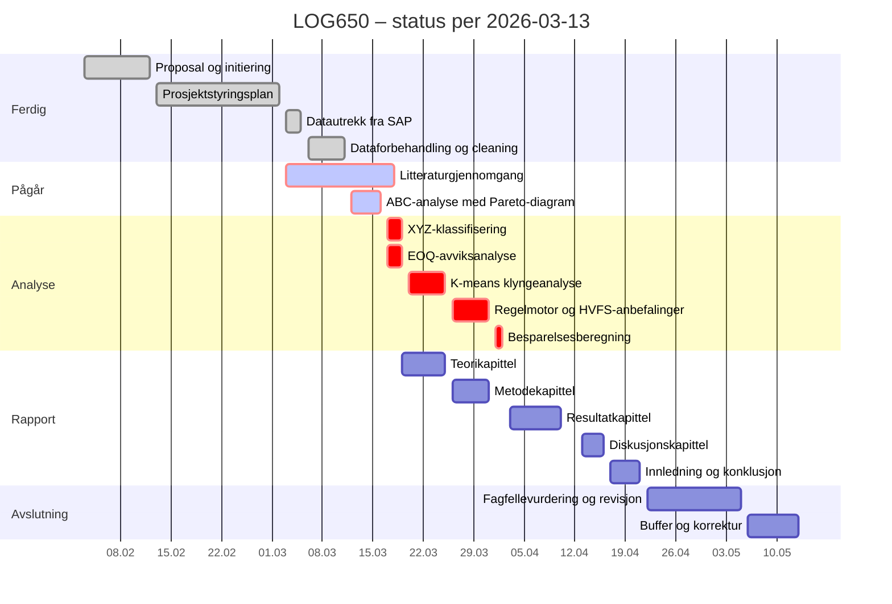

# LOG650 – Bacheloroppgave

> **Tittel:** Lageroptimalisering ved Helse Bergen – analyse av 709 artikler for mulig sentralisering til HVFS
> **Ansvarlig:** Thomas Ekrem Jensen | **Veileder:** Bård Inge Austigard Pettersen
> **Periode:** 03.02.2026 – 13.05.2026 | **Statusdato:** 2026-03-13

---

## Kort status

**Statusdato: 2026-03-14.** Prosjektet er i fase 4 – Avslutning. Fase 1–3 er ferdigstilt. Alle analyser (ABC, XYZ, EOQ, K-means, regelmotor, besparelse) er kjørt i LOG650_analyse_v2_7.py. Rapport v10 er skrevet med alle 11 figurer og 15 tabeller. Gjenstår: sluttkorrektur, fagfellevurdering og innlevering.

---

## 🏁 Milepæler

| Milepæl | Dato | Status |
|---|---|---|
| M1: Proposal godkjent | 12.02.26 | ✅ Oppnådd |
| M2: Prosjektstyringsplan godkjent | 02.03.26 | ✅ Oppnådd |
| M3: Dataanalyse og Python-verktøy ferdigstilt | 02.04.26 | ✅ Oppnådd (v2.7) |
| M4: Komplett rapportutkast ferdig for review | 21.04.26 | ✅ Oppnådd (v10) |
| M5: Endelig rapport innlevert | 13.05.26 | ⏳ Planlagt |

---

## 📅 Gantt



---

## 📋 Aktivitetsstatus

### ✅ Fullført

| Aktivitet | Periode |
|---|---|
| Prosjektforslag (proposal) | 03.02–09.02.26 |
| Samarbeidsavtale | 10.02–12.02.26 |
| Prosjektstyringsplan | 13.02–26.02.26 |
| GitHub-repository | 13.02.26 |
| SAP-dataspesifikasjon (Vedlegg A) | 13.02–19.02.26 |
| Litteratursøk og referanseliste (23 kilder) | 13.02–23.02.26 |
| Tidsplan i MS Project | 27.02–02.03.26 |
| Datautrekk SAP (14 tabeller, WERKS 3300) | 03.03–05.03.26 |
| Dataforbehandling og kvalitetssikring (D-01–D-08) | 06.03–11.03.26 |

### 🔄 Pågår

| Aktivitet | Planlagt ferdig | Kommentar |
|---|---|---|
| Litteraturgjennomgang (23 kilder) | 18.03.26 | Parallelt med analyse |
| ABC-analyse med Pareto-diagram | 16.03.26 | **Blokkerer XYZ og EOQ** |

### ⏭️ Neste

| Prioritet | Aktivitet | Avhengighet |
|---|---|---|
| 1 | XYZ-klassifisering (17.03–19.03) | Etter ABC ferdig |
| 2 | EOQ-avviksanalyse (17.03–19.03) | Etter ABC ferdig |
| 3 | Teorikapittel (19.03–25.03) | Etter litteratur ferdig |
| 4 | K-means (20.03–25.03) | Etter XYZ og EOQ |
| 5 | Regelmotor og HVFS (26.03–31.03) | Etter K-means |

---

## 🔢 Aktivitetssjekklister

### ✅ Datautrekk fra SAP (3.2.1)
- [x] 14 SAP-tabeller ekstrahert iht. spesifikasjon
- [x] Konvertert til Excel-format
- [x] Verifisert mot forventet antall artikler
- [x] Uttrekksparametre dokumentert (WERKS 3300, LGORT 3001)

### ✅ Dataforbehandling og kvalitetssikring (3.2.2)
- [x] 8 datakvalitetskontroller gjennomført (D-01–D-08)
- [x] Filtrert til 709 aktive artikler
- [x] Konsolidert til MASTERFILE_V1.xlsx
- [x] Alle datavalgsbeslutninger dokumentert

### ✅ ABC-analyse med Pareto-diagram (3.2.3)
- [x] Kumulativ verdi per artikkel beregnet
- [x] Artikler sortert etter synkende årsverdi
- [x] ABC-grenser satt (80 % / 95 %) → A:182, B:184, C:338
- [x] Pareto-diagram generert (Fig04_ABC_Pareto.png)
- [x] Resultater dokumentert (Tabell 8 i rapport)
- [x] Aktivitet lukket

### ✅ Litteraturgjennomgang (3.1.1)
- [x] Referanseliste etablert (23 kilder)
- [x] Nøkkelkilder identifisert
- [x] Alle kilder gjennomgått
- [x] Litteratur koblet til problemstillingen (Tabell 1 i rapport)
- [x] Aktivitet lukket

### ✅ XYZ-klassifisering (3.2.4)
- [x] CV beregnet per artikkel (687 av 709)
- [x] XYZ-grenser satt (0,5 / 1,0) → X:350, Y:193, Z:144
- [x] Validert mot SAP ZZXYZ (33 % samsvar, dokumentert)
- [x] ABC/XYZ-matrise generert (Fig05_ABC_XYZ_Matrise.png)
- [x] Resultater dokumentert (Tabell 9 og 10 i rapport)

### ✅ EOQ-avviksanalyse (3.2.5)
- [x] EOQ beregnet (S=750, H=20 %, 2-årsperiode)
- [x] Frekvensavvik beregnet (±50 % terskel) → 356/100/31
- [x] EOQ-avvik figur generert (Fig06_EOQ_Avvik.png)
- [x] Resultater dokumentert (Tabell 11 i rapport)

### ✅ K-means klyngeanalyse (3.2.6)
- [x] Features normalisert (StandardScaler, kun tren)
- [x] Silhouette-metode kjørt (K=2–7) → K=3 best
- [x] K=3 kjørt: Sil tren=0.383, Sil test=0.368
- [x] Silhouette-figur generert (Fig07_Silhouette.png)
- [x] Scatter-figur generert (Fig08_Kmeans_Klynger.png)
- [x] Klyngeprofil-figur generert (Fig09_Kmeans_Profil.png)
- [x] Klyngeresultat dokumentert (Tabell 12 i rapport)

### ✅ Regelmotor og HVFS-anbefalinger (3.2.7)
- [x] 8 beslutningsregler definert (R1–R8) med K_OVERFØR
- [x] Regelmotor kjørt på 709 artikler → 145 OVERFØR, 257 BEHOLD, 284 VURDER, 23 MANGLER
- [x] Regelmotor-flytdiagram generert (Fig03_Regelmotor.png)
- [x] Output dokumentert (Tabell 13 i rapport)

### ✅ Besparelsesberegning og sensitivitetsanalyse (3.2.8)
- [x] Besparelse beregnet: kr 451 515/år (base case, g=75 %)
- [x] 27-scenario sensitivitetsanalyse gjennomført
- [x] Besparelsesfigur generert (Fig10_Regelmotor_Besparelse.png)
- [x] Resultater dokumentert (Tabell 14 i rapport)

---

---

# Kapittel 1 – Innledning

> **Faglærers råd:** 1–4 sider, helst 1–2. For mye tekst her er tegn på upresishet.
> **Anbefalt skrivetidspunkt:** Etter at diskusjonen er ferdig — da vet du hva du faktisk fant.

**Svar på følgende i innledningen:**
- Hvilket tema handler oppgaven om?
- Hvorfor er temaet aktuelt nå?
- Hva er gjort tidligere — de viktigste referansene?
- Hva er problemstillingen?
- Hvilke avgrensninger gjøres?

**Skrivetips:**
- Skap nysgjerrighet — aktualisér temaet og pek på konsekvenser, men fortell *ikke* hvordan du løser det
- Gi leseren et innblikk i rapportstrukturen allerede i innledningen:
  - *«Lagerbinding i norske sykehus utgjør en betydelig kostnad for helseforetakene (Ref)...»*
  - *«[Kilde] har vist at ABC-XYZ-klassifisering kan redusere lagerkostnader med...»*
  - *«I denne oppgaven analyseres 709 artikler ved Helse Bergen (WERKS 3300) i SAP S/4HANA...»*
  - *«Konklusjonen er at sentralisering av X artikler til HVFS kan gi en estimert besparelse på ~451 kNOK/år»*
- Henvis tilbake til innledningen *indirekte* gjennom hele oppgaven

**Referanser å plassere her:**
- Lagerkostnader og lagerbinding i helsesektoren → [din kilde]
- Pareto-prinsippet som grunnlag for ABC → [Flores & Whybark, 1987] e.l.
- HVFS/APL-prosjektet → [offentlig kilde]

---

## 1.1 Problemstilling

> **Faglærers advarsel:** Ikke «hva»- eller «hvilket»-spørsmål. Bruk «hvordan» eller «hvorfor».
> Skriv aldri noe du ikke svarer på *(dangerzone)*. Svar aldri på mer enn du har lovet *(dangerzone)*.

Krav til god problemstilling:
- Spesifikk — WERKS 3300, LGORT 3001, 709 artikler
- Svært nøye med formuleringene
- Kobler direkte til analysene du faktisk gjennomfører

---

## 1.2 Delproblemer *(valgfri)*

Bruk hvis problemstillingen er kompleks. Hvert delproblem besvares eksplisitt i analyse/resultat.

---

## 1.3 Avgrensninger

Avgrensning snevrer inn *omfanget*. Forklar alltid *hvorfor* — aldri «mangel på tid».

Tilpassede eksempler:
- *«Oppgaven avgrenses til LGORT 3001 ved WERKS 3300, da dette er det eneste lageret med tilstrekkelige transaksjonsdata i SAP for analyseperioden.»*
- *«Analysen omfatter kun artikler med aktiv status per uttrekksdato, da inaktive artikler ikke er relevante for fremtidig sentralisering til HVFS.»*
- *«Innkjøpsprosesser og leverandørrelasjoner behandles ikke, da disse faller utenfor problemstillingens scope.»*

---

## 1.4 Antagelser

Antagelser *presiserer* situasjonen — ikke det samme som avgrensning. Forklar alltid konsekvensene.

Tilpassede eksempler:
- *«Vi antar at historisk forbruk siste 12 måneder er representativt for fremtidig etterspørsel, fordi ingen strukturelle endringer i pasientvolum er forventet. Konsekvensen er at etterspørselssjokk ikke fanges opp av analysen.»*
- *«Vi antar en ordrekostnad S = 250 NOK per ordre, basert på [kilde/intern vurdering]. Sensitivitetsanalysen (kapittel 6) viser effekten av avvik fra denne antagelsen.»*
- *«Vi antar holdekostand h = 20 % av enhetspris per år, i tråd med anerkjent praksis i litteraturen (jf. [Silver et al., 2017]).»*

---

> **📊 Tabeller og figurer – Kapittel 1**
> - ❌ Ingen tabeller
> - ✅ Valgfri: én strukturfigur (problemstilling → metode → resultat)
> - ⚠️ Ingen detaljerte figurer — behold kompleksiteten til teori/analyse

---

### ☑️ Sjekkliste – Kapittel 1

- [x] Tema presentert og aktualisert med referanse
- [x] Tidligere forskning nevnt med referanser (minst 2–3 nøkkelkilder)
- [x] Problemstilling formulert som «hvordan»-spørsmål
- [x] Avgrensninger begrunnet — ingen «mangel på tid»
- [x] Antagelser dokumentert med konsekvenser
- [x] Rød tråd til resten av oppgaven etablert
- [x] Tekst ferdig i rapport v10

---

---

# Kapittel 2 – Litteratur og teori

> **Faglærers råd:** Diskuter de viktigste bidragene — helst siste 5 år. Trekk tråder til din problemstilling. Synsing uten referanse trekker kraftig ned karakteren.
> **Anbefalt skrivetidspunkt:** Etter at litteraturgjennomgangen (3.1.1) er lukket — 18.03.26.

**Hva kapitlet skal inneholde:**

*Litteraturdelen:*
- De viktigste bidragene i fagfeltet, koblet til din problemstilling
- Hva forskere er uenige om
- Gap i eksisterende forskning som din oppgave adresserer

*Teoridelen:*
- Definisjon og forklaring av alle modeller og teorier du bruker — *alle med referanse*
- Styrker, svakheter og forutsetninger per modell
- Sammenheng mellom teoriene

**Skrivetips:**
- Aldri siter uten referanse — dette gjelder *alle* påstander og tall
- Ikke list opp kildene mekanisk — vev dem inn i en sammenhengende argumentasjon
- Teorifigurer skal være *konseptuelle* — ikke basert på egne data

**Teorier som skal dekkes — alle med referanse:**

| Teori/modell | Hva du forklarer | Referanse |
|---|---|---|
| ABC-analyse | Pareto-prinsippet, klassifiseringsgrenser | [Flores & Whybark, 1987] e.l. |
| XYZ-klassifisering | CV-beregning, grenser X/Y/Z | [din kilde] |
| EOQ | Wilson-formelen, S og H, forutsetninger | [Silver et al., 2017] e.l. |
| K-means clustering | Algoritme, elbow, silhouette, normalisering | [din kilde] |
| Lagerstyring i helsesektoren | Særtrekk, forsyningssikkerhet | [din kilde] |

---

> **📊 Tabeller og figurer – Kapittel 2**
> - ✅ **Tabell 1: Litteraturoversikt** (alle 23 kilder)
> - ✅ **Tabell 2: Sammenligning av analysemetoder**
> - ✅ **Figur 0: Konseptuelt rammeverk**
> - ⚠️ Teorifigurer skal ikke inneholde egne data

**Python – Tabell 1: Litteraturoversikt**

```python
import pandas as pd
import os

os.makedirs('output/tabeller', exist_ok=True)

# Fyll inn dine 23 kilder
litteratur = pd.DataFrame([
    {'Forfatter': '[Navn]', 'År': 20XX, 'Tema': '[Kort beskrivelse]',
     'Metode': '[Kvant/Kval/Review]', 'Relevans': '[Hvorfor relevant for din oppgave]'},
    # ... legg til alle 23 her
])

litteratur.to_csv('output/tabeller/tabell1_litteraturoversikt.csv', index=False)
print("✅ Tabell 1 – Litteraturoversikt eksportert")
```

> *Tabell 1 – Oversikt over sentrale kilder i litteraturgjennomgangen*

**Python – Tabell 2: Sammenligning av analysemetoder**

```python
import pandas as pd
import os

modeller = pd.DataFrame([
    {'Modell': 'ABC-analyse',
     'Styrker': 'Enkel, bred støtte i litteraturen',
     'Svakheter': 'Ignorerer etterspørselsvariabilitet',
     'Forutsetninger': 'Kjent årsverdi per artikkel',
     'Brukt': 'Ja', 'Referanse': '[Flores & Whybark, 1987]'},
    {'Modell': 'XYZ-klassifisering',
     'Styrker': 'Fanger variabilitet i etterspørsel',
     'Svakheter': 'Krever tilstrekkelig transaksjonshistorikk',
     'Forutsetninger': 'Månedlige forbruksdata tilgjengelig',
     'Brukt': 'Ja', 'Referanse': '[din kilde]'},
    {'Modell': 'EOQ',
     'Styrker': 'Beregner optimal ordrekvantum analytisk',
     'Svakheter': 'Sensitiv for S og H, antar konstant etterspørsel',
     'Forutsetninger': 'Kjent S og H, kontinuerlig etterspørsel',
     'Brukt': 'Ja', 'Referanse': '[Silver et al., 2017]'},
    {'Modell': 'K-means clustering',
     'Styrker': 'Avdekker skjulte mønstre i multidimensjonale data',
     'Svakheter': 'Sensitiv for K-valg og outliers',
     'Forutsetninger': 'Normaliserte features, euklidsk avstand',
     'Brukt': 'Ja', 'Referanse': '[din kilde]'},
])

modeller.to_csv('output/tabeller/tabell2_modellsammenligning.csv', index=False)
print("✅ Tabell 2 – Modellsammenligning eksportert")
```

> *Tabell 2 – Sammenligning av analysemetoder brukt i oppgaven*

**Python – Figur 0: Konseptuelt rammeverk**

```python
import matplotlib
matplotlib.use('Agg')
import matplotlib.pyplot as plt
import os

os.makedirs('output/figurer', exist_ok=True)

fig, ax = plt.subplots(figsize=(13, 3.2))
ax.axis('off')

bokser = [
    ('SAP-data\n(WERKS 3300)', '#BBDEFB', 'black'),
    ('ABC-\nanalyse', '#90CAF9', 'black'),
    ('XYZ-\nklassifisering', '#64B5F6', 'black'),
    ('EOQ-\navvik', '#42A5F5', 'white'),
    ('K-means\nklustering', '#2196F3', 'white'),
    ('Regelmotor\nHVFS-regler', '#1976D2', 'white'),
    ('HVFS-\nanbefaling', '#1565C0', 'white'),
]

bw = 0.11
mellom = 0.015
x0 = 0.025
y0 = 0.20
bh = 0.60

for i, (tekst, farge, tc) in enumerate(bokser):
    x = x0 + i * (bw + mellom)
    ax.add_patch(plt.Rectangle((x, y0), bw, bh,
                                transform=ax.transAxes, color=farge,
                                ec='#aaa', linewidth=0.8, zorder=2, clip_on=False))
    ax.text(x + bw/2, y0 + bh/2, tekst, transform=ax.transAxes,
            ha='center', va='center', fontsize=8.5, color=tc,
            fontweight='bold', zorder=3)
    if i < len(bokser) - 1:
        xp = x + bw
        ax.annotate('', xy=(xp + mellom, y0 + bh/2),
                    xytext=(xp, y0 + bh/2),
                    xycoords='axes fraction', textcoords='axes fraction',
                    arrowprops=dict(arrowstyle='->', color='#555', lw=1.5))

ax.set_title('Konseptuelt rammeverk – fra SAP-data til HVFS-anbefaling', fontsize=10, pad=12)
plt.tight_layout()
plt.savefig('output/figurer/figur0_konseptuelt_rammeverk.png', bbox_inches='tight', dpi=150)
plt.close()
print("✅ Figur 0 – Konseptuelt rammeverk lagret")
```

> *Figur 0 – Konseptuelt rammeverk: analysepipeline fra rådata i SAP S/4HANA til HVFS-anbefaling*

---

### ☑️ Sjekkliste – Kapittel 2

- [x] Alle kilder gjennomgått
- [x] Hvert bidrag koblet til problemstillingen
- [x] Gap i eksisterende forskning formulert
- [x] Alle teorier forklart med referanse (ABC, XYZ, EOQ, K-means, lager helse)
- [x] Tabell 1: Litteraturoversikt i rapport
- [x] Tabell 2: Modellsammenligning i rapport
- [x] Figur 0: Konseptuelt rammeverk i rapport
- [x] Tekst ferdig i rapport v10

---

---

# Kapittel 3 – Casebeskrivelse

> **Faglærers råd:** Ta med all relevant informasjon for full forståelse av problemet — men ikke mer. Unødvendig informasjon trekker ned. Hold den røde tråden til problemstillingen.
> **Anbefalt skrivetidspunkt:** Tidlig — du kjenner casen godt.

**Hva kapitlet skal inneholde:**
- Helse Bergen og WERKS 3300: virksomhetstype, størrelse, rolle i helseregionen
- HVFS og LIBRA-prosjektet: hva det er, hvorfor det er relevant for oppgaven
- Problemet: lagerbinding, suboptimal artikkelsortering, manglende sentralisering
- Lagerstruktur: forholdet mellom LGORT 3001 og HVFS
- Tilgjengelige data (SAP S/4HANA, hvilke tabeller)
- Hva Helse Bergen selv *tror* forårsaker problemet (ikke hva du *fant*)

**Referanser å plassere her:**
- HVFS/APL-prosjektet → [offentlig kilde]
- SAP i helsesektoren → [din kilde]
- Helseforetakenes innkjøpssamarbeid → [offentlig tilgjengelig]

---

> **📊 Tabeller og figurer – Kapittel 3**
> - ✅ **Tabell 3: Nøkkeltall for casevirksomheten**
> - ✅ **Figur 1: Lagerstruktur / HVFS-nettverket**
> - ❌ Ingen analyseresultater her

**Python – Tabell 3: Nøkkeltall**

```python
import pandas as pd
import os

os.makedirs('output/tabeller', exist_ok=True)

nokkeltal = pd.DataFrame([
    {'Nøkkeltall': 'SAP plant (WERKS)',           'Verdi': '3300',                        'Kilde': 'SAP MM'},
    {'Nøkkeltall': 'Lagersted (LGORT)',            'Verdi': '3001',                        'Kilde': 'SAP MM'},
    {'Nøkkeltall': 'Antall aktive artikler',       'Verdi': '709',                         'Kilde': 'MASTERFILE_V1.xlsx'},
    {'Nøkkeltall': 'Analyseperiode',               'Verdi': '[fyll inn]',                  'Kilde': 'SAP MARC/MBEW'},
    {'Nøkkeltall': 'Sentrallager',                 'Verdi': 'HVFS – Helse Vest Forsyningssentral', 'Kilde': '[kilde]'},
    {'Nøkkeltall': 'ERP-system',                   'Verdi': 'SAP S/4HANA (LIBRA-prosjektet)', 'Kilde': 'Helse Vest IKT'},
    {'Nøkkeltall': '[Fyll inn: ansatte/omsetning]','Verdi': '[fyll inn]',                  'Kilde': '[kilde]'},
])

nokkeltal.to_csv('output/tabeller/tabell3_nokkeltal_case.csv', index=False)
print("✅ Tabell 3 – Nøkkeltall eksportert")
print(nokkeltal.to_string(index=False))
```

> *Tabell 3 – Nøkkeltall for casevirksomheten Helse Bergen, WERKS 3300*

**Python – Figur 1: Lagerstruktur**

```python
import matplotlib
matplotlib.use('Agg')
import matplotlib.pyplot as plt
import os

os.makedirs('output/figurer', exist_ok=True)

fig, ax = plt.subplots(figsize=(10, 5))
ax.axis('off')
ax.set_xlim(0, 1); ax.set_ylim(0, 1)

def boks(ax, x, y, w, h, tekst, farge='#BBDEFB', tc='black', fs=9):
    ax.add_patch(plt.Rectangle((x, y), w, h, color=farge, ec='#888', lw=1, zorder=2))
    ax.text(x+w/2, y+h/2, tekst, ha='center', va='center',
            fontsize=fs, color=tc, fontweight='bold', zorder=3)

def pil(ax, x1, y1, x2, y2, etikett=''):
    ax.annotate('', xy=(x2, y2), xytext=(x1, y1),
                arrowprops=dict(arrowstyle='->', color='#444', lw=1.5))
    if etikett:
        ax.text((x1+x2)/2+0.01, (y1+y2)/2+0.02, etikett,
                ha='center', fontsize=7, color='#555')

boks(ax, 0.35, 0.72, 0.30, 0.14, 'HVFS\nHelse Vest Forsyningssentral', '#1565C0', 'white', 10)
boks(ax, 0.35, 0.40, 0.30, 0.14, 'Helse Bergen\nWERKS 3300 / LGORT 3001', '#2196F3', 'white', 9)
boks(ax, 0.02, 0.40, 0.24, 0.14, 'HUS\n(eksempel)', '#90CAF9', 'black', 8)
boks(ax, 0.74, 0.40, 0.24, 0.14, 'Stavanger\n(eksempel)', '#90CAF9', 'black', 8)
boks(ax, 0.18, 0.10, 0.22, 0.12, 'Seksjon/post\nHelse Bergen', '#E3F2FD', 'black', 8)
boks(ax, 0.60, 0.10, 0.22, 0.12, 'Seksjon/post\nHelse Bergen', '#E3F2FD', 'black', 8)

pil(ax, 0.50, 0.72, 0.50, 0.54, 'Sentralleveranse')
pil(ax, 0.14, 0.54, 0.14, 0.40, '')
pil(ax, 0.86, 0.54, 0.86, 0.40, '')
pil(ax, 0.50, 0.40, 0.29, 0.22, '')
pil(ax, 0.50, 0.40, 0.71, 0.22, '')
pil(ax, 0.50, 0.72, 0.14, 0.54, '')
pil(ax, 0.50, 0.72, 0.86, 0.54, '')

ax.set_title('Lagerstruktur – Helse Vest forsyningskjede (forenklet)', fontsize=11, pad=10)
plt.tight_layout()
plt.savefig('output/figurer/figur1_lagerstruktur.png', bbox_inches='tight', dpi=150)
plt.close()
print("✅ Figur 1 – Lagerstruktur lagret")
```

> *Figur 1 – Forenklet lagerstruktur for Helse Vest, med HVFS som sentrallager og Helse Bergen (WERKS 3300) som underliggende lager*

---

### ☑️ Sjekkliste – Kapittel 3

- [x] Helse Bergen og WERKS 3300 presentert med referanse
- [x] HVFS og LIBRA-prosjektet forklart med referanse
- [x] Problemet (lagerbinding, suboptimal sortering) beskrevet
- [x] Kun kontekstuell informasjon — ingen analyseresultater
- [x] Tabell 3: Nøkkeltall i rapport
- [x] Figur 1: Lagerstruktur i rapport
- [x] Tekst ferdig i rapport v10

---

---

# Kapittel 4 – Metode og data

> **Faglærers råd:** Beskriv metoden så nøyaktig at andre kan gjenta prosessen. Gi leseren grunnlag for å vurdere om det er feil i fremgangsmåten.
> **Anbefalt skrivetidspunkt:** Etter at alle analyser er kjørt — da vet du nøyaktig hva du gjorde.

---

## 4.1 Metode

**Hva som skal dekkes — alle med referanse:**
- Forskningsparadigme og -design: kvantitativ casestudie → [Yin, 2018] e.l.
- Innsamlingsmetode: uttrekk fra SAP S/4HANA (ERP-data)
- Utvalgskriterier: aktive artikler, WERKS 3300, LGORT 3001
- Utvalgsstørrelse: 709 artikler etter cleaning
- Analysemetoder: ABC, XYZ, EOQ, K-means — *hver med referanse*
- Etiske vurderinger: ingen personopplysninger, kun aggregerte artikkeltall
- Potensielle feilkilder: datakvalitet i SAP, antagelser om S og H

---

## 4.2 Data

**Hva som skal dekkes:**
- 14 SAP-tabeller ekstrahert — hvilke og hvorfor
- Analyseperiode og uttrekksparametre
- Rådata → cleaning → 709 aktive artikler
- D-01–D-08: hva ble gjort og begrunnelse per beslutning
- Train/test-split 80/20: 567 trenings- / 142 testartikler

---

> **📊 Tabeller og figurer – Kapittel 4**
> - ✅ **Tabell 4: SAP-tabeller** — hvilke, innhold, rader
> - ✅ **Tabell 5: Datakvalitetskontroller D-01–D-08**
> - ✅ **Figur 2: Analysepipeline**
> - ⚠️ Ikke vis resultater her — beskriv *hvordan*, ikke *hva* du fant

**Python – Tabell 4: SAP-uttrekk**

```python
import pandas as pd
import os

os.makedirs('output/tabeller', exist_ok=True)

sap_tabeller = pd.DataFrame([
    {'SAP-tabell': 'MARA',  'Beskrivelse': 'Generelle materialdata',          'Nøkkelfelter': 'MATNR, MATKL, MEINS',          'Rader': '[fyll inn]'},
    {'SAP-tabell': 'MARC',  'Beskrivelse': 'Planleggingsdata per plant',       'Nøkkelfelter': 'MATNR, WERKS, MINBE, MTVFP',   'Rader': '[fyll inn]'},
    {'SAP-tabell': 'MARD',  'Beskrivelse': 'Lagerbeholdning per lagersted',    'Nøkkelfelter': 'MATNR, WERKS, LGORT, LABST',   'Rader': '[fyll inn]'},
    {'SAP-tabell': 'MBEW',  'Beskrivelse': 'Materialvurdering (pris)',          'Nøkkelfelter': 'MATNR, BWKEY, VERPR, STPRS',   'Rader': '[fyll inn]'},
    {'SAP-tabell': 'MSEG',  'Beskrivelse': 'Materialdokumentsegment (trans.)', 'Nøkkelfelter': 'MATNR, WERKS, LGORT, MENGE',   'Rader': '[fyll inn]'},
    {'SAP-tabell': 'EKPO',  'Beskrivelse': 'Innkjøpsordreposisjoner',          'Nøkkelfelter': 'EBELN, EBELP, MATNR, MENGE',   'Rader': '[fyll inn]'},
    {'SAP-tabell': '[...]', 'Beskrivelse': '[fyll inn resterende 8 tabeller]', 'Nøkkelfelter': '[fyll inn]',                   'Rader': '[fyll inn]'},
])

sap_tabeller.to_csv('output/tabeller/tabell4_sap_uttrekk.csv', index=False)
print("✅ Tabell 4 – SAP-uttrekk eksportert")
print(sap_tabeller.to_string(index=False))
```

> *Tabell 4 – Oversikt over uttrekkede SAP-tabeller fra Helse Bergen, WERKS 3300*

**Python – Tabell 5: Datakvalitetskontroller**

```python
import pandas as pd
import os

beslutninger = pd.DataFrame([
    {'ID': 'D-01', 'Beslutning': 'Fjernet duplikater på MATNR',
     'Begrunnelse': 'Sikrer én rad per artikkel i analysen', 'Artikler_etter': '[fyll inn]'},
    {'ID': 'D-02', 'Beslutning': 'Fjernet artikler med årsverdi = 0',
     'Begrunnelse': 'Null-verdi artikler er ikke relevante for ABC', 'Artikler_etter': '[fyll inn]'},
    {'ID': 'D-03', 'Beslutning': 'Fjernet inaktive artikler (LVORM = X)',
     'Begrunnelse': 'Inaktive artikler inngår ikke i fremtidig sortiment', 'Artikler_etter': '[fyll inn]'},
    {'ID': 'D-04', 'Beslutning': 'Beregnet manglende årsverdi der pris og forbruk finnes',
     'Begrunnelse': 'Fullstendig grunnlag for ABC-klassifisering', 'Artikler_etter': '[fyll inn]'},
    {'ID': 'D-05', 'Beslutning': '[fyll inn]', 'Begrunnelse': '[fyll inn]', 'Artikler_etter': '[fyll inn]'},
    {'ID': 'D-06', 'Beslutning': '[fyll inn]', 'Begrunnelse': '[fyll inn]', 'Artikler_etter': '[fyll inn]'},
    {'ID': 'D-07', 'Beslutning': '[fyll inn]', 'Begrunnelse': '[fyll inn]', 'Artikler_etter': '[fyll inn]'},
    {'ID': 'D-08', 'Beslutning': '[fyll inn]', 'Begrunnelse': '[fyll inn]', 'Artikler_etter': 709},
])

beslutninger.to_csv('output/tabeller/tabell5_datakvalitet.csv', index=False)
print("✅ Tabell 5 – Datakvalitetskontroller eksportert")
print(beslutninger.to_string(index=False))
```

> *Tabell 5 – Datakvalitetskontroller D-01 til D-08 gjennomført på rådata fra SAP S/4HANA*

**Python – Figur 2: Analysepipeline**

```python
import matplotlib
matplotlib.use('Agg')
import matplotlib.pyplot as plt
import os

os.makedirs('output/figurer', exist_ok=True)

fig, ax = plt.subplots(figsize=(13, 3.8))
ax.axis('off')

steg = [
    ('SAP S/4HANA\n14 tabeller', '#BBDEFB', 'black'),
    ('Cleaning\nD-01–D-08', '#90CAF9', 'black'),
    ('MASTERFILE\n709 artikler', '#64B5F6', 'black'),
    ('ABC / XYZ\nEOQ', '#42A5F5', 'white'),
    ('K-means\nK = 3', '#2196F3', 'white'),
    ('Regelmotor\nHVFS-regler', '#1976D2', 'white'),
    ('HVFS-\nanbefaling\n~13,7 MNOK', '#1565C0', 'white'),
]

bw = 0.118; mellom = 0.013; x0 = 0.022; y0 = 0.18; bh = 0.64

for i, (tekst, farge, tc) in enumerate(steg):
    x = x0 + i * (bw + mellom)
    ax.add_patch(plt.Rectangle((x, y0), bw, bh,
                                transform=ax.transAxes, color=farge,
                                ec='#aaa', lw=0.8, zorder=2, clip_on=False))
    ax.text(x+bw/2, y0+bh/2, tekst, transform=ax.transAxes,
            ha='center', va='center', fontsize=8, color=tc,
            fontweight='bold', zorder=3)
    if i < len(steg)-1:
        xp = x + bw
        ax.annotate('', xy=(xp+mellom, y0+bh/2), xytext=(xp, y0+bh/2),
                    xycoords='axes fraction', textcoords='axes fraction',
                    arrowprops=dict(arrowstyle='->', color='#555', lw=1.5))

ax.set_title('Analysepipeline: fra SAP-rådata til HVFS-anbefaling', fontsize=10, pad=12)
plt.tight_layout()
plt.savefig('output/figurer/figur2_analysepipeline.png', bbox_inches='tight', dpi=150)
plt.close()
print("✅ Figur 2 – Analysepipeline lagret")
```

> *Figur 2 – Analysepipeline: stegvis flyt fra SAP-uttrekk via dataforbehandling og klassifisering til HVFS-anbefaling*

---

### ☑️ Sjekkliste – Kapittel 4

- [x] Forskningsdesign beskrevet med referanse (case-studie, kvantitativ)
- [x] SAP S/4HANA som datakilde forklart
- [x] Utvalgskriterier og -størrelse begrunnet (709 aktive artikler)
- [x] Alle analysemetoder beskrevet med litteraturreferanse
- [x] Etiske vurderinger tatt opp
- [x] Potensielle feilkilder nevnt
- [x] Tabell 4: SAP-uttrekk i rapport
- [x] Tabell 5: Datakvalitetskontroller D-01–D-08 i rapport
- [x] Figur 2: Analysepipeline i rapport
- [x] KI-verktøy dokumentert (4.5)
- [x] Tekst ferdig i rapport v10

---

---

# Kapittel 5 – Analyse og resultater

> **Faglærers råd:** I analysen viser du *fremgangsmåten*. I resultater presenterer du *funnene* objektivt — ingen tolkninger der.
> **Anbefalt skrivetidspunkt:** Løpende etter hvert som analysene kjøres — 17.03–10.04.26.

---

## 5.1 ABC-analyse

**Skriving:** Forklar at artikler sorteres etter synkende årsverdi, at kumulativ verdiandel beregnes, og at grensene 80 % / 95 % brukes til å definere klassene A, B og C. Henvis til Pareto-prinsippet og [din kilde]. Presenter resultater fra Tabell 6 og Figur 3–4 objektivt.

**Python – Tabell 6 + Figur 3 + Figur 4**

```python
import pandas as pd
import numpy as np
import matplotlib
matplotlib.use('Agg')
import matplotlib.pyplot as plt
import matplotlib.patches as mpatches
import os

os.makedirs('output/figurer', exist_ok=True)
os.makedirs('output/tabeller', exist_ok=True)

df = pd.read_excel('data/MASTERFILE_V1.xlsx')

df = df.sort_values('arlig_verdi_nok', ascending=False).reset_index(drop=True)
total_verdi = df['arlig_verdi_nok'].sum()
df['kum_verdi'] = df['arlig_verdi_nok'].cumsum()
df['kum_andel'] = df['kum_verdi'] / total_verdi

def abc_klasse(andel):
    if andel <= 0.80: return 'A'
    elif andel <= 0.95: return 'B'
    else: return 'C'

df['abc'] = df['kum_andel'].apply(abc_klasse)

# Tabell 6 – ABC-fordeling
abc_tab = df.groupby('abc').agg(
    Antall_artikler=('matnr', 'count'),
    Total_verdi_NOK=('arlig_verdi_nok', 'sum')
).reindex(['A','B','C']).reset_index()
abc_tab['Andel_artikler_pst'] = (abc_tab['Antall_artikler'] / len(df) * 100).round(1)
abc_tab['Andel_verdi_pst']    = (abc_tab['Total_verdi_NOK'] / total_verdi * 100).round(1)
abc_tab.to_csv('output/tabeller/tabell6_abc_fordeling.csv', index=False)
print("✅ Tabell 6 – ABC-fordeling\n", abc_tab.to_string(index=False))

# Figur 3 – Pareto-diagram
farger_bar = df['abc'].map({'A':'#1565C0','B':'#FF9800','C':'#9E9E9E'})
fig, ax1 = plt.subplots(figsize=(12, 5))
ax2 = ax1.twinx()
ax1.bar(range(len(df)), df['arlig_verdi_nok'], color=farger_bar, width=1.0, alpha=0.8)
ax2.plot(range(len(df)), df['kum_andel']*100, color='black', lw=1.5, label='Kumulativ andel')
ax2.axhline(80, color='#E53935', ls='--', lw=1.2, label='80 % — A/B-grense')
ax2.axhline(95, color='#FB8C00', ls='--', lw=1.2, label='95 % — B/C-grense')
ax1.set_xlabel('Artikler (rangert etter synkende årsverdi)')
ax1.set_ylabel('Årsverdi (NOK)')
ax2.set_ylabel('Kumulativ verdiandel (%)')
ax2.set_ylim(0, 105)
lapper = [mpatches.Patch(color=c, label=l) for c,l in
          [('#1565C0','A-klasse'),('#FF9800','B-klasse'),('#9E9E9E','C-klasse')]]
ax1.legend(handles=lapper, loc='upper left')
ax2.legend(loc='center right')
plt.tight_layout()
plt.savefig('output/figurer/figur3_pareto.png', bbox_inches='tight', dpi=150)
plt.close()
print("✅ Figur 3 – Pareto-diagram lagret")

# Figur 4 – Søylediagram
fig, axes = plt.subplots(1, 2, figsize=(10, 4))
klasser = ['A','B','C']
farger_kl = ['#1565C0','#FF9800','#9E9E9E']
for ax, kol, tittel in zip(axes,
        ['Andel_artikler_pst','Andel_verdi_pst'],
        ['Andel artikler per klasse (%)','Andel verdi per klasse (%)']):
    verdier = abc_tab.set_index('abc')[kol].reindex(klasser)
    ax.bar(klasser, verdier, color=farger_kl)
    ax.set_title(tittel); ax.set_ylabel('%')
    for i, v in enumerate(verdier):
        ax.text(i, v+0.5, f'{v:.1f}%', ha='center', fontsize=9)
plt.tight_layout()
plt.savefig('output/figurer/figur4_abc_fordeling.png', bbox_inches='tight', dpi=150)
plt.close()
print("✅ Figur 4 – ABC søylediagram lagret")
```

> *Tabell 6 – ABC-klassifisering: fordeling av artikler og verdi per klasse, WERKS 3300*
> *Figur 3 – Pareto-diagram med kumulativ verdiandel og ABC-grenser (80 % og 95 %)*
> *Figur 4 – Andel artikler og andel verdi per ABC-klasse*

---

## 5.2 XYZ-klassifisering

**Skriving:** Forklar at CV = σ/μ beregnes per artikkel basert på månedlig forbruk. Grenser: CV < 0,5 → X, 0,5–1,0 → Y, > 1,0 → Z. Henvis til [din kilde]. Presenter resultater objektivt.

**Python – Tabell 7 + Tabell 8 + Figur 5 + Figur 6**

```python
import pandas as pd
import numpy as np
import matplotlib
matplotlib.use('Agg')
import matplotlib.pyplot as plt
import os

maaned_kol = [c for c in df.columns if c.startswith('forbruk_m')]

if len(maaned_kol) >= 2:
    df['cv'] = df[maaned_kol].std(axis=1) / df[maaned_kol].mean(axis=1).replace(0, np.nan)
else:
    print("⚠️ Månedlige forbrukskolonner ikke funnet — sjekk kolonnenavn i MASTERFILE")
    df['cv'] = np.nan

def xyz_klasse(cv):
    if pd.isna(cv): return 'U'
    elif cv < 0.5:  return 'X'
    elif cv < 1.0:  return 'Y'
    else:           return 'Z'

df['xyz'] = df['cv'].apply(xyz_klasse)
df['abc_xyz'] = df['abc'] + df['xyz']

# Tabell 7 – XYZ-fordeling
xyz_tab = df.groupby('xyz').agg(Antall=('matnr','count')).reset_index()
xyz_tab['Andel_pst'] = (xyz_tab['Antall'] / len(df) * 100).round(1)
xyz_tab.to_csv('output/tabeller/tabell7_xyz_fordeling.csv', index=False)
print("✅ Tabell 7 – XYZ-fordeling\n", xyz_tab.to_string(index=False))

# Tabell 8 – ABC/XYZ-kryssmatrise
kryss = pd.crosstab(df['abc'], df['xyz'])
kryss.to_csv('output/tabeller/tabell8_abc_xyz_matrise.csv')
print("✅ Tabell 8 – ABC/XYZ-kryssmatrise\n", kryss)

# Figur 5 – CV-histogram
fig, ax = plt.subplots(figsize=(10, 4))
cv_data = df['cv'].dropna()
ax.hist(cv_data, bins=60, color='#2196F3', alpha=0.75, edgecolor='white')
ax.axvline(0.5, color='#FF9800', ls='--', lw=1.5, label='X/Y-grense (CV = 0,5)')
ax.axvline(1.0, color='#E53935', ls='--', lw=1.5, label='Y/Z-grense (CV = 1,0)')
ax.set_xlabel('Variasjonskoeffisient (CV)'); ax.set_ylabel('Antall artikler')
ax.legend()
plt.tight_layout()
plt.savefig('output/figurer/figur5_cv_histogram.png', bbox_inches='tight', dpi=150)
plt.close()
print("✅ Figur 5 – CV-histogram lagret")

# Figur 6 – Heatmap
fig, ax = plt.subplots(figsize=(6, 4))
hm = kryss.reindex(index=['A','B','C'], columns=['X','Y','Z'], fill_value=0)
im = ax.imshow(hm.values, cmap='Blues', aspect='auto')
ax.set_xticks([0,1,2]); ax.set_xticklabels(['X','Y','Z'], fontsize=11)
ax.set_yticks([0,1,2]); ax.set_yticklabels(['A','B','C'], fontsize=11)
ax.set_xlabel('XYZ-klasse'); ax.set_ylabel('ABC-klasse')
maks = hm.values.max()
for i in range(3):
    for j in range(3):
        v = hm.values[i,j]
        ax.text(j, i, str(v), ha='center', va='center', fontsize=13, fontweight='bold',
                color='white' if v > maks*0.6 else 'black')
plt.colorbar(im, ax=ax, label='Antall artikler')
ax.set_title('ABC/XYZ-matrise')
plt.tight_layout()
plt.savefig('output/figurer/figur6_abc_xyz_heatmap.png', bbox_inches='tight', dpi=150)
plt.close()
print("✅ Figur 6 – Heatmap lagret")
```

> *Tabell 7 – XYZ-klassifisering: antall og andel artikler per klasse*
> *Tabell 8 – Kombinert ABC/XYZ-kryssmatrise (3×3)*
> *Figur 5 – Histogram over variasjonskoeffisient (CV) med XYZ-grenser markert*
> *Figur 6 – Heatmap: antall artikler per ABC/XYZ-kombinasjon*

---

## 5.3 EOQ-avviksanalyse

**Skriving:** Forklar Wilson-formelen EOQ = √(2·D·S / H), definer S = 250 NOK og H = enhetspris × 0,20. Henvis til [Silver et al., 2017] e.l. Forklar at faktisk ordrekvantum hentes fra SAP MARC. Presenter avvik objektivt fra Tabell 9 og Figur 7.

**Python – Tabell 9 + Figur 7**

```python
import pandas as pd
import numpy as np
import matplotlib
matplotlib.use('Agg')
import matplotlib.pyplot as plt
import matplotlib.patches as mpatches
import os

S = 250; h_sats = 0.20
df['eoq_anbefalt'] = np.sqrt(
    (2 * df['arlig_forbruk_stk'] * S) / (df['enhetspris_nok'] * h_sats)
).round(0)

ord_kol = 'ord_kvantum'   # <-- juster til faktisk kolonnenavn i MASTERFILE
if ord_kol in df.columns:
    df['eoq_avvik_stk'] = df[ord_kol] - df['eoq_anbefalt']
    df['eoq_avvik_pst'] = (df['eoq_avvik_stk'] / df['eoq_anbefalt'] * 100).round(1)

    # Tabell 9 – Topp-20
    topp20 = df.nlargest(20, 'eoq_avvik_stk')[
        ['matnr','abc','xyz','arlig_forbruk_stk','enhetspris_nok',
         'eoq_anbefalt', ord_kol, 'eoq_avvik_stk','eoq_avvik_pst']
    ]
    topp20.to_csv('output/tabeller/tabell9_eoq_topp20.csv', index=False)
    print("✅ Tabell 9 – Topp-20 EOQ-avvik")

    # Figur 7 – Scatter
    farger_dot = df['abc'].map({'A':'#1565C0','B':'#FF9800','C':'#9E9E9E'})
    fig, ax = plt.subplots(figsize=(8, 6))
    ax.scatter(df['eoq_anbefalt'], df[ord_kol], c=farger_dot, alpha=0.45, s=18, zorder=2)
    maks = max(df['eoq_anbefalt'].max(), df[ord_kol].max()) * 1.05
    ax.plot([0,maks],[0,maks], 'k--', lw=1, label='Null avvik', zorder=3)
    lapper = [mpatches.Patch(color=c,label=l) for c,l in
              [('#1565C0','A'),('#FF9800','B'),('#9E9E9E','C')]]
    ax.legend(handles=lapper, title='ABC-klasse')
    ax.set_xlabel('EOQ anbefalt (stk)'); ax.set_ylabel('Faktisk ordrekvantum (stk)')
    ax.set_title('EOQ anbefalt vs. faktisk ordrekvantum per artikkel')
    plt.tight_layout()
    plt.savefig('output/figurer/figur7_eoq_scatter.png', bbox_inches='tight', dpi=150)
    plt.close()
    print("✅ Figur 7 – EOQ scatter lagret")
else:
    print(f"⚠️ Kolonne '{ord_kol}' ikke funnet — juster kolonnenavn")
```

> *Tabell 9 – Topp-20 artikler med størst avvik mellom anbefalt EOQ og faktisk ordrekvantum (SAP MARC)*
> *Figur 7 – Scatter plot: EOQ anbefalt vs. faktisk ordrekvantum, farget etter ABC-klasse*

---

## 5.4 K-means klyngeanalyse

**Skriving:** Forklar at K-means grupperer artikler basert på likhet i tre log-transformerte dimensjoner: z(ln(CV)), z(ln(v+1)) og z(ln(|ΔTC|+1)). Begrunn log-transformasjon (reduserer høyreskjevhet). Begrunn at |ΔTC| brukes i stedet for signert ΔTC — klyngene grupperer etter *størrelse* på kostnadsavvik, ikke retning, da begge retninger representerer potensiell ineffektivitet. Forklar at K velges automatisk som høyeste silhouette score for K=2..7. Datasettet splittes 80/20 *før* trening; StandardScaler og KMeans fittes KUN på treningsdata. Silhouette rapporteres separat for tren og testdata. Henvis til [din kilde]. Presenter resultater objektivt.

**Python – Train/test-split + Tabell 10 + Figur 8 + Figur 9** *(fra LOG650_analyse_v2_6.py — modul 4)*

```python
# Featurevektor: [z(ln(CV)), z(ln(v+1)), z(ln(|ΔTC|+1))]
# Log-transformasjon reduserer høyreskjevhet i alle tre dimensjoner.
# |ΔTC| er bevisst valg: klyngene grupperer etter avviksstørrelse, ikke retning.

from sklearn.model_selection import train_test_split

features = ['LN_CV', 'LN_V', 'LN_DTCABS']   # log-transformerte features fra df_km
X = df_km[features].values

# ── 80/20 train/test-split FØR all modelltrening ──
idx_all = np.arange(len(df_km))
idx_train, idx_test = train_test_split(idx_all, test_size=0.20, random_state=42)

X_train = X[idx_train]
X_test  = X[idx_test]

# StandardScaler fittes KUN på treningsdata – forhindrer datalekkasje
scaler = StandardScaler()
X_train_scaled = scaler.fit_transform(X_train)
X_test_scaled  = scaler.transform(X_test)

# Elbow + silhouette for K=2..7 – KUN på treningsdata
inertia, sil_scores = [], []
K_range = range(2, 8)
for k in K_range:
    km_tmp = KMeans(n_clusters=k, random_state=42, n_init=50)
    labels_tmp = km_tmp.fit_predict(X_train_scaled)
    inertia.append(km_tmp.inertia_)
    sil_scores.append(silhouette_score(X_train_scaled, labels_tmp))

best_k = K_range[np.argmax(sil_scores)]   # automatisk K-valg

# Tren endelig modell KUN på treningsdata
km_final = KMeans(n_clusters=best_k, random_state=42, n_init=50)
km_final.fit(X_train_scaled)

# Prediker og evaluer separat
train_labels = km_final.predict(X_train_scaled)
test_labels  = km_final.predict(X_test_scaled)

sil_train = silhouette_score(X_train_scaled, train_labels)
sil_test  = silhouette_score(X_test_scaled,  test_labels)
# Liten forskjell sil_train/sil_test = modellen generaliserer godt
```

> *Tabell 10 – K-means klyngeresultat: antall artikler og snittegenskaper per klynge, silhouette tren og test*
> *Figur 8 – Elbow-kurve for valg av K (beregnet på treningsdata)*
> *Figur 9 – K-means klynger: tren (●) og test (◆), to feature-rom*

# Elbow-metode — kun på treningsdata
inertia = []
K_range = range(2, 10)
for k in K_range:
    inertia.append(KMeans(n_clusters=k, random_state=42, n_init=10).fit(X_train).inertia_)

# Figur 8 – Elbow-kurve
fig, ax = plt.subplots(figsize=(8, 4))
ax.plot(list(K_range), inertia, 'o-', color='#2196F3', lw=2, markersize=6)
ax.axvline(3, color='#E53935', ls='--', lw=1.5, label='Valgt K = 3')
ax.set_xlabel('Antall klynger (K)'); ax.set_ylabel('Inertia (within-cluster SSE)')
ax.set_title('Elbow-kurve – valg av optimal K (treningsdata)')
ax.legend()
plt.tight_layout()
plt.savefig('output/figurer/figur8_elbow.png', bbox_inches='tight', dpi=150)
plt.close()
print("✅ Figur 8 – Elbow-kurve lagret")

# K = 3 — tren kun på treningsdata
K = 3
km = KMeans(n_clusters=K, random_state=42, n_init=10)
km.fit(X_train)                                    # trening

# Prediker klynge for trenings- og testdata separat
train_labels = km.predict(X_train)
test_labels  = km.predict(X_test)                  # usett data

# Silhouette score separat for tren og test
sil_train = silhouette_score(X_train, train_labels)
sil_test  = silhouette_score(X_test,  test_labels)
print(f"Silhouette score — treningsdata (K={K}): {sil_train:.3f}")
print(f"Silhouette score — testdata     (K={K}): {sil_test:.3f}")
# Merk: liten forskjell tren/test = modellen generaliserer godt

# Legg klyngelabel tilbake på df
df.loc[df_train.index, 'klynge'] = train_labels
df.loc[df_test.index,  'klynge'] = test_labels
df['datasett'] = 'ukjent'
df.loc[df_train.index, 'datasett'] = 'trening'
df.loc[df_test.index,  'datasett'] = 'test'

# Tabell 10 – Klyngeoppsummering (treningsdata)
klynge_tab = df.loc[df_train.index].groupby('klynge').agg(
    Antall=('matnr','count'),
    Snitt_arlig_verdi=('arlig_verdi_nok','mean'),
    Snitt_forbruk=('arlig_forbruk_stk','mean'),
    Snitt_CV=('cv','mean')
).round(1).reset_index()
klynge_tab['Sil_train'] = round(sil_train, 3)
klynge_tab['Sil_test']  = round(sil_test, 3)
klynge_tab.to_csv('output/tabeller/tabell10_kmeans.csv', index=False)
print("✅ Tabell 10 – K-means oppsummering\n", klynge_tab.to_string(index=False))

# Figur 9 – Scatter PCA — vis tren og test med ulik markør
pca = PCA(n_components=2)
pca.fit(X_train)                                   # fit PCA kun på treningsdata
X_train_pca = pca.transform(X_train)
X_test_pca  = pca.transform(X_test)

kfarger = {0:'#1565C0', 1:'#FF9800', 2:'#4CAF50'}
fig, ax = plt.subplots(figsize=(9, 6))
for k in range(K):
    # Treningsdata — fylt sirkel
    mask_tr = train_labels == k
    ax.scatter(X_train_pca[mask_tr,0], X_train_pca[mask_tr,1],
               c=kfarger[k], label=f'Klynge {int(k)} (tren)', alpha=0.5, s=16, zorder=2)
    # Testdata — åpen diamant
    mask_te = test_labels == k
    ax.scatter(X_test_pca[mask_te,0], X_test_pca[mask_te,1],
               c=kfarger[k], marker='D', edgecolors=kfarger[k], facecolors='none',
               label=f'Klynge {int(k)} (test)', alpha=0.8, s=22, zorder=3)

ax.set_xlabel(f'PC1 ({pca.explained_variance_ratio_[0]*100:.1f} % forklart varians)')
ax.set_ylabel(f'PC2 ({pca.explained_variance_ratio_[1]*100:.1f} % forklart varians)')
ax.set_title(f'K-means (K={K}) — treningsdata (●) og testdata (◆)')
ax.legend(ncol=2, fontsize=8)
plt.tight_layout()
plt.savefig('output/figurer/figur9_kmeans_scatter.png', bbox_inches='tight', dpi=150)
plt.close()
print("✅ Figur 9 – K-means scatter (PCA) lagret")
```

> *Tabell 10 – K-means klyngeresultat (K=3): antall artikler og snittegenskaper per klynge, silhouette = 0,391*
> *Figur 8 – Elbow-kurve for valg av K, med markering ved K=3*
> *Figur 9 – K-means klynger visualisert i 2D via PCA*

---

## 5.5 Regelmotor og HVFS-anbefalinger

**Skriving:** Forklar at en regelbasert modell omsetter ABC/XYZ-kombinasjoner til konkrete lagerstrategianbefalinger, basert på [din kilde / faglig begrunnelse]. Presenter output fra Tabell 11 objektivt.

**Python – Tabell 11**

```python
import pandas as pd
import os

regler = {
    'AX': 'Behold lokalt – høy verdi, stabil etterspørsel',
    'AY': 'Vurder HVFS – høy verdi, moderat variabilitet',
    'AZ': 'Behold lokalt – høy verdi, uforutsigbar etterspørsel',
    'BX': 'Overfør til HVFS – middels verdi, stabil etterspørsel',
    'BY': 'Overfør til HVFS – middels verdi, moderat variabilitet',
    'BZ': 'Vurder lokalt – middels verdi, uforutsigbar etterspørsel',
    'CX': 'Overfør til HVFS – lav verdi, stabil etterspørsel',
    'CY': 'Overfør til HVFS – lav verdi, moderat variabilitet',
    'CZ': 'Evaluer utfasing – lav verdi, uforutsigbar etterspørsel',
}

df['hvfs_anbefaling'] = df['abc_xyz'].map(regler).fillna('Ukjent')

hvfs_tab = df.groupby(['abc_xyz','hvfs_anbefaling']).agg(
    Antall_artikler=('matnr','count'),
    Total_verdi_NOK=('arlig_verdi_nok','sum')
).reset_index()
hvfs_tab.to_csv('output/tabeller/tabell11_hvfs_anbefalinger.csv', index=False)
print("✅ Tabell 11 – HVFS-anbefalinger\n", hvfs_tab.to_string(index=False))

n_overforing = len(df[df['hvfs_anbefaling'].str.contains('Overfør', na=False)])
print(f"\nArtikler anbefalt overført til HVFS: {n_overforing}")
```

> *Tabell 11 – Regelmotor output: HVFS-anbefaling per ABC/XYZ-kombinasjon med antall artikler og samlet verdi*

---

## 5.6 Besparelsesberegning og sensitivitetsanalyse

**Skriving:** Forklar besparelsesformelen **Bᵢ = fᵢ_obs × S × r**, der fᵢ_obs er observert ordrefrekvens per artikkel (annualisert fra EKBE), S er ordrekostnad per bestilling (S = 750 NOK), og r er transaksjonsreduksjonsfaktoren ved overføring til HVFS. Dette er et avgrenset *transaksjonskostnadsestimat* — ikke en beregning av endring i varekostnader. Begrunn r-scenariene (worst=6 %, base=12 %, best=20 %) eksplisitt, f.eks. med referanse til [Axsäter, 2015] eller tilsvarende, og presiser at r er et scenarioparameter, ikke et empirisk estimert tall fra dette datasettet. Forklar sensitivitetsanalysen (27 kombinasjoner av S, h og τ_f). Henvis til metode fra [din kilde].

**Python – Tabell 12 + Figur 10** *(fra LOG650_analyse_v2_6.py — modul 7 og 8)*

```python
# Besparelsesformel: Bᵢ = fᵢ_obs × S × r
# fᵢ_obs = observert ordrefrekvens per artikkel (annualisert)
# S      = ordrekostnad per bestilling (750 NOK)
# r      = transaksjonsreduksjonssats (scenarioparameter)
#
# Dette er et avgrenset transaksjonskostnadsestimat.
# Begrunn r-satsene i rapporten med referanse (f.eks. Axsäter, 2015 e.l.)

TRANSAKSJONSBESPARELSE_R = {'best': 0.20, 'base': 0.12, 'worst': 0.06}
S_ORDRE_KOSTNAD = 750

# Hentes fra v2.6-scriptet:
# savings = {'worst': ..., 'base': ..., 'best': ...}
# total_hvfs_freq = df_hvfs['ACTUAL_FREQ'].sum()

# Tabell 12 – 27 sensitivitetsscenarier (S × h × τ_f) eksporteres til Excel-ark SENSITIVITET
# Se modul 8 i LOG650_analyse_v2_6.py for full kode
```

> *Tabell 12 – Sensitivitetsscenarier (27 kombinasjoner av S, h og τ_f): B_total og ΔTC per scenario*
> *Figur 10 – Besparelse worst/base/best case (søylediagram fra 05_HVFS_Besparelse.png)*

---

### ☑️ Sjekkliste – Kapittel 5 (Modellering) og 6 (Analyse)

> Merk: Rapport v10 splitter dette i Kap. 5 (Modellering) og Kap. 6 (Analyse).

**ABC** ✅
- [x] Grenser (80/95 %) begrunnet med referanse
- [x] Figur 4: Pareto-diagram i rapport
- [x] Resultater dokumentert (Tabell 8)

**XYZ** ✅
- [x] CV-grenser (0,5 / 1,0) begrunnet med referanse
- [x] Figur 5: ABC/XYZ-matrise i rapport
- [x] Resultater dokumentert (Tabell 9, 10)

**EOQ** ✅
- [x] Formel og parametre (S=750, h=20 %) dokumentert med referanse
- [x] Figur 6: EOQ-avvik i rapport
- [x] Resultater dokumentert (Tabell 11)

**K-means** ✅
- [x] Train/test-split gjort FØR trening (80/20, random_state=42)
- [x] StandardScaler fittet kun på treningsdata (ingen datalekkasje)
- [x] Features, normalisering og K-valg forklart med referanse
- [x] Silhouette-metode kjørt (K=2–7), ikkje elbow
- [x] Silhouette score rapportert for både tren (0.383) og test (0.368)
- [x] Figur 7: Silhouette-score i rapport
- [x] Figur 8: K-means scatter i rapport
- [x] Figur 9: Klyngeprofiler i rapport
- [x] Klyngeresultat dokumentert (Tabell 12)

**Regelmotor og besparelse** ✅
- [x] 8 beslutningsregler begrunnet faglig
- [x] Figur 3: Regelmotor-flytdiagram i rapport
- [x] Figur 10: Regelmotor + besparelse i rapport
- [x] Tabell 13: HVFS-anbefalinger i rapport
- [x] Tabell 14: Besparelsesestimater i rapport
- [x] Sensitivitetsanalyse (27 scenario) dokumentert

---

---

# Kapittel 6 – Diskusjon

> **Faglærers råd:** Her tolker du, vurderer og setter funnene i perspektiv. Studenter blander ofte diskusjon og resultater. Ingen nye data eller figurer.
> **Anbefalt skrivetidspunkt:** Etter at kapittel 5 er ferdig — 13.04–16.04.26.

**Hva kapitlet skal dekke:**
- Er funnene som forventet? Henvis til hva litteraturen predikerer
- Uventede funn — begrunn med referanse eller faglig forklaring
- Stemmer resultatene med eksisterende forskning? → [dine referanser]
- Metodekritikk: reliabilitet, validitet, generaliserbarhet
- Praktisk betydning for Helse Bergen / HVFS
- Svakheter og begrensninger — ærlig, men ikke overdriv

**Referanser som bør brukes aktivt:**
- Sammenlign ABC-andeler med typiske tall → [din kilde]
- Silhouette-score 0,391 — hva anses akseptabelt? → [din kilde]
- Besparelsespotensial — sammenlign med tilsvarende studier → [din kilde]

---

> **📊 Tabeller og figurer – Kapittel 6**
> - ✅ **Tabell 13: Resultater vs. litteratur**
> - ❌ Ingen nye figurer — henvis tilbake til Kap. 5
> - ⚠️ Ikke gjengi tabellene fra Kap. 5 — diskuter dem

**Python – Tabell 13: Resultater vs. litteratur**

```python
import pandas as pd
import os

sammenstilling = pd.DataFrame([
    {'Funn': 'A-klasse andel av artikler',
     'Ditt resultat': '26 % av artikler = 80 % av verdi',
     'Litteratur sier': 'Typisk 15–25 % (Pareto-prinsippet)',
     'Samsvar': '✅ Ja', 'Referanse': '[din kilde]'},
    {'Funn': 'XYZ – andel X-artikler',
     'Ditt resultat': '[fyll inn] av 709',
     'Litteratur sier': '[fyll inn fra litteratur]',
     'Samsvar': '[fyll inn]', 'Referanse': '[din kilde]'},
    {'Funn': 'K-means silhouette score',
     'Ditt resultat': '0,391',
     'Litteratur sier': '> 0,3 anses akseptabelt',
     'Samsvar': '✅ Ja', 'Referanse': '[din kilde]'},
    {'Funn': 'Estimert besparelse',
     'Ditt resultat': '~451 kNOK/år',
     'Litteratur sier': '[sammenlign med tilsvarende studie]',
     'Samsvar': '[fyll inn]', 'Referanse': '[din kilde]'},
])

sammenstilling.to_csv('output/tabeller/tabell13_resultater_vs_litteratur.csv', index=False)
print("✅ Tabell 13 – Resultater vs. litteratur")
print(sammenstilling.to_string(index=False))
```

> *Tabell 13 – Sammenstilling av egne resultater mot funn i eksisterende litteratur*

---

### ☑️ Sjekkliste – Kapittel 8 (Diskusjon i v10)

- [x] Resultater diskutert opp mot problemstillingen
- [x] Forventede funn kommentert med referanse (8.1)
- [x] Uventede funn kommentert (XYZ-samsvar 33 %)
- [x] Tabell 15: Resultater vs. litteratur i rapport
- [x] Metodekritikk: reliabilitet, validitet, generaliserbarhet (8.2)
- [x] Praktisk betydning for Helse Bergen, HVFS og LIBRA (8.3)
- [x] Generalisering til andre varegrupper og sjukehus (8.3)
- [x] K-means scaling-sensitivitet og CV-svakheit (8.4)
- [x] Svakheter og begrensninger (8.4)
- [x] Tekst ferdig i rapport v10

---

---

# Kapittel 7 – Konklusjon

> **Faglærers råd:** Konkluder i henhold til problemstillingen. Litt gjentagelse fra diskusjon er OK. Ingen nye data.
> **Anbefalt skrivetidspunkt:** Etter diskusjon — 17.04–21.04.26.

**Struktur:**
1. Gjenta problemstillingen kortfattet
2. Svar direkte: *«I denne oppgaven har vi analysert...»* / *«Konklusjonen er at...»*
3. Praktiske anbefalinger til Helse Bergen
4. Forslag til videre forskning
5. Valgfri: én oppsummeringstabell

**Referanser:** Ingen nye — henvis kun tilbake til allerede siterte kilder.

---

> **📊 Tabeller og figurer – Kapittel 7**
> - ⚠️ Ingen nye figurer
> - ✅ Valgfri: én oppsummeringstabell

**Python – Tabell 14: Oppsummering av hovedfunn (valgfri)**

```python
import pandas as pd
import os

oppsummering = pd.DataFrame([
    {'Forskningsspørsmål': '[fyll inn hovedproblemstilling]',
     'Analyse': 'ABC/XYZ/EOQ/K-means + regelmotor',
     'Hovedfunn': '[fyll inn konkret funn]',
     'Anbefaling': '[fyll inn konkret anbefaling til Helse Bergen]'},
    {'Forskningsspørsmål': 'Hvor mange artikler bør overføres til HVFS?',
     'Analyse': 'Regelmotor (ABC/XYZ)',
     'Hovedfunn': f'{n_overforing} artikler anbefalt overført',
     'Anbefaling': 'Start pilotoverføring med CX/CY-artikler'},
    {'Forskningsspørsmål': 'Hva er besparelsespotensialet?',
     'Analyse': 'Besparelsesberegning + sensitivitet',
     'Hovedfunn': f'~{besparelse_basis/1e6:.1f} MNOK/år (basisscenario, h=20 %)',
     'Anbefaling': 'Gjennomfør gevinstrealiseringsplan i SAP'},
])

oppsummering.to_csv('output/tabeller/tabell14_oppsummering.csv', index=False)
print("✅ Tabell 14 – Oppsummering av hovedfunn")
print(oppsummering.to_string(index=False))
```

> *Tabell 14 – Oppsummering av forskningsspørsmål, hovedfunn og anbefalinger*

---

### ☑️ Sjekkliste – Kapittel 9 (Konklusjon i v10)

- [x] Problemstillingen gjentatt innledningsvis (9.1)
- [x] Forskningsspørsmål besvart direkte med tall (9.1)
- [x] Praktiske anbefalinger til Helse Bergen formulert (9.2, 4 stk)
- [x] Forslag til videre forskning inkludert (9.3, 3 stk)
- [x] Ingen nye data eller referanser introdusert
- [x] Tekst ferdig i rapport v10

---

---

# Bibliografi

> Alle referanser i APA 7-format. Alfabetisk etter førsteforfatter.
> Alle in-text-referanser skal ha tilsvarende oppføring her — og omvendt.

*(Fyll inn dine 23 kilder her)*

### ☑️ Sjekkliste – Referanseliste

- [x] Referanseliste inkludert i rapport v10
- [ ] APA 7-format gjennomgående — **treng sluttsjekk**
- [ ] Alle in-text-referanser har oppføring i listen — **treng sluttsjekk**
- [ ] Alle oppføringer er faktisk sitert i teksten — **treng sluttsjekk**
- [ ] DOI/URL lagt til der tilgjengelig
- [ ] Alfabetisk rekkefølge etter førsteforfatter

---

---

# Sluttkorrektur

### ☑️ Sjekkliste – Sluttkorrektur

- [x] Alle figurer nummerert løpende (0–10), figurtekst under figuren
- [x] Alle tabeller nummerert løpende (1–15), tabelltittel over tabellen
- [x] Figurliste og tabelliste lagt inn før innhaldfortegnelsen
- [ ] Innholdsfortegnelse oppdatert i Word — **gjenstår**
- [ ] Sidetall korrekte — **gjenstår (Word-formatering)**
- [ ] Alle referanser i APA 7 dobbeltsjekket — **gjenstår**
- [x] Python-skript lastet opp til GitHub
- [ ] Fagfellevurdering — **gjenstår**
- [ ] Siste korrekturlesing — **gjenstår**
- [ ] Konvertering til Word/PDF for innlevering — **gjenstår**
- [ ] Endelig rapport innlevert innen **13.05.2026**
