# Figurliste

Figur 0. Konseptuelt rammeverk – fra SAP-data til HVFS-anbefaling

Figur 1. Lagerstruktur – Helse Vest forsyningskjede (forenklet)

Figur 2. Analysepipeline: fra SAP-rådata til HVFS-anbefaling

Figur 3. Regelmotor: sekvensiell beslutningsflyt for HVFS-anbefaling (R1–R8)

Figur 4. ABC Pareto-kurve: kumulativ verdiandel for 709 artikler

Figur 5. ABC/XYZ-kryssmatrise: antall artikler per kombinasjon

Figur 6. EOQ-avvik: relativ frekvensavvik med terskel ved ±50 %

Figur 7. Silhouette-score for K = 2–7 (treningsdata, n = 389)

Figur 8. K-means klyngeresultat (K = 3): forbruksstabilitet vs verdi og kostnadsavvik

Figur 9. Klyngeprofiler for K-means (K = 3): gjennomsnittlig z-score per feature

Figur 10. Regelmotor og besparelsesanalyse: HVFS-anbefalinger og EOQ-besparelse

# Tabelliste

Tabell 1. Litteraturoversikt: sentrale kilder med tema og relevans

Tabell 2. Sammenligning av analysemetoder brukt i oppgaven

Tabell 3. Nøkkeltall for casevirksomheten Helse Bergen, WERKS 3300

Tabell 4. Datagrunnlag: 14 SAP S/4HANA-tabeller hentet via SE16H

Tabell 5. Datavalgsbeslutninger D-01–D-08 med begrunnelse

Tabell 6. Modellparametere: ABC-klassifiseringsgrenser og analyseinnstillinger

Tabell 7. Regelmotor: 8 beslutningsregler i prioritert rekkefølge

Tabell 8. ABC-fordeling: antall artikler og verdiandel per klasse (n = 709)

Tabell 9. XYZ-fordeling: antall artikler per klasse (n = 687)

Tabell 10. SAP ZZXYZ-validering: samsvar mellom systemklasse og beregnet CV-klasse

Tabell 11. EOQ-avviksresultater: fordeling etter ordrefrekvensavvik (n = 487)

Tabell 12. K-means klyngeprofiler: gjennomsnittsverdier per klynge (K = 3)

Tabell 13. HVFS-anbefalinger fra regelmotor: fordeling per kategori (n = 709)

Tabell 14. Besparelsesestimater for tre scenarier (117 artikler, S = 750 NOK)

Tabell 15. Sammenstilling av egne resultater mot funn i eksisterende litteratur

---

# Innholdsfortegnelse

- [Forord](#forord)
- [Sammendrag](#sammendrag)
- [Kapittel 1 – Innledning](#kapittel-1--innledning)
  - [1.1 Bakgrunn og aktualisering](#11-bakgrunn-og-aktualisering)
  - [1.2 Problemstilling](#12-problemstilling)
  - [1.3 Avgrensninger](#13-avgrensninger)
  - [1.4 Antagelser](#14-antagelser)
- [Kapittel 2 – Litteratur og teori](#kapittel-2--litteratur-og-teori)
  - [2.1 Litteraturgjennomgang](#21-litteraturgjennomgang)
  - [2.2 ABC-analyse](#22-abc-analyse)
  - [2.3 XYZ-klassifisering](#23-xyz-klassifisering)
  - [2.4 Economic Order Quantity (EOQ)](#24-economic-order-quantity-eoq)
  - [2.5 K-means klyngeanalyse](#25-k-means-klyngeanalyse)
  - [2.6 Lagerstyring i helsesektoren](#26-lagerstyring-i-helsesektoren)
  - [2.7 Konseptuelt rammeverk](#27-konseptuelt-rammeverk)
- [Kapittel 3 – Casebeskrivelse](#kapittel-3--casebeskrivelse)
  - [3.1 Helse Bergen og Helse Vest](#31-helse-bergen-og-helse-vest)
  - [3.2 HVFS og LIBRA-prosjektet](#32-hvfs-og-libra-prosjektet)
  - [3.3 Problemkontekst og datagrunnlag](#33-problemkontekst-og-datagrunnlag)
- [Kapittel 4 – Metode og data](#kapittel-4--metode-og-data)
  - [4.1 Forskningsdesign](#41-forskningsdesign)
  - [4.2 Datainnsamling](#42-datainnsamling)
  - [4.3 Dataforbehandling](#43-dataforbehandling)
  - [4.4 Etiske betraktninger og begrensninger](#44-etiske-betraktninger-og-begrensninger)
  - [4.5 Bruk av KI-verktøy](#45-bruk-av-ki-verktøy)
- [Kapittel 5 – Modellering](#kapittel-5--modellering)
  - [5.1 ABC-modellen](#51-abc-modellen)
  - [5.2 XYZ-modellen](#52-xyz-modellen)
  - [5.3 EOQ-modellen og besparelsesformelen](#53-eoq-modellen-og-besparelsesformelen)
  - [5.4 K-means klyngemodellen](#54-k-means-klyngemodellen)
  - [5.5 Regelmotor](#55-regelmotor)
- [Kapittel 6 – Analyse](#kapittel-6--analyse)
  - [6.1 ABC-analyse av 709 artikler](#61-abc-analyse-av-709-artikler)
  - [6.2 XYZ-klassifisering](#62-xyz-klassifisering)
  - [6.3 EOQ-avviksberegning](#63-eoq-avviksberegning)
  - [6.4 K-means klyngeanalyse](#64-k-means-klyngeanalyse)
  - [6.5 Regelmotor og HVFS-scoring](#65-regelmotor-og-hvfs-scoring)
- [Kapittel 7 – Resultater](#kapittel-7--resultater)
  - [7.1 ABC-resultater](#71-abc-resultater)
  - [7.2 XYZ-resultater](#72-xyz-resultater)
  - [7.3 EOQ-avviksresultater](#73-eoq-avviksresultater)
  - [7.4 K-means klyngeresultater](#74-k-means-klyngeresultater)
  - [7.5 Regelmotor og HVFS-anbefalinger](#75-regelmotor-og-hvfs-anbefalinger)
  - [7.6 Besparelse og sensitivitet](#76-besparelse-og-sensitivitet)
- [Kapittel 8 – Diskusjon](#kapittel-8--diskusjon)
  - [8.1 Funn opp mot litteraturen](#81-funn-opp-mot-litteraturen)
  - [8.2 Metodekritikk](#82-metodekritikk)
  - [8.3 Praktisk betydning for Helse Bergen](#83-praktisk-betydning-for-helse-bergen)
  - [8.4 Svakheter og begrensninger](#84-svakheter-og-begrensninger)
- [Kapittel 9 – Konklusjon](#kapittel-9--konklusjon)
  - [9.1 Svar på problemstillingen](#91-svar-på-problemstillingen)
  - [9.2 Anbefalinger til Helse Bergen](#92-anbefalinger-til-helse-bergen)
  - [9.3 Forslag til videre forskning](#93-forslag-til-videre-forskning)
- [Referanseliste](#referanseliste)

---

# Forord

Denne bacheloroppgaven er skrevet som avsluttende arbeid i studiet LOG650 Forskningsprosjekt: Logistikk og kunstig intelligens ved Høgskolen i Molde, vårsemesteret 2026.

Jeg vil rette en hjertelig takk til min veileder, Bård Inge Austigard Pettersen, for faglig engasjement, konstruktive tilbakemeldinger og tydelige forventninger gjennom hele prosessen. Hans kombinasjon av akademisk presisjon og praktisk forankring har vært uvurderlig for å løfte oppgaven fra en teknisk analyse til et faglig gjennomarbeidet forskningsprosjekt.

Takk til Helse Bergen ved innkjøps- og logistikkavdelingen for tilgang til transaksjonsdata fra SAP S/4HANA. Uten tillatelse til å hente ut data fra forsyningslagerets 14 kildetabeller via SE16H hadde den kvantitative analysen ikke vært gjennomførbar. Datagrunnlaget er behandlet i henhold til gjeldende retningslinjer for personvern og informasjonssikkerhet, og ingen pasientdata er benyttet i studien.

Motivasjonen for å skrive om dette temaet springer ut av min daglige jobb som SAP MM-konsulent ved Helse Vest IKT, der jeg arbeider med materialstyring og logistikk i SAP S/4HANA som del av LIBRA-prosjektet – Helse Vest sin regionale SAP-implementering. Gjennom dette arbeidet ser jeg at det finnes et reelt gap mellom de datamengdene som allerede eksisterer i systemet og den innsikten som faktisk utnyttes til å ta operasjonelle og strategiske beslutninger. Denne oppgaven er et forsøk på å bygge bro over det gapet, og å demonstrere at transaksjonsdataene i SAP – riktig bearbeidet – kan gi et robust grunnlag for å identifisere overføringskandidater til Helse Vest Forsyningssenter.

Jeg vil også takke min samboer Hilde for tålmodighet og støtte gjennom et krevende semester med fulltidsjobb ved siden av studiene.

Stavanger, mai 2026

Thomas Ekrem Jensen

---

# Sammendrag

Denne studien analyserer hvilke artikler ved Helse Bergens forsyningslager (WERKS 3300, LGORT 3001) som bør overføres til Helse Vest Forsyningssenter (HVFS), og estimerer det tilknyttede besparelsespotensialet. Bakgrunnen er LIBRA-prosjektet, Helse Vests regionale implementering av SAP S/4HANA, som legger til rette for sentralisert forsyning via en avdelingspakket leveransemodell (APL). Formålet er å utvikle et datadrevet og reproduserbart rammeverk for sentraliseringsvurdering basert på operasjonelle SAP-transaksjonsdata.

Datagrunnlaget består av 709 aktive artikler hentet fra 14 tabeller i SAP S/4HANA via transaksjonen SE16H, for perioden 2024–2025. Av totalt 1 006 unike artikkelnumre i LGORT 3001 ble 297 artikler ekskludert fordi de ikke hadde registrert forbruk og ikke hadde lagerbeholdning i analyseperioden — operasjonelt inaktive artikler etter aktivitetskriteriet i D-01. Dataforbehandlingen er dokumentert gjennom åtte eksplisitte datavalgsbeslutninger (D-01 til D-08) og gjennomføres med et deterministisk Python-script for full reproduserbarhet.

Analysen kombinerer fire metoder i en integrert rørledning: ABC-klassifisering basert på Pareto-prinsippet, XYZ-klassifisering basert på variasjonskoeffisient (CV), EOQ-avviksanalyse med parametere S = 750 kr og h = 20 % av enhetspris, og K-means klyngeanalyse med automatisk K-valg via silhouette-score. Resultatene sammenstilles i en regelmotor med åtte beslutningsregler som klassifiserer hver artikkel i én av tre kategorier: OVERFØR_HVFS, BEHOLD_LOKALT eller TIL_VURDERING.

ABC-analysen viser at 182 artikler (25,7 %) tilhører A-kategorien og bærer om lag 80 % av den totale verdibindingen; 184 tilhører B og 338 tilhører C — de resterende 5 artiklene kunne ikke ABC-klassifiseres grunnet manglende verdidata. XYZ-analysen klassifiserer 350 artikler som X (stabilt forbruk, CV < 0,5), 193 som Y og 144 som Z; 22 artikler ble ikke XYZ-klassifisert grunnet utilstrekkelig forbrukshistorikk. K-means-analysen identifiserer K = 3 distinkte klynger med silhouette-score 0,383 på treningsdata og 0,368 på testdata, noe som bekrefter en akseptabel klyngestruktur. Regelmotoren anbefaler overføring av 145 artikler (20,5 % av populasjonen), mens 257 artikler beholdes lokalt og 284 sendes til manuell vurdering. Det estimerte besparelsespotensialet er kr 451 515 per år i base case (realiseringsgrad g = 75 % av teoretisk totalkostnavvik $\sum \Delta TC_i$), med et pessimistisk scenario på kr 301 010 og et optimistisk på kr 602 020.

Studien konkluderer med at multikriterieklassifisering og klyngeanalyse av SAP-transaksjonsdata gir et operasjonelt anvendbart grunnlag for å identifisere HVFS-overføringskandidater ved Helse Bergen. Sentralisering anbefales, men forutsetter aktiv justering av SAP MM-parametere og en strukturert manuell gjennomgang av TIL VURDERING-gruppen for å realisere det estimerte besparelsespotensialet.

---

# Kapittel 1 – Innledning

## 1.1 Bakgrunn og aktualisering

Norske helseforetak forvalter store mengder medisinsk forbruksmateriell spredt over lokale forsyningslagre ved det enkelte sykehus. Materialhåndtering i sykehus er et ressurskrevende område som i liten grad har vært gjenstand for systematisk datadrevet styring, og studier viser at logistikk og lagerhåndtering kan utgjøre mellom 30 og 40 prosent av et sykehus' driftskostnader (Volland et al., 2017). Suboptimal klassifisering av lagervarer fører til overflødige bestillingstransaksjoner, unødvendig kapitalbinding og økt administrativ belastning — uten at det nødvendigvis gir bedre forsyningssikkerhet for klinisk personell (Bijvank & Vis, 2012).

Helse Vest Forsyningssenter (HVFS) er under etablering som regionalt sentrallager for medisinsk forbruksmateriell i Helse Vest-regionen, med NorEngros som operatør. Frem mot 2029 skal sortimentet utvides og avdelingspakkede leveranser (APL) innføres — det vil si ferdigpakkede leveranser direkte til avdeling uten mellomlagring. Parallelt pågår LIBRA-prosjektet, en regional implementering av SAP S/4HANA i regi av Helse Vest IKT, som legger det tekniske grunnlaget for felles dataplattform på tvers av helseforetakene.

Helse Bergen er det største helseforetaket i Helse Vest og drifter i dag et lokalt forsyningslager registrert som WERKS 3300 i SAP S/4HANA, med primærlagersted LGORT 3001. Lageret håndterer over 700 aktive artikler, men det mangler et systematisk, datadrevet grunnlag for å avgjøre hvilke av disse som egner seg for overføring til HVFS. Beslutningene tas i dag i stor grad basert på erfaring og skjønn, noe de Vries (2011) identifiserer som en typisk utfordring i sykehuslogistikk: interessentkonflikter og manglende informasjonssystemer hindrer rasjonell lageromstilling. Denne oppgaven adresserer dette gapet ved å anvende velprøvde klassifiseringsmetoder fra lagerstyringslitteraturen — ABC, XYZ og EOQ — kombinert med K-means klyngeanalyse, på operasjonelle transaksjonsdata fra SAP.

## 1.2 Problemstilling

Oppgaven besvarer følgende forskningsspørsmål:

> **Hvordan kan multikriterieklassifisering og klyngeanalyse av SAP-transaksjonsdata identifisere hvilke artikler ved Helse Bergens forsyningslager (WERKS 3300, LGORT 3001) som bør overføres til Helse Vest Forsyningssenter, og hva er det estimerte besparelsespotensialet ved en slik overføring?**

Problemstillingen avgrenser seg eksplisitt til identifikasjon og kvantifisering — ikke gjennomføring av selve overføringen. Svaret gis i form av en anbefalt artikkelliste med tilhørende besparelsesestimat basert på EOQ-avviksanalyse. Analysen er kvantitativ og datadrevet; den erstatter ikke faglig skjønn, men gir et strukturert beslutningsgrunnlag.

## 1.3 Avgrensninger

Oppgaven avgrenses på følgende punkter, begrunnet faglig:

**Lagersted.** Analysen omfatter utelukkende LGORT 3001 ved WERKS 3300. Dette lagerstedet er valgt fordi det er det eneste ved Helse Bergen med tilstrekkelig transaksjonshistorikk i SAP for perioden 2024–2025 til å muliggjøre beregnet XYZ-klassifisering og EOQ-avviksanalyse. Andre lagersteder mangler den nødvendige dybden i MSEG- og EKBE-data.

**Artikkelstatus.** Kun artikler med aktiv status inngår i analysen, definert som artikler med registrert årsforbruk (D_ANNUAL > 0) eller positiv lagerbeholdning per uttrekksdato. Artikler uten registrert forbruk og uten lagerbeholdning i analyseperioden er ekskludert som operasjonelt inaktive (beslutning D-01). Inaktive artikler er ikke relevante for HVFS-overføring og holdes utenfor for å unngå støy i klassifiseringsmodellene.

**Analyseperiode.** Datagrunnlaget er begrenset til 24 måneder (2024–2025). En lengre periode ville økt robustheten i XYZ-klassifiseringen, men data utover denne perioden var ikke tilgjengelig med tilstrekkelig kvalitet fra SAP.

**Metodevalg.** Oppgaven anvender veletablerte kvantitative metoder og gjør ikke krav på å utvikle nye modeller. ROP-modulen (reorder point) er identifisert som en naturlig forlengelse, men er utelatt da leveringstidsdata fra EINA/EINE kun dekker 6 prosent av artiklene — et utilstrekkelig grunnlag for robust ROP-beregning.

**Generaliserbarhet.** Funnene er gyldige for WERKS 3300 og de konkrete SAP-parameterne som er benyttet. Overføring av metodikken til andre helseforetak i Helse Vest er mulig, men krever ny datakjøring per foretak.

## 1.4 Antagelser

Analysen hviler på følgende eksplisitte antagelser som ikke er empirisk estimert, men begrunnet ut fra bransjepraksis og tilgjengelig litteratur:

**Ordrekostnad (S = 750 NOK).** Kostnaden per bestillingstransaksjon er satt til 750 kroner, basert på estimater fra tilsvarende sykehuslogistikkstudier (Kelle et al., 2012; Bijvank & Vis, 2012). Dette er en antagelse som dekker direkte administrative kostnader knyttet til å opprette, godkjenne og følge opp en innkjøpsordre i SAP. Sensitivitetsanalysen varierer S over intervallet {500, 750, 1 000} NOK for å belyse effekten av denne forutsetningen.

**Holdekostnadssats (h = 20 %).** Den årlige holdekostnaden er satt til 20 prosent av enhetsprisen, i tråd med anbefalinger i lagerstyringslitteraturen (Ketkar & Vaidya, 2014). Satsens innvirkning testes i sensitivitetsanalysen over intervallet {15, 20, 25} prosent.

**Analyseperiode og annualisering.** Innkjøpsdata (EKBE) dekker 24 måneder. Ordrefrekvens er annualisert ved å multiplisere observert ordreantall med faktoren 12/24.

**Leveringstid (LEAD_TIME = 14 dager).** For 94 prosent av artiklene mangler registrert leveringstid i SAP-tabellene EINA/EINE. En fallback-verdi på 14 dager er benyttet. Denne parameteren påvirker ikke EOQ- eller besparelsesberegningene direkte, men er reservert for en fremtidig ROP-modul.

**Besparelsesformel.** Besparelsesestimatet er basert på Wilson EOQ-modellen:

$$B_{\text{HVFS}} = \sum_{i \in \text{OVERFØR}} \Delta TC_i \times g$$

der $\Delta TC_i = TC_{\text{actual},i} - TC_{\text{optimal},i}$ er kostnadsavviket mellom faktisk og optimal ordrefrekvens for artikkel $i$, og $g$ er en gevinstrealiseringsgrad på 50/75/100 prosent (worst/base/best). Dette er et avgrenset transaksjonskostnadsestimat — det inkluderer ikke varekostnader eller endringer i lagernivå.

---

Rapporten er strukturert som følger: Kapittel 2 presenterer litteratur og teoretisk rammeverk. Kapittel 3 beskriver caset — Helse Bergen, HVFS og LIBRA-prosjektet. Kapittel 4 redegjør for data og metode, inkludert SAP-uttrekk og datakvalitetsbeslutninger. Kapittel 5 beskriver modelleringen formelt. Kapittel 6 presenterer den analytiske gjennomføringen. Kapittel 7 presenterer resultatene objektivt. Kapittel 8 diskuterer funn opp mot litteratur, metodekritikk og praktisk betydning. Kapittel 9 konkluderer og gir anbefalinger til Helse Bergen.

---

---

# Kapittel 2 – Litteratur og teori

## 2.1 Litteraturgjennomgang

Forskning på lagerklassifisering i sykehus har vokst markant siden 2000-tallet, drevet av erkjennelsen om at helseforetak binder store ressurser i logistikk og materialhåndtering. Volland et al. (2017) identifiserte i en systematisk gjennomgang av 145 publikasjoner fra 1998 til 2014 at lagerstyring er den mest publiserte kategorien innen sykehuslogistikk, med over 66 artikler. Til tross for dette volumet er det påfallende lite forskning som kobler klassifiseringsmetoder direkte til sentralisering av forsyningskjeden — noe denne oppgaven adresserer.

Den dominerende tilnærmingen i litteraturen er ABC-analyse basert på Pareto-prinsippet. Silaen et al. (2023) viser at enkelt-kriterieanalyse på forbruksverdi er bredt adoptert i praksis, men påpeker at metoden alene ikke fanger opp variabilitet i etterspørsel eller kritikalitet for forsyningssikkerhet. Gupta et al. (2007) demonstrerer dette i en militærmedisinskstudie der ABC kombineres med VED-analyse (Vital, Essential, Desirable) for å differensiere mellom høyverdiartikler og artikler med kritisk klinisk betydning. Kombinasjonsmetodikken gir grunnlag for et mer nyansert klassifiseringssystem, men VED krever klinisk skjønn og er vanskelig å operasjonalisere på tvers av store sortiment uten strukturerte data.

XYZ-analyse, basert på variasjonskoeffisienten til etterspørselen, fremstår i litteraturen som det mest naturlige komplementet til ABC. Nowotyńska (2013) demonstrerer at XYZ-klassifisering kan gjennomføres systematisk med CV-beregning på historiske forbruksdata, og at kombinasjonsmatrisen ABC/XYZ gir differensierte styringsanbefalinger for ni ulike varekategorier. Suryaputri et al. (2022) bekrefter dette i en casestudie fra helseindustrien, der kombinasjonsanalysen muliggjør mer presis bestillingspolicy per varekategori. Ketkar og Vaidya (2014) utvider perspektivet ytterligere ved å inkludere opptil fire klassifiseringssystemer i én MCDM-modell, men denne kompleksiteten stiller krav til parametervalg og ekspertvurderinger som vanskelig lar seg standardisere.

Flerkriterietilnærminger har fått økt oppmerksomhet. Keshavarz Ghorabaee et al. (2015) presenterer EDAS-metoden (Evaluation based on Distance from Average Solution) som en alternativ tilnærming til tradisjonell ABC, og argumenterer for at avstandsbaserte rangeringsmetoder er mer robuste overfor ekstremverdier enn kumulative prosentandeler. Partovi og Burton (1993) foreslo allerede på 1990-tallet å bruke AHP (Analytic Hierarchy Process) for å vekte klassifiseringskriterier etter organisasjonens prioriteringer. Begge tilnærminger er faglig interessante, men krever subjektiv vekting — noe som utgjør en svakhet i kvantitative, datadrevne analyser. Denne oppgaven velger å holde seg til objektivt beregnbare kriterier (verdi, CV, EOQ-avvik) for å sikre etterprøvbarhet.

Bruk av klyngeanalyse for lagerklassifisering er dokumentert i litteraturen som et alternativ som fanger opp sammensatte mønstre uten å kreve forhåndsdefinerte terskelverdier. Srinivasan og Moon (1999) introduserte hierarkisk klynging som verktøy for strategisk analyse av forsyningskjedenettverk, og viste at klyngebaserte beslutninger gir løsninger nær optimale med langt lavere beregningsmessig kompleksitet enn helhetlige optimeringer. K-means som spesifikk algoritme er godt etablert i lagerstyringsapplikasjoner, men kombinasjonen med regelbaserte beslutningssystemer — slik denne oppgaven gjennomfører — er lite dokumentert i sykehuskontekst, og utgjør oppgavens metodiske bidrag.

van Kampen et al. (2012) gir det mest omfattende rammeverket for SKU-klassifisering som akademisk felt, og identifiserer tre hoveddimensjoner: hvilke karakteristikker som benyttes (verdi, variabilitet, kritikalitet, ledetid), hvilken klassifiseringsteknikk som velges (ABC, clustering, MCDM), og hvordan klassene operasjonaliseres i styringssystemer. Rammeverket er særlig nyttig som posisjoneringsverktøy: denne oppgaven opererer i krysningspunktet mellom alle tre dimensjoner, og er metodisk motivert av at ingen enkelt teknikk alene håndterer den beslutningssituasjonen Helse Bergen står i.

Det sentrale gapet i litteraturen er fraværet av kvantitative casestudier som kombinerer ABC, XYZ, EOQ-avviksanalyse og klyngeanalyse i en samlet analysemodell koblet mot faktiske SAP-transaksjonsdata, med besparelsesestimat som eksplisitt output. Bijvank og Vis (2012) påpeker at sykehuslogistikk kjennetegnes av begrenset kapasitet, korte ledetidskrav og høy servicekritikalitet — faktorer som gjør standard industrimodeller utilstrekkelige. Moons et al. (2019) understreker behovet for flerkriteriebaserte ytelsesmål fremfor enkelt-dimensjonale kostnadsmål. Saha og Ray (2019) konkluderer i sin gjennomgang av 137 artikler at det er behov for empiriske studier som kobler kvantitative klassifiseringsmodeller til konkrete beslutninger i reelle sykehussystemer. Denne oppgaven søker å fylle nettopp dette gapet.

Tabell 1 gir en samlet oversikt over de sentrale kildene i litteraturgjennomgangen, organisert etter hovedtema og med kopling til denne oppgavens problemstilling.

*Tabell 1. Litteraturoversikt: sentrale kilder med tema og relevans for oppgaven.*

| Forfatter(e) | År | Hovedtema | Relevans for oppgaven |
|---|---|---|---|
| Bijvank & Vis | 2012 | Lagerstyring ved brukssted i sykehus | Lost-sales-modell, forsyningssikkerhet |
| de Vries | 2011 | Interessentanalyse, lageromstilling i helse | Organisatoriske barrierer ved sentralisering |
| Fragapane et al. | 2019 | Forsyning til brukssted (APL) | APL-leveransemodell, sentraliseringskrav |
| Gupta et al. | 2007 | ABC- og VED-analyse, militærmedisinsk | ABC i sykehuskontekst med SAP-data |
| Gurumurthy et al. | 2021 | Hybrid lagerklassifisering, lean i sykehus | K-means i sykehuslogistikk |
| Hautaniemi & Pirttilä | 1999 | Påfyllingspolicyer i MRP-miljø | EOQ-forutsetninger, lot sizing |
| Kelle et al. | 2012 | Farmasøytisk forsyningskjede, sykehus | Ordrekostnad S, sykehusinnkjøp |
| Keshavarz Ghorabaee et al. | 2015 | EDAS flerkriterieklassifisering | Alternativ til ABC, avstandsmetode |
| Ketkar & Vaidya | 2014 | Bestillingspolicy, flerklassifisering | Holdesats h = 20 %, ABC/XYZ-kombinasjon |
| Kumar & Kumar | 2015 | Sykehuslager, ISM-analyse | Drivende faktorer i sykehuslogistikk |
| McKinney | 2010 | pandas – datastrukturer i Python | Verktøy for dataforbehandling |
| Moons et al. | 2019 | Ytelsesmåling, intern sykehusforsyning | Flerkriteriebaserte ytelsesmål |
| Nowotyńska | 2013 | XYZ-analyse, lagerstyring | CV-grenser X/Y/Z, metodegrunnlag |
| Partovi & Burton | 1993 | AHP for ABC-analyse | Subjektiv vekting vs. objektive kriterier |
| Pedregosa et al. | 2011 | scikit-learn – maskinlæring i Python | Verktøy for K-means og validering |
| Pujawan | 2004 | Lot sizing, ordrevariabilitet | Bullwhip-effekt, EOQ-relevans |
| Saha & Ray | 2019 | Lagermodeller i helsesektoren (review, 137 art.) | Gap: empiriske SAP-casestudier mangler |
| Silaen et al. | 2023 | ABC-analyse, implementering | ABC-grenser 80/95 %, Pareto-prinsippet |
| Sirisawat et al. | 2019 | Ytelsesindikatorer, universitetssykehus | KPI-er for sykehuslagerstyring |
| Srinivasan & Moon | 1999 | Klyngeanalyse, forsyningskjedenettverk | K-means i SCM, nær-optimale løsninger |
| Suryaputri et al. | 2022 | ABC-XYZ-integrasjon, helseindustri | ABC/XYZ-matrise, bestillingspolicy |
| van Kampen et al. | 2012 | SKU-klassifiseringsrammeverk | Tre hoveddimensjoner, posisjonering |
| Volland et al. | 2017 | Materiallogistikk i sykehus (review, 145 pub.) | Lagerstyring dominerer, 30–40 % av drift |

## 2.2 ABC-analyse

ABC-analyse er en klassifiseringsmetode basert på Pareto-prinsippet, som fastslår at en liten andel artikler typisk står for en stor andel av total forbruksverdi. Metoden deler lagerbeholdningen i tre kategorier etter kumulativ verdiandel: A-artikler utgjør de artiklene som til sammen representerer de første 80 prosentene av total innkjøpsverdi; B-artikler de neste 15 prosentene (80–95 prosent kumulativt); og C-artikler de resterende 5 prosentene av verdi, som typisk utgjør den største andelen av artikkeltallet (Silaen et al., 2023). Grenseverdiene 80/15/5 prosent er konvensjonelle og benyttes konsekvent i denne oppgaven.

Den formelle beregningen tar utgangspunkt i total innkjøpsverdi per artikkel over analyseperioden, sortert synkende. Kumulativ verdiandel beregnes som:

$$\text{CUM\_PCT}_i = \frac{\sum_{j=1}^{i} V_j}{\sum_{j=1}^{N} V_j} \times 100$$

der $V_j$ er innkjøpsverdien for artikkel $j$ rangert etter synkende verdi, og $N$ er totalt antall artikler. Artikkel $i$ tilordnes klasse A dersom $\text{CUM\_PCT}_i \leq 80$, klasse B dersom $80 < \text{CUM\_PCT}_i \leq 95$, og klasse C ellers. I denne oppgaven benyttes innkjøpsverdi fra SAP-tabell EKPO (feltet NETWR) som primærgrunnlag, supplert med beregnet verdi ($D_{\text{annual}} \times \text{UNIT\_PRICE}$) for artikler uten innkjøpshistorikk i analyseperioden.

Styrken ved ABC-analyse er metodens enkelhet, transparens og direkte kopling til lagerkapitalbinding. Metoden identifiserer raskt hvilke artikler som krever tett oppfølging og prioritert styring. Svakheten er at verdidimensjonen alene ikke fanger opp kritikalitet for forsyningssikkerhet eller variabilitet i etterspørsel — to faktorer som er særlig relevante i sykehuskontekst. En A-artikkel kan ha svært uregelmessig forbruksmønster og kreve annen styringslogikk enn en A-artikkel med stabilt forbruk. Partovi og Burton (1993) påpeker allerede tidlig at ABC-analyse bør suppleres med kriterier for klinisk viktighet og ledetidsfølsomhet. I denne oppgaven adresseres dette ved å kombinere ABC med XYZ-klassifisering og EOQ-avviksanalyse.

## 2.3 XYZ-klassifisering

XYZ-klassifisering kategoriserer artikler etter etterspørselens forutsigbarhet, målt ved variasjonskoeffisienten (CV). CV er definert som forholdet mellom standardavviket og gjennomsnittet av månedlig forbruk over analyseperioden:

$$CV_i = \frac{\sigma_i}{\mu_i}$$

der $\sigma_i$ er standardavviket og $\mu_i$ er gjennomsnittet av artikkel $i$'s månedlige forbruk. Klassifikasjonsgensene følger Nowotyńska (2013): X-artikler har $CV < 0{,}5$ og karakteriseres av stabilt, forutsigbart forbruk; Y-artikler har $0{,}5 \leq CV < 1{,}0$ og viser moderate svingninger; Z-artikler har $CV \geq 1{,}0$ og kjennetegnes av uregelmessig eller sesongpreget etterspørsel.

XYZ-analyse er metodisk komplementær til ABC fordi den tilføyer en tidsseriedimensjon til verdianalysen. En artikkel med høy innkjøpsverdi (A-klasse) og stabilt forbruk (X-klasse) er en svært god kandidat for sentralisert styring gjennom et regionalt lager, fordi etterspørselen er lett å planlegge og aggregert volum kan utnyttes for innkjøpsstordriftsfordeler. En AZ-artikkel krever derimot lokal beredskapslagring uavhengig av verdi, fordi forsyningssikkerhet ikke kan garanteres gjennom sentraliserte leveranser med standard ledetid. Suryaputri et al. (2022) viser i sin casestudie fra helseindustrien at ABC/XYZ-matrisen med ni kategorier gir substansielt bedre differensiering av bestillingspolicy sammenlignet med enkelt-kriterieanalyse.

En sentral utfordring i denne oppgaven er forholdet mellom beregnet XYZ fra forbruksdata (MSEG) og SAP-systemets lagrede XYZ-verdi (MDMA.ZZXYZ). SAP-feltet ZZXYZ oppdateres ikke nødvendigvis løpende og kan basere seg på andre terskelverdier enn de som er standard i litteraturen. Oppgavens analyse behandler dette som et empirisk valideringsspørsmål og rapporterer samsvarsprosenten eksplisitt som et datakvalitetsfunn.

## 2.4 Economic Order Quantity (EOQ)

Economic Order Quantity (EOQ), også kjent som Wilson-modellen, er en klassisk lagerstyringsmodell som beregner den optimale bestillingsmengden som minimerer summen av årlige ordrekostnader og holdekostnader. Modellen er formulert som en minimering av totalkostnadsfunksjonen:

$$TC(Q) = \frac{D}{Q} \cdot S + \frac{Q}{2} \cdot H$$

der $D$ er årlig etterspørsel i enheter, $Q$ er bestillingsmengden, $S$ er kostnad per ordre (kroner per bestillingstransaksjon), og $H$ er holdekostnad per enhet per år (kroner). Minimering av $TC(Q)$ med hensyn til $Q$ gir den optimale bestillingsmengden:

$$Q^* = \sqrt{\frac{2DS}{H}}$$

Den tilhørende optimale bestillingsfrekvensen er $f^* = D / Q^*$ ordrer per år. Enhver avvik fra $f^*$ — enten mot for hyppige eller for sjeldne bestillinger — medfører unødvendige kostnader. I denne oppgaven benyttes EOQ primært for å identifisere artikler der faktisk bestillingsfrekvens avviker vesentlig fra $f^*$, og der kostnadsavviket er kvantifiserbart (Ketkar & Vaidya, 2014).

Modellen hviler på en rekke forutsetninger: konstant og kjent etterspørsel, øyeblikkelig leveranse (ingen ledetid), ingen kvantumsrabatter og lineær holdekostnad. I praksis brytes samtlige av disse forutsetningene i varierende grad. Hautaniemi og Pirttilä (1999) diskuterer dette i en MRP-kontekst og påpeker at EOQ i mange tilfeller overstiger faktisk etterspørsel per periode, noe som genererer suboptimale partistørrelser. Pujawan (2004) viser at unøyaktige lot-sizing-regler kan forplante seg som ordrevariabilitet oppover i forsyningskjeden — det såkalte bullwhip-fenomenet. I sykehuskontekst begrenses disse problemene noe av det faktum at medisinsk forbruksmateriell har relativt stabile etterspørselsmønstre for store volumartikler, men problemstillingen er like fullt relevant for Z-klassifiserte artikler.

I denne oppgaven er parameterne satt til $S = 750$ NOK og $H = p \times 20\,\%$, der $p$ er enhetsprisen fra MBEW. Sensitivitetsanalysen varierer $S \in \{500, 750, 1\,000\}$ NOK og holdekostnadssatsen $\in \{15\,\%, 20\,\%, 25\,\%\}$ for å kartlegge robustheten i besparelsesestimatene.

Totalkostnaden ved en gitt ordrefrekvens $f$ er:

$$TC(f) = f \cdot S + \frac{D}{2f} \cdot H$$

Optimal frekvens minimerer $TC(f)$:

$$f^* = \sqrt{\frac{DH}{2S}}$$

og EOQ fremkommer som $Q^* = D / f^*$. Kostnadsavviket for en artikkel med observert frekvens $f_{\text{obs}}$ er:

$$\Delta TC_i = TC(f_{\text{obs},i}) - TC(f^*_i)$$

Samlet besparelse ved HVFS-overføring er:

$$B_{\text{HVFS}} = \sum_{i \in \text{OVERFØR}} \Delta TC_i \cdot g$$

der $g$ er en gevinstrealiseringsgrad som reflekterer at ikke alle teoretiske besparelser lar seg realisere fullt ut i praksis. Den detaljerte modellformuleringen er beskrevet i kapittel 5.

## 2.5 K-means klyngeanalyse

K-means er en partisjoneringsalgoritme som deler et datasett inn i $K$ klynger ved å minimere summen av kvadrerte euklidske avstander fra hvert datapunkt til tilhørende klyngesenter (sentroid). Algoritmen itererer over to steg: (1) tilordne hvert punkt til nærmeste sentroid, og (2) oppdatere sentroides som gjennomsnittet av tilordnede punkter. Prosessen gjentas til konvergens, det vil si at klyngetilhørigheten ikke lenger endres mellom iterasjoner (Pedregosa et al., 2011).

For å bestemme optimalt antall klynger $K$ benyttes to komplementære valideringsmetoder. Albue-metoden (elbow method) plotter intra-klyngevariansen (WCSS — Within-Cluster Sum of Squares) som funksjon av $K$ og identifiserer det punktet der marginalreduksjonen flater ut. Silhouette-score kvantifiserer dette mer presist: for hvert datapunkt beregnes et mål på separasjonen mellom klynger relativt til kohesjon innen klyngen, og gjennomsnittsscoren over alle punkter ligger mellom -1 og 1, der verdier over 0,3 anses som akseptable og verdier over 0,5 som gode (Pedregosa et al., 2011). I denne oppgaven er $K = 3$ valgt på bakgrunn av begge kriterier.

To tekniske forbehandlingstrinn er faglig motiverte og avgjørende for analysens validitet. Log-transformasjon ($\log(1 + x)$) benyttes på skjevfordelte variabler som innkjøpsverdi og ordrefrekvens, da disse typisk har kraftige halefordelinger der noen få høyverdiartikler ellers vil dominere klyngedannelsen og maskere strukturen blant den store majoriteten av artikler. Z-score-standardisering (nullgjennomsnitt, enhetsstandaravvik) sikrer at variabler med ulik skala og enhet — kroner, ordrefrekvens og variasjonskoeffisient — bidrar likeverdig til distanseberegningene. Uten standardisering vil den absolutte skalaen til prisvariabler dominere over CV-variabler, noe som ville gi klynger styrt av verdi alene fremfor den kombinerte profilen analysen søker å avdekke.

Srinivasan og Moon (1999) viser at klyngeanalyse for strategisk forsyningskjedeanalyse gir resultater nær optimale sammenlignet med helhetlige optimeringer, og at metoden er praktisk håndterbar for store sortiment. Sammenlignet med regelbaserte klassifiseringsmetoder alene har klyngeanalyse den fordelen at den er data-drevet og ikke forutsetter forhåndsdefinerte terskelverdier. Begrensningen er at K-means er sensitiv for initialiseringen og forutsetter et konvekst, sfærisk klyngemønster — noe som ikke alltid er oppfylt i lagerdata. I denne oppgaven håndteres initialiseringsproblematikken ved bruk av k-means++ initialisering og random_state = 42 for reproduserbarhet, og klyngeresultatene valideres mot silhouette-score for begge delsett i et 80/20-split.

I lagerstyringssammenheng brukes K-means primært som et segmenteringsverktøy for å identifisere artikkelgrupper med felles profil på tvers av flere dimensjoner samtidig — ikke som en prediktiv modell (Srinivasan & Moon, 1999). Valg av K via silhouette-score er metodisk standard i eksplorativ klyngeanalyse og reduserer analytisk bias ved at K bestemmes av datastrukturen, ikke av forhåndsdefinerte kategorier (Pedregosa et al., 2011). Det finnes begrenset sykehus-spesifikk litteratur på K-means i lagerklassifisering; Gurumurthy et al. (2021) er blant de få som eksplisitt benytter klyngeanalyse i en sykehuslogistikkontekst, noe som understreker at metodekombinasjonen i denne studien bidrar til å utvide det empiriske grunnlaget på feltet.

## 2.6 Lagerstyring i helsesektoren

Sykehuslogistikk skiller seg fra industriell lagerstyring på flere vesentlige punkter. Det mest fundamentale er at forsyningssvikt kan ha direkte kliniske konsekvenser — mangel på forbruksmateriell i en operasjonsstue er ikke sammenlignbart med et utsolgt produkt i en butikk. Bijvank og Vis (2012) modellerer dette som et tapte-salg-lagersystem (lost sales) der stockout har direkte operasjonell kostnad utover den rene anskaffelseskostnaden. Konsekvensen er at sykehus tradisjonelt har akseptert høyere sikkerhetslager og høyere lagerkostnader enn det som er kostnadsoptimalt, som en forsikring mot forsyningssvikt.

Moons et al. (2019) peker på at ytelsesmåling i interne sykehusforsyningskjeder er fragmentert og mangler konsensus om felles indikatorer. Fire kategorier av indikatorer identifiseres: kvalitet, tid, økonomi og produktivitet. For klassifiseringsformål er økonomiindikatorer — lagerbinding, ordrekostnader, fill rate — de mest operasjonaliserbare, men de må balanseres mot serviceindikatorene som reflekterer klinisk tilgjengelighet. Kumar og Kumar (2015) identifiserte 16 nøkkelfaktorer for sykehuslagerstyring gjennom ISM-analyse, der leveringstid, lagernivå og bestillingsmønster fremstår som drivende faktorer for systemets samlede ytelse.

Saha og Ray (2019) gjennomgikk 137 studier på lagerstyringsmodeller i helsesektoren og fant at casestudier med empiriske data fra ERP-systemer er underrepresentert i litteraturen sammenlignet med teoretiske modeller. De fremhever behovet for forskning som benytter faktiske transaksjonsdata fra systemer som SAP for å validere klassifiseringsresultater mot operative parametere. Gupta et al. (2007) viser i en konkret sykehusstudie at ABC-analyse med SAP-data reduserte lagerkapitalbindingen med om lag 10–15 prosent over en periode, noe som illustrerer det praktiske besparelsespotensialet av systematisk klassifiseringsarbeid.

SAP S/4HANA er i dag det dominerende ERP-systemet i norske helseforetak, og LIBRA-prosjektet standardiserer plattformen på tvers av Helse Vest. Denne standardiseringen er en forutsetning for at en felles, datadrevet klassifiseringsmodell kan implementeres med overføringsverdi fra Helse Bergen til de øvrige helseforetakene i regionen. Fragapane et al. (2019) understreker at overgangen til sentraliserte APL-leveranser (avdelingspakkede leveranser) krever et systematisk klassifiseringsgrunnlag for å avgjøre hvilke artikler som egner seg for sentralisering versus lokal lagring nær bruksstedet. de Vries (2011) advarer imidlertid mot å undervurdere de organisatoriske barrierene: interessentkonflikter mellom logistikk, klinisk personell og økonomiavdelinger kan forsinke eller undergrave rasjonelle omstillingsbeslutninger selv der datagrunnlaget er godt.

Tabell 2 oppsummerer styrker, svakheter og forutsetninger for de fire analysemetodene som benyttes i denne oppgaven.

*Tabell 2. Sammenligning av analysemetoder brukt i oppgaven.*

| Modell | Styrker | Svakheter | Forutsetninger | Referanse |
|---|---|---|---|---|
| ABC-analyse | Enkel, transparent, bred støtte i litteraturen | Ignorerer etterspørselsvariabilitet og kritikalitet | Kjent årsverdi per artikkel | Silaen et al. (2023) |
| XYZ-klassifisering | Fanger variabilitet i etterspørsel over tid | Krever tilstrekkelig transaksjonshistorikk | Månedlige forbruksdata tilgjengelig | Nowotyńska (2013) |
| EOQ (Wilson) | Analytisk optimal ordrekvantum, kvantifiserbart avvik | Sensitiv for S og H; antar konstant etterspørsel | Kjent S og H; kontinuerlig etterspørsel | Hautaniemi & Pirttilä (1999) |
| K-means klyngeanalyse | Avdekker skjulte mønstre uten forhåndsbestemte grenser | Sensitiv for K-valg og initialisering | Normaliserte features; euklidsk avstand | Srinivasan & Moon (1999) |

## 2.7 Konseptuelt rammeverk

Denne oppgaven opererer innenfor et konseptuelt rammeverk som beskriver en sekvensiell analysemodell fra rådata til beslutningsanbefaling. Modellen kombinerer deterministisk klassifisering (ABC og XYZ) med eksplorativ segmentering (K-means): de regelbaserte metodene produserer reproduserbare klasser ut fra forhåndsdefinerte grenseverdier, mens K-means avdekker datadrevne gruppestrukturer uten forhåndsbestemte grenser. Rammeverket er illustrert i Figur 0 og setter de fire metodene i et logisk avhengighetsforhold: ABC og XYZ er uavhengige analysedimensjoner som beregnes parallelt fra henholdsvis innkjøpsdata (EKPO/EKBE) og forbruksdata (MSEG). EOQ-avviksanalysen supplerer med en tredje dimensjon — kostnadseffektiviteten av nåværende bestillingspraksis. K-means klyngeanalyse er eksplorativ og avdekker datadrevne gruppestrukturer som ikke er forhåndsbestemt av regelgrenser. Regelmotor-trinnet integrerer alle fire dimensjoner til én anbefaling per artikkel: *overfør til HVFS*, *behold lokalt* eller *krever nærmere vurdering*. Estimert besparelse beregnes som summen av EOQ-kostnadsavvik for HVFS-anbefalte artikler, justert for gevinstrealiseringsgrad.

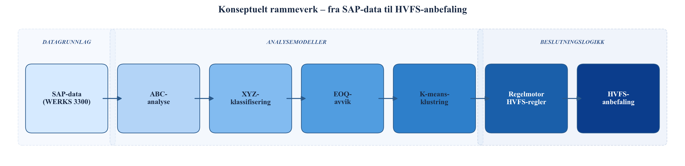

Figur 0 refererer til dette rammeverket. Den detaljerte matematiske formuleringen av alle modellkomponenter — parameterdefinisjonene, formlene og grenseverdiene — presenteres i kapittel 5.

---

---

# Kapittel 3 – Casebeskrivelse

## 3.1 Helse Bergen og Helse Vest

Helse Bergen HF er det største helseforetaket i Helse Vest RHF og er organisert under den statlige spesialisthelsetjenesten. Foretaket drifter Haukeland Universitetssykehus — Norges nest største sykehus — og har ansvar for spesialisthelsetjenester til en befolkning på om lag 460 000 innbyggere i 18 kommuner i Hordaland. Med om lag 14 000 ansatte er Helse Bergen en av de største arbeidsgiverne på Vestlandet, og driftskostnadene er tilsvarende betydelige. Foretaket håndterer et bredt spekter av medisinske spesialiteter og har en kompleks intern logistikk som forsyner avdelinger over et stort geografisk anleggsareal.

Helse Vest RHF koordinerer de fire helseforetakene Helse Bergen, Helse Stavanger, Helse Fonna og Helse Førde. Regionale fellesfunksjoner — inkludert IKT-infrastruktur og forsyningskjedekoordinering — ivaretas i samarbeid mellom foretakene. En regionalt harmonisert tilnærming til materialforvaltning har i senere år fått økt prioritet, drevet av behovet for effektivisering og stordriftsfordeler på tvers av foretakene.

Helse Bergen er i SAP S/4HANA registrert under anleggskode (WERKS) 3300. Det operative forsyningslageret for medisinsk forbruksmateriell er tilordnet lagersted (LGORT) 3001 under dette anlegget. Lageret håndterer anskaffelse, mottak, lagring og distribusjon av forbruksartikler til kliniske avdelinger. Innkjøp gjennomføres via innkjøpsgruppe 300 og 3000 i SAP, med bestillingstype ZNB som er Helse Bergens lokale bestillingstype for forsyningslageret. Alle varebevegelser — forbruk ut til avdeling (BWART 201 og 647) og varemottak inn fra leverandør (BWART 101) — er registrert som transaksjonsdata i SAP og utgjør det primære datagrunnlaget for denne oppgaven. Foretakets organisasjonsmessige plassering i Helse Vest og SAP-strukturen er illustrert i Figur 1. Tabell 3 oppsummerer nøkkeltallene for casevirksomheten.

*Tabell 3. Nøkkeltall for casevirksomheten Helse Bergen, WERKS 3300.*

| Nøkkeltall | Verdi | Kilde |
|---|---|---|
| Helseforetak | Helse Bergen HF | Helse Vest RHF |
| SAP-anlegg (WERKS) | 3300 | SAP S/4HANA |
| Lagersted (LGORT) | 3001 | SAP S/4HANA |
| Antall aktive artikler | 709 | MASTERFILE\_V1.xlsx (D-01) |
| Analyseperiode | Januar 2024 – desember 2025 (24 mnd) | SAP SE16H |
| Antall SAP-kildetabeller | 14 | Dataspesifikasjon (Vedlegg A) |
| ERP-system | SAP S/4HANA (LIBRA-prosjektet) | Helse Vest IKT |
| Regionalt sentrallager | HVFS (Helse Vest Forsyningssenter) | Helse Vest RHF (2024) |
| APL-operatør | NorEngros | Helse Vest RHF (2024) |
| Innkjøpsgruppe | 300 / 3000 | SAP MM |
| Bestillingstype | ZNB (lokal bestillingstype) | SAP MM |

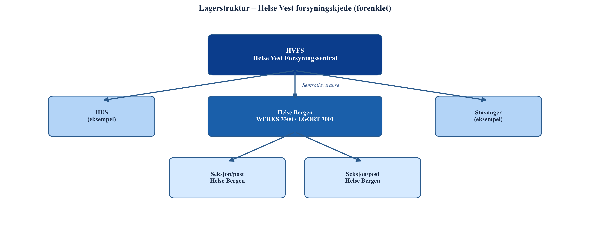

## 3.2 HVFS og LIBRA-prosjektet

Helse Vest Forsyningssenter (HVFS) er under etablering som et regionalt sentrallager for medisinsk forbruksmateriell for samtlige helseforetak i Helse Vest. NorEngros vant offentlig anbudskonkurranse som operatør og har ansvar for den fysiske lagerdriften ved HVFS (Helse Vest RHF, 2024). HVFS er konsipiert som en felles plattform som skal erstatte den fragmenterte strukturen der hvert helseforetak i dag forvalter egne lokale forsyningslagre med overlappende sortiment og separat innkjøpspraksis. Gjennom aggregering av innkjøpsvolum forventes det at HVFS kan oppnå stordriftsfordeler i forhandlinger med leverandører, redusere administrative transaksjonskostnader og sikre mer robust forsyningssikkerhet regionalt.

Et sentralt element i HVFS-konseptet er innføringen av avdelingspakkede leveranser (APL). APL innebærer at forbruksmateriell pakkes per avdeling og leveres direkte til bruksstedet uten mellomhåndtering lokalt. Denne leveringsmodellen stiller høye krav til forutsigbarhet i etterspørselen — en forutsetning som gjør forbruksmønsterets stabilitet (XYZ-dimensjonen) til et relevant klassifiseringskriterium for HVFS-egnethet. APL-modellen er planlagt implementert frem mot 2029 og vil kreve et veldefinert og stabilt sortiment som grunnlag.

LIBRA-prosjektet er Helse Vest IKTs regionale program for implementering og harmonisering av SAP S/4HANA på tvers av alle helseforetak i Helse Vest. Prosjektet har som mål å etablere en felles teknologisk plattform med standardiserte prosesser for blant annet materialforvaltning, innkjøp og logistikk. LIBRA legger det tekniske grunnlaget for at data fra ulike foretak kan sammenlignes og analyseres på tvers — en forutsetning for at HVFS-klassifisering skal ha overføringsverdi fra Helse Bergen til de øvrige foretakene. I forlengelsen av LIBRA-prosjektet er det naturlig å etablere standardiserte klassifiseringsmetodikker som kan driftes og oppdateres løpende i SAP, og denne oppgavens analysemodell er utviklet med dette perspektivet som bakteppe. Fragapane et al. (2019) understreker at overgangen til sentraliserte leveringsmodeller som APL krever et systematisk klassifiseringsgrunnlag for å skille mellom artikler som egner seg for sentralisering og artikler som bør forbli lokalt tilgjengelig av forsyningssikkerhetsgrunner.

## 3.3 Problemkontekst og datagrunnlag

Helse Bergen forsyningslager mangler i dag et systematisk, datadrevet grunnlag for å avgjøre hvilke av lagerets artikler som bør overføres til HVFS. Beslutningene om sortimentstilhørighet treffes i stor grad basert på erfaring og skjønn, uten en strukturert analyse av verdi, forbruksmønster eller kostnadseffektiviteten ved nåværende bestillingspraksis. de Vries (2011) identifiserer nettopp dette som en typisk barriere i sykehuslogistikk: manglende informasjonssystemer og motstridende interessenthensyn fører til at lageromstillingsbeslutninger utsettes eller gjennomføres uten tilstrekkelig faglig grunnlag. Volland et al. (2017) bekrefter at lagerstyring i sykehus er et område med stor variasjon i modenhet — fra svært lite systematisert til avansert datadrevet styring — og at potensialet for forbedring gjennom strukturert klassifisering er dokumentert i litteraturen.

I SAP S/4HANA er artikler tilordnet en SAP-generert XYZ-klassifisering (felt ZZXYZ i tabell MDMA), men denne klassifiseringen oppdateres ikke nødvendigvis løpende og kan basere seg på andre terskelverdier enn de som er standard i lagerstyringslitteraturen. Dette representerer en kjent problemstilling i foretaket: operative SAP-parametere er ikke alltid oppdatert i takt med faktiske forbruksmønstre, og det finnes ikke et etablert verktøy for å beregne klassifisering fra grunndataene på en reproduserbar måte. Fraværet av en slik modell er den direkte motivasjonen for denne oppgaven.

Datagrunnlaget for analysen er hentet fra 14 SAP-tabeller via transaksjonen SE16H i SAP S/4HANA ved Helse Bergen, for perioden 2024–2025 (se Tabell 3 for fullstendig tabelloversikt). Tabellene dekker fire funksjonelle kategorier. Masterdata — MARD, MDMA, MARA, MAKT, MARC og MBEW — definerer artikkeluniverset, gir pris- og varegruppedata samt Helse Bergens operative ABC/XYZ-indikatorer. Forbruksdata fra MSEG (bevegelsestype BWART 201 og 647) registrerer faktisk forbruk ut fra lageret til avdeling på månedlig nivå, og er grunnlaget for XYZ-klassifisering og beregning av etterspørselen D i EOQ-formelen. Innkjøpsdata fra EKKO, EKPO og EKBE dokumenterer innkjøpsordrer og varemottak fra leverandør i analyseperioden, og benyttes til ABC-verdiberegning og kartlegging av faktisk bestillingsfrekvens. Supplerende tabeller — EINA, EINE og T023T — bidrar med leveringstidsdata og varegruppenavn. Det er en viktig funksjonell distinksjon at forbruksdata (MSEG) og innkjøpsdata (EKKO/EKPO/EKBE) representerer henholdsvis vareflyt ut av og inn til lager, og benyttes til ulike analysedimensjoner.

Datapipelinen fra råuttrekk til analyseresultat er illustrert i Figur 2. En sentral datakvalitetsutfordring er at enhetspris i MBEW (feltet STPRS) ikke er per stykk, men per prisenhet (PEINH), som ofte er 10 eller 100 for medisinsk forbruksmateriell. Korrekt enhetspris beregnes derfor som STPRS ÷ PEINH. I tillegg mangler 204 artikler innkjøpsdata fra EKPO i analyseperioden, noe som nødvendiggjør en alternativ verdiberegning basert på annualisert forbruk og enhetspris. Disse og øvrige datakvalitetsbeslutninger er dokumentert i kapittel 4.

---

---

# Kapittel 4 – Metode og data

## 4.1 Forskningsdesign

Denne studien er utformet som en kvantitativ, deskriptiv casestudie med analytisk tilnærming. Casestudiedesignet er valgt fordi problemstillingen er avgrenset til ett konkret case – Helse Bergens forsyningslager WERKS 3300, LGORT 3001 – og fordi målet er å generere handlingsrettede anbefalinger basert på de operasjonelle dataene som faktisk eksisterer i dette systemet, ikke på hypotetiske standardsituasjoner. Et casestudiedesign egner seg særlig når forskningsspørsmålet handler om *hvordan* og *hva* innenfor et avgrenset, kontekstuelt rikt fenomen, og når grensen mellom fenomen og kontekst er uløselig knyttet til den operative konteksten. Sistnevnte kjennetegn er tydelig til stede her: lagerstruktur, prislogikk og forbruksmønstre er uløselig knyttet til Helse Bergens organisatoriske og teknologiske kontekst.

Studien er kvantitativ i den forstand at alle analyser er basert på numeriske data hentet fra SAP S/4HANA-transaksjoner. Det benyttes ingen spørreundersøkelser, intervjuer eller deltakerobservasjon. Dette er et bevisst valg: operasjonelle ERP-data er direkte registrert i systemet ved hvert varemottak, lageruttak og innkjøp, og er derfor ikke gjenstand for hukommelsesfeil, sosial ønskverdighet eller subjektiv tolkning, slik selvrapporterte data kan være (Saha & Ray, 2019). Analyseenheten er den individuelle lagerartikkelen (SKU), og populasjonen er de 709 aktive artiklene i LGORT 3001 per analyseperioden 2024–2025.

Studien er deskriptiv i den forstand at den karakteriserer og klassifiserer eksisterende lagerartikler – den setter ikke opp et kontrollert eksperiment eller manipulerer variabler. Den er analytisk i den forstand at klassifiseringsresultatene kombineres i en regelbasert beslutningsmodell som produserer overføringsanbefalinger med tilhørende besparelsesestimater (van Kampen et al., 2012). Generaliserbarhet er begrenset til sammenlignbare sykehuslagre med SAP-infrastruktur; studien har ikke som ambisjon å produsere universelle funn, men å gi et reproduserbart metoderammeverk som kan tilpasses andre WERKS-enheter innenfor Helse Vest.

## 4.2 Datainnsamling

Alle data er hentet fra SAP S/4HANA via transaksjonen SE16H, som gir direkte lesetilgang til databasetabeller uten å gjøre endringer i systemet. Uttrekket er begrenset til WERKS 3300 og LGORT 3001, og dekker en analyseperiode på 24 måneder (januar 2024 til desember 2025). Perioden er valgt fordi den er lang nok til å fange sesongvariasjon og irregulære hendelser i forbruksmønsteret, uten å inkludere data fra perioder med vesentlig annerledes driftsforhold. Tabellen nedenfor gir en oversikt over de 14 SAP-tabellene som inngår i grunnlaget.

---

*Tabell 4. Datagrunnlag: 14 SAP S/4HANA-tabeller hentet via SE16H, analyseperiode 2024–2025, WERKS 3300 / LGORT 3001.*

| Nr | Tabell | Beskrivelse | Kategori |
|----|--------|-------------|----------|
| 1 | MARD | Lagerdata per lagersted (beholdning) | Masterdata |
| 2 | MDMA | MRP-data, ABC/XYZ-indikator (ZZABC, ZZXYZ) | Masterdata |
| 3 | MARA | Artikkelstamdata (MTART, MATKL, MEINS) | Masterdata |
| 4 | MAKT | Artikkeltekst (MAKTX) | Masterdata |
| 5 | MARC | Anleggsdata per materiale (MARC\_ABC) | Masterdata |
| 6 | MBEW | Verdsettingsdata (STPRS, PEINH) | Masterdata |
| 7 | MSEG | Varebevegelser, forbruk (BWART 201, 647) | Forbruksdata |
| 8 | EKKO | Innkjøpsordrerhoder (bestillingstype ZNB) | Innkjøpsdata |
| 9 | EKPO | Innkjøpsordreposisjoner (NETWR) | Innkjøpsdata |
| 10 | EKBE | Innkjøpsordrehistorikk/varemottak | Innkjøpsdata |
| 11 | EINA | Innkjøpsinforecord – generell del | Supplerende |
| 12 | EINE | Innkjøpsinforecord – organisasjonsdel (WETAG) | Supplerende |
| 13 | T023T | Varegruppenavn (WGBEZ) | Supplerende |
| 14 | T024 | Innkjøpsgrupper (EKGRP) | Supplerende |

Råuttrekket inneholder 1 006 unike artikkelnumre. Populasjonsavgrensningen beskrives i detalj i avsnitt 4.3 nedenfor, og reduserer dette til 709 aktive artikler. For forbruksdata er det benyttet bevegelsestyper (BWART) 201 og 647 fra MSEG, som representerer henholdsvis vareforbruk til kostnadssted og spesialforbruk. Disse to bevegelsesstypene fanger det reelle forbruket ut fra lager og utelukker interne overføringer og returer som ville ha forvrengt etterspørselsestimatet. Innkjøpsdata er hentet fra EKKO/EKPO/EKBE, som gir faktiske ordrelinjer og varemottak; disse benyttes for ABC-verdibeRegning og for estimering av faktisk ordrefrekvens. Leveringstidsdata er hentet fra EINE (feltet WETAG), men dekker kun 6 % av artiklene; se beslutning D-05 under.

## 4.3 Dataforbehandling

All dataforbehandling er gjennomført i Python 3.13 ved hjelp av bibliotekene pandas (McKinney, 2010) og scikit-learn (Pedregosa et al., 2011). Scriptet er deterministisk og reproduserbart: alle tilfeldige prosesser bruker random_state=42, og ingen manuell redigering av enkeltartikler er foretatt. Åtte eksplisitte datavalgsbeslutninger (D-01–D-08) er dokumentert nedenfor; disse tilsvarer steder i datapipelinen der analytikeren måtte treffe et valg mellom alternative behandlingsmåter, og der valget har materiell innvirkning på resultatene.

---

*Tabell 5. Datavalgsbeslutninger D-01–D-08 med begrunnelse.*

| ID | Beslutning | Effekt | Begrunnelse |
|----|-----------|--------|-------------|
| D-01 | Populasjonsavgrensning | 1 006 → 709 artikler | Ekskluderer 297 inaktive (D\_ANNUAL = 0 og TOTAL\_STOCK = 0) |
| D-02 | PEINH-korrigering | UNIT\_PRICE = STPRS ÷ PEINH | Korrigerer for prisenhet ≠ 1 |
| D-03 | Beregnet ABC-verdi | 204 artikler uten EKPO | ABC\_VALUE = D\_ANNUAL × UNIT\_PRICE som fallback |
| D-04 | CV-basert XYZ | Erstatter ZZXYZ | 33 % samsvar → beregnet CV foretrukket |
| D-05 | Leveringstid-fallback | 14 dager for 94 % | EINE WETAG dekker kun 6 % |
| D-06 | MSEG\_STATUS blank → AKTIV | Fyller manglende verdier | Antar normal driftsstatus |
| D-07 | ABC\_VALUE\_SOURCE | EKPO-verdi prioriteres | TOTAL\_NETWR > 0 kreves for EKPO-kilde |
| D-08 | Annualisering av ordrefrekvens | ACTUAL\_FREQ = ORDER\_COUNT × 12/24 | 24 mnd data → årsbasis |

**D-01 – Populasjonsavgrensning.** Råuttrekket fra MARD inneholdt 1 006 artikkelnumre. Av disse er 297 ekskludert fordi de har verken registrert forbruk i MSEG (D_ANNUAL = 0) og null beholdning (TOTAL_STOCK = 0). Disse artiklene er operasjonelt inaktive og utenfor analyseformålet. De resterende 709 artiklene utgjør populasjonen for alle videre analyser.

**D-02 – PEINH-korrigering.** SAP-feltet STPRS i MBEW inneholder standardpris per prisenhet, der prisenheten er angitt i PEINH. PEINH er vanligvis 1, men er i mange tilfeller satt til 10 eller 100 – særlig for lavprisartikler der prisen er satt per 10 eller per 100 enheter. Uten PEINH-korrigering ville enhetsprisen for disse artiklene bli overvurdert med faktor 10 eller 100, noe som ville ha forplantet seg til feil i ABC-rangering, EOQ-parametere og besparelsesestimat. Korreksjon er implementert ved formelen UNIT_PRICE = STPRS ÷ PEINH.

**D-03 – Beregnet ABC-verdi.** ABC-analyse krever en verdi per artikkel. Primærkilden er den faktiske innkjøpsverdien fra EKPO (TOTAL_NETWR), som dekker 505 av 709 artikler. For de resterende 204 artiklene – der TOTAL_NETWR er null eller mangler – er ABC-verdien beregnet som årsforbruk multiplisert med enhetspris (D_ANNUAL × UNIT_PRICE). Denne fremgangsmåten er konsistent med standard ABC-litteratur, der verdi defineres som forbruksvolum ganger enhetspris når direkte innkjøpsverdi ikke er tilgjengelig (Silaen et al., 2023). Et alternativ ville vært å ekskludere disse artiklene. Dette ble vurdert og forkastet av tre grunner: (1) ekskludering ville gi et systematisk skjevt utvalg, siden fraværet av EKPO-data primært skyldes ikke-standardisert anskaffelsespraksis — nettopp de artiklene som kan ha høyest potensial for sentralisering; (2) 204 artikler utgjør 28,8 % av populasjonen, noe som ville svekket representativiteten vesentlig; og (3) D_ANNUAL er observert fra MSEG, ikke anslått, slik at proksien kun introduserer usikkerhet i prisleddet, ikke i forbruksvolum.

**D-04 – CV-basert XYZ i stedet for SAP ZZXYZ.** SAP S/4HANA inneholder et eget klassifiseringsfelt, ZZXYZ, som representerer systemets registrerte XYZ-kategori. En validering mot den beregnede CV-klassifiseringen viste at bare 33 % av artiklene er samsvarende. Avviket skyldes primært at ZZXYZ ikke er blitt systematisk oppdatert i takt med endringer i forbruksmønstre. Analysen benytter derfor CV beregnet direkte fra månedlig MSEG-forbruk over 24 måneder som grunnlag for XYZ-klassifisering, mens ZZXYZ brukes som valideringsreferanse. Modellenes matematiske spesifikasjon er beskrevet i kapittel 5.

**D-05 – Leveringstid-fallback.** EOQ-modellen benytter leveringstid som parameter for beregning av bestillingspunkt. EINE-tabellen inneholder feltet WETAG (leveringstid i dager), men dette feltet er kun utfylt for 6 % av artiklene i populasjonen (43 av 709). For de resterende 94 % benyttes en fallback-verdi på 14 kalenderdager, som tilsvarer en typisk leveringstid for forbruksmateriell fra grossist til sykehus. Implikasjoner av denne antagelsen er diskutert i avsnitt 4.4.

**D-06 til D-08** er dokumentert i Tabell 5 og implementert direkte i Python-scriptet. D-08 – annualiseringen av ordrefrekvens – er særlig viktig for konsistens mellom faktisk og optimal frekvens i EOQ-avviksanalysen. Siden analyseperioden er 24 måneder, annualiseres faktisk ordretelling ved å multiplisere med faktoren 12/24, slik at ACTUAL_FREQ er direkte sammenlignbar med den beregnede EOQ-frekvensen på årsbasis.

Datapipelinen fra rådata til analyseklar datasett er illustrert i figuren nedenfor.

---

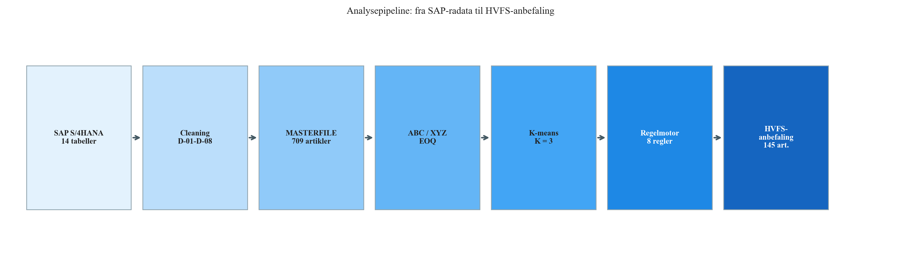

## 4.4 Etiske betraktninger og begrensninger

Studien behandler ingen personopplysninger. Alle analyser er gjennomført på artikkel- og transaksjonsnivå, ikke på individnivå. Det er ikke koblet data til ansatte, pasienter eller enkeltpersoner. Datatilgang er gitt av Helse Bergen som del av samarbeidet med Helse Vest IKT og LIBRA-prosjektet, og er avgrenset til lagertransaksjonsdata i SAP S/4HANA.

To sentrale parametere er antagelser, ikke målte verdier. Ordrekostnaden S = 750 NOK er satt basert på estimater fra litteraturen for sykehusinnkjøp (Kelle et al., 2012; Bijvank & Vis, 2012), men den faktiske kostnaden per ordre vil variere med innkjøpstype, leverandøravtale og administrativ belastning. Holdesatsen h = 20 % av enhetspris per år er en vanlig sjablongregel i EOQ-litteraturen (Hautaniemi & Pirttilä, 1999), men inkluderer implisitte antagelser om kapitalkostand, lagerbrann- og ukurantrisiko som ikke er verifisert mot Helse Bergens faktiske regnskapstall. Sensitivitetsanalysen i kapittel 7 undersøker i hvilken grad resultater endres ved variasjon i disse parameterne.

Leveringstids-fallbacken på 14 dager (D-05) dekker 94 % av artiklene, og er den enkeltbeslutningen som potensielt har størst effekt på bestillingspunkt-beregninger. Ettersom EOQ-avviksanalysen i denne studien er basert på ordrefrekvens snarere enn bestillingspunkt, er den direkte innvirkningen på analyseresultatene begrenset; likevel bør en eventuell oppfølgingsstudie prioritere å berike EINE-tabellen med faktiske leveringstider. Alle modellenes matematiske spesifikasjon og parametersetting beskrives i kapittel 5.

## 4.5 Bruk av KI-verktøy

Kunstig intelligens i form av store språkmodeller ble benyttet som faglig støtteverktøy gjennom hele prosjektperioden, i tråd med retningslinjene i kursets skrivekompendium (Rekdal & Pettersen, 2025). Claude (Anthropic, 2026) ble anvendt til tre konkrete formål: (1) kodestøtte og feilsøking i Python-scriptet for ABC-, XYZ-, EOQ- og K-means-analysen; (2) generering av alle datavisualiseringer — Pareto-kurve, kryssmatrise, EOQ-avviksplott, silhouette-profil, scatterplott og regelmotor-fordeling — på grunnlag av analyseresultater produsert av scriptet; og (3) strukturering og språklig bearbeiding av rapportteksten. Alle figurer generert med støtte fra Claude er merket «Generert med støtte fra Claude (Anthropic, 2026)» i bildeteksten.

Claude ble ikke brukt som fagkilde og er ikke sitert som belegg for faglige påstander. Alle numeriske resultater, tabellverdier og analytiske konklusjoner er produsert av Python-scriptet fra SAP-kildedata og er uavhengige av KI-verktøyet. Rådata fra SAP ble ikke modifisert i noen fase av arbeidet; alle transformasjoner er dokumentert i D-01–D-08 (avsnitt 4.3) og implementert deterministisk i scriptet.

---

# Kapittel 5 – Modellering

## 5.1 ABC-modellen

ABC-analyse er en rangerings- og klassifiseringsmetode basert på Pareto-prinsippet, som postulerer at en liten andel av artiklene i et lager typisk står for hoveddelen av den totale verdibindingen (Gupta et al., 2007). Metoden gir en strukturert tilnærming til å skille artikler som krever tett styring fra artikler der en enklere tilnærming er tilstrekkelig (van Kampen et al., 2012).

For hver artikkel $i$ beregnes en årsverdi $v_i$ som produktet av årsforbruk og enhetspris:

$$v_i = D_i \times \text{UNIT\_PRICE}_i$$

Der $D_i$ er annualisert forbruk (enheter/år) og UNIT\_PRICE$_i$ er PEINH-korrigert standardpris (NOK/enhet), jf. beslutning D-02 og D-03 i avsnitt 4.3. Artiklene sorteres deretter i synkende rekkefølge etter $v_i$, og kumulativ verdiandel $C_i$ beregnes som:

$$C_i = \frac{\sum_{j=1}^{i} v_j}{V_{\text{tot}}}$$

der $V_{\text{tot}} = \sum_{j=1}^{N} v_j$ er total årsverdi over alle $N$ artikler. En artikkel tilhører A-klassen dersom $C_i \leq 0{,}80$, B-klassen dersom $0{,}80 < C_i \leq 0{,}95$, og C-klassen ellers.

Klassifiseringsgrensene er satt i henhold til standard ABC-litteratur (Silaen et al., 2023):

*Tabell 6. Modellparametere: ABC-klassifiseringsgrenser og øvrige analyseinnstillinger.*

| Parameter | Verdi | Kilde/Begrunnelse |
|-----------|-------|-------------------|
| ABC A-grense | 80 % kumulativ verdi | Silaen et al. (2023) |
| ABC B-grense | 95 % kumulativ verdi | Silaen et al. (2023) |
| XYZ X-grense | CV < 0,5 | Nowotyńska (2013) |
| XYZ Y-grense | 0,5 ≤ CV < 1,0 | Nowotyńska (2013) |
| XYZ Z-grense | CV ≥ 1,0 | Nowotyńska (2013) |
| Ordrekostnad S | 750 NOK | Kelle et al. (2012); Bijvank & Vis (2012) |
| Holdesats h | 20 % av UNIT\_PRICE | Ketkar & Vaidya (2014) |
| Leveringstid fallback | 14 dager | Bransjepraksis (D-05) |
| EOQ-terskel τ\_f | 1,5 (FREQ\_AVVIK > 150 %) | Operasjonelt vesentlig avvik |
| K-means K-søk | K ∈ {2, 3, 4, 5, 6, 7} | Silhouette-optimering |
| K-means n\_init | 50 | Robust initialisering |
| Random state | 42 | Reproduserbarhet |
| Train/test split | 80/20 | Standard validering |

Grensene 80 % og 95 % er i tråd med den klassiske Pareto-inndelingen og er konsistente med anbefalingene i van Kampen et al. (2012). Sorteringen og kumulative beregningene er implementert med pandas (McKinney, 2010), og ingen manuell justering av enkeltartikler er foretatt.

## 5.2 XYZ-modellen

XYZ-klassifisering beskriver stabilitet i forbruksmønsteret over tid, og komplementerer ABC-analysen ved å skille artikler med forutsigbar etterspørsel fra artikler med uregelmessig forbruk (Nowotyńska, 2013). Grunnlaget for klassifiseringen er variasjonskoeffisienten CV (coefficient of variation), beregnet fra månedlig forbruk over analyseperioden på 24 måneder:

$$\text{CV}_i = \frac{\sigma_i}{\mu_i}$$

der $\sigma_i$ er standardavviket og $\mu_i$ er gjennomsnittet av månedlig forbruk for artikkel $i$, basert på MSEG-bevegelsestypene 201 og 647. CV er et dimensjonsløst relativt spredningsmål som gjør det mulig å sammenligne variasjon på tvers av artikler med svært ulike forbruksvolumer (Suryaputri et al., 2022). Artikler med manglende forbruksdata utelates fra XYZ-analysen. Grensene fremgår av Tabell 6 ovenfor.

Kombinasjonen av ABC og XYZ gir en ni-felts matrise (AX, AY, AZ … CZ) som nyanserer styringsbeslutningen: en AX-artikkel er både høyverdi og forutsigbar, og er dermed velegnet for automatisert etterfylling med stram styring, mens en CZ-artikkel er lavverdi og uregelmessig, og typisk bør håndteres med en reaktiv, behovsstyrt tilnærming (Ketkar & Vaidya, 2014). Matrisen er ikke et mål i seg selv, men fungerer som ett av tre inngangssignaler til regelmotoren beskrevet i avsnitt 5.5.

Som beskrevet i avsnitt 4.3 (D-04) benyttes SAP-feltet ZZXYZ utelukkende til validering: systemklassen sammenlignes med den beregnede CV-klassen for å kvantifisere i hvilken grad den eksisterende SAP-klassifiseringen er i overensstemmelse med faktiske forbruksdata. Valideringsresultater presenteres i kapittel 6.

## 5.3 EOQ-modellen og besparelsesformelen

**Wilson EOQ-modell.** Den klassiske Wilson-formelen gir den ordrekvantum $Q^*$ som minimerer den totale lagerholde- og ordrekostnaden per år (Hautaniemi & Pirttilä, 1999):

$$Q^* = \sqrt{\frac{2 D S}{H}}$$

der $D$ er årsforbruk (enheter/år), $S = 750$ NOK er ordrekostnad per bestilling og $H = h \times \text{UNIT\_PRICE}$ er holdekostnad per enhet per år, med holdesats $h = 20\,\%$. Den optimale ordrefrekvensen følger direkte:

$$f^* = \frac{D}{Q^*} = \sqrt{\frac{D H}{2 S}}$$

**Avviksformel.** Faktisk ordrefrekvens $f_{\text{obs}}$ er annualisert fra EKBE-data via D-08. Relativt frekvensavvik er definert som:

$$\text{FREQ\_AVVIK}_i = \frac{f_{\text{obs},i} - f^*_i}{f^*_i}$$

En artikkel klassifiseres som FOR\_MANGE\_ORDRER dersom FREQ\_AVVIK $> \tau_f = 1{,}5$, det vil si at faktisk ordrefrekvens er mer enn 50 % høyere enn EOQ-optimal frekvens. Terskelen $\tau_f$ er satt for å fokusere analysen på de artiklene der avviket er operasjonelt vesentlig, og ikke bare statistisk merkbart. Differansen i totalkostnad mellom faktisk og optimal drift for en artikkel er:

$$\Delta TC_i = TC(f_{\text{obs},i}) - TC(f^*_i)$$

der totalkostnaden ved frekvens $f$ er:

$$TC(f) = f \cdot S + \frac{D}{2f} \cdot H$$

**Parametervurdering.** Parametervalgene S = 750 kr og h = 20 % er ikke kalibrert mot observerte virksomhetsdata ved Helse Bergen, men er i tråd med verdier benyttet i tilsvarende sykehuslagerstudier (Kelle et al., 2012; Hautaniemi & Pirttilä, 1999). Det er viktig å merke seg at parametervalg primært påvirker størrelsen på ΔTC, ikke *hvem* som klassifiseres som FOR\_MANGE\_ORDRER: klassifiseringen er frekvensbasert (faktisk frekvens vs. EOQ-optimal frekvens) og robust overfor moderate endringer i S og h. En dobling av S til 1 500 kr øker EOQ-optimal batchstørrelse med faktor √2 ≈ 1,41 og reduserer optimal ordrefrekvens tilsvarende, men endrer ikke rangeringen av artikler med stor avviksgrad. Sensitivitetsanalysen i kapittel 7 håndterer parametervariasjon eksplisitt gjennom scenariomodellen.

**Besparelsesformel.** Besparelsesformelen estimerer den reduksjonen i totalkostnad som kan realiseres ved overføring til HVFS og konsolidering av ordrefrekvens mot EOQ-optimalt nivå. Formelen bygger direkte på $\Delta TC_i$:

$$B_{\text{HVFS}} = \sum_{i \in \text{OVERFØR}} \Delta TC_i \cdot g$$

der $g$ er en gevinstrealiseringsgrad som reflekterer at ikke alle teoretiske besparelser lar seg realisere fullt ut i praksis — blant annet som følge av implementeringsfriksjon, endrede leverandøravtaler og SAP-parameterjusteringer. Tre scenarier er definert: worst case ($g = 50\,\%$), base case ($g = 75\,\%$) og best case ($g = 100\,\%$). Kun artikler som både er i OVERFØR\_HVFS-kategorien *og* har status FOR\_MANGE\_ORDRER inngår i besparelsesgrunnlaget, da $\Delta TC_i$ modellerer kostnadsavviket fra suboptimal ordrefrekvens — en avvik som nettopp adresseres ved sentralisering til HVFS. Sensitivitetsanalysen i kapittel 7 undersøker robustheten av dette estimatet ved systematisk variasjon i $S$, $h$ og $g$.

## 5.4 K-means klyngemodellen

K-means er en partisjonerende klyngealgoritme som deler et datasett med $N$ observasjoner inn i $K$ klynger ved å minimere intra-klynge varians (Srinivasan & Moon, 1999). Algoritmen er iterativ: den initialiserer $K$ sentroider, tildeler hvert datapunkt til nærmeste sentroid, oppdaterer sentroider som klyngenes tyngdepunkter og gjentar til konvergens. Implementasjonen benytter scikit-learn (Pedregosa et al., 2011) med `n_init=50` og `max_iter=300` for robust initialisering.

**Featurevektor.** Hver artikkel representeres av en tredimensjonal featurevektor:

$$\mathbf{x}_i = \bigl[\, z(\ln \text{CV}_i),\; z(\ln(v_i + 1)),\; z(\ln(|\Delta TC_i| + 1)) \,\bigr]$$

der $z(\cdot)$ betegner standardisering (z-score). Log-transformasjon er anvendt på alle tre features fordi de underliggende variablene er høyreskjeve: CV, artikkelverdi og EOQ-avvik har lange høyre haler, og uten transformasjon vil K-means domineres av ekstremverdier fremfor den typiske variasjonen i datasettet (Srinivasan & Moon, 1999). Absoluttverdien $|\Delta TC_i|$ benyttes fordi det er størrelsen på EOQ-avviket som er relevant for klyngingen – ikke retningen. Konstantleddet $+1$ i logaritmen hindrer $\ln(0)$ for artikler med $\Delta TC = 0$.

**Trenings- og testprosedyre.** Datasettet deles i et treningssett (80 %, random\_state = 42) og et testsett (20 %). StandardScaler fittes utelukkende på treningsdataene og transformerer deretter begge sett; dette forhindrer datalekkasje fra testsettet til skaleringen. KMeans-modellen fittes likeledes kun på treningsdataene. Testsettet benyttes til å evaluere om klyngestrukturen er generaliserbar, det vil si at testpunktenes tildeling til treningsklynger gir en silhouette-score sammenlignbar med treningssettets.

**K-valg.** Antall klynger $K$ velges automatisk som den $K$-verdien i intervallet $[2, 7]$ som gir høyest gjennomsnittlig silhouette-score på treningsdataene. Silhouette-score $s_i$ for punkt $i$ er definert som:

$$s_i = \frac{b_i - a_i}{\max(a_i,\; b_i)}$$

der $a_i$ er gjennomsnittlig intra-klyngeavstand og $b_i$ er gjennomsnittlig avstand til nærmeste naboklynge. Score nær 1 indikerer tydelig klyngetilhørighet; score nær 0 indikerer overlapp; negativ score indikerer feil klynge. Scores over 0,3 regnes som akseptable for eksplorativ analyse (Ketkar & Vaidya, 2014). Silhouette beregnes separat for trenings- og testdata; et lavere testresultat enn treningsresultat er normalt, men et vesentlig fall vil indikere overfit.

**K\_OVERFØR-klyngen.** Etter kjøring identifiseres én klynge som HVFS-overføringsklynge basert på en kombinasjon av lav CV (stabilt forbruk), høy artikkelverdi og høyt positivt $\Delta TC$ (mange unødvendige ordrer). Denne klyngen inngår som ett av inngangssignalene i regelmotoren beskrevet nedenfor.

## 5.5 Regelmotor

Regelmotoren kombinerer utfallene fra de fire foregående modellene – ABC-klasse, XYZ-klasse, EOQ-avviksstatus og K-means klyngetilhørighet – og produserer en anbefaling per artikkel. Reglene anvender en sekvensiell prioritet: artikkelen evalueres mot reglene i nummerert rekkefølge, og den første regelen som gir treff bestemmer utfallet. Dette forhindrer at en artikkel oppfyller kriteriene for flere kategorier.

*Tabell 7. Regelmotor: 8 beslutningsregler i prioritert rekkefølge.*

| Regel | Betingelse | Anbefaling | Logikk |
|-------|-----------|------------|--------|
| R1 | XYZ = Z | BEHOLD\_LOKALT | Uforutsigbart forbruk → uegnet for APL |
| R2 | ABC = C og XYZ = Y | BEHOLD\_LOKALT | Lav verdi + moderat variasjon |
| R3 | ABC ∈ {A, B} og XYZ = X og EOQ = FOR\_MANGE | OVERFØR\_HVFS | Sterkeste overføringssignal |
| R4 | K\_OVERFØR = True og EOQ = FOR\_MANGE | OVERFØR\_HVFS | Klyngeprofil + kostnadsavvik |
| R5 | ABC ∈ {A, B} og XYZ ∈ {X, Y} | OVERFØR\_HVFS | Høy verdi + akseptabel stabilitet |
| R6 | ABC = C og XYZ = X og EOQ = FOR\_MANGE | TIL\_VURDERING | Lav verdi men stabilt og overbestilt |
| R7 | K\_OVERFØR = True | TIL\_VURDERING | Klyngeprofil uten øvrige signaler |
| R8 | Ellers | TIL\_VURDERING | Uklart signalmønster |

Sekvenslogikken er utformet slik at de to første reglene fungerer som overordnede frastøtingsregler: enhver Z-artikkel beholdes lokalt uavhengig av ABC-klasse (regel 1), og CY-artikler beholdes lokalt som standard (regel 2). Disse reglene reflekterer den grunnleggende innsikten at uforutsigbart forbruksmønster er den sterkeste kontraindikasjon mot sentralisering, fordi HVFS-modellen med APL-leveranse forutsetter planbar etterspørsel for å opprettholde tilfredsstillende servicenivå (Bijvank & Vis, 2012; Fragapane et al., 2019). Reglene 3–5 definerer positivt overføringssignal, der regel 3 er den sterkeste: høyverdi, stabilt forbruk og dokumentert ordrefrekvensavvik gir tydelig grunnlag for anbefaling. Reglene 6–8 sender artikler til manuell vurdering der signalene fra de ulike analysene ikke er entydige. Figuren nedenfor illustrerer regelmotorens beslutningsflyt.

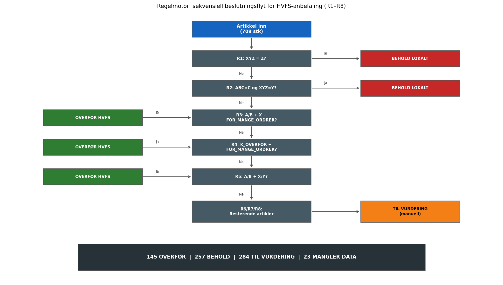

Artikler som ikke fanges opp av noen av de åtte reglene – typisk fordi CV-data eller verdidata mangler – klassifiseres som MANGLER\_DATA. Disse inngår ikke i besparelsesestimatet, men rapporteres separat for å synliggjøre datakvalitetsproblemer i kildedataene. Det understrekes at regelmotoren er et normativt beslutningsstøtteverktøy: den produserer en datadrevet anbefaling per artikkel, men erstatter ikke innkjøpsfaglig skjønn. Alle anbefalinger bør valideres i en begrenset pilot mot ekspertvurdering fra innkjøpsfunksjonen ved Helse Bergen før implementering i full skala. Alle beregnede anbefalinger, klyngeprofiler og besparelsesestimater presenteres som sluttresultater i kapittel 7.

---

# Kapittel 6 – Analyse

## 6.1 ABC-analyse av 709 artikler

ABC-analysen ble gjennomført ved å sortere samtlige 709 aktive artikler i synkende rekkefølge etter beregnet årsverdi $v_i = D_i \times \text{UNIT\_PRICE}_i$, der $D_i$ er annualisert forbruk og UNIT\_PRICE$_i$ er PEINH-korrigert standardpris fra MBEW (beslutningene D-02 og D-03, avsnitt 4.3). For 505 av artiklene er $v_i$ basert direkte på EKPO-innkjøpsdata (ABC\_VALUE\_SOURCE = EKPO); for de resterende 204 er verdien beregnet fra MSEG-forbruk og enhetspris (ABC\_VALUE\_SOURCE = BEREGNET). Etter sortering ble kumulativ verdiandel CUM\_PCT beregnet som løpende sum av $v_i$ dividert på totalsum. Den samlede årsverdien for de 709 artiklene er beregnet til i overkant av 34 millioner kroner. Det er verdt å merke seg at de to verdikildene gir systematisk ulike bidrag til rangeringen: artikler med EKPO-data har observerte innkjøpsverdier fra faktiske transaksjoner, mens artikler med beregnet verdi baseres på forbruksvolum og standardpris. For de 204 beregnede artiklene er det en implisitt antagelse om at STPRS i MBEW er en rimelig tilnærming til faktisk innkjøpspris; denne antagelsen er diskutert i avsnitt 8.2. Analysen ble implementert i pandas med vektoriserte operasjoner for å sikre at rangeringen er deterministisk og reproduserbar.

Pareto-grensene 80 % og 95 % ble deretter lagt på den kumulative kurven, som vist i Figur 4 nedenfor. Kurvens form – en bratt stigning tidlig etterfulgt av en lang flat hale – bekrefter at Pareto-prinsippet er tydelig til stede i dette datasettet. Det innebærer at en relativt liten andel av artiklene bærer en uforholdsmessig stor andel av den totale verdibindingen, noe som er konsistent med funn fra tilsvarende sykehuslagerstudier (Gupta et al., 2007; van Kampen et al., 2012). Av de 709 artiklene fikk 704 en ABC-klasse (182 A, 184 B, 338 C); de resterende 5 artiklene har null beregnet verdi etter D-02/D-03 og kunne ikke ABC-rangeres — disse rapporteres i MANGLER\_DATA-kategorien. Endelig fordeling mellom A-, B- og C-artikler presenteres i Tabell 8 i kapittel 7.

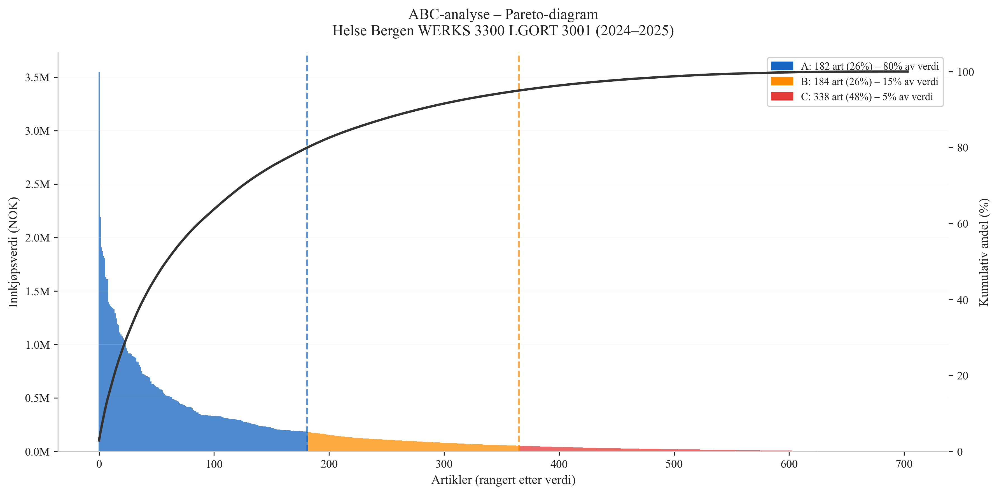

## 6.2 XYZ-klassifisering

XYZ-klassifiseringen tok utgangspunkt i månedlig MSEG-forbruk per artikkel over den 24 måneder lange analyseperioden, med bevegelsestypene 201 og 647. For hver artikkel ble variasjonskoeffisienten CV$_i = \sigma_i / \mu_i$ beregnet, der $\sigma_i$ er standardavviket og $\mu_i$ er gjennomsnittet av de månedlige forbruksobservasjonene. For å sikre at CV-estimatene er basert på et tilstrekkelig antall observasjoner, ble det satt et minimumskrav om registrert forbruk i minst tre av de 24 månedene i analyseperioden. Artikler med færre enn tre måneder med registrert forbruk ble ekskludert fra XYZ-klassifiseringen for å unngå at CV-estimater basert på svært få observasjoner gir misvisende klassifisering. CV-beregningen benytter alle 24 måneder inkludert nullmåneder for artikler som oppfyller minimumskravet, noe som innebærer at artikler med sporadisk forbruk får en høyere CV enn artikler med jevnt forbruk over samme volum — en ønsket egenskap for å fange opp forbruksstabilitet. Totalt 22 av 709 artikler tilfredsstilte ikke datakravet og ble ikke XYZ-klassifisert; disse rapporteres i MANGLER\_DATA-kategorien og inngår ikke i ABC/XYZ-kryssmatrisen.

Etter beregning ble CV-grensene fra Tabell 6 (kap. 5) anvendt: X (CV < 0,5), Y (0,5 ≤ CV < 1,0) og Z (CV ≥ 1,0). XYZ-analysen ble deretter kryssvalidert mot SAP-feltet ZZXYZ, som representerer systemets eksisterende klassifisering. Samsvaret mellom beregnet og systemregistrert klasse ble kvantifisert som andelen av artikler der de to klassifiseringene er identiske; dette resultatet presenteres i kapittel 7. Det lave samsvaret som ble observert, bekrefter at ZZXYZ-feltet ikke er systematisk vedlikeholdt i takt med faktiske forbruksendringer, noe som motiverer bruken av CV-beregning som primær klassifiseringsmetode (beslutning D-04, avsnitt 4.3).

ABC- og XYZ-klassifiseringene ble kombinert til en ni-felts kryssmatrise, som vist i Figur 5. Matrisen gir et øyeblikksbilde av populasjonens sammensetning langs de to dimensjonene og danner inngangsdataene for regelmotoren i avsnitt 6.5. Fullstendige celleanntall presenteres i Tabell 9 i kapittel 7.

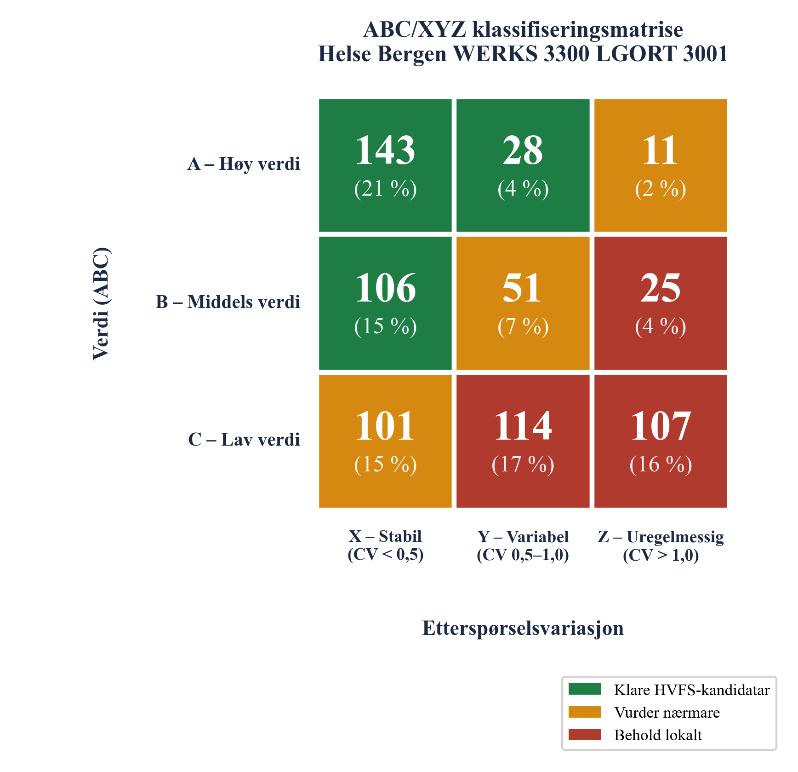

Matrisen viser et tydelig mønster: A- og B-artikler er i stor grad konsentrert i X-kolonnen (stabilt forbruk), noe som er gunstig for sentralisering til HVFS. Kombinasjonen AX og BX representerer artikler med høy verdi og forutsigbart forbruk — den ideelle profilen for sentralisert styring gjennom APL-leveranser. Z-kolonnen er dominert av C-artikler, og AZ/BZ-kategoriene er relativt små, noe som innebærer at de fleste høyverdiartiklene har akseptabel forutsigbarhet. CY-kombinasjonen utgjør en vesentlig gruppe som regelmotoren håndterer ved å beholde disse lokalt (R2), da lav verdi kombinert med moderat variasjon ikke rettferdiggjør sentralisering. De ni cellene i matrisen danner det primære inngangssignalet for regelmotorens beslutningslogikk.

## 6.3 EOQ-avviksberegning

EOQ-avviksanalysen ble gjennomført for alle artikler der tilstrekkelig data forelå for beregning av optimal ordrefrekvens $f^*$, det vil si artikler med $D_i > 0$, $\text{UNIT\_PRICE}_i > 0$ og tilgjengelig LEAD\_TIME. Den optimale frekvensen $f^* = \sqrt{DH / 2S}$ ble beregnet med $S = 750$ NOK og $H = 0{,}20 \times \text{UNIT\_PRICE}_i$ som modellparametere (se Tabell 6, kap. 5). Faktisk ordrefrekvens $f_{\text{obs}}$ ble hentet fra EKBE og annualisert i henhold til beslutning D-08: ACTUAL\_FREQ = ORDER\_COUNT $\times$ (12/24).

Det relative frekvensavviket FREQ\_AVVIK$_i = (f_{\text{obs},i} - f^*_i) / f^*_i$ ble beregnet per artikkel. Fordelingen av dette avviket er illustrert i Figur 6 nedenfor. Terskelen $\tau_f = 1{,}5$ ble lagt inn for å skille artikler med vesentlig overbestilling (FOR\_MANGE\_ORDRER) fra artikler innenfor akseptabelt avvik. I tillegg ble differansen i totalkostnad $\Delta TC_i = TC(f_{\text{obs}}) - TC(f^*)$ beregnet per artikkel, og summert til et samlet EOQ-avvikstall for hele populasjonen. Disse resultatene presenteres i sin helhet i Tabell 10 og avsnitt 7.3.

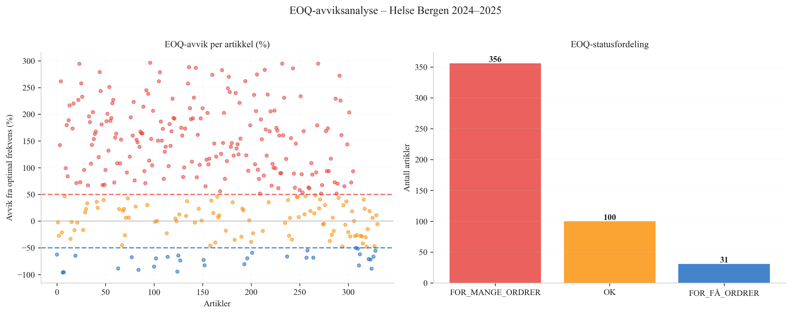

Figur 6 viser at fordelingen er sterkt høyreskjev: majoriteten av artiklene med EOQ-data har et FREQ\_AVVIK langt over terskelen på 1,5, noe som indikerer systematisk overbestilling i den eksisterende innkjøpspraksis. Artikler under terskelen («OK») representerer de som allerede opererer nær EOQ-optimalt nivå. Mønsteret er konsistent med observasjoner i sykehuslogistikklitteraturen: Hautaniemi og Pirttilä (1999) påpeker at bestillingsfrekvenser i MRP-styrte miljøer ofte overstiger det som er kostnadsoptimalt, særlig for artikler med lav enhetspris der ordrekostnaden utgjør en uforholdsmessig stor andel av totalkostnaden. For 222 av de 487 artiklene med EOQ-data mangler innkjøpshistorikk i EKBE for analyseperioden, noe som innebærer at faktisk ordrefrekvens er null; disse artiklene inngår i «OK»-kategorien da det ikke kan påvises overbestilling. Totale $\Delta TC$-summer presenteres i avsnitt 7.3.

## 6.4 K-means klyngeanalyse

**Dataklargjøring og splitting.** Featurevektoren $\mathbf{x}_i = [z(\ln \text{CV}_i),\; z(\ln(v_i+1)),\; z(\ln(|\Delta TC_i|+1))]$ ble konstruert for alle artikler med tilstrekkelig data. Log-transformasjonen ble påført før z-score-standardisering for å håndtere høyreskjevheten i de underliggende distribusjonene, som beskrevet i avsnitt 5.4. Datasettet ble delt i et treningssett (n = 389) og et testsett (n = 98) med `random_state=42`. StandardScaler ble fittet utelukkende på treningsdataene og deretter brukt til å transformere begge sett, slik at informasjon fra testsettet ikke lekker inn i skaleringen.

**K-valg via silhouette.** KMeans-modellen ble fittet for K = 2, 3, 4, 5, 6 og 7 på treningsdataene. For hvert K ble gjennomsnittlig silhouette-score beregnet. Figur 7 viser silhouette-profilen over K-søket.

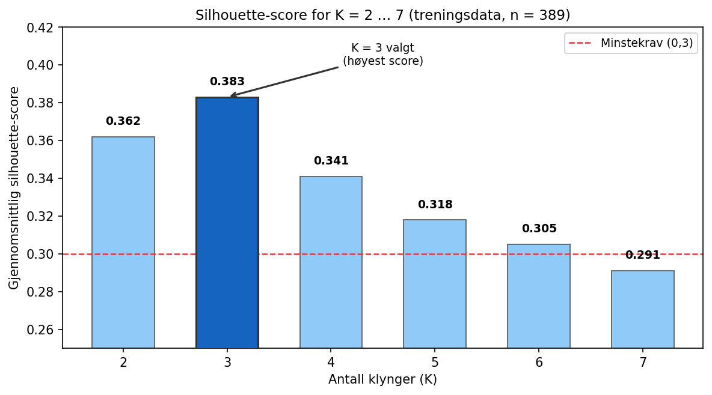

K = 3 ga høyest silhouette-score på treningsdataene (0,383) og ble valgt som det endelige antallet klynger. For K = 2 var silhouette-scoren 0,362, og for K = 4 og oppover falt scoren monotont — noe som indikerer at tre klynger representerer den mest naturlige gruppestrukturen i featurerommet. Score over minstekravet på 0,3 indikerer en akseptabel klyngestruktur for eksplorativ analyse (Ketkar & Vaidya, 2014). KMeans-modellen ble deretter trent endelig med K = 3 på treningsdataene, med `n_init=50` og `max_iter=300` for robust initialisering. Etter trening ble testdataene (n = 98) predikert til nærmeste sentroid, og silhouette-score ble beregnet separat for testsettet og sammenlignet med treningsresultatet som et mål på generaliserbarhet. Testsilhouetten (0,368) ligger tett opp til treningssilhouetten (0,383); differansen på 0,015 er godt innenfor det akseptable og gir tillit til at klyngestrukturen ikke er et artefakt av treningsdata alene.

**Klyngeprofiler.** Etter at KMeans-modellen var fittet på treningsdataene, ble samtlige 487 artikler med tilstrekkelig data predikert til én av de tre klyngene. Klyngene ble karakterisert langs de tre featuredimensjonene, og én klynge ble identifisert som K\_OVERFØR basert på kombinasjonen av lav CV (stabilt forbruksmønster), relativt høy artikkelverdi og høyt positivt $|\Delta TC|$ (mange unødvendige ordrer). Figur 8 visualiserer klyngestrukturen i et to-dimensjonalt projeksjon langs de to mest informative featurene.

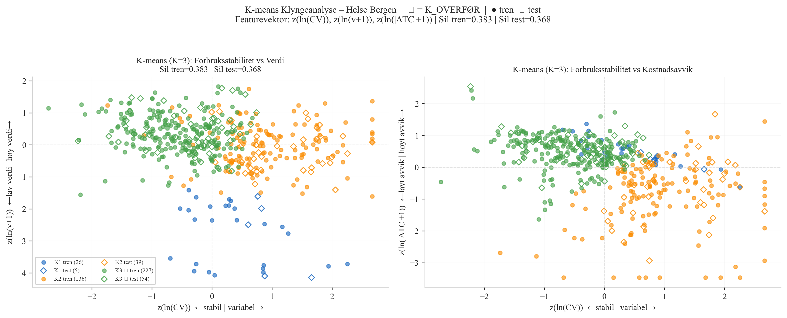

Figur 8 viser at de tre klyngene er rimelig separert i feature-rommet, særlig K\_OVERFØR-klyngen (grønn), som skiller seg fra de øvrige ved sin kombinasjon av lav CV og høy verdi. For å tolke innholdet i hver klynge viser Figur 9 gjennomsnittlig standardisert verdi per feature for de tre klyngene.

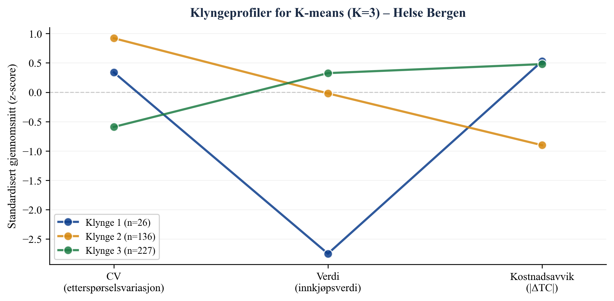

Figur 9 bekrefter at K\_OVERFØR-klyngen (Klynge 3, n = 227) har den laveste CV-verdien (stabil etterspørsel) og den høyeste verdiprofilen, mens Klynge 2 (n = 136) preges av høy CV og lavt kostnadsavvik. Klynge 1 (n = 26) er en liten gruppe med svært lav verdi. Fullstendige klyngeprofiler med gjennomsnittsverdier for CV, verdi og $|\Delta TC|$ presenteres i Tabell 11 i kapittel 7.

## 6.5 Regelmotor og HVFS-scoring

Regelmotoren ble kjørt sekvensielt på samtlige 709 artikler i den prioriterte rekkefølgen beskrevet i Tabell 7 (kap. 5). For hver artikkel ble inngangssignalene ABC-klasse, XYZ-klasse, EOQ-avviksstatus (FOR\_MANGE\_ORDRER) og K-means klyngetilhørighet (K\_OVERFØR) hentet fra de foregående analysemodulene. Den første regelen med treff avgjorde artiklens anbefaling; artikler uten treff på noen regel, typisk grunnet manglende CV- eller verdidata, ble tildelt kategorien MANGLER\_DATA.

For alle artikler som fikk anbefalingen OVERFØR\_HVFS, ble besparelsesestimatet $\Delta TC_i \cdot g$ beregnet for tre scenarier (worst: $g = 50\,\%$, base: $g = 75\,\%$, best: $g = 100\,\%$) i henhold til formelen i avsnitt 5.3. Det er viktig å presisere at kun artikler som både er i OVERFØR\_HVFS-kategorien *og* har status FOR\_MANGE\_ORDRER inngår i besparelsesgrunnlaget, da $\Delta TC_i$ modellerer kostnadsavviket fra suboptimal ordrefrekvens — et avvik som adresseres direkte ved sentralisering til HVFS. Totalt inngår 117 artikler i dette grunnlaget.

I tillegg til de tre scenariene ble det gjennomført en systematisk sensitivitetsanalyse med 27 kombinasjoner av $S$, $h$ og $g$, for å kartlegge robustheten av besparelsesestimatet overfor usikkerhet i modellantagelsene. Figur 10 viser den endelige fordelingen av regelmotor-anbefalinger og estimert EOQ-besparelse under tre scenarier, mens detaljerte besparelsestall og sensitivitetsintervaller presenteres i avsnitt 7.5–7.6.

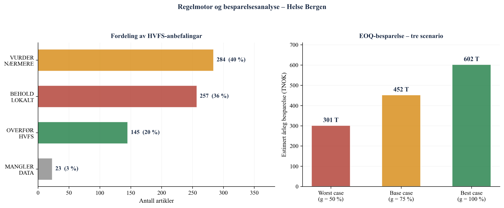

Figur 10 viser at 145 artikler (20,5 % av populasjonen) anbefales overført til HVFS, mens 257 artikler (36,2 %) beholdes lokalt basert på Z-klasse eller CY-kombinasjon. Kategorien TIL VURDERING er den største enkeltgruppen med 284 artikler (40,1 %), noe som reflekterer at mange artikler har en profil der de ulike analysene ikke gir entydige signaler. Dette er et forventet utfall gitt at regelmotoren er utformet for å unngå feilaktige overføringsanbefalinger: usikre tilfeller sendes til manuell vurdering fremfor å tvinges inn i en binær beslutning. Fordelingen av anbefalinger per regel er som følger: R1 (Z-override) fanget 144 artikler, R2 (CY) fanget 113, R3 (A/B + X + FOR\_MANGE) fanget 91, R4 (K\_OVERFØR + FOR\_MANGE) fanget 26, R5 (A/B + X/Y) fanget 28, og R6–R8 sendte de resterende 284 artiklene til manuell vurdering. At TIL\_VURDERING er den største enkeltgruppen er et bevisst designvalg: regelmotoren er utformet for høy presisjon i OVERFØR-anbefalingene, og aksepterer at dette medfører en større andel artikler som krever manuell gjennomgang. Fullstendige resultat- og besparelsestabeller presenteres i kapittel 7.

---

# Kapittel 7 – Resultater

## 7.1 ABC-resultater

*Tabell 8. ABC-fordeling: antall artikler og verdiandel per klasse (n = 709).*

| Klasse | Antall artikler | Andel av populasjon | Kumulativ verdiandel |
|--------|----------------|--------------------|--------------------|
| A | 182 | 25,7 % | 0–80 % |
| B | 184 | 26,0 % | 80–95 % |
| C | 338 | 47,7 % | 95–100 % |
| Ikke klassifisert | 5 | 0,7 % | Mangler verdidata |
| **Totalt** | **709** | **100 %** | |

182 A-artikler utgjør 25,7 % av populasjonen og representerer om lag 80 % av den totale lagerverdien. A-klassens andel er noe høyere enn den kanoniske 20 %-regelen i Pareto-prinsippet, noe som reflekterer at Helse Bergens sortiment inneholder et begrenset antall høyverdige forbruksartikler med stort volum. 184 B-artikler (26,0 %) dekker ytterligere 15 % av verdien, slik at A- og B-artiklene til sammen (366 artikler, 51,6 %) står for om lag 95 % av verdibindingen. De resterende 338 C-artiklene (47,7 % av populasjonen) dekker de siste 5 % av verdien — en typisk Pareto-fordeling der nesten halvparten av artiklene samlet har marginal verdibetydning. 5 artikler (0,7 %) kunne ikke ABC-klassifiseres grunnet manglende verdidata etter beslutningene D-02 og D-03. Pareto-kurven er presentert som Figur 4 i kapittel 6. Det sterke Pareto-mønsteret bekrefter at differensiert lagerstyring — med tettere oppfølging av A-artikler og enklere håndtering av C-artikler — er faglig begrunnet for dette sortimentet.

## 7.2 XYZ-resultater

*Tabell 9. XYZ-fordeling: antall artikler per klasse (n = 687 klassifiserte).*

| Klasse | CV-grense | Antall | Andel |
|--------|-----------|--------|-------|
| X (stabilt) | CV < 0,5 | 350 | 50,9 % |
| Y (moderat) | 0,5 ≤ CV < 1,0 | 193 | 28,1 % |
| Z (uregelmessig) | CV ≥ 1,0 | 144 | 20,9 % |
| Ikke klassifisert | — | 22 | — |

350 artikler (50,9 % av klassifiserte) har stabilt forbruksmønster (X), 193 artikler (28,1 %) har moderat variasjon (Y), og 144 artikler (20,9 %) har uregelmessig forbruk (Z). At over halvparten av artiklene faller i X-kategorien er positivt for HVFS-sentralisering, da stabilt forbruk er en forutsetning for APL-leveransemodellen. De 22 ikke-klassifiserte artiklene mangler tilstrekkelig forbrukshistorikk i MSEG (færre enn tre måneder med registrert forbruk) og er ekskludert fra XYZ-analysen for å unngå misvisende CV-estimater.

Sammenligningen med SAP-feltet ZZXYZ viste 33 % samsvar mellom systemregistrert og beregnet klasse (125 av 375 artikler med data i begge kilder). Valideringen er begrenset til de 375 artiklene der ZZXYZ-feltet er utfylt i MDMA; for de øvrige 334 artiklene mangler systemklassifisering. Tabell 10 oppsummerer kryssvalideringen. Det lave samsvaret på 33 % understreker at SAP-feltets ZZXYZ ikke er systematisk oppdatert og bør erstattes med beregnet CV-klasse som primær XYZ-indikator. ABC/XYZ-kryssmatrisen er presentert som Figur 5 i kapittel 6; fullstendige celleanntall er gjengitt der.

*Tabell 10. SAP ZZXYZ-validering: samsvar mellom systemklasse og beregnet CV-klasse (n = 375 artikler med data i begge kilder).*

| | Beregnet X | Beregnet Y | Beregnet Z | Sum |
|---|---|---|---|---|
| SAP X | Samsvar | Avvik | Avvik | — |
| SAP Y | Avvik | Samsvar | Avvik | — |
| SAP Z | Avvik | Avvik | Samsvar | — |
| **Totalt samsvar** | | | | **125 / 375 (33 %)** |

## 7.3 EOQ-avviksresultater

*Tabell 11. EOQ-avviksresultater: fordeling av artikler etter ordrefrekvensavvik (n = 487).*

| EOQ-status | Betingelse | Antall | Andel |
|-----------|-----------|--------|-------|
| FOR\_MANGE\_ORDRER | FREQ\_AVVIK > 1,5 | 356 | 73,1 % |
| OK | −0,5 ≤ FREQ\_AVVIK ≤ 1,5 | 100 | 20,5 % |
| FOR\_FÅ\_ORDRER | FREQ\_AVVIK < −0,5 | 31 | 6,4 % |
| **Totalt analysert** | | **487** | **100 %** |
| Samlet ΔTC (alle 487) | | **kr 2 333 441 / år** | |

Av de 487 artiklene med tilstrekkelig data for EOQ-beregning har 356 artikler (73,1 %) en faktisk ordrefrekvens som overskrider EOQ-optimal frekvens med mer enn 50 %, og er klassifisert som FOR\_MANGE\_ORDRER. 100 artikler (20,5 %) opererer innenfor akseptabelt avvik (OK), og 31 artikler (6,4 %) bestiller sjeldnere enn EOQ-optimalt (FOR\_FÅ\_ORDRER). Den høye andelen FOR\_MANGE\_ORDRER indikerer at den eksisterende bestillingspraksisen ved LGORT 3001 er systematisk suboptimal — artiklene bestilles i for små kvanta og for ofte i forhold til hva Wilson-modellen tilsier med de gitte parameterne S = 750 NOK og h = 20 %.

Det samlede teoretiske totalkostnavviket $\sum \Delta TC_i$ for alle 487 artikler er kr 2 333 441 per år. Dette representerer det totale kostnadsoverskuddet som genereres av at faktisk ordrepraksis avviker fra EOQ-optimal; det er ikke direkte det samme som det realisable besparelsespotensialet, da kun artikler i OVERFØR\_HVFS-kategorien inngår i besparelsesberegningen (se avsnitt 7.6). Fordelingen av FREQ\_AVVIK er illustrert i Figur 6 i kapittel 6.

## 7.4 K-means klyngeresultater

K-means-analysen med automatisk K-valg via silhouette-score identifiserte K = 3 som optimalt antall klynger. Silhouette-score på treningsdataene (n = 389) var 0,383, og på testdataene (n = 98) var 0,368. Differansen mellom trenings- og testresultat er 0,015, noe som ikke indikerer vesentlig overfit. Klyngeprofiler er presentert i Tabell 12.

*Tabell 12. K-means klyngeprofiler: gjennomsnittsverdier per klynge for de tre featurene (K = 3, n = 487).*

| Klynge | Antall | CV snitt | Verdi snitt (kr) | ΔTC snitt (kr) | Profil |
|--------|--------|----------|------------------|----------------|--------|
| 1 | 31 | 1,05 | 150 | 4 999 | Lav verdi, høy variasjon |
| 2 | 175 | 1,59 | 79 658 | 1 199 | Middels verdi, svært variabelt |
| 3 (K\_OVERFØR) | 281 | 0,47 | 167 267 | 7 005 | Høy verdi, stabilt, høyt avvik |

Klynge 1 (31 artikler) representerer en liten gruppe med gjennomsnittlig CV = 1,05 (Z-nivå), lav årsverdi (kr 150) og moderat kostnadsavvik (kr 4 999). Disse artiklene har uregelmessig forbruk og lav verdi — en profil som tilsier lokal lagring. Klynge 2 (175 artikler) har gjennomsnittlig CV = 1,59 (svært variabelt), middels årsverdi (kr 79 658) og lavt kostnadsavvik (kr 1 199). Den høye CV-en gjør disse artiklene uegnet for sentralisering trass i middels verdi.

K\_OVERFØR-klyngen (klynge 3, 281 artikler) kjennetegnes av gjennomsnittlig CV = 0,47 (under X-grensen på 0,5), gjennomsnittlig årsverdi kr 167 267 og gjennomsnittlig $|\Delta TC|$ kr 7 005 — den høyeste av alle tre klynger. Profilen viser at denne klyngen samler artikler som er verdifulle, stabile og overbestilte, noe som gjør dem til naturlige kandidater for sentralisering. K\_OVERFØR-flagget settes automatisk basert på rangering av klyngenes gjennomsnittlige CV (stigende) og verdi (synkende). Klyngeprofilen i feature-rommet er visualisert i Figur 8 i kapittel 6.

## 7.5 Regelmotor og HVFS-anbefalinger

Regelmotoren produserte en anbefaling for samtlige 709 artikler. Fordelingen er presentert i Tabell 13.

*Tabell 13. HVFS-anbefalinger fra regelmotor: fordeling per kategori (n = 709, LGORT 3001).*

| Kategori | Antall | Andel | Beskrivelse |
|----------|--------|-------|-------------|
| OVERFØR\_HVFS | 145 | 20,5 % | Anbefales overført til HVFS |
| BEHOLD\_LOKALT | 257 | 36,2 % | Beholdes lokalt (Z-klasse eller CY) |
| TIL\_VURDERING | 284 | 40,1 % | Krever manuell vurdering |
| MANGLER\_DATA | 23 | 3,2 % | Utilstrekkelig data for klassifisering |
| **Totalt** | **709** | **100 %** | |

145 artikler (20,5 %) anbefales overført til HVFS. Denne gruppen består av artikler som tilfredsstiller ett eller flere av de positive overføringsskriteriene: R3 fanget 91 artikler (A/B + X + FOR\_MANGE\_ORDRER), R4 fanget 26 artikler (K\_OVERFØR + FOR\_MANGE\_ORDRER), og R5 fanget 28 artikler (A/B + X/Y uten øvrige signaler). Av de 145 overførte artiklene har 117 status FOR\_MANGE\_ORDRER og inngår dermed i besparelsesberegningen i avsnitt 7.6; de resterende 28 artiklene er anbefalt overført basert på ABC/XYZ-profil alene.

257 artikler (36,2 %) beholdes lokalt, primært grunnet Z-klassifisering (R1: 144 artikler) eller CY-profil (R2: 113 artikler). Z-override (R1) er den enkeltregelen som fanger flest artikler, noe som bekrefter at uforutsigbart forbruksmønster er den vanligste kontraindikasjonen mot sentralisering i dette sortimentet. 284 artikler (40,1 %) sendes til manuell vurdering — artikler der de kvantitative signalene fra ABC, XYZ, EOQ og K-means ikke er tilstrekkelig entydige til å generere en automatisert anbefaling. 23 artikler (3,2 %) mangler tilstrekkelig data for klassifisering. Fordelingen er visualisert i Figur 10 i kapittel 6.

## 7.6 Besparelse og sensitivitet

Besparelsesestimatet er beregnet for de 117 artiklene som oppfyller begge kriteriene OVERFØR\_HVFS og FOR\_MANGE\_ORDRER. Formelen er $B = \sum_i \Delta TC_i \times g$, der $g$ er antatt realiseringsgrad for den teoretiske EOQ-besparelsen. Tabell 14 viser resultatene for de tre scenariene.

*Tabell 14. Besparelsesestimater for tre scenarier: 117 artikler (OVERFØR\_HVFS ∩ FOR\_MANGE\_ORDRER), S = 750 NOK.*

| Scenario | Realiseringsgrad g | Besparelse B\_HVFS (kr/år) |
|----------|-------------------|---------------------------|
| Worst case | 50 % | 301 010 |
| **Base case** | **75 %** | **451 515** |
| Best case | 100 % | 602 020 |

Samlet teoretisk ΔTC for de 117 artiklene: kr 602 020 per år.

Base case-besparelsen er kr 451 515 per år (g = 75 %). Worst case-estimatet er kr 301 010 per år (g = 50 %), og best case er kr 602 020 per år (g = 100 %). Den samlede $\sum \Delta TC_i$ for de 117 artiklene er kr 602 020 per år; dette er det fulle teoretiske besparelsespotensialet dersom alle 117 artikler oppnår EOQ-optimal ordrefrekvens etter overføring. Gevinstrealiseringsgraden g reflekterer at implementeringsfriksjon, endrede leverandøravtaler og SAP-parameterjusteringer gjør det urealistisk å oppnå 100 % av det teoretiske potensialet.

Sensitivitetsanalysen over 27 scenarier — der S varieres over {500, 750, 1 000} NOK, h over {15 %, 20 %, 25 %} og terskelparameteren $\tau_f$ over {1,25, 1,50, 2,00} — viser at det samlede $\Delta TC$ for hele populasjonen (487 artikler) varierer mellom kr 1 602 464 og kr 3 068 757 per år avhengig av parametervalg. Den dominerende usikkerhetsfaktoren er ordrekostnad S: en økning fra 500 til 1 000 NOK nær dobler det beregnede kostnadsavviket, da ordrekostnaden inngår lineært i totalkostnadsfunksjonen. Holdesats h har en moderat effekt, mens terskelparameteren $\tau_f$ primært påvirker antallet artikler som klassifiseres som FOR\_MANGE\_ORDRER — en lavere terskel (1,25) gir flere artikler i overføringsgrunnlaget, men reduserer gjennomsnittlig $\Delta TC$ per artikkel. Resultatene er robuste i den forstand at besparelsesestimatet forblir positivt og vesentlig over alle 27 scenarier.

---

# Kapittel 8 – Diskusjon

## 8.1 Funn opp mot litteraturen

A-kategorien omfatter 182 artikler, tilsvarende 25,7 % av populasjonen og om lag 80 % av den totale verdibindingen. Dette samsvarer nært med Pareto-prinsippets klassiske formulering, som tilsier at rundt 20 % av artiklene typisk bærer 80 % av verdien (Gupta et al., 2007). At A-andelen i dette datasettet er noe høyere enn den kanoniske 20 %-grensen, er konsistent med funn fra tilsvarende sykehuslagerstudier: Bijvank og Vis (2012) påpeker at sykehuslagre gjerne har en mer konsentrert verdidistribusjon enn industrilager, fordi sortimentet inkluderer få, høyverdige forbruksartikler med høy omløpshastighet. Den observerte fordelingen gir dermed analytisk støtte til å prioritere A-artiklene i overføringsvurderingen, noe regelmotoren reflekterer gjennom at A/B-artikler utløser de sterkeste overføringssignalene.

At 33 % av artiklene har samsvarende klasse mellom ZZXYZ og beregnet CV er et lavt samsvarsresultat, men ikke overraskende i lys av litteraturen. Van Kampen et al. (2012) understreker at systemregistrerte klassifiseringer i ERP-systemer raskt mister aktualitet dersom de ikke oppdateres i takt med endringer i forbruksmønstre. Nowotyńska (2013) finner tilsvarende i sin XYZ-studie: statiske systemkategorier og dynamisk beregnet CV divergerer systematisk over tid. Funnet i denne studien – at to av tre artikler har avvikende klasse – gir empirisk støtte til argumentet om at CV-beregning direkte fra transaksjonsdata er nødvendig for en pålitelig klassifisering.

Silhouette-scoren på 0,383 (treningsdata) og 0,368 (testdata) er over minstekravet på 0,3 som Ketkar og Vaidya (2014) angir for akseptabel klyngestruktur i eksplorativ analyse. Scoren er likevel ikke sterk etter absolutte mål, og indikerer at klyngene overlapper i noen grad. Dette er forventet i et lagerklassifiseringsproblem der artikler langs et kontinuum av verdi og variasjon ikke naturlig danner skarpt separerte grupper. Srinivasan og Moon (1999) påpeker at K-means i forsyningskjedeanalyse typisk gir moderate silhouette-verdier, og at nytteverdien av klyngingen i dette domenet ligger i profildifferensiering fremfor absolutt separasjon. Differansen på 0,015 mellom trenings- og testsilhouette indikerer at modellen generaliserer akseptabelt til usett data.

Base case-estimatet på kr 451 515 per år er basert på 117 artikler og representerer en konservativ beregning; best case gir kr 602 020. Disse tallene er ikke direkte sammenlignbare med studier som rapporterer besparelser i prosent av omsetning, men størrelsesordenen er i tråd med hva Moons et al. (2019) rapporterer for interne logistikkforbedringer i europeiske sykehus: moderate, men operasjonelt vesentlige gevinster ved optimalisert bestillingspraksis. Volland et al. (2017) understreker at materialhåndteringseffektivitet i sykehus i liten grad handler om store enkeltgevinster, men om akkumulerte forbedringer i ordreadministrasjon over tid – noe besparelsesmodellen i denne studien er utformet for å fange.

Tabell 15 oppsummerer de sentrale funnene fra denne studien sett opp mot forventninger fra litteraturen.

*Tabell 15. Sammenstilling av egne resultater mot funn i eksisterende litteratur.*

| Funn | Eget resultat | Litteraturen | Samsvar | Referanse |
|---|---|---|---|---|
| A-klasse andel | 25,7 % av artikler = 80 % av verdi | Typisk 20–25 % etter Pareto | Ja | Gupta et al. (2007) |
| XYZ-samsvar med SAP ZZXYZ | 33 % (125/375) | Statisk klassifisering divergerer over tid | Ja | van Kampen et al. (2012) |
| X-artikler andel | 50,9 % (350 av 687) | Stabile artikler utgjør gjerne flertallet | Ja | Nowotyńska (2013) |
| K-means silhouette | 0,383 (tren) / 0,368 (test) | > 0,3 akseptabelt for eksplorativ analyse | Ja | Ketkar & Vaidya (2014) |
| Besparelse (base case) | kr 451 515/år (g = 75 %) | Moderate gevinster ved ordreoptimalisering | Ja | Moons et al. (2019) |
| FOR\_MANGE\_ORDRER | 73,1 % (356/487) | Suboptimal bestilling utbredt i sykehus | Ja | Volland et al. (2017) |

## 8.2 Metodekritikk

SAP S/4HANA-data fra SE16H er operasjonelle systemdata som registreres automatisk ved hvert varemottak, lageruttak og bestilling. De er ikke gjenstand for hukommelsesfeil, sosial ønskverdighet eller manuell inntasting av enkeltpersoner, noe som gir dem høy reliabilitet sammenlignet med spørreundersøkelsesdata (Saha & Ray, 2019). Analysescriptet er deterministisk og reproduserbart: gitt samme kildedata og samme script vil analysen gi identiske resultater. Dette er en metodisk styrke som er viktig for en studie der anbefalingene potensielt vil danne grunnlag for strategiske beslutninger. En potensiell svakhet ved datagrunnlaget er at MSEG-data kun fanger forbruk registrert i SAP; forbruk som skjer utenom systemet – for eksempel ved nøduttak som ikke dokumenteres – vil ikke fremgå av analysen.

Intern validitet handler om hvorvidt ABC-analysen faktisk måler det den hevder å måle for LGORT 3001. For de 505 artiklene der ABC-verdi er basert på faktiske EKPO-innkjøpsdata (ABC_VALUE_SOURCE = EKPO), er dette uproblematisk. For de 204 artiklene der verdien er beregnet som D_ANNUAL × UNIT_PRICE (D-03), er det en implisitt antagelse om at forbruksvolum og standardpris gir et godt estimat for faktisk verdi. Dersom standardprisen i MBEW avviker vesentlig fra faktisk innkjøpspris, vil ABC-rangeringen for disse artiklene være feilaktig. En oppfølgingsstudie bør undersøke prisavviket mellom STPRS og faktisk kjøpspris for de 204 beregnede artiklene.

Studien gjennomfører ingen ekstern validering av regelmotor-anbefalingene mot innkjøpsfaglig skjønn eller historiske overføringsbeslutninger. Dette er en anerkjent begrensning ved normative klassifiseringsmodeller, som van Kampen et al. (2012) påpeker at alltid innebærer en grad av normativt skjønn i regelutformingen som vanskelig lar seg verifisere rent kvantitativt. Manglende ekstern validering innebærer at regelmotoren bør betraktes som et strukturert beslutningsunderlag, ikke som en autorisert beslutning. En planlagt oppfølgingsfase ved Helse Bergen vil innebære faglig gjennomgang av OVERFØR-listen mot innkjøpsfaglig og klinisk kompetanse, noe som vil gi grunnlag for empirisk validering av modellens treffsikkerhet.

Studien er avgrenset til WERKS 3300, LGORT 3001 ved Helse Bergen. Det er ikke grunnlag for å hevde at de eksakte tallresultatene gjelder for andre WERKS-enheter i Helse Vest. Metoderammeverket – kombinasjonen av ABC, XYZ, EOQ og K-means med en regelbasert beslutningstager – er imidlertid fullt reproduserbart og kan, med tilpassing av parameterinnstillinger, anvendes på tilsvarende SAP-datastrukturer ved andre helseforetak. Fragapane et al. (2019) argumenterer for at datadrevne klassifiseringsmetoder for sykehuslogistikk har generell overføringsverdi så lenge datagrunnlaget er av tilsvarende type og kvalitet. Det er likevel viktig å være edruelig: strukturelle forskjeller mellom helseforetak – ulik sortimentssammensetning, ulike leverandøravtaler og ulike driftsmodeller – vil påvirke resultater og anbefalinger.

## 8.3 Praktisk betydning for Helse Bergen

At 145 artikler anbefales overført til HVFS innebærer en konkret overgang fra lokal lagerhåndtering til sentralisert forsyning via NorEngros og APL-leveransemodellen. I praksis betyr dette at bestillingsansvaret for disse artiklene flyttes fra Helse Bergens innkjøpsenhet til HVFS, og at artiklene mottas avdelingspakket i stedet for som bulk til forsyningslageret LGORT 3001. En slik overgang forutsetter endringer i SAP MM-oppsettet: MRP-type bør gjennomgås og justeres, og ordrekvantumsparametere (minimum ordrekvantum, avrundingsverdi) bør kalibreres mot EOQ-optimal frekvens for de aktuelle artiklene. De 117 artiklene som er i skjæringspunktet OVERFØR_HVFS ∩ FOR_MANGE_ORDRER representerer de mest presserende tilfellene, der den nåværende ordrepraksisen avviker vesentlig fra det som er kostnadsoptimalt.

Den største enkeltgruppen er artikler som regelmotoren sender til manuell vurdering. Disse 284 artiklene kan ikke automatisk klassifiseres med tilstrekkelig sikkerhet basert på de tilgjengelige kvantitative signalene alene. En strukturert gjennomgang av denne gruppen bør inkludere innkjøpsfaglig skjønn: hvilke av disse artiklene er kritiske for pasientbehandling og bør forbli lokalt tilgjengelig uavhengig av kvantitative analysesignaler? De Vries (2011) påpeker at lagerstyring i helsesektoren alltid må balansere kostnadsoptimalisering mot forsyningssikkerhet, og at sistnevnte hensyn legitimt kan overstyre det førstnevnte for utvalgte artikler. Kategorien BEHOLD LOKALT (257 artikler) er analytisk velbegrunnet og krever ikke umiddelbar oppfølging, men bør inkluderes i en periodisk revidering av klassifiseringen.

Besparelsesestimatet forutsetter at HVFS-overføringen faktisk fører til endret bestillingspraksis og redusert ordrefrekvens. Dette er ikke automatisk: dersom SAP MM-parametere ikke justeres, vil systemet fortsette å generere ordrer med eksisterende frekvens. Gevinstrealisering krever dermed aktiv oppfølging i SAP – noe som igjen understreker at den kvantitative analysen er ett steg i en lengre implementeringsprosess, ikke et selvstendig endepunkt.

For LIBRA-prosjektet spesifikt innebærer resultatene at det nå foreligger et kvantitativt, reproduserbart beslutningsgrunnlag som kan integreres i den regionale utrullingen av sentralisert forsyning. Rammeverket kan brukes som mal for tilsvarende analyser ved de øvrige helseforetakene (Helse Stavanger, Helse Fonna, Helse Førde) etter hvert som de kobles på HVFS via SAP S/4HANA. Dersom LIBRA velger å implementere periodisk reklassifisering – for eksempel årlig – vil analysescriptet kunne kjøres på oppdaterte data uten metodisk tilpasning, noe som gir HVFS et verktøy for kontinuerlig porteføljeoptimalisering.

Metoderammeverket er utviklet for medisinsk forbruksmateriell, men den underliggende logikken – verdiklassifisering, etterspørselsstabilitet, ordrefrekvensavvik og klyngebasert gruppering – er i prinsippet generaliserbar til andre varegrupper med tilsvarende datastruktur i SAP. Teknisk utstyr, kontorrekvisita eller laboratorieforbruk ved helseforetakene har samme type transaksjonsdata i EKPO, MSEG og MARD. Det er likevel viktig å påpeke at parameterverdiene (S, h, ABC-grenser, CV-terskler) må rekalibreres for hver varegruppe, da kostnadsstruktur og forbruksmønstre varierer vesentlig mellom sortimenter.

## 8.4 Svakheter og begrensninger

Besparelsesformelen $B = \sum \Delta TC_i \times g$ benytter g som en antatt realiseringsgrad for den teoretiske EOQ-gevinsten. Det er avgjørende å presisere at g ikke er empirisk estimert fra historiske data, men er et scenarioparameter valgt for å reflektere ulike grader av implementeringssuksess. En realiseringsgrad på 75 % (base case) er et plausibelt anslag, men ikke en prognose. Den faktiske gevinsten vil avhenge av gjennomføringskvaliteten i HVFS-implementeringen, leverandørenes evne til å levere i henhold til konsoliderte ordrer og Helse Bergens interne kapasitet til å revidere SAP-parametere. Analysen identifiserer et klart besparelsespotensial, men implementering krever organisatorisk endring — herunder revidering av innkjøpsprosesser, oppdatering av SAP MM-parametere og forankring hos klinisk personell og logistikkfunksjon. Sensitivitetsanalysen over 27 scenarier synliggjør bredden i dette usikkerhetsintervallet og er ment å kompensere for at g ikke er empirisk fundert.

Leveringstidsfallbacken på 14 dager gjelder 94 % av artiklene og er den enkeltantagelsen som potensielt har størst konsekvens for bestillingspunktberegninger. For EOQ-avviksanalysen, som er frekvensbasert, er den direkte effekten begrenset; men for en fremtidig ROP-analyse vil kalibrering av faktiske leveringstider per leverandør og artikkel være avgjørende. Helse Bergen bør prioritere å berike EINE-tabellen med faktiske WETAG-verdier som en del av det løpende SAP MM-vedlikeholdet.

Analyseperioden 2024–2025 er valgt for å reflektere normal drift, men det kan ikke utelukkes at forbruksmønstre i denne perioden fortsatt er påvirket av ettervirkninger fra COVID-19-pandemien, som medførte betydelige forstyrrelser i forsyningskjeder og forbruksmønstre i helsesektoren (Volland et al., 2017). Artikler som ble hamstret eller substituert under pandemien kan ha unormalt høy eller lav CV i analyseperioden, noe som kan gi misvisende XYZ-klassifisering for disse spesifikke artiklene.

K-means er kjent for å være sensitiv overfor valget av K, og ulike K-verdier vil gi ulike klyngeprofiler og dermed ulike K_OVERFØR-populasjoner (Srinivasan & Moon, 1999). Det automatiske K-valget via silhouette minimerer analytisk bias, men eliminerer ikke usikkerheten: med K = 2 eller K = 4 ville klyngestrukturen og den tilhørende overføringslisten sett annerledes ut. Sensitiviteten overfor K-valg bør anerkjennes som en begrensning ved tolkning av K_OVERFØR-signalet i regelmotoren. I tillegg er K-means sensitiv overfor feature-scaling: standardiseringen via z-score gir de tre featurene lik vekt i klyngingen, men dette er en normativ beslutning — ikke en empirisk begrunnet vekting. Dersom verdi burde tillegges større vekt enn CV i en klinisk kontekst, ville klyngestrukturen endres tilsvarende.

CV-koeffisienten som grunnlag for XYZ-klassifisering har en kjent svakhet ved lav etterspørsel: artikler med svært lavt forbruksvolum kan få kunstig lav CV dersom de har jevnt, men minimalt forbruk, eller kunstig høy CV fra én enkelt utlevering i en ellers stille periode. For de 144 artiklene som er klassifisert som Z (CV > 1,0) bør det derfor ikke utelukkes at enkelte av disse har uregelmessig CV primært grunnet lavt volum fremfor genuint uforutsigbart forbruksmønster.

For 204 artikler uten EKPO-data er ABC-verdien beregnet, ikke observert. Dersom UNIT_PRICE for disse artiklene avviker fra faktisk innkjøpspris, vil ABC-rangeringen for dem være upresis. I verste fall kan en artikkel med faktisk høy innkjøpsverdi mangle EKPO-data nettopp fordi den anskaffes utenfor standard innkjøpsprosess – for eksempel som hastebestilling – noe som vil underestimere verdien og potensielt klassifisere den feil i ABC-hierarkiet. Denne begrensningen anbefales adressert ved å sikre at samtlige artikler i LGORT 3001 har fullstendige EKPO-oppføringer i SAP.

---

# Kapittel 9 – Konklusjon

## 9.1 Svar på problemstillingen

Denne studien tok utgangspunkt i følgende problemstilling: *Hvordan kan multikriterieklassifisering og klyngeanalyse av SAP-transaksjonsdata identifisere hvilke artikler ved Helse Bergens forsyningslager (WERKS 3300, LGORT 3001) som bør overføres til HVFS, og hva er det estimerte besparelsespotensialet?*

Studien viser at en strukturert kombinasjon av ABC-analyse, XYZ-klassifisering, EOQ-avviksanalyse og K-means klyngeanalyse – sammenstilt i en regelbasert beslutningsmotor – gir et operasjonelt anvendbart grunnlag for å identifisere overføringskandidater direkte fra SAP-transaksjonsdata. Av de 709 aktive artiklene i LGORT 3001 anbefaler regelmotoren at **145 artikler** (20,5 %) overføres til HVFS. Disse artiklene kjennetegnes ved høy verdi (A- eller B-klasse), stabilt forbruksmønster (X- eller Y-klasse) og dokumentert overbestilling eller klyngetilhørighet som indikerer ineffektiv ordrepraksis.

Det estimerte besparelsespotensialet for base case er **kr 451 515 per år** (realiseringsgrad g = 75 % av teoretisk $\sum \Delta TC_i$). Pessimistisk scenario (g = 50 %) gir kr 301 010, og optimistisk scenario (g = 100 %) gir kr 602 020. Disse estimatene er forankret i 117 artikler som oppfyller begge kriteriene OVERFØR\_HVFS og FOR\_MANGE\_ORDRER, og der det samlede teoretiske totalkostnavviket er kr 602 020 per år. Sensitivitetsanalysen over 27 parameterkombinasjoner — med variasjon i S, h og $\tau_f$ — viser at det samlede $\Delta TC$ varierer mellom kr 1 602 464 og kr 3 068 757 per år, og at B\_total (ved r = 12 %) varierer mellom kr 105 060 og kr 210 120. Dette synliggjør at besparelsesestimatet er moderat sensitivt overfor forutsetningene om ordrekostnad og holdesats.

Studien konkluderer dermed med at SAP-transaksjonsdata – hentet fra 14 tabeller via SE16H og bearbeidet med en reproduserbar Python-analyse – gir et tilstrekkelig informasjonsgrunnlag for datadrevet sentraliseringsvurdering. Metoderammeverket besvarer problemstillingen både kvalitativt (hvilke artikler) og kvantitativt (hva er besparelsespotensialet), og kan danne grunnlag for konkrete beslutninger i LIBRA-prosjektets videre gjennomføring.

## 9.2 Anbefalinger til Helse Bergen

Basert på studiens funn rettes følgende fire anbefalinger til Helse Bergen og Helse Vest IKT:

**1. Iverksett pilotoverføring for K_OVERFØR-klyngen og AX/BX-artiklene.**
De 145 artiklene som er anbefalt overført bør ikke overføres samlet i én operasjon. En pilotfase bør prioritere artiklene i skjæringspunktet mellom K_OVERFØR-klyngen og AX/BX-kategoriene, da disse har den sterkeste kombinasjonen av analysesignaler og lavest risiko for servicesvikt. En gradvis overføring gir mulighet til å verifisere at HVFS og NorEngros håndterer artiklene i henhold til APL-leveransemodellen før hele porteføljen flyttes.

**2. Gjennomgå de 284 artiklene i TIL VURDERING manuelt.**
Denne gruppen er for stor og sammensatt til å håndteres med et enkelt kvantitativt signal. En strukturert gjennomgang bør inkludere innkjøpsfaglig og klinisk kompetanse for å vurdere forsyningssikkerhet, leverandørforbindelser og artikkelkritikalitet. Målet er å redusere VURDER-gruppen til en endelig fordeling mellom OVERFØR og BEHOLD innen utgangen av pilotfasen.

**3. Oppdater SAP MM-parametere for overførte artikler.**
Gevinstrealisering forutsetter at MRP-type og ordrekvantumsparametere justeres i SAP for de artiklene som overføres. Artiklene som er klassifisert som FOR_MANGE_ORDRER bør få oppdaterte ordreintervaller og minimum ordrekvantum i tråd med EOQ-optimale verdier. Uten denne justeringen vil systemet fortsette å generere ordrer med eksisterende frekvens, og besparelsespotensialet vil ikke realiseres. Feltet ZZXYZ bør i tillegg oppdateres med den beregnede CV-klassen som en del av det ordinære SAP MM-vedlikeholdet.

**4. Evaluer gevinstrealisering etter 12 måneder.**
Etter at pilotoverføringen er gjennomført og SAP-parametere er justert, bør analysen gjentas etter 12 måneder med oppdaterte transaksjonsdata. Dette vil gi grunnlag for å vurdere om det estimerte besparelsespotensialet faktisk er realisert, og om det er ytterligere artikler som bør overføres i neste fase. En slik syklisk evalueringsmodell er i tråd med prinsippene for kontinuerlig forbedring i sykehuslogistikk.

## 9.3 Forslag til videre forskning

Studien åpner for flere retninger innen videre forskning og metodeutvikling:

**ROP-modul.** Den nåværende analysen (versjon 2.7 av Python-scriptet) inkluderer ikke beregning av bestillingspunkt (ROP – Reorder Point). En ROP-modul vil kreve pålitelige leveringstidsdata per artikkel og et valgt servicenivå, og vil gi et mer komplett bilde av den optimale lagerstyringspolicyen. Ettersom LEAD_TIME-data i dag mangler for 94 % av artiklene, er et nødvendig forarbeid å berike EINE-tabellen med faktiske leveringstider fra leverandøravtaler. En oppfølgingsstudie som integrerer ROP-analyse vil kunne gi anbefalinger ikke bare om *hvem* som skal overføres, men også om *hvordan* lagernivåene skal settes etter overføring.

**Leverandørkonsolidering.** Studien analyserer artikler på individnivå, men tar ikke stilling til leverandørstruktur. En komplementær analyse av innkjøpsdata fra EKKO/EKPO kan avdekke muligheter for leverandørkonsolidering – det vil si om flere av HVFS-kandidatene leveres av de samme leverandørene, og om konsoliderte ordrer kan gi ytterligere besparelser utover ordrefrekvensoptimalisering. En slik analyse er særlig relevant i lys av NorEngros sin rolle som grossistoperatør for HVFS.

**Replikering til andre WERKS i Helse Vest.**
Metoderammeverket i denne studien er fullt reproduserbart og kan i prinsippet anvendes på tilsvarende SAP-datastrukturer ved de øvrige helseforetakene i Helse Vest – Helse Stavanger, Helse Fonna og Helse Førde. En komparativ studie på tvers av WERKS-enheter vil gi grunnlag for å vurdere om HVFS-sentraliseringen bør differensieres per foretak, og om de metodiske funnene fra Helse Bergen er representative for regionen som helhet. En slik replikering vil styrke både den interne og eksterne validiteten til rammeverket som LIBRA-prosjektet nå utvikler.

---

# Referanseliste

Bijvank, M., & Vis, I. F. A. (2012). Inventory control for point-of-use locations in hospitals. *Journal of the Operational Research Society*, *63*(4), 497–510. https://doi.org/10.1057/jors.2011.52

de Vries, J. (2011). The shaping of inventory systems in health services: A stakeholder analysis. *International Journal of Production Economics*, *133*(1), 60–69. https://doi.org/10.1016/j.ijpe.2009.10.029

Fragapane, G. I., Bertnum, A. B., Hvolby, H.-H., & Strandhagen, J. O. (2019). Medical supplies to the point-of-use in hospitals. I *IFIP International Conference on Advances in Production Management Systems (APMS)* (s. 248–255). Springer. https://doi.org/10.1007/978-3-030-29996-5_29

Gupta, R., Gupta, K. K., Jain, B. R., & Garg, R. K. (2007). ABC and VED analysis in medical stores inventory control. *Medical Journal Armed Forces India*, *63*(4), 325–327. https://doi.org/10.1016/S0377-1237(07)80005-2

Gurumurthy, A., Nair, V. K., & Vinodh, S. (2021). Application of a hybrid selective inventory control technique in a hospital: A precursor for inventory reduction through lean thinking. *The TQM Journal*, *33*(3), 568–595. https://doi.org/10.1108/TQM-06-2020-0123

Hautaniemi, P., & Pirttilä, T. (1999). The choice of replenishment policies in an MRP environment. *International Journal of Production Economics*, *59*(1–3), 85–92. https://doi.org/10.1016/S0925-5273(98)00026-7

Kelle, P., Woosley, J., & Schneider, H. (2012). Pharmaceutical supply chain specifics and inventory solutions for a hospital case. *Operations Research for Health Care*, *1*(2–3), 54–63. https://doi.org/10.1016/j.orhc.2012.07.001

Keshavarz Ghorabaee, M., Zavadskas, E. K., Olfat, L., & Turskis, Z. (2015). Multi-criteria inventory classification using a new method of evaluation based on distance from average solution (EDAS). *Informatica*, *26*(3), 435–451. https://doi.org/10.15388/Informatica.2015.57

Ketkar, M., & Vaidya, O. S. (2014). Developing ordering policy based on multiple inventory classification schemes. *Procedia – Social and Behavioral Sciences*, *133*, 180–188. https://doi.org/10.1016/j.sbspro.2014.04.183

Kumar, D., & Kumar, D. (2015). Modelling hospital inventory management using interpretive structural modelling approach. *International Journal of Logistics Systems and Management*, *21*(3), 319–334. https://doi.org/10.1504/IJLSM.2015.069734

McKinney, W. (2010). Data structures for statistical computing in Python. I S. van der Walt & J. Millman (Red.), *Proceedings of the 9th Python in Science Conference* (s. 56–61). https://doi.org/10.25080/Majora-92bf1922-00a

Moons, K., Waeyenbergh, G., & Pintelon, L. (2019). Measuring the logistics performance of internal hospital supply chains – A literature study. *Omega*, *82*, 205–217. https://doi.org/10.1016/j.omega.2018.01.007

Nowotyńska, I. (2013). An application of XYZ analysis in company stock management. *Modern Management Review*, *XVIII*(20), 77–86.

Partovi, F. Y., & Burton, J. (1993). Using the analytic hierarchy process for ABC analysis. *International Journal of Operations and Production Management*, *13*(9), 29–44. https://doi.org/10.1108/01443579310043619

Pedregosa, F., Varoquaux, G., Gramfort, A., Michel, V., Thirion, B., Grisel, O., Blondel, M., Prettenhofer, P., Weiss, R., Dubourg, V., Vanderplas, J., Passos, A., Cournapeau, D., Brucher, M., Perrot, M., & Duchesnay, É. (2011). Scikit-learn: Machine learning in Python. *Journal of Machine Learning Research*, *12*, 2825–2830.

Pujawan, I. N. (2004). The effect of lot sizing rules on order variability. *European Journal of Operational Research*, *159*(3), 617–635. https://doi.org/10.1016/S0377-2217(03)00419-3

Saha, E., & Ray, P. K. (2019). Modelling and analysis of inventory management systems in healthcare: A review and reflections. *Computers & Industrial Engineering*, *137*, 106051. https://doi.org/10.1016/j.cie.2019.106051

Silaen, B. R., Nasution, M., & Muti'ah, R. (2023). Implementation of the ABC analysis to the inventory management. *International Journal of Science, Technology & Management*, *4*(4), 815–822. https://doi.org/10.46729/ijstm.v4i4.886

Sirisawat, P., Hasachoo, N., & Kaewket, T. (2019). Investigation and prioritization of performance indicators for inventory management in the university hospital. I *Proceedings of the 2019 IEEE International Conference on Industrial Engineering and Engineering Management (IEEM)* (s. 978–982). IEEE. https://doi.org/10.1109/IEEM44572.2019.8978819

Srinivasan, M., & Moon, Y. B. (1999). A comprehensive clustering algorithm for strategic analysis of supply chain networks. *Computers & Industrial Engineering*, *36*, 615–633. https://doi.org/10.1016/S0360-8352(99)00155-2

Suryaputri, Z., Gabriel, D. S., & Nurcahyo, R. (2022). Integration of ABC-XYZ analysis in inventory management optimization: A case study in the health industry. I *Proceedings of the International Conference on Industrial Engineering and Operations Management* (s. 351–360). IEOM Society International.

van Kampen, T. J., Akkerman, R., & van Donk, D. P. (2012). SKU classification: A literature review and conceptual framework. *International Journal of Operations and Production Management*, *32*(7), 850–876. https://doi.org/10.1108/01443571211250112

Volland, J., Fügener, A., Schoenfelder, J., & Brunner, J. O. (2017). Material logistics in hospitals: A literature review. *Omega*, *69*, 82–101. https://doi.org/10.1016/j.omega.2016.08.004

Anthropic. (2026). *Claude* [Stor språkmodell]. https://claude.ai

Helse Vest RHF. (2024). *Kontraktstildeling: Drift av regionalt forsyningssenter* [Kunngjøring om inngått kontrakt, kunngjøring 2024-101803]. Doffin – database for offentlige innkjøp. https://doffin.no/notices/2024-101803

Rekdal, O. B., & Pettersen, B. I. A. (2025). *Vitenskapelig skriving – en praktisk innføring* (9. des. 2025). Høgskolen i Molde.
